# Proteggi la tua privacy su Bitcoin

In un mondo in cui la privacy delle transazioni finanziarie sta gradualmente diventando un lusso, comprendere e padroneggiare i principi della protezione della privacy nel tuo utilizzo di Bitcoin è essenziale. Questa formazione ti fornisce tutte le chiavi, sia teoriche che pratiche, per raggiungere questo obiettivo autonomamente.

Oggi, su Bitcoin, esistono aziende specializzate nell'analisi della catena. Il loro core business è precisamente quello di intrufolarsi nella tua sfera privata, al fine di compromettere la riservatezza delle tue transazioni. Infatti, il "diritto alla privacy" su Bitcoin non esiste. Spetta quindi a te, utente, affermare i tuoi diritti naturali e proteggere la riservatezza delle tue transazioni, perché nessun altro lo farà per te.

Questa formazione si presenta come un percorso completo e generalista. Ogni nozione tecnica è dettagliata e supportata da diagrammi esplicativi. L'obiettivo è rendere la conoscenza accessibile a tutti. BTC204 è quindi accessibile per utenti principianti e intermedi. Questa formazione offre anche un valore aggiunto ai bitcoiner più esperti, poiché approfondiamo alcuni concetti tecnici spesso sconosciuti.

Unisciti a noi per trasformare il tuo utilizzo di Bitcoin e diventare un utente informato, capace di comprendere le questioni che circondano la riservatezza e proteggere la tua privacy.

+++

# Introduzione

<partId>e17474a8-8899-4bdb-a7f8-bc52ddb01440</partId>

## Introduzione alla Formazione

<chapterId>08ba1933-f393-4fb5-8279-777d874caedb</chapterId>

In un mondo in cui la privacy delle transazioni finanziarie sta gradualmente diventando un lusso, comprendere e padroneggiare i principi della protezione della privacy nel tuo utilizzo di Bitcoin è essenziale. Questa formazione ti fornisce tutte le chiavi, sia teoriche che pratiche, per raggiungere questo obiettivo autonomamente.
Oggi, nell'ecosistema Bitcoin, esistono aziende specializzate nell'analisi della catena. Il loro core business è precisamente quello di intrufolarsi nella tua sfera privata, compromettendo la riservatezza delle tue transazioni. In realtà, il "diritto alla privacy" su Bitcoin non esiste. Spetta quindi a te, utente, affermare i tuoi diritti naturali e proteggere la riservatezza delle tue transazioni, perché nessun altro lo farà per te.

Bitcoin non è solo lì per il "Number Go Up" e la conservazione del valore dei risparmi. Grazie alle sue caratteristiche uniche e alla sua storia, è principalmente lo strumento dell'economia alternativa. Grazie a questa notevole invenzione, puoi gestire liberamente i tuoi soldi, spenderli e accumularli, senza che nessuno possa impedirtelo.

Bitcoin offre una via di fuga pacifica dal giogo degli stati, permettendoti di godere appieno dei tuoi diritti naturali, che non possono essere contestati dalle leggi stabilite. Grazie all'invenzione di Satoshi Nakamoto, hai il potere di far rispettare il tuo diritto alla proprietà privata e riconquistare la libertà di contrattare.

Tuttavia, Bitcoin non è anonimo per impostazione predefinita, il che può rappresentare un rischio per gli individui impegnati nell'economia alternativa, specialmente nelle regioni sotto regimi dispotici. Ma questo non è l'unico pericolo. Dato che bitcoin è un bene prezioso e non censurabile, potrebbe attirare l'attenzione dei ladri. Pertanto, proteggere la tua privacy diventa anche una questione di sicurezza: può aiutarti a prevenire attacchi informatici e aggressioni fisiche.
Come vedremo, sebbene il protocollo offra certe protezioni intrinseche della privacy, è cruciale utilizzare strumenti aggiuntivi per ottimizzare e difendere questa privacy. Questo corso è progettato come un percorso completo e generalista per comprendere le questioni della privacy su Bitcoin. Ogni nozione tecnica è discussa in dettaglio e supportata da diagrammi esplicativi. L'obiettivo è rendere la conoscenza accessibile a tutti, anche agli utenti principianti e intermedi. Per i bitcoiner più esperti, copriamo anche concetti molto tecnici e talvolta meno noti durante questo corso per approfondire la comprensione di ogni argomento.

L'obiettivo di questo corso non è rendervi completamente anonimi nell'uso di Bitcoin, ma piuttosto fornirvi gli strumenti essenziali per sapere come proteggere la vostra privacy secondo i vostri obiettivi personali. Avrete la libertà di scegliere tra i concetti e gli strumenti presentati per sviluppare le vostre proprie strategie, su misura per i vostri obiettivi e necessità specifici.

### Sezione 1: Definizioni e Concetti Chiave

Per iniziare, esamineremo insieme i principi fondamentali che governano il funzionamento di Bitcoin, per poi approcciare serenamente le nozioni legate alla privacy. È essenziale padroneggiare alcuni concetti di base, come UTXOs, indirizzi di ricezione o script, prima di poter comprendere appieno i concetti che affronteremo nelle sezioni successive. Introdurremo anche il modello generale della privacy di Bitcoin, come immaginato da Satoshi Nakamoto, che ci permetterà di cogliere le questioni e i rischi associati.


### Sezione 2: Comprendere l'Analisi della Catena e Come Proteggersi

Nella seconda sezione, studiamo le tecniche utilizzate dalle aziende di analisi della catena per tracciare la vostra attività su Bitcoin. Comprendere questi metodi è fondamentale per migliorare la protezione della vostra privacy. Questa parte mira ad esaminare le strategie degli attaccanti per comprendere meglio i rischi e gettare le basi per le tecniche che studieremo nelle sezioni successive. Analizzeremo i modelli di transazione, le euristiche interne ed esterne, così come le interpretazioni plausibili di questi modelli. Oltre a un componente teorico, impareremo ad usare un block explorer per eseguire l'analisi della catena, attraverso esempi pratici ed esercizi.


### Sezione 3: Padronanza delle Migliori Pratiche per Proteggere la Vostra Privacy

Nella terza sezione del nostro corso, arriviamo al cuore della questione: la pratica! L'obiettivo è padroneggiare tutte le migliori pratiche essenziali che dovrebbero diventare riflessi naturali per qualsiasi utente Bitcoin. Copriremo l'uso di indirizzi freschi, l'etichettatura, la consolidazione, l'uso di nodi completi, così come KYC e metodi di acquisizione. Lo scopo è fornirvi una panoramica completa delle insidie da evitare per stabilire solide fondamenta nella nostra ricerca della protezione della privacy. Per alcune di queste pratiche, sarete guidati a un tutorial specifico per implementarle.


### Sezione 4: Comprendere le Transazioni Coinjoin

Come possiamo parlare di privacy su Bitcoin senza discutere di coinjoin? Nella sezione 4, scoprirete tutto ciò che c'è da sapere su questo metodo di mixing. Imparerete cos'è un coinjoin, la sua storia e obiettivi, così come i diversi tipi di coinjoin che esistono. Infine, per gli utenti più esperti, scopriremo cosa sono gli anonsets e l'entropia, e come calcolare questi indicatori.


### Sezione 5: Comprendere le Questioni delle Altre Tecniche Avanzate di Privacy

Nella quinta sezione, forniremo una panoramica di tutte le altre tecniche esistenti per proteggere la tua privacy su Bitcoin, oltre al coinjoin. Negli anni, gli sviluppatori hanno dimostrato notevole creatività nel progettare strumenti dedicati alla privacy. Esamineremo tutti questi metodi, come payjoin, transazioni collaborative, Coin Swap e Atomic Swap, dettagliando il loro funzionamento, obiettivi e potenziali debolezze.

Affronteremo anche la privacy a livello della rete di nodi e la diffusione delle transazioni. Discuteremo anche dei vari protocolli che sono stati proposti nel corso degli anni per migliorare la privacy degli utenti su Bitcoin, inclusi i protocolli di indirizzi statici.


# Definizioni e Concetti Chiave

<partId>b9bbbde3-34c0-4851-83e8-e2ffb029cf31</partId>

## Il Modello UTXO di Bitcoin

<chapterId>8d6b50c5-bf74-44f4-922b-25204991cb75</chapterId>

Bitcoin è principalmente una valuta, ma sai concretamente come i BTC sono rappresentati nel protocollo?

### UTXO di Bitcoin: Cosa Sono?

Nel protocollo Bitcoin, la gestione delle unità monetarie si basa sul modello UTXO, acronimo di "_Unspent Transaction Output_".

Questo modello è profondamente diverso dai sistemi bancari tradizionali, che si affidano a un meccanismo di conto e saldo per tracciare i flussi finanziari. Infatti, nel sistema bancario, i saldi individuali sono mantenuti in conti collegati a un'identità. Ad esempio, quando compri una baguette da un panettiere, la tua banca semplicemente addebita l'importo dell'acquisto dal tuo conto, riducendo così il tuo saldo, mentre il conto del panettiere viene accreditato dello stesso importo, aumentando il suo saldo. In questo sistema, non esiste la nozione di un collegamento tra il denaro che entra nel tuo conto e il denaro che ne esce, a parte i registri delle transazioni.

Su Bitcoin, le cose funzionano diversamente. Il concetto di conto non esiste, e le unità monetarie non sono gestite tramite saldi ma attraverso gli UTXO. Un UTXO rappresenta una specifica quantità di bitcoin che non è ancora stata spesa, formando così un "pezzo di bitcoin", che può essere grande o piccolo. Ad esempio, un UTXO potrebbe valere `500 BTC` o solo `700 SATS`.
**> Promemoria:** Il satoshi, spesso abbreviato in sat, è l'unità più piccola di Bitcoin, paragonabile a un centesimo nelle valute fiat.

```plaintext
1 BTC = 100,000,000 SATS
```

Teoricamente, un UTXO può rappresentare qualsiasi valore in bitcoin, che va da un sat fino al massimo teorico di circa 21 milioni di BTC. Tuttavia, è logicamente impossibile possedere tutti i 21 milioni di bitcoin, e esiste una soglia economica inferiore chiamata "polvere", al di sotto della quale un UTXO è considerato economicamente non conveniente da spendere.
**> Lo sapevi?** Il più grande UTXO mai creato su Bitcoin aveva un valore di `500.000 BTC`. È stato creato dalla piattaforma MtGox durante un'operazione di consolidamento nel novembre 2011: [29a3efd3ef04f9153d47a990bd7b048a4b2d213daaa5fb8ed670fb85f13bdbcf](https://mempool.space/fr/tx/29a3efd3ef04f9153d47a990bd7b048a4b2d213daaa5fb8ed670fb85f13bdbcf)

### UTXO e Condizioni di Spesa

Gli UTXO sono gli strumenti di scambio su Bitcoin. Ogni transazione comporta il consumo di UTXO come input e la creazione di nuovi UTXO come output. Quando viene effettuata una transazione, gli UTXO utilizzati come input sono considerati "spesi", e vengono generati nuovi UTXO che vengono assegnati ai destinatari indicati negli output della transazione. Così, un UTXO rappresenta semplicemente un output di transazione non speso, e quindi una quantità di bitcoin appartenente a un utente in un dato momento.


Tutti gli UTXO sono protetti da script che definiscono le condizioni sotto le quali possono essere spesi. Per consumare un UTXO, un utente deve dimostrare alla rete di soddisfare le condizioni stabilite dallo script che protegge quell'UTXO. Generalmente, gli UTXO sono protetti da una chiave pubblica (o un indirizzo di ricezione che rappresenta questa chiave pubblica). Per spendere un UTXO associato a questa chiave pubblica, l'utente deve dimostrare di detenere la corrispondente chiave privata fornendo una firma digitale realizzata con questa chiave. Questo è il motivo per cui si dice che il tuo portafoglio Bitcoin non contiene effettivamente bitcoin, ma piuttosto conserva le tue chiavi private, che a loro volta ti danno accesso ai tuoi UTXO e, per estensione, ai bitcoin che rappresentano.
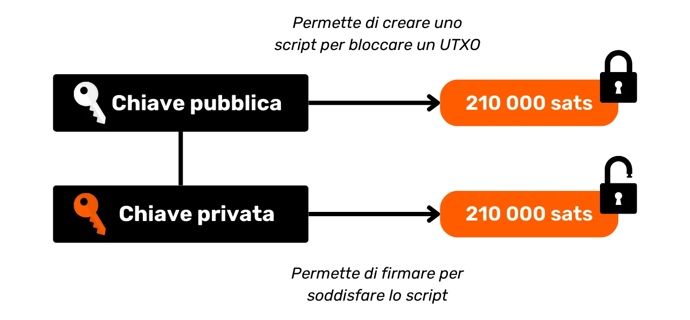

Dato che il concetto di account è assente in Bitcoin, il saldo di un portafoglio corrisponde semplicemente alla somma dei valori di tutti gli UTXO che può spendere. Ad esempio, se il tuo portafoglio Bitcoin può spendere i seguenti 4 UTXO:

```plaintext
- 2 BTC
- 8 BTC
- 5 BTC
- 2 BTC
```

Il saldo totale del tuo portafoglio sarebbe di `17 BTC`.


## La struttura delle transazioni Bitcoin

<chapterId>29d3aaab-de2e-4746-ab40-c9748898850c</chapterId>

### Gli input e gli output di una transazione

Una transazione Bitcoin è un'operazione registrata sulla blockchain che consente il trasferimento della proprietà dei bitcoin da una persona all'altra. Più specificamente, poiché ci troviamo in un modello UTXO e non ci sono account, la transazione soddisfa le condizioni di spesa che proteggevano uno o più UTXO, li consuma e, equivalentemente, crea nuovi UTXO dotati di nuove condizioni di spesa. In breve, una transazione sposta i bitcoin da uno script che è soddisfatto a un nuovo script destinato a proteggerli.


Ogni transazione Bitcoin è quindi composta da uno o più input e uno o più output. Gli input sono UTXO consumati dalla transazione per generare gli output. Gli output sono nuovi UTXO che saranno utilizzabili come input per future transazioni.


**> Lo sapevi?** Teoricamente, una transazione in bitcoin potrebbe avere un numero infinito di input e output. Solo la dimensione massima di un blocco limita questo numero. Ogni input in una transazione Bitcoin fa riferimento a un precedente UTXO (Unspent Transaction Output) non speso. Per utilizzare un UTXO come input, il suo detentore deve dimostrare di essere il legittimo proprietario validando lo script associato ad esso, ovvero soddisfacendo la condizione di spesa imposta. Generalmente, ciò comporta la fornitura di una firma digitale prodotta con la chiave privata corrispondente alla chiave pubblica che inizialmente ha assicurato quell'UTXO. Lo script verifica quindi che la firma corrisponda alla chiave pubblica utilizzata quando si ricevono i fondi.

Ogni output, d'altra parte, specifica la quantità di bitcoin da trasferire, così come il destinatario. Quest'ultimo è definito da un nuovo script che, generalmente, blocca il nuovo UTXO creato con un indirizzo di ricezione o una nuova chiave pubblica.

Affinché una transazione sia considerata valida secondo le regole di consenso, il totale degli output deve essere inferiore o uguale al totale degli input. In altre parole, la somma dei nuovi UTXO generati dalla transazione non deve superare quella degli UTXO consumati come input. Questo principio è logico: se si dispone solo di un importo di `500,000 SATS`, non si può effettuare un acquisto di `700,000 SATS`.

### Cambio e Consolidamento in una Transazione Bitcoin

L'azione di una transazione Bitcoin sugli UTXO può quindi essere paragonata alla fusione di una moneta d'oro. Infatti, un UTXO non è divisibile, ma solo unibile. Ciò significa che un utente non può semplicemente dividere un UTXO che rappresenta una certa quantità di bitcoin in più UTXO più piccoli. Deve consumarlo interamente in una transazione per creare uno o più nuovi UTXO di valori arbitrari negli output, che devono essere inferiori o uguali al valore iniziale.

Questo meccanismo è simile a quello di una moneta d'oro. Immagina di possedere una moneta da 2 once e di voler effettuare un pagamento di 1 oncia, assumendo che il venditore non possa darti il resto. Dovresti fondere la tua moneta e coniare 2 nuove monete di 1 oncia ciascuna.
Su Bitcoin, l'operazione è simile. Immaginiamo che Alice abbia un UTXO di `10,000 SATS` e voglia comprare una baguette che costa `4,000 SATS`. Alice effettuerà una transazione con un input di 1 UTXO di `10,000 SATS` che consumerà interamente, e negli output, creerà 2 UTXO valutati `4,000 SATS` e `6,000 SATS`. L'UTXO di `4,000 SATS` verrà inviato al panettiere come pagamento per la baguette, mentre l'UTXO di `6,000 SATS` tornerà ad Alice come resto. Questo UTXO che ritorna al mittente iniziale della transazione è ciò che viene chiamato "resto" nel gergo di Bitcoin.
Ora immagina che Alice non abbia un singolo UTXO di `10.000 SATS`, ma piuttosto due UTXO di `3.000 SATS` ciascuno. In questa situazione, nessuno degli UTXO individuali è sufficiente a coprire i `4.000 SATS` per la baguette. Pertanto, Alice deve utilizzare entrambi gli UTXO di `3.000 SATS` come input per la sua transazione simultaneamente. In questo modo, il totale degli input raggiungerà `6.000 SATS`, permettendole di coprire il pagamento di `4.000 SATS` al panettiere. Questo metodo, che coinvolge il raggruppamento di diversi UTXO negli input di una transazione, è spesso indicato con il termine "consolidamento".

### Commissioni di Transazione

Intuitivamente, si potrebbe pensare che anche le commissioni di transazione rappresentino un output di una transazione. Ma in realtà, non è così. Le commissioni di una transazione rappresentano la differenza tra il totale degli input e il totale degli output. Questo significa che, dopo aver utilizzato parte del valore degli input per coprire gli output desiderati in una transazione, una certa somma degli input rimane inutilizzata. Questa somma residua costituisce le commissioni di transazione.

```plaintext
Commissioni = input totali - output totali
```

Torniamo all'esempio di Alice che ha un UTXO di `10.000 SATS` e vuole comprare una baguette per `4.000 SATS`. Alice crea una transazione con il suo UTXO di `10.000 SATS` come input. Genera quindi un output di `4.000 SATS` destinato al panettiere per il pagamento della baguette. Per incoraggiare i minatori a includere la sua transazione in un blocco, Alice assegna `200 SATS` come commissioni. Così facendo, crea un secondo output, il resto, che le verrà restituito, ammontando a `5.800 SATS`.

Applicando la formula delle commissioni, vediamo effettivamente che rimangono `200 SATS` per i minatori:

```plaintext
Commissioni = input totali - output totali
Spese = 10.000 - (4.000 + 5.800)
Spese = 10.000 - 9.800
Spese = 200
```

Quando un minatore valida con successo un blocco, ha il diritto di raccogliere queste commissioni per tutte le transazioni incluse nel loro blocco, tramite la cosiddetta transazione "coinbase".

### La Creazione di UTXO su Bitcoin

Se hai seguito attentamente i paragrafi precedenti, ora sai che gli UTXO possono essere creati solo consumando altri UTXO esistenti. Così, le monete su Bitcoin formano una catena continua. Tuttavia, potresti chiederti come siano apparsi i primi UTXO in questa catena. Questo solleva un problema simile a quello dell'uovo e della gallina: da dove provengono questi UTXO originali?

La risposta si trova nella **transazione coinbase**.

Il coinbase è un tipo specifico di transazione Bitcoin, unico per ogni blocco e sempre il primo in essi. Permette al minatore che ha trovato una prova di lavoro valida di ricevere la loro ricompensa di blocco. Questa ricompensa consiste di due elementi: **il sussidio di blocco** e **le commissioni di transazione** di cui abbiamo parlato nella parte precedente.

La caratteristica unica della transazione coinbase è che è l'unica che può creare bitcoin dal nulla, senza la necessità di consumare input per generare i suoi output. Questi bitcoin appena creati costituiscono quello che potrebbe essere chiamato gli "UTXO originali".
I bitcoin provenienti dal sussidio di blocco sono nuovi BTC creati dal nulla, seguendo un calendario di emissione predefinito nelle regole di consenso. Il sussidio di blocco viene dimezzato ogni 210.000 blocchi, circa ogni quattro anni, in un processo chiamato "halving". Inizialmente, venivano creati 50 bitcoin per ogni sussidio, ma questa quantità è gradualmente diminuita; attualmente, è di 3.125 bitcoin per blocco.

Per quanto riguarda la parte relativa alle commissioni sulle transazioni, anche se rappresenta BTC appena creati, essi non devono superare la differenza tra gli input totali e gli output di tutte le transazioni in un blocco. Abbiamo visto in precedenza che queste commissioni rappresentano la parte degli input che non viene utilizzata negli output delle transazioni. Questa parte è tecnicamente "persa" durante la transazione, e il minatore ha il diritto di ricreare questo valore sotto forma di uno o più nuovi UTXO. Si tratta, quindi, di un trasferimento di valore dal mittente della transazione al minatore che lo aggiunge alla blockchain.

**> Lo sapevi?** I bitcoin generati da una transazione coinbase sono soggetti a un periodo di maturazione di 100 blocchi durante il quale non possono essere spesi dal minatore. Questa regola è intesa a evitare complicazioni legate all'uso di bitcoin appena creati su una catena che potrebbe in seguito essere resa obsoleta.

### Le implicazioni del modello UTXO

In primo luogo, il modello UTXO influenza direttamente le commissioni sulle transazioni in Bitcoin. Dato che la capacità di ogni blocco è limitata, i minatori favoriscono le transazioni che offrono le migliori commissioni rispetto allo spazio che occuperanno nel blocco. Infatti, più UTXO una transazione include come input e output, più è pesante e, quindi, richiede commissioni più elevate. Questo è uno dei motivi per cui c'è spesso uno sforzo per ridurre il numero di UTXO nel nostro portafoglio, il che può anche influenzare la privacy, un argomento che approfondiremo dettagliatamente nella terza parte di questa formazione.

Successivamente, come menzionato nelle parti precedenti, le monete su Bitcoin sono essenzialmente una catena di UTXO. Ogni transazione crea quindi un collegamento tra un UTXO passato e un UTXO futuro. Gli UTXO permettono quindi il tracciamento esplicito del percorso dei bitcoin dalla loro creazione alla loro attuale spesa. Questa trasparenza può essere vista positivamente, poiché consente a ciascun utente di assicurarsi dell'autenticità dei bitcoin ricevuti. Tuttavia, è anche su questo principio di tracciabilità e auditabilità che si basa l'analisi della catena, una pratica volta a compromettere la tua privacy. Studieremo questa pratica in profondità nella seconda parte della formazione.

## Il modello di privacy di Bitcoin

<chapterId>769d8963-3ed5-4094-b21d-9203c7d9e465</chapterId>

### Valuta: Autenticità, Integrità e Doppia Spesa

Una delle funzioni della valuta è risolvere il problema della doppia coincidenza dei desideri. In un sistema basato sul baratto, effettuare uno scambio richiede non solo di trovare un individuo che offre un bene che soddisfa il mio bisogno, ma anche di fornirgli un bene di valore equivalente che soddisfi il loro bisogno. Trovare questo equilibrio si rivela complesso.

Ecco perché si ricorre alla valuta, che consente il trasferimento di valore sia nello spazio che nel tempo.

Perché la valuta risolva questo problema, è essenziale che la parte che fornisce un bene o un servizio sia convinta della propria capacità di spendere quella somma in seguito. Pertanto, qualsiasi individuo razionale che desideri accettare una forma di valuta, sia essa digitale o fisica, si assicurerà che essa soddisfi due criteri fondamentali:

- **La moneta deve essere intatta e autentica;**- **e non deve essere spesa due volte.**
  Quando si utilizza la valuta fisica, la prima caratteristica è la più complessa da affermare. Nel corso di diversi periodi storici, l'integrità delle monete metalliche è stata spesso compromessa da pratiche come il taglio o la perforazione. Ad esempio, durante l'antica Roma, era comune per i cittadini raschiare i bordi delle monete d'oro per raccogliere un po' del prezioso metallo, pur conservandole per future transazioni. Il valore intrinseco della moneta veniva così ridotto, ma il suo valore nominale rimaneva lo stesso. Questo è notevolmente il motivo per cui in seguito sono state coniate delle rigature sul bordo delle monete.

Anche l'autenticità è una caratteristica difficile da verificare con i mezzi monetari fisici. Oggi, le tecniche per combattere la contraffazione sono sempre più complesse, costringendo i commercianti a investire in costosi sistemi di verifica.

D'altra parte, a causa della loro natura, il doppio pagamento non rappresenta un problema per le valute fisiche. Se ti do un biglietto da €10, esso lascia irrevocabilmente il mio possesso per entrare nel tuo, escludendo naturalmente qualsiasi possibilità di spendere le stesse unità monetarie più volte. In breve, non sarò in grado di spendere nuovamente quel biglietto da €10.

Per la valuta digitale, la difficoltà è diversa. Assicurare l'autenticità e l'integrità di una moneta è spesso più semplice. Come abbiamo visto nella sezione precedente, il modello UTXO di Bitcoin consente di tracciare una moneta fino alla sua origine, verificando così che sia stata effettivamente creata in conformità con le regole di consenso da un miner.

Tuttavia, garantire l'assenza di doppio pagamento è più complesso, poiché qualsiasi bene digitale è essenzialmente informazione. A differenza dei beni fisici, l'informazione non si divide durante gli scambi ma si propaga moltiplicandosi. Ad esempio, se ti invio un documento via email, questo viene duplicato. Da parte tua, non puoi verificare con certezza che io abbia cancellato il documento originale.

### Prevenire il Doppio Pagamento su Bitcoin

L'unico modo per evitare la duplicazione di un bene digitale è essere a conoscenza di tutti gli scambi all'interno del sistema. In questo modo, si può sapere chi possiede cosa e aggiornare il possesso di tutti in base alle transazioni effettuate. Questo è ciò che viene fatto, ad esempio, con il denaro scritturale nel sistema bancario. Quando paghi €10 a un commerciante con carta di credito, la banca registra questo scambio e aggiorna il registro contabile.
Su Bitcoin, la prevenzione del doppio pagamento viene realizzata nello stesso modo. L'obiettivo è confermare l'assenza di una transazione che ha già speso le monete in questione. Se queste monete non sono mai state utilizzate, allora possiamo essere sicuri che non si verificherà alcun doppio pagamento. Questo principio è stato descritto da Satoshi Nakamoto nel White Paper con questa famosa frase:

**"_L'unico modo per confermare l'assenza di una transazione è essere a conoscenza di tutte le transazioni._"**

Tuttavia, a differenza del modello bancario, non c'è il desiderio di dover fidarsi di un'entità centrale su Bitcoin. È necessario che tutti gli utenti possano confermare questa assenza di doppio pagamento, senza fare affidamento su una terza parte. Pertanto, tutti devono essere a conoscenza di tutte le transazioni Bitcoin. Questo è il motivo per cui le transazioni Bitcoin vengono trasmesse pubblicamente su tutti i nodi della rete e registrate in chiaro sulla blockchain.

È proprio questa diffusione pubblica delle informazioni che complica la protezione della privacy su Bitcoin. Nel sistema bancario tradizionale, in teoria, solo l'istituzione finanziaria è a conoscenza delle transazioni effettuate. D'altra parte, su Bitcoin, tutti gli utenti sono informati di tutte le transazioni, tramite i rispettivi nodi.

### Il modello di privacy: sistema bancario vs Bitcoin

Nel sistema tradizionale, il tuo conto bancario è collegato alla tua identità. Il banchiere è in grado di sapere a quale cliente appartiene quale conto bancario e quali transazioni sono associate ad esso. Tuttavia, questo flusso di informazioni è interrotto tra la banca e il dominio pubblico. In altre parole, è impossibile conoscere il saldo e le transazioni di un conto bancario che appartiene a un'altra persona. Solo la banca ha accesso a queste informazioni.

Ad esempio, il tuo banchiere sa che compri la tua baguette ogni mattina nella panetteria del quartiere, ma il tuo vicino non è a conoscenza di questa transazione. Così, il flusso di informazioni è accessibile alle parti interessate, in particolare la banca, ma rimane inaccessibile agli estranei.

A causa del vincolo di diffusione pubblica delle transazioni che abbiamo visto nella parte precedente, il modello di privacy di Bitcoin non può seguire il modello del sistema bancario. Nel caso di Bitcoin, poiché il flusso di informazioni non può essere interrotto tra le transazioni e il dominio pubblico, **il modello di privacy si basa sulla separazione tra l'identità dell'utente e le transazioni** stesse.

Ad esempio, se compri una baguette dal panettiere pagando in BTC, il tuo vicino, che possiede il proprio nodo completo, può vedere la tua transazione avvenire, proprio come può vedere tutte le altre transazioni nel sistema. Tuttavia, se i principi della privacy sono rispettati, non dovrebbero essere in grado di collegare questa specifica transazione alla tua identità.

Ma poiché le transazioni Bitcoin sono rese pubbliche, diventa comunque possibile stabilire collegamenti tra di esse per dedurre informazioni sulle parti coinvolte. Questa attività costituisce addirittura una specialità in sé chiamata "analisi della catena". Nella prossima parte del corso, ti invito a esplorare i fondamenti dell'analisi della catena per capire come vengono tracciate le tue bitcoin e sapere come difenderti meglio.

# Comprendere l'Analisi della Catena e Come Proteggersi

<partId>4739371e-9fef-45b0-bcaa-b7a4df6b4470</partId>

## Cos'è l'Analisi della Catena su Bitcoin?

<chapterId>7d198ba6-4af2-4f24-86cb-3c79cb25627e</chapterId>

### Definizione e Funzionamento

L'analisi della catena è una pratica che comprende tutti i metodi utilizzati per tracciare il flusso di bitcoin sulla blockchain. Generalmente, l'analisi della catena si basa sull'osservazione delle caratteristiche in campioni di transazioni precedenti. Coinvolge quindi l'identificazione di queste stesse caratteristiche in una transazione che si desidera analizzare e la deduzione di interpretazioni plausibili. Questo metodo di risoluzione dei problemi da un approccio pratico, per trovare una soluzione sufficientemente buona, è ciò che viene chiamato "euristica".

Per semplificare, l'analisi della catena si svolge in tre passaggi principali:

1. **Osservare la blockchain;**
2. **Identificare caratteristiche note;**
3. **Deducire ipotesi.**

L'analisi della catena può essere eseguita da chiunque. È sufficiente avere accesso alle informazioni pubbliche della blockchain tramite un nodo completo per osservare i movimenti delle transazioni e fare ipotesi. Esistono anche strumenti gratuiti che facilitano questa analisi, come il sito web [OXT.me](https://oxt.me/) che esploreremo in dettaglio negli ultimi due capitoli di questa parte. Tuttavia, il principale rischio per la privacy proviene dalle aziende specializzate in analisi della catena. Queste aziende hanno portato l'analisi della catena su scala industriale e vendono i loro servizi a istituzioni finanziarie o governi. Tra queste aziende, Chainalysis è probabilmente la più conosciuta.

### Gli Obiettivi dell'Analisi della Catena

Uno degli obiettivi dell'analisi della catena è raggruppare varie attività su Bitcoin al fine di determinare l'unicità dell'utente che le ha eseguite. Successivamente, sarà possibile tentare di collegare questo insieme di attività a un'identità reale.

Ricorda il capitolo precedente. Ho spiegato perché il modello di privacy di Bitcoin si basava originariamente sulla separazione dell'identità dell'utente dalle loro transazioni. Sarebbe quindi tentante pensare che l'analisi della catena sia inutile, poiché anche se si riesce a raggruppare attività onchain, queste non possono essere associate a un'identità reale.

Teoricamente, questa affermazione è accurata. Nella prima parte di questa formazione, abbiamo visto che le coppie di chiavi crittografiche vengono utilizzate per stabilire condizioni sull'UTXO. Per essenza, queste coppie di chiavi non rivelano alcuna informazione sull'identità dei loro detentori. Quindi, anche se si riesce a raggruppare attività associate a diverse coppie di chiavi, ciò non ci dice nulla sull'entità dietro queste attività.

Tuttavia, la realtà pratica è molto più complessa. Esiste una moltitudine di comportamenti che rischiano di collegare un'identità reale a un'attività onchain. In analisi, questo è chiamato un punto di ingresso, e ce ne sono molti.

Il più comune, ovviamente, è il KYC (_Know Your Customer_). Se prelevi i tuoi bitcoin da una piattaforma regolamentata a uno dei tuoi indirizzi di ricezione personali, allora alcune persone sono in grado di collegare la tua identità a questo indirizzo. Più in generale, un punto di ingresso può essere qualsiasi forma di interazione tra la tua vita reale e una transazione Bitcoin. Ad esempio, se pubblichi un indirizzo di ricezione sui tuoi social network, questo può essere un punto di ingresso per l'analisi. Se effettui un pagamento in bitcoin al tuo panettiere, possono associare il tuo volto (che fa parte della tua identità) a un indirizzo Bitcoin.

Questi punti di ingresso sono quasi inevitabili nell'uso di Bitcoin. Anche se si può cercare di limitarne la portata, rimarranno presenti. Ecco perché è cruciale combinare metodi volti a preservare la tua privacy. Sebbene mantenere una separazione tra la tua identità reale e le tue transazioni sia un approccio interessante, rimane insufficiente oggi. Infatti, se tutte le tue attività onchain possono essere raggruppate, allora il minimo punto di ingresso è probabile che comprometta l'unico strato di privacy che avevi stabilito.

### Difendersi dall'Analisi della Catena

Quindi, è anche necessario essere in grado di affrontare l'analisi della blockchain nel nostro uso di Bitcoin. Procedendo in questo modo, possiamo minimizzare l'aggregazione delle nostre attività e limitare l'impatto di un punto di ingresso sulla nostra privacy.

Infatti, per contrastare meglio l'analisi della blockchain, quale approccio migliore se non familiarizzare con i metodi utilizzati nell'analisi della blockchain? Se vuoi sapere come migliorare la tua privacy su Bitcoin, devi comprendere questi metodi. Ciò ti permetterà di comprendere meglio tecniche come [coinjoin](https://planb.network/fr/tutorials/privacy/coinjoin-samourai-wallet) o [payjoin](https://planb.network/fr/tutorials/privacy/payjoin) (tecniche che studieremo nelle ultime parti della formazione), e di ridurre gli errori che potresti commettere.
In questo contesto, possiamo fare un'analogia con la crittografia e la crittoanalisi. Un buon crittografo è prima di tutto un buon crittoanalista. Per immaginare un nuovo algoritmo di crittografia, è necessario sapere quali attacchi dovrà affrontare e studiare anche perché gli algoritmi precedenti sono stati violati. Lo stesso principio si applica alla privacy su Bitcoin. Comprendere i metodi di analisi della blockchain è la chiave per proteggersi da essa. Ecco perché propongo un'intera sezione sull'analisi della blockchain in questa formazione.

### I metodi di analisi della blockchain

È importante comprendere che l'analisi della blockchain non è una scienza esatta. Si basa su euristiche derivate da osservazioni precedenti o interpretazioni logiche. Queste regole consentono risultati abbastanza affidabili, ma mai con precisione assoluta. In altre parole, **l'analisi della blockchain comporta sempre una dimensione di probabilità nelle conclusioni emesse**. Ad esempio, si può stimare con maggiore o minore certezza che due indirizzi appartengano alla stessa entità, ma la certezza totale sarà sempre fuori portata.

L'obiettivo principale dell'analisi della blockchain risiede proprio nell'aggregazione di varie euristiche al fine di minimizzare il rischio di errore. È, in un certo senso, un accumulo di prove che ci permette di avvicinarci più da vicino alla realtà.

Queste famose euristiche possono essere raggruppate in diverse categorie che dettaglieremo insieme:

- **Modelli di transazione (o modelli di transazione);**
- **Euristiche interne alla transazione;**
- **Euristiche esterne alla transazione.**

### Satoshi Nakamoto e l'analisi della blockchain

Va notato che le prime due euristiche per l'analisi della catena sono state scoperte da Satoshi Nakamoto stesso. Le discute nella parte 10 del White Paper di Bitcoin. Queste sono:

- l'Euristica di Proprietà di Input Comune (CIOH);
- e il riutilizzo degli indirizzi.


Fonte: S. Nakamoto, "Bitcoin: A Peer-to-Peer Electronic Cash System", https://bitcoin.org/bitcoin.pdf, 2009.

Nei capitoli seguenti, esploreremo di cosa si tratta, ma è già interessante notare che queste due euristiche mantengono ancora oggi una preminenza nell'analisi della catena.

## Modelli di Transazione

<chapterId>d365a101-2d37-46a5-bfb9-3c51e37bf96b</chapterId>

Un modello di transazione è semplicemente un modello o una struttura generale di una transazione tipica che può essere trovata sulla blockchain, la cui interpretazione è presumibilmente nota. Quando studiamo i modelli, ci concentreremo su una singola transazione che analizzeremo ad alto livello.

In altre parole, guarderemo solo il numero di UTXO negli input e il numero di UTXO negli output, senza soffermarci sui dettagli più specifici o sull'ambiente della transazione. Dal modello osservato, saremo in grado di interpretare la natura della transazione. Cercheremo quindi caratteristiche nella sua struttura e dedurremo un'interpretazione.


In questa parte, scopriremo insieme i principali modelli di transazione che possono essere incontrati nell'analisi della catena, e per ogni modello, vi darò l'interpretazione probabile di questa struttura, insieme a un esempio concreto.

### Invio Semplice (o Pagamento Semplice)

Iniziamo con un modello molto diffuso, poiché è quello che appare nella maggior parte dei pagamenti in bitcoin. Il modello di pagamento semplice è caratterizzato dal consumo di uno o più UTXO negli input e dalla produzione di 2 UTXO negli output. Questo modello apparirà quindi così:


Quando individuiamo questa struttura di transazione sulla blockchain, possiamo già trarre un'interpretazione. Come suggerisce il nome, questo modello indica che ci troviamo di fronte a una transazione di invio o pagamento. L'utente ha consumato i propri UTXO in input per soddisfare in output un UTXO di pagamento e un UTXO di resto (denaro restituito allo stesso utente).
Sappiamo quindi che l'utente osservato probabilmente non è più in possesso di uno dei due UTXO in output (quello di pagamento), ma è ancora in possesso dell'altro UTXO (quello di resto).
Al momento, è impossibile per noi specificare quale output rappresenti quale UTXO, poiché questo non è l'obiettivo dello studio dei modelli. Raggiungeremo questo obiettivo affidandoci alle euristiche che studieremo nelle parti seguenti. A questo stadio, il nostro obiettivo è limitato all'identificazione della natura della transazione in questione, che in questo caso è un semplice invio.

Per esempio, ecco una transazione Bitcoin che adotta il modello di invio semplice:

```plaintext
b6cc79f45fd2d7669ff94db5cb14c45f1f879ea0ba4c6e3d16ad53a18c34b769
```


Fonte: [Mempool.space](https://mempool.space/fr/tx/b6cc79f45fd2d7669ff94db5cb14c45f1f879ea0ba4c6e3d16ad53a18c34b769)

Dopo questo primo esempio, dovresti avere una migliore comprensione di cosa significhi studiare un "modello di transazione". Esaminiamo una transazione concentrandoci solo sulla sua struttura, senza tenere conto del suo ambiente o dei dettagli specifici della transazione. La osserviamo solo in modo globale in questo primo passo.

Ora che capisci cosa sia un modello, passiamo agli altri modelli esistenti.

### Sweeping

Questo secondo modello è caratterizzato dal consumo di un singolo UTXO come input e dalla produzione di un singolo UTXO come output.


L'interpretazione di questo modello è che ci troviamo di fronte a un auto-trasferimento. L'utente ha trasferito i suoi bitcoin a se stesso, a un altro indirizzo di sua proprietà. Poiché non c'è resto nella transazione, è molto improbabile che ci troviamo di fronte a un pagamento. Infatti, quando viene effettuato un pagamento, è quasi impossibile per il pagatore avere un UTXO che corrisponda esattamente all'importo richiesto dal venditore, più le commissioni di transazione. Generalmente, il pagatore è quindi costretto a produrre un output di resto.

Sappiamo quindi che l'utente osservato probabilmente è ancora in possesso di questo UTXO. Nel contesto di un'analisi della catena, se sappiamo che l'UTXO utilizzato come input nella transazione appartiene ad Alice, possiamo supporre che l'UTXO in output appartenga anche a lei. Ciò che diventerà interessante in seguito è trovare euristiche interne alla transazione che potrebbero rafforzare questa supposizione (studieremo queste euristiche nel capitolo 3.3).

Per esempio, ecco una transazione Bitcoin che adotta il modello di sweeping:

```plaintext
35f1072a0fda5ae106efb4fda871ab40e1f8023c6c47f396441ad4b995ea693d
```


Fonte: [Mempool.space](https://mempool.space/fr/tx/35f1072a0fda5ae106efb4fda871ab40e1f8023c6c47f396441ad4b995ea693d) Tuttavia, questo tipo di schema può anche rivelare un'autotrasferimento al conto di una piattaforma di scambio di criptovalute. Sarà lo studio degli indirizzi noti e il contesto della transazione che ci permetterà di sapere se si tratta di un consolidamento verso un portafoglio di auto-custodia o un prelievo verso una piattaforma. Infatti, gli indirizzi delle piattaforme di scambio sono spesso facilmente identificabili.

Torniamo all'esempio di Alice: se il consolidamento porta a un indirizzo noto di una piattaforma (come Binance, ad esempio), ciò può significare che i bitcoin sono stati trasferiti fuori dal possesso diretto di Alice, probabilmente con l'intenzione di venderli o di immagazzinarli su questa piattaforma. D'altra parte, se l'indirizzo di destinazione è sconosciuto, è ragionevole supporre che si tratti semplicemente di un altro portafoglio ancora appartenente ad Alice. Ma questo tipo di studio rientra più nella categoria delle euristiche e non nello studio degli schemi.

### Consolidamento

Questo modello è caratterizzato dal consumo di diversi UTXO come input e dalla produzione di un singolo UTXO come output.


L'interpretazione di questo modello è che ci troviamo in presenza di un consolidamento. Questa è una pratica comune tra gli utenti di Bitcoin, che mira a unire diversi UTXO in previsione di un possibile aumento delle commissioni di transazione. Eseguendo questa operazione durante un periodo in cui le commissioni sono basse, è possibile risparmiare sulle future commissioni. Parleremo di più di questa pratica nel capitolo 4.3.

Possiamo dedurre che l'utente dietro a questo modello di transazione era probabilmente in possesso di tutti gli UTXO in input ed è ancora in possesso dell'UTXO in output. Questo è sicuramente un'autotrasferimento.

Proprio come il consolidamento, anche questo tipo di schema può rivelare un'autotrasferimento al conto di una piattaforma di scambio. Sarà lo studio degli indirizzi noti e il contesto della transazione che ci permetterà di sapere se si tratta di un consolidamento verso un portafoglio di auto-custodia o un prelievo verso una piattaforma.

Ad esempio, ecco una transazione Bitcoin che adotta lo schema di consolidamento:

```plaintext
77c16914211e237a9bd51a7ce0b1a7368631caed515fe51b081d220590589e94
```


Fonte: [Mempool.space](https://mempool.space/fr/tx/77c16914211e237a9bd51a7ce0b1a7368631caed515fe51b081d220590589e94)
Nel contesto di un'analisi della catena, questo modello può rivelare molte informazioni. Ad esempio, se sappiamo che uno degli input appartiene ad Alice, possiamo supporre che tutti gli altri input e l'output di questa transazione appartengano a lei. Questa supposizione ci permetterebbe quindi di risalire attraverso le precedenti catene di transazioni per scoprire e analizzare altre transazioni probabilmente associate ad Alice.


### Spesa Raggruppata

Questo modello è caratterizzato dal consumo di pochi UTXO come input (spesso solo uno) e dalla produzione di numerosi UTXO come output.


L'interpretazione di questo modello è che ci troviamo di fronte a una spesa raggruppata. Questa è una pratica che probabilmente rivela un'attività economica significativa, come ad esempio una piattaforma di scambio. La spesa raggruppata permette a queste entità di risparmiare sulle commissioni consolidando le loro spese in una singola transazione.
Possiamo dedurre da questo modello che l'input UTXO proviene da un'azienda con un'attività economica significativa e che gli output UTXO si disperderanno. Molti apparterranno ai clienti dell'azienda che hanno prelevato bitcoin dalla piattaforma. Altri possono andare verso aziende partner. Infine, ci saranno certamente uno o più scambi che ritornano all'azienda emittente.

Per esempio, ecco una transazione Bitcoin che adotta il modello di spesa raggruppata (probabilmente, è una transazione emessa dalla piattaforma Bybit):

```plaintext
8a7288758b6e5d550897beedd13c70bcbaba8709af01a7dbcc1f574b89176b43
```


Fonte: [Mempool.space](https://mempool.space/fr/tx/8a7288758b6e5d550897beedd13c70bcbaba8709af01a7dbcc1f574b89176b43)

### Transazioni Specifiche del Protocollo

Tra i modelli di transazione, possiamo anche identificare modelli che rivelano l'uso di un protocollo specifico. Ad esempio, i coinjoin di Whirlpool (che discuteremo nella parte 5) avranno una struttura facilmente identificabile che permette di differenziarli da altre transazioni più tradizionali.


L'analisi di questo modello suggerisce che probabilmente ci troviamo di fronte a una transazione collaborativa. È anche possibile osservare un coinjoin. Se quest'ultima ipotesi si rivela accurata, allora il numero di output potrebbe fornirci una stima approssimativa del numero di partecipanti al coinjoin.

Per esempio, ecco una transazione Bitcoin che adotta il modello del tipo di transazione collaborativa coinjoin:

```plaintext
00601af905bede31086d9b1b79ee8399bd60c97e9c5bba197bdebeee028b9bea
```


Fonte: [Mempool.space](https://mempool.space/fr/tx/00601af905bede31086d9b1b79ee8399bd60c97e9c5bba197bdebeee028b9bea)

Ci sono molti altri protocolli che hanno le loro specifiche strutture. Così, potremmo distinguere transazioni del tipo Wabisabi, transazioni Stamps, o anche Runes, ad esempio.

Grazie a questi modelli di transazione, possiamo già interpretare un certo numero di informazioni su una data transazione. Ma la struttura della transazione non è l'unica fonte di informazioni per l'analisi. Possiamo anche studiare i suoi dettagli. Questi dettagli, interni a una transazione, sono ciò che mi piace chiamare "euristiche interne", e le studieremo nel capitolo seguente.

## Euristica Interna

<chapterId>c54b5abe-872f-40f4-a0d0-c59faff228ba</chapterId>

Un'euristica interna è una caratteristica specifica identificata all'interno di una transazione stessa, senza la necessità di esaminare il suo ambiente, che ci permette di fare deduzioni. A differenza dei modelli che si concentrano sulla struttura complessiva della transazione ad alto livello, le euristiche interne si basano sull'insieme dei dati estrabili. Questo include:

- Le quantità dei diversi UTXO in entrata e in uscita;
- Tutto ciò che riguarda gli script: gli indirizzi di ricezione, il versioning, i locktime...

Generalmente, questo tipo di euristica ci permetterà di identificare il resto in una specifica transazione. Facendo ciò, possiamo poi continuare a tracciare un'entità attraverso diverse transazioni. Infatti, se identifichiamo un UTXO appartenente a un utente che desideriamo seguire, è cruciale determinare, quando effettuano una transazione, quale output è stato trasferito a un altro utente e quale output rappresenta il resto, rimanendo quindi in loro possesso.


Ricordo ancora una volta che queste euristiche non sono assolutamente precise. Prese singolarmente, ci permettono solo di identificare scenari plausibili. È l'accumulo di diverse euristiche che aiuta a ridurre l'incertezza, senza mai eliminarla completamente.

### Somiglianze Interne

Questa euristica coinvolge lo studio delle somiglianze tra gli input e gli output della stessa transazione. Se osserviamo la stessa caratteristica sugli input e su solo uno degli output della transazione, allora è probabile che questo output costituisca il resto.

La caratteristica più ovvia è il riutilizzo di un indirizzo di ricezione nella stessa transazione.


Questa euristica lascia poco spazio al dubbio. A meno che la propria chiave privata non sia stata hackerata, lo stesso indirizzo di ricezione rivela inevitabilmente l'attività di un singolo utente. L'interpretazione che ne segue è che il resto della transazione è l'output con lo stesso indirizzo dell'input. Questo permette il tracciamento continuo dell'individuo basato su questo resto.
Ad esempio, ecco una transazione su cui questa euristica può essere ragionevolmente applicata:

```plaintext
54364146665bfc453a55eae4bfb8fdf7c721d02cb96aadc480c8b16bdeb8d6d0
```


Fonte: [Mempool.space](https://mempool.space/tx/54364146665bfc453a55eae4bfb8fdf7c721d02cb96aadc480c8b16bdeb8d6d0)

Queste somiglianze tra input e output non si fermano al riutilizzo degli indirizzi. Qualsiasi somiglianza nell'uso degli script può permettere l'applicazione di un'euristica. Ad esempio, a volte si può osservare lo stesso versioning tra un input e uno degli output della transazione.


In questo diagramma, possiamo vedere che l'input n. 0 sblocca uno script P2WPKH (SegWit V0 che inizia con `bc1q`). L'output n. 0 utilizza lo stesso tipo di script. Tuttavia, l'output n. 1 utilizza uno script P2TR (SegWit V1 che inizia con `bc1p`). L'interpretazione di questa caratteristica è che è probabile che l'indirizzo con lo stesso versioning dell'input sia l'indirizzo del resto. Apparterrebbe quindi ancora allo stesso utente.

Ecco una transazione su cui questa euristica può essere ragionevolmente applicata:

```plaintext
db07516288771ce5d0a06b275962ec4af1b74500739f168e5800cbcb0e9dd578
```


Fonte: [Mempool.space](https://mempool.space/tx/db07516288771ce5d0a06b275962ec4af1b74500739f168e5800cbcb0e9dd578)
In questo caso, possiamo vedere che l'input n. 0 e l'output n. 1 utilizzano script P2WPKH (SegWit V0), mentre l'output n. 0 utilizza un tipo di script diverso, P2PKH (Legacy). All'inizio degli anni 2010, questa euristica basata sulla versione degli script era relativamente poco utile a causa della limitazione dei tipi di script disponibili. Tuttavia, nel tempo e con successivi aggiornamenti a Bitcoin, è stata introdotta una crescente diversità di tipi di script. Questa euristica sta diventando sempre più rilevante perché, con una gamma più ampia di tipi di script, gli utenti sono divisi in gruppi più piccoli, aumentando così le possibilità di applicare questa euristica di riutilizzo della versione interna. Per questo motivo, solo da una prospettiva di privacy, è consigliabile optare per il tipo di script più comune. Ad esempio, mentre scrivo queste righe, gli script Taproot (`bc1p`) sono meno utilizzati degli script SegWit V0 (`bc1q`). Sebbene i primi offrano vantaggi economici e di privacy in certi contesti specifici, per usi più tradizionali a firma singola, potrebbe essere saggio attenersi a uno standard più vecchio per motivi di privacy, fino a quando il nuovo standard non sarà più ampiamente adottato.

### Pagamenti con Numeri Arrotondati

Un'altra euristica interna che può aiutarci a identificare il resto è quella del numero arrotondato. Generalmente, quando ci si trova di fronte a un semplice schema di pagamento (1 input e 2 output), se uno degli output spende un importo arrotondato, allora rappresenta il pagamento.

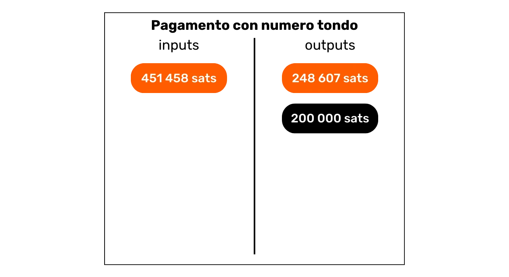

Per eliminazione, se un output rappresenta il pagamento, l'altro rappresenta il resto. Si può quindi dedurre che è probabile che l'utente che ha inserito la transazione possieda ancora l'output identificato come resto.

Va notato che questa euristica non è sempre applicabile, poiché la maggior parte dei pagamenti è ancora effettuata in unità di valuta fiat. Infatti, quando un commerciante in Francia accetta bitcoin, generalmente, non espone prezzi stabili in sats. Preferirebbe optare per una conversione tra il prezzo in euro e l'importo in bitcoin da pagare. Pertanto, non dovrebbe esserci un numero arrotondato nell'output della transazione.

Tuttavia, un analista potrebbe tentare di fare questa conversione tenendo conto del tasso di cambio in vigore al momento della trasmissione della transazione sulla rete. Prendiamo l'esempio di una transazione con un input di `97,552 sats` e due output, uno di `31,085 sats` e l'altro di `64,152 sats`. A prima vista, questa transazione non sembra coinvolgere importi arrotondati. Tuttavia, applicando il tasso di cambio di €64,339 al momento della transazione, otteniamo una conversione in euro che appare come segue:

- Un input di €62,76;
- Un output di €20;
- Un output di €41,27.
  Una volta convertita in valuta fiat, questa transazione permette l'applicazione dell'euristica dei pagamenti con importi arrotondati. L'output di €20 era probabilmente destinato a un commerciante, o comunque ha cambiato proprietario. Per deduzione, l'output di €41,27 è probabilmente rimasto in possesso dell'utente originale.
  

Se un giorno, Bitcoin diventasse l'unità di conto preferita nelle nostre transazioni, questa euristica potrebbe diventare ancora più utile per l'analisi.

Ad esempio, ecco una transazione dove questa euristica può probabilmente essere applicata:

```plaintext
2bcb42fab7fba17ac1b176060e7d7d7730a7b807d470815f5034d52e96d2828a
```


Fonte: [Mempool.space](https://mempool.space/tx/2bcb42fab7fba17ac1b176060e7d7d7730a7b807d470815f5034d52e96d2828a)

### L'Output Più Grande

Quando si nota una differenza significativamente ampia tra due output di una transazione in un modello di pagamento semplice, si può stimare che l'output più grande sia probabilmente il resto.


Questa euristica dell'output più grande è probabilmente la più imprecisa di tutte. Se identificata da sola, è piuttosto debole. Tuttavia, questa caratteristica può essere combinata con altre euristiche per ridurre l'incertezza della nostra interpretazione.

Ad esempio, se esaminiamo una transazione che presenta un output con un importo tondo e un altro output con un importo maggiore, l'applicazione congiunta dell'euristica dei pagamenti tondi e quella relativa all'output più grande ci permette di ridurre il nostro livello di incertezza.

Per esempio, ecco una transazione dove questa euristica può probabilmente essere applicata:

```plaintext
b79d8f8e4756d34bbb26c659ab88314c220834c7a8b781c047a3916b56d14dcf
```


Fonte: [Mempool.space](https://mempool.space/tx/b79d8f8e4756d34bbb26c659ab88314c220834c7a8b781c047a3916b56d14dcf)

## Euristiche Esterne

<chapterId>4a170e3b-200d-431a-8285-18a23ff617ba</chapterId>
Lo studio delle euristiche esterne implica l'analisi delle somiglianze, dei modelli e delle caratteristiche di certi elementi che non sono intrinseci alla transazione stessa. In altre parole, se precedentemente ci limitavamo a sfruttare elementi intrinseci alla transazione con euristiche interne, ora stiamo espandendo il nostro campo di analisi all'ambiente della transazione grazie alle euristiche esterne.

### Riutilizzo degli Indirizzi

Questa è una delle euristiche più note tra gli appassionati di Bitcoin. Il riutilizzo degli indirizzi permette di stabilire un collegamento tra diverse transazioni e diversi UTXO. Si osserva quando un indirizzo di ricezione Bitcoin viene utilizzato più volte.

Così, è possibile sfruttare il riutilizzo degli indirizzi all'interno della stessa transazione come un'euristica interna per identificare il resto (come abbiamo visto nel capitolo precedente). Tuttavia, il riutilizzo degli indirizzi può anche servire come un'euristica esterna per riconoscere l'unicità di un'entità dietro diverse transazioni.

L'interpretazione del riutilizzo degli indirizzi è che tutti gli UTXO bloccati su questo indirizzo appartengono (o sono appartenuti) alla stessa entità. Questa euristica lascia poco spazio all'incertezza. Quando è possibile identificarla, l'interpretazione che ne segue è molto probabilmente corrispondente alla realtà. Permette quindi il raggruppamento di diverse attività onchain.

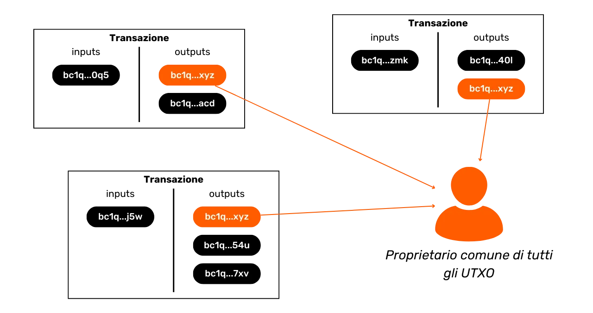

Come spiegato nell'introduzione a questa parte 3, questa euristica è stata scoperta da Satoshi Nakamoto stesso. Nel White Paper, egli menziona specificamente una soluzione per gli utenti per evitarla, che è semplicemente quella di utilizzare un nuovo indirizzo per ogni nuova transazione:

"_Come ulteriore protezione, una nuova coppia di chiavi potrebbe essere utilizzata per ogni transazione per impedire che siano collegate a un proprietario comune._"


Fonte: S. Nakamoto, "Bitcoin: A Peer-to-Peer Electronic Cash System", https://bitcoin.org/bitcoin.pdf, 2009.

Per esempio, ecco un indirizzo riutilizzato in più transazioni:

```plaintext
bc1qqtmeu0eyvem9a85l3sghuhral8tk0ar7m4a0a0
```

Fonte: [Mempool.space](https://mempool.space/address/bc1qqtmeu0eyvem9a85l3sghuhral8tk0ar7m4a0a0)

### Somiglianza degli Script e Impronte Digitali dei Portafogli

Oltre al riutilizzo degli indirizzi, esistono numerose altre euristiche che permettono di collegare azioni allo stesso portafoglio o a un cluster di indirizzi.
Prima di tutto, un analista può trarre vantaggio dalle somiglianze nell'uso degli script. Ad esempio, certi script minoritari come multisig possono essere identificati più facilmente rispetto agli script SegWit V0. Più grande è il gruppo in cui ci nascondiamo, più difficile è individuarci. Questo è il motivo per cui, nei buoni protocolli Coinjoin, tutti i partecipanti utilizzano esattamente lo stesso tipo di script.
Più in generale, un analista può anche concentrarsi sulle caratteristiche impronte digitali di un portafoglio. Queste sono processi specifici legati a un uso che si potrebbe cercare di identificare con l'obiettivo di sfruttarli come euristiche di tracciamento. In altre parole, se si osserva un'accumulazione delle stesse caratteristiche interne sulle transazioni attribuite all'entità tracciata, si può tentare di identificare queste stesse caratteristiche su altre transazioni.

Ad esempio, può essere identificato che l'utente tracciato invia sistematicamente il loro resto agli indirizzi P2TR (`bc1p…`). Se questo processo si ripete, può essere utilizzato come euristica per la continuazione della nostra analisi. Altre impronte digitali possono essere utilizzate, come l'ordine degli UTXO, il posizionamento del resto negli output, la segnalazione di RBF (Replace-by-Fee), o anche, il numero di versione, il campo `nSequence` e il campo `nLockTime`.

Come [@LaurentMT](https://twitter.com/LaurentMT) specifica nel [Space Kek #19](https://podcasters.spotify.com/pod/show/decouvrebitcoin/episodes/SpaceKek-19---Analyse-de-chane--anonsets-et-entropie-e1vfuji) (un podcast francofono), l'utilità delle impronte digitali dei portafogli nell'analisi della catena aumenta significativamente nel tempo. Infatti, il crescente numero di tipi di script e il dispiegamento sempre più graduale di queste nuove funzionalità da parte del software del portafoglio accentuano le differenze. Può persino accadere che si possa identificare con precisione il software utilizzato dall'entità tracciata. È quindi importante comprendere che lo studio dell'impronta digitale di un portafoglio si rivela particolarmente rilevante per le transazioni recenti, più che per quelle avviate nei primi anni 2010.

Per riassumere, un'impronta digitale può essere qualsiasi pratica specifica, eseguita automaticamente dal portafoglio o manualmente dall'utente, che può essere trovata su altre transazioni per assistere nella nostra analisi.

### L'Euristica della Proprietà Comune degli Input (CIOH)

La CIOH, per "Common Input Ownership Heuristic" in inglese, è un'euristica che afferma che quando una transazione include più input, questi provengono probabilmente da una singola entità. Di conseguenza, la loro proprietà è comune.
Per applicare l'Euristica di Comune Proprietà degli Input (CIOH), osserviamo prima una transazione che ha più input. Questo potrebbe essere da un minimo di 2 input fino a un massimo di 30 input. Una volta identificata questa caratteristica, verifichiamo se la transazione non si adatta a un modello di transazione noto. Ad esempio, se ha 5 input con importi più o meno uguali e 5 output con esattamente lo stesso importo, sappiamo che è la struttura di un coinjoin. Pertanto, non possiamo applicare la CIOH.
Tuttavia, se la transazione non si adatta a nessun modello noto di transazione collaborativa, allora possiamo dedurre che tutti gli input provengono probabilmente dalla stessa entità. Questo può essere molto utile per espandere un cluster noto o per continuare il tracciamento.

La CIOH è stata scoperta da Satoshi Nakamoto. Ne discute nella parte 10 del White Paper:

"_[...] il collegamento è inevitabile con le transazioni multi-input, che necessariamente rivelano che i loro input erano di proprietà dello stesso proprietario. Il rischio è che se il proprietario di una chiave viene rivelato, i collegamenti possono rivelare altre transazioni che appartenevano allo stesso proprietario._"

È particolarmente affascinante notare che Satoshi Nakamoto, anche prima del lancio ufficiale di Bitcoin, aveva già identificato le due principali vulnerabilità in termini di privacy per gli utenti, ovvero la CIOH e il riutilizzo degli indirizzi. Una tale previsione è piuttosto notevole, poiché queste due euristiche rimangono, ancora oggi, le più utili nell'analisi della catena.

Per darvi un esempio, ecco una transazione sulla quale possiamo probabilmente applicare la CIOH:

```plaintext
20618e63b6eed056263fa52a2282c8897ab2ee71604c7faccfe748e1a202d712
```

Fonte: [Mempool.space](https://mempool.space/tx/20618e63b6eed056263fa52a2282c8897ab2ee71604c7faccfe748e1a202d712)

### Dati Offchain

Ovviamente, l'analisi della catena non è limitata esclusivamente ai dati onchain. Anche i dati provenienti da analisi precedenti o disponibili su internet possono essere utilizzati per affinare un'analisi.
Ad esempio, se si osserva che le transazioni tracciate vengono sistematicamente trasmesse dallo stesso nodo Bitcoin e si può identificare il suo indirizzo IP, potrebbe essere possibile individuare altre transazioni dalla stessa entità, oltre a determinare una parte dell'identità del mittente. Anche se questa pratica non è facilmente realizzabile, poiché richiede l'operatività di molti nodi, è possibile che alcune aziende specializzate nell'analisi della catena la impieghino.

L'analista ha anche l'opzione di fare affidamento su analisi precedentemente rese open-source, o sulle proprie analisi precedenti. Forse si potrebbe trovare un output che punta a un cluster di indirizzi che era già stato identificato. A volte, è anche possibile fare affidamento su output che puntano a una piattaforma di scambio, gli indirizzi di queste aziende essendo generalmente noti.

Allo stesso modo, si può eseguire un'analisi per eliminazione. Ad esempio, se durante l'analisi di una transazione con due output, uno di essi è collegato a un cluster di indirizzi già noto ma distinto dall'entità che si sta tracciando, allora si può interpretare che l'altro output rappresenti probabilmente il resto.

L'analisi della catena include anche una parte di OSINT (_Open Source Intelligence_) che è un po' più generalista con ricerche su internet. Questo è il motivo per cui si sconsiglia di pubblicare indirizzi di ricezione direttamente sui social media o su un sito web, sia sotto pseudonimo che no.


### Modelli Temporali

È meno comunemente considerato, ma certi comportamenti umani sono riconoscibili on-chain. Il più utile in analisi potrebbe essere il tuo modello di sonno! Sì, quando dormi, presumibilmente non stai trasmettendo transazioni Bitcoin. Poiché generalmente dormi nelle stesse ore, è comune utilizzare analisi temporali nell'analisi della catena. Questo semplicemente comporta catalogare le ore in cui le transazioni di una data entità vengono trasmesse alla rete Bitcoin. Analizzare questi modelli temporali ci permette di dedurre molte informazioni.

Prima di tutto, un'analisi temporale a volte permette di identificare la natura dell'entità tracciata. Se si osserva che le transazioni vengono trasmesse costantemente su 24 ore, allora questo rivelerà una forte attività economica. L'entità dietro queste transazioni è probabilmente un'azienda, potenzialmente internazionale, e forse con procedure automatizzate internamente.

Per esempio, [avevo riconosciuto questo modello alcuni mesi fa](https://twitter.com/Loic_Pandul/status/1701127409712452072) analizzando [la transazione che aveva erroneamente allocato 19 bitcoin in commissioni](https://mempool.space/tx/d5392d474b4c436e1c9d1f4ff4be5f5f9bb0eb2e26b61d2781751474b7e870fd). Una semplice analisi temporale mi aveva permesso di ipotizzare che stavamo trattando con un servizio automatizzato, e quindi probabilmente una grande entità come una piattaforma di scambio.

Infatti, pochi giorni dopo, fu scoperto che i fondi appartenevano a PayPal, tramite la piattaforma di scambio Paxos.

Al contrario, se vediamo che il modello temporale è piuttosto distribuito su 16 ore molto specifiche, allora possiamo stimare che stiamo trattando con un utente individuale, o forse un'attività commerciale locale a seconda dei volumi scambiati.

Oltre alla natura dell'entità osservata, il modello temporale può anche darci una posizione approssimativa dell'utente grazie ai fusi orari. Possiamo quindi collegare altre transazioni, e usare il timestamp di queste come un'euristica aggiuntiva che può essere aggiunta alla nostra analisi.

Per esempio, sull'indirizzo riutilizzato di cui ho parlato precedentemente, possiamo osservare che le transazioni, sia in entrata che in uscita, sono concentrate su un intervallo di 13 ore.

```plaintext
bc1qqtmeu0eyvem9a85l3sghuhral8tk0ar7m4a0a0
```


Fonte: OXT.me

Questo intervallo corrisponde probabilmente all'Europa, all'Africa o al Medio Oriente. Possiamo quindi dedurre che l'utente dietro queste transazioni vive lì.

In un registro diverso, è anche un'analisi temporale di questo tipo che ha permesso l'ipotesi che Satoshi Nakamoto non operasse dal Giappone, ma effettivamente dagli Stati Uniti: [_I Fusi Orari di Satoshi Nakamoto_](https://medium.com/@insearchofsatoshi/the-time-zones-of-satoshi-nakamoto-aa40f035178f)

## Applicazione Pratica con un Block Explorer

<chapterId>6493cf2f-225c-405f-9375-c4304f1087ed</chapterId>

In questo capitolo finale, applicheremo concretamente i concetti che abbiamo studiato finora. Vi presenterò esempi di reali transazioni Bitcoin, e dovrete estrarre le informazioni che chiedo.
Idealmente, per questi esercizi, sarebbe preferibile l'uso di uno strumento professionale di analisi della catena. Tuttavia, a seguito dell'arresto dei creatori di Samourai Wallet, l'unico strumento di analisi gratuito OXT.me non è più disponibile. Pertanto, opteremo per un classico block explorer per questi esercizi. Raccomando di utilizzare [Mempool.space](https://mempool.space/) per le sue numerose funzionalità e gamma di strumenti di analisi della catena, ma potete anche scegliere un altro esploratore come [Bitcoin Explorer](https://bitcoinexplorer.org/). Per iniziare, presenterò gli esercizi. Utilizzate il vostro block explorer per completarli e scrivete le vostre risposte su un pezzo di carta. Poi, alla fine di questo capitolo, fornirò le risposte così potrete verificare e correggere i vostri risultati.

_Le transazioni selezionate per questi esercizi sono state scelte esclusivamente per le loro caratteristiche in modo alquanto casuale. Questo capitolo è destinato esclusivamente a scopi educativi e informativi. Voglio chiarire che non sostengo né incoraggio l'uso di questi strumenti per scopi malevoli. L'obiettivo è insegnarvi come proteggervi dall'analisi della catena, non condurre analisi per esporre informazioni private di altri._

### Esercizio 1

ID della transazione da analizzare:

```plaintext
3769d3b124e47ef4ffb5b52d11df64b0a3f0b82bb10fd6b98c0fd5111789bef7
```

Qual è il nome del modello di questa transazione e quali interpretazioni plausibili possono essere tratte esaminando solo il suo modello, ovvero la struttura della transazione?

### Esercizio 2

ID della transazione da analizzare:

```plaintext
baa228f6859ca63e6b8eea24ffad7e871713749d693ebd85343859173b8d5c20
```

Qual è il nome del modello di questa transazione e quali interpretazioni plausibili possono essere tratte esaminando solo il suo modello, ovvero la struttura della transazione?

### Esercizio 3

ID della transazione da analizzare:

```plaintext
3a9eb9ccc3517cc25d1860924c66109262a4b68f4ed2d847f079b084da0cd32b
```

Qual è il modello di questa transazione?

Dopo aver identificato il suo modello, utilizzando le euristiche interne della transazione, quale output rappresenta probabilmente il resto?

### Esercizio 4

ID della transazione da analizzare:

```plaintext
35f0b31c05503ebfdf7311df47f68a048e992e5cf4c97ec34aa2833cc0122a12
```

Qual è il modello di questa transazione?
Dopo aver identificato il suo modello, utilizzando le euristiche interne della transazione, quale output rappresenta probabilmente il resto?

### Esercizio 5

Immaginate che Loïc abbia pubblicato uno dei suoi indirizzi Bitcoin per ricevere pagamenti sul social network Twitter:


```plaintext
bc1qja0hycrv7g9ww00jcqanhfpqmzx7luqalum3vu
```

Utilizzando **solo l'euristica del riutilizzo degli indirizzi**, quali transazioni Bitcoin possiamo collegare all'identità di Loïc?

_Ovviamente, non sono il vero proprietario di questo indirizzo di ricezione e non l'ho pubblicato sui social network. È un indirizzo che ho scelto casualmente dalla blockchain._

### Esercizio 6

Seguendo l'Esercizio 5, grazie all'euristica del riutilizzo degli indirizzi, siete stati in grado di identificare diverse transazioni Bitcoin in cui sembra essere coinvolto Loïc. Normalmente, tra le transazioni identificate, avreste dovuto individuare questa:
Questa transazione rappresenta la primissima che invia fondi all'indirizzo di Loïc. Secondo te, da dove provengono i bitcoin ricevuti da Loïc tramite questa transazione?

### Esercizio 7

Seguendo l'Esercizio 5, grazie all'euristica del riutilizzo degli indirizzi, sei stato in grado di identificare diverse transazioni Bitcoin in cui sembra essere coinvolto Loïc. Ora desideri scoprire da dove proviene Loïc. Basandoti sulle transazioni trovate, conduci un'analisi temporale per trovare il fuso orario probabile utilizzato da Loïc. Da questo fuso orario, determina una località in cui Loïc sembra vivere (paese, stato/regione, città...).

### Esercizio 8

Ecco la transazione Bitcoin da studiare:

```plaintext
bb346dae645d09d32ed6eca1391d2ee97c57e11b4c31ae4325bcffdec40afd4f
```

Osservando solo questa transazione, quali informazioni possiamo interpretare?

### Soluzioni agli esercizi

**_Esercizio 1:_**
Il modello di questa transazione è quello di un pagamento semplice. Se studiamo solo la sua struttura, possiamo interpretare che un output rappresenta il resto e l'altro output rappresenta un pagamento effettivo. Sappiamo quindi che l'utente osservato probabilmente non è più in possesso di uno dei due UTXO negli output (quello per il pagamento), ma è ancora in possesso dell'altro UTXO (quello per il resto).

**_Esercizio 2:_**
Il modello di questa transazione è quello di una spesa in batch. Questo modello indica probabilmente un'attività economica significativa, come ad esempio una piattaforma di scambio. Possiamo dedurre che l'UTXO in input proviene da un'azienda con un'attività economica significativa e che gli UTXO in output si disperderanno. Alcuni apparterranno a clienti dell'azienda che hanno ritirato i loro bitcoin verso portafogli in auto-custodia. Altri potrebbero andare verso aziende partner. Infine, ci sarà certamente un resto che ritorna all'azienda emittente.

**_Esercizio 3:_**

Il modello di questa transazione è quello di un pagamento semplice. Pertanto, possiamo applicare euristiche interne alla transazione per cercare di identificare il resto.

Personalmente, ho identificato almeno due euristiche interne che supportano la stessa ipotesi:

- Il riutilizzo dello stesso tipo di script;
- L'output più grande.

L'euristica più ovvia è il riutilizzo dello stesso tipo di script. Infatti, l'output `0` è un `P2SH`, riconoscibile dal suo indirizzo di ricezione che inizia con `3`:

```plaintext
3Lcdauq6eqCWwQ3UzgNb4cu9bs88sz3mKD
```

Mentre l'output `1` è un `P2WPKH`, identificabile dal suo indirizzo che inizia con `bc1q`:

```plaintext
bc1qya6sw6sta0mfr698n9jpd3j3nrkltdtwvelywa
```

L'UTXO utilizzato in input per questa transazione utilizza anche uno script `P2WPKH`:

```plaintext
bc1qyfuytw8pcvg5vx37kkgwjspg73rpt56l5mx89k
```

Quindi, possiamo assumere che l'output `0` corrisponda a un pagamento e che l'output `1` sia il resto della transazione, il che significherebbe che l'utente in input possiede ancora l'output `1`.
Per supportare o confutare questa ipotesi, possiamo cercare altre euristiche che confermino il nostro pensiero o diminuiscano la probabilità che la nostra ipotesi sia corretta.
Ho individuato almeno un'altra euristica. È l'output più grande. L'output `0` misura `123,689 sats`, mentre l'output `1` misura `505,839 sats`. C'è, quindi, una differenza significativa tra questi due output. L'euristica dell'output più grande suggerisce che l'output più voluminoso è probabilmente il resto. Questa euristica quindi rafforza ulteriormente la nostra ipotesi iniziale.

Sembra probabile che l'utente che ha fornito l'UTXO in input detenga ancora l'output `1`, che sembra rappresentare il resto della transazione.

**_Esercizio 4:_**
Il modello di questa transazione è quello di un pagamento semplice. Pertanto, possiamo applicare euristiche interne alla transazione per cercare di identificare il resto.
Ho personalmente identificato almeno due euristiche interne che supportano la stessa ipotesi:

- Il riutilizzo dello stesso tipo di script;
- L'output di un importo tondo.

L'euristica più ovvia è il riutilizzo dello stesso tipo di script. Infatti, l'output `0` è un `P2SH`, riconoscibile dal suo indirizzo di ricezione che inizia con `3`:

```plaintext
3FSH5Mnq6S5FyQoKR9Yjakk3X4KCGxeaD4
```

Mentre l'output `1` è un `P2WPKH`, identificabile dal suo indirizzo che inizia con `bc1q`:

```plaintext
bc1qvdywdcfsyavt4v8uxmmrdt6meu4vgeg439n7sg
```

L'UTXO utilizzato come input per questa transazione utilizza anche uno script `P2WPKH`:

```plaintext
bc1qku3f2y294h3ks5eusv63dslcua2xnlzxx0k6kp
```

Quindi, possiamo assumere che l'output `0` corrisponda a un pagamento e che l'output `1` sia il resto della transazione, il che significherebbe che l'utente in input detiene ancora l'output `1`.

Per supportare o confutare questa ipotesi, possiamo cercare altre euristiche che confermino il nostro pensiero o diminuiscano la probabilità che la nostra ipotesi sia corretta.

Ho individuato almeno un'altra euristica. È l'output di un importo tondo. L'output `0` misura `70,000 sats`, mentre l'output `1` misura `22,962 sats`. Pertanto, ci troviamo di fronte a un output perfettamente tondo in unità di conto BTC. L'euristica dell'output tondo suggerisce che l'UTXO con un importo tondo è probabilmente il pagamento, e per eliminazione, l'altro rappresenta il resto. Questa euristica quindi rafforza ulteriormente la nostra ipotesi iniziale.

Tuttavia, in questo esempio, un'altra euristica potrebbe mettere in dubbio la nostra ipotesi iniziale. Infatti, l'output `0` è più grande dell'output `1`. Se basiamo il nostro ragionamento sull'euristica che l'output più grande è generalmente il resto, potremmo dedurre che l'output `0` sia il resto. Tuttavia, questa contro-ipotesi sembra implausibile, poiché le altre due euristiche appaiono sostanzialmente più convincenti di quella dell'output più grande. Di conseguenza, sembra ragionevole mantenere la nostra ipotesi iniziale nonostante questa apparente contraddizione.
Pertanto, sembra probabile che l'utente che ha fornito l'UTXO come input detenga ancora l'output `1`, che sembra rappresentare il resto della transazione.
**_Esercizio 5:_**
Possiamo vedere che 8 transazioni possono essere associate all'identità di Loïc. Tra queste, 4 coinvolgono la ricezione di bitcoin:


```plaintext
2d9575553c99578268ffba49a1b2adc3b85a29926728bd0280703a04d051eace
8b70bd322e6118b8a002dbdb731d16b59c4a729c2379af376ae230cf8cdde0dd
d5864ea93e7a8db9d3fb113651d2131567e284e868021e114a67c3f5fb616ac4
bc4dcf2200c88ac1f976b8c9018ce70f9007e949435841fc5681fd33308dd762
```

L'altro 4 riguarda l'invio di bitcoin:

```plaintext
8b52fe3c2cf8bef60828399d1c776c0e9e99e7aaeeff721fff70f4b68145d540
c12499e9a865b9e920012e39b4b9867ea821e44c047d022ebb5c9113f2910ed6
a6dbebebca119af3d05c0196b76f80fdbf78f20368ebef1b7fd3476d0814517d
3aeb7ce02c35eaecccc0a97a771d92c3e65e86bedff42a8185edd12ce89d89cc
```
***Esercizio 6:***
Se esaminiamo il modello di questa transazione, è evidente che si tratta di una spesa raggruppata. Infatti, la transazione ha un singolo input e 51 output, il che indica un'attività economica significativa. Possiamo quindi ipotizzare che Loïc abbia effettuato un prelievo di bitcoin da una piattaforma di scambio.

Diversi elementi rafforzano questa ipotesi. Innanzitutto, il tipo di script utilizzato per proteggere l'UTXO in input è uno script P2SH multisig 2/3, che indica un livello avanzato di sicurezza tipico delle piattaforme di scambio:

```plaintext
OP_PUSHNUM_2
OP_PUSHBYTES_33 03eae02975918af86577e1d8a257773118fd6ceaf43f1a543a4a04a410e9af4a59
OP_PUSHBYTES_33 03ba37b6c04aaf7099edc389e22eeb5eae643ce0ab89ac5afa4fb934f575f24b4e
OP_PUSHBYTES_33 03d95ef2dc0749859929f3ed4aa5668c7a95baa47133d3abec25896411321d2d2d
OP_PUSHNUM_3
OP_CHECKMULTISIG
```
Inoltre, l'indirizzo analizzato `3PUv9tQMSDCEPSMsYSopA5wDW86pwRFbNF` è stato riutilizzato in più di 220.000 transazioni diverse, il che è spesso caratteristico delle piattaforme di scambio, generalmente non preoccupate per la loro privacy. L'euristica temporale applicata a questo indirizzo mostra anche una diffusione regolare delle transazioni quasi giornaliera per un periodo di 3 mesi, con orari prolungati su 24 ore, suggerendo l'attività continua di una piattaforma di scambio.

Infine, i volumi elaborati da questa entità sono enormi. Infatti, l'indirizzo ha ricevuto e inviato 44 BTC durante 222.262 transazioni tra dicembre 2022 e marzo 2023. Questi volumi significativi confermano ulteriormente la probabile natura dell'attività di una piattaforma di scambio.

***Esercizio 7:***
Analizzando i tempi di conferma delle transazioni, si possono notare i seguenti orari UTC:
```plaintext
05:43
20:51
18:12
17:16
04:28
23:38
07:45
21:55
````

Analizzando questi orari, appare evidente che i fusi orari UTC-7 e UTC-8 siano coerenti con un intervallo di comuni attività umane (tra le 08:00 e le 23:00) per la maggior parte degli orari:

```plaintext
05:43 UTC > 22:43 UTC-7
20:51 UTC > 13:51 UTC-7
18:12 UTC > 11:12 UTC-7
17:16 UTC > 10:16 UTC-7
04:28 UTC > 21:28 UTC-7
23:38 UTC > 16:38 UTC-7
07:45 UTC > 00:45 UTC-7
21:55 UTC > 14:55 UTC-7

05:43 UTC > 21:43 UTC-8
20:51 UTC > 12:51 UTC-8
18:12 UTC > 10:12 UTC-8
17:16 UTC > 09:16 UTC-8
04:28 UTC > 20:28 UTC-8
23:38 UTC > 15:38 UTC-8
07:45 UTC > 23:45 UTC-8
21:55 UTC > 13:55 UTC-8
```

Il fuso orario UTC-7 è particolarmente rilevante in estate, poiché include stati e regioni come:

- California (con città come Los Angeles, San Francisco e San Diego);
- Nevada (con Las Vegas);
- Oregon (con Portland);
- Washington (con Seattle);
- La regione canadese della Columbia Britannica (con città come Vancouver e Victoria).

Queste informazioni suggeriscono che Loïc potrebbe plausibilmente risiedere sulla costa occidentale degli Stati Uniti o del Canada.

**_Esercizio 8:_**
L'analisi di questa transazione rivela 5 input e un singolo output, il che sembra indicare una consolidazione. L'applicazione dell'euristica CIOH suggerisce che tutti gli UTXO negli input sono detenuti da una singola entità, e che anche l'UTXO in output appartiene a questa entità. Sembra che l'utente abbia scelto di consolidare diversi UTXO di sua proprietà in un unico UTXO in output, con l'obiettivo di consolidare le proprie monete. Questo approccio è stato probabilmente motivato dal desiderio di approfittare delle basse commissioni di transazione del momento per ridurre le commissioni future.

---

_Per la stesura di questa parte 3 sull'analisi della catena, mi sono affidato alle seguenti risorse:_

- _La serie di quattro articoli intitolata: [Understanding Bitcoin Privacy with OXT](https://medium.com/oxt-research/understanding-bitcoin-privacy-with-oxt-part-1-4-8177a40a5923), prodotta da Samourai Wallet nel 2021;_
- _I vari rapporti di [OXT Research](https://medium.com/oxt-research), così come il loro strumento gratuito di analisi della catena (che al momento non è più disponibile a seguito dell'arresto dei fondatori di Samourai Wallet);_
- _Più in generale, le mie conoscenze provengono dai vari tweet e contenuti di [@LaurentMT](https://twitter.com/LaurentMT) e [@ErgoBTC](https://twitter.com/ErgoBTC);_
- _Il [Space Kek #19](https://podcasters.spotify.com/pod/show/decouvrebitcoin/episodes/SpaceKek-19---Analyse-de-chane--anonsets-et-entropie-e1vfuji) a cui ho partecipato insieme a [@louneskmt](https://twitter.com/louneskmt), [@TheoPantamis](https://twitter.com/TheoPantamis), [@Sosthene\_\_\_](https://twitter.com/Sosthene___), e [@LaurentMT](https://twitter.com/LaurentMT)._
  _Vorrei ringraziare i loro autori, sviluppatori e produttori. Grazie anche ai revisori che hanno corretto meticolosamente l'articolo che ha servito come base per questa parte 3 e mi hanno onorato con i loro consigli esperti:_
- _[Gilles Cadignan](https://twitter.com/gillesCadignan);_
- _[Ludovic Lars](https://viresinnumeris.fr/)._

# Dominare le Migliori Pratiche per Proteggere la Tua Privacy

<partId>9bd04b63-f1af-4e50-9061-6bc90009df68</partId>

## Riutilizzo degli Indirizzi

<chapterId>f3e97645-3df3-41bc-a4ed-d2c740113d96</chapterId>
Dopo aver studiato le tecniche che possono compromettere la tua privacy su Bitcoin, in questa terza parte, esamineremo ora le migliori pratiche da adottare per proteggersi. Questa parte non mira ad esplorare metodi per migliorare la privacy, argomento che verrà affrontato in seguito, ma piuttosto a comprendere come interagire correttamente con Bitcoin per mantenere la privacy che offre naturalmente, senza ricorrere a tecniche aggiuntive.
Ovviamente, per iniziare questa terza parte, parleremo del riutilizzo degli indirizzi. Questo fenomeno costituisce la principale minaccia alla privacy degli utenti. Pertanto, questo capitolo è probabilmente il più importante dell'intero corso.

### Cos'è un indirizzo di ricezione?

Un indirizzo di ricezione Bitcoin è una stringa di caratteri o un identificatore utilizzato per ricevere bitcoin in un portafoglio.

Tecnicamente, un indirizzo di ricezione Bitcoin non "riceve" bitcoin in senso letterale, ma piuttosto definisce le condizioni secondo cui i bitcoin possono essere spesi. Specificamente, quando un pagamento viene inviato a te, la transazione del mittente crea un nuovo UTXO destinato a te nell'output dagli UTXO che ha consumato negli input. Su questo output, viene applicato uno script che definisce come questo UTXO può essere speso in seguito. Questo script è noto come "_ScriptPubKey_" o "_Locking Script_". Il tuo indirizzo di ricezione, più precisamente il suo payload, è integrato in questo script. Per semplificare, questo script stabilisce essenzialmente:

> "_Per spendere questo nuovo UTXO, deve essere fornita una firma digitale utilizzando la chiave privata associata a questo indirizzo di ricezione._"


Gli indirizzi Bitcoin si presentano in diversi tipi a seconda del modello di script utilizzato. I primi modelli, noti come "_Legacy_", includono gli indirizzi `P2PKH` (_Pay-to-PubKey-Hash_) e `P2SH` (_Pay-to-Script-Hash_). Gli indirizzi P2PKH iniziano sempre con `1` e P2SH con `3`. Sebbene ancora sicuri, questi formati sono ora obsoleti, in quanto comportano commissioni di transazione più elevate e offrono meno privacy rispetto ai nuovi standard.
Gli indirizzi SegWit V0 (`P2WPKH` e `P2WSH`) e Taproot / SegWit V1 (`P2TR`) rappresentano i formati moderni. Gli indirizzi SegWit iniziano con `bc1q` e gli indirizzi Taproot, introdotti nel 2021, iniziano con `bc1p`.
Per esempio, ecco un indirizzo di ricezione Taproot:

```text
bc1ps5gd2ys8kllz9alpmcwxqegn7kl3elrpnnlegwkm3xpq2h8da07spxwtf5
```

Il modo in cui viene costruito lo ScriptPubKey dipenderà dallo standard che si sta utilizzando:
| Modello di Script | ScriptPubKey || ---------------- | ----------------------------------------------------------- |
| P2PKH | OP_DUP OP_HASH160 `<pubKeyHash>` OP_EQUALVERIFY OP_CHECKSIG |
| P2SH | OP_HASH160 `<scriptHash>` OP_EQUAL |
| P2WPKH | 0 `<pubKeyHash>` |
| P2WSH | 0 `<witnessScriptHash>` |
| P2SH - P2WPKH | OP_HASH160 `<redeemScriptHash>` OP_EQUAL |
| P2SH - P2WSH | OP_HASH160 `<redeemScriptHash>` OP_EQUAL |
| P2TR | 1 `<pubKey>` |

Per quanto riguarda la costruzione degli indirizzi di ricezione, dipende anche dal modello di script scelto:

- Per gli indirizzi `P2PKH` e `P2WPKH`, il payload, ovvero il nucleo dell'indirizzo, rappresenta l'hash della chiave pubblica;
- Per gli indirizzi `P2SH` e `P2WSH`, il payload rappresenta l'hash di uno script;
- Per quanto riguarda gli indirizzi `P2TR`, il payload è una chiave pubblica modificata. Gli output `P2TR` combinano aspetti di _Pay-to-PubKey_ e _Pay-to-Script_. La chiave pubblica modificata è il risultato dell'aggiunta di una chiave pubblica di spesa classica con una "modifica", derivata dalla radice di Merkle di un insieme di script che possono anche essere utilizzati per spendere bitcoin.


Gli indirizzi visualizzati sul tuo software di portafoglio includono anche una HRP (_Human-Readable Part_), tipicamente `bc` per gli indirizzi post-SegWit, un separatore `1`, e un numero di versione `q` per SegWit V0 e `p` per Taproot/SegWit V1. Viene anche aggiunto un checksum per garantire l'integrità e la validità dell'indirizzo durante la sua trasmissione.

Infine, gli indirizzi sono messi in un formato standard:

- Base58check per i vecchi indirizzi Legacy;
- Bech32 per gli indirizzi SegWit;
- Bech32m per gli indirizzi Taproot.

Ecco la matrice di addizione per i formati bech32 e bech32m (SegWit e Taproot) da base 10:

| +   | 0   | 1   | 2   | 3   | 4   | 5   | 6   | 7   |
| --- | --- | --- | --- | --- | --- | --- | --- | --- | --- | --- | --- | --- | --- | --- | --- | --- | --- | --- |
| 0   | q   | p   | z   | r   | y   | 9   | x   | 8   |
| 8   | g   | f   | 2   | t   | v   | d   | w   | 0   |
| 16  | s   | 3   | j   | n   | 5   | 4   | k   | h   |     | 24  | c   | e   | 6   | m   | u   | a   | 7   | l   |

### Cos'è il Riutilizzo degli Indirizzi?

Il riutilizzo degli indirizzi si riferisce alla pratica di usare lo stesso indirizzo di ricezione per bloccare diversi UTXO differenti.

Come abbiamo visto nella sezione precedente, ogni UTXO ha il proprio ScriptPubKey che lo blocca e deve essere soddisfatto affinché l'UTXO possa essere consumato come input in una nuova transazione. È all'interno di questo ScriptPubKey che gli indirizzi di ricezione (payload) sono integrati.

Quando diversi ScriptPubKeys contengono lo stesso indirizzo di ricezione, questo è noto come riutilizzo degli indirizzi. In pratica, ciò significa che un utente ha fornito lo stesso indirizzo più volte ai mittenti per ricevere bitcoin attraverso più pagamenti. E infatti, questa pratica è catastrofica per la tua privacy.

### Perché il Riutilizzo degli Indirizzi è un Problema?

Dato che la blockchain è pubblica, è facile vedere quali indirizzi bloccano quali UTXO e quanti bitcoin. Se lo stesso indirizzo viene utilizzato per più transazioni, diventa possibile dedurre che tutti i bitcoin associati a quell'indirizzo appartengono alla stessa persona. Questa pratica compromette la privacy dell'utente consentendo di stabilire collegamenti deterministici tra diverse transazioni e tracciare i bitcoin sulla blockchain. Lo stesso Satoshi Nakamoto ha evidenziato questo problema nel White Paper di Bitcoin:

> _Come ulteriore firewall, per ogni transazione potrebbe essere utilizzata una nuova coppia di chiavi per impedire che siano collegate a un proprietario comune._


Fonte: S. Nakamoto, "Bitcoin: A Peer-to-Peer Electronic Cash System", https://bitcoin.org/bitcoin.pdf, 2009.

L'obiettivo cercato da Satoshi con questa affermazione era quello di creare un ulteriore firewall in caso di associazione tra l'identità dell'utente e una coppia di chiavi su Bitcoin, per evitare di avere tutta la loro attività pubblicamente collegata alla loro identità. Oggi, con la proliferazione di aziende di analisi della catena e le normative KYC, l'uso di indirizzi unici non è più un "ulteriore firewall", ma una pratica necessaria per chiunque desideri preservare al minimo la propria privacy.

Quando riutilizzi un indirizzo, crei un collegamento quasi indiscutibile tra tutte le transazioni associate a quell'indirizzo. Anche se ciò non mette direttamente in pericolo i tuoi fondi, poiché la crittografia sulle curve ellittiche garantisce la sicurezza delle tue chiavi private, facilita il monitoraggio delle tue attività. Infatti, chiunque abbia un nodo può osservare le transazioni e i saldi degli indirizzi, compromettendo completamente la tua anonimità.


Per illustrare questo punto, prendiamo l'esempio di Bob, un utente che acquista regolarmente bitcoin in piccole quantità tramite DCA (Dollar Cost Averaging) e li invia sempre allo stesso indirizzo. Dopo due anni, questo indirizzo contiene una quantità sostanziale di bitcoin. Se Bob usa questo indirizzo per effettuare un pagamento a un commerciante locale, quest'ultimo potrebbe vedere tutti i fondi associati e dedurre la ricchezza di Bob. Ciò potrebbe portare a rischi per la sicurezza personale, inclusi tentativi di furto o estorsione. Se Bob avesse usato un indirizzo fresco per ricevere ogni acquisto periodico, avrebbe rivelato infinitamente meno informazioni al suo commerciante.

Nell'analisi della catena, differenziamo tra 2 tipi di riutilizzo degli indirizzi:

- Riutilizzo esterno;
- Riutilizzo interno all'interno di una transazione.

Il primo è osservato quando un indirizzo viene riutilizzato in diverse transazioni Bitcoin differenti. Questo è ciò di cui abbiamo discusso in precedenza: questa euristica ci permette di dedurre che tutti gli UTXO che sono passati attraverso questo indirizzo appartengono a una singola entità.
Il riutilizzo degli indirizzi interni si osserva non quando il riutilizzo avviene attraverso molteplici transazioni, ma quando si verifica all'interno della stessa transazione. Infatti, se lo stesso indirizzo che è stato utilizzato per bloccare un input viene utilizzato come output in una transazione, allora possiamo dedurre che questo output appartiene ancora allo stesso utente (resto), e che il secondo output rappresenta il pagamento effettivo. Questa altra euristica permette di tracciare i fondi attraverso molteplici transazioni.


Il riutilizzo degli indirizzi è un vero flagello su Bitcoin. Secondo il sito web OXT.me (attualmente inaccessibile), il tasso complessivo di riutilizzo degli indirizzi su Bitcoin era circa del 52% nel 2022:


Questo tasso è enorme, ma proviene in modo schiacciante dalle piattaforme di scambio piuttosto che dagli utenti individuali.

### Come evitare il riutilizzo degli indirizzi?

Evitare il riutilizzo degli indirizzi è abbastanza semplice: **basta utilizzare un nuovo indirizzo fresco per ogni nuovo pagamento in entrata nel tuo portafoglio**.

Grazie a BIP32, i portafogli moderni sono ora deterministici e gerarchici. Questo significa che un utente può generare un gran numero di indirizzi da un singolo pezzo di informazione iniziale: il seed. Salvando questo singolo pezzo di informazione, è possibile ripristinare tutte le chiavi private del portafoglio, accedendo così ai fondi assicurati dagli indirizzi corrispondenti.


Ecco perché, quando premi il pulsante "_ricevi_" nel software del tuo portafoglio, ti viene offerto ogni volta un indirizzo di ricezione inutilizzato. Dopo aver ricevuto bitcoin su questo indirizzo, il software suggerisce automaticamente un nuovo indirizzo.

> _PS: Recentemente, alcuni software di portafoglio hanno annunciato l'intenzione di smettere di generare indirizzi vuoti, temendo che ciò possa essere percepito come una forma di riciclaggio di denaro dalle autorità. Se il tuo software è tra questi, ti consiglio vivamente di sostituirlo immediatamente, poiché ciò non è accettabile per l'utente._

Se hai bisogno di un identificatore statico per ricevere pagamenti, come per ricevere donazioni, ad esempio, si sconsiglia l'uso di un indirizzo Bitcoin classico a causa del rischio di riutilizzo. Preferisci utilizzare un indirizzo Lightning, o per un identificatore di pagamento onchain statico, puoi optare per BIP47 o Pagamenti Silenziosi. Il funzionamento di questi protocolli è dettagliato nella parte 6 di questa formazione.

## Etichettatura e Controllo delle Monete

<chapterId>fbdb07cd-c025-48f2-97b0-bd1bc21c68a8</chapterId>

Come abbiamo scoperto nella parte sull'analisi della catena, esistono una moltitudine di euristiche e modelli che possono essere utilizzati per inferire informazioni su una transazione. Come utente, è importante essere consapevoli di queste tecniche per proteggersi meglio.

Ciò comporta notevolmente una gestione rigorosa del proprio portafoglio in custodia personale, che include conoscere l'origine dei propri UTXO, così come una selezione ponderata degli UTXO da consumare durante i pagamenti. Questa gestione efficace del portafoglio si basa su due importanti caratteristiche dei buoni portafogli Bitcoin: l'etichettatura e il controllo delle monete.

In questo capitolo, studieremo queste caratteristiche e vedremo come potresti utilizzarle intelligentemente, senza aggiungere troppo carico di lavoro, per ottimizzare notevolmente la tua privacy su Bitcoin.

### Cos'è l'Etichettatura?

L'etichettatura è una pratica che comporta l'assegnazione di un'annotazione o di un'etichetta a uno specifico UTXO in un portafoglio Bitcoin. Queste annotazioni sono memorizzate localmente dal software del portafoglio e non vengono mai trasmesse sulla rete Bitcoin. L'etichettatura è quindi uno strumento per la gestione personale.

Ad esempio, se possiedo un UTXO da un acquisto P2P su Bisq con Charles, potrei assegnargli l'etichetta "`Non-KYC Bisq Charles`".
L'etichettatura è una buona pratica che aiuta a ricordare l'origine o la destinazione prevista di un UTXO, facilitando così la gestione dei fondi e ottimizzando la privacy. Infatti, è probabile che il tuo portafoglio Bitcoin contenga diversi UTXO. Se le fonti di questi UTXO sono diverse, potresti non voler unire questi UTXO in futuro, altrimenti potresti rivelarne la comune proprietà. Etichettando correttamente tutte le tue monete, ti assicuri di ricordarne l'origine quando ne avrai bisogno, anche se ciò avverrà solo tra diversi anni.

### Cos'è il controllo delle monete?

L'uso attivo dell'etichettatura diventa ancora più interessante quando abbinato all'opzione di controllo delle monete sul software del tuo portafoglio.

Il controllo delle monete è una funzionalità presente nei buoni software di portafoglio Bitcoin, che ti dà la possibilità di selezionare manualmente specifici UTXO da utilizzare come input per eseguire una transazione. Infatti, per soddisfare un pagamento in uscita, è necessario consumare un UTXO in entrata in cambio. Per diverse ragioni che vedremo più avanti, potresti voler scegliere con precisione quali monete consumare in input per soddisfare un determinato pagamento. Questo è esattamente ciò che permette il controllo delle monete. Per darti un'analogia, questa funzionalità è simile all'azione di scegliere una specifica moneta nel tuo portafoglio quando paghi per la tua baguette.

L'uso del software di portafoglio con controllo delle monete, abbinato all'etichettatura degli UTXO, consente agli utenti di distinguere e selezionare con precisione gli UTXO per le loro transazioni.

### Come etichettare correttamente i tuoi UTXO?

Non esiste un metodo universale per etichettare gli UTXO che si adatti a tutti. Sta a te definire un sistema di etichettatura in modo da poterti orientare facilmente nel tuo portafoglio. In ogni caso, tieni presente che una buona etichettatura è quella che sarai in grado di comprendere quando ne avrai bisogno. Se il tuo portafoglio Bitcoin è principalmente destinato al risparmio, potrebbe essere che le etichette ti saranno utili solo tra diversi decenni. Pertanto, assicurati che siano chiare, precise e comprensive.

È importante che i tuoi cari possano facilmente identificare l'origine dei fondi se, un giorno, avessero bisogno di accedere al tuo portafoglio. Ciò potrebbe aiutarli per motivi di privacy così come per necessità legali, nel caso in cui dovessero giustificare la provenienza dei fondi davanti a un'autorità.
L'aspetto più importante dell'etichettatura è annotare la fonte dell'UTXO. Dovresti semplicemente indicare come questa moneta è arrivata nel tuo portafoglio. Provieni da un acquisto su una piattaforma di scambio? Un pagamento da un cliente? Uno scambio peer-to-peer? O è il resto di un acquisto? Così, potresti specificare:

- `Prelievo Exchange.com`;
- `Pagamento Cliente David`;
- `Acquisto P2P Charles`;
- `Resto da acquisto divano`

Per affinare la tua gestione degli UTXO e aderire alle tue strategie di segregazione dei fondi all'interno del tuo portafoglio, potresti arricchire le tue etichette con un indicatore aggiuntivo che rifletta queste separazioni. Se il tuo portafoglio contiene due categorie di UTXO che non desideri mescolare, potresti integrare un marcatore nelle tue etichette per distinguere chiaramente questi gruppi. Questi marcatori di separazione dipenderanno dai tuoi criteri, come la distinzione tra UTXO provenienti da un processo di acquisizione che comporta KYC, o tra fondi professionali e personali. Prendendo gli esempi di etichette precedentemente menzionati, ciò potrebbe tradursi in:

- `KYC - Prelievo Exchange.com`;
- `KYC - Pagamento Cliente David`;
- `NO KYC - Acquisto P2P Charles`;
- `NO KYC - Resto da acquisto divano`
  È inoltre consigliabile perpetuare l'etichettatura di una moneta durante le transazioni. Ad esempio, quando si consolidano UTXO senza KYC, assicurarsi di marcare l'UTXO risultante non solo come `consolidation`, ma specificamente come `no-KYC consolidation` per mantenere una traccia chiara dell'origine della moneta.
  Infine, non è obbligatorio inserire una data su un'etichetta. La maggior parte dei software per portafogli mostra già la data della transazione, ed è sempre possibile recuperare queste informazioni su un block explorer utilizzando il suo TXID.

### Come Scegliere Correttamente le Tue Monete?

Quando effettui una transazione, il controllo delle monete ti permette di scegliere specificamente quali UTXO consumare come input per soddisfare l'output del pagamento. Due aspetti dovrebbero essere considerati in questa scelta:

- La possibilità per il destinatario del pagamento di collegare una parte della tua identità agli UTXO usati come input;
- La capacità di un osservatore esterno di stabilire collegamenti tra tutti gli UTXO consumati come input.
  Per illustrare il primo punto, prendiamo un esempio concreto. Supponiamo che tu compri una baguette con i bitcoin dal tuo panettiere locale. Utilizzi uno o più UTXO di tua proprietà come input per coprire almeno il prezzo della baguette in output, oltre alle commissioni di transazione. Il tuo panettiere potrebbe quindi potenzialmente associare il tuo volto, o qualsiasi altra parte della tua identità che conosce, con le monete usate come input. Conoscendo l'esistenza di questo collegamento, potresti preferire di scegliere un UTXO specifico piuttosto che un altro quando effettui il pagamento.

Ad esempio, se uno dei tuoi UTXO proviene da una piattaforma di scambio e preferisci che il panettiere non sia a conoscenza del tuo account su questa piattaforma, eviteresti di usare questo UTXO per il pagamento. Se possiedi un UTXO di alto valore che rivela una quantità significativa di bitcoin, potresti anche scegliere di non usarlo per impedire al panettiere di conoscere la tua fortuna in BTC.

La scelta degli UTXO da usare per questo primo punto si basa quindi su una decisione personale, influenzata da ciò che sei disposto a rivelare o meno. Le etichette che hai assegnato ai tuoi UTXO al momento della ricezione ti aiuteranno a selezionare quelli che, una volta spesi, espongono solo le informazioni che sei a tuo agio nel rivelare al destinatario.

Oltre alle informazioni potenzialmente rivelate al destinatario, la scelta degli input influisce anche su ciò che divulghi a tutti gli osservatori della blockchain. Infatti, utilizzando più UTXO come input per la tua transazione, riveli che sono di proprietà della stessa entità, secondo l'Euristica di Proprietà Comune degli Input (CIOH).

Quando selezioni le tue monete, devi quindi essere consapevole che la transazione che stai per trasmettere creerà un collegamento tra tutti gli UTXO usati. Questo collegamento può essere problematico per la tua privacy personale, specialmente se gli UTXO provengono da fonti diverse.

Torniamo all'esempio del mio UTXO senza KYC da Bisq; voglio evitare di combinarlo con un UTXO da, diciamo, una piattaforma di scambio regolamentata che conosce la mia identità. Infatti, se mai usassi questi 2 UTXO come input nella stessa transazione, la piattaforma regolamentata sarebbe in grado di collegare la mia identità con l'UTXO che ho acquistato su Bisq, mentre prima non era collegato alla mia identità.
Infine, per scegliere correttamente quali UTXO consumare come input per una transazione, la cosa più importante è evitare di utilizzare più UTXO. Ove possibile, seleziona una singola moneta che sia abbastanza grande da coprire il tuo pagamento. Facendo ciò, eviti completamente i rischi associati a COINJOIN. Tuttavia, se nessun UTXO individuale è sufficiente per il pagamento e devi consumarne diversi, assicurati che provengano da fonti simili per minimizzare i rischi di collegamenti indesiderati. Inoltre, tieni presente che il destinatario potrebbe associare le informazioni che ha su di te con la storia delle monete utilizzate come input.

### Comprensione della Selezione Automatica delle Monete

Nelle sezioni precedenti, abbiamo discusso la selezione manuale degli UTXO per una transazione. Ma cosa succede quando il software del portafoglio effettua questa selezione automaticamente? Esistono diversi metodi per determinare quali monete consumare, e la selezione degli UTXO è un vero e proprio campo di ricerca in Bitcoin. L'obiettivo principale di questo processo automatico è spesso quello di minimizzare le commissioni di transazione per l'utente.

Metodi di selezione degli UTXO come FIFO (_First In First Out_) e LIFO (_Last In First Out_) sono tra i più semplici ma anche i meno efficienti. Con FIFO, le monete più vecchie nel portafoglio vengono utilizzate per prime. Questo approccio è generalmente inefficiente sia per minimizzare le commissioni di transazione sia per preservare la privacy, eccetto nei casi in cui vengono utilizzati timelock relativi che devono essere rinnovati regolarmente. Al contrario, LIFO dà priorità all'uso degli UTXO più recenti. Sebbene semplici, questi due metodi si rivelano spesso inefficienti.

Un metodo più avanzato è il _Knapsack Solver_. Questo era il metodo utilizzato nel portafoglio Bitcoin Core fino alla versione 0.17. Coinvolge la selezione iterativa e casuale di UTXO dal portafoglio, sommandoli in sottogruppi e mantenendo la soluzione che riduce il più possibile il peso della transazione, al fine di ridurre le commissioni per l'utente.
Il _Branch-and-Bound_ (BNB), spesso soprannominato "l'algoritmo di Murch" in riferimento al suo inventore, ha sostituito il _Knapsack Solver_ in Bitcoin Core a partire dalla versione 0.17. Questo metodo più avanzato mira a trovare un insieme di UTXO che corrisponde esattamente all'importo necessario per soddisfare gli output di una transazione. L'obiettivo di BNB è minimizzare la quantità di resto così come le commissioni, riducendo ciò che viene chiamato il criterio di spreco che prende in considerazione sia i costi immediati sia i costi futuri previsti per il resto. Questo metodo deriva dal concetto originale di _Branch-and-Bound_, progettato nel 1960 da Ailsa Land e Alison Harcourt, e offre una ottimizzazione delle commissioni più precisa rispetto al _Knapsack Solver_.
Tutti questi metodi di selezione automatica degli UTXO possono essere efficaci nel ridurre le commissioni di transazione, ma spesso sono inefficienti nel preservare la privacy dell'utente. Infatti, questi algoritmi possono fondere diversi UTXO in input, rivelando così un possesso comune di questi UTXO a causa del COH. Ovviamente, questi metodi non possono tenere in conto le etichette attaccate agli UTXO, che sono cruciali per scegliere consapevolmente le monete da rivelare al destinatario della transazione. Attualmente, l'unica soluzione per ottimizzare la privacy nella selezione delle monete è farlo manualmente.

### Tutorial sull'Etichettatura degli UTXO

Se desideri scoprire come etichettare i tuoi UTXO, abbiamo realizzato un tutorial completo sui principali software di portafoglio Bitcoin esistenti:

https://planb.network/tutorials/privacy/utxo-labelling


## KYC e Identificazione Chiave

<chapterId>cec6b9d9-0eed-4f85-bc4e-1e9aa59ca605</chapterId>
KYC è l'acronimo di "Know Your Customer" (Conosci il Tuo Cliente), che è una procedura normativa implementata da alcune aziende operanti nel settore del Bitcoin. Questa procedura mira a verificare e registrare l'identità dei loro clienti con l'obiettivo dichiarato di combattere il riciclaggio di denaro e il finanziamento del terrorismo.
Concretamente, il KYC comporta la raccolta di vari dati personali del cliente, che possono variare a seconda delle giurisdizioni, ma generalmente includono un documento d'identità, una fotografia e una prova di residenza. Queste informazioni vengono poi verificate e conservate per un uso futuro.

Questa procedura è diventata obbligatoria per tutte le piattaforme di scambio regolamentate nella maggior parte dei paesi occidentali. Ciò significa che chiunque desideri scambiare valute fiat con bitcoin tramite queste piattaforme deve rispettare i requisiti KYC.
Questa procedura non è priva di rischi per la riservatezza e la sicurezza degli utenti. In questo capitolo, esamineremo questi rischi in dettaglio e analizzeremo gli impatti specifici del KYC e dei processi di identificazione sulla privacy degli utenti Bitcoin.

### Facilitare il Tracciamento Onchain

Il primo rischio associato al KYC è che fornisce un punto di ingresso privilegiato per l'analisi della catena. Come abbiamo visto nella parte precedente, gli analisti possono raggruppare e tracciare le attività sulla blockchain utilizzando schemi di transazione ed euristiche. Una volta che sono riusciti a raggruppare l'attività onchain di un utente, trovare solo un punto di ingresso tra tutte le loro transazioni e chiavi è sufficiente per compromettere completamente la loro privacy.


Quando si sottopone al KYC, si fornisce un punto di ingresso di altissima qualità per l'analisi della catena, poiché si collegano gli indirizzi di ricezione utilizzati quando si prelevano i propri bitcoin da una piattaforma di scambio alla propria identità completa e verificata. In teoria, queste informazioni sono note solo all'azienda alla quale le si è fornite, ma, come vedremo più avanti, il rischio di perdita di dati è reale. Inoltre, il semplice fatto che un'azienda detenga queste informazioni può essere problematico, anche se non le condivide.

Quindi, se non si adottano altre misure per limitare il raggruppamento delle proprie attività sulla blockchain, chiunque sia a conoscenza di questo punto di ingresso che è il KYC può potenzialmente collegare tutta la propria attività su Bitcoin alla propria identità. Dal punto di vista di questa azienda, l'uso del Bitcoin perde quindi ogni riservatezza.


Per illustrare ciò con un paragone, è come se il proprio banchiere di _Banca X_ avesse accesso non solo a tutte le transazioni effettuate con _Banca X_, ma potesse anche osservare le transazioni con _Banca Y_ e tutte le proprie transazioni in contanti.

Ricordiamo dalla prima parte di questa formazione: il modello di privacy di Bitcoin, come progettato da Satoshi Nakamoto, si basa sulla separazione tra l'identità dell'utente e le sue coppie di chiavi. Sebbene questo strato di privacy non sia più sufficiente oggi, è comunque saggio limitarne il più possibile il degrado.

### Esposizione alla Sorveglianza Statale

Il secondo grande problema con il KYC è che rivela allo stato che si è posseduto bitcoin in qualche momento. Quando si acquistano bitcoin tramite un attore regolamentato, diventa possibile per lo stato conoscere questo possesso. Attualmente, ciò può sembrare banale, ma è importante ricordare che il futuro politico ed economico del proprio paese non è nelle proprie mani.
Prima di tutto, lo stato può rapidamente adottare una posizione autoritaria. La storia è piena di esempi in cui le politiche sono cambiate bruscamente. Oggi, in Europa, gli appassionati di Bitcoin possono scrivere articoli su Bitcoin, partecipare a conferenze e gestire i propri portafogli in auto-custodia. Ma chi può dire cosa riserverà il domani? Se Bitcoin diventasse improvvisamente il nemico pubblico numero uno, essere associati ad esso nei registri statali potrebbe rivelarsi problematico.
Successivamente, di fronte a gravi crisi economiche, lo stato potrebbe considerare l'idea di sequestrare i bitcoin detenuti dai cittadini. Forse domani, i Bitcoiners saranno visti come approfittatori della crisi e saranno tassati eccessivamente a causa dei loro guadagni in capitale di fronte alla svalutazione della valuta fiat.
Potresti pensare che questo non sia un problema perché i tuoi bitcoin sono mescolati e quindi non rintracciabili. Tuttavia, la tracciabilità non è il problema qui. Il vero problema è che lo stato sa che hai posseduto bitcoin. Questo semplice pezzo di informazione potrebbe essere sufficiente per incriminarti o richiedere un conto. Potresti cercare di affermare di aver speso i tuoi bitcoin, ma ciò dovrebbe riflettersi nella tua dichiarazione dei redditi, e verresti scoperto. Potresti anche dire di aver perso le tue chiavi in un incidente in barca, ma al di là dello scherzo su Twitter, pensi davvero che sarebbe sufficiente per esonerarti?

Pertanto, è importante considerare il rischio associato al semplice fatto che lo stato potrebbe sapere che hai posseduto BTC, anche se questo rischio può sembrare lontano oggi.

Un altro problema posto dal KYC in termini di sorveglianza statale è la segnalazione obbligatoria da parte delle piattaforme regolamentate. Anche se non sono familiare con le normative in altre giurisdizioni, in Francia, i _Fornitori di Servizi di Asset Digitali_ (PSAN) sono tenuti a segnalare alle autorità di vigilanza finanziaria qualsiasi movimento di fondi che considerano sospetto.

Così, in Francia nel 2023, 1.449 atti sospetti sono stati segnalati dai PSAN. Per ora, la maggior parte di questi atti è legata alla criminalità. Tuttavia, le autorità chiedono anche alle piattaforme regolamentate di segnalare qualsiasi transazione Bitcoin sospetta basata unicamente sulla sua struttura. Se effettui una transazione collaborativa, o anche solo una transazione che presenta un modello alquanto atipico, e questa transazione avviene vicino al prelievo dei tuoi bitcoin da queste piattaforme, potresti trovarti segnalato alle autorità. Anche in assenza di illeciti e nell'esercizio legittimo dei tuoi diritti, questa segnalazione potrebbe portare a controlli e sorveglianza aumentati, inconvenienti che avresti evitato senza il KYC.

### Il rischio di perdita di dati personali

Un altro problema con il KYC risiede nel fatto che richiede la conservazione di tutti i tuoi dati personali sui server di un'azienda privata. Eventi recenti ci hanno ricordato che nessuno è immune a fallimenti, siano essi finanziari o legati all'IT. Nel 2022, i clienti di Celsius hanno subito le conseguenze. A seguito del fallimento dell'azienda, i nomi dei creditori e l'importo dei loro beni sono stati resi pubblici dal sistema di giustizia americano durante la procedura amministrativa.

Poco più di due anni fa, un'entità leader nel settore della cybersecurity nel dominio delle criptovalute ha subito il furto dei dati personali dei suoi clienti. Sebbene questo incidente non fosse direttamente collegato all'acquisto di bitcoin, tale rischio rimane anche per le piattaforme di scambio. Pertanto, esiste un rischio definito associato a questi dati personali.

È vero che affidiamo già molti dei nostri dati personali a compagnie private. Tuttavia, il rischio qui è duplice poiché questi dati non solo ti permettono di essere identificato ma sono anche collegati a un'attività su Bitcoin. Infatti, quando un hacker riesce ad accedere ai dati dei clienti di una piattaforma di scambio, possono ragionevolmente presumere che questi clienti possiedano bitcoin. Questo rischio è quindi accentuato dal fatto che il bitcoin, come qualsiasi altro bene di valore, attira l'interesse dei ladri.

In caso di violazione dei dati, nel migliore dei casi, potresti essere bersaglio di tentativi di phishing mirati. Nel peggiore dei casi, potresti trovarti al centro di minacce fisiche alla tua abitazione.
Oltre ai rischi specifici legati a Bitcoin, è necessario considerare anche i pericoli associati alla trasmissione di documenti d'identità. Infatti, in caso di una fuga di dati, è possibile diventare vittima di furto d'identità. Pertanto, le questioni in gioco non si limitano esclusivamente alla protezione della riservatezza delle transazioni, ma riguardano anche la sicurezza personale di ogni individuo.

### Comuni fraintendimenti riguardo al KYC

È importante sfatare alcuni comuni fraintendimenti sul KYC che si trovano frequentemente su Twitter o nelle nostre discussioni tra bitcoiners.
Prima di tutto, è errato pensare che proteggere la propria privacy per i bitcoin acquisiti tramite KYC (Know Your Customer) sia inutile. Gli strumenti e i metodi per la privacy su Bitcoin sono vari e servono a diversi scopi. L'uso di transazioni coinjoin su bitcoin da KYC, ad esempio, non è una cattiva idea. Naturalmente, è necessario essere cauti con le piattaforme di scambio regolamentate per evitare il congelamento o il bando del proprio account, ma da un punto di vista strettamente tecnico, queste pratiche non sono incompatibili. Coinjoin ha l'effetto di interrompere la storia di una moneta, il che aiuta a contrastare alcuni dei rischi di analisi della catena associati al KYC. Anche se non elimina tutti i rischi, rappresenta già un vantaggio significativo.

La privacy su Bitcoin non dovrebbe essere vista in modo binario, come una distinzione tra bitcoin "anonimi" e altri che non lo sono. Possedere bitcoin acquisiti tramite KYC non significa che tutto sia perduto; al contrario, l'uso di strumenti per la privacy può rivelarsi ancora più vantaggioso.

Al contrario, acquisire bitcoin attraverso un metodo non-KYC non garantisce una privacy perfetta e non esonera dalla necessità di adottare altre misure protettive. Se detieni bitcoin non-KYC ma riutilizzi più volte gli indirizzi di ricezione, le tue transazioni possono essere tracciate e raggruppate. Il minimo collegamento con il mondo esterno a Bitcoin potrebbe compromettere l'unico strato di privacy che avevi. Pertanto, è importante considerare tutti gli strumenti e i metodi che migliorano la privacy su Bitcoin come complementari. Ogni tecnica affronta un rischio specifico e può aggiungere un ulteriore strato di protezione. Quindi, possedere bitcoin non-KYC assolutamente non esonera dall'adottare altre precauzioni.

### Il KYC può essere annullato?

Mi viene talvolta chiesto se è possibile "tornare indietro" dopo aver completato il KYC e, come potete immaginare dai paragrafi precedenti, la risposta è sfumata. Per evitare i rischi associati al KYC, il metodo più semplice è non utilizzarlo quando si acquisiscono bitcoin. Approfondiremo questo argomento nel prossimo capitolo. Tuttavia, se il KYC è già stato effettuato e i bitcoin sono stati acquistati, ci sono modi per mitigare i rischi incorso?

Per quanto riguarda il rischio di tracciabilità delle tue transazioni, l'uso di coinjoin è una soluzione. Discuteremo questo metodo in dettaglio più avanti nella formazione, ma sappiate che coinjoin può interrompere la storia di una moneta e prevenire la sua tracciabilità passato-presente e presente-passato. Anche per i BTC ottenuti tramite una piattaforma regolamentata, questa tecnica può prevenirne la tracciabilità.
Tuttavia, coinjoin non elimina il secondo rischio associato al KYC: il fatto che lo stato sia informato delle tue detenzioni di bitcoin. Infatti, anche se le tue monete non sono più rintracciabili, lo stato, a seconda della giurisdizione, può avere accesso alle tue dichiarazioni di alienazione di cripto-attivi. Poiché questo rischio non è tecnico ma amministrativo, non esistono soluzioni specifiche per Bitcoin per eliminarlo, se non evitare inizialmente di esporsi al KYC. L'unico approccio legale per mitigare questo rischio è vendere i tuoi bitcoin acquisiti tramite piattaforme regolamentate su piattaforme regolamentate, e poi riacquistarli tramite mezzi senza KYC. Vendendo e dichiarando l'alienazione, l'amministrazione dovrebbe notare che non li possiedi più.
Per quanto riguarda il rischio che i tuoi dati personali e documenti d'identità vengano divulgati, questo è un pericolo esterno a Bitcoin, e non esiste una soluzione tecnica per evitarlo. Una volta che i tuoi dati sono stati rivelati, è difficile invertire questa operazione. Puoi provare a chiudere il tuo account sulla piattaforma, ma ciò non garantisce l'eliminazione dei tuoi dati KYC, specialmente quando la verifica dell'identità è esternalizzata. Verificare la completa eliminazione delle tue informazioni è impossibile. Pertanto, non esiste una soluzione per prevenire completamente questo rischio e garantire che non esista più.

### La differenza tra KYC e identificazione delle chiavi

A volte, alcuni bitcoiner tendono a estendere il termine "KYC" a qualsiasi scambio di BTC che coinvolga un trasferimento o un pagamento con carta di credito, poiché questi mezzi possono anche rivelare l'origine del pagamento, proprio come farebbe il KYC. Tuttavia, è importante non confondere il KYC con l'identificazione delle chiavi. Personalmente, devo ammettere che la mia percezione di questo argomento è evoluta nel tempo.

Il KYC si riferisce specificamente a una procedura normativa implementata da alcune aziende per verificare e registrare l'identità dei loro clienti. È una questione binaria: quando acquisisci i tuoi bitcoin, o ti sottoponi al KYC, o non lo fai. Tuttavia, l'identificazione delle chiavi, che riguarda il collegamento di un aspetto dell'identità di un utente all'attività onchain, non è così binaria ma rappresenta piuttosto un continuum. Infatti, nel contesto dell'acquisto o dell'alienazione di bitcoin, questa identificazione è sempre possibile a diversi gradi.
Ad esempio, se acquisti bitcoin su una piattaforma regolamentata in Svizzera, il KYC (Know Your Customer) non è necessario. Tuttavia, potrebbe esserci un'identificazione delle tue chiavi poiché l'acquisto è stato effettuato tramite il tuo conto bancario. Qui si manifestano i primi due rischi associati al KYC — facilitare il tracciamento onchain e l'esposizione alla sorveglianza statale — che possono manifestarsi anche in uno scambio non-KYC. Se l'entità svizzera segnala transazioni sospette alle autorità del tuo paese, possono semplicemente controllare il conto bancario utilizzato per l'acquisto per scoprire la tua identità. Quindi, acquistare senza KYC su piattaforme regolamentate è piuttosto alto sulla scala del rischio per l'identificazione delle chiavi.

Tuttavia, evitare le piattaforme regolamentate e optare per metodi di acquisizione P2P (Peer-to-Peer) non elimina completamente il rischio di identificazione delle chiavi ma lo riduce semplicemente. Considera l'esempio di un acquisto su Bisq o un'altra piattaforma P2P. Per regolare con la tua controparte, probabilmente userai il tuo conto bancario. Se le autorità interrogano la persona con cui hai scambiato e chiedono il tuo nome, incontriamo i rischi 1 e 2 menzionati in precedenza. Questi rischi sono certamente molto più bassi rispetto a un acquisto non-KYC su una piattaforma, e ancora più ridotti rispetto a un acquisto con KYC, ma sono comunque presenti in misura minore.
Infine, anche se acquisti i tuoi bitcoin tramite uno scambio fisico in contanti, non sei completamente anonimo. La persona con cui hai fatto affari ha visto il tuo volto, che fa parte della tua identità. Anche se minimo in questo esempio, esiste ancora la possibilità di una chiave di identificazione.

In conclusione, durante uno scambio di bitcoin per altri beni, sia che si tratti di un acquisto in valuta fiat o di una vendita per un bene reale, esiste sempre una forma di identificazione chiave. A seconda del metodo di scambio scelto, questa identificazione può variare in intensità. È importante non confondere questa identificazione con il KYC, che è un processo normativo ben definito. Tuttavia, esiste un collegamento tra KYC e lo spettro dell'identificazione, poiché il KYC si trova all'estremità superiore di questo spettro, in quanto facilita sistematicamente l'identificazione delle chiavi dell'utente da parte delle autorità.

## Metodi di Vendita e Acquisizione

<chapterId>756598af-95aa-4c77-ac48-243c7ad89530</chapterId>

Dopo aver letto il capitolo precedente, potresti chiederti come comprare o vendere bitcoin senza dover sottoporsi a un processo di verifica dell'identità, al fine di evitare i rischi associati al KYC. Esistono diversi metodi per effettuare scambi.

### Scambi P2P in Contanti

Come abbiamo visto, il metodo migliore in termini di privacy rimane lo scambio P2P (peer-to-peer) con regolamento in contanti. Questo metodo ti permette di minimizzare le tracce lasciate e riduce significativamente la possibilità di identificazione chiave, sia che tu sia un acquirente o un venditore.

Tuttavia, questa pratica comporta rischi per la sicurezza personale. Il principale pericolo risiede nel fatto che, durante lo scambio, la controparte saprà che detieni una somma significativa, sia in contanti che in bitcoin. Questa informazione può attirare l'attenzione di individui malintenzionati. Infatti, è generalmente consigliato rimanere discreti riguardo al possesso di bitcoin. Questo consiglio potrebbe essere applicato anche ai contanti. Tuttavia, durante uno scambio di persona, è inevitabile rivelare di possedere bitcoin, il che può suscitare la cupidigia.

Per limitare questo rischio, ti consiglio di dare priorità alle transazioni in contanti con persone di fiducia, come membri della famiglia o amici stretti. In alternativa, potresti anche considerare di fare scambi presso [incontri Bitcoin locali](https://btcmap.org/communities/map), dopo aver partecipato diverse volte. Questo ti permetterà di conoscere meglio gli altri partecipanti e di non essere solo durante lo scambio fisico. Tuttavia, è importante riconoscere che lo scambio P2P in contanti comporta intrinsecamente rischi per la tua sicurezza personale che non esistono quando si effettuano acquisti tramite una piattaforma regolamentata e il tuo conto bancario.

Inoltre, a seconda di dove vivi, trasportare e conservare grandi somme di denaro può comportare rischi, sia che si tratti di bitcoin o di contanti.

Lo scambio in contanti può anche comportare rischi legali durante controlli di polizia o altri. Anche se nella maggior parte dei paesi non esiste una restrizione sulla quantità di contanti che puoi portare con te, somme troppo grandi possono suscitare sospetti. Quindi, sii cauto, specialmente se devi viaggiare su lunghe distanze, ed evita di effettuare transazioni troppo grandi in una volta sola per non dover giustificare il possesso di somme significative.
Infine, un altro svantaggio degli acquisti P2P è che il prezzo è spesso più alto di quello osservato sulle piattaforme regolamentate. I venditori spesso impongono un sovrapprezzo che varia dall'1% a volte più del 10%. Diverse ragioni spiegano questa differenza di prezzo. In primo luogo, è una pratica comune tra i venditori P2P che si è stabilita nel tempo. Inoltre, i venditori hanno spese di transazione associate all'invio di fondi all'acquirente. C'è anche un rischio maggiore di furto nelle vendite P2P rispetto alle transazioni sulle piattaforme, il che giustifica un compenso per il rischio assunto. Infine, il sovrapprezzo può essere relativo alla domanda e alla qualità dello scambio in termini di privacy. Come acquirente, il guadagno in termini di privacy ha un prezzo che si riflette nel sovrapprezzo applicato dal venditore. Alcuni bitcoiner credono anche che il prezzo aumentato dei BTC acquistati in P2P rifletta il loro vero valore e sostengono che i prezzi più bassi sulle piattaforme regolamentate siano il risultato di un compromesso sulla privacy dei tuoi dati personali.

### Scambi P2P tramite una Piattaforma di Matching

Un'alternativa meno rischiosa in termini di sicurezza personale è condurre scambi P2P esclusivamente online, tramite metodi di pagamento elettronici come PayPal, bonifici bancari o Revolut.

Questo approccio aiuta ad evitare molti rischi associati alle transazioni in contanti. Tuttavia, il rischio che la controparte non onori i propri impegni durante uno scambio online è maggiore. Infatti, durante uno scambio fisico, se consegni denaro al venditore che non ti invia i bitcoin in cambio, puoi immediatamente chiamarlo in causa poiché si trova di fronte a te. Online, invece, è spesso impossibile trovare una persona che ti ha rubato.

Per mitigare questo rischio, è possibile utilizzare piattaforme specializzate nel matching per scambi P2P. Queste piattaforme utilizzano meccanismi di risoluzione dei conflitti per proteggere gli utenti lesi. Generalmente, offrono un sistema di escrow, dove i bitcoin sono trattenuti fino a quando il pagamento in valuta fiat è confermato dal venditore.

In termini di sicurezza personale, questo metodo di acquisto è significativamente più sicuro degli scambi fisici in contanti. Tuttavia, come accennato in precedenza, gli scambi P2P online lasciano più tracce rispetto a uno scambio fisico, il che può essere dannoso per la privacy su Bitcoin. Utilizzando un metodo di pagamento fiat online come una banca, esponi più informazioni che potrebbero facilitare l'identificazione delle chiavi.

Ancora una volta, raccomando di non effettuare grandi scambi in una singola transazione su queste piattaforme. Suddividendo le tue transazioni, distribuisci i rischi associati al potenziale furto da parte della controparte.
Un altro svantaggio degli acquisti P2P è che il prezzo è spesso più alto rispetto a quello osservato sulle piattaforme regolamentate. I venditori impongono spesso un sovrapprezzo che varia dall'1% a volte più del 10%. Diverse ragioni spiegano questa differenza di prezzo. In primo luogo, è una pratica comune tra i venditori P2P che si è stabilita nel tempo. Inoltre, i venditori hanno spese di transazione associate all'invio di fondi all'acquirente. C'è anche un rischio maggiore di furto nelle vendite P2P rispetto alle transazioni sulle piattaforme, il che giustifica un compenso per il rischio assunto. Infine, il sovrapprezzo può essere relativo alla domanda e alla qualità dello scambio in termini di privacy. Come acquirente, il guadagno in termini di privacy ha un prezzo che si riflette nel sovrapprezzo applicato dal venditore. Alcuni bitcoiners credono anche che il prezzo più elevato del BTC acquistato P2P rifletta il suo vero valore e sostengono che i prezzi più bassi sulle piattaforme regolamentate siano il risultato di un compromesso sulla privacy dei tuoi dati personali.

Per quanto riguarda le soluzioni, ho personalmente sempre usato [Bisq](https://bisq.network/) e ne sono molto soddisfatto. Il loro sistema è ben consolidato e sembra affidabile. Tuttavia, Bisq è disponibile solo su PC e la sua interfaccia potrebbe essere troppo complessa per i principianti. Un altro svantaggio è che Bisq opera esclusivamente con transazioni onchain, che possono diventare costose durante periodi di commissioni di transazione elevate su Bitcoin.

[-> Scopri il nostro tutorial su Bisq.](https://planb.network/en/tutorials/exchange/bisq)

Per un'opzione più semplice, puoi provare [Peach](https://peachbitcoin.com/), un'app mobile che facilita la connessione tra acquirenti e venditori con un sistema integrato di risoluzione delle controversie. Il processo è più intuitivo rispetto a quello di Bisq.

[-> Scopri il nostro tutorial su Peach.](https://planb.network/en/tutorials/exchange/peach-wallet)
Un'altra opzione online è [HodlHodl](https://hodlhodl.com/), una piattaforma ben consolidata che offre una buona liquidità, anche se personalmente non l'ho testata.
[-> Scopri il nostro tutorial su HodlHodl.](https://planb.network/en/tutorials/exchange/hodlhodl)

Per soluzioni basate sulla Lightning Network, puoi provare [RoboSats](https://learn.robosats.com/) e [LNP2PBot](https://lnp2pbot.com/). RoboSats è accessibile tramite un sito web ed è relativamente semplice da usare. LNP2PBot è più atipico, in quanto opera attraverso un sistema di scambio sull'app di messaggistica Telegram.

[-> Scopri il nostro tutorial su RoboSats.](https://planb.network/en/tutorials/exchange/robosats)
[-> Scopri il nostro tutorial su LNP2PBot.](https://planb.network/en/tutorials/exchange/lnp2pbot)

### Piattaforme regolamentate senza KYC

A seconda del paese in cui vivi, potresti avere accesso a piattaforme regolamentate che non richiedono una procedura KYC per comprare o vendere bitcoin. In Svizzera, ad esempio, puoi utilizzare piattaforme come [Relai](https://relai.app/) e [MtPelerin](https://www.mtpelerin.com/).

[-> Scopri il nostro tutorial su Relai.](https://planb.network/en/tutorials/exchange/relai)
Come abbiamo visto nel capitolo precedente, questo tipo di piattaforma ti risparmia i rischi associati alle procedure KYC, ma presentano un livello di rischio più elevato per l'identificazione delle chiavi. In termini di privacy su Bitcoin, queste piattaforme offrono quindi una protezione migliore rispetto ai metodi di acquisto con KYC, ma sono meno interessanti rispetto agli scambi P2P.
Tuttavia, in termini di sicurezza personale, l'utilizzo di queste piattaforme è significativamente meno rischioso rispetto agli scambi P2P. Sono anche spesso più semplici da usare rispetto alle piattaforme che facilitano gli scambi P2P.

### Bancomat

Un'altra opzione per comprare o vendere bitcoin senza KYC sono i bancomat di criptovalute (ATM). Personalmente, non ho mai avuto l'opportunità di testare questa soluzione, poiché nel mio paese non ce ne sono. Ma questo metodo può essere molto interessante a seconda di dove vivi.

L'issue con i bancomat è che sono proibiti in alcuni paesi o fortemente regolamentati in altri. Se un bancomat richiede un processo di verifica dell'identità, allora si trova di fronte agli stessi rischi di quelli inerenti alle piattaforme KYC regolamentate. Tuttavia, se il bancomat permette transazioni senza verifica dell'identità per piccole somme, allora il suo utilizzo può offrire un livello di privacy paragonabile a quello di uno scambio P2P basato sul contante, evitando la maggior parte dei rischi associati a questo tipo di scambio.
Il principale svantaggio dei bancomat risiede nelle loro spesso elevate commissioni di cambio, che variano da qualche percento a volte fino al 15% dell'importo scambiato.

### Carte Regalo

Infine, volevo anche presentare una soluzione che funziona bene per coloro che desiderano utilizzare i loro bitcoin quotidianamente per acquisti piuttosto che venderli per valute fiat.

Il modo migliore per spendere BTC è ovviamente utilizzare direttamente Bitcoin o la Lightning Network per acquistare beni o servizi. Tuttavia, in molti paesi, il numero di commercianti che accettano bitcoin rimane limitato. Un'alternativa pratica è quindi l'uso di carte regalo.

Diverse piattaforme che non richiedono una procedura KYC offrono la possibilità di scambiare bitcoin con carte regalo utilizzabili nei principali negozi. Tra queste piattaforme, troviamo [CoinsBee](https://www.coinsbee.com/), [The Bitcoin Company](https://thebitcoincompany.com/), e [Bitrefill](https://www.bitrefill.com/). Queste piattaforme facilitano notevolmente l'uso quotidiano dei tuoi bitcoin permettendoti di accedere a una vasta gamma di prodotti e servizi senza dover passare attraverso una conversione in valuta fiat.

### Altri Metodi di Acquisizione

Tra gli altri metodi per acquisire bitcoin proteggendo la tua privacy, c'è ovviamente il mining. Per iniziare a minare sats, non è necessario rivelare la tua identità; è sufficiente trovare una prova di lavoro valida e sottoporla alla rete. Se opti per il mining in pool, alcuni pool richiedono una forma di identificazione, come il KYC, mentre altri no.

Un altro metodo consiste nel lavorare in cambio di bitcoin. Questo metodo di acquisizione può essere interessante, ma il grado di identificazione richiesto varia notevolmente a seconda delle circostanze.

_Per scrivere questo capitolo, ho utilizzato il corso [BTC205](https://planb.network/fr/courses/btc205) creato da [@pivi\_\_\_](https://x.com/pivi___) sulla Rete PlanB (disponibile solo in francese per il momento)._

## Consolidamento, Gestione UTXO e CIOH

<chapterId>d0486c8f-332d-402b-ae2e-949416752b9c</chapterId>
Uno degli aspetti più complicati da gestire quando si possiede un proprio portafoglio in auto-custodia è senza dubbio la consolidazione. Dovresti consolidare? Qual è lo scopo? Quale dimensione di UTXO dovresti cercare di ottenere? Quali sono i compromessi in termini di privacy? Questo è ciò che cercheremo di esplorare in questa sezione.

### Cos'è la consolidazione?

Il funzionamento di Bitcoin è simile a un mercato all'asta dove le transazioni che offrono le migliori commissioni sono favorite dai minatori. Tuttavia, ogni blocco ha un peso massimo, limitando il numero di transazioni che possono essere incluse. Poiché un blocco viene prodotto in media ogni 10 minuti, lo spazio disponibile in ogni blocco è una risorsa rara.

I minatori, la cui attività comporta costi significativi in termini di elettricità, capitale e manutenzione, cercano naturalmente di massimizzare la loro redditività. Tendono a favorire le transazioni che offrono loro le commissioni più alte rispetto al loro peso.

Infatti, non tutte le transazioni Bitcoin pesano lo stesso. Quelle con più input e output peseranno di più. Per esempio, considera 2 transazioni:

- La transazione A include 1 input e 1 output. Assegna 1.994 sats di commissioni e il suo peso è di 141 vB;
- La transazione B, più complessa, con 2 input e 2 output, assegna 2.640 sats di commissioni per un peso di 220 vB.

Nell'esempio, sebbene la transazione B proponga un totale di commissioni più alto, i minatori favoriranno la transazione A perché offre un rapporto migliore tra commissioni e peso. Ecco il calcolo per ogni transazione, espresso in sats per byte virtuale (sat/vB):

```text
TXA: 1994 / 141 = 14 sat/vB

TXB: 2640 / 220 = 12 sat / vB
```

Questo significa che per ogni unità di peso, la transazione A offre più commissioni rispetto alla transazione B, anche se quest'ultima offre più commissioni in valore assoluto.

Pertanto, è sempre più interessante per l'utente consumare la minima quantità possibile di input nelle proprie transazioni. Tuttavia, è necessario consumare quantità sufficienti per poter soddisfare il pagamento in output. Nella gestione del proprio portafoglio, è quindi necessario avere UTXO sufficientemente grandi.

Il principio della consolidazione è proprio quello di approfittare dei periodi in cui le commissioni su Bitcoin sono basse per unire i propri piccoli UTXO in un unico UTXO più grande. Così, quando le commissioni su Bitcoin aumentano, si possono effettuare transazioni con un minimo di input, e quindi spendere meno in commissioni assolute. L'obiettivo è pianificare le transazioni obbligatorie da effettuare durante i periodi di commissioni elevate.

Oltre al risparmio sulle commissioni di transazione, consolidare gli UTXO aiuta a evitare la creazione di "polvere". La polvere si riferisce agli UTXO il cui valore in sats è così basso che non è sufficiente a coprire le commissioni di transazione necessarie per spenderli. Questo rende questi UTXO economicamente irrazionali da usare finché le commissioni di transazione rimangono alte. Raggruppando proattivamente i tuoi UTXO, impedisce che si trasformino in polvere, garantendo che tutti i tuoi fondi rimangano utilizzabili.

### Qual è la dimensione minima per i tuoi UTXO?

A volte, mi viene chiesto quale sia il valore minimo consigliato per un UTXO. Purtroppo, non esiste una risposta universale, poiché dipende dalle tue preferenze e dalle condizioni di mercato per le commissioni. Tuttavia, ecco una formula che può aiutarti a determinare una soglia adatta alle tue esigenze:

$$
\frac {P \times F}T = M
$$

Dove:

- $P$ è il peso della transazione;
- $F$ rappresenta la tariffa massima in satoshi per vbyte (sats/vB) che sei disposto a coprire;
- $T$ è la percentuale della commissione di transazione che sei disposto a pagare rispetto al valore totale dell'UTXO;
- $M$ è l'importo minimo in satoshi per ciascun UTXO.

Assumendo che tu voglia coprire le commissioni per una transazione SegWit standard con 1 input e 2 output, del peso di 141 vB. Se copri fino a 800 sats/vB, e sei disposto a spendere fino al 12% del valore dell'UTXO in commissioni al massimo, allora il calcolo sarebbe:

$$
\frac{141 \times 800}{0.12} = 940\ 000
$$

In questo esempio, sarebbe saggio mantenere un valore minimo di 940.000 sat per gli UTXO nel tuo portafoglio.

### Consolidamento e la COIH

Una delle euristiche più utilizzate nell'analisi delle catene è la COIH (_Common Input Ownership Heuristic_), che permette di assumere che tutti gli input di una transazione Bitcoin appartengano alla stessa entità. Precisamente, il principio di consolidamento è consumare diversi UTXO come input e creare un singolo UTXO come output. Pertanto, il consolidamento permette l'applicazione della COIH.


In pratica, ciò significa che un osservatore esterno può dedurre che tutti gli UTXO consolidati appartengono probabilmente alla stessa persona e che l'unico output generato appartiene anche a loro. Questa situazione può compromettere la tua privacy collegando diverse storie di transazione. Per esempio, diciamo che consolido 3 UTXO acquisiti in P2P con un UTXO ottenuto tramite una piattaforma che richiede KYC:


Facendo ciò, qualsiasi entità con accesso ai dati della piattaforma di scambio, inclusi potenzialmente gli enti governativi, può identificare che possiedo altri importi in BTC. In precedenza, questi UTXO non erano direttamente collegati alla mia identità; ora lo sono. Inoltre, ciò rivela a tutte le fonti che sono in possesso di una certa quantità di bitcoin.

Nella gestione degli UTXO, le considerazioni economiche, che spingono per il consolidamento per ridurre le commissioni, entrano quindi in conflitto con le buone pratiche di privacy, che raccomanderebbero di non unire mai i tuoi UTXO. La scelta tra economia e privacy dipende quindi dalle priorità di ciascun utente.

Se puoi evitare il consolidamento mantenendo dimensioni sostanziali degli UTXO, è l'ideale. Per fare ciò, ottimizza i tuoi metodi di acquisizione. Se acquisti i tuoi bitcoin in DCA, cerca di spaziare i tuoi acquisti una tantum il più possibile per raggruppare valore in meno UTXO. Sarà più facile gestire un acquisto una tantum di €1.000 ogni 2 mesi, piuttosto che un acquisto di €120 ogni settimana. Ciò minimizza il numero di UTXO generati e semplifica la gestione del tuo portafoglio preservando la tua privacy.
Se ti trovi nella necessità di consolidare i tuoi bitcoin, dai priorità alla consolidazione degli UTXO provenienti dalla stessa fonte. Ad esempio, unire 10 UTXO da una singola piattaforma avrà un impatto minore sulla tua privacy rispetto alla miscelazione di 5 UTXO dalla piattaforma A con 5 UTXO dalla piattaforma B. Se la consolidazione da varie fonti è inevitabile, cerca di separarli in base alle loro caratteristiche. Ad esempio, raggruppa gli UTXO acquisiti tramite KYC in una transazione, e quelli ottenuti in P2P in un'altra.
In ogni caso, ricorda che qualsiasi consolidazione porta inevitabilmente a una perdita di privacy. Pertanto, valuta attentamente la necessità di questa operazione e i potenziali impatti sulla tua privacy, tenendo conto del rischio.

## Altre Buone Pratiche

<chapterId>b5216965-7d13-4ea1-9b7c-e292966a487b</chapterId>

Esploriamo insieme alcune altre buone pratiche che possono aiutarti a ottimizzare la tua privacy su Bitcoin.

### Il Nodo Completo

Avere i tuoi bitcoin in custodia personale è positivo, ma usare il tuo proprio nodo completo è meglio! Ecco perché avere il tuo nodo è cruciale per un uso pienamente sovrano di Bitcoin:

- **Resistenza alla Censura**: Le tue transazioni non possono essere bloccate da nessuno;
- **Indipendenza da Terze Parti**: Non dipendi più da nessun servizio esterno per verificare i dati della blockchain;
- **Partecipazione Attiva**: Hai la possibilità di impostare le tue regole di validazione e partecipare direttamente al consenso;
- **Contributo alla Rete**: Facendo funzionare un nodo, aiuti a rafforzare e distribuire la rete Bitcoin;
- **Educazione Tecnica**: Gestire un nodo completo è un ottimo modo per approfondire la tua conoscenza tecnica su Bitcoin.

Oltre a questi benefici, usare un nodo completo migliora anche la tua privacy quando trasmetti le tue transazioni. Quando emetti una transazione, questa viene prima creata e firmata tramite il tuo portafoglio. Per trasmetterla sulla rete Bitcoin, deve essere conosciuta da almeno un nodo. Usando il tuo nodo, controlli direttamente questa trasmissione, migliorando così la tua privacy e limitando i rischi di perdita di dati.


Se non hai il tuo nodo Bitcoin, sarai costretto a usare quello di una terza parte, come quello offerto dal fornitore del software del tuo portafoglio. Oltre alla trasmissione delle transazioni, il tuo portafoglio richiede l'accesso a varie informazioni come le transazioni in sospeso, i saldi associati ai tuoi indirizzi o il numero di conferme per le tue transazioni. Per accedere a tutti questi dati, è necessario interrogare un nodo.


Il principale rischio quando non usi il tuo nodo Bitcoin è che l'operatore del nodo di terze parti possa osservare le tue attività sulla blockchain, o addirittura condividere queste informazioni con altre entità. Per limitare questo rischio, una soluzione intermedia è usare software di portafoglio che ti permetta di mascherare le tue connessioni tramite Tor. Questo può ridurre l'esposizione dei tuoi dati. Tuttavia, la soluzione ottimale rimane avere il tuo nodo Bitcoin e usarlo per la trasmissione delle tue transazioni. Ovviamente, dovrai anche assicurarti che nessuna informazione fuoriesca dal tuo nodo, ma questo è un altro argomento che esploreremo nelle sezioni seguenti.
Oltre al vantaggio evidente per la tua privacy, avere il proprio nodo completo assicura anche la veridicità dei dati sulla blockchain, protegge contro la censura e ti permette di partecipare attivamente alla governance di Bitcoin. Utilizzando il tuo nodo, contribuisci con il tuo peso economico alla catena di tua scelta, il che è importante durante i conflitti all'interno della comunità, come durante la Guerra della Dimensione del Blocco dal 2015 al 2017, ad esempio. In caso di fork, utilizzare il nodo di un terzo potrebbe portarti a sostenere una catena che non desideri favorire, poiché l'operatore del nodo fa la scelta per te. Come puoi capire, in un'ottica di privacy e più in generale di sovranità individuale, è essenziale eseguire e utilizzare il proprio nodo completo!

### Ingannare le Euristiche di Analisi

Più in generale, è importante comprendere le euristiche di cui abbiamo parlato nella parte precedente, al fine di evitarle o ingannarle meglio. Adottare una serie di buone pratiche può rivelarsi vantaggioso, anche se non sono indispensabili. Offrono uno strato aggiuntivo di protezione che può essere importante per mantenere una buona privacy quando si utilizza Bitcoin.

Il primo consiglio che potrei dare è quello di mimetizzarsi nella folla più densa. Su Bitcoin, ciò significa utilizzare i modelli di script più adottati. Ad esempio, gli script P2WSH, spesso utilizzati per configurazioni multisig SegWit V0, sono molto rari. Non ti permettono di nasconderti in un grande insieme di anonimato. Lo stesso vale per i modelli vecchi come P2PKH o P2SH. Sebbene siano ampiamente presenti nel set UTXO, vengono utilizzati sempre meno per nuove transazioni.

In generale, è più sicuro orientarsi verso lo standard di script più recente, purché sia sufficientemente adottato. Così, se nel 2022 avrei sconsigliato l'uso di P2TR (Taproot) a causa della sua bassa adozione, entro il 2024 consiglierei di optare per questo tipo di script, o in mancanza, per lo script SegWit V0, poiché il numero di transazioni che utilizzano P2TR sta iniziando a rappresentare una porzione molto significativa.

Fonte: [txstats.com](https://txstats.com/d/000000054/utxo-set-repartition-by-output-type)
Un altro consiglio per preservare la tua privacy è cercare di eludere le euristiche interne delle transazioni. Ad esempio, quando effettui un pagamento, potresti cercare di evitare di creare un output con un importo tondo, poiché ciò potrebbe segnalare che l'altro output rappresenta il resto. Se devi inviare 100k satoshi a un amico, considera di trasferire un importo leggermente superiore per sfuggire a questa euristica. Allo stesso modo, cerca di non creare output di resto che siano sproporzionatamente alti rispetto al pagamento effettuato, poiché ciò potrebbe anche rivelare quale degli output rappresenta il resto.

Infine, se effettui transazioni Bitcoin regolarmente, assicurati di non trasmetterle sempre negli stessi orari. Distribuendo la trasmissione delle tue transazioni durante il giorno e la settimana, eviti di dare agli osservatori esterni la capacità di rilevare un modello temporale basato sui fusi orari che potrebbe migliorare la loro analisi.

Oltre a tutte queste buone pratiche da adottare quotidianamente, esistono metodi ancora più efficaci per rompere completamente la tracciabilità dei tuoi bitcoin. Tra questi, ci sono ovviamente le transazioni coinjoin che studieremo approfonditamente nella parte seguente.

# Comprendere le Transazioni Coinjoin

<partId>6d0bbf16-3714-4db1-9897-2d45019f6bdc</partId>

## Cos'è una Transazione Coinjoin?

<chapterId>0862bc6b-1c48-4aa4-b76d-4f547b469008</chapterId>
Dopo aver studiato i fondamenti della protezione della privacy, discuteremo ora tecniche più sofisticate volte a difendere attivamente la tua privacy, in particolare dissociando la storia dei tuoi bitcoin. Nella parte seguente, esploreremo molte piccole tecniche, ma prima voglio parlarti di coinjoin.

Coinjoin è spesso considerato il metodo più efficace per proteggere la privacy degli utenti Bitcoin. Ma cos'è esattamente una transazione coinjoin? Scopriamolo insieme.

### I Principi Base di Coinjoin

Coinjoin è una tecnica che interrompe la tracciabilità dei bitcoin sulla blockchain. Si basa su una transazione collaborativa con una specifica struttura dello stesso nome: la transazione coinjoin.
Come abbiamo visto nelle prime parti di questa formazione, le transazioni su Bitcoin sono note a tutti gli utenti tramite il loro nodo. È quindi facile verificare la catena di firma elettronica di ogni moneta e osservarne la storia. Questo significa che tutti gli utenti possono tentare di analizzare le transazioni degli altri utenti. Di conseguenza, l'anonimato a livello di transazione è impossibile. Tuttavia, l'anonimato è preservato a livello di identificazione individuale. A differenza del sistema bancario tradizionale dove ogni conto è collegato a un'identità personale, su Bitcoin, i fondi sono associati a coppie di chiavi crittografiche (o script), offrendo così agli utenti una forma di pseudonimato dietro identificatori crittografici.


Quindi, la riservatezza su Bitcoin è compromessa quando osservatori esterni riescono ad associare specifici UTXO a utenti identificati. Una volta stabilita questa associazione, diventa possibile tracciare le loro transazioni e analizzare la storia dei loro bitcoin. Coinjoin è precisamente una tecnica sviluppata per interrompere la tracciabilità degli UTXO, al fine di offrire un certo livello di riservatezza agli utenti Bitcoin a livello di transazione.

I coinjoin migliorano la riservatezza degli utenti Bitcoin complicando l'analisi della catena per osservatori esterni. La loro struttura consente di unire diverse monete di diversi utenti in una singola transazione, offuscando così le tracce e rendendo difficile determinare i collegamenti tra indirizzi di input e output.

È importante capire che l'obiettivo di una transazione coinjoin è interrompere la storia di una moneta. Questa tecnica non conferisce un anonimato permanente né blocca definitivamente la tracciabilità dei bitcoin, contrariamente a quanto si potrebbe pensare. Il coinjoin mira solo a interrompere la storia nel punto in cui viene eseguita la transazione coinjoin. Tuttavia, prima e dopo questa operazione, la moneta rimane soggetta agli stessi rischi per la privacy.


### Come funzionano i coinjoin?

Il principio del coinjoin si basa su un approccio collaborativo: diversi utenti che desiderano mescolare i loro bitcoin depositano importi identici negli input della stessa transazione. Questi importi vengono poi ridistribuiti in output di valori uguali a ciascun utente.

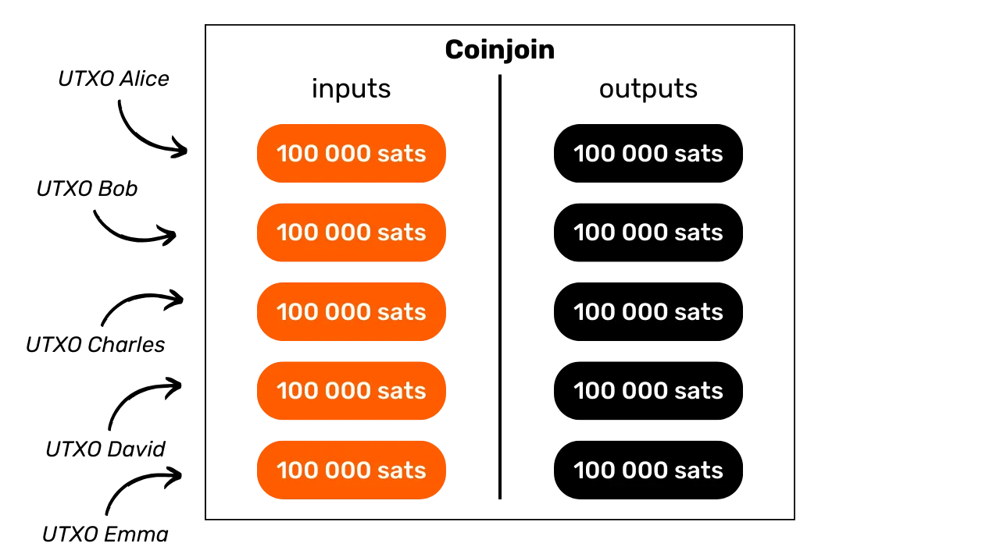

Al termine della transazione, diventa impossibile associare un output specifico a un utente conosciuto in input. Non esiste un collegamento diretto tra gli input e gli output, il che interrompe l'associazione tra gli utenti e i loro UTXO, così come la storia di ogni moneta.


Prendiamo l'esempio di Alice. Vuole inviare circa 100.000 satoshi (sats) a sua sorella Eve per il suo compleanno. Tuttavia, Alice non vuole che Eve possa tracciare la storia delle sue transazioni perché non vuole rivelare quanti bitcoin possiede o come li ha ottenuti. Per fare ciò, Alice decide di interrompere la storia del suo UTXO con una transazione coinjoin. Si organizza con Bob, Charles, David e Frank per effettuare una transazione collaborativa: Alice, Bob, Charles, David e Frank impegnano ciascuno un UTXO di 105.000 sats (con 5.000 sats per le commissioni di mining) come input per la transazione:


- In cambio dell'utilizzo di questi input, ciascuno genera un nuovo indirizzo per creare cinque output identici di 100.000 sats ciascuno. Ogni partecipante recupera un output:


- Alice finisce con un UTXO di 100.000 sats la cui storia è mescolata. Utilizza questo UTXO in una nuova transazione per inviare l'importo a Eve per il suo compleanno:


- Se Eve prova ad analizzare questa transazione per estrarre informazioni, si troverà di fronte alla transazione coinjoin che coinvolge Alice, Bob, Charles, David e Frank. Non essendo in grado di distinguere a chi appartiene ciascun input a causa dell'uniformità degli importi, Eve non può tracciare la storia dell'UTXO di Alice, né determinare quanti bitcoin possiede sua sorella o come li ha acquisiti:


In questo scenario, Alice ha utilizzato la tecnica coinjoin per aumentare la sua privacy contro le analisi retrospettive. Infatti, Alice si protegge contro una possibile analisi da parte di Eve che partirebbe da una specifica transazione per tracciare la storia dell'UTXO a ritroso. Questa protezione contro le analisi dal presente al passato è ciò che chiamiamo anonset retrospettivo. Approfondiremo questo concetto più dettagliatamente negli ultimi capitoli di questa parte.

Tuttavia, coinjoin offre anche la possibilità di migliorare la privacy contro le analisi dal passato al presente, ciò che viene definito anonset prospettico. Torniamo al nostro esempio in cui Alice ha inviato 98.000 sats a Eve per il suo compleanno, ma invertendo i ruoli. Immaginiamo ora che sia Eve a essere preoccupata per la sua privacy. Infatti, Alice potrebbe essere tentata di seguire la moneta che ha inviato a Eve per raccogliere informazioni. Eve potrebbe consolidare questo UTXO appena ricevuto con tutti gli altri suoi UTXO, il che potrebbe rivelare ad Alice l'importo di bitcoin che detiene nel suo portafoglio. Per evitare ciò, anche Eve può interrompere la storia della moneta appena ricevuta.

- Eve, Grace, Mallory, Oscar e Victor mettono ciascuno un UTXO di 98.000 sats come input in una transazione Bitcoin:
  

- In cambio dell'utilizzo di questi input, ciascuno fornisce un nuovo indirizzo per creare 5 output di 97.500 sats ciascuno, perfettamente uguali. Ogni utente recupera un output:


- Eve ora detiene un UTXO di 97.500 sats con una storia interrotta. Può usarlo senza timori per future transazioni. Infatti, se Alice prova a seguire i bitcoin che ha inviato a Eve, si imbatterà in una transazione coinjoin. Non sarà in grado di determinare a quale output UTXO appartiene Eve. L'analisi diventa quindi impossibile:


Nel primo esempio, abbiamo visto come il coinjoin possa proteggere la privacy di una moneta in relazione al suo passato e, nel secondo esempio, come possa anche assicurare la storia di una moneta in relazione al suo futuro. Ecco perché ho menzionato che il coinjoin dovrebbe essere visto come un evento una tantum che segmenta la storia di una moneta in entrambe le direzioni:


### Mixing, coinjoins, mixer... Qual è la differenza?

Il termine "mixing" è talvolta usato per descrivere i coinjoins, un termine che alcuni bitcoiners rifiutano perché temono confusione con i mixer custodial. Tuttavia, penso che questa apprensione sia infondata, perché, in un contesto matematico, il coinjoin incarna precisamente il concetto di mixing.

Nel campo generale della matematica, il mixing si riferisce alla proprietà di un sistema dinamico dove, dopo un certo tempo, tutte le porzioni dello spazio iniziale possono teoricamente essere mescolate con qualsiasi altra porzione. Il mixing implica che la posizione di una particella o lo stato di un sistema evolvono in modo tale che la sua futura distribuzione è indipendente dalla sua distribuzione iniziale, raggiungendo così uno stato dove le caratteristiche dello stato iniziale sono uniformemente distribuite nello spazio del sistema. Questo è esattamente ciò che accade in un coinjoin con i bitcoin. Quindi, a mio parere, il coinjoin è veramente un metodo di mixing delle monete.


Tuttavia, è importante distinguere il coinjoin dai mixer. Un mixer è un servizio dove gli utenti inviano i loro bitcoin per essere mescolati. Questi servizi erano popolari durante gli anni 2010, ma il loro uso è diminuito a causa di due grandi svantaggi rispetto al coinjoin:

- Richiedono all'utente di rinunciare alla custodia dei propri fondi durante il processo di mixing, esponendoli a rischi di furto;
- Non c'è garanzia che il mixer non registri i dettagli delle transazioni, o addirittura venda queste informazioni a compagnie di analisi della blockchain.
  

Oggi, gli utenti preferiscono quindi il coinjoin, poiché consente loro di mantenere il pieno controllo sui propri fondi durante tutto il processo. I partecipanti a un coinjoin non rischiano di avere i loro bitcoin rubati da altre parti coinvolte. Esploriamo insieme come tutto ciò sia possibile nel prossimo capitolo.

## Zerolink e Chaumian Coinjoins

<chapterId>326c9654-b359-4906-b23d-d6518dd5dc3e</chapterId>

La privacy fornita da un coinjoin si basa sulla dimensione del gruppo in cui il nostro pezzo è nascosto. Pertanto, è necessario trovare il maggior numero possibile di partecipanti. È del tutto possibile eseguire un coinjoin manualmente, con utenti trovati autonomamente, ma questo metodo è complesso e non consente di ottenere grandi anonset.

Ecco perché si sono sviluppati i coordinatori di coinjoin su Bitcoin. Il loro ruolo è quello di connettere diversi utenti e trasmettere le informazioni necessarie per il completamento con successo della transazione collaborativa.


Ma come possiamo assicurarci che il coordinatore non abbia mai il controllo sui bitcoin degli utenti e, nonostante sia la persona che costruisce la transazione coinjoin, come possiamo garantire che non possa collegare gli input e gli output degli utenti, il che potrebbe costituire una perdita di privacy?

### Le Firme Cieche di Chaum

Le implementazioni moderne di coinjoin utilizzano le firme cieche di David Chaum per evitare la fuga di informazioni. Studiamo rapidamente insieme come funzionano queste firme cieche.
Le firme cieche di Chaum sono una forma di firma digitale in cui l'emittente di una firma non conosce il contenuto del messaggio che sta firmando. Tuttavia, la firma può essere verificata in seguito con il messaggio originale. Questa tecnica è stata sviluppata dal crittografo David Chaum nel 1983.

Prendiamo l'esempio di un'azienda che desidera autenticare un documento confidenziale, come un contratto, senza rivelarne il contenuto. L'azienda applica un processo di mascheramento che trasforma criptograficamente il documento originale in modo reversibile. Questo documento modificato viene inviato a un'autorità di certificazione che applica una firma cieca senza conoscere il contenuto sottostante. Dopo aver ricevuto il documento firmato, l'azienda rimuove il mascheramento dalla firma. Il risultato è un documento originale autenticato dalla firma dell'autorità, senza che quest'ultima abbia mai visto il contenuto originale.

Le firme cieche di Chaum consentono quindi la certificazione dell'autenticità di un documento senza conoscerne il contenuto, garantendo sia la riservatezza dei dati dell'utente sia l'integrità del documento firmato.

### Chaumian Coinjoins

Nei "Chaumian CoinJoins", l'uso di Tor e le firme cieche di David Chaum sono combinati per garantire che il coordinatore non possa sapere a quale utente appartiene ciascun output. Il processo di costruzione della transazione coinjoin si articola in 3 passaggi principali: registrazione degli input, registrazione degli output e firma della transazione. Esaminiamo questo processo attraverso l'esempio di Alice, uno dei partecipanti al coinjoin. Tutti gli altri partecipanti seguono gli stessi passaggi di Alice, ognuno per conto proprio.

**Passaggio 1: Registrazione degli input.**

- Alice invia al coordinatore l'UTXO che desidera utilizzare come input per la transazione, così come l'indirizzo ricevente mascherato che vuole usare come output per ricevere i suoi bitcoin. Pertanto, il coordinatore non può conoscere l'indirizzo di Alice. Vede solo la sua versione mascherata.

- Il coordinatore verifica la validità degli input, poi firma l'indirizzo mascherato di Alice con la sua chiave privata. Invia poi ad Alice la firma cieca.

**Passaggio 2: Registrazione degli output.**

- Alice può ora rimuovere il mascheramento dal suo indirizzo firmato dalla chiave privata del coordinatore. Stabilisce una nuova connessione sotto una diversa identità Tor. Il coordinatore non può identificare che si tratta di Alice che si connette sotto questa nuova identità.

- Alice invia l'indirizzo e la firma non mascherati al coordinatore (che ancora non sa che si tratta di Alice).

**Passaggio 3: Firma della transazione.**

- Il coordinatore recupera allo stesso modo gli output non mascherati da tutti i partecipanti. Grazie alle firme associate, può verificare che ciascun output inviato anonimamente sia stato effettivamente firmato dalla sua chiave privata in precedenza, garantendone la legittimità. È quindi pronto a costruire la transazione coinjoin e la invia ai partecipanti perché la firmino.

- Alice, come gli altri partecipanti, verifica che il suo input e output siano correttamente inclusi nella transazione costruita dal coordinatore. Se tutto è soddisfacente, invia la firma che sblocca lo script del suo input al coordinatore.

- Dopo aver raccolto le firme da tutti i partecipanti del coinjoin, il coordinatore può trasmettere la transazione sulla rete Bitcoin, affinché possa essere aggiunta a un blocco.
  In questo sistema, il coordinatore non è in grado di collegare un input a uno specifico output. Inoltre, non può prendere possesso dei fondi dei partecipanti, poiché non ha mai accesso alle chiavi private necessarie per sbloccare i loro UTXO. Durante tutto il processo, e fino alla fine della fase 3, non ha nemmeno accesso alle firme. Quando Alice e gli altri partecipanti firmano la transazione globale, dopo aver verificato che tutto sia corretto, il coordinatore non può più modificare questa transazione, inclusi gli output, senza invalidarla. Questo impedisce quindi il furto di bitcoin da parte del coordinatore.
  In ultima analisi, quando registrano il loro output nella transazione, l'utente coinjoin desidera garanzie simili a quelle di un cittadino che vota in una elezione. C'è una dualità tra gli aspetti pubblici e privati di queste azioni. Da un lato, c'è ciò che si desidera mantenere privato: per l'elettore, non vogliono che la loro scheda elettorale sia collegata alla loro identità; per l'utente coinjoin, non vogliono che il loro output sia associato al loro input. Infatti, se il coordinatore, o qualsiasi altra parte, riesce a stabilire un collegamento tra un input e un output, il coinjoin perde tutto il suo scopo. Come spiegato in precedenza, il coinjoin deve funzionare come una pausa nella storia di una moneta. Questa pausa si verifica proprio a causa dell'impossibilità di associare un input specifico a un output specifico nella transazione coinjoin (anonset prospettico) e viceversa (anonset retrospettivo).

D'altra parte, c'è l'aspetto pubblico: l'elettore vuole assicurarsi che la sua scheda elettorale sia inclusa nell'urna; similmente, l'utente coinjoin vuole assicurarsi che il loro output sia incluso nella transazione coinjoin. Infatti, è assolutamente necessario che i partecipanti al coinjoin possano verificare la presenza del loro output prima di firmare la transazione, altrimenti il coordinatore potrebbe rubare i fondi.

Sono proprio questi 2 aspetti pubblici e privati, resi possibili dall'uso delle firme cieche di David Chaum, che garantiscono ai partecipanti dei coinjoin Chaumiani che i loro bitcoin non saranno rubati, e che i loro fondi non possono essere tracciati.

### Chi ha inventato il concetto di coinjoin?

È difficile determinare con certezza chi per primo ha introdotto l'idea del coinjoin su Bitcoin, e chi ha avuto l'idea di utilizzare le firme cieche di David Chaum in questo contesto. Si pensa spesso che sia stato Gregory Maxwell a parlarne per primo in [un messaggio su BitcoinTalk nel 2013](https://bitcointalk.org/index.php?topic=279249.0):
Utilizzando le Firme Cieche di Chaum: Gli utenti si collegano e forniscono input (e indirizzi per il resto) così come una versione crittograficamente oscurata dell'indirizzo al quale desiderano inviare le loro monete private; il server firma i token e li restituisce agli utenti. Gli utenti si ricollegano in modo anonimo, rivelano i loro indirizzi di output e li rimandano al server. Il server può vedere che tutti gli output sono stati firmati da esso e che, di conseguenza, tutti gli output provengono da partecipanti validi. Più tardi, le persone si ricollegano e firmano.
Maxwell, G. (2013, Agosto 22). _CoinJoin: La privacy di Bitcoin per il mondo reale_. Forum BitcoinTalk. https://bitcointalk.org/index.php?topic=279249.0
Tuttavia, ci sono state menzioni precedenti, sia per le firme di Chaum nel contesto del mixing, sia per i coinjoin. [Nel giugno 2011, Duncan Townsend ha presentato su BitcoinTalk](https://bitcointalk.org/index.php?topic=12751.0) un mixer che utilizza le firme di Chaum in modo piuttosto simile ai moderni coinjoin Chaumiani.
Nello stesso thread, c'è [un messaggio di hashcoin in risposta a Duncan Townsend](https://bitcointalk.org/index.php?topic=12751.msg315793#msg315793) per migliorare il suo mixer. Il processo descritto in questo messaggio rappresenta precisamente ciò che più si avvicina ai coinjoin. Viene anche menzionato un sistema simile in [un messaggio di Alex Mizrahi nel 2012](https://gist.github.com/killerstorm/6f843e1d3ffc38191aebca67d483bd88#file-laundry), mentre stava consigliando i creatori di Tenebrix, uno dei primi altcoin che ha servito come base per la creazione di Litecoin in seguito. Anche il termine "coinjoin" stesso non è stato inventato da Greg Maxwell, ma è venuto da un'idea di Peter Todd.


### Zerolink

Zerolink è un protocollo di mixing completo che integra coinjoin Chaumiani e varie strategie per proteggere l'anonimato degli utenti contro diverse forme di analisi della catena, riducendo notevolmente gli errori legati alla gestione del portafoglio. Questo protocollo [è stato introdotto da nopara73 e TDevD nel 2017](https://github.com/nopara73/ZeroLink/blob/master/README.md).


Come suggerisce il nome, il principio di Zerolink è quello di effettuare transazioni coinjoin che assicurano l'impossibilità di tracciare i collegamenti tra gli input e gli output. Questa caratteristica è ottenuta garantendo che tutti gli output presentino importi perfettamente identici.


Una misura preventiva importante di Zerolink comporta la separazione completa degli UTXO non miscelati dagli UTXO miscelati utilizzando insiemi distinti di chiavi crittografiche, o addirittura portafogli separati. In questo modo, il portafoglio "pre-mix", destinato alle monete prima del mixing, è differenziato dal portafoglio "post-mix", riservato alle monete che sono state miscelate.


Questa rigorosa separazione degli UTXO serve principalmente a prevenire associazioni accidentali tra un UTXO miscelato e uno non miscelato. Infatti, se tali collegamenti si verificano, l'efficacia del coinjoin sull'UTXO miscelato è annullata senza che l'utente ne sia consapevole, compromettendo così la riservatezza di un UTXO la cui storia si credeva fosse stata interrotta. Questi collegamenti possono sorgere sia attraverso il riutilizzo degli indirizzi per assicurare un UTXO miscelato con uno non miscelato, sia applicando l'Euristica di Proprietà Comune dell'Input (CIOH), se l'utente consuma UTXO miscelati e non miscelati come input della stessa transazione. Separando i portafogli pre-mixing e post-mixing, queste associazioni accidentali sono evitate e l'utente è protetto contro errori involontari.

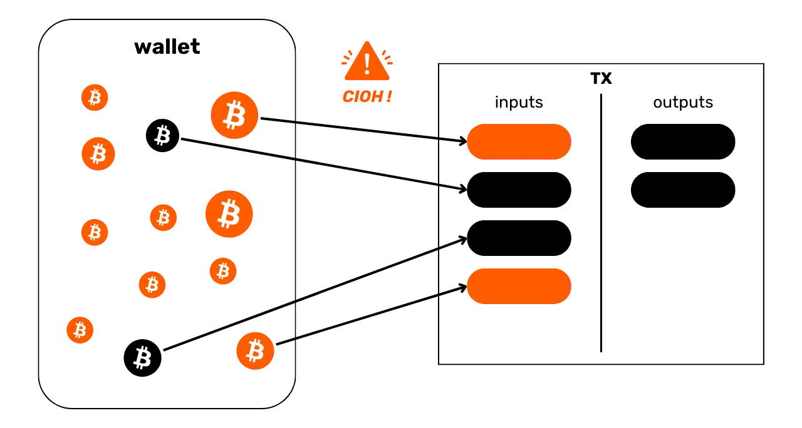
Questa separazione offre anche la possibilità di applicare regole distinte tra i portafogli pre-mixing e post-mixing a livello del software del portafoglio. Ad esempio, nel portafoglio post-mix, il software può proibire la fusione degli UTXO in input per prevenire l'applicazione del CIOH che comprometterebbe l'anonset dell'utente. È anche possibile standardizzare l'uso di script e opzioni di transazione (come la segnalazione di RBF, ad esempio) per prevenire l'identificazione tramite le impronte digitali del portafoglio.
Attualmente, Whirlpool è l'unica implementazione di coinjoin che applica rigorosamente il protocollo Zerolink. Nel capitolo seguente, esploreremo le diverse implementazioni di coinjoin esistenti e i vantaggi e svantaggi di ciascuna.

## Implementazioni di Coinjoin

<chapterId>e37ed073-9498-4e4f-820b-30951e829596</chapterId>

_Nel 2024, stiamo assistendo a cambiamenti significativi negli strumenti disponibili per gli utenti che desiderano eseguire coinjoins su Bitcoin. Ci troviamo attualmente in un periodo cruciale, e il mercato dei coinjoin sta subendo una grande ristrutturazione. Pertanto, questo capitolo verrà probabilmente aggiornato nel tempo._

Per il momento, ci sono principalmente 3 diverse implementazioni di coinjoin su Bitcoin:

- Whirlpool;
- Wabisabi;
- JoinMarket.
  Ciascuna di queste implementazioni mira a rompere la storia degli UTXO attraverso transazioni coinjoin. Tuttavia, i loro meccanismi variano significativamente. Pertanto, è essenziale capire come funziona ciascuna per scegliere l'opzione più adatta alle proprie esigenze.

### JoinMarket

JoinMarket, creato nel 2015 da Adam Gibson e Chris Belcher, si distingue dalle altre implementazioni di coinjoin grazie al suo modello unico di abbinamento degli utenti. Questo sistema si basa su un mercato di scambio P2P dove alcuni utenti, i "makers", rendono disponibili i loro bitcoin per il mixing, mentre altri, i "takers", utilizzano questi fondi per eseguire coinjoins in cambio di una commissione.


In questo modello, i "makers" lasciano disponibili i loro bitcoin ai "takers" e ricevono commissioni in cambio del loro servizio. I "takers", d'altra parte, pagano per usare i bitcoin dei "makers" per effettuare le proprie transazioni coinjoin. Le commissioni di servizio variano a seconda del ruolo: i "makers" accumulano commissioni per la loro offerta di liquidità, mentre i "takers" pagano le commissioni. Questo mercato opera liberamente senza condizioni di utilizzo.

Uno dei principali svantaggi di JoinMarket è la sua complessità d'uso, che richiede una certa familiarità con i terminali per sfruttarlo efficacemente. Sebbene questa complessità non sia una barriera per un utente esperto, può limitare l'accesso al grande pubblico. Tuttavia, la recente introduzione di un'interfaccia web denominata JAM ha in qualche modo facilitato il suo utilizzo.


Fonte: [JAM](https://github.com/joinmarket-webui/jam/blob/devel/docs/assets/screenshot-dark.webp)

Tuttavia, la barriera tecnica rimane un ostacolo importante. Nell'ecosistema dei coinjoin, dove la riservatezza è potenziata dal numero di partecipanti, qualsiasi limitazione che riduca l'accessibilità influisce direttamente sulla liquidità disponibile, che è un fattore cruciale per l'efficienza del mixing. Bitcoin, già una nicchia nelle transazioni finanziarie, vede l'uso dei coinjoins come una sotto-nicchia, e JoinMarket rappresenta una frazione ancora più specializzata, limitando così il suo potenziale di aumentare gli anonset dei suoi utenti.
Nonostante il suo innovativo modello di abbinamento P2P per i coinjoin, JoinMarket presenta alcuni svantaggi significativi, specialmente in termini di struttura transazionale. A differenza di altre implementazioni come Whirlpool, JoinMarket non garantisce una perfetta uguaglianza tra gli output, ed è possibile tracciare collegamenti deterministici tra input e output. Inoltre, manca di strumenti per prevenire che monete già mixate vengano mixate nuovamente, il che potrebbe compromettere la riservatezza ricercata dagli utenti. Infine, sebbene il concetto di JoinMarket sia interessante, specialmente per coloro interessati a un mercato di liquidità dinamico, le sue debolezze strutturali e la complessità tecnica lo rendono, a mio avviso, meno attraente, sia per i novizi che per gli esperti alla ricerca di un'implementazione di coinjoin.

### Wabisabi

Wabisabi è un'altra implementazione di coinjoin, con un approccio che centralizza il coordinamento delle transazioni. Questo modello è stato progettato da Ádám Ficsór (nopara73), Yuval Kogman, Lucas Ontivero e István András Seres nel 2021, ed è stato integrato nel software Wasabi 2.0 l'anno successivo. Wabisabi rappresenta precisamente un'evoluzione del modello di coinjoin del software Wasabi lanciato nel 2018.

Verso la fine degli anni 2010, Wasabi ha adottato una struttura transazionale per i suoi coinjoin radicalmente diversa da quella di Whirlpool. Per aumentare gli anonset dei suoi partecipanti, Wasabi ha utilizzato transazioni coinjoin molto grandi che raggruppavano decine di partecipanti. Al contrario, Whirlpool ha optato per molteplici piccole transazioni, consentendo un aumento esponenziale degli anonset con ogni ciclo.

I metodi di gestione del resto hanno inoltre distinto le due implementazioni. Con Whirlpool, il resto veniva escluso e isolato dagli UTXO prima dei cicli di coinjoin grazie al TX0, un concetto che spiegherò ulteriormente nel prossimo capitolo. Da Wasabi, invece, il resto formava uno degli output della transazione coinjoin, mantenendo collegamenti deterministici tra alcuni input e output.

Con Wabisabi, la versione 2.0 di Wasabi ha adattato il suo approccio ai coinjoin per avvicinarsi a quello di Whirlpool. Sebbene le transazioni coinjoin rimangano molto grandi, è ora possibile catenare diversi cicli successivi, seguendo così il modello di Whirlpool. Uno sforzo particolare è stato inoltre fatto sulla gestione del resto: a differenza di Wasabi 1.0, dove il resto era direttamente collegato agli input degli utenti, Wabisabi cerca di suddividere il resto in diverse piccole somme, distribuite in denominazioni uguali per tutti i partecipanti.

Illustreremo ciò con un esempio semplificato che coinvolge solo 2 utenti: Alice vuole mixare 115.000 sats e Bob, 210.000 sats. Ignorando le commissioni, con Wasabi 1.0, una transazione coinjoin avrebbe generato 3 output di 100.000 sats, più 1 resto di 15.000 sats per Alice e 1 resto di 10.000 sats per Bob. Gli output del resto sarebbero sempre stati collegati agli input:

Sotto Wabisabi, la stessa transazione avrebbe prodotto 3 output di 100.000 sats e 5 output di 5.000 sats, disperdendo così il resto in modo che non sia direttamente rintracciabile a un input specifico:
Personalmente, ritengo che la gestione del cambiamento in Wabisabi presenti diversi rischi che potrebbero comprometterne l'efficacia in termini di privacy:

- Quando un utente contribuisce con un UTXO significativamente più grande rispetto a quelli degli altri partecipanti, finisce inevitabilmente per ottenere un ammontare di resto che sarà collegato al suo input. Questo va contro l'obiettivo iniziale del protocollo, che mira a eliminare qualsiasi cambio identificabile;
- La moltiplicazione delle denominazioni al fine di frammentare il resto può paradossalmente danneggiare l'efficienza del mixing. Questo processo può portare a una diminuzione degli anonset per certi output, poiché diventano più facilmente identificabili;
- Questo metodo genera anche UTXO di basso valore che pongono un problema di gestione per l'utente. Questi piccoli UTXO, se diventano troppo costosi da spendere rispetto al loro valore, possono diventare "polvere". Questo fenomeno spinge l'utente a unire diversi UTXO in input nelle loro future transazioni o a consolidarli. In entrambi i casi, a causa del COH, ciò può diminuire gli anonset ottenuti o annullare completamente i benefici per la privacy acquisiti dal coinjoin iniziale.

A differenza di Whirlpool, che implementa il protocollo ZeroLink assicurando una rigorosa separazione tra UTXO pre-mix e post-mix, Wabisabi non mantiene questa stretta segregazione. Ci sono stati anche problemi di riutilizzo degli indirizzi da parte di alcuni clienti di Wasabi, che ovviamente sono molto dannosi per l'utente.

Nella versione 2.0 di Wasabi, è stata implementata una nuova politica di tariffazione dei coinjoin. Ora, le commissioni del coordinatore sono fissate allo 0,3% per UTXO maggiori di 0,01 bitcoin, mentre per gli UTXO più piccoli, queste commissioni sono completamente azzerate. Inoltre, i remix per questi piccoli UTXO sono gratuiti, anche se le commissioni di mining rimangono a carico dell'utente per tutte le transazioni, inclusi i remix.

Questa politica contrasta con quella di Whirlpool, dove le commissioni rimangono fisse, indipendentemente dalla dimensione degli anonset ottenuti. Con Wasabi 2.0, sebbene le commissioni del coordinatore siano azzerate per i piccoli UTXO, l'utente deve comunque pagare le commissioni di mining su tutte le transazioni, inclusi i remix.
Al momento della scrittura, l'uso di Wabisabi è diventato notevolmente più complesso a seguito di recenti eventi. Infatti, dopo l'arresto dei fondatori di Samourai Wallet, zkSNACKs, l'azienda che finanzia e gestisce lo sviluppo di Wasabi, ha annunciato la cessazione del suo servizio di coordinamento coinjoin il 1° giugno 2024. Questo coordinatore, che era impostato di default su Wasabi, aveva la grande maggioranza della liquidità.

Con la chiusura di questo principale coordinatore, gli utenti devono ora connettersi a nuovi coordinatori indipendenti. Questo cambiamento solleva preoccupazioni: da un lato, i nuovi coordinatori potrebbero non avere sufficiente liquidità, riducendo così l'efficacia dei coinjoin in termini di privacy. Dall'altro, c'è il rischio di incontrare un coordinatore malevolo. Questa situazione aggiunge nuovi significativi rischi per coloro che cercano di utilizzare Wabisabi.

Oltre alle questioni tecniche, la decisione di zkSNACKs, l'azienda dietro Wasabi, di utilizzare i servizi di una compagnia di analisi della blockchain per filtrare i partecipanti nei coinjoin pone serie questioni etiche e strategiche. L'idea iniziale era prevenire l'uso dei coinjoin su Wasabi da parte dei criminali, una mossa che può sembrare legittima. Tuttavia, ciò solleva un paradosso: pagare commissioni a un coordinatore, la cui missione principale è aumentare la privacy degli utenti, solo per poi finanziare una compagnia il cui obiettivo è compromettere quella stessa privacy.
Ancora più preoccupante è il principio del filtraggio, che contrasta nettamente con la filosofia di Bitcoin, mirata a offrire un sistema finanziario aperto e non censurabile. Sebbene possa sembrare giustificato voler escludere le attività criminali, questo filtraggio potrebbe anche colpire individui le cui azioni, sebbene classificate come illegali in alcuni contesti, potrebbero essere moralmente giustificabili o socialmente benefiche. L'esempio di Edward Snowden illustra perfettamente questa dicotomia: considerato un criminale da alcuni governi per le sue rivelazioni, è visto da altri come un whistleblower che ha agito nell'interesse pubblico. Questa complessità sottolinea il potenziale pericolo del filtraggio che, sebbene parta da una buona intenzione, potrebbe in ultima analisi ledere i diritti e la sicurezza degli utenti legittimi. Avrei potuto anche menzionare attivisti e giornalisti perseguitati sotto certi regimi autoritari. Come avrete capito, la mia preferenza va senza dubbio verso il modello Whirlpool per condurre coinjoins su Bitcoin. Questo sistema si distingue per il suo rigore e offre garanzie superiori in termini di privacy. È anche l'unico a proporre un mixing considerato perfetto in un contesto matematico. A mio avviso, questo modello rappresenta il futuro dei coinjoins su Bitcoin. Vi invito quindi a esplorare più a fondo questo modello nel prossimo capitolo.

## Il Funzionamento di Whirlpool

<chapterId>bdbd7109-e36d-4b4f-a3c6-928df4e9bfda</chapterId>

Whirlpool si distingue dagli altri metodi di coinjoin utilizzando transazioni "_ZeroLink_", che assicurano che non ci sia tecnicamente alcun collegamento possibile tra tutti gli input e tutti gli output. Questo mixing perfetto è ottenuto attraverso una struttura in cui ogni partecipante contribuisce con un importo identico in input (ad eccezione delle commissioni di mining), generando così output di importi perfettamente uguali.

Questo approccio restrittivo sugli input conferisce alle transazioni coinjoin di Whirlpool una caratteristica unica: l'assenza totale di collegamenti deterministici tra gli input e gli output. In altre parole, ogni output ha una probabilità uguale di essere attribuito a qualsiasi partecipante, in relazione a tutti gli altri output della transazione.

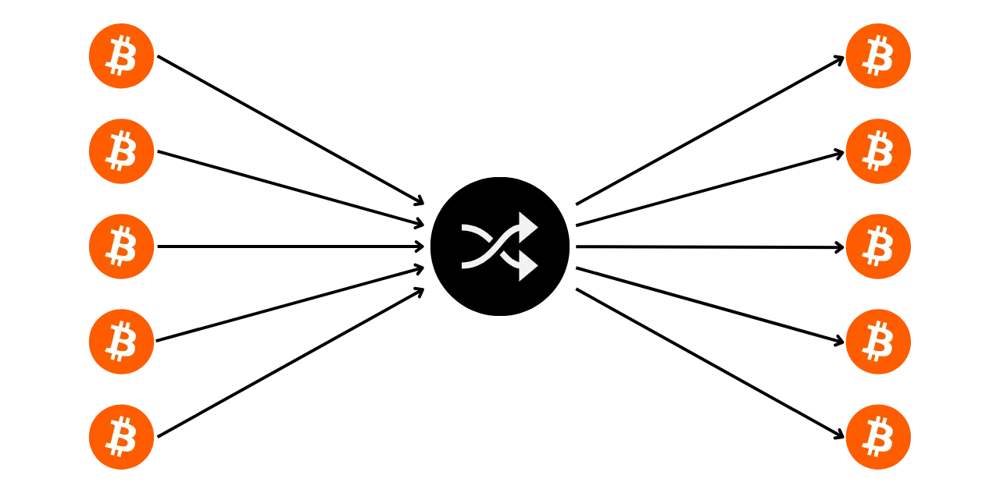

### Il Funzionamento Generale di Whirlpool

Inizialmente, il numero di partecipanti in ogni coinjoin di Whirlpool era limitato a 5, con 2 nuovi entranti e 3 remixers (spiegheremo questi concetti più avanti). Tuttavia, l'aumento delle commissioni per le transazioni on-chain osservato nel 2023 ha spinto i team di Samourai a ripensare il loro modello per migliorare la privacy riducendo i costi. Così, tenendo conto della situazione del mercato delle commissioni e del numero di partecipanti, il coordinatore può ora organizzare coinjoins che includono 6, 7 o 8 partecipanti. Queste sessioni potenziate sono designate sotto il nome di "_Surge Cycles_". È importante notare che, indipendentemente dalla configurazione, ci sono sempre solo 2 nuovi entranti nei coinjoins di Whirlpool.

Quindi, le transazioni Whirlpool sono caratterizzate da un numero identico di input e output, che possono essere:

- 5 input e 5 output;


- 6 input e 6 output;


- 7 input e 7 output;


- 8 input e 8 output.


Il modello proposto da Whirlpool si basa quindi su piccole transazioni coinjoin. A differenza di Wabisabi e JoinMarket, dove la robustezza degli anonset si basa sul volume dei partecipanti in un singolo ciclo (o pochi cicli), Whirlpool punta sulla concatenazione di multipli cicli di piccole dimensioni. In questo modello, l'utente sostiene costi solo al suo ingresso iniziale in una pool, permettendogli di partecipare a una moltitudine di remix senza costi aggiuntivi. Sono i nuovi entranti a coprire le spese di mining per i remixers.
Con ogni coinjoin aggiuntivo in cui una moneta partecipa, insieme ai suoi pari incontrati in passato, gli anonset cresceranno esponenzialmente. L'obiettivo, quindi, è sfruttare questi remix gratuiti che, ad ogni occorrenza, contribuiscono a rafforzare la densità degli anonset associati a ogni moneta mixata.

Whirlpool è stato progettato tenendo in mente due requisiti importanti:

- L'accessibilità dell'implementazione su dispositivi mobili, dato che Samourai Wallet è principalmente un'applicazione per smartphone;
- La velocità dei cicli di remixing per incoraggiare un significativo aumento degli anonset.

Questi imperativi hanno guidato le scelte degli sviluppatori di Samourai Wallet nella progettazione di Whirlpool, portandoli a limitare il numero di partecipanti per ciclo. Troppo pochi partecipanti avrebbero compromesso l'efficacia del coinjoin, riducendo drasticamente gli anonset generati in ogni ciclo, mentre troppi partecipanti avrebbero posto problemi di gestione sulle applicazioni mobili e avrebbero ostacolato il flusso dei cicli.

In definitiva, non è necessario avere un alto numero di partecipanti per coinjoin su Whirlpool poiché gli anonset si realizzano sull'accumulo di diversi cicli di coinjoin. Il principio più importante qui è l'omogeneità degli UTXO di tutti i partecipanti, poiché ciò permette un mix perfetto, e quindi di beneficiare pienamente dei cicli di mixing e remixing.

### Le pool e le tariffe coinjoin

Perché questi multipli cicli aumentino efficacemente gli anonset delle monete mixate, deve essere stabilito un certo quadro per limitare le quantità di UTXO utilizzate. Whirlpool definisce quindi diverse pool.

Una pool rappresenta un gruppo di utenti che desiderano mixare insieme, che concordano sulla quantità di UTXO da utilizzare per ottimizzare il processo di coinjoin mantenendo un'omogeneità perfetta delle monete. Ogni pool specifica un importo fisso per l'UTXO, che l'utente deve rispettare per partecipare. Quindi, per eseguire coinjoins con Whirlpool, è necessario selezionare una pool. Le pool disponibili al momento sono le seguenti:

- 0,5 bitcoin;
- 0,05 bitcoin;
- 0,01 bitcoin;
- 0,001 bitcoin (= 100.000 sats).
  Unendoti a una pool con i tuoi bitcoin, questi verranno divisi per generare UTXO perfettamente omogenei con quelli degli altri partecipanti nella pool. Ogni pool ha un limite massimo; quindi, per importi che superano questo limite, sarai costretto o a fare due ingressi separati nella stessa pool o a rivolgerti a un'altra pool con un importo maggiore:
  | Pool (bitcoin) | Importo massimo per ingresso (bitcoin) |
  |----------------|----------------------------------------|
  | 0,5 | 35 |
  | 0,05 | 3,5 |
  | 0,01 | 0,7 |
  | 0,001 | 0,025 |
  Un UTXO è considerato appartenente a un pool quando è pronto per essere integrato in un coinjoin. Tuttavia, ciò non significa che l'utente perda il possesso di esso. Come abbiamo visto nei primi capitoli di questa parte, attraverso i diversi cicli di mixing, si mantiene il pieno controllo delle proprie chiavi e, di conseguenza, dei propri bitcoin. Questo è ciò che differenzia la tecnica del coinjoin da altre tecniche di mixing centralizzate.

Per entrare in un pool coinjoin, è necessario pagare delle commissioni di servizio così come le commissioni di mining. Le commissioni di servizio sono fisse per ogni pool e sono destinate a compensare i team responsabili dello sviluppo e della manutenzione di Whirlpool.

Le commissioni di servizio per l'utilizzo di Whirlpool devono essere pagate una singola volta all'ingresso nel pool. Una volta completato questo passaggio, si ha la possibilità di partecipare a un numero illimitato di remix senza commissioni aggiuntive. Ecco le commissioni fisse attuali per ogni pool:

| Pool (bitcoin) | Commissione di ingresso (bitcoin) |
| -------------- | --------------------------------- |
| 0.5            | 0.0175                            |
| 0.05           | 0.00175                           |
| 0.01           | 0.0005 (50,000 sats)              |
| 0.001          | 0.00005 (5,000 sats)              |

Queste commissioni funzionano essenzialmente come un biglietto d'ingresso per il pool scelto, indipendentemente dall'importo che si inserisce in coinjoin. Quindi, sia che si entri nel pool da 0.01 BTC con esattamente 0.01 BTC o si entri con 0.5 BTC, le commissioni rimarranno le stesse in valore assoluto.

Prima di procedere con i coinjoin di Whirlpool, l'utente ha quindi una scelta tra 2 strategie:

- Optare per un pool più piccolo per minimizzare le commissioni di servizio, sapendo che riceveranno in cambio diversi UTXO più piccoli;
- O preferire un pool più grande, accettando di pagare commissioni più elevate per finire con un numero ridotto di UTXO di valore maggiore.
  Generalmente non è consigliato unire diversi UTXO mixati dopo i cicli di coinjoin, poiché ciò potrebbe compromettere la privacy acquisita, soprattutto a causa dell'euristica della proprietà comune dell'input (CIOH: _Common-Input-Ownership-Heuristic_). Pertanto, potrebbe essere saggio scegliere un pool più grande, anche se ciò significa pagare di più, per evitare di avere troppi UTXO di piccolo valore come output. L'utente deve valutare questi compromessi per scegliere il pool che preferisce.
  Oltre alle commissioni di servizio, devono essere considerate anche le commissioni di mining inerenti a qualsiasi transazione Bitcoin. Come utente di Whirlpool, sarà necessario pagare le commissioni di mining per la transazione di preparazione (`Tx0`) così come quelle per il primo coinjoin. Tutti i remix successivi saranno gratuiti, grazie al modello di Whirlpool che si basa sul pagamento dei nuovi entranti.

Infatti, in ogni coinjoin di Whirlpool, 2 utenti tra gli input sono nuovi partecipanti. Gli altri input provengono da remixers. Di conseguenza, le commissioni di mining per tutti i partecipanti alla transazione sono coperte da questi 2 nuovi partecipanti, che beneficeranno poi anche di remix gratuiti:

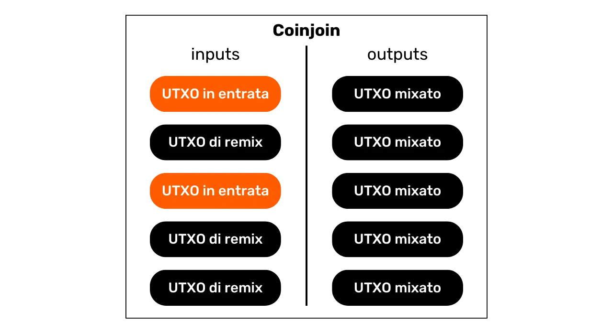

Grazie a questo sistema di commissioni, Whirlpool si differenzia veramente da altre implementazioni di coinjoin poiché gli anonset degli UTXO non sono proporzionali al prezzo pagato dall'utente. Così, è possibile raggiungere livelli di anonimato considerevolmente elevati pagando solo la commissione di ingresso del pool e le commissioni di mining per 2 transazioni (la `Tx0` e il mix iniziale).
È importante notare che l'utente dovrà anche coprire le commissioni di mining per prelevare i propri UTXO dalla pool dopo aver eseguito i loro multipli coinjoin, a meno che non abbiano selezionato l'opzione `mix to`, che permette di fornire un indirizzo esterno che riceverà direttamente i fondi come output di un coinjoin, senza alcuna transazione aggiuntiva.

### Conti dei Portafogli HD

Per eseguire un coinjoin tramite Whirlpool, il portafoglio deve generare diversi conti distinti. Questo è il principio del protocollo ZeroLink. Un conto, nel contesto di un portafoglio HD (_Hierarchical Deterministic_), costituisce una sezione completamente isolata dalle altre, questa separazione avviene al terzo livello di profondità della gerarchia del portafoglio, ovvero al livello dell'`xpub`.


Un portafoglio HD può teoricamente derivare fino a `2^(32/2)` conti diversi. Il conto iniziale, utilizzato di default su tutti i portafogli Bitcoin, corrisponde all'indice `0'`.

Per i portafogli adattati a Whirlpool, vengono utilizzati 4 conti per soddisfare le esigenze del processo ZeroLink:

- Il **conto deposito**, identificato dall'indice `0'`;
- Il **conto bad bank** (o "cambio tossico"), identificato dall'indice `2 147 483 644'`;
- Il **conto premix**, identificato dall'indice `2 147 483 645'`;
- Il **conto postmix**, identificato dall'indice `2 147 483 646'`.

Ciascuno di questi conti svolge una funzione specifica nel processo di coinjoin, che esploreremo nelle sezioni seguenti.

Tutti questi conti sono collegati a un unico seed, permettendo all'utente di recuperare l'accesso a tutti i loro bitcoin utilizzando la loro frase di recupero e, se necessario, la loro passphrase. Tuttavia, è necessario specificare al software, durante questa operazione di recupero, i diversi indici dei conti che sono stati utilizzati.

Ora esaminiamo le diverse fasi di un coinjoin Whirlpool all'interno di questi conti.

### Il TX0

Il punto di partenza di qualsiasi coinjoin Whirlpool è il **conto deposito**. Questo conto è quello che utilizzi automaticamente quando crei un nuovo portafoglio Bitcoin. Questo conto deve essere accreditato con i bitcoin che desideri mixare.

Il `Tx0` rappresenta il primo passo nel processo di mixing Whirlpool. Ha lo scopo di preparare ed equalizzare gli UTXO per il coinjoin, dividendoli in unità corrispondenti all'importo della pool selezionata, per garantire l'omogeneità del mixing. Gli UTXO equalizzati vengono poi inviati al **conto premix**. Per quanto riguarda la differenza che non può entrare nella pool, viene separata in un conto specifico: il **bad bank** (o "cambio tossico").

Questa transazione iniziale `Tx0` serve anche a regolare le commissioni di servizio dovute al coordinatore del coinjoin. A differenza dei passaggi successivi, questa transazione non è collaborativa; l'utente deve quindi sostenere l'intero costo delle commissioni di mining:

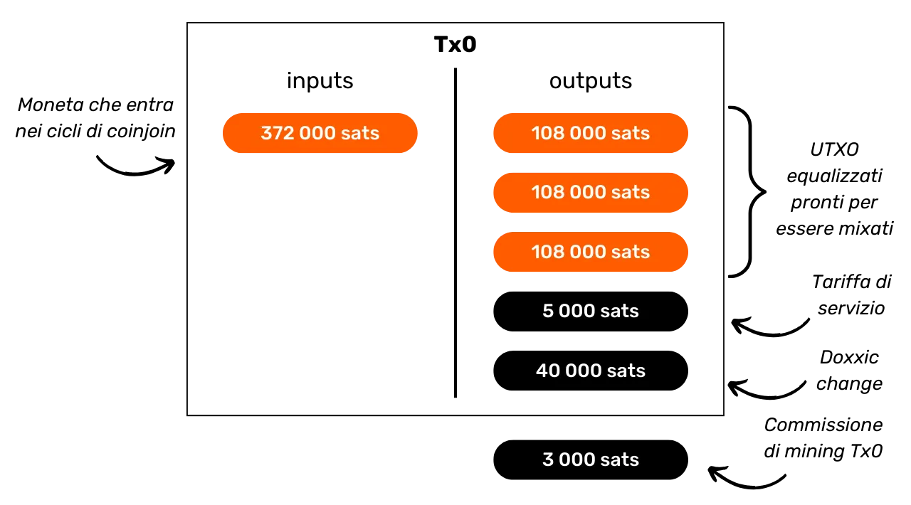

In questo esempio di transazione `Tx0`, un input di `372 000 sats` dal nostro **conto deposito** viene diviso in diversi UTXO di output, che sono distribuiti come segue:

- Un importo di `5 000 sats` destinato al coordinatore per le commissioni di servizio, corrispondente all'ingresso nella pool di `100 000 sats`;
- 3 UTXO preparati per il mixing, reindirizzati al nostro **conto premix** e registrati presso il coordinatore. Questi UTXO sono equalizzati a `108 000 sats` ciascuno, per coprire le commissioni di mining per il loro futuro mix iniziale;
- L'eccedenza che non può entrare nella pool, essendo troppo piccola, è considerata come cambio tossico. Viene inviata al suo specifico account. Qui, questo cambio ammonta a `40 000 sats`;
- Infine, ci sono `3.000 sats` che non costituiscono un output, ma sono le commissioni di mining richieste per confermare la `Tx0`.
  Per esempio, ecco una vera Tx0 Whirlpool (non mia): [edef60744f539483d868caff49d4848e5cc6e805d6cdc8d0f9bdbbaedcb5fc46](https://mempool.space/fr/tx/edef60744f539483d868caff49d4848e5cc6e805d6cdc8d0f9bdbbaedcb5fc46)


### Il Cambio Tossico

L'eccesso che non ha potuto essere integrato nella pool, qui equivalente a `40.000 sats`, viene reindirizzato all'account della **bad bank**, anche riferito come "cambio tossico", per garantire una stretta separazione dagli altri UTXO nel portafoglio.

Questo UTXO è pericoloso per la privacy dell'utente perché non solo è ancora legato al suo passato, e quindi possibilmente all'identità del suo proprietario, ma è anche marcato come appartenente a un utente che ha partecipato a un coinjoin.


Se questo UTXO viene unito con output mescolati, perderanno tutta la privacy guadagnata durante i cicli di coinjoin, notevolmente a causa del CIOH (_Common-Input-Ownership-Heuristic_). Se viene unito con altri cambi tossici, l'utente rischia di perdere la privacy poiché ciò collegherà le diverse entrate dai cicli di coinjoin. Pertanto, deve essere gestito con cautela. Parleremo più in dettaglio della gestione di questi UTXO tossici nell'ultima sezione di questo capitolo.

### Il Mix Iniziale

Dopo che la `Tx0` è completata, gli UTXO equalizzati vengono inviati all'account **premix** del nostro portafoglio, pronti per essere introdotti nel loro primo ciclo di coinjoin, chiamato anche "mix iniziale". Se, come nel nostro esempio, la `Tx0` genera diversi UTXO destinati al mixaggio, ognuno di essi sarà integrato in un mix iniziale separato.

Al termine di questi primi mix, l'account **premix** sarà vuoto, mentre le nostre monete, avendo pagato le commissioni di mining per questo primo coinjoin, saranno regolate esattamente all'importo definito dalla pool scelta. Nel nostro esempio, i nostri UTXO iniziali di `108.000 sats` saranno stati ridotti esattamente a `100.000 sats`.


### I Remix

Dopo il mix iniziale, gli UTXO vengono trasferiti all'account **postmix**. Questo account raccoglie sia gli UTXO già mescolati sia quelli in attesa di remix. Quando il client Whirlpool è attivo, gli UTXO nell'account **postmix** sono automaticamente disponibili per il remix e verranno scelti casualmente per partecipare a questi nuovi cicli.
Come promemoria, i remix sono poi completamente gratuiti: non sono richieste commissioni di servizio aggiuntive o commissioni di mining. Mantenere gli UTXO nell'account **postmix** mantiene quindi intatto il loro valore e migliora simultaneamente i loro anonset. Ecco perché è importante permettere a queste monete di partecipare a più cicli di coinjoin. Non ti costa assolutamente nulla e aumenta i loro livelli di anonimato.
Quando decidi di spendere UTXO misti, puoi farlo direttamente da questo account **postmix**. È consigliabile mantenere gli UTXO misti in questo account per beneficiare di remix gratuiti e per prevenire che escano dal circuito Whirlpool, il che potrebbe diminuire la loro privacy.

### Come gestire correttamente il tuo account postmix?

Dopo aver eseguito cicli di coinjoin, la strategia migliore è mantenere i tuoi UTXO nell'account **postmix**, in attesa del loro futuro utilizzo. È addirittura consigliabile lasciarli remixare all'infinito fino a quando non avrai bisogno di spenderli.

Alcuni utenti potrebbero considerare di trasferire i loro bitcoin misti in un portafoglio protetto da un hardware wallet. Questo è possibile, ma è importante seguire meticolosamente le raccomandazioni di Samourai Wallet per non compromettere la riservatezza acquisita.

Unire UTXO è l'errore più frequentemente commesso. È necessario evitare di combinare UTXO misti con UTXO non misti nella stessa transazione, per evitare l'euristica di Common-Input-Ownership (CIOH). Questo richiede una gestione attenta dei tuoi UTXO all'interno del tuo portafoglio, specialmente in termini di etichettatura.


È anche importante essere cauti nel consolidare UTXO misti tra loro. Consolidamenti moderati sono concepibili se i tuoi UTXO misti hanno anonset significativi, ma ciò diminuirà inevitabilmente la riservatezza delle tue monete. Assicurati che i consolidamenti non siano troppo significativi né eseguiti dopo un numero insufficiente di remix, a rischio di stabilire collegamenti deducibili tra i tuoi UTXO prima e dopo i cicli di coinjoin. In caso di dubbio su queste manipolazioni, la pratica migliore è non consolidare gli UTXO postmix, e trasferirli uno per uno al tuo hardware wallet, generando un nuovo indirizzo vuoto ogni volta. Ricorda ancora di etichettare correttamente ogni UTXO ricevuto.
È anche sconsigliato trasferire i tuoi UTXO postmix in un portafoglio che utilizza script non comuni. Ad esempio, se entri in Whirlpool da un portafoglio multisig che utilizza script `P2WSH`, c'è una piccola possibilità che tu venga miscelato con altri utenti che hanno lo stesso tipo di portafoglio originariamente. Se ritiri i tuoi postmix in questo stesso portafoglio multisig, il livello di privacy dei tuoi bitcoin misti sarà notevolmente diminuito. Oltre agli script, ci sono molte altre impronte digitali del portafoglio che possono ingannarti.
Come per qualsiasi transazione Bitcoin, è anche importante non riutilizzare gli indirizzi di ricezione. Ogni nuova transazione dovrebbe essere ricevuta su un nuovo indirizzo vuoto.

La soluzione più semplice e sicura è lasciare riposare i tuoi UTXO misti nel loro account **postmix**, permettendo loro di remixare e toccandoli solo per spenderli. I portafogli Samourai e Sparrow hanno protezioni aggiuntive contro tutti questi rischi legati all'analisi della catena. Queste protezioni ti aiutano a evitare di fare errori.

### Come gestire correttamente il tuo cambio tossico?

Successivamente, devi fare attenzione nella gestione del tuo cambio tossico, il cambio che non ha potuto entrare nella piscina di coinjoin. Questi UTXO tossici, risultanti dall'uso di Whirlpool, rappresentano un rischio per la tua privacy poiché stabiliscono un collegamento tra te e l'uso del coinjoin. Pertanto, è imperativo gestirli con cautela e non combinarli con altri UTXO, specialmente UTXO misti.

Ecco diverse strategie da considerare per utilizzarli:

- **Miscelarli in piscine più piccole:** Se il tuo UTXO tossico è abbastanza grande da entrare da solo in una piscina più piccola, considera di miscelarlo. Questa è spesso la migliore opzione. Tuttavia, unire diversi UTXO tossici per accedere a una piscina è sconsigliato, poiché ciò potrebbe collegare le tue diverse entrate.
- **Segnarli come "non spendibili":** Un altro approccio è quello di non utilizzarli più, segnarli come "non spendibili" nel loro account dedicato e semplicemente hodl. Questo assicura che non li spendi accidentalmente. Se il valore del bitcoin aumenta, potrebbero emergere nuovi pool più adatti ai tuoi UTXO tossici;
- **Fare donazioni:** Considera di fare donazioni, anche modeste, agli sviluppatori che lavorano su Bitcoin e sul suo software associato. Puoi anche donare a organizzazioni che accettano BTC. Se gestire i tuoi UTXO tossici sembra troppo complicato, puoi semplicemente liberartene facendo una donazione.
- **Acquistare Gift Card:** Piattaforme come [Bitrefill](https://www.bitrefill.com/) ti permettono di scambiare bitcoin con gift card utilizzabili presso vari commercianti. Questo può essere un modo per disfarti dei tuoi UTXO tossici senza perdere il valore associato.
- **Consolidarli su Monero:** Samourai Wallet offre un servizio di atomic swap tra BTC e XMR. Questo è ideale per gestire gli UTXO tossici consolidandoli su Monero, senza compromettere la tua privacy tramite KYC, prima di rimandarli a Bitcoin. Tuttavia, questa opzione può essere costosa in termini di commissioni di mining e premi a causa dei vincoli di liquidità.
- **Inviarli alla Lightning Network:** Trasferire questi UTXO alla Lightning Network per beneficiare di commissioni di transazione ridotte è un'opzione interessante. Tuttavia, questo metodo può rivelare alcune informazioni a seconda del tuo uso di Lightning e dovrebbe quindi essere praticato con cautela.

### Come utilizzare Whirlpool?

A seguito dell'arresto dei fondatori di Samourai Wallet e del sequestro dei loro server il 24 aprile 2024, lo strumento Whirlpool non funziona più, nemmeno per coloro che hanno il proprio Dojo. In precedenza, era disponibile su Samourai Wallet e Sparrow Wallet.


Tuttavia, rimane possibile che questo strumento possa essere rimesso in servizio nelle prossime settimane, a seconda dell'esito dei processi, o rilanciato in modo diverso. In ogni caso, credo che il mercato del coinjoin su Bitcoin non rimarrà a lungo senza un'offerta, poiché c'è una chiara domanda. Inoltre, il modello Whirlpool, essendo il più avanzato in termini di privacy, sarà sicuramente utilizzato in futuro per altre implementazioni.

Stiamo seguendo da vicino l'evoluzione di questo caso così come gli sviluppi riguardanti gli strumenti associati. State certi che aggiorneremo questa formazione non appena saranno disponibili nuove informazioni.

Nel prossimo capitolo, scopriremo cosa sono gli "anonsets", come vengono calcolati questi indicatori e come possono aiutarci a stimare l'efficacia dei cicli di coinjoin.

https://planb.network/tutorials/privacy/coinjoin-sparrow-wallet

https://planb.network/tutorials/privacy/coinjoin-samourai-wallet

https://planb.network/tutorials/privacy/coinjoin-dojo

## Set di Anonimato

<chapterId>be1093dc-1a74-40e5-9545-2b97a7d7d431</chapterId>

Dopo aver studiato come funzionano i coinjoin e le sfide associate alla miscelazione efficace, ora impareremo come misurare questa efficacia. Come determinare se un processo di coinjoin è stato efficace e quale grado di anonimato ha acquisito una moneta? Questo è ciò che esploreremo in questo capitolo con i set di anonimato o "anonsets" in inglese.

### Promemoria sull'Utilità del Coinjoin

L'utilità del CoinJoin risiede nella sua capacità di produrre una negabilità plausibile immergendo la tua moneta all'interno di un gruppo di monete indistinguibili. L'obiettivo di questa azione è rompere i collegamenti di tracciabilità, sia dal passato al presente che dal presente al passato.
In altre parole, un analista che conosce la tua transazione iniziale (`Tx0`) all'ingresso dei cicli di CoinJoin non dovrebbe essere in grado di identificare con certezza il tuo UTXO all'uscita dei cicli di remix (analisi dall'ingresso al ciclo all'uscita dal ciclo).

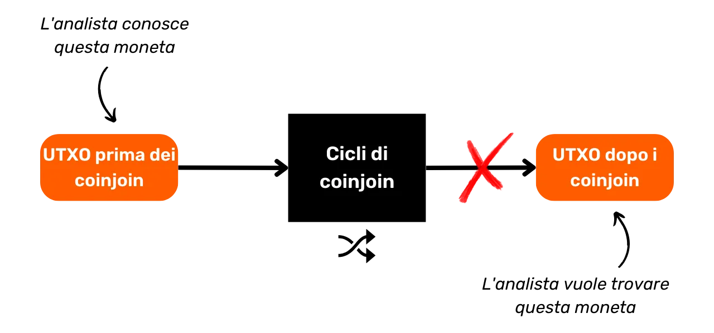

Al contrario, un analista che conosce il tuo UTXO all'uscita dei cicli di CoinJoin dovrebbe essere incapace di determinare la transazione originale all'ingresso dei cicli (analisi dall'uscita dal ciclo all'ingresso nel ciclo).

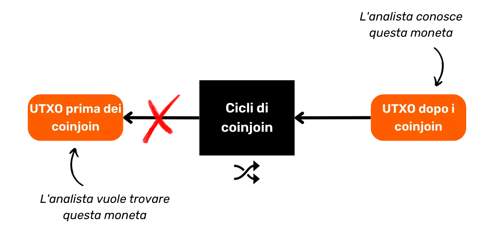

Per valutare la difficoltà per un analista di collegare il passato al presente e viceversa, è necessario quantificare la dimensione dei gruppi di monete omogenee all'interno dei quali la tua moneta è nascosta. Questa misura ci dice il numero di analisi che hanno una probabilità identica. Così, se l'analisi corretta è annegata tra altre 3 analisi di pari probabilità, il tuo livello di occultamento è molto basso. Tuttavia, se l'analisi corretta è all'interno di un insieme di 20.000 analisi tutte ugualmente probabili, la tua moneta è molto ben nascosta. E precisamente, la dimensione di questi gruppi rappresenta indicatori chiamati "anonsets".

### Comprendere gli Anonsets

Gli Anonsets fungono da indicatori per valutare il grado di privacy di un particolare UTXO. Più specificamente, misurano il numero di UTXO indistinguibili all'interno dell'insieme che include la moneta studiata. Il requisito di un insieme UTXO omogeneo significa che gli anonsets sono solitamente calcolati sui cicli di CoinJoin. L'uso di questi indicatori è particolarmente rilevante per i CoinJoins di Whirlpool a causa della loro uniformità.

Gli Anonsets consentono, se appropriato, di giudicare la qualità dei CoinJoins. Una grande dimensione di anonset significa un alto livello di anonimato, poiché diventa difficile distinguere un UTXO specifico all'interno dell'insieme omogeneo.

Ci sono 2 tipi di anonsets:

- **L'anonset prospettico;**
- **L'anonset retrospettivo.**

### L'Anonset Prospettico

L'anonset prospettico indica la dimensione del gruppo tra cui l'UTXO studiato è nascosto all'uscita del ciclo, conoscendo l'UTXO all'ingresso, cioè il numero di monete indistinguibili presenti all'interno di questo gruppo. In inglese, il nome di questo indicatore è "forward anonset", o "forward-looking metrics".
Questo indicatore permette di misurare la resistenza alla privacy della moneta contro un'analisi dal passato al presente (input a output).


Questa metrica stima in che misura il tuo UTXO è protetto contro i tentativi di ricostruire la sua storia dal suo punto di ingresso al suo punto di uscita nel processo di coinjoin.

Per esempio, se la tua transazione ha partecipato al suo primo ciclo di coinjoin e sono stati completati due cicli discendenti aggiuntivi, l'anonset prospettico della tua moneta sarebbe `13`:


Per esempio, immaginiamo che la nostra moneta all'ingresso del ciclo di coinjoin beneficia di un anonset prospettico di `86,871`. Praticamente, questo significa che è nascosta tra `86,871` monete indistinguibili. Per un osservatore esterno a conoscenza di questa moneta all'inizio dei cicli di coinjoin e che tenta di tracciarne l'uscita, si troverebbe di fronte a `86,871` possibili UTXO, ognuno con una probabilità identica di essere la moneta cercata.

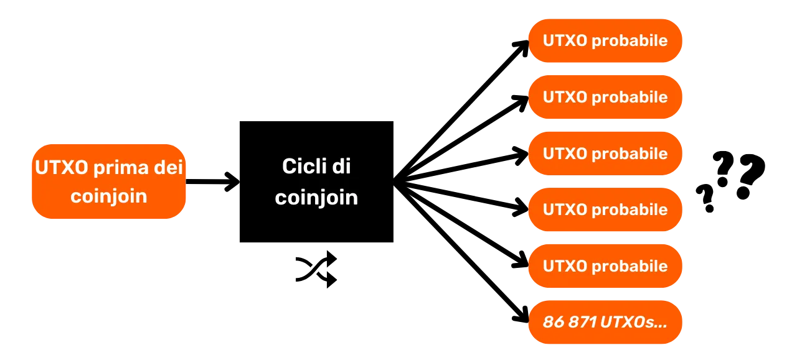

### L'Anonset Retrospettivo

L'anonset retrospettivo indica il numero di possibili fonti per una data moneta, conoscendo l'UTXO all'uscita del ciclo. Questo indicatore misura la resistenza alla privacy della moneta contro un'analisi dal presente al passato (uscita verso ingresso), ovvero quanto è difficile per un analista risalire all'origine della tua moneta, prima dei cicli di coinjoin. In inglese, il nome di questo indicatore è "backward anonset", o "metriche retrospettive".

Conoscendo il tuo UTXO all'uscita dei cicli, l'anonset retrospettivo determina il numero di potenziali transazioni Tx0 che avrebbero potuto costituire il tuo ingresso nei cicli di coinjoin. Nel diagramma sottostante, ciò corrisponde alla somma di tutte le bolle arancioni.

Per esempio, immaginiamo che la nostra moneta all'uscita del ciclo di coinjoin beneficia di un anonset retrospettivo di `42,185`. Praticamente, ciò significa che ci sono `42,185` possibili fonti per questo UTXO. Se un osservatore esterno identifica questa moneta alla fine dei cicli e cerca di tracciarne l'origine, si troverà di fronte a `42,185` possibili fonti, tutte con una probabilità uguale di essere l'origine cercata.

### Come calcolare concretamente gli anonset?

È possibile calcolare manualmente i propri anonset utilizzando un block explorer per set piccoli. Tuttavia, per anonset più grandi, l'uso di uno strumento specializzato diventa imperativo. A mia conoscenza, l'unico software capace di eseguire questo compito è _Whirlpool Stats Tool_, uno strumento Python sviluppato dai team di Samourai e OXT. Sfortunatamente, questo strumento è attualmente fuori servizio a seguito dell'arresto dei fondatori di Samourai e della cessazione di OXT, che veniva utilizzato per estrarre dati dalla blockchain.

Come abbiamo visto in questo capitolo, gli anonset possono essere calcolati solo se c'è una certa omogeneità nella struttura dei coinjoin. E precisamente, nel prossimo capitolo, scopriremo come quantificare questa omogeneità in una transazione Bitcoin, sia che si tratti di un coinjoin o di una transazione più tradizionale.

https://planb.network/tutorials/privacy/wst-anonsets

## Entropia

<chapterId>e4fe289d-618b-49a2-84c9-68c562e708b4</chapterId>

Come abbiamo visto in questa parte sui coinjoin, l'omogeneità degli UTXO in ingressi e uscite gioca un ruolo importante nel migliorare la riservatezza di una transazione Bitcoin. Questo parametro consente una plausibile negabilità contro l'analisi della catena. Diversi metodi possono misurare questa omogeneità, ma uno dei più efficaci, a mio parere, è l'uso di indicatori forniti dallo strumento _Boltzmann_, sviluppato dai team di OXT e Samourai Wallet, in particolare l'entropia della transazione. Questo è ciò che studieremo in dettaglio in questo capitolo.

A differenza degli anonset, che sono calcolati su un insieme di transazioni, gli indicatori che presenteremo qui si concentrano esclusivamente su una singola transazione, sia che si tratti di un coinjoin o di una transazione più tradizionale.

### Il numero di interpretazioni

Il primo indicatore che può essere osservato in una transazione Bitcoin è il numero totale di possibili interpretazioni agli occhi di un osservatore esterno che analizza la transazione. Prendendo in considerazione i valori degli UTXO coinvolti nella transazione, questo indicatore indica il numero di modi in cui gli input possono essere associati agli output. In altre parole, determina il numero di possibili interpretazioni che una transazione può generare nel flusso di bitcoin dal punto di vista di un osservatore esterno che la analizza.

Per esempio, una semplice transazione di pagamento con 1 input e 2 output avrà solo una interpretazione, ovvero che l'input #0 ha finanziato l'output #0 e l'output #1. Non ci sono altre possibili interpretazioni:


Al contrario, un coinjoin strutturato secondo il modello Whirlpool 5x5 presenta $1.496$ combinazioni possibili:

Un coinjoin Whirlpool Surge Cycle 8x8 si presenta con $9.934.563$ possibili interpretazioni:


### Entropia

Dal numero di interpretazioni di una transazione Bitcoin, possiamo calcolare la sua entropia.

Nel contesto generale della crittografia e dell'informazione, l'entropia è una misura quantitativa dell'incertezza o dell'imprevedibilità associata a una fonte di dati o a un processo casuale. In altre parole, l'entropia è un modo per misurare quanto sia difficile prevedere o indovinare le informazioni.

Nel contesto specifico dell'analisi della catena, l'entropia è anche il nome di un indicatore, derivato dall'entropia di Shannon e [inventato da LaurentMT](https://gist.github.com/LaurentMT/e758767ca4038ac40aaf), che può essere calcolato su una transazione Bitcoin.

Quando una transazione presenta un alto numero di possibili interpretazioni, è spesso più rilevante fare riferimento alla sua entropia. Questo indicatore permette di misurare la mancanza di conoscenza degli analisti sulla configurazione esatta della transazione. In altre parole, più alta è l'entropia, più difficile diventa per gli analisti il compito di identificare i flussi di bitcoin tra input e output.

In pratica, l'entropia rivela se, dal punto di vista di un osservatore esterno, una transazione presenta molteplici possibili interpretazioni, basandosi unicamente sulle quantità di input e output, senza considerare altri schemi e euristiche esterni o interni. Un'alta entropia è quindi sinonimo di maggiore riservatezza per la transazione.

L'entropia è definita come il logaritmo binario del numero di possibili combinazioni. Ecco la formula utilizzata con $E$ che rappresenta l'entropia della transazione e $C$ il numero di possibili interpretazioni:

$$
E = \log_2(C)
$$

In matematica, il logaritmo binario (logaritmo in base 2) corrisponde all'operazione inversa di elevare 2 a una certa potenza. In altre parole, il logaritmo binario di $x$ è l'esponente a cui $2$ deve essere elevato per ottenere $x$. Questo indicatore è quindi espresso in bit.

Prendiamo l'esempio del calcolo dell'entropia per una transazione coinjoin strutturata secondo il modello Whirlpool 5x5, che, come menzionato nella sezione precedente, presenta un numero di possibili interpretazioni di $1.496$:

$$
\begin{align*}
C &= 1.496 \\
E &= \log_2(1.496) \\
E &= 10.5469 \text{ bit}
\end{align*}
$$

Quindi, questa transazione coinjoin mostra un'entropia di $10.5469$ bit, che è considerata molto soddisfacente. Più alto è questo valore, più diverse interpretazioni ammette la transazione, migliorando così il suo livello di privacy.
Per una transazione coinjoin 8x8 che presenta $9.934.563$ interpretazioni, l'entropia sarebbe:

$$
\begin{align*}
C &= 9.934.563 \\
E &= \log_2(9.934.563) \\
E &= 23,244 \text{ bit}
\end{align*}
$$

Prendiamo un altro esempio con una transazione di pagamento standard, con 1 input e 2 output: [1b1b0c3f0883a99f1161c64da19471841ed12a1f78e77fab128c69a5f578ccce](https://mempool.space/tx/1b1b0c3f0883a99f1161c64da19471841ed12a1f78e77fab128c69a5f578ccce)


Nel caso di questa transazione, l'unica interpretazione possibile è: `(In.0) > (Out.0 ; Out.1)`. Di conseguenza, la sua entropia è stabilita a $0$:

$$
\begin{align*}
C &= 1 \\
E &= \log_2(1) \\
E &= 0 \text{ bit}
\end{align*}
$$

### Efficienza

Dall'entropia della transazione, possiamo anche calcolare la sua efficienza in termini di privacy. Questo indicatore valuta l'efficienza della transazione confrontandola con la transazione ottimale concepibile in una configurazione identica.

Questo ci porta a discutere il concetto di entropia massima, che corrisponde all'entropia più alta che una specifica struttura di transazione potrebbe teoricamente raggiungere. L'efficienza della transazione viene quindi calcolata confrontando questa entropia massima con l'entropia effettiva della transazione analizzata.

La formula utilizzata è la seguente con:

- $E_R$: l'entropia effettiva della transazione espressa in bit;
- $E_M$: l'entropia massima possibile per una struttura di transazione anch'essa espressa in bit;
- $Ef$: l'efficienza della transazione in bit:

$$
Ef = E_R - E_M
$$

Per esempio, per una struttura di coinjoin di tipo Whirlpool 5x5, l'entropia massima è $10,5469$:

$$
\begin{align*}
E_R &= 10,5469 \\
E_M &= 10,5469 \\
Ef &= E_R - E_M \\
Ef &= 10,5469 - 10,5469 \\
Ef &= 0 \text{ bit}
\end{align*}
$$

Questo indicatore è espresso anche in percentuale. La formula utilizzata è la seguente con:

- $C_R$: il numero di interpretazioni reali possibili;
- $C_M$: il numero massimo di interpretazioni possibili con la stessa struttura;
- $Ef$: efficienza espressa in percentuale:

$$
\begin{align*}
E_f &= \frac{C_R}{C_M} \\
E_f &= \frac{1.496}{1.496} \\
E_f &= 100\%
\end{align*}
$$

Un'efficienza del $100\%$ indica quindi che la transazione massimizza il suo potenziale per la privacy in base alla sua struttura.

### La Densità di Entropia

L'entropia è un buon indicatore per misurare la privacy di una transazione, ma dipende in parte dal numero di input e output nella transazione. Per confrontare l'entropia di 2 transazioni diverse che non hanno lo stesso numero di input e output, si può calcolare la densità di entropia. Questo indicatore offre una prospettiva sull'entropia relativa a ciascun input o output della transazione. La densità si rivela utile per valutare e confrontare l'efficienza di transazioni di dimensioni diverse.
Per calcolarlo, basta dividere l'entropia totale della transazione per il numero totale di input e output coinvolti nella transazione:

- $E_D$: la densità di entropia espressa in bit;
- $E$: l'entropia della transazione espressa in bit;
- $T$: il numero totale di input e output nella transazione:

$$
E_D = \frac{E}{T}
$$

Prendiamo l'esempio di un coinjoin Whirlpool 5x5:

$$
\begin{align*}
T &= 5 + 5 = 10 \\
E &= 10.5469 \\
E_D &= \frac{E}{T} \\
E_D &= \frac{10.5469}{10} \\
E_D &= 1.054 \text{ bit}
\end{align*}
$$

Calcoliamo anche la densità di entropia di un coinjoin Whirlpool 8x8:

$$
\begin{align*}
T &= 8 + 8 = 16 \\
E &= 23.244 \\
E_D &= \frac{E}{T} \\
E_D &= \frac{23.244}{16} \\
E_D &= 1.453 \text{ bit}
\end{align*}
$$

Analizzando la densità di entropia di questi due tipi di coinjoin, diventa evidente che, anche normalizzando l'entropia per il numero di elementi, il coinjoin "Surge Cycle 8x8" genera più incertezza per l'analisi.

### Il Punteggio di Boltzmann

Un altro pezzo di informazione analizzato in una transazione è il punteggio di Boltzmann di ogni elemento rispetto a un altro. Questa è una tabella delle probabilità di corrispondenza tra gli input e gli output. Questa tabella indica, attraverso il punteggio di Boltzmann, la probabilità condizionale che un input specifico sia collegato a un dato output. È quindi una misura quantitativa della probabilità condizionale che un'associazione tra un input e un output in una transazione si verifichi, stabilita sul rapporto del numero di occorrenze favorevoli di questo evento rispetto al numero totale di possibili occorrenze, in un insieme di interpretazioni.
Prendendo l'esempio di un coinjoin Whirlpool, la tabella delle probabilità condizionali evidenzierebbe le possibilità di un collegamento tra ciascun input e output, fornendo una misura quantitativa dell'ambiguità delle associazioni nella transazione:

| %       | Output 0 | Output 1 | Output 2 | Output 3 | Output 4 |
| ------- | -------- | -------- | -------- | -------- | -------- |
| Input 0 | 34%      | 34%      | 34%      | 34%      | 34%      |
| Input 1 | 34%      | 34%      | 34%      | 34%      | 34%      |
| Input 2 | 34%      | 34%      | 34%      | 34%      | 34%      |
| Input 3 | 34%      | 34%      | 34%      | 34%      | 34%      |
| Input 4 | 34%      | 34%      | 34%      | 34%      | 34%      |

Qui, è chiaro che ogni input ha la stessa probabilità di essere associato a qualsiasi output, il che aumenta la riservatezza della transazione.

Il calcolo del punteggio di Boltzmann coinvolge la divisione del numero di interpretazioni in cui un certo evento si manifesta per il numero totale di interpretazioni disponibili. Quindi, per determinare il punteggio associando l'input #0 con l'output #3 (un evento presente in $512$ interpretazioni), il processo è il seguente:

$$
\begin{align*}
\text{Interpretazioni (IN.0 > OUT.3)} &= 512 \\
\text{Interpretazioni Totali} &= 1496 \\
\text{Punteggio} &= \frac{512}{1496} \\
\text{Punteggio} &= 34\%
\end{align*}
$$

Se riconsideriamo l'esempio di un ciclo di Surge 8x8 Whirlpool coinjoin, la tabella di Boltzmann apparirebbe così:

|       | OUT.0 | OUT.1 | OUT.2 | OUT.3 | OUT.4 | OUT.5 | OUT.6 | OUT.7 |
|-------|-------|-------|-------|-------|-------|-------|-------|-------|
| IN.0  | 23%   | 23%   | 23%   | 23%   | 23%   | 23%   | 23%   | 23%   |
| IN.1  | 23%   | 23%   | 23%   | 23%   | 23%   | 23%   | 23%   | 23%   |
| IN.2  | 23%   | 23%   | 23%   | 23%   | 23%   | 23%   | 23%   | 23%   |
| IN.3  | 23%   | 23%   | 23%   | 23%   | 23%   | 23%   | 23%   | 23%   |
| IN.4  | 23%   | 23%   | 23%   | 23%   | 23%   | 23%   | 23%   | 23%   |
| IN.5  | 23%   | 23%   | 23%   | 23%   | 23%   | 23%   | 23%   | 23%   |
| IN.6  | 23%   | 23%   | 23%   | 23%   | 23%   | 23%   | 23%   | 23%   |
| IN.7  | 23%   | 23%   | 23%   | 23%   | 23%   | 23%   | 23%   | 23%   |

Tuttavia, nel caso di una transazione semplice che coinvolge un singolo input e 2 output, la situazione è diversa:

| %       | Output 0 | Output 1 |
|---------|----------|----------|
| Input 0 | 100%     | 100%     |

Qui, osserviamo che la probabilità che ciascun output provenga dall'input #0 è del 100%. Una probabilità inferiore si traduce quindi in una maggiore privacy diluendo i collegamenti diretti tra gli input e gli output.

### Collegamenti Deterministici

È anche possibile calcolare il numero di collegamenti deterministici in una transazione. Questo indicatore rivela quanti collegamenti tra gli input e gli output nella transazione analizzata sono indiscutibili, con una probabilità del 100%. Questo indicatore può poi essere completato calcolando il rapporto dei collegamenti deterministici. Il rapporto fornisce una prospettiva sul peso di questi collegamenti deterministici all'interno di tutti i collegamenti della transazione.
Ad esempio, una transazione di tipo Whirlpool coinjoin non mostra un collegamento deterministico tra gli input e gli output, mostrando quindi un indicatore di 0 collegamenti e un rapporto del 0%. Al contrario, nella nostra seconda transazione di pagamento semplice esaminata (con un input e 2 output), l'indicatore ci dice che ci sono 2 collegamenti deterministici e il rapporto raggiunge il 100%. Pertanto, un indicatore nullo segnala un'eccellente privacy a causa dell'assenza di connessioni dirette e indiscutibili tra gli input e gli output.
### Come calcolare questi indicatori?
Calcolare manualmente questi indicatori utilizzando le equazioni che ho fornito è relativamente semplice. La principale difficoltà risiede nel determinare il numero di possibili interpretazioni di una transazione. Per una transazione standard, questo calcolo può essere eseguito a mano. Tuttavia, per un coinjoin, il compito è significativamente più complesso.

In precedenza, esisteva uno strumento Python chiamato _Boltzmann Calculator_, sviluppato dai team di OXT e Samourai, che permetteva il calcolo automatico di tutti questi indicatori per una transazione Bitcoin:


Era anche possibile utilizzare il sito web KYCP.org per queste analisi:


Sfortunatamente, a seguito dell'arresto dei fondatori di Samourai, questi strumenti attualmente non sono operativi.

Ora che abbiamo discusso in dettaglio i coinjoin, esploreremo altre tecniche di privacy disponibili su Bitcoin nell'ultima sezione della nostra formazione. Esamineremo le transazioni payjoin, tipi di transazione specifici pseudo-coinjoin, protocolli di indirizzo statico, così come misure volte a migliorare la privacy non a livello di transazione, ma a livello della rete di nodi.

https://planb.network/tutorials/privacy/boltzmann-entropy

# Comprendere le posta in gioco di altre tecniche di privacy avanzate
<partId>19989ae6-d608-4acf-b698-2cf1e7e5e6ae</partId>

## Transazioni Payjoin
<chapterId>c1e90b95-f709-4574-837b-2ec26b11286f</chapterId>

Attualmente, il coinjoin rappresenta il metodo più efficace per introdurre incertezza nel tracciamento delle monete durante un'analisi della catena. Come abbiamo visto nei capitoli precedenti, per ottenere un mixing efficace, è necessario che gli input e gli output siano il più omogenei possibile. Inoltre, è cruciale che le monete siano integrate in un gruppo il più grande possibile per massimizzare gli anonset. Quindi, affinché i coinjoin siano efficaci, devono coinvolgere un grande numero di monete uniformi. Questa moltitudine di requisiti significa che le transazioni coinjoin hanno una struttura molto rigida: gli importi sono predeterminati e tutti i partecipanti devono attenersi ad essi per garantire l'uniformità del processo. Inoltre, i coinjoin richiedono la sincronizzazione tra tutti i partecipanti e il coordinatore durante la costruzione della transazione.
Questi requisiti rendono il coinjoin poco adatto per i pagamenti diretti. Ad esempio, se possiedi un pezzo da 1M sats in un pool coinjoin, usarlo direttamente come pagamento sarebbe complesso. Richiederebbe la sincronizzazione con gli altri partecipanti e il coordinatore per costruire esattamente nel momento in cui hai bisogno di effettuare un pagamento la transazione collaborativa, e l'importo dell'acquisto dovrebbe corrispondere esattamente al valore del tuo pezzo, il che è praticamente irrealizzabile. Pertanto, una transazione coinjoin è per natura una transazione collaborativa di pulizia, il che significa che generalmente sono gli stessi proprietari degli input che si ritrovano negli output.
Tuttavia, sarebbe interessante avere strutture di transazione che permettano pagamenti pratici introducendo dubbi nell'analisi della catena. Questo è esattamente ciò che esploreremo in questo capitolo e nel prossimo.

### Cos'è una transazione payjoin?

Payjoin è una specifica struttura di transazione Bitcoin che migliora la privacy dell'utente durante una spesa collaborando con il destinatario del pagamento.
Nel 2015, LaurentMT ha menzionato per la prima volta questo metodo sotto il nome di "transazioni steganografiche", secondo un documento accessibile [qui](https://gist.githubusercontent.com/LaurentMT/e758767ca4038ac40aaf/raw/c8125f6a3c3d0e90246dc96d3b603690ab6f1dcc/gistfile1.txt). Questa tecnica è stata successivamente adottata dal Samourai Wallet, che nel 2018, è stato il primo client a implementarla con lo strumento Stowaway. Il concetto di payjoin si trova anche in [BIP79](https://github.com/bitcoin/bips/blob/master/bip-0079.mediawiki) e [BIP78](https://github.com/bitcoin/bips/blob/master/bip-0078.mediawiki). Diversi termini sono quindi utilizzati per designare un payjoin:
- Payjoin;
- Stowaway;
- P2EP (*Pay-to-End-Point*);
- Transazione steganografica.

La particolarità del payjoin risiede nella sua capacità di generare una transazione che appare ordinaria a prima vista, ma che in realtà è un mini Coinjoin tra due persone. Per questo, la struttura della transazione coinvolge il destinatario del pagamento negli input insieme al mittente effettivo. Il destinatario include quindi un pagamento a se stesso nel mezzo della transazione che gli permette di essere pagato.

Prendiamo un esempio per capire meglio questo processo. Alice compra una baguette per 4.000 sats utilizzando un UTXO di 10.000 sats e opta per un payjoin. Il suo panettiere, Bob, aggiunge un UTXO di 15.000 sats di sua proprietà in input, che recupera interamente in output, oltre ai 4.000 sats di Alice.

Nell'esempio, Bob il panettiere inserisce 15.000 sats e esce con 19.000 sats, la differenza è esattamente di 4.000 sats, che è il prezzo della baguette. Da parte sua, Alice entra con 10.000 sats e finisce con 6.000 sats in output, che rappresenta un saldo di -4.000 sats, ovvero il prezzo della baguette. Per semplificare l'esempio, ho deliberatamente omesso le commissioni di mining in questa transazione.

### Qual è lo scopo del payjoin?

La transazione payjoin soddisfa due obiettivi che consentono agli utenti di migliorare la privacy del loro pagamento.

In primo luogo, il payjoin mira a ingannare un osservatore esterno creando un diversivo nell'analisi della catena. Questo è reso possibile grazie all'euristica CIOH (*Common Input Ownership Heuristic*). Come abbiamo visto nella parte 3, di solito, quando una transazione sulla blockchain ha più input, si presume che tutti questi input appartengano alla stessa entità o utente.

Quindi, quando un analista esamina una transazione payjoin, è portato a credere che tutti gli input provengano dalla stessa persona. Tuttavia, questa percezione è errata, poiché il destinatario del pagamento contribuisce anche agli input insieme al pagatore effettivo. L'analisi della catena è quindi deviata verso un'interpretazione che si rivela falsa.

Torniamo al nostro esempio di una transazione payjoin per il pagamento di una baguette:

Vedendo questa transazione sulla blockchain, un osservatore esterno seguendo le solite euristiche di analisi della catena interpretarebbe così: "Alice ha unito 2 UTXO in input della transazione per pagare 19.000 sats a Bob".
Questa interpretazione è chiaramente errata, come già sapete, i due UTXO in input non appartengono alla stessa persona. Uno proviene da Alice, l'acquirente della baguette, e l'altro da Bob, il panettiere.

L'analisi dell'osservatore esterno è quindi indirizzata verso una conclusione errata, che garantisce la preservazione della riservatezza degli stakeholder.

### La transazione steganografica

Il secondo obiettivo del payjoin è ingannare un osservatore esterno riguardo l'effettivo importo del pagamento effettuato. Esaminando la struttura della transazione, l'analista potrebbe credere che il pagamento sia equivalente all'importo di uno degli output.
Se riprendiamo il nostro esempio dell'acquisto di una baguette, l'analista penserà che l'importo del pagamento corrisponda o all'UTXO di 6.000 sats o all'UTXO di 19.000 sats. In questo caso, l'analista è più propenso a pensare che l'importo del pagamento sia di 19.000 sats, perché ci sono 2 UTXO in output, almeno uno dei quali è maggiore di 6.000 sats (non c'è una ragione logica per usare 2 UTXO per pagare 6.000 sats quando un singolo UTXO sarebbe stato sufficiente per questo pagamento).

Ma in realtà, questa analisi è incorretta. L'importo del pagamento non corrisponde a nessuno degli output. È in realtà la differenza tra l'UTXO del destinatario in output e l'UTXO del destinatario in input.

In questo, la transazione payjoin rientra nel regno della steganografia. Permette di nascondere l'importo reale di una transazione all'interno di una falsa transazione che funge da diversivo.

La steganografia è una tecnica per nascondere informazioni all'interno di altri dati o oggetti, in modo tale che la presenza delle informazioni nascoste non sia percepibile. Ad esempio, un messaggio segreto può essere nascosto all'interno di un punto in un testo non correlato, rendendolo non rilevabile ad occhio nudo (questa è la tecnica del [micropoint](https://fr.wikipedia.org/wiki/Micropoint)).

A differenza della crittografia, che rende le informazioni incomprensibili senza la chiave di decrittazione, la steganografia non altera le informazioni. Rimangono in vista. Il suo obiettivo è piuttosto nascondere l'esistenza stessa del messaggio segreto, mentre la crittografia rivela chiaramente la presenza di informazioni nascoste, sebbene inaccessibili senza la chiave. Questo è il motivo per cui il nome iniziale per payjoin era "transazioni steganografiche".

Si potrebbe fare un'analogia tra la crittografia e il coinjoin, così come tra la steganografia e il payjoin. Infatti, il coinjoin ha attributi simili a quelli della crittografia: il metodo è riconoscibile, ma le informazioni sono indecifrabili. Al contrario, il payjoin è affine alla steganografia: le informazioni sono teoricamente accessibili, ma poiché il suo metodo di occultamento non è riconoscibile, diventa inaccessibile.

### Come utilizzare payjoin?

Tra i software noti che supportano payjoin, ci sono Sparrow Wallet, Wasabi Wallet, Mutiny, BitMask, BlueWallet e JoinMarket, così come il processore di pagamento BTCPay.
L'implementazione più avanzata di payjoin era solo lo Stowaway su Samourai Wallet. Tuttavia, dall'arresto dei fondatori del software, questo strumento ora funziona solo parzialmente. Il vantaggio di Stowaway è che è un protocollo completo e molto semplice da usare, che supporta sia la ricezione che l'invio di payjoins. Le transazioni parzialmente firmate possono essere scambiate manualmente tramite la scansione di più codici QR o automaticamente attraverso Tor tramite Soroban. È quest'ultima opzione di comunicazione che attualmente non è in servizio.

La difficoltà nell'uso di payjoin risiede nella sua dipendenza dalla partecipazione del commerciante. Come cliente, usare un payjoin è impossibile se il commerciante non lo supporta. Questo aggiunge una difficoltà aggiuntiva durante un acquisto: non solo è complicato trovare commercianti che accettano bitcoin, ma se si cercano anche quelli che supportano i payjoins, diventa ancora più complicato.

Una soluzione potrebbe essere l'uso di strutture transazionali che introducono ambiguità nell'analisi della catena senza richiedere la cooperazione del destinatario. Questo ci permetterebbe di migliorare la privacy dei nostri pagamenti senza dipendere dalla partecipazione attiva dei commercianti. Questo è precisamente ciò che studieremo nel prossimo capitolo.

https://planb.network/tutorials/privacy/payjoin-sparrow-wallet

https://planb.network/tutorials/privacy/payjoin-samourai-wallet

## Mini-coinjoin di pagamento
<chapterId>300777ee-30ae-43d7-ab00-479dac3522c1</chapterId>

Quando si cerca di effettuare una transazione di pagamento preservando un certo grado di privacy, payjoin è una buona opzione. Ma come abbiamo visto, payjoin richiede il coinvolgimento del destinatario. Cosa fare quindi se quest'ultimo rifiuta di partecipare a un payjoin, o se si preferisce semplicemente non coinvolgerlo? Un'alternativa è l'uso di una transazione Stonewall o Stonewall x2. Vediamo più da vicino questi due tipi di transazioni.

### La Transazione Stonewall

Stonewall è una forma specifica di transazione Bitcoin volta ad aumentare la privacy dell'utente durante una spesa, imitando un pseudo-coinjoin tra due persone, senza però esserlo realmente. Infatti, questa transazione non è collaborativa. Un utente può costruirla da solo, coinvolgendo solo gli UTXO di cui è proprietario come input. Puoi quindi creare una transazione Stonewall per qualsiasi occasione, senza la necessità di sincronizzarti con un altro utente o con il destinatario.

Il funzionamento della transazione Stonewall è il seguente: nell'input della transazione, il mittente utilizza 2 UTXO che gli appartengono. Nell'output, la transazione produce 4 UTXO, 2 dei quali saranno esattamente dello stesso importo. Gli altri 2 UTXO costituiranno il resto. Tra i 2 output dello stesso importo, solo uno andrà effettivamente al destinatario del pagamento.
Ci sono solo 2 ruoli in una transazione Stonewall:
- Il mittente, che effettua il pagamento;
- Il destinatario, che può essere all'oscuro della natura specifica della transazione e sta semplicemente aspettando un pagamento dal mittente.

Prendiamo un esempio per capire questa struttura di transazione. Alice è dal panettiere Bob per comprare la sua baguette, che costa 4.000 sats. Vuole pagare in bitcoin mantenendo un certo livello di privacy riguardo al suo pagamento. Pertanto, decide di costruire una transazione Stonewall per il pagamento.
Analizzando questa transazione, possiamo vedere che Bob il panettiere ha effettivamente ricevuto 4.000 sats in pagamento per la baguette. Alice ha utilizzato 2 UTXO come input: uno di 10.000 sats e uno di 15.000 sats. Negli output, ha ricevuto 3 UTXO: uno di 4.000 sats, uno di 6.000 sats e uno di 11.000 sats. Alice ha quindi un saldo netto di -4.000 sats su questa transazione, che corrisponde esattamente al prezzo della baguette.
In questo esempio, ho intenzionalmente trascurato le commissioni di mining per facilitare la comprensione. In realtà, le commissioni di transazione sono interamente a carico del mittente.

### Quali sono gli obiettivi di una transazione Stonewall?

La struttura Stonewall aggiunge molta entropia alla transazione e confonde le tracce dell'analisi della catena. Da fuori, una tale transazione può essere interpretata come un mini-coinjoin tra due persone. Ma in realtà, è un pagamento. Questo metodo genera quindi incertezze nell'analisi della catena, o addirittura porta a false tracce.

Torniamo all'esempio di Alice da Bob il panettiere. La transazione sulla blockchain apparirebbe così:


Un osservatore esterno che si affida alle euristiche comuni di analisi della catena potrebbe erroneamente concludere che "*due persone hanno effettuato un piccolo coinjoin, con un UTXO ciascuno in input e due UTXO ciascuno in output*". L'analisi di questa transazione dall'esterno non porta all'applicazione dell'Euristica di Proprietà Comune dell'Input (CIOH), perché la presenza di due output dello stesso importo suggerisce un modello di coinjoin. Da un punto di vista esterno, la CIOH quindi non è applicabile in questo caso specifico.


Questa interpretazione è inaccurata, perché, come sapete, un UTXO è stato inviato a Bob il panettiere, i 2 UTXO in input provengono da Alice, e lei ha recuperato 3 output di resto.


E ciò che è particolarmente interessante riguardo alla struttura della transazione Stonewall è che, dal punto di vista di un osservatore esterno, appare esattamente come quella di una transazione Stonewall x2.

### La Transazione Stonewall x2

Stonewall x2 è un'altra forma specifica di transazione Bitcoin che mira anch'essa ad aumentare la privacy dell'utente durante una spesa, ma questa volta collaborando con una terza parte non coinvolta nella spesa. Questo metodo funziona come un pseudo-coinjoin tra due partecipanti, effettuando al contempo un pagamento a una terza persona.

Il funzionamento della transazione Stonewall x2 è relativamente semplice: si utilizza un UTXO in proprio possesso per effettuare il pagamento e si chiede l'aiuto di una terza parte che contribuisce anche con un UTXO di sua proprietà. La transazione termina con quattro output: due di essi di importi uguali, uno destinato all'indirizzo del destinatario del pagamento, l'altro a un indirizzo appartenente al collaboratore. Un terzo UTXO viene inviato a un altro indirizzo del collaboratore, permettendogli di recuperare l'importo iniziale (un'azione neutra per loro, meno le commissioni di mining), e un ultimo UTXO ritorna a un indirizzo che ci appartiene, che costituisce il resto del pagamento.

Quindi, tre diversi ruoli sono definiti nelle transazioni Stonewall x2:
- Il mittente, che effettua il pagamento effettivo;
- Il destinatario, che può essere all'oscuro della natura specifica della transazione e semplicemente attende un pagamento dal mittente;
- Il collaboratore, che fornisce bitcoin per gettare dubbi nell'analisi della transazione, recuperando completamente i propri fondi alla fine (un'azione neutrale per loro, al netto delle commissioni di mining).
Ritorniamo al nostro esempio con Alice che è da Bob il panettiere per comprare la sua baguette che costa 4.000 sats. Vuole pagare in bitcoin mantenendo un certo livello di privacy sul suo pagamento. Quindi, chiama il suo amico Charles, che la aiuterà in questo processo.


Analizzando questa transazione, possiamo vedere che Bob il panettiere ha effettivamente ricevuto 4.000 sats in pagamento per la baguette. Alice ha usato 10.000 sats in input e ha recuperato 6.000 sats in output, risultando in un saldo netto di -4.000 sats, che corrisponde al prezzo della baguette. Per quanto riguarda Charles, ha fornito 15.000 sats in input e ha ricevuto due output: uno di 4.000 sats e l'altro di 11.000 sats, ottenendo un saldo di 0.

In questo esempio, ho intenzionalmente trascurato le commissioni per facilitare la comprensione. In realtà, le commissioni di mining sono generalmente condivise equamente tra l'emittente del pagamento e il collaboratore.

### Quali sono gli obiettivi di una transazione Stonewall x2?
Come la struttura Stonewall, la struttura Stonewall x2 aggiunge una quantità significativa di entropia alla transazione e oscura le tracce dell'analisi della catena. Da un punto di vista esterno, una tale transazione potrebbe essere interpretata come un piccolo coinjoin tra due persone. Ma in realtà, è un pagamento. Questo metodo, quindi, genera incertezze nell'analisi della catena, portando anche a false tracce.

Rivediamo l'esempio di Alice, Bob il Panettiere e Charles. La transazione sulla blockchain apparirebbe così:


Un osservatore esterno che si affida alle euristiche comuni di analisi della catena potrebbe erroneamente concludere che "*Alice e Charles hanno condotto un piccolo coinjoin, con un UTXO ciascuno in input e due UTXO ciascuno in output*". Ancora una volta, l'analisi di questa transazione dall'esterno non porta all'applicazione dell'Euristica di Proprietà Comune dell'Input (CIOH), perché la presenza di due output dello stesso importo suggerisce un modello di coinjoin. Da un punto di vista esterno, la CIOH quindi non è applicabile in questo caso specifico.


Questa interpretazione è inaccurata perché, come sapete, un UTXO è stato inviato a Bob il Panettiere, Alice ha solo un output di resto, e Charles ne ha due.


E ancora una volta, ciò che è particolarmente interessante con la struttura di transazione Stonewall x2 è che dal punto di vista di un osservatore esterno, appare esattamente come quella di una transazione Stonewall.

### Qual è la differenza tra Stonewall e Stonewall x2?

Una transazione StonewallX2 funziona esattamente come una transazione Stonewall, eccetto che la prima è collaborativa, mentre la seconda non lo è. Come abbiamo visto, una transazione Stonewall x2 coinvolge la partecipazione di una terza parte (Charles), che è esterna al pagamento, e che fornisce i suoi bitcoin per aumentare la riservatezza della transazione. In una classica transazione Stonewall, il ruolo del collaboratore è assunto dal mittente.


Da un punto di vista esterno, il modello della transazione è quindi esattamente lo stesso.
Il fatto che queste due strutture di transazione condividano esattamente lo stesso schema implica che, anche se un osservatore esterno riesce a identificare un modello "Stonewall(x2)", non avrà tutte le informazioni. Non sarà in grado di determinare quale dei due UTXO degli stessi importi corrisponda al pagamento. Inoltre, non sarà in grado di determinare se i due UTXO in input provengano da due persone diverse (Stonewall x2) o se appartengano a una singola persona che li ha uniti (Stonewall).
Quest'ultimo punto è dovuto al fatto che le transazioni Stonewall x2 seguono esattamente lo stesso schema delle transazioni Stonewall. Dall'esterno e senza informazioni aggiuntive sul contesto, è impossibile differenziare una transazione Stonewall da una transazione Stonewall x2. Tuttavia, le prime non sono transazioni collaborative, mentre le seconde lo sono. Questo aggiunge ancora più dubbio nell'analisi di una di queste transazioni.

### Quando utilizzare le transazioni Stonewall e Stonewall x2?

La logica dovrebbe essere la seguente quando si desidera utilizzare uno strumento di privacy per una transazione:
- Come priorità, si può scegliere di effettuare un payjoin;
- Se il commerciante non supporta i payjoin, si può effettuare una transazione collaborativa con un'altra persona esterna al pagamento utilizzando la struttura Stonewall x2;
- Se non si trova nessuno con cui effettuare una transazione Stonewall x2, si può effettuare una transazione Stonewall da soli, che imiterà il comportamento di una transazione Stonewall x2.

### Come utilizzare le transazioni Stonewall e Stonewall x2?

Le transazioni Stonewall e Stonewall x2 sono disponibili sia sull'app Samourai Wallet che sul software Sparrow Wallet.

Tuttavia, proprio come con i payjoin, a seguito dell'arresto dei fondatori di Samourai, le transazioni Stonewall x2 ora funzionano solo scambiando manualmente i PSBT tra le parti coinvolte. Lo scambio automatico tramite Soroban purtroppo non è disponibile al momento.

È anche possibile eseguire manualmente questo tipo di transazione da qualsiasi software di portafoglio Bitcoin.

Nel prossimo capitolo, studieremo un'altra tecnica di privacy relativamente sconosciuta, ma molto utile in aggiunta a quanto abbiamo già studiato.

https://planb.network/tutorials/privacy/stonewall

https://planb.network/tutorials/privacy/stonewall-x2
 
## Rimbalzi
<chapterId>db9a20ac-a149-443d-884b-ea6c03f28499</chapterId>

L'uso di strutture di transazione Bitcoin che aggiungono ambiguità nell'analisi della catena, come il coinjoin, è particolarmente vantaggioso per la protezione della privacy. Tuttavia, come abbiamo discusso nel capitolo sui payjoin, le transazioni coinjoin sono naturalmente identificabili nella catena. Ricordate l'analogia che abbiamo stabilito tra la crittografia e i coinjoin: quando si cripta un file, un terzo scoprendo questo file criptato non può accedere al suo contenuto, ma può chiaramente identificare che c'è stata una modifica del file per nasconderne il contenuto. Lo stesso vale per i coinjoin: quando un analista esamina una transazione coinjoin, anche se non può stabilire collegamenti diretti tra gli input e gli output (e viceversa), può comunque riconoscere che la transazione osservata è un coinjoin.
A seconda dell'uso previsto per la tua moneta dopo aver subito cicli di coinjoin, il fatto che abbia subito questo processo può essere problematico. Ad esempio, se prevedi di vendere la tua moneta su una piattaforma di scambio regolamentata, ma ha recentemente subito un coinjoin, lo strumento di analisi della catena della piattaforma rileverà questo fatto. La piattaforma potrebbe quindi rifiutare di accettare il tuo UTXO che ha subito un coinjoin, o addirittura richiedere spiegazioni da te, con il rischio di avere il tuo account sospeso o i tuoi fondi congelati. In alcuni casi, la piattaforma può anche segnalare il tuo comportamento alle autorità statali (ad esempio, questo è ciò che TRACFIN richiede ai Fornitori di Servizi di Asset Digitali (PSAN) in Francia).

Ciò di cui avremmo bisogno per evitare ciò è uno strumento capace di offuscare le tracce del passato di una moneta Bitcoin, al fine di ripristinare una certa forma di fungibilità. Questo è precisamente l'obiettivo del ricochet.

### Cos'è un ricochet?

Ricochet è una tecnica che comporta l'esecuzione di diverse transazioni fittizie a se stessi (sweeping) per simulare un trasferimento di proprietà dei bitcoin. Questo strumento è diverso da altre strutture di transazione di cui abbiamo discusso perché non consente un anonimato prospettico, ma piuttosto una forma di anonimato retrospettivo. Infatti, ricochet consente di offuscare le specificità che potrebbero compromettere la fungibilità di una moneta Bitcoin a causa del suo passato.

Per offuscare l'impronta lasciata da un evento passato su una moneta, come i cicli di coinjoin, ad esempio, ricochet esegue quattro transazioni successive in cui l'utente trasferisce fondi a se stesso su indirizzi diversi.

Dopo questa sequenza di transazioni, lo strumento ricochet infine instrada i bitcoin alla loro destinazione finale, come una piattaforma di scambio.

L'obiettivo è creare una distanza che influisce sulla fungibilità della moneta, come una transazione di coinjoin, e l'atto finale di spesa che potrebbe rifiutare questa moneta a causa del suo passato. Così, gli strumenti di analisi della catena potrebbero concludere che probabilmente c'è stato un cambio di proprietà dopo l'evento, e considerare che questa moneta è fungibile. Nel caso di un coinjoin, gli strumenti di analisi della catena potrebbero quindi supporre che non sia la stessa persona che ha inviato i bitcoin e eseguito il coinjoin, e quindi è inutile avviare azioni contro il mittente.

### Perché funziona?
Di fronte a questo metodo di ricochet, si potrebbe immaginare che il software di analisi della catena approfondirebbe il loro esame oltre quattro salti. Tuttavia, queste piattaforme si trovano di fronte a un dilemma nell'ottimizzare la soglia di rilevazione. Devono stabilire un limite al numero di salti dopo i quali ammettono che probabilmente è avvenuto un cambio di proprietà e che il collegamento con un evento precedente (come un coinjoin) dovrebbe essere ignorato.

Tuttavia, determinare questa soglia si rivela rischioso: ogni estensione del numero osservato di salti aumenta esponenzialmente il volume di falsi positivi, ovvero individui erroneamente contrassegnati come partecipanti a un evento, quando l'operazione è stata effettuata da qualcun altro. Questo scenario rappresenta un rischio maggiore per queste aziende, poiché i falsi positivi portano a insoddisfazione, che può spingere i clienti colpiti verso la concorrenza. A lungo termine, una soglia di rilevazione troppo ampia porta una piattaforma a perdere più clienti rispetto ai suoi concorrenti, il che potrebbe minacciare la sua sopravvivenza. Pertanto, è complicato per queste piattaforme aumentare il numero di salti osservati, e 4 è spesso un numero sufficiente per contrastare le loro analisi.

Il fenomeno osservato qui è in qualche modo analogo alla teoria dei sei gradi di separazione.
La teoria dei sei gradi di separazione suggerisce che qualsiasi persona sulla Terra è connessa a qualsiasi altra attraverso una catena di conoscenze che include non più di sei intermediari. Sarebbe sufficiente passare attraverso una serie di sei persone, ognuna conoscendo personalmente la successiva, per raggiungere qualsiasi individuo nel mondo.
Per le transazioni Bitcoin, si trova un fenomeno simile. Tracciando indietro un numero sufficiente di transazioni Bitcoin, si finisce inevitabilmente per incontrare un coinjoin. Il metodo ricochet sfrutta questo principio utilizzando un numero di salti superiore a quello che le piattaforme di scambio possono ragionevolmente seguire. Se le piattaforme decidono di seguire più transazioni, è allora possibile semplicemente aggiungere un salto aggiuntivo per eludere questa misura.

### Quando e come usare il ricochet?

Il caso d'uso più comune per il ricochet si verifica quando è necessario nascondere la precedente partecipazione a un coinjoin su un UTXO di cui si è proprietari. Idealmente, è meglio evitare di trasferire bitcoin che hanno subito un coinjoin a entità regolamentate. Tuttavia, nell'evento in cui ci si trova senza altre opzioni, specialmente nell'urgenza di liquidare bitcoin in valuta fiat, il ricochet offre una soluzione efficace.

Questo metodo è efficace non solo per i coinjoins ma anche per qualsiasi altro segno che potrebbe compromettere la fungibilità di una moneta.
L'idea di questo metodo ricochet proviene originariamente dai team di Samourai Wallet, che lo hanno integrato nella loro applicazione per automatizzare il processo. Il servizio è a pagamento su Samourai, poiché un ricochet comporta una tariffa di servizio di 100.000 sats, oltre alle commissioni di mining. Pertanto, il suo uso è piuttosto raccomandato per trasferimenti di importi significativi.

L'applicazione Samourai offre due varianti del ricochet:
- Il ricochet avanzato, o "consegna sfalsata", che ha il vantaggio di distribuire le commissioni di servizio di Samourai su cinque transazioni successive. Questa opzione assicura anche che ogni transazione venga trasmessa in un momento distinto e registrata in un blocco diverso, il che le permette di imitare il comportamento di un cambio di proprietà nel modo più vicino possibile. Sebbene più lento, questo metodo è preferibile per coloro che non hanno fretta, poiché massimizza l'efficienza del ricochet rafforzando la sua resistenza all'analisi della catena;

- Il ricochet classico, che è progettato per eseguire l'operazione rapidamente trasmettendo tutte le transazioni in un breve lasso di tempo. Questo metodo, quindi, offre meno privacy e minore resistenza all'analisi rispetto al metodo avanzato. Dovrebbe essere utilizzato solo per invii urgenti.

Il ricochet consiste semplicemente nell'inviare bitcoin a se stessi. È del tutto possibile eseguire un ricochet manualmente su qualsiasi software di portafoglio, senza utilizzare uno strumento specializzato. Basta trasferire la stessa moneta a se stessi successivamente, utilizzando un nuovo indirizzo vuoto ogni volta.

Nel capitolo seguente, esploriamo diverse tecniche per i trasferimenti segreti di proprietà. Questi metodi differiscono radicalmente da quelli che abbiamo esaminato finora, sia in termini di funzionamento che di risultati.

https://planb.network/tutorials/privacy/ricochet
 
## Trasferimenti Segreti di Proprietà
<chapterId>a2067036-849c-4d6b-87d2-44235cfae7a1</chapterId>

Tra le tecniche di privacy su Bitcoin, c'è anche il trasferimento segreto di proprietà. Questo metodo mira a trasferire la proprietà dei bitcoin da una persona all'altra, e viceversa, senza che questa transazione sia esplicitamente visibile sulla blockchain. Studiamo insieme le diverse tecniche disponibili così come i loro vantaggi e svantaggi.

### Il CoinSwap
CoinSwap si basa su un concetto relativamente semplice: utilizza smart contract per facilitare un trasferimento di proprietà di bitcoin tra due utenti, senza la necessità di fiducia e senza che questo trasferimento sia esplicitamente visibile sulla blockchain.

Immaginiamo un esempio semplificato con Alice e Bob. Alice possiede 1 BTC assicurato con la chiave privata $A$, e Bob possiede anch'esso 1, assicurato con la chiave privata $B$. Teoricamente, potrebbero scambiarsi le loro chiavi private tramite un canale di comunicazione esterno per effettuare un trasferimento segreto.

Tuttavia, questo metodo ingenuo presenta un alto rischio in termini di fiducia. Niente impedisce ad Alice di tenere una copia della chiave privata $A$ dopo lo scambio e usarla in seguito per rubare i bitcoin, una volta che la chiave è in possesso di Bob.

Inoltre, non c'è garanzia che impedisca ad Alice di ricevere la chiave privata di Bob $B$ e mai inviare in cambio la sua chiave privata $A$. Questo scambio, quindi, si basa su una fiducia eccessiva tra le parti e si dimostra inefficiente nel garantire un trasferimento segreto della proprietà in modo sicuro.

Per risolvere questi problemi e permettere scambi tra parti che non si fidano l'una dell'altra, possiamo invece utilizzare sistemi di smart contract. Uno smart contract è un programma che si esegue automaticamente quando sono soddisfatte condizioni predefinite, che, nel nostro caso, garantisce che lo scambio di proprietà avvenga automaticamente senza richiedere fiducia reciproca.

Per fare ciò, possiamo utilizzare HTLC (*Hash Time-Locked Contracts*) o PTLC (*Point Time-Locked Contracts*). Questi due protocolli funzionano in modo simile utilizzando un sistema di blocco temporale che garantisce che lo scambio sia completato con successo o completamente annullato, proteggendo così l'integrità dei fondi di entrambe le parti. La principale differenza tra HTLC e PTLC è che gli HTLC utilizzano hash e preimmagini per assicurare la transazione, mentre i PTLC utilizzano Firme Adattive.

In uno scenario di CoinSwap che utilizza un HTLC o un PTLC tra Alice e Bob, lo scambio avviene in modo sicuro: o riesce, e ciascuno riceve il BTC dell'altro, o fallisce, e ciascuno mantiene il proprio BTC. È quindi impossibile per una delle parti barare o rubare il BTC dell'altra.

> *Gli HTLC sono anche il meccanismo utilizzato per instradare pagamenti in modo sicuro attraverso i canali bidirezionali della Lightning Network.*
L'uso delle Firme Adattive è particolarmente interessante in questo contesto, poiché permette di bypassare gli script tradizionali (questo è un meccanismo a volte definito come "_scriptless scripts_"). Questa caratteristica aiuta a ridurre le commissioni associate allo scambio. Un altro grande vantaggio delle Firme Adattive è che non richiedono l'uso di un hash comune per entrambe le parti della transazione, evitando così di rivelare un collegamento diretto tra di loro in certi tipi di scambi.
### Firme Adattive

Le Firme Adattive sono un metodo crittografico che integra una firma valida con una firma aggiuntiva, chiamata "_firma adattiva_", per rivelare un pezzo segreto di dati. Questo meccanismo è progettato in modo tale che conoscere 2 dei seguenti 3 elementi: la firma valida, la firma adattiva e il segreto, permette di dedurre l'elemento mancante terzo. Una proprietà interessante di questo metodo è che, se conosciamo la firma adattiva della nostra controparte e il punto specifico sulla curva ellittica associato al segreto usato per calcolare questa firma adattiva, possiamo derivare la nostra propria firma adattiva che sarà compatibile con quello stesso segreto, senza mai avere accesso diretto al segreto stesso.
Nello scambio di monete, l'uso delle Firme Adattive permette la rivelazione simultanea di due pezzi di informazioni sensibili tra i partecipanti, evitando così la necessità di una fiducia reciproca. Prendiamo un esempio per illustrare questo processo con Alice e Bob, che desiderano scambiarsi la proprietà di 1 BTC ciascuno, ma non si fidano l'uno dell'altro. Utilizzano le Firme Adattive per eliminare la necessità di fiducia in questo scambio. Ecco come procedono:
* Alice inizia lo scambio creando una transazione $m_A$ che invia 1 BTC a Bob. Genera una firma $s_A$, che convalida questa transazione, usando la sua chiave privata $p_A$ ($P_A = p_A \cdot G$), un nonce $n_A$ ($N_A = n_A \cdot G$) e un segreto $t$ ($T = t \cdot G$):

$$s_A = n_A + t + H(N_A + T \parallel P_A \parallel m_A) \cdot p_A$$

* Alice calcola la firma adattiva $s_A'$ sottraendo il segreto $t$ dalla sua vera firma $s_A$:

$$s_A' = s_A - t$$

* Alice invia a Bob la sua firma adattiva $s'_A$, la sua transazione non firmata $m_A$, il punto corrispondente al segreto ($T$) e il punto corrispondente al nonce ($N_A$). Questi elementi costituiscono quello che viene chiamato un "*adattatore*". È importante notare che, con solo queste informazioni, Bob non può recuperare i BTC di Alice.
* Tuttavia, Bob ha la capacità di verificare che Alice non stia cercando di rubargli. Per fare ciò, controlla se la firma adattiva di Alice $s_A'$ corrisponde effettivamente alla transazione proposta $m_A$. Se la seguente equazione è corretta, può quindi essere sicuro che la firma adattiva di Alice sia valida:
$$s_A' \cdot G = N_A + H(N_A + T \parallel P_A \parallel m_A) \cdot P_A$$

* Questa verifica fornisce a Bob sufficienti garanzie per procedere con lo scambio in modo fiducioso. Crea quindi la sua propria transazione $m_B$, destinata a inviare 1 BTC ad Alice, e genera la sua firma adattiva $s_B'$, che sarà anch'essa collegata allo stesso segreto $t$. A questo punto, solo Alice conosce il valore di $t$; Bob conosce solo il punto corrispondente $T$ che Alice gli ha trasmesso:

$$s_B' = n_B + H(N_B + T \parallel P_B \parallel m_B) \cdot p_B$$

* Bob trasmette ad Alice la sua firma adattiva $s_B'$, la sua transazione non firmata $m_B$, così come il punto corrispondente al segreto ($T$) e il punto corrispondente al nonce ($N_B$). Alice, che conosce il segreto $t$, può ora combinare la firma adattiva di Bob $s_B'$ con questo segreto per generare una firma valida $s_B$ per la transazione $m_B$ che trasferirà i BTC di Bob a lei:

$$s_B = s_B' + t$$

$$(s_B' + t) \cdot G = N_B + T + H(N_B + T \parallel P_B \parallel m_B) \cdot P_B$$

* Alice trasmette questa transazione firmata $m_B$ sulla blockchain di Bitcoin per recuperare i BTC promessi da Bob. Quando Bob vede questa transazione sulla blockchain, può estrarre la firma $s_B = s_B' + t$. Con queste informazioni, Bob è quindi in grado di isolare il famoso segreto $t$ di cui aveva bisogno:
$$t = (s_B' + t) - s_B' = s_B - s_B'$$
* E infatti, questo segreto $t$ era l'unico elemento mancante affinché Bob potesse generare la firma valida $s_A$ a partire dalla firma adattatore di Alice $s_A'$. Questa firma consente di validare la transazione $m_A$ che invia un BTC da Alice a Bob. Bob quindi calcola $s_A$ e a sua volta trasmette la transazione $m_A$ sulla blockchain:

$$s_A = s_A' + t$$

$$(s_A' + t) \cdot G = N_A + T + H(N_A + T \parallel P_A \parallel m_A) \cdot P_A$$
Riassumiamo come funziona una Firma Adattatore in uno scambio di monete. Inizialmente, Alice invia a Bob una transazione non firmata insieme a un adattatore, che permette a Bob di verificare che il segreto rivelato in seguito gli darà accesso ai bitcoin. In cambio, Bob invia ad Alice la sua transazione non firmata e il suo adattatore. Alice può quindi finalizzare la transazione di Bob e recuperare i bitcoin trasmettendo una transazione valida utilizzando il segreto. Quando questa transazione viene pubblicata sulla blockchain, Bob ha la possibilità di estrarre il segreto e quindi sbloccare la transazione di Alice. Di conseguenza, se Alice inizia un trasferimento dei bitcoin di Bob, lui può, a sua volta, accedere ai bitcoin di Alice senza richiedere fiducia reciproca.
È importante notare che gli scambi di monete sono stati proposti per la prima volta da [Gregory Maxwell nell'ottobre 2013 su BitcoinTalk](https://bitcointalk.org/index.php?topic=321228.0).

### Lo Scambio Atomico

Similmente allo scambio di monete e utilizzando gli stessi tipi di contratti intelligenti, è anche possibile eseguire scambi atomici. Uno scambio atomico consente uno scambio diretto di diverse criptovalute, come BTC e XMR, tra due utenti senza richiedere fiducia o l'intervento di un intermediario. Questi scambi sono definiti "atomici" perché hanno solo due possibili esiti: o lo scambio ha successo e entrambe le parti sono soddisfatte, o fallisce e ciascuno mantiene le proprie criptovalute originali, eliminando così la necessità di fiducia nell'altra parte.


Lo scambio atomico e lo scambio di monete condividono un metodo di funzionamento simile e offrono gli stessi vantaggi e svantaggi in termini di privacy. Infatti, dal punto di vista di Bitcoin, uno scambio atomico è paragonabile a uno scambio di monete eseguito in due passaggi. Prima, scambiamo i nostri BTC per un'altra criptovaluta, e poi questa criptovaluta può essere scambiata per altri BTC. Alla fine, recuperiamo i BTC di un altro utente. Questo è il motivo per cui, nell'analisi delle questioni di privacy, raggruppo questi due protocolli sotto la categoria di scambi segreti di proprietà.


Tuttavia, a differenza dello scambio di monete, lo scambio atomico può presentare squilibri in termini di liquidità disponibile, specialmente negli scambi BTC/XMR. Generalmente, è più facile scambiare bitcoin per altcoin, poiché c'è una grande domanda di bitcoin, il che mantiene bassi i premi per questa direzione di conversione. Tuttavia, scambiare altcoin per ottenere BTC può essere più complesso a causa della minore domanda, spesso risultando in premi molto alti.

Infine, quando uno scambio atomico coinvolge bitcoin onchain e bitcoin sulla rete Lightning, ci riferiamo a esso come a uno "*scambio sommergibile*".

### È Davvero Utile?
I trasferimenti segreti di proprietà, come gli scambi di monete e gli scambi atomici, hanno il vantaggio di ingannare le euristiche di analisi della catena. Questi metodi possono dare l'impressione che le transazioni coinvolgano lo stesso utente, anche se la proprietà effettiva è passata di mano. Tuttavia, il principale svantaggio di questi metodi è che sono molto rischiosi senza l'uso di una tecnica aggiuntiva per interrompere la storia della moneta.
Effettivamente, quando Alice effettua uno scambio di monete o uno swap atomico con Bob, scambia la proprietà dei suoi bitcoin con quelli di Bob. Nel caso di uno swap atomico, lo scambio include un altcoin, ma il principio rimane lo stesso. Così, Alice finisce per avere la moneta $B$ e Bob la moneta $A$. Questo aggiunge dubbi nell'analisi della catena, ma la storia delle monete rimane rintracciabile. Se un analista esamina la moneta $A$, può risalire alle precedenti attività di Alice, e viceversa per la moneta $B$.

Dal punto di vista di Alice, il rischio è che la storia della moneta $B$ possa essere considerata sospetta da certe entità. Se, ad esempio, Bob avesse acquisito la moneta $B$ in un atto criminale come l'hacking, questa moneta rimarrebbe collegata alle sue attività illegali. Alice potrebbe quindi trovarsi in possesso di una moneta che non potrebbe trasferire su piattaforme di scambio regolamentate senza rischiare di vedersi congelare i fondi, o addirittura essere accusata dei crimini di Bob, sebbene non avesse nulla a che fare con essi.

E ovviamente, metodi di privacy come lo scambio di monete o lo swap atomico sono favoriti dai criminali i cui fondi sono monitorati dalle autorità. Questi protocolli offrono loro l'opportunità di disfarsi dei loro bitcoin monitorati in cambio di bitcoin perfettamente fungibili. Questo consente anche loro di creare una diversione, indirizzando le autorità verso altri utenti. C'è quindi una doppia utilità per queste persone.

Con il coinjoin, anche se la tua moneta è mescolata con bitcoin monitorati, la storia della moneta è interrotta, il che fornisce una forma di negabilità plausibile che è inesistente nei protocolli di trasferimento segreto di proprietà come lo scambio di monete o lo swap atomico.

Se Alice vuole evitare qualsiasi rischio, deve necessariamente utilizzare un metodo per interrompere la storia della moneta $B$, come farla passare attraverso dei coinjoin, ad esempio. Questo solleva una questione sull'utilità di combinare il trasferimento segreto della proprietà e il coinjoin. Il coinjoin, interrompendo la storia di una moneta, fornisce già un livello sufficiente di privacy per Alice. Così, la mia opinione è che se Alice cerca di proteggere la sua privacy, sarebbe più prudente procedere direttamente con un coinjoin piuttosto che impegnarsi in uno scambio di monete seguito da un coinjoin.
Perché i metodi di trasferimento segreto della proprietà siano veramente efficaci ed evitino il rischio di collegare la storia di un utente $A$ a un utente $B$, sarebbe paradossalmente necessario che il loro uso fosse ampiamente conosciuto. Se lo scambio di monete viene utilizzato massivamente e le autorità sono consapevoli di questa pratica comune, allora potrebbe essere stabilita una forma di negabilità plausibile. Tuttavia, finché l'uso di questi trasferimenti rimane marginale, credo che questi metodi rimarranno troppo rischiosi per gli utenti.

Finora, abbiamo principalmente studiato i metodi di privacy a livello di transazione stessi. Nel prossimo capitolo, esploreremo le questioni a livello di rete e la diffusione delle transazioni.

## Privacy sulla Rete P2P
<chapterId>04a2467b-db84-4076-a9ff-919be5135106</chapterId>

Nella parte 4, abbiamo discusso dell'importanza di utilizzare un nodo completo per proteggere la privacy delle tue transazioni. Tuttavia, è importante capire che il tuo nodo stesso può essere soggetto ad attacchi che cercano di estrarre informazioni sulle tue attività. In questo capitolo, esamineremo quindi le diverse misure di protezione della privacy, non a livello delle transazioni stesse o dei flussi di bitcoin, ma a livello di rete.

### Dandelion
Un modo per evitare vari attacchi di deanonymizzazione è utilizzare la proposta Dandelion. Questo protocollo di trasmissione è stato formalizzato in BIP156, ma non è mai stato implementato su Bitcoin. L'idea di Dandelion è migliorare la privacy del routing delle transazioni nella rete Bitcoin per contrastare varie forme di attacchi. Il suo obiettivo principale è nascondere il nodo sorgente che inizialmente trasmette una transazione sulla rete. La divulgazione di questo nodo potrebbe collegare una transazione Bitcoin a un indirizzo IP specifico (se il nodo opera sulla rete in chiaro), fornendo così un punto di ingresso per l'analisi della catena.

Questa associazione tra un'attività su Bitcoin e un indirizzo IP rappresenta un rischio significativo per la privacy dell'utente. Infatti, numerose entità possono facilmente collegare un indirizzo IP a un'identità personale. Ciò include in modo notevole governi e fornitori di servizi Internet. Inoltre, queste informazioni possono diventare pubblicamente accessibili, ad esempio, se il tuo indirizzo IP e i dati personali vengono esposti a causa di una fuga di dati durante l'hacking del database di un sito web.

Nel funzionamento standard di Bitcoin, le transazioni costruite da un utente sul proprio software wallet vengono trasmesse al proprio nodo personale. Questo nodo trasmette immediatamente la nuova transazione a tutti i peer a cui è connesso.

Questi peer poi verificano la transazione per assicurarsi che rispetti le regole di consenso e le regole di standardizzazione locali. Una volta validata, ogni peer a sua volta trasmette la transazione ai propri peer, e così via.

La distribuzione delle transazioni in attesa di integrazione in un blocco avviene in modo abbastanza equilibrato e statisticamente prevedibile. Questa vulnerabilità può essere sfruttata da nodi spia collusi, che collaborano per monitorare e analizzare la rete, al fine di identificare il primo nodo ad aver trasmesso una transazione. Se un osservatore riesce a localizzare il nodo sorgente, può presumere che la transazione provenga dall'operatore di quel nodo. Questo tipo di osservazione può collegare transazioni, normalmente anonime, a indirizzi IP specifici.

L'obiettivo di BIP156 è affrontare questo problema. Per fare ciò, introduce una fase aggiuntiva nella trasmissione di una nuova transazione per preservare l'anonimato prima della diffusione pubblica su larga scala. Dandelion utilizza prima una fase "stem" (stelo) dove la transazione viene inviata attraverso un percorso casuale di nodi.

La transazione viene poi trasmessa a tutta la rete nella fase "fluff" (soffione).

Lo stelo e il soffione sono riferimenti al comportamento della propagazione della transazione attraverso la rete, che ricorda la forma di un dente di leone.

Così, i nodi spia possono potenzialmente rintracciare la transazione fino al nodo che ha avviato la fase di soffione (la trasmissione massiva), ma questo nodo non è quello che ha trasmesso per primo la transazione, poiché l'ha ricevuta dall'ultimo nodo nello stelo. Se i nodi spia non riescono a risalire lo stelo, non possono nemmeno identificare il nodo sorgente.

Anche in presenza di nodi spia durante la fase di stelo, il dubbio rimane sempre perché non appena incontrano un nodo onesto nel grafico di diffusione, gli spie non possono determinare se questo nodo sia la fonte originale o semplicemente un intermediario.
Questo metodo di instradamento rende più difficile seguire la traccia che porta al nodo sorgente, rendendo complicato rintracciare una transazione attraverso la rete fino alla sua origine. Dandelion migliora quindi la privacy limitando la capacità degli avversari di deanonimizzare la rete. Questo metodo è ancora più efficace quando la transazione, durante la fase "stem", attraversa un nodo che cripta le sue comunicazioni di rete, come con Tor o P2P Transport V2.
BIP156 non è stato integrato in Bitcoin Core ed è attualmente classificato con lo status "rifiutato". Una delle principali preoccupazioni riguardo a questo protocollo risiede nel fatto che, durante la fase stem, le transazioni devono essere inoltrate da nodi intermedi prima di essere verificate. Come abbiamo visto, nel modello normale di Bitcoin, ogni nodo verifica prima la transazione prima di trasmetterla ai suoi pari. Se una transazione non rispetta le regole di consenso o le regole di standardizzazione locale del nodo, viene ignorata e non trasmessa. Questo processo è importante per contrastare gli attacchi DoS, poiché solo le transazioni valide vengono trasmesse a tutta la rete. Le transazioni non valide, potenzialmente generate in massa per sovraccaricare la rete, vengono fermate al primo nodo incontrato e non si propagano. Il rischio principale con Dandelion è che questo nuovo protocollo potrebbe introdurre nuovi vettori per attacchi DoS permettendo la trasmissione di transazioni non valide attraverso parte della rete.

### P2P Transport V2

P2P Transport V2 è un altro protocollo di rete presentato in BIP324. È una nuova versione del protocollo di trasporto P2P di Bitcoin che incorpora una crittografia opportunistica per migliorare la riservatezza e la sicurezza delle comunicazioni tra nodi.

Questo miglioramento mira a risolvere diversi problemi con la versione base del protocollo P2P. Da un lato, rende i dati scambiati indistinguibili da altri tipi di dati che circolano su Internet per un osservatore passivo. L'obiettivo principale è prevenire che governi, fornitori di servizi Internet o fornitori VPN possano monitorare massivamente gli utenti Bitcoin. Ciò complica anche il compito per queste entità di determinare se un utente Internet sia anche un utente Bitcoin, ovvero se stia operando un nodo completo.
P2P V2 contribuisce anche a ridurre i rischi di censura e attacchi attraverso il rilevamento di schemi specifici nei pacchetti di dati. Complica e rende più costosa l'esecuzione di vari tipi di attacchi Sybil a livello di rete. Un attacco Sybil si verifica quando un attore crea molteplici false identità per ottenere un vantaggio indebito. Nel contesto della rete Bitcoin, ciò si manifesta spesso come un attore che controlla un gran numero di nodi completi e li utilizza aggressivamente per moltiplicare le connessioni. Gli attacchi Sybil possono essere passivi, con lo scopo di raccogliere informazioni e compromettere la riservatezza degli utenti, o attivi, sotto forma di attacchi Eclipse. Questi ultimi isolano un nodo specifico dal resto della rete, permettendo di censurare l'utente o di alterare i dati che riceve. Infine, P2P V2 rende gli attacchi *Man-In-The-Middle* (MITM) più costosi e più facili da rilevare.
La crittografia implementata da P2P V2 non include l'autenticazione per non aggiungere complessità non necessaria e per non compromettere la natura senza permessi della connessione di rete. Questo nuovo protocollo di trasporto P2P offre comunque una migliore sicurezza contro gli attacchi passivi e rende gli attacchi attivi significativamente più costosi e rilevabili. L'introduzione di un flusso di dati pseudo-casuale nei messaggi di rete complica il compito per gli aggressori che desiderano censurare o manipolare le comunicazioni.

Il trasporto P2P V2 è stato incluso come opzione (disabilitata per impostazione predefinita) nella versione 26.0 di Bitcoin Core, distribuita nel dicembre 2023. È stato poi abilitato per impostazione predefinita nella versione 27.0 nell'aprile 2024. Può essere modificato con l'opzione `v2transport=` nel file di configurazione.

### Tor
Una soluzione relativamente semplice per evitare i rischi di perdita di confidenzialità per un nodo a livello di rete è eseguirlo interamente sotto Tor. Tor è una rete di server di relay (nodi) che anonimizza l'origine delle connessioni TCP su internet. Funziona incapsulando i dati in più strati di crittografia. Ogni nodo relay rimuove uno strato per rivelare l'indirizzo del nodo successivo, fino a raggiungere la destinazione finale. La rete Tor garantisce l'anonimato impedendo ai nodi intermedi di conoscere sia l'origine che la destinazione dei dati, rendendo molto difficile per un osservatore tracciare l'attività dell'utente.

Tor quindi non solo cripta i dati comunicati ma permette anche di mascherare l'origine e la destinazione delle comunicazioni. Utilizzando Tor per le comunicazioni del proprio nodo personale, miglioriamo la privacy delle nostre transazioni: il Fornitore di Servizi Internet (ISP) non può decifrare le comunicazioni, e altri nodi nella rete Bitcoin non possono identificare l'indirizzo IP del nodo sorgente. Inoltre, Tor nasconde anche l'uso di Bitcoin al proprio ISP.

Il principale rischio associato a questo metodo è che Tor è un protocollo indipendente da Bitcoin. Se si ha un nodo Bitcoin sotto Tor e Tor smette di funzionare, allora il proprio nodo Bitcoin non sarà più in grado di comunicare.

Inoltre, è importante notare che le comunicazioni su Tor sono più lente. Questa latenza è particolarmente fastidiosa durante il lancio iniziale di un nodo, poiché l'Initial Block Download (IBD) richiede molte comunicazioni. Di conseguenza, la sincronizzazione iniziale con la rete Bitcoin potrebbe essere significativamente più lunga usando Tor. È anche possibile eseguire l'IBD sulla rete aperta, per poi attivare Tor in seguito. Anche se questo metodo rivela l'esistenza del proprio nodo Bitcoin al proprio ISP, protegge le informazioni relative alle proprie transazioni personali una volta passati a Tor.

Dopo aver esplorato i diversi metodi di privacy a livello di rete, voglio anche introdurre nei prossimi capitoli due soluzioni eleganti per evitare il riutilizzo degli indirizzi: BIP47 e Pagamenti Silenziosi.

## BIP47 e Codici di Pagamento Riutilizzabili
<chapterId>ad88e076-a04b-4aec-b3b2-7b4760175504</chapterId>

Come abbiamo visto nella parte 3, il riutilizzo degli indirizzi rappresenta un serio ostacolo alla privacy degli utenti sul protocollo Bitcoin. Per mitigare questi rischi, è fortemente consigliato generare un nuovo indirizzo di ricezione per ogni nuovo pagamento ricevuto in un portafoglio. Anche se oggi la generazione di un nuovo indirizzo è semplificata dall'uso di software moderni e portafogli deterministici gerarchici, questa pratica può sembrare controintuitiva.

Nel sistema bancario tradizionale, ad esempio, siamo abituati a condividere il nostro IBAN, che rimane sempre lo stesso. Una volta comunicato a qualcuno, possono inviarci più pagamenti senza dover interagire nuovamente con noi. Le neo-banche offrono anche possibilità più moderne come l'uso di indirizzi email unici su PayPal o RevTags su Revolut. Anche al di fuori del dominio finanziario, i nostri identificativi quotidiani come l'indirizzo postale, il numero di telefono e l'indirizzo email sono unici e permanenti. Non dobbiamo rinnovarli ad ogni nuova interazione.

Tuttavia, il funzionamento di Bitcoin è diverso: è imperativo generare un nuovo indirizzo di ricezione per ogni transazione in entrata. Questo compromesso tra facilità d'uso e privacy risale alle origini stesse del White Paper di Bitcoin. Dalla pubblicazione della prima versione del suo documento alla fine del 2008, Satoshi Nakamoto ci aveva già avvertiti di questo rischio:
**"*Come ulteriore firewall, una nuova coppia di chiavi potrebbe essere utilizzata per ogni transazione per mantenerle non collegate a un proprietario comune.*"**
Ci sono numerosi metodi per ricevere più pagamenti su un singolo identificativo senza causare il riutilizzo dell'indirizzo. Ognuno di questi metodi presenta i propri compromessi e svantaggi. Tra questi metodi c'è il BIP47, una proposta sviluppata da Justus Ranvier e pubblicata nel 2015. Questa proposta mira a creare codici di pagamento riutilizzabili che consentano molteplici transazioni alla stessa persona evitando il riutilizzo dell'indirizzo. In sostanza, il BIP47 cerca di offrire un sistema di pagamento intuitivo come un identificativo unico, preservando al contempo la privacy delle transazioni.


Il BIP47 non migliora direttamente la privacy dell'utente, poiché un pagamento BIP47 offre lo stesso livello di privacy di una classica transazione Bitcoin utilizzando indirizzi freschi. Tuttavia, rende l'uso di Bitcoin più conveniente e intuitivo, una facilità che, normalmente, dovrebbe compromettere la privacy. Grazie al BIP47, questa facilità d'uso raggiunge lo stesso livello di privacy di una transazione classica. Questo è il motivo per cui il BIP47 è uno strumento prezioso per la preservazione della privacy.

Inizialmente, il BIP47 era una proposta formulata per essere integrata in Bitcoin Core, ma non è mai stata adottata. Alcuni software hanno comunque scelto di implementarlo autonomamente a livello applicativo. Così, i team di Samourai Wallet hanno sviluppato la loro propria implementazione del BIP47 chiamata "PayNym".

### Principio Generale di BIP47 e PayNym

L'obiettivo del BIP47 è consentire la ricezione di numerosi pagamenti senza causare il riutilizzo dell'indirizzo. Si basa sull'uso di un codice di pagamento riutilizzabile, che consente a diversi mittenti di inviare più pagamenti a un singolo codice appartenente a un altro utente. Così, il destinatario non deve fornire un nuovo indirizzo fresco per ogni transazione, il che facilita notevolmente i loro scambi preservando al contempo la loro privacy.


Un utente può quindi condividere liberamente il proprio codice di pagamento, sia sui social network che sul proprio sito web, senza rischiare di perdere la privacy, a differenza di quanto accadrebbe con un classico indirizzo di ricezione o una chiave pubblica.
Per effettuare una transazione, entrambe le parti devono avere un portafoglio Bitcoin con un'implementazione del BIP47, come PayNym su Samourai Wallet o Sparrow Wallet. L'uso congiunto dei loro codici di pagamento crea un canale segreto tra di loro. Per stabilire questo canale in modo efficiente, il mittente deve eseguire una transazione specifica sulla blockchain di Bitcoin, nota come "transazione di notifica" (vi fornirò più dettagli su questo più avanti).

La combinazione dei codici di pagamento di entrambi gli utenti genera segreti condivisi, che a loro volta consentono la creazione di un gran numero di indirizzi Bitcoin di ricezione unici (esattamente 2^32, o circa 4 miliardi). Quindi, i pagamenti effettuati tramite BIP47 non sono effettivamente indirizzati al codice di pagamento stesso, ma piuttosto a indirizzi di ricezione classici derivati dai codici di pagamento degli utenti coinvolti.

Il codice di pagamento funge quindi da identificativo virtuale derivato dal seed del portafoglio. Nella struttura di derivazione gerarchica del portafoglio, il codice di pagamento è posizionato al livello 3, cioè a livello di account.


L'obiettivo di derivazione per il BIP47 è identificato dall'indice `47'` (`0x8000002F`), che fa riferimento al BIP47. Un esempio di un percorso di derivazione per un codice di pagamento riutilizzabile sarebbe il seguente:
```plaintext
m/47'/0'/0'/
```

Per darvi un'idea di come appare un codice di pagamento, ecco il mio:
```plaintext
M8TJSBiQmNQDwTogMAbyqJe2PE2kQXjtgh88MRTxsrnHC8zpEtJ8j7Aj628oUFk8X6P5rJ7P5qDudE4Hwq9JXSRzGcZJbdJAjM9oVQ1UKU5j2nr7VR5
```
Questo codice può essere anche codificato in un codice QR, per facilitarne la comunicazione, proprio come un classico indirizzo di ricezione.

Per quanto riguarda i PayNym Bots, questi robot che a volte si vedono su Twitter, sono rappresentazioni visive del codice di pagamento, creati da Samourai Wallet. Sono generati tramite una funzione di hashing, che gli conferisce quasi unicità. Appaiono sotto forma di una piccola stringa di caratteri che inizia con `+`:
```plaintext
+throbbingpond8B1
+twilightresonance487
+billowingfire340
```

Questi avatar possono essere anche rappresentati sotto forma di immagini:


Sebbene questi robot non abbiano una specifica funzionalità tecnica all'interno del quadro del BIP47, giocano un ruolo nel facilitare le interazioni tra gli utenti offrendo un'identità visiva facilmente riconoscibile.
Nelle sezioni seguenti di questo capitolo dedicato al BIP47, esamineremo in dettaglio come funziona, con un particolare accento sui metodi crittografici utilizzati. Per comprendere appieno queste spiegazioni un po' tecniche, è essenziale prima capire la struttura dei portafogli HD, i processi di derivazione delle chiavi e i principi fondamentali della crittografia basata sulla curva ellittica. Se desideri approfondire questi concetti, è disponibile un altro corso gratuito su PlanB Network: [CRYPTO 301](https://planb.network/en/courses/crypto301). Ti consiglio comunque di seguirli, poiché comprendere il funzionamento tecnico del BIP47 renderà molto più facile per te comprendere altre proposte simili che discuteremo nei capitoli seguenti.
### Codice di Pagamento Riutilizzabile

Come accennato in precedenza, il codice di pagamento riutilizzabile si trova al livello 3 del portafoglio HD, rendendolo paragonabile a un `xpub`, sia nella sua posizione all'interno della struttura del portafoglio sia nel suo ruolo.

Il codice di pagamento di 80 byte si suddivide come segue:
- **Byte `0`: La versione**. Per la prima versione del BIP47, questo byte è impostato su `0x01`;
- **Byte `1`: Il campo di bit**. Questo spazio è riservato per integrare indicazioni aggiuntive durante usi specifici. Per l'uso standard con PayNym, questo byte è definito come `0x00`;
- **Byte `2`: La parità di `y`**. Questo byte è `0x02` o `0x03`, indicando se l'ordinata della chiave pubblica è pari o dispari, poiché viene utilizzata una chiave pubblica compressa;
- **Dal byte `3` al byte `34`: Il valore di `x`**. Questi byte rappresentano l'ascissa della chiave pubblica. La concatenazione di `x` e la parità di `y` forma la chiave pubblica compressa completa;
- **Dal byte `35` al byte `66`: Il codice catena**. Questo spazio contiene il codice catena associato alla chiave pubblica;
- **Dal byte `67` al byte `79`: Il riempimento**. Questo spazio è destinato a possibili sviluppi futuri. Per la versione attuale, vengono semplicemente posizionati degli zeri qui per raggiungere la dimensione di 80 byte richiesta per un output `OP_RETURN`.

Ecco la rappresentazione esadecimale del mio codice di pagamento riutilizzabile già presentato nella sezione precedente:
```plaintext
0x010002a0716529bae6b36c5c9aa518a52f9c828b46ad8d907747f0d09dcd4d9a39e97c3c5f37c470c390d842f364086362f6122f412e2b0c7e7fc6e32287e364a7a36a00000000000000000000000000
```


Prima di tutto, è necessario aggiungere il byte prefisso `P` all'inizio per indicare chiaramente che si tratta di un codice di pagamento. Questo byte è rappresentato da `0x47`:
```plaintext
0x47010002a0716529bae6b36c5c9aa518a52f9c828b46ad8d907747f0d09dcd4d9a39e97c3c5f37c470c390d842f364086362f6122f412e2b0c7e7fc6e32287e364a7a36a00000000000000000000000000
```

Infine, per garantire l'integrità del codice di pagamento, viene eseguito un calcolo del checksum utilizzando `HASH256`, che consiste in un doppio hashing con la funzione `SHA256`. I primi quattro byte risultanti da questo hash vengono poi concatenati alla fine del codice di pagamento:
```plaintext
0x47010002a0716529bae6b36c5c9aa518a52f9c828b46ad8d907747f0d09dcd4d9a39e97c3c5f37c470c390d842f364086362f6122f412e2b0c7e7fc6e32287e364a7a36a00000000000000000000000000567080c4
```

Una volta completati questi passaggi, il codice di pagamento è pronto. L'unico passaggio rimasto è convertirlo in base 58 per ottenere la sua versione finale:
```plaintext
PM8TJSBiQmNQDwTogMAbyqJe2PE2kQXjtgh88MRTxsrnHC8zpEtJ8j7Aj628oUFk8X6P5rJ7P5qDudE4Hwq9JXSRzGcZJbdJAjM9oVQ1UKU5j2nr7VR5
```

Durante questo processo di creazione del codice di pagamento, utilizziamo una chiave pubblica compressa e un codice catena. Entrambi sono derivati da una derivazione deterministica e gerarchica dal seme del portafoglio. Il percorso di derivazione utilizzato per ottenere questo risultato è:
```plaintext
m/47'/0'/0'/
```
Per generare la chiave pubblica compressa e il codice catena associato per il codice di pagamento riutilizzabile, iniziamo calcolando la chiave privata principale dal seme del portafoglio. Procediamo quindi a derivare una coppia di chiavi figlie utilizzando l'indice `47 + 2^31` (derivazione rinforzata). Questo passaggio è seguito da due ulteriori derivazioni successive di coppie di chiavi figlie, ciascuna utilizzando l'indice `2^31` (derivazione rinforzata).

### Lo Scambio di Chiavi Elliptic-Curve Diffie-Hellman (ECDH)
Il protocollo crittografico al centro di BIP47 è indicato con l'acronimo ECDH, per *Elliptic-Curve Diffie-Hellman*. Questo metodo è una variante dell'originale scambio di chiavi Diffie-Hellman.
Introdotta nel 1976, Diffie-Hellman è un protocollo di accordo sulla chiave che consente a due parti, ciascuna dotata di una coppia di chiavi (pubblica e privata), di concordare su un segreto comune, anche comunicando esclusivamente attraverso un canale pubblico e insicuro.


Questo segreto comune (qui, la chiave blu), può poi essere utilizzato per altre operazioni. Tipicamente, questo segreto condiviso può essere utilizzato per criptare e decriptare la comunicazione su una rete insicura:


Per realizzare questo scambio, Diffie-Hellman utilizza l'aritmetica modulare per calcolare il segreto condiviso. Ecco una spiegazione semplificata di come funziona:
- Alice e Bob concordano su un colore comune, qui giallo, che costituisce dati pubblici (gli attaccanti conoscono questo colore);
- Alice seleziona un colore segreto, qui rosso, e mescola i due per ottenere arancione;
- Bob sceglie anche lui un colore segreto, qui blu, e lo mescola con il giallo per ottenere verde;
- Poi scambiano i colori ottenuti, arancione e verde. Questo scambio può avvenire su una rete insicura e osservata;
- Mescolando il verde di Bob con il suo colore segreto, Alice produce marrone;
- Bob, facendo lo stesso con l'arancione di Alice e il suo blu segreto, ottiene anche lui marrone.


In questa semplificazione, il colore marrone rappresenta il segreto condiviso tra Alice e Bob. È importante capire che, nella realtà, è impossibile per l'attaccante separare i colori arancione e verde per scoprire i colori segreti di Alice o Bob.

Ora, esaminiamo come funziona effettivamente questo protocollo, non con analogie di colori, ma usando numeri reali e aritmetica modulare!
Prima di discutere i meccanismi di Diffie-Hellman, permettetemi di ricordarvi brevemente due concetti matematici essenziali di cui avremo bisogno:

- Un **numero primo** è un numero naturale che ha solo due divisori: $1$ e se stesso. Ad esempio, $7$ è un numero primo perché può essere diviso solo per $1$ e $7$. D'altra parte, $8$ non è un numero primo poiché è divisibile per $1$, $2$, $4$ e $8$. Pertanto, ha quattro divisori interi positivi invece di due;
- Il **modulo** (indicato con $mod$ o $\%$) è un'operazione matematica che, tra due interi, restituisce il resto della divisione euclidea del primo per il secondo. Ad esempio, $16 \bmod 5 = 1$.

**Lo scambio di chiavi Diffie-Hellman tra Alice e Bob procede come segue:**

- Alice e Bob concordano su due numeri comuni: $p$ e $g$. $p$ è un numero primo, e più grande è questo numero, più sicuro sarà Diffie-Hellman. $g$ è una radice primitiva di $p$. Questi due numeri possono essere comunicati apertamente su una rete non sicura. Rappresentano l'equivalente del **colore giallo** nella precedente semplificazione. È quindi importante che Alice e Bob utilizzino esattamente gli stessi valori per $p$ e $g$.
Una volta definiti questi parametri, Alice e Bob scelgono ciascuno un numero segreto casuale. Alice chiama il suo numero segreto casuale $a$ (equivalente a **il colore rosso**) e Bob chiama il suo $b$ (equivalente a **il colore blu**). Questi numeri devono rimanere strettamente confidenziali.

Invece di scambiarsi direttamente i numeri $a$ e $b$, ciascuna parte calcola $A$ e $B$ come segue:

$A$ è uguale a $g$ elevato alla potenza di $a$ modulo $p$:


$$

A = g^a \bmod p

$$

$B$ è uguale a $g$ elevato alla potenza di $b$ modulo $p$:


$$

B = g^b \bmod p

$$

I valori $A$ (equivalente a **il colore arancione**) e $B$ (equivalente a **il colore verde**) vengono scambiati tra le due parti. Questo scambio può avvenire apertamente su una rete non protetta;

Alice, avendo ricevuto $B$, calcola il valore di $z$ come segue:

$z$ è uguale a $B$ elevato alla potenza di $a$ modulo $p$:


$$

z = B^a \bmod p

$$

Ricordiamo:


$$

B = g^b \bmod p

$$

Così, otteniamo:


$$

z = B^a \bmod p

$$


$$

z = (g^b)^a \bmod p

$$

Applicando le regole degli esponenti:
$$

(x^n)^m = x^{nm}

$$

Otteniamo quindi:


$$

z = g^{ba} \bmod p

$$

- Dal suo lato, Bob, avendo ricevuto $A$, calcola anche lui il valore di $z$ nel seguente modo:

$z$ è uguale a $A$ elevato alla potenza di $b$ modulo $p$:


$$

z = A^b \bmod p

$$

Così, otteniamo:


$$

z = (g^a)^b \bmod p

$$


$$

z = g^{ab} \bmod p

$$


$$

z = g^{ba} \bmod p

$$

Grazie alla distributività dell'operatore modulo, Alice e Bob ottengono esattamente lo stesso valore $z$. Questo numero rappresenta il loro segreto comune, equivalente a **il colore marrone** nella precedente semplificazione con i vasi di vernice. Ora possono utilizzare questo segreto comune per criptare le loro comunicazioni simmetricamente su una rete non protetta.

Un attaccante, anche in possesso di $p$, $g$, $A$ e $B$ (i valori pubblici), non sarà in grado di calcolare $a$, $b$ o $z$ (i valori privati). Per fare ciò, sarebbe necessario invertire l'esponenziazione, un'operazione impossibile senza provare tutte le possibilità una per una, poiché equivale a calcolare il logaritmo discreto, ovvero l'inverso dell'esponenziale in un gruppo ciclico finito.

Pertanto, finché i valori di $a$, $b$ e $p$ sono sufficientemente grandi, il protocollo Diffie-Hellman è sicuro. Tipicamente, con parametri a 2048 bit (un numero con 600 cifre in decimale), testare tutte le possibilità per $a$ e $b$ sarebbe impraticabile. Ad oggi, con tali numeri, questo algoritmo è considerato sicuro.
Questo è precisamente dove risiede il principale svantaggio del protocollo Diffie-Hellman. Per essere sicuro, l'algoritmo deve utilizzare numeri grandi. Ecco perché, oggigiorno, si preferisce l'algoritmo ECDH (*Elliptic Curve Diffie-Hellman*), una variante del Diffie-Hellman che si basa su una curva algebrica, più precisamente su una curva ellittica. Questo approccio permette di lavorare con numeri molto più piccoli mantenendo una sicurezza equivalente, riducendo così le risorse necessarie per il calcolo e lo stoccaggio.
Il principio generale dell'algoritmo rimane lo stesso. Tuttavia, invece di utilizzare un numero casuale $a$ e un numero $A$ calcolato da $a$ tramite esponenziazione modulare, utilizziamo una coppia di chiavi stabilita su una curva ellittica. Invece di fare affidamento sulla distributività dell'operatore modulo, utilizziamo la legge di gruppo sulle curve ellittiche, e più specificamente l'associatività di questa legge.
Per spiegare brevemente il principio della crittografia a curva ellittica, una chiave privata è rappresentata da un numero casuale tra $1$ e $n-1$, dove $n$ rappresenta l'ordine della curva. La chiave pubblica, d'altra parte, è un punto specifico su questa curva, ottenuto dalla chiave privata tramite operazioni di addizione e raddoppio di punti partendo dal punto generatore, secondo l'equazione:
$$

K = k \cdot G

$$

In questa formula, $K$ denota la chiave pubblica, $k$ la chiave privata, e $G$ il punto generatore.

Una delle caratteristiche essenziali di queste chiavi è la facilità di calcolare $K$ da $k$ e $G$, mentre è praticamente impossibile trovare $k$ da $K$ e $G$. Questa asimmetria crea una funzione unidirezionale. In altre parole, è facile calcolare la chiave pubblica se si conosce la chiave privata, ma trovare la chiave privata a partire dalla chiave pubblica è impossibile. Questa sicurezza si basa ancora sulla difficoltà computazionale del logaritmo discreto.

Utilizzeremo questa proprietà per adattare il nostro algoritmo Diffie-Hellman. **Il principio di funzionamento di ECDH è il seguente:**

- Alice e Bob si accordano insieme su una curva ellittica crittograficamente sicura e sui suoi parametri. Queste informazioni sono pubbliche;

- Alice genera un numero casuale $ka$ che sarà la sua chiave privata. Questa chiave privata deve rimanere segreta. Determina la sua chiave pubblica $Ka$ tramite addizione e raddoppio di punti sulla curva ellittica scelta:


$$

K_a = k_a \cdot G

$$

- Anche Bob genera un numero casuale $kb$ che sarà la sua chiave privata. Calcola la chiave pubblica associata $Kb$:


$$

K_b = k_b \cdot G

$$

- Alice e Bob scambiano le loro chiavi pubbliche $Ka$ e $Kb$ su una rete pubblica non sicura.

- Alice calcola un punto $(x,y)$ sulla curva applicando la sua chiave privata $ka$ alla chiave pubblica di Bob $Kb$:


$$

(x,y) = k_a \cdot K_b

$$

- Bob calcola un punto $(x,y)$ sulla curva applicando la sua chiave privata $kb$ alla chiave pubblica di Alice $Ka$:


$$

(x,y) = k_b \cdot K_a

$$

- Alice e Bob ottengono lo stesso punto sulla curva ellittica. Il segreto condiviso sarà la coordinata x $x$ di questo punto.

Infatti, ottengono lo stesso segreto condiviso perché:
(x,y) = k_a \cdot K_b = k_a \cdot (k_b \cdot G) = (k_a \cdot k_b) \cdot G = (k_b \cdot k_a) \cdot G = k_b \cdot (k_a \cdot G) = k_b \cdot K_a
$$

Un attaccante che osserva la rete pubblica non protetta può ottenere solo le chiavi pubbliche di ciascuna parte e i parametri della curva ellittica scelta. Come precedentemente spiegato, queste informazioni da sole non sono sufficienti per determinare le chiavi private. Pertanto, l'attaccante non può trovare il segreto condiviso tra Alice e Bob.

ECDH è quindi un algoritmo che consente lo scambio di chiavi. È spesso utilizzato in combinazione con altri metodi crittografici per stabilire un protocollo completo. Ad esempio, ECDH è integrato nel nucleo di TLS (_Transport Layer Security_), un protocollo di crittografia e autenticazione utilizzato per il livello di trasporto di Internet. TLS utilizza ECDHE per lo scambio di chiavi, una variante di ECDH dove le chiavi sono effimere, per garantire la confidenzialità persistente. Inoltre, TLS utilizza algoritmi di autenticazione come ECDSA, algoritmi di crittografia come AES e funzioni hash come SHA256.

TLS è notevolmente responsabile della `s` in `https` così come del lucchetto visibile nella barra degli indirizzi del tuo browser, simboli delle comunicazioni criptate. Seguendo questo corso, stai quindi utilizzando ECDH, ed è molto probabile che lo usi quotidianamente senza nemmeno saperlo.

### La Transazione di Notifica

Come abbiamo visto nella sezione precedente, ECDH è una variante dello scambio Diffie-Hellman che utilizza coppie di chiavi stabilite su una curva ellittica. Convenientemente, possediamo già molte coppie di chiavi aderenti a questo standard nei nostri portafogli Bitcoin! L'idea di BIP47 è di utilizzare le coppie di chiavi dei portafogli Bitcoin gerarchici deterministici di entrambe le parti per stabilire segreti condivisi ed effimeri tra di loro. Nel contesto di BIP47, viene utilizzato ECDHE (_Elliptic Curve Diffie-Hellman Ephemeral_).

ECDHE viene utilizzato per la prima volta in BIP47 per trasmettere il codice di pagamento dal mittente al destinatario. Questo è il famoso **notification transaction**. Questo passaggio è essenziale perché affinché BIP47 funzioni efficacemente, entrambe le parti coinvolte (il mittente e il destinatario) devono conoscere il codice di pagamento dell'altro. Questa conoscenza consente la derivazione di chiavi pubbliche effimere e, di conseguenza, indirizzi di ricezione vuoti associati.
Prima di questo scambio, il mittente è logicamente già a conoscenza del codice di pagamento del destinatario poiché lo ha recuperato off-chain, ad esempio, dal loro sito web, una fattura o i loro social media. Tuttavia, il destinatario potrebbe non conoscere necessariamente il codice di pagamento del mittente. Eppure, questo codice deve essere trasmesso a loro; altrimenti, non saranno in grado di derivare le chiavi effimere necessarie per identificare gli indirizzi dove sono conservati i loro bitcoin, né accedere ai loro fondi. Sebbene questa trasmissione del codice del mittente possa tecnicamente essere effettuata off-chain attraverso altri mezzi di comunicazione, ciò pone un problema se il portafoglio deve essere recuperato solo dal seme.
Infatti, a differenza degli indirizzi convenzionali, gli indirizzi BIP47 non sono derivati direttamente dal seed del destinatario—utilizzare un `xpub` sarebbe più semplice in questo caso—ma risultano da un calcolo che combina i codici di pagamento di entrambi: quello del mittente e quello del destinatario. Pertanto, se il destinatario perde il proprio portafoglio e tenta di ripristinarlo dal proprio seed, recupererà il proprio codice di pagamento, che è derivato direttamente dal loro seed. Tuttavia, per trovare gli indirizzi effimeri, sarà essenziale per loro avere anche i codici di pagamento di tutti coloro che hanno inviato loro bitcoin tramite BIP47. Da qui l'importanza della transazione di notifica, che consente di salvare queste informazioni sulla blockchain di Bitcoin, pur essendo in grado di trovarle molto facilmente senza dover cercare tra il miliardo di transazioni eseguite dal suo lancio nel 2009.


Pertanto, sarebbe possibile implementare BIP47 senza ricorrere alla transazione di notifica, a condizione che ogni utente conservi un backup dei codici di pagamento dei propri pari. Tuttavia, questo metodo si rivela complesso da gestire finché non viene sviluppata una soluzione semplice, robusta ed efficiente per creare, conservare e aggiornare questi backup. Nello stato attuale delle cose, la transazione di notifica diventa quasi indispensabile.

Nei capitoli seguenti, studieremo altri protocolli con obiettivi simili a quelli di BIP47, ma che non richiedono una transazione di notifica. Queste alternative, tuttavia, introducono i propri compromessi.

Oltre al suo ruolo nel backup dei codici di pagamento, la transazione di notifica serve anche una funzione di notifica per il destinatario, come suggerisce il suo nome. Segnala al client del destinatario che è stato stabilito un nuovo canale di pagamento e suggerisce quindi di monitorare gli indirizzi effimeri risultanti.

### Il Modello di Privacy di BIP47

Prima di dettagliare il funzionamento tecnico della transazione di notifica, è importante discutere il modello di privacy associato a BIP47, che giustifica alcune misure prese durante la creazione di questa transazione iniziale.
Il codice di pagamento, di per sé, non rappresenta un rischio diretto per la privacy. A differenza del modello Bitcoin tradizionale, che mira a rompere il collegamento tra l'identità di un utente e le sue transazioni (che sono pubbliche) preservando l'anonimato di chiavi e indirizzi, il codice di pagamento può essere apertamente associato a un'identità senza rappresentare una minaccia.
Infatti, il codice di pagamento non è utilizzato per derivare direttamente gli indirizzi che ricevono pagamenti BIP47. Questi indirizzi sono invece generati attraverso l'applicazione di ECDH tra le chiavi derivate dai codici di pagamento delle due parti coinvolte.

Così, un codice di pagamento di per sé non porta direttamente a una perdita di privacy, poiché solo l'indirizzo di notifica è derivato da esso. Sebbene questo indirizzo possa rivelare alcune informazioni, normalmente non consente di scoprire le parti con cui si stanno conducendo transazioni, a meno che non si effettui un'analisi approfondita della catena. Infatti, se il mittente utilizza UTXO che possono essere collegati alla loro identità per eseguire la transazione di notifica, allora diventa possibile dedurre che la loro identità è probabilmente collegata ai pagamenti BIP47 al tuo codice di pagamento. Questo non rivelerà le transazioni sottostanti, ma indicherà la loro probabile esistenza.

Pertanto, è essenziale mantenere questa stretta separazione tra i codici di pagamento degli utenti. Verso questo obiettivo, il passo iniziale di comunicazione del codice è un momento critico per la privacy del pagamento, ma obbligatorio per il corretto funzionamento del protocollo. Se uno dei codici di pagamento può essere ottenuto pubblicamente (come su un sito web), il secondo codice, quello del mittente, non deve essere collegato al primo in nessun caso.

Prendiamo un esempio concreto: voglio fare una donazione a un movimento politico tramite BIP47:

- L'organizzazione ha reso pubblico il suo codice di pagamento sul suo sito web o tramite i suoi social network;
- Questo codice è quindi collegato al movimento politico;
- Recupero questo codice di pagamento;
- Prima di procedere con un invio, devo assicurarmi che conoscano il mio codice di pagamento, che è anche collegato alla mia identità poiché lo uso per ricevere transazioni sui miei social network.

Come trasmettere il mio codice senza rischi? L'uso di mezzi di comunicazione convenzionali potrebbe portare a una fuga di informazioni e, di conseguenza, associarmi a questo movimento politico. La transazione di notifica offre una soluzione grazie a uno strato di crittografia che impedisce precisamente questa associazione tra due codici. Sebbene questo non sia l'unico metodo per trasmettere segretamente il codice di pagamento del mittente, si dimostra molto efficace.

Nel diagramma sottostante, le linee arancioni indicano i punti in cui il flusso di informazioni deve essere interrotto, e le frecce nere mostrano le connessioni che potrebbero potenzialmente essere osservate da terze parti:

In realtà, all'interno del modello tradizionale di privacy di Bitcoin, è spesso complesso dissociare completamente il flusso di informazioni tra la coppia di chiavi e l'utente, specialmente durante le transazioni a distanza. Ad esempio, nel contesto di una campagna di donazione, il destinatario deve inevitabilmente divulgare un indirizzo o una chiave pubblica tramite il loro sito web o social network. L'uso corretto di BIP47, in particolare con la transazione di notifica, permette di aggirare questo problema grazie a ECDHE e allo strato di crittografia che studieremo ulteriormente.

Ovviamente, il modello classico di privacy di Bitcoin si applica ancora alle chiavi pubbliche effimere, che sono derivate dalla combinazione dei due codici di pagamento. I due modelli sono in realtà complementari. Quello che voglio evidenziare qui è che, contrariamente all'uso abituale di una chiave pubblica per ricevere bitcoin, il codice di pagamento può essere collegato a una specifica identità, perché l'informazione "_Alice effettua una transazione con Bob_" viene interrotta in un'altra fase. Il codice di pagamento viene utilizzato per generare indirizzi di pagamento, ma basandosi unicamente sull'osservazione della blockchain, è impossibile collegare una transazione di pagamento BIP47 ai codici di pagamento utilizzati per eseguirla, a meno che gli UTXO coinvolti non fossero già collegati a un'identità precedentemente e gli utenti non abbiano associato i loro codici di pagamento alle rispettive identità.

Per riassumere, il modello di privacy offerto dai pagamenti BIP47 potrebbe essere considerato superiore a quello della base di Bitcoin, anche se non è magico in alcun modo.

### Costruzione della Transazione di Notifica

Ora, vediamo come funziona questa transazione di notifica. Immaginiamo che Alice voglia inviare fondi a Bob con BIP47. Nel mio esempio, Alice agisce come mittente e Bob come destinatario. Quest'ultimo ha pubblicato il suo codice di pagamento sul suo sito web. Pertanto, Alice è già a conoscenza del codice di pagamento di Bob.

**1- Alice calcola un segreto condiviso con ECDH:**

- Seleziona una coppia di chiavi dal suo portafoglio HD situato su un ramo diverso dal suo codice di pagamento. Nota, questa coppia non dovrebbe essere facilmente associata all'indirizzo di notifica di Alice, né all'identità di Alice (vedi sezione precedente);

- Alice seleziona la chiave privata da questa coppia. La chiamiamo $a$ (minuscolo);

$$
a
$$

- Alice recupera la chiave pubblica associata all'indirizzo di notifica di Bob. Questa chiave è la prima figlia derivata dal codice di pagamento di Bob (indice $/0$). Chiamiamo questa chiave pubblica $B$ (maiuscolo). La chiave privata associata a questa chiave pubblica è chiamata $b$ (minuscolo). $B$ è determinata dall'addizione e dal raddoppio dei punti sulla curva ellittica da $G$ (il punto generatore) con $b$ (la chiave privata):
  $$ B = b \cdot G $$
- Alice calcola un punto segreto $S$ (maiuscolo) sulla curva ellittica tramite l'addizione e il raddoppio dei punti applicando la sua chiave privata $a$ dalla chiave pubblica di Bob $B$.
  $$ S = a \cdot B $$

- Alice calcola il fattore di oscuramento $f$ che le permetterà di criptare il suo codice di pagamento. Per fare ciò, determinerà un numero pseudo-casuale con la funzione HMAC-SHA512. Nel secondo input di questa funzione, utilizza un valore che solo Bob potrà recuperare: $x$ che è l'ascissa del punto segreto precedentemente calcolato. Il primo input è $o$ che è l'UTXO consumato in input di questa transazione (outpoint).

$$ f = \text{HMAC-SHA512}(o, x) $$

**2- Alice converte il suo codice di pagamento personale in base 2 (binario).**

**3- Utilizza questo fattore di oscuramento come chiave per eseguire la crittografia simmetrica sul payload del suo codice di pagamento.** L'algoritmo di crittografia utilizzato è semplicemente un `XOR`. L'operazione eseguita è paragonabile alla cifratura di Vernam, anche denominata "One-Time Pad".

- Alice prima divide il suo fattore di oscuramento in due: i primi 32 byte sono denominati $f1$ e gli ultimi 32 byte sono denominati $f2$. Quindi, abbiamo:

$$ f = f1 || f2 $$

- Alice calcola l'$x'$ criptato dell'ascissa della chiave pubblica $x$ del suo codice di pagamento, e il $c'$ criptato del suo codice catena $c$ separatamente. $f1$ e $f2$ agiscono rispettivamente come chiavi di crittografia. L'operazione utilizzata è il `XOR` (o esclusivo).

$$ x' = x \oplus f1 $$
$$ c' = c \oplus f2 $$

- Alice sostituisce i valori reali dell'ascissa della chiave pubblica $x$ e del codice catena $c$ nel suo codice di pagamento con i valori criptati $x'$ e $c'$.
  **4-** Alice ora ha il suo codice di pagamento con un payload criptato. Costruirà e trasmetterà una transazione che coinvolge la sua chiave pubblica $A$ come input, un output all'indirizzo di notifica di Bob, e un output `OP_RETURN` contenente il suo codice di pagamento con il payload criptato. **Questa transazione è la transazione di notifica**.
  Un `OP_RETURN` è un opcode che segna un output di una transazione Bitcoin come non valido. Oggi, è utilizzato per trasmettere o ancorare informazioni sulla blockchain di Bitcoin. Fino a 80 byte di dati possono essere memorizzati, che sono scritti sulla catena e quindi visibili a tutti gli altri utenti.

Come abbiamo visto nelle sezioni precedenti, ECDH è utilizzato per generare un segreto condiviso tra due utenti che comunicano su una rete non sicura, potenzialmente osservata da attaccanti. In BIP47, ECDH è utilizzato per la comunicazione sulla rete Bitcoin, che per sua natura è una rete di comunicazione trasparente osservata da molti attaccanti. Il segreto condiviso calcolato tramite lo scambio di chiavi ECDH è poi utilizzato per criptare le informazioni segrete da trasmettere: il codice di pagamento del mittente (di Alice).

Ricapitoliamo i passaggi che abbiamo appena esaminato insieme per eseguire una transazione di notifica:

- Alice recupera il codice di pagamento e l'indirizzo di notifica di Bob;
- Alice seleziona un UTXO che possiede nel suo portafoglio HD con la corrispondente coppia di chiavi;
- Calcola un punto segreto sulla curva ellittica utilizzando ECDH;
- Utilizza questo punto segreto per calcolare un HMAC, che è il fattore di oscuramento;
- Utilizza questo fattore di oscuramento per criptare il payload del suo codice di pagamento personale.
- Lei utilizza un output di transazione `OP_RETURN` per comunicare il codice di pagamento mascherato a Bob.
  

### Transazione di Notifica: Studio Concreto

Per comprendere meglio il suo funzionamento, in particolare l'uso di `OP_RETURN`, esaminiamo insieme una vera transazione di notifica. Ho eseguito tale transazione sulla testnet, che potete trovare [cliccando qui](https://mempool.space/fr/testnet/tx/0e2e4695a3c49272ef631426a9fd2dae6ec3a469e3a39a3db51aa476cd09de2e).


Osservando questa transazione, possiamo vedere che ha un singolo input e 4 output:

- Il primo output è l'`OP_RETURN` che contiene il mio codice di pagamento mascherato;
- Il secondo output di 546 sats punta all'indirizzo di notifica del mio destinatario;
- Il terzo output di 15.000 sats rappresenta le commissioni di servizio, poiché ho utilizzato Samourai Wallet per costruire questa transazione;
- Il quarto output di 2 milioni di sats rappresenta il resto, ovvero la differenza rimanente dal mio input che ritorna a un altro indirizzo che mi appartiene.
  Il più interessante da studiare è ovviamente l'output 0 che utilizza l'`OP_RETURN`. Vediamo più da vicino cosa contiene. Ecco lo `scriptPubKey` in esadecimale:

```text
6a4c50010002b13b2911719409d704ecc69f74fa315a6cb20fdd6ee39bc9874667703d67b164927b0e88f89f3f8b963549eab2533b5d7ed481a3bea7e953b546b4e91b6f50d800000000000000000000000000
```

In questo script, possiamo sezionare diverse parti. Prima di tutto, gli opcode:

```text
6a4c
```

Tra gli opcode, possiamo riconoscere `0x6a` che designa l'`OP_RETURN` e `0x4c` che designa l'`OP_PUSHDATA1`.

Il byte seguente questo ultimo opcode indica la dimensione del payload che segue. Indica `0x50`, ovvero 80 byte:

```text
6a4c50
```

Poi, abbiamo i metadati del mio codice di pagamento in chiaro:

```text
010002
```

La coordinata x criptata della chiave pubblica del mio codice di pagamento:

```text
b13b2911719409d704ecc69f74fa315a6cb20fdd6ee39bc9874667703d67b164
```

Il codice catena criptato del mio codice di pagamento:

```text
927b0e88f89f3f8b963549eab2533b5d7ed481a3bea7e953b546b4e91b6f50d8
```

E infine, il padding per raggiungere 80 byte, la dimensione standard di un `OP_RETURN`:

```text
00000000000000000000000000
```

Per capire meglio, ecco il mio codice di pagamento in chiaro in base 58:

````text
PM8TJQCyt6ovbozreUCBrfKqmSVmTzJ5vjqse58LnBzKFFZTwny3KfCDdwTqAEYVasn11tTMPc2FJsFygFd3YzsHvwNXLEQNADgxeGnMK8Ugmin62TZU
```
Quando si confronta il mio codice di pagamento in chiaro con l'`OP_RETURN`, è evidente che l'HRP (`0x47`) e il checksum (`0x8604e4db`) non vengono trasmessi. Questo è previsto, poiché queste informazioni sono destinate agli esseri umani.
Successivamente, possiamo identificare la versione (`0x01`), il campo di bit (`0x00`) e la parità della chiave pubblica (`0x02`). E, alla fine del codice di pagamento, i byte vuoti (`0x00000000000000000000000000`) sono utilizzati per riempire il codice fino a un totale di 80 byte. Tutti questi metadati vengono trasmessi in chiaro (non criptati).

Infine, si può osservare che la coordinata x della chiave pubblica (`0x77507c9c17a89cfca2d3af554745d6c2db0e7f6b2721a3941a504933103cc42a`) e il codice catena (`0xdd94881210d6e752a9abc8a9fa0070e85184993c4f643f1121dd807dd556d1dc`) sono stati criptati. Questo costituisce il payload del codice di pagamento.

### Cos'è XOR?

Nelle sezioni precedenti, abbiamo visto che il codice di pagamento è stato trasmesso criptato utilizzando l'operazione XOR. Prendiamoci un momento per capire come funziona questo operatore, poiché è ampiamente utilizzato nella crittografia.

XOR è un operatore logico bit a bit basato sull'algebra booleana. Con due operandi bit, restituisce `1` se i bit dello stesso rango sono diversi, e restituisce `0` se i bit dello stesso rango sono uguali. Ecco la tabella di verità di XOR basata sui valori degli operandi `D` e `E`:

| D   | E   | D XOR E |
| --- | --- | ------- |
| 0   | 0   | 0       |
| 0   | 1   | 1       |
| 1   | 0   | 1       |
| 1   | 1   | 0       |

Per esempio:

$$
0110 \oplus 1110 = 1000
$$

Oppure:

$$
010011 \oplus 110110 = 100101
$$

Con ECDH, l'uso di XOR come strato di crittografia è particolarmente adatto. Innanzitutto, a causa di questo operatore, la crittografia è simmetrica. Questo consente al destinatario di decifrare il codice di pagamento con la stessa chiave utilizzata per la crittografia. La chiave di crittografia e decrittografia viene calcolata dal segreto condiviso grazie a ECDH. Questa simmetria è resa possibile dalle proprietà commutativa e associativa dell'operatore XOR:

- Altre proprietà:

$$
D \oplus D = 0
$$
D ⊕ 0 = D
- Commutatività:

$$
D \oplus E = E \oplus D
$$

- Associatività:

$$
D \oplus (E \oplus Z) = (D \oplus E) \oplus Z = D \oplus E \oplus Z
$$

Se:

$$
D \oplus E = L
$$

Allora:

$$
D \oplus L = D \oplus (D \oplus E) = D \oplus D \oplus E = 0 \oplus E = E \\
\therefore D \oplus L = E
$$

Successivamente, questo metodo di cifratura assomiglia molto al cifrario di Vernam (One-Time Pad), l'unico algoritmo di cifratura conosciuto fino ad oggi che possiede sicurezza incondizionata (o assoluta). Affinché il cifrario di Vernam abbia questa caratteristica, la chiave di cifratura deve essere perfettamente casuale, deve essere della stessa dimensione del messaggio e deve essere utilizzata una sola volta. Nel metodo di cifratura utilizzato qui per BIP47, la chiave è effettivamente della stessa dimensione del messaggio, il fattore di offuscamento è esattamente della stessa dimensione della concatenazione della coordinata x della chiave pubblica con il codice catena del codice di pagamento. Questa chiave di cifratura è effettivamente utilizzata una sola volta. Tuttavia, questa chiave non è il risultato di una casualità perfetta poiché è un HMAC. È piuttosto pseudo-casuale. Pertanto, non si tratta di un cifrario di Vernam, ma il metodo è simile.

### Ricezione della Transazione di Notifica

Ora che Alice ha inviato la transazione di notifica a Bob, vediamo come lui la interpreta. Come promemoria, Bob deve essere in grado di accedere al codice di pagamento di Alice. Senza queste informazioni, come vedremo nella sezione seguente, non sarà in grado di derivare le coppie di chiavi create da Alice e, quindi, non sarà in grado di accedere ai suoi bitcoin ricevuti tramite BIP47. Per ora, il payload del codice di pagamento di Alice è criptato. Vediamo come Bob lo decifra.

**1-** Bob monitora le transazioni che creano output con il suo indirizzo di notifica.

**2-** Quando una transazione ha un output sul suo indirizzo di notifica, Bob la analizza per vedere se contiene un output OP_RETURN che segue lo standard BIP47.

**3-** Se il primo byte del payload OP_RETURN è `0x01`, Bob inizia la sua ricerca di un possibile segreto condiviso con ECDH:
- Bob seleziona la chiave pubblica nell'input della transazione. Ovvero, la chiave pubblica di Alice denominata $A$ con:

$$ A = a \cdot G $$

- Bob seleziona la chiave privata $b$ associata al suo indirizzo di notifica personale:

$$ b $$
- Bob calcola il punto segreto $S$ (segreto condiviso ECDH) sulla curva ellittica sommando e raddoppiando i punti, applicando la sua chiave privata $b$ alla chiave pubblica di Alice $A$:
$$ S = b \cdot A $$

- Bob determina il fattore di offuscamento $f$ che gli permetterà di decifrare il payload del codice di pagamento di Alice. Nello stesso modo in cui Alice aveva precedentemente calcolato, Bob troverà $f$ applicando HMAC-SHA512 su $x$ la coordinata x del punto segreto $S$, e su $o$ l'UTXO consumato come input in questa transazione di notifica:

$$ f = \text{HMAC-SHA512}(o, x) $$

**4-** Bob interpreta i dati nell'OP_RETURN della transazione di notifica come un codice di pagamento. Egli semplicemente decifra il payload di questo potenziale codice di pagamento usando il fattore di offuscamento $f$:
- Bob divide il fattore di offuscamento $f$ in 2 parti: i primi 32 byte di $f$ saranno $f1$ e gli ultimi 32 byte saranno $f2$;
- Bob decifra la coordinata x cifrata $x'$ della chiave pubblica dal codice di pagamento di Alice:

$$ x = x' \oplus f1 $$

- Bob decifra il valore del codice catena cifrato $c'$ dal codice di pagamento di Alice:

$$ c = c' \oplus f2 $$

**5-** Bob verifica se il valore della chiave pubblica dal codice di pagamento di Alice è effettivamente parte del gruppo secp256k1. Se è così, lo interpreta come un codice di pagamento valido. Altrimenti, ignora questa transazione.

Ora che Bob è a conoscenza del codice di pagamento di Alice, lei può inviargli fino a `2^32` pagamenti, senza mai dover effettuare un'altra transazione di notifica di questo tipo.

Perché funziona? Come fa Bob a determinare lo stesso fattore di offuscamento di Alice, e quindi a decifrare il suo codice di pagamento? Esaminiamo più da vicino il ruolo di ECDH in quello che abbiamo appena descritto.

Prima di tutto, stiamo trattando con la crittografia simmetrica. Questo significa che la chiave di cifratura e la chiave di decifratura sono lo stesso valore. Questa chiave nella transazione di notifica è il fattore di offuscamento:

$$ f = f1 || f2 $$

Pertanto, Alice e Bob devono ottenere lo stesso valore per $f$, senza trasmetterlo direttamente poiché un attaccante potrebbe rubarlo e decifrare le informazioni segrete. Questo fattore di offuscamento si ottiene applicando HMAC-SHA512 su 2 valori:
- la coordinata x di un punto segreto;
- e l'UTXO consumato come input nella transazione.
Bob, quindi, ha bisogno di queste due informazioni per decifrare il payload del codice di pagamento di Alice. Per l'UTXO come input, Bob può semplicemente recuperarlo osservando la transazione di notifica. Per il punto segreto, Bob dovrà usare ECDH. Come visto nella sezione precedente su Diffie-Hellman, semplicemente scambiando le rispettive chiavi pubbliche e applicando segretamente le proprie chiavi private alla chiave pubblica dell'altro, Alice e Bob possono trovare un punto specifico e segreto sulla curva ellittica. La transazione di notifica si basa su questo meccanismo:
- Coppia di chiavi di Bob:

$$ B = b \cdot G $$

- Coppia di chiavi di Alice:

$$ A = a \cdot G $$

- Per un segreto $S (x, y)$:

$$ S = a \cdot B = a \cdot (b \cdot G) = (b \cdot a) \cdot G = b \cdot A $$

Ora che Bob conosce il codice di pagamento di Alice, sarà in grado di rilevare i suoi pagamenti BIP47, e può derivare le chiavi private che bloccano i bitcoin ricevuti.

Ricapitoliamo i passaggi che abbiamo appena esaminato per ricevere e interpretare una transazione di notifica:
- Bob monitora gli output delle transazioni al suo indirizzo di notifica;
- Quando ne rileva uno, recupera le informazioni contenute nell'OP_RETURN;
- Bob seleziona la chiave pubblica in input e calcola un punto segreto usando ECDH;
- Usa questo punto segreto per calcolare un HMAC che è il fattore di offuscamento;
- Usa questo fattore di offuscamento per decifrare il payload del codice di pagamento di Alice contenuto nell'OP_RETURN.

### La Transazione di Pagamento BIP47

Studiamo ora insieme il processo di pagamento con BIP47. Per ricordarvi lo stato attuale delle cose:
- Alice conosce il codice di pagamento di Bob, che ha semplicemente recuperato dal suo sito web;
- Bob conosce il codice di pagamento di Alice grazie alla transazione di notifica;
- Alice effettuerà un primo pagamento a Bob. Potrà effettuarne molti altri allo stesso modo.

Prima di spiegare questo processo, penso sia importante ricordare gli indici su cui stiamo attualmente lavorando. Il percorso di derivazione di un codice di pagamento è descritto come segue: `m/47'/0'/0'`. La profondità successiva distribuisce gli indici in questo modo:
- La prima coppia di chiavi figlio normali (non rinforzate) è quella utilizzata per generare l'indirizzo di notifica di cui abbiamo parlato nella parte precedente: `m/47'/0'/0'/0`;
- Le coppie di chiavi figlio normali sono utilizzate all'interno di ECDH per generare indirizzi di ricezione dei pagamenti BIP47 come vedremo in questa sezione: da `m/47'/0'/0'/0` a `m/47'/0'/0'/2 147 483 647`;
- Le coppie di chiavi figlio rinforzate sono codici di pagamento effimeri: da `m/47'/0'/0'/0'` a `m/47'/0'/0'/2 147 483 647'`.

Ogni volta che Alice desidera inviare un pagamento a Bob, deriva un nuovo indirizzo vergine unico, grazie ancora al protocollo ECDH:
- Alice seleziona la prima chiave privata derivata dal suo codice di pagamento personale riutilizzabile:

$$ a $$

- Alice seleziona la prima chiave pubblica inutilizzata derivata dal codice di pagamento di Bob. Questa chiave pubblica, la chiameremo $B$. È associata alla chiave privata $b$ che solo Bob conosce:

$$ B = b \cdot G $$

- Alice calcola un punto segreto $S$ sulla curva ellittica tramite addizione e raddoppio di punti applicando la sua chiave privata $a$ alla chiave pubblica $B$ di Bob:

$$ S = a \cdot B $$

- Da questo punto segreto, Alice calcolerà il segreto condiviso $s$ (minuscolo). Per fare ciò, seleziona la coordinata x del punto segreto $S$ denominata $Sx$, e passa questo valore attraverso la funzione hash SHA256:

$$ S = (Sx, Sy) $$
$$ s = \text{SHA256}(Sx) $$

- Alice utilizza questo segreto condiviso $s$ per calcolare un indirizzo Bitcoin di ricezione dei pagamenti. Inizialmente, verifica che $s$ sia contenuto nell'ordine della curva secp256k1. In caso contrario, incrementa l'indice della chiave pubblica di Bob per derivare un altro segreto condiviso;
- In secondo luogo, calcola una chiave pubblica $K0$ aggiungendo sulla curva ellittica i punti $B$ e $s·G$. In altre parole, Alice aggiunge la chiave pubblica derivata dal codice di pagamento di Bob $B$ con un altro punto calcolato sulla curva ellittica tramite addizione e raddoppio con il segreto condiviso $s$ dal punto generatore della curva secp256k1 $G$. Questo nuovo punto rappresenta una chiave pubblica, e lo chiamiamo $K0$:

$$ K0 = B + s \cdot G $$

- Con questa chiave pubblica $K0$, Alice può derivare un indirizzo vergine standard di ricezione (per esempio, SegWit V0 in bech32).
Una volta che Alice ha ottenuto l'indirizzo di ricezione di Bob $K0$, può eseguire una transazione Bitcoin in modo standard. Per fare ciò, seleziona un UTXO di sua proprietà, assicurato da una coppia di chiavi di un ramo diverso del suo portafoglio HD, e lo spende per soddisfare un output all'indirizzo di Bob $K0$. È importante notare che questo pagamento, una volta derivato l'indirizzo, segue un processo convenzionale e non dipende più dalle chiavi associate a BIP47.
Ricapitoliamo i passaggi che abbiamo appena eseguito insieme per inviare un pagamento BIP47:
- Alice seleziona la prima chiave privata derivata dal suo codice di pagamento personale;
- Calcola un punto segreto sulla curva ellittica utilizzando ECDH dalla prima chiave pubblica derivata non utilizzata dal codice di pagamento di Bob;
- Utilizza questo punto segreto per calcolare un segreto condiviso con SHA256;
- Utilizza questo segreto condiviso per calcolare un nuovo punto segreto sulla curva ellittica;
- Aggiunge questo nuovo punto segreto alla chiave pubblica di Bob;
- Ottiene una nuova chiave pubblica effimera per la quale solo Bob ha la chiave privata associata;
- Alice può effettuare una transazione standard a Bob con l'indirizzo di ricezione effimero derivato.


Se Alice desidera effettuare un secondo pagamento, seguirà gli stessi passaggi di prima, eccetto che questa volta selezionerà la seconda chiave pubblica derivata dal codice di pagamento di Bob. Specificamente, utilizzerà la prossima chiave non utilizzata. Otterrà così un nuovo indirizzo di ricezione appartenente a Bob, designato $K1$:

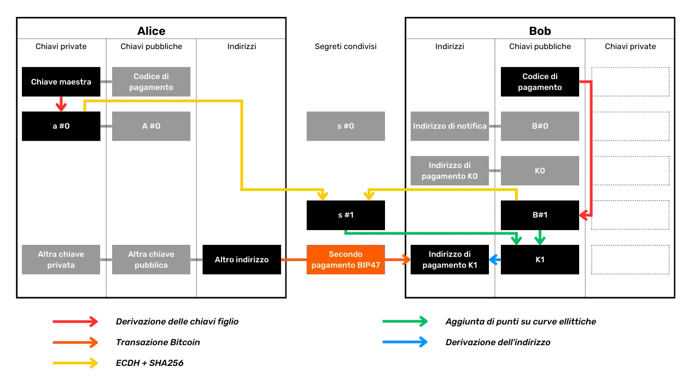

Può continuare in questo modo e derivare fino a `2^32` indirizzi non utilizzati appartenenti a Bob.

Da un punto di vista esterno, osservando la blockchain, è teoricamente impossibile differenziare un pagamento BIP47 da un pagamento standard. Ecco un esempio di transazione di pagamento BIP47 sul Testnet:

```text
94b2e59510f2e1fa78411634c98a77bbb638e28fb2da00c9f359cd5fc8f87254
````

Questo sembra una transazione standard con un input consumato, un output di pagamento e un resto:


### Ricevere il Pagamento BIP47 e Derivare la Chiave Privata

Alice ha appena effettuato il suo primo pagamento a un nuovo indirizzo BIP47 appartenente a Bob. Ora vediamo come Bob riceve questo pagamento. Vedremo anche perché Alice non ha accesso alla chiave privata dell'indirizzo che ha appena generato da sola, e come Bob recupera questa chiave per spendere i bitcoin che ha appena ricevuto.
Non appena Bob riceve la transazione di notifica da Alice, deriva la chiave pubblica BIP47 $K0$ anche prima che lei abbia inviato qualsiasi pagamento. Poi monitora qualsiasi pagamento all'indirizzo associato. Infatti, deriva immediatamente diversi indirizzi che monitorerà ($K0$, $K1$, $K2$, $K3$...). Ecco come deriva questa chiave pubblica $K0$:

- Bob seleziona la prima chiave privata derivata dal suo codice di pagamento. Questa chiave privata è denominata $b$. È associata alla chiave pubblica $B$ con cui Alice aveva fatto i suoi calcoli nel passaggio precedente:

$$ b $$

- Bob seleziona la prima chiave pubblica di Alice derivata dal suo codice di pagamento. Questa chiave è denominata $A$. È associata alla chiave privata $a$ con cui Alice aveva fatto i suoi calcoli, e di cui solo Alice è a conoscenza. Bob può eseguire questo processo poiché è a conoscenza del codice di pagamento di Alice che le è stato trasmesso con la transazione di notifica:

$$ A = a \cdot G $$

- Bob calcola il punto segreto $S$, mediante addizione e raddoppio di punti sulla curva ellittica, applicando la sua chiave privata $b$ alla chiave pubblica di Alice $A$. Qui troviamo l'uso di ECDH che garantisce che questo punto $S$ sarà lo stesso sia per Bob che per Alice:

$$ S = b \cdot A $$

- Proprio come ha fatto Alice, Bob isola la coordinata x di questo punto $S$. Abbiamo chiamato questo valore $Sx$. Egli passa questo valore attraverso la funzione SHA256 per trovare il segreto condiviso $s$ (minuscolo):
  $$ s = \text{SHA256}(Sx) $$

- Proprio come Alice, Bob calcola il punto $s·G$ sulla curva ellittica. Poi, aggiunge questo punto segreto alla sua chiave pubblica $B$. Ottiene così un nuovo punto sulla curva ellittica che interpreta come una chiave pubblica $K0$:

$$ K0 = B + s \cdot G $$

Una volta che Bob ha questa chiave pubblica $K0$, può derivare la chiave privata associata per essere in grado di spendere i suoi bitcoin. È l'unico che può generare questa chiave privata:

- Bob aggiunge la sua chiave privata figlio $b$ derivata dal suo codice di pagamento personale. È l'unico che può ottenere il valore di $b$. Poi, aggiunge $b$ con il segreto condiviso $s$ per ottenere $k0$, la chiave privata di $K0$:

$$ k0 = b + s $$

Grazie alla legge di gruppo della curva ellittica, Bob ottiene esattamente la chiave privata corrispondente alla chiave pubblica usata da Alice. Abbiamo quindi:

$$ K0 = k0 \cdot G $$

Riassumerò i passaggi che abbiamo appena esaminato insieme per ricevere un pagamento BIP47 e calcolare la chiave privata corrispondente:

- Bob seleziona la prima chiave privata figlio derivata dal suo codice di pagamento personale;
- Calcola un punto segreto sulla curva ellittica usando ECDH dalla prima chiave pubblica figlio derivata dal codice catena di Alice;
- Usa questo punto segreto per calcolare un segreto condiviso con SHA256;
- Usa questo segreto condiviso per calcolare un nuovo punto segreto sulla curva ellittica;
- Aggiunge questo nuovo punto segreto alla sua chiave pubblica personale;
- Ottiene una nuova chiave pubblica effimera, alla quale Alice invierà il suo primo pagamento;
- Bob calcola la chiave privata associata a questa chiave pubblica effimera aggiungendo la sua chiave privata figlio derivata dal suo codice di pagamento e il segreto condiviso.


Poiché Alice non può ottenere $b$ (la chiave privata di Bob), lei non è in grado di determinare $k0$ (la chiave privata associata all'indirizzo di ricezione BIP47 di Bob). Schematicamente, possiamo rappresentare il calcolo del segreto condiviso $S$ così:


Una volta trovato il segreto condiviso con ECDH, Alice e Bob calcolano la chiave pubblica di pagamento BIP47 $K0$, e Bob calcola anche la chiave privata associata $k0$:


### Rimborsare il Pagamento BIP47

Poiché Bob è a conoscenza del codice di pagamento riutilizzabile di Alice, ha già tutte le informazioni necessarie per inviarle un rimborso. Non avrà bisogno di contattare nuovamente Alice per chiedere informazioni. Dovrà semplicemente notificarla con una transazione di notifica, specialmente affinché lei possa recuperare i suoi indirizzi BIP47 con il suo seed, e poi potrà anche inviarle fino a `2^32` pagamenti.

La funzionalità di rimborso è specifica per BIP47 ed è uno dei suoi vantaggi rispetto ad altri metodi che studieremo nei prossimi capitoli, come i Pagamenti Silenziosi.

Bob può quindi rimborsare Alice nello stesso modo in cui lei gli ha inviato i pagamenti. I ruoli si invertono:


_Un grande ringraziamento a [Fanis Michalakis](https://x.com/FanisMichalakis) per la sua revisione e preziosi consigli esperti sull'articolo che ha ispirato la scrittura di questo capitolo!_

https://planb.network/tutorials/privacy/paynym-bip47

## Pagamenti Silenziosi

<chapterId>2871d594-414e-4598-a830-91c9eb84dfb8</chapterId>
Il BIP47 è stato criticato per la sua inefficienza sulla blockchain. Come spiegato nel capitolo precedente, richiede una transazione di notifica per ogni nuovo destinatario. Questo vincolo diventa trascurabile se si prevede di stabilire un canale di pagamento duraturo con questo destinatario. Infatti, una singola transazione di notifica apre la strada a un numero quasi infinito di pagamenti BIP47 successivi.

Tuttavia, in determinate situazioni, la transazione di notifica può rappresentare un ostacolo per l'utente. Prendiamo l'esempio di una donazione una tantum a un destinatario: con un indirizzo Bitcoin classico, una singola transazione è sufficiente per effettuare la donazione. Ma con il BIP47, sono necessarie due transazioni: una per la notifica e un'altra per il pagamento effettivo. Quando la domanda di spazio nel blocco è bassa e le commissioni di transazione sono minime, questo passaggio aggiuntivo generalmente non rappresenta un problema. Tuttavia, durante i periodi di congestione, le commissioni di transazione possono diventare esorbitanti per un singolo pagamento, potenzialmente raddoppiando il costo per l'utente rispetto a una transazione Bitcoin standard, il che può essere inaccettabile per l'utente.

Per situazioni in cui l'utente prevede di effettuare solo pochi pagamenti a un identificatore statico, sono state sviluppate altre soluzioni. Tra queste ci sono i Pagamenti Silenziosi, descritti nel [BIP352](https://github.com/bitcoin/bips/blob/master/bip-0352.mediawiki). Questo protocollo consente l'uso di un identificatore statico per ricevere pagamenti senza generare riutilizzo dell'indirizzo e senza richiedere l'uso di transazioni di notifica. Esaminiamo come funziona questo protocollo.

---

_Per comprendere appieno questo capitolo, è essenziale essere familiari con il funzionamento di ECDH (Elliptic Curve Diffie-Hellman) e la derivazione delle chiavi crittografiche in un portafoglio HD. Questi concetti sono stati dettagliati nel capitolo precedente sul BIP47. Non li ripeterò qui. Se non sei ancora familiare con queste nozioni, ti consiglio di consultare il capitolo precedente prima di continuare con questo. Non riprenderò nemmeno i rischi associati al riutilizzo degli indirizzi di ricezione, né l'importanza di avere un identificatore unico per ricevere pagamenti._

---

### Perché non spostare la notifica?

Come discusso nel capitolo sul BIP47, la transazione di notifica svolge principalmente due funzioni:

- Notifica il destinatario;
- Trasmette il codice di pagamento del mittente.

Si potrebbe ingenuamente pensare che questo processo di notifica potrebbe essere effettuato off-chain. In teoria, ciò è completamente fattibile: sarebbe sufficiente per il destinatario indicare un mezzo di comunicazione per ricevere i codici di pagamento BIP47 dai mittenti. Tuttavia, questo approccio presenta due problemi principali:

- Primo, ciò sposterebbe il processo di trasmissione del codice su un altro protocollo di comunicazione. Le questioni relative ai costi e alla privacy dello scambio rimarrebbero, ma sarebbero semplicemente trasferite a questo nuovo protocollo. In termini di privacy, ciò potrebbe anche creare un collegamento tra l'identità di un utente e l'attività sulla blockchain, cosa che cerchiamo di evitare eseguendo la notifica direttamente sulla blockchain. Inoltre, effettuare la notifica fuori dalla blockchain introdurrebbe rischi di censura (come il blocco dei fondi) che non esistono su Bitcoin;
  Successivamente, ciò porrebbe un problema di recupero. Con BIP47, il destinatario deve assolutamente conoscere i codici di pagamento dei mittenti per accedere ai fondi. Questo è vero al momento della ricezione, ma anche in caso di recupero dei fondi tramite il seed in caso di perdita del portafoglio. Con le notifiche onchain, questo rischio viene evitato, poiché l'utente può trovare e decifrare le transazioni di notifica semplicemente conoscendo il proprio seed. Tuttavia, se la notifica viene eseguita fuori dalla blockchain, l'utente dovrebbe mantenere un backup dinamico di tutti i codici di pagamento ricevuti, il che è impraticabile per l'utente medio.
  Tutti questi vincoli rendono l'uso della notifica onchain indispensabile nel contesto di BIP47. Eppure, i Pagamenti Silenziosi cercano specificamente di evitare questo passaggio di notifica onchain a causa del suo costo. Pertanto, la soluzione adottata non è spostare la notifica, ma eliminarla completamente. Per raggiungere questo obiettivo, deve essere accettato un compromesso: quello della scansione. A differenza di BIP47, dove l'utente sa esattamente dove trovare i propri fondi grazie alle transazioni di notifica, nel contesto dei Pagamenti Silenziosi, l'utente deve esaminare tutte le transazioni Bitcoin esistenti per rilevare eventuali pagamenti che potrebbero essere destinati a loro. Per ridurre questo onere operativo, la ricerca di Pagamenti Silenziosi è limitata solo alle transazioni che probabilmente contengono tali pagamenti, ovvero quelle che includono almeno un output Taproot P2TR. La scansione si concentra esclusivamente anche sulle transazioni dalla data di creazione del portafoglio (non c'è bisogno di scandire transazioni risalenti al 2009 se il portafoglio è stato creato nel 2024).

Pertanto, potete vedere perché BIP47 e Pagamenti Silenziosi, sebbene mirino a un obiettivo simile, comportano compromessi diversi e **quindi si rivolgono effettivamente a casi d'uso distinti**. Per i pagamenti una tantum, come le donazioni occasionali, i Pagamenti Silenziosi sono più appropriati a causa del loro costo inferiore. Al contrario, per le transazioni regolari allo stesso destinatario, come nel caso delle piattaforme di scambio o dei pool di mining, BIP47 potrebbe essere preferito.
Esploriamo insieme il funzionamento tecnico dei Pagamenti Silenziosi per capirne meglio le implicazioni. Per fare ciò, suggerisco di adottare lo stesso approccio del documento esplicativo di BIP352. Scomporremo gradualmente i calcoli da eseguire, elemento per elemento, giustificando ogni nuova aggiunta.

### Alcuni concetti da comprendere

Prima di iniziare, è importante chiarire che i Pagamenti Silenziosi si basano esclusivamente sull'uso di tipi di script P2TR (_Pay to Taproot_). A differenza di BIP47, non è necessario derivare gli indirizzi di ricezione dalle chiavi pubbliche figlie tramite hashing. Infatti, nello standard P2TR, la chiave pubblica modificata viene utilizzata direttamente e apertamente nell'indirizzo. Così, un indirizzo di ricezione Taproot è essenzialmente una chiave pubblica accompagnata da alcuni metadati. Questa chiave pubblica modificata è l'aggregazione di altre due chiavi pubbliche: una che consente la spesa diretta e tradizionale tramite una semplice firma, e l'altra che rappresenta la radice di Merkle del MAST, che autorizza la spesa soggetta alla soddisfazione di una delle condizioni potenzialmente iscritte nell'albero di Merkle.


La decisione di limitare i Pagamenti Silenziosi esclusivamente a Taproot è motivata da due ragioni principali:

- Primo, facilita significativamente l'implementazione e gli aggiornamenti futuri nel software del portafoglio, poiché è necessario aderire a un solo standard;
- In secondo luogo, questo approccio aiuta a migliorare l'insieme di anonimato degli utenti incoraggiandoli a non disperdersi tra diversi tipi di script, che generano impronte di portafoglio distinte nell'analisi della catena (per maggiori informazioni su questo concetto, vi invito a consultare il capitolo 4 della parte 2).

### Derivazione naive di una chiave pubblica di Pagamenti Silenziosi

Iniziamo con un semplice esempio che ti aiuterà a comprendere il funzionamento di base dei Pagamenti Silenziosi (SP, Silent Payments). Prendiamo Alice e Bob, due utenti Bitcoin. Alice vuole inviare bitcoin a Bob su un nuovo indirizzo di ricezione. Tre obiettivi devono essere raggiunti in questo processo:

- Alice deve essere in grado di generare un nuovo indirizzo;
- Bob deve essere in grado di identificare un pagamento inviato a questo specifico indirizzo;
- Bob deve essere in grado di ottenere la chiave privata associata a questo indirizzo per poter spendere i suoi fondi.

Alice ha un UTXO nel suo portafoglio Bitcoin protetto con la seguente coppia di chiavi:

- $a$: la chiave privata;
- $A$: la chiave pubblica ($A = a \cdot G$)

Bob ha un indirizzo SP che ha pubblicato su internet con:

- $b$: la chiave privata;
- $B$: la chiave pubblica ($B = b \cdot G$)
  Recuperando l'indirizzo di Bob, Alice è in grado di calcolare un nuovo indirizzo vuoto che appartiene a Bob usando ECDH. Chiamiamo questo indirizzo $P$:
  $$ P = B + \text{hash}(a \cdot B) \cdot G $$

In questa equazione, Alice ha semplicemente calcolato il prodotto scalare della sua chiave privata $a$ e della chiave pubblica di Bob $B$. Ha passato questo risultato attraverso una funzione hash conosciuta da tutti. Il valore di output è poi moltiplicato scalarmente per il punto generatore $G$ della curva ellittica `secp256k1`. Infine, Alice aggiunge il punto ottenuto alla chiave pubblica di Bob $B$. Una volta che Alice ha questo indirizzo $P$, lo usa come output in una transazione, il che significa che invia bitcoin ad esso.

> _Nel contesto dei Pagamenti Silenziosi, la funzione "hash" corrisponde a una funzione hash SHA256 etichettata specificamente con `BIP0352/SharedSecret`, assicurando che gli hash generati siano unici per questo protocollo e non possano essere riutilizzati in altri contesti, fornendo anche una protezione aggiuntiva contro il riutilizzo di nonce nelle firme. Questo standard corrisponde a quello [specificato nel BIP340 per le firme Schnorr](https://github.com/bitcoin/bips/blob/master/bip-0340.mediawiki) su `secp256k1`._

Grazie alle proprietà della curva ellittica su cui si basa ECDH, sappiamo che:

$$ a \cdot B = b \cdot A $$

Bob sarà quindi in grado di calcolare l'indirizzo di ricezione su cui Alice ha inviato i bitcoin. Per fare ciò, monitora tutte le transazioni Bitcoin che soddisfano i criteri dei Pagamenti Silenziosi e applica il seguente calcolo a ciascuna di esse per vedere se il pagamento è indirizzato a lui (_scanning_):

$$ P' = B + \text{hash}(b \cdot A) \cdot G $$

Quando esamina la transazione di Alice, si rende conto che $P'$ è uguale a $P$. Sa quindi che questo pagamento è indirizzato a lui:

$$ P' = B + \text{hash}(b \cdot A) \cdot G = B + \text{hash}(a \cdot B) \cdot G = P $$

Da qui, Bob sarà in grado di calcolare la chiave privata $p$ che consente di spendere l'indirizzo $P$:

$$ p = (b + \text{hash}(b \cdot A)) \bmod n $$

Come puoi vedere, per calcolare questa chiave privata $p$, è necessario avere la chiave privata $b$. Solo Bob ha questa chiave privata $b$. Sarà quindi effettivamente l'unico in grado di spendere i bitcoin inviati al suo indirizzo di Pagamenti Silenziosi.


_Didascalia:_

- $B$: La chiave pubblica / indirizzo statico pubblicato da Bob
- $b$: La chiave privata di Bob
- $A$: La chiave pubblica dell'UTXO di Alice usata come input per la transazione
- $a$: La chiave privata di Alice
- $G$: Il punto generatore della curva ellittica `secp256k1`
- $\text{SHA256}$: La funzione di hashing SHA256 etichettata con `BIP0352/SharedSecret`
- $s$: Il segreto comune ECDH
- $P$: La chiave pubblica / indirizzo unico per il pagamento a Bob

Ecco un approccio inizialmente piuttosto ingenuo nell'uso dell'indirizzo statico di Bob, denotato $B$, per derivare un indirizzo unico $P$ per inviare bitcoin. Tuttavia, questo metodo è troppo semplicistico e presenta diversi difetti che necessitano di correzione. Il primo problema è che, in questo schema, Alice non può creare molteplici output per Bob all'interno della stessa transazione.

### Come creare molteplici output?

Nell'esempio della sezione precedente, Alice crea un singolo output che andrà a Bob al suo indirizzo unico $P$. Con lo stesso input selezionato, è impossibile per Alice creare due indirizzi vergini distinti per Bob, poiché il metodo utilizzato porterebbe sempre allo stesso risultato per $P$, quindi allo stesso indirizzo. Tuttavia, ci possono essere molte situazioni in cui Alice desidera dividere il suo pagamento a Bob in diverse piccole somme, creando così molteplici UTXO. È quindi necessario trovare un metodo che permetta di farlo.

Per raggiungere questo obiettivo, modificheremo leggermente il calcolo che Alice esegue per derivare $P$, in modo che possa generare due indirizzi distinti per Bob, ovvero $P_0$ e $P_1$.

Per modificare il calcolo e ottenere 2 indirizzi diversi, è sufficiente aggiungere un intero che modifica il risultato. Così, Alice aggiungerà $0$ nel suo calcolo per ottenere l'indirizzo $P_0$ e $1$ per ottenere l'indirizzo $P_1$. Chiamiamo questo intero $i$:

$$ P_i = B + \text{hash}(a \cdot B \text{ ‖ } i) \cdot G $$

Il processo di calcolo rimane invariato rispetto al metodo precedente, eccetto che questa volta Alice concatenerà $a \cdot B$ con $i$ prima di procedere al hash. È quindi sufficiente cambiare $i$ per avere un nuovo indirizzo appartenente a Bob. Ad esempio:

$$ P_0 = B + \text{hash}(a \cdot B \text{ ‖ } 0) \cdot G $$

$$ P_1 = B + \text{hash}(a \cdot B \text{ ‖ } 1) \cdot G $$
Quando Bob esamina la blockchain per i Pagamenti Silenziosi destinati a lui, inizia utilizzando $i = 0$ per l'indirizzo $P_0$. Se non trova nessun pagamento su $P_0$, conclude che questa transazione non contiene nessun Pagamento Silenzioso per lui e smette di analizzarla. Tuttavia, se $P_0$ è valido e contiene un pagamento per lui, procede con $P_1$ nella stessa transazione per verificare se Alice ha effettuato un secondo pagamento. Se $P_1$ risulta essere invalido, interrompe la sua ricerca per questa transazione; altrimenti, continua a testare valori successivi di $i$.
$$ P_1 = B + \text{hash}(b \cdot A \text{ ‖ } 1) \cdot G $$

Poiché Bob si ferma immediatamente a $i = 0$ se $P_0$ non produce risultati, l'uso di questo intero aggiunge quasi nessun onere operativo aggiuntivo a Bob per la fase di scansione delle transazioni.

Bob può quindi calcolare le chiavi private nello stesso modo:

$$
p_0 = (b + \text{hash}(b \cdot A \text{ ‖ } 0)) \bmod n
$$

$$
p_1 = (b + \text{hash}(b \cdot A \text{ ‖ } 1)) \bmod n
$$

_Didascalia:_

- $B$: La chiave pubblica / indirizzo statico pubblicato da Bob
- $b$: La chiave privata di Bob
- $A$: La chiave pubblica dell'UTXO di Alice usata come input per la transazione
- $a$: La chiave privata di Alice
- $G$: Il punto generatore della curva ellittica `secp256k1`
- $\text{SHA256}$: La funzione di hash SHA256 etichettata con `BIP0352/SharedSecret`
- $s_0$: Il primo segreto condiviso ECDH
- $s_1$: Il secondo segreto condiviso ECDH
- $P_0$: La prima chiave pubblica / indirizzo unico per il pagamento a Bob
- $P_1$: La seconda chiave pubblica / indirizzo unico per il pagamento a Bob

Con questo metodo, iniziamo ad avere un bel protocollo, ma ci sono ancora alcune sfide da superare, in particolare la prevenzione del riutilizzo degli indirizzi.

### Come evitare il riutilizzo degli indirizzi?

Come abbiamo visto nelle sezioni precedenti, Alice utilizza la coppia di chiavi che proteggono il suo UTXO, che spenderà per calcolare il segreto condiviso ECDH con Bob. Questo segreto le permette di derivare l'indirizzo unico $P_0$. Tuttavia, la coppia di chiavi ($a$, $A$) usata da Alice può proteggere più UTXO se ha riutilizzato questo indirizzo diverse volte. Nel caso in cui Alice effettui due pagamenti all'indirizzo statico $B$ di Bob utilizzando due UTXO protetti dalla stessa chiave $A$, ciò comporterebbe un riutilizzo dell'indirizzo per Bob.

> _Il riutilizzo degli indirizzi è una pratica molto negativa per la privacy degli utenti. Per capire perché, vi consiglio di rivedere le prime parti di questa formazione._

Infatti, poiché l'indirizzo unico $P_0$ è derivato da $A$ e $B$, se Alice deriva un secondo indirizzo per un secondo pagamento a $B$, con la stessa chiave $A$, finirà per ottenere lo stesso indirizzo $P_0$. Per evitare questo rischio e prevenire il riutilizzo degli indirizzi all'interno dei Pagamenti Silenziosi, dobbiamo modificare leggermente i nostri calcoli.

Quello che vogliamo è che ogni UTXO consumato da Alice come input di un pagamento dia un indirizzo unico dal lato di Bob, anche se più UTXO sono protetti dalla stessa coppia di chiavi. È quindi sufficiente aggiungere un riferimento all'UTXO nel calcolo dell'indirizzo unico $P_0$. Questo riferimento sarà semplicemente l'hash dell'UTXO consumato come input:

$$ \text{inputHash} = \text{hash}(\text{outpoint} \text{ ‖ } A) $$

E questo riferimento di input, Alice lo aggiungerà nel suo calcolo dell'indirizzo unico $P_0$:
Durante la sua scansione, Bob può anche aggiungere $\text{inputHash}$, poiché tutto ciò che deve fare è osservare la transazione per dedurre $\text{outpoint}$:

$$ P_0 = B + \text{hash}(\text{inputHash} \cdot b \cdot A \text{ ‖ } 0) \cdot G $$

Quando trova un valido $P_0$, può calcolare la corrispondente chiave privata $p_0$:

$$
p_0 = (b + \text{hash}(\text{inputHash} \cdot b \cdot A \text{ ‖ } 0)) \bmod n
$$

_Legenda:_

- $B$: La chiave pubblica / indirizzo statico pubblicato da Bob
- $b$: La chiave privata di Bob
- $A$: La chiave pubblica dell'UTXO di Alice usata come input per la transazione
- $a$: La chiave privata di Alice
- $H$: L'hash dell'UTXO usato come input
- $G$: Il punto generatore della curva ellittica `secp256k1`
- $\text{SHA256}$: La funzione di hash SHA256 etichettata con `BIP0352/SharedSecret`
- $s_0$: Il primo segreto condiviso ECDH
- $P_0$: La prima chiave pubblica / indirizzo unico per il pagamento a Bob

Al momento, i nostri calcoli presuppongono che Alice utilizzi un singolo input per la sua transazione. Tuttavia, dovrebbe essere in grado di utilizzare più input. Di conseguenza, da parte di Bob, per ogni transazione contenente più input, teoricamente avrebbe bisogno di calcolare l'ECDH per ogni input per determinare se un pagamento è destinato a lui. Questo metodo non è soddisfacente, quindi abbiamo bisogno di trovare una soluzione per ridurre il carico di lavoro!

### Modificare le chiavi pubbliche negli input

Per risolvere questo problema, invece di utilizzare la coppia di chiavi che protegge un input specifico da parte di Alice, useremo la somma di tutte le coppie di chiavi utilizzate negli input della transazione. Questa somma sarà quindi considerata come una nuova coppia di chiavi. Questa tecnica è nota come "tweak".

Per esempio, immagina che la transazione di Alice abbia 3 input, ognuno protetto con una coppia di chiavi diversa:

- $a_0$ protegge l'input #0;
- $a_1$ protegge l'input #1;
- $a_2$ protegge l'input #2.

Seguendo il metodo descritto sopra, Alice dovrebbe scegliere una singola coppia di chiavi tra $a_0$, $a_1$ e $a_2$ per calcolare il segreto ECDH e generare l'indirizzo di pagamento unico $P$ dall'indirizzo statico $B$ di Bob. Tuttavia, questo approccio richiede a Bob di testare ogni possibilità sequenzialmente, partendo da $a_0$, poi $a_1$, e così via, fino all'identificazione di una coppia che genera un indirizzo valido $P$. Questo processo richiede che Bob esegua il calcolo ECDH su tutti gli input di tutte le transazioni, aumentando significativamente il carico di lavoro operativo di scansione.

Per evitare ciò, chiederemo ad Alice di eseguire il suo calcolo di $P$ utilizzando la somma di tutte le chiavi in input. Prendendo il nostro esempio, la chiave privata modificata $a$ sarebbe calcolata come segue:

$$ a = a_0 + a_1 + a_2 $$
Allo stesso modo, Alice e Bob saranno in grado di calcolare la chiave pubblica modificata:
$$ A = A_0 + A_1 + A_2 $$
Grazie a questo metodo, a Bob basta calcolare la somma delle chiavi pubbliche della transazione, poi calcolare il segreto ECDH da $A$ soltanto, il che riduce notevolmente il numero di calcoli da fare per la fase di scansione. Tuttavia, ricorda dalla sezione precedente. Avevamo incluso nel nostro calcolo l'hash $\text{inputHash}$ che viene usato come nonce per prevenire il riutilizzo degli indirizzi:

$$ \text{inputHash} = \text{hash}(\text{outpoint} \text{ ‖ } A) $$

Ma se ci sono più input in una transazione, è necessario determinare quale $\text{outpoint}$ viene scelto in questo calcolo. Secondo il BIP352, il criterio di selezione per $\text{outpoint}$ da usare è scegliere il più piccolo lessicograficamente, il che significa selezionare l'UTXO che appare per primo in ordine alfabetico. Questo metodo standardizza l'UTXO da scegliere in ogni transazione. Ad esempio, se questo $\text{outpoint}$ più piccolo lessicograficamente è $\text{outpoint}_L$, il calcolo di $\text{inputHash}$ sarà:

$$ \text{inputHash} = \text{hash}(\text{outpoint}\_L \text{ ‖ } A) $$

I calcoli rimangono quindi identici a quelli presentati nella sezione precedente, eccetto che la chiave privata $a$ e la sua corrispondente chiave pubblica $A$ non rappresentano più una coppia che protegge un singolo input, ma ora rappresentano la modifica di tutte le coppie di chiavi negli input.

### Separare le Chiavi di Spesa e di Scansione

Finora, abbiamo discusso dell'indirizzo statico di Pagamento Silenzioso $B$ come di una chiave pubblica unica. Ricorda, è questa chiave pubblica $B$ che viene usata da Alice per creare il segreto condiviso ECDH, che a sua volta viene usato per calcolare l'indirizzo di pagamento unico $P$. Bob usa questa chiave pubblica $B$ e la corrispondente chiave privata $b$ per la fase di scansione. Ma userà anche la chiave privata $b$ per calcolare la chiave privata $p$ che consente di spendere dall'indirizzo $P$.

Lo svantaggio di questo metodo è che la chiave privata $b$, che viene usata per calcolare tutte le chiavi private per gli indirizzi che ricevono Pagamenti Silenziosi, viene anche usata da Bob per scansionare le transazioni. Questo passaggio richiede che la chiave $b$ sia disponibile su un software di portafoglio connesso a Internet, il che la espone a un rischio maggiore di furto rispetto al mantenerla su un portafoglio freddo. Idealmente, sarebbe vantaggioso poter approfittare dei Pagamenti Silenziosi mantenendo la chiave privata $b$, che controlla l'accesso a tutte le altre chiavi private, al sicuro su un portafoglio hardware. Fortunatamente, il protocollo è stato adattato per permettere esattamente questo.
Per raggiungere questo obiettivo, il BIP352 specifica che il ricevente usa 2 diverse coppie di chiavi:

- $B_{\text{spend}}$: per calcolare le chiavi private degli indirizzi di pagamento unici;
- $B_{\text{scan}}$: per trovare indirizzi di pagamento unici.

In questo modo, Bob può mantenere la chiave privata $b_{\text{spend}}$ su un portafoglio hardware e usare la chiave privata $b_{\text{scan}}$ su software online per trovare i suoi Pagamenti Silenziosi, senza rivelare $b_{\text{spend}}$. Tuttavia, le chiavi pubbliche $B_{\text{scan}}$ e $B_{\text{spend}}$ sono entrambe pubblicamente rivelate, poiché si trovano nell'indirizzo statico di Bob $B$:
Per calcolare un indirizzo di pagamento unico $P_0$ appartenente a Bob, Alice eseguirà il seguente calcolo:

$$ P*0 = B*{\text{spend}} + \text{hash}(\text{inputHash} \cdot a \cdot B\_{\text{scan}} \text{ ‖ } 0) \cdot G $$

Per trovare i pagamenti indirizzati a lui, Bob eseguirà il seguente calcolo:

$$ P*0 = B*{\text{spend}} + \text{hash}(\text{inputHash} \cdot b\_{\text{scan}} \cdot A \text{ ‖ } 0) \cdot G $$

Come puoi vedere, fino a questo momento, Bob non ha avuto bisogno di usare $b_{\text{spend}}$ che si trova sul suo portafoglio hardware. Quando desidera spendere $P_0$, può quindi eseguire il seguente calcolo per trovare la chiave privata $p_0$:

$$ p*0 = (b*{\text{spend}} + \text{hash}(\text{inputHash} \cdot b\_{\text{scan}} \cdot A \text{ ‖ } 0)) \bmod n $$

_Didascalia:_

- $B_{\text{scan}}$: Chiave pubblica di scansione di Bob (indirizzo statico)
- $b_{\text{scan}}$: Chiave privata di scansione di Bob
- $B_{\text{spend}}$: Chiave pubblica di spesa di Bob (indirizzo statico)
- $b_{\text{spend}}$: Chiave privata di spesa di Bob
- $A$: La somma delle chiavi pubbliche in input (tweak)
- $a$: La chiave privata corrispondente alla chiave pubblica modificata
- $H$: L'hash dell'UTXO più piccolo (lessicograficamente) usato in input
- $G$: Il punto generatore della curva ellittica `secp256k1`
- $\text{SHA256}$: La funzione di hashing SHA256 etichettata con `BIP0352/SharedSecret`
- $s_0$: Il primo segreto condiviso ECDH
- $P_0$: La prima chiave pubblica / indirizzo di pagamento unico per Bob

### Utilizzando indirizzi SP con un'etichetta

Bob ha quindi un indirizzo statico $B$ per i Pagamenti Silenziosi come segue:

$$ B = B*{\text{scan}} \text{ ‖ } B*{\text{spend}} $$

Il problema con questo metodo è che non permette di segregare i diversi pagamenti inviati a questo indirizzo. Ad esempio, se Bob ha 2 clienti diversi per la sua attività e vuole differenziare chiaramente i pagamenti da ciascuno, avrebbe bisogno di 2 indirizzi statici diversi. Una soluzione ingenua, con l'approccio attuale, sarebbe che Bob crei due portafogli separati, ognuno con il proprio indirizzo statico, o addirittura stabilisca due indirizzi statici diversi all'interno dello stesso portafoglio. Tuttavia, questa soluzione richiede la scansione dell'intera blockchain due volte (una per ciascun indirizzo) per rilevare rispettivamente i pagamenti destinati a ciascun indirizzo. Questa doppia scansione aumenta in modo irragionevole l'onere operativo per Bob.
Per risolvere questo problema, BIP352 utilizza un sistema di etichettatura che consente di avere diversi indirizzi statici senza aumentare in modo irragionevole il carico di lavoro per trovare Pagamenti Silenziosi sulla blockchain. Per fare ciò, viene aggiunto un intero $m$ alla chiave pubblica di spesa $B_{\text{spend}}$. Questo intero può assumere il valore di $1$ per il primo indirizzo statico, poi $2$ per il secondo, e così via. Le chiavi di spesa $B_{\text{spend}}$ saranno d'ora in poi chiamate $B_m$ e saranno costruite in questo modo:
$$ B*m = B*{\text{spend}} + \text{hash}(b\_{\text{scan}} \text{ ‖ } m) \cdot G $$

Per esempio, per la prima chiave di spesa con l'etichetta $1$:

$$ B*1 = B*{\text{spend}} + \text{hash}(b\_{\text{scan}} \text{ ‖ } 1) \cdot G $$

L'indirizzo statico pubblicato da Bob consisterà ora di $B_{\text{scan}}$ e $B_m$. Per esempio, il primo indirizzo statico con l'etichetta $1$ sarà:

$$ B = B\_{\text{scan}} \text{ ‖ } B_1 $$

> _Iniziamo solo dall'etichetta 1 perché l'etichetta 0 è riservata per il resto._

Alice, da parte sua, deriverà l'indirizzo di pagamento unico $P$ nello stesso modo di prima, ma utilizzando il nuovo $B_1$ invece di $B_{\text{spend}}$.
$$ P*0 = B_1 + \text{hash}(\text{inputHash} \cdot a \cdot B*{\text{scan}} \text{ ‖ } 0) \cdot G $$

In realtà, Alice potrebbe non sapere nemmeno che Bob ha un indirizzo etichettato, poiché lei semplicemente utilizza la seconda parte dell'indirizzo statico che lui le ha fornito, che in questo caso, è il valore $B_1$ piuttosto che $B_{\text{spend}}$.

Per scansionare i pagamenti, Bob utilizzerà sempre il valore del suo indirizzo statico iniziale con $B_{\text{spend}}$ in questo modo:

$$ P*0 = B*{\text{spend}} + \text{hash}(\text{inputHash} \cdot b\_{\text{scan}} \cdot A \text{ ‖ } 0) \cdot G $$

Poi, semplicemente sottrae il valore che trova per $P_0$ da ogni output uno per uno. Poi controlla se uno dei risultati di queste sottrazioni corrisponde al valore di una delle etichette che usa nel suo portafoglio. Se corrisponde, per esempio, per l'output #4 con l'etichetta $1$, ciò significa che questo output è un Pagamento Silenzioso associato al suo indirizzo statico etichettato $B_1$:

$$ Out*4 - P_0 = \text{hash}(b*{\text{scan}} \text{ ‖ } 1) \cdot G $$

Questo funziona perché:

$$ B*1 = B*{\text{spend}} + \text{hash}(b*{\text{scan}} \text{ ‖ } 1) \cdot G $$
Grazie a questo metodo, Bob può utilizzare una moltitudine di indirizzi statici ($B_1$, $B_2$, $B_3$...), tutti derivati dal suo indirizzo statico base ($B = B*{\text{scan}} \text{ ‖ } B*{\text{spend}}$), al fine di separare correttamente gli usi.
Tuttavia, questa separazione degli indirizzi statici è valida solo da una prospettiva di gestione personale del portafoglio e non consente la separazione delle identità. Poiché tutti hanno lo stesso $B*{\text{scan}}$, è molto facile associare tutti gli indirizzi statici insieme e dedurre che appartengono a una singola entità.

_Didascalia:_

- $B_{\text{scan}}$: chiave pubblica di scansione di Bob (indirizzo statico)
- $b_{\text{scan}}$: chiave privata di scansione di Bob
- $B_{\text{spend}}$: chiave pubblica di spesa di Bob (indirizzo iniziale)
- $B_m$: chiave pubblica di spesa etichettata di Bob (indirizzo statico)
- $b_m$: chiave privata di spesa etichettata di Bob
- $A$: La somma delle chiavi pubbliche in input (tweak)
- $a$: La chiave privata corrispondente alla chiave pubblica modificata
- $H$: L'hash del più piccolo UTXO (lessicograficamente) utilizzato come input
- $G$: Il punto generatore della curva ellittica `secp256k1`
- $\text{SHA256}$: La funzione di hashing SHA256 etichettata con `BIP0352/SharedSecret`
- $s_0$: Il primo segreto condiviso ECDH
- $P_0$: La prima chiave pubblica / indirizzo unico per il pagamento a Bob
- $p_0$: La chiave privata del primo indirizzo di pagamento unico a Bob
- $X$: L'hash della chiave privata di scansione con l'etichetta

### Come Costruire un Indirizzo per Pagamenti Silenziosi?

Per costruire un indirizzo dedicato ai Pagamenti Silenziosi, è necessario prima derivare 2 coppie di chiavi nel proprio portafoglio Bitcoin HD:

- La coppia $b_{\text{scan}}$, $B_{\text{scan}}$ per cercare i pagamenti indirizzati a noi;
- La coppia $b_{\text{spend}}$, $B_{\text{spend}}$ per spendere i bitcoin che abbiamo ricevuto.

Queste coppie sono derivate seguendo questi percorsi (_Bitcoin Mainnet_):

```text
scan: m / 352' / 0' / 0' / 1' / 0
spend: m / 352' / 0' / 0' / 0' / 0
```

Una volta disponibili queste 2 coppie di chiavi, si concatenano semplicemente (una di seguito all'altra) per creare il payload dell'indirizzo statico:

$$ B = B*{\text{scan}} \text{ ‖ } B*{\text{spend}} $$

Se si desidera utilizzare etichette, $B_{\text{spend}}$ viene sostituito con $B_m$:

$$ B = B\_{\text{scan}} \text{ ‖ } B_m $$

Con l'etichetta $m$:

$$ B*m = B*{\text{spend}} + \text{hash}(b\_{\text{scan}} \text{ ‖ } m) \cdot G $$

Una volta disponibile questo payload, si aggiunge la HRP (_Human-Readable Part_) `sp` e la versione `q` (= versione 0). Viene anche aggiunto un checksum, e l'indirizzo è formattato in bech32m.
Ad esempio, ecco il mio indirizzo statico per i Pagamenti Silenziosi:

```text
sp1qqvhjvsq2vz8zwrw372vuzle7472zup2ql3pz64yn5cpkw5ngv2n6jq4nl8cgm6zmu48yk3eq33ryc7aam6jrvrg0d0uuyzecfhx2wgsumcurv77e
```

Un punto importante riguardo agli indirizzi statici, che potresti aver inserito nelle sezioni precedenti, è che questi indirizzi non sono visibili nelle transazioni Bitcoin. Solo gli indirizzi di pagamento $P$, utilizzati negli output, appaiono sulla blockchain nel formato standard Taproot. Quindi, dall'esterno, è impossibile distinguere una transazione che coinvolge un Pagamento Silenzioso da una transazione ordinaria che utilizza output P2TR.
Proprio come con BIP47, è impossibile stabilire una connessione tra un indirizzo statico $B$ e un indirizzo di pagamento $P$ derivato da $B$. Infatti, anche se Eve, un potenziale attaccante, prova a scandagliare la blockchain con l'indirizzo statico di Bob $B$, non sarà in grado di eseguire i calcoli necessari per determinare $P$. Per fare ciò, avrebbe bisogno o della chiave privata di scansione di Bob $b_{\text{scan}}$ o delle chiavi private del mittente $a$, ma entrambi questi elementi sono, ovviamente, privati. È quindi possibile collegare esplicitamente il proprio indirizzo statico con una forma di identità personale.

### Come utilizzare i Pagamenti Silenziosi?

La proposta per i Pagamenti Silenziosi è relativamente recente e finora è stata implementata solo da un numero molto limitato di portafogli. A mia conoscenza, ci sono solo 3 software che li supportano:

- [CakeWallet](https://cakewallet.com/)
- [Silentium](https://app.silentium.dev/)
- [DonationWallet](https://github.com/Sosthene00/donationwallet)

Presto offriremo un tutorial dettagliato su come impostare il proprio indirizzo statico per i Pagamenti Silenziosi.

Dato che questa funzionalità è recente, è consigliabile esercitare cautela ed evitare di utilizzare i Pagamenti Silenziosi per importi elevati sulla rete principale.

_Per creare questo capitolo sui Pagamenti Silenziosi, ho utilizzato [il sito di spiegazione dei Pagamenti Silenziosi](https://silentpayments.xyz/) e [il documento di spiegazione del BIP352](https://github.com/bitcoin/bips/blob/master/bip-0352.mediawiki)._


## Dacci un feedback su questo corso
<chapterId>195d149f-80fa-5816-8b46-995a9226d082</chapterId>
<isCourseReview>true</isCourseReview>

## Esame Finale
<chapterId>e803d394-e3c1-5816-a6b4-a69a2472019c</chapterId>
<isCourseExam>true</isCourseExam>

## Conclusione

<chapterId>cd8e5c67-50e4-4dcd-8e04-88ba5ec95305</chapterId>

Congratulazioni per aver completato questa formazione sulla privacy in Bitcoin!

Abbiamo trattato molti argomenti avanzati e tecnici in questa formazione, ma non è imperativo utilizzare tutti gli strumenti presentati. L'obiettivo principale era di permetterti di scegliere le informazioni che desideri divulgare e quelle che preferisci mantenere confidenziali nel tuo uso di Bitcoin. Questo incarna l'essenza stessa della protezione della privacy. Per prendere decisioni informate sulle informazioni da condividere o nascondere, è necessario essere consapevoli delle implicazioni delle nostre azioni. Spero che questa formazione ti abbia aiutato a ottenere questa conoscenza.
Se dovessi scegliere la parte più importante di questa formazione, sceglierei la sezione dedicata all'analisi della catena. Comprendere le tecniche utilizzate dai potenziali attaccanti è il modo migliore per proteggersi. Pertanto, il mio consiglio sarebbe di rivedere attentamente questa parte e cercare di afferrarne tutti i dettagli.
In questo corso di formazione, ci siamo concentrati esclusivamente sulla privacy di Bitcoin sulla catena principale. Le questioni relative alla privacy sui sistemi di secondo livello, come la Lightning Network e le sidechain, sono altrettanto significative e presentano caratteristiche molto specifiche. Sebbene l'utilizzo di transazioni off-chain possa essere una strategia efficace per eludere i numerosi rischi di tracciabilità su Bitcoin che abbiamo studiato, espone a ulteriori rischi dei quali è essenziale essere consapevoli. Ecco perché questi argomenti saranno trattati in un futuro corso di formazione dedicato sulla PlanB Network.
Se questo corso di formazione ti è piaciuto, ti sarei molto grato se potessi condividerlo con i tuoi amici e sui social media. Grazie! :)

