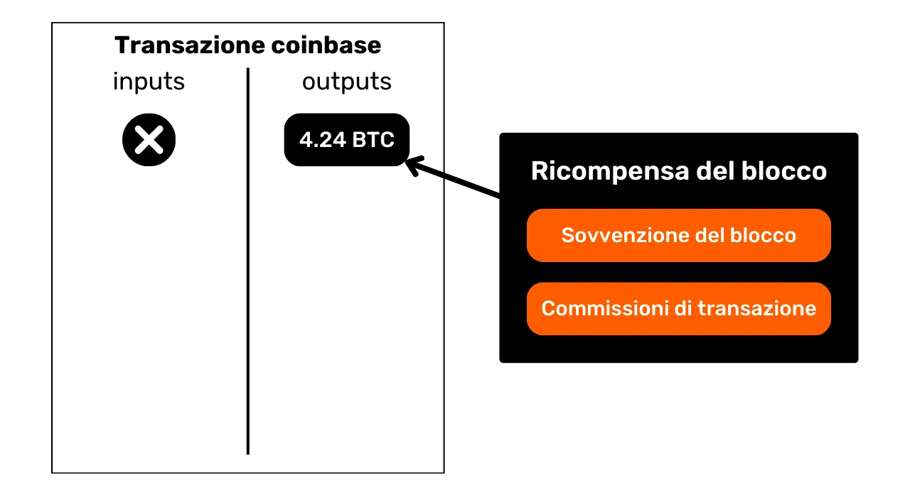
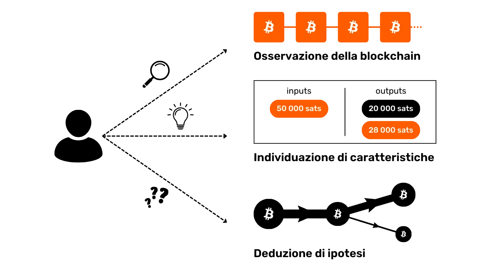
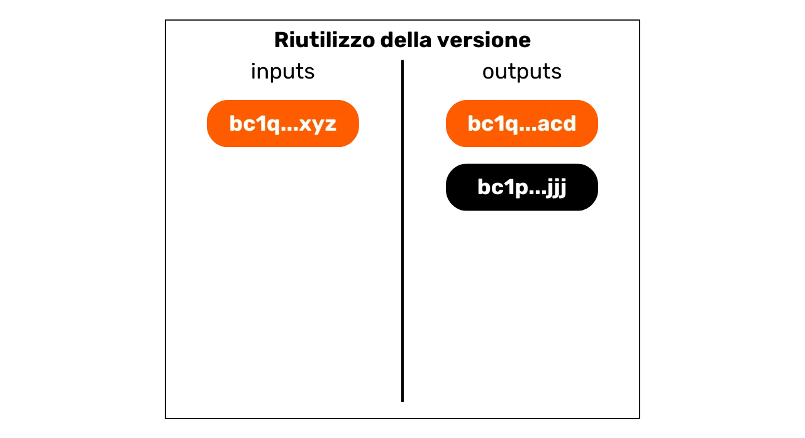
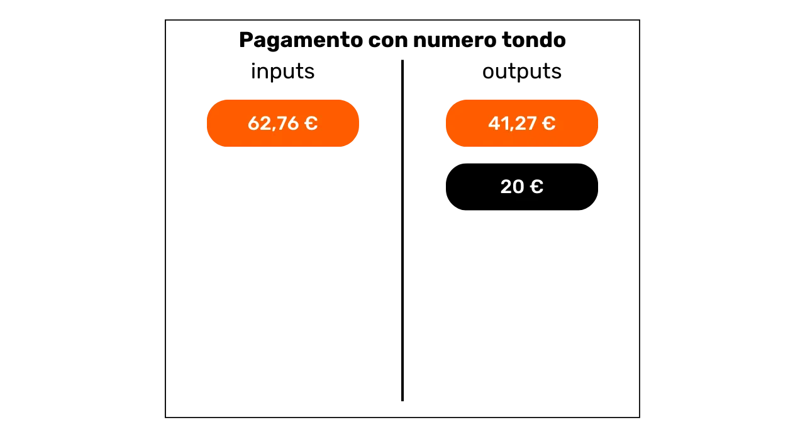
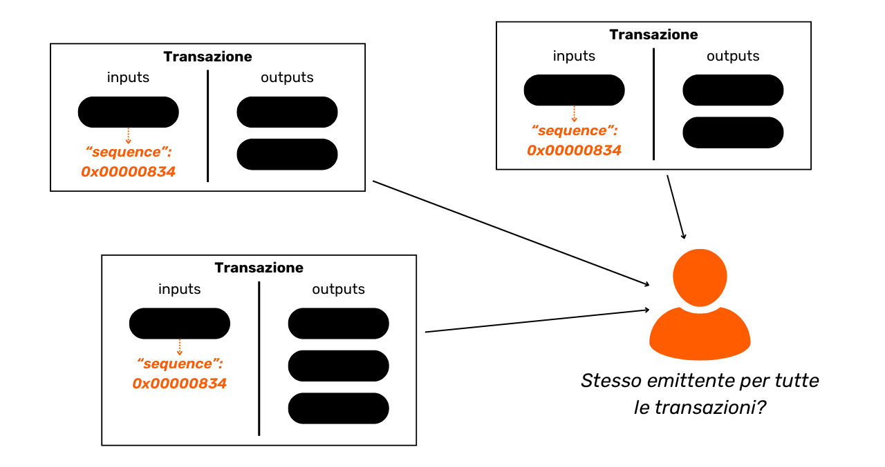
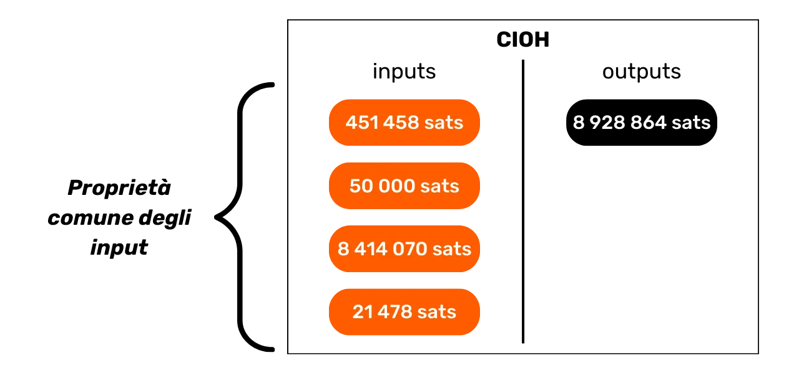

# Proteggi la tua privacy su Bitcoin

In un mondo dove la privacy delle transazioni finanziarie sta gradualmente diventando un lusso, comprendere e padroneggiare i principi della protezione della privacy nel proprio uso di Bitcoin è essenziale. Questa formazione ti fornisce tutte le chiavi, sia teoriche che pratiche, per raggiungere questo obiettivo autonomamente.

Oggi, su Bitcoin, esistono aziende specializzate nell'analisi della catena. Il loro core business è proprio quello di intrufolarsi nella tua sfera privata, al fine di compromettere la riservatezza delle tue transazioni. Infatti, il "diritto alla privacy" su Bitcoin non esiste. Spetta quindi a te, utente, affermare i tuoi diritti naturali e proteggere la riservatezza delle tue transazioni, perché nessun altro lo farà per te.

Questa formazione si presenta come un percorso completo e generalista. Ogni nozione tecnica è discussa in dettaglio e supportata da diagrammi esplicativi. L'obiettivo è rendere la conoscenza accessibile a tutti. BTC204 è quindi accessibile per utenti principianti e intermedi. Questa formazione offre anche un valore aggiunto ai bitcoiner più esperti, poiché approfondiamo alcuni concetti tecnici spesso sconosciuti.

Unisciti a noi per trasformare il tuo uso di Bitcoin e diventare un utente informato, capace di comprendere le questioni legate alla riservatezza e proteggere la tua privacy.

+++

# Introduzione
<partId>e17474a8-8899-4bdb-a7f8-bc52ddb01440</partId>

## Introduzione alla Formazione
<chapterId>08ba1933-f393-4fb5-8279-777d874caedb</chapterId>

In un mondo dove la privacy delle transazioni finanziarie sta gradualmente diventando un lusso, comprendere e padroneggiare i principi della protezione della privacy nel proprio uso di Bitcoin è essenziale. Questa formazione ti fornisce tutte le chiavi, sia teoriche che pratiche, per raggiungere questo obiettivo autonomamente.
Oggi, nell'ecosistema Bitcoin, esistono aziende specializzate nell'analisi della catena. Il loro core business è proprio quello di intrufolarsi nella tua sfera privata, compromettendo la riservatezza delle tue transazioni. In realtà, il "diritto alla privacy" su Bitcoin non esiste. Spetta quindi a te, utente, affermare i tuoi diritti naturali e proteggere la riservatezza delle tue transazioni, perché nessun altro lo farà per te.

Bitcoin non è solo lì per il "Number Go Up" e la conservazione del valore dei risparmi. Grazie alle sue caratteristiche uniche e alla sua storia, è principalmente lo strumento dell'economia alternativa. Grazie a questa straordinaria invenzione, puoi gestire liberamente i tuoi soldi, spenderli e accumularli, senza che nessuno possa impedirtelo.

Bitcoin offre una fuga pacifica dal giogo degli stati, permettendoti di godere pienamente dei tuoi diritti naturali, che non possono essere messi in discussione dalle leggi stabilite. Grazie all'invenzione di Satoshi Nakamoto, hai il potere di far rispettare il tuo diritto alla proprietà privata e riconquistare la libertà di contrattare.
Tuttavia, Bitcoin non è anonimo per impostazione predefinita, il che può rappresentare un rischio per gli individui impegnati nell'economia sommersa, specialmente nelle regioni sotto regimi dispotici. Ma questo non è l'unico pericolo. Dato che bitcoin è un bene prezioso e non censurabile, può attirare l'avidità dei ladri. Pertanto, proteggere la propria privacy diventa anche una questione di sicurezza: può aiutarti a prevenire attacchi informatici e aggressioni fisiche.
Come vedremo, sebbene il protocollo offra alcune protezioni intrinseche della privacy, è fondamentale utilizzare strumenti aggiuntivi per ottimizzare e difendere questa privacy.

Questo corso è progettato come un percorso completo e generalista per comprendere le questioni della privacy su Bitcoin. Ogni nozione tecnica è dettagliata e supportata da diagrammi esplicativi. L'obiettivo è rendere la conoscenza accessibile a tutti, inclusi gli utenti principianti e intermedi. Per i bitcoiner più esperti, copriamo anche concetti molto tecnici e talvolta sconosciuti durante questo corso per approfondire la comprensione di ogni argomento.

L'obiettivo di questo corso non è rendervi completamente anonimi nell'uso di Bitcoin, ma piuttosto fornirvi gli strumenti essenziali per sapere come proteggere la vostra privacy in base ai vostri obiettivi personali. Avrete la libertà di scegliere tra i concetti e gli strumenti presentati per sviluppare le vostre proprie strategie, su misura per i vostri obiettivi e bisogni specifici.

### Sezione 1: Definizioni e Concetti Chiave
Per iniziare, esamineremo insieme i principi fondamentali che governano il funzionamento di Bitcoin, per poi avvicinarci con calma alle nozioni legate alla privacy. È essenziale padroneggiare alcuni concetti di base, come UTXO, indirizzi di ricezione o script, prima di poter comprendere appieno i concetti che affronteremo nelle sezioni successive. Introdurremo anche il modello generale della privacy di Bitcoin, come immaginato da Satoshi Nakamoto, che ci permetterà di cogliere le questioni e i rischi associati.


### Sezione 2: Comprendere l'Analisi della Catena e Come Proteggersi

Nella seconda sezione, studiamo le tecniche utilizzate dalle aziende di analisi della catena per tracciare la vostra attività su Bitcoin. Comprendere questi metodi è cruciale per migliorare la protezione della vostra privacy. Questa parte mira a esaminare le strategie degli attaccanti per comprendere meglio i rischi e gettare le basi per le tecniche che studieremo nelle sezioni successive. Analizzeremo i modelli di transazione, le euristiche interne ed esterne, così come le interpretazioni plausibili di questi modelli. Oltre a un componente teorico, impareremo ad usare un block explorer per eseguire analisi della catena, attraverso esempi pratici ed esercizi.


### Sezione 3: Padronanza delle Migliori Pratiche per Proteggere la Propria Privacy

Nella terza sezione del nostro corso, arriviamo al cuore della questione: la pratica! L'obiettivo è padroneggiare tutte le migliori pratiche essenziali che dovrebbero diventare riflessi naturali per qualsiasi utente Bitcoin. Copriremo l'uso di indirizzi freschi, l'etichettatura, la consolidazione, l'uso di nodi completi, così come i metodi KYC e di acquisizione. Lo scopo è fornirvi una panoramica completa delle insidie da evitare per stabilire solide fondamenta nella nostra ricerca della protezione della privacy. Per alcune di queste pratiche, sarete guidati a un tutorial specifico per implementarle.


### Sezione 4: Comprendere le Transazioni Coinjoin

Come possiamo parlare di privacy su Bitcoin senza discutere di coinjoin? Nella sezione 4, scoprirete tutto ciò che c'è da sapere su questo metodo di mixing. Imparerete cos'è un coinjoin, la sua storia e obiettivi, così come i diversi tipi di coinjoin che esistono. Infine, per gli utenti più esperti, esploreremo cosa sono gli anonset e l'entropia, e come calcolare questi indicatori.
### Sezione 5: Comprendere le Poste in Gioco di Altre Tecniche Avanzate per la Privacy
Nella quinta sezione, forniremo una panoramica di tutte le altre tecniche esistenti per proteggere la tua privacy su Bitcoin, oltre al coinjoin. Negli anni, gli sviluppatori hanno dimostrato notevole creatività nel progettare strumenti dedicati alla privacy. Esamineremo tutti questi metodi, come Payjoin, transazioni collaborative, Coin Swap e Atomic Swap, dettagliando il loro funzionamento, obiettivi e potenziali debolezze.

### Sezione 6: Esplorare le Proposte di Miglioramento del Protocollo Relative alla Privacy

Mentre le sezioni precedenti si sono concentrate sulle soluzioni per la privacy a livello applicativo, questa sesta sezione si addentrerà nelle sfide a livello di protocollo per la privacy degli utenti. Discuteremo della privacy nella rete dei nodi e nella trasmissione delle transazioni. Discuteremo anche dei vari protocolli che sono stati proposti negli anni per migliorare la privacy degli utenti su Bitcoin. Per concludere, esamineremo gli impatti sulla privacy, sia positivi che negativi, dell'ultimo importante soft fork di Bitcoin, Taproot.

***(WIP: LOIC: AGGIUNGERE QUI ESEMPIO DI DIAGRAMMA)***

### Sezione Bonus: Privacy sui Protocolli di Secondo Livello

Come avrete capito, il nucleo di questa formazione si concentra esclusivamente sulla privacy onchain. In questa parte finale bonus, desidero ampliare l'argomento alla privacy su altri protocolli legati a Bitcoin. Parleremo specificamente della privacy sulla Lightning Network. Alcuni sostengono che Lightning sia privata per impostazione predefinita, mentre altri sostengono che la privacy degli utenti sia insufficiente. Quindi, qual è la verità? Sveleremo la verità dalla falsità per comprendere meglio le sfide legate alla privacy sulla Lightning Network. Discuteremo anche di sidechain come Liquid Network e di banche Chaumiane come Cashu o Fedimint.

# Definizioni e Concetti Chiave
<partId>b9bbbde3-34c0-4851-83e8-e2ffb029cf31</partId>

## Modello UTXO di Bitcoin
<chapterId>8d6b50c5-bf74-44f4-922b-25204991cb75</chapterId>

Bitcoin è principalmente una valuta, ma sapete concretamente come vengono rappresentati i BTC sul protocollo?

### UTXO di Bitcoin: Cosa Sono?

Nel protocollo Bitcoin, la gestione delle unità monetarie si basa sul modello UTXO, un acronimo per "_Unspent Transaction Output_" (Output di Transazione Non Speso).
Questo modello è profondamente diverso dai sistemi bancari tradizionali che si affidano a un meccanismo di conto e saldo per tracciare i flussi finanziari. Infatti, nel sistema bancario, i saldi individuali sono mantenuti in conti legati a un'identità. Ad esempio, quando compri una baguette da un panettiere, la tua banca semplicemente addebita l'importo dell'acquisto dal tuo conto, riducendo così il tuo saldo, mentre il conto del panettiere viene accreditato dello stesso importo, aumentando il loro saldo. In questo sistema, non esiste la nozione di un collegamento tra il denaro che entra nel tuo conto e quello che ne esce, a parte i registri delle transazioni.

Su Bitcoin, funziona diversamente. Il concetto di conto non esiste, e le unità monetarie non sono gestite tramite saldi ma attraverso gli UTXO. Un UTXO rappresenta una specifica quantità di bitcoin che non è ancora stata spesa, formando così un "pezzo di bitcoin", che può essere grande o piccolo. Ad esempio, un UTXO potrebbe valere `500 BTC` o solo `700 SATS`.
**> Promemoria:** Il satoshi, spesso abbreviato in sat, è l'unità più piccola di Bitcoin, paragonabile a un centesimo nelle valute fiat.
```plaintext
1 BTC = 100 000 000 SATS
```

Teoricamente, un UTXO può rappresentare qualsiasi valore in bitcoin, che varia da un sat fino al massimo teorico di circa 21 milioni di BTC. Tuttavia, è logicamente impossibile possedere tutti i 21 milioni di bitcoin, e esiste una soglia economica inferiore chiamata "polvere", al di sotto della quale un UTXO è considerato economicamente non redditizio da spendere.

**> Lo sapevi?** Il più grande UTXO mai creato su Bitcoin aveva un valore di `500 000 BTC`. È stato creato dalla piattaforma MtGox durante un'operazione di consolidamento nel novembre 2011: [29a3efd3ef04f9153d47a990bd7b048a4b2d213daaa5fb8ed670fb85f13bdbcf](https://mempool.space/it/tx/29a3efd3ef04f9153d47a990bd7b048a4b2d213daaa5fb8ed670fb85f13bdbcf)

### UTXO e Condizioni di Spesa

Gli UTXO sono gli strumenti di scambio su Bitcoin. Ogni transazione comporta il consumo di UTXO come input e la creazione di nuovi UTXO come output. Quando viene effettuata una transazione, gli UTXO utilizzati come input sono considerati "spesi", e nuovi UTXO vengono generati e assegnati ai destinatari indicati negli output della transazione. Così, un UTXO rappresenta semplicemente un output di transazione non speso, e quindi una quantità di bitcoin appartenente a un utente in un dato momento.

Tutti gli UTXO sono protetti da script che definiscono le condizioni sotto le quali possono essere spesi. Per consumare un UTXO, un utente deve dimostrare alla rete di soddisfare le condizioni stabilite dallo script che protegge quell'UTXO. Generalmente, gli UTXO sono protetti da una chiave pubblica (o un indirizzo di ricezione che rappresenta questa chiave pubblica). Per spendere un UTXO associato a questa chiave pubblica, l'utente deve dimostrare di possedere la corrispondente chiave privata, fornendo una firma digitale realizzata con questa chiave. Questo è il motivo per cui si dice che il tuo portafoglio Bitcoin non contiene effettivamente bitcoin, ma piuttosto conserva le tue chiavi private, che a loro volta ti danno accesso ai tuoi UTXO e, per estensione, ai bitcoin che rappresentano.


Dato che il concetto di account è assente in Bitcoin, il saldo di un portafoglio corrisponde semplicemente alla somma dei valori di tutti gli UTXO che può spendere. Ad esempio, se il tuo portafoglio Bitcoin può spendere i seguenti 4 UTXO:

```plaintext
- 2 BTC
- 8 BTC
- 5 BTC
- 2 BTC
```

Il saldo totale del tuo portafoglio sarebbe di `17 BTC`.


## La struttura delle transazioni Bitcoin
<chapterId>29d3aaab-de2e-4746-ab40-c9748898850c</chapterId>

### Gli input e gli output di una transazione
Una transazione Bitcoin è un'operazione registrata sulla blockchain che consente il trasferimento della proprietà dei bitcoin da una persona all'altra. Più specificamente, dato che ci troviamo in un modello UTXO e non ci sono conti, la transazione soddisfa le condizioni di spesa che hanno assicurato uno o più UTXO, li consuma e crea in equivalenza nuovi UTXO dotati di nuove condizioni di spesa. In breve, una transazione sposta i bitcoin da uno script che è soddisfatto a un nuovo script destinato a proteggerli.

Ogni transazione Bitcoin è quindi composta da uno o più input e uno o più output. Gli input sono UTXO consumati dalla transazione per generare gli output. Gli output sono nuovi UTXO che saranno utilizzabili come input per future transazioni.

**> Lo sapevi?** Teoricamente, una transazione bitcoin potrebbe avere un numero infinito di input e output. Solo la dimensione massima di un blocco limita questo numero.
Ogni input in una transazione Bitcoin fa riferimento a un precedente UTXO non speso. Per utilizzare un UTXO come input, il suo detentore deve dimostrare di essere il legittimo proprietario validando lo script associato ad esso, ovvero soddisfacendo la condizione di spesa imposta. Generalmente, ciò comporta la fornitura di una firma digitale prodotta con la chiave privata corrispondente alla chiave pubblica che inizialmente ha assicurato quell'UTXO. Lo script consiste quindi nel verificare che la firma corrisponda alla chiave pubblica utilizzata quando si ricevono i fondi.

Ogni output, d'altra parte, specifica la quantità di bitcoin da trasferire, così come il destinatario. Quest'ultimo è definito da un nuovo script che, in generale, blocca il nuovo UTXO creato con un indirizzo di ricezione o una nuova chiave pubblica.

Affinché una transazione sia considerata valida secondo le regole di consenso, il totale degli output deve essere inferiore o uguale al totale degli input. In altre parole, la somma dei nuovi UTXO generati dalla transazione non deve superare quella degli UTXO consumati come input. Questo principio è logico: se si dispone solo di un importo di `500.000 SATS`, non si può effettuare un acquisto di `700.000 SATS`.

### Cambio e Consolidamento in una Transazione Bitcoin

L'azione di una transazione Bitcoin sugli UTXO può quindi essere paragonata alla fusione di una moneta d'oro. Infatti, un UTXO non è divisibile, ma solo unibile. Ciò significa che un utente non può semplicemente dividere un UTXO che rappresenta una certa quantità di bitcoin in più UTXO più piccoli. Deve consumarlo interamente in una transazione per creare uno o più nuovi UTXO di valori arbitrari negli output, che devono essere inferiori o uguali al valore iniziale.

Questo meccanismo è simile a quello di una moneta d'oro. Immagina di possedere una moneta da 2 once e di voler effettuare un pagamento di 1 oncia, assumendo che il venditore non possa darti il resto. Dovresti fondere la tua moneta e coniare 2 nuove monete da 1 oncia ciascuna.
Su Bitcoin, il funzionamento è simile. Immaginiamo che Alice abbia un UTXO di `10.000 SATS` e voglia comprare una baguette che costa `4.000 SATS`. Alice effettuerà una transazione con un input di 1 UTXO di `10.000 SATS` che consumerà interamente, e negli output, creerà 2 UTXOs del valore di `4.000 SATS` e `6.000 SATS`. L'UTXO di `4.000 SATS` verrà inviato al panettiere come pagamento per la baguette, mentre l'UTXO di `6.000 SATS` tornerà ad Alice come resto. Questo UTXO che ritorna al mittente iniziale della transazione è ciò che viene chiamato "resto" nel gergo di Bitcoin.

Ora immaginiamo che Alice non abbia un singolo UTXO di `10.000 SATS`, ma piuttosto due UTXOs di `3.000 SATS` ciascuno. In questa situazione, nessuno degli UTXOs individuali è sufficiente a coprire i `4.000 SATS` per la baguette. Pertanto, Alice deve utilizzare entrambi gli UTXOs di `3.000 SATS` come input per la sua transazione. In questo modo, il totale degli input raggiungerà `6.000 SATS`, permettendole di coprire il pagamento di `4.000 SATS` al panettiere. Questo metodo, che prevede il raggruppamento di diversi UTXOs negli input di una transazione, è spesso indicato con il termine "consolidamento".

### Commissioni di Transazione

Intuitivamente, si potrebbe pensare che anche le commissioni di transazione rappresentino un output di una transazione. Ma in realtà, non è così. Le commissioni di una transazione rappresentano la differenza tra il totale degli input e il totale degli output. Questo significa che, dopo aver utilizzato parte del valore degli input per coprire gli output desiderati in una transazione, una certa somma degli input rimane inutilizzata. Questa somma residua costituisce le commissioni di transazione.

```plaintext
Commissioni = totali input - totali output
```

Rivediamo l'esempio di Alice che ha un UTXO di `10.000 SATS` e vuole comprare una baguette per `4.000 SATS`. Alice crea una transazione con il suo UTXO di `10.000 SATS` come input. Genera poi un output di `4.000 SATS` destinato al panettiere per il pagamento della baguette. Per incoraggiare i minatori a includere la sua transazione in un blocco, Alice assegna `200 SATS` come commissioni. Così crea un secondo output, il resto, che tornerà a lei, ammontando a `5.800 SATS`.

Applicando la formula delle commissioni, vediamo infatti che rimangono `200 SATS` per i minatori:
```plaintext
Commissioni = totali input - totali output
Commissioni = 10.000 - (4.000 + 5.800)
Commissioni = 10.000 - 9.800
Commissioni = 200
```

Quando un minatore valida con successo un blocco, ha il diritto di riscuotere queste commissioni per tutte le transazioni incluse nel loro blocco, tramite la cosiddetta transazione "coinbase".

### La Creazione di UTXOs su Bitcoin
Se avete seguito attentamente i paragrafi precedenti, ora sapete che gli UTXO possono essere creati solo consumando altri UTXO esistenti. Così, le monete su Bitcoin formano una catena continua. Tuttavia, potreste chiedervi come sono apparsi i primi UTXO in questa catena. Questo solleva un problema simile a quello dell'uovo e della gallina: da dove provengono questi UTXO originali?
La risposta risiede nella **transazione coinbase**.

Il coinbase è un tipo specifico di transazione Bitcoin, unico per ogni blocco ed è sempre il primo. Consente al minatore che ha trovato una prova di lavoro valida di ricevere la sua ricompensa del blocco. Questa ricompensa consiste di due elementi: **il sussidio del blocco** e **le commissioni sulle transazioni** di cui abbiamo discusso nella parte precedente.

La caratteristica unica della transazione coinbase è che è l'unica che può creare bitcoin dal nulla, senza dover consumare input per generare i suoi output. Questi bitcoin appena creati costituiscono quello che potremmo chiamare gli "UTXO originali".



I bitcoin del sussidio del blocco sono nuovi BTC creati dal nulla, seguendo un calendario di emissione pre-stabilito nelle regole di consenso. Il sussidio del blocco viene dimezzato ogni 210.000 blocchi, circa ogni quattro anni, in un processo chiamato "halving". Inizialmente, venivano creati 50 bitcoin per ogni sussidio, ma questa quantità è gradualmente diminuita; attualmente, è di 3.125 bitcoin per blocco.

Per quanto riguarda la parte relativa alle commissioni sulle transazioni, sebbene rappresenti anche BTC appena creati, non devono superare la differenza tra gli input totali e gli output di tutte le transazioni in un blocco. Abbiamo visto in precedenza che queste commissioni rappresentano la parte degli input che non viene utilizzata negli output delle transazioni. Questa parte è tecnicamente "persa" durante la transazione, e il minatore ha il diritto di ricreare questo valore sotto forma di uno o più nuovi UTXO. Si tratta, quindi, di un trasferimento di valore dal mittente della transazione al minatore che lo aggiunge alla blockchain.

**> Lo sapevate?** I bitcoin generati da una transazione coinbase sono soggetti a un periodo di maturazione di 100 blocchi durante il quale non possono essere spesi dal minatore. Questa regola è intesa a prevenire complicazioni legate all'uso di bitcoin appena creati su una catena che potrebbe in seguito essere resa obsoleta.

### Le implicazioni del modello UTXO

In primo luogo, il modello UTXO influenza direttamente le commissioni sulle transazioni su Bitcoin. Dato che la capacità di ogni blocco è limitata, i minatori danno priorità alle transazioni che offrono le migliori commissioni rispetto allo spazio che occuperanno nel blocco. Infatti, più un'operazione include UTXO come input e output, più è pesante e, quindi, richiede commissioni più alte. Questo è uno dei motivi per cui spesso cerchiamo di ridurre il numero di UTXO nel nostro portafoglio, il che può anche influenzare la privacy, un argomento che discuteremo in dettaglio nella terza parte di questa formazione.

Inoltre, come menzionato nelle parti precedenti, le monete su Bitcoin sono essenzialmente una catena di UTXO. Ogni transazione crea quindi un collegamento tra un UTXO passato e un UTXO futuro. Gli UTXO permettono quindi il tracciamento esplicito dei bitcoin dalla loro creazione alla loro attuale spesa. Questa trasparenza può essere percepita positivamente, poiché consente a ogni utente di verificare l'autenticità dei bitcoin ricevuti. Tuttavia, è anche su questo principio di tracciabilità e auditabilità che si basa l'analisi della catena, una pratica volta a compromettere la vostra privacy. Studieremo questa pratica in profondità nella seconda parte della formazione.

## Il modello di privacy di Bitcoin
<chapterId>769d8963-3ed5-4094-b21d-9203c7d9e465</chapterId>

### Valuta: Autenticità, Integrità e Doppia Spesa

Una delle funzioni del denaro è risolvere il problema della doppia coincidenza dei desideri. In un sistema basato sul baratto, effettuare uno scambio richiede non solo di trovare un individuo che offre un bene che soddisfa il mio bisogno, ma anche di fornirgli un bene di valore equivalente che soddisfi il suo bisogno. Trovare questo equilibrio si rivela complesso.


Ecco perché ricorriamo al denaro, che consente il trasferimento di valore sia spazialmente che temporalmente.


Affinché il denaro risolva questo problema, è essenziale che la parte che fornisce un bene o servizio sia convinta della sua capacità di spendere quella somma in seguito. Pertanto, qualsiasi individuo razionale che desideri accettare una somma di denaro, sia essa digitale o fisica, si assicurerà che essa soddisfi due criteri fondamentali:
- **La moneta deve essere integra e autentica;**
- **e non deve essere stata spesa due volte.**
Quando si utilizza la valuta fisica, la prima caratteristica è la più complessa da affermare. In diversi momenti della storia, l'integrità delle monete metalliche è spesso stata compromessa da pratiche come il ritaglio o la perforazione. Ad esempio, durante l'antica Roma, era comune per i cittadini raschiare i bordi delle monete d'oro per raccogliere un po' del prezioso metallo, pur conservandole per transazioni future. Il valore intrinseco della moneta veniva così ridotto, ma il suo valore nominale rimaneva lo stesso. Questo è il motivo per cui in seguito furono coniate delle rigature sul bordo delle monete.

Anche l'autenticità è una caratteristica difficile da verificare con i mezzi monetari fisici. Oggi, le tecniche per combattere la contraffazione sono sempre più complesse, costringendo i commercianti a investire in costosi sistemi di verifica.

D'altra parte, a causa della loro natura, la doppia spesa non rappresenta un problema per le valute fisiche. Se ti do una banconota da €10, essa lascia irrevocabilmente il mio possesso per entrare nel tuo, escludendo naturalmente qualsiasi possibilità di spendere le stesse unità monetarie più volte. In breve, non sarò in grado di spendere nuovamente quella banconota da €10.


Per la valuta digitale, la difficoltà è diversa. Assicurare l'autenticità e l'integrità di una moneta è spesso più semplice. Come abbiamo visto nella sezione precedente, il modello UTXO di Bitcoin consente di tracciare una moneta fino alla sua origine, verificando così che sia stata effettivamente creata in conformità con le regole di consenso da un miner.

Tuttavia, assicurare l'assenza di doppia spesa è più complesso, poiché qualsiasi bene digitale è essenzialmente informazione. A differenza dei beni fisici, l'informazione non si divide durante gli scambi ma si propaga moltiplicandosi. Ad esempio, se ti invio un documento via email, questo viene duplicato. Da parte tua, non puoi verificare con certezza che io abbia cancellato il documento originale.


### Prevenire la Doppia Spesa su Bitcoin
L'unico modo per evitare la duplicazione di un bene digitale è essere a conoscenza di tutti gli scambi nel sistema. In questo modo, si può sapere chi possiede cosa e aggiornare il possesso di tutti in base alle transazioni effettuate. Questo è ciò che viene fatto, ad esempio, con il denaro scripturale nel sistema bancario. Quando paghi €10 a un commerciante con carta di credito, la banca registra questo scambio e aggiorna il registro contabile.
Su Bitcoin, prevenire il doppio utilizzo si ottiene nello stesso modo. L'obiettivo è confermare l'assenza di una transazione che ha già speso le monete in questione. Se queste monete non sono mai state utilizzate, allora possiamo essere sicuri che non si verificherà alcun doppio utilizzo. Questo principio è stato descritto da Satoshi Nakamoto nel White Paper con questa famosa frase:
**"*L'unico modo per confermare l'assenza di una transazione è essere a conoscenza di tutte le transazioni.*"**

Tuttavia, a differenza del modello bancario, non c'è il desiderio di dover fidarsi di un'entità centrale su Bitcoin. È necessario che tutti gli utenti possano confermare questa assenza di doppio utilizzo, senza fare affidamento su una terza parte. Così, tutti devono essere a conoscenza di tutte le transazioni Bitcoin. Questo è il motivo per cui le transazioni Bitcoin vengono trasmesse pubblicamente su tutti i nodi della rete e registrate in chiaro sulla blockchain.

È proprio questa diffusione pubblica delle informazioni che complica la protezione della privacy su Bitcoin. Nel sistema bancario tradizionale, in teoria, solo l'istituzione finanziaria è a conoscenza delle transazioni effettuate. D'altra parte, su Bitcoin, tutti gli utenti sono informati di tutte le transazioni, tramite i rispettivi nodi.

### Il modello di privacy: sistema bancario vs Bitcoin

Nel sistema tradizionale, il tuo conto bancario è collegato alla tua identità. Il banchiere è in grado di sapere a quale cliente appartiene quale conto bancario e quali transazioni gli sono associate. Tuttavia, questo flusso di informazioni è interrotto tra la banca e il dominio pubblico. In altre parole, è impossibile conoscere il saldo e le transazioni di un conto bancario che appartiene a un'altra persona. Solo la banca ha accesso a queste informazioni.

Ad esempio, il tuo banchiere sa che compri la tua baguette ogni mattina nella panetteria del quartiere, ma il tuo vicino non è a conoscenza di questa transazione. Così, il flusso di informazioni è accessibile alle parti interessate, in particolare la banca, ma rimane inaccessibile agli estranei.

A causa del vincolo di diffusione pubblica delle transazioni che abbiamo visto nella parte precedente, il modello di privacy di Bitcoin non può seguire il modello del sistema bancario. Nel caso di Bitcoin, poiché il flusso di informazioni non può essere interrotto tra le transazioni e il dominio pubblico, **il modello di privacy si basa sulla separazione tra l'identità dell'utente e le transazioni** stesse.
Ad esempio, se compri una baguette dal fornaio pagando in BTC, il tuo vicino, che possiede il proprio nodo completo, può vedere passare la tua transazione, così come può vedere tutte le altre transazioni nel sistema. Tuttavia, se i principi della privacy sono rispettati, non dovrebbero essere in grado di collegare questa specifica transazione alla tua identità.


Ma poiché le transazioni Bitcoin sono rese pubbliche, diventa comunque possibile stabilire collegamenti tra di esse per dedurre informazioni sulle parti coinvolte. Questa attività costituisce addirittura una specialità in sé chiamata "analisi della catena". Nella prossima parte del corso, ti invito a esplorare i fondamenti dell'analisi della catena per capire come vengono tracciate le tue bitcoin e sapere come difenderti meglio.

# Comprendere l'Analisi della Catena e Come Proteggersi
<partId>4739371e-9fef-45b0-bcaa-b7a4df6b4470</partId>

## Cos'è l'Analisi della Catena su Bitcoin?
<chapterId>7d198ba6-4af2-4f24-86cb-3c79cb25627e</chapterId>

### Definizione e Funzionamento
L'analisi della catena è una pratica che comprende tutti i metodi per tracciare il flusso di bitcoin sulla blockchain. Generalmente, l'analisi della catena si basa sull'osservazione delle caratteristiche in campioni di transazioni precedenti. Successivamente, comporta l'identificazione di queste stesse caratteristiche in una transazione che si desidera analizzare e la deduzione di interpretazioni plausibili. Questo metodo di risoluzione dei problemi da un approccio pratico, per trovare una soluzione sufficientemente buona, è ciò che viene chiamato "euristico".
Per semplificare, l'analisi della catena si svolge in tre passaggi principali:
1. **Osservare la blockchain;**
2. **Identificare le caratteristiche note;**
3. **Dedurre ipotesi.**



L'analisi della catena può essere eseguita da chiunque. Richiede solo l'accesso alle informazioni pubbliche della blockchain tramite un nodo completo per osservare i movimenti delle transazioni e formulare ipotesi. Esistono anche strumenti gratuiti che facilitano questa analisi, come il sito web [OXT.me](https://oxt.me/) che esploreremo in dettaglio negli ultimi due capitoli di questa parte. Tuttavia, il principale rischio per la privacy proviene dalle aziende specializzate nell'analisi della catena. Queste aziende hanno portato l'analisi della catena su scala industriale e vendono i loro servizi a istituzioni finanziarie o governi. Tra queste aziende, Chainalysis è probabilmente la più conosciuta.

### Gli Obiettivi dell'Analisi della Catena
Uno degli obiettivi dell'analisi della catena è raggruppare varie attività su Bitcoin al fine di determinare l'unicità dell'utente che le ha eseguite. Successivamente, sarà possibile tentare di collegare questo insieme di attività a un'identità reale.


Ricorda il capitolo precedente. Ho spiegato perché il modello di privacy di Bitcoin in origine si basava sulla separazione dell'identità dell'utente dalle loro transazioni. Pertanto, potrebbe essere allettante pensare che l'analisi della catena sia inutile, poiché anche se si riesce a raggruppare le attività onchain, queste non possono essere associate a un'identità reale.

Teoricamente, questa affermazione è accurata. Nella prima parte di questa formazione, abbiamo visto che le coppie di chiavi crittografiche sono utilizzate per stabilire condizioni sul UTXO. Di per sé, queste coppie di chiavi non rivelano alcuna informazione sull'identità dei loro detentori. Quindi, anche se si riesce a raggruppare attività associate a diverse coppie di chiavi, ciò non ci dice nulla sull'entità dietro queste attività.


Tuttavia, la realtà pratica è molto più complessa. Esiste una moltitudine di comportamenti che rischiano di collegare un'identità reale a un'attività onchain. Nell'analisi, questo è chiamato un punto di ingresso, e ce ne sono molti.

Il più comune, ovviamente, è il KYC (*Know Your Customer*). Se ritiri i tuoi bitcoin da una piattaforma regolamentata a uno dei tuoi indirizzi di ricezione personali, allora alcune persone sono in grado di collegare la tua identità a questo indirizzo. Più in generale, un punto di ingresso può essere qualsiasi forma di interazione tra la tua vita reale e una transazione Bitcoin. Ad esempio, se pubblichi un indirizzo di ricezione sui tuoi social network, questo può costituire un punto di ingresso per l'analisi. Se effettui un pagamento in bitcoin al tuo panettiere, questi può associare il tuo volto (che fa parte della tua identità) a un indirizzo Bitcoin.

Questi punti di ingresso sono quasi inevitabili nell'uso di Bitcoin. Anche se si può cercare di limitarne la portata, rimarranno presenti. Ecco perché è cruciale combinare metodi volti a preservare la tua privacy. Sebbene mantenere una separazione tra la tua identità reale e le tue transazioni sia un approccio interessante, rimane insufficiente oggi. Infatti, se tutte le tue attività onchain possono essere raggruppate, allora il minimo punto di ingresso è probabile che comprometta l'unico strato di privacy che avevi stabilito.


### Difendersi dall'Analisi della Catena

Pertanto, è necessario anche essere in grado di affrontare l'analisi della blockchain nel nostro uso di Bitcoin. Procedendo in questo modo, possiamo minimizzare l'aggregazione delle nostre attività e limitare l'impatto di un punto di ingresso sulla nostra privacy.

Infatti, per contrastare meglio l'analisi della blockchain, quale approccio migliore se non familiarizzare con i metodi utilizzati nell'analisi della blockchain? Se vuoi sapere come migliorare la tua privacy su Bitcoin, devi comprendere questi metodi. Questo ti permetterà di comprendere meglio tecniche come [Coinjoin](https://planb.network/it/tutorials/privacy/coinjoin-samourai-wallet) o [Payjoin](https://planb.network/it/tutorials/privacy/payjoin) (tecniche che studieremo nelle ultime parti del corso), e di ridurre gli errori che potresti commettere.

In questo, possiamo fare un'analogia con la crittografia e la crittoanalisi. Un buon crittografo è prima di tutto un buon crittoanalista. Per immaginare un nuovo algoritmo di crittografia, bisogna sapere quali attacchi dovrà affrontare, e studiare anche perché gli algoritmi precedenti sono stati violati. Lo stesso principio si applica alla privacy su Bitcoin. Comprendere i metodi di analisi della blockchain è la chiave per proteggersi da essa. Ecco perché propongo un'intera sezione sull'analisi della blockchain in questo corso.

### I metodi di analisi della blockchain

È importante comprendere che l'analisi della blockchain non è una scienza esatta. Si basa su euristiche derivate da osservazioni precedenti o interpretazioni logiche. Queste regole consentono di ottenere risultati abbastanza affidabili, ma mai con precisione assoluta. In altre parole, **l'analisi della blockchain comporta sempre una dimensione di probabilità nelle conclusioni emesse**. Ad esempio, si può stimare con maggiore o minore certezza che due indirizzi appartengano alla stessa entità, ma la certezza totale sarà sempre fuori portata.

L'obiettivo completo dell'analisi della blockchain risiede proprio nell'aggregazione di varie euristiche al fine di minimizzare il rischio di errore. È, in un certo senso, un'accumulazione di prove che ci permette di avvicinarci più da vicino alla realtà.

Queste famose euristiche possono essere raggruppate in diverse categorie che dettaglieremo insieme:
- **Modelli di transazione (o schemi di transazione);**
- **Euristiche interne alla transazione;**
- **Euristiche esterne alla transazione.**

### Satoshi Nakamoto e l'analisi della blockchain
Vale la pena notare che le prime due euristiche per l'analisi della catena sono state scoperte dallo stesso Satoshi Nakamoto. Egli le discute nella parte 10 del White Paper di Bitcoin. Queste sono:
- l'Euristica di Proprietà di Input Comune (CIOH);
- e il riutilizzo degli indirizzi.

Fonte: S. Nakamoto, "Bitcoin: A Peer-to-Peer Electronic Cash System", https://bitcoin.org/bitcoin.pdf, 2009.

Nei capitoli seguenti, esploreremo di cosa si tratta, ma è già interessante notare che queste due euristiche mantengono ancora oggi una preminenza nell'analisi della catena.

## Modelli di Transazione
<chapterId>d365a101-2d37-46a5-bfb9-3c51e37bf96b</chapterId>

Un modello di transazione è semplicemente un modello o una struttura complessiva di una transazione tipica che può essere trovata sulla blockchain, la cui interpretazione è presumibilmente nota. Quando studiamo i modelli, ci concentreremo su una singola transazione che analizzeremo ad alto livello.
In altre parole, ci concentreremo solo sul numero di UTXO negli input e sul numero di UTXO negli output, senza soffermarci sui dettagli più specifici o sull'ambiente della transazione. Dall'osservazione del modello, saremo in grado di interpretare la natura della transazione. Cercheremo quindi le caratteristiche della sua struttura e ne dedurremo un'interpretazione.

In questa parte, scopriremo insieme i principali modelli di transazione che possono essere incontrati nell'analisi di catena, e per ogni modello, vi darò l'interpretazione probabile di questa struttura, insieme a un esempio concreto.

### Invio Semplice (o Pagamento Semplice)

Iniziamo con un modello molto diffuso, poiché è quello che appare nella maggior parte dei pagamenti in bitcoin. Il modello di pagamento semplice è caratterizzato dal consumo di uno o più UTXO negli input e dalla produzione di 2 UTXO negli output. Questo modello apparirà quindi così:

Quando individuiamo questa struttura di transazione sulla blockchain, possiamo già trarre un'interpretazione. Come suggerisce il nome, questo modello indica che ci troviamo di fronte a una transazione di invio o pagamento. L'utente ha consumato il proprio UTXO negli input per soddisfare negli output un UTXO di pagamento e un UTXO di resto (resto che ritorna allo stesso utente).

Sappiamo quindi che l'utente osservato probabilmente non è più in possesso di uno dei due UTXO negli output (quello di pagamento), ma è ancora in possesso dell'altro UTXO (quello di resto).
Al momento, è impossibile per noi specificare quale output rappresenti quale UTXO, poiché questo non è l'obiettivo dello studio dei modelli. Raggiungeremo questo obiettivo affidandoci alle euristiche che studieremo nelle parti seguenti. In questa fase, il nostro obiettivo è limitato all'identificazione della natura della transazione in questione, che in questo caso è un invio semplice.

Per esempio, ecco una transazione Bitcoin che adotta il modello di invio semplice:

```plaintext
b6cc79f45fd2d7669ff94db5cb14c45f1f879ea0ba4c6e3d16ad53a18c34b769
```

Fonte: [Mempool.space](https://mempool.space/it/tx/b6cc79f45fd2d7669ff94db5cb14c45f1f879ea0ba4c6e3d16ad53a18c34b769)

Dopo questo primo esempio, dovreste avere una migliore comprensione di cosa significhi studiare un "modello di transazione". Esaminiamo una transazione concentrandoci solo sulla sua struttura, senza tenere conto del suo ambiente o dei dettagli specifici della transazione. La osserviamo solo in modo globale in questo primo passo.

Ora che capite cosa sia un modello, passiamo agli altri modelli esistenti.

### Sweeping

Questo secondo modello è caratterizzato dal consumo di un singolo UTXO in input e dalla produzione di un singolo UTXO in output.
L'interpretazione di questo modello è che ci troviamo di fronte a un auto-trasferimento. L'utente ha trasferito i suoi bitcoin a se stesso, su un altro indirizzo di sua proprietà. Poiché non c'è cambio nella transazione, è molto improbabile che ci troviamo di fronte a un pagamento. Infatti, quando viene effettuato un pagamento, è quasi impossibile che il pagante abbia un UTXO che corrisponde esattamente all'importo richiesto dal venditore, più le commissioni di transazione. Generalmente, il pagante è quindi costretto a produrre un output di resto.

Sappiamo quindi che l'utente osservato è probabilmente ancora in possesso di questo UTXO. Nel contesto di un'analisi della catena, se sappiamo che l'UTXO utilizzato in input della transazione appartiene ad Alice, possiamo supporre che l'UTXO in output appartenga anche a lei. Ciò che diventerà interessante in seguito è trovare euristiche interne alla transazione che potrebbero rafforzare questa ipotesi (studieremo queste euristiche nel capitolo 3.3).

Per esempio, ecco una transazione Bitcoin che adotta il modello di sweeping:

```plaintext
35f1072a0fda5ae106efb4fda871ab40e1f8023c6c47f396441ad4b995ea693d
```


Fonte: [Mempool.space](https://mempool.space/it/tx/35f1072a0fda5ae106efb4fda871ab40e1f8023c6c47f396441ad4b995ea693d)
Tuttavia, questo tipo di modello può anche rivelare un auto-trasferimento verso il conto di una piattaforma di scambio di criptovalute. Sarà lo studio degli indirizzi noti e il contesto della transazione che ci permetterà di sapere se si tratta di uno sweep verso un portafoglio di auto-custodia o un prelievo verso una piattaforma. Infatti, gli indirizzi delle piattaforme di scambio sono spesso facilmente identificabili.

Torniamo all'esempio di Alice: se lo sweep porta a un indirizzo noto di una piattaforma (come Binance, per esempio), potrebbe significare che i bitcoin sono stati trasferiti fuori dal possesso diretto di Alice, probabilmente con l'intenzione di venderli o di conservarli su questa piattaforma. D'altra parte, se l'indirizzo di destinazione è sconosciuto, è ragionevole supporre che si tratti semplicemente di un altro portafoglio ancora appartenente ad Alice. Ma questo tipo di studio rientra più nella categoria delle euristiche e non nello studio dei modelli.

### Consolidamento

Questo modello è caratterizzato dal consumo di diversi UTXO in input e dalla produzione di un singolo UTXO in output.


L'interpretazione di questo modello è che ci troviamo di fronte a un consolidamento. Si tratta di una pratica comune tra gli utenti Bitcoin, volta a unire diversi UTXO in previsione di un possibile aumento delle commissioni di transazione. Eseguendo questa operazione in un periodo in cui le commissioni sono basse, è possibile risparmiare sulle future commissioni. Parleremo di più di questa pratica nel capitolo 4.3.

Possiamo dedurre che l'utente dietro a questo modello di transazione era probabilmente in possesso di tutti gli UTXO in input ed è ancora in possesso dell'UTXO in output. Si tratta sicuramente di un auto-trasferimento.

Proprio come nel caso dello sweeping, anche questo tipo di modello può rivelare un auto-trasferimento verso il conto di una piattaforma di scambio. Sarà lo studio degli indirizzi noti e il contesto della transazione che ci permetterà di sapere se si tratta di un consolidamento verso un portafoglio di auto-custodia o un prelievo verso una piattaforma.

Per esempio, ecco una transazione Bitcoin che adotta il modello di consolidamento:

```plaintext
77c16914211e237a9bd51a7ce0b1a7368631caed515fe51b081d220590589e94
```


Fonte: [Mempool.space](https://mempool.space/it/tx/77c16914211e237a9bd51a7ce0b1a7368631caed515fe51b081d220590589e94)
Nel contesto di un'analisi della catena, questo modello può rivelare molte informazioni. Ad esempio, se sappiamo che uno degli input appartiene ad Alice, possiamo supporre che tutti gli altri input e l'output di questa transazione appartengano anche a lei. Questa ipotesi ci permetterebbe quindi di risalire attraverso le precedenti catene di transazioni per scoprire e analizzare altre transazioni probabilmente associate ad Alice.


### Spesa Aggregata

Questo modello è caratterizzato dal consumo di pochi UTXO come input (spesso solo uno) e dalla produzione di molti UTXO come output.


L'interpretazione di questo modello è che stiamo affrontando una spesa aggregata. Si tratta di una pratica che probabilmente rivela un'attività economica significativa, come ad esempio una piattaforma di scambio. La spesa aggregata permette a queste entità di risparmiare sulle commissioni combinando le loro spese in una singola transazione.

Da questo modello, possiamo dedurre che l'input UTXO proviene da un'azienda con un'attività economica significativa e che gli output UTXO si disperderanno. Molti apparterranno ai clienti dell'azienda che hanno ritirato bitcoin dalla piattaforma. Altri possono andare verso aziende partner. Infine, ci sarà certamente uno o più scambi che ritornano alla società emittente.

Ad esempio, ecco una transazione Bitcoin che adotta il modello di spesa aggregata (presumibilmente, è una transazione emessa dalla piattaforma Bybit):

```plaintext
8a7288758b6e5d550897beedd13c70bcbaba8709af01a7dbcc1f574b89176b43
```


Fonte: [Mempool.space](https://mempool.space/it/tx/8a7288758b6e5d550897beedd13c70bcbaba8709af01a7dbcc1f574b89176b43)

### Transazioni Specifiche del Protocollo

Tra i modelli di transazione, possiamo anche identificare modelli che rivelano l'uso di un protocollo specifico. Ad esempio, i coinjoin di Whirlpool (che discuteremo nella parte 5) avranno una struttura facilmente identificabile che permette di differenziarli da altre transazioni più tradizionali.


L'analisi di questo modello suggerisce che probabilmente stiamo affrontando una transazione collaborativa. È anche possibile osservare un coinjoin. Se quest'ultima ipotesi si rivela accurata, allora il numero di output potrebbe fornirci una stima approssimativa del numero di partecipanti al coinjoin.

Ad esempio, ecco una transazione Bitcoin che adotta il modello del tipo di transazione collaborativa coinjoin:

```plaintext
00601af905bede31086d9b1b79ee8399bd60c97e9c5bba197bdebeee028b9bea
```


Fonte: [Mempool.space](https://mempool.space/it/tx/00601af905bede31086d9b1b79ee8399bd60c97e9c5bba197bdebeee028b9bea)
Ci sono molti altri protocolli che hanno le loro specifiche strutture. Così, potremmo distinguere le transazioni di tipo Wabisabi, le transazioni Stamps, o le transazioni Runes, per esempio.

Grazie a questi schemi di transazione, possiamo già interpretare una serie di informazioni su una data transazione. Ma la struttura della transazione non è l'unica fonte di informazioni per l'analisi. Possiamo anche studiarne i dettagli. Questi dettagli, interni solo a una transazione, sono ciò che mi piace chiamare "euristiche interne", e le esploreremo nel capitolo seguente.

## Euristiche Interne
<chapterId>c54b5abe-872f-40f4-a0d0-c59faff228ba</chapterId>

Un'euristica interna è una caratteristica specifica identificata all'interno di una transazione stessa, senza la necessità di esaminare il suo ambiente, e che ci permette di fare deduzioni. A differenza degli schemi che si concentrano sulla struttura generale della transazione ad alto livello, le euristiche interne si basano sulla totalità dei dati estrabili. Questo include:
- Le quantità dei diversi UTXO sia in entrata che in uscita;
- Tutto ciò che riguarda gli script: gli indirizzi di ricezione, le versioni, i locktimes…

Generalmente, questo tipo di euristica ci permetterà di identificare il resto in una specifica transazione. Facendo ciò, possiamo poi continuare a tracciare un'entità attraverso diverse transazioni. Infatti, se identifichiamo un UTXO appartenente a un utente che desideriamo seguire, è cruciale determinare, quando effettuano una transazione, quale output è stato trasferito a un altro utente e quale output rappresenta il resto, rimanendo così in loro possesso.


Ancora una volta, vi ricordo che queste euristiche non sono assolutamente precise. Prese singolarmente, ci permettono solo di identificare scenari plausibili. È l'accumulo di diverse euristiche che aiuta a ridurre l'incertezza, senza mai poterla eliminare completamente.

### Somiglianze Interne

Questa euristica coinvolge lo studio delle somiglianze tra gli input e gli output della stessa transazione. Se osserviamo la stessa caratteristica sugli input e su solo uno degli output della transazione, allora è probabile che questo output costituisca il resto.

La caratteristica più ovvia è il riutilizzo di un indirizzo di ricezione nella stessa transazione.


Questa euristica lascia poco spazio ai dubbi. A meno che la chiave privata di qualcuno non sia stata hackerata, lo stesso indirizzo di ricezione rivela inevitabilmente l'attività di un singolo utente. L'interpretazione che ne segue è che il resto della transazione è l'output con lo stesso indirizzo dell'input. Questo permette il tracciamento continuato dell'individuo basato su questo resto.
Per esempio, ecco una transazione dove questa euristica può ragionevolmente essere applicata:

```plaintext
54364146665bfc453a55eae4bfb8fdf7c721d02cb96aadc480c8b16bdeb8d6d0
```


Fonte: [Mempool.space](https://mempool.space/tx/54364146665bfc453a55eae4bfb8fdf7c721d02cb96aadc480c8b16bdeb8d6d0)
Queste somiglianze tra input e output non si fermano al riutilizzo degli indirizzi. Qualsiasi somiglianza nell'uso degli script può permettere l'applicazione di una euristica. Ad esempio, a volte si può osservare la stessa versione tra un input e uno degli output della transazione.



In questo diagramma, possiamo vedere che l'input n. 0 sblocca uno script P2WPKH (SegWit V0 che inizia con `bc1q`). L'output n. 0 utilizza lo stesso tipo di script. Tuttavia, l'output n. 1 utilizza uno script P2TR (SegWit V1 che inizia con `bc1p`). L'interpretazione di questa caratteristica è che è probabile che l'indirizzo con la stessa versione dell'input sia l'indirizzo di resto. Apparterrebbe quindi ancora allo stesso utente.

Ecco una transazione dove questa euristica può essere ragionevolmente applicata:

```plaintext
db07516288771ce5d0a06b275962ec4af1b74500739f168e5800cbcb0e9dd578
```


Fonte: [Mempool.space](https://mempool.space/tx/db07516288771ce5d0a06b275962ec4af1b74500739f168e5800cbcb0e9dd578)

In questo caso, possiamo vedere che l'input n. 0 e l'output n. 1 utilizzano script P2WPKH (SegWit V0), mentre l'output n. 0 utilizza un tipo di script diverso, P2PKH (Legacy).
All'inizio degli anni 2010, questa euristica basata sulla versione degli script era relativamente poco utile a causa della limitazione dei tipi di script disponibili. Tuttavia, nel tempo e con successivi aggiornamenti di Bitcoin, è stata introdotta una crescente diversità di tipi di script. Questa euristica sta diventando sempre più rilevante perché, con una gamma più ampia di tipi di script, gli utenti sono divisi in gruppi più piccoli, aumentando così le possibilità di applicare questa euristica del riutilizzo della versione interna. Per questo motivo, solo da un punto di vista della privacy, è consigliabile optare per il tipo di script più comune. Ad esempio, mentre scrivo queste righe, gli script Taproot (`bc1p`) sono meno utilizzati degli script SegWit V0 (`bc1q`). Sebbene i primi offrano vantaggi economici e di privacy in determinati contesti specifici, per usi più tradizionali a firma singola, potrebbe essere saggio attenersi a uno standard più vecchio per motivi di privacy, fino a quando il nuovo standard non sarà più ampiamente adottato.

### Pagamenti con Numeri Tondi

Un'altra euristica interna che può aiutarci a identificare il resto è quella del numero tondo. Generalmente, quando si è di fronte a un semplice schema di pagamento (1 input e 2 output), se uno degli output spende un importo tondo, allora rappresenta il pagamento.


Per eliminazione, se un output rappresenta il pagamento, l'altro rappresenta il resto. Pertanto, si può dedurre che è probabile che l'utente dell'input sia ancora in possesso dell'output identificato come resto.

Va notato che questa euristica non è sempre applicabile, poiché la maggior parte dei pagamenti è ancora effettuata in unità di valuta fiat. Infatti, quando un commerciante in Francia accetta bitcoin, generalmente, non mostra prezzi stabili in satoshi. Preferirebbero optare per una conversione tra il prezzo in euro e l'importo in bitcoin da pagare. Pertanto, non dovrebbe esserci un numero tondo nell'output della transazione.
Tuttavia, un analista potrebbe tentare di effettuare questa conversione tenendo conto del tasso di cambio in vigore al momento in cui la transazione è stata trasmessa sulla rete. Prendiamo l'esempio di una transazione con un input di `97,552 sats` e due output, uno di `31,085 sats` e l'altro di `64,152 sats`. A prima vista, questa transazione non sembra coinvolgere importi tondi. Tuttavia, applicando il tasso di cambio di 64,339 € al momento della transazione, otteniamo una conversione in euro che si presenta come segue:
- Un input di 62,76 €;
- Un output di 20 €;
- Un output di 41,27 €.
Una volta convertita in valuta fiat, questa transazione consente l'applicazione dell'euristica del pagamento per importo tondo. L'output di 20 € era probabilmente destinato a un commerciante, o comunque ha cambiato proprietario. Per deduzione, l'output di 41,27 € è probabilmente rimasto in possesso dell'utente originale.


Se un giorno, Bitcoin diventasse l'unità di conto preferita nelle nostre transazioni, questa euristica potrebbe diventare ancora più utile per l'analisi.

Ad esempio, ecco una transazione sulla quale questa euristica può probabilmente essere applicata:

```plaintext
2bcb42fab7fba17ac1b176060e7d7d7730a7b807d470815f5034d52e96d2828a
```


Fonte: [Mempool.space](https://mempool.space/tx/2bcb42fab7fba17ac1b176060e7d7d7730a7b807d470815f5034d52e96d2828a)

### L'Output Più Grande

Quando si nota una differenza significativamente grande tra due output di una transazione in un semplice modello di pagamento, si può stimare che l'output più grande sia probabilmente il resto.


Questa euristica dell'output più grande è probabilmente la più imprecisa di tutte. Se identificata da sola, è piuttosto debole. Tuttavia, questa caratteristica può essere combinata con altre euristiche per ridurre l'incertezza della nostra interpretazione.

Ad esempio, se esaminiamo una transazione che presenta un output con un importo tondo e un altro output con un importo maggiore, l'applicazione congiunta dell'euristica dei pagamenti tondi e quella relativa all'output più grande ci consente di ridurre il nostro livello di incertezza.

Ad esempio, ecco una transazione sulla quale questa euristica può probabilmente essere applicata:

```plaintext
b79d8f8e4756d34bbb26c659ab88314c220834c7a8b781c047a3916b56d14dcf
```


Fonte: [Mempool.space](https://mempool.space/tx/b79d8f8e4756d34bbb26c659ab88314c220834c7a8b781c047a3916b56d14dcf)

## Euristiche Esterne
<chapterId>4a170e3b-200d-431a-8285-18a23ff617ba</chapterId>

Lo studio delle euristiche esterne comporta l'analisi delle somiglianze, dei modelli e delle caratteristiche di certi elementi che non sono intrinseci alla transazione stessa. In altre parole, se precedentemente ci limitavamo a sfruttare elementi intrinseci alla transazione con euristiche interne, ora stiamo espandendo il nostro campo di analisi all'ambiente della transazione grazie alle euristiche esterne.

### Riutilizzo degli Indirizzi

Questa è una delle euristiche più note tra gli utenti Bitcoin. Il riutilizzo degli indirizzi consente di stabilire un collegamento tra diverse transazioni e diversi UTXO. Si osserva quando un indirizzo Bitcoin di ricezione viene utilizzato più volte.

Pertanto, è possibile sfruttare il riutilizzo degli indirizzi all'interno della stessa transazione come euristica interna per identificare il resto (come abbiamo visto nel capitolo precedente). Ma il riutilizzo degli indirizzi può anche servire come euristica esterna per riconoscere l'unicità di un'entità dietro diverse transazioni.

L'interpretazione del riutilizzo degli indirizzi è che tutti gli UTXO bloccati su questo indirizzo appartengono (o sono appartenuti) alla stessa entità. Questa euristica lascia poco spazio all'incertezza. Quando è possibile identificarla, l'interpretazione che ne segue corrisponde molto probabilmente alla realtà. Consente quindi di raggruppare diverse attività onchain.


Come spiegato nell'introduzione a questa parte 3, questa euristica è stata scoperta da Satoshi Nakamoto stesso. Nel White Paper, egli menziona specificamente una soluzione per gli utenti per evitarla, che è semplicemente quella di utilizzare un nuovo indirizzo per ogni nuova transazione:

"_Come ulteriore protezione, una nuova coppia di chiavi potrebbe essere utilizzata per ogni transazione per evitarne l'associazione a un proprietario comune._"


Fonte: S. Nakamoto, "Bitcoin: A Peer-to-Peer Electronic Cash System", https://bitcoin.org/bitcoin.pdf, 2009.

Ad esempio, ecco un indirizzo riutilizzato in diverse transazioni:

```plaintext
bc1qqtmeu0eyvem9a85l3sghuhral8tk0ar7m4a0a0
```


Fonte: [Mempool.space](https://mempool.space/address/bc1qqtmeu0eyvem9a85l3sghuhral8tk0ar7m4a0a0)

### Somiglianza degli Script e Impronte Digitali dei Portafogli

Oltre al riutilizzo degli indirizzi, esistono molte altre euristiche che consentono di collegare azioni allo stesso portafoglio o a un cluster di indirizzi.
Prima di tutto, un analista può beneficiare delle somiglianze nell'uso degli script. Ad esempio, certi script minoritari come multisig possono essere identificati più facilmente rispetto agli script SegWit V0. Più grande è il gruppo in cui ci nascondiamo, più difficile è essere individuati. Questo è particolarmente il motivo per cui, nei buoni protocolli Coinjoin, tutti i partecipanti utilizzano esattamente lo stesso tipo di script.
Più in generale, un analista può anche concentrarsi sulle impronte digitali caratteristiche di un portafoglio. Si tratta di processi specifici di un uso che si potrebbe cercare di identificare per sfruttarli come euristiche di tracciamento. In altre parole, se si osserva un'accumulazione delle stesse caratteristiche interne su transazioni attribuite all'entità tracciata, si può tentare di identificare queste stesse caratteristiche su altre transazioni.

Ad esempio, può essere identificato che l'utente tracciato invia sistematicamente il suo resto agli indirizzi P2TR (`bc1p…`). Se questo processo si ripete, può essere utilizzato come euristica per la continuazione della nostra analisi. Altre impronte digitali possono essere utilizzate, come l'ordine degli UTXO, il posizionamento del resto negli output, la segnalazione di RBF (Replace-by-Fee), o anche, il numero di versione, il campo `nSequence` e il campo `nLockTime`.


Come [@LaurentMT](https://twitter.com/LaurentMT) specifica in [Space Kek #19](https://podcasters.spotify.com/pod/show/decouvrebitcoin/episodes/SpaceKek-19---Analyse-de-chane--anonsets-et-entropie-e1vfuji) (un podcast francofono), l'utilità delle impronte digitali dei portafogli nell'analisi delle catene aumenta significativamente nel tempo. Infatti, il crescente numero di tipi di script e il dispiegamento sempre più graduale di queste nuove funzionalità da parte del software dei portafogli accentuano le differenze. Può persino accadere che si possa identificare con precisione il software utilizzato dall'entità tracciata. È quindi importante comprendere che lo studio dell'impronta digitale di un portafoglio è particolarmente rilevante per le transazioni recenti, più che per quelle avviate nei primi anni 2010.
In sintesi, un'impronta digitale può essere qualsiasi pratica specifica, eseguita automaticamente dal portafoglio o manualmente dall'utente, che può essere trovata su altre transazioni per assistere nella nostra analisi.

### L'Euristica della Proprietà Comune degli Input (CIOH)

La CIOH, per "Common Input Ownership Heuristic" in inglese, è un'euristica che afferma che quando una transazione include più input, questi provengono probabilmente da una singola entità. Di conseguenza, la loro proprietà è comune.

Per applicare l'Euristica della Proprietà Comune degli Input (CIOH), osserviamo prima una transazione che ha più input. Potrebbero essere 2 input, o fino a 30 input. Una volta identificata questa caratteristica, controlliamo se la transazione non si adatta a un modello di transazione noto. Ad esempio, se ha 5 input con importi più o meno uguali e 5 output con esattamente lo stesso importo, sappiamo che è la struttura di un coinjoin. Pertanto, non possiamo applicare la CIOH.


Tuttavia, se la transazione non si adatta a nessun modello noto di transazione collaborativa, possiamo dedurre che tutti gli input provengono probabilmente dalla stessa entità. Questo può essere molto utile per espandere un cluster già noto o per continuare a tracciare.


La CIOH è stata scoperta da Satoshi Nakamoto. Ne discute nella parte 10 del White Paper:

"_[...] il collegamento è inevitabile con le transazioni multi-input, che necessariamente rivelano che i loro input erano di proprietà dello stesso proprietario. Il rischio è che se il proprietario di una chiave viene rivelato, i collegamenti possono rivelare altre transazioni che appartenevano allo stesso proprietario._"


È particolarmente affascinante notare che Satoshi Nakamoto, anche prima del lancio ufficiale di Bitcoin, aveva già identificato le due principali vulnerabilità in termini di privacy per gli utenti, ovvero la CIOH e il riutilizzo degli indirizzi. Una tale previsione è piuttosto notevole, poiché queste due euristiche rimangono, ancora oggi, le più utili nell'analisi delle catene.

Per darvi un esempio, ecco una transazione sulla quale possiamo probabilmente applicare la CIOH:

```plaintext
20618e63b6eed056263fa52a2282c8897ab2ee71604c7faccfe748e1a202d712
```


Fonte: [Mempool.space](https://mempool.space/tx/20618e63b6eed056263fa52a2282c8897ab2ee71604c7faccfe748e1a202d712)

### Dati Offchain

Ovviamente, l'analisi della catena non è limitata esclusivamente ai dati onchain. Qualsiasi dato proveniente da analisi precedenti o accessibile su internet può essere utilizzato per affinare un'analisi. Ad esempio, se si osserva che le transazioni tracciate vengono costantemente trasmesse dallo stesso nodo Bitcoin e è possibile identificarne l'indirizzo IP, potrebbe essere possibile individuare altre transazioni dalla stessa entità, oltre a determinare una parte dell'identità del mittente. Sebbene questa pratica non sia facilmente realizzabile, poiché richiede l'operatività di molti nodi, è possibile che alcune aziende specializzate in analisi della catena la impieghino.

L'analista ha anche l'opzione di fare affidamento su analisi precedentemente rese open-source, o sulle proprie analisi precedenti. Forse sarà possibile trovare un output che punta a un cluster di indirizzi che era già stato identificato. A volte, è anche possibile fare affidamento su output che puntano verso una piattaforma di scambio, essendo gli indirizzi di queste aziende generalmente noti.

Allo stesso modo, può essere condotta un'analisi per eliminazione. Ad esempio, se durante l'analisi di una transazione con due output, uno di essi è collegato a un cluster di indirizzi noto, ma distinto dall'entità tracciata, allora si può interpretare che l'altro output rappresenti probabilmente il resto.

L'analisi della catena include anche una parte più generale di OSINT (*Open Source Intelligence*) con ricerche su internet. Questo è il motivo per cui si sconsiglia di pubblicare indirizzi di ricezione direttamente sui social media o su un sito web, sia sotto pseudonimo che no.

### Modelli Temporali

È meno considerato, ma alcuni comportamenti umani sono riconoscibili onchain. Il più utile in un'analisi potrebbe essere il tuo modello di sonno! Sì, quando stai dormendo, presumibilmente non stai trasmettendo transazioni Bitcoin. E, in genere, dormi nelle stesse ore. Pertanto, è comune utilizzare analisi temporali nell'analisi della catena. Questo comporta semplicemente la registrazione degli orari in cui le transazioni di una data entità vengono trasmesse alla rete Bitcoin. Analizzare questi modelli temporali ci consente di dedurre numerose informazioni.

Prima di tutto, un'analisi temporale a volte consente di identificare la natura dell'entità tracciata. Se si osserva che le transazioni vengono trasmesse costantemente nel corso delle 24 ore, allora ciò rivelerà una forte attività economica. L'entità dietro queste transazioni è probabilmente un'azienda, potenzialmente internazionale e forse con procedure automatizzate internamente.
Ad esempio, avevo riconosciuto questo modello alcuni mesi fa analizzando [la transazione che aveva erroneamente allocato 19 bitcoin in commissioni](https://mempool.space/tx/d5392d474b4c436e1c9d1f4ff4be5f5f9bb0eb2e26b61d2781751474b7e870fd). Una semplice analisi temporale mi aveva permesso di ipotizzare che stavamo trattando con un servizio automatizzato, e quindi probabilmente con un'entità grande come una piattaforma di scambio.
Infatti, alcuni giorni dopo, fu scoperto che i fondi appartenevano a PayPal, tramite la piattaforma di scambio Paxos.

Al contrario, se vediamo che il modello temporale è piuttosto distribuito su 16 ore specifiche, allora possiamo stimare che stiamo trattando con un utente individuale, o forse con un'attività commerciale locale a seconda dei volumi scambiati.

Oltre alla natura dell'entità osservata, il modello temporale può anche darci una posizione approssimativa dell'utente grazie ai fusi orari. Possiamo così correlare altre transazioni, e usare il timestamp di queste come un'euristica aggiuntiva che può essere aggiunta alla nostra analisi.
Ad esempio, sull'indirizzo riutilizzato più volte di cui ho parlato in precedenza, possiamo osservare che le transazioni, sia in entrata che in uscita, sono concentrate in un intervallo di 13 ore.

```plaintext
bc1qqtmeu0eyvem9a85l3sghuhral8tk0ar7m4a0a0
```


Fonte: OXT.me

Questo intervallo corrisponde probabilmente all'Europa, all'Africa o al Medio Oriente. Pertanto, possiamo interpretare che l'utente dietro queste transazioni vive lì.

In un registro diverso, è anche un'analisi temporale di questo tipo che ha permesso l'ipotesi che Satoshi Nakamoto non operasse dal Giappone, ma effettivamente dagli Stati Uniti: [*I Fusi Orari di Satoshi Nakamoto*](https://medium.com/@insearchofsatoshi/the-time-zones-of-satoshi-nakamoto-aa40f035178f)

## Applicazione Pratica con un Block Explorer
<chapterId>6493cf2f-225c-405f-9375-c4304f1087ed</chapterId>

In questo capitolo finale, applicheremo concretamente i concetti finora studiati. Vi presenterò esempi di reali transazioni Bitcoin, e dovrete estrarre le informazioni che vi chiedo.
Idealmente, per questi esercizi, sarebbe preferibile l'uso di uno strumento professionale di analisi della catena. Tuttavia, dall'arresto dei creatori di Samourai Wallet, l'unico strumento di analisi gratuito, OXT.me, non è più disponibile. Pertanto, opteremo per un classico block explorer per questi esercizi. Vi consiglio di utilizzare [Mempool.space](https://mempool.space/) per le sue numerose funzionalità e gamma di strumenti di analisi della catena, ma potete anche scegliere un altro explorer come [Bitcoin Explorer](https://bitcoinexplorer.org/).
Per iniziare, presenterò gli esercizi. Utilizzate il vostro block explorer per completarli e scrivete le vostre risposte su un foglio di carta. Poi, alla fine di questo capitolo, fornirò le risposte così potrete controllare e correggere i vostri risultati.

*Le transazioni selezionate per questi esercizi sono state scelte esclusivamente per le loro caratteristiche in modo alquanto casuale. Questo capitolo è destinato esclusivamente a scopi educativi e informativi. Voglio chiarire che non sostengo o incoraggio l'uso di questi strumenti per scopi malevoli. L'obiettivo è insegnarvi come proteggervi dall'analisi della catena, non condurre analisi per esporre informazioni private di altri.*

### Esercizio 1

ID della transazione da analizzare:

```plaintext
3769d3b124e47ef4ffb5b52d11df64b0a3f0b82bb10fd6b98c0fd5111789bef7
```

Qual è il nome del modello di questa transazione e quali interpretazioni plausibili possono essere tratte esaminando solo il suo modello, ovvero la struttura della transazione?

### Esercizio 2

ID della transazione da analizzare:

```plaintext
baa228f6859ca63e6b8eea24ffad7e871713749d693ebd85343859173b8d5c20
```

Qual è il nome del modello di questa transazione e quali interpretazioni plausibili possono essere tratte esaminando solo il suo modello, ovvero la struttura della transazione?

### Esercizio 3

ID della transazione da analizzare:

```plaintext
3a9eb9ccc3517cc25d1860924c66109262a4b68f4ed2d847f079b084da0cd32b
```

Qual è il modello di questa transazione?
Dopo aver identificato il suo modello, utilizzando le euristiche interne della transazione, quale output rappresenta probabilmente il resto?
### Esercizio 4

ID della transazione da analizzare:

```plaintext
35f0b31c05503ebfdf7311df47f68a048e992e5cf4c97ec34aa2833cc0122a12
```

Qual è il modello di questa transazione?
Dopo aver identificato il suo modello, utilizzando le euristiche interne della transazione, quale output rappresenta probabilmente il resto?
### Esercizio 5

Immagina che Loïc abbia pubblicato uno dei suoi indirizzi Bitcoin per ricevere pagamenti sul social network Twitter:


```plaintext
bc1qja0hycrv7g9ww00jcqanhfpqmzx7luqal3um3vu
```

Utilizzando **solo l'euristica del riutilizzo degli indirizzi**, quali transazioni Bitcoin possiamo associare all'identità di Loïc?

*Ovviamente, non sono il vero proprietario di questo indirizzo di ricezione e non l'ho pubblicato sui social network. È un indirizzo che ho scelto casualmente dalla blockchain.*

### Esercizio 6

Seguendo l'Esercizio 5, grazie all'euristica del riutilizzo degli indirizzi, sei stato in grado di identificare diverse transazioni Bitcoin in cui sembra essere coinvolto Loïc. Normalmente, tra le transazioni identificate, avresti dovuto individuare questa:

```plaintext
2d9575553c99578268ffba49a1b2adc3b85a29926728bd0280703a04d051eace
```

Questa transazione è la primissima che invia fondi all'indirizzo di Loïc. Secondo te, da dove provengono i bitcoin ricevuti da Loïc tramite questa transazione?

### Esercizio 7

Seguendo l'Esercizio 5, grazie all'euristica del riutilizzo degli indirizzi, sei stato in grado di identificare diverse transazioni Bitcoin in cui sembra essere coinvolto Loïc. Ora desideri scoprire da dove proviene Loïc. Basandoti sulle transazioni trovate, conduci un'analisi temporale per trovare il fuso orario probabile utilizzato da Loïc. Da questo fuso orario, determina una località in cui sembra vivere Loïc (paese, stato/regione, città...).


### Esercizio 8

Ecco la transazione Bitcoin da studiare:

```plaintext
bb346dae645d09d32ed6eca1391d2ee97c57e11b4c31ae4325bcffdec40afd4f
```

Osservando solo questa transazione, quali informazioni possiamo interpretare?

### Soluzioni agli esercizi

***Esercizio 1:***
Il modello di questa transazione è quello di un pagamento semplice. Se studiamo solo la sua struttura, possiamo interpretare che un output rappresenta il resto e l'altro output rappresenta un pagamento effettivo. Pertanto, sappiamo che l'utente osservato probabilmente non è più in possesso di uno dei due UTXO negli output (quello del pagamento), ma è ancora in possesso dell'altro UTXO (quello del resto).

***Esercizio 2:***
Il modello di questa transazione è quello di una spesa in batch. Questo modello indica probabilmente un'attività economica significativa, come ad esempio una piattaforma di scambio. Possiamo dedurre che l'UTXO in input proviene da un'azienda con un'attività economica significativa e che gli UTXO in output si disperderanno. Alcuni apparterranno a clienti dell'azienda che hanno ritirato i loro bitcoin su portafogli in custodia personale. Altri possono andare verso aziende partner. Infine, ci sarà certamente un resto che ritorna all'azienda emittente.

***Esercizio 3:***
Il modello di questa transazione è quello di un semplice pagamento. Pertanto, possiamo applicare euristiche interne alla transazione per cercare di identificare il resto.

Ho personalmente identificato almeno due euristiche interne che supportano la stessa ipotesi:
- Il riutilizzo dello stesso tipo di script;
- L'output più grande.

L'euristica più ovvia è il riutilizzo dello stesso tipo di script. Infatti, l'output `0` è un `P2SH`, riconoscibile dal suo indirizzo di ricezione che inizia con `3`:

```plaintext
3Lcdauq6eqCWwQ3UzgNb4cu9bs88sz3mKD
```

Mentre l'output `1` è un `P2WPKH`, identificabile dal suo indirizzo che inizia con `bc1q`:

```plaintext
bc1qya6sw6sta0mfr698n9jpd3j3nrkltdtwvelywa
```

L'UTXO utilizzato in input per questa transazione utilizza anche uno script `P2WPKH`:

```plaintext
bc1qyfuytw8pcvg5vx37kkgwjspg73rpt56l5mx89k
```

Quindi, possiamo assumere che l'output `0` corrisponda a un pagamento e che l'output `1` sia il resto della transazione, il che significherebbe che l'utente in input possiede ancora l'output `1`.

Per supportare o confutare questa ipotesi, possiamo cercare altre euristiche che confermino il nostro pensiero o diminuiscano la probabilità che la nostra ipotesi sia corretta.

Ho individuato almeno un'altra euristica. È quella dell'output più grande. L'output `0` misura `123,689 sats`, mentre l'output `1` misura `505,839 sats`. C'è, quindi, una differenza significativa tra questi due output. L'euristica dell'output più grande suggerisce che l'output più voluminoso è probabilmente il resto. Questa euristica quindi rafforza ulteriormente la nostra ipotesi iniziale.

Sembra, quindi, probabile che l'utente che ha fornito l'UTXO in input possieda ancora l'output `1`, che sembra rappresentare il resto della transazione.

***Esercizio 4:***
Il modello di questa transazione è quello di un semplice pagamento. Pertanto, possiamo applicare euristiche interne alla transazione per cercare di identificare il resto.

Ho personalmente identificato almeno due euristiche interne che supportano la stessa ipotesi:
- Il riutilizzo dello stesso tipo di script;
- L'output di un importo tondo.

L'euristica più ovvia è il riutilizzo dello stesso tipo di script. Infatti, l'output `0` è un `P2SH`, riconoscibile dal suo indirizzo di ricezione che inizia con `3`:

```plaintext
3FSH5Mnq6S5FyQoKR9Yjakk3X4KCGxeaD4
```

Mentre l'output `1` è un `P2WPKH`, identificabile dal suo indirizzo che inizia con `bc1q`:

```plaintext
bc1qvdywdcfsyavt4v8uxmmrdt6meu4vgeg439n7sg
```

L'UTXO utilizzato come input per questa transazione utilizza anche uno script `P2WPKH`:

```plaintext
bc1qku3f2y294h3ks5eusv63dslcua2xnlzxx0k6kp
```

Quindi, possiamo assumere che l'output `0` corrisponda a un pagamento e che l'output `1` sia il resto della transazione, il che significherebbe che l'utente in input possiede ancora l'output `1`.
Per supportare o confutare questa ipotesi, possiamo cercare altre euristiche che confermino il nostro pensiero o diminuiscano la probabilità che la nostra ipotesi sia corretta.
Ho individuato almeno un'altra euristica. Si tratta dell'output di un importo tondo. L'output `0` misura `70,000 sats`, mentre l'output `1` misura `22,962 sats`. Pertanto, ci troviamo di fronte a un output perfettamente tondo in unità di conto BTC. L'euristica dell'output tondo suggerisce che l'UTXO con un importo tondo è probabilmente il pagamento e, per eliminazione, l'altro rappresenta il resto. Questa euristica quindi rafforza ulteriormente la nostra ipotesi iniziale.

Tuttavia, in questo esempio, un'altra euristica potrebbe mettere in discussione la nostra ipotesi iniziale. Infatti, l'output `0` è più grande dell'output `1`. Se ci basiamo sull'euristica secondo cui l'output più grande è generalmente il resto, potremmo dedurre che l'output `0` sia il resto. Tuttavia, questa contro-ipotesi sembra implausibile, poiché le altre due euristiche appaiono sostanzialmente più convincenti di quella dell'output più grande. Di conseguenza, sembra ragionevole mantenere la nostra ipotesi iniziale nonostante questa apparente contraddizione.
Pertanto, sembra probabile che l'utente che ha fornito l'UTXO come input mantenga ancora l'output `1`, che sembra rappresentare il resto della transazione.

***Esercizio 5:***
Possiamo vedere che 8 transazioni possono essere associate all'identità di Loïc. Tra queste, 4 coinvolgono la ricezione di bitcoin:

```plaintext
2d9575553c99578268ffba49a1b2adc3b85a29926728bd0280703a04d051eace
8b70bd322e6118b8a002dbdb731d16b59c4a729c2379af376ae230cf8cdde0dd
d5864ea93e7a8db9d3fb113651d2131567e284e868021e114a67c3f5fb616ac4
bc4dcf2200c88ac1f976b8c9018ce70f9007e949435841fc5681fd33308dd762
```

Le altre 4 coinvolgono l'invio di bitcoin:

```plaintext
8b52fe3c2cf8bef60828399d1c776c0e9e99e7aaeeff721fff70f4b68145d540
c12499e9a865b9e920012e39b4b9867ea821e44c047d022ebb5c9113f2910ed6
a6dbebebca119af3d05c0196b76f80fdbf78f20368ebef1b7fd3476d0814517d
3aeb7ce02c35eaecccc0a97a771d92c3e65e86bedff42a8185edd12ce89d89cc
```

***Esercizio 6:***
Se esaminiamo il modello di questa transazione, è evidente che si tratta di una spesa raggruppata. Infatti, la transazione ha un singolo input e 51 output, il che indica un'attività economica significativa. Possiamo quindi ipotizzare che Loïc abbia effettuato un prelievo di bitcoin da una piattaforma di scambio.

Diversi elementi rinforzano questa ipotesi. Primo, il tipo di script utilizzato per assicurare l'UTXO in input è uno script multisig P2SH 2/3, che indica un livello avanzato di sicurezza tipico delle piattaforme di scambio:

```plaintext
OP_PUSHNUM_2
OP_PUSHBYTES_33 03eae02975918af86577e1d8a257773118fd6ceaf43f1a543a4a04a410e9af4a59OP_PUSHBYTES_33 03ba37b6c04aaf7099edc389e22eeb5eae643ce0ab89ac5afa4fb934f575f24b4e
OP_PUSHBYTES_33 03d95ef2dc0749859929f3ed4aa5668c7a95baa47133d3abec25896411321d2d2d
OP_PUSHNUM_3
OP_CHECKMULTISIG
```

Inoltre, l'indirizzo in esame `3PUv9tQMSDCEPSMsYSopA5wDW86pwRFbNF` è stato riutilizzato in più di 220.000 transazioni diverse, caratteristica spesso associata alle piattaforme di scambio, generalmente indifferenti alla loro privacy. L'euristica temporale applicata a questo indirizzo mostra anche una distribuzione regolare delle transazioni quasi giornaliera per un periodo di 3 mesi, con orari estesi su 24 ore, suggerendo l'attività continua di una piattaforma di scambio.

Infine, i volumi trattati da questa entità sono colossali. Infatti, l'indirizzo ha ricevuto e inviato 44 BTC durante 222.262 transazioni tra dicembre 2022 e marzo 2023. Questi volumi significativi confermano ulteriormente la probabile natura dell'attività di una piattaforma di scambio.

***Esercizio 7:***
Analizzando i tempi di conferma delle transazioni, si possono notare i seguenti orari UTC:

```plaintext
05:43
20:51
18:12
17:16
04:28
23:38
07:45
21:55
```

Analizzando questi orari, appare evidente che i fusi orari UTC-7 e UTC-8 sono coerenti con un intervallo di comuni attività umane (tra le 08:00 e le 23:00) per la maggior parte degli orari:

```plaintext
05:43 UTC > 22:43 UTC-7
20:51 UTC > 13:51 UTC-7
18:12 UTC > 11:12 UTC-7
17:16 UTC > 10:16 UTC-7
04:28 UTC > 21:28 UTC-7
23:38 UTC > 16:38 UTC-7
07:45 UTC > 00:45 UTC-7
21:55 UTC > 14:55 UTC-7

05:43 UTC > 21:43 UTC-8
20:51 UTC > 12:51 UTC-8
18:12 UTC > 10:12 UTC-8
17:16 UTC > 09:16 UTC-8
04:28 UTC > 20:28 UTC-8
23:38 UTC > 15:38 UTC-8
07:45 UTC > 23:45 UTC-8
21:55 UTC > 13:55 UTC-8
```

Il fuso orario UTC-7 è particolarmente rilevante in estate, poiché include stati e regioni come:
- California (con città come Los Angeles, San Francisco e San Diego);
- Nevada (con Las Vegas);
- Oregon (con Portland);
- Washington (con Seattle);
- La regione canadese della Columbia Britannica (con città come Vancouver e Victoria).

Queste informazioni suggeriscono che Loïc potrebbe plausibilmente risiedere sulla costa occidentale degli Stati Uniti o del Canada.

***Esercizio 8:***
L'analisi di questa transazione rivela 5 input e un singolo output, il che sembra indicare una consolidazione. L'applicazione dell'euristica CIOH suggerisce che tutti gli UTXO negli input sono detenuti da una singola entità, e che anche l'UTXO in output appartiene a questa entità. Sembra che l'utente abbia scelto di raggruppare diversi UTXO di sua proprietà per formare un singolo UTXO in output, con l'obiettivo di consolidare le proprie monete. Questo approccio è stato probabilmente motivato dal desiderio di approfittare delle basse commissioni di transazione del momento al fine di ridurre le commissioni future.

*Per la stesura di questa parte 3 sull'analisi della catena, mi sono affidato alle seguenti risorse:*
- *La serie di quattro articoli intitolata: [Understanding Bitcoin Privacy with OXT](https://medium.com/oxt-research/understanding-bitcoin-privacy-with-oxt-part-1-4-8177a40a5923), prodotta da Samourai Wallet nel 2021;*
- *I vari rapporti di [OXT Research](https://medium.com/oxt-research), così come il loro strumento gratuito di analisi della catena (che al momento non è più disponibile a seguito dell'arresto dei fondatori di Samourai Wallet);*
- *Più in generale, le mie conoscenze provengono dai diversi tweet e contenuti di [@LaurentMT](https://twitter.com/LaurentMT) e [@ErgoBTC](https://twitter.com/ErgoBTC);*
- *Il [Space Kek #19](https://podcasters.spotify.com/pod/show/decouvrebitcoin/episodes/SpaceKek-19---Analyse-de-chane--anonsets-et-entropie-e1vfuji) a cui ho partecipato insieme a [@louneskmt](https://twitter.com/louneskmt), [@TheoPantamis](https://twitter.com/TheoPantamis), [@Sosthene___](https://twitter.com/Sosthene___), e [@LaurentMT](https://twitter.com/LaurentMT).*

*Vorrei ringraziare i loro autori, sviluppatori e produttori. Grazie anche ai revisori che hanno meticolosamente corretto l'articolo che ha servito da base per questa parte 3 e mi hanno onorato con i loro consigli esperti:*
- *[@GillesCadignan](https://twitter.com/gillesCadignan);*
- *[@LudovicLars](https://viresinnumeris.fr/).*

# Dominare le Migliori Pratiche per Proteggere la Tua Privacy
<partId>9bd04b63-f1af-4e50-9061-6bc90009df68</partId>

## Riutilizzo degli Indirizzi
<chapterId>f3e97645-3df3-41bc-a4ed-d2c740113d96</chapterId>

Questo Capitolo è attualmente in fase di scrittura e sarà pubblicato presto!

## Etichettatura e Controllo delle Monete
<chapterId>fbdb07cd-c025-48f2-97b0-bd1bc21c68a8</chapterId>

Questo Capitolo è attualmente in fase di scrittura e sarà pubblicato presto!

## Consolidamento, Gestione degli UTXO e CIOH
<chapterId>b5216965-7d13-4ea1-9b7c-e292966a487b</chapterId>

Questo Capitolo è attualmente in fase di scrittura e sarà pubblicato presto!

## Il Nodo Completo
<chapterId>fc80d2a3-cd9c-4b25-b17a-b853f9a1d99d</chapterId>

Questo capitolo è attualmente in fase di scrittura e verrà pubblicato a breve!

## KYC e Identificazione Chiave
<chapterId>cec6b9d9-0eed-4f85-bc4e-1e9aa59ca605</chapterId>

KYC sta per "Know Your Customer" (Conosci il Tuo Cliente), che è una procedura normativa implementata da alcune aziende operanti nel settore Bitcoin. Questa procedura mira a verificare e registrare l'identità dei loro clienti con lo scopo dichiarato di combattere il riciclaggio di denaro e il finanziamento del terrorismo.

Specificamente, il KYC comporta la raccolta di vari dati personali del cliente, che possono variare a seconda delle giurisdizioni ma generalmente includono un documento d'identità, una fotografia e una prova di residenza. Queste informazioni vengono poi verificate e conservate per un uso futuro.

Questa procedura è diventata obbligatoria per tutte le piattaforme di scambio regolamentate nella maggior parte dei paesi occidentali. Ciò significa che chiunque desideri scambiare valute fiat con bitcoin attraverso queste piattaforme deve rispettare i requisiti KYC.

Questa procedura non è priva di rischi per la privacy e la sicurezza degli utenti. In questo capitolo, esamineremo questi rischi in dettaglio e analizzeremo gli impatti specifici dei processi KYC e di identificazione sulla privacy degli utenti Bitcoin.

### Facilitare la Tracciabilità Onchain

Il primo rischio associato al KYC è che fornisce un punto di ingresso privilegiato per l'analisi della catena. Come abbiamo visto nella parte precedente, gli analisti possono raggruppare e tracciare le attività sulla blockchain utilizzando schemi di transazione ed euristiche. Una volta che sono riusciti a raggruppare l'attività onchain di un utente, trovare solo un punto di ingresso tra tutte le loro transazioni e chiavi è sufficiente per compromettere completamente la loro privacy.

Quando effettui un KYC, fornisci un punto di ingresso di altissima qualità per l'analisi della catena perché colleghi i tuoi indirizzi di ricezione usati quando ritiri i tuoi bitcoin da una piattaforma di scambio alla tua identità completa e verificata. In teoria, questi dettagli sono noti solo dall'azienda a cui li hai forniti, ma, come vedremo più avanti, il rischio di perdita di dati è reale. Inoltre, il solo fatto che un'azienda detenga queste informazioni può essere problematico, anche se non le condivide.

Così, se non prendi altre misure per limitare il raggruppamento delle tue attività sulla blockchain, chiunque sia a conoscenza di questo punto di ingresso, il KYC, può potenzialmente collegare tutta la tua attività su Bitcoin alla tua identità. Dal punto di vista di questa azienda, l'uso di Bitcoin perde quindi ogni riservatezza.

Per illustrare ciò con un paragone, è come se il tuo banchiere presso la *Banca X* avesse accesso non solo a tutte le tue transazioni effettuate con la *Banca X*, ma potesse anche osservare le tue transazioni con la *Banca Y* e tutte le tue transazioni in contanti.

Ricorda dalla prima parte di questa formazione: il modello di privacy di Bitcoin, come progettato da Satoshi Nakamoto, si basa sulla separazione tra l'identità dell'utente e le loro coppie di chiavi. Sebbene questo strato di privacy non sia più sufficiente oggi, è comunque saggio limitarne il più possibile la degradazione.

### Esposizione alla Sorveglianza Statale

Il secondo problema maggiore con il KYC è che rivela allo stato che hai posseduto bitcoin in qualche momento. Quando acquisti bitcoin tramite un'entità regolamentata, diventa possibile per lo stato conoscere questo possesso. Attualmente, ciò potrebbe sembrare benigno, ma è importante ricordare che il futuro politico ed economico del tuo paese non è nelle tue mani.
In primo luogo, lo stato può rapidamente adottare una posizione autoritaria. La storia è piena di esempi in cui le politiche sono cambiate bruscamente. Oggi, in Europa, i bitcoiners possono scrivere articoli su Bitcoin, partecipare a conferenze e gestire i propri portafogli in auto-custodia. Ma chi può dire cosa riserverà il domani? Se Bitcoin diventasse improvvisamente il nemico pubblico numero uno, essere associati ad esso nei registri statali potrebbe rivelarsi problematico.

Successivamente, di fronte a gravi crisi economiche, lo stato potrebbe considerare l'idea di sequestrare i bitcoin detenuti dai cittadini. Forse domani, i bitcoiners saranno percepiti come speculatori di crisi e saranno tassati eccessivamente a causa dei loro guadagni in capitale di fronte alla svalutazione della valuta fiat.

Potresti pensare che non sia un problema perché i tuoi bitcoin sono mescolati e quindi non rintracciabili. Tuttavia, la tracciabilità non è il problema qui. Il vero problema è che lo stato sa che hai posseduto bitcoin. Questo semplice pezzo di informazione potrebbe essere sufficiente per incriminarti o richiedere spiegazioni. Potresti provare a sostenere di aver speso i tuoi bitcoin, ma ciò dovrebbe riflettersi nella tua dichiarazione dei redditi, e verresti scoperto. Potresti anche dire di aver perso le tue chiavi in un incidente in barca, ma al di là della battuta su Twitter, pensi davvero che sarebbe sufficiente per scagionarti?

È quindi importante considerare il rischio associato al semplice fatto che lo stato potrebbe sapere che hai posseduto BTC, anche se questo rischio può sembrare remoto oggi.

Un altro problema posto dal KYC in termini di sorveglianza statale è la segnalazione obbligatoria da parte delle piattaforme regolamentate. Anche se non sono familiare con le normative in altre giurisdizioni, in Francia, i *Prestatori di Servizi di Asset Digitali* (PSAN) sono tenuti a segnalare alle autorità di sorveglianza finanziaria qualsiasi movimento di fondi che considerano sospetto.

Così, in Francia nel 2023, 1.449 atti sospetti sono stati segnalati dai PSAN. Per ora, la maggior parte di questi atti è legata alla criminalità. Tuttavia, le autorità chiedono anche alle piattaforme regolamentate di segnalare qualsiasi transazione Bitcoin sospetta basata esclusivamente sulla sua struttura. Se effettui una transazione collaborativa, o anche solo una transazione che presenta uno schema leggermente insolito, e questa transazione avviene vicino al prelievo dei tuoi bitcoin da queste piattaforme, potresti trovarti segnalato alle autorità. Anche in assenza di illeciti e nell'esercizio legittimo dei tuoi diritti, questa segnalazione potrebbe portare a controlli e sorveglianza aumentata, inconvenienti che avresti evitato senza KYC.

### Il rischio di perdita di dati personali

Un altro problema con il KYC è che richiede la conservazione di tutti i tuoi dati personali sui server di un'azienda privata.

Eventi recenti ci hanno ricordato che nessuno è immune da fallimenti, sia finanziari che informatici. Nel 2022, i clienti di Celsius hanno sperimentato le conseguenze. A seguito del fallimento dell'azienda, i nomi dei creditori e l'importo dei loro beni sono stati resi pubblici dal sistema di giustizia americano durante la procedura amministrativa.
Poco più di due anni fa, una figura di spicco nella cybersecurity delle criptovalute ha visto rubare i dati personali dei suoi clienti. Sebbene questo incidente non fosse direttamente legato all'acquisto di bitcoin, tale rischio rimane anche per le piattaforme di scambio. Esiste, quindi, un rischio definito associato a questi dati personali.

È vero che affidiamo già molti dei nostri dati personali a società private. Tuttavia, il rischio qui è doppio poiché questi dati non solo permettono di essere identificati ma sono anche collegati all'attività su Bitcoin. Infatti, quando un hacker riesce ad accedere ai dati dei clienti di una piattaforma di scambio, può ragionevolmente supporre che questi clienti possiedano bitcoin. Questo rischio è quindi accentuato dal fatto che bitcoin, come qualsiasi altro bene di valore, attira la cupidigia dei ladri.
Nell'eventualità di una violazione dei dati, nel migliore dei casi, potresti diventare bersaglio di tentativi di phishing mirati. Nel peggiore dei casi, potresti trovarti al centro di minacce fisiche alla tua abitazione.
Oltre ai rischi specifici legati a Bitcoin, è necessario considerare anche i pericoli associati alla trasmissione di documenti d'identità. Infatti, in caso di fuga di dati, è possibile diventare vittima di furto d'identità. Pertanto, le questioni in gioco non si limitano esclusivamente alla protezione della riservatezza delle transazioni, ma riguardano anche la sicurezza personale di ogni individuo.

### Alcuni fraintendimenti riguardo al KYC

È importante sfatare alcuni fraintendimenti sul KYC che si trovano frequentemente su Twitter o nei nostri scambi tra bitcoiners.

Primo, è errato pensare che proteggere la propria privacy per i bitcoin acquisiti tramite KYC sia inutile. Gli strumenti e i metodi di privacy su Bitcoin sono vari e servono a scopi diversi. Utilizzare transazioni coinjoin su bitcoin ottenuti tramite KYC, ad esempio, non è una cattiva idea. Naturalmente, è necessario essere cauti con le piattaforme di scambio regolamentate per evitare il congelamento o il ban del proprio account, ma da un punto di vista strettamente tecnico, queste pratiche non sono incompatibili. Coinjoin ha l'effetto di interrompere la storia di una moneta, il che ti aiuta a contrastare alcuni dei rischi di analisi della catena associati al KYC. Anche se non elimina tutti i rischi, rappresenta già un vantaggio significativo.


La privacy su Bitcoin non dovrebbe essere vista in modo binario, come una distinzione tra bitcoin "anonimi" e altri che non lo sarebbero. Possedere bitcoin acquisiti tramite KYC non significa che tutto sia perduto; al contrario, l'uso degli strumenti di privacy può rivelarsi ancora più vantaggioso.
Al contrario, acquisire bitcoin tramite un metodo non-KYC non garantisce una perfetta riservatezza e non esonera dalla necessità di adottare ulteriori misure protettive. Se possiedi bitcoin non-KYC ma riutilizzi più volte gli indirizzi di ricezione, le tue transazioni possono essere tracciate e raggruppate. Il minimo collegamento con il mondo esterno a Bitcoin potrebbe compromettere l'unico strato di privacy che avevi. È quindi importante considerare tutti gli strumenti e i metodi che migliorano la privacy su Bitcoin come complementari. Ogni tecnica affronta un rischio specifico e può aggiungere un ulteriore strato di protezione. Pertanto, possedere bitcoin non-KYC non esonera dal prendere altre precauzioni.

### È possibile annullare il KYC?

Mi viene talvolta chiesto se sia possibile "tornare indietro" dopo aver eseguito un KYC e, come potete immaginare dai paragrafi precedenti, la risposta è sfumata. Per evitare i rischi associati al KYC, il metodo più semplice è non utilizzarlo quando si acquisiscono bitcoin. Approfondiremo questo argomento nel prossimo capitolo. Tuttavia, se il KYC è già stato eseguito e sono stati acquistati bitcoin, esistono modi per mitigare i rischi incorso?

Per quanto riguarda il rischio di tracciabilità delle tue transazioni, l'utilizzo di coinjoin è una soluzione. Discuteremo questo metodo in dettaglio più avanti nella formazione, ma è importante sapere che coinjoin può interrompere la storia di una moneta e prevenire la sua tracciabilità passato-presente e presente-passato. Anche per i BTC ottenuti tramite una piattaforma regolamentata, questa tecnica può prevenire la loro tracciabilità.
Tuttavia, coinjoin non elimina il secondo rischio associato a KYC: il fatto che lo stato sia informato del tuo possesso di bitcoin. Infatti, anche se le tue monete non sono più rintracciabili, lo stato, a seconda della giurisdizione, può avere accesso alle tue dichiarazioni di smaltimento di cripto-attivi. Poiché questo rischio non è tecnico ma amministrativo, non esistono soluzioni specifiche per Bitcoin per eliminarlo, se non evitare inizialmente di esporsi a KYC. L'unico approccio legale per mitigare questo rischio è vendere i tuoi bitcoin acquisiti tramite piattaforme regolamentate su piattaforme regolamentate e poi riacquistarli tramite metodi non-KYC. Vendendo e dichiarando lo smaltimento, l'amministrazione dovrebbe notare che non li possiedi più. Riguardo al rischio di perdita dei tuoi dati personali e documenti d'identità, è un pericolo esterno a Bitcoin, e non esiste una soluzione tecnica per evitarlo. Una volta che i tuoi dati sono stati rivelati, è difficile invertire questa operazione. Puoi provare a chiudere il tuo account sulla piattaforma, ma ciò non garantisce l'eliminazione dei tuoi dati KYC, specialmente quando la verifica dell'identità è esternalizzata. Verificare la completa eliminazione delle tue informazioni è impossibile. Pertanto, non esiste una soluzione per prevenire completamente questo rischio e garantire che non esista più.

### La differenza tra KYC e identificazione chiave

A volte, alcuni bitcoiner tendono ad estendere il termine "KYC" a qualsiasi scambio di BTC che coinvolge un trasferimento bancario o un pagamento con carta di credito, perché questi metodi possono anche rivelare l'origine del pagamento, proprio come farebbe KYC. Tuttavia, KYC e identificazione chiave non dovrebbero essere confusi. Personalmente, devo ammettere che la mia percezione di questo argomento è evoluta nel tempo.

KYC si riferisce specificamente a una procedura regolamentare implementata da alcune aziende per verificare e registrare l'identità dei loro clienti. È una cosa binaria: quando acquisisci i tuoi bitcoin, o ti sottoponi a KYC, o non lo fai. Tuttavia, l'identificazione chiave, che riguarda il collegamento di un aspetto dell'identità di un utente all'attività onchain, non è così binaria ma rappresenta piuttosto un continuum. Infatti, nel contesto di acquisizione o smaltimento di bitcoin, questa identificazione è sempre possibile a diversi gradi.

Ad esempio, se acquisti bitcoin su una piattaforma regolamentata in Svizzera, KYC non è necessario. Tuttavia, potrebbe esserci un'identificazione delle tue chiavi, perché l'acquisto è stato effettuato tramite il tuo conto bancario. Qui si manifestano i primi due rischi associati a KYC — facilitare il tracciamento onchain e l'esposizione alla sorveglianza statale — che possono anche manifestarsi in uno scambio senza KYC. Se l'entità svizzera segnala transazioni sospette alle autorità del tuo paese, possono semplicemente controllare il conto bancario utilizzato per l'acquisto per scoprire la tua identità. Quindi, acquistare senza KYC su piattaforme regolamentate è piuttosto alto sulla scala del rischio per l'identificazione chiave.


Tuttavia, evitare le piattaforme regolamentate e optare per metodi di acquisizione P2P (peer-to-peer) non elimina completamente il rischio di identificazione chiave, ma lo riduce semplicemente. Considera l'esempio di un acquisto su Bisq o un'altra piattaforma P2P. Per regolare con la tua controparte, probabilmente userai il tuo conto bancario. Se le autorità interrogano la persona con cui hai scambiato e chiedono il tuo nome, incontriamo i rischi 1 e 2 precedentemente menzionati. Questi rischi sono effettivamente molto più bassi che durante un acquisto senza KYC su una piattaforma, e ancora più ridotti che durante un acquisto con KYC, ma rimangono presenti in misura minore.


Infine, anche se acquisti i tuoi bitcoin tramite uno scambio fisico in contanti, non sei completamente anonimo. La persona con cui hai fatto affari ha visto il tuo volto, che fa parte della tua identità. Anche se minimo in questo esempio, esiste ancora la possibilità di una chiave di identificazione.


In conclusione, durante uno scambio di bitcoin per altri beni, sia che si tratti di un acquisto in valuta fiat o di una vendita per un bene reale, esiste sempre una forma di identificazione chiave. A seconda del metodo di scambio scelto, questa identificazione può variare in intensità. È importante non confondere questa identificazione con il KYC, che è un processo normativo ben definito. Tuttavia, esiste un collegamento tra KYC e lo spettro dell'identificazione, poiché il KYC si trova all'estremità superiore di questo spettro, in quanto facilita sistematicamente l'identificazione delle chiavi dell'utente da parte delle autorità.

## Metodi di Vendita e Acquisto
<chapterId>756598af-95aa-4c77-ac48-243c7ad89530</chapterId>

Dopo aver letto il capitolo precedente, potresti chiederti come comprare o vendere bitcoin senza dover sottoporsi a una procedura di verifica dell'identità, al fine di evitare i rischi associati al KYC. Esistono diversi metodi per effettuare scambi.

### Scambi in Contanti P2P

Come abbiamo visto, il metodo migliore in termini di privacy rimane lo scambio P2P (persona a persona) con regolamento in contanti. Questo metodo ti consente di minimizzare le tracce lasciate e riduce significativamente la possibilità di identificazione chiave, sia che tu sia un acquirente che un venditore.


Tuttavia, questa pratica comporta rischi per la sicurezza personale. Il principale pericolo risiede nel fatto che durante lo scambio, la controparte saprà che detieni una somma significativa, sia in contanti che in bitcoin. Questa informazione può attirare l'attenzione di individui malintenzionati. Infatti, è generalmente consigliato mantenere discreta la propria possessione di bitcoin. Questo consiglio potrebbe essere applicato anche ai contanti. Tuttavia, durante uno scambio di persona, è inevitabile rivelare di possedere bitcoin, il che può suscitare la cupidigia.


Per limitare questo rischio, ti consiglio di privilegiare le transazioni in contanti con persone di fiducia, come membri della famiglia o amici intimi. In alternativa, potresti anche considerare di partecipare a scambi presso [incontri Bitcoin locali](https://btcmap.org/communities/map) dopo aver partecipato diverse volte. Questo ti permetterà di conoscere meglio gli altri partecipanti e di non essere solo durante lo scambio fisico. Tuttavia, è importante riconoscere che lo scambio in contanti P2P comporta intrinsecamente rischi per la tua sicurezza personale che non esistono quando si effettuano acquisti tramite una piattaforma regolamentata e il tuo conto in banca.

Inoltre, a seconda di dove vivi, trasportare e conservare grandi somme di denaro può comportare rischi, sia che si tratti di bitcoin o contanti.

Gli scambi in contanti possono anche comportare rischi legali durante controlli della polizia o in altri casi. Sebbene nella maggior parte dei paesi non ci sia restrizione sulla quantità di contanti che puoi portare con te, somme troppo grandi possono suscitare sospetti. Pertanto, sii cauto, specialmente se devi viaggiare a lunghe distanze, ed evita di effettuare transazioni troppo grandi in una volta sola per non dover giustificare il possesso di somme significative.
Infine, un altro svantaggio degli acquisti P2P è che il prezzo è spesso più alto rispetto a quello osservato sulle piattaforme regolamentate. I venditori spesso impongono un sovrapprezzo che varia dall'1% a volte più del 10%. Diverse ragioni spiegano questa differenza di prezzo. In primo luogo, è una pratica comune tra i venditori P2P che si è stabilita nel tempo. Inoltre, i venditori hanno spese di transazione associate all'invio di fondi all'acquirente. C'è anche un rischio maggiore di furto nelle vendite P2P rispetto alle transazioni su piattaforme, il che giustifica un compenso per il rischio assunto. Infine, il costo aggiuntivo può essere correlato alla domanda e alla qualità dello scambio in termini di riservatezza. Come acquirente, il guadagno in termini di riservatezza ha un prezzo che si riflette nel sovrapprezzo applicato dal venditore. Alcuni bitcoiner ritengono anche che il prezzo più elevato dei BTC acquistati in P2P rifletta il loro vero valore e sostengono che i prezzi più bassi sulle piattaforme regolamentate sono il risultato di un compromesso sulla riservatezza dei dati personali.

### Scambi P2P tramite una Piattaforma di Matching

Un'alternativa meno rischiosa in termini di sicurezza personale è condurre scambi P2P esclusivamente online, utilizzando metodi di pagamento elettronici come PayPal, bonifici bancari o Revolut.

Questo approccio aiuta a evitare molti rischi associati alle transazioni in contanti. Tuttavia, il rischio che la controparte non onori i propri impegni durante uno scambio online è maggiore. Infatti, durante uno scambio fisico, se consegni denaro al venditore che non ti invia i bitcoin in cambio, puoi immediatamente chiamarlo in causa poiché si trova di fronte a te. Online, tuttavia, è spesso impossibile trovare una persona che ti ha rubato.

Per mitigare questo rischio, è possibile utilizzare piattaforme specializzate nel matchmaking per scambi P2P. Queste piattaforme utilizzano meccanismi di risoluzione dei conflitti per proteggere gli utenti lesi. Generalmente, offrono un sistema di escrow, dove i bitcoin sono trattenuti fino a quando il pagamento in valuta fiat è confermato dal venditore.

In termini di sicurezza personale, questo metodo di acquisto è significativamente più sicuro rispetto agli scambi fisici in contanti. Tuttavia, come precedentemente menzionato, gli scambi P2P online lasciano più tracce rispetto a uno scambio fisico, il che può essere dannoso per la privacy su Bitcoin. Utilizzando un metodo di pagamento fiat online come una banca, esponi più informazioni che potrebbero facilitare l'identificazione delle chiavi.

Ancora una volta, raccomando di non effettuare grandi scambi in una singola transazione su queste piattaforme. Suddividendo le tue transazioni, distribuisci i rischi associati al potenziale furto da parte della controparte.
Un altro svantaggio degli acquisti P2P è che il prezzo è spesso più alto rispetto a quello osservato sulle piattaforme regolamentate. I venditori impongono spesso un sovrapprezzo che varia dall'1% a volte più del 10%. Diverse ragioni spiegano questa differenza di prezzo. Primo, è una pratica comune tra i venditori P2P che si è stabilita nel tempo. Inoltre, i venditori hanno spese di transazione associate all'invio di fondi all'acquirente. C'è anche un rischio maggiore di furto nelle vendite P2P rispetto alle transazioni su piattaforme, il che giustifica una compensazione per il rischio assunto. Infine, il sovrapprezzo può essere correlato alla domanda e alla qualità dello scambio in termini di privacy. Come acquirente, il guadagno in termini di privacy ha un prezzo che si riflette nel sovrapprezzo applicato dal venditore. Alcuni bitcoiners credono anche che il prezzo più alto del BTC acquistato P2P rifletta il suo vero tasso, e sostengono che i prezzi più bassi sulle piattaforme regolamentate sono il risultato di un compromesso sulla privacy dei dati personali.

Per quanto riguarda le soluzioni, ho sempre usato personalmente [Bisq](https://bisq.network/) e ne sono molto soddisfatto. Il loro sistema è ben consolidato e sembra affidabile. Tuttavia, Bisq è disponibile solo su PC e la sua interfaccia potrebbe essere troppo complessa per i principianti. Un altro svantaggio è che Bisq opera esclusivamente con transazioni onchain, che possono diventare costose durante periodi di commissioni di transazione elevate su Bitcoin.

[-> Scopri la nostra guida su Bisq.](https://planb.network/en/tutorials/exchange/bisq)

Per un'opzione più semplice, puoi provare [Peach](https://peachbitcoin.com/), un'app mobile che facilita la connessione tra compratori e venditori con un sistema integrato di risoluzione delle controversie. Il processo è più intuitivo rispetto a quello di Bisq.

[-> Scopri la nostra guida su Peach.](https://planb.network/en/tutorials/exchange/peach-wallet)
Un'altra opzione online è [HodlHodl](https://hodlhodl.com/), una piattaforma ben consolidata che offre una buona liquidità, anche se personalmente non l'ho mai testata.
[-> Scopri la nostra guida su HodlHodl.](https://planb.network/en/tutorials/exchange/hodlhodl)

Per soluzioni basate su Lightning Network, puoi provare [RoboSats](https://learn.robosats.com/) e [LNP2PBot](https://lnp2pbot.com/). RoboSats è accessibile tramite un sito web ed è relativamente semplice da usare. LNP2PBot è più atipico, poiché opera attraverso un sistema di scambio sull'app di messaggistica Telegram.

[-> Scopri la nostra guida su RoboSats.](https://planb.network/en/tutorials/exchange/robosats)
[-> Scopri la nostra guida su LNP2PBot.](https://planb.network/en/tutorials/exchange/lnp2pbot)

### Piattaforme regolamentate senza KYC

A seconda del paese in cui vivi, potresti avere accesso a piattaforme regolamentate che non richiedono una procedura KYC per comprare o vendere bitcoin. In Svizzera, ad esempio, puoi utilizzare piattaforme come [Relai](https://relai.app/) e [MtPelerin](https://www.mtpelerin.com/).

[-> Scopri la nostra guida su Relai.](https://planb.network/en/tutorials/exchange/relai)
Come abbiamo visto nel capitolo precedente, questo tipo di piattaforma ti risparmia i rischi associati alle procedure KYC, ma presentano un livello di rischio più elevato per l'identificazione delle chiavi. In termini di privacy su Bitcoin, queste piattaforme offrono quindi una protezione migliore rispetto ai metodi di acquisto con KYC, ma sono meno interessanti rispetto agli scambi P2P.
Tuttavia, in termini di sicurezza personale, l'utilizzo di queste piattaforme è significativamente meno rischioso rispetto agli scambi P2P. Sono anche spesso più semplici da usare rispetto alle piattaforme che facilitano gli scambi P2P.

### ATM

Un'altra opzione per comprare o vendere bitcoin senza KYC sono gli ATM per criptovalute (ATM). Personalmente, non ho mai avuto l'opportunità di testare questa soluzione, poiché nel mio paese non ce ne sono. Ma questo metodo può essere molto interessante a seconda di dove vivi.

L'issue con gli ATM è che sono proibiti in alcuni paesi o pesantemente regolamentati in altri. Se un ATM richiede una procedura di verifica dell'identità, è quindi esposto agli stessi rischi di quelli inerenti alle piattaforme KYC regolamentate. Tuttavia, se l'ATM consente transazioni senza verifica dell'identità per piccole somme, allora il suo utilizzo può offrire un livello di privacy paragonabile a quello di uno scambio P2P in contanti, evitando la maggior parte dei rischi associati a questo tipo di scambio.
Il principale svantaggio degli ATM risiede nelle loro spesso alte commissioni di cambio, che variano da qualche percento a volte fino al 15% dell'importo scambiato.

### Carte Regalo

Infine, volevo anche presentare una soluzione che funziona bene per coloro che desiderano utilizzare i loro bitcoin quotidianamente per acquisti piuttosto che venderli per valute fiat.

Il modo migliore per spendere BTC è ovviamente utilizzare direttamente Bitcoin o la Lightning Network per acquistare beni o servizi. Tuttavia, in molti paesi, il numero di commercianti che accettano bitcoin rimane limitato. Un'alternativa pratica è quindi l'uso delle carte regalo.

Diverse piattaforme che non richiedono una procedura KYC offrono la possibilità di scambiare bitcoin con carte regalo utilizzabili in grandi marchi. Tra queste piattaforme, troviamo [CoinsBee](https://www.coinsbee.com/), [The Bitcoin Company](https://thebitcoincompany.com/), e [Bitrefill](https://www.bitrefill.com/). Queste piattaforme facilitano notevolmente l'uso quotidiano dei tuoi bitcoin permettendoti di accedere a una vasta gamma di prodotti e servizi senza dover passare attraverso una conversione in valuta fiat.


*Per scrivere questo capitolo, ho utilizzato il corso [BTC205](https://planb.network/it/courses/btc205) creato da [@pivi___](https://x.com/pivi___) su PlanB Network (disponibile solo in francese per il momento).*

# Comprensione delle Transazioni Coinjoin
<partId>6d0bbf16-3714-4db1-9897-2d45019f6bdc</partId>


## Cos'è una Transazione Coinjoin?
<chapterId>0862bc6b-1c48-4aa4-b76d-4f547b469008</chapterId>

Questo capitolo è attualmente in fase di scrittura e verrà pubblicato molto presto!

## Zerolink e Chaumian Coinjoins
<chapterId>326c9654-b359-4906-b23d-d6518dd5dc3e</chapterId>


Questo capitolo è attualmente in fase di scrittura e verrà pubblicato molto presto!

## Le Diverse Implementazioni di Coinjoin
<chapterId>e37ed073-9498-4e4f-820b-30951e829596</chapterId>
Questo capitolo è attualmente in fase di scrittura e verrà pubblicato molto presto!

## Insiemi di Anonimato
<chapterId>be1093dc-1a74-40e5-9545-2b97a7d7d431</chapterId>

Questo capitolo è attualmente in fase di scrittura e verrà pubblicato molto presto!

## Entropia
<chapterId>e4fe289d-618b-49a2-84c9-68c562e708b4</chapterId>

Questo capitolo è attualmente in fase di scrittura e verrà pubblicato molto presto!

# Comprendere le sfide di altre tecniche avanzate per la privacy
<partId>19989ae6-d608-4acf-b698-2cf1e7e5e6ae</partId>

## Transazioni Payjoin
<chapterId>c1e90b95-f709-4574-837b-2ec26b11286f</chapterId>

Questo capitolo è attualmente in fase di scrittura e verrà pubblicato molto presto!

## Transazioni specifiche di Samourai
<chapterId>300777ee-30ae-43d7-ab00-479dac3522c1</chapterId>

Questo capitolo è attualmente in fase di scrittura e verrà pubblicato molto presto!

## Trasferimenti di proprietà segreti
<chapterId>a2067036-849c-4d6b-87d2-44235cfae7a1</chapterId>

Questo capitolo è attualmente in fase di scrittura e verrà pubblicato molto presto!
### Coin Swap

### Atomic Swap

### Scambio peer-to-peer

# Scoprire proposte di miglioramento del protocollo relative alla privacy
<partId>a7827171-3a2f-4399-99d1-9b822b565792</partId>

## Privacy sulla rete P2P
<chapterId>04a2467b-db84-4076-a9ff-919be5135106</chapterId>

Questo capitolo è attualmente in fase di scrittura e verrà pubblicato molto presto!
### Trasporto P2P V2

### TOR

### Dandelion

## BIP47 e codici di pagamento riutilizzabili
<chapterId>ad88e076-a04b-4aec-b3b2-7b4760175504</chapterId>

Come abbiamo visto nella parte 3, il riutilizzo degli indirizzi rappresenta un serio ostacolo alla privacy degli utenti sul protocollo Bitcoin. Per mitigare questi rischi, è fortemente raccomandato generare un nuovo indirizzo di ricezione per ogni nuovo pagamento ricevuto in un portafoglio. Sebbene la generazione di un nuovo indirizzo sia ora semplificata dall'uso di software moderni e portafogli deterministici gerarchici, questa pratica può sembrare controintuitiva.


Nel sistema bancario tradizionale, ad esempio, siamo abituati a condividere il nostro IBAN, che rimane sempre lo stesso. Una volta comunicato a qualcuno, possono inviarci più pagamenti senza dover interagire nuovamente con noi. Le neo-banche offrono anche possibilità più moderne come l'uso di indirizzi email unici su PayPal o RevTags su Revolut. Anche al di fuori del dominio finanziario, i nostri identificativi quotidiani come il nostro indirizzo postale, il nostro numero di telefono e il nostro indirizzo email sono unici e permanenti. Non dobbiamo rinnovarli ad ogni nuova interazione.


Tuttavia, il funzionamento di Bitcoin è diverso: è imperativo generare un nuovo indirizzo di ricezione per ogni transazione in entrata. Questo compromesso tra facilità d'uso e privacy risale alle origini stesse del White Paper di Bitcoin. Fin dalla pubblicazione della prima versione del suo documento alla fine del 2008, Satoshi Nakamoto ci ha già allertati su questo rischio:
Come ulteriore firewall, potrebbe essere utilizzata una nuova coppia di chiavi per ogni transazione per mantenerle non collegate a un proprietario comune. Esistono numerosi metodi che consentono di ricevere più pagamenti su un identificativo unico senza portare al riutilizzo dell'indirizzo. Ognuno di questi metodi presenta i propri compromessi e svantaggi. Tra questi metodi c'è BIP47, una proposta sviluppata da Justus Ranvier e pubblicata nel 2015. Questa proposta mira a creare codici di pagamento riutilizzabili che consentano più transazioni alla stessa persona evitando il riutilizzo dell'indirizzo. In sostanza, BIP47 cerca di offrire un sistema di pagamento intuitivo come un identificativo unico, preservando al contempo la privacy delle transazioni.

BIP47 non migliora direttamente la privacy dell'utente, poiché un pagamento BIP47 offre lo stesso livello di privacy di una transazione Bitcoin classica utilizzando indirizzi nuovi. Tuttavia, rende l'uso di Bitcoin più comodo e intuitivo, una facilità che, normalmente, dovrebbe compromettere la privacy. Grazie a BIP47, questa facilità d'uso raggiunge lo stesso livello di privacy di una transazione classica. Questo è il motivo per cui BIP47 è uno strumento prezioso per la conservazione della privacy.

Inizialmente, BIP47 era una proposta formulata per essere integrata in Bitcoin Core, ma non è mai stata adottata. Alcuni software hanno comunque scelto di implementarla a livello applicativo. Così, i team di Samourai Wallet hanno sviluppato la loro implementazione di BIP47 denominata "PayNym".

### Principio Generale di BIP47 e PayNym
BIP47 mira a consentire la ricezione di numerosi pagamenti senza risultare in un riutilizzo dell'indirizzo. Si basa sull'uso di un codice di pagamento riutilizzabile, che consente a diversi mittenti di inviare più pagamenti a un singolo codice posseduto da un altro utente. Così, il destinatario non deve fornire un nuovo indirizzo inutilizzato per ogni transazione, facilitando notevolmente i loro scambi pur preservando la loro privacy.

Un utente può quindi condividere liberamente il proprio codice di pagamento, sia sui social media sia sul proprio sito web, senza rischiare una perdita di privacy, a differenza di quanto accadrebbe con un indirizzo di ricezione tradizionale o una chiave pubblica.

Per effettuare una transazione, entrambe le parti devono avere un portafoglio Bitcoin con un'implementazione di BIP47, come PayNym su Samourai Wallet o Sparrow Wallet. L'uso congiunto dei loro codici di pagamento crea un canale segreto tra di loro. Per stabilire questo canale in modo efficiente, il mittente deve eseguire una transazione specifica sulla blockchain di Bitcoin, nota come "transazione di notifica" (vi fornirò più dettagli su questo in seguito).

L'associazione dei codici di pagamento dei due utenti consente la generazione di segreti condivisi, che a loro volta consentono la creazione di un gran numero di indirizzi Bitcoin di ricezione unici (esattamente 2^32, o circa 4 miliardi). Quindi, i pagamenti effettuati tramite BIP47 non sono realmente indirizzati al codice di pagamento stesso, ma piuttosto a indirizzi di ricezione tradizionali derivati dai codici di pagamento degli utenti coinvolti.

Il codice di pagamento funge così da identificatore virtuale derivato dal seed del portafoglio. Nella struttura di derivazione gerarchica del portafoglio, il codice di pagamento è posizionato al livello 3, cioè al livello dell'account.

L'obiettivo di derivazione per BIP47 è identificato dall'indice `47'` (`0x8000002F`), che fa riferimento a BIP47. Un esempio di un percorso di derivazione per un codice di pagamento riutilizzabile sarebbe il seguente:
```plaintext
m/47'/0'/0'/
```

Per darvi un'idea di come appare un codice di pagamento, ecco il mio:
```plaintext
Questo codice può essere codificato anche in un codice QR, per facilitarne la comunicazione, proprio come un indirizzo di ricezione tradizionale.
Per quanto riguarda i PayNym Bots, questi robot che a volte si vedono su Twitter, sono rappresentazioni visive del codice di pagamento, creati da Samourai Wallet. Sono generati tramite una funzione di hashing, che conferisce loro quasi unicità. Appaiono come una piccola stringa di caratteri che inizia con `+`:
```plaintext
+throbbingpond8B1
+twilightresonance487
+billowingfire340
```

Questi avatar possono essere rappresentati anche sotto forma di immagini:


Sebbene questi robot non abbiano alcuna funzionalità tecnica specifica nell'ambito del BIP47, svolgono un ruolo nel facilitare le interazioni tra gli utenti offrendo un'identità visiva facilmente riconoscibile.

---

*Nelle seguenti sezioni di questo capitolo dedicato al BIP47, esamineremo in dettaglio il suo funzionamento, con particolare enfasi sui metodi crittografici utilizzati. Per comprendere appieno queste spiegazioni tecniche, è essenziale comprendere in anticipo la struttura dei portafogli HD, i processi di derivazione delle chiavi e i principi fondamentali della crittografia basata su curve ellittiche. Se desideri approfondire questi concetti, è disponibile un altro corso gratuito su PlanB Network: [CRYPTO 301](https://planb.network/en/courses/crypto301). Ti consiglio comunque di seguirli, perché comprendendo il funzionamento tecnico del BIP47, capirai molto più facilmente altre proposte simili che discuteremo nei capitoli seguenti.*

### Il Codice di Pagamento Riutilizzabile

Come accennato in precedenza, il codice di pagamento riutilizzabile si trova al livello 3 del portafoglio HD, il che lo rende paragonabile a un `xpub`, sia per la sua posizione nella struttura del portafoglio sia per il suo ruolo.

Il codice di pagamento di 80 byte si suddivide come segue:
- **Byte `0`: La versione**. Per la prima versione del BIP47, questo byte è impostato su `0x01`;
- **Byte `1`: Il campo di bit**. Questo spazio è riservato per integrare indicazioni aggiuntive durante usi specifici. Per l'uso standard con PayNym, questo byte è definito come `0x00`;
- **Byte `2`: La parità di `y`**. Questo byte è `0x02` o `0x03`, indicando se l'ordinata della chiave pubblica è pari o dispari, poiché viene utilizzata una chiave pubblica compressa;
- **Dal byte `3` al byte `34`: Il valore di `x`**. Questi byte rappresentano l'ascissa della chiave pubblica. La concatenazione di `x` e la parità di `y` forma la chiave pubblica compressa completa.
- **Dal byte `35` al byte `66`: Il codice catena**. Questo spazio contiene il codice catena associato alla chiave pubblica;
- **Dal byte `67` al byte `79`: Il riempimento**. Quest'area è destinata a possibili sviluppi futuri. Per la versione attuale, vengono semplicemente posizionati degli zeri qui per raggiungere la dimensione richiesta di 80 byte per un output `OP_RETURN`.

Ecco la rappresentazione esadecimale del mio codice di pagamento riutilizzabile già presentato nella sezione precedente:
```plaintext
Durante il processo di creazione del codice di pagamento, utilizziamo una chiave pubblica compressa così come un codice catena. Entrambi sono derivati da una derivazione deterministica e gerarchica dal seme del portafoglio. Il percorso di derivazione utilizzato per ottenere ciò è:
```plaintext
m/47'/0'/0'/
```

Specificamente, per generare la chiave pubblica compressa e il codice catena associato al codice di pagamento riutilizzabile, iniziamo calcolando la chiave privata principale dal seme del portafoglio. Procediamo poi a derivare una coppia di chiavi figlie utilizzando l'indice `47 + 2^31` (derivazione rinforzata). Questo passaggio è seguito da due ulteriori derivazioni successive di coppie di chiavi figlie, ciascuna utilizzando l'indice `2^31` (derivazione rinforzata).

### Lo Scambio di Chiavi Elliptic-Curve Diffie-Hellman (ECDH)
Il protocollo crittografico al centro di BIP47 è indicato con l'acronimo ECDH, per *Elliptic-Curve Diffie-Hellman*. Questo metodo è una variante dell'originale scambio di chiavi Diffie-Hellman.
Introdotta nel 1976, Diffie-Hellman è un protocollo di accordo sulla chiave che consente a due parti, ognuna dotata di una coppia di chiavi (pubblica e privata), di concordare su un segreto comune, anche mentre comunicano esclusivamente attraverso un canale pubblico e insicuro.


Questo segreto comune (qui la chiave blu), può poi essere utilizzato per altre operazioni. Tipicamente, questo segreto condiviso può essere utilizzato per criptare e decriptare la comunicazione su una rete insicura:


Per realizzare questo scambio, Diffie-Hellman utilizza l'aritmetica modulare per calcolare il segreto condiviso. Ecco una spiegazione semplificata di come funziona:
- Alice e Bob concordano su un colore comune, qui giallo, che costituisce dati pubblici (gli attaccanti conoscono questo colore);
- Alice seleziona un colore segreto, qui rosso, e mescola i due per ottenere arancione;
- Bob sceglie anche lui un colore segreto, qui blu, e lo mescola con il giallo per ottenere verde;
- Poi scambiano i colori risultanti, arancione e verde. Questo scambio può avvenire su una rete non protetta osservata dagli attaccanti;
- Mescolando il verde di Bob con il suo proprio colore segreto, Alice produce marrone;
- Bob, facendo lo stesso con l'arancione di Alice e il suo blu segreto, ottiene anche lui marrone.


In questa semplificazione, il colore marrone rappresenta il segreto condiviso tra Alice e Bob. Immaginate che, nella realtà, sia impossibile per l'attaccante separare i colori arancione e verde per trovare i colori segreti di Alice o Bob.
Ora, esaminiamo come funziona effettivamente questo protocollo, non con analogie di colori, ma usando numeri reali e aritmetica modulare!

Prima di discutere i meccanismi di Diffie-Hellman, permettetemi di ricordarvi brevemente due concetti matematici essenziali di cui avremo bisogno:
- Un **numero primo** è un intero naturale che ha solo due divisori: `1` e se stesso. Ad esempio, `7` è un numero primo perché può essere diviso solo per `1` e `7`. D'altra parte, `8` non è un numero primo poiché è divisibile per `1`, `2`, `4` e `8`. Ha quattro divisori interi positivi invece di due;
- Il **modulo** (indicato con `mod` o `%`) è un'operazione matematica che, tra due interi, restituisce il resto della divisione euclidea del primo per il secondo. Ad esempio, `16 mod 5 = 1`.

**Lo scambio di chiavi Diffie-Hellman tra Alice e Bob procede come segue:**

- Alice e Bob concordano su due numeri comuni: `p` e `g`. `p` è un numero primo, e più grande è questo numero, più sicuro sarà Diffie-Hellman. `g` è una radice primitiva di `p`. Questi due numeri possono essere comunicati apertamente su una rete non protetta. Rappresentano l'equivalente del **colore giallo** nella semplificazione precedente. È quindi importante che Alice e Bob utilizzino esattamente gli stessi valori per `p` e `g`.

- Una volta definiti questi parametri, Alice e Bob scelgono ciascuno un numero casuale segreto. Alice nomina il suo numero casuale segreto `a` (equivalente del **colore rosso**) e Bob nomina il suo `b` (equivalente del **colore blu**). Questi numeri devono assolutamente rimanere segreti.
- Piuttosto che scambiare direttamente i numeri `a` e `b`, ogni parte calcola `A` e `B` come segue:
`A` è uguale a `g` elevato alla potenza di `a` modulo `p`:

```plaintext
A = g^a % p 
```

`B` è uguale a `g` elevato alla potenza di `b` modulo `p`:

```plaintext
B = g^b % p
```

- I valori `A` (equivalente del **colore arancione**) e `B` (equivalente del **colore verde**) vengono scambiati tra le due parti. Questo scambio può avvenire apertamente su una rete non sicura;

- Alice, avendo ricevuto `B`, calcola il valore di `z` come segue:
`z` è uguale a `B` elevato alla potenza di `a` modulo `p`:
```plaintext
z = B^a % p
```

Per ricordare:

```plaintext
B = g^b % p
```

Così, otteniamo:

```plaintext
z = B^a % p
z = (g^b)^a % p
```

Applicando le regole delle potenze:

```plaintext
(x^n)^m = x^(nm)
```

Otteniamo quindi:

```plaintext
z = g^(ba) % p
```

- Dal suo lato, Bob, avendo ricevuto `A`, calcola anch'egli il valore di `z` nel seguente modo:

`z` è uguale a `A` elevato alla potenza di `b` modulo `p`:

```plaintext
z = A^b % p
```

Così, otteniamo:

```plaintext
z = (g^a)^b % p
z = g^(ab) % p
z = g^(ba) % p
```

Grazie alla distributività dell'operatore modulo, Alice e Bob ottengono esattamente lo stesso valore `z`. Questo numero rappresenta il loro segreto comune, equivalente al **colore marrone** nella semplificazione precedente con i vasi di vernice. Ora possono utilizzare questo segreto comune per criptare le loro comunicazioni simmetricamente su una rete non sicura.

Un attaccante, anche in possesso di `p`, `g`, `A` e `B` (i valori pubblici), non sarà in grado di calcolare `a`, `b` o `z` (i valori privati). Per fare ciò, sarebbe necessario invertire l'esponenziazione, un'operazione impossibile senza provare tutte le possibilità una per una, poiché equivale a calcolare il logaritmo discreto, ovvero l'inverso dell'esponenziale in un gruppo ciclico finito.

Quindi, finché i valori di `a`, `b` e `p` sono sufficientemente grandi, il protocollo Diffie-Hellman è sicuro. Tipicamente, con parametri a 2048 bit (un numero di 600 cifre in decimale), testare tutte le possibilità per `a` e `b` sarebbe impraticabile. Ad oggi, con tali numeri, questo algoritmo è considerato sicuro.

Questo è precisamente dove risiede il principale svantaggio del protocollo Diffie-Hellman. Per essere sicuro, l'algoritmo deve utilizzare numeri grandi. È per questo che, oggigiorno, si preferisce l'algoritmo ECDH (*Elliptic Curve Diffie-Hellman*), una variante del Diffie-Hellman che si basa su una curva algebrica, più precisamente una curva ellittica. Questo approccio consente di lavorare con numeri molto più piccoli mantenendo una sicurezza equivalente, riducendo così le risorse necessarie per il calcolo e lo stoccaggio.
Il principio generale dell'algoritmo rimane lo stesso. Tuttavia, invece di utilizzare un numero casuale `a` e un numero `A` calcolato da `a` tramite esponenziazione modulare, utilizziamo una coppia di chiavi stabilite su una curva ellittica. Invece di fare affidamento sulla distributività dell'operatore modulo, utilizziamo la legge di gruppo sulle curve ellittiche, e più specificamente l'associatività di questa legge.

Per spiegare brevemente il principio della crittografia sulle curve ellittiche, una chiave privata è rappresentata da un numero casuale tra `1` e `n-1`, dove `n` rappresenta l'ordine della curva. La chiave pubblica, d'altra parte, è un punto specifico su questa curva, ottenuto dalla chiave privata attraverso operazioni di addizione e raddoppio di punti dal punto generatore, secondo l'equazione:

```plaintext
K = k·G
```

In questa formula, `K` designa la chiave pubblica, `k` la chiave privata, e `G` il punto generatore.

Una delle caratteristiche essenziali di queste chiavi è la facilità di calcolare `K` da `k` e `G`, mentre è praticamente impossibile trovare `k` da `K` e `G`. Questa asimmetria crea una funzione unidirezionale. In altre parole, è facile calcolare la chiave pubblica se si conosce la chiave privata, ma trovare la chiave privata dalla chiave pubblica è impossibile. Questa sicurezza si basa ancora sulla difficoltà computazionale del logaritmo discreto.

Utilizzeremo quindi questa proprietà per adattare il nostro algoritmo di Diffie-Hellman. **Il principio di funzionamento di ECDH è il seguente:**

- Alice e Bob concordano insieme su una curva ellittica crittograficamente sicura e sui suoi parametri. Queste informazioni sono pubbliche;

- Alice genera un numero casuale `ka` che sarà la sua chiave privata. Questa chiave privata deve rimanere segreta. Determina la sua chiave pubblica `Ka` mediante addizione e raddoppio di punti sulla curva ellittica scelta:

```plaintext
Ka = ka·G
```

- Anche Bob genera un numero casuale `kb` che sarà la sua chiave privata. Calcola la chiave pubblica associata `Kb`:

```plaintext
Kb = kb·G
```

- Alice e Bob scambiano le loro chiavi pubbliche `Ka` e `Kb` su una rete pubblica non sicura.

- Alice calcola un punto `(x,y)` sulla curva applicando la sua chiave privata `ka` alla chiave pubblica di Bob `Kb`:

```plaintext
(x,y) = ka·Kb
```

- Bob calcola un punto `(x,y)` sulla curva applicando la sua chiave privata `kb` alla chiave pubblica di Alice `Ka`:

```plaintext
(x,y) = kb·Ka
```

- Alice e Bob ottengono lo stesso punto sulla curva ellittica. Il segreto condiviso sarà la coordinata `x` di questo punto.
Infatti, ottengono lo stesso segreto condiviso perché:

```plaintext
(x,y) = ka·Kb = ka·(kb·G) = (ka·kb)·G = (kb·ka)·G = kb·(ka·G) = kb·Ka
```

Un potenziale attaccante che osserva la rete pubblica non sicura può ottenere solo le chiavi pubbliche di ciascun individuo e i parametri della curva ellittica scelta. Come spiegato in precedenza, queste informazioni da sole non sono sufficienti per determinare le chiavi private. Pertanto, l'attaccante non può trovare il segreto condiviso tra Alice e Bob.
ECDH è quindi un algoritmo che consente lo scambio di chiavi. È spesso utilizzato in combinazione con altri metodi crittografici per stabilire un protocollo completo. Ad esempio, ECDH è integrato al nucleo di TLS (*Transport Layer Security*), un protocollo di crittografia e autenticazione utilizzato per il livello di trasporto di internet. TLS utilizza ECDHE per lo scambio di chiavi, una variante di ECDH dove le chiavi sono effimere, per garantire la confidenzialità persistente. Inoltre, TLS utilizza algoritmi di autenticazione come ECDSA, algoritmi di crittografia come AES e funzioni hash come SHA256.
TLS è notevolmente responsabile della `s` in `https` così come del lucchetto visibile nella barra degli indirizzi del tuo browser, simboli delle comunicazioni criptate. Seguendo questo corso, stai quindi utilizzando ECDH, ed è molto probabile che lo utilizzi quotidianamente senza nemmeno saperlo.

### La Transazione di Notifica

Come abbiamo visto nella sezione precedente, ECDH è una variante dello scambio Diffie-Hellman che utilizza coppie di chiavi stabilite su una curva ellittica. Convenientemente, possediamo già molte coppie di chiavi che rispettano questo standard nei nostri portafogli Bitcoin! L'idea di BIP47 è di utilizzare le coppie di chiavi dei portafogli Bitcoin gerarchici deterministici di entrambe le parti per stabilire segreti condivisi ed effimeri tra di loro. Nel contesto di BIP47, viene utilizzato ECDHE (*Elliptic Curve Diffie-Hellman **Ephemeral***) al posto.


ECDHE viene utilizzato per la prima volta in BIP47 per trasmettere il codice di pagamento dal mittente al destinatario. Questo è il famoso **notification transaction**. Questo passaggio è essenziale perché affinché BIP47 funzioni efficacemente, entrambe le parti coinvolte (il mittente e il destinatario) devono conoscere il rispettivo codice di pagamento. Questa conoscenza consente la derivazione di chiavi pubbliche effimere e, di conseguenza, degli indirizzi di ricezione associati vuoti. Prima di questo scambio, il mittente logicamente già conosce il codice di pagamento del destinatario poiché lo ha recuperato off-chain, ad esempio, dal loro sito web, una fattura o i loro social media. Tuttavia, il destinatario potrebbe non necessariamente conoscere il codice di pagamento del mittente. Tuttavia, deve essere trasmesso; altrimenti, non saranno in grado di derivare le chiavi effimere necessarie per identificare gli indirizzi dove sono conservati i loro bitcoin, né accedere ai loro fondi. Sebbene questa trasmissione del codice del mittente possa tecnicamente essere effettuata off-chain tramite altri mezzi di comunicazione, ciò pone un problema se il portafoglio deve essere recuperato solo dal seme.

Infatti, a differenza degli indirizzi convenzionali, gli indirizzi BIP47 non sono derivati direttamente dal seme del destinatario—utilizzare un `xpub` sarebbe più semplice in questo caso—ma risultano da un calcolo che combina entrambi i codici di pagamento: quello del mittente e quello del destinatario. Quindi, se il destinatario perde il loro portafoglio e tenta di ripristinarlo dal loro seme, recupereranno il proprio codice di pagamento, che è derivato direttamente dal loro seme. Tuttavia, per trovare gli indirizzi effimeri, sarà essenziale per loro avere anche i codici di pagamento di tutti coloro che hanno inviato loro bitcoin tramite BIP47. Da qui l'importanza della transazione di notifica, che consente di salvare queste informazioni sulla blockchain di Bitcoin, pur essendo in grado di trovarle molto facilmente senza dover cercare tra il miliardo di transazioni eseguite dal suo lancio nel 2009.


Pertanto, sarebbe possibile implementare BIP47 senza ricorrere alla transazione di notifica, a condizione che ogni utente mantenga un backup dei codici di pagamento dei propri contatti. Tuttavia, questo metodo si rivela complesso da gestire finché non viene sviluppata una soluzione semplice, robusta ed efficiente per realizzare, conservare e aggiornare questi backup. Nello stato attuale delle cose, la transazione di notifica si dimostra quasi indispensabile.
Nei capitoli seguenti, studieremo altri protocolli con obiettivi simili a quelli di BIP47, ma che non richiedono una transazione di notifica. Queste alternative, tuttavia, introducono i propri compromessi.
Oltre al suo ruolo nella salvaguardia dei codici di pagamento, la transazione di notifica svolge anche una funzione di notifica per il destinatario, come suggerisce il nome. Segnala al client del destinatario che è stato stabilito un nuovo canale di pagamento e suggerisce quindi di monitorare gli indirizzi effimeri risultanti.

### Il Modello di Privacy di BIP47

Prima di dettagliare il funzionamento tecnico della transazione di notifica, è importante discutere il modello di privacy associato a BIP47, che giustifica alcune misure adottate durante la creazione di questa transazione iniziale.

Il codice di pagamento in sé non rappresenta un rischio diretto per la privacy. A differenza del modello Bitcoin tradizionale, che mira a rompere il collegamento tra l'identità di un utente e le sue transazioni (che sono pubbliche) preservando l'anonimato di chiavi e indirizzi, un codice di pagamento può essere apertamente associato a un'identità senza costituire una minaccia.

Infatti, il codice di pagamento non viene utilizzato per derivare direttamente gli indirizzi che ricevono pagamenti BIP47. Questi indirizzi sono invece generati attraverso l'applicazione di ECDH tra le chiavi derivate dai codici di pagamento delle due parti coinvolte.

Quindi, un codice di pagamento in sé non porta direttamente a una perdita di privacy poiché solo l'indirizzo di notifica è derivato da esso. Sebbene questo indirizzo possa rivelare alcune informazioni, normalmente non consente di scoprire le parti con cui si sta effettuando la transazione, a meno che non si effettui un'analisi approfondita della catena. Infatti, se il mittente utilizza UTXO che possono essere collegati alla loro identità per eseguire la transazione di notifica, allora diventa possibile dedurre che la loro identità è probabilmente collegata ai pagamenti BIP47 al tuo codice di pagamento. Questo non rivelerà le transazioni sottostanti, ma indicherà la loro probabile esistenza.

Pertanto, è essenziale mantenere questa stretta separazione tra i codici di pagamento degli utenti. Verso questo obiettivo, il passo iniziale di comunicazione del codice è un momento critico per la privacy dei pagamenti, eppure obbligatorio per il corretto funzionamento del protocollo. Se uno dei codici di pagamento può essere ottenuto pubblicamente (come su un sito web), il secondo codice, quello del mittente, non deve in nessun caso essere collegato al primo.

Prendiamo un esempio concreto: desidero fare una donazione a un movimento politico tramite BIP47:
- L'organizzazione ha reso pubblico il suo codice di pagamento sul suo sito web o tramite i suoi social network;
- Questo codice è quindi collegato al movimento politico;
- Recupero questo codice di pagamento;
- Prima di procedere con un invio, devo assicurarmi che siano a conoscenza del mio proprio codice di pagamento, che è anche collegato alla mia identità poiché lo uso per ricevere transazioni sui miei social network.
Come posso trasmettere il mio codice senza rischi? L'utilizzo di mezzi di comunicazione convenzionali potrebbe portare a una perdita di informazioni e, di conseguenza, associarmi a questo movimento politico. La transazione di notifica offre una soluzione attraverso uno strato di crittografia che impedisce precisamente questa associazione tra due codici. Sebbene non sia l'unico metodo per trasmettere segretamente il codice di pagamento del mittente, si dimostra molto efficace.
Nel diagramma qui sotto, le linee arancioni indicano i punti in cui il flusso di informazioni deve essere interrotto e le frecce nere mostrano le connessioni che potrebbero essere osservate da terze parti:


Nella realtà, nel modello tradizionale di privacy di Bitcoin, è spesso complesso dissociare completamente il flusso di informazioni tra la coppia di chiavi e l'utente, specialmente durante le transazioni a distanza. Ad esempio, nel contesto di una campagna di donazione, il destinatario deve inevitabilmente divulgare un indirizzo o una chiave pubblica tramite il loro sito web o i social network. L'uso corretto di BIP47, specialmente con la transazione di notifica, permette di aggirare questo problema grazie a ECDHE e allo strato di crittografia che studieremo ulteriormente.
Naturalmente, il modello classico di privacy di Bitcoin è ancora osservato per le chiavi pubbliche effimere, che sono derivate dall'associazione dei due codici di pagamento. I due modelli sono infatti complementari. Quello che voglio evidenziare qui è che, contrariamente all'uso abituale di una chiave pubblica per ricevere bitcoin, il codice di pagamento può essere collegato a una specifica identità, perché l'informazione "_Alice effettua una transazione con Bob_" viene interrotta in un'altra fase. Il codice di pagamento è utilizzato per generare indirizzi di pagamento, ma basandosi solamente sull'osservazione della blockchain, è impossibile collegare una transazione di pagamento BIP47 ai codici di pagamento utilizzati per eseguirla, a meno che gli UTXO coinvolti non fossero già collegati a un'identità precedentemente e gli utenti non abbiano associato i loro codici di pagamento alle rispettive identità.

In sintesi, il modello di privacy offerto dai pagamenti BIP47 potrebbe essere considerato superiore a quello di Bitcoin base, anche se non è magico.

### Costruzione della Transazione di Notifica

Ora, vediamo come funziona questa transazione di notifica. Immaginiamo che Alice voglia inviare fondi a Bob con BIP47. Nel mio esempio, Alice agisce come mittente e Bob come destinatario. Quest'ultimo ha pubblicato il suo codice di pagamento sul suo sito web. Pertanto, Alice è già a conoscenza del codice di pagamento di Bob.

1. **Alice calcola un segreto condiviso con ECDH:**
- Seleziona una coppia di chiavi dal suo portafoglio HD situato su un ramo diverso dal suo codice di pagamento. Nota, questa coppia non dovrebbe essere facilmente associata all'indirizzo di notifica di Alice, né all'identità di Alice (vedi sezione precedente);
- Alice seleziona la chiave privata da questa coppia. La chiamiamo `a` (minuscolo);

```plaintext
a
```

- Alice recupera la chiave pubblica associata all'indirizzo di notifica di Bob. Questa chiave è la prima figlia derivata dal codice di pagamento di Bob (indice `/0`). Chiamiamo questa chiave pubblica `B` (maiuscolo). La chiave privata associata a questa chiave pubblica è chiamata `b` (minuscolo). `B` è determinata dall'addizione e raddoppio dei punti sulla curva ellittica da `G` (il punto generatore) con `b` (la chiave privata):

```plaintext
B = b·G
```

- Alice calcola un punto segreto `S` (maiuscolo) sulla curva ellittica mediante l'addizione e il raddoppio dei punti applicando la sua chiave privata `a` alla chiave pubblica di Bob `B`.

```plaintext
S = a·B
```

- Alice calcola il fattore di oscuramento `f` che le permetterà di criptare il suo codice di pagamento. Per questo, determinerà un numero pseudo-casuale con la funzione HMAC-SHA512. Nella seconda entrata di questa funzione, usa un valore che solo Bob sarà in grado di recuperare: `x` che è l'ascissa del punto segreto precedentemente calcolato. La prima entrata è `o` che è l'UTXO consumato in input di questa transazione (outpoint).

```plaintext
f = HMAC-SHA512(o, x)
```

2. **Alice converte il suo codice di pagamento personale in base 2 (binario).**
3. **Ella utilizza questo fattore di oscuramento come chiave per eseguire la crittografia simmetrica sul payload del suo codice di pagamento.** L'algoritmo di crittografia utilizzato è semplicemente un `XOR`. L'operazione eseguita è paragonabile al cifrario di Vernam, noto anche come "One-Time Pad".
- Alice prima divide il suo fattore di oscuramento in due: i primi 32 byte sono denominati `f1` e gli ultimi 32 byte sono denominati `f2`. Quindi, abbiamo:

```plaintext
f = f1 || f2
```

- Alice calcola l'`x'` criptato dell'ascissa della chiave pubblica `x` del suo codice di pagamento, e il `c'` criptato del suo codice catena `c` separatamente. `f1` e `f2` agiscono rispettivamente come chiavi di crittografia. L'operazione utilizzata è il `XOR` (o esclusivo).

```plaintext
x' = x XOR f1
c' = c XOR f2
```
- Alice sostituisce i valori reali della coordinata x della chiave pubblica `x` e del codice catena `c` nel suo codice di pagamento con i valori criptati `x'` e `c'`.
4. Alice ora ha il suo codice di pagamento con un payload criptato. Costruirà e trasmetterà una transazione che coinvolge la sua chiave pubblica `A` come input, un output all'indirizzo di notifica di Bob, e un output `OP_RETURN` consistente nel suo codice di pagamento con il payload criptato. **Questa transazione è la transazione di notifica**.

Un `OP_RETURN` è un opcode che segna un output di una transazione Bitcoin come non valido. Oggi, è utilizzato per trasmettere o ancorare informazioni sulla blockchain di Bitcoin. Fino a 80 byte di dati possono essere memorizzati, che sono scritti sulla catena e quindi visibili a tutti gli altri utenti.

Come abbiamo visto nelle sezioni precedenti, ECDH è utilizzato per generare un segreto condiviso tra due utenti che comunicano su una rete non sicura, potenzialmente osservata da attaccanti. In BIP47, ECDH è utilizzato per abilitare la comunicazione sulla rete Bitcoin, che per sua natura è una rete di comunicazione trasparente osservata da molti attaccanti. Il segreto condiviso calcolato attraverso lo scambio di chiavi ECDH è poi utilizzato per criptare le informazioni segrete da trasmettere: il codice di pagamento del mittente (di Alice).

Ricapitoliamo i passaggi che abbiamo appena esaminato insieme per eseguire una transazione di notifica:
- Alice recupera il codice di pagamento e l'indirizzo di notifica di Bob;
- Alice seleziona un UTXO che possiede nel suo portafoglio HD con la coppia di chiavi corrispondente;
- Calcola un punto segreto sulla curva ellittica usando ECDH;
- Utilizza questo punto segreto per calcolare un HMAC, che è il fattore di oscuramento;
- Utilizza questo fattore di oscuramento per criptare il payload del suo codice di pagamento personale;
- Utilizza un output di transazione `OP_RETURN` per comunicare il codice di pagamento mascherato a Bob.

### Transazione di Notifica: Studio Concreto

Questa sottosezione è attualmente in fase di scrittura e sarà pubblicata molto presto!

### Cos'è XOR?

Prima di continuare con la descrizione tecnica di questa transazione di notifica, prendiamoci un momento per discutere l'operazione XOR. XOR è un operatore logico bit a bit basato sull'algebra booleana. Con due operandi bit, restituisce 1 se i bit dello stesso rango sono diversi, e restituisce 0 se i bit dello stesso rango sono uguali. Ecco la tabella di verità per XOR basata sui valori degli operandi D ed E:

### Ricevere la Transazione di Notifica

### La Transazione di Pagamento BIP47

### Ricevere il Pagamento BIP47 e Derivare la Chiave Privata
### Rimborso del Pagamento BIP47

## Pagamenti Silenziosi
<chapterId>2871d594-414e-4598-a830-91c9eb84dfb8</chapterId>
Questo capitolo è attualmente in fase di scrittura e verrà pubblicato molto presto!

## Il soft fork Taproot
<chapterId>f6baa32e-f292-448c-a543-0635d3a7329e</chapterId>

Questo capitolo è attualmente in fase di scrittura e verrà pubblicato molto presto!

### Vantaggi a Medio e Lungo Termine

### Svantaggi a Breve Termine

# Bonus: Privacy sui Protocolli di Secondo Livello
<partId>40fc3ce1-78eb-45c0-9629-089e486746f6</partId>

## Privacy sulla Lightning Network
<chapterId>99e57c42-daff-4a40-95e6-d9543bdc1809</chapterId>

Questo capitolo è attualmente in fase di scrittura e verrà pubblicato molto presto!

## Privacy sulle Sidechain
<chapterId>025409a9-3c4f-426c-901a-46de74ef496d</chapterId>

Questo capitolo è attualmente in fase di scrittura e verrà pubblicato molto presto!

## Privacy nelle Banche Chaumiane
<chapterId>04ddfbe9-787c-4e41-aa31-518c328a3165</chapterId>

Questo capitolo è attualmente in fase di scrittura e verrà pubblicato molto presto!

### Fedimint

### Cashu
