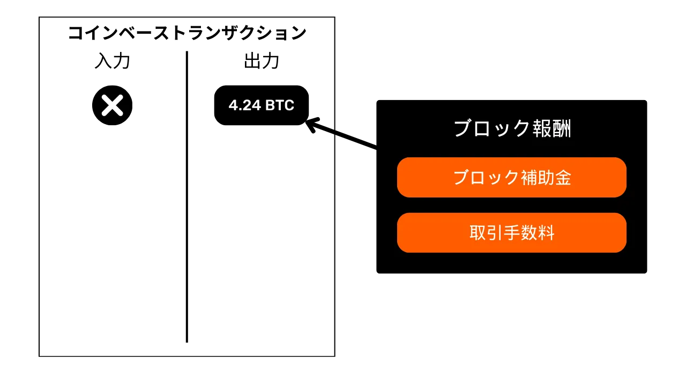
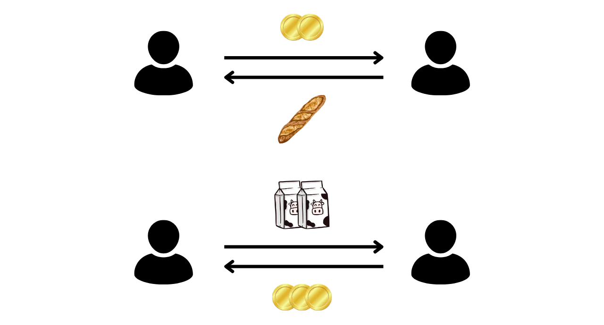
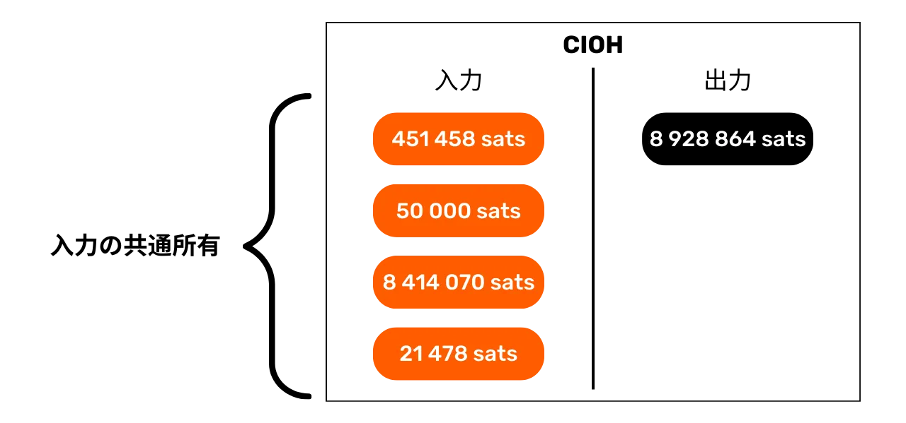
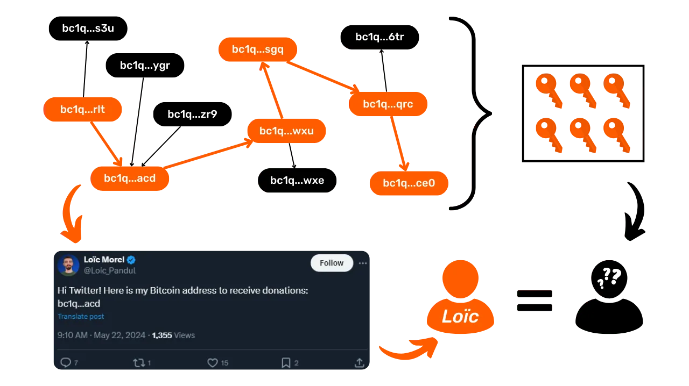
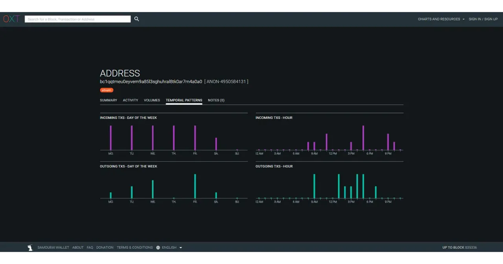

# ビットコインでプライバシーを守る

金融取引のプライバシーが徐々に贅沢品となっていく世界で、ビットコインを使用する際のプライバシー保護の原則を理解し、習得することは不可欠です。このトレーニングは、理論的かつ実践的な両方の鍵を提供し、自律的にこれを達成するためのものです。

今日、ビットコイン上では、チェーン分析を専門とする企業が存在します。彼らの主な事業は、あなたのプライベートな領域に侵入し、取引の機密性を損なうことにあります。実際、ビットコイン上の「プライバシー権」は存在しません。したがって、ユーザーであるあなたが自然権を主張し、取引の機密性を保護することが求められます。なぜなら、それを代わりに行ってくれる人はいないからです。

このトレーニングは、完全で総合的な旅として提示されます。各技術概念は詳細に議論され、説明図によって支えられます。目標は、知識を誰もがアクセスできるようにすることです。BTC204は、初心者や中級ユーザーにもアプローチ可能です。このトレーニングは、しばしば未知のいくつかの技術概念に深く掘り下げるため、最も熟練したビットコイナーにも付加価値を提供します。

ビットコインの使用を変革し、機密性を理解し、プライバシーを保護する能力を持った情報通のユーザーになるために、私たちに参加してください。

+++

# はじめに
<partId>e17474a8-8899-4bdb-a7f8-bc52ddb01440</partId>

## トレーニングへの導入
<chapterId>08ba1933-f393-4fb5-8279-777d874caedb</chapterId>

金融取引のプライバシーが徐々に贅沢品となっていく世界で、ビットコインを使用する際のプライバシー保護の原則を理解し、習得することは不可欠です。このトレーニングは、理論的かつ実践的な両方の鍵を提供し、自律的にこれを達成するためのものです。
今日、ビットコインエコシステム内には、チェーン分析を専門とする企業が存在します。彼らの主な事業は、あなたのプライベートな領域に侵入し、取引の機密性を損なうことです。実際、ビットコイン上の「プライバシー権」は存在しません。したがって、ユーザーであるあなたが自然権を主張し、取引の機密性を保護することが求められます。なぜなら、それを代わりに行ってくれる人はいないからです。

ビットコインは、「価格が上がる」ことや貯蓄の価値の保存だけのために存在するのではありません。そのユニークな特性と歴史により、主に反体制経済のツールです。この顕著な発明のおかげで、誰にも邪魔されることなく、自由にお金を管理し、使い、蓄積することができます。

ビットコインは、国家のくびきから平和的に逃れる手段を提供し、確立された法律によって挑戦されることのない自然権を完全に享受することを可能にします。サトシ・ナカモトの発明のおかげで、あなたは自分の私有財産に対する尊重を強制し、契約の自由を取り戻す力を持っています。
しかし、ビットコインはデフォルトでは匿名ではありません。これは、特に専制政権下の地域でカウンターエコノミーに従事している個人にとってリスクをもたらす可能性があります。しかし、これが唯一の危険ではありません。ビットコインは価値があり、検閲不可能な資産であるため、泥棒の欲望を引きつける可能性があります。したがって、プライバシーを守ることはセキュリティの問題にもなります。これにより、サイバー攻撃や身体的な暴行を防ぐことができます。
見ていくように、プロトコルはいくつかの本質的なプライバシー保護を提供しますが、このプライバシーを最適化し守るために追加のツールを使用することが重要です。

このトレーニングは、ビットコイン上のプライバシーの問題を理解するための完全で総合的な旅として設計されています。各技術的概念は詳細に説明され、説明図によってサポートされます。目標は、初心者や中級者を含むすべての人に知識をアクセスしやすくすることです。より経験豊富なビットコイナーのために、このトレーニングを通じて非常に技術的で時には知られていない概念も取り上げ、各トピックの理解を深めます。

このトレーニングの目標は、ビットコインの使用を完全に匿名にすることではなく、個人の目標に応じてプライバシーを保護する方法を知るための必要なツールを提供することです。提示された概念とツールから選択し、自分の目標と特定のニーズに合わせた戦略を開発する自由があります。

### セクション1: 定義とキーコンセプト
まず、ビットコインの運用を支配する基本原則を一緒に見直し、その後、プライバシーに関連する概念に落ち着いて取り組むための準備をします。UTXO、受信アドレス、またはスクリプトなど、いくつかの基本概念を習得することが、後続のセクションで取り上げる概念を完全に理解する前に不可欠です。また、サトシ・ナカモトが描いたビットコインのプライバシーモデルの概要を紹介し、それによって関連する問題とリスクを把握します。


### セクション2: チェーン分析の理解とそれに対する保護方法

第2セクションでは、ビットコイン上の活動を追跡するためにチェーン分析会社が使用する技術について学びます。これらの方法を理解することは、プライバシーの保護を強化するために重要です。この部分の目的は、攻撃者の戦略をよりよく理解し、リスクを認識し、後続のセクションで学ぶ技術の基礎を築くことです。取引パターン、内部および外部のヒューリスティック、およびこれらのパターンの妥当な解釈を分析します。理論的な要素に加えて、実践的な例や演習を通じてブロックエクスプローラーの使用方法を学びます。


### セクション3: プライバシーを保護するためのベストプラクティスの習得

トレーニングの第3セクションでは、実践に入ります。目標は、ビットコインユーザーにとって自然な反射となるべきすべての重要なベストプラクティスを習得することです。新しいアドレスの使用、ラベリング、統合、フルノードの使用、およびKYCと取得方法をカバーします。この目的は、プライバシー保護の探求において固い基盤を築くために避けるべき落とし穴の包括的な概要を提供することです。これらの実践のいくつかについては、それらを実装するための特定のチュートリアルに案内されます。


### セクション4: コインジョイン取引の理解

ビットコイン上のプライバシーについて話すことなく、コインジョインを議論しないでいられるでしょうか？セクション4では、この混合方法について知る必要があるすべてを発見します。コインジョインとは何か、その歴史と目的、存在するコインジョインの異なるタイプについて学びます。最後に、より経験豊富なユーザーのために、anonsetsとエントロピーが何であるか、およびこれらの指標をどのように計算するかを探求します。
### セクション5: 他の高度なプライバシー技術のリスク理解

第5セクションでは、コインジョイン以外のビットコイン上でのプライバシーを保護するための既存の技術全般について概観します。開発者たちは、プライバシーに特化したツールを設計する上で顕著な創造性を示してきました。ペイジョイン、共同トランザクション、コインスワップ、アトミックスワップなど、これらの方法をすべて検討し、それらの操作方法、目的、および潜在的な弱点について詳しく説明します。

### セクション6: プライバシーに関連するプロトコル強化提案の探求

前のセクションがアプリケーションレベルのプライバシー解決策に焦点を当てていたのに対し、この第6セクションでは、ユーザープライバシーに関するプロトコルレベルでの課題に深く踏み込みます。ノードのネットワークレベルでのプライバシーとトランザクションのブロードキャストについて議論します。また、ビットコイン上でユーザープライバシーを強化するために提案されてきたさまざまなプロトコルについても議論します。最後に、ビットコインの最後の主要なソフトフォークであるタップルートがプライバシーに与える影響、良い面も悪い面も検討します。

***(作業中: LOIC: ここに図の例を追加してください)***

### ボーナスセクション: セカンドレイヤープロトコル上のプライバシー

ご理解のとおり、このトレーニングの核心はオンチェーンプライバシーに限定されています。この最終ボーナスパートでは、ビットコインに関連する他のプロトコル上のプライバシーに話題を広げたいと思います。特に、ライトニングネットワーク上のプライバシーについて話し合います。一部の人々はライトニングがデフォルトでプライベートであると主張している一方で、他の人々はユーザープライバシーが不十分であると主張しています。では、真実は何なのでしょうか？ライトニングネットワーク上のプライバシーに関連する課題をよりよく理解するために、真実と虚偽を解き明かします。また、リキッドネットワークやカウミアン銀行のようなCashuやFedimintのようなサイドチェーンについても議論します。


# 定義とキーコンセプト
<partId>b9bbbde3-34c0-4851-83e8-e2ffb029cf31</partId>

## ビットコインのUTXOモデル
<chapterId>8d6b50c5-bf74-44f4-922b-25204991cb75</chapterId>

ビットコインは主に通貨ですが、プロトコル上でBTCが具体的にどのように表されているかご存知ですか？

### ビットコインのUTXOとは何か？

ビットコインプロトコルでは、金銭単位の管理はUTXOモデル、つまり「_Unspent Transaction Output_」（未使用トランザクション出力）の頭文字を取ったものを中心に展開します。
このモデルは、金融フローを追跡するためにアカウントと残高メカニズムに依存する従来の銀行システムとは根本的に異なります。実際、銀行システムでは、個々の残高は身元に紐づけられたアカウントで維持されます。例えば、パン屋からバゲットを購入するとき、あなたの銀行は単に購入金額をあなたのアカウントから引き落とし、あなたの残高を減らし、同じ金額でパン屋のアカウントに入金され、彼らの残高が増加します。このシステムでは、あなたのアカウントに入金されたお金と出金されたお金の間のリンクの概念は、取引記録を除いて存在しません。

ビットコインでは、これが異なります。アカウントの概念は存在せず、金銭単位は残高を介してではなく、UTXOを通じて管理されます。UTXOは、まだ使われていない特定の量のビットコインを表し、「ビットコインの一片」として形成されます。これは大きいものも小さいものもあります。例えば、UTXOは`500 BTC`の価値があるかもしれませんし、たった`700 SATS`の価値しかないかもしれません。
**> リマインダー:** サトシは、しばしばsatと略され、ビットコインの最小単位であり、フィアット通貨のセントに相当します。
```bash
1 BTC = 100 000 000 SATS
```

理論上、UTXOは1サトから約2100万BTCの理論上の最大値まで、ビットコインで任意の価値を表すことができます。しかし、2100万ビットコインすべてを所有することは論理的に不可能であり、UTXOが経済的に支出するには非効率と見なされる「ダスト」と呼ばれる経済的な下限閾値があります。

**> ご存知でしたか？** ビットコイン上で作成された最大のUTXOは、`500 000 BTC`の価値がありました。これは2011年11月にMtGoxプラットフォームによって統合操作中に作成されました：[29a3efd3ef04f9153d47a990bd7b048a4b2d213daaa5fb8ed670fb85f13bdbcf](https://mempool.space/ja/tx/29a3efd3ef04f9153d47a990bd7b048a4b2d213daaa5fb8ed670fb85f13bdbcf)

### UTXOと支出条件

UTXOはビットコイン上の交換の手段です。各トランザクションは、入力としてUTXOを消費し、出力として新しいUTXOを生成する結果となります。トランザクションが行われると、入力として使用されたUTXOは「使用済み」と見なされ、新しいUTXOが生成され、トランザクションの出力で示された受取人に割り当てられます。したがって、UTXOは単に使用されていないトランザクション出力を表し、その時点でユーザーが所有するビットコインの量を表します。

すべてのUTXOは、それらを使用できる条件を定義するスクリプトによって保護されています。UTXOを使用するためには、ユーザーはそのUTXOを保護するスクリプトによって規定された条件を満たしていることをネットワークに示さなければなりません。一般的に、UTXOは公開鍵（またはこの公開鍵を表す受信アドレス）によって保護されています。この公開鍵に関連付けられたUTXOを使用するためには、ユーザーは対応する秘密鍵を保持していることを証明し、この鍵で作成されたデジタル署名を提供する必要があります。これが、ビットコインウォレットが実際にビットコインを含んでいるわけではなく、秘密鍵を保存しており、それによってUTXOへのアクセスと、それが表すビットコインへのアクセスを可能にする理由です。


ビットコインにアカウントの概念が存在しないため、ウォレットの残高は単純に、それが使用できるすべてのUTXOの値の合計に相当します。例えば、あなたのビットコインウォレットが以下の4つのUTXOを使用できる場合：

```bash
- 2 BTC
- 8 BTC
- 5 BTC
- 2 BTC
```

あなたのウォレットの合計残高は `17 BTC` になります。


## ビットコイントランザクションの構造
<chapterId>29d3aaab-de2e-4746-ab40-c9748898850c</chapterId>

### トランザクションの入力と出力
ビットコイン取引は、ビットコインの所有権を一人の人から別の人へ移転することを可能にする、ブロックチェーン上に記録された操作です。より具体的には、私たちがUTXOモデル上にいるため、アカウントが存在せず、取引は一つまたは複数のUTXOが確保していた支出条件を満たし、それらを消費し、新たな支出条件を備えた新しいUTXOを同等に作成します。簡単に言うと、取引はビットコインを満たされたスクリプトからそれらを保護するための新しいスクリプトへ移動します。


したがって、各ビットコイン取引は、一つ以上の入力と一つ以上の出力から構成されます。入力は取引によって消費され出力を生成するUTXOです。出力は将来の取引の入力として使用可能な新しいUTXOです。


**> ご存知でしたか？** 理論的には、ビットコイン取引は無限の数の入力と出力を持つことができます。この数を制限するのはブロックの最大サイズのみです。
ビットコイン取引の各入力は、以前に未使用のUTXOを参照します。UTXOを入力として使用するには、その保持者はそれに関連付けられたスクリプト、つまり課された支出条件を満たすことによって、正当な所有者であることを証明する必要があります。一般的に、これにはそのUTXOを最初に確保した公開鍵に対応する秘密鍵で生成されたデジタル署名を提供することが含まれます。したがって、スクリプトは署名が資金受領時に使用された公開鍵と一致するかどうかを検証することから成ります。


一方、各出力は、転送されるビットコインの量と受取人を指定します。後者は一般的に、新しく作成されたUTXOを受取アドレスまたは新しい公開鍵でロックする新しいスクリプトによって定義されます。

合意ルールに従って取引が有効とみなされるためには、出力の合計が入力の合計以下でなければなりません。言い換えると、取引によって生成された新しいUTXOの合計は、入力として消費されたUTXOの合計を超えてはなりません。この原則は論理的です：`500,000 SATS`しか持っていない場合、`700,000 SATS`の購入はできません。

### ビットコイン取引におけるお釣りと統合

ビットコイン取引によるUTXOへの作用は、金貨を溶かすことに例えることができます。実際、UTXOは分割不可能であり、統合のみが可能です。これは、ユーザーが特定の量のビットコインを表すUTXOを複数の小さなUTXOに単純に分割することはできず、取引で完全に消費して出力に任意の値の一つまたは複数の新しいUTXOを作成する必要があることを意味します。これらは初期値以下でなければなりません。

このメカニズムは金貨と似ています。2オンスのコインを所有しており、売り手がお釣りを出せないと仮定して1オンスの支払いをしたい場合、コインを溶かして1オンスずつの2つの新しいコインを鋳造する必要があります。
Bitcoin上での操作は似ています。Aliceが`10,000 SATS`のUTXOを持っていて、`4,000 SATS`のバゲットを買いたいと想像してみましょう。Aliceは`10,000 SATS`の1つのUTXOを入力として使い、完全に消費することになります。そして、出力では、`4,000 SATS`と`6,000 SATS`の2つのUTXOを作成します。`4,000 SATS`のUTXOはバゲットの支払いとしてパン屋に送られ、`6,000 SATS`のUTXOはお釣りとしてAliceに戻ります。この取引の初期送信者に戻るUTXOは、Bitcoinの専門用語で「お釣り」と呼ばれています。

次に、Aliceが`10,000 SATS`の単一のUTXOを持っていないが、それぞれ`3,000 SATS`のUTXOを2つ持っていると想像してみましょう。この状況では、個々のUTXOはバゲットの`4,000 SATS`をカバーするには不十分です。したがって、Aliceは取引の入力として`3,000 SATS`の2つのUTXOを両方使用する必要があります。この方法により、入力の合計額は`6,000 SATS`に達し、パン屋への`4,000 SATS`の支払いをカバーすることができます。この方法は、取引の入力に複数のUTXOをグループ化することを指し、しばしば「統合」という用語で言及されます。

### 取引手数料

直感的には、取引手数料も取引の出力を表すと思うかもしれません。しかし、実際にはそうではありません。取引の手数料は、入力の合計と出力の合計の差を表します。これは、取引で入力の一部の価値を望ましい出力に充てた後、入力の一定額が未使用のままであることを意味します。この残余額が取引手数料を構成します。

```bash
手数料 = 入力の合計 - 出力の合計
```

`10,000 SATS`のUTXOを持っていて、`4,000 SATS`のバゲットを買いたいAliceの例に戻りましょう。Aliceは入力として彼女の`10,000 SATS`のUTXOを使って取引を作成します。次に、バゲットの支払いのためにパン屋に向けて`4,000 SATS`の出力を生成します。マイナーが彼女の取引をブロックに含めることを奨励するために、Aliceは手数料として`200 SATS`を割り当てます。彼女はこのようにして第二の出力、お釣りを作成し、それは彼女に戻り、`5,800 SATS`になります。

手数料の式を適用すると、マイナーには`200 SATS`が残ることが確かに見て取れます：
```bash
手数料 = 入力の合計 - 出力の合計
手数料 = 10,000 - (4,000 + 5,800)
手数料 = 10,000 - 9,800
手数料 = 200
```

マイナーがブロックを正常に検証すると、いわゆる「coinbase」取引を通じて、そのブロックに含まれるすべての取引の手数料を収集することが許可されます。

### Bitcoin上でのUTXOsの作成
前の段落を注意深くフォローしていたなら、UTXOは他の既存のUTXOを消費することによってのみ作成されることを今は知っているはずです。したがって、Bitcoin上のコインは連続したチェーンを形成します。しかし、このチェーンの最初のUTXOがどのようにして現れたのか疑問に思うかもしれません。これは鶏と卵の問題に似た問題を提起します：これらのオリジナルのUTXOはどこから来たのでしょうか？
答えは**コインベーストランザクション**にあります。

コインベースはBitcoinトランザクションの特定のタイプであり、各ブロックに固有であり、常に最初のものです。これは、有効なプルーフオブワークを見つけたマイナーがブロック報酬を受け取ることを可能にします。この報酬は二つの要素から構成されます：**ブロック補助金**と、前の部分で議論した**トランザクション手数料**です。

コインベーストランザクションのユニークな特徴は、入力を消費することなく薄い空気からビットコインを生成できる唯一のトランザクションであることです。これら新しく作成されたビットコインは、私たちが「オリジナルのUTXO」と呼ぶものを構成します。



ブロック補助金からのビットコインは、コンセンサスルールの中で事前に設定された発行スケジュールに従って無から新たに作成されたBTCです。ブロック補助金は210,000ブロックごとに半減し、これは約4年ごとのプロセスで「ハービング」と呼ばれます。初めに、各補助金で50ビットコインが作成されましたが、この量は徐々に減少しており、現在はブロックあたり3.125ビットコインです。

トランザクション手数料に関連する部分については、新たに作成されたBTCを表しているものの、ブロック内のすべてのトランザクションの合計入力と出力の差を超えてはなりません。先に見たように、これらの手数料はトランザクションの出力で使用されない入力の部分を表しています。この部分は技術的にトランザクション中に「失われる」とされ、マイナーは一つまたは複数の新しいUTXOの形でこの価値を再生する権利を持っています。したがって、これはトランザクション送信者からブロックチェーンに追加するマイナーへの価値の移転です。

**> ご存知でしたか？** コインベーストランザクションによって生成されたビットコインは、マイナーがそれを使用できない100ブロックの成熟期間を持っています。このルールは、後に無効となる可能性のあるチェーン上で新しく作成されたビットコインを使用することに関連する複雑さを防ぐことを目的としています。

### UTXOモデルの意味

まず、UTXOモデルはBitcoin上のトランザクション手数料に直接影響を与えます。各ブロックの容量が限られているため、マイナーはブロック内で占めるスペースに対して最も良い手数料を提供するトランザクションを優先します。実際、トランザクションが入力と出力として含むUTXOが多いほど、それは重くなり、したがって、より高い手数料が必要になります。これは、私たちがしばしばウォレット内のUTXOの数を減らそうとする理由の一つであり、これはプライバシーにも影響を与える可能性があります。このトピックは、このトレーニングの第三部で詳しく議論します。

次に、前の部分で述べたように、Bitcoin上のコインは本質的にUTXOのチェーンです。したがって、各トランザクションは過去のUTXOと未来のUTXOの間のリンクを作成します。UTXOはしたがって、ビットコインの作成から現在の支出までの明示的な追跡を可能にします。この透明性は、受け取ったビットコインの真正性を各ユーザーが検証できるため、肯定的に捉えられるかもしれません。しかし、この追跡可能性と監査可能性の原則に基づいて、あなたのプライバシーを損なうことを目的としたチェーン分析が行われることもあります。この実践はトレーニングの第二部で詳しく学びます。

## ビットコインのプライバシーモデル
<chapterId>769d8963-3ed5-4094-b21d-9203c7d9e465</chapterId>

### 通貨：真正性、完全性、および二重支払い

お金の機能の一つは、欲望の二重の偶然の問題を解決することです。物々交換に基づくシステムでは、交換を行うには、私のニーズに合った商品を提供している個人を見つけるだけでなく、彼らのニーズを満たす同等の価値の商品を彼らに提供することが必要です。このバランスを見つけることは複雑であることが証明されています。


そのために、私たちはお金を利用します。これにより、空間的および時間的に価値を移転することができます。



お金がこの問題を解決するためには、商品やサービスを提供する当事者が、後でその金額を使う能力を確信していることが不可欠です。したがって、デジタルでも物理的でも、お金の一部を受け入れることを望むどんな合理的な個人も、それが以下の二つの基本的な基準を満たしていることを確認します：
- **硬貨は無傷で真正である必要があります；**
- **そして、二重に支払われていないこと。**
物理通貨を使用する場合、最初の特性は確認が最も複雑です。歴史上の異なる時代に、金属硬貨の完全性は、クリッピングやドリリングなどの慣行によってしばしば損なわれてきました。例えば、古代ローマでは、市民が将来の取引のためにそれらを保持しながら、貴重な金属の少しを集めるために金貨の端を削ることが一般的でした。硬貨の本質的な価値はこのようにして減少しましたが、額面価値は同じままでした。これは特に、硬貨の端に後に鋳造されたリッジの理由です。

真正性も、物理的な貨幣媒体で確認するのが難しい特性です。現在では、偽造と戦う技術はますます複雑になり、商人は高価な検証システムに投資することを余儀なくされています。

一方、物理通貨の性質上、二重支払いは問題ではありません。もし私があなたに10ユーロ紙幣を渡したら、それは私の所有からあなたの所有に不可逆的に移り、同じ通貨単位を複数回使う可能性を自然に排除します。要するに、私はその10ユーロ紙幣を再び使うことができません。


デジタル通貨の場合、難しさは異なります。硬貨の真正性と完全性を保証することはしばしば簡単です。前のセクションで見たように、ビットコインのUTXOモデルは、硬貨をその起源まで遡り、それが実際にマイナーによってコンセンサスルールに従って作成されたことを確認することを可能にします。

しかし、二重支払いの不在を保証することはより複雑です。なぜなら、任意のデジタル財は本質的に情報であり、物理的な財とは異なり、情報は交換中に分割されるのではなく、複製することによって伝播します。例えば、もし私があなたにメールでドキュメントを送ると、それは複製されます。あなたの側では、私が元のドキュメントを削除したかどうかを確実に検証することはできません。


### ビットコイン上での二重支払いの防止

デジタル財の複製を避ける唯一の方法は、システム上のすべての交換を把握することです。この方法で、誰が何を所有しているかを知り、行われた取引に応じて全員の保有を更新することができます。これは、例えば、銀行システムの記帳通貨で行われていることです。クレジットカードで商人に10ユーロを支払うと、銀行はこの交換を記録し、元帳を更新します。
ビットコインでは、ダブルスペンディング（二重支払い）を防ぐ仕組みは同じ方法で達成されます。目標は、問題のコインを既に使用した取引がないことを確認することです。これらのコインが一度も使用されていなければ、ダブルスペンディングが発生しないことを確信できます。この原則は、サトシ・ナカモトによってホワイトペーパーで次の有名なフレーズとともに説明されました：
**「取引の不在を確認する唯一の方法は、全ての取引を知ることである。」**

しかし、銀行モデルとは異なり、ビットコインでは中央のエンティティを信頼する必要はありません。全ユーザーが第三者に頼ることなく、このダブルスペンディングの不在を確認できる必要があります。したがって、全員が全てのビットコイン取引を知る必要があります。これが、ビットコイン取引が全ネットワークノードに公開され、ブロックチェーン上に明確に記録される理由です。

まさにこの情報の公開が、ビットコイン上でのプライバシー保護を複雑にしています。伝統的な銀行システムでは、理論上、取引を知っているのは金融機関だけです。一方、ビットコインでは、全ユーザーがそれぞれのノードを通じて全取引を知ることになります。

### プライバシーモデル：銀行システム vs ビットコイン

伝統的なシステムでは、あなたの銀行口座はあなたの身元にリンクされています。銀行員は、どの銀行口座がどの顧客に属しているか、そしてそれに関連する取引が何かを知ることができます。しかし、この情報の流れは銀行と公共領域の間で遮断されます。言い換えれば、他の個人に属する銀行口座の残高や取引を知ることは不可能です。この情報にアクセスできるのは銀行だけです。

例えば、あなたが毎朝近所のパン屋でバゲットを買うことを銀行員は知っていますが、あなたの隣人はこの取引を知りません。したがって、情報の流れは関係者、特に銀行にアクセス可能ですが、外部の人にはアクセス不可能です。

前の部分で見たように、取引の公開の制約があるため、ビットコインのプライバシーモデルは銀行システムのモデルに従うことができません。ビットコインの場合、取引と公共領域の間の情報の流れを断ち切ることができないため、**プライバシーモデルはユーザーの身元と取引自体の間の分離に依存します。**
例えば、BTCで支払いをしてパン屋からバゲットを買う場合、自分のフルノードを所有する隣人は、システム内の他の全ての取引と同様に、あなたの取引が行われるのを見ることができます。しかし、プライバシー原則が尊重されていれば、この特定の取引をあなたの身元にリンクすることはできないはずです。


しかし、ビットコイン取引が公開されているため、それらの間のリンクを確立して関係する当事者に関する情報を推測することが可能になります。この活動は「チェーン分析」と呼ばれる専門分野を構成し、あなたのビットコインがどのように追跡され、それに対してどのように防御するかを理解するためのトレーニングの次の部分で、チェーン分析の基礎を探求することをお勧めします。

# チェーン分析と自己防衛の理解
<partId>4739371e-9fef-45b0-bcaa-b7a4df6b4470</partId>

## ビットコインにおけるチェーン分析とは？
<chapterId>7d198ba6-4af2-4f24-86cb-3c79cb25627e</chapterId>

### 定義と操作
チェーン分析は、ブロックチェーン上でビットコインの流れを追跡するための方法を全て包含する実践です。一般的に、チェーン分析は以前の取引のサンプルでの特徴の観察に依存しています。それから、分析したい取引でこれらの同じ特徴を特定し、妥当な解釈を導き出すことに関わります。この問題解決方法は実用的なアプローチから、「ヒューリスティック」と呼ばれる十分に良い解決策を見つけることです。

簡単に言うと、チェーン分析は主に3つのステップで行われます：
1. **ブロックチェーンの観察;**
2. **既知の特徴の特定;**
3. **仮説の導出。**


チェーン分析は誰でも実行できます。これには、フルノードを通じてブロックチェーンの公開情報にアクセスし、取引の動きを観察し、仮説を立てるだけでよいです。この分析を容易にする無料ツールもあります。例えば、このパートの最後の2章で詳しく探求するウェブサイト[OXT.me](https://oxt.me/)などです。しかし、プライバシーに対する主なリスクは、チェーン分析を専門とする企業から来ます。これらの企業はチェーン分析を産業規模で行い、そのサービスを金融機関や政府に販売しています。これらの企業の中で、Chainalysisはおそらく最もよく知られています。

### チェーン分析の目的
チェーン分析の目標の一つは、ビットコイン上の様々な活動をグループ化して、それらを行ったユーザーのユニークさを決定することです。その後、この活動の束を実際のアイデンティティにリンクしようと試みることが可能になります。


前の章を思い出してください。私はビットコインのプライバシーモデルが元々、ユーザーのアイデンティティを彼らの取引から分離することに依存していた理由を説明しました。したがって、オンチェーン活動をグループ化しても、それらを実際のアイデンティティに関連付けることはできないので、チェーン分析は不要だと考えるのは誘惑的かもしれません。

理論的には、この声明は正確です。このトレーニングの最初の部分で、UTXOに条件を設定するために使用される暗号鍵ペアについて見ました。本質的に、これらの鍵ペアは、その保持者のアイデンティティに関する情報を開示しません。したがって、異なる鍵ペアに関連する活動をグループ化することに成功しても、これらの活動の背後にいるエンティティについては何も教えてくれません。


しかし、実際の現実ははるかに複雑です。オンチェーン活動に実際のアイデンティティをリンクするリスクとなる多くの行動があります。分析では、これをエントリーポイントと呼び、それは多く存在します。

もちろん、最も一般的なのはKYC（*Know Your Customer*）です。規制されたプラットフォームからあなたの個人的な受信アドレスにビットコインを引き出す場合、ある人々はあなたのアイデンティティをこのアドレスにリンクすることができます。より広く言えば、エントリーポイントはあなたの実生活とビットコイン取引との間の任意の形態の相互作用である可能性があります。例えば、あなたが受信アドレスをソーシャルネットワークに公開した場合、これは分析のためのエントリーポイントを構成する可能性があります。あなたがあなたのパン屋にビットコインで支払いをする場合、彼らはあなたの顔（あなたのアイデンティティの一部）をビットコインアドレスに関連付けることができます。

これらのエントリーポイントはビットコインの使用においてほぼ避けられないものです。その範囲を限定しようとすることは可能ですが、それらは存在し続けます。だからこそ、あなたのプライバシーを保護することを目的とした方法を組み合わせることが重要です。あなたの実際のアイデンティティとあなたの取引との間に分離を維持することは興味深いアプローチですが、今日では不十分です。実際、あなたの全てのオンチェーン活動をグループ化することができれば、最小のエントリーポイントでさえ、あなたが確立した唯一のプライバシーの層を危険にさらす可能性があります。


### チェーン分析に対する防御
したがって、Bitcoinの使用においては、ブロックチェーン分析に対処できる能力も必要です。このように進めることで、私たちの活動の集約を最小限に抑え、エントリーポイントが私たちのプライバシーに与える影響を限定することができます。

実際、ブロックチェーン分析に対抗するためには、ブロックチェーン分析で使用される方法に自分自身を慣れさせるより良いアプローチは何でしょうか？Bitcoin上でのプライバシーを向上させる方法を知りたい場合、これらの方法を理解する必要があります。これにより、[Coinjoin](https://planb.network/ja/tutorials/privacy/coinjoin-samourai-wallet)や[Payjoin](https://planb.network/ja/tutorials/privacy/payjoin)のような技術（これらはトレーニングの最後の部分で学習する技術です）をよりよく把握し、あなたが犯すかもしれないミスを減らすことができます。

この点で、暗号学と暗号解析との類似性を見出すことができます。優れた暗号学者は、まず何よりも優れた暗号解析者です。新しい暗号アルゴリズムを想像するためには、それが直面しなければならない攻撃を知り、また以前のアルゴリズムがなぜ破られたのかを研究する必要があります。Bitcoinのプライバシーに関しても同じ原則が適用されます。ブロックチェーン分析の方法を理解することが、それに対抗する鍵です。これが、このトレーニングでブロックチェーン分析に関する完全なセクションを提案する理由です。

### ブロックチェーン分析の方法

ブロックチェーン分析が正確な科学ではないことを理解することが重要です。それは以前の観察や論理的解釈から導かれたヒューリスティックに依存しています。これらのルールにより、かなり信頼性の高い結果が得られますが、絶対的な精度は決して得られません。言い換えれば、**ブロックチェーン分析は常に結論において確率の次元を含んでいます**。例えば、二つのアドレスが同一のエンティティに属していると、より多かれ少なかれ確実に推定されるかもしれませんが、完全な確実性を得ることは常に不可能です。

ブロックチェーン分析の全体的な目的は、誤りのリスクを最小限に抑えるためにさまざまなヒューリスティックを集約することに正確にあります。これは、ある意味で、私たちが現実により近づくことを可能にする証拠の蓄積です。

これらの有名なヒューリスティックは、私たちが一緒に詳しく説明するさまざまなカテゴリーに分類することができます：
- **取引パターン（または取引モデル）;**
- **取引内のヒューリスティック;**
- **取引外のヒューリスティック。**

### サトシ・ナカモトとブロックチェーン分析
チェーン分析のための最初の二つのヒューリスティックがサトシ・ナカモト自身によって発見されたことに注目する価値があります。彼はこれらについてBitcoinホワイトペーパーの第10部で議論しています。これらは以下の通りです：
- 共通入力所有ヒューリスティック（CIOH）;
- そしてアドレスの再利用。

ソース：S. Nakamoto, "Bitcoin: A Peer-to-Peer Electronic Cash System", https://bitcoin.org/bitcoin.pdf, 2009.

次の章では、これらが何であるかを探求しますが、これら二つのヒューリスティックが今日でもチェーン分析において優位性を保っていることに既に注目することは興味深いことです。

## 取引パターン
<chapterId>d365a101-2d37-46a5-bfb9-3c51e37bf96b</chapterId>

取引パターンとは、ブロックチェーン上で見つけることができる典型的な取引のモデルまたは全体的な構造であり、その解釈がおそらく知られています。パターンを研究する際には、単一の取引に焦点を当て、高いレベルで分析します。
つまり、特定の詳細やトランザクションの環境に囚われることなく、入力におけるUTXOの数と出力におけるUTXOの数のみを見ることになります。観察されたモデルから、トランザクションの性質を解釈することができます。その後、その構造の特徴を探し、解釈を導き出します。


この部分では、チェーン分析で遭遇する可能性のある主要なトランザクションモデルを一緒に発見し、各モデルについて、この構造の可能性のある解釈と具体的な例をお伝えします。

### シンプル送金（またはシンプル支払い）

最も広く見られるパターンから始めます。これは、ほとんどのビットコイン支払いで現れるものです。シンプル支払いモデルは、入力で1つ以上のUTXOを消費し、出力で2つのUTXOを生成することが特徴です。したがって、このモデルは次のようになります：


ブロックチェーン上でこのトランザクション構造を見つけたとき、すでに解釈を導き出すことができます。その名前が示すように、このモデルは送金または支払いトランザクションであることを示しています。ユーザーは、入力で自分自身のUTXOを消費し、出力で支払いUTXOとお釣りUTXO（同じユーザーに戻るお釣り）を満たしています。

したがって、観察されたユーザーは、出力の2つのUTXOのうち1つ（支払い用のもの）をもはや所有していない可能性が高いが、もう1つのUTXO（お釣り用のもの）はまだ所有していることがわかります。
現時点では、どの出力がどのUTXOを表しているかを特定することはできません。これは、パターンの研究の目的ではありません。この目標を達成するためには、後続の部分で研究するヒューリスティックに頼ることになります。この段階での目標は、問題のトランザクションの性質を特定することに限定されています。この場合、それはシンプルな送金です。

例として、シンプル送金パターンを採用したビットコイントランザクションはこちらです：

```bash
b6cc79f45fd2d7669ff94db5cb14c45f1f879ea0ba4c6e3d16ad53a18c34b769
```


出典: [Mempool.space](https://mempool.space/ja/tx/b6cc79f45fd2d7669ff94db5cb14c45f1f879ea0ba4c6e3d16ad53a18c34b769)

この最初の例の後、"トランザクションパターン"を研究することの意味をより良く理解していただけるはずです。トランザクションをその環境やトランザクションの特定の詳細を考慮せずに、構造のみに焦点を当てて調査します。この最初のステップでは、グローバルな方法でのみそれを観察します。

パターンが何であるかを理解した今、他の既存のモデルに進みましょう。

### スイーピング

この二番目のモデルは、入力で単一のUTXOを消費し、出力で単一のUTXOを生成することが特徴です。


このモデルの解釈は、自己転送の状況にあるということです。ユーザーは自分のビットコインを自分自身に、自分が所有する別のアドレスに転送しました。トランザクションに変更がないため、支払いの状況にあるとは非常に考えにくいです。実際、支払いが行われる場合、支払い者が売り手に要求される金額とトランザクション手数料を正確に一致させるUTXOを持っていることはほぼ不可能です。一般的に、支払い者は変更の出力を生成する必要があります。

したがって、観察されたユーザーはこのUTXOをまだ所有している可能性が高いとわかります。チェーン分析の文脈では、トランザクションの入力で使用されたUTXOがアリスに属していることがわかっている場合、出力のUTXOも彼女に属していると想定できます。後に興味深くなるのは、この仮定を強化することができるトランザクション内の内部ヒューリスティックスを見つけることです（これらのヒューリスティックスは第3.3章で学習します）。

例えば、ここにスイープパターンを採用するビットコイントランザクションがあります：

```bash
35f1072a0fda5ae106efb4fda871ab40e1f8023c6c47f396441ad4b995ea693d
```


ソース: [Mempool.space](https://mempool.space/ja/tx/35f1072a0fda5ae106efb4fda871ab40e1f8023c6c47f396441ad4b995ea693d)
しかし、このタイプのパターンは、暗号通貨取引所プラットフォームのアカウントへの自己転送も明らかにすることがあります。既知のアドレスとトランザクションの文脈の研究が、それが自己管理ウォレットへのスイープか、プラットフォームへの引き出しかを知ることを可能にします。実際、取引所プラットフォームのアドレスはしばしば容易に識別可能です。

アリスの例に戻りましょう：スイープがプラットフォームの既知のアドレス（例えばBinanceなど）につながる場合、ビットコインがアリスの直接の所有から転送され、おそらくそれらを売却するか、このプラットフォームに保存する意図である可能性があります。一方、目的地のアドレスが不明な場合、それは単にアリスに属する別のウォレットであると推定するのが妥当です。しかし、このタイプの研究はパターンの研究ではなく、ヒューリスティックスのカテゴリーにより該当します。

### 統合

このモデルは、複数のUTXOを入力として消費し、単一のUTXOを出力として生成することが特徴です。


このモデルの解釈は、統合の状況にあるということです。これはビットコインユーザーの間で一般的な実践であり、トランザクション手数料の可能性のある増加に備えて、複数のUTXOを統合することを目的としています。手数料が低い期間にこの操作を実行することで、将来の手数料を節約することが可能です。この実践については、第4.3章で詳しく話します。

このトランザクションモデルの背後にいるユーザーは、入力のすべてのUTXOを所有しており、出力のUTXOもまだ所有している可能性が高いと推測できます。これは確かに自己転送です。

スイープと同様に、このタイプのパターンも取引所プラットフォームのアカウントへの自己転送を明らかにすることがあります。既知のアドレスとトランザクションの文脈の研究が、それが自己管理ウォレットへの統合か、プラットフォームへの引き出しかを知ることを可能にします。

例えば、ここに統合パターンを採用するビットコイントランザクションがあります：

```bash
77c16914211e237a9bd51a7ce0b1a7368631caed515fe51b081d220590589e94
```


ソース: [Mempool.space](https://mempool.space/ja/tx/77c16914211e237a9bd51a7ce0b1a7368631caed515fe51b081d220590589e94)
チェーン分析の文脈では、このモデルは多くの情報を明らかにすることができます。例えば、ある入力がアリスに属していることがわかっていれば、このトランザクションの他のすべての入力と出力も彼女に属していると推測することができます。この仮定により、以前のトランザクションチェーンを遡って、アリスに関連する可能性のある他のトランザクションを発見し分析することができます。


### 集約された支出

このモデルは、少数のUTXOを入力として消費し（多くの場合は1つのみ）、多数のUTXOを出力として生成することが特徴です。


このモデルの解釈は、私たちが集約された支出に取り組んでいることを示しています。これは、例えば交換プラットフォームなど、重要な経済活動を示す可能性が高い実践です。集約された支出により、これらのエンティティは費用を1つのトランザクションに統合することで節約できます。

このモデルから、UTXOの入力が重要な経済活動を持つ企業から来ており、UTXOの出力が分散されることを推測できます。多くは、プラットフォームからビットコインを引き出した企業のクライアントに属するでしょう。他の出力はパートナー企業に向かうかもしれません。最終的には、発行企業に戻る交換が1つ以上確実にあります。

例えば、こちらが集約された支出パターンを採用しているビットコイントランザクションです（おそらく、Bybitプラットフォームによって発行されたトランザクションです）：

```bash
8a7288758b6e5d550897beedd13c70bcbaba8709af01a7dbcc1f574b89176b43
```


ソース: [Mempool.space](https://mempool.space/ja/tx/8a7288758b6e5d550897beedd13c70bcbaba8709af01a7dbcc1f574b89176b43)

### プロトコル固有のトランザクション

トランザクションのパターンの中には、特定のプロトコルの使用を明らかにするモデルも特定できます。例えば、Whirlpool coinjoins（これについては第5部で詳しく説明します）は、他のより伝統的なトランザクションと区別できる簡単に識別可能な構造を持っています。


このパターンの分析は、私たちが協力的なトランザクションに取り組んでいる可能性が高いことを示唆しています。また、coinjoinを観察することも可能です。この後者の仮説が正確であると証明される場合、出力の数からcoinjoinに参加している参加者の数のおおよその推定を得ることができます。

例えば、こちらが協力的なトランザクションタイプのcoinjoinパターンを採用しているビットコイントランザクションです：

```bash
00601af905bede31086d9b1b79ee8399bd60c97e9c5bba197bdebeee028b9bea
```


ソース：[Mempool.space](https://mempool.space/ja/tx/00601af905bede31086d9b1b79ee8399bd60c97e9c5bba197bdebeee028b9bea)
他にも、独自の特定の構造を持つプロトコルが多数存在します。したがって、例えば、Wabisabiタイプのトランザクション、Stampsトランザクション、またはRunesトランザクションなどを区別することができます。

これらのトランザクションパターンのおかげで、特定のトランザクションについて多くの情報を既に解釈することができます。しかし、トランザクションの構造だけが分析のための情報源ではありません。その詳細もまた研究することができます。これらの詳細は、トランザクション内部にのみ存在し、私が「内部ヒューリスティック」と呼ぶものです。これについては次の章で探求します。

## 内部ヒューリスティック
<chapterId>c54b5abe-872f-40f4-a0d0-c59faff228ba</chapterId>

内部ヒューリスティックとは、トランザクションの環境を調査することなく、トランザクション自体内で特定された特定の特徴であり、それによって推論を行うことができます。全体的なトランザクションの構造に焦点を当てるパターンとは異なり、内部ヒューリスティックは抽出可能なデータ全体に基づいています。これには以下が含まれます：
- 受信および送信される異なるUTXOの金額
- スクリプトに関するすべて：受信アドレス、バージョニング、ロックタイム...

一般的に、このタイプのヒューリスティックは、特定のトランザクションのおつりを特定することを可能にします。そうすることで、複数の異なるトランザクションを通じてエンティティを追跡し続けることができます。実際、追跡したいユーザーに属するUTXOを特定した場合、彼らがトランザクションを行う際に、どのアウトプットが他のユーザーに転送され、どのアウトプットがおつりとして彼らの所有に残るかを決定することが重要です。


再び申し上げますが、これらのヒューリスティックは絶対的に正確ではありません。個々に取られた場合、それらは可能性のあるシナリオを特定することしかできません。複数のヒューリスティックの蓄積が不確実性を減らすのに役立ちますが、完全に排除することは決してありません。

### 内部の類似性

このヒューリスティックは、同じトランザクションの入力と出力の間の類似性の研究を含みます。同じ特性が入力とトランザクションの出力のうちの1つにのみ観察される場合、その出力がおつりである可能性が高いです。

最も明白な特性は、同じトランザクションで受信アドレスの再利用です。


このヒューリスティックは疑問の余地がほとんどありません。誰かのプライベートキーがハッキングされていない限り、同じ受信アドレスは必然的に単一のユーザーの活動を明らかにします。その後の解釈は、トランザクションからのおつりが入力と同じアドレスを持つ出力であるということです。これにより、このおつりに基づいて個人の追跡を続けることができます。
例えば、ここにこのヒューリスティックが合理的に適用されるトランザクションがあります：

```bash
54364146665bfc453a55eae4bfb8fdf7c721d02cb96aadc480c8b16bdeb8d6d0
```


ソース：[Mempool.space](https://mempool.space/tx/54364146665bfc453a55eae4bfb8fdf7c721d02cb96aadc480c8b16bdeb8d6d0)
入力と出力の間の類似性は、アドレスの再利用にとどまらない。スクリプトの使用における類似性も、ヒューリスティックの適用を可能にすることがある。例えば、入力とトランザクションの出力の一つの間で同じバージョニングが観察されることがある。


この図では、入力番号0がP2WPKHスクリプト（SegWit V0で、`bc1q`で始まる）を解除することがわかる。出力番号0は同じタイプのスクリプトを使用している。しかし、出力番号1はP2TRスクリプト（SegWit V1で、`bc1p`で始まる）を使用している。この特徴の解釈は、入力と同じバージョニングを持つアドレスがお釣りアドレスである可能性が高いということである。したがって、それはまだ同じユーザーに属していると考えられる。

以下は、このヒューリスティックが合理的に適用できるトランザクションである：

```bash
db07516288771ce5d0a06b275962ec4af1b74500739f168e5800cbcb0e9dd578
```


ソース: [Mempool.space](https://mempool.space/tx/db07516288771ce5d0a06b275962ec4af1b74500739f168e5800cbcb0e9dd578)

この場合、入力番号0と出力番号1がP2WPKHスクリプト（SegWit V0）を使用しているのに対し、出力番号0は異なるタイプのスクリプト、P2PKH（レガシー）を使用していることがわかる。2010年代の初めには、スクリプトのバージョニングに基づくこのヒューリスティックは、利用可能なスクリプトの種類の制限のため、あまり役に立たなかった。しかし、時間が経つにつれて、ビットコインへの連続したアップデートにより、スクリプトの種類の多様性が導入された。このヒューリスティックは、より広範なスクリプトの種類を持つことで、ユーザーがより小さなグループに分かれるため、内部バージョニングの再利用のヒューリスティックを適用するチャンスが増えるため、ますます関連性が高まっている。この理由から、プライバシーの観点からのみ、最も一般的なスクリプトタイプを選択することが望ましい。例えば、これを書いている時点で、Taprootスクリプト（`bc1p`）はSegWit V0スクリプト（`bc1q`）よりも頻繁に使用されていない。前者は特定の文脈で経済的およびプライバシーの利点を提供するが、より伝統的な単一署名の使用においては、新しい標準が広く採用されるまで、プライバシー上の理由から古い標準に固執することが賢明かもしれない。

### 丸い数字の支払い

変更を特定するのに役立つもう一つの内部ヒューリスティックは、丸い数字のものである。一般的に、単純な支払いパターン（1つの入力と2つの出力）に直面した場合、出力の一つが丸い金額を使っているなら、それが支払いを表している。


排除法により、一つの出力が支払いを表している場合、もう一つの出力はお釣りを表している。したがって、入力ユーザーが変更として特定された出力をまだ所有している可能性が高いと推測できる。

このヒューリスティックが常に適用可能であるわけではないことに注意すべきである。というのも、支払いの大半は依然として法定通貨単位で行われているからである。実際、フランスで商人がビットコインを受け入れる場合、一般的にはsatsで安定した価格を表示するのではなく、ユーロでの価格と支払うべきビットコインの量との間で変換を選択するだろう。したがって、トランザクション出力に丸い数字があるべきではない。
それでも、アナリストは取引がネットワーク上で放送された時の為替レートを考慮に入れて、この変換を試みることができます。例として、入力が`97,552 sats`で、一方の出力が`31,085 sats`、もう一方の出力が`64,152 sats`の取引を見てみましょう。一見すると、この取引は丸い金額を含んでいるようには見えません。しかし、取引時の為替レート64,339€を適用すると、ユーロでの変換は以下のようになります：
- 62.76€の入力；
- 20€の出力；
- 41.27€の出力。
法定通貨に変換された後、この取引は丸い金額による支払いの推定法を適用することができます。20€の出力は、商人に向けられたものである可能性が高いか、少なくとも所有権が変わったものです。推測によると、41.27€の出力は元のユーザーの所持に残った可能性が高いです。

もしいつの日か、ビットコインが私たちの取引で好まれる勘定単位になった場合、この推定法は分析にさらに役立つかもしれません。

例えば、この推定法が適用されそうな取引はこちらです：

```bash
2bcb42fab7fba17ac1b176060e7d7d7730a7b807d470815f5034d52e96d2828a
```

ソース：[Mempool.space](https://mempool.space/tx/2bcb42fab7fba17ac1b176060e7d7d7730a7b807d470815f5034d52e96d2828a)

### 最大の出力

単純な支払いモデルの二つの取引出力間に十分に大きな差が見られる場合、最大の出力がおつりであると推定されます。

この最大の出力に関する推定法はおそらく最も不正確です。それ自体で識別された場合、非常に弱いです。しかし、この特徴は他の推定法と組み合わせることで、私たちの解釈の不確実性を減らすことができます。

例えば、丸い金額の出力ともう一つのより大きな金額の出力を提示する取引を調べる場合、丸い金額による支払いの推定法と最大の出力に関する推定法の共同適用により、不確実性のレベルを減らすことができます。

例えば、この推定法が適用されそうな取引はこちらです：

```bash
b79d8f8e4756d34bbb26c659ab88314c220834c7a8b781c047a3916b56d14dcf
```

ソース：[Mempool.space](https://mempool.space/tx/b79d8f8e4756d34bbb26c659ab88314c220834c7a8b781c047a3916b56d14dcf)

## 外部推定法
<chapterId>4a170e3b-200d-431a-8285-18a23ff617ba</chapterId>

外部推定法の研究は、取引自体に固有ではない特定の要素の類似点、パターン、特性を分析することを含みます。言い換えれば、以前は取引に固有の要素を利用することに限定していた場合、私たちは今、外部推定法のおかげで取引の環境に分析の範囲を広げています。

### アドレスの再利用

これはビットコイナーの間で最もよく知られているヒューリスティックの一つです。アドレスの再利用により、異なるトランザクションと異なるUTXO間のリンクを確立することができます。ビットコインの受信アドレスが複数回使用される場合に観察されます。

したがって、前章で見たように、同じトランザクション内でアドレスの再利用を内部ヒューリスティックとして利用し、おつりを特定することが可能です。しかし、アドレスの再利用は、複数のトランザクションにわたるエンティティのユニークさを認識する外部ヒューリスティックとしても機能します。

アドレスの再利用の解釈は、このアドレスにロックされているすべてのUTXOが同じエンティティに属している（または属していた）ことを意味します。このヒューリスティックは、不確実性の余地がほとんどありません。それを特定できる場合、その後の解釈は現実に非常に近い可能性が高いです。したがって、異なるオンチェーン活動のグループ化を可能にします。


第3部の序章で説明したように、このヒューリスティックはサトシ・ナカモト自身によって発見されました。ホワイトペーパーでは、それを生み出さないためのユーザー向けの解決策を具体的に述べており、それは新しいトランザクションごとに新鮮なアドレスを使用することです：

"_追加のファイアウォールとして、各トランザクションに対して新しいキーペアを使用することで、それらが共通の所有者にリンクされるのを防ぐことができます。_"


出典: S. Nakamoto, "Bitcoin: A Peer-to-Peer Electronic Cash System", https://bitcoin.org/bitcoin.pdf, 2009.

例えば、こちらは複数のトランザクションで再利用されたアドレスです：

```bash
bc1qqtmeu0eyvem9a85l3sghuhral8tk0ar7m4a0a0
```


出典: [Mempool.space](https://mempool.space/address/bc1qqtmeu0eyvem9a85l3sghuhral8tk0ar7m4a0a0)

### スクリプトの類似性とウォレットのフィンガープリント

アドレスの再利用を超えて、同じウォレットやアドレスのクラスターにアクションをリンクするための多くの他のヒューリスティックがあります。
まず第一に、アナリストはスクリプトの使用における類似性から利益を得ることができます。例えば、マルチシグのような少数派のスクリプトは、SegWit V0スクリプトよりも簡単に特定できます。私たちが隠れるグループが大きければ大きいほど、私たちを見つけるのは難しくなります。これは、良いCoinjoinプロトコルでは、すべての参加者が全く同じタイプのスクリプトを使用する理由です。
より広範に、アナリストはウォレットの特徴的なフィンガープリントにも焦点を当てることができます。これらは、追跡ヒューリスティックとして利用するために特定しようとするかもしれない使用に特有のプロセスです。言い換えれば、追跡されたエンティティに帰属するトランザクションに同じ内部特性の蓄積が観察される場合、他のトランザクションにおいてこれらの同じ特性を特定しようとすることができます。

例えば、追跡されたユーザーが変更をP2TRアドレス（`bc1p…`）に系統的に送ることが特定された場合、このプロセスが繰り返されると、分析の継続のためのヒューリスティックとして使用することができます。UTXOの順序、出力内の変更の配置、RBF（Replace-by-Fee）のシグナリング、または、バージョン番号、`nSequence`フィールド、`nLockTime`フィールドなど、他のフィンガープリントも使用できます。


[@LaurentMT](https://twitter.com/LaurentMT)が[Space Kek #19](https://podcasters.spotify.com/pod/show/decouvrebitcoin/episodes/SpaceKek-19---Analyse-de-chane--anonsets-et-entropie-e1vfuji)（フランコフォンのポッドキャスト）で指摘しているように、チェーン分析におけるウォレットのフィンガープリントの有用性は時間とともに大幅に増加します。実際、スクリプトタイプの数が増え、これらの新機能がウォレットソフトウェアによって徐々に展開されることで、違いが際立ちます。追跡されたエンティティが使用しているソフトウェアを正確に特定できることさえあります。したがって、ウォレットのフィンガープリントの研究は、2010年代初頭に開始されたものよりも、特に最近のトランザクションに関しては特に関連があると理解することが重要です。
要約すると、フィンガープリントは、ウォレットが自動的に行う、またはユーザーが手動で行う特定の実践であり、分析を支援するために他のトランザクションで見つけることができます。

### Common Input Ownership Heuristic (CIOH)

CIOH、つまり英語での"Common Input Ownership Heuristic"は、トランザクションが複数の入力を含む場合、これらはすべて単一のエンティティから来ている可能性が高いとする推論です。その結果、それらの所有権は共通です。

Common Input Ownership Heuristic (CIOH)を適用するには、まず複数の入力を持つトランザクションを観察します。これは2つの入力でも、30の入力でもかまいません。この特徴を特定したら、トランザクションが既知のトランザクションモデルに当てはまらないかを確認します。例えば、ほぼ同じ量の5つの入力と、正確に同じ量の5つの出力を持つ場合、それはコインジョインの構造であるとわかります。したがって、CIOHを適用することはできません。


しかし、トランザクションがどの既知の協力トランザクションモデルにも当てはまらない場合、すべての入力が同じエンティティから来ている可能性が高いと推測できます。これは、既知のクラスターを拡大するためや、追跡を続けるために非常に役立ちます。


CIOHはサトシ・ナカモトによって発見されました。彼はホワイトペーパーの第10部でこれについて議論しています：

"_[...] マルチインプットトランザクションでは、その入力が同じ所有者によって所有されていたことを必然的に示すリンクがあります。キーの所有者が明らかになった場合、リンクは同じ所有者に属していた他のトランザクションを明らかにするリスクがあります。_"


特に興味深いのは、サトシ・ナカモトがBitcoinの公式ローンチ前にすでに、ユーザーのプライバシーに関する2つの主要な脆弱性、すなわちCIOHとアドレスの再利用を特定していたことです。このような先見の明は非常に注目に値し、これら2つの推論は、今日でもチェーン分析で最も有用なもののままです。

例として、CIOHを適用できる可能性が高いトランザクションをここに示します：

```bash
20618e63b6eed056263fa52a2282c8897ab2ee71604c7faccfe748e1a202d712
```


ソース：[Mempool.space](https://mempool.space/tx/20618e63b6eed056263fa52a2282c8897ab2ee71604c7faccfe748e1a202d712)

### オフチェーンデータ
明らかに、チェーン分析はオンチェーンデータに限定されるわけではありません。以前の分析からのデータやインターネット上でアクセス可能なデータも、分析を洗練させるために使用できます。例えば、追跡されているトランザクションが同じビットコインノードから一貫してブロードキャストされていることが観察され、そのIPアドレスを特定できる場合、送信者の身元の一部を特定することに加えて、同じエンティティからの他のトランザクションを見つけることが可能かもしれません。この実践は多くのノードを操作する必要があるため容易に達成できるものではありませんが、チェーン分析を専門とする一部の企業がそれを採用している可能性があります。

分析者は、以前にオープンソースとして公開された分析や自身の以前の分析に依存する選択肢も持っています。既に特定されていたアドレスのクラスターを指すアウトプットを見つけることができるかもしれません。時には、取引所プラットフォームを指すアウトプットに依存することも可能で、これらの企業のアドレスは一般的に知られています。

同様に、排除による分析も行われます。例えば、2つのアウトプットを持つトランザクションの分析中に、そのうちの1つが既知のアドレスクラスターにリンクされているが、追跡されているエンティティとは異なる場合、他のアウトプットがおつりを表している可能性が高いと解釈できます。

チェーン分析には、インターネット検索を含むOSINT（*オープンソースインテリジェンス*）のより一般的な部分も含まれます。これが、受信アドレスをソーシャルメディアやウェブサイトに、匿名であろうとなかろうと、直接公開することは勧められない理由です。



### 時間モデル

あまり考慮されることは少ないですが、特定の人間の行動はオンチェーンで認識可能です。分析で最も有用かもしれないのは、あなたの睡眠パターンです！はい、あなたが寝ているとき、おそらくビットコイントランザクションをブロードキャストしていません。そして、一般的に同じ時間帯に寝ます。したがって、チェーン分析では時間分析を使用することが一般的です。これは単に、特定のエンティティのトランザクションがビットコインネットワークにブロードキャストされる時間を記録することを意味します。これらの時間パターンを分析することで、多くの情報を推測することができます。

まず、時間分析によって、追跡されているエンティティの性質を特定することが時々可能です。トランザクションが24時間にわたって一貫してブロードキャストされていることが観察された場合、これは強い経済活動を示します。これらのトランザクションの背後にあるエンティティは、おそらくビジネスであり、国際的であり、内部に自動化された手順を持っている可能性があります。
例えば、数ヶ月前に[19ビットコインの手数料が誤って割り当てられたトランザクション](https://mempool.space/tx/d5392d474b4c436e1c9d1f4ff4be5f5f9bb0eb2e26b61d2781751474b7e870fd)を分析することで、[このモデルを認識しました](https://twitter.com/Loic_Pandul/status/1701127409712452072)。単純な時間分析によって、自動化されたサービス、したがっておそらく取引所プラットフォームのような大きなエンティティを扱っていると仮定することができました。
実際、数日後、資金がPayPalに属していることが、取引所プラットフォームのPaxosを通じて発見されました。

逆に、時間パターンが特定の16時間にわたって広がっている場合、個人ユーザーや取引量に応じて地元のビジネスを扱っていると推定できます。

観察されたエンティティの性質を超えて、時間パターンはタイムゾーンのおかげでユーザーのおおよその位置も提供することができます。このようにして、他のトランザクションを相関させ、これらのタイムスタンプを分析に追加できる追加のヒューリスティックとして使用することができます。
たとえば、以前話した複数回使用されたアドレスについて、入金または出金のトランザクションが13時間の間隔に集中していることが観察できます。
```bash
bc1qqtmeu0eyvem9a85l3sghuhral8tk0ar7m4a0a0
```



出典: OXT.me

この間隔は、おそらくヨーロッパ、アフリカ、または中東に相当します。したがって、これらのトランザクションの背後にいるユーザーがそこに住んでいると解釈できます。

異なる観点からは、この種の時間分析が、サトシ・ナカモトが日本ではなく、実際にはアメリカから活動していたという仮説を導くのに役立ったこともあります：[*サトシ・ナカモトのタイムゾーン*](https://medium.com/@insearchofsatoshi/the-time-zones-of-satoshi-nakamoto-aa40f035178f)

## ブロックエクスプローラーを使った実践的な応用
<chapterId>6493cf2f-225c-405f-9375-c4304f1087ed</chapterId>

この最終章では、これまでに学んだ概念を具体的に応用します。実際のビットコインのトランザクションの例を提示し、求められた情報を抽出する必要があります。
理想的には、これらの演習にはプロフェッショナルなチェーン分析ツールの使用が望ましいです。しかし、Samourai Walletの開発者が逮捕されて以来、唯一の無料分析ツールであるOXT.meは利用できなくなりました。したがって、これらの演習には、従来のブロックエクスプローラーを使用することにします。その多くの機能とチェーン分析ツールの範囲で、[Mempool.space](https://mempool.space/)の使用をお勧めしますが、[Bitcoin Explorer](https://bitcoinexplorer.org/)などの他のエクスプローラーを選択することもできます。
始めるにあたり、演習を提示します。ブロックエクスプローラーを使用してそれらを完了し、紙に回答を書き留めてください。その後、この章の終わりに、回答を提供するので、結果を確認して修正できます。

*これらの演習で選択されたトランザクションは、ある程度ランダムな方法でその特徴のために選ばれました。この章は、教育および情報提供の目的のみを目的としています。悪意のある目的でこれらのツールを使用することを支持または奨励するものではないことを明確にしたいと思います。目的は、チェーン分析に対する自己防衛の方法を教えることであり、他人のプライベート情報を暴露するための分析を行うことではありません。*

### 演習 1

分析するトランザクションID：

```bash
3769d3b124e47ef4ffb5b52d11df64b0a3f0b82bb10fd6b98c0fd5111789bef7
```

このトランザクションのモデルの名前と、そのモデル、つまりトランザクションの構造のみを調べることによって導き出せる合理的な解釈は何ですか？

### 演習 2

分析するトランザクションID：

```bash
baa228f6859ca63e6b8eea24ffad7e871713749d693ebd85343859173b8d5c20
```

このトランザクションのモデルの名前と、そのモデル、つまりトランザクションの構造のみを調べることによって導き出せる合理的な解釈は何ですか？

### 演習 3

分析するトランザクションID：

```bash
3a9eb9ccc3517cc25d1860924c66109262a4b68f4ed2d847f079b084da0cd32b
```

このトランザクションのモデルは何ですか？
このトランザクションのモデルを特定した後、トランザクションの内部ヒューリスティックを使用して、どの出力がお釣りを表す可能性が高いかを特定します。
### 練習問題 4

分析するトランザクションID：

```bash
35f0b31c05503ebfdf7311df47f68a048e992e5cf4c97ec34aa2833cc0122a12
```

このトランザクションのモデルは何ですか？
そのモデルを特定した後、トランザクションの内部ヒューリスティックを使用して、どの出力がお釣りを表す可能性が高いかを特定します。
### 練習問題 5

想像してみてください。Loïcが彼のビットコイン受取アドレスの一つをソーシャルネットワークTwitterに投稿しました：


```bash
bc1qja0hycrv7g9ww00jcqanhfpqmzx7luqal3um3vu
```

**アドレス再利用ヒューリスティックのみを使用して**、どのビットコイントランザクションをLoïcのアイデンティティに関連付けることができますか？

*明らかに、私はこの受取アドレスの実際の所有者ではなく、ソーシャルネットワークにそれを投稿したわけではありません。これはブロックチェーンからランダムに選んだアドレスです。*

### 練習問題 6

練習問題 5に続いて、アドレス再利用ヒューリスティックのおかげで、Loïcが関与していると思われる複数のビットコイントランザクションを特定することができました。通常、特定されたトランザクションの中には、このトランザクションが含まれているはずです：

```bash
2d9575553c99578268ffba49a1b2adc3b85a29926728bd0280703a04d051eace
```

このトランザクションは、Loïcのアドレスに資金を送る最初のトランザクションです。あなたの意見では、このトランザクションを通じてLoïcが受け取ったビットコインはどこから来たのでしょうか？

### 練習問題 7

練習問題 5に続いて、アドレス再利用ヒューリスティックのおかげで、Loïcが関与していると思われる複数のビットコイントランザクションを特定することができました。今、あなたはLoïcがどこから来たのかを知りたいと思っています。見つかったトランザクションに基づいて、Loïcが使用している可能性のあるタイムゾーンを見つけるために時間分析を行います。このタイムゾーンから、Loïcが住んでいると思われる場所（国、州/地域、都市など）を特定します。


### 練習問題 8

こちらが研究するビットコイントランザクションです：

```bash
bb346dae645d09d32ed6eca1391d2ee97c57e11b4c31ae4325bcffdec40afd4f
```

このトランザクションのみを観察することで、どのような情報を解釈することができますか？

### 練習問題の解答

***練習問題 1:***
このトランザクションのモデルはシンプルな支払いです。その構造のみを研究すると、一つの出力がお釣りを表し、もう一つの出力が実際の支払いを表すと解釈できます。したがって、出力の2つのUTXOのうち（支払いのもの）一つは観察されたユーザーがもはや所有していない可能性が高いが、もう一つのUTXO（お釣りのもの）はまだ所有している可能性が高いとわかります。

***練習問題 2:***
このトランザクションのモデルはバッチ支出です。このモデルは、例えば交換プラットフォームのような、重要な経済活動を示している可能性があります。入力のUTXOは重要な経済活動を持つ会社から来ており、出力のUTXOは分散すると推測できます。いくつかは自己管理ウォレットにビットコインを引き出した会社のクライアントに属するでしょう。他のものはパートナー企業に向かうかもしれません。最終的には、発行会社に戻るお釣りが確実に存在するでしょう。

***練習問題 3:***
この取引のモデルはシンプルな支払いです。したがって、変更を特定しようとするために、取引に内部ヒューリスティックを適用することができます。私は個人的に、同じ仮説を支持する少なくとも2つの内部ヒューリスティックを特定しました：
- 同じタイプのスクリプトの再利用；
- 最大の出力。

最も明白なヒューリスティックは、同じタイプのスクリプトの再利用です。実際、出力 `0` は、受信アドレスが `3` で始まることによって認識可能な `P2SH` です：

```bash
3Lcdauq6eqCWwQ3UzgNb4cu9bs88sz3mKD
```

一方、出力 `1` は、アドレスが `bc1q` で始まることによって識別可能な `P2WPKH` です：

```bash
bc1qya6sw6sta0mfr698n9jpd3j3nrkltdtwvelywa
```

この取引の入力に使用されたUTXOも `P2WPKH` スクリプトを使用しています：

```bash
bc1qyfuytw8pcvg5vx37kkgwjspg73rpt56l5mx89k
```

したがって、出力 `0` が支払いに対応し、出力 `1` が取引の変更であると仮定することができます。これは、入力のユーザーが依然として出力 `1` を所有していることを意味します。

この仮説を支持または反駁するために、私たちの考えを確認するか、または仮説が正しい可能性を減少させる他のヒューリスティックを探すことができます。

私は少なくとももう1つのヒューリスティックを見つけました。それは最大の出力です。出力 `0` は `123,689 sats` で、出力 `1` は `505,839 sats` です。したがって、これら2つの出力の間には顕著な差があります。最大の出力のヒューリスティックは、最も大きな出力が変更である可能性が高いことを示唆しています。このヒューリスティックは、したがって、私たちの初期の仮説をさらに強化します。

したがって、入力でUTXOを提供したユーザーが依然として出力 `1` を保持している可能性が高いと思われます。これは、取引の変更を体現しているように見えます。

***演習 4:***
この取引のモデルはシンプルな支払いです。したがって、変更を特定しようとするために、取引に内部ヒューリスティックを適用することができます。私は個人的に、同じ仮説を支持する少なくとも2つの内部ヒューリスティックを特定しました：
- 同じタイプのスクリプトの再利用；
- 丸い金額の出力。

最も明白なヒューリスティックは、同じタイプのスクリプトの再利用です。実際、出力 `0` は、受信アドレスが `3` で始まることによって認識可能な `P2SH` です：

```bash
3FSH5Mnq6S5FyQoKR9Yjakk3X4KCGxeaD4
```

一方、出力 `1` は、アドレスが `bc1q` で始まることによって識別可能な `P2WPKH` です：

```bash
bc1qvdywdcfsyavt4v8uxmmrdt6meu4vgeg439n7sg
```

この取引の入力に使用されたUTXOも `P2WPKH` スクリプトを使用しています：

```bash
bc1qku3f2y294h3ks5eusv63dslcua2xnlzxx0k6kp
```

したがって、出力 `0` が支払いに対応し、出力 `1` が取引の変更であると仮定することができます。これは、入力のユーザーが依然として出力 `1` を所有していることを意味します。
この仮説を支持または反駁するために、私たちの考えを確認するか、仮説が正しい可能性を低下させる他のヒューリスティックを探すことができます。私は少なくとももう一つのヒューリスティックを見つけました。それは丸い金額の出力です。出力`0`は`70,000 sats`を測定し、出力`1`は`22,962 sats`を測定します。したがって、私たちはBTC単位で完全に丸い出力の存在にいます。丸い出力のヒューリスティックは、丸い金額のUTXOが支払いであり、排除により、もう一方がお釣りを表す可能性が高いことを示唆しています。このヒューリスティックは、したがって、私たちの初期の仮説をさらに強化します。

しかし、この例では、もう一つのヒューリスティックが私たちの初期の仮説に疑問を投げかける可能性があります。実際、出力`0`は出力`1`よりも大きいです。最大の出力が一般的にお釣りであるというヒューリスティックに基づいて、出力`0`がお釣りであると推測することができます。しかし、この反仮説は、最大の出力のヒューリスティックよりも他の二つのヒューリスティックがかなり説得力があるように見えるため、不合理に思えます。したがって、この明らかな矛盾にもかかわらず、私たちの初期の仮説を維持することが合理的に思えます。
したがって、UTXOを入力として提供したユーザーは、取引からのお釣りを表すと思われる`1`出力をまだ保持している可能性が高いと思われます。

***演習 5:***
Loïcの身元に関連付けられる8つの取引があることがわかります。これらのうち、4つはビットコインの受け取りを含んでいます：

```bash
2d9575553c99578268ffba49a1b2adc3b85a29926728bd0280703a04d051eace
8b70bd322e6118b8a002dbdb731d16b59c4a729c2379af376ae230cf8cdde0dd
d5864ea93e7a8db9d3fb113651d2131567e284e868021e114a67c3f5fb616ac4
bc4dcf2200c88ac1f976b8c9018ce70f9007e949435841fc5681fd33308dd762
```

他の4つはビットコインの送信を含んでいます：

```bash
8b52fe3c2cf8bef60828399d1c776c0e9e99e7aaeeff721fff70f4b68145d540
c12499e9a865b9e920012e39b4b9867ea821e44c047d022ebb5c9113f2910ed6
a6dbebebca119af3d05c0196b76f80fdbf78f20368ebef1b7fd3476d0814517d
3aeb7ce02c35eaecccc0a97a771d92c3e65e86bedff42a8185edd12ce89d89cc
```

***演習 6:***
この取引のモデルを調べると、それがグループ化された支出であることが明らかです。実際、取引には単一の入力と51の出力があり、これは顕著な経済活動を示しています。したがって、Loïcが取引プラットフォームからビットコインを引き出したと仮定することができます。

この仮説を強化するいくつかの要素があります。まず、入力でUTXOを保護するために使用されるスクリプトのタイプは、取引プラットフォームに典型的な高度なセキュリティレベルを示すマルチシグP2SH 2/3スクリプトです：

```bash
OP_PUSHNUM_2
OP_PUSHBYTES_33 03eae02975918af86577e1d8a257773118fd6ceaf43f1a543a4a04a410e9af4a59OP_PUSHBYTES_33 03ba37b6c04aaf7099edc389e22eeb5eae643ce0ab89ac5afa4fb934f575f24b4e
OP_PUSHBYTES_33 03d95ef2dc0749859929f3ed4aa5668c7a95baa47133d3abec25896411321d2d2d
OP_PUSHNUM_3
OP_CHECKMULTISIG
```
さらに、研究対象のアドレス `3PUv9tQMSDCEPSMsYSopA5wDW86pwRFbNF` は、22万回以上の異なるトランザクションで再利用されており、これは一般的にプライバシーをあまり気にしない交換プラットフォームの特徴です。このアドレスに適用された時間的ヒューリスティックも、3ヶ月間ほぼ毎日、24時間を超える長時間にわたってトランザクションが定期的に分散していることを示し、交換プラットフォームの連続した活動を示唆しています。

最後に、このエンティティによって処理されたボリュームは膨大です。実際、このアドレスは2022年12月から2023年3月の間に222,262回のトランザクションで44 BTCを受け取り、送信しました。これらの大量のボリュームは、交換プラットフォームの活動の可能性をさらに確認します。

***演習 7:***
トランザクションの確認時間を分析すると、以下のUTC時間が記録されます：

```bash
05:43
20:51
18:12
17:16
04:28
23:38
07:45
21:55
```

これらの時間を分析すると、UTC-7およびUTC-8のタイムゾーンは、大半の時間において一般的な人間の活動時間（08:00から23:00の間）と一致していることがわかります：

```bash
05:43 UTC > 22:43 UTC-7
20:51 UTC > 13:51 UTC-7
18:12 UTC > 11:12 UTC-7
17:16 UTC > 10:16 UTC-7
04:28 UTC > 21:28 UTC-7
23:38 UTC > 16:38 UTC-7
07:45 UTC > 00:45 UTC-7
21:55 UTC > 14:55 UTC-7

05:43 UTC > 21:43 UTC-8
20:51 UTC > 12:51 UTC-8
18:12 UTC > 10:12 UTC-8
17:16 UTC > 09:16 UTC-8
04:28 UTC > 20:28 UTC-8
23:38 UTC > 15:38 UTC-8
07:45 UTC > 23:45 UTC-8
21:55 UTC > 13:55 UTC-8
```

特に夏の間、UTC-7タイムゾーンは以下の州や地域を含んでおり、関連性があります：
- カリフォルニア州（ロサンゼルス、サンフランシスコ、サンディエゴなどの都市を含む）
- ネバダ州（ラスベガスを含む）
- オレゴン州（ポートランドを含む）
- ワシントン州（シアトルを含む）
- カナダのブリティッシュコロンビア地域（バンクーバーやビクトリアなどの都市を含む）

これらの情報は、Loïcがアメリカ合衆国またはカナダの西海岸に住んでいる可能性があることを示唆しています。

***演習 8:***
この取引の分析により、5つの入力と1つの出力が明らかになり、これは統合を示しているように見えます。CIOHヒューリスティックの適用は、入力にある全てのUTXOが単一のエンティティによって保持されており、出力にあるUTXOもこのエンティティに属していることを示唆しています。ユーザーが複数の所有していたUTXOをグループ化して出力に単一のUTXOを形成し、コインを統合することを目的として選択したようです。このアプローチは、低い取引手数料を利用して将来の手数料を削減することを望んでいたために、おそらく動機付けられました。

*このチェーン分析のパート3の執筆にあたり、以下のリソースに依存しました：*
- *2021年にSamourai Walletによって制作された、[Understanding Bitcoin Privacy with OXT](https://medium.com/oxt-research/understanding-bitcoin-privacy-with-oxt-part-1-4-8177a40a5923)という名前の4つの記事シリーズ;*
- *[OXT Research](https://medium.com/oxt-research)からの様々なレポート、および彼らの無料のチェーン分析ツール（Samourai Walletの創設者の逮捕に伴い、現在は利用不可）;*
- *より広く、[@LaurentMT](https://twitter.com/LaurentMT)と[@ErgoBTC](https://twitter.com/ErgoBTC)からの異なるツイートやコンテンツからの知識;*
- *私が参加した[Space Kek #19](https://podcasters.spotify.com/pod/show/decouvrebitcoin/episodes/SpaceKek-19---Analyse-de-chane--anonsets-et-entropie-e1vfuji)、[@louneskmt](https://twitter.com/louneskmt)、[@TheoPantamis](https://twitter.com/TheoPantamis)、[@Sosthene___](https://twitter.com/Sosthene___)、そして[@LaurentMT](https://twitter.com/LaurentMT)と一緒に.*

*その著者、開発者、およびプロデューサーに感謝します。このパート3の基礎となった記事を丁寧に修正し、専門的なアドバイスで恵んでくれたレビュアーにも感謝します：*
- *[@GillesCadignan](https://twitter.com/gillesCadignan);*
- *[@LudovicLars](https://viresinnumeris.fr/).*

# プライバシーを守るためのベストプラクティスの習得
<partId>9bd04b63-f1af-4e50-9061-6bc90009df68</partId>

## アドレスの再利用
<chapterId>f3e97645-3df3-41bc-a4ed-d2c740113d96</chapterId>

この章は現在執筆中で、近日中に公開されます！

## コインのラベリングと管理
<chapterId>fbdb07cd-c025-48f2-97b0-bd1bc21c68a8</chapterId>

この章は現在執筆中で、近日中に公開されます！

## 統合、UTXO管理、およびCIOH
<chapterId>b5216965-7d13-4ea1-9b7c-e292966a487b</chapterId>

この章は現在執筆中で、近日中に公開されます！

## フルノード
<chapterId>fc80d2a3-cd9c-4b25-b17a-b853f9a1d99d</chapterId>

この章は現在執筆中で、近日中に公開される予定です！

## KYCと主要な識別情報
<chapterId>cec6b9d9-0eed-4f85-bc4e-1e9aa59ca605</chapterId>

KYCは「Know Your Customer」の略であり、ビットコイン業界で活動する一部の企業によって実施されている規制手続きです。この手続きは、顧客の身元を確認し記録することを目的とし、マネーロンダリングやテロ資金調達と戦うことを目的としています。

具体的には、KYCは顧客からさまざまな個人データを収集することを含みますが、これは管轄区域によって異なる場合がありますが、一般的にはIDドキュメント、写真、居住証明が含まれます。この情報はその後、検証され、将来的な使用のために保持されます。

この手続きは、西洋諸国の大多数で規制された交換プラットフォームすべてにとって義務となっています。これは、これらのプラットフォームを通じて法定通貨をビットコインに交換したいと考えている人は誰でも、KYCの要件を満たさなければならないことを意味します。

この手続きは、ユーザーのプライバシーとセキュリティに対するリスクが伴います。この章では、これらのリスクを詳細に検討し、KYCと識別プロセスがビットコインユーザーのプライバシーにどのような特定の影響を与えるかを分析します。

### オンチェーントレーシングの容易化

KYCに関連する最初のリスクは、チェーン分析のための特権的な入口点を提供することです。前の部分で見たように、分析者はトランザクションパターンとヒューリスティックを使用してブロックチェーン上の活動をグループ化し追跡することができます。ユーザーのオンチェーン活動をクラスタリングすることに成功したら、そのすべてのトランザクションとキーの中でたった一つの入口点を見つけるだけで、その人のプライバシーを完全に侵害するのに十分です。


KYC（Know Your Customer）を実行するとき、交換プラットフォームからビットコインを引き出す際に使用した受取アドレスを完全かつ検証された身元にリンクするため、チェーン分析のための非常に高品質な入口点を提供します。理論的には、これらの詳細は提供した企業のみが知っていますが、後ほど見るように、データ漏洩のリスクは現実的です。さらに、企業がこの情報を保持しているという事実自体が問題となる可能性があります、たとえそれを共有しない場合でも。

したがって、ブロックチェーン上の活動のグループ化を制限する他の措置を講じない場合、KYCを知っている誰もが、ビットコイン上のあなたの活動をあなたの身元にリンクする可能性があります。この企業の観点からは、ビットコインの使用はすべての機密性を失います。


比較で説明すると、あなたが*Bank X*で行ったすべての取引にのみアクセスできるだけでなく、*Bank Y*との取引やすべての現金取引を観察することができるかのようです。

このトレーニングの最初の部分から覚えておいてください：ビットコインのプライバシーモデルは、サトシ・ナカモトによって設計されたもので、ユーザーの身元とそのキーペアとの間の分離に依存しています。このプライバシーの層は今日では十分ではありませんが、できるだけその劣化を限定することは賢明です。

### 国家による監視への露出

KYCのもう一つの大きな問題は、あなたがある時点でビットコインを所有していたことを国家に明らかにすることです。規制されたエンティティを通じてビットコインを購入すると、国家がこの所有を知ることが可能になります。現在、これは無害に見えるかもしれませんが、あなたの国の政治的および経済的未来があなたの手にはないことを覚えておくことが重要です。
まず、国家はすぐに権威主義的な立場を採用する可能性があります。歴史は、政策が突然変わった例で満ちています。今日、ヨーロッパでは、ビットコイン愛好家はビットコインについての記事を書いたり、会議に参加したり、自己保管でウォレットを管理することができます。しかし、明日何が起こるか誰に言えるでしょうか？もしビットコインが突然、公共の敵ナンバーワンになったら、国家の記録でそれと関連付けられることは問題になるかもしれません。

次に、深刻な経済危機に直面した場合、国家は市民が保持するビットコインを押収することを検討するかもしれません。おそらく明日、ビットコイン愛好家は危機の利益を得ていると見なされ、法定通貨の価値下落に伴う資本利得に対して過度に課税されるでしょう。

あなたは、ビットコインが混在しているため追跡できないと思うかもしれません。しかし、ここでの問題は追跡ではありません。本当の問題は、国家があなたがビットコインを所有していたことを知っているということです。この単純な情報だけで、あなたを告発したり、説明を求めたりするのに十分かもしれません。ビットコインを使い果たしたと主張することもできますが、これはあなたの税金申告に反映されるべきであり、捕まるでしょう。また、ボート事故で鍵を失ったと言うこともできますが、Twitter上の冗談を超えて、本当にそれがあなたを免罪するに足りると思いますか？

したがって、今日は遠いように思えるかもしれませんが、国家があなたがBTCを所有していたことを知る可能性に関連するリスクを考慮することが重要です。

KYCが国家監視の面で提起する別の問題は、規制されたプラットフォームによる強制報告です。他の管轄区域の規制には詳しくありませんが、フランスでは、*Digital Asset Service Providers*（PSAN）は、疑わしいと考える資金の動きを金融監視当局に報告することが求められています。

したがって、2023年のフランスでは、PSANによって1,449件の疑わしい行為が報告されました。現時点では、これらの行為の大多数は犯罪に関連しています。しかし、当局はまた、その構造に基づいて疑わしいビットコイン取引を報告するよう規制されたプラットフォームに求めています。共同取引を行う場合、またはわずかに珍しいパターンを示す取引を行う場合、そしてこの取引がこれらのプラットフォームからのビットコインの引き出しに近い時期に行われた場合、当局に報告される可能性があります。不正行為がなく、あなたの権利を正当に行使している場合でも、この報告はチェックや監視の強化、KYCなしで避けられたであろう不便を引き起こす可能性があります。

### 個人データの漏洩リスク

KYCのもう一つの問題は、あなたのすべての個人データを民間企業のサーバーに保存する必要があることです。

最近の出来事は、金融的またはコンピュータ関連の失敗に対して誰もが免疫がないことを私たちに思い出させました。2022年、Celsiusの顧客はその結果を経験しました。同社の破産に続き、債権者の名前とその資産の額は、行政手続き中にアメリカの司法システムによって公開されました。
ちょうど2年以上前、暗号通貨のサイバーセキュリティの主要人物が顧客の個人データを盗まれました。この事件はビットコインの購入と直接関連していなかったにもかかわらず、交換プラットフォームにとっても同様のリスクが残っています。したがって、これらの個人データに関連するリスクは確かに存在します。

私たちはすでに多くの個人データを民間企業に委ねています。しかし、ここでのリスクは二重です。このデータはあなたを識別するだけでなく、ビットコインでの活動にもリンクされているからです。交換プラットフォームの顧客のデータにアクセスできたハッカーは、これらの顧客がビットコインを所有していると合理的に推測することができます。このリスクは、ビットコインが他の貴重な資産と同様に、泥棒の欲望を引き寄せるという事実によって高まります。
データ侵害が発生した場合、最良のシナリオでは、ターゲットとなるフィッシング試みの対象になる可能性があります。最悪の場合、自宅に対する物理的な脅威の中心に自分自身を見つけることになるかもしれません。
ビットコインに関連する特定のリスクに加えて、身分証明書の送信に関連する危険性も考慮する必要があります。実際、データ漏洩の場合、身元盗用の被害者になる可能性があります。したがって、関心事は取引の機密性の保護に限定されるのではなく、個々の個人の安全にも関係しています。

### KYCに関するいくつかの誤解

KYCに関してTwitterやビットコイナー間の交流で頻繁に見られる特定の誤解を解明することが重要です。

まず、KYCを通じて取得したビットコインのプライバシーを守ることが無意味だと考えるのは誤りです。ビットコインのプライバシーに関するツールや方法は多岐にわたり、異なる目的を果たします。例えば、KYCを通じて取得したビットコインにコインジョイン取引を使用することは悪い考えではありません。もちろん、アカウントの凍結や禁止を避けるために規制された交換プラットフォームには注意が必要ですが、厳密に技術的な観点からはこれらの実践は互換性がありません。コインジョインはコインの履歴を断ち切る効果があり、KYCに関連するチェーン分析のリスクの一部をカウンターするのに役立ちます。すべてのリスクを排除するわけではありませんが、既に大きな利点を表しています。


ビットコインのプライバシーは、"匿名"ビットコインとそうでないものとの間の二項対立として見るべきではありません。KYCを通じてビットコインを取得したからといって、すべてが失われたわけではありません。逆に、プライバシーツールの使用はさらに有益であることが証明されるかもしれません。
逆に、非KYC方法でビットコインを取得しても、完璧な機密性を保証するものではなく、追加の保護措置を講じる必要が免除されるわけではありません。非KYCビットコインを保有していても、受信アドレスを複数回再利用すると、取引は追跡され、グループ化される可能性があります。ビットコインの外の世界との最小のリンクでも、あなたが持っていた唯一のプライバシーの層を危険にさらす可能性があります。したがって、ビットコインのプライバシーを高めるすべてのツールや方法を補完的なものとして考慮することが重要です。各技術は特定のリスクに対処し、追加の保護層を追加することができます。したがって、非KYCビットコインを所有しているからといって、他の予防措置を講じることが免除されるわけではありません。

### KYCを元に戻すことはできますか？

KYCを実施した後に「戻る」ことが可能かどうか時々尋ねられますが、前述の段落から想像できるように、答えは微妙です。KYCに関連するリスクを避ける最も簡単な方法は、ビットコインを取得する際にそれを使用しないことです。このトピックについては次の章でさらに深く掘り下げます。しかし、KYCが既に実施され、ビットコインが購入されている場合、負担したリスクを軽減する方法はありますか？

取引の追跡可能性のリスクに関しては、コインジョインを使用することが解決策です。この方法については後のトレーニングで詳しく説明しますが、コインジョインがコインの履歴を断ち切り、その過去-現在および現在-過去の追跡を防ぐことができることを知っておくことが重要です。規制されたプラットフォームを通じて取得したBTCであっても、この技術はその追跡可能性を防ぐことができます。
しかし、コインジョインはKYCに関連する2番目のリスクを排除しません：国家があなたがビットコインを所有していることを知っているという事実です。実際、あなたのコインがもはや追跡可能でなくなったとしても、管轄区域によっては、国家があなたの暗号資産の処分宣言にアクセスできる可能性があります。このリスクは技術的なものではなく行政的なものであるため、最初からKYCにさらされない以外に、これを排除するビットコイン固有の解決策はありません。このリスクを軽減する唯一の合法的なアプローチは、規制されたプラットフォームで取得したビットコインを規制されたプラットフォームで売却し、その後、非KYC手段を通じて再購入することです。売却して処分を宣言することにより、行政はあなたがそれらをもはや所有していないことを認識するはずです。あなたの個人データや身分証明書の漏洩リスクに関しては、これはビットコイン外の外部の危険であり、これを避ける技術的な解決策はありません。一度あなたのデータが明らかになると、この操作を元に戻すのは難しいです。プラットフォーム上でアカウントを閉じることを試みることができますが、これは特に身分確認が外部委託されている場合、あなたのKYCデータの削除を保証しません。あなたの情報の完全な削除を確認することは不可能です。したがって、このリスクを完全に防ぐ解決策はなく、それが存在しないことを保証することはできません。

### KYCと鍵識別の違い

時々、一部のビットコイナーは、「KYC」という用語を、銀行振込やクレジットカード支払いを伴うBTC交換にも拡張しがちです。なぜなら、これらの方法もKYCと同様に、支払いの起源を明らかにする可能性があるからです。しかし、KYCと鍵識別は混同されるべきではありません。個人的には、この主題に対する私の認識は時間とともに進化してきたことを認めざるを得ません。

KYCは、特定の企業がクライアントの身元を確認し記録するために実施する規制手続きを具体的に指します。それは二元的なものです：ビットコインを取得する際、KYCを受けるか、受けないかのどちらかです。しかし、鍵識別は、ユーザーの身元の側面をオンチェーン活動にリンクすることに関係し、それほど二元的ではなく、むしろ連続体を表します。実際、ビットコインの取得や処分の文脈では、この識別は常に異なる程度で可能です。

例えば、スイスの規制されたプラットフォームでビットコインを購入する場合、KYCは必要ありません。しかし、購入があなたの銀行口座を通じて行われたため、鍵の識別があるかもしれません。これは、KYCに関連する最初の2つのリスク — オンチェーン追跡の容易化と国家監視への露出 — が、KYCなしの交換でも現れる可能性があるところです。もしスイスのエンティティがあなたの国の当局に怪しい取引を報告すれば、彼らは購入に使用された銀行口座をチェックするだけであなたの身元を発見できます。したがって、規制されたプラットフォームでKYCなしで購入することは、鍵識別に関してはリスクスケールがかなり高いと言えます。


しかし、規制されたプラットフォームを避け、P2P（ピアツーピア）取得方法を選択することは、鍵識別のリスクを完全に排除するわけではありませんが、それを軽減するだけです。Bisqや他のP2Pプラットフォームでの購入の例を考えてみましょう。取引相手と決済するために、おそらくあなたの銀行口座を使用するでしょう。当局があなたと取引した人に質問し、あなたの名前を尋ねた場合、先に述べたリスク1と2に遭遇します。これらのリスクは、プラットフォームでのKYCなしの購入時よりも確かにはるかに低く、KYCを伴う購入時よりもさらに低減されていますが、より少ない程度に存在します。


最終的に、現金でビットコインを取得したとしても、完全に匿名であるわけではありません。取引を行った相手はあなたの顔を見ており、それはあなたの身元の一部です。この例では最小限ですが、重要な身元特定の可能性がまだあります。


結論として、ビットコインを他の資産と交換する際、それが法定通貨での購入であろうと実物の販売であろうと、常に何らかの形で重要な身元特定が行われます。交換の方法によって、この身元特定の程度は異なります。この身元特定をKYC、つまりよく定義された規制プロセスと混同しないことが重要です。しかし、KYCと身元特定のスペクトラムとの間にはリンクがあります。なぜならKYCはこのスペクトラムの上端に位置し、当局によるユーザーのキーの特定を系統的に容易にするからです。

## 販売と取得の方法
<chapterId>756598af-95aa-4c77-ac48-243c7ad89530</chapterId>

前章を読んだ後、身元確認手続きを経ずにビットコインを購入または販売する方法について疑問に思うかもしれません。これは、KYCに関連するリスクを避けるためです。交換を行う方法はいくつかあります。

### P2P現金交換

見てきたように、プライバシーの面で最も優れた方法は、現金決済でのP2P（個人間）交換です。この方法では、残される痕跡を最小限に抑え、キーの特定の可能性を大幅に減らすことができます。


それでも、この実践は個人の安全に対するリスクを伴います。主な危険は、交換中に相手があなたが現金またはビットコインで大量に保有していることを知るという事実にあります。この情報は悪意のある個人の注目を集める可能性があります。実際、ビットコインの保有は控えめにすることが一般的に推奨されます。このアドバイスは現金にも適用されるかもしれません。しかし、対面での交換では、ビットコインを所有していることを明らかにすることは避けられず、これが他人の欲望を引き起こす可能性があります。


このリスクを限定するためには、家族や親しい友人など、信頼できる個人との現金取引を優先することをお勧めします。また、[地元のビットコインミートアップ](https://btcmap.org/communities/map)で何度か参加した後に交換を検討することもできます。これにより、他の参加者をよりよく知り、物理的な交換中に一人でいないようにすることができます。しかし、P2P現金交換は、規制されたプラットフォームや銀行口座を通じて購入する場合には存在しない、個人の安全に対する固有のリスクを伴うことを認識することが重要です。

さらに、お住まいの場所によっては、ビットコインであれ現金であれ、大金を運搬および保管することはリスクを伴う場合があります。

現金交換は、警察の検査時などにも法的リスクを伴うことがあります。ほとんどの国では、身につけている現金の量に制限はありませんが、大きすぎる金額は疑念を抱かせる可能性があります。したがって、特に長距離を移動する必要がある場合は注意し、一度にあまりにも大きな取引を行わないようにして、大量の所持を正当化する必要がないようにしてください。
P2P取引のもう一つの欠点は、価格が規制されたプラットフォームで観測される価格よりもしばしば高いことです。売り手はしばしば1％から時には10％以上のマークアップを課します。この価格差にはいくつかの理由があります。まず、P2P売り手の間で時間をかけて確立された一般的な慣習です。次に、売り手は購入者への資金送付に関連する取引手数料を負担しています。P2P販売ではプラットフォーム上の取引と比較して盗難のリスクが高まるため、リスクを取ることの補償が正当化されます。最後に、追加コストは需要と、機密性の観点からの交換の品質に関連している場合があります。購入者としては、機密性の向上には価格が反映され、売り手が適用するマークアップによって価格が上がります。一部のビットコイナーは、P2Pで購入したBTCの価格上昇がその真の価値を反映していると信じ、規制されたプラットフォーム上の低価格は個人データの機密性に関する妥協の結果であると主張しています。

### マッチングプラットフォームを介したP2P取引

個人の安全性の観点からリスクが少ない代替手段は、PayPal、銀行振込、またはRevolutなどの電子支払い方法を使用して、P2P取引を完全にオンラインで行うことです。

このアプローチは、現金取引に関連する多くのリスクを避けるのに役立ちます。しかし、オンライン交換中に相手方が約束を守らないリスクはより大きくなります。実際、対面で交換する際に、売り手がビットコインを送らずにお金を渡した場合、彼らはあなたの目の前にいるので、すぐに責任を問うことができます。しかし、オンラインでは、あなたから盗んだ人を見つけることはしばしば不可能です。

このリスクを軽減するために、P2P取引のためのマッチングを専門とするプラットフォームを使用することが可能です。これらのプラットフォームは、被害を受けたユーザーを保護するための紛争解決メカニズムを使用します。一般的に、売り手によって法定通貨の支払いが確認されるまでビットコインを保持するエスクローシステムを提供します。

個人の安全性の観点から、この購入方法は現金交換よりも大幅に安全です。しかし、前述のように、P2Pオンライン交換は物理的な交換よりも多くの痕跡を残すため、Bitcoinのプライバシーにとって不利になる可能性があります。銀行のようなオンラインの法定通貨支払い方法を使用することで、鍵の特定を容易にする可能性のある情報をより多く公開します。

再度強調しますが、これらのプラットフォームでの大規模な交換を一度の取引で行うことはお勧めしません。取引を分割することで、相手方による潜在的な盗難に関連するリスクを分散します。
P2P取引のもう一つのデメリットは、価格が規制されたプラットフォームで見られる価格よりもしばしば高いことです。売り手は、1%から時には10%以上にも及ぶマークアップを課すことがよくあります。この価格差にはいくつかの理由があります。まず、時間をかけて確立されたP2P売り手の間の一般的な慣習です。次に、売り手は購入者への資金送金に関連する取引手数料を負担しています。また、プラットフォーム上の取引と比較してP2P販売では盗難のリスクが高まるため、そのリスクを取ることの補償が正当化されます。最後に、追加料金はプライバシーの面での交換の需要と品質に関連している場合があります。購入者として、プライバシーの向上は売り手が適用するマークアップに反映された価格があります。一部のビットコイナーは、P2Pで購入したBTCの価格上昇がその真のレートを反映していると信じ、規制されたプラットフォーム上の低価格は個人データのプライバシーに関する妥協の結果であると主張しています。

解決策に関しては、私は個人的に常に[Bisq](https://bisq.network/)を使用しており、非常に満足しています。彼らのシステムは確立されており、信頼できると思われます。しかし、BisqはPCでのみ利用可能であり、そのインターフェースは初心者には複雑すぎるかもしれません。もう一つの欠点は、Bisqがオンチェーン取引のみで動作し、Bitcoinの取引手数料が高騰する期間にはコストがかかる可能性があることです。

[-> Bisqに関するチュートリアルを見る。](https://planb.network/en/tutorials/exchange/bisq)

よりシンプルなオプションをお探しの場合は、[Peach](https://peachbitcoin.com/)を試してみることができます。これは、統合された紛争解決システムを備えた、購入者と売り手の間の接続を容易にするモバイルアプリです。そのプロセスはBisqよりも直感的です。

[-> Peachに関するチュートリアルを見る。](https://planb.network/en/tutorials/exchange/peach-wallet)
オンラインの別のオプションは、[HodlHodl](https://hodlhodl.com/)です。これは良好な流動性を提供する確立されたプラットフォームですが、私は個人的にはテストしていません。
[-> HodlHodlに関するチュートリアルを見る。](https://planb.network/en/tutorials/exchange/hodlhodl)

Lightning Networkに基づくソリューションをお探しの場合は、[RoboSats](https://learn.robosats.com/)と[LNP2PBot](https://lnp2pbot.com/)を試すことができます。RoboSatsはウェブサイトを通じてアクセス可能で、使用が比較的シンプルです。LNP2PBotは、Telegramメッセージングアプリ上の交換システムを通じて動作する、より特異なものです。

[-> RoboSatsに関するチュートリアルを見る。](https://planb.network/en/tutorials/exchange/robosats)
[-> LNP2PBotに関するチュートリアルを見る。](https://planb.network/en/tutorials/exchange/lnp2pbot)

### KYCなしの規制プラットフォーム

お住まいの国によっては、KYC手続きを必要としない規制プラットフォームを利用できる場合があります。たとえばスイスでは、[Relai](https://relai.app/)や[MtPelerin](https://www.mtpelerin.com/)のようなプラットフォームを使用できます。

[-> Relaiに関するチュートリアルを見る。](https://planb.network/en/tutorials/exchange/relai)
前章で見たように、このタイプのプラットフォームはKYC手続きに伴うリスクを回避してくれますが、鍵の識別に関してはより高いリスクを提示します。ビットコインのプライバシーに関して言えば、これらのプラットフォームはKYCを伴う購入方法よりも優れた保護を提供しますが、P2P取引所よりも魅力的ではありません。
しかし、個人のセキュリティの面では、これらのプラットフォームを使用することはP2P取引所を使用することよりも大幅にリスクが低いです。また、P2P取引所を容易にするプラットフォームよりも使用が簡単であることが多いです。

### ATM

KYCなしでビットコインを購入または販売する別のオプションは、暗号通貨ATMです。個人的には、私の国にはないため、この解決策を試す機会がありませんでした。しかし、居住地によっては非常に興味深い方法になるかもしれません。


ATMの問題点は、一部の国では禁止されているか、他の国では厳しく規制されていることです。ATMが身元確認手続きを要求する場合、それは規制されたKYCプラットフォームに固有の同じリスクにさらされます。しかし、ATMが少額の取引に対して身元確認なしで取引を許可する場合、その使用は現金P2P取引のプライバシーレベルと同等のものを提供し、このタイプの取引に関連するリスクの大部分を避けることができます。
ATMの主な欠点は、交換手数料が高いことが多く、交換額の数パーセントから時には15%にも及ぶことがあります。

### ギフトカード

最後に、ビットコインを日常的に購入に使用したい、または法定通貨で売却するのではなく使用したいと願う人々にとってうまく機能する解決策を紹介したいと思います。

BTCを使う最良の方法は、明らかにビットコインを直接使用するか、Lightning Networkを使用して商品やサービスを購入することです。しかし、多くの国ではビットコインを受け入れる商人の数が限られています。実用的な代替手段は、ギフトカードの使用です。

KYC手続きを要求しない複数のプラットフォームが、主要ブランドで使用可能なギフトカードとビットコインを交換する可能性を提供しています。これらのプラットフォームには、[CoinsBee](https://www.coinsbee.com/)、[The Bitcoin Company](https://thebitcoincompany.com/)、そして[Bitrefill](https://www.bitrefill.com/)が含まれます。これらのプラットフォームは、法定通貨への変換を経ずに幅広い製品やサービスへのアクセスを可能にすることで、ビットコインの日常使用を大いに容易にします。


__

*この章を書くために、PlanB Network上で[@pivi___](https://x.com/pivi___)によって作成された[BTC205](https://planb.network/ja/courses/btc205)コースを使用しました（現時点ではフランス語でのみ利用可能）。*

# Coinjoin取引の理解
<partId>6d0bbf16-3714-4db1-9897-2d45019f6bdc</partId>


## Coinjoin取引とは何か？
<chapterId>0862bc6b-1c48-4aa4-b76d-4f547b469008</chapterId>

この章は現在執筆中で、間もなく公開されます！

## ZerolinkとChaumian Coinjoins
<chapterId>326c9654-b359-4906-b23d-d6518dd5dc3e</chapterId>


この章は現在執筆中で、間もなく公開されます！

## Coinjoinの異なる実装
<chapterId>e37ed073-9498-4e4f-820b-30951e829596</chapterId>
この章は現在執筆中で、間もなく公開されます！

## 匿名性セット
<chapterId>be1093dc-1a74-40e5-9545-2b97a7d7d431</chapterId>

この章は現在執筆中で、間もなく公開されます！

## エントロピー
<chapterId>e4fe289d-618b-49a2-84c9-68c562e708b4</chapterId>

この章は現在執筆中で、間もなく公開されます！

# 他の高度なプライバシー技術の課題を理解する
<partId>19989ae6-d608-4acf-b698-2cf1e7e5e6ae</partId>

## Payjoinトランザクション
<chapterId>c1e90b95-f709-4574-837b-2ec26b11286f</chapterId>

この章は現在執筆中で、間もなく公開されます！

## 特定のSamouraiトランザクション
<chapterId>300777ee-30ae-43d7-ab00-479dac3522c1</chapterId>

この章は現在執筆中で、間もなく公開されます！

## 秘密の所有権移転
<chapterId>a2067036-849c-4d6b-87d2-44235cfae7a1</chapterId>

この章は現在執筆中で、間もなく公開されます！
### コインスワップ

### アトミックスワップ

### ピアツーピア交換

# プライバシーに関連するプロトコル改善提案の発見
<partId>a7827171-3a2f-4399-99d1-9b822b565792</partId>

## P2Pネットワーク上のプライバシー
<chapterId>04a2467b-db84-4076-a9ff-919be5135106</chapterId>

この章は現在執筆中で、間もなく公開されます！
### P2PトランスポートV2

### TOR

### ダンデライオン

## BIP47と再利用可能な支払いコード
<chapterId>ad88e076-a04b-4aec-b3b2-7b4760175504</chapterId>

第3部で見たように、アドレスの再利用はBitcoinプロトコル上でのユーザープライバシーにとって深刻な障害となります。これらのリスクを軽減するために、ウォレットで新しい支払いを受け取るたびに新しい受信アドレスを生成することが強く推奨されます。現代のソフトウェアと階層的決定性ウォレットの使用により新しいアドレスの生成が簡単になりましたが、この慣行は直感に反するかもしれません。


たとえば、伝統的な銀行システムでは、常に同じままのIBANを共有することに慣れています。一度誰かに伝えると、再度私たちとやり取りすることなく、複数の支払いを送ることができます。ネオバンクも、PayPalのユニークなメールアドレスやRevolutのRevTagsの使用など、より現代的な可能性を提供します。金融領域外でも、私たちの日常の識別子である郵便住所、電話番号、メールアドレスもユニークで永続的です。新しいやり取りごとにそれらを更新する必要はありません。


しかし、Bitcoinの運用は異なります：受信トランザクションごとに新しい受信アドレスを生成することが必須です。この使いやすさとプライバシーの間の妥協は、Bitcoin White Paperの非常に起源にまでさかのぼります。2008年末に彼の文書の最初のバージョンを公開して以来、サトシ・ナカモトはすでにこのリスクについて私たちに警告していました：
**"*追加のファイアウォールとして、各トランザクションごとに新しいキーペアを使用することで、それらを共通の所有者にリンクさせないようにすることができます。*"**
一意の識別子で複数の支払いを受け取ることを可能にする多くの方法がありますが、これによってアドレスの再利用につながることはありません。これらの方法はそれぞれ、独自の妥協点と欠点を提示します。これらの方法の中には、Justus Ranvierによって開発され、2015年に公開された提案であるBIP47があります。この提案は、アドレスの再利用を避けながら、同一人物への複数のトランザクションを可能にする再利用可能な支払いコードを作成することを目的としています。本質的に、BIP47は一意の識別子として直感的な支払いシステムを提供しつつ、トランザクションのプライバシーを保持しようと試みています。


BIP47は直接的にユーザーのプライバシーを向上させるわけではありません。なぜなら、BIP47の支払いは新しいアドレスを使用する従来のBitcoinトランザクションと同じレベルのプライバシーを提供するからです。しかし、それはBitcoinの使用をより便利で直感的にし、通常、プライバシーを損なうはずの利便性を実現します。BIP47のおかげで、この利便性は従来のトランザクションと同じレベルのプライバシーを達成します。これが、BIP47がプライバシーの保護にとって貴重なツールである理由です。

当初、BIP47はBitcoin Coreに統合されるために提案されましたが、採用されることはありませんでした。それでも、いくつかのソフトウェアはアプリケーションレベルで独自に実装を選択しています。そのため、Samourai Walletのチームは「PayNym」という名前のBIP47の独自実装を開発しました。

### BIP47とPayNymの一般原則
BIP47は、アドレスの再利用につながることなく、数多くの支払いを受け取ることを可能にすることを目指しています。これは、再利用可能な支払いコードの使用に依存しており、異なる送信者が単一のコードに複数の支払いを送信できるようにします。このコードは別のユーザーが所有しています。したがって、受信者は各トランザクションに対して新しい未使用のアドレスを提供する必要がなく、交換を大幅に容易にしながらプライバシーを保護します。


ユーザーは、ソーシャルメディアや自分のウェブサイト上で、プライバシーの損失を恐れることなく、自由に支払いコードを共有することができます。これは、従来の受信アドレスや公開鍵で起こることとは異なります。

トランザクションを実行するためには、両方の当事者がBIP47の実装を備えたBitcoinウォレットを持っている必要があります。例えば、Samourai WalletのPayNymやSparrow Walletなどです。彼らの支払いコードの共同使用は、彼らの間に秘密のチャネルを作り出します。このチャネルを効率的に確立するためには、送信者はBitcoinブロックチェーン上で「通知トランザクション」として知られる特定のトランザクションを実行する必要があります（この件については後で詳しく説明します）。

二人のユーザーの支払いコードの結合により、共有された秘密が生成され、これにより大量のユニークなBitcoin受信アドレス（正確には2^32、約40億）の生成が可能になります。したがって、BIP47を介した支払いは、実際には支払いコード自体に対して行われるのではなく、関与するユーザーの支払いコードから派生した従来の受信アドレスに対して行われます。

支払いコードは、ウォレットのシードから派生した仮想識別子として機能します。ウォレットの階層的な派生構造において、支払いコードはアカウントレベルであるレベル3に位置します。


BIP47のための派生目標はインデックス`47'`（`0x8000002F`）によって識別され、BIP47を参照します。再利用可能な支払いコードの派生パスの例は以下の通りです：
```bash
m/47'/0'/0'/
```

支払いコードがどのように見えるかの例をお見せするために、こちらが私のものです：
```bash
このコードはQRコードにもエンコードでき、従来の受信アドレスのように、その通信を容易にします。
PayNymボットに関しては、Twitterで時々見かけるこれらのロボットは、Samourai Walletによって作成された支払いコードの視覚的表現です。これらはハッシュ関数を介して生成され、ほぼ一意性を持ちます。これらは`+`で始まる小さな文字列として現れます：
```bash
+throbbingpond8B1
+twilightresonance487
+billowingfire340
```

これらのアバターは画像の形でも表現できます：


これらのロボットはBIP47の枠組み内で特定の技術的機能を持っていませんが、容易に認識可能な視覚的アイデンティティを提供することで、ユーザー間の相互作用を容易にする役割を果たします。

---

*この章の後半で、BIP47について詳しく見ていきます。特に、使用される暗号化方法に焦点を当てて詳細に説明します。これらやや技術的な説明を完全に理解するには、HDウォレットの構造、キー導出プロセス、および楕円曲線に基づく暗号学の基本原則を事前に理解しておくことが不可欠です。これらの概念にさらに深く飛び込みたい場合は、PlanB Networkで別の無料トレーニングが利用可能です：[CRYPTO 301](https://planb.network/en/courses/crypto301)。技術的な動作を理解することで、後の章で議論する他の類似の提案をより容易に理解できるようになるため、フォローすることをお勧めします。*

### 再利用可能な支払いコード

前述のように、再利用可能な支払いコードはHDウォレットの深さ3に位置しており、その位置と役割によって`xpub`と比較できます。

80バイトの支払いコードは以下のように分解されます：
- **バイト`0`：バージョン**。BIP47の最初のバージョンでは、このバイトは`0x01`に設定されます；
- **バイト`1`：ビットフィールド**。このスペースは特定の使用時に追加の指示を統合するために予約されています。PayNymでの標準使用では、このバイトは`0x00`と定義されます；
- **バイト`2`：`y`のパリティ**。このバイトは`0x02`または`0x03`で、公開キーのy座標が偶数か奇数かを示します。圧縮公開キーが使用されるためです；
- **バイト`3`からバイト`34`まで：`x`の値**。これらのバイトは公開キーのx座標を表します。`x`と`y`のパリティの連結により、完全な圧縮公開キーが形成されます。
- **バイト`35`からバイト`66`まで：チェーンコード**。このスペースには公開キーに関連するチェーンコードが含まれます；
- **バイト`67`からバイト`79`まで：パディング**。この領域は将来の開発の可能性に備えて用意されています。現在のバージョンでは、`OP_RETURN`出力の必要なサイズ80バイトに達するために、単純にゼロがここに置かれます。

ここに、前のセクションで既に紹介した私の再利用可能な支払いコードの16進表現があります：

```bash
次に、支払いコードであることを明確に示すために、プレフィックスバイト `P` を最初に追加する必要があります。このバイトは `0x47` で表されます：
```bash
0x47010002a0716529bae6b36c5c9aa518a52f9c828b46ad8d907747f0d09dcd4d9a39e97c3c5f37c470c390d842f364086362f6122f412e2b0c7e7fc6e32287e364a7a36a00000000000000000000000000
```

最後に、支払いコードの整合性を保証するために、`HASH256` を使用してチェックサム計算を行います。これは `SHA256` 関数でのダブルハッシュで構成されます。このハッシュから得られる最初の4バイトは、支払いコードの末尾に連結されます：

```bash
0x47010002a0716529bae6b36c5c9aa518a52f9c828b46ad8d907747f0d09dcd4d9a39e97c3c5f37c470c390d842f364086362f6122f412e2b0c7e7fc6e32287e364a7a36a00000000000000000000000000567080c4
```

これらの手順が完了すると、支払いコードが準備完了となります。残る作業は、それをbase 58に変換して最終バージョンを取得することです：

```bash
PM8TJSBiQmNQDwTogMAbyqJe2PE2kQXjtgh88MRTxsrnHC8zpEtJ8j7Aj628oUFk8X6P5rJ7P5qDudE4Hwq9JXSRzGcZJbdJAjM9oVQ1UKU5j2nr7VR5```
この支払いコードを作成するプロセス中に、圧縮公開鍵およびチェーンコードを使用します。両方とも、ウォレットのシードから決定論的かつ階層的に導出されます。この達成に使用される導出パスは以下の通りです：
```bash
m/47'/0'/0'/
```

具体的には、再利用可能な支払いコードに関連する圧縮公開鍵とチェーンコードを生成するために、まずウォレットのシードからマスタープライベートキーを計算します。次に、インデックス `47 + 2^31`（ハード化導出）を使用して子キーペアを導出することで進めます。このステップには、インデックス `2^31`（ハード化導出）を使用してさらに2回の子ペアの連続した導出が続きます。

### 楕円曲線ディフィー・ヘルマン（ECDH）鍵交換

BIP47の中心にある暗号プロトコルは、*楕円曲線ディフィー・ヘルマン(Elliptic-Curve Diffie-Hellman)*の略であるECDHとして言及されます。この方法は、元のディフィー・ヘルマン鍵交換の変種です。
1976年に導入されたディフィー・ヘルマンは、鍵合意プロトコルであり、それぞれが鍵のペア（公開鍵と秘密鍵）を装備した二者が、公開されていて安全でないチャネル上でのみ通信しながらも、共通の秘密に同意することを可能にします。


この共通の秘密（ここでは青い鍵）は、他の操作に使用することができます。通常、この共有された秘密は、安全でないネットワーク上での通信の暗号化と復号化に使用されます：


この交換を達成するために、ディフィー・ヘルマンは共有された秘密を計算するためにモジュラー算術を使用します。ここではその仕組みの簡単な説明です：
- アリスとボブは、ここでは黄色という共通の色に同意します。これは公開データです（攻撃者はこの色を知っています）；
- アリスは秘密の色、ここでは赤を選び、それを黄色と混ぜてオレンジを得ます；
- ボブも秘密の色、ここでは青を選び、それを黄色と混ぜて緑を得ます；
- 次に、彼らは結果の色、オレンジと緑を交換します。この交換は、攻撃者に観察される安全でないネットワーク上で行われることがあります；
- ボブの緑を自分の秘密の色と混ぜることにより、アリスは茶色を生成します；
- ボブも、アリスのオレンジと彼の秘密の青を同じように混ぜることで、同じく茶色を得ます。


この単純化では、茶色はアリスとボブの間の共有された秘密を表します。実際には、攻撃者がオレンジと緑の色を分離してアリスやボブの秘密の色を見つけることは不可能であると想像してください。
さて、色の類推ではなく、実際の数字とモジュラー算術を使用して、このプロトコルが実際にどのように機能するかを見てみましょう！

ディフィー・ヘルマンのメカニズムについて話す前に、必要となる二つの基本的な数学的概念を簡単に思い出させてください：
- **素数**は、`1`とその数自身のみによって割り切れる自然数です。例えば、`7`は`1`と`7`によってのみ割り切れるため素数です。一方、`8`は素数ではありません。なぜなら、`1`、`2`、`4`、そして`8`によって割り切れるため、2つではなく4つの正の整数の約数を持っています；
- **モジュロ**（`mod`または`%`と表記）は、二つの整数間で、最初の数を二番目の数でユークリッド除算した際の余りを返す数学的操作です。例えば、`16 mod 5 = 1`です。

**アリスとボブの間のディフィー・ヘルマン鍵交換は以下のように進行します：**

- アリスとボブは二つの共通の数値、`p`と`g`に同意します。`p`は素数であり、この数が大きければ大きいほどディフィー・ヘルマンはより安全になります。`g`は`p`の原始根です。これら二つの数値は、安全でないネットワーク上で公然と通信されることがあります。これらは前述の単純化における**黄色**に相当します。したがって、アリスとボブが`p`と`g`の値を正確に同じにすることが重要です。

- これらのパラメータが定義されたら、アリスとボブはそれぞれ秘密のランダム数を選びます。アリスは彼女の秘密のランダム数を`a`（**赤色**に相当）と名付け、ボブは彼のものを`b`（**青色**に相当）と名付けます。これらの数値は絶対に秘密にしなければなりません。
- 数字 `a` と `b` を直接交換するのではなく、各当事者は以下のようにして `A` と `B` を計算します：
`A` は `g` を `a` のべき乗として `p` で割った余りに等しいです：

```bash
A = g^a % p 
```

`B` は `g` を `b` のべき乗として `p` で割った余りに等しいです：

```bash
B = g^b % p
```

- 値 `A`（**オレンジ色**に相当）と `B`（**緑色**に相当）は二者間で交換されます。この交換は保護されていないネットワーク上で公然と行われます；

- Aliceは `B` を受け取った後、以下のようにして `z` の値を計算します：
`z` は `B` を `a` のべき乗として `p` で割った余りに等しいです：
```bash
z = B^a % p
```

念のために：

```bash
B = g^b % p
```

こうして、私たちは得ます：

```bash
z = B^a % p
z = (g^b)^a % p
```

べき乗の規則を適用すると：

```bash
(x^n)^m = x^(nm)
```

こうして、私たちは得ます：

```bash
z = g^(ba) % p
```

- 一方、Bobは `A` を受け取った後、以下の方法で `z` の値を計算します：

`z` は `A` を `b` のべき乗として `p` で割った余りに等しいです：

```bash
z = A^b % p
```

こうして、私たちは得ます：

```bash
z = (g^a)^b % p
z = g^(ab) % p
z = g^(ba) % p
```

剰余演算子の分配性のおかげで、AliceとBobは正確に同じ値 `z` を得ます。この数は、彼らの共通の秘密を表し、前のペイントポットでの簡略化で**茶色**に相当します。彼らは今、この共通の秘密を使って、保護されていないネットワーク上で対称的に通信を暗号化することができます。


攻撃者は、`p`、`g`、`A`、および `B`（公開値）を持っていても、`a`、`b`、または `z`（秘密値）を計算することはできません。これを達成するには、べき乗の逆を計算する必要がありますが、これは有限巡回群における指数関数の逆、つまり離散対数を計算することに相当し、一つずつ全ての可能性を試さなければ不可能な操作です。

したがって、`a`、`b`、および `p` の値が十分に大きい限り、Diffie-Hellmanプロトコルは安全です。典型的には、2048ビットのパラメータ（10進数で600桁の数）を使用すると、`a` と `b` の全ての可能性をテストすることは非現実的です。現在、このような数値では、このアルゴリズムは安全と考えられています。

これは、Diffie-Hellmanプロトコルの主な欠点が正確に存在する場所です。安全であるためには、アルゴリズムは大きな数を使用する必要があります。これが、現在では、代数曲線、より正確には楕円曲線に依存するDiffie-Hellmanの変種であるECDHアルゴリズム（*Elliptic Curve Diffie-Hellman*）が好まれる理由です。このアプローチにより、同等のセキュリティを維持しながらはるかに小さな数値で作業でき、計算とストレージに必要なリソースを削減できます。
アルゴリズムの一般原則は同じままです。しかし、ランダムな数値 `a` と、`a` からモジュラー指数を用いて計算される数値 `A` を使用する代わりに、楕円曲線上に確立された鍵のペアを使用します。モジュロ演算子の分配性に依存する代わりに、楕円曲線上の群法則を使用し、特にこの法則の結合性を利用します。
楕円曲線上の暗号理論の原理を簡単に説明すると、秘密鍵は `1` から `n-1` の間のランダムな数値で表され、ここで `n` は曲線の位数を表します。一方、公開鍵はこの曲線上の特定の点であり、生成点からの点の加算と倍加の操作を通じて、秘密鍵から次の方程式に従って得られます：

```bash
K = k·G
```

この式で、`K` は公開鍵を、`k` は秘密鍵を、`G` は生成点を指します。

これらの鍵の本質的な特徴の一つは、`K` を `k` と `G` から計算するのが容易である一方で、`K` と `G` から `k` を見つけ出すことは実際には不可能であることです。この非対称性が一方向関数を生み出します。言い換えると、秘密鍵を知っていれば公開鍵を計算するのは容易ですが、公開鍵から秘密鍵を見つけ出すことは不可能です。このセキュリティは依然として離散対数の計算困難性に依存しています。

したがって、この特性を利用して私たちのDiffie-Hellmanアルゴリズムを適応させます。**ECDHの運用原理は以下の通りです：**

- アリスとボブは、暗号学的に安全な楕円曲線とそのパラメータについて合意します。この情報は公開されています；

- アリスはランダムな数値 `ka` を生成し、これが彼女の秘密鍵になります。この秘密鍵は秘密のままでなければなりません。彼女は選択した楕円曲線上での点の加算と倍加により、公開鍵 `Ka` を決定します：

```bash
Ka = ka·G
```

- ボブもランダムな数値 `kb` を生成し、これが彼の秘密鍵になります。彼は関連する公開鍵 `Kb` を計算します：

```bash
Kb = kb·G
```

- アリスとボブは、保護されていない公開ネットワーク上で彼らの公開鍵 `Ka` と `Kb` を交換します。

- アリスは、ボブの公開鍵 `Kb` に彼女の秘密鍵 `ka` を適用することにより、曲線上の点 `(x,y)` を計算します：

```bash
(x,y) = ka·Kb
```

- ボブは、アリスの公開鍵 `Ka` に彼の秘密鍵 `kb` を適用することにより、曲線上の点 `(x,y)` を計算します：

```bash
(x,y) = kb·Ka
```
- アリスとボブは楕円曲線上で同じ点を得ます。共有される秘密はこの点の `x` 座標になります。
彼らが同じ共有秘密を得るのは、以下の理由によります：

```bash
(x,y) = ka·Kb = ka·(kb·G) = (ka·kb)·G = (kb·ka)·G = kb·(ka·G) = kb·Ka
```

保護されていない公開ネットワークを観察する潜在的な攻撃者は、個々の公開鍵と選択された楕円曲線のパラメータのみを得ることができます。先に説明したように、この情報だけでは秘密鍵を特定することはできません。したがって、攻撃者はアリスとボブの間の共有秘密を見つけ出すことはできません。
ECDHは、鍵交換を可能にするアルゴリズムです。他の暗号化方法と組み合わせて使用され、完全なプロトコルを確立することがよくあります。例えば、ECDHはTLS（*Transport Layer Security*、インターネットのトランスポート層用の暗号化および認証プロトコル）の核心に統合されています。TLSは鍵交換にECDHE（ECDHの一種で、鍵が一時的なものである）を使用し、持続的な機密性を提供します。さらに、TLSはECDSAのような認証アルゴリズム、AESのような暗号化アルゴリズム、SHA256のようなハッシュ関数を使用します。
TLSは、`https`の`s`やブラウザのアドレスバーに表示される南京錠のアイコンを通じて、暗号化された通信の象徴として知られています。このコースをフォローすることで、あなたはECDHを使用しており、おそらくそれを毎日知らず知らずのうちに使用しています。

### 通知トランザクション

前のセクションで見たように、ECDHは楕円曲線上に確立された鍵のペアを使用するDiffie-Hellman交換のバリアントです。便利なことに、私たちのBitcoinウォレットには、この標準に準拠する多くの鍵のペアが既にあります！BIP47のアイデアは、両方の当事者の決定論的階層型Bitcoinウォレットからの鍵のペアを使用して、彼らの間で共有され、一時的な秘密を確立することです。BIP47の文脈では、ECDHE（*Elliptic Curve Diffie-Hellman **Ephemeral***）が代わりに使用されます。


ECDHEはBIP47で初めて、送信者から受信者への支払いコードを伝達するために使用されます。これが有名な**通知トランザクション**です。このステップは重要です。なぜなら、BIP47が効率的に機能するためには、関与する両方の当事者（送信者と受信者）が互いの支払いコードを知っている必要があるからです。この知識により、一時的な公開鍵の導出が可能となり、それに伴って関連する空の受信アドレスも導出されます。この交換の前に、送信者は論理的にすでに受信者の支払いコードを知っています。なぜなら、彼らはそれをオフチェーンで取得しているからです。例えば、彼らのウェブサイト、請求書、またはソーシャルメディアからです。しかし、受信者は必ずしも送信者の支払いコードを知っているわけではありません。それでも、それを彼らに伝達する必要があります。さもなければ、彼らは自分のビットコインが保存されているアドレスを特定するために必要な一時的な鍵を導出することができず、自分の資金にアクセスすることができません。送信者のコードの伝達は技術的には他の通信手段を使ってオフチェーンで行うことができますが、シードのみからウォレットを復元する必要がある場合に問題となります。

実際、BIP47アドレスは受信者のシードから直接導出されるのではなく（この場合、`xpub`を使用する方が簡単ですが）、送信者と受信者の両方の支払いコードを組み合わせた計算の結果として得られます。したがって、受信者がウォレットを失い、自分のシードからそれを復元しようとする場合、自分の支払いコードを復元できます。これは自分のシードから直接導出されるからです。しかし、一時的なアドレスを見つけるためには、BIP47を通じて自分にビットコインを送った全員の支払いコードも持っていることが不可欠です。したがって、通知トランザクションの重要性があります。これにより、この情報をBitcoinブロックチェーンに保存し、2009年の立ち上げ以来実行された数十億のトランザクションを検索することなく非常に簡単に見つけることができます。


したがって、各ユーザーが相手の支払いコードのバックアップを保持している場合、通知トランザクションに頼ることなくBIP47を実装することが可能です。しかし、これらのバックアップを作成、保存、更新するためのシンプルで堅牢かつ効率的なソリューションが開発されない限り、この方法は管理が複雑であることが証明されています。現状では、通知トランザクションはほぼ不可欠であることが証明されています。
次の章では、BIP47と同様の目的を持つ他のプロトコルについて学びますが、これらは通知トランザクションを必要としません。しかし、これらの代替手段は独自の妥協点を導入します。
支払いコードの保護における役割に加えて、通知トランザクションはその名が示す通り、受取人に対する通知機能も果たします。これは受取人のクライアントに新しい支払いチャネルが確立されたことを知らせ、その結果生じる一時的なアドレスの監視を示唆します。

### BIP47のプライバシーモデル

通知トランザクションの技術的な仕組みを詳しく説明する前に、BIP47に関連するプライバシーモデルについて議論することが重要です。これは、この初期トランザクションの作成中に取られた特定の措置を正当化します。

支払いコード自体はプライバシーに直接的なリスクをもたらしません。従来のBitcoinモデルがユーザーの身元とその取引（公開されている）とのリンクをキーとアドレスの匿名性を保持することで断ち切ることを目指しているのに対し、支払いコードは身元に公然と関連付けられても脅威を構成しません。

実際、支払いコードはBIP47支払いを受け取るアドレスを直接導出するために使用されません。これらのアドレスは、関与する二者の支払いコードから派生したキー間でECDHを適用することによって代わりに生成されます。

したがって、支払いコード自体は直接プライバシーの損失につながらないので、通知アドレスのみがそれから派生します。このアドレスはいくつかの情報を明らかにすることができますが、深いチェーン分析を通じてでない限り、あなたが取引している相手を発見することは通常できません。実際、送信者が自分の身元にリンクできるUTXOを使用して通知トランザクションを実行する場合、その身元があなたの支払いコードへのBIP47支払いにおそらくリンクされている可能性があると推測することが可能になります。これは基礎となる取引を明らかにすることはありませんが、その存在がおそらく示されます。

したがって、ユーザーの支払いコード間のこの厳格な分離を維持することが不可欠です。この目標に向けて、コードの初期通信ステップは支払いプライバシーにとって重要な瞬間であり、プロトコルの適切な機能のためには必須です。支払いコードの一つが公に入手可能である場合（例えばウェブサイトやソーシャルネットワーク上で）、送信者の二番目のコードは、最初のコードにいかなる場合もリンクされてはなりません。

具体的な例を挙げましょう：私はBIP47を通じて政治運動に寄付をしたいと考えています：
- その組織は、ウェブサイトやソーシャルネットワークを通じて支払いコードを公開しています；
- このコードはしたがって政治運動にリンクされています；
- 私はこの支払いコードを取得します；
- 送信を進める前に、彼らが私自身の支払いコードを認識していることを確認する必要があります。これは、私がソーシャルネットワークで取引を受け取るために使用しているため、私の身元にもリンクされています。
どのようにしてリスクなしで私のコードを伝えることができるでしょうか？従来の通信手段を使用すると情報漏洩が発生し、結果として私をこの政治運動と関連付ける可能性があります。通知トランザクションは、二つのコード間のこの関連付けを正確に防ぐ暗号化レイヤーを通じて解決策を提供します。これが送信者の支払いコードを秘密裏に伝達する唯一の方法ではありませんが、非常に効果的であることが証明されています。
以下の図では、情報フローを中断する必要がある点をオレンジの線が示し、第三者によって潜在的に観察される可能性のある接続を黒い矢印が示しています：


実際には、従来のBitcoinのプライバシーモデルでは、キーペアとユーザー間の情報フローを完全に切り離すことは特にリモートトランザクションの際に複雑になることがよくあります。例えば、寄付キャンペーンの文脈では、受取人は避けて通れず自分のウェブサイトやソーシャルネットワークを通じてアドレスや公開鍵を公開しなければなりません。BIP47の正しい使用、特に通知トランザクションを用いることで、ECDHEとこれから詳しく学ぶ暗号化レイヤーのおかげでこの問題を回避することができます。

もちろん、古典的なBitcoinのプライバシーモデルは、二つの支払いコードの組み合わせから派生した一時的な公開鍵に対しても依然として観察されます。実際には、二つのモデルは補完的なものです。ここで強調したいのは、通常の公開鍵を使用してビットコインを受け取るのとは対照的に、支払いコードは特定のアイデンティティにリンクされ得るということです。なぜなら、情報「_AliceがBobとトランザクションを行う_」は別の段階で断ち切られるからです。支払いコードは支払いアドレスを生成するために使用されますが、ブロックチェーンの観察のみに基づいては、実行に使用されたBIP47支払いトランザクションを支払いコードにリンクすることは不可能です。ただし、関与したUTXOsが以前にアイデンティティにリンクされていた場合、そしてユーザーがそれぞれのアイデンティティと支払いコードを関連付けていた場合を除きます。

要約すると、BIP47支払いによって提供されるプライバシーモデルは、基本的なBitcoinのそれよりも優れていると考えられますが、魔法のようなものではありません。

### 通知トランザクションの構築

さて、この通知トランザクションがどのように機能するか見てみましょう。AliceがBIP47を使用してBobに資金を送りたいと想像してください。私の例では、Aliceが送信者として、Bobが受取人として行動します。後者は彼の支払いコードを彼のウェブサイトに公開しています。したがって、Aliceは既にBobの支払いコードを知っています。

1. **AliceはECDHで共有秘密を計算します：**
- 彼女は、支払いコードとは異なるブランチに位置する彼女のHDウォレットからキーペアを選択します。注意点として、このペアはAliceの通知アドレスやAliceのアイデンティティと簡単に関連付けられるべきではありません（前述のセクションを参照）；
- Aliceはこのペアから秘密鍵を選択します。これを`a`（小文字）と名付けます；

```bash
a
```

- AliceはBobの通知アドレスに関連付けられた公開鍵を取得します。この公開鍵はBobの支払いコードから最初に派生した娘であり（インデックス`/0`）、この公開鍵に関連付けられた秘密鍵は`b`（小文字）と名付けられます。`B`は、`G`（生成点）と`b`（秘密鍵）による楕円曲線上の点の加算と倍加によって決定されます：

```bash
B = b·G
```

- Aliceは、彼女の秘密鍵`a`をBobの公開鍵`B`に適用することによって、楕円曲線上の秘密点`S`（大文字）を計算します。

```bash
S = a·B
```

- Aliceは、彼女の支払いコードを暗号化するために使用されるブラインディングファクター`f`を計算します。これを行うために、彼女はHMAC-SHA512関数で擬似乱数を決定します。この関数の第二エントリでは、Bobのみが取得可能な値`x`を使用します。これは、先に計算された秘密点の横座標です。第一エントリは、このトランザクションの入力で消費されるUTXO（アウトポイント）である`o`です。

```bash
f = HMAC-SHA512(o, x)
```

2. **Aliceは個人の支払いコードを2進数（バイナリ）に変換します。**
3. **彼女はこのブラインディングファクターを鍵として使用し、支払いコードのペイロードに対して対称暗号化を実行します。**使用される暗号化アルゴリズムは単純な`XOR`です。実行される操作は、Vernam暗号、または"One-Time Pad"とも呼ばれるものと比較できます。
- Aliceはまず、彼女のブラインディングファクターを二つに分割します：最初の32バイトを`f1`と名付け、残りの32バイトを`f2`と名付けます。したがって、以下のようになります：

```bash
f = f1 || f2
```

- Aliceは、彼女の支払いコードの公開鍵`x`の横座標の暗号化された`x'`と、彼女のチェーンコード`c`の暗号化された`c'`を別々に計算します。`f1`と`f2`はそれぞれ暗号化鍵として機能します。使用される操作は`XOR`（排他的論理和）です。

```bash
x' = x XOR f1
c' = c XOR f2
```
- Aliceは、彼女の支払いコード内の公開鍵のx座標`x`とチェーンコード`c`の実際の値を、暗号化された値`x'`と`c'`に置き換えます。
4. Aliceは現在、暗号化されたペイロードを持つ支払いコードを持っています。彼女は、入力として彼女の公開鍵`A`、Bobの通知アドレスへの出力、および暗号化されたペイロードを含む彼女の支払いコードで構成される`OP_RETURN`出力を含むトランザクションを構築してブロードキャストします。**このトランザクションは通知トランザクションです。**

`OP_RETURN`は、Bitcoinトランザクション出力を無効としてマークするオペコードです。今日では、Bitcoinブロックチェーン上に情報をブロードキャストまたはアンカーするために使用されます。最大80バイトのデータを保存でき、これらはチェーン上に書き込まれ、他のすべてのユーザーに見えるようになります。

前のセクションで見たように、ECDHは、攻撃者によって観察される可能性のある安全でないネットワーク上で通信する二人のユーザー間で共有秘密を生成するために使用されます。BIP47では、本質的に多くの攻撃者によって観察される透明な通信ネットワークであるBitcoinネットワーク上での通信を可能にするためにECDHが使用されます。ECDHキー交換を通じて計算された共有秘密は、その後、送信される秘密情報（送信者（Alice）の支払いコード）を暗号化するために使用されます。

通知トランザクションを実行するために私たちが一緒に見直した手順を要約しましょう：
- AliceはBobの支払いコードと通知アドレスを取得します；
- Aliceは、対応するキーペアを持つ自分のHDウォレット内のUTXOを選択します；
- 彼女はECDHを使用して楕円曲線上の秘密点を計算します；
- 彼女はこの秘密点を使用してHMACを計算し、これがブラインディングファクターになります；
- 彼女はこのブラインディングファクターを使用して個人の支払いコードのペイロードを暗号化します；
- 彼女は`OP_RETURN`トランザクション出力を使用して、マスクされた支払いコードをBobに通信します。

### 通知トランザクション：具体的な研究

このサブセクションは現在執筆中で、非常に近いうちに公開されます！

### XORとは何か？

この通知トランザクションの技術的な説明を続ける前に、XOR操作について少し話しましょう。XORは、ブール代数に基づくビット単位の論理演算子です。2つのビットオペランドを持つ場合、同じランクのビットが異なる場合は1を返し、同じランクのビットが等しい場合は0を返します。ここに、オペランド値DとEに基づいたXORの真理表があります：

### 通知トランザクションの受信

### BIP47支払いトランザクション

### BIP47支払いの受領とプライベートキーの導出
### BIP47支扅いの返金

## サイレントペイメント
<chapterId>2871d594-414e-4598-a830-91c9eb84dfb8</chapterId>

この章は現在執筆中で、間もなく公開されます！

## タップルート・ソフトフォーク
<chapterId>f6baa32e-f292-448c-a543-0635d3a7329e</chapterId>

この章は現在執筆中で、間もなく公開されます！

### 中長期的な利点

### 短期的な不利益

# ボーナス：第二層プロトコルにおけるプライバシー
<partId>40fc3ce1-78eb-45c0-9629-089e486746f6</partId>

## ライトニングネットワークにおけるプライバシー
<chapterId>99e57c42-daff-4a40-95e6-d9543bdc1809</chapterId>

この章は現在執筆中で、間もなく公開されます！

## サイドチェーンにおけるプライバシー
<chapterId>025409a9-3c4f-426c-901a-46de74ef496d</chapterId>

この章は現在執筆中で、間もなく公開されます！

## シャウミアン銀行におけるプライバシー
<chapterId>04ddfbe9-787c-4e41-aa31-518c328a3165</chapterId>

この章は現在執筆中で、間もなく公開されます！

### フェディミント

### カシュ
