# Bitcoin上でのプライバシーを守る

金融取引のプライバシーが徐々に贅沢品となっていく世界で、Bitcoinの使用におけるプライバシー保護の原則を理解し、習得することは不可欠です。このトレーニングは、理論的かつ実践的な両面から、これを自律的に達成するためのすべての鍵を提供します。

今日、Bitcoin上では、チェーン分析を専門とする企業が存在します。彼らの主な事業は、あなたのプライベートな領域に侵入し、取引の機密性を損なうことにあります。実際、Bitcoin上の「プライバシー権」は存在しません。したがって、ユーザーであるあなたが自然権を主張し、取引の機密性を保護することが求められます。なぜなら、それを代わりに行ってくれる人はいないからです。

このトレーニングは、完全で総合的な旅として提示されます。各技術概念は詳細に説明され、説明図によってサポートされます。知識を誰もがアクセスできるようにすることが目標です。BTC204は、初心者や中級ユーザーにもアプローチ可能です。また、しばしば知られていないいくつかの技術概念に深く掘り下げることで、最も熟練したビットコイナーにも付加価値を提供します。

Bitcoinの使用を変革し、機密性を巡る問題を理解し、プライバシーを保護する能力を持った情報通のユーザーになるために、私たちに参加してください。

+++

# 導入
<partId>e17474a8-8899-4bdb-a7f8-bc52ddb01440</partId>

## トレーニングへの導入
<chapterId>08ba1933-f393-4fb5-8279-777d874caedb</chapterId>

金融取引のプライバシーが徐々に贅沢品となっていく世界で、Bitcoinの使用におけるプライバシー保護の原則を理解し、習得することは不可欠です。このトレーニングは、理論的かつ実践的な両面から、これを自律的に達成するためのすべての鍵を提供します。今日、Bitcoinエコシステム内には、チェーン分析を専門とする企業が存在します。彼らの主な事業は、あなたのプライベートな領域に侵入し、取引の機密性を損なうことにあります。実際、Bitcoin上の「プライバシー権」は存在しません。したがって、ユーザーであるあなたが自然権を主張し、取引の機密性を保護することが求められます。なぜなら、それを代わりに行ってくれる人はいないからです。

Bitcoinは、「価格が上がる」ことや貯蓄の価値を保つためだけに存在するのではありません。そのユニークな特性と歴史により、主に反体制経済のツールです。この顕著な発明のおかげで、誰にも邪魔されることなく、自由にお金を管理し、使い、蓄積することができます。

Bitcoinは、国家のくびきから平和的に逃れる手段を提供し、確立された法律によって挑戦されることのない自然権を完全に享受することを可能にします。サトシ・ナカモトの発明のおかげで、あなたは自分の私有財産に対する尊重を強制し、契約の自由を取り戻す力を持っています。

しかし、Bitcoinはデフォルトで匿名ではなく、特に専制的な体制の下にある地域で活動する個人にとってリスクをもたらす可能性があります。しかし、これが唯一の危険ではありません。bitcoinは価値があり、検閲不可能な資産であるため、泥棒の注目を集める可能性があります。したがって、プライバシーを保護することは、セキュリティの問題にもなります。これにより、サイバー攻撃や身体的な攻撃を防ぐことができます。
私たちが見ていくように、プロトコルがある程度の内在的なプライバシー保護を提供するにもかかわらず、このプライバシーを最適化し守るために追加のツールを使用することが重要です。このトレーニングは、Bitcoin上のプライバシーの問題を理解するための包括的で一般的なコースとして設計されています。各技術的概念は詳細に議論され、説明図によって支えられています。目標は、初心者や中級者であっても、誰もが知識をアクセスしやすくすることです。より経験豊富なビットコイナーのために、このトレーニングを通じて非常に技術的で時にはあまり知られていない概念もカバーし、各トピックの理解を深めます。

このトレーニングの目標は、Bitcoinの使用において完全に匿名にすることではなく、個人の目標に応じてプライバシーをどのように保護するかについて必要なツールを提供することです。提示された概念やツールから選択し、特定の目的やニーズに合わせて自分自身の戦略を開発する自由があります。

### セクション1: 定義とキーコンセプト
始めに、Bitcoinの運用を支配する基本原則を一緒に見直し、その後、プライバシーに関連する概念に落ち着いて取り組むための準備をします。UTXOs、受信アドレス、またはスクリプトなど、いくつかの基本概念をマスターすることが、後続のセクションで取り扱う概念を完全に理解する前に不可欠です。また、サトシ・ナカモトが描いたBitcoinプライバシーの一般的なモデルを紹介し、関連する問題とリスクを把握することができます。


### セクション2: チェーン分析の理解とそれに対する保護方法

第2セクションでは、チェーン分析企業がBitcoin上の活動を追跡するために使用する技術を研究します。これらの方法を理解することは、プライバシーの保護を強化するために重要です。この部分は、攻撃者の戦略をよりよく理解し、リスクを把握し、後続のセクションで学ぶ技術の基礎を築くことを目的としています。トランザクションパターン、内部および外部のヒューリスティック、およびこれらのパターンの妥当な解釈を分析します。理論的な要素に加えて、実践的な例や演習を通じてブロックエクスプローラーの使用方法を学びます。


### セクション3: プライバシーを保護するためのベストプラクティスの習得

トレーニングの第3セクションでは、実践に入ります！目標は、Bitcoinユーザーにとって自然な反射となるべきすべての重要なベストプラクティスをマスターすることです。新しいアドレスの使用、ラベリング、統合、フルノードの使用、およびKYCと取得方法をカバーします。この目標は、プライバシー保護の探求において固い基盤を築くために避けるべき落とし穴の包括的な概要を提供することです。これらの実践のいくつかについては、それらを実装するための特定のチュートリアルに案内されます。

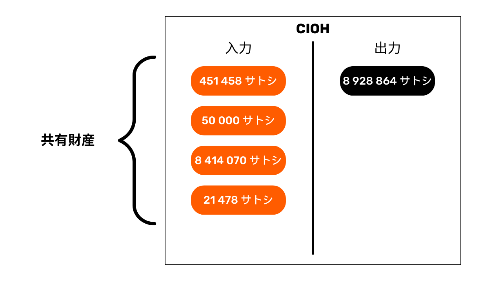

### セクション4: コインジョイン取引の理解

Bitcoin上のプライバシーについて話すことができるでしょうか、コインジョインを議論せずに？セクション4では、このミキシング方法について知る必要があるすべてを発見します。コインジョインとは何か、その歴史と目的、存在するコインジョインの異なるタイプについて学びます。最後に、より経験豊富なユーザーのために、anonsetsとエントロピーが何であるか、およびこれらの指標をどのように計算するかを発見します。

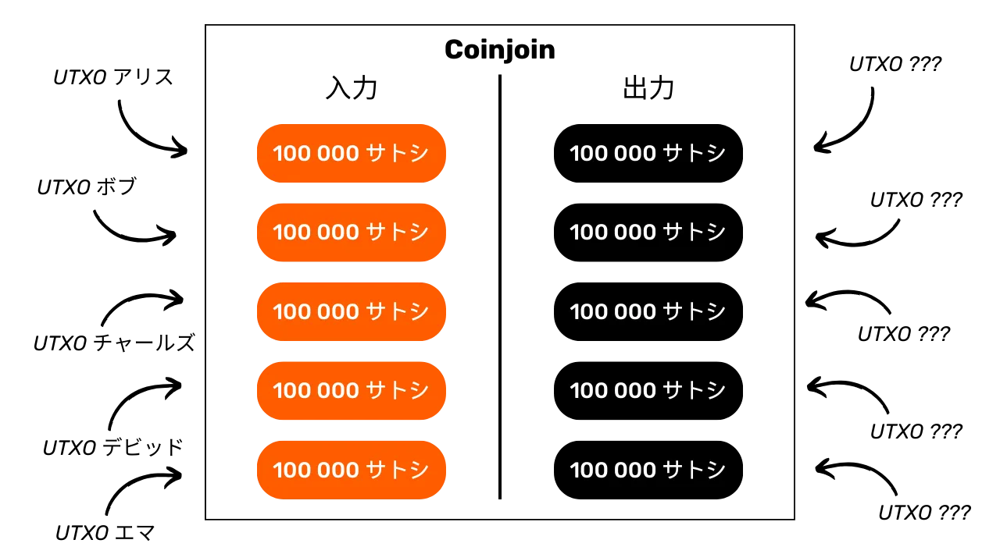

### セクション5: 他の高度なプライバシー技術の問題の理解
第5節では、coinjoin以外にBitcoinでプライバシーを守るための既存の技術全般について概観します。年月を経て、開発者たちはプライバシーに特化したツールを設計する際に顕著な創造性を発揮してきました。payjoin、共同トランザクション、Coin Swap、Atomic Swapなど、これらの方法をすべて検討し、それらの操作方法、目的、および潜在的な弱点について詳細を述べます。

私たちは、ノードネットワークのレベルでのプライバシーとトランザクションの伝播についても取り上げます。また、ユーザーのプライバシーを向上させるために、過去数年間に提案された様々なプロトコル、特に静的アドレスプロトコルについても議論します。


# 定義とキーコンセプト
<partId>b9bbbde3-34c0-4851-83e8-e2ffb029cf31</partId>

## BitcoinのUTXOモデル
<chapterId>8d6b50c5-bf74-44f4-922b-25204991cb75</chapterId>

Bitcoinは主に通貨ですが、プロトコル上でBTCが具体的にどのように表されているかご存知ですか？

### Bitcoin UTXOsとは何か？

Bitcoinプロトコルでは、金銭単位の管理はUTXOモデルを中心に展開されます。これは「_Unspent Transaction Output_」（未使用トランザクション出力）の略です。

このモデルは、金融フローを追跡するためにアカウントと残高メカニズムに依存する従来の銀行システムとは根本的に異なります。実際、銀行システムでは、個々の残高は身元に紐付けられたアカウントで維持されます。例えば、パン屋からバゲットを購入するとき、あなたの銀行は単に購入金額をあなたのアカウントから引き落とし、あなたの残高を減らし、同じ金額でパン屋のアカウントに入金され、彼の残高が増加します。このシステムでは、あなたのアカウントに入るお金と出ていくお金の間のリンクの概念は、トランザクションの記録を除いて存在しません。

Bitcoinでは、事情が異なります。アカウントの概念は存在せず、金銭単位は残高を通じてではなく、UTXOを通じて管理されます。UTXOは、まだ使われていない特定の量のビットコインを表し、大きいものから小さいものまで「ビットコインの一片」として形成されます。例えば、UTXOは`500 BTC`や`700 SATS`の価値があるかもしれません。
**> リマインダー：** サトシは、しばしばsatと略され、フィアット通貨のセントに相当するBitcoinの最小単位です。

```plaintext
1 BTC = 100,000,000 SATS
```

理論的には、UTXOは1satから理論上の最大約2100万BTCまでの任意のビットコインの値を表すことができます。しかし、全ての2100万ビットコインを所有することは論理的に不可能であり、経済的に支出することが不経済とされる「ダスト」と呼ばれる下限の経済的閾値があります。
**ご存知でしたか？** Bitcoin上で作成された最大のUTXOは、`500,000 BTC`の価値がありました。これは2011年11月にMtGoxプラットフォームによって統合操作中に作成されたものです：[29a3efd3ef04f9153d47a990bd7b048a4b2d213daaa5fb8ed670fb85f13bdbcf](https://mempool.space/fr/tx/29a3efd3ef04f9153d47a990bd7b048a4b2d213daaa5fb8ed670fb85f13bdbcf)

### UTXOと支出条件

UTXOはBitcoin上の交換手段です。各トランザクションは、入力としてUTXOを消費し、出力として新しいUTXOを生成します。トランザクションが行われると、入力として使用されたUTXOは「使用済み」とみなされ、新しいUTXOが生成され、トランザクションの出力で示された受取人に割り当てられます。したがって、UTXOは単に未使用のトランザクション出力を表し、その時点でユーザーが所有するビットコインの量を意味します。


すべてのUTXOは、それらを使用できる条件を定義するスクリプトによって保護されています。UTXOを使用するためには、ユーザーはそのUTXOを保護するスクリプトによって規定された条件を満たしていることをネットワークに示さなければなりません。一般的に、UTXOは公開鍵（またはこの公開鍵を表す受信アドレス）によって保護されています。この公開鍵に関連付けられたUTXOを使用するためには、ユーザーは対応する秘密鍵を保持していることを、この鍵で作成されたデジタル署名を提供することによって証明する必要があります。これが、あなたのBitcoinウォレットが実際にはビットコインを含んでいないが、あなたのUTXOへのアクセスを提供し、それによってそれらが表すビットコインへのアクセスを提供する秘密鍵を保存していると言われる理由です。
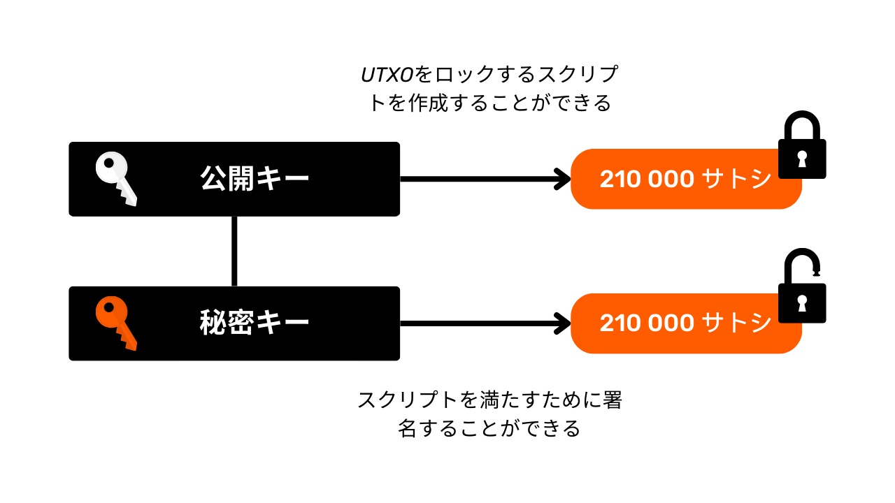

Bitcoinにはアカウントの概念が欠如しているため、ウォレットの残高は単にそれが使用できるすべてのUTXOの値の合計に相当します。例えば、あなたのBitcoinウォレットが以下の4つのUTXOを使用できる場合：

```plaintext
- 2 BTC
- 8 BTC
- 5 BTC
- 2 BTC
```

あなたのウォレットの合計残高は`17 BTC`になります。

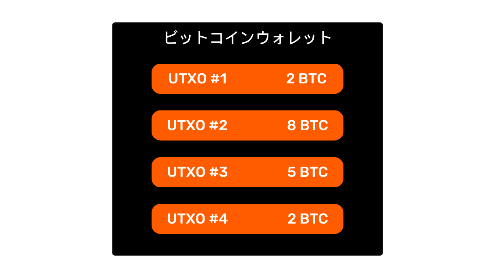

## Bitcoinトランザクションの構造
<chapterId>29d3aaab-de2e-4746-ab40-c9748898850c</chapterId>

### トランザクションの入力と出力

Bitcoinトランザクションは、ブロックチェーン上に記録された操作であり、一人の人から別の人へビットコインの所有権を移転することを可能にします。より具体的には、UTXOモデル上にあり、アカウントがないため、トランザクションは一つ以上のUTXOが満たすべき支出条件を満たし、それらを消費し、新しい支出条件を備えた新しいUTXOを同等に生成します。簡単に言うと、トランザクションはビットコインを満足するスクリプトからそれらを保護するための新しいスクリプトに移動します。

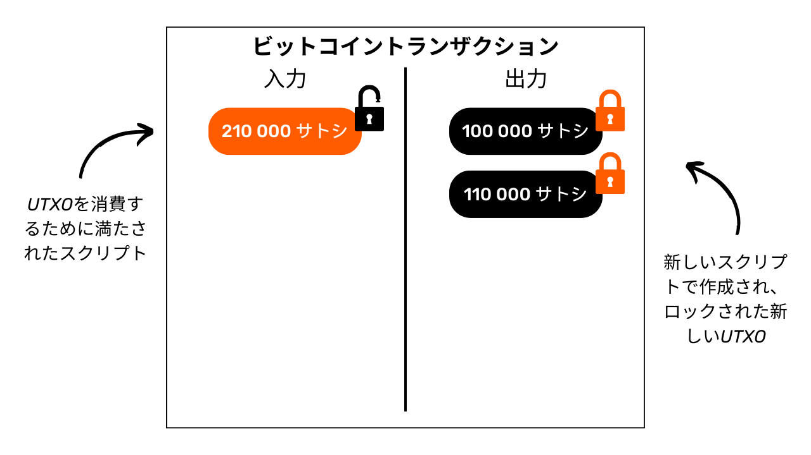

したがって、各Bitcoinトランザクションは、一つ以上の入力と一つ以上の出力で構成されています。入力はトランザクションによって消費され出力を生成するUTXOです。出力は将来のトランザクションの入力として使用可能な新しいUTXOです。

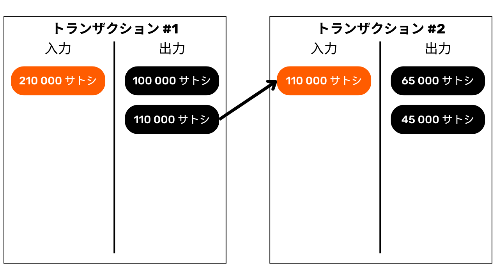
**ご存知でしたか？** 理論上、ビットコインの取引には無限の数の入力と出力が可能です。この数を制限するのはブロックの最大サイズだけです。ビットコイン取引の各入力は、以前の未使用のUTXO（Unspent Transaction Output）を指します。UTXOを入力として使用するには、その保有者がそれに関連するスクリプトを検証することによって、つまり、課された支出条件を満たすことによって、正当な所有者であることを示さなければなりません。一般的に、これには、そのUTXOを最初に保護した公開鍵に対応する秘密鍵で生成されたデジタル署名を提供することが含まれます。したがって、スクリプトは署名が資金を受け取る際に使用された公開鍵と一致することを検証します。


一方、各出力は、転送されるビットコインの量と受取人を指定します。後者は、一般的に、新しく作成されたUTXOを受信アドレスまたは新しい公開鍵でロックする新しいスクリプトによって定義されます。

取引がコンセンサスルールに従って有効と見なされるためには、出力の合計が入力の合計以下でなければなりません。言い換えると、取引によって生成された新しいUTXOの合計は、入力として消費されたUTXOの合計を超えてはなりません。この原則は論理的です：`500,000 SATS`しか持っていない場合、`700,000 SATS`の購入はできません。

### ビットコイン取引におけるお釣りと統合

したがって、ビットコイン取引におけるUTXOへの作用は、金貨を溶かすことに例えることができます。実際、UTXOは分割不可能であり、統合のみが可能です。これは、ユーザーが特定の量のビットコインを表すUTXOを複数の小さなUTXOに単純に分割することはできないことを意味します。彼らはそれを取引で完全に消費し、出力で初期値以下の任意の値の1つ以上の新しいUTXOを作成しなければなりません。

このメカニズムは金貨と同様です。2オンスのコインを所有しており、売り手がお釣りを出せないと仮定して1オンスの支払いをしたい場合、コインを溶かして1オンスずつの2つの新しいコインを鋳造する必要があります。
ビットコインでも操作は似ています。アリスが`10,000 SATS`のUTXOを持っており、`4,000 SATS`のバゲットを購入したいと想像してみましょう。アリスは`10,000 SATS`の1つのUTXOを入力として使用し、それを完全に消費し、出力で`4,000 SATS`と`6,000 SATS`の2つのUTXOを作成します。`4,000 SATS`のUTXOはバゲットの支払いとしてパン屋に送られ、`6,000 SATS`のUTXOはお釣りとしてアリスに戻ります。取引の初期送信者に戻るこのUTXOは、ビットコインの俗語で「お釣り」と呼ばれています。

想像してみてください。Aliceが`10,000 SATS`の単一のUTXOを持っていないとしますが、代わりに`3,000 SATS`ずつのUTXOを2つ持っています。この状況では、個々のUTXOはバゲットのための`4,000 SATS`をカバーするには不十分です。したがって、Aliceは同時に2つの`3,000 SATS`のUTXOをトランザクションの入力として使用しなければなりません。この方法により、入力の合計額は`6,000 SATS`に達し、彼女がパン屋への支払いである`4,000 SATS`をカバーすることを可能にします。この方法は、トランザクションの入力に複数のUTXOをグループ化することを指し、しばしば「統合」という用語で言及されます。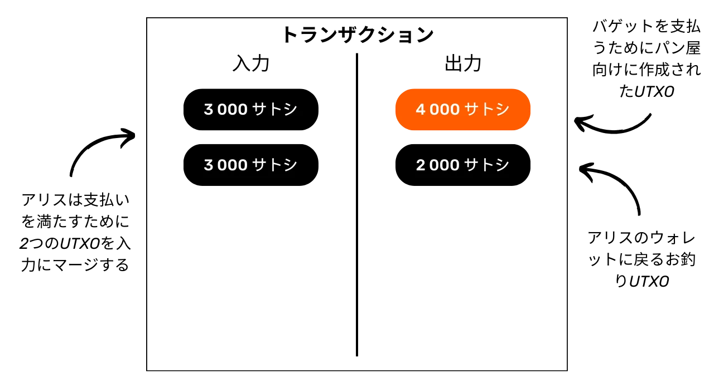

### トランザクション手数料

直感的には、トランザクション手数料もトランザクションのアウトプットを表すと考えるかもしれません。しかし、実際にはそうではありません。トランザクションの手数料は、入力の合計とアウトプットの合計との差を表します。これは、トランザクションで望ましいアウトプットをカバーするために入力の一部の価値を使用した後、一定額の入力が未使用のまま残ることを意味します。この残余額がトランザクション手数料を構成します。

```plaintext
手数料 = 入力の合計 - アウトプットの合計
```

`10,000 SATS`のUTXOを持っていてバゲットを`4,000 SATS`で購入したいAliceの例に戻りましょう。Aliceは、入力として`10,000 SATS`のUTXOを使用してトランザクションを作成します。次に、バゲットの支払いのためにパン屋に向けて`4,000 SATS`のアウトプットを生成します。マイナーが彼女のトランザクションをブロックに含めることを奨励するために、Aliceは手数料として`200 SATS`を割り当てます。彼女はこれにより、彼女に戻る変更、つまり`5,800 SATS`の金額の第二のアウトプットを作成します。


手数料の公式を適用すると、確かにマイナーのために`200 SATS`が残っていることがわかります：
```plaintext
手数料 = 入力の合計 - アウトプットの合計
費用 = 10,000 - (4,000 + 5,800)
費用 = 10,000 - 9,800
費用 = 200
```

マイナーがブロックを正常に検証すると、いわゆる「コインベース」トランザクションを通じて、そのブロックに含まれるすべてのトランザクションの手数料を収集することが許可されます。

### Bitcoin上でのUTXOsの作成

前の段落を注意深くフォローしていれば、UTXOsは他の既存のUTXOsを消費することによってのみ作成できることを今や知っています。したがって、Bitcoin上のコインは連続したチェーンを形成します。しかし、このチェーンの最初のUTXOsがどのように現れたのか疑問に思うかもしれません。これは鶏と卵の問題に似た問題を提起します：これらのオリジナルのUTXOsはどこから来たのでしょうか？

答えは**コインベーストランザクション**にあります。

コインベースはBitcoinトランザクションの特定のタイプで、各ブロックに固有であり、常にそれらの最初のものです。有効なプルーフオブワークを見つけたマイナーがブロック報酬を受け取ることを可能にします。この報酬は二つの要素から構成されます：**ブロック補助金**と**前述したトランザクション手数料**です。

コインベーストランザクションのユニークな特徴は、入力を消費することなく薄空からビットコインを作り出すことができる唯一のトランザクションであることです。これら新しく作成されたビットコインは、「オリジナルのUTXOs」と呼ばれるものを構成します。
ブロック補助金からのビットコインは、コンセンサスルールにおける事前に確立された発行スケジュールに従って、無から新たに作成されたBTCです。ブロック補助金は、約4年ごとに210,000ブロックごとに半減するプロセスである「ハービング」と呼ばれるプロセスを経ています。初めに、各補助金で50ビットコインが作成されましたが、この量は徐々に減少しており、現在はブロックあたり3.125ビットコインです。

トランザクション手数料に関連する部分については、新たに作成されたBTCを表しているものの、ブロック内のすべてのトランザクションの総入力と出力の差を超えてはなりません。以前に見たように、これらの手数料はトランザクションの出力で使用されない入力の部分を表しています。この部分は技術的にトランザクション中に「失われる」とされ、マイナーは一つまたは複数の新しいUTXOの形でこの価値を再生する権利を持っています。したがって、これはトランザクション送信者からマイナーへの価値の移転であり、マイナーはそれをブロックチェーンに追加します。

**> ご存知でしたか？** コインベーストランザクションによって生成されたビットコインは、マイナーがそれを使うことができない100ブロックの成熟期間の対象となります。このルールは、後に無効となる可能性のあるチェーン上で新たに作成されたビットコインを使用することに関連する複雑さを避けるためのものです。
### UTXOモデルの意味
まず、UTXOモデルはビットコインのトランザクション手数料に直接影響を与えます。各ブロックの容量が限られているため、マイナーはブロック内で占めるスペースに対して最も良い手数料を提供するトランザクションを優先します。実際、トランザクションが入力と出力として多くのUTXOを含むほど、それは重くなり、したがって、より高い手数料が必要になります。これは、ウォレット内のUTXOの数を減らす努力がしばしばなされる理由の一つであり、これはプライバシーにも影響を与えることがあります。このトピックについては、このトレーニングの第3部で詳しく掘り下げます。

次に、前の部分で述べたように、ビットコイン上のコインは本質的にUTXOの連鎖です。各トランザクションは、過去のUTXOと未来のUTXOの間のリンクを作成します。したがって、UTXOはビットコインの作成から現在の支出までの経路を明示的に追跡することを可能にします。この透明性は、受け取ったビットコインの真正性を各ユーザーが確認できるようにするため、肯定的に見ることができます。しかし、この追跡可能性と監査可能性の原則に基づいて、あなたのプライバシーを侵害することを目的としたチェーン分析が行われています。この実践については、トレーニングの第2部で詳しく学びます。

## ビットコインのプライバシーモデル
<chapterId>769d8963-3ed5-4094-b21d-9203c7d9e465</chapterId>

### 通貨：真正性、完全性、二重支払い

通貨の機能の一つは、欲求の二重一致の問題を解決することです。物々交換に基づくシステムでは、交換を行うためには、私のニーズに合った商品を提供している個人を見つけるだけでなく、彼らのニーズを満たす同等の価値の商品を提供する必要があります。このバランスを見つけることは複雑です。

そのため、空間と時間の両方で価値を移転することができる通貨に頼ります。

通貨がこの問題を解決するためには、商品やサービスを提供する当事者が、後でその金額を使うことができると確信することが不可欠です。したがって、デジタルであれ物理的であれ、通貨の一片を受け入れることを望むどんな合理的な個人も、それが二つの基本的な基準を満たしていることを確認します：
- **コインは完全な状態であり、本物でなければなりません。**- **二重支払いがあってはなりません。**
物理通貨を使用する場合、最初の特性は確認が最も複雑です。歴史のさまざまな時期を通じて、金属製のコインの完全性は、切り取りや穿孔などの慣行によってしばしば損なわれてきました。例えば、古代ローマでは、市民が将来の取引のためにそれらを保持しながら、貴重な金属の少しを集めるために金貨の端を削ることが一般的でした。このため、コインの本質的な価値は減少しましたが、額面の価値は同じままでした。これは特に、後にコインの端にリッジが打たれた理由です。

本物であることも、物理的な通貨媒体で確認が難しい特性です。現在では、偽造と戦う技術がますます複雑になり、商人は高価な検証システムに投資を強いられています。

一方、その性質上、物理通貨において二重支払いは問題ではありません。もし私があなたに€10の紙幣を渡したら、それは私の所有からあなたの所有へと不可逆的に移り、同じ通貨単位を複数回使う可能性を自然に排除します。要するに、私はその€10の紙幣を再び使うことができません。


デジタル通貨においては、困難は異なります。コインの本物であり完全な状態であることを確保することはしばしば簡単です。前のセクションで見たように、ビットコインのUTXOモデルは、コインをその起源まで遡り、それが実際にマイナーによってコンセンサスルールに従って作成されたことを確認することを可能にします。

しかし、二重支払いの不在を確保することはより複雑です。なぜなら、デジタル商品は本質的に情報であり、物理的な商品と異なり、情報は交換中に分割されるのではなく、複製によって伝播します。例えば、もし私があなたにメールで文書を送ると、それは複製されます。あなたの側では、私が元の文書を削除したかどうかを確実に検証することはできません。


### ビットコインでの二重支払いの防止
デジタル商品の複製を避ける唯一の方法は、システム内のすべての交換を把握することです。この方法で、誰が何を所有しているかを知り、行われた取引に基づいて全員の保有を更新することができます。これは、例えば銀行システムの帳簿記入金で行われていることです。クレジットカードで商人に€10を支払うと、銀行はこの交換を記録し、元帳を更新します。
ビットコインでは、二重支払いの防止は同じ方法で達成されます。目的は、問題のコインを既に使用した取引の不在を確認することです。これらのコインが一度も使用されていなければ、二重支払いが発生しないことを確信できます。この原則は、サトシ・ナカモトがホワイトペーパーでこの有名なフレーズで説明しました：

**"*取引の不在を確認する唯一の方法は、すべての取引を把握することです。*"**

しかし、銀行モデルとは異なり、ビットコインでは中央のエンティティを信頼する必要がないという願望があります。すべてのユーザーが第三者に依存せずにこの二重支払いの不在を確認できる必要があります。したがって、すべての人がすべてのビットコイン取引を把握する必要があります。これが、ビットコイン取引がすべてのネットワークノードに公開され、ブロックチェーン上で明確に記録される理由です。

ビットコイン上での情報のこの公開的な普及は、ビットコイン上でのプライバシーの保護を複雑にする正確な理由です。伝統的な銀行システムでは、理論的には、取引を行った金融機関のみが取引を知っています。一方、ビットコインでは、すべてのユーザーがそれぞれのノードを通じてすべての取引を知ることになります。

### プライバシーモデル：銀行システム vs ビットコイン
伝統的なシステムでは、銀行口座はあなたの身元にリンクされています。銀行員はどの銀行口座がどのクライアントに属しているか、そしてそれに関連する取引が何かを知ることができます。しかし、この情報の流れは銀行と公共領域の間で遮断されます。言い換えれば、他の個人に属する銀行口座の残高や取引を知ることは不可能です。この情報にアクセスできるのは銀行だけです。

例えば、あなたの銀行員はあなたが毎朝近所のパン屋でバゲットを買っていることを知っていますが、あなたの隣人はこの取引を知りません。したがって、情報の流れは関係者、特に銀行にはアクセス可能ですが、外部の人にはアクセス不可能のままです。

前の部分で見たように、取引の公開拡散の制約があるため、ビットコインのプライバシーモデルは銀行システムのモデルに従うことができません。ビットコインの場合、取引と公共領域の間の情報の流れを遮断することができないため、**プライバシーモデルはユーザーの身元と取引自体との間の分離に依存します。**
例えば、BTCで支払いをしてパン屋からバゲットを買った場合、自分のフルノードを所有している隣人は、システム内の他のすべての取引と同様に、あなたの取引が行われるのを見ることができます。しかし、プライバシー原則が尊重されていれば、この特定の取引をあなたの身元にリンクすることはできません。


しかし、ビットコイン取引が公開されているため、それらの間のリンクを確立して関係する当事者に関する情報を推測することはまだ可能です。この活動は「チェーン分析」と呼ばれる自体の専門分野を構成しています。次のトレーニングの部分では、ビットコインがどのように追跡され、それに対してどのようにより良く防御するかを理解するために、チェーン分析の基礎を探求することをお勧めします。

# チェーン分析と自己防衛の方法を理解する
<partId>4739371e-9fef-45b0-bcaa-b7a4df6b4470</partId>

## ビットコインにおけるチェーン分析とは何か？
<chapterId>7d198ba6-4af2-4f24-86cb-3c79cb25627e</chapterId>

### 定義と操作

チェーン分析は、ブロックチェーン上のビットコインの流れを追跡するために使用されるすべての方法を包含する実践です。一般的に、チェーン分析は以前の取引のサンプルで特徴を観察することに依存しています。それから、分析したい取引でこれらの同じ特徴を特定し、妥当な解釈を推測することに関与します。実用的なアプローチからのこの問題解決方法、十分に良い解決策を見つけることは「ヒューリスティック」と呼ばれます。

簡単に言うと、チェーン分析は主に3つのステップで行われます：
1. **ブロックチェーンの観察；**
2. **既知の特徴の特定；**
3. **仮説の推測。**

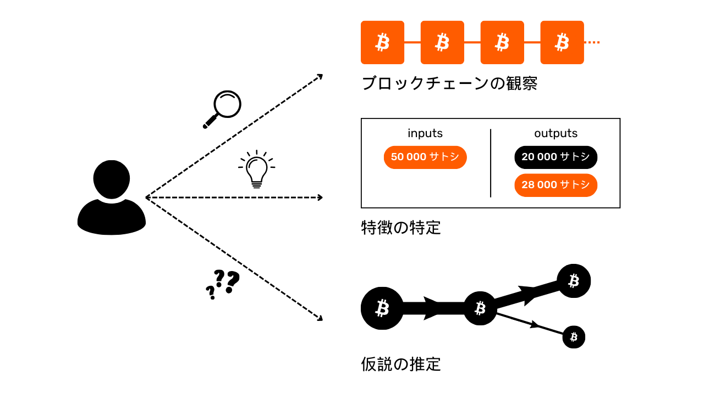

チェーン分析は誰でも実行できます。フルノードを通じてブロックチェーンの公開情報にアクセスし、取引の動きを観察し、仮説を立てるためには十分です。この分析を容易にする無料ツールもあります。最後の2章で詳しく探る[OXT.me](https://oxt.me/)のウェブサイトなどです。しかし、プライバシーに対する主なリスクは、チェーン分析を専門とする企業から来ます。これらの企業はチェーン分析を産業規模で行い、そのサービスを金融機関や政府に販売しています。これらの企業の中で、Chainalysisはおそらく最もよく知られています。

### チェーン分析の目的
ビットコイン上の様々な活動をグループ化して、それらを行ったユーザーの特異性を判断することが、チェーン分析の目的の一つです。その後、この活動の束を実際のアイデンティティにリンクしようと試みることが可能になります。


前の章を思い出してください。私はビットコインのプライバシーモデルが元々、ユーザーのアイデンティティをその取引から分離することに依存していた理由を説明しました。したがって、オンチェーン活動をグループ化しても、それらを実際のアイデンティティに関連付けることはできないので、チェーン分析は不要だと考えるのは誘惑的です。

理論的には、この声明は正確です。このトレーニングの最初の部分で、UTXOに条件を設定するために暗号鍵ペアが使用されることを見ました。本質的に、これらの鍵ペアは所有者のアイデンティティに関する情報を開示しません。したがって、異なる鍵ペアに関連付けられた活動をグループ化することに成功しても、これらの活動の背後にいるエンティティについては何も教えてくれません。


しかし、実際の現実ははるかに複雑です。オンチェーン活動に実際のアイデンティティをリンクするリスクを伴う多くの行動があります。分析では、これをエントリーポイントと呼び、多くのものがあります。

もちろん、最も一般的なのはKYC（*Know Your Customer*）です。規制されたプラットフォームからビットコインを個人の受信アドレスに引き出すと、ある人々はあなたのアイデンティティをこのアドレスにリンクできます。より広く言えば、エントリーポイントはあなたの実生活とビットコイン取引の間の任意の形式の相互作用である可能性があります。例えば、ソーシャルネットワークに受信アドレスを公開した場合、これは分析のためのエントリーポイントになる可能性があります。ビットコインでパン屋に支払いをすると、彼らはビットコインアドレスとあなたの顔（あなたのアイデンティティの一部）を関連付けることができます。

これらのエントリーポイントはビットコインの使用においてほぼ避けられないものです。その範囲を限定しようと試みることができますが、それらは存在し続けます。だからこそ、プライバシーを保護することを目的とした方法を組み合わせることが重要です。あなたの実際のアイデンティティとあなたの取引との間に分離を維持することは興味深いアプローチですが、今日では不十分です。実際、あなたのオンチェーン活動がすべてグループ化される場合、最小のエントリーポイントでさえ、あなたが確立した唯一のプライバシーの層を危険にさらす可能性があります。

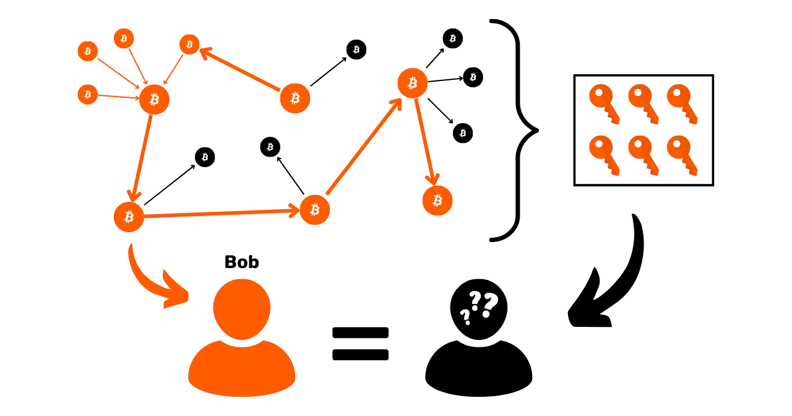

### チェーン分析に対する防御
したがって、ビットコインの使用においてブロックチェーン分析に直面することも必要です。この方法で進めることにより、私たちは活動の集約を最小限に抑え、エントリーポイントが私たちのプライバシーに与える影響を限定することができます。


実際、ブロックチェーン分析に対抗するためのより良いアプローチは、ブロックチェーン分析で使用される方法に自分自身を慣れさせることです。ビットコイン上でプライバシーを向上させる方法を知りたい場合、これらの方法を理解する必要があります。これにより、[coinjoin](https://planb.network/fr/tutorials/privacy/coinjoin-samourai-wallet)や[payjoin](https://planb.network/fr/tutorials/privacy/payjoin)（トレーニングの最後の部分で学習する技術）などの技術をよりよく把握し、あなたが犯すかもしれないミスを減らすことができます。
このセクションでは、暗号学と暗号解析との類似性について考えてみます。優れた暗号学者は、まず何よりも優れた暗号解析者である必要があります。新しい暗号アルゴリズムを考案するためには、それが直面するであろう攻撃を知り、また以前のアルゴリズムがなぜ破られたのかを研究する必要があります。同じ原則がBitcoinのプライバシーにも適用されます。ブロックチェーン分析の方法を理解することが、それに対抗する鍵となります。そのため、このトレーニングではブロックチェーン分析に関する全セクションを提案します。

### ブロックチェーン分析の方法

ブロックチェーン分析が正確な科学ではないことを理解することが重要です。これは、以前の観察や論理的解釈から導き出された経験則に依存しています。これらのルールにより、かなり信頼性の高い結果が得られますが、絶対的な精度は決してありません。言い換えれば、**ブロックチェーン分析は常に結論において確率の次元を含んでいます**。例えば、2つのアドレスが同一のエンティティに属していると、より多かれ少なかれ確実に推定されるかもしれませんが、完全な確実性を得ることは常に不可能です。

ブロックチェーン分析の全体的な目的は、誤りのリスクを最小限に抑えるために様々な経験則を集約することに正確にあります。これは、現実により近づくことを可能にする証拠の蓄積のようなものです。

これらの有名な経験則は、私たちが一緒に詳しく説明するさまざまなカテゴリーに分類することができます：
- **トランザクションパターン（またはトランザクションモデル）;**
- **トランザクション内の経験則;**
- **トランザクション外の経験則。**

### サトシ・ナカモトとブロックチェーン分析
チェーン分析のための最初の2つの経験則がサトシ・ナカモト自身によって発見されたことに注意すべきです。彼はBitcoinホワイトペーパーの第10部でこれらについて議論しています。これらは以下の通りです：
- 共通入力所有権ヒューリスティック（CIOH）;
- そしてアドレスの再利用。


出典: S. Nakamoto, "Bitcoin: A Peer-to-Peer Electronic Cash System", https://bitcoin.org/bitcoin.pdf, 2009.

次の章では、これらが何であるかを探求しますが、これら2つの経験則が今日でもチェーン分析において優位性を保っていることは既に興味深いことに注意してください。

## トランザクションパターン
<chapterId>d365a101-2d37-46a5-bfb9-3c51e37bf96b</chapterId>

トランザクションパターンとは、ブロックチェーン上で見つけることができる典型的なトランザクションのモデルまたは全体的な構造であり、その解釈がおそらく知られています。パターンを研究する際、私たちは単一のトランザクションに焦点を当て、高いレベルで分析します。

言い換えれば、入力のUTXOの数と出力のUTXOの数だけを見て、トランザクションのより具体的な詳細や環境には立ち入りません。観察されたモデルから、トランザクションの性質を解釈することができます。その後、その構造の特徴を探し、解釈を導き出します。


この部分では、チェーン分析で遭遇することができる主要なトランザクションモデルを一緒に発見し、各モデルについて、この構造の可能性のある解釈と具体的な例をお伝えします。

### シンプル送金（またはシンプル支払い）

最も広く普及しているパターンから始めます。これは、ほとんどのビットコイン支払いに現れるものです。シンプル支払いモデルは、入力で1つ以上のUTXOを消費し、出力で2つのUTXOを生成することによって特徴づけられます。このモデルは、次のようになります：


ブロックチェーン上でこのトランザクション構造を見つけたとき、私たちはすでに解釈を描くことができます。その名前が示すように、このモデルは送金または支払いトランザクションの存在を示しています。ユーザーは、支払いUTXOと変更UTXO（同じユーザーに返されるお金）をアウトプットで満たすために、自分のUTXOをインプットで消費しました。
したがって、観察されたユーザーは、アウトプットの2つのUTXOのうちの1つ（支払いされたもの）をもはや所有していない可能性が高いですが、もう1つのUTXO（変更されたもの）はまだ所有しています。
現時点では、どのアウトプットがどのUTXOを表しているかを特定することはできません。これは、パターンの研究の目的ではありません。私たちは、後続の部分で研究するヒューリスティックに依存してこれを達成します。この段階での私たちの目標は、問題のトランザクションの性質を特定することに限定されています。この場合、それは単純な送信です。

例えば、ここに単純な送信パターンを採用したBitcoinトランザクションがあります：

```plaintext
b6cc79f45fd2d7669ff94db5cb14c45f1f879ea0ba4c6e3d16ad53a18c34b769
```

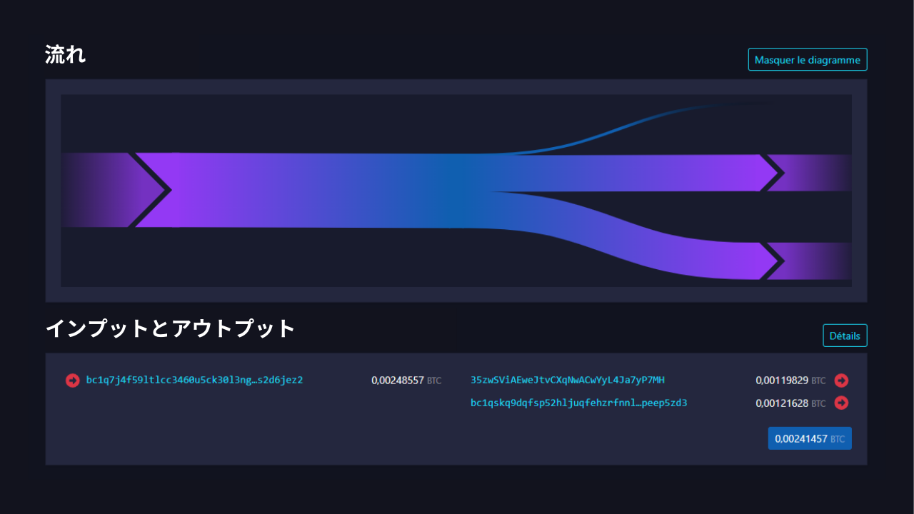

ソース: [Mempool.space](https://mempool.space/fr/tx/b6cc79f45fd2d7669ff94db5cb14c45f1f879ea0ba4c6e3d16ad53a18c34b769)

この最初の例の後、"トランザクションモデル"を研究することの意味をよりよく理解するはずです。私たちは、その環境やトランザクションの具体的な詳細を考慮せずに、その構造のみに焦点を当ててトランザクションを調査します。この最初のステップでは、それをグローバルな方法でのみ観察します。

パターンが何であるかを理解した今、他の既存のモデルに移りましょう。

### Sweeping

この第二のモデルは、入力として単一のUTXOの消費と、出力として単一のUTXOの生成が特徴です。


このモデルの解釈は、自己転送の存在にあるということです。ユーザーは自分のビットコインを自分自身に、自分が所有する別のアドレスに転送しました。トランザクションに変更がないため、支払いの存在は非常にありそうにないです。実際、支払いが行われるとき、支払人が売り手によって要求される金額とトランザクション手数料に正確に一致するUTXOを持っていることはほぼ不可能です。一般的に、支払人は変更アウトプットを生成する必要があります。

その後、観察されたユーザーはこのUTXOをまだ所有している可能性が高いことを知っています。チェーン分析の文脈では、トランザクションで入力として使用されたUTXOがアリスに属していることを知っている場合、出力のUTXOも彼女に属していると仮定できます。後で興味深くなるのは、この仮定を強化することができるトランザクション内の内部ヒューリスティックを見つけることです（これらのヒューリスティックは第3.3章で研究します）。

例えば、ここにスイーピングパターンを採用したBitcoinトランザクションがあります：

```plaintext
35f1072a0fda5ae106efb4fda871ab40e1f8023c6c47f396441ad4b995ea693d
```


ソース：[Mempool.space](https://mempool.space/fr/tx/35f1072a0fda5ae106efb4fda871ab40e1f8023c6c47f396441ad4b995ea693d) しかし、このタイプのパターンは、暗号通貨取引所プラットフォームのアカウントへの自己転送も示すことがあります。既知のアドレスとトランザクションの文脈の研究によって、それが自己保管ウォレットへのスイープか、プラットフォームへの引き出しかを知ることができます。実際、取引所プラットフォームのアドレスはしばしば容易に識別可能です。

アリスの例に戻りましょう：スイープがプラットフォームの既知のアドレス（例えばBinanceなど）につながる場合、これはビットコインがアリスの直接の所有から転送され、おそらくそれらを売却するか、このプラットフォームに保存する意図であることを意味するかもしれません。一方、宛先アドレスが不明である場合、それは単にアリスがまだ所有している別のウォレットであると推定するのが妥当です。しかし、このタイプの研究は、パターンの研究ではなく、ヒューリスティックスのカテゴリーにより該当します。

### 統合

このモデルは、複数のUTXOを入力として消費し、単一のUTXOを出力として生成することが特徴です。


このモデルの解釈は、統合の存在であることを示しています。これはビットコインユーザーの間で一般的な習慣であり、取引手数料の可能性のある増加に備えて複数のUTXOを統合することを目的としています。手数料が低い期間にこの操作を実行することで、将来の手数料を節約することが可能です。この習慣については、4.3章で詳しく説明します。

このトランザクションモデルの背後にいるユーザーは、入力のすべてのUTXOを所有しており、出力のUTXOも引き続き所有していると推測できます。これは確かに自己転送です。

スイープと同様に、このタイプのパターンも、取引所プラットフォームのアカウントへの自己転送を示すことがあります。既知のアドレスとトランザクションの文脈の研究によって、それが自己保管ウォレットへの統合か、プラットフォームへの引き出しかを知ることができます。

例えば、こちらが統合パターンを採用したビットコイントランザクションです：

```plaintext
77c16914211e237a9bd51a7ce0b1a7368631caed515fe51b081d220590589e94
```


ソース：[Mempool.space](https://mempool.space/fr/tx/77c16914211e237a9bd51a7ce0b1a7368631caed515fe51b081d220590589e94)
チェーン分析の文脈では、このモデルは多くの情報を明らかにすることができます。例えば、入力の1つがアリスに属していることがわかっている場合、このトランザクションの他のすべての入力と出力も彼女に属していると推定できます。この仮定により、以前のトランザクションチェーンを遡って、アリスに関連する可能性のある他のトランザクションを発見し分析することができます。


### グループ化された支出

このモデルは、少数のUTXO（多くの場合は1つのみ）を入力として消費し、多数のUTXOを出力として生成することが特徴です。


このモデルの解釈は、私たちがグループ化された支出の存在下にあることを示しています。これは、例えば交換プラットフォームのような、顕著な経済活動を示す可能性がある実践です。グループ化された支出は、これらのエンティティが支出を単一のトランザクションに統合することで、手数料を節約することを可能にします。

このモデルから、UTXOの入力が顕著な経済活動を持つ企業から来ていること、そしてUTXOの出力が分散されることを推測できます。多くは、プラットフォームからビットコインを引き出した企業のクライアントに属するでしょう。他の出力はパートナー企業に向かうかもしれません。最終的には、発行企業に戻る交換が一つ以上確実にあります。

例えば、こちらがグループ化された支出のパターンを採用したビットコイントランザクションです（おそらく、Bybitプラットフォームによって発行されたトランザクションです）：

```plaintext
8a7288758b6e5d550897beedd13c70bcbaba8709af01a7dbcc1f574b89176b43
```

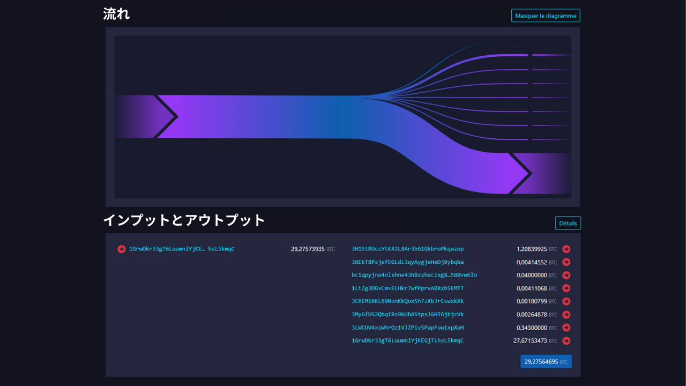

ソース: [Mempool.space](https://mempool.space/fr/tx/8a7288758b6e5d550897beedd13c70bcbaba8709af01a7dbcc1f574b89176b43)

### プロトコル固有のトランザクション

トランザクションのパターンの中には、特定のプロトコルの使用を明らかにするモデルも識別できます。例えば、Whirlpool coinjoins（これについては第5部で議論します）は、他のより伝統的なトランザクションと区別できる容易に識別可能な構造を持っています。


このパターンの分析は、私たちが協力的なトランザクションの存在下にある可能性が高いことを示唆しています。また、coinjoinを観察することも可能です。この後者の仮説が正確である場合、出力の数からcoinjoinに参加する人数のおおよその推定を得ることができます。

例えば、こちらが協力的なトランザクションタイプのcoinjoinのパターンを採用したビットコイントランザクションです：

```plaintext
00601af905bede31086d9b1b79ee8399bd60c97e9c5bba197bdebeee028b9bea
```
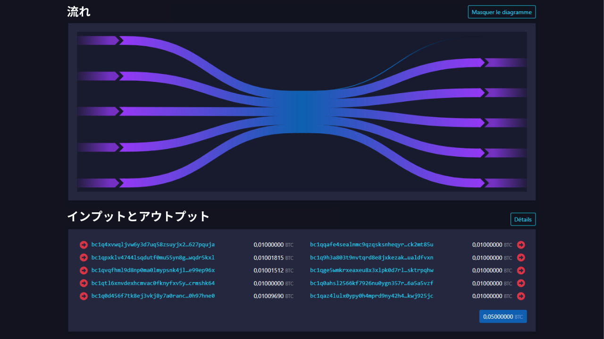

ソース: [Mempool.space](https://mempool.space/fr/tx/00601af905bede31086d9b1b79ee8399bd60c97e9c5bba197bdebeee028b9bea)

Wabisabiタイプ、Stampsトランザクション、あるいはRunesなど、独自の特定の構造を持つ他の多くのプロトコルがあります。

これらのトランザクションパターンのおかげで、与えられたトランザクションについて多くの情報を既に解釈することができます。しかし、トランザクションの構造は分析のための情報源の唯一のものではありません。私たちはその詳細も研究することができます。これらの詳細、トランザクション内部のものは、「内部ヒューリスティック」と呼んでいるもので、次の章で研究します。

## 内部ヒューリスティック
<chapterId>c54b5abe-872f-40f4-a0d0-c59faff228ba</chapterId>

内部ヒューリスティックは、その環境を調べることなく、トランザクション自体内に特定された特定の特徴であり、私たちが推測を行うことを可能にします。全体的なトランザクションの構造に焦点を当てるパターンとは異なり、内部ヒューリスティックは抽出可能なデータのセットに基づいています。これには：
- 異なるUTXOの入出金額
- スクリプトに関するすべて：受信アドレス、バージョニング、ロックタイム…

一般的に、このタイプのヒューリスティックにより、特定のトランザクションにおける変更を特定することができます。これにより、複数の異なるトランザクションを通じてエンティティを追跡し続けることができます。実際、追跡したいユーザーに属するUTXOを特定した場合、トランザクションを行う際にどのアウトプットが他のユーザーに転送され、どのアウトプットが変更を表し、そのユーザーの所持に残るかを決定することが重要です。


再度、これらのヒューリスティックが完全に正確であるわけではないことを思い出してください。個別に取られた場合、それらは可能性のあるシナリオを特定することしかできません。複数のヒューリスティックの蓄積が不確実性を減少させるのに役立ちますが、完全に排除することは決してありません。

### 内部の類似性

このヒューリスティックは、同一トランザクションの入力と出力の間の類似性の研究を含みます。入力とトランザクションの出力のうちの1つだけに同じ特徴が観察される場合、その出力が変更を構成する可能性が高いです。

最も明白な特徴は、同一トランザクションでの受信アドレスの再利用です。

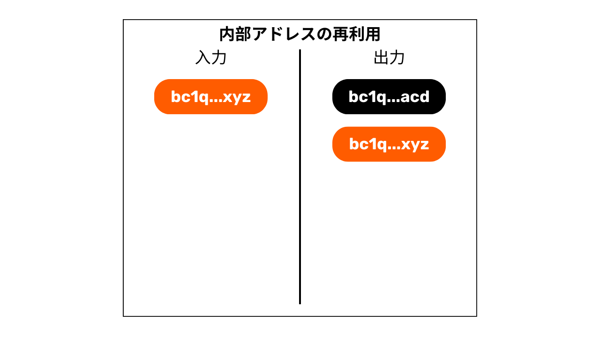
このヒューリスティックは疑問の余地がほとんどありません。個人のプライベートキーがハッキングされていない限り、同じ受信アドレスは必然的に単一ユーザーの活動を明らかにします。その後の解釈は、トランザクションからの変更が入力と同じアドレスを持つ出力であるということです。これにより、この変更に基づいて個人の追跡を続けることができます。
例えば、ここにこのヒューリスティックが合理的に適用されるトランザクションがあります：

```plaintext
54364146665bfc453a55eae4bfb8fdf7c721d02cb96aadc480c8b16bdeb8d6d0
```


ソース: [Mempool.space](https://mempool.space/tx/54364146665bfc453a55eae4bfb8fdf7c721d02cb96aadc480c8b16bdeb8d6d0)

入力と出力の間の類似性は、アドレスの再利用にとどまりません。スクリプトの使用における任意の類似性もヒューリスティックの適用を可能にすることがあります。例えば、時々、トランザクションの入力と出力の1つの間で同じバージョニングが観察されることがあります。

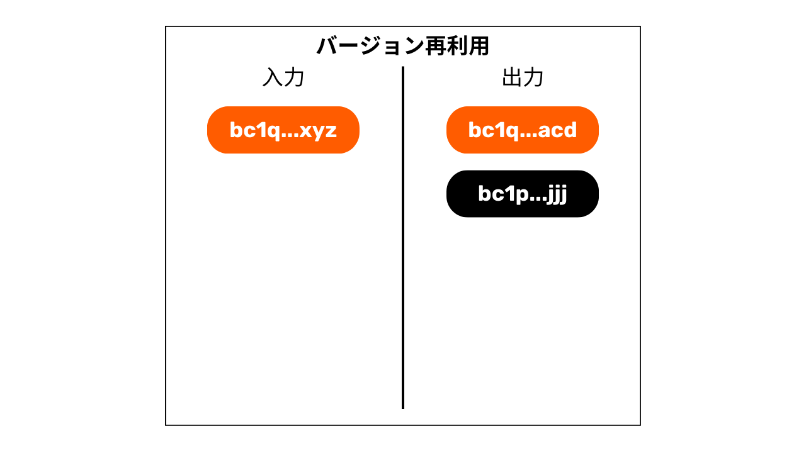

この図では、入力No. 0がP2WPKHスクリプト（`bc1q`で始まるSegWit V0）を解除しているのが見えます。出力No. 0は同じタイプのスクリプトを使用しています。しかし、出力No. 1はP2TRスクリプト（`bc1p`で始まるSegWit V1）を使用しています。この特徴の解釈は、入力と同じバージョニングを持つアドレスが変更アドレスである可能性が高いということです。したがって、それはまだ同じユーザーに属しているでしょう。

ここにこのヒューリスティックが合理的に適用されるトランザクションがあります：

```plaintext
db07516288771ce5d0a06b275962ec4af1b74500739f168e5800cbcb0e9dd578
```


ソース: [Mempool.space](https://mempool.space/tx/db07516288771ce5d0a06b275962ec4af1b74500739f168e5800cbcb0e9dd578)
このケースでは、入力番号0と出力番号1がP2WPKHスクリプト（SegWit V0）を使用しているのに対し、出力番号0は異なるタイプのスクリプト、P2PKH（レガシー）を使用していることがわかります。2010年代の初めには、スクリプトのバージョニングに基づくこのヒューリスティックは、利用可能なスクリプトの種類の制限のため、あまり役に立ちませんでした。しかし、時間が経つにつれて、ビットコインへの連続するアップデートにより、スクリプトの種類の多様性が導入されました。このヒューリスティックは、より幅広いスクリプトの種類を持つことで、ユーザーがより小さなグループに分かれ、この内部バージョニングの再利用のヒューリスティックを適用する可能性が高まるため、ますます関連性が高まっています。この理由から、プライバシーの観点からのみ、最も一般的なスクリプトタイプを選択することが望ましいです。例えば、これを書いている時点で、Taprootスクリプト（`bc1p`）はSegWit V0スクリプト（`bc1q`）よりも頻繁に使用されていません。前者は特定の文脈で経済的およびプライバシーの利点を提供しますが、より伝統的な単一署名の使用においては、新しい標準がより広く採用されるまで、プライバシー上の理由から古い標準に固執することが賢明かもしれません。

### 丸い数字の支払い

変更を特定するのに役立つもう一つの内部ヒューリスティックは、丸い数字です。一般的に、単純な支払いパターン（1つの入力と2つの出力）に直面した場合、出力の1つが丸い金額を使っているなら、それが支払いを表しています。

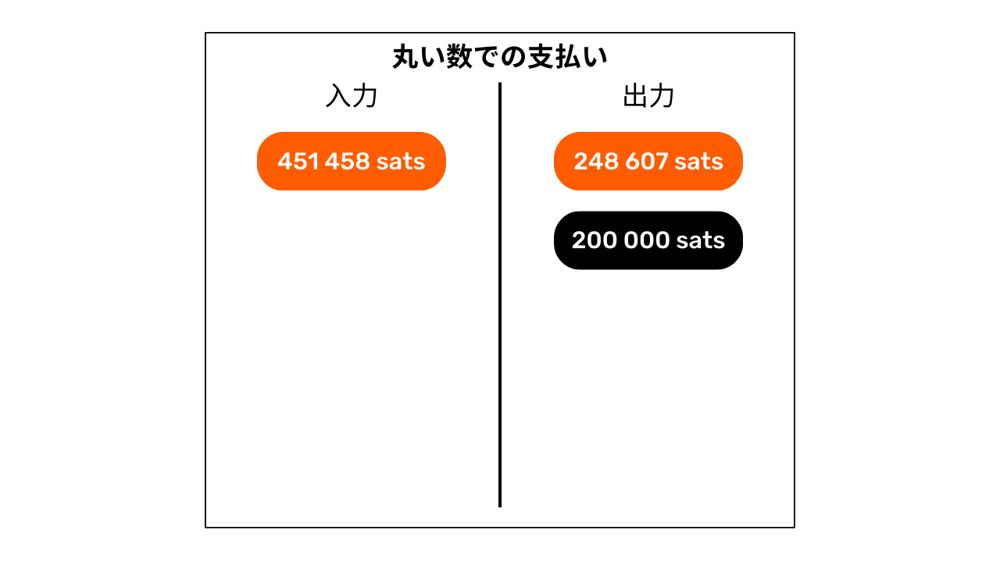

排除法により、1つの出力が支払いを表している場合、もう1つの出力はお釣りを表しています。したがって、トランザクションを入力するユーザーは、お釣りとして特定された出力をまだ所有している可能性が高いと推測できます。

このヒューリスティックが常に適用可能なわけではないことに注意する必要があります。なぜなら、支払いの大多数はまだ法定通貨単位で行われているからです。実際、フランスの商人がビットコインを受け入れる場合、一般的にはsatsで安定した価格を表示しません。彼らはむしろ、ユーロでの価格と支払うべきビットコインの量との間で変換を選びます。したがって、トランザクション出力に丸い数字があるべきではありません。

それでも、アナリストはトランザクションがネットワーク上で放送された時の為替レートを考慮に入れてこの変換を試みることができます。例えば、`97,552 sats`の入力と、`31,085 sats`と`64,152 sats`の2つの出力を持つトランザクションを見てみましょう。一見、このトランザクションは丸い金額を含んでいるようには見えません。しかし、トランザクションの時点での€64,339の為替レートを適用すると、次のようなユーロでの変換が得られます：
- €62.76の入力；
- €20の出力；
- €41.27の出力。
法定通貨に変換されたこのトランザクションは、丸い金額の支払いのヒューリスティックを適用することを可能にします。€20の出力はおそらく商人に向けられたもので、少なくとも所有権が変わりました。推測により、€41.27の出力は元のユーザーの所有に留まっている可能性が高いです。
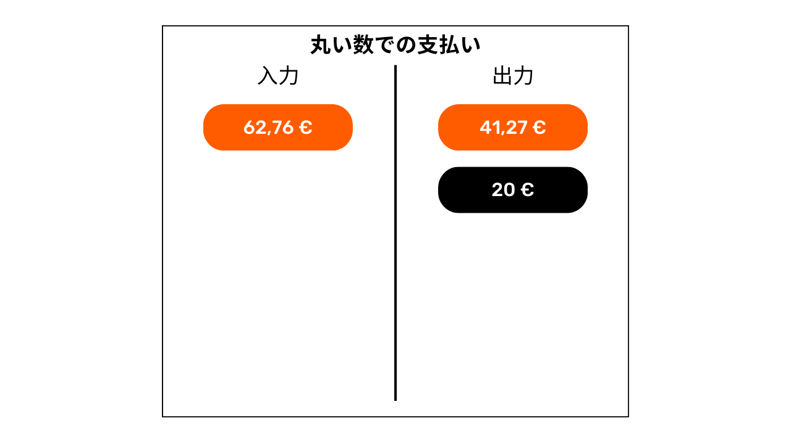

いつの日か、ビットコインが私たちの取引で好まれる勘定単位になった場合、このヒューリスティックは分析にさらに役立つかもしれません。

例えば、ここにこのヒューリスティックが適用されそうなトランザクションがあります：

```plaintext
2bcb42fab7fba17ac1b176060e7d7d7730a7b807d470815f5034d52e96d2828a
```


ソース: [Mempool.space](https://mempool.space/tx/2bcb42fab7fba17ac1b176060e7d7d7730a7b807d470815f5034d52e96d2828a)
### 最大のアウトプット

単純な支払いモデルにおいて、2つのトランザクションアウトプット間に十分に大きな差が見られる場合、より大きなアウトプットがお釣りである可能性が高いと推定できます。

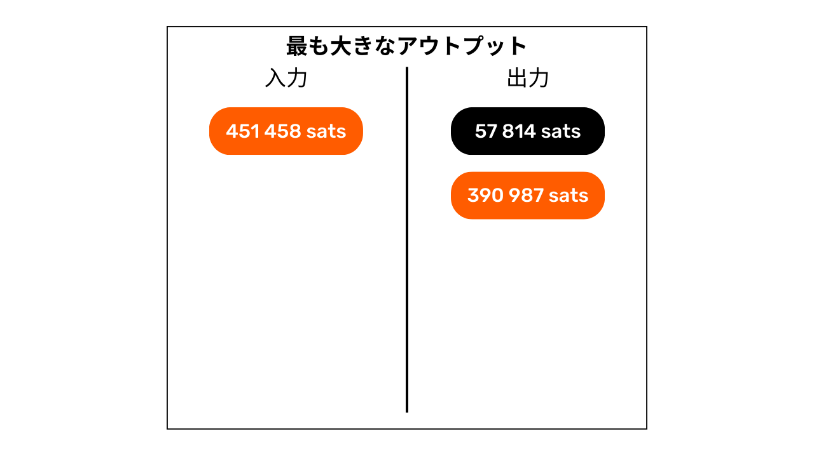

この最大のアウトプットのヒューリスティックは、おそらくすべての中で最も不正確です。それ自体で特定された場合、非常に弱いです。しかし、この特徴は他のヒューリスティックと組み合わせることで、私たちの解釈の不確実性を減らすことができます。

例えば、丸い金額のアウトプットとより大きな金額のアウトプットを持つトランザクションを調べる場合、丸い支払いのヒューリスティックと最大のアウトプットに関するヒューリスティックの共同適用により、不確実性のレベルを減らすことができます。

例えば、ここにこのヒューリスティックが適用される可能性が高いトランザクションがあります：

```plaintext
b79d8f8e4756d34bbb26c659ab88314c220834c7a8b781c047a3916b56d14dcf
```


ソース: [Mempool.space](https://mempool.space/tx/b79d8f8e4756d34bbb26c659ab88314c220834c7a8b781c047a3916b56d14dcf)

## 外部ヒューリスティック
<chapterId>4a170e3b-200d-431a-8285-18a23ff617ba</chapterId>
外部ヒューリスティックの研究は、トランザクション自体に固有ではない特定の要素の類似性、パターン、特徴を分析することを含みます。言い換えれば、以前はトランザクションに固有の要素を利用する内部ヒューリスティックに限定していた場合、今では外部ヒューリスティックのおかげで分析の範囲をトランザクション環境に拡大しています。

### アドレスの再利用

これは、ビットコイン愛好家の間で最もよく知られているヒューリスティックの一つです。アドレスの再利用は、異なるトランザクションと異なるUTXO間のリンクを確立することを可能にします。ビットコイン受信アドレスが複数回使用されると観察されます。

したがって、前の章で見たように、同じトランザクション内でアドレスの再利用を内部ヒューリスティックとして利用してお釣りを特定することが可能です。しかし、アドレスの再利用は、複数のトランザクションにわたるエンティティの一意性を認識するための外部ヒューリスティックとしても機能することができます。

アドレスの再利用の解釈は、このアドレスにロックされているすべてのUTXOが（または属していた）同じエンティティに属しているということです。このヒューリスティックは不確実性の余地がほとんどありません。それを特定できる場合、その後の解釈は現実に非常に近い可能性が高いです。したがって、異なるオンチェーン活動のグルーピングを可能にします。

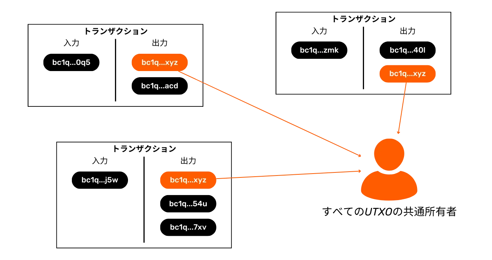

第3部の序章で説明したように、このヒューリスティックはサトシ・ナカモト自身によって発見されました。ホワイトペーパーでは、ユーザーがそれを生産するのを避けるための解決策を具体的に言及しており、それは単に新しいトランザクションごとに新しいアドレスを使用することです：

"_追加のファイアウォールとして、各トランザクションに対して新しいキーペアを使用することで、それらが共通の所有者にリンクされるのを防ぐことができます。_"


ソース: S. Nakamoto, "Bitcoin: A Peer-to-Peer Electronic Cash System", https://bitcoin.org/bitcoin.pdf, 2009.

例えば、ここに複数のトランザクションにわたって再利用されたアドレスがあります：

```plaintext
bc1qqtmeu0eyvem9a85l3sghuhral8tk0ar7m4a0a0
```


ソース: [Mempool.space](https://mempool.space/address/bc1qqtmeu0eyvem9a85l3sghuhral8tk0ar7m4a0a0)

### スクリプトの類似性とウォレットの指紋

アドレスの再利用を超えて、同じウォレットやアドレスのクラスターに行動をリンクさせるための多くのヒューリスティックが存在します。
まず第一に、アナリストはスクリプトの使用における類似性から利益を得ることができます。例えば、マルチシグのような少数派のスクリプトは、SegWit V0スクリプトよりも容易に識別できます。私たちが隠れるグループが大きければ大きいほど、私たちを見つけることは難しくなります。これは、良いCoinjoinプロトコルでは、すべての参加者が全く同じタイプのスクリプトを使用する理由です。
より広範囲に、アナリストはウォレットの特徴的な指紋にも焦点を当てることができます。これらは、追跡ヒューリスティックとして利用することを目的として特定のプロセスに関連付けられた使用法です。言い換えれば、追跡されたエンティティに帰属するトランザクションに同じ内部特性の蓄積が観察された場合、他のトランザクションにおいてこれらの同じ特性を特定しようと試みることができます。

例えば、追跡されたユーザーがシステマティックに変更をP2TRアドレス(`bc1p…`)に送ることが特定された場合、このプロセスが繰り返されると、分析の継続のためのヒューリスティックとして使用することができます。UTXOsの順序、出力内の変更の配置、RBF（Replace-by-Fee）のシグナリング、さらには、バージョン番号、`nSequence`フィールド、`nLockTime`フィールドなど、他の指紋も使用できます。

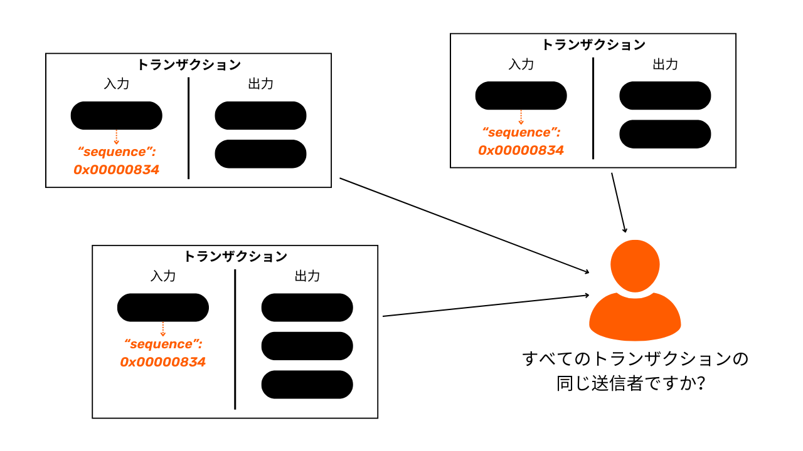

[@LaurentMT](https://twitter.com/LaurentMT)が[Space Kek #19](https://podcasters.spotify.com/pod/show/decouvrebitcoin/episodes/SpaceKek-19---Analyse-de-chane--anonsets-et-entropie-e1vfuji)（フランコフォンのポッドキャスト）で指摘しているように、ウォレットの指紋の有用性は時間とともに大幅に増加します。実際、スクリプトタイプの増加とこれらの新機能のウォレットソフトウェアによる徐々に展開が、違いを強調します。追跡されたエンティティが使用しているソフトウェアを正確に特定できることさえあります。したがって、ウォレットの指紋の研究が、2010年代初頭に開始されたトランザクションよりも、特に最近のトランザクションにとって特に関連があることを理解することが重要です。

要約すると、指紋は、ウォレットによって自動的に、またはユーザーによって手動で行われ、分析を支援するために他のトランザクションで見つけることができる特定の実践です。

### 共通入力所有ヒューリスティック（CIOH）

CIOH、つまり英語で"Common Input Ownership Heuristic"は、トランザクションが複数の入力を含む場合、これらはすべて単一のエンティティから発生する可能性が高いと述べるヒューリスティックです。その結果、所有権は共通です。
Common Input Ownership Heuristic（CIOH）を適用するには、まず複数の入力を持つトランザクションを観察します。これは2つの入力でも30つの入力でも可能です。この特徴が特定されたら、そのトランザクションが既知のトランザクションモデルに当てはまらないかを確認します。例えば、ほぼ同じ量の5つの入力と、正確に同じ量の5つの出力を持つ場合、それがcoinjoinの構造であることを知っています。したがって、CIOHを適用することはできません。
しかし、トランザクションがどの既知の協力的トランザクションモデルにも当てはまらない場合、すべての入力が同じエンティティから来ている可能性が高いと推測できます。これは、既知のクラスターを拡張したり、追跡を続けたりするのに非常に役立ちます。

CIOHはサトシ・ナカモトによって発見されました。彼はホワイトペーパーの第10部でこれについて議論しています：

"_[...] リンクは、その入力が同じ所有者によって所有されていたことを必然的に明らかにする多入力トランザクションでは避けられない。キーの所有者が明らかになった場合、リンクは同じ所有者に属していた他のトランザクションを明らかにするリスクがあります。_"

特に興味深いのは、サトシ・ナカモトがBitcoinの公式ローンチ前に、ユーザーのプライバシーに関して主要な2つの脆弱性、すなわちCIOHとアドレスの再利用を既に特定していたことです。このような先見の明は非常に注目に値し、これら2つのヒューリスティックは、今日でもチェーン分析で最も有用なもののままです。

例として、CIOHを適用できそうなトランザクションをここに示します：

```plaintext
20618e63b6eed056263fa52a2282c8897ab2ee71604c7faccfe748e1a202d712
```

ソース：[Mempool.space](https://mempool.space/tx/20618e63b6eed056263fa52a2282c8897ab2ee71604c7faccfe748e1a202d712)

### オフチェーンデータ

明らかに、チェーン分析はオンチェーンデータに限定されるわけではありません。以前の分析からのデータやインターネット上で利用可能なデータも分析を洗練するために使用できます。
例えば、追跡されたトランザクションが系統的に同じBitcoinノードからブロードキャストされており、そのIPアドレスを特定できる場合、同じエンティティからの他のトランザクションを特定することができるかもしれません。これに加えて、送信者の身元の一部を特定することも可能です。この実践は多くのノードを操作する必要があるため容易には達成できませんが、一部のチェーン分析を専門とする企業がこれを行っている可能性があります。

分析者は、以前にオープンソースで行われた分析や自身の以前の分析にも依存するオプションがあります。既に特定されていたアドレスのクラスターを指す出力を見つけることがあるかもしれません。時には、取引所プラットフォームを指す出力に依存することも可能です。これらの企業のアドレスは一般に知られています。

同様に、除外による分析を行うことができます。例えば、2つの出力を持つトランザクションの分析中に、そのうちの1つが既に知られているが追跡されているエンティティとは異なるアドレスのクラスターにリンクされている場合、他の出力はおそらくお釣りを表していると解釈できます。

チェーン分析には、インターネット検索を含むもう少し一般的なOSINT（*Open Source Intelligence*）の部分も含まれます。これが、受信アドレスをソーシャルメディアやウェブサイトに、匿名であっても直接公開することは勧められない理由です。


### 時間モデル
一般的にはあまり考えられていませんが、特定の人間の行動はオンチェーンで認識可能です。分析で最も有用かもしれないのは、あなたの睡眠パターンです！はい、あなたが寝ている間、おそらくビットコインのトランザクションをブロードキャストしていません。一般的に同じ時間帯に睡眠をとるため、チェーン分析では時間的分析を使用することが一般的です。これは単に、特定のエンティティのトランザクションがビットコインネットワークにブロードキャストされる時間をカタログ化することを含みます。これらの時間的パターンを分析することで、多くの情報を推測することができます。
まず、時間的分析は時々、追跡されたエンティティの性質を特定することを可能にします。24時間にわたってトランザクションが一貫してブロードキャストされていることが観察された場合、これは強い経済活動を示すでしょう。これらのトランザクションの背後にあるエンティティは、おそらく国際的な会社であり、内部に自動化された手続きを持っている可能性があります。
たとえば、数ヶ月前に、[19ビットコインを手数料として誤って割り当てたトランザクション](https://mempool.space/tx/d5392d474b4c436e1c9d1f4ff4be5f5f9bb0eb2e26b61d2781751474b7e870fd)を分析することで、[このモデルを認識しました](https://twitter.com/Loic_Pandul/status/1701127409712452072)。単純な時間的分析により、自動化されたサービス、したがっておそらく大規模なエンティティである取引プラットフォームを扱っていると仮定することができました。
実際、数日後、資金がPayPalに属していることが発見されました。これは取引プラットフォームのPaxosを介してです。

逆に、時間的パターンが16時間の非常に特定の時間に広がっている場合、個々のユーザー、または取引される量に応じて地元のビジネスを扱っていると推定できます。

観察されたエンティティの性質を超えて、時間的パターンはタイムゾーンのおかげでユーザーのおおよその位置も提供することができます。したがって、他のトランザクションをリンクし、これらのタイムスタンプを分析に追加できる追加のヒューリスティックとして使用することができます。

たとえば、以前に話した再利用されたアドレスでは、トランザクションが、受信または送信にかかわらず、13時間の間隔に集中していることが観察できます。

```plaintext
bc1qqtmeu0eyvem9a85l3sghuhral8tk0ar7m4a0a0
```


出典: OXT.me

この間隔は、おそらくヨーロッパ、アフリカ、または中東に対応しています。したがって、これらのトランザクションの背後にいるユーザーがそこに住んでいると推測することができます。

異なる登録では、サトシ・ナカモトが日本ではなく、実際にはアメリカ合衆国から活動していたという仮説を可能にしたのも、このタイプの時間的分析でした：[*サトシ・ナカモトのタイムゾーン*](https://medium.com/@insearchofsatoshi/the-time-zones-of-satoshi-nakamoto-aa40f035178f)

## ブロックエクスプローラーを使った実践的な応用
<chapterId>6493cf2f-225c-405f-9375-c4304f1087ed</chapterId>

この最終章では、これまでに学んだ概念を具体的に適用します。実際のビットコイントランザクションの例を提示し、私が求める情報を抽出する必要があります。
これらの演習には、理想的にはプロフェッショナルなチェーン分析ツールの使用が望ましいです。しかし、Samourai Walletの開発者が逮捕されて以来、唯一の無料分析ツールであるOXT.meはもはや利用可能ではありません。したがって、これらの演習にはクラシックなブロックエクスプローラーを選択します。その多くの機能とチェーン分析ツールの範囲で、[Mempool.space](https://mempool.space/)の使用をお勧めしますが、[Bitcoin Explorer](https://bitcoinexplorer.org/)などの他のエクスプローラーを選択することもできます。始めるにあたり、演習を紹介します。ブロックエクスプローラーを使用してこれらを完了し、答えを紙に書き留めてください。その後、この章の最後に、答えを提供するので、結果を確認して修正できます。

*これらの演習で選択されたトランザクションは、ある程度ランダムな方法でその特性に基づいて選ばれました。この章は純粋に教育的および情報提供の目的のみを意図しています。これらのツールを悪意のある目的で使用することを支持または奨励するものではないことを明確にしたいと思います。目的は、チェーン分析に対する自己防衛方法を教えることであり、他人のプライベート情報を暴露するための分析を行うことではありません。*

### 演習 1

分析するトランザクションID：

```plaintext
3769d3b124e47ef4ffb5b52d11df64b0a3f0b82bb10fd6b98c0fd5111789bef7
```

このトランザクションのモデルの名前は何ですか？また、そのモデル、つまりトランザクションの構造のみを調べることによって、どのような妥当な解釈が導き出せますか？

### 演習 2

分析するトランザクションID：

```plaintext
baa228f6859ca63e6b8eea24ffad7e871713749d693ebd85343859173b8d5c20
```

このトランザクションのモデルの名前は何ですか？また、そのモデル、つまりトランザクションの構造のみを調べることによって、どのような妥当な解釈が導き出せますか？

### 演習 3

分析するトランザクションID：

```plaintext
3a9eb9ccc3517cc25d1860924c66109262a4b68f4ed2d847f079b084da0cd32b
```

このトランザクションのモデルは何ですか？

そのモデルを特定した後、トランザクションの内部ヒューリスティックを使用して、どの出力がおつりとして考えられるか？

### 演習 4

分析するトランザクションID：

```plaintext
35f0b31c05503ebfdf7311df47f68a048e992e5cf4c97ec34aa2833cc0122a12
```

このトランザクションのモデルは何ですか？
そのモデルを特定した後、トランザクションの内部ヒューリスティックを使用して、どの出力がおつりとして考えられるか？

### 演習 5

Loïcが彼のBitcoin受信アドレスをソーシャルネットワークTwitterに投稿したと想像してください：


```plaintext
bc1qja0hycrv7g9ww00jcqanhfpqmzx7luqalum3vu
```

**アドレス再利用ヒューリスティックのみを使用して**、どのBitcoinトランザクションをLoïcのアイデンティティにリンクできますか？

*明らかに、私はこの受信アドレスの実際の所有者ではなく、ソーシャルネットワークにそれを投稿したわけではありません。これはブロックチェーンからランダムに選んだアドレスです。*

### 演習 6

演習5に続いて、アドレス再利用ヒューリスティックのおかげで、Loïcが関与していると思われるいくつかのBitcoinトランザクションを特定することができました。通常、特定されたトランザクションの中には、このトランザクションが含まれているはずです：

```plaintext
2d9575553c99578268ffba49a1b2adc3b85a29926728bd0280703a04d051eace
```
このトランザクションは、Loïcのアドレスに資金を送る最初のものです。あなたの意見では、このトランザクションを通じてLoïcが受け取ったビットコインはどこから来たのでしょうか？

### 練習問題 7

練習問題 5に続いて、アドレス再利用のヒューリスティックを利用して、Loïcが関与していると思われる複数のビットコイントランザクションを特定することができました。今度は、Loïcがどこから来たのかを知りたいと思います。見つかったトランザクションに基づいて、Loïcが使用している可能性のあるタイムゾーンを見つけるために時間分析を行ってください。このタイムゾーンから、Loïcが住んでいると思われる場所（国、州/地域、市など）を特定してください。


### 練習問題 8

こちらが研究対象のビットコイントランザクションです：

```plaintext
bb346dae645d09d32ed6eca1391d2ee97c57e11b4c31ae4325bcffdec40afd4f
```

このトランザクションをただ観察するだけで、どのような情報を解釈できるでしょうか？

### 練習問題の解答

***練習問題 1:***
このトランザクションのモデルは、単純な支払いのものです。構造だけを研究すれば、一つの出力がお釣りで、もう一つの出力が実際の支払いを表していると解釈できます。したがって、観察されたユーザーは、出力の2つのUTXOのうち1つ（支払いのためのもの）をもはや所有していない可能性が高いが、もう1つのUTXO（お釣りのためのもの）はまだ所有しているとわかります。

***練習問題 2:***
このトランザクションのモデルは、バッチ支出のものです。このモデルは、たとえば交換プラットフォームなど、重要な経済活動を示している可能性があります。入力のUTXOは重要な経済活動を持つ会社から来ており、出力のUTXOは分散すると推測できます。一部は、ビットコインを自己管理ウォレットに引き出した会社のクライアントに属するでしょう。他のものは、パートナー企業に向かうかもしれません。最終的には、発行会社に戻るお釣りが確実にあるでしょう。

***練習問題 3:***

このトランザクションのモデルは、単純な支払いのものです。したがって、トランザクションに内部ヒューリスティックを適用して、お釣りを特定しようとすることができます。

私は個人的に、同じ仮説を支持する少なくとも2つの内部ヒューリスティックを特定しました：
- 同じタイプのスクリプトの再利用；
- 最大の出力。

最も明白なヒューリスティックは、同じタイプのスクリプトの再利用です。実際、出力 `0` は、受信アドレスが `3` で始まることから `P2SH` であることが認識できます：

```plaintext
3Lcdauq6eqCWwQ3UzgNb4cu9bs88sz3mKD
```

一方、出力 `1` は、アドレスが `bc1q` で始まることから `P2WPKH` であることが特定できます：

```plaintext
bc1qya6sw6sta0mfr698n9jpd3j3nrkltdtwvelywa
```

このトランザクションで使用される入力のUTXOも `P2WPKH` スクリプトを使用しています：

```plaintext
bc1qyfuytw8pcvg5vx37kkgwjspg73rpt56l5mx89k
```

したがって、出力 `0` は支払いに対応し、出力 `1` はトランザクションのお釣りであり、入力のユーザーはまだ出力 `1` を所有していると仮定できます。
この仮説を支持または反駁するために、私たちの考えを確認するか、仮説が正しい可能性を低下させる他のヒューリスティックを探すことができます。
私は少なくとももう一つのヒューリスティックを見つけました。それは最大の出力です。出力 `0` は `123,689 sats` を測定し、出力 `1` は `505,839 sats` を測定します。したがって、これら二つの出力の間には顕著な差があります。最大の出力のヒューリスティックは、最も容量の大きい出力がお釣りである可能性が高いことを示唆しています。このヒューリスティックは、したがって、私たちの初期の仮説をさらに強化します。

入力で提供されたUTXOのユーザーが、取引のお釣りであると思われる出力 `1` をまだ保持している可能性が高いようです。

***演習 4:***
この取引のモデルは単純な支払いです。したがって、取引に内部ヒューリスティックを適用して、お釣りを特定しようと試みることができます。
私は個人的に、同じ仮説を支持する少なくとも二つの内部ヒューリスティックを特定しました：
- 同じタイプのスクリプトの再利用；
- 丸い金額の出力。

最も明白なヒューリスティックは、同じタイプのスクリプトの再利用です。実際、出力 `0` は `P2SH` であり、受信アドレスが `3` で始まることによって識別できます：

```plaintext
3FSH5Mnq6S5FyQoKR9Yjakk3X4KCGxeaD4
```

一方、出力 `1` は `P2WPKH` であり、そのアドレスが `bc1q` で始まることによって識別できます：

```plaintext
bc1qvdywdcfsyavt4v8uxmmrdt6meu4vgeg439n7sg
```

この取引の入力として使用されたUTXOも `P2WPKH` スクリプトを使用しています：

```plaintext
bc1qku3f2y294h3ks5eusv63dslcua2xnlzxx0k6kp
```

したがって、出力 `0` が支払いに対応し、出力 `1` が取引のお釣りであると仮定することができます。これは、入力のユーザーがまだ出力 `1` を所有していることを意味します。

この仮説を支持または反駁するために、私たちの考えを確認するか、仮説が正しい可能性を低下させる他のヒューリスティックを探すことができます。

私は少なくとももう一つのヒューリスティックを見つけました。それは丸い金額の出力です。出力 `0` は `70,000 sats` を測定し、出力 `1` は `22,962 sats` を測定します。したがって、私たちはBTC単位で完全に丸い出力の存在にいます。丸い出力のヒューリスティックは、丸い金額のUTXOが支払いである可能性が高く、排除により、もう一方がお釣りを表すことを示唆しています。このヒューリスティックは、したがって、私たちの初期の仮説をさらに強化します。

しかし、この例では、初期の仮説に疑問を投げかける別のヒューリスティックがあり得ます。実際、出力 `0` は出力 `1` よりも大きいです。最大の出力が一般的にお釣りであるというヒューリスティックに基づいて、出力 `0` がお釣りであると推測できます。しかし、この反仮説は、他の二つのヒューリスティックが最大の出力のそれよりもはるかに説得力があるように見えるため、不合理に思えます。したがって、この明らかな矛盾にもかかわらず、私たちの初期の仮説を維持することが合理的に思えます。
したがって、入力としてUTXOを提供したユーザーが、取引からのお釣りを表すと思われる `1` 出力をまだ保持している可能性が高いようです。
***演習 5:***
Loïcの身元に関連付けられる8つの取引があることがわかります。これらのうち、4つはビットコインの受け取りを含んでいます：

```plaintext
2d9575553c99578268ffba49a1b2adc3b85a29926728bd0280703a04d051eace
8b70bd322e6118b8a002dbdb731d16b59c4a729c2379af376ae230cf8cdde0dd
d5864ea93e7a8db9d3fb113651d2131567e284e868021e114a67c3f5fb616ac4
bc4dcf2200c88ac1f976b8c9018ce70f9007e949435841fc5681fd33308dd762
```

他の4つはビットコインの送信に関係しています

```plaintext
8b52fe3c2cf8bef60828399d1c776c0e9e99e7aaeeff721fff70f4b68145d540
c12499e9a865b9e920012e39b4b9867ea821e44c047d022ebb5c9113f2910ed6
a6dbebebca119af3d05c0196b76f80fdbf78f20368ebef1b7fd3476d0814517d
3aeb7ce02c35eaecccc0a97a771d92c3e65e86bedff42a8185edd12ce89d89cc
```
***演習 6:***
このトランザクションのモデルを検討すると、これはグループ化された支出であることが明らかです。実際、このトランザクションには1つの入力と51の出力があり、これが重要な経済活動を示していることがわかります。したがって、ロイックが取引所からビットコインを引き出したと仮定することができます。

この仮説を強化するいくつかの要素があります。まず、入力にあるUTXOを保護するために使用されるスクリプトの種類は、2/3マルチシグP2SHスクリプトであり、これは取引所に典型的な高度なセキュリティレベルを示しています。
```plaintext
OP_PUSHNUM_2
OP_PUSHBYTES_33 03eae02975918af86577e1d8a257773118fd6ceaf43f1a543a4a04a410e9af4a59
OP_PUSHBYTES_33 03ba37b6c04aaf7099edc389e22eeb5eae643ce0ab89ac5afa4fb934f575f24b4e
OP_PUSHBYTES_33 03d95ef2dc0749859929f3ed4aa5668c7a95baa47133d3abec25896411321d2d2d
OP_PUSHNUM_3
OP_CHECKMULTISIG
```

さらに、分析されたアドレス`3PUv9tQMSDCEPSMsYSopA5wDW86pwRFbNF`は、22万回以上の異なる取引で再利用されており、これは一般に交換プラットフォームの特徴であり、プライバシーに関しては無関心です。このアドレスに適用された時間的ヒューリスティックも、3ヶ月の期間にわたってほぼ毎日取引が定期的に行われており、24時間を超える時間帯での活動も示唆しており、交換プラットフォームの連続した活動を示しています。

最終的に、このエンティティが処理するボリュームは膨大です。実際、このアドレスは2022年12月から2023年3月の間に222,262回の取引で44 BTCを受け取り、送信しました。これらの大量のボリュームは、交換プラットフォームの活動の性質をさらに確認しています。

***演習7:***
取引の確認時間を分析することで、以下のUTC時間が記録されます：
```plaintext
05:43
20:51
18:12
17:16
04:28
23:38
07:45
21:55
```

これらの時間を分析すると、UTC-7およびUTC-8のタイムゾーンが、大半の時間において一般的な人間の活動（08:00から23:00の間）と一致していることがわかります：

```plaintext
05:43 UTC > 22:43 UTC-7
20:51 UTC > 13:51 UTC-7
18:12 UTC > 11:12 UTC-7
17:16 UTC > 10:16 UTC-7
04:28 UTC > 21:28 UTC-7
23:38 UTC > 16:38 UTC-7
07:45 UTC > 00:45 UTC-7
21:55 UTC > 14:55 UTC-7

05:43 UTC > 21:43 UTC-8
20:51 UTC > 12:51 UTC-8
18:12 UTC > 10:12 UTC-8
17:16 UTC > 09:16 UTC-8
04:28 UTC > 20:28 UTC-8
23:38 UTC > 15:38 UTC-8
07:45 UTC > 23:45 UTC-8
21:55 UTC > 13:55 UTC-8
```


特に夏の間、UTC-7のタイムゾーンは重要であり、以下の州や地域を含んでいます：
- カリフォルニア州（ロサンゼルス、サンフランシスコ、サンディエゴなどの都市を含む）；
- ネバダ州（ラスベガスを含む）；
- オレゴン州（ポートランドを含む）；
- ワシントン州（シアトルを含む）；
- カナダのブリティッシュコロンビア地域（バンクーバーやビクトリアなどの都市を含む）。

これらの情報から、Loïcは合理的にアメリカ合衆国またはカナダの西海岸に居住している可能性が示唆されます。

***演習 8:***
この取引の分析により、5つの入力と1つの出力が明らかになり、これは統合を示しているようです。CIOHヒューリスティックの適用は、入力のUTXOsが単一のエンティティによって保持されており、出力のUTXOもこのエンティティに属していることを示唆しています。ユーザーは、所有する複数のUTXOsを出力の単一のUTXOに統合することを選択し、コインを統合することを目的としているようです。このアプローチは、低い取引手数料を利用して将来の手数料を削減することを目的としていた可能性があります。
___

*このチェーン分析のパート3の執筆にあたり、以下のリソースに依存しました：*
- *2021年にSamourai Walletによって制作された4つの記事シリーズ：[Understanding Bitcoin Privacy with OXT](https://medium.com/oxt-research/understanding-bitcoin-privacy-with-oxt-part-1-4-8177a40a5923)；*
- *[OXT Research](https://medium.com/oxt-research)からの様々なレポート、および彼らの無料のチェーン分析ツール（Samourai Walletの創設者の逮捕に伴い、現在は利用不可）；*
- *より広く、[@LaurentMT](https://twitter.com/LaurentMT)と[@ErgoBTC](https://twitter.com/ErgoBTC)からの様々なツイートやコンテンツ；*
- *[Space Kek #19](https://podcasters.spotify.com/pod/show/decouvrebitcoin/episodes/SpaceKek-19---Analyse-de-chane--anonsets-et-entropie-e1vfuji)に、[@louneskmt](https://twitter.com/louneskmt)、[@TheoPantamis](https://twitter.com/TheoPantamis)、[@Sosthene___](https://twitter.com/Sosthene___)、そして[@LaurentMT](https://twitter.com/LaurentMT)と一緒に参加しました。*
*その著者、開発者、プロデューサーに感謝します。また、このパート3の基礎となった記事を入念に修正し、専門的なアドバイスで私を助けてくれたレビュアーにも感謝します：*
- *[Gilles Cadignan](https://twitter.com/gillesCadignan);*
- *[Ludovic Lars](https://viresinnumeris.fr/)。*

# プライバシーを守るためのベストプラクティスの習得
<partId>9bd04b63-f1af-4e50-9061-6bc90009df68</partId>

## アドレスの再利用
<chapterId>f3e97645-3df3-41bc-a4ed-d2c740113d96</chapterId>
ビットコインでプライバシーを侵害する可能性のある技術を研究した後、この第3部では、自分を守るために採用すべきベストプラクティスについて見ていきます。この部分は、プライバシーを向上させる方法を探求することを目的としているわけではなく、追加の技術に頼ることなく、ビットコインが自然に提供するプライバシーを維持するために、ビットコインとどのように正しくやり取りするかを理解することを目的としています。
当然ながら、この第3部を始めるにあたり、アドレスの再利用について話します。この現象は、ユーザーのプライバシーに対する主な脅威を構成します。したがって、この章は、全トレーニングの中で最も重要な章と言えるでしょう。

### 受信アドレスとは何ですか？

ビットコインの受信アドレスは、ウォレットでビットコインを受け取るために使用される文字列または識別子です。

技術的には、ビットコインの受信アドレスは文字通りの意味でビットコインを「受け取る」わけではなく、ビットコインがいつ使われるかの条件を定義します。具体的には、支払いがあなたに送られると、送信者のトランザクションは、入力で消費したUTXOから出力された新しいUTXOをあなたに向けて作成します。この出力には、このUTXOが後でどのように使われるかを定義するスクリプトが適用されます。このスクリプトは「*ScriptPubKey*」または「*Locking Script*」として知られています。あなたの受信アドレス、より正確にはそのペイロードは、このスクリプトに統合されます。簡単に言うと、このスクリプトは基本的に以下のように規定します：

> "*この新しいUTXOを使うには、この受信アドレスに関連付けられた秘密鍵を使用したデジタル署名が提供されなければなりません。*"


ビットコインアドレスには、使用されるスクリプトモデルに応じて異なるタイプがあります。最初のモデルである「*Legacy*」には、`P2PKH`（*Pay-to-PubKey-Hash*）および`P2SH`（*Pay-to-Script-Hash*）アドレスが含まれます。P2PKHアドレスは常に`1`で始まり、P2SHは`3`で始まります。これらの形式はまだ安全ですが、トランザクション手数料が高くなり、新しい標準と比較してプライバシーが低いため、現在では時代遅れです。
SegWit V0（`P2WPKH`および`P2WSH`）とTaproot / SegWit V1（`P2TR`）アドレスは、現代のフォーマットを代表しています。SegWitアドレスは`bc1q`で始まり、2021年に導入されたTaprootアドレスは`bc1p`で始まります。
例えば、こちらがTaproot受信アドレスです：

```text
bc1ps5gd2ys8kllz9alpmcwxqegn7kl3elrpnnlegwkm3xpq2h8da07spxwtf5
```

ScriptPubKeyの構築方法は、使用する標準によって異なります：
| Script Model    | ScriptPubKey                                                |
| ---------------- | ----------------------------------------------------------- |
| P2PKH            | OP_DUP OP_HASH160 `<pubKeyHash>` OP_EQUALVERIFY OP_CHECKSIG |
| P2SH             | OP_HASH160 `<scriptHash>` OP_EQUAL                          |
| P2WPKH           | 0 `<pubKeyHash>`                                            |
| P2WSH            | 0 `<witnessScriptHash>`                                     |
| P2SH - P2WPKH    | OP_HASH160 `<redeemScriptHash>` OP_EQUAL                    |
| P2SH - P2WSH     | OP_HASH160 `<redeemScriptHash>` OP_EQUAL                    |
| P2TR             | 1 `<pubKey>`                                                |

受信アドレスの構築についても、選択したスクリプトモデルに依存します：
- `P2PKH`および`P2WPKH`アドレスの場合、ペイロード、つまりアドレスの核は、公開鍵のハッシュを表します；
- `P2SH`および`P2WSH`アドレスの場合、ペイロードはスクリプトのハッシュを表します；
- `P2TR`アドレスの場合、ペイロードは調整された公開鍵です。`P2TR`出力は、_Pay-to-PubKey_ と _Pay-to-Script_ の側面を組み合わせます。調整された公開鍵は、ビットコインを支払うためにも使用できるスクリプトのセットのマークルルートから派生した「調整」を古典的な支払い公開鍵に加えた結果です。

ウォレットソフトウェアに表示されるアドレスには、通常`bc`であるHRP（*Human-Readable Part*）、セパレータ`1`、およびバージョン番号`q`（SegWit V0用）と`p`（Taproot/SegWit V1用）も含まれます。アドレスの伝送中の整合性と有効性を保証するために、チェックサムも追加されます。

最後に、アドレスは標準フォーマットに置かれます：
- 古いLegacyアドレスのためのBase58check；
- SegWitアドレスのためのBech32；
- TaprootアドレスのためのBech32m。

こちらは、base 10からbech32およびbech32mフォーマット（SegWitおよびTaproot）への加算行列です：

| +   | 0   | 1   | 2   | 3   | 4   | 5   | 6   | 7   |
| --- | --- | --- | --- | --- | --- | --- | --- | --- |
| 0   | q   | p   | z   | r   | y   | 9   | x   | 8   |
| 8   | g   | f   | 2   | t   | v   | d   | w   | 0   |
| 16  | s   | 3   | j   | n   | 5   | 4   | k   | h   || 24  | c   | e   | 6   | m   | u   | a   | 7   | l   |
### アドレスの再利用とは何か？

アドレスの再利用とは、同じ受信アドレスを使用して複数の異なるUTXOをブロックする実践を指します。

前のセクションで見たように、各UTXOにはそれをロックする独自のScriptPubKeyがあり、新しいトランザクションで入力として消費されるためには満たされなければなりません。受信アドレス（ペイロード）が統合されるのはこのScriptPubKeyの中です。

異なるScriptPubKeysが同じ受信アドレスを含む場合、これをアドレスの再利用と呼びます。実際には、これはユーザーが複数の支払いを通じてビットコインを受け取るために、送信者に同じアドレスを複数回提供したことを意味します。そして実際、この実践はあなたのプライバシーにとって壊滅的です。

### アドレスの再利用が問題である理由は？

ブロックチェーンが公開されているため、どのアドレスがどのUTXOをロックしているか、そしていくつのビットコインがあるかを簡単に確認できます。同じアドレスが複数のトランザクションに使用される場合、そのアドレスに関連するすべてのビットコインが同一人物に属していると推測することが可能になります。この実践は、異なるトランザクション間の決定論的なリンクを確立し、ブロックチェーン上のビットコインを追跡することによって、ユーザーのプライバシーを危険にさらします。サトシ・ナカモト自身がビットコインのホワイトペーパーでこの問題を強調しました：

> *追加のファイアウォールとして、各トランザクションに新しいキーペアを使用することで、それらが共通の所有者にリンクされるのを防ぐことができます。*


ソース: S. Nakamoto, "Bitcoin: A Peer-to-Peer Electronic Cash System", https://bitcoin.org/bitcoin.pdf, 2009.

サトシがこの声明で求めた目標は、ユーザーの身元とビットコイン上のキーペアの間の関連付けが発生した場合に、ユーザーの活動が公にその身元にリンクされるのを避けるための追加のファイアウォールを作成することでした。今日では、チェーン分析会社とKYC規制の増加により、ユニークなアドレスの使用は「追加のファイアウォール」ではなく、最低限のプライバシーを保持したい人にとって必要な実践となっています。

アドレスを再利用すると、そのアドレスに関連するすべてのトランザクション間にほぼ否定できないリンクを作成します。これは直接的にあなたの資金を危険にさらすわけではありませんが、楕円曲線上の暗号学があなたの秘密鍵の安全性を保証するためですが、あなたの活動の監視を容易にします。実際には、ノードを持つ誰でもアドレスのトランザクションと残高を観察し、あなたの匿名性を完全に危険にさらすことができます。


この点を説明するために、DCA（ドルコスト平均法）を通じて定期的に少額のビットコインを購入し、常に同じアドレスに送金するユーザーであるボブの例を挙げましょう。2年後、このアドレスにはかなりの量のビットコインが含まれています。ボブがこのアドレスを使用して地元の商人に支払いを行った場合、後者は関連するすべての資金を見て、ボブの富を推測することができます。これは盗難や恐喝の試みを含む個人の安全リスクにつながる可能性があります。ボブが定期的な購入ごとに新しいアドレスを受け取るために使用していた場合、彼は商人に無限に少ない情報を明らかにしたでしょう。

チェーン分析では、アドレスの再利用を2つのタイプに区別します：
- 外部再利用；
- トランザクション内の内部再利用。

最初のものは、アドレスが複数の異なるビットコイントランザクションで再利用される場合に観察されます。これは先に議論したことです：このヒューリスティックにより、このアドレスを通過したすべてのUTXOが単一のエンティティに属していると推測することができます。
内部アドレスの再利用は、複数のトランザクション間で再利用が発生した場合ではなく、同一トランザクション内で発生した場合に観察されます。実際、入力をロックするために使用された同じアドレスがトランザクションの出力として使用される場合、この出力が依然として同じユーザー（おつり）に属していること、そして2番目の出力が実際の支払いを表していることを推測できます。この別のヒューリスティックにより、複数のトランザクションにわたる資金の追跡が可能になります。


アドレスの再利用はBitcoinにとって実際の災害です。ウェブサイトOXT.me（現在アクセス不可）によると、2022年のBitcoinのアドレス再利用の全体的な率は約52%でした：


この率は非常に高いですが、個々のユーザーではなく、主に交換プラットフォームから来ています。

### アドレスの再利用を避けるには？

アドレスの再利用を避けることは非常に簡単です：**新しい着金ごとに新鮮なアドレスを使用するだけです**。

BIP32のおかげで、現代のウォレットは今や決定論的で階層的です。これは、ユーザーが単一の初期情報、つまりシードから大量のアドレスを生成できることを意味します。この単一の情報を保存することで、ウォレットのすべての秘密鍵を復元し、対応するアドレスによって保護された資金にアクセスすることが可能です。


これが、ウォレットソフトウェアで「*受け取る*」ボタンを押すと、毎回未使用の受信アドレスが提供される理由です。このアドレスでビットコインを受け取った後、ソフトウェアは自動的に新しいアドレスを提案します。
> *PS: 最近、一部のウォレットソフトウェアは、これが当局によってマネーロンダリングの一形態と見なされる可能性があることを恐れて、空のアドレスの生成を停止する意向を発表しました。あなたのソフトウェアがこれらの中にある場合、これはユーザーにとって受け入れられないため、直ちに交換することを強くお勧めします。*

寄付を受け取るなど、支払いを受け取るための静的な識別子が必要な場合は、再利用のリスクがあるため、古典的なBitcoinアドレスの使用はお勧めしません。Lightningアドレスを使用するか、静的なオンチェーン支払い識別子には、BIP47やSilent Paymentsを選択することをお勧めします。これらのプロトコルの操作は、このトレーニングのパート6で詳しく説明されています。

## ラベリングとコインコントロール
<chapterId>fbdb07cd-c025-48f2-97b0-bd1bc21c68a8</chapterId>

チェーン分析についてのパートで発見したように、トランザクションに関する情報を推測するために使用できるヒューリスティックやパターンが多数あります。ユーザーとして、これらの技術を認識し、自分をよりよく保護することが重要です。

これには、UTXOの起源を知り、支払い時に消費するUTXOを慎重に選択することを含む、自己管理ウォレットの厳格な管理が必要です。この効果的なウォレット管理は、良いBitcoinウォレットの2つの重要な機能、ラベリングとコインコントロールに依存しています。

この章では、これらの機能を研究し、あまり負担を増やすことなく、Bitcoinでのプライバシーを大幅に最適化するために、それらを賢く使用する方法を見ていきます。

### ラベリングとは何か？

ラベリングは、Bitcoinウォレット内の特定のUTXOに注釈またはラベルを割り当てる実践です。これらの注釈はウォレットソフトウェアによってローカルに保存され、Bitcoinネットワーク上で送信されることはありません。したがって、ラベリングは個人管理のためのツールです。

例えば、BisqでCharlesとのP2P購入からUTXOを所有している場合、それに「`Non-KYC Bisq Charles`」というラベルを割り当てることができます。
ラベリングは、UTXOの起源や意図された宛先を覚えておくのに役立つ良い習慣であり、資金管理を容易にし、プライバシーを最適化します。実際、あなたのBitcoinウォレットには複数のUTXOが保管されている可能性があります。これらのUTXOの出所が異なる場合、将来これらのUTXOを統合したくないかもしれません。そうすると、それらの共通の所有権を明らかにしてしまう可能性があります。すべてのコインに適切にラベルを付けることで、数年後であってもそれらを使用する必要があるときに、その起源を覚えておくことができます。

### コインコントロールとは何ですか？

ラベリングの積極的な使用は、ウォレットソフトウェアのコインコントロールオプションと組み合わせることで、さらに興味深くなります。

コインコントロールは、良質なBitcoinウォレットソフトウェアに存在する機能で、特定のUTXOを手動で選択し、トランザクションを実行するための入力として使用する能力を提供します。実際、出力での支払いを満たすためには、入力でUTXOを消費する必要があります。後ほど見ていくいくつかの理由から、特定の支払いを満たすために入力で消費するコインを正確に選択したい場合があります。これがまさにコインコントロールが可能にすることです。例えをあげると、この機能はバゲットを支払うときに財布から特定のコインを選ぶ行為に似ています。


コインコントロールを備えたウォレットソフトウェアの使用と、UTXOのラベリングを組み合わせることで、ユーザーはトランザクションのためのUTXOを区別し、正確に選択することができます。

### UTXOを適切にラベル付けする方法は？

UTXOをラベル付けするための万能な方法はありません。ウォレットを簡単に把握できるように、自分に合ったラベリングシステムを定義することが重要です。いずれにせよ、必要なときに理解できるラベリングが良いラベリングです。あなたのBitcoinウォレットが主に貯蓄用である場合、ラベルは数十年後にのみ役立つかもしれません。したがって、それらが明確で、正確で、包括的であることを確認してください。

ある日、あなたの愛する人がウォレットにアクセスする必要がある場合、資金の起源を簡単に特定できることが重要です。これは、プライバシーの理由だけでなく、法的な必要性のためにも役立つかもしれません。例えば、当局に資金の出所を正当化する必要がある場合です。ラベリングの最も重要な側面は、UTXOの出所を記録することです。このコインがどのようにしてあなたのウォレットに到着したかを単に示すべきです。それは取引プラットフォームでの購入からですか？クライアントからの支払いですか？ピアツーピアの交換ですか？それとも購入のおつりですか？したがって、以下のように指定できます：
- `Withdrawal Exchange.comからの引き出し`;
- `Payment Client Davidからの支払い`;
- `P2P Purchase Charlesからのピアツーピア購入`;
- `Change from sofa purchaseからのソファ購入のおつり`

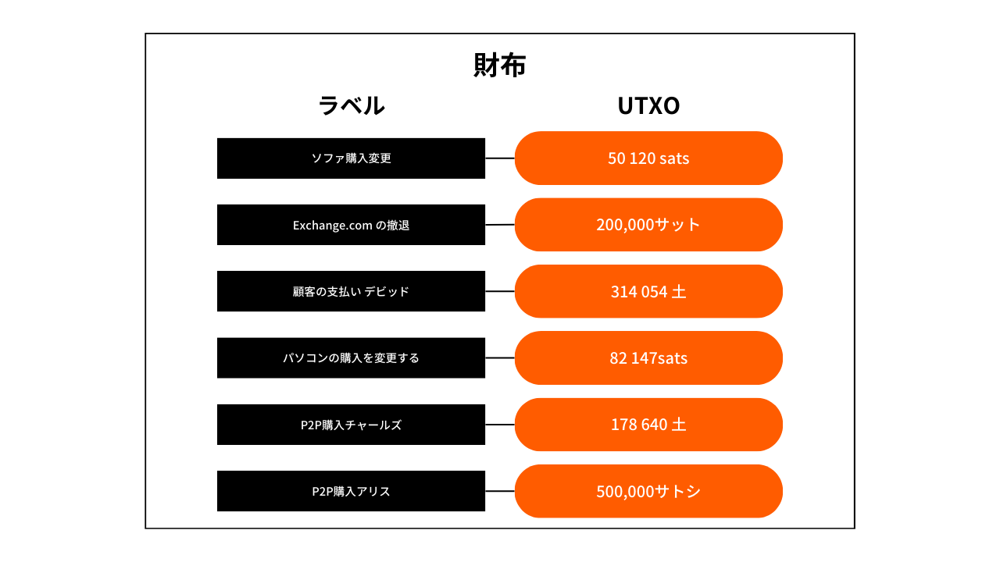

ウォレット内のUTXOの管理を洗練させ、資金の分離戦略に従うために、これらの分離を反映する追加の指標をラベルに豊かにすることができます。ウォレットに混合したくない2つのカテゴリのUTXOが含まれている場合、これらのグループを明確に区別するマーカーをラベルに統合できます。これらの分離マーカーは、KYCを伴う取得プロセスからのUTXOと、プロフェッショナルとパーソナルの資金との区別など、あなた自身の基準に依存します。前述のラベル例を取ると、これは以下のようになります：
- `KYC - Withdrawal Exchange.comからの引き出し`;
- `KYC - Payment Client Davidからの支払い`;
- `NO KYC - P2P Purchase Charlesからのピアツーピア購入`;
- `NO KYC - Change from sofa purchaseからのソファ購入のおつり`

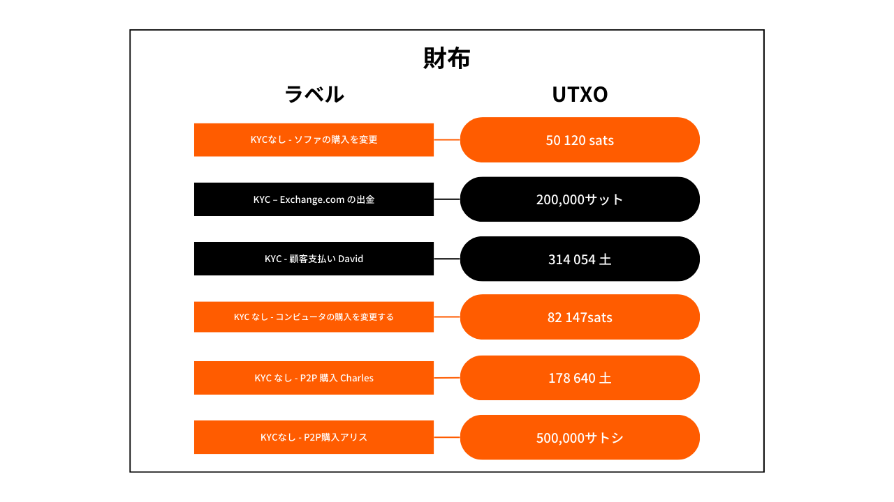
コインのラベリングをトランザクション全体で継続することも推奨されます。例えば、KYCなしのUTXOを統合する際には、結果として得られるUTXOを単に`consolidation`とマークするのではなく、コインの起源の明確な痕跡を維持するために`no-KYC consolidation`と具体的にマークすることが重要です。
最後に、ラベルに日付を入れることは必須ではありません。ほとんどのウォレットソフトウェアは既にトランザクションの日付を表示しており、TXIDを使用してブロックエクスプローラーでこの情報を取得することは常に可能です。

### コインの選び方

トランザクションを行う際、コインコントロールを使用すると、支払いの出力を満たすためにどのUTXOを入力として消費するかを具体的に選択できます。この選択には2つの側面を考慮する必要があります：
- 支払いの受取人が使用された入力としてのUTXOにあなたの身元の一部を関連付ける可能性；
- 外部の観察者が入力として消費されたすべてのUTXO間のリンクを確立する能力。
最初の点を説明するために、具体的な例を挙げましょう。地元のパン屋からビットコインでバゲットを購入するとします。少なくともバゲットの価格とトランザクション手数料をカバーするために、所有する1つ以上のUTXOを入力として使用します。すると、パン屋はあなたの顔や、彼らが知っているあなたの身元の他の部分を、入力として使用されたコインと関連付ける可能性があります。このリンクの存在を知っている場合、支払いを行う際に特定のUTXOを別のものよりも選択することを好むかもしれません。

例えば、あなたのUTXOの1つが取引プラットフォームから来ており、パン屋にこのプラットフォーム上のあなたのアカウントを知られたくない場合、そのUTXOを支払いに使用することを避けるでしょう。また、ビットコインの大量を示す高価値のUTXOを所有している場合、パン屋にあなたのBTCの財産を知られないようにするために、それを使用しないことを選ぶかもしれません。

したがって、この最初の点におけるUTXOの使用選択は、あなたが明らかにすることを望むかどうかに影響される個人的な決定に基づいています。受け取った際にUTXOに割り当てたラベルは、一度使われた後、受取人に対してあなたが快適に公開する情報のみを露出させるものを選択するのに役立ちます。

受取人に潜在的に明らかにされる情報を超えて、入力の選択はまた、ブロックチェーンのすべての観察者に対してあなたが公開する情報にも影響を与えます。実際、トランザクションのために複数のUTXOを入力として使用することにより、それらが同一のエンティティによって所有されていることを明らかにします。これは、Common Input Ownership Heuristic (CIOH)によるものです。

コインを選択する際には、あなたが間もなく放送するトランザクションが使用されたすべてのUTXO間にリンクを作成することを認識する必要があります。このリンクは、特にUTXOが異なるソースから来ている場合、あなたの個人的なプライバシーにとって問題となる可能性があります。

例えば、Bisqからの私のno-KYC UTXOを、例えば、私の身元を知っている規制された取引プラットフォームからのUTXOと組み合わせることを避けたいとします。実際、これら2つのUTXOを同じトランザクションで入力として使用した場合、規制されたプラットフォームは私がBisqで購入したUTXOと私の身元をリンクすることができるようになりますが、それは以前は私の身元にリンクされていませんでした。
最終的に、トランザクションの入力として消費するUTXOを適切に選択するために最も重要なことは、複数のUTXOを使用しないようにすることです。可能であれば、支払いをカバーするのに十分な大きさの単一のコインを選択してください。これを行うことで、COINJOINに関連するリスクを完全に回避できます。しかし、個々のUTXOが支払いに十分でなく、複数を消費する必要がある場合は、望ましくないリンクのリスクを最小限に抑えるために、類似のソースからのものを選択するようにしてください。また、受取人が入力として使用されたコインの履歴とあなたに関する情報を関連付ける可能性があることを念頭に置いてください。

### 自動コイン選択の理解

前のセクションでは、トランザクションのためのUTXOの手動選択について議論しました。しかし、ウォレットソフトウェアがこの選択を自動的に行う場合はどうなるのでしょうか？消費するコインを決定するためのいくつかの方法が存在し、UTXOの選択はBitcoinにおける実際の研究分野です。この自動プロセスの主な目的は、しばしばユーザーのトランザクション手数料を最小限に抑えることです。

FIFO（*First In First Out*）やLIFO（*Last In First Out*）などのUTXO選択方法は、最も単純ですが、効率が最も低いものの一つです。FIFOでは、ウォレット内の最も古いコインが最初に使用されます。このアプローチは、トランザクション手数料を最小限に抑えるためやプライバシーを保護するために一般的に非効率的ですが、相対的なタイムロックが使用され、定期的に更新される必要がある場合を除きます。逆に、LIFOは最も新しいUTXOの使用を優先します。これら二つの方法は単純ですが、しばしば非効率的であることが証明されています。

より進んだ方法は、*Knapsack Solver*です。これはBitcoin Coreウォレットでバージョン0.17まで使用されていた方法です。ウォレットからUTXOを反復的かつランダムに選択し、サブセットに追加し、トランザクションの重量を可能な限り減らす解を保持することにより、ユーザーの手数料を減らすことを目的としています。
*Branch-and-Bound*（BNB）、しばしばその発明者を指して「Murch's algorithm」と呼ばれるものは、Bitcoin Coreでバージョン0.17から*Knapsack Solver*に取って代わりました。このより進んだ方法は、トランザクションの出力を満たすために必要な金額に正確に一致するUTXOのセットを見つけることを目指しています。BNBの目標は、即時コストと変更に期待される将来のコストの両方を考慮するいわゆる廃棄基準を減らすことにより、変更の量と手数料を最小限に抑えることです。この方法は、1960年にAilsa LandとAlison Harcourtによって設計された元の*Branch-and-Bound*の概念から派生しており、*Knapsack Solver*と比較して手数料のより正確な最適化を提供します。
これらの自動UTXO選択方法は、トランザクション手数料を削減する上で効果的である可能性がありますが、ユーザープライバシーの保護においてはしばしば非効率です。実際、これらのアルゴリズムは複数のUTXOを入力にマージすることができ、これらのUTXOの共通の所有権をCOHのために明らかにすることがあります。明らかに、これらの方法はUTXOに付けられたラベルを考慮することはできませんが、これはトランザクションの受取人に明らかにするコインを意識的に選択するために重要です。現在、コインを選択する際にプライバシーを最適化する唯一の解決策は、手動で行うことです。

### UTXOラベリングに関するチュートリアル

あなたのUTXOにラベルを付ける方法を知りたい場合は、既存の主要なビットコインウォレットソフトウェアに関する完全なチュートリアルを作成しました：

https://planb.network/tutorials/privacy/utxo-labelling


## KYCとキー識別
<chapterId>cec6b9d9-0eed-4f85-bc4e-1e9aa59ca605</chapterId>
KYCは"Know Your Customer"（顧客を知る）の略で、ビットコイン業界で活動する一部の企業によって実施されている規制手続きです。この手続きは、顧客の身元を確認し記録することを目的としており、マネーロンダリングやテロ資金調達と戦うことを目標としています。
具体的には、KYCは顧客からさまざまな個人データを収集することを含みます。これは管轄区域によって異なる場合がありますが、一般的には身分証明書、写真、居住証明が含まれます。これらの情報はその後、検証され、将来的な使用のために保持されます。

この手続きは、西洋諸国の大多数で規制された交換プラットフォームすべてに対して義務付けられています。これは、これらのプラットフォームを通じて法定通貨をビットコインに交換したいと考える人は誰でも、KYCの要件を満たさなければならないことを意味します。
この手続きは、ユーザーの機密性とセキュリティに対するリスクも伴います。この章では、これらのリスクを詳細に検討し、KYCと識別プロセスがビットコインユーザーのプライバシーにどのような特定の影響を与えるかを分析します。
### オンチェーントラッキングの容易化

KYCに関連する最初のリスクは、チェーン分析のための特権的な入口を提供することです。前の部分で見たように、分析者はトランザクションパターンとヒューリスティックを使用してブロックチェーン上の活動をグループ化し追跡することができます。ユーザーのオンチェーン活動をクラスタリングすることに成功したら、そのすべてのトランザクションとキーの中からたった一つの入口を見つけるだけで、その人のプライバシーを完全に侵害するのに十分です。


KYCを受けるとき、あなたは交換プラットフォームからビットコインを引き出す際に使用した受取アドレスを完全かつ検証された身元にリンクすることで、チェーン分析のための非常に高品質な入口を提供します。理論的には、この情報はあなたが提供した企業にのみ知られていますが、後ほど見るように、データ漏洩のリスクは現実的です。さらに、企業がこの情報を保持しているという事実自体が問題となる可能性があります、たとえそれを共有しない場合でも。

したがって、ブロックチェーン上の活動のグループ化を制限するために他の措置を講じない場合、KYCを知っている人は誰でも、あなたのビットコイン上のすべての活動をあなたの身元にリンクする可能性があります。この企業の観点からすると、あなたのビットコインの使用はすべての機密性を失います。


比較でこれを説明すると、あなたが*Bank X*の銀行員であるかのように、*Bank X*で行われたすべての取引だけでなく、*Bank Y*との取引やすべての現金取引を観察することができるということです。

このトレーニングの最初の部分から覚えておいてください：ビットコインのプライバシーモデルは、サトシ・ナカモトによって設計されたもので、ユーザーの身元とそのキーペアとの間の分離に依存しています。このプライバシーの層は今日では十分ではないかもしれませんが、できるだけその劣化を限定することは賢明です。

### 国家監視への露出

KYCのもう一つの大きな問題は、あなたがある時点でビットコインを所有していたことを国家に明らかにすることです。規制されたアクターを通じてビットコインを購入すると、国家がこの所有を知ることが可能になります。現在、これは些細なことのように思えるかもしれませんが、あなたの国の政治的および経済的未来があなたの手にはないことを覚えておくことが重要です。
何よりもまず、国家は迅速に権威主義的な立場を採用する可能性があります。政策が突然変更された例は歴史に満ちています。今日、ヨーロッパではビットコイン愛好家はビットコインについての記事を書いたり、会議に参加したり、自己管理のウォレットを管理することができます。しかし、明日何が起こるか誰が言えるでしょうか？もしビットコインが突然公共の敵番号一になったら、国家の記録にそれと関連付けられることは問題となる可能性があります。
次に、深刻な経済危機に直面した場合、国家は市民が保持するビットコインを押収することを検討するかもしれません。おそらく明日には、ビットコイン保有者は危機の利益を得ていると見なされ、法定通貨の価値下落に直面して資本利得により過度の税金を課されるでしょう。
あなたは自分のビットコインが混在しており、したがって追跡不可能であるため、これは問題ではないと思うかもしれません。しかし、追跡が問題ではありません。本当の問題は、国家があなたがビットコインを所有していたことを知っているということです。この単純な情報だけで、あなたを告発したり、説明を求めることができるかもしれません。ビットコインを使い果たしたと主張することもできますが、これはあなたの税務申告に反映されるべきであり、捕まるでしょう。また、ボート事故で鍵を失ったと言うこともできますが、Twitter上の冗談を超えて、本当にそれがあなたを免罪するのに十分だと思いますか？

したがって、今日は遠いように思えるかもしれませんが、国家があなたがBTCを所有していたことを知る可能性に関連するリスクを考慮することが重要です。

KYCが国家監視の観点から提起する別の問題は、規制されたプラットフォームによる強制的な報告です。他の管轄区域の規制については詳しくありませんが、フランスでは、*Digital Asset Service Providers*（PSAN）は、疑わしいと考える資金の動きを金融監督当局に報告することが求められています。

したがって、2023年のフランスでは、PSANによって1,449件の疑わしい行為が報告されました。現在、これらの行為の大部分は犯罪に関連しています。しかし、当局はまた、その構造に基づいて疑わしいビットコイン取引を報告するように規制されたプラットフォームに求めています。協力的な取引を行う場合、またはやや異型のパターンを示す取引を行う場合、そしてこの取引がこれらのプラットフォームからのビットコインの引き出しに近い時期に発生する場合、あなたは当局に報告される可能性があります。不正行為がなく、あなたの権利を正当に行使している場合でも、この報告は増加したチェックと監視、KYCなしで避けられたであろう不便を引き起こす可能性があります。

### 個人データの漏洩リスク
KYCに関連する別の問題は、すべての個人データを民間企業のサーバーに保存する必要があるという事実にあります。最近の出来事は、金融またはIT関連の失敗であろうと、誰もが失敗から免れていないことを私たちに思い出させました。2022年、Celsiusの顧客はその結果を受け入れざるを得ませんでした。同社の破産に続き、債権者の名前とその資産の額は、行政手続き中にアメリカの司法システムによって公開されました。

2年以上前、暗号通貨ドメインの主要なサイバーセキュリティエンティティは、クライアントの個人データの盗難を経験しました。この事件はビットコインの購入と直接関連していなかったにもかかわらず、このリスクは交換プラットフォームにも残ります。したがって、これらの個人データに関連する明確なリスクがあります。

私たちはすでに多くの個人データを民間企業に委ねています。しかし、ここでのリスクは二重です。これらのデータはあなたを識別するだけでなく、ビットコインでの活動にも関連しているからです。交換プラットフォームのクライアントのデータにアクセスできるハッカーは、これらのクライアントがビットコインを所有していると合理的に推測できます。このリスクは、ビットコインが他の貴重な資産と同様に、泥棒の関心を引くという事実によって高まります。

データ侵害の場合、最良のシナリオでは、ターゲットとなるフィッシング試みの対象となる可能性があります。最悪の場合、自宅への物理的な脅威の中心に自分自身を見つけることがあります。
ビットコインに関連する特定のリスクに加えて、身分証明書の送信に関連する危険性も考慮する必要があります。実際、データ漏洩の場合、身元盗用の被害者になる可能性があります。したがって、課題は取引の機密性の保護に限定されるのではなく、個々の個人の安全にも関係しています。

### KYCに関する一般的な誤解

KYC（Know Your Customer）に関するいくつかの一般的な誤解を解明することが重要です。これらは、Twitterやビットコイナー間の議論で頻繁に見られます。
まず第一に、KYCを通じて取得したビットコインのプライバシーを守ることが無意味であると考えることは誤りです。ビットコインのプライバシーに関するツールや方法は多岐にわたり、異なる目的を果たします。例えば、KYCからのビットコインに対するコインジョイン取引の使用は悪い考えではありません。もちろん、アカウントの凍結や禁止を避けるために規制された取引プラットフォームには注意が必要ですが、厳密に技術的な観点からは、これらの実践は互換性がありません。コインジョインはコインの履歴を断ち切る効果があり、KYCに関連するチェーン分析のリスクの一部を回避するのに役立ちます。すべてのリスクを排除するわけではありませんが、すでに大きな利点を表しています。


ビットコイン上のプライバシーは、"匿名"のビットコインとそうでないものとの間の二項対立として見るべきではありません。KYCを通じて取得したビットコインを所有しているからといって、すべてが失われたわけではありません。逆に、プライバシーツールの使用はさらに有益であることが証明されるかもしれません。

逆に、非KYC方法でビットコインを取得しても、完璧なプライバシーが保証されるわけではなく、他の保護措置を講じる必要が免除されるわけではありません。非KYCビットコインを保持しているが、受信アドレスを複数回再利用する場合、取引は追跡され、グループ化される可能性があります。ビットコインの外の世界との最小限のリンクでも、あなたが持っていた唯一のプライバシー層を危険にさらす可能性があります。したがって、ビットコインのプライバシーを向上させるすべてのツールや方法を補完的なものとして考慮することが重要です。各技術は特定のリスクに対処し、追加の保護層を追加することができます。したがって、非KYCビットコインを所有しているからといって、他の予防措置を講じることが免除されるわけではありません。

### KYCは元に戻せるか？

KYCを完了した後に「元に戻す」ことが可能かどうか時々尋ねられますが、前述の段落から想像できるように、答えは微妙です。KYCに関連するリスクを避ける最も簡単な方法は、ビットコインを取得する際にそれを使用しないことです。このトピックについては次の章で詳しく掘り下げます。しかし、KYCが既に行われ、ビットコインが購入されている場合、負担したリスクを軽減する方法はありますか？

取引の追跡可能性のリスクに関しては、コインジョインの使用が解決策です。この方法については、トレーニングの後半で詳しく議論しますが、コインジョインはコインの履歴を断ち切り、過去-現在および現在-過去の追跡を防ぐことができることを知っておいてください。規制されたプラットフォームを介して取得したBTCであっても、この技術はその追跡可能性を防ぐことができます。
しかし、コインジョインはKYC（Know Your Customer：顧客確認）に関連する2番目のリスクを排除しません。つまり、国家があなたのビットコイン保有を知っているという事実です。実際、あなたのコインがもはや追跡可能ではなくなったとしても、管轄区域によっては、国家があなたの暗号資産の処分宣言にアクセスできる可能性があります。このリスクは技術的なものではなく行政的なものであるため、最初からKYCにさらされない以外に、これを排除するビットコイン固有の解決策はありません。このリスクを軽減する唯一の合法的な方法は、規制されたプラットフォームで取得したビットコインを規制されたプラットフォームで売却し、KYCなしの手段で再購入することです。売却して処分を宣言することで、行政はあなたがそれらをもはや所有していないことを記録すべきです。

個人データや身分証明書の漏洩リスクについては、これはビットコイン外の危険であり、これを避ける技術的な解決策はありません。一度データが公開されると、この操作を元に戻すことは困難です。プラットフォーム上でアカウントを閉じることを試みることができますが、これは特に身元確認が外部委託されている場合、KYCデータの削除を保証するものではありません。あなたの情報の完全な削除を確認することは不可能です。したがって、このリスクを完全に防ぐ解決策はなく、それが存在しないことを保証することはできません。

### KYCと鍵識別の違い

時に、ビットコイナーの中には、「KYC」という用語を、転送やクレジットカード支払いを伴うあらゆるBTC交換に拡張する傾向があります。これらの手段もまた、KYCがそうであるように、支払いの起源を明らかにすることができるからです。しかし、KYCと鍵識別を混同しないことが重要です。個人的には、この主題に対する私の認識は時間とともに進化してきました。

KYCは、顧客の身元を確認し記録するために一部の企業によって実施される規制手続きを具体的に指します。それは二元的なものです：ビットコインを取得する際、KYCを受けるか受けないかのどちらかです。しかし、鍵識別は、ユーザーの身元の側面をオンチェーン活動にリンクすることに関係し、それほど二元的ではなく、むしろ連続体を表します。実際、ビットコインの取得や処分の文脈では、この識別は常に異なる程度で可能です。
例えば、スイスの規制されたプラットフォームでビットコインを購入する場合、KYC（Know Your Customer：顧客確認）は必要ありません。しかし、購入があなたの銀行口座を通じて行われたため、鍵の識別があるかもしれません。これは、KYCに関連する最初の2つのリスク — オンチェーン追跡の容易化と国家監視への露出 — が、非KYC交換でも現れ得るところです。もしスイスのエンティティがあなたの国の当局に怪しい取引を報告した場合、彼らは購入に使用された銀行口座をチェックするだけであなたの身元を発見できます。したがって、規制されたプラットフォームでKYCなしで購入することは、鍵識別のリスクスケールでかなり高いと言えます。

しかし、規制されたプラットフォームを避け、P2P（Peer-to-Peer）取得方法を選択することは、鍵識別のリスクを完全に排除するわけではなく、単にそれを減少させるだけです。Bisqや他のP2Pプラットフォームでの購入の例を考えてみましょう。取引相手と決済するために、おそらく銀行口座を使用するでしょう。当局があなたと取引した人物に質問し、あなたの名前を求めた場合、先に述べたリスク1と2に遭遇します。これらのリスクは、プラットフォーム上での非KYC購入時よりも確かにはるかに低く、KYCを伴う購入時よりもさらに低減されていますが、それでもある程度存在します。
最終的に、現金でビットコインを物理的に交換して入手したとしても、完全に匿名でいることはできません。取引を行った相手はあなたの顔を見ており、それはあなたの身元の一部です。この例では最小限ですが、重要な身元特定の可能性がまだあります。


結論として、ビットコインを他の資産と交換する際、それが法定通貨での購入であろうと実物の販売であろうと、常に何らかの形で重要な身元特定が行われます。交換の方法によって、この身元特定の程度は異なります。この身元特定をKYC、つまりよく定義された規制プロセスと混同しないことが重要です。しかし、KYCと身元特定のスペクトラムとの間にはリンクがあります。なぜならKYCはこのスペクトラムの上端に位置し、当局によるユーザーのキーの特定を系統的に容易にするからです。

## 販売と取得の方法
<chapterId>756598af-95aa-4c77-ac48-243c7ad89530</chapterId>
前章を読んだ後、KYCに関連するリスクを避けるために、身元確認プロセスを経ずにビットコインを購入または販売する方法について疑問に思うかもしれません。交換を行う方法はいくつかあります。

### 現金P2P交換

見てきたように、プライバシーの観点から最も優れた方法は、現金決済でのP2P（ピアツーピア）交換です。この方法では、残される痕跡を最小限に抑え、キーの特定の可能性を大幅に減らすことができます、それが買い手であろうと売り手であろうと。


しかし、この実践は個人の安全に対するリスクを伴います。主な危険は、交換中に相手があなたが現金またはビットコインでかなりの量を持っていることを知るという事実にあります。この情報は悪意のある個人の注意を引く可能性があります。実際、ビットコインの所持については控えめでいることが一般的に推奨されます。このアドバイスは現金にも適用されるかもしれません。しかし、対面での交換では、ビットコインを所持していることを明らかにすることは避けられず、それが欲望を引き起こす可能性があります。


このリスクを限定するために、家族や親しい友人のような信頼できる個人との現金取引を優先することをお勧めします。また、[地元のBitcoinミートアップ](https://btcmap.org/communities/map)で交換を検討することもできますが、数回参加した後に行うことです。これにより、他の参加者をよりよく知り、物理的な交換中に一人でいないようにすることができます。しかし、現金P2P交換は、規制されたプラットフォームや銀行口座を介して購入する場合には存在しない、個人の安全に対する固有のリスクを伴うことを認識することが重要です。

さらに、住んでいる場所によっては、大金を持ち歩いたり保管したりすることがリスクを伴う場合があります。それがビットコインであろうと現金であろうとです。

現金交換は、警察の検査などの際にも法的リスクを伴う可能性があります。ほとんどの国では、持ち歩ける現金の量に制限はありませんが、大きな金額は疑念を抱かせることがあります。したがって、特に長距離を移動する必要がある場合は注意し、一度にあまりにも大きな取引を行わないようにして、大量の所持を正当化する必要がないようにしてください。
P2P取引のもう一つの欠点は、価格が規制されたプラットフォームで観測される価格よりもしばしば高いことです。売り手はしばしば1%から時には10%以上のマークアップを課します。この価格差にはいくつかの理由があります。まず、P2P売り手の間で時間をかけて確立された一般的な慣習です。次に、売り手は購入者に資金を送信する際の取引手数料を負担しています。P2P販売ではプラットフォーム上の取引と比較して盗難のリスクが高まるため、そのリスクを補償することも正当化されます。最後に、追加料金は需要とプライバシーの観点からの交換の質に関連していることがあります。購入者として、プライバシーの向上は売り手が適用するマークアップに反映される価格があります。一部のビットコイナーは、P2Pで購入したBTCの価格がその真の価値を反映していると信じており、規制されたプラットフォーム上の低価格は個人データのプライバシーに関する妥協の結果であると主張しています。

### マッチングプラットフォームを介したP2P取引

個人の安全性の観点からリスクが少ない代替手段は、PayPal、銀行振込、またはRevolutなどの電子支払い方法を使用して、P2P取引を完全にオンラインで行うことです。

このアプローチは、現金取引に関連する多くのリスクを避けるのに役立ちます。しかし、オンライン交換中に相手方が約束を守らないリスクはより大きくなります。実際、対面で交換する際に、売り手がビットコインを送らずにお金を渡した場合、彼らはあなたの目の前にいるので、すぐに責任を問うことができます。一方、オンラインでは、あなたから盗んだ人を見つけることはしばしば不可能です。

このリスクを軽減するために、P2P取引のマッチングに特化したプラットフォームを使用することが可能です。これらのプラットフォームは、被害を受けたユーザーを保護するための紛争解決メカニズムを使用します。一般的に、売り手によって法定通貨の支払いが確認されるまでビットコインを保持するエスクローシステムを提供します。

個人の安全性の観点から、この購入方法は現金交換よりも大幅に安全です。しかし、前述のように、オンラインP2P取引は物理的な交換よりも多くの痕跡を残すため、Bitcoin上でのプライバシーにとって不利になる可能性があります。銀行のようなオンラインの法定通貨支払い方法を使用することで、鍵の識別を容易にする可能性のある情報をより多く公開します。

再度、これらのプラットフォームでの大規模な取引を単一の取引で行わないことをお勧めします。取引を分割することで、相手方による潜在的な盗難に関連するリスクを分散します。
P2P取引のもう一つのデメリットは、価格が規制されたプラットフォームで見られる価格よりもしばしば高いことです。売り手は1%から時には10%以上にも及ぶマークアップを課すことがよくあります。この価格差にはいくつかの理由があります。まず、P2P売り手の間で時間をかけて確立された一般的な慣習です。次に、売り手は購入者に資金を送る際の取引手数料を負担しています。また、プラットフォーム上の取引と比較してP2P販売では盗難のリスクが高まるため、そのリスクを取ることの補償が正当化されます。最後に、追加料金は、プライバシーの面での交換の需要と品質に関連している場合があります。購入者としては、プライバシーの向上には価格が反映され、それが売り手によって適用されるマークアップに反映されます。一部のビットコイナーは、P2Pで購入したBTCの価格上昇がその真の価値を反映していると信じ、規制されたプラットフォーム上の低価格は個人データのプライバシーの妥協の結果だと主張しています。

解決策に関しては、私は個人的に常に[Bisq](https://bisq.network/)を使用しており、非常に満足しています。彼らのシステムは確立されており、信頼できると思われます。しかし、BisqはPCでのみ利用可能であり、そのインターフェイスは初心者には複雑すぎるかもしれません。もう一つの欠点は、Bisqがオンチェーントランザクションのみで動作し、Bitcoinの取引手数料が高騰する期間にはコストがかかることです。

[-> Bisqに関するチュートリアルを見る。](https://planb.network/en/tutorials/exchange/bisq)

よりシンプルなオプションをお探しの場合は、統合された紛争解決システムを備え、購入者と売り手の間の接続を容易にするモバイルアプリの[Peach](https://peachbitcoin.com/)を試してみることができます。そのプロセスはBisqよりも直感的です。

[-> Peachに関するチュートリアルを見る。](https://planb.network/en/tutorials/exchange/peach-wallet)
オンラインの別のオプションは、良好な流動性を提供する確立されたプラットフォームである[HodlHodl](https://hodlhodl.com/)ですが、私は個人的にはテストしていません。
[-> HodlHodlに関するチュートリアルを見る。](https://planb.network/en/tutorials/exchange/hodlhodl)

Lightning Networkに基づくソリューションをお探しの場合は、[RoboSats](https://learn.robosats.com/)と[LNP2PBot](https://lnp2pbot.com/)を試すことができます。RoboSatsはウェブサイトを通じてアクセス可能で、比較的使いやすいです。LNP2PBotはより特異で、Telegramメッセージングアプリ上の交換システムを通じて動作します。

[-> RoboSatsに関するチュートリアルを見る。](https://planb.network/en/tutorials/exchange/robosats)
[-> LNP2PBotに関するチュートリアルを見る。](https://planb.network/en/tutorials/exchange/lnp2pbot)

### KYCなしの規制プラットフォーム

お住まいの国によっては、KYC手続きを必要としない規制プラットフォームを利用できる場合があります。たとえばスイスでは、[Relai](https://relai.app/)や[MtPelerin](https://www.mtpelerin.com/)のようなプラットフォームを使用できます。

[-> Relaiに関するチュートリアルを見る。](https://planb.network/en/tutorials/exchange/relai)
前章で見たように、このタイプのプラットフォームはKYC手続きに伴うリスクを回避してくれますが、鍵の識別に関してはより高いリスクを提示します。ビットコインのプライバシーに関して言えば、これらのプラットフォームはKYCを伴う購入方法よりも優れた保護を提供しますが、P2P取引所よりも魅力的ではありません。
しかし、個人のセキュリティの観点からは、これらのプラットフォームを使用することはP2P取引所を使用することよりも大幅にリスクが低いです。また、P2P取引所を容易にするプラットフォームよりも使用が簡単であることが多いです。

### ATM

KYCなしでビットコインを購入または販売する別のオプションは、暗号通貨ATM（ATM）です。個人的には、私の国にはないため、この解決策を試す機会がありませんでした。しかし、居住地によってはこの方法が非常に興味深いものになる可能性があります。


ATMの問題点は、一部の国では禁止されているか、他の国では厳しく規制されていることです。ATMが身元確認プロセスを要求する場合、それは規制されたKYCプラットフォーム固有のリスクと同じリスクに直面します。しかし、ATMが小額の取引に対して身元確認なしで取引を許可する場合、その使用は現金ベースのP2P取引所と同等のプライバシーレベルを提供しつつ、このタイプの取引所に関連するほとんどのリスクを回避することができます。
ATMの主な欠点は、交換手数料が高いことが多く、交換額の数パーセントから時には15%にも及ぶことがあります。

### ギフトカード

最後に、ビットコインを日常的に購入に使用したいと考えている人々にとってうまく機能する解決策を紹介したいと思います。

BTCを使う最良の方法は、明らかにビットコインを直接使用するか、Lightning Networkを使用して商品やサービスを購入することです。しかし、多くの国ではビットコインを受け入れる商人の数が限られています。その場合の実用的な代替手段は、ギフトカードの使用です。

KYC手続きを要求しないいくつかのプラットフォームは、主要な店舗で使用できるギフトカードとビットコインを交換する可能性を提供しています。これらのプラットフォームには、[CoinsBee](https://www.coinsbee.com/)、[The Bitcoin Company](https://thebitcoincompany.com/)、および[Bitrefill](https://www.bitrefill.com/)が含まれます。これらのプラットフォームは、法定通貨への変換を行うことなく、幅広い製品やサービスへのアクセスを可能にすることで、ビットコインの日常使用を大いに容易にします。


### その他の取得方法

プライバシーを保護しながらビットコインを取得する他の方法として、明らかにマイニングがあります。マイニングsatsを開始するには、身元を明かす必要はありません。有効なプルーフ・オブ・ワークを見つけてネットワークに提出するだけです。プールマイニングを選択する場合、一部のプールはKYCのような身元確認の形式を要求することがありますが、他のプールは要求しません。

別の方法は、ビットコインと引き換えに働くことです。この取得方法は興味深いものになる可能性がありますが、要求される識別の程度は状況によって大きく異なります。

*この章を書くために、PlanB Networkで[@pivi___](https://x.com/pivi___)によって作成されたコース[BTC205](https://planb.network/fr/courses/btc205)を使用しました（現時点ではフランス語でのみ利用可能）。*

## 統合、UTXO管理、およびCIOH
<chapterId>d0486c8f-332d-402b-ae2e-949416752b9c</chapterId>

自分自身のセルフカストディウォレットを管理する際に最も複雑な側面の一つは、間違いなく統合（コンソリデーション）です。統合すべきか？その目的は何か？目指すべきUTXOのサイズは？プライバシーに関してはどのようなトレードオフがあるのか？このセクションでは、これらを探求しようと思います。

### 統合とは何か？

Bitcoinの運用は、最良の手数料を提供するトランザクションをマイナーが優遇するオークション市場に似ています。しかし、各ブロックには最大重量があり、含めることができるトランザクションの数に制限があります。ブロックは平均して10分ごとに生成されるため、各ブロックの利用可能なスペースは希少なリソースです。

電気、資本、およびメンテナンスにかかる費用が大きいマイナーは、自然と利益を最大化しようとします。彼らは、重量に対して最も多くの手数料を提供するトランザクションを優遇する傾向があります。

実際、すべてのBitcoinトランザクションの重量が同じではありません。入力と出力が多いものは、重量が増します。例えば、2つのトランザクションを考えてみましょう：
- トランザクションAは1つの入力と1つの出力を含み、1,994サトシの手数料を割り当て、その重量は141 vBです；
- トランザクションBはより複雑で、2つの入力と2つの出力を含み、2,640サトシの手数料を220 vBの重量で割り当てます。

この例では、トランザクションBが合計でより高い手数料を提案しているにもかかわらず、マイナーは手数料と重量の比率がより良いトランザクションAを優遇します。ここに、各トランザクションの計算があります。これはサトシ/バーチャルバイト（sat/vB）で表されます：

```text
TXA: 1994 / 141 = 14 sats/vB

TXB: 2640 / 220 = 12 sats / vB
```

これは、重量の単位ごとに、トランザクションAがトランザクションBよりも多くの手数料を提供することを意味します。後者は絶対値でより多くの手数料を提供しているにもかかわらずです。

したがって、ユーザーにとっては、トランザクションで可能な限り少ない入力を消費することが常により興味深いです。しかし、出力で支払いを満たすためには、十分な量を消費する必要があります。そのため、ウォレットを管理する際には、十分に大きなUTXOを持っている必要があります。

統合の原則は、Bitcoin上で手数料が低い期間を利用して、小さなUTXOを1つの大きなものに統合することです。このようにして、Bitcoin上で手数料が上昇したときに、最小限の入力でトランザクションを行い、絶対的な手数料を少なくすることができます。目標は、手数料が高い期間中に実行される必要があるトランザクションを計画することです。

トランザクション手数料の節約に加えて、UTXOを統合することは、「ダスト」の生成を避けるのにも役立ちます。ダストとは、そのサトシの価値がそれを使うために必要なトランザクション手数料をカバーするのに十分でないほど低いUTXOを指します。これにより、トランザクション手数料が高い限り、これらのUTXOを経済的に非合理的に使用することになります。UTXOを積極的にグルーピングすることで、それらがダストに変わるのを防ぎ、すべての資金が使用可能であることを確保します。

### UTXOの最小サイズは？

時々、UTXOの推奨される最小値は何かと尋ねられます。残念ながら、手数料の市場条件とあなたの好みに依存するため、普遍的な答えはありません。しかし、あなたのニーズに合った閾値を決定するのに役立つ式がこちらです：

$$
\frac {P \times F}T = M
$$

ここで：
- $P$ はトランザクションの重量です；
- $F$は、あなたがカバーする最大の手数料率をサトシ/バイト（sats/vB）で表します。
- $T$は、UTXOの総価値に対して支払うことを意志する取引手数料の割合です。
- $M$は、各UTXOに対する最小額をサトシで表します。

標準的なSegWit取引で1入力と2出力をカバーすることを計画していると仮定し、その重さが141 vBである場合、800 sats/vBまでをカバーし、最大でUTXOの価値の12%までの手数料を支払うことを意志しているなら、計算は以下のようになります：

$$
\frac{141 \times 800}{0.12} = 940\ 000
$$

この例では、ウォレット内のUTXOの最小値を940,000サトシに保つことが賢明です。

### 統合とCOIH

チェーン分析で最も使用されるヒューリスティックの一つがCOIH（*Common Input Ownership Heuristic*、共通入力所有ヒューリスティック）であり、これによりビットコイン取引のすべての入力が同一のエンティティに属するという仮定が可能になります。具体的には、統合の原則は、複数のUTXOを入力として消費し、単一のUTXOを出力として作成することです。したがって、統合はCOIHの適用を可能にします。


実際には、これは外部の観察者が、統合されたすべてのUTXOがおそらく同一人物に属しており、生成された単一の出力も彼らに属すると推測できることを意味します。この状況は、異なる取引履歴をリンクすることで、あなたのプライバシーを危険にさらす可能性があります。例えば、P2Pで取得した3つのUTXOを、KYCが必要なプラットフォームを通じて取得したUTXOと統合するとしましょう：


このようにすることで、取引プラットフォームのデータにアクセスできる任意のエンティティ、政府機関を含む可能性があるものも、私が他のBTC額を所有していることを特定できます。以前は、これらのUTXOは私の身元に直接リンクされていませんでしたが、今はそうです。さらに、これはすべての情報源に、私がある量のビットコインを所有していることを明らかにします。

UTXOを管理する際、手数料を削減するために統合を推進する経済的な考慮事項は、UTXOを決して統合しないことを推奨する良好なプライバシー慣行と衝突します。したがって、経済とプライバシーの選択は、各ユーザーの優先順位に依存します。

UTXOのサイズを十分に保ちながら統合を避けることができれば、それが理想的です。これを行うには、取得方法を最適化します。ビットコインをDCAで購入する場合、一度の購入をできるだけ間隔を空けて価値を少数のUTXOに集約するようにしてください。2ヶ月に1回1,000ユーロの一度の購入を管理することは、毎週120ユーロの購入を管理するよりも簡単です。これにより、生成されるUTXOの数が最小限に抑えられ、ウォレットの管理が簡素化され、プライバシーが保護されます。
ビットコインを統合する必要がある場合は、まず同じソースからのUTXOを統合することを優先してください。例えば、単一のプラットフォームからの10個のUTXOをマージすることは、プラットフォームAからの5個のUTXOとプラットフォームBからの5個のUTXOを混合するよりも、あなたのプライバシーに与える影響が少ないです。さまざまなソースからの統合が避けられない場合は、それらを特性に応じて分けてみてください。例えば、KYCを通じて取得したUTXOを一つのトランザクションでグループ化し、P2Pで取得したものを別のトランザクションでグループ化します。
いずれにせよ、任意の統合は必然的にプライバシーの損失につながることを覚えておいてください。したがって、この操作の必要性と、リスクを考慮してプライバシーに与える可能性のある影響を慎重に評価してください。

## その他の良い実践
<chapterId>b5216965-7d13-4ea1-9b7c-e292966a487b</chapterId>

ビットコインでプライバシーを最適化するのに役立つ他の良い実践について一緒に探ってみましょう。

### フルノード
自分のビットコインを自己管理することは良いことですが、自分自身のフルノードを使用することはさらに良いです！ビットコインを完全に主権的に使用するために自分のノードを持つことが重要な理由はこちらです：
- **検閲抵抗性**：あなたのトランザクションは誰にもブロックされません；
- **第三者からの独立**：ブロックチェーンデータを検証するために外部サービスに依存することがなくなります；
- **積極的な参加**：自分自身の検証ルールを設定し、直接コンセンサスに参加する能力を持ちます；
- **ネットワークへの貢献**：ノードを運用することで、ビットコインネットワークを強化し、分散させるのに役立ちます；
- **技術教育**：フルノードを管理することは、ビットコインに関する技術知識を深める絶好の方法です。

これらの利点に加えて、フルノードを使用することは、トランザクションをブロードキャストする際のプライバシーも向上させます。トランザクションを発行するとき、それはまずあなたのウォレットを通じて作成され、署名されます。ビットコインネットワーク上でブロードキャストするためには、少なくとも1つのノードによって知られている必要があります。自分自身のノードを使用することで、このブロードキャストを直接制御し、プライバシーを強化し、データ漏洩のリスクを限定することができます。


自分自身のビットコインノードを持っていない場合、ウォレットソフトウェアプロバイダーが提供する第三者のものを使用することを余儀なくされます。トランザクションのブロードキャストに加えて、ウォレットは保留中のトランザクション、あなたのアドレスに関連付けられた残高、またはトランザクションの確認数など、さまざまな情報へのアクセスを必要とします。このすべてのデータにアクセスするためには、ノードに問い合わせる必要があります。


自分自身のビットコインノードを使用しない場合の主なリスクは、第三者のノードの運営者がブロックチェーン上のあなたの活動を観察したり、この情報を他のエンティティと共有する可能性があることです。このリスクを限定するための中間的な解決策は、Tor経由で接続をマスクすることを可能にするウォレットソフトウェアを使用することです。これにより、データの露出を減らすことができます。しかし、最適な解決策は、自分自身のビットコインノードを持ち、トランザクションのブロードキャストに使用することです。当然、ノードからの情報漏洩がないようにする必要もありますが、それは次のセクションで探る別のトピックです。
プライバシーの明らかな利点を超えて、自分自身のフルノードを持つことは、ブロックチェーン上のデータの真実性を保証し、検閲に対する保護を提供し、Bitcoinのガバナンスに積極的に参加することを可能にします。自分のノードを使用することで、選択したチェーンに経済的な重みを貢献し、これはコミュニティ内の対立が発生した際、例えば2015年から2017年のブロックサイズ戦争の間など、重要です。フォークの際に第三者のノードを使用すると、望まないチェーンを支持することになる可能性があります。なぜなら、ノードオペレーターが代わりに選択を行うからです。ご理解の通り、プライバシーとより広く個人の主権に関する懸念から、自分自身のフルノードを運用し使用することが不可欠です！

### 分析ヒューリスティックスを欺く

より広く言えば、前の部分で話したヒューリスティックスを理解し、それらをより良く避けたり欺いたりすることが重要です。一連の良い実践を採用することは有益であることが証明されています、たとえそれらが不可欠ではなくても。これらはBitcoinを使用する際に良好なプライバシーを維持するために重要な追加の保護層を提供します。

私が提供できる最初のアドバイスは、最も密集した群衆に溶け込むことです。Bitcoinでは、これは最も採用されているスクリプトパターンを使用することを意味します。例えば、SegWit V0マルチシグ設定によく使用されるP2WSHスクリプトは非常に珍しいです。これらはあなたが大きな匿名性セットに隠れることを許可しません。P2PKHやP2SHのような古いモデルについても同様です。これらはUTXOセットに広く存在していますが、新しいトランザクションでの使用は減少しています。

一般的に、最新のスクリプト標準に向かうことが安全ですが、それが十分に採用されている場合に限ります。したがって、2022年にはP2TR（Taproot）の使用を低採用率のために勧めなかったかもしれませんが、2024年には、P2TRを使用するトランザクションの数が非常に重要な部分を表し始めているため、このタイプのスクリプト、またはそれができない場合はSegWit V0スクリプトを選択することをお勧めします。


ソース: [txstats.com](https://txstats.com/d/000000054/utxo-set-repartition-by-output-type)
プライバシーを保持するための別のヒントは、トランザクションの内部ヒューリスティックスを回避しようとすることです。例えば、支払いを行う際には、他のアウトプットがおつりであることを示す可能性のある丸い金額のアウトプットを作成しないようにすることができます。友人に100k satsを送る必要がある場合は、このヒューリスティックを逃れるために、わずかに高い金額を転送することを検討してください。同様に、支払いに比べて不釣り合いに高いおつりアウトプットを作成しないようにしてください。これもまた、どのアウトプットがおつりであるかを明らかにする可能性があります。


最後に、定期的にBitcoinトランザクションを実行する場合は、常に同じ時間にそれらをブロードキャストしないようにしてください。トランザクションのブロードキャストを日中や週を通じて分散させることで、外部の観察者が時間帯に基づいて時間的なパターンを検出し、その分析を強化する能力を避けます。

これらの日常的に採用すべき良い実践を超えて、ビットコインの追跡可能性を完全に破るためのさらに効果的な方法があります。その中には、次の部分で詳しく学ぶコインジョイントランザクションが明らかに含まれます。

# コインジョイントランザクションを理解する
<partId>6d0bbf16-3714-4db1-9897-2d45019f6bdc</partId>

## コインジョイントランザクションとは何か？
<chapterId>0862bc6b-1c48-4aa4-b76d-4f547b469008</chapterId>

プライバシー保護の基礎を学んだ後、特にビットコインの履歴を非連携させることによって、プライバシーを積極的に守るためのより洗練された技術について話し合います。次の部分では、多くの小さな技術を探求しますが、まず、coinjoinについて話したいと思います。

Coinjoinは、ビットコインユーザーのプライバシーを保護する最も効果的な方法と考えられています。しかし、coinjoinトランザクションとは具体的には何でしょうか？一緒に見ていきましょう。

### Coinjoinの基本原則

Coinjoinは、ブロックチェーン上のビットコインの追跡可能性を断つ技術です。これは、同じ名前の特定の構造を持つ協力トランザクション、つまりcoinjoinトランザクションに依存しています。
このトレーニングの最初の部分で見たように、Bitcoin上のトランザクションは、ノードを通じてすべてのユーザーに知られています。したがって、各コインの電子署名チェーンを簡単に検証し、その履歴を観察することができます。これは、すべてのユーザーが他のユーザーのトランザクションを分析しようと試みることができることを意味します。その結果、トランザクションレベルでの匿名性は不可能です。しかし、個人識別のレベルでは匿名性が保持されます。従来の銀行システムでは各アカウントが個人の身元にリンクされているのに対し、Bitcoinでは、資金が暗号鍵ペア（またはスクリプト）に関連付けられており、ユーザーに暗号識別子の背後に擬似匿名性を提供します。
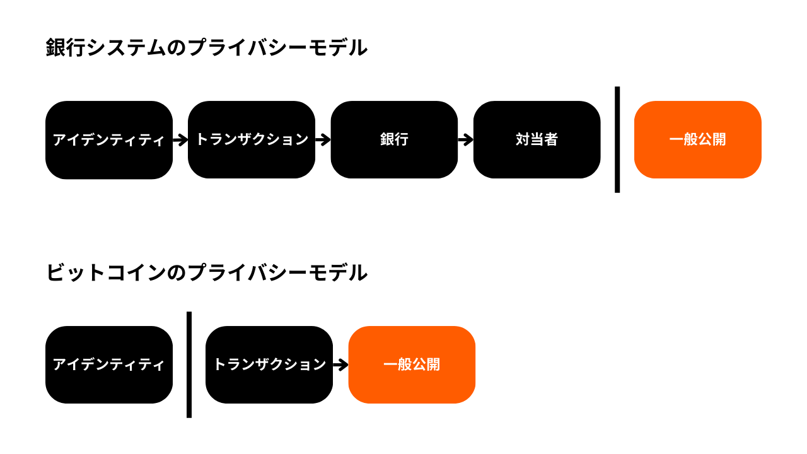

したがって、Bitcoin上の機密性は、外部の観察者が特定のUTXOを特定のユーザーと関連付けることに成功した場合に妥協されます。この関連付けが確立されると、そのトランザクションを追跡し、ビットコインの履歴を分析することが可能になります。Coinjoinは、UTXOの追跡可能性を断つために開発された技術であり、トランザクションレベルでBitcoinユーザーにある程度の機密性を提供することを目的としています。

Coinjoinsは、外部の観察者によるチェーン分析を複雑にすることで、Bitcoinユーザーの機密性を高めます。その構造は、異なるユーザーからの複数のコインを単一のトランザクションに統合することを可能にし、入力と出力アドレスの間のリンクを特定することを困難にし、足跡をぼかします。

コインの履歴を断つことがcoinjoinトランザクションの目標であることを理解することが重要です。この技術は永続的な匿名性を与えるものではなく、一部が考えるようにビットコインの追跡を完全にブロックするものでもありません。coinjoinの目的は、coinjoinトランザクションが実行される時点での履歴のみを断つことです。しかし、この操作の前後では、コインは同じプライバシーリスクの対象となります。


### Coinjoinsはどのように機能するのか？

coinjoinの原理は、協力的なアプローチに依存しています：ビットコインを混ぜ合わせたい複数のユーザーが、同じトランザクションの入力に同額を預けます。これらの金額は、各ユーザーに等しい値の出力で再分配されます。


トランザクションの終わりには、特定の出力を入力の既知のユーザーと関連付けることが不可能になります。入力と出力の間に直接的なリンクは存在せず、これによりユーザーとそのUTXO、および各コインの履歴の間の関連付けが断たれます。


Aliceの例を見てみましょう。彼女は誕生日に妹のEveに約100,000 satsを送りたいと考えています。しかし、Aliceは自分が保有しているビットコインの量やそれをどのように入手したかを明かしたくないため、Eveが自分の取引履歴を追跡できるようにはしたくありません。これを実現するために、Aliceは自分のUTXOの履歴をcoinjoin取引で断ち切ることに決めました。彼女はBob、Charles、David、Frankと協力して取引を行うことを組織しました：- Alice、Bob、Charles、David、Frankはそれぞれ105,000 sats（マイニング手数料として5,000 sats）のUTXOを入力としてコミットし、取引に参加します：


- これらの入力を消費する代わりに、それぞれが新しいアドレスを生成して、それぞれ100,000 satsの5つの同一の出力を作成します。各自が出力を取得します：


- Aliceは履歴が混在した100,000 satsのUTXOを手に入れ、このUTXOを使用して誕生日のためにEveに金額を送信します：


- Eveがこの取引を分析して情報を抽出しようとすると、Alice、Bob、Charles、David、Frankが関与するcoinjoin取引に直面します。金額の一様性のためにどの入力が誰に属するかを区別できないため、EveはAliceのUTXOの履歴を追跡したり、妹がどれだけのビットコインを所有しているか、またはそれをどのように入手したかを特定することができません：

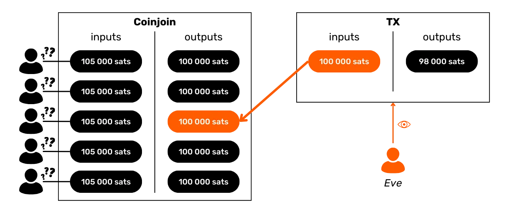

このシナリオでは、Aliceはcoinjoin技術を使用して、遡及的な分析に対するプライバシーを高めました。実際、Aliceは特定の取引からUTXOの履歴を遡って分析を始めるかもしれないEveによる可能性のある分析から自身を守ります。この現在から過去への分析からの保護を、私たちは遡及的匿名集合と呼びます。この概念については、この部分の最後の章で詳しく掘り下げます。

しかし、coinjoinは過去から現在への分析に対するプライバシーを高める可能性も提供します。これを前向き匿名集合と呼びます。私たちの例に戻り、Aliceが誕生日にEveに98,000 satsを送った場合を考えてみましょうが、役割を逆にします。今度はEveが自分のプライバシーについて心配していると想像してください。実際、AliceはEveに送ったコインを追跡して情報を集めたいと思うかもしれません。Eveは、受け取ったばかりのこのUTXOを他のすべてのUTXOと統合することができ、これによりAliceに彼女のウォレットに保持しているビットコインの量を明らかにする可能性があります。これを避けるために、Eveも受け取ったばかりのコインの履歴を断ち切ることができます。
- Eve、Grace、Mallory、Oscar、Victorはそれぞれ98,000 satsのUTXOをビットコイン取引の入力として提供します：


- これらの入力を消費する代わりに、それぞれが新しいアドレスを提供して、完全に等しい97,500 satsの5つの出力を作成します。各ユーザーが出力を取得します：


- Eveは現在、履歴が断ち切られた97,500 satsのUTXOを保持しており、将来の取引に恐れることなく使用できます。実際、AliceがEveに送ったビットコインを追跡しようとすると、coinjoin取引に遭遇します。彼女はどの出力UTXOがEveに属するかを特定することができず、分析は不可能になります：


最初の例では、coinjoinがコインのプライバシーをその過去との関係で保護する方法を見ました。そして、2番目の例では、将来との関係でコインの履歴を保護することもできる方法を見ました。そのため、coinjoinはコインの履歴を両方向に区切る一回限りのイベントとして見るべきだと述べました。


### ミキシング、coinjoins、ミキサー... 違いは何ですか？

「ミキシング」という用語は、時々coinjoinsを説明するために使われます。これは、カストディアルミキサーとの混同を恐れる一部のビットコインユーザーが拒否する用語です。しかし、数学的な文脈では、coinjoinは正確にミキシングの概念を体現しているため、この懸念は根拠がないと思います。

一般的な数学の分野では、ミキシングは動的システムの特性を指し、ある時間が経過した後、初期空間の全ての部分が理論的には他の任意の部分と混合され得ることを意味します。ミキシングは、粒子の位置やシステムの状態がそのように進化することを意味し、その結果、将来の分布が初期分布とは独立し、システムの空間全体に初期状態の特性が均一に分布する状態に達します。これはビットコインでのcoinjoinで正確に起こることです。したがって、私の意見では、coinjoinは真にコインをミキシングする方法です。


しかし、coinjoinとミキサーを区別することは重要です。ミキサーは、ユーザーがビットコインをミキシングするために送るサービスです。これらのサービスは2010年代に人気がありましたが、coinjoinと比較して2つの大きな欠点があるため、その使用は減少しました：
- ミキシングプロセス中に資金の管理を放棄する必要があり、盗難のリスクにさらされます；
- ミキサーが取引の詳細を記録したり、さらにはこの情報をチェーン分析会社に売却することがないという保証がありません。


現在、ユーザーはプロセス全体を通じて資金の完全なコントロールを維持できるcoinjoinを好むようになりました。coinjoinの参加者は、関与する他の当事者によってビットコインが盗まれるリスクはありません。次の章で、これがどのように可能かを一緒に探りましょう。

## ZerolinkとChaumian Coinjoins
<chapterId>326c9654-b359-4906-b23d-d6518dd5dc3e</chapterId>

coinjoinによって提供されるプライバシーは、私たちのピースが隠されるグループのサイズに勝るものです。したがって、できるだけ多くの参加者を見つける必要があります。coinjoinは手動で実行することが完全に可能ですが、自分で見つけたユーザーと一緒に、しかし、この方法は複雑で、大きな匿名セットを達成することはできません。

これが、Bitcoin上でcoinjoinコーディネーターが開発された理由です。彼らの役割は、異なるユーザーを接続し、協力的な取引の成功に必要な情報を伝達することです。


しかし、コーディネーターがユーザーのビットコインを決して管理せず、彼らがcoinjoin取引を構築する人であるにもかかわらず、ユーザーの入力と出力をリンクできないようにするにはどうすればよいでしょうか？これはプライバシーの漏洩を構成する可能性があります。

### Chaumのブラインド署名

現代のcoinjoinの実装は、情報の漏洩を避けるためにDavid Chaumのブラインド署名を使用します。これらのブラインド署名がどのように機能するかを一緒に簡単に学びましょう。
Chaumの盲署名は、署名の発行者が署名しているメッセージの内容を知らないデジタル署名の一形態です。しかし、後になってその署名は元のメッセージとともに検証することができます。この技術は、暗号学者のDavid Chaumによって1983年に開発されました。


例として、会社が契約書のような機密文書を、その内容を明かさずに認証したい場合を考えてみましょう。会社は元の文書を可逆的に暗号化変換するマスキング処理を適用します。この変更された文書は、基礎となる内容を知らずに盲署名を適用する認証機関に送られます。署名された文書を受け取った後、会社は署名のマスクを解除します。結果として、機関の署名によって認証された元の文書が得られますが、機関は元の内容を一度も見ていません。

Chaumの盲署名は、その内容を知らずに文書の真正性を証明することを可能にし、これによりユーザーのデータの機密性と署名された文書の完整性の両方が保証されます。

### Chaumian Coinjoins
"Chaumian CoinJoins"では、Torの使用とDavid Chaumの盲署名が組み合わされ、コーディネーターがどの出力がどのユーザーに属するかを知ることができないようにします。coinjoinトランザクションの構築プロセスは、主に3つのステップで回ります：入力の登録、出力の登録、トランザクションの署名です。このプロセスを、coinjoinに参加する一人であるAliceの例を通して見てみましょう。他の参加者もAliceと同じステップをそれぞれに従います。

**ステップ1: 入力の登録。**
- Aliceは、トランザクションの入力として使用したいUTXOと、ビットコインを受け取るための出力として使用したいマスクされた受信アドレスをコーディネーターに送ります。したがって、コーディネーターはAliceのアドレスを知ることができません。彼はそのマスクされたバージョンのみを見ます：


- コーディネーターは入力の有効性を検証し、次に彼の秘密鍵でAliceのマスクされたアドレスに署名します。彼は盲署名をAliceに返送します：


**ステップ2: 出力の登録。**
- Aliceは今、コーディネーターの秘密鍵で署名された自分のアドレスのマスクを解除することができます。彼女は異なるTorアイデンティティの下で新しい接続を確立します。コーディネーターは、この新しいアイデンティティの下で接続しているのがAliceであるとは特定できません：


- Aliceはマスクを解除したアドレスと署名をコーディネーターに送ります（彼はまだそれがAliceであるとは知りません）：


**ステップ3: トランザクションの署名。**
- コーディネーターは同様に、すべての参加者からマスクを解除した出力を取得します。関連する署名のおかげで、彼は匿名で提出された各出力が以前に彼の秘密鍵で署名されたものであることを確認し、その正当性を保証できます。それから彼はcoinjoinトランザクションを構築し、参加者に署名するために送ります：


- Aliceは、他の参加者と同様に、彼女の入力と出力がコーディネーターによって構築されたトランザクションに正しく含まれているかを確認します。すべてが満足のいくものであれば、彼女は自分の入力のスクリプトを解除する署名をコーディネーターに送ります：


- コインジョインのすべての参加者から署名を集めた後、コーディネーターはトランザクションをBitcoinネットワークにブロードキャストし、ブロックに追加されるようにすることができます。
このシステムでは、コーディネーターは入力を特定の出力にリンクすることができません。さらに、UTXOを解除するために必要な秘密鍵へのアクセス権がないため、参加者の資金を所有することもできません。プロセス全体を通じて、そしてステップ3の終了まで、彼らは署名へのアクセス権も持っていません。アリスと他の参加者が全体のトランザクションに署名し、すべてが正しいことを確認した後、コーディネーターはそれを無効にすることなく、このトランザクションを修正することができなくなります。これにより、コーディネーターによるビットコインの盗難が防止されます。

最終的に、トランザクションで自分の出力を記録する際、コインジョインのユーザーは選挙で投票する市民と同様の保証を求めます。これらの行動の公共性と私的性の間には二重性があります。一方で、個人が秘密にしたいことがあります：投票者は自分の投票が自分の身元にリンクされることを望まないように、コインジョインのユーザーは自分の出力が自分の入力と関連付けられることを望みません。実際、コーディネーターや他の当事者が入力と出力の間にリンクを確立できる場合、コインジョインはその目的を完全に失います。前述のように、コインジョインはコインの履歴にブレークを機能させる必要があります。この停止は、コインジョイントランザクション内で特定の入力を特定の出力（見込みanonset）と逆（振り返りanonset）に関連付けることが不可能であるために正確に発生します。

一方、公共の側面があります：投票者は自分の投票が投票箱に含まれていることを確認したいように、コインジョインのユーザーは自分の出力がコインジョイントランザクションに含まれていることを確認したいと思っています。実際、コインジョインの参加者がトランザクションに署名する前に自分の出力の存在を確認できることが絶対に必要です。そうでなければ、コーディネーターが資金を盗む可能性があります。

デビッド・チャウムのブラインド署名の使用によって可能になるこれら2つの公共と私的な側面が、チャウミアンコインジョインの参加者に対して、自分のビットコインが盗まれず、資金が追跡されないことを保証します。

### コインジョインの概念を発明したのは誰ですか？

ビットコイン上でコインジョインのアイデアを最初に紹介したのが誰であり、この文脈でデビッド・チャウムのブラインド署名の使用を考えたのが誰であるかを確実に特定することは困難です。一般的に、グレゴリー・マクスウェルが2013年に[BitcoinTalkでのメッセージ](https://bitcointalk.org/index.php?topic=279249.0)で初めてそれについて話したと考えられています：
チャウムブラインド署名の使用：ユーザーはログインし、入力（および変更アドレス）と、プライベートコインを送信したいアドレスの暗号学的にブラインドされたバージョンを提供します。サーバーはトークンに署名し、それらをユーザーに返します。ユーザーは匿名で再接続し、自分の出力アドレスのマスクを解除し、それらをサーバーに返送します。サーバーは、すべての出力がそれによって署名されており、その結果、すべての出力が有効な参加者からのものであることを確認できます。後で、人々は再接続して署名します。
マクスウェル、G. (2013年8月22日)。*CoinJoin: 実世界のためのビットコインプライバシー*。BitcoinTalkフォーラム。https://bitcointalk.org/index.php?topic=279249.0
しかし、Chaum署名がミキシングの文脈で、またcoinjoinについても以前から言及されています。[2011年6月に、Duncan TownsendはBitcoinTalkで](https://bitcointalk.org/index.php?topic=12751.0)、現代のChaumian coinjoinにかなり似た方法でChaum署名を使用するミキサーを紹介しました。
同じスレッド内には、[Duncan Townsendへのhashcoinからの返信メッセージ](https://bitcointalk.org/index.php?topic=12751.msg315793#msg315793)があり、彼のミキサーを改善するためのものです。このメッセージで説明されているプロセスは、coinjoinに最も近いものを正確に表しています。また、[2012年にAlex MizrahiがTenebrixの作成者を助言していた際のメッセージ](https://gist.github.com/killerstorm/6f843e1d3ffc38191aebca67d483bd88#file-laundry)にも同様のシステムの言及があります。Tenebrixは、後にLitecoinを作成するための基盤となった最初のアルトコインの一つです。さらに、「coinjoin」という用語自体もGreg Maxwellによって発明されたわけではなく、Peter Toddのアイデアから来ています。


### Zerolink

Zerolinkは、Chaumian coinjoinsとさまざまな戦略を統合した包括的なミキシングプロトコルであり、特にウォレット管理に関連するエラーを最小限に抑えることで、チェーン分析の複数の形態に対するユーザーの匿名性を保護します。このプロトコルは[nopara73とTDevDによって2017年に導入されました](https://github.com/nopara73/ZeroLink/blob/master/README.md)。


その名が示すように、Zerolinkの原理は、入力と出力の間のリンクを追跡不可能にするcoinjoinトランザクションを実行することです。この特性は、すべての出力が完全に同一の金額を提示することによって達成されます。


Zerolinkによる重要な予防策は、異なるセットの暗号鍵、または別々のウォレットを使用して、ミックスされていないUTXOとミックスされたUTXOを完全に分離することです。この方法により、ミキシング前のコイン用の「プレミックス」ウォレットは、ミックスされたコイン用の「ポストミックス」ウォレットと区別されます。


UTXOのこの厳格な分離は、主にミックスされたUTXOとミックスされていないUTXOの間の偶発的な関連付けを防ぐために役立ちます。実際、そのようなリンクが発生すると、ユーザーが気づかないうちにミックスされたUTXO上のcoinjoinの効果が無効になり、その履歴が断ち切られたと信じていたUTXOの機密性が損なわれます。これらのリンクは、ミックスされていないUTXOを使用してミックスされたUTXOを確保する際のアドレスの再利用、またはユーザーが同じトランザクションの入力としてミックスされたUTXOとミックスされていないUTXOを消費する場合に、Common-Input-Ownership Heuristic (CIOH)を適用することによって生じる可能性があります。プレミキシングとポストミキシングのウォレットを分離することで、これらの偶発的な関連付けが避けられ、ユーザーは意図しないエラーに対して保護されます。


この分離は、ウォレットソフトウェアレベルで、プレミックスとポストミックスのウォレット間に異なるルールを適用する可能性をもたらします。例えば、ポストミックスウォレットでは、ソフトウェアはUTXOを入力に統合することを禁止し、これによりユーザーの匿名性セットを損なう可能性のあるCIOHの適用を防ぐことができます。また、RBFのシグナリングなどのトランザクションオプションやスクリプトの使用を標準化することで、ウォレットのフィンガープリントによる識別を防ぐことも可能です。
現在、WhirlpoolはZerolinkプロトコルを厳格に適用する唯一のcoinjoinの実装です。次の章では、異なるcoinjoinの実装とそれぞれの利点と欠点を探ります。

## Coinjoinの実装
<chapterId>e37ed073-9498-4e4f-820b-30951e829596</chapterId>

*2024年、Bitcoin上でcoinjoinを実行したいユーザーにとって利用可能なツールに大きな変化が見られます。現在、重要な時期にあり、coinjoin市場は大規模な再構築を経ています。したがって、この章は時間の経過とともに更新される可能性があります。*

現時点では、Bitcoin上に主に3つの異なるcoinjoinの実装があります：
- Whirlpool;
- Wabisabi;
- JoinMarket。
これらの実装はそれぞれ、coinjoinトランザクションを通じてUTXOの履歴を断ち切ることを目指しています。しかし、そのメカニズムは大きく異なります。したがって、最も適したオプションを選択するために、それぞれがどのように機能するかを理解することが不可欠です。

### JoinMarket

JoinMarketは、2015年にAdam GibsonとChris Belcherによって作成され、独自のユーザーマッチングモデルのおかげで他のcoinjoin実装から際立っています。このシステムは、一部のユーザー（「メーカー」）がビットコインをミキシング用に提供し、他のユーザー（「テイカー」）が手数料と引き換えにこれらの資金を使用してcoinjoinを実行するP2P交換市場に基づいています。


このモデルでは、「メーカー」はビットコインを「テイカー」に提供し、そのサービスの見返りとして手数料を受け取ります。「テイカー」は、自分のcoinjoinトランザクションを実行するために「メーカー」のビットコインを使用するために手数料を支払います。サービス手数料は役割によって異なり、「メーカー」は流動性提供のために手数料を蓄積し、「テイカー」は手数料を支払います。この市場は使用条件なしで自由に運営されます。

JoinMarketの主な欠点の一つは、その使用の複雑さであり、それを効率的に利用するためにはターミナルに対するある程度の慣れが必要です。この複雑さは経験豊富なユーザーにとって障壁ではありませんが、一般の人々へのアクセスを制限する可能性があります。しかし、JAMという名前のウェブインターフェースの最近の導入により、その使用がいくらか容易になりました。


出典: [JAM](https://github.com/joinmarket-webui/jam/blob/devel/docs/assets/screenshot-dark.webp)

しかし、技術的な障壁は依然として大きな障害です。coinjoinエコシステムでは、参加者の数によって機密性が高まるため、アクセシビリティを直接制限する任意の制限は、ミキシングの効率にとって重要な要素である利用可能な流動性に直接影響します。Bitcoinはすでに金融取引のニッチであり、そのcoinjoinの使用はサブニッチであり、JoinMarketはさらに専門化された一部を表しており、これによりユーザーの匿名性セットを増やす可能性が制限されます。
JoinMarketの革新的なP2Pマッチングモデルにもかかわらず、特にトランザクション構造の面でいくつかの重大な欠点があります。Whirlpoolのような他の実装とは異なり、JoinMarketは出力間の完全な等価性を保証せず、入力と出力の間に決定論的なリンクを追跡することが可能です。さらに、既に混合されたコインが再び混合されるのを防ぐツールが欠けており、これはユーザーが求める機密性を損なう可能性があります。最後に、JoinMarketのコンセプトは、特にダイナミックな流動性市場に興味のある人々にとって興味深いものですが、その構造的な弱点と技術的な複雑さにより、私の意見では、初心者とコインジョインの実装を求める専門家の両方にとって、魅力が少ないと思います。

### Wabisabi

Wabisabiは、トランザクションの調整を中央集権化するアプローチを採用したコインジョインの別の実装です。このモデルは、2021年にÁdám Ficsór (nopara73)、Yuval Kogman、Lucas Ontivero、István András Seresによって設計され、翌年にWasabi 2.0ソフトウェアに統合されました。Wabisabiは、2018年に発売されたWasabiソフトウェアのコインジョインモデルの進化形です。

2010年代の終わりに向けて、WasabiはWhirlpoolとは根本的に異なるトランザクション構造をそのコインジョインに採用しました。参加者の匿名性を高めるために、Wasabiは数十人の参加者をグループ化する非常に大きなコインジョイントランザクションを使用しました。対照的に、Whirlpoolは複数の小さなトランザクションを選択し、各サイクルで匿名性セットを指数関数的に増加させました。

変更の管理方法も、2つの実装を区別しました。Whirlpoolでは、変更はTX0という概念（次の章でさらに説明します）のおかげでコインジョインサイクルの前にUTXOから除外され、分離されました。一方、Wasabiでは、変更はコインジョイントランザクションの出力の1つを形成し、特定の入力と出力の間に決定論的なリンクを維持しました。

Wabisabiでは、Wasabiのバージョン2.0がWhirlpoolのモデルに近づくようにコインジョインへのアプローチを適応しました。コインジョイントランザクションは非常に大きいままですが、現在では複数の連続するサイクルを連鎖させることが可能になり、Whirlpoolのモデルに従っています。変更の管理にも特に努力が払われています：Wasabi 1.0では変更がユーザーの入力に直接リンクされていたのに対し、Wabisabiは変更を複数の小さな金額に分割し、すべての参加者に等しい額面で分配することを目指しています。

これを2人のユーザーだけが関与する簡略化された例で説明しましょう：Aliceは115,000 satsを、Bobは210,000 satsを混ぜたいと思っています。手数料を無視すると、Wasabi 1.0でのコインジョイントランザクションは、100,000 satsの3つの出力と、Aliceのための15,000 satsの1つの変更、Bobのための10,000 satsの1つの変更を生成していました。変更出力は常に入力にリンクされていました：

Wabisabiの下では、同じトランザクションは100,000 satsの3つの出力と5,000 satsの5つの出力を生成し、変更を特定の入力に直接追跡できないように分散させました：
個人的には、Wabisabiにおける変更管理がプライバシーの観点からその効果を損なう可能性のあるいくつかのリスクを提示していると感じています：
- ユーザーが他の参加者よりも大幅に大きなUTXOで貢献する場合、避けられなくその入力にリンクされる変更の量を最終的に受け取ることになります。これは、識別可能な変更を排除することを目的としたプロトコルの初期の目標に反します；
- 変更を細分化するための額面の乗算は、逆説的にミキシングの効率を損なう可能性があります。このプロセスは、特定の出力のanonsetsが減少し、より容易に識別可能になることにつながる可能性があります；
- この方法はまた、ユーザーにとって管理問題を引き起こす低価値のUTXOを生成します。これらの小さなUTXOが、その価値に対して費用がかかりすぎる場合、「ダスト」となる可能性があります。この現象は、ユーザーが将来の取引で複数のUTXOを入力に統合するか、それらを統合するように促します。どちらの場合も、COHのため、これはanonsetsの減少を引き起こすか、初期のcoinjoinによって獲得されたプライバシーの利益を完全に無効にする可能性があります。

Whirlpoolとは異なり、プレミックスとポストミックスのUTXO間に厳格な分離を保証するZeroLinkプロトコルを実装しているWabisabiは、この厳格な分離を維持していません。また、一部のWasabiクライアントによるアドレスの再利用の問題もあり、これは明らかにユーザーにとって非常に有害です。

Wasabiのバージョン2.0では、新しいcoinjoin手数料ポリシーが実装されました。現在、0.01ビットコインを超えるUTXOに対しては、コーディネーター手数料が0.3%に設定されていますが、より小さなUTXOに対しては、これらの手数料は完全に免除されます。さらに、これらの小さなUTXOのリミックスは無料ですが、リミックスを含むすべての取引について、マイニング手数料はユーザーの責任となります。

このポリシーは、anonsetsのサイズに関係なく手数料が固定されているWhirlpoolとは対照的です。Wasabi 2.0では、小さなUTXOに対してコーディネーター手数料が免除されても、ユーザーはリミックスを含むすべての取引に対してマイニング手数料を支払う必要があります。
執筆時点で、最近の出来事を受けてWabisabiの使用が著しく複雑になっています。実際、Samourai Walletの創設者が逮捕された後、Wasabiの開発を資金提供し管理している会社であるzkSNACKsは、2024年6月1日にそのcoinjoinコーディネーションサービスの終了を発表しました。このコーディネーターはWasabiにデフォルトで設定されており、大部分の流動性を持っていました。

このメインコーディネーターのシャットダウンにより、ユーザーは現在、新しい独立したコーディネーターに接続する必要があります。この変更は懸念を引き起こします：一方で、新しいコーディネーターが十分な流動性を持たない可能性があり、プライバシーの観点からcoinjoinsの効果を低下させる可能性があります。他方で、悪意のあるコーディネーターに遭遇するリスクがあります。この状況は、Wabisabiを使用しようとする人々にとって新たな重大なリスクを追加します。

技術的な問題を超えて、Wasabiの背後にある会社であるzkSNACKsが、coinjoinsの参加者をフィルタリングするためにチェーン分析会社のサービスを利用するという決定は、深刻な倫理的および戦略的な問題を提起します。初期のアイデアは、犯罪者によるWasabi上でのcoinjoinsの使用を防ぐことでしたが、これは正当な動きと思われるかもしれません。しかし、これはパラドックスを引き起こします：ユーザーのプライバシーを向上させることを主な使命とするコーディネーターに手数料を支払い、その後でその同じプライバシーを損なうことを目的とする会社に資金を提供することになります。
さらに懸念されるのは、Bitcoinが目指すオープンで検閲されない金融システムとは鮮明に対照的なフィルタリングの原則です。犯罪活動を排除したいという考えが正当化されるかもしれませんが、このフィルタリングは、ある文脈では違法と分類されるかもしれないが、道徳的に正当化される、または社会的に有益である可能性のある個人の行動にも影響を与える可能性があります。エドワード・スノーデンの例は、この二律背反を完璧に示しています：彼の暴露行為により一部の政府から犯罪者と見なされていますが、他方では公益のために行動した内部告発者と見なされています。この複雑さは、良い意図から始まるかもしれないが、最終的には正当なユーザーの権利と安全を侵害する可能性のあるフィルタリングの潜在的な危険性を強調しています。特定の権威主義的な体制の下で迫害される活動家やジャーナリストにも言及することができました。ご理解いただいた通り、私の好みは間違いなくBitcoin上でのコインジョインを行うためのWhirlpoolモデルに傾いています。このシステムはその厳格さで他と区別され、プライバシーに関して優れた保証を提供します。また、数学的な文脈で完璧と考えられるミキシングを提案する唯一のものでもあります。私の見解では、このモデルはBitcoin上のコインジョインの未来を代表しています。したがって、次の章でこのモデルをより深く探求することをお勧めします。

## Whirlpoolの機能
<chapterId>bdbd7109-e36d-4b4f-a3c6-928df4e9bfda</chapterId>

Whirlpoolは、"_ZeroLink_"トランザクションを使用することで他のコインジョイン方法と区別され、すべての入力と出力の間に技術的なリンクが厳密に存在しないことを保証します。この完璧なミキシングは、各参加者が入力に同一の金額（マイニング手数料を除く）を寄与する構造を通じて達成され、完全に等しい金額の出力を生成します。

入力に関するこの制限的なアプローチは、Whirlpoolコインジョイントランザクションに独特の特徴を与えます：入力と出力の間の決定論的なリンクの完全な欠如。言い換えれば、各出力は、トランザクションの他のすべての出力に関して、任意の参加者に帰属する可能性が等しくなります。


### Whirlpoolの一般的な機能

当初、Whirlpoolコインジョインにおける参加者の数は5に限定されており、2人の新規参加者と3人のリミキサー（これらの概念については後で説明します）で構成されていました。しかし、2023年に観測されたオンチェーントランザクション手数料の増加は、Samouraiチームにモデルの再考を促し、プライバシーを向上させると同時にコストを削減するようになりました。したがって、手数料の市場状況と参加者の数を考慮して、コーディネーターは現在、6、7、または8人の参加者を含むコインジョインを組織することができます。これらの強化されたセッションは"_Surge Cycles_"として指定されています。設定に関係なく、Whirlpoolコインジョインには常に2人の新規参加者がいることに注意することが重要です。

したがって、Whirlpoolトランザクションは、入力と出力の数が同一であることが特徴です。これは以下のようになります：
- 5つの入力と5つの出力；


- 6つの入力と6つの出力；


- 7つの入力と7つの出力；


- 8つの入力と8つの出力。


Whirlpoolが提案するモデルは、小規模なcoinjoinトランザクションに基づいています。WabisabiやJoinMarketのように、匿名セットの堅牢性が単一サイクル（または数サイクル）の参加者のボリュームに依存するのとは異なり、Whirlpoolは複数の小規模サイクルの連鎖に賭けています。このモデルでは、ユーザーはプールへの初回参加時にのみ手数料を負担し、追加料金なしで多数のリミックスに参加できます。新規参加者がリミキサーのためのマイニング手数料を負担します。

コインが参加する追加のcoinjoinごとに、過去に遭遇した仲間とともに、anonsetsは指数関数的に成長します。したがって、目標は、これらの無料リミックスを利用することであり、それぞれの発生が各混合コインに関連するanonsetsの密度を強化することに貢献します。

Whirlpoolは、次の2つの重要な要件を念頭に置いて設計されました：
- Samourai Walletが主にスマートフォンアプリケーションであることを考慮して、モバイルデバイス上での実装のアクセシビリティ；
- anonsetsの顕著な増加を促進するためのリミックスサイクルの速度。

これらの命題は、Samourai Walletの開発者がWhirlpoolの設計において選択を導いたものであり、サイクルごとの参加者数を制限することにつながりました。参加者が少なすぎると、coinjoinの効果が損なわれ、各サイクルで生成されるanonsetsが劇的に減少してしまいます。一方、参加者が多すぎると、モバイルアプリケーションの管理問題が発生し、サイクルの流れが妨げられる可能性があります。

最終的に、Whirlpoolではcoinjoinごとに多数の参加者を必要とすることはありません。なぜなら、anonsetsは複数のcoinjoinサイクルの蓄積によって作られるからです。ここで最も重要な原則は、すべての参加者のUTXOsの均一性です。これにより、完璧なミックスが可能となり、ミキシングとリミキシングサイクルを完全に利用できます。

### プールとcoinjoin手数料

これらの複数のサイクルが混合コインのanonsetsを効果的に増加させるためには、使用されるUTXOsの金額を制限する特定の枠組みを確立する必要があります。Whirlpoolは、異なるプールを定義しています。

プールは、一緒にミックスしたいと考えるユーザーのグループを表し、コインの完璧な均一性を維持しながらcoinjoinプロセスを最適化するために使用するUTXOsの金額に同意します。各プールはUTXOの固定金額を指定し、ユーザーは参加するためにこれに従う必要があります。したがって、Whirlpoolでcoinjoinsを実行するには、プールを選択する必要があります。現時点で利用可能なプールは以下の通りです：
- 0.5ビットコイン；
- 0.05ビットコイン；
- 0.01ビットコイン；
- 0.001ビットコイン（= 100,000 sats）。
ビットコインをプールに参加させると、プール内の他の参加者と完全に均一なUTXOsを生成するために分割されます。各プールには最大限度があり、この限度を超える金額の場合、同じプール内で2回別々にエントリーするか、より高い金額の別のプールを選択する必要があります：
| プール（ビットコイン） | エントリーごとの最大金額（ビットコイン） |
|----------------|------------------------------------|
| 0.5            | 35                                 |
| 0.05           | 3.5                                |
| 0.01           | 0.7                                |
| 0.001          | 0.025                              |
UTXOは、コインジョインに統合される準備ができたときに、あるプールに属しているとみなされます。しかし、これはユーザーがそれを所有していなくなるという意味ではありません。この部分の最初の章で見てきたように、異なるミキシングサイクルを通じて、あなたは自分のキーと、それによってあなたのビットコインを完全にコントロールし続けます。これが、コインジョイン技術を他の中央集権的なミキシング技術と区別するものです。

コインジョインプールに入るためには、サービス料金とマイニング料金を支払う必要があります。サービス料金は各プールごとに固定されており、Whirlpoolの開発とメンテナンスを担当するチームへの報酬を目的としています。

Whirlpoolを使用するためのサービス料金は、プールに入る際に一度だけ支払われます。このステップが完了すると、追加料金なしで無制限のリミックスに参加する可能性があります。以下は、各プールの現在の固定料金です：

| プール (ビットコイン) | 入場料 (ビットコイン)         |
|----------------|-----------------------------|
| 0.5            | 0.0175                      |
| 0.05           | 0.00175                     |
| 0.01           | 0.0005 (50,000 sats)        |
| 0.001          | 0.00005 (5,000 sats)        |

これらの料金は、基本的に選択したプールの入場券として機能し、コインジョインに投入する金額に関係なく、絶対値で料金は同じままです。したがって、0.01プールに正確に0.01 BTCで参加する場合でも、0.5 BTCで入る場合でも、料金は同じです。

Whirlpoolコインジョインを進める前に、ユーザーは2つの戦略から選択することができます：
- サービス料金を最小限に抑えるために小さなプールを選択するが、その結果として複数の小さなUTXOを受け取ることになる；
- または、より大きなプールを選択し、より高い料金を支払うことに同意するが、その結果として価値の大きなUTXOを少数受け取ることになる。
コインジョインサイクルの後に複数のミックスされたUTXOを統合することは一般的に推奨されていません。これは、特に共通入力所有権のヒューリスティック（CIOH: *Common-Input-Ownership-Heuristic*）のために、得られたプライバシーを損なう可能性があるからです。したがって、多くの小額のUTXOを出力として持つことを避けるために、より多くを支払うことを意味しても、より大きなプールを選択することが賢明かもしれません。ユーザーはこれらのトレードオフを考慮して、好みのプールを選択する必要があります。
サービス料金の他に、任意のビットコイン取引に固有のマイニング料金も考慮する必要があります。Whirlpoolユーザーとして、準備トランザクション（`Tx0`）および最初のコインジョインのためのマイニング料金を支払う必要があります。Whirlpoolのモデルは新規参入者の支払いに依存しているため、その後のすべてのリミックスは無料です。

実際、各Whirlpoolコインジョインでは、入力の2ユーザーが新規参入者です。他の入力はリミキサーから来ます。その結果、トランザクションのすべての参加者のマイニング料金は、これら2人の新参入者によってカバーされ、その後、彼らも無料のリミックスの恩恵を受けます：

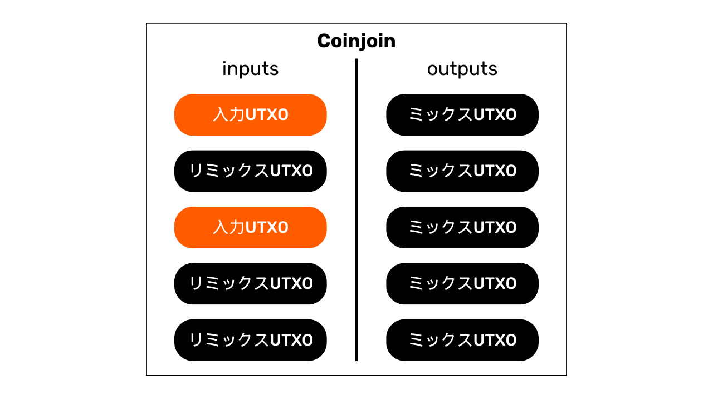

この料金システムのおかげで、WhirlpoolはUTXOの匿名セットがユーザーが支払った価格に比例しないという点で、他のコインジョイン実装と真に差別化されます。したがって、プールの入場料と2つの取引（`Tx0`と初期ミックス）のマイニング料金のみを支払うことで、かなり高いレベルの匿名性を達成することが可能です。
ユーザーが複数のコインジョインを実行した後、プールから自分のUTXOを引き出すためのマイニング手数料もカバーする必要があることに注意することが重要です。ただし、`mix to`オプションを選択した場合は、追加のトランザクションなしに、直接資金をコインジョイン出力として受け取る外部アドレスを提供することができます。

### HDウォレットアカウント

Whirlpoolを介してコインジョインを実行するためには、ウォレットは複数の異なるアカウントを生成する必要があります。これはZeroLinkプロトコルの原則です。HD（*階層的決定性*）ウォレットの文脈におけるアカウントは、他と完全に隔離されたセクションを構成し、この分離はウォレットの階層の第3深度レベル、つまり`xpub`のレベルで発生します。


理論上、HDウォレットは最大で`2^(32/2)`異なるアカウントを派生させることができます。初期アカウントは、すべてのBitcoinウォレットでデフォルトで使用されるインデックス`0'`に対応します。

Whirlpoolに適応したウォレットでは、ZeroLinkプロセスのニーズを満たすために4つのアカウントが使用されます：
- インデックス`0'`で識別される**預金アカウント**；
- インデックス`2 147 483 644'`で識別される**バッドバンク**アカウント（または"doxxic change"）；
- インデックス`2 147 483 645'`で識別される**プレミックス**アカウント；
- インデックス`2 147 483 646'`で識別される**ポストミックス**アカウント。

これらのアカウントはそれぞれ、コインジョインプロセスにおいて特定の機能を果たします。これについては、以下のセクションで詳しく見ていきます。

これらのアカウントはすべて単一のシードにリンクされており、ユーザーは回復フレーズと必要に応じてパスフレーズを使用して、すべてのビットコインへのアクセスを回復することができます。ただし、この回復操作中に、使用された異なるアカウントインデックスをソフトウェアに指定する必要があります。

これで、これらのアカウント内でのWhirlpoolコインジョインの異なる段階を見ていきましょう。

### TX0

任意のWhirlpoolコインジョインの出発点は**預金アカウント**です。このアカウントは、新しいBitcoinウォレットを作成するときに自動的に使用されるものです。このアカウントには、ミックスしたいビットコインを入金する必要があります。

`Tx0`はWhirlpoolミキシングプロセスの最初のステップを表し、コインジョインのためにUTXOを準備し、選択されたプールの金額に対応する単位に分割して均一化することを目的としています。均一化されたUTXOはその後、**プレミックス**アカウントに送られます。プールに入れない差額は、特定のアカウント：**バッドバンク**（または"doxxic change"）に分けられます。

この初期トランザクション`Tx0`は、コインジョインコーディネーターに支払うサービス手数料を決済するためにも使用されます。次のステップとは異なり、このトランザクションは協力的ではないため、ユーザーは全てのマイニング手数料を負担する必要があります：

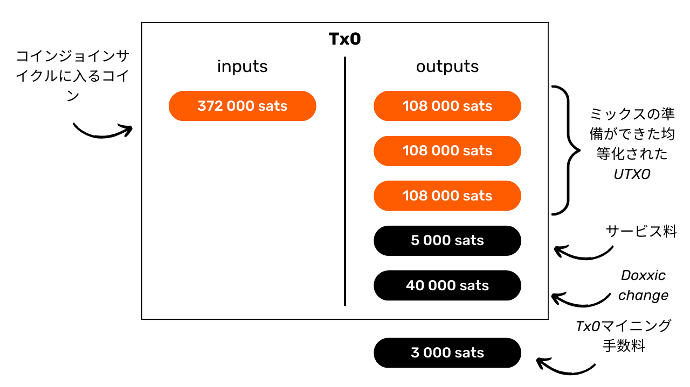

この`Tx0`トランザクションの例では、**預金**アカウントからの`372 000 sats`の入力がいくつかの出力UTXOに分割され、以下のように配分されます：
- サービス手数料としてコーディネーターに支払われる`5 000 sats`、これは`100 000 sats`のプールへのエントリーに対応します；
- ミキシングのために準備され、コーディネーターに登録された3つのUTXOは、それぞれ`108 000 sats`に均一化され、将来の初期ミックスのマイニング手数料をカバーします。
- プールに入れないほど小さすぎる余剰分は、有害な変更とみなされ、特定のアカウントに送られます。ここでは、この変更は`40 000 sats`に相当します。
- 最後に、`3,000 sats`はアウトプットを構成しませんが、`Tx0`の確認に必要なマイニング手数料です。

例として、こちらが実際のTx0 Whirlpoolです（私のものではありません）：[edef60744f539483d868caff49d4848e5cc6e805d6cdc8d0f9bdbbaedcb5fc46](https://mempool.space/fr/tx/edef60744f539483d868caff49d4848e5cc6e805d6cdc8d0f9bdbbaedcb5fc46)

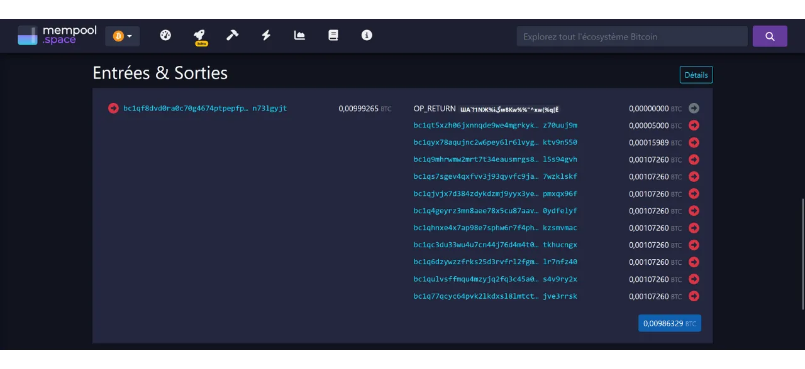

### 有害な変更

プールに統合できなかった余剰分は、ここでは`40,000 sats`に相当し、ウォレット内の他のUTXOから厳格に分離するために、**悪い銀行**アカウント、別名「有害な変更」にリダイレクトされます。

このUTXOは、過去にまだ関連しており、したがって所有者の身元に可能性があるだけでなく、コインジョインに参加したユーザーに属しているとマークされているため、ユーザーのプライバシーにとって危険です。

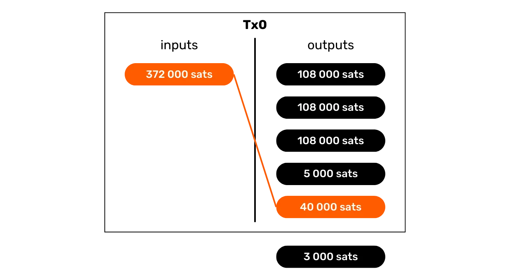

このUTXOが混合されたアウトプットと統合されると、コインジョインサイクル中に得られたすべてのプライバシーが失われることになります。これはCIOH（*Common-Input-Ownership-Heuristic*）のためです。他の有害な変更と統合されると、コインジョインサイクルからの異なるエントリをリンクするため、ユーザーはプライバシーを失うリスクがあります。したがって、慎重に扱う必要があります。この章の最後のセクションで、これらの有害なUTXOの管理について詳しく説明します。

### 初期ミックス

`Tx0`が完了すると、等価化されたUTXOはウォレットの**プレミックス**アカウントに送られ、最初のコインジョインサイクル、いわゆる「初期ミックス」に導入される準備が整います。例えば、`Tx0`がミキシング用の複数のUTXOを生成した場合、それぞれが別々の初期ミックスに統合されます。

これらの最初のミックスの終わりには、**プレミックス**アカウントは空になり、私たちのコインは、この最初のコインジョインのためにマイニング手数料を支払った後、選択したプールで定義された金額に正確に調整されます。私たちの例では、`108,000 sats`の初期UTXOが正確に`100,000 sats`に減少します。


### リミックス
初期ミックスの後、UTXOは**ポストミックス**アカウントに転送されます。このアカウントは、すでに混合されたUTXOとリミックスを待っているUTXOの両方を集めます。Whirlpoolクライアントがアクティブな場合、**ポストミックス**アカウント内のUTXOは自動的にリミックスに利用可能となり、これらの新しいサイクルに参加するためにランダムに選ばれます。
リマインダーとして、リミックスはその後100%無料です：追加のサービス料やマイニング手数料は必要ありません。**ポストミックス**アカウント内のUTXOを保持することで、その無傷の価値を維持し、同時にその匿名性を向上させます。これが、これらのコインを複数のコインジョインサイクルに参加させることが重要な理由です。それはあなたに全く費用がかからず、その匿名性のレベルを高めます。
UTXOを混合して使用することを決めた場合、この**ポストミックス**アカウントから直接行うことができます。混合されたUTXOをこのアカウントに保持し、無料のリミックスの恩恵を受け、それらがWhirlpool回路を離れることを防ぎ、プライバシーが低下することを防ぐことが望ましいです。

### ポストミックスを適切に管理する方法は？

コインジョインサイクルを実行した後、UTXOを**ポストミックス**アカウントに保持し、将来の使用を待つのが最善の戦略です。それらを無期限にリミックスさせることさえ推奨されます。

一部のユーザーは、混合されたビットコインをハードウェアウォレットによって保護されたウォレットに転送することを検討するかもしれません。これは可能ですが、獲得した機密性を損なわないように、Samourai Walletの推奨事項に厳密に従うことが重要です。

UTXOをマージすることは、最も頻繁に行われる間違いです。混合されたUTXOを未混合のUTXOと同じトランザクションで組み合わせることを避ける必要があります。これは、ウォレット内のUTXOを特にラベリングの面で慎重に管理することを要求します。


混合されたUTXOを自身の間で統合する際にも注意が必要です。混合されたUTXOが十分な匿名セットを持っている場合、適度な統合は考えられますが、これは必然的にコインの機密性を低下させます。統合は、リミックスの回数が不十分な後や、コインジョインサイクルの前後でUTXO間の推測可能なリンクを確立するリスクを伴う場合には、行わないようにしてください。これらの操作について疑問がある場合、最善の方法はポストミックスUTXOを統合せず、ハードウェアウォレットに一つずつ転送し、毎回新しい空白のアドレスを生成することです。再び、受け取ったUTXOを適切にラベル付けすることを忘れないでください。
また、一般的でないスクリプトを使用するウォレットにポストミックスUTXOを転送することは推奨されません。例えば、`P2WSH`スクリプトを使用するマルチシグウォレットからWhirlpoolに入る場合、元々同じタイプのウォレットを持っている他のユーザーと混合される可能性は低いです。このマルチシグウォレットにポストミックスを引き出すと、混合されたビットコインのプライバシーレベルが大幅に低下します。スクリプトを超えて、あなたを欺く可能性のある多くの他のウォレットの指紋があります。
ビットコイントランザクションにおいても、受信アドレスを再利用しないことが重要です。新しいトランザクションは、新しい空白のアドレスで受け取るべきです。

最もシンプルで安全な解決策は、混合されたUTXOを**ポストミックス**アカウントに休ませ、リミックスさせ、使用するまで触れないことです。SamouraiとSparrowウォレットには、これらのチェーン分析関連のリスクに対する追加の保護があります。これらの保護は、間違いを犯さないように助けてくれます。

### 有害な変更を適切に管理する方法は？

次に、コインジョインプールに入れなかった変更、つまり有害な変更を慎重に管理する必要があります。Whirlpoolの使用から生じたこれらの有害なUTXOは、コインジョインの使用とあなたとのリンクを確立するため、プライバシーにリスクをもたらします。したがって、それらを慎重に扱い、特に混合されたUTXOと組み合わせないことが不可欠です。

使用するために検討すべき異なる戦略があります：
- **より小さいプールで混ぜる：** 有害なUTXOが自身で小さいプールに入るのに十分な大きさである場合、混ぜることを検討してください。これはしばしば最良の選択です。しかし、複数の有害なUTXOをマージしてプールにアクセスすることは、異なるエントリーをリンクする可能性があるため、推奨されません。
- **「非支出可能」としてマークする：** 別のアプローチとして、それらを使用しないようにし、「非支出可能」として専用アカウントにマークし、単に保持することです。これにより、誤ってそれらを使ってしまうことがないようにします。ビットコインの価値が上がれば、あなたの有害なUTXOにより適した新しいプールが出現するかもしれません。
- **寄付をする：** ビットコインや関連ソフトウェアに取り組む開発者への寄付を検討してください。BTCを受け入れる団体への寄付も可能です。有害なUTXOの管理が複雑すぎる場合は、寄付をすることでそれらを単純に処分することができます。
- **ギフトカードを購入する：** [Bitrefill](https://www.bitrefill.com/)のようなプラットフォームでは、ビットコインを様々な商店で使用できるギフトカードと交換することができます。これは、関連する価値を失うことなく有害なUTXOを処分する方法となり得ます。
- **モネロに統合する：** Samourai WalletはBTCとXMR間のアトミックスワップサービスを提供しています。これは、KYCを通じてプライバシーを損なうことなく、モネロ上で有害なUTXOを統合し、それからビットコインに戻すための理想的な方法です。しかし、流動性の制約による採掘手数料とプレミアムの観点から、このオプションはコストがかかる可能性があります。
- **ライトニングネットワークに送る：** これらのUTXOをライトニングネットワークに転送し、取引手数料を削減することは興味深いオプションです。しかし、この方法はライトニングの使用によって特定の情報を明らかにする可能性があるため、慎重に行うべきです。

### Whirlpoolの使用方法は？

Samourai Walletの創設者が2024年4月24日に逮捕され、サーバーが押収された後、Whirlpoolツールは、自分のDojoを持っている人であっても機能しなくなりました。以前は、Samourai WalletとSparrow Walletで利用可能でした。


しかし、裁判の結果によっては、このツールが数週間以内に再びサービスを提供する可能性がありますし、異なる方法で再開される可能性もあります。いずれにせよ、ビットコイン上でのcoinjoinに対する明確な需要があるため、市場が長くオファーなしで存在することはないと私は信じています。さらに、プライバシーに関して最も進んでいるWhirlpoolモデルは、将来的に他の実装で確実に使用されるでしょう。

このケースの進展と関連ツールに関する開発を密接に追跡しています。新しい情報が入手でき次第、このトレーニングを更新することをお約束します。

次の章では、「anonsets」が何であるか、これらの指標がどのように計算されるか、そしてcoinjoinサイクルの効果をどのように推定するのに役立つかを学びます。

https://planb.network/tutorials/privacy/coinjoin-sparrow-wallet

https://planb.network/tutorials/privacy/coinjoin-samourai-wallet

https://planb.network/tutorials/privacy/coinjoin-dojo

## 匿名セット
<chapterId>be1093dc-1a74-40e5-9545-2b97a7d7d431</chapterId>

coinjoinの仕組みと効果的なミキシングに関連する課題を学んだ後、今度はその効果をどのように測定するかを学びます。coinjoinプロセスが効果的であったか、そしてコインがどの程度の匿名性を獲得したかをどのように判断するかを、この章で「匿名セット」または英語で「anonsets」とともに探求します。

### Coinjoinの有用性に関するリマインダー
CoinJoinの有用性は、あなたのコインを区別不可能なコインのグループ内に没入させることにより、妥当な否認可能性を生み出す能力にあります。この行動の目的は、過去から現在へ、そして現在から過去へのトレーサビリティリンクを断ち切ることです。
逆に、CoinJoinサイクルの出口であなたのUTXOを知っている分析者は、サイクルの入口での元のトランザクションを特定することができないはずです（サイクルの出口から入口への分析）。

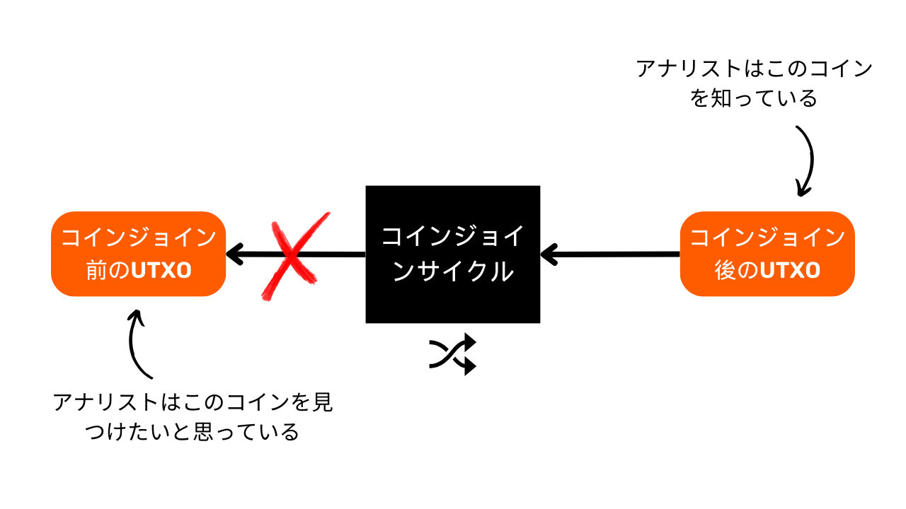

過去と現在を、そしてその逆をリンクする分析者の困難さを評価するためには、あなたのコインが隠されている均質なコインのグループのサイズを定量化する必要があります。この測定は、同一の確率を持つ分析の数を教えてくれます。したがって、正しい分析が他の3つの同等の確率を持つ分析の中に紛れている場合、あなたの隠蔽レベルは非常に低いです。しかし、正しい分析が20,000の分析のセットの中にあり、すべてが同じくらい可能性が高い場合、あなたのコインは非常によく隠されています。そして正確に、これらのグループのサイズは「anonsets」と呼ばれる指標を表しています。

### Anonsetsの理解

Anonsetsは、特定のUTXOのプライバシーの度合いを評価するための指標として機能します。より具体的には、研究されたコインを含むセット内の区別できないUTXOの数を測定します。均質なUTXOセットの要件は、anonsetsは通常CoinJoinサイクル上で計算されることを意味します。これらの指標の使用は、その一様性のためにWhirlpool CoinJoinsに特に関連しています。

Anonsetsは、適切な場合には、CoinJoinsの品質を判断するのに役立ちます。大きなanonsetサイズは、均質なセット内の特定のUTXOを区別することが難しくなるため、高い匿名性レベルを意味します。

2種類のanonsetsがあります：
- **見込みanonset;**
- **振り返りanonset.**

### 見込みAnonset

見込みanonsetは、入口でのUTXOを知っている状態で、サイクルの出口で研究されたUTXOが隠されているグループのサイズを示します。つまり、このグループ内に存在する区別できないコインの数です。英語では、この指標の名前は「forward anonset」、または「forward-looking metrics」と呼ばれます。
この指標は、コインのプライバシーが過去から現在への分析（入力から出力へ）に対してどの程度耐性があるかを測定するのに役立ちます。
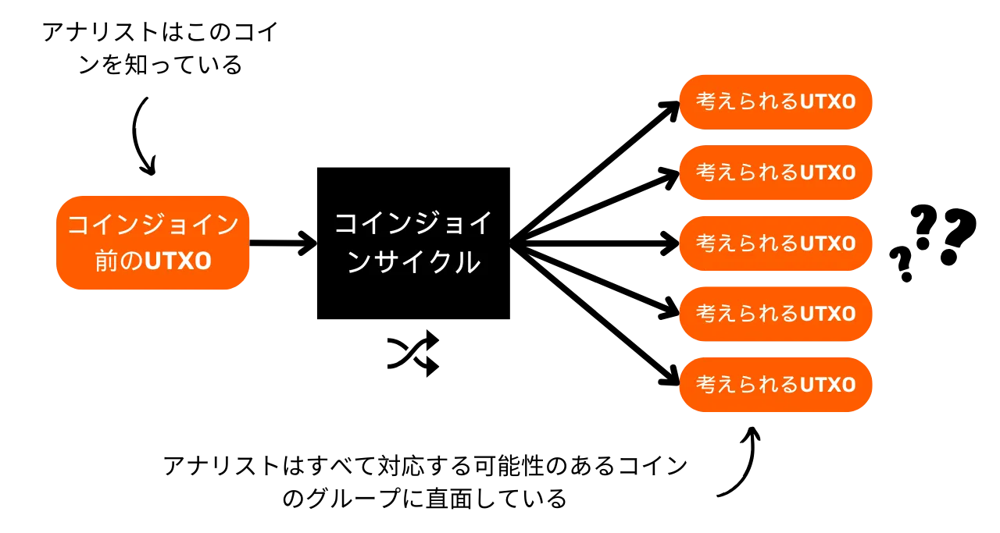

このメトリックは、コインジョインプロセスの入口点から出口点までの履歴を再構築しようとする試みに対して、あなたのUTXOがどの程度保護されているかを推定します。

例えば、あなたのトランザクションが最初のコインジョインサイクルに参加し、その後2つの追加の子孫サイクルが完了した場合、あなたのコインの見込みanonsetは`13`になります：


例として、コインジョインサイクルの入口で私たちのコインが見込みanonsetの`86,871`の恩恵を受けると想像してみましょう。実際には、これは`86,871`の区別できないコインの中に隠されていることを意味します。コインジョインサイクルの始まりでこのコインを知っていて、その出口を追跡しようとする外部の観察者は、求められているコインである可能性が同じである`86,871`の可能性のあるUTXOに直面することになります。

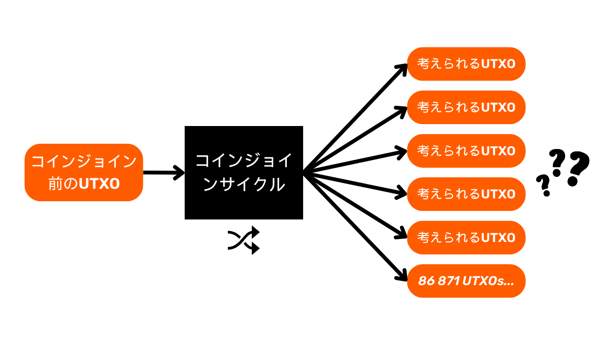

### 振り返りAnonset
サイクルの終了時にUTXOを知っている場合、与えられたコインの可能な出所の数を示すレトロスペクティブアノンセットは、コインジョインサイクル前のコインの起源を追跡することが分析者にとってどれだけ困難であるか、つまり現在から過去への分析（出口から入力へ）に対するコインのプライバシー抵抗を測定する指標です。英語では、この指標の名前は「backward anonset」、または「backward-looking metrics」と呼ばれます。
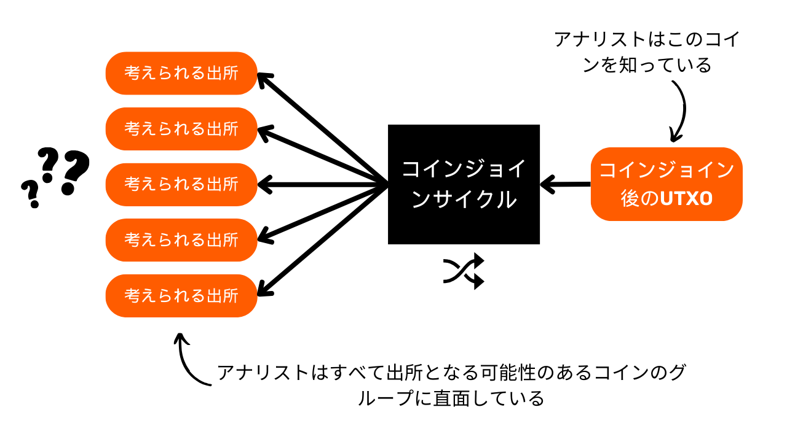

サイクルの出口であなたのUTXOを知ることにより、レトロスペクティブアノンセットは、あなたがコインジョインサイクルに入るために構成された可能性のあるTx0トランザクションの数を決定します。下の図では、これはすべてのオレンジ色の泡の合計に相当します。


例えば、コインジョインサイクルの出口で私たちのコインが`42,185`のレトロスペクティブアノンセットを利用していると想像してみましょう。実際には、このUTXOには`42,185`の潜在的な出所があることを意味します。外部の観察者がサイクルの終わりにこのコインを特定し、その起源を追跡しようとする場合、彼らは求められている起源である可能性が同じである`42,185`の可能な出所に直面します。

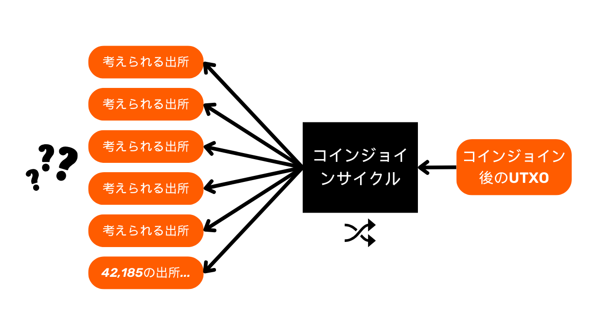

### アノンセットを具体的に計算する方法は？
小さなセットの場合は、ブロックエクスプローラーを使用してアノンセットを手動で計算することが可能です。しかし、大きなアノンセットの場合は、専門のツールの使用が不可欠になります。私の知る限り、このタスクを実行できる唯一のソフトウェアは、SamouraiとOXTのチームによって開発されたPythonツールである*Whirlpool Stats Tool*です。残念ながら、このツールは現在、Samouraiの創設者の逮捕と、ブロックチェーンからデータを抽出するために使用されていたOXTのサービス終了に伴い、利用できなくなっています。


この章で見てきたように、アノンセットはコインジョインの構造にある程度の均一性がある場合にのみ計算できます。そして正確に、次の章では、ビットコイントランザクションがコインジョインであるか、より伝統的なトランザクションであるかにかかわらず、この均一性をどのように定量化するかを発見します。

https://planb.network/tutorials/privacy/wst-anonsets

## エントロピー
<chapterId>e4fe289d-618b-49a2-84c9-68c562e708b4</chapterId>

この部分でコインジョインについて見てきたように、入力と出力のUTXOsの均一性は、ビットコイントランザクションの機密性を向上させる上で重要な役割を果たします。このパラメーターは、チェーン分析に対する合理的な否認を可能にします。この均一性を測定する方法はいくつかありますが、私の意見では、特にトランザクションのエントロピーを提供する*ボルツマン*ツールによる指標の使用が最も効果的です。これは、OXTとSamourai Walletのチームによって開発されました。この章では、これについて詳しく学びます。

アノンセットがトランザクションのセット全体で計算されるのに対し、ここで紹介する指標は、それがコインジョインであるか、より伝統的なトランザクションであるかにかかわらず、単一のトランザクションにのみ焦点を当てます。

### 解釈の数
ビットコイン取引において最初に観察できる指標は、取引を分析している外部の観察者の目における可能な解釈の総数です。取引に関わるUTXOの値を考慮に入れると、この指標は入力が出力にどのように関連付けられるかの方法の数を示します。言い換えれば、それはビットコインの流れにおいて、取引を分析している外部の観察者の視点から、取引が生成する可能な解釈の数を決定します。
たとえば、1つの入力と2つの出力を持つ単純な支払い取引は、入力#0が出力#0と出力#1を資金提供したという1つの解釈しか持ちません。他の可能な解釈はありません：


対照的に、Whirlpool 5x5モデルに従って構築されたコインジョインは、$1,496$の可能な組み合わせを提示します：

Whirlpool Surge Cycle 8x8コインジョインは、$9,934,563$の可能な解釈を提示します：


### エントロピー

ビットコイン取引の解釈の数から、そのエントロピーを計算することができます。

暗号学および情報の一般的な文脈において、エントロピーはデータソースまたはランダムプロセスに関連する不確実性または予測不可能性の定量的尺度です。言い換えれば、エントロピーは情報が予測または推測するのがどれだけ難しいかを測る方法です。

チェーン分析の特定の文脈において、エントロピーはまた、Shannonエントロピーから派生し、[LaurentMTによって発明された](https://gist.github.com/LaurentMT/e758767ca4038ac40aaf)指標の名前でもあり、ビットコイン取引に対して計算することができます。

取引が多数の可能な解釈を提示する場合、そのエントロピーを参照することがしばしばより関連性があります。この指標は、取引の正確な構成についてのアナリストの知識の欠如を測定することを可能にします。言い換えれば、エントロピーが高いほど、入力と出力の間のビットコインの流れを識別するアナリストの作業が難しくなります。

実際には、エントロピーは、外部の観察者の視点から、入力と出力の金額に基づいてのみ、他の外部または内部のパターンやヒューリスティックを考慮せずに、取引が複数の可能な解釈を提示するかどうかを明らかにします。高いエントロピーは、取引の機密性が向上することを意味します。

エントロピーは、可能な組み合わせの数の2進対数として定義されます。ここに、$E$が取引のエントロピーであり、$C$が可能な解釈の数であるときに使用される式があります：

$$
E = \log_2(C)
$$

数学において、2進対数（基数2の対数）は2を累乗する操作の逆操作に相当します。言い換えれば、$x$の2進対数は、$x$を得るために$2$を累乗しなければならない指数です。この指標はビットで表されます。

Whirlpool 5x5モデルに従って構築されたコインジョイン取引のエントロピーを計算する例を取り上げましょう。前述のセクションで述べたように、これは$1,496$の可能な解釈を提示します：

$$
\begin{align*}
C &= 1,496 \\
E &= \log_2(1,496) \\
E &= 10.5469 \text{ bits}
\end{align*}
$$
したがって、このコインジョイン取引は$10.5469$ビットのエントロピーを示し、これは非常に満足のいくものと考えられます。この値が高いほど、取引はより多くの異なる解釈を許容し、そのプライバシーレベルを高めます。
8x8コインジョイン取引が$9,934,563$の解釈を提示する場合、エントロピーは以下のようになります：
$$
\begin{align*}
C &= 9,934,563 \\
E &= \log_2(9,934,563) \\
E &= 23.244 \text{ ビット}
\end{align*}
$$

標準的な支払い取引の別の例を見てみましょう。これは1つの入力と2つの出力を特徴とします：[1b1b0c3f0883a99f1161c64da19471841ed12a1f78e77fab128c69a5f578ccce](https://mempool.space/tx/1b1b0c3f0883a99f1161c64da19471841ed12a1f78e77fab128c69a5f578ccce)


この取引の場合、唯一可能な解釈は：`(In.0) > (Out.0 ; Out.1)`です。したがって、そのエントロピーは$0$と確立されます：

$$
\begin{align*}
C &= 1 \\
E &= \log_2(1) \\
E &= 0 \text{ ビット}
\end{align*}
$$

### 効率

取引のエントロピーから、プライバシーの観点でのその効率も計算できます。この指標は、取引の効率を同一の構成で理論的に考えられる最適な取引と比較することによって評価します。

これにより、最大エントロピーの概念について議論することになります。これは、特定の取引構造が理論的に達成可能な最高のエントロピーに対応します。次に、この最大エントロピーと分析された取引の実際のエントロピーを対比することによって、取引の効率が計算されます。

使用される式は以下の通りです：
- $E_R$：ビットで表される取引の実際のエントロピー；
- $E_M$：ビットで表される取引構造に対する最大可能なエントロピー；
- $Ef$：ビットで表される取引の効率：

$$
Ef = E_R - E_M
$$

例えば、Whirlpool 5x5タイプのコインジョイン構造の場合、最大エントロピーは$10.5469$です：

$$
\begin{align*}
E_R &= 10.5469 \\
E_M &= 10.5469 \\
Ef &= E_R - E_M \\
Ef &= 10.5469 - 10.5469 \\
Ef &= 0 \text{ ビット}
\end{align*}
$$

この指標はパーセンテージでも表されます。使用される式は以下の通りです：
- $C_R$：可能な実際の解釈の数；
- $C_M$：同じ構造で可能な最大の解釈数；
- $Ef$：パーセンテージで表される効率：

$$
\begin{align*}
E_f &= \frac{C_R}{C_M} \\
E_f &= \frac{1\,496}{1\,496} \\
E_f &= 100\%
\end{align*}
$$

したがって、効率が$100\%$であることは、その構造に基づいて取引がプライバシーの可能性を最大限に活用していることを示しています。

### エントロピー密度

エントロピーは取引のプライバシーを測定するための良い指標ですが、部分的には取引の入力と出力の数に依存します。同じ数の入力と出力を持たない2つの異なる取引のエントロピーを比較するために、エントロピー密度を計算することができます。この指標は、取引の各入力または出力に対するエントロピーを相対的に見る視点を提供します。密度は、異なるサイズの取引の効率を評価し比較するのに役立ちます。
それを計算するには、トランザクションの総エントロピーをトランザクションに関与する入力と出力の総数で単純に割ります：
- $E_D$：ビットで表されるエントロピー密度；
- $E$：ビットで表されるトランザクションのエントロピー；
- $T$：トランザクションの入力と出力の総数：

$$
E_D = \frac{E}{T}
$$

Whirlpool 5x5コインジョインの例を見てみましょう：

$$
\begin{align*}
T &= 5 + 5 = 10 \\
E &= 10.5469 \\
E_D &= \frac{E}{T} \\
E_D &= \frac{10.5469}{10} \\
E_D &= 1.054 \text{ ビット}
\end{align*}
$$

また、Whirlpool 8x8コインジョインのエントロピー密度を計算しましょう：

$$
\begin{align*}
T &= 8 + 8 = 16 \\
E &= 23.244 \\
E_D &= \frac{E}{T} \\
E_D &= \frac{23.244}{16} \\
E_D &= 1.453 \text{ ビット}
\end{align*}
$$

これら2種類のコインジョインのエントロピー密度を分析すると、要素の数でエントロピーを正規化しても、「Surge Cycle 8x8」コインジョインが分析に対してより多くの不確実性を生み出すことが明らかになります。

### ボルツマンスコア
トランザクションで分析される別の情報は、各要素の他の要素に対するボルツマンスコアです。これは、入力と出力の間の一致確率を示す表です。この表は、ボルツマンスコアを通じて、特定の入力が与えられた出力にリンクされる条件付き確率を示します。したがって、トランザクション内の入力と出力の間の関連が発生する条件付き確率の定量的な尺度であり、解釈のセット内でこのイベントの有利な発生の数を可能な発生の総数に対する比率に基づいて確立されます。
Whirlpoolコインジョインの例を取ると、条件付き確率の表は、各入力と出力の間のリンクの可能性を強調し、トランザクション内の関連の曖昧さの定量的な尺度を提供します：

| %       | 出力 0 | 出力 1 | 出力 2 | 出力 3 | 出力 4 |
| ------- | ------ | ------ | ------ | ------ | ------ |
| 入力 0 | 34%    | 34%    | 34%    | 34%    | 34%    |
| 入力 1 | 34%    | 34%    | 34%    | 34%    | 34%    |
| 入力 2 | 34%    | 34%    | 34%    | 34%    | 34%    |
| 入力 3 | 34%    | 34%    | 34%    | 34%    | 34%    |
| 入力 4 | 34%    | 34%    | 34%    | 34%    | 34%    |

ここでは、各入力が任意の出力と関連付けられる可能性が等しいことが明らかであり、これによりトランザクションの機密性が向上します。

ボルツマンスコアの計算には、特定のイベントが現れる解釈の数を利用可能な解釈の総数で割ることが含まれます。したがって、入力＃0を出力＃3（$512$の解釈で存在するイベント）に関連付けるスコアを決定するプロセスは次のとおりです：

$$
\begin{align*}
\text{解釈 (IN.0 > OUT.3)} &= 512 \\
\text{総解釈数} &= 1496 \\
\text{スコア} &= \frac{512}{1496} \\
\text{スコア} &= 34 \%
\end{align*}
$$

もしWhirlpool coinjoin 8x8 Surge Cycleの例に戻ると、Boltzmann表は以下のようになります：

|       | OUT.0 | OUT.1 | OUT.2 | OUT.3 | OUT.4 | OUT.5 | OUT.6 | OUT.7 |
|-------|-------|-------|-------|-------|-------|-------|-------|-------|
| IN.0  | 23%   | 23%   | 23%   | 23%   | 23%   | 23%   | 23%   | 23%   |
| IN.1  | 23%   | 23%   | 23%   | 23%   | 23%   | 23%   | 23%   | 23%   |
| IN.2  | 23%   | 23%   | 23%   | 23%   | 23%   | 23%   | 23%   | 23%   |
| IN.3  | 23%   | 23%   | 23%   | 23%   | 23%   | 23%   | 23%   | 23%   |
| IN.4  | 23%   | 23%   | 23%   | 23%   | 23%   | 23%   | 23%   | 23%   |
| IN.5  | 23%   | 23%   | 23%   | 23%   | 23%   | 23%   | 23%   | 23%   |
| IN.6  | 23%   | 23%   | 23%   | 23%   | 23%   | 23%   | 23%   | 23%   |
| IN.7  | 23%   | 23%   | 23%   | 23%   | 23%   | 23%   | 23%   | 23%   |

しかし、単一の入力と2つの出力を含むシンプルなトランザクションの場合、状況は異なります：

| %       | 出力 0 | 出力 1 |
|---------|--------|--------|
| 入力 0 | 100%   | 100%   |

ここでは、各出力が入力＃0から発生する確率が100%であることが観察されます。より低い確率は、入力と出力の間の直接的なリンクを希釈することにより、より高いプライバシーに翻訳されます。

### 決定論的リンク

トランザクション内の入力と出力の間にいくつの決定論的リンクが存在するかを計算することも可能です。この指標は、分析されたトランザクション内の入力と出力の間の接続が100%の確率で疑いないことを明らかにします。この指標は、決定論的リンクの比率を計算することによって補完することができます。この比率は、これらの決定論的リンクがトランザクションリンク全体の中でどの程度の重みを持つかについての視点を提供します。
例えば、Whirlpool型のコインジョイン取引では、入力と出力の間に決定論的なリンクが示されず、その結果、リンクの指標は0、比率は0％と表示されます。逆に、私たちが検討した2番目の単純な支払い取引（1つの入力と2つの出力を持つ）では、指標は2つの決定論的なリンクがあることを示し、比率は100％に達します。したがって、指標がゼロであることは、入力と出力の間に直接的で明白な接続がないため、優れたプライバシーを示します。

### これらの指標をどのように計算するか？
これらの指標を手動で計算することは、私が提供した方程式を使用して比較的簡単です。主な困難は、取引の可能な解釈の数を決定することにあります。標準的な取引の場合、この計算は手作業で実行できます。しかし、コインジョインの場合、この作業はかなり複雑になります。

以前は、OXTとSamouraiのチームによって開発された_Boltzmann Calculator_というPythonツールがあり、これを使用してBitcoin取引のこれらの指標を自動的に計算することができました：


また、これらの分析にはKYCP.orgのウェブサイトを使用することも可能でした：


残念ながら、Samouraiの創設者が逮捕された後、これらのツールは現在機能していません。

コインジョインについて詳しく説明した今、私たちはトレーニングの最後のセクションでBitcoinに利用可能な他のプライバシー技術を探究します。ペイジョイン、特定の取引タイプの擬似コインジョイン、静的アドレスプロトコル、および取引レベルではなくノードのネットワークレベルでのプライバシーを強化するための措置を検討します。

https://planb.network/tutorials/privacy/boltzmann-entropy

# 他の高度なプライバシー技術の課題を理解する
<partId>19989ae6-d608-4acf-b698-2cf1e7e5e6ae</partId>

## ペイジョイン取引
<chapterId>c1e90b95-f709-4574-837b-2ec26b11286f</chapterId>

現在、コインジョインは、チェーン分析中のコインの追跡に不確実性を導入するための最も効果的な方法を代表しています。前の章で見たように、効果的なミキシングを達成するためには、入力と出力ができるだけ均一であることが必要です。さらに、anonsetsを最大化するために、コインをできるだけ大きなグループに統合することが重要です。したがって、コインジョインが効果的であるためには、大量の均一なコインを関与させる必要があります。この多くの要件は、コインジョイン取引に非常に厳格な構造をもたらします：金額は事前に決定され、プロセスの均一性を確保するためにすべての参加者がそれに従わなければなりません。さらに、コインジョインは取引構築中にすべての参加者とコーディネーター間の同期を必要とします。
これらの要件は、コインジョインを直接支払いには適さないものにします。例えば、コインジョインプールで1M satsのピースを所有している場合、それを直接支払いとして使用することは複雑です。支払いを行う瞬間に正確に共同取引を構築するために、他の参加者およびコーディネーターとの同期が必要であり、購入金額はピースの値と正確に一致する必要がありますが、これは実際には達成不可能です。したがって、コインジョイン取引は本質的には掃引型の共同取引であり、通常、入力の所有者が出力にも見られます。
しかし、チェーン分析に疑問を投げかけながら、実用的な支払いを可能にする取引構造を持つことが興味深いでしょう。これは、まさにこの章と次の章で探究することです。

### ペイジョイン取引とは何ですか？

ペイジョインは、支払い受取人と協力することでユーザーのプライバシーを強化する特定のBitcoin取引構造です。
2015年にLaurentMTが最初にこの方法に言及し、"*steganographic transactions*"（ステガノグラフィックトランザクション）という名前で紹介したのは、[こちら](https://gist.githubusercontent.com/LaurentMT/e758767ca4038ac40aaf/raw/c8125f6a3c3d0e90246dc96d3b603690ab6f1dcc/gistfile1.txt)でアクセス可能な文書によるところです。この技術は後にSamourai Walletに採用され、2018年にはStowawayツールを使って実装した最初のクライアントとなりました。payjoinの概念は[BIP79](https://github.com/bitcoin/bips/blob/master/bip-0079.mediawiki)と[BIP78](https://github.com/bitcoin/bips/blob/master/bip-0078.mediawiki)にも見られます。したがって、payjoinを指すためにいくつかの用語が使用されています：
- Payjoin;
- Stowaway;
- P2EP（*Pay-to-End-Point*）;
- Steganographic transaction（ステガノグラフィックトランザクション）。

payjoinの特徴は、一見普通のトランザクションに見えるが、実際には2人の間のミニCoinjoinを生成する能力にあります。これを実現するために、トランザクション構造は、実際の送信者と一緒に入力に支払い受取人を含めるようになっています。受取人は、自分自身に支払いを中間に含めることで、支払いを受けることができます。

このプロセスをよりよく理解するために、例を挙げてみましょう。Aliceが10,000 satsのUTXOを使用して4,000 satsのバゲットを購入し、payjoinを選択します。彼女のパン屋であるBobは、入力に自分の15,000 satsのUTXOを追加し、出力でAliceの4,000 satsに加えて、全額を回収します。


この例では、パン屋のBobは15,000 satsを入力し、19,000 satsで出てきます。その差額は正確に4,000 satsで、これはバゲットの価格です。Aliceの側では、10,000 satsで入力し、出力で6,000 satsになり、-4,000 satsのバランスを示しています。これはバゲットの価格に相当します。例を簡単にするために、このトランザクションでのマイニング手数料は意図的に省略しました。

### payjoinの目的は何ですか？

payjoinトランザクションは、ユーザーが支払いのプライバシーを向上させることを可能にする2つの目的を果たします。

まず、payjoinは外部の観察者を誤解させることを目的としており、チェーン分析で囮を作り出すことが可能です。これはCIOHヒューリスティック（*Common Input Ownership Heuristic*）のおかげで実現します。第3部で見たように、通常、ブロックチェーン上のトランザクションに複数の入力がある場合、これらの入力はすべて同じエンティティまたはユーザーに属していると想定されます。

したがって、アナリストがpayjoinトランザクションを調査すると、すべての入力が同じ人物から来ていると信じさせられます。しかし、この認識は間違っており、支払いの受取人も実際の支払人と一緒に入力に貢献しています。したがって、チェーン分析は実際には誤った解釈に導かれます。

バゲットの支払いに関するpayjoinトランザクションの例に戻りましょう：


このトランザクションをブロックチェーン上で見た外部の観察者は、通常のチェーン分析のヒューリスティックに従って、次のように解釈するでしょう：「*Aliceはトランザクションの入力に2つのUTXOを統合して、19,000 satsをBobに支払った*」。
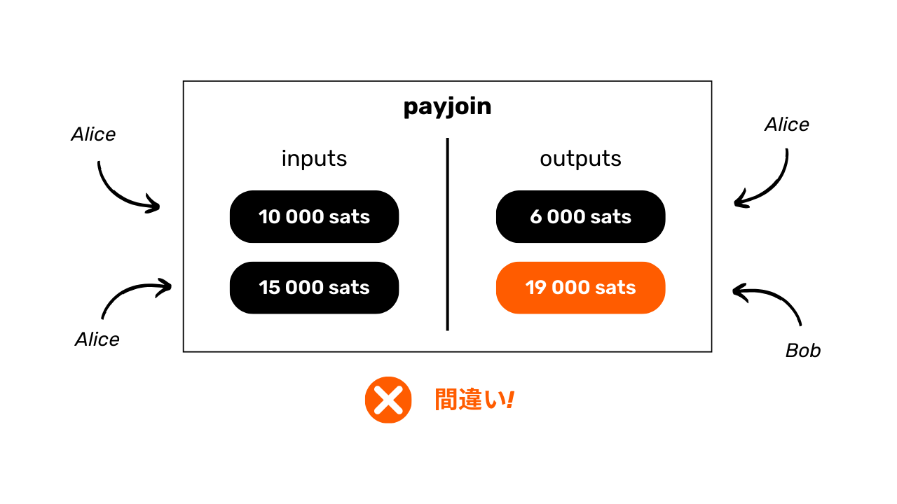
この解釈は明らかに間違っています。ご存知の通り、入力にある2つのUTXOは同一人物のものではありません。一つはバゲットを購入したアリスから、もう一つはパン屋のボブから来ています。


したがって、外部の観察者の分析は誤った結論に向けられ、これにより関係者の機密性が保持されます。

### ステガノグラフィックトランザクション

ペイジョインの第二の目的は、実際に支払われた金額について外部の観察者を欺くことです。トランザクションの構造を調べることで、分析者は支払いが出力のいずれかの金額に相当すると考えるかもしれません。
バゲット購入の例に戻ると、分析者は支払い額が6,000サトシのUTXOまたは19,000サトシのUTXOのいずれかに相当すると考えるでしょう。この場合、分析者は支払い額が19,000サトシであると考える可能性が高いです。なぜなら、出力に2つのUTXOがあり、少なくとも1つは6,000サトシより大きいからです（この支払いに単一のUTXOで十分な場合に2つのUTXOを使用する論理的な理由はありません）。
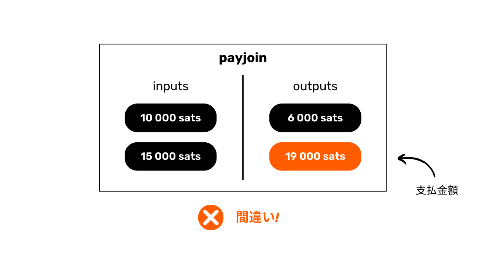

しかし、実際にはこの分析は正しくありません。支払い額は出力のいずれかに相当するものではありません。実際には、受取人の出力におけるUTXOと受取人の入力におけるUTXOの差額に相当します。

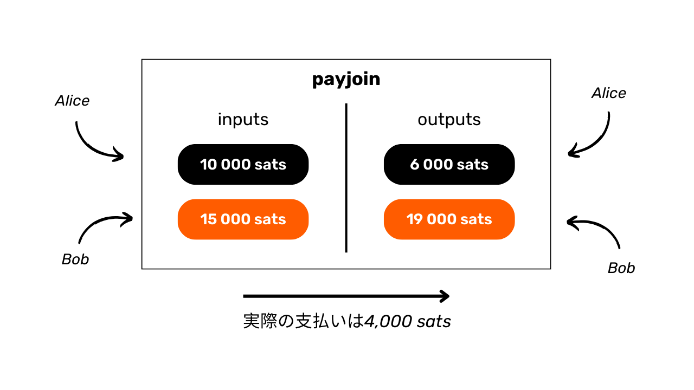

この点で、ペイジョイントランザクションはステガノグラフィーの領域に入ります。これにより、偽のトランザクション内に実際の取引額を隠すことができ、その偽のトランザクションが囮として機能します。

ステガノグラフィーは、隠された情報の存在が知覚できないように、他のデータやオブジェクト内に情報を隠す技術です。例えば、関連性のないテキスト内のドットに秘密のメッセージを隠すことができ、肉眼では検出できないようにすることができます（これは[micropoint](https://fr.wikipedia.org/wiki/Micropoint)の技術です）。

暗号化が復号化キーなしでは情報を理解できないようにするのに対し、ステガノグラフィーは情報を変更しません。それは明白に存在します。その目的は、秘密のメッセージの存在自体を隠すことにありますが、暗号化は隠された情報の存在を明らかにしますが、キーなしではアクセスできません。これが、ペイジョインの初期名が「*ステガノグラフィックトランザクション*」であった理由です。

暗号学とコインジョイン、ステガノグラフィーとペイジョインの間には類似点があります。実際、コインジョインは暗号化と似た属性を持っています：方法は認識可能ですが、情報は解読不可能です。逆に、ペイジョインはステガノグラフィーに似ています：情報は理論的にアクセス可能ですが、その隠蔽方法が認識されないため、アクセス不可能になります。

### ペイジョインの使用方法

ペイジョインをサポートする既知のソフトウェアには、Sparrow Wallet、Wasabi Wallet、Mutiny、BitMask、BlueWallet、JoinMarket、および支払いプロセッサのBTCPayがあります。


Samourai Walletにおけるpayjoinの最も進んだ実装は、Stowawayだけでした。しかし、ソフトウェアの創設者が逮捕されて以来、このツールは現在部分的にしか機能していません。Stowawayの利点は、完全で非常に使いやすいプロトコルであり、受け取りと送信の両方をサポートしていることです。部分的に署名されたトランザクションは、複数のQRコードをスキャンして手動で交換することも、Tor経由でSorobanを通じて自動的に交換することもできます。現在サービス外となっているのは、この後者の通信オプションです。

payjoinを使用する難しさは、商人の参加に依存していることにあります。顧客として、商人がサポートしていない場合、payjoinを使用することは不可能です。これは購入時に追加の難しさをもたらします：ビットコインを受け入れる商人を見つけるのが複雑なだけでなく、payjoinをサポートする商人を探すと、さらに複雑になります。

解決策は、受取人の協力を必要とせずにチェーン分析に曖昧さを導入するトランザクション構造を使用することです。これにより、商人の積極的な参加に依存することなく、支払いのプライバシーを向上させることができます。これは、次の章で詳しく学ぶことです。

https://planb.network/tutorials/privacy/payjoin-sparrow-wallet

https://planb.network/tutorials/privacy/payjoin-samourai-wallet

## 支払いのミニコインジョイン
<chapterId>300777ee-30ae-43d7-ab00-479dac3522c1</chapterId>

ある程度のプライバシーを保持しながら支払いトランザクションを行う場合、payjoinは良い選択肢です。しかし、見てきたように、payjoinは受取人の関与を必要とします。では、受取人がpayjoinへの参加を拒否した場合、または単に彼らを巻き込みたくない場合はどうすればよいでしょうか？代替案として、StonewallまたはStonewall x2トランザクションを使用することができます。これら2種類のトランザクションをもう少し詳しく見てみましょう。

### Stonewallトランザクション

Stonewallは、支出時のユーザーのプライバシーを高めることを目的としたBitcoinトランザクションの特定の形式で、実際にはそうではないにもかかわらず、2人間の擬似コインジョインを模倣します。実際、このトランザクションは協力的ではありません。ユーザーは自分だけで構築でき、入力として自分が所有するUTXOsのみを関与させます。したがって、他のユーザーや受取人と同期する必要なく、どんな場合でもStonewallトランザクションを作成できます。

Stonewallトランザクションの操作は次のとおりです：トランザクションの入力では、送信者は自分に属する2つのUTXOsを使用します。出力では、トランザクションは4つのUTXOsを生成し、そのうち2つは正確に同じ額になります。他の2つのUTXOsはおつりとなります。同じ額の2つの出力のうち、実際に支払いの受取人に行くのは1つだけです。
Stonewallトランザクションには2つの役割しかありません：
- 支払いを行う送信者；
- トランザクションの特定の性質を知らずに単に送信者からの支払いを待っている受取人。

このトランザクション構造を理解するために例を挙げてみましょう。Aliceは、4,000 satsのバゲットを買うためにパン屋のBobのところにいます。彼女は支払いに関してある程度のプライバシーを維持しながらビットコインで支払いたいと考えています。したがって、彼女は支払いのためにStonewallトランザクションを構築することに決めました。
この取引を分析すると、ベーカリーのボブが確かにバゲットの代金として4,000サトシを受け取ったことがわかります。アリスは2つのUTXOを入力として使用しました：1つは10,000サトシ、もう1つは15,000サトシです。出力では、彼女は3つのUTXOを受け取りました：1つは4,000サトシ、1つは6,000サトシ、もう1つは11,000サトシです。したがって、アリスはこの取引において純粋に-4,000サトシの残高を持っており、これはバゲットの価格に正確に相当します。
この例では、理解を容易にするために意図的にマイニング手数料を無視しました。実際には、取引手数料は完全に送信者が負担します。

### ストーンウォール取引の目的は何ですか？

ストーンウォール構造は取引に多くのエントロピーを追加し、チェーン分析の痕跡をぼかします。外部から見ると、このような取引は2人の間のミニコインジョインと解釈されるかもしれません。しかし実際には、それは支払いです。この方法は、チェーン分析において不確実性を生み出し、あるいは誤った痕跡につながることさえあります。

ベーカリーのボブのところでのアリスの例に戻りましょう。ブロックチェーン上の取引は次のようになります：


一般的なチェーン分析のヒューリスティックに依存する外部の観察者は、誤って「*2人がそれぞれ入力に1つのUTXOを使用し、出力にそれぞれ2つのUTXOを持つ小さなコインジョインを行った*」と結論付けるかもしれません。この取引の外部からの分析は、同じ金額の2つの出力の存在がコインジョインのパターンを示唆しているため、Common Input Ownership Heuristic (CIOH)の適用には至りません。外部の観点から、この特定のケースではCIOHは適用されません。


この解釈は不正確です。なぜなら、ご存知の通り、1つのUTXOがベーカリーのボブに送られ、入力の2つのUTXOはアリスから来ており、彼女は3つのお釣りの出力を回収しました。


そして、ストーンウォール取引の構造について特に興味深いのは、外部の観察者の視点から、それがまさにストーンウォールx2取引の構造と同じように見えることです。

### ストーンウォールx2取引

ストーンウォールx2は、支出中のユーザーのプライバシーを高めることを目的としたビットコイン取引の別の特定の形態ですが、今回は支出に関与していない第三者と協力することによって実現します。この方法は、2人の参加者間の擬似コインジョインのように機能し、同時に第三者への支払いを行います。

ストーンウォールx2取引の操作は比較的シンプルです：支払いを行うために自分の持つUTXOを使用し、所有しているUTXOを提供する第三者の助けを求めます。取引は4つの出力で終了します：2つは同じ金額で、1つは支払い受取人のアドレス用、もう1つは協力者に属するアドレス用です。第三のUTXOは協力者の別のアドレスに送られ、彼らが初期金額を回収できるようにします（マイニング手数料を除いて、彼らにとって中立的な行動）、そして最後のUTXOは私たちに属するアドレスに戻り、支払いのお釣りを構成します。

したがって、ストーンウォールx2取引では3つの異なる役割が定義されます：
- 実際の支払いを行う送信者；
- 取引の特定の性質を知らずに単に送信者からの支払いを待っている受取人；
取引分析に疑問を投げかけるためにビットコインを提供し、最終的に自分の資金を完全に回収する（マイニング手数料を差し引いた場合を除き、彼らにとって中立的な行動）共同作業者について説明します。アリスがボブのパン屋で彼女のバゲットを購入する例に戻りましょう。そのバゲットの価格は4,000サトシです。彼女は支払いにおける一定レベルのプライバシーを維持しながらビットコインで支払いたいと考えています。そこで、彼女はこのプロセスを手伝ってくれる友人のチャールズに連絡します。


この取引を分析すると、ボブのパン屋が実際にバゲットの支払いとして4,000サトシを受け取ったことがわかります。アリスは入力として10,000サトシを使用し、出力として6,000サトシを回収し、ネット残高は-4,000サトシとなり、これはバゲットの価格に相当します。チャールズについては、入力として15,000サトシを提供し、出力として4,000サトシと11,000サトシの2つを受け取り、残高は0となります。

この例では、理解を容易にするために手数料を意図的に省略しました。実際には、マイニング手数料は一般的に支払い発行者と共同作業者の間で均等に分担されます。

### Stonewall x2取引の目的は何ですか？
Stonewall構造と同様に、Stonewall x2構造は取引に大量のエントロピーを追加し、チェーン分析の痕跡を曖昧にします。外部から見ると、このような取引は2人間の小規模なコインジョインと解釈されるかもしれません。しかし実際には、それは支払いです。したがって、この方法はチェーン分析に不確実性を生み出し、偽の痕跡にさえつながる可能性があります。

アリス、ボブのパン屋、そしてチャールズの例を再訪しましょう。ブロックチェーン上の取引は次のようになります：


一般的なチェーン分析のヒューリスティックに依存する外部の観察者は、「*アリスとチャールズが入力にそれぞれ1つのUTXOを使用し、出力にそれぞれ2つのUTXOを持つ小規模なコインジョインを行った*」と誤って結論づけるかもしれません。再び、この取引の外部からの分析は、同じ金額の2つの出力の存在がコインジョインのパターンを示唆しているため、Common Input Ownership Heuristic (CIOH)の適用には至りません。したがって、この特定のケースでは外部の観点からCIOHは適用されません。


この解釈は不正確です。なぜなら、ご存知の通り、1つのUTXOがボブのパン屋に送られ、アリスは変更出力を1つだけ持ち、チャールズは2つ持っているからです。


そして再び、Stonewall x2取引構造の特に興味深い点は、外部の観察者の観点から見ると、それがStonewall取引のそれとまったく同じように見えることです。

### StonewallとStonewall x2の違いは何ですか？

StonewallX2取引は、Stonewall取引と全く同じように機能しますが、前者は協力的であり、後者はそうではありません。見てきたように、Stonewall x2取引は、支払いに外部の第三者（チャールズ）が参加し、彼のビットコインを提供して取引の機密性を高めることを含みます。古典的なStonewall取引では、共同作業者の役割は送信者によって担われます。


したがって、外部から見た取引のパターンはまったく同じです。
これら2つのトランザクション構造がまったく同じパターンを共有しているという事実は、外部の観察者が「Stonewall(x2)」パターンを特定できたとしても、すべての情報を持っているわけではないことを意味します。彼らは、同じ金額の2つのUTXOのうち、どちらが支払いに対応しているかを判断することができません。さらに、入力にある2つのUTXOが2人の異なる人物から来ているのか（Stonewall x2）、それとも1人の人物がそれらを統合したのか（Stonewall）を判断することもできません。
この最後の点は、Stonewall x2トランザクションがStonewallトランザクションとまったく同じパターンに従うためです。外部から見て、文脈に関する追加情報がない限り、StonewallトランザクションとStonewall x2トランザクションを区別することは不可能です。ただし、前者は協力的なトランザクションではないのに対し、後者はそうです。これは、これらのトランザクションの分析にさらなる疑問を投げかけます。

### StonewallとStonewall x2トランザクションをいつ使用するか？

トランザクションにプライバシーツールを使用したい場合のロジックは次のとおりです：
- 優先的に、payjoinを行うことを選択できます；
- 加盟店がpayjoinsをサポートしていない場合、支払い外の別の人と協力してStonewall x2構造を使用してトランザクションを行うことができます；
- Stonewall x2トランザクションを行う人が見つからない場合、Stonewall x2トランザクションの振る舞いを模倣するStonewallトランザクションを単独で行うことができます。

### StonewallとStonewall x2トランザクションの使用方法は？

StonewallとStonewall x2トランザクションは、Samourai WalletアプリとSparrow Walletソフトウェアの両方で利用可能です。

しかし、payjoinsと同様に、Samouraiの創設者の逮捕後、Stonewall x2トランザクションは現在、関係者間でPSBTを手動で交換することによってのみ機能します。残念ながら、Sorobanを介した自動交換は現在利用できません。

また、任意のBitcoinウォレットソフトウェアからこのタイプのトランザクションを手動で実行することも可能です。

次の章では、これまでに研究したものに加えて非常に有用であるが、比較的知られていない別のプライバシー技術について学びます。

https://planb.network/tutorials/privacy/stonewall

https://planb.network/tutorials/privacy/stonewall-x2
 
## リコシェ
<chapterId>db9a20ac-a149-443d-884b-ea6c03f28499</chapterId>

チェーン分析において曖昧さを加えるBitcoinトランザクション構造の使用、例えばcoinjoinは、プライバシー保護に特に有益です。しかし、payjoinsの章で議論したように、coinjoinトランザクションは自然にチェーン上で識別可能です。ファイルを暗号化する際に確立した暗号化とcoinjoinsの間の類似性を思い出してください：第三者がこの暗号化されたファイルを発見した場合、その内容にアクセスすることはできませんが、その内容を隠すためにファイルが変更されたことを明確に識別できます。coinjoinについても同様です：アナリストがcoinjoinトランザクションを調査すると、入力と出力（逆も同様）の間の直接的なリンクを確立することはできませんが、観察されたトランザクションがcoinjoinであることを認識することはできます。
コインがコインジョインのサイクルを経た後の使用目的によっては、このプロセスを経たという事実が問題となる場合があります。例えば、規制された取引プラットフォームでコインを売却する予定であるが、最近コインジョインを行った場合、プラットフォームのチェーン分析ツールがこの事実を検出します。その結果、プラットフォームはコインジョインを経たあなたのUTXOを受け入れ拒否するか、あるいは説明を求められ、アカウントの停止や資金の凍結のリスクを伴うことがあります。場合によっては、プラットフォームがあなたの行動を国家機関に報告することもあります（例えば、これはフランスのデジタル資産サービスプロバイダー（PSAN）にTRACFINが要求することです）。

これを避けるために必要なのは、ビットコインの過去の痕跡をぼかし、ある種の代替性を回復することができるツールです。これがまさにリコシェの目標です。

### リコシェとは何か？

リコシェは、ビットコインの所有権の移転をシミュレートするために、自分自身に対して複数の架空の取引（スイーピング）を行う技術です。このツールは、我々が議論してきた他の取引構造とは異なり、将来の匿名性を可能にするのではなく、むしろ過去の匿名性の一形態を可能にします。実際、リコシェは、その過去のためにビットコインの代替性を損なう可能性のある特定の詳細をぼかすことができます。

コインジョインのサイクルなど、過去の出来事によって残された印象をぼかすために、リコシェはユーザーが異なるアドレスに資金を自分自身に転送する4つの連続した取引を実行します。

この一連の取引の後、リコシェツールは最終的にビットコインを最終的な目的地、例えば取引プラットフォームにルーティングします。

目標は、コインジョイン取引などのコインの代替性に影響を与える距離を作り、その過去のためにこのコインを拒否する可能性のある最終的な支出行為との距離を作ることです。したがって、チェーン分析ツールは、イベントの後に所有権の変更がおそらく発生したと結論付け、このコインを代替可能とみなすかもしれません。コインジョインの場合、チェーン分析ツールは、ビットコインを送信し、コインジョインを実行したのは同一人物ではないと仮定し、したがって送信者に対して行動を起こす必要はないと考えるかもしれません。

### これが機能する理由は？
このリコシェ方法に直面して、チェーン分析ソフトウェアは4つのホップを超えて調査を深めると想像するかもしれません。しかし、これらのプラットフォームは検出閾値の最適化というジレンマに直面しています。所有権の変更がおそらく発生したと認め、以前のイベント（例えば、コインジョイン）とのリンクを無視すべきだとするホップの数に限界を設定しなければなりません。

しかし、この閾値を決定することはリスキーです：観察されるホップの数を延長するごとに、誤ってイベントの参加者としてマークされた個人、つまり操作が他の誰かによって行われたときの偽陽性の量が指数関数的に増加します。このシナリオは、これらの企業にとって大きなリスクをもたらし、偽陽性は不満を引き起こし、影響を受けた顧客を競合他社に押しやる可能性があります。長期的には、広範な検出閾値はプラットフォームが競合他社よりも多くの顧客を失うことにつながり、その生存を脅かす可能性があります。したがって、これらのプラットフォームにとって観察されるホップの数を増やすことは複雑であり、4はしばしば彼らの分析をカウンターするのに十分な数です。

ここで観察される現象は、六次の隔たりの理論にやや類似しています。
6次の分離の理論は、地球上の任意の人物が、6人を超える仲介者を含まない知人の連鎖を通じて他の任意の人物と繋がっていることを示唆しています。世界中の任意の個人に到達するためには、次の人物を個人的に知っている6人の一連の人々を通過するだけで十分です。

ビットコイン取引においても、類似の現象が見られます。十分な数のビットコイン取引を遡ると、必然的にコインジョインに遭遇します。リコシェット方法は、この原則を利用して、交換プラットフォームが合理的に追跡できるよりも多くのホップを使用します。プラットフォームがより多くの取引を追跡することを決定した場合、単に追加のホップを追加してこの措置を回避することが可能です。

### リコシェットをいつ、どのように使用するか？

リコシェットが最も一般的に使用されるケースは、所有するUTXOで以前にコインジョインに参加したことを隠す必要がある場合です。理想的には、コインジョインを経たビットコインを規制されたエンティティに転送することは避けるべきです。それでも、特にビットコインを法定通貨に換金する緊急性がある場合には、他に選択肢がない場合、リコシェットは効果的な解決策を提供します。

この方法は、コインジョインだけでなく、コインの代替性を損なう可能性のある他のマークに対しても効果的です。
このリコシェット方法のアイデアは元々、Samourai Walletのチームから来ており、彼らはこのプロセスを自動化するためにアプリケーションに統合しました。サービスはSamouraiで有料であり、リコシェットには100,000 satsのサービス料金がかかり、それに加えてマイニング料金もかかります。したがって、その使用は、額の大きな転送に対して推奨されます。


Samouraiアプリケーションはリコシェットの2つのバリアントを提供します：
- 拡張リコシェット、または「段階的配信」は、Samouraiサービス料を5回の連続した取引にわたって分散する利点があります。このオプションは、各取引が異なる時間にブロードキャストされ、異なるブロックに記録されることも保証し、所有権の変更をできるだけ密接に模倣することができます。この方法は遅いですが、急いでいない人にとっては、チェーン分析への抵抗を強化することでリコシェットの効率を最大化するため、好ましい方法です。


- クラシックリコシェットは、すべての取引を短い時間枠内にブロードキャストすることで、操作を迅速に実行するように設計されています。したがって、この方法は、拡張方法よりもプライバシーと分析への抵抗が低いです。これは、緊急な送信のみに使用すべきです。


リコシェットは単に自分自身にビットコインを送ることを意味します。特別なツールを使用せずに、任意のウォレットソフトウェアでリコシェットを手動で実行することは十分に可能です。同じコインを自分自身に連続して転送し、毎回新しい空白のアドレスを使用してください。

次の章では、秘密の財産転送のための異なる技術を探ります。これらの方法は、これまでに検討したものとは、操作と結果の両方の点で根本的に異なります。

https://planb.network/tutorials/privacy/ricochet
 
## 秘密の財産転送
<chapterId>a2067036-849c-4d6b-87d2-44235cfae7a1</chapterId>

ビットコインのプライバシー技術の中には、秘密の財産転送もあります。この方法は、ビットコインの所有権を一方の人から別の人へ、そしてその逆へ、この取引がブロックチェーン上で明示的に見えないように転送することを目的としています。利用可能な異なる技術とそれらの利点と欠点を一緒に学びましょう。

### CoinSwap
CoinSwapは比較的シンプルなコンセプトに基づいています：スマートコントラクトを使用して、二人のユーザー間でビットコインの所有権を信頼なしで、そしてこの転送がブロックチェーン上で明確に可視化されることなく行うことを容易にします。

アリスとボブの簡単な例を想像してみましょう。アリスはプライベートキー$A$で保護された1BTCを所有しており、ボブもまた、プライベートキー$B$で保護された1BTCを所有しています。理論的には、外部の通信チャネルを介して彼らのプライベートキーを交換することで、秘密の転送を実行することができます。


しかし、この素朴な方法は信頼に関して高いリスクを提示します。アリスが交換後にプライベートキー$A$のコピーを保持し、そのキーがボブの手に渡った後でビットコインを盗むために後でそれを使用することを何も防ぎません。


さらに、アリスがボブのプライベートキー$B$を受け取り、見返りに自分のプライベートキー$A$を送らないことを防ぐ保証はありません。したがって、この交換は当事者間の過度の信頼に依存し、所有権の秘密の転送を安全に保証するのに非効率です。


これらの問題を解決し、互いに信頼しない当事者間の交換を可能にするために、代わりにスマートコントラクトシステムを使用することができます。スマートコントラクトは、事前に定義された条件が満たされたときに自動的に実行されるプログラムであり、この場合、所有権の交換が相互の信頼を必要とせずに自動的に行われることを保証します。

これを行うために、HTLC（*Hash Time-Locked Contracts*）またはPTLC（*Point Time-Locked Contracts*）を使用することができます。これら2つのプロトコルは、交換が成功裏に完了するか完全にキャンセルされることを保証するタイムロックシステムを使用して機能する点で類似しています。これにより、両当事者の資金の完全性が保護されます。HTLCとPTLCの主な違いは、HTLCがハッシュとプレイメージを使用してトランザクションを保護するのに対し、PTLCがアダプターシグネチャを使用することです。

アリスとボブの間でHTLCまたはPTLCを使用したコインスワップシナリオでは、交換は安全に行われます：成功すれば、それぞれが相手のBTCを受け取るか、失敗すれば、それぞれが自分のBTCを保持します。したがって、当事者の一方が不正行為をするか、他方のBTCを盗むことは不可能です。

> *HTLCは、Lightning Networkの双方向チャネルを通じて支払いを安全にルーティングするために使用されるメカニズムでもあります。*
アダプターシグネチャの使用はこの文脈で特に興味深いものであり、伝統的なスクリプトを迂回することを可能にします（これは時々「_スクリプトレススクリプト_」と呼ばれるメカニズムです）。この機能は、交換に関連する手数料を削減するのに役立ちます。アダプターシグネチャのもう一つの大きな利点は、トランザクションの両当事者に共通のハッシュを使用する必要がないため、特定のタイプの交換で彼らの間の直接的なリンクを明らかにすることを避けることができることです。
### アダプターシグネチャ

アダプターシグネチャは、有効な署名に追加の署名（「_アダプターシグネチャ_」と呼ばれる）を統合して、秘密のデータ片を明らかにする暗号学的方法です。このメカニズムは、次の3つの要素のうち2つ（有効な署名、アダプターシグネチャ、秘密）を知っていることで、欠けている第三の要素を推測できるように設計されています。この方法の興味深い特性は、もし私たちが相手のアダプターシグネチャと、このアダプターシグネチャを計算するために使用された秘密に関連付けられた楕円曲線上の特定の点を知っている場合、直接秘密にアクセスすることなく、その同じ秘密と互換性のある自分自身のアダプターシグネチャを導出することができるということです。
コインスワップでは、アダプターシグネチャの使用により、参加者間で2つの機密情報を同時に公開することができ、相互の信頼が不要になります。このプロセスを説明するために、互いに信頼していないAliceとBobが、それぞれ1BTCの所有権を交換したいと考えている例を見てみましょう。彼らはこの交換で信頼の必要性を排除するためにアダプターシグネチャを使用します。彼らの進め方は以下の通りです：
* Aliceは、1BTCをBobに送るトランザクション$m_A$を作成して交換を開始します。彼女は自分の秘密鍵$p_A$ ($P_A = p_A \cdot G$)、ノンス$n_A$ ($N_A = n_A \cdot G$)、そして秘密$t$ ($T = t \cdot G$)を使用して、このトランザクションを検証する署名$s_A$を生成します：

$$s_A = n_A + t + H(N_A + T \parallel P_A \parallel m_A) \cdot p_A$$

* Aliceは、真の署名$s_A$から秘密$t$を引いてアダプターシグネチャ$s_A'$を計算します：

$$s_A' = s_A - t$$

* Aliceは、アダプターシグネチャ$s'_A$、署名されていないトランザクション$m_A$、秘密に対応する点($T$)、およびノンスに対応する点($N_A$)をBobに送ります。これらの要素は「*アダプター*」と呼ばれます。この情報だけでは、BobはAliceのBTCを回復することができないことに注意してください。
* しかし、BobはAliceが彼から盗もうとしていないことを確認する能力を持っています。これを行うために、彼はAliceのアダプターシグネチャ$s_A'$が提案されたトランザクション$m_A$に実際に対応しているかどうかを確認します。次の方程式が正しい場合、彼はAliceのアダプターシグネチャが有効であることを確信できます：
$$s_A' \cdot G = N_A + H(N_A + T \parallel P_A \parallel m_A) \cdot P_A$$

* この検証は、Bobに交換を自信を持って進めるための十分な保証を提供します。彼は次に、1BTCをAliceに送ることを意図した自分のトランザクション$m_B$を作成し、同じ秘密$t$にリンクされる彼のアダプターシグネチャ$s_B'$を生成します。この時点で、$t$の値を知っているのはAliceだけです。BobはAliceが彼に伝えた対応する点$T$のみを知っています：

$$s_B' = n_B + H(N_B + T \parallel P_B \parallel m_B) \cdot p_B$$

* Bobは、アダプターシグネチャ$s_B'$、署名されていないトランザクション$m_B$、秘密に対応する点($T$)、およびノンスに対応する点($N_B$)をAliceに送信します。秘密$t$を知っているAliceは、今Bobのアダプターシグネチャ$s_B'$とこの秘密を組み合わせて、BobのBTCを彼女に転送するトランザクション$m_B$の有効な署名$s_B$を生成することができます：

$$s_B = s_B' + t$$

$$(s_B' + t) \cdot G = N_B + T + H(N_B + T \parallel P_B \parallel m_B) \cdot P_B$$

* Aliceは、この署名されたトランザクション$m_B$をBitcoinブロックチェーンに放送して、Bobが約束したBTCを回復します。Bobがこのトランザクションをブロックチェーン上で見ると、署名$s_B = s_B' + t$を抽出できます。この情報を持って、Bobは必要だった有名な秘密$t$を単独で特定することができます。
$$t = (s_B' + t) - s_B' = s_B - s_B'$$
* 実際に、この秘密の $t$ は、ボブがアリスのアダプター署名 $s_A'$ から有効な署名 $s_A$ を生成するために欠けていた唯一の要素でした。この署名により、アリスからボブへのBTCを送信するトランザクション $m_A$ の検証が可能になります。ボブは次に $s_A$ を計算し、その結果、トランザクション $m_A$ をブロックチェーン上でブロードキャストします：

$$s_A = s_A' + t$$

$$(s_A' + t) \cdot G = N_A + T + H(N_A + T \parallel P_A \parallel m_A) \cdot P_A$$
アダプター署名がコインスワップでどのように機能するかを要約しましょう。初めに、アリスはボブに署名されていないトランザクションとアダプターを送ります。これにより、ボブは後で明らかにされる秘密が彼にビットコインへのアクセスを与えることを検証できます。返答として、ボブはアリスに自分の署名されていないトランザクションと自分のアダプターを送ります。アリスはその後、秘密を使用して有効なトランザクションをブロードキャストすることにより、ボブのトランザクションを最終化し、ビットコインを回収できます。このトランザクションがブロックチェーン上で公開されると、ボブは秘密を抽出し、それによってアリスのトランザクションを解除する能力を持ちます。その結果、アリスがボブのビットコインの転送を開始した場合、彼は逆にアリスのビットコインにアクセスできます。これは相互の信頼を必要としません。
コインスワップが最初に提案されたのは、[2013年10月にGregory MaxwellによってBitcoinTalkで](https://bitcointalk.org/index.php?topic=321228.0)です。

### アトミックスワップ

コインスワップと同様に、同じタイプのスマートコントラクトを使用して、アトミックスワップを実行することも可能です。アトミックスワップは、BTCとXMRなどの異なる暗号通貨を、信頼や仲介者の介入なしに2人のユーザー間で直接交換することを可能にします。これらの交換は「アトミック」と呼ばれるのは、交換が成功して両方の当事者が満足するか、失敗して元の暗号通貨をそれぞれが保持するかの2つの可能な結果しかないためです。これにより、他方への信頼が不要になります。


アトミックスワップとコインスワップは、操作方法が似ており、プライバシーに関して同じ利点と欠点を提供します。実際、ビットコインの観点からは、アトミックスワップは2段階で実行されるコインスワップと比較できます。まず、BTCを別の暗号通貨に交換し、次にこの暗号通貨を他のBTCに交換します。最終的に、他のユーザーのBTCを回収します。これが、プライバシー問題の分析で、これら2つのプロトコルを所有権の秘密の交換のカテゴリーに分類する理由です。


しかし、コインスワップとは異なり、アトミックスワップは特にBTC/XMRの交換において、利用可能な流動性の不均衡を持つことがあります。ビットコインへの高い需要があるため、ビットコインをアルトコインに交換することは一般的に容易で、この方向の変換に対するプレミアムを低く保つことができます。しかし、アルトコインをBTCに交換することは、需要が低いため複雑になることが多く、しばしば非常に高いプレミアムが発生します。

最後に、アトミック交換がオンチェーンのビットコインとライトニングネットワーク上のビットコインを含む場合、これを「*サブマリンスワップ*」と呼びます。

### 本当に役立つのか？
コインスワップやアトミックスワップのような秘密の財産転送は、チェーン分析のヒューリスティックを欺く利点があります。これらの方法は、実際の所有権が変わったにもかかわらず、取引が同じユーザーによるものであるかのような印象を与えることができます。しかし、これらの方法の主な欠点は、コインの履歴を断ち切るための追加技術を使用しない場合、非常にリスキーであることです。
確かに、アリスがボブとコインスワップまたはアトミックスワップを行うとき、彼女は自分のビットコインの所有権をボブのものと交換します。アトミックスワップの場合、交換にはアルトコインが含まれますが、原則は同じです。したがって、アリスはコイン$B$を手に入れ、ボブはコイン$A$を手に入れます。これはチェーン分析に疑問を投げかけますが、コインの履歴は追跡可能なままです。アナリストがコイン$A$を調べると、アリスの以前の活動まで遡ることができ、コイン$B$についても同様です。
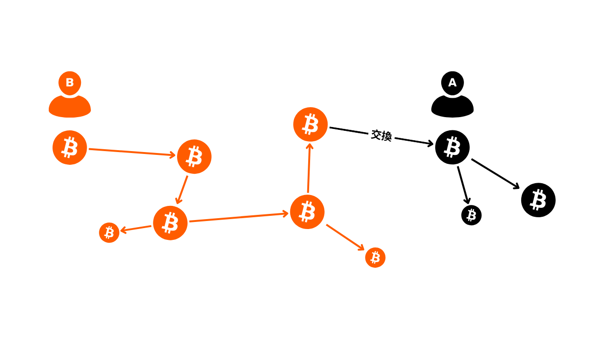

アリスの視点から見ると、リスクはコイン$B$の履歴が特定のエンティティによって怪しいと見なされる可能性があることです。例えば、ボブがハッキングなどの犯罪行為でコイン$B$を取得していた場合、このコインは彼の違法行為に関連付けられたままです。アリスは、規制された交換プラットフォームで資金を凍結されるリスクを冒さずに転送できないコインを所有することになり、また、彼女がそれらの犯罪とは何の関係もなかったにもかかわらず、ボブの犯罪で告発される可能性があります。

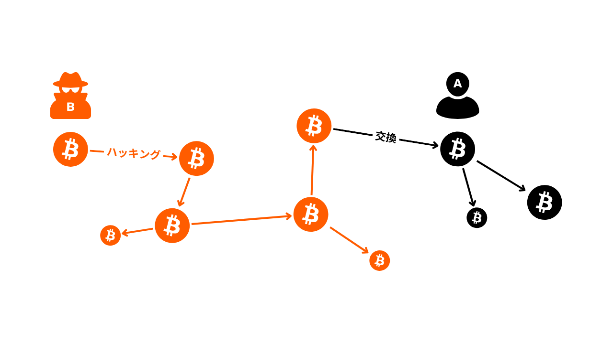

もちろん、コインスワップやアトミックスワップのようなプライバシー手法は、当局によって監視されている資金を持つ犯罪者によって好まれます。これらのプロトコルは、監視されているビットコインを完全に代替可能なビットコインと交換する機会を彼らに提供します。これにより、当局の注意を他のユーザーに向けるための囮を作ることもできます。したがって、これらの個人にとって二重の利用価値があります。

コインジョインを使用すると、あなたのコインが監視されているビットコインと混合されていても、コインの履歴は断ち切られ、コインスワップやアトミックスワップのような秘密の財産転送プロトコルには存在しない一種の合理的な否認の形を提供します。


アリスがリスクを避けたい場合、コイン$B$の履歴を断ち切る方法、例えばコインジョインを通すなどの方法を必ず使用する必要があります。これは、所有権の秘密の転送とコインジョインを組み合わせる有用性について疑問を投げかけます。コインジョインは、コインの履歴を断ち切ることで、アリスに十分なレベルのプライバシーを提供します。したがって、私の意見としては、アリスがプライバシーを守りたい場合、コインスワップに続いてコインジョインを行うよりも、直接コインジョインを行う方が賢明だと思います。
秘密の所有権転送の方法が真に効果的であり、ユーザー$A$の履歴をユーザー$B$にリンクするリスクを避けるためには、逆説的に、その使用が広く知られている必要があります。コインスワップが大量に使用され、当局がこの一般的な慣行を認識している場合、合理的な否認の形が確立されるかもしれません。しかし、これらの転送の使用が限定的である限り、これらの方法はユーザーにとってリスクが高すぎると私は信じています。

これまで、主にトランザクションレベル自体でのプライバシー手法を主に研究してきました。次の章では、ネットワークレベルでの問題とトランザクションの普及について探求します。

## P2Pネットワーク上のプライバシー
<chapterId>04a2467b-db84-4076-a9ff-919be5135106</chapterId>

第4部では、トランザクションのプライバシーを保護するためにフルノードを使用することの重要性について議論しました。しかし、あなたのノード自体があなたの活動に関する情報を抽出しようとする攻撃の対象となる可能性があることを理解することが重要です。したがって、この章では、ビットコインの流れやトランザクション自体のレベルではなく、ネットワークレベルでの異なるプライバシー保護対策を検討します。

### ダンデライオン
さまざまな匿名化攻撃を回避する方法の一つに、Dandelion提案の使用があります。このブロードキャストプロトコルはBIP156で正式に定義されましたが、Bitcoin上で実装されたことはありません。
Dandelionのアイデアは、Bitcoinネットワークのトランザクションルーティングのプライバシーを向上させ、さまざまな形態の攻撃に対抗することです。その主な目的は、ネットワーク上でトランザクションを最初にブロードキャストしたソースノードを隠すことです。このノードの開示は、Bitcoinトランザクションを特定のIPアドレス（ノードがクリアネット上で動作している場合）にリンクさせる可能性があり、これはチェーン分析のための入口となる可能性があります。
Bitcoin上の活動とIPアドレスとのこの関連付けは、ユーザーのプライバシーにとって重大なリスクを表しています。実際、多くのエンティティが容易にIPアドレスを個人の身元にリンクさせることができます。これには政府やインターネットサービスプロバイダーが含まれます。さらに、この情報は公開される可能性があります。例えば、ウェブサイトのデータベースがハッキングにより漏洩した際に、あなたのIPアドレスと個人データが露出する場合などです。
Bitcoinの標準的な操作では、ユーザーがウォレットソフトウェアで構築したトランザクションは、その個人のノードに送信されます。このノードは、接続されているすべてのピアに新しいトランザクションを即座にブロードキャストします。


これらのピアは次に、トランザクションがコンセンサスルールおよびローカルの標準化ルールに準拠していることを確認するためにトランザクションを検証します。検証されると、各ピアは順番に自身のピアにトランザクションを伝達し、これが続きます。


ブロックに統合される保留中のトランザクションの配布は、かなりバランスが取れており、統計的に予測可能な方法で行われます。この脆弱性は、ネットワークを監視および分析し、トランザクションを最初にブロードキャストしたノードを特定するために共謀するスパイノードによって悪用される可能性があります。観察者がソースノードを特定することができれば、そのトランザクションがそのノードの運営者から発信されたと推測することができます。このタイプの観察は、通常は匿名のトランザクションを特定のIPアドレスにリンクさせる可能性があります。


BIP156の目標は、この問題に対処することです。これを実現するために、新しいトランザクションのブロードキャストに追加のフェーズを導入し、広範な公開伝播前に匿名性を保持します。Dandelionは最初に「stem」フェーズを使用し、トランザクションをノードのランダムなパスを通じて送信します。


その後、トランザクションは「fluff」フェーズでネットワーク全体にブロードキャストされます。


stemとfluffは、トランザクションのネットワークを通じた伝播の振る舞いを、タンポポの形に例えたものです。

したがって、スパイノードはトランザクションをfluffフェーズ（大量ブロードキャスト）を開始したノードに遡ることが潜在的に可能ですが、このノードはトランザクションを最初にブロードキャストしたノードではありません。なぜなら、それはstemの最後のノードから受け取ったからです。スパイノードがstemを遡ることができなければ、ソースノードを特定することもできません。

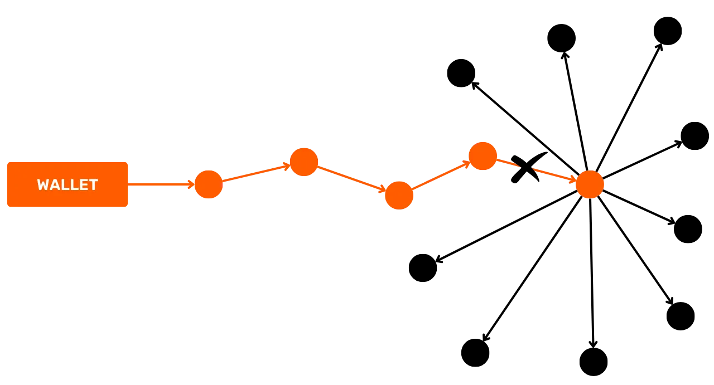
stemフェーズ中にスパイノードが存在しても、拡散グラフで正直なノードに遭遇するとすぐに、そのノードが元のソースなのか単なる中継者なのかをスパイは判断できないため、常に疑問が残ります。

このルーティング方法は、ソースノードへと続く道筋をぼかし、ネットワークを通じてトランザクションをその起源まで遡ることを困難にします。ダンデライオンは、敵対者がネットワークを匿名解除する能力を制限することでプライバシーを向上させます。この方法は、トランザクションがTorやP2P Transport V2のように、ネットワーク通信を暗号化するノードを「茎」フェーズで横切る場合にさらに効果的です。

BIP156はBitcoin Coreに統合されておらず、現在「拒否された」というステータスの下に分類されています。このプロトコルに関する主な懸念の一つは、茎フェーズ中にトランザクションが中間ノードによって中継されなければならないという事実にあります。通常のBitcoinのモデルでは、各ノードがトランザクションをブロードキャストする前に最初に検証します。トランザクションがコンセンサスルールまたはノードのローカル標準化ルールに準拠していない場合、それを無視し、ブロードキャストしません。このプロセスはDoS攻撃に対抗するために重要であり、有効なトランザクションのみがネットワーク全体にブロードキャストされます。無効なトランザクションは、ネットワークを過負荷にするために大量に生成される可能性がありますが、最初に遭遇したノードで停止し、伝播しません。ダンデライオンでの主なリスクは、この新しいプロトコルがネットワークの一部を通じて無効なトランザクションのブロードキャストを許可することで、DoS攻撃の新たなベクトルを導入する可能性があることです。

### P2P Transport V2

P2P Transport V2はBIP324で提示された別のネットワークプロトコルです。これは、ノード間の通信の機密性とセキュリティを向上させるために、機会主義的な暗号化を取り入れたBitcoin P2Pトランスポートプロトコルの新バージョンです。

この改善は、P2Pプロトコルの基本バージョンに関連するいくつかの問題を解決することを目指しています。一方で、受動的な観察者にとってインターネット上で循環している他の種類のデータと区別がつかないように交換されるデータを作ります。主な目的は、政府、インターネットサービスプロバイダー、またはVPNプロバイダーがBitcoinユーザーを大量に監視することを防ぐことです。これはまた、インターネットユーザーがBitcoinユーザーでもあるかどうか、つまりフルノードを運用しているかどうかをこれらのエンティティが判断する作業を複雑にします。
P2P V2はまた、データパケット内の特定のパターンの検出を通じて検閲と攻撃のリスクを減らすことに貢献します。これは、ネットワークレベルでさまざまなタイプのSybil攻撃の実行を複雑にし、コストを増加させます。Sybil攻撃は、アクターが不当な利益を得るために複数の偽のアイデンティティを作成する場合に発生します。Bitcoinネットワークの文脈では、これはしばしばアクターが大量のフルノードを制御し、接続を積極的に増やす形で現れます。Sybil攻撃は受動的であり、情報を収集しユーザーの機密性を侵害することを目的とするか、またはEclipse攻撃の形で能動的であり得ます。後者は特定のノードをネットワークの残りから隔離し、ユーザーを検閲するか、受け取るデータを変更することを可能にします。最後に、P2P V2はまた、*Man-In-The-Middle*（MITM）攻撃をよりコストがかかり、検出しやすくします。
P2P V2によって実装された暗号化は、不必要な複雑さを追加せず、ネットワーク接続の許可不要の性質を損なわないように、認証を含みません。この新しいP2Pトランスポートプロトコルはそれにもかかわらず、受動的攻撃に対するより良いセキュリティを提供し、能動的攻撃を大幅にコストがかかり、検出しやすくします。ネットワークメッセージに擬似ランダムデータストリームを導入することは、通信を検閲または操作したい攻撃者の作業を複雑にします。

P2P V2トランスポートは、2023年12月に展開されたBitcoin Coreのバージョン26.0にオプションとして（デフォルトでは無効）含まれていました。それから、2024年4月のバージョン27.0でデフォルトで有効になりました。これは設定ファイルの`v2transport=`オプションで変更できます。
ネットワークレベルでのノードの機密性のリスクを避ける比較的シンプルな解決策の一つは、それを完全にTorの下で実行することです。
Torは、インターネット上のTCP接続の起源を匿名化するリレーサーバー（ノード）のネットワークです。これは、データを複数の暗号化層でカプセル化することによって機能します。各リレーノードは、最終目的地に到達するまで、次のノードのアドレスを明らかにするために層を取り除きます。Torネットワークは、中間ノードがデータの起源と目的地の両方を知ることを防ぐことにより、匿名性を保証し、観察者がユーザーの活動を追跡することを非常に困難にします。


したがって、Torは通信されるデータを暗号化するだけでなく、通信の起源と目的地のマスキングも可能にします。個人のノードの通信にTorを使用することで、私たちの取引のプライバシーを強化します：インターネットサービスプロバイダ（ISP）は通信を復号化することができず、Bitcoinネットワークの他のノードはソースノードのIPアドレスを特定することができません。さらに、TorはISPからBitcoinの使用を隠します。

この方法に関連する主なリスクは、TorがBitcoinとは独立したプロトコルであることです。Torの下でBitcoinノードを持っていて、Torが機能しなくなった場合、Bitcoinノードはもはや通信することができなくなります。

また、Tor上の通信は遅いということに注意することが重要です。この遅延は、ノードの初期起動時に特に厄介であり、Initial Block Download（IBD）には多くの通信が必要です。その結果、Torを使用すると、Bitcoinネットワークとの初期同期が大幅に長くなる可能性があります。また、クリアネットでIBDを実行し、後でTorをアクティブにすることも可能です。この方法ではISPにBitcoinノードの存在を明らかにしますが、Torに切り替えると個人取引に関連する情報を保護します。

ネットワークレベルのプライバシー方法を探求した後、私は次の章でアドレスの再利用を避けるための2つのエレガントな解決策、BIP47とSilent Paymentsを紹介したいと思います。

## BIP47と再利用可能な支払いコード
<chapterId>ad88e076-a04b-4aec-b3b2-7b4760175504</chapterId>

第3部で見たように、アドレスの再利用はBitcoinプロトコル上のユーザープライバシーにとって深刻な障害です。これらのリスクを軽減するために、ウォレットで新しい支払いを受け取るたびに新しい受信アドレスを生成することが強く推奨されます。現代のソフトウェアと階層的決定ウォレットの使用によって今日新しいアドレスを生成することは簡素化されていますが、この慣行は直感に反するかもしれません。

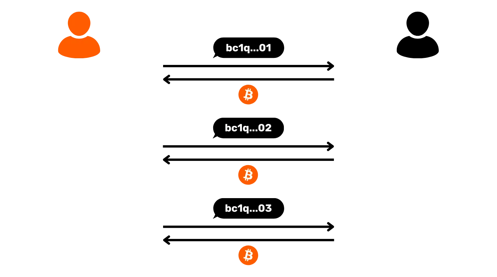

たとえば、伝統的な銀行システムでは、常に同じままのIBANを共有することに慣れています。一度誰かに伝えると、再度私たちとやり取りすることなく、複数の支払いを送ることができます。ネオバンクは、PayPalのユニークなメールアドレスやRevolutのRevTagsのような、より現代的な可能性も提供します。金融領域の外でも、私たちの日常の識別子である郵便住所、電話番号、メールアドレスもユニークで永続的です。新しいやり取りごとにそれらを更新する必要はありません。


しかし、Bitcoinの運用は異なります：受信取引ごとに新しい受信アドレスを生成することが不可欠です。使いやすさとプライバシーの間のこの妥協は、Bitcoin White Paperの非常に起源にさかのぼります。2008年末に彼の文書の最初のバージョンを公開して以来、サトシ・ナカモトはすでにこのリスクについて私たちに警告していました：
**"*追加のファイアウォールとして、各取引に対して新しいキーペアを使用することで、それらを共通の所有者にリンクしないようにすることができます。*"**
複数の支払いを単一の識別子で受け取る方法には数多くあり、アドレスの再利用を引き起こさないようにする方法があります。それぞれには妥協点と欠点があります。これらの方法の中には、Justus Ranvierによって開発され、2015年に公開された提案であるBIP47があります。この提案は、アドレスの再利用を避けながら、同一人物への複数の取引を可能にする再利用可能な支払いコードを作成することを目的としています。本質的に、BIP47は、取引のプライバシーを保護しながら、一意の識別子として直感的な支払いシステムを提供しようとしています。


BIP47は直接的にユーザーのプライバシーを向上させるわけではありません。なぜなら、BIP47の支払いは新鮮なアドレスを使用する従来のBitcoin取引と同じレベルのプライバシーを提供するからです。しかし、Bitcoinの使用をより便利で直感的にすることで、通常、プライバシーを妥協することになるはずの利便性を実現します。BIP47のおかげで、この利便性は従来の取引と同じレベルのプライバシーを達成します。これが、BIP47がプライバシーの保護にとって貴重なツールである理由です。

当初、BIP47はBitcoin Coreに統合されることを目的とした提案でしたが、採用されることはありませんでした。それでも、いくつかのソフトウェアは、アプリケーションレベルで独自に実装を選択しています。そのため、Samourai Walletのチームは「PayNym」という名前のBIP47の独自の実装を開発しました。

### BIP47とPayNymの一般原則

BIP47の目標は、アドレスの再利用を引き起こすことなく、複数の支払いを受け取ることを可能にすることです。これは、異なる送信者が単一のコードに複数の支払いを送信できるようにする再利用可能な支払いコードの使用に依存しています。このコードは別のユーザーに属しています。したがって、受信者は各取引に対して新しい新鮮なアドレスを提供する必要がなく、取引を大幅に容易にしながらプライバシーを保護します。

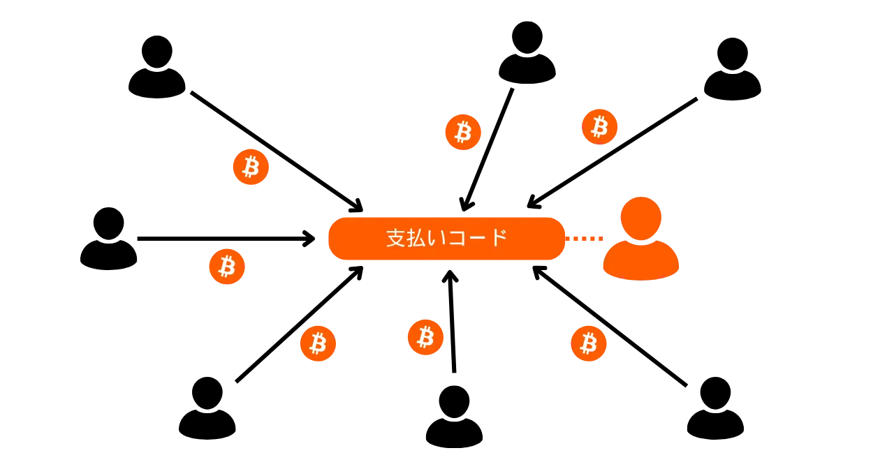

ユーザーは、ソーシャルネットワークや自分のウェブサイト上で、受信アドレスや公開鍵とは異なり、プライバシーを失うリスクなく、自由に支払いコードを共有することができます。
取引を行うには、両当事者がBIP47の実装を備えたBitcoinウォレットを持っている必要があります。例えば、Samourai WalletのPayNymやSparrow Walletなどです。彼らの支払いコードの共同使用は、彼らの間に秘密のチャネルを作り出します。このチャネルを効率的に確立するために、送信者はBitcoinブロックチェーン上で「通知トランザクション」として知られる特定の取引を実行する必要があります（この後、詳細をお伝えします）。

両ユーザーの支払いコードの組み合わせは共有秘密を生成し、これにより大量のユニークなBitcoin受信アドレス（正確には2^32、約40億）の作成を可能にします。したがって、BIP47を介して行われる支払いは、実際には支払いコード自体に対してではなく、関与するユーザーの支払いコードから派生した従来の受信アドレスに対して行われます。

支払いコードは、ウォレットのシードから派生した仮想識別子として機能します。ウォレットの階層的な導出構造において、支払いコードはレベル3、つまりアカウントレベルに位置します。

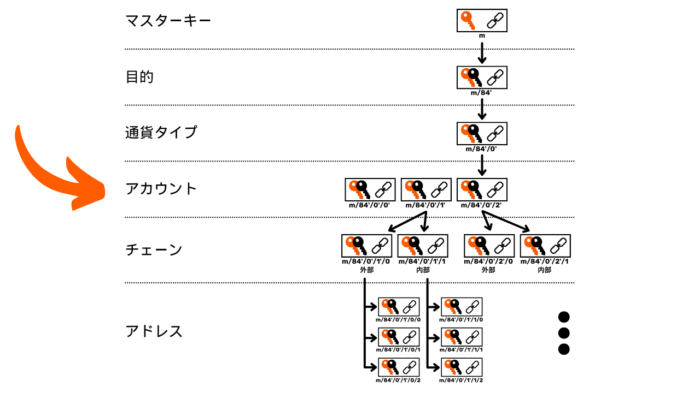

BIP47のための導出目標はインデックス`47'`（`0x8000002F`）によって識別され、BIP47を参照します。再利用可能な支払いコードの導出パスの例は以下の通りです：
```plaintext
m/47'/0'/0'/
```

支払いコードがどのように見えるかの例を示します。こちらが私のものです：
```plaintext
PM8TJSBiQmNQDwTogMAbyqJe2PE2kQXjtgh88MRTxsrnHC8zpEtJ8j7Aj628oUFk8X6P5rJ7P5qDudE4Hwq9JXSRzGcZJbdJAjM9oVQ1UKU5j2nr7VR5
```
このコードはQRコードにもエンコードでき、古典的な受信アドレスのように、その通信を容易にします。

PayNymボットに関しては、Twitter上で時々見かけるこれらのロボットは、Samourai Walletによって作成された支払いコードの視覚的表現です。これらはハッシュ関数を介して生成され、ほぼ一意性を持ちます。これらは`+`で始まる小さな文字列の形で現れます：
```plaintext
+throbbingpond8B1
+twilightresonance487
+billowingfire340
```

これらのアバターは画像の形でも表現されます：


これらのロボットはBIP47の枠組み内で特定の技術的機能を持っているわけではありませんが、容易に認識可能な視覚的アイデンティティを提供することで、ユーザー間の相互作用を容易にする役割を果たします。
この章の後続セクションでは、BIP47の仕組みについて詳しく調べ、特に使用される暗号化方法に重点を置いて説明します。これらやや技術的な説明を完全に理解するためには、HDウォレットの構造、キー導出プロセス、および楕円曲線ベースの暗号学の基本原則をまず理解することが不可欠です。これらの概念にさらに深く飛び込みたい場合は、PlanB Networkで別の無料コースが利用可能です：[CRYPTO 301](https://planb.network/en/courses/crypto301)。BIP47の技術的な仕組みを理解することは、後続の章で議論する他の類似の提案を理解するのを大いに容易にするため、それらをフォローすることを依然としてお勧めします。
### 再利用可能な支払いコード

前述のように、再利用可能な支払いコードはHDウォレットの深さ3に位置しており、ウォレット構造内の位置とその役割の両方で`xpub`と比較可能です。

80バイトの支払いコードは以下のように分解されます：
- **バイト`0`：バージョン**。BIP47の最初のバージョンについては、このバイトは`0x01`に設定されます；
- **バイト`1`：ビットフィールド**。このスペースは特定の使用時に追加の指示を統合するために予約されています。PayNymでの標準使用については、このバイトは`0x00`と定義されます；
- **バイト`2`：`y`のパリティ**。このバイトは`0x02`または`0x03`で、公開キーの縦座標が偶数か奇数かを示します。圧縮公開キーが使用されます；
- **バイト`3`からバイト`34`まで：`x`の値**。これらのバイトは公開キーの横座標を表します。`x`と`y`のパリティの連結は完全な圧縮公開キーを形成します；
- **バイト`35`からバイト`66`まで：チェーンコード**。このスペースには公開キーに関連付けられたチェーンコードが含まれます；
- **バイト`67`からバイト`79`まで：パディング**。このスペースは将来の開発の可能性に備えて意図されています。現在のバージョンでは、単に`OP_RETURN`出力の必要な80バイトサイズに達するためにゼロがここに置かれます。

ここに、前のセクションで既に紹介した私の再利用可能な支払いコードの16進表現があります：

```plaintext
0x010002a0716529bae6b36c5c9aa518a52f9c828b46ad8d907747f0d09dcd4d9a39e97c3c5f37c470c390d842f364086362f6122f412e2b0c7e7fc6e32287e364a7a36a00000000000000000000000000
```

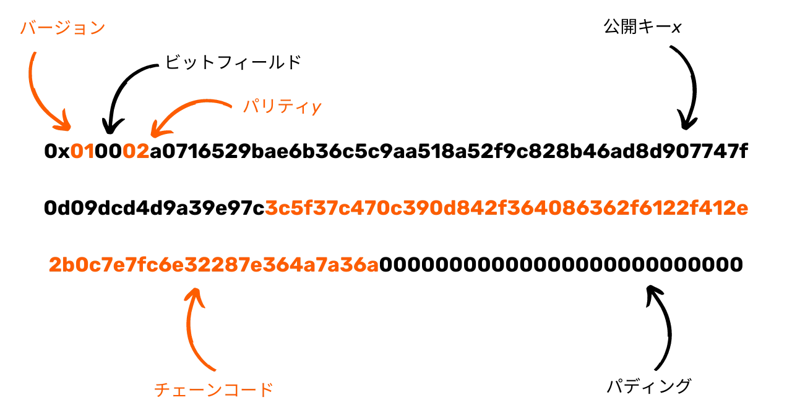
まず、支払いコードであることを明確に示すために、プレフィックスバイト`P`を最初に追加する必要があります。このバイトは`0x47`で表されます：
```plaintext
0x47010002a0716529bae6b36c5c9aa518a52f9c828b46ad8d907747f0d09dcd4d9a39e97c3c5f37c470c390d842f364086362f6122f412e2b0c7e7fc6e32287e364a7a36a00000000000000000000000000
```

最後に、支払いコードの完全性を保証するために、`SHA256`関数でのダブルハッシュを含む`HASH256`を使用してチェックサム計算が行われます。このハッシュから得られる最初の4バイトが、支払いコードの末尾に連結されます：
```plaintext
0x47010002a0716529bae6b36c5c9aa518a52f9c828b46ad8d907747f0d09dcd4d9a39e97c3c5f37c470c390d842f364086362f6122f412e2b0c7e7fc6e32287e364a7a36a00000000000000000000000000567080c4
```

これらのステップが完了すると、支払いコードは準備が整います。残された唯一のことは、それをbase 58に変換して最終バージョンを取得することです：
```plaintext
PM8TJSBiQmNQDwTogMAbyqJe2PE2kQXjtgh88MRTxsrnHC8zpEtJ8j7Aj628oUFk8X6P5rJ7P5qDudE4Hwq9JXSRzGcZJbdJAjM9oVQ1UKU5j2nr7VR5
```

この支払いコード作成プロセス中に、圧縮公開鍵とチェーンコードを使用します。両方とも、ウォレットのシードから決定論的かつ階層的に導出されます。この達成のために使用される導出パスは以下の通りです：
```plaintext
m/47'/0'/0'/
```
再利用可能な支払いコードの圧縮公開鍵と関連するチェーンコードを生成するために、まずウォレットのシードからマスタープライベートキーを計算します。次に、インデックス`47 + 2^31`（ハード化導出）を使用して子キーペアを導出します。このステップには、インデックス`2^31`（ハード化導出）を使用してさらに2回の子ペアの連続した導出が続きます。

### 楕円曲線Diffie-Hellman（ECDH）鍵交換
BIP47の中心にある暗号プロトコルは、*楕円曲線Diffie-Hellman*の頭文字を取ってECDHと呼ばれています。この方法は、元のDiffie-Hellman鍵交換の変種です。
1976年に導入されたDiffie-Hellmanは、鍵合意プロトコルであり、公開鍵と秘密鍵のペアをそれぞれ持つ二者が、公開された不安全なチャネル上でのみ通信しながらも、共通の秘密に合意することを可能にします。

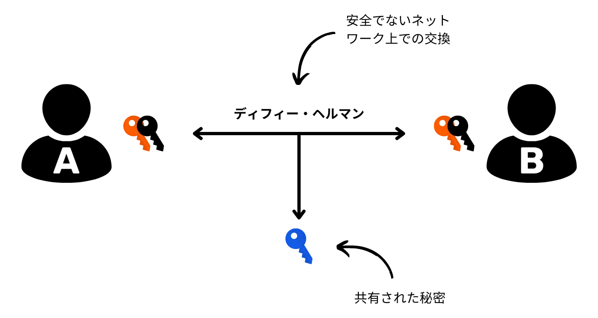

この共通の秘密（ここでは、青い鍵）は、他の操作に使用することができます。通常、この共有された秘密は、不安全なネットワーク上での通信の暗号化と復号化に使用されます：


この交換を達成するために、Diffie-Hellmanは共有秘密を計算するためにモジュラー算術を使用します。ここでは、その仕組みを簡単に説明します：
- アリスとボブは、公開データ（攻撃者はこの色を知っています）である黄色に合意します；
- アリスは秘密の色、ここでは赤を選択し、それを黄色と混ぜてオレンジを得ます；
- ボブも秘密の色、ここでは青を選択し、それを黄色と混ぜて緑を得ます；
- 次に、得られた色、オレンジと緑を交換します。この交換は、不安全で監視されたネットワーク上で行うことができます；
- ボブの緑を自分の秘密の色と混ぜることで、アリスは茶色を生成します；
- ボブも、アリスのオレンジと自分の秘密の青を同じように混ぜることで、茶色を得ます。

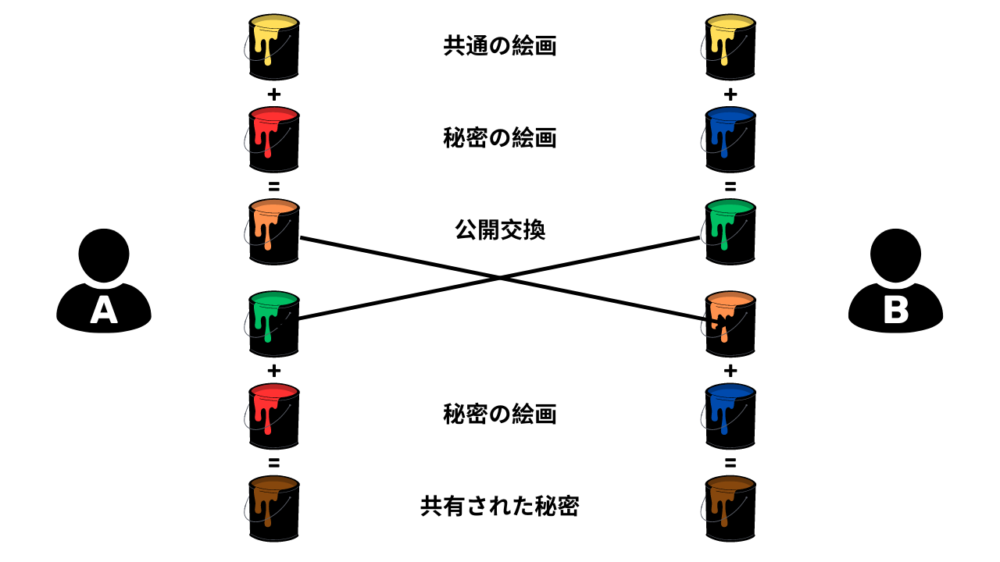

この簡略化では、茶色はアリスとボブの間の共有秘密を表しています。現実には、攻撃者がオレンジと緑の色を分離してアリスやボブの秘密の色を発見することは不可能であることを理解することが重要です。

さて、色の類推ではなく、実際の数値とモジュラー算術を使用して、このプロトコルが実際にどのように機能するかを見てみましょう！
Diffie-Hellmanのメカニズムについて話し合う前に、必要となる二つの重要な数学的概念を簡単に思い出させてください：

- **素数**は、$1$とその数自身のみによって割り切れる自然数です。例えば、$7$は$1$と$7$によってのみ割り切れるため、素数です。一方、$8$は素数ではありません。なぜなら、$1$、$2$、$4$、そして$8$によって割り切れるため、二つではなく四つの正の整数の約数を持っています；
- **モジュロ**（$mod$または$\%$と表記）は、二つの整数間で、最初の数を二番目の数でユークリッド除算した際の余りを返す数学的操作です。例えば、$16 \bmod 5 = 1$です。

**アリスとボブの間のDiffie-Hellman鍵交換は、以下のように進行します：**

- アリスとボブは、$p$と$g$という二つの共通の数値に合意します。$p$は素数であり、この数が大きければ大きいほどDiffie-Hellmanはより安全になります。$g$は$p$の原始根です。これら二つの数は、不安全なネットワーク上で公然と通信されることができます。これらは、前述の簡略化における**黄色**に相当します。したがって、アリスとボブが$p$と$g$の値を正確に同じにすることが重要です。
これらのパラメータが定義されると、アリスとボブはそれぞれ秘密のランダム数を選択します。アリスは彼女の秘密のランダム数を$a$（**赤色に相当**）と名付け、ボブは彼のを$b$（**青色に相当**）と名付けます。これらの数値は厳密に秘密にしなければなりません。

直接数値$a$と$b$を交換する代わりに、各当事者は次のようにして$A$と$B$を計算します：

$A$は、$g$を$a$乗したものを$p$で割った余りに等しい：

$$
A = g^a \bmod p
$$

$B$は、$g$を$b$乗したものを$p$で割った余りに等しい：

$$
B = g^b \bmod p
$$

値$A$（**オレンジ色に相当**）と$B$（**緑色に相当**）は二者間で交換されます。この交換は、保護されていないネットワーク上で公然と行うことができます。

アリスは$B$を受け取った後、次のようにして$z$の値を計算します：

$z$は、$B$を$a$乗したものを$p$で割った余りに等しい：

$$
z = B^a \bmod p
$$

思い出してください：

$$
B = g^b \bmod p
$$

したがって、私たちは得ます：

$$
z = B^a \bmod p
$$

$$
z = (g^b)^a \bmod p
$$

指数法則を適用すると：
$$
(x^n)^m = x^{nm}
$$

それから、私たちは得ます：

$$
z = g^{ba} \bmod p
$$

一方、ボブは$A$を受け取った後、次の方法で$z$の値も計算します：

$z$は、$A$を$b$乗したものを$p$で割った余りに等しい：

$$
z = A^b \bmod p
$$

したがって、私たちは得ます：

$$
z = (g^a)^b \bmod p
$$

$$
z = g^{ab} \bmod p
$$

$$
z = g^{ba} \bmod p
$$

剰余演算子の分配性のおかげで、アリスとボブは正確に同じ値$z$を得ます。この数値は、以前のペンキの例での**茶色に相当する**彼らの共通の秘密を表します。彼らは今、この共通の秘密を使用して、保護されていないネットワーク上で対称的に通信を暗号化することができます。

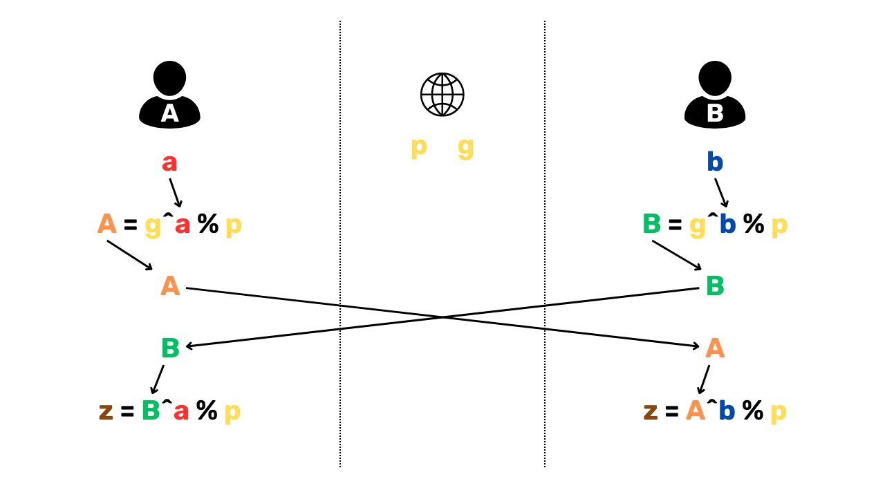

攻撃者が$p$、$g$、$A$、および$B$（公開値）を持っていても、$a$、$b$、または$z$（秘密値）を計算することはできません。これを達成するには、指数関数の逆を計算する必要がありますが、これは有限巡回群における指数関数の逆、つまり離散対数を計算することに相当し、一つ一つの可能性を試す以外に不可能な操作です。

したがって、$a$、$b$、および$p$の値が十分に大きい限り、Diffie-Hellmanプロトコルは安全です。通常、2048ビットのパラメータ（10進数で600桁の数値）を使用すると、$a$と$b$のすべての可能性をテストすることは非現実的です。今日に至るまで、このような数値を使用すると、このアルゴリズムは安全と考えられています。
Diffie-Hellmanプロトコルの主な欠点が正確にどこにあるか、それがここです。安全であるためには、アルゴリズムは大きな数を使用しなければなりません。そのため、現在では、代数曲線、より正確には楕円曲線に依存するDiffie-Hellmanの変種であるECDHアルゴリズム（*Elliptic Curve Diffie-Hellman*）が好まれます。このアプローチにより、同等のセキュリティを維持しながらはるかに小さな数値で作業でき、計算とストレージに必要なリソースを削減できます。
アルゴリズムの一般原則は同じままです。しかし、乱数$a$と、$a$からモジュラー指数を用いて計算された数$A$を使用する代わりに、楕円曲線上に確立された鍵のペアを使用します。モジュロ演算子の分配性に依存する代わりに、楕円曲線上の群法則、特にこの法則の結合性を使用します。
楕円曲線暗号の原理を簡単に説明すると、プライベートキーは$1$から$n-1$の間のランダムな数で表され、ここで$n$は曲線の位数を表します。一方、公開鍵はこの曲線上の特定の点で、プライベートキーからジェネレーターポイントから始まる点の加算と倍加の操作を通じて得られます。式によると：
$$
K = k \cdot G
$$

この式で、$K$は公開鍵を、$k$はプライベートキーを、そして$G$はジェネレーターポイントを示します。

これらの鍵の重要な特徴の一つは、$K$を$k$と$G$から計算するのが容易である一方で、$K$と$G$から$k$を見つけることが実際には不可能であることです。この非対称性が一方向関数を作り出します。言い換えると、プライベートキーを知っていれば公開鍵を計算するのは容易ですが、公開鍵からプライベートキーを見つけることは不可能です。このセキュリティは依然として離散対数の計算困難性に基づいています。

この特性を利用して、Diffie-Hellmanアルゴリズムを適応させます。**ECDHの動作原理は以下の通りです：**

- アリスとボブは、暗号学的に安全な楕円曲線とそのパラメータについて一緒に合意します。この情報は公開されます。

- アリスはランダムな数$ka$を生成し、これが彼女のプライベートキーになります。このプライベートキーは秘密のままでなければなりません。彼女は選択した楕円曲線上の点の加算と倍加によって公開鍵$Ka$を決定します：

$$
K_a = k_a \cdot G
$$

- ボブもランダムな数$kb$を生成し、これが彼のプライベートキーになります。彼は関連する公開鍵$Kb$を計算します：

$$
K_b = k_b \cdot G
$$

- アリスとボブは、保護されていない公開ネットワーク上で彼らの公開鍵$Ka$と$Kb$を交換します。

- アリスは、ボブの公開鍵$Kb$に彼女のプライベートキー$ka$を適用することによって、曲線上の点$(x,y)$を計算します：

$$
(x,y) = k_a \cdot K_b
$$

- ボブは、アリスの公開鍵$Ka$に彼のプライベートキー$kb$を適用することによって、曲線上の点$(x,y)$を計算します：

$$
(x,y) = k_b \cdot K_a
$$

- アリスとボブは楕円曲線上で同じ点を得ます。共有される秘密は、この点のx座標$x$になります。

彼らが同じ共有秘密を得るのは確かです。なぜなら：
(x,y) = k_a \cdot K_b = k_a \cdot (k_b \cdot G) = (k_a \cdot k_b) \cdot G = (k_b \cdot k_a) \cdot G = k_b \cdot (k_a \cdot G) = k_b \cdot K_a$$
公開されていないネットワークを観察する攻撃者は、各当事者の公開鍵と選択された楕円曲線のパラメーターのみを取得することができます。以前に説明したように、この情報だけではプライベートキーを特定することはできません。したがって、攻撃者はアリスとボブの間の共有秘密を見つけることができません。

ECDHは、鍵交換を可能にするアルゴリズムです。これは、完全なプロトコルを確立するために他の暗号化方法と組み合わせてよく使用されます。例えば、ECDHはTLS（*Transport Layer Security*、インターネットのトランスポート層用の暗号化および認証プロトコル）のコアに統合されています。TLSは鍵交換にECDHEを使用しており、これはECDHの変種で、鍵が一時的であるため、持続的な機密性を提供します。さらに、TLSはECDSAのような認証アルゴリズム、AESのような暗号化アルゴリズム、SHA256のようなハッシュ関数を使用します。

TLSは、`https`の`s`やブラウザのアドレスバーに表示される南京錠のアイコンなど、暗号化された通信のシンボルを担っています。したがって、このコースをフォローすることで、あなたはECDHを使用しており、おそらくそれを毎日知らず知らずのうちに使用しています。

### 通知トランザクション

前のセクションで見たように、ECDHは楕円曲線上で確立された鍵ペアを使用するDiffie-Hellman交換の変種です。便利なことに、私たちはすでにこの標準に従う多くの鍵ペアをBitcoinウォレットに持っています！BIP47のアイデアは、両当事者のBitcoin決定論的階層ウォレットからの鍵ペアを使用して、彼らの間で共有され、一時的な秘密を確立することです。BIP47の文脈では、代わりにECDHE（*Elliptic Curve Diffie-Hellman Ephemeral*）が使用されます。


ECDHEはBIP47で初めて、送信者から受信者への支払いコードを伝達するために使用されます。これが有名な**通知トランザクション**です。このステップは重要です。なぜなら、BIP47が効率的に機能するためには、関与する両当事者（送信者と受信者）が互いの支払いコードを知っている必要があるからです。この知識により、一時的な公開鍵の導出と、それに伴う空白の受信アドレスが可能になります。
この交換の前に、送信者は論理的にすでに受信者の支払いコードを知っています。なぜなら、彼らはそれをオフチェーンで取得しているからです。例えば、彼らのウェブサイト、請求書、またはソーシャルメディアからです。しかし、受信者は必ずしも送信者の支払いコードを知っているわけではありません。それでも、このコードは彼らに伝達されなければなりません。そうでなければ、彼らはビットコインが保存されているアドレスを特定するために必要な一時的な鍵を導出することができず、資金にアクセスすることもできません。送信者のコードの伝達は技術的には他の通信手段を通じてオフチェーンで行うことができますが、これはシードのみからウォレットを回復する必要がある場合に問題となります。
確かに、従来のアドレスとは異なり、BIP47アドレスは受信者のシードから直接派生するのではなく（その場合は`xpub`を使用する方が簡単ですが）、送信者と受信者の両方の支払いコードを組み合わせた計算の結果です。したがって、受信者が自分のウォレットを失い、シードから復元しようとした場合、自分の支払いコードを回復することができます。これはシードから直接派生しています。しかし、一時的なアドレスを見つけるには、BIP47を介してビットコインを送信したすべての人の支払いコードも持っていることが不可欠です。したがって、通知トランザクションの重要性が浮き彫りになります。これにより、この情報をBitcoinブロックチェーンに保存しながら、2009年の立ち上げ以来実行された数十億のトランザクションを検索することなく非常に簡単に見つけることができます。
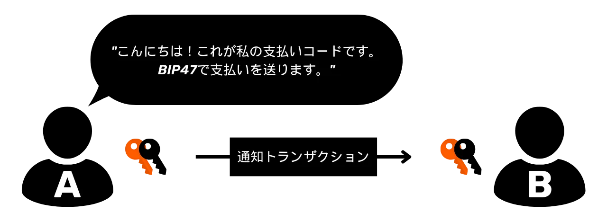

したがって、各ユーザーが相手の支払いコードのバックアップを保持している場合に限り、通知トランザクションを使用せずにBIP47を実装することが可能です。しかし、これらのバックアップを作成、保存、更新するためのシンプルで堅牢かつ効率的なソリューションが開発されない限り、この方法は管理が複雑であることが証明されています。現状では、通知トランザクションはほぼ不可欠になります。

次の章では、BIP47と同様の目的を持つ他のプロトコルを研究しますが、通知トランザクションを必要としないものです。ただし、これらの代替案は独自の妥協点を導入します。

支払いコードのバックアップとしての役割に加えて、通知トランザクションはその名が示す通り、受信者に対して通知機能も果たします。新しい支払いチャネルが確立されたことを受信者のクライアントに通知し、その結果生じる一時的なアドレスの監視を示唆します。

### BIP47のプライバシーモデル

通知トランザクションの技術的な操作を詳しく説明する前に、BIP47に関連するプライバシーモデルについて議論することが重要です。これは、この初期トランザクションの作成中に取られた特定の措置を正当化します。
支払いコード自体は、プライバシーに直接的なリスクをもたらすものではありません。従来のBitcoinモデルが、キーとアドレスの匿名性を保持することによって、ユーザーの身元と公開されたトランザクションとのリンクを断つことを目指しているのに対し、支払いコードは身元と公然と関連付けられても脅威をもたらしません。
実際、支払いコードはBIP47支払いを受け取るアドレスを直接導出するために使用されません。これらのアドレスは、関与する二者の支払いコードから派生したキー間でECDHを適用することによって代わりに生成されます。

したがって、支払いコード自体はプライバシーの直接的な損失にはつながらず、通知アドレスのみがそれから派生します。このアドレスはいくつかの情報を明らかにする可能性がありますが、徹底的なチェーン分析を行わない限り、取引を行っている相手を発見することは通常ありません。実際、送信者が自分の身元にリンクできるUTXOを使用して通知トランザクションを実行する場合、その身元がおそらくあなたの支払いコードへのBIP47支払いにリンクされている可能性があると推測できます。これは基本的な取引を明らかにすることはありませんが、その存在の可能性を示します。

したがって、ユーザーの支払いコード間のこの厳格な分離を維持することが不可欠です。この目標に向けて、コードの初期通信ステップは、プロトコルの適切な機能のためには必須ですが、支払いのプライバシーにとって重要な瞬間です。一方の支払いコードが公に入手可能である場合（例えばウェブサイトやソーシャルネットワークを通じて）、もう一方のコード、つまり送信者のコードは、いかなる場合でも最初のコードにリンクされてはなりません。

具体的な例を挙げましょう：私はBIP47を通じて政治運動に寄付をしたいと考えています：
- その組織は、ウェブサイトやソーシャルネットワークを通じて、支払いコードを公開しています。
このコードは、そのため政治運動に関連付けられています。
- この支払いコードを取得します。
- 送金を進める前に、自分の支払いコードを相手が知っていることを確認しなければなりません。このコードは私のアイデンティティにも関連付けられており、ソーシャルネットワークで取引を受け取るために使用しています。

リスクなしで私のコードをどのように伝えるか？従来の通信手段を使用すると情報漏洩につながり、結果としてこの政治運動と私を関連付ける可能性があります。通知トランザクションは、2つのコード間のこのような関連付けを正確に防ぐ暗号化レイヤーのおかげで、解決策を提供します。これが送信者の支払いコードを秘密裏に伝達する唯一の方法ではありませんが、非常に効果的であることが証明されています。

下の図では、オレンジの線が情報の流れを中断しなければならないポイントを示し、黒い矢印が第三者によって潜在的に観察される可能性のある接続を示しています：
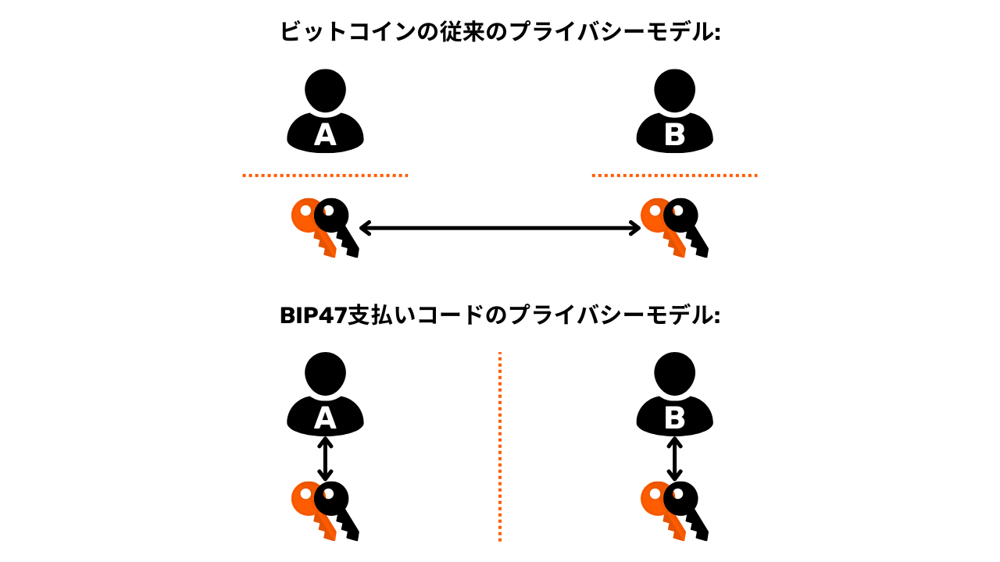
実際には、Bitcoinの従来のプライバシーモデルでは、特に遠隔トランザクション中に、キーペアとユーザー間の情報の流れを完全に切り離すことはしばしば複雑です。例えば、寄付キャンペーンの文脈では、受取人は必然的に自分のウェブサイトやソーシャルネットワークを通じてアドレスや公開鍵を公開しなければなりません。BIP47、特に通知トランザクションの正しい使用は、ECDHEとさらに研究する暗号化レイヤーのおかげで、この問題を回避することができます。

もちろん、Bitcoinの古典的なプライバシーモデルは、2つの支払いコードの組み合わせから派生した一時的な公開鍵にも適用されます。実際には、2つのモデルは補完的です。ここで強調したいのは、ビットコインを受け取るための公開鍵の通常の使用とは対照的に、支払いコードは特定のアイデンティティにリンクされる可能性があるということです。なぜなら、情報「_AliceがBobと取引を行う_」は別の段階で断ち切られるからです。支払いコードは支払いアドレスを生成するために使用されますが、ブロックチェーンの観察のみに基づいて、実行されたBIP47支払いトランザクションを使用した支払いコードにリンクすることは不可能です。それは、関与したUTXOsが以前にアイデンティティにリンクされていた場合、そしてユーザーがそれぞれのアイデンティティと支払いコードを関連付けていた場合を除きます。

要約すると、BIP47支払いによって提供されるプライバシーモデルは、Bitcoinの基本よりも優れていると考えられるかもしれませんが、決して魔法ではありません。

### 通知トランザクションの構築

さて、この通知トランザクションがどのように機能するか見てみましょう。AliceがBIP47を使用してBobに資金を送りたいと想像してください。私の例では、Aliceが送信者として、Bobが受取人として行動します。後者は彼の支払いコードを彼のウェブサイトに公開しています。したがって、AliceはすでにBobの支払いコードを知っています。

**1- AliceはECDHで共有秘密を計算します：**

- 彼女は、支払いコードとは異なる枝に位置する彼女のHDウォレットからキーペアを選択します。このペアは、Aliceの通知アドレスやAliceのアイデンティティと簡単に関連付けられるべきではありません（前のセクションを参照）;

- Aliceはこのペアから秘密鍵を選択します。これを$a$（小文字）と名付けます。

$$
a
$$
- AliceはBobの通知アドレスに関連付けられた公開鍵を取得します。この鍵はBobの支払いコードから派生した最初の娘鍵（インデックス$/0$）です。この公開鍵を$B$（大文字）と名付けます。この公開鍵に関連付けられた秘密鍵は$b$（小文字）と名付けます。$B$は、$G$（生成点）と$b$（秘密鍵）を使用して楕円曲線上での加算と倍加によって決定されます：
$$ B = b \cdot G $$
- アリスは、ボブの公開鍵 $B$ から彼女の秘密鍵 $a$ を適用することにより、点の加算と倍加によって楕円曲線上の秘密の点 $S$（大文字）を計算します。
$$ S = a \cdot B $$

- アリスは、支払いコードを暗号化するために使用するブラインディングファクター $f$ を計算します。これを行うために、彼女は HMAC-SHA512 関数で擬似乱数を決定します。この関数の第二入力では、ボブのみが取得可能な値 $x$ を使用します。これは、以前に計算された秘密の点の横座標です。最初の入力は、このトランザクションの入力で消費される UTXO（アウトポイント）である $o$ です。

$$ f = \text{HMAC-SHA512}(o, x) $$

**2- アリスは、個人の支払いコードを2進数（バイナリ）に変換します。**

**3- 彼女はこのブラインディングファクターを鍵として使用し、支払いコードのペイロードに対して対称暗号化を実行します。** 使用される暗号化アルゴリズムは単純な `XOR` です。実行される操作は、Vernam cipher（ヴァーナム暗号）、または "One-Time Pad" とも呼ばれます。

- アリスは最初にブラインディングファクターを二つに分割します：最初の32バイトは $f1$ と名付けられ、残りの32バイトは $f2$ と名付けられます。したがって、私たちは以下を持っています：

$$ f = f1 || f2 $$

- アリスは、支払いコードの公開鍵 $x$ の横座標の暗号化された $x'$ と、彼女のチェーンコード $c$ の暗号化された $c'$ を別々に計算します。$f1$ と $f2$ はそれぞれ暗号化キーとして機能します。使用される操作は `XOR`（排他的論理和）です。

$$ x' = x \oplus f1 $$
$$ c' = c \oplus f2 $$

- アリスは、彼女の支払いコードの公開鍵 $x$ とチェーンコード $c$ の実際の値を、暗号化された値 $x'$ と $c'$ に置き換えます。
**4-** アリスは現在、暗号化されたペイロードを持つ支払いコードを持っています。彼女は、入力として彼女の公開鍵 $A$、ボブの通知アドレスへの出力、および暗号化されたペイロードを含む彼女の支払いコードを含む `OP_RETURN` 出力を含むトランザクションを構築してブロードキャストします。**このトランザクションは通知トランザクションです。**
`OP_RETURN` は、Bitcoinトランザクションの出力を無効としてマークするオペコードです。今日では、情報をBitcoinブロックチェーン上にブロードキャストまたはアンカーするために使用されます。最大80バイトのデータを格納でき、チェーン上に書き込まれるため、他のすべてのユーザーに見えます。

前のセクションで見たように、ECDHは、攻撃者によって観察される可能性のある安全でないネットワーク上で通信する2人のユーザー間で共有秘密を生成するために使用されます。BIP47では、ECDHは多くの攻撃者によって観察される透明な通信ネットワークであるBitcoinネットワーク上での通信に利用されます。ECDH鍵交換を通じて計算された共有秘密は、送信される秘密情報（アリスの支払いコード）を暗号化するために使用されます。

通知トランザクションを実行するために私たちが一緒に見直した手順を要約しましょう：
- アリスはボブの支払いコードと通知アドレスを取得します；
- アリスは、対応するキーペアを持つHDウォレット内で自分が所有するUTXOを選択します；
- 彼女はECDHを使用して楕円曲線上の秘密の点を計算します；
- 彼女はこの秘密の点を使用してHMACを計算し、これがブラインディングファクターになります；
- 彼女はこのブラインディングファクターを使用して、個人の支払いコードのペイロードを暗号化します。
彼女は、マスクされた支払いコードをBobに伝えるために、`OP_RETURN` トランザクション出力を使用します。
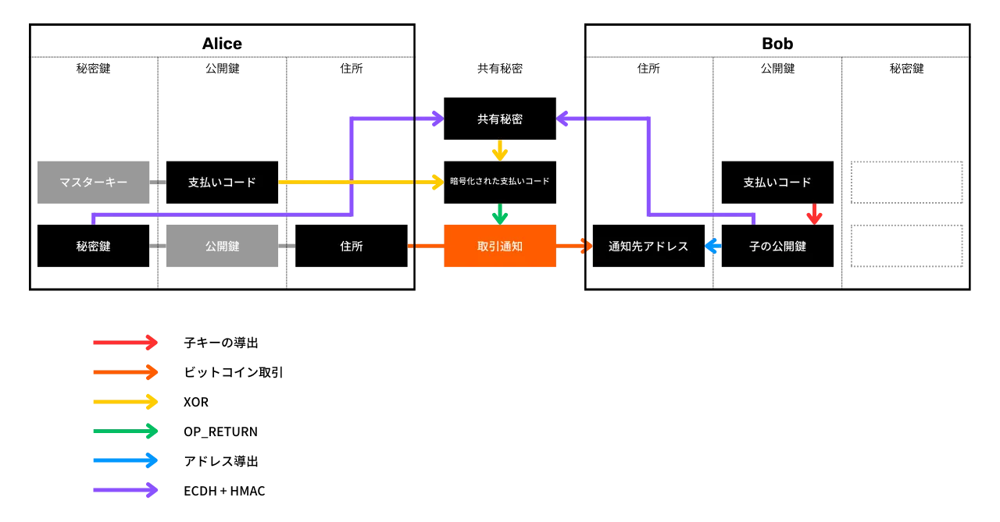

### 通知トランザクション：具体的な研究

`OP_RETURN`の使用、特にその機能について、もっと詳しく理解するために、実際の通知トランザクションを一緒に見てみましょう。私はテストネット上でそのようなトランザクションを実行しました。それは[ここをクリックすることで](https://mempool.space/fr/testnet/tx/0e2e4695a3c49272ef631426a9fd2dae6ec3a469e3a39a3db51aa476cd09de2e)見つけることができます。


このトランザクションを観察すると、1つの入力と4つの出力があることがわかります：
- 最初の出力は、私のマスクされた支払いコードを含む`OP_RETURN`です；
- 546 satsの2番目の出力は、私の受取人の通知アドレスを指しています；
- 15,000 satsの3番目の出力は、このトランザクションを構築するためにSamourai Walletを使用したサービス料を表しています；
- 200万satsの4番目の出力は、私の入力からの残りの差額が私に属する別のアドレスに戻ることを意味するおつりを表しています。
最も興味深いのは、明らかに`OP_RETURN`を使用する出力0です。それが何を含んでいるのか、もっと詳しく見てみましょう。こちらが16進数での`scriptPubKey`です：

```text
6a4c50010002b13b2911719409d704ecc69f74fa315a6cb20fdd6ee39bc9874667703d67b164927b0e88f89f3f8b963549eab2533b5d7ed481a3bea7e953b546b4e91b6f50d800000000000000000000000000
```

このスクリプトでは、いくつかの部分を分析することができます。まず、オペコード：

```text
6a4c
```

オペコードの中で、`0x6a`は`OP_RETURN`を、`0x4c`は`OP_PUSHDATA1`を指定していることが認識できます。

この最後のオペコードに続くバイトは、続くペイロードのサイズを示しています。それは`0x50`、つまり80バイトを示しています：

```text
6a4c50
```

次に、私の支払いコードのメタデータがプレーンテキストであります：

```text
010002
```

私の支払いコードの公開キーのx座標が暗号化されています：

```text
b13b2911719409d704ecc69f74fa315a6cb20fdd6ee39bc9874667703d67b164
```

私の支払いコードのチェーンコードが暗号化されています：

```text
927b0e88f89f3f8b963549eab2533b5d7ed481a3bea7e953b546b4e91b6f50d8
```

そして最後に、`OP_RETURN`の標準サイズである80バイトに達するためのパディングです：

```text
00000000000000000000000000
```

より良く理解するために、こちらが私の支払いコードのプレーンテキストのbase 58です：

```text
PM8TJQCyt6ovbozreUCBrfKqmSVmTzJ5vjqse58LnBzKFFZTwny3KfCDdwTqAEYVasn11tTMPc2FJsFygFd3YzsHvwNXLEQNADgxeGnMK8Ugmin62TZU
```

および16進数での表記：

```text
4701000277507c9c17a89cfca2d3af554745d6c2db0e7f6b2721a3941a504933103cc42add94881210d6e752a9abc8a9fa0070e85184993c4f643f1121dd807dd556d1dc000000000000000000000000008604e4db
```

プレーンテキストの支払いコードと`OP_RETURN`を比較すると、HRP（`0x47`）とチェックサム（`0x8604e4db`）が伝送されていないことがわかります。これは、これらの情報が人間向けに意図されているため、予想される動作です。
次に、バージョン（`0x01`）、ビットフィールド（`0x00`）、および公開鍵のパリティ（`0x02`）を識別できます。そして、支払いコードの最後に、コードを合計80バイトにパディングするために使用される空のバイト（`0x00000000000000000000000000`）があります。これらのメタデータはすべてプレーンテキスト（暗号化されていない）で伝送されます。

最後に、公開鍵のx座標（`0x77507c9c17a89cfca2d3af554745d6c2db0e7f6b2721a3941a504933103cc42a`）とチェーンコード（`0xdd94881210d6e752a9abc8a9fa0070e85184993c4f643f1121dd807dd556d1dc`）が暗号化されていることが観察できます。これが支払いコードのペイロードを構成します。

### XORとは？

前のセクションで、支払いコードがXOR演算を使用して暗号化されていることを見ました。この演算子がどのように機能するかを理解するために、少し時間を取りましょう。XORは、広く暗号学で使用されている論理演算子です。

XORは、ブール代数に基づくビット単位の論理演算子です。2つのビットオペランドを持つ場合、同じランクのビットが異なる場合は`1`を返し、同じランクのビットが同じ場合は`0`を返します。ここに、オペランド値`D`と`E`に基づくXORの真理表があります：

| D   | E   | D XOR E |
| --- | --- | ------- |
| 0   | 0   | 0       |
| 0   | 1   | 1       |
| 1   | 0   | 1       |
| 1   | 1   | 0       |

例えば：

$$
0110 \oplus 1110 = 1000
$$

または：

$$
010011 \oplus 110110 = 100101
$$

ECDHを使用する場合、XORを暗号化レイヤーとして使用することは特に適しています。この演算子のために、暗号化は対称です。これにより、受信者は暗号化に使用されたのと同じ鍵を使用して支払いコードを復号化できます。暗号化および復号化鍵は、ECDHの共有秘密から計算されます。この対称性は、XOR演算子の交換法則と結合法則によって可能になります：

- その他の特性：

$$
D \oplus D = 0
$$
D ⊕ 0 = D
- 可換性：

$$
D \oplus E = E \oplus D
$$

- 結合性：

$$
D \oplus (E \oplus Z) = (D \oplus E) \oplus Z = D \oplus E \oplus Z
$$

もし：

$$
D \oplus E = L
$$

ならば：

$$
D \oplus L = D \oplus (D \oplus E) = D \oplus D \oplus E = 0 \oplus E = E \\
\therefore D \oplus L = E
$$

次に、この暗号化方法はVernam暗号（ワンタイムパッド）に非常に似ています。これは、現在までに知られている唯一の無条件（または絶対的な）セキュリティを持つ暗号化アルゴリズムです。Vernam暗号がこの特性を持つためには、暗号化キーは完全にランダムでなければならず、メッセージと同じサイズであり、一度だけ使用されなければなりません。ここで使用されているBIP47の暗号化方法では、キーは確かにメッセージと同じサイズであり、ブラインディングファクターは公開キーのx座標と支払いコードのチェーンコードの連結と正確に同じサイズです。この暗号化キーは確かに一度だけ使用されます。しかし、このキーはHMACの結果であるため、完全なランダム性から生じるものではありません。それはむしろ擬似ランダムです。したがって、これはVernam暗号ではありませんが、方法は類似しています。

### 通知トランザクションの受信

アリスがボブに通知トランザクションを送信した今、彼がそれをどのように解釈するか見てみましょう。思い出してください、ボブはアリスの支払いコードにアクセスできなければなりません。この情報がなければ、次のセクションで見るように、アリスが作成したキーペアを導出することができず、したがって、BIP47を介して受け取ったビットコインにアクセスすることができません。現時点では、アリスの支払いコードのペイロードは暗号化されています。ボブがそれをどのように復号するか見てみましょう。

**1-** ボブは、彼の通知アドレスで出力を作成するトランザクションを監視します。

**2-** トランザクションに彼の通知アドレス上の出力がある場合、ボブはそれがBIP47標準に従うOP_RETURN出力を含んでいるかどうかを分析します。

**3-** OP_RETURNペイロードの最初のバイトが `0x01` である場合、ボブはECDHで共有される可能性のある秘密を探し始めます：
- ボブはトランザクションの入力にある公開キーを選択します。つまり、アリスの公開キー $A$ で：

$$ A = a \cdot G $$

- ボブは彼の個人的な通知アドレスに関連付けられた秘密キー $b$ を選択します：

$$ b $$
- ボブは、アリスの公開キー $A$ に彼の秘密キー $b$ を適用することにより、楕円曲線上の秘密点 $S$（共有ECDH秘密）を計算します：
$$ S = b \cdot A $$

- ボブは、アリスの支払いコードのペイロードを復号するために使用するブラインディングファクター $f$ を決定します。アリスが以前に計算したのと同じ方法で、ボブは秘密点 $S$ のx座標とこの通知トランザクションで入力として消費されたUTXOに対してHMAC-SHA512を適用することにより $f$ を見つけます：

$$ f = \text{HMAC-SHA512}(o, x) $$

**4-** ボブは、通知トランザクションのOP_RETURNのデータを支払いコードとして解釈します。彼は単純にブラインディングファクター $f$ を使用して、この潜在的な支払いコードのペイロードを復号します。
- ボブは盲目化因子 $f$ を2つの部分に分割します：$f$ の最初の32バイトが $f1$ であり、残りの32バイトが $f2$ になります。
- ボブは、アリスの支払いコードから暗号化された公開鍵のx座標 $x'$ を復号します：

$$ x = x' \oplus f1 $$

- ボブは、アリスの支払いコードから暗号化されたチェーンコード値 $c'$ を復号します：

$$ c = c' \oplus f2 $$

**5-** ボブは、アリスの支払いコードからの公開鍵の値が実際にsecp256k1グループの一部であるかどうかを確認します。もしそうであれば、彼はこれを有効な支払いコードとして解釈します。そうでない場合、彼はこのトランザクションを無視します。

これで、ボブはアリスの支払いコードを知っているため、彼女は再びこのタイプの通知トランザクションを行うことなく、最大 `2^32` 回の支払いを彼に送ることができます。

これはなぜ機能するのでしょうか？ボブはどのようにしてアリスと同じ盲目化因子を決定し、彼女の支払いコードを復号することができるのでしょうか？ECDHの役割について、もう少し詳しく見てみましょう。

まず、私たちが扱っているのは対称暗号化です。これは、暗号化キーと復号キーが同じ値であることを意味します。このキーは通知トランザクションの盲目化因子です：

$$ f = f1 || f2 $$

したがって、アリスとボブは、攻撃者がそれを盗んで秘密情報を復号する可能性があるため、直接伝達せずに $f$ の同じ値を得なければなりません。この盲目化因子は、2つの値にHMAC-SHA512を適用することで得られます：
- 秘密点のx座標；
- トランザクションで入力として消費されたUTXO。
したがって、ボブはこれら2つの情報を必要とし、アリスの支払いコードのペイロードを復号します。入力としてのUTXOについては、ボブは単に通知トランザクションを観察することでそれを取得できます。秘密点については、ボブはECDHを使用する必要があります。前のセクションのDiffie-Hellmanで見たように、それぞれの公開鍵を交換し、秘密のプライベートキーを相手の公開鍵に秘密裏に適用することで、アリスとボブは楕円曲線上の特定の秘密の点を見つけることができます。通知トランザクションはこのメカニズムに依存しています：
- ボブのキーペア：

$$ B = b \cdot G $$

- アリスのキーペア：

$$ A = a \cdot G $$

- 秘密の $S (x, y)$ に対して：

$$ S = a \cdot B = a \cdot (b \cdot G) = (b \cdot a) \cdot G = b \cdot A $$

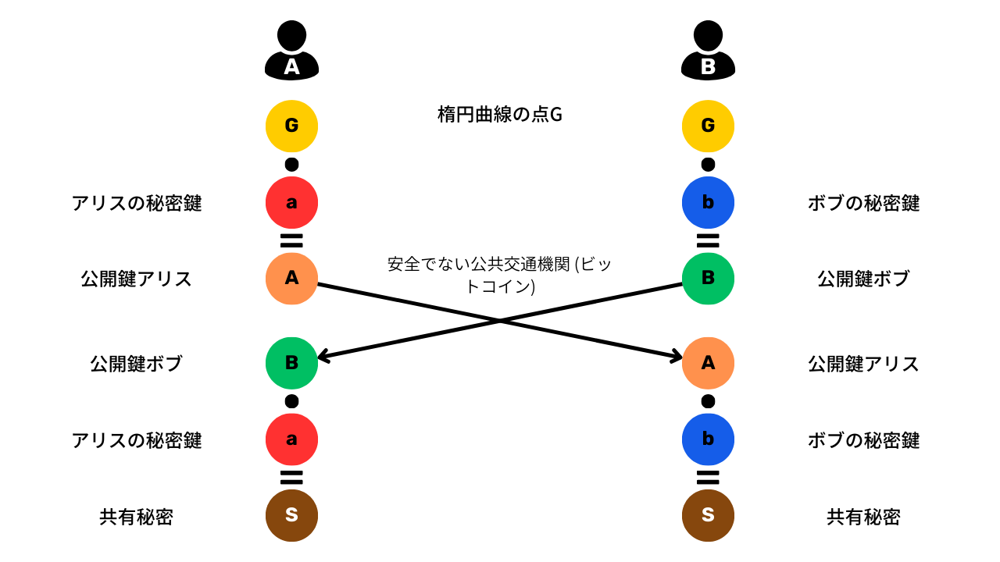

これで、ボブはアリスの支払いコードを知っており、彼女のBIP47支払いを検出し、受け取ったビットコインをロックするプライベートキーを導出することができます。

通知トランザクションを受け取り、解釈するために私たちが通過したステップを振り返りましょう：
- ボブは、彼の通知アドレスへのトランザクション出力を監視します；
- 一つを検出すると、OP_RETURNに含まれる情報を取得します；
- ボブは入力の公開鍵を選択し、ECDHを使用して秘密点を計算します；
- 彼はこの秘密点を使用してHMACを計算し、これが盲目化因子になります；
- 彼はこの盲目化因子を使用して、OP_RETURNに含まれるアリスの支払いコードのペイロードを復号します。

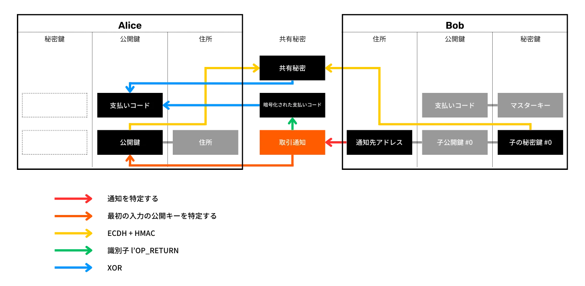

### BIP47支払いトランザクション

それでは、BIP47での支払いプロセスを一緒に見てみましょう。現状を思い出してください：
- アリスはボブの支払いコードを知っており、彼のウェブサイトから単純に取得しました。
- Bobは通知トランザクションのおかげでAliceの支払いコードを知っています。
- AliceはBobに最初の支払いを行います。彼女は同じ方法で多くの支払いを行うことができます。

このプロセスを説明する前に、現在取り組んでいるインデックスを思い出すことが重要だと思います。支払いコードの導出パスは次のように記述されます：`m/47'/0'/0'`。次の深さでは、インデックスをこのように分配します：
- 最初の通常の（非ハード化された）子ペアは、前の部分で話した通知アドレスを生成するために使用されます：`m/47'/0'/0'/0`；
- 通常の子キーペアはECDH内で使用され、このセクションで見るようにBIP47支払い受信アドレスを生成します：`m/47'/0'/0'/0`から`m/47'/0'/0'/2 147 483 647`まで；
- ハード化された子キーペアは一時的な支払いコードです：`m/47'/0'/0'/0'`から`m/47'/0'/0'/2 147 483 647'`まで。

AliceがBobに支払いを送りたい場合、彼女はECDHプロトコルのおかげで新しいユニークなバージンアドレスを導出します：
- Aliceは、彼女の個人的な再利用可能な支払いコードから導出された最初の秘密鍵を選択します：

$$ a $$

- Aliceは、Bobの支払いコードから導出された最初の未使用の公開鍵を選択します。この公開鍵を$B$と呼びます。これはBobだけが知っている秘密鍵$b$に関連付けられています：

$$ B = b \cdot G $$

- Aliceは、彼女の秘密鍵$a$をBobの公開鍵$B$に適用することにより、楕円曲線上での点の加算と倍加を行い、秘密の点$S$を計算します：

$$ S = a \cdot B $$

- この秘密の点から、Aliceは共有秘密$s$（小文字）を計算します。これを行うために、秘密の点$S$のx座標である$Sx$を選択し、この値をSHA256ハッシュ関数を通します：

$$ S = (Sx, Sy) $$
$$ s = \text{SHA256}(Sx) $$

- Aliceはこの共有秘密$s$を使用してビットコインの支払い受信アドレスを計算します。初めに、$s$がsecp256k1曲線の順序内に含まれているかを確認します。そうでない場合、彼女はBobの公開鍵のインデックスを増やして別の共有秘密を導出します；
- 次に、彼女は公開鍵$K0$を計算します。これは、Bobの支払いコードから導出された公開鍵$B$に、secp256k1曲線の生成点$G$から共有秘密$s$で計算された別の点を楕円曲線上での点の加算と倍加によって加えることにより行います。この新しい点は公開鍵を表し、$K0$と名付けます：

$$ K0 = B + s \cdot G $$

- この公開鍵$K0$を使って、Aliceは標準的なバージン受信アドレス（例えば、bech32のSegWit V0）を導出できます。
AliceがBobの受信アドレス$K0$を取得したら、標準的な方法でビットコイントランザクションを実行できます。これを行うために、彼女は自分のHDウォレットの異なるブランチからのキーペアによって保護された自分が所有するUTXOを選択し、それをBobのアドレス$K0$へのアウトプットに充てて使います。この支払いは、アドレスが導出された後、従来のプロセスに従い、BIP47に関連付けられたキーにはもはや依存しないことに注意することが重要です。
BIP47支払いを送信するために一緒に行った手順を振り返りましょう：

- アリスは、個人の支払いコードから最初に派生した子プライベートキーを選択します。
- 彼女は、ボブの支払いコードから最初に使用されていない派生子公開キーを使用して、楕円曲線上に秘密点を計算します（ECDHを使用）。
- 彼女はこの秘密点を使用して、SHA256で共有秘密を計算します。
- 彼女はこの共有秘密を使用して、楕円曲線上に新しい秘密点を計算します。
- 彼女はこの新しい秘密点をボブの公開キーに追加します。
- 彼女は、ボブだけが関連するプライベートキーを持つ新しい一時的な公開キーを取得します。
- アリスは、派生した一時的な受信アドレスを使用して、ボブに標準的なトランザクションを行うことができます。

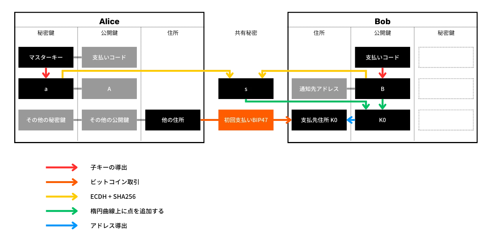

アリスが2回目の支払いを行いたい場合、前回と同じ手順に従いますが、今回はボブの支払いコードから2番目に派生した公開キーを選択します。具体的には、次に使用されていないキーを使用します。彼女はこのようにして、ボブに属する新しい受信アドレス$K1$を取得します：

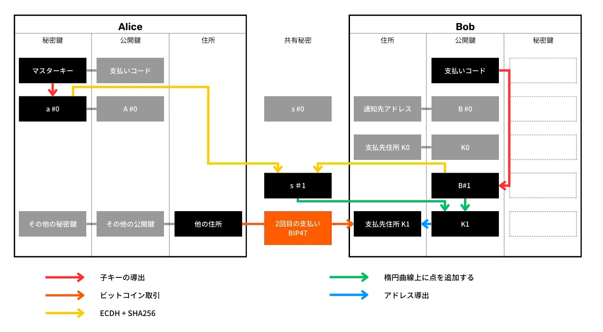

彼女はこの方法で続け、ボブに属する`2^32`までの未使用アドレスを派生させることができます。

外部から見ると、ブロックチェーンを観察することによって、BIP47支払いを標準的な支払いと区別することは理論的に不可能です。こちらはTestnet上のBIP47支払いトランザクションの例です：

```text
94b2e59510f2e1fa78411634c98a77bbb638e28fb2da00c9f359cd5fc8f87254
```

これは、消費された入力、支払い出力、および変更を伴う標準的なトランザクションのように見えます：


### BIP47支払いの受け取りとプライベートキーの派生

アリスはちょうどボブに属する新しいBIP47アドレスへの最初の支払いを行いました。さて、ボブがこの支払いをどのように受け取るか、そしてアリスが自分で生成したアドレスのプライベートキーにアクセスできない理由、そしてボブが受け取ったビットコインを使うためにこのキーをどのように取り出すかを見てみましょう。
ボブがアリスからの通知トランザクションを受け取るとすぐに、彼は彼女がいかなる支払いを送る前でさえ、公開キーBIP47 $K0$を派生させます。その後、彼は関連するアドレスへの支払いを監視します。実際、彼は監視するためにいくつかのアドレス（$K0$、$K1$、$K2$、$K3$...）をすぐに派生させます。ここでは、彼がこの公開キー$K0$をどのように派生させるかです：
- ボブは、彼の支払いコードから派生した最初のプライベート子キーを選択します。このプライベートキーは$b$と名付けられ、アリスが前のステップで計算に使用した公開キー$B$に関連付けられています：

$$ b $$

- ボブは、アリスの支払いコードから派生した最初の公開キーを選択します。このキーは$A$と名付けられ、アリスが計算に使用し、アリスだけが知っているプライベートキー$a$に関連付けられています。ボブは、通知トランザクションで彼に伝えられたアリスの支払いコードを知っているため、このプロセスを実行できます：

$$ A = a \cdot G $$

- ボブは、彼のプライベートキー$b$をアリスの公開キー$A$に適用することにより、楕円曲線上の点の加算と倍加を行い、秘密点$S$を計算します。ここで、ECDHの使用が見られ、この点$S$がボブとアリスの両方にとって同じになることが保証されます：

$$ S = b \cdot A $$
- アリスが行ったように、ボブはこの点$S$のx座標を分離します。この値を$Sx$と名付けました。彼はこの値をSHA256関数を通して共有秘密$s$（小文字）を見つけます：
$$ s = \text{SHA256}(Sx) $$

- アリスと同様に、ボブは楕円曲線上の点$s·G$を計算します。次に、彼はこの秘密の点を彼の公開鍵$B$に加えます。そうすることで、彼は楕円曲線上に新しい点を得て、それを公開鍵$K0$として解釈します：

$$ K0 = B + s \cdot G $$

ボブがこの公開鍵$K0$を持つと、彼はビットコインを使うために必要な関連する秘密鍵を導出することができます。この秘密鍵を生成できるのは彼だけです：

- ボブは彼の個人的な支払いコードから派生した子秘密鍵$b$を加えます。この$b$の値を得ることができるのは彼だけです。次に、彼は共有秘密$s$と$b$を加えて、$K0$の秘密鍵$k0$を得ます：

$$ k0 = b + s $$

楕円曲線の群法則のおかげで、ボブはアリスが使用した公開鍵に対応する正確な秘密鍵を得ます。したがって、私たちは持っています：

$$ K0 = k0 \cdot G $$

BIP47支払いを受け取り、対応する秘密鍵を計算するために私たちが一緒に通過した手順を要約します：
- ボブは彼の個人的な支払いコードから最初に派生した子秘密鍵を選択します；
- 彼はアリスのチェーンコードから派生した最初の子公開鍵を使用してECDHから楕円曲線上に秘密の点を計算します；
- 彼はこの秘密の点を使用してSHA256で共有秘密を計算します；
- 彼はこの共有秘密を使用して楕円曲線上に新しい秘密の点を計算します；
- 彼はこの新しい秘密の点を彼の個人的な公開鍵に加えます；
- 彼はアリスが彼女の最初の支払いを送る新しい一時的な公開鍵を得ます；
- ボブはこの一時的な公開鍵に関連する秘密鍵を計算します。彼は彼の支払いコードから派生した子秘密鍵と共有秘密を加えることでこれを行います。

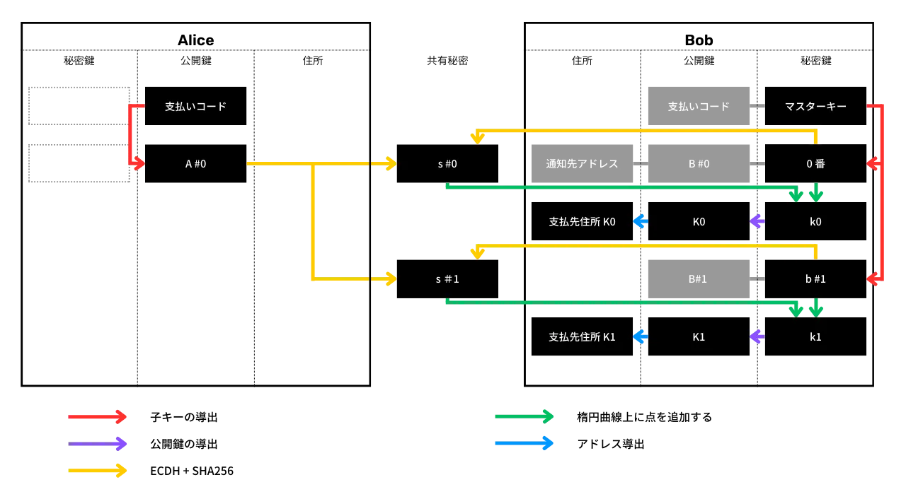

アリスが$b$（ボブの秘密鍵）を得ることができないため、彼女は$k0$（ボブのBIP47受信アドレスに関連する秘密鍵）を決定することができません。概念的に、私たちは共有秘密$S$の計算をこのように表現することができます：


共有秘密がECDHで見つかったら、アリスとボブはBIP47支払い公開鍵$K0$を計算し、ボブは関連する秘密鍵$k0$も計算します：

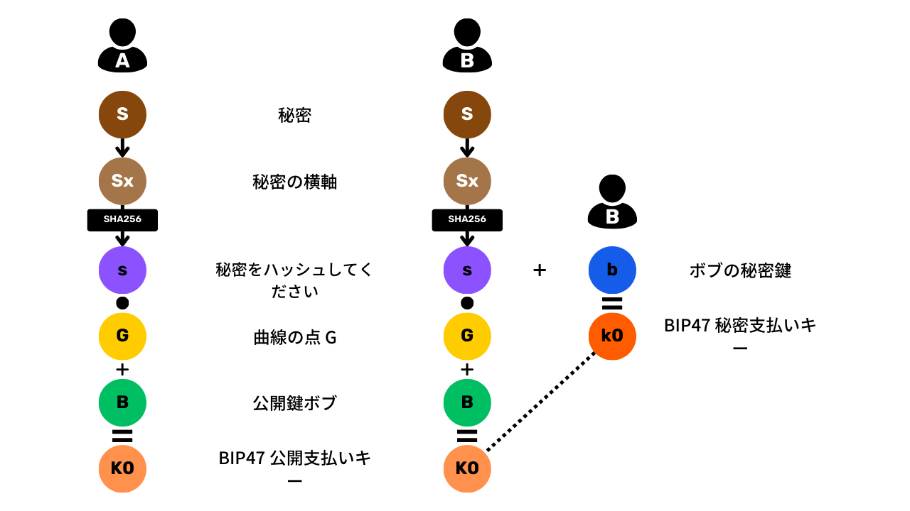

### BIP47支払いの払い戻し

ボブはアリスの再利用可能な支払いコードを知っているため、彼女に払い戻しを送るために必要なすべての情報を既に持っています。彼はアリスに再度連絡して情報を求める必要はありません。彼は単に彼女に通知トランザクションを通知する必要があります、特に彼女が彼女のBIP47アドレスを彼女のシードで取り戻すことができるように、そして彼はまた彼女に`2^32`までの支払いを送ることができます。

払い戻し機能はBIP47に特有のものであり、私たちが次の章で学ぶ他の方法、例えばサイレントペイメントなどに対するその利点の一つです。

ボブはアリスが彼に支払いを送ったのと同じ方法でアリスに払い戻しを行うことができます。役割は逆転します：

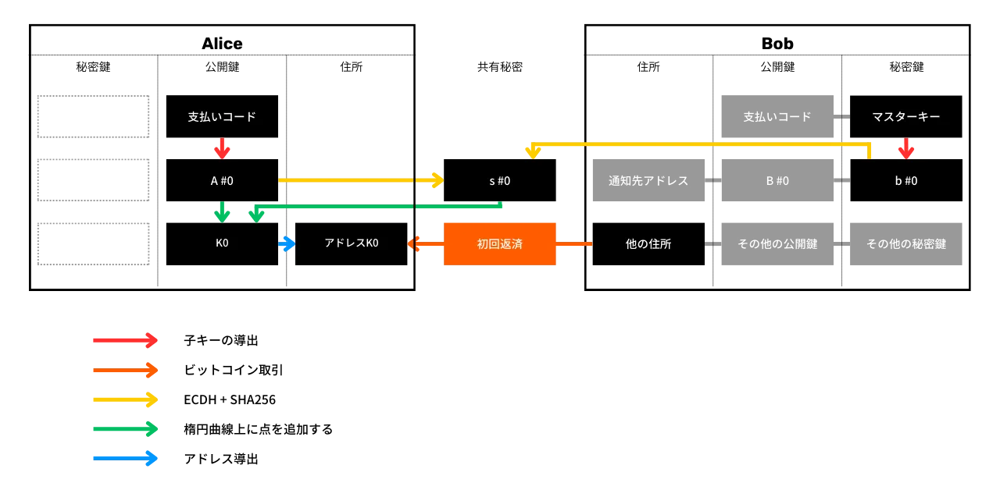
*この章の執筆に触発された記事のレビューと貴重な専門的アドバイスをしてくださった[Fanis Michalakis](https://x.com/FanisMichalakis)に大きな感謝を！*

https://planb.network/tutorials/privacy/paynym-bip47

## サイレントペイメント
<chapterId>2871d594-414e-4598-a830-91c9eb84dfb8</chapterId>

BIP47は、オンチェーンでの非効率性について批判されています。前章で説明されたように、新しい受取人ごとに通知トランザクションが必要になります。この制約は、受取人と持続的な支払いチャネルを確立する予定がある場合には、無視できるものになります。実際、単一の通知トランザクションが、その後の無限に近い数のBIP47支払いへの道を開きます。

しかし、特定の状況では、通知トランザクションがユーザーにとって障害となることがあります。例えば、受取人への一回限りの寄付を例に取ると、従来のビットコインアドレスでは、寄付を行うために単一のトランザクションで十分です。しかし、BIP47では、通知用のトランザクションと実際の支払い用のトランザクションの2つが必要になります。ブロックスペースの需要が低く、トランザクション手数料が最小限である場合、この追加ステップは一般的に問題ではありません。しかし、混雑期には、トランザクション手数料が一回の支払いに対して法外になり、ユーザーにとって標準的なビットコイントランザクションと比較してコストが倍増する可能性があり、これはユーザーにとって受け入れがたいかもしれません。

ユーザーが静的な識別子に対して数回の支払いを行う予定の場合、他の解決策が開発されています。その中には、[BIP352](https://github.com/bitcoin/bips/blob/master/bip-0352.mediawiki)で説明されているサイレントペイメントがあります。このプロトコルは、アドレスの再利用を生成せず、通知トランザクションの使用を必要とせずに、静的な識別子での支払いを受け取ることを可能にします。このプロトコルの動作方法を見てみましょう。

---

*この章を完全に理解するには、ECDH（楕円曲線ディフィー・ヘルマン）とHDウォレットでの暗号鍵導出の仕組みに精通していることが不可欠です。これらの概念は、BIP47に関する前章で詳しく説明されました。ここではそれらに再び触れません。これらの概念にまだ精通していない場合は、この章を続ける前に前章を参照することをお勧めします。受取アドレスの再利用に関連するリスクや、支払いを受け取るためのユニークな識別子の重要性についても再訪しません。*

---

### 通知を移動することはなぜできないのか？

BIP47に関する章で議論されたように、通知トランザクションは主に2つの機能を果たします：
- 受取人に通知する；
- 送信者の支払いコードを伝達する。

この通知プロセスをオフチェーンで行うことができるのではないかと、単純に考えるかもしれません。理論的には、これは完全に実行可能です：受取人がBIP47支払いコードを送信者から受け取るための通信手段を示すだけで十分です。しかし、このアプローチには2つの大きな問題があります：
- まず、コード伝送プロセスを別の通信プロトコルに移行することになります。交換のコストとプライバシーに関連する問題は残りますが、単にこの新しいプロトコルに移されるだけです。プライバシーの観点から、これはまた、ユーザーのアイデンティティとオンチェーン活動との間にリンクを作成する可能性があり、これはブロックチェーン上で直接通知を行うことによって避けようとしていることです。さらに、ブロックチェーン外で通知を行うことは、ビットコインには存在しない検閲リスク（資金のブロックなど）を導入することになります。
次に、これは回復の問題を引き起こすでしょう。BIP47では、受信者は資金にアクセスするために送信者の支払いコードを絶対に知っていなければなりません。これは受領時に当てはまるだけでなく、ウォレットの紛失の場合にシードを介して資金を回復するイベントでも当てはまります。オンチェーン通知を使用すると、このリスクは避けられます。ユーザーは自分のシードを知っているだけで通知トランザクションを見つけて復号化することができます。しかし、通知がブロックチェーン外で行われる場合、ユーザーは受け取ったすべての支払いコードの動的バックアップを維持する必要があり、これは平均的なユーザーにとって非現実的です。
これらの制約は、BIP47の文脈でオンチェーン通知の使用を不可欠にします。しかし、Silent Paymentsはそのコストのためにこのオンチェーン通知ステップを避けることを特に求めています。したがって、採用された解決策は通知を移動するのではなく、完全に排除することです。これを達成するためには、スキャンの妥協が受け入れられなければなりません。BIP47では、通知トランザクションのおかげでユーザーが自分の資金を正確に見つけることができますが、Silent Paymentsの文脈では、ユーザーは自分宛の支払いを検出するためにすべての既存のBitcoinトランザクションを調査する必要があります。この運用負担を軽減するために、Silent Paymentsの検索は、そのような支払いを含む可能性があるトランザクション、すなわち少なくとも1つのTaproot P2TR出力を含むトランザクションにのみ限定されます。スキャンは、ウォレットの作成日からのトランザクションにのみ専念します（ウォレットが2024年に作成された場合、2009年までさかのぼるトランザクションをスキャンする必要はありません）。

したがって、BIP47とSilent Paymentsが似たような目標を持っているにもかかわらず、異なる妥協を伴い、**実際には異なるユースケースに対応している**ことがわかります。たとえば、たまの寄付のような一回限りの支払いには、その低コストのためにSilent Paymentsがより適しています。逆に、取引プラットフォームやマイニングプールのような同じ受信者への定期的な取引の場合、BIP47が好まれるかもしれません。
Silent Paymentsの技術的な仕組みを一緒に探求して、その意味をよりよく理解しましょう。これを行うために、BIP352の説明文書と同じアプローチを取ることを提案します。計算を行うべき要素ごとに徐々に分解し、新たな追加ごとに正当化します。
### 理解するためのいくつかの概念

始める前に、Silent PaymentsはP2TR（*Pay to Taproot*）スクリプトタイプの使用にのみ依存していることを明確にすることが重要です。BIP47とは異なり、子公開鍵をハッシュ化して受信アドレスを導出する必要はありません。実際、P2TR標準では、調整された公開鍵が直接かつ公然とアドレスに使用されます。したがって、Taproot受信アドレスは本質的にメタデータを伴う公開鍵です。この調整された公開鍵は、他の2つの公開鍵の集合体です：1つは単純な署名による直接かつ伝統的な支出を可能にし、もう1つはMASTのマークルルートを表し、マークルツリーに潜在的に記述されたいずれかの条件の満足による支出を許可します。

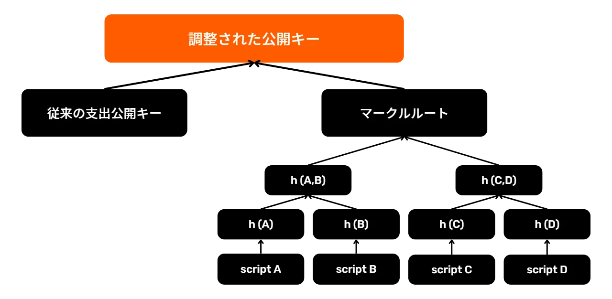

Silent PaymentsをTaprootに限定する決定は、主に2つの理由によって動機付けられています：
- 第一に、ウォレットソフトウェアの実装と将来のアップデートを大幅に容易にするため、一つの標準にのみ準拠する必要があります；
- 第二に、このアプローチは、異なるタイプのスクリプトに分散することをユーザーに奨励しないことで、ユーザーの匿名性セットを改善するのに役立ちます。これは、チェーン分析で異なるウォレットの指紋を生成するためです（この概念についての詳細は、第2部の第4章を参照してください）。

### Silent Paymentsの公開鍵のナイーブな導出
SP（サイレントペイメント）の基本的な機能を理解するのに役立つ簡単な例から始めましょう。BitcoinユーザーのAliceとBobを例に取ります。Aliceは新しい受信アドレスにBobにビットコインを送りたいと考えています。このプロセスでは、以下の三つの目標を達成する必要があります：
- Aliceは新しいアドレスを生成できる必要があります；
- Bobは、この特定のアドレスに送られた支払いを識別できる必要があります；
- Bobは、このアドレスに関連付けられた秘密鍵を取得し、自分の資金を使えるようにする必要があります。

AliceのBitcoinウォレットには、以下のキーペアで保護されたUTXOがあります：
- $a$：秘密鍵；
- $A$：公開鍵（$A = a \cdot G$）

Bobはインターネット上に公開したSPアドレスを持っています：
- $b$：秘密鍵；
- $B$：公開鍵（$B = b \cdot G$）
Bobのアドレスを取得することで、AliceはECDHを使用してBobに属する新しい空白のアドレスを計算することができます。このアドレスを$P$と呼びましょう：
$$  P = B + \text{hash}(a \cdot B) \cdot G  $$

この方程式では、Aliceは単に自分の秘密鍵$a$とBobの公開鍵$B$のドット積を計算しました。この結果を全員が知っているハッシュ関数を通して渡します。出力値はその後、楕円曲線`secp256k1`の生成点$G$によってスカラー乗算されます。最後に、Aliceは得られた点をBobの公開鍵$B$に加えます。Aliceがこのアドレス$P$を持つと、トランザクションのアウトプットとして使用し、つまりそれにビットコインを送ります。

> *サイレントペイメントの文脈では、"hash"関数は`BIP0352/SharedSecret`で特別にタグ付けされたSHA256ハッシュ関数に対応し、生成されるハッシュがこのプロトコルに固有であり、他の文脈で再利用できないことを保証するとともに、署名のnonceの再利用に対する追加の保護を提供します。この標準は、`secp256k1`上のSchnorr署名について[specified in the BIP340](https://github.com/bitcoin/bips/blob/master/bip-0340.mediawiki)で指定されたものに対応します。*

ECDHが依存する楕円曲線の特性のおかげで、私たちは知っています：

$$  a \cdot B = b \cdot A  $$

したがって、BobはAliceがビットコインを送った受信アドレスを計算することができます。これを行うために、彼はサイレントペイメントの基準を満たすすべてのBitcoinトランザクションを監視し、それぞれに対して以下の計算を適用して、支払いが自分宛てであるかどうかを確認します（*スキャニング*）：

$$  P' = B + \text{hash}(b \cdot A) \cdot G  $$

Aliceのトランザクションをスキャンすると、彼は$P'$が$P$と等しいことに気づきます。したがって、この支払いが自分宛てであることを知ります：

$$  P' = B + \text{hash}(b \cdot A) \cdot G = B + \text{hash}(a \cdot B) \cdot G = P   $$

ここから、Bobはアドレス$P$を使って支出するための秘密鍵$p$を計算することができます：

$$  p = (b + \text{hash}(b \cdot A)) \bmod n  $$

ご覧のとおり、この秘密鍵$p$を計算するには、必ず秘密鍵$b$を持っている必要があります。この秘密鍵$b$を持っているのはBobだけです。したがって、彼は確かに自分宛てのサイレントペイメントアドレスに送られたビットコインを使うことができる唯一の人物になります。


*キャプション:*
- $B$: ボブが公開する公開鍵/静的アドレス
- $b$: ボブの秘密鍵
- $A$: トランザクションの入力として使用されるアリスのUTXOの公開鍵
- $a$: アリスの秘密鍵
- $G$: 楕円曲線 `secp256k1` の生成点
- $\text{SHA256}$: `BIP0352/SharedSecret` でタグ付けされたSHA256ハッシュ関数
- $s$: 共通のECDH秘密
- $P$: ボブへの支払い用の公開鍵/ユニークアドレス

ここでは、ビットコインを送るためにボブの静的アドレス $B$ を使用してユニークアドレス $P$ を導出するという、初歩的であるが単純すぎる方法について説明します。しかし、この方法は単純すぎていくつかの欠陥があり、修正が必要です。最初の問題は、このスキームでは、アリスが同じトランザクション内でボブへ複数の出力を作成できないことです。

### 複数の出力を作成するには？

前のセクションの例では、アリスはボブのユニークアドレス $P$ に行く単一の出力を作成します。同じ入力が選択された場合、使用される方法は常に $P$ の同じ結果、つまり同じアドレスにつながるため、アリスはボブに対して2つの異なる新しいアドレスを作成することはできません。しかし、アリスが彼女の支払いをボブに対して複数の小額に分割したいと考える状況は多々あります。したがって、これを実現する方法を見つける必要があります。

これを実現するために、アリスが $P$ を導出する計算をわずかに変更し、ボブに対して2つの異なるアドレス、すなわち $P_0$ と $P_1$ を生成できるようにします。

2つの異なるアドレスを得るために計算を変更するには、結果を変更する整数を追加するだけで十分です。したがって、アリスは計算に $0$ を追加してアドレス $P_0$ を、$1$ を追加してアドレス $P_1$ を得ます。この整数を $i$ と呼びましょう：

$$  P_i = B + \text{hash}(a \cdot B \text{ ‖ } i) \cdot G  $$

計算プロセスは前の方法から変わりませんが、この時アリスはハッシュを進行する前に $a \cdot B$ と $i$ を連結します。それから $i$ を変更するだけで、ボブに属する新しいアドレスを得ることができます。例えば：

$$  P_0 = B + \text{hash}(a \cdot B \text{ ‖ } 0) \cdot G  $$

$$  P_1 = B + \text{hash}(a \cdot B \text{ ‖ } 1) \cdot G  $$

ボブが彼に向けたサイレントペイメントをブロックチェーンでスキャンするとき、彼はアドレス $P_0$ に対して $i = 0$ を使用して開始します。もし $P_0$ に支払いがなければ、このトランザクションには彼に向けたサイレントペイメントが含まれていないと結論付け、それ以上分析を停止します。しかし、$P_0$ が有効で彼に対する支払いを含んでいる場合、彼は同じトランザクション内でアリスが第二の支払いを行ったかどうかを確認するために $P_1$ に進みます。もし $P_1$ が無効であれば、彼はこのトランザクションの検索を停止します。それ以外の場合は、連続する $i$ の値をテストし続けます：
$$  P_0 = B + \text{hash}(b \cdot A \text{ ‖ } 0) \cdot G  $$
$$  P_1 = B + \text{hash}(b \cdot A \text{ ‖ } 1) \cdot G  $$
Bobが$i = 0$で$P_0$が何も生み出さない場合に直ちに停止するため、この整数の使用はBobにとってトランザクションのスキャンステップの追加的な操作負担をほとんど加えません。

次にBobは同じ方法でプライベートキーを計算できます：

$$ 
p_0 = (b + \text{hash}(b \cdot A \text{ ‖ } 0)) \bmod n
 $$

$$ 
p_1 = (b + \text{hash}(b \cdot A \text{ ‖ } 1)) \bmod n 
 $$

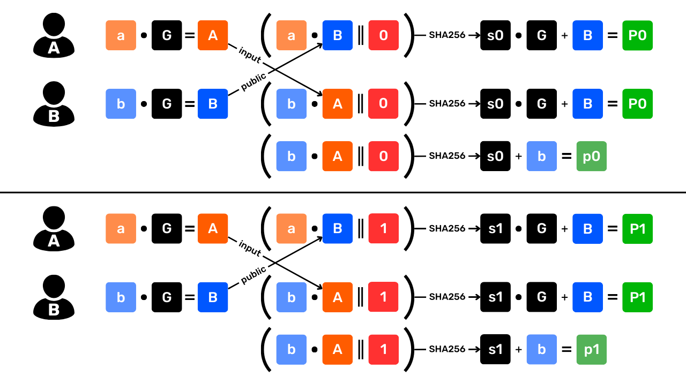

*キャプション:*
- $B$: Bobによって公開された公開キー / 静的アドレス
- $b$: Bobのプライベートキー
- $A$: トランザクションの入力として使用されるAliceのUTXOの公開キー
- $a$: Aliceのプライベートキー
- $G$: 楕円曲線 `secp256k1` の生成点
- $\text{SHA256}$: `BIP0352/SharedSecret` でタグ付けされたSHA256ハッシュ関数
- $s_0$: 最初の共有ECDH秘密
- $s_1$: 二番目の共有ECDH秘密
- $P_0$: Bobへの支払いのための最初の公開キー / ユニークアドレス
- $P_1$: Bobへの支払いのための二番目の公開キー / ユニークアドレス

この方法により、私たちは良いプロトコルを始めることができますが、特にアドレスの再利用を防ぐという課題がまだいくつかあります。

### アドレスの再利用を避けるには？
前のセクションで見たように、Aliceは彼女が支払いの入力として消費するUTXOを保護するキーのペアを使用して、Bobとの共有ECDH秘密を計算します。この秘密により、彼女はユニークアドレス $P_0$ を導出することができます。しかし、Aliceが使用するキーのペア ($a$, $A$) は、彼女がこのアドレスを複数回再利用した場合、複数のUTXOを保護することができます。Aliceが同じキー $A$ で保護された2つのUTXOを使用してBobの静的アドレス $B$ に2回支払いを行った場合、これはBobのためのアドレスの再利用につながります。
> *アドレスの再利用はユーザープライバシーにとって非常に悪い習慣です。その理由を理解するために、このトレーニングの最初の部分を見直すことをお勧めします。*

実際、ユニークアドレス $P_0$ が $A$ と $B$ から導出されるため、Aliceが同じキー $A$ を使用して $B$ への二回目の支払いのために二番目のアドレスを導出すると、同じアドレス $P_0$ になります。このリスクを避け、サイレントペイメント内でのアドレスの再利用を防ぐためには、わずかに計算を変更する必要があります。

私たちが望むのは、Aliceが支払いの入力として消費する各UTXOが、同じペアのキーによって保護されている複数のUTXOがあっても、Bobの側でユニークアドレスを与えることです。したがって、ユニークアドレス $P_0$ の計算にUTXOの参照を追加するだけで十分です。この参照は、入力として消費されるUTXOのハッシュになります：

$$  \text{inputHash} = \text{hash}(\text{outpoint} \text{ ‖ } A)  $$

そして、この入力参照をAliceは彼女のユニークアドレス $P_0$ の計算に追加します：
$$  P_0 = B + \text{hash}(\text{inputHash} \cdot a \cdot B \text{ ‖ } 0) \cdot G  $$
スキャン中に、Bobは$\text{inputHash}$を追加することもできます。彼がする必要があるのは、トランザクションを観察して$\text{outpoint}$を推測することだけです：

$$  P_0 = B + \text{hash}(\text{inputHash} \cdot b \cdot A \text{ ‖ } 0) \cdot G  $$

有効な$P_0$を見つけたとき、彼は対応する秘密鍵$p_0$を計算できます：

$$ 
p_0 = (b + \text{hash}(\text{inputHash} \cdot b \cdot A \text{ ‖ } 0)) \bmod n
 $$


*凡例:*
- $B$: Bobによって公開された公開鍵 / 静的アドレス
- $b$: Bobの秘密鍵
- $A$: トランザクションの入力として使用されるAliceのUTXOの公開鍵
- $a$: Aliceの秘密鍵
- $H$: 入力として使用されるUTXOのハッシュ
- $G$: 楕円曲線`secp256k1`の生成点
- $\text{SHA256}$: `BIP0352/SharedSecret`でタグ付けされたSHA256ハッシュ関数
- $s_0$: 最初の共有ECDH秘密
- $P_0$: Bobへの支払いのための最初の公開鍵 / ユニークアドレス

現時点では、Aliceがトランザクションに単一の入力を使用すると仮定しています。しかし、彼女は複数の入力を使用できるはずです。その結果、Bobの側では、支払いが彼に意図されているかを判断するために、各トランザクションに含まれる複数の入力ごとにECDHを計算する必要が理論的にはあります。この方法は満足できるものではないので、作業負荷を減らすための解決策を見つける必要があります！

### 入力の公開鍵を調整する

この問題を解決するために、Aliceの側で特定の入力を保護する鍵のペアを使用する代わりに、トランザクションの入力で使用されるすべての鍵のペアの合計を使用します。この合計は、新しい鍵のペアとして考慮されます。この技術は「tweak」として知られています。

例えば、Aliceのトランザクションに3つの入力があり、それぞれが異なる鍵のペアで保護されていると想像してください：
- $a_0$ は入力＃0を保護します；
- $a_1$ は入力＃1を保護します；
- $a_2$ は入力＃2を保護します。


上記の方法に従って、Aliceは$P$を生成するために、$a_0$、$a_1$、および$a_2$の中から単一の鍵のペアを選択する必要があります。しかし、このアプローチでは、Bobが$a_0$から始めて、有効なアドレス$P$を生成するペアを特定するまで、$a_1$、そしてそれ以降に順番にテストする必要があります。このプロセスは、Bobがすべてのトランザクションのすべての入力に対してECDH計算を実行することを要求し、運用上のスキャン作業負荷を大幅に増加させます。

これを避けるために、入力のすべての鍵の合計を使用して$P$の計算を行うようAliceに依頼します。私たちの例を取ると、調整された秘密鍵$a$は次のように計算されます：

$$  a = a_0 + a_1 + a_2  $$
同様に、AliceとBobは、調整された公開鍵を計算することができます：
$$  A = A_0 + A_1 + A_2  $$
この方法のおかげで、Bobはトランザクションの公開鍵の合計を計算し、それから$A$のみからECDH秘密を計算する必要があるだけで、スキャンステップのために行う計算の数を大幅に減らすことができます。しかし、前のセクションから覚えているように、アドレスの再利用を防ぐためにnonceとして使用されるハッシュ$\text{inputHash}$を計算に含めていました：

$$  \text{inputHash} = \text{hash}(\text{outpoint} \text{ ‖ } A)  $$

しかし、トランザクションに複数の入力がある場合、この計算でどの$\text{outpoint}$を選択するかを決定する必要があります。BIP352によると、この計算で使用する$\text{outpoint}$の選択基準は、辞書順で最小のものを選択することです。これは、アルファベット順に最初に現れるUTXOを選択することを意味します。この方法は、各トランザクションで選択するUTXOを標準化します。例えば、辞書順で最小の$\text{outpoint}$が$\text{outpoint}_L$である場合、$\text{inputHash}$の計算は以下のようになります：

$$  \text{inputHash} = \text{hash}(\text{outpoint}_L \text{ ‖ } A)  $$

その後の計算は前のセクションで提示されたものと同一ですが、プライベートキー$a$とそれに対応する公開鍵$A$はもはや単一の入力を保護するペアではなく、入力のすべてのキーペアの調整を表すようになります。

### 支出キーとスキャンキーの分離

これまで、我々はSilent Paymentの静的アドレス$B$を一意の公開鍵として議論してきました。Aliceが共有ECDH秘密を作成するために使用するのはこの公開鍵$B$であり、それが順番に一意の支払いアドレス$P$を計算するために使用されます。Bobはこの公開鍵$B$と対応するプライベートキー$b$をスキャンステップのために使用します。しかし、彼はまたプライベートキー$b$を使用して、アドレス$P$から支出するためのプライベートキー$p$を計算します。

この方法の欠点は、Silent Paymentsを受け取るアドレスのすべてのプライベートキーを計算するために使用されるプライベートキー$b$が、Bobによってトランザクションをスキャンするためにも使用されることです。このステップでは、キー$b$がインターネットに接続されたウォレットソフトウェアで利用可能である必要があり、それを冷蔵ウォレットに保管することと比較して盗難のリスクが高まります。理想的には、Silent Paymentsの利点を享受しつつ、他のすべてのプライベートキーへのアクセスを制御するプライベートキー$b$をハードウェアウォレットに保護された状態で保持できると良いでしょう。幸いなことに、プロトコルは正確にそれを可能にするように適応されています。
これを達成するために、BIP352は受信者が2つの異なるキーペアを使用することを指定しています：
- $B_{\text{spend}}$：一意の支払いアドレスのプライベートキーを計算するために；
- $B_{\text{scan}}$：一意の支払いアドレスを見つけるために。

この方法により、Bobはプライベートキー$b_{\text{spend}}$をハードウェアウォレットに保持し、オンラインソフトウェア上でプライベートキー$b_{\text{scan}}$を使用して彼のSilent Paymentsを見つけることができますが、$b_{\text{spend}}$を公開することはありません。しかし、公開鍵$B_{\text{scan}}$と$B_{\text{spend}}$は、Bobの静的アドレス$B$に見つかるため、両方とも公に公開されます。
ボブが彼に属するユニークな支払いアドレス $P_0$ を計算するために、アリスは次の計算を行います：

$$  P_0 = B_{\text{spend}} + \text{hash}(\text{inputHash} \cdot a \cdot B_{\text{scan}} \text{ ‖ } 0) \cdot G  $$

自分宛の支払いを見つけるために、ボブは次の計算を行います：

$$  P_0 = B_{\text{spend}} + \text{hash}(\text{inputHash} \cdot b_{\text{scan}} \cdot A \text{ ‖ } 0) \cdot G  $$

これまでのところ、ボブは彼のハードウェアウォレットにある $b_{\text{spend}}$ を使用する必要がありませんでした。$P_0$ を使いたいとき、彼は次の計算を行ってプライベートキー $p_0$ を見つけることができます：

$$ p_0 = (b_{\text{spend}} + \text{hash}(\text{inputHash} \cdot b_{\text{scan}} \cdot A \text{ ‖ } 0)) \bmod n $$


*キャプション:*
- $B_{\text{scan}}$: ボブのスキャン公開キー（静的アドレス）
- $b_{\text{scan}}$: ボブのスキャンプライベートキー
- $B_{\text{spend}}$: ボブの支払い公開キー（静的アドレス）
- $b_{\text{spend}}$: ボブの支払いプライベートキー
- $A$: 入力における公開キーの合計（調整）
- $a$: 調整された公開キーに対応するプライベートキー
- $H$: 入力で使用される最小のUTXO（辞書順）のハッシュ
- $G$: 楕円曲線 `secp256k1` の生成点
- $\text{SHA256}$: `BIP0352/SharedSecret` でタグ付けされたSHA256ハッシュ関数
- $s_0$: 最初の共有ECDH秘密
- $P_0$: ボブのための最初の公開キー / ユニークな支払いアドレス

### ラベル付きのSPアドレスの使用

ボブは次のようにSilent Paymentsのための静的アドレス $B$ を持っています：

$$ B = B_{\text{scan}} \text{ ‖ } B_{\text{spend}} $$

この方法の問題点は、このアドレスに送られた異なる支払いを区別できないことです。例えば、ボブが彼のビジネスのために2人の異なるクライアントを持っていて、それぞれからの支払いを明確に区別したい場合、彼は2つの異なる静的アドレスが必要になります。現在のアプローチでの素朴な解決策は、それぞれの静的アドレスを持つ2つの別々のウォレットをボブが作成すること、または同じウォレット内で2つの異なる静的アドレスを設定することです。しかし、この解決策は、それぞれのアドレスに対して意図された支払いを検出するためにブロックチェーン全体を2回スキャンする必要があり（各アドレスにつき1回）、これはボブの運用負担を不合理に増加させます。
この問題を解決するために、BIP352は異なる静的アドレスを可能にしつつ、ブロックチェーン上でSilent Paymentsを見つけるための作業負荷を不当に増加させないラベリングシステムを使用します。これを行うために、整数$m$が支出公開キー$B_{\text{spend}}$に追加されます。この整数は、最初の静的アドレスに対しては$1$の値を取り、次に$2$、というように続きます。支出キー$B_{\text{spend}}$はこれ以降、$B_m$と呼ばれ、以下の方法で構築されます：
$$  B_m = B_{\text{spend}} + \text{hash}(b_{\text{scan}} \text{ ‖ } m) \cdot G  $$

例えば、ラベル$1$を持つ最初の支出キーについては：

$$  B_1 = B_{\text{spend}} + \text{hash}(b_{\text{scan}} \text{ ‖ } 1) \cdot G  $$

Bobが公開する静的アドレスは、$B_{\text{scan}}$と$B_m$で構成されるようになります。例えば、ラベル$1$を持つ最初の静的アドレスは以下のようになります：

$$ B = B_{\text{scan}} \text{ ‖ } B_1 $$

> *ラベル0はお釣り用に予約されているため、ラベル1から始めます。*

Aliceは、以前と同じ方法でユニークな支払いアドレス$P$を導出しますが、$B_{\text{spend}}$の代わりに新しい$B_1$を使用します。
$$  P_0 = B_1 + \text{hash}(\text{inputHash} \cdot a \cdot B_{\text{scan}} \text{ ‖ } 0) \cdot G  $$

実際には、AliceはBobがラベル付きアドレスを持っていることを知らないかもしれません。彼女が単に彼が提供した静的アドレスの第二部分、この場合は$B_{\text{spend}}$ではなく$B_1$の値を使用するだけです。

支払いをスキャンするために、Bobは常に彼の初期静的アドレスの値をこの方法で$B_{\text{spend}}$と共に使用します：

$$   P_0 = B_{\text{spend}} + \text{hash}(\text{inputHash} \cdot b_{\text{scan}} \cdot A \text{ ‖ } 0) \cdot G  $$

その後、彼は見つけた$P_0$の値を一つずつ出力から引きます。次に、これらの引き算の結果のいずれかが彼のウォレットで使用しているラベルの値と一致するかどうかを確認します。例えば、出力#4がラベル$1$と一致する場合、これはその出力が彼のラベル付き静的アドレス$B_1$に関連するSilent Paymentであることを意味します：

$$ Out_4 - P_0 = \text{hash}(b_{\text{scan}} \text{ ‖ } 1) \cdot G $$

これは以下の理由で機能します：

$$  B_1 = B_{\text{spend}} + \text{hash}(b_{\text{scan}} \text{ ‖ } 1) \cdot G  $$
この方法のおかげで、ボブは基本的な静的アドレス（$B = B_{\text{scan}} \text{ ‖ } B_{\text{spend}}$）から派生した多数の静的アドレス（$B_1$, $B_2$, $B_3$...）を使用して、用途を適切に分離することができます。しかし、この静的アドレスの分離は個人のウォレット管理の観点からのみ有効であり、身元の分離を可能にするものではありません。すべてが同じ$B_{\text{scan}}$を持っているため、すべての静的アドレスを簡単に関連付けて、それらが単一のエンティティに属していると推測することができます。

*キャプション:*
- $B_{\text{scan}}$: ボブのスキャン公開鍵（静的アドレス）
- $b_{\text{scan}}$: ボブのスキャン秘密鍵
- $B_{\text{spend}}$: ボブの支出公開鍵（初期アドレス）
- $B_m$: ボブのラベル付き支出公開鍵（静的アドレス）
- $b_m$: ボブのラベル付き支出秘密鍵
- $A$: 入力公開鍵の合計（微調整）
- $a$: 微調整された公開鍵に対応する秘密鍵
- $H$: 入力として使用される最小のUTXO（辞書順）のハッシュ
- $G$: 楕円曲線`secp256k1`の生成点
- $\text{SHA256}$: `BIP0352/SharedSecret`でタグ付けされたSHA256ハッシュ関数
- $s_0$: 最初の共有ECDH秘密
- $P_0$: ボブへの支払いのための最初の公開鍵/ユニークアドレス
- $p_0$: ボブへの最初のユニークな支払いアドレスの秘密鍵
- $X$: ラベルでスキャン秘密鍵のハッシュ

### サイレントペイメントアドレスを構築する方法は？

専用のサイレントペイメントアドレスを構築するには、まずビットコインHDウォレットで2組の鍵を導出する必要があります:
- 支払いを検索するためのペア $b_{\text{scan}}$, $B_{\text{scan}}$;
- 受け取ったビットコインを支出するためのペア $b_{\text{spend}}$, $B_{\text{spend}}$。

これらのペアは以下のパスに従って導出されます（*Bitcoin Mainnet*）:

```text
scan: m / 352' / 0' / 0' / 1' / 0
spend: m / 352' / 0' / 0' / 0' / 0
```

これら2組の鍵が利用可能になったら、単にそれらを連結して（エンドツーエンドで）静的アドレスのペイロードを作成します:

$$ B = B_{\text{scan}} \text{ ‖ } B_{\text{spend}} $$

ラベルを使用したい場合は、$B_{\text{spend}}$を$B_m$に置き換えます:

$$ B = B_{\text{scan}} \text{ ‖ } B_m $$

ラベル$m$を使用して:

$$  B_m = B_{\text{spend}} + \text{hash}(b_{\text{scan}} \text{ ‖ } m) \cdot G  $$

このペイロードが利用可能になったら、HRP（*Human-Readable Part*）`sp`とバージョン`q`（= バージョン0）を追加します。チェックサムも追加され、アドレスはbech32m形式でフォーマットされます。
たとえば、こちらが私の静的なSilent Paymentsアドレスです：
```text
sp1qqvhjvsq2vz8zwrw372vuzle7472zup2ql3pz64yn5cpkw5ngv2n6jq4nl8cgm6zmu48yk3eq33ryc7aam6jrvrg0d0uuyzecfhx2wgsumcurv77e
```
静的アドレスに関して重要な点は、前のセクションで入力したかもしれないこれらのアドレスが、Bitcoin取引で可視化されないということです。ブロックチェーン上に現れるのは、出力で使用される支払いアドレス$P$のみで、標準的なTaproot形式で表示されます。したがって、外部からは、Silent Paymentを使用した取引と、P2TR出力を使用する通常の取引を区別することは不可能です。
BIP47と同様に、静的アドレス$B$と、$B$から派生した支払いアドレス$P$との間に接続を確立することは不可能です。実際、もしイブ（潜在的な攻撃者）がボブの静的アドレス$B$でブロックチェーンをスキャンしようとしても、$P$を決定するために必要な計算を実行することはできません。これを行うには、ボブのプライベートスキャンキー$b_{\text{scan}}$または送信者のプライベートキー$a$が必要ですが、これらの要素はもちろんプライベートです。したがって、個人の身元と静的アドレスを明示的にリンクすることが可能です。

### Silent Paymentsの使用方法は？

Silent Paymentsの提案は比較的最近のもので、これまでに実装したウォレットは非常に限られています。私の知る限り、それらをサポートするソフトウェアは3つだけです：
- [CakeWallet](https://cakewallet.com/)
- [Silentium](https://app.silentium.dev/)
- [DonationWallet](https://github.com/Sosthene00/donationwallet)

近いうちに、独自のSilent Payments静的アドレスの設定方法に関する詳細なチュートリアルを提供する予定です。

この機能は最近のものであるため、メインネットで大量のSilent Paymentsを使用する際には注意を払うことが勧められます。

*このSilent Paymentsの章を作成するために、[Silent Paymentsの説明サイト](https://silentpayments.xyz/)と[BIP352の説明文書](https://github.com/bitcoin/bips/blob/master/bip-0352.mediawiki)を使用しました。*


## このコースについてのフィードバックをお寄せください
<chapterId>195d149f-80fa-5816-8b46-995a9226d082</chapterId>
<isCourseReview>true</isCourseReview>

## 最終試験
<chapterId>e803d394-e3c1-5816-a6b4-a69a2472019c</chapterId>
<isCourseExam>true</isCourseExam>

## 結論
<chapterId>cd8e5c67-50e4-4dcd-8e04-88ba5ec95305</chapterId>

Bitcoinにおけるプライバシーに関するこのトレーニングを完了したことをお祝いします！

このトレーニングでは、多くの高度で技術的なトピックをカバーしましたが、紹介されたすべてのツールを使用する必要はありません。主な目的は、Bitcoinの使用において公開する情報と秘密にしておきたい情報を選択する力をあなたに与えることでした。これはプライバシー保護の本質そのものを体現しています。共有または隠すべき情報についての意識的な選択をするためには、私たちの行動の意味を理解することが必要です。このトレーニングがその知識を得る助けになったことを願っています。
このトレーニングの中で最も重要な部分を選ぶとしたら、チェーン分析に捧げられたセクションを選びます。潜在的な攻撃者によって使用される技術を理解することは、自己を守る最良の方法です。したがって、この部分を慎重に見直し、その詳細をすべて把握しようとすることをお勧めします。
このトレーニングでは、メインチェーン上のBitcoinのプライバシーに特化して焦点を当てました。ライトニングネットワークやサイドチェーンなどの第二層システムのプライバシー問題も重要であり、非常に特有の特徴を持っています。オフチェーン取引の使用は、私たちが研究したBitcoin上の多くの追跡リスクを回避する効果的な戦略である可能性がありますが、それはあなたを他のリスクにもさらします。それらのリスクもまた、認識しておくことが重要です。そのため、これらのトピックは将来、PlanB Networkで行われる専用トレーニングで取り上げられる予定です。

このトレーニングを楽しんでいただけたなら、友人やソーシャルメディアで共有していただけると非常に感謝します。ありがとうございます！:)
