# Proteja Sua Privacidade no Bitcoin

Em um mundo onde a privacidade das transações financeiras está gradualmente se tornando um luxo, entender e dominar os princípios de proteção da privacidade no seu uso do Bitcoin é essencial. Este treinamento oferece todas as chaves, tanto teóricas quanto práticas, para alcançar isso de forma autônoma.

Hoje, no Bitcoin, existem empresas especializadas em análise de cadeia. Seu negócio principal é precisamente invadir sua esfera privada, a fim de comprometer a confidencialidade de suas transações. De fato, o "direito à privacidade" no Bitcoin não existe. Portanto, cabe a você, usuário, afirmar seus direitos naturais e proteger a confidencialidade de suas transações, porque mais ninguém fará isso por você.

Este treinamento é apresentado como uma jornada completa e generalista. Cada noção técnica é detalhada e apoiada por diagramas explicativos. O objetivo é tornar o conhecimento acessível a todos. BTC204 é, portanto, acessível para usuários iniciantes e intermediários. Este treinamento também oferece valor agregado aos bitcoiners mais experientes, pois exploramos alguns conceitos técnicos que são frequentemente desconhecidos.

Junte-se a nós para transformar seu uso do Bitcoin e se tornar um usuário informado, capaz de entender as questões que cercam a confidencialidade e proteger sua privacidade.

+++

# Introdução
<partId>e17474a8-8899-4bdb-a7f8-bc52ddb01440</partId>

## Introdução ao Treinamento
<chapterId>08ba1933-f393-4fb5-8279-777d874caedb</chapterId>

Em um mundo onde a privacidade das transações financeiras está gradualmente se tornando um luxo, entender e dominar os princípios de proteção da privacidade no seu uso do Bitcoin é essencial. Este treinamento oferece todas as chaves, tanto teóricas quanto práticas, para alcançar isso de forma autônoma.
Hoje, no ecossistema Bitcoin, existem empresas especializadas em análise de cadeia. Seu negócio principal é precisamente invadir sua esfera privada, comprometendo a confidencialidade de suas transações. Na realidade, o "direito à privacidade" no Bitcoin não existe. Portanto, cabe a você, usuário, afirmar seus direitos naturais e proteger a confidencialidade de suas transações, porque mais ninguém fará isso por você.

Bitcoin não está aqui apenas para o "Número Aumentar" e a preservação do valor das economias. Devido às suas características únicas e história, é primordialmente a ferramenta da contra-economia. Graças a esta invenção notável, você pode gerenciar livremente seu dinheiro, gastá-lo e acumulá-lo, sem que ninguém possa impedir você.

Bitcoin oferece uma fuga pacífica do jugo dos estados, permitindo que você desfrute plenamente de seus direitos naturais, que não podem ser contestados por leis estabelecidas. Graças à invenção de Satoshi Nakamoto, você tem o poder de fazer respeitar sua propriedade privada e recuperar a liberdade de contrato.

No entanto, o Bitcoin não é anônimo por padrão, o que pode representar um risco para indivíduos envolvidos na contra-economia, especialmente em regiões sob regimes despóticos. Mas este não é o único perigo. Dado que o bitcoin é um ativo valioso e incensurável, pode atrair a atenção de ladrões. Assim, proteger sua privacidade também se torna uma questão de segurança: pode ajudá-lo a prevenir ataques cibernéticos e agressões físicas.
Como veremos, embora o protocolo ofereça certas proteções intrínsecas à privacidade, é crucial usar ferramentas adicionais para otimizar e defender essa privacidade.
Este treinamento é projetado como um curso abrangente e generalista para entender os desafios da privacidade no Bitcoin. Cada noção técnica é discutida em detalhes e apoiada por diagramas explicativos. O objetivo é tornar o conhecimento acessível a todos, até mesmo para usuários iniciantes e intermediários. Para os bitcoiners mais experientes, também cobrimos conceitos muito técnicos e às vezes menos conhecidos ao longo deste treinamento para aprofundar o entendimento de cada tópico.

O objetivo deste treinamento não é torná-lo completamente anônimo no uso do Bitcoin, mas sim fornecer-lhe as ferramentas essenciais para saber como proteger sua privacidade de acordo com seus objetivos pessoais. Você terá a liberdade de escolher entre os conceitos e ferramentas apresentados para desenvolver suas próprias estratégias, adaptadas aos seus objetivos e necessidades específicos.

### Seção 1: Definições e Conceitos Chave
Para começar, vamos revisar juntos os princípios fundamentais que regem o funcionamento do Bitcoin, a fim de então abordar calmamente noções relacionadas à privacidade. É essencial dominar alguns conceitos básicos, como UTXOs, endereços de recebimento ou scripts, antes de poder entender completamente os conceitos que abordaremos nas seções seguintes. Também introduziremos o modelo geral de privacidade do Bitcoin, conforme imaginado por Satoshi Nakamoto, o que nos permitirá compreender os desafios e riscos associados.
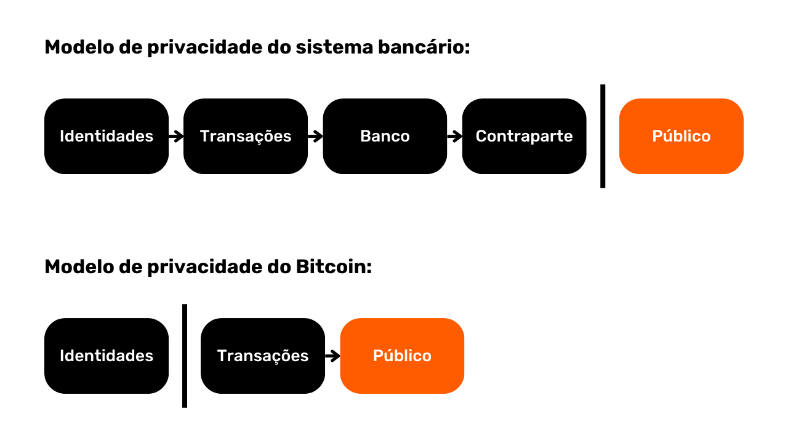

### Seção 2: Entendendo a Análise de Cadeia e Como se Proteger Contra Ela

Na segunda seção, estudamos as técnicas usadas pelas empresas de análise de cadeia para rastrear sua atividade no Bitcoin. Entender esses métodos é crucial para aprimorar a proteção de sua privacidade. Esta parte visa examinar as estratégias dos atacantes para entender melhor os riscos e estabelecer a base para as técnicas que estudaremos nas seções seguintes. Analisaremos padrões de transação, heurísticas internas e externas, bem como interpretações plausíveis desses padrões. Além de um componente teórico, aprenderemos a usar um explorador de blocos para realizar análise de cadeia, por meio de exemplos práticos e exercícios.


### Seção 3: Dominando as Melhores Práticas para Proteger Sua Privacidade

Na terceira seção do nosso treinamento, chegamos ao cerne da questão: a prática! O objetivo é dominar todas as melhores práticas essenciais que devem se tornar reflexos naturais para qualquer usuário do Bitcoin. Cobriremos o uso de endereços novos, rotulagem, consolidação, o uso de nós completos, bem como KYC e métodos de aquisição. O objetivo é fornecer-lhe uma visão abrangente das armadilhas a evitar para estabelecer bases sólidas em nossa busca pela proteção da privacidade. Para algumas dessas práticas, você será guiado a um tutorial específico para implementá-las.

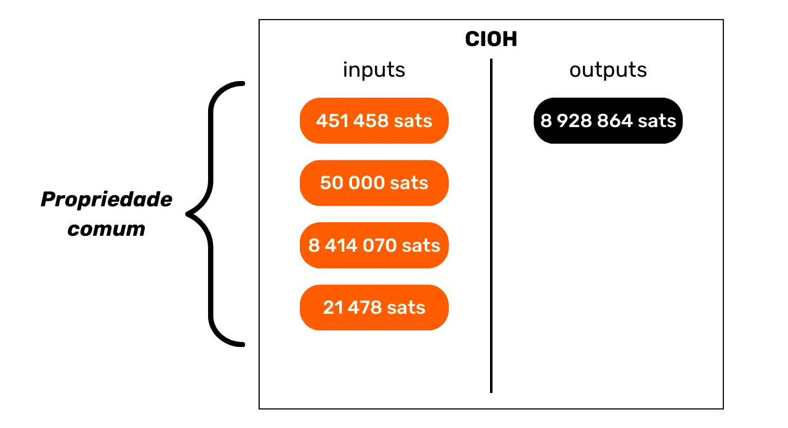

### Seção 4: Entendendo as Transações Coinjoin

Como podemos falar sobre privacidade no Bitcoin sem discutir coinjoins? Na seção 4, você descobrirá tudo o que precisa saber sobre esse método de mistura. Você aprenderá o que é um coinjoin, sua história e objetivos, bem como os diferentes tipos de coinjoins que existem. Finalmente, para os usuários mais experientes, descobriremos o que são anonsets e entropia, e como calcular esses indicadores.

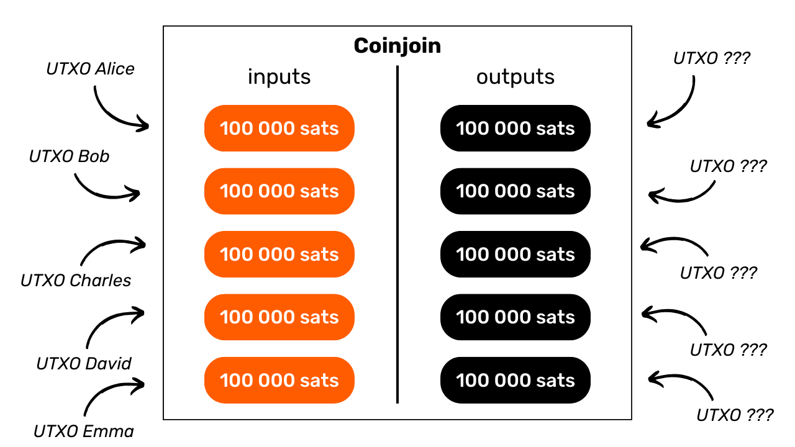

### Seção 5: Entendendo os Desafios de Outras Técnicas Avançadas de Privacidade
Na quinta seção, forneceremos uma visão geral de todas as outras técnicas existentes para proteger sua privacidade no Bitcoin, além do coinjoin. Ao longo dos anos, os desenvolvedores demonstraram uma criatividade notável ao projetar ferramentas dedicadas à privacidade. Examinaremos todos esses métodos, como payjoin, transações colaborativas, Coin Swap e Atomic Swap, detalhando seu funcionamento, objetivos e potenciais fraquezas.

Também abordaremos a privacidade no nível da rede de nós e a disseminação de transações. Também discutiremos os vários protocolos que foram propostos ao longo dos anos para aumentar a privacidade dos usuários no Bitcoin, incluindo protocolos de endereços estáticos.


# Definições e Conceitos Chave
<partId>b9bbbde3-34c0-4851-83e8-e2ffb029cf31</partId>

## O Modelo UTXO do Bitcoin
<chapterId>8d6b50c5-bf74-44f4-922b-25204991cb75</chapterId>

O Bitcoin é primariamente uma moeda, mas você sabe concretamente como os BTCs são representados no protocolo?

### UTXOs do Bitcoin: O Que São?

No protocolo Bitcoin, a gestão das unidades monetárias gira em torno do modelo UTXO, uma sigla para "_Unspent Transaction Output_" (Saída de Transação Não Gasta).

Este modelo é profundamente diferente dos sistemas bancários tradicionais, que dependem de um mecanismo de conta e saldo para rastrear fluxos financeiros. De fato, no sistema bancário, saldos individuais são mantidos em contas vinculadas a uma identidade. Por exemplo, quando você compra uma baguete de um padeiro, seu banco simplesmente debita o valor da compra da sua conta, reduzindo seu saldo, enquanto a conta do padeiro é creditada com o mesmo valor, aumentando seu saldo. Neste sistema, não há noção de um vínculo entre o dinheiro que entra na sua conta e o dinheiro que sai dela, além dos registros de transações.

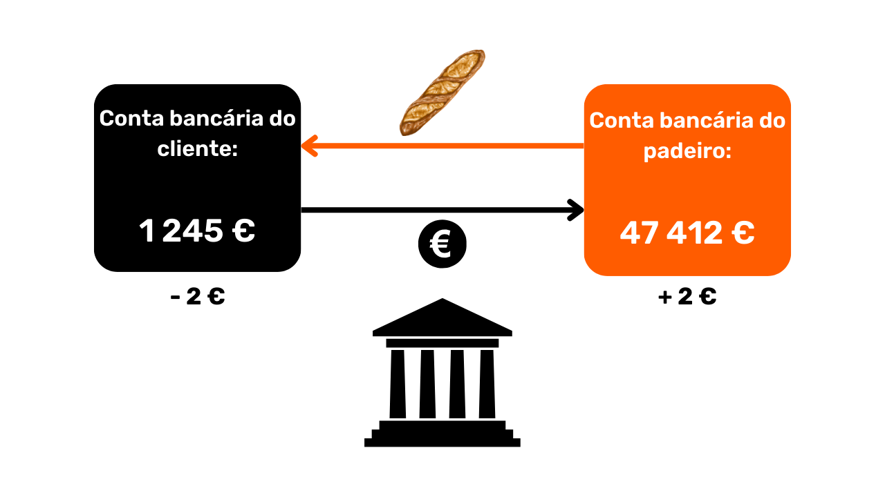
No Bitcoin, as coisas funcionam de maneira diferente. O conceito de uma conta não existe, e as unidades monetárias não são gerenciadas via saldos, mas através de UTXOs. Um UTXO representa uma quantidade específica de bitcoins que ainda não foi gasta, formando assim um "pedaço de bitcoin", que pode ser grande ou pequeno. Por exemplo, um UTXO pode valer `500 BTC` ou apenas `700 SATS`.
**> Lembrete:** O satoshi, frequentemente abreviado como sat, é a menor unidade do Bitcoin, comparável a um centavo em moedas fiduciárias.

```plaintext
1 BTC = 100.000.000 SATS
```

Teoricamente, um UTXO pode representar qualquer valor em bitcoins, variando de um sat até o máximo teórico de cerca de 21 milhões de BTC. No entanto, é logicamente impossível possuir todos os 21 milhões de bitcoins, e existe um limiar econômico inferior chamado "poeira", abaixo do qual um UTXO é considerado economicamente inviável para gastar.
**> Você sabia?** O maior UTXO já criado no Bitcoin foi avaliado em `500,000 BTC`. Foi criado pela plataforma MtGox durante uma operação de consolidação em novembro de 2011: [29a3efd3ef04f9153d47a990bd7b048a4b2d213daaa5fb8ed670fb85f13bdbcf](https://mempool.space/fr/tx/29a3efd3ef04f9153d47a990bd7b048a4b2d213daaa5fb8ed670fb85f13bdbcf)
### UTXOs e Condições de Gasto

UTXOs são os instrumentos de troca no Bitcoin. Cada transação resulta no consumo de UTXOs como entradas e na criação de novos UTXOs como saídas. Quando uma transação é feita, os UTXOs usados como entradas são considerados "gastos", e novos UTXOs são gerados e alocados aos destinatários indicados nas saídas da transação. Assim, um UTXO simplesmente representa uma saída de transação não gasta, e, portanto, uma quantidade de bitcoins pertencente a um usuário em um determinado momento.

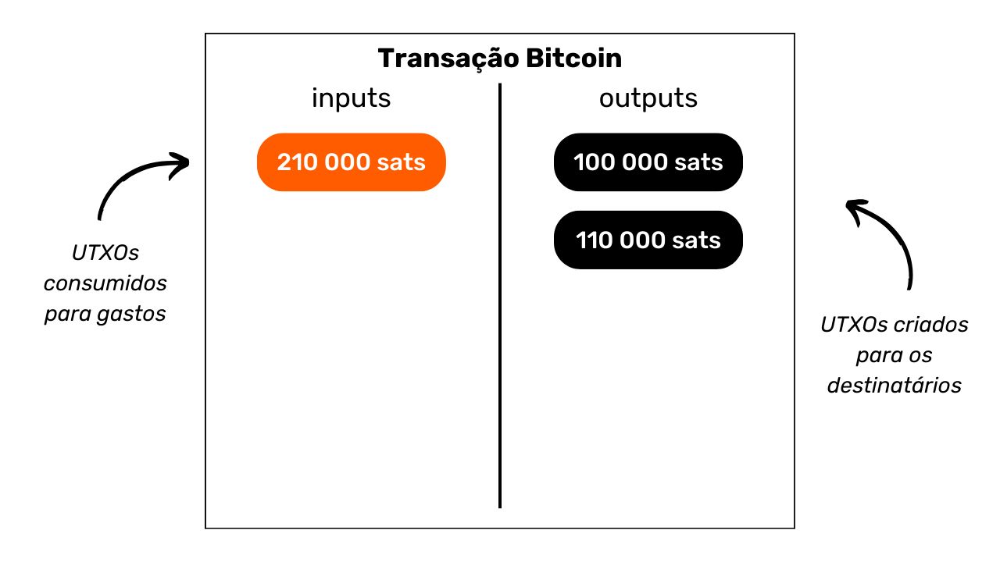
Todos os UTXOs são protegidos por scripts que definem as condições sob as quais podem ser gastos. Para consumir um UTXO, um usuário deve demonstrar à rede que atende às condições estipuladas pelo script que protege esse UTXO. Geralmente, UTXOs são protegidos por uma chave pública (ou um endereço de recebimento que representa essa chave pública). Para gastar um UTXO associado a essa chave pública, o usuário deve provar que possui a chave privada correspondente, fornecendo uma assinatura digital feita com essa chave. É por isso que se diz que sua carteira Bitcoin não contém bitcoins de fato, mas sim armazena suas chaves privadas, que, por sua vez, lhe dão acesso aos seus UTXOs e, por extensão, aos bitcoins que eles representam.
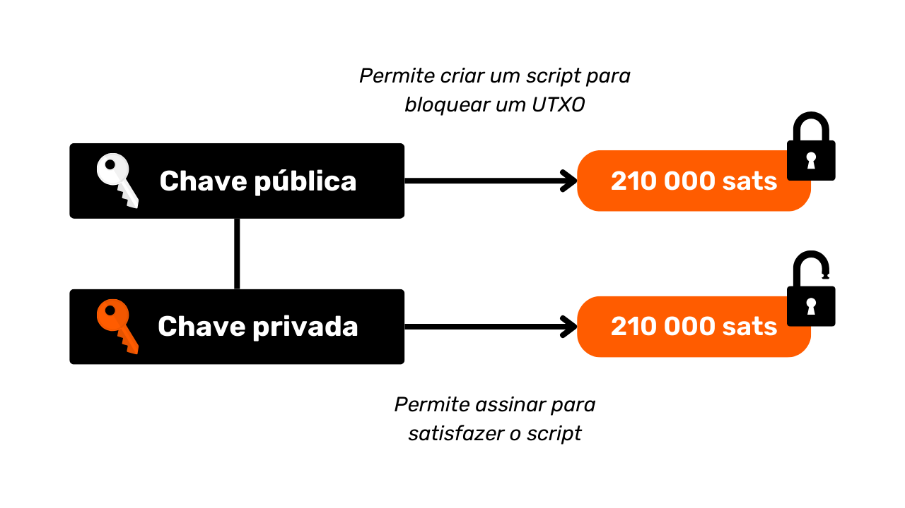

Dado que o conceito de conta é ausente no Bitcoin, o saldo de uma carteira simplesmente corresponde à soma dos valores de todos os UTXOs que ela pode gastar. Por exemplo, se sua carteira Bitcoin pode gastar os seguintes 4 UTXOs:

```plaintext
- 2 BTC
- 8 BTC
- 5 BTC
- 2 BTC
```

O saldo total da sua carteira seria de `17 BTC`.

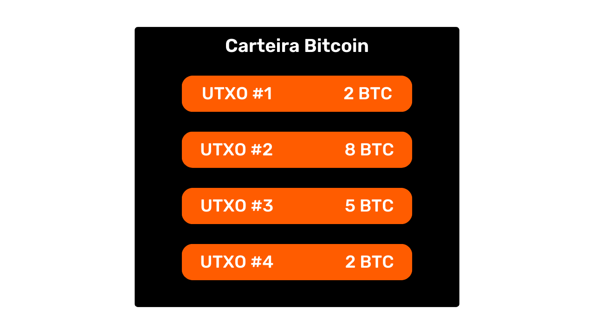

## A estrutura das transações Bitcoin
<chapterId>29d3aaab-de2e-4746-ab40-c9748898850c</chapterId>

### As entradas e saídas de uma transação

Uma transação Bitcoin é uma operação registrada na blockchain que permite a transferência de propriedade de bitcoins de uma pessoa para outra. Mais especificamente, como estamos em um modelo UTXO e não existem contas, a transação satisfaz as condições de gasto que protegiam um ou mais UTXOs, consome-os e, equivalentemente, cria novos UTXOs dotados de novas condições de gasto. Em resumo, uma transação move bitcoins de um script que é satisfeito para um novo script destinado a protegê-los.

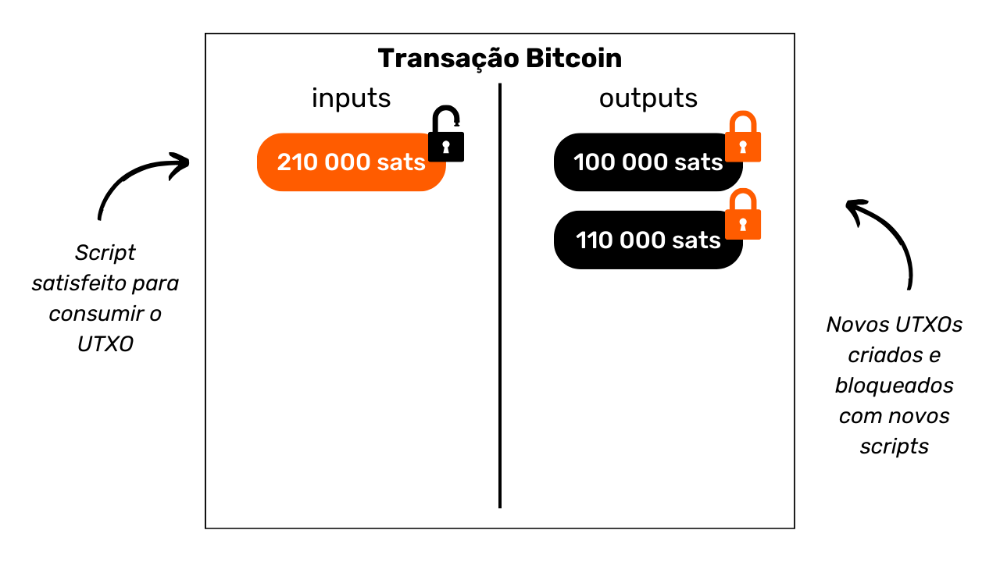

Cada transação Bitcoin é, assim, composta por uma ou mais entradas e uma ou mais saídas. As entradas são UTXOs consumidos pela transação para gerar as saídas. As saídas são novos UTXOs que serão utilizáveis como entradas para futuras transações.

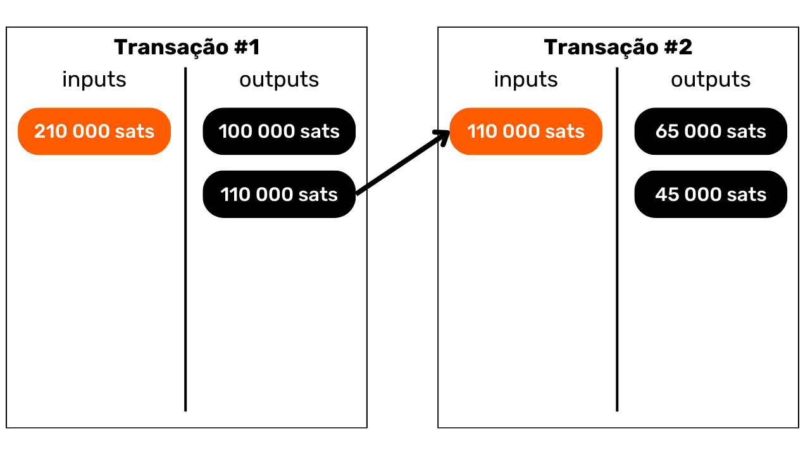
**> Você sabia?** Teoricamente, uma transação de bitcoin poderia ter um número infinito de entradas e saídas. Apenas o tamanho máximo de um bloco limita esse número. Cada entrada em uma transação de Bitcoin refere-se a um UTXO (Unspent Transaction Output - Saída de Transação Não Gasta) anterior e não utilizado. Para usar um UTXO como entrada, seu detentor deve demonstrar que é o legítimo proprietário validando o script associado a ele, ou seja, atendendo à condição de gasto imposta. Geralmente, isso envolve fornecer uma assinatura digital produzida com a chave privada correspondente à chave pública que inicialmente garantiu aquele UTXO. O script verifica, assim, que a assinatura corresponde à chave pública usada ao receber os fundos.
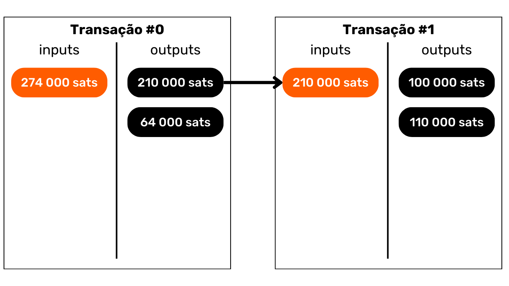

Cada saída, por outro lado, especifica a quantidade de bitcoins a ser transferida, bem como o destinatário. Este último é definido por um novo script que, geralmente, bloqueia o UTXO recém-criado com um endereço de recebimento ou uma nova chave pública.

Para que uma transação seja considerada válida de acordo com as regras de consenso, o total das saídas deve ser menor ou igual ao total das entradas. Em outras palavras, a soma dos novos UTXOs gerados pela transação não deve exceder a dos UTXOs consumidos como entradas. Este princípio é lógico: se você tem apenas uma quantia de `500.000 SATS`, você não pode fazer uma compra de `700.000 SATS`.

### Troco e Consolidação em uma Transação de Bitcoin

A ação de uma transação de Bitcoin sobre UTXOs pode, assim, ser comparada ao derretimento de uma moeda de ouro. De fato, um UTXO não é divisível, mas apenas mesclável. Isso significa que um usuário não pode simplesmente dividir um UTXO representando uma certa quantidade de bitcoins em vários UTXOs menores. Eles devem consumi-lo inteiramente em uma transação para criar um ou mais novos UTXOs de valores arbitrários nas saídas, que devem ser menores ou iguais ao valor inicial.

Este mecanismo é semelhante ao de uma moeda de ouro. Imagine que você possui uma moeda de 2 onças e quer fazer um pagamento de 1 onça, assumindo que o vendedor não pode lhe dar troco. Você precisaria derreter sua moeda e fundir 2 novas de 1 onça cada.
No Bitcoin, a operação é semelhante. Vamos imaginar que Alice tem um UTXO de `10.000 SATS` e ela quer comprar uma baguete que custa `4.000 SATS`. Alice fará uma transação com uma entrada de 1 UTXO de `10.000 SATS` que ela consumirá inteiramente, e nas saídas, ela criará 2 UTXOs avaliados em `4.000 SATS` e `6.000 SATS`. O UTXO de `4.000 SATS` será enviado ao padeiro como pagamento pela baguete, enquanto o UTXO de `6.000 SATS` retornará para Alice como troco. Esse UTXO que retorna ao remetente inicial da transação é o que é chamado de "troco" no jargão do Bitcoin.

Agora imagine que Alice não tenha um único UTXO de `10,000 SATS`, mas sim dois UTXOs de `3,000 SATS` cada. Nesta situação, nenhum dos UTXOs individuais é suficiente para cobrir os `4,000 SATS` pela baguete. Portanto, Alice deve usar ambos os UTXOs de `3,000 SATS` como entradas para sua transação simultaneamente. Desta forma, o total de entradas alcançará `6,000 SATS`, permitindo que ela cubra o pagamento de `4,000 SATS` ao padeiro. Este método, que envolve agrupar vários UTXOs nas entradas de uma transação, é frequentemente referido pelo termo "consolidação".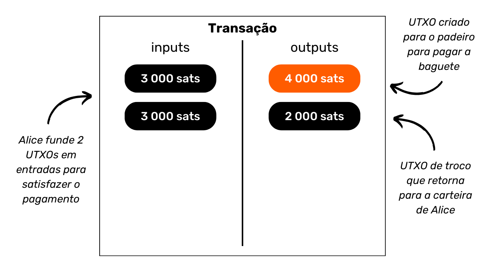

### Taxas de Transação

Intuitivamente, pode-se pensar que as taxas de transação também representam uma saída de uma transação. Mas na realidade, isso não é o caso. As taxas de uma transação representam a diferença entre o total das entradas e o total das saídas. Isso significa que, após usar parte do valor das entradas para cobrir as saídas desejadas em uma transação, uma certa soma das entradas permanece não utilizada. Esta soma residual constitui as taxas de transação.

```plaintext
Taxas = total de entradas - total de saídas
```

Vamos voltar ao exemplo de Alice que tem um UTXO de `10,000 SATS` e quer comprar uma baguete por `4,000 SATS`. Alice cria uma transação com seu UTXO de `10,000 SATS` como entrada. Ela então gera uma saída de `4,000 SATS` destinada ao padeiro para o pagamento da baguete. Para incentivar os mineradores a incluir sua transação em um bloco, Alice aloca `200 SATS` como taxas. Ela assim cria uma segunda saída, o troco, que retornará para ela, totalizando `5,800 SATS`.
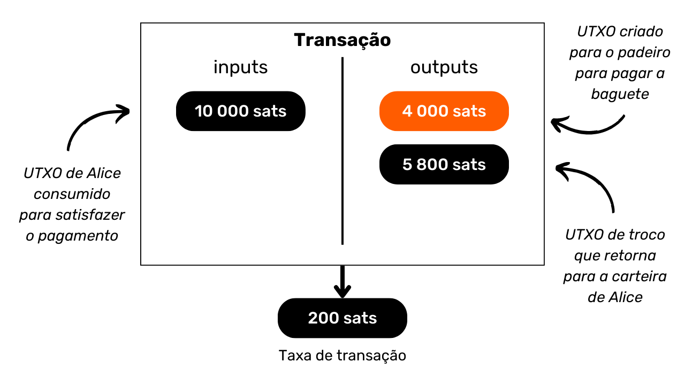

Aplicando a fórmula da taxa, de fato vemos que restam `200 SATS` para os mineradores:
```plaintext
Taxas = total de entradas - total de saídas
Despesas = 10,000 - (4,000 + 5,800)
Despesas = 10,000 - 9,800
Despesas = 200
```

Quando um minerador valida com sucesso um bloco, ele tem o direito de coletar essas taxas por todas as transações incluídas em seu bloco, por meio da chamada transação "coinbase".

### A Criação de UTXOs no Bitcoin

Se você tem acompanhado os parágrafos anteriores atentamente, agora sabe que UTXOs só podem ser criados consumindo outros UTXOs existentes. Assim, as moedas no Bitcoin formam uma cadeia contínua. No entanto, você pode estar se perguntando como os primeiros UTXOs nesta cadeia apareceram. Isso levanta um problema semelhante ao do ovo e da galinha: de onde vieram esses UTXOs originais?

A resposta está na **transação coinbase**.

O coinbase é um tipo específico de transação do Bitcoin, único para cada bloco e sempre o primeiro neles. Ele permite que o minerador que encontrou uma prova de trabalho válida receba sua recompensa de bloco. Esta recompensa consiste em dois elementos: **a subvenção do bloco** e **as taxas de transação** sobre as quais falamos na parte anterior.

A característica única da transação coinbase é que ela é a única que pode criar bitcoins do nada, sem precisar consumir entradas para gerar suas saídas. Esses bitcoins recém-criados constituem o que poderia ser chamado de "UTXOs originais".
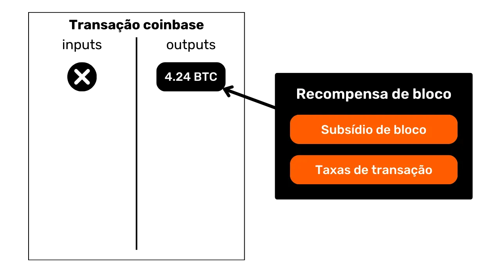
Os bitcoins provenientes da subvenção de bloco são novos BTC criados do nada, seguindo um cronograma de emissão pré-estabelecido nas regras de consenso. A subvenção de bloco é reduzida pela metade a cada 210.000 blocos, o que ocorre aproximadamente a cada quatro anos, em um processo chamado "halving". Inicialmente, 50 bitcoins eram criados com cada subvenção, mas essa quantidade tem diminuído gradualmente; atualmente, é de 3.125 bitcoins por bloco.

Quanto à parte relacionada às taxas de transação, embora também represente BTCs recém-criados, eles não devem exceder a diferença entre as entradas totais e saídas de todas as transações em um bloco. Vimos anteriormente que essas taxas representam a porção das entradas que não é usada nas saídas das transações. Essa parte é tecnicamente "perdida" durante a transação, e o minerador tem o direito de recriar esse valor na forma de um ou mais novos UTXOs. Isso é, portanto, uma transferência de valor do remetente da transação para o minerador que o adiciona à blockchain.

**> Você sabia?** Os bitcoins gerados por uma transação coinbase estão sujeitos a um período de maturidade de 100 blocos durante o qual não podem ser gastos pelo minerador. Esta regra tem a intenção de evitar complicações relacionadas ao uso de bitcoins recém-criados em uma cadeia que poderia posteriormente ser tornada obsoleta.
### As Implicações do Modelo UTXO
Primeiramente, o modelo UTXO influencia diretamente as taxas de transação no Bitcoin. Dado que a capacidade de cada bloco é limitada, os mineradores favorecem transações que oferecem as melhores taxas em relação ao espaço que ocuparão no bloco. De fato, quanto mais UTXOs uma transação inclui como entradas e saídas, mais pesada ela é e, portanto, requer taxas mais altas. Esta é uma das razões pelas quais há frequentemente um esforço para reduzir o número de UTXOs em nossa carteira, o que também pode afetar a privacidade, um tópico que abordaremos em detalhes na terceira parte deste treinamento.

Em seguida, como mencionado nas partes anteriores, as moedas no Bitcoin são essencialmente uma cadeia de UTXOs. Cada transação cria assim um elo entre um UTXO passado e um futuro UTXO. Os UTXOs permitem, portanto, o rastreamento explícito do caminho dos bitcoins desde sua criação até seu gasto atual. Essa transparência pode ser vista positivamente, pois permite que cada usuário garanta a autenticidade dos bitcoins recebidos. No entanto, é também sobre este princípio de rastreabilidade e auditabilidade que se baseia a análise de cadeia, uma prática voltada para comprometer sua privacidade. Estudaremos esta prática em profundidade na segunda parte do treinamento.

## Modelo de Privacidade do Bitcoin
<chapterId>769d8963-3ed5-4094-b21d-9203c7d9e465</chapterId>

### Moeda: Autenticidade, Integridade e Gasto Duplo

Uma das funções da moeda é resolver o problema da dupla coincidência de desejos. Em um sistema baseado em escambo, fazer uma troca requer não apenas encontrar um indivíduo que esteja oferecendo um bem que atenda à minha necessidade, mas também fornecer a eles um bem de valor equivalente que satisfaça sua própria necessidade. Encontrar esse equilíbrio prova ser complexo.


É por isso que recorremos à moeda, que permite a transferência de valor tanto no espaço quanto no tempo.


Para que a moeda resolva esse problema, é essencial que a parte que fornece um bem ou serviço esteja convencida de sua capacidade de gastar essa soma posteriormente. Assim, qualquer indivíduo racional que deseje aceitar uma peça de moeda, seja digital ou física, garantirá que ela atenda a dois critérios fundamentais:
- **A moeda deve ser intacta e autêntica;**- **e não deve ter sido gasta duas vezes.**
Ao usar moeda física, a primeira característica é a mais complexa de afirmar. Ao longo de diferentes períodos na história, a integridade das moedas metálicas muitas vezes foi comprometida por práticas como o recorte ou a perfuração. Por exemplo, durante a Roma antiga, era comum para os cidadãos raspar as bordas das moedas de ouro para coletar um pouco do metal precioso, enquanto ainda as mantinham para transações futuras. O valor intrínseco da moeda era assim reduzido, mas seu valor nominal permanecia o mesmo. É por isso que, posteriormente, foram cunhadas bordas serrilhadas nas bordas das moedas.

A autenticidade também é uma característica difícil de verificar com meios monetários físicos. Atualmente, as técnicas para combater a falsificação são cada vez mais complexas, forçando os comerciantes a investir em sistemas de verificação caros.

Por outro lado, devido à sua natureza, o gasto duplo não é um problema para as moedas físicas. Se eu te dou uma nota de €10, ela deixa irrevogavelmente minha posse para entrar na sua, excluindo naturalmente qualquer possibilidade de gastar as mesmas unidades monetárias várias vezes. Em resumo, não serei capaz de gastar essa nota de €10 novamente.


Para a moeda digital, a dificuldade é diferente. Garantir a autenticidade e integridade de uma moeda é frequentemente mais simples. Como vimos na seção anterior, o modelo UTXO do Bitcoin permite rastrear uma moeda até sua origem, verificando assim que ela foi de fato criada de acordo com as regras de consenso por um minerador.

No entanto, garantir a ausência de gasto duplo é mais complexo, já que qualquer bem digital é essencialmente informação. Ao contrário de bens físicos, a informação não se divide durante as trocas, mas propaga-se multiplicando-se. Por exemplo, se eu enviar um documento por e-mail, ele então se torna duplicado. Do seu lado, você não pode verificar com certeza que eu deletei o documento original.


### Prevenindo Gasto Duplo no Bitcoin
A única maneira de evitar a duplicação de um bem digital é estar ciente de todas as trocas dentro do sistema. Desta forma, pode-se saber quem possui o quê e atualizar os pertences de todos com base nas transações feitas. Isso é o que é feito, por exemplo, com dinheiro escritural no sistema bancário. Quando você paga €10 a um comerciante com cartão de crédito, o banco anota essa troca e atualiza o livro-razão.
No Bitcoin, a prevenção de gasto duplo é alcançada da mesma maneira. O objetivo é confirmar a ausência de uma transação que já gastou as moedas em questão. Se essas moedas nunca foram usadas, então podemos ter certeza de que nenhum gasto duplo ocorrerá. Este princípio foi descrito por Satoshi Nakamoto no White Paper com esta famosa frase:

**"*A única maneira de confirmar a ausência de uma transação é estar ciente de todas as transações.*"**

No entanto, ao contrário do modelo bancário, não há desejo de ter que confiar em uma entidade central no Bitcoin. É necessário que todos os usuários possam confirmar essa ausência de gasto duplo, sem depender de um terceiro. Assim, todos devem estar cientes de todas as transações do Bitcoin. É por isso que as transações do Bitcoin são transmitidas publicamente por todos os nós da rede e registradas de forma clara na blockchain.

É precisamente essa disseminação pública de informações que complica a proteção da privacidade no Bitcoin. No sistema bancário tradicional, em teoria, apenas a instituição financeira está ciente das transações feitas. Por outro lado, no Bitcoin, todos os usuários são informados de todas as transações, via seus respectivos nós.

### O modelo de privacidade: sistema bancário vs Bitcoin
No sistema tradicional, sua conta bancária está vinculada à sua identidade. O banqueiro é capaz de saber a qual cliente pertence cada conta bancária e quais transações estão associadas a ela. No entanto, esse fluxo de informações é interrompido entre o banco e o domínio público. Em outras palavras, é impossível saber o saldo e as transações de uma conta bancária que pertence a outro indivíduo. Apenas o banco tem acesso a essas informações.
Por exemplo, seu banqueiro sabe que você compra sua baguete todas as manhãs na padaria do bairro, mas seu vizinho não está ciente dessa transação. Assim, o fluxo de informações é acessível às partes envolvidas, notavelmente o banco, mas permanece inacessível a terceiros.

Devido à restrição de disseminação pública de transações que vimos na parte anterior, o modelo de privacidade do Bitcoin não pode seguir o modelo do sistema bancário. No caso do Bitcoin, uma vez que o fluxo de informações não pode ser interrompido entre as transações e o domínio público, **o modelo de privacidade depende da separação entre a identidade do usuário e as próprias transações**.
Por exemplo, se você comprar uma baguete do padeiro pagando em BTC, seu vizinho, que possui seu próprio nó completo, pode ver sua transação ocorrer, assim como pode ver todas as outras transações no sistema. No entanto, se os princípios de privacidade forem respeitados, eles não deveriam ser capazes de vincular essa transação específica à sua identidade.
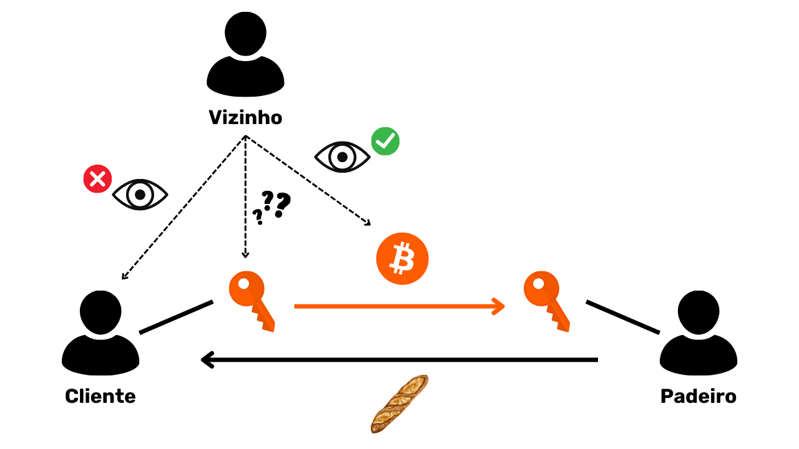

Mas, uma vez que as transações do Bitcoin são tornadas públicas, ainda se torna possível estabelecer links entre elas para deduzir informações sobre as partes envolvidas. Essa atividade até constitui uma especialidade em si chamada "análise de cadeia". Na próxima parte do treinamento, convido você a explorar os fundamentos da análise de cadeia para entender como seus bitcoins são rastreados e saber como se defender melhor contra isso.

# Entendendo a Análise de Cadeia e Como se Proteger
<partId>4739371e-9fef-45b0-bcaa-b7a4df6b4470</partId>

## O que é Análise de Cadeia no Bitcoin?
<chapterId>7d198ba6-4af2-4f24-86cb-3c79cb25627e</chapterId>

### Definição e Operação

A análise de cadeia é uma prática que engloba todos os métodos usados para rastrear o fluxo de bitcoins na blockchain. Geralmente, a análise de cadeia depende da observação de características em amostras de transações anteriores. Envolve então identificar essas mesmas características em uma transação que se deseja analisar e deduzir interpretações plausíveis. Esse método de resolução de problemas de uma abordagem prática, para encontrar uma solução suficientemente boa, é o que é chamado de "heurística".

Para simplificar, a análise de cadeia é feita em três etapas principais:
1. **Observar a blockchain;**
2. **Identificar características conhecidas;**
3. **Deduzir hipóteses.**

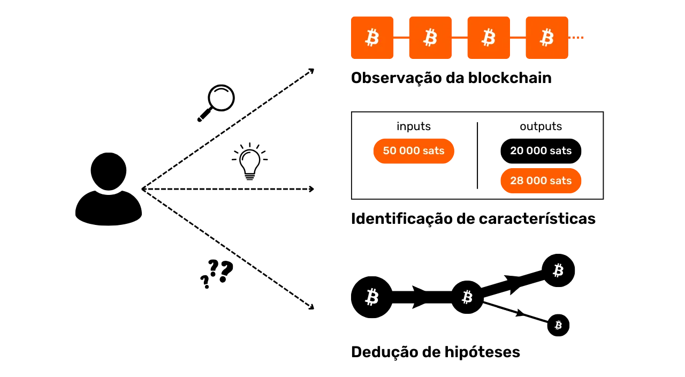

A análise de cadeia pode ser realizada por qualquer pessoa. Basta ter acesso às informações públicas da blockchain via um nó completo para observar os movimentos das transações e fazer hipóteses. Existem também ferramentas gratuitas que facilitam essa análise, como o site [OXT.me](https://oxt.me/) que exploraremos em detalhe nos dois últimos capítulos desta parte. No entanto, o principal risco para a privacidade vem de empresas especializadas em análise de cadeia. Essas empresas levaram a análise de cadeia a uma escala industrial e vendem seus serviços a instituições financeiras ou governos. Entre essas empresas, a Chainalysis é provavelmente a mais conhecida.

### Os Objetivos da Análise de Cadeia
Um dos objetivos da análise de cadeia é agrupar várias atividades no Bitcoin a fim de determinar a unicidade do usuário que as realizou. Posteriormente, será possível tentar vincular esse conjunto de atividades a uma identidade real. 

Lembre-se do capítulo anterior. Eu expliquei por que o modelo de privacidade do Bitcoin originalmente dependia de separar a identidade do usuário de suas transações. Portanto, seria tentador pensar que a análise de cadeia é desnecessária, já que mesmo se alguém conseguir agrupar atividades onchain, elas não podem ser associadas a uma identidade real.

Teoricamente, esta afirmação é precisa. Na primeira parte deste treinamento, vimos que pares de chaves criptográficas são usados para estabelecer condições sobre o UTXO. Por essência, esses pares de chaves não revelam nenhuma informação sobre a identidade de seus detentores. Assim, mesmo que alguém tenha sucesso em agrupar atividades associadas a diferentes pares de chaves, isso não nos diz nada sobre a entidade por trás dessas atividades.


No entanto, a realidade prática é muito mais complexa. Existem uma multitude de comportamentos que arriscam vincular uma identidade real a uma atividade onchain. Na análise, isso é chamado de ponto de entrada, e existem muitos deles.

O mais comum, claro, é o KYC (*Know Your Customer* - Conheça Seu Cliente). Se você retirar seus bitcoins de uma plataforma regulamentada para um de seus endereços de recebimento pessoais, então algumas pessoas são capazes de vincular sua identidade a este endereço. De forma mais ampla, um ponto de entrada pode ser qualquer forma de interação entre sua vida real e uma transação Bitcoin. Por exemplo, se você publicar um endereço de recebimento em suas redes sociais, isso pode ser um ponto de entrada para análise. Se você fizer um pagamento em bitcoins para seu padeiro, eles podem associar seu rosto (que faz parte de sua identidade) a um endereço Bitcoin.

Esses pontos de entrada são quase inevitáveis no uso do Bitcoin. Embora se possa buscar limitar seu escopo, eles permanecerão presentes. É por isso que é crucial combinar métodos voltados para preservar sua privacidade. Embora manter uma separação entre sua identidade real e suas transações seja uma abordagem interessante, ela permanece insuficiente hoje. De fato, se todas as suas atividades onchain podem ser agrupadas, então o menor ponto de entrada é provável que comprometa a única camada de privacidade que você havia estabelecido.


### Defendendo-se Contra Análise de Cadeia
Assim, também é necessário ser capaz de enfrentar a análise de blockchain em nosso uso do Bitcoin. Procedendo desta maneira, podemos minimizar a agregação de nossas atividades e limitar o impacto de um ponto de entrada em nossa privacidade.


De fato, para melhor contrariar a análise de blockchain, que abordagem melhor do que familiarizar-se com os métodos usados na análise de blockchain? Se você quer saber como melhorar sua privacidade no Bitcoin, você deve entender esses métodos. Isso permitirá que você compreenda melhor técnicas como [coinjoin](https://planb.network/fr/tutorials/privacy/coinjoin-samourai-wallet) ou [payjoin](https://planb.network/fr/tutorials/privacy/payjoin) (técnicas que estudaremos nas últimas partes do treinamento), e reduzir os erros que você poderia cometer.
Neste contexto, podemos fazer uma analogia com criptografia e criptoanálise. Um bom criptógrafo é, antes de tudo, um bom criptoanalista. Para imaginar um novo algoritmo de criptografia, é necessário saber quais ataques ele terá que enfrentar, e também estudar por que algoritmos anteriores foram quebrados. O mesmo princípio se aplica à privacidade no Bitcoin. Entender os métodos de análise de blockchain é a chave para se proteger contra ela. É por isso que proponho uma seção inteira sobre análise de blockchain neste treinamento.

### Os métodos de análise de blockchain

É importante entender que a análise de blockchain não é uma ciência exata. Ela se baseia em heurísticas derivadas de observações anteriores ou interpretações lógicas. Essas regras permitem resultados bastante confiáveis, mas nunca com precisão absoluta. Em outras palavras, **a análise de blockchain sempre envolve uma dimensão de probabilidade nas conclusões emitidas**. Por exemplo, pode-se estimar com mais ou menos certeza que dois endereços pertencem à mesma entidade, mas a certeza total sempre estará fora de alcance.

O objetivo total da análise de blockchain reside precisamente na agregação de várias heurísticas para minimizar o risco de erro. É, de certa forma, uma acumulação de evidências que nos permite aproximar mais da realidade.

Essas famosas heurísticas podem ser agrupadas em diferentes categorias que detalharemos juntos:
- **Padrões de transação (ou modelos de transação);**
- **Heurísticas internas à transação;**
- **Heurísticas externas à transação.**

### Satoshi Nakamoto e análise de blockchain
Deve-se notar que as duas primeiras heurísticas para análise de cadeia foram descobertas pelo próprio Satoshi Nakamoto. Ele as discute na parte 10 do White Paper do Bitcoin. São elas:
- a Heurística de Propriedade de Entrada Comum (CIOH);
- e reutilização de endereço.


Fonte: S. Nakamoto, "Bitcoin: A Peer-to-Peer Electronic Cash System", https://bitcoin.org/bitcoin.pdf, 2009.

Nos capítulos seguintes, exploraremos o que estas consistem, mas já é interessante notar que essas duas heurísticas ainda mantêm uma preeminência na análise de cadeia hoje.

## Padrões de Transação
<chapterId>d365a101-2d37-46a5-bfb9-3c51e37bf96b</chapterId>

Um padrão de transação é simplesmente um modelo ou uma estrutura geral de uma transação típica que pode ser encontrada na blockchain, cuja interpretação é provavelmente conhecida. Ao estudar padrões, focaremos em uma única transação que analisaremos em alto nível.

Em outras palavras, olharemos apenas para o número de UTXOs em entradas e o número de UTXOs em saídas, sem nos deter nos detalhes mais específicos ou no ambiente da transação. A partir do modelo observado, seremos capazes de interpretar a natureza da transação. Em seguida, procuraremos características em sua estrutura e deduziremos uma interpretação.


Nesta parte, descobriremos juntos os principais modelos de transação que podem ser encontrados na análise de cadeia, e para cada modelo, darei a interpretação provável desta estrutura, junto com um exemplo concreto.

### Envio Simples (ou Pagamento Simples)

Começamos com um padrão muito difundido, já que é o que aparece na maioria dos pagamentos em bitcoin. O modelo de pagamento simples é caracterizado pelo consumo de um ou mais UTXOs em entradas e a produção de 2 UTXOs em saídas. Este modelo, portanto, se parecerá com isto:


Quando identificamos essa estrutura de transação na blockchain, já podemos fazer uma interpretação. Como o nome sugere, este modelo indica que estamos diante de uma transação de envio ou pagamento. O usuário consumiu seu próprio UTXO nas entradas para satisfazer nas saídas um UTXO de pagamento e um UTXO de troco (dinheiro retornado ao mesmo usuário).
Portanto, sabemos que o usuário observado provavelmente não está mais na posse de um dos dois UTXOs nas saídas (o de pagamento), mas ainda está na posse do outro UTXO (o de troco).
No momento, é impossível para nós especificar qual saída representa qual UTXO, pois este não é o objetivo do estudo de padrões. Conseguiremos isso confiando nas heurísticas que estudaremos nas partes seguintes. Neste estágio, nosso objetivo é limitado a identificar a natureza da transação em questão, que é, neste caso, um envio simples.

Por exemplo, aqui está uma transação Bitcoin que adota o padrão de envio simples:

```plaintext
b6cc79f45fd2d7669ff94db5cb14c45f1f879ea0ba4c6e3d16ad53a18c34b769
```

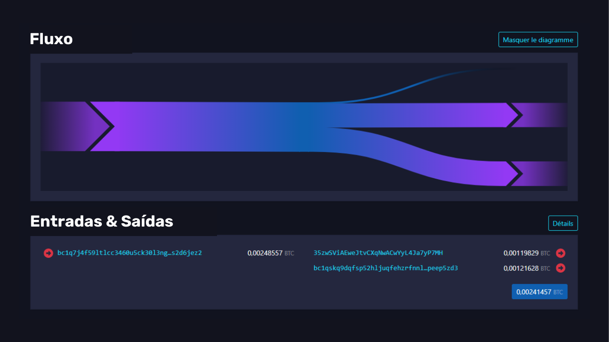

Fonte: [Mempool.space](https://mempool.space/fr/tx/b6cc79f45fd2d7669ff94db5cb14c45f1f879ea0ba4c6e3d16ad53a18c34b769)

Após este primeiro exemplo, você deve ter uma melhor compreensão do que significa estudar um "modelo de transação". Examinamos uma transação focando apenas em sua estrutura, sem levar em conta seu ambiente ou os detalhes específicos da transação. Observamo-la apenas de maneira global nesta primeira etapa.

Agora que você entende o que é um padrão, vamos passar para os outros modelos existentes.

### Sweeping

Este segundo modelo é caracterizado pelo consumo de um único UTXO como entrada e a produção de um único UTXO como saída.


A interpretação deste modelo é que estamos diante de uma auto-transferência. O usuário transferiu seus bitcoins para si mesmo, para outro endereço que possui. Como não há troco na transação, é muito improvável que estejamos diante de um pagamento. De fato, quando um pagamento é feito, é quase impossível para o pagador ter um UTXO que corresponda exatamente ao valor requerido pelo vendedor, mais as taxas de transação. Geralmente, o pagador é, portanto, forçado a produzir uma saída de troco.

Então sabemos que o usuário observado provavelmente ainda está na posse deste UTXO. No contexto de uma análise de cadeia, se sabemos que o UTXO usado como entrada na transação pertence a Alice, podemos assumir que o UTXO na saída também pertence a ela. O que se tornará interessante mais tarde é encontrar heurísticas internas à transação que poderiam fortalecer essa suposição (estudaremos essas heurísticas no capítulo 3.3).

Por exemplo, aqui está uma transação Bitcoin que adota o padrão de sweeping:

```plaintext
35f1072a0fda5ae106efb4fda871ab40e1f8023c6c47f396441ad4b995ea693d
```

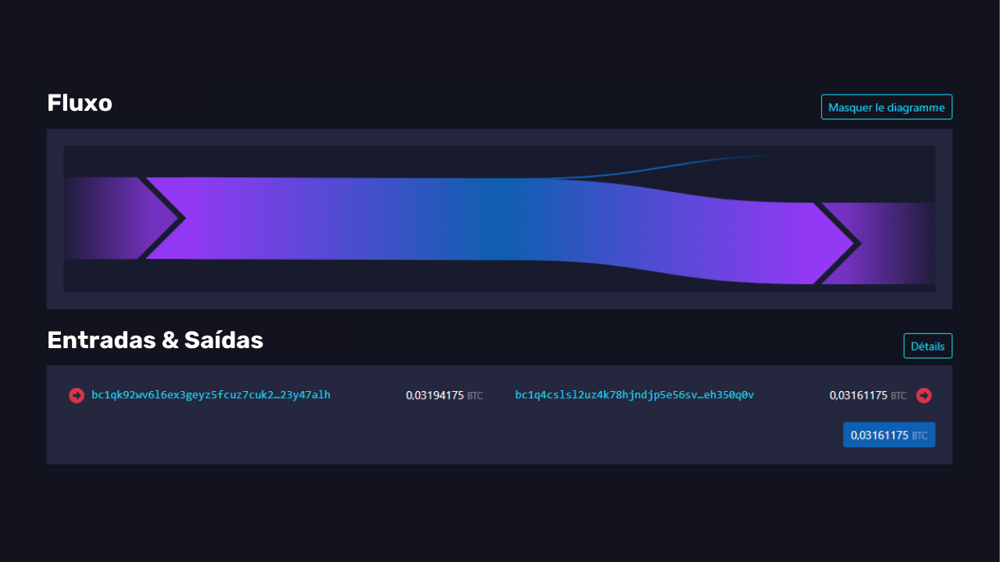
Fonte: [Mempool.space](https://mempool.space/fr/tx/35f1072a0fda5ae106efb4fda871ab40e1f8023c6c47f396441ad4b995ea693d) No entanto, esse tipo de padrão também pode revelar uma auto-transferência para a conta de uma plataforma de câmbio de criptomoedas. Será o estudo de endereços conhecidos e o contexto da transação que nos permitirá saber se é uma varredura para uma carteira de auto-custódia ou um saque para uma plataforma. De fato, os endereços das plataformas de câmbio são frequentemente facilmente identificáveis.

Vamos voltar ao exemplo de Alice: se a varredura levar a um endereço conhecido de uma plataforma (como a Binance, por exemplo), isso pode significar que os bitcoins foram transferidos para fora da posse direta de Alice, provavelmente com a intenção de vendê-los ou armazená-los nesta plataforma. Por outro lado, se o endereço de destino for desconhecido, é razoável supor que seja simplesmente outra carteira ainda pertencente a Alice. Mas esse tipo de estudo se enquadra mais na categoria de heurísticas e não no estudo de padrões.

### Consolidação

Este modelo é caracterizado pelo consumo de vários UTXOs como entrada e a produção de um único UTXO como saída.


A interpretação deste modelo é que estamos na presença de uma consolidação. Esta é uma prática comum entre os usuários do Bitcoin, visando mesclar vários UTXOs em antecipação a um possível aumento nas taxas de transação. Ao realizar esta operação durante um período em que as taxas estão baixas, é possível economizar em taxas futuras. Falaremos mais sobre esta prática no capítulo 4.3.

Podemos deduzir que o usuário por trás deste modelo de transação provavelmente estava na posse de todos os UTXOs nas entradas e ainda está na posse do UTXO na saída. Isso é certamente uma auto-transferência.

Assim como a varredura, esse tipo de padrão também pode revelar uma auto-transferência para a conta de uma plataforma de câmbio. Será o estudo de endereços conhecidos e o contexto da transação que nos permitirá saber se é uma consolidação para uma carteira de auto-custódia ou um saque para uma plataforma.

Por exemplo, aqui está uma transação Bitcoin que adota o padrão de consolidação:

```plaintext
77c16914211e237a9bd51a7ce0b1a7368631caed515fe51b081d220590589e94
```

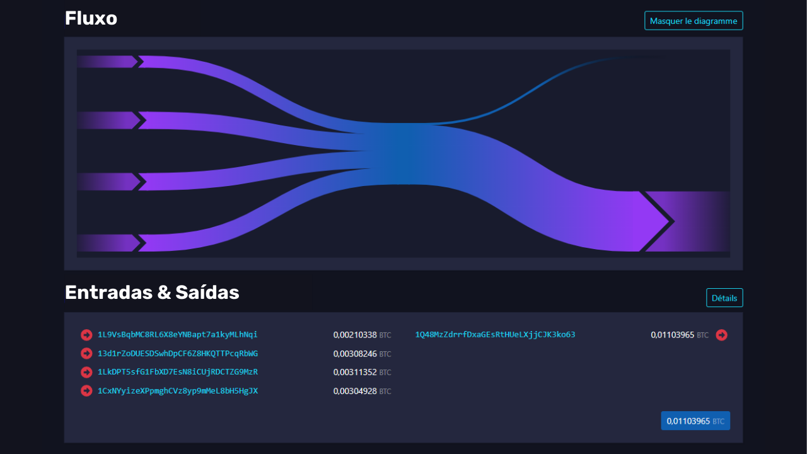

Fonte: [Mempool.space](https://mempool.space/fr/tx/77c16914211e237a9bd51a7ce0b1a7368631caed515fe51b081d220590589e94)
No contexto de uma análise de cadeia, este modelo pode revelar muitas informações. Por exemplo, se soubermos que uma das entradas pertence a Alice, podemos assumir que todas as outras entradas e a saída desta transação pertencem a ela também. Essa suposição nos permitiria então rastrear através de cadeias de transações anteriores para descobrir e analisar outras transações provavelmente associadas a Alice.
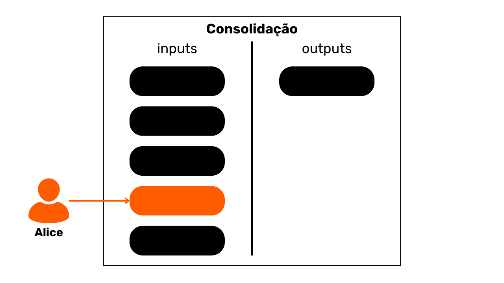

### Gasto Agrupado

Este modelo é caracterizado pelo consumo de alguns UTXOs como entradas (geralmente apenas um) e a produção de numerosos UTXOs como saídas.


A interpretação deste modelo é que estamos na presença de um gasto agrupado. Esta é uma prática que provavelmente revela uma atividade econômica significativa, como uma plataforma de troca, por exemplo. O gasto agrupado permite que essas entidades economizem em taxas ao consolidar seus gastos em uma única transação.
Podemos deduzir deste modelo que a entrada UTXO vem de uma empresa com atividade econômica significativa e que as saídas UTXOs se dispersarão. Muitas pertencerão a clientes da empresa que retiraram bitcoins da plataforma. Outras podem ir para empresas parceiras. Finalmente, certamente haverá uma ou mais trocas que retornam à empresa emissora.

Por exemplo, aqui está uma transação Bitcoin que adota o padrão de gasto agrupado (provavelmente, é uma transação emitida pela plataforma Bybit):

```plaintext
8a7288758b6e5d550897beedd13c70bcbaba8709af01a7dbcc1f574b89176b43
```

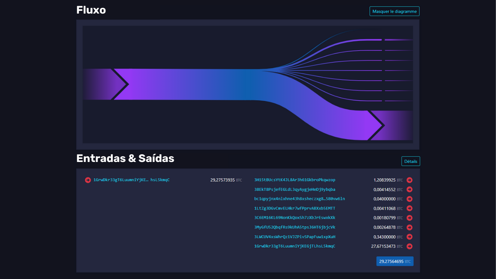

Fonte: [Mempool.space](https://mempool.space/fr/tx/8a7288758b6e5d550897beedd13c70bcbaba8709af01a7dbcc1f574b89176b43)

### Transações Específicas de Protocolo

Entre os padrões de transação, também podemos identificar modelos que revelam o uso de um protocolo específico. Por exemplo, Whirlpool coinjoins (que discutiremos na parte 5) terão uma estrutura facilmente identificável que permite diferenciá-los de outras transações mais tradicionais.


A análise deste padrão sugere que provavelmente estamos na presença de uma transação colaborativa. Também é possível observar um coinjoin. Se esta última hipótese se provar precisa, então o número de saídas poderia nos fornecer uma estimativa aproximada do número de participantes no coinjoin.

Por exemplo, aqui está uma transação Bitcoin que adota o padrão do tipo de transação colaborativa coinjoin:

```plaintext
00601af905bede31086d9b1b79ee8399bd60c97e9c5bba197bdebeee028b9bea
```
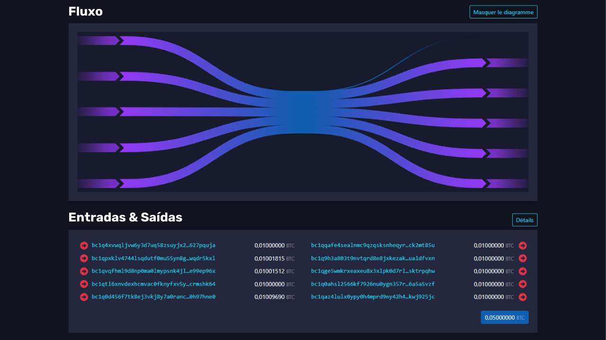

Fonte: [Mempool.space](https://mempool.space/fr/tx/00601af905bede31086d9b1b79ee8399bd60c97e9c5bba197bdebeee028b9bea)

Existem muitos outros protocolos que têm suas próprias estruturas específicas. Assim, poderíamos distinguir transações do tipo Wabisabi, transações Stamps, ou até mesmo Runes, por exemplo.

Graças a esses padrões de transação, já podemos interpretar uma série de informações sobre uma determinada transação. Mas a estrutura da transação não é a única fonte de informação para análise. Também podemos estudar seus detalhes. Esses detalhes, internos a uma transação, são o que gosto de chamar de "heurísticas internas", e vamos estudá-las no próximo capítulo.

## Heurísticas Internas
<chapterId>c54b5abe-872f-40f4-a0d0-c59faff228ba</chapterId>

Uma heurística interna é uma característica específica identificada dentro de uma transação em si, sem a necessidade de examinar seu ambiente, o que nos permite fazer deduções. Ao contrário dos padrões que se concentram na estrutura geral da transação em um alto nível, as heurísticas internas são baseadas no conjunto de dados extraíveis. Isso inclui:
- As quantidades dos diferentes UTXOs, tanto de entrada quanto de saída;
- Tudo sobre os scripts: os endereços de recebimento, a versionamento, os locktimes...

Geralmente, esse tipo de heurística nos permitirá identificar o troco em uma transação específica. Ao fazer isso, podemos então continuar a rastrear uma entidade através de várias transações diferentes. De fato, se identificarmos um UTXO pertencente a um usuário que desejamos seguir, é crucial determinar, quando eles realizam uma transação, qual saída foi transferida para outro usuário e qual saída representa o troco, permanecendo assim em sua posse.


Mais uma vez, lembro que essas heurísticas não são absolutamente precisas. Tomadas individualmente, elas apenas nos permitem identificar cenários plausíveis. É o acúmulo de várias heurísticas que ajuda a reduzir a incerteza, sem nunca eliminá-la completamente.

### Semelhanças Internas

Esta heurística envolve o estudo de semelhanças entre as entradas e saídas da mesma transação. Se observarmos a mesma característica nas entradas e em apenas uma das saídas da transação, então é provável que esta saída constitua o troco.

A característica mais óbvia é a reutilização de um endereço de recebimento na mesma transação.

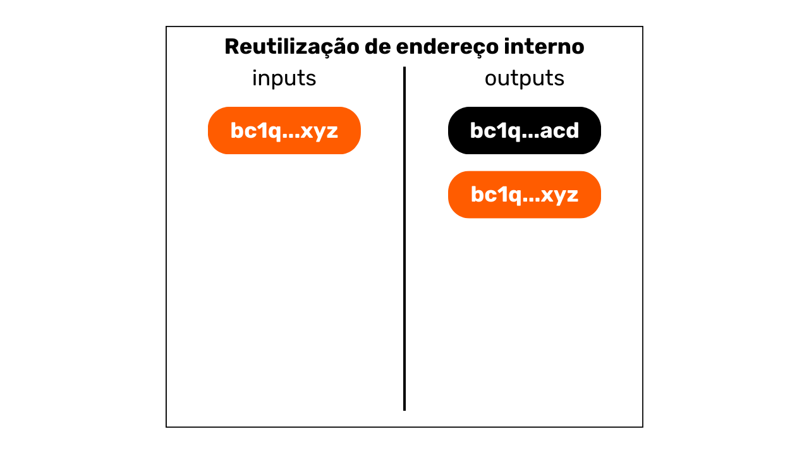
Esta heurística deixa pouco espaço para dúvidas. A menos que a chave privada de alguém tenha sido hackeada, o mesmo endereço de recebimento inevitavelmente revela a atividade de um único usuário. A interpretação que se segue é que o troco da transação é a saída com o mesmo endereço que a entrada. Isso permite o rastreamento contínuo do indivíduo com base nesse troco.
Por exemplo, aqui está uma transação na qual esta heurística pode ser razoavelmente aplicada:

```plaintext
54364146665bfc453a55eae4bfb8fdf7c721d02cb96aadc480c8b16bdeb8d6d0
```


Fonte: [Mempool.space](https://mempool.space/tx/54364146665bfc453a55eae4bfb8fdf7c721d02cb96aadc480c8b16bdeb8d6d0)

Essas semelhanças entre entradas e saídas não param na reutilização de endereços. Qualquer semelhança no uso de scripts pode permitir a aplicação de uma heurística. Por exemplo, às vezes a mesma versionamento entre uma entrada e uma das saídas da transação pode ser observada.

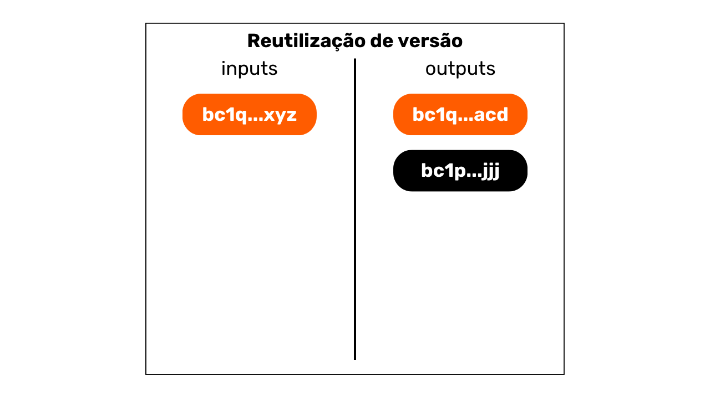

Neste diagrama, podemos ver que a entrada Nº 0 desbloqueia um script P2WPKH (SegWit V0 começando com `bc1q`). A saída Nº 0 usa o mesmo tipo de script. No entanto, a saída Nº 1 usa um script P2TR (SegWit V1 começando com `bc1p`). A interpretação dessa característica é que é provável que o endereço com o mesmo versionamento que a entrada seja o endereço de troco. Portanto, ainda pertenceria ao mesmo usuário.

Aqui está uma transação na qual esta heurística pode ser razoavelmente aplicada:

```plaintext
db07516288771ce5d0a06b275962ec4af1b74500739f168e5800cbcb0e9dd578
```


Fonte: [Mempool.space](https://mempool.space/tx/db07516288771ce5d0a06b275962ec4af1b74500739f168e5800cbcb0e9dd578)
Neste caso, podemos ver que a entrada Nº 0 e a saída Nº 1 usam scripts P2WPKH (SegWit V0), enquanto a saída Nº 0 usa um tipo diferente de script, P2PKH (Legado). No início dos anos 2010, essa heurística baseada na versão dos scripts era relativamente pouco útil devido à limitação dos tipos de scripts disponíveis. No entanto, com o passar do tempo e com sucessivas atualizações do Bitcoin, uma diversidade crescente de tipos de scripts foi introduzida. Essa heurística está se tornando cada vez mais relevante porque, com uma gama mais ampla de tipos de scripts, os usuários são divididos em grupos menores, aumentando assim as chances de aplicar essa heurística de reutilização de versão interna. Por essa razão, apenas do ponto de vista da privacidade, é aconselhável optar pelo tipo de script mais comum. Por exemplo, enquanto escrevo estas linhas, os scripts Taproot (`bc1p`) são menos usados do que os scripts SegWit V0 (`bc1q`). Embora os primeiros ofereçam benefícios econômicos e de privacidade em certos contextos específicos, para usos de assinatura única mais tradicionais, pode ser prudente aderir a um padrão mais antigo por razões de privacidade, até que o novo padrão seja mais amplamente adotado.

### Pagamentos de Números Redondos

Outra heurística interna que pode nos ajudar a identificar o troco é a do número redondo. Geralmente, quando confrontados com um padrão de pagamento simples (1 entrada e 2 saídas), se uma das saídas gasta um valor redondo, então ela representa o pagamento.

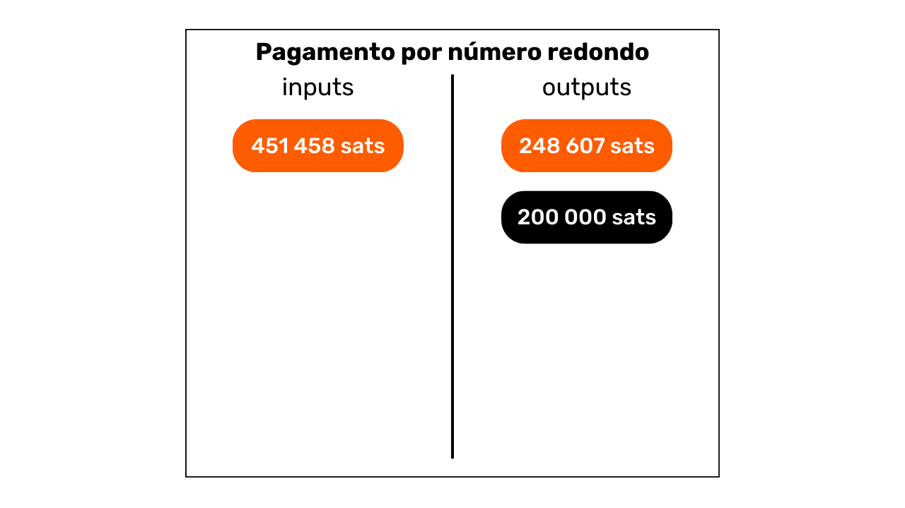

Por eliminação, se uma saída representa o pagamento, a outra representa o troco. Pode-se, portanto, inferir que é provável que o usuário que inseriu a transação ainda possua a saída identificada como sendo o troco.

Deve-se notar que essa heurística nem sempre é aplicável, já que a maioria dos pagamentos ainda é feita em unidades de moeda fiduciária. De fato, quando um comerciante na França aceita bitcoin, geralmente, eles não exibem preços estáveis em sats. Eles prefeririam optar por uma conversão entre o preço em euros e a quantidade em bitcoins a ser paga. Portanto, não deveria haver um número redondo na saída da transação.

No entanto, um analista poderia tentar fazer essa conversão levando em conta a taxa de câmbio vigente quando a transação foi transmitida na rede. Vamos tomar o exemplo de uma transação com uma entrada de `97,552 sats` e duas saídas, uma de `31,085 sats` e outra de `64,152 sats`. À primeira vista, esta transação não parece envolver valores redondos. No entanto, aplicando a taxa de câmbio de €64,339 no momento da transação, obtemos uma conversão em euros que se apresenta da seguinte forma:
- Uma entrada de €62,76;
- Uma saída de €20;
- Uma saída de €41,27.
Uma vez convertida em moeda fiduciária, esta transação permite a aplicação da heurística de pagamentos de montantes redondos. A saída de €20 provavelmente foi destinada a um comerciante, ou pelo menos mudou de proprietário. Por dedução, a saída de €41,27 provavelmente permaneceu na posse do usuário original.
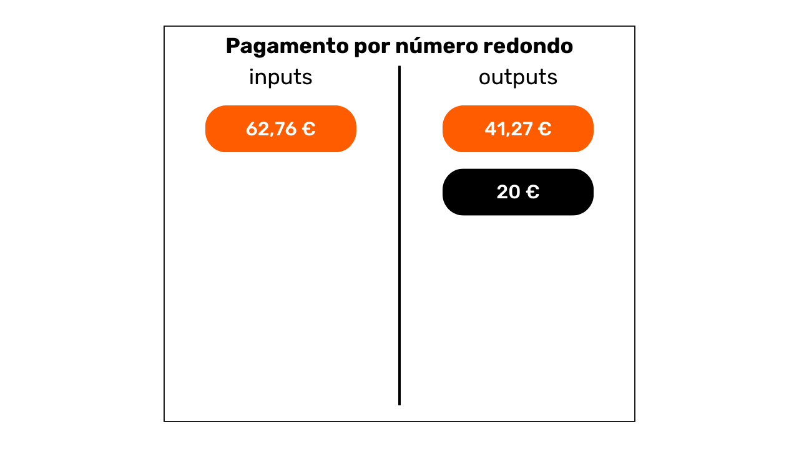

Se um dia, o Bitcoin se tornar a unidade de conta preferida em nossas transações, essa heurística poderia se tornar ainda mais útil para análise.

Por exemplo, aqui está uma transação onde essa heurística pode provavelmente ser aplicada:

```plaintext
2bcb42fab7fba17ac1b176060e7d7d7730a7b807d470815f5034d52e96d2828a
```


Fonte: [Mempool.space](https://mempool.space/tx/2bcb42fab7fba17ac1b176060e7d7d7730a7b807d470815f5034d52e96d2828a)
### A Maior Saída

Quando uma lacuna suficientemente grande é identificada entre duas saídas de transação em um modelo de pagamento simples, pode-se estimar que a maior saída é provavelmente o troco.

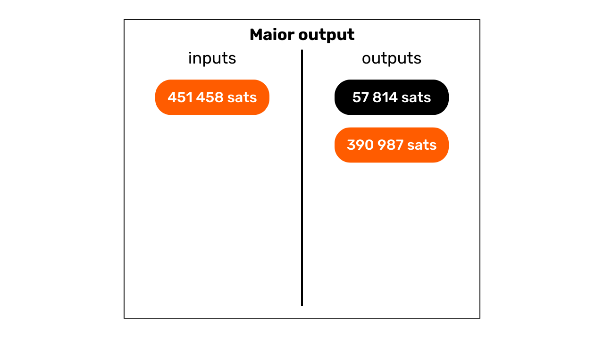

Esta heurística da maior saída é provavelmente a mais imprecisa de todas. Se identificada por si só, é bastante fraca. No entanto, essa característica pode ser combinada com outras heurísticas para reduzir a incerteza de nossa interpretação.

Por exemplo, se examinarmos uma transação apresentando uma saída com um valor redondo e outra saída com um valor maior, a aplicação conjunta da heurística de pagamentos redondos e aquela referente à maior saída nos permite reduzir nosso nível de incerteza.

Por exemplo, aqui está uma transação onde esta heurística pode provavelmente ser aplicada:

```plaintext
b79d8f8e4756d34bbb26c659ab88314c220834c7a8b781c047a3916b56d14dcf
```


Fonte: [Mempool.space](https://mempool.space/tx/b79d8f8e4756d34bbb26c659ab88314c220834c7a8b781c047a3916b56d14dcf)

## Heurísticas Externas
<chapterId>4a170e3b-200d-431a-8285-18a23ff617ba</chapterId>
O estudo de heurísticas externas envolve analisar as semelhanças, padrões e características de certos elementos que não são inerentes à própria transação. Em outras palavras, se anteriormente nos limitávamos a explorar elementos intrínsecos à transação com heurísticas internas, agora estamos expandindo nosso campo de análise para o ambiente da transação graças às heurísticas externas.

### Reutilização de Endereço

Esta é uma das heurísticas mais conhecidas entre os entusiastas do Bitcoin. A reutilização de endereço permite estabelecer uma ligação entre diferentes transações e diferentes UTXOs. É observada quando um endereço de recebimento de Bitcoin é usado várias vezes.

Assim, é possível explorar a reutilização de endereço dentro da mesma transação como uma heurística interna para identificar o troco (como vimos no capítulo anterior). No entanto, a reutilização de endereço também pode servir como uma heurística externa para reconhecer a unicidade de uma entidade por trás de várias transações.

A interpretação da reutilização de endereço é que todos os UTXOs bloqueados neste endereço pertencem (ou pertenceram) à mesma entidade. Esta heurística deixa pouco espaço para incerteza. Quando é possível identificá-la, a interpretação que se segue é altamente provável de corresponder à realidade. Assim, permite o agrupamento de diferentes atividades onchain.

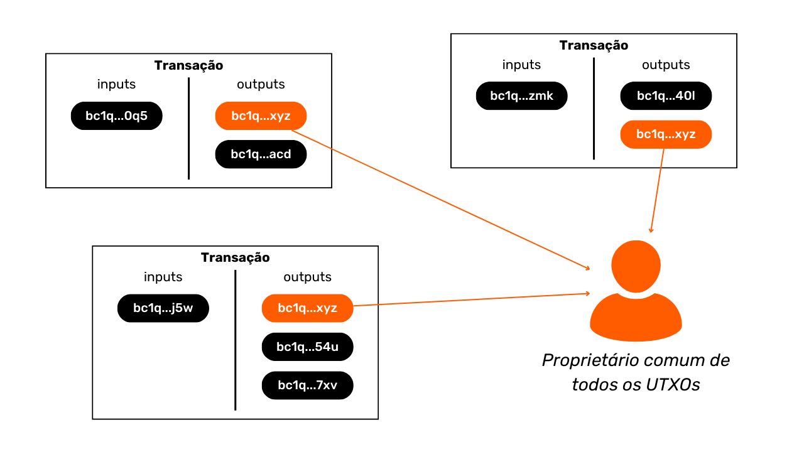

Como explicado na introdução desta parte 3, esta heurística foi descoberta pelo próprio Satoshi Nakamoto. No White Paper, ele menciona especificamente uma solução para os usuários evitarem produzi-la, que é simplesmente usar um novo endereço para cada nova transação:

"_Como uma barreira adicional, um novo par de chaves poderia ser usado para cada transação para evitar que sejam vinculadas a um proprietário comum._"


Fonte: S. Nakamoto, "Bitcoin: Um Sistema de Dinheiro Eletrônico Peer-to-Peer", https://bitcoin.org/bitcoin.pdf, 2009.

Por exemplo, aqui está um endereço reutilizado em várias transações:

```plaintext
bc1qqtmeu0eyvem9a85l3sghuhral8tk0ar7m4a0a0
```


Fonte: [Mempool.space](https://mempool.space/address/bc1qqtmeu0eyvem9a85l3sghuhral8tk0ar7m4a0a0)

### Semelhança de Scripts e Impressões Digitais de Carteiras

Além da reutilização de endereços, existem inúmeras outras heurísticas que permitem vincular ações à mesma carteira ou a um cluster de endereços.
Primeiramente, um analista pode se beneficiar das semelhanças no uso de scripts. Por exemplo, certos scripts minoritários como multisig podem ser mais facilmente identificados do que os scripts SegWit V0. Quanto maior o grupo no qual nos escondemos, mais difícil é nos localizar. É por isso que, em bons protocolos Coinjoin, todos os participantes usam exatamente o mesmo tipo de script.
De forma mais ampla, um analista também pode se concentrar nas impressões digitais características de uma carteira. Estes são processos específicos ligados a um uso que se pode procurar identificar com o objetivo de explorá-los como heurísticas de rastreamento. Em outras palavras, se observa uma acumulação das mesmas características internas em transações atribuídas à entidade rastreada, pode-se tentar identificar essas mesmas características em outras transações.

Por exemplo, pode ser identificado que o usuário rastreado envia sistematicamente seu troco para endereços P2TR (`bc1p…`). Se este processo se repete, ele pode ser usado como uma heurística para a continuação de nossa análise. Outras impressões digitais também podem ser usadas, como a ordem dos UTXOs, a colocação do troco nas saídas, o sinal de RBF (Replace-by-Fee), ou até mesmo, o número da versão, o campo `nSequence` e o campo `nLockTime`.

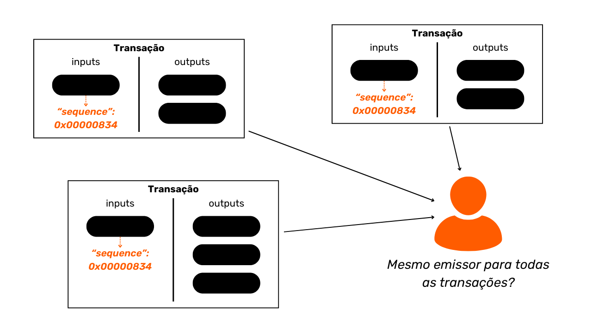

Como [@LaurentMT](https://twitter.com/LaurentMT) especifica no [Space Kek #19](https://podcasters.spotify.com/pod/show/decouvrebitcoin/episodes/SpaceKek-19---Analyse-de-chane--anonsets-et-entropie-e1vfuji) (um podcast Francófono), a utilidade das impressões digitais de carteiras na análise de cadeias aumenta significativamente com o tempo. De fato, o crescente número de tipos de scripts e a implantação cada vez mais gradual dessas novas funcionalidades pelo software de carteira acentuam as diferenças. Pode até acontecer que se possa identificar com precisão o software usado pela entidade rastreada. Portanto, é importante entender que o estudo da impressão digital de uma carteira se mostra particularmente relevante para transações recentes, mais do que para aquelas iniciadas no início dos anos 2010.

Para resumir, uma impressão digital pode ser qualquer prática específica, realizada automaticamente pela carteira ou manualmente pelo usuário, que pode ser encontrada em outras transações para nos auxiliar em nossa análise.

### A Heurística de Propriedade Comum de Entrada (CIOH)

A CIOH, para "Common Input Ownership Heuristic" em inglês, é uma heurística que afirma que quando uma transação inclui múltiplas entradas, é provável que todas provenham de uma única entidade. Consequentemente, a propriedade é comum.
Para aplicar a Heurística de Propriedade Comum de Entrada (CIOH, do inglês Common Input Ownership Heuristic), primeiro observamos uma transação que possui múltiplas entradas. Isso pode ser tão pouco quanto 2 entradas ou até 30 entradas. Uma vez identificada essa característica, verificamos se a transação não se encaixa em um modelo de transação conhecido. Por exemplo, se ela tem 5 entradas com quantidades aproximadamente iguais e 5 saídas com exatamente a mesma quantidade, sabemos que é a estrutura de um coinjoin. Portanto, não podemos aplicar a CIOH.
No entanto, se a transação não se encaixa em nenhum modelo conhecido de transação colaborativa, então podemos inferir que todas as entradas provavelmente vêm da mesma entidade. Isso pode ser muito útil para expandir um cluster conhecido ou para continuar rastreando.

A CIOH foi descoberta por Satoshi Nakamoto. Ele discute isso na parte 10 do White Paper:

"_[...] a ligação é inevitável com transações de múltiplas entradas, que necessariamente revelam que suas entradas pertenciam ao mesmo proprietário. O risco é que, se o proprietário de uma chave for revelado, as ligações podem revelar outras transações que pertenceram ao mesmo proprietário._"

É particularmente fascinante notar que Satoshi Nakamoto, mesmo antes do lançamento oficial do Bitcoin, já havia identificado as duas principais vulnerabilidades em termos de privacidade para os usuários, nomeadamente a CIOH e a reutilização de endereços. Tal previsão é bastante notável, pois essas duas heurísticas permanecem, até hoje, as mais úteis na análise de cadeias.

Para dar um exemplo, aqui está uma transação na qual provavelmente podemos aplicar a CIOH:

```plaintext
20618e63b6eed056263fa52a2282c8897ab2ee71604c7faccfe748e1a202d712
```

Fonte: [Mempool.space](https://mempool.space/tx/20618e63b6eed056263fa52a2282c8897ab2ee71604c7faccfe748e1a202d712)

### Dados Offchain

Obviamente, a análise de cadeias não se limita exclusivamente a dados onchain. Qualquer dado de análises anteriores ou disponível na internet também pode ser usado para refinar uma análise.
Por exemplo, se for observado que transações rastreadas são sistematicamente transmitidas a partir do mesmo nó Bitcoin e seu endereço IP pode ser identificado, pode ser possível identificar outras transações da mesma entidade, além de determinar uma parte da identidade do remetente. Embora essa prática não seja facilmente alcançável, pois requer a operação de muitos nós, é possível que algumas empresas especializadas em análise de cadeias a empreguem.

O analista também tem a opção de confiar em análises previamente tornadas open-source, ou em suas próprias análises anteriores. Talvez se encontre uma saída que aponte para um cluster de endereços que já havia sido identificado. Às vezes, também é possível confiar em saídas que apontam para uma plataforma de troca, sendo os endereços dessas empresas geralmente conhecidos.

Da mesma forma, pode-se realizar uma análise por eliminação. Por exemplo, se durante a análise de uma transação com duas saídas, uma delas está ligada a um cluster de endereços já conhecido mas distinto da entidade que está sendo rastreada, então pode-se interpretar que a outra saída provavelmente representa o troco.

A análise de cadeias também inclui uma parte de OSINT (*Open Source Intelligence*) que é um pouco mais generalista com pesquisas na internet. É por isso que é aconselhado contra a publicação de endereços de recebimento diretamente em redes sociais ou em um site, seja sob um pseudônimo ou não.


### Modelos Temporais
É menos comum pensar nisso, mas certos comportamentos humanos são reconhecíveis on-chain. O mais útil na análise pode ser o seu padrão de sono! Sim, quando você está dormindo, presumivelmente não está transmitindo transações de Bitcoin. Como geralmente você dorme aproximadamente nos mesmos horários, é comum usar análises temporais em análise de cadeia. Isso simplesmente envolve catalogar as horas em que as transações de uma determinada entidade são transmitidas para a rede Bitcoin. Analisar esses padrões temporais nos permite deduzir muitas informações.

Em primeiro lugar, uma análise temporal às vezes permite identificar a natureza da entidade rastreada. Se for observado que as transações são transmitidas consistentemente ao longo de 24 horas, então isso revelará uma forte atividade econômica. A entidade por trás dessas transações provavelmente é uma empresa, potencialmente internacional, e talvez com procedimentos automatizados internamente.

Por exemplo, [eu reconheci esse modelo há alguns meses](https://twitter.com/Loic_Pandul/status/1701127409712452072) ao analisar [a transação que havia alocado erroneamente 19 bitcoins em taxas](https://mempool.space/tx/d5392d474b4c436e1c9d1f4ff4be5f5f9bb0eb2e26b61d2781751474b7e870fd). Uma simples análise temporal me permitiu hipotetizar que estávamos lidando com um serviço automatizado, e, portanto, provavelmente uma grande entidade como uma plataforma de troca.

De fato, alguns dias depois, descobriu-se que os fundos pertenciam ao PayPal, via a plataforma de troca Paxos.

Ao contrário, se vemos que o padrão temporal é mais espalhado por 16 horas muito específicas, então podemos estimar que estamos lidando com um usuário individual, ou talvez um negócio local dependendo dos volumes negociados.

Além da natureza da entidade observada, o padrão temporal também pode nos dar uma localização aproximada do usuário graças aos fusos horários. Podemos assim vincular outras transações e usar o carimbo de data/hora destas como uma heurística adicional que pode ser adicionada à nossa análise.

Por exemplo, no endereço reutilizado sobre o qual falei anteriormente, podemos observar que as transações, sejam elas de entrada ou saída, estão concentradas em um intervalo de 13 horas.

```plaintext
bc1qqtmeu0eyvem9a85l3sghuhral8tk0ar7m4a0a0
```


Fonte: OXT.me

Esse intervalo provavelmente corresponde à Europa, África ou Oriente Médio. Podemos, portanto, inferir que o usuário por trás dessas transações vive lá.

Em um registro diferente, também é uma análise temporal desse tipo que permitiu a hipótese de que Satoshi Nakamoto não operava do Japão, mas de fato dos Estados Unidos: [*Os Fusos Horários de Satoshi Nakamoto*](https://medium.com/@insearchofsatoshi/the-time-zones-of-satoshi-nakamoto-aa40f035178f)

## Aplicação Prática com um Explorador de Blocos
<chapterId>6493cf2f-225c-405f-9375-c4304f1087ed</chapterId>

Neste capítulo final, aplicaremos concretamente os conceitos que estudamos até agora. Apresentarei exemplos de transações reais de Bitcoin, e você precisará extrair as informações que peço.
Idealmente, para estes exercícios, o uso de uma ferramenta profissional de análise de cadeias seria preferível. No entanto, desde a prisão dos criadores da Samourai Wallet, a única ferramenta de análise gratuita, OXT.me, não está mais disponível. Portanto, optaremos por um explorador de blocos clássico para estes exercícios. Recomendo o uso do [Mempool.space](https://mempool.space/) por suas numerosas funcionalidades e gama de ferramentas de análise de cadeias, mas você também pode escolher outro explorador, como o [Bitcoin Explorer](https://bitcoinexplorer.org/). Para começar, apresentarei os exercícios. Use seu explorador de blocos para completá-los e anote suas respostas em um pedaço de papel. Então, no final deste capítulo, fornecerei as respostas para que você possa verificar e corrigir seus resultados.

*As transações selecionadas para estes exercícios foram escolhidas unicamente por suas características de maneira um tanto aleatória. Este capítulo destina-se exclusivamente a fins educacionais e informativos. Quero esclarecer que não apoio ou incentivo o uso dessas ferramentas para fins maliciosos. O objetivo é ensinar-lhe como se proteger contra análises de cadeias, não para conduzir análises para expor informações privadas de outros.*

### Exercício 1

ID da transação para análise:

```plaintext
3769d3b124e47ef4ffb5b52d11df64b0a3f0b82bb10fd6b98c0fd5111789bef7
```

Qual é o nome do modelo desta transação e quais interpretações plausíveis podem ser feitas examinando apenas seu modelo, isto é, a estrutura da transação?

### Exercício 2

ID da transação para análise:

```plaintext
baa228f6859ca63e6b8eea24ffad7e871713749d693ebd85343859173b8d5c20
```

Qual é o nome do modelo desta transação e quais interpretações plausíveis podem ser feitas examinando apenas seu modelo, isto é, a estrutura da transação?

### Exercício 3

ID da transação para análise:

```plaintext
3a9eb9ccc3517cc25d1860924c66109262a4b68f4ed2d847f079b084da0cd32b
```

Qual é o modelo desta transação?

Após identificar seu modelo, usando as heurísticas internas da transação, qual saída provavelmente representa o troco?

### Exercício 4

ID da transação para análise:

```plaintext
35f0b31c05503ebfdf7311df47f68a048e992e5cf4c97ec34aa2833cc0122a12
```

Qual é o modelo desta transação?
Após identificar seu modelo, usando as heurísticas internas da transação, qual saída provavelmente representa o troco?
### Exercício 5

Imagine que Loïc postou um de seus endereços de recebimento de Bitcoin na rede social Twitter:


```plaintext
bc1qja0hycrv7g9ww00jcqanhfpqmzx7luqalum3vu
```

Usando **apenas a heurística de reutilização de endereço**, quais transações Bitcoin podemos vincular à identidade de Loïc?

*Obviamente, eu não sou o verdadeiro proprietário deste endereço de recebimento e não o postei em redes sociais. É um endereço que escolhi aleatoriamente da blockchain.*

### Exercício 6

Seguindo o Exercício 5, graças à heurística de reutilização de endereço, você conseguiu identificar várias transações Bitcoin nas quais Loïc parece estar envolvido. Normalmente, entre as transações identificadas, você deveria ter localizado esta:
Esta transação é a primeira que envia fundos para o endereço de Loïc. Na sua opinião, de onde vêm os bitcoins recebidos por Loïc através desta transação?

### Exercício 7

Seguindo o Exercício 5, graças à heurística de reutilização de endereços, você conseguiu identificar várias transações Bitcoin nas quais Loïc parece estar envolvido. Agora, você deseja descobrir de onde Loïc é. Com base nas transações encontradas, conduza uma análise temporal para encontrar o fuso horário provável usado por Loïc. A partir deste fuso horário, determine um local onde Loïc parece viver (país, estado/região, cidade...).


### Exercício 8

Aqui está a transação Bitcoin a ser estudada:

```plaintext
bb346dae645d09d32ed6eca1391d2ee97c57e11b4c31ae4325bcffdec40afd4f
```

Observando apenas esta transação, que informações podemos interpretar?

### Soluções dos exercícios

***Exercício 1:***
O modelo desta transação é o de um pagamento simples. Se estudarmos apenas sua estrutura, podemos interpretar que uma das saídas representa o troco e a outra saída representa um pagamento real. Portanto, sabemos que o usuário observado provavelmente não está mais na posse de um dos dois UTXOs nas saídas (o destinado ao pagamento), mas ainda está na posse do outro UTXO (o destinado ao troco).

***Exercício 2:***
O modelo desta transação é o de um gasto em lote. Este modelo provavelmente indica uma atividade econômica significativa, como uma plataforma de troca, por exemplo. Podemos deduzir que o UTXO na entrada vem de uma empresa com atividade econômica significativa e que os UTXOs nas saídas se dispersarão. Alguns pertencerão a clientes da empresa que retiraram seus bitcoins para carteiras de auto-custódia. Outros podem ir para empresas parceiras. Finalmente, certamente haverá um troco que retorna à empresa emissora.

***Exercício 3:***

O modelo desta transação é o de um pagamento simples. Portanto, podemos aplicar heurísticas internas à transação para tentar identificar o troco.

Eu pessoalmente identifiquei pelo menos duas heurísticas internas que suportam a mesma hipótese:
- A reutilização do mesmo tipo de script;
- A maior saída.

A heurística mais óbvia é a reutilização do mesmo tipo de script. De fato, a saída `0` é um `P2SH`, reconhecível pelo seu endereço que começa com `3`:

```plaintext
3Lcdauq6eqCWwQ3UzgNb4cu9bs88sz3mKD
```

Enquanto a saída `1` é um `P2WPKH`, identificável pelo seu endereço que começa com `bc1q`:

```plaintext
bc1qya6sw6sta0mfr698n9jpd3j3nrkltdtwvelywa
```

O UTXO usado na entrada para esta transação também usa um script `P2WPKH`:

```plaintext
bc1qyfuytw8pcvg5vx37kkgwjspg73rpt56l5mx89k
```

Assim, podemos assumir que a saída `0` corresponde a um pagamento e que a saída `1` é o troco da transação, o que significaria que o usuário na entrada ainda possui a saída `1`.
Para apoiar ou refutar esta hipótese, podemos procurar por outras heurísticas que confirmem nosso pensamento ou diminuam a probabilidade de que nossa hipótese esteja correta.
Identifiquei pelo menos uma outra heurística. É a maior saída. A saída `0` mede `123,689 sats`, enquanto a saída `1` mede `505,839 sats`. Há, portanto, uma diferença significativa entre essas duas saídas. A heurística da maior saída sugere que a saída mais volumosa provavelmente é o troco. Esta heurística, portanto, fortalece ainda mais nossa hipótese inicial.

Parece provável que o usuário que forneceu o UTXO na entrada ainda detém a saída `1`, que parece representar o troco da transação.

***Exercício 4:***
O modelo desta transação é o de um pagamento simples. Portanto, podemos aplicar heurísticas internas à transação para tentar identificar o troco.
Identifiquei pessoalmente pelo menos duas heurísticas internas que apoiam a mesma hipótese:
- O reuso do mesmo tipo de script;
- A saída de um valor redondo.

A heurística mais óbvia é o reuso do mesmo tipo de script. De fato, a saída `0` é um `P2SH`, reconhecível por seu endereço começando com `3`:

```plaintext
3FSH5Mnq6S5FyQoKR9Yjakk3X4KCGxeaD4
```

Enquanto a saída `1` é um `P2WPKH`, identificável por seu endereço começando com `bc1q`:

```plaintext
bc1qvdywdcfsyavt4v8uxmmrdt6meu4vgeg439n7sg
```

O UTXO usado como entrada para esta transação também usa um script `P2WPKH`:

```plaintext
bc1qku3f2y294h3ks5eusv63dslcua2xnlzxx0k6kp
```

Assim, podemos assumir que a saída `0` corresponde a um pagamento e que a saída `1` é o troco da transação, o que significaria que o usuário na entrada ainda possui a saída `1`.

Para apoiar ou refutar esta hipótese, podemos procurar por outras heurísticas que confirmem nosso pensamento ou diminuam a probabilidade de que nossa hipótese esteja correta.

Identifiquei pelo menos uma outra heurística. É a saída de um valor redondo. A saída `0` mede `70,000 sats`, enquanto a saída `1` mede `22,962 sats`. Portanto, estamos na presença de uma saída perfeitamente redonda na unidade de conta BTC. A heurística da saída redonda sugere que o UTXO com um valor redondo provavelmente é o pagamento, e por eliminação, a outra representa o troco. Esta heurística, portanto, fortalece ainda mais nossa hipótese inicial.

No entanto, neste exemplo, outra heurística poderia questionar nossa hipótese inicial. De fato, a saída `0` é maior que a saída `1`. Se nos basearmos na heurística de que a maior saída geralmente é o troco, poderíamos deduzir que a saída `0` é o troco. No entanto, esta contrahipótese parece implausível, pois as outras duas heurísticas parecem substancialmente mais convincentes do que a da maior saída. Consequentemente, parece razoável manter nossa hipótese inicial apesar desta aparente contradição.
Portanto, parece provável que o usuário que forneceu o UTXO como entrada ainda detém a saída `1`, que parece representar o troco da transação.
***Exercício 5:***
Podemos ver que 8 transações podem ser associadas à identidade de Loïc. Entre estas, 4 envolvem o recebimento de bitcoins:

```plaintext
2d9575553c99578268ffba49a1b2adc3b85a29926728bd0280703a04d051eace
8b70bd322e6118b8a002dbdb731d16b59c4a729c2379af376ae230cf8cdde0dd
d5864ea93e7a8db9d3fb113651d2131567e284e868021e114a67c3f5fb616ac4
bc4dcf2200c88ac1f976b8c9018ce70f9007e949435841fc5681fd33308dd762
```

Os outros 4 envolvem o envio de bitcoins:

```plaintext
8b52fe3c2cf8bef60828399d1c776c0e9e99e7aaeeff721fff70f4b68145d540
c12499e9a865b9e920012e39b4b9867ea821e44c047d022ebb5c9113f2910ed6
a6dbebebca119af3d05c0196b76f80fdbf78f20368ebef1b7fd3476d0814517d
3aeb7ce02c35eaecccc0a97a771d92c3e65e86bedff42a8185edd12ce89d89cc
```

***Exercício 6:***
Se examinarmos o modelo desta transação, é aparente que se trata de um gasto agrupado. De fato, a transação possui uma única entrada e 51 saídas, o que indica uma atividade econômica significativa. Podemos, portanto, hipotetizar que Loïc realizou um saque de bitcoins de uma plataforma de câmbio.

Vários elementos reforçam essa hipótese. Primeiro, o tipo de script usado para proteger o UTXO na entrada é um script P2SH multisig 2/3, o que indica um nível avançado de segurança típico de plataformas de câmbio:

```plaintext
OP_PUSHNUM_2
OP_PUSHBYTES_33 03eae02975918af86577e1d8a257773118fd6ceaf43f1a543a4a04a410e9af4a59
OP_PUSHBYTES_33 03ba37b6c04aaf7099edc389e22eeb5eae643ce0ab89ac5afa4fb934f575f24b4e
OP_PUSHBYTES_33 03d95ef2dc0749859929f3ed4aa5668c7a95baa47133d3abec25896411321d2d2d
OP_PUSHNUM_3
OP_CHECKMULTISIG
```
Além disso, o endereço analisado `3PUv9tQMSDCEPSMsYSopA5wDW86pwRFbNF` é reutilizado em mais de 220.000 transações diferentes, o que é frequentemente característico de plataformas de câmbio, geralmente não preocupadas com sua privacidade. A heurística temporal aplicada a este endereço também mostra uma distribuição regular de transações quase diariamente ao longo de um período de 3 meses, com horários estendidos por 24 horas, sugerindo a atividade contínua de uma plataforma de câmbio.

Finalmente, os volumes processados por essa entidade são enormes. De fato, o endereço recebeu e enviou 44 BTC durante 222.262 transações entre dezembro de 2022 e março de 2023. Esses volumes significativos confirmam ainda mais a provável natureza da atividade de uma plataforma de câmbio.

***Exercício 7:***
Ao analisar os tempos de confirmação das transações, os seguintes horários UTC podem ser observados:
```plaintext
05:43
20:51
18:12
17:16
04:28
23:38
07:45
21:55
```

Analisando esses horários, parece que os fusos horários UTC-7 e UTC-8 são consistentes com uma gama de atividades humanas comuns (entre 08:00 e 23:00) para a maioria dos horários:

```plaintext
05:43 UTC > 22:43 UTC-7
20:51 UTC > 13:51 UTC-7
18:12 UTC > 11:12 UTC-7
17:16 UTC > 10:16 UTC-7
04:28 UTC > 21:28 UTC-7
23:38 UTC > 16:38 UTC-7
07:45 UTC > 00:45 UTC-7
21:55 UTC > 14:55 UTC-7

05:43 UTC > 21:43 UTC-8
20:51 UTC > 12:51 UTC-8
18:12 UTC > 10:12 UTC-8
17:16 UTC > 09:16 UTC-8
04:28 UTC > 20:28 UTC-8
23:38 UTC > 15:38 UTC-8
07:45 UTC > 23:45 UTC-8
21:55 UTC > 13:55 UTC-8
```


O fuso horário UTC-7 é particularmente relevante no verão, pois inclui estados e regiões como:
- Califórnia (com cidades como Los Angeles, São Francisco e San Diego);
- Nevada (com Las Vegas);
- Oregon (com Portland);
- Washington (com Seattle);
- A região canadense da Colúmbia Britânica (com cidades como Vancouver e Victoria).

Essas informações sugerem que Loïc poderia plausivelmente residir na costa oeste dos Estados Unidos ou Canadá.

***Exercício 8:***
A análise desta transação revela 5 entradas e uma única saída, o que parece indicar uma consolidação. A aplicação da heurística CIOH sugere que todos os UTXOs nas entradas são mantidos por uma única entidade, e que o UTXO na saída também pertence a esta entidade. Parece que o usuário optou por consolidar vários UTXOs que possuía em um único UTXO na saída, com o objetivo de consolidar suas moedas. Essa abordagem provavelmente foi motivada pelo desejo de aproveitar as baixas taxas de transação naquele momento para reduzir taxas futuras.
___

*Para a escrita desta parte 3 sobre análise de cadeia, baseei-me nos seguintes recursos:*
- *A série de quatro artigos chamada: [Understanding Bitcoin Privacy with OXT](https://medium.com/oxt-research/understanding-bitcoin-privacy-with-oxt-part-1-4-8177a40a5923), produzida pela Samourai Wallet em 2021;*
- *Os vários relatórios de [OXT Research](https://medium.com/oxt-research), bem como sua ferramenta gratuita de análise de cadeia (que não está mais disponível no momento após a prisão dos fundadores da Samourai Wallet);*
- *De forma mais ampla, meu conhecimento vem dos vários tweets e conteúdos de [@LaurentMT](https://twitter.com/LaurentMT) e [@ErgoBTC](https://twitter.com/ErgoBTC);*
- *O [Space Kek #19](https://podcasters.spotify.com/pod/show/decouvrebitcoin/episodes/SpaceKek-19---Analyse-de-chane--anonsets-et-entropie-e1vfuji) no qual participei ao lado de [@louneskmt](https://twitter.com/louneskmt), [@TheoPantamis](https://twitter.com/TheoPantamis), [@Sosthene___](https://twitter.com/Sosthene___), e [@LaurentMT](https://twitter.com/LaurentMT).*
*Gostaria de agradecer aos seus autores, desenvolvedores e produtores. Agradeço também aos revisores que meticulosamente corrigiram o artigo que serviu de base para esta parte 3 e me agraciaram com seus conselhos de especialistas:*
- *[Gilles Cadignan](https://twitter.com/gillesCadignan);*
- *[Ludovic Lars](https://viresinnumeris.fr/).*

# Dominando as Melhores Práticas para Proteger Sua Privacidade
<partId>9bd04b63-f1af-4e50-9061-6bc90009df68</partId>

## Reutilização de Endereço
<chapterId>f3e97645-3df3-41bc-a4ed-d2c740113d96</chapterId>
Após estudar as técnicas que podem comprometer sua privacidade no Bitcoin, nesta terceira parte, agora olharemos para as melhores práticas a adotar para se proteger. Esta parte não visa explorar métodos de melhoria da privacidade, um assunto que será abordado mais tarde, mas sim entender como interagir corretamente com o Bitcoin para manter a privacidade que ele naturalmente oferece, sem recorrer a técnicas adicionais.
Obviamente, para iniciar esta terceira parte, falaremos sobre a reutilização de endereço. Este fenômeno constitui a principal ameaça à privacidade do usuário. Portanto, este capítulo é, sem dúvida, o mais importante de todo o treinamento.

### O que é um endereço de recebimento?

Um endereço de recebimento Bitcoin é uma sequência de caracteres ou um identificador usado para receber bitcoins em uma carteira.

Tecnicamente, um endereço de recebimento Bitcoin não "recebe" bitcoins no sentido literal, mas define as condições sob as quais os bitcoins podem ser gastos. Especificamente, quando um pagamento é enviado a você, a transação do remetente cria um novo UTXO destinado a você na saída dos UTXOs que consumiu nas entradas. Nesta saída, um script definindo como este UTXO pode ser gasto posteriormente é aplicado. Este script é conhecido como "*ScriptPubKey*" ou "*Script de Bloqueio*". Seu endereço de recebimento, mais precisamente seu payload, é integrado a este script. Para simplificar, este script essencialmente estipula:

> "*Para gastar este novo UTXO, uma assinatura digital deve ser fornecida usando a chave privada associada a este endereço de recebimento.*"


Os endereços Bitcoin vêm em diferentes tipos, dependendo do modelo de script usado. Os primeiros modelos, conhecidos como "*Legacy*", incluem endereços `P2PKH` (*Pay-to-PubKey-Hash*) e `P2SH` (*Pay-to-Script-Hash*). Os endereços P2PKH sempre começam com `1` e os P2SH com `3`. Embora ainda seguros, esses formatos agora são obsoletos, pois resultam em taxas de transação mais altas e oferecem menos privacidade em comparação com os novos padrões.
Os endereços SegWit V0 (`P2WPKH` e `P2WSH`) e Taproot / SegWit V1 (`P2TR`) representam os formatos modernos. Endereços SegWit começam com `bc1q` e endereços Taproot, introduzidos em 2021, começam com `bc1p`.
Por exemplo, aqui está um endereço de recebimento Taproot:

```text
bc1ps5gd2ys8kllz9alpmcwxqegn7kl3elrpnnlegwkm3xpq2h8da07spxwtf5
```

A forma como o ScriptPubKey é construído dependerá do padrão que você está usando:
| Modelo de Script | ScriptPubKey                                                || ---------------- | ----------------------------------------------------------- |
| P2PKH            | OP_DUP OP_HASH160 `<pubKeyHash>` OP_EQUALVERIFY OP_CHECKSIG |
| P2SH             | OP_HASH160 `<scriptHash>` OP_EQUAL                          |
| P2WPKH           | 0 `<pubKeyHash>`                                            |
| P2WSH            | 0 `<witnessScriptHash>`                                     |
| P2SH - P2WPKH    | OP_HASH160 `<redeemScriptHash>` OP_EQUAL                    |
| P2SH - P2WSH     | OP_HASH160 `<redeemScriptHash>` OP_EQUAL                    |
| P2TR             | 1 `<pubKey>`                                                |

No que diz respeito à construção de endereços de recebimento, isso também depende do modelo de script escolhido:
- Para endereços `P2PKH` e `P2WPKH`, o payload, ou seja, o núcleo do endereço, representa o hash da chave pública;
- Para endereços `P2SH` e `P2WSH`, o payload representa o hash de um script;
- Quanto aos endereços `P2TR`, o payload é uma chave pública ajustada. Os outputs `P2TR` combinam aspectos de _Pay-to-PubKey_ e _Pay-to-Script_. A chave pública ajustada é o resultado da adição de uma chave pública clássica de gasto com um "ajuste", derivado da raiz de Merkle de um conjunto de scripts que também podem ser usados para gastar bitcoins.

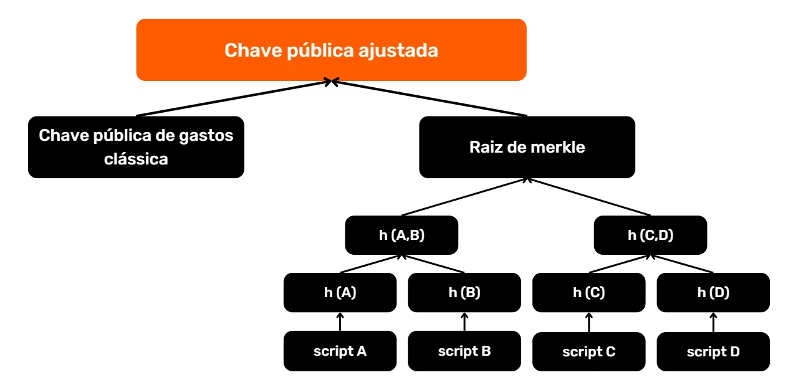

Os endereços exibidos no seu software de carteira também incluem um HRP (*Human-Readable Part*), tipicamente `bc` para endereços pós-SegWit, um separador `1`, e um número de versão `q` para SegWit V0 e `p` para Taproot/SegWit V1. Um checksum também é adicionado para garantir a integridade e validade do endereço durante sua transmissão.

Finalmente, os endereços são colocados em um formato padrão:
- Base58check para endereços Legacy antigos;
- Bech32 para endereços SegWit;
- Bech32m para endereços Taproot.

Aqui está a matriz de adição para os formatos bech32 e bech32m (SegWit e Taproot) a partir da base 10:

| +   | 0   | 1   | 2   | 3   | 4   | 5   | 6   | 7   |
| --- | --- | --- | --- | --- | --- | --- | --- | --- |
| 0   | q   | p   | z   | r   | y   | 9   | x   | 8   |
| 8   | g   | f   | 2   | t   | v   | d   | w   | 0   |
| 16  | s   | 3   | j   | n   | 5   | 4   | k   | h   || 24  | c   | e   | 6   | m   | u   | a   | 7   | l   |
### O que é Reutilização de Endereço?

Reutilização de endereço refere-se à prática de usar o mesmo endereço de recebimento para bloquear múltiplos UTXOs diferentes.

Como vimos na seção anterior, cada UTXO possui seu próprio ScriptPubKey que o bloqueia e deve ser satisfeito para que o UTXO seja consumido como entrada em uma nova transação. É dentro deste ScriptPubKey que os endereços de recebimento (payload) são integrados.

Quando diferentes ScriptPubKeys contêm o mesmo endereço de recebimento, isso é conhecido como reutilização de endereço. Na prática, isso significa que um usuário forneceu o mesmo endereço várias vezes para remetentes receberem bitcoins através de múltiplos pagamentos. E de fato, essa prática é catastrófica para sua privacidade.

### Por que a Reutilização de Endereço é um Problema?

Dado que a blockchain é pública, é fácil ver quais endereços bloqueiam quais UTXOs e quantos bitcoins. Se o mesmo endereço é usado para múltiplas transações, torna-se possível deduzir que todos os bitcoins associados a esse endereço pertencem à mesma pessoa. Esta prática compromete a privacidade do usuário ao permitir que ligações determinísticas sejam estabelecidas entre diferentes transações e rastreando os bitcoins na blockchain. Satoshi Nakamoto ele mesmo destacou essa questão no White Paper do Bitcoin:

> *Como uma barreira adicional, um novo par de chaves poderia ser usado para cada transação para evitar que elas sejam vinculadas a um proprietário comum.*


Fonte: S. Nakamoto, "Bitcoin: Um Sistema de Dinheiro Eletrônico Peer-to-Peer", https://bitcoin.org/bitcoin.pdf, 2009.

O objetivo buscado por Satoshi nesta declaração era criar uma barreira adicional em caso de associação entre a identidade do usuário e um par de chaves no Bitcoin, para evitar que toda a sua atividade fosse publicamente vinculada à sua identidade. Hoje, com a proliferação de empresas de análise de cadeia e regulamentos KYC, o uso de endereços únicos não é mais uma "barreira adicional", mas uma prática necessária para qualquer um que deseje preservar sua privacidade ao mínimo.

Quando você reutiliza um endereço, você faz uma ligação quase inegável entre todas as transações associadas a esse endereço. Embora isso não coloque diretamente seus fundos em perigo, já que a criptografia em curvas elípticas garante a segurança de suas chaves privadas, facilita o monitoramento de suas atividades. De fato, qualquer pessoa com um nó pode observar as transações e saldos de endereços, comprometendo completamente seu anonimato.


Para ilustrar esse ponto, vamos tomar o exemplo de Bob, um usuário que regularmente compra bitcoins em pequenas quantidades através de DCA (Dollar Cost Averaging) e sempre os envia para o mesmo endereço. Após dois anos, este endereço contém uma quantidade substancial de bitcoins. Se Bob usa este endereço para fazer um pagamento a um comerciante local, este último poderia ver todos os fundos associados e deduzir a riqueza de Bob. Isso poderia levar a riscos de segurança pessoal, incluindo tentativas de roubo ou extorsão. Se Bob tivesse usado um endereço novo para receber cada compra periódica, ele teria revelado infinitamente menos informações ao seu comerciante.

Na análise de cadeia, diferenciamos entre 2 tipos de reutilização de endereço:
- Reutilização externa;
- Reutilização interna dentro de uma transação.

A primeira é observada quando um endereço é reutilizado em várias transações Bitcoin diferentes. É isso que discutimos anteriormente: essa heurística nos permite deduzir que todos os UTXOs que passaram por este endereço pertencem a uma única entidade.
A reutilização de endereços internos é observada não quando a reutilização ocorre em várias transações, mas quando ocorre dentro da mesma transação. De fato, se o mesmo endereço que foi usado para bloquear uma entrada é usado como saída em uma transação, então podemos deduzir que essa saída ainda pertence ao mesmo usuário (troco), e que a segunda saída representa o pagamento real. Esta outra heurística permite o rastreamento de fundos através de múltiplas transações.


A reutilização de endereços é um verdadeiro flagelo no Bitcoin. De acordo com o site OXT.me (atualmente inacessível), a taxa geral de reutilização de endereços no Bitcoin foi de cerca de 52% em 2022:


Esta taxa é enorme, mas vem esmagadoramente de plataformas de troca em vez de usuários individuais.

### Como evitar a reutilização de endereços?

Evitar a reutilização de endereços é bastante simples: **basta usar um novo endereço fresco para cada novo pagamento recebido na sua carteira**.

Graças ao BIP32, as carteiras modernas são agora determinísticas e hierárquicas. Isso significa que um usuário pode gerar um grande número de endereços a partir de uma única informação inicial: a semente. Salvando essa única informação, é possível restaurar todas as chaves privadas da carteira, acessando assim os fundos assegurados pelos endereços correspondentes.


É por isso que, quando você pressiona o botão "*receber*" no software da sua carteira, um endereço de recebimento não utilizado é oferecido a você cada vez. Após receber bitcoins nesse endereço, o software automaticamente sugere um novo.
> *PS: Recentemente, alguns softwares de carteira anunciaram a intenção de parar de gerar endereços em branco, temendo que isso pudesse ser percebido como uma forma de lavagem de dinheiro pelas autoridades. Se o seu software está entre estes, eu aconselho fortemente a substituí-lo imediatamente, pois isso não é aceitável para o usuário.*

Se você precisa de um identificador estático para receber pagamentos, como para receber doações, por exemplo, é aconselhável não usar um endereço Bitcoin clássico devido ao risco de reutilização. Prefira usar um endereço Lightning, ou para um identificador de pagamento onchain estático, você pode optar pelo BIP47 ou Pagamentos Silenciosos. A operação desses protocolos é detalhada na parte 6 deste treinamento.

## Rotulagem e Controle de Moedas
<chapterId>fbdb07cd-c025-48f2-97b0-bd1bc21c68a8</chapterId>

Como descobrimos na parte sobre análise de cadeia, existem uma multitude de heurísticas e padrões que podem ser usados para inferir informações sobre uma transação. Como usuário, é importante estar ciente dessas técnicas para se proteger melhor.

Isso envolve, notavelmente, uma gestão rigorosa da sua carteira de auto-custódia, que inclui conhecer a origem dos seus UTXOs, bem como uma seleção cuidadosa de UTXOs para consumir durante os pagamentos. Esta gestão eficaz da carteira depende de duas características importantes de boas carteiras Bitcoin: rotulagem e controle de moedas.

Neste capítulo, estudaremos essas características e veremos como você poderia usá-las inteligentemente, sem adicionar muito trabalho, para otimizar grandemente sua privacidade no Bitcoin.

### O que é Rotulagem?

Rotulagem é uma prática que envolve atribuir uma anotação ou um rótulo a um UTXO específico em uma carteira Bitcoin. Essas anotações são armazenadas localmente pelo software da carteira e nunca são transmitidas pela rede Bitcoin. A rotulagem é, portanto, uma ferramenta para gestão pessoal.

Por exemplo, se eu possuo um UTXO de uma compra P2P no Bisq com Charles, eu poderia atribuir a ele o rótulo "`Non-KYC Bisq Charles`".
A rotulação é uma boa prática que ajuda a lembrar a origem ou o destino pretendido de um UTXO, facilitando assim a gestão de fundos e otimizando a privacidade. De fato, sua carteira Bitcoin provavelmente protege vários UTXOs. Se as fontes desses UTXOs forem diferentes, você pode não querer mesclá-los no futuro, caso contrário, você poderia revelar a propriedade comum deles. Ao rotular adequadamente todas as suas moedas, você garante que se lembre de sua origem quando precisar usá-las, mesmo que isso seja apenas em vários anos.

### O que é controle de moedas?

O uso ativo da rotulação se torna ainda mais interessante quando combinado com uma opção de controle de moedas no software da sua carteira.

Controle de moedas é um recurso presente em bons softwares de carteira Bitcoin, que lhe dá a capacidade de selecionar manualmente UTXOs específicos para usar como entradas para realizar uma transação. De fato, para satisfazer um pagamento na saída, é necessário consumir um UTXO na entrada em retorno. Por várias razões que veremos mais tarde, você pode querer escolher precisamente quais moedas consumir nas entradas para satisfazer um pagamento dado. É exatamente isso que o controle de moedas permite que você faça. Para lhe dar uma analogia, esse recurso é semelhante à ação de escolher uma moeda específica na sua carteira quando você paga por sua baguete.


O uso de software de carteira com controle de moedas, juntamente com a rotulação de UTXOs, permite aos usuários distinguir e selecionar precisamente os UTXOs para suas transações.

### Como rotular adequadamente seus UTXOs?

Não existe um método universal para rotular UTXOs que sirva para todos. Cabe a você definir um sistema de rotulação para que possa encontrar facilmente o seu caminho em sua carteira. De qualquer forma, tenha em mente que uma boa rotulação é aquela que você será capaz de entender quando precisar. Se sua carteira Bitcoin é principalmente destinada a poupanças, pode ser que as etiquetas só sejam úteis para você em várias décadas. Portanto, certifique-se de que elas sejam claras, precisas e abrangentes.

É importante que seus entes queridos possam identificar facilmente a origem dos fundos se, um dia, precisarem acessar sua carteira. Isso poderia ajudá-los por razões de privacidade, bem como por necessidades legais, no caso de terem que justificar a proveniência dos fundos perante uma autoridade.
O aspecto mais importante da rotulação é anotar a fonte do UTXO. Você deve simplesmente indicar como essa moeda chegou à sua carteira. É de uma compra em uma plataforma de câmbio? Um pagamento de um cliente? Uma troca entre pares? Ou é o troco de uma compra? Assim, você poderia especificar:
- `Retirada Exchange.com`;
- `Pagamento Cliente David`;
- `Compra P2P Charles`;
- `Troco da compra de sofá`

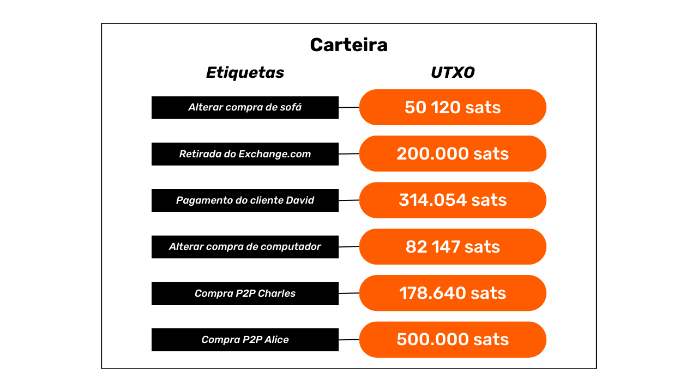

Para refinar sua gestão de UTXOs e aderir às suas estratégias de segregação de fundos dentro de sua carteira, você poderia enriquecer suas etiquetas com um indicador adicional que reflete essas separações. Se sua carteira contém duas categorias de UTXOs que você não deseja misturar, você poderia integrar um marcador em suas etiquetas para distinguir claramente esses grupos. Esses marcadores de separação dependerão de seus próprios critérios, como a distinção entre UTXOs de um processo de aquisição que envolve KYC, ou entre fundos profissionais e pessoais. Tomando os exemplos de etiquetas mencionados anteriormente, isso poderia se traduzir em:
- `KYC - Retirada Exchange.com`;
- `KYC - Pagamento Cliente David`;
- `SEM KYC - Compra P2P Charles`;
- `SEM KYC - Troco da compra de sofá`

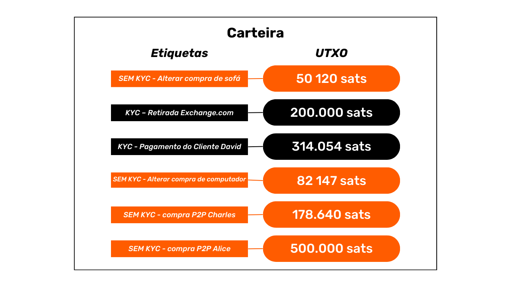
Também é aconselhável perpetuar a rotulagem de uma moeda ao longo das transações. Por exemplo, ao consolidar UTXOs sem KYC, certifique-se de marcar o UTXO resultante não apenas como `consolidação`, mas especificamente como `consolidação sem KYC` para manter um rastro claro da origem da moeda.
Finalmente, não é obrigatório colocar uma data em um rótulo. A maioria dos softwares de carteira já exibe a data da transação, e é sempre possível recuperar essa informação em um explorador de blocos usando seu TXID.

### Como Escolher Suas Moedas Corretamente?

Quando você faz uma transação, o controle de moedas permite que você escolha especificamente quais UTXOs consumir como entradas para satisfazer a saída do pagamento. Dois aspectos devem ser considerados nesta escolha:
- A possibilidade de o destinatário do pagamento vincular uma parte da sua identidade aos UTXOs usados como entradas;
- A capacidade de um observador externo estabelecer ligações entre todos os UTXOs consumidos como entradas.
Para ilustrar o primeiro ponto, vamos tomar um exemplo concreto. Suponha que você compre uma baguete com bitcoins de seu padeiro local. Você usa um ou mais UTXOs que possui como entradas para cobrir pelo menos o preço da baguete em saídas, bem como as taxas de transação. Seu padeiro poderia então potencialmente associar seu rosto, ou qualquer outra parte da sua identidade que ele conheça, com as moedas usadas como entradas. Sabendo da existência dessa ligação, você pode preferir escolher um UTXO específico em vez de outro ao fazer o pagamento.


Por exemplo, se um dos seus UTXOs vem de uma plataforma de câmbio e você prefere que o padeiro não saiba da sua conta nesta plataforma, você evitaria usar este UTXO para o pagamento. Se você possui um UTXO de alto valor que revela uma quantidade significativa de bitcoins, você também pode escolher não usá-lo para evitar que o padeiro saiba sobre sua fortuna em BTC.

A escolha de UTXOs para usar neste primeiro ponto é, portanto, baseada em uma decisão pessoal, influenciada pelo que você está disposto a revelar ou não. Os rótulos que você atribuiu aos seus UTXOs ao recebê-los ajudarão você a selecionar aqueles que, uma vez gastos, apenas expõem informações com as quais você se sente confortável em revelar ao destinatário.

Além das informações potencialmente reveladas ao destinatário, a escolha das entradas também influencia o que você divulga a todos os observadores da blockchain. De fato, ao usar múltiplos UTXOs como entradas para sua transação, você revela que eles são de propriedade da mesma entidade, de acordo com a Heurística de Propriedade Comum de Entrada (CIOH).


Ao selecionar suas moedas, você deve, portanto, estar ciente de que a transação que está prestes a transmitir criará um link entre todos os UTXOs usados. Este link pode ser problemático para sua privacidade pessoal, especialmente se os UTXOs vierem de fontes diferentes.


Vamos voltar ao exemplo do meu UTXO sem KYC da Bisq; quero evitar combiná-lo com um UTXO de, digamos, uma plataforma de câmbio regulada que conhece minha identidade. De fato, se eu usar esses 2 UTXOs como entradas na mesma transação, a plataforma regulada será capaz de vincular minha identidade com o UTXO que comprei na Bisq, enquanto antes não estava vinculado à minha identidade.


Finalmente, para escolher adequadamente quais UTXOs consumir como entradas para uma transação, a coisa mais importante é evitar usar múltiplos UTXOs. Sempre que possível, selecione uma única moeda que seja grande o suficiente para cobrir seu pagamento. Fazendo isso, você evita completamente os riscos associados ao COINJOIN. No entanto, se nenhum UTXO individual for suficiente para o pagamento e você precisar consumir vários, garanta que eles venham de fontes semelhantes para minimizar os riscos de links indesejados. Além disso, tenha em mente que o destinatário pode associar as informações que ele tem sobre você com o histórico das moedas usadas como entradas.

### Entendendo a Seleção Automática de Moedas

Nas seções anteriores, discutimos a seleção manual de UTXOs para uma transação. Mas o que acontece quando o software da carteira faz essa seleção automaticamente? Existem vários métodos para determinar quais moedas consumir, e a seleção de UTXOs é um verdadeiro campo de pesquisa no Bitcoin. O principal objetivo desse processo automático é, muitas vezes, minimizar as taxas de transação para o usuário.

Métodos de seleção de UTXO como FIFO (*First In First Out*) e LIFO (*Last In First Out*) estão entre os mais simples, mas também os menos eficientes. Com o FIFO, as moedas mais antigas na carteira são usadas primeiro. Essa abordagem é geralmente ineficiente tanto para minimizar taxas de transação quanto para preservar a privacidade, exceto em casos onde timelocks relativos são usados e devem ser renovados regularmente. Por outro lado, o LIFO prioriza o uso dos UTXOs mais recentes. Embora simples, esses dois métodos muitas vezes se mostram ineficientes.

Um método mais avançado é o *Knapsack Solver*. Esse foi o método usado na carteira Bitcoin Core até a versão 0.17. Envolve selecionar iterativa e aleatoriamente UTXOs da carteira, somando-os em subconjuntos e mantendo a solução que reduz o peso da transação o máximo possível, a fim de reduzir as taxas para o usuário.
O *Branch-and-Bound* (BNB), muitas vezes apelidado de "algoritmo de Murch" em referência ao seu inventor, substituiu o *Knapsack Solver* no Bitcoin Core a partir da versão 0.17. Esse método mais avançado visa encontrar um conjunto de UTXOs que corresponda exatamente à quantia necessária para satisfazer as saídas de uma transação. O objetivo do BNB é minimizar a quantidade de troco, bem como as taxas, reduzindo o que é chamado de critério de desperdício, que leva em conta tanto os custos imediatos quanto os custos futuros esperados para o troco. Esse método é derivado do conceito original de *Branch-and-Bound*, projetado em 1960 por Ailsa Land e Alison Harcourt, e oferece uma otimização mais precisa das taxas em comparação com o *Knapsack Solver*.
Todos esses métodos de seleção automática de UTXO podem ser eficazes na redução de taxas de transação, mas muitas vezes são ineficientes na preservação da privacidade do usuário. De fato, esses algoritmos podem mesclar vários UTXOs em entradas, revelando assim uma propriedade comum desses UTXOs por causa do COH. Obviamente, esses métodos não podem levar em conta as etiquetas anexadas aos UTXOs, que são cruciais para escolher conscientemente as moedas a revelar ao destinatário da transação. Atualmente, a única solução para otimizar a privacidade ao selecionar moedas é fazê-lo manualmente.

### Tutorial sobre Etiquetagem de UTXO

Se você deseja descobrir como rotular seus UTXOs, nós fizemos um tutorial completo sobre os principais softwares de carteira Bitcoin existentes:

https://planb.network/tutorials/privacy/utxo-labelling


## KYC e Identificação de Chave
<chapterId>cec6b9d9-0eed-4f85-bc4e-1e9aa59ca605</chapterId>
KYC significa "Conheça o Seu Cliente", que é um procedimento regulatório implementado por algumas empresas que operam no setor do Bitcoin. Este procedimento visa verificar e registrar a identidade de seus clientes com o objetivo declarado de combater a lavagem de dinheiro e o financiamento do terrorismo.
Concretamente, o KYC envolve a coleta de vários dados pessoais do cliente, que podem variar de acordo com as jurisdições, mas geralmente inclui um documento de identidade, uma fotografia e um comprovante de residência. Essas informações são então verificadas e mantidas para uso futuro.

Este procedimento tornou-se obrigatório para todas as plataformas de troca regulamentadas na maioria dos países ocidentais. Isso significa que qualquer pessoa que deseje trocar moedas fiduciárias por bitcoin através dessas plataformas deve cumprir com os requisitos do KYC.
Este procedimento não está isento de riscos para a confidencialidade e segurança dos usuários. Neste capítulo, examinaremos esses riscos em detalhes e analisaremos os impactos específicos do KYC e dos processos de identificação na privacidade dos usuários do Bitcoin.
### Facilitando o Rastreamento Onchain

O primeiro risco associado ao KYC é que ele fornece um ponto de entrada privilegiado para análise de cadeia. Como vimos na parte anterior, analistas podem agrupar e rastrear atividades na blockchain usando padrões de transação e heurísticas. Uma vez que conseguem agrupar a atividade onchain de um usuário, encontrar apenas um ponto de entrada entre todas as suas transações e chaves é suficiente para comprometer completamente sua privacidade.


Quando você passa pelo KYC, você fornece um ponto de entrada de muito alta qualidade para análise de cadeia, pois você vincula seus endereços de recebimento usados ao retirar seus bitcoins de uma plataforma de troca à sua identidade completa e verificada. Em teoria, esta informação é conhecida apenas pela empresa à qual você a forneceu, mas, como veremos mais tarde, o risco de vazamento de dados é real. Além disso, o simples fato de uma empresa deter essa informação pode ser problemático, mesmo que ela não a compartilhe.

Assim, se você não tomar outras medidas para limitar o agrupamento de suas atividades na blockchain, qualquer pessoa ciente deste ponto de entrada que é o KYC pode potencialmente vincular toda a sua atividade no Bitcoin à sua identidade. Do ponto de vista desta empresa, seu uso do Bitcoin, portanto, perde toda a confidencialidade.


Para ilustrar isso com uma comparação, é como se seu banqueiro do *Banco X* tivesse acesso não apenas a todas as suas transações feitas com o *Banco X*, mas também pudesse observar suas transações com o *Banco Y* e todas as suas transações em dinheiro.

Lembre-se da primeira parte deste treinamento: o modelo de privacidade do Bitcoin, conforme projetado por Satoshi Nakamoto, depende da separação entre a identidade do usuário e seus pares de chaves. Embora esta camada de privacidade não seja mais suficiente hoje, ainda é prudente limitar sua degradação tanto quanto possível.

### Exposição à Vigilância do Estado

A segunda questão importante com o KYC é que ele revela ao estado que você possuiu bitcoin em algum momento. Quando você compra bitcoins através de um ator regulado, torna-se possível para o estado saber sobre essa posse. Atualmente, isso pode parecer trivial, mas é importante lembrar que o futuro político e econômico do seu país não está em suas mãos.
Antes de tudo, o estado pode rapidamente adotar uma postura autoritária. A história está cheia de exemplos onde políticas mudaram abruptamente. Hoje, na Europa, entusiastas do Bitcoin podem escrever artigos sobre Bitcoin, participar de conferências e gerenciar suas carteiras em auto-custódia. Mas quem pode dizer o que o amanhã reserva? Se o Bitcoin de repente se tornasse o inimigo público número um, estar associado a ele nos registros do estado poderia se provar problemático.
Em seguida, diante de graves crises econômicas, o estado poderia considerar a apreensão de bitcoins mantidos pelos cidadãos. Talvez amanhã, os Bitcoiners sejam vistos como aproveitadores de crises e sejam excessivamente taxados devido aos seus ganhos de capital diante da desvalorização da moeda fiduciária.
Você pode pensar que isso não é um problema porque seus bitcoins estão misturados e, portanto, são inrastreáveis. No entanto, o rastreamento não é o problema aqui. O verdadeiro problema é que o estado sabe que você possuiu bitcoin. Esta simples informação poderia ser suficiente para incriminá-lo ou exigir uma conta. Você poderia tentar alegar que gastou seus bitcoins, mas isso deveria ser refletido na sua declaração de impostos, e você seria pego. Você também poderia dizer que perdeu suas chaves em um acidente de barco, mas além da piada no Twitter, você realmente acha que isso seria suficiente para exonerá-lo?

Portanto, é importante considerar o risco associado ao mero fato de o estado poder saber que você possuiu BTC, mesmo que este risco possa parecer distante hoje.

Outro problema apresentado pelo KYC em termos de vigilância estatal é a notificação obrigatória por plataformas regulamentadas. Embora eu não esteja familiarizado com regulamentações em outras jurisdições, na França, os *Prestadores de Serviços de Ativos Digitais* (PSAN) são obrigados a relatar às autoridades de supervisão financeira quaisquer movimentos de fundos que considerem suspeitos.

Assim, na França em 2023, 1.449 atos suspeitos foram relatados pelos PSANs. Por enquanto, a maioria desses atos está relacionada à criminalidade. No entanto, as autoridades também pedem que as plataformas regulamentadas relatem qualquer transação suspeita de Bitcoin baseada apenas em sua estrutura. Se você realizar uma transação colaborativa, ou mesmo apenas uma transação que apresente um padrão um tanto atípico, e essa transação ocorrer perto da retirada de seus bitcoins dessas plataformas, você poderia se encontrar relatado às autoridades. Mesmo na ausência de irregularidades e no exercício legítimo de seus direitos, essa notificação poderia levar a verificações e vigilância aumentadas, inconveniências que você teria evitado sem o KYC.

### O risco de vazamento de dados pessoais
Outro problema com o KYC reside no fato de que ele requer o armazenamento de todos os seus dados pessoais nos servidores de uma empresa privada. Eventos recentes nos lembraram que ninguém está imune a falhas, sejam elas financeiras ou relacionadas à TI. Em 2022, os clientes da Celsius sofreram as consequências. Após a falência da empresa, os nomes dos credores e o valor de seus ativos foram tornados públicos pelo sistema de justiça americano durante o procedimento administrativo.

Há pouco mais de dois anos, uma entidade líder em cibersegurança no domínio da criptomoeda experimentou o roubo dos dados pessoais de seus clientes. Embora este incidente não estivesse diretamente relacionado à compra de bitcoins, tal risco também permanece para as plataformas de troca. Portanto, há um risco definitivo associado a esses dados pessoais.

É verdade que já confiamos muitos dos nossos dados pessoais a empresas privadas. No entanto, o risco aqui é duplo, uma vez que esses dados não apenas permitem que você seja identificado, mas também estão vinculados a uma atividade em Bitcoin. De fato, quando um hacker consegue acessar os dados dos clientes de uma plataforma de troca, eles podem razoavelmente assumir que esses clientes possuem bitcoins. Esse risco é assim acentuado pelo fato de que o bitcoin, como qualquer outro ativo valioso, atrai o interesse de ladrões.

No caso de uma violação de dados, no melhor dos casos, você poderia ser alvo de tentativas de phishing direcionadas. No pior dos casos, você poderia se encontrar no centro de ameaças físicas à sua residência.
Além dos riscos específicos relacionados ao Bitcoin, também é necessário considerar os perigos associados à transmissão de documentos de identidade. De fato, no caso de um vazamento de dados, é possível tornar-se vítima de roubo de identidade. Assim, os riscos não se limitam apenas à proteção da confidencialidade das transações, mas também dizem respeito à segurança pessoal de cada indivíduo.

### Conceitos Errados Comuns sobre KYC

É importante desmistificar alguns conceitos errados comuns sobre KYC (Conheça Seu Cliente) que são frequentemente encontrados no Twitter ou em nossas discussões entre bitcoiners.
Em primeiro lugar, é incorreto pensar que proteger a privacidade dos bitcoins adquiridos via KYC é fútil. As ferramentas e métodos para privacidade no Bitcoin são variados e servem a diferentes propósitos. O uso de transações coinjoin em bitcoins de KYC, por exemplo, não é uma má ideia. Claro, é necessário ter cautela com plataformas de troca regulamentadas para evitar o congelamento ou banimento de sua conta, mas de um ponto de vista estritamente técnico, essas práticas não são incompatíveis. Coinjoin tem o efeito de quebrar o histórico de uma moeda, o que ajuda a contrariar alguns dos riscos de análise de cadeia associados ao KYC. Embora não elimine todos os riscos, já representa um benefício significativo.


A privacidade no Bitcoin não deve ser vista de maneira binária, como uma distinção entre bitcoins "anônimos" e outros que não são. Possuir bitcoins adquiridos via KYC não significa que tudo está perdido; pelo contrário, o uso de ferramentas de privacidade pode se mostrar ainda mais benéfico.

Por outro lado, adquirir bitcoin por meio de um método não-KYC não garante privacidade perfeita e não isenta alguém da necessidade de tomar outras medidas protetivas. Se você possui bitcoin não-KYC mas reutiliza endereços de recebimento várias vezes, suas transações podem ser rastreadas e agrupadas. O menor vínculo com o mundo fora do Bitcoin poderia comprometer a única camada de privacidade que você tinha. Portanto, é importante considerar todas as ferramentas e métodos que melhoram a privacidade no Bitcoin como complementares. Cada técnica aborda um risco específico e pode adicionar uma camada adicional de proteção. Assim, possuir bitcoin não-KYC absolutamente não isenta alguém de tomar outras precauções.

### O KYC pode ser desfeito?

Às vezes me perguntam se é possível "voltar atrás" depois de ter completado o KYC, e como você pode imaginar a partir dos parágrafos anteriores, a resposta é matizada. Para evitar os riscos associados ao KYC, o método mais simples é não usá-lo ao adquirir bitcoins. Aprofundaremos mais neste tópico no próximo capítulo. No entanto, se o KYC já foi realizado e bitcoins foram comprados, existem maneiras de mitigar os riscos incorridos?

Quanto ao risco de rastreabilidade de suas transações, o uso de coinjoin é uma solução. Discutiremos este método em detalhes mais adiante no treinamento, mas esteja ciente de que coinjoin pode quebrar o histórico de uma moeda e impedir seu rastreamento passado-presente e presente-passado. Mesmo para BTC obtido via uma plataforma regulamentada, esta técnica pode prevenir sua rastreabilidade.
No entanto, coinjoin não elimina o segundo risco associado ao KYC: o fato de o estado estar informado sobre suas posses em bitcoin. De fato, mesmo que suas moedas não sejam mais rastreáveis, o estado, dependendo da jurisdição, pode ter acesso às suas declarações de disposição de criptoativos. Uma vez que este risco não é técnico, mas administrativo, não existem soluções específicas para Bitcoin para eliminá-lo, além de não se expor ao KYC inicialmente. A única abordagem legal para mitigar esse risco é vender seus bitcoins adquiridos por meio de plataformas reguladas em plataformas reguladas e, em seguida, recomprá-los por meios sem KYC. Ao vender e declarar a disposição, a administração deve notar que você não os possui mais.
Quanto ao risco de seus dados pessoais e documentos de identidade vazarem, isso é um perigo externo ao Bitcoin, e não há solução técnica para evitá-lo. Uma vez que seus dados são revelados, é difícil reverter essa operação. Você pode tentar fechar sua conta na plataforma, mas isso não garante a exclusão dos seus dados KYC, especialmente quando a verificação de identidade é terceirizada. Verificar a exclusão completa das suas informações é impossível. Portanto, não há solução para prevenir completamente esse risco e garantir que ele não exista mais.

### A diferença entre KYC e identificação de chave

Às vezes, alguns bitcoiners tendem a estender o termo "KYC" para qualquer troca de BTC envolvendo uma transferência ou um pagamento com cartão de crédito, pois esses meios também podem revelar a origem do pagamento, assim como o KYC faria. No entanto, é importante não confundir KYC com identificação de chave. Pessoalmente, devo admitir que minha percepção sobre este assunto evoluiu com o tempo.

KYC refere-se especificamente a um procedimento regulatório implementado por algumas empresas para verificar e registrar a identidade de seus clientes. É uma coisa binária: ao adquirir seus bitcoins, ou você passa pelo KYC, ou não. No entanto, a identificação de chave, que diz respeito a vincular um aspecto da identidade de um usuário à atividade onchain, não é tão binária, mas sim representa um contínuo. De fato, no contexto de aquisição ou disposição de bitcoins, essa identificação é sempre possível em diferentes graus.
Por exemplo, se você comprar bitcoins em uma plataforma regulada na Suíça, o KYC (Conheça Seu Cliente) não é necessário. No entanto, pode haver uma identificação de suas chaves, já que a compra foi feita através de sua conta bancária. É aqui que os dois primeiros riscos associados ao KYC — facilitação do rastreamento onchain e exposição à vigilância do estado — também podem se manifestar em uma troca não-KYC. Se a entidade suíça relatar transações suspeitas às autoridades do seu país, elas podem simplesmente verificar a conta bancária usada para a compra para descobrir sua identidade. Assim, comprar sem KYC em plataformas reguladas está bastante alto na escala de risco para identificação de chave.


No entanto, evitar plataformas reguladas e optar por métodos de aquisição P2P (Peer-to-Peer) não elimina completamente o risco de identificação de chave, mas apenas o reduz. Considere o exemplo de uma compra no Bisq ou em outra plataforma P2P. Para liquidar com sua contraparte, você provavelmente usará sua conta bancária. Se as autoridades questionarem a pessoa com quem você negociou e pedirem seu nome, encontramos os riscos 1 e 2 mencionados anteriormente. Esses riscos são certamente muito menores do que durante uma compra não-KYC em uma plataforma, e ainda mais reduzidos do que durante uma compra com KYC, mas ainda estão presentes em menor grau.


Finalmente, mesmo que você adquira seus bitcoins por meio de uma troca física por dinheiro, você não é completamente anônimo. A pessoa com quem você negociou viu seu rosto, o que faz parte da sua identidade. Embora mínimo neste exemplo, ainda existe a possibilidade de identificação chave.


Em conclusão, durante uma troca de bitcoins por outros ativos, seja uma compra em moeda fiduciária ou uma venda por um bem real, sempre existe alguma forma de identificação chave. Dependendo do método de troca escolhido, essa identificação pode variar em intensidade. É importante não confundir essa identificação com KYC, que é um processo regulatório bem definido. No entanto, existe uma ligação entre KYC e o espectro de identificação, já que KYC está na extremidade superior deste espectro, pois facilita sistematicamente a identificação das chaves do usuário pelas autoridades.

## Métodos de Venda e Aquisição
<chapterId>756598af-95aa-4c77-ac48-243c7ad89530</chapterId>
Após ler o capítulo anterior, você pode estar se perguntando sobre maneiras de comprar ou vender bitcoin sem ter que passar por um processo de verificação de identidade, a fim de evitar os riscos associados ao KYC. Existem vários métodos para realizar trocas.

### Trocas P2P com Dinheiro

Como vimos, o melhor método em termos de privacidade permanece a troca P2P (peer-to-peer) com um acerto em dinheiro. Este método permite minimizar os rastros deixados e reduz significativamente a possibilidade de identificação chave, seja você comprador ou vendedor.


No entanto, essa prática carrega riscos para a segurança pessoal. O principal perigo reside no fato de que, durante a troca, a contraparte saberá que você possui uma quantia significativa, seja em dinheiro ou em bitcoins. Essa informação pode atrair a atenção de indivíduos mal-intencionados. De fato, geralmente é recomendado permanecer discreto sobre a posse de seus bitcoins. Este conselho também poderia ser aplicado ao dinheiro. No entanto, durante uma troca pessoal, é inevitável revelar que você possui bitcoins, o que pode despertar cobiça.


Para limitar esse risco, aconselho que você priorize transações em dinheiro com indivíduos de confiança, como membros da família ou amigos próximos. Alternativamente, você também poderia considerar fazer trocas em [encontros locais de Bitcoin](https://btcmap.org/communities/map), após ter participado várias vezes. Isso permitirá que você conheça melhor os outros participantes e não esteja sozinho durante a troca física. No entanto, é importante reconhecer que a troca P2P com dinheiro inerentemente carrega riscos para sua segurança pessoal que não existem ao fazer compras por meio de uma plataforma regulada e sua conta bancária.

Além disso, dependendo de onde você mora, transportar e armazenar grandes somas de dinheiro pode representar riscos, seja para bitcoin ou dinheiro.

A troca de dinheiro também pode representar riscos legais durante controles policiais ou outros. Embora na maioria dos países, não haja restrição sobre a quantidade de dinheiro que você pode carregar consigo, somas muito grandes podem levantar suspeitas. Portanto, seja cauteloso, especialmente se você tiver que viajar longas distâncias, e evite fazer transações muito grandes de uma só vez para não ter que justificar a posse de quantias significativas.
Finalmente, outra desvantagem das compras P2P é que o preço costuma ser mais alto do que o observado em plataformas reguladas. Os vendedores frequentemente impõem uma margem de lucro que varia de 1% a, às vezes, mais de 10%. Várias razões explicam essa diferença de preço. Primeiro, é uma prática comum entre os vendedores P2P que foi estabelecida ao longo do tempo. Em seguida, os vendedores têm taxas de transação associadas ao envio de fundos para o comprador. Há também um risco aumentado de roubo em vendas P2P em comparação com transações em plataformas, o que justifica uma compensação pelo risco assumido. Por último, o acréscimo pode estar relacionado à demanda e à qualidade da troca em termos de privacidade. Como comprador, o ganho em privacidade tem um preço que se reflete na margem de lucro aplicada pelo vendedor. Alguns bitcoiners também acreditam que o preço aumentado do BTC comprado em P2P reflete seu verdadeiro valor e argumentam que os preços mais baixos em plataformas reguladas são o resultado de um compromisso na privacidade dos seus dados pessoais.


### Trocas P2P via uma Plataforma de Correspondência

Uma alternativa menos arriscada em termos de segurança pessoal é realizar trocas P2P exclusivamente online, por meio de métodos de pagamento eletrônico, como PayPal, transferências bancárias ou Revolut.


Essa abordagem ajuda a evitar muitos riscos associados a transações em dinheiro. No entanto, o risco de que a contraparte não honre seus compromissos durante uma troca online é maior. De fato, durante uma troca física, se você entregar dinheiro ao vendedor que não lhe envia os bitcoins em troca, você pode imediatamente responsabilizá-los, já que estão à sua frente. Online, por outro lado, muitas vezes é impossível encontrar uma pessoa que tenha roubado de você.


Para mitigar esse risco, é possível usar plataformas especializadas em correspondência para trocas P2P. Essas plataformas usam mecanismos de resolução de conflitos para proteger os usuários prejudicados. Geralmente, elas oferecem um sistema de escrow, onde os bitcoins são mantidos até que o pagamento em moeda fiduciária seja confirmado pelo vendedor.


Em termos de segurança pessoal, este método de compra é significativamente mais seguro do que trocas físicas em dinheiro. No entanto, como mencionado anteriormente, trocas P2P online deixam mais rastros do que uma troca física, o que pode ser prejudicial à privacidade no Bitcoin. Ao usar um método de pagamento fiat online como um banco, você expõe mais informações que poderiam facilitar a identificação de chaves.


Mais uma vez, recomendo não fazer grandes trocas em uma única transação nessas plataformas. Ao dividir suas transações, você espalha os riscos associados ao potencial roubo pela contraparte.
Mais uma vez, outro ponto negativo das compras P2P é que o preço costuma ser mais alto do que o visto em plataformas reguladas. Os vendedores frequentemente impõem uma margem de lucro que varia de 1% a, às vezes, mais de 10%. Várias razões explicam essa diferença de preço. Primeiro, é uma prática comum entre os vendedores P2P que foi estabelecida ao longo do tempo. Em seguida, os vendedores têm taxas de transação associadas ao envio de fundos para o comprador. Há também um risco aumentado de roubo em vendas P2P comparado a transações em plataformas, o que justifica uma compensação pelo risco assumido. Finalmente, o acréscimo pode estar relacionado à demanda e à qualidade da troca em termos de privacidade. Como comprador, o ganho em privacidade tem um preço que se reflete na margem de lucro aplicada pelo vendedor. Alguns bitcoiners também acreditam que o preço aumentado do BTC comprado P2P reflete seu verdadeiro valor e argumentam que os preços mais baixos em plataformas reguladas são o resultado de um compromisso na privacidade dos seus dados pessoais.


Quanto às soluções, eu pessoalmente sempre usei [Bisq](https://bisq.network/) e estou muito satisfeito com isso. Seu sistema é bem estabelecido e parece confiável. No entanto, Bisq está disponível apenas para PC e sua interface pode ser complexa demais para iniciantes. Outro ponto negativo é que o Bisq opera exclusivamente com transações onchain, o que pode se tornar caro durante períodos de taxas de transação altas no Bitcoin.

[-> Descubra nosso tutorial sobre Bisq.](https://planb.network/en/tutorials/exchange/bisq)

Para uma opção mais simples, você pode experimentar [Peach](https://peachbitcoin.com/), um aplicativo móvel que facilita a conexão entre compradores e vendedores com um sistema integrado de resolução de disputas. O processo é mais intuitivo do que o de Bisq.

[-> Descubra nosso tutorial sobre Peach.](https://planb.network/en/tutorials/exchange/peach-wallet)
Outra opção online é [HodlHodl](https://hodlhodl.com/), uma plataforma bem estabelecida que oferece boa liquidez, embora eu pessoalmente não a tenha testado.
[-> Descubra nosso tutorial sobre HodlHodl.](https://planb.network/en/tutorials/exchange/hodlhodl)

Para soluções baseadas na Lightning Network, você pode experimentar [RoboSats](https://learn.robosats.com/) e [LNP2PBot](https://lnp2pbot.com/). RoboSats é acessível via um site e é relativamente simples de usar. LNP2PBot é mais atípico, pois opera através de um sistema de troca no aplicativo de mensagens Telegram.

[-> Descubra nosso tutorial sobre RoboSats.](https://planb.network/en/tutorials/exchange/robosats)
[-> Descubra nosso tutorial sobre LNP2PBot.](https://planb.network/en/tutorials/exchange/lnp2pbot)


### Plataformas Reguladas sem KYC

Dependendo do país em que você vive, você pode ter acesso a plataformas reguladas que não exigem um procedimento KYC para comprar ou vender bitcoins. Na Suíça, por exemplo, você pode usar plataformas como [Relai](https://relai.app/) e [MtPelerin](https://www.mtpelerin.com/).

[-> Descubra nosso tutorial sobre Relai.](https://planb.network/en/tutorials/exchange/relai)
Como vimos no capítulo anterior, esse tipo de plataforma poupa você dos riscos associados aos procedimentos de KYC, mas apresentam um nível de risco maior para identificação chave. Em termos de privacidade no Bitcoin, essas plataformas, portanto, oferecem melhor proteção do que métodos de compra com KYC, mas são menos interessantes do que trocas P2P.
No entanto, em termos de segurança pessoal, usar essas plataformas é significativamente menos arriscado do que trocas P2P. Elas também são frequentemente mais simples de usar do que plataformas que facilitam trocas P2P.

### Caixas Eletrônicos

Outra opção para comprar ou vender bitcoins sem KYC são os caixas eletrônicos de criptomoedas (ATM). Pessoalmente, nunca tive a oportunidade de testar essa solução, pois não existem no meu país. Mas este método pode ser muito interessante dependendo de onde você mora.


O problema com os caixas eletrônicos é que eles são proibidos em alguns países ou fortemente regulamentados em outros. Se um caixa eletrônico requer um processo de verificação de identidade, então enfrenta os mesmos riscos que aqueles inerentes às plataformas KYC regulamentadas. No entanto, se o caixa eletrônico permite transações sem verificação de identidade para pequenas quantias, então seu uso pode oferecer um nível de privacidade comparável ao de uma troca P2P baseada em dinheiro, evitando a maioria dos riscos associados a este tipo de troca.
A principal desvantagem dos caixas eletrônicos reside em suas taxas de câmbio frequentemente altas, que variam de alguns por cento a às vezes 15% do valor trocado.

### Cartões Presente

Finalmente, também queria apresentar uma solução que funciona bem para aqueles que desejam usar seus bitcoins no dia a dia para compras em vez de vendê-los por moedas fiduciárias.

A melhor maneira de gastar BTC é obviamente usar o Bitcoin diretamente ou a Lightning Network para comprar bens ou serviços. No entanto, em muitos países, o número de comerciantes que aceitam bitcoin permanece limitado. Uma alternativa prática é então o uso de cartões presente.

Várias plataformas que não requerem um procedimento KYC oferecem a possibilidade de trocar bitcoins por cartões presente que podem ser usados em grandes lojas. Entre essas plataformas, encontramos [CoinsBee](https://www.coinsbee.com/), [The Bitcoin Company](https://thebitcoincompany.com/), e [Bitrefill](https://www.bitrefill.com/). Essas plataformas facilitam grandemente o uso diário de seus bitcoins, permitindo que você acesse uma ampla gama de produtos e serviços sem ter que passar por uma conversão em moeda fiduciária.


### Outros Métodos de Aquisição

Entre outros métodos para adquirir bitcoins protegendo sua privacidade, está obviamente a mineração. Para começar a minerar sats, não é necessário revelar sua identidade; você simplesmente precisa encontrar uma prova de trabalho válida e submetê-la à rede. Se você optar pela mineração em pool, alguns pools exigem uma forma de identificação, como KYC, enquanto outros não.

Outro método consiste em trabalhar em troca de bitcoins. Este método de aquisição pode ser interessante, mas o grau de identificação necessário varia muito dependendo das circunstâncias.

*Para escrever este capítulo, usei o curso [BTC205](https://planb.network/fr/courses/btc205) criado por [@pivi___](https://x.com/pivi___) na PlanB Network (disponível apenas em francês por enquanto).*

## Consolidação, Gerenciamento de UTXO e CIOH
<chapterId>d0486c8f-332d-402b-ae2e-949416752b9c</chapterId>
Um dos aspectos mais complicados de gerenciar quando você possui sua própria carteira de auto-custódia é, sem dúvida, a consolidação. Você deve consolidar? Qual é o propósito? Qual tamanho de UTXO você deve visar? Quais são os compromissos em termos de privacidade? É isso que tentaremos explorar nesta seção.

### O que é consolidação?

A operação do Bitcoin é semelhante a um mercado de leilões onde as transações que oferecem as melhores taxas são favorecidas pelos mineradores. No entanto, cada bloco tem um peso máximo, limitando o número de transações que podem ser incluídas. Uma vez que um bloco é produzido em média a cada 10 minutos, o espaço disponível em cada bloco é um recurso raro.

Os mineradores, cuja atividade incorre em custos significativos em eletricidade, capital e manutenção, naturalmente buscam maximizar sua lucratividade. Eles tendem a favorecer transações que lhes oferecem as maiores taxas em relação ao seu peso.

De fato, nem todas as transações do Bitcoin pesam o mesmo. Aquelas com mais entradas e saídas pesarão mais. Por exemplo, considere 2 transações:
- A transação A inclui 1 entrada e 1 saída. Ela aloca 1.994 sats de taxas e seu peso é 141 vB;
- A transação B, mais complexa, com 2 entradas e 2 saídas, aloca 2.640 sats de taxas por um peso de 220 vB.

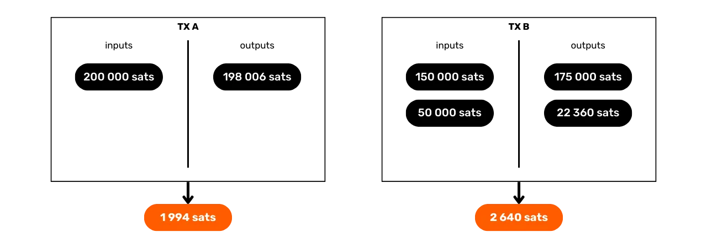

Neste exemplo, embora a transação B proponha um total de taxas mais alto, os mineradores favorecerão a transação A porque ela oferece uma melhor relação entre taxas e peso. Aqui está o cálculo para cada transação, expresso em sats por byte virtual (sat/vB):

```text
TXA: 1994 / 141 = 14 sats/vB

TXB: 2640 / 220 = 12 sats / vB
```

Isso significa que para cada unidade de peso, a transação A oferece mais taxas do que a transação B, mesmo que a última ofereça mais taxas em valor absoluto.


Portanto, é sempre mais interessante para o usuário consumir a menor quantidade possível de entradas em suas transações. No entanto, é necessário consumir quantidades suficientes para poder satisfazer o pagamento na saída. Na gestão de sua carteira, deve-se, portanto, ter UTXOs suficientemente grandes.

O princípio da consolidação é precisamente aproveitar os períodos em que as taxas estão baixas no Bitcoin para fundir seus pequenos UTXOs em um único maior. Assim, quando as taxas no Bitcoin aumentam, pode-se fazer transações com um mínimo de entradas, e, portanto, gastar menos em taxas absolutas. O objetivo é planejar as transações obrigatórias a serem realizadas durante períodos de taxas altas.

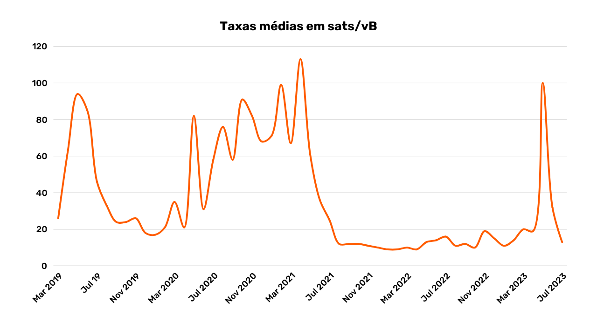
Além da economia em taxas de transação, consolidar UTXOs ajuda a evitar a criação de "poeira". Poeira refere-se a UTXOs cujo valor em sats é tão baixo que não é suficiente para cobrir as taxas de transação necessárias para gastá-los. Isso torna esses UTXOs economicamente irracionais de usar enquanto as taxas de transação permanecerem altas. Ao agrupar proativamente seus UTXOs, você impede que eles se transformem em poeira, garantindo que todos os seus fundos permaneçam utilizáveis.

### Qual é o tamanho mínimo para seus UTXOs?

Às vezes, me perguntam qual é o valor mínimo recomendado para um UTXO. Infelizmente, não há uma resposta universal, pois depende das suas preferências e das condições de mercado para taxas. No entanto, aqui está uma fórmula que pode ajudá-lo a determinar um limiar adequado às suas necessidades:

$$
\frac {P \times F}T = M
$$

Onde:
- $P$ é o peso da transação;
- $F$ representa a taxa máxima de cobrança em satoshis por vbyte (sats/vB) que você está disposto a cobrir;
- $T$ é a porcentagem da taxa de transação que você está disposto a pagar em relação ao valor total do UTXO;
- $M$ é o valor mínimo em satoshis para cada UTXO.

Assumindo que você planeja cobrir as taxas para uma transação SegWit padrão com 1 entrada e 2 saídas, pesando 141 vB. Se você cobrir até 800 sats/vB, e estiver disposto a gastar até 12% do valor do UTXO em taxas no máximo, então o cálculo seria:

$$
\frac{141 \times 800}{0.12} = 940\ 000
$$

Neste exemplo, seria prudente manter um valor mínimo de 940.000 sats para os UTXOs em sua carteira.

### Consolidação e a COIH

Uma das heurísticas mais usadas na análise de cadeias é a COIH (*Common Input Ownership Heuristic*), que permite assumir que todas as entradas de uma transação Bitcoin pertencem à mesma entidade. Precisamente, o princípio da consolidação é consumir vários UTXOs como entradas e criar um único UTXO como saída. Portanto, a consolidação permite a aplicação da COIH.

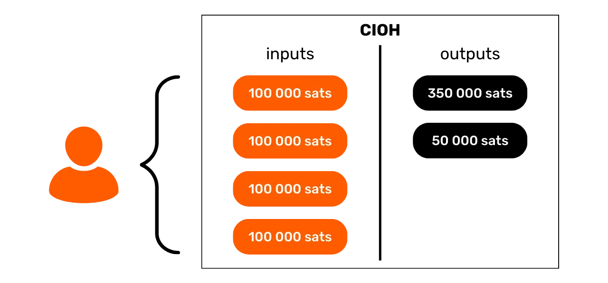


Na prática, isso significa que um observador externo pode deduzir que todos os UTXOs consolidados provavelmente pertencem à mesma pessoa e que a única saída gerada também pertence a eles. Esta situação pode comprometer sua privacidade ao vincular diferentes históricos de transações. Por exemplo, digamos que eu consolide 3 UTXOs adquiridos em P2P com um UTXO obtido via uma plataforma que exige KYC:


Ao fazer isso, qualquer entidade com acesso aos dados da plataforma de troca, incluindo potencialmente agências governamentais, pode identificar que eu possuo outros montantes em BTC. Anteriormente, esses UTXOs não estavam diretamente ligados à minha identidade; agora, estão. Além disso, isso revela a todas as fontes que eu estou na posse de uma certa quantidade de bitcoins.

Na gestão de UTXOs, considerações econômicas, que incentivam a consolidação para reduzir taxas, entram em conflito com boas práticas de privacidade, que recomendariam nunca mesclar seus UTXOs. A escolha entre economia e privacidade, portanto, depende das prioridades de cada usuário.

Se você pode evitar a consolidação enquanto mantém tamanhos substanciais de UTXO, isso é o ideal. Para fazer isso, otimize seus métodos de aquisição. Se você compra seus bitcoins em DCA, tente espaçar suas compras únicas tanto quanto possível para agrupar valor em menos UTXOs. Será mais fácil gerenciar uma compra única de €1.000 a cada 2 meses, em vez de uma compra de €120 toda semana. Isso minimiza o número de UTXOs gerados e simplifica a gestão da sua carteira enquanto preserva sua privacidade.
Se você se encontrar na necessidade de consolidar seus bitcoins, priorize primeiro a consolidação dos UTXOs da mesma fonte. Por exemplo, mesclar 10 UTXOs de uma única plataforma afetará menos a sua privacidade do que misturar 5 UTXOs da plataforma A com 5 UTXOs da plataforma B. Se a consolidação de várias fontes for inevitável, tente separá-las de acordo com suas características. Por exemplo, agrupe os UTXOs adquiridos por meio de KYC em uma transação, e aqueles obtidos em P2P em outra.
De qualquer forma, lembre-se de que qualquer consolidação inevitavelmente leva a uma perda de privacidade. Portanto, avalie cuidadosamente a necessidade desta operação e os impactos potenciais na sua privacidade, levando em conta o risco.

## Outras Boas Práticas
<chapterId>b5216965-7d13-4ea1-9b7c-e292966a487b</chapterId>

Vamos explorar juntos algumas outras boas práticas que podem ajudá-lo a otimizar sua privacidade no Bitcoin.

### O Nó Completo
Possuir seus bitcoins em auto-custódia é bom, mas usar seu próprio nó completo é melhor! Aqui está o porquê de ter seu próprio nó ser crucial para um uso totalmente soberano do Bitcoin:
- **Resistência à Censura**: Suas transações não podem ser bloqueadas por ninguém;
- **Independência de Terceiros**: Você não depende mais de nenhum serviço externo para verificar dados da blockchain;
- **Participação Ativa**: Você tem a capacidade de definir suas próprias regras de validação e participar diretamente no consenso;
- **Contribuição para a Rede**: Ao executar um nó, você ajuda a fortalecer e distribuir a rede Bitcoin;
- **Educação Técnica**: Gerenciar um nó completo é uma excelente maneira de aprofundar seu conhecimento técnico sobre o Bitcoin.

Além desses benefícios, usar um nó completo também melhora sua privacidade ao transmitir suas transações. Quando você emite uma transação, ela é primeiro criada e assinada por meio de sua carteira. Para transmiti-la na rede Bitcoin, ela deve ser conhecida por pelo menos um nó. Usando seu próprio nó, você controla diretamente essa transmissão, aumentando assim sua privacidade e limitando os riscos de vazamento de dados.


Se você não tem seu próprio nó Bitcoin, será forçado a usar o de terceiros, como o oferecido pelo provedor do software de sua carteira. Além da transmissão de transações, sua carteira requer acesso a várias informações, como transações pendentes, saldos associados aos seus endereços ou o número de confirmações para suas transações. Para acessar todos esses dados, você precisa consultar um nó.


O principal risco quando você não usa seu próprio nó Bitcoin é que o operador do nó de terceiros pode observar suas atividades na blockchain, ou até mesmo compartilhar essas informações com outras entidades. Para limitar esse risco, uma solução intermediária é usar softwares de carteira que permitem mascarar suas conexões via Tor. Isso pode reduzir a exposição dos seus dados. No entanto, a solução ótima permanece ter seu próprio nó Bitcoin e usá-lo para a transmissão de suas transações. Obviamente, você também precisará garantir que nenhuma informação vaze do seu nó, mas esse é outro tópico que exploraremos nas próximas seções.
Além da vantagem óbvia para a sua privacidade, ter o seu próprio nó completo também garante a veracidade dos dados na blockchain, protege contra a censura e permite que você participe ativamente na governança do Bitcoin. Ao usar o seu próprio nó, você contribui com o seu peso econômico para a cadeia de sua escolha, o que é importante durante conflitos dentro da comunidade, como durante a Guerra do Tamanho do Bloco de 2015 a 2017, por exemplo. No caso de um fork, usar o nó de terceiros pode levar você a apoiar uma cadeia que você não deseja favorecer, já que o operador do nó faz a escolha por você. Como você pode entender, em uma preocupação com a privacidade e, mais amplamente, a soberania individual, é essencial executar e usar o seu próprio nó completo!

### Enganando Heurísticas de Análise

De forma mais ampla, é importante entender as heurísticas sobre as quais falamos na parte anterior, a fim de melhor evitá-las ou enganá-las. Adotar uma série de boas práticas pode ser benéfico, mesmo que não sejam indispensáveis. Elas oferecem uma camada adicional de proteção que pode ser importante para manter uma boa privacidade ao usar o Bitcoin.

O primeiro conselho que eu poderia dar é se misturar à multidão mais densa. No Bitcoin, isso significa usar os padrões de script mais adotados. Por exemplo, scripts P2WSH, frequentemente usados para configurações multisig SegWit V0, são muito raros. Eles não permitem que você se esconda em um grande conjunto de anonimato. O mesmo vale para modelos antigos como P2PKH ou P2SH. Embora estejam amplamente presentes no conjunto UTXO, estão sendo usados cada vez menos para novas transações.

Em geral, é mais seguro recorrer ao padrão de script mais recente, desde que seja suficientemente adotado. Assim, se em 2022, eu teria aconselhado contra o uso de P2TR (Taproot) devido à sua baixa adoção, até 2024, eu recomendaria optar por este tipo de script, ou na falta dele, pelo script SegWit V0, já que o número de transações usando P2TR está começando a representar uma porção muito significativa.


Fonte: [txstats.com](https://txstats.com/d/000000054/utxo-set-repartition-by-output-type)
Outra dica para preservar sua privacidade é tentar contornar as heurísticas internas das transações. Por exemplo, ao fazer um pagamento, você pode tentar evitar criar uma saída com um valor redondo, pois isso poderia indicar que a outra saída representa o troco. Se você precisa enviar 100k sats para um amigo, considere transferir um valor um pouco maior para escapar dessa heurística. Da mesma forma, tente não criar saídas de troco que sejam desproporcionalmente altas em comparação com o pagamento feito, pois isso também poderia revelar qual das saídas representa o troco.


Finalmente, se você realiza transações Bitcoin regularmente, certifique-se de não sempre transmiti-las nos mesmos horários. Ao espalhar a transmissão de suas transações ao longo do dia e da semana, você evita dar aos observadores externos a capacidade de detectar um padrão temporal baseado em fusos horários que poderia aprimorar a análise deles.

Além de todas essas boas práticas a adotar diariamente, existem métodos ainda mais eficazes para quebrar completamente a rastreabilidade dos seus bitcoins. Entre eles, obviamente, estão as transações coinjoin que estudaremos em profundidade na parte seguinte.

# Entendendo Transações Coinjoin
<partId>6d0bbf16-3714-4db1-9897-2d45019f6bdc</partId>

## O que é uma Transação Coinjoin?
<chapterId>0862bc6b-1c48-4aa4-b76d-4f547b469008</chapterId>
Após estudarmos os fundamentos da proteção de privacidade, agora discutiremos técnicas mais sofisticadas voltadas para a defesa ativa de sua privacidade, particularmente dissociando o histórico dos seus bitcoins. Na parte seguinte, exploraremos várias pequenas técnicas, mas primeiro, quero falar com você sobre coinjoin.

Coinjoin é frequentemente considerado o método mais eficaz para proteger a privacidade dos usuários do Bitcoin. Mas o que exatamente é uma transação coinjoin? Vamos descobrir juntos.

### Os Princípios Básicos do Coinjoin

Coinjoin é uma técnica que quebra a rastreabilidade dos bitcoins na blockchain. Ela se baseia em uma transação colaborativa com uma estrutura específica de mesmo nome: a transação coinjoin.
Como vimos nas primeiras partes deste treinamento, as transações no Bitcoin são conhecidas por todos os usuários através de seu nó. Portanto, é fácil verificar a cadeia de assinaturas eletrônicas de cada moeda e observar seu histórico. Isso significa que todos os usuários podem tentar analisar as transações de outros usuários. Como resultado, a anonimidade no nível da transação é impossível. No entanto, a anonimidade é preservada no nível da identificação individual. Ao contrário do sistema bancário tradicional, onde cada conta está vinculada a uma identidade pessoal, no Bitcoin, os fundos são associados a pares de chaves criptográficas (ou scripts), oferecendo assim aos usuários uma forma de pseudonimato por trás de identificadores criptográficos.
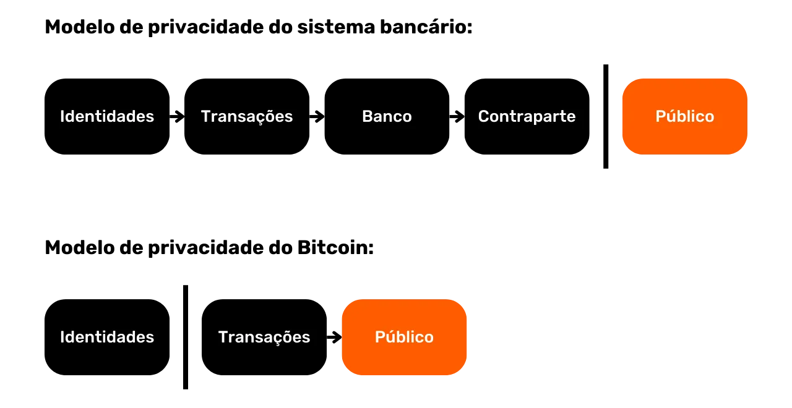

Assim, a confidencialidade no Bitcoin é comprometida quando observadores externos conseguem associar UTXOs específicos a usuários identificados. Uma vez estabelecida essa associação, torna-se possível rastrear suas transações e analisar o histórico de seus bitcoins. Coinjoin é precisamente uma técnica desenvolvida para quebrar a rastreabilidade dos UTXOs, a fim de oferecer uma certa camada de confidencialidade aos usuários do Bitcoin no nível da transação.

Coinjoins aumentam a confidencialidade dos usuários do Bitcoin complicando a análise de cadeia para observadores externos. Sua estrutura permite mesclar várias moedas de diferentes usuários em uma única transação, assim, embaralhando os rastros e tornando difícil determinar os vínculos entre endereços de entrada e saída.

É importante entender que o objetivo de uma transação coinjoin é quebrar o histórico de uma moeda. Esta técnica não confere anonimato permanente nem bloqueia definitivamente o rastreamento dos bitcoins, ao contrário do que se pode pensar. O coinjoin visa apenas quebrar o histórico no ponto em que a transação coinjoin é realizada. No entanto, antes e depois desta operação, a moeda permanece sujeita aos mesmos riscos de privacidade.

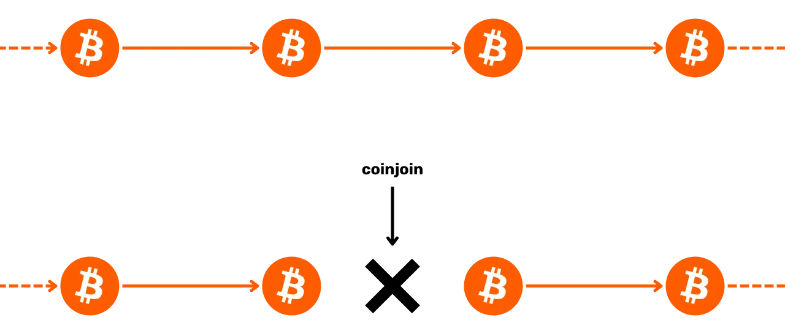

### Como funcionam os coinjoins?

O princípio do coinjoin se baseia em uma abordagem colaborativa: vários usuários que desejam misturar seus bitcoins depositam quantias idênticas nas entradas da mesma transação. Essas quantias são então redistribuídas em saídas de valores iguais para cada usuário.


Ao final da transação, torna-se impossível associar uma saída específica a um usuário conhecido na entrada. Não existe um vínculo direto entre as entradas e saídas, o que quebra a associação entre os usuários e seus UTXOs, bem como o histórico de cada moeda.


Vamos tomar o exemplo de Alice. Ela quer enviar cerca de 100.000 sats para sua irmã Eve pelo aniversário dela. No entanto, Alice não quer que Eve consiga rastrear o histórico de suas transações porque ela não quer revelar quantos bitcoins ela possui ou como os obteve. Para fazer isso, Alice decide quebrar o histórico do seu UTXO com uma transação coinjoin. Ela organiza com Bob, Charles, David e Frank para realizar uma transação colaborativa: - Alice, Bob, Charles, David e Frank cada um compromete um UTXO de 105.000 sats (com 5.000 sats para taxas de mineração) como entradas para a transação:


- Em troca de consumir essas entradas, cada um gera um novo endereço para criar cinco saídas idênticas de 100.000 sats cada. Cada um recupera uma saída:


- Alice acaba com um UTXO de 100.000 sats cujo histórico está misturado. Ela usa este UTXO em uma nova transação para enviar o montante para Eve pelo aniversário dela:


- Se Eve tentar analisar esta transação para extrair informações, ela será confrontada com a transação coinjoin envolvendo Alice, Bob, Charles, David e Frank. Sendo incapaz de distinguir a qual entrada pertence a quem devido à uniformidade dos montantes, Eve não pode rastrear o histórico do UTXO de Alice, nem determinar quantos bitcoins sua irmã possui ou como os adquiriu:


Neste cenário, Alice usou a técnica coinjoin para aumentar sua privacidade contra análise retrospectiva. De fato, Alice se protege contra uma possível análise por Eve que começaria de uma transação específica para rastrear o histórico do UTXO para trás. Esta proteção contra análise do presente para o passado é o que chamamos de anonset retrospectivo. Vamos aprofundar este conceito com mais detalhes nos últimos capítulos desta parte.

No entanto, coinjoin também oferece a possibilidade de aumentar a privacidade contra análise do passado para o presente, o que é referido como anonset prospectivo. Vamos voltar ao nosso exemplo onde Alice enviou 98.000 sats para Eve pelo aniversário dela, mas invertendo os papéis. Agora imagine que é Eve quem está preocupada com sua privacidade. De fato, Alice poderia ser tentada a seguir a moeda que enviou para Eve para reunir informações. Eve poderia consolidar este UTXO que acabou de receber com todos os seus outros UTXOs, o que poderia revelar a Alice a quantidade de bitcoins que ela possui em sua carteira. Para evitar isso, Eve também pode quebrar o histórico da moeda que acabou de receber.
- Eve, Grace, Mallory, Oscar e Victor cada um coloca um UTXO de 98.000 sats como entradas em uma transação Bitcoin:


- Em troca de consumir essas entradas, cada um fornece um novo endereço para criar 5 saídas de 97.500 sats cada, perfeitamente iguais. Cada usuário recupera uma saída:


- Eve agora possui um UTXO de 97.500 sats com um histórico quebrado. Ela pode usá-lo sem medo para transações futuras. De fato, se Alice tentar seguir os bitcoins que enviou para Eve, ela encontrará uma transação coinjoin. Ela será incapaz de determinar qual UTXO de saída pertence a Eve. A análise então se torna impossível:


No primeiro exemplo, vimos como o coinjoin pode proteger a privacidade de uma moeda em relação ao seu passado, e no segundo exemplo, como também pode assegurar o histórico de uma moeda em relação ao seu futuro. É por isso que mencionei que o coinjoin deve ser visto como um evento único que segmenta o histórico de uma moeda em ambas as direções:


### Mistura, coinjoins, misturadores... Qual é a diferença?

O termo "mistura" é às vezes usado para descrever coinjoins, um termo que alguns bitcoiners rejeitam porque temem confusão com misturadores custodiais. No entanto, penso que essa apreensão é infundada, porque, em um contexto matemático, coinjoin incorpora o conceito de mistura precisamente.

No campo geral da matemática, mistura refere-se à propriedade de um sistema dinâmico onde, após algum tempo, todas as partes do espaço inicial podem teoricamente ser misturadas com qualquer outra parte. Mistura implica que a posição de uma partícula ou o estado de um sistema evolui de tal forma que sua distribuição futura é independente de sua distribuição inicial, alcançando assim um estado onde as características do estado inicial são uniformemente distribuídas pelo espaço do sistema. Isso é exatamente o que acontece em um coinjoin com bitcoins. Assim, na minha opinião, coinjoin é verdadeiramente um método de misturar moedas.


No entanto, é importante distinguir coinjoin de misturadores. Um misturador é um serviço onde os usuários enviam seus bitcoins para serem misturados. Esses serviços foram populares durante os anos 2010, mas seu uso diminuiu devido a duas grandes desvantagens em comparação com o coinjoin:
- Eles exigem que o usuário renuncie à custódia de seus fundos durante o processo de mistura, o que os expõe a riscos de roubo;
- Não há garantia de que o misturador não registre os detalhes das transações, ou mesmo venda essas informações para empresas de análise de cadeia.


Hoje em dia, os usuários preferem, portanto, o coinjoin, pois permite que mantenham o controle total sobre seus fundos durante todo o processo. Os participantes de um coinjoin não correm o risco de ter seus bitcoins roubados por outras partes envolvidas. Vamos explorar juntos como tudo isso é possível no próximo capítulo.

## Zerolink e Chaumian Coinjoins
<chapterId>326c9654-b359-4906-b23d-d6518dd5dc3e</chapterId>

A privacidade fornecida por um coinjoin é conquistada pelo tamanho do grupo no qual nossa peça está escondida. Portanto, é necessário encontrar o maior número possível de participantes. É totalmente possível realizar um coinjoin manualmente, com usuários que se encontraram por si mesmos, mas este método é complexo e não permite alcançar grandes anonsets.

É por isso que os coordenadores de coinjoin se desenvolveram no Bitcoin. Seu papel é conectar diferentes usuários e transmitir as informações necessárias para a conclusão bem-sucedida da transação colaborativa.


Mas como podemos garantir que o coordenador nunca tenha controle sobre os bitcoins dos usuários, e apesar de serem eles que constroem a transação coinjoin, como podemos garantir que eles não possam vincular as entradas e saídas dos usuários, o que poderia constituir uma violação de privacidade?

### Assinaturas Cegas de Chaum

Implementações modernas de coinjoin usam assinaturas cegas de David Chaum para evitar vazamento de informações. Vamos estudar rapidamente juntos como essas assinaturas cegas funcionam.
As assinaturas cegas de Chaum são uma forma de assinatura digital onde o emissor de uma assinatura não conhece o conteúdo da mensagem que está assinando. No entanto, a assinatura pode ser verificada posteriormente com a mensagem original. Esta técnica foi desenvolvida pelo criptógrafo David Chaum em 1983.


Tome como exemplo uma empresa que deseja autenticar um documento confidencial, como um contrato, sem revelar seu conteúdo. A empresa aplica um processo de mascaramento que transforma criptograficamente o documento original de maneira reversível. Este documento modificado é enviado a uma autoridade de certificação que aplica uma assinatura cega sem conhecer o conteúdo subjacente. Após receber o documento assinado, a empresa desmascara a assinatura. O resultado é um documento original autenticado pela assinatura da autoridade, sem que a autoridade tenha visto o conteúdo original.

As assinaturas cegas de Chaum, portanto, permitem a certificação da autenticidade de um documento sem conhecer seu conteúdo, o que garante tanto a confidencialidade dos dados do usuário quanto a integridade do documento assinado.

### Chaumian Coinjoins
Em "Chaumian CoinJoins", o uso de Tor e as assinaturas cegas de David Chaum são combinados para garantir que o coordenador não possa saber qual saída pertence a qual usuário. O processo de construção da transação coinjoin gira em torno de 3 etapas principais: registrar as entradas, registrar as saídas e assinar a transação. Vamos examinar esse processo através do exemplo de Alice, uma das participantes do coinjoin. Todos os outros participantes seguem os mesmos passos que Alice, cada um por si.

**Etapa 1: Registrar as entradas.**
- Alice envia ao coordenador o UTXO que deseja usar como entrada para a transação, bem como o endereço de recebimento mascarado que deseja usar como saída para receber seus bitcoins. Portanto, o coordenador não pode conhecer o endereço de Alice. Ele vê apenas sua versão mascarada:


- O coordenador verifica a validade das entradas, então assina o endereço mascarado de Alice com sua chave privada. Ele envia de volta para Alice a assinatura cega:


**Etapa 2: Registrar as saídas.**
- Alice agora pode desmascarar seu endereço assinado pela chave privada do coordenador. Ela estabelece uma nova conexão sob uma identidade Tor diferente. O coordenador não pode identificar que é Alice conectando sob esta nova identidade:


- Alice envia o endereço desmascarado e a assinatura para o coordenador (que ainda não sabe que é Alice):


**Etapa 3: Assinar a transação.**
- O coordenador, de forma similar, recupera as saídas desmascaradas de todos os participantes. Graças às assinaturas associadas, ele pode verificar que cada saída submetida anonimamente foi de fato assinada por sua chave privada anteriormente, garantindo sua legitimidade. Ele está então pronto para construir a transação coinjoin e a envia aos participantes para que eles a assinem:


- Alice, como os outros participantes, verifica se sua entrada e saída estão corretamente incluídas na transação construída pelo coordenador. Se tudo estiver satisfatório, ela envia a assinatura que desbloqueia o script de sua entrada para o coordenador:


- Após coletar as assinaturas de todos os participantes do coinjoin, o coordenador pode transmitir a transação na rede Bitcoin, para que ela possa ser adicionada a um bloco.
Neste sistema, o coordenador é incapaz de vincular uma entrada a uma saída específica. Além disso, eles não podem tomar posse dos fundos dos participantes, pois nunca têm acesso às chaves privadas necessárias para desbloquear seus UTXOs. Durante todo o processo, e até o final da etapa 3, eles também não têm acesso às assinaturas. Quando Alice e os outros participantes assinam a transação global, após garantir que tudo está correto, o coordenador não pode mais modificar esta transação, incluindo as saídas, sem invalidá-la. Isso, portanto, impede o roubo de bitcoins pelo coordenador.
Em última análise, ao registrar sua saída na transação, o usuário do coinjoin deseja garantias semelhantes às de um cidadão votando em uma eleição. Há uma dualidade entre os aspectos públicos e privados dessas ações. Por um lado, há o que se deseja manter privado: para o eleitor, eles não querem que sua cédula seja vinculada à sua identidade; para o usuário do coinjoin, eles não querem que sua saída seja associada à sua entrada. De fato, se o coordenador, ou qualquer outra parte, conseguir estabelecer um vínculo entre uma entrada e uma saída, o coinjoin perde todo o seu propósito. Como explicado anteriormente, o coinjoin deve funcionar como uma interrupção na história de uma moeda. Esta parada ocorre precisamente por causa da impossibilidade de associar uma entrada específica a uma saída específica na transação coinjoin (anonset prospectivo) e vice-versa (anonset retrospectivo).

Por outro lado, há o aspecto público: o eleitor quer garantir que sua cédula esteja incluída na urna; da mesma forma, o usuário do coinjoin quer garantir que sua saída esteja incluída na transação coinjoin. De fato, é absolutamente necessário que os participantes do coinjoin possam verificar a presença de sua saída antes de assinar a transação, caso contrário, o coordenador poderia roubar os fundos.

São precisamente esses 2 aspectos públicos e privados, possibilitados pelo uso das assinaturas cegas de David Chaum, que garantem aos participantes dos coinjoins Chaumianos que seus bitcoins não serão roubados, e que seus fundos não podem ser rastreados.

### Quem inventou o conceito de coinjoin?

É difícil determinar com certeza quem introduziu pela primeira vez a ideia de coinjoin no Bitcoin, e quem teve a ideia de usar as assinaturas cegas de David Chaum neste contexto. Muitas vezes se pensa que foi Gregory Maxwell quem primeiro falou sobre isso em [uma mensagem no BitcoinTalk em 2013](https://bitcointalk.org/index.php?topic=279249.0):
Usando Assinaturas Cegas de Chaum: Usuários se conectam e fornecem entradas (e endereços de troco) bem como uma versão criptograficamente cegada do endereço para o qual desejam enviar suas moedas privadas; o servidor assina os tokens e os devolve aos usuários. Usuários se reconectam anonimamente, desmascaram seus endereços de saída e os enviam de volta ao servidor. O servidor pode ver que todas as saídas foram assinadas por ele e que, consequentemente, todas as saídas vêm de participantes válidos. Mais tarde, as pessoas se reconectam e assinam.
Maxwell, G. (2013, 22 de agosto). *CoinJoin: Privacidade do Bitcoin para o mundo real*. Fórum BitcoinTalk. https://bitcointalk.org/index.php?topic=279249.0


No entanto, há menções anteriores, tanto para assinaturas de Chaum no contexto de mistura, quanto para coinjoins. [Em junho de 2011, Duncan Townsend apresentou no BitcoinTalk](https://bitcointalk.org/index.php?topic=12751.0) um mixer que usa assinaturas de Chaum de uma maneira bastante semelhante aos modernos Chaumian coinjoins.
No mesmo tópico, há [uma mensagem de hashcoin em resposta a Duncan Townsend](https://bitcointalk.org/index.php?topic=12751.msg315793#msg315793) para melhorar seu mixer. O processo descrito nesta mensagem representa precisamente o que mais se assemelha a coinjoins. Também há uma menção de um sistema similar em [uma mensagem de Alex Mizrahi em 2012](https://gist.github.com/killerstorm/6f843e1d3ffc38191aebca67d483bd88#file-laundry), enquanto ele estava aconselhando os criadores do Tenebrix, uma das primeiras altcoins que serviu como base para a criação do Litecoin mais tarde. Até mesmo o termo "coinjoin" não foi inventado por Greg Maxwell, mas veio de uma ideia de Peter Todd.


### Zerolink

Zerolink é um protocolo de mistura abrangente que integra Chaumian coinjoins e várias estratégias para proteger o anonimato dos usuários contra várias formas de análise de cadeia, notavelmente minimizando erros relacionados à gestão de carteiras. Este protocolo [foi introduzido por nopara73 e TDevD em 2017](https://github.com/nopara73/ZeroLink/blob/master/README.md).


Como o nome sugere, o princípio do Zerolink é realizar transações coinjoin que garantem a impossibilidade de rastrear os links entre as entradas e saídas. Esta característica é alcançada garantindo que todos os outputs apresentem quantias perfeitamente idênticas.


Uma medida preventiva importante do Zerolink envolve separar completamente UTXOs não misturados de UTXOs misturados, usando conjuntos distintos de chaves criptográficas, ou até carteiras separadas. Desta forma, a carteira "pré-mix", destinada a moedas antes da mistura, é diferenciada da carteira "pós-mix", reservada para moedas que foram misturadas.


Esta separação estrita de UTXOs serve principalmente para prevenir associações acidentais entre um UTXO misturado e um não misturado. De fato, se tais links ocorrerem, a eficácia do coinjoin no UTXO misturado é anulada sem que o usuário esteja ciente, comprometendo assim a confidencialidade de um UTXO cujo histórico ele acreditava ter sido cortado. Esses links podem surgir tanto pelo reuso de endereços ao assegurar um UTXO misturado com um não misturado, quanto pela aplicação da Heurística de Propriedade Comum de Entrada (CIOH), se o usuário consumir UTXOs misturados e não misturados como entradas da mesma transação. Ao separar as carteiras de pré-mistura e pós-mistura, essas associações acidentais são evitadas, e o usuário é protegido contra erros involuntários.


Esta separação também oferece a possibilidade de aplicar regras distintas entre as carteiras de pré-mistura e pós-mistura no nível do software da carteira. Por exemplo, na carteira pós-mistura, o software pode proibir a fusão de UTXOs em entradas para evitar a aplicação do CIOH, o que comprometeria o anonset do usuário. Também é possível padronizar o uso de scripts e opções de transação (como o sinal de RBF, por exemplo) para prevenir identificação por impressões digitais da carteira.
Atualmente, o Whirlpool é a única implementação de coinjoin que aplica rigorosamente o protocolo Zerolink. No capítulo seguinte, exploraremos as diferentes implementações de coinjoin existentes e as vantagens e desvantagens de cada uma.

## Implementações de Coinjoin
<chapterId>e37ed073-9498-4e4f-820b-30951e829596</chapterId>

*Em 2024, estamos testemunhando mudanças significativas nas ferramentas disponíveis para usuários que desejam realizar coinjoins no Bitcoin. Atualmente, estamos em um período crucial, e o mercado de coinjoin está passando por uma grande reestruturação. Portanto, este capítulo provavelmente será atualizado ao longo do tempo.*

Por enquanto, existem principalmente 3 diferentes implementações de coinjoin no Bitcoin:
- Whirlpool;
- Wabisabi;
- JoinMarket.
Cada uma dessas implementações visa quebrar o histórico dos UTXOs por meio de transações coinjoin. No entanto, seus mecanismos variam significativamente. Portanto, é essencial entender como cada um funciona para escolher a opção mais adequada para suas necessidades.

### JoinMarket

JoinMarket, criado em 2015 por Adam Gibson e Chris Belcher, destaca-se de outras implementações de coinjoin graças ao seu modelo único de correspondência de usuários. Este sistema é baseado em um mercado de troca P2P onde alguns usuários, os "makers", disponibilizam seus bitcoins para mistura, enquanto outros, os "takers", usam esses fundos para realizar coinjoins em troca de uma taxa.


Neste modelo, os "makers" deixam seus bitcoins disponíveis para os "takers" e recebem taxas em retorno pelo seu serviço. Os "takers", por outro lado, pagam para usar os bitcoins dos "makers" para realizar suas próprias transações coinjoin. As taxas de serviço variam dependendo do papel: os "makers" acumulam taxas pela oferta de liquidez, enquanto os "takers" pagam as taxas. Este mercado opera livremente sem condições de uso.

Um dos principais inconvenientes do JoinMarket é sua complexidade de uso, que requer uma certa familiaridade com terminais para explorá-lo eficientemente. Embora essa complexidade não seja uma barreira para um usuário experiente, pode limitar o acesso ao público geral. No entanto, a introdução recente de uma interface web chamada JAM facilitou um pouco seu uso.


Fonte: [JAM](https://github.com/joinmarket-webui/jam/blob/devel/docs/assets/screenshot-dark.webp)

No entanto, a barreira técnica permanece um obstáculo importante. No ecossistema de coinjoin, onde a confidencialidade é aprimorada pelo número de participantes, qualquer limitação que reduza a acessibilidade afeta diretamente a liquidez disponível, que é um fator crucial para a eficiência da mistura. O Bitcoin, já um nicho em transações financeiras, vê seu uso de coinjoins como um subnicho, e o JoinMarket representa uma fração ainda mais especializada, restringindo assim seu potencial para aumentar os anonsets de seus usuários.
Apesar de seu inovador modelo P2P de correspondência para coinjoins, o JoinMarket apresenta algumas desvantagens significativas, especialmente em termos de estrutura transacional. Ao contrário de outras implementações como o Whirlpool, o JoinMarket não garante igualdade perfeita entre as saídas, e é possível rastrear ligações determinísticas entre entradas e saídas. Além disso, falta ferramentas para impedir que moedas que já foram misturadas juntas sejam misturadas novamente, o que poderia comprometer a confidencialidade buscada pelos usuários. Finalmente, embora o conceito do JoinMarket seja interessante, especialmente para aqueles interessados em um mercado de liquidez dinâmico, suas fraquezas estruturais e complexidade técnica o tornam, na minha opinião, menos atraente, tanto para novatos quanto para especialistas que buscam uma implementação de coinjoin.

### Wabisabi

Wabisabi é outra implementação de coinjoin, com uma abordagem que centraliza a coordenação das transações. Este modelo foi projetado por Ádám Ficsór (nopara73), Yuval Kogman, Lucas Ontivero e István András Seres em 2021, e foi integrado ao software Wasabi 2.0 no ano seguinte. Wabisabi é precisamente uma evolução do modelo de coinjoin do software Wasabi lançado em 2018.


Em direção ao final dos anos 2010, o Wasabi adotou uma estrutura de transação para seus coinjoins que era radicalmente diferente daquela do Whirlpool. Para aumentar os anonsets de seus participantes, o Wasabi usou transações de coinjoin muito grandes agrupando dezenas de participantes. Em contraste, o Whirlpool optou por múltiplas transações pequenas, permitindo um aumento exponencial nos anonsets a cada ciclo.

Os métodos de gerenciamento de troco também distinguiram as duas implementações. Com o Whirlpool, o troco era excluído e isolado dos UTXOs antes dos ciclos de coinjoin graças ao TX0, um conceito que explicarei mais adiante no próximo capítulo. No Wasabi, por outro lado, o troco formava uma das saídas da transação de coinjoin, o que mantinha ligações determinísticas entre certas entradas e saídas.


Com o Wabisabi, a versão 2.0 do Wasabi adaptou sua abordagem aos coinjoins para se aproximar daquela do Whirlpool. Embora as transações de coinjoin permaneçam muito grandes, agora é possível encadear vários ciclos sucessivos, seguindo assim o modelo do Whirlpool. Um esforço particular também foi feito na gestão do troco: ao contrário do Wasabi 1.0, onde o troco estava diretamente ligado às entradas dos usuários, o Wabisabi busca subdividir o troco em várias pequenas quantias, distribuídas em denominações iguais para todos os participantes.

Vamos ilustrar isso com um exemplo simplificado envolvendo apenas 2 usuários: Alice quer misturar 115.000 sats e Bob, 210.000 sats. Ignorando taxas, com o Wasabi 1.0, uma transação de coinjoin teria gerado 3 saídas de 100.000 sats, mais 1 troco de 15.000 sats para Alice e 1 troco de 10.000 sats para Bob. As saídas de troco sempre estariam ligadas às entradas:


Sob o Wabisabi, a mesma transação teria produzido 3 saídas de 100.000 sats e 5 saídas de 5.000 sats, dispersando assim o troco de uma maneira que não é diretamente rastreável a uma entrada específica:

Pessoalmente, considero que a gestão de mudanças no Wabisabi apresenta vários riscos que poderiam comprometer sua eficácia em termos de privacidade:
- Quando um usuário contribui com um UTXO significativamente maior do que os dos outros participantes, eles inevitavelmente acabam com uma quantidade de troco que será vinculada à sua entrada. Isso vai contra o objetivo inicial do protocolo, que visa eliminar qualquer troco identificável;
- A multiplicação de denominações para fragmentar o troco pode, paradoxalmente, prejudicar a eficiência da mistura. Esse processo pode levar a uma diminuição nos anonsets para certas saídas, pois se tornam mais facilmente identificáveis;
- Esse método também gera UTXOs de baixo valor que representam um problema de gestão para o usuário. Esses pequenos UTXOs, se se tornarem muito caros para gastar em relação ao seu valor, podem se tornar "poeira". Esse fenômeno empurra o usuário a fundir vários UTXOs em entradas em suas futuras transações ou a consolidá-los. Em ambos os casos, por causa do COH, isso pode diminuir os anonsets obtidos ou cancelar completamente os benefícios de privacidade adquiridos pelo coinjoin inicial.

Ao contrário do Whirlpool, que implementa o protocolo ZeroLink garantindo uma separação rigorosa entre UTXOs pré-mix e pós-mix, o Wabisabi não mantém essa segregação estrita. Também houve problemas com a reutilização de endereços por alguns clientes do Wasabi, o que é obviamente muito prejudicial para o usuário.

Na versão 2.0 do Wasabi, uma nova política de taxa de coinjoin foi implementada. Agora, as taxas do coordenador são definidas em 0,3% para UTXOs maiores que 0,01 bitcoin, enquanto para UTXOs menores, essas taxas são completamente isentas. Além disso, remixes para esses pequenos UTXOs são gratuitos, embora as taxas de mineração permaneçam sob responsabilidade do usuário para todas as transações, incluindo remixes.

Essa política contrasta com a do Whirlpool, onde as taxas permanecem fixas, independentemente do tamanho dos anonsets obtidos. Com o Wasabi 2.0, embora as taxas do coordenador sejam isentas para pequenos UTXOs, o usuário ainda deve pagar as taxas de mineração em todas as transações, incluindo remixes.
No momento da escrita, o uso do Wabisabi tornou-se notavelmente mais complexo após eventos recentes. De fato, após a prisão dos fundadores da Samourai Wallet, a zkSNACKs, a empresa que financia e gerencia o desenvolvimento do Wasabi, anunciou a descontinuação de seu serviço de coordenação de coinjoin em 1º de junho de 2024. Esse coordenador, que estava definido por padrão no Wasabi, tinha a grande maioria da liquidez.

Com o encerramento desse coordenador principal, os usuários agora devem se conectar a novos coordenadores independentes. Essa mudança levanta preocupações: por um lado, os novos coordenadores podem não ter liquidez suficiente, reduzindo assim a eficácia dos coinjoins em termos de privacidade. Por outro lado, há o risco de encontrar um coordenador malicioso. Esta situação adiciona novos riscos significativos para aqueles que procuram usar o Wabisabi.

Além das questões técnicas, a decisão da zkSNACKs, a empresa por trás do Wasabi, de usar os serviços de uma empresa de análise de cadeia para filtrar os participantes em coinjoins levanta sérias questões éticas e estratégicas. A ideia inicial era impedir o uso de coinjoins no Wasabi por criminosos, uma medida que pode parecer legítima. No entanto, isso levanta um paradoxo: pagar taxas a um coordenador, cuja principal missão é aumentar a privacidade dos usuários, apenas para depois financiar uma empresa cujo objetivo é comprometer essa mesma privacidade.
Ainda mais preocupante é o princípio da filtragem, que contrasta fortemente com a filosofia do Bitcoin, voltada para oferecer um sistema financeiro aberto e incensurável. Embora possa parecer justificado querer excluir atividades criminosas, essa filtragem também poderia afetar indivíduos cujas ações, embora classificadas como ilegais em alguns contextos, poderiam ser moralmente justificáveis ou socialmente benéficas. O exemplo de Edward Snowden ilustra perfeitamente essa dicotomia: considerado um criminoso por alguns governos por suas revelações, ele é visto por outros como um denunciante que agiu no interesse público. Essa complexidade destaca o perigo potencial da filtragem que, embora parta de uma boa intenção, pode, em última análise, infringir os direitos e a segurança dos usuários legítimos. Eu também poderia ter mencionado ativistas e jornalistas que são perseguidos sob certos regimes autoritários. Como você terá entendido, minha preferência, sem dúvida, vai para o modelo Whirlpool para conduzir coinjoins no Bitcoin. Este sistema se destaca por seu rigor e oferece garantias superiores em termos de privacidade. É também o único a propor uma mistura considerada perfeita em um contexto matemático. Na minha visão, este modelo representa o futuro dos coinjoins no Bitcoin. Portanto, convido você a explorar este modelo mais profundamente no próximo capítulo.

## O Funcionamento do Whirlpool
<chapterId>bdbd7109-e36d-4b4f-a3c6-928df4e9bfda</chapterId>

O Whirlpool se distingue de outros métodos de coinjoin ao usar transações "_ZeroLink_", que garantem que não há absolutamente nenhum vínculo técnico possível entre todas as entradas e todas as saídas. Essa mistura perfeita é alcançada por meio de uma estrutura onde cada participante contribui com uma quantidade idêntica na entrada (exceto pelas taxas de mineração), gerando assim saídas de quantidades perfeitamente iguais.

Essa abordagem restritiva nas entradas dá às transações de coinjoin do Whirlpool uma característica única: a total ausência de links determinísticos entre as entradas e as saídas. Em outras palavras, cada saída tem uma probabilidade igual de ser atribuída a qualquer participante, em relação a todas as outras saídas da transação.


### O Funcionamento Geral do Whirlpool

Inicialmente, o número de participantes em cada coinjoin do Whirlpool era limitado a 5, com 2 novos entrantes e 3 remixers (explicaremos esses conceitos mais adiante). No entanto, o aumento nas taxas de transação on-chain observado em 2023 levou as equipes da Samourai a repensar seu modelo para melhorar a privacidade enquanto reduz custos. Assim, levando em conta a situação do mercado de taxas e o número de participantes, o coordenador pode agora organizar coinjoins incluindo 6, 7 ou 8 participantes. Essas sessões aprimoradas são designadas sob o nome "_Surge Cycles_". É importante notar que, independentemente da configuração, sempre há apenas 2 novos entrantes nos coinjoins do Whirlpool.

Assim, as transações do Whirlpool são caracterizadas por um número idêntico de entradas e saídas, que podem ser:
- 5 entradas e 5 saídas;


- 6 entradas e 6 saídas;


- 7 entradas e 7 saídas;


- 8 entradas e 8 saídas.


O modelo proposto pela Whirlpool baseia-se, portanto, em pequenas transações coinjoin. Diferentemente de Wabisabi e JoinMarket, onde a robustez dos conjuntos anônimos depende do volume de participantes em um único ciclo (ou alguns ciclos), a Whirlpool aposta na cadeia de múltiplos ciclos de pequeno porte. Neste modelo, o usuário só incorre em taxas na sua entrada inicial em uma piscina, permitindo-lhes participar de uma multitude de remixagens sem custos adicionais. São os novos participantes que cobrem as taxas de mineração para os remixadores.
Com cada coinjoin adicional no qual uma moeda participa, juntamente com seus pares encontrados no passado, os conjuntos anônimos crescerão exponencialmente. O objetivo, portanto, é tirar vantagem dessas remixagens gratuitas que, a cada ocorrência, contribuem para fortalecer a densidade dos conjuntos anônimos associados a cada moeda misturada.


A Whirlpool foi projetada com dois requisitos importantes em mente:
- A acessibilidade de implementação em dispositivos móveis, dado que a Samourai Wallet é primariamente um aplicativo para smartphone;
- A velocidade dos ciclos de remixagem para incentivar um aumento significativo nos conjuntos anônimos.

Esses imperativos guiaram as escolhas dos desenvolvedores da Samourai Wallet no design da Whirlpool, levando-os a limitar o número de participantes por ciclo. Poucos participantes teriam comprometido a eficácia do coinjoin, reduzindo drasticamente os conjuntos anônimos gerados em cada ciclo, enquanto muitos participantes teriam apresentado problemas de gestão em aplicativos móveis e teriam impedido o fluxo de ciclos.

Em última análise, não é necessário ter um alto número de participantes por coinjoin na Whirlpool, uma vez que os conjuntos anônimos são feitos sobre a acumulação de vários ciclos de coinjoin. O princípio mais importante aqui é a homogeneidade dos UTXOs de todos os participantes, pois isso permite uma mistura perfeita, e assim, aproveitar plenamente os ciclos de mistura e remixagem.

### As piscinas e taxas de coinjoin

Para que esses múltiplos ciclos aumentem efetivamente os conjuntos anônimos das moedas misturadas, um certo quadro deve ser estabelecido para restringir as quantidades de UTXOs usados. A Whirlpool define, assim, diferentes piscinas.

Uma piscina representa um grupo de usuários que desejam misturar juntos, que concordam com a quantidade de UTXOs a ser usada para otimizar o processo de coinjoin enquanto mantém a perfeita homogeneidade das moedas. Cada piscina especifica uma quantidade fixa para o UTXO, com a qual o usuário deve cumprir para participar. Assim, para realizar coinjoins com a Whirlpool, você precisa selecionar uma piscina. As piscinas disponíveis no momento são as seguintes:
- 0,5 bitcoins;
- 0,05 bitcoin;
- 0,01 bitcoin;
- 0,001 bitcoin (= 100.000 sats).
Ao entrar em uma piscina com seus bitcoins, eles serão divididos para gerar UTXOs que são perfeitamente homogêneos com os dos outros participantes na piscina. Cada piscina tem um limite máximo; assim, para quantidades que excedam este limite, você será forçado a fazer duas entradas separadas dentro da mesma piscina ou a recorrer a outra piscina com uma quantidade maior:
| Piscina (bitcoin) | Quantidade máxima por entrada (bitcoin) |
|-------------------|-----------------------------------------|
| 0,5               | 35                                      |
| 0,05              | 3,5                                     |
| 0,01              | 0,7                                     |
| 0,001             | 0,025                                   |
Um UTXO é considerado pertencente a um pool quando está pronto para ser integrado em um coinjoin. No entanto, isso não significa que o usuário perde a posse dele. Como vimos nos primeiros capítulos desta parte, através dos diferentes ciclos de mistura, você mantém o controle total de suas chaves e, consequentemente, de seus bitcoins. Isso é o que diferencia a técnica de coinjoin de outras técnicas de mistura centralizadas.

Para entrar em um pool de coinjoin, você deve pagar taxas de serviço, bem como taxas de mineração. As taxas de serviço são fixas para cada pool e destinam-se a compensar as equipes responsáveis pelo desenvolvimento e manutenção do Whirlpool.

As taxas de serviço para usar o Whirlpool devem ser pagas uma única vez ao entrar no pool. Uma vez concluída esta etapa, você tem a possibilidade de participar de um número ilimitado de remixagens sem taxas adicionais. Aqui estão as taxas fixas atuais para cada pool:

| Pool (bitcoin) | Taxa de entrada (bitcoin) |
|----------------|---------------------------|
| 0.5            | 0.0175                    |
| 0.05           | 0.00175                   |
| 0.01           | 0.0005 (50,000 sats)      |
| 0.001          | 0.00005 (5,000 sats)      |

Essas taxas funcionam essencialmente como um ingresso de entrada para o pool escolhido, independentemente do valor que você coloca no coinjoin. Assim, seja você entrando no pool de 0.01 com exatamente 0.01 BTC ou entrando com 0.5 BTC, as taxas permanecerão as mesmas em valor absoluto.

Antes de prosseguir com os coinjoins do Whirlpool, o usuário, portanto, tem uma escolha entre 2 estratégias:
- Optar por um pool menor para minimizar as taxas de serviço, sabendo que receberão vários UTXOs menores em retorno;
- Ou preferir um pool maior, concordando em pagar taxas mais altas para acabar com um número reduzido de UTXOs de maior valor.
Geralmente não é recomendado fundir vários UTXOs misturados após os ciclos de coinjoin, pois isso poderia comprometer a privacidade obtida, especialmente devido à heurística de propriedade de entrada comum (CIOH: *Common-Input-Ownership-Heuristic*). Portanto, pode ser sábio escolher um pool maior, mesmo que isso signifique pagar mais, para evitar ter muitos UTXOs de pequeno valor como saídas. O usuário deve ponderar esses compromissos para escolher o pool de sua preferência.
Além das taxas de serviço, as taxas de mineração inerentes a qualquer transação de Bitcoin também devem ser consideradas. Como usuário do Whirlpool, você será obrigado a pagar as taxas de mineração para a transação de preparação (`Tx0`) bem como aquelas para o primeiro coinjoin. Todas as remixagens subsequentes serão gratuitas, graças ao modelo do Whirlpool que depende do pagamento de novos participantes.

De fato, em cada coinjoin do Whirlpool, 2 usuários entre as entradas são novos participantes. As outras entradas vêm de remixadores. Como resultado, as taxas de mineração para todos os participantes na transação são cobertas por esses 2 novos participantes, que então também se beneficiarão de remixagens gratuitas:

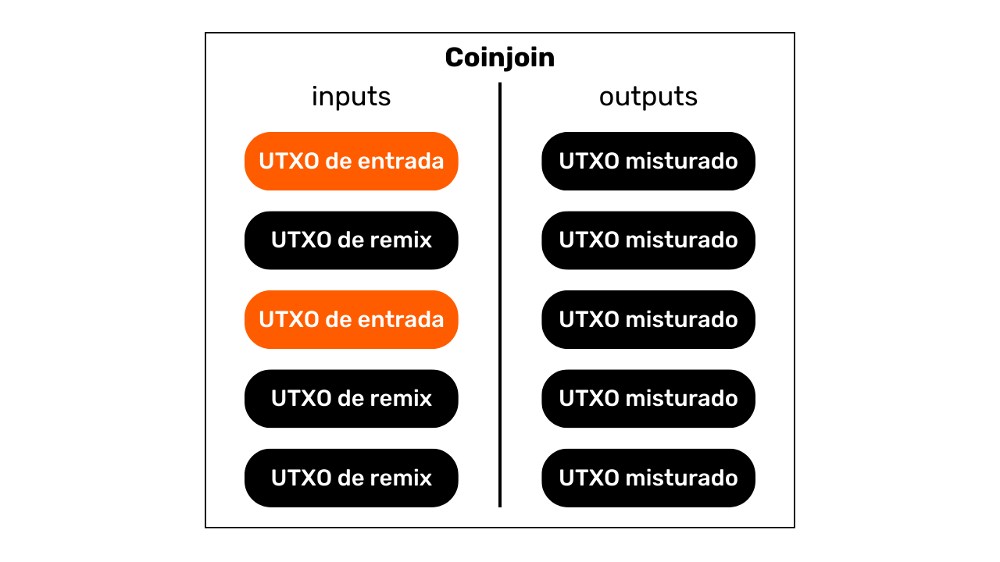

Graças a este sistema de taxas, o Whirlpool realmente se diferencia de outras implementações de coinjoin, uma vez que os anonsets dos UTXOs não são proporcionais ao preço pago pelo usuário. Assim, é possível alcançar níveis consideravelmente altos de anonimato pagando apenas a taxa de entrada do pool e as taxas de mineração para 2 transações (o `Tx0` e a mistura inicial).
É importante notar que o usuário também terá que cobrir as taxas de mineração para retirar seus UTXOs do pool após realizar seus múltiplos coinjoins, a menos que tenham selecionado a opção `mix to`, que permite fornecer um endereço externo que receberá diretamente os fundos como uma saída de coinjoin, sem nenhuma transação adicional.
### Contas de Carteira HD

Para realizar um coinjoin via Whirlpool, a carteira deve gerar várias contas distintas. Este é o princípio do protocolo ZeroLink. Uma conta, no contexto de uma carteira HD (*Hierarchical Deterministic*), constitui uma seção totalmente isolada das outras, essa separação ocorrendo no terceiro nível de profundidade da hierarquia da carteira, isto é, no nível do `xpub`.


Uma carteira HD pode teoricamente derivar até `2^(32/2)` contas diferentes. A conta inicial, usada por padrão em todas as carteiras Bitcoin, corresponde ao índice `0'`.

Para carteiras adaptadas ao Whirlpool, 4 contas são usadas para atender às necessidades do processo ZeroLink:
- A **conta de depósito**, identificada pelo índice `0'`;
- A conta **bad bank** (ou "troco tóxico"), identificada pelo índice `2 147 483 644'`;
- A **conta premix**, identificada pelo índice `2 147 483 645'`;
- A **conta postmix**, identificada pelo índice `2 147 483 646'`.

Cada uma dessas contas cumpre uma função específica no processo de coinjoin, o qual exploraremos nas próximas seções.

Todas essas contas estão vinculadas a uma única semente, permitindo que o usuário recupere o acesso a todos os seus bitcoins usando sua frase de recuperação e, se necessário, sua passphrase. No entanto, é necessário especificar ao software, durante essa operação de recuperação, os diferentes índices de conta que foram usados.

Vamos agora olhar para as diferentes etapas de um coinjoin Whirlpool dentro dessas contas.

### O TX0

O ponto de partida de qualquer coinjoin Whirlpool é a **conta de depósito**. Esta conta é a que você usa automaticamente quando cria uma nova carteira Bitcoin. Esta conta deve ser creditada com os bitcoins que você deseja misturar.

O `Tx0` representa o primeiro passo no processo de mistura Whirlpool. Seu objetivo é preparar e equalizar os UTXOs para o coinjoin, dividindo-os em unidades correspondentes ao valor do pool selecionado, para garantir a homogeneidade da mistura. Os UTXOs equalizados são então enviados para a **conta premix**. Quanto à diferença que não pode entrar no pool, ela é separada em uma conta específica: o **bad bank** (ou "troco tóxico").

Esta transação inicial `Tx0` também serve para liquidar as taxas de serviço devidas ao coordenador do coinjoin. Ao contrário dos passos seguintes, esta transação não é colaborativa; o usuário deve, portanto, arcar com as taxas de mineração completas:

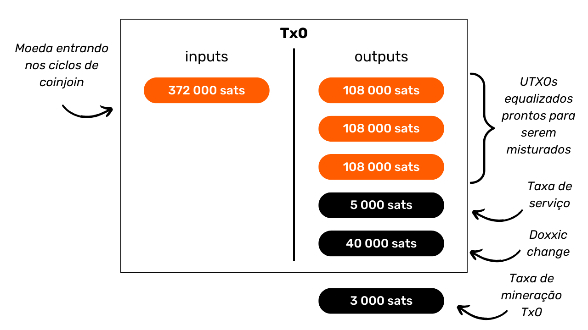

Neste exemplo de uma transação `Tx0`, uma entrada de `372 000 sats` de nossa **conta de depósito** é dividida em vários UTXOs de saída, que são distribuídos da seguinte forma:
- Um montante de `5 000 sats` destinado ao coordenador para taxas de serviço, correspondendo à entrada no pool de `100 000 sats`;
- 3 UTXOs preparados para mistura, redirecionados para nossa **conta premix** e registrados com o coordenador. Esses UTXOs são equalizados em `108 000 sats` cada, para cobrir as taxas de mineração para sua futura mistura inicial;
- O excedente que não pode entrar no pool, por ser muito pequeno, é considerado troco tóxico. Ele é enviado para sua conta específica. Aqui, esse troco soma `40 000 sats`;
- Finalmente, há `3.000 sats` que não constituem uma saída, mas são as taxas de mineração necessárias para confirmar a `Tx0`.
Por exemplo, aqui está uma Tx0 Whirlpool real (não minha): [edef60744f539483d868caff49d4848e5cc6e805d6cdc8d0f9bdbbaedcb5fc46](https://mempool.space/fr/tx/edef60744f539483d868caff49d4848e5cc6e805d6cdc8d0f9bdbbaedcb5fc46)


### O Troco Tóxico

O excesso que não pôde ser integrado ao pool, aqui equivalente a `40.000 sats`, é redirecionado para a conta do **banco ruim**, também referido como "troco tóxico", para garantir uma separação estrita dos outros UTXOs na carteira.

Este UTXO é perigoso para a privacidade do usuário porque não só ainda está ligado ao seu passado, e assim possivelmente à identidade de seu proprietário, mas também é marcado como pertencente a um usuário que participou de um coinjoin.


Se este UTXO for mesclado com saídas misturadas, elas perderão toda a privacidade ganha durante os ciclos de coinjoin, notavelmente por causa da CIOH (*Heurística de Propriedade de Entrada Comum*). Se for mesclado com outros trocos tóxicos, o usuário corre o risco de perder privacidade, já que isso ligará as diferentes entradas dos ciclos de coinjoin. Portanto, deve ser manuseado com cautela. Falaremos mais detalhadamente sobre o gerenciamento desses UTXOs tóxicos na última seção deste capítulo.

### A Mistura Inicial

Após a conclusão da `Tx0`, os UTXOs equalizados são enviados para a conta **premix** da nossa carteira, prontos para serem introduzidos em seu primeiro ciclo de coinjoin, também chamado de "mistura inicial". Se, como no nosso exemplo, a `Tx0` gera vários UTXOs destinados à mistura, cada um deles será integrado em uma mistura inicial separada.

Ao final dessas primeiras misturas, a conta **premix** estará vazia, enquanto nossas moedas, tendo pago as taxas de mineração para este primeiro coinjoin, serão ajustadas exatamente ao montante definido pelo pool escolhido. No nosso exemplo, nossos UTXOs iniciais de `108.000 sats` terão sido reduzidos exatamente para `100.000 sats`.


### Os Remixes
Após a mistura inicial, os UTXOs são transferidos para a conta **postmix**. Esta conta reúne tanto os UTXOs já misturados quanto aqueles à espera de remixagem. Quando o cliente Whirlpool está ativo, os UTXOs na conta **postmix** estão automaticamente disponíveis para remixagem e serão escolhidos aleatoriamente para participar desses novos ciclos.
Como lembrete, os remixes são então 100% gratuitos: nenhuma taxa de serviço adicional ou taxas de mineração são necessárias. Manter os UTXOs na conta **postmix** assim mantém seu valor intacto e simultaneamente melhora seus anonsets. É por isso que é importante permitir que essas moedas participem de múltiplos ciclos de coinjoin. Isso não custa nada para você e aumenta seus níveis de anonimato.
Quando você decide gastar UTXOs misturados, pode fazê-lo diretamente desta conta **pós-mistura**. É aconselhável manter os UTXOs misturados nesta conta para se beneficiar de remixagens gratuitas e para evitar que saiam do circuito Whirlpool, o que poderia diminuir sua privacidade.
### Como gerenciar adequadamente sua conta pós-mistura?

Após realizar ciclos de coinjoin, a melhor estratégia é manter seus UTXOs na conta **pós-mistura**, aguardando seu uso futuro. É até aconselhável deixá-los remixar indefinidamente até que você precise gastá-los.

Alguns usuários podem considerar transferir seus bitcoins misturados para uma carteira protegida por uma carteira de hardware. Isso é possível, mas é importante seguir meticulosamente as recomendações da Samourai Wallet para não comprometer a confidencialidade adquirida.

A fusão de UTXOs é o erro mais frequentemente cometido. É necessário evitar combinar UTXOs misturados com UTXOs não misturados na mesma transação, para evitar a Heurística de Propriedade de Entrada Comum (CIOH). Isso requer um gerenciamento cuidadoso de seus UTXOs dentro de sua carteira, especialmente em termos de rotulagem.


Também é importante ter cautela ao consolidar UTXOs misturados entre si. Consolidações moderadas são concebíveis se seus UTXOs misturados tiverem conjuntos anônimos significativos, mas isso inevitavelmente diminuirá a confidencialidade de suas moedas. Garanta que as consolidações não sejam nem muito significativas nem realizadas após um número insuficiente de remixagens, sob o risco de estabelecer ligações dedutíveis entre seus UTXOs antes e depois dos ciclos de coinjoin. Em caso de dúvida sobre essas manipulações, a melhor prática é não consolidar os UTXOs pós-mistura, e transferi-los um a um para sua carteira de hardware, gerando um novo endereço em branco cada vez. Novamente, lembre-se de rotular adequadamente cada UTXO recebido.
Também é aconselhável não transferir seus UTXOs pós-mistura para uma carteira que use scripts incomuns. Por exemplo, se você entrar no Whirlpool de uma carteira multisig usando scripts `P2WSH`, há uma pequena chance de você ser misturado com outros usuários que têm o mesmo tipo de carteira originalmente. Se você retirar seu pós-mistura para esta mesma carteira multisig, o nível de privacidade de seus bitcoins misturados será grandemente diminuído. Além dos scripts, existem muitas outras impressões digitais de carteiras que podem enganá-lo.
Como em qualquer transação Bitcoin, também é importante não reutilizar endereços de recebimento. Cada nova transação deve ser recebida em um novo endereço em branco.

A solução mais simples e segura é deixar seus UTXOs misturados descansarem em sua conta **pós-mistura**, permitindo que eles remixem e só tocando neles para gastar. As carteiras Samourai e Sparrow têm proteções adicionais contra todos esses riscos relacionados à análise de cadeia. Essas proteções ajudam você a evitar cometer erros.

### Como gerenciar adequadamente sua mudança tóxica?

Em seguida, você deve ter cuidado ao gerenciar sua mudança tóxica, a mudança que não pôde entrar na piscina de coinjoin. Esses UTXOs tóxicos, resultantes do uso do Whirlpool, representam um risco para sua privacidade, pois estabelecem um vínculo entre você e o uso de coinjoin. Portanto, é imperativo manuseá-los com cautela e não combiná-los com outros UTXOs, especialmente UTXOs misturados.

Aqui estão diferentes estratégias a considerar para usá-los:
- **Misture-os em piscinas menores:** Se seu UTXO tóxico for grande o suficiente para entrar em uma piscina menor por conta própria, considere misturá-lo. Esta é frequentemente a melhor opção. No entanto, fundir vários UTXOs tóxicos para acessar uma piscina é desencorajado, pois isso poderia vincular suas diferentes entradas.
- **Marque-os como "não gastáveis":** Outra abordagem é não mais usá-los, marcá-los como "não gastáveis" em sua conta dedicada e simplesmente hodlar. Isso garante que você não os gaste acidentalmente. Se o valor do bitcoin aumentar, novos pools mais adequados aos seus UTXOs tóxicos podem surgir;
- **Faça doações:** Considere fazer doações, mesmo modestas, para desenvolvedores que trabalham no Bitcoin e seu software associado. Você também pode doar para organizações que aceitam BTC. Se gerenciar seus UTXOs tóxicos parece muito complicado, você pode simplesmente se livrar deles fazendo uma doação.
- **Compre Cartões Presente:** Plataformas como [Bitrefill](https://www.bitrefill.com/) permitem que você troque bitcoins por cartões presente que podem ser usados em vários comerciantes. Esta pode ser uma maneira de se desfazer dos seus UTXOs tóxicos sem perder o valor associado.
- **Consolide-os no Monero:** Samourai Wallet oferece um serviço de troca atômica entre BTC e XMR. Isso é ideal para gerenciar UTXOs tóxicos consolidando-os no Monero, sem comprometer sua privacidade através de KYC, antes de enviá-los de volta ao Bitcoin. No entanto, esta opção pode ser custosa em termos de taxas de mineração e prêmios devido a restrições de liquidez.
- **Envie-os para a Lightning Network:** Transferir esses UTXOs para a Lightning Network para beneficiar-se de taxas de transação reduzidas é uma opção interessante. No entanto, este método pode revelar certas informações dependendo do seu uso da Lightning e, portanto, deve ser praticado com cautela.

### Como usar o Whirlpool?

Após a prisão dos fundadores da Samourai Wallet e a apreensão de seus servidores em 24 de abril de 2024, a ferramenta Whirlpool não funciona mais, mesmo para aqueles que têm seu próprio Dojo. Anteriormente, estava disponível na Samourai Wallet e Sparrow Wallet.


No entanto, ainda é possível que esta ferramenta possa ser colocada novamente em serviço nas próximas semanas, dependendo do resultado dos julgamentos, ou relançada de uma maneira diferente. De qualquer forma, acredito que o mercado de coinjoin no Bitcoin não ficará sem oferta por muito tempo, pois há uma demanda clara. Além disso, o modelo Whirlpool, sendo o mais avançado em termos de privacidade, certamente será usado no futuro para outras implementações.

Estamos acompanhando de perto a evolução deste caso, bem como os desenvolvimentos relativos às ferramentas associadas. Fique tranquilo que atualizaremos este treinamento à medida que novas informações se tornarem disponíveis.

No próximo capítulo, descobriremos o que são "anonsets", como esses indicadores são calculados e como eles podem nos ajudar a estimar a eficácia dos ciclos de coinjoin.

https://planb.network/tutorials/privacy/coinjoin-sparrow-wallet

https://planb.network/tutorials/privacy/coinjoin-samourai-wallet

https://planb.network/tutorials/privacy/coinjoin-dojo

## Conjuntos de Anonimato
<chapterId>be1093dc-1a74-40e5-9545-2b97a7d7d431</chapterId>

Após estudar como os coinjoins funcionam e os desafios associados à mistura eficaz, agora aprenderemos como medir essa eficácia. Como determinar se um processo de coinjoin foi eficaz e que grau de anonimato uma moeda adquiriu? É isso que exploraremos neste capítulo com conjuntos de anonimato ou "anonsets" em inglês.

### Lembrete sobre a Utilidade do Coinjoin
A utilidade do CoinJoin reside em sua capacidade de produzir negação plausível, imergindo sua moeda dentro de um grupo de moedas indistinguíveis. O objetivo desta ação é quebrar os links de rastreabilidade, tanto do passado para o presente quanto do presente para o passado.
Em outras palavras, um analista que conhece sua transação inicial (`Tx0`) na entrada dos ciclos de CoinJoin não deve ser capaz de identificar com certeza seu UTXO na saída dos ciclos de remixagem (análise da entrada do ciclo até a saída do ciclo).
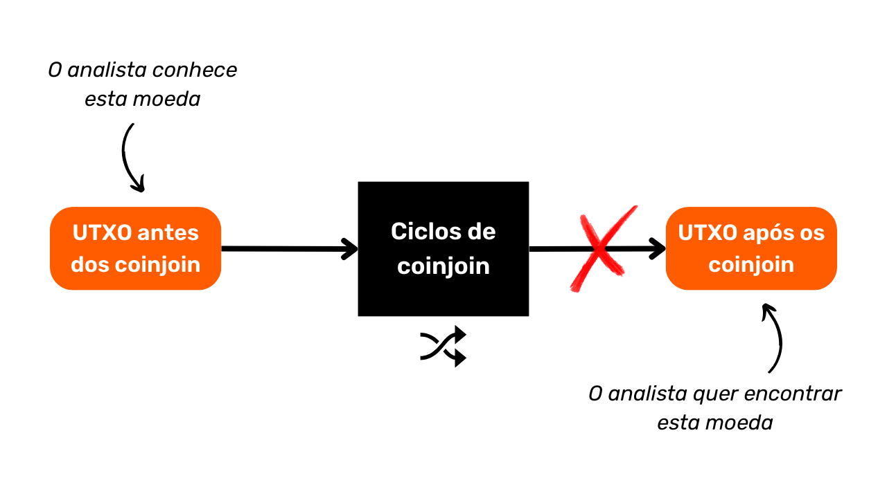

Inversamente, um analista que conhece seu UTXO na saída dos ciclos de CoinJoin deve ser incapaz de determinar a transação original na entrada dos ciclos (análise da saída do ciclo até a entrada do ciclo).

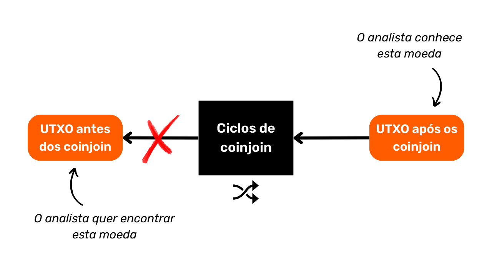

Para avaliar a dificuldade de um analista em vincular o passado ao presente e vice-versa, é necessário quantificar o tamanho dos grupos de moedas homogêneas dentro dos quais sua moeda está oculta. Esta medida nos diz o número de análises com uma probabilidade idêntica. Assim, se a análise correta está afogada entre 3 outras análises de igual probabilidade, seu nível de ocultação é muito baixo. No entanto, se a análise correta está dentro de um conjunto de 20.000 análises todas igualmente prováveis, sua moeda está muito bem escondida. E precisamente, o tamanho desses grupos representa indicadores chamados "anonsets".

### Entendendo Anonsets

Anonsets servem como indicadores para avaliar o grau de privacidade de um UTXO específico. Mais especificamente, eles medem o número de UTXOs indistinguíveis dentro do conjunto que inclui a moeda estudada. A exigência de um conjunto de UTXO homogêneo significa que os anonsets são geralmente calculados sobre ciclos de CoinJoin. O uso desses indicadores é particularmente relevante para Whirlpool CoinJoins devido à sua uniformidade.

Anonsets permitem, quando apropriado, julgar a qualidade dos CoinJoins. Um grande tamanho de anonset significa um alto nível de anonimato, pois se torna difícil distinguir um UTXO específico dentro do conjunto homogêneo.

Existem 2 tipos de anonsets:
- **O anonset prospectivo;**
- **O anonset retrospectivo.**

### O Anonset Prospectivo

O anonset prospectivo indica o tamanho do grupo entre o qual o UTXO estudado está oculto na saída do ciclo, conhecendo o UTXO na entrada, ou seja, o número de moedas indistinguíveis presentes dentro deste grupo. Em inglês, o nome deste indicador é "forward anonset", ou "forward-looking metrics".
Este indicador permite medir a resistência à privacidade da moeda contra uma análise de passado para presente (entrada para saída).
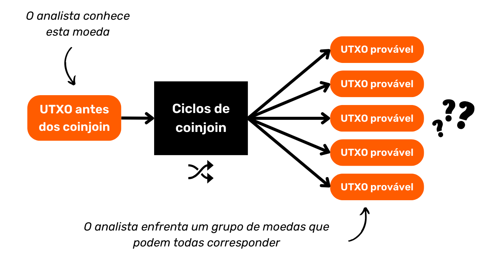

Esta métrica estima até que ponto seu UTXO está protegido contra tentativas de reconstruir sua história desde seu ponto de entrada até seu ponto de saída no processo de coinjoin.

Por exemplo, se sua transação participou de seu primeiro ciclo de coinjoin e dois ciclos descendentes adicionais foram completados, o anonset prospectivo de sua moeda seria `13`:

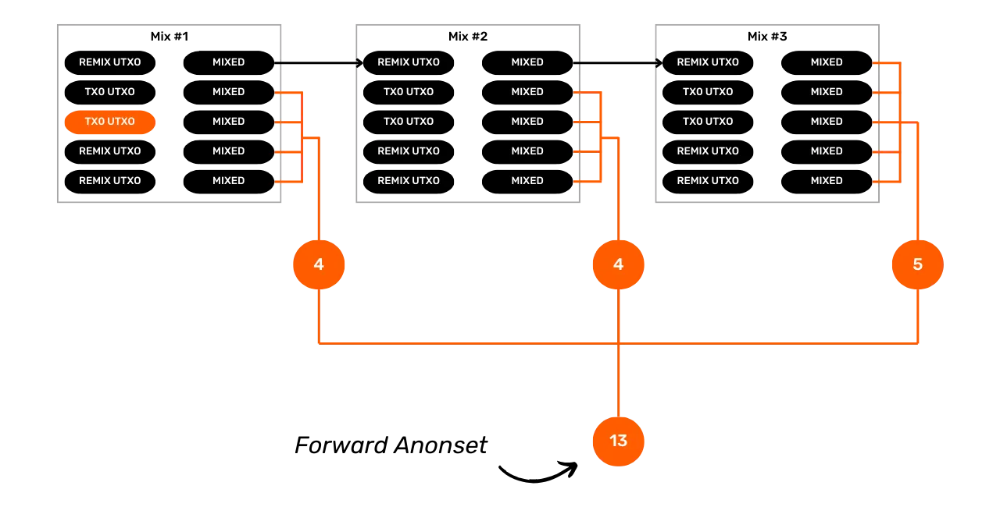

Por exemplo, vamos imaginar que nossa moeda na entrada do ciclo de coinjoin beneficia de um anonset prospectivo de `86,871`. Na prática, isso significa que está oculta entre `86,871` moedas indistinguíveis. Para um observador externo ciente desta moeda no início dos ciclos de coinjoin e tentando rastrear sua saída, ele estaria diante de `86,871` possíveis UTXOs, cada um com uma probabilidade idêntica de ser a moeda procurada.

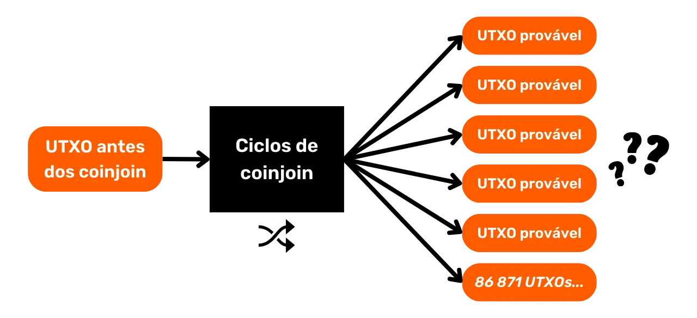

### O Anonset Retrospectivo
O anonset retrospectivo indica o número de fontes possíveis para uma determinada moeda, conhecendo o UTXO na saída do ciclo. Este indicador mede a resistência à privacidade da moeda contra uma análise do presente para o passado (saída para entrada), ou seja, quão difícil é para um analista rastrear até a origem da sua moeda, antes dos ciclos de coinjoin. Em inglês, o nome deste indicador é "backward anonset," ou "métricas voltadas para trás."
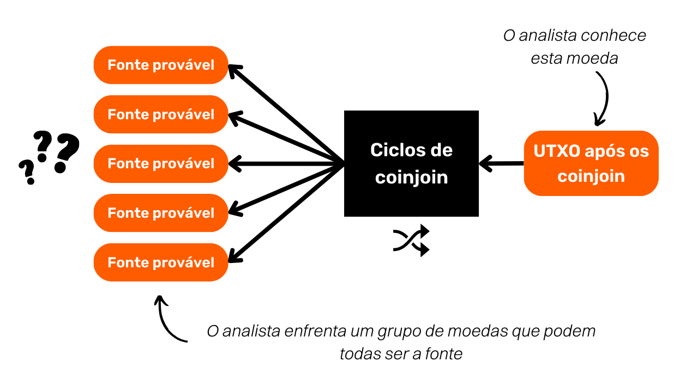

Conhecendo o seu UTXO na saída dos ciclos, o anonset retrospectivo determina o número de transações Tx0 potenciais que poderiam ter constituído a sua entrada nos ciclos de coinjoin. No diagrama abaixo, isso corresponde à soma de todas as bolhas laranjas.


Por exemplo, vamos imaginar que nossa moeda na saída do ciclo de coinjoin beneficia de um anonset retrospectivo de `42,185`. Na prática, isso significa que existem `42,185` fontes potenciais para este UTXO. Se um observador externo identifica esta moeda no final dos ciclos e busca rastrear sua origem, ele enfrentará `42,185` fontes possíveis, todas com uma probabilidade igual de ser a origem procurada.

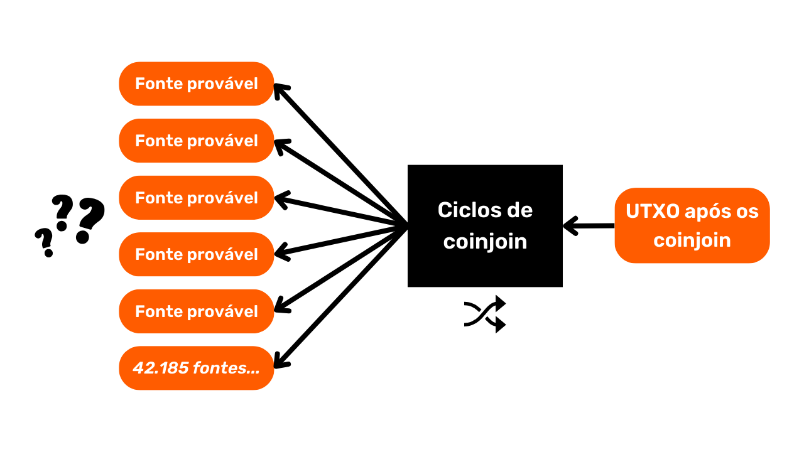

### Como calcular concretamente os anonsets?
É possível calcular manualmente os anonsets usando um explorador de blocos para conjuntos pequenos. No entanto, para anonsets maiores, o uso de uma ferramenta especializada torna-se imperativo. Até onde sei, o único software capaz de realizar esta tarefa é o *Whirlpool Stats Tool*, uma ferramenta Python desenvolvida pelas equipes da Samourai e OXT. Infelizmente, esta ferramenta está atualmente fora de serviço após a prisão dos fundadores da Samourai e a descontinuação da OXT, que era usada para extrair dados da blockchain.


Como vimos neste capítulo, os anonsets só podem ser calculados se houver uma certa homogeneidade na estrutura dos coinjoins. E precisamente, no próximo capítulo, descobriremos como quantificar esta homogeneidade em uma transação Bitcoin, seja ela um coinjoin ou uma transação mais tradicional.

https://planb.network/tutorials/privacy/wst-anonsets

## Entropia
<chapterId>e4fe289d-618b-49a2-84c9-68c562e708b4</chapterId>

Como vimos nesta parte sobre coinjoins, a homogeneidade dos UTXOs nas entradas e saídas desempenha um papel importante na melhoria da confidencialidade de uma transação Bitcoin. Este parâmetro permite uma negação plausível contra a análise de cadeia. Vários métodos podem medir esta homogeneidade, mas um dos mais eficazes, na minha opinião, é o uso de indicadores fornecidos pela ferramenta *Boltzmann*, desenvolvida pelas equipes da OXT e Samourai Wallet, especialmente a entropia da transação. É isso que estudaremos em detalhe neste capítulo.

Ao contrário dos anonsets, que são calculados sobre um conjunto de transações, os indicadores que apresentaremos aqui focam exclusivamente em uma única transação, seja ela um coinjoin ou uma transação mais tradicional.

### O número de interpretações
O primeiro indicador que pode ser observado em uma transação de Bitcoin é o número total de interpretações possíveis aos olhos de um observador externo analisando a transação. Levando em conta os valores dos UTXOs envolvidos na transação, este indicador indica o número de maneiras como as entradas podem ser associadas às saídas. Em outras palavras, determina o número de interpretações possíveis que uma transação pode gerar no fluxo de bitcoins sob a perspectiva de um observador externo analisando-a.

Por exemplo, uma transação de pagamento simples com 1 entrada e 2 saídas só terá uma interpretação, ou seja, que a entrada #0 financiou a saída #0 e a saída #1. Não existem outras interpretações possíveis:


Em contraste, um coinjoin estruturado de acordo com o modelo Whirlpool 5x5 apresenta $1.496$ combinações possíveis:

Um coinjoin Whirlpool Surge Cycle 8x8 apresenta-se com $9.934.563$ interpretações possíveis:

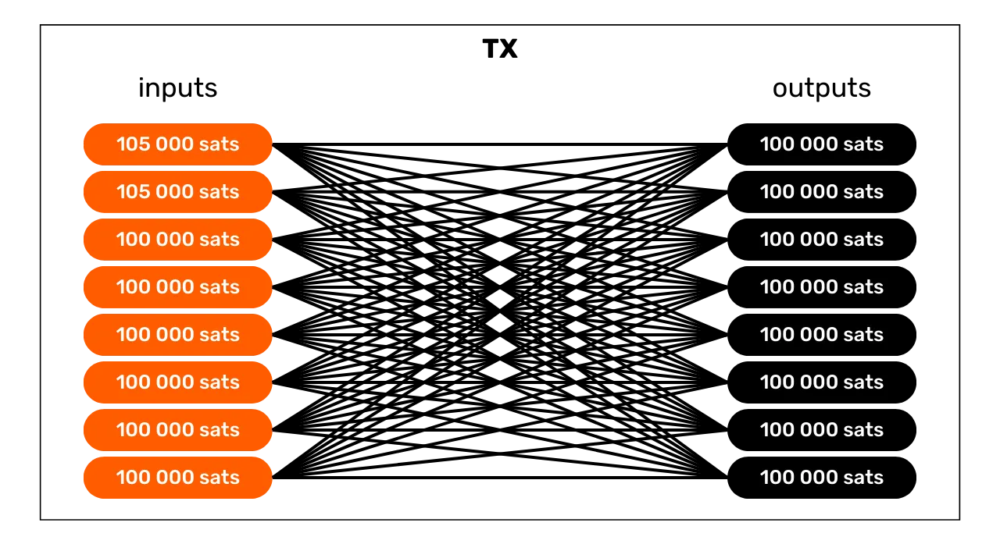

### Entropia

A partir do número de interpretações de uma transação de Bitcoin, podemos calcular sua entropia.

No contexto geral de criptografia e informação, entropia é uma medida quantitativa da incerteza ou imprevisibilidade associada a uma fonte de dados ou um processo aleatório. Em outras palavras, entropia é uma maneira de medir quão difícil é prever ou adivinhar uma informação.

No contexto específico de análise de cadeias, entropia também é o nome de um indicador, derivado da entropia de Shannon e [inventado por LaurentMT](https://gist.github.com/LaurentMT/e758767ca4038ac40aaf), que pode ser calculado em uma transação de Bitcoin.

Quando uma transação apresenta um alto número de interpretações possíveis, é frequentemente mais relevante referir-se à sua entropia. Este indicador permite medir a falta de conhecimento dos analistas sobre a configuração exata da transação. Em outras palavras, quanto maior a entropia, mais difícil se torna a tarefa de identificar os fluxos de bitcoins entre entradas e saídas para os analistas.

Na prática, a entropia revela se, sob a perspectiva de um observador externo, uma transação apresenta múltiplas interpretações possíveis, baseando-se apenas nas quantidades de entradas e saídas, sem considerar outros padrões e heurísticas externos ou internos. Uma alta entropia é então sinônimo de melhor confidencialidade para a transação.

A entropia é definida como o logaritmo binário do número de combinações possíveis. Aqui está a fórmula usada com $E$ sendo a entropia da transação e $C$ o número de interpretações possíveis:

$$
E = \log_2(C)
$$

Em matemática, o logaritmo binário (logaritmo de base 2) corresponde à operação inversa de elevar 2. Em outras palavras, o logaritmo binário de $x$ é o expoente ao qual $2$ deve ser elevado para obter $x$. Este indicador é assim expresso em bits.

Vamos tomar o exemplo do cálculo da entropia para uma transação coinjoin estruturada de acordo com o modelo Whirlpool 5x5, que, como mencionado na seção anterior, apresenta um número de interpretações possíveis de $1.496$:

$$
\begin{align*}
C &= 1.496 \\
E &= \log_2(1.496) \\
E &= 10.5469 \text{ bits}
\end{align*}
$$
Assim, esta transação coinjoin exibe uma entropia de $10.5469$ bits, o que é considerado muito satisfatório. Quanto maior esse valor, mais diferentes interpretações a transação admite, aumentando assim seu nível de privacidade.
Para uma transação coinjoin de 8x8 apresentando $9,934,563$ interpretações, a entropia seria:
$$
\begin{align*}
C &= 9,934,563 \\
E &= \log_2(9,934,563) \\
E &= 23.244 \text{ bits}
\end{align*}
$$

Vamos pegar outro exemplo com uma transação de pagamento padrão, apresentando 1 entrada e 2 saídas: [1b1b0c3f0883a99f1161c64da19471841ed12a1f78e77fab128c69a5f578ccce](https://mempool.space/tx/1b1b0c3f0883a99f1161c64da19471841ed12a1f78e77fab128c69a5f578ccce)


No caso desta transação, a única interpretação possível é: `(In.0) > (Out.0 ; Out.1)`. Consequentemente, sua entropia é estabelecida em $0$:

$$
\begin{align*}
C &= 1 \\
E &= \log_2(1) \\
E &= 0 \text{ bits}
\end{align*}
$$

### Eficiência

A partir da entropia da transação, também podemos calcular sua eficiência em termos de privacidade. Este indicador avalia a eficiência da transação comparando-a com a transação ótima concebível em uma configuração idêntica.

Isso nos leva a discutir o conceito de entropia máxima, que corresponde à maior entropia que uma estrutura de transação específica poderia teoricamente alcançar. A eficiência da transação é então calculada confrontando essa entropia máxima com a entropia real da transação analisada.

A fórmula usada é a seguinte com:
- $E_R$: a entropia real da transação expressa em bits;
- $E_M$: a entropia máxima possível para uma estrutura de transação também expressa em bits;
- $Ef$: a eficiência da transação em bits:

$$
Ef = E_R - E_M
$$

Por exemplo, para uma estrutura de coinjoin tipo Whirlpool 5x5, a entropia máxima é $10.5469$:

$$
\begin{align*}
E_R &= 10.5469 \\
E_M &= 10.5469 \\
Ef &= E_R - E_M \\
Ef &= 10.5469 - 10.5469 \\
Ef &= 0 \text{ bits}
\end{align*}
$$

Este indicador também é expresso como uma porcentagem. A fórmula usada é a seguinte com:
- $C_R$: o número de possíveis interpretações reais;
- $C_M$: o número máximo de possíveis interpretações com a mesma estrutura;
- $Ef$: eficiência expressa em porcentagem:

$$
\begin{align*}
E_f &= \frac{C_R}{C_M} \\
E_f &= \frac{1\,496}{1\,496} \\
E_f &= 100\%
\end{align*}
$$

Uma eficiência de $100\%$ indica assim que a transação maximiza seu potencial para privacidade com base em sua estrutura.

### A Densidade de Entropia

Entropia é um bom indicador para medir a privacidade de uma transação, mas depende parcialmente do número de entradas e saídas na transação. Para comparar a entropia de 2 transações diferentes que não têm o mesmo número de entradas e saídas, pode-se calcular a densidade de entropia. Este indicador oferece uma perspectiva sobre a entropia relativa a cada entrada ou saída da transação. A densidade prova ser útil para avaliar e comparar a eficiência de transações de diferentes tamanhos.
Para calcular, basta dividir a entropia total da transação pelo número total de entradas e saídas envolvidas na transação:
- $E_D$: a densidade de entropia expressa em bits;
- $E$: a entropia da transação expressa em bits;
- $T$: o número total de entradas e saídas na transação:

$$
E_D = \frac{E}{T}
$$

Vamos tomar o exemplo de um coinjoin Whirlpool 5x5:

$$
\begin{align*}
T &= 5 + 5 = 10 \\
E &= 10.5469 \\
E_D &= \frac{E}{T} \\
E_D &= \frac{10.5469}{10} \\
E_D &= 1.054 \text{ bits}
\end{align*}
$$

Vamos também calcular a densidade de entropia de um coinjoin Whirlpool 8x8:

$$
\begin{align*}
T &= 8 + 8 = 16 \\
E &= 23.244 \\
E_D &= \frac{E}{T} \\
E_D &= \frac{23.244}{16} \\
E_D &= 1.453 \text{ bits}
\end{align*}
$$

Ao analisar a densidade de entropia desses dois tipos de coinjoins, fica evidente que, mesmo normalizando a entropia pelo número de elementos, o coinjoin "Surge Cycle 8x8" gera mais incerteza para análise.

### O Score de Boltzmann
Outra peça de informação analisada em uma transação é o score de Boltzmann de cada elemento em relação a outro. Esta é uma tabela das probabilidades de correspondência entre as entradas e as saídas. Esta tabela indica, através do score de Boltzmann, a probabilidade condicional de que uma entrada específica esteja ligada a uma saída dada. Portanto, é uma medida quantitativa da probabilidade condicional de que uma associação entre uma entrada e uma saída em uma transação ocorra, estabelecida na razão do número de ocorrências favoráveis deste evento em comparação ao número total de ocorrências possíveis, em um conjunto de interpretações.
Tomando o exemplo de um coinjoin Whirlpool, a tabela de probabilidades condicionais destacaria as chances de um link entre cada entrada e saída, fornecendo uma medida quantitativa da ambiguidade das associações na transação:

| %       | Saída 0 | Saída 1 | Saída 2 | Saída 3 | Saída 4 |
| ------- | ------- | ------- | ------- | ------- | ------- |
| Entrada 0 | 34%      | 34%      | 34%      | 34%      | 34%      |
| Entrada 1 | 34%      | 34%      | 34%      | 34%      | 34%      |
| Entrada 2 | 34%      | 34%      | 34%      | 34%      | 34%      |
| Entrada 3 | 34%      | 34%      | 34%      | 34%      | 34%      |
| Entrada 4 | 34%      | 34%      | 34%      | 34%      | 34%      |

Aqui, fica claro que cada entrada tem uma chance igual de estar associada a qualquer saída, o que aumenta a confidencialidade da transação.

O cálculo do score de Boltzmann envolve dividir o número de interpretações nas quais um certo evento se manifesta pelo número total de interpretações disponíveis. Assim, para determinar o score associando a entrada #0 com a saída #3 (um evento presente em $512$ interpretações), o processo é o seguinte:

$$
\begin{align*}
\text{Interpretacoes (IN.0 > OUT.3)} &= 512 \\
\text{Total de Interpretacoes} &= 1496 \\
\text{Pontuacao} &= \frac{512}{1496} \\
\text{Pontuacao} &= 34\%
\end{align*}
$$

Se revisarmos o exemplo de um Whirlpool coinjoin 8x8 Surge Cycle, a tabela Boltzmann ficaria assim:

|       | OUT.0 | OUT.1 | OUT.2 | OUT.3 | OUT.4 | OUT.5 | OUT.6 | OUT.7 |
|-------|-------|-------|-------|-------|-------|-------|-------|-------|
| IN.0  | 23%   | 23%   | 23%   | 23%   | 23%   | 23%   | 23%   | 23%   |
| IN.1  | 23%   | 23%   | 23%   | 23%   | 23%   | 23%   | 23%   | 23%   |
| IN.2  | 23%   | 23%   | 23%   | 23%   | 23%   | 23%   | 23%   | 23%   |
| IN.3  | 23%   | 23%   | 23%   | 23%   | 23%   | 23%   | 23%   | 23%   |
| IN.4  | 23%   | 23%   | 23%   | 23%   | 23%   | 23%   | 23%   | 23%   |
| IN.5  | 23%   | 23%   | 23%   | 23%   | 23%   | 23%   | 23%   | 23%   |
| IN.6  | 23%   | 23%   | 23%   | 23%   | 23%   | 23%   | 23%   | 23%   |
| IN.7  | 23%   | 23%   | 23%   | 23%   | 23%   | 23%   | 23%   | 23%   |

No entanto, no caso de uma transação simples envolvendo uma única entrada e 2 saídas, a situação é diferente:

| %       | Saída 0 | Saída 1 |
|---------|---------|---------|
| Entrada 0 | 100%    | 100%    |

Aqui, observamos que a probabilidade de cada saída originar-se da entrada #0 é de 100%. Uma probabilidade menor, portanto, traduz-se em maior privacidade ao diluir os links diretos entre as entradas e saídas.

### Links Determinísticos

Também é possível calcular o número de links determinísticos em uma transação. Este indicador revela quantas conexões entre as entradas e saídas na transação analisada são indiscutíveis, com uma probabilidade de 100%. Este indicador pode então ser complementado pelo cálculo da razão de links determinísticos. A razão fornece uma perspectiva sobre o peso desses links determinísticos dentro de todos os links da transação.

Por exemplo, uma transação do tipo Whirlpool coinjoin mostra uma ligação determinística nula entre as entradas e saídas, exibindo assim um indicador de 0 ligações e uma proporção de 0%. Por outro lado, em nossa segunda transação de pagamento simples examinada (com uma entrada e 2 saídas), o indicador nos diz que existem 2 ligações determinísticas e a proporção atinge 100%. Portanto, um indicador nulo sinaliza excelente privacidade devido à ausência de conexões diretas e incontestáveis entre as entradas e saídas.
### Como Calcular Esses Indicadores?
Calcular esses indicadores manualmente usando as equações que forneci é relativamente simples. A principal dificuldade reside em determinar o número de possíveis interpretações de uma transação. Para uma transação padrão, esse cálculo pode ser realizado manualmente. No entanto, para um coinjoin, a tarefa é significativamente mais complexa.

Anteriormente, havia uma ferramenta Python chamada _Boltzmann Calculator_, desenvolvida pelas equipes da OXT e Samourai, que permitia o cálculo automático de todos esses indicadores para uma transação Bitcoin:


Também era possível usar o site KYCP.org para essas análises:


Infelizmente, após a prisão dos fundadores da Samourai, essas ferramentas atualmente não estão operacionais.

Agora que discutimos coinjoins em detalhes, exploraremos outras técnicas de privacidade disponíveis no Bitcoin na última seção do nosso treinamento. Examinaremos payjoins, tipos específicos de transações pseudo-coinjoins, protocolos de endereço estático, bem como medidas voltadas para aprimorar a privacidade não no nível da transação, mas no nível da rede de nós.

https://planb.network/tutorials/privacy/boltzmann-entropy

# Entendendo os desafios de outras técnicas avançadas de privacidade
<partId>19989ae6-d608-4acf-b698-2cf1e7e5e6ae</partId>

## Transações Payjoin
<chapterId>c1e90b95-f709-4574-837b-2ec26b11286f</chapterId>

Atualmente, o coinjoin representa o método mais eficaz para introduzir incerteza na rastreabilidade de moedas durante uma análise de cadeia. Como vimos nos capítulos anteriores, para alcançar uma mistura eficaz, é necessário que as entradas e saídas sejam o mais homogêneas possível. Além disso, é crucial que as moedas sejam integradas em um grupo o maior possível para maximizar os anonsets. Assim, para que os coinjoins sejam eficazes, eles devem envolver um grande número de moedas uniformes. Essa multidão de requisitos significa que as transações coinjoin têm uma estrutura muito rígida: os montantes são predeterminados, e todos os participantes devem aderir a eles para garantir a uniformidade do processo. Além disso, os coinjoins requerem sincronização entre todos os participantes e o coordenador durante a construção da transação.
Esses requisitos tornam o coinjoin inadequado para pagamentos diretos. Por exemplo, se você possui uma peça de 1M sats em um pool de coinjoin, usá-la diretamente como pagamento seria complexo. Seria necessário sincronizar com os outros participantes e o coordenador para construir a transação colaborativa exatamente no momento em que você precisa fazer um pagamento, e o valor da compra teria que corresponder exatamente ao valor da sua peça, o que é praticamente inalcançável. Portanto, uma transação coinjoin é por natureza uma transação colaborativa de varredura, o que significa que geralmente são os mesmos proprietários das entradas que se encontram nas saídas.
No entanto, seria interessante ter estruturas de transação que permitam pagamentos práticos enquanto introduzem dúvida na análise de cadeia. É exatamente isso que exploraremos neste capítulo e no próximo.

### O que é uma transação payjoin?

Payjoin é uma estrutura específica de transação Bitcoin que aprimora a privacidade do usuário durante um gasto, colaborando com o destinatário do pagamento.
Foi em 2015 que LaurentMT mencionou pela primeira vez este método sob o nome de "*transações esteganográficas*", de acordo com um documento acessível [aqui](https://gist.githubusercontent.com/LaurentMT/e758767ca4038ac40aaf/raw/c8125f6a3c3d0e90246dc96d3b603690ab6f1dcc/gistfile1.txt). Esta técnica foi posteriormente adotada pela Samourai Wallet, que em 2018, foi o primeiro cliente a implementá-la com a ferramenta Stowaway. O conceito de payjoin também é encontrado no [BIP79](https://github.com/bitcoin/bips/blob/master/bip-0079.mediawiki) e no [BIP78](https://github.com/bitcoin/bips/blob/master/bip-0078.mediawiki). Vários termos são assim usados para designar um payjoin:
- Payjoin;
- Stowaway;
- P2EP (*Pay-to-End-Point*);
- Transação esteganográfica.

A particularidade do payjoin reside na sua capacidade de gerar uma transação que parece comum à primeira vista, mas que na realidade é um mini Coinjoin entre duas pessoas. Para isso, a estrutura da transação envolve o destinatário do pagamento nos inputs juntamente com o remetente real. O destinatário assim inclui um pagamento a si mesmo no meio da transação que lhe permite ser pago.

Vamos pegar um exemplo para entender melhor esse processo. Alice compra uma baguete por 4.000 sats usando um UTXO de 10.000 sats e opta por um payjoin. Seu padeiro, Bob, adiciona um UTXO de 15.000 sats pertencente a ele no input, que ele recupera integralmente no output, além dos 4.000 sats de Alice.


Neste exemplo, Bob, o padeiro, insere 15.000 sats e sai com 19.000 sats, a diferença sendo exatamente 4.000 sats, que é o preço da baguete. Do lado de Alice, ela entra com 10.000 sats e termina com 6.000 sats no output, o que representa um saldo de -4.000 sats, ou seja, o preço da baguete. Para simplificar o exemplo, omiti deliberadamente as taxas de mineração nesta transação.

### Qual é o propósito do payjoin?

A transação payjoin cumpre dois objetivos que permitem aos usuários melhorar a privacidade do seu pagamento.

Primeiramente, o payjoin visa enganar um observador externo criando um chamariz na análise de cadeia. Isso é possível graças à heurística CIOH (*Common Input Ownership Heuristic*). Como vimos na parte 3, geralmente, quando uma transação na blockchain tem múltiplos inputs, assume-se que todos esses inputs pertencem à mesma entidade ou usuário.

Assim, quando um analista examina uma transação payjoin, é levado a acreditar que todos os inputs vêm da mesma pessoa. No entanto, esta percepção é incorreta, pois o destinatário do pagamento também contribui para os inputs ao lado do pagador real. A análise de cadeia é, portanto, desviada para uma interpretação que se revela falsa.

Vamos voltar ao nosso exemplo de uma transação payjoin para o pagamento de uma baguete:


Vendo esta transação na blockchain, um observador externo seguindo as heurísticas usuais de análise de cadeia interpretaria da seguinte forma: "*Alice fundiu 2 UTXOs em inputs da transação para pagar 19.000 sats a Bob*".
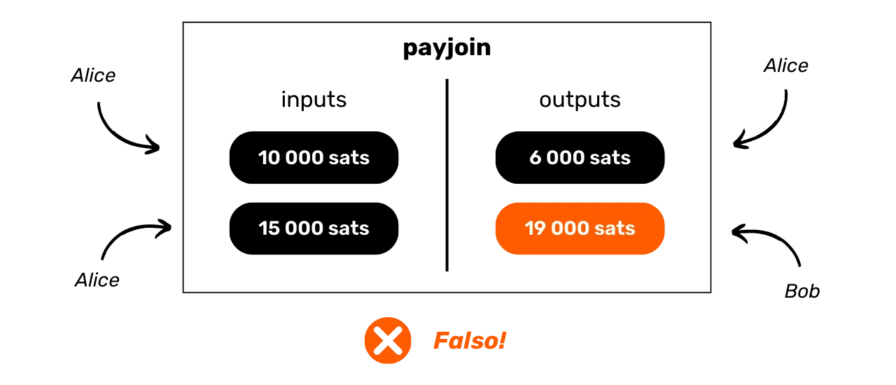
Esta interpretação é obviamente incorreta, como você já sabe, os dois UTXOs nas entradas não pertencem à mesma pessoa. Um vem de Alice, a compradora da baguete, e o outro de Bob, o padeiro.


A análise do observador externo é, portanto, direcionada para uma conclusão errada, o que garante a preservação da confidencialidade dos envolvidos.

### A transação esteganográfica

O segundo objetivo do payjoin é enganar um observador externo sobre o valor real do pagamento que foi feito. Ao examinar a estrutura da transação, o analista pode acreditar que o pagamento é equivalente ao valor de uma das saídas.
Se revisitarmos nosso exemplo de compra de uma baguete, o analista pensará que o valor do pagamento corresponde ou ao UTXO de 6.000 sats ou ao UTXO de 19.000 sats. Neste caso, o analista é mais propenso a pensar que o valor do pagamento é de 19.000 sats, porque há 2 UTXOs nas saídas, pelo menos um dos quais é maior que 6.000 sats (não há razão lógica para usar 2 UTXOs para pagar 6.000 sats quando um único UTXO teria sido suficiente para este pagamento).
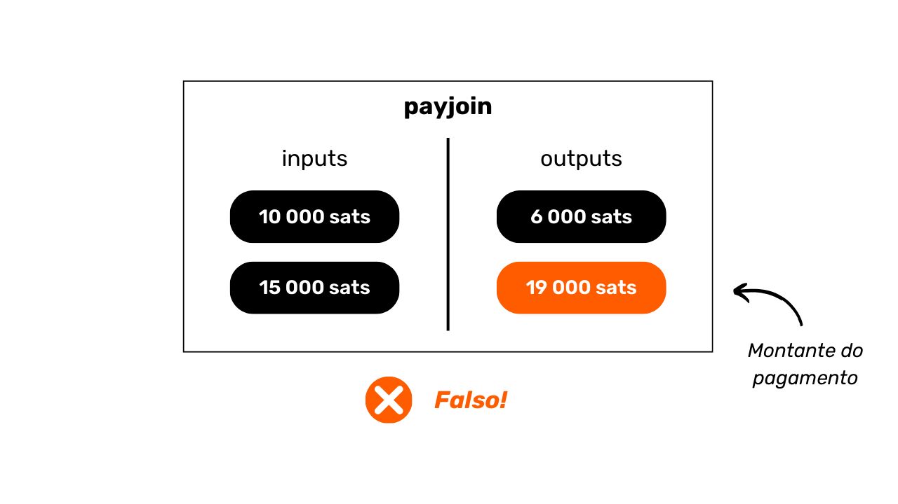

Mas, na realidade, esta análise está incorreta. O valor do pagamento não corresponde a nenhuma das saídas. É na verdade a diferença entre o UTXO do destinatário na saída e o UTXO do destinatário na entrada.

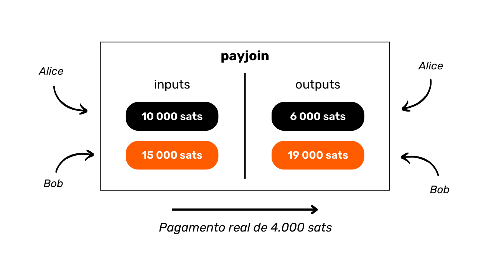

Nisso, a transação payjoin cai no domínio da esteganografia. Ela permite esconder o valor real de uma transação dentro de uma transação falsa que atua como um chamariz.

Esteganografia é uma técnica para ocultar informações dentro de outros dados ou objetos, de tal forma que a presença da informação oculta não seja perceptível. Por exemplo, uma mensagem secreta pode ser escondida dentro de um ponto em um texto que não tem relação, tornando-a indetectável a olho nu (esta é a técnica do [microponto](https://fr.wikipedia.org/wiki/Micropoint)).

Ao contrário da criptografia, que torna a informação ininteligível sem a chave de descriptografia, a esteganografia não altera a informação. Ela permanece à vista. Seu objetivo é mais esconder a própria existência da mensagem secreta, enquanto a criptografia revela claramente a presença de informações ocultas, embora inacessíveis sem a chave. É por isso que o nome inicial para payjoin era "*transações esteganográficas*".

Uma analogia poderia ser feita entre criptografia e coinjoin, assim como entre esteganografia e payjoin. De fato, coinjoin tem atributos semelhantes aos da criptografia: o método é reconhecível, mas a informação é indecifrável. Por outro lado, payjoin é semelhante à esteganografia: a informação é teoricamente acessível, mas, como seu método de ocultação não é reconhecível, torna-se inacessível.

### Como usar payjoin?

Entre os softwares conhecidos que suportam payjoin, estão Sparrow Wallet, Wasabi Wallet, Mutiny, BitMask, BlueWallet e JoinMarket, bem como o processador de pagamentos BTCPay.


A implementação mais avançada de payjoin era apenas o Stowaway na Samourai Wallet. No entanto, desde a prisão dos fundadores do software, essa ferramenta agora só funciona parcialmente. A vantagem do Stowaway é que é um protocolo completo e muito simples de usar, que suporta tanto o recebimento quanto o envio de payjoins. Transações parcialmente assinadas podem ser trocadas manualmente através da leitura de múltiplos códigos QR ou automaticamente através do Tor via Soroban. É esta última opção de comunicação que está atualmente fora de serviço.

A dificuldade de usar payjoin reside na sua dependência da participação do comerciante. Como cliente, usar um payjoin é impossível se o comerciante não o suportar. Isso adiciona uma dificuldade adicional durante uma compra: não é apenas complicado encontrar comerciantes que aceitam bitcoin, mas se também procurarmos por aqueles que suportam payjoins, torna-se ainda mais complicado.

Uma solução seria usar estruturas transacionais que introduzem ambiguidade na análise da cadeia sem requerer a cooperação do destinatário. Isso nos permitiria melhorar a privacidade dos nossos pagamentos sem depender da participação ativa dos comerciantes. É precisamente isso que estudaremos no próximo capítulo.

https://planb.network/tutorials/privacy/payjoin-sparrow-wallet

https://planb.network/tutorials/privacy/payjoin-samourai-wallet

## Mini-coinjoins de pagamento
<chapterId>300777ee-30ae-43d7-ab00-479dac3522c1</chapterId>

Ao procurar fazer uma transação de pagamento preservando um certo grau de privacidade, payjoin é uma boa opção. Mas como vimos, payjoin requer o envolvimento do destinatário. O que fazer então se este se recusar a participar em um payjoin, ou se simplesmente preferir não envolvê-lo? Uma alternativa é usar uma transação Stonewall ou Stonewall x2. Vamos dar uma olhada mais de perto nestes dois tipos de transações.

### A Transação Stonewall

Stonewall é uma forma específica de transação Bitcoin visando aumentar a privacidade do usuário durante um gasto, imitando um pseudo-coinjoin entre duas pessoas, sem realmente ser um. De fato, esta transação não é colaborativa. Um usuário pode construí-la sozinho, envolvendo apenas os UTXOs que possui como entradas. Você pode, portanto, criar uma transação Stonewall para qualquer ocasião, sem precisar sincronizar com outro usuário ou o destinatário.

O funcionamento da transação Stonewall é o seguinte: na entrada da transação, o remetente usa 2 UTXOs que lhe pertencem. Na saída, a transação produz 4 UTXOs, 2 dos quais serão exatamente do mesmo valor. Os outros 2 UTXOs constituirão o troco. Entre as 2 saídas do mesmo valor, apenas uma irá de fato para o destinatário do pagamento.
Existem apenas 2 papéis em uma transação Stonewall:
- O remetente, que faz o pagamento;
- O destinatário, que pode estar alheio à natureza específica da transação e simplesmente aguarda um pagamento do remetente.

Vamos tomar um exemplo para entender esta estrutura de transação. Alice está na padaria do Bob para comprar sua baguete, que custa 4.000 sats. Ela quer pagar em bitcoins mantendo um certo nível de privacidade em relação ao seu pagamento. Portanto, ela decide construir uma transação Stonewall para o pagamento.
Analisando esta transação, podemos ver que Bob, o padeiro, de fato recebeu 4.000 sats de pagamento pela baguete. Alice usou 2 UTXOs como entradas: um de 10.000 sats e outro de 15.000 sats. Nas saídas, ela recebeu 3 UTXOs: um de 4.000 sats, um de 6.000 sats e um de 11.000 sats. Alice, portanto, tem um saldo líquido de -4.000 sats nesta transação, o que corresponde exatamente ao preço da baguete.
Neste exemplo, eu intencionalmente negligenciei as taxas de mineração para facilitar o entendimento. Na realidade, as taxas de transação são inteiramente pagas pelo remetente.

### Quais são os objetivos de uma transação Stonewall?

A estrutura Stonewall adiciona muita entropia à transação e embaralha os rastros de análise de cadeia. De fora, tal transação pode ser interpretada como um mini-coinjoin entre duas pessoas. Mas, na realidade, é um pagamento. Este método, portanto, gera incertezas na análise de cadeia, ou até leva a pistas falsas.

Vamos voltar ao exemplo de Alice na padaria do Bob. A transação na blockchain pareceria assim:


Um observador externo, confiando nas heurísticas comuns de análise de cadeia, poderia concluir erroneamente que "*duas pessoas fizeram um pequeno coinjoin, com um UTXO cada em entrada e dois UTXOs cada em saída*". A análise desta transação de fora não leva à aplicação da Heurística de Propriedade Comum de Entrada (CIOH), porque a presença de duas saídas do mesmo valor sugere um padrão de coinjoin. De um ponto de vista externo, a CIOH, portanto, não é aplicável neste caso específico.


Esta interpretação é imprecisa, porque, como você sabe, um UTXO foi enviado para Bob, o padeiro, os 2 UTXOs em entradas vêm de Alice, e ela recuperou 3 saídas de troco.


E o que é particularmente interessante sobre a estrutura da transação Stonewall é que, do ponto de vista de um observador externo, parece exatamente como a de uma transação Stonewall x2.

### A Transação Stonewall x2

Stonewall x2 é outra forma específica de transação Bitcoin que também visa aumentar a privacidade do usuário durante um gasto, mas desta vez colaborando com uma terceira parte não envolvida no gasto. Este método funciona como um pseudo-coinjoin entre dois participantes, enquanto faz um pagamento a uma terceira pessoa ao mesmo tempo.

O funcionamento da transação Stonewall x2 é relativamente simples: usa-se um UTXO em sua posse para fazer o pagamento e solicita-se a ajuda de uma terceira parte que também contribui com um UTXO que possuem. A transação termina com quatro saídas: duas delas de valores iguais, uma destinada ao endereço do destinatário do pagamento, a outra a um endereço pertencente ao colaborador. Um terceiro UTXO é enviado de volta a outro endereço do colaborador, permitindo que eles recuperem o valor inicial (uma ação neutra para eles, menos as taxas de mineração), e um último UTXO retorna a um endereço pertencente a nós, que constitui o troco do pagamento.

Assim, três diferentes papéis são definidos nas transações Stonewall x2:
- O remetente, que faz o pagamento real;
- O destinatário, que pode estar alheio à natureza específica da transação e simplesmente aguarda um pagamento do remetente;
- O colaborador, que fornece bitcoins para lançar dúvidas na análise da transação, enquanto recupera totalmente seus fundos no final (uma ação neutra para eles, menos as taxas de mineração).
Vamos voltar ao nosso exemplo com Alice, que está na padaria do Bob para comprar sua baguete que custa 4.000 sats. Ela quer pagar em bitcoins mantendo um certo nível de privacidade em seu pagamento. Então, ela chama seu amigo Charles, que a ajudará neste processo.

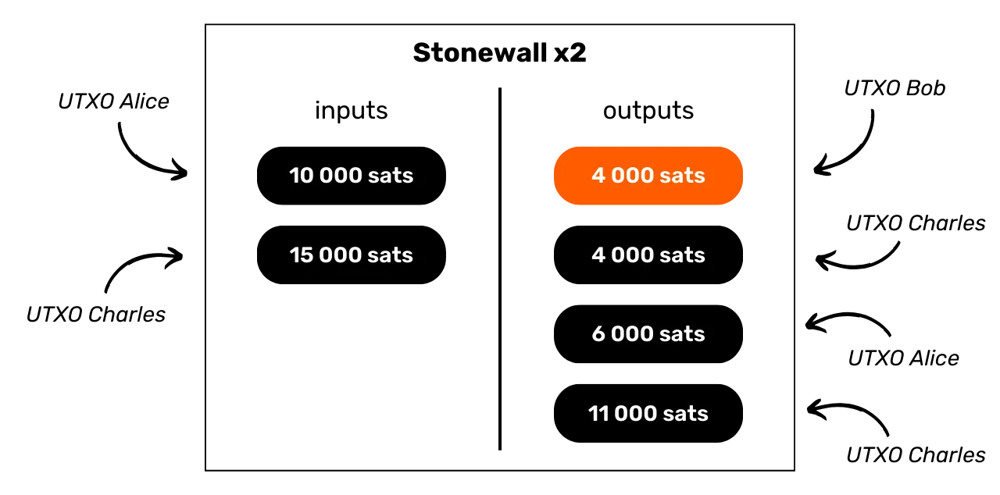

Analisando esta transação, podemos ver que Bob, o padeiro, de fato recebeu 4.000 sats em pagamento pela baguete. Alice usou 10.000 sats na entrada e recuperou 6.000 sats na saída, resultando em um saldo líquido de -4.000 sats, que corresponde ao preço da baguete. Quanto a Charles, ele forneceu 15.000 sats na entrada e recebeu duas saídas: uma de 4.000 sats e outra de 11.000 sats, fazendo um saldo de 0.

Neste exemplo, eu intencionalmente negligenciei as taxas para facilitar o entendimento. Na realidade, as taxas de mineração geralmente são compartilhadas igualmente entre o emissor do pagamento e o colaborador.

### Quais são os objetivos de uma transação Stonewall x2?
Assim como a estrutura Stonewall, a estrutura Stonewall x2 adiciona uma quantidade significativa de entropia à transação e obscurece os rastros de análise de cadeia. De um ponto de vista externo, tal transação poderia ser interpretada como um pequeno coinjoin entre duas pessoas. Mas na realidade, é um pagamento. Este método, portanto, gera incertezas na análise de cadeia, levando até a falsos rastros.

Vamos revisitar o exemplo de Alice, Bob o Padeiro, e Charles. A transação na blockchain pareceria assim:


Um observador externo, confiando nas heurísticas comuns de análise de cadeia, poderia erroneamente concluir que "*Alice e Charles realizaram um pequeno coinjoin, com um UTXO cada na entrada e dois UTXOs cada na saída*". Novamente, a análise desta transação de fora não leva à aplicação da Heurística de Propriedade Comum de Entrada (CIOH), porque a presença de duas saídas do mesmo valor sugere um padrão de coinjoin. De um ponto de vista externo, a CIOH, portanto, não é aplicável neste caso específico.


Esta interpretação é imprecisa porque, como você sabe, um UTXO foi enviado para Bob o Padeiro, Alice tem apenas uma saída de troco, e Charles tem duas.

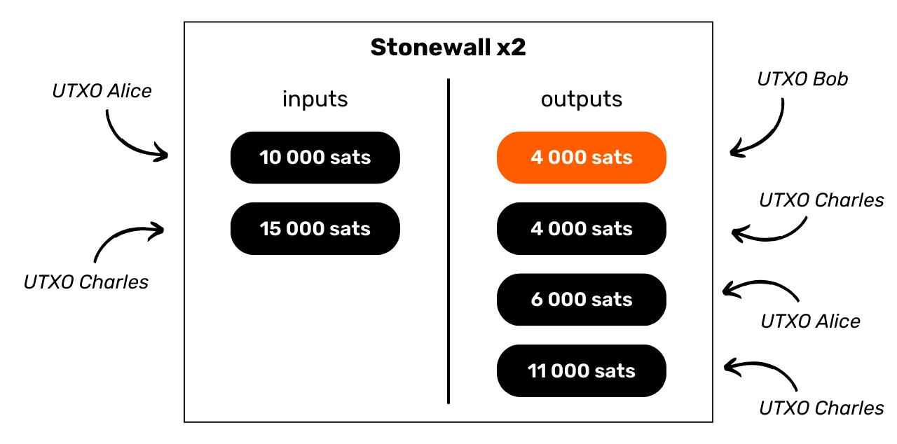

E, mais uma vez, o que é particularmente interessante com a estrutura de transação Stonewall x2 é que, do ponto de vista de um observador externo, parece exatamente como a de uma transação Stonewall.

### Qual é a diferença entre Stonewall e Stonewall x2?

Uma transação StonewallX2 opera exatamente como uma transação Stonewall, exceto que a primeira é colaborativa, enquanto a última não é. Como vimos, uma transação Stonewall x2 envolve a participação de uma terceira parte (Charles), que é externa ao pagamento, e que fornece seus bitcoins para aumentar a confidencialidade da transação. Em uma transação Stonewall clássica, o papel do colaborador é assumido pelo remetente.


De um ponto de vista externo, o padrão da transação é, portanto, exatamente o mesmo.

O fato de essas duas estruturas de transação compartilharem exatamente o mesmo padrão implica que, mesmo que um observador externo consiga identificar um padrão "Stonewall(x2)", ele não terá todas as informações. Não será capaz de determinar qual dos dois UTXOs de mesmos valores corresponde ao pagamento. Além disso, não será capaz de determinar se os dois UTXOs nas entradas vêm de duas pessoas diferentes (Stonewall x2) ou se pertencem a uma única pessoa que os fundiu (Stonewall).
Este último ponto deve-se ao fato de que as transações Stonewall x2 seguem exatamente o mesmo padrão das transações Stonewall. De fora e sem informações adicionais sobre o contexto, é impossível diferenciar uma transação Stonewall de uma transação Stonewall x2. No entanto, as primeiras não são transações colaborativas, enquanto as últimas são. Isso adiciona ainda mais dúvida na análise de uma dessas transações.

### Quando usar transações Stonewall e Stonewall x2?

A lógica deve ser a seguinte ao querer usar uma ferramenta de privacidade para uma transação:
- Como prioridade, pode-se escolher fazer um payjoin;
- Se o comerciante não suportar payjoins, pode-se fazer uma transação colaborativa com outra pessoa fora do pagamento usando a estrutura Stonewall x2;
- Se não se encontrar ninguém para fazer uma transação Stonewall x2, pode-se fazer uma transação Stonewall sozinho, que imitará o comportamento de uma transação Stonewall x2.

### Como usar transações Stonewall e Stonewall x2?

As transações Stonewall e Stonewall x2 estão disponíveis tanto no aplicativo Samourai Wallet quanto no software Sparrow Wallet.


No entanto, assim como com os payjoins, após a prisão dos fundadores da Samourai, as transações Stonewall x2 agora só funcionam trocando manualmente os PSBTs entre as partes envolvidas. A troca automática via Soroban, infelizmente, não está disponível no momento.

Também é possível realizar manualmente este tipo de transação a partir de qualquer software de carteira Bitcoin.

No próximo capítulo, estudaremos outra técnica de privacidade que é relativamente desconhecida, mas é muito útil além do que já estudamos.

https://planb.network/tutorials/privacy/stonewall

https://planb.network/tutorials/privacy/stonewall-x2
 
## Ricochetes

<chapterId>db9a20ac-a149-443d-884b-ea6c03f28499</chapterId>

O uso de estruturas de transação Bitcoin que adicionam ambiguidade na análise de cadeia, como coinjoin, é particularmente benéfico para a proteção da privacidade. No entanto, como discutimos no capítulo sobre payjoins, as transações coinjoin são naturalmente identificáveis na cadeia. Lembre-se da analogia que estabelecemos entre criptografia e coinjoins: quando se criptografa um arquivo, um terceiro que descobre este arquivo criptografado não pode acessar seu conteúdo, mas pode claramente identificar que houve uma modificação do arquivo para esconder seu conteúdo. O mesmo é verdade para coinjoin: quando um analista examina uma transação coinjoin, embora não possa estabelecer ligações diretas entre as entradas e saídas (e vice-versa), ele pode, no entanto, reconhecer que a transação observada é um coinjoin.
Dependendo do uso pretendido para sua moeda após passar por ciclos de coinjoin, o fato de ter passado por esse processo pode ser problemático. Por exemplo, se você planeja vender sua moeda em uma plataforma de câmbio regulamentada, mas ela passou recentemente por um coinjoin, a ferramenta de análise de cadeia da plataforma detectará esse fato. A plataforma pode então recusar-se a aceitar seu UTXO que passou por um coinjoin, ou até mesmo exigir explicações suas, com o risco de ter sua conta suspensa ou seus fundos congelados. Em alguns casos, a plataforma também pode relatar seu comportamento às autoridades estaduais (por exemplo, é o que a TRACFIN exige dos Provedores de Serviços de Ativos Digitais (PSAN) na França).

O que precisaríamos para evitar isso é uma ferramenta capaz de borrar os rastros do passado de uma moeda Bitcoin, a fim de restaurar uma certa forma de fungibilidade. Este é precisamente o objetivo do ricochet.


### O que é um ricochet?

Ricochet é uma técnica que envolve realizar várias transações fictícias para si mesmo (varredura) para simular uma transferência de propriedade de bitcoins. Esta ferramenta é diferente de outras estruturas de transação que discutimos porque não permite anonimato prospectivo, mas sim uma forma de anonimato retrospectivo. De fato, ricochet permite borrar os detalhes específicos que poderiam comprometer a fungibilidade de uma moeda Bitcoin devido ao seu passado.

Para borrar a impressão deixada por um evento passado em uma moeda, como ciclos de coinjoin, por exemplo, ricochet executa quatro transações sucessivas onde o usuário transfere fundos para si mesmo em diferentes endereços.

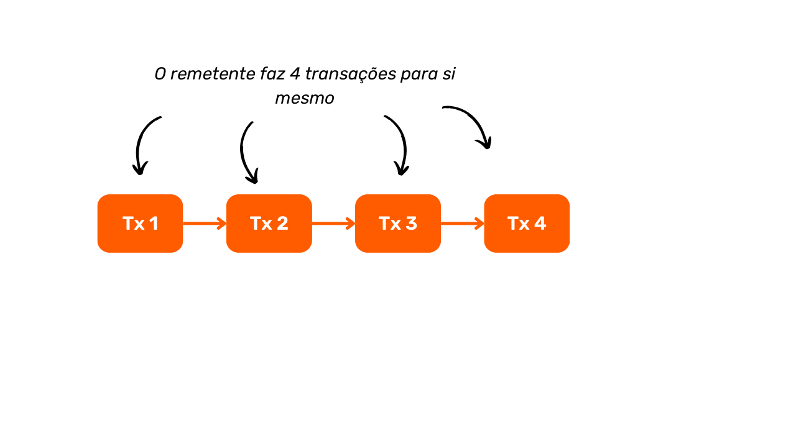

Após essa sequência de transações, a ferramenta ricochet finalmente encaminha os bitcoins para seu destino final, como uma plataforma de câmbio.

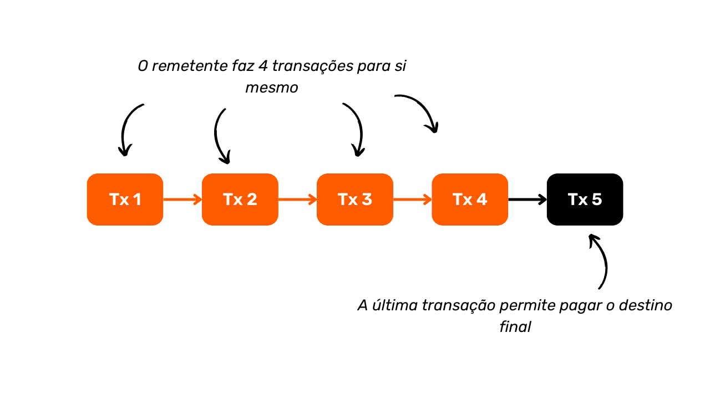

O objetivo é criar distância afetando a fungibilidade da moeda, como uma transação de coinjoin, e o ato final de gastar que poderia rejeitar essa moeda por causa de seu passado. Assim, ferramentas de análise de cadeia podem concluir que provavelmente houve uma mudança de propriedade após o evento, e considerar que essa moeda é fungível. No caso de um coinjoin, ferramentas de análise de cadeia podem então assumir que não é a mesma pessoa que enviou os bitcoins e realizou o coinjoin, e portanto, é desnecessário iniciar ações contra o remetente.


### Por que isso funciona?
Diante deste método ricochet, pode-se imaginar que o software de análise de cadeia aprofundaria seu exame além de quatro saltos. No entanto, essas plataformas enfrentam um dilema na otimização do limiar de detecção. Eles devem estabelecer um limite no número de saltos após o qual admitem que uma mudança de propriedade provavelmente ocorreu e que a ligação com um evento anterior (como um coinjoin) deve ser ignorada.
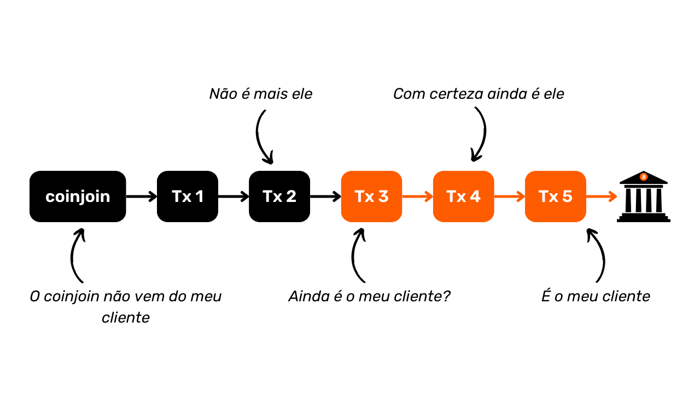

No entanto, determinar esse limiar prova ser arriscado: cada extensão do número observado de saltos aumenta exponencialmente o volume de falsos positivos, ou seja, indivíduos erroneamente marcados como participantes de um evento, quando a operação foi realizada por outra pessoa. Este cenário representa um grande risco para essas empresas, pois falsos positivos levam à insatisfação, o que pode empurrar clientes afetados para a concorrência. A longo prazo, um limiar de detecção muito amplo leva uma plataforma a perder mais clientes do que seus concorrentes, o que poderia ameaçar sua viabilidade. Portanto, é complicado para essas plataformas aumentar o número de saltos observados, e 4 é frequentemente um número suficiente para contrariar suas análises.

O fenômeno observado aqui é de certa forma análogo à teoria dos seis graus de separação.
A teoria dos seis graus de separação sugere que qualquer pessoa na Terra está conectada a qualquer outra através de uma cadeia de conhecidos que inclui não mais do que seis intermediários. Seria suficiente passar por uma série de seis pessoas, cada uma conhecendo pessoalmente a próxima, para alcançar qualquer indivíduo no mundo.
Para transações de Bitcoin, um fenômeno similar é encontrado. Ao rastrear um número suficiente de transações de Bitcoin, inevitavelmente acaba-se encontrando um coinjoin. O método ricochete aproveita esse princípio ao usar um número de saltos maior do que o que as plataformas de troca podem razoavelmente acompanhar. Se as plataformas decidirem seguir mais transações, então é possível simplesmente adicionar um salto adicional para contornar essa medida.

### Quando e como usar ricochete?

O caso de uso mais comum para ricochete ocorre quando é necessário ocultar a participação anterior em um coinjoin em um UTXO que você possui. Idealmente, é melhor evitar transferir bitcoins que passaram por um coinjoin para entidades reguladas. No entanto, no evento de se encontrar sem nenhuma outra opção, especialmente na urgência de liquidar bitcoins em moeda fiduciária, ricochete oferece uma solução eficaz.

Este método é eficaz não apenas para coinjoins, mas também para qualquer outra marca que possa comprometer a fungibilidade de uma moeda.
A ideia deste método de ricochete vem originalmente das equipes da Samourai Wallet, que o integraram em sua aplicação para automatizar o processo. O serviço é pago na Samourai, pois um ricochete envolve uma taxa de serviço de 100.000 sats, além das taxas de mineração. Assim, seu uso é recomendado para transferências de quantias significativas.


O aplicativo Samourai oferece duas variantes de ricochete:
- O ricochete aprimorado, ou "entrega escalonada", que tem a vantagem de espalhar as taxas de serviço da Samourai por cinco transações sucessivas. Esta opção também garante que cada transação seja transmitida em um momento distinto e registrada em um bloco diferente, o que permite imitar o comportamento de uma mudança de propriedade o mais próximo possível. Embora mais lento, este método é preferível para aqueles que não têm pressa, pois maximiza a eficiência do ricochete ao fortalecer sua resistência à análise de cadeia;


- O ricochete clássico, que é projetado para executar a operação rapidamente transmitindo todas as transações em um curto período de tempo. Este método, portanto, oferece menos privacidade e menor resistência à análise do que o método aprimorado. Deve ser usado apenas para envios urgentes.


Ricochete simplesmente envolve enviar bitcoins para si mesmo. É totalmente possível realizar um ricochete manualmente em qualquer software de carteira, sem usar uma ferramenta especializada. Basta transferir a mesma moeda para si mesmo sucessivamente, usando um novo endereço em branco a cada vez.

No capítulo seguinte, exploramos diferentes técnicas para transferências secretas de propriedade. Estes métodos diferem radicalmente daqueles que examinamos até agora, tanto em termos de operação quanto de resultados.

https://planb.network/tutorials/privacy/ricochet
 
## Transferências Secretas de Propriedade
<chapterId>a2067036-849c-4d6b-87d2-44235cfae7a1</chapterId>

Entre as técnicas de privacidade no Bitcoin, existe também a transferência secreta de propriedade. Este método visa transferir a propriedade de bitcoins de uma pessoa para outra, e vice-versa, sem que esta transação seja explicitamente visível na blockchain. Vamos estudar juntos as diferentes técnicas disponíveis, bem como suas vantagens e desvantagens.

### O CoinSwap
O CoinSwap é baseado em um conceito relativamente simples: ele usa contratos inteligentes para facilitar uma transferência de propriedade de bitcoin entre dois usuários, sem a necessidade de confiança e sem que essa transferência seja explicitamente visível na blockchain.

Vamos imaginar um exemplo simplista com Alice e Bob. Alice possui 1 BTC assegurado com a chave privada $A$, e Bob também possui 1, assegurado com a chave privada $B$. Teoricamente, eles poderiam trocar suas chaves privadas por um canal de comunicação externo para realizar uma transferência secreta.


No entanto, este método ingênuo apresenta um alto risco em termos de confiança. Nada impede Alice de manter uma cópia da chave privada $A$ após a troca e usá-la mais tarde para roubar os bitcoins, uma vez que a chave esteja na posse de Bob.


Além disso, não há garantia que impeça Alice de receber a chave privada de Bob $B$ e nunca enviar sua chave privada $A$ em troca. Esta troca, portanto, depende de uma confiança excessiva entre as partes e se mostra ineficiente em garantir uma transferência secreta de propriedade de forma segura.


Para resolver esses problemas e permitir trocas entre partes que não confiam uma na outra, podemos em vez disso usar sistemas de contrato inteligente. Um contrato inteligente é um programa que executa automaticamente quando condições predefinidas são atendidas, o que, no nosso caso, garante que a troca de propriedade aconteça automaticamente sem exigir confiança mútua.

Para fazer isso, podemos usar HTLC (*Hash Time-Locked Contracts*) ou PTLC (*Point Time-Locked Contracts*). Esses dois protocolos funcionam de maneira semelhante, usando um sistema de bloqueio por tempo que garante que a troca seja concluída com sucesso ou totalmente cancelada, protegendo assim a integridade dos fundos de ambas as partes. A principal diferença entre HTLCs e PTLCs é que HTLCs usam hashes e preimagens para assegurar a transação, enquanto PTLCs usam Assinaturas Adaptadoras.

Em um cenário de coinswap usando um HTLC ou um PTLC entre Alice e Bob, a troca ocorre de forma segura: ou ela é bem-sucedida, e cada um recebe o BTC do outro, ou falha, e cada um retém seu próprio BTC. Assim, é impossível para uma das partes enganar ou roubar o BTC da outra.

> *HTLCs também são o mecanismo usado para rotear pagamentos de forma segura através dos canais bidirecionais da Lightning Network.*
O uso de Assinaturas Adaptadoras é particularmente interessante neste contexto, pois permite a evasão de scripts tradicionais (este é um mecanismo às vezes referido como "_scriptless scripts_"). Esta característica ajuda a reduzir as taxas associadas à troca. Outra grande vantagem das Assinaturas Adaptadoras é que elas não requerem o uso de um hash comum para ambas as partes da transação, evitando assim revelar um link direto entre elas em certos tipos de trocas.
### Assinaturas Adaptadoras

Assinaturas Adaptadoras são um método criptográfico que integra uma assinatura válida com uma assinatura adicional, chamada de "_assinatura adaptadora_", para revelar um pedaço secreto de dados. Este mecanismo é projetado de tal forma que conhecer 2 dos seguintes 3 elementos: a assinatura válida, a assinatura adaptadora e o segredo, permite a dedução do terceiro elemento faltante. Uma propriedade interessante deste método é que, se conhecermos a assinatura adaptadora de nossa contraparte e o ponto específico na curva elíptica associado ao segredo usado para calcular esta assinatura adaptadora, podemos derivar nossa própria assinatura adaptadora que será compatível com esse mesmo segredo, sem nunca ter acesso direto ao segredo em si.
Em um coinswap, o uso de Assinaturas Adaptadoras permite a revelação simultânea de duas peças de informação sensíveis entre os participantes, evitando assim a necessidade de confiança mútua. Vamos tomar um exemplo para ilustrar esse processo com Alice e Bob, que desejam trocar a propriedade de 1 BTC cada, mas não confiam um no outro. Eles usam Assinaturas Adaptadoras para eliminar a necessidade de confiança nesta troca. Veja como eles procedem:
* Alice inicia a troca criando uma transação $m_A$ que envia 1 BTC para Bob. Ela gera uma assinatura $s_A$, que valida esta transação, usando sua chave privada $p_A$ ($P_A = p_A \cdot G$), um nonce $n_A$ ($N_A = n_A \cdot G$), e um segredo $t$ ($T = t \cdot G$):

$$s_A = n_A + t + H(N_A + T \parallel P_A \parallel m_A) \cdot p_A$$

* Alice calcula a assinatura adaptadora $s_A'$ subtraindo o segredo $t$ de sua verdadeira assinatura $s_A$:

$$s_A' = s_A - t$$

* Alice envia para Bob sua assinatura adaptadora $s'_A$, sua transação não assinada $m_A$, o ponto correspondente ao segredo ($T$), e o ponto correspondente ao nonce ($N_A$). Estes elementos constituem o que é chamado de "*adaptador*". É importante notar que, com apenas essa informação, Bob não pode recuperar os BTC de Alice.
* No entanto, Bob tem a capacidade de verificar que Alice não está tentando roubá-lo. Para fazer isso, ele verifica se a assinatura adaptadora de Alice $s_A'$ realmente corresponde à transação proposta $m_A$. Se a seguinte equação estiver correta, ele pode então ter certeza de que a assinatura adaptadora de Alice é válida:
$$s_A' \cdot G = N_A + H(N_A + T \parallel P_A \parallel m_A) \cdot P_A$$

* Esta verificação fornece a Bob garantias suficientes para prosseguir com a troca com confiança. Ele então cria sua própria transação $m_B$, destinada a enviar 1 BTC para Alice, e gera sua assinatura adaptadora $s_B'$, que também estará ligada ao mesmo segredo $t$. Neste ponto, apenas Alice conhece o valor de $t$; Bob apenas conhece o ponto correspondente $T$ que Alice transmitiu a ele:

$$s_B' = n_B + H(N_B + T \parallel P_B \parallel m_B) \cdot p_B$$

* Bob transmite para Alice sua assinatura adaptadora $s_B'$, sua transação não assinada $m_B$, bem como o ponto correspondente ao segredo ($T$) e o ponto correspondente ao nonce ($N_B$). Alice, que conhece o segredo $t$, pode agora combinar a assinatura adaptadora de Bob $s_B'$ com este segredo para gerar uma assinatura válida $s_B$ para a transação $m_B$ que transferirá os BTC de Bob para ela:

$$s_B = s_B' + t$$

$$(s_B' + t) \cdot G = N_B + T + H(N_B + T \parallel P_B \parallel m_B) \cdot P_B$$

* Alice transmite esta transação assinada $m_B$ na blockchain do Bitcoin para recuperar os BTC prometidos por Bob. Quando Bob vê esta transação na blockchain, ele pode extrair a assinatura $s_B = s_B' + t$. Com essa informação, Bob então é capaz de isolar o famoso segredo $t$ de que precisava:
$$t = (s_B' + t) - s_B' = s_B - s_B'$$
* E de fato, este segredo $t$ era o único elemento que faltava para Bob gerar a assinatura válida $s_A$ a partir da assinatura adaptadora de Alice $s_A'$. Esta assinatura permite validar a transação $m_A$ que envia um BTC de Alice para Bob. Bob então calcula $s_A$ e, por sua vez, transmite a transação $m_A$ na blockchain:

$$s_A = s_A' + t$$

$$(s_A' + t) \cdot G = N_A + T + H(N_A + T \parallel P_A \parallel m_A) \cdot P_A$$
Vamos resumir como uma Assinatura Adaptadora funciona em uma troca de moedas. Inicialmente, Alice envia a Bob uma transação não assinada junto com um adaptador, que permite a Bob verificar que o segredo revelado posteriormente lhe dará acesso aos bitcoins. Em troca, Bob envia a Alice sua própria transação não assinada e seu adaptador. Alice pode então finalizar a transação de Bob e recuperar os bitcoins transmitindo uma transação válida usando o segredo. Quando esta transação é publicada na blockchain, Bob tem a capacidade de extrair o segredo e, assim, desbloquear a transação de Alice. Consequentemente, se Alice iniciar uma transferência do bitcoin de Bob, ele pode, por sua vez, acessar o bitcoin de Alice sem exigir confiança mútua.
Vale ressaltar que as trocas de moedas foram propostas pela primeira vez por [Gregory Maxwell em outubro de 2013 no BitcoinTalk](https://bitcointalk.org/index.php?topic=321228.0).

### O Atomic Swap

Semelhante à troca de moedas e usando os mesmos tipos de contratos inteligentes, também é possível realizar atomic swaps. Um atomic swap permite uma troca direta de diferentes criptomoedas, como BTC e XMR, entre dois usuários sem exigir confiança ou a intervenção de um intermediário. Essas trocas são chamadas de "atômicas" porque têm apenas dois resultados possíveis: ou a troca é bem-sucedida e ambas as partes estão satisfeitas, ou falha e cada uma retém suas criptomoedas originais, eliminando assim a necessidade de confiança na outra parte.


O atomic swap e a troca de moedas compartilham um método similar de operação e oferecem as mesmas vantagens e desvantagens em termos de privacidade. De fato, do ponto de vista do Bitcoin, um atomic swap é comparável a uma troca de moedas realizada em duas etapas. Primeiro, trocamos nosso BTC por outra criptomoeda, e então essa criptomoeda pode ser trocada por outros BTC. No final, recuperamos o BTC de outro usuário. É por isso que, na análise de questões de privacidade, agrupo esses dois protocolos sob a categoria de trocas secretas de propriedade.


No entanto, ao contrário da troca de moedas, o atomic swap pode ter desequilíbrios em termos de liquidez disponível, especialmente em trocas BTC/XMR. Geralmente é mais fácil trocar bitcoins por altcoins, pois há uma alta demanda por bitcoins, o que mantém os prêmios baixos para essa direção de conversão. No entanto, trocar altcoins para obter BTC pode ser mais complexo devido à menor demanda, muitas vezes resultando em prêmios muito altos.

Finalmente, quando uma troca atômica envolve bitcoins onchain e bitcoins na rede Lightning, referimo-nos a ela como um "*submarine swap*".

### É Realmente Útil?
Transferências secretas de propriedade, como trocas de moedas e atomic swaps, têm a vantagem de enganar as heurísticas de análise de cadeia. Esses métodos podem dar a impressão de que as transações envolvem o mesmo usuário, mesmo que a propriedade real tenha mudado de mãos. No entanto, a principal desvantagem desses métodos é que eles são muito arriscados sem o uso de uma técnica adicional para quebrar o histórico da moeda.
De fato, quando Alice realiza um coinswap ou um atomic swap com Bob, ela troca a propriedade de seus bitcoins pelos de Bob. No caso de um atomic swap, a troca inclui uma altcoin, mas o princípio permanece o mesmo. Assim, Alice acaba com a moeda $B$ e Bob com a moeda $A$. Isso adiciona dúvida na análise de cadeia, mas o histórico das moedas permanece rastreável. Se um analista examinar a moeda $A$, ele pode rastrear até as atividades anteriores de Alice, e vice-versa para a moeda $B$.
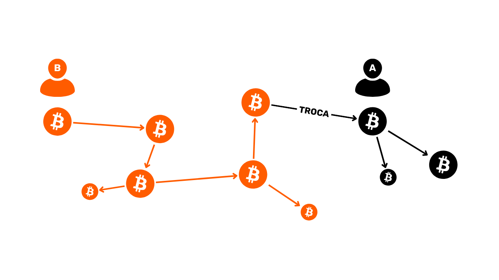

Do ponto de vista de Alice, o risco é que o histórico da moeda $B$ possa ser considerado suspeito por certas entidades. Se, por exemplo, Bob tivesse adquirido a moeda $B$ em um ato criminoso como hacking, essa moeda permaneceria ligada às suas atividades ilegais. Alice poderia então se encontrar na posse de uma moeda que ela não poderia transferir em plataformas de troca regulamentadas sem arriscar ter seus fundos congelados, ou até mesmo ser acusada dos crimes de Bob, embora ela não tivesse nada a ver com eles.

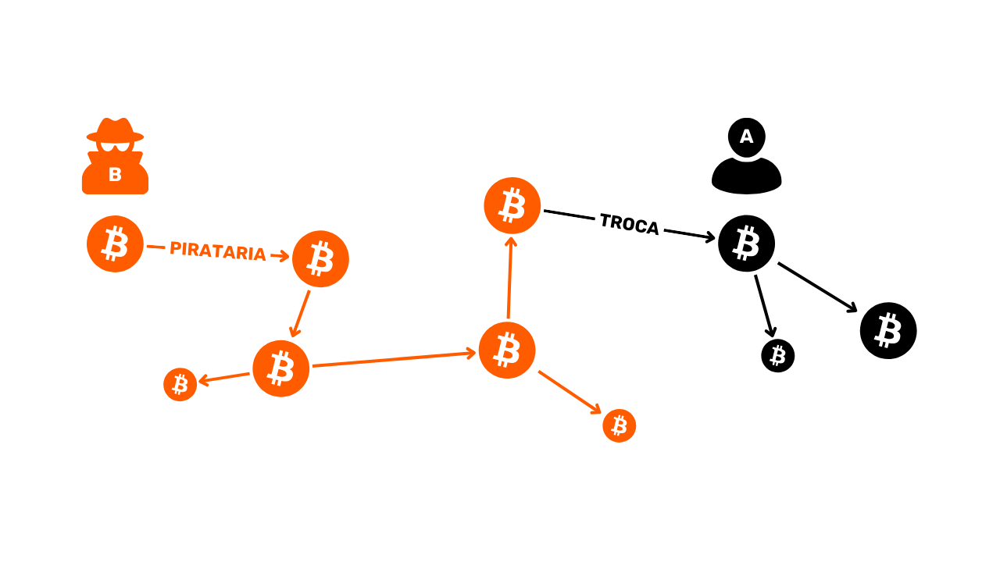

E, claro, métodos de privacidade como coinswap ou atomic swap são favorecidos por criminosos cujos fundos são monitorados pelas autoridades. Esses protocolos oferecem a eles a oportunidade de se desfazerem de seus bitcoins monitorados em troca de bitcoins perfeitamente fungíveis. Isso também permite que eles criem uma diversão, direcionando as autoridades para outros usuários. Há, portanto, uma dupla utilidade para esses indivíduos.

Com o coinjoin, mesmo que sua moeda seja misturada com bitcoins monitorados, o histórico da moeda é quebrado, o que fornece uma forma de negação plausível que é inexistente em protocolos de transferência secreta de propriedade como coinswap ou atomic swap.


Se Alice quer evitar qualquer risco, ela deve necessariamente usar um método para quebrar o histórico da moeda $B$, como passá-la por coinjoins, por exemplo. Isso levanta uma questão sobre a utilidade de combinar a transferência secreta de propriedade e o coinjoin. O coinjoin, ao quebrar o histórico de uma moeda, já fornece um nível suficiente de privacidade para Alice. Assim, na minha opinião, se Alice está procurando proteger sua privacidade, seria mais prudente proceder diretamente com um coinjoin em vez de se envolver em um coinswap seguido por um coinjoin.
Para que os métodos de transferência secreta de propriedade sejam verdadeiramente eficazes e evitem o risco de vincular o histórico de um usuário $A$ a um usuário $B$, seria paradoxalmente necessário que seu uso fosse amplamente conhecido. Se o coinswap for usado massivamente e as autoridades estiverem cientes dessa prática comum, então uma forma de negação plausível poderia ser estabelecida. No entanto, enquanto o uso dessas transferências permanecer marginal, acredito que esses métodos permanecerão arriscados demais para os usuários.

Até agora, estudamos principalmente métodos de privacidade no nível da transação em si. No próximo capítulo, exploraremos as questões no nível da rede e a disseminação das transações.

## Privacidade na Rede P2P
<chapterId>04a2467b-db84-4076-a9ff-919be5135106</chapterId>

Na parte 4, discutimos a importância de usar um nó completo para proteger a privacidade de suas transações. No entanto, é importante entender que seu próprio nó pode ser sujeito a ataques que buscam extrair informações sobre suas atividades. Neste capítulo, examinaremos, portanto, as diferentes medidas de proteção de privacidade, não no nível das transações em si ou dos fluxos de bitcoins, mas no nível da rede.

### Dandelion
Uma maneira de evitar diversos ataques de desanonimização é usar a proposta Dandelion. Esse protocolo de transmissão foi formalizado no BIP156, mas nunca foi implementado no Bitcoin.
A ideia do Dandelion é melhorar a privacidade do roteamento de transações na rede Bitcoin para contrariar várias formas de ataques. Seu principal objetivo é esconder o nó fonte que inicialmente transmitiu uma transação na rede. A divulgação deste nó poderia vincular uma transação Bitcoin a um endereço IP específico (se o nó opera na clearnet), o que poderia fornecer um ponto de entrada para análise de cadeia.
Esta associação entre uma atividade no Bitcoin e um endereço IP representa um risco significativo para a privacidade do usuário. De fato, inúmeras entidades podem facilmente vincular um endereço IP a uma identidade pessoal. Isso inclui notavelmente governos e provedores de serviços de Internet. Além disso, essas informações podem se tornar publicamente acessíveis, por exemplo, se o seu endereço IP e dados pessoais forem expostos devido a um vazamento durante o hacking do banco de dados de um site.
Na operação padrão do Bitcoin, transações construídas por um usuário em seu software de carteira são transmitidas para seu nó pessoal. Este nó imediatamente transmite a nova transação para todos os pares aos quais está conectado.


Esses pares então verificam a transação para garantir que ela esteja em conformidade com as regras de consenso e regras de padronização locais. Uma vez validada, cada par, por sua vez, transmite a transação para seus próprios pares, e assim por diante.


A distribuição de transações pendentes de integração em um bloco é feita de maneira bastante equilibrada e estatisticamente previsível. Essa vulnerabilidade pode ser explorada por nós espiões coludidos, que colaboram para monitorar e analisar a rede, a fim de identificar o primeiro nó a ter transmitido uma transação. Se um observador consegue localizar o nó fonte, ele pode assumir que a transação origina do operador desse nó. Esse tipo de observação pode vincular transações, normalmente anônimas, a endereços IP específicos.


O objetivo do BIP156 é abordar esse problema. Para fazer isso, introduz uma fase adicional na transmissão de uma nova transação para preservar o anonimato antes da propagação pública generalizada. Dandelion primeiro usa uma fase "stem" (caule) onde a transação é enviada através de um caminho aleatório de nós.


A transação é então transmitida para toda a rede na fase "fluff" (pluma).


O caule e a pluma são referências ao comportamento da propagação da transação através da rede, assemelhando-se à forma de um dente-de-leão.

Assim, nós espiões podem potencialmente rastrear a transação de volta ao nó que iniciou a fase de pluma (a transmissão em massa), mas este nó não é aquele que primeiro transmitiu a transação, pois a recebeu do último nó no caule. Se os nós espiões não conseguem rastrear de volta pelo caule, eles também não podem identificar o nó fonte.


Mesmo na presença de nós espiões durante a fase de caule, a dúvida sempre permanece porque assim que encontram um nó honesto no gráfico de difusão, os espiões não podem determinar se este nó é a fonte original ou simplesmente um intermediário.

Este método de roteamento torna a trilha que leva ao nó de origem menos clara, dificultando o rastreamento de uma transação através da rede até sua origem. Dandelion, assim, melhora a privacidade ao limitar a capacidade dos adversários de desanonimizar a rede. Este método é ainda mais eficaz quando a transação, durante a fase "caule", atravessa um nó que criptografa suas comunicações de rede, como com Tor ou P2P Transport V2.
BIP156 não foi integrado ao Bitcoin Core e atualmente está classificado sob o status "rejeitado". Uma das principais preocupações sobre este protocolo reside no fato de que, durante a fase caule, as transações devem ser retransmitidas por nós intermediários antes de serem verificadas. Como vimos, no modelo normal do Bitcoin, cada nó primeiro verifica a transação antes de transmiti-la aos seus pares. Se uma transação não está em conformidade com as regras de consenso ou as regras de padronização local do nó, ele a ignora e não a transmite. Este processo é importante para combater ataques DoS, pois apenas transações válidas são transmitidas para toda a rede. Transações inválidas, potencialmente geradas em massa para sobrecarregar a rede, são interrompidas no primeiro nó encontrado e não se propagam. O principal risco com Dandelion é que este novo protocolo poderia introduzir novos vetores para ataques DoS ao permitir a transmissão de transações inválidas por parte da rede.

### P2P Transport V2

P2P Transport V2 é outro protocolo de rede apresentado no BIP324. É uma nova versão do protocolo de transporte P2P do Bitcoin que incorpora criptografia oportunista para melhorar a confidencialidade e segurança das comunicações entre nós.

Esta melhoria visa resolver várias questões com a versão básica do protocolo P2P. Por um lado, torna os dados trocados indistinguíveis de outros tipos de dados que circulam na Internet para um observador passivo. O objetivo principal é impedir que governos, provedores de serviços de Internet ou provedores de VPN monitorem massivamente os usuários do Bitcoin. Isso também complica a tarefa para essas entidades determinarem se um usuário da Internet também é um usuário do Bitcoin, ou seja, se está operando um nó completo.
P2P V2 também contribui para reduzir os riscos de censura e ataques através da detecção de padrões específicos em pacotes de dados. Complica e torna a execução de vários tipos de ataques Sybil mais custosos no nível da rede. Um ataque Sybil ocorre quando um ator cria múltiplas identidades falsas para obter uma vantagem indevida. No contexto da rede Bitcoin, isso muitas vezes se manifesta como um ator controlando um grande número de nós completos e usando-os agressivamente para multiplicar conexões. Ataques Sybil podem ser passivos, visando coletar informações e comprometer a confidencialidade do usuário, ou ativos, na forma de ataques Eclipse. Este último isola um nó específico do resto da rede, permitindo censurar o usuário ou alterar os dados que recebe. Finalmente, P2P V2 também torna ataques *Man-In-The-Middle* (MITM) mais custosos e fáceis de detectar.
A criptografia implementada pelo P2P V2 não inclui autenticação para não adicionar complexidade desnecessária e para não comprometer a natureza sem permissão da conexão de rede. Este novo protocolo de transporte P2P, no entanto, oferece melhor segurança contra ataques passivos e torna ataques ativos significativamente mais custosos e detectáveis. A introdução de um fluxo de dados pseudo-aleatório em mensagens de rede complica a tarefa para atacantes que desejam censurar ou manipular comunicações.

O transporte P2P V2 foi incluído como uma opção (desativado por padrão) na versão 26.0 do Bitcoin Core, implantado em dezembro de 2023. Foi então ativado por padrão na versão 27.0 em abril de 2024. Pode ser modificado com a opção `v2transport=` no arquivo de configuração.

### Tor
Uma solução relativamente simples para evitar os riscos de perda de confidencialidade para um nó no nível da rede é executá-lo inteiramente sob o Tor.
Tor é uma rede de servidores de retransmissão (nós) que anonimiza a origem das conexões TCP na internet. Funciona encapsulando dados em múltiplas camadas de criptografia. Cada nó de retransmissão remove uma camada para revelar o endereço do próximo nó, até chegar ao destino final. A rede Tor garante anonimato impedindo que os nós intermediários conheçam tanto a origem quanto o destino dos dados, tornando muito difícil para um observador rastrear a atividade do usuário.


Portanto, o Tor não apenas criptografa os dados comunicados, mas também permite o mascaramento da origem e destino das comunicações. Ao usar o Tor para as comunicações do próprio nó pessoal, aprimoramos a privacidade de nossas transações: o Provedor de Serviço de Internet (ISP) não pode decifrar as comunicações, e outros nós na rede Bitcoin não podem identificar o endereço IP do nó fonte. Além disso, o Tor também esconde o uso do Bitcoin do seu ISP.

O principal risco associado a este método é que o Tor é um protocolo independente do Bitcoin. Se você tem um nó Bitcoin sob o Tor e o Tor para de funcionar, então seu nó Bitcoin não será mais capaz de se comunicar.

Também é importante notar que as comunicações pelo Tor são mais lentas. Essa latência é particularmente incômoda durante o lançamento inicial de um nó, já que o Download Inicial de Bloco (IBD) requer muitas comunicações. Como resultado, sua sincronização inicial com a rede Bitcoin poderia ser significativamente mais longa usando o Tor. Também é possível realizar o IBD na clearnet, e então ativar o Tor mais tarde. Embora este método revele a existência do seu nó Bitcoin ao seu ISP, ele protege as informações relacionadas às suas transações pessoais uma vez que você muda para o Tor.

Após explorar os diferentes métodos de privacidade no nível da rede, também quero introduzir nos próximos capítulos duas soluções elegantes para evitar a reutilização de endereços: BIP47 e Pagamentos Silenciosos.

## BIP47 e Códigos de Pagamento Reutilizáveis
<chapterId>ad88e076-a04b-4aec-b3b2-7b4760175504</chapterId>

Como vimos na parte 3, a reutilização de endereços representa um sério obstáculo à privacidade do usuário no protocolo Bitcoin. Para mitigar esses riscos, é fortemente recomendado gerar um novo endereço de recebimento para cada novo pagamento recebido em uma carteira. Embora gerar um novo endereço seja hoje simplificado pelo uso de software moderno e carteiras determinísticas hierárquicas, essa prática pode parecer contraintuitiva.


No sistema bancário tradicional, por exemplo, estamos acostumados a compartilhar nosso IBAN, que sempre permanece o mesmo. Uma vez comunicado a alguém, eles podem nos enviar múltiplos pagamentos sem ter que interagir conosco novamente. Neo-bancos também oferecem possibilidades mais modernas como o uso de endereços de email únicos no PayPal ou RevTags no Revolut. Mesmo fora do domínio financeiro, nossos identificadores diários como nosso endereço postal, número de telefone e endereço de email também são únicos e permanentes. Não precisamos renová-los a cada nova interação.


No entanto, o funcionamento do Bitcoin é diferente: é imperativo gerar um novo endereço de recebimento para cada transação recebida. Esse compromisso entre facilidade de uso e privacidade remonta à própria origem do White Paper do Bitcoin. Desde a publicação da primeira versão de seu documento no final de 2008, Satoshi Nakamoto já nos alertava sobre esse risco:
**"*Como uma barreira adicional, um novo par de chaves poderia ser usado para cada transação para mantê-las desvinculadas de um proprietário comum.*"**
Existem numerosos métodos para receber múltiplos pagamentos em um único identificador sem causar reutilização de endereço. Cada um tem seus próprios compromissos e desvantagens. Entre esses métodos está o BIP47, uma proposta desenvolvida por Justus Ranvier e publicada em 2015. Esta proposta visa criar códigos de pagamento reutilizáveis que permitem múltiplas transações para a mesma pessoa enquanto evita a reutilização de endereço. Em essência, o BIP47 busca oferecer um sistema de pagamento tão intuitivo quanto um identificador único, preservando a privacidade das transações.


O BIP47 não melhora diretamente a privacidade do usuário, já que um pagamento BIP47 oferece o mesmo nível de privacidade que uma transação clássica de Bitcoin usando endereços novos. No entanto, torna o uso do Bitcoin mais conveniente e intuitivo, uma facilidade que, normalmente, deveria comprometer a privacidade. Graças ao BIP47, essa facilidade de uso alcança o mesmo nível de privacidade que uma transação clássica. É por isso que o BIP47 é uma ferramenta valiosa para a preservação da privacidade.

Inicialmente, o BIP47 foi uma proposta formulada para ser integrada ao Bitcoin Core, mas nunca foi adotada. Algum software ainda optou por implementá-lo por conta própria no nível da aplicação. Assim, as equipes da Samourai Wallet desenvolveram sua própria implementação do BIP47 chamada "PayNym".

### Princípio Geral do BIP47 e PayNym

O objetivo do BIP47 é permitir o recebimento de numerosos pagamentos sem causar reutilização de endereço. Ele se baseia no uso de um código de pagamento reutilizável, que permite a diferentes remetentes enviar múltiplos pagamentos para um único código pertencente a outro usuário. Assim, o destinatário não precisa fornecer um novo endereço fresco para cada transação, o que facilita muito suas trocas enquanto preserva sua privacidade.

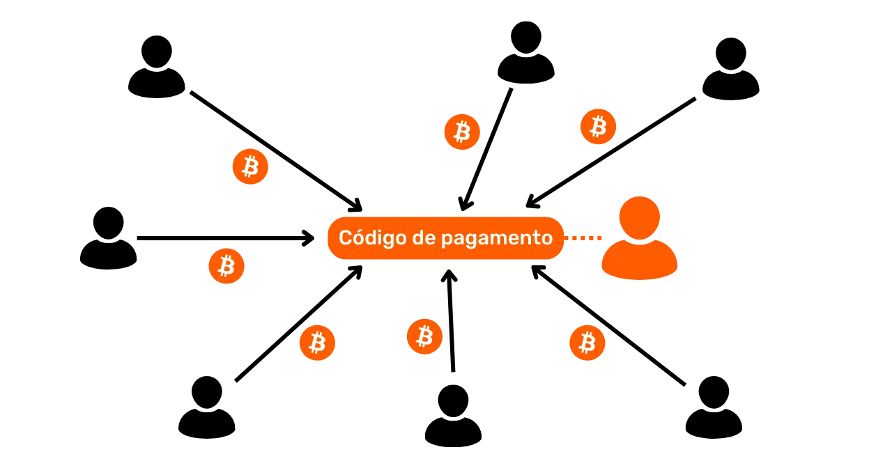

Um usuário pode, portanto, compartilhar seu código de pagamento livremente, seja em redes sociais ou em seu site, sem arriscar perder a privacidade, ao contrário do que aconteceria com um endereço de recebimento clássico ou uma chave pública.
Para realizar uma transação, ambas as partes devem ter uma carteira Bitcoin com uma implementação do BIP47, como o PayNym na Samourai Wallet ou Sparrow Wallet. O uso conjunto de seus códigos de pagamento cria um canal secreto entre eles. Para estabelecer este canal de forma eficiente, o remetente deve realizar uma transação específica na blockchain do Bitcoin, conhecida como "transação de notificação" (darei mais detalhes sobre isso mais tarde).

A combinação dos códigos de pagamento de ambos os usuários gera segredos compartilhados, que por sua vez permitem a criação de um grande número de endereços de recebimento Bitcoin únicos (exatamente 2^32, ou cerca de 4 bilhões). Assim, os pagamentos feitos via BIP47 não são realmente endereçados ao próprio código de pagamento, mas sim a endereços de recebimento clássicos derivados dos códigos de pagamento dos usuários envolvidos.

O código de pagamento serve assim como um identificador virtual derivado da semente da carteira. Na estrutura de derivação hierárquica da carteira, o código de pagamento está posicionado no nível 3, ou seja, no nível da conta.

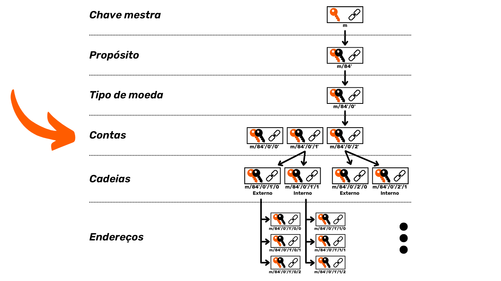

O objetivo de derivação para o BIP47 é identificado pelo índice `47'` (`0x8000002F`), referindo-se ao BIP47. Um exemplo de um caminho de derivação para um código de pagamento reutilizável seria o seguinte:
```plaintext
m/47'/0'/0'/
```

Para lhe dar uma ideia de como é um código de pagamento, aqui está o meu:
```plaintext
PM8TJSBiQmNQDwTogMAbyqJe2PE2kQXjtgh88MRTxsrnHC8zpEtJ8j7Aj628oUFk8X6P5rJ7P5qDudE4Hwq9JXSRzGcZJbdJAjM9oVQ1UKU5j2nr7VR5
```
Este código também pode ser codificado em um código QR, para facilitar sua comunicação, assim como um endereço de recebimento clássico.

Quanto aos PayNym Bots, esses robôs que às vezes são vistos no Twitter, são representações visuais do código de pagamento, criados pela Samourai Wallet. Eles são gerados por meio de uma função de hash, o que lhes confere quase unicidade. Eles aparecem na forma de uma pequena sequência de caracteres que começa com `+`:
```plaintext
+throbbingpond8B1
+twilightresonance487
+billowingfire340
```

Esses avatares também podem ser representados na forma de imagens:


Embora esses robôs não tenham uma funcionalidade técnica específica dentro do quadro do BIP47, eles desempenham um papel na facilitação das interações entre os usuários, oferecendo uma identidade visual facilmente reconhecível.
Nas seções seguintes deste capítulo dedicado ao BIP47, examinaremos em detalhes como ele funciona, com ênfase particular nos métodos criptográficos utilizados. Para compreender completamente essas explicações um tanto técnicas, é essencial entender primeiro a estrutura das carteiras HD, os processos de derivação de chaves e os princípios fundamentais da criptografia baseada em curva elíptica. Se você deseja aprofundar-se nesses conceitos, outro curso gratuito está disponível na PlanB Network: [CRYPTO 301](https://planb.network/en/courses/crypto301). Ainda aconselho que os siga, pois entender o funcionamento técnico do BIP47 facilitará muito a compreensão de outras propostas semelhantes que discutiremos nos próximos capítulos.
### Código de Pagamento Reutilizável

Como mencionado anteriormente, o código de pagamento reutilizável está localizado na profundidade 3 da carteira HD, tornando-o comparável a um `xpub`, tanto em sua posição dentro da estrutura da carteira quanto em seu papel.

O código de pagamento de 80 bytes se divide da seguinte forma:
- **Byte `0`: A versão**. Para a primeira versão do BIP47, este byte é definido como `0x01`;
- **Byte `1`: O campo de bits**. Este espaço é reservado para integrar indicações adicionais durante usos específicos. Para uso padrão com PayNym, este byte é definido como `0x00`;
- **Byte `2`: A paridade `y`**. Este byte é `0x02` ou `0x03`, indicando se a ordenada da chave pública é par ou ímpar, já que uma chave pública comprimida é usada;
- **Do byte `3` ao byte `34`: O valor `x`**. Estes bytes representam a abscissa da chave pública. A concatenação de `x` e a paridade `y` forma a chave pública comprimida completa;
- **Do byte `35` ao byte `66`: O código da cadeia**. Este espaço contém o código da cadeia associado à chave pública;
- **Do byte `67` ao byte `79`: O preenchimento**. Este espaço é destinado a possíveis desenvolvimentos futuros. Para a versão atual, zeros são simplesmente colocados aqui para alcançar o tamanho de 80 bytes necessário para uma saída `OP_RETURN`.

Aqui está a representação hexadecimal do meu código de pagamento reutilizável já apresentado na seção anterior:
```
0x010002a0716529bae6b36c5c9aa518a52f9c828b46ad8d907747f0d09dcd4d9a39e97c3c5f37c470c390d842f364086362f6122f412e2b0c7e7fc6e32287e364a7a36a00000000000000000000000000
```

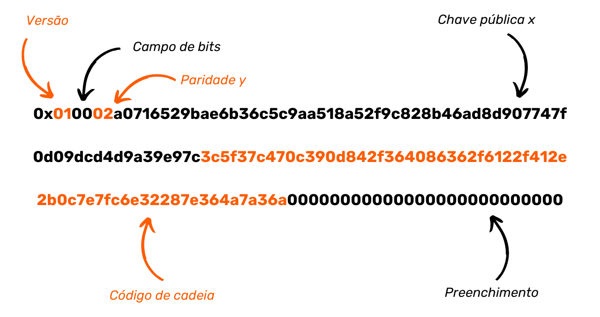

Primeiramente, é necessário adicionar o byte de prefixo `P` no início para indicar claramente que se trata de um código de pagamento. Este byte é representado por `0x47`:
```plaintext
0x47010002a0716529bae6b36c5c9aa518a52f9c828b46ad8d907747f0d09dcd4d9a39e97c3c5f37c470c390d842f364086362f6122f412e2b0c7e7fc6e32287e364a7a36a00000000000000000000000000
```

Finalmente, para garantir a integridade do código de pagamento, um cálculo de checksum é realizado usando `HASH256`, que consiste em uma dupla hash com a função `SHA256`. Os primeiros quatro bytes resultantes desta hash são então concatenados ao final do código de pagamento:
```plaintext
0x47010002a0716529bae6b36c5c9aa518a52f9c828b46ad8d907747f0d09dcd4d9a39e97c3c5f37c470c390d842f364086362f6122f412e2b0c7e7fc6e32287e364a7a36a00000000000000000000000000567080c4
```

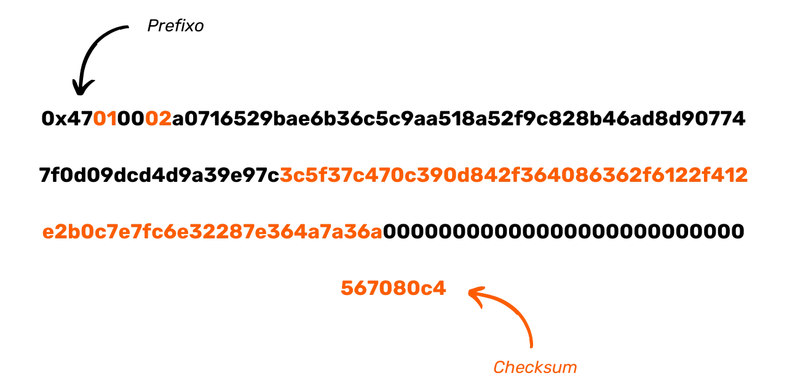

Uma vez completados esses passos, o código de pagamento está pronto. A única coisa que resta é convertê-lo para base 58 para obter sua versão final:
```plaintext
PM8TJSBiQmNQDwTogMAbyqJe2PE2kQXjtgh88MRTxsrnHC8zpEtJ8j7Aj628oUFk8X6P5rJ7P5qDudE4Hwq9JXSRzGcZJbdJAjM9oVQ1UKU5j2nr7VR5
```

Durante este processo de criação do código de pagamento, utilizamos uma chave pública comprimida e um código de cadeia. Ambos são derivados de uma derivação determinística e hierárquica a partir da semente da carteira. O caminho de derivação usado para alcançar isso é:
```plaintext
m/47'/0'/0'/
```
Para gerar a chave pública comprimida e o código de cadeia associado para o código de pagamento reutilizável, começamos calculando a chave privada mestre a partir da semente da carteira. Em seguida, procedemos para derivar um par de chaves filhas usando o índice `47 + 2^31` (derivação reforçada). Este passo é seguido por mais duas derivações sucessivas de pares de chaves filhas, cada uma usando o índice `2^31` (derivação reforçada).


### A Troca de Chaves Diffie-Hellman em Curvas Elípticas (ECDH)
O protocolo criptográfico no coração do BIP47 é referido pelo acrônimo ECDH, para *Elliptic-Curve Diffie-Hellman*. Este método é uma variante da troca de chaves original Diffie-Hellman.
Introduzido em 1976, Diffie-Hellman é um protocolo de acordo de chaves que permite a duas partes, cada uma equipada com um par de chaves (pública e privada), concordar em um segredo comum, mesmo enquanto se comunicam exclusivamente por um canal público e inseguro.

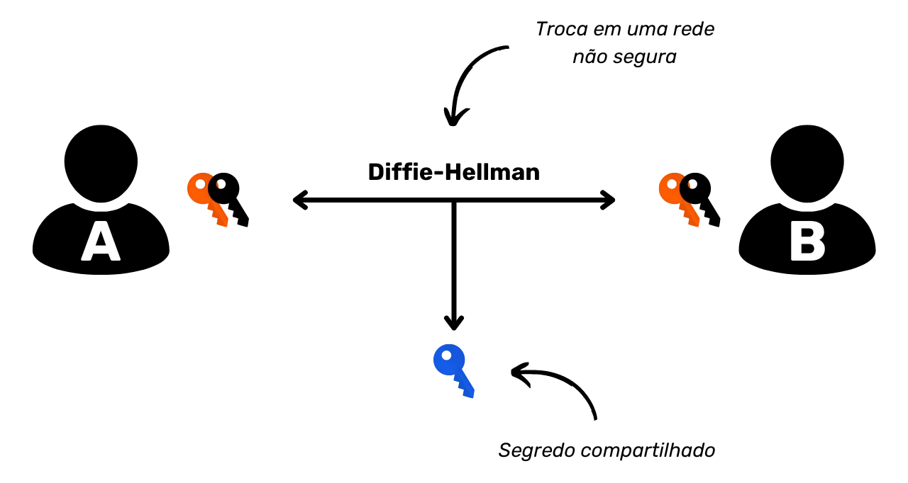

Este segredo comum (aqui, a chave azul), pode então ser usado para outras operações. Tipicamente, esse segredo compartilhado pode ser usado para criptografar e descriptografar a comunicação sobre uma rede insegura:


Para alcançar essa troca, Diffie-Hellman utiliza aritmética modular para calcular o segredo compartilhado. Aqui está uma explicação simplificada de como funciona:
- Alice e Bob concordam em uma cor comum, aqui amarelo, que constitui dados públicos (os atacantes conhecem essa cor);
- Alice seleciona uma cor secreta, aqui vermelho, e mistura as duas para obter laranja;
- Bob também escolhe uma cor secreta, aqui azul, e a mistura com o amarelo para obter verde;
- Eles então trocam as cores obtidas, laranja e verde. Esta troca pode ocorrer sobre uma rede insegura e observada;
- Ao misturar o verde de Bob com sua própria cor secreta, Alice produz marrom;
- Bob, fazendo o mesmo com o laranja de Alice e seu azul secreto, também obtém marrom.

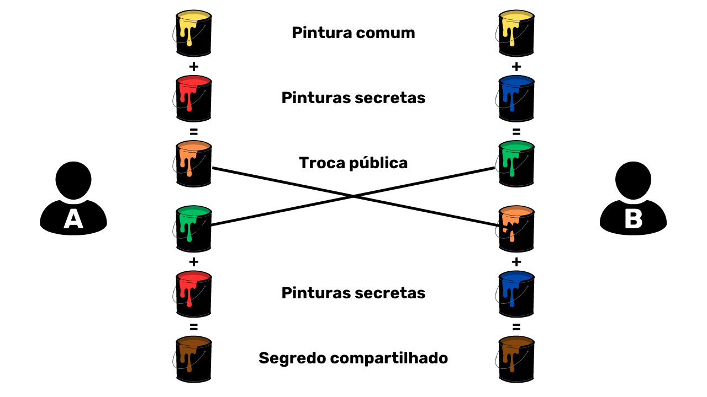

Nesta simplificação, a cor marrom representa o segredo compartilhado entre Alice e Bob. É importante entender que, na realidade, é impossível para o atacante separar as cores laranja e verde para descobrir as cores secretas de Alice ou Bob.

Agora, vamos examinar como este protocolo realmente funciona, não com analogias de cores, mas usando números reais e aritmética modular!
Antes de discutir os mecanismos de Diffie-Hellman, permita-me lembrá-lo brevemente de dois conceitos matemáticos essenciais que precisaremos:

- Um **número primo** é um número natural que tem apenas dois divisores: $1$ e ele mesmo. Por exemplo, $7$ é um número primo porque só pode ser dividido por $1$ e $7$. Por outro lado, $8$ não é um número primo, pois é divisível por $1$, $2$, $4$ e $8$. Portanto, tem quatro divisores inteiros positivos em vez de dois;
- O **módulo** (denotado $mod$ ou $\%$) é uma operação matemática que, entre dois inteiros, retorna o resto da divisão euclidiana do primeiro pelo segundo. Por exemplo, $16 \bmod 5 = 1$.

**A troca de chaves Diffie-Hellman entre Alice e Bob procede da seguinte forma:**

- Alice e Bob concordam em dois números comuns: $p$ e $g$. $p$ é um número primo, e quanto maior esse número, mais seguro será o Diffie-Hellman. $g$ é uma raiz primitiva de $p$. Esses dois números podem ser comunicados abertamente por uma rede não segura. Eles representam o equivalente à **cor amarela** na simplificação anterior. Portanto, é importante que Alice e Bob usem exatamente os mesmos valores para $p$ e $g$.
- Uma vez que esses parâmetros são definidos, Alice e Bob escolhem cada um um número aleatório secreto. Alice nomeia seu número aleatório secreto $a$ (equivalente a **a cor vermelha**) e Bob nomeia o dele $b$ (equivalente a **a cor azul**). Esses números devem permanecer estritamente confidenciais.
- Em vez de trocarem diretamente os números $a$ e $b$, cada parte calcula $A$ e $B$ da seguinte forma:

$A$ é igual a $g$ elevado à potência de $a$ módulo $p$:

$$
A = g^a \bmod p
$$

$B$ é igual a $g$ elevado à potência de $b$ módulo $p$:

$$
B = g^b \bmod p
$$

- Os valores $A$ (equivalente a **a cor laranja**) e $B$ (equivalente a **a cor verde**) são trocados entre as duas partes. Esta troca pode ocorrer abertamente por uma rede não segura;

- Alice, tendo recebido $B$, calcula o valor de $z$ da seguinte forma:

$z$ é igual a $B$ elevado à potência de $a$ módulo $p$:

$$
z = B^a \bmod p
$$

Para relembrar:

$$
B = g^b \bmod p
$$

Assim, obtemos:

$$
z = B^a \bmod p
$$

$$
z = (g^b)^a \bmod p
$$

Aplicando as regras dos expoentes:
$$
(x^n)^m = x^{nm}
$$

Então, obtemos:

$$
z = g^{ba} \bmod p
$$

- Do seu lado, Bob, tendo recebido $A$, também calcula o valor de $z$ da seguinte maneira:

$z$ é igual a $A$ elevado à potência de $b$ módulo $p$:

$$
z = A^b \bmod p
$$

Assim, obtemos:

$$
z = (g^a)^b \bmod p
$$

$$
z = g^{ab} \bmod p
$$

$$
z = g^{ba} \bmod p
$$

Graças à distributividade do operador módulo, Alice e Bob obtêm exatamente o mesmo valor $z$. Este número representa o seu segredo comum, equivalente a **a cor marrom** na simplificação anterior com os potes de tinta. Agora, eles podem usar esse segredo comum para criptografar suas comunicações simetricamente por uma rede não segura.


Um atacante, mesmo na posse de $p$, $g$, $A$ e $B$ (os valores públicos), não será capaz de calcular $a$, $b$, ou $z$ (os valores privados). Para conseguir isso, seria necessário reverter a exponenciação, uma operação impossível sem tentar todas as possibilidades uma a uma, pois equivale a calcular o logaritmo discreto, isto é, o inverso da exponencial em um grupo cíclico finito.

Assim, enquanto os valores de $a$, $b$ e $p$ forem suficientemente grandes, o protocolo Diffie-Hellman é seguro. Tipicamente, com parâmetros de 2048 bits (um número com 600 dígitos em decimal), testar todas as possibilidades para $a$ e $b$ seria impraticável. Até hoje, com tais números, este algoritmo é considerado seguro.
Este é precisamente onde reside a principal desvantagem do protocolo Diffie-Hellman. Para ser seguro, o algoritmo deve usar números grandes. É por isso que, atualmente, o algoritmo ECDH (*Elliptic Curve Diffie-Hellman*), uma variante do Diffie-Hellman que se baseia em uma curva algébrica, mais precisamente uma curva elíptica, é preferido. Esta abordagem permite trabalhar com números muito menores enquanto mantém uma segurança equivalente, reduzindo assim os recursos necessários para cálculo e armazenamento.
O princípio geral do algoritmo permanece o mesmo. No entanto, em vez de usar um número aleatório $a$ e um número $A$ calculado a partir de $a$ por exponenciação modular, usamos um par de chaves estabelecido em uma curva elíptica. Em vez de depender da distributividade do operador módulo, usamos a lei de grupo em curvas elípticas, e mais especificamente a associatividade desta lei.
Para explicar brevemente o princípio da criptografia de curva elíptica, uma chave privada é representada por um número aleatório entre $1$ e $n-1$, onde $n$ representa a ordem da curva. A chave pública, por outro lado, é um ponto específico nesta curva, obtido a partir da chave privada através de operações de adição e duplicação de pontos a partir do ponto gerador, de acordo com a equação:
$$
K = k \cdot G
$$

Nesta fórmula, $K$ denota a chave pública, $k$ a chave privada, e $G$ o ponto gerador.

Uma das características essenciais dessas chaves é a facilidade de calcular $K$ a partir de $k$ e $G$, enquanto é praticamente impossível encontrar $k$ a partir de $K$ e $G$. Esta assimetria cria uma função unidirecional. Em outras palavras, é fácil calcular a chave pública se alguém conhece a chave privada, mas encontrar a chave privada a partir da chave pública é impossível. Esta segurança ainda se baseia na dificuldade computacional do logaritmo discreto.

Usaremos esta propriedade para adaptar nosso algoritmo Diffie-Hellman. **O princípio de funcionamento do ECDH é o seguinte:**

- Alice e Bob concordam juntos em uma curva elíptica criptograficamente segura e seus parâmetros. Esta informação é pública;

- Alice gera um número aleatório $ka$ que será sua chave privada. Esta chave privada deve permanecer secreta. Ela determina sua chave pública $Ka$ pela adição e duplicação de pontos na curva elíptica escolhida:

$$
K_a = k_a \cdot G
$$

- Bob também gera um número aleatório $kb$ que será sua chave privada. Ele calcula a chave pública associada $Kb$:

$$
K_b = k_b \cdot G
$$

- Alice e Bob trocam suas chaves públicas $Ka$ e $Kb$ por uma rede pública não segura.

- Alice calcula um ponto $(x,y)$ na curva aplicando sua chave privada $ka$ à chave pública de Bob $Kb$:

$$
(x,y) = k_a \cdot K_b
$$

- Bob calcula um ponto $(x,y)$ na curva aplicando sua chave privada $kb$ à chave pública de Alice $Ka$:

$$
(x,y) = k_b \cdot K_a
$$

- Alice e Bob obtêm o mesmo ponto na curva elíptica. O segredo compartilhado será a coordenada x $x$ deste ponto.

Eles de fato obtêm o mesmo segredo compartilhado porque:

$$
(x,y) = k_a \cdot K_b = k_a \cdot (k_b \cdot G) = (k_a \cdot k_b) \cdot G = (k_b \cdot k_a) \cdot G = k_b \cdot (k_a \cdot G) = k_b \cdot K_a$$
Um atacante observando a rede pública não segura só pode obter as chaves públicas de cada parte e os parâmetros da curva elíptica escolhida. Como explicado anteriormente, essa informação sozinha não é suficiente para determinar as chaves privadas. Portanto, o atacante não pode encontrar o segredo compartilhado entre Alice e Bob.

ECDH é, portanto, um algoritmo que permite a troca de chaves. É frequentemente usado em conjunto com outros métodos criptográficos para estabelecer um protocolo completo. Por exemplo, ECDH é integrado ao núcleo do TLS (*Transport Layer Security*), um protocolo de criptografia e autenticação usado para a camada de transporte da internet. O TLS usa ECDHE para troca de chaves, uma variante do ECDH onde as chaves são efêmeras, para fornecer confidencialidade persistente. Além disso, o TLS usa algoritmos de autenticação como ECDSA, algoritmos de criptografia como AES e funções de hash como SHA256.

O TLS é notavelmente responsável pelo `s` em `https` bem como pelo cadeado visível na barra de endereços do seu navegador, símbolos de comunicações criptografadas. Ao seguir este curso, você está, portanto, usando ECDH, e é muito provável que você o use diariamente sem mesmo saber.

### A Transação de Notificação

Como vimos na seção anterior, ECDH é uma variante da troca de Diffie-Hellman usando pares de chaves estabelecidos em uma curva elíptica. Convenientemente, já possuímos muitos pares de chaves aderindo a este padrão em nossas carteiras Bitcoin! A ideia do BIP47 é usar os pares de chaves das carteiras hierárquicas determinísticas Bitcoin de ambas as partes para estabelecer segredos compartilhados e efêmeros entre eles. No contexto do BIP47, ECDHE (*Elliptic Curve Diffie-Hellman Ephemeral*) é usado em vez disso.


ECDHE é usado pela primeira vez no BIP47 para transmitir o código de pagamento do remetente para o destinatário. Esta é a famosa **transação de notificação**. Esta etapa é essencial porque, para que o BIP47 funcione de forma eficiente, ambas as partes envolvidas (o remetente e o destinatário) devem conhecer o código de pagamento uma da outra. Esse conhecimento permite a derivação de chaves públicas efêmeras e, consequentemente, endereços de recebimento em branco associados.
Antes dessa troca, o remetente já está logicamente ciente do código de pagamento do destinatário, pois eles o obtiveram fora da cadeia, por exemplo, de seu site, uma fatura ou suas redes sociais. No entanto, o destinatário pode não necessariamente conhecer o código de pagamento do remetente. Ainda assim, esse código deve ser transmitido a eles; caso contrário, eles não serão capazes de derivar as chaves efêmeras necessárias para identificar os endereços onde seus bitcoins estão armazenados, nem acessar seus fundos. Embora essa transmissão do código do remetente possa tecnicamente ser realizada fora da cadeia por outros meios de comunicação, isso representa um problema se a carteira precisar ser recuperada apenas a partir da semente.
De fato, ao contrário dos endereços convencionais, os endereços BIP47 não são derivados diretamente da semente do destinatário—usar um `xpub` seria mais simples neste caso—mas resultam de um cálculo que combina os códigos de pagamento: tanto do remetente quanto do destinatário. Assim, se o destinatário perder sua carteira e tentar restaurá-la a partir de sua semente, ele recuperará seu próprio código de pagamento, que é diretamente derivado de sua semente. No entanto, para encontrar os endereços efêmeros, será essencial que eles também tenham os códigos de pagamento de todos que lhes enviaram bitcoins via BIP47. Daí a importância da transação de notificação, que permite salvar essa informação na blockchain do Bitcoin, enquanto se pode encontrá-la muito facilmente sem ter que procurar entre o bilhão de transações executadas desde seu lançamento em 2009.
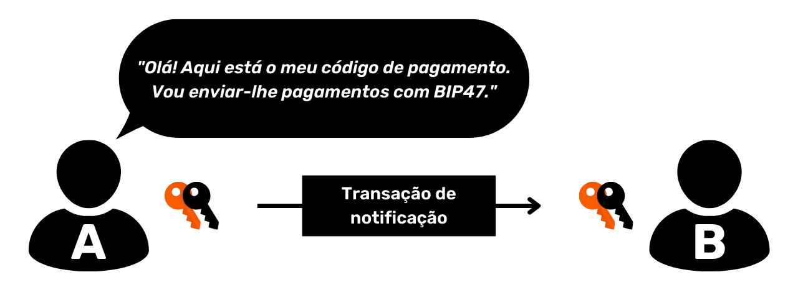

Portanto, seria possível implementar o BIP47 sem recorrer à transação de notificação, desde que cada usuário mantenha um backup dos códigos de pagamento de seus pares. No entanto, este método se mostra complexo de gerir enquanto uma solução simples, robusta e eficiente para criar, armazenar e atualizar esses backups não é desenvolvida. No estado atual das coisas, a transação de notificação torna-se quase indispensável.

Nos capítulos seguintes, estudaremos outros protocolos com objetivos semelhantes aos do BIP47, mas que não requerem uma transação de notificação. Essas alternativas, no entanto, introduzem seus próprios compromissos.

Além de seu papel no backup de códigos de pagamento, a transação de notificação também serve uma função de notificação para o destinatário, como o próprio nome sugere. Ela sinaliza para o cliente do destinatário que um novo canal de pagamento foi estabelecido, e assim sugere o monitoramento dos endereços efêmeros resultantes.

### O Modelo de Privacidade do BIP47

Antes de detalhar a operação técnica da transação de notificação, é importante discutir o modelo de privacidade associado ao BIP47, que justifica certas medidas tomadas durante a criação desta transação inicial.
O código de pagamento, por si só, não representa um risco direto à privacidade. Ao contrário do modelo tradicional do Bitcoin, que visa romper a ligação entre a identidade de um usuário e suas transações (que são públicas) preservando o anonimato de chaves e endereços, o código de pagamento pode ser abertamente associado a uma identidade sem representar uma ameaça.
De fato, o código de pagamento não é usado para derivar diretamente os endereços que recebem pagamentos BIP47. Esses endereços são gerados através da aplicação de ECDH entre as chaves derivadas dos códigos de pagamento das duas partes envolvidas.

Assim, um código de pagamento em si não leva diretamente a uma perda de privacidade, já que apenas o endereço de notificação é derivado dele. Embora este endereço possa revelar algumas informações, normalmente não permite a descoberta das partes com quem você está realizando transações, a menos que por meio de uma análise detalhada da cadeia. De fato, se o remetente usar UTXOs que podem ser vinculados à sua identidade para realizar a transação de notificação, então torna-se possível deduzir que sua identidade provavelmente está ligada a pagamentos BIP47 para o seu código de pagamento. Isso não revelará as transações subjacentes, mas indicará a provável existência delas.

Portanto, é essencial manter essa separação estrita entre os códigos de pagamento dos usuários. Para este objetivo, o passo inicial de comunicação do código é um momento crítico para a privacidade do pagamento, ainda que obrigatório para o correto funcionamento do protocolo. Se um dos códigos de pagamento pode ser obtido publicamente (como em um site), o segundo código, o do remetente, não deve ser vinculado ao primeiro em nenhum caso.

Vamos tomar um exemplo concreto: Eu quero fazer uma doação a um movimento político via BIP47:
- A organização tornou seu código de pagamento público em seu site ou através de suas redes sociais;
- Este código está assim ligado ao movimento político;
- Eu recupero este código de pagamento;
- Antes de proceder com um envio, devo garantir que eles conheçam meu próprio código de pagamento, que também está ligado à minha identidade, pois uso-o para receber transações nas minhas redes sociais.

Como transmitir meu código sem risco? O uso de meios de comunicação convencionais poderia levar a um vazamento de informações e, consequentemente, associar-me a este movimento político. A transação de notificação oferece uma solução graças a uma camada de criptografia que impede precisamente essa associação entre dois códigos. Embora este não seja o único método para transmitir secretamente o código de pagamento do remetente, prova ser muito eficaz.

No diagrama abaixo, as linhas laranjas indicam os pontos onde o fluxo de informações deve ser interrompido, e as setas pretas mostram as conexões que poderiam potencialmente ser observadas por terceiros:
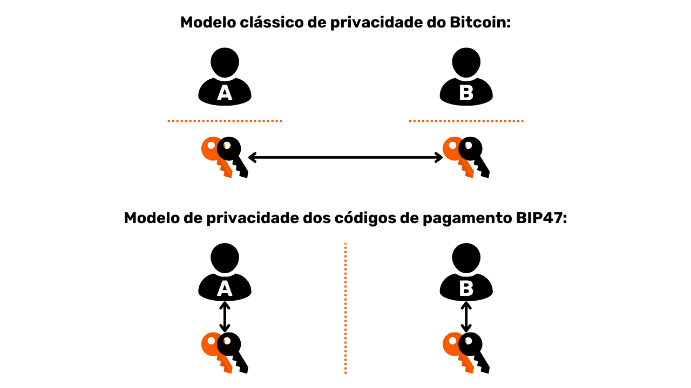
Na realidade, dentro do modelo tradicional de privacidade do Bitcoin, é frequentemente complexo dissociar completamente o fluxo de informações entre o par de chaves e o usuário, especialmente durante transações remotas. Por exemplo, no contexto de uma campanha de doação, o destinatário deve inevitavelmente divulgar um endereço ou uma chave pública através do seu site ou redes sociais. O uso correto do BIP47, particularmente com a transação de notificação, permite contornar este problema graças ao ECDHE e à camada de criptografia que estudaremos mais adiante.

Claro, o modelo clássico de privacidade do Bitcoin ainda se aplica a chaves públicas efêmeras, que são derivadas da combinação dos dois códigos de pagamento. Os dois modelos são na verdade complementares. O que quero destacar aqui é que, ao contrário do uso usual de uma chave pública para receber bitcoins, o código de pagamento pode ser vinculado a uma identidade específica, porque a informação "_Alice realiza uma transação com Bob_" é quebrada em outra etapa. O código de pagamento é usado para gerar endereços de pagamento, mas baseado apenas na observação da blockchain, é impossível vincular uma transação de pagamento BIP47 aos códigos de pagamento usados para executá-la, a menos que os UTXOs envolvidos já estivessem vinculados a uma identidade anteriormente e os usuários tenham associado seus códigos de pagamento com suas respectivas identidades.

Para resumir, o modelo de privacidade oferecido pelos pagamentos BIP47 poderia ser considerado superior ao da base do Bitcoin, embora não seja mágico de forma alguma.

### Construção da Transação de Notificação

Agora, vamos ver como esta transação de notificação funciona. Imagine que Alice quer enviar fundos para Bob com BIP47. No meu exemplo, Alice atua como a remetente e Bob como o destinatário. Este último publicou seu código de pagamento em seu site. Portanto, Alice já está ciente do código de pagamento de Bob.

**1- Alice calcula um segredo compartilhado com ECDH:**

- Ela seleciona um par de chaves de sua carteira HD localizada em um ramo diferente do seu código de pagamento. Note, este par não deve ser facilmente associado ao endereço de notificação de Alice, nem com a identidade de Alice (veja a seção anterior);

- Alice seleciona a chave privada deste par. Nós a nomeamos $a$ (minúscula);

$$
a
$$
- Alice recupera a chave pública associada ao endereço de notificação de Bob. Esta chave é a primeira filha derivada do código de pagamento de Bob (índice $/0$). Nós nomeamos esta chave pública $B$ (maiúscula). A chave privada associada a esta chave pública é nomeada $b$ (minúscula). $B$ é determinada pela adição e duplicação de pontos na curva elíptica a partir de $G$ (o ponto gerador) com $b$ (a chave privada):
$$ B = b \cdot G $$
- Alice calcula um ponto secreto $S$ (maiúsculo) na curva elíptica por adição e duplicação de pontos aplicando sua chave privada $a$ a partir da chave pública de Bob $B$.
$$ S = a \cdot B $$

- Alice calcula o fator de cegamento $f$, que permitirá a ela criptografar seu código de pagamento. Para fazer isso, ela determinará um número pseudo-aleatório com a função HMAC-SHA512. No segundo input desta função, ela usa um valor que apenas Bob poderá recuperar: $x$, que é a abscissa do ponto secreto previamente calculado. O primeiro input é $o$, que é o UTXO consumido na entrada desta transação (outpoint).

$$ f = \text{HMAC-SHA512}(o, x) $$

**2- Alice converte seu código de pagamento pessoal para base 2 (binário).**

**3- Ela usa esse fator de cegamento como chave para realizar a criptografia simétrica no payload do seu código de pagamento.** O algoritmo de criptografia usado é simplesmente um `XOR`. A operação realizada é comparável à cifra de Vernam, também chamada de "One-Time Pad".

- Alice primeiro divide seu fator de cegamento em dois: os primeiros 32 bytes são nomeados $f1$ e os últimos 32 bytes são nomeados $f2$. Assim, temos:

$$ f = f1 || f2 $$

- Alice calcula o $x'$ criptografado da abscissa da chave pública $x$ do seu código de pagamento, e o $c'$ criptografado do seu código de cadeia $c$ separadamente. $f1$ e $f2$ atuam respectivamente como chaves de criptografia. A operação usada é o `XOR` (ou exclusivo).

$$ x' = x \oplus f1 $$
$$ c' = c \oplus f2 $$

- Alice substitui os valores reais da abscissa da chave pública $x$ e do código de cadeia $c$ em seu código de pagamento pelos valores criptografados $x'$ e $c'$.
**4-** Alice agora tem seu código de pagamento com um payload criptografado. Ela irá construir e transmitir uma transação envolvendo sua chave pública $A$ como entrada, uma saída para o endereço de notificação de Bob, e uma saída `OP_RETURN` contendo seu código de pagamento com o payload criptografado. **Esta transação é a transação de notificação**.
Um `OP_RETURN` é um opcode que marca uma saída de transação Bitcoin como inválida. Hoje, é usado para transmitir ou ancorar informações na blockchain do Bitcoin. Até 80 bytes de dados podem ser armazenados, que são escritos na cadeia e, assim, visíveis para todos os outros usuários.

Como vimos nas seções anteriores, ECDH é usado para gerar um segredo compartilhado entre dois usuários comunicando-se através de uma rede insegura, potencialmente observada por atacantes. No BIP47, ECDH é utilizado para comunicação sobre a rede Bitcoin, que por natureza é uma rede de comunicação transparente observada por muitos atacantes. O segredo compartilhado calculado através da troca de chaves ECDH é então usado para criptografar as informações secretas a serem transmitidas: o código de pagamento do remetente (Alice).

Vamos recapitular os passos que acabamos de revisar juntos para realizar uma transação de notificação:
- Alice recupera o código de pagamento de Bob e o endereço de notificação;
- Alice seleciona um UTXO que ela possui em sua carteira HD com o par de chaves correspondente;
- Ela calcula um ponto secreto na curva elíptica usando ECDH;
- Ela usa esse ponto secreto para calcular um HMAC, que é o fator de cegamento;
- Ela usa esse fator de cegamento para criptografar o payload do seu código de pagamento pessoal.
- Ela usa uma saída de transação `OP_RETURN` para comunicar o código de pagamento mascarado para o Bob.
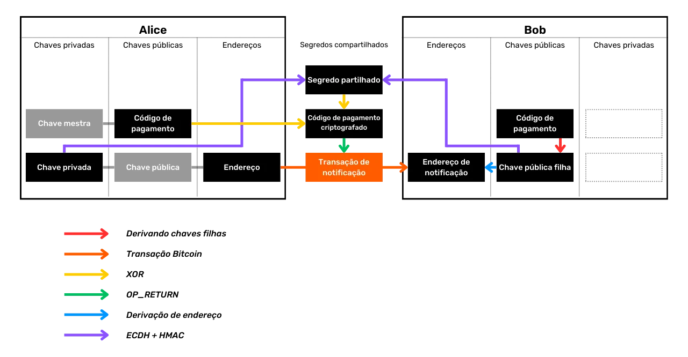

### Transação de Notificação: Estudo Concreto

Para entender seu funcionamento com mais detalhes, especialmente o uso do `OP_RETURN`, vamos examinar juntos uma transação de notificação real. Eu realizei tal transação na testnet, que você pode encontrar [clicando aqui](https://mempool.space/fr/testnet/tx/0e2e4695a3c49272ef631426a9fd2dae6ec3a469e3a39a3db51aa476cd09de2e).


Observando esta transação, podemos ver que ela tem uma única entrada e 4 saídas:
- A primeira saída é o `OP_RETURN` contendo meu código de pagamento mascarado;
- A segunda saída de 546 sats aponta para o endereço de notificação do meu destinatário;
- A terceira saída de 15.000 sats representa as taxas de serviço, já que usei a Samourai Wallet para construir esta transação;
- A quarta saída de 2 milhões de sats representa o troco, ou seja, a diferença restante da minha entrada que volta para outro endereço que me pertence.
O mais interessante de estudar é, obviamente, a saída 0 usando o `OP_RETURN`. Vamos olhar mais de perto o que ela contém. Aqui está o `scriptPubKey` em hexadecimal:

```text
6a4c50010002b13b2911719409d704ecc69f74fa315a6cb20fdd6ee39bc9874667703d67b164927b0e88f89f3f8b963549eab2533b5d7ed481a3bea7e953b546b4e91b6f50d800000000000000000000000000
```

Neste script, podemos dissecar várias partes. Primeiramente, os opcodes:

```text
6a4c
```

Entre os opcodes, podemos reconhecer `0x6a` que designa o `OP_RETURN` e `0x4c` que designa o `OP_PUSHDATA1`.

O byte seguinte a este último opcode indica o tamanho da carga útil que segue. Ele indica `0x50`, ou 80 bytes:

```text
6a4c50
```

Então, temos os metadados do meu código de pagamento em texto simples:

```text
010002
```

A coordenada x criptografada da chave pública do meu código de pagamento:

```text
b13b2911719409d704ecc69f74fa315a6cb20fdd6ee39bc9874667703d67b164
```

O código de cadeia criptografado do meu código de pagamento:

```text
927b0e88f89f3f8b963549eab2533b5d7ed481a3bea7e953b546b4e91b6f50d8
```

E, finalmente, o preenchimento para alcançar 80 bytes, o tamanho padrão de um `OP_RETURN`:

```text
00000000000000000000000000
```

Para entender melhor, aqui está o meu código de pagamento em texto simples em base 58:

```text
PM8TJQCyt6ovbozreUCBrfKqmSVmTzJ5vjqse58LnBzKFFZTwny3KfCDdwTqAEYVasn11tTMPc2FJsFygFd3YzsHvwNXLEQNADgxeGnMK8Ugmin62TZU
```

E na base 16:

```text
4701000277507c9c17a89cfca2d3af554745d6c2db0e7f6b2721a3941a504933103cc42add94881210d6e752a9abc8a9fa0070e85184993c4f643f1121dd807dd556d1dc000000000000000000000000008604e4db
```
Ao comparar meu código de pagamento em texto simples com o `OP_RETURN`, é notável que o HRP (`0x47`) e o checksum (`0x8604e4db`) não são transmitidos. Isso é esperado, pois essas informações são destinadas aos humanos.
A seguir, podemos identificar a versão (`0x01`), o campo de bits (`0x00`) e a paridade da chave pública (`0x02`). E, no final do código de pagamento, os bytes vazios (`0x00000000000000000000000000`) são usados para preencher o código até um total de 80 bytes. Todos esses metadados são transmitidos em texto simples (não criptografado).

Finalmente, pode-se observar que a coordenada x da chave pública (`0x77507c9c17a89cfca2d3af554745d6c2db0e7f6b2721a3941a504933103cc42a`) e o código da cadeia (`0xdd94881210d6e752a9abc8a9fa0070e85184993c4f643f1121dd807dd556d1dc`) foram criptografados. Isso constitui a carga útil do código de pagamento.

### O que é XOR?

Nas seções anteriores, vimos que o código de pagamento foi transmitido criptografado usando a operação XOR. Vamos reservar um momento para entender como esse operador funciona, já que é amplamente utilizado em criptografia.

XOR é um operador lógico bit a bit baseado na álgebra booleana. Com dois operandos de bits, ele retorna `1` se os bits do mesmo rank forem diferentes, e retorna `0` se os bits do mesmo rank forem iguais. Aqui está a tabela verdade do XOR baseada nos valores dos operandos `D` e `E`:

| D   | E   | D XOR E |
| --- | --- | ------- |
| 0   | 0   | 0       |
| 0   | 1   | 1       |
| 1   | 0   | 1       |
| 1   | 1   | 0       |

Por exemplo:

$$
0110 \oplus 1110 = 1000
$$

Ou:

$$
010011 \oplus 110110 = 100101
$$

Com ECDH, usar XOR como uma camada de criptografia é particularmente adequado. Primeiramente, por causa deste operador, a criptografia é simétrica. Isso permite que o destinatário descriptografe o código de pagamento com a mesma chave usada para criptografia. A chave de criptografia e descriptografia é calculada a partir do segredo compartilhado graças ao ECDH. Essa simetria é possibilitada pelas propriedades comutativa e associativa do operador XOR:

- Outras propriedades:

$$
D \oplus D = 0
$$
D ⊕ 0 = D
- Comutatividade:

$$
D \oplus E = E \oplus D
$$

- Associatividade:

$$
D \oplus (E \oplus Z) = (D \oplus E) \oplus Z = D \oplus E \oplus Z
$$

Se:

$$
D \oplus E = L
$$

Então:

$$
D \oplus L = D \oplus (D \oplus E) = D \oplus D \oplus E = 0 \oplus E = E \\
\therefore D \oplus L = E
$$

A seguir, este método de criptografia se assemelha muito à cifra de Vernam (One-Time Pad), o único algoritmo de criptografia conhecido até o momento que possui segurança incondicional (ou absoluta). Para que a cifra de Vernam tenha essa característica, a chave de criptografia deve ser perfeitamente aleatória, deve ter o mesmo tamanho da mensagem e deve ser usada apenas uma vez. No método de criptografia usado aqui para BIP47, a chave é de fato do mesmo tamanho da mensagem, o fator de cegamento é exatamente do mesmo tamanho que a concatenação da coordenada x da chave pública com o código de cadeia do código de pagamento. Esta chave de criptografia é de fato usada apenas uma vez. No entanto, esta chave não é o resultado de perfeita aleatoriedade, pois é um HMAC. É, portanto, pseudo-aleatória. Logo, não é uma cifra de Vernam, mas o método é semelhante.

### Recebendo a Transação de Notificação

Agora que Alice enviou a transação de notificação para Bob, vamos ver como ele a interpreta. Como lembrete, Bob deve ser capaz de acessar o código de pagamento de Alice. Sem essa informação, como veremos na seção seguinte, ele não será capaz de derivar os pares de chaves criados por Alice, e portanto, ele não será capaz de acessar seus bitcoins recebidos via BIP47. Por enquanto, o payload do código de pagamento de Alice está criptografado. Vamos ver como Bob descriptografa.

**1-** Bob monitora transações que criam saídas com seu endereço de notificação.

**2-** Quando uma transação tem uma saída em seu endereço de notificação, Bob a analisa para ver se contém uma saída OP_RETURN que segue o padrão BIP47.

**3-** Se o primeiro byte do payload OP_RETURN é `0x01`, Bob inicia sua busca por um possível segredo compartilhado com ECDH:
- Bob seleciona a chave pública na entrada da transação. Ou seja, a chave pública de Alice denominada $A$ com:

$$ A = a \cdot G $$

- Bob seleciona a chave privada $b$ associada ao seu endereço de notificação pessoal:

$$ b $$
- Bob calcula o ponto secreto $S$ (segredo compartilhado ECDH) na curva elíptica adicionando e dobrando pontos, aplicando sua chave privada $b$ à chave pública de Alice $A$:
$$ S = b \cdot A $$

- Bob determina o fator de cegamento $f$ que permitirá descriptografar o payload do código de pagamento de Alice. Da mesma forma que Alice havia calculado anteriormente, Bob encontrará $f$ aplicando HMAC-SHA512 em $x$ a coordenada x do ponto secreto $S$, e em $o$ o UTXO consumido como entrada nesta transação de notificação:

$$ f = \text{HMAC-SHA512}(o, x) $$

**4-** Bob interpreta os dados no OP_RETURN da transação de notificação como um código de pagamento. Ele simplesmente descriptografa o payload deste possível código de pagamento usando o fator de cegamento $f$:
- Bob divide o fator de cegamento $f$ em 2 partes: os primeiros 32 bytes de $f$ serão $f1$ e os últimos 32 bytes serão $f2$;
- Bob descriptografa a coordenada x criptografada $x'$ da chave pública do código de pagamento de Alice:

$$ x = x' \oplus f1 $$

- Bob descriptografa o valor do código de cadeia criptografado $c'$ do código de pagamento de Alice:

$$ c = c' \oplus f2 $$

**5-** Bob verifica se o valor da chave pública do código de pagamento de Alice realmente faz parte do grupo secp256k1. Se for o caso, ele interpreta isso como um código de pagamento válido. Caso contrário, ele ignora esta transação.

Agora que Bob está ciente do código de pagamento de Alice, ela pode enviar a ele até `2^32` pagamentos, sem nunca precisar fazer outra transação de notificação deste tipo novamente.

Por que isso funciona? Como Bob consegue determinar o mesmo fator de cegamento que Alice e, assim, descriptografar seu código de pagamento? Vamos olhar mais de perto o papel do ECDH no que acabamos de descrever.

Primeiramente, estamos lidando com criptografia simétrica. Isso significa que a chave de criptografia e a chave de descriptografia são o mesmo valor. Esta chave na transação de notificação é o fator de cegamento:

$$ f = f1 || f2 $$

Portanto, Alice e Bob devem obter o mesmo valor para $f$, sem transmiti-lo diretamente, já que um atacante poderia roubá-lo e descriptografar as informações secretas. Este fator de cegamento é obtido aplicando HMAC-SHA512 em 2 valores:
- a coordenada x de um ponto secreto;
- e o UTXO consumido como entrada na transação.
Bob, portanto, precisa dessas duas informações para descriptografar o payload do código de pagamento de Alice. Para o UTXO como entrada, Bob pode simplesmente recuperá-lo observando a transação de notificação. Para o ponto secreto, Bob terá que usar ECDH. Como visto na seção anterior sobre Diffie-Hellman, simplesmente trocando suas respectivas chaves públicas e aplicando secretamente suas chaves privadas à chave pública do outro, Alice e Bob podem encontrar um ponto específico e secreto na curva elíptica. A transação de notificação depende deste mecanismo:
- Par de chaves de Bob:

$$ B = b \cdot G $$

- Par de chaves de Alice:

$$ A = a \cdot G $$

- Para um ponto secreto $S (x, y)$:

$$ S = a \cdot B = a \cdot (b \cdot G) = (b \cdot a) \cdot G = b \cdot A $$

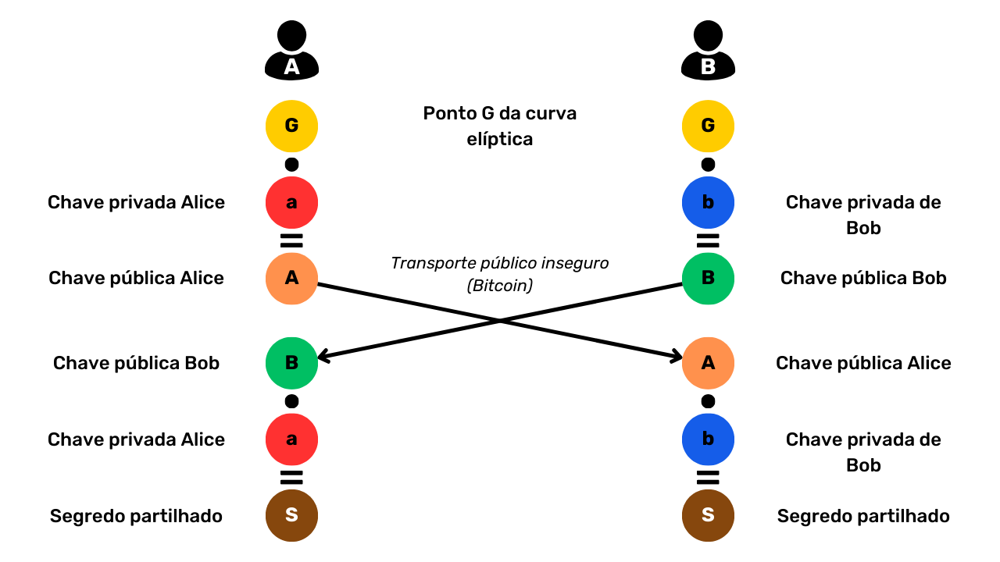

Agora que Bob conhece o código de pagamento de Alice, ele será capaz de detectar seus pagamentos BIP47, e ele pode derivar as chaves privadas que bloqueiam os bitcoins recebidos.

Vamos recapitular os passos que acabamos de percorrer para receber e interpretar uma transação de notificação:
- Bob monitora as saídas de transação para seu endereço de notificação;
- Quando ele detecta uma, ele recupera as informações contidas no OP_RETURN;
- Bob seleciona a chave pública na entrada e calcula um ponto secreto usando ECDH;
- Ele usa este ponto secreto para calcular um HMAC que é o fator de cegamento;
- Ele usa este fator de cegamento para descriptografar o payload do código de pagamento de Alice contido no OP_RETURN.

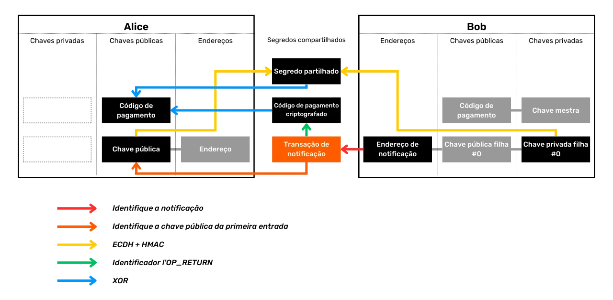

### A Transação de Pagamento BIP47

Vamos agora estudar juntos o processo de pagamento com BIP47. Para lembrá-lo do estado atual das coisas:
- Alice conhece o código de pagamento de Bob, que ela simplesmente recuperou do site dele;
- Bob conhece o código de pagamento de Alice graças à transação de notificação;
- Alice fará um primeiro pagamento a Bob. Ela poderá fazer muitos outros da mesma maneira.

Antes de explicar esse processo, acho importante relembrar os índices em que estamos trabalhando atualmente. O caminho de derivação de um código de pagamento é descrito da seguinte forma: `m/47'/0'/0'`. A próxima profundidade distribui os índices desta maneira:
- O primeiro par de chaves normal (não endurecido) é o usado para gerar o endereço de notificação sobre o qual falamos na parte anterior: `m/47'/0'/0'/0`;
- Pares de chaves filhos normais são usados dentro do ECDH para gerar endereços de recebimento de pagamento BIP47, como veremos nesta seção: de `m/47'/0'/0'/0` a `m/47'/0'/0'/2 147 483 647`;
- Pares de chaves filhos endurecidos são códigos de pagamento efêmeros: de `m/47'/0'/0'/0'` a `m/47'/0'/0'/2 147 483 647'`.

Sempre que Alice deseja enviar um pagamento a Bob, ela deriva um novo endereço virgem único, graças novamente ao protocolo ECDH:
- Alice seleciona a primeira chave privada derivada de seu código de pagamento pessoal reutilizável:

$$ a $$

- Alice seleciona a primeira chave pública não utilizada derivada do código de pagamento de Bob. Esta chave pública, chamaremos de $B$. Ela está associada à chave privada $b$ que apenas Bob conhece:

$$ B = b \cdot G $$

- Alice calcula um ponto secreto $S$ na curva elíptica por adição de pontos e duplicação aplicando sua chave privada $a$ à chave pública de Bob $B$:

$$ S = a \cdot B $$

- A partir deste ponto secreto, Alice calculará o segredo compartilhado $s$ (minúsculo). Para fazer isso, ela seleciona a coordenada x do ponto secreto $S$ chamada $Sx$, e passa esse valor pela função hash SHA256:

$$ S = (Sx, Sy) $$
$$ s = \text{SHA256}(Sx) $$

- Alice usa esse segredo compartilhado $s$ para calcular um endereço de recebimento de pagamento Bitcoin. Inicialmente, ela verifica se $s$ está contido na ordem da curva secp256k1. Caso contrário, ela incrementa o índice da chave pública de Bob para derivar outro segredo compartilhado;
- Em segundo lugar, ela calcula uma chave pública $K0$ adicionando na curva elíptica os pontos $B$ e $s·G$. Em outras palavras, Alice adiciona a chave pública derivada do código de pagamento de Bob $B$ com outro ponto calculado na curva elíptica por adição de pontos e duplicação com o segredo compartilhado $s$ do ponto gerador da curva secp256k1 $G$. Este novo ponto representa uma chave pública, e o nomeamos $K0$:

$$ K0 = B + s \cdot G $$

- Com essa chave pública $K0$, Alice pode derivar um endereço de recebimento virgem padrão (por exemplo, SegWit V0 em bech32).
Uma vez que Alice obteve o endereço de recebimento de Bob $K0$, ela pode realizar uma transação Bitcoin de maneira padrão. Para fazer isso, ela seleciona um UTXO que possui, assegurado por um par de chaves de um ramo diferente de sua carteira HD, e o gasta para satisfazer uma saída para o endereço de Bob $K0$. É importante notar que este pagamento, uma vez derivado o endereço, segue um processo convencional e não depende mais das chaves associadas ao BIP47.
Vamos recapitular os passos que acabamos de seguir juntos para enviar um pagamento BIP47:
- Alice seleciona a primeira chave privada derivada da criança de seu código de pagamento pessoal;
- Ela calcula um ponto secreto na curva elíptica usando ECDH a partir da primeira chave pública derivada da criança não utilizada do código de pagamento de Bob;
- Ela usa esse ponto secreto para calcular um segredo compartilhado com SHA256;
- Ela usa esse segredo compartilhado para calcular um novo ponto secreto na curva elíptica;
- Ela adiciona esse novo ponto secreto à chave pública de Bob;
- Ela obtém uma nova chave pública efêmera para a qual apenas Bob tem a chave privada associada;
- Alice pode fazer uma transação padrão para Bob com o endereço de recebimento efêmero derivado.

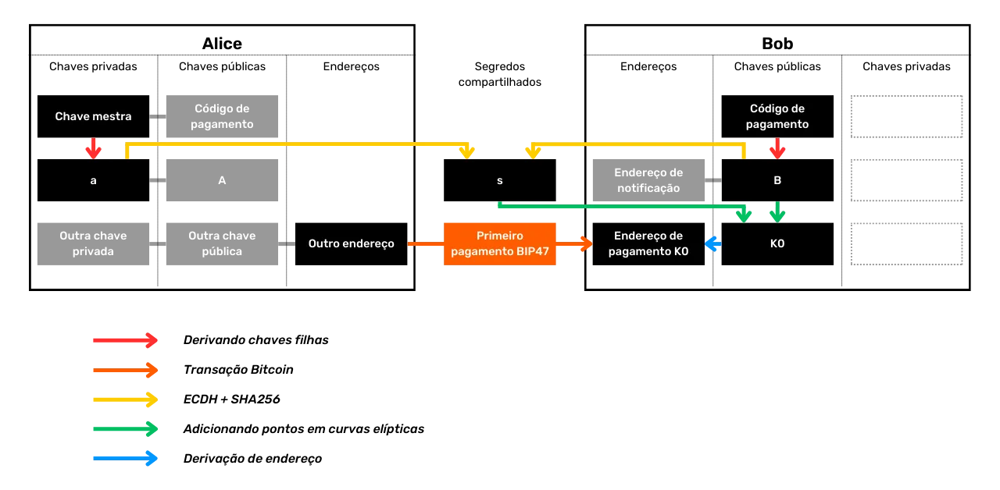

Se Alice quiser fazer um segundo pagamento, ela seguirá os mesmos passos de antes, exceto que desta vez ela selecionará a segunda chave pública derivada do código de pagamento de Bob. Especificamente, ela usará a próxima chave não utilizada. Ela obterá assim um novo endereço de recebimento pertencente a Bob, designado $K1$:

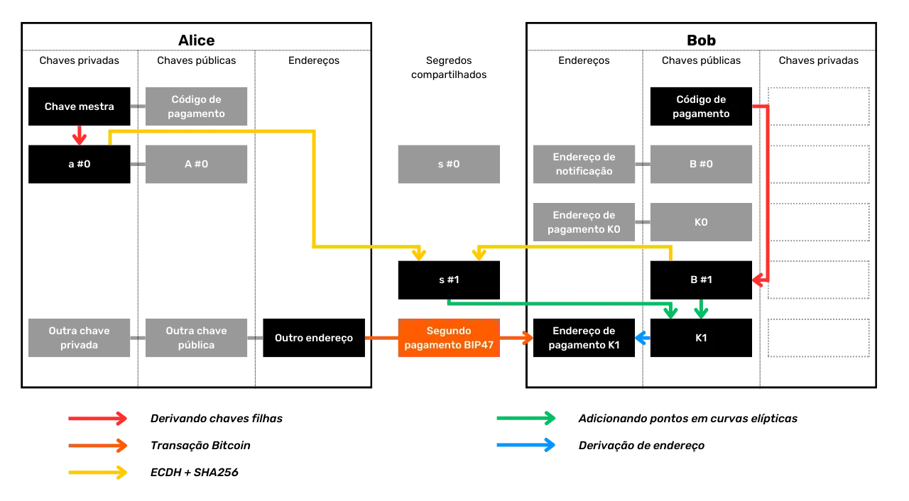

Ela pode continuar dessa maneira e derivar até `2^32` endereços não utilizados pertencentes a Bob.

De um ponto de vista externo, observando a blockchain, é teoricamente impossível diferenciar um pagamento BIP47 de um pagamento padrão. Aqui está um exemplo de uma transação de pagamento BIP47 no Testnet:

```text
94b2e59510f2e1fa78411634c98a77bbb638e28fb2da00c9f359cd5fc8f87254
```

Isso parece uma transação padrão com uma entrada consumida, uma saída de pagamento e uma mudança:


### Recebendo o Pagamento BIP47 e Derivando a Chave Privada

Alice acabou de fazer seu primeiro pagamento para um novo endereço BIP47 pertencente a Bob. Agora vamos ver como Bob recebe este pagamento. Também veremos por que Alice não tem acesso à chave privada do endereço que ela acabou de gerar, e como Bob recupera essa chave para gastar os bitcoins que acabou de receber.
Assim que Bob recebe a transação de notificação de Alice, ele deriva a chave pública BIP47 $K0$ mesmo antes dela ter enviado qualquer pagamento. Ele então monitora quaisquer pagamentos para o endereço associado. Na verdade, ele imediatamente deriva vários endereços que ele monitorará ($K0$, $K1$, $K2$, $K3$...). Aqui está como ele deriva essa chave pública $K0$:
- Bob seleciona a primeira chave privada derivada da criança de seu código de pagamento. Esta chave privada é denominada $b$. Ela está associada à chave pública $B$ com a qual Alice havia feito seus cálculos no passo anterior:

$$ b $$

- Bob seleciona a primeira chave pública de Alice derivada de seu código de pagamento. Esta chave é denominada $A$. Ela está associada à chave privada $a$ com a qual Alice havia feito seus cálculos, e da qual apenas Alice tem conhecimento. Bob pode realizar esse processo já que ele tem conhecimento do código de pagamento de Alice que foi transmitido a ele com a transação de notificação:

$$ A = a \cdot G $$

- Bob calcula o ponto secreto $S$, por adição e duplicação de pontos na curva elíptica, aplicando sua chave privada $b$ à chave pública de Alice $A$. Aqui encontramos o uso de ECDH que garante que esse ponto $S$ será o mesmo para ambos, Bob e Alice:

$$ S = b \cdot A $$
- Assim como Alice fez, Bob isola a coordenada x deste ponto $S$. Nós nomeamos este valor de $Sx$. Ele passa este valor pela função SHA256 para encontrar o segredo compartilhado $s$ (minúsculo):
$$ s = \text{SHA256}(Sx) $$

- Assim como Alice, Bob calcula o ponto $s·G$ na curva elíptica. Então, ele adiciona este ponto secreto à sua chave pública $B$. Ele então obtém um novo ponto na curva elíptica que ele interpreta como uma chave pública $K0$:

$$ K0 = B + s \cdot G $$

Uma vez que Bob tem essa chave pública $K0$, ele pode derivar a chave privada associada para poder gastar seus bitcoins. Ele é o único que pode gerar esta chave privada:

- Bob adiciona sua chave privada derivada $b$ de seu código de pagamento pessoal. Ele é o único que pode obter o valor de $b$. Então, ele adiciona $b$ com o segredo compartilhado $s$ para obter $k0$, a chave privada de $K0$:

$$ k0 = b + s $$

Graças à lei de grupo da curva elíptica, Bob obtém exatamente a chave privada correspondente à chave pública usada por Alice. Assim temos:

$$ K0 = k0 \cdot G $$
Vou resumir os passos que acabamos de percorrer juntos para receber um pagamento BIP47 e calcular a chave privada correspondente:
- Bob seleciona a primeira chave privada derivada de seu código de pagamento pessoal;
- Ele calcula um ponto secreto na curva elíptica usando ECDH a partir da primeira chave pública derivada da cadeia de código de Alice;
- Ele usa este ponto secreto para calcular um segredo compartilhado com SHA256;
- Ele usa este segredo compartilhado para calcular um novo ponto secreto na curva elíptica;
- Ele adiciona este novo ponto secreto à sua chave pública pessoal;
- Ele obtém uma nova chave pública efêmera, para a qual Alice enviará seu primeiro pagamento;
- Bob calcula a chave privada associada a esta chave pública efêmera adicionando sua chave privada derivada de seu código de pagamento e o segredo compartilhado.

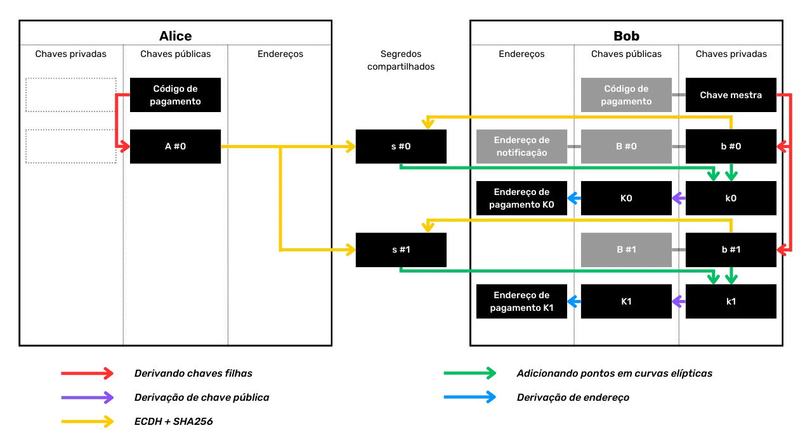

Uma vez que Alice não pode obter $b$ (a chave privada de Bob), ela é incapaz de determinar $k0$ (a chave privada associada ao endereço de recebimento BIP47 de Bob). Esquematicamente, podemos representar o cálculo do segredo compartilhado $S$ assim:


Uma vez encontrado o segredo compartilhado com ECDH, Alice e Bob calculam a chave pública de pagamento BIP47 $K0$, e Bob também calcula a chave privada associada $k0$:

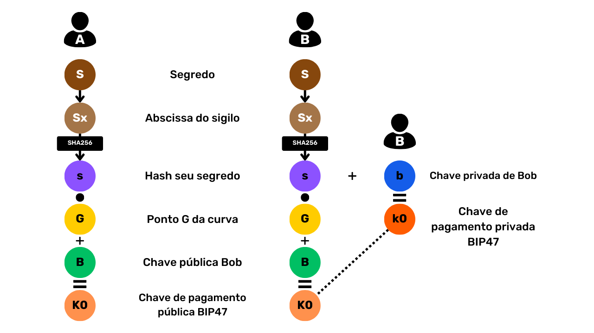

### Reembolsando o Pagamento BIP47

Uma vez que Bob está ciente do código de pagamento reutilizável de Alice, ele já tem todas as informações necessárias para enviar-lhe um reembolso. Ele não precisará entrar em contato com Alice novamente para pedir qualquer informação. Ele simplesmente precisará notificá-la com uma transação de notificação, especialmente para que ela possa recuperar seus endereços BIP47 com sua semente, e então ele também pode enviar-lhe até `2^32` pagamentos.

A funcionalidade de reembolso é específica para BIP47 e é uma de suas vantagens sobre outros métodos que estudaremos nos próximos capítulos, como os Pagamentos Silenciosos.

Bob pode então reembolsar Alice da mesma forma que ela lhe enviou pagamentos. Os papéis são invertidos:

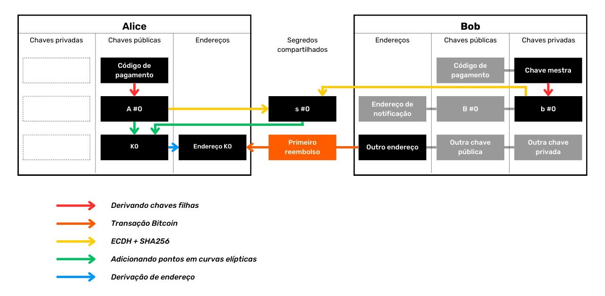
*Um grande agradecimento a [Fanis Michalakis](https://x.com/FanisMichalakis) por sua revisão e valioso conselho especializado sobre o artigo que inspirou a escrita deste capítulo!*

https://planb.network/tutorials/privacy/paynym-bip47

## Pagamentos Silenciosos
<chapterId>2871d594-414e-4598-a830-91c9eb84dfb8</chapterId>
O BIP47 tem sido criticado por sua ineficiência na blockchain. Como explicado no capítulo anterior, ele requer uma transação de notificação para cada novo destinatário. Esta restrição torna-se negligenciável se alguém planeja estabelecer um canal de pagamento duradouro com este destinatário. De fato, uma única transação de notificação abre caminho para um número quase infinito de pagamentos BIP47 subsequentes.

No entanto, em certas situações, a transação de notificação pode ser um obstáculo para o usuário. Tomemos o exemplo de uma doação única a um destinatário: com um endereço Bitcoin clássico, uma única transação é suficiente para fazer a doação. Mas com o BIP47, duas transações são necessárias: uma para a notificação e outra para o pagamento real. Quando a demanda por espaço no bloco é baixa e as taxas de transação são mínimas, este passo adicional geralmente não é um problema. No entanto, durante períodos de congestionamento, as taxas de transação podem se tornar exorbitantes para um único pagamento, potencialmente dobrando o custo para o usuário em comparação com uma transação Bitcoin padrão, o que pode ser inaceitável para o usuário.

Para situações em que o usuário planeja fazer apenas alguns pagamentos para um identificador estático, outras soluções foram desenvolvidas. Entre elas estão os Pagamentos Silenciosos, descritos no [BIP352](https://github.com/bitcoin/bips/blob/master/bip-0352.mediawiki). Este protocolo permite o uso de um identificador estático para receber pagamentos sem gerar reutilização de endereço, e sem exigir o uso de transações de notificação. Vamos examinar como este protocolo funciona.

---

*Para entender completamente este capítulo, é essencial estar familiarizado com o funcionamento do ECDH (Elliptic Curve Diffie-Hellman) e a derivação de chaves criptográficas em uma carteira HD. Estes conceitos foram detalhados no capítulo anterior sobre o BIP47. Não vou repeti-los aqui. Se você ainda não está familiarizado com estas noções, recomendo consultar o capítulo anterior antes de continuar com este. Também não vou revisitar os riscos associados à reutilização de endereços de recebimento, nem a importância de ter um identificador único para receber pagamentos.*

---

### Por que não mover a notificação?

Como discutido no capítulo sobre o BIP47, a transação de notificação serve principalmente duas funções:
- Ela notifica o destinatário;
- Ela transmite o código de pagamento do remetente.

Pode-se pensar ingenuamente que esse processo de notificação poderia ser realizado fora da cadeia. Em teoria, isso é totalmente viável: bastaria para o destinatário indicar um meio de comunicação para receber códigos de pagamento BIP47 dos remetentes. No entanto, essa abordagem apresenta dois problemas principais:
- Primeiro, isso transferiria o processo de transmissão do código para outro protocolo de comunicação. Os problemas relacionados aos custos e à privacidade da troca permaneceriam, mas simplesmente seriam transferidos para este novo protocolo. Em termos de privacidade, isso também poderia criar um vínculo entre a identidade de um usuário e a atividade na blockchain, o que é algo que pretendemos evitar ao realizar a notificação diretamente na blockchain. Além disso, realizar a notificação fora da blockchain introduziria riscos de censura (como o bloqueio de fundos) que não existem no Bitcoin;
- Em seguida, isso representaria um problema de recuperação. Com o BIP47, o destinatário deve absolutamente conhecer os códigos de pagamento dos remetentes para acessar os fundos. Isso é verdade no momento do recebimento, mas também no caso de recuperação de fundos via a semente em caso de perda da carteira. Com notificações onchain, esse risco é evitado, pois o usuário pode encontrar e descriptografar as transações de notificação simplesmente conhecendo sua semente. No entanto, se a notificação for realizada fora da blockchain, o usuário precisaria manter um backup dinâmico de todos os códigos de pagamento recebidos, o que é impraticável para o usuário médio.
Todas essas restrições tornam o uso de notificação onchain indispensável no contexto do BIP47. No entanto, os Pagamentos Silenciosos buscam especificamente evitar essa etapa de notificação onchain devido ao seu custo. Portanto, a solução adotada não é mover a notificação, mas eliminá-la inteiramente. Para alcançar isso, um compromisso deve ser aceito: o de escanear. Ao contrário do BIP47, onde o usuário sabe exatamente onde encontrar seus fundos graças às transações de notificação, no contexto dos Pagamentos Silenciosos, o usuário deve examinar todas as transações Bitcoin existentes para detectar quaisquer pagamentos que possam ser destinados a eles. Para reduzir esse ônus operacional, a busca por Pagamentos Silenciosos é limitada apenas a transações que provavelmente contêm tais pagamentos, ou seja, aquelas que incluem pelo menos uma saída Taproot P2TR. O escaneamento também se concentra exclusivamente em transações a partir da data de criação da carteira (não há necessidade de escanear transações retroativas a 2009 se a carteira foi criada em 2024).

Portanto, você pode ver por que BIP47 e Pagamentos Silenciosos, embora visem um objetivo semelhante, envolvem diferentes compromissos e **assim realmente atendem a casos de uso distintos**. Para pagamentos únicos, como doações ocasionais, os Pagamentos Silenciosos são mais apropriados devido ao seu menor custo. Por outro lado, para transações regulares para o mesmo destinatário, como no caso de plataformas de troca ou pools de mineração, o BIP47 pode ser preferido.
Vamos explorar juntos o funcionamento técnico dos Pagamentos Silenciosos para entender melhor suas implicações. Para fazer isso, sugiro que adotemos a mesma abordagem do documento explicativo do BIP352. Gradualmente, vamos decompor os cálculos a serem realizados, elemento por elemento, justificando cada nova adição.
### Alguns conceitos para entender

Antes de começarmos, é importante esclarecer que os Pagamentos Silenciosos dependem exclusivamente do uso de tipos de script P2TR (*Pay to Taproot*). Ao contrário do BIP47, não é necessário derivar endereços de recebimento a partir de chaves públicas filhas por meio de hash. De fato, no padrão P2TR, a chave pública ajustada é usada diretamente e abertamente no endereço. Assim, um endereço de recebimento Taproot é essencialmente uma chave pública acompanhada de alguns metadados. Esta chave pública ajustada é a agregação de duas outras chaves públicas: uma permitindo gastos diretos e tradicionais por meio de uma assinatura simples, e a outra representando a raiz de Merkle do MAST, que autoriza gastos sujeitos à satisfação de uma das condições potencialmente inscritas na árvore de Merkle.


A decisão de limitar os Pagamentos Silenciosos exclusivamente ao Taproot é motivada por duas razões principais:
- Primeiro, facilita significativamente a implementação e futuras atualizações no software da carteira, já que apenas um padrão precisa ser seguido;
- Em segundo lugar, essa abordagem ajuda a melhorar o conjunto de anonimato dos usuários, incentivando-os a não se dispersarem entre diferentes tipos de scripts, que geram impressões digitais distintas da carteira na análise de cadeia (para mais informações sobre este conceito, convido você a consultar o capítulo 4 da parte 2).

### Derivação ingênua de uma chave pública de Pagamentos Silenciosos
Vamos começar com um exemplo simples que ajudará você a entender o funcionamento central dos SP (Pagamentos Silenciosos). Pegue Alice e Bob, dois usuários de Bitcoin. Alice quer enviar bitcoins para Bob em um endereço de recebimento novo. Três objetivos devem ser alcançados neste processo:
- Alice deve ser capaz de gerar um endereço novo;
- Bob deve ser capaz de identificar um pagamento enviado para este endereço específico;
- Bob deve ser capaz de obter a chave privada associada a este endereço para poder gastar seus fundos.

Alice tem um UTXO em sua carteira Bitcoin protegido com o seguinte par de chaves:
- $a$: a chave privada;
- $A$: a chave pública ($A = a \cdot G$)

Bob tem um endereço SP que ele publicou na internet com:
- $b$: a chave privada;
- $B$: a chave pública ($B = b \cdot G$)
Ao recuperar o endereço de Bob, Alice é capaz de calcular um novo endereço em branco que pertence a Bob usando ECDH. Vamos chamar este endereço de $P$:
$$  P = B + \text{hash}(a \cdot B) \cdot G  $$

Nesta equação, Alice simplesmente calculou o produto escalar de sua chave privada $a$ e a chave pública de Bob $B$. Ela passou esse resultado por uma função de hash conhecida por todos. O valor de saída é então multiplicado escalarmente pelo ponto gerador $G$ da curva elíptica `secp256k1`. Finalmente, Alice adiciona o ponto obtido à chave pública de Bob $B$. Uma vez que Alice tem esse endereço $P$, ela o usa como uma saída em uma transação, significando que ela envia bitcoins para ele.

> *No contexto dos Pagamentos Silenciosos, a função "hash" corresponde a uma função de hash SHA256 marcada especificamente com `BIP0352/SharedSecret`, garantindo que os hashes gerados sejam únicos para este protocolo e não possam ser reutilizados em outros contextos, ao mesmo tempo que fornece proteção adicional contra a reutilização de nonces em assinaturas. Este padrão corresponde ao especificado no [BIP340 para assinaturas Schnorr](https://github.com/bitcoin/bips/blob/master/bip-0340.mediawiki) em `secp256k1`.*

Graças às propriedades da curva elíptica na qual o ECDH se baseia, sabemos que:

$$  a \cdot B = b \cdot A  $$

Bob, portanto, será capaz de calcular o endereço de recebimento no qual Alice enviou os bitcoins. Para fazer isso, ele monitora todas as transações de Bitcoin que atendem aos critérios de Pagamentos Silenciosos e aplica o seguinte cálculo a cada uma delas para ver se o pagamento é endereçado a ele (*scanning*):

$$  P' = B + \text{hash}(b \cdot A) \cdot G  $$

Quando ele escaneia a transação de Alice, ele percebe que $P'$ é igual a $P$. Assim, ele sabe que este pagamento é endereçado a ele:

$$  P' = B + \text{hash}(b \cdot A) \cdot G = B + \text{hash}(a \cdot B) \cdot G = P   $$

A partir daí, Bob será capaz de calcular a chave privada $p$ que permite gastar o endereço $P$:

$$  p = (b + \text{hash}(b \cdot A)) \bmod n  $$

Como você pode ver, para calcular esta chave privada $p$, é necessário ter a chave privada $b$. Somente Bob tem esta chave privada $b$. Ele, portanto, de fato será o único capaz de gastar os bitcoins enviados para seu endereço de Pagamentos Silenciosos.


*Legenda:*
- $B$: A chave pública / endereço estático publicado por Bob
- $b$: A chave privada de Bob
- $A$: A chave pública do UTXO de Alice usada como entrada para a transação
- $a$: A chave privada de Alice
- $G$: O ponto gerador da curva elíptica `secp256k1`
- $\text{SHA256}$: A função de hash SHA256 marcada com `BIP0352/SharedSecret`
- $s$: O segredo comum ECDH
- $P$: A chave pública / endereço único para pagamento a Bob

Aqui está uma abordagem inicialmente bastante ingênua de usar o endereço estático de Bob, denotado por $B$, para derivar um endereço único $P$ para enviar bitcoins. No entanto, este método é demasiado simplista e tem várias falhas que precisam de correção. O primeiro problema é que, neste esquema, Alice não pode criar múltiplas saídas para Bob dentro da mesma transação.

### Como criar múltiplas saídas?

No exemplo da seção anterior, Alice cria uma única saída que irá para Bob no seu endereço único $P$. Com a mesma entrada selecionada, é impossível para Alice criar dois endereços virgens distintos para Bob, pois o método usado sempre levaria ao mesmo resultado para $P$, portanto, ao mesmo endereço. No entanto, pode haver muitas situações em que Alice deseja dividir seu pagamento a Bob em várias quantias menores, criando assim múltiplos UTXOs. Portanto, é necessário encontrar um método que permita que isso seja feito.

Para alcançar isso, vamos modificar ligeiramente o cálculo que Alice realiza para derivar $P$, de modo que ela possa gerar dois endereços distintos para Bob, nomeadamente $P_0$ e $P_1$.

Para modificar o cálculo e obter 2 endereços diferentes, é suficiente adicionar um inteiro que modifica o resultado. Assim, Alice adicionará $0$ no seu cálculo para obter o endereço $P_0$ e $1$ para obter o endereço $P_1$. Vamos chamar esse inteiro de $i$:

$$  P_i = B + \text{hash}(a \cdot B \text{ ‖ } i) \cdot G  $$

O processo de cálculo permanece inalterado em relação ao método anterior, exceto que desta vez Alice concatenará $a \cdot B$ com $i$ antes de proceder ao hash. Então, é suficiente mudar $i$ para ter um novo endereço pertencente a Bob. Por exemplo:

$$  P_0 = B + \text{hash}(a \cdot B \text{ ‖ } 0) \cdot G  $$

$$  P_1 = B + \text{hash}(a \cdot B \text{ ‖ } 1) \cdot G  $$
Quando Bob examina a blockchain por Pagamentos Silenciosos destinados a ele, ele começa usando $i = 0$ para o endereço $P_0$. Se ele não encontrar nenhum pagamento em $P_0$, ele conclui que esta transação não contém nenhum Pagamento Silencioso para ele e para de analisá-la. No entanto, se $P_0$ for válido e contiver um pagamento para ele, ele prossegue com $P_1$ na mesma transação para verificar se Alice fez um segundo pagamento. Se $P_1$ se revelar inválido, ele interrompe sua busca por esta transação; caso contrário, ele continua a testar valores sucessivos de $i$: 
$$  P_0 = B + \text{hash}(b \cdot A \text{ ‖ } 0) \cdot G  $$
$$  P_1 = B + \text{hash}(b \cdot A \text{ ‖ } 1) \cdot G  $$
Uma vez que Bob imediatamente para em $i = 0$ se $P_0$ não resultar em nada, o uso desse inteiro adiciona quase nenhum ônus operacional adicional para Bob na etapa de escaneamento das transações.

Bob pode então calcular as chaves privadas da mesma maneira:

$$ 
p_0 = (b + \text{hash}(b \cdot A \text{ ‖ } 0)) \bmod n
 $$

$$ 
p_1 = (b + \text{hash}(b \cdot A \text{ ‖ } 1)) \bmod n 
 $$


*Legenda:*
- $B$: A chave pública / endereço estático publicado por Bob
- $b$: A chave privada de Bob
- $A$: A chave pública do UTXO de Alice usada como entrada para a transação
- $a$: A chave privada de Alice
- $G$: O ponto gerador da curva elíptica `secp256k1`
- $\text{SHA256}$: A função hash SHA256 marcada com `BIP0352/SharedSecret`
- $s_0$: O primeiro segredo ECDH compartilhado
- $s_1$: O segundo segredo ECDH compartilhado
- $P_0$: A primeira chave pública / endereço único para o pagamento a Bob
- $P_1$: A segunda chave pública / endereço único para o pagamento a Bob

Com este método, começamos a ter um protocolo interessante, mas ainda existem alguns desafios a superar, notavelmente a prevenção do reuso de endereços.

### Como evitar o reuso de endereços?
Como vimos nas seções anteriores, Alice usa o par de chaves que segura seu UTXO, que ela gastará para calcular o segredo ECDH compartilhado com Bob. Esse segredo permite que ela derive o endereço único $P_0$. No entanto, o par de chaves ($a$, $A$) usado por Alice pode segurar múltiplos UTXOs se ela reusou este endereço várias vezes. No evento de Alice fazer dois pagamentos para o endereço estático $B$ de Bob usando dois UTXOs segurados pela mesma chave $A$, isso resultaria em reuso de endereço para Bob.
> *O reuso de endereço é uma prática muito ruim para a privacidade do usuário. Para entender o porquê, aconselho que você revise as primeiras partes deste treinamento.*

De fato, uma vez que o endereço único $P_0$ é derivado de $A$ e $B$, se Alice derivar um segundo endereço para um segundo pagamento a $B$, com a mesma chave $A$, ela acabará com o mesmo endereço $P_0$. Para evitar esse risco e prevenir o reuso de endereços dentro dos Pagamentos Silenciosos, precisamos modificar nossos cálculos levemente.

O que queremos é que cada UTXO consumido por Alice como uma entrada de um pagamento dê um endereço único do lado de Bob, mesmo se vários UTXOs forem segurados pelo mesmo par de chaves. Portanto, é suficiente adicionar uma referência ao UTXO no cálculo do endereço único $P_0$. Esta referência será simplesmente o hash do UTXO consumido como entrada:

$$  \text{inputHash} = \text{hash}(\text{outpoint} \text{ ‖ } A)  $$

E essa referência de entrada, Alice a adicionará em seu cálculo do endereço único $P_0$:
$$  P_0 = B + \text{hash}(\text{inputHash} \cdot a \cdot B \text{ ‖ } 0) \cdot G  $$
Durante sua varredura, Bob também pode adicionar $\text{inputHash}$, já que tudo o que ele precisa fazer é observar a transação para deduzir $\text{outpoint}$:

$$  P_0 = B + \text{hash}(\text{inputHash} \cdot b \cdot A \text{ ‖ } 0) \cdot G  $$

Quando ele encontra um $P_0$ válido, ele pode calcular a chave privada correspondente $p_0$:

$$ 
p_0 = (b + \text{hash}(\text{inputHash} \cdot b \cdot A \text{ ‖ } 0)) \bmod n
 $$


*Legenda:*
- $B$: A chave pública / endereço estático publicado por Bob
- $b$: A chave privada de Bob
- $A$: A chave pública do UTXO de Alice usada como entrada para a transação
- $a$: A chave privada de Alice
- $H$: O hash do UTXO usado como entrada
- $G$: O ponto gerador da curva elíptica `secp256k1`
- $\text{SHA256}$: A função de hash SHA256 marcada com `BIP0352/SharedSecret`
- $s_0$: O primeiro segredo ECDH compartilhado
- $P_0$: A primeira chave pública / endereço único para pagamento a Bob

No momento, nossos cálculos assumem que Alice usa uma única entrada para sua transação. No entanto, ela deveria ser capaz de usar múltiplas entradas. Consequentemente, do lado de Bob, para cada transação contendo múltiplas entradas, ele teoricamente precisaria calcular o ECDH para cada entrada para determinar se um pagamento é destinado a ele. Este método não é satisfatório, então precisamos encontrar uma solução para reduzir a carga de trabalho!

### Ajustando as chaves públicas nas entradas

Para resolver este problema, em vez de usar o par de chaves que protege uma entrada específica do lado de Alice, usaremos a soma de todos os pares de chaves usados nas entradas da transação. Esta soma será então considerada como um novo par de chaves. Esta técnica é conhecida como "tweak".

Por exemplo, imagine que a transação de Alice tem 3 entradas, cada uma protegida com um par de chaves diferente:
- $a_0$ protege a entrada #0;
- $a_1$ protege a entrada #1;
- $a_2$ protege a entrada #2.


Seguindo o método descrito acima, Alice teria que escolher um único par de chaves entre $a_0$, $a_1$ e $a_2$ para calcular o segredo ECDH e gerar o endereço de pagamento único $P$ a partir do endereço estático $B$ de Bob. No entanto, esta abordagem exige que Bob teste cada possibilidade sequencialmente, começando com $a_0$, depois $a_1$, e assim por diante, até identificar um par que gere um endereço válido $P$. Este processo exige que Bob execute o cálculo ECDH em todas as entradas de todas as transações, aumentando significativamente a carga de trabalho operacional de varredura.

Para evitar isso, pediremos a Alice que realize seu cálculo de $P$ usando a soma de todas as chaves na entrada. Tomando nosso exemplo, a chave privada ajustada $a$ seria calculada da seguinte forma:

$$  a = a_0 + a_1 + a_2  $$
Da mesma forma, Alice e Bob poderão calcular a chave pública ajustada:
$$  A = A_0 + A_1 + A_2  $$
Graças a este método, Bob só precisa calcular a soma das chaves públicas da transação, e então computar o segredo ECDH a partir de $A$ apenas, o que reduz significativamente o número de cálculos a serem feitos para a etapa de escaneamento. No entanto, lembre-se da seção anterior. Nós havíamos incluído em nosso cálculo o hash $\text{inputHash}$ que é usado como um nonce para prevenir a reutilização de endereços:

$$  \text{inputHash} = \text{hash}(\text{outpoint} \text{ ‖ } A)  $$

Mas se houver múltiplas entradas em uma transação, é necessário determinar qual $\text{outpoint}$ é escolhido nesse cálculo. De acordo com o BIP352, o critério de seleção para o $\text{outpoint}$ a ser usado é escolher o menor lexicograficamente, o que significa selecionar o UTXO que aparece primeiro em ordem alfabética. Este método padroniza o UTXO a escolher em cada transação. Por exemplo, se este menor $\text{outpoint}$ lexicograficamente for $\text{outpoint}_L$, o cálculo de $\text{inputHash}$ será:

$$  \text{inputHash} = \text{hash}(\text{outpoint}_L \text{ ‖ } A)  $$

Os cálculos então permanecem idênticos aos apresentados na seção anterior, exceto que a chave privada $a$ e sua correspondente chave pública $A$ não representam mais um par que assegura uma única entrada, mas agora representam o ajuste de todos os pares de chaves nas entradas.

### Separando Chaves de Gasto e Escaneamento

Até agora, discutimos o endereço estático de Pagamento Silencioso $B$ como uma chave pública única. Lembre-se, é essa chave pública $B$ que é usada por Alice para criar o segredo compartilhado ECDH, que por sua vez é usado para computar o endereço de pagamento único $P$. Bob usa essa chave pública $B$ e a chave privada correspondente $b$ para a etapa de escaneamento. Mas ele também usará a chave privada $b$ para computar a chave privada $p$ que permite gastar do endereço $P$.

A desvantagem deste método é que a chave privada $b$, que é usada para computar todas as chaves privadas para endereços que recebem Pagamentos Silenciosos, também é usada por Bob para escanear transações. Esta etapa requer que a chave $b$ esteja disponível em um software de carteira conectado à internet, o que a expõe a um risco maior de roubo em comparação com mantê-la em uma carteira fria. Idealmente, seria benéfico poder aproveitar os Pagamentos Silenciosos enquanto mantém a chave privada $b$, que controla o acesso a todas as outras chaves privadas, segura em uma carteira de hardware. Felizmente, o protocolo foi adaptado para permitir exatamente isso.
Para alcançar isso, o BIP352 especifica que o receptor usa 2 pares diferentes de chaves:
- $B_{\text{spend}}$: para calcular as chaves privadas de endereços de pagamento únicos;
- $B_{\text{scan}}$: para encontrar endereços de pagamento únicos.

Dessa forma, Bob pode manter a chave privada $b_{\text{spend}}$ em uma carteira de hardware e usar a chave privada $b_{\text{scan}}$ em software online para encontrar seus Pagamentos Silenciosos, sem revelar $b_{\text{spend}}$. No entanto, as chaves públicas $B_{\text{scan}}$ e $B_{\text{spend}}$ são ambas reveladas publicamente, pois são encontradas no endereço estático de Bob $B$:
Para calcular um endereço de pagamento único $P_0$ pertencente ao Bob, Alice realizará o seguinte cálculo:

$$  P_0 = B_{\text{spend}} + \text{hash}(\text{inputHash} \cdot a \cdot B_{\text{scan}} \text{ ‖ } 0) \cdot G  $$

Para encontrar os pagamentos endereçados a ele, Bob realizará o seguinte cálculo:

$$  P_0 = B_{\text{spend}} + \text{hash}(\text{inputHash} \cdot b_{\text{scan}} \cdot A \text{ ‖ } 0) \cdot G  $$

Como você pode ver, até agora, Bob não precisou usar $b_{\text{spend}}$, que está em sua carteira de hardware. Quando ele desejar gastar $P_0$, ele poderá então realizar o seguinte cálculo para encontrar a chave privada $p_0$:

$$ p_0 = (b_{\text{spend}} + \text{hash}(\text{inputHash} \cdot b_{\text{scan}} \cdot A \text{ ‖ } 0)) \bmod n $$


*Legenda:*
- $B_{\text{scan}}$: Chave pública de escaneamento do Bob (endereço estático)
- $b_{\text{scan}}$: Chave privada de escaneamento do Bob
- $B_{\text{spend}}$: Chave pública de gasto do Bob (endereço estático)
- $b_{\text{spend}}$: Chave privada de gasto do Bob
- $A$: A soma das chaves públicas na entrada (ajuste)
- $a$: A chave privada correspondente à chave pública ajustada
- $H$: O hash do menor UTXO (lexicograficamente) usado na entrada
- $G$: O ponto gerador da curva elíptica `secp256k1`
- $\text{SHA256}$: A função de hashing SHA256 marcada com `BIP0352/SharedSecret`
- $s_0$: O primeiro segredo ECDH compartilhado
- $P_0$: A primeira chave pública / endereço de pagamento único para Bob

### Usando endereços SP com um rótulo

Bob, portanto, tem um endereço estático $B$ para Pagamentos Silenciosos da seguinte forma:

$$ B = B_{\text{scan}} \text{ ‖ } B_{\text{spend}} $$

O problema com este método é que ele não permite segregar os diferentes pagamentos enviados para este endereço. Por exemplo, se Bob tem 2 clientes diferentes para seu negócio e ele quer diferenciar claramente os pagamentos de cada um, ele precisaria de 2 endereços estáticos diferentes. Uma solução ingênua, com a abordagem atual, seria para Bob criar duas carteiras separadas, cada uma com seu próprio endereço estático, ou até mesmo estabelecer dois endereços estáticos diferentes dentro da mesma carteira. No entanto, esta solução requer a varredura de toda a blockchain duas vezes (uma para cada endereço) para detectar respectivamente os pagamentos destinados a cada endereço. Esta dupla varredura aumenta de forma irrazoável o ônus operacional para Bob.
Para resolver este problema, o BIP352 utiliza um sistema de etiquetagem que permite diferentes endereços estáticos sem aumentar de forma irrazoável a carga de trabalho para encontrar Pagamentos Silenciosos na blockchain. Para fazer isso, um inteiro $m$ é adicionado à chave pública de gasto $B_{\text{spend}}$. Esse inteiro pode assumir o valor de $1$ para o primeiro endereço estático, depois $2$ para o segundo, e assim por diante. As chaves de gasto $B_{\text{spend}}$ serão doravante chamadas de $B_m$ e serão construídas desta maneira:
$$  B_m = B_{\text{spend}} + \text{hash}(b_{\text{scan}} \text{ ‖ } m) \cdot G  $$

Por exemplo, para a primeira chave de gasto com o rótulo $1$:

$$  B_1 = B_{\text{spend}} + \text{hash}(b_{\text{scan}} \text{ ‖ } 1) \cdot G  $$

O endereço estático publicado por Bob consistirá agora de $B_{\text{scan}}$ e $B_m$. Por exemplo, o primeiro endereço estático com o rótulo $1$ será:

$$ B = B_{\text{scan}} \text{ ‖ } B_1 $$

> *Começamos apenas do rótulo 1 porque o rótulo 0 é reservado para troco.*

Alice, por sua parte, derivará o endereço de pagamento único $P$ da mesma forma que antes, mas usando o novo $B_1$ em vez de $B_{\text{spend}}$.
$$  P_0 = B_1 + \text{hash}(\text{inputHash} \cdot a \cdot B_{\text{scan}} \text{ ‖ } 0) \cdot G  $$

Na realidade, Alice pode nem mesmo saber que Bob tem um endereço etiquetado, pois ela simplesmente usa a segunda parte do endereço estático que ele forneceu, que neste caso, é o valor $B_1$ em vez de $B_{\text{spend}}$.

Para escanear pagamentos, Bob sempre usará o valor de seu endereço estático inicial com $B_{\text{spend}}$ desta maneira:

$$   P_0 = B_{\text{spend}} + \text{hash}(\text{inputHash} \cdot b_{\text{scan}} \cdot A \text{ ‖ } 0) \cdot G  $$

Então, ele simplesmente subtrai o valor que encontra para $P_0$ de cada saída, uma por uma. Em seguida, verifica se um dos resultados dessas subtrações corresponde ao valor de um dos rótulos que usa em sua carteira. Se corresponder, por exemplo, para a saída #4 com o rótulo $1$, isso significa que esta saída é um Pagamento Silencioso associado ao seu endereço estático etiquetado $B_1$:

$$ Out_4 - P_0 = \text{hash}(b_{\text{scan}} \text{ ‖ } 1) \cdot G $$

Isso funciona porque:

$$  B_1 = B_{\text{spend}} + \text{hash}(b_{\text{scan}} \text{ ‖ } 1) \cdot G  $$
Graças a este método, Bob pode usar uma multiplicidade de endereços estáticos ($B_1$, $B_2$, $B_3$...), todos derivados do seu endereço estático base ($B = B_{\text{scan}} \text{ ‖ } B_{\text{spend}}$), a fim de separar adequadamente os usos.
No entanto, esta separação de endereços estáticos é válida apenas do ponto de vista da gestão de carteira pessoal e não permite a separação de identidades. Uma vez que todos têm o mesmo $B_{\text{scan}}$, é muito fácil associar todos os endereços estáticos juntos e deduzir que pertencem a uma única entidade.


*Legenda:*
- $B_{\text{scan}}$: chave pública de escaneamento de Bob (endereço estático)
- $b_{\text{scan}}$: chave privada de escaneamento de Bob
- $B_{\text{spend}}$: chave pública de gasto de Bob (endereço inicial)
- $B_m$: chave pública de gasto rotulada de Bob (endereço estático)
- $b_m$: chave privada de gasto rotulada de Bob
- $A$: A soma das chaves públicas de entrada (ajuste)
- $a$: A chave privada correspondente à chave pública ajustada
- $H$: O hash do menor UTXO (lexicograficamente) usado como entrada
- $G$: O ponto gerador da curva elíptica `secp256k1`
- $\text{SHA256}$: A função de hash SHA256 marcada com `BIP0352/SharedSecret`
- $s_0$: O primeiro segredo ECDH compartilhado
- $P_0$: A primeira chave pública / endereço único para pagamento a Bob
- $p_0$: A chave privada do primeiro endereço de pagamento único a Bob
- $X$: O hash da chave privada de escaneamento com o rótulo

### Como Construir um Endereço de Pagamentos Silenciosos?

Para construir um endereço dedicado a Pagamentos Silenciosos, deve-se primeiro derivar 2 pares de chaves na carteira HD Bitcoin deles:
- O par $b_{\text{scan}}$, $B_{\text{scan}}$ para procurar os pagamentos endereçados a nós;
- O par $b_{\text{spend}}$, $B_{\text{spend}}$ para gastar os bitcoins que recebemos.

Estes pares são derivados seguindo estes caminhos (*Bitcoin Mainnet*):

```text
scan: m / 352' / 0' / 0' / 1' / 0
spend: m / 352' / 0' / 0' / 0' / 0
```

Uma vez que estes 2 pares de chaves estão disponíveis, simplesmente os concatena (de ponta a ponta) para criar o payload do endereço estático:

$$ B = B_{\text{scan}} \text{ ‖ } B_{\text{spend}} $$

Se desejar usar rótulos, $B_{\text{spend}}$ é substituído por $B_m$:

$$ B = B_{\text{scan}} \text{ ‖ } B_m $$

Com o rótulo $m$:

$$  B_m = B_{\text{spend}} + \text{hash}(b_{\text{scan}} \text{ ‖ } m) \cdot G  $$

Uma vez que este payload está disponível, adiciona-se a HRP (*Human-Readable Part*) `sp` e a versão `q` (= versão 0). Um checksum também é adicionado, e o endereço é formatado em bech32m.
Por exemplo, aqui está o meu endereço estático de Pagamentos Silenciosos:
```text
sp1qqvhjvsq2vz8zwrw372vuzle7472zup2ql3pz64yn5cpkw5ngv2n6jq4nl8cgm6zmu48yk3eq33ryc7aam6jrvrg0d0uuyzecfhx2wgsumcurv77e
```
Um ponto importante sobre endereços estáticos, que você pode ter inserido nas seções anteriores, é que esses endereços não são visíveis nas transações de Bitcoin. Apenas os endereços de pagamento $P$, usados nas saídas, aparecem na blockchain no formato Taproot padrão. Assim, de fora, é impossível distinguir uma transação envolvendo um Pagamento Silencioso de uma transação ordinária usando saídas P2TR.
Assim como com o BIP47, é impossível estabelecer uma conexão entre um endereço estático $B$ e um endereço de pagamento $P$ derivado de $B$. De fato, mesmo que Eve, uma possível atacante, tente escanear a blockchain com o endereço estático de Bob $B$, ela não será capaz de realizar os cálculos necessários para determinar $P$. Para fazer isso, ela precisaria ou da chave privada de escaneamento de Bob $b_{\text{scan}}$ ou das chaves privadas do remetente $a$, mas ambos esses elementos são, claro, privados. Portanto, é possível vincular explicitamente o endereço estático de alguém a uma forma de identidade pessoal.

### Como usar Pagamentos Silenciosos?

A proposta para Pagamentos Silenciosos é relativamente recente e foi implementada por um número muito limitado de carteiras até agora. Até onde sei, existem apenas 3 softwares que os suportam:
- [CakeWallet](https://cakewallet.com/)
- [Silentium](https://app.silentium.dev/)
- [DonationWallet](https://github.com/Sosthene00/donationwallet)

Em breve, ofereceremos um tutorial detalhado sobre como configurar seu próprio endereço estático de Pagamentos Silenciosos.

Como essa funcionalidade é recente, é aconselhável exercer cautela e evitar usar Pagamentos Silenciosos para grandes quantias na mainnet.

*Para criar este capítulo sobre Pagamentos Silenciosos, usei [o site de explicação dos Pagamentos Silenciosos](https://silentpayments.xyz/) e [o documento de explicação do BIP352](https://github.com/bitcoin/bips/blob/master/bip-0352.mediawiki).*


## Dê-nos seu feedback sobre este curso
<chapterId>195d149f-80fa-5816-8b46-995a9226d082</chapterId>
<isCourseReview>true</isCourseReview>

## Exame Final
<chapterId>e803d394-e3c1-5816-a6b4-a69a2472019c</chapterId>
<isCourseExam>true</isCourseExam>

## Conclusão
<chapterId>cd8e5c67-50e4-4dcd-8e04-88ba5ec95305</chapterId>

Parabéns por completar este treinamento sobre privacidade no Bitcoin!

Cobrimos muitos tópicos avançados e técnicos neste treinamento, mas não é imperativo usar todas as ferramentas apresentadas. O principal objetivo era capacitar você a escolher as informações que deseja divulgar e as informações que prefere manter confidenciais no seu uso do Bitcoin. Isso incorpora a essência da proteção da privacidade. Para tomar decisões informadas sobre as informações a compartilhar ou ocultar, é necessário estar ciente das implicações de nossas ações. Espero que este treinamento tenha ajudado você a ganhar esse conhecimento.
Se eu tivesse que escolher a parte mais importante deste treinamento, eu escolheria a seção dedicada à análise de cadeia. Entender as técnicas usadas pelos seus possíveis atacantes é a melhor maneira de se proteger. Portanto, meu conselho seria revisar cuidadosamente essa parte e tentar compreender todos os seus detalhes.
Neste treinamento, focamos exclusivamente na privacidade do Bitcoin na cadeia principal. Os problemas de privacidade em sistemas de segunda camada, como a Lightning Network e sidechains, também são significativos e possuem características muito específicas. Embora o uso de transações fora da cadeia possa ser uma estratégia eficaz para contornar os muitos riscos de rastreabilidade no Bitcoin que estudamos, isso expõe você a outros riscos que também são essenciais estar ciente. É por isso que esses tópicos serão abordados em um futuro treinamento dedicado na PlanB Network.
Se você gostou deste treinamento, ficaria muito grato se pudesse compartilhá-lo com seus amigos e nas redes sociais. Obrigado! :)
