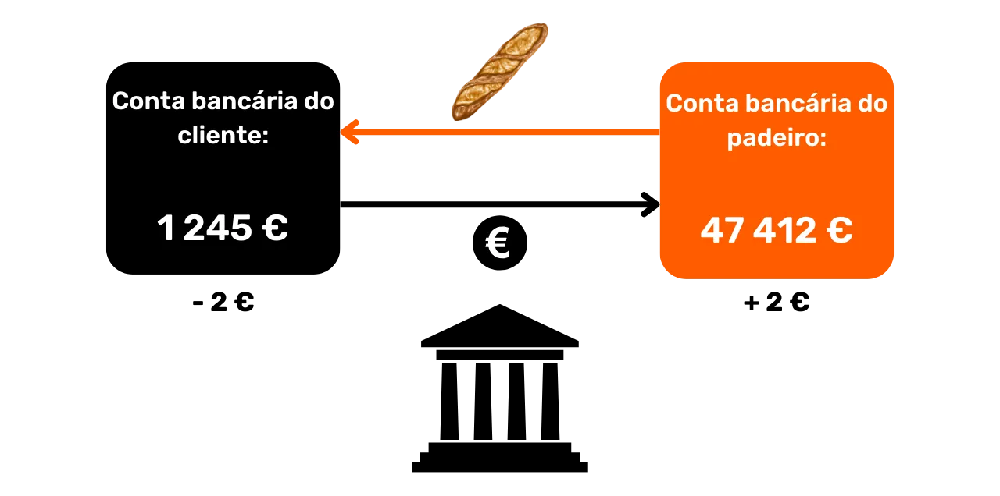
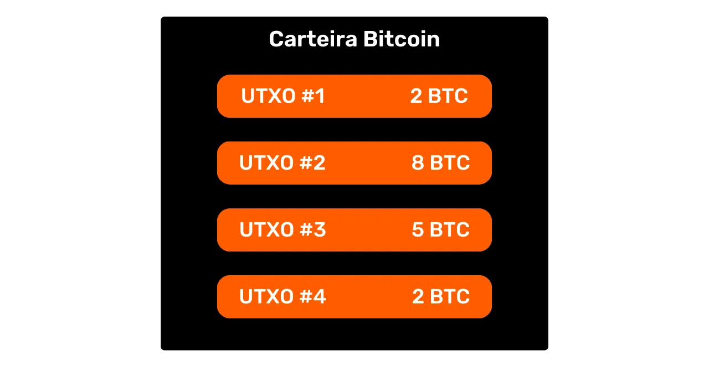
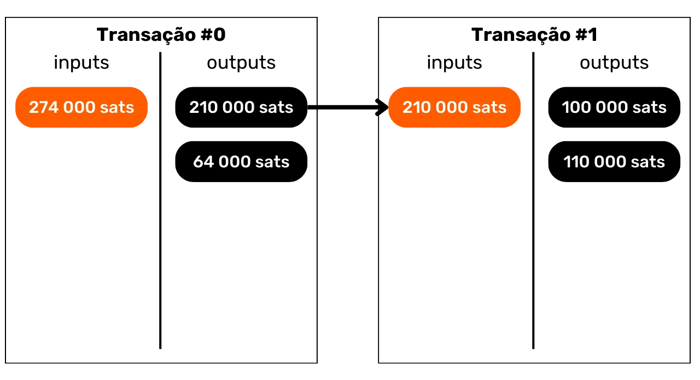
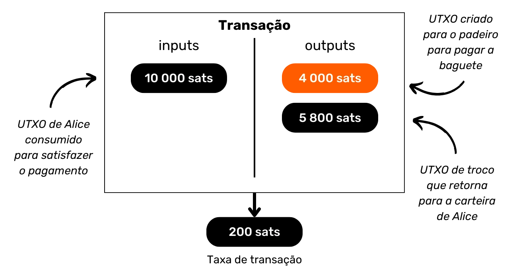
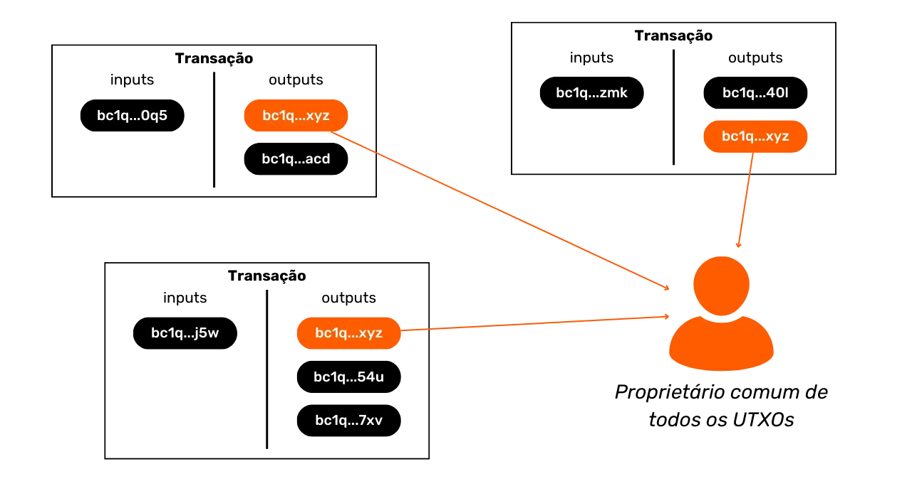
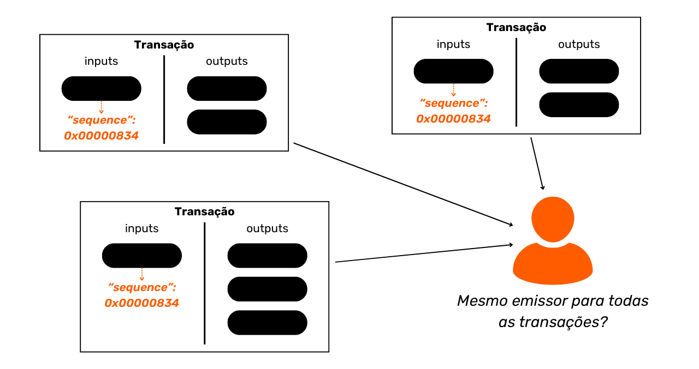
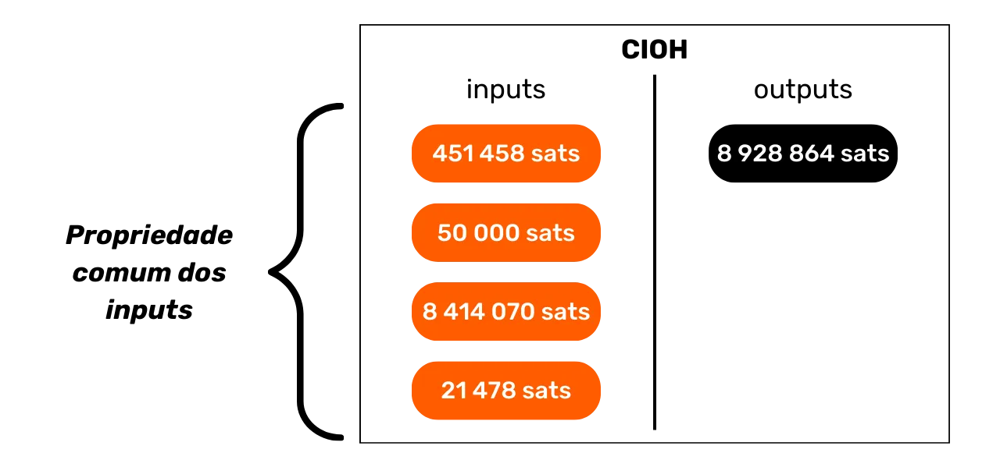

# Proteja Sua Privacidade no Bitcoin


Em um mundo onde a privacidade das transações financeiras está gradualmente se tornando um luxo, entender e dominar os princípios de proteção da privacidade no uso do Bitcoin é essencial. Este treinamento oferece todas as chaves, tanto teóricas quanto práticas, para alcançar isso de forma autônoma.

Hoje, no Bitcoin, existem empresas especializadas em análise de cadeia. Seu core business é precisamente invadir sua esfera privada, a fim de comprometer a confidencialidade de suas transações. De fato, o "direito à privacidade" no Bitcoin não existe. Portanto, cabe a você, usuário, afirmar seus direitos naturais e proteger a confidencialidade de suas transações, porque mais ninguém fará isso por você.

Este treinamento se apresenta como uma jornada completa e generalista. Cada noção técnica é discutida em detalhe e apoiada por diagramas explicativos. O objetivo é tornar o conhecimento acessível a todos. BTC204 é, portanto, abordável para usuários iniciantes e intermediários. Este treinamento também oferece valor agregado aos bitcoiners mais experientes, pois exploramos alguns conceitos técnicos que são frequentemente desconhecidos.

Junte-se a nós para transformar seu uso do Bitcoin e se tornar um usuário informado, capaz de entender os desafios em torno da confidencialidade e proteger sua privacidade.

+++

# Introdução
<partId>e17474a8-8899-4bdb-a7f8-bc52ddb01440</partId>

## Introdução ao Treinamento
<chapterId>08ba1933-f393-4fb5-8279-777d874caedb</chapterId>

Em um mundo onde a privacidade das transações financeiras está gradualmente se tornando um luxo, entender e dominar os princípios de proteção da privacidade no uso do Bitcoin é essencial. Este treinamento oferece todas as chaves, tanto teóricas quanto práticas, para alcançar isso de forma autônoma.
Hoje, no ecossistema Bitcoin, existem empresas especializadas em análise de cadeia. Seu core business é precisamente invadir sua esfera privada, comprometendo a confidencialidade de suas transações. Na realidade, o "direito à privacidade" no Bitcoin não existe. Portanto, cabe a você, usuário, afirmar seus direitos naturais e proteger a confidencialidade de suas transações, porque mais ninguém fará isso por você.

Bitcoin não está aqui apenas para o "Número Aumentar" e a preservação do valor das economias. Devido às suas características únicas e história, é primariamente a ferramenta da contra-economia. Graças a esta invenção notável, você pode gerenciar livremente seu dinheiro, gastá-lo e acumulá-lo, sem que ninguém possa impedir você.

Bitcoin oferece uma fuga pacífica do jugo dos estados, permitindo que você desfrute plenamente de seus direitos naturais, que não podem ser contestados pelas leis estabelecidas. Graças à invenção de Satoshi Nakamoto, você tem o poder de fazer respeitar sua propriedade privada e recuperar a liberdade de contrato.
No entanto, o Bitcoin não é anônimo por padrão, o que pode representar um risco para indivíduos envolvidos na contraeconomia, especialmente em regiões sob regimes despóticos. Mas este não é o único perigo. Dado que o bitcoin é um ativo valioso e incensurável, ele pode atrair a cobiça de ladrões. Assim, proteger sua privacidade também se torna uma questão de segurança: pode ajudá-lo a prevenir ataques cibernéticos e agressões físicas.
Como veremos, embora o protocolo ofereça algumas proteções intrínsecas à privacidade, é crucial usar ferramentas adicionais para otimizar e defender essa privacidade.

Este treinamento é projetado como uma jornada completa e generalista para entender os desafios da privacidade no Bitcoin. Cada noção técnica é detalhada e apoiada por diagramas explicativos. O objetivo é tornar o conhecimento acessível a todos, incluindo usuários iniciantes e intermediários. Para os bitcoiners mais experientes, também abordamos conceitos muito técnicos e às vezes desconhecidos ao longo deste treinamento para aprofundar o entendimento de cada tópico.

O objetivo deste treinamento não é torná-lo completamente anônimo no uso do Bitcoin, mas sim fornecer-lhe as ferramentas essenciais para saber como proteger sua privacidade de acordo com seus objetivos pessoais. Você terá a liberdade de escolher entre os conceitos e ferramentas apresentados para desenvolver suas próprias estratégias, adaptadas aos seus objetivos e necessidades específicas.

### Seção 1: Definições e Conceitos Chave
Para começar, vamos revisar juntos os princípios fundamentais que regem o funcionamento do Bitcoin, para então abordarmos calmamente noções relacionadas à privacidade. É essencial dominar alguns conceitos básicos, como UTXO, endereços de recebimento ou scripts, antes de poder entender completamente os conceitos que abordaremos nas seções seguintes. Também introduziremos o modelo geral de privacidade do Bitcoin, conforme imaginado por Satoshi Nakamoto, o que nos permitirá compreender os desafios e riscos associados.


### Seção 2: Entendendo a Análise de Cadeia e Como se Proteger Contra Ela

Na segunda seção, estudamos as técnicas usadas pelas empresas de análise de cadeia para rastrear sua atividade no Bitcoin. Entender esses métodos é crucial para aprimorar a proteção de sua privacidade. Esta parte visa examinar as estratégias dos atacantes para entender melhor os riscos e estabelecer a base para as técnicas que estudaremos nas seções seguintes. Analisaremos padrões de transação, heurísticas internas e externas, bem como interpretações plausíveis desses padrões. Além de um componente teórico, aprenderemos a usar um explorador de blocos para realizar análise de cadeia, por meio de exemplos práticos e exercícios.


### Seção 3: Dominando as Melhores Práticas para Proteger Sua Privacidade

Na terceira seção do nosso treinamento, chegamos ao cerne da questão: a prática! O objetivo é dominar todas as melhores práticas essenciais que devem se tornar reflexos naturais para qualquer usuário do Bitcoin. Cobriremos o uso de endereços novos, rotulagem, consolidação, o uso de nós completos, bem como KYC e métodos de aquisição. O objetivo é fornecer-lhe uma visão abrangente das armadilhas a evitar para estabelecer bases sólidas em nossa busca pela proteção da privacidade. Para algumas dessas práticas, você será guiado a um tutorial específico para implementá-las.


### Seção 4: Entendendo as Transações Coinjoin

Como podemos falar sobre privacidade no Bitcoin sem discutir coinjoins? Na seção 4, você descobrirá tudo o que precisa saber sobre esse método de mistura. Você aprenderá o que é um coinjoin, sua história e objetivos, bem como os diferentes tipos de coinjoins que existem. Finalmente, para os usuários mais experientes, exploraremos o que são anonsets e entropia, e como calcular esses indicadores.

### Seção 5: Entendendo os Desafios de Outras Técnicas Avançadas de Privacidade

Na quinta seção, forneceremos uma visão geral de todas as outras técnicas existentes para proteger sua privacidade no Bitcoin, além do coinjoin. Ao longo dos anos, os desenvolvedores demonstraram uma criatividade notável ao projetar ferramentas dedicadas à privacidade. Examinaremos todos esses métodos, como Payjoin, transações colaborativas, Coin Swap e Atomic Swap, detalhando seu funcionamento, objetivos e potenciais fraquezas.


### Seção 6: Explorando Propostas de Melhoria de Protocolo Relacionadas à Privacidade

Enquanto as seções anteriores focaram em soluções de privacidade no nível da aplicação, esta sexta seção mergulhará nos desafios no nível do protocolo para a privacidade do usuário. Discutiremos a privacidade na rede de nós e a transmissão de transações. Também discutiremos os vários protocolos que foram propostos ao longo dos anos para aprimorar a privacidade do usuário no Bitcoin. Para concluir, examinaremos os impactos na privacidade, tanto positivos quanto negativos, do último grande soft fork do Bitcoin, o Taproot.

***(WIP: LOIC: ADICIONE EXEMPLO DE DIAGRAMA AQUI)***

### Seção Bônus: Privacidade em Protocolos de Segunda Camada

Como você entendeu, o núcleo deste treinamento foca exclusivamente na privacidade onchain. Nesta parte final bônus, desejo ampliar o tópico para privacidade em outros protocolos relacionados ao Bitcoin. Falaremos especificamente sobre privacidade na Lightning Network. Alguns afirmam que a Lightning é privada por padrão, enquanto outros argumentam que a privacidade do usuário é insuficiente. Então, qual é a verdade? Desvendaremos a verdade da falsidade para entender melhor os desafios relacionados à privacidade na Lightning Network. Também discutiremos sidechains como a Liquid Network e bancos Chaumianos como Cashu ou Fedimint.


# Definições e Conceitos Chave
<partId>b9bbbde3-34c0-4851-83e8-e2ffb029cf31</partId>

## Modelo UTXO do Bitcoin
<chapterId>8d6b50c5-bf74-44f4-922b-25204991cb75</chapterId>

O Bitcoin é primariamente uma moeda, mas você sabe concretamente como os BTCs são representados no protocolo?

### UTXOs do Bitcoin: O Que São?

No protocolo Bitcoin, a gestão de unidades monetárias gira em torno do modelo UTXO, uma sigla para "_Unspent Transaction Output_" (Saída de Transação Não Gasta).
Este modelo é profundamente diferente dos sistemas bancários tradicionais que dependem de um mecanismo de conta e saldo para rastrear fluxos financeiros. De fato, no sistema bancário, saldos individuais são mantidos em contas atreladas a uma identidade. Por exemplo, quando você compra uma baguete de um padeiro, seu banco simplesmente debita o valor da compra da sua conta, reduzindo seu saldo, enquanto a conta do padeiro é creditada com o mesmo valor, aumentando seu saldo. Neste sistema, não há noção de um vínculo entre o dinheiro que entra na sua conta e o dinheiro que sai dela, além dos registros de transações.



No Bitcoin, funciona de maneira diferente. O conceito de uma conta não existe, e as unidades monetárias não são gerenciadas via saldos, mas através de UTXOs. Um UTXO representa uma quantidade específica de bitcoins que ainda não foi gasta, formando assim uma "peça de bitcoin", que pode ser grande ou pequena. Por exemplo, um UTXO poderia valer `500 BTC` ou apenas `700 SATS`.
**> Lembrete:** O satoshi, frequentemente abreviado como sat, é a menor unidade do Bitcoin, comparável a um centavo nas moedas fiduciárias.

```bash
1 BTC = 100 000 000 SATS
```

Teoricamente, um UTXO pode representar qualquer valor em bitcoins, variando de um sat até o máximo teórico de cerca de 21 milhões de BTC. No entanto, é logicamente impossível possuir todos os 21 milhões de bitcoins, e existe um limite econômico inferior chamado "poeira", abaixo do qual um UTXO é considerado economicamente inviável para gastar.

**> Você sabia?** O maior UTXO já criado no Bitcoin tinha um valor de `500 000 BTC`. Foi criado pela plataforma MtGox durante uma operação de consolidação em novembro de 2011: [29a3efd3ef04f9153d47a990bd7b048a4b2d213daaa5fb8ed670fb85f13bdbcf](https://mempool.space/pt/tx/29a3efd3ef04f9153d47a990bd7b048a4b2d213daaa5fb8ed670fb85f13bdbcf)

### UTXOs e Condições de Gasto

UTXOs são os instrumentos de troca no Bitcoin. Cada transação resulta no consumo de UTXOs como entradas e na criação de novos UTXOs como saídas. Quando uma transação é realizada, os UTXOs usados como entradas são considerados "gastos", e novos UTXOs são gerados e atribuídos aos destinatários indicados nas saídas da transação. Assim, um UTXO simplesmente representa uma saída de transação não gasta, e, portanto, uma quantidade de bitcoins pertencente a um usuário em um determinado momento.

Todos os UTXOs são protegidos por scripts que definem as condições sob as quais podem ser gastos. Para consumir um UTXO, um usuário deve demonstrar à rede que atende às condições estipuladas pelo script que protege esse UTXO. Geralmente, UTXOs são protegidos por uma chave pública (ou um endereço de recebimento que representa essa chave pública). Para gastar um UTXO associado a essa chave pública, o usuário deve provar que possui a chave privada correspondente, fornecendo uma assinatura digital feita com essa chave. É por isso que se diz que sua carteira Bitcoin não contém bitcoins de fato, mas sim armazena suas chaves privadas, que por sua vez lhe dão acesso aos seus UTXOs e, por extensão, aos bitcoins que eles representam.


Dado que o conceito de uma conta é ausente no Bitcoin, o saldo de uma carteira simplesmente corresponde à soma dos valores de todos os UTXOs que ela pode gastar. Por exemplo, se sua carteira Bitcoin pode gastar os seguintes 4 UTXOs:

```bash
- 2 BTC
- 8 BTC
- 5 BTC
- 2 BTC
```

O saldo total da sua carteira seria de `17 BTC`.



## A estrutura das transações Bitcoin
<chapterId>29d3aaab-de2e-4746-ab40-c9748898850c</chapterId>

### As entradas e saídas de uma transação
Uma transação Bitcoin é uma operação registrada na blockchain que permite a transferência de propriedade de bitcoins de uma pessoa para outra. Mais especificamente, uma vez que estamos em um modelo UTXO e não existem contas, a transação satisfaz as condições de gasto que protegiam um ou mais UTXOs, consome-os e cria, em equivalência, novos UTXOs dotados de novas condições de gasto. Em resumo, uma transação move bitcoins de um script que é satisfeito para um novo script destinado a protegê-los.


Cada transação Bitcoin é composta, portanto, por uma ou mais entradas e uma ou mais saídas. As entradas são UTXOs consumidos pela transação para gerar as saídas. As saídas são novos UTXOs que serão utilizáveis como entradas para futuras transações.


**> Você sabia?** Teoricamente, uma transação bitcoin poderia ter um número infinito de entradas e saídas. Apenas o tamanho máximo de um bloco limita esse número.
Cada entrada em uma transação Bitcoin refere-se a um UTXO não gasto anterior. Para usar um UTXO como entrada, seu detentor deve demonstrar que é o proprietário legítimo validando o script associado a ele, ou seja, satisfazendo a condição de gasto imposta. Geralmente, isso envolve fornecer uma assinatura digital produzida com a chave privada correspondente à chave pública que inicialmente protegeu aquele UTXO. O script consiste, portanto, em verificar se a assinatura corresponde à chave pública usada ao receber os fundos.


Cada saída, por outro lado, especifica a quantidade de bitcoins a ser transferida, bem como o destinatário. Este último é definido por um novo script que, em geral, bloqueia o UTXO recém-criado com um endereço de recebimento ou uma nova chave pública.

Para que uma transação seja considerada válida de acordo com as regras de consenso, o total das saídas deve ser menor ou igual ao total das entradas. Em outras palavras, a soma dos novos UTXOs gerados pela transação não deve exceder a dos UTXOs consumidos como entradas. Este princípio é lógico: se você possui apenas uma quantidade de `500.000 SATS`, você não pode fazer uma compra de `700.000 SATS`.

### Troco e Consolidação em uma Transação Bitcoin

A ação de uma transação Bitcoin sobre UTXOs pode assim ser comparada ao derretimento de uma moeda de ouro. De fato, um UTXO não é divisível, mas apenas mesclável. Isso significa que um usuário não pode simplesmente dividir um UTXO representando uma certa quantidade de bitcoins em vários UTXOs menores. Eles devem consumi-lo inteiramente em uma transação para criar um ou mais novos UTXOs de valores arbitrários nas saídas, que devem ser menores ou iguais ao valor inicial.

Este mecanismo é semelhante ao de uma moeda de ouro. Imagine que você possui uma moeda de 2 onças e deseja fazer um pagamento de 1 onça, assumindo que o vendedor não pode lhe dar troco. Você precisaria derreter sua moeda e fundir 2 novas de 1 onça cada.
No Bitcoin, a operação é semelhante. Vamos imaginar que Alice tem um UTXO de `10,000 SATS` e ela quer comprar uma baguete que custa `4,000 SATS`. Alice fará uma transação com uma entrada de 1 UTXO de `10,000 SATS` que ela consumirá inteiramente, e nas saídas, ela criará 2 UTXOs avaliados em `4,000 SATS` e `6,000 SATS`. O UTXO de `4,000 SATS` será enviado ao padeiro como pagamento pela baguete, enquanto o UTXO de `6,000 SATS` retornará para Alice como troco. Esse UTXO que retorna ao remetente inicial da transação é o que é chamado de "troco" no jargão do Bitcoin.

Agora vamos imaginar que Alice não tem um único UTXO de `10,000 SATS`, mas sim dois UTXOs de `3,000 SATS` cada. Nesta situação, nenhum dos UTXOs individuais é suficiente para cobrir os `4,000 SATS` pela baguete. Portanto, Alice deve usar ambos os UTXOs de `3,000 SATS` como entradas para sua transação. Desta forma, o total de entradas alcançará `6,000 SATS`, permitindo que ela cubra o pagamento de `4,000 SATS` ao padeiro. Este método, que envolve agrupar vários UTXOs nas entradas de uma transação, é frequentemente referido pelo termo "consolidação".


### Taxas de Transação

Intuitivamente, pode-se pensar que as taxas de transação também representam uma saída de uma transação. Mas na realidade, não é o caso. As taxas de uma transação representam a diferença entre o total das entradas e o total das saídas. Isso significa que, após usar parte do valor das entradas para cobrir as saídas desejadas em uma transação, uma certa soma das entradas permanece não utilizada. Esta soma residual constitui as taxas de transação.

```bash
Taxas = total de entradas - total de saídas
```

Vamos revisitar o exemplo de Alice que tem um UTXO de `10,000 SATS` e quer comprar uma baguete por `4,000 SATS`. Alice cria uma transação com seu UTXO de `10,000 SATS` como entrada. Ela então gera uma saída de `4,000 SATS` destinada ao padeiro para o pagamento da baguete. Para incentivar os mineradores a incluir sua transação em um bloco, Alice aloca `200 SATS` como taxas. Ela assim cria uma segunda saída, o troco, que retornará para ela, totalizando `5,800 SATS`.



Aplicando a fórmula da taxa, de fato vemos que restam `200 SATS` para os mineradores:
```bash
Taxas = total de entradas - total de saídas
Taxas = 10,000 - (4,000 + 5,800)
Taxas = 10,000 - 9,800
Taxas = 200
```

Quando um minerador valida com sucesso um bloco, ele tem o direito de coletar essas taxas por todas as transações incluídas em seu bloco, por meio da chamada transação "coinbase".

### A Criação de UTXOs no Bitcoin
Se você tem acompanhado os parágrafos anteriores atentamente, agora sabe que os UTXOs só podem ser criados consumindo outros UTXOs existentes. Assim, as moedas no Bitcoin formam uma cadeia contínua. No entanto, você pode estar se perguntando como os primeiros UTXOs desta cadeia apareceram. Isso levanta um problema semelhante ao do ovo e da galinha: de onde vieram esses UTXOs originais?
A resposta está na **transação coinbase**.

O coinbase é um tipo específico de transação Bitcoin, que é único para cada bloco e é sempre o primeiro. Ele permite que o minerador que encontrou uma prova de trabalho válida receba sua recompensa de bloco. Esta recompensa consiste em dois elementos: **a subvenção de bloco** e **as taxas de transação** que discutimos na parte anterior.

A característica única da transação coinbase é que ela é a única que pode criar bitcoins do nada, sem precisar consumir entradas para gerar suas saídas. Esses bitcoins recém-criados constituem o que podemos chamar de "UTXOs originais".


Os bitcoins da subvenção de bloco são novos BTC criados do nada, seguindo um cronograma de emissão pré-estabelecido nas regras de consenso. A subvenção de bloco é reduzida pela metade a cada 210.000 blocos, o que ocorre aproximadamente a cada quatro anos, em um processo chamado "halving". Inicialmente, 50 bitcoins foram criados com cada subvenção, mas essa quantidade diminuiu gradualmente; atualmente, é de 3.125 bitcoins por bloco.

Quanto à parte relacionada às taxas de transação, embora também represente BTCs recém-criados, eles não devem exceder a diferença entre as entradas totais e as saídas de todas as transações em um bloco. Vimos anteriormente que essas taxas representam a parte das entradas que não é usada nas saídas das transações. Esta parte é tecnicamente "perdida" durante a transação, e o minerador tem o direito de recriar esse valor na forma de um ou mais novos UTXOs. Isso é, portanto, uma transferência de valor do remetente da transação para o minerador que o adiciona ao blockchain.

**> Você sabia?** Os bitcoins gerados por uma transação coinbase estão sujeitos a um período de maturidade de 100 blocos durante o qual não podem ser gastos pelo minerador. Esta regra destina-se a prevenir complicações relacionadas ao uso de bitcoins recém-criados em uma cadeia que poderia posteriormente ser tornada obsoleta.

### As Implicações do Modelo UTXO

Primeiramente, o modelo UTXO influencia diretamente as taxas de transação no Bitcoin. Dado que a capacidade de cada bloco é limitada, os mineradores priorizam transações que oferecem as melhores taxas em relação ao espaço que ocuparão no bloco. De fato, quanto mais UTXOs uma transação inclui como entradas e saídas, mais pesada ela é e, portanto, requer taxas mais altas. Esta é uma das razões pelas quais muitas vezes tentamos reduzir o número de UTXOs em nossa carteira, o que também pode afetar a privacidade, um tópico que discutiremos em detalhes na terceira parte deste treinamento.

Em seguida, como mencionado nas partes anteriores, as moedas no Bitcoin são essencialmente uma cadeia de UTXOs. Cada transação cria assim um elo entre um UTXO passado e um UTXO futuro. Os UTXOs, portanto, permitem o rastreamento explícito dos bitcoins desde sua criação até seu gasto atual. Essa transparência pode ser percebida positivamente, pois permite que cada usuário verifique a autenticidade dos bitcoins recebidos. No entanto, é também sobre este princípio de rastreabilidade e auditabilidade que se baseia a análise de cadeia, uma prática destinada a comprometer sua privacidade. Estudaremos esta prática em profundidade na segunda parte do treinamento.

## O Modelo de Privacidade do Bitcoin
<chapterId>769d8963-3ed5-4094-b21d-9203c7d9e465</chapterId>

### Moeda: Autenticidade, Integridade e Gasto Duplo

Uma das funções do dinheiro é resolver o problema da dupla coincidência de desejos. Em um sistema baseado na troca direta, realizar uma troca requer não apenas encontrar um indivíduo que esteja oferecendo um bem que atenda à minha necessidade, mas também fornecer a eles um bem de valor equivalente que satisfaça a própria necessidade deles. Encontrar esse equilíbrio prova ser complexo.


É por isso que recorremos ao dinheiro, que permite a transferência de valor tanto espacial quanto temporalmente.


Para que o dinheiro resolva esse problema, é essencial que a parte que fornece um bem ou serviço esteja convencida de sua capacidade de gastar essa soma posteriormente. Assim, qualquer indivíduo racional que deseje aceitar uma quantia de dinheiro, seja digital ou física, garantirá que ela atenda a dois critérios fundamentais:
- **A moeda deve ser intacta e autêntica;**
- **e não deve ter sido gasta duas vezes.**
Ao usar moeda física, a primeira característica é a mais complexa de afirmar. Em diferentes momentos da história, a integridade das moedas metálicas muitas vezes foi comprometida por práticas como o recorte ou a perfuração. Por exemplo, durante a Roma antiga, era comum para os cidadãos raspar as bordas das moedas de ouro para coletar um pouco do metal precioso, enquanto ainda as mantinham para transações futuras. O valor intrínseco da moeda era assim reduzido, mas seu valor nominal permanecia o mesmo. É por isso que, posteriormente, foram cunhadas bordas serrilhadas na borda das moedas.

A autenticidade também é uma característica difícil de verificar com meios monetários físicos. Atualmente, as técnicas para combater a falsificação são cada vez mais complexas, forçando os comerciantes a investir em sistemas de verificação caros.

Por outro lado, devido à sua natureza, o gasto duplo não é um problema para as moedas físicas. Se eu te dou uma nota de €10, ela sai irrevogavelmente da minha posse para entrar na sua, excluindo naturalmente qualquer possibilidade de gastar as mesmas unidades monetárias várias vezes. Em resumo, não serei capaz de gastar essa nota de €10 novamente.


Para a moeda digital, a dificuldade é diferente. Garantir a autenticidade e integridade de uma moeda é frequentemente mais simples. Como vimos na seção anterior, o modelo UTXO do Bitcoin permite rastrear uma moeda até sua origem, verificando assim que ela foi de fato criada de acordo com as regras de consenso por um minerador.

No entanto, garantir a ausência de gasto duplo é mais complexo, já que qualquer bem digital é essencialmente informação. Ao contrário dos bens físicos, a informação não se divide durante as trocas, mas propaga-se multiplicando-se. Por exemplo, se eu enviar a você um documento por e-mail, ele então é duplicado. Da sua parte, você não pode verificar com certeza que eu deletei o documento original.


### Prevenindo Gasto Duplo no Bitcoin
A única maneira de evitar a duplicação de um bem digital é estar ciente de todas as trocas no sistema. Dessa forma, pode-se saber quem possui o quê e atualizar os pertences de todos de acordo com as transações feitas. Isso é o que é feito, por exemplo, com o dinheiro escritural no sistema bancário. Quando você paga €10 a um comerciante com cartão de crédito, o banco anota essa troca e atualiza o livro-razão.
No Bitcoin, a prevenção de gastos duplos é alcançada da mesma forma. O objetivo é confirmar a ausência de uma transação que já tenha utilizado as moedas em questão. Se essas moedas nunca foram usadas, então podemos estar seguros de que não ocorrerá gasto duplo. Esse princípio foi descrito por Satoshi Nakamoto no White Paper com esta frase famosa:
**"*A única maneira de confirmar a ausência de uma transação é estar ciente de todas as transações.*"**

No entanto, ao contrário do modelo bancário, não há o desejo de ter que confiar em uma entidade central no Bitcoin. É necessário que todos os usuários possam confirmar essa ausência de gasto duplo, sem depender de terceiros. Assim, todos devem estar cientes de todas as transações Bitcoin. É por isso que as transações Bitcoin são publicamente transmitidas por todos os nós da rede e registradas de forma clara na blockchain.

É precisamente essa disseminação pública de informações que complica a proteção da privacidade no Bitcoin. No sistema bancário tradicional, em teoria, apenas a instituição financeira está ciente das transações realizadas. Por outro lado, no Bitcoin, todos os usuários são informados de todas as transações, via seus respectivos nós.

### O modelo de privacidade: sistema bancário vs Bitcoin

No sistema tradicional, sua conta bancária está vinculada à sua identidade. O banqueiro é capaz de saber a qual cliente pertence cada conta bancária e quais transações estão associadas a ela. No entanto, esse fluxo de informações é interrompido entre o banco e o domínio público. Em outras palavras, é impossível saber o saldo e as transações de uma conta bancária que pertence a outro indivíduo. Apenas o banco tem acesso a essas informações.

Por exemplo, seu banqueiro sabe que você compra sua baguete todas as manhãs na padaria do bairro, mas seu vizinho não está ciente dessa transação. Assim, o fluxo de informações é acessível às partes envolvidas, notavelmente o banco, mas permanece inacessível a forasteiros.

Devido à restrição de disseminação pública de transações que vimos na parte anterior, o modelo de privacidade do Bitcoin não pode seguir o modelo do sistema bancário. No caso do Bitcoin, uma vez que o fluxo de informações não pode ser interrompido entre as transações e o domínio público, **o modelo de privacidade depende da separação entre a identidade do usuário e as próprias transações**.
Por exemplo, se você comprar uma baguete do padeiro pagando em BTC, seu vizinho, que possui seu próprio nó completo, pode ver sua transação ocorrer, assim como pode ver todas as outras transações no sistema. No entanto, se os princípios de privacidade forem respeitados, eles não deveriam ser capazes de vincular essa transação específica à sua identidade.


Mas, uma vez que as transações Bitcoin são tornadas públicas, ainda se torna possível estabelecer links entre elas para deduzir informações sobre as partes envolvidas. Essa atividade até constitui uma especialidade em si chamada "análise de cadeia". Na próxima parte do treinamento, convido você a explorar os fundamentos da análise de cadeia para entender como seus bitcoins são rastreados e saber como se defender melhor contra isso.

# Entendendo Análise de Cadeia e Como se Proteger
<partId>4739371e-9fef-45b0-bcaa-b7a4df6b4470</partId>

## O que é Análise de Cadeia no Bitcoin?
<chapterId>7d198ba6-4af2-4f24-86cb-3c79cb25627e</chapterId>

### Definição e Operação
A análise de cadeia é uma prática que engloba todos os métodos para rastrear o fluxo de bitcoins na blockchain. Geralmente, a análise de cadeia depende da observação de características em amostras de transações anteriores. Em seguida, envolve a identificação dessas mesmas características em uma transação que se deseja analisar e deduzir interpretações plausíveis. Esse método de resolução de problemas de uma abordagem prática, para encontrar uma solução suficientemente boa, é o que se chama de "heurística".
Para simplificar, a análise de cadeia é feita em três etapas principais:
1. **Observar a blockchain;**
2. **Identificar características conhecidas;**
3. **Deduzir hipóteses.**


A análise de cadeia pode ser realizada por qualquer pessoa. Ela apenas requer acesso às informações públicas da blockchain via um nó completo para observar os movimentos das transações e fazer hipóteses. Também existem ferramentas gratuitas que facilitam essa análise, como o site [OXT.me](https://oxt.me/) que exploraremos em detalhe nos dois últimos capítulos desta parte. No entanto, o principal risco para a privacidade vem de empresas especializadas em análise de cadeia. Essas empresas levaram a análise de cadeia para uma escala industrial e vendem seus serviços para instituições financeiras ou governos. Entre essas empresas, a Chainalysis é provavelmente a mais conhecida.

### Os Objetivos da Análise de Cadeia
Um dos objetivos da análise de cadeia é agrupar várias atividades no Bitcoin a fim de determinar a unicidade do usuário que as realizou. Posteriormente, será possível tentar vincular esse conjunto de atividades a uma identidade real.


Lembre-se do capítulo anterior. Eu expliquei por que o modelo de privacidade do Bitcoin originalmente dependia da separação da identidade do usuário de suas transações. Portanto, pode ser tentador pensar que a análise de cadeia é desnecessária, já que mesmo se alguém conseguir agrupar atividades onchain, elas não podem ser associadas a uma identidade real.

Teoricamente, esta afirmação é precisa. Na primeira parte deste treinamento, vimos que pares de chaves criptográficas são usados para estabelecer condições sobre o UTXO. Por essência, esses pares de chaves não divulgam qualquer informação sobre a identidade de seus detentores. Assim, mesmo que alguém tenha sucesso em agrupar atividades associadas a diferentes pares de chaves, isso não nos diz nada sobre a entidade por trás dessas atividades.


No entanto, a realidade prática é muito mais complexa. Existem uma miríade de comportamentos que arriscam vincular uma identidade real a uma atividade onchain. Na análise, isso é chamado de ponto de entrada, e há muitos deles.

O mais comum, claro, é o KYC (*Know Your Customer* - Conheça Seu Cliente). Se você retirar seus bitcoins de uma plataforma regulamentada para um dos seus endereços de recebimento pessoais, então algumas pessoas são capazes de vincular sua identidade a este endereço. De forma mais ampla, um ponto de entrada pode ser qualquer forma de interação entre sua vida real e uma transação Bitcoin. Por exemplo, se você publicar um endereço de recebimento nas suas redes sociais, isso pode constituir um ponto de entrada para análise. Se você fizer um pagamento em bitcoins para seu padeiro, eles podem associar seu rosto (que faz parte da sua identidade) a um endereço Bitcoin.

Esses pontos de entrada são quase inevitáveis no uso do Bitcoin. Embora se possa buscar limitar seu escopo, eles permanecerão presentes. É por isso que é crucial combinar métodos voltados para preservar sua privacidade. Embora manter uma separação entre sua identidade real e suas transações seja uma abordagem interessante, ela permanece insuficiente hoje. De fato, se todas as suas atividades onchain podem ser agrupadas, então o menor ponto de entrada provavelmente comprometerá a única camada de privacidade que você havia estabelecido.


### Defendendo-se Contra Análise de Cadeia

Assim, também é necessário ser capaz de enfrentar a análise de blockchain em nosso uso do Bitcoin. Procedendo desta maneira, podemos minimizar a agregação de nossas atividades e limitar o impacto de um ponto de entrada em nossa privacidade. 

De fato, para melhor contrapor a análise de blockchain, que melhor abordagem do que familiarizar-se com os métodos utilizados em análise de blockchain? Se você quer saber como melhorar sua privacidade no Bitcoin, você deve entender esses métodos. Isso permitirá que você compreenda melhor técnicas como [Coinjoin](https://planb.network/pt/tutorials/privacy/coinjoin-samourai-wallet) ou [Payjoin](https://planb.network/pt/tutorials/privacy/payjoin) (técnicas que estudaremos nas últimas partes do treinamento), e reduzir os erros que você poderia cometer.

Nisso, podemos fazer uma analogia com criptografia e criptoanálise. Um bom criptógrafo é, antes de tudo, um bom criptoanalista. Para imaginar um novo algoritmo de criptografia, é preciso saber quais ataques ele terá que enfrentar, e também estudar por que algoritmos anteriores foram quebrados. O mesmo princípio se aplica à privacidade no Bitcoin. Entender os métodos de análise de blockchain é a chave para se proteger contra ela. É por isso que proponho uma seção inteira sobre análise de blockchain neste treinamento.

### Os métodos de análise de blockchain

É importante entender que a análise de blockchain não é uma ciência exata. Ela se baseia em heurísticas derivadas de observações anteriores ou interpretações lógicas. Essas regras permitem resultados bastante confiáveis, mas nunca com precisão absoluta. Em outras palavras, **a análise de blockchain sempre envolve uma dimensão de probabilidade nas conclusões emitidas**. Por exemplo, pode-se estimar com mais ou menos certeza que dois endereços pertencem à mesma entidade, mas a certeza total sempre estará fora de alcance.

O objetivo inteiro da análise de blockchain reside precisamente na agregação de várias heurísticas a fim de minimizar o risco de erro. É, de certa forma, uma acumulação de evidências que nos permite aproximar mais da realidade.

Essas famosas heurísticas podem ser agrupadas em diferentes categorias que detalharemos juntos:
- **Padrões de transação (ou modelos de transação);**
- **Heurísticas internas à transação;**
- **Heurísticas externas à transação.**

### Satoshi Nakamoto e a análise de blockchain
Vale ressaltar que as duas primeiras heurísticas para análise de cadeia foram descobertas pelo próprio Satoshi Nakamoto. Ele as discute na parte 10 do White Paper do Bitcoin. São elas:
- a Heurística de Propriedade de Entrada Comum (CIOH);
- e reutilização de endereço.


Fonte: S. Nakamoto, "Bitcoin: A Peer-to-Peer Electronic Cash System", https://bitcoin.org/bitcoin.pdf, 2009.

Nos capítulos seguintes, exploraremos do que estas consistem, mas já é interessante notar que estas duas heurísticas ainda mantêm uma preeminência na análise de cadeia hoje.

## Padrões de Transação
<chapterId>d365a101-2d37-46a5-bfb9-3c51e37bf96b</chapterId>

Um padrão de transação é simplesmente um modelo ou uma estrutura geral de uma transação típica que pode ser encontrada na blockchain, cuja interpretação é provavelmente conhecida. Ao estudar padrões, focaremos em uma única transação que analisaremos em alto nível.
Em outras palavras, vamos apenas olhar para o número de UTXOs em entradas e o número de UTXOs em saídas, sem nos determos nos detalhes mais específicos ou no ambiente da transação. A partir do modelo observado, seremos capazes de interpretar a natureza da transação. Em seguida, procuraremos características de sua estrutura e deduziremos uma interpretação.


Nesta parte, descobriremos juntos os principais modelos de transação que podem ser encontrados na análise de cadeias, e para cada modelo, darei a interpretação provável dessa estrutura, junto com um exemplo concreto.

### Envio Simples (ou Pagamento Simples)

Começamos com um padrão muito difundido, pois é aquele que aparece na maioria dos pagamentos em bitcoin. O modelo de pagamento simples é caracterizado pelo consumo de um ou mais UTXOs em entradas e pela produção de 2 UTXOs em saídas. Este modelo, portanto, se parecerá com isso:


Quando identificamos essa estrutura de transação na blockchain, já podemos fazer uma interpretação. Como o nome sugere, este modelo indica que estamos na presença de uma transação de envio ou pagamento. O usuário consumiu seu próprio UTXO em entradas para satisfazer em saídas um UTXO de pagamento e um UTXO de troco (troco que volta para o mesmo usuário).

Portanto, sabemos que o usuário observado provavelmente não está mais na posse de um dos dois UTXOs em saídas (o de pagamento), mas ainda está na posse do outro UTXO (o de troco).
Neste momento, é impossível para nós especificar qual saída representa qual UTXO, pois este não é o objetivo do estudo de padrões. Alcançaremos isso confiando nas heurísticas que estudaremos nas partes seguintes. Nesta fase, nosso objetivo é limitado a identificar a natureza da transação em questão, que é, neste caso, um envio simples.

Por exemplo, aqui está uma transação Bitcoin que adota o padrão de envio simples:

```bash
b6cc79f45fd2d7669ff94db5cb14c45f1f879ea0ba4c6e3d16ad53a18c34b769
```


Fonte: [Mempool.space](https://mempool.space/pt/tx/b6cc79f45fd2d7669ff94db5cb14c45f1f879ea0ba4c6e3d16ad53a18c34b769)

Após este primeiro exemplo, você deve ter uma melhor compreensão do que significa estudar um "padrão de transação". Examinamos uma transação focando apenas em sua estrutura, sem levar em conta seu ambiente ou os detalhes específicos da transação. Observamo-la apenas de maneira global nesta primeira etapa.

Agora que você entende o que é um padrão, vamos passar para os outros modelos existentes.

### Varredura

Este segundo modelo é caracterizado pelo consumo de um único UTXO em entrada e pela produção de um único UTXO em saída.


A interpretação deste modelo é que estamos diante de uma auto-transferência. O usuário transferiu seus bitcoins para si mesmo, para outro endereço que possui. Como não há alteração na transação, é muito improvável que estejamos diante de um pagamento. De fato, quando um pagamento é feito, é quase impossível para o pagador ter um UTXO que corresponda exatamente ao valor exigido pelo vendedor, além das taxas de transação. Geralmente, o pagador é, portanto, forçado a produzir uma saída de troco.

Então, sabemos que o usuário observado provavelmente ainda está na posse deste UTXO. No contexto de uma análise de cadeia, se soubermos que o UTXO usado na entrada da transação pertence a Alice, podemos assumir que o UTXO na saída também pertence a ela. O que se tornará interessante mais tarde é encontrar heurísticas internas à transação que possam reforçar essa suposição (estudaremos essas heurísticas no capítulo 3.3).

Por exemplo, aqui está uma transação Bitcoin que adota o padrão de varredura:

```bash
35f1072a0fda5ae106efb4fda871ab40e1f8023c6c47f396441ad4b995ea693d
```


Fonte: [Mempool.space](https://mempool.space/pt/tx/35f1072a0fda5ae106efb4fda871ab40e1f8023c6c47f396441ad4b995ea693d)
No entanto, esse tipo de padrão também pode revelar uma auto-transferência para a conta de uma plataforma de câmbio de criptomoedas. Será o estudo de endereços conhecidos e o contexto da transação que nos permitirá saber se é uma varredura para uma carteira de auto-custódia ou um saque para uma plataforma. De fato, os endereços das plataformas de câmbio são frequentemente facilmente identificáveis.

Voltando ao exemplo de Alice: se a varredura leva a um endereço conhecido de uma plataforma (como a Binance, por exemplo), pode significar que os bitcoins foram transferidos para fora da posse direta de Alice, provavelmente com a intenção de vendê-los ou armazená-los nesta plataforma. Por outro lado, se o endereço de destino é desconhecido, é razoável supor que seja simplesmente outra carteira ainda pertencente a Alice. Mas esse tipo de estudo se enquadra mais na categoria de heurísticas e não no estudo de padrões.

### Consolidação

Este modelo é caracterizado pelo consumo de vários UTXOs como entrada e a produção de um único UTXO como saída.


A interpretação deste modelo é que estamos diante de uma consolidação. Esta é uma prática comum entre os usuários de Bitcoin, visando unir vários UTXOs em antecipação a um possível aumento nas taxas de transação. Ao realizar esta operação durante um período em que as taxas estão baixas, é possível economizar em taxas futuras. Falaremos mais sobre esta prática no capítulo 4.3.

Podemos deduzir que o usuário por trás deste modelo de transação provavelmente estava na posse de todos os UTXOs nas entradas e ainda está na posse do UTXO na saída. Isso é certamente uma auto-transferência.

Assim como a varredura, esse tipo de padrão também pode revelar uma auto-transferência para a conta de uma plataforma de câmbio. Será o estudo de endereços conhecidos e o contexto da transação que nos permitirá saber se é uma consolidação para uma carteira de auto-custódia ou um saque para uma plataforma.

Por exemplo, aqui está uma transação Bitcoin que adota o padrão de consolidação:

```bash
77c16914211e237a9bd51a7ce0b1a7368631caed515fe51b081d220590589e94
```


Fonte: [Mempool.space](https://mempool.space/pt/tx/77c16914211e237a9bd51a7ce0b1a7368631caed515fe51b081d220590589e94)
No contexto de uma análise de cadeia, este modelo pode revelar muitas informações. Por exemplo, se soubermos que uma das entradas pertence a Alice, podemos assumir que todas as outras entradas e a saída desta transação também pertencem a ela. Essa suposição nos permitiria então rastrear cadeias de transações anteriores para descobrir e analisar outras transações provavelmente associadas a Alice.


### Gasto Agregado

Este modelo é caracterizado pelo consumo de poucos UTXOs como entradas (muitas vezes apenas um) e a produção de muitos UTXOs como saídas.


A interpretação deste modelo é que estamos lidando com gasto agregado. Esta é uma prática que provavelmente revela significativa atividade econômica, como uma plataforma de troca, por exemplo. O gasto agregado permite que essas entidades economizem em taxas combinando seus gastos em uma única transação.

A partir deste modelo, podemos deduzir que a entrada UTXO vem de uma empresa com significativa atividade econômica e que as saídas UTXOs se dispersarão. Muitas pertencerão a clientes da empresa que retiraram bitcoins da plataforma. Outras podem ir para empresas parceiras. Finalmente, certamente haverá uma ou mais trocas que retornam à empresa emissora.

Por exemplo, aqui está uma transação Bitcoin que adota o padrão de gasto agregado (presumivelmente, é uma transação emitida pela plataforma Bybit):

```bash
8a7288758b6e5d550897beedd13c70bcbaba8709af01a7dbcc1f574b89176b43
```


Fonte: [Mempool.space](https://mempool.space/pt/tx/8a7288758b6e5d550897beedd13c70bcbaba8709af01a7dbcc1f574b89176b43)

### Transações Específicas de Protocolo

Entre os padrões de transação, também podemos identificar modelos que revelam o uso de um protocolo específico. Por exemplo, Whirlpool coinjoins (que discutiremos na parte 5) terão uma estrutura facilmente identificável que permite diferenciá-los de outras transações mais tradicionais.


A análise deste padrão sugere que provavelmente estamos lidando com uma transação colaborativa. Também é possível observar um coinjoin. Se esta última hipótese se provar precisa, então o número de saídas poderia nos fornecer uma estimativa aproximada do número de participantes no coinjoin.

Por exemplo, aqui está uma transação Bitcoin que adota o padrão do tipo de transação colaborativa coinjoin:

```bash
00601af905bede31086d9b1b79ee8399bd60c97e9c5bba197bdebeee028b9bea
```


Fonte: [Mempool.space](https://mempool.space/pt/tx/00601af905bede31086d9b1b79ee8399bd60c97e9c5bba197bdebeee028b9bea)
Existem muitos outros protocolos que possuem suas próprias estruturas específicas. Assim, podemos distinguir transações do tipo Wabisabi, transações Stamps ou transações Runes, por exemplo.

Graças a esses padrões de transação, já podemos interpretar uma série de informações sobre uma transação específica. Mas a estrutura da transação não é a única fonte de informação para análise. Também podemos estudar seus detalhes. Esses detalhes, internos apenas a uma transação, são o que gosto de chamar de "heurísticas internas", e vamos explorá-las no próximo capítulo.

## Heurísticas Internas
<chapterId>c54b5abe-872f-40f4-a0d0-c59faff228ba</chapterId>

Uma heurística interna é uma característica específica identificada dentro de uma transação em si, sem necessidade de examinar seu ambiente, e que nos permite fazer deduções. Ao contrário dos padrões que se concentram na estrutura geral da transação em um alto nível, as heurísticas internas são baseadas na totalidade dos dados extraíveis. Isso inclui:
- Os montantes dos diferentes UTXOs, tanto de entrada quanto de saída;
- Tudo a respeito de scripts: os endereços de recebimento, versionamento, locktimes…

Geralmente, esse tipo de heurística nos permitirá identificar o troco em uma transação específica. Ao fazer isso, podemos então continuar a rastrear uma entidade através de várias transações diferentes. De fato, se identificarmos um UTXO pertencente a um usuário que desejamos seguir, é crucial determinar, quando eles realizam uma transação, qual saída foi transferida para outro usuário e qual saída representa o troco, permanecendo assim em sua posse.


Mais uma vez, lembro que essas heurísticas não são absolutamente precisas. Tomadas individualmente, elas apenas nos permitem identificar cenários plausíveis. É a acumulação de várias heurísticas que ajuda a reduzir a incerteza, sem nunca poder eliminá-la completamente.

### Semelhanças Internas

Esta heurística envolve o estudo de semelhanças entre as entradas e saídas da mesma transação. Se observarmos a mesma característica nas entradas e em apenas uma das saídas da transação, então é provável que esta saída constitua o troco.

A característica mais óbvia é a reutilização de um endereço de recebimento na mesma transação.


Esta heurística deixa pouco espaço para dúvidas. A menos que a chave privada de alguém tenha sido hackeada, o mesmo endereço de recebimento inevitavelmente revela a atividade de um único usuário. A interpretação que segue é que o troco da transação é a saída com o mesmo endereço que a entrada. Isso permite o rastreamento contínuo do indivíduo com base nesse troco.
Por exemplo, aqui está uma transação onde esta heurística pode ser razoavelmente aplicada:

```bash
54364146665bfc453a55eae4bfb8fdf7c721d02cb96aadc480c8b16bdeb8d6d0
```


Fonte: [Mempool.space](https://mempool.space/tx/54364146665bfc453a55eae4bfb8fdf7c721d02cb96aadc480c8b16bdeb8d6d0)
Essas semelhanças entre entradas e saídas não param na reutilização de endereços. Qualquer semelhança no uso de scripts pode permitir a aplicação de uma heurística. Por exemplo, às vezes, a mesma versão entre uma entrada e uma das saídas da transação pode ser observada.


Neste diagrama, podemos ver que a entrada Nº 0 desbloqueia um script P2WPKH (SegWit V0 começando com `bc1q`). A saída Nº 0 usa o mesmo tipo de script. No entanto, a saída Nº 1 usa um script P2TR (SegWit V1 começando com `bc1p`). A interpretação dessa característica é que é provável que o endereço com a mesma versão que a entrada seja o endereço de troco. Portanto, ainda pertenceria ao mesmo usuário.

Aqui está uma transação onde esta heurística pode ser razoavelmente aplicada:

```bash
db07516288771ce5d0a06b275962ec4af1b74500739f168e5800cbcb0e9dd578
```


Fonte: [Mempool.space](https://mempool.space/tx/db07516288771ce5d0a06b275962ec4af1b74500739f168e5800cbcb0e9dd578)

Neste caso, podemos ver que a entrada Nº 0 e a saída Nº 1 usam scripts P2WPKH (SegWit V0), enquanto a saída Nº 0 usa um tipo diferente de script, P2PKH (Legacy).
No início dos anos 2010, essa heurística baseada na versão dos scripts era relativamente pouco útil devido à limitação dos tipos de scripts disponíveis. No entanto, com o tempo e com as sucessivas atualizações do Bitcoin, uma diversidade crescente de tipos de scripts foi introduzida. Essa heurística está se tornando cada vez mais relevante porque, com uma gama mais ampla de tipos de scripts, os usuários são divididos em grupos menores, aumentando assim as chances de aplicar essa heurística de reutilização de versão interna. Por essa razão, apenas do ponto de vista da privacidade, é aconselhável optar pelo tipo de script mais comum. Por exemplo, enquanto escrevo estas linhas, os scripts Taproot (`bc1p`) são menos usados do que os scripts SegWit V0 (`bc1q`). Embora os primeiros ofereçam benefícios econômicos e de privacidade em certos contextos específicos, para usos de assinatura única mais tradicionais, pode ser sensato aderir a um padrão mais antigo por razões de privacidade, até que o novo padrão seja mais amplamente adotado.
### Pagamentos de Número Redondo

Outra heurística interna que pode nos ajudar a identificar o troco é a do número redondo. Geralmente, quando enfrentamos um padrão de pagamento simples (1 entrada e 2 saídas), se uma das saídas gasta um valor redondo, então ela representa o pagamento.


Por eliminação, se uma saída representa o pagamento, a outra representa o troco. Portanto, pode-se inferir que é provável que o usuário da entrada ainda esteja na posse da saída identificada como sendo o troco.

Deve-se notar que essa heurística nem sempre é aplicável, já que a maioria dos pagamentos ainda é feita em unidades de moeda fiduciária. De fato, quando um comerciante na França aceita bitcoin, geralmente, eles não exibem preços estáveis em sats. Eles prefeririam optar por uma conversão entre o preço em euros e a quantidade em bitcoins a ser paga. Portanto, não deveria haver um número redondo na saída da transação.
No entanto, um analista poderia tentar fazer essa conversão levando em conta a taxa de câmbio vigente quando a transação foi transmitida na rede. Vamos pegar o exemplo de uma transação com uma entrada de `97,552 sats` e duas saídas, uma de `31,085 sats` e a outra de `64,152 sats`. À primeira vista, esta transação não parece envolver valores redondos. No entanto, aplicando a taxa de câmbio de 64,339 € no momento da transação, obtemos uma conversão em euros que se apresenta da seguinte forma:
- Uma entrada de 62,76 €;
- Uma saída de 20 €;
- Uma saída de 41,27 €.
Uma vez convertida em moeda fiduciária, esta transação permite a aplicação da heurística de pagamento por valor redondo. A saída de €20 provavelmente foi destinada a um comerciante, ou pelo menos mudou de proprietário. Por dedução, a saída de €41,27 provavelmente permaneceu na posse do usuário original.


Se um dia, o Bitcoin se tornar a unidade de conta preferida em nossas transações, essa heurística poderia se tornar ainda mais útil para análise.

Por exemplo, aqui está uma transação na qual essa heurística provavelmente pode ser aplicada:

```bash
2bcb42fab7fba17ac1b176060e7d7d7730a7b807d470815f5034d52e96d2828a
```


Fonte: [Mempool.space](https://mempool.space/tx/2bcb42fab7fba17ac1b176060e7d7d7730a7b807d470815f5034d52e96d2828a)

### A Maior Saída

Quando uma diferença suficientemente grande é identificada entre duas saídas de uma transação em um modelo de pagamento simples, pode-se estimar que a maior saída é provavelmente o troco.


Esta heurística da maior saída é provavelmente a mais imprecisa de todas. Se identificada por si só, é bastante fraca. No entanto, essa característica pode ser combinada com outras heurísticas para reduzir a incerteza de nossa interpretação.

Por exemplo, se examinarmos uma transação apresentando uma saída com um valor redondo e outra saída com um valor maior, a aplicação conjunta da heurística de pagamentos redondos e aquela referente à maior saída nos permite reduzir nosso nível de incerteza.

Por exemplo, aqui está uma transação na qual essa heurística provavelmente pode ser aplicada:

```bash
b79d8f8e4756d34bbb26c659ab88314c220834c7a8b781c047a3916b56d14dcf
```


Fonte: [Mempool.space](https://mempool.space/tx/b79d8f8e4756d34bbb26c659ab88314c220834c7a8b781c047a3916b56d14dcf)

## Heurísticas Externas
<chapterId>4a170e3b-200d-431a-8285-18a23ff617ba</chapterId>

O estudo de heurísticas externas envolve analisar as semelhanças, padrões e características de certos elementos que não são inerentes à própria transação. Em outras palavras, se anteriormente nos limitávamos a explorar elementos intrínsecos à transação com heurísticas internas, agora estamos expandindo nosso campo de análise para o ambiente da transação graças às heurísticas externas.

### Reutilização de Endereços

Esta é uma das heurísticas mais conhecidas entre os usuários de Bitcoin. A reutilização de endereços permite estabelecer uma ligação entre diferentes transações e diferentes UTXOs. Observa-se quando um endereço de recebimento de Bitcoin é usado múltiplas vezes.

Assim, é possível explorar a reutilização de endereços dentro da mesma transação como uma heurística interna para identificar o troco (como vimos no capítulo anterior). Mas a reutilização de endereços também pode servir como uma heurística externa para reconhecer a unicidade de uma entidade por trás de várias transações.

A interpretação da reutilização de endereços é que todos os UTXOs bloqueados neste endereço pertencem (ou pertenceram) à mesma entidade. Esta heurística deixa pouco espaço para incerteza. Quando é possível identificá-la, a interpretação que se segue é altamente provável de corresponder à realidade. Assim, permite o agrupamento de diferentes atividades onchain.



Como explicado na introdução desta parte 3, esta heurística foi descoberta pelo próprio Satoshi Nakamoto. No White Paper, ele menciona especificamente uma solução para os usuários evitarem produzi-la, que é simplesmente usar um novo endereço para cada nova transação:

"_Como uma proteção adicional, um novo par de chaves poderia ser usado para cada transação para evitar que sejam vinculadas a um proprietário comum._"


Fonte: S. Nakamoto, "Bitcoin: A Peer-to-Peer Electronic Cash System", https://bitcoin.org/bitcoin.pdf, 2009.

Por exemplo, aqui está um endereço reutilizado em várias transações:

```bash
bc1qqtmeu0eyvem9a85l3sghuhral8tk0ar7m4a0a0
```


Fonte: [Mempool.space](https://mempool.space/address/bc1qqtmeu0eyvem9a85l3sghuhral8tk0ar7m4a0a0)

### Similaridade de Scripts e Impressões Digitais de Carteiras

Além da reutilização de endereços, existem muitas outras heurísticas que permitem vincular ações à mesma carteira ou a um cluster de endereços.
Em primeiro lugar, um analista pode se beneficiar de semelhanças no uso de scripts. Por exemplo, certos scripts minoritários como multisig podem ser mais facilmente identificados do que scripts SegWit V0. Quanto maior o grupo em que nos escondemos, mais difícil é nos localizar. É por isso que, em bons protocolos Coinjoin, todos os participantes usam exatamente o mesmo tipo de script.
De forma mais ampla, um analista também pode se concentrar nas impressões digitais características de uma carteira. Estes são processos específicos a um uso que se pode procurar identificar para explorá-los como heurísticas de rastreamento. Em outras palavras, se observa uma acumulação das mesmas características internas em transações atribuídas à entidade rastreada, pode-se tentar identificar essas mesmas características em outras transações.

Por exemplo, pode ser identificado que o usuário rastreado envia sistematicamente seu troco para endereços P2TR (`bc1p…`). Se este processo se repete, pode ser usado como uma heurística para a continuação de nossa análise. Outras impressões digitais também podem ser usadas, como a ordem dos UTXOs, o posicionamento do troco nas saídas, o sinal de RBF (Replace-by-Fee), ou até mesmo, o número da versão, o campo `nSequence` e o campo `nLockTime`.



Como [@LaurentMT](https://twitter.com/LaurentMT) especifica no [Space Kek #19](https://podcasters.spotify.com/pod/show/decouvrebitcoin/episodes/SpaceKek-19---Analyse-de-chane--anonsets-et-entropie-e1vfuji) (um podcast Francófono), a utilidade das impressões digitais de carteiras na análise de cadeias aumenta significativamente com o tempo. De fato, o crescente número de tipos de script e a implantação cada vez mais gradual dessas novas funcionalidades pelo software de carteira acentuam as diferenças. Pode até acontecer que se consiga identificar com precisão o software utilizado pela entidade rastreada. Portanto, é importante entender que o estudo da impressão digital de uma carteira é particularmente relevante para transações recentes, mais do que para aquelas iniciadas no início dos anos 2010.
Em resumo, uma impressão digital pode ser qualquer prática específica, realizada automaticamente pela carteira ou manualmente pelo usuário, que pode ser encontrada em outras transações para auxiliar em nossa análise.

### A Heurística de Propriedade Comum de Entrada (CIOH)

A CIOH, para "Common Input Ownership Heuristic" em inglês, é uma heurística que afirma que quando uma transação inclui múltiplas entradas, é provável que todas venham de uma única entidade. Consequentemente, a propriedade é comum.



Para aplicar a Heurística de Propriedade Comum de Entrada (CIOH), primeiro observamos uma transação que possui múltiplas entradas. Isso pode ser 2 entradas, ou até 30 entradas. Uma vez identificada essa característica, verificamos se a transação não se encaixa em um modelo de transação conhecido. Por exemplo, se ela tem 5 entradas com quantidades aproximadamente iguais e 5 saídas com exatamente a mesma quantidade, sabemos que é a estrutura de um coinjoin. Portanto, não podemos aplicar a CIOH.


No entanto, se a transação não se encaixa em nenhum modelo conhecido de transação colaborativa, então podemos inferir que todas as entradas provavelmente vêm da mesma entidade. Isso pode ser muito útil para expandir um cluster já conhecido ou para continuar rastreando.


A CIOH foi descoberta por Satoshi Nakamoto. Ele discute isso na parte 10 do White Paper:

"_[...] a ligação é inevitável com transações de múltiplas entradas, que necessariamente revelam que suas entradas eram de propriedade do mesmo dono. O risco é que, se o proprietário de uma chave for revelado, as ligações podem revelar outras transações que pertenciam ao mesmo proprietário._"


É particularmente fascinante notar que Satoshi Nakamoto, mesmo antes do lançamento oficial do Bitcoin, já havia identificado as duas principais vulnerabilidades em termos de privacidade para os usuários, a saber, a CIOH e a reutilização de endereços. Tal previsão é bastante notável, pois essas duas heurísticas permanecem, mesmo hoje, as mais úteis na análise de cadeias.

Para dar um exemplo, aqui está uma transação na qual provavelmente podemos aplicar a CIOH:

```bash
20618e63b6eed056263fa52a2282c8897ab2ee71604c7faccfe748e1a202d712
```


Fonte: [Mempool.space](https://mempool.space/tx/20618e63b6eed056263fa52a2282c8897ab2ee71604c7faccfe748e1a202d712)

### Dados Offchain

Obviamente, a análise de cadeias não se limita exclusivamente a dados onchain. Qualquer dado de análises anteriores ou acessível na internet também pode ser usado para refinar uma análise. Por exemplo, se for observado que transações sendo rastreadas são consistentemente transmitidas pelo mesmo nó Bitcoin e for possível identificar seu endereço IP, pode ser possível identificar outras transações da mesma entidade, além de determinar uma parte da identidade do remetente. Embora essa prática não seja facilmente alcançável, pois requer a operação de muitos nós, é possível que algumas empresas especializadas em análise de cadeias a empreguem.

O analista também tem a opção de confiar em análises anteriormente disponibilizadas como open-source, ou em suas próprias análises anteriores. Talvez seja possível encontrar uma saída que aponte para um cluster de endereços que já havia sido identificado. Às vezes, também é possível confiar em saídas que apontam para uma plataforma de troca, sendo os endereços dessas empresas geralmente conhecidos.

Da mesma forma, uma análise por eliminação pode ser conduzida. Por exemplo, se durante a análise de uma transação com duas saídas, uma delas está ligada a um cluster de endereços conhecido, mas distinto da entidade sendo rastreada, então pode-se interpretar que a outra saída provavelmente representa o troco.

A análise de cadeias também inclui uma parte mais geral de OSINT (*Open Source Intelligence*) com pesquisas na internet. É por isso que é aconselhável não publicar endereços de recebimento diretamente nas redes sociais ou em um site, seja sob um pseudônimo ou não.


### Modelos Temporais

É menos considerado, mas certos comportamentos humanos são reconhecíveis onchain. O mais útil em uma análise pode ser o seu padrão de sono! Sim, quando você está dormindo, presumivelmente não está transmitindo transações Bitcoin. E, geralmente, você dorme aproximadamente nos mesmos horários. Portanto, é comum usar análises temporais em análise de cadeias. Isso simplesmente envolve registrar os horários em que as transações de uma dada entidade são transmitidas para a rede Bitcoin. Analisar esses padrões temporais nos permite deduzir inúmeras informações.

Primeiramente, uma análise temporal às vezes permite identificar a natureza da entidade sendo rastreada. Se for observado que transações são transmitidas consistentemente ao longo de 24 horas, então isso revelará uma forte atividade econômica. A entidade por trás dessas transações provavelmente é um negócio, potencialmente internacional e talvez com procedimentos automatizados internamente.
Por exemplo, [eu havia reconhecido esse modelo alguns meses atrás](https://twitter.com/Loic_Pandul/status/1701127409712452072) ao analisar [a transação que havia alocado erroneamente 19 bitcoins em taxas](https://mempool.space/tx/d5392d474b4c436e1c9d1f4ff4be5f5f9bb0eb2e26b61d2781751474b7e870fd). Uma simples análise temporal havia me permitido hipotetizar que estávamos lidando com um serviço automatizado, e portanto provavelmente uma grande entidade como uma plataforma de troca.
De fato, alguns dias depois, descobriu-se que os fundos pertenciam ao PayPal, via a plataforma de troca Paxos.

Ao contrário, se vemos que o padrão temporal é mais espalhado por 16 horas específicas, então podemos estimar que estamos lidando com um usuário individual, ou talvez um negócio local dependendo dos volumes negociados.

Além da natureza da entidade observada, o padrão temporal também pode nos dar uma localização aproximada do usuário graças aos fusos horários. Podemos assim correlacionar outras transações, e usar o timestamp destas como uma heurística adicional que pode ser adicionada à nossa análise.
Por exemplo, no endereço reutilizado várias vezes sobre o qual falei anteriormente, podemos observar que as transações, sejam elas de entrada ou saída, estão concentradas em um intervalo de 13 horas.
```bash
bc1qqtmeu0eyvem9a85l3sghuhral8tk0ar7m4a0a0
```


Fonte: OXT.me

Esse intervalo provavelmente corresponde à Europa, África ou Oriente Médio. Portanto, podemos interpretar que o usuário por trás dessas transações vive lá.

Em um registro diferente, também é uma análise temporal desse tipo que permitiu a hipótese de que Satoshi Nakamoto não operava do Japão, mas de fato dos Estados Unidos: [*Os Fusos Horários de Satoshi Nakamoto*](https://medium.com/@insearchofsatoshi/the-time-zones-of-satoshi-nakamoto-aa40f035178f)

## Aplicação Prática com um Explorador de Blocos
<chapterId>6493cf2f-225c-405f-9375-c4304f1087ed</chapterId>

Neste capítulo final, aplicaremos concretamente os conceitos que estudamos até agora. Apresentarei exemplos de transações reais de Bitcoin, e você precisará extrair as informações que peço.
Idealmente, para esses exercícios, o uso de uma ferramenta profissional de análise de cadeias seria preferível. No entanto, desde a prisão dos criadores da Samourai Wallet, a única ferramenta de análise gratuita, OXT.me, não está mais disponível. Portanto, optaremos por um explorador de blocos clássico para esses exercícios. Recomendo usar o [Mempool.space](https://mempool.space/) por suas inúmeras funcionalidades e gama de ferramentas de análise de cadeias, mas você também pode escolher outro explorador, como o [Bitcoin Explorer](https://bitcoinexplorer.org/).
Para começar, apresentarei os exercícios. Use seu explorador de blocos para completá-los e anote suas respostas em um pedaço de papel. Então, no final deste capítulo, fornecerei as respostas para que você possa verificar e corrigir seus resultados.

*As transações selecionadas para esses exercícios foram escolhidas unicamente por suas características de maneira um tanto aleatória. Este capítulo destina-se exclusivamente a fins educacionais e informativos. Quero esclarecer que não apoio ou incentivo o uso dessas ferramentas para fins maliciosos. O objetivo é ensinar-lhe como se proteger contra análises de cadeias, não realizar análises para expor informações privadas de outras pessoas.*

### Exercício 1

ID da transação para análise:

```bash
3769d3b124e47ef4ffb5b52d11df64b0a3f0b82bb10fd6b98c0fd5111789bef7
```

Qual é o nome do modelo desta transação e que interpretações plausíveis podem ser feitas examinando apenas seu modelo, ou seja, a estrutura da transação?

### Exercício 2

ID da transação para análise:

```bash
baa228f6859ca63e6b8eea24ffad7e871713749d693ebd85343859173b8d5c20
```

Qual é o nome do modelo desta transação e que interpretações plausíveis podem ser feitas examinando apenas seu modelo, ou seja, a estrutura da transação?

### Exercício 3

ID da transação para análise:

```bash
3a9eb9ccc3517cc25d1860924c66109262a4b68f4ed2d847f079b084da0cd32b
```

Qual é o modelo desta transação?
Após identificar seu modelo, usando as heurísticas internas da transação, qual saída provavelmente representa o troco?
### Exercício 4

ID da transação para análise:

```bash
35f0b31c05503ebfdf7311df47f68a048e992e5cf4c97ec34aa2833cc0122a12
```

Qual é o modelo desta transação?
Após identificar seu modelo, usando as heurísticas internas da transação, qual saída provavelmente representa o troco?
### Exercício 5

Imagine que Loïc postou um de seus endereços de recebimento de Bitcoin na rede social Twitter:


```bash
bc1qja0hycrv7g9ww00jcqanhfpqmzx7luqal3um3vu
```

Usando **apenas a heurística de reutilização de endereço**, quais transações Bitcoin podemos associar à identidade de Loïc?

*Obviamente, eu não sou o verdadeiro proprietário deste endereço de recebimento e não o postei nas redes sociais. É um endereço que escolhi aleatoriamente da blockchain.*

### Exercício 6

Seguindo o Exercício 5, graças à heurística de reutilização de endereço, você conseguiu identificar várias transações Bitcoin nas quais Loïc parece estar envolvido. Normalmente, entre as transações identificadas, você deveria ter notado esta:

```bash
2d9575553c99578268ffba49a1b2adc3b85a29926728bd0280703a04d051eace
```

Esta transação é a primeira que envia fundos para o endereço de Loïc. Na sua opinião, de onde vêm os bitcoins recebidos por Loïc através desta transação?

### Exercício 7

Seguindo o Exercício 5, graças à heurística de reutilização de endereço, você conseguiu identificar várias transações Bitcoin nas quais Loïc parece estar envolvido. Agora você deseja descobrir de onde Loïc é. Com base nas transações encontradas, conduza uma análise temporal para encontrar o fuso horário provável usado por Loïc. A partir deste fuso horário, determine um local onde Loïc parece viver (país, estado/região, cidade...).


### Exercício 8

Aqui está a transação Bitcoin para estudar:

```bash
bb346dae645d09d32ed6eca1391d2ee97c57e11b4c31ae4325bcffdec40afd4f
```

Observando apenas esta transação, que informações podemos interpretar?

### Soluções para os exercícios

***Exercício 1:***
O modelo desta transação é o de um pagamento simples. Se estudarmos apenas sua estrutura, podemos interpretar que uma saída representa o troco e a outra saída representa um pagamento real. Portanto, sabemos que o usuário observado provavelmente não está mais na posse de um dos dois UTXOs nas saídas (o do pagamento), mas ainda está na posse do outro UTXO (o do troco).

***Exercício 2:***
O modelo desta transação é o de um gasto em lote. Este modelo provavelmente indica uma atividade econômica significativa, como uma plataforma de troca, por exemplo. Podemos deduzir que o UTXO na entrada vem de uma empresa com atividade econômica significativa e que os UTXOs nas saídas se dispersarão. Alguns pertencerão a clientes da empresa que retiraram seus bitcoins para carteiras de auto-custódia. Outros podem ir para empresas parceiras. Finalmente, certamente haverá um troco que retorna à empresa emissora.

***Exercício 3:***
O modelo desta transação é o de um pagamento simples. Portanto, podemos aplicar heurísticas internas à transação para tentar identificar o troco.
Eu pessoalmente identifiquei pelo menos duas heurísticas internas que suportam a mesma hipótese:
- A reutilização do mesmo tipo de script;
- A maior saída.

A heurística mais óbvia é a reutilização do mesmo tipo de script. De fato, a saída `0` é um `P2SH`, reconhecível pelo seu endereço de recebimento que começa com `3`:

```bash
3Lcdauq6eqCWwQ3UzgNb4cu9bs88sz3mKD
```

Enquanto a saída `1` é um `P2WPKH`, identificável pelo seu endereço que começa com `bc1q`:

```bash
bc1qya6sw6sta0mfr698n9jpd3j3nrkltdtwvelywa
```

O UTXO usado na entrada para esta transação também utiliza um script `P2WPKH`:

```bash
bc1qyfuytw8pcvg5vx37kkgwjspg73rpt56l5mx89k
```

Assim, podemos assumir que a saída `0` corresponde a um pagamento e que a saída `1` é o troco da transação, o que significaria que o usuário na entrada ainda possui a saída `1`.

Para apoiar ou refutar esta hipótese, podemos procurar por outras heurísticas que confirmem nosso pensamento ou diminuam a probabilidade de nossa hipótese estar correta.

Eu identifiquei pelo menos uma outra heurística. É a da maior saída. A saída `0` mede `123,689 sats`, enquanto a saída `1` mede `505,839 sats`. Existe, portanto, uma diferença significativa entre essas duas saídas. A heurística da maior saída sugere que a saída mais volumosa provavelmente é o troco. Esta heurística, portanto, fortalece ainda mais nossa hipótese inicial.

Parece, portanto, provável que o usuário que forneceu o UTXO na entrada ainda detém a saída `1`, que parece incorporar o troco da transação.

***Exercício 4:***
O modelo desta transação é o de um pagamento simples. Portanto, podemos aplicar heurísticas internas à transação para tentar identificar o troco.
Eu pessoalmente identifiquei pelo menos duas heurísticas internas que suportam a mesma hipótese:
- A reutilização do mesmo tipo de script;
- A saída de um valor arredondado.

A heurística mais óbvia é a reutilização do mesmo tipo de script. De fato, a saída `0` é um `P2SH`, reconhecível pelo seu endereço de recebimento que começa com `3`:

```bash
3FSH5Mnq6S5FyQoKR9Yjakk3X4KCGxeaD4
```

Enquanto a saída `1` é um `P2WPKH`, identificável pelo seu endereço que começa com `bc1q`:

```bash
bc1qvdywdcfsyavt4v8uxmmrdt6meu4vgeg439n7sg
```

O UTXO usado como entrada para esta transação também utiliza um script `P2WPKH`:

```bash
bc1qku3f2y294h3ks5eusv63dslcua2xnlzxx0k6kp
```

Assim, podemos assumir que a saída `0` corresponde a um pagamento e que a saída `1` é o troco da transação, o que significaria que o usuário na entrada ainda possui a saída `1`.
Para apoiar ou refutar esta hipótese, podemos procurar por outras heurísticas que confirmem nosso pensamento ou diminuam a probabilidade de nossa hipótese estar correta.
Eu identifiquei pelo menos uma outra heurística. É o resultado de um valor redondo. A saída `0` mede `70,000 sats`, enquanto a saída `1` mede `22,962 sats`. Portanto, estamos na presença de uma saída perfeitamente arredondada na unidade de conta BTC. A heurística da saída arredondada sugere que o UTXO com um valor arredondado provavelmente é o pagamento, e por eliminação, o outro representa o troco. Esta heurística, portanto, fortalece ainda mais nossa hipótese inicial.

No entanto, neste exemplo, outra heurística poderia questionar nossa hipótese inicial. De fato, a saída `0` é maior que a saída `1`. Se nos basearmos na heurística de que a maior saída geralmente é o troco, poderíamos deduzir que a saída `0` é o troco. No entanto, esta contrahipótese parece implausível, já que as duas outras heurísticas parecem substancialmente mais convincentes do que a da maior saída. Consequentemente, parece razoável manter nossa hipótese inicial apesar desta aparente contradição.
Portanto, parece provável que o usuário que forneceu o UTXO como entrada ainda detém a saída `1`, que parece representar o troco da transação.

***Exercício 5:***
Podemos ver que 8 transações podem ser associadas à identidade de Loïc. Entre estas, 4 envolvem receber bitcoins:

```bash
2d9575553c99578268ffba49a1b2adc3b85a29926728bd0280703a04d051eace
8b70bd322e6118b8a002dbdb731d16b59c4a729c2379af376ae230cf8cdde0dd
d5864ea93e7a8db9d3fb113651d2131567e284e868021e114a67c3f5fb616ac4
bc4dcf2200c88ac1f976b8c9018ce70f9007e949435841fc5681fd33308dd762
```

As outras 4 envolvem enviar bitcoins:

```bash
8b52fe3c2cf8bef60828399d1c776c0e9e99e7aaeeff721fff70f4b68145d540
c12499e9a865b9e920012e39b4b9867ea821e44c047d022ebb5c9113f2910ed6
a6dbebebca119af3d05c0196b76f80fdbf78f20368ebef1b7fd3476d0814517d
3aeb7ce02c35eaecccc0a97a771d92c3e65e86bedff42a8185edd12ce89d89cc
```

***Exercício 6:***
Se examinarmos o modelo desta transação, é evidente que se trata de um gasto agrupado. De fato, a transação tem uma única entrada e 51 saídas, o que indica uma atividade econômica significativa. Podemos, portanto, hipotetizar que Loïc fez um saque de bitcoins de uma plataforma de câmbio.

Vários elementos reforçam esta hipótese. Primeiro, o tipo de script usado para proteger o UTXO na entrada é um script multisig P2SH 2/3, o que indica um nível avançado de segurança típico de plataformas de câmbio:

```bash
OP_PUSHNUM_2
OP_PUSHBYTES_33 03eae02975918af86577e1d8a257773118fd6ceaf43f1a543a4a04a410e9af4a59OP_PUSHBYTES_33 03ba37b6c04aaf7099edc389e22eeb5eae643ce0ab89ac5afa4fb934f575f24b4e
OP_PUSHBYTES_33 03d95ef2dc0749859929f3ed4aa5668c7a95baa47133d3abec25896411321d2d2d
OP_PUSHNUM_3
OP_CHECKMULTISIG
```
Além disso, o endereço em estudo `3PUv9tQMSDCEPSMsYSopA5wDW86pwRFbNF` é reutilizado em mais de 220.000 transações diferentes, o que é frequentemente característico de plataformas de câmbio, geralmente não preocupadas com sua privacidade. A heurística temporal aplicada a este endereço também mostra uma distribuição regular de transações quase diariamente ao longo de um período de 3 meses, com horários estendidos ao longo de 24 horas, sugerindo a atividade contínua de uma plataforma de câmbio.

Finalmente, os volumes processados por esta entidade são colossais. De fato, o endereço recebeu e enviou 44 BTC durante 222.262 transações entre dezembro de 2022 e março de 2023. Estes volumes significativos confirmam ainda mais a provável natureza da atividade de uma plataforma de câmbio.

***Exercício 7:***
Ao analisar os tempos de confirmação das transações, os seguintes horários UTC podem ser observados:

```bash
05:43
20:51
18:12
17:16
04:28
23:38
07:45
21:55
```

Analisando esses horários, parece que os fusos horários UTC-7 e UTC-8 são consistentes com uma faixa de atividades humanas comuns (entre 08:00 e 23:00) para a maioria dos horários:

```bash
05:43 UTC > 22:43 UTC-7
20:51 UTC > 13:51 UTC-7
18:12 UTC > 11:12 UTC-7
17:16 UTC > 10:16 UTC-7
04:28 UTC > 21:28 UTC-7
23:38 UTC > 16:38 UTC-7
07:45 UTC > 00:45 UTC-7
21:55 UTC > 14:55 UTC-7

05:43 UTC > 21:43 UTC-8
20:51 UTC > 12:51 UTC-8
18:12 UTC > 10:12 UTC-8
17:16 UTC > 09:16 UTC-8
04:28 UTC > 20:28 UTC-8
23:38 UTC > 15:38 UTC-8
07:45 UTC > 23:45 UTC-8
21:55 UTC > 13:55 UTC-8
```

O fuso horário UTC-7 é particularmente relevante no verão, pois inclui estados e regiões como:
- Califórnia (com cidades como Los Angeles, São Francisco e San Diego);
- Nevada (com Las Vegas);
- Oregon (com Portland);
- Washington (com Seattle);
- A região canadense da Colúmbia Britânica (com cidades como Vancouver e Victoria).

Estas informações sugerem que Loïc poderia plausivelmente residir na costa oeste dos Estados Unidos ou Canadá.

***Exercício 8:***
A análise desta transação revela 5 entradas e uma única saída, o que parece indicar uma consolidação. A aplicação da heurística CIOH sugere que todos os UTXOs nas entradas são mantidos por uma única entidade, e que o UTXO na saída também pertence a esta entidade. Parece que o usuário optou por agrupar vários UTXOs que possuía para formar um único UTXO na saída, com o objetivo de consolidar suas moedas. Essa abordagem provavelmente foi motivada pelo desejo de aproveitar as baixas taxas de transação naquele momento a fim de reduzir taxas futuras.

*Para a escrita desta parte 3 sobre análise de cadeia, contei com os seguintes recursos:*
- *A série de quatro artigos chamada: [Understanding Bitcoin Privacy with OXT](https://medium.com/oxt-research/understanding-bitcoin-privacy-with-oxt-part-1-4-8177a40a5923), produzida pela Samourai Wallet em 2021;*
- *Os diversos relatórios de [OXT Research](https://medium.com/oxt-research), bem como sua ferramenta gratuita de análise de cadeia (que não está mais disponível no momento devido à prisão dos fundadores da Samourai Wallet);*
- *De forma mais ampla, meu conhecimento vem dos diferentes tweets e conteúdos de [@LaurentMT](https://twitter.com/LaurentMT) e [@ErgoBTC](https://twitter.com/ErgoBTC);*
- *O [Space Kek #19](https://podcasters.spotify.com/pod/show/decouvrebitcoin/episodes/SpaceKek-19---Analyse-de-chane--anonsets-et-entropie-e1vfuji) no qual participei ao lado de [@louneskmt](https://twitter.com/louneskmt), [@TheoPantamis](https://twitter.com/TheoPantamis), [@Sosthene___](https://twitter.com/Sosthene___), e [@LaurentMT](https://twitter.com/LaurentMT).*

*Gostaria de agradecer aos seus autores, desenvolvedores e produtores. Agradeço também aos revisores que meticulosamente corrigiram o artigo que serviu de base para esta parte 3 e me agraciaram com seus conselhos especializados:*
- *[@GillesCadignan](https://twitter.com/gillesCadignan);*
- *[@LudovicLars](https://viresinnumeris.fr/).*

# Dominando as Melhores Práticas para Proteger Sua Privacidade
<partId>9bd04b63-f1af-4e50-9061-6bc90009df68</partId>

## Reutilização de Endereços
<chapterId>f3e97645-3df3-41bc-a4ed-d2c740113d96</chapterId>

Este Capítulo está atualmente sendo escrito e será publicado em breve!

## Rotulagem e Controle de Moedas
<chapterId>fbdb07cd-c025-48f2-97b0-bd1bc21c68a8</chapterId>

Este Capítulo está atualmente sendo escrito e será publicado em breve!

## Consolidação, Gerenciamento de UTXO e CIOH
<chapterId>b5216965-7d13-4ea1-9b7c-e292966a487b</chapterId>

Este Capítulo está atualmente sendo escrito e será publicado em breve!

## O Nó Completo
<chapterId>fc80d2a3-cd9c-4b25-b17a-b853f9a1d99d</chapterId>
Este Capítulo está atualmente sendo escrito e será publicado em breve!
## KYC e Identificação Chave
<chapterId>cec6b9d9-0eed-4f85-bc4e-1e9aa59ca605</chapterId>

KYC significa "Conheça o Seu Cliente", que é um procedimento regulatório implementado por algumas empresas que operam no setor de Bitcoin. Este procedimento visa verificar e registrar a identidade de seus clientes com o propósito declarado de combater a lavagem de dinheiro e o financiamento do terrorismo.

Especificamente, o KYC envolve a coleta de diversos dados pessoais do cliente, que podem variar de acordo com as jurisdições, mas geralmente inclui um documento de identidade, uma fotografia e comprovante de residência. Essas informações são então verificadas e mantidas para uso futuro.

Este procedimento tornou-se obrigatório para todas as plataformas de troca regulamentadas na maioria dos países ocidentais. Isso significa que qualquer pessoa que deseje trocar moedas fiduciárias por bitcoin por meio dessas plataformas deve cumprir com os requisitos do KYC.

Este procedimento não está isento de riscos para a privacidade e segurança dos usuários. Neste capítulo, examinaremos esses riscos em detalhes e analisaremos os impactos específicos do KYC e dos processos de identificação na privacidade dos usuários de Bitcoin.

### Facilitando o Rastreamento Onchain

O primeiro risco associado ao KYC é que ele fornece um ponto de entrada privilegiado para a análise de cadeia. Como vimos na parte anterior, analistas podem agrupar e rastrear atividades na blockchain usando padrões de transação e heurísticas. Uma vez que conseguem agrupar a atividade onchain de um usuário, encontrar apenas um ponto de entrada entre todas as suas transações e chaves é o suficiente para comprometer completamente sua privacidade.


Quando você realiza um KYC (Conheça o Seu Cliente), você fornece um ponto de entrada de muito alta qualidade para análise de cadeia porque você vincula seus endereços de recebimento usados ao retirar seus bitcoins de uma plataforma de troca à sua identidade completa e verificada. Em teoria, esses detalhes são conhecidos apenas pela empresa para a qual você os forneceu, mas, como veremos mais tarde, o risco de vazamento de dados é real. Além disso, o simples fato de uma empresa deter essas informações pode ser problemático, mesmo que ela não as compartilhe.

Assim, se você não tomar outras medidas para limitar o agrupamento de suas atividades na blockchain, qualquer pessoa ciente deste ponto de entrada, o KYC, pode potencialmente vincular toda a sua atividade no Bitcoin à sua identidade. Do ponto de vista desta empresa, seu uso do Bitcoin, portanto, perde toda a confidencialidade.


Para ilustrar isso com uma comparação, é como se seu banqueiro no *Banco X* tivesse acesso não apenas a todas as suas transações feitas com o *Banco X*, mas também pudesse observar suas transações com o *Banco Y* e todas as suas transações em dinheiro.

Lembre-se da primeira parte deste treinamento: o modelo de privacidade do Bitcoin, conforme projetado por Satoshi Nakamoto, depende da separação entre a identidade do usuário e seus pares de chaves. Embora essa camada de privacidade não seja mais suficiente hoje, ainda é prudente limitar sua degradação tanto quanto possível.

### Exposição à Vigilância do Estado

A segunda grande questão com o KYC é que ele revela ao estado que você possuiu bitcoin em algum momento. Quando você compra bitcoins por meio de uma entidade regulamentada, torna-se possível para o estado saber sobre essa posse. Atualmente, isso pode parecer benigno, mas é importante lembrar que o futuro político e econômico do seu país não está em suas mãos.
Em primeiro lugar, o estado pode adotar rapidamente uma postura autoritária. A história está cheia de exemplos onde políticas mudaram abruptamente. Hoje, na Europa, os entusiastas do Bitcoin podem escrever artigos sobre o Bitcoin, participar de conferências e gerenciar suas carteiras em auto-custódia. Mas quem pode dizer o que o amanhã reserva? Se o Bitcoin de repente se tornasse o inimigo público número um, estar associado a ele nos registros do estado poderia se mostrar problemático.

Em seguida, diante de graves crises econômicas, o estado poderia considerar a apreensão de bitcoins mantidos pelos cidadãos. Talvez amanhã, os entusiastas do Bitcoin sejam vistos como aproveitadores da crise e sejam excessivamente taxados devido aos seus ganhos de capital frente à desvalorização da moeda fiduciária.

Você pode pensar que isso não é um problema porque seus bitcoins estão misturados e, portanto, são impossíveis de rastrear. No entanto, o rastreamento não é o problema aqui. O verdadeiro problema é que o estado sabe que você possuiu bitcoin. Essa simples informação poderia ser suficiente para incriminá-lo ou exigir explicações. Você poderia tentar alegar que gastou seus bitcoins, mas isso deveria ser refletido na sua declaração de impostos, e você seria pego. Você também poderia dizer que perdeu suas chaves em um acidente de barco, mas além da piada no Twitter, você realmente acha que isso seria suficiente para exonerá-lo?

Portanto, é importante considerar o risco associado ao simples fato de o estado poder saber que você possuiu BTC, mesmo que esse risco possa parecer remoto hoje.

Outro problema apresentado pelo KYC em termos de vigilância estatal é a notificação obrigatória por plataformas regulamentadas. Embora eu não esteja familiarizado com regulamentações em outras jurisdições, na França, os *Provedores de Serviços de Ativos Digitais* (PSAN) são obrigados a relatar às autoridades de vigilância financeira quaisquer movimentos de fundos que considerem suspeitos.

Assim, na França em 2023, 1.449 atos suspeitos foram relatados pelos PSANs. Por enquanto, a maioria desses atos está relacionada à criminalidade. No entanto, as autoridades também pedem que as plataformas regulamentadas relatem qualquer transação suspeita de Bitcoin apenas com base em sua estrutura. Se você realizar uma transação colaborativa, ou mesmo apenas uma transação que apresente um padrão ligeiramente incomum, e essa transação ocorrer perto da retirada de seus bitcoins dessas plataformas, você poderia se encontrar relatado às autoridades. Mesmo na ausência de irregularidades e no exercício legítimo de seus direitos, essa notificação poderia levar a verificações e vigilância aumentada, inconvenientes que você teria evitado sem o KYC.

### O risco de vazamento de dados pessoais

Outro problema com o KYC é que ele exige o armazenamento de todos os seus dados pessoais nos servidores de uma empresa privada.

Eventos recentes nos lembraram que ninguém está imune a falhas, sejam financeiras ou relacionadas a computadores. Em 2022, os clientes da Celsius experimentaram as consequências. Após a falência da empresa, os nomes dos credores e o valor de seus ativos foram tornados públicos pelo sistema de justiça americano durante o procedimento administrativo.
Há pouco mais de dois anos, uma figura proeminente em cibersegurança de criptomoedas viu os dados pessoais de seus clientes serem roubados. Embora este incidente não estivesse diretamente relacionado à compra de bitcoins, tal risco permanece também para as plataformas de troca. Existe, portanto, um risco definitivo associado a esses dados pessoais.

É verdade que já confiamos muitos dos nossos dados pessoais a empresas privadas. No entanto, o risco aqui é duplo, uma vez que esses dados não apenas permitem que você seja identificado, mas também estão vinculados à atividade no Bitcoin. De fato, quando um hacker consegue acessar os dados dos clientes de uma plataforma de troca, eles podem razoavelmente assumir que esses clientes possuem bitcoins. Esse risco é, portanto, aumentado pelo fato de que o bitcoin, como qualquer outro ativo valioso, atrai a cobiça dos ladrões.
No caso de uma violação de dados, no melhor cenário, você poderia ser alvo de tentativas de phishing direcionadas. No pior caso, você poderia se encontrar no centro de ameaças físicas à sua casa.
Além dos riscos específicos relacionados ao Bitcoin, também é necessário considerar os perigos associados à transmissão de documentos de identidade. De fato, no caso de um vazamento de dados, é possível tornar-se vítima de roubo de identidade. Assim, os riscos não se limitam apenas à proteção da confidencialidade das transações, mas também dizem respeito à segurança pessoal de cada indivíduo.

### Alguns equívocos sobre KYC

É importante desfazer certos equívocos sobre KYC que são frequentemente encontrados no Twitter ou em nossas trocas entre bitcoiners.

Primeiro, é incorreto pensar que proteger sua privacidade para bitcoins adquiridos via KYC é inútil. As ferramentas e métodos de privacidade no Bitcoin são variados e servem a diferentes propósitos. Usar transações coinjoin em bitcoins obtidos através de KYC, por exemplo, não é uma má ideia. Claro, é necessário ter cautela com plataformas de câmbio regulamentadas para evitar o congelamento ou banimento de sua conta, mas de um ponto de vista estritamente técnico, essas práticas não são incompatíveis. Coinjoin tem o efeito de quebrar o histórico de uma moeda, o que ajuda a contrariar alguns dos riscos de análise de cadeia associados ao KYC. Embora não elimine todos os riscos, já representa um benefício significativo.


A privacidade no Bitcoin não deve ser vista de maneira binária, como uma distinção entre bitcoins "anônimos" e outros que não seriam. Possuir bitcoins adquiridos via KYC não significa que tudo está perdido; pelo contrário, o uso de ferramentas de privacidade pode se mostrar ainda mais benéfico.
Por outro lado, adquirir bitcoin por meio de um método não-KYC não garante confidencialidade perfeita e não isenta alguém da necessidade de tomar medidas protetivas adicionais. Se você possui bitcoin não-KYC mas reutiliza endereços de recebimento várias vezes, suas transações podem ser rastreadas e agrupadas. O menor vínculo com o mundo fora do Bitcoin poderia comprometer a única camada de privacidade que você tinha. Portanto, é importante considerar todas as ferramentas e métodos que aumentam a privacidade no Bitcoin como complementares. Cada técnica aborda um risco específico e pode adicionar uma camada adicional de proteção. Assim, possuir bitcoin não-KYC não isenta alguém de tomar outras precauções.

### O KYC pode ser desfeito?

Às vezes me perguntam se é possível "voltar atrás" após realizar um KYC, e como você pode imaginar pelos parágrafos anteriores, a resposta é matizada. Para evitar os riscos associados ao KYC, o método mais simples é não usá-lo ao adquirir bitcoins. Aprofundaremos mais neste tópico no próximo capítulo. No entanto, se o KYC já foi realizado e bitcoins foram comprados, existem maneiras de mitigar os riscos incorridos?

Quanto ao risco de rastreabilidade de suas transações, usar coinjoin é uma solução. Discutiremos este método em detalhes mais adiante no treinamento, mas é importante saber que coinjoin pode quebrar o histórico de uma moeda e impedir seu rastreamento passado-presente e presente-passado. Mesmo para BTC obtidos através de uma plataforma regulamentada, esta técnica pode impedir sua rastreabilidade.
No entanto, coinjoin não elimina o segundo risco associado ao KYC: o fato de o estado estar informado sobre sua posse de bitcoins. De fato, mesmo que suas moedas não sejam mais rastreáveis, o estado, dependendo da jurisdição, pode ter acesso às suas declarações de alienação de criptoativos. Como esse risco não é técnico, mas administrativo, não existem soluções específicas para Bitcoin para eliminá-lo, além de não se expor ao KYC inicialmente. A única abordagem legal para mitigar esse risco é vender seus bitcoins adquiridos por meio de plataformas reguladas em plataformas reguladas e, em seguida, recomprá-los por meio de métodos não-KYC. Ao vender e declarar a alienação, a administração deve notar que você não os possui mais. Quanto ao risco de vazamento de seus dados pessoais e documentos de identidade, é um perigo externo ao Bitcoin, e não há solução técnica para evitá-lo. Uma vez que seus dados são revelados, é difícil reverter essa operação. Você pode tentar fechar sua conta na plataforma, mas isso não garante a exclusão dos seus dados KYC, especialmente quando a verificação de identidade é terceirizada. Verificar a exclusão completa de suas informações é impossível. Portanto, não há solução para prevenir completamente esse risco e garantir que ele não exista mais.

### A diferença entre KYC e identificação de chave

Às vezes, alguns bitcoiners tendem a estender o termo "KYC" para qualquer troca de BTC envolvendo uma transferência bancária ou um pagamento com cartão de crédito, porque esses métodos também podem revelar a origem do pagamento, assim como o KYC faria. No entanto, KYC e identificação de chave não devem ser confundidos. Pessoalmente, devo admitir que minha percepção sobre esse assunto evoluiu com o tempo.

KYC refere-se especificamente a um procedimento regulatório implementado por certas empresas para verificar e registrar a identidade de seus clientes. É algo binário: ao adquirir seus bitcoins, ou você passa pelo KYC, ou não. No entanto, a identificação de chave, que diz respeito a vincular um aspecto da identidade de um usuário à atividade onchain, não é tão binária, mas sim representa um contínuo. De fato, no contexto de aquisição ou alienação de bitcoins, essa identificação é sempre possível em diferentes graus.

Por exemplo, se você comprar bitcoins em uma plataforma regulada na Suíça, o KYC não é necessário. No entanto, pode haver uma identificação de suas chaves, porque a compra foi feita por meio de sua conta bancária. É aqui que os dois primeiros riscos associados ao KYC — facilitação do rastreamento onchain e exposição à vigilância do estado — também podem se manifestar em uma troca sem KYC. Se a entidade suíça relatar transações suspeitas às autoridades do seu país, elas podem simplesmente verificar a conta bancária usada para a compra para descobrir sua identidade. Assim, comprar sem KYC em plataformas reguladas está bastante alto na escala de risco para identificação de chave.


No entanto, evitar plataformas reguladas e optar por métodos de aquisição P2P (peer-to-peer) não elimina completamente o risco de identificação de chave, mas apenas o reduz. Considere o exemplo de uma compra no Bisq ou outra plataforma P2P. Para liquidar com sua contraparte, você provavelmente usará sua conta bancária. Se as autoridades questionarem a pessoa com quem você negociou e pedirem seu nome, encontramos os riscos 1 e 2 anteriormente mencionados. Esses riscos são de fato muito menores do que durante uma compra sem KYC em uma plataforma, e ainda mais reduzidos do que durante uma compra com KYC, mas permanecem presentes em menor grau.


Finalmente, mesmo que você adquira seus bitcoins através de uma troca física por dinheiro, você não é completamente anônimo. A pessoa com quem você negociou viu seu rosto, o que faz parte da sua identidade. Embora mínimo neste exemplo, ainda existe a possibilidade de identificação chave.


Em conclusão, durante uma troca de bitcoins por outros ativos, seja uma compra em moeda fiduciária ou uma venda por um bem real, sempre há alguma forma de identificação chave. Dependendo do método escolhido de troca, essa identificação pode variar em intensidade. É importante não confundir essa identificação com KYC, que é um processo regulatório bem definido. No entanto, existe uma ligação entre KYC e o espectro de identificação, já que KYC está no extremo superior deste espectro, pois facilita sistematicamente a identificação das chaves do usuário pelas autoridades.

## Métodos de Venda e Aquisição
<chapterId>756598af-95aa-4c77-ac48-243c7ad89530</chapterId>

Após ler o capítulo anterior, você pode estar se perguntando sobre maneiras de comprar ou vender bitcoin sem ter que passar por um procedimento de verificação de identidade, a fim de evitar os riscos associados ao KYC. Existem vários métodos para realizar trocas.

### Trocas P2P com Dinheiro

Como vimos, o melhor método em termos de privacidade permanece a troca P2P (pessoa a pessoa) com um acerto em dinheiro. Este método permite minimizar os rastros deixados e reduz significativamente a possibilidade de identificação chave, seja você comprador ou vendedor.


No entanto, essa prática carrega riscos para a segurança pessoal. O principal perigo reside no fato de que, durante a troca, a contraparte saberá que você possui uma quantidade significativa, seja em dinheiro ou em bitcoins. Essa informação pode atrair a atenção de indivíduos mal-intencionados. De fato, geralmente é recomendado manter discreta a posse de bitcoins. Esse conselho também poderia ser aplicado ao dinheiro. No entanto, durante uma troca pessoal, é inevitável revelar que você possui bitcoins, o que pode despertar cobiça.


Para limitar esse risco, aconselho que você favoreça transações em dinheiro com indivíduos de confiança, como membros da família ou amigos próximos. Alternativamente, você também poderia considerar participar de trocas em [encontros locais de Bitcoin](https://btcmap.org/communities/map) após frequentar várias vezes. Isso permitirá que você conheça melhor os outros participantes e não esteja sozinho durante a troca física. No entanto, é importante reconhecer que a troca P2P com dinheiro inerentemente carrega riscos para sua segurança pessoal que não existem ao fazer compras através de uma plataforma regulada e sua conta bancária.

Além disso, dependendo de onde você mora, transportar e armazenar grandes somas de dinheiro pode representar riscos, seja para bitcoin ou dinheiro.

Trocas em dinheiro também podem representar riscos legais durante controles policiais ou de outra forma. Embora na maioria dos países, não haja restrição sobre a quantidade de dinheiro que você pode levar consigo, somas muito grandes podem levantar suspeitas. Portanto, seja cauteloso, especialmente se você tiver que viajar longas distâncias, e evite fazer transações muito grandes de uma só vez para não ter que justificar a posse de quantias significativas.
Finalmente, outra desvantagem das compras P2P é que o preço costuma ser mais alto do que aquele observado em plataformas reguladas. Os vendedores frequentemente impõem uma margem de lucro que varia de 1% a, às vezes, mais de 10%. Várias razões explicam essa diferença de preço. Primeiro, é uma prática comum entre os vendedores P2P que foi estabelecida ao longo do tempo. Em seguida, os vendedores têm taxas de transação associadas ao envio de fundos para o comprador. Há também um risco aumentado de roubo em vendas P2P comparado a transações em plataformas, o que justifica uma compensação pelo risco assumido. Por último, o custo adicional pode estar relacionado à demanda e à qualidade da troca em termos de confidencialidade. Como comprador, o ganho em confidencialidade tem um preço que se reflete na margem de lucro aplicada pelo vendedor. Alguns bitcoiners também acreditam que o preço aumentado do BTC comprado em P2P reflete seu verdadeiro valor e argumentam que os preços mais baixos em plataformas reguladas são o resultado de um compromisso na confidencialidade dos seus dados pessoais.


### Trocas P2P via uma Plataforma de Correspondência

Uma alternativa menos arriscada em termos de segurança pessoal é realizar trocas P2P exclusivamente online, usando métodos de pagamento eletrônico como PayPal, transferências bancárias ou Revolut.


Essa abordagem ajuda a evitar muitos riscos associados a transações em dinheiro. No entanto, o risco de que a contraparte não honre seus compromissos durante uma troca online é maior. De fato, durante uma troca física, se você entregar dinheiro ao vendedor que não lhe envia os bitcoins em troca, você pode imediatamente responsabilizá-lo, já que ele está à sua frente. Online, no entanto, muitas vezes é impossível encontrar uma pessoa que tenha roubado de você.


Para mitigar esse risco, é possível usar plataformas especializadas na correspondência para trocas P2P. Essas plataformas usam mecanismos de resolução de conflitos para proteger os usuários prejudicados. Geralmente, elas oferecem um sistema de escrow, onde os bitcoins são retidos até que o pagamento em moeda fiduciária seja confirmado pelo vendedor.


Em termos de segurança pessoal, este método de compra é significativamente mais seguro do que trocas físicas em dinheiro. No entanto, como mencionado anteriormente, trocas P2P online deixam mais rastros do que uma troca física, o que pode ser prejudicial à privacidade no Bitcoin. Ao usar um método de pagamento fiat online como um banco, você expõe mais informações que poderiam facilitar a identificação de chaves.


Mais uma vez, recomendo não fazer grandes trocas em uma única transação nessas plataformas. Ao dividir suas transações, você distribui os riscos associados ao possível roubo pela contraparte.
Mais uma vez, outra desvantagem das compras P2P é que o preço costuma ser mais alto do que o visto em plataformas reguladas. Os vendedores frequentemente impõem uma margem de lucro que varia de 1% a, às vezes, mais de 10%. Várias razões explicam essa diferença de preço. Primeiro, é uma prática comum entre os vendedores P2P que se estabeleceu ao longo do tempo. Em seguida, os vendedores têm taxas de transação associadas ao envio de fundos para o comprador. Há também um risco aumentado de roubo em vendas P2P comparado às transações em plataformas, o que justifica uma compensação pelo risco assumido. Finalmente, o acréscimo pode estar relacionado à demanda e à qualidade da troca em termos de privacidade. Como comprador, o ganho em privacidade tem um preço que se reflete na margem de lucro aplicada pelo vendedor. Alguns bitcoiners também acreditam que o preço aumentado do BTC comprado P2P reflete sua taxa real e argumentam que os preços mais baixos em plataformas reguladas são o resultado de um compromisso sobre a privacidade dos seus dados pessoais.


Quanto às soluções, eu pessoalmente sempre usei o [Bisq](https://bisq.network/) e estou muito satisfeito com ele. Seu sistema é bem estabelecido e parece confiável. No entanto, o Bisq está disponível apenas para PC e sua interface pode ser complexa demais para iniciantes. Outra desvantagem é que o Bisq opera exclusivamente com transações onchain, o que pode se tornar caro durante períodos de taxas de transação altas no Bitcoin.

[-> Descubra nosso tutorial sobre o Bisq.](https://planb.network/en/tutorials/exchange/bisq)

Para uma opção mais simples, você pode experimentar o [Peach](https://peachbitcoin.com/), um aplicativo móvel que facilita a conexão entre compradores e vendedores com um sistema integrado de resolução de disputas. O processo é mais intuitivo do que o do Bisq.

[-> Descubra nosso tutorial sobre o Peach.](https://planb.network/en/tutorials/exchange/peach-wallet)
Outra opção online é o [HodlHodl](https://hodlhodl.com/), uma plataforma bem estabelecida que oferece boa liquidez, embora eu pessoalmente não a tenha testado.
[-> Descubra nosso tutorial sobre o HodlHodl.](https://planb.network/en/tutorials/exchange/hodlhodl)

Para soluções baseadas na Lightning Network, você pode experimentar o [RoboSats](https://learn.robosats.com/) e o [LNP2PBot](https://lnp2pbot.com/). O RoboSats é acessível via um site e é relativamente simples de usar. O LNP2PBot é mais atípico, pois opera por meio de um sistema de troca no aplicativo de mensagens Telegram.

[-> Descubra nosso tutorial sobre o RoboSats.](https://planb.network/en/tutorials/exchange/robosats)
[-> Descubra nosso tutorial sobre o LNP2PBot.](https://planb.network/en/tutorials/exchange/lnp2pbot)


### Plataformas Reguladas sem KYC

Dependendo do país em que você vive, você pode ter acesso a plataformas reguladas que não exigem um procedimento KYC para comprar ou vender bitcoins. Na Suíça, por exemplo, você pode usar plataformas como [Relai](https://relai.app/) e [MtPelerin](https://www.mtpelerin.com/).

[-> Descubra nosso tutorial sobre o Relai.](https://planb.network/en/tutorials/exchange/relai)
Como vimos no capítulo anterior, este tipo de plataforma poupa você dos riscos associados aos procedimentos de KYC, mas eles apresentam um nível de risco maior para identificação chave. Em termos de privacidade no Bitcoin, essas plataformas, portanto, oferecem melhor proteção do que métodos de compra com KYC, mas são menos interessantes do que as trocas P2P.
No entanto, em termos de segurança pessoal, usar essas plataformas é significativamente menos arriscado do que as trocas P2P. Elas também são frequentemente mais simples de usar do que plataformas que facilitam as trocas P2P.

### ATMs

Outra opção para comprar ou vender bitcoins sem KYC são os caixas eletrônicos de criptomoedas (ATM). Pessoalmente, nunca tive a oportunidade de testar esta solução, pois não há nenhum no meu país. Mas este método pode ser muito interessante dependendo de onde você mora.


O problema com os ATMs é que eles são proibidos em alguns países ou fortemente regulamentados em outros. Se um ATM requer um procedimento de verificação de identidade, então ele está exposto aos mesmos riscos daqueles inerentes às plataformas KYC regulamentadas. No entanto, se o ATM permite transações sem verificação de identidade para pequenas quantias, então seu uso pode oferecer um nível de privacidade comparável ao de uma troca P2P em dinheiro, evitando a maioria dos riscos associados a este tipo de troca.
A principal desvantagem dos ATMs está em suas taxas de câmbio frequentemente altas, que variam de alguns por cento a às vezes 15% do valor trocado.

### Cartões Presente

Finalmente, eu também queria apresentar uma solução que funciona bem para aqueles que desejam usar seus bitcoins no dia a dia para compras em vez de vendê-los por moedas fiduciárias.

A melhor maneira de gastar BTC é obviamente usar o Bitcoin diretamente ou a Lightning Network para comprar bens ou serviços. No entanto, em muitos países, o número de comerciantes aceitando bitcoin permanece limitado. Uma alternativa prática é então o uso de cartões presente.

Várias plataformas que não requerem um procedimento de KYC oferecem a possibilidade de trocar bitcoins por cartões presente utilizáveis em grandes marcas. Entre estas plataformas, encontramos [CoinsBee](https://www.coinsbee.com/), [The Bitcoin Company](https://thebitcoincompany.com/), e [Bitrefill](https://www.bitrefill.com/). Estas plataformas facilitam grandemente o uso diário de seus bitcoins ao permitir que você acesse uma ampla gama de produtos e serviços sem ter que passar por uma conversão em moeda fiduciária.


*Para escrever este capítulo, eu usei o curso [BTC205](https://planb.network/pt/courses/btc205) criado por [@pivi___](https://x.com/pivi___) na PlanB Network (disponível apenas em francês por enquanto).*

# Entendendo as Transações Coinjoin
<partId>6d0bbf16-3714-4db1-9897-2d45019f6bdc</partId>


## O que é uma Transação Coinjoin?
<chapterId>0862bc6b-1c48-4aa4-b76d-4f547b469008</chapterId>

Este capítulo está atualmente sendo escrito e será publicado muito em breve!

## Zerolink e Chaumian Coinjoins
<chapterId>326c9654-b359-4906-b23d-d6518dd5dc3e</chapterId>


Este capítulo está atualmente sendo escrito e será publicado muito em breve!

## As Diferentes Implementações de Coinjoin
<chapterId>e37ed073-9498-4e4f-820b-30951e829596</chapterId>

Este capítulo está atualmente sendo escrito e será publicado muito em breve!

## Conjuntos de Anonimato
<chapterId>be1093dc-1a74-40e5-9545-2b97a7d7d431</chapterId>

Este capítulo está atualmente sendo escrito e será publicado muito em breve!

## Entropia
<chapterId>e4fe289d-618b-49a2-84c9-68c562e708b4</chapterId>

Este capítulo está atualmente sendo escrito e será publicado muito em breve!

# Entendendo os desafios de outras técnicas avançadas de privacidade
<partId>19989ae6-d608-4acf-b698-2cf1e7e5e6ae</partId>

## Transações Payjoin
<chapterId>c1e90b95-f709-4574-837b-2ec26b11286f</chapterId>

Este capítulo está atualmente sendo escrito e será publicado muito em breve!

## Transações específicas do Samourai
<chapterId>300777ee-30ae-43d7-ab00-479dac3522c1</chapterId>

Este capítulo está atualmente sendo escrito e será publicado muito em breve!

## Transferências secretas de propriedade
<chapterId>a2067036-849c-4d6b-87d2-44235cfae7a1</chapterId>

Este capítulo está atualmente sendo escrito e será publicado muito em breve!
### Troca de Moedas

### Troca Atômica

### Troca entre pares

# Descobrindo propostas de melhoria de protocolo relacionadas à privacidade
<partId>a7827171-3a2f-4399-99d1-9b822b565792</partId>

## Privacidade na rede P2P
<chapterId>04a2467b-db84-4076-a9ff-919be5135106</chapterId>

Este capítulo está atualmente sendo escrito e será publicado muito em breve!
### Transporte P2P V2

### TOR

### Dandelion

## BIP47 e códigos de pagamento reutilizáveis
<chapterId>ad88e076-a04b-4aec-b3b2-7b4760175504</chapterId>

Como vimos na parte 3, reutilizar endereços representa um sério obstáculo à privacidade do usuário no protocolo Bitcoin. Para mitigar esses riscos, é altamente recomendado gerar um novo endereço de recebimento para cada novo pagamento recebido em uma carteira. Embora gerar um novo endereço seja agora simplificado pelo uso de software moderno e carteiras determinísticas hierárquicas, essa prática pode parecer contraintuitiva.


No sistema bancário tradicional, por exemplo, estamos acostumados a compartilhar nosso IBAN, que permanece sempre o mesmo. Uma vez comunicado a alguém, eles podem nos enviar múltiplos pagamentos sem ter que interagir conosco novamente. Neo-bancos também oferecem possibilidades mais modernas como o uso de endereços de email únicos no PayPal ou RevTags no Revolut. Mesmo fora do domínio financeiro, nossos identificadores diários, como nosso endereço postal, nosso número de telefone e nosso endereço de email, também são únicos e permanentes. Não precisamos renová-los a cada nova interação.


No entanto, o funcionamento do Bitcoin é diferente: é imperativo gerar um novo endereço de recebimento para cada transação recebida. Esse compromisso entre facilidade de uso e privacidade remonta à própria origem do White Paper do Bitcoin. Desde a publicação da primeira versão de seu documento no final de 2008, Satoshi Nakamoto já nos alertava sobre esse risco:
**"*Como uma firewall adicional, um novo par de chaves poderia ser usado para cada transação para mantê-las não vinculadas a um proprietário comum.*"**
Existem numerosos métodos que permitem receber múltiplos pagamentos em um identificador único sem levar ao reuso de endereço. Cada um apresenta seus próprios compromissos e desvantagens. Entre esses métodos está o BIP47, uma proposta desenvolvida por Justus Ranvier e publicada em 2015. Esta proposta visa criar códigos de pagamento reutilizáveis que possibilitam múltiplas transações para a mesma pessoa enquanto evita o reuso de endereço. Em essência, o BIP47 busca oferecer um sistema de pagamento tão intuitivo quanto um identificador único, preservando a privacidade das transações.


O BIP47 não melhora diretamente a privacidade do usuário, já que um pagamento BIP47 oferece o mesmo nível de privacidade que uma transação clássica de Bitcoin usando endereços novos. No entanto, torna o uso do Bitcoin mais conveniente e intuitivo, uma facilidade que, normalmente, deveria comprometer a privacidade. Graças ao BIP47, essa facilidade de uso alcança o mesmo nível de privacidade que uma transação clássica. É por isso que o BIP47 é uma ferramenta valiosa para a preservação da privacidade.

Inicialmente, o BIP47 foi uma proposta formulada para ser integrada ao Bitcoin Core, mas nunca foi adotada. Algum software ainda escolheu implementá-lo por conta própria no nível da aplicação. Assim, as equipes da Samourai Wallet desenvolveram sua própria implementação do BIP47 chamada "PayNym".

### Princípio Geral do BIP47 e PayNym
O BIP47 visa possibilitar o recebimento de numerosos pagamentos sem resultar em reuso de endereço. Ele se baseia no uso de um código de pagamento reutilizável, que permite a diferentes remetentes enviar múltiplos pagamentos para um único código pertencente a outro usuário. Assim, o destinatário não precisa fornecer um novo endereço inutilizado para cada transação, facilitando muito suas trocas enquanto preserva sua privacidade.


Um usuário pode, portanto, compartilhar seu código de pagamento livremente, seja nas redes sociais ou em seu site, sem arriscar uma perda de privacidade, ao contrário do que aconteceria com um endereço de recebimento tradicional ou uma chave pública.

Para realizar uma transação, ambas as partes devem ter uma carteira Bitcoin com uma implementação do BIP47, como PayNym na Samourai Wallet ou Sparrow Wallet. O uso conjunto de seus códigos de pagamento cria um canal secreto entre eles. Para estabelecer este canal de forma eficiente, o remetente deve realizar uma transação específica na blockchain do Bitcoin, conhecida como "transação de notificação" (darei mais detalhes sobre isso mais tarde).

A associação dos códigos de pagamento dos dois usuários permite a geração de segredos compartilhados, que por sua vez possibilitam a criação de um grande número de endereços únicos de recebimento de Bitcoin (exatamente 2^32, ou cerca de 4 bilhões). Assim, os pagamentos feitos via BIP47 não são realmente endereçados ao próprio código de pagamento, mas sim a endereços de recebimento tradicionais derivados dos códigos de pagamento dos usuários envolvidos.

O código de pagamento serve, assim, como um identificador virtual derivado da semente da carteira. Na estrutura de derivação hierárquica da carteira, o código de pagamento está posicionado no nível 3, ou seja, no nível da conta.


O objetivo de derivação para o BIP47 é identificado pelo índice `47'` (`0x8000002F`), referindo-se ao BIP47. Um exemplo de um caminho de derivação para um código de pagamento reutilizável seria o seguinte:
```bash
m/47'/0'/0'/
```

Para lhe dar uma ideia de como é um código de pagamento, aqui está o meu:
```bash
PM8TJSBiQmNQDwTogMAbyqJe2PE2kQXjtgh88MRTxsrnHC8zpEtJ8j7Aj628oUFk8X6P5rJ7P5qDudE4Hwq9JXSRzGcZJbdJAjM9oVQ1UKU5j2nr7VR5
```

Este código também pode ser codificado em um código QR, para facilitar sua comunicação, assim como um endereço de recebimento tradicional.
No que diz respeito aos PayNym Bots, esses robôs que às vezes vemos no Twitter, são representações visuais do código de pagamento, criados pela Samourai Wallet. Eles são gerados via uma função de hashing, o que lhes confere quase unicidade. Eles aparecem como uma pequena sequência de caracteres começando com `+`:
```bash
+throbbingpond8B1
+twilightresonance487
+billowingfire340
```

Esses avatares também podem ser representados na forma de imagens:


Embora esses robôs não tenham nenhuma funcionalidade técnica específica dentro do quadro do BIP47, eles desempenham um papel na facilitação das interações entre os usuários ao oferecer uma identidade visual facilmente reconhecível.

---

*Nas seguintes seções deste capítulo dedicado ao BIP47, examinaremos seu funcionamento em detalhe, com ênfase particular nos métodos criptográficos utilizados. Para compreender completamente essas explicações um tanto técnicas, é essencial entender previamente a estrutura das carteiras HD, os processos de derivação de chaves e os princípios fundamentais da criptografia baseada em curvas elípticas. Se desejar aprofundar-se nestes conceitos, outro treinamento gratuito está disponível na PlanB Network: [CRYPTO 301](https://planb.network/en/courses/crypto301). Ainda aconselho que os siga, porque ao entender o funcionamento técnico do BIP47, você entenderá muito mais facilmente outras propostas semelhantes que discutiremos nos próximos capítulos.*

### O Código de Pagamento Reutilizável

Como mencionado anteriormente, o código de pagamento reutilizável está localizado na profundidade 3 da carteira HD, o que o torna comparável a um `xpub`, tanto pela sua posição na estrutura da carteira quanto pelo seu papel.

O código de pagamento de 80 bytes se divide da seguinte forma:
- **Byte `0`: A versão**. Para a primeira versão do BIP47, este byte é definido como `0x01`;
- **Byte `1`: O campo de bits**. Este espaço é reservado para integrar indicações adicionais durante usos específicos. Para uso padrão com PayNym, este byte é definido como `0x00`;
- **Byte `2`: A paridade de `y`**. Este byte é `0x02` ou `0x03`, indicando se a ordenada da chave pública é par ou ímpar, já que uma chave pública comprimida é utilizada;
- **Do byte `3` ao byte `34`: O valor de `x`**. Estes bytes representam a abscissa da chave pública. A concatenação de `x` e a paridade de `y` forma a chave pública comprimida completa.
- **Do byte `35` ao byte `66`: O código da cadeia**. Este espaço contém o código da cadeia associado à chave pública;
- **Do byte `67` ao byte `79`: O preenchimento**. Esta área é destinada a possíveis desenvolvimentos futuros. Para a versão atual, zeros são simplesmente colocados aqui para alcançar o tamanho necessário de 80 bytes para uma saída `OP_RETURN`.

Aqui está a representação hexadecimal do meu código de pagamento reutilizável já apresentado na seção anterior:
```bash
0x010002a0716529bae6b36c5c9aa518a52f9c828b46ad8d907747f0d09dcd4d9a39e97c3c5f37c470c390d842f364086362f6122f412e2b0c7e7fc6e32287e364a7a36a00000000000000000000000000


Em seguida, é necessário adicionar no início o byte prefixo `P` para indicar claramente que se trata de um código de pagamento. Esse byte é representado por `0x47`:
```bash
0x47010002a0716529bae6b36c5c9aa518a52f9c828b46ad8d907747f0d09dcd4d9a39e97c3c5f37c470c390d842f364086362f6122f412e2b0c7e7fc6e32287e364a7a36a00000000000000000000000000
```

Finalmente, para garantir a integridade do código de pagamento, um cálculo de checksum é realizado usando `HASH256`, que consiste em um duplo hash com a função `SHA256`. Os primeiros quatro bytes resultantes deste hash são então concatenados ao final do código de pagamento:
```bash
0x47010002a0716529bae6b36c5c9aa518a52f9c828b46ad8d907747f0d09dcd4d9a39e97c3c5f37c470c390d842f364086362f6122f412e2b0c7e7fc6e32287e364a7a36a00000000000000000000000000567080c4
```


Uma vez completados esses passos, o código de pagamento está pronto. Resta apenas convertê-lo para base 58 para obter sua versão final:

```bash
PM8TJSBiQmNQDwTogMAbyqJe2PE2kQXjtgh88MRTxsrnHC8zpEtJ8j7Aj628oUFk8X6P5rJ7P5qDudE4Hwq9JXSRzGcZJbdJAjM9oVQ1UKU5j2nr7VR5
```

Durante esse processo de criação do código de pagamento, usamos uma chave pública comprimida, bem como um código de cadeia. Ambos são derivados de uma derivação determinística e hierárquica a partir da semente da carteira. O caminho de derivação usado para alcançar isso é:
```bash
m/47'/0'/0'/
```

Especificamente, para gerar a chave pública comprimida e o código de cadeia associado ao código de pagamento reutilizável, começamos calculando a chave privada mestre a partir da semente da carteira. Em seguida, procedemos para derivar um par de chaves filhas usando o índice `47 + 2^31` (derivação fortalecida). Este passo é seguido por mais duas derivações sucessivas de pares de chaves filhas, cada uma usando o índice `2^31` (derivação fortalecida).


### A Troca de Chaves Diffie-Hellman de Curva Elíptica (ECDH)
O protocolo criptográfico no coração do BIP47 é referido pelo acrônimo ECDH, para *Elliptic-Curve Diffie-Hellman*. Este método é uma variante da troca de chaves original de Diffie-Hellman.
Introduzido em 1976, Diffie-Hellman é um protocolo de acordo de chaves que permite a duas partes, cada uma equipada com um par de chaves (pública e privada), concordar em um segredo comum, mesmo enquanto se comunicam exclusivamente por um canal público e inseguro.


Este segredo comum (aqui a chave azul), pode então ser usado para outras operações. Tipicamente, este segredo compartilhado pode ser usado para criptografar e descriptografar a comunicação sobre uma rede insegura:


Para alcançar essa troca, Diffie-Hellman utiliza aritmética modular para calcular o segredo compartilhado. Aqui está uma explicação simplificada de como funciona:
- Alice e Bob concordam em uma cor comum, aqui amarelo, que constitui dados públicos (os atacantes sabem dessa cor);
- Alice seleciona uma cor secreta, aqui vermelho, e mistura as duas para obter laranja;
- Bob também escolhe uma cor secreta, aqui azul, e a mistura com o amarelo para obter verde;
- Eles então trocam as cores resultantes, laranja e verde. Esta troca pode ocorrer sobre uma rede não segura observada por atacantes;
- Misturando o verde de Bob com sua própria cor secreta, Alice produz marrom;
- Bob, fazendo o mesmo com o laranja de Alice e seu azul secreto, também obtém marrom.


Nesta simplificação, a cor marrom representa o segredo compartilhado entre Alice e Bob. Imagine que, na realidade, é impossível para o atacante separar as cores laranja e verde para encontrar as cores secretas de Alice ou Bob.
Agora, vamos examinar como este protocolo realmente funciona, não com analogias de cores, mas usando números reais e aritmética modular!

Antes de discutir os mecanismos de Diffie-Hellman, permita-me lembrá-lo brevemente de dois conceitos matemáticos essenciais que precisaremos:
- Um **número primo** é um inteiro natural que tem apenas dois divisores: `1` e ele mesmo. Por exemplo, `7` é um número primo porque só pode ser dividido por `1` e `7`. Por outro lado, `8` não é um número primo, pois é divisível por `1`, `2`, `4` e `8`. Ele tem quatro divisores inteiros positivos em vez de dois;
- O **módulo** (denotado `mod` ou `%`) é uma operação matemática que, entre dois inteiros, retorna o resto da divisão euclidiana do primeiro pelo segundo. Por exemplo, `16 mod 5 = 1`.

**A troca de chaves Diffie-Hellman entre Alice e Bob procede da seguinte forma:**

- Alice e Bob concordam em dois números comuns: `p` e `g`. `p` é um número primo, e quanto maior esse número, mais seguro será o Diffie-Hellman. `g` é uma raiz primitiva de `p`. Esses dois números podem ser comunicados abertamente em uma rede não segura. Eles representam o equivalente da **cor amarela** na simplificação anterior. Portanto, é importante que Alice e Bob usem exatamente os mesmos valores para `p` e `g`.

- Uma vez que esses parâmetros são definidos, Alice e Bob escolhem cada um um número aleatório secreto. Alice nomeia seu número aleatório secreto `a` (equivalente da **cor vermelha**) e Bob nomeia o dele `b` (equivalente da **cor azul**). Esses números devem absolutamente permanecer secretos.
- Em vez de trocarem diretamente os números `a` e `b`, cada parte calcula `A` e `B` da seguinte forma:
`A` é igual a `g` elevado à potência de `a` módulo `p`:

```bash
A = g^a % p 
```

`B` é igual a `g` elevado à potência de `b` módulo `p`:

```bash
B = g^b % p
```

- Os valores `A` (equivalente da **cor laranja**) e `B` (equivalente da **cor verde**) são trocados entre as duas partes. Esta troca pode ocorrer abertamente em uma rede não segura;

- Alice, tendo recebido `B`, calcula o valor de `z` da seguinte forma:
`z` é igual a `B` elevado à potência de `a` módulo `p`:
```bash
z = B^a % p
```

Para lembrar:

```bash
B = g^b % p
```

Assim, obtemos:

```bash
z = B^a % p
z = (g^b)^a % p
```

Aplicando as regras de potência:

```bash
(x^n)^m = x^(nm)
```

Então, obtemos:

```bash
z = g^(ba) % p
```

- Do seu lado, Bob, tendo recebido `A`, também calcula o valor de `z` da seguinte maneira:

`z` é igual a `A` elevado à potência de `b` módulo `p`:

```bash
z = A^b % p
```

Assim, obtemos:

```bash
z = (g^a)^b % p
z = g^(ab) % p
z = g^(ba) % p
```

Graças à distributividade do operador módulo, Alice e Bob obtêm exatamente o mesmo valor `z`. Este número representa o seu segredo comum, equivalente à **cor marrom** na simplificação anterior com os potes de tinta. Agora, eles podem usar esse segredo comum para criptografar suas comunicações simetricamente através de uma rede não segura.


Um atacante, mesmo possuindo `p`, `g`, `A` e `B` (os valores públicos), não será capaz de calcular `a`, `b`, ou `z` (os valores privados). Para conseguir isso, seria necessário reverter a exponenciação, uma operação impossível sem tentar todas as possibilidades uma a uma, pois equivale a calcular o logaritmo discreto, ou seja, o inverso da exponencial em um grupo cíclico finito.

Assim, enquanto os valores de `a`, `b` e `p` forem suficientemente grandes, o protocolo Diffie-Hellman é seguro. Tipicamente, com parâmetros de 2048 bits (um número de 600 dígitos em decimal), testar todas as possibilidades para `a` e `b` seria impraticável. Até o momento, com tais números, este algoritmo é considerado seguro.

É precisamente aqui que reside a principal desvantagem do protocolo Diffie-Hellman. Para ser seguro, o algoritmo deve usar números grandes. É por isso que, hoje em dia, o algoritmo ECDH (*Elliptic Curve Diffie-Hellman*), uma variante do Diffie-Hellman que se baseia em uma curva algébrica, mais precisamente uma curva elíptica, é preferido. Esta abordagem permite trabalhar com números muito menores mantendo a segurança equivalente, reduzindo assim os recursos necessários para computação e armazenamento.
O princípio geral do algoritmo permanece o mesmo. No entanto, em vez de usar um número aleatório `a` e um número `A` calculado a partir de `a` por exponenciação modular, usamos um par de chaves estabelecido em uma curva elíptica. Em vez de depender da distributividade do operador módulo, usamos a lei de grupo em curvas elípticas, e mais especificamente a associatividade desta lei.
Para explicar brevemente o princípio da criptografia em curvas elípticas, uma chave privada é representada por um número aleatório entre `1` e `n-1`, onde `n` representa a ordem da curva. A chave pública, por outro lado, é um ponto específico nesta curva, obtido a partir da chave privada através de operações de adição e duplicação de pontos a partir do ponto gerador, de acordo com a equação:

```bash
K = k·G
```

Nesta fórmula, `K` designa a chave pública, `k` a chave privada, e `G` o ponto gerador.

Uma das características essenciais dessas chaves é a facilidade de calcular `K` a partir de `k` e `G`, enquanto é praticamente impossível encontrar `k` a partir de `K` e `G`. Essa assimetria cria uma função unidirecional. Em outras palavras, é fácil calcular a chave pública se alguém conhece a chave privada, mas encontrar a chave privada a partir da chave pública é impossível. Essa segurança ainda depende da dificuldade computacional do logaritmo discreto.

Portanto, usaremos essa propriedade para adaptar nosso algoritmo Diffie-Hellman. **O princípio de funcionamento do ECDH é o seguinte:**

- Alice e Bob concordam juntos sobre uma curva elíptica criptograficamente segura e seus parâmetros. Essa informação é pública;

- Alice gera um número aleatório `ka` que será sua chave privada. Esta chave privada deve permanecer secreta. Ela determina sua chave pública `Ka` pela adição e duplicação de pontos na curva elíptica escolhida:

```bash
Ka = ka·G
```

- Bob também gera um número aleatório `kb` que será sua chave privada. Ele calcula a chave pública associada `Kb`:

```bash
Kb = kb·G
```

- Alice e Bob trocam suas chaves públicas `Ka` e `Kb` por uma rede pública não segura.

- Alice calcula um ponto `(x,y)` na curva aplicando sua chave privada `ka` à chave pública de Bob `Kb`:

```bash
(x,y) = ka·Kb
```

- Bob calcula um ponto `(x,y)` na curva aplicando sua chave privada `kb` à chave pública de Alice `Ka`:

```bash
(x,y) = kb·Ka
```
- Alice e Bob obtêm o mesmo ponto na curva elíptica. O segredo compartilhado será a coordenada `x` deste ponto.
Eles de fato obtêm o mesmo segredo compartilhado porque:

```bash
(x,y) = ka·Kb = ka·(kb·G) = (ka·kb)·G = (kb·ka)·G = kb·(ka·G) = kb·Ka
```

Um possível atacante observando a rede pública não segura só pode obter as chaves públicas individuais e os parâmetros da curva elíptica escolhida. Como explicado anteriormente, essa informação sozinha não é suficiente para determinar as chaves privadas. Portanto, o atacante não pode encontrar o segredo compartilhado entre Alice e Bob.
O ECDH é, portanto, um algoritmo que permite a troca de chaves. É frequentemente usado em conjunto com outros métodos criptográficos para estabelecer um protocolo completo. Por exemplo, o ECDH é integrado no núcleo do TLS (*Transport Layer Security*), um protocolo de criptografia e autenticação usado para a camada de transporte da internet. O TLS utiliza o ECDHE para troca de chaves, uma variante do ECDH onde as chaves são efêmeras, para fornecer confidencialidade persistente. Além disso, o TLS usa algoritmos de autenticação como o ECDSA, algoritmos de criptografia como o AES e funções de hash como o SHA256.
O TLS é notavelmente responsável pelo `s` em `https` bem como pelo cadeado visível na barra de endereços do seu navegador, símbolos de comunicações criptografadas. Ao seguir este curso, você está, portanto, usando o ECDH, e é muito provável que você o use diariamente sem sequer saber.

### A Transação de Notificação

Como vimos na seção anterior, o ECDH é uma variante da troca de Diffie-Hellman usando pares de chaves estabelecidos em uma curva elíptica. Convenientemente, já possuímos muitos pares de chaves que cumprem este padrão em nossas carteiras Bitcoin! A ideia do BIP47 é usar os pares de chaves das carteiras Bitcoin hierárquicas determinísticas de ambas as partes para estabelecer segredos compartilhados e efêmeros entre eles. No contexto do BIP47, o ECDHE (*Elliptic Curve Diffie-Hellman **Ephemeral***) é usado em vez disso.


O ECDHE é usado pela primeira vez no BIP47 para transmitir o código de pagamento do remetente para o destinatário. Esta é a famosa **transação de notificação**. Esta etapa é essencial porque, para o BIP47 funcionar de forma eficiente, ambas as partes envolvidas (o remetente e o destinatário) devem conhecer o código de pagamento um do outro. Esse conhecimento permite a derivação de chaves públicas efêmeras e, consequentemente, os endereços de recebimento associados em branco. Antes dessa troca, o remetente logicamente já conhece o código de pagamento do destinatário, uma vez que o obteve off-chain, por exemplo, de seu site, uma fatura ou suas redes sociais. No entanto, o destinatário pode não necessariamente conhecer o código de pagamento do remetente. No entanto, ele deve ser transmitido a eles; caso contrário, eles não serão capazes de derivar as chaves efêmeras necessárias para identificar os endereços onde seus bitcoins estão armazenados, nem acessar seus fundos. Embora essa transmissão do código do remetente possa tecnicamente ser feita off-chain por outros meios de comunicação, isso representa um problema se a carteira precisar ser recuperada apenas da seed.

De fato, ao contrário dos endereços convencionais, os endereços BIP47 não são derivados diretamente da seed do destinatário — usar um `xpub` seria mais simples neste caso — mas resultam de um cálculo combinando ambos os códigos de pagamento: o do remetente e o do destinatário. Assim, se o destinatário perder sua carteira e tentar restaurá-la a partir de sua seed, ele recuperará seu próprio código de pagamento, que é diretamente derivado de sua seed. No entanto, para encontrar os endereços efêmeros, será essencial que eles também tenham os códigos de pagamento de todos que lhes enviaram bitcoins via BIP47. Daí a importância da transação de notificação, que permite salvar essa informação na blockchain do Bitcoin, enquanto sendo capaz de encontrá-la muito facilmente sem ter que vasculhar as bilhões de transações executadas desde seu lançamento em 2009.


Portanto, seria possível implementar o BIP47 sem recorrer à transação de notificação, desde que cada usuário mantenha um backup dos códigos de pagamento de seus pares. No entanto, este método se mostra complexo de gerenciar enquanto uma solução simples, robusta e eficiente para fazer, armazenar e atualizar esses backups não for desenvolvida. No estado atual das coisas, a transação de notificação se mostra quase indispensável.
Nos próximos capítulos, estudaremos outros protocolos com objetivos semelhantes aos do BIP47, mas que não requerem uma transação de notificação. Essas alternativas, no entanto, introduzem seus próprios compromissos.
Além de seu papel na salvaguarda dos códigos de pagamento, a transação de notificação também serve uma função de notificação para o destinatário, como seu nome sugere. Ela sinaliza para o cliente do destinatário que um novo canal de pagamento foi estabelecido, e assim sugere o monitoramento dos endereços efêmeros resultantes.

### O Modelo de Privacidade do BIP47

Antes de detalhar o funcionamento técnico da transação de notificação, é importante discutir o modelo de privacidade associado ao BIP47, que justifica certas medidas tomadas durante a criação desta transação inicial.

O código de pagamento em si não representa um risco direto à privacidade. Ao contrário do modelo tradicional do Bitcoin, que visa romper a ligação entre a identidade de um usuário e suas transações (que são públicas) preservando o anonimato de chaves e endereços, um código de pagamento pode ser abertamente associado a uma identidade sem constituir uma ameaça.

De fato, o código de pagamento não é usado para derivar diretamente os endereços que recebem pagamentos BIP47. Esses endereços são gerados através da aplicação de ECDH entre as chaves derivadas dos códigos de pagamento das duas partes envolvidas.

Assim, um código de pagamento em si não leva diretamente a uma perda de privacidade, já que apenas o endereço de notificação é derivado dele. Embora este endereço possa revelar algumas informações, normalmente não permite a descoberta das partes com quem você está transacionando, a menos que através de uma análise profunda da cadeia. De fato, se o remetente usa UTXOs que podem ser vinculados à sua identidade para realizar a transação de notificação, então se torna possível deduzir que sua identidade provavelmente está ligada a pagamentos BIP47 para o seu código de pagamento. Isso não revelará as transações subjacentes, mas indicará sua provável existência.

Portanto, é essencial manter essa separação estrita entre os códigos de pagamento dos usuários. Para este objetivo, o passo inicial de comunicação do código é um momento crítico para a privacidade do pagamento, ainda que obrigatório para o correto funcionamento do protocolo. Se um dos códigos de pagamento pode ser obtido publicamente (como em um site), o segundo código, o do remetente, em nenhum caso deve ser vinculado ao primeiro.

Vamos tomar um exemplo concreto: Desejo fazer uma doação a um movimento político via BIP47:
- A organização tornou seu código de pagamento público em seu site ou através de suas redes sociais;
- Este código está, assim, vinculado ao movimento político;
- Eu recupero este código de pagamento;
- Antes de proceder com um envio, devo garantir que eles estejam cientes do meu próprio código de pagamento, que também está vinculado à minha identidade, já que o uso para receber transações em minhas redes sociais.
Como posso transmitir meu código sem risco? Usar meios de comunicação convencionais poderia levar a um vazamento de informações e, consequentemente, associar-me a este movimento político. A transação de notificação oferece uma solução através de uma camada de criptografia que impede precisamente essa associação entre dois códigos. Embora não seja o único método para transmitir secretamente o código de pagamento do remetente, prova ser muito eficaz.
No diagrama abaixo, as linhas laranjas indicam os pontos onde o fluxo de informações deve ser interrompido, e as setas pretas mostram as conexões que poderiam potencialmente ser observadas por terceiros:


Na realidade, no modelo tradicional de privacidade do Bitcoin, é frequentemente complexo dissociar completamente o fluxo de informações entre o par de chaves e o usuário, especialmente durante transações remotas. Por exemplo, no contexto de uma campanha de doação, o destinatário deve inevitavelmente divulgar um endereço ou uma chave pública através do seu site ou redes sociais. O uso correto do BIP47, especialmente com a transação de notificação, permite contornar este problema graças ao ECDHE e à camada de criptografia que estudaremos mais adiante.
Claro, o modelo clássico de privacidade do Bitcoin ainda é observado para chaves públicas efêmeras, que são derivadas da associação dos dois códigos de pagamento. Os dois modelos são, de fato, complementares. O que quero destacar aqui é que, ao contrário do uso usual de uma chave pública para receber bitcoins, o código de pagamento pode ser vinculado a uma identidade específica, porque a informação "_Alice realiza uma transação com Bob_" é quebrada em outra etapa. O código de pagamento é usado para gerar endereços de pagamento, mas baseando-se apenas na observação da blockchain, é impossível vincular uma transação de pagamento BIP47 aos códigos de pagamento usados para executá-la, a menos que os UTXOs envolvidos já estivessem vinculados a uma identidade previamente e os usuários tenham associado seus códigos de pagamento com suas respectivas identidades.

Em resumo, o modelo de privacidade oferecido pelos pagamentos BIP47 poderia ser considerado superior ao do Bitcoin básico, embora não seja mágico.

### Construção da Transação de Notificação

Agora, vamos ver como essa transação de notificação funciona. Imagine que Alice quer enviar fundos para Bob com BIP47. No meu exemplo, Alice atua como remetente e Bob como destinatário. Este último publicou seu código de pagamento em seu site. Portanto, Alice já está ciente do código de pagamento de Bob.

1. **Alice calcula um segredo compartilhado com ECDH:**
- Ela seleciona um par de chaves de sua carteira HD localizada em um ramo diferente do seu código de pagamento. Note, este par não deve ser facilmente associado ao endereço de notificação de Alice, nem com a identidade de Alice (veja a seção anterior);
- Alice seleciona a chave privada deste par. Nós a nomeamos `a` (minúscula);

```bash
a
```

- Alice recupera a chave pública associada ao endereço de notificação de Bob. Esta chave é a primeira derivada filha do código de pagamento de Bob (índice `/0`). Nós nomeamos esta chave pública `B` (maiúscula). A chave privada associada a esta chave pública é nomeada `b` (minúscula). `B` é determinada pela adição e duplicação de pontos na curva elíptica a partir de `G` (o ponto gerador) com `b` (a chave privada):

```bash
B = b·G
```

- Alice calcula um ponto secreto `S` (maiúscula) na curva elíptica pela adição e duplicação de pontos aplicando sua chave privada `a` à chave pública de Bob `B`.

```bash
S = a·B
```

- Alice calcula o fator de cegamento `f` que permitirá criptografar seu código de pagamento. Para isso, ela determinará um número pseudo-aleatório com a função HMAC-SHA512. Na segunda entrada desta função, ela usa um valor que apenas Bob poderá recuperar: `x` que é a abscissa do ponto secreto previamente calculado. A primeira entrada é `o` que é o UTXO consumido na entrada desta transação (outpoint).

```bash
f = HMAC-SHA512(o, x)
```

2. **Alice converte seu código de pagamento pessoal para base 2 (binário).**
3. **Ela usa esse fator de cegamento como uma chave para realizar a criptografia simétrica no payload do seu código de pagamento.** O algoritmo de criptografia usado é simplesmente um `XOR`. A operação realizada é comparável à cifra de Vernam, também chamada de "One-Time Pad".
- Alice primeiro divide seu fator de cegamento em dois: os primeiros 32 bytes são nomeados `f1` e os últimos 32 bytes são nomeados `f2`. Assim, temos:

```bash
f = f1 || f2
```

- Alice calcula o `x'` criptografado da abscissa da chave pública `x` do seu código de pagamento, e o `c'` criptografado do seu código de cadeia `c` separadamente. `f1` e `f2` atuam respectivamente como chaves de criptografia. A operação usada é o `XOR` (ou exclusivo).

```bash
x' = x XOR f1
c' = c XOR f2
```
- Alice substitui os valores reais da coordenada x da chave pública `x` e do código de cadeia `c` no seu código de pagamento pelos valores criptografados `x'` e `c'`.
4. Alice agora tem seu código de pagamento com um payload criptografado. Ela vai construir e transmitir uma transação envolvendo sua chave pública `A` como entrada, uma saída para o endereço de notificação de Bob, e uma saída `OP_RETURN` consistindo do seu código de pagamento com o payload criptografado. **Esta transação é a transação de notificação**.

Um `OP_RETURN` é um opcode que marca uma saída de transação Bitcoin como inválida. Hoje, é usado para transmitir ou ancorar informações na blockchain do Bitcoin. Até 80 bytes de dados podem ser armazenados, que são escritos na cadeia e, assim, visíveis para todos os outros usuários.

Como vimos nas seções anteriores, ECDH é usado para gerar um segredo compartilhado entre dois usuários comunicando-se através de uma rede insegura, potencialmente observada por atacantes. No BIP47, ECDH é usado para possibilitar a comunicação através da rede Bitcoin, que por sua natureza é uma rede de comunicação transparente observada por muitos atacantes. O segredo compartilhado calculado através da troca de chaves ECDH é então usado para criptografar as informações secretas a serem transmitidas: o código de pagamento do remetente (de Alice).

Vamos recapitular os passos que acabamos de revisar juntos para realizar uma transação de notificação:
- Alice recupera o código de pagamento e o endereço de notificação de Bob;
- Alice seleciona um UTXO que ela possui em sua carteira HD com o par de chaves correspondente;
- Ela calcula um ponto secreto na curva elíptica usando ECDH;
- Ela usa esse ponto secreto para calcular um HMAC, que é o fator de cegamento;
- Ela usa esse fator de cegamento para criptografar o payload do seu próprio código de pagamento;
- Ela usa uma saída de transação `OP_RETURN` para comunicar o código de pagamento mascarado para Bob.

### Transação de Notificação: Estudo Concreto

Esta subseção está atualmente sendo escrita e será publicada muito em breve!

### O que é XOR?

Antes de continuar com a descrição técnica desta transação de notificação, vamos reservar um momento para discutir a operação XOR. XOR é um operador lógico bit a bit baseado na álgebra Booleana. Com dois operandos de bit, ele retorna 1 se os bits de mesmo rank forem diferentes, e retorna 0 se os bits de mesmo rank forem iguais. Aqui está a tabela verdade para XOR baseada nos valores dos operandos D e E:

### Recebendo a Transação de Notificação

### A Transação de Pagamento BIP47

### Recebendo o Pagamento BIP47 e Derivando a Chave Privada
### Reembolso do Pagamento BIP47

## Pagamentos Silenciosos
<chapterId>2871d594-414e-4598-a830-91c9eb84dfb8</chapterId>
Este Capítulo está sendo atualmente escrito e será publicado em breve!

## O soft fork Taproot
<chapterId>f6baa32e-f292-448c-a543-0635d3a7329e</chapterId>

Este Capítulo está sendo atualmente escrito e será publicado em breve!

### Benefícios a Médio e Longo Prazo

### Desvantagens a Curto Prazo

# Bônus: Privacidade em Protocolos de Segunda Camada
<partId>40fc3ce1-78eb-45c0-9629-089e486746f6</partId>

## Privacidade na Lightning Network
<chapterId>99e57c42-daff-4a40-95e6-d9543bdc1809</chapterId>

Este Capítulo está sendo atualmente escrito e será publicado em breve!

## Privacidade em Sidechains
<chapterId>025409a9-3c4f-426c-901a-46de74ef496d</chapterId>

Este Capítulo está sendo atualmente escrito e será publicado em breve!

## Privacidade em Bancos Chaumian
<chapterId>04ddfbe9-787c-4e41-aa31-518c328a3165</chapterId>

Este Capítulo está sendo atualmente escrito e será publicado em breve!

### Fedimint

### Cashu
