# Защитите свою конфиденциальность в Биткойне

В мире, где конфиденциальность финансовых транзакций постепенно становится роскошью, понимание и владение принципами защиты конфиденциальности при использовании Биткойна является существенным. Этот курс даст вам все необходимые знания, как теоретические, так и практические, для изучения этих принципов самостоятельно.

Сегодня в Биткойне существуют компании, специализирующиеся на анализе цепочек. Их основной деятельностью является именно вторжение в вашу частную сферу, с целью компрометации конфиденциальности ваших транзакций. Фактически, "право на конфиденциальность" в Биткойне не существует. Поэтому вам, как пользователю, предстоит заявить о своих естественных правах и защитить конфиденциальность ваших транзакций, потому что никто другой этого за вас не сделает.

Этот курс представлен как полное и обобщенное путешествие. Каждое техническое понятие детализировано и подкреплено пояснительными диаграммами. Цель состоит в том, чтобы сделать знания доступными для всех. BTC204 подходит как для начинающих, так и для пользователей среднего уровня. Этот курс также имеет дополнительную ценность для наиболее опытных биткойнеров, поскольку мы углубимся в некоторые технические концепции, которые часто неизвестны.

Присоединяйтесь к нам, чтобы преобразить ваше использование Биткойна и стать осведомленным пользователем, способным понимать вопросы, связанные с конфиденциальностью, и способами ее защиты.

+++

# Введение
<partId>e17474a8-8899-4bdb-a7f8-bc52ddb01440</partId>

## Введение в обучение
<chapterId>08ba1933-f393-4fb5-8279-777d874caedb</chapterId>

В мире, где конфиденциальность финансовых транзакций постепенно становится роскошью, понимание и владение принципами защиты конфиденциальности при использовании Биткойна является существенным. Этот курс даст вам все необходимые знания, как теоретические, так и практические, для изучения этих принципов самостоятельно.
Сегодня в Биткойне существуют компании, специализирующиеся на анализе цепочек. Их основной деятельностью является именно вторжение в вашу частную сферу, с целью компрометации конфиденциальности ваших транзакций. Фактически, "право на конфиденциальность" в Биткойне не существует. Поэтому вам, как пользователю, предстоит заявить о своих естественных правах и защитить конфиденциальность ваших транзакций, потому что никто другой этого за вас не сделает.

Биткойн не только для "Цифры идут вверх" и сохранения ценности сбережений. Благодаря своим уникальным характеристикам и истории, он прежде всего является инструментом контрэкономики. Благодаря этому замечательному изобретению, вы можете свободно управлять своими деньгами, тратить их и накапливать, не позволяя никому вас остановить.

Биткойн предлагает мирный путь из-под ига государств, позволяя вам полностью наслаждаться вашими естественными правами, которые не могут быть оспорены установленными законами. Благодаря изобретению Сатоши Накамото, у вас есть сила добиваться уважения к вашей частной собственности и возвращать свободу заключать контракты.

Однако Биткойн по умолчанию не анонимен, что может представлять риск для лиц, занимающихся контрэкономикой, особенно в регионах с деспотическими режимами. Но это не единственная опасность. Учитывая, что Биткойн является ценным и нецензурируемым активом, он может привлечь внимание воров. Таким образом, защита вашей конфиденциальности также становится вопросом безопасности: это может помочь вам предотвратить кибератаки и физические нападения.

Как мы увидим, хотя протокол предлагает определенные встроенные механизмы защиты конфиденциальности, крайне важно использовать дополнительные инструменты для оптимизации и защиты этой конфиденциальности.

Этот курс разработан как комплексный и общий курс для понимания важности конфиденциальности в Биткойне. Каждое техническое понятие обсуждается подробно и подкрепляется пояснительными схемами. Цель состоит в том, чтобы сделать знания доступными для всех, даже для начинающих и пользователей среднего уровня. Для более опытных биткойнеров мы также рассматриваем достаточно технические и иногда малоизвестные концепции на протяжении всего курса, чтобы углубить понимание каждой темы.

Цель этого курса не в том, чтобы сделать вас полностью анонимными при использовании Биткойна, а скорее предоставить вам необходимые инструменты для защиты вашей конфиденциальности в соответствии с вашими личными целями. У вас будет свобода выбора из представленных концепций и инструментов для разработки собственных стратегий, адаптированных к вашим конкретным целям и потребностям.

### Раздел 1: Определения и ключевые понятия
Для начала мы вместе рассмотрим основные принципы, управляющие работой Биткойна, чтобы затем спокойно перейти к понятиям, связанным с конфиденциальностью. Важно овладеть несколькими базовыми концепциями, такими как UTXO, адреса получения или скрипты, прежде чем полностью понять концепции, которые мы будем рассматривать в следующих разделах. Мы также представим общую модель конфиденциальности Биткойна, как это представлял Сатоши Накамото, что позволит нам осознать ставки и риски, связанные с этим.


### Раздел 2: Понимание анализа цепочек и защиты от него

Во втором разделе мы изучаем техники, используемые компаниями по анализу цепочек для отслеживания вашей активности в Биткойн. Понимание этих методов критически важно для усиления защиты вашей конфиденциальности. Эта часть направлена на изучение стратегий атакующих, чтобы лучше понять риски и заложить основу для техник, которые мы будем изучать в следующих разделах. Мы проанализируем шаблоны транзакций, внутренние и внешние эвристики, а также правдоподобные интерпретации этих шаблонов. Помимо теоретической составляющей, мы научимся использовать блок-эксплорер для проведения анализа цепочек на практических примерах и упражнениях.

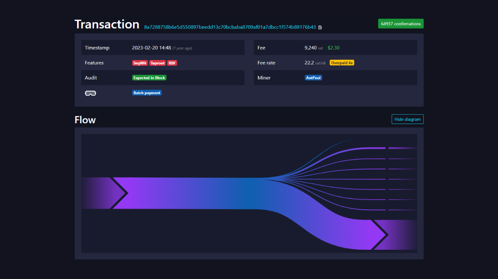

### Раздел 3: Овладение лучшими практиками для защиты вашей конфиденциальности

В третьем разделе нашего курса мы переходим к сути дела: практике! Цель состоит в том, чтобы овладеть всеми основными лучшими практиками, которые должны стать естественными рефлексами для любого пользователя Биткойн. Мы рассмотрим использование свежих адресов, маркировку, консолидацию, использование полных узлов, а также методы KYC и приобретения. Цель состоит в том, чтобы предоставить вам комплексный обзор ловушек, которых следует избегать для создания прочной основы в нашем стремлении к защите конфиденциальности. Для некоторых из этих практик вы будете направлены на конкретное руководство для их реализации.

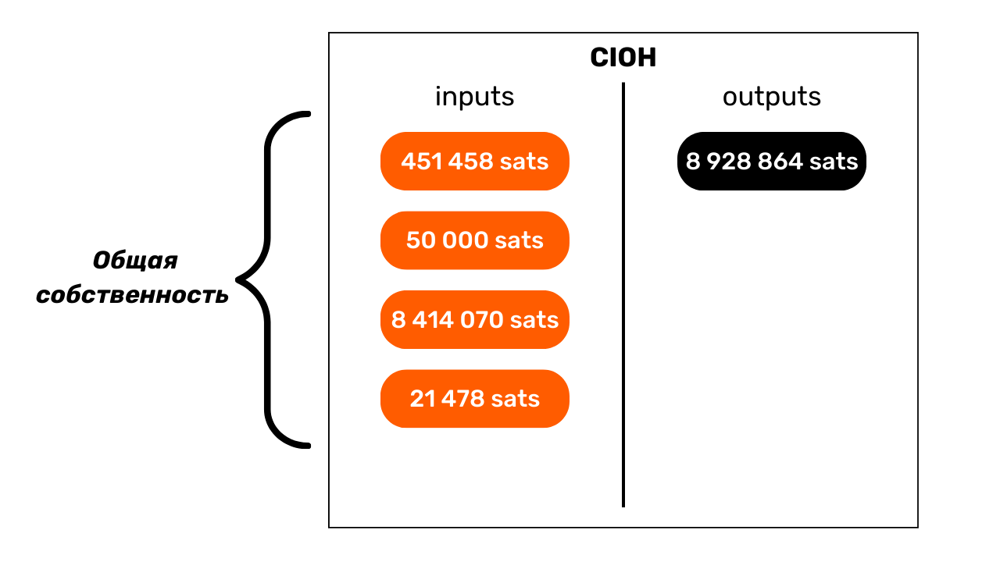

### Раздел 4: Понимание транзакций Coinjoin

Как мы можем говорить о конфиденциальности в Биткойн, не обсудив coinjoins? В разделе 4 вы узнаете все, что вам нужно знать об этом методе смешивания. Вы узнаете, что такое coinjoin, его историю и цели, а также различные типы coinjoins, которые существуют. Наконец, для более опытных пользователей мы узнаем, что такое anonsets и энтропия, и как рассчитать эти показатели.

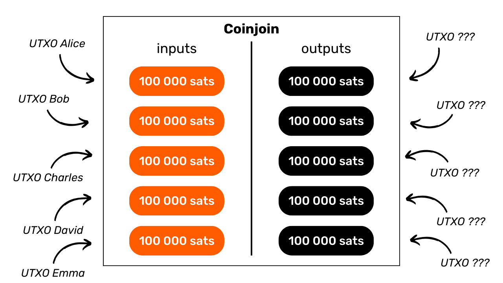

### Раздел 5: Понимание ставок других передовых техник конфиденциальности

В пятом разделе мы предоставим обзор всех других существующих методов защиты вашей конфиденциальности в Биткойн, помимо coinjoin. За годы разработчики проявили удивительное творчество в проектировании инструментов, посвященных конфиденциальности. Мы рассмотрим все эти методы, такие как payjoin, совместные транзакции, Coin Swap и Atomic Swap, детализируя их работу, цели и потенциальные слабости.


Мы также рассмотрим вопросы конфиденциальности на уровне сети узлов и распространения транзакций. Мы также обсудим различные протоколы, которые предлагались на протяжении многих лет для улучшения конфиденциальности пользователей в сети Bitcoin, включая протоколы статических адресов.


В то время как предыдущие разделы сосредоточены на решениях для конфиденциальности на уровне приложений, этот шестой раздел будет погружаться в вопросы конфиденциальности на уровне Ядра Биткойна для конфиденциальности пользователей. Мы обсудим конфиденциальность на уровне сети узлов и вещание транзакций. Также мы обсудим различные протоколы, которые были предложены на протяжении многих лет для улучшения конфиденциальности пользователей в Биткойне, включая протоколы с фиксированным адресом. В заключение мы рассмотрим влияние на конфиденциальность, как положительное, так и отрицательное, последнего крупного мягкого форка Биткойн, Taproot.


# Определения и ключевые понятия
<partId>b9bbbde3-34c0-4851-83e8-e2ffb029cf31</partId>

## Модель UTXO Биткойн
<chapterId>8d6b50c5-bf74-44f4-922b-25204991cb75</chapterId>

Биткойн прежде всего является валютой, но знаете ли вы конкретно, как BTC представлены в протоколе?

### Биткойн UTXO: Что это такое?

В протоколе Биткойн управление денежными единицами осуществляется с помощью модели UTXO, акроним для "_Unspent Transaction Output_" (Непотраченный Выход Транзакции).

Эта модель кардинально отличается от традиционных банковских систем, которые полагаются на механизм счета и баланса для отслеживания финансовых потоков. Действительно, в банковской системе индивидуальные балансы поддерживаются на счетах, привязанных к личности. Например, когда вы покупаете булочку у пекаря, ваш банк просто списывает сумму покупки с вашего счета, тем самым уменьшая ваш баланс, в то время как счет пекаря кредитуется на ту же сумму, увеличивая его баланс. В этой системе нет понятия связи между деньгами, поступающими на ваш счет, и деньгами, покидающими его, кроме записей о транзакциях.

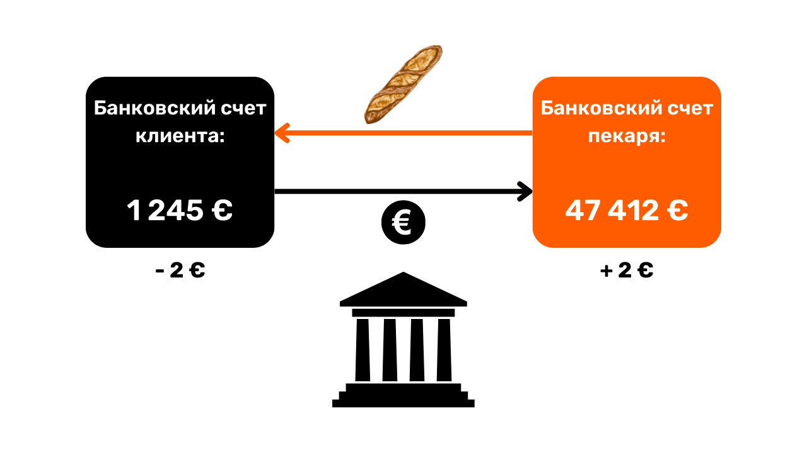
В Биткойн дела обстоят иначе. Концепция счета отсутствует, а денежные единицы управляются не через балансы, а через UTXO. UTXO представляет собой определенное количество биткойнов, которое еще не было потрачено, таким образом формируя "кусочек биткойна", который может быть большим или маленьким. Например, UTXO может быть стоимостью `500 BTC` или всего `700 SATS`.
**> Напоминание:** Сатоши, часто сокращенно sat, является самой маленькой единицей Биткойна, сравнимой с центом в фиатных валютах.

```plaintext
1 BTC = 100,000,000 SATS
```

Теоретически, UTXO может представлять любую стоимость в биткойнах, начиная от одного сатоши до теоретического максимума около 21 миллиона BTC. Однако логически невозможно владеть всеми 21 миллионом биткойнов, и существует нижний экономический порог, называемый "пылью", ниже которого UTXO считается экономически нецелесообразным для расходования.
**> Знаете ли вы?** Самый большой UTXO, когда-либо созданный в Биткойн, был оценен в `500,000 BTC`. Он был создан платформой MtGox в ходе операции консолидации в ноябре 2011 года: [29a3efd3ef04f9153d47a990bd7b048a4b2d213daaa5fb8ed670fb85f13bdbcf](https://mempool.space/fr/tx/29a3efd3ef04f9153d47a990bd7b048a4b2d213daaa5fb8ed670fb85f13bdbcf)

### UTXO и условия расходования

UTXO являются инструментами обмена в Биткойн. Каждая транзакция приводит к использованию UTXO в качестве входов и созданию новых UTXO в качестве выходов. Когда совершается транзакция, используемые в качестве входов UTXO считаются "израсходованными", и генерируются новые UTXO, которые выделяются получателям, указанным в выходах транзакции. Таким образом, UTXO просто представляет неизрасходованный выход транзакции, а следовательно, количество биткойнов, принадлежащих пользователю на данный момент.

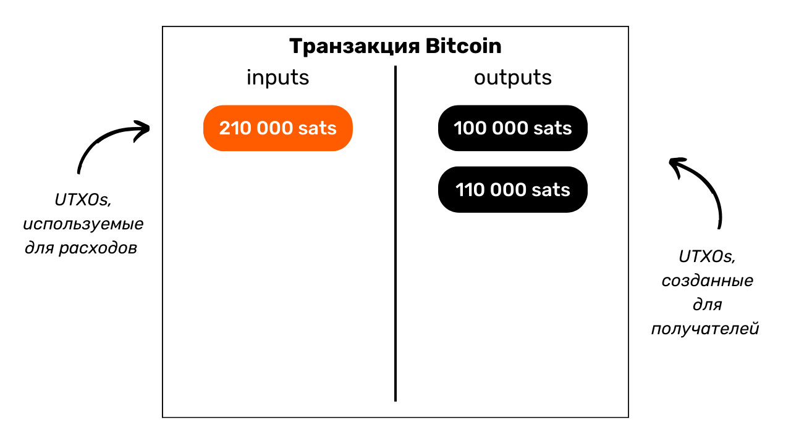
Все UTXO защищены скриптами, которые определяют условия, при которых они могут быть израсходованы. Чтобы использовать UTXO, пользователь должен доказать сети, что он соответствует условиям, предусмотренным скриптом, защищающим этот UTXO. Обычно UTXO защищены публичным ключом (или адресом получения, который представляет этот публичный ключ). Чтобы потратить UTXO, связанный с этим публичным ключом, пользователь должен доказать, что он владеет соответствующим приватным ключом, предоставив цифровую подпись, сделанную этим ключом. Вот почему говорят, что ваш кошелек Биткойн на самом деле не содержит биткойны, а хранит ваши приватные ключи, которые, в свою очередь, дают вам доступ к вашим UTXO и, соответственно, к биткойнам, которые они представляют.
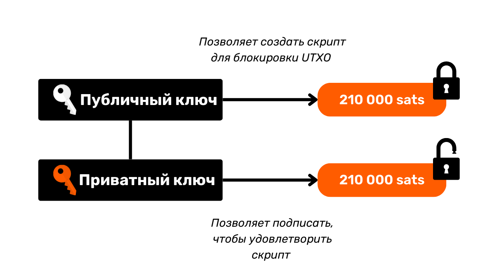

Учитывая, что в Биткойн отсутствует концепция аккаунта, баланс кошелька просто соответствует сумме значений всех UTXO, которые он может потратить. Например, если ваш Биткойн кошелек может потратить следующие 4 UTXO:

```plaintext
- 2 BTC
- 8 BTC
- 5 BTC
- 2 BTC
```

Общий баланс вашего кошелька составит `17 BTC`.

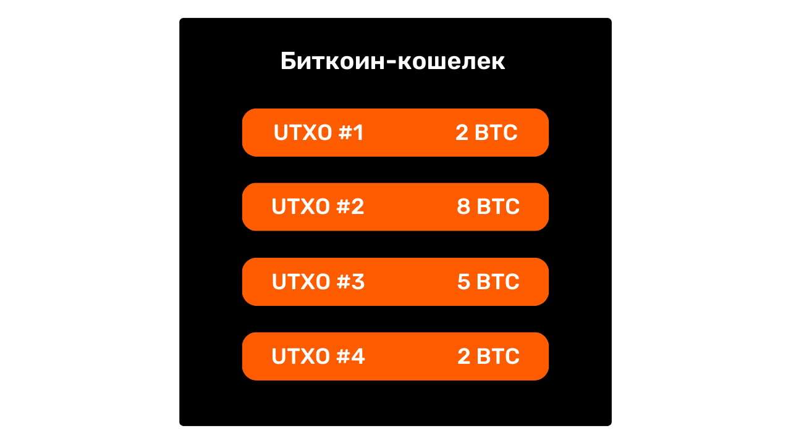

## Структура Биткойн транзакций
<chapterId>29d3aaab-de2e-4746-ab40-c9748898850c</chapterId>

### Входы и выходы транзакции

Транзакция Биткойн - это операция, записанная в блокчейне, которая позволяет передать право собственности на биткойны от одного человека другому. Более конкретно, поскольку мы работаем с моделью UTXO и аккаунты отсутствуют, транзакция удовлетворяет условиям расходования, которые защищали один или несколько UTXO, использует их и эквивалентно создает новые UTXO с новыми условиями расходования. Короче говоря, транзакция перемещает биткойны от скрипта, который удовлетворен, к новому скрипту, предназначенному для их защиты.

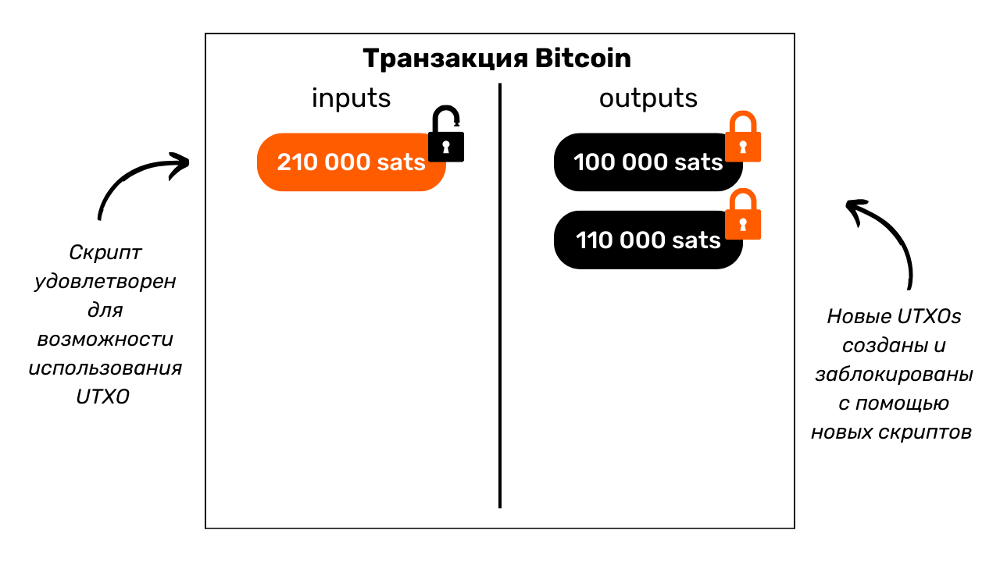

Таким образом, каждая транзакция Биткойн состоит из одного или нескольких входов и одного или нескольких выходов. Входы - это UTXO, используемые в процессе транзакциии для генерации выходов. Выходы - это новые UTXO, которые будут использоваться в качестве входов для будущих транзакций.

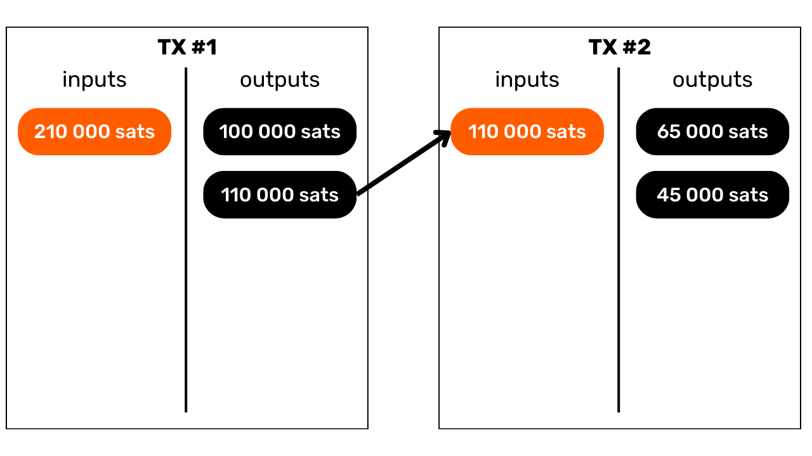

**> Знаете ли вы?** Теоретически, транзакция в биткойне может иметь бесконечное количество входов и выходов. Только максимальный размер блока ограничивает это число. Каждый вход в транзакцию биткойна ссылается на предыдущий неизрасходованный UTXO (Unspent Transaction Output - Неизрасходованный Выход Транзакции). Чтобы использовать UTXO в качестве входа, его владелец должен доказать, что он является законным владельцем, проверив скрипт, связанный с ним, то есть, выполнив наложенное условие расходования. Обычно это включает предоставление цифровой подписи, созданной с использованием приватного ключа, соответствующего публичному ключу, который изначально защищал этот UTXO. Таким образом, скрипт проверяет, соответствует ли подпись публичному ключу, использованному при получении средств.
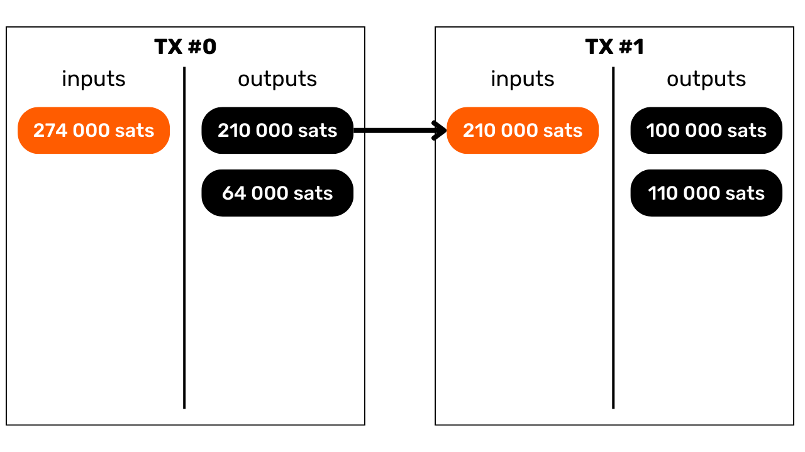

С другой стороны, каждый выход указывает количество биткойнов к переводу, а также получателя. Последний определяется новым скриптом, который, как правило, блокирует вновь созданный UTXO с помощью адреса получения или нового публичного ключа.

Для того чтобы транзакция считалась действительной согласно правилам консенсуса, общая сумма выходов должна быть меньше или равна общей сумме входов. Другими словами, сумма новых UTXO, созданных транзакцией, не должна превышать сумму UTXO, использованных в качестве входов. Этот принцип логичен: если у вас есть только `500,000 SATS`, вы не можете совершить покупку на `700,000 SATS`.

### Сдача и консолидация в транзакции биткойна

Действие транзакции биткойна на UTXO можно сравнить с плавлением золотой монеты. Действительно, UTXO не делится, но только объединяется. Это означает, что пользователь не может просто разделить UTXO, представляющий определенное количество биткойнов, на несколько меньших UTXO. Он должен полностью потратить его в транзакции, чтобы создать один или несколько новых UTXO произвольных значений в выходах, которые должны быть меньше или равны исходной стоимости.

Этот механизм похож на механизм золотой монеты. Представьте, что у вас есть монета весом в 2 унции, и вы хотите совершить платеж на 1 унцию, предполагая, что продавец не может дать вам сдачу. Вам придется переплавить вашу монету и отлить 2 новые по 1 унции каждая.

В биткойне операция аналогична. Допустим, у Алисы есть UTXO на `10,000 SATS`, и она хочет купить багет за `4,000 SATS`. Алиса совершит транзакцию с входом в 1 UTXO на `10,000 SATS`, который она полностью потратит, и на выходе она создаст 2 UTXO на `4,000 SATS` и `6,000 SATS`. UTXO на `4,000 SATS` будет отправлено пекарю в качестве оплаты за багет, в то время как UTXO на `6,000 SATS` вернется к Алисе в качестве сдачи. Этот UTXO, который возвращается исходному отправителю транзакции, называется "сдачей" в жаргоне биткойна.


Теперь представьте, что у Алисы нет единственного UTXO на `10,000 SATS`, а два UTXO по `3,000 SATS` каждый. В этой ситуации ни один из отдельных UTXO не достаточен для покрытия `4,000 SATS` за багет. Поэтому Алисе приходится использовать оба UTXO по `3,000 SATS` одновременно в качестве входов для ее транзакции. Таким образом, общая сумма входов достигнет `6,000 SATS`, что позволит ей покрыть платеж в `4,000 SATS` пекарю. Этот метод, который включает в себя группировку нескольких UTXO во входах транзакции, часто называют термином "консолидация".
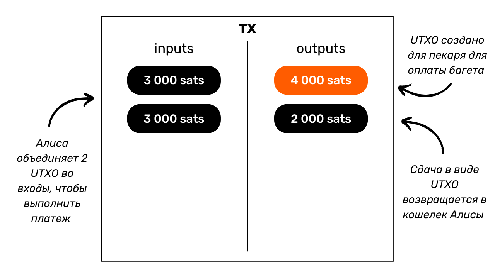

### Комиссии за транзакции

Интуитивно можно подумать, что комиссии за транзакции также представляют собой вывод транзакции. Но на самом деле это не так. Комиссии за транзакцию представляют собой разницу между общей суммой входов и общей суммой выходов. Это означает, что после использования части стоимости входов для покрытия желаемых выходов в транзакции, определенная сумма входов остается неиспользованной. Эта остаточная сумма составляет комиссии за транзакцию.

```plaintext
Комиссии = общая сумма входов - общая сумма выходов
```

Давайте вернемся к примеру с Алисой, у которой есть UTXO на `10,000 SATS` и которая хочет купить багет за `4,000 SATS`. Алиса создает транзакцию со своим UTXO на `10,000 SATS` в качестве входа. Затем она генерирует выход на `4,000 SATS`, предназначенный для пекаря за оплату багета. Чтобы стимулировать майнеров включить ее транзакцию в блок, Алиса выделяет `200 SATS` в качестве комиссий. Таким образом, она создает второй выход, сдачу, которая вернется к ней, составляющую `5,800 SATS`.
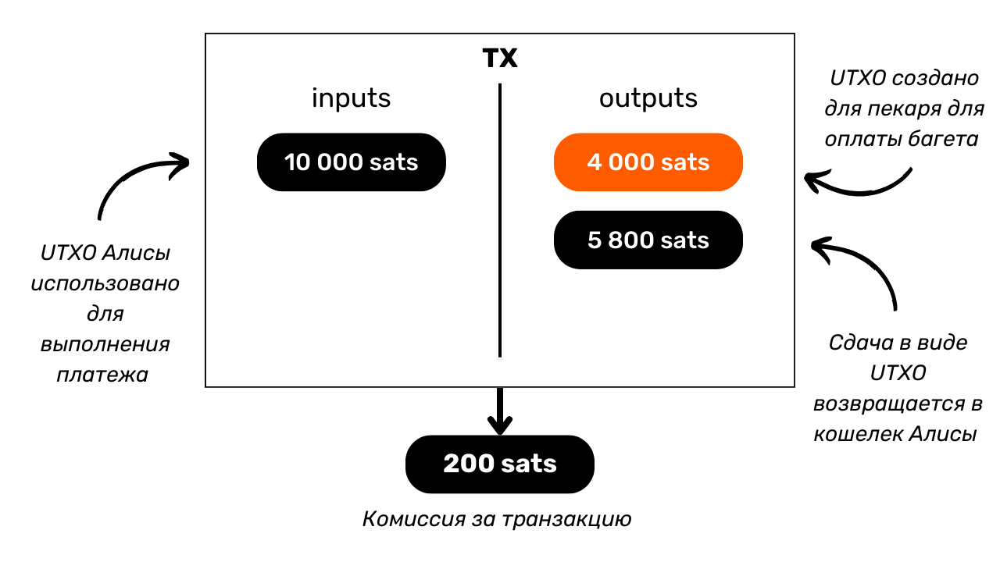

Применяя формулу комиссии, мы действительно видим, что остается `200 SATS` для майнеров:
```plaintext
Комиссии = общая сумма входов - общая сумма выходов
Расходы = 10,000 - (4,000 + 5,800)
Расходы = 10,000 - 9,800
Расходы = 200
```
Когда майнер успешно валидирует блок, он имеет право собирать эти комиссии за все транзакции, включенные в его блок, через так называемую "coinbase" транзакцию.

### Создание UTXO в Биткойн

Если вы внимательно следили за предыдущими абзацами, то теперь знаете, что UTXO могут быть созданы только путем использования других существующих UTXO. Таким образом, монеты в Биткойн формируют непрерывную цепь. Однако, возможно, вы задаетесь вопросом, как появились первые UTXO в этой цепи. Это порождает проблему, аналогичную проблеме курицы и яйца: откуда взялись эти первоначальные UTXO?

Ответ лежит в **coinbase транзакции**.

Coinbase - это специфический тип транзакции Биткойн, уникальный для каждого блока и всегда первый в них. Он позволяет майнеру, который нашел доказательство выполнения работы, получить свою награду за блок. Эта награда состоит из двух элементов: **субсидии за блок** и **комиссий за транзакции**, о которых мы говорили в предыдущей части.

Уникальная особенность coinbase транзакции заключается в том, что это единственная транзакция, которая может создавать биткойны из ничего, без необходимости использовать входы для генерации своих выходов. Эти вновь созданные биткойны составляют то, что можно было бы назвать "первоначальными UTXO".
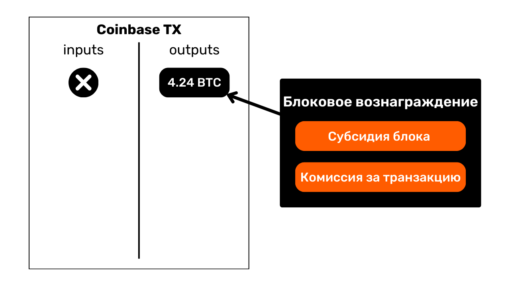
Биткойны, получаемые в качестве вознаграждения за блок, являются новыми BTC, созданными из ничего, согласно заранее установленному графику выпуска в правилах консенсуса. Вознаграждение за блок уменьшается вдвое каждые 210 000 блоков, что происходит примерно каждые четыре года, в процессе, называемом "халвинг". Изначально с каждым вознаграждением создавалось 50 биткоинов, но этот объем постепенно уменьшался; в настоящее время он составляет 3.125 биткоина за блок.

Что касается части, связанной с комиссиями за транзакции, хотя она также представляет собой вновь созданные BTC, они не должны превышать разницу между общими входами и выходами всех транзакций в блоке. Ранее мы видели, что эти комиссии представляют собой часть входов, которая не используется в выходах транзакций. Эта часть технически "теряется" во время транзакции, и майнер имеет право воссоздать эту стоимость в виде одного или нескольких новых UTXO. Таким образом, это перевод ценности от отправителя транзакции к майнеру, который добавляет ее в блокчейн.

**> Знаете ли вы?** Биткоины, полученные в результате транзакции coinbase, подлежат периоду зрелости в 100 блоков, в течение которого майнер не может их потратить. Это правило предназначено для избежания сложностей, связанных с использованием вновь созданных биткоинов в цепочке, которая позже может оказаться устаревшей.

### Следствия модели UTXO

Во-первых, модель UTXO напрямую влияет на комиссии за транзакции в Биткойне. Поскольку емкость каждого блока ограничена, майнеры отдают предпочтение транзакциям, которые предлагают лучшие комиссии относительно занимаемого ими места в блоке. Действительно, чем больше UTXO включает транзакция в качестве входов и выходов, тем она тяжелее и, следовательно, требует более высоких комиссий. Это одна из причин, по которой часто стараются уменьшить количество UTXO в нашем кошельке, что также может повлиять на конфиденциальность, тема, на которой мы подробно остановимся в третьей части этого курса.

Далее, как упоминалось в предыдущих частях, монеты в Биткойне по сути представляют собой цепочку UTXO. Каждая транзакция таким образом создает связь между прошлым UTXO и будущим UTXO. UTXO, следовательно, позволяют явно отслеживать путь биткойнов от их создания до текущего расхода. Эта прозрачность может рассматриваться положительно, поскольку она позволяет каждому пользователю убедиться в подлинности полученных биткойнов. Однако именно на этом принципе отслеживаемости и аудита основан анализ цепочек, практика, направленная на нарушение вашей конфиденциальности. Мы подробно изучим эту практику во второй части обучения.

## Модель конфиденциальности Биткойна
<chapterId>769d8963-3ed5-4094-b21d-9203c7d9e465</chapterId>

### Валюта: Подлинность, Целостность и Двойный Трата

Одной из функций валюты является решение проблемы двойного совпадения желаний. В системе, основанной на бартере, для совершения обмена необходимо не только найти человека, предлагающего товар, удовлетворяющий моим потребностям, но и предоставить ему товар эквивалентной стоимости, который удовлетворит его собственные потребности. Найти этот баланс оказывается сложной задачей.

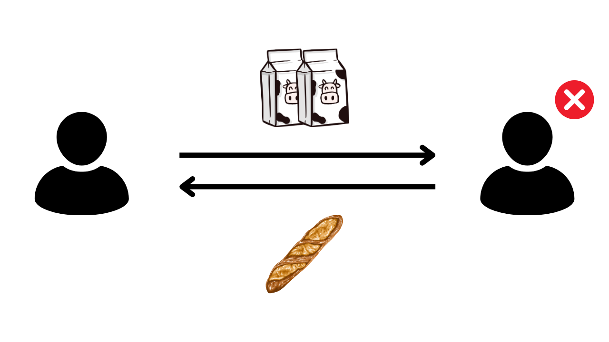

Поэтому мы прибегаем к валюте, которая позволяет передавать ценность как в пространстве, так и во времени.

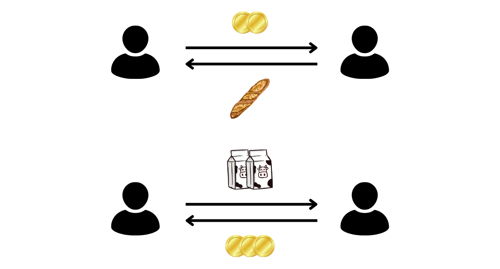

Для того чтобы валюта решала эту проблему, существенно, чтобы сторона, предоставляющая товар или услугу, была убеждена в своей способности потратить эту сумму позже. Таким образом, любой рациональный индивид, желающий принять валюту, будь то цифровая или физическая, убедится, что она соответствует двум фундаментальным критериям:
- **Монета должна быть целой и подлинной;**
- **и она не должна быть потрачена дважды.**

При использовании физической валюты первое требование является наиболее сложным для подтверждения. На протяжении различных периодов в истории целостность металлических монет часто нарушалась практиками, такими как обрезание краев или сверление отверстий. Например, в древнем Риме было обычным делом для граждан соскабливать края золотых монет, чтобы собрать немного драгоценного металла, при этом сохраняя их для будущих транзакций. Таким образом, внутренняя стоимость монеты уменьшалась, но ее номинальная стоимость оставалась прежней. Именно поэтому позже на края монет стали чеканить рифления.

Подлинность также является сложной характеристикой для проверки с физическими денежными средствами. В настоящее время техники борьбы с подделками становятся всё более сложными, заставляя торговцев инвестировать в дорогостоящие системы верификации.

С другой стороны, из-за их природы, проблема двойного расходования не является проблемой для физических валют. Если я даю вам купюру в 10 евро, она безвозвратно покидает мое владение и переходит в ваше, естественно исключая любую возможность многократного использования тех же денежных единиц. Короче говоря, я не смогу потратить эту купюру в 10 евро снова.


Для цифровой валюты сложность другая. Обеспечение подлинности и целостности монеты часто проще. Как мы видели в предыдущем разделе, модель UTXO Биткойн позволяет отследить монету до ее происхождения, тем самым подтверждая, что она действительно была создана в соответствии с правилами консенсуса майнером.

Однако, обеспечение отсутствия двойного расходования более сложно, поскольку любой цифровой товар по сути является информацией. В отличие от физических товаров, информация не делится во время обменов, а распространяется путем умножения. Например, если я отправлю вам документ по электронной почте, он затем становится дублированным. С вашей стороны, вы не можете с уверенностью проверить, что я удалил оригинальный документ.

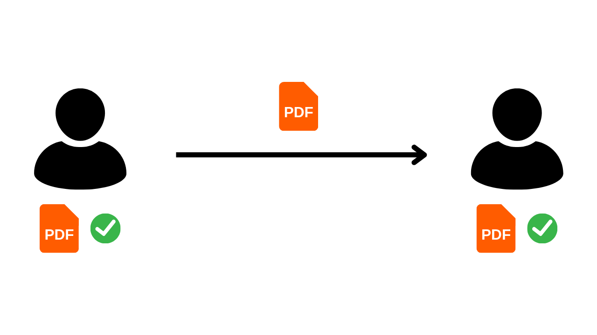

### Предотвращение двойного расходования в Биткойн

Единственный способ избежать дублирования цифрового товара - быть в курсе всех обменов в системе. Таким образом, можно знать, кто владеет чем и обновлять балансы всех на основе совершенных транзакций. Это то, что делается, например, с безналичными деньгами в банковской системе. Когда вы платите 10 евро торговцу кредитной картой, банк отмечает этот обмен и обновляет регистр.
В Биткойне предотвращение двойного расходования достигается аналогичным образом. Цель состоит в том, чтобы подтвердить отсутствие транзакции, которая уже потратила соответствующие монеты. Если эти монеты никогда не использовались, тогда мы можем быть уверены, что двойного расходования не произойдет. Этот принцип был описан Сатоши Накамото в Белой книге следующей знаменитой фразой:

**"*Единственный способ подтвердить отсутствие транзакции - быть в курсе всех транзакций.*"**

Однако, в отличие от банковской модели, в Биткойне нет желания доверять центральному субъекту. Необходимо, чтобы все пользователи могли подтвердить это отсутствие двойного расходования, не полагаясь на третью сторону. Таким образом, все должны быть в курсе всех транзакций Биткойн. Вот почему транзакции Биткойн публично транслируются через все узлы сети и записываются в ясном виде на блокчейне.

Именно это публичное распространение информации усложняет защиту конфиденциальности в Биткойне. В традиционной банковской системе, в теории, только финансовое учреждение знает о совершенных транзакциях. С другой стороны, в Биткойн, все пользователи информированы о всех транзакциях через их соответствующие узлы.

### Модель конфиденциальности: банковская система в сравнеии с Биткойном

В традиционной системе ваш банковский счет связан с вашей личностью. Банкир может знать, какой банковский счет принадлежит какому клиенту и какие транзакции с ним ассоциированы. Однако этот поток информации закрыт между банком и общественной сферой. Другими словами, невозможно узнать баланс и транзакции банковского счета, принадлежащего другому человеку. Только банк имеет доступ к этой информации.

Например, ваш банкир знает, что вы покупаете свой багет каждое утро в соседней пекарне, но ваш сосед не знает об этой транзакции. Таким образом, поток информации доступен заинтересованным сторонам, в частности банку, но остается недоступным для посторонних.

Из-за ограничения на публичное распространение транзакций, которое мы видели в предыдущей части, модель конфиденциальности Биткойн не может следовать модели банковской системы. В случае с Биткойн, поскольку поток информации не может быть перерван между транзакциями и общественной сферой, **модель конфиденциальности основывается на разделении между личностью пользователя и самими транзакциями**.

Например, если вы покупаете багет у пекаря, оплачивая в BTC, ваш сосед, который владеет собственной полной нодой, может видеть вашу транзакцию, так же как он может видеть все другие транзакции в системе. Однако, если принципы конфиденциальности соблюдаются, он не должен иметь возможности связать эту конкретную транзакцию с вашей личностью.

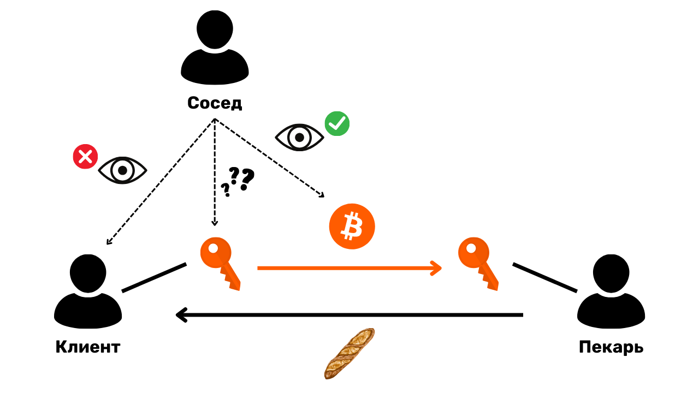

Но поскольку транзакции Биткойн становятся публичными, все же становится возможным установить связи между ними для выведения информации об участвующих сторонах. Эта деятельность даже составляет специализацию сама по себе, называемую "анализ цепочки". В следующей части обучения я приглашаю вас изучить основы анализа цепочек, чтобы понять, как отслеживаются ваши биткойны и знать, как лучше защититься от этого.

# Понимание анализа цепочки и как защитить себя
<partId>4739371e-9fef-45b0-bcaa-b7a4df6b4470</partId>

## Что такое анализ цепочки в Биткойне?
<chapterId>7d198ba6-4af2-4f24-86cb-3c79cb25627e</chapterId>

### Определение и принцип работы

Анализ цепочки - это практика, которая охватывает все методы, используемые для отслеживания потока биткойнов в блокчейне. В общем, анализ цепочки основывается на наблюдении за характеристиками в выборках предыдущих транзакций. Затем он включает в себя идентификацию этих же характеристик в транзакции, которую хотят проанализировать, и выведение вероятных интерпретаций. Такой метод решения проблемы, который использует практический подход для нахожднеия достаточно хорошего решения, называется "эвристикой".

Упрощенно, анализ цепочки выполняется в три основных шага:

1. **Наблюдение за блокчейном;**
2. **Идентификация известных характеристик;**
3. **Вывод гипотез.**

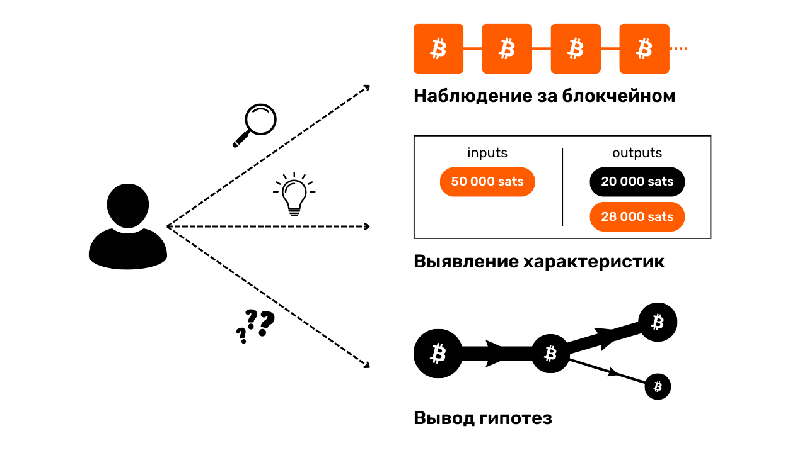

Анализ цепочки может выполнять любой. Достаточно иметь доступ к публичной информации блокчейна через полную ноду, чтобы наблюдать за движениями транзакций и делать гипотезы. Также существуют бесплатные инструменты, которые облегчают этот анализ, например, веб-сайт [OXT.me](https://oxt.me/), который мы подробно рассмотрим в последних двух главах этой части. Однако основной риск для конфиденциальности исходит от компаний, специализирующихся на анализе цепочек. Эти компании довели анализ цепочек до промышленного масштаба и продают свои услуги финансовым институтам или правительствам. Среди этих компаний, вероятно, наиболее известной является Chainalysis.

### Цели анализа цепочки

Одна из целей анализа цепочек - это группировка различных активностей в Биткойне с целью определения уникальности пользователя, который их осуществил. Впоследствии становится возможным попытаться связать этот набор активностей с реальной личностью.

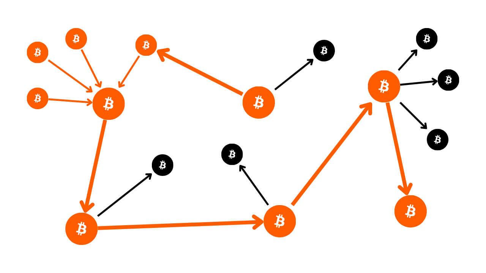

Вспомните предыдущую главу. Я объяснил, почему изначальная модель конфиденциальности Биткойн опиралась на разделение личности пользователя от его транзакций. Поэтому может показаться, что анализ цепочек не нужен, поскольку даже если удастся сгруппировать активности в цепочке, их нельзя будет связать с реальной личностью.

Теоретически это утверждение верно. В первой части этого обучения мы видели, что криптографические пары ключей используются для установления условий на UTXO. По сути, эти пары ключей не раскрывают никакой информации о личности их владельцев. Таким образом, даже если удастся сгруппировать активности, связанные с разными парами ключей, это не говорит нам ничего об агенте стоящим за этими активностями.

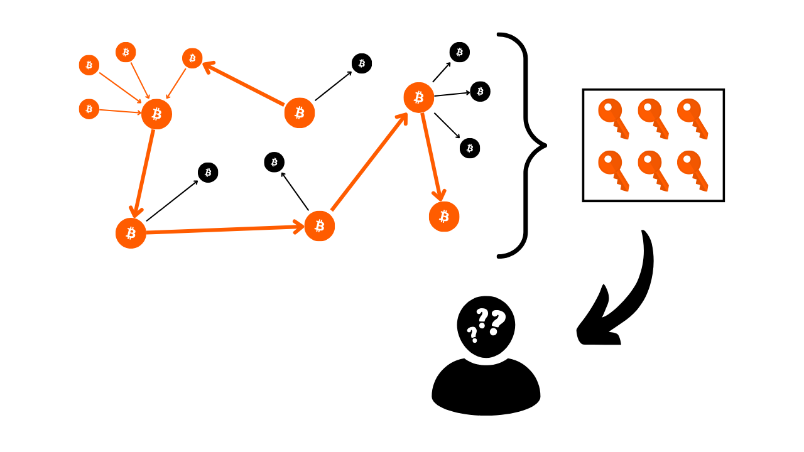

Однако практическая реальность гораздо сложнее. Существует множество поведений, которые рискуют связать реальную личность с активностью в цепочке. В анализе это называется точкой входа, и их много.

Самой распространенной, конечно же, является KYC (*Know Your Customer* - Знай своего клиента). Если вы выводите свои биткойны с регулируемой платформы на один из своих личных приемных адресов, то некоторые люди могут связать вашу личность с этим адресом. В более широком смысле, точкой входа может быть любая форма взаимодействия между вашей реальной жизнью и транзакцией Биткойн. Например, если вы публикуете приемный адрес в своих социальных сетях, это может быть точкой входа для анализа. Если вы совершаете платеж в биткойнах своему пекарю, он может связать ваше лицо (которое является частью вашей личности) с адресом Биткойн.

Эти точки входа почти неизбежны при использовании Биткойн. Хотя можно стремиться ограничить их масштаб, они останутся присутствовать. Вот почему крайне важно сочетать методы, направленные на сохранение вашей конфиденциальности. Хотя поддержание разделения между вашей реальной личностью и вашими транзакциями является интересным подходом, сегодня это недостаточно. Действительно, если все ваши активности в цепочке могут быть сгруппированы, то даже малейшая точка входа может поставить под угрозу единственный слой конфиденциальности, который вы установили.

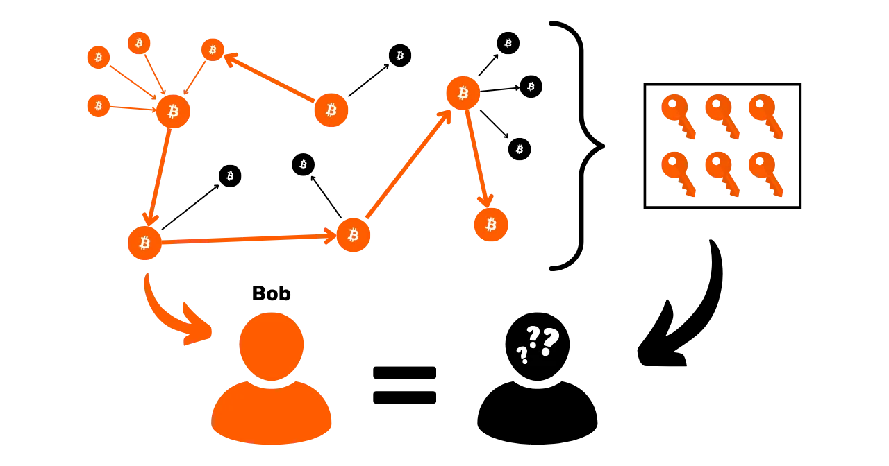

### Защита от анализа цепочек
Таким образом, также необходимо уметь противостоять анализу блокчейна в нашем использовании Биткойн. Действуя таким образом, мы можем минимизировать агрегацию наших активностей и ограничить влияние точки входа на нашу конфиденциальность.
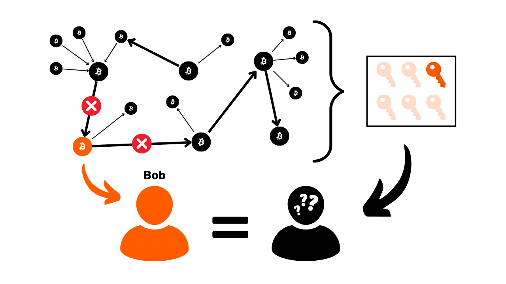

Действительно, для лучшего противодействия анализу блокчейна, что может быть лучше, чем ознакомление с методами, используемыми в анализе блокчейна? Если вы хотите знать, как улучшить свою конфиденциальность в Биткойн, вы должны понимать эти методы. Это позволит вам лучше освоить техники, такие как [coinjoin](https://planb.network/fr/tutorials/privacy/coinjoin-samourai-wallet) или [payjoin](https://planb.network/fr/tutorials/privacy/payjoin) (техники, которые мы изучим в последних частях обучения), и сократить количество ошибок, которые вы могли бы совершить.

В этом мы можем провести аналогию с криптографией и криптоанализом. Хороший криптограф прежде всего является хорошим криптоаналитиком. Чтобы представить новый алгоритм шифрования, необходимо знать, с какими атаками он столкнется, а также изучить, почему предыдущие алгоритмы были взломаны. Тот же принцип применим к конфиденциальности в Биткойн. Понимание методов анализа блокчейна является ключом к защите от него. Вот почему я предлагаю целый раздел об анализе блокчейна в этом обучении.

### Методы анализа блокчейна

Важно понимать, что анализ блокчейна не является точной наукой. Он опирается на эвристику, полученную из предыдущих наблюдений или логических интерпретаций. Эти правила позволяют получать довольно надежные результаты, но никогда с абсолютной точностью. Другими словами, **анализ блокчейна всегда включает в себя элемент вероятности в выдаваемых заключениях**. Например, можно с большей или меньшей уверенностью оценить, что два адреса принадлежат одному и тому же агенту, но абсолютная уверенность всегда недостижима.

Основная цель анализа блокчейна заключается именно в агрегации различных эвристик с целью минимизации риска ошибки. Это, в некотором роде, накопление доказательств, которое позволяет нам более тесно приблизиться к реальности.

Эти известные эвристики можно сгруппировать в разные категории, которые мы подробно рассмотрим вместе:
- **Модели транзакций (или паттерны транзакций);**
- **Эвристики внутренние для транзакции;**
- **Эвристики внешние по отношению к транзакции.**

### Сатоши Накамото и анализ блокчейна
Следует отметить, что первые две эвристики для анализа цепочек были обнаружены самим Сатоши Накамото. Он обсуждает их в части 10 Белой книги Биткойна. Это:
- эвристика общего владения входами (CIOH - Common Input Ownership Heuristic);
- и повторное использование адресов.

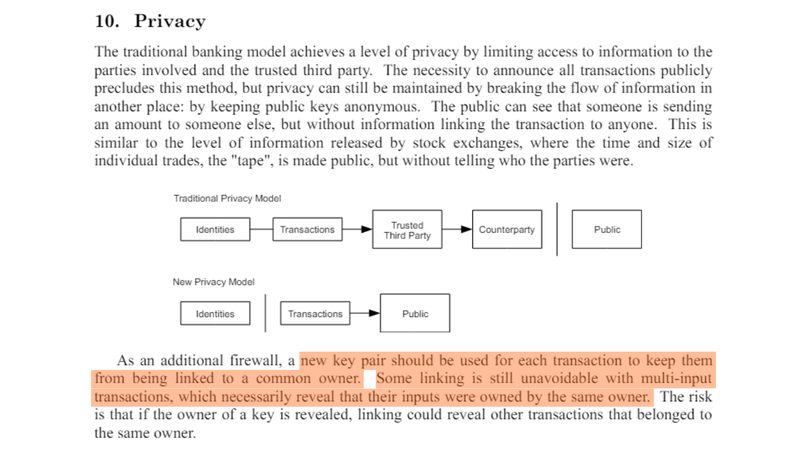

Источник: S. Nakamoto, "Bitcoin: A Peer-to-Peer Electronic Cash System", https://bitcoin.org/bitcoin.pdf, 2009.

В следующих главах мы исследуем, в чем состоят эти эвристики, но уже интересно отметить, что эти две эвристики до сих пор сохраняют преимущество в анализе цепочек сегодня.

## Модели транзакций
<chapterId>d365a101-2d37-46a5-bfb9-3c51e37bf96b</chapterId>

Модель транзакции - это просто модель или общая структура типичной транзакции, которую можно найти в блокчейне, чья интерпретация вероятно известна. Изучая паттерны, мы сосредоточимся на одной транзакции, которую мы проанализируем на высоком уровне.

Другими словами, мы будем смотреть только на количество UTXO во входах и количество UTXO на выходах, не углубляясь в более конкретные детали или окружение транзакции. Исходя из наблюдаемой модели, мы сможем интерпретировать природу транзакции. Затем мы будем искать характеристики в ее структуре и делать выводы.


В этой части мы вместе откроем основные модели транзакций, которые можно встретить в анализе цепочек, и для каждой модели я дам вам вероятную интерпретацию этой структуры вместе с конкретным примером.

### Простая отправка (или простой платеж)

Мы начинаем с очень распространенного паттерна, поскольку это тот, который встречается в большинстве платежей биткойнов. Модель простого платежа характеризуется потреблением одного или нескольких UTXO на входах и производством 2 UTXO на выходах. Таким образом, эта модель будет выглядеть так:


Когда мы видим эту структуру транзакции в блокчейне, мы уже можем сделать выводы. Как следует из названия, эта модель указывает на то, что мы имеем дело с транзакцией отправки или платежа. Пользователь использовал свои собственные UTXO в качестве входов, чтобы в выходах обеспечить платежный UTXO и UTXO сдачи (деньги, возвращенные тому же пользователю).

Следовательно, мы знаем, что наблюдаемый пользователь, вероятно, больше не владеет одним из двух UTXO на выходе (платежным), но он все еще владеет другим UTXO (сдачей).
На данный момент нам невозможно указать, какой выход представляет какой UTXO, поскольку это не является целью изучения моделей. Мы достигнем этого, опираясь на эвристики, которые мы изучим в следующих разделах. На этом этапе наша цель ограничивается идентификацией характера рассматриваемой транзакции, которая в данном случае является простой отправкой.

Например, вот транзакция Биткойн, которая следует модели простой отправки:

```plaintext
b6cc79f45fd2d7669ff94db5cb14c45f1f879ea0ba4c6e3d16ad53a18c34b769
```

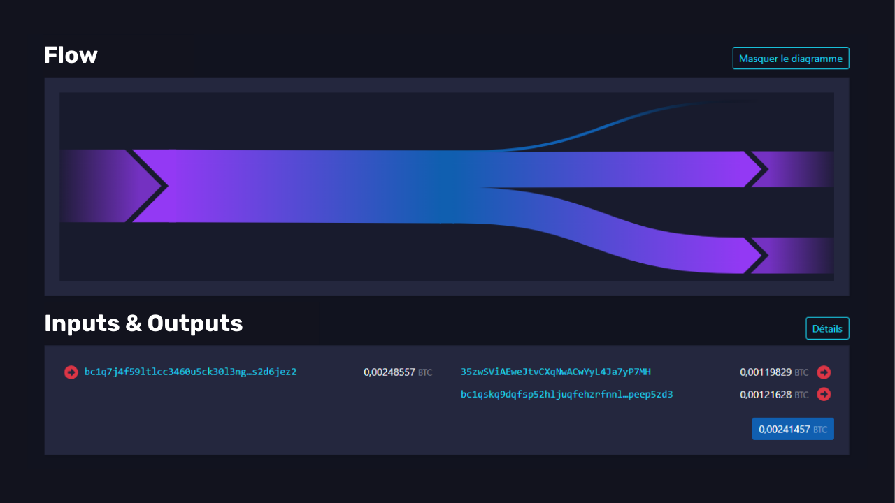

Источник: [Mempool.space](https://mempool.space/en/tx/b6cc79f45fd2d7669ff94db5cb14c45f1f879ea0ba4c6e3d16ad53a18c34b769)

После этого первого примера у вас должно сложиться лучшее понимание того, что значит изучать "модель транзакции". Мы рассматриваем транзакцию, фокусируясь только на ее структуре, не учитывая ее окружение или конкретные детали транзакции. Мы наблюдаем ее только в общем виде на этом первом этапе.

Теперь, когда вы понимаете, что такое модель, давайте перейдем к другим существующим моделям.

### Очистка (Sweeping)

Эта вторая модель характеризуется использованием одного UTXO в качестве входа и созданием одного UTXO на выходе.


Интерпретация этой модели заключается в том, что мы имеем дело с самопереводом. Пользователь перевел свои биткойны самому себе на другой адрес, который он контролирует. Поскольку в транзакции нет сдачи, очень маловероятно, что мы имеем дело с платежом. Действительно, когда осуществляется платеж, почти невозможно, чтобы у плательщика был UTXO, точно соответствующий сумме, требуемой продавцом, плюс комиссия за транзакцию. Обычно плательщик вынужден создать выход для сдачи.

Тогда мы знаем, что наблюдаемый пользователь, вероятно, все еще владеет этим UTXO. В контексте анализа цепочки, если мы знаем, что UTXO, использованный в качестве входа в транзакцию, принадлежит Алисе, мы можем предположить, что UTXO на выходе также принадлежит ей. Что станет интересным позже, так это нахождение внутренних эвристик транзакции, которые могли бы усилить это предположение (мы изучим эти эвристики в главе 3.3).

Например, вот транзакция Биткойн, которая следует модели очистки:

```plaintext
35f1072a0fda5ae106efb4fda871ab40e1f8023c6c47f396441ad4b995ea693d
```

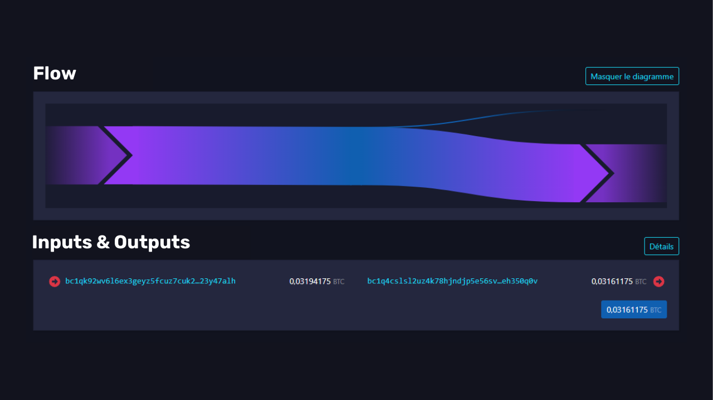
Источник: [Mempool.space](https://mempool.space/en/tx/35f1072a0fda5ae106efb4fda871ab40e1f8023c6c47f396441ad4b995ea693d) 
Однако, такой тип паттерна также может указывать на самоперевод на счет платформы обмена криптовалют. Изучение известных адресов и контекст транзакции позволит нам узнать, является ли это переводом в кошелек самохранения или выводом на платформу. Действительно, адреса платформ обмена часто легко идентифицируемы.

Вернемся к примеру с Алисой: если перевод ведет на известный адрес платформы (например, Binance), это может означать, что биткойны были переведены из прямого владения Алисы, вероятно с намерением их продать или хранить на этой платформе. С другой стороны, если адрес назначения неизвестен, разумно предположить, что это просто другой кошелек, все еще принадлежащий Алисе. Но такой тип исследования больше относится к категории эвристик, а не к изучению паттернов.

### Консолидация

Эта модель характеризуется использованием нескольких UTXO в качестве входов и производством одного UTXO в качестве выхода.


Интерпретация этой модели заключается в том, что мы имеем дело с консолидацией. Это общепринятая практика среди пользователей Биткойн, целью которой является объединение нескольких UTXO в предвидении возможного увеличения комиссий за транзакции. Выполняя эту операцию в период, когда комиссии низкие, можно сэкономить на будущих комиссиях. Мы подробнее поговорим об этой практике в главе 4.3.

Мы можем сделать вывод, что пользователь, стоящий за этой моделью транзакции, вероятно, владел всеми UTXO на входах и по-прежнему владеет UTXO на выходе. Это, безусловно, самоперевод.

Так же, как и при переводе, этот тип паттерна также может раскрыть самоперевод на счет платформы обмена. Изучение известных адресов и контекст транзакции позволит нам узнать, является ли это консолидацией в кошелек самохранения или выводом на платформу.

Например, вот транзакция Биткойн, которая следует паттерну консолидации:

```plaintext
77c16914211e237a9bd51a7ce0b1a7368631caed515fe51b081d220590589e94
```

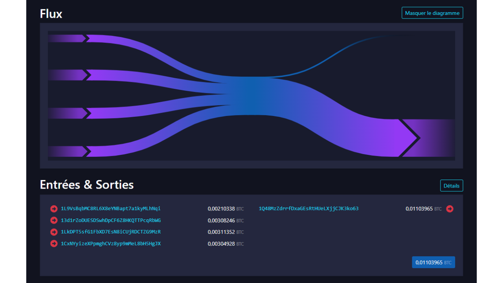

Источник: [Mempool.space](https://mempool.space/fr/tx/77c16914211e237a9bd51a7ce0b1a7368631caed515fe51b081d220590589e94)

В контексте анализа цепочки эта модель может раскрыть много информации. Например, если мы знаем, что один из входов принадлежит Алисе, мы можем предположить, что все остальные входы и выход этой транзакции также принадлежат ей. Это предположение затем позволит нам проследить через предыдущие цепочки транзакций, чтобы обнаружить и проанализировать другие транзакции, вероятно, связанные с Алисой.


### Групповые Расходы

Эта модель характеризуется использованием нескольких UTXO в качестве входов (часто только одного) и производством множества UTXO в качестве выходов.


Интерпретация этой модели заключается в том, что мы имеем дело с групповыми расходами. Это практика, которая, вероятно, указывает на значительную экономическую активность, например, на платформе обмена. Групповые расходы позволяют этим сущностям экономить на комиссиях, объединяя свои расходы в одну транзакцию.
Мы можем сделать вывод из этой модели, что вход UTXO исходит от компании с значительной экономической активностью и что выходы UTXO будут распределяться. Многие из них принадлежат клиентам компании, которые сняли биткойны с платформы. Другие могут быть направлены компаниям-партнерам. Наконец, определенно будет одна или несколько операций, которые вернутся к выпускающей компании.

Например, вот транзакция Биткойн, которая принимает модель групповых расходов (вероятно, это транзакция, выпущенная платформой Bybit):

```plaintext
8a7288758b6e5d550897beedd13c70bcbaba8709af01a7dbcc1f574b89176b43
```


Источник: [Mempool.space](https://mempool.space/fr/tx/8a7288758b6e5d550897beedd13c70bcbaba8709af01a7dbcc1f574b89176b43)

### Транзакции, специфичные для протокола

Среди моделей транзакций мы также можем идентифицировать модели, которые выявляют использование конкретного протокола. Например, Whirlpool coinjoins (о которых мы поговорим в части 5) будут иметь легко идентифицируемую структуру, которая позволяет отличать их от других более традиционных транзакций.


Анализ этой модели предполагает, что мы, вероятно, имеем дело с коллаборативной транзакцией. Также возможно наблюдение coinjoin. Если эта последняя гипотеза окажется верной, то количество выходов может дать нам приблизительную оценку количества участников в coinjoin.

Например, вот транзакция Биткойн, которая принимает модель коллаборативного типа транзакции coinjoin:

```plaintext
00601af905bede31086d9b1b79ee8399bd60c97e9c5bba197bdebeee028b9bea
```


Источник: [Mempool.space](https://mempool.space/fr/tx/00601af905bede31086d9b1b79ee8399bd60c97e9c5bba197bdebeee028b9bea)

Существует множество других протоколов, которые имеют свои собственные специфические структуры. Таким образом, мы могли бы отличать транзакции типа Wabisabi, транзакции Stamps или даже Runes, например.

Благодаря этим моделям транзакций мы уже можем интерпретировать ряд сведений о данной транзакции. Но структура транзакции - это не единственный источник информации для анализа. Мы также можем изучать ее детали. Эти детали, внутренние для транзакции, являются тем, что я люблю называть "внутренними эвристиками", и мы изучим их в следующей главе.

## Внутренние эвристики
<chapterId>c54b5abe-872f-40f4-a0d0-c59faff228ba</chapterId>

Внутренняя эвристика - это конкретная характеристика, идентифицированная в самой транзакции, без необходимости изучения ее окружения, которая позволяет нам делать выводы. В отличие от моделей, которые сосредотачиваются на общей структуре транзакции на высоком уровне, внутренние эвристики основаны на наборе извлекаемых данных. Это включает в себя:
- Количество различных UTXO, как входящих, так и исходящих;
- Все, что касается скриптов: адреса получения, версионирование, время блокировки...

В целом, этот тип эвристики позволяет нам определить изменение в конкретной транзакции. Делая это, мы можем затем продолжить отслеживание агента через несколько различных транзакций. Действительно, если мы определяем UTXO, принадлежащий пользователю, за которым мы хотим следить, критически важно определить, когда он совершает транзакцию, какой выход был передан другому пользователю и какой выход представляет собой сдачу, таким образом оставаясь в его владении.


Еще раз напоминаю, что эти эвристики не абсолютно точны. Взятые по отдельности, они позволяют нам идентифицировать только вероятные сценарии. Это накопление нескольких эвристик, которое помогает уменьшить неопределенность, но никогда полностью ее не устраняет.

### Внутренние Сходства

Эта эвристика включает изучение сходств между входами и выходами одной и той же транзакции. Если мы наблюдаем одинаковую характеристику на входе и на одном из выходов транзакции, то вероятно, что этот выход является сдачей.

Наиболее очевидной характеристикой является повторное использование адреса получения в одной и той же транзакции.


Эта эвристика оставляет мало места для сомнений. Если частный ключ не был взломан, то один и тот же адрес получения неизбежно выявляет активность одного пользователя. Следующая интерпретация заключается в том, что сдача из транзакции - это выход с тем же адресом, что и вход. Это позволяет продолжить отслеживание индивида на основе этой сдачи.
Например, вот транзакция, на которой эту эвристику можно разумно применить:

```plaintext
54364146665bfc453a55eae4bfb8fdf7c721d02cb96aadc480c8b16bdeb8d6d0
```

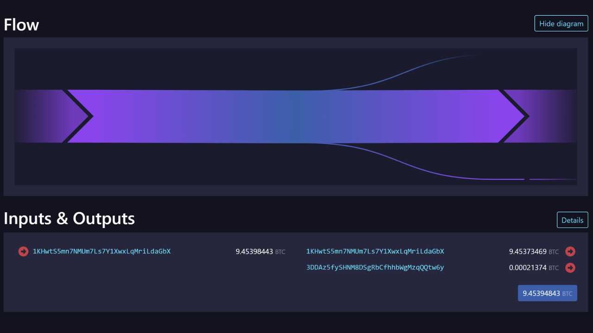

Источник: [Mempool.space](https://mempool.space/tx/54364146665bfc453a55eae4bfb8fdf7c721d02cb96aadc480c8b16bdeb8d6d0)

Эти сходства между входами и выходами не ограничиваются повторным использованием адресов. Любое сходство в использовании скриптов может позволить применить эвристику. Например, иногда можно наблюдать одинаковое версионирование между входом и одним из выходов транзакции.

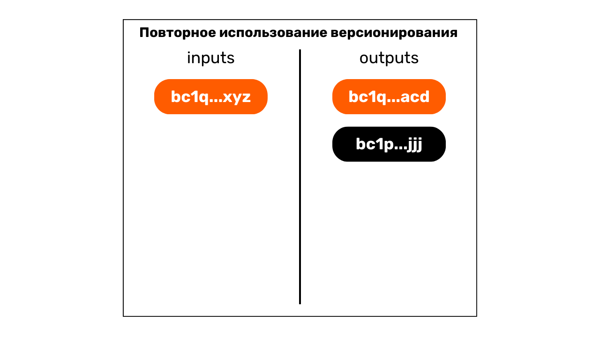

На этой диаграмме мы видим, что вход № 0 разблокирует скрипт P2WPKH (SegWit V0, начинающийся с `bc1q`). Выход № 0 использует тот же тип скрипта. Однако выход № 1 использует скрипт P2TR (SegWit V1, начинающийся с `bc1p`). Интерпретация этой характеристики заключается в том, что вероятно, адрес с тем же версионированием, что и вход, является адресом сдачи. Следовательно, он все еще принадлежит тому же пользователю.

Вот транзакция, на которой эту эвристику можно разумно применить:

```plaintext
db07516288771ce5d0a06b275962ec4af1b74500739f168e5800cbcb0e9dd578
```

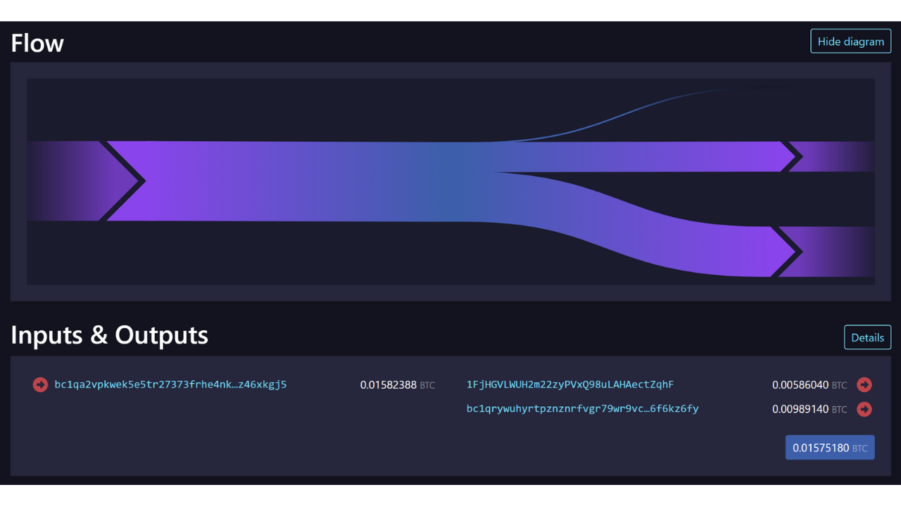

Источник: [Mempool.space](https://mempool.space/tx/db07516288771ce5d0a06b275962ec4af1b74500739f168e5800cbcb0e9dd578)
В данном случае мы видим, что вход №0 и выход №1 используют скрипты P2WPKH (SegWit V0), в то время как выход №0 использует другой тип скрипта, P2PKH (Legacy). В начале 2010-х годов эта эвристика, основанная на версионировании скриптов, была относительно мало полезна из-за ограничения типов доступных скриптов. Однако со временем и с последовательными обновлениями Биткойна было введено всё большее разнообразие типов скриптов. Эта эвристика становится всё более и более актуальной, потому что с более широким диапазоном типов скриптов пользователи делятся на меньшие группы, тем самым увеличивая шансы применения этой эвристики повторного использования внутренней версии. По этой причине, исключительно с точки зрения конфиденциальности, рекомендуется выбирать наиболее распространённый тип скрипта. Например, на момент написания этих строк, скрипты Taproot (`bc1p`) используются реже, чем скрипты SegWit V0 (`bc1q`). Хотя первые предлагают экономические и конфиденциальные преимущества в определённых конкретных контекстах, для более традиционных использований с одной подписью, может быть разумно придерживаться более старого стандарта по причинам конфиденциальности, пока новый стандарт не получит более широкое распространение.

### Платежи Круглыми Суммами

Другая внутренняя эвристика, которая может помочь нам определить сдачу, это эвристика круглых сумм. Обычно, когда мы сталкиваемся с простым шаблоном платежа (1 вход и 2 выхода), если один из выходов тратит круглую сумму, то он представляет собой платёж.

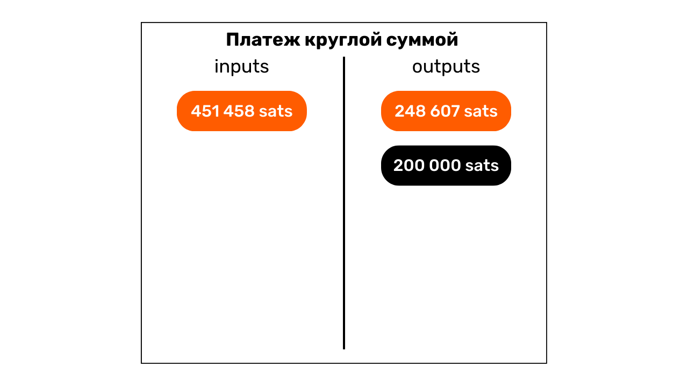

По исключению, если один выход представляет собой платёж, другой представляет собой сдачу. Следовательно, можно сделать вывод, что пользователь, вводящий транзакцию, по-прежнему владеет выходом, идентифицированным как сдача.

Следует отметить, что эта эвристика не всегда применима, поскольку большинство платежей всё ещё совершается в единицах фиатной валюты. Действительно, когда торговец во Франции принимает биткойны, обычно они не устанавливают стабильные цены в сатах. Они скорее предпочтут конвертацию между ценой в евро и суммой в биткойнах к оплате. Следовательно, в выходе транзакции не должно быть круглой суммы.

Тем не менее, аналитик мог бы попытаться сделать эту конвертацию, учитывая курс обмена в момент трансляции транзакции в сеть. Давайте рассмотрим пример транзакции с входом в `97,552 сата` и двумя выходами, один из которых `31,085 сатов`, а другой `64,152 сата`. На первый взгляд, эта транзакция не кажется включающей круглые суммы. Однако, применяя курс обмена в €64,339 на момент транзакции, мы получаем конвертацию в евро следующим образом:
- Вход в €62.76;
- Выход в €20;
- Выход в €41.27.
После конвертации в фиатную валюту, эта транзакция позволяет применить эвристику платежей круглыми суммами. Выход в €20, вероятно, был предназначен для торговца или, по крайней мере, сменил владельца. По дедукции, выход в €41.27, вероятно, остался во владении первоначального пользователя.
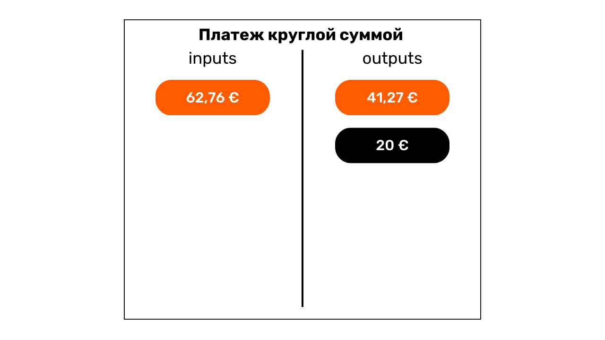

Если однажды Биткойн станет предпочтительной единицей учёта в наших транзакциях, эта эвристика может стать ещё более полезной для анализа.

Например, вот транзакция, где эту эвристику, вероятно, можно применить:

```plaintext
2bcb42fab7fba17ac1b176060e7d7d7730a7b807d470815f5034d52e96d2828a
```


Источник: [Mempool.space](https://mempool.space/tx/2bcb42fab7fba17ac1b176060e7d7d7730a7b807d470815f5034d52e96d2828a)

### Самый крупный вывод

Когда между двумя выходами транзакции в простой модели платежа наблюдается достаточно большой разрыв, можно предположить, что больший выход, скорее всего, является сдачей.

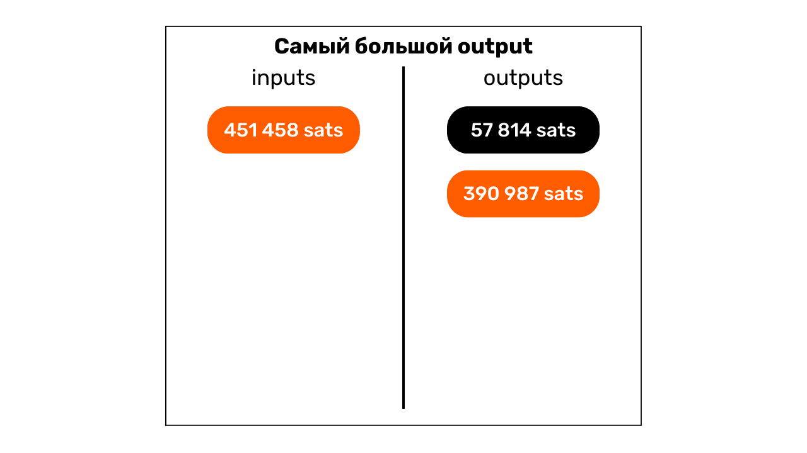

Эта эвристика о самом крупном выходе, вероятно, является самой неточной из всех. Если она идентифицирована сама по себе, то она довольно слаба. Однако эту характеристику можно сочетать с другими эвристиками для уменьшения неопределенности нашей интерпретации.

Например, если мы рассмотрим транзакцию, представляющую выход с круглой суммой и другой выход с большей суммой, совместное применение эвристики круглых платежей и эвристики о самом крупном выходе позволяет нам снизить наш уровень неопределенности.

Например, вот транзакция, где эта эвристика, вероятно, может быть применена:

```plaintext
b79d8f8e4756d34bbb26c659ab88314c220834c7a8b781c047a3916b56d14dcf
```


Источник: [Mempool.space](https://mempool.space/tx/b79d8f8e4756d34bbb26c659ab88314c220834c7a8b781c047a3916b56d14dcf)

## Внешние эвристики
<chapterId>4a170e3b-200d-431a-8285-18a23ff617ba</chapterId>

Изучение внешних эвристик включает анализ сходств, шаблонов и характеристик определенных элементов, которые не являются неотъемлемыми для самой транзакции. Другими словами, если ранее мы ограничивались использованием элементов, присущих транзакции с помощью внутренних эвристик, теперь мы расширяем наше поле анализа на окружение транзакции благодаря внешним эвристикам.

### Повторное использование адресов

Это одна из самых известных эвристик среди энтузиастов Биткойна. Повторное использование адресов позволяет устанавливать связь между различными транзакциями и различными UTXO. Это наблюдается, когда адрес для получения Биткойн используется несколько раз.

Таким образом, повторное использование адресов в рамках одной и той же транзакции может быть использовано как внутренняя эвристика для идентификации сдачи (как мы видели в предыдущей главе). Однако повторное использование адресов также может служить внешней эвристикой для распознавания уникальности агента за несколькими транзакциями.

Интерпретация повторного использования адресов заключается в том, что все UTXO, заблокированные на этом адресе, принадлежат (или принадлежали) одному и тому же агенту. Эта эвристика оставляет мало места для неопределенности. Когда ее можно идентифицировать, последующая интерпретация с высокой вероятностью соответствует действительности. Таким образом, она позволяет группировать различные активности в чейне.

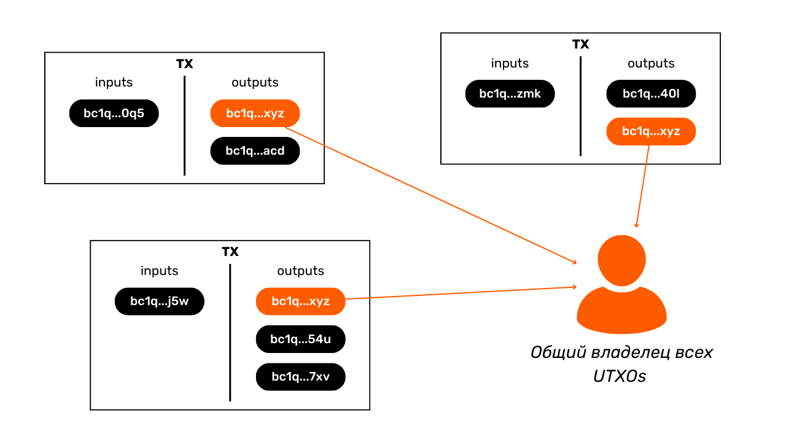

Как было объяснено во введении к части 3, эту эвристику открыл сам Сатоши Накамото. В Белой книге он конкретно упоминает решение для пользователей, чтобы избежать ее, которое просто заключается в использовании нового адреса для каждой новой транзакции:

"_В качестве дополнительного барьера, для каждой транзакции могла бы использоваться новая пара ключей, чтобы они не были связаны с общим владельцем._"


Источник: S. Nakamoto, "Bitcoin: A Peer-to-Peer Electronic Cash System", https://bitcoin.org/bitcoin.pdf, 2009.

Например, вот адрес, использованный в нескольких транзакциях:

```plaintext
bc1qqtmeu0eyvem9a85l3sghuhral8tk0ar7m4a0a0
```

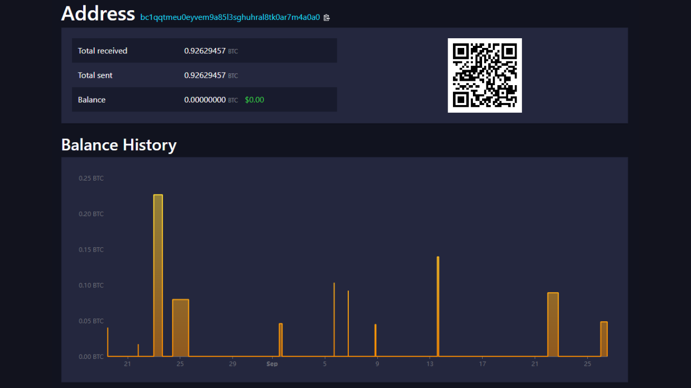

Источник: [Mempool.space](https://mempool.space/address/bc1qqtmeu0eyvem9a85l3sghuhral8tk0ar7m4a0a0)

### Сходство Скриптов и Отпечатки Кошельков

Помимо повторного использования адресов, существует множество других эвристик, позволяющих связывать действия с одним кошельком или с кластером адресов.
Прежде всего, аналитик может извлечь выгоду из сходства в использовании скриптов. Например, определенные минорные скрипты, такие как multisig, могут быть идентифицированы легче, чем скрипты SegWit V0. Чем больше группа, в которой мы скрываемся, тем труднее нас заметить. Именно поэтому в хороших протоколах Coinjoin все участники используют абсолютно одинаковый тип скрипта.
В более широком смысле, аналитик также может сосредоточиться на характерных отпечатках кошелька. Это специфические процессы, связанные с использованием, которые можно попытаться идентифицировать с целью использования их как эвристики трассировки. Другими словами, если наблюдается накопление одних и тех же внутренних характеристик в транзакциях, приписываемых преследуемому агенту, можно попытаться идентифицировать эти же характеристики в других транзакциях.

Например, можно идентифицировать, что преследуемый пользователь систематически отправляет свою сдачу на адреса P2TR (`bc1p…`). Если этот процесс повторяется, его можно использовать как эвристику для продолжения нашего анализа. Также могут быть использованы другие отпечатки, такие как порядок UTXO, размещение сдачи в выходах, сигнализация RBF (Replace-by-Fee), или даже номер версии, поле `nSequence` и поле `nLockTime`.

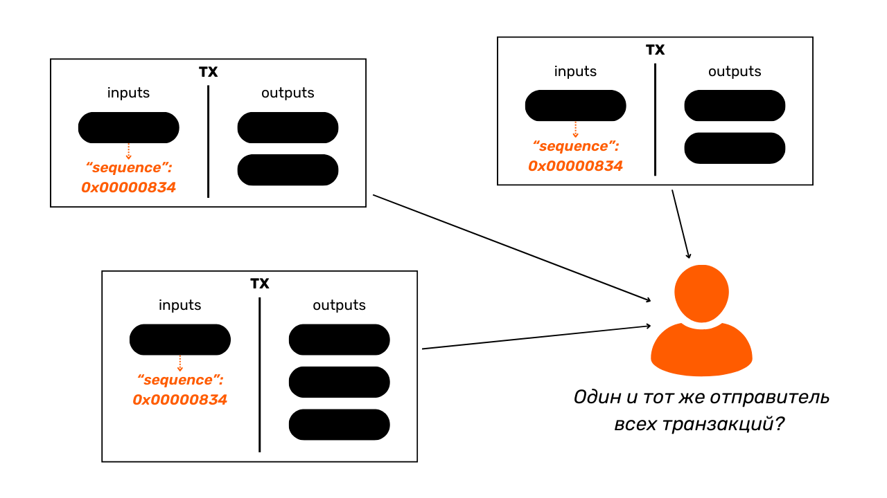

Как указывает [@LaurentMT](https://twitter.com/LaurentMT) в [Space Kek #19](https://podcasters.spotify.com/pod/show/decouvreБиткойн/episodes/SpaceKek-19---Analyse-de-chane--anonsets-et-entropie-e1vfuji) (франкоязычный подкаст), польза от отпечатков кошельков в анализе блокчейна значительно увеличивается со временем. Действительно, растущее количество типов скриптов и все более постепенное внедрение этих новых функций программным обеспечением для кошельков усиливают различия. Даже может случиться так, что можно будет точно идентифицировать программное обеспечение, используемое преследуемым агентом. Поэтому важно понимать, что изучение отпечатка кошелька особенно актуально для недавних транзакций, более чем для тех, которые были инициированы в начале 2010-х.

Подводя итог, отпечаток может быть любой конкретной практикой, автоматически выполняемой кошельком или вручную пользователем, которая может быть найдена в других транзакциях, чтобы помочь нам в нашем анализе.

### Эвристика Общего Владения Входами (CIOH)

CIOH, или "Common Input Ownership Heuristic" по-английски, это эвристика, утверждающая, что когда транзакция включает несколько входов, они, скорее всего, все принадлежат одному агенту. Следовательно, их владелец общий.
Для применения Эвристики Общего Владения Входами (CIOH) мы сначала наблюдаем за транзакцией, которая имеет несколько входов. Это может быть как минимум 2 входа или до 30 входов. Как только эта характеристика определена, мы проверяем, не соответствует ли транзакция известной модели транзакции. Например, если у неё 5 входов с примерно одинаковым количеством и 5 выходов с точно таким же количеством, мы знаем, что это структура coinjoin. Следовательно, мы не можем применить CIOH.
Однако, если транзакция не соответствует никакой известной модели коллаборативной транзакции, тогда мы можем предположить, что все входы, скорее всего, принадлежат одному и тому же агенту. Это может быть очень полезно для расширения известного кластера или для продолжения трассировки.

CIOH была открыта Сатоши Накамото. Он обсуждает это в части 10 Белой книги:

"_[...] связь неизбежна с мульти-входными транзакциями, которые необходимо показывают, что их входы принадлежали одному и тому же владельцу. Риск заключается в том, что если владелец ключа будет раскрыт, связи могут показать другие транзакции, принадлежащие тому же владельцу._"

Особенно удивительно отметить, что Сатоши Накамото, даже до официального запуска Биткойн, уже определил две основные уязвимости с точки зрения конфиденциальности пользователей, а именно CIOH и повторное использование адресов. Такое предвидение действительно замечательно, поскольку эти две эвристики остаются, даже сегодня, наиболее полезными в анализе цепочек.

Чтобы дать вам пример, вот транзакция, к которой, вероятно, можно применить CIOH:

```plaintext
20618e63b6eed056263fa52a2282c8897ab2ee71604c7faccfe748e1a202d712
```

Источник: [Mempool.space](https://mempool.space/tx/20618e63b6eed056263fa52a2282c8897ab2ee71604c7faccfe748e1a202d712)

### Данные вне цепочки

Очевидно, анализ цепочки не ограничивается исключительно данными внутри цепочки. Любые данные из предыдущих анализов или доступные в интернете также могут быть использованы для уточнения анализа.
Например, если наблюдается, что отслеживаемые транзакции систематически транслируются с одного и того же узла Биткойн и его IP-адрес может быть идентифицирован, возможно, удастся выявить другие транзакции от того же агента, в дополнение к определению части личности отправителя. Хотя эта практика не всегда легко достижима, так как требует работы многих узлов, возможно, что некоторые компании, специализирующиеся на анализе цепочек, используют её.

Аналитик также имеет возможность опираться на анализы, сделанные общедоступными ранее, или на свои собственные предыдущие анализы. Возможно, можно найти выход, который указывает на кластер адресов, который уже был идентифицирован. Иногда также возможно опираться на выходы, указывающие на платформу обмена, адреса этих компаний обычно известны.

Таким же образом можно провести анализ методом исключения. Например, если во время анализа транзакции с двумя выходами один из них связан с уже известным кластером адресов, отличным от отслеживаемого агента, тогда можно интерпретировать, что другой выход, вероятно, представляет сдачу.

Анализ цепочек также включает часть OSINT (*Open Source Intelligence*), которая является немного более общей с поисками в интернете. Поэтому не рекомендуется публиковать получающие адреса напрямую в социальных сетях или на веб-сайте, будь то под псевдонимом или нет.

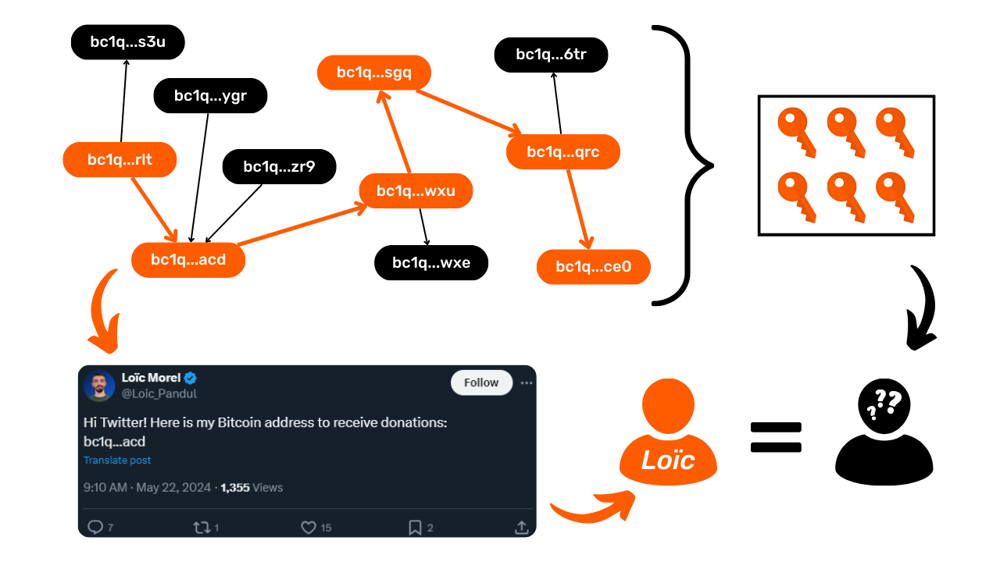

### Временные Модели
Менее рспространено, но определенное поведение людей можно распознать в блокчейне. Самым полезным в анализе может быть ваш режим сна! Да, когда вы спите, вы, вероятно, не совершаете транзакции в Биткойн. Поскольку вы обычно спите примерно в одно и то же время, распространено использование временных анализов в анализе блокчейна. Это просто включает в себя каталогизацию часов, в которые транзакции данного агента транслируются в сеть Биткойн. Анализ этих временных шаблонов позволяет нам получить множество информации.

Прежде всего, временной анализ иногда позволяет идентифицировать природу отслеживаемого анегта. Если наблюдается, что транзакции транслируются стабильно в течение 24 часов, это будет указывать на сильную экономическую активность. Агент, стоящий за этими транзакциями, вероятно, является компанией, потенциально международной, и, возможно, с автоматизированными процедурами внутри.

Например, [я распознал эту модель несколько месяцев назад](https://twitter.com/Loic_Pandul/status/1701127409712452072), анализируя [транзакцию, в которой по ошибке было выделено 19 биткоинов в качестве комиссии](https://mempool.space/tx/d5392d474b4c436e1c9d1f4ff4be5f5f9bb0eb2e26b61d2781751474b7e870fd). Простой временной анализ позволил мне предположить, что мы имеем дело с автоматизированной службой, и, следовательно, вероятно, с крупным агенто, такой как платформа обмена.

Действительно, через несколько дней было обнаружено, что средства принадлежат PayPal через платформу обмена Paxos.

Напротив, если мы видим, что временной шаблон скорее распределен на 16 очень конкретных часов, тогда мы можем оценить, что имеем дело с индивидуальным пользователем или, возможно, с местным бизнесом в зависимости от объемов торговли.

Помимо природы наблюдаемого агента, временной шаблон также может дать нам приблизительное местоположение пользователя благодаря часовым поясам. Таким образом, мы можем связать другие транзакции и использовать временную метку этих транзакций как дополнительную эвристику, которую можно добавить к нашему анализу.

Например, на повторно используемом адресе, о котором я говорил ранее, мы можем наблюдать, что транзакции, будь то входящие или исходящие, сосредоточены в интервале 13 часов.

```plaintext
bc1qqtmeu0eyvem9a85l3sghuhral8tk0ar7m4a0a0
```

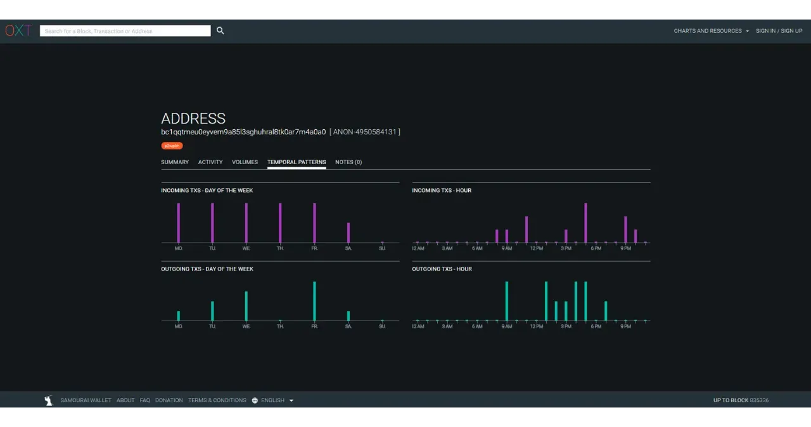

Источник: OXT.me

Этот интервал, вероятно, соответствует Европе, Африке или Ближнему Востоку. Следовательно, мы можем сделать вывод, что пользователь, стоящий за этими транзакциями, живет там.

В другом регистре, это также временной анализ этого типа, который позволил выдвинуть гипотезу, что Сатоши Накамото не работал из Японии, а действительно из Соединенных Штатов: [*Часовые пояса Сатоши Накамото*](https://medium.com/@insearchofsatoshi/the-time-zones-of-satoshi-nakamoto-aa40f035178f)

## Практическое применение с помощью Block Explorer
<chapterId>6493cf2f-225c-405f-9375-c4304f1087ed</chapterId>

В этой заключительной главе мы конкретно применим концепции, которые мы изучали до сих пор. Я представлю вам примеры реальных транзакций Биткойн, и вам нужно будет извлечь информацию, которую я прошу.
Идеально было бы использовать профессиональный инструмент анализа цепочек для этих упражнений. Однако, после ареста создателей кошелька Samourai, единственный бесплатный инструмент анализа OXT.me больше не доступен. Поэтому мы выберем классический блок-эксплорер для этих заданий. Я рекомендую использовать [Mempool.space](https://mempool.space/) за его многочисленные функции и широкий спектр инструментов анализа цепочек, но вы также можете выбрать другой эксплорер, например, [Биткойн Explorer](https://Биткойнexplorer.org/). Для начала я представлю упражнения. Используйте ваш блок-эксплорер для их выполнения и запишите ваши ответы на листе бумаги. Затем, в конце этой главы, я предоставлю ответы, чтобы вы могли проверить и исправить ваши результаты.

*Транзакции, выбранные для этих упражнений, были выбраны исключительно за их характеристики в несколько случайном порядке. Эта глава предназначена исключительно для образовательных и информационных целей. Я хочу уточнить, что я не поддерживаю и не поощряю использование этих инструментов в злонамеренных целях. Цель - научить вас защищаться от анализа цепочек, а не проводить анализы для раскрытия частной информации других людей.*

### Упражнение 1

ID транзакции для анализа:

```plaintext
3769d3b124e47ef4ffb5b52d11df64b0a3f0b82bb10fd6b98c0fd5111789bef7
```

Какова модель этой транзакции и какие вероятные интерпретации можно сделать, анализируя только ее модель, то есть структуру транзакции?

### Упражнение 2

ID транзакции для анализа:

```plaintext
baa228f6859ca63e6b8eea24ffad7e871713749d693ebd85343859173b8d5c20
```

Какова модель этой транзакции и какие вероятные интерпретации можно сделать, анализируя только ее модель, то есть структуру транзакции?

### Упражнение 3

ID транзакции для анализа:

```plaintext
3a9eb9ccc3517cc25d1860924c66109262a4b68f4ed2d847f079b084da0cd32b
```

Какова модель этой транзакции?

После определения ее модели, используя внутренние эвристики транзакции, какой вывод, вероятно, представляет собой сдачу?

### Упражнение 4

ID транзакции для анализа:

```plaintext
35f0b31c05503ebfdf7311df47f68a048e992e5cf4c97ec34aa2833cc0122a12
```

Какова модель этой транзакции?
После определения ее модели, используя внутренние эвристики транзакции, какой вывод, вероятно, представляет собой сдачу?

### Упражнение 5

Представьте, что Лоик разместил один из своих адресов для получения биткойнов в социальной сети Twitter:

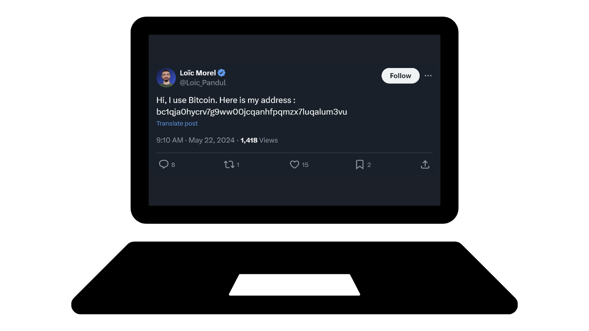

```plaintext
bc1qja0hycrv7g9ww00jcqanhfpqmzx7luqalum3vu
```

Используя **только эвристику повторного использования адреса**, какие биткойн-транзакции мы можем связать с личностью Лоика?

*Очевидно, я не являюсь реальным владельцем этого адреса для получения и не размещал его в социальных сетях. Это адрес, который я случайным образом выбрал из блокчейна.*

### Упражнение 6

Продолжая Упражнение 5, благодаря эвристике повторного использования адреса, вы смогли идентифицировать несколько биткоин-транзакций, в которых, по-видимому, участвовал Лоик. Обычно, среди идентифицированных транзакций, вы должны были заметить эту:

```plaintext
2d9575553c99578268ffba49a1b2adc3b85a29926728bd0280703a04d051eace
```
Эта транзакция является самой первой, которая отправляет средства на адрес Лоика. На ваш взгляд, откуда поступают биткоины, полученные Лоиком через эту транзакцию?

### Упражнение 7

Продолжая Упражнение 5, благодаря эвристике повторного использования адресов, вам удалось идентифицировать несколько биткойн-транзакций, в которых, по-видимому, участвует Лоик. Теперь вы хотите выяснить, откуда Лоик. Основываясь на найденных транзакциях, проведите временной анализ, чтобы найти вероятную часовую зону, используемую Лоиком. Исходя из этой часовой зоны, определите место, где, по-видимому, живет Лоик (страна, штат/регион, город...).


### Упражнение 8

Вот биткоин-транзакция для изучения:

```plaintext
bb346dae645d09d32ed6eca1391d2ee97c57e11b4c31ae4325bcffdec40afd4f
```

Наблюдая только за этой транзакцией, какую информацию мы можем интерпретировать?

### Решения упражнений

***Упражнение 1:***
Модель этой транзакции представляет собой простой платеж. Если изучать только ее структуру, мы можем интерпретировать, что один из выходов представляет собой сдачу, а другой выход - фактический платеж. Следовательно, мы знаем, что наблюдаемый пользователь, вероятно, больше не владеет одним из двух UTXO на выходах (тем, который предназначен для платежа), но все еще владеет другим UTXO (тем, который является сдачей).

***Упражнение 2:***
Модель этой транзакции представляет собой пакетное расходование. Эта модель, вероятно, указывает на значительную экономическую активность, например, на платформу обмена. Мы можем сделать вывод, что UTXO на входе поступает от компании с значительной экономической активностью и что UTXO на выходах будут распределяться. Некоторые из них принадлежат клиентам компании, которые перевели свои биткойны в кошельки для самостоятельного хранения. Другие могут идти в сторону партнерских компаний. Наконец, наверняка будет сдача, которая возвращается выпускающей компании.

***Упражнение 3:***

Модель этой транзакции представляет собой простой платеж. Следовательно, мы можем применить внутренние эвристики к транзакции, чтобы попытаться идентифицировать сдачу.

Лично я идентифицировал по крайней мере две внутренние эвристики, поддерживающие одну и ту же гипотезу:
- Повторное использование одного и того же типа скрипта;
- Самый большой выход.

Наиболее очевидной эвристикой является повторное использование одного и того же типа скрипта. Действительно, выход `0` является `P2SH`, узнаваемым по его адресу получения, начинающемуся с `3`:

```plaintext
3Lcdauq6eqCWwQ3UzgNb4cu9bs88sz3mKD
```

В то время как выход `1` является `P2WPKH`, идентифицируемым по его адресу, начинающемуся с `bc1q`:

```plaintext
bc1qya6sw6sta0mfr698n9jpd3j3nrkltdtwvelywa
```

UTXO, использованный на входе для этой транзакции, также использует скрипт `P2WPKH`:

```plaintext
bc1qyfuytw8pcvg5vx37kkgwjspg73rpt56l5mx89k
```

Таким образом, мы можем предположить, что выход `0` соответствует платежу, а выход `1` является сдачей транзакции, что означает, что пользователь на входе все еще владеет выходом `1`.
Чтобы поддержать или опровергнуть эту гипотезу, мы можем искать другие эвристики, которые либо подтверждают нашу мысль, либо уменьшают вероятность того, что наша гипотеза верна.
Я заметил по крайней мере одну другую эвристику. Это наибольший вывод. Вывод `0` составляет `123,689 сатоши`, в то время как вывод `1` составляет `505,839 сатоши`. Таким образом, между этими двумя выводами существует значительная разница. Эвристика наибольшего вывода предполагает, что наиболее объемный вывод, скорее всего, является сдачей. Эта эвристика таким образом дополнительно укрепляет нашу первоначальную гипотезу.

Похоже, что пользователь, который предоставил UTXO на входе, все еще владеет выводом `1`, который, по-видимому, представляет собой сдачу с транзакции.

***Упражнение 4:***
Модель этой транзакции является моделью простого платежа. Следовательно, мы можем применить внутренние эвристики к транзакции, чтобы попытаться идентифицировать сдачу.
Я лично определил по крайней мере две внутренние эвристики, которые поддерживают ту же гипотезу:
- Повторное использование того же типа скрипта;
- Вывод круглой суммы.

Наиболее очевидной эвристикой является повторное использование того же типа скрипта. Действительно, вывод `0` является `P2SH`, узнаваемым по его адресу получения, начинающемуся с `3`:

```plaintext
3FSH5Mnq6S5FyQoKR9Yjakk3X4KCGxeaD4
```

В то время как вывод `1` является `P2WPKH`, идентифицируемым по его адресу, начинающемуся с `bc1q`:

```plaintext
bc1qvdywdcfsyavt4v8uxmmrdt6meu4vgeg439n7sg
```

UTXO, использованный в качестве входа для этой транзакции, также использует скрипт `P2WPKH`:

```plaintext
bc1qku3f2y294h3ks5eusv63dslcua2xnlzxx0k6kp
```

Таким образом, мы можем предположить, что вывод `0` соответствует платежу, а вывод `1` является сдачей транзакции, что означает, что пользователь на входе все еще владеет выводом `1`.

Чтобы поддержать или опровергнуть эту гипотезу, мы можем искать другие эвристики, которые либо подтверждают нашу мысль, либо уменьшают вероятность того, что наша гипотеза верна.

Я заметил по крайней мере одну другую эвристику. Это вывод круглой суммы. Вывод `0` составляет `70,000 сатоши`, в то время как вывод `1` составляет `22,962 сатоши`. Следовательно, мы имеем дело с выводом, идеально круглым в единице счета BTC. Эвристика круглого вывода предполагает, что UTXO с круглой суммой, скорее всего, является платежом, и посредством исключения, другой представляет собой сдачу. Эта эвристика таким образом дополнительно укрепляет нашу первоначальную гипотезу.

Однако, в этом примере, другая эвристика могла бы поставить под сомнение нашу первоначальную гипотезу. Действительно, вывод `0` больше, чем вывод `1`. Если мы опираемся на эвристику, что наибольший вывод обычно является сдачей, мы могли бы заключить, что вывод `0` является сдачей. Однако, эта контргипотеза кажется маловероятной, поскольку две другие эвристики кажутся значительно более убедительными, чем эвристика наибольшего вывода. Следовательно, кажется разумным сохранить нашу первоначальную гипотезу несмотря на это видимое противоречие.
Таким образом, более правдоподобно, что пользователь, который предоставил UTXO на входе, все еще владеет выводом `1`, который, по-видимому, представляет собой сдачу с транзакции.

***Упражнение 5:***

Мы можем видеть, что с идентичностью Лоика можно связать 8 транзакций. Среди них 4 связаны с получением биткойнов:


```plaintext
2d9575553c99578268ffba49a1b2adc3b85a29926728bd0280703a04d051eace
8b70bd322e6118b8a002dbdb731d16b59c4a729c2379af376ae230cf8cdde0dd
d5864ea93e7a8db9d3fb113651d2131567e284e868021e114a67c3f5fb616ac4
bc4dcf2200c88ac1f976b8c9018ce70f9007e949435841fc5681fd33308dd762
```

Остальные 4 касаются отправки биткойнов:

```plaintext
8b52fe3c2cf8bef60828399d1c776c0e9e99e7aaeeff721fff70f4b68145d540
c12499e9a865b9e920012e39b4b9867ea821e44c047d022ebb5c9113f2910ed6
a6dbebebca119af3d05c0196b76f80fdbf78f20368ebef1b7fd3476d0814517d
3aeb7ce02c35eaecccc0a97a771d92c3e65e86bedff42a8185edd12ce89d89cc
```
***Упражнение 6:***
Если мы рассмотрим модель этой транзакции, становится очевидным, что это групповой расход. Действительно, транзакция имеет один вход и 51 выход, что указывает на значительную экономическую активность. Следовательно, мы можем предположить, что Лоик совершил вывод биткойнов с торговой платформы.

Несколько элементов укрепляют эту гипотезу. Во-первых, тип скрипта, используемого для защиты UTXO на входе, - это скрипт мультисигнатуры 2 из 3 P2SH, что указывает на высокий уровень безопасности, характерный для торговых платформ:

```plaintext
OP_PUSHNUM_2
OP_PUSHBYTES_33 03eae02975918af86577e1d8a257773118fd6ceaf43f1a543a4a04a410e9af4a59
OP_PUSHBYTES_33 03ba37b6c04aaf7099edc389e22eeb5eae643ce0ab89ac5afa4fb934f575f24b4e
OP_PUSHBYTES_33 03d95ef2dc0749859929f3ed4aa5668c7a95baa47133d3abec25896411321d2d2d
OP_PUSHNUM_3
OP_CHECKMULTISIG
```
Кроме того, анализируемый адрес `3PUv9tQMSDCEPSMsYSopA5wDW86pwRFbNF` используется повторно в более чем 220 000 различных транзакций, что часто характерно для торговых платформ, обычно не заботящихся о своей конфиденциальности. Временная эвристика, примененная к этому адресу, также показывает регулярное распределение транзакций почти каждый день на протяжении 3 месяцев, с продолжительностью свыше 24 часов, что предполагает непрерывную деятельность торговой платформы.

Наконец, обработанные этим агентом объемы данных, огромны. Действительно, адрес получил и отправил 44 BTC в течение 222 262 транзакций между декабрем 2022 и мартом 2023 года. Эти значительные объемы дополнительно подтверждают вероятный характер деятельности торговой платформы.

***Упражнение 7:***
Анализируя время подтверждения транзакций, можно отметить следующие времена по UTC:

```plaintext
05:43
20:51
18:12
17:16
04:28
23:38
07:45
21:55
```

Анализируя эти времена, можно заметить, что часовые пояса UTC-7 и UTC-8 соответствуют диапазону общепринятых человеческих активностей (между 08:00 и 23:00) для большинства указанных времен:

```plaintext
05:43 UTC > 22:43 UTC-7
20:51 UTC > 13:51 UTC-7
18:12 UTC > 11:12 UTC-7
17:16 UTC > 10:16 UTC-7
04:28 UTC > 21:28 UTC-7
23:38 UTC > 16:38 UTC-7
07:45 UTC > 00:45 UTC-7
21:55 UTC > 14:55 UTC-7

05:43 UTC > 21:43 UTC-8
20:51 UTC > 12:51 UTC-8
18:12 UTC > 10:12 UTC-8
17:16 UTC > 09:16 UTC-8
04:28 UTC > 20:28 UTC-8
23:38 UTC > 15:38 UTC-8
07:45 UTC > 23:45 UTC-8
21:55 UTC > 13:55 UTC-8
```


Часовой пояс UTC-7 особенно актуален летом, так как включает в себя штаты и регионы, такие как:
- Калифорния (с городами, такими как Лос-Анджелес, Сан-Франциско и Сан-Диего);
- Невада (с Лас-Вегасом);
- Орегон (с Портлендом);
- Вашингтон (с Сиэтлом);
- Канадский регион Британская Колумбия (с городами, такими как Ванкувер и Виктория).

Эти данные предполагают, что Лоик может с вероятностью проживать на западном побережье Соединенных Штатов или Канады.

***Упражнение 8:***
Анализ этой транзакции выявляет 5 входов и один выход, что, по-видимому, указывает на консолидацию. Применение эвристики CIOH предполагает, что все UTXO на входах принадлежат одному субъекту, и что UTXO на выходе также принадлежит этому субъекту. Похоже, что пользователь решил консолидировать несколько UTXO, которыми он владел, в один UTXO на выходе, с целью консолидации своих монет. Этот подход, вероятно, был мотивирован желанием воспользоваться низкими комиссиями за транзакцию в то время, чтобы снизить будущие комиссии.
___

*При написании этой части 3 по анализу цепочки я опирался на следующие ресурсы:*
- *Серия из четырех статей под названием: [Understanding Bitcoin Privacy with OXT](https://medium.com/oxt-research/understanding-bitcoin-privacy-with-oxt-part-1-4-8177a40a5923), подготовленная кошельком Samourai в 2021 году;*
- *Различные отчеты от [OXT Research](https://medium.com/oxt-research), а также их бесплатный инструмент для анализа цепочки (который на данный момент недоступен после ареста основателей кошелька Samourai);*
- *В более широком смысле, мои знания основываются на различных твитах и контенте от [@LaurentMT](https://twitter.com/LaurentMT) и [@ErgoBTC](https://twitter.com/ErgoBTC);*
- *Участие в [Space Kek #19](https://podcasters.spotify.com/pod/show/decouvreБиткойн/episodes/SpaceKek-19---Analyse-de-chane--anonsets-et-entropie-e1vfuji) вместе с [@louneskmt](https://twitter.com/louneskmt), [@TheoPantamis](https://twitter.com/TheoPantamis), [@Sosthene___](https://twitter.com/Sosthene___) и [@LaurentMT](https://twitter.com/LaurentMT).*
  
*Хочу выразить благодарность их авторам, разработчикам и продюсерам. Также спасибо рецензентам, которые тщательно исправили статью, послужившую основой для данной части, и подарили мне свои экспертные советы:*
- *[Gilles Cadignan](https://twitter.com/gillesCadignan);*
- *[Ludovic Lars](https://viresinnumeris.fr/).*

# Освоение лучших практик для защиты вашей конфиденциальности
<partId>9bd04b63-f1af-4e50-9061-6bc90009df68</partId>

## Повторное использование адресов
<chapterId>f3e97645-3df3-41bc-a4ed-d2c740113d96</chapterId>

Изучив техники, которые могут нарушить вашу конфиденциальность в Биткойн, в этой части мы теперь рассмотрим лучшие практики, которые следует применять для вашей защиты. Эта часть не направлена на изучение методов улучшения конфиденциальности, тема, которая будет рассмотрена позже, а скорее на понимание того, как правильно взаимодействовать с Биткойном, чтобы поддерживать конфиденциальность, которую он естественно предлагает, без использования дополнительных техник.
Очевидно, что начиная эту часть, мы будем говорить о повторном использовании адресов. Это явление составляет основную угрозу конфиденциальности пользователя. Поэтому этот раздел, пожалуй, самый важный во всем обучении.

### Что такое адрес для получения?

Адрес для получения Биткойна - это строка символов или идентификатор, используемый для получения биткойнов в кошелек.

Технически, адрес для получения Биткойна не "получает" биткойны в буквальном смысле, а скорее определяет условия, при которых биткойны могут быть потрачены. Конкретно, когда вам отправляется платеж, транзакция отправителя создает новый UTXO, предназначенный для вас, в выходе из UTXO, которые он использовал во входах. На этом выходе применяется скрипт, определяющий, как этот UTXO может быть потрачен позже. Этот скрипт известен как "*ScriptPubKey*" или "*Locking Script*". Ваш адрес для получения, точнее его полезная нагрузка, интегрируется в этот скрипт. Для упрощения, этот скрипт в основном утверждает:

> "*Чтобы потратить этот новый UTXO, должна быть предоставлена цифровая подпись с использованием приватного ключа, ассоциированного с этим адресом для получения.*"

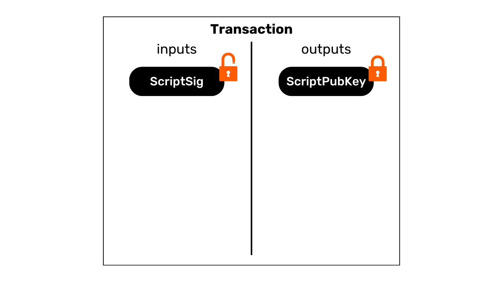

Адреса Биткойн бывают разных типов в зависимости от используемой модели скрипта. Первые модели, известные как "*Legacy*", включают адреса `P2PKH` (*Pay-to-PubKey-Hash*) и `P2SH` (*Pay-to-Script-Hash*). Адреса P2PKH всегда начинаются с `1`, а P2SH - с `3`. Хотя эти форматы по-прежнему безопасны, они теперь считаются устаревшими, так как приводят к более высоким комиссиям за транзакции и предлагают меньшую конфиденциальность по сравнению с новыми стандартами.
Адреса SegWit V0 (`P2WPKH` и `P2WSH`) и Taproot / SegWit V1 (`P2TR`) представляют собой современные форматы. Адреса SegWit начинаются с `bc1q`, а адреса Taproot, введенные в 2021 году, начинаются с `bc1p`.
Например, вот адрес для получения Taproot:

```text
bc1ps5gd2ys8kllz9alpmcwxqegn7kl3elrpnnlegwkm3xpq2h8da07spxwtf5
```

Способ построения ScriptPubKey будет зависеть от используемого стандарта:
| Модель скрипта | ScriptPubKey                                                || ---------------- | ----------------------------------------------------------- |
| P2PKH          | OP_DUP OP_HASH160 `<pubKeyHash>` OP_EQUALVERIFY OP_CHECKSIG |
| P2SH           | OP_HASH160 `<scriptHash>` OP_EQUAL                          |
| P2WPKH         | 0 `<pubKeyHash>`                                            |
| P2WSH          | 0 `<witnessScriptHash>`                                     |
| P2SH - P2WPKH  | OP_HASH160 `<redeemScriptHash>` OP_EQUAL                    |
| P2SH - P2WSH   | OP_HASH160 `<redeemScriptHash>` OP_EQUAL                    |
| P2TR           | 1 `<pubKey>`                                                |

Что касается построения адресов для получения, это также зависит от выбранной модели скрипта:
- Для адресов `P2PKH` и `P2WPKH` полезная нагрузка, то есть основа адреса, представляет собой хеш открытого ключа;
- Для адресов `P2SH` и `P2WSH` полезная нагрузка представляет собой хеш скрипта;
- Что касается адресов `P2TR`, полезная нагрузка является модифицированным открытым ключом. Выходы `P2TR` сочетают в себе аспекты _Pay-to-PubKey_ и _Pay-to-Script_. Модифицированный открытый ключ является результатом добавления классического открытого ключа для расходования с "модификацией", полученной из корня Меркла набором скриптов, который также может быть использован для траты биткойнов.

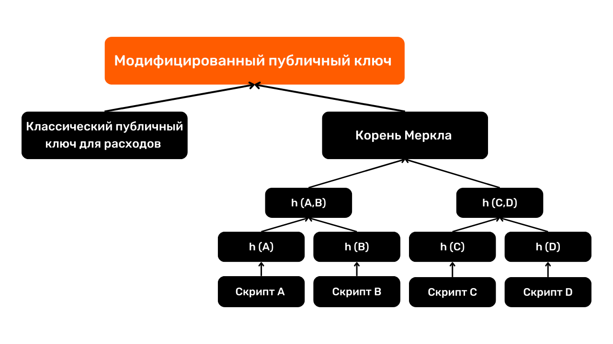

Адреса, отображаемые в вашем программном обеспечении для кошелька, также включают в себя HRP (*Human-Readable Part*, часть, понятная человеку), обычно `bc` для адресов после SegWit, разделитель `1` и номер версии `q` для SegWit V0 и `p` для Taproot/SegWit V1. Также добавляется контрольная сумма для обеспечения целостности и валидности адреса при его передаче.

Наконец, адреса приводятся к стандартному формату:
- Base58check для старых Legacy адресов;
- Bech32 для адресов SegWit;
- Bech32m для адресов Taproot.

Вот матрица сложения для форматов bech32 и bech32m (SegWit и Taproot) из десятичной системы:

| +   | 0   | 1   | 2   | 3   | 4   | 5   | 6   | 7   |
| --- | --- | --- | --- | --- | --- | --- | --- | --- |
| 0   | q   | p   | z   | r   | y   | 9   | x   | 8   |
| 8   | g   | f   | 2   | t   | v   | d   | w   | 0   |
| 16  | s   | 3   | j   | n   | 5   | 4   | k   | h   |
| 24  | c   | e   | 6   | m   | u   | a   | 7   | l   |

### Что такое повторное использование адресов?

Повторное использование адресов относится к практике использования одного и того же адреса для получения, чтобы блокировать нескольких различных UTXOs.

Как мы видели в предыдущем разделе, каждый UTXO имеет свой собственный ScriptPubKey, который его блокирует и который должен быть удовлетворен, чтобы UTXO мог быть использован в качестве входа в новой транзакции. Именно в этом ScriptPubKey интегрируются адреса получения (payload).

Когда разные ScriptPubKeys содержат один и тот же адрес получения, это называется повторным использованием адреса. На практике это означает, что пользователь предоставил один и тот же адрес несколько раз отправителям для получения биткойнов через множество платежей. И действительно, эта практика катастрофична для вашей конфиденциальности.

### Почему повторное использование адресов является проблемой?

Учитывая, что блокчейн является публичным, легко увидеть, какие адреса блокируют какие UTXOs и сколько биткойнов. Если один и тот же адрес используется для нескольких транзакций, становится возможным понять, что все биткойны, связанные с этим адресом, принадлежат одному и тому же лицу. Эта практика компрометирует конфиденциальность пользователя, позволяя устанавливать детерминированные связи между различными транзакциями и отслеживать биткойны в блокчейне. Сам Сатоши Накамото подчеркнул эту проблему в Белой книге Биткойна:

> *В качестве дополнительного брандмауэра для каждой транзакции можно было бы использовать новую пару ключей, чтобы они не были связаны с общим владельцем.*


Источник: S. Nakamoto, "Bitcoin: A Peer-to-Peer Electronic Cash System", https://bitcoin.org/bitcoin.pdf, 2009.

Цель, которую преследовал Сатоши в этом утверждении, заключалась в создании дополнительного брандмауэра в случае ассоциации между личностью пользователя и парой ключей в Биткойн, чтобы избежать публичного связывания всей их активности с их личностью. Сегодня, с распространением компаний по анализу цепочек и регулирований KYC, использование уникальных адресов уже не является "дополнительным брандмауэром", а необходимой практикой для всех, кто хочет сохранить свою конфиденциальность хотя бы на минимальном уровне.

Когда вы повторно используете адрес, вы создаете почти неопровержимую связь между всеми транзакциями, связанными с этим адресом. Хотя это непосредственно не подвергает ваши средства опасности, поскольку криптография на эллиптических кривых обеспечивает безопасность ваших приватных ключей, это облегчает мониторинг ваших действий. Действительно, любой человек с узлом может наблюдать за транзакциями и балансами адресов, тем самым полностью компрометируя вашу анонимность.


Чтобы проиллюстрировать этот момент, давайте рассмотрим пример Боба, пользователя, который регулярно покупает биткойны в небольших количествах через DCA (Dollar Cost Averaging) и всегда отправляет их на один и тот же адрес. Через два года на этом адресе накапливается значительное количество биткойнов. Если Боб использует этот адрес для оплаты местному торговцу, последний может увидеть все связанные средства и увидеть состояние Боба. Это может привести к личным рискам безопасности, включая попытки кражи или вымогательства. Если бы Боб использовал новый адрес для получения каждой периодической покупки, он бы раскрыл гораздо меньше информации своему торговцу.

В анализе цепочек мы различаем 2 типа повторного использования адресов:
- Внешнее повторное использование;
- Внутреннее повторное использование в рамках транзакции.

Первое наблюдается, когда адрес повторно используется в нескольких различных биткойн-транзакциях. Это то, о чем мы говорили ранее: эта эвристика позволяет нам вывести, что все UTXOs, прошедшие через этот адрес, принадлежат одному агенту.
Внутреннее повторное использование адресов наблюдается не тогда, когда повторное использование происходит в разных транзакциях, а когда оно происходит в рамках одной и той же транзакции. Действительно, если один и тот же адрес, который использовался для блокировки входа, используется в качестве выхода в транзакции, тогда мы можем сделать вывод, что этот выход все еще принадлежит тому же пользователю (сдача), и что второй выход представляет собой фактический платеж. Эта другая эвристика позволяет отслеживать средства через несколько транзакций.


Повторное использование адресов является настоящим бичом для Биткойна. Согласно сайту OXT.me (в настоящее время недоступен), общий уровень повторного использования адресов в Биткойн составлял около 52% в 2022 году:

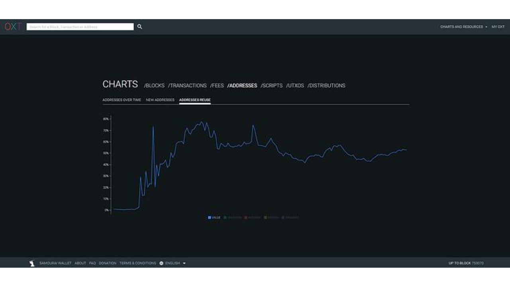

Этот показатель огромен, но он в основном исходит от платформ обмена, а не от индивидуальных пользователей.

### Как избежать повторного использования адресов?

Избежать повторного использования адресов довольно просто: **просто используйте новый, свежий адрес для каждого нового входящего платежа на ваш кошелек**.

Благодаря BIP32, современные кошельки теперь детерминированы и иерархически устроены. Это означает, что пользователь может генерировать большое количество адресов из одного начального элемента информации: seed. Сохраняя этот единственный элемент информации, можно восстановить все приватные ключи кошелька, таким образом получая доступ к средствам, защищенным соответствующими адресами.


Вот почему, когда вы нажимаете кнопку "*получить*" в программном обеспечении вашего кошелька, вам каждый раз предлагается неиспользованный адрес для получения. После получения биткойнов на этот адрес, программное обеспечение автоматически предлагает новый.
> *PS: Недавно некоторые программные обеспечения кошельков объявили о своем намерении прекратить генерацию пустых адресов, опасаясь, что это может быть воспринято как форма отмывания денег властями. Если ваше программное обеспечение входит в их число, я настоятельно советую вам немедленно его заменить, так как это неприемлемо для пользователя.*

Если вам нужен статический идентификатор для получения платежей, например, для получения пожертвований, не рекомендуется использовать классический адрес Биткойн из-за риска повторного использования. Предпочтите использование Lightning адреса, или для статического onchain идентификатора платежа, вы можете выбрать BIP47 или Silent Payments. Работа этих протоколов подробно описана в части 6 этого обучения.

## Маркировка и контроль монет
<chapterId>fbdb07cd-c025-48f2-97b0-bd1bc21c68a8</chapterId>

Как мы узнали в части об анализе цепочек, существует множество эвристик и паттернов, которые можно использовать для вывода информации о транзакции. Для пользователя важно быть осведомленным об этих техниках, чтобы лучше защитить себя.

Это включает в себя, в частности, тщательное управление вашим кошельком самохранения, которое включает знание происхождения ваших UTXOs, а также вдумчивый выбор UTXO для использования во время платежей. Эффективное управление кошельком основывается на двух важных функциях хороших Биткойн кошельков: маркировке и контроле монет.

В этой главе мы изучим эти функции и увидим, как вы могли бы использовать их разумно, не добавляя слишком много работы, чтобы значительно оптимизировать вашу конфиденциальность в Биткойне.

### Что такое маркировка?

Маркировка - это практика присвоения аннотации или метки конкретному UTXO в Биткойн кошельке. Эти аннотации хранятся локально программным обеспечением кошелька и никогда не передаются по сети Биткойн. Таким образом, маркировка является инструментом личного управления.

Например, если я владею UTXO от покупки P2P на Bisq с Чарльзом, я мог бы присвоить ему метку "`Non-KYC Bisq Charles`".
Маркировка является хорошей практикой, которая помогает запомнить источник или предполагаемое назначение UTXO, тем самым облегчая управление средствами и оптимизируя конфиденциальность. Действительно, ваш Биткойн кошелек, вероятно, защищает несколько UTXOs. Если источники этих UTXOs различны, вы можете не захотеть объединять эти UTXOs в будущем, иначе вы можете раскрыть их общее владение. Правильно маркируя все ваши монеты, вы обеспечиваете, что будете помнить их происхождение, когда вам нужно будет их использовать, даже если это будет только через несколько лет.

### Что такое контроль монет?

Активное использование маркировки становится еще более интересным в сочетании с опцией контроля монет в программном обеспечении вашего кошелька.

Контроль монет - это функция, присутствующая в хорошем программном обеспечении Биткойн кошелька, которая дает вам возможность вручную выбирать конкретные UTXO для использования в качестве входов для выполнения транзакции. Действительно, для удовлетворения платежа на выходе необходимо потребить UTXO на входе взамен. По нескольким причинам, которые мы увидим позже, вы можете захотеть точно выбрать, какие монеты использовать на входе, чтобы удовлетворить данный платеж. Именно это и позволяет делать контроль монет. Чтобы дать вам аналогию, эта функция похожа на действие выбора конкретной монеты в вашем кошельке, когда вы платите за ваш багет.

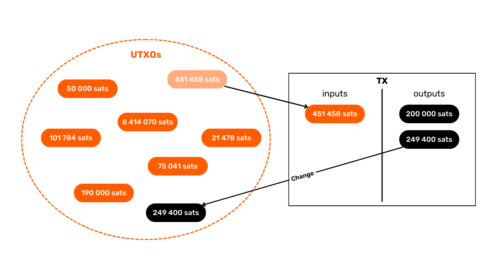

Использование программного обеспечения кошелька с контролем монет в сочетании с маркировкой UTXOs позволяет пользователям как различать, так и точно выбирать UTXOs для своих транзакций.

### Как правильно маркировать ваши UTXOs?

Не существует универсального метода маркировки UTXOs, который подходил бы всем. Вам предстоит определить систему маркировки так, чтобы вы могли легко ориентироваться в вашем кошельке. В любом случае помните, что хорошая маркировка - это маркировка, которую вы сможете понять, когда она вам понадобится. Если ваш Биткойн кошелек в первую очередь предназначен для сбережений, может быть, что метки будут полезны вам только через несколько десятилетий. Поэтому убедитесь, что они ясные, точные и всесторонние.

Важно, чтобы ваши близкие могли легко идентифицировать происхождение средств, если однажды им потребуется доступ к вашему кошельку. Это могло бы помочь им по причинам конфиденциальности, а также по юридическим необходимостям, в случае если им пришлось бы оправдывать происхождение средств перед властью.
Самым важным аспектом маркировки является указание источника UTXO. Вы должны просто указать, как эта монета попала в ваш кошелек. Это покупка на платформе обмена? Платеж от клиента? Обмен между участниками? Или это сдача с покупки? Таким образом, вы могли бы указать:
- `Вывод с Exchange.com`;
- `Платеж клиента Давида`;
- `P2P Покупка Чарльза`;
- `Сдача с покупки дивана`

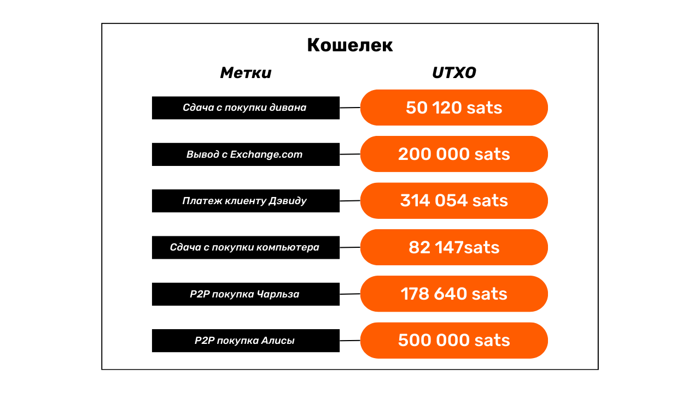

Чтобы усовершенствовать ваше управление UTXOs и придерживаться стратегий сегрегации средств в вашем кошельке, вы могли бы обогатить ваши метки дополнительным индикатором, отражающим эти разделения. Если ваш кошелек содержит две категории UTXOs, которые вы не хотите смешивать, вы могли бы интегрировать маркер в ваши метки, чтобы четко различать эти группы. Эти маркеры разделения будут зависеть от ваших собственных критериев, таких как различие между UTXOs из процесса приобретения, который включает KYC, или между профессиональными и личными средствами. Взяв ранее упомянутые примеры меток, это могло бы перевестись в:
- `KYC - Вывод с Exchange.com`;
- `KYC - Платеж клиента Давида`;
- `БЕЗ KYC - P2P Покупка Чарльза`;
- `БЕЗ KYC - Сдача с покупки дивана`

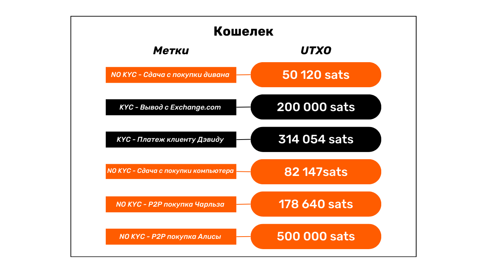
Также рекомендуется сохранять маркировку монеты на протяжении всех транзакций. Например, при консолидации UTXO без KYC убедитесь, что вы помечаете результирующий UTXO не просто как `консолидация`, а конкретно как `консолидация без KYC`, чтобы сохранить четкий след происхождения монеты.

Наконец, необязательно ставить дату на метку. Большинство программного обеспечения для кошельков уже отображает дату транзакции, и всегда можно получить эту информацию в блок-эксплорере, используя его TXID.

### Как правильно выбирать свои монеты?

Когда вы совершаете транзакцию, контроль монет позволяет вам специально выбирать, какие UTXOs использовать в качестве входов для обеспечения выхода платежа. При этом выборе следует учитывать два аспекта:
- Возможность для получателя платежа связать часть вашей личности с использованными входами UTXOs;
- Способность внешнего наблюдателя установить связи между всеми использованными входами UTXOs.
  
Чтобы проиллюстрировать первый пункт, давайте рассмотрим конкретный пример. Предположим, вы покупаете багет за биткойны у местного пекаря. Вы используете один или несколько UTXOs, которыми владеете, в качестве входов, чтобы по крайней мере покрыть цену багета выходами, а также комиссии за транзакцию. Ваш пекарь тогда потенциально может связать ваше лицо или любую другую часть вашей личности, которую он знает, с монетами, использованными в качестве входов. Зная о существовании этой связи, вы можете предпочесть выбрать конкретный UTXO вместо другого при совершении платежа.
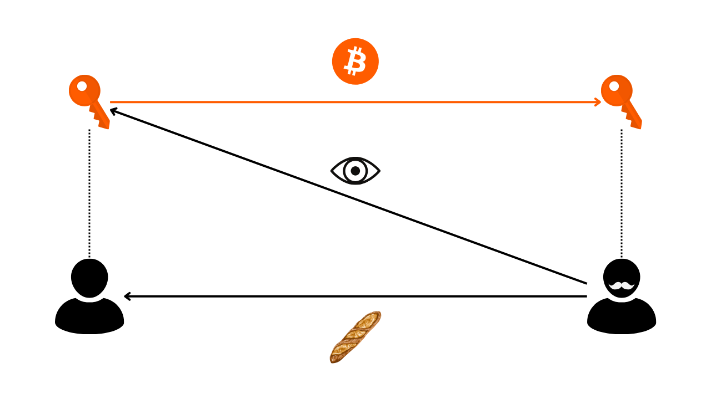

Например, если один из ваших UTXO поступил с платформы обмена, и вы предпочли бы, чтобы пекарь не знал о вашем счете на этой платформе, вы бы избегали использовать этот UTXO для платежа. Если вы владеете UTXO высокой стоимости, который раскрывает значительное количество биткоинов, вы также можете решить не использовать его, чтобы пекарь не знал о вашем состоянии в BTC.

Таким образом, выбор UTXO для использования в этом первом пункте основывается на личном решении, которое зависит от того, что вы готовы раскрыть или нет. Метки, которые вы назначили своим UTXO при получении, помогут вам выбрать те, которые, будучи потраченными, раскроют только информацию, которую вы готовы раскрыть получателю.

Помимо информации, потенциально раскрываемой получателю, выбор входов также влияет на то, что вы раскрываете всем наблюдателям блокчейна. Действительно, используя несколько UTXO в качестве входов для вашей транзакции, вы раскрываете, что они принадлежат одному и тому же агенту, согласно эвристике общего владения входами (CIOH).

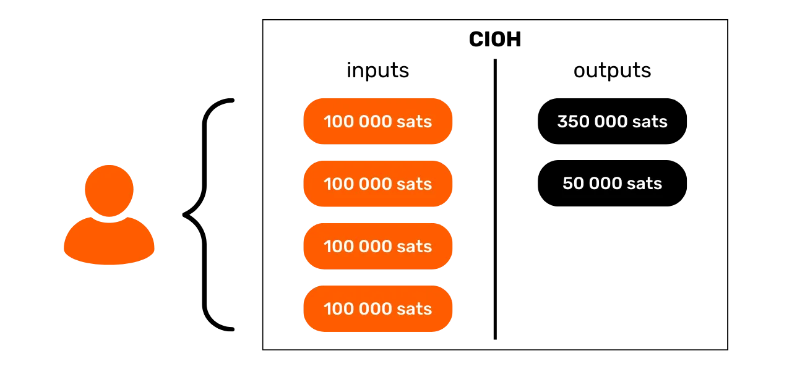

При выборе своих монет вы должны быть осведомлены о том, что транзакция, которую вы собираетесь транслировать, создаст связь между всеми использованными UTXOs. Эта связь может быть проблематичной для вашей личной конфиденциальности, особенно если UTXOs поступили из разных источников.


Вернемся к примеру моего UTXO без KYC с Bisq; я хочу избежать его объединения с UTXO, скажем, с регулируемой платформы обмена, которая знает мою личность. Действительно, если я когда-либо использую эти 2 UTXOs в качестве входов в одной и той же транзакции, регулируемая платформа сможет связать мою личность с UTXO, купленным на Bisq, хотя ранее она не была связана с моей личностью.

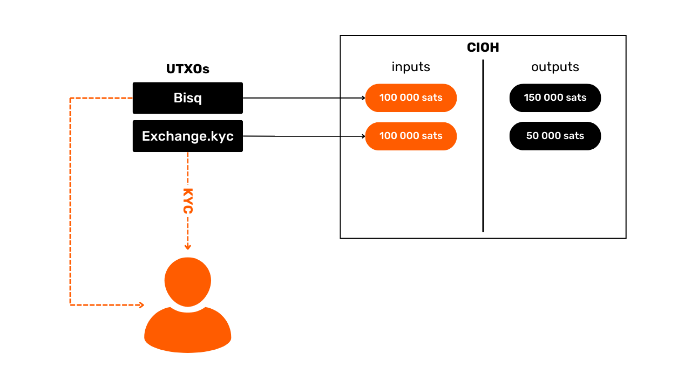

Наконец, чтобы правильно выбрать, какие UTXO использовать в качестве входов для транзакции, самое важное - избегать использования нескольких UTXOs. По возможности выбирайте одну монету, которая достаточно велика, чтобы покрыть ваш платеж. Делая это, вы полностью избегаете рисков, связанных с COINJOIN. Однако, если ни один отдельный UTXO не достаточен для платежа и вам необходимо использовать несколько, убедитесь, что они поступают из похожих источников, чтобы минимизировать риски нежелательных связей. Также помните, что получатель может ассоциировать информацию, которую он имеет о вас, с историей монет, использованных в качестве входов.

### Понимание автоматического выбора монет

В предыдущих разделах мы обсуждали ручной выбор UTXOs для транзакций. Но что происходит, когда программное обеспечение кошелька делает этот выбор автоматически? Существует несколько методов для определения, какие монеты использовать, и выбор UTXOs является настоящим полем исследований в Биткойн. Основная цель этого автоматического процесса часто заключается в минимизации комиссий за транзакцию для пользователя.

Методы выбора UTXO, такие как FIFO (*First In First Out* - Первым пришел, первым ушел) и LIFO (*Last In First Out* - Последним пришел, первым ушел), являются одними из самых простых, но также и наименее эффективных. С FIFO старейшие монеты в кошельке используются в первую очередь. Этот подход, как правило, неэффективен как для минимизации комиссий за транзакцию, так и для сохранения конфиденциальности, за исключением случаев, когда используются относительные временные блокировки, которые должны регулярно обновляться. Напротив, LIFO отдает предпочтение использованию самых последних UTXO. Хотя эти методы просты, они оба часто оказываются неэффективными.

Более продвинутым методом является *Решатель рюкзака* (Knapsack Solver). Это был метод, используемый в кошельке Bitcoin Core до версии 0.17. Он включает в себя итеративный и случайный выбор UTXO из кошелька, их суммирование в подмножества и сохранение решения, которое уменьшает вес транзакции как можно больше, чтобы снизить комиссии для пользователя.
*Ветвление и ограничение* (Branch-and-Bound, BNB), часто называемый "алгоритмом Мерча" в честь его изобретателя, заменил *Решатель рюкзака* в Bitcoin Core начиная с версии 0.17. Этот более продвинутый метод направлен на поиск набора UTXOs, который точно соответствует необходимой сумме для удовлетворения выходов транзакции. Цель BNB - минимизировать количество сдачи, а также комиссии, уменьшая то, что называется критерием отходов, который учитывает как немедленные затраты, так и будущие затраты, ожидаемые для сдачи. Этот метод произошел от оригинальной концепции *Ветвления и ограничения*, разработанной в 1960 году Айлсой Лэнд и Элисон Харкорт, и предлагает более точную оптимизацию комиссий по сравнению с *Решателем рюкзака*.
Все эти методы автоматического выбора UTXO могут быть эффективными в снижении комиссий за транзакцию, но они часто неэффективны в сохранении конфиденциальности пользователя. Действительно, эти алгоритмы могут объединять несколько UTXO во входы, таким образом раскрывая общее владение этими UTXO из-за COH. Очевидно, что эти методы не могут учитывать метки, прикрепленные к UTXO, которые критически важны для сознательного выбора монет для раскрытия получателю транзакции. В настоящее время единственным решением для оптимизации конфиденциальности при выборе монет является их ручной выбор.

### Учебник по маркировке UTXO

Если вы хотите узнать, как маркировать свои UTXO, мы подготовили полный учебник по основному существующему программному обеспечению Биткойн-кошелька. Найдите его:

https://planb.network/tutorials/privacy/utxo-labelling


## KYC и ключевая идентификация
<chapterId>cec6b9d9-0eed-4f85-bc4e-1e9aa59ca605</chapterId>

KYC означает "Знай своего клиента" (Know Your Customer), что является регуляторной процедурой, реализуемой некоторыми компаниями, работающими в секторе Биткойн. Эта процедура направлена на проверку и запись личности их клиентов с заявленной целью борьбы с отмыванием денег и финансированием терроризма.

Конкретно, KYC включает сбор различных личных данных от клиента, которые могут варьироваться в зависимости от юрисдикции, но обычно включают документ, удостоверяющий личность, фотографию и подтверждение места жительства. Эта информация затем проверяется и сохраняется для будущего использования.

Эта процедура стала обязательной для всех регулируемых платформ обмена в большинстве западных стран. Это означает, что любой, кто желает обменять фиатные валюты на биткойны через эти платформы, должен соответствовать требованиям KYC.
Эта процедура не лишена рисков для конфиденциальности и безопасности пользователей. В этой главе мы подробно рассмотрим эти риски и проанализируем конкретные последствия KYC и процессов идентификации для конфиденциальности пользователей Биткойна.

### Облегчение отслеживания в блокчейне

Первый риск, связанный с KYC, заключается в том, что он предоставляет привилегированную точку входа для анализа блокчейна. Как мы видели в предыдущей части, аналитики могут группировать и отслеживать активность в блокчейне, используя паттерны транзакций и эвристики. Как только им удается сгруппировать активность пользователя в блокчейне, нахождение хотя бы одной точки входа среди всех их транзакций и ключей достаточно, чтобы полностью скомпрометировать их конфиденциальность.

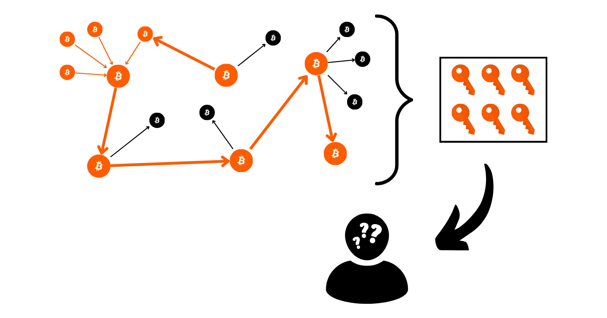

Когда вы проходите KYC, вы предоставляете очень качественную точку входа для анализа блокчейна, так как вы связываете свои адреса получения, используемые при выводе ваших биткойнов с платформы обмена, с вашей полной и проверенной личностью. Теоретически, эта информация известна только компании, которой вы ее предоставили, но, как мы увидим позже, риск утечки данных реален. Более того, сам факт того, что компания обладает этой информацией, может быть проблематичным, даже если она не делится ей.

Таким образом, если вы не принимаете другие меры для ограничения группировки вашей активности в блокчейне, любой, кто знает об этой точке входа, что есть KYC, потенциально может связать всю вашу активность в Биткойн с вашей личностью. С точки зрения этой компании, ваше использование Биткойн, таким образом, теряет всякую конфиденциальность.

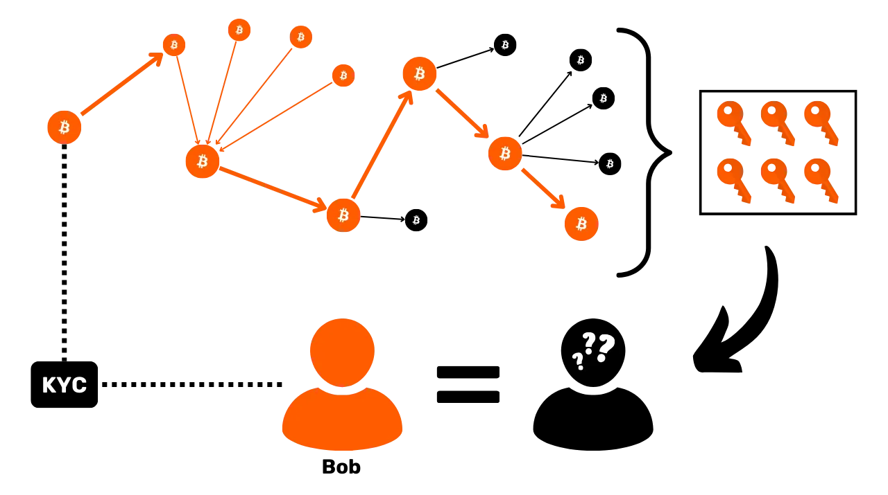

Чтобы проиллюстрировать это сравнением, это как если бы ваш банкир из *Банка X* имел доступ не только ко всем вашим транзакциям, совершенным с *Банком X*, но также мог наблюдать за вашими транзакциями с *Банком Y* и всеми вашими наличными операциями.

Помните из первой части этого обучения: модель конфиденциальности Биткойн, как задумана Сатоши Накамото, основывается на разделении между личностью пользователя и его парами ключей. Хотя сегодня этот слой конфиденциальности уже не является достаточным, все же мудро ограничивать его ухудшение насколько это возможно.

### Воздействие на государственное наблюдение

Вторая основная проблема с KYC заключается в том, что она раскрывает государству факт того, что вы в какой-то момент владели биткойнами. Когда вы покупаете биткойны через регулируемого агента, для государства становится возможным узнать об этом приобретении. В настоящее время это может показаться тривиальным, но важно помнить, что политическое и экономическое будущее вашей страны не в ваших руках.
Прежде всего, государство может быстро принять авторитарную позицию. История полна примеров, когда политики менялись внезапно. Сегодня, в Европе, энтузиасты Биткойн могут писать статьи о Биткойн, участвовать в конференциях и управлять своими кошельками самохранения. Но кто может сказать, что будет завтра? Если Биткойн вдруг станет общественным врагом номер один, ассоциация с ним в государственных записях может оказаться проблематичной.

Далее, в условиях серьезных экономических кризисов, государство может рассмотреть возможность конфискации биткойнов, принадлежащих гражданам. Возможно, завтра биткойнеров будут считать спекулянтами на кризисе, и с них будут взимать чрезмерные налоги из-за их капитальных приростов на фоне обесценения фиатной валюты.
Вы можете подумать, что это не проблема, потому что ваши биткойны смешаны и, следовательно, не поддаются отслеживанию. Однако проблема здесь не в отслеживании. Настоящая проблема заключается в том, что государство знает, что вы владели биткойнами. Этого простого факта может быть достаточно, чтобы обвинить вас или потребовать отчет. Вы можете попытаться утверждать, что потратили свои биткойны, но это должно отражаться в вашей налоговой декларации, и вас бы раскрыли. Вы также можете сказать, что потеряли свои ключи во время катастрофы на лодке, но кроме как шутки в Twitter, действительно ли вы думаете, что это будет достаточно для вашего оправдания?

Поэтому важно учитывать риск, связанный с простым фактом того, что государство может знать о вашем владении BTC, даже если этот риск может показаться отдаленным сегодня.

Другая проблема, связанная с KYC в контексте государственного надзора, - это обязательная отчетность регулируемыми платформами. Хотя я не знаком с регулированием в других юрисдикциях, во Франции *Поставщики Услуг Цифровых Активов* (PSAN) обязаны сообщать финансовым надзорным органам о любых движениях средств, которые они считают подозрительными.

Таким образом, во Франции в 2023 году PSAN сообщили о 1,449 подозрительных действиях. Пока что большинство этих действий связаны с преступностью. Однако власти также просят регулируемые платформы сообщать о любой подозрительной транзакции с биткойнами, исключительно на основе ее структуры. Если вы совершаете совместную транзакцию, или даже просто транзакцию, представляющую собой несколько нетипичный шаблон, и эта транзакция происходит вблизи вывода ваших биткойнов с этих платформ, о вас могут сообщить властям. Даже в отсутствие правонарушений и при законном осуществлении ваших прав, такая отчетность может привести к увеличению проверок и надзора, неудобствам, которых можно было бы избежать без KYC.

### Риск утечки личных данных
Другая проблема с KYC заключается в том, что она требует хранения всех ваших личных данных на серверах частной компании. Недавние события напомнили нам, что никто не застрахован от сбоев, будь то финансовые или связанные с ИТ сбои. В 2022 году клиенты Celsius пострадали от последствий. После банкротства компании имена кредиторов и размер их активов были обнародованы американской юстицией в ходе административной процедуры.

Чуть более двух лет назад ведущая по кибербезопасности организация в области криптовалюты столкнулась с кражей личных данных своих клиентов. Хотя этот инцидент не был напрямую связан с покупкой биткойнов, такой риск остается и для платформ обмена. Поэтому существует определенный риск, связанный с личными данными.

Действительно, мы уже доверяем много наших личных данных частным компаниям. Однако здесь риск двойной, поскольку эти данные не только позволяют вас идентифицировать, но и связаны с деятельностью в Биткойне. Действительно, когда хакеру удается получить доступ к данным клиентов платформы обмена, они могут с уверенностью предположить, что эти клиенты владеют биткойнами. Таким образом, этот риск усиливается тем фактом, что биткойн, как и любой другой ценный актив, привлекает внимание воров.

В случае утечки данных, в лучшем случае, вы можете стать целью целенаправленных попыток фишинга. В худшем случае, вы можете оказаться в центре физических угроз вашей безопасности.

Помимо конкретных рисков, связанных с Биткойн, необходимо также учитывать опасности, связанные с передачей документов, удостоверяющих личность. Действительно, в случае утечки данных возможно стать жертвой кражи личности. Таким образом, риски не ограничиваются исключительно защитой конфиденциальности транзакций, но также касаются личной безопасности каждого человека.

### Распространенные заблуждения о KYC

Важно развеять некоторые распространенные заблуждения о KYC, которые часто встречаются в Twitter или в наших обсуждениях среди биткойнеров.
Прежде всего, неверно думать, что защита личной конфиденциальности для биткойнов, приобретенных через KYC (Know Your Customer, узнай своего клиента), бесполезна. Инструменты и методы для обеспечения конфиденциальности в Биткойне разнообразны и служат различным целям. Использование транзакций coinjoin для биткойнов, полученных через KYC, например, не является плохой идеей. Конечно, необходимо быть осторожным с регулируемыми платформами обмена, чтобы избежать замораживания или блокировки вашего аккаунта, но с чисто технической точки зрения эти практики не несовместимы. Coinjoin имеет эффект разрыва истории монеты, что помогает вам противостоять некоторым рискам анализа цепочки, связанным с KYC. Хотя это не устраняет все риски, это уже представляет значительную выгоду.

Конфиденциальность в Биткойн не следует рассматривать двоично, как различие между "анонимными" биткойнами и другими, которые не являются таковыми. Владение биткойнами, приобретенными через KYC, не означает, что все потеряно; напротив, использование инструментов конфиденциальности может оказаться еще более выгодным.

Наоборот, приобретение биткойна через метод без KYC не гарантирует идеальную конфиденциальность и не освобождает от необходимости принимать другие меры защиты. Если вы владеете биткойнами без KYC, но используете одни и те же адреса для получения несколько раз, ваши транзакции могут быть отслежены и сгруппированы. Минимальная связь с миром вне Биткойн может подорвать единственный слой конфиденциальности, который у вас был. Поэтому важно рассматривать все инструменты и методы, улучшающие конфиденциальность в Биткойн, как дополнительные. Каждая техника решает конкретный риск и может добавить дополнительный слой защиты. Таким образом, владение биткойнами без KYC абсолютно не освобождает от необходимости принимать другие предосторожности.

### Можно ли отменить KYC?

Иногда меня спрашивают, возможно ли "вернуться назад" после прохождения KYC, и, как вы можете представить из предыдущих абзацев, ответ нюансирован. Чтобы избежать рисков, связанных с KYC, самый простой метод - не использовать его при приобретении биткойнов. Мы более подробно рассмотрим эту тему в следующей главе. Однако, если KYC уже был проведен и биткойны были куплены, есть ли способы снизить возможные риски?

Что касается риска отслеживаемости ваших транзакций, использование coinjoin является решением. Мы подробно обсудим этот метод позже в обучении, но имейте в виду, что coinjoin может разорвать историю монеты и предотвратить ее отслеживание от прошлого к настоящему и от настоящего к прошлому. Даже для BTC, полученных через регулируемую платформу, эта техника может предотвратить их отслеживаемость.
Однако coinjoin не устраняет второй риск, связанный с KYC: факт того, что государство осведомлено о ваших биткойн-активах. Действительно, даже если ваши монеты больше не поддаются отслеживанию, государство, в зависимости от юрисдикции, может иметь доступ к вашим декларациям о распоряжении криптоактивами. Поскольку этот риск не технический, а административный, нет специфических для Биткойна решений для его устранения, кроме как изначально не подвергать себя KYC. Единственный законный способ снизить этот риск - продать ваши биткойны, приобретенные через регулируемые платформы, на регулируемых платформах, а затем снова приобрести их средствами без KYC. Продавая и декларируя распоряжение, администрация должна отметить, что вы больше ими не владеете.

Что касается риска утечки ваших личных данных и документов, удостоверяющих личность, эта опасность, внешняя по отношению к Биткойну, и нет технического решения, чтобы ее избежать. Как только ваши данные становятся известны, трудно отменить эту операцию. Вы можете попытаться закрыть свой аккаунт на платформе, но это не гарантирует удаление ваших данных KYC, особенно когда верификация личности делегирована. Проверить полное удаление ваших данных невозможно. Таким образом, нет решения, чтобы полностью предотвратить этот риск и гарантировать, что он больше не существует.

### Различие между KYC и идентификацией ключей

Иногда некоторые биткойнеры склонны расширять термин "KYC" на любой обмен BTC, включающий перевод или платеж кредитной картой, поскольку эти средства также могут раскрывать происхождение платежа, так же как и KYC. Однако важно не путать KYC с идентификацией ключей. Лично я должен признать, что мое восприятие этой темы со временем изменилось.

KYC конкретно относится к регуляторной процедуре, реализуемой некоторыми компаниями для проверки и записи личности их клиентов. Это бинарное дело: при приобретении ваших биткойнов либо вы проходите KYC, либо нет. Однако идентификация ключей, которая касается связывания аспекта личности пользователя с ончейн-активностью, не так бинарна, а скорее представляет собой континуум. Действительно, в контексте приобретения или распоряжения биткойнами, эта идентификация всегда возможна в разной степени.
Например, если вы покупаете биткойны на регулируемой платформе в Швейцарии, KYC (Знай своего клиента) не требуется. Однако возможна идентификация ваших ключей, поскольку покупка была совершена через ваш банковский счет. Вот где первые два риска, связанные с KYC, а именно: облегчение отслеживания ончейн и раскрытые для государственного надзора, также могут возникнут в обмене без KYC. Если швейцарский агент сообщает о подозрительных транзакциях властям вашей страны, они могут просто проверить использованный банковский счет для покупки, чтобы узнать вашу личность. Таким образом, покупка без KYC на регулируемых платформах находится довольно высоко на шкале риска для идентификации ключей.

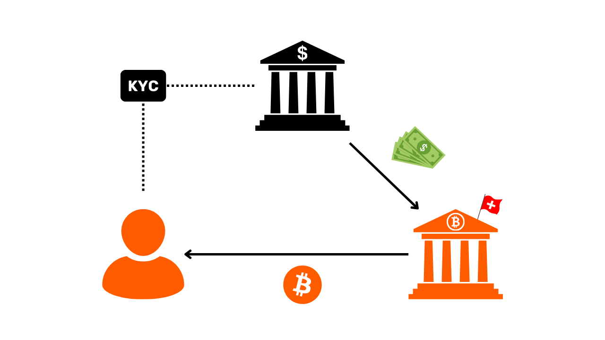

Однако избегание регулируемых платформ и выбор методов приобретения P2P (Peer-to-Peer) не полностью устраняет риск идентификации ключей, а лишь снижает его. Рассмотрим пример покупки на Bisq или другой P2P платформе. Для расчетов с вашим контрагентом вы, вероятно, будете использовать свой банковский счет. Если власти зададут вопросы человеку, с которым вы торговали, и попросят ваше имя, мы сталкиваемся с рисками 1 и 2, упомянутыми ранее. Эти риски определенно ниже, чем при покупке без KYC на платформе, и тем более снижены, чем при покупке с KYC, но они все еще присутствуют в меньшей степени.

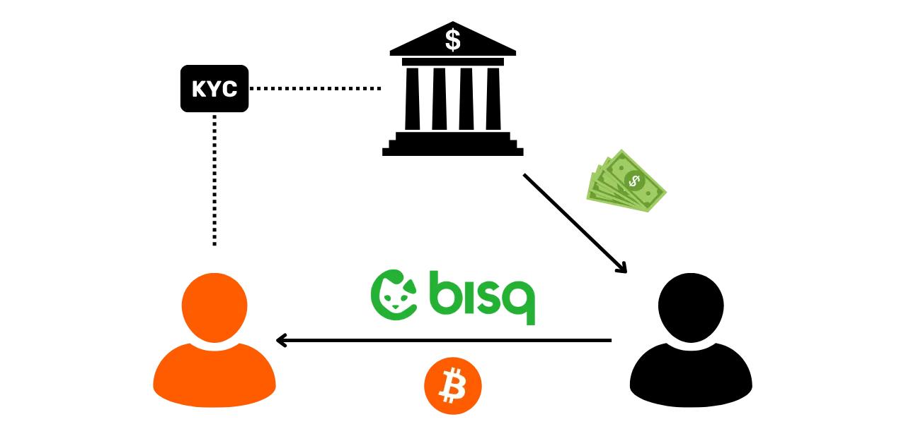

Наконец, даже если вы приобрели свои биткойны через физический обмен наличными, вы не остаетесь полностью анонимным. Человек, с которым вы провели обмен, видел ваше лицо, что является частью вашей идентичности. Хотя в этом примере это минимально, все же существует возможность ключевой идентификации.

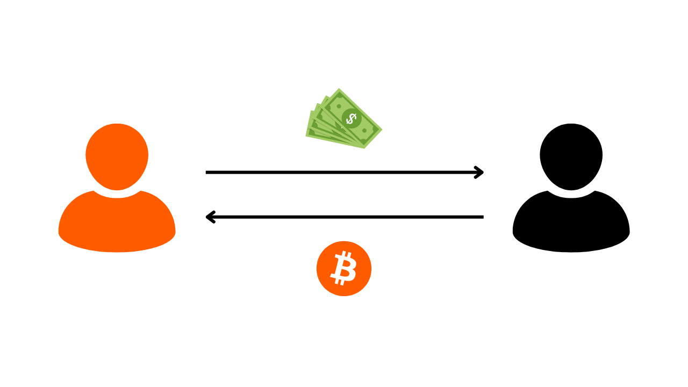

В заключение, во время обмена биткойнов на другие активы, будь то покупка в фиатной валюте или продажа за реальный товар, всегда существует некая форма ключевой идентификации. В зависимости от выбранного метода обмена, эта идентификация может варьироваться по интенсивности. Важно не путать эту идентификацию с KYC, который является четко определенным регуляторным процессом. Однако, существует связь между KYC и спектром идентификации, поскольку KYC находится на верхнем конце этого спектра, так как систематически облегчает идентификацию ключей пользователя властями.

## Методы продажи и приобретения
<chapterId>756598af-95aa-4c77-ac48-243c7ad89530</chapterId>

Прочитав предыдущую главу, вы, возможно, задаетесь вопросом о способах покупки или продажи биткойнов без необходимости проходить процесс верификации личности, чтобы избежать рисков, связанных с KYC. Существует несколько методов для проведения обменов.

### Наличные P2P обмены

Как мы видели, лучшим методом с точки зрения конфиденциальности остается P2P (peer-to-peer) обмен с расчетом наличными. Этот метод позволяет минимизировать оставляемые следы и значительно снижает возможность ключевой идентификации, будь вы покупатель или продавец.

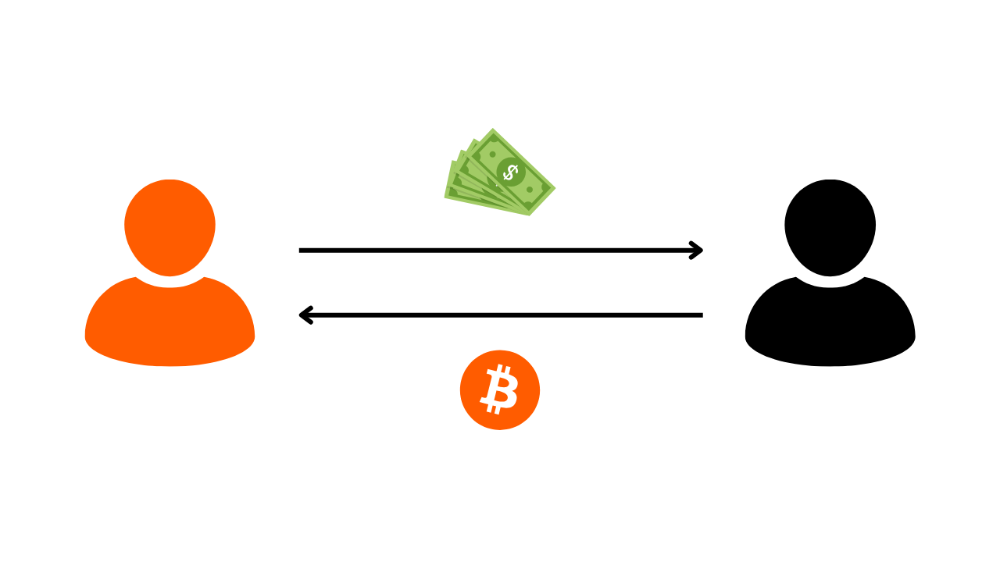

Однако, эта практика несет в себе риски для личной безопасности. Основная опасность заключается в том, что во время обмена контрагент будет знать, что у вас есть значительная сумма, будь то наличные или биткойны. Эта информация может привлечь внимание злоумышленников. Действительно, обычно рекомендуется сохранять дискретность относительно владения биткойнами. Этот совет может быть применим и к наличным. Однако, во время личного обмена неизбежно придется раскрыть факт владения биткойнами, что может вызвать желание завладеть ими.

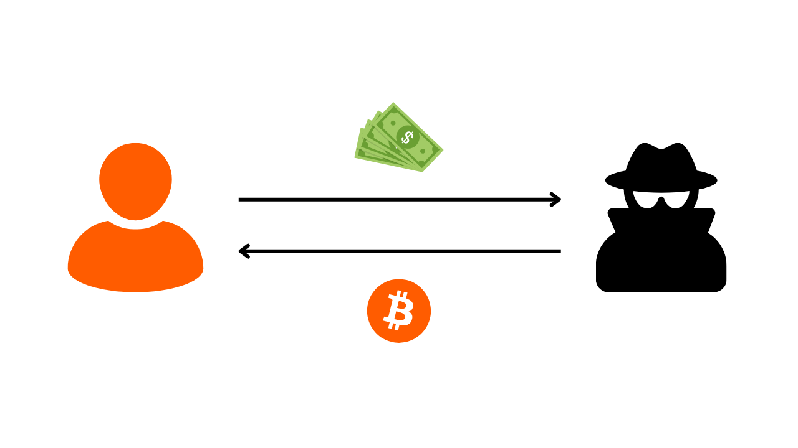

Чтобы ограничить этот риск, я советую вам отдавать предпочтение наличным сделкам с доверенными лицами, такими как члены семьи или близкие друзья. В качестве альтернативы, вы также можете рассмотреть возможность проведения обменов на [местных встречах Биткойн](https://btcmap.org/communities/map), после того как посетите их несколько раз. Это позволит вам лучше узнать других участников и не быть одиноким во время физического обмена. Однако важно признать, что наличный P2P обмен по своей сути несет риски для вашей личной безопасности, которых нет при совершении покупок через регулируемую платформу и ваш банковский счет.

Более того, в зависимости от места вашего проживания, перевозка и хранение больших сумм денег могут представлять риски, будь то для биткойнов или наличных.

Наличный обмен также может нести юридические риски во время полицейских проверок или других. Хотя в большинстве стран нет ограничений на сумму наличных, которую вы можете перевозить с собой, слишком большие суммы могут вызвать подозрения. Поэтому будьте осторожны, особенно если вам приходится путешествовать на дальние расстояния, и избегайте совершения слишком крупных транзакций за один раз, чтобы не приходилось оправдывать владение значительными суммами.
Наконец, еще одним недостатком покупок P2P является то, что цена часто выше, чем на регулируемых платформах. Продавцы часто устанавливают наценку в размере от 1% до иногда более чем 10%. Несколько причин объясняют эту разницу в цене. Во-первых, это общепринятая практика среди продавцов P2P, которая установилась со временем. Далее, у продавцов есть комиссии за транзакции, связанные с отправкой средств покупателю. Также существует повышенный риск кражи в P2P продажах по сравнению с транзакциями на платформах, что оправдывает компенсацию за взятый на себя риск. Наконец, наценка может быть связана со спросом и качеством обмена с точки зрения конфиденциальности. Как покупатель, повышенная конфиденциальность имеет цену, которая отражается в наценке, установленной продавцом. Некоторые биткойнеры также считают, что повышенная цена BTC, купленного через P2P, отражает его истинную стоимость, и утверждают, что более низкие цены на регулируемых платформах являются результатом компромисса в отношении конфиденциальности ваших личных данных.
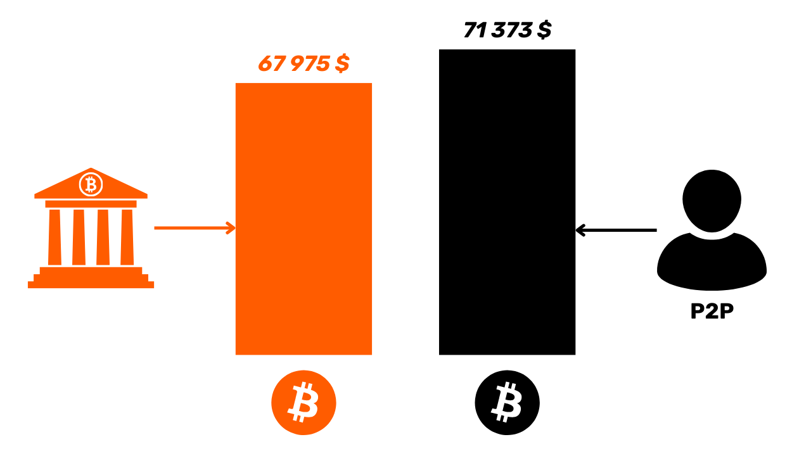

### P2P Обмены через Платформу Подбора

Менее рискованной альтернативой с точки зрения личной безопасности является проведение P2P обменов исключительно онлайн, через электронные платежные методы, такие как PayPal, банковские переводы или Revolut.


Этот подход помогает избежать многих рисков, связанных с наличными транзакциями. Однако риск того, что контрагент не выполнит свои обязательства во время онлайн-обмена, больше. Действительно, во время физического обмена, если вы передаете деньги продавцу, который в ответ не отправляет вам биткойны, вы можете немедленно призвать его ответственности, поскольку он находится перед вами. Онлайн, с другой стороны, часто невозможно найти человека, который обманул вас.

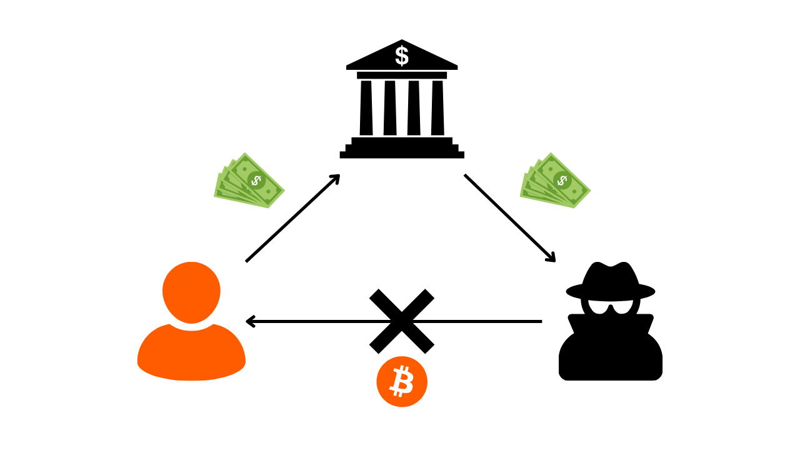

Чтобы снизить этот риск, можно использовать платформы, специализирующиеся на подборе для P2P обменов. Эти платформы используют механизмы разрешения конфликтов для защиты пострадавших пользователей. В целом, они предлагают систему escrow, где биткойны удерживаются до подтверждения продавцом платежа в фиатной валюте.

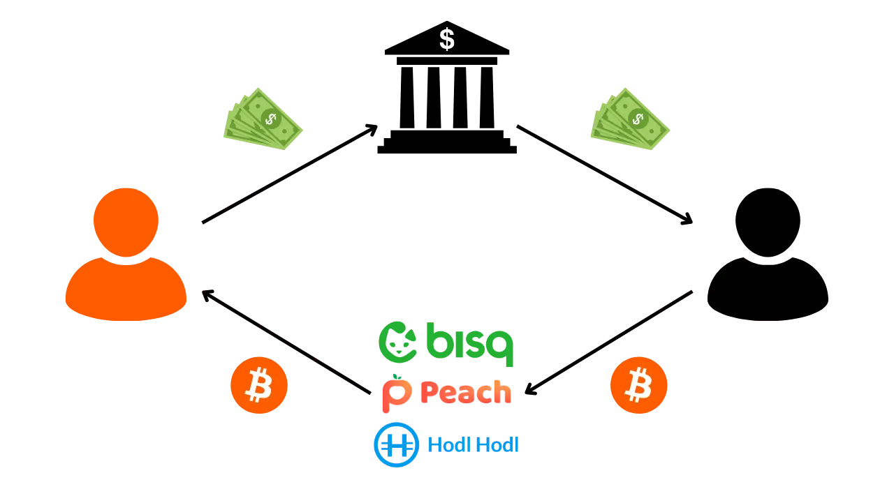
С точки зрения личной безопасности, этот метод покупки значительно безопаснее, чем обмен наличными. Однако, как было сказано ранее, онлайн P2P обмены оставляют больше следов, чем физический обмен, что может негативно сказаться на конфиденциальности в Биткойне. Используя онлайн метод платежа в фиате, например, через банк, вы раскрываете больше информации, которая может облегчить идентификацию ключей.


Еще раз рекомендую не совершать крупные обмены за одну транзакцию на этих платформах. Разделяя ваши транзакции, вы распределяете риски, связанные с потенциальной кражей со стороны контрагента.

Вновь стоит отметить, что одним из недостатков покупок через P2P является то, что цена часто бывает выше, чем на регулируемых платформах. Продавцы часто устанавливают наценку в размере от 1% до иногда более чем 10%. Несколько причин объясняют эту разницу в цене. Во-первых, это общепринятая практика среди продавцов P2P, которая установилась со временем. Далее, у продавцов есть комиссии за транзакции, связанные с отправкой средств покупателю. Также существует повышенный риск кражи в P2P продажах по сравнению с транзакциями на платформах, что оправдывает компенсацию за взятый на себя риск. Наконец, наценка может быть связана с спросом и качеством обмена с точки зрения конфиденциальности. Как покупатель, выигрыш в конфиденциальности имеет цену, которая отражается в наценке, установленной продавцом. Некоторые биткоинеры также считают, что повышенная цена BTC, купленного через P2P, отражает его истинную стоимость, и утверждают, что более низкие цены на регулируемых платформах являются результатом компромисса в отношении конфиденциальности ваших личных данных.

Что касается решений, я лично всегда использовал [Bisq](https://bisq.network/) и остался очень доволен. Их система хорошо установлена и кажется надежной. Однако Bisq доступен только на ПК, и его интерфейс может быть слишком сложным для начинающих. Еще одним недостатком является то, что Bisq работает исключительно с транзакциями onchain, что может стать дорогостоящим в периоды высоких комиссий за транзакции в Биткойн.


[-> Ознакомьтесь с нашим учебником по Bisq.](https://planb.network/en/tutorials/exchange/bisq)

Для более простого варианта вы можете попробовать [Peach](https://peachБиткойн.com/), мобильное приложение, которое облегчает связь между покупателями и продавцами с интегрированной системой разрешения споров. Процесс более интуитивно понятен, чем в Bisq.

[-> Ознакомьтесь с нашим учебником по Peach.](https://planb.network/en/tutorials/exchange/peach-wallet)

Еще один онлайн-вариант - [HodlHodl](https://hodlhodl.com/), хорошо установленная платформа, которая предлагает хорошую ликвидность, хотя я лично не тестировал ее.

[-> Ознакомьтесь с нашим учебником по HodlHodl.](https://planb.network/en/tutorials/exchange/hodlhodl)

Для решений на основе Lightning Network вы можете попробовать [RoboSats](https://learn.robosats.com/) и [LNP2PBot](https://lnp2pbot.com/). RoboSats доступен через веб-сайт и относительно прост в использовании. LNP2PBot более нетипичен, так как работает через систему обмена в мессенджере Telegram.

[-> Ознакомьтесь с нашим учебником по RoboSats.](https://planb.network/en/tutorials/exchange/robosats)

[-> Ознакомьтесь с нашим учебником по LNP2PBot.](https://planb.network/en/tutorials/exchange/lnp2pbot)

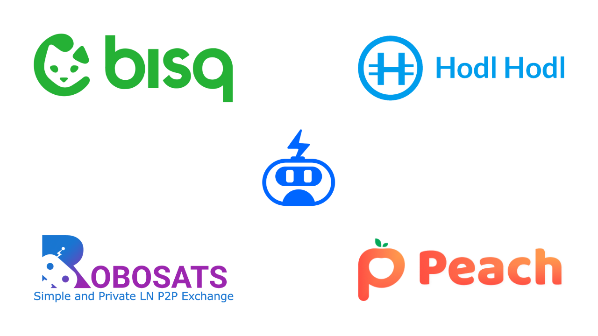

### Регулируемые платформы без KYC

В зависимости от страны вашего проживания, у вас может быть доступ к регулируемым платформам, которые не требуют процедуры KYC для покупки или продажи биткойнов. В Швейцарии, например, вы можете использовать платформы вроде [Relai](https://relai.app/) и [MtPelerin](https://www.mtpelerin.com/).

[-> Ознакомьтесь с нашим учебником по Relai.](https://planb.network/en/tutorials/exchange/relai)

Как мы видели в предыдущей главе, такой тип платформ избавляет вас от рисков, связанных с процедурами KYC, но они представляют более высокий уровень риска для идентификации ключевой идентификации. С точки зрения конфиденциальности в Биткойн, эти платформы, следовательно, предлагают лучшую защиту, чем методы покупки с KYC, но они менее интересны, чем P2P обменники.

Однако, с точки зрения личной безопасности, использование этих платформ значительно менее рискованно, чем P2P обменники. Они также часто проще в использовании, чем платформы, предоставляющие P2P обмены.

### Банкоматы

Другой опцией для покупки или продажи биткойнов без KYC являются криптовалютные банкоматы (ATM). Лично я никогда не имел возможности протестировать это решение, так как в моей стране их нет. Но этот метод может быть очень интересным в зависимости от того, где вы живете.


Проблема с банкоматами заключается в том, что в некоторых странах они запрещены или подлежат строгому регулированию. Если банкомат требует процесс верификации личности, то он сталкивается с теми же рисками, что и регулируемые платформы KYC. Однако, если банкомат позволяет проводить транзакции без верификации личности на небольшие суммы, то его использование может предложить уровень конфиденциальности, сопоставимый с наличным P2P обменом, избегая при этом большинства рисков, связанных с этим типом обмена.
Основным недостатком банкоматов являются их часто высокие комиссии за обмен, которые варьируются от нескольких процентов до 15% от обменной суммы.

### Подарочные карты

Наконец, я также хотел представить решение, которое хорошо работает для тех, кто хочет использовать свои биткойны на ежедневной основе для покупок, а не продавать их за фиатные валюты.

Лучший способ потратить BTC, очевидно, использовать Биткойн напрямую или Lightning Network для покупки товаров или услуг. Однако во многих странах количество торговцев, принимающих биткойны, остается ограниченным. Практической альтернативой тогда является использование подарочных карт.

Несколько платформ, не требующих процедуры KYC, предлагают возможность обмена биткойнов на подарочные карты, которые можно использовать в крупных магазинах. Среди этих платформ мы находим [CoinsBee](https://www.coinsbee.com/), [The Биткойн Company](https://theБиткойнcompany.com/), и [Bitrefill](https://www.bitrefill.com/). Эти платформы значительно облегчают ежедневное использование ваших биткойнов, позволяя вам получить доступ к широкому спектру товаров и услуг без необходимости конвертации в фиатную валюту.

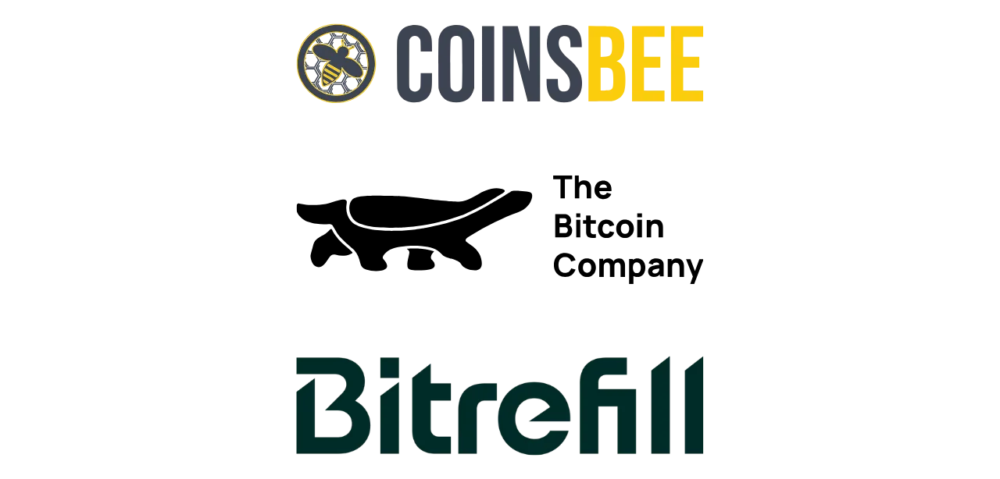

### Другие методы приобретения

Среди других методов приобретения биткойнов, защищающих вашу конфиденциальность, очевидно, есть майнинг. Для начала майнинга сатоши необходимо раскрыть вашу личность; вам просто нужно найти действительное доказательство работы и представить его в сеть. Если вы выбираете майнинг в пуле, некоторые пулы требуют форму идентификации, такую как KYC, в то время как другие - нет.

Другой метод состоит в работе в обмен на биткойны. Этот метод приобретения может быть интересным, но степень требуемой идентификации сильно варьируется в зависимости от обстоятельств.

*Для написания этой главы я использовал курс [BTC205](https://planb.network/fr/courses/btc205), созданный [@pivi___](https://x.com/pivi___) на PlanB Network (пока доступен только на французском языке).*

## Консолидация, Управление UTXO и CIOH
<chapterId>d0486c8f-332d-402b-ae2e-949416752b9c</chapterId>

Одним из самых сложных аспектов управления, когда у вас есть собственный кошелек самохранения, безусловно, является консолидация. Стоит ли проводить консолидацию? В чем ее цель? Какого размера UTXO вам следует добиваться? Какие компромиссы в плане конфиденциальности вам придется принять? Это то, что мы попытаемся исследовать в этом разделе.

### Что такое консолидация?

Работа Биткойн похожа на аукционный рынок, где транзакции, предлагающие лучшие комиссии, предпочтительны для майнеров. Однако каждый блок имеет максимальный вес, ограничивающий количество транзакций, которые могут быть включены. Поскольку блок производится в среднем каждые 10 минут, доступное пространство в каждом блоке является редким ресурсом.

Майнеры, деятельность которых связана со значительными затратами на электроэнергию, капитал и обслуживание, естественно стремятся максимизировать свою прибыльность. Они склонны отдавать предпочтение транзакциям, которые предлагают им наибольшие комиссии по отношению к их весу.

Действительно, не все транзакции Биткойн весят одинаково. Те, у которых больше входов и выходов, будут весить больше. Например, рассмотрим 2 транзакции:

- Транзакция A включает 1 вход и 1 выход. Она выделяет 1,994 сата комиссии, и ее вес составляет 141 vB;
- Транзакция B, более сложная, с 2 входами и 2 выходами, выделяет 2,640 сатов комиссии при весе 220 vB.

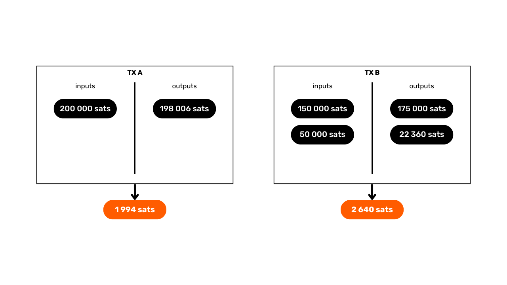

В этом примере, хотя транзакция B предлагает в общей сложности больше комиссий, майнеры будут отдавать предпочтение транзакции A, потому что она предлагает лучшее соотношение между комиссиями и весом. Вот расчет для каждой транзакции, выраженный в сатах за виртуальный байт (sat/vB):

```text
TXA: 1994 / 141 = 14 sats/vB

TXB: 2640 / 220 = 12 sats / vB
```

Это означает, что за каждую единицу веса транзакция A предлагает больше комиссий, чем транзакция B, хотя последняя предлагает больше комиссий в абсолютном значении.

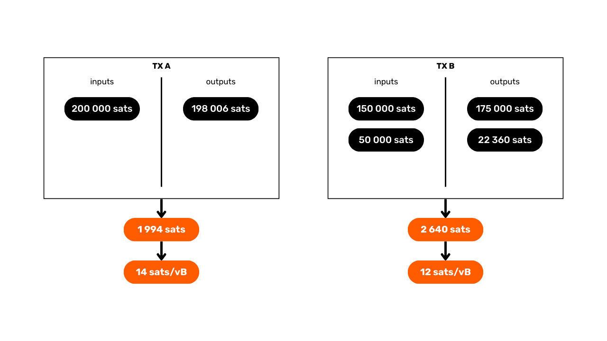

Поэтому для пользователя всегда более интересно использовать минимально возможное количество входов в своих транзакциях. Однако необходимо потреблять достаточные суммы, чтобы иметь возможность удовлетворить платеж на выходе. Управляя своим кошельком, необходимо, следовательно, иметь достаточно крупные UTXOs.

Принцип консолидации заключается именно в использовании периодов, когда комиссии в Биткойн низкие, для объединения своих мелких UTXOs в один большой. Таким образом, когда комиссии в Биткойн увеличиваются, можно совершать транзакции с минимальным количеством входов и, следовательно, тратить меньше в абсолютном выражении комиссий. Цель состоит в том, чтобы планировать обязательные транзакции на периоды высоких комиссий.

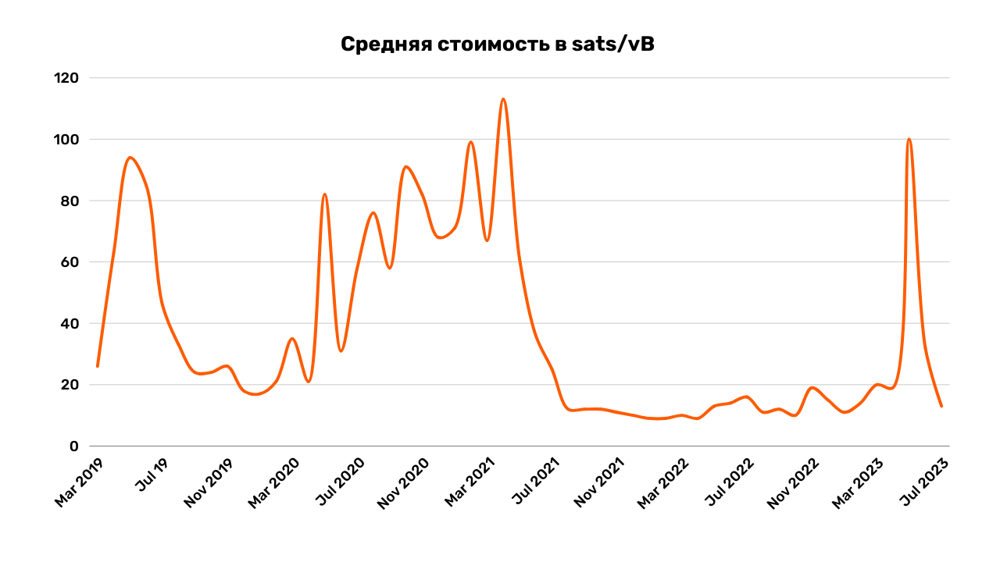

Помимо экономии на комиссиях за транзакции, консолидация UTXOs помогает избежать создания "пыли". Пылью называют UTXOs, чья стоимость в сатах настолько низка, что ее не хватает для покрытия необходимых комиссий за транзакцию для их использования. Это делает эти UTXOs экономически нерациональными для использования, пока комиссии за транзакции остаются высокими. Проактивно группируя свои UTXOs, вы предотвращаете их превращение в пыль, обеспечивая использование всех ваших средств.

### Каков минимальный размер для ваших UTXOs?

Иногда меня спрашивают, каков рекомендуемый минимальный размер для UTXO. К сожалению, универсального ответа нет, так как это зависит от ваших предпочтений и рыночных условий по комиссиям. Однако вот формула, которая может помочь вам определить порог, подходящий для ваших нужд:

$$
\frac {P \times F}T = M
$$

Где:
- $P$ это вес транзакции;
- $F$ представляет максимальную ставку комиссии в сатоши за виртуальный байт (sats/vB), которую вы готовы покрыть;
- $T$ - это процент от комиссии за транзакцию, который вы готовы заплатить относительно общей стоимости UTXO;
- $M$ - это минимальная сумма в сатоши для каждого UTXO.

Предположим, вы планируете покрыть комиссии за стандартную транзакцию SegWit с 1 входом и 2 выходами, весом 141 vB. Если вы готовы покрыть до 800 sats/vB, и вы готовы потратить максимум до 12% от стоимости UTXO на комиссии, тогда расчет будет следующим:

$$
\frac{141 \times 800}{0.12} = 940\ 000
$$

В этом примере было бы разумно поддерживать минимальный баланс в 940 000 сатоши для UTXOs в вашем кошельке.

### Консолидация и COIH

Одна из наиболее используемых эвристик в анализе блокчейна - это COIH (*Common Input Ownership Heuristic*), которая позволяет предположить, что все входы биткойн-транзакции принадлежат одному и тому же субъекту. Точнее, принцип консолидации заключается в использовании нескольких UTXOs в качестве входов и создании одного UTXO в качестве выхода. Таким образом, консолидация позволяет применять COIH.


На практике это означает, что внешний наблюдатель может знать, что все объединенные UTXOs, скорее всего, принадлежат одному и тому же человеку, и что выход всегда принадлежит этому же человеку. Это, очевидно, проблематично для вашей конфиденциальности, так как вы связываете разные истории. Например, представьте, что я консолидирую 3 UTXOs, приобретенные P2P, и UTXOs, купленное на платформе через процесс KYC.
На практике это означает, что внешний наблюдатель может сделать вывод, что все консолидированные UTXOs, скорее всего, принадлежат одному и тому же человеку, и что единственный сгенерированный выход также принадлежит ему. Эта ситуация может подвергнуть вашу конфиденциальность риску, связав разные истории транзакций. Например, допустим, я консолидирую 3 UTXOs, приобретенные через P2P, с UTXOs, полученным через платформу, требующую KYC:


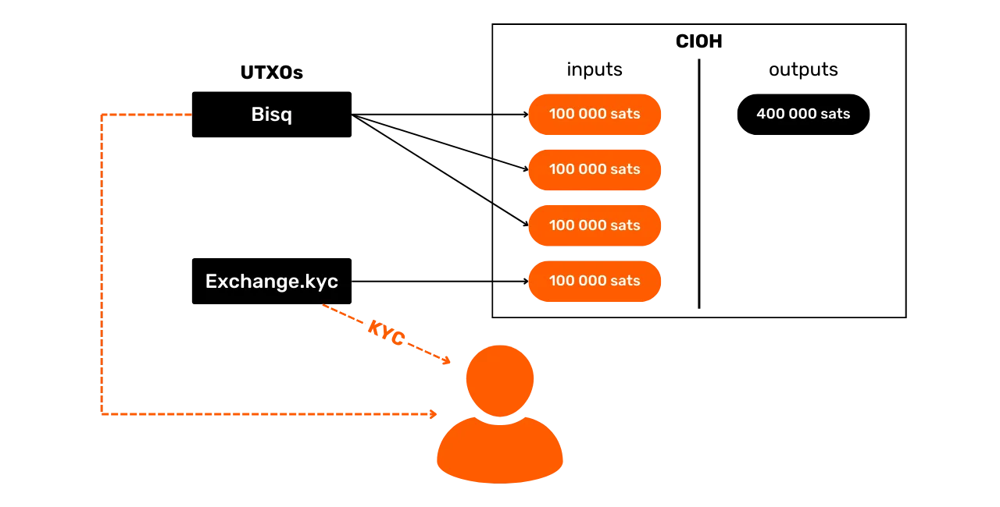

Таким образом, любой агент, имеющий доступ к данным биржи, включая потенциально государственные агентства, может идентифицировать, что я владею другими активами в BTC. Ранее эти UTXOs не были напрямую связаны с моей личностью; теперь они связаны. Более того, это раскрывает всем источникам, что я владею определенным количеством биткойнов.

В управлении UTXOs экономические соображения, которые побуждают к консолидации для снижения комиссий, таким образом, конфликтуют с хорошими практиками конфиденциальности, которые рекомендовали бы никогда не объединять ваши UTXOs. Выбор между экономией и конфиденциальностью, таким образом, зависит от приоритетов каждого пользователя.

Если вы можете избежать консолидации, сохраняя при этом значительные размеры UTXO, это идеально. Для этого оптимизируйте методы приобретения. Если вы покупаете свои биткойны методом DCA, попробуйте максимально растянуть ваши единовременные покупки, чтобы сгруппировать сумму в меньшее количество UTXOs. Управлять единовременной покупкой на €1000 каждые 2 месяца будет проще, чем покупка на €120 каждую неделю. Это минимизирует количество генерируемых UTXOs и упрощает управление вашим кошельком, сохраняя при этом вашу конфиденциальность.

Если вам необходимо консолидировать ваши биткойны, в первую очередь отдайте приоритет консолидации UTXOs из одного источника. Например, объединение 10 UTXOs с одной платформы повлияет на вашу конфиденциальность меньше, чем смешивание 5 UTXOs с платформы A с 5 UTXOs с платформы B. Если консолидация из разных источников неизбежна, попробуйте разделить их согласно их характеристикам. Например, группируйте UTXOs, полученные через KYC, в одной транзакции, а полученные в P2P - в другой.

В любом случае помните, что любая консолидация неизбежно приводит к потере конфиденциальности. Поэтому тщательно оцените необходимость этой операции и потенциальное влияние на вашу конфиденциальность, учитывая риск.

## Другие хорошие практики
<chapterId>b5216965-7d13-4ea1-9b7c-e292966a487b</chapterId>

Давайте вместе рассмотрим некоторые другие хорошие практики, которые могут помочь вам оптимизировать вашу конфиденциальность в Биткойн.

### Полноценный узел
Владение вашими биткойнами в личном хранении - это хорошо, но использование собственного полноценного узла - еще лучше! Вот почему наличие собственного узла критически важно для полностью суверенного использования Биткойн:

- **Устойчивость к цензуре**: Ваши транзакции не могут быть заблокированы никем;
- **Независимость от третьих сторон**: Вы больше не зависите от какой-либо внешней службы для проверки данных блокчейна;
- **Активное участие**: У вас есть возможность устанавливать собственные правила валидации и напрямую участвовать в консенсусе;
- **Вклад в сеть**: Запуская узел, вы помогаете укреплять и распространять сеть Биткойн;
- **Техническое образование**: Управление полноценным узлом - отличный способ углубить ваши технические знания о Биткойне.

Помимо этих преимуществ, использование полноценного узла также улучшает вашу конфиденциальность при трансляции ваших транзакций. Когда вы выпускаете транзакцию, она сначала создается и подписывается через ваш кошелек. Чтобы транслировать ее в сеть Биткойн, она должна быть известна хотя бы одному узлу. Используя свой собственный узел, вы напрямую контролируете эту трансляцию, тем самым повышая вашу конфиденциальность и снижая риски утечки данных.


Если у вас нет собственного узла Биткойн, вам придется использовать узел третьей стороны, например, предлагаемый провайдером вашего кошелька. Помимо трансляции транзакций, вашему кошельку требуется доступ к различной информации, такой как ожидающие транзакции, балансы, связанные с вашими адресами, или количество подтверждений для ваших транзакций. Чтобы получить доступ ко всем этим данным, вам нужно запросить узел.


Основной риск, когда вы не используете собственный узел Биткойн, заключается в том, что оператор узла третьей стороны может наблюдать за вашей активностью в блокчейне или даже делиться этой информацией с другими агентами. Чтобы снизить этот риск, промежуточным решением может служить использование программного обеспечения кошелька, позволяющего маскировать ваши подключения через Tor. Это может уменьшить воздействие на ваши данные. Однако оптимальным решением остается иметь собственный узел Биткойн и использовать его для трансляции ваших транзакций. Очевидно, вам также нужно будет убедиться, что никакая информация не утекает с вашего узла, но это другая тема, которую мы исследуем в следующих разделах.

Помимо очевидного преимущества для вашей конфиденциальности, наличие собственного полного узла также гарантирует достоверность данных в блокчейне, защищает от цензуры и позволяет вам активно участвовать в управлении Биткойном. Используя свой собственный узел, вы вносите свой экономический вес в выбранную цепочку, что важно во время конфликтов внутри сообщества, например, во время Войны за размер блока с 2015 по 2017 год. В случае форка использование узла третьей стороны может привести к поддержке вами цепочки, которую вы не хотите поддерживать, поскольку оператор узла делает выбор за вас. Как вы можете понять, в интересах конфиденциальности и, в более широком смысле, индивидуального суверенитета, крайне важно запускать и использовать свой собственный полный узел!

### Обман эвристических анализов

В более широком смысле, важно понимать обсуждаемые нами эвристики, чтобы лучше избегать их или обманывать. Принятие серии хороших практик может быть полезным, даже если они не являются обязательными. Они предлагают дополнительный слой защиты, который может быть важен для поддержания хорошей конфиденциальности при использовании Биткойн.

Первый совет, который я мог бы дать, - это смешиваться с самой плотной толпой. В Биткойне это означает использование наиболее распространенных сценариев скриптов. Например, скрипты P2WSH, часто используемые для конфигураций мультисигнатуры SegWit V0, очень редки. Они не позволяют вам скрыться в большом анонимном наборе. То же самое касается старых моделей, таких как P2PKH или P2SH. Хотя они широко представлены в наборе UTXO, они используются все реже для новых транзакций.

В целом, безопаснее обратиться к самому последнему стандарту скрипта, при условии, что он достаточно распространен. Так, если в 2022 году я бы посоветовал не использовать P2TR (Taproot) из-за его низкого распространения, то к 2024 году я бы рекомендовал выбирать этот тип скрипта или, в крайнем случае, скрипт SegWit V0, поскольку количество транзакций с использованием P2TR начинает представлять очень значительную долю.


Источник: [txstats.com](https://txstats.com/d/000000054/utxo-set-repartition-by-output-type)

Еще один совет для сохранения вашей конфиденциальности - попытаться обойти внутренние эвристики транзакций. Например, совершая платеж, вы можете попытаться избежать создания выхода с круглой суммой, так как это может сигнализировать о том, что другой выход представляет собой сдачу. Если вам нужно отправить 100k сатоши другу, рассмотрите возможность перевода немного большей суммы, чтобы избежать этой эвристики. Аналогично, старайтесь не создавать выходы сдачи, которые непропорционально велики по сравнению с совершенным платежом, так как это также может раскрыть, какой из выходов представляет собой сдачу.

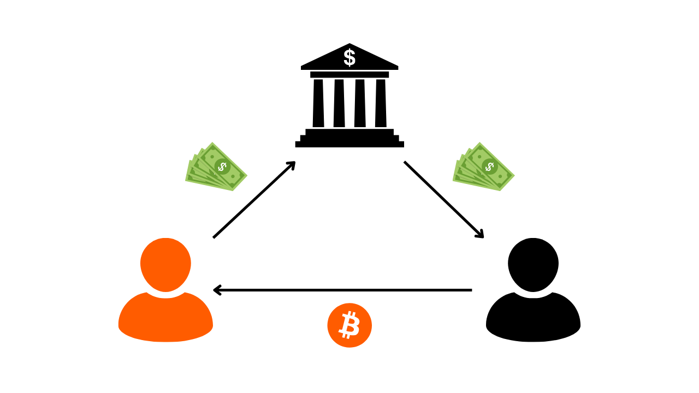

Наконец, если вы регулярно совершаете транзакции в Биткойн, убедитесь, что вы не всегда транслируете их в одно и то же время. Распределяя трансляцию ваших транзакций на протяжении дня и недели, вы избегаете предоставления внешним наблюдателям возможности обнаружить временной шаблон, основанный на часовых поясах, который мог бы улучшить их анализ.

Помимо всех этих полезных практик, которые следует применять ежедневно, существуют и другие еще более эффективные методы полного разрыва связи между вашими биткойнами. Среди них, очевидно, транзакции coinjoin, которые мы подробно изучим в следующей части.

# Понимание транзакций Coinjoin
<partId>6d0bbf16-3714-4db1-9897-2d45019f6bdc</partId>

## Что такое транзакция Coinjoin?
<chapterId>0862bc6b-1c48-4aa4-b76d-4f547b469008</chapterId>

После изучения основ защиты конфиденциальности мы теперь обсудим более сложные техники, направленные на активную защиту вашей конфиденциальности, особенно путем разъединения истории ваших биткойнов. В следующей части мы рассмотрим множество мелких техник, но сначала я хочу рассказать вам о coinjoin.

Coinjoin часто считается наиболее эффективным методом защиты конфиденциальности пользователей Биткойн. Но что же такое транзакция coinjoin? Давайте вместе узнает это.

### Основные принципы Coinjoin

Coinjoin - это техника, которая нарушает прослеживаемость биткойнов в блокчейне. Она основана на совместной транзакции с определенной структурой одноименного типа: транзакция coinjoin.
Как мы видели в первых частях этого обучения, транзакции в Биткойн известны всем пользователям через их узел. Поэтому легко проверить цепочку электронных подписей каждой монеты и наблюдать за ее историей. Это означает, что все пользователи могут попытаться анализировать транзакции других пользователей. В результате анонимность на уровне транзакций невозможна. Однако анонимность сохраняется на уровне индивидуальной идентификации. В отличие от традиционной банковской системы, где каждый счет связан с личной идентичностью, в Биткойн средства ассоциируются с криптографическими ключевыми парами (или скриптами), таким образом предлагая пользователям форму псевдонимности за криптографическими идентификаторами.

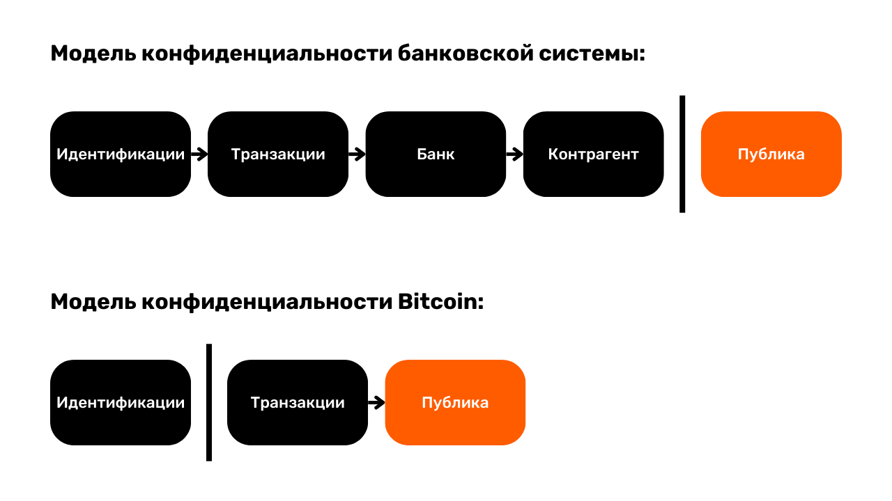

Таким образом, конфиденциальность в Биткойн нарушается, когда внешние наблюдатели умудряются ассоциировать конкретные UTXOs с идентифицированными пользователями. Как только эта ассоциация установлена, становится возможным проследить их транзакции и анализировать историю их биткойнов. Coinjoin - это техника, разработанная непосредственно для нарушения отслеживаемости UTXOs, чтобы предложить определенный уровень конфиденциальности пользователям Биткойн на уровне транзакций.

Coinjoins повышают конфиденциальность пользователей Биткойн, усложняя анализ цепочек для внешних наблюдателей. Их структура позволяет объединять несколько монет от разных пользователей в одну транзакцию, тем самым смешивая следы и затрудняя определение связей между входными и выходными адресами.

Важно понимать, что цель транзакции coinjoin - нарушить историю монеты. Эта техника не предоставляет постоянной анонимности и не блокирует отслеживание биткойнов окончательно, вопреки тому, что может показаться. Coinjoin нацелен только на нарушение истории в точке, где выполняется транзакция coinjoin. Однако до и после этой операции монета подвержена тем же рискам конфиденциальности.


### Как работают coinjoins?

Принцип coinjoin основан на совместном подходе: несколько пользователей, желающих смешать свои биткойны, вносят идентичные суммы во входы одной и той же транзакции. Затем эти суммы распределяются в выходах равных значений каждому пользователю.

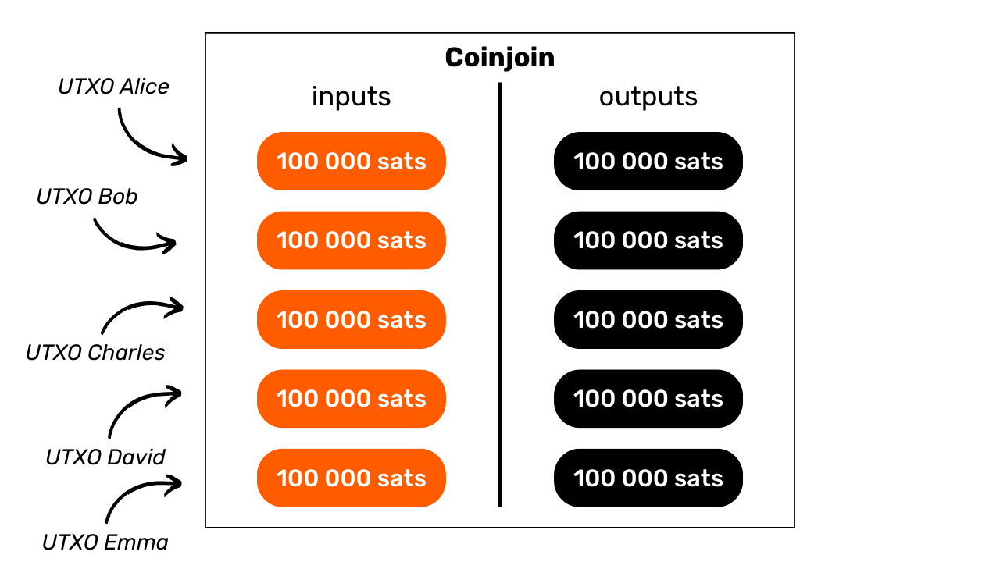

В конце транзакции становится невозможным ассоциировать конкретный выход с известным пользователем на входе. Между входами и выходами нет прямой связи, что нарушает ассоциацию между пользователями и их UTXO, а также историю каждой монеты.

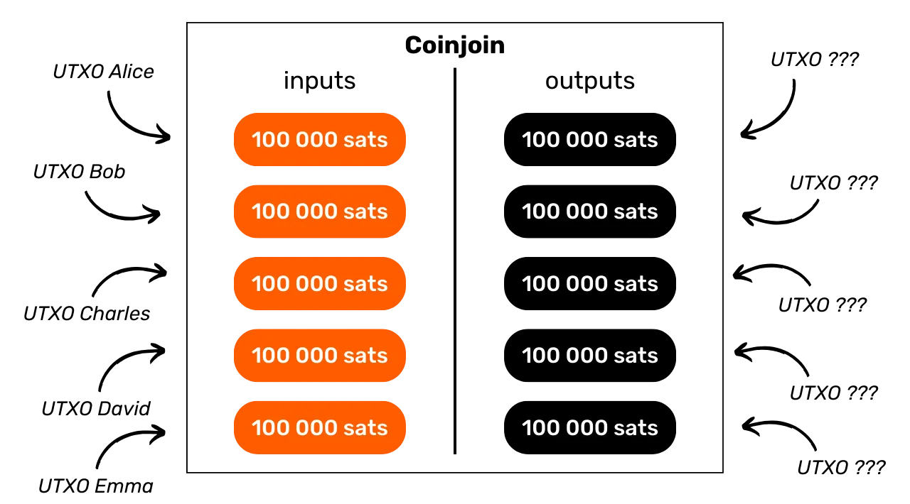

Давайте рассмотрим пример с Алисой. Она хочет отправить своей сестре Еве около 100,000 сатоши в честь её дня рождения. Однако, Алиса не хочет, чтобы Ева могла проследить историю её транзакций, потому что не хочет раскрывать, сколько биткойнов у неё есть или как она их получила. Для этого Алиса решает разорвать историю своего UTXO с помощью транзакции coinjoin. Она организует совместную транзакцию с Бобом, Чарльзом, Дэвидом и Фрэнком: Алиса, Боб, Чарльз, Дэвид и Фрэнк каждый вносит UTXO по 105,000 сатоши (с 5,000 сатоши на комиссию майнерам) в качестве входов для транзакции:


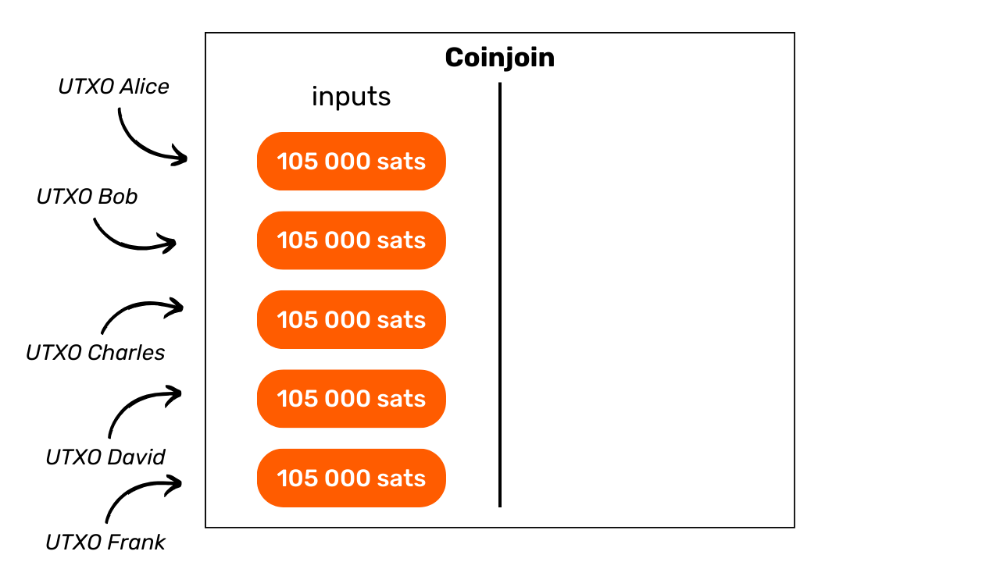

- В обмен на использование этих входов каждый генерирует новый адрес для создания пяти одинаковых выходов по 100,000 сатоши каждый. Каждый получает выход:

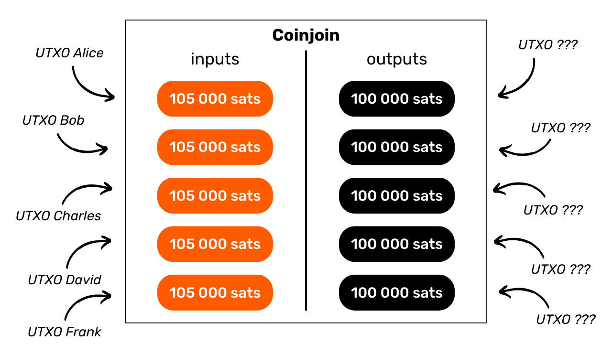

- В итоге у Алисы остается UTXO на 100,000 сатоши, история которого смешана. Она использует этот UTXO в новой транзакции, чтобы отправить сумму Еве в честь её дня рождения:

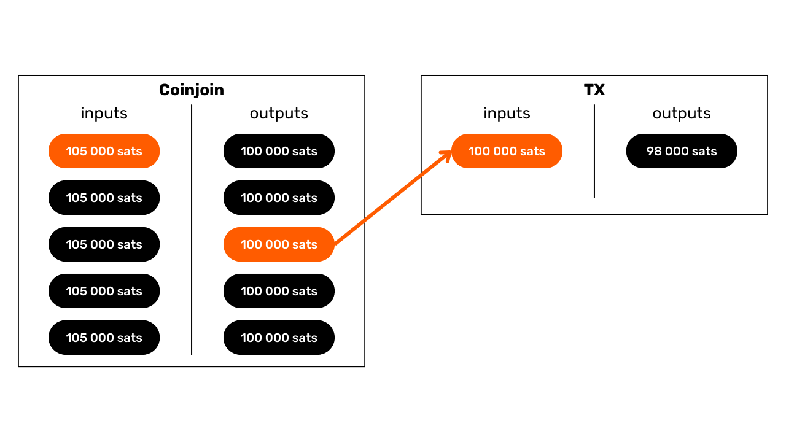

- Если Ева попытается проанализировать эту транзакцию, чтобы извлечь информацию, она столкнется с транзакцией coinjoin, в которой участвуют Алиса, Боб, Чарльз, Дэвид и Фрэнк. Не имея возможности определить, какой вход принадлежит кому из-за одинаковости сумм, Ева не сможет проследить историю UTXO Алисы, а также определить, сколько биткойнов у её сестры или как она их получила:


В этом сценарии Алиса использовала технику coinjoin для увеличения своей конфиденциальности против ретроспективного анализа. Действительно, Алиса защищает себя от возможного анализа со стороны Евы, который начался бы с конкретной транзакции для прослеживания истории UTXO в обратном направлении. Эта защита от анализа из настоящего в прошлое и называется ретроспективным анонимным набором. Мы подробнее рассмотрим эту концепцию в последних главах этой части.

Однако, coinjoin также предлагает возможность улучшить конфиденциальность против анализа из прошлого в настоящее, что называется перспективным анонимным набором. Давайте вернемся к нашему примеру, где Алиса отправила 98,000 сатоши Еве в честь её дня рождения, но поменяв роли. Теперь представим, что Ева обеспокоена своей конфиденциальностью. Действительно, Алиса могла бы быть искушена проследить за монетой, которую она отправила Еве, чтобы собрать информацию. Ева может объединить этот UTXO, который она только что получила, со всеми своими другими UTXOs, что могло бы раскрыть Алисе количество биткойнов, которые у неё есть в кошельке. Чтобы избежать этого, Ева также может разорвать историю монеты, которую она только что получила.

- Ева, Грейс, Мэллори, Оскар и Виктор каждый вносит UTXO по 98,000 сатоши в качестве входов в биткойн-транзакцию:
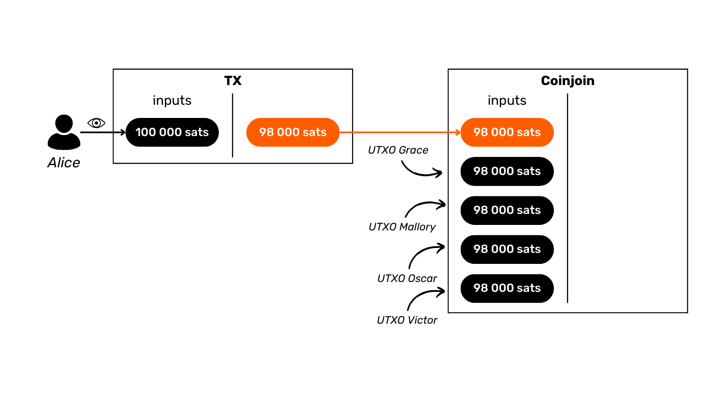

- В обмен на использование этих входов каждый предоставляет новый адрес для создания 5 выходов по 97,500 сатоши каждый, абсолютно равных. Каждый пользователь получает выход:

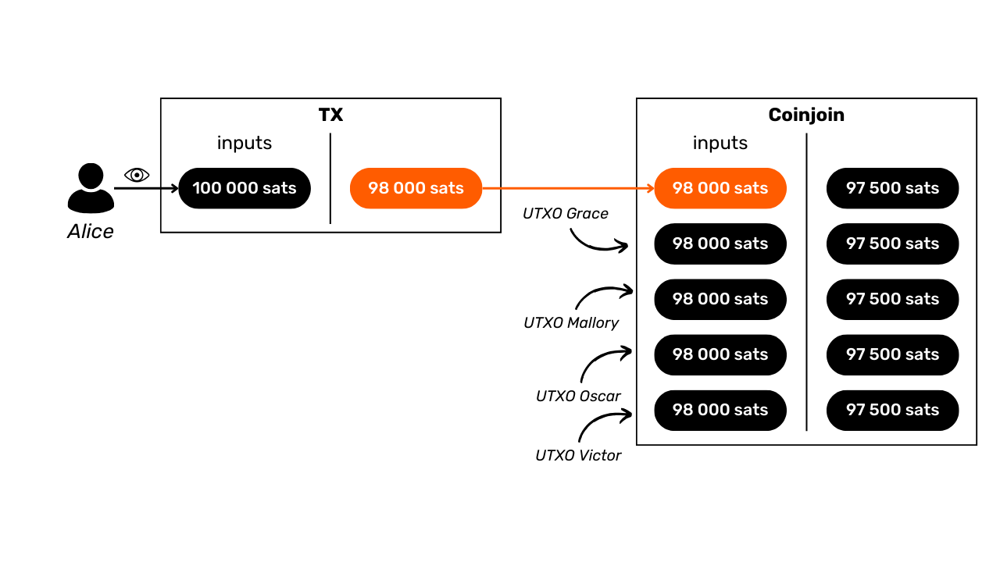

- Теперь у Евы есть UTXO на 97,500 сатоши с разорванной историей. Она может использовать его без страха для будущих транзакций. Действительно, если Алиса попытается проследить за биткойнами, которые она отправила Еве, она столкнется с транзакцией coinjoin. Она не сможет определить, какой выходной UTXO принадлежит Еве. Анализ становится невозможным:

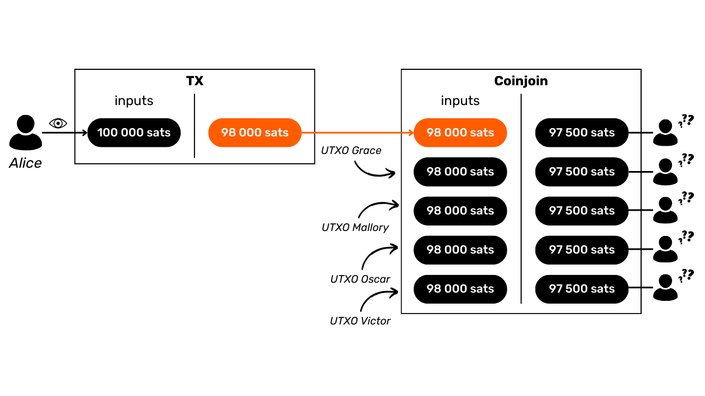

В первом примере мы видели, как coinjoin может защитить конфиденциальность монеты в отношении её прошлого, а во втором примере, как он может также обезопасить историю монеты в отношении её будущего. Вот почему я упомянул, что coinjoin следует рассматривать как однократное событие, которое разделяет историю монеты в обоих направлениях:


### Смешивание, coinjoins, миксеры... В чем разница?

Термин "смешивание" иногда используется для описания coinjoin, термин, который некоторые биткойнеры отвергают, опасаясь путаницы с кастодиальными миксерами. Однако, на мой взгляд, эти опасения необоснованны, потому что в математическом контексте coinjoin точно воплощает концепцию смешивания.

В общем поле математики смешивание относится к свойству динамической системы, где после некоторого времени все части исходного пространства теоретически могут быть смешаны с любой другой частью. Смешивание подразумевает, что положение частицы или состояние системы развивается таким образом, что его будущее распределение независимо от его исходного распределения, достигая таким образом состояния, где характеристики исходного состояния равномерно распределены по всему пространству системы. Это именно то, что происходит в coinjoin с биткойнами. Таким образом, на мой взгляд, coinjoin действительно является методом смешивания монет.

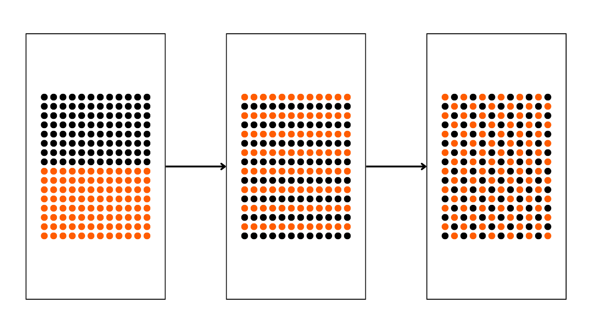

Однако важно различать coinjoin и миксеры. Миксер — это сервис, куда пользователи отправляют свои биткойны для смешивания. Эти сервисы были популярны в 2010-х, но их использование снизилось из-за двух основных недостатков по сравнению с coinjoin:
- Они требуют от пользователя отказаться от контроля над своими средствами во время процесса смешивания, что подвергает их риску кражи;
- Нет гарантии, что миксер не записывает детали транзакций или даже не продает эту информацию компаниям по анализу блокчейна.
  


В настоящее время пользователи предпочитают coinjoin, поскольку это позволяет им сохранять полный контроль над своими средствами на протяжении всего процесса. Участники coinjoin не рискуют потерять свои биткойны из-за действий других участников. Давайте вместе исследуем, как это возможно, в следующей главе.

## Zerolink и Chaumian Coinjoins
<chapterId>326c9654-b359-4906-b23d-d6518dd5dc3e</chapterId>

Конфиденциальность, предоставляемая coinjoin, зависит от размера группы, в которой наша часть скрыта. Поэтому необходимо найти как можно больше участников. Вполне возможно выполнить coinjoin вручную, с пользователями, найденными самостоятельно, но этот метод сложен и не позволяет достичь больших анонимных наборов.

Именно поэтому в Биткойн развились координаторы coinjoin. Их роль заключается в соединении различных пользователей и передаче необходимой информации для успешного завершения совместной транзакции.


Но как мы можем гарантировать, что координатор никогда не будет контролировать биткойны пользователей, и несмотря на то, что они являются лицом, составляющим транзакцию coinjoin, как мы можем убедиться, что они не могут связать входы и выходы пользователей, что могло бы стать утечкой конфиденциальности?

### Слепые подписи Чаума

Современные реализации coinjoin используют слепые подписи Дэвида Чаума, чтобы избежать утечки информации. Давайте быстро изучим вместе, как работают эти слепые подписи.
Слепые подписи Чаума - это форма цифровой подписи, при которой издатель подписи не знает содержания сообщения, которое он подписывает. Однако позже подпись может быть проверена вместе с оригинальным сообщением. Эту технику разработал криптограф Дэвид Чаум в 1983 году.
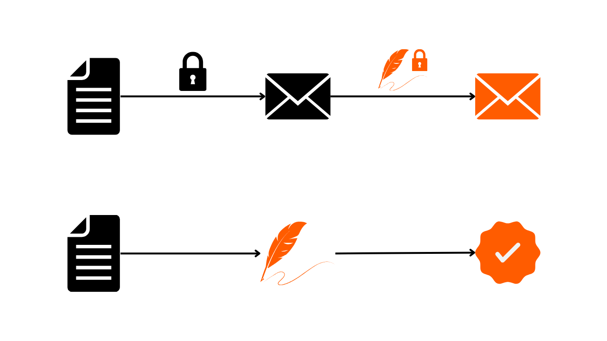

Возьмем пример компании, желающей аутентифицировать конфиденциальный документ, такой как контракт, не раскрывая его содержимого. Компания применяет процесс маскировки, который криптографически преобразует оригинальный документ обратимым способом. Этот измененный документ отправляется в сертификационный орган, который применяет слепую подпись, не зная основного содержания. После получения подписанного документа, компания снимает маску с подписи. Результатом является оригинальный документ, аутентифицированный подписью органа, без того чтобы орган когда-либо видел оригинальное содержимое.

Таким образом, слепые подписи Чаума позволяют сертифицировать подлинность документа, не зная его содержания, что гарантирует как конфиденциальность данных пользователя, так и целостность подписанного документа.

### Chaumian Coinjoins

В "Chaumian CoinJoins" использование Tor и слепых подписей Дэвида Чаума сочетаются для обеспечения того, чтобы координатор не мог знать, какой выход принадлежит какому пользователю. Процесс создания транзакции coinjoin вращается вокруг 3 основных шагов: регистрация входов, регистрация выходов и подписание транзакции. Давайте рассмотрим этот процесс на примере Алисы, одного из участников coinjoin. Все остальные участники следуют тем же шагам, что и Алиса, каждый самостоятельно.

**Шаг 1: Регистрация входов.**
- Алиса отправляет координатору UTXO, который она хочет использовать в качестве входа для транзакции, а также замаскированный адрес получения, который она хочет использовать в качестве выхода для получения своих биткойнов. Таким образом, координатор не может знать адрес Алисы. Он видит только его замаскированную версию:


- Координатор проверяет действительность входов, затем подписывает замаскированный адрес Алисы своим приватным ключом. Он отправляет обратно Алисе слепую подпись:


**Шаг 2: Регистрация выходов.**
- Теперь Алиса может раскрыть свой адрес, подписанный приватным ключом координатора. Она устанавливает новое соединение под другой идентичностью Tor. Координатор не может идентифицировать, что это Алиса подключается под этой новой идентичностью:


- Алиса отправляет раскрытый адрес и подпись координатору (который все еще не знает, что это Алиса):

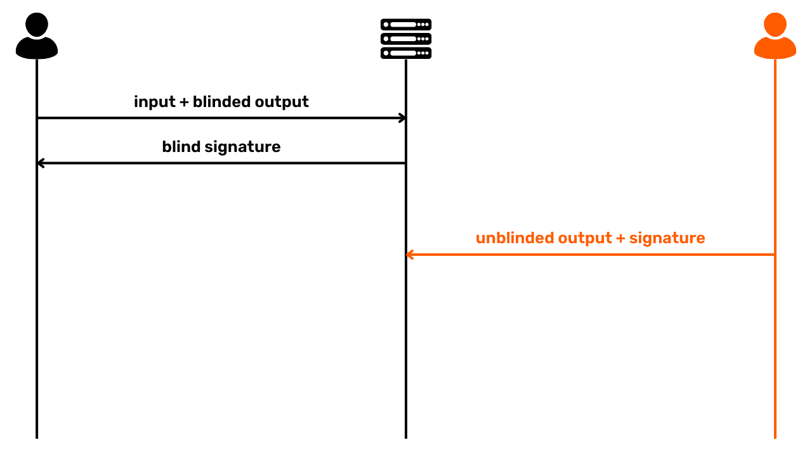

**Шаг 3: Подписание транзакции.**
- Координатор аналогично извлекает раскрытые выходы от всех участников. Благодаря соответствующим подписям, он может проверить, что каждый выход, представленный анонимно, действительно был подписан его приватным ключом ранее, обеспечивая их законность. Затем он готов сконструировать транзакцию coinjoin и отправляет ее участникам для их подписи:

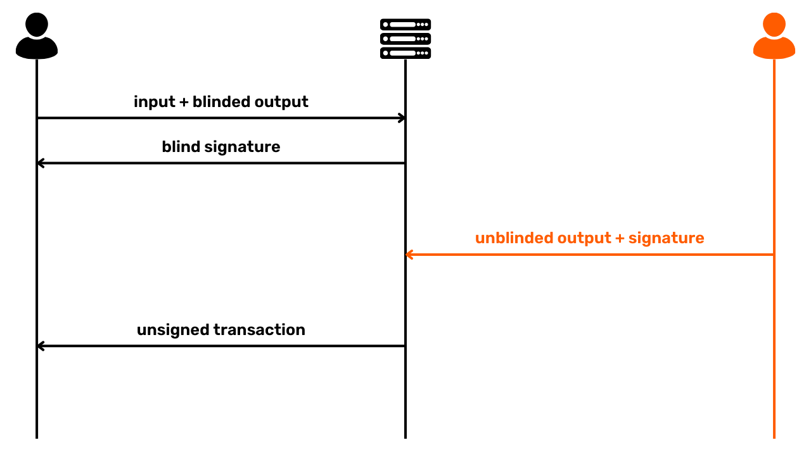

- Алиса, как и другие участники, проверяет, что ее вход и выход правильно включены в транзакцию, сконструированную координатором. Если все удовлетворительно, она отправляет подпись, которая разблокирует скрипт ее входа координатору:


- После сбора подписей от всех участников coinjoin, координатор может транслировать транзакцию в сеть Биткойн, чтобы она могла быть добавлена в блок.
В этой системе координатор не может связать вход с конкретным выходом. Более того, он не может взять во владение средства участников, так как у него никогда не будет доступа к приватным ключам, необходимым для разблокировки их UTXOs. На протяжении всего процесса и до завершения шага 3 у него также нет доступа к подписям. Когда Алиса и другие участники подписывают глобальную транзакцию, после проверки корректности всех данных, координатор больше не может изменить эту транзакцию, включая выходы, без её инвалидации. Это, таким образом, предотвращает кражу биткойнов координатором.
В конечном итоге, когда пользователь coinjoin записывает свой выход в транзакцию, он хочет получить гарантии, аналогичные тем, которые имеет гражданин, голосующий на выборах. Существует двойственность между публичным и частным аспектами этих действий. С одной стороны, есть то, что хочется сохранить в тайне: для избирателя - они не хотят, чтобы их бюллетень был связан с их личностью; для пользователя coinjoin - они не хотят, чтобы их выход был ассоциирован с их входом. Действительно, если координатор или любая другая сторона сумеет установить связь между входом и выходом, coinjoin теряет весь свой смысл. Как было объяснено ранее, coinjoin должен функционировать как прерывание в истории монеты. Это прерывание происходит именно из-за невозможности ассоциировать конкретный вход с конкретным выходом в транзакции coinjoin (перспективный анонимный набор) и наоборот (ретроспективный анонимный набор).

С другой стороны, есть публичный аспект: избиратель хочет убедиться, что его бюллетень включен в урну для голосования; аналогично, пользователь coinjoin хочет убедиться, что его выход включен в транзакцию coinjoin. Действительно, абсолютно необходимо, чтобы участники coinjoin могли проверить наличие своего выхода перед подписанием транзакции, иначе координатор мог бы украсть средства.

Именно эти 2 публичных и частных аспекта, ставшие возможными благодаря использованию слепых подписей Дэвида Чаума, гарантируют участникам Chaumian coinjoins, что их биткойны не будут украдены, и что их средства не смогут быть отслежены.

### Кто изобрел концепцию coinjoin?

Трудно определить с уверенностью, кто впервые представил идею coinjoin в Биткойн и кто придумал использовать слепые подписи Дэвида Чаума в этом контексте. Часто считается, что это был Грегори Максвелл, который впервые заговорил об этом в [сообщении на BitcoinTalk в 2013 году](https://bitcointalk.org/index.php?topic=279249.0):
Использование слепых подписей Чаума: Пользователи входят в систему и предоставляют входы (и адреса для сдачи), а также криптографически замаскированную версию адреса, на который они хотят отправить свои приватные монеты; сервер подписывает токены и возвращает их пользователям. Пользователи повторно подключаются анонимно, раскрывают свои выходные адреса и отправляют их обратно на сервер. Сервер видит, что все выходы подписаны им и что, следовательно, все выходы исходят от действительных участников. Позже люди повторно подключаются и подписывают.
Maxwell, G. (2013, 22 августа). *CoinJoin: Конфиденциальность Биткойн в реальном мире*. Форум BitcoinTalk. https://bitcointalk.org/index.php?topic=279249.0


Однако существуют и более ранние упоминания, как для подписей Чаума в контексте микширования, так и для coinjoin. [В июне 2011 года Дункан Таунсенд представил на BitcoinTalk](https://bitcointalk.org/index.php?topic=12751.0) миксер, использующий подписи Чаума способом, весьма схожим с современными Чаумианскими coinjoin.
В той же ветке есть [сообщение от hashcoin в ответ Дункану Таунсенду](https://bitcointalk.org/index.php?topic=12751.msg315793#msg315793) с предложением улучшить его миксер. Процесс, описанный в этом сообщении, точно представляет то, что наиболее близко напоминает coinjoin. Также есть упоминание о подобной системе в [сообщении от Алекса Мизрахи в 2012 году](https://gist.github.com/killerstorm/6f843e1d3ffc38191aebca67d483bd88#file-laundry), когда он консультировал создателей Tenebrix, одной из первых альткоинов, послуживших основой для создания Litecoin позже. Даже термин "coinjoin" не был придуман Грегом Максвеллом, но появился из идеи Питера Тодда.


### Zerolink

Zerolink — это комплексный протокол микширования, который интегрирует Чаумианские coinjoin и различные стратегии защиты анонимности пользователей от нескольких форм анализа блокчейна, в частности, минимизируя ошибки, связанные с управлением кошельком. Этот протокол [был представлен nopara73 и TDevD в 2017 году](https://github.com/nopara73/ZeroLink/blob/master/README.md).

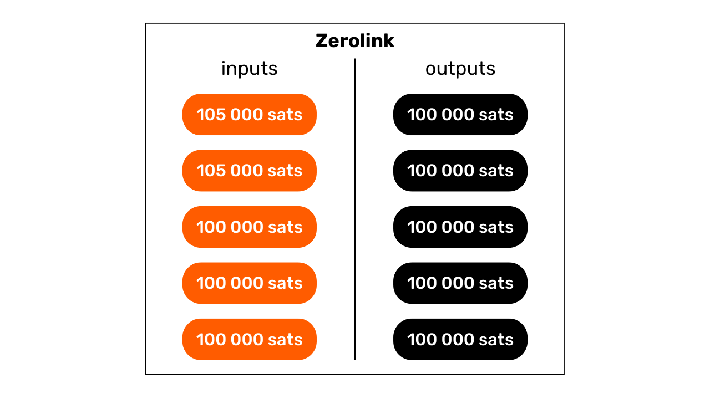

Как следует из названия, принцип Zerolink заключается в проведении транзакций coinjoin, которые обеспечивают невозможность отслеживания связей между входами и выходами. Эта характеристика достигается за счет обеспечения идентичности всех выходных сумм.

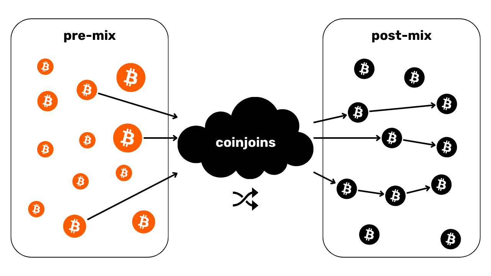

Важная мера предосторожности от Zerolink включает в себя полное разделение несмешанных UTXOs от смешанных UTXOs с использованием различных наборов криптографических ключей или даже отдельных кошельков. Таким образом, кошелек "до микширования", предназначенный для монет до смешивания, отличается от кошелька "после микширования", предназначенного для монет, которые были смешаны.

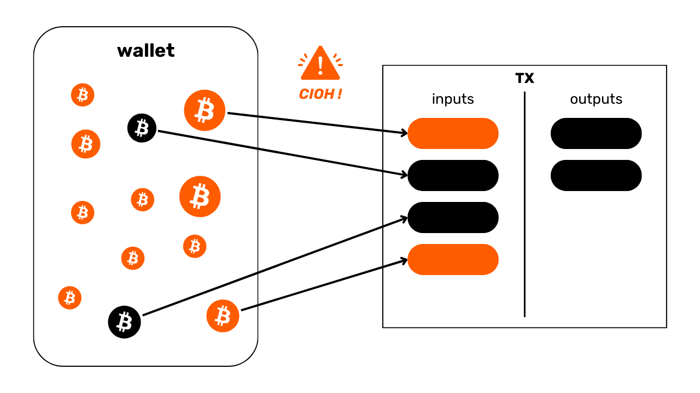

Это строгое разделение UTXO в первую очередь служит для предотвращения случайных ассоциаций между смешанным UTXO и несмешанным UTXO. Действительно, если такие связи возникают, эффективность coinjoin на смешанном UTXO аннулируется без ведома пользователя, тем самым компрометируя конфиденциальность UTXO, историю которого он считал разорванной. Эти связи могут возникать либо через повторное использование адреса при обеспечении смешанного UTXO несмешанным, либо при применении эвристики общего владения входом (CIOH), если пользователь использует смешанные и несмешанные UTXO в качестве входов одной и той же транзакции. Разделяя кошельки до и после микширования, эти случайные ассоциации избегаются, и пользователь защищен от непреднамеренных ошибок.


Это разделение также предоставляет возможность применять различные правила между кошельками до смешивания и после смешивания на уровне программного обеспечения кошелька. Например, в кошельке после смешивания программное обеспечение может запретить объединение UTXOs во входы, чтобы предотвратить применение CIOH, которое могло бы нарушить анонимность пользователя. Также возможно стандартизировать использование скриптов и опций транзакций (например, сигнализацию о RBF) для предотвращения идентификации по отпечаткам кошельков.

На данный момент Whirlpool является единственной реализацией coinjoin, которая строго применяет протокол Zerolink. В следующей главе мы рассмотрим различные существующие реализации coinjoin и преимущества и недостатки каждой из них.

## Реализации Coinjoin
<chapterId>e37ed073-9498-4e4f-820b-30951e829596</chapterId>

*В 2024 году мы наблюдаем значительные изменения в инструментах, доступных пользователям, желающим выполнять coinjoins на Биткойн. Мы находимся в переломный период, и рынок coinjoin переживает крупную перестройку. Поэтому эта глава со временем, вероятно, будет обновлена.*

На данный момент существует в основном 3 различные реализации coinjoin на Биткойн:
- Whirlpool;
- Wabisabi;
- JoinMarket.
Каждая из этих реализаций стремится разорвать историю UTXOs через транзакции coinjoin. Однако их механизмы значительно различаются. Поэтому важно понимать, как работает каждая, чтобы выбрать наиболее подходящий вариант для ваших нужд.

### JoinMarket

JoinMarket, созданный в 2015 году Адамом Гибсоном и Крисом Белчером, выделяется среди других реализаций coinjoin благодаря своей уникальной модели сопоставления пользователей. Эта система основана на рынке P2P обмена, где некоторые пользователи, "производители", предоставляют свои биткойны для смешивания, в то время как другие, "потребители", используют эти средства для выполнения транзакций coinjoin в обмен на плату.

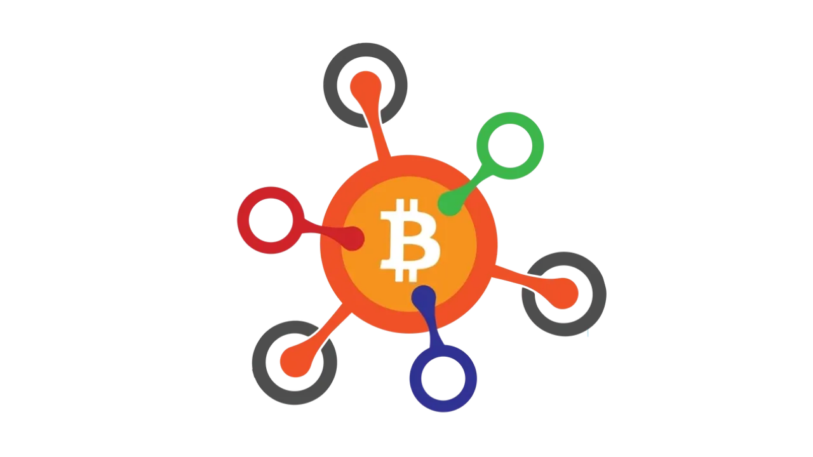

В этой модели "мейкеры" оставляют свои биткойны в распоряжении "тейкерам" и получают плату за свою услугу. "Тейкеры", с другой стороны, платят за использование биткойнов "мейкеров" для проведения своих собственных транзакций coinjoin. Размер сервисных сборов варьируется в зависимости от роли: "мейкеры" накапливают сборы за предложение ликвидности, в то время как "потребители" платят сборы. Этот рынок работает свободно без условий использования.

Одним из основных недостатков JoinMarket является его сложность использования, которая требует определенного опыта в работе с терминалами для эффективного использования. Хотя эта сложность не является препятствием для опытного пользователя, она может ограничить доступ для широкой публики. Однако недавнее введение веб-интерфейса под названием JAM несколько облегчило его использование.

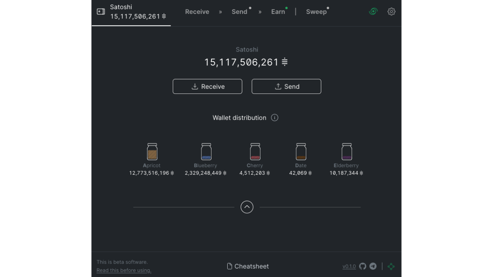

Источник: [JAM](https://github.com/joinmarket-webui/jam/blob/devel/docs/assets/screenshot-dark.webp)

Тем не менее, технический барьер остается серьезным препятствием. В экосистеме coinjoin, где конфиденциальность усиливается за счет количества участников, любое ограничение, снижающее доступность, напрямую влияет на доступную ликвидность, которая является ключевым фактором для эффективности смешивания. Биткойн, уже являясь нишей в финансовых транзакциях, видит использование coinjoins как поднишу, а JoinMarket представляет собой еще более специализированную часть, тем самым ограничивая его потенциал для увеличения анонимных наборов своих пользователей.
Несмотря на его инновационную модель P2P сопоставления для coinjoin, JoinMarket имеет несколько значительных недостатков, особенно в отношении структуры транзакций. В отличие от других реализаций, таких как Whirlpool, JoinMarket не гарантирует идеального равенства между выходами, и возможно проследить детерминированные связи между входами и выходами. Более того, в нем отсутствуют инструменты для предотвращения повторного смешивания монет, которые уже были смешаны вместе, что может нарушить конфиденциальность, которую ищут пользователи. Наконец, хотя концепция JoinMarket интересна, особенно для тех, кто заинтересован в динамичном рынке ликвидности, на мой взгляд, ее структурные слабости и техническая сложность делают ее менее привлекательной как для новичков, так и для экспертов, ищущих реализацию coinjoin.

### Wabisabi

Wabisabi — это другая реализация coinjoin, с подходом, который централизует координацию транзакций. Эта модель была разработана Адамом Фицором (nopara73), Ювалем Когманом, Лукасом Онтиверо и Иштваном Андрашем Серешем в 2021 году и была интегрирована в программное обеспечение Wasabi 2.0 в следующем году. Wabisabi является именно эволюцией модели coinjoin программного обеспечения Wasabi, запущенного в 2018 году.


К концу 2010-х годов Wasabi принял структуру транзакций для своих coinjoin, которая радикально отличалась от той, что использовалась в Whirlpool. Для увеличения анонимных наборов своих участников Wasabi использовал очень большие транзакции coinjoin, группируя десятки участников. В отличие от этого, Whirlpool выбрал множество маленьких транзакций, позволяя экспоненциально увеличивать анонимные наборы с каждым циклом.

Методы управления сдачей также отличны у этих двух реализаций. В Whirlpool сдача исключалась и изолировалась от UTXO до циклов coinjoin благодаря TX0, концепт, который я объясню подробнее в следующей главе. В Wasabi, с другой стороны, сдача формировала один из выходов транзакции coinjoin, что поддерживало детерминированные связи между определенными входами и выходами.


С Wabisabi версия 2.0 Wasabi адаптировала свой подход к coinjoin, чтобы приблизиться к модели Whirlpool. Хотя транзакции coinjoin остаются очень большими, теперь возможно осуществлять несколько последовательных циклов, следуя модели Whirlpool. Особое внимание также было уделено управлению сдачей: в отличие от Wasabi 1.0, где сдача напрямую связывалась с входами пользователей, Wabisabi стремится разделить сдачу на несколько маленьких сумм, распределенных равными долями между всеми участниками.

Давайте проиллюстрируем это на упрощенном примере, включающем только 2 пользователей: Алиса хочет смешать 115 000 сатоши, а Боб - 210 000 сатоши. Не учитывая комиссии, с Wasabi 1.0 транзакция coinjoin генерировала бы 3 выхода по 100 000 сатоши, плюс 1 сдачу в 15 000 сатоши для Алисы и 1 сдачу в 10 000 сатоши для Боба. Выходы сдачи всегда были бы связаны с входами:

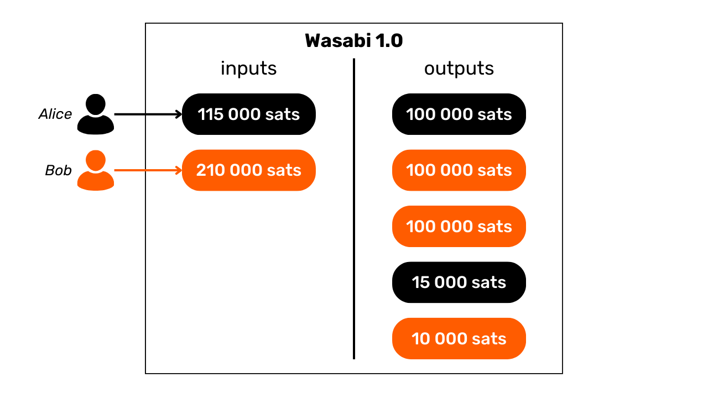
Под Wabisabi та же транзакция произвела бы 3 выхода по 100 000 сатоши и 5 выходов по 5 000 сатоши, таким образом разбрасывая сдачу так, что она не прослеживается напрямую к конкретному входу:
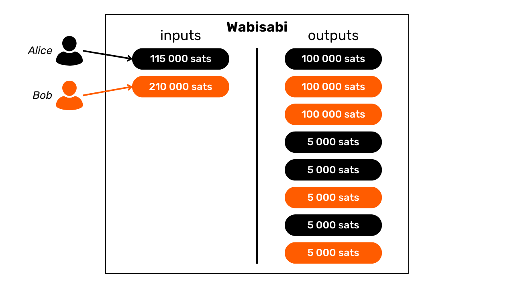
Лично я считаю, что управление изменениями в Wabisabi представляет несколько рисков, которые могут подорвать его эффективность в плане конфиденциальности:
- Когда пользователь вносит UTXO, значительно превышающий по размеру UTXO других участников, он неизбежно получает сдачу, которая будет связана с его вкладом. Это противоречит первоначальной цели протокола, направленной на устранение любой идентифицируемой сдачи;
- Умножение номиналов с целью фрагментации сдачи может парадоксально навредить эффективности смешивания. Этот процесс может привести к снижению анонимных наборов для определенных выходов, поскольку они становятся более легко идентифицируемыми;
- Этот метод также генерирует UTXO низкой стоимости, которые представляют проблему управления для пользователя. Эти маленькие UTXO, если они становятся слишком дорогими для использования по сравнению с их стоимостью, могут стать "пылью". Это явление заставляет пользователя объединять несколько UTXO во входы в своих будущих транзакциях или консолидировать их. В обоих случаях, из-за COH, это может либо снизить полученные анонимные наборы, либо полностью отменить преимущества конфиденциальности, полученные при первоначальном coinjoin.

В отличие от Whirlpool, который реализует протокол ZeroLink, обеспечивающий строгое разделение между UTXOs до и после смешивания, Wabisabi не поддерживает это строгое разграничение. Также были проблемы с повторным использованием адресов некоторыми клиентами Wasabi, что, очевидно, очень вредно для пользователя.

В версии 2.0 Wasabi была внедрена новая политика комиссий за coinjoin. Теперь комиссии координатора установлены на уровне 0,3% для UTXOs размером более 0,01 биткойна, в то время как для меньших UTXOs эти комиссии полностью отменены. Более того, ремиксы для этих маленьких UTXOs бесплатны, хотя комиссии майнерам остаются на пользователи для всех транзакций, включая ремиксы.

Эта политика контрастирует с политикой Whirlpool, где комиссии остаются фиксированными, независимо от размера полученных анонимных наборов. С Wasabi 2.0, хотя комиссии координатора отменяются для маленьких UTXOs, пользователь все равно должен платить комиссии за майнинг на все транзакции, включая ремиксы.
На момент написания использование Wabisabi стало заметно более сложным после недавних событий. Действительно, после ареста основателей Samourai Wallet, zkSNACKs, компания, финансирующая и управляющая разработкой Wasabi, объявила о прекращении своей службы координации coinjoin с 1 июня 2024 года. Этот координатор, который был установлен по умолчанию в Wasabi, имел подавляющее большинство ликвидности.

С остановкой этого основного координатора, пользователям теперь необходимо подключаться к новым независимым координаторам. Это изменение вызывает опасения: с одной стороны, новые координаторы могут не иметь достаточной ликвидности, тем самым снижая эффективность coinjoins с точки зрения конфиденциальности. С другой стороны, есть риск столкнуться с злонамеренным координатором. Эта ситуация добавляет новые значительные риски для тех, кто хочет использовать Wabisabi.

Помимо технических проблем, решение zkSNACKs, компании за Wasabi, использовать услуги компании по анализу цепочек для фильтрации участников coinjoins вызывает серьезные этические и стратегические вопросы. Исходная идея заключалась в том, чтобы предотвратить использование coinjoins на Wasabi преступниками, шаг, который может показаться законным. Однако это порождает парадокс: платить комиссии координатору, чья основная миссия - повышение конфиденциальности пользователей, только для того, чтобы затем финансировать компанию, цель которой - нарушить эту самую конфиденциальность.

Еще более тревожным является принцип фильтрации, который резко контрастирует с философией Биткойн, направленной на создание открытой и нецензурируемой финансовой системы. Хотя желание исключить преступную деятельность может показаться оправданным, такая фильтрация также может затронуть лица, чьи действия, хотя и классифицируются как незаконные в некоторых контекстах, могут быть морально оправданными или социально полезными. Пример Эдварда Сноудена идеально иллюстрирует эту дихотомию: считаемый некоторыми правительствами преступником за его разоблачения, другими он видится как информатор, действующий в общественных интересах. Эта сложность подчеркивает потенциальную опасность фильтрации, которая, хотя и исходит из хороших намерений, в конечном итоге может нарушить права и безопасность законных пользователей. Я также мог бы упомянуть активистов и журналистов, которые преследуются в некоторых авторитарных режимах. Как вы поняли, мое предпочтение несомненно отдается модели Whirlpool для проведения coinjoins в Биткойн. Эта система выделяется своей строгостью и предлагает лучшие гарантии в плане конфиденциальности. Также это единственная система, предлагающая смешивание, считающееся идеальным в математическом контексте. На мой взгляд, эта модель представляет собой будущее coinjoins в Биткойн. Поэтому я приглашаю вас более подробно изучить эту модель в следующей главе.

## Функционирование Whirlpool
<chapterId>bdbd7109-e36d-4b4f-a3c6-928df4e9bfda</chapterId>

Whirlpool отличается от других методов coinjoin использованием транзакций "_ZeroLink_", которые гарантируют, что между всеми входами и выходами технически невозможно установить никакой связи. Это идеальное смешивание достигается за счет структуры, в которой каждый участник вносит одинаковую сумму на входе (за исключением комиссий за майнинг), тем самым генерируя выходы совершенно равных сумм.

Такой ограничительный подход к входам придает транзакциям coinjoin Whirlpool уникальную характеристику: полное отсутствие детерминированных связей между входами и выходами. Другими словами, каждый выход имеет равную вероятность быть приписанным любому участнику, по отношению ко всем другим выходам транзакции.

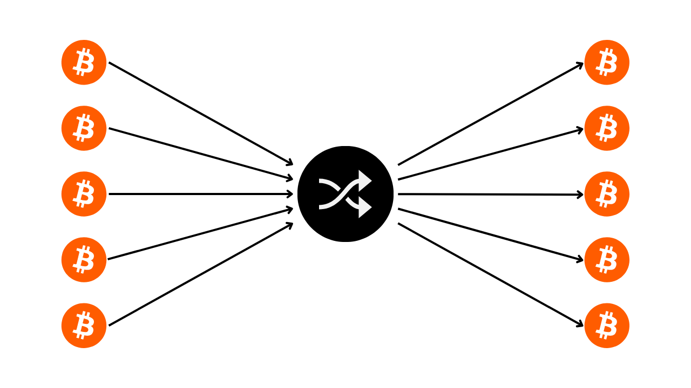

### Общее функционирование Whirlpool

Изначально количество участников в каждом coinjoin Whirlpool было ограничено пятью, с двумя новыми участниками и тремя ремиксерами (мы объясним эти понятия далее). Однако увеличение комиссий за транзакции в блокчейне, наблюдаемое в 2023 году, побудило команды Samourai пересмотреть свою модель для улучшения конфиденциальности при снижении затрат. Таким образом, учитывая рыночную ситуацию с комиссиями и количество участников, координатор теперь может организовывать coinjoins, включающие 6, 7 или 8 участников. Эти улучшенные сессии обозначаются под названием "_Surge Cycles_". Важно отметить, что независимо от конфигурации, в транзакциях Whirlpool coinjoins всегда только два новых участника.

Таким образом, транзакции Whirlpool характеризуются одинаковым количеством входов и выходов, которые могут быть:
- 5 входов и 5 выходов;

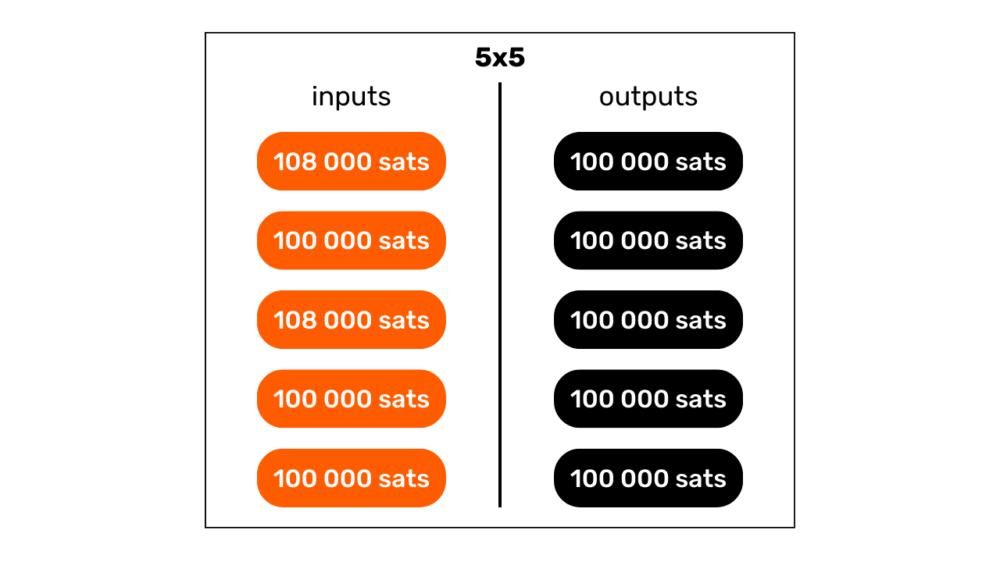

- 6 входов и 6 выходов;

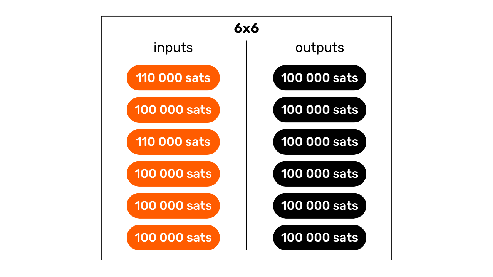

- 7 входов и 7 выходов;

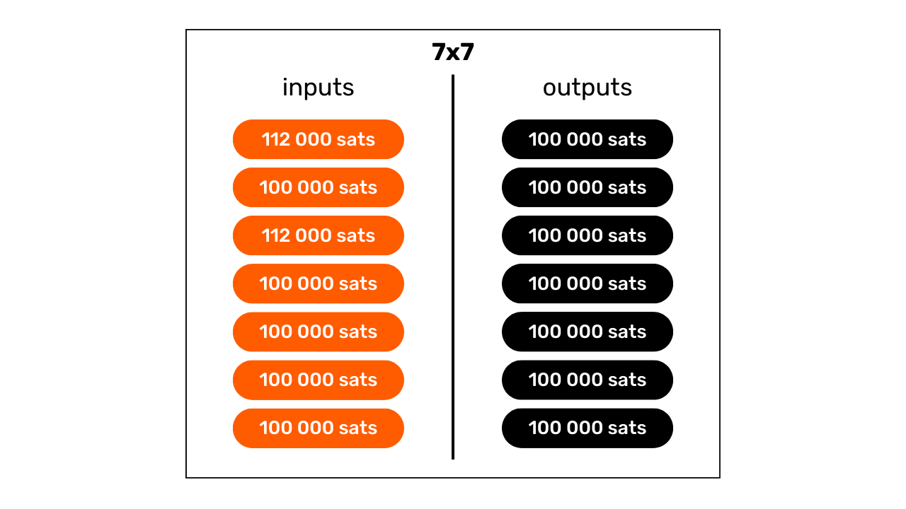

- 8 входов и 8 выходов.

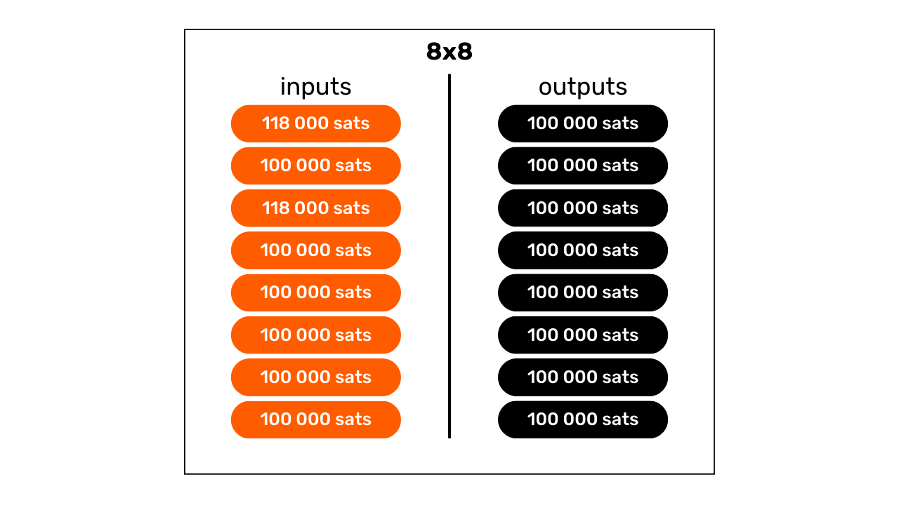
Модель, предложенная Whirlpool, таким образом, основана на малых транзакциях coinjoin. В отличие от Wabisabi и JoinMarket, где надежность анонимных наборов зависит от объема участников в одном цикле (или нескольких циклах), Whirlpool делает ставку на цепочку множества малых циклов. В этой модели пользователь несет расходы только при своем первоначальном входе в пул, что позволяет ему участвовать в множестве ремиксов без дополнительных затрат. Новые участники покрывают комиссии за майнинг для ремиксеров.

С каждым дополнительным coinjoin, в котором участвует монета вместе с ее прошлыми партнерами, анонимные наборы будут расти экспоненциально. Таким образом, цель состоит в том, чтобы воспользоваться этими бесплатными ремиксами, которые с каждым разом способствуют укреплению плотности анонимных наборов, ассоциированных с каждой смешанной монетой.

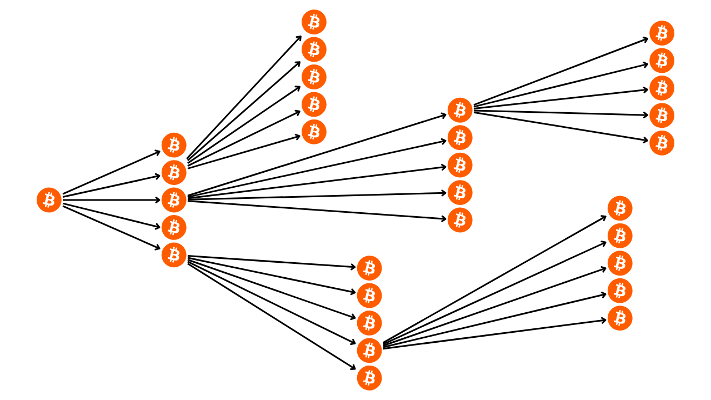

Whirlpool был разработан с учетом двух важных требований:
- Возможность реализации на мобильных устройствах, учитывая, что Samourai Wallet в первую очередь является приложением для смартфонов;
- Скорость циклов ремикса для стимулирования значительного увеличения анонимных наборов.

Эти императивы направляли выборы разработчиков Samourai Wallet при проектировании Whirlpool, заставляя их ограничить количество участников на цикл. Слишком малое количество участников могло бы подорвать эффективность coinjoin, резко сократив анонимные наборы, создаваемые в каждом цикле, в то время как слишком большое количество участников могло бы создать проблемы управления на мобильных приложениях и затруднить поток циклов.

В конечном итоге, не нужно иметь большое количество участников на каждый coinjoin в Whirlpool, поскольку анонимные наборы формируются за счет накопления нескольких циклов coinjoin. Самый важный принцип здесь - однородность UTXOs всех участников, поскольку это позволяет добиться идеального смешивания и, таким образом, полностью воспользоваться циклами смешивания и ремикса.

### Пулы и комиссии за coinjoin

Для того чтобы эти множественные циклы действительно увеличивали анонимность смешанных монет, необходимо установить определенный фреймворк для ограничения количества используемых UTXOs. Таким образом, Whirlpool определяет различные пулы.

Пул представляет собой группу пользователей, желающих смешаться вместе, которые договариваются о количестве UTXOs для использования, чтобы оптимизировать процесс coinjoin, сохраняя при этом идеальную однородность монет. Каждый пул указывает фиксированное количество для UTXO, с которым пользователь должен согласиться, чтобы участвовать. Таким образом, для выполнения coinjoins с Whirlpool, вам нужно выбрать пул. В настоящее время доступны следующие пулы:
- 0.5 биткойна;
- 0.05 биткойна;
- 0.01 биткойна;
- 0.001 биткойна (= 100,000 сатоши).
  
Присоединяясь к пулу со своими биткойнами, они будут разделены для генерации UTXO, которые идеально однородны с теми, что у других участников в пуле. Каждый пул имеет максимальный лимит; таким образом, для сумм, превышающих этот лимит, вам будет необходимо либо сделать два отдельных входа в один и тот же пул, либо обратиться к другому пулу с большей суммой:

| Пул (биткоин) | Максимальная сумма за вход (биткоин) |
|----------------|------------------------------------|
| 0.5            | 35                                 |
| 0.05           | 3.5                                |
| 0.01           | 0.7                                |
| 0.001          | 0.025                              |

UTXO считается принадлежащим к пулу, когда он готов к интеграции в coinjoin. Однако это не означает, что пользователь теряет владение им. Как мы видели в первых главах этой части, через различные циклы смешивания, вы сохраняете полный контроль над своими ключами и, следовательно, над своими биткойнами. Это то, что отличает технику coinjoin от других централизованных методов смешивания.

Чтобы войти в пул coinjoin, вы должны заплатить сервисные сборы, а также комиссии за майнинг. Сервисные сборы фиксированы для каждого пула и предназначены для компенсации командам, ответственным за разработку и поддержку Whirlpool.

Сервисные сборы за использование Whirlpool оплачиваются один раз при входе в пул. После этого шага у вас есть возможность участвовать в неограниченном количестве ремиксов без дополнительных сборов. Вот текущие фиксированные сборы для каждого пула:

| Пул (биткоин) | Вступительный взнос (биткоин) |
|---------------|-------------------------------|
| 0.5           | 0.0175                        |
| 0.05          | 0.00175                       |
| 0.01          | 0.0005 (50,000 сатоши)        |
| 0.001         | 0.00005 (5,000 сатоши)        |

Эти сборы по сути функционируют как входной билет для выбранного пула, независимо от суммы, которую вы вносите в coinjoin. Таким образом, независимо от того, присоединяетесь ли вы к пулу 0.01 с 0.01 BTC или входите в него с 0.5 BTC, сборы останутся теми же в абсолютном значении.

Перед тем как приступить к coinjoin с Whirlpool, пользователь, следовательно, имеет выбор между 2 стратегиями:
- Выбрать меньший пул, чтобы минимизировать сервисные сборы, зная, что на выходе он получит несколько меньших по размеру UTXOs;
- Или предпочесть больший пул, согласившись заплатить более высокие сборы, чтобы в итоге получить меньшее количество UTXOs большего значения.
  
Обычно не рекомендуется объединять несколько смешанных UTXOs после циклов coinjoin, так как это может нарушить достигнутую конфиденциальность, особенно из-за эвристики общего владения входами (CIOH: *Common-Input-Ownership-Heuristic*). Поэтому может быть разумно выбрать больший пул, даже если это означает большие расходы, чтобы избежать наличия слишком многих UTXOs малого размера на выходе. Пользователь должен взвесить все за и против, чтобы выбрать предпочтительный пул.
Помимо сервисных сборов, также следует учитывать комиссии майнерам, присущие любой транзакции Биткойна. Как пользователь Whirlpool, вам будет необходимо оплатить комиссию майнерам за транзакцию подготовки (`Tx0`), а также за первый coinjoin. Все последующие ремиксы будут бесплатными, благодаря модели Whirlpool, которая основана на оплате новыми участниками.

Действительно, в каждом coinjoin Whirlpool 2 пользователя среди входов являются новыми участниками. Остальные входы приходят от ремиксеров. В результате, комиссии за майнинг для всех участников транзакции покрываются этими 2 новыми участниками, которые затем также получают возможность бесплатных ремиксов:

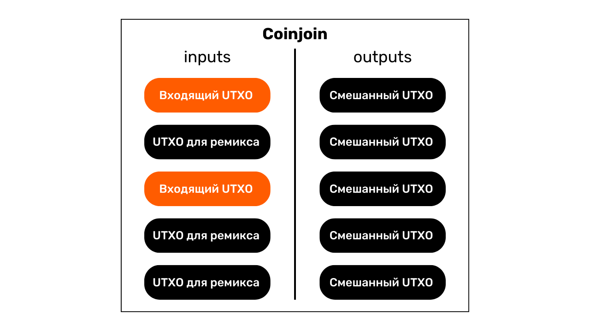

Благодаря этой системе сборов, Whirlpool действительно отличается от других реализаций coinjoin, поскольку анонимные наборы UTXOs не пропорциональны цене, уплаченной пользователем. Таким образом, можно достичь значительно высоких уровней анонимности, заплатив только вступительный взнос пула и комиссии майнерам за 2 транзакции (Tx0 и начальное смешивание).

Важно отметить, что пользователю также придется покрыть комиссии майнерам, чтобы вывести свои UTXOs из пула после выполнения нескольких coinjoin, если только он не выбрал опцию `mix to`, которая позволяет предоставить внешний адрес, который напрямую получит средства в виде выхода coinjoin, без каких-либо дополнительных транзакций.

### HD Wallet Accounts

Для выполнения coinjoin через Whirlpool, кошелек должен генерировать несколько отдельных аккаунтов. Это принцип протокола ZeroLink. Аккаунт, в контексте HD (*Hierarchical Deterministic*) кошелька, представляет собой секцию, полностью изолированную от других, этот раздел происходит на третьем уровне иерархии кошелька, то есть на уровне `xpub`.


HD кошелек теоретически может производить до `2^(32/2)` различных аккаунтов. Исходный аккаунт, используемый по умолчанию во всех Биткойн кошельках, соответствует индексу `0'`.

Для кошельков, адаптированных к Whirlpool, используются 4 аккаунта для удовлетворения потребностей процесса ZeroLink:
- **Депозитный аккаунт**, идентифицированный индексом `0'`;
- **Аккаунт "плохого банка"** (или "doxxic change"), идентифицированный индексом `2 147 483 644'`;
- **Премикс аккаунт**, идентифицированный индексом `2 147 483 645'`;
- **Постмикс аккаунт**, идентифицированный индексом `2 147 483 646'`.

Каждый из этих аккаунтов выполняет определенную функцию в процессе coinjoin, которую мы рассмотрим в следующих разделах.

Все эти аккаунты связаны с одним seed, позволяя пользователю восстановить доступ ко всем своим биткойнам, используя свою фразу восстановления и, при необходимости, свой пароль. Однако, во время этой операции восстановления, необходимо указать программному обеспечению различные индексы аккаунтов, которые использовались.

Теперь давайте рассмотрим различные этапы coinjoin Whirlpool в этих аккаунтах.

### TX0

Исходной точкой любого coinjoin Whirlpool является  **deposit account** (**депозитный аккаунт**). Этот аккаунт автоматически используется, когда вы создаете новый Биткойн кошелек. На этот аккаунт должны быть зачислены биткойны, которые вы хотите смешать.

`Tx0` представляет собой первый шаг в процессе смешивания Whirlpool. Его цель - подготовить и уравнять UTXOs для coinjoin, разделив их на суммы, соответствующие сумме выбранного пула, чтобы обеспечить однородность смешивания. Уравненные UTXOs затем отправляются на **premix** (**премикс**) аккаунт. Что касается разницы, которая не может войти в пул, она отделяется в специфический аккаунт: **bad bank** (**плохой банк**) (или "doxxic change").

Эта исходная транзакция `Tx0` также служит для урегулирования сервисных сборов, причитающихся координатору coinjoin. В отличие от последующих шагов, эта транзакция не является совместной; пользователь, следовательно, должен нести полные комиссии за майнинг:

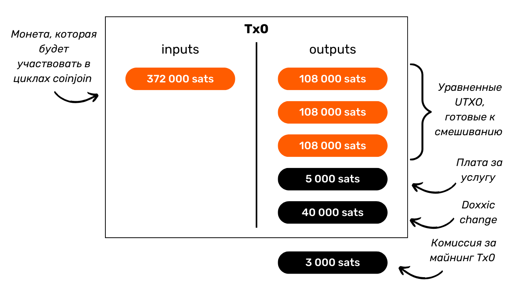

В этом примере транзакции `Tx0` вход в размере `372 000 sats` с нашего **depoit** аккаунта делится на несколько выходных UTXOs, которые распределяются следующим образом:
- Сумма в `5 000 sats`, предназначенная для координатора за сервисные сборы, соответствующая входу в пул `100 000 sats`;
- 3 UTXOs, подготовленные для смешивания, перенаправленные на наш **premix** аккаунт и зарегистрированные у координатора. Эти UTXOs уравнены по `108 000 sats` каждый, чтобы покрыть комиссии майнерам за их дальнейшее первоначальное смешивание;
- Избыток, который не может попасть в пул, поскольку он слишком мал, считается токсичной сдачей. Он отправляется на специальный счет. Здесь эта сдача составляет `40 000 sats`;
- Наконец, есть `3,000 sats`, которые не являются выходом, но являются комиссией майнерам, необходимой для подтверждения `Tx0`.
  
Например, вот реальный Tx0 Whirlpool (не мой): [edef60744f539483d868caff49d4848e5cc6e805d6cdc8d0f9bdbbaedcb5fc46](https://mempool.space/fr/tx/edef60744f539483d868caff49d4848e5cc6e805d6cdc8d0f9bdbbaedcb5fc46)

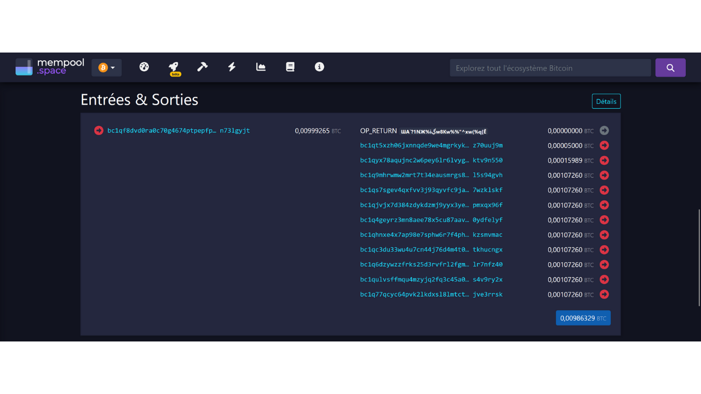

### Токсичная Сдача

Избыток, который не может быть интегрирован в пул, здесь эквивалентный `40,000 sats`, перенаправляется на счет **bad bank**, также называемый "токсичной сдачей", чтобы обеспечить строгое разделение от других UTXOs в кошельке.

Этот UTXO опасен для конфиденциальности пользователя, потому что не только он все еще связан со своим прошлым, и, таким образом, возможно, с идентичностью его владельца, но он также помечен как принадлежащий пользователю, который участвовал в coinjoin.

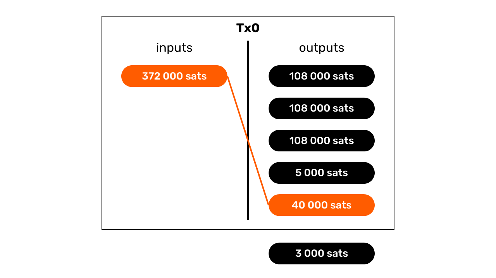

Если этот UTXO будет объединен с перемешанными выходами, они потеряют всю конфиденциальность, полученную во время циклов coinjoin, в частности, из-за CIOH (*Common-Input-Ownership-Heuristic*). Если он будет объединен с другими токсичными сдачами, пользователь рискует потерять конфиденциальность, поскольку это свяжет различные записи из циклов coinjoin. Поэтому с ним нужно обращаться осторожно. Мы подробнее поговорим об управлении этими токсичными UTXO в последнем разделе этой главы.

### Первоначальное Смешивание

После завершения `Tx0`, уравненные UTXOs отправляются на счет **premix** нашего кошелька, готовые к введению в их первый цикл coinjoin, также называемый "первоначальным смешиванием". Если, как в нашем примере, `Tx0` генерирует несколько UTXOs, предназначенных для смешивания, каждый из них будет интегрирован в отдельный первоначальный микс.

По окончании этих первых миксов счет **premix** будет пуст, в то время как наши монеты, заплатившие комиссию за майнинг за первый coinjoin, будут точно скорректированы до суммы, определенной выбранным пулом. В нашем примере наши первоначальные UTXOs в `108,000 сатоши` будут уменьшены ровно до `100,000 сатоши`.

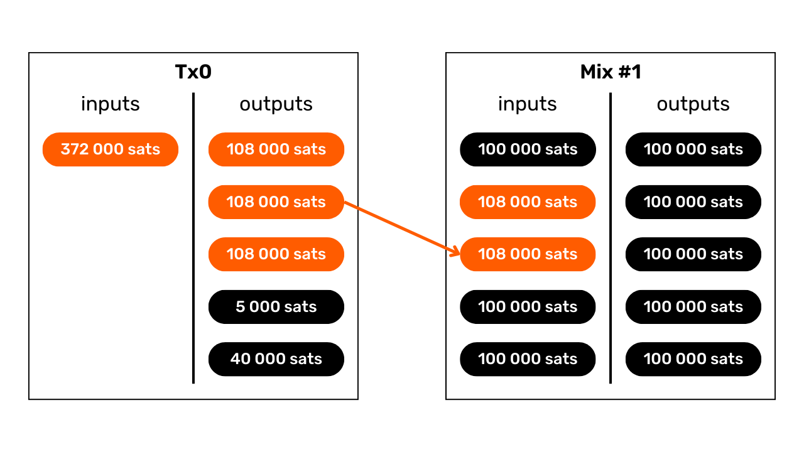

### Перемешивания

После первоначального смешивания UTXOs переводятся на счет **postmix**. Этот счет собирает как уже перемешанные UTXOs, так и те, которые ожидают перемешивания. Когда клиент Whirlpool активен, UTXOs на счете **postmix** автоматически доступны для перемешивания и будут случайным образом выбраны для участия в новых циклах.
Напомним, что последующие перемешивания происходят на 100% бесплатно: не требуется дополнительных сервисных сборов или комиссий за транзакции. Сохранение UTXOs на счете **postmix** таким образом сохраняет их неизменную стоимость и одновременно улучшает их параметры анонимности. Вот почему важно позволить этим монетам участвовать в нескольких циклах coinjoin. Это ничего вам не стоит и увеличивает уровнь их анонимности.
Когда вы решаете потратить смешанные UTXOs, вы можете сделать это напрямую из **postmix** аккаунта. Рекомендуется держать смешанные UTXOs в этом аккаунте, чтобы воспользоваться бесплатными ремиксами и предотвратить их выход из цепочки Whirlpool, что могло бы уменьшить их конфиденциальность.

### Как правильно управлять вашим постмикс аккаунтом?

После выполнения циклов coinjoin лучшая стратегия - держать ваши UTXOs в аккаунте **postmix**, ожидая их будущего использования. Даже рекомендуется позволить им ремиксоваться бесконечно, пока вам не потребуется их потратить.

Некоторые пользователи могут рассмотреть возможность перевода своих смешанных биткойнов в кошелек, защищенный аппаратным кошельком. Это возможно, но важно тщательно следовать рекомендациям Samourai Wallet, чтобы не нарушить достигнутую конфиденциальность.

Слияние UTXOs является наиболее часто допускаемой ошибкой. Необходимо избегать объединения смешанных UTXOs с несмешанными UTXOs в одной транзакции, чтобы избежать эвристики общего владения входом (CIOH). Это требует тщательного управления вашими UTXOs внутри вашего кошелька, особенно с точки зрения маркировки.

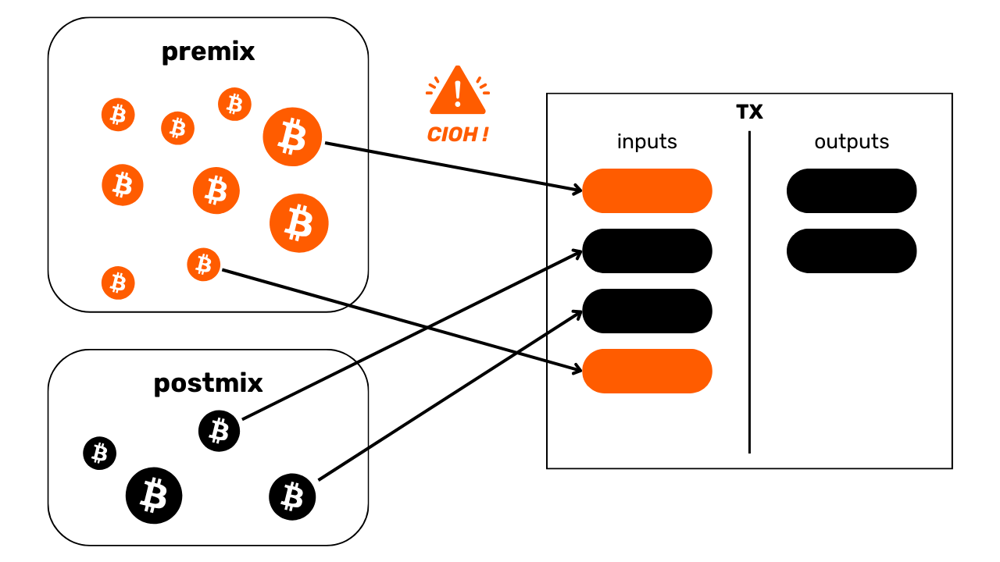

Также важно быть осторожным при консолидации смешанных UTXOs между собой. Умеренные консолидации возможны, если ваши смешанные UTXOs имеют значительные анонимные наборы, но это неизбежно уменьшит конфиденциальность ваших монет. Убедитесь, что консолидации не слишком значительны и не выполняются после недостаточного количества ремиксов, чтобы не создать выявляемые связи между вашими UTXOs до и после циклов coinjoin. В случае сомнений относительно этих манипуляций лучшей практикой является не консолидировать постмикс UTXOs, а переводить их по одному в ваш аппаратный кошелек, генерируя каждый раз новый пустой адрес. Опять же, помните о правильной маркировке каждого полученного UTXO.

Также не рекомендуется переводить ваши постмикс UTXOs в кошелек, использующий необычные скрипты. Например, если вы входите в Whirlpool с мультисиг кошелька, использующего скрипты `P2WSH`, шанс смешаться с другими пользователями, у которых изначально такой же тип кошелька, невелик. Если вы выведете свой постмикс в этот же мультисиг кошелек, уровень конфиденциальности ваших смешанных биткойнов значительно уменьшится. Помимо скриптов, существует множество других отпечатков кошельков, которые могут вас запутать.
Как и в случае любой биткойн-транзакции, также важно не использовать повторно адреса получения. Каждая новая транзакция должна быть получена на новый, пустой адрес.

Простейшим и самым безопасным решением является оставить ваши смешанные UTXOs в их **postmix** аккаунте, позволяя им ремиксоваться и использовать их только для траты. Кошельки Samourai и Sparrow имеют дополнительные защиты от всех этих рисков, связанных с анализом цепочки. Эти защиты помогут вам избежать ошибок.

### Как правильно управлять вашей токсичной сдачей?

Далее, вам необходимо быть осторожным в управлении вашей токсичной сдачей, которая не вошла в пул coinjoin. Эти токсичные UTXOs, полученные в результате использования Whirlpool, представляют риск для вашей конфиденциальности, поскольку устанавливают связь между вами и использованием coinjoin. Поэтому крайне важно обращаться с ними осторожно и не комбинировать их с другими UTXO, особенно смешанными.

Вот различные стратегии, которые стоит рассмотреть для их использования:

- **Смешивайте их в меньших пулах:** Если ваш токсичный UTXO достаточно большой, чтобы войти в меньший пул самостоятельно, рассмотрите возможность его смешивания. Это часто является лучшим вариантом. Однако объединение нескольких токсичных UTXOs для доступа к пулу не рекомендуется, так как это может связать ваши различные входы.
- **Пометьте их как "нерасходуемые":** Другой подход заключается в том, чтобы больше не использовать их, пометить как "нерасходуемые" на их специализированном счете и просто ходлить. Это гарантирует, что вы случайно не потратите их. Если стоимость биткойна увеличится, могут появиться новые пулы, более подходящие для ваших токсичных UTXOs;
- **Сделайте пожертвования:** Рассмотрите возможность сделать пожертвования, даже скромные, разработчикам, работающим над Биткойном и связанным с ним программным обеспечением. Вы также можете пожертвовать организациям, принимающим BTC. Если управление вашими токсичными UTXOs кажется слишком сложным, вы можете просто избавиться от них, сделав пожертвование.
- **Покупайте подарочные карты:** Платформы, такие как [Bitrefill](https://www.bitrefill.com/), позволяют обменивать биткойны на подарочные карты, которые можно использовать у различных продавцов. Это может быть способом избавиться от ваших токсичных UTXOs без потери связанной с ними стоимости.
- **Консолидируйте их на Monero:** Кошелек Samourai предлагает сервис атомарного свопа между BTC и XMR. Это идеально подходит для управления токсичными UTXOs, консолидируя их на Monero, не подвергая вашу конфиденциальность риску через KYC, перед отправкой их обратно в Биткойн. Однако, этот вариант может быть дорогостоящим в плане комиссий майнерам и премий из-за ограничений ликвидности.
- **Отправьте их в Сеть Lightning:** Перевод этих UTXOs в Сеть Lightning для получения преимущества в виде сниженных комиссий за транзакции является интересным вариантом. Однако, этот метод может раскрыть определенную информацию в зависимости от вашего использования Lightning и поэтому должен практиковаться с осторожностью.

### Как использовать Whirlpool?

После ареста основателей кошелька Samourai и изъятия их серверов 24 апреля 2024 года, инструмент Whirlpool больше не работает, даже для тех, у кого есть свой Dojo. Ранее он был доступен в кошельке Samourai и Sparrow Wallet.

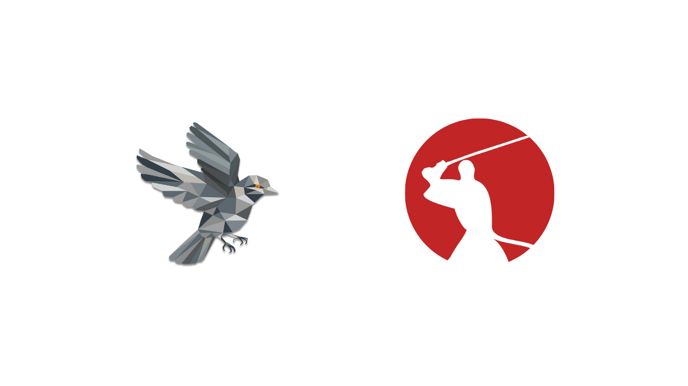

Тем не менее, остается возможным, что этот инструмент может быть вновь запущен в ближайшие недели, в зависимости от исхода судебных процессов, или перезапущен другим способом. В любом случае, я верю, что рынок coinjoin на Биткойне не останется без предложения надолго, так как спрос очевиден. Более того, модель Whirlpool, будучи наиболее продвинутой с точки зрения конфиденциальности, наверняка будет использоваться в будущем для других реализаций.

Мы внимательно следим за развитием этого дела, а также за разработками, касающимися связанных инструментов. Будьте уверены, что мы обновим этот курс, как только появится новая информация.

В следующей главе мы узнаем, что такое "anonsets", как рассчитываются эти показатели и как они могут помочь нам оценить эффективность циклов coinjoin.

https://planb.network/tutorials/privacy/coinjoin-sparrow-wallet

https://planb.network/tutorials/privacy/coinjoin-samourai-wallet

https://planb.network/tutorials/privacy/coinjoin-dojo

## Наборы Анонимности
<chapterId>be1093dc-1a74-40e5-9545-2b97a7d7d431</chapterId>

После изучения работы coinjoins и проблем, связанных с эффективным смешиванием, мы теперь узнаем, как измерить эту эффективность. Как определить, был ли процесс coinjoin эффективным и какой степени анонимности достигла монета? Это то, что мы исследуем в этой главе с помощью наборов анонимности или "anonsets" по-английски.

### Напоминание о Пользе Coinjoin
Польза CoinJoin заключается в его способности создавать правдоподобное отрицание, погружая вашу монету в группу неразличимых монет. Цель этого действия - разорвать связи трассировки, как из прошлого в настоящее, так и из настоящего в прошлое.
Другими словами, аналитик, который знает вашу исходную транзакцию (`Tx0`) на входе в циклы CoinJoin, не должен иметь возможности с уверенностью идентифицировать ваш UTXO на выходе из циклов ремикса (анализ с момента входа в цикл до момента выхода из цикла).

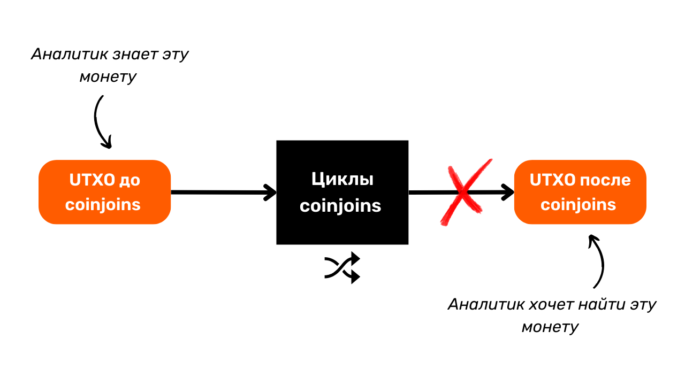

Наоборот, аналитик, который знает ваш UTXO на выходе из циклов CoinJoin, не должен иметь возможности определить исходную транзакцию на входе в циклы (анализ с момента выхода из цикла до момента входа в цикл).

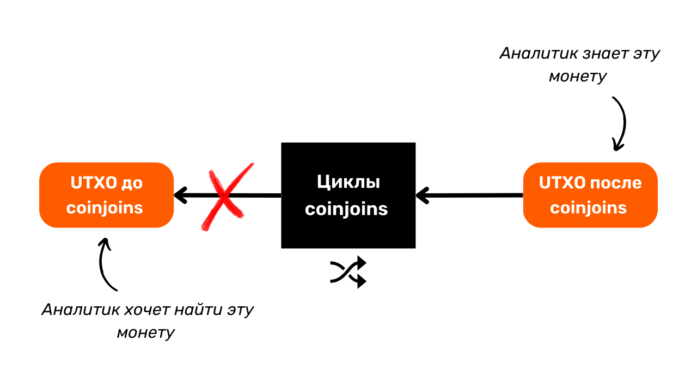

Чтобы оценить сложность для аналитика связать прошлое с настоящим и наоборот, необходимо количественно определить размер групп однородных монет, среди которых скрыта ваша монета. Эта мера говорит нам о количестве анализов с одинаковой вероятностью. Таким образом, если правильный анализ находится среди 3 других анализов с равной вероятностью, ваш уровень сокрытия очень низок. Однако, если правильный анализ находится среди набора из 20 000 анализов и все равновероятны, ваша монета очень хорошо скрыта. И именно размер этих групп представляет собой показатели, называемые "anonsets".

### Понимание Anonsets

Anonsets служат показателями для оценки степени конфиденциальности конкретного UTXO. Более конкретно, они измеряют количество неотличимых UTXOs в наборе, который включает изучаемую монету. Требование однородного набора UTXOs означает, что anonsets обычно рассчитываются по циклам CoinJoin. Использование этих показателей особенно актуально для CoinJoins Whirlpool из-за их однородности.

Anonsets позволяют, при необходимости, судить о качестве CoinJoins. Большой размер anonset означает высокий уровень анонимности, поскольку становится трудно выделить конкретный UTXO в однородном наборе.

Существует 2 типа anonsets:
- **Перспективный anonset;**
- **Ретроспективный anonset.**

### Перспективный Anonset

Перспективный anonset указывает размер группы, среди которой скрыт изучаемый UTXO на выходе из цикла, зная UTXO на входе, то есть количество неотличимых монет, присутствующих в этой группе. На английском название этого показателя - "forward anonset" или "forward-looking metrics".
Этот показатель позволяет измерить сопротивляемость конфиденциальности монеты анализу от прошлого к настоящему (от входа к выходу).

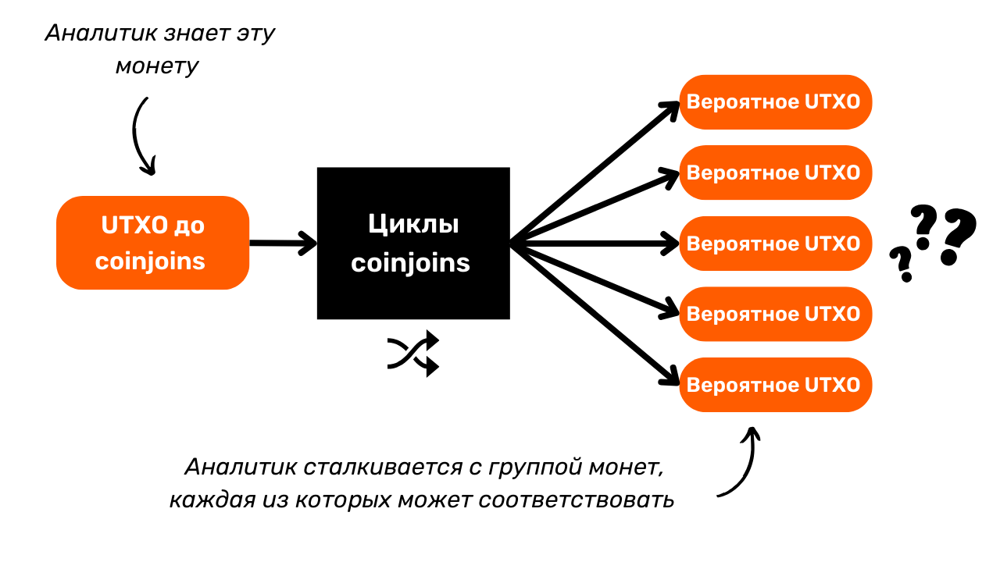

Эта метрика оценивает, насколько ваш UTXO защищен от попыток воссоздать его историю от точки входа до точки выхода в процессе coinjoin.

Например, если ваша транзакция участвовала в своем первом цикле coinjoin и было завершено два дополнительных потомственных цикла, перспективный anonset вашей монеты будет `13`:

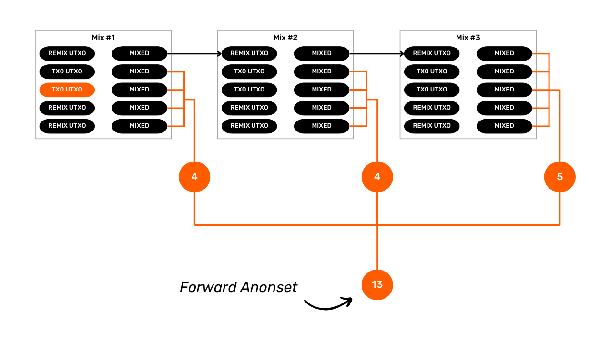

Допустим, наша монета на входе в цикл coinjoin имеет перспективный anonset `86,871`. На практике это означает, что она скрыта среди `86,871` неотличимых монет. Для внешнего наблюдателя, знающего об этой монете в начале циклов coinjoin и пытающегося проследить ее выход, он столкнется с `86,871` возможными UTXOs, каждый с идентичной вероятностью быть искомой монетой.

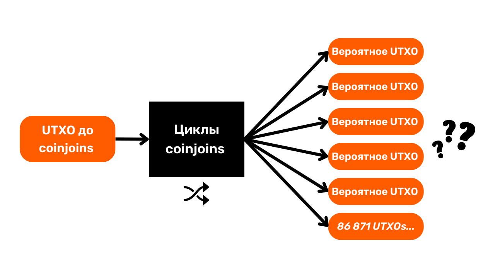

### Ретроспективный Anonset

Ретроспективный анонимный набор указывает на количество возможных источников для данной монеты, зная UTXO на выходе из цикла. Этот показатель измеряет устойчивость приватности монеты против анализа "из настоящего в прошлое" (от выхода к входу), то есть, насколько сложно аналитику проследить до источника вашей монеты, до циклов coinjoin. На английском название этого показателя - "backward anonset" или "backward-looking metrics".

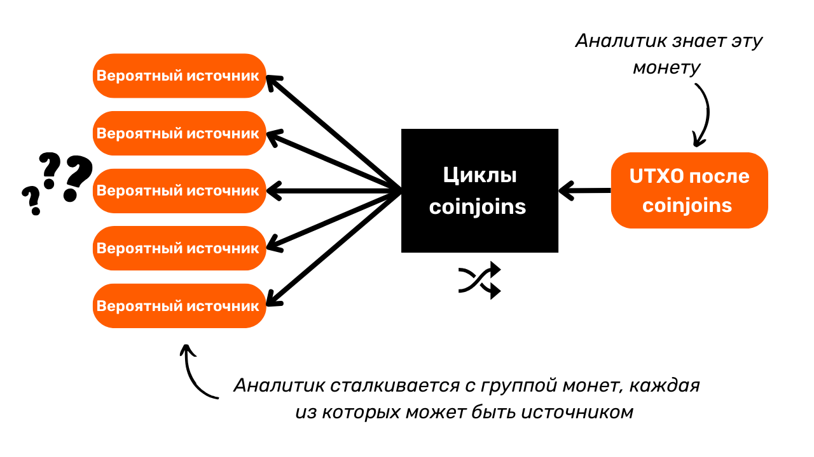

Зная ваш UTXO на выходе из циклов, ретроспективный анонимный набор определяет количество потенциальных транзакций Tx0, которые могли составить ваш вход в циклы coinjoin. На диаграмме ниже это соответствует сумме всех оранжевых пузырей.

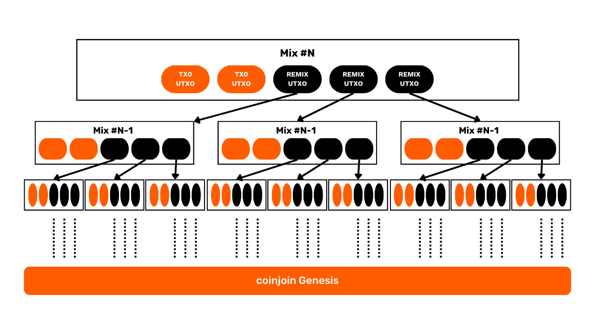

Например, представим, что наша монета на выходе из цикла coinjoin имеет ретроспективный анонимный набор `42,185`. На практике это означает, что существует `42,185` потенциальных источников для этого UTXO. Если внешний наблюдатель идентифицирует эту монету в конце циклов и попытается проследить ее происхождение, он столкнется с `42,185` возможными источниками, каждый из которых имеет равную вероятность быть искомым происхождением.

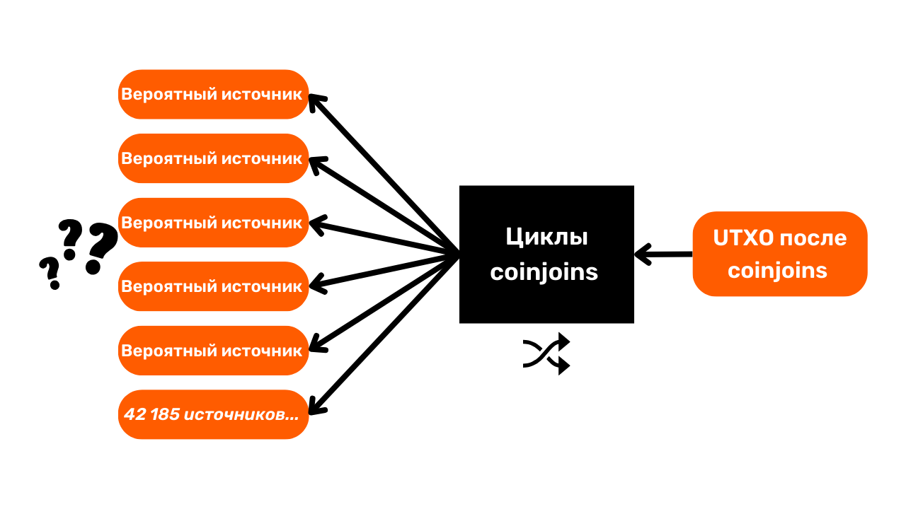

### Как конкретно рассчитать анонимные наборы?

Возможно вручную рассчитать свои анонимные наборы, используя блок-эксплорер для небольших наборов. Однако для больших анонимных наборов использование специализированного инструмента становится обязательным. Насколько мне известно, единственное программное обеспечение, способное выполнить эту задачу, - это *Whirlpool Stats Tool*, инструмент на Python, разработанный командами Samourai и OXT. К сожалению, этот инструмент в настоящее время не работает после ареста основателей Samourai и прекращения работы OXT, которое использовалось для извлечения данных из блокчейна.

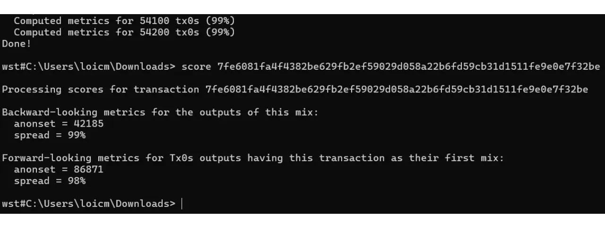

Как мы видели в этой главе, анонимные наборы могут быть рассчитаны только если существует определенная однородность в структуре coinjoins. И именно в следующей главе мы узнаем, как количественно оценить эту однородность в транзакции Биткойн, будь то coinjoin или более традиционная транзакция.

https://planb.network/tutorials/privacy/wst-anonsets

## Энтропия
<chapterId>e4fe289d-618b-49a2-84c9-68c562e708b4</chapterId>

Как мы видели в этой части о coinjoins, однородность UTXOs на входах и выходах играет важную роль в повышении конфиденциальности транзакций Биткойн. Этот параметр обеспечивает правдоподобное отрицание против анализа цепочки. Существует несколько методов измерения этой однородности, но одним из наиболее эффективных, на мой взгляд, является использование индикаторов, предоставляемых инструментом *Boltzmann*, разработанным командами OXT и Samourai Wallet, особенно энтропии транзакции. Это то, что мы подробно изучим в этой главе.

В отличие от анонимных наборов, которые рассчитываются по набору транзакций, индикаторы, которые мы здесь представим, сосредоточены исключительно на одной транзакции, будь то coinjoin или более традиционная транзакция.

### Количество интерпретаций

Первый показатель, который можно наблюдать при транзакции с Биткойн, - это общее количество возможных трактовок в глазах внешнего наблюдателя, анализирующего транзакцию. Учитывая значения UTXOs, участвующих в транзакции, этот показатель указывает количество способов, которыми входы могут быть связаны с выходами. Другими словами, он определяет количество возможных трактовок, которые транзакция может генерировать в потоке биткойнов с точки зрения внешнего наблюдателя, анализирующего её.

Например, простая платежная транзакция с 1 входом и 2 выходами будет иметь только одну трактовку, а именно что вход №0 финансировал выход №0 и выход №1. Других возможных трактовок нет:


В отличие от этого, coinjoin, структурированный в соответствии с моделью Whirlpool 5x5, представляет $1,496$ возможных комбинаций:

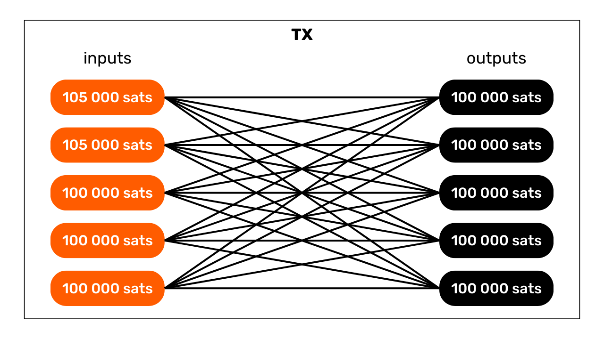

Coinjoin в модели Whirlpool Surge Cycle 8x8 представляет собой $9,934,563$ возможных трактовок:

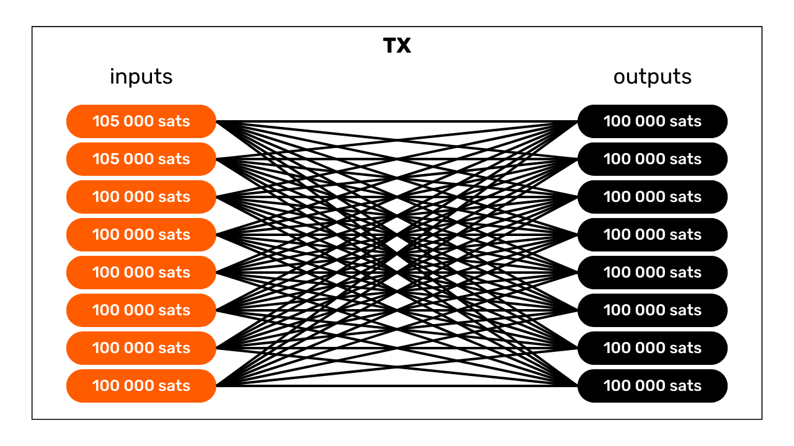

### Энтропия

Исходя из количества трактовок транзакции Биткойн, мы можем рассчитать её энтропию.

В общем контексте криптографии и информации, энтропия - это количественная мера неопределенности или непредсказуемости, связанной с источником данных или случайным процессом. Другими словами, энтропия - это способ измерения сложности предсказания или угадывания информации.

В конкретном контексте анализа цепочек, энтропия также является названием показателя, производного от энтропии Шеннона и [изобретенного LaurentMT](https://gist.github.com/LaurentMT/e758767ca4038ac40aaf), который может быть рассчитан для транзакции Биткойн.

Когда транзакция представляет большое количество возможных трактовок, часто более релевантно ссылаться на её энтропию. Этот показатель позволяет измерить недостаток знаний аналитиков о точной конфигурации транзакции. Другими словами, чем выше энтропия, тем сложнее задача идентификации потоков биткойнов между входами и выходами для аналитиков.

На практике энтропия показывает, представляет ли транзакция, с точки зрения внешнего наблюдателя, множество возможных трактовок, основываясь исключительно на суммах входов и выходов, не учитывая другие внешние или внутренние паттерны и эвристики. Высокая энтропия тогда является синонимом лучшей конфиденциальности для транзакции.

Энтропия определяется как двоичный логарифм числа возможных комбинаций. Вот формула, используемая с $E$, обозначающим энтропию транзакции, и $C$ - количество возможных трактовок:

$$
E = \log_2(C)
$$

В математике двоичный логарифм (логарифм по основанию 2) соответствует обратной операции возведения в степень 2. Другими словами, двоичный логарифм от $x$ - это показатель степени, до которой необходимо возвести $2$, чтобы получить $x$. Таким образом, этот показатель выражается в битах.

Давайте рассмотрим пример расчета энтропии для транзакции coinjoin, структурированной в соответствии с моделью Whirlpool 5x5, которая, как упоминалось в предыдущем разделе, представляет число возможных трактовок в $1,496$:

$$
\begin{align*}
C &= 1,496 \\
E &= \log_2(1,496) \\
E &= 10.5469 \text{ бит}
\end{align*}
$$

Таким образом, эта транзакция coinjoin демонстрирует энтропию в $10.5469$ бит, что считается очень удовлетворительным. Чем выше это значение, тем больше различных трактовок допускает транзакция, тем самым повышая её уровень конфиденциальности.
Для транзакции coinjoin 8x8, представляющей $9,934,563$ интерпретаций, энтропия будет:

$$
\begin{align*}
C &= 9,934,563 \\
E &= \log_2(9,934,563) \\
E &= 23.244 \text{ бит}
\end{align*}
$$

Давайте рассмотрим другой пример со стандартной платежной транзакцией, включающей 1 вход и 2 выхода: [1b1b0c3f0883a99f1161c64da19471841ed12a1f78e77fab128c69a5f578ccce](https://mempool.space/tx/1b1b0c3f0883a99f1161c64da19471841ed12a1f78e77fab128c69a5f578ccce)

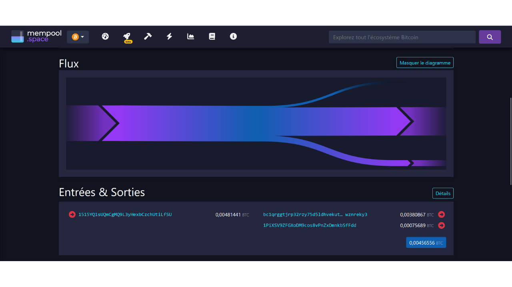

В случае этой транзакции единственно возможная интерпретация: `(In.0) > (Out.0 ; Out.1)`. Следовательно, ее энтропия установлена на $0$:

$$
\begin{align*}
C &= 1 \\
E &= \log_2(1) \\
E &= 0 \text{ бит}
\end{align*}
$$

### Эффективность

Исходя из энтропии транзакции, мы также можем рассчитать ее эффективность с точки зрения конфиденциальности. Этот показатель оценивает эффективность транзакции, сравнивая ее с оптимальной транзакцией, возможной в идентичной конфигурации.

Это приводит нас к обсуждению концепции максимальной энтропии, которая соответствует наивысшей энтропии, которую конкретная структура транзакции могла бы теоретически достичь. Эффективность транзакции затем рассчитывается путем сравнения этой максимальной энтропии с фактической энтропией анализируемой транзакции.

Используемая формула следующая:
- $E_R$: фактическая энтропия транзакции, выраженная в битах;
- $E_M$: максимально возможная энтропия для структуры транзакции, также выраженная в битах;
- $Ef$: эффективность транзакции в битах:

$$
Ef = E_R - E_M
$$

Например, для структуры coinjoin типа Whirlpool 5x5 максимальная энтропия составляет $10.5469$:

$$
\begin{align*}
E_R &= 10.5469 \\
E_M &= 10.5469 \\
Ef &= E_R - E_M \\
Ef &= 10.5469 - 10.5469 \\
Ef &= 0 \text{ бит}
\end{align*}
$$

Этот показатель также выражается в процентах. Используемая формула следующая:
- $C_R$: количество возможных реальных интерпретаций;
- $C_M$: максимальное количество возможных интерпретаций при той же структуре;
- $Ef$: эффективность, выраженная в процентах:

$$
\begin{align*}
Ef &= \frac{C_R}{C_M} \\
Ef &= \frac{1\,496}{1\,496} \\
Ef &= 100\%
\end{align*}
$$

Таким образом, эффективность в $100\%$ указывает на то, что транзакция максимизирует свой потенциал для конфиденциальности на основе своей структуры.

### Плотность энтропии

Энтропия является хорошим показателем для измерения конфиденциальности транзакции, но она частично зависит от количества входов и выходов в транзакции. Чтобы сравнить энтропию 2 разных транзакций, не имеющих одинаковое количество входов и выходов, можно рассчитать плотность энтропии. Этот показатель предлагает перспективу относительно энтропии для каждого входа или выхода транзакции. Плотность полезна для оценки и сравнения эффективности транзакций разного размера.
Для его расчета просто разделите общую энтропию транзакции на общее количество входов и выходов, участвующих в транзакции:
- $E_D$: плотность энтропии, выраженная в битах;
- $E$: энтропия транзакции, выраженная в битах;
- $T$: общее количество входов и выходов в транзакции:

$$
E_D = \frac{E}{T}
$$

Давайте рассмотрим пример с Whirlpool 5x5 coinjoin:

$$
\begin{align*}
T &= 5 + 5 = 10 \\
E &= 10.5469 \\
E_D &= \frac{E}{T} \\
E_D &= \frac{10.5469}{10} \\
E_D &= 1.054 \text{ бит}
\end{align*}
$$

Также давайте рассчитаем плотность энтропии для Whirlpool 8x8 coinjoin:

$$
\begin{align*}
T &= 8 + 8 = 16 \\
E &= 23.244 \\
E_D &= \frac{E}{T} \\
E_D &= \frac{23.244}{16} \\
E_D &= 1.453 \text{ бит}
\end{align*}
$$

Анализируя плотность энтропии этих двух типов coinjoin, становится очевидным, что, даже нормализуя энтропию по количеству элементов, "Surge Cycle 8x8" coinjoin генерирует больше неопределенности для анализа.

### Оценка Больцмана
Еще один анализируемый элемент в транзакции - это оценка Больцмана каждого элемента по отношению к другому. Это таблица вероятностей соответствия между входами и выходами. Эта таблица указывает, через оценку Больцмана, условную вероятность того, что определенный вход связан с данным выходом. Таким образом, это количественная мера условной вероятности ассоциации между входом и выходом в транзакции, основанная на соотношении числа благоприятных случаев этого события по сравнению с общим числом возможных случаев в наборе интерпретаций.
Возьмем пример Whirlpool coinjoin, таблица условных вероятностей подчеркнет шансы связи между каждым входом и выходом, предоставляя количественную меру неоднозначности ассоциаций в транзакции:

| %       | Выход 0 | Выход 1 | Выход 2 | Выход 3 | Выход 4 |
| ------- | -------- | -------- | -------- | -------- | -------- |
| Вход 0 | 34%      | 34%      | 34%      | 34%      | 34%      |
| Вход 1 | 34%      | 34%      | 34%      | 34%      | 34%      |
| Вход 2 | 34%      | 34%      | 34%      | 34%      | 34%      |
| Вход 3 | 34%      | 34%      | 34%      | 34%      | 34%      |
| Вход 4 | 34%      | 34%      | 34%      | 34%      | 34%      |

Здесь ясно, что каждый вход имеет равные шансы быть ассоциированным с любым выходом, что повышает конфиденциальность транзакции.

Расчет оценки Больцмана включает деление числа интерпретаций, в которых проявляется определенное событие, на общее количество доступных интерпретаций. Таким образом, для определения оценки, ассоциирующей вход №0 с выходом №3 (событие, присутствующее в $512$ интерпретациях), процесс следующий:


$$
\begin{align*}
\text{Интерпретации (IN.0 > OUT.3)} &= 512 \\
\text{Всего интерпретаций} &= 1496 \\
\text{Оценка} &= \frac{512}{1496} \\
\text{Оценка} &= 34\%
\end{align*}
$$

Если мы вернемся к примеру с Whirlpool coinjoin 8x8 Surge Cycle, таблица Больцмана будет выглядеть следующим образом:

|       | OUT.0 | OUT.1 | OUT.2 | OUT.3 | OUT.4 | OUT.5 | OUT.6 | OUT.7 |
|-------|-------|-------|-------|-------|-------|-------|-------|-------|
| IN.0  | 23%   | 23%   | 23%   | 23%   | 23%   | 23%   | 23%   | 23%   |
| IN.1  | 23%   | 23%   | 23%   | 23%   | 23%   | 23%   | 23%   | 23%   |
| IN.2  | 23%   | 23%   | 23%   | 23%   | 23%   | 23%   | 23%   | 23%   |
| IN.3  | 23%   | 23%   | 23%   | 23%   | 23%   | 23%   | 23%   | 23%   |
| IN.4  | 23%   | 23%   | 23%   | 23%   | 23%   | 23%   | 23%   | 23%   |
| IN.5  | 23%   | 23%   | 23%   | 23%   | 23%   | 23%   | 23%   | 23%   |
| IN.6  | 23%   | 23%   | 23%   | 23%   | 23%   | 23%   | 23%   | 23%   |
| IN.7  | 23%   | 23%   | 23%   | 23%   | 23%   | 23%   | 23%   | 23%   |

Однако, в случае простой транзакции с одним входом и двумя выходами, ситуация иная:

| %       | Выход 0 | Выход 1 |
|---------|----------|----------|
| Вход 0 | 100%     | 100%     |

Здесь мы наблюдаем, что вероятность происхождения каждого выхода от входа №0 составляет 100%. Следовательно, меньшая вероятность переводится в большую конфиденциальность за счет размывания прямых связей между входами и выходами.

### Детерминированные связи

Также возможно рассчитать количество детерминированных связей в транзакции. Этот показатель показывает, сколько связей между входами и выходами в анализируемой транзакции являются неоспоримыми, с вероятностью 100%. Этот показатель затем может быть дополнен расчетом соотношения детерминированных связей. Соотношение дает представление о весе этих детерминированных связей среди всех связей транзакции.
Например, транзакция типа Whirlpool-coinjoin не показывает детерминированную связь между входами и выходами, тем самым отображая индикатор 0 связей и соотношение 0%. Напротив, в нашей второй рассмотренной простой платежной транзакции (с одним входом и 2 выходами) индикатор сообщает нам, что есть 2 детерминированные связи и соотношение достигает 100%. Таким образом, нулевой индикатор сигнализирует об отличной конфиденциальности из-за отсутствия прямых и неоспоримых связей между входами и выходами.

### Как рассчитать эти индикаторы?

Ручной расчет этих индикаторов, используя предоставленные мной уравнения, относительно прост. Основная сложность заключается в определении количества возможных интерпретаций транзакции. Для стандартной транзакции этот расчет может быть выполнен вручную. Однако для coinjoin задача значительно сложнее.

Ранее существовал инструмент на Python под названием _Boltzmann Calculator_, разработанный командами OXT и Samourai, который позволял автоматически рассчитывать все эти индикаторы для транзакции Биткойн:

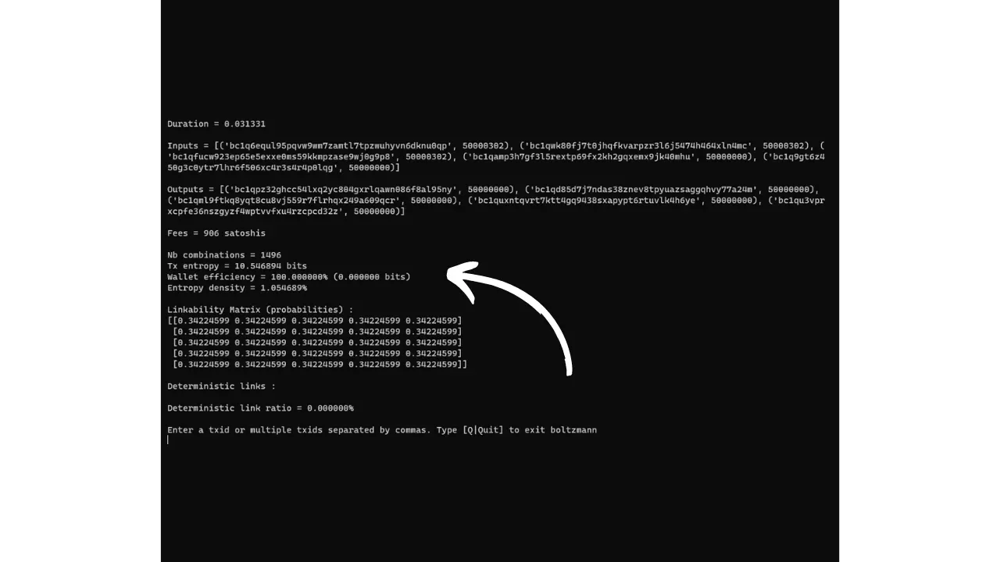

Также было возможно использовать сайт KYCP.org для этих анализов:

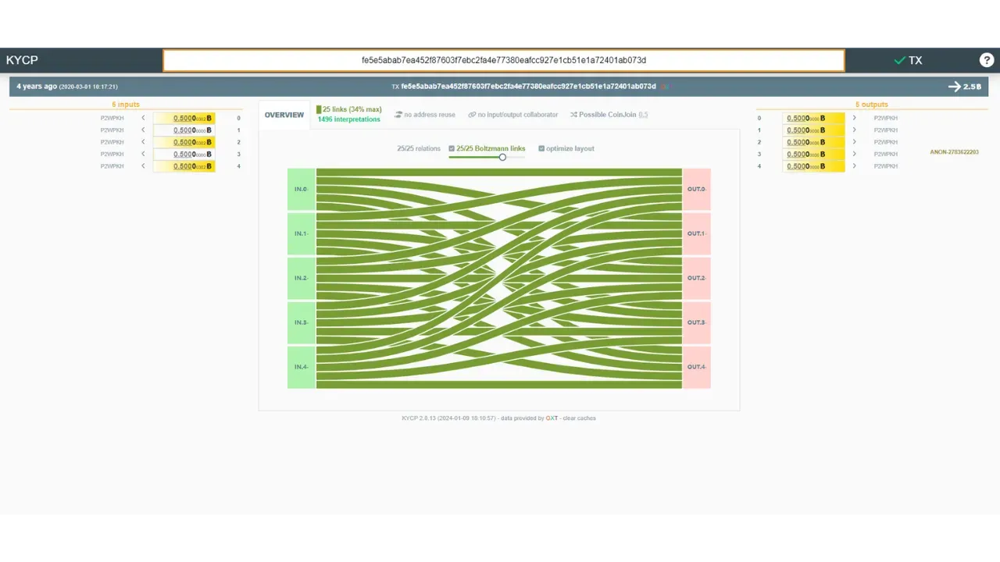

К сожалению, после ареста основателей Samourai, эти инструменты в настоящее время не функционируют.

Теперь, когда мы подробно обсудили coinjoins, мы исследуем другие доступные на Биткойн техники обеспечения конфиденциальности в последнем разделе нашего обучения. Мы рассмотрим payjoins, специфические типы транзакций pseudo-coinjoins, протоколы с фиксированным адресом, а также меры, направленные на повышение конфиденциальности не на уровне транзакций, а на уровне сети узлов.

https://planb.network/tutorials/privacy/boltzmann-entropy

# Понимание стэка других передовых техник конфиденциальности

<partId>19989ae6-d608-4acf-b698-2cf1e7e5e6ae</partId>

## Транзакции Payjoin
<chapterId>c1e90b95-f709-4574-837b-2ec26b11286f</chapterId>

На данный момент coinjoin представляет собой наиболее эффективный метод внесения неопределенности в отслеживание монет во время анализа цепочки. Как мы видели в предыдущих главах, для достижения эффективного смешивания необходимо, чтобы входы и выходы были максимально однородными. Кроме того, крайне важно, чтобы монеты были интегрированы в как можно большую группу, чтобы максимизировать anonsets. Таким образом, для эффективности coinjoins они должны включать большое количество однородных монет. Это множество требований означает, что транзакции coinjoin имеют очень жесткую структуру: суммы предопределены, и все участники должны придерживаться их, чтобы обеспечить однородность процесса. Кроме того, coinjoins требуют синхронизации между всеми участниками и координатором во время построения транзакции.
Эти требования делают coinjoin малопригодными для прямых платежей. Например, если у вас есть часть в 1M сатоши в пуле coinjoin, использование ее непосредственно в качестве платежа было бы сложно. Это потребовало бы синхронизации с другими участниками и координатором для точного построения совместной транзакции в момент, когда вам нужно совершить платеж, и сумма покупки должна была бы точно соответствовать стоимости вашей части, что практически невозможно. Таким образом, транзакция coinjoin по своей сути является совместной транзакцией на очистку, что означает, что обычно в выходах находятся те же владельцы, что и во входах.
Однако было бы интересно иметь структуры транзакций, которые позволяли бы осуществлять практические платежи, внося сомнения в анализ цепочки. Именно это мы и будем исследовать в этой и следующей главах.

### Что такое транзакция Payjoin?

Payjoin - это специфическая структура транзакции Биткойн, которая повышает конфиденциальность пользователя во время платежа путем сотрудничества с получателем платежа.

В 2015 году LaurentMT впервые упомянул этот метод под названием "стеганографические транзакции", согласно документу, доступному [здесь](https://gist.githubusercontent.com/LaurentMT/e758767ca4038ac40aaf/raw/c8125f6a3c3d0e90246dc96d3b603690ab6f1dcc/gistfile1.txt). Позже эту технику принял кошелек Samourai Wallet, который в 2018 году стал первым клиентом, реализовавшим ее с помощью инструмента Stowaway. Концепция payjoin также находится в [BIP79](https://github.com/Биткойн/bips/blob/master/bip-0079.mediawiki) и [BIP78](https://github.com/Биткойн/bips/blob/master/bip-0078.mediawiki). Таким образом, используется несколько терминов для обозначения payjoin:
- Payjoin;
- Stowaway;
- P2EP (*Pay-to-End-Point*);
- Стеганографическая транзакция.

Особенность payjoin заключается в его способности генерировать транзакцию, которая на первый взгляд выглядит обычной, но на самом деле является мини Coinjoin между двумя людьми. Для этого структура транзакции включает получателя платежа во входы вместе с фактическим отправителем. Таким образом, получатель включает платеж себе в середину транзакции, что позволяет ему получить оплату.

Давайте рассмотрим пример, чтобы лучше понять этот процесс. Алиса покупает багет за 4,000 сатоши, используя UTXO на 10,000 сатоши, и выбирает payjoin. Ее пекарь, Боб, добавляет во вход UTXO на 15,000 сатоши, принадлежащие ему, которые он полностью извлекает на выходе, в дополнение к 4,000 сатоши от Алисы.

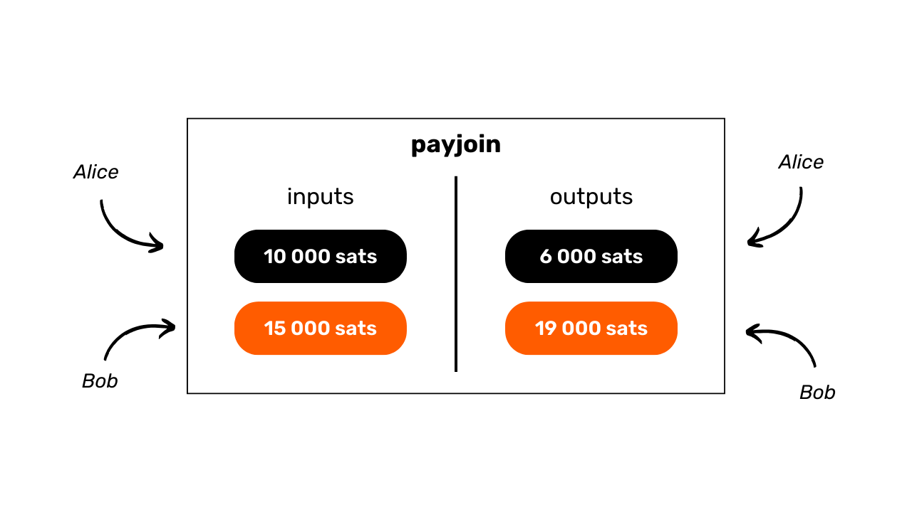
В этом примере Боб-пекарь вносит 15,000 сатоши и выходит с 19,000 сатоши, разница точно составляет 4,000 сатоши, что и является ценой багета. Со стороны Алисы, она входит с 10,000 сатоши и заканчивает с 6,000 сатоши на выходе, что представляет собой баланс в -4,000 сатоши, а именно цену багета. Для упрощения примера я намеренно опустил комиссии за майнинг в этой транзакции.

### Какова цель payjoin?

Транзакция payjoin выполняет две задачи, которые позволяют пользователям улучшить конфиденциальность своего платежа.

Во-первых, payjoin направлен на введение в заблуждение внешнего наблюдателя, создавая ложный след в анализе блокчейна. Это становится возможным благодаря эвристике CIOH (*Common Input Ownership Heuristic*). Как мы видели в части 3, обычно, когда транзакция в блокчейне имеет несколько входов, предполагается, что все эти входы принадлежат одной и той же сущности или пользователю.

Таким образом, когда аналитик рассматривает транзакцию payjoin, он склонен думать, что все входы исходят от одного человека. Однако это восприятие неверно, поскольку получатель платежа также вносит свой вклад во входы наряду с фактическим плательщиком. Таким образом, анализ блокчейна отводится к интерпретации, которая оказывается ложной.

Давайте вернемся к нашему примеру транзакции payjoin за оплату багета:


Видя эту транзакцию в блокчейне, внешний наблюдатель, следуя обычным эвристикам анализа цепочек, интерпретировал бы ее следующим образом: "*Алиса объединила 2 UTXOs на входе транзакции, чтобы заплатить 19,000 сатоши Бобу*".
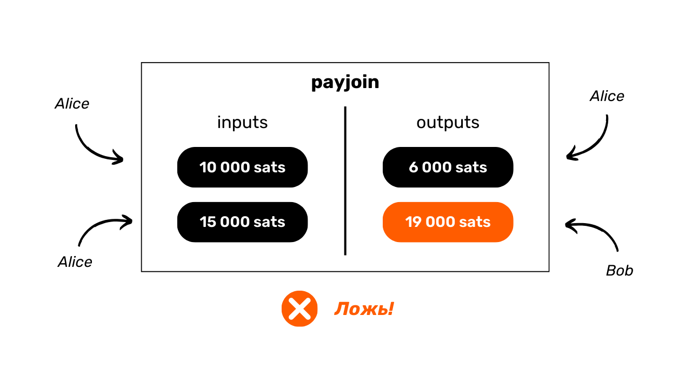
Эта интерпретация, очевидно, неверна, как вы уже знаете, два UTXOs во входах не принадлежат одному и тому же человеку. Один исходит от Алисы, покупательницы багета, а другой от Боба, пекаря.

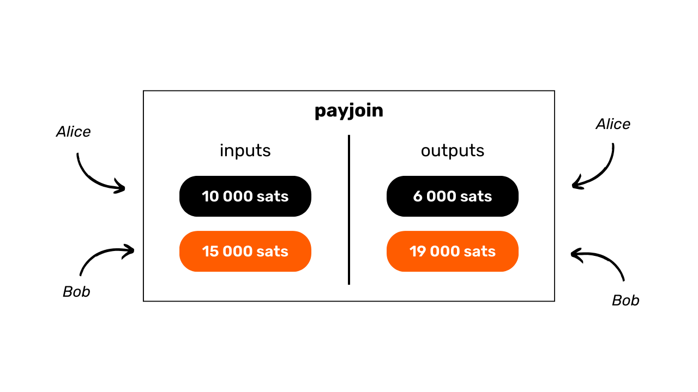

Таким образом, анализ внешнего наблюдателя направлен к неверному выводу, что обеспечивает сохранение конфиденциальности участников.

### Стеганографическая транзакция

Вторая цель payjoin - ввести в заблуждение внешнего наблюдателя относительно реальной суммы платежа. Анализируя структуру транзакции, аналитик может подумать, что платеж эквивалентен сумме одного из выходов.
Если мы вернемся к нашему примеру с покупкой багета, аналитик будет думать, что сумма платежа соответствует либо UTXO в 6,000 сатоши, либо UTXO в 19,000 сатоши. В этом случае аналитик скорее всего подумает, что сумма платежа составляет 19,000 сатоши, поскольку в выходах есть 2 UTXOs, по крайней мере один из которых больше 6,000 сатоши (нет логической причины использовать 2 UTXOs для оплаты 6,000 сатоши, когда одного UTXO было бы достаточно для этого платежа).
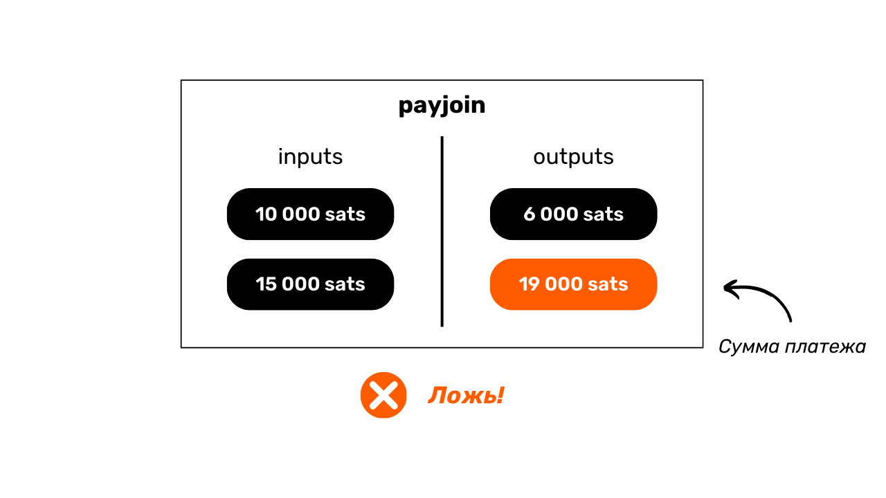

Но на самом деле этот анализ неверен. Сумма платежа не соответствует ни одному из выходов. На самом деле это разница между UTXO получателя на выходе и UTXO получателя на входе.

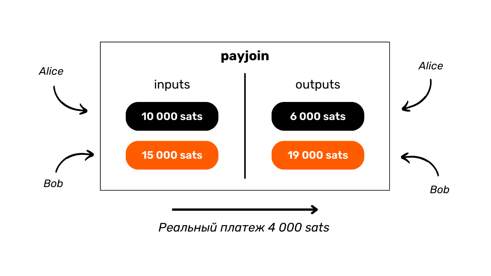

В этом и заключается суть транзакции payjoin, которая попадает в область стеганографии. Она позволяет скрыть реальную сумму транзакции внутри фиктивной транзакции, которая служит приманкой.

Стеганография - это техника сокрытия информации внутри других данных или объектов таким образом, что наличие скрытой информации не воспринимается. Например, секретное сообщение может быть скрыто внутри точки в тексте, который не связан с самим сообщением, делая его незаметным для невооруженного глаза (это техника называется [микроточка](https://fr.wikipedia.org/wiki/Micropoint)).

В отличие от шифрования, которое делает информацию нечитаемой без ключа дешифровки, стеганография не изменяет информацию. Она остается на виду. Ее цель скорее в том, чтобы скрыть само существование секретного сообщения, в то время как шифрование явно указывает на наличие скрытой информации, хотя и недоступной без ключа. Вот почему первоначальное название для payjoin было "*стеганографические транзакции*".

Можно провести аналогию между криптографией и coinjoin, а также между стеганографией и payjoin. Действительно, coinjoin имеет атрибуты, схожие с теми, что у шифрования: метод узнаваем, но информация нечитаема. В свою очередь, payjoin схож с стеганографией: информация теоретически доступна, но поскольку ее метод сокрытия не узнаваем, она становится недоступной.

### Как использовать payjoin?

Среди известного программного обеспечения, поддерживающего payjoin, есть Sparrow Wallet, Wasabi Wallet, Mutiny, BitMask, BlueWallet и JoinMarket, а также платежный процессор BTCPay.


Самой передовой реализацией payjoin была только функция Stowaway в кошельке Samourai. Однако после ареста основателей программы, этот инструмент теперь работает только частично. Преимущество Stowaway заключается в том, что это полный и очень простой в использовании протокол, который поддерживает как получение, так и отправку payjoin. Частично подписанные транзакции могут быть вручную обменены путем сканирования нескольких QR-кодов или автоматически через Tor с помощью Soroban. Именно последний вариант связи в настоящее время не работает.


Сложность использования payjoin заключается в его зависимости от участия продавца. Как покупатель, использовать payjoin невозможно, если продавец его не поддерживает. Это добавляет дополнительную сложность во время покупки: не только сложно найти продавцов, принимающих биткойны, но если искать тех, кто поддерживает payjoins, это становится еще более сложным.

Решением могло бы быть использование транзакционных структур, которые вводят неоднозначность в анализ цепочки без необходимости сотрудничества получателя. Это позволило бы нам улучшить конфиденциальность наших платежей без необходимости активного участия продавцов. Именно это мы и будем изучать в следующей главе.

https://planb.network/tutorials/privacy/payjoin-sparrow-wallet

https://planb.network/tutorials/privacy/payjoin-samourai-wallet

## Мини-койнджойны для платежей
<chapterId>300777ee-30ae-43d7-ab00-479dac3522c1</chapterId>

Когда вы хотите совершить платежную транзакцию, сохраняя определенную степень конфиденциальности, payjoin является хорошим вариантом. Но, как мы видели, payjoin требует участия получателя. Что делать, если последний отказывается участвовать в payjoin, или если вы просто предпочитаете не вовлекать его? Альтернативой является использование транзакции Stonewall или Stonewall x2. Давайте более внимательно рассмотрим эти два типа транзакций.

### Транзакция Stonewall

Stonewall - это специфическая форма транзакции Биткойн, направленная на увеличение конфиденциальности пользователя во время расхода, имитируя pseudo-coinjoin между двумя людьми, не будучи таковым на самом деле. Действительно, эта транзакция не является совместной. Пользователь может построить ее самостоятельно, включив в качестве входов только UTXOs, которыми он владеет. Таким образом, вы можете создать транзакцию Stonewall для любого случая, не нуждаясь в синхронизации с другим пользователем или получателем.

Принцип работы транзакции Stonewall следующий: на входе транзакции отправитель использует 2 UTXOs, принадлежащие ему. На выходе транзакция производит 4 UTXOs, 2 из которых будут точно такого же размера. Другие 2 UTXOs будут составлять сдачу. Среди 2 выходов одинакового размера только один на самом деле пойдет получателю платежа.
В транзакции Stonewall есть только 2 роли:
- Отправитель, который совершает платеж;
- Получатель, который может быть не осведомлен о специфике транзакции и просто ожидает платеж от отправителя.

Давайте рассмотрим пример, чтобы понять структуру этой транзакции. Алиса зашла к Бобу-пекарю, чтобы купить свой багет, который стоит 4,000 сатоши. Она хочет заплатить биткойнами, сохраняя определенный уровень конфиденциальности своего платежа. Поэтому она решает построить транзакцию Stonewall для оплаты.
Анализируя эту транзакцию, мы видим, что Боб-пекарь действительно получил 4,000 сатоши в качестве оплаты за багет. Алиса использовала 2 UTXOs в качестве входов: один на 10,000 сатоши и один на 15,000 сатоши. В выходах она получила 3 UTXOs: один на 4,000 сатоши, один на 6,000 сатоши и один на 11,000 сатоши. Таким образом, чистый баланс Алисы по этой транзакции составляет -4,000 сатоши, что точно соответствует цене багета.

В этом примере я намеренно не учитывал комиссии майнерам, чтобы облегчить понимание. На самом деле, комиссии за транзакцию полностью берет на себя отправитель.

### Каковы цели транзакции Stonewall?

Структура Stonewall добавляет много энтропии к транзакции и затрудняет отслеживание при анализе локчейна. Со стороны такая транзакция может быть интерпретирована как мини-coinjoin между двумя людьми. Но на самом деле это платеж. Таким образом, этот метод создает неопределенности в анализе блокчейна, или даже приводит к ложным следам.

Давайте вернемся к примеру с Алисой и Бобом-пекарем. Транзакция в блокчейне выглядела бы так:

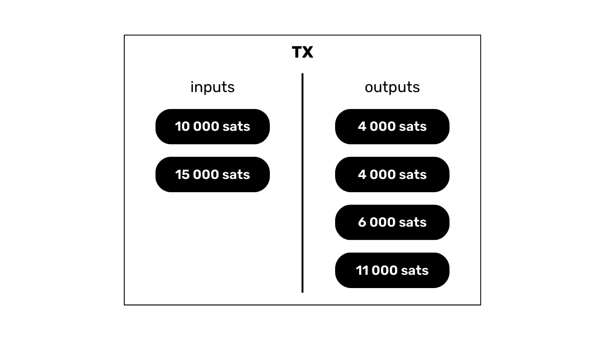

Внешний наблюдатель, полагающийся на общие эвристики анализа блокчейна, может ошибочно сделать вывод, что "*двое людей совершили маленький coinjoin, с одним UTXO у каждого на входе и двумя UTXOs у каждого на выходе*". Анализ этой транзакции снаружи не приводит к применению эвристики общего владения входами (CIOH), потому что наличие двух выходов одинакового размера предполагает схему coinjoin. Со стороны CIOH, следовательно, не применима в этом конкретном случае.


Эта интерпретация неточна, потому что, как вы знаете, один UTXO был отправлен Бобу-пекарю, 2 UTXOs на входах пришли от Алисы, и она получила 3 выхода сдачи.

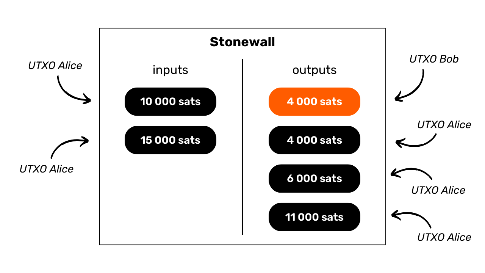
И что особенно интересно в структуре транзакции Stonewall, так это то, что с точки зрения внешнего наблюдателя она выглядит точно так же, как транзакция Stonewall x2.

### Транзакция Stonewall x2

Stonewall x2 — это другая специфическая форма транзакции Биткойн, которая также направлена на увеличение конфиденциальности пользователя во время оплаты, но на этот раз за счет сотрудничества с третьей стороной, не участвующей в оплате. Этот метод работает как pseudo-coinjoin между двумя участниками, в то же время осуществляя платеж третьему лицу.

Работа транзакции Stonewall x2 относительно проста: один участник использует UTXO, которым владеет, для совершения платежа и просит о помощи третью сторону, которая также вносит UTXO, которым она владеет. Транзакция завершается четырьмя выходами: два из них равных сумм, один предназначен для адреса получателя платежа, другой — для адреса сотрудника. Третий UTXO отправляется обратно на другой адрес сотрудника, позволяя ему восстановить первоначальную сумму (нейтральное действие для него, за вычетом комиссий майнерам), и последний UTXO возвращается на адрес, принадлежащий инициатору платежа, и является сдачей платежа.

Таким образом, в транзакциях Stonewall x2 определяются три разные роли:
- Отправитель, который осуществляет фактический платеж;
- Получатель, который может быть не в курсе специфики транзакции и просто ожидает платеж от отправителя;
- Сотрудник, который предоставляет биткойны для создания сомнений в анализе транзакции, при этом полностью восстанавливая свои средства в конце (нейтральное действие для него, за вычетом комиссии майнерам).
  
Давайте вернемся к нашему примеру с Алисой, которая пришла к Бобу-пекарю, чтобы купить багет, стоимостью 4,000 сатоши. Она хочет оплатить покупку биткойнами, сохраняя при этом определенный уровень конфиденциальности своего платежа. Поэтому она обращается к своему другу Чарльзу, который поможет ей в этом процессе.

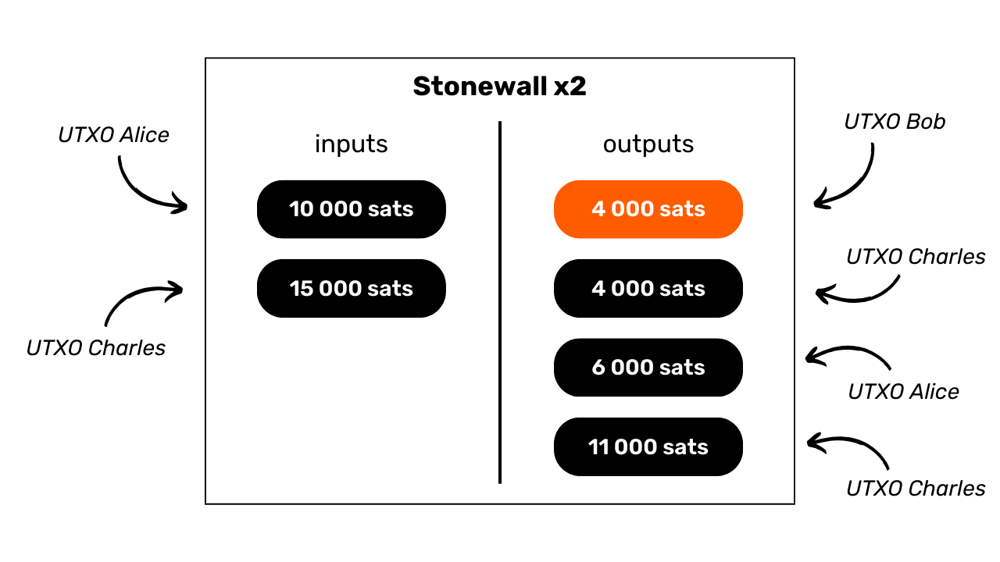

Анализируя эту транзакцию, мы видим, что Боб-пекарь действительно получил 4,000 сатоши в качестве оплаты за багет. Алиса использовала 10,000 сатоши на входе и ей вернулось 6,000 сатоши на выходе, что привело к чистому балансу в -4,000 сатоши, что соответствует цене багета. Что касается Чарльза, он предоставил 15,000 сатоши на входе и получил два выхода: один из 4,000 сатоши и другой из 11,000 сатоши, что дает баланс 0.

В этом примере я намеренно пренебрег комиссиями, чтобы облегчить понимание. На самом деле, комиссии майнерам обычно делятся поровну между отправителем платежа и сотрудником.

### Каковы цели транзакции Stonewall x2?

Как и структура Stonewall, структура Stonewall x2 добавляет значительное количество энтропии к транзакции и запутывает следы анализа цепочки. С внешней точки зрения такая транзакция может быть интерпретирована как небольшой coinjoin между двумя людьми. Но на самом деле это платеж. Таким образом, этот метод создает неопределенности в анализе цепочки, даже приводя к ложным следам.

Давайте вернемся к примеру с Алисой, Бобом-пекарем и Чарльзом. Транзакция в блокчейне будет выглядеть так:

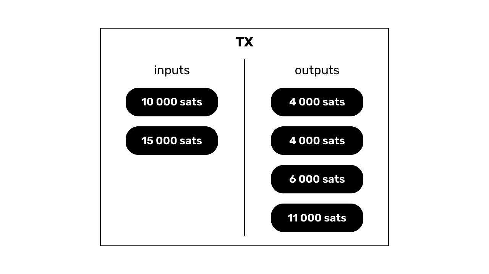

Внешний наблюдатель, полагающийся на общие эвристики анализа цепочки, может ошибочно заключить, что "*Алиса и Чарльз провели небольшой coinjoin, с одним UTXO каждый на входе и двумя UTXOs каждый на выходе*". Опять же, анализ этой транзакции снаружи не приводит к применению эвристики общего владения входом (CIOH), потому что наличие двух выходов одинакового размера предполагает схему coinjoin. Со внешней точки зрения, CIOH, следовательно, не применима в этом конкретном случае.

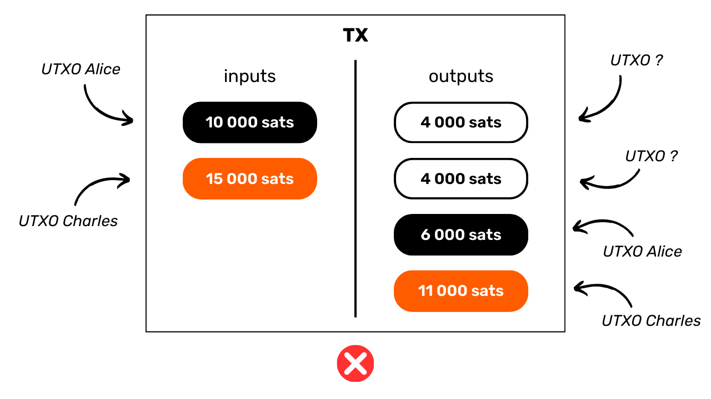

Эта интерпретация неточна, потому что, как вы знаете, один UTXO был отправлен Бобу-пекарю, у Алисы есть только один выход сдачи, а у Чарльза два.

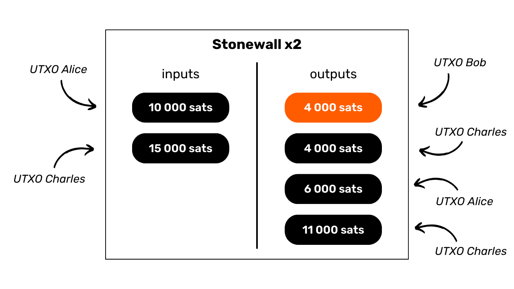

И снова, что особенно интересно со структурой транзакции Stonewall x2, так это то, что с точки зрения внешнего наблюдателя она выглядит точно так же, как и транзакция Stonewall.

### В чем разница между Stonewall и Stonewall x2?

Транзакция StonewallX2 работает точно так же, как транзакция Stonewall, за исключением того, что первая является совместной, в то время как последняя нет. Как мы видели, транзакция Stonewall x2 включает участие третьей стороны (Чарльза), который внешний по отношению к платежу и который предоставляет свои биткойны для повышения конфиденциальности транзакции. В классической транзакции Stonewall роль сотрудника выполняет отправитель.

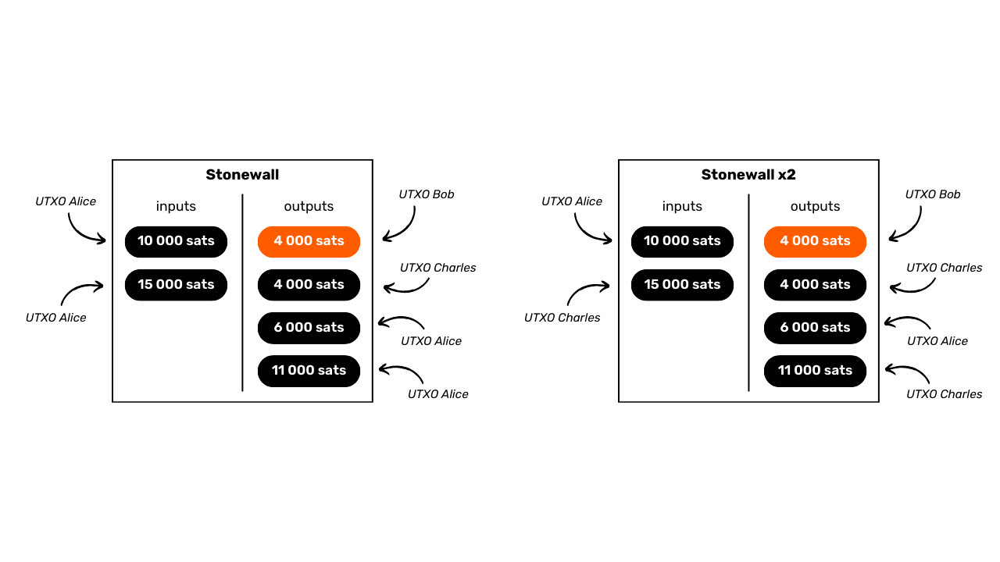

Со внешней точки зрения, схема транзакции, следовательно, точно такая же.

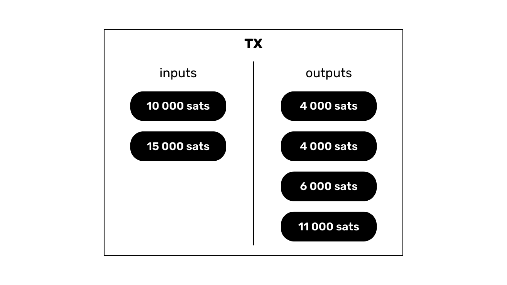

Тот факт, что эти две структуры транзакций имеют абсолютно одинаковый шаблон, подразумевает, что даже если внешний наблюдатель сумеет идентифицировать шаблон "Stonewall(x2)", у него не будет всей информации. Он не сможет определить, какой из двух UTXOs одинаковых сумм соответствует платежу. Более того, он не сможет определить, исходят ли два UTXOs во входах от двух разных людей (Stonewall x2) или они принадлежат одному человеку, который их объединил (Stonewall).
Этот последний момент обусловлен тем, что транзакции Stonewall x2 следуют точно такому же шаблону, как и транзакции Stonewall. С внешней стороны и без дополнительной информации о контексте невозможно отличить транзакцию Stonewall от транзакции Stonewall x2. Однако первые не являются совместными транзакциями, в то время как последние являются таковыми. Это добавляет еще больше сомнений при анализе подобных транзакций.

### Когда использовать транзакции Stonewall и Stonewall x2?

Логика должна быть следующей, когда хочется использовать инструмент конфиденциальности для транзакции:
- В качестве приоритета можно выбрать совершение payjoin;
- Если продавец не поддерживает payjoins, можно совершить совместную транзакцию с другим человеком вне платежа, используя структуру Stonewall x2;
- Если никто не найден для совершения транзакции Stonewall x2, можно совершить транзакцию Stonewall в одиночку, которая будет имитировать поведение транзакции Stonewall x2.

### Как использовать транзакции Stonewall и Stonewall x2?

Транзакции Stonewall и Stonewall x2 доступны как в приложении Samourai Wallet, так и в программном обеспечении Sparrow Wallet.

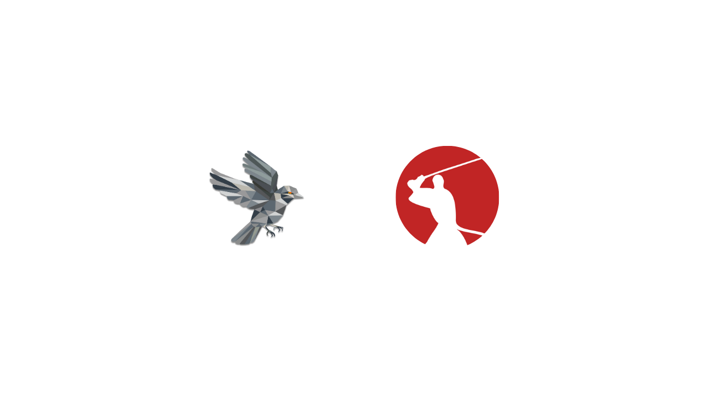

Однако, как и в случае с payjoins, после ареста основателей Samourai, транзакции Stonewall x2 теперь работают только путем ручного обмена PSBT между участниками. Автоматический обмен через Soroban, к сожалению, в настоящее время недоступен.

Также возможно вручную выполнить этот тип транзакции из любого программного обеспечения для Биткойн кошелька.

В следующей главе мы изучим еще одну технику конфиденциальности, которая относительно малоизвестна, но очень полезна в дополнение к уже изученному.

https://planb.network/tutorials/privacy/stonewall

https://planb.network/tutorials/privacy/stonewall-x2

## Ricochets (Рикошеты) 

<chapterId>db9a20ac-a149-443d-884b-ea6c03f28499</chapterId>

Использование структур транзакций Биткойна, которые добавляют неоднозначность в анализ цепочек, таких как coinjoin, особенно выгодно для защиты конфиденциальности. Однако, как мы обсуждали в главе о payjoins, транзакции coinjoin естественным образом идентифицируемы в цепочке. Вспомните аналогию, которую мы установили между шифрованием и coinjoins: когда кто-то шифрует файл, третья сторона, обнаружив этот зашифрованный файл, не может получить доступ к его содержимому, но может четко идентифицировать, что была произведена модификация файла для сокрытия его содержимого. То же самое относится к coinjoin: когда аналитик рассматривает транзакцию coinjoin, хотя он не может установить прямые связи между входами и выходами (и наоборот), он тем не менее может узнать, что наблюдаемая транзакция является coinjoin.
В зависимости от того, как вы планируете использовать свою монету после прохождения циклов coinjoin, факт прохождения этого процесса может быть проблематичным. Например, если вы собираетесь продать свою монету на регулируемой биржевой платформе, но она недавно прошла через coinjoin, инструмент анализа цепочки платформы обнаружит этот факт. Платформа может тогда отказаться принимать ваш UTXO, прошедший через coinjoin, или даже потребовать от вас объяснений, с риском приостановки вашего аккаунта или заморозки ваших средств. В некоторых случаях платформа также может сообщить о вашем действии государственным органам (например, это требуется от Поставщиков Услуг Цифровых Активов (PSAN) во Франции TRACFIN).
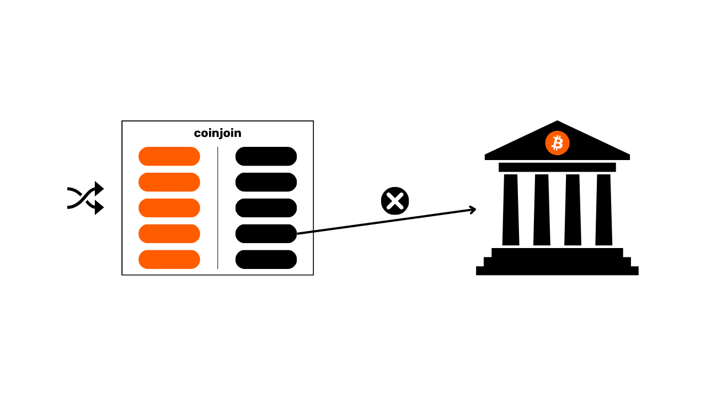

Чтобы избежать этого, нам нужен инструмент, способный замаскировать следы прошлого биткойна, чтобы восстановить определенную форму взаимозаменяемости. Это и есть цель ricochet.

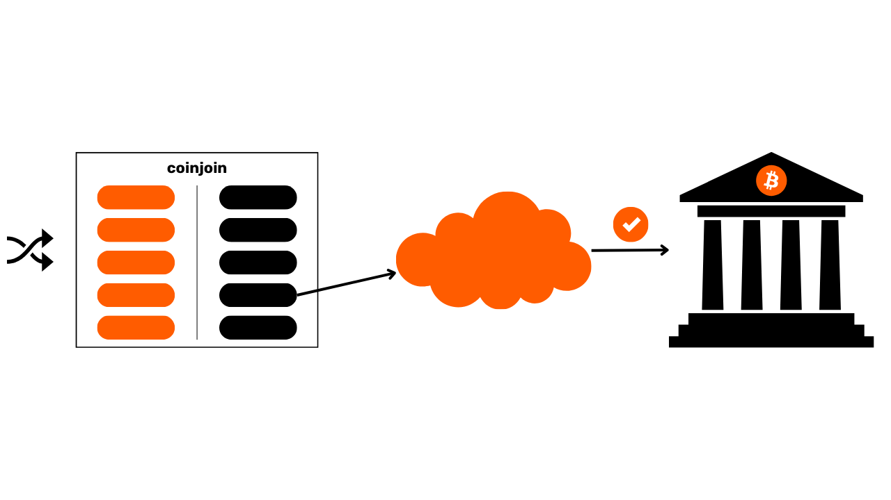

### Что такое ricochet?

Ricochet - это техника, которая включает выполнение нескольких фиктивных транзакций самому себе (sweeping) для имитации передачи права собственности на биткойны. Этот инструмент отличается от других структур транзакций, о которых мы говорили, потому что он не обеспечивает перспективную анонимность, а скорее форму ретроспективной анонимности. Действительно, ricochet позволяет размыть конкретные детали, которые могут нарушить взаимозаменяемость биткойн-монеты из-за ее прошлого.

Чтобы замаскировать след, оставленный прошлым событием на монете, например, циклами coinjoin, ricochet выполняет четыре последовательные транзакции, где пользователь переводит средства самому себе на разные адреса.

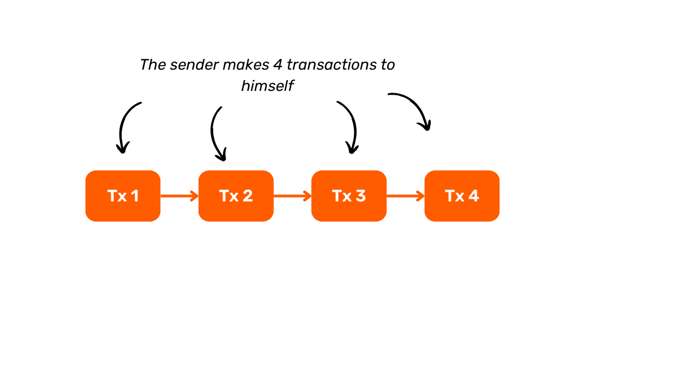

После этой последовательности транзакций инструмент ricochet наконец направляет биткойны на их конечное назначение, например, на биржевую платформу.

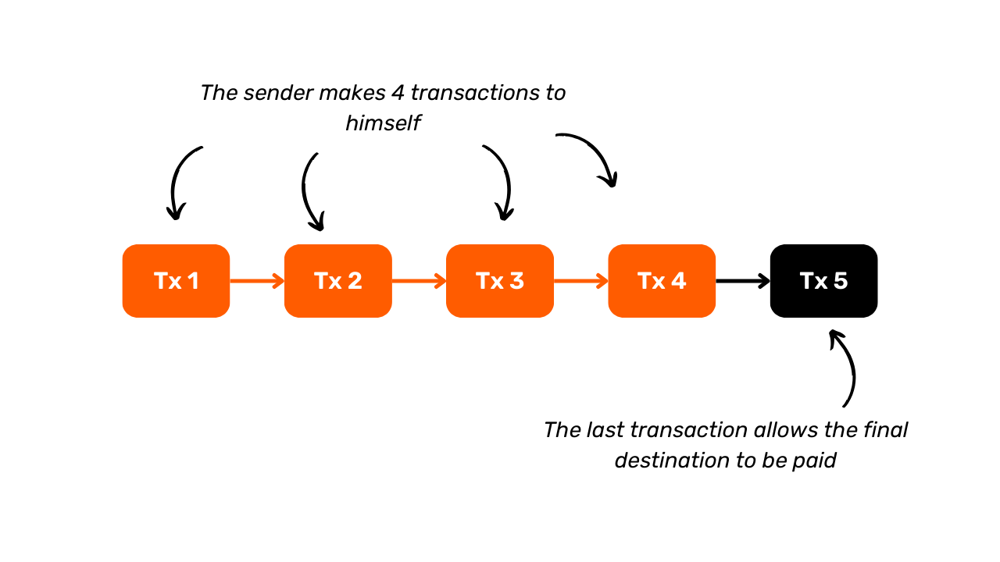

Цель состоит в том, чтобы создать дистанцию, влияющую на взаимозаменяемость монеты, такую как транзакция coinjoin, и конечное действие расходования, которое могло бы отвергнуть эту монету из-за ее прошлого. Таким образом, инструменты анализа цепочки могут прийти к выводу, что, вероятно, произошла смена владельца после события, и считать, что эта монета взаимозаменяема. В случае coinjoin инструменты анализа цепочки могут затем предположить, что это не тот же человек, который отправил биткойны и выполнил coinjoin, и поэтому нет необходимости инициировать действия против отправителя.

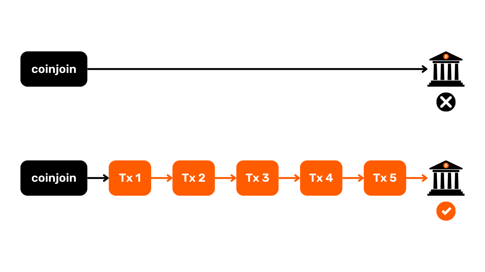

### Почему это работает?
Размышляя о методе ricochet можно представить, что программное обеспечение для анализа цепочки углубит свое исследование за пределы четырех прыжков. Однако эти платформы сталкиваются с дилеммой в оптимизации порога обнаружения. Им необходимо установить предел количества прыжков, после которого они признают, что, вероятно, произошла смена владельца и что связь с предыдущим событием (например, с coinjoin) следует игнорировать.
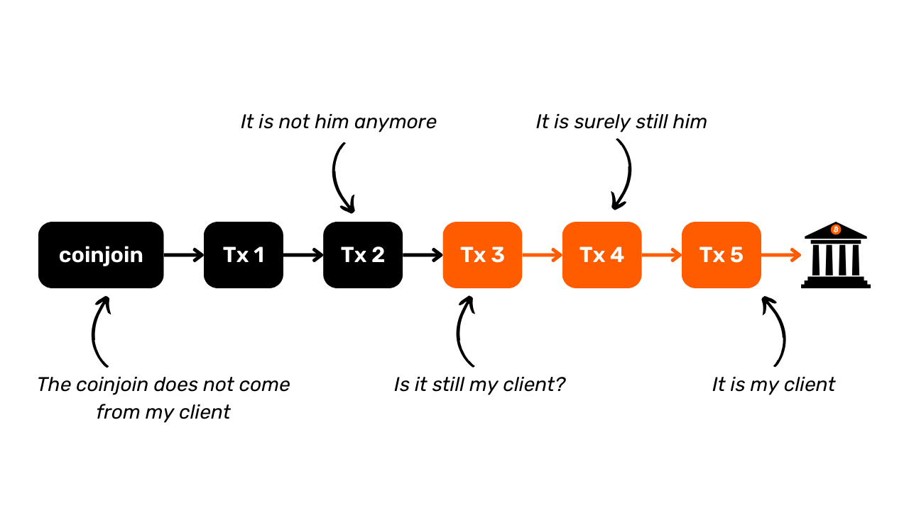

Однако определение этого порога оказывается рискованным: каждое расширение наблюдаемого количества прыжков экспоненциально увеличивает объем ложноположительных результатов, то есть случаев, когда люди ошибочно помечены как участники события, когда операция была выполнена кем-то другим. Этот сценарий представляет серьезный риск для этих компаний, поскольку ложноположительные результаты приводят к недовольству, которое может подтолкнуть пострадавших клиентов к конкурентам. В долгосрочной перспективе слишком широкий порог обнаружения приводит к тому, что платформа теряет больше клиентов, чем ее конкуренты, что может угрожать ее жизнеспособности. Поэтому для этих платформ сложно увеличить количество исследуемых прыжков, и четыре часто являются достаточным числом для противодействия их анализам.

Наблюдаемое здесь явление в некотором роде аналогично теории шести рукопожатий.
Теория шести рукопожатий предполагает, что любой человек на Земле связан с любым другим через цепочку знакомств, которая включает не более шести посредников. Достаточно пройти через серию из шести людей, каждый из которых лично знает следующего, чтобы достичь любого индивида в мире.

Для транзакций с Биткойн наблюдается похожее явление. Отслеживая достаточное количество транзакций Биткойн, неизбежно сталкиваешься с coinjoin. Метод рикошет использует этот принцип, применяя количество прыжков больше, чем биржевые платформы могут разумно отследить. Если платформы решат отслеживать больше транзакций, то можно просто добавить дополнительный прыжок, чтобы обойти это ограничение.

### Когда и как использовать рикошет?

Наиболее распространенный случай использования рикошета возникает, когда необходимо скрыть предыдущее участие в coinjoin по UTXO, которым вы владеете. В идеале лучше избегать передачи биткойнов, прошедших через coinjoin, регулируемым агентам. Тем не менее, в случае, когда других вариантов нет, особенно в случае перевода биткойнов в фиатную валюту, рикошет предлагает эффективное решение.

Этот метод эффективен не только для coinjoins, но и для любых других меток, которые могут нарушить взаимозаменяемость монеты.
Идея метода рикошета изначально исходила от команды Samourai Wallet, которые интегрировали его в свое приложение для автоматизации процесса. Услуга платная на Samourai, так как рикошет влечет за собой сервисный сбор в 100,000 сатоши, в дополнение к комиссиям майнерам. Таким образом, его использование рекомендуется скорее для переводов значительных сумм.


Приложение Samourai предлагает два варианта рикошета:
- Усиленный рикошет, или "задержанная доставка", который имеет преимущество в распределении сервисных сборов Samourai по пяти последовательным транзакциям. Этот вариант также гарантирует, что каждая транзакция транслируется в разное время и записывается в разный блок, что позволяет максимально точно имитировать поведение смены владельца. Хотя этот метод медленнее, он предпочтительнее для тех, кто не торопится, так как максимизирует эффективность рикошета, усиливая его сопротивление анализу цепочки;

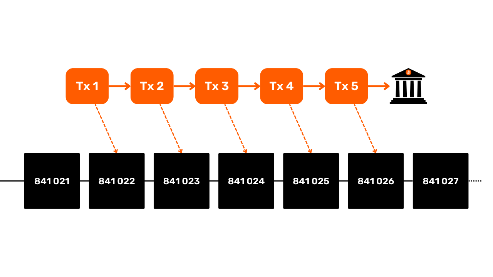

- Классический рикошет, который разработан для быстрого выполнения операции путем трансляции всех транзакций в короткий промежуток времени. Таким образом, этот метод предлагает меньшую конфиденциальность и ниже сопротивление анализу, чем усиленный метод. Его следует использовать только для срочных переводов.

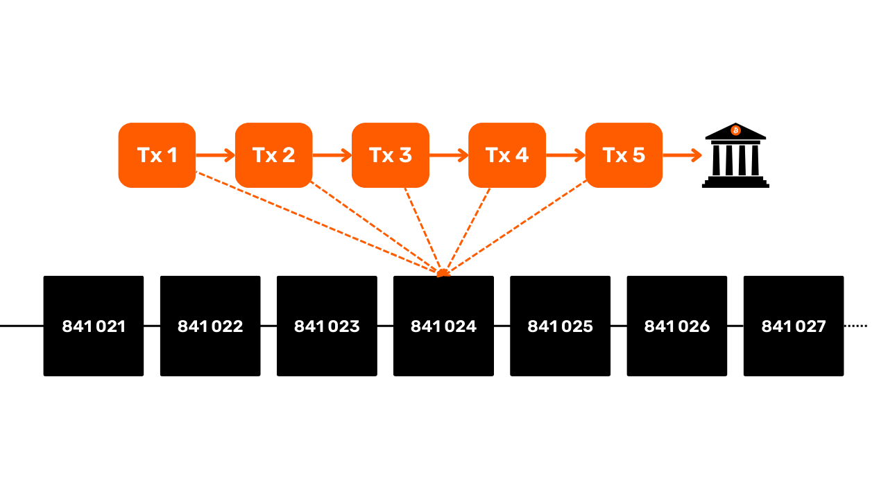

Рикошет просто включает в себя отправку биткойнов самому себе. Вполне возможно выполнить рикошет вручную на любом программном обеспечении кошелька, не используя специализированный инструмент. Просто переведите ту же монету самому себе последовательно, используя каждый раз новый пустой адрес.

В следующей главе мы исследуем различные техники для секретной передачи собственности. Эти методы радикально отличаются от тех, которые мы рассматривали до сих пор, как с точки зрения работы, так и результатов.

https://planb.network/tutorials/privacy/ricochet
 
## Секретная передача собственности
<chapterId>a2067036-849c-4d6b-87d2-44235cfae7a1</chapterId>

Среди техник конфиденциальности в Биткойн также существует секретная передача собственности. Этот метод направлен на передачу владения биткойнами от одного человека другому и наоборот, без того, чтобы эта транзакция была явно видна на блокчейне. Давайте вместе изучим различные доступные техники, а также их преимущества и недостатки.

### CoinSwap

CoinSwap основан на относительно простой концепции: он использует смарт-контракты для облегчения передачи владения биткойнами между двумя пользователями, без необходимости в доверии и без того, чтобы эта передача была явно видна в блокчейне.

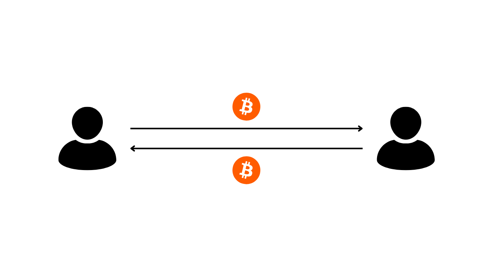

Давайте представим упрощенный пример с Алисой и Бобом. Алиса владеет 1 BTC, защищенным приватным ключом $A$, и Боб тоже владеет 1 BTC, защищенным приватным ключом $B$. Теоретически, они могли бы обменяться своими приватными ключами через внешний канал связи для осуществления секретной передачи.

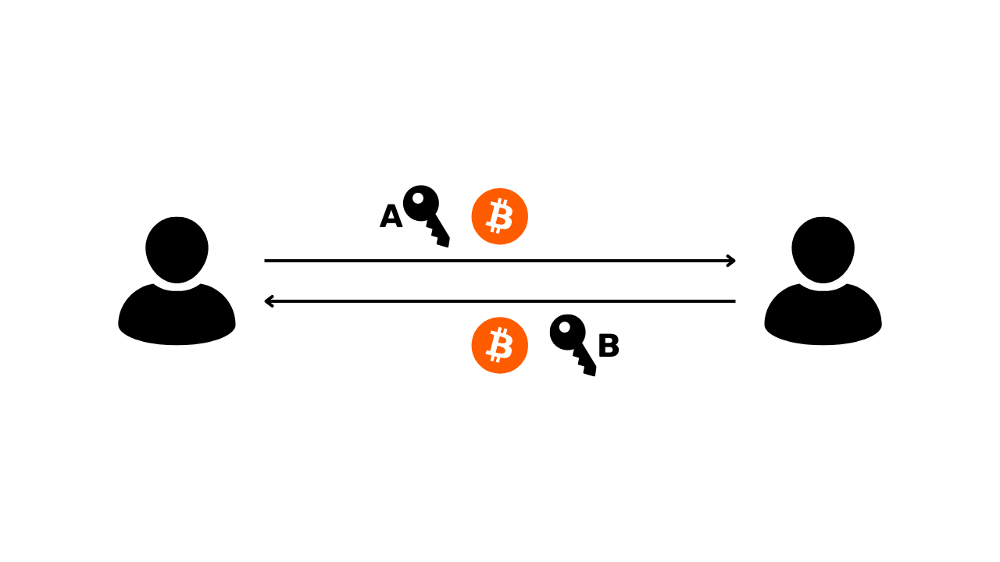

Однако, этот наивный метод представляет высокий риск с точки зрения доверия. Ничто не мешает Алисе сохранить копию приватного ключа $A$ после обмена и использовать его позже для кражи биткойнов, как только ключ окажется во владении Боба.

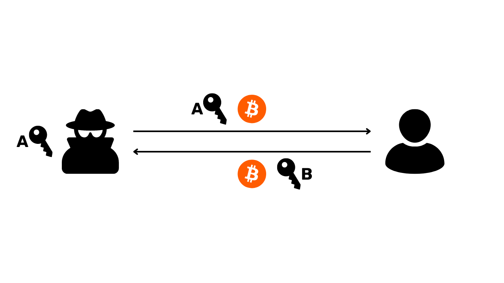

Более того, нет никакой гарантии, что после получения приватного ключа $B$ Боба Алисой, она в ответ отправит Бобу свой приватный ключ $A$. Таким образом, этот обмен основан на чрезмерном доверии между сторонами и оказывается неэффективным в обеспечении безопасной секретной передачи владения.

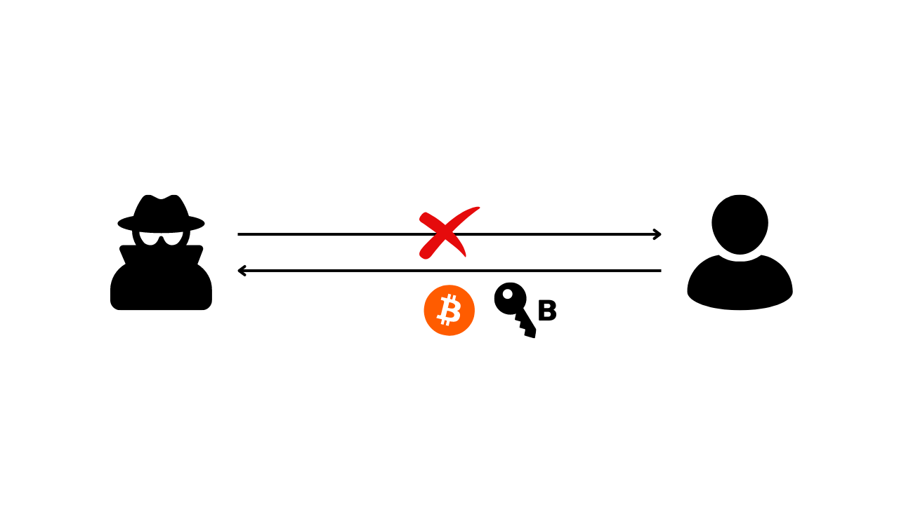

Чтобы решить эти проблемы и позволить обмены между сторонами, которые не доверяют друг другу, мы можем вместо этого использовать системы смарт-контрактов. _Смарт-контракт_ — это программа, которая автоматически выполняется, когда выполнены заранее определеные условия, что, в нашем случае, гарантирует, что обмен владения происходит автоматически без необходимости взаимного доверия.

Для этого мы можем использовать HTLC (*Hash Time-Locked Contracts*) или PTLC (*Point Time-Locked Contracts*). Эти два протокола функционируют аналогично, используя систему временной блокировки, которая гарантирует, что обмен либо успешно завершается, либо полностью отменяется, таким образом защищая целостность средств обеих сторон. Основное отличие между HTLC и PTLC заключается в том, что HTLC используют хеши и предварительные изображения для обеспечения транзакции, в то время как PTLC используют Адаптивные Подписи.

В сценарии CoinSwap с использованием HTLC или PTLC между Алисой и Бобом обмен происходит безопасно: либо он удачен, и каждый получает BTC другого, либо он терпит неудачу, и каждый сохраняет свой BTC. Таким образом, одной из сторон невозможно обмануть или украсть BTC другой.

> *HTLC также являются механизмом, используемым для безопасной маршрутизации платежей по двунаправленным каналам Сети Lightning.*

Использование Адаптивных Подписей особенно интересно в этом контексте, поскольку это позволяет обойти традиционные скрипты (это механизм, иногда называемый "_скриптлесс скриптами_"). Эта особенность помогает снизить сборы, связанные с обменом. Еще одно важное преимущество Адаптивных Подписей заключается в том, что они не требуют использования общего хеша для обеих сторон транзакции, таким образом избегая раскрытия прямой связи между ними в определенных типах обменов.

### Адаптивные Подписи

_Адаптивные Подписи_ (Adaptor Signatures) — это криптографический метод, который интегрирует действительную подпись с дополнительной подписью, называемой "_адаптивной подписью_", для раскрытия секретного фрагмента данных. Этот механизм разработан таким образом, что знание 2 из следующих 3 элементов: действительная подпись, адаптивная подпись и секрет, позволяет вывести недостающий третий элемент. Интересной особенностью этого метода является то, что, если мы знаем адаптивную подпись нашего контрагента и конкретную точку на эллиптической кривой, связанную с секретом, использованным для расчета этой адаптивной подписи, мы можем вывести нашу собственную адаптивную подпись, которая будет совместима с тем же секретом, никогда не имея прямого доступа к самому секрету.

В coinswap использование Адаптерных Подписей позволяет одновременно раскрыть две чувствительные части информации между участниками, тем самым избегая необходимости во взаимном доверии. Давайте рассмотрим пример, который иллюстрирует этот процесс с Алисой и Бобом, которые хотят обменяться владением 1 BTC каждый, но не доверяют друг другу. Они используют Адаптерные Подписи, чтобы исключить необходимость в доверии при этом обмене. Вот как они поступают:

* Алиса инициирует обмен, создавая транзакцию $m_A$, которая отправляет 1 BTC Бобу. Она генерирует подпись $s_A$, которая подтверждает эту транзакцию, используя свой приватный ключ $p_A$ ($P_A = p_A \cdot G$), nonce $n_A$ ($N_A = n_A \cdot G$) и секрет $t$ ($T = t \cdot G$):

$$s_A = n_A + t + H(N_A + T \parallel P_A \parallel m_A) \cdot p_A$$

* Алиса вычисляет адаптивную подпись $s_A'$, вычитая секрет $t$ из своей истинной подписи $s_A$:

$$s_A' = s_A - t$$

* Алиса отправляет Бобу свою адаптивную подпись $s'_A$, её неподписанную транзакцию $m_A$, точку, соответствующую секрету ($T$), и точку, соответствующую nonce ($N_A$). Эти элементы составляют то, что называется "*адаптером*". Важно отметить, что только с этой информацией Боб не может восстановить BTC Алисы.
  
* Однако Боб имеет возможность проверить, что Алиса не пытается его обмануть. Для этого он проверяет, действительно ли адаптивная подпись Алисы $s_A'$ соответствует предложенной транзакции $m_A$. Если следующее уравнение верно, он может быть уверен, что адаптивная подпись Алисы действительна:
$$s_A' \cdot G = N_A + H(N_A + T \parallel P_A \parallel m_A) \cdot P_A$$

* Эта проверка предоставляет Бобу достаточные гарантии для уверенного продолжения обмена. Затем он создает свою собственную транзакцию $m_B$, предназначенную для отправки 1 BTC Алисе, и генерирует свою собственную адаптивную подпись $s_B'$, которая также будет связана с тем же секретом $t$. На этом этапе только Алиса знает значение $t$; Боб знает только соответствующую точку $T$, которую Алиса передала ему:

$$s_B' = n_B + H(N_B + T \parallel P_B \parallel m_B) \cdot p_B$$

* Боб передает Алисе свою адаптивную подпись $s_B'$, его неподписанную транзакцию $m_B$, а также точку, соответствующую секрету ($T$) и точку, соответствующую nonce ($N_B$). Алиса, зная секрет $t$, теперь может соединить адаптивную подпись Боба $s_B'$ с этим секретом, чтобы сгенерировать действительную подпись $s_B$ для транзакции $m_B$, которая переведет 1 BTC Боба ей:

$$s_B = s_B' + t$$

$$(s_B' + t) \cdot G = N_B + T + H(N_B + T \parallel P_B \parallel m_B) \cdot P_B$$

* Алиса транслирует подписанную транзакцию $m_B$ в блокчейн Биткойн, чтобы восстановить обещанный Бобом 1 BTC. Когда Боб видит эту транзакцию в блокчейне, он может извлечь подпись $s_B = s_B' + t$. С этой информацией Боб затем может выделить значимый секрет $t$, который ему был нужен:
  
$$t = (s_B' + t) - s_B' = s_B - s_B'$$

* И в самом деле, секрет $t$ был единственным недостающим элементом, чтобы Боб мог сгенерировать действительную подпись $s_A$ от Алисы, используя адаптивную подпись $s_A'$. Эта подпись позволяет подтвердить транзакцию $m_A$, которая отправляет 1 BTC от Алисы к Бобу. Затем Боб вычисляет $s_A$ и, в свою очередь, транслирует транзакцию $m_A$ в блокчейн:

$$s_A = s_A' + t$$

$$(s_A' + t) \cdot G = N_A + T + H(N_A + T \parallel P_A \parallel m_A) \cdot P_A$$

Давайте подытожим, как работает адаптивная подпись в обмене монет. Изначально Алиса отправляет Бобу неподписанную транзакцию вместе с адаптером, который позволяет Бобу проверить, что позже раскрытый секрет даст ему доступ к биткойнам. В ответ Боб отправляет Алисе свою собственную неподписанную транзакцию и его адаптер. Затем Алиса может завершить транзакцию Боба и восстановить биткойны, транслируя действительную транзакцию с использованием секрета. Когда эта транзакция публикуется в блокчейне, у Боба появляется возможность извлечь секрет и таким образом разблокировать транзакцию Алисы. Следовательно, если Алиса инициирует перевод биткойна Боба, он, в свою очередь, может получить доступ к биткойну Алисы без необходимости взаимного доверия.
Стоит отметить, что обмен монет был впервые предложен [Грегори Максвеллом в октябре 2013 года на BitcoinTalk](https://bitcointalk.org/index.php?topic=321228.0).

### Atomic Swap (Атомарные обмены)

Подобно обмену монет и используя те же типы смарт-контрактов, также возможно выполнить атомарные обмены. Атомарный обмен позволяет напрямую обменивать различные криптовалюты, такие как BTC и XMR, между двумя пользователями без необходимости доверия или вмешательства посредника. Эти обмены называются "атомарными", потому что они имеют только два возможных исхода: либо обмен успешен и обе стороны удовлетворены, либо он терпит неудачу, и каждая сторона сохраняет свои исходные криптовалюты, тем самым исключая необходимость доверия к другой стороне.

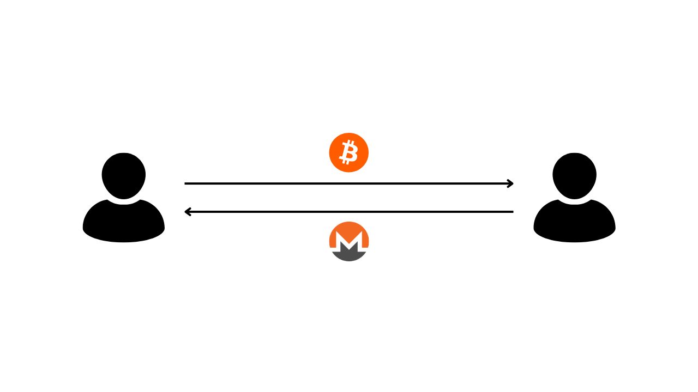

Atomic Swaps и CoinSwaps имеют схожий метод работы и предлагают одинаковые преимущества и недостатки с точки зрения конфиденциальности. Действительно, с точки зрения Биткойна, атомарный обмен сравним с обменом монет, выполненным в два этапа. Сначала мы обмениваем наши BTC на другую криптовалюту, а затем эту криптовалюту можно обменять на другие BTC. В конечном итоге мы восстанавливаем BTC другого пользователя. Вот почему, в анализе проблем конфиденциальности, я группирую эти два протокола под категорию секретных обменов собственностью.

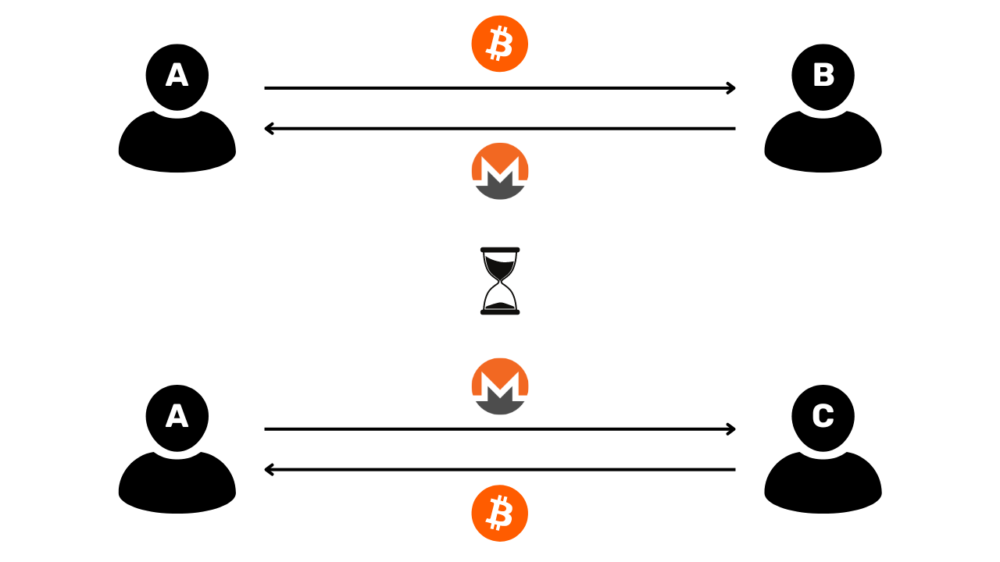

Однако, в отличие от обмена монет, атомарный обмен может иметь дисбаланс в терминах доступной ликвидности, особенно в обменах BTC/XMR. Обычно обменять биткойны на альткойны проще, так как существует высокий спрос на биткойны, что поддерживает низкие премии для этого направления конвертации. Однако обмен альткойнов на получение BTC может быть более сложным из-за меньшего спроса, что часто приводит к очень высоким премиям.

Наконец, когда атомарный обмен включает в себя биткойны в блокчейне и биткойны в сети Lightning, мы тогда называем это "*submarine swap*".

### Действительно ли это полезно?

Секретные передачи собственности, такие как обмен монет и атомарные обмены, имеют преимущество в том, что они вводят в заблуждение эвристики анализа цепочек. Эти методы могут создать впечатление, что транзакции вовлечен один и тот же пользователь, хотя фактическая собственность перешла в другие руки. Однако основным недостатком этих методов является то, что они очень рискованны без использования дополнительной техники для разрыва истории монет.
Действительно, когда Алиса проводит coinswap или atomic sawp с Бобом, она обменивает владение своими биткойнами на биткойны Боба. В случае atomic swap обмен включает альткойн, но принцип остается тем же. Таким образом, Алиса оказывается с монетой $B$, а Боб - с монетой $A$. Это добавляет сомнений в анализ цепочек, но история монет остается прослеживаемой. Если аналитик изучит монету $A$, он может отследить предыдущие действия Алисы, и наоборот для монеты $B$.

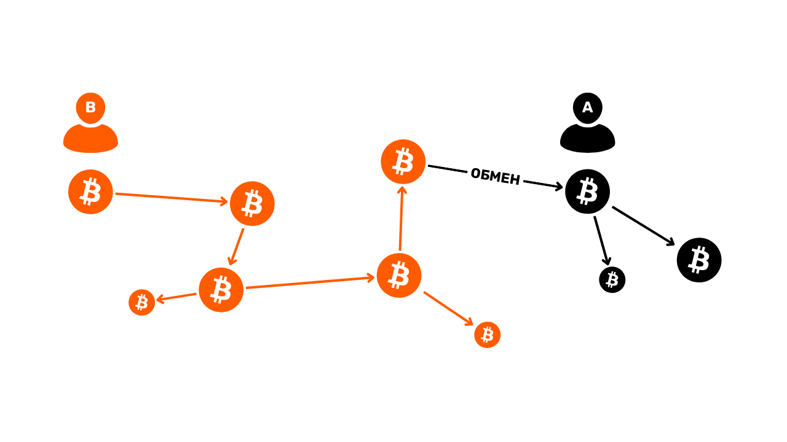

С точки зрения Алисы, риск заключается в том, что история монеты $B$ может быть признана подозрительной определенными субъектами. Если, например, Боб приобрел монету $B$ в результате преступной деятельности, такой как взлом, эта монета останется связанной с его незаконными действиями. Тогда Алиса может оказаться владельцем монеты, которую она не сможет перевести на регулируемые платформы обмена без риска заморозки своих средств или даже обвинения в преступлениях Боба, хотя она и не имела к ним никакого отношения.

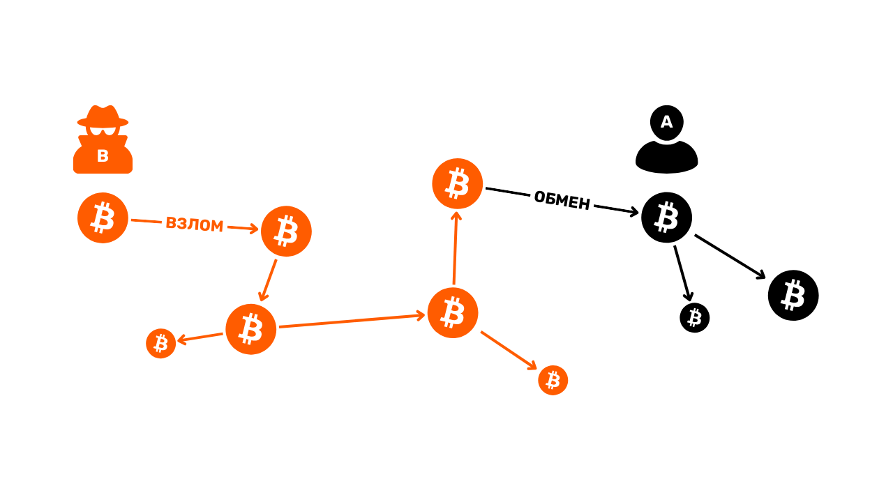

И, конечно, методы обеспечения конфиденциальности, такие как обмен монетами или атомарный своп, предпочитаются преступниками, чьи средства находятся под наблюдением властей. Эти протоколы предоставляют им возможность избавиться от своих отслеживаемых биткойнов в обмен на абсолютно взаимозаменяемые биткойны. Это также позволяет им создать отвлекающий маневр, направляя власти на других пользователей. Таким образом, для этих лиц существует двойная польза.

С помощью coinjoin, даже если ваша монета смешана с отслеживаемыми биткойнами, история монеты прерывается, что обеспечивает форму правдоподобного отрицания, которая отсутствует в протоколах секретной передачи собственности, таких как обмен монетами или атомарный своп.

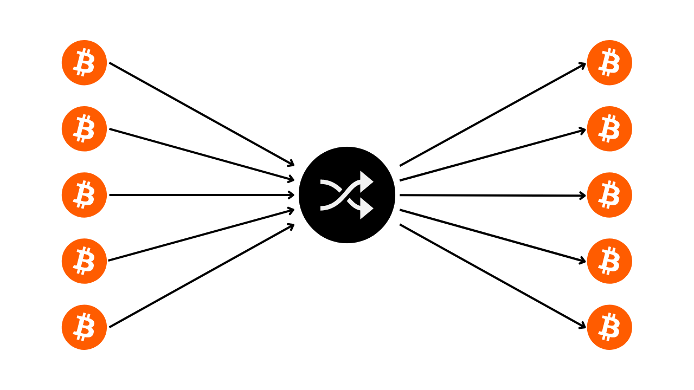

Если Алиса хочет избежать любого риска, она обязательно должна использовать метод для разрыва истории монеты $B$, например, пропустив ее через coinjoins. Это поднимает вопрос о пользе сочетания секретной передачи собственности и coinjoin. Coinjoin, разрывая историю монеты, уже обеспечивает достаточный уровень конфиденциальности для Алисы. Таким образом, мое мнение заключается в том, что если Алиса стремится защитить свою конфиденциальность, было бы более разумно сразу приступить к coinjoin, а не заниматься обменом монетами, за которым следует coinjoin.

Для того чтобы методы секретной передачи собственности были действительно эффективными и избегали риска связывания истории пользователя $A$ с пользователем $B$, парадоксально необходимо, чтобы их использование было широко известно. Если обмен монетами используется массово и власти осведомлены об этой общей практике, тогда может быть установлена форма правдоподобного отрицания. Однако, пока использование этих передач остается маргинальным, я считаю, что эти методы останутся слишком рискованными для пользователей.

До сих пор мы в основном изучали методы обеспечения конфиденциальности на уровне самих транзакций. В следующей главе мы рассмотрим проблемы на уровне сети и распространения транзакций.

## Конфиденциальность в P2P-сети
<chapterId>04a2467b-db84-4076-a9ff-919be5135106</chapterId>

В части 4 мы обсудили важность использования полного узла для защиты конфиденциальности ваших транзакций. Однако важно понимать, что ваш узел сам по себе может подвергаться атакам, направленным на извлечение информации о ваших действиях. Поэтому в этой главе мы рассмотрим различные меры защиты конфиденциальности, не на уровне самих транзакций или потоков биткойнов, а на уровне сети.

### Одуванчик (Dandelion)

Один из способов избежать различных атак на деанонимизацию - использовать предложение Dandelion. Этот протокол трансляции был формализован в BIP156, но никогда не был реализован в Биткойн.

Идея Dandelion заключается в улучшении конфиденциальности маршрутизации транзакций в сети Биткойн для противодействия различным формам атак. Его основная цель - скрыть исходный узел, который впервые транслировал транзакцию в сети. Раскрытие этого узла может связать Биткойн транзакцию с конкретным IP-адресом (если узел работает в открытой сети), что может стать точкой входа для анализа цепочки.

Эта ассоциация между активностью в Биткойн и IP-адресом представляет значительный риск для конфиденциальности пользователя. Действительно, многие субъекты могут легко связать IP-адрес с личной идентичностью. Это, в частности, включает правительства и провайдеров интернет-услуг. Более того, эта информация может стать общедоступной, например, если ваш IP-адрес и личные данные будут раскрыты из-за утечки во время взлома базы данных веб-сайта.

При стандартной работе Биткойн транзакции, созданные пользователем в его программном обеспечении кошелька, передаются на его личный узел. Этот узел немедленно транслирует новую транзакцию всем связанным с ним узлам.

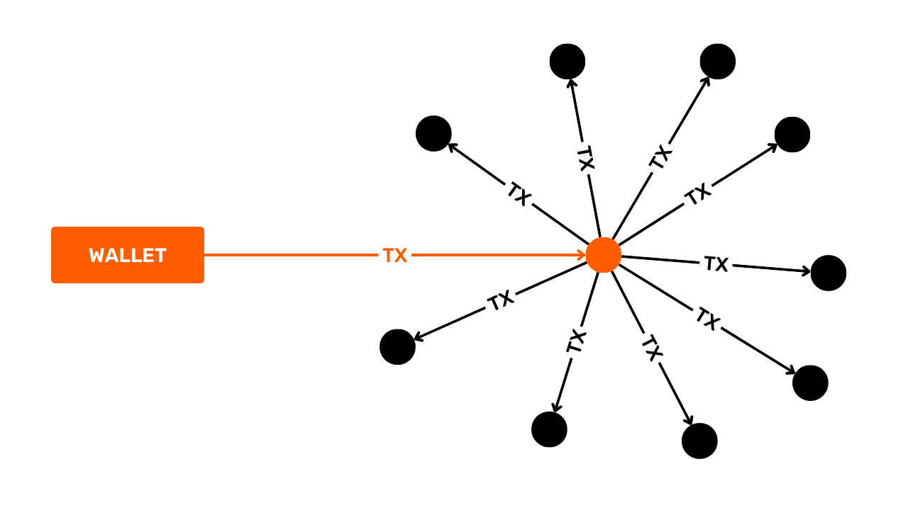

Эти узлы затем проверяют транзакцию, чтобы убедиться, что она соответствует правилам консенсуса и локальным стандартам. После проверки каждый узел, в свою очередь, передает транзакцию своим узлам, и так далее.

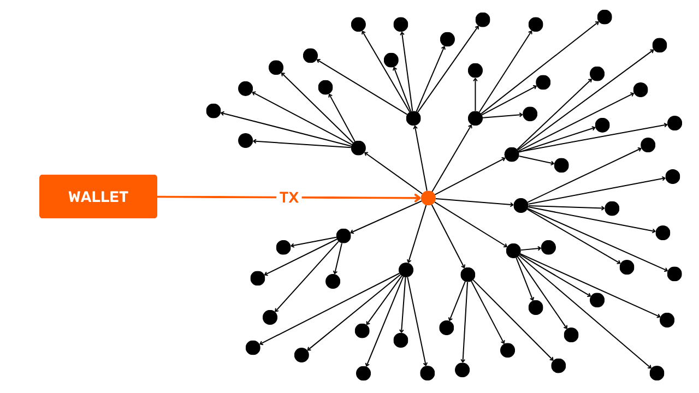

Распределение транзакций, ожидающих интеграции в блок, происходит довольно сбалансированно и статистически предсказуемо. Эту уязвимость могут использовать сговорившиеся шпионские узлы, которые сотрудничают для мониторинга и анализа сети, чтобы идентифицировать первый узел, транслировавший транзакцию. Если наблюдатель удается локализовать исходный узел, он может предположить, что транзакция исходит от оператора этого узла. Такой тип наблюдения может связать транзакции, обычно анонимные, с конкретными IP-адресами.

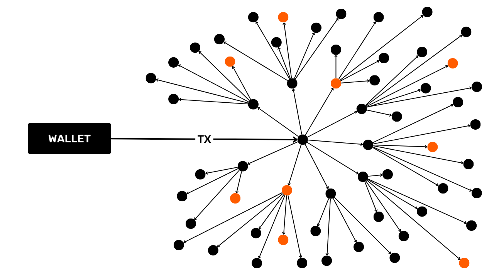

Цель BIP156 - решить эту проблему. Для этого он вводит дополнительную фазу в трансляцию новой транзакции для сохранения анонимности перед широким общественным распространением. Dandelion сначала использует фазу "стебля", где транзакция отправляется через случайный путь узлов.

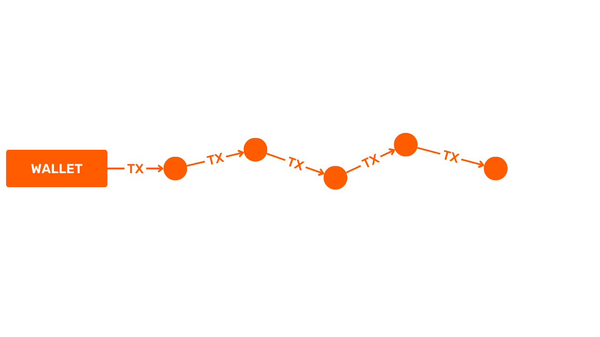

Затем транзакция транслируется во всю сеть в фазе "пуха".

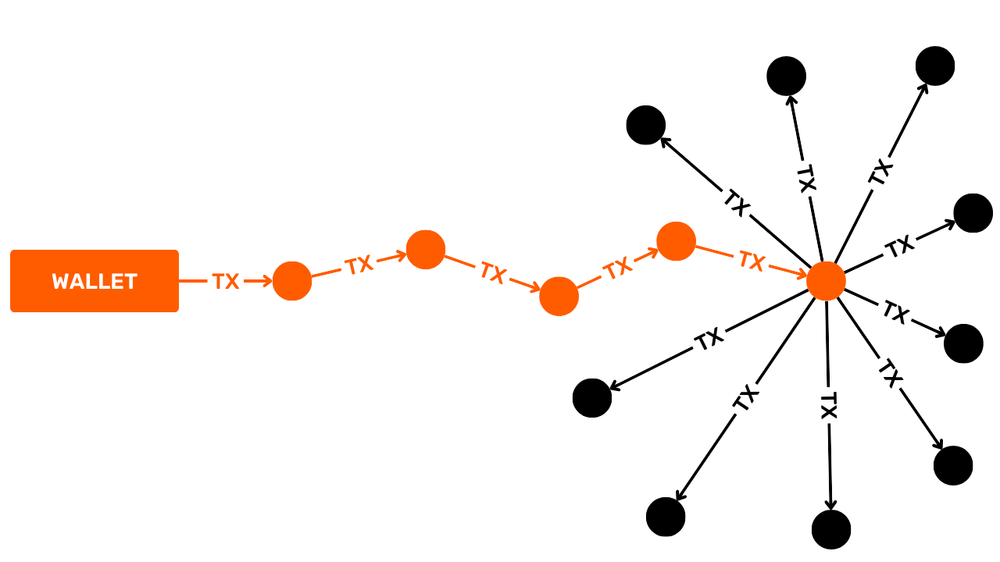

Стебель и пух - это ссылки на поведение распространения транзакции через сеть, напоминающее форму одуванчика.

Таким образом, шпионские узлы потенциально могут проследить транзакцию до узла, который начал фазу пуха (массовую трансляцию), но этот узел не является тем, который впервые транслировал транзакцию, поскольку он получил ее от последнего узла в стебле. Если шпионским узлам не удается проследить путь вверх по стеблю, они также не могут идентифицировать исходный узел.

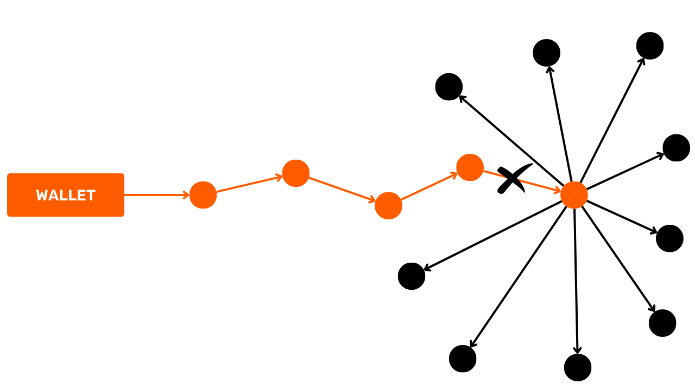

Даже в присутствии шпионских узлов во время фазы стебля, сомнения всегда остаются, поскольку как только они сталкиваются с честным узлом в графе диффузии, шпионы не могут определить, является ли этот узел исходным источником или просто посредником.

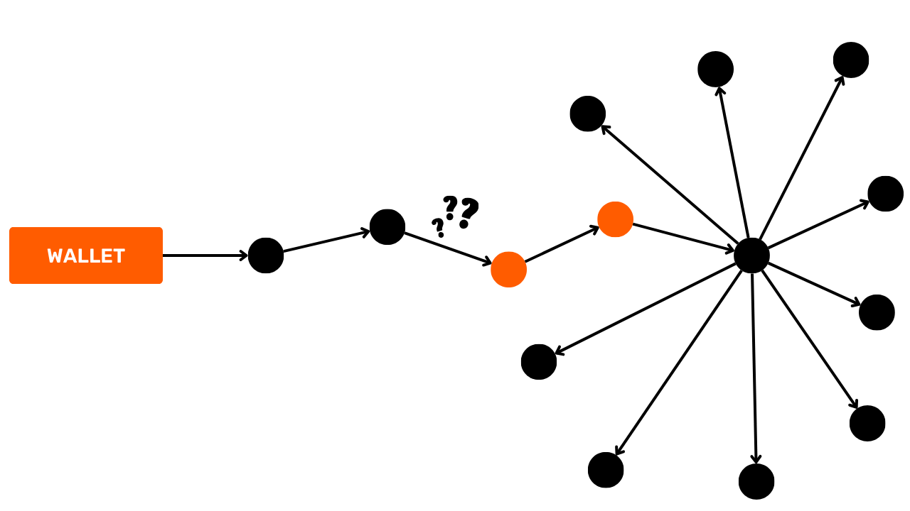

Этот метод маршрутизации затрудняет отслеживание пути к исходному узлу, делая трудным прослеживание транзакции через сеть обратно к ее источнику. Таким образом, Dandelion улучшает конфиденциальность, ограничивая способность противников деанонимизировать сеть. Этот метод становится еще более эффективным, когда транзакция во время фазы "стебля" пересекает узел, который шифрует свои сетевые коммуникации, как в случае с Tor или P2P Transport V2.

BIP156 не был интегрирован в Bitcoin Core и в настоящее время классифицируется как "отклоненный". Одна из основных проблем этого протокола заключается в том, что во время фазы стебля транзакции должны передаваться посредническими узлами до их проверки. Как мы видели, в обычной модели Биткойн каждый узел сначала проверяет транзакцию, прежде чем транслировать ее своим пирам. Если транзакция не соответствует правилам консенсуса или локальным правилам стандартизации узла, он игнорирует ее и не транслирует. Этот процесс важен для противодействия атакам DoS, поскольку во всю сеть транслируются только действительные транзакции. Недействительные транзакции, потенциально создаваемые массово для перегрузки сети, останавливаются на первом встреченном узле и не распространяются. Основной риск с Dandelion заключается в том, что этот новый протокол может ввести новые векторы для атак DoS, позволяя транслировать недействительные транзакции через часть сети.

### P2P Transport V2

P2P Transport V2 — это другой сетевой протокол, представленный в BIP324. Это новая версия протокола транспортировки Биткойн P2P, которая включает в себя оппортунистическое шифрование для улучшения конфиденциальности и безопасности коммуникаций между узлами.

Это улучшение направлено на решение нескольких проблем с базовой версией протокола P2P. С одной стороны, оно делает обмен данными неотличимым от других типов данных, циркулирующих в Интернете для пассивного наблюдателя. Основная цель — предотвратить массовый мониторинг пользователей Биткойн со стороны правительств, интернет-провайдеров или провайдеров VPN. Это также усложняет задачу для подобных агентов определить, является ли пользователь Интернета также пользователем Биткойн, то есть, эксплуатирует ли он полнофункциональный узел.
P2P V2 также способствует снижению рисков цензуры и атак за счет обнаружения специфических паттернов в пакетах данных. Это усложняет и делает выполнение различных типов атак Sybil более затратными на уровне сети. Атака Sybil происходит, когда кто-либо создает множество ложных идентичностей для получения несправедливого преимущества. В контексте сети Биткойн это часто проявляется как пользователь, контролирующий большое количество полнофункциональных узлов и агрессивно использующий их для увеличения числа соединений. Атаки Sybil могут быть пассивными, направленными на сбор информации и нарушение конфиденциальности пользователя, или активными, в форме атак Eclipse. Последние изолируют определенный узел от остальной сети, позволяя либо цензурировать пользователя, либо изменять данные, которые он получает. Наконец, P2P V2 также делает атаки *Man-In-The-Middle* (MITM) более затратными и легче обнаруживаемыми.
Шифрование, реализованное в P2P V2, не включает аутентификацию, чтобы не добавлять ненужную сложность и не нарушать не требующую доверия природу сетевого подключения. Тем не менее, этот новый протокол транспортировки P2P обеспечивает лучшую защиту от пассивных атак и делает активные атаки значительно более затратными и обнаруживаемыми. Введение псевдослучайного потока данных в сетевые сообщения усложняет задачу для атакующих, желающих цензурировать или манипулировать коммуникациями.

Транспорт P2P V2 был включен как опция (по умолчанию отключена) в версии 26.0 Bitcoin Core, развернутой в декабре 2023 года. Затем он был включен по умолчанию в версии 27.0 в апреле 2024 года. Его можно изменить с помощью опции `v2transport=` в файле конфигурации.

### Tor

Другим относительно простым решением для избежания рисков потери конфиденциальности для узла на уровне сети является его полная работа под управлением Tor.
Tor - это сеть ретрансляционных серверов (узлов), которая анонимизирует происхождение TCP-соединений в интернете. Она работает, инкапсулируя данные в несколько слоев шифрования. Каждый ретрансляционный узел удаляет слой, чтобы раскрыть адрес следующего узла, до достижения конечного пункта назначения. Сеть Tor обеспечивает анонимность, не позволяя промежуточным узлам знать как происхождение, так и пункт назначения данных, что делает очень сложным для наблюдателя отслеживание активности пользователя.


Таким образом, Tor не только шифрует передаваемые данные, но и позволяет скрывать происхождение и пункт назначения коммуникаций. Используя Tor для коммуникаций личного узла, мы повышаем конфиденциальность наших транзакций: провайдер интернет-услуг (ISP) не может расшифровать коммуникации, а другие узлы в сети Биткойн не могут идентифицировать IP-адрес исходного узла. Более того, Tor также скрывает ваше использование Биткойн от вашего ISP.

Основным риском, связанным с этим методом, является то, что Tor является протоколом, независимым от Биткойн. Если у вас есть узел Биткойн под Tor и Tor перестает работать, то ваш узел Биткойн больше не сможет коммуницировать.

Также важно отметить, что коммуникации через Tor происходят медленнее. Эта задержка особенно заметна во время первоначального запуска узла, поскольку начальная загрузка блоков (IBD) требует множества коммуникаций. В результате ваша первоначальная синхронизация с сетью Биткойн может занять значительно больше времени при использовании Tor. Также возможно выполнить IBD в открытой сети, а затем активировать Tor позже. Хотя этот метод раскрывает существование вашего узла Биткойн вашему ISP, он защищает информацию, связанную с вашими личными транзакциями, после перехода на Tor.

После изучения различных методов обеспечения конфиденциальности на уровне сети, я также хочу представить в следующих главах два элегантных решения для избежания повторного использования адресов: BIP47 и Silent Payments.

## BIP47 и Повторно используемые платежные коды
<chapterId>ad88e076-a04b-4aec-b3b2-7b4760175504</chapterId>

Как мы видели в части 3, повторное использование адресов представляет серьезное препятствие для конфиденциальности пользователя в протоколе Биткойн. Чтобы снизить эти риски, настоятельно рекомендуется генерировать новый адрес в кошельке для получения каждого нового платежа. Хотя генерация нового адреса сегодня упрощена благодаря использованию современного программного обеспечения и иерархически детерминированных кошельков, эта практика может показаться контринтуитивной.


Например, в традиционной банковской системе мы привыкли делиться нашим IBAN, который всегда остается неизменным. Однажды сообщив его кому-то, они могут отправлять нам несколько платежей, не взаимодействуя с нами снова. Нео-банки также предлагают более современные возможности, такие как использование уникальных электронных адресов на PayPal или RevTags на Revolut. Даже за пределами финансовой сферы наши повседневные идентификаторы, такие как почтовый адрес, номер телефона и электронная почта, также являются уникальными и постоянными. Нам не нужно обновлять их при каждом новом взаимодействии.


Однако, работа Биткойн отличается: необходимо генерировать новый адрес для получения каждой входящей транзакции. Этот компромисс между удобством использования и конфиденциальностью восходит к самому началу Белой книги Биткойна. С публикации первой версии его документа в конце 2008 года, Сатоши Накамото уже предупреждал нас об этом риске:
**"*Как дополнительный брандмауэр, для каждой транзакции можно использовать новую пару ключей, чтобы они не были связаны с общим владельцем.*"**

Существует множество методов получения нескольких платежей на один идентификатор без повторного использования адреса. У каждого из них есть свои компромиссы и недостатки. Среди этих методов - BIP47, предложение, разработанное Жюстюсом Ранвье и опубликованное в 2015 году. Это предложение направлено на создание повторно используемых платежных кодов, которые позволяют осуществлять множество транзакций одному и тому же лицу, избегая повторного использования адреса. По сути, BIP47 стремится предложить платежную систему, интуитивно понятную как уникальный идентификатор, сохраняя при этом конфиденциальность транзакций.
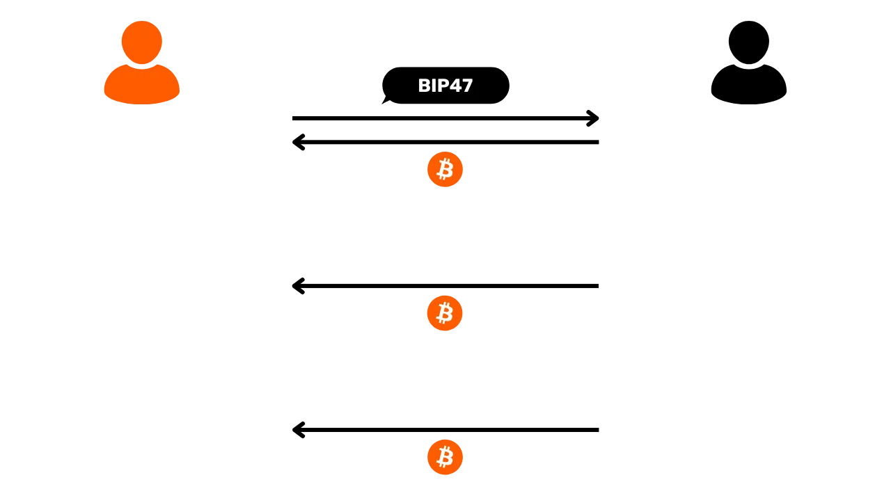

BIP47 напрямую не улучшает конфиденциальность пользователя, поскольку платеж по BIP47 предлагает тот же уровень конфиденциальности, что и классическая биткойн-транзакция с использованием новых адресов. Однако это делает использование биткойна более удобным и интуитивно понятным, удобство, которое, как правило, должно ставить под угрозу конфиденциальность. Благодаря BIP47, это удобство использования достигает того же уровня конфиденциальности, что и классическая транзакция. Вот почему BIP47 является ценным инструментом для сохранения конфиденциальности.

Изначально BIP47 был предложением, сформулированным для интеграции в Bitcoin Core, но оно так и не было принято. Некоторые программные продукты все же решили самостоятельно реализовать его на уровне приложения. Так, команды Samourai Wallet разработали собственную реализацию BIP47 под названием "PayNym".

### Общий принцип BIP47 и PayNym

Цель BIP47 - позволить получать множество платежей без повторного использования адреса. Он основан на использовании повторно используемого платежного кода, который позволяет разным отправителям отправлять множество платежей на один код, принадлежащий другому пользователю. Таким образом, получатель не должен предоставлять новый свежий адрес для каждой транзакции, что значительно облегчает их обмены, сохраняя при этом их конфиденциальность.

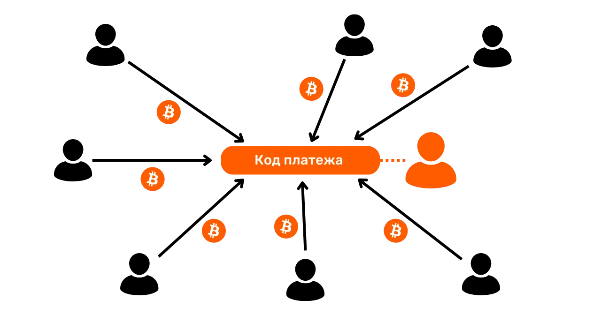

Пользователь может свободно делиться своим платежным кодом, будь то в социальных сетях или на своем веб-сайте, не рискуя потерять конфиденциальность, в отличие от того, что произошло бы с классическим адресом получения или публичным ключом.
Для проведения транзакции обе стороны должны иметь биткойн-кошелек с реализацией BIP47, таким как PayNym в Samourai Wallet или Sparrow Wallet. Совместное использование их платежных кодов создает секретный канал между ними. Для эффективного установления этого канала отправитель должен выполнить специфическую транзакцию в блокчейне биткойна, известную как "уведомительная транзакция" (я расскажу вам об этом подробнее позже).

Комбинация платежных кодов обоих пользователей генерирует общие секреты, которые, в свою очередь, позволяют создавать большое количество уникальных биткойн-адресов для получения (точно 2^32, или около 4 миллиардов). Таким образом, платежи, совершаемые через BIP47, на самом деле не адресованы самому платежному коду, а классическим адресам получения, производным от платежных кодов участвующих пользователей.

Таким образом, платежный код служит виртуальным идентификатором, производным от сид фразы кошелька. В иерархической структуре производных кошелька платежный код расположен на уровне 3, то есть на уровне аккаунта.

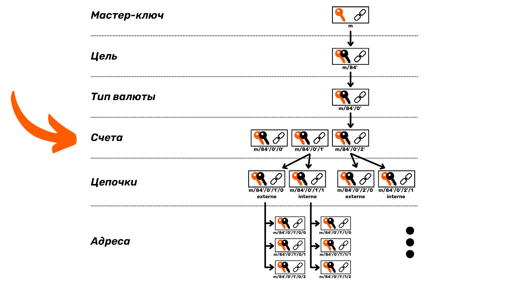

Цель производства для BIP47 определяется индексом `47'` (`0x8000002F`), относящимся к BIP47. Пример пути производства для повторно используемого платежного кода будет следующим:
```plaintext
m/47'/0'/0'/
```

Чтобы дать вам представление о том, как выглядит платежный код, вот мой:
```plaintext
PM8TJSBiQmNQDwTogMAbyqJe2PE2kQXjtgh88MRTxsrnHC8zpEtJ8j7Aj628oUFk8X6P5rJ7P5qDudE4Hwq9JXSRzGcZJbdJAjM9oVQ1UKU5j2nr7VR5
```
Этот код также может быть закодирован в QR-код, чтобы облегчить его передачу, так же как и классический адрес получения.

Что касается PayNym Bots, эти роботы, которых иногда можно увидеть в Twitter, являются визуальными представлениями платежного кода, созданные кошельком Samourai. Они генерируются с помощью хеш-функции, что придает им почти уникальность. Они появляются в виде небольшой строки символов, начинающейся с `+`:
```plaintext
+throbbingpond8B1
+twilightresonance487
+billowingfire340
```

Эти аватары также могут быть представлены в виде изображений:


Хотя эти роботы не имеют конкретной технической функциональности в рамках BIP47, они играют роль в облегчении взаимодействия между пользователями, предлагая легко узнаваемую визуальную идентичность.
В следующих разделах этой главы, посвященной BIP47, мы подробно рассмотрим, как это работает, с особым акцентом на используемые криптографические методы. Чтобы полностью понять эти несколько технические объяснения, важно сначала понять структуру HD кошельков, процессы производства ключей и основные принципы криптографии на основе эллиптических кривых. Если вы хотите глубже изучить эти концепции, другой бесплатный курс доступен на PlanB Network: [CRYPTO 301](https://planb.network/en/courses/crypto301). Я все же советую вам пройти их, так как понимание технической работы BIP47 значительно облегчит вам понимание других подобных предложений, которые мы обсудим в следующих главах.

### Повторно используемый платежный код

Как упоминалось ранее, повторно используемый платежный код находится на глубине 3 HD кошелька, что делает его сопоставимым с `xpub`, как по его положению в структуре кошелька, так и по его роли.

80-байтовый платежный код разбивается следующим образом:

- **Байт `0`: Версия**. Для первой версии BIP47 этот байт установлен в `0x01`;
- **Байт `1`: Битовое поле**. Это пространство зарезервировано для интеграции дополнительных указаний при конкретных использованиях. Для стандартного использования с PayNym этот байт определен как `0x00`;
- **Байт `2`: Четность `y`**. Этот байт `0x02` или `0x03`, указывающий, четное или нечетное ординатное значение публичного ключа, так как используется сжатый публичный ключ;
- **С байта `3` до байта `34`: Значение `x`**. Эти байты представляют абсциссу публичного ключа. Конкатенация `x` и четности `y` формирует полный сжатый публичный ключ;
- **С байта `35` до байта `66`: Код цепи**. Это пространство содержит код цепи, связанный с публичным ключом;
- **С байта `67` до байта `79`: Заполнение**. Это пространство предназначено для возможных будущих разработок. Для текущей версии здесь просто размещаются нули, чтобы достичь требуемого размера в 80 байт для вывода `OP_RETURN`.

Вот шестнадцатеричное представление моего повторно используемого платежного кода, уже представленного в предыдущем разделе:
```plaintext
0x010002a0716529bae6b36c5c9aa518a52f9c828b46ad8d907747f0d09dcd4d9a39e97c3c5f37c470c390d842f364086362f6122f412e2b0c7e7fc6e32287e364a7a36a00000000000000000000000000
```

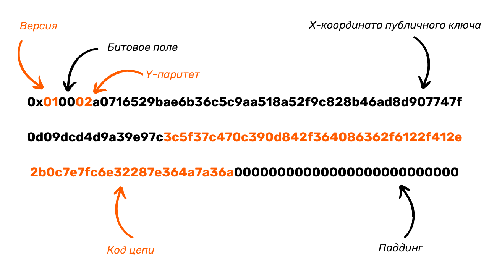

Во-первых, необходимо добавить префиксный байт `P` в начале, чтобы четко указать, что это код платежа. Этот байт представлен как `0x47`:
```plaintext
0x47010002a0716529bae6b36c5c9aa518a52f9c828b46ad8d907747f0d09dcd4d9a39e97c3c5f37c470c390d842f364086362f6122f412e2b0c7e7fc6e32287e364a7a36a00000000000000000000000000
```

Наконец, чтобы обеспечить целостность кода платежа, выполняется расчет контрольной суммы с использованием `HASH256`, который состоит из двойного хеширования функцией `SHA256`. Первые четыре байта, полученные в результате этого хеширования, затем конкатенируются в конец кода платежа:
```plaintext
0x47010002a0716529bae6b36c5c9aa518a52f9c828b46ad8d907747f0d09dcd4d9a39e97c3c5f37c470c390d842f364086362f6122f412e2b0c7e7fc6e32287e364a7a36a00000000000000000000000000567080c4
```

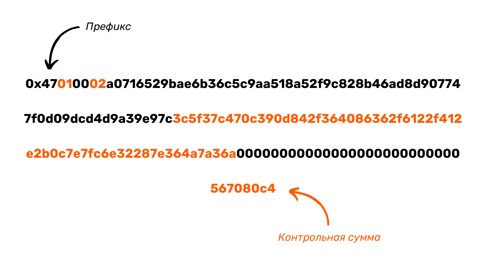

После завершения этих шагов код платежа готов. Остается только преобразовать его в base 58, чтобы получить его окончательную версию:
```plaintext
PM8TJSBiQmNQDwTogMAbyqJe2PE2kQXjtgh88MRTxsrnHC8zpEtJ8j7Aj628oUFk8X6P5rJ7P5qDudE4Hwq9JXSRzGcZJbdJAjM9oVQ1UKU5j2nr7VR5
```

В процессе создания этого кода платежа мы используем сжатый открытый ключ и код цепи. Оба они получены из детерминированной и иерархической производной от сид фразы кошелька. Путь производной, используемый для достижения этого, это:
```plaintext
m/47'/0'/0'/
```
Для генерации сжатого открытого ключа и связанного с ним кода цепи для повторно используемого кода платежа мы начинаем с расчета мастер-приватного ключа из сид фразы кошелька. Затем мы переходим к производной пары дочерних ключей, используя индекс `$47 + 2^31$` (усиленная производная). Этот шаг следует за двумя последовательными производными дочерних пар, каждая из которых использует индекс `$2^31$` (усиленная производная).

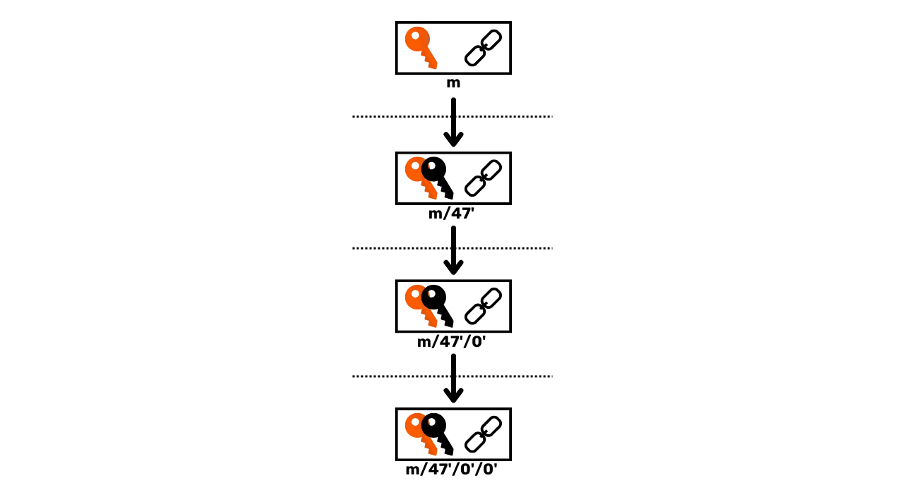

### Обмен ключами Эллиптической кривой Диффи-Хеллмана (ECDH)

Криптографический протокол, лежащий в основе BIP47, обозначается аббревиатурой ECDH, что расшифровывается как *Эллиптическая кривая Диффи-Хеллмана* (*Elliptic-Curve Diffie-Hellman*). Этот метод является вариантом оригинального обмена ключами Диффи-Хеллмана.

Введенный в 1976 году, Диффи-Хеллман представляет собой протокол согласования ключей, который позволяет двум сторонам, каждая из которых обладает парой ключей (публичным и приватным), договориться об общем секрете, даже общаясь исключительно по открытому и незащищенному каналу.

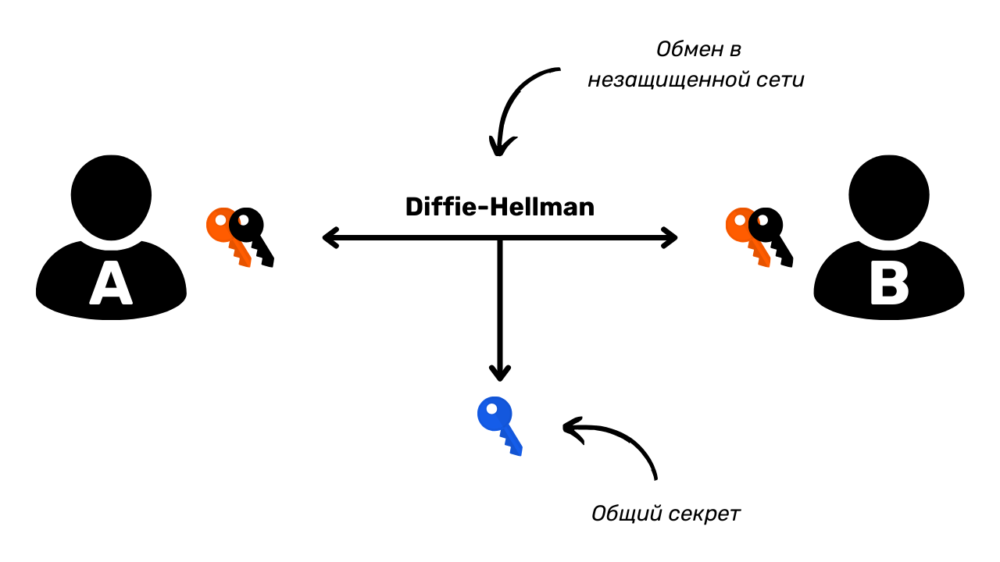

Этот общий секрет (здесь, синий ключ) может затем использоваться для других операций. Обычно этот общий секрет может использоваться для шифрования и расшифровки коммуникации по незащищенной сети:

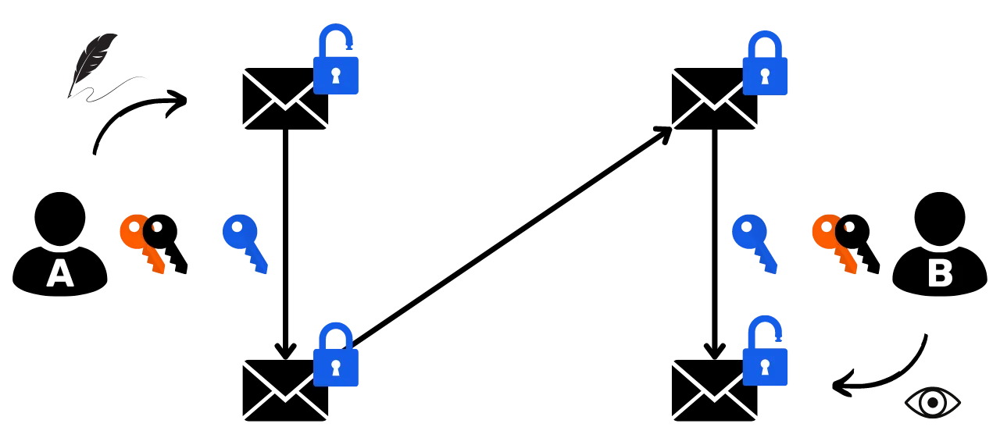

Для достижения этого обмена Диффи-Хеллман использует модульную арифметику для вычисления общего секрета. Вот упрощенное объяснение того, как это работает:

- Алиса и Боб договариваются об общем цвете, в данном примере желтом, который является публичными данными (атакующие знают этот цвет);
- Алиса выбирает секретный цвет, в данном случае красный, и смешивает два цвета, чтобы получить оранжевый;
- Боб также выбирает секретный цвет, в данном случае синий, и смешивает его с желтым, чтобы получить зеленый;
- Затем они обмениваются полученными цветами, оранжевым и зеленым. Этот обмен может происходить по незащищенной и наблюдаемой сети;
- Смешивая зеленый цвет Боба со своим секретным цветом, Алиса получает коричневый;
- Боб, делая то же самое с оранжевым Алисы и его секретным синим, также получает коричневый.

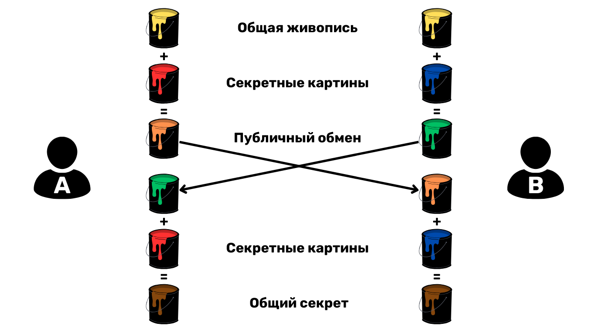

В этом упрощении коричневый цвет представляет собой общий секрет между Алисой и Бобом. Важно понимать, что на самом деле невозможно разделить оранжевый и зеленый цвета, чтобы обнаружить секретные цвета Алисы или Боба.

Теперь давайте рассмотрим, как на самом деле работает этот протокол, не с помощью аналогий с цветами, а используя реальные числа и модульную арифметику!
Прежде чем обсуждать механизмы Диффи-Хеллмана, позвольте мне кратко напомнить вам о двух важных математических понятиях, которые нам понадобятся:

- **Простое число** - это натуральное число, которое имеет только два делителя: $1$ и само себя. Например, $7$ является простым числом, потому что его можно разделить только на $1$ и $7$. С другой стороны, $8$ не является простым числом, поскольку его можно разделить на $1$, $2$, $4$ и $8$. Следовательно, у него четыре положительных целочисленных делителя вместо двух;
- **Модуль** (обозначается $mod$ или $\%$) - это математическая операция, которая между двумя целыми числами возвращает остаток от Евклидова деления первого на второе. Например, $16 \bmod 5 = 1$.

**Обмен ключами Диффи-Хеллмана между Алисой и Бобом происходит следующим образом:**

- Алиса и Боб договариваются о двух общих числах: $p$ и $g$. $p$ - простое число, и чем больше это число, тем более безопасным будет Диффи-Хеллман. $g$ является первообразным корнем $p$. Эти два числа могут быть открыто переданы по незащищенной сети. Они представляют эквивалент **желтого цвета** в предыдущем упрощении. Поэтому важно, чтобы Алиса и Боб использовали точно такие же значения для $p$ и $g$.
- Как только эти параметры определены, Алиса и Боб каждый выбирает секретное случайное число. Алиса называет свое секретное случайное число $a$ (эквивалентно **красному цвету**) и Боб называет свое $b$ (эквивалентно **синему цвету**). Эти числа должны оставаться строго конфиденциальными.
- Вместо прямого обмена числами $a$ и $b$, каждая сторона вычисляет $A$ и $B$ следующим образом:

$A$ равно $g$ в степени $a$ по модулю $p$:

$$
A = g^a \bmod p
$$

$B$ равно $g$ в степени $b$ по модулю $p$:

$$
B = g^b \bmod p
$$

- Значения $A$ (эквивалентно **оранжевому цвету**) и $B$ (эквивалентно **зеленому цвету**) обмениваются между двумя сторонами. Этот обмен может происходить открыто через незащищенную сеть;

- Алиса, получив $B$, вычисляет значение $z$ следующим образом:

$z$ равно $B$ в степени $a$ по модулю $p$:

$$
z = B^a \bmod p
$$

Напомним:

$$
B = g^b \bmod p
$$

Таким образом, мы получаем:

$$
z = B^a \bmod p
$$

$$
z = (g^b)^a \bmod p
$$

Применяя правила степеней:

$$
(x^n)^m = x^{nm}
$$

Тогда получаем:

$$
z = g^{ba} \bmod p
$$

- Со своей стороны, Боб, получив $A$, также вычисляет значение $z$ следующим образом:

$z$ равно $A$ в степени $b$ по модулю $p$:

$$
z = A^b \bmod p
$$

Таким образом, мы получаем:

$$
z = (g^a)^b \bmod p
$$

$$
z = g^{ab} \bmod p
$$

$$
z = g^{ba} \bmod p
$$

Благодаря дистрибутивности оператора модуля, Алиса и Боб получают точно такое же значение $z$. Это число представляет их общий секрет, эквивалентный **коричневому цвету** в предыдущем упрощении с красками. Теперь они могут использовать этот общий секрет для симметричного шифрования своих коммуникаций через незащищенную сеть.

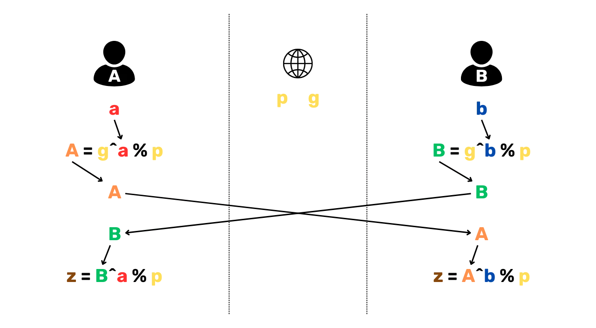

Атакующий, даже владея $p$, $g$, $A$ и $B$ (публичными значениями), не сможет вычислить $a$, $b$ или $z$ (приватные значения). Для этого потребовалось бы обратить операцию возведения в степень, что невозможно без попытки всех возможностей по одной, поскольку это равносильно вычислению дискретного логарифма, то есть обратной экспоненциальной функции в конечной циклической группе.

Таким образом, пока значения $a$, $b$ и $p$ достаточно велики, протокол Диффи-Хеллмана является безопасным. Как правило, с 2048-битными параметрами (число с 600 цифрами в десятичной системе), проверка всех возможностей для $a$ и $b$ была бы непрактичной. На сегодняшний день с такими числами этот алгоритм считается безопасным.

Именно здесь и кроется основной недостаток протокола Диффи-Хеллмана. Для обеспечения безопасности алгоритм должен использовать большие числа. Вот почему в настоящее время предпочтение отдаётся алгоритму ECDH (*Elliptic Curve Diffie-Hellman*), варианту Диффи-Хеллмана, который основывается на алгебраической кривой, более точно на эллиптической кривой. Этот подход позволяет работать с гораздо меньшими числами, сохраняя при этом эквивалентный уровень безопасности, тем самым сокращая необходимые ресурсы для вычислений и хранения.

Общий принцип алгоритма остаётся прежним. Однако, вместо использования случайного числа $a$ и числа $A$, вычисленного из $a$ с помощью модульного возведения в степень, мы используем пару ключей, установленных на эллиптической кривой. Вместо применения распределительного свойств оператора модуля, мы используем групповой закон на эллиптических кривых, и более конкретно ассоциативность этого закона.

Чтобы кратко объяснить принцип криптографии на эллиптических кривых, приватный ключ представляет собой случайное число между $1$ и $n-1$, где $n$ представляет порядок кривой. С другой стороны, публичный ключ - это конкретная точка на этой кривой, полученная из приватного ключа через операции сложения точек и удвоения, начиная с генераторной точки, согласно уравнению:

$$
K = k \cdot G
$$

В этой формуле $K$ обозначает публичный ключ, $k$ - приватный ключ, а $G$ - генераторную точку.

Одной из существенных характеристик этих ключей является лёгкость вычисления $K$ из $k$ и $G$, в то время как практически невозможно найти $k$ из $K$ и $G$. Эта асимметрия создаёт одностороннюю функцию. Другими словами, легко вычислить публичный ключ, если известен приватный ключ, но найти приватный ключ из публичного невозможно. Эта безопасность всё ещё основана на вычислительной сложности дискретного логарифма.

Мы будем использовать это свойство для адаптации нашего алгоритма Диффи-Хеллмана. 

**Принцип работы ECDH следующий:**

- Алиса и Боб договариваются вместе о криптографически безопасной эллиптической кривой и её параметрах. Эта информация является публичной;

- Алиса генерирует случайное число $k_a$, которое будет её приватным ключом. Этот приватный ключ она должна держать в секрете. Она определяет свой публичный ключ $K_a$ путём сложения и удвоения точек на выбранной эллиптической кривой:

$$
K_a = k_a \cdot G
$$

- Боб также генерирует случайное число $k_b$, которое будет его приватным ключом. Он вычисляет ассоциированный публичный ключ $K_b$:

$$
K_b = k_b \cdot G
$$

- Алиса и Боб обмениваются своими публичными ключами $K_a$ и $K_b$ через незащищённую публичную сеть.

- Алиса вычисляет точку $(x,y)$ на кривой, применяя свой приватный ключ $k_a$ к публичному ключу Боба $K_b$:

$$
(x,y) = k_a \cdot K_b
$$

- Боб вычисляет точку $(x,y)$ на кривой, применяя свой приватный ключ $k_b$ к публичному ключу Алисы $K_a$:

$$
(x,y) = k_b \cdot K_a
$$

- Алиса и Боб получают одну и ту же точку на эллиптической кривой. Общим секретом будет x-координата $x$ этой точки.

Действительно, они получают один и тот же общий секрет, потому что:

$$
(x,y) = k_a \cdot K_b = k_a \cdot (k_b \cdot G) = (k_a \cdot k_b) \cdot G = (k_b \cdot k_a) \cdot G = k_b \cdot (k_a \cdot G) = k_b \cdot K_a$$

Наблюдатель, просматривающий незащищенную публичную сеть, может получить только публичные ключи каждой из сторон и параметры выбранной эллиптической кривой. Как было объяснено ранее, эта информация сама по себе недостаточна для определения приватных ключей. Следовательно, атакующий не может найти общий секрет между Алисой и Бобом.

Таким образом, ECDH является алгоритмом, позволяющим обмен ключами. Он часто используется в сочетании с другими криптографическими методами для создания полного протокола. Например, ECDH интегрирован в ядро TLS (*Transport Layer Security*), протокола шифрования и аутентификации, используемого для транспортного слоя интернета. TLS использует ECDHE для обмена ключами, вариант ECDH, где ключи являются эфемерными, для обеспечения постоянной конфиденциальности. Кроме того, TLS использует алгоритмы аутентификации, такие как ECDSA, алгоритмы шифрования, такие как AES, и хеш-функции, такие как SHA256.

TLS отвечает за наличие `s` в `https`, а также за замочек, видимый в адресной строке вашего браузера, символы зашифрованных коммуникаций. Следуя этому курсу, вы, таким образом, используете ECDH, и очень вероятно, что вы используете его ежедневно, даже не зная об этом.

### Транзакция уведомления

Как мы видели в предыдущем разделе, ECDH является вариантом обмена Диффи-Хеллмана, использующим пары ключей, установленные на эллиптической кривой. Удобно, что у нас уже есть множество пар ключей, соответствующих этому стандарту, в наших Биткойн-кошельках! Идея BIP47 заключается в использовании пар ключей из детерминированных иерархических кошельков Биткойна обеих сторон для установления общих и эфемерных секретов между ними. В контексте BIP47 вместо этого используется ECDHE (*Elliptic Curve Diffie-Hellman Ephemeral*, *Эллиптическая кривая Диффи-Хеллман Эфемерная*).

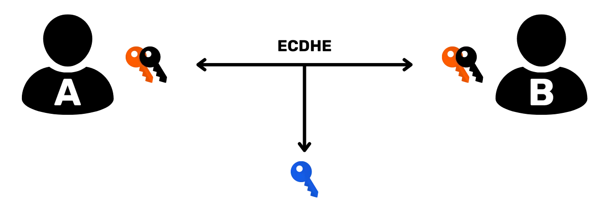

ECDHE используется впервые в BIP47 для передачи платежного кода от отправителя получателю. Это знаменитая **транзакция уведомления**. Этот шаг важен, потому что для эффективной работы BIP47 обе стороны, участвующие в процессе (отправитель и получатель), должны знать платежный код друг друга. Эта информация позволяет выводить эфемерные публичные ключи и, соответственно, связанные с ними пустые адреса для получения.
До этого обмена отправитель логически уже знает платежный код получателя, поскольку он получил его вне сети, например, с его веб-сайта, из счета-фактуры или из социальных сетей. Однако получатель может не знать платежного кода отправителя. Тем не менее, этот код должен быть им передан; в противном случае они не смогут выводить эфемерные ключи, необходимые для идентификации адресов, где хранятся их биткойны, и не смогут получить доступ к своим средствам. Хотя эту передачу кода отправителя технически можно осуществить вне сети через другие средства коммуникации, это создает проблему, если кошелек нужно восстановить только из сида.

Действительно, в отличие от обычных адресов, адреса BIP47 не получаются напрямую из сида получателя — использование `xpub` было бы проще в этом случае — но являются результатом вычисления, объединяющего оба платежных кода: отправителя и получателя. Таким образом, если получатель потеряет свой кошелек и попытается восстановить его из своего сида, он восстановит свой собственный платежный код, который напрямую производится из его сида. Однако, чтобы найти эфемерные адреса, будет существенно для него также иметь платежные коды всех, кто отправлял ему биткойны через BIP47. Отсюда важность уведомляющей транзакции, которая позволяет сохранять эту информацию в блокчейне Биткойна, при этом так, чтобы была возможность найти её легко без необходимости просматривать миллиарды транзакций, выполненных с его запуска в 2009 году.
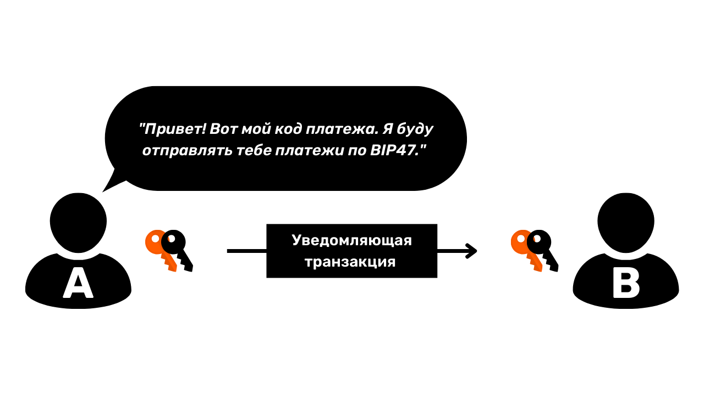

Следовательно, было бы возможно реализовать BIP47 без использования уведомляющей транзакции, при условии, что каждый пользователь сохраняет резервную копию платежных кодов своих коллег. Однако, этот метод оказывается сложным в управлении до тех пор, пока не будет разработано простое, надежное и эффективное решение для создания, хранения и обновления этих резервных копий. В текущем состоянии дел, уведомляющая транзакция становится почти незаменимой.

В следующих главах мы изучим другие протоколы с целями, аналогичными BIP47, но которые не требуют уведомляющей транзакции. Однако эти альтернативы вводят свои собственные компромиссы.

Помимо своей роли в резервном копировании платежных кодов, уведомляющая транзакция также выполняет функцию уведомления для получателя, как это подразумевается её названием. Она сигнализирует клиенту получателя о том, что был установлен новый платежный канал, и таким образом предлагает отслеживать результирующие эфемерные адреса.

### Модель конфиденциальности BIP47

Прежде чем подробно рассматривать техническую работу уведомляющей транзакции, важно обсудить модель конфиденциальности, связанную с BIP47, которая оправдывает определенные меры, принятые во время создания этой первоначальной транзакции.
Платежный код сам по себе не представляет прямой угрозы для конфиденциальности. В отличие от традиционной модели Биткойн, которая стремится разорвать связь между личностью пользователя и его транзакциями (которые являются публичными), сохраняя анонимность ключей и адресов, платежный код может быть открыто связан с личностью без угрозы.
Действительно, платежный код не используется для прямого получения адресов, принимающих платежи BIP47. Эти адреса вместо этого генерируются через применение ECDH между производными ключами платежных кодов двух участвующих сторон.

Таким образом, сам по себе платежный код не приводит напрямую к потере конфиденциальности, поскольку только уведомляющий адрес производится из него. Хотя этот адрес может раскрыть некоторую информацию, обычно он не позволяет узнать стороны, с которыми вы проводите транзакции, если только не провести тщательный анализ цепочки. Действительно, если отправитель использует UTXOs, которые могут быть связаны с их личностью, для выполнения уведомляющей транзакции, тогда становится возможным сделать вывод, что его личность, вероятно, связана с платежами BIP47 на ваш платежный код. Это не раскроет лежащие в основе транзакции, но укажет на их вероятное существование.

Поэтому необходимо поддерживать строгую разграниченность между платежными кодами пользователей. Для достижения этой цели, первоначальный этап коммуникации кода является критическим моментом для конфиденциальности платежа и обязательным для правильной работы протокола. Если один из платежных кодов может быть получен публично (например, на веб-сайте), второй код, тот, что принадлежит отправителю, в любом случае должен быть не связан с первым.

Давайте рассмотрим конкретный пример: я хочу сделать пожертвование политическому движению через BIP47:

- Организация сделала свой платежный код публичным на своем веб-сайте или через свои социальные сети;
- Этот код таким образом связан с политическим движением;
- Я получаю этот платежный код;
- Прежде чем приступить к отправке, я должен убедиться, что они знают мой собственный платежный код, который также связан с моей личностью, поскольку я использую его для получения транзакций в моих социальных сетях.

Как передать мой код без риска? Использование традиционных средств связи может привести к утечке информации и, как следствие, связать меня с этим политическим движением. Транзакция уведомления предлагает решение благодаря слою шифрования, который точно предотвращает подобную связь между двумя кодами. Хотя это не единственный метод тайной передачи платежного кода отправителя, он оказывается очень эффективным.

На диаграмме ниже оранжевые линии указывают места, где поток информации должен быть прерван, а черные стрелки показывают связи, которые потенциально могут быть наблюдаемы третьей стороной:

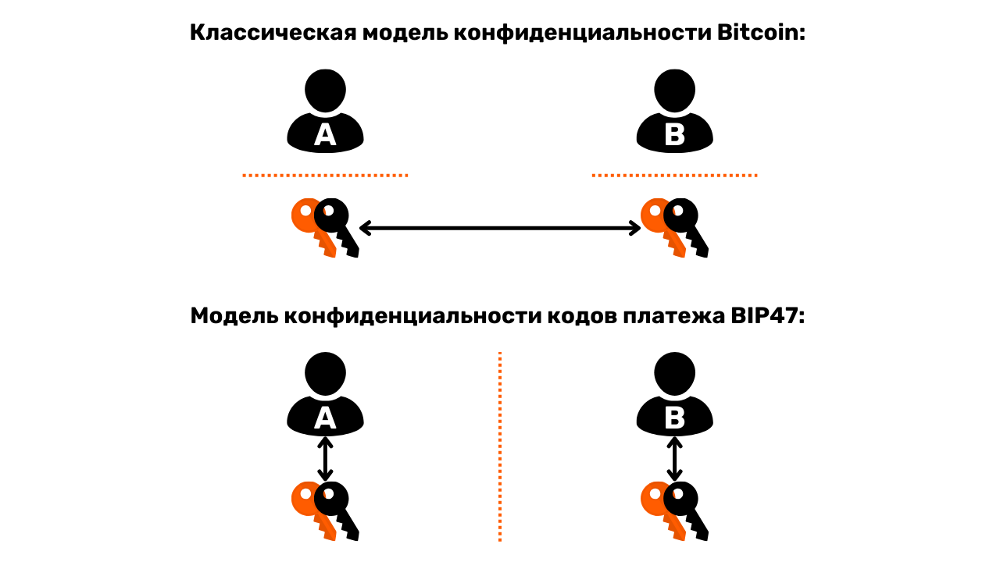

На самом деле, в рамках традиционной модели конфиденциальности Биткойн, часто сложно полностью разъединить поток информации между парой ключей и пользователем, особенно во время удаленных транзакций. Например, в контексте кампании по сбору пожертвований, получатель неизбежно должен раскрыть адрес или публичный ключ через свой вебсайт или социальные сети. Правильное использование BIP47, в частности с транзакцией уведомления, позволяет обойти эту проблему благодаря ECDHE и слою шифрования, который мы изучим далее.

Конечно, классическая модель конфиденциальности Биткойн все еще применяется к эфемерным публичным ключам, которые получаются из комбинации двух платежных кодов. На самом деле, две модели дополняют друг друга. Что я хочу здесь подчеркнуть, так это то, что в отличие от обычного использования публичного ключа для получения биткойнов, платежный код может быть связан с конкретной личностью, потому что информация "_Алиса совершает транзакцию с Бобом_" разрывается на другом этапе. Платежный код используется для генерации платежных адресов, но исключительно на основе наблюдения за блокчейном невозможно связать транзакцию платежа BIP47 с использованными для ее выполнения платежными кодами, если только UTXOs, задействованные в ней, не были уже связаны с личностью ранее и пользователи не ассоциировали свои платежные коды со своими личностями.

Подводя итог, можно сказать, что модель конфиденциальности, предлагаемая платежами BIP47, может считаться превосходящей базовую модель Биткойн, хотя и не является волшебством.

### Построение транзакции уведомления

Теперь давайте посмотрим, как работает эта транзакция уведомления. Представьте, что Алиса хочет отправить средства Бобу с помощью BIP47. В моем примере Алиса выступает в роли отправителя, а Боб - в роли получателя. Последний опубликовал свой платежный код на своем вебсайте. Следовательно, Алиса уже знает платежный код Боба.

**1- Алиса вычисляет общий секрет с ECDH:**

- Она выбирает пару ключей из своего HD-кошелька, расположенного на другой ветви от ее платежного кода. Обратите внимание, эта пара не должна быть легко ассоциирована с адресом уведомления Алисы, ни с личностью Алисы (см. предыдущий раздел);

- Алиса выбирает приватный ключ из этой пары. Мы называем его $a$ (строчная буква);

$$
a
$$

- Алиса извлекает публичный ключ, ассоциированный с адресом уведомления Боба. Этот ключ является первым дочерним, производным от платежного кода Боба (индекс $0$). Мы называем этот публичный ключ $B$ (заглавная буква). Приватный ключ, ассоциированный с этим публичным ключом, называется $b$ (строчная буква). $B$ определяется путем сложения и удвоения точек на эллиптической кривой от $G$ (точка генератора) с $b$ (приватный ключ):
- 
$$ B = b \cdot G $$

- Алиса вычисляет секретную точку $S$ (заглавная буква) на эллиптической кривой путем сложения и удвоения точек, применяя свой приватный ключ $a$ к публичному ключу Боба $B$.
- 
$$ S = a \cdot B $$

- Алиса вычисляет коэффициент затемнения $f$, который позволит ей зашифровать свой платежный код. Для этого она определит псевдослучайное число с помощью функции HMAC-SHA512. В качестве второго входа для этой функции она использует значение, которое сможет извлечь только Боб: $x$, которое является абсциссой ранее вычисленной секретной точки. Первый вход - это $o$, что является UTXO, используемое на входе этой транзакции (outpoint).

$$ f = \text{HMAC-SHA512}(o, x) $$

**2- Алиса преобразует свой личный платежный код в двоичную систему (бинарный формат).**

**3- Она использует свой коэффициент затемнения в качестве ключа для выполнения симметричного шифрования полезной нагрузки своего платежного кода.** Используемый алгоритм шифрования - просто `XOR`. Выполненная операция сопоставима с шифром Вернама, также называемым "Одноразовый блокнот".

- Алиса сначала разделяет свой коэффициент затемнения на две части: первые 32 байта называются $f1$, а последние 32 байта - $f2$. Таким образом, у нас есть:

$$ f = f1 || f2 $$

- Алиса вычисляет зашифрованную $x'$ абсциссу публичного ключа $x$ своего платежного кода и зашифрованный $c'$ своего кода цепи $c$ отдельно. $f1$ и $f2$ действуют соответственно как ключи шифрования. Используемая операция - `XOR` (исключающее или).

$$ x' = x \oplus f1 $$

$$ c' = c \oplus f2 $$

- Алиса заменяет реальные значения абсциссы публичного ключа $x$ и кода цепи $c$ в своем платежном коде на зашифрованные значения $x'$ и $c'$.
- 
**4-** На данный момент у Алисы есть платежный код с зашифрованной полезной нагрузкой. Она будет создавать и транслировать транзакцию, включающую в себя ее публичный ключ $A$ в качестве входа, выход на уведомляющий адрес Боба и выход `OP_RETURN`, содержащий ее платежный код с зашифрованной полезной нагрузкой. **Эта транзакция является уведомляющей транзакцией**.
`OP_RETURN` - это операционный код, который помечает выход транзакции Биткойн как недействительный. Сегодня он используется для трансляции или закрепления информации на блокчейне Биткойн. Можно хранить до 80 байт данных, которые записываются в цепочку и таким образом видны всем другим пользователям.

Как мы видели в предыдущих разделах, ECDH используется для генерации общего секрета между двумя пользователями, общающимися через небезопасную сеть, потенциально наблюдаемую злоумышленниками. В BIP47 ECDH используется для коммуникации через сеть Биткойн, которая по своей природе является прозрачной коммуникационной сетью, наблюдаемой многими злоумышленниками. Общий секрет, вычисленный через обмен ключами ECDH, затем используется для шифрования секретной информации, которая будет передана: платежный код отправителя (Алисы).

Давайте повторим шаги, которые мы только что рассмотрели вместе, чтобы выполнить уведомляющую транзакцию:

- Алиса получает платежный код и уведомляющий адрес Боба;
- Алиса выбирает UTXO, которым она владеет в своем HD кошельке с соответствующей парой ключей;
- Она вычисляет секретную точку на эллиптической кривой с использованием ECDH;
- Она использует эту секретную точку для вычисления HMAC, который является коэффициентом затемнения;
- Она использует этот коэффициент затемнения для шифрования полезной нагрузки своего личного платежного кода;
- Она использует выход транзакции `OP_RETURN` для передачи маскированного платежного кода Бобу.
  
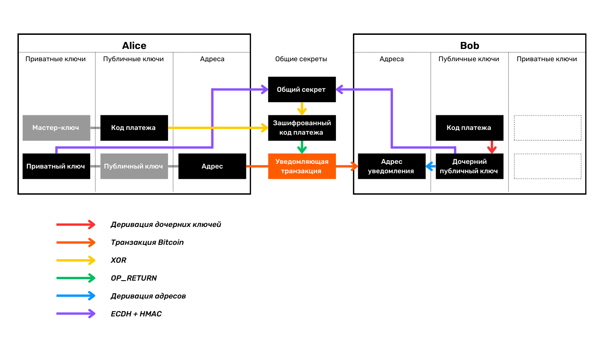

### Транзакция уведомления: Конкретное исследование

Чтобы лучше понять ее функционирование, особенно использование `OP_RETURN`, давайте рассмотрим реальную транзакцию уведомления вместе. Я выполнил такую транзакцию на тестнете, которую вы можете найти [нажав здесь](https://mempool.space/fr/testnet/tx/0e2e4695a3c49272ef631426a9fd2dae6ec3a469e3a39a3db51aa476cd09de2e).

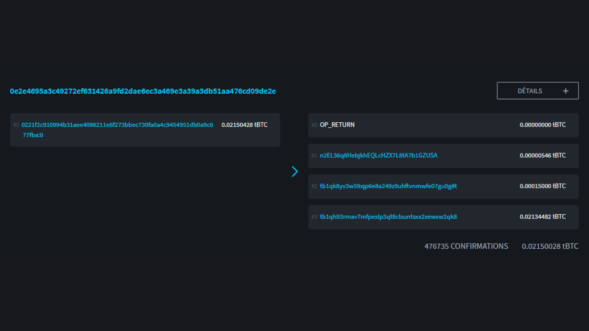

Наблюдая за этой транзакцией, мы видим, что она имеет один вход и 4 выхода:
- Первый выход - это `OP_RETURN`, содержащий мой маскированный платежный код;
- Второй выход в 546 сатоши указывает на адрес уведомления моего получателя;
- Третий выход в 15 000 сатоши представляет собой комиссию за услуги, так как я использовал Samourai Wallet для создания этой транзакции;
- Четвертый выход в 2 миллиона сатоши представляет собой сдачу, то есть оставшуюся разницу от моего входа, которая возвращается на другой адрес, принадлежащий мне.
Наиболее интересным для изучения, безусловно, является выход 0, использующий `OP_RETURN`. Давайте более внимательно посмотрим, что он содержит. Вот `scriptPubKey` в шестнадцатеричном формате:

```text
6a4c50010002b13b2911719409d704ecc69f74fa315a6cb20fdd6ee39bc9874667703d67b164927b0e88f89f3f8b963549eab2533b5d7ed481a3bea7e953b546b4e91b6f50d800000000000000000000000000
```

В этом скрипте мы можем разобрать несколько частей. Прежде всего, опкоды:

```text
6a4c
```

Среди опкодов мы можем распознать `0x6a`, который обозначает `OP_RETURN`, и `0x4c`, который обозначает `OP_PUSHDATA1`.

Байт, следующий за этим последним опкодом, указывает размер следующих за ним данных. Он указывает `0x50`, или 80 байт:

```text
6a4c50
```

Затем у нас есть метаданные моего платежного кода в открытом тексте:

```text
010002
```

Зашифрованная x-координата публичного ключа моего платежного кода:

```text
b13b2911719409d704ecc69f74fa315a6cb20fdd6ee39bc9874667703d67b164
```

Зашифрованный цепочечный код моего платежного кода:

```text
927b0e88f89f3f8b963549eab2533b5d7ed481a3bea7e953b546b4e91b6f50d8
```

И, наконец, заполнение до 80 байт, стандартного размера `OP_RETURN`:

```text
00000000000000000000000000
```

Чтобы лучше понять, вот мой платежный код в открытом тексте в базе 58:

PM8TJQCyt6ovbozreUCBrfKqmSVmTzJ5vjqse58LnBzKFFZTwny3KfCDdwTqAEYVasn11tTMPc2FJsFygFd3YzsHvwNXLEQNADgxeGnMK8Ugmin62TZU
```

И в 16-ричной системе:

```text
4701000277507c9c17a89cfca2d3af554745d6c2db0e7f6b2721a3941a504933103cc42add94881210d6e752a9abc8a9fa0070e85184993c4f643f1121dd807dd556d1dc000000000000000000000000008604e4db
```
При сравнении моего открытого платежного кода с `OP_RETURN`, заметно, что HRP (`0x47`) и контрольная сумма (`0x8604e4db`) не передаются. Это ожидаемо, так как эта информация предназначена для людей.
Далее, мы можем идентифицировать версию (`0x01`), битовое поле (`0x00`) и четность публичного ключа (`0x02`). И, в конце платежного кода, пустые байты (`0x00000000000000000000000000`) используются для дополнения кода до общего размера в 80 байтов. Все эти метаданные передаются в открытом виде (незашифрованные).

Наконец, можно заметить, что x-координата публичного ключа (`0x77507c9c17a89cfca2d3af554745d6c2db0e7f6b2721a3941a504933103cc42a`) и цепочный код (`0xdd94881210d6e752a9abc8a9fa0070e85184993c4f643f1121dd807dd556d1dc`) были зашифрованы. Это составляет полезную нагрузку платежного кода.

### Что такое XOR?

В предыдущих разделах мы видели, что платежный код передавался в зашифрованном виде с использованием операции XOR. Давайте на мгновение остановимся, чтобы понять, как работает этот оператор, так как он широко используется в криптографии.

XOR - это побитовый логический оператор, основанный на булевой алгебре. С двумя битовыми операндами он возвращает `1`, если биты одного и того же ранга различны, и возвращает `0`, если биты одного и того же ранга одинаковы. Вот таблица истинности XOR на основе значений операндов `D` и `E`:

| D   | E   | D XOR E |
| --- | --- | ------- |
| 0   | 0   | 0       |
| 0   | 1   | 1       |
| 1   | 0   | 1       |
| 1   | 1   | 0       |

Например:

$$
0110 \oplus 1110 = 1000
$$

Или:

$$
010011 \oplus 110110 = 100101
$$

С использованием ECDH, применение XOR в качестве слоя шифрования особенно подходит. Во-первых, из-за этого оператора шифрование является симметричным. Это позволяет получателю расшифровать платежный код с тем же ключом, который использовался для шифрования. Ключ шифрования и расшифровки рассчитывается из общего секрета благодаря ECDH. Эта симметрия обеспечивается коммутативными и ассоциативными свойствами оператора XOR:

- Другие свойства:

$$
D \oplus D = 0
$$

D ⊕ 0 = D
- Коммутативность:

$$
D \oplus E = E \oplus D
$$

- Ассоциативность:

$$
D \oplus (E \oplus Z) = (D \oplus E) \oplus Z = D \oplus E \oplus Z
$$

Если:

$$
D \oplus E = L
$$

Тогда:

$$
D \oplus L = D \oplus (D \oplus E) = D \oplus D \oplus E = 0 \oplus E = E \\
\therefore D \oplus L = E
$$

Далее, данный метод шифрования очень похож на шифр Вернама (Одноразовый блокнот), единственный алгоритм шифрования на сегодняшний день, который обладает безусловной (или абсолютной) безопасностью. Для того чтобы шифр Вернама обладал этим свойством, ключ шифрования должен быть абсолютно случайным, он должен быть такого же размера, как и сообщение, и он должен использоваться только один раз. В используемом здесь методе шифрования для BIP47 ключ действительно такого же размера, как и сообщение, скрывающий множитель точно такого же размера, как и конкатенация x-координаты публичного ключа с цепочным кодом платежного кода. Этот ключ шифрования действительно используется только один раз. Однако этот ключ не является результатом абсолютной случайности, поскольку он является HMAC. Он скорее псевдослучаен. Следовательно, это не шифр Вернама, но метод похож.

### Получение уведомления о транзакции

Теперь, когда Алиса отправила уведомление о транзакции Бобу, давайте посмотрим, как он его интерпретирует. Напомним, что Боб должен иметь доступ к платежному коду Алисы. Без этой информации, как мы увидим в следующем разделе, он не сможет получить пару ключей, созданную Алисой, и, следовательно, не сможет получить доступ к своим биткойнам, полученным через BIP47. Пока что полезная нагрузка платежного кода Алисы зашифрована. Давайте посмотрим, как Боб её расшифровывает.

**1-** Боб отслеживает транзакции, которые создают выходы на его уведомляющий адрес.

**2-** Когда транзакция имеет выход на его уведомляющий адрес, Боб анализирует её, чтобы увидеть, содержит ли она выход OP_RETURN, который следует стандарту BIP47.

**3-** Если первый байт полезной нагрузки OP_RETURN равен `0x01`, Боб начинает поиск возможного общего секрета с ECDH:
- Боб выбирает публичный ключ во входе транзакции. То есть, публичный ключ Алисы, обозначенный как $A$ с:

$$ A = a \cdot G $$

- Боб выбирает приватный ключ $b$, ассоциированный с его личным уведомляющим адресом:

$$ b $$

- Боб вычисляет секретную точку $S$ (общий секрет ECDH) на эллиптической кривой, добавляя и удваивая точки, применяя свой приватный ключ $b$ к публичному ключу Алисы $A$:
- 
$$ S = b \cdot A $$

- Боб определяет скрывающий множитель $f$, который позволит ему расшифровать полезную нагрузку платежного кода Алисы. Таким же образом, как ранее вычисляла Алиса, Боб найдет $f$, применив HMAC-SHA512 к $x$, x-координате секретной точки $S$, и к $o$, UTXO, используемому в качестве входа в этой уведомляющей транзакции:

$$ f = \text{HMAC-SHA512}(o, x) $$

**4-** Боб интерпретирует данные в OP_RETURN из уведомляющей транзакции как платежный код. Он просто расшифровывает полезную нагрузку этого потенциального платежного кода, используя скрывающий множитель $f$:
- Боб делит маскирующий фактор $f$ на 2 части: первые 32 байта $f$ будут $f1$, а последние 32 байта будут $f2$;
- Боб расшифровывает зашифрованную x-координату $x'$ открытого ключа из платежного кода Алисы:

$$ x = x' \oplus f1 $$

- Боб расшифровывает зашифрованное значение цепочечного кода $c'$ из платежного кода Алисы:

$$ c = c' \oplus f2 $$

**5-** Боб проверяет, действительно ли значение открытого ключа из платежного кода Алисы является частью группы secp256k1. Если это так, он интерпретирует это как действительный платежный код. В противном случае он игнорирует эту транзакцию.

Теперь, когда Боб знает платежный код Алисы, она может отправить ему до `2^32` платежей, не нуждаясь в повторной отправке уведомления об этом типе транзакции.

Почему это работает? Как Бобу удается определить тот же маскирующий фактор, что и у Алисы, и таким образом расшифровать ее платежный код? Давайте более внимательно рассмотрим роль ECDH в том, что мы только что описали.

Прежде всего, мы имеем дело с симметричным шифрованием. Это означает, что ключ шифрования и ключ расшифровки являются одним и тем же значением. Этим ключом в уведомительной транзакции является маскирующий фактор:

$$ f = f1 || f2 $$

Следовательно, Алиса и Боб должны получить одно и то же значение для $f$, не передавая его напрямую, поскольку атакующий мог бы украсть его и расшифровать секретную информацию. Этот маскирующий фактор получается путем применения HMAC-SHA512 к двум значениям:

- x-координате секретной точки;
- и UTXO, использованному в качестве входа в транзакцию.
  
Таким образом, Бобу нужны эти две части информации, чтобы расшифровать содержимое платежного кода Алисы. Для UTXO в качестве входа Боб может просто извлечь его, наблюдая за уведомительной транзакцией. Для секретной точки Бобу придется использовать ECDH. Как было показано в предыдущем разделе о Diffie-Hellman, просто обмениваясь своими открытыми ключами и секретно применяя свои приватные ключи к открытому ключу другого, Алиса и Боб могут найти конкретную и секретную точку на эллиптической кривой. Уведомительная транзакция опирается на этот механизм:
- Пара ключей Боба:

$$ B = b \cdot G $$

- Пара ключей Алисы:

$$ A = a \cdot G $$

- Для секрета $S (x, y)$:

$$ S = a \cdot B = a \cdot (b \cdot G) = (b \cdot a) \cdot G = b \cdot A $$

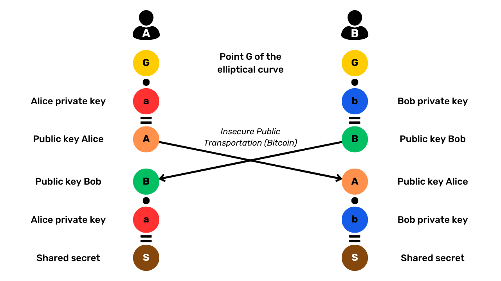

Теперь, когда Боб знает платежный код Алисы, он сможет обнаруживать ее платежи BIP47 и может вывести приватные ключи, которыми защищены полученные биткойны.

Давайте подведем итог шагам, через которые мы только что прошли, чтобы получить и интерпретировать уведомительную транзакцию:
- Боб мониторит выходы транзакций на свой уведомительный адрес;
- Когда он обнаруживает какую-нибудь транзакцию, он извлекает информацию, содержащуюся в OP_RETURN;
- Боб выбирает открытый ключ на входе и вычисляет секретную точку, используя ECDH;
- Он использует эту секретную точку для вычисления HMAC, который является маскирующим фактором;
- Он использует этот маскирующий фактор для расшифровки содержимого платежного кода Алисы, содержащегося в OP_RETURN.

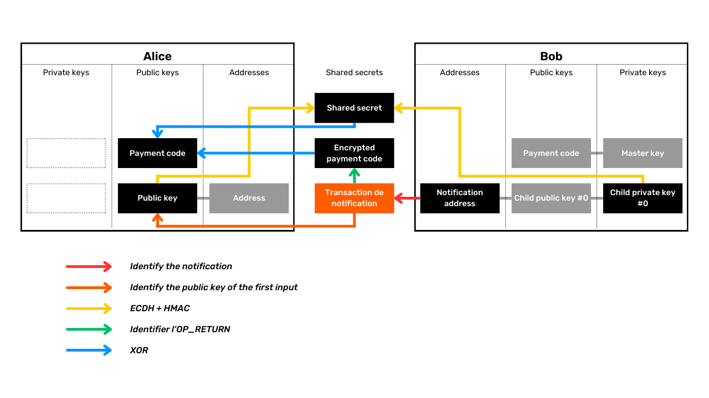  

### Транзакция платежа BIP47

Теперь давайте вместе изучим процесс платежа с BIP47. Чтобы напомнить вам текущее состояние дел:
- Алиса знает платежный код Боба, который она просто извлекла с его веб-сайта;
- Боб знает платежный код Алисы благодаря транзакции уведомления;
- Алиса совершит первый платеж Бобу. Она сможет совершать последующие платежи таким же образом.

Прежде чем объяснять этот процесс, я считаю важным напомнить об индексах, с которыми мы в настоящее время работаем. Путь деривации платежного кода описывается следующим образом: `m/47'/0'/0'`. Следующая глубина распределяет индексы таким образом:
- Первая обычная (не усиленная) пара дочерних ключей используется для генерации адреса уведомления, о котором мы говорили в предыдущей части: `m/47'/0'/0'/0`;
- Обычные пары дочерних ключей используются в ECDH для генерации адресов приема платежей BIP47, как мы увидим в этом разделе: от `m/47'/0'/0'/0` до `m/47'/0'/0'/2 147 483 647`;
- Усиленные пары дочерних ключей являются эфемерными платежными кодами: от `m/47'/0'/0'/0'` до `m/47'/0'/0'/2 147 483 647'`.

Каждый раз, когда Алиса желает отправить платеж Бобу, она производит новый уникальный неиспользованный адрес, благодаря протоколу ECDH:
- Алиса выбирает первый приватный ключ, полученный из ее личного многоразового платежного кода:

$$ a $$

- Алиса выбирает первый неиспользованный публичный ключ, полученные из платежного кода Боба. Этот публичный ключ мы будем называть $B$. Он ассоциирован с приватным ключом $b$, который известен только Бобу:

$$ B = b \cdot G $$

- Алиса вычисляет секретную точку $S$ на эллиптической кривой путем сложения точек и удвоения, применяя свой приватный ключ $a$ к публичному ключу Боба $B$:

$$ S = a \cdot B $$

- Из этой секретной точки Алиса будет вычислять общий секрет $s$ (в нижнем регистре). Для этого она выбирает x-координату секретной точки $S$, названную $Sx$, и пропускает это значение через функцию хеширования SHA256:

$$ S = (Sx, Sy) $$

$$ s = \text{SHA256}(Sx) $$

- Алиса использует этот общий секрет $s$ для вычисления адреса приема платежей в Биткойне. Сначала она проверяет, содержится ли $s$ в пределах порядка кривой secp256k1. Если нет, она увеличивает индекс публичного ключа Боба для вычисления другого общего секрета;
- Во-вторых, она вычисляет публичный ключ $K0$, добавляя на эллиптической кривой точки $B$ и $s·G$. Другими словами, Алиса добавляет публичный ключ, выведенный из платежного кода Боба $B$, с другой точкой, вычисленной на эллиптической кривой путем сложения точек и удвоения с общим секретом $s$ от точки генерации кривой secp256k1 $G$. Эта новая точка представляет публичный ключ, и мы называем его $K0$:

$$ K0 = B + s \cdot G $$

- Имея этот публичный ключ $K0$, Алиса может вывести стандартный неиспользованный адрес приема (например, SegWit V0 в формате bech32).
Как только Алиса получает адрес приема Боба $K0$, она может выполнить транзакцию в Биткойн стандартным способом. Для этого она выбирает UTXO, которым она владеет, защищенный парой ключей из другой ветви ее HD-кошелька, и отправляет его, чтобы удовлетворить вывод на адрес Боба $K0$. Важно отметить, что этот платеж, как только выведен адрес, следует обычному процессу и больше не зависит от ключей, ассоциированных с BIP47.
Давайте повторим шаги, которые мы только что прошли вместе, чтобы отправить платеж BIP47:
- Алиса выбирает первый производный дочерний закрытый ключ из своего личного платежного кода;
- Она вычисляет секретную точку на эллиптической кривой, используя ECDH с первым неиспользованным производным дочерним открытым ключом из платежного кода Боба;
- Она использует эту секретную точку для вычисления общего секрета с помощью SHA256;
- Она использует этот общий секрет для вычисления новой секретной точки на эллиптической кривой;
- Она добавляет эту новую секретную точку к открытому ключу Боба;
- Она получает новый эфемерный открытый ключ, для которого только у Боба есть соответствующий закрытый ключ;
- Алиса может совершить стандартную транзакцию Бобу с выведенным эфемерным адресом получения.

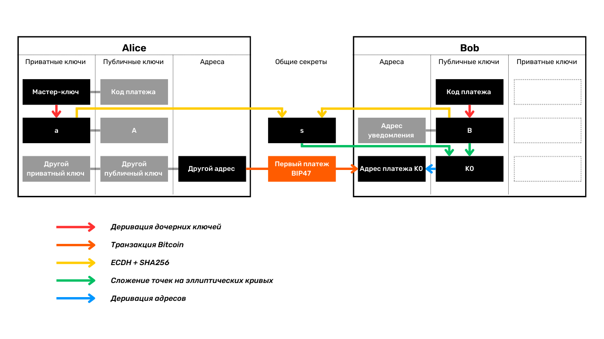

Если Алиса хочет совершить второй платеж, она будет следовать тем же шагам, что и раньше, за исключением того, что на этот раз она выберет второй производный открытый ключ из платежного кода Боба. Конкретно, она будет использовать следующий неиспользованный ключ. Таким образом, она получит новый адрес получения, принадлежащий Бобу, обозначенный $K1$:

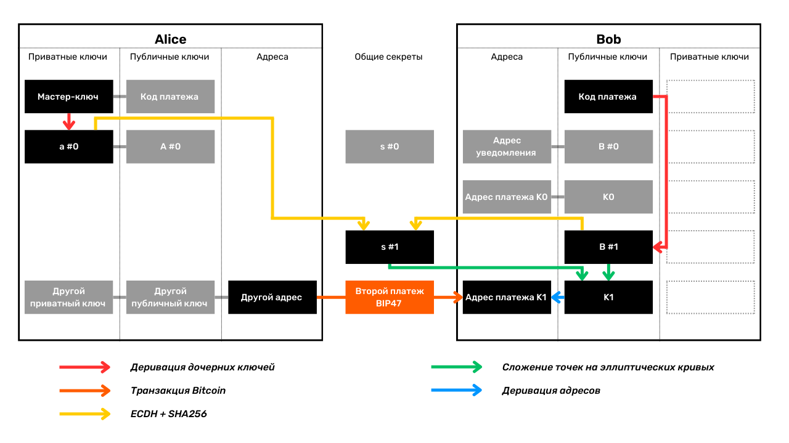

Она может продолжать в этом духе и вывести до `$2^32$` неиспользованных адресов, принадлежащих Бобу.

С внешней точки зрения, наблюдая за блокчейном, теоретически невозможно отличить платеж BIP47 от стандартного платежа. Вот пример транзакции платежа BIP47 на Testnet:

```text
94b2e59510f2e1fa78411634c98a77bbb638e28fb2da00c9f359cd5fc8f87254
```

Это выглядит как стандартная транзакция с использованным входом, выходом платежа и сдачей:

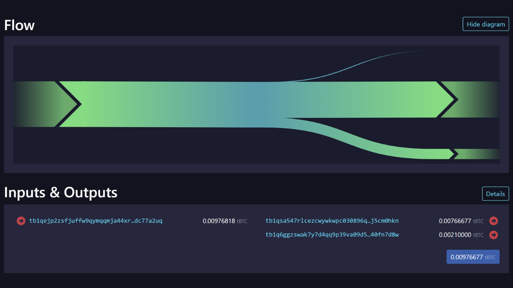

### Получение платежа BIP47 и вывод закрытого ключа

Алиса только что совершила свой первый платеж на новый адрес BIP47, принадлежащий Бобу. Теперь давайте посмотрим, как Боб получает этот платеж. Мы также увидим, почему Алиса не имеет доступа к закрытому ключу адреса, который она только что сгенерировала сама, и как Боб извлекает этот ключ, чтобы потратить только что полученные биткойны.
Как только Боб получает уведомление о транзакции от Алисы, он выводит открытый ключ BIP47 $K0$ еще до того, как она отправит какой-либо платеж ему. Затем он отслеживает любые платежи на связанный адрес. Фактически, он сразу производит несколько адресов, которые будет отслеживать ($K0$, $K1$, $K2$, $K3$...). Вот как он выводит этот открытый ключ $K0$:
- Боб выбирает первый дочерний закрытый ключ полученый из своего платежного кода. Этот закрытый ключ называется $b$. Он ассоциирован с открытым ключом $B$, с которым Алиса проводила свои расчеты на предыдущем шаге:

$$ b $$

- Боб выбирает первый открытый ключ Алисы, полученный из ее платежного кода. Этот ключ называется $A$. Он ассоциирован с закрытым ключом $a$, с которым Алиса проводила свои расчеты, и о котором знает только Алиса. Боб может провести этот процесс, поскольку он знает платежный код Алисы, который был передан ему с уведомлением о транзакции:

$$ A = a \cdot G $$

- Боб вычисляет секретную точку $S$, путем сложения и удвоения точек на эллиптической кривой, применяя свой закрытый ключ $b$ к открытому ключу Алисы $A$. Здесь мы находим использование ECDH, которое гарантирует, что эта точка $S$ будет одинаковой как для Боба, так и для Алисы:

$$ S = b \cdot A $$

- Так же, как и Алиса, Боб выделяет x-координату этой точки $S$. Мы назвали это значение $Sx$. Он пропускает это значение через функцию SHA256, чтобы найти общий секрет $s$ (в нижнем регистре):
  
$$ s = \text{SHA256}(Sx) $$

- Так же, как и Алиса, Боб вычисляет точку $s·G$ на эллиптической кривой. Затем он добавляет эту секретную точку к своему публичному ключу $B$. Таким образом, он получает новую точку на эллиптической кривой, которую он интерпретирует как публичный ключ $K0$:

$$ K0 = B + s \cdot G $$

Как только у Боба появляется этот публичный ключ $K0$, он может вывести соответствующий приватный ключ, чтобы иметь возможность потратить свои биткойны. Только он может сгенерировать этот приватный ключ:

- Боб добавляет свой дочерний приватный ключ $b$, полученный из его личного платежного кода. Только он может получить значение $b$. Затем он складывает $b$ с общим секретом $s$, чтобы получить $k0$, приватный ключ $K0$:

$$ k0 = b + s $$

Благодаря закону группы эллиптической кривой, Боб получает точно такой же приватный ключ, который соответствует публичному ключу, используемому Алисой. Таким образом, у нас есть:

$$ K0 = k0 \cdot G $$

Я подытожу шаги, которые мы только что прошли вместе, чтобы получить платеж по BIP47 и вычислить соответствующий приватный ключ:
- Боб выбирает первый дочерний приватный ключ полученный из своего личного платежного кода;
- Он вычисляет секретную точку на эллиптической кривой, используя ECDH из первого выведенного дочернего публичного ключа из цепочки кодов Алисы;
- Он использует эту секретную точку для вычисления общего секрета с помощью SHA256;
- Он использует этот общий секрет для вычисления новой секретной точки на эллиптической кривой;
- Он добавляет эту новую секретную точку к своему личному публичному ключу;
- Он получает новый эфемерный публичный ключ, на который Алиса отправит свой первый платеж;
- Боб вычисляет приватный ключ, ассоциированный с этим эфемерным публичным ключом, добавляя свой дочерний приватный ключ полученный из своего платежного кода и общий секрет.

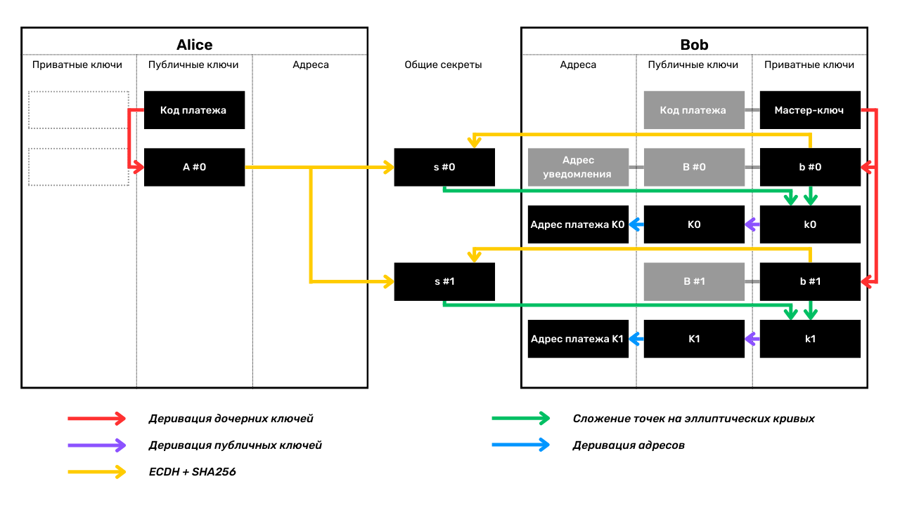

Поскольку Алиса не может получить $b$ (приватный ключ Боба), она не может определить $k0$ (приватный ключ, ассоциированный с адресом получения BIP47 Боба). Схематически мы можем представить вычисление общего секрета $S$ так:

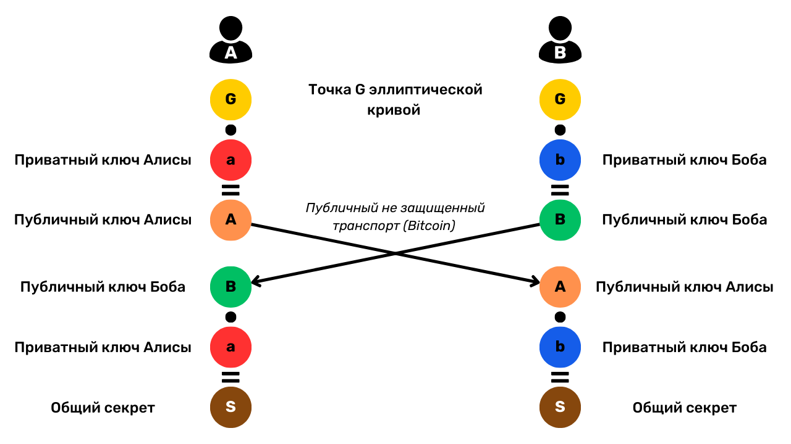

Как только общий секрет найден с помощью ECDH, Алиса и Боб вычисляют публичный ключ платежа BIP47 $K0$, и Боб также вычисляет ассоциированный приватный ключ $k0$:

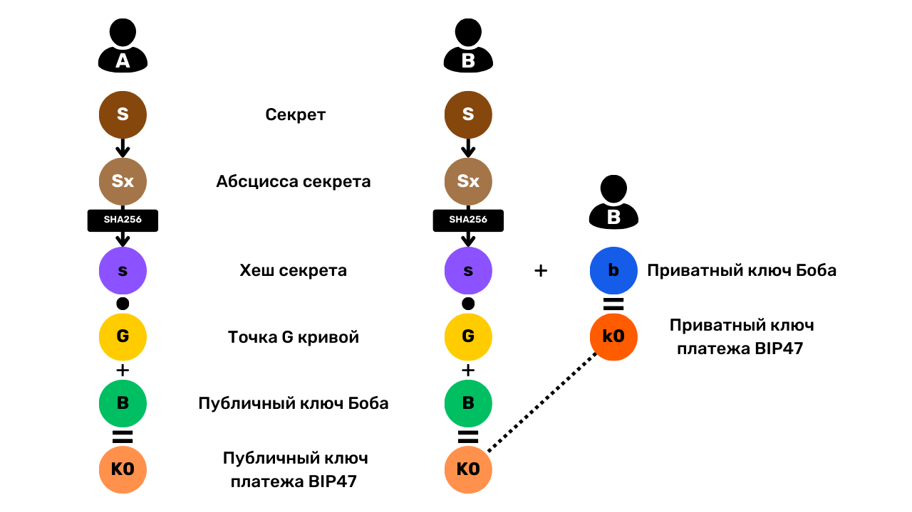

### Возврат платежа по BIP47

Поскольку Боб знает повторно используемый платежный код Алисы, у него уже есть вся необходимая информация для отправки ей возврата. Ему не нужно будет снова связываться с Алисой, чтобы запросить какую-либо информацию. Ему просто нужно будет уведомить ее с помощью уведомительной транзакции, для того чтобы она могла восстановить свои адреса BIP47 с помощью своего сида, а затем он также может отправить ей до `$2^32$` платежей.

Функциональность возврата специфична для BIP47 и является одним из его преимуществ перед другими методами, которые мы изучим в следующих главах, такими как Silent Payments.

Боб может затем вернуть Алисе платеж тем же способом, которым она отправила ему свой платеж. Роли меняются:

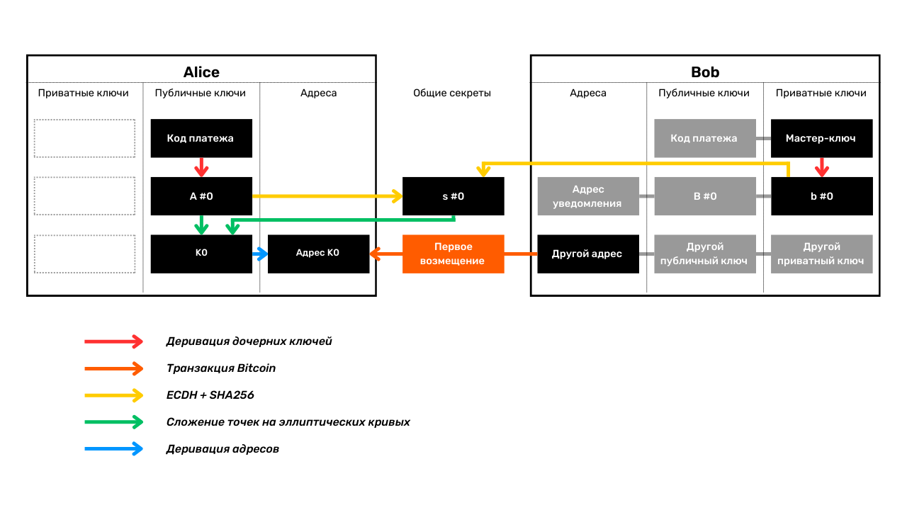

*Большое спасибо [Фанису Михалакису](https://x.com/FanisMichalakis) за его рецензию и ценные экспертные советы по статье, которая вдохновила на написание этой главы!*

https://planb.network/tutorials/privacy/paynym-bip47
## Silent Payments (Тихие Платежи)

<chapterId>2871d594-414e-4598-a830-91c9eb84dfb8</chapterId>

BIP47 подвергался критике за его неэффективность в блокчейне. Как было объяснено в предыдущей главе, он требует уведомляющую транзакцию для каждого нового получателя. Это ограничение становится незначительным, если планируется установить долгосрочный платежный канал с этим получателем. Действительно, одна уведомляющая транзакция открывает путь для почти бесконечного числа последующих платежей BIP47.

Однако в определенных ситуациях уведомляющая транзакция может стать препятствием для пользователя. Возьмем, к примеру, одноразовое пожертвование получателю: с классическим биткойн-адресом достаточно одной транзакции для совершения пожертвования. Но с BIP47 необходимы две транзакции: одна для уведомления и другая для собственно платежа. Когда спрос на место в блоке низкий и комиссии за транзакции минимальны, этот дополнительный шаг обычно не является проблемой. Однако в периоды перегрузки комиссии за транзакции могут стать чрезмерными для одного платежа, потенциально удваивая стоимость для пользователя по сравнению со стандартной биткойн-транзакцией, что может быть неприемлемо для пользователя.

Для ситуаций, когда пользователь планирует совершить лишь несколько платежей на статический идентификатор, были разработаны другие решения. Среди них - Тихие Платежи, описанные в [BIP352](https://github.com/Биткойн/bips/blob/master/bip-0352.mediawiki). Этот протокол позволяет использовать статический идентификатор для получения платежей без повторного использования адресов и без необходимости использования уведомляющих транзакций. Давайте рассмотрим, как работает этот протокол.

---

*Для полного понимания этой главы необходимо быть знакомым с принципами работы ECDH (Эллиптической кривой Диффи-Хеллмана) и криптографической деривации ключей в HD-кошельке. Эти концепции были подробно описаны в предыдущей главе о BIP47. Я не буду повторять их здесь снова. Если вы еще не знакомы с этими понятиями, я рекомендую обратиться к предыдущей главой, прежде чем продолжать с этой. Я также не буду возвращаться к рискам, связанным с повторным использованием адресов для получения, ни к важности иметь уникальный идентификатор для получения платежей.*

---

### Почему бы не переместить уведомление?

Как обсуждалось в главе о BIP47, уведомляющая транзакция выполняет в основном две функции:
- Она уведомляет получателя;
- Она передает платежный код отправителя.

Можно наивно подумать, что этот процесс уведомления мог бы быть выполнен вне цепочки. Теоретически, это вполне выполнимо: достаточно было бы для получателя указать средство связи для получения платежных кодов BIP47 от отправителей. Однако, этот подход представляет две основные проблемы:
- Во-первых, это перенесло бы процесс передачи кода на другой протокол связи. Проблемы, связанные с затратами и конфиденциальностью обмена, остались бы, но просто были бы перенесены на этот новый протокол. С точки зрения конфиденциальности, это также могло бы создать связь между личностью пользователя и его деятельностью в цепочке, что мы стремимся избежать, выполняя уведомление непосредственно в блокчейне. Более того, выполнение уведомления вне блокчейна ввело бы риски цензуры (такие как блокировка средств), которых не существует в Биткойн;
- Далее, это создаст проблему восстановления. С BIP47 получатель должен обязательно знать платежные коды отправителей, чтобы получить доступ к средствам. Это актуально в момент получения, но также и в случае восстановления средств через сид в случае потери кошелька. С уведомлениями в блокчейне этот риск исключается, так как пользователь может найти и расшифровать транзакции уведомлений, просто зная свой сид. Однако, если уведомление выполняется вне блокчейна, пользователю нужно будет поддерживать динамический бэкап всех полученных платежных кодов, что непрактично для среднестатистического пользователя.
  
Все эти ограничения делают использование уведомлений в блокчейне незаменимым в контексте BIP47. Тем не менее, Silent Payments специально стремятся избежать этого шага уведомления из-за его стоимости. Поэтому было решено не переместить уведомление, а полностью его устранить. Для достижения этого необходимо принять компромисс: сканирование. В отличие от BIP47, где пользователь точно знает, где найти свои средства благодаря транзакции уведомления, в контексте Silent Payments пользователю необходимо исследовать все существующие транзакции Биткойн, чтобы обнаружить любые платежи, которые могут быть предназначены для него. Чтобы уменьшить эту операционную нагрузку, поиск Silent Payments ограничивается только транзакциями, вероятно содержащими такие платежи, а именно теми, которые включают хотя бы один выход Taproot P2TR. Сканирование также сосредотачивается исключительно на транзакциях с даты создания кошелька (нет необходимости сканировать транзакции, возвращаясь к 2009 году, если кошелек был создан в 2024 году).

Поэтому вы можете видеть, почему BIP47 и Silent Payments, хотя и стремятся к похожей цели, используют разные компромиссы и **таким образом, на самом деле, предназначены для различных случаев применения**. Для разовых платежей, таких как случайные пожертвования, Silent Payments подходят лучше из-за их меньшей стоимости. В отличие от этого, для регулярных транзакций на одного и того же получателя, как в случае с платформами обмена или майнинговыми пулами, BIP47 может оказаться предпочтительнее.
Давайте вместе исследуем технические аспекты Silent Payments, чтобы лучше понять их последствия. Для этого предлагаю использовать тот же подход, что и в пояснительном документе BIP352. Мы будем постепенно разбирать расчеты, которые необходимо выполнить, элемент за элементом, обосновывая каждое последующее действие.

### Некоторые концепции для понимания

Прежде чем мы начнем, важно уточнить, что Silent Payments исключительно полагаются на использование типов скриптов P2TR (*Pay to Taproot*). В отличие от BIP47, не нужно выводить адреса получения из дочерних публичных ключей путем их хеширования. Действительно, в стандарте P2TR измененный публичный ключ используется напрямую и открыто в адресе. Таким образом, адрес получения Taproot по сути является публичным ключом в сопровождении некоторых метаданных. Этот измененный публичный ключ является агрегацией двух других публичных ключей: один позволяет прямые и традиционные платежи через простую подпись, а другой представляет корень Меркла MAST, который разрешает платежи с учетом удовлетворения одного из условий, потенциально вписанных в дерево Меркла.


Решение ограничить Silent Payments исключительно Taproot мотивировано двумя основными причинами:
- Во-первых, это значительно облегчает реализацию и будущие обновления в программном обеспечении кошелька, поскольку нужно придерживаться только одного стандарта;
- Во-вторых, этот подход помогает улучшить анонимный набор пользователей, поощряя их не использовать различные типы скриптов, которые генерируют различные отпечатки кошельков в анализе цепочки (для получения дополнительной информации об этой концепции приглашаю вас ознакомиться с главой 4 части 2).

### Наивный вывод публичного ключа Silent Payments

Давайте начнем с простого примера, который поможет вам понять основное функционирование SP (Silent Payments, Тихих Платежей). Возьмем Алису и Боба, двух пользователей Биткойн. Алиса хочет отправить биткойны Бобу на новый адрес получения. В этом процессе должны быть достигнуты три цели:
- Алиса должна иметь возможность генерировать новый адрес;
- Боб должен иметь возможность идентифицировать платеж, отправленный на этот конкретный адрес;
- Боб должен иметь возможность получить приватный ключ, связанный с этим адресом, чтобы иметь возможность распоряжаться своими средствами.

У Алисы есть UTXO в ее биткойн-кошельке, защищенный следующей парой ключей:
- $a$: приватный ключ;
- $A$: публичный ключ ($A = a \cdot G$)

У Боба есть SP адрес, который он опубликовал в интернете, который имеет следующие ключи:
- $b$: приватный ключ;
- $B$: публичный ключ ($B = b \cdot G$)
  
Получив адрес Боба, Алиса может рассчитать новый неиспользованный адрес, принадлежащий Бобу, применяя ECDH. Назовем этот адрес $P$:

$$  P = B + \text{hash}(a \cdot B) \cdot G  $$

В этом уравнении Алиса просто рассчитала скалярное произведение своего приватного ключа $a$ и публичного ключа Боба $B$. Она передала этот результат через хеш-функцию, известную всем. Затем полученное значение умножается на генераторную точку $G$ эллиптической кривой `secp256k1`. Наконец, Алиса добавляет полученную точку к публичному ключу Боба $B$. Как только у Алисы появляется этот адрес $P$, она использует его в качестве выхода в транзакции, то есть отправляет биткойны на этот адрес.

> *В контексте Тихих Платежей функция "хеш" соответствует хеш-функции SHA256, специально помеченной как `BIP0352/SharedSecret`, что гарантирует, что сгенерированные хеши уникальны для этого протокола и не могут быть повторно использованы в других контекстах, а также обеспечивает дополнительную защиту от повторного использования nonce в подписях. Этот стандарт соответствует тому, [который указан в BIP340 для подписей Schnorr](https://github.com/Биткойн/bips/blob/master/bip-0340.mediawiki) на `secp256k1`.*

Благодаря свойствам эллиптической кривой, на которой основан ECDH, мы знаем, что:

$$  a \cdot B = b \cdot A  $$

Таким образом, Боб сможет рассчитать адрес получения, на который Алиса отправила биткойны. Для этого он отслеживает все биткойн-транзакции, соответствующие критериям Тихих Платежей, и применяет следующий расчет к каждой из них, чтобы увидеть, адресован ли платеж ему (*сканирование*):

$$  P' = B + \text{hash}(b \cdot A) \cdot G  $$

Когда он сканирует транзакцию Алисы, он понимает, что $P'$ равно $P$. Таким образом, он знает, что этот платеж адресован ему:

$$  P' = B + \text{hash}(b \cdot A) \cdot G = B + \text{hash}(a \cdot B) \cdot G = P   $$

Отсюда Боб сможет рассчитать приватный ключ $p$, который позволяет тратить средства с адреса $P$:

$$  p = (b + \text{hash}(b \cdot A)) \bmod n  $$

Как вы можете видеть, для расчета этого приватного ключа $p$ необходимо иметь приватный ключ $b$. Только у Боба есть этот приватный ключ $b$. Таким образом, он действительно будет единственным, кто сможет тратить биткойны, отправленные на его адрес Тихих Платежей.


*Обозначения:*
- $B$: Публичный ключ / статический адрес, опубликованный Бобом
- $b$: Приватный ключ Боба
- $A$: Публичный ключ UTXO Алисы, используемый в качестве входа для транзакции
- $a$: Приватный ключ Алисы
- $G$: Точка генерации эллиптической кривой `secp256k1`
- $\text{SHA256}$: Хэш-функция SHA256 с тегом `BIP0352/SharedSecret`
- $s$: Общий секрет ECDH
- $P$: Публичный ключ / уникальный адрес для платежа Бобу

Вот изначально довольно наивный подход к использованию статического адреса Боба, обозначенного как $B$, для получения уникального адреса $P$ для отправки биткойнов. Однако этот метод слишком прост и имеет несколько недостатков, которые необходимо исправить. Первая проблема заключается в том, что в этой схеме Алиса не может создать несколько выходов для Боба в рамках одной транзакции.

### Как создать несколько выходов?

В примере из предыдущего раздела Алиса создает один выход, который пойдет Бобу на его уникальный адрес $P$. С выбранным тем же входом невозможно для Алисы создать два различных новых адреса для Боба, так как используемый метод всегда приведет к тому же результату для $P$, следовательно, к тому же адресу. Однако может быть множество ситуаций, когда Алиса хочет разделить свой платеж Бобу на несколько меньших сумм, тем самым создавая несколько UTXOs. Поэтому необходимо найти метод, который позволит это сделать.

Для достижения этого мы немного изменим расчет, который выполняет Алиса для получения $P$, так чтобы она могла генерировать два различных адреса для Боба, а именно $P_0$ и $P_1$.

Чтобы изменить расчет и получить 2 разных адреса, достаточно добавить целое число, которое изменит результат. Таким образом, Алиса добавит $0$ в свой расчет, чтобы получить адрес $P_0$, и $1$, чтобы получить адрес $P_1$. Назовем это целое число $i$:

$$  P_i = B + \text{hash}(a \cdot B \text{ ‖ } i) \cdot G  $$

Процесс расчета остается неизменным по сравнению с предыдущим методом, за исключением того, что на этот раз Алиса будет конкатенировать $a \cdot B$ с $i$ перед тем, как приступить к хешированию. Затем достаточно изменить $i$, чтобы получить новый адрес, принадлежащий Бобу. Например:

$$  P_0 = B + \text{hash}(a \cdot B \text{ ‖ } 0) \cdot G  $$

$$  P_1 = B + \text{hash}(a \cdot B \text{ ‖ } 1) \cdot G  $$

Когда Боб сканирует блокчейн на предмет Silent Payments, предназначенных для него, он начинает с использования $i = 0$ для адреса $P_0$. Если он не находит платежа на $P_0$, он делает вывод, что в этой транзакции нет Silent Payments для него и прекращает анализ. Однако, если $P_0$ действителен и содержит платеж для него, он продолжает с $P_1$ в той же транзакции, чтобы проверить, не сделала ли Алиса второй платеж. Если $P_1$ оказывается недействительным, он прекращает поиск по этой транзакции; в противном случае, он продолжает тестировать последовательные значения $i$.

$$  P_1 = B + \text{hash}(b \cdot A \text{ ‖ } 1 \text{ ‖ } \text{inputHash}) \cdot G  $$

Поскольку Боб немедленно останавливается на $i = 0$, если $P_0$ не дает результатов, использование этого целого числа практически не добавляет дополнительной операционной нагрузки на Боба при сканировании транзакций.

Затем Боб может рассчитать приватные ключи таким же образом:

$$ 
p_0 = (b + \text{hash}(b \cdot A \text{ ‖ } 0 \text{ ‖ } \text{inputHash})) \bmod n
 $$

$$ 
p_1 = (b + \text{hash}(b \cdot A \text{ ‖ } 1 \text{ ‖ } \text{inputHash})) \bmod n 
 $$


*Обозначения:*
- $B$: Публичный ключ / статический адрес, опубликованный Бобом
- $b$: Приватный ключ Боба
- $A$: Публичный ключ UTXO Алисы, используемый в качестве входа для транзакции
- $a$: Приватный ключ Алисы
- $G$: Точка генерации эллиптической кривой `secp256k1`
- $\text{SHA256}$: Хеш-функция SHA256 с тегом `BIP0352/SharedSecret`
- $s_0$: Первый общий секрет ECDH
- $s_1$: Второй общий секрет ECDH
- $P_0$: Первый публичный ключ / уникальный адрес для платежа Бобу
- $P_1$: Второй публичный ключ / уникальный адрес для платежа Бобу

С этим методом мы начинаем иметь хороший протокол, но все еще есть некоторые проблемы, которые нужно преодолеть, в частности, предотвращение повторного использования адресов.

### Как избежать повторного использования адресов?

Как мы видели в предыдущих разделах, Алиса использует пару ключей, которые защищают ее UTXOs, которые она будет тратить, чтобы рассчитать общий секрет ECDH с Бобом. Этот секрет позволяет ей получить уникальный адрес $P_0$. Однако, пара ключей ($a$, $A$), используемая Алисой, может защищать несколько UTXOs, если она несколько раз использовала этот адрес. В случае, если Алиса совершает два платежа на статический адрес Боба $B$, используя два UTXOs, защищенные одним и тем же ключом $A$, это приведет к повторному использованию адреса для Боба.

> *Повторное использование адреса - это очень плохая практика для конфиденциальности пользователя. Чтобы понять почему, я советую вам пересмотреть первые части этого курса.*

Действительно, поскольку уникальный адрес $P_0$ получается из $A$ и $B$, если Алиса получает второй адрес для второго платежа на $B$ с тем же ключом $A$, она получит тот же адрес $P_0$. Чтобы избежать этого риска и предотвратить повторное использование адресов в рамках Silent Payments, нам нужно немного изменить наши расчеты.

Мы хотим, чтобы каждый UTXO, используемый Алисой в качестве входа платежа, давал уникальный адрес на стороне Боба, даже если несколько UTXOs защищены одной и той же парой ключей. Поэтому достаточно добавить ссылку на UTXO в расчет уникального адреса $P_0$. Эта ссылка будет просто хешем используемого на входе UTXO:

$$  \text{inputHash} = \text{hash}(\text{outpoint} \text{ ‖ } A)  $$

И эту ссылку на вход, Алиса добавит в свой расчет уникального адреса $P_0$:

$$  P_0 = B + \text{hash}(\text{inputHash} \cdot a \cdot B \text{ ‖ } 0) \cdot G  $$

Во время своего сканирования Боб также может добавить $\text{inputHash}$, поскольку все, что ему нужно сделать, это наблюдать за транзакцией, чтобы вывести $\text{outpoint}$:

$$  P_0 = B + \text{hash}(\text{inputHash} \cdot b \cdot A \text{ ‖ } 0) \cdot G  $$

Когда он находит действительный $P_0$, он может рассчитать соответствующий приватный ключ $p_0$:

$$ 
p_0 = (b + \text{hash}(\text{inputHash} \cdot b \cdot A \text{ ‖ } 0)) \bmod n
 $$

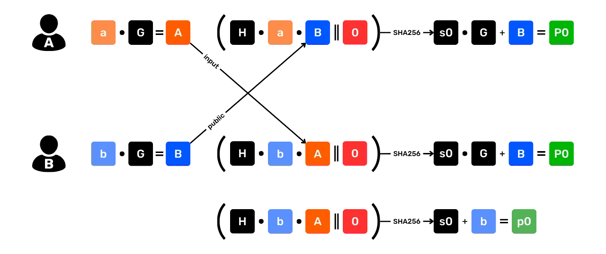

*Обозначения:*
- $B$: Публичный ключ / статический адрес, опубликованный Бобом
- $b$: Приватный ключ Боба
- $A$: Публичный ключ UTXO Алисы, используемый в качестве входа для транзакции
- $a$: Приватный ключ Алисы
- $H$: Хеш UTXO, используемого в качестве входа
- $G$: Точка генерации эллиптической кривой `secp256k1`
- $\text{SHA256}$: Хеш-функция SHA256 с тегом `BIP0352/SharedSecret`
- $s_0$: Первый общий секрет ECDH
- $P_0$: Первый публичный ключ / уникальный адрес для платежа Бобу

На данный момент наши расчеты предполагают, что Алиса использует один вход для своей транзакции. Однако она должна иметь возможность использовать несколько входов. Следовательно, с точки зрения Боба, для каждой транзакции, содержащей несколько входов, ему теоретически нужно было бы вычислить ECDH для каждого входа, чтобы определить, предназначен ли платеж для него. Этот метод неудовлетворительный, поэтому нам нужно найти решение, чтобы уменьшить рабочую нагрузку!

### Модификация публичных ключей во входах

Чтобы решить эту проблему, вместо использования пары ключей, обеспечивающих конкретный вход с точки зрения Алисы, мы будем использовать сумму всех пар ключей, используемых во входах транзакции. Эта сумма затем будет рассматриваться как новая пара ключей. Эта техника известна как "модификация" (tweak).

Например, представьте, что транзакция Алисы имеет 3 входа, каждый из которых защищен разной парой ключей:
- $a_0$ защищает вход №0;
- $a_1$ защищает вход №1;
- $a_2$ защищает вход №2.


Следуя описанному выше методу, Алисе пришлось бы выбрать одну пару ключей среди $a_0$, $a_1$ и $a_2$, чтобы рассчитать секрет ECDH и сгенерировать уникальный платежный адрес $P$ из статического адреса Боба $B$. Однако этот подход требует от Боба последовательно тестировать каждую возможность, начиная с $a_0$, затем $a_1$, и так далее, до идентификации пары, генерирующей действительный адрес $P$. Этот процесс требует, чтобы Боб выполнял расчет ECDH для всех входов всех транзакций, значительно увеличивая операционную нагрузку на сканирование.

Чтобы избежать этого, мы попросим Алису выполнить расчет $P$, используя сумму всех ключей на входе. Возьмем наш пример, модифицированный приватный ключ $a$ будет рассчитан следующим образом:

$$  a = a_0 + a_1 + a_2  $$

Точно так же, Алиса и Боб смогут вычислить модифицированый открытый ключ:

$$  A = A_0 + A_1 + A_2  $$

Благодаря этому методу, Бобу нужно только вычислить сумму открытых ключей транзакции, а затем вычислить секрет ECDH из $A$, что значительно уменьшает количество вычислений, необходимых для этапа сканирования. Однако, помните из предыдущего раздела. Мы включили в наш расчет хеш $\text{inputHash}$, который используется как nonce для предотвращения повторного использования адреса:

$$  \text{inputHash} = \text{hash}(\text{outpoint} \text{ ‖ } A)  $$

Но если в транзакции несколько входов, необходимо определить, какой $\text{outpoint}$ выбран в этом расчете. Согласно BIP352, критерий выбора $\text{outpoint}$ для использования заключается в выборе наименьшего лексикографически, что означает выбор UTXO, который появляется первым в алфавитном порядке. Этот метод стандартизирует выбор UTXO в каждой транзакции. Например, если этот наименьший $\text{outpoint}$ лексикографически является $\text{outpoint}_L$, расчет $\text{inputHash}$ будет:

$$  \text{inputHash} = \text{hash}(\text{outpoint}_L \text{ ‖ } A)  $$

Расчеты затем остаются идентичными тем, что были представлены в предыдущем разделе, за исключением того, что приватный ключ $a$ и соответствующий ему открытый ключ $A$ больше не являются парой, обеспечивающей безопасность одного входа, но теперь представляют собой модификацию всех пар ключей на входах.

### Разделение ключей для расходования и сканирования

До сих пор мы обсуждали статический адрес Silent Payment $B$ как уникальный открытый ключ. Помните, именно этот открытый ключ $B$ используется Алисой для создания общего секрета ECDH, который, в свою очередь, используется для вычисления уникального платежного адреса $P$. Боб использует этот открытый ключ $B$ и соответствующий приватный ключ $b$ для этапа сканирования. Но он также будет использовать приватный ключ $b$ для вычисления приватного ключа $p$, который позволяет расходовать средства с адреса $P$.

Недостатком этого метода является то, что приватный ключ $b$, который используется для вычисления всех приватных ключей для адресов, получающих Silent Payments, также используется Бобом для сканирования транзакций. Этот шаг требует, чтобы ключ $b$ был доступен в программном обеспечении кошелька, подключенного к интернету, что подвергает его большему риску кражи по сравнению с его хранением на холодном кошельке. Идеально было бы возможно воспользоваться преимуществами Silent Payments, сохраняя при этом приватный ключ $b$, который контролирует доступ ко всем другим приватным ключам, в безопасности на аппаратном кошельке. К счастью, протокол был адаптирован, чтобы позволить сделать именно так.
Для достижения этого, BIP352 указывает, что получатель использует 2 разные пары ключей:
- $B_{\text{spend}}$: для вычисления приватных ключей уникальных платежных адресов;
- $B_{\text{scan}}$: для нахождения уникальных платежных адресов.

Таким образом, Боб может хранить приватный ключ $b_{\text{spend}}$ на аппаратном кошельке и использовать приватный ключ $b_{\text{scan}}$ в онлайн-программном обеспечении для нахождения своих Silent Payments, не раскрывая $b_{\text{spend}}$. Однако, открытые ключи $B_{\text{scan}}$ и $B_{\text{spend}}$ оба публично раскрыты, поскольку они находятся в статическом адресе Боба $B$:

$$  B = B_{\text{scan}} \text{ ‖ } B_{\text{spend}} $$

Чтобы вычислить уникальный платежный адрес $P_0$, принадлежащий Бобу, Алиса теперь выполнит следующий расчет:

$$  P_0 = B_{\text{spend}} + \text{hash}(\text{inputHash} \cdot a \cdot B_{\text{scan}} \text{ ‖ } 0) \cdot G  $$

Чтобы найти платежи, адресованные ему, Боб выполнит следующий расчет:

$$  P_0 = B_{\text{spend}} + \text{hash}(\text{inputHash} \cdot b_{\text{scan}} \cdot A \text{ ‖ } 0) \cdot G  $$

Как видите, до сих пор Бобу не требовалось использовать $b_{\text{spend}}$, который находится на его аппаратном кошельке. Когда он захочет потратить $P_0$, он может затем выполнить следующий расчет, чтобы найти приватный ключ $p_0$:

$$ p_0 = (b_{\text{spend}} + \text{hash}(\text{inputHash} \cdot b_{\text{scan}} \cdot A \text{ ‖ } 0)) \bmod n $$

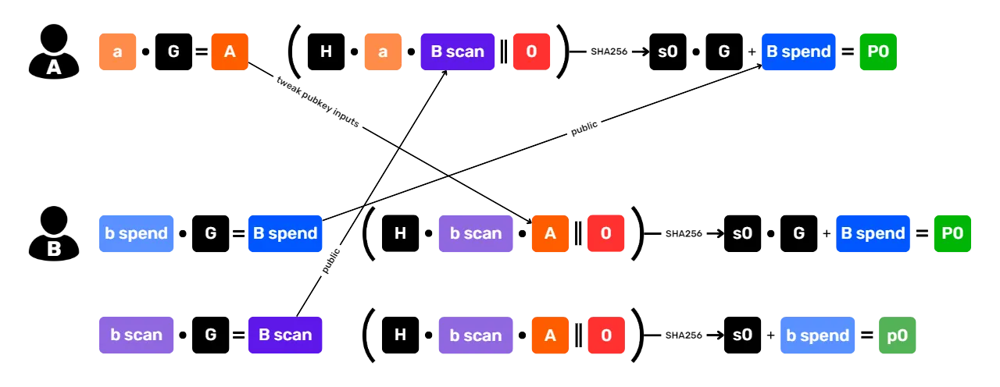

*Обозначения:*
- $B_{\text{scan}}$: Публичный ключ сканирования Боба (статический адрес)
- $b_{\text{scan}}$: Приватный ключ сканирования Боба
- $B_{\text{spend}}$: Публичный ключ расходов Боба (статический адрес)
- $b_{\text{spend}}$: Приватный ключ расходов Боба
- $A$: Сумма публичных ключей на входе (модификация)
- $a$: Приватный ключ, соответствующий модифицированному публичному ключу
- $H$: Хеш наименьшего UTXO (лексикографически) используемого на входе
- $G$: Точка генерации эллиптической кривой `secp256k1`
- $\text{SHA256}$: Функция хеширования SHA256 с тегом `BIP0352/SharedSecret`
- $s_0$: Первый общий секрет ECDH
- $P_0$: Первый публичный ключ / уникальный платежный адрес для Боба

### Использование SP адресов с меткой

Таким образом, у Боба есть следующий статический адрес $B$ для Silent Payments:

$$ B = B_{\text{scan}} \text{ ‖ } B_{\text{spend}} $$

Проблема этого метода заключается в том, что он не позволяет разделять разные платежи, отправленные на этот адрес. Например, если у Боба есть 2 разных клиента для его бизнеса и он хочет четко различать платежи от каждого, ему потребуются 2 разных статических адреса. Наивное решение, с текущим подходом, было бы для Боба создать два отдельных кошелька, каждый со своим статическим адресом, или даже установить два разных статических адреса в одном и том же кошельке. Однако это решение требует сканирования всего блокчейна дважды (один раз для каждого адреса), чтобы соответственно обнаружить платежи, предназначенные для каждого адреса. Это двойное сканирование неоправданно увеличивает операционную нагрузку для Боба.

Для решения этой проблемы BIP352 использует систему маркировки, которая позволяет использовать различные статические адреса без необоснованного увеличения рабочей нагрузки для поиска Silent Payments в блокчейне. Для этого к публичному ключу расходования $B_{\text{spend}}$ добавляется целое число $m$. Это число может принимать значение $1$ для первого статического адреса, затем $2$ для второго и так далее. Ключи расходования $B_{\text{spend}}$ в дальнейшем будут называться $B_m$ и будут конструироваться следующим образом:

$$  B_m = B_{\text{spend}} + \text{hash}(b_{\text{scan}} \text{ ‖ } m) \cdot G  $$

Например, для первого ключа расходования с меткой $1$:

$$  B_1 = B_{\text{spend}} + \text{hash}(b_{\text{scan}} \text{ ‖ } 1) \cdot G  $$

Статический адрес, опубликованный Бобом, теперь будет состоять из $B_{\text{scan}}$ и $B_m$. Например, первый статический адрес с меткой $1$ будет:

$$ B = B_{\text{scan}} \text{ ‖ } B_1 $$

> *Мы начинаем только с метки 1, потому что метка 0 зарезервирована для сдачи.*

Алиса, с её стороны, будет выводить уникальный платежный адрес $P$ таким же образом, как и раньше, но используя новый $B_1$ вместо $B_{\text{spend}}$.

$$  P_0 = B_1 + \text{hash}(\text{inputHash} \cdot a \cdot B_{\text{scan}} \text{ ‖ } 0) \cdot G  $$

На самом деле, Алиса может даже не знать, что у Боба есть маркированный адрес, поскольку она просто использует вторую часть статического адреса, который он ей предоставил, что в данном случае является значение $B_1$, а не $B_{\text{spend}}$.

Для сканирования платежей Боб всегда будет использовать значение своего исходного статического адреса с $B_{\text{spend}}$ следующим образом:

$$   P_0 = B_{\text{spend}} + \text{hash}(\text{inputHash} \cdot b_{\text{scan}} \cdot A \text{ ‖ } 0) \cdot G  $$

Затем он просто вычитает найденное значение $P_0$ из каждого вывода по очереди. После этого он проверяет, соответствует ли один из результатов этих вычитаний значению одной из меток, которые он использует в своем кошельке. Если это соответствует, например, для вывода №4 с меткой $1$, это означает, что этот вывод является Silent Payment, связанным с его маркированным статическим адресом $B_1$:

$$ Out_4 - P_0 = \text{hash}(b_{\text{scan}} \text{ ‖ } 1) \cdot G $$

Это работает потому что:

$$  B_1 = B_{\text{spend}} + \text{hash}(b_{\text{scan}} \text{ ‖ } 1) \cdot G  $$

Благодаря этому методу, Боб может использовать множество статических адресов ($B_1$, $B_2$, $B_3$...), все они получены из его базового статического адреса ($B = B_{\text{scan}} \text{ ‖ } B_{\text{spend}}$), чтобы правильно разделять использование.

Однако, это разделение статических адресов действительно только с точки зрения управления личным кошельком и не позволяет разделять идентичности. Поскольку у всех них один и тот же $B_{\text{scan}}$, очень легко связать все статические адреса вместе и сделать вывод, что они принадлежат одному и тому же агенту.


*Обозначения:*
- $B_{\text{scan}}$: публичный ключ сканирования Боба (статический адрес)
- $b_{\text{scan}}$: приватный ключ сканирования Боба
- $B_{\text{spend}}$: публичный ключ расходов Боба (начальный адрес)
- $B_m$: маркированный публичный ключ расходов Боба (статический адрес)
- $b_m$: маркированный приватный ключ расходов Боба
- $A$: сумма входных публичных ключей (модификация)
- $a$: приватный ключ, соответствующий модифицированному публичному ключу
- $H$: хеш наименьшего по лексикографии UTXO, использованного в качестве входа
- $G$: точка генерации эллиптической кривой `secp256k1`
- $\text{SHA256}$: хеш-функция SHA256 с тегом `BIP0352/SharedSecret`
- $s_0$: первый общий секрет ECDH
- $P_0$: первый публичный ключ / уникальный адрес для платежей Бобу
- $p_0$: приватный ключ первого уникального платежного адреса Бобу
- $X$: хеш приватного ключа сканирования с меткой

### Как создать адрес для Скрытых Платежей?

Чтобы создать специализированный адрес для Скрытых Платежей, сначала необходимо получить 2 пары ключей в своем Биткойн HD кошельке:
- Пара $b_{\text{scan}}$, $B_{\text{scan}}$ для поиска платежей, адресованных нам;
- Пара $b_{\text{spend}}$, $B_{\text{spend}}$ для расходования полученных биткойнов.

Эти пары получают следуя этим путям (*Bitcoin Mainnet*):

```text
scan: m / 352' / 0' / 0' / 1' / 0
spend: m / 352' / 0' / 0' / 0' / 0
```

После получения этих 2 пар ключей, их просто конкатенируют (конец к концу), чтобы создать полезную нагрузку статического адреса:

$$ B = B_{\text{scan}} \text{ ‖ } B_{\text{spend}} $$

Если есть желание использовать метки, $B_{\text{spend}}$ заменяется на $B_m$:

$$ B = B_{\text{scan}} \text{ ‖ } B_m $$

С меткой $m$:

$$  B_m = B_{\text{spend}} + \text{hash}(b_{\text{scan}} \text{ ‖ } m) \cdot G  $$

После того как эта полезная нагрузка станет доступной, добавляется HRP (*Human-Readable Part*) `sp` и версия `q` (= версия 0). Также добавляется контрольная сумма, и адрес форматируется в bech32m.
Например, вот мой статический адрес Silent Payments:
```text
sp1qqvhjvsq2vz8zwrw372vuzle7472zup2ql3pz64yn5cpkw5ngv2n6jq4nl8cgm6zmu48yk3eq33ryc7aam6jrvrg0d0uuyzecfhx2wgsumcurv77e
```
Важный момент, касающийся статических адресов, о которых могла идти речь в предыдущих разделах, заключается в том, что эти адреса не видны в транзакциях Биткойн. На блокчейне в стандартном формате Taproot отображаются только адреса платежей $P$, используемые в выходах. Таким образом, снаружи невозможно отличить транзакцию с использованием Silent Payment от обычной транзакции с использованием выходов P2TR.
Как и в случае с BIP47, невозможно установить связь между статическим адресом $B$ и производным от него платежным адресом $P$. Действительно, даже если Ева, потенциальный атакующий, попытается просканировать блокчейн со статическим адресом Боба $B$, она не сможет выполнить необходимые расчеты для определения $P$. Для этого ей потребовался бы либо приватный ключ сканирования Боба $b_{\text{scan}}$, либо приватные ключи отправителя $a$, но оба эти элемента, конечно, являются приватными. Поэтому возможно явно связать свой статический адрес с формой личной идентификации.

### Как использовать Silent Payments?

Предложение по Silent Payments относительно недавнее и на данный момент реализовано лишь в очень ограниченном числе кошельков. Насколько мне известно, их поддерживают только 3 программы:
- [CakeWallet](https://cakewallet.com/)
- [Silentium](https://app.silentium.dev/)
- [DonationWallet](https://github.com/Sosthene00/donationwallet)

Мы скоро предложим подробное руководство по настройке вашего собственного статического адреса Silent Payments.

Поскольку эта функция недавняя, рекомендуется проявлять осторожность и избегать использования Silent Payments для крупных сумм в основной сети.

*Для создания этой главы о Silent Payments я использовал [сайт с объяснением Silent Payments](https://silentpayments.xyz/) и [документ с объяснением BIP352](https://github.com/Биткойн/bips/blob/master/bip-0352.mediawiki).*


## Оставьте отзыв о данном курсе
<chapterId>195d149f-80fa-5816-8b46-995a9226d082</chapterId>
<isCourseReview>true</isCourseReview>

## Заключение
<chapterId>cd8e5c67-50e4-4dcd-8e04-88ba5ec95305</chapterId>

Поздравляю с завершением нашего курса по конфиденциальности в Биткойн!

Мы рассмотрели множество продвинутых и технических тем в этом курсе, но не обязательно использовать все представленные инструменты. Основная цель была в том, чтобы дать вам возможность выбирать, какую информацию вы хотите раскрывать, а какую предпочитаете держать в тайне при использовании Биткойн. Это воплощает саму суть защиты конфиденциальности. Для того чтобы делать осознанный выбор о том, какой информацией делиться или скрывать, необходимо осознавать последствия наших действий. Я надеюсь, что этот курс помог вам получить эти знания.
Если бы мне пришлось выбрать самую важную часть этого курса, я бы выбрал раздел, посвященный анализу цепочек. Понимание техник, используемых вашими потенциальными атакующими, - лучший способ защитить себя. Поэтому мой совет - внимательно пересмотреть эту часть и постараться уловить все ее детали.

В этом курсе мы сосредоточились исключительно на приватности Биткойн в основной сети. Проблемы конфиденциальности в системах второго уровня, таких как Сеть Молнии (Lightning Network) и боковые цепи (sidechains), также значительны и имеют очень специфические характеристики. Хотя использование транзакций вне основной цепи может быть эффективной стратегией для обхода многих рисков отслеживаемости в Биткойн, о которых мы говорили, это подвергает вас другим рискам, о которых также важно знать. Вот почему эти темы будут рассмотрены в будущем специализированном обучении на PlanB Network.

Если вам понравилось это обучение, я был бы очень благодарен, если бы вы могли поделиться им с друзьями и в социальных сетях. Спасибо! :)
