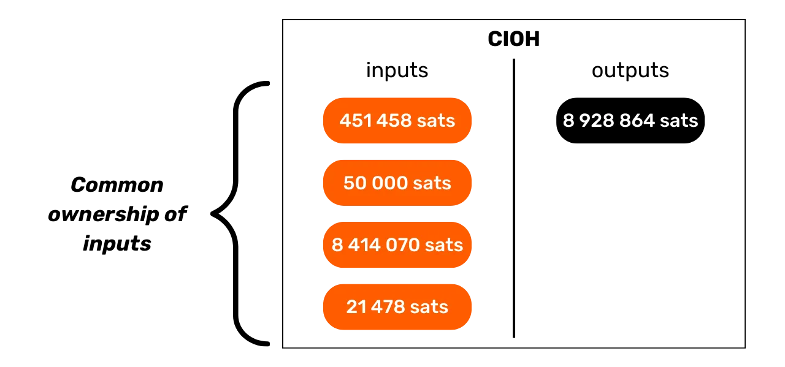

# Защитите свою конфиденциальность на Bitcoin

В мире, где конфиденциальность финансовых транзакций постепенно становится роскошью, понимание и владение принципами защиты конфиденциальности при использовании Bitcoin является существенным. Это обучение дает вам все ключи, как теоретические, так и практические, для достижения этого автономно.

Сегодня, на Bitcoin, существуют компании, специализирующиеся на анализе цепочек. Их основной деятельностью является именно вторжение в вашу частную сферу, с целью компрометации конфиденциальности ваших транзакций. Фактически, "право на конфиденциальность" на Bitcoin не существует. Поэтому вам, пользователю, предстоит заявить о своих естественных правах и защитить конфиденциальность ваших транзакций, потому что никто другой этого за вас не сделает.

Это обучение представляет собой полное и обобщенное путешествие. Каждое техническое понятие обсуждается подробно и подкрепляется пояснительными диаграммами. Цель состоит в том, чтобы сделать знания доступными для всех. BTC204 подходит как для начинающих, так и для пользователей среднего уровня. Это обучение также предлагает добавленную стоимость для наиболее опытных биткойнеров, поскольку мы углубляемся в некоторые технические концепции, которые часто неизвестны.

Присоединяйтесь к нам, чтобы трансформировать ваше использование Bitcoin и стать осведомленным пользователем, способным понимать ставки вокруг конфиденциальности и защищать вашу конфиденциальность.

+++

# Введение

<partId>e17474a8-8899-4bdb-a7f8-bc52ddb01440</partId>

## Введение в обучение

<chapterId>08ba1933-f393-4fb5-8279-777d874caedb</chapterId>

В мире, где конфиденциальность финансовых транзакций постепенно становится роскошью, понимание и владение принципами защиты конфиденциальности при использовании Bitcoin является существенным. Это обучение дает вам все ключи, как теоретические, так и практические, для достижения этого автономно.
Сегодня, в экосистеме Bitcoin, существуют компании, специализирующиеся на анализе цепочек. Их основной деятельностью является именно вторжение в вашу частную сферу, компрометируя конфиденциальность ваших транзакций. На самом деле, "право на конфиденциальность" на Bitcoin не существует. Поэтому вам, пользователю, предстоит заявить о своих естественных правах и защитить конфиденциальность ваших транзакций, потому что никто другой этого за вас не сделает.

Bitcoin не только для того, чтобы "Число Росло" и сохранялась ценность сбережений. Благодаря своим уникальным характеристикам и истории, он прежде всего является инструментом контрэкономики. Благодаря этому замечательному изобретению, вы можете свободно управлять своими деньгами, тратить их и накапливать, без возможности кого-либо помешать вам.

Bitcoin предлагает мирный путь из-под ига государств, позволяя вам полностью наслаждаться вашими естественными правами, которые не могут быть оспорены установленными законами. Благодаря изобретению Сатоши Накамото, у вас есть сила заставить уважать вашу частную собственность и восстановить свободу заключения контрактов.

Однако, Bitcoin не анонимен по умолчанию, что может представлять риск для лиц, занимающихся контрэкономикой, особенно в регионах под деспотическими режимами. Но это не единственная опасность. Учитывая, что bitcoin является ценным и нецензурируемым активом, он может привлечь жадность воров. Таким образом, защита вашей конфиденциальности также становится вопросом безопасности: это может помочь вам предотвратить кибератаки и физические нападения.
Как мы увидим, хотя протокол предлагает некоторые встроенные механизмы защиты конфиденциальности, крайне важно использовать дополнительные инструменты для оптимизации и защиты этой конфиденциальности.
Этот курс разработан как полное и универсальное путешествие для понимания стоимости конфиденциальности в Bitcoin. Каждое техническое понятие подробно разъясняется и подкрепляется пояснительными схемами. Цель состоит в том, чтобы сделать знания доступными для всех, включая начинающих и пользователей среднего уровня. Для более опытных биткоинеров мы также рассматриваем очень технические и иногда неизвестные концепции на протяжении всего курса, чтобы углубить понимание каждой темы.

Цель этого курса не в том, чтобы сделать вас полностью анонимными в использовании Bitcoin, а скорее предоставить вам необходимые инструменты для защиты вашей конфиденциальности в соответствии с вашими личными целями. У вас будет свобода выбора из представленных концепций и инструментов для разработки собственных стратегий, адаптированных к вашим целям и конкретным потребностям.

### Раздел 1: Определения и ключевые концепции

Для начала мы вместе рассмотрим основные принципы, управляющие работой Bitcoin, чтобы затем спокойно подойти к понятиям, связанным с конфиденциальностью. Важно овладеть несколькими базовыми концепциями, такими как UTXO, адреса получения или скрипты, прежде чем сможем полностью понять концепции, которые мы рассмотрим в следующих разделах. Мы также представим общую модель конфиденциальности Bitcoin, как это предусмотрено Сатоши Накамото, что позволит нам оценить ставки и риски, связанные с этим.


### Раздел 2: Понимание анализа цепочек и защиты от него

Во втором разделе мы изучаем техники, используемые компаниями по анализу цепочек, для отслеживания вашей активности в Bitcoin. Понимание этих методов критически важно для усиления защиты вашей конфиденциальности. Эта часть направлена на изучение стратегий атакующих, чтобы лучше понять риски и заложить основу для техник, которые мы будем изучать в следующих разделах. Мы проанализируем паттерны транзакций, внутренние и внешние эвристики, а также вероятные толкования этих паттернов. Помимо теоретической составляющей, мы научимся использовать блок-эксплорер для выполнения анализа цепочек на практических примерах и упражнениях.


### Раздел 3: Овладение лучшими практиками защиты вашей конфиденциальности

В третьем разделе нашего курса мы переходим к сути дела: практике! Цель состоит в том, чтобы овладеть всеми основными лучшими практиками, которые должны стать естественными рефлексами для любого пользователя Bitcoin. Мы рассмотрим использование свежих адресов, маркировку, консолидацию, использование полных узлов, а также методы KYC и приобретения. Цель состоит в том, чтобы предоставить вам полный обзор ловушек, которых следует избегать, чтобы установить твердые основы в нашем стремлении к защите конфиденциальности. Для некоторых из этих практик вы будете направлены к конкретному учебнику для их реализации.


### Раздел 4: Понимание транзакций Coinjoin

Как мы можем говорить о конфиденциальности в Bitcoin, не обсудив coinjoins? В разделе 4 вы узнаете все, что вам нужно знать об этом методе смешивания. Вы узнаете, что такое coinjoin, его историю и цели, а также различные типы coinjoins, существующие в настоящее время. Наконец, для более опытных пользователей мы исследуем, что такое anonsets и энтропия, и как рассчитать эти показатели.


### Раздел 5: Понимание ставок других продвинутых техник конфиденциальности

В пятом разделе мы предоставим обзор всех других существующих методов защиты вашей конфиденциальности в Bitcoin, помимо coinjoin. За годы разработчики проявили замечательное творчество в создании инструментов, посвященных приватности. Мы рассмотрим все эти методы, такие как Payjoin, совместные транзакции, Coin Swap и Atomic Swap, детализируя их работу, цели и потенциальные слабости. 

### Раздел 6: Исследование предложений по улучшению протокола, связанных с конфиденциальностью

В то время как предыдущие разделы сосредоточены на решениях для конфиденциальности на уровне приложений, этот шестой раздел будет погружаться в проблемы на уровне протокола для конфиденциальности пользователей. Мы обсудим конфиденциальность на уровне сети узлов и вещание транзакций. Также мы обсудим различные протоколы, которые были предложены на протяжении многих лет для улучшения конфиденциальности пользователей в Bitcoin. В заключение мы рассмотрим влияние на конфиденциальность, как положительное, так и отрицательное, последнего крупного мягкого форка Bitcoin, Taproot.

**_(WIP: LOIC: ДОБАВИТЬ ПРИМЕР ДИАГРАММЫ ЗДЕСЬ)_**

### Бонусный раздел: Конфиденциальность на протоколах второго уровня

Как вы поняли, основное внимание в этом обучении уделяется исключительно конфиденциальности onchain. В этой последней бонусной части я хочу расширить тему до конфиденциальности на других протоколах, связанных с Bitcoin. Мы конкретно поговорим о конфиденциальности в сети Lightning. Некоторые утверждают, что Lightning по умолчанию является приватным, в то время как другие аргументируют, что конфиденциальность пользователя недостаточна. Так что же является правдой? Мы разоблачим правду от лжи, чтобы лучше понять проблемы, связанные с конфиденциальностью в сети Lightning. Мы также обсудим боковые цепи, такие как Liquid Network, и банки Хаума, такие как Cashu или Fedimint.


# Определения и ключевые понятия

<partId>b9bbbde3-34c0-4851-83e8-e2ffb029cf31</partId>

## Модель UTXO Bitcoin

<chapterId>8d6b50c5-bf74-44f4-922b-25204991cb75</chapterId>

Bitcoin прежде всего является валютой, но знаете ли вы конкретно, как BTC представлены в протоколе?

### UTXO Bitcoin: Что это такое?

В протоколе Bitcoin управление денежными единицами осуществляется вокруг модели UTXO, акроним для "_Unspent Transaction Output_" (нерасходованный выход транзакции).
Эта модель кардинально отличается от традиционных банковских систем, которые опираются на механизм счета и баланса для отслеживания финансовых потоков. Действительно, в банковской системе индивидуальные балансы поддерживаются на счетах, связанных с идентичностью. Например, когда вы покупаете багет у пекаря, ваш банк просто списывает сумму покупки с вашего счета, тем самым уменьшая ваш баланс, в то время как счет пекаря зачисляется на ту же сумму, увеличивая его баланс. В этой системе нет понятия связи между деньгами, поступающими на ваш счет, и деньгами, покидающими его, кроме записей о транзакциях.


В Bitcoin работает по-другому. Концепция счета отсутствует, и денежные единицы управляются не через балансы, а через UTXO. UTXO представляет собой определенное количество биткойнов, которое еще не было потрачено, таким образом формируя "кусочек биткойна", который может быть большим или маленьким. Например, UTXO может быть стоимостью `500 BTC` или всего `700 SATS`.

**> Напоминание:** Сатоши, часто сокращенно sat, является самой маленькой единицей Bitcoin, сравнимой с центом в фиатных валютах.

```plaintext
1 BTC = 100 000 000 SATS
```

Теоретически, UTXO может представлять любое значение в биткоинах, начиная от одного сатоши до теоретического максимума около 21 миллиона BTC. Однако, логически невозможно владеть всеми 21 миллионом биткоинов, и существует нижний экономический порог, называемый "пылью", ниже которого UTXO считается экономически невыгодным для расходования.
**> Знаете ли вы?** Самый большой UTXO, когда-либо созданный на Bitcoin, имел значение `500 000 BTC`. Он был создан платформой MtGox во время операции консолидации в ноябре 2011 года: [29a3efd3ef04f9153d47a990bd7b048a4b2d213daaa5fb8ed670fb85f13bdbcf](https://mempool.space/en/tx/29a3efd3ef04f9153d47a990bd7b048a4b2d213daaa5fb8ed670fb85f13bdbcf)

### UTXO и условия расходования

UTXO являются инструментами обмена в Bitcoin. Каждая транзакция приводит к использованию UTXO в качестве входов и созданию новых UTXO в качестве выходов. Когда совершается транзакция, используемые в качестве входов UTXO считаются "израсходованными", и генерируются новые UTXO, которые присваиваются получателям, указанным в выходах транзакции. Таким образом, UTXO просто представляет неизрасходованный выход транзакции и, следовательно, количество биткоинов, принадлежащих пользователю на данный момент.

Все UTXO защищены скриптами, которые определяют условия, при которых они могут быть израсходованы. Чтобы использовать UTXO, пользователь должен продемонстрировать сети, что он соответствует условиям, предусмотренным скриптом, защищающим этот UTXO. Обычно UTXO защищены публичным ключом (или адресом получения, который представляет этот публичный ключ). Чтобы потратить UTXO, связанный с этим публичным ключом, пользователь должен доказать, что он владеет соответствующим приватным ключом, предоставив цифровую подпись, сделанную этим ключом. Вот почему говорят, что ваш кошелек Bitcoin на самом деле не содержит биткоины, а хранит ваши приватные ключи, которые, в свою очередь, дают вам доступ к вашим UTXO и, соответственно, к биткоинам, которые они представляют.


Учитывая, что в Bitcoin отсутствует концепция аккаунта, баланс кошелька просто соответствует сумме значений всех UTXO, которые он может потратить. Например, если ваш Bitcoin кошелек может потратить следующие 4 UTXO:

```plaintext
- 2 BTC
- 8 BTC
- 5 BTC
- 2 BTC
```

Общий баланс вашего кошелька составит `17 BTC`.


## Структура транзакций Bitcoin

<chapterId>29d3aaab-de2e-4746-ab40-c9748898850c</chapterId>

### Входы и выходы транзакции

Транзакция Bitcoin — это операция, записываемая в блокчейне, которая позволяет передать право собственности на биткоины от одного лица к другому. Более конкретно, поскольку мы работаем с моделью UTXO и аккаунты отсутствуют, транзакция удовлетворяет условиям расходования, которые защищали один или несколько UTXO, потребляет их и создает в эквиваленте новые UTXO с новыми условиями расходования. Короче говоря, транзакция перемещает биткоины от скрипта, который удовлетворен, к новому скрипту, предназначенному для их защиты.


Каждая транзакция в Bitcoin состоит как минимум из одного или нескольких входов и одного или нескольких выходов. Входы - это UTXO, используемые транзакцией для генерации выходов. Выходы представляют собой новые UTXO, которые будут использоваться в качестве входов для будущих транзакций.


**> Знаете ли вы?** Теоретически, транзакция в Bitcoin может иметь бесконечное количество входов и выходов. Только максимальный размер блока ограничивает это число.
Каждый вход в транзакции Bitcoin ссылается на предыдущий неизрасходованный UTXO. Чтобы использовать UTXO в качестве входа, его владелец должен доказать, что он является законным владельцем, проверив скрипт, связанный с ним, то есть удовлетворив наложенное условие расходования. Обычно это включает предоставление цифровой подписи, созданной с использованием приватного ключа, соответствующего публичному ключу, который изначально защищал этот UTXO. Таким образом, скрипт состоит в проверке соответствия подписи публичному ключу, использованному при получении средств.


С другой стороны, каждый выход указывает количество биткойнов, которые должны быть переведены, а также получателя. Последний определяется новым скриптом, который, как правило, блокирует вновь созданный UTXO с помощью адреса получения или нового публичного ключа.

Для того чтобы транзакция считалась действительной согласно правилам консенсуса, общая сумма выходов должна быть меньше или равна общей сумме входов. Другими словами, сумма новых UTXO, генерируемых транзакцией, не должна превышать сумму UTXO, использованных в качестве входов. Этот принцип логичен: если у вас есть только `500,000 SATS`, вы не можете совершить покупку на `700,000 SATS`.

### Сдача и консолидация в транзакции Bitcoin

Действие транзакции Bitcoin над UTXO можно сравнить с переплавкой золотой монеты. Действительно, UTXO не делится, но только объединяется. Это означает, что пользователь не может просто разделить UTXO, представляющий определенное количество биткойнов, на несколько меньших UTXO. Он должен полностью использовать его в транзакции для создания одного или нескольких новых UTXO произвольных значений в выходах, которые должны быть меньше или равны исходной стоимости.

Этот механизм похож на механизм золотой монеты. Представьте, что у вас есть монета весом в 2 унции, и вы хотите совершить платеж на 1 унцию, предполагая, что продавец не может дать вам сдачу. Вам придется переплавить вашу монету и отлить 2 новые по 1 унции каждая.
В Bitcoin операция аналогична. Допустим, у Алисы есть UTXO на `10,000 SATS`, и она хочет купить багет, стоимостью `4,000 SATS`. Алиса совершит транзакцию с входом в 1 UTXO на `10,000 SATS`, который она полностью потратит, и на выходе она создаст 2 UTXO на `4,000 SATS` и `6,000 SATS`. UTXO на `4,000 SATS` будет отправлено пекарю в качестве оплаты за багет, в то время как UTXO на `6,000 SATS` вернется к Алисе как сдача. Этот UTXO, который возвращается исходному отправителю транзакции, называется "сдачей" в жаргоне Bitcoin.

Теперь представим, что у Алисы нет единственного UTXO на `10,000 SATS`, а два UTXO по `3,000 SATS` каждый. В этой ситуации ни один из отдельных UTXO не достаточен для покрытия `4,000 SATS` за багет. Поэтому Алисе приходится использовать оба UTXO по `3,000 SATS` в качестве входов для ее транзакции. Таким образом, общая сумма входов достигнет `6,000 SATS`, позволяя ей покрыть платеж `4,000 SATS` пекарю. Этот метод, который включает группировку нескольких UTXO во входах транзакции, часто называют термином "консолидация".


### Комиссии за транзакции

Интуитивно можно подумать, что комиссии за транзакции также представляют собой вывод транзакции. Но на самом деле это не так. Комиссии транзакции представляют собой разницу между общей суммой входов и общей суммой выходов. Это означает, что после использования части стоимости входов для покрытия желаемых выходов в транзакции, определенная сумма входов остается неиспользованной. Эта остаточная сумма составляет комиссии за транзакцию.

```plaintext
Комиссии = общая сумма входов - общая сумма выходов
```

Давайте вернемся к примеру с Алисой, у которой есть UTXO на `10,000 SATS` и которая хочет купить багет за `4,000 SATS`. Алиса создает транзакцию со своим UTXO на `10,000 SATS` в качестве входа. Затем она генерирует выход на `4,000 SATS`, предназначенный для пекаря за оплату багета. Чтобы стимулировать майнеров включить ее транзакцию в блок, Алиса выделяет `200 SATS` в качестве комиссий. Таким образом, она создает второй выход, сдачу, которая вернется к ней, составляющую `5,800 SATS`.


Применяя формулу комиссии, мы действительно видим, что остается `200 SATS` для майнеров:

```plaintext
Комиссии = общая сумма входов - общая сумма выходов
Комиссии = 10,000 - (4,000 + 5,800)
Комиссии = 10,000 - 9,800
Комиссии = 200
```

Когда майнер успешно валидирует блок, он имеет право собирать эти комиссии за все транзакции, включенные в его блок, через так называемую "coinbase" транзакцию.

### Создание UTXO в Bitcoin

Если вы внимательно следили за предыдущими абзацами, то теперь знаете, что UTXO могут быть созданы только путем использования других существующих UTXO. Таким образом, монеты в Bitcoin формируют непрерывную цепь. Однако, возможно, вы задаетесь вопросом, как появились первые UTXO в этой цепи. Это порождает проблему, аналогичную проблеме курицы и яйца: откуда взялись эти первоначальные UTXO?

Ответ кроется в **coinbase транзакции**.

Coinbase - это специфический тип транзакции Bitcoin, который уникален для каждого блока и всегда является первым. Он позволяет майнеру, который нашел действительное доказательство работы, получить свою награду за блок. Эта награда состоит из двух элементов: **субсидии за блок** и **комиссий за транзакции**, о которых мы говорили в предыдущей части.

Уникальной особенностью coinbase транзакции является то, что она единственная может создавать биткоины из ничего, без необходимости использовать входы для генерации своих выходов. Эти вновь созданные биткоины составляют то, что мы могли бы назвать "первоначальными UTXO".

Биткоины, получаемые в виде вознаграждения за блок, являются новыми BTC, созданными из ничего, согласно заранее установленному графику выпуска в правилах консенсуса. Вознаграждение за блок уменьшается вдвое каждые 210 000 блоков, что примерно соответствует четырем годам, в процессе, называемом "халвинг". Изначально с каждым вознаграждением создавалось 50 биткоинов, но этот объем постепенно уменьшался; в настоящее время он составляет 3.125 биткоина за блок.

Что касается части, связанной с комиссионными за транзакции, хотя она также представляет собой вновь созданные BTC, их сумма не должна превышать разницу между общими входами и выходами всех транзакций в блоке. Ранее мы видели, что эти комиссии представляют собой часть входов, которая не используется в выходах транзакций. Эта часть технически "теряется" во время транзакции, и майнер имеет право воссоздать эту стоимость в виде одного или нескольких новых UTXO. Таким образом, это перевод стоимости от отправителя транзакции к майнеру, который добавляет ее в блокчейн.

**> Знаете ли вы?** Биткоины, полученные в результате coinbase транзакции, подлежат периоду зрелости в 100 блоков, в течение которого майнер не может их потратить. Это правило предназначено для предотвращения сложностей, связанных с использованием вновь созданных биткоинов в цепочке, которая впоследствии может оказаться устаревшей.

### Последствия модели UTXO

Во-первых, модель UTXO напрямую влияет на комиссионные за транзакции в Bitcoin. Учитывая, что емкость каждого блока ограничена, майнеры отдают предпочтение транзакциям, которые предлагают лучшие комиссии относительно занимаемого ими места в блоке. Действительно, чем больше UTXO включает транзакция в качестве входов и выходов, тем она тяжелее, и, следовательно, требует более высоких комиссионных. Это одна из причин, по которой мы часто стараемся уменьшить количество UTXO в нашем кошельке, что также может повлиять на конфиденциальность, тему, которую мы подробно обсудим в третьей части этого обучения.

Далее, как упоминалось в предыдущих частях, монеты в Bitcoin по сути представляют собой цепочку UTXO. Каждая транзакция таким образом создает связь между прошлым UTXO и будущим UTXO. UTXO, следовательно, позволяют явно отслеживать биткоины от их создания до текущих расходов. Эта прозрачность может восприниматься положительно, поскольку она позволяет каждому пользователю проверить подлинность полученных биткоинов. Однако именно на этом принципе трассировки и аудита основан анализ цепочек, практика, направленная на нарушение вашей конфиденциальности. Мы подробно изучим эту практику во второй части обучения.

## Модель конфиденциальности Bitcoin

<chapterId>769d8963-3ed5-4094-b21d-9203c7d9e465</chapterId>

### Валюта: Подлинность, Целостность и Двойная Трат

Одной из функций денег является решение проблемы двойного совпадения желаний. В системе, основанной на бартере, для совершения обмена необходимо не только найти индивида, предлагающего товар, удовлетворяющий моим потребностям, но и предоставить ему товар эквивалентной стоимости, удовлетворяющий его собственным потребностям. Найти этот баланс оказывается сложной задачей.


Вот почему мы прибегаем к деньгам, которые позволяют передавать стоимость как в пространстве, так и во времени.


Для того чтобы деньги решали эту проблему, существенно, чтобы сторона, предоставляющая товар или услугу, была убеждена в своей способности потратить эту сумму позже. Таким образом, любой рациональный индивид, желающий принять деньги, будь то в цифровой или физической форме, убедится, что они соответствуют двум фундаментальным критериям:

- **Монета должна быть целой и подлинной;**
- **и она не должна быть потрачена дважды.**
  При использовании физической валюты первое свойство является наиболее сложным для подтверждения. В разные исторические периоды целостность металлических монет часто нарушалась практиками, такими как обрезание краёв или сверление. Например, в древнем Риме было распространено соскабливание краёв золотых монет, чтобы собрать немного драгоценного металла, при этом сохраняя их для будущих транзакций. Таким образом, внутренняя стоимость монеты уменьшалась, но её номинальная стоимость оставалась прежней. Именно поэтому позже на края монет стали чеканить рёбра.

Подлинность также является сложным свойством для проверки при использовании физических денежных средств. В настоящее время техники борьбы с подделками становятся всё более сложными, вынуждая торговцев инвестировать в дорогостоящие системы верификации.

С другой стороны, из-за их природы, проблема двойного расходования не является проблемой для физических валют. Если я даю вам купюру в 10 евро, она безвозвратно покидает моё владение и переходит в ваше, естественно исключая любую возможность многократного использования тех же денежных единиц. Короче говоря, я не смогу потратить эту купюру в 10 евро снова.


Для цифровой валюты сложность другая. Обеспечение подлинности и целостности монеты часто проще. Как мы видели в предыдущем разделе, модель UTXO Bitcoin позволяет отследить монету до её происхождения, тем самым подтверждая, что она действительно была создана в соответствии с правилами консенсуса майнером.

Однако, обеспечение отсутствия двойного расходования более сложно, поскольку любой цифровой товар по сути является информацией. В отличие от физических товаров, информация не делится во время обменов, а распространяется путём умножения. Например, если я отправляю вам документ по электронной почте, он затем дублируется. С вашей стороны, вы не можете с уверенностью проверить, что я удалил оригинальный документ.


### Предотвращение двойного расходования на Bitcoin

Единственный способ избежать дублирования цифрового товара - быть в курсе всех обменов в системе. Таким образом, можно знать, кто чем владеет, и обновлять владения всех в соответствии с совершёнными транзакциями. Это то, что делается, например, с книжными деньгами в банковской системе. Когда вы платите 10 евро торговцу кредитной картой, банк отмечает этот обмен и обновляет регистр.
На Bitcoin предотвращение двойного расходования достигается тем же способом. Цель состоит в том, чтобы подтвердить отсутствие транзакции, которая уже потратила вопросные монеты. Если эти монеты никогда не использовались, тогда мы можем быть уверены, что двойного расходования не произойдёт. Этот принцип был описан Сатоши Накамото в Белой книге следующей знаменитой фразой:

**"_Единственный способ подтвердить отсутствие транзакции - быть в курсе всех транзакций._"**

Однако, в отличие от банковской модели, на Bitcoin нет желания должным образом доверять центральному субъекту. Необходимо, чтобы все пользователи могли подтвердить это отсутствие двойного расходования, не полагаясь на третью сторону. Таким образом, каждый должен быть в курсе всех транзакций Bitcoin. Вот почему транзакции Bitcoin публично транслируются через все узлы сети и записываются в ясном виде на блокчейне.

Именно это публичное распространение информации усложняет защиту конфиденциальности на Bitcoin. В традиционной банковской системе, теоретически, только финансовое учреждение знает о совершённых транзакциях. С другой стороны, на Bitcoin, все пользователи информированы о всех транзакциях через их соответствующие узлы.

### Модель конфиденциальности: банковская система против Bitcoin

В традиционной системе ваш банковский счет связан с вашей личностью. Банкир может знать, какой банковский счет принадлежит какому клиенту и какие транзакции с ним ассоциированы. Однако этот поток информации перекрыт между банком и общественным доменом. Другими словами, невозможно узнать баланс и транзакции банковского счета, принадлежащего другому лицу. Только банк имеет доступ к этой информации.

Например, ваш банкир знает, что вы покупаете свой багет каждое утро в соседней пекарне, но ваш сосед не знает об этой транзакции. Таким образом, поток информации доступен заинтересованным сторонам, в частности банку, но остается недоступным для посторонних.

Из-за ограничения на публичное распространение транзакций, которое мы видели в предыдущей части, модель конфиденциальности Bitcoin не может следовать модели банковской системы. В случае с Bitcoin, поскольку поток информации не может быть прерван между транзакциями и общественным доменом, **модель конфиденциальности основывается на разделении между личностью пользователя и самими транзакциями**.

Например, если вы покупаете багет у пекаря, оплачивая в BTC, ваш сосед, который имеет свой собственный полный узел, может видеть вашу транзакцию, так же как он может видеть все другие транзакции в системе. Однако, если принципы конфиденциальности соблюдаются, он не должен иметь возможности связать эту конкретную транзакцию с вашей личностью.

Но поскольку транзакции Bitcoin становятся публичными, все же становится возможным установить связи между ними для выведения информации о участвующих сторонах. Эта деятельность даже составляет специальность сама по себе, называемую "анализ цепочки". В следующей части обучения я приглашаю вас изучить основы анализа цепочки, чтобы понять, как отслеживаются ваши биткойны и как лучше защититься от этого.

# Понимание анализа цепочки и как защитить себя

<partId>4739371e-9fef-45b0-bcaa-b7a4df6b4470</partId>

## Что такое анализ цепочки на Bitcoin?

<chapterId>7d198ba6-4af2-4f24-86cb-3c79cb25627e</chapterId>

### Определение и работа

Анализ цепочки - это практика, которая охватывает все методы отслеживания потока биткойнов в блокчейне. В общем, анализ цепочки основывается на наблюдении за характеристиками в выборках предыдущих транзакций. Затем он включает в себя идентификацию этих же характеристик в транзакции, которую хотят проанализировать, и выведение вероятных интерпретаций. Этот метод решения проблем с практического подхода, чтобы найти достаточно хорошее решение, называется "эвристикой".

Упрощенно, анализ цепочки выполняется в три основных шага:

1. **Наблюдение за блокчейном;**
2. **Идентификация известных характеристик;**
3. **Выведение гипотез.**

Анализ цепочки может выполнять любой. Для этого требуется только доступ к публичной информации блокчейна через полный узел для наблюдения за движениями транзакций и формулирования гипотез. Существуют также бесплатные инструменты, которые облегчают этот анализ, например, веб-сайт [OXT.me](https://oxt.me/), который мы подробно рассмотрим в последних двух главах этой части. Однако основной риск для конфиденциальности исходит от компаний, специализирующихся на анализе цепочки. Эти компании довели анализ цепочки до промышленного масштаба и продают свои услуги финансовым институтам или правительствам. Среди этих компаний, вероятно, наиболее известной является Chainalysis.

### Цели анализа цепочки

Одна из целей анализа блокчейна - это группировка различных активностей в Bitcoin с целью определения уникальности пользователя, который их осуществил. Впоследствии можно будет попытаться связать этот набор активностей с реальной личностью.


Вспомните предыдущую главу. Я объяснил, почему первоначальная модель конфиденциальности Bitcoin основывалась на разделении личности пользователя от его транзакций. Поэтому может показаться, что анализ цепочки не нужен, поскольку даже если удастся сгруппировать активности в блокчейне, их нельзя будет связать с реальной личностью.

Теоретически это утверждение верно. В первой части этого обучения мы видели, что криптографические пары ключей используются для установления условий на UTXO. По сути, эти пары ключей не раскрывают никакой информации о личности их владельцев. Таким образом, даже если удастся сгруппировать активности, связанные с разными парами ключей, это не говорит нам ничего о сущности за этими активностями.


Однако практическая реальность гораздо сложнее. Существует множество поведений, которые рискуют связать реальную личность с активностью в блокчейне. В анализе это называется точкой входа, и их много.

Самой распространенной, конечно же, является KYC (_Know Your Customer_ - Знай своего клиента). Если вы выводите свои биткойны с регулируемой платформы на один из своих личных приемных адресов, то некоторые люди могут связать вашу личность с этим адресом. В более широком смысле, точкой входа может быть любая форма взаимодействия между вашей реальной жизнью и транзакцией Bitcoin. Например, если вы публикуете приемный адрес в своих социальных сетях, это может стать точкой входа для анализа. Если вы совершаете платеж в биткойнах своему пекарю, он может связать ваше лицо (которое является частью вашей личности) с адресом Bitcoin.

Эти точки входа почти неизбежны при использовании Bitcoin. Хотя можно стремиться ограничить их масштаб, они останутся присутствующими. Вот почему крайне важно сочетать методы, направленные на сохранение вашей конфиденциальности. Хотя поддержание разделения между вашей реальной личностью и вашими транзакциями является интересным подходом, сегодня это недостаточно. Действительно, если все ваши активности в блокчейне могут быть сгруппированы, то даже малейшая точка входа может поставить под угрозу единственный слой конфиденциальности, который вы установили.


### Защита от анализа цепочки

Таким образом, также необходимо уметь противостоять анализу блокчейна в нашем использовании Bitcoin. Действуя таким образом, мы можем минимизировать агрегацию наших активностей и ограничить влияние точки входа на нашу конфиденциальность.


Действительно, для лучшего противодействия анализу блокчейна, что может быть лучше, чем ознакомление с методами, используемыми в анализе блокчейна? Если вы хотите знать, как улучшить свою конфиденциальность в Bitcoin, вы должны понимать эти методы. Это позволит вам лучше освоить техники, такие как [Coinjoin](https://planb.network/en/tutorials/privacy/coinjoin-samourai-wallet) или [Payjoin](https://planb.network/en/tutorials/privacy/payjoin) (техники, которые мы изучим в последних частях обучения), и сократить количество ошибок, которые вы могли бы совершить.
В этом мы можем провести аналогию с криптографией и криптоанализом. Хороший криптограф прежде всего является хорошим криптоаналитиком. Чтобы представить новый алгоритм шифрования, необходимо знать, с какими атаками он столкнется, а также изучить, почему предыдущие алгоритмы были взломаны. Тот же принцип применим к конфиденциальности в Bitcoin. Понимание методов анализа блокчейна является ключом к защите от него. Вот почему я предлагаю целый раздел об анализе блокчейна в этом обучении.

### Методы анализа блокчейна

Важно понимать, что анализ блокчейна не является точной наукой. Он опирается на эвристику, полученную из предыдущих наблюдений или логических интерпретаций. Эти правила позволяют получать довольно надежные результаты, но никогда с абсолютной точностью. Другими словами, **анализ блокчейна всегда включает в себя элемент вероятности в выдаваемых выводах**. Например, можно с большей или меньшей уверенностью оценить, что два адреса принадлежат одной сущности, но полная уверенность всегда будет недостижима.

Основная цель анализа блокчейна заключается именно в агрегации различных эвристик с целью минимизации риска ошибки. Это, в некотором роде, накопление доказательств, которое позволяет нам более тесно приблизиться к реальности.

Эти известные эвристики можно сгруппировать в разные категории, которые мы подробно рассмотрим вместе:

- **Модели транзакций (или паттерны транзакций);**
- **Эвристики, внутренние по отношению к транзакции;**
- **Эвристики, внешние по отношению к транзакции.**

### Сатоши Накамото и анализ блокчейна

Стоит отметить, что первые две эвристики для анализа цепочек были открыты самим Сатоши Накамото. Он обсуждает их в части 10 Белой книги Bitcoin. Это:

- эвристика общего владения входами (CIOH);
- и повторное использование адреса.


Источник: S. Nakamoto, "Bitcoin: A Peer-to-Peer Electronic Cash System", https://bitcoin.org/bitcoin.pdf, 2009.

В следующих главах мы исследуем, в чем состоят эти эвристики, но уже интересно отметить, что эти две эвристики до сих пор сохраняют преимущество в анализе цепочек сегодня.

## Модели транзакций

<chapterId>d365a101-2d37-46a5-bfb9-3c51e37bf96b</chapterId>

Модель транзакции - это просто модель или общая структура типичной транзакции, которую можно найти в блокчейне, чья интерпретация вероятно известна. Изучая паттерны, мы сосредоточимся на одной транзакции, которую мы проанализируем на высоком уровне.

Другими словами, мы будем смотреть только на количество UTXO во входах и количество UTXO на выходах, не углубляясь в более специфические детали или окружение транзакции. Исходя из наблюдаемой модели, мы сможем интерпретировать природу транзакции. Затем мы будем искать характеристики ее структуры и делать выводы.


В этой части мы вместе рассмотрим основные модели транзакций, которые можно встретить в анализе цепочек, и для каждой модели я дам вам вероятную интерпретацию этой структуры вместе с конкретным примером.

### Простая отправка (или Простой платеж)

Мы начинаем с очень распространенного паттерна, поскольку он появляется в большинстве платежей биткоинов. Модель простого платежа характеризуется использованием одного или нескольких UTXO на входах и созданием 2 UTXO на выходах. Таким образом, эта модель будет выглядеть так:


Когда мы видим эту структуру транзакции в блокчейне, мы уже можем сделать выводы. Как следует из названия, этот модель указывает на то, что мы имеем дело с транзакцией отправки или платежа. Пользователь использовал свои собственные UTXO в качестве входов, чтобы в выходах обеспечить платежное UTXO и UTXO сдачи (сдача возвращается тому же пользователю).
Следовательно, мы знаем, что наблюдаемый пользователь, вероятно, больше не владеет одним из двух UTXO на выходе (платежным), но все еще владеет другим UTXO (сдачей).
На данный момент нам невозможно указать, какой выход представляет какой UTXO, поскольку это не является целью изучения паттернов. Мы достигнем этого, опираясь на эвристики, которые мы будем изучать в следующих разделах. На данном этапе наша цель ограничивается идентификацией характера рассматриваемой транзакции, которая в данном случае является простой отправкой.

Например, вот транзакция Bitcoin, которая следует паттерну простой отправки:

```plaintext
b6cc79f45fd2d7669ff94db5cb14c45f1f879ea0ba4c6e3d16ad53a18c34b769
```


Источник: [Mempool.space](https://mempool.space/en/tx/b6cc79f45fd2d7669ff94db5cb14c45f1f879ea0ba4c6e3d16ad53a18c34b769)

После этого первого примера у вас должно сложиться лучшее понимание того, что значит изучение "паттерна транзакции". Мы рассматриваем транзакцию, фокусируясь только на ее структуре, не учитывая ее окружение или конкретные детали транзакции. Мы наблюдаем ее только в общем виде на этом первом этапе.

Теперь, когда вы понимаете, что такое паттерн, давайте перейдем к другим существующим моделям.

### Sweeping

Эта вторая модель характеризуется использованием одного UTXO на входе и созданием одного UTXO на выходе.


Интерпретация этой модели заключается в том, что мы имеем дело с самопереводом. Пользователь перевел свои биткоины самому себе, на другой адрес, который он контролирует. Поскольку в транзакции нет сдачи, очень маловероятно, что мы имеем дело с платежом. Действительно, когда совершается платеж, почти невозможно, чтобы у плательщика было UTXO, точно соответствующее сумме, требуемой продавцом, плюс комиссия за транзакцию. Обычно плательщик, таким образом, вынужден создать выход сдачи.

Тогда мы знаем, что наблюдаемый пользователь, вероятно, все еще владеет этим UTXO. В контексте анализа цепочки, если мы знаем, что UTXO, использованное на входе транзакции, принадлежит Алисе, мы можем предположить, что UTXO на выходе также принадлежит ей. Что станет интересным позже, так это нахождение внутренних эвристик транзакции, которые могли бы укрепить это предположение (мы изучим эти эвристики в главе 3.3).

Например, вот транзакция Bitcoin, которая следует паттерну sweeping:

```plaintext
35f1072a0fda5ae106efb4fda871ab40e1f8023c6c47f396441ad4b995ea693d
```


Источник: [Mempool.space](https://mempool.space/en/tx/35f1072a0fda5ae106efb4fda871ab40e1f8023c6c47f396441ad4b995ea693d) Однако, такой тип шаблона также может выявить самоперевод на счет платформы обмена криптовалюты. Изучение известных адресов и контекст транзакции позволит нам узнать, является ли это переводом в кошелек самообслуживания или выводом на платформу. Действительно, адреса платформ обмена часто легко идентифицируемы.

Вернемся к примеру с Алисой: если перевод ведет на известный адрес платформы (например, Binance), это может означать, что биткоины были переведены из прямого владения Алисы, вероятно, с намерением продать их или хранить на этой платформе. С другой стороны, если адрес назначения неизвестен, разумно предположить, что это просто другой кошелек, все еще принадлежащий Алисе. Но такой тип исследования больше относится к категории эвристик, а не к изучению шаблонов.

### Консолидация

Эта модель характеризуется использованием нескольких UTXO в качестве входа и производством одного UTXO в качестве выхода.


Интерпретация этой модели заключается в том, что мы находимся в процессе консолидации. Это общая практика среди пользователей Bitcoin, направленная на объединение нескольких UTXO в предвидении возможного увеличения комиссий за транзакции. Выполняя эту операцию в период, когда комиссии низкие, можно сэкономить на будущих комиссиях. Мы подробнее поговорим об этой практике в главе 4.3.

Мы можем сделать вывод, что пользователь, стоящий за этой моделью транзакции, вероятно, владел всеми UTXO на входах и по-прежнему владеет UTXO на выходе. Это, безусловно, самоперевод.

Так же, как и при переводе, этот тип шаблона также может выявить самоперевод на счет платформы обмена. Изучение известных адресов и контекст транзакции позволит нам узнать, является ли это консолидацией в кошелек самообслуживания или выводом на платформу.

Например, вот транзакция Bitcoin, которая следует шаблону консолидации:

```plaintext
77c16914211e237a9bd51a7ce0b1a7368631caed515fe51b081d220590589e94
```


Источник: [Mempool.space](https://mempool.space/en/tx/77c16914211e237a9bd51a7ce0b1a7368631caed515fe51b081d220590589e94)
В контексте анализа цепочки транзакций, эта модель может раскрыть много информации. Например, если мы знаем, что один из входов принадлежит Алисе, мы можем предположить, что все остальные входы и выход этой транзакции также принадлежат ей. Это предположение затем позволит нам проследить через предыдущие цепочки транзакций, чтобы обнаружить и проанализировать другие транзакции, вероятно, связанные с Алисой.


### Агрегированный Расход

Эта модель характеризуется использованием нескольких UTXO в качестве входов (часто только одного) и производством множества UTXO в качестве выходов.


Интерпретация этой модели заключается в том, что мы имеем дело с агрегированными расходами. Это практика, которая, вероятно, выявляет значительную экономическую активность, например, платформу обмена. Агрегированные расходы позволяют этим сущностям экономить на комиссиях, объединяя свои расходы в одну транзакцию.
Из этой модели мы можем сделать вывод, что вход UTXO исходит от компании с значительной экономической активностью и что выходы UTXO будут распределяться. Многие из них принадлежат клиентам компании, которые сняли биткоины с платформы. Другие могут быть направлены партнерским компаниям. Наконец, определенно будет одна или несколько бирж, которые вернутся к выпускающей компании.

Например, вот транзакция Bitcoin, которая принимает модель агрегированных расходов (предположительно, это транзакция, выпущенная платформой Bybit):

```plaintext
8a7288758b6e5d550897beedd13c70bcbaba8709af01a7dbcc1f574b89176b43
```


Источник: [Mempool.space](https://mempool.space/en/tx/8a7288758b6e5d550897beedd13c70bcbaba8709af01a7dbcc1f574b89176b43)

### Транзакции, специфичные для протокола

Среди моделей транзакций мы также можем выделить модели, которые выявляют использование конкретного протокола. Например, Whirlpool coinjoins (о которых мы поговорим в части 5) будут иметь легко узнаваемую структуру, которая позволяет отличить их от других более традиционных транзакций.


Анализ этой модели предполагает, что мы, скорее всего, имеем дело с коллаборативной транзакцией. Также возможно наблюдение за coinjoin. Если эта последняя гипотеза окажется верной, то количество выходов может дать нам приблизительную оценку количества участников в coinjoin.

Например, вот транзакция Bitcoin, которая принимает модель коллаборативного типа транзакции coinjoin:

```plaintext
00601af905bede31086d9b1b79ee8399bd60c97e9c5bba197bdebeee028b9bea
```


Источник: [Mempool.space](https://mempool.space/en/tx/00601af905bede31086d9b1b79ee8399bd60c97e9c5bba197bdebeee028b9bea)

Существует множество других протоколов, которые имеют свои специфические структуры. Таким образом, мы могли бы выделить транзакции типа Wabisabi, транзакции Stamps или транзакции Runes, например.

Благодаря этим моделям транзакций мы уже можем интерпретировать ряд сведений о данной транзакции. Но структура транзакции - это не единственный источник информации для анализа. Мы также можем изучать ее детали. Эти детали, внутренние для транзакции, - это то, что я люблю называть "внутренними эвристиками", и мы исследуем их в следующей главе.

## Внутренние эвристики

<chapterId>c54b5abe-872f-40f4-a0d0-c59faff228ba</chapterId>

Внутренняя эвристика - это конкретная характеристика, идентифицированная в самой транзакции, без необходимости изучения ее окружения, которая позволяет нам делать выводы. В отличие от моделей, которые сосредоточены на общей структуре транзакции на высоком уровне, внутренние эвристики основаны на всей извлекаемой информации. Это включает в себя:

- Количество различных UTXO, как входящих, так и исходящих;
- Все, что касается скриптов: адреса получения, версионирование, время блокировки...

В общем, этот тип эвристики позволит нам определить изменение в конкретной транзакции. Делая это, мы можем продолжать отслеживать сущность через несколько различных транзакций. Действительно, если мы определяем UTXO, принадлежащий пользователю, за которым мы хотим следить, критически важно определить, когда они совершают транзакцию, какой выход был передан другому пользователю и какой выход представляет собой сдачу, таким образом оставаясь в их владении.


Еще раз напоминаю, что эти эвристики не абсолютно точны. Взятые по отдельности, они позволяют нам идентифицировать вероятные сценарии. Это накопление нескольких эвристик помогает уменьшить неопределенность, никогда не будучи способным полностью ее устранить.

### Внутренние Сходства

Эта эвристика включает в себя изучение сходств между входами и выходами одной и той же транзакции. Если мы наблюдаем одинаковую характеристику на входах и только на одном из выходов транзакции, то вероятно, что этот выход является сдачей.

Наиболее очевидной характеристикой является повторное использование адреса получения в одной и той же транзакции.


Эта эвристика оставляет мало места для сомнений. Если чей-то личный ключ не был взломан, то один и тот же адрес получения неизбежно выявляет активность одного пользователя. Следующая интерпретация заключается в том, что сдача из транзакции - это выход с тем же адресом, что и вход. Это позволяет продолжать отслеживание индивида на основе этой сдачи.
Например, вот транзакция, где эту эвристику можно разумно применить:

```plaintext
54364146665bfc453a55eae4bfb8fdf7c721d02cb96aadc480c8b16bdeb8d6d0
```


Источник: [Mempool.space](https://mempool.space/tx/54364146665bfc453a55eae4bfb8fdf7c721d02cb96aadc480c8b16bdeb8d6d0)

Эти сходства между входами и выходами не ограничиваются повторным использованием адреса. Любое сходство в использовании скриптов может позволить применить эвристику. Например, иногда можно наблюдать одинаковое версионирование между входом и одним из выходов транзакции.


На этой диаграмме мы видим, что вход № 0 разблокирует скрипт P2WPKH (SegWit V0, начинающийся с `bc1q`). Выход № 0 использует тот же тип скрипта. Однако выход № 1 использует скрипт P2TR (SegWit V1, начинающийся с `bc1p`). Интерпретация этой характеристики заключается в том, что вероятно, адрес с тем же версионированием, что и вход, является адресом сдачи. Следовательно, он по-прежнему принадлежит тому же пользователю.

Вот транзакция, где эту эвристику можно разумно применить:

```plaintext
db07516288771ce5d0a06b275962ec4af1b74500739f168e5800cbcb0e9dd578
```


Источник: [Mempool.space](https://mempool.space/tx/db07516288771ce5d0a06b275962ec4af1b74500739f168e5800cbcb0e9dd578)
В данном случае мы видим, что вход №0 и выход №1 используют скрипты P2WPKH (SegWit V0), в то время как выход №0 использует другой тип скрипта, P2PKH (Legacy). В начале 2010-х годов эта эвристика, основанная на версионировании скриптов, была относительно мало полезна из-за ограничения типов доступных скриптов. Однако со временем и с последовательными обновлениями Bitcoin было введено всё большее разнообразие типов скриптов. Эта эвристика становится всё более и более актуальной, потому что с более широким спектром типов скриптов пользователи делятся на меньшие группы, тем самым увеличивая шансы применения этой эвристики повторного использования внутренней версии. По этой причине, исключительно с точки зрения конфиденциальности, рекомендуется выбирать наиболее распространённый тип скрипта. Например, на момент написания этих строк, скрипты Taproot (`bc1p`) используются реже, чем скрипты SegWit V0 (`bc1q`). Хотя первые предлагают экономические и конфиденциальные преимущества в определённых конкретных контекстах, для более традиционных использований с одной подписью, может быть разумно придерживаться более старого стандарта по причинам конфиденциальности, пока новый стандарт не получит более широкое распространение.

### Платежи Круглыми Суммами

Ещё одна внутренняя эвристика, которая может помочь нам определить сдачу, - это платежи круглыми суммами. Обычно, когда мы сталкиваемся с простым паттерном платежа (1 вход и 2 выхода), если один из выходов тратит круглую сумму, то он представляет собой платёж.


По исключению, если один выход представляет собой платёж, другой представляет собой сдачу. Следовательно, можно сделать вывод, что владелец входа, скорее всего, все еще владеет выходом, определённым как сдача.

Следует отметить, что эта эвристика не всегда применима, поскольку большинство платежей все еще совершается в единицах фиатной валюты. Действительно, когда торговец во Франции принимает биткойны, обычно они не устанавливают стабильные цены в сатах. Они скорее предпочтут конвертацию между ценой в евро и суммой в биткойнах к оплате. Следовательно, в выходе транзакции не должно быть круглой суммы.

Тем не менее, аналитик мог бы попытаться сделать эту конвертацию, учитывая курс обмена, действующий в момент трансляции транзакции в сеть. Давайте рассмотрим пример транзакции с входом в `97,552 сата` и двумя выходами, один из которых `31,085 сата`, а другой - `64,152 сата`. На первый взгляд, эта транзакция не кажется включающей круглые суммы. Однако, применяя курс обмена 64,339 € в момент транзакции, мы получаем конвертацию в евро следующим образом:

- Вход в 62.76 €;
- Выход в 20 €;
- Выход в 41.27 €.
  После конвертации в фиатную валюту, эта транзакция позволяет применить эвристику платежа круглой суммой. Выход в 20 €, вероятно, предназначался для торговца или, по крайней мере, сменил владельца. По дедукции, выход в 41.27 €, вероятно, остался во владении первоначального пользователя.
  

Если однажды Bitcoin станет предпочтительной единицей учёта в наших транзакциях, эта эвристика может стать ещё более полезной для анализа.

Например, вот транзакция, на которой эта эвристика, вероятно, может быть применена:

```plaintext
2bcb42fab7fba17ac1b176060e7d7d7730a7b807d470815f5034d52e96d2828a
```


Источник: [Mempool.space](https://mempool.space/tx/2bcb42fab7fba17ac1b176060e7d7d7730a7b807d470815f5034d52e96d2828a)

### Самый большой вывод

Когда замечается достаточно большой разрыв между двумя выходами транзакции в простой модели платежа, можно предположить, что наибольший выход, скорее всего, является сдачей.


Эта эвристика наибольшего выхода, вероятно, является самой неточной из всех. Если она определяется сама по себе, то она довольно слаба. Однако эту характеристику можно сочетать с другими эвристиками для уменьшения неопределенности нашей интерпретации.

Например, если мы рассмотрим транзакцию, представляющую один выход с круглой суммой и другой выход с большей суммой, совместное применение эвристики круглых платежей и эвристики касательно наибольшего выхода позволяет нам снизить уровень неопределенности.

Например, вот транзакция, к которой, вероятно, можно применить эту эвристику:

```plaintext
b79d8f8e4756d34bbb26c659ab88314c220834c7a8b781c047a3916b56d14dcf
```


Источник: [Mempool.space](https://mempool.space/tx/b79d8f8e4756d34bbb26c659ab88314c220834c7a8b781c047a3916b56d14dcf)

## Внешние эвристики

<chapterId>4a170e3b-200d-431a-8285-18a23ff617ba</chapterId>
Изучение внешних эвристик включает анализ сходств, паттернов и характеристик определенных элементов, которые не являются неотъемлемой частью самой транзакции. Другими словами, если ранее мы ограничивались использованием элементов, присущих транзакции с помощью внутренних эвристик, теперь мы расширяем наше поле анализа на окружение транзакции благодаря внешним эвристикам.

### Повторное использование адресов

Это одна из самых известных эвристик среди биткоинеров. Повторное использование адресов позволяет устанавливать связь между различными транзакциями и разными UTXO. Это наблюдается, когда адрес для получения биткоинов используется несколько раз.

Таким образом, повторное использование адресов в рамках одной транзакции можно использовать как внутреннюю эвристику для идентификации сдачи (как мы видели в предыдущей главе). Но повторное использование адресов также может служить внешней эвристикой для распознавания уникальности сущности за несколькими транзакциями.

Интерпретация повторного использования адресов заключается в том, что все UTXO, заблокированные на этом адресе, принадлежат (или принадлежали) одной и той же сущности. Эта эвристика оставляет мало места для неопределенности. Когда ее можно идентифицировать, последующая интерпретация с высокой вероятностью соответствует действительности. Таким образом, она позволяет группировать различные ончейн-активности.


Как было объяснено во введении к этой части 3, эту эвристику открыл сам Сатоши Накамото. В Белой книге он конкретно упоминает решение для пользователей, чтобы избежать ее производства, которое заключается просто в использовании нового адреса для каждой новой транзакции:

"_В качестве дополнительного барьера, для каждой транзакции можно использовать новую пару ключей, чтобы они не были связаны с общим владельцем._"


Источник: С. Накамото, "Bitcoin: A Peer-to-Peer Electronic Cash System", https://bitcoin.org/bitcoin.pdf, 2009.
Например, вот адрес, использованный в нескольких транзакциях:

```plaintext
bc1qqtmeu0eyvem9a85l3sghuhral8tk0ar7m4a0a0
```


Источник: [Mempool.space](https://mempool.space/address/bc1qqtmeu0eyvem9a85l3sghuhral8tk0ar7m4a0a0)

### Сходство Скриптов и Отпечатки Кошельков

Помимо повторного использования адресов, существует множество других эвристик, позволяющих связывать действия с одним кошельком или кластером адресов.
Прежде всего, аналитик может извлечь выгоду из сходства в использовании скриптов. Например, определенные меньшинственные скрипты, такие как multisig, могут быть идентифицированы проще, чем скрипты SegWit V0. Чем больше группа, в которой мы скрываемся, тем сложнее нас заметить. Именно поэтому, в хороших протоколах Coinjoin, все участники используют абсолютно одинаковый тип скрипта.
В более широком смысле, аналитик также может сосредоточиться на характерных отпечатках кошелька. Это специфические процессы использования, которые можно попытаться идентифицировать, чтобы использовать их как эвристики для трассировки. Другими словами, если наблюдается накопление одинаковых внутренних характеристик в транзакциях, приписываемых отслеживаемой сущности, можно попытаться идентифицировать эти же характеристики в других транзакциях.

Например, можно идентифицировать, что отслеживаемый пользователь систематически отправляет свои сдачи на адреса P2TR (`bc1p…`). Если этот процесс повторяется, его можно использовать как эвристику для продолжения нашего анализа. Другие отпечатки также могут быть использованы, такие как порядок UTXO, размещение сдачи в выходах, сигнализация RBF (Replace-by-Fee), или даже номер версии, поле `nSequence` и поле `nLockTime`.


Как указывает [@LaurentMT](https://twitter.com/LaurentMT) в [Space Kek #19](https://podcasters.spotify.com/pod/show/decouvrebitcoin/episodes/SpaceKek-19---Analyse-de-chane--anonsets-et-entropie-e1vfuji) (франкоязычный подкаст), польза от отпечатков кошельков в анализе блокчейна значительно увеличивается со временем. Действительно, растущее количество типов скриптов и все более постепенное внедрение этих новых функций программным обеспечением для кошельков усиливают различия. Может даже случиться так, что можно будет точно идентифицировать программное обеспечение, используемое отслеживаемой сущностью. Поэтому важно понимать, что изучение отпечатка кошелька особенно актуально для недавних транзакций, более чем для тех, которые были инициированы в начале 2010-х.

В общем, отпечаток может быть любой конкретной практикой, выполняемой автоматически кошельком или вручную пользователем, которая может быть найдена в других транзакциях для помощи в нашем анализе.

### Эвристика Общего Владения Входами (CIOH)

CIOH, или "Эвристика Общего Владения Входами" по-английски, это эвристика, утверждающая, что когда транзакция включает несколько входов, они, скорее всего, все принадлежат одной сущности. Следовательно, их владение общее.

Для применения Эвристики Общего Владения Входами (CIOH), мы сначала наблюдаем за транзакцией, которая имеет несколько входов. Это может быть 2 входа или до 30 входов. Как только эта характеристика определена, мы проверяем, не соответствует ли транзакция известной модели транзакции. Например, если у неё 5 входов с примерно одинаковым количеством и 5 выходов с точно таким же количеством, мы знаем, что это структура coinjoin. Следовательно, мы не можем применить CIOH.


Однако, если транзакция не соответствует никакой известной модели совместной транзакции, тогда мы можем предположить, что все входы, скорее всего, принадлежат одной и той же сущности. Это может быть очень полезно для расширения уже известного кластера или для продолжения отслеживания.


Эвристику Общего Владения Входами открыл Сатоши Накамото. Он обсуждает её в части 10 Белой книги:

"_[...] связь неизбежна с многовходовыми транзакциями, которые необходимо показывают, что их входы принадлежали одному и тому же владельцу. Риск заключается в том, что если владелец ключа будет раскрыт, связи могут показать другие транзакции, принадлежащие тому же владельцу._"


Особенно удивительно отметить, что Сатоши Накамото, даже до официального запуска Биткойна, уже определил две основные уязвимости в отношении конфиденциальности пользователей, а именно CIOH и повторное использование адресов. Такое предвидение действительно замечательно, поскольку эти две эвристики остаются, даже сегодня, наиболее полезными в анализе цепочек.

Чтобы дать вам пример, вот транзакция, к которой, скорее всего, можно применить CIOH:

```plaintext
20618e63b6eed056263fa52a2282c8897ab2ee71604c7faccfe748e1a202d712
```


Источник: [Mempool.space](https://mempool.space/tx/20618e63b6eed056263fa52a2282c8897ab2ee71604c7faccfe748e1a202d712)

### Данные вне цепочки

Очевидно, анализ цепочек не ограничивается исключительно данными внутри цепочки. Любые данные из предыдущих анализов или доступные в интернете также могут быть использованы для уточнения анализа.
Например, если наблюдается, что отслеживаемые транзакции постоянно транслируются с одного и того же узла Биткойна и возможно идентифицировать его IP-адрес, может быть возможно выявить другие транзакции от той же сущности, помимо определения части личности отправителя. Хотя эта практика не легко достижима, так как требует управления множеством узлов, возможно, что некоторые компании, специализирующиеся на анализе цепочек, используют её.

Аналитик также имеет возможность опираться на анализы, ранее сделанные с открытым исходным кодом, или на свои собственные предыдущие анализы. Возможно, будет возможно найти выход, который указывает на кластер адресов, который уже был идентифицирован. Иногда также возможно опираться на выходы, указывающие на платформу обмена, адреса этих компаний обычно известны.

Таким же образом, может быть проведен анализ путем исключения. Например, если во время анализа транзакции с двумя выходами один из них связан с известным кластером адресов, но отличается от отслеживаемой сущности, тогда можно интерпретировать, что другой выход, скорее всего, представляет собой сдачу.
Анализ цепочек также включает в себя более общую часть OSINT (_Open Source Intelligence_) с поиском в интернете. Поэтому не рекомендуется публиковать адреса для получения напрямую в социальных сетях или на веб-сайте, будь то под псевдонимом или нет.


### Временные Модели

Реже учитывается, но определенные человеческие поведения узнаваемы в цепочке. Самым полезным в анализе может быть ваш режим сна! Да, когда вы спите, вы, предположительно, не осуществляете транзакции Bitcoin. И, как правило, вы спите примерно в одно и то же время. Поэтому анализ временных рамок является обычной практикой в анализе цепочек. Это просто включает в себя запись времени, в которое транзакции данной сущности транслируются в сеть Bitcoin. Анализ этих временных шаблонов позволяет нам вывести множество информации.

Прежде всего, временной анализ иногда позволяет нам определить природу отслеживаемой сущности. Если наблюдается, что транзакции транслируются последовательно в течение 24 часов, это будет указывать на сильную экономическую активность. Сущность, стоящая за этими транзакциями, вероятно, является бизнесом, потенциально международным и, возможно, с автоматизированными процедурами внутри.
Например, [я распознал эту модель несколько месяцев назад](https://twitter.com/Loic_Pandul/status/1701127409712452072), анализируя [транзакцию, которая по ошибке выделила 19 биткойнов в качестве комиссии](https://mempool.space/tx/d5392d474b4c436e1c9d1f4ff4be5f5f9bb0eb2e26b61d2781751474b7e870fd). Простой временной анализ позволил мне предположить, что мы имеем дело с автоматизированной службой, и, следовательно, вероятно, с крупной сущностью, такой как платформа обмена.
Действительно, через несколько дней было обнаружено, что средства принадлежат PayPal через платформу обмена Paxos.

Напротив, если мы видим, что временной шаблон скорее распределен на 16 конкретных часов, тогда мы можем оценить, что имеем дело с индивидуальным пользователем или, возможно, с местным бизнесом в зависимости от объемов торговли.

Помимо природы наблюдаемой сущности, временной шаблон также может дать нам приблизительное местоположение пользователя благодаря часовым поясам. Таким образом, мы можем коррелировать другие транзакции и использовать временную метку этих транзакций как дополнительную эвристику, которую можно добавить к нашему анализу.

Например, на адресе, который использовался несколько раз, о котором я ранее говорил, мы можем наблюдать, что транзакции, будь то входящие или исходящие, сосредоточены в интервале 13 часов.

```plaintext
bc1qqtmeu0eyvem9a85l3sghuhral8tk0ar7m4a0a0
```


Источник: OXT.me

Этот интервал, вероятно, соответствует Европе, Африке или Ближнему Востоку. Следовательно, мы можем интерпретировать, что пользователь за этими транзакциями живет там.

В другом регистре, это также временной анализ этого типа, который позволил выдвинуть гипотезу, что Сатоши Накамото не работал из Японии, а действительно из Соединенных Штатов: [_Часовые пояса Сатоши Накамото_](https://medium.com/@insearchofsatoshi/the-time-zones-of-satoshi-nakamoto-aa40f035178f)

## Практическое применение с помощью исследователя блоков

<chapterId>6493cf2f-225c-405f-9375-c4304f1087ed</chapterId>

В этой заключительной главе мы конкретно применим концепции, которые изучали до сих пор. Я представлю вам примеры реальных транзакций Bitcoin, и вам нужно будет извлечь информацию, которую я прошу. Идеально, для этих упражнений, использование профессионального инструмента для анализа цепочек было бы предпочтительнее. Однако, после ареста создателей кошелька Samourai, единственный бесплатный инструмент анализа, OXT.me, больше не доступен. Поэтому мы выберем классический блок-эксплорер для этих упражнений. Я рекомендую использовать [Mempool.space](https://mempool.space/) за его многочисленные функции и ассортимент инструментов анализа цепочек, но вы также можете выбрать другой эксплорер, такой как [Bitcoin Explorer](https://bitcoinexplorer.org/).
Для начала я представлю упражнения. Используйте ваш блок-эксплорер, чтобы выполнить их и запишите ваши ответы на листе бумаги. Затем, в конце этой главы, я предоставлю ответы, чтобы вы могли проверить и исправить ваши результаты.

_Транзакции, выбранные для этих упражнений, были выбраны исключительно за их характеристики в несколько случайном порядке. Эта глава предназначена исключительно для образовательных и информационных целей. Я хочу уточнить, что я не поддерживаю и не поощряю использование этих инструментов в злонамеренных целях. Цель - научить вас защищаться от анализа цепочек, а не проводить анализы для раскрытия частной информации других._

### Упражнение 1

ID транзакции для анализа:

```plaintext
3769d3b124e47ef4ffb5b52d11df64b0a3f0b82bb10fd6b98c0fd5111789bef7
```

Какова модель этой транзакции и какие вероятные интерпретации можно сделать, исследуя только ее модель, то есть структуру транзакции?

### Упражнение 2

ID транзакции для анализа:

```plaintext
baa228f6859ca63e6b8eea24ffad7e871713749d693ebd85343859173b8d5c20
```

Какова модель этой транзакции и какие вероятные интерпретации можно сделать, исследуя только ее модель, то есть структуру транзакции?

### Упражнение 3

ID транзакции для анализа:

```plaintext
3a9eb9ccc3517cc25d1860924c66109262a4b68f4ed2d847f079b084da0cd32b
```

Какова модель этой транзакции?

После определения ее модели, используя внутренние эвристики транзакции, какой выход, вероятно, представляет собой сдачу?

### Упражнение 4

ID транзакции для анализа:

```plaintext
35f0b31c05503ebfdf7311df47f68a048e992e5cf4c97ec34aa2833cc0122a12
```

Какова модель этой транзакции?
После определения ее модели, используя внутренние эвристики транзакции, какой выход, вероятно, представляет собой сдачу?

### Упражнение 5

Представьте, что Лоик разместил один из своих адресов для получения Bitcoin в социальной сети Twitter:


```plaintext
bc1qja0hycrv7g9ww00jcqanhfpqmzx7luqal3um3vu
```

Используя **только эвристику повторного использования адресов**, какие транзакции Bitcoin мы можем ассоциировать с личностью Лоика?

_Очевидно, я не являюсь реальным владельцем этого адреса для получения и не размещал его в социальных сетях. Это адрес, который я случайным образом выбрал из блокчейна._

### Упражнение 6

После Упражнения 5, благодаря эвристике повторного использования адресов, вам удалось идентифицировать несколько транзакций Bitcoin, в которых, как представляется, участвует Лоик. Обычно, среди идентифицированных транзакций, вы должны были заметить эту:

```plaintext
2d9575553c99578268ffba49a1b2adc3b85a29926728bd0280703a04d051eace
```

Эта транзакция является самой первой, которая отправляет средства на адрес Лоика. Как вы думаете, откуда поступили биткоины, полученные Лоиком через эту транзакцию?

### Упражнение 7

После Упражнения 5, благодаря эвристике повторного использования адресов, вам удалось идентифицировать несколько транзакций Bitcoin, в которых, как представляется, участвует Лоик. Теперь вы хотите выяснить, откуда Лоик. Основываясь на найденных транзакциях, проведите временной анализ, чтобы найти вероятный часовой пояс, используемый Лоиком. Исходя из этого часового пояса, определите место, где, по-видимому, живет Лоик (страна, штат/регион, город...).


### Упражнение 8

Вот транзакция Bitcoin для изучения:

```plaintext
bb346dae645d09d32ed6eca1391d2ee97c57e11b4c31ae4325bcffdec40afd4f
```

Наблюдая только за этой транзакцией, какую информацию мы можем интерпретировать?

### Решения к упражнениям

**_Упражнение 1:_**
Модель этой транзакции - это простой платеж. Если изучать только ее структуру, мы можем интерпретировать, что один из выходов представляет собой сдачу, а другой выход - фактический платеж. Следовательно, мы знаем, что наблюдаемый пользователь, вероятно, больше не владеет одним из двух UTXO на выходах (тем, который предназначен для платежа), но все еще владеет другим UTXO (тем, который является сдачей).

**_Упражнение 2:_**
Модель этой транзакции - это пакетное расходование. Эта модель, вероятно, указывает на значительную экономическую активность, например, на платформу обмена. Мы можем сделать вывод, что UTXO на входе поступает от компании с значительной экономической активностью и что UTXO на выходах будут распределяться. Некоторые из них принадлежат клиентам компании, которые перевели свои биткоины в кошельки для самохранения. Другие могут быть направлены компаниям-партнерам. Наконец, наверняка будет сдача, которая возвращается выпускающей компании.

**_Упражнение 3:_**

Модель этой транзакции - это простой платеж. Следовательно, мы можем применить внутренние эвристики к транзакции, чтобы попытаться идентифицировать сдачу.

Лично я идентифицировал по крайней мере две внутренние эвристики, поддерживающие одну и ту же гипотезу:

- Повторное использование одного и того же типа скрипта;
- Самый большой выход.

Наиболее очевидная эвристика - это повторное использование одного и того же типа скрипта. Действительно, выход `0` является `P2SH`, узнаваемым по его адресу получения, начинающемуся с `3`:

```plaintext
3Lcdauq6eqCWwQ3UzgNb4cu9bs88sz3mKD
```

В то время как выход `1` является `P2WPKH`, идентифицируемым по его адресу, начинающемуся с `bc1q`:

```plaintext
bc1qya6sw6sta0mfr698n9jpd3j3nrkltdtwvelywa
```

UTXO, использованный на входе для этой транзакции, также использует скрипт `P2WPKH`:

```plaintext
bc1qyfuytw8pcvg5vx37kkgwjspg73rpt56l5mx89k
```

Таким образом, мы можем предположить, что выход `0` соответствует платежу, а выход `1` является сдачей с транзакции, что означает, что пользователь на входе все еще владеет выходом `1`.
Чтобы подтвердить или опровергнуть эту гипотезу, мы можем искать другие эвристики, которые либо подтверждают нашу мысль, либо уменьшают вероятность того, что наша гипотеза верна.

Я заметил по крайней мере одну другую эвристику. Это эвристика наибольшего выхода. Выход `0` составляет `123,689 сатоши`, в то время как выход `1` составляет `505,839 сатоши`. Таким образом, между этими двумя выходами существует значительная разница. Эвристика наибольшего выхода предполагает, что наиболее объемный выход, скорее всего, является сдачей. Эта эвристика таким образом дополнительно укрепляет нашу первоначальную гипотезу.

Таким образом, вероятно, что пользователь, который предоставил UTXO на входе, все еще владеет выходом `1`, который, как представляется, является сдачей с транзакции.

**_Упражнение 4:_**
Модель этой транзакции - это простой платеж. Следовательно, мы можем применить внутренние эвристики к транзакции, чтобы попытаться идентифицировать сдачу.
Я лично определил по крайней мере две внутренние эвристики, которые поддерживают ту же гипотезу:

- Повторное использование одного и того же типа скрипта;
- Выход круглой суммы.

Наиболее очевидная эвристика - это повторное использование одного и того же типа скрипта. Действительно, выход `0` является `P2SH`, узнаваемым по его адресу получения, начинающемуся с `3`:

```plaintext
3FSH5Mnq6S5FyQoKR9Yjakk3X4KCGxeaD4
```

В то время как выход `1` является `P2WPKH`, идентифицируемым по его адресу, начинающемуся с `bc1q`:

```plaintext
bc1qvdywdcfsyavt4v8uxmmrdt6meu4vgeg439n7sg
```

UTXO, использованный в качестве входа для этой транзакции, также использует скрипт `P2WPKH`:

```plaintext
bc1qku3f2y294h3ks5eusv63dslcua2xnlzxx0k6kp
```

Таким образом, мы можем предположить, что выход `0` соответствует платежу, а выход `1` является сдачей с транзакции, что означает, что пользователь на входе все еще владеет выходом `1`.

Чтобы подтвердить или опровергнуть эту гипотезу, мы можем искать другие эвристики, которые либо подтверждают нашу мысль, либо уменьшают вероятность того, что наша гипотеза верна.

Я заметил по крайней мере одну другую эвристику. Это выход круглой суммы. Выход `0` составляет `70,000 сатоши`, в то время как выход `1` составляет `22,962 сатоши`. Таким образом, мы имеем дело с выходом, идеально круглым в единице счета BTC. Эвристика круглого выхода предполагает, что UTXO с круглой суммой, скорее всего, является платежом, и посредством исключения, другой представляет сдачу. Эта эвристика таким образом дополнительно укрепляет нашу первоначальную гипотезу.

Однако, в этом примере, другая эвристика могла бы поставить под сомнение нашу первоначальную гипотезу. Действительно, выход `0` больше, чем выход `1`. Если мы опираемся на эвристику, что наибольший выход обычно является сдачей, мы могли бы заключить, что выход `0` является сдачей. Однако, эта контргипотеза кажется маловероятной, поскольку две другие эвристики кажутся значительно более убедительными, чем эвристика наибольшего выхода. Следовательно, кажется разумным сохранить нашу первоначальную гипотезу, несмотря на это кажущееся противоречие.
Таким образом, вероятно, что пользователь, который предоставил UTXO в качестве входа, все еще владеет выходом `1`, который, как представляется, является сдачей с транзакции.
**_Упражнение 5:_** Мы видим, что с идентичностью Лоика можно связать 8 транзакций. Из них 4 связаны с получением биткойнов:

```plaintext
2d9575553c99578268ffba49a1b2adc3b85a29926728bd0280703a04d051eace
8b70bd322e6118b8a002dbdb731d16b59c4a729c2379af376ae230cf8cdde0dd
d5864ea93e7a8db9d3fb113651d2131567e284e868021e114a67c3f5fb616ac4
bc4dcf2200c88ac1f976b8c9018ce70f9007e949435841fc5681fd33308dd762
```

Другие 4 связаны с отправкой биткойнов:

```plaintext
8b52fe3c2cf8bef60828399d1c776c0e9e99e7aaeeff721fff70f4b68145d540
c12499e9a865b9e920012e39b4b9867ea821e44c047d022ebb5c9113f2910ed6
a6dbebebca119af3d05c0196b76f80fdbf78f20368ebef1b7fd3476d0814517d
3aeb7ce02c35eaecccc0a97a771d92c3e65e86bedff42a8185edd12ce89d89cc
```

**_Упражнение 6:_**
Если рассмотреть модель этой транзакции, становится очевидным, что это групповой расход. Действительно, транзакция имеет один вход и 51 выход, что указывает на значительную экономическую активность. Следовательно, мы можем предположить, что Лоик совершил вывод биткойнов с платформы обмена.

Несколько элементов усиливают эту гипотезу. Во-первых, тип скрипта, используемого для обеспечения безопасности UTXO на входе, - это мультисигнатурный P2SH 2/3 скрипт, что указывает на высокий уровень безопасности, типичный для платформ обмена:

```plaintext
OP_PUSHNUM_2
OP_PUSHBYTES_33 03eae02975918af86577e1d8a257773118fd6ceaf43f1a543a4a04a410e9af4a59
OP_PUSHBYTES_33 03ba37b6c04aaf7099edc389e22eeb5eae643ce0ab89ac5afa4fb934f575f24b4e
OP_PUSHBYTES_33 03d95ef2dc0749859929f3ed4aa5668c7a95baa47133d3abec25896411321d2d2d
OP_PUSHNUM_3
OP_CHECKMULTISIG
```

Более того, изучаемый адрес `3PUv9tQMSDCEPSMsYSopA5wDW86pwRFbNF` используется более чем в 220 000 различных транзакциях, что часто характерно для платформ обмена, обычно не обеспокоенных своей конфиденциальностью. Временная эвристика, примененная к этому адресу, также показывает регулярное распределение транзакций почти ежедневно на протяжении 3 месяцев, с расширенными часами работы в течение 24 часов, что предполагает непрерывную активность платформы обмена.
Наконец, объемы, обрабатываемые этой сущностью, колоссальны. Действительно, адрес получил и отправил 44 BTC в ходе 222,262 транзакций между декабрем 2022 года и мартом 2023 года. Эти значительные объемы дополнительно подтверждают вероятный характер деятельности платформы обмена.

**_Упражнение 7:_**
Анализируя время подтверждения транзакций, можно отметить следующие времена по UTC:

```plaintext
05:43
20:51
18:12
17:16
04:28
23:38
07:45
21:55
```

Анализируя эти времена, видно, что часовые пояса UTC-7 и UTC-8 соответствуют диапазону обычных человеческих активностей (между 08:00 и 23:00) для большинства времен:

```plaintext
05:43 UTC > 22:43 UTC-7
20:51 UTC > 13:51 UTC-7
18:12 UTC > 11:12 UTC-7
17:16 UTC > 10:16 UTC-7
04:28 UTC > 21:28 UTC-7
23:38 UTC > 16:38 UTC-7
07:45 UTC > 00:45 UTC-7
21:55 UTC > 14:55 UTC-7

05:43 UTC > 21:43 UTC-8
20:51 UTC > 12:51 UTC-8
18:12 UTC > 10:12 UTC-8
17:16 UTC > 09:16 UTC-8
04:28 UTC > 20:28 UTC-8
23:38 UTC > 15:38 UTC-8
07:45 UTC > 23:45 UTC-8
21:55 UTC > 13:55 UTC-8
```

Часовой пояс UTC-7 особенно актуален летом, так как включает в себя штаты и регионы, такие как:

- Калифорния (с городами Лос-Анджелес, Сан-Франциско и Сан-Диего);
- Невада (с Лас-Вегасом);
- Орегон (с Портлендом);
- Вашингтон (с Сиэтлом);
- Канадский регион Британская Колумбия (с городами Ванкувер и Виктория).

Эти данные предполагают, что Лоик вполне может проживать на западном побережье Соединенных Штатов или Канады.

**_Упражнение 8:_**
Анализ этой транзакции выявляет 5 входов и один выход, что, по-видимому, указывает на консолидацию. Применение эвристики CIOH предполагает, что все UTXO на входах принадлежат одной сущности, и что UTXO на выходе также принадлежит этой сущности. Похоже, что пользователь решил сгруппировать несколько UTXO, которыми владел, чтобы сформировать один UTXO на выходе с целью консолидации своих монет. Этот подход, вероятно, был мотивирован желанием воспользоваться низкими комиссиями за транзакции в то время, чтобы снизить будущие комиссии.

_Для написания этой части 3 по анализу цепочек я опирался на следующие ресурсы:_

- _Серия из четырех статей под названием: [Understanding Bitcoin Privacy with OXT](https://medium.com/oxt-research/understanding-bitcoin-privacy-with-oxt-part-1-4-8177a40a5923), произведенная Samourai Wallet в 2021 году;_
- _Различные отчеты от [OXT Research](https://medium.com/oxt-research), а также их бесплатный инструмент для анализа цепочек (который в настоящее время недоступен после ареста основателей Samourai Wallet);_
- _В более широком смысле, мои знания исходят из различных твитов и контента от [@LaurentMT](https://twitter.com/LaurentMT) и [@ErgoBTC](https://twitter.com/ErgoBTC);_
- _Участие в [Space Kek #19](https://podcasters.spotify.com/pod/show/decouvrebitcoin/episodes/SpaceKek-19---Analyse-de-chane--anonsets-et-entropie-e1vfuji) вместе с [@louneskmt](https://twitter.com/louneskmt), [@TheoPantamis](https://twitter.com/TheoPantamis), [@Sosthene\_\_\_](https://twitter.com/Sosthene___), и [@LaurentMT](https://twitter.com/LaurentMT)._

_Хочу поблагодарить их авторов, разработчиков и продюсеров. Также благодарю рецензентов, которые тщательно исправили статью, послужившую основой для этой части 3, и одарили меня своим экспертным советом:_

- _[@GillesCadignan](https://twitter.com/gillesCadignan);_
- _[@LudovicLars](https://viresinnumeris.fr/)._

# Овладение лучшими практиками для защиты вашей конфиденциальности

<partId>9bd04b63-f1af-4e50-9061-6bc90009df68</partId>

## Повторное использование адресов

<chapterId>f3e97645-3df3-41bc-a4ed-d2c740113d96</chapterId>

Эта глава в настоящее время пишется и будет опубликована в ближайшее время!

## Маркировка и контроль монет

<chapterId>fbdb07cd-c025-48f2-97b0-bd1bc21c68a8</chapterId>

Эта глава в настоящее время пишется и будет опубликована в ближайшее время!

## Консолидация, управление UTXO и CIOH

<chapterId>b5216965-7d13-4ea1-9b7c-e292966a487b</chapterId>

Эта глава в настоящее время пишется и будет опубликована в ближайшее время!

## Полный узел

<chapterId>fc80d2a3-cd9c-4b25-b17a-b853f9a1d99d</chapterId>

Эта глава в настоящее время пишется и будет опубликована в ближайшее время!

## KYC и идентификация ключей

<chapterId>cec6b9d9-0eed-4f85-bc4e-1e9aa59ca605</chapterId>

KYC означает "Узнай своего клиента" (Know Your Customer), что является регуляторной процедурой, реализуемой некоторыми компаниями, работающими в секторе Bitcoin. Эта процедура направлена на проверку и запись личности их клиентов с заявленной целью борьбы с отмыванием денег и финансированием терроризма.

В частности, KYC включает сбор различных личных данных от клиента, которые могут варьироваться в зависимости от юрисдикции, но обычно включают документ, удостоверяющий личность, фотографию и подтверждение места жительства. Эта информация затем проверяется и сохраняется для будущего использования.

Эта процедура стала обязательной для всех регулируемых платформ обмена в большинстве западных стран. Это означает, что любой, кто хочет обменять фиатные валюты на биткоины через эти платформы, должен соответствовать требованиям KYC.

Эта процедура не лишена рисков для конфиденциальности и безопасности пользователей. В этой главе мы подробно рассмотрим эти риски и проанализируем конкретные последствия процедур KYC и идентификации для конфиденциальности пользователей Bitcoin.

### Облегчение отслеживания на блокчейне

Первый риск, связанный с KYC (процедурой идентификации клиента), заключается в том, что он предоставляет привилегированную точку входа для анализа блокчейна. Как мы видели в предыдущей части, аналитики могут группировать и отслеживать активности в блокчейне, используя модели транзакций и эвристики. Как только им удастся сгруппировать активность пользователя в блокчейне, нахождение хотя бы одной точки входа среди всех их транзакций и ключей достаточно, чтобы полностью скомпрометировать их конфиденциальность.

Когда вы проходите процедуру KYC, вы предоставляете очень качественную точку входа для анализа блокчейна, потому что вы связываете свои адреса получения, используемые при выводе ваших биткойнов с платформы обмена, с вашей полной и проверенной личностью. Теоретически, эти данные известны только компании, которой вы их предоставили, но, как мы увидим позже, риск утечки данных реален. Более того, сам факт того, что компания обладает этой информацией, может быть проблематичным, даже если она не делится ей.

Таким образом, если вы не принимаете других мер для ограничения группировки ваших активностей в блокчейне, любой, кто знает об этой точке входа, KYC, потенциально может связать всю вашу активность в Bitcoin с вашей личностью. С точки зрения этой компании, ваше использование Bitcoin теряет всякую конфиденциальность.


Для иллюстрации сравнения: это как если бы ваш банкир в _Банке X_ имел доступ не только ко всем вашим транзакциям, совершенным с _Банком X_, но и мог наблюдать за вашими транзакциями с _Банком Y_ и всеми вашими наличными операциями.

Помните из первой части этого обучения: модель конфиденциальности Bitcoin, разработанная Сатоши Накамото, основывается на разделении между личностью пользователя и его парами ключей. Хотя сегодня этот слой конфиденциальности уже не является достаточным, все же мудро ограничивать его ухудшение насколько это возможно.

### Воздействие государственного надзора

Вторая крупная проблема с KYC заключается в том, что она раскрывает государству факт владения вами биткойнами в какой-то момент. Когда вы покупаете биткойны через регулируемую сущность, государство может узнать об этом владении. В настоящее время это может показаться безобидным, но важно помнить, что политическое и экономическое будущее вашей страны не в ваших руках.

Во-первых, государство может быстро принять авторитарную позицию. История полна примеров, когда политика менялась внезапно. Сегодня, в Европе, биткойнеры могут писать статьи о Bitcoin, участвовать в конференциях и управлять своими кошельками в самохранении. Но кто может сказать, что будет завтра? Если Bitcoin вдруг станет общественным врагом номер один, ассоциация с ним в государственных записях может оказаться проблематичной.

Далее, в условиях тяжелых экономических кризисов, государство может рассмотреть возможность конфискации биткойнов, принадлежащих гражданам. Возможно, завтра биткойнеров будут воспринимать как спекулянтов кризиса и облагать их чрезмерными налогами из-за их капитальных приростов на фоне обесценения фиатной валюты.
Вы можете подумать, что это не проблема, потому что ваши биткойны смешаны и, следовательно, не поддаются отслеживанию. Однако отслеживание здесь не является проблемой. Настоящая проблема в том, что государство знает, что вы владели биткойном. Этого простого факта может быть достаточно, чтобы обвинить вас или требовать объяснений. Вы можете попытаться утверждать, что потратили свои биткойны, но это должно отражаться в вашей налоговой декларации, и вас поймают. Вы также можете сказать, что потеряли свои ключи во время катастрофы на лодке, но, помимо шутки в Twitter, действительно ли вы думаете, что этого будет достаточно, чтобы оправдать вас?
Поэтому важно учитывать риск, связанный с тем фактом, что государство может знать, что вы владели BTC, даже если этот риск может показаться отдаленным сегодня.
Еще одна проблема, связанная с KYC в контексте государственного надзора, заключается в обязательной отчетности регулируемых платформ. Хотя я не знаком с регулированием в других юрисдикциях, во Франции _Поставщики Услуг Цифровых Активов_ (PSAN) обязаны сообщать финансовым надзорным органам о любых движениях средств, которые они считают подозрительными.
Так, во Франции в 2023 году PSAN сообщили о 1,449 подозрительных действиях. На данный момент большинство этих действий связано с преступностью. Однако власти также требуют от регулируемых платформ сообщать о любых подозрительных транзакциях с Bitcoin, основываясь исключительно на их структуре. Если вы совершаете совместную транзакцию, или даже просто транзакцию, которая представляет собой несколько необычный паттерн, и эта транзакция происходит недалеко от момента вывода ваших биткоинов с этих платформ, вы можете оказаться сообщенным властям. Даже в отсутствие нарушений и при законном осуществлении ваших прав, такая отчетность может привести к проверкам и усиленному надзору, неудобствам, которых можно было бы избежать без KYC.

### Риск утечки личных данных

Еще одна проблема с KYC заключается в том, что она требует хранения всех ваших личных данных на серверах частной компании.

Недавние события напомнили нам, что никто не застрахован от сбоев, будь то финансовые или компьютерные. В 2022 году клиенты Celsius ощутили последствия. После банкротства компании имена кредиторов и размер их активов были обнародованы американской юстицией в ходе административной процедуры.
Чуть более двух лет назад ведущая фигура в области кибербезопасности криптовалют столкнулась с кражей личных данных своих клиентов. Хотя этот инцидент не был напрямую связан с покупкой биткоинов, такой риск остается и для платформ обмена. Таким образом, риск, связанный с этими личными данными, определенно существует.

Действительно, мы уже доверяем много наших личных данных частным компаниям. Однако здесь риск двойной, поскольку эти данные не только позволяют вас идентифицировать, но и связаны с деятельностью в Bitcoin. Действительно, когда хакеру удается получить доступ к данным клиентов платформы обмена, он может с уверенностью предположить, что эти клиенты владеют биткоинами. Таким образом, этот риск усиливается тем фактом, что биткоин, как и любой другой ценный актив, привлекает внимание воров.

В случае утечки данных, в лучшем случае, вы можете стать целью целенаправленных попыток фишинга. В худшем случае, вы можете оказаться в центре физических угроз вашему дому.

Помимо специфических рисков, связанных с Bitcoin, также необходимо учитывать опасности, связанные с передачей документов, удостоверяющих личность. Действительно, в случае утечки данных возможно стать жертвой кражи личности. Таким образом, ставки не ограничиваются исключительно защитой конфиденциальности транзакций, но также касаются личной безопасности каждого человека.

### Некоторые заблуждения о KYC

Важно развеять некоторые заблуждения о KYC, которые часто встречаются в Twitter или в наших обсуждениях среди биткоинеров.

Во-первых, неверно думать, что защита вашей конфиденциальности для биткоинов, приобретенных через KYC, бесполезна. Инструменты и методы конфиденциальности в Bitcoin разнообразны и служат разным целям. Использование транзакций coinjoin на биткоинах, полученных через KYC, например, не является плохой идеей. Конечно, необходимо быть осторожным с регулируемыми платформами обмена, чтобы избежать замораживания или блокировки вашего аккаунта, но с чисто технической точки зрения эти практики не несовместимы. Coinjoin имеет эффект разрыва истории монеты, что помогает вам противостоять некоторым рискам анализа цепочки, связанным с KYC. Хотя это не устраняет все риски, это уже представляет значительное преимущество.


Конфиденциальность в Bitcoin не следует воспринимать однозначно, как различие между "анонимными" биткоинами и другими, которые таковыми не являются. Владение биткоинами, приобретенными через KYC, не означает, что все потеряно; напротив, использование инструментов конфиденциальности может оказаться еще более выгодным. В то же время, приобретение биткоина через методы без KYC не гарантирует идеальной конфиденциальности и не освобождает от необходимости принимать дополнительные меры защиты. Если вы владеете биткоином без KYC, но используете одни и те же адреса для получения несколько раз, ваши транзакции могут быть отслежены и сгруппированы. Минимальная связь с миром вне Bitcoin может поставить под угрозу единственный слой вашей конфиденциальности. Поэтому важно рассматривать все инструменты и методы, повышающие конфиденциальность в Bitcoin, как дополнительные. Каждая техника решает определенный риск и может добавить дополнительный слой защиты. Таким образом, владение биткоином без KYC не освобождает от необходимости принимать другие меры предосторожности.

### Можно ли отменить KYC?

Иногда меня спрашивают, возможно ли "вернуться назад" после выполнения KYC, и, как вы можете представить из предыдущих абзацев, ответ неоднозначен. Чтобы избежать рисков, связанных с KYC, самый простой метод - не использовать его при приобретении биткоинов. Мы более подробно рассмотрим эту тему в следующей главе. Однако, если KYC уже был выполнен и биткоины были куплены, есть ли способы снизить понесенные риски?

Что касается риска отслеживаемости ваших транзакций, использование coinjoin является решением. Мы подробно обсудим этот метод позже в обучении, но важно знать, что coinjoin может разорвать историю монеты и предотвратить ее отслеживание от прошлого к настоящему и от настоящего к прошлому. Даже для BTC, полученных через регулируемую платформу, эта техника может предотвратить их отслеживаемость.

Однако coinjoin не устраняет второй риск, связанный с KYC: факт того, что государство информировано о вашем владении биткоинами. Действительно, даже если ваши монеты больше не отслеживаемы, государство, в зависимости от юрисдикции, может иметь доступ к вашим декларациям о распоряжении криптоактивами. Поскольку этот риск не технический, а административный, нет специфических для Bitcoin решений для его устранения, кроме как изначально не подвергаться KYC. Единственный законный способ снизить этот риск - продать ваши биткоины, приобретенные через регулируемые платформы, на регулируемых платформах, а затем снова купить их через средства без KYC. Продав и заявив о распоряжении, администрация должна будет отметить, что вы больше их не владеете.
Что касается риска утечки ваших личных данных и документов, удостоверяющих личность, это внешняя опасность для Bitcoin, и нет технического решения, чтобы избежать ее. Как только ваши данные становятся известны, трудно отменить эту операцию. Вы можете попытаться закрыть свой аккаунт на платформе, но это не гарантирует удаление ваших данных KYC, особенно когда верификация личности осуществляется сторонними организациями. Проверить полное удаление ваших данных невозможно. Таким образом, нет способа полностью предотвратить этот риск и гарантировать, что он больше не существует.

### Разница между KYC и идентификацией ключа

Иногда некоторые биткоинеры склонны распространять термин "KYC" на любой обмен BTC, включающий банковский перевод или платеж кредитной картой, поскольку эти методы также могут раскрывать происхождение платежа, так же как и KYC. Однако KYC и идентификация ключа не должны путаться. Лично я должен признать, что мое восприятие этого вопроса со временем изменилось.
KYC конкретно относится к регуляторной процедуре, реализуемой некоторыми компаниями для проверки и записи личности их клиентов. Это бинарный процесс: приобретая ваши биткойны, либо вы проходите KYC, либо нет. Однако ключевая идентификация, которая касается связывания аспекта личности пользователя с ончейн активностью, не является бинарной, а скорее представляет собой континуум. Действительно, в контексте приобретения или отчуждения биткойнов, эта идентификация всегда возможна в разной степени.

Например, если вы покупаете биткойны на регулируемой платформе в Швейцарии, KYC не требуется. Однако, может быть проведена идентификация ваших ключей, поскольку покупка была совершена через ваш банковский счет. Вот где первые два риска, связанные с KYC — облегчение отслеживания ончейн и подверженность государственному надзору — также могут проявиться на бирже без KYC. Если швейцарская структура сообщает о подозрительных транзакциях властям вашей страны, они могут просто проверить банковский счет, использованный для покупки, чтобы узнать вашу личность. Таким образом, покупка без KYC на регулируемых платформах находится довольно высоко на шкале риска для идентификации ключей.


Однако избегание регулируемых платформ и выбор методов приобретения P2P (peer-to-peer) не полностью устраняет риск идентификации ключей, а лишь снижает его. Рассмотрим пример покупки на Bisq или другой P2P платформе. Для расчета с вашим контрагентом вы, скорее всего, будете использовать свой банковский счет. Если власти зададут вопросы человеку, с которым вы торговали, и попросят ваше имя, мы сталкиваемся с рисками 1 и 2, упомянутыми ранее. Эти риски действительно намного ниже, чем при покупке без KYC на платформе, и еще более снижены, чем при покупке с KYC, но они остаются в меньшей степени.


Наконец, даже если вы приобретаете свои биткойны через физический обмен наличными, вы не полностью анонимны. Человек, с которым вы торговали, видел ваше лицо, которое является частью вашей личности. Хотя в этом примере это минимально, возможность идентификации ключей все же существует.


В заключение, во время обмена биткойнов на другие активы, будь то покупка в фиатной валюте или продажа за реальный товар, всегда существует некоторая форма идентификации ключей. В зависимости от выбранного метода обмена, эта идентификация может варьироваться по интенсивности. Важно не путать эту идентификацию с KYC, который является четко определенным регуляторным процессом. Однако, существует связь между KYC и спектром идентификации, поскольку KYC находится на верхнем конце этого спектра, так как систематически облегчает идентификацию ключей пользователя властями.

## Методы продажи и приобретения

<chapterId>756598af-95aa-4c77-ac48-243c7ad89530</chapterId>

Прочитав предыдущую главу, вы, возможно, задаетесь вопросом о способах покупки или продажи биткойнов без необходимости проходить процедуру верификации личности, чтобы избежать рисков, связанных с KYC. Существует несколько методов для проведения обменов.

### P2P обмены наличными

Как мы видели, лучший метод с точки зрения конфиденциальности остается P2P (лицо к лицу) обмен с расчетом наличными. Этот метод позволяет минимизировать оставляемые следы и значительно снижает возможность идентификации ключей, будь вы покупатель или продавец.


Тем не менее, эта практика несет в себе риски для личной безопасности. Основная опасность заключается в том, что во время обмена контрагент узнает, что у вас есть значительная сумма, будь то наличные или биткоины. Эта информация может привлечь внимание злоумышленников. Действительно, обычно рекомендуется держать в тайне свое владение биткоинами. Этот совет может быть применен и к наличным. Однако, во время личного обмена неизбежно придется раскрыть, что у вас есть биткоины, что может вызвать жадность.


Чтобы ограничить этот риск, я советую вам отдавать предпочтение сделкам с наличными с доверенными лицами, такими как члены семьи или близкие друзья. В качестве альтернативы, вы также можете рассмотреть возможность участия в обменах на [местных встречах по биткоину](https://btcmap.org/communities/map) после нескольких посещений. Это позволит вам лучше узнать других участников и не быть одному во время физического обмена. Однако важно признать, что обмен наличными P2P по своей сути несет риски для вашей личной безопасности, которых нет при совершении покупок через регулируемую платформу и ваш банковский счет.

Более того, в зависимости от места вашего проживания, транспортировка и хранение крупных сумм денег могут представлять риски, будь то для биткоинов или наличных.

Обмен наличными также может нести юридические риски во время полицейских проверок или в других случаях. Хотя в большинстве стран нет ограничений на сумму наличных, которую вы можете носить с собой, слишком крупные суммы могут вызвать подозрения. Поэтому будьте осторожны, особенно если вам предстоит путешествовать на длинные расстояния, и избегайте совершения слишком крупных транзакций за один раз, чтобы не приходилось оправдывать владение значительными суммами.
Наконец, еще одним недостатком покупок P2P является то, что цена часто выше, чем на регулируемых платформах. Продавцы часто накладывают наценку в размере от 1% до иногда более чем 10%. Несколько причин объясняют эту разницу в цене. Во-первых, это общепринятая практика среди продавцов P2P, которая установилась со временем. Затем, у продавцов есть комиссии за транзакции, связанные с отправкой средств покупателю. Также существует повышенный риск кражи в P2P продажах по сравнению с транзакциями на платформах, что оправдывает компенсацию за взятый на себя риск. Наконец, дополнительная стоимость может быть связана с спросом и качеством обмена с точки зрения конфиденциальности. Как покупатель, выигрыш в конфиденциальности имеет свою цену, которая отражается в наценке, установленной продавцом. Некоторые биткоинеры также считают, что повышенная цена BTC, купленного через P2P, отражает его истинную стоимость, и утверждают, что более низкие цены на регулируемых платформах являются результатом компромисса по конфиденциальности ваших личных данных.


### P2P Обмены через Платформу для Сопоставления

Менее рискованной альтернативой с точки зрения личной безопасности является проведение P2P обменов исключительно онлайн, с использованием электронных способов оплаты, таких как PayPal, банковские переводы или Revolut.


Этот подход помогает избежать многих рисков, связанных с сделками наличными. Однако риск того, что контрагент не выполнит свои обязательства во время онлайн-обмена, больше. Действительно, во время физического обмена, если вы передаете деньги продавцу, который в ответ не отправляет вам биткоины, вы можете немедленно потребовать от него ответственности, поскольку он находится перед вами. Онлайн, однако, часто невозможно найти человека, который украл у вас.


Для снижения этого риска можно использовать платформы, специализирующиеся на посредничестве в P2P-обменах. Эти платформы используют механизмы разрешения конфликтов для защиты пострадавших пользователей. Обычно они предлагают систему эскроу, при которой биткоины удерживаются до подтверждения продавцом платежа в фиатной валюте.

С точки зрения личной безопасности, этот метод покупки значительно безопаснее, чем обмен наличными. Однако, как было упомянуто ранее, онлайн P2P-обмены оставляют больше следов, чем физический обмен, что может негативно сказаться на конфиденциальности в Bitcoin. Используя онлайн-методы платежа, такие как банковский перевод, вы раскрываете больше информации, которая может облегчить идентификацию ключей.


Еще раз рекомендую не проводить крупные обмены за одну транзакцию на этих платформах. Разделяя ваши транзакции, вы распределяете риски, связанные с потенциальным воровством со стороны контрагента.

Еще один недостаток P2P-покупок заключается в том, что цена часто выше, чем на регулируемых платформах. Продавцы часто устанавливают наценку от 1% до иногда более чем 10%. Несколько причин объясняют эту разницу в цене. Во-первых, это общепринятая практика среди продавцов P2P, которая установилась со временем. Далее, у продавцов есть комиссии за транзакции, связанные с отправкой средств покупателю. Также существует повышенный риск кражи при P2P-продажах по сравнению с транзакциями на платформах, что оправдывает компенсацию за взятый на себя риск. Наконец, наценка может быть связана с спросом и качеством обмена с точки зрения конфиденциальности. Как покупатель, выигрыш в конфиденциальности имеет свою цену, которая отражается в наценке, установленной продавцом. Некоторые биткоинеры также считают, что повышенная цена BTC, купленного через P2P, отражает его истинную стоимость и утверждают, что более низкие цены на регулируемых платформах являются результатом компромисса в отношении конфиденциальности ваших личных данных.


Что касается решений, я лично всегда использовал [Bisq](https://bisq.network/) и остался очень доволен. Их система хорошо налажена и кажется надежной. Однако Bisq доступен только на ПК, и его интерфейс может быть слишком сложным для начинающих. Другой недостаток заключается в том, что Bisq работает исключительно с onchain-транзакциями, что может стать дорогостоящим в периоды высоких комиссий за транзакции в Bitcoin.

[-> Ознакомьтесь с нашим учебником по Bisq.](https://planb.network/en/tutorials/exchange/bisq)

Для более простого варианта вы можете попробовать [Peach](https://peachbitcoin.com/), мобильное приложение, которое облегчает связь между покупателями и продавцами с интегрированной системой разрешения споров. Процесс более интуитивно понятен, чем в Bisq.

[-> Ознакомьтесь с нашим учебником по Peach.](https://planb.network/en/tutorials/exchange/peach-wallet)
Другой онлайн-вариант - [HodlHodl](https://hodlhodl.com/), хорошо установленная платформа, которая предлагает хорошую ликвидность, хотя я лично не тестировал ее.
[-> Ознакомьтесь с нашим учебником по HodlHodl.](https://planb.network/en/tutorials/exchange/hodlhodl)

Для решений, основанных на Lightning Network, вы можете попробовать [RoboSats](https://learn.robosats.com/) и [LNP2PBot](https://lnp2pbot.com/). RoboSats доступен через веб-сайт и относительно прост в использовании. LNP2PBot более необычен, так как работает через систему обмена в мессенджере Telegram.
[-> Ознакомьтесь с нашим учебником по RoboSats.](https://planb.network/en/tutorials/exchange/robosats)[-> Ознакомьтесь с нашим учебником по LNP2PBot.](https://planb.network/en/tutorials/exchange/lnp2pbot)


### Регулируемые платформы без KYC

В зависимости от страны вашего проживания, у вас может быть доступ к регулируемым платформам, которые не требуют процедуры KYC для покупки или продажи биткойнов. Например, в Швейцарии вы можете использовать платформы вроде [Relai](https://relai.app/) и [MtPelerin](https://www.mtpelerin.com/).

[-> Ознакомьтесь с нашим учебником по Relai.](https://planb.network/en/tutorials/exchange/relai)

Как мы видели в предыдущей главе, этот тип платформ избавляет вас от рисков, связанных с процедурами KYC, но они представляют более высокий уровень риска для ключевой идентификации. С точки зрения конфиденциальности в Bitcoin, эти платформы, таким образом, предлагают лучшую защиту, чем методы покупки с KYC, но они менее интересны, чем P2P обмены.

Однако, с точки зрения личной безопасности, использование этих платформ значительно менее рискованно, чем P2P обмены. Они также часто проще в использовании, чем платформы, облегчающие P2P обмены.

### Банкоматы

Другой опцией для покупки или продажи биткойнов без KYC являются криптовалютные банкоматы (ATM). Лично я никогда не имел возможности протестировать это решение, так как в моей стране их нет. Но этот метод может быть очень интересным в зависимости от того, где вы живете.


Проблема с банкоматами заключается в том, что в некоторых странах они запрещены или подвергаются строгому регулированию. Если банкомат требует процедуру верификации личности, то он подвергается тем же рискам, что и регулируемые платформы KYC. Однако, если банкомат позволяет проводить транзакции без верификации личности на небольшие суммы, то его использование может предложить уровень конфиденциальности, сопоставимый с наличным P2P обменом, избегая при этом большинства рисков, связанных с этим типом обмена.
Основным недостатком банкоматов являются их часто высокие комиссии за обмен, которые варьируются от нескольких процентов до иногда 15% от обмененной суммы.

### Подарочные карты

Наконец, я также хотел представить решение, которое хорошо работает для тех, кто хочет использовать свои биткойны в повседневной жизни для покупок, а не продавать их за фиатные валюты.

Лучший способ потратить BTC, очевидно, использовать Bitcoin напрямую или Сеть Lightning для покупки товаров или услуг. Однако во многих странах количество торговцев, принимающих биткойны, остается ограниченным. Практической альтернативой тогда является использование подарочных карт.

Несколько платформ, не требующих процедуры KYC, предлагают возможность обмена биткойнов на подарочные карты, используемые в крупных брендах. Среди этих платформ мы находим [CoinsBee](https://www.coinsbee.com/), [The Bitcoin Company](https://thebitcoincompany.com/), и [Bitrefill](https://www.bitrefill.com/). Эти платформы значительно облегчают ежедневное использование ваших биткойнов, позволяя вам получить доступ к широкому спектру товаров и услуг без необходимости конвертации в фиатную валюту.


\_\_

_Для написания этой главы я использовал курс [BTC205](https://planb.network/en/courses/btc205), созданный [@pivi\_\_\_](https://x.com/pivi___) на сети PlanB (на данный момент доступен только на французском языке)._

# Понимание транзакций Coinjoin

<partId>6d0bbf16-3714-4db1-9897-2d45019f6bdc</partId>

## Что такое транзакция Coinjoin?

<chapterId>0862bc6b-1c48-4aa4-b76d-4f547b469008</chapterId>

Эта глава в настоящее время пишется и будет опубликована очень скоро!

## Zerolink и Chaumian Coinjoins

<chapterId>326c9654-b359-4906-b23d-d6518dd5dc3e</chapterId>

Эта глава в настоящее время пишется и будет опубликована очень скоро!

## Различные реализации Coinjoin

<chapterId>e37ed073-9498-4e4f-820b-30951e829596</chapterId>
Эта глава в настоящее время пишется и будет опубликована очень скоро!

## Наборы анонимности

<chapterId>be1093dc-1a74-40e5-9545-2b97a7d7d431</chapterId>

Эта глава в настоящее время пишется и будет опубликована очень скоро!

## Энтропия

<chapterId>e4fe289d-618b-49a2-84c9-68c562e708b4</chapterId>

Эта глава в настоящее время пишется и будет опубликована очень скоро!

# Понимание вызовов других передовых техник конфиденциальности

<partId>19989ae6-d608-4acf-b698-2cf1e7e5e6ae</partId>

## Транзакции Payjoin

<chapterId>c1e90b95-f709-4574-837b-2ec26b11286f</chapterId>

Эта глава в настоящее время пишется и будет опубликована очень скоро!

## Специфические транзакции Samourai

<chapterId>300777ee-30ae-43d7-ab00-479dac3522c1</chapterId>

Эта глава в настоящее время пишется и будет опубликована очень скоро!

## Секретные передачи права собственности

<chapterId>a2067036-849c-4d6b-87d2-44235cfae7a1</chapterId>

Эта глава в настоящее время пишется и будет опубликована очень скоро!

### Coin Swap

### Atomic Swap

### Обмен между равноправными участниками (Peer-to-peer exchange)

# Изучение предложений по улучшению протоколов, связанных с конфиденциальностью

<partId>a7827171-3a2f-4399-99d1-9b822b565792</partId>

## Конфиденциальность в P2P-сети

<chapterId>04a2467b-db84-4076-a9ff-919be5135106</chapterId>

Эта глава в настоящее время пишется и будет опубликована очень скоро!

### P2P transport V2

### TOR

### Dandelion

## BIP47 и повторно используемые платежные коды

<chapterId>ad88e076-a04b-4aec-b3b2-7b4760175504</chapterId>

Как мы видели в части 3, повторное использование адресов представляет серьезную угрозу для конфиденциальности пользователей в протоколе Bitcoin. Для снижения этих рисков настоятельно рекомендуется генерировать новый адрес получения для каждого нового полученного платежа в кошельке. Хотя современное программное обеспечение и иерархические детерминированные кошельки теперь упрощают генерацию нового адреса, эта практика может показаться контринтуитивной.


В традиционной банковской системе, например, мы привыкли делиться нашим IBAN, который всегда остается неизменным. Однажды сообщив его кому-то, они могут отправлять нам множество платежей, не взаимодействуя с нами снова. Нео-банки также предлагают более современные возможности, такие как использование уникальных электронных адресов на PayPal или RevTags на Revolut. Даже вне финансовой сферы наши повседневные идентификаторы, такие как наш почтовый адрес, номер телефона и электронная почта, также являются уникальными и постоянными. Нам не нужно обновлять их при каждом новом взаимодействии.

Однако работа Bitcoin отличается: крайне важно генерировать новый адрес для получения для каждой входящей транзакции. Этот компромисс между удобством использования и конфиденциальностью восходит к самому началу Белой книги Bitcoin. С публикации первой версии его документа в конце 2008 года, Сатоши Накамото уже предупреждал нас об этом риске:

**"_Как дополнительный брандмауэр, для каждой транзакции могла бы использоваться новая пара ключей, чтобы они не были связаны с общим владельцем._"**

Существует множество методов, позволяющих получать множество платежей на уникальный идентификатор без повторного использования адреса. Каждый из них представляет свои компромиссы и недостатки. Среди этих методов - BIP47, предложение, разработанное Жюстюсом Ранвье и опубликованное в 2015 году. Это предложение направлено на создание повторно используемых платежных кодов, которые позволяют осуществлять множество транзакций одному и тому же лицу, избегая повторного использования адреса. По сути, BIP47 стремится предложить платежную систему, интуитивно понятную как уникальный идентификатор, сохраняя при этом конфиденциальность транзакций.

BIP47 не улучшает конфиденциальность пользователя напрямую, поскольку платеж BIP47 предлагает тот же уровень конфиденциальности, что и классическая транзакция Bitcoin с использованием новых адресов. Однако он делает использование Bitcoin более удобным и интуитивно понятным, удобство, которое, как правило, должно компрометировать конфиденциальность. Благодаря BIP47, это удобство достигает того же уровня конфиденциальности, что и классическая транзакция. Вот почему BIP47 является ценным инструментом для сохранения конфиденциальности.

Изначально BIP47 было предложением, сформулированным для интеграции в Bitcoin Core, но оно так и не было принято. Некоторые программы все же решили реализовать его самостоятельно на уровне приложения. Так, команды в Samourai Wallet разработали собственную реализацию BIP47 под названием "PayNym".

### Общий принцип BIP47 и PayNym

BIP47 направлен на возможность получения множества платежей без повторного использования адреса. Он основан на использовании повторно используемого платежного кода, который позволяет разным отправителям отправлять множество платежей на один код, принадлежащий другому пользователю. Таким образом, получатель не должен предоставлять новый, неиспользованный адрес для каждой транзакции, значительно облегчая их обмены, сохраняя при этом их конфиденциальность.

Пользователь может свободно делиться своим платежным кодом, будь то в социальных сетях или на своем веб-сайте, не рискуя потерей конфиденциальности, в отличие от того, что произошло бы с традиционным адресом получения или публичным ключом.

Для выполнения транзакции обе стороны должны иметь биткойн-кошелек с реализацией BIP47, такой как PayNym в Samourai Wallet или Sparrow Wallet. Совместное использование их платежных кодов создает секретный канал между ними. Для эффективного установления этого канала отправитель должен выполнить специфическую транзакцию в блокчейне Bitcoin, известную как "уведомительная транзакция" (я расскажу вам об этом подробнее позже).
Ассоциация платежных кодов двух пользователей позволяет генерировать общие секреты, которые, в свою очередь, позволяют создавать большое количество уникальных адресов для получения Bitcoin (точно 2^32, или около 4 миллиардов). Таким образом, платежи, совершаемые через BIP47, на самом деле не адресованы самому платежному коду, а скорее традиционным адресам получения, производным от платежных кодов участвующих пользователей.
Таким образом, платежный код служит виртуальным идентификатором, производным от сида кошелька. В иерархической структуре производных кошелька, платежный код расположен на уровне 3, то есть на уровне аккаунта.


Цель производства для BIP47 определяется индексом `47'` (`0x8000002F`), относящимся к BIP47. Пример пути производства для повторно используемого платежного кода будет следующим:

```plaintext
m/47'/0'/0'/
```

Чтобы дать вам представление о том, как выглядит платежный код, вот мой:

```plaintext
PM8TJSBiQmNQDwTogMAbyqJe2PE2kQXjtgh88MRTxsrnHC8zpEtJ8j7Aj628oUFk8X6P5rJ7P5qDudE4Hwq9JXSRzGcZJbdJAjM9oVQ1UKU5j2nr7VR5
```

Этот код также может быть закодирован в QR-код, чтобы облегчить его передачу, так же как и традиционный адрес получения.
Что касается PayNym Bots, этих роботов, которых иногда видно в Twitter, они являются визуальными представлениями платежного кода, созданными Samourai Wallet. Они генерируются с помощью хэш-функции, что придает им почти уникальность. Они появляются как небольшая строка символов, начинающаяся с `+`:

```plaintext
+throbbingpond8B1
+twilightresonance487
+billowingfire340
```

Эти аватары также могут быть представлены в виде изображений:


Хотя эти роботы не имеют какой-либо конкретной технической функциональности в рамках BIP47, они играют роль в облегчении взаимодействия между пользователями, предлагая легко узнаваемую визуальную идентичность.

---

_В следующих разделах этой главы, посвященной BIP47, мы подробно рассмотрим его работу, с особым акцентом на используемые криптографические методы. Для полного понимания этих несколько технических объяснений, крайне важно заранее понять структуру HD кошельков, процессы производства ключей и основные принципы криптографии на основе эллиптических кривых. Если вы хотите глубже изучить эти концепции, другое бесплатное обучение доступно на PlanB Network: [CRYPTO 301](https://planb.network/en/courses/crypto301). Я все же советую вам пройти их, потому что, понимая техническую работу BIP47, вы гораздо легче поймете другие аналогичные предложения, которые мы обсудим в следующих главах._

### Повторно используемый платежный код

Как было сказано ранее, повторно используемый платежный код находится на глубине 3 HD кошелька, что делает его сравнимым с `xpub`, как по его положению в структуре кошелька, так и по его роли.

80-байтовый платежный код разбивается следующим образом:

- **Байт `0`: Версия**. Для первой версии BIP47 этот байт установлен в `0x01`;
- **Байт `1`: Поле битов**. Это пространство зарезервировано для интеграции дополнительных указаний при специфическом использовании. Для стандартного использования с PayNym, этот байт определен как `0x00`;
- **Байт `2`: Четность `y`**. Этот байт равен `0x02` или `0x03`, что указывает на то, четное или нечетное значение ординаты публичного ключа, поскольку используется сжатый публичный ключ;
- **С байта `3` до байта `34`: Значение `x`**. Эти байты представляют абсциссу публичного ключа. Конкатенация `x` и четности `y` формирует полный сжатый публичный ключ.
- **С байта `35` до байта `66`: Код цепи**. Это пространство содержит код цепи, ассоциированный с публичным ключом;
- **С байта `67` до байта `79`: Заполнение**. Эта область предназначена для возможных будущих разработок. Для текущей версии здесь просто размещаются нули, чтобы достичь требуемого размера в 80 байт для вывода `OP_RETURN`.

Вот шестнадцатеричное представление моего повторно используемого платежного кода, уже представленного в предыдущем разделе:

```plaintext
0x010002a0716529bae6b36c5c9aa518a52f9c828b46ad8d907747f0d09dcd4d9a39e97c3c5f37c470c390d842f364086362f6122f412e2b0c7e7fc6e32287e364a7a36a00000000000000000000000000
```


Далее, также необходимо добавить в начало байт префикса `P`, чтобы ясно указать, что это платежный код. Этот байт представлен как `0x47`:

```plaintext
0x47010002a0716529bae6b36c5c9aa518a52f9c828b46ad8d907747f0d09dcd4d9a39e97c3c5f37c470c390d842f364086362f6122f412e2b0c7e7fc6e32287e364a7a36a00000000000000000000000000
```

Наконец, для обеспечения целостности платежного кода, выполняется расчет контрольной суммы с использованием `HASH256`, который состоит из двойного хеширования функцией `SHA256`. Первые четыре байта, полученные в результате этого хеширования, затем конкатенируются в конец платежного кода:

```plaintext
0x47010002a0716529bae6b36c5c9aa518a52f9c828b46ad8d907747f0d09dcd4d9a39e97c3c5f37c470c390d842f364086362f6122f412e2b0c7e7fc6e32287e364a7a36a00000000000000000000000000567080c4
```


После завершения этих шагов, платежный код готов. Остается только преобразовать его в base 58, чтобы получить его окончательную версию:

````plaintext
В процессе создания платежного кода мы используем сжатый публичный ключ, а также код цепочки. Оба они получены из детерминированной и иерархической производной от сида кошелька. Путь производной, используемый для достижения этого, следующий:
```plaintext
m/47'/0'/0'/
````

В частности, для генерации сжатого публичного ключа и кода цепочки, связанного с повторно используемым платежным кодом, мы начинаем с расчета мастер-приватного ключа из сида кошелька. Затем мы переходим к производной пары дочерних ключей, используя индекс `47 + 2^31` (усиленная производная). Этот шаг следует за двумя последовательными производными пар дочерних ключей, каждая из которых использует индекс `2^31` (усиленная производная).


### Обмен ключами Эллиптической кривой Диффи-Хеллмана (ECDH)

Криптографический протокол, лежащий в основе BIP47, обозначается аббревиатурой ECDH, что означает _Эллиптическая кривая Диффи-Хеллмана_. Этот метод является вариантом оригинального обмена ключами Диффи-Хеллмана.

Введенный в 1976 году, Диффи-Хеллман представляет собой протокол согласования ключей, который позволяет двум сторонам, каждая из которых обладает парой ключей (публичным и приватным), договориться о общем секрете, даже общаясь исключительно посредством публичного и незащищенного канала.


Этот общий секрет (здесь синий ключ) затем может быть использован для других операций. Обычно этот общий секрет может быть использован для шифрования и дешифрования коммуникации по незащищенной сети:


Для достижения этого обмена Диффи-Хеллман использует модульную арифметику для расчета общего секрета. Вот упрощенное объяснение того, как это работает:

- Алиса и Боб договариваются о общем цвете, здесь желтом, который является публичными данными (атакующие знают этот цвет);
- Алиса выбирает секретный цвет, здесь красный, и смешивает его с желтым, чтобы получить оранжевый;
- Боб также выбирает секретный цвет, здесь синий, и смешивает его с желтым, чтобы получить зеленый;
- Затем они обмениваются полученными цветами, оранжевым и зеленым. Этот обмен может происходить по незащищенной сети под наблюдением атакующих;
- Смешивая зеленый Боба со своим секретным цветом, Алиса получает коричневый;
- Боб, делая то же самое с оранжевым Алисы и его секретным синим, также получает коричневый.


В этом упрощении коричневый цвет представляет собой общий секрет между Алисой и Бобом. Представьте, что на самом деле атакующему невозможно разделить оранжевый и зеленый цвета, чтобы найти секретные цвета Алисы или Боба.
Теперь давайте рассмотрим, как этот протокол работает на самом деле, не с аналогиями цветов, а используя реальные числа и модульную арифметику!

Прежде чем обсуждать механизмы Диффи-Хеллмана, позвольте мне кратко напомнить вам о двух важных математических концепциях, которые нам понадобятся:

- **Простое число** - это натуральное целое число, которое имеет только два делителя: `1` и само себя. Например, `7` является простым числом, потому что его можно разделить только на `1` и `7`. С другой стороны, `8` не является простым числом, так как оно делится на `1`, `2`, `4` и `8`. У него четыре положительных целых делителя вместо двух.
- **Модуль** (обозначается `mod` или `%`) - это математическая операция, которая между двумя целыми числами возвращает остаток от Евклидова деления первого на второе. Например, `16 mod 5 = 1`.

**Обмен ключами Диффи-Хеллмана между Алисой и Бобом происходит следующим образом:**

- Алиса и Боб договариваются о двух общих числах: `p` и `g`. `p` является простым числом, и чем больше это число, тем безопаснее будет Диффи-Хеллман. `g` является первообразным корнем `p`. Эти два числа могут быть открыто переданы по незащищенной сети. Они представляют собой эквивалент **желтого цвета** в предыдущем упрощении. Поэтому важно, чтобы Алиса и Боб использовали точно такие же значения для `p` и `g`.

- После определения этих параметров Алиса и Боб каждый выбирает секретное случайное число. Алиса называет свое секретное случайное число `a` (эквивалент **красного цвета**) и Боб называет свое `b` (эквивалент **синего цвета**). Эти числа должны оставаться в строгой тайне.

- Вместо прямого обмена числами `a` и `b`, каждая сторона вычисляет `A` и `B` следующим образом:

`A` равно `g`, возведенному в степень `a` по модулю `p`:

```plaintext
A = g^a % p
```

`B` равно `g`, возведенному в степень `b` по модулю `p`:

```plaintext
B = g^b % p
```

- Значения `A` (эквивалент **оранжевого цвета**) и `B` (эквивалент **зеленого цвета**) обмениваются между двумя сторонами. Этот обмен может происходить открыто по незащищенной сети.

- Алиса, получив `B`, вычисляет значение `z` следующим образом:
  `z` равно `B`, возведенному в степень `a` по модулю `p`:

```plaintext
z = B^a % p
```

Для напоминания:

```plaintext
B = g^b % p
```

Таким образом, мы получаем:

```plaintext
z = B^a % p
z = (g^b)^a % p
```

Применяя правила степеней:

```plaintext
(x^n)^m = x^(nm)
```

Мы получаем:

```plaintext
z = g^(ba) % p
```

- Со своей стороны, Боб, получив `A`, также вычисляет значение `z` следующим образом:

`z` равно `A`, возведенному в степень `b` по модулю `p`:

```plaintext
z = A^b % p
```

Таким образом, мы получаем:

```plaintext
z = (g^a)^b % p
z = g^(ab) % p
z = g^(ba) % p
```

Благодаря дистрибутивности оператора модуля, Алиса и Боб получают точно такое же значение `z`. Это число представляет их общий секрет, эквивалентный **цвету коричневого** в предыдущем упрощении с красочными горшками. Теперь они могут использовать этот общий секрет для симметричного шифрования своих коммуникаций через незащищенную сеть.


Атакующий, даже обладая `p`, `g`, `A` и `B` (публичными значениями), не сможет вычислить `a`, `b` или `z` (приватные значения). Для этого ему пришлось бы обратить экспоненцирование, операцию, невозможную без попыток перебора всех возможностей по одной, поскольку это равносильно вычислению дискретного логарифма, то есть обратной операции экспоненцирования в конечной циклической группе.

Таким образом, пока значения `a`, `b` и `p` достаточно велики, протокол Диффи-Хеллмана является безопасным. Типично, с параметрами 2048 бит (число из 600 цифр в десятичной системе), тестирование всех возможностей для `a` и `b` будет непрактичным. На сегодняшний день, с такими числами, этот алгоритм считается безопасным.

Именно здесь и кроется основной недостаток протокола Диффи-Хеллмана. Для обеспечения безопасности алгоритм должен использовать большие числа. Вот почему в настоящее время предпочтение отдается алгоритму ECDH (_Эллиптические кривые Диффи-Хеллмана_), варианту Диффи-Хеллмана, который основан на алгебраической кривой, более точно на эллиптической кривой. Этот подход позволяет работать с гораздо меньшими числами, сохраняя при этом эквивалентную безопасность, тем самым сокращая необходимые ресурсы для вычислений и хранения.
Общий принцип алгоритма остается тем же. Однако, вместо использования случайного числа `a` и числа `A`, вычисленного из `a` путем модульного возведения в степень, мы используем пару ключей, установленных на эллиптической кривой. Вместо опирания на дистрибутивность оператора модуля, мы используем групповой закон на эллиптических кривых, и более конкретно ассоциативность этого закона.

Чтобы кратко объяснить принцип криптографии на эллиптических кривых, приватный ключ представлен случайным числом между `1` и `n-1`, где `n` представляет порядок кривой. С другой стороны, публичный ключ - это конкретная точка на этой кривой, полученная из приватного ключа через операции сложения точек и удвоения от генераторной точки, согласно уравнению:

```plaintext
K = k·G
```

В этой формуле `K` обозначает публичный ключ, `k` приватный ключ, а `G` генераторную точку.

Одной из существенных характеристик этих ключей является легкость вычисления `K` из `k` и `G`, в то время как практически невозможно найти `k` из `K` и `G`. Эта асимметрия создает однонаправленную функцию. Другими словами, легко вычислить публичный ключ, если известен приватный ключ, но найти приватный ключ из публичного невозможно. Эта безопасность по-прежнему основывается на вычислительной сложности дискретного логарифма.

Поэтому мы будем использовать это свойство для адаптации нашего алгоритма Диффи-Хеллмана. **Принцип работы ECDH следующий:**

- Алиса и Боб вместе договариваются о криптографически безопасной эллиптической кривой и ее параметрах. Эта информация является публичной;

- Алиса генерирует случайное число `ka`, которое будет ее приватным ключом. Этот приватный ключ должен оставаться в секрете. Она определяет свой публичный ключ `Ka` путем сложения и удвоения точек на выбранной эллиптической кривой:
  Ka = ka·G

- Боб также генерирует случайное число `kb`, которое будет его приватным ключом. Он вычисляет связанный с ним публичный ключ `Kb`:

```plaintext
Kb = kb·G
```

- Алиса и Боб обмениваются своими публичными ключами `Ka` и `Kb` через незащищенную публичную сеть.

- Алиса вычисляет точку `(x,y)` на кривой, применяя свой приватный ключ `ka` к публичному ключу Боба `Kb`:

```plaintext
(x,y) = ka·Kb
```

- Боб вычисляет точку `(x,y)` на кривой, применяя свой приватный ключ `kb` к публичному ключу Алисы `Ka`:

```plaintext
(x,y) = kb·Ka
```

- Алиса и Боб получают одну и ту же точку на эллиптической кривой. Общим секретом будет координата `x` этой точки.
  Они действительно получают один и тот же общий секрет, потому что:

```plaintext
(x,y) = ka·Kb = ka·(kb·G) = (ka·kb)·G = (kb·ka)·G = kb·(ka·G) = kb·Ka
```

Потенциальный атакующий, наблюдающий за незащищенной публичной сетью, может получить только публичные ключи каждого участника и параметры выбранной эллиптической кривой. Как было объяснено ранее, эта информация сама по себе недостаточна для определения приватных ключей. Следовательно, атакующий не может найти общий секрет между Алисой и Бобом.

Таким образом, ECDH является алгоритмом, позволяющим обмен ключами. Он часто используется в сочетании с другими криптографическими методами для создания полного протокола. Например, ECDH интегрирован в ядро TLS (_Transport Layer Security_), протокола шифрования и аутентификации, используемого для транспортного слоя интернета. TLS использует ECDHE для обмена ключами, вариант ECDH, где ключи являются эфемерными, для обеспечения постоянной конфиденциальности. Кроме того, TLS использует алгоритмы аутентификации, такие как ECDSA, алгоритмы шифрования, такие как AES, и хеш-функции, такие как SHA256.

TLS отвечает за наличие `s` в `https`, а также за замочек, видимый в адресной строке вашего браузера, символы зашифрованных коммуникаций. Следуя этому курсу, вы таким образом используете ECDH, и очень вероятно, что вы используете его ежедневно, даже не зная об этом.

### Транзакция Уведомления

Как мы видели в предыдущем разделе, ECDH является вариантом обмена Диффи-Хеллмана, использующим пары ключей, установленные на эллиптической кривой. Удобно, что у нас уже есть много пар ключей, соответствующих этому стандарту, в наших биткойн-кошельках! Идея BIP47 заключается в использовании пар ключей из детерминированных иерархических биткойн-кошельков обеих сторон для установления общих и эфемерных секретов между ними. В контексте BIP47 используется ECDHE (\*Эллиптический кривой Диффи-Хеллман **Эфемерный\***).
ECDHE используется впервые в BIP47 для передачи платежного кода от отправителя получателю. Это знаменитая **уведомительная транзакция**. Этот шаг крайне важен, поскольку для эффективной работы BIP47 обе стороны, участвующие в процессе (отправитель и получатель), должны знать платежный код друг друга. Это знание позволяет выводить эфемерные публичные ключи и, соответственно, связанные с ними пустые адреса для получения. До этого обмена отправитель логически уже знает платежный код получателя, поскольку он получил его вне цепочки, например, с их веб-сайта, из счета-фактуры или их социальных сетей. Однако получатель может не знать платежного кода отправителя. Тем не менее, его необходимо передать; иначе они не смогут вывести эфемерные ключи, необходимые для идентификации адресов, где хранятся их биткойны, ни получить доступ к своим средствам. Хотя технически эту передачу кода отправителя можно осуществить вне цепочки другими средствами связи, это становится проблемой, если кошелек нужно восстановить только из сида.

Действительно, в отличие от обычных адресов, адреса BIP47 не выводятся напрямую из сида получателя — в этом случае использование `xpub` было бы проще — но являются результатом расчета, объединяющего оба платежных кода: отправителя и получателя. Таким образом, если получатель потеряет свой кошелек и попытается восстановить его из своего сида, он восстановит свой платежный код, который напрямую выводится из его сида. Однако для нахождения эфемерных адресов будет крайне важно также иметь платежные коды всех, кто отправил им биткойны через BIP47. Отсюда и важность уведомительной транзакции, которая позволяет сохранять эту информацию в блокчейне Bitcoin, при этом ее можно очень легко найти, не прибегая к поиску среди миллиардов транзакций, выполненных с его запуска в 2009 году.


Таким образом, было бы возможно реализовать BIP47 без использования уведомительной транзакции, при условии, что каждый пользователь сохраняет резервную копию платежных кодов своих партнеров. Однако этот метод оказывается сложным в управлении, пока не будет разработано простое, надежное и эффективное решение для создания, хранения и обновления этих резервных копий. В нынешнем состоянии дел уведомительная транзакция, таким образом, оказывается почти незаменимой.

В следующих главах мы рассмотрим другие протоколы с целями, аналогичными BIP47, но не требующие уведомительной транзакции. Однако эти альтернативы вводят свои собственные компромиссы.
Помимо своей роли в сохранении платежных кодов, уведомительная транзакция также выполняет функцию уведомления для получателя, как это подразумевает ее название. Она сигнализирует клиенту получателя о том, что был установлен новый платежный канал, и, таким образом, предлагает отслеживать результирующие эфемерные адреса.

### Модель конфиденциальности BIP47

Прежде чем подробно рассматривать технические аспекты уведомительной транзакции, важно обсудить модель конфиденциальности, связанную с BIP47, которая оправдывает определенные меры, принятые во время создания этой первоначальной транзакции.

Сам по себе платежный код не представляет прямой угрозы для конфиденциальности. В отличие от традиционной модели Bitcoin, которая стремится разорвать связь между личностью пользователя и его транзакциями (которые являются публичными), сохраняя анонимность ключей и адресов, платежный код может быть открыто ассоциирован с личностью без угрозы конфиденциальности.

Действительно, платежный код не используется для прямого вывода адресов, получающих платежи BIP47. Вместо этого эти адреса генерируются путем применения ECDH между производными ключами платежных кодов двух участвующих сторон.
Таким образом, платежный код сам по себе не приводит к потере конфиденциальности, поскольку из него выводится только адрес уведомления. Хотя этот адрес может раскрыть некоторую информацию, обычно он не позволяет узнать стороны, с которыми вы совершаете транзакции, если только не провести глубокий анализ цепочки. Действительно, если отправитель использует UTXO, которые могут быть связаны с их личностью, для выполнения транзакции уведомления, тогда становится возможным сделать вывод, что их личность, вероятно, связана с платежами BIP47 на ваш платежный код. Это не раскроет основные транзакции, но укажет на их вероятное существование.
Поэтому крайне важно поддерживать это строгое разделение между платежными кодами пользователей. В этом направлении начальный этап коммуникации кода является критическим моментом для конфиденциальности платежей, но обязательным для правильной работы протокола. Если один из платежных кодов может быть получен публично (например, на веб-сайте), второй код, тот, что принадлежит отправителю, ни в коем случае не должен быть связан с первым.

Давайте рассмотрим конкретный пример: я хочу сделать пожертвование политическому движению через BIP47:

- Организация сделала свой платежный код публичным на своем веб-сайте или через свои социальные сети;
- Таким образом, этот код связан с политическим движением;
- Я получаю этот платежный код;
- Прежде чем приступить к отправке, я должен убедиться, что они знают о моем собственном платежном коде, который также связан с моей личностью, поскольку я использую его для получения транзакций в моих социальных сетях.
  Как я могу передать мой код без риска? Использование обычных средств связи может привести к утечке информации и, как следствие, ассоциировать меня с этим политическим движением. Транзакция уведомления предлагает решение через слой шифрования, который точно предотвращает это ассоциирование между двумя кодами. Хотя это не единственный метод для секретной передачи платежного кода отправителя, он оказывается очень эффективным.
  На диаграмме ниже оранжевые линии указывают точки, где поток информации должен быть прерван, а черные стрелки показывают связи, которые потенциально могут быть наблюдаемы третьими сторонами:


На самом деле, в традиционной модели конфиденциальности Bitcoin часто сложно полностью разъединить поток информации между парой ключей и пользователем, особенно во время удаленных транзакций. Например, в контексте кампании по сбору пожертвований получатель неизбежно должен раскрыть адрес или публичный ключ через свой веб-сайт или социальные сети. Правильное использование BIP47, особенно с транзакцией уведомления, позволяет обойти эту проблему благодаря ECDHE и слою шифрования, который мы рассмотрим далее.

Конечно, классическая модель конфиденциальности Bitcoin все еще наблюдается для эфемерных публичных ключей, которые выводятся из ассоциации двух платежных кодов. Две модели на самом деле дополняют друг друга. Что я хочу здесь подчеркнуть, так это то, что в отличие от обычного использования публичного ключа для получения биткойнов, платежный код может быть связан с конкретной личностью, потому что информация "_Алиса совершает транзакцию с Бобом_" прерывается на другом этапе. Платежный код используется для генерации платежных адресов, но исключительно на основе наблюдения за блокчейном невозможно связать транзакцию платежа BIP47 с использованными для ее выполнения платежными кодами, если только UTXO, задействованные в ней, не были уже связаны с личностью ранее и пользователи не ассоциировали свои платежные коды со своими личностями.

В заключение, модель конфиденциальности, предлагаемая платежами BIP47, может считаться превосходящей по сравнению с базовым Bitcoin, хотя и не является волшебной.

### Построение транзакции уведомления

Теперь давайте посмотрим, как работает транзакция уведомления. Представим, что Алиса хочет отправить средства Бобу с использованием BIP47. В моем примере Алиса выступает в роли отправителя, а Боб - в роли получателя. Последний опубликовал свой платежный код на своем веб-сайте. Следовательно, Алиса уже знает платежный код Боба.

1. **Алиса вычисляет общий секрет с помощью ECDH:**

- Она выбирает пару ключей из своего HD-кошелька, расположенного на другой ветви от ее платежного кода. Обратите внимание, эта пара не должна быть легко связана с адресом уведомлений Алисы, ни с личностью Алисы (см. предыдущий раздел);
- Алиса выбирает приватный ключ из этой пары. Мы называем его `a` (строчная буква);

```plaintext
a
```

- Алиса извлекает публичный ключ, связанный с адресом уведомлений Боба. Этот ключ является первым производным от платежного кода Боба (индекс `/0`). Мы называем этот публичный ключ `B` (заглавная буква). Приватный ключ, связанный с этим публичным ключом, называется `b` (строчная буква). `B` определяется путем сложения и удвоения точек на эллиптической кривой от `G` (точка генератора) с `b` (приватный ключ):

```plaintext
B = b·G
```

- Алиса вычисляет секретную точку `S` (заглавная буква) на эллиптической кривой путем сложения и удвоения точек, применяя свой приватный ключ `a` к публичному ключу Боба `B`.

```plaintext
S = a·B
```

- Алиса вычисляет коэффициент затемнения `f`, который позволит ей зашифровать свой платежный код. Для этого она определит псевдослучайное число с функцией HMAC-SHA512. Во второй записи этой функции она использует значение, которое сможет извлечь только Боб: `x`, которое является абсциссой ранее вычисленной секретной точки. Первая запись - это `o`, которое является UTXO, потребляемым на входе этой транзакции (outpoint).

```plaintext
f = HMAC-SHA512(o, x)
```

2. **Алиса преобразует свой личный платежный код в двоичный формат (бинарный).**

3. **Она использует этот коэффициент затемнения в качестве ключа для выполнения симметричного шифрования полезной нагрузки своего платежного кода.** Алгоритм шифрования просто использует `XOR`. Выполненная операция сравнима с шифром Вернама, также называемым "Шифром с одноразовым блокнотом".

- Алиса сначала разделяет свой коэффициент затемнения на две части: первые 32 байта называются `f1`, а последние 32 байта - `f2`. Таким образом, у нас есть:

```plaintext
f = f1 || f2
```

- Алиса вычисляет зашифрованную `x'` абсциссу публичного ключа `x` своего платежного кода, и зашифрованный `c'` своего цепного кода `c` отдельно. `f1` и `f2` действуют соответственно как ключи шифрования. Используемая операция - это `XOR` (исключающее ИЛИ).

```plaintext
x' = x XOR f1
c' = c XOR f2
```

- Алиса заменяет реальные значения абсциссы публичного ключа `x` и цепного кода `c` в своем платежном коде на зашифрованные значения `x'` и `c'`.

4. Теперь у Алисы есть платежный код с зашифрованной полезной нагрузкой. Она будет создавать и транслировать транзакцию, включающую ее публичный ключ `A` на входе, выход на адрес уведомлений Боба и выход `OP_RETURN`, состоящий из ее платежного кода с зашифрованной полезной нагрузкой. **Эта транзакция является транзакцией уведомления**.
   `OP_RETURN` - это операционный код, который помечает выход транзакции Bitcoin как недействительный. Сегодня он используется для трансляции или закрепления информации в блокчейне Bitcoin. Можно хранить до 80 байт данных, которые записываются в цепочку и таким образом видны всем другим пользователям.
   Как мы видели в предыдущих разделах, ECDH используется для генерации общего секрета между двумя пользователями, общающимися через незащищенную сеть, потенциально наблюдаемую атакующими. В BIP47 ECDH используется для обеспечения коммуникации через сеть Bitcoin, которая по своей природе является прозрачной коммуникационной сетью, наблюдаемой многими атакующими. Общий секрет, вычисленный через обмен ключами ECDH, затем используется для шифрования передаваемой секретной информации: платежного кода отправителя (Алисы).

Давайте повторим шаги, которые мы только что рассмотрели вместе, чтобы выполнить уведомляющую транзакцию:

- Алиса извлекает платежный код Боба и адрес уведомления;
- Алиса выбирает UTXO, которым она владеет в своем HD кошельке с соответствующей парой ключей;
- Она вычисляет секретную точку на эллиптической кривой с использованием ECDH;
- Она использует эту секретную точку для вычисления HMAC, который является фактором затемнения;
- Она использует этот фактор затемнения для шифрования полезной нагрузки своего личного платежного кода;
- Она использует выход транзакции `OP_RETURN` для передачи замаскированного платежного кода Бобу.

### Уведомляющая транзакция: Конкретное исследование

Этот подраздел в настоящее время пишется и будет опубликован очень скоро!

### Что такое XOR?

Прежде чем продолжить техническое описание этой уведомляющей транзакции, давайте на мгновение обсудим операцию XOR. XOR - это побитовый логический оператор, основанный на булевой алгебре. С двумя битовыми операндами он возвращает 1, если биты одного и того же ранга различны, и возвращает 0, если биты одного и того же ранга равны. Вот таблица истинности для XOR на основе значений операндов D и E:

### Получение уведомляющей транзакции

### Платежная транзакция BIP47

### Получение платежа BIP47 и выведение приватного ключа

### Возмещение платежа BIP47

## Тихие платежи

<chapterId>2871d594-414e-4598-a830-91c9eb84dfb8</chapterId>

Эта глава в настоящее время пишется и будет опубликована очень скоро!

## Мягкий форк Taproot

<chapterId>f6baa32e-f292-448c-a543-0635d3a7329e</chapterId>

Эта глава в настоящее время пишется и будет опубликована очень скоро!

### Средне- и долгосрочные преимущества

### Краткосрочные недостатки

# Бонус: Конфиденциальность на протоколах второго уровня

<partId>40fc3ce1-78eb-45c0-9629-089e486746f6</partId>

## Конфиденциальность в сети Lightning

<chapterId>99e57c42-daff-4a40-95e6-d9543bdc1809</chapterId>

Эта глава в настоящее время пишется и будет опубликована очень скоро!

## Конфиденциальность на сайдчейнах

<chapterId>025409a9-3c4f-426c-901a-46de74ef496d</chapterId>

Эта глава в настоящее время пишется и будет опубликована очень скоро!

## Конфиденциальность в Чаумианских банках

<chapterId>04ddfbe9-787c-4e41-aa31-518c328a3165</chapterId>

Эта глава в настоящее время пишется и будет опубликована очень скоро!

### Fedimint

### Cashu

