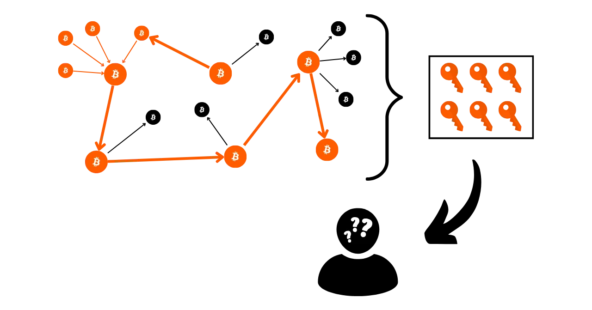

# Bảo vệ Quyền Riêng tư của Bạn trên Bitcoin

Trong một thế giới mà quyền riêng tư của các giao dịch tài chính dần trở thành một xa xỉ, việc hiểu và nắm vững các nguyên tắc bảo vệ quyền riêng tư trong việc sử dụng Bitcoin của bạn là cực kỳ quan trọng. Khóa học này cung cấp cho bạn tất cả các chìa khóa, cả lý thuyết và thực hành, để đạt được điều này một cách tự lực.

Ngày nay, trên Bitcoin, có các công ty chuyên về phân tích chuỗi. Lĩnh vực kinh doanh cốt lõi của họ chính xác là xâm nhập vào không gian riêng tư của bạn, nhằm làm lộ thông tin về các giao dịch của bạn. Thực tế, "quyền riêng tư" trên Bitcoin không tồn tại. Do đó, chính bạn, người dùng, phải khẳng định quyền tự nhiên của mình và bảo vệ tính bảo mật của các giao dịch của bạn, bởi vì không ai khác sẽ làm điều đó thay bạn.

Khóa học này được thiết kế như một hành trình toàn diện và tổng quát. Mỗi khái niệm kỹ thuật được thảo luận chi tiết và được hỗ trợ bởi các sơ đồ giải thích. Mục tiêu là làm cho kiến thức trở nên dễ tiếp cận với mọi người. BTC204 do đó phù hợp cho cả người mới bắt đầu và người dùng trung gian. Khóa học này cũng mang lại giá trị gia tăng cho những người dùng Bitcoin kỳ cựu, khi chúng ta đi sâu vào một số khái niệm kỹ thuật thường không được biết đến.

Tham gia cùng chúng tôi để biến đổi cách sử dụng Bitcoin của bạn và trở thành một người dùng thông thái, có khả năng hiểu rõ các vấn đề xung quanh bảo mật và bảo vệ quyền riêng tư của bạn.

+++

# Giới thiệu
<partId>e17474a8-8899-4bdb-a7f8-bc52ddb01440</partId>

## Giới thiệu về Khóa Học
<chapterId>08ba1933-f393-4fb5-8279-777d874caedb</chapterId>

Trong một thế giới mà quyền riêng tư của các giao dịch tài chính dần trở thành một xa xỉ, việc hiểu và nắm vững các nguyên tắc bảo vệ quyền riêng tư trong việc sử dụng Bitcoin của bạn là cực kỳ quan trọng. Khóa học này cung cấp cho bạn tất cả các chìa khóa, cả lý thuyết và thực hành, để đạt được điều này một cách tự lực.
Ngày nay, trong hệ sinh thái Bitcoin, có các công ty chuyên về phân tích chuỗi. Lĩnh vực kinh doanh cốt lõi của họ chính xác là xâm nhập vào không gian riêng tư của bạn, làm lộ thông tin về các giao dịch của bạn. Trên thực tế, "quyền riêng tư" trên Bitcoin không tồn tại. Do đó, chính bạn, người dùng, phải khẳng định quyền tự nhiên của mình và bảo vệ tính bảo mật của các giao dịch của bạn, bởi vì không ai khác sẽ làm điều đó thay bạn.

Bitcoin không chỉ tồn tại với mục đích "Giá Tăng" và bảo toàn giá trị tiết kiệm. Do những đặc tính và lịch sử độc đáo của nó, Bitcoin chủ yếu là công cụ của nền kinh tế ngầm. Nhờ vào phát minh đáng chú ý này, bạn có thể tự do quản lý tiền của mình, chi tiêu và tích lũy nó, mà không ai có thể ngăn cản bạn.

Bitcoin cung cấp một lối thoát bình yên khỏi ách thống trị của các quốc gia, cho phép bạn tận hưởng trọn vẹn quyền tự nhiên của mình, không thể bị thách thức bởi các luật lệ đã được thiết lập. Nhờ vào phát minh của Satoshi Nakamoto, bạn có quyền buộc người khác tôn trọng tài sản riêng tư của mình và lấy lại tự do ký kết hợp đồng.
Tuy nhiên, Bitcoin không phải là ẩn danh mặc định, điều này có thể tạo ra rủi ro cho những cá nhân tham gia vào nền kinh tế ngầm, đặc biệt là ở những khu vực dưới chế độ độc tài. Nhưng đây không phải là nguy cơ duy nhất. Vì bitcoin là một tài sản có giá trị và không thể kiểm duyệt, nó có thể thu hút sự tham lam của kẻ trộm. Do đó, bảo vệ quyền riêng tư của bạn cũng trở thành một vấn đề an ninh: nó có thể giúp bạn ngăn chặn các cuộc tấn công mạng và hành vi tấn công vật lý.

Như chúng ta sẽ thấy, mặc dù giao thức cung cấp một số bảo vệ quyền riêng tư cơ bản, việc sử dụng các công cụ bổ sung để tối ưu hóa và bảo vệ quyền riêng tư này là rất quan trọng.

Khóa học này được thiết kế như một hành trình toàn diện và tổng quát để hiểu rõ về vấn đề quyền riêng tư trên Bitcoin. Mỗi khái niệm kỹ thuật được chi tiết hóa và hỗ trợ bằng các sơ đồ giải thích. Mục tiêu là làm cho kiến thức trở nên dễ tiếp cận với mọi người, bao gồm cả người mới bắt đầu và người dùng trung gian. Đối với những người dùng bitcoin có kinh nghiệm hơn, chúng tôi cũng đề cập đến các khái niệm kỹ thuật rất chuyên sâu và đôi khi không được biết đến trong suốt khóa học này để làm sâu sắc thêm sự hiểu biết về từng chủ đề.

Mục tiêu của khóa học này không phải là làm cho bạn hoàn toàn ẩn danh trong việc sử dụng Bitcoin, mà là cung cấp cho bạn các công cụ cần thiết để biết cách bảo vệ quyền riêng tư của mình theo mục tiêu cá nhân. Bạn sẽ có tự do lựa chọn từ các khái niệm và công cụ được trình bày để phát triển chiến lược của riêng mình, phù hợp với mục tiêu và nhu cầu cụ thể của bạn.

### Phần 1: Định Nghĩa và Khái Niệm Chính
Để bắt đầu, chúng ta sẽ cùng nhau xem xét các nguyên tắc cơ bản điều khiển hoạt động của Bitcoin, để sau đó có thể tiếp cận một cách bình tĩnh các khái niệm liên quan đến quyền riêng tư. Việc nắm vững một số khái niệm cơ bản như UTXO, địa chỉ nhận, hoặc script, trước khi có thể hoàn toàn hiểu các khái niệm mà chúng tôi sẽ đề cập trong các phần tiếp theo là rất quan trọng. Chúng tôi cũng sẽ giới thiệu mô hình tổng quan về quyền riêng tư Bitcoin, như được Satoshi Nakamoto tưởng tượng, điều này sẽ cho phép chúng ta nắm bắt được các vấn đề và rủi ro liên quan.


### Phần 2: Hiểu về Phân Tích Chuỗi và Cách Bảo Vệ Khỏi Nó

Trong phần thứ hai, chúng tôi nghiên cứu các kỹ thuật được sử dụng bởi các công ty phân tích chuỗi để truy vết hoạt động của bạn trên Bitcoin. Việc hiểu biết những phương pháp này là rất quan trọng để tăng cường bảo vệ quyền riêng tư của bạn. Phần này nhằm xem xét các chiến lược của kẻ tấn công để hiểu rõ hơn về các rủi ro và đặt nền móng cho các kỹ thuật mà chúng tôi sẽ nghiên cứu trong các phần tiếp theo. Chúng tôi sẽ phân tích các mô hình giao dịch, các tiêu chuẩn nội bộ và bên ngoài, cũng như các giải thích khả dĩ của những mô hình này. Ngoài một phần lý thuyết, chúng tôi sẽ học cách sử dụng một trình duyệt khối để thực hiện phân tích chuỗi, thông qua các ví dụ và bài tập thực hành.


### Phần 3: Thành Thạo Các Phương Pháp Tốt Nhất để Bảo Vệ Quyền Riêng Tư của Bạn

Trong phần thứ ba của khóa học của chúng tôi, chúng ta đi vào vấn đề chính: thực hành! Mục tiêu là thành thạo tất cả các phương pháp tốt nhất cần thiết mà nên trở thành phản xạ tự nhiên cho bất kỳ người dùng Bitcoin nào. Chúng tôi sẽ đề cập đến việc sử dụng địa chỉ mới, gắn nhãn, tổng hợp, sử dụng các nút đầy đủ, cũng như KYC và phương pháp mua hàng. Mục tiêu là cung cấp cho bạn một cái nhìn tổng quan toàn diện về các bẫy cần tránh để thiết lập một nền tảng vững chắc trong nhiệm vụ bảo vệ quyền riêng tư của chúng ta. Đối với một số phương pháp này, bạn sẽ được hướng dẫn đến một hướng dẫn cụ thể để thực hiện chúng.


### Phần 4: Hiểu về Giao Dịch Coinjoin

Làm sao chúng ta có thể nói về quyền riêng tư trên Bitcoin mà không thảo luận về coinjoins? Trong phần 4, bạn sẽ khám phá mọi thứ bạn cần biết về phương pháp trộn này. Bạn sẽ học được coinjoin là gì, lịch sử và mục tiêu của nó, cũng như các loại coinjoin khác nhau tồn tại. Cuối cùng, đối với những người dùng có kinh nghiệm hơn, chúng tôi sẽ khám phá những gì là anonsets và entropy, và cách tính toán các chỉ số này.
### Phần 5: Hiểu Biết về Các Kỹ Thuật Bảo Mật Riêng Tư Nâng Cao Khác

Trong phần thứ năm, chúng tôi sẽ cung cấp một cái nhìn tổng quan về tất cả các kỹ thuật hiện có khác để bảo vệ quyền riêng tư của bạn trên Bitcoin, ngoài coinjoin. Trải qua nhiều năm, các nhà phát triển đã thể hiện sự sáng tạo đáng kể trong việc thiết kế các công cụ dành riêng cho quyền riêng tư. Chúng tôi sẽ xem xét tất cả các phương pháp này, như Payjoin, giao dịch hợp tác, Coin Swap và Atomic Swap, chi tiết về cách hoạt động, mục tiêu và điểm yếu tiềm ẩn.

### Phần 6: Khám Phá Đề Xuất Cải Tiến Giao Thức Liên Quan đến Quyền Riêng Tư

Trong khi các phần trước tập trung vào các giải pháp quyền riêng tư ở cấp độ ứng dụng, phần thứ sáu này sẽ đi sâu vào các thách thức ở cấp độ giao thức đối với quyền riêng tư của người dùng. Chúng tôi sẽ thảo luận về quyền riêng tư ở cấp độ mạng lưới các nút và việc phát sóng giao dịch. Chúng tôi cũng sẽ thảo luận về các giao thức đã được đề xuất trong nhiều năm để nâng cao quyền riêng tư của người dùng trên Bitcoin. Cuối cùng, chúng tôi sẽ xem xét ảnh hưởng đến quyền riêng tư, cả tích cực và tiêu cực, của lần soft fork lớn cuối cùng của Bitcoin, Taproot.

***(WIP: LOIC: THÊM VÍ DỤ SƠ ĐỒ Ở ĐÂY)***

### Phần Bổ Sung: Quyền Riêng Tư trên Các Giao Thức Tầng Hai

Như bạn đã hiểu, trọng tâm của khóa học này tập trung độc quyền vào quyền riêng tư onchain. Trong phần bổ sung cuối cùng này, tôi muốn mở rộng chủ đề đến quyền riêng tư trên các giao thức khác liên quan đến Bitcoin. Cụ thể, chúng tôi sẽ nói về quyền riêng tư trên Lightning Network. Một số người cho rằng Lightning mặc định là riêng tư, trong khi những người khác tranh luận rằng quyền riêng tư của người dùng không đủ. Vậy sự thật là gì? Chúng tôi sẽ làm sáng tỏ sự thật từ những sai lầm để hiểu rõ hơn về các thách thức liên quan đến quyền riêng tư trên Lightning Network. Chúng tôi cũng sẽ thảo luận về các sidechain như Liquid Network và các ngân hàng Chaumian như Cashu hoặc Fedimint.


# Định Nghĩa và Khái Niệm Chính
<partId>b9bbbde3-34c0-4851-83e8-e2ffb029cf31</partId>

## Mô Hình UTXO của Bitcoin
<chapterId>8d6b50c5-bf74-44f4-922b-25204991cb75</chapterId>

Bitcoin chủ yếu là một loại tiền tệ, nhưng bạn có biết cụ thể BTC được biểu diễn như thế nào trên giao thức không?

### UTXO của Bitcoin: Chúng Là Gì?

Trên giao thức Bitcoin, việc quản lý đơn vị tiền tệ xoay quanh mô hình UTXO, viết tắt của "_Unspent Transaction Output_" (Đầu Ra Giao Dịch Chưa Tiêu).
Mô hình này hoàn toàn khác biệt so với các hệ thống ngân hàng truyền thống dựa vào cơ chế tài khoản và số dư để theo dõi dòng tiền tệ. Thực sự, trong hệ thống ngân hàng, số dư cá nhân được duy trì trong các tài khoản gắn liền với một danh tính. Ví dụ, khi bạn mua một ổ bánh mì từ một tiệm bánh, ngân hàng của bạn chỉ đơn giản trừ số tiền mua hàng khỏi tài khoản của bạn, do đó giảm số dư của bạn, trong khi tài khoản của tiệm bánh được ghi có cùng một số tiền, tăng số dư của họ. Trong hệ thống này, không có khái niệm về mối liên kết giữa tiền vào tài khoản và tiền ra khỏi nó, ngoại trừ hồ sơ giao dịch.
Trên Bitcoin, mọi thứ hoạt động khác biệt. Khái niệm về tài khoản không tồn tại, và đơn vị tiền tệ không được quản lý qua số dư mà thông qua UTXO. Một UTXO đại diện cho một lượng bitcoins cụ thể chưa được tiêu, do đó tạo thành một "mảnh bitcoin," có thể lớn hoặc nhỏ. Ví dụ, một UTXO có thể trị giá `500 BTC` hoặc chỉ `700 SATS`.
**> Nhắc nhở:** Satoshi, thường được viết tắt là sat, là đơn vị nhỏ nhất của Bitcoin, tương đương với một cent trong các đồng tiền tệ thông thường.
```bash
1 BTC = 100 000 000 SATS
```

Lý thuyết, một UTXO có thể đại diện cho bất kỳ giá trị nào bằng bitcoin, từ một sat cho đến giới hạn lý thuyết tối đa khoảng 21 triệu BTC. Tuy nhiên, việc sở hữu tất cả 21 triệu bitcoin là điều không thể về mặt lý thuyết, và có một ngưỡng kinh tế thấp được gọi là "dust," dưới đó một UTXO được coi là không có lợi nhuận kinh tế để chi tiêu.

**> Bạn có biết?** UTXO lớn nhất từng được tạo ra trên Bitcoin có giá trị `500 000 BTC`. Nó được tạo ra bởi nền tảng MtGox trong một hoạt động tổng hợp vào tháng 11 năm 2011: [29a3efd3ef04f9153d47a990bd7b048a4b2d213daaa5fb8ed670fb85f13bdbcf](https://mempool.space/en/tx/29a3efd3ef04f9153d47a990bd7b048a4b2d213daaa5fb8ed670fb85f13bdbcf)

### UTXOs và Điều kiện Chi tiêu

UTXOs là công cụ giao dịch trên Bitcoin. Mỗi giao dịch dẫn đến việc tiêu thụ UTXOs như đầu vào và tạo ra UTXOs mới như đầu ra. Khi một giao dịch được thực hiện, các UTXOs được sử dụng như đầu vào được coi là "đã chi tiêu," và UTXOs mới được tạo ra và gán cho người nhận được chỉ định trong đầu ra của giao dịch. Do đó, một UTXO đơn giản chỉ đại diện cho một đầu ra giao dịch chưa được chi tiêu, và do đó là một lượng bitcoin thuộc về một người dùng tại một thời điểm nhất định.


Tất cả UTXOs đều được bảo vệ bởi các script định nghĩa điều kiện mà chúng có thể được chi tiêu. Để tiêu thụ một UTXO, người dùng phải chứng minh với mạng lưới rằng họ đáp ứng các điều kiện được quy định bởi script bảo vệ UTXO đó. Nói chung, UTXOs được bảo vệ bởi một khóa công khai (hoặc một địa chỉ nhận đại diện cho khóa công khai này). Để chi tiêu một UTXO liên kết với khóa công khai này, người dùng phải chứng minh rằng họ sở hữu khóa riêng tương ứng, bằng cách cung cấp một chữ ký số được tạo ra với khóa này. Đây là lý do tại sao người ta nói rằng ví Bitcoin của bạn thực sự không chứa bitcoin, mà thực tế nó lưu trữ các khóa riêng của bạn, từ đó cho phép bạn truy cập vào UTXOs của mình và, theo đó, đến các bitcoin mà chúng đại diện.


Vì khái niệm về tài khoản không tồn tại trong Bitcoin, số dư của một ví đơn giản tương ứng với tổng giá trị của tất cả UTXOs mà nó có thể chi tiêu. Ví dụ, nếu ví Bitcoin của bạn có thể chi tiêu 4 UTXOs sau:

```bash
- 2 BTC
- 8 BTC
- 5 BTC
- 2 BTC
```

Tổng số dư của ví bạn sẽ là `17 BTC`.


## Cấu trúc của giao dịch Bitcoin
<chapterId>29d3aaab-de2e-4746-ab40-c9748898850c</chapterId>

### Các đầu vào và đầu ra của một giao dịch
Một giao dịch Bitcoin là một hoạt động được ghi lại trên blockchain cho phép chuyển quyền sở hữu bitcoin từ người này sang người khác. Cụ thể hơn, vì chúng ta đang ở trong mô hình UTXO và không có tài khoản, giao dịch đáp ứng các điều kiện chi tiêu đã bảo vệ một hoặc nhiều UTXO, tiêu thụ chúng và tạo ra tương đương với UTXO mới được trao điều kiện chi tiêu mới. Nói ngắn gọn, một giao dịch di chuyển bitcoin từ một script được thỏa mãn sang một script mới nhằm bảo vệ chúng.

Mỗi giao dịch Bitcoin do đó được tạo thành từ một hoặc nhiều đầu vào và một hoặc nhiều đầu ra. Các đầu vào là UTXO được giao dịch tiêu thụ để tạo ra các đầu ra. Các đầu ra là UTXO mới sẽ có thể sử dụng như đầu vào cho các giao dịch tương lai.

**> Bạn có biết?** Lý thuyết, một giao dịch bitcoin có thể có vô số đầu vào và đầu ra. Chỉ có kích thước tối đa của một khối giới hạn số lượng này.
Mỗi đầu vào trong một giao dịch Bitcoin đề cập đến một UTXO chưa được tiêu trước đó. Để sử dụng một UTXO làm đầu vào, người giữ nó phải chứng minh rằng họ là chủ sở hữu hợp pháp bằng cách xác nhận script liên quan đến nó, tức là, bằng cách thỏa mãn điều kiện chi tiêu được áp đặt. Nói chung, điều này liên quan đến việc cung cấp một chữ ký số được tạo ra bằng khóa riêng tương ứng với khóa công khai đã ban đầu bảo vệ UTXO đó. Script do đó bao gồm việc xác minh rằng chữ ký khớp với khóa công khai được sử dụng khi nhận tiền.

Mỗi đầu ra, mặt khác, chỉ định số lượng bitcoin được chuyển, cũng như người nhận. Người nhận được định nghĩa bởi một script mới mà, nói chung, khóa UTXO mới được tạo với một địa chỉ nhận hoặc một khóa công khai mới.

Để một giao dịch được coi là hợp lệ theo các quy tắc đồng thuận, tổng số của các đầu ra phải nhỏ hơn hoặc bằng tổng số của các đầu vào. Nói cách khác, tổng số của các UTXO mới được tạo ra bởi giao dịch không được vượt quá số lượng của các UTXO được tiêu thụ như đầu vào. Nguyên tắc này là hợp lý: nếu bạn chỉ có một lượng `500,000 SATS`, bạn không thể thực hiện một giao dịch mua `700,000 SATS`.

### Thay đổi và Hợp nhất trong một Giao dịch Bitcoin

Hành động của một giao dịch Bitcoin đối với UTXO có thể được so sánh với việc nấu chảy một đồng tiền vàng. Thực tế, một UTXO không thể chia nhỏ, nhưng chỉ có thể hợp nhất. Điều này có nghĩa là người dùng không thể đơn giản chia nhỏ một UTXO đại diện cho một lượng bitcoin nhất định thành nhiều UTXO nhỏ hơn. Họ phải tiêu thụ hoàn toàn nó trong một giao dịch để tạo ra một hoặc nhiều UTXO mới với các giá trị tùy ý trong các đầu ra, phải nhỏ hơn hoặc bằng giá trị ban đầu. 

Cơ chế này tương tự như đối với một đồng tiền vàng. Hãy tưởng tượng bạn sở hữu một đồng tiền 2 ounce và bạn muốn thực hiện một thanh toán 1 ounce, giả sử người bán không thể trả lại tiền thừa. Bạn sẽ cần phải nấu chảy đồng tiền của mình và đúc 2 đồng mới mỗi đồng 1 ounce.
Trên Bitcoin, hoạt động tương tự như vậy. Hãy tưởng tượng Alice có một UTXO trị giá `10,000 SATS` và cô ấy muốn mua một chiếc bánh mì baguette với giá `4,000 SATS`. Alice sẽ thực hiện một giao dịch với một input là 1 UTXO trị giá `10,000 SATS` mà cô ấy sẽ tiêu hết, và trong outputs, cô ấy sẽ tạo ra 2 UTXO với giá trị là `4,000 SATS` và `6,000 SATS`. UTXO trị giá `4,000 SATS` sẽ được gửi cho người bán bánh mì như là tiền thanh toán cho chiếc bánh, trong khi UTXO trị giá `6,000 SATS` sẽ quay trở lại với Alice như là tiền thối. UTXO này quay trở lại người gửi ban đầu của giao dịch được gọi là "tiền thối" trong thuật ngữ Bitcoin.

Bây giờ hãy tưởng tượng rằng Alice không có một UTXO duy nhất trị giá `10,000 SATS`, mà thay vào đó là hai UTXO mỗi cái trị giá `3,000 SATS`. Trong tình huống này, không có UTXO nào riêng lẻ đủ để thanh toán `4,000 SATS` cho chiếc bánh mì. Do đó, Alice phải sử dụng cả hai UTXO trị giá `3,000 SATS` làm inputs cho giao dịch của mình. Như vậy, tổng số tiền của các inputs sẽ đạt `6,000 SATS`, cho phép cô ấy thanh toán `4,000 SATS` cho người bán bánh. Phương pháp này, liên quan đến việc nhóm nhiều UTXO trong các inputs của một giao dịch, thường được gọi là "tổng hợp".

### Phí Giao Dịch

Một cách trực quan, người ta có thể nghĩ rằng phí giao dịch cũng đại diện cho một output của giao dịch. Nhưng thực tế không phải vậy. Phí của một giao dịch đại diện cho sự chênh lệch giữa tổng số các inputs và tổng số các outputs. Điều này có nghĩa là, sau khi sử dụng một phần giá trị của các inputs để thanh toán cho các outputs mong muốn trong một giao dịch, một số tiền nhất định của các inputs còn lại không được sử dụng. Số tiền dư này tạo thành phí giao dịch.

```bash
Phí = tổng inputs - tổng outputs
```

Hãy xem lại ví dụ về Alice có một UTXO trị giá `10,000 SATS` và muốn mua một chiếc bánh mì với giá `4,000 SATS`. Alice tạo một giao dịch với UTXO của mình trị giá `10,000 SATS` làm input. Sau đó, cô ấy tạo ra một output trị giá `4,000 SATS` dành cho người bán bánh để thanh toán cho chiếc bánh. Để khuyến khích các thợ mỏ bao gồm giao dịch của mình vào một khối, Alice dành ra `200 SATS` làm phí. Cô ấy do đó tạo ra một output thứ hai, tiền thối, sẽ quay trở lại với cô ấy, với số tiền là `5,800 SATS`.

Bằng cách áp dụng công thức phí, chúng ta thực sự thấy rằng còn lại `200 SATS` cho các thợ mỏ:
```bash
Phí = tổng inputs - tổng outputs
Phí = 10,000 - (4,000 + 5,800)
Phí = 10,000 - 9,800
Phí = 200
```

Khi một thợ mỏ thành công trong việc xác nhận một khối, họ được phép thu thập các phí này cho tất cả các giao dịch được bao gồm trong khối của họ, thông qua giao dịch được gọi là "coinbase".

### Sự Tạo Ra Của UTXOs trên Bitcoin

Nếu bạn đã theo dõi các đoạn văn trước một cách chặt chẽ, bạn giờ đây sẽ biết rằng UTXO chỉ có thể được tạo ra bằng cách tiêu thụ các UTXO khác đã tồn tại. Do đó, tiền trên Bitcoin tạo thành một chuỗi liên tục. Tuy nhiên, bạn có thể tự hỏi làm thế nào mà những UTXO đầu tiên trong chuỗi này xuất hiện. Điều này đặt ra một vấn đề tương tự như câu hỏi gà và trứng: những UTXO gốc này đến từ đâu?
Câu trả lời nằm ở **giao dịch coinbase**.

Coinbase là một loại giao dịch Bitcoin đặc biệt, duy nhất cho mỗi khối và luôn là giao dịch đầu tiên. Nó cho phép người khai thác tìm ra bằng chứng công việc hợp lệ nhận phần thưởng khối của họ. Phần thưởng này bao gồm hai yếu tố: **phần thưởng khối** và **phí giao dịch** mà chúng ta đã thảo luận trong phần trước.

Đặc điểm độc đáo của giao dịch coinbase là nó là giao dịch duy nhất có thể tạo ra bitcoin từ không khí mỏng, không cần tiêu thụ đầu vào để tạo ra đầu ra của nó. Những bitcoin mới tạo ra này tạo thành những gì chúng ta có thể gọi là "UTXO gốc".


Bitcoin từ phần thưởng khối là BTC mới được tạo ra từ không, theo một lịch trình phát hành đã được thiết lập trước trong các quy tắc đồng thuận. Phần thưởng khối được giảm một nửa sau mỗi 210,000 khối, khoảng mỗi bốn năm, trong một quá trình gọi là "halving". Ban đầu, 50 bitcoin được tạo ra với mỗi phần thưởng, nhưng số lượng này đã dần giảm; hiện tại, nó là 3.125 bitcoin mỗi khối.

Về phần liên quan đến phí giao dịch, mặc dù nó cũng đại diện cho BTC mới được tạo ra, chúng không được vượt quá sự chênh lệch giữa tổng số đầu vào và đầu ra của tất cả các giao dịch trong một khối. Chúng ta đã thấy trước đó rằng những phí này đại diện cho phần của đầu vào không được sử dụng trong đầu ra của các giao dịch. Phần này về mặt kỹ thuật là "mất" trong quá trình giao dịch, và người khai thác có quyền tái tạo giá trị này dưới dạng một hoặc nhiều UTXO mới. Do đó, đây là sự chuyển giao giá trị từ người gửi giao dịch cho người khai thác, người thêm nó vào blockchain.

**> Bạn có biết?** Bitcoin được tạo ra bởi một giao dịch coinbase phải chịu một thời gian chờ đợi 100 khối trước khi chúng có thể được người khai thác tiêu. Quy tắc này nhằm mục đích ngăn chặn những rắc rối liên quan đến việc sử dụng bitcoin mới tạo trên một chuỗi có thể sau này trở nên lỗi thời.

### Ý Nghĩa của Mô Hình UTXO

Đầu tiên, mô hình UTXO ảnh hưởng trực tiếp đến phí giao dịch trên Bitcoin. Do khả năng của mỗi khối là có hạn, người khai thác ưu tiên các giao dịch cung cấp phí tốt nhất tương đối với không gian chúng sẽ chiếm trong khối. Thực tế, càng nhiều UTXO một giao dịch bao gồm dưới dạng đầu vào và đầu ra, nó càng nặng và do đó, yêu cầu phí cao hơn. Đây là một trong những lý do tại sao chúng ta thường cố gắng giảm số lượng UTXO trong ví của mình, điều này cũng có thể ảnh hưởng đến quyền riêng tư, một chủ đề mà chúng ta sẽ thảo luận chi tiết trong phần thứ ba của khóa học này.

Tiếp theo, như đã đề cập trong các phần trước, tiền trên Bitcoin cơ bản là một chuỗi của UTXO. Mỗi giao dịch do đó tạo ra một liên kết giữa một UTXO quá khứ và một UTXO tương lai. UTXO do đó cho phép theo dõi rõ ràng bitcoin từ khi chúng được tạo ra đến khi chúng được tiêu hiện tại. Sự minh bạch này có thể được nhìn nhận một cách tích cực, vì nó cho phép mỗi người dùng xác minh tính xác thực của bitcoin nhận được. Tuy nhiên, cũng chính trên nguyên tắc về khả năng theo dõi và kiểm toán này mà phân tích chuỗi dựa trên, một thực hành nhằm xâm phạm quyền riêng tư của bạn. Chúng ta sẽ nghiên cứu thực hành này một cách sâu rộng trong phần thứ hai của khóa học.

## Mô hình bảo mật Bitcoin
<chapterId>769d8963-3ed5-4094-b21d-9203c7d9e465</chapterId>

### Tiền tệ: Tính Xác Thực, Tính Toàn Vẹn và Vấn đề Chi Tiêu Gấp Đôi

Một trong những chức năng của tiền tệ là giải quyết vấn đề về sự trùng hợp kép của nhu cầu. Trong một hệ thống dựa trên việc trao đổi hàng hóa, việc thực hiện một giao dịch không chỉ đòi hỏi việc tìm kiếm một cá nhân đang cung cấp một hàng hóa phù hợp với nhu cầu của tôi mà còn cần cung cấp cho họ một hàng hóa có giá trị tương đương thỏa mãn nhu cầu của họ. Việc tìm kiếm sự cân bằng này chứng tỏ là phức tạp.


Đó là lý do tại sao chúng ta sử dụng tiền tệ, cho phép chuyển giao giá trị cả về không gian và thời gian.


Để tiền tệ giải quyết được vấn đề này, điều cần thiết là bên cung cấp hàng hóa hoặc dịch vụ phải tin tưởng vào khả năng của họ trong việc chi tiêu số tiền đó sau này. Do đó, bất kỳ cá nhân nào muốn chấp nhận một đơn vị tiền tệ, dù là kỹ thuật số hay vật lý, đều sẽ đảm bảo rằng nó đáp ứng hai tiêu chí cơ bản:
- **Đồng tiền phải còn nguyên vẹn và xác thực;**
- **và nó không được chi tiêu gấp đôi.**
Khi sử dụng tiền tệ vật lý, đặc điểm đầu tiên là phức tạp nhất để khẳng định. Tại các thời điểm khác nhau trong lịch sử, tính toàn vẹn của đồng tiền kim loại thường xuyên bị xâm phạm bởi các hành vi như cắt xén hoặc khoan lỗ. Ví dụ, trong thời cổ đại Rome, việc người dân cạo mép của đồng tiền vàng để thu thập một ít kim loại quý, trong khi vẫn giữ chúng cho các giao dịch tương lai là điều phổ biến. Giá trị nội tại của đồng tiền do đó bị giảm, nhưng giá trị mặt tiền vẫn giữ nguyên. Đây chính là lý do tại sao sau này người ta đúc rãnh trên mép của đồng tiền.

Tính xác thực cũng là một đặc điểm khó xác minh với các phương tiện tiền tệ vật lý. Ngày nay, các kỹ thuật chống làm giả ngày càng phức tạp, buộc các nhà buôn phải đầu tư vào các hệ thống xác minh đắt tiền.

Mặt khác, do bản chất của chúng, vấn đề chi tiêu gấp đôi không phải là một vấn đề đối với tiền tệ vật lý. Nếu tôi đưa bạn một tờ €10, nó không thể quay trở lại tay tôi và chuyển vào tay bạn, tự nhiên loại trừ bất kỳ khả năng nào của việc chi tiêu cùng một đơn vị tiền tệ nhiều lần. Nói ngắn gọn, tôi sẽ không thể chi tiêu lại tờ €10 đó.


Đối với tiền tệ kỹ thuật số, khó khăn là khác biệt. Đảm bảo tính xác thực và toàn vẹn của một đồng tiền thường đơn giản hơn. Như chúng ta đã thấy trong phần trước, mô hình UTXO của Bitcoin cho phép truy vết một đồng tiền trở lại nguồn gốc của nó, từ đó xác minh rằng nó thực sự được tạo ra theo các quy tắc đồng thuận bởi một thợ mỏ.

Tuy nhiên, đảm bảo không có chi tiêu gấp đôi lại phức tạp hơn, vì bất kỳ hàng hóa kỹ thuật số nào về cơ bản cũng là thông tin. Khác với hàng hóa vật lý, thông tin không chia sẻ trong các giao dịch mà lan truyền bằng cách nhân bản. Ví dụ, nếu tôi gửi cho bạn một tài liệu qua email, nó sau đó được sao chép. Ở phía bạn, bạn không thể xác minh chắc chắn rằng tôi đã xóa bản gốc của tài liệu.


### Ngăn Chặn Chi Tiêu Gấp Đôi trên Bitcoin

Cách duy nhất để tránh sự nhân bản của một hàng hóa kỹ thuật số là biết được tất cả các giao dịch trong hệ thống. Theo cách này, người ta có thể biết ai sở hữu cái gì và cập nhật số dư của mọi người theo các giao dịch được thực hiện. Đây là điều được thực hiện, ví dụ, với tiền ghi sổ trong hệ thống ngân hàng. Khi bạn trả €10 cho một người bán hàng bằng thẻ tín dụng, ngân hàng ghi lại giao dịch này và cập nhật sổ cái.
Trên Bitcoin, việc ngăn chặn giao dịch kép được thực hiện theo cùng một cách. Mục tiêu là xác nhận sự vắng mặt của một giao dịch đã sử dụng các đồng tiền đó trước đây. Nếu những đồng tiền này chưa bao giờ được sử dụng, thì chúng ta có thể yên tâm rằng không có giao dịch kép nào xảy ra. Nguyên tắc này được Satoshi Nakamoto mô tả trong Bản Trắng với câu nổi tiếng:
**"*Cách duy nhất để xác nhận sự vắng mặt của một giao dịch là phải biết về tất cả các giao dịch.*"**

Tuy nhiên, không giống như mô hình ngân hàng, không có mong muốn phải tin tưởng vào một thực thể trung tâm trên Bitcoin. Cần thiết cho tất cả người dùng có thể xác nhận sự vắng mặt này của giao dịch kép, mà không phụ thuộc vào bên thứ ba. Do đó, mọi người đều phải biết về tất cả các giao dịch Bitcoin. Đây là lý do tại sao các giao dịch Bitcoin được công bố công khai trên tất cả các nút mạng và được ghi lại một cách rõ ràng trên blockchain.

Chính sự phổ biến công khai thông tin này làm phức tạp việc bảo vệ quyền riêng tư trên Bitcoin. Trong hệ thống ngân hàng truyền thống, theo lý thuyết, chỉ có tổ chức tài chính mới biết về các giao dịch được thực hiện. Ngược lại, trên Bitcoin, tất cả người dùng đều được thông báo về tất cả các giao dịch, qua các nút tương ứng của họ.

### Mô hình quyền riêng tư: hệ thống ngân hàng so với Bitcoin

Trong hệ thống truyền thống, tài khoản ngân hàng của bạn được liên kết với danh tính của bạn. Người làm ngân hàng có thể biết tài khoản ngân hàng nào thuộc về khách hàng nào, và những giao dịch nào được liên kết với nó. Tuy nhiên, dòng thông tin này bị cắt đứt giữa ngân hàng và lĩnh vực công cộng. Nói cách khác, không thể biết được số dư và các giao dịch của một tài khoản ngân hàng thuộc về một cá nhân khác. Chỉ có ngân hàng mới có quyền truy cập vào thông tin này.

Ví dụ, người làm ngân hàng của bạn biết rằng bạn mua bánh mì mỗi sáng tại tiệm bánh của khu phố, nhưng hàng xóm của bạn không biết về giao dịch này. Do đó, dòng thông tin chỉ có thể truy cập bởi các bên liên quan, đặc biệt là ngân hàng, nhưng vẫn không thể truy cập bởi người ngoài.

Do ràng buộc của việc phổ biến công khai các giao dịch mà chúng ta đã thấy ở phần trước, mô hình quyền riêng tư của Bitcoin không thể theo mô hình của hệ thống ngân hàng. Trong trường hợp của Bitcoin, vì dòng thông tin không thể bị đứt đoạn giữa các giao dịch và lĩnh vực công cộng, **mô hình quyền riêng tư dựa vào sự tách biệt giữa danh tính của người dùng và chính các giao dịch**.
Ví dụ, nếu bạn mua bánh mì từ tiệm bánh bằng cách thanh toán bằng BTC, hàng xóm của bạn, người sở hữu nút đầy đủ của riêng họ, có thể thấy giao dịch của bạn diễn ra, giống như họ có thể thấy tất cả các giao dịch khác trong hệ thống. Tuy nhiên, nếu các nguyên tắc quyền riêng tư được tôn trọng, họ không nên có khả năng liên kết giao dịch cụ thể này với danh tính của bạn.


Nhưng vì các giao dịch Bitcoin được công bố công khai, vẫn có khả năng thiết lập các liên kết giữa chúng để suy luận thông tin về các bên liên quan. Hoạt động này thậm chí còn là một chuyên môn riêng gọi là "phân tích chuỗi". Trong phần tiếp theo của khóa học, tôi mời bạn khám phá cơ bản của phân tích chuỗi để hiểu cách bitcoins của bạn được theo dõi và biết cách bảo vệ mình tốt hơn.

# Hiểu về Phân Tích Chuỗi và Cách Bảo Vệ Bản Thân
<partId>4739371e-9fef-45b0-bcaa-b7a4df6b4470</partId>

## Phân Tích Chuỗi trên Bitcoin là gì?
<chapterId>7d198ba6-4af2-4f24-86cb-3c79cb25627e</chapterId>

### Định Nghĩa và Hoạt Động
Phân tích chuỗi là một phương pháp bao gồm tất cả các phương thức để truy vết dòng chảy của bitcoin trên blockchain. Nói chung, phân tích chuỗi dựa vào việc quan sát các đặc điểm trong các mẫu giao dịch trước đó. Sau đó, nó bao gồm việc xác định những đặc điểm này trong một giao dịch mà người ta muốn phân tích và suy luận các giả thuyết hợp lý. Phương pháp giải quyết vấn đề này từ một cách tiếp cận thực tế, để tìm một giải pháp đủ tốt, được gọi là "heuristic".

Để đơn giản hóa, phân tích chuỗi được thực hiện qua ba bước chính:
1. **Quan sát blockchain;**
2. **Xác định các đặc điểm đã biết;**
3. **Suy luận các giả thuyết.**


Phân tích chuỗi có thể được thực hiện bởi bất kỳ ai. Nó chỉ yêu cầu truy cập vào thông tin công khai của blockchain thông qua một nút đầy đủ để quan sát các chuyển động của giao dịch và đưa ra giả thuyết. Cũng có các công cụ miễn phí giúp tạo điều kiện cho việc phân tích này, như trang web [OXT.me](https://oxt.me/) mà chúng ta sẽ khám phá chi tiết trong hai chương cuối của phần này. Tuy nhiên, rủi ro chính đối với quyền riêng tư đến từ các công ty chuyên về phân tích chuỗi. Những công ty này đã đưa phân tích chuỗi lên một quy mô công nghiệp và bán dịch vụ của họ cho các tổ chức tài chính hoặc chính phủ. Trong số các công ty này, Chainalysis có lẽ là công ty được biết đến nhiều nhất.

### Mục Tiêu của Phân Tích Chuỗi
Một trong những mục tiêu của phân tích chuỗi là nhóm các hoạt động khác nhau trên Bitcoin để xác định tính độc đáo của người dùng thực hiện chúng. Sau đó, sẽ có thể cố gắng liên kết bó hoạt động này với một danh tính thực.


Nhớ lại chương trước. Tôi đã giải thích tại sao mô hình quyền riêng tư của Bitcoin ban đầu dựa vào việc tách biệt danh tính của người dùng khỏi các giao dịch của họ. Do đó, có thể sẽ thú vị khi nghĩ rằng phân tích chuỗi không cần thiết, vì ngay cả khi người ta quản lý để nhóm các hoạt động trên chuỗi, họ không thể liên kết chúng với một danh tính thực.

Về lý thuyết, phát biểu này là chính xác. Trong phần đầu của khóa học này, chúng ta đã thấy rằng các cặp khóa mật mã được sử dụng để thiết lập các điều kiện trên UTXO. Về bản chất, những cặp khóa này không tiết lộ bất kỳ thông tin nào về danh tính của người giữ chúng. Do đó, ngay cả khi người ta thành công trong việc nhóm các hoạt động liên quan đến các cặp khóa khác nhau, điều này không nói lên điều gì về thực thể đứng sau những hoạt động này.



Tuy nhiên, thực tế thực hành lại phức tạp hơn nhiều. Có rất nhiều hành vi có nguy cơ liên kết một danh tính thực với một hoạt động trên chuỗi. Trong phân tích, điều này được gọi là một điểm nhập cảnh, và có rất nhiều điểm như vậy.

Phổ biến nhất, tất nhiên, là KYC (*Know Your Customer*). Nếu bạn rút bitcoin của mình từ một nền tảng được quản lý về một trong những địa chỉ nhận cá nhân của bạn, thì một số người có thể liên kết danh tính của bạn với địa chỉ này. Rộng hơn, một điểm nhập cảnh có thể là bất kỳ hình thức tương tác nào giữa cuộc sống thực của bạn và một giao dịch Bitcoin. Ví dụ, nếu bạn công bố một địa chỉ nhận trên các mạng xã hội của mình, điều này có thể tạo thành một điểm nhập cảnh cho phân tích. Nếu bạn thực hiện một khoản thanh toán bằng bitcoin cho người bán bánh của mình, họ có thể liên kết khuôn mặt của bạn (là một phần của danh tính của bạn) với một địa chỉ Bitcoin.

Những điểm nhập cảnh này gần như không thể tránh khỏi trong việc sử dụng Bitcoin. Mặc dù người ta có thể tìm cách hạn chế phạm vi của chúng, chúng vẫn sẽ tồn tại. Đó là lý do tại sao việc kết hợp các phương pháp nhằm bảo vệ quyền riêng tư của bạn là rất quan trọng. Mặc dù duy trì sự tách biệt giữa danh tính thực của bạn và các giao dịch của bạn là một cách tiếp cận thú vị, nó vẫn chưa đủ hiệu quả ngày nay. Thực tế, nếu tất cả các hoạt động trên chuỗi của bạn có thể được nhóm lại, thì điểm nhập cảnh nhỏ nhất cũng có khả năng làm lộ lớp duy nhất của quyền riêng tư mà bạn đã thiết lập.


### Phòng Vệ Chống Lại Phân Tích Chuỗi
Vì vậy, việc có khả năng đối mặt với phân tích blockchain trong việc sử dụng Bitcoin của chúng ta cũng là điều cần thiết. Bằng cách tiến hành theo cách này, chúng ta có thể giảm thiểu việc tổng hợp các hoạt động của mình và hạn chế ảnh hưởng của một điểm nhập cảnh đối với quyền riêng tư của chúng ta. 

Thực sự, để đối phó tốt hơn với phân tích blockchain, cách tiếp cận tốt nhất là gì nếu không phải là làm quen với các phương pháp được sử dụng trong phân tích blockchain? Nếu bạn muốn biết cách cải thiện quyền riêng tư trên Bitcoin, bạn phải hiểu những phương pháp này. Điều này sẽ giúp bạn hiểu rõ hơn về các kỹ thuật như [Coinjoin](https://planb.network/en/tutorials/privacy/coinjoin-samourai-wallet) hoặc [Payjoin](https://planb.network/en/tutorials/privacy/payjoin) (các kỹ thuật mà chúng ta sẽ nghiên cứu trong các phần cuối của khóa học), và giảm thiểu những sai lầm bạn có thể mắc phải.

Trong điều này, chúng ta có thể đưa ra một sự tương đồng với mã hóa và phân tích mã hóa. Một nhà mã hóa giỏi trước hết là một nhà phân tích mã hóa giỏi. Để tưởng tượng ra một thuật toán mã hóa mới, người ta phải biết nó sẽ phải đối mặt với những cuộc tấn công nào, và cũng nghiên cứu tại sao các thuật toán trước đó bị phá vỡ. Cùng một nguyên tắc áp dụng cho quyền riêng tư trên Bitcoin. Hiểu các phương pháp của phân tích blockchain là chìa khóa để bảo vệ chống lại nó. Đó là lý do tại sao tôi đề xuất một phần hoàn toàn về phân tích blockchain trong khóa học này.

### Các phương pháp của phân tích blockchain

Quan trọng là phải hiểu rằng phân tích blockchain không phải là một khoa học chính xác. Nó dựa trên các quy tắc suy luận từ các quan sát trước đó hoặc các diễn giải logic. Những quy tắc này cho phép đạt được kết quả khá đáng tin cậy, nhưng không bao giờ với độ chính xác tuyệt đối. Nói cách khác, **phân tích blockchain luôn bao gồm một khía cạnh về xác suất trong các kết luận được đưa ra**. Ví dụ, có thể ước lượng với độ chắc chắn ít nhiều rằng hai địa chỉ thuộc về cùng một thực thể, nhưng sự chắc chắn tuyệt đối luôn nằm ngoài tầm với.

Mục tiêu chính của phân tích blockchain chính xác nằm ở việc tổng hợp các quy tắc suy luận khác nhau nhằm giảm thiểu rủi ro sai lầm. Nó, theo một cách nào đó, là sự tích lũy của bằng chứng cho phép chúng ta tiếp cận thực tế một cách chính xác hơn.

Những quy tắc suy luận nổi tiếng này có thể được phân loại vào các danh mục khác nhau mà chúng ta sẽ chi tiết cùng nhau:
- **Mô hình giao dịch (hoặc mô hình giao dịch);**
- **Quy tắc suy luận nội bộ của giao dịch;**
- **Quy tắc suy luận bên ngoài của giao dịch.**

### Satoshi Nakamoto và phân tích blockchain
Đáng chú ý là hai quy tắc suy luận đầu tiên cho phân tích chuỗi được phát hiện bởi chính Satoshi Nakamoto. Ông thảo luận về chúng trong phần 10 của Bản Trắng Bitcoin. Đó là:
- quy tắc suy luận Sở Hữu Đầu Vào Chung (CIOH);
- và việc sử dụng lại địa chỉ.


Nguồn: S. Nakamoto, "Bitcoin: Hệ thống Tiền tệ Điện tử Ngang hàng", https://bitcoin.org/bitcoin.pdf, 2009.

Trong các chương tiếp theo, chúng ta sẽ khám phá những gì bao gồm chúng, nhưng đã là điều thú vị khi lưu ý rằng hai quy tắc suy luận này vẫn duy trì một vị thế quan trọng trong phân tích chuỗi ngày nay.

## Mô hình Giao Dịch
<chapterId>d365a101-2d37-46a5-bfb9-3c51e37bf96b</chapterId>

Một mô hình giao dịch đơn giản là một mô hình hoặc cấu trúc tổng thể của một giao dịch điển hình có thể được tìm thấy trên blockchain, mà việc diễn giải của nó có khả năng được biết đến. Khi nghiên cứu các mô hình, chúng ta sẽ tập trung vào một giao dịch duy nhất mà chúng ta sẽ phân tích ở mức độ cao.
Nói cách khác, chúng ta chỉ xem xét số lượng UTXO trong đầu vào và số lượng UTXO trong đầu ra, mà không đi sâu vào các chi tiết cụ thể hơn hoặc môi trường giao dịch. Từ mô hình quan sát được, chúng ta sẽ có thể giải thích bản chất của giao dịch. Sau đó, chúng ta sẽ tìm kiếm các đặc điểm của cấu trúc và suy luận một giải thích.


Trong phần này, chúng ta sẽ cùng nhau khám phá các mô hình giao dịch chính có thể gặp trong phân tích chuỗi, và cho mỗi mô hình, tôi sẽ cung cấp cho bạn giải thích có thể có của cấu trúc này, kèm theo một ví dụ cụ thể.

### Gửi Đơn Giản (hoặc Thanh Toán Đơn Giản)

Chúng ta bắt đầu với một mô hình phổ biến, vì đó là mô hình xuất hiện trong hầu hết các giao dịch bitcoin. Mô hình thanh toán đơn giản được đặc trưng bởi việc tiêu thụ một hoặc nhiều UTXO trong đầu vào và tạo ra 2 UTXO trong đầu ra. Vì vậy, mô hình này sẽ trông như thế này:


Khi chúng ta phát hiện cấu trúc giao dịch này trên blockchain, chúng ta có thể rút ra một giải thích. Như tên gọi của nó, mô hình này chỉ ra rằng chúng ta đang ở trong một giao dịch gửi hoặc thanh toán. Người dùng đã tiêu thụ UTXO của chính họ trong đầu vào để thỏa mãn trong đầu ra một UTXO thanh toán và một UTXO thay đổi (tiền thừa trả lại cho cùng một người dùng).

Vì vậy, chúng ta biết rằng người dùng quan sát được có khả năng không còn sở hữu một trong hai UTXO trong đầu ra (cái được thanh toán), nhưng họ vẫn sở hữu UTXO còn lại (tiền thừa).
Tại thời điểm này, chúng ta không thể xác định đầu ra nào đại diện cho UTXO nào, vì đó không phải là mục tiêu của việc nghiên cứu mô hình. Chúng ta sẽ đạt được điều này bằng cách dựa vào các phép suy luận mà chúng ta sẽ nghiên cứu trong các phần tiếp theo. Tại giai đoạn này, mục tiêu của chúng ta giới hạn ở việc xác định bản chất của giao dịch đang được nói đến, trong trường hợp này, là một giao dịch gửi đơn giản.

Ví dụ, đây là một giao dịch Bitcoin tuân theo mô hình gửi đơn giản:

```bash
b6cc79f45fd2d7669ff94db5cb14c45f1f879ea0ba4c6e3d16ad53a18c34b769
```


Nguồn: [Mempool.space](https://mempool.space/en/tx/b6cc79f45fd2d7669ff94db5cb14c45f1f879ea0ba4c6e3d16ad53a18c34b769)

Sau ví dụ đầu tiên này, bạn nên hiểu rõ hơn về ý nghĩa của việc nghiên cứu một "mô hình giao dịch". Chúng ta xem xét một giao dịch chỉ dựa trên cấu trúc của nó, không xem xét môi trường xung quanh hoặc các chi tiết cụ thể của giao dịch. Chúng ta chỉ quan sát nó một cách toàn cầu trong bước đầu tiên này.

Bây giờ bạn đã hiểu mô hình là gì, chúng ta hãy chuyển sang các mô hình khác hiện có.

### Quét

Mô hình thứ hai này được đặc trưng bởi việc tiêu thụ một UTXO duy nhất trong đầu vào và tạo ra một UTXO duy nhất trong đầu ra.


Việc giải thích mô hình này là chúng ta đang chứng kiến một quá trình tự chuyển giao. Người dùng đã chuyển bitcoin của mình cho chính mình, sang một địa chỉ khác mà họ sở hữu. Vì không có sự thay đổi nào trong giao dịch, nên rất khó có khả năng chúng ta đang chứng kiến một giao dịch thanh toán. Thực sự, khi một khoản thanh toán được thực hiện, gần như không thể cho người thanh toán có một UTXO chính xác khớp với số tiền mà người bán yêu cầu, cộng với phí giao dịch. Thông thường, người thanh toán do đó buộc phải tạo ra một đầu ra thay đổi.

Chúng ta sau đó biết rằng người dùng quan sát được có khả năng vẫn giữ quyền sở hữu UTXO này. Trong bối cảnh phân tích chuỗi, nếu chúng ta biết UTXO được sử dụng trong đầu vào của giao dịch thuộc về Alice, chúng ta có thể giả định rằng UTXO ở đầu ra cũng thuộc về cô ấy. Điều sẽ trở nên thú vị sau này là tìm ra các tiêu chí nội bộ của giao dịch có thể củng cố giả định này (chúng ta sẽ nghiên cứu những tiêu chí này trong chương 3.3).

Ví dụ, đây là một giao dịch Bitcoin tuân theo mô hình quét:

```bash
35f1072a0fda5ae106efb4fda871ab40e1f8023c6c47f396441ad4b995ea693d
```


Nguồn: [Mempool.space](https://mempool.space/en/tx/35f1072a0fda5ae106efb4fda871ab40e1f8023c6c47f396441ad4b995ea693d)
Tuy nhiên, loại mô hình này cũng có thể tiết lộ một quá trình tự chuyển giao vào tài khoản của một nền tảng giao dịch tiền mã hóa. Việc nghiên cứu các địa chỉ đã biết và bối cảnh của giao dịch sẽ cho phép chúng ta biết đó là một quá trình quét vào ví tự quản lý hay một rút tiền vào nền tảng. Thực tế, các địa chỉ của nền tảng giao dịch thường dễ dàng nhận biết.

Quay lại ví dụ của Alice: nếu quá trình quét dẫn đến một địa chỉ đã biết của nền tảng (như Binance, chẳng hạn), điều đó có thể có nghĩa là bitcoin đã được chuyển ra khỏi quyền sở hữu trực tiếp của Alice, có lẽ với ý định bán chúng hoặc lưu trữ chúng trên nền tảng này. Ngược lại, nếu địa chỉ đích là không biết, có thể hợp lý khi giả định rằng đó đơn giản là một ví khác vẫn thuộc về Alice. Nhưng loại nghiên cứu này thuộc về loại tiêu chí và không phải là nghiên cứu về mô hình.

### Hợp nhất

Mô hình này được đặc trưng bởi việc tiêu thụ nhiều UTXO làm đầu vào và sản xuất một UTXO duy nhất làm đầu ra.


Việc giải thích mô hình này là chúng ta đang chứng kiến một quá trình hợp nhất. Đây là một thực hành phổ biến trong số người dùng Bitcoin, nhằm mục đích hợp nhất nhiều UTXO để chuẩn bị cho một sự tăng giá của phí giao dịch có thể xảy ra. Bằng cách thực hiện hoạt động này trong một thời kỳ phí thấp, có thể tiết kiệm được phí trong tương lai. Chúng ta sẽ nói thêm về thực hành này trong chương 4.3.

Chúng ta có thể suy luận rằng người dùng đứng sau mô hình giao dịch này có khả năng đã sở hữu tất cả các UTXO trong đầu vào và vẫn đang sở hữu UTXO ở đầu ra. Đây chắc chắn là một quá trình tự chuyển giao.

Giống như quét, loại mô hình này cũng có thể tiết lộ một quá trình tự chuyển giao vào tài khoản của một nền tảng giao dịch. Việc nghiên cứu các địa chỉ đã biết và bối cảnh của giao dịch sẽ cho phép chúng ta biết đó là một quá trình hợp nhất vào ví tự quản lý hay một rút tiền vào nền tảng.

Ví dụ, đây là một giao dịch Bitcoin tuân theo mô hình hợp nhất:

```bash
77c16914211e237a9bd51a7ce0b1a7368631caed515fe51b081d220590589e94
```


Nguồn: [Mempool.space](https://mempool.space/en/tx/77c16914211e237a9bd51a7ce0b1a7368631caed515fe51b081d220590589e94)
Trong bối cảnh phân tích chuỗi, mô hình này có thể tiết lộ nhiều thông tin. Ví dụ, nếu chúng ta biết một trong những đầu vào thuộc về Alice, chúng ta có thể giả định rằng tất cả các đầu vào và đầu ra khác của giao dịch này cũng thuộc về cô ấy. Giả định này sau đó sẽ cho phép chúng ta truy ngược lại qua các chuỗi giao dịch trước đó để khám phá và phân tích các giao dịch khác có khả năng liên quan đến Alice.


### Chi Tiêu Tổng Hợp

Mô hình này được đặc trưng bởi việc tiêu thụ một vài UTXOs làm đầu vào (thường chỉ một) và sản xuất nhiều UTXOs làm đầu ra.


Việc giải thích mô hình này là chúng ta đang xử lý chi tiêu tổng hợp. Đây là một thực hành có khả năng tiết lộ hoạt động kinh tế đáng kể, chẳng hạn như một nền tảng giao dịch, ví dụ. Chi tiêu tổng hợp cho phép các thực thể này tiết kiệm phí bằng cách kết hợp chi phí của họ vào một giao dịch duy nhất.

Từ mô hình này, chúng ta có thể suy luận rằng đầu vào UTXO đến từ một công ty có hoạt động kinh tế đáng kể và rằng các đầu ra UTXO sẽ được phân tán. Nhiều người sẽ thuộc về khách hàng của công ty đã rút bitcoin từ nền tảng. Những người khác có thể đi về phía các công ty đối tác. Cuối cùng, chắc chắn sẽ có một hoặc nhiều giao dịch quay trở lại công ty phát hành.

Ví dụ, đây là một giao dịch Bitcoin áp dụng mô hình chi tiêu tổng hợp (có lẽ, đó là một giao dịch được phát hành bởi nền tảng Bybit):

```bash
8a7288758b6e5d550897beedd13c70bcbaba8709af01a7dbcc1f574b89176b43
```


Nguồn: [Mempool.space](https://mempool.space/en/tx/8a7288758b6e5d550897beedd13c70bcbaba8709af01a7dbcc1f574b89176b43)

### Giao Dịch Đặc Thù của Giao Thức

Trong số các mô hình giao dịch, chúng ta cũng có thể xác định các mô hình tiết lộ việc sử dụng một giao thức cụ thể. Ví dụ, Whirlpool coinjoins (mà chúng ta sẽ thảo luận trong phần 5) sẽ có một cấu trúc dễ nhận biết cho phép chúng được phân biệt với các giao dịch truyền thống khác.


Phân tích mô hình này gợi ý rằng chúng ta có khả năng đang xử lý một giao dịch hợp tác. Cũng có thể quan sát một coinjoin. Nếu giả thuyết sau này chứng minh là chính xác, thì số lượng đầu ra có thể cung cấp cho chúng ta một ước lượng gần đúng về số lượng người tham gia trong coinjoin.

Ví dụ, đây là một giao dịch Bitcoin áp dụng mô hình của loại giao dịch hợp tác coinjoin:

```bash
00601af905bede31086d9b1b79ee8399bd60c97e9c5bba197bdebeee028b9bea
```


Nguồn: [Mempool.space](https://mempool.space/en/tx/00601af905bede31086d9b1b79ee8399bd60c97e9c5bba197bdebeee028b9bea)
Có nhiều giao thức khác có cấu trúc đặc thù của riêng mình. Do đó, chúng ta có thể phân biệt các giao dịch kiểu Wabisabi, giao dịch Stamps, hoặc giao dịch Runes, ví dụ.

Nhờ các mẫu giao dịch này, chúng ta có thể giải mã một số thông tin về một giao dịch cụ thể. Nhưng cấu trúc của giao dịch không phải là nguồn thông tin duy nhất để phân tích. Chúng ta cũng có thể nghiên cứu chi tiết của nó. Những chi tiết này, chỉ nội bộ trong một giao dịch, là những gì tôi muốn gọi là "heuristics nội bộ," và chúng ta sẽ khám phá chúng trong chương tiếp theo.

## Heuristics Nội Bộ
<chapterId>c54b5abe-872f-40f4-a0d0-c59faff228ba</chapterId>

Heuristic nội bộ là một đặc điểm cụ thể được xác định trong chính giao dịch, không cần phải xem xét môi trường của nó, và cho phép chúng ta đưa ra suy luận. Khác với các mẫu tập trung vào cấu trúc tổng thể của giao dịch ở mức độ cao, heuristics nội bộ dựa trên toàn bộ dữ liệu có thể trích xuất. Điều này bao gồm:
- Số lượng các UTXO khác nhau cả đầu vào và đầu ra;
- Mọi thứ liên quan đến scripts: địa chỉ nhận, phiên bản, locktimes…

Nói chung, loại heuristic này sẽ cho phép chúng ta xác định sự thay đổi trong một giao dịch cụ thể. Bằng cách làm như vậy, chúng ta có thể tiếp tục theo dõi một thực thể qua nhiều giao dịch khác nhau. Thực sự, nếu chúng ta xác định được một UTXO thuộc về một người dùng mà chúng ta muốn theo dõi, điều quan trọng là phải xác định, khi họ thực hiện một giao dịch, đầu ra nào được chuyển cho người dùng khác và đầu ra nào đại diện cho sự thay đổi, do đó vẫn thuộc về họ.


Một lần nữa, tôi nhắc bạn rằng những heuristics này không hoàn toàn chính xác. Lấy riêng lẻ, chúng chỉ cho phép chúng ta xác định các kịch bản có thể xảy ra. Chính sự tích lũy của nhiều heuristics giúp giảm bớt sự không chắc chắn, mà không bao giờ có thể loại bỏ hoàn toàn.

### Điểm Tương Đồng Nội Bộ

Heuristic này liên quan đến việc nghiên cứu sự tương đồng giữa các đầu vào và đầu ra của cùng một giao dịch. Nếu chúng ta quan sát cùng một đặc điểm trên các đầu vào và chỉ trên một đầu ra của giao dịch, thì có khả năng đầu ra này tạo thành sự thay đổi.

Đặc điểm rõ ràng nhất là việc tái sử dụng một địa chỉ nhận trong cùng một giao dịch.


Heuristic này để lại ít không gian cho sự nghi ngờ. Trừ khi khóa riêng của ai đó đã bị hack, cùng một địa chỉ nhận không thể không tiết lộ hoạt động của một người dùng duy nhất. Sự diễn giải theo sau là sự thay đổi từ giao dịch là đầu ra với cùng địa chỉ như đầu vào. Điều này cho phép tiếp tục theo dõi cá nhân dựa trên sự thay đổi này.
Ví dụ, đây là một giao dịch mà heuristic này có thể được áp dụng một cách hợp lý:

```bash
54364146665bfc453a55eae4bfb8fdf7c721d02cb96aadc480c8b16bdeb8d6d0
```


Nguồn: [Mempool.space](https://mempool.space/tx/54364146665bfc453a55eae4bfb8fdf7c721d02cb96aadc480c8b16bdeb8d6d0)
Những điểm tương đồng giữa đầu vào và đầu ra không chỉ dừng lại ở việc tái sử dụng địa chỉ. Bất kỳ sự giống nhau nào trong việc sử dụng kịch bản cũng có thể cho phép áp dụng một phương pháp suy luận. Ví dụ, đôi khi có thể quan sát thấy phiên bản giống nhau giữa một đầu vào và một trong những đầu ra của giao dịch.


Trong sơ đồ này, chúng ta có thể thấy rằng đầu vào số 0 mở khóa một kịch bản P2WPKH (SegWit V0 bắt đầu với `bc1q`). Đầu ra số 0 sử dụng cùng một loại kịch bản. Tuy nhiên, đầu ra số 1 sử dụng một kịch bản P2TR (SegWit V1 bắt đầu với `bc1p`). Việc giải thích đặc điểm này là địa chỉ có phiên bản giống như đầu vào có khả năng là địa chỉ trả lại. Do đó, nó vẫn thuộc về cùng một người dùng.

Dưới đây là một giao dịch mà phương pháp suy luận này có thể được áp dụng một cách hợp lý:

```bash
db07516288771ce5d0a06b275962ec4af1b74500739f168e5800cbcb0e9dd578
```


Nguồn: [Mempool.space](https://mempool.space/tx/db07516288771ce5d0a06b275962ec4af1b74500739f168e5800cbcb0e9dd578)

Trong trường hợp này, chúng ta có thể thấy rằng đầu vào số 0 và đầu ra số 1 sử dụng kịch bản P2WPKH (SegWit V0), trong khi đầu ra số 0 sử dụng một loại kịch bản khác, P2PKH (Legacy).
Vào đầu những năm 2010, phương pháp suy luận này dựa trên phiên bản của kịch bản không thực sự hữu ích do sự hạn chế về các loại kịch bản có sẵn. Tuy nhiên, theo thời gian và với các bản cập nhật liên tiếp của Bitcoin, một sự đa dạng ngày càng tăng của các loại kịch bản đã được giới thiệu. Phương pháp suy luận này ngày càng trở nên liên quan hơn bởi vì, với một phạm vi rộng lớn hơn của các loại kịch bản, người dùng được chia thành các nhóm nhỏ hơn, do đó tăng cơ hội áp dụng phương pháp suy luận này về việc tái sử dụng phiên bản nội bộ. Chính vì lý do này, chỉ từ góc độ riêng tư, việc chọn loại kịch bản phổ biến nhất là điều khuyến khích. Ví dụ, như tôi viết những dòng này, kịch bản Taproot (`bc1p`) được sử dụng ít thường xuyên hơn so với kịch bản SegWit V0 (`bc1q`). Mặc dù loại trước đem lại lợi ích về kinh tế và riêng tư trong một số bối cảnh cụ thể, đối với các sử dụng chữ ký đơn truyền thống, có thể sẽ khôn ngoan khi tuân theo một tiêu chuẩn cũ hơn vì lý do riêng tư, cho đến khi tiêu chuẩn mới được áp dụng rộng rãi hơn.

### Thanh Toán Số Tròn

Một phương pháp suy luận nội bộ khác có thể giúp chúng ta xác định đổi tiền là phương pháp của số tròn. Nói chung, khi đối mặt với một mô hình thanh toán đơn giản (1 đầu vào và 2 đầu ra), nếu một trong các đầu ra chi tiêu một số tiền tròn, thì nó đại diện cho khoản thanh toán.


Bằng cách loại trừ, nếu một đầu ra đại diện cho khoản thanh toán, đầu ra còn lại đại diện cho tiền thối. Do đó, có thể suy luận rằng người dùng đầu vào có khả năng vẫn giữ quyền sở hữu đối với đầu ra được xác định là tiền thối.

Cần lưu ý rằng phương pháp suy luận này không phải lúc nào cũng áp dụng được, vì phần lớn các khoản thanh toán vẫn được thực hiện bằng đơn vị tiền tệ fiat. Thực tế, khi một người bán hàng ở Pháp chấp nhận bitcoin, nói chung, họ không hiển thị giá cố định bằng sats. Họ sẽ lựa chọn chuyển đổi giữa giá bằng euro và số lượng bitcoin cần thanh toán. Do đó, không nên có một số tròn trong đầu ra giao dịch.
Tuy nhiên, một nhà phân tích có thể cố gắng thực hiện việc chuyển đổi này bằng cách tính toán tỷ giá hối đoái áp dụng khi giao dịch được phát sóng trên mạng. Hãy lấy ví dụ về một giao dịch với một đầu vào là `97,552 sats` và hai đầu ra, một là `31,085 sats` và cái kia là `64,152 sats`. Ngay từ cái nhìn đầu tiên, giao dịch này không có vẻ như liên quan đến các số lượng tròn. Tuy nhiên, bằng cách áp dụng tỷ giá hối đoái là 64,339 € vào thời điểm giao dịch, chúng ta có được sự chuyển đổi sang euro như sau:
- Một đầu vào của 62.76 €;
- Một đầu ra của 20 €;
- Một đầu ra của 41.27 €.
Một khi được chuyển đổi sang tiền tệ fiat, giao dịch này cho phép áp dụng phép suy luận về việc thanh toán bằng số tiền tròn. Đầu ra của €20 có khả năng dành cho một người bán hàng, hoặc ít nhất là đã chuyển quyền sở hữu. Bằng suy luận, đầu ra của €41.27 có khả năng vẫn thuộc về người dùng ban đầu.


Nếu một ngày nào đó, Bitcoin trở thành đơn vị tính toán ưa thích trong các giao dịch của chúng ta, phép suy luận này có thể trở nên còn hữu ích hơn cho việc phân tích.

Ví dụ, đây là một giao dịch mà phép suy luận này có thể được áp dụng:

```bash
2bcb42fab7fba17ac1b176060e7d7d7730a7b807d470815f5034d52e96d2828a
```


Nguồn: [Mempool.space](https://mempool.space/tx/2bcb42fab7fba17ac1b176060e7d7d7730a7b807d470815f5034d52e96d2828a)

### Đầu Ra Lớn Nhất

Khi một khoảng cách đủ lớn được phát hiện giữa hai đầu ra của một giao dịch trong mô hình thanh toán đơn giản, có thể ước lượng rằng đầu ra lớn nhất có khả năng là tiền thối.


Phép suy luận về đầu ra lớn nhất có lẽ là không chính xác nhất trong tất cả. Nếu chỉ được xác định bởi chính nó, nó khá yếu. Tuy nhiên, đặc điểm này có thể được kết hợp với các phép suy luận khác để giảm bớt sự không chắc chắn trong cách giải thích của chúng ta.

Ví dụ, đây là một giao dịch mà phép suy luận này có thể được áp dụng:

```bash
b79d8f8e4756d34bbb26c659ab88314c220834c7a8b781c047a3916b56d14dcf
```


Nguồn: [Mempool.space](https://mempool.space/tx/b79d8f8e4756d34bbb26c659ab88314c220834c7a8b781c047a3916b56d14dcf)

## Heuristics Bên Ngoài
<chapterId>4a170e3b-200d-431a-8285-18a23ff617ba</chapterId>

Việc nghiên cứu về heuristics bên ngoài bao gồm việc phân tích các điểm tương đồng, mô hình, và đặc điểm của những yếu tố không nằm trong bản thân giao dịch. Nói cách khác, nếu trước đây chúng ta chỉ giới hạn việc khai thác các yếu tố nội tại của giao dịch với heuristics nội bộ, bây giờ chúng ta đang mở rộng lĩnh vực phân tích của mình ra môi trường xung quanh giao dịch nhờ vào heuristics bên ngoài.

### Tái Sử Dụng Địa Chỉ

Đây là một trong những phương pháp suy luận phổ biến nhất trong cộng đồng Bitcoin. Tái sử dụng địa chỉ cho phép thiết lập mối liên kết giữa các giao dịch khác nhau và các UTXO khác nhau. Điều này được quan sát khi một địa chỉ nhận Bitcoin được sử dụng nhiều lần.

Do đó, có thể khai thác tái sử dụng địa chỉ trong cùng một giao dịch như một phương pháp suy luận nội bộ để xác định tiền lẻ (như chúng ta đã thấy trong chương trước). Nhưng tái sử dụng địa chỉ cũng có thể phục vụ như một phương pháp suy luận bên ngoài để nhận biết sự độc đáo của một thực thể đằng sau nhiều giao dịch.

Cách diễn giải tái sử dụng địa chỉ là tất cả các UTXO bị khóa trên địa chỉ này thuộc về (hoặc đã thuộc về) cùng một thực thể. Phương pháp suy luận này để lại ít không gian cho sự không chắc chắn. Khi có thể xác định nó, cách diễn giải theo sau rất có khả năng tương ứng với thực tế. Do đó, nó cho phép nhóm các hoạt động onchain khác nhau.


Như đã giải thích trong phần giới thiệu của phần 3 này, phương pháp suy luận này được phát hiện bởi chính Satoshi Nakamoto. Trong Bản Thảo, ông cụ thể đề cập đến một giải pháp cho người dùng để tránh tạo ra nó, đó là đơn giản chỉ sử dụng một địa chỉ mới cho mỗi giao dịch mới:

"_Như một bức tường lửa bổ sung, một cặp khóa mới có thể được sử dụng cho mỗi giao dịch để giữ chúng không bị liên kết với một chủ sở hữu chung._"


Nguồn: S. Nakamoto, "Bitcoin: A Peer-to-Peer Electronic Cash System", https://bitcoin.org/bitcoin.pdf, 2009.

Ví dụ, đây là một địa chỉ được tái sử dụng trên nhiều giao dịch:

```bash
bc1qqtmeu0eyvem9a85l3sghuhral8tk0ar7m4a0a0
```


Nguồn: [Mempool.space](https://mempool.space/address/bc1qqtmeu0eyvem9a85l3sghuhral8tk0ar7m4a0a0)

### Sự Tương Đồng Của Script và Dấu Vân Tay Ví

Ngoài tái sử dụng địa chỉ, có nhiều phương pháp suy luận khác cho phép liên kết các hành động với cùng một ví hoặc một cụm địa chỉ.
Trước hết và quan trọng nhất, một nhà phân tích có thể tận dụng sự tương đồng trong việc sử dụng script. Ví dụ, một số script thiểu số như multisig có thể được xác định dễ dàng hơn là script SegWit V0. Càng ẩn mình trong một nhóm lớn, chúng ta càng khó bị phát hiện. Đây là lý do tại sao, trong các giao thức Coinjoin tốt, tất cả các thành viên sử dụng chính xác cùng một loại script.
Một cách rộng lớn hơn, một nhà phân tích cũng có thể tập trung vào các dấu vân tay đặc trưng của một ví. Đây là các quy trình cụ thể cho một cách sử dụng mà người ta có thể tìm cách xác định để khai thác chúng như các phương pháp suy luận truy vết. Nói cách khác, nếu người ta quan sát thấy sự tích tụ của cùng một đặc điểm nội bộ trên các giao dịch được gán cho thực thể đang được truy vết, người ta có thể cố gắng xác định những đặc điểm tương tự trên các giao dịch khác.

Ví dụ, có thể xác định được rằng người dùng được truy vết hệ thống hóa gửi tiền lẻ của họ đến các địa chỉ P2TR (`bc1p…`). Nếu quy trình này lặp lại, nó có thể được sử dụng như một phương pháp suy luận cho việc tiếp tục phân tích của chúng ta. Các dấu vân tay khác cũng có thể được sử dụng, như thứ tự của các UTXO, vị trí của tiền lẻ trong các đầu ra, việc báo hiệu RBF (Replace-by-Fee), hoặc thậm chí, số phiên bản, trường `nSequence`, và trường `nLockTime`.


Như [@LaurentMT](https://twitter.com/LaurentMT) đã chỉ ra trong [Space Kek #19](https://podcasters.spotify.com/pod/show/decouvrebitcoin/episodes/SpaceKek-19---Analyse-de-chane--anonsets-et-entropie-e1vfuji) (một podcast bằng tiếng Pháp), tính hữu ích của việc sử dụng dấu vân tay ví trong phân tích chuỗi tăng lên đáng kể theo thời gian. Thực sự, số lượng loại script ngày càng tăng và việc triển khai dần dần các tính năng mới bởi phần mềm ví làm nổi bật sự khác biệt. Thậm chí, có thể xác định chính xác phần mềm được sử dụng bởi thực thể đang được truy vết. Do đó, việc hiểu rằng nghiên cứu dấu vân tay của một ví đặc biệt liên quan đến các giao dịch gần đây hơn là những giao dịch được khởi xướng vào đầu những năm 2010.

Tóm lại, dấu vân tay có thể là bất kỳ thực hành cụ thể nào, thực hiện tự động bởi ví hoặc thủ công bởi người dùng, có thể được tìm thấy trên các giao dịch khác để hỗ trợ trong phân tích của chúng ta.

### Heuristic Sở Hữu Đầu Vào Chung (CIOH)

CIOH, viết tắt của "Common Input Ownership Heuristic" trong tiếng Anh, là một phương pháp heuristics cho rằng khi một giao dịch bao gồm nhiều đầu vào, những đầu vào này có khả năng đều đến từ một thực thể duy nhất. Do đó, quyền sở hữu của chúng là chung.

Để áp dụng Heuristic Sở Hữu Đầu Vào Chung (CIOH), chúng ta trước tiên quan sát một giao dịch có nhiều đầu vào. Điều này có thể là 2 đầu vào, hoặc nhiều như 30 đầu vào. Một khi đặc điểm này được xác định, chúng ta kiểm tra xem giao dịch có phù hợp với một mô hình giao dịch đã biết hay không. Ví dụ, nếu nó có 5 đầu vào với số lượng gần như nhau và 5 đầu ra với số lượng chính xác như nhau, chúng ta biết đó là cấu trúc của một coinjoin. Do đó, chúng ta không thể áp dụng CIOH.


Tuy nhiên, nếu giao dịch không phù hợp với bất kỳ mô hình giao dịch hợp tác nào đã biết, thì chúng ta có thể suy luận rằng tất cả các đầu vào có khả năng đến từ cùng một thực thể. Điều này có thể rất hữu ích để mở rộng một cụm đã biết hoặc tiếp tục truy vết.


CIOH được phát hiện bởi Satoshi Nakamoto. Ông thảo luận về nó trong phần 10 của Bản Trắng:

"_[...] mối liên kết là không thể tránh khỏi với các giao dịch đa đầu vào, chúng chắc chắn tiết lộ rằng các đầu vào của chúng được sở hữu bởi cùng một chủ sở hữu. Rủi ro là nếu chủ sở hữu của một khóa được tiết lộ, các liên kết có thể tiết lộ các giao dịch khác thuộc về cùng một chủ sở hữu._"


Điều đặc biệt thú vị là Satoshi Nakamoto, ngay cả trước khi Bitcoin chính thức được ra mắt, đã nhận diện được hai lỗ hổng chính về quyền riêng tư cho người dùng, đó là CIOH và việc tái sử dụng địa chỉ. Sự nhìn xa trông rộng như vậy thật đáng chú ý, vì những heuristics này, ngay cả ngày nay, vẫn là những công cụ hữu ích nhất trong phân tích chuỗi.

Để cho bạn một ví dụ, đây là một giao dịch mà chúng ta có thể áp dụng CIOH:

```bash
20618e63b6eed056263fa52a2282c8897ab2ee71604c7faccfe748e1a202d712
```


Nguồn: [Mempool.space](https://mempool.space/tx/20618e63b6eed056263fa52a2282c8897ab2ee71604c7faccfe748e1a202d712)

### Dữ Liệu Ngoại Tuyến
Rõ ràng, phân tích chuỗi không chỉ giới hạn ở dữ liệu trên chuỗi. Bất kỳ dữ liệu nào từ các phân tích trước đó hoặc có thể truy cập trên internet cũng có thể được sử dụng để tinh chỉnh một phân tích. Ví dụ, nếu quan sát thấy các giao dịch đang được theo dõi liên tục được phát sóng từ cùng một nút Bitcoin và có khả năng xác định địa chỉ IP của nó, có thể sẽ có khả năng phát hiện các giao dịch khác từ cùng một thực thể, ngoài việc xác định một phần danh tính của người gửi. Mặc dù việc này không dễ dàng thực hiện, vì nó đòi hỏi phải vận hành nhiều nút, có khả năng một số công ty chuyên về phân tích chuỗi sử dụng nó.

Nhà phân tích cũng có lựa chọn dựa vào các phân tích trước đó đã được công bố mã nguồn mở, hoặc trên các phân tích trước đó của chính họ. Có thể sẽ tìm được một đầu ra chỉ đến một cụm địa chỉ đã được xác định trước đó. Đôi khi, cũng có thể dựa vào các đầu ra chỉ về một nền tảng giao dịch, địa chỉ của các công ty này thường được biết đến.

Tương tự, một phân tích bằng cách loại trừ có thể được tiến hành. Ví dụ, nếu trong quá trình phân tích một giao dịch với hai đầu ra, một trong số chúng được liên kết với một cụm địa chỉ đã biết nhưng khác biệt so với thực thể đang được theo dõi, thì có thể diễn giải rằng đầu ra kia có khả năng đại diện cho số tiền thừa.

Phân tích chuỗi cũng bao gồm một phần chung hơn của OSINT (*Open Source Intelligence*) với việc tìm kiếm trên internet. Đó là lý do tại sao không nên công bố địa chỉ nhận trực tiếp trên mạng xã hội hoặc trên một trang web, dù dưới một bí danh hay không.


### Mô Hình Thời Gian

Ít được xem xét, nhưng một số hành vi của con người có thể được nhận biết trên chuỗi. Có lẽ điều hữu ích nhất trong một phân tích có thể là mô hình giấc ngủ của bạn! Vâng, khi bạn đang ngủ, bạn có lẽ không phát sóng giao dịch Bitcoin. Và, bạn thường ngủ vào cùng một khoảng thời gian. Do đó, việc sử dụng các phân tích thời gian trong phân tích chuỗi là phổ biến. Điều này đơn giản chỉ liên quan đến việc ghi lại thời gian mà các giao dịch của một thực thể cụ thể được phát sóng đến mạng Bitcoin. Phân tích các mô hình thời gian này cho phép chúng ta suy luận nhiều thông tin.

Trước hết, một phân tích thời gian đôi khi cho phép chúng ta xác định bản chất của thực thể đang được theo dõi. Nếu quan sát thấy các giao dịch được phát sóng liên tục trong 24 giờ, thì điều này sẽ tiết lộ một hoạt động kinh tế mạnh mẽ. Thực thể đứng sau các giao dịch này có khả năng là một doanh nghiệp, có thể là quốc tế và có lẽ với các thủ tục tự động nội bộ.
Ví dụ, [tôi đã nhận ra mô hình này vài tháng trước](https://twitter.com/Loic_Pandul/status/1701127409712452072) bằng cách phân tích [giao dịch đã nhầm lẫn phân bổ 19 bitcoin vào phí](https://mempool.space/tx/d5392d474b4c436e1c9d1f4ff4be5f5f9bb0eb2e26b61d2781751474b7e870fd). Một phân tích thời gian đơn giản đã cho phép tôi giả định rằng chúng ta đang đối mặt với một dịch vụ tự động, và do đó có khả năng là một thực thể lớn như một nền tảng giao dịch.
Thực tế, vài ngày sau, người ta phát hiện ra rằng các quỹ thuộc về PayPal, thông qua nền tảng giao dịch Paxos.

Ngược lại, nếu chúng ta thấy rằng mô hình thời gian phân bố rộng hơn trong 16 giờ cụ thể, thì chúng ta có thể ước lượng rằng chúng ta đang đối mặt với một người dùng cá nhân, hoặc có thể là một doanh nghiệp địa phương tùy thuộc vào khối lượng giao dịch.

Ngoài bản chất của thực thể được quan sát, mô hình thời gian cũng có thể cho chúng ta một vị trí xấp xỉ của người dùng nhờ vào múi giờ. Chúng ta có thể do đó liên kết các giao dịch khác, và sử dụng dấu thời gian của những giao dịch này như một phép heuristics bổ sung có thể được thêm vào phân tích của chúng ta.
Ví dụ, về địa chỉ được sử dụng nhiều lần mà tôi đã nói trước đó, chúng ta có thể quan sát thấy rằng các giao dịch, dù là giao dịch đến hay đi, đều tập trung trong khoảng thời gian 13 giờ.

```bash
bc1qqtmeu0eyvem9a85l3sghuhral8tk0ar7m4a0a0
```


Nguồn: OXT.me

Khoảng thời gian này có khả năng tương ứng với Châu Âu, Châu Phi, hoặc Trung Đông. Do đó, chúng ta có thể giải thích rằng người dùng đứng sau những giao dịch này sống ở đó.

Trong một lĩnh vực khác, cũng là một phân tích thời gian như thế này đã cho phép giả thuyết rằng Satoshi Nakamoto không hoạt động từ Nhật Bản, mà thực sự từ Hoa Kỳ: [*Các Múi Giờ của Satoshi Nakamoto*](https://medium.com/@insearchofsatoshi/the-time-zones-of-satoshi-nakamoto-aa40f035178f)

## Ứng Dụng Thực Tế với Block Explorer
<chapterId>6493cf2f-225c-405f-9375-c4304f1087ed</chapterId>

Trong chương cuối cùng này, chúng ta sẽ áp dụng cụ thể các khái niệm mà chúng ta đã nghiên cứu cho đến nay. Tôi sẽ giới thiệu cho bạn các ví dụ về giao dịch Bitcoin thực tế, và bạn sẽ cần phải trích xuất thông tin mà tôi yêu cầu.
Lý tưởng nhất, cho những bài tập này, việc sử dụng một công cụ phân tích chuỗi chuyên nghiệp sẽ được ưu tiên. Tuy nhiên, kể từ khi các nhà sáng lập của Samourai Wallet bị bắt, công cụ phân tích miễn phí duy nhất, OXT.me, không còn khả dụng. Do đó, chúng ta sẽ chọn một block explorer cổ điển cho những bài tập này. Tôi khuyên sử dụng [Mempool.space](https://mempool.space/) vì nhiều tính năng và phạm vi công cụ phân tích chuỗi của nó, nhưng bạn cũng có thể chọn một explorer khác như [Bitcoin Explorer](https://bitcoinexplorer.org/).
Để bắt đầu, tôi sẽ trình bày các bài tập. Sử dụng block explorer của bạn để hoàn thành chúng và ghi lại câu trả lời của bạn trên một tờ giấy. Sau đó, vào cuối chương này, tôi sẽ cung cấp câu trả lời để bạn có thể kiểm tra và sửa chữa kết quả của mình.

*Các giao dịch được chọn cho những bài tập này đã được chọn một cách có phần ngẫu nhiên chỉ dựa trên đặc điểm của chúng. Chương này chỉ nhằm mục đích giáo dục và thông tin. Tôi muốn làm rõ rằng tôi không ủng hộ hoặc khuyến khích việc sử dụng những công cụ này cho mục đích xấu. Mục tiêu là dạy bạn cách tự bảo vệ mình chống lại phân tích chuỗi, không phải để tiến hành phân tích nhằm tiết lộ thông tin riêng tư của người khác.*

### Bài Tập 1

ID giao dịch cần phân tích:

```bash
3769d3b124e47ef4ffb5b52d11df64b0a3f0b82bb10fd6b98c0fd5111789bef7
```

Tên mô hình của giao dịch này là gì và những giải thích hợp lý nào có thể rút ra chỉ bằng cách xem xét mô hình của giao dịch, tức là cấu trúc của giao dịch?

### Bài Tập 2

ID giao dịch cần phân tích:

```bash
baa228f6859ca63e6b8eea24ffad7e871713749d693ebd85343859173b8d5c20
```

Tên mô hình của giao dịch này là gì và những giải thích hợp lý nào có thể rút ra chỉ bằng cách xem xét mô hình của giao dịch, tức là cấu trúc của giao dịch?

### Bài Tập 3

ID giao dịch cần phân tích:

```bash
3a9eb9ccc3517cc25d1860924c66109262a4b68f4ed2d847f079b084da0cd32b
```

Mô hình của giao dịch này là gì?
Sau khi xác định mô hình của nó, sử dụng các heuristics nội bộ của giao dịch, đầu ra nào có khả năng đại diện cho phần tiền thừa?

### Bài tập 4

ID giao dịch cần phân tích:

```bash
35f0b31c05503ebfdf7311df47f68a048e992e5cf4c97ec34aa2833cc0122a12
```

Mô hình của giao dịch này là gì?
Sau khi xác định mô hình của nó, sử dụng các heuristics nội bộ của giao dịch, đầu ra nào có khả năng đại diện cho phần tiền thừa?

### Bài tập 5

Hãy tưởng tượng rằng Loïc đã đăng một trong những địa chỉ Bitcoin nhận của mình lên mạng xã hội Twitter:


```bash
bc1qja0hycrv7g9ww00jcqanhfpqmzx7luqal3um3vu
```

Chỉ sử dụng **heuristic tái sử dụng địa chỉ**, chúng ta có thể liên kết những giao dịch Bitcoin nào với danh tính của Loïc?

*Rõ ràng, tôi không phải là chủ sở hữu thực sự của địa chỉ nhận này và tôi không đăng nó lên các mạng xã hội. Đó là một địa chỉ tôi ngẫu nhiên chọn từ blockchain.*

### Bài tập 6

Theo sau Bài tập 5, nhờ heuristic tái sử dụng địa chỉ, bạn đã có thể xác định được một số giao dịch Bitcoin mà Loïc có vẻ như đã tham gia. Bình thường, trong số các giao dịch được xác định, bạn nên đã nhận ra giao dịch này:

```bash
2d9575553c99578268ffba49a1b2adc3b85a29926728bd0280703a04d051eace
```

Giao dịch này là giao dịch đầu tiên gửi tiền đến địa chỉ của Loïc. Theo ý kiến của bạn, bitcoin nhận được bởi Loïc thông qua giao dịch này đến từ đâu?

### Bài tập 7

Theo sau Bài tập 5, nhờ heuristic tái sử dụng địa chỉ, bạn đã có thể xác định được một số giao dịch Bitcoin mà Loïc có vẻ như đã tham gia. Bây giờ bạn muốn tìm hiểu Loïc đến từ đâu. Dựa trên các giao dịch tìm được, tiến hành phân tích thời gian để tìm ra múi giờ có khả năng được sử dụng bởi Loïc. Từ múi giờ này, xác định một địa điểm mà Loïc có vẻ như đang sống (quốc gia, bang/khu vực, thành phố...).


### Bài tập 8

Đây là giao dịch Bitcoin cần nghiên cứu:

```bash
bb346dae645d09d32ed6eca1391d2ee97c57e11b4c31ae4325bcffdec40afd4f
```

Chỉ quan sát giao dịch này, chúng ta có thể diễn giải thông tin gì?

### Giải pháp cho các bài tập

***Bài tập 1:***
Mô hình của giao dịch này là mô hình thanh toán đơn giản. Nếu chúng ta chỉ nghiên cứu cấu trúc của nó, chúng ta có thể diễn giải rằng một đầu ra đại diện cho phần tiền thừa và đầu ra khác đại diện cho một khoản thanh toán thực sự. Do đó, chúng ta biết rằng người dùng quan sát được có khả năng không còn sở hữu một trong hai UTXO ở đầu ra (cái của khoản thanh toán), nhưng vẫn sở hữu UTXO khác (cái của tiền thừa).

***Bài tập 2:***
Mô hình của giao dịch này là mô hình chi tiêu hàng loạt. Mô hình này có khả năng chỉ ra hoạt động kinh tế đáng kể, chẳng hạn như một nền tảng giao dịch, ví dụ. Chúng ta có thể suy luận rằng UTXO ở đầu vào đến từ một công ty có hoạt động kinh tế đáng kể và rằng các UTXO ở đầu ra sẽ được phân tán. Một số sẽ thuộc về khách hàng của công ty đã rút bitcoin của họ về ví tự quản. Số khác có thể đi đến các công ty đối tác. Cuối cùng, chắc chắn sẽ có một phần tiền thừa trả lại cho công ty phát hành.
Mô hình của giao dịch này là một khoản thanh toán đơn giản. Do đó, chúng ta có thể áp dụng các phép đoán nội bộ vào giao dịch để cố gắng xác định sự thay đổi.

Tôi cá nhân đã xác định ít nhất hai phép đoán nội bộ hỗ trợ cùng một giả thuyết:
- Sự tái sử dụng cùng một loại kịch bản (script);
- Đầu ra lớn nhất.

Phép đoán rõ ràng nhất là sự tái sử dụng cùng một loại kịch bản. Thực sự, đầu ra `0` là `P2SH`, có thể nhận biết qua địa chỉ nhận bắt đầu bằng `3`:

```bash
3Lcdauq6eqCWwQ3UzgNb4cu9bs88sz3mKD
```

Trong khi đầu ra `1` là `P2WPKH`, có thể nhận biết qua địa chỉ bắt đầu bằng `bc1q`:

```bash
bc1qya6sw6sta0mfr698n9jpd3j3nrkltdtwvelywa
```

UTXO được sử dụng làm đầu vào cho giao dịch này cũng sử dụng kịch bản `P2WPKH`:

```bash
bc1qyfuytw8pcvg5vx37kkgwjspg73rpt56l5mx89k
```

Do đó, chúng ta có thể giả định rằng đầu ra `0` tương ứng với một khoản thanh toán và đầu ra `1` là sự thay đổi của giao dịch, điều này có nghĩa là người dùng ở đầu vào vẫn sở hữu đầu ra `1`.

Để hỗ trợ hoặc bác bỏ giả thuyết này, chúng ta có thể tìm kiếm các phép đoán khác hoặc xác nhận suy nghĩ của chúng ta hoặc giảm khả năng giả thuyết của chúng ta là chính xác.

Tôi đã phát hiện ra ít nhất một phép đoán khác. Đó là phép đoán về đầu ra lớn nhất. Đầu ra `0` có giá trị `123,689 sats`, trong khi đầu ra `1` có giá trị `505,839 sats`. Do đó, có một sự khác biệt đáng kể giữa hai đầu ra này. Phép đoán về đầu ra lớn nhất gợi ý rằng đầu ra có khối lượng lớn nhất có khả năng là sự thay đổi. Phép đoán này do đó càng củng cố thêm giả thuyết ban đầu của chúng ta.

Do đó, có vẻ như người dùng cung cấp UTXO ở đầu vào vẫn giữ đầu ra `1`, có vẻ như thể hiện sự thay đổi của giao dịch.

***Bài tập 4:***
Mô hình của giao dịch này là một khoản thanh toán đơn giản. Do đó, chúng ta có thể áp dụng các phép đoán nội bộ vào giao dịch để cố gắng xác định sự thay đổi.
Tôi cá nhân đã xác định ít nhất hai phép đoán nội bộ hỗ trợ cùng một giả thuyết:
- Sự tái sử dụng cùng một loại kịch bản;
- Đầu ra của một số tiền tròn.

Phép đoán rõ ràng nhất là sự tái sử dụng cùng một loại kịch bản. Thực sự, đầu ra `0` là `P2SH`, có thể nhận biết qua địa chỉ nhận bắt đầu bằng `3`:

```bash
3FSH5Mnq6S5FyQoKR9Yjakk3X4KCGxeaD4
```

Trong khi đầu ra `1` là `P2WPKH`, có thể nhận biết qua địa chỉ bắt đầu bằng `bc1q`:

```bash
bc1qvdywdcfsyavt4v8uxmmrdt6meu4vgeg439n7sg
```

UTXO được sử dụng làm đầu vào cho giao dịch này cũng sử dụng kịch bản `P2WPKH`:

```bash
bc1qku3f2y294h3ks5eusv63dslcua2xnlzxx0k6kp
```

Do đó, chúng ta có thể giả định rằng đầu ra `0` tương ứng với một khoản thanh toán và đầu ra `1` là sự thay đổi từ giao dịch, điều này có nghĩa là người dùng ở đầu vào vẫn sở hữu đầu ra `1`.
Để hỗ trợ hoặc bác bỏ giả thuyết này, chúng ta có thể tìm kiếm các heuristics khác mà hoặc là xác nhận suy nghĩ của chúng ta hoặc giảm khả năng giả thuyết của chúng ta là chính xác.
Tôi đã phát hiện ra ít nhất một heuristic khác. Đó là kết quả của một số lượng tròn. Output `0` có giá trị `70,000 sats`, trong khi output `1` có giá trị `22,962 sats`. Do đó, chúng ta đang có mặt của một output hoàn toàn tròn trong đơn vị tính BTC. Heuristic của output tròn gợi ý rằng UTXO với một số lượng tròn có khả năng là khoản thanh toán, và bằng cách loại trừ, cái còn lại đại diện cho tiền thối. Heuristic này do đó càng củng cố thêm giả thuyết ban đầu của chúng ta.

Tuy nhiên, trong ví dụ này, một heuristic khác có thể đặt câu hỏi về giả thuyết ban đầu của chúng ta. Thực sự, output `0` lớn hơn output `1`. Nếu chúng ta dựa vào heuristic rằng output lớn nhất thường là tiền thối, chúng ta có thể suy luận rằng output `0` là tiền thối. Tuy nhiên, giả thuyết phản đối này có vẻ không thuyết phục, vì hai heuristic khác có vẻ thuyết phục hơn nhiều so với heuristic của output lớn nhất. Do đó, có vẻ hợp lý khi duy trì giả thuyết ban đầu của chúng ta bất chấp mâu thuẫn rõ ràng này.
Vì vậy, có vẻ như người dùng cung cấp UTXO làm input vẫn giữ output `1`, có vẻ đại diện cho tiền thối từ giao dịch.

***Bài tập 5:***
Chúng ta có thể thấy rằng có 8 giao dịch có thể liên kết với danh tính của Loïc. Trong số này, 4 liên quan đến việc nhận bitcoins:

```bash
2d9575553c99578268ffba49a1b2adc3b85a29926728bd0280703a04d051eace
8b70bd322e6118b8a002dbdb731d16b59c4a729c2379af376ae230cf8cdde0dd
d5864ea93e7a8db9d3fb113651d2131567e284e868021e114a67c3f5fb616ac4
bc4dcf2200c88ac1f976b8c9018ce70f9007e949435841fc5681fd33308dd762
```

4 giao dịch còn lại liên quan đến việc gửi bitcoins:

```bash
8b52fe3c2cf8bef60828399d1c776c0e9e99e7aaeeff721fff70f4b68145d540
c12499e9a865b9e920012e39b4b9867ea821e44c047d022ebb5c9113f2910ed6
a6dbebebca119af3d05c0196b76f80fdbf78f20368ebef1b7fd3476d0814517d
3aeb7ce02c35eaecccc0a97a771d92c3e65e86bedff42a8185edd12ce89d89cc
```

***Bài tập 6:***
Nếu chúng ta xem xét mô hình của giao dịch này, rõ ràng đó là một chi tiêu nhóm. Thực sự, giao dịch có một input duy nhất và 51 outputs, điều này chỉ ra hoạt động kinh tế đáng kể. Do đó, chúng ta có thể giả định rằng Loïc đã thực hiện một lần rút bitcoins từ một nền tảng giao dịch.

Một số yếu tố củng cố giả thuyết này. Đầu tiên, loại script được sử dụng để bảo vệ UTXO trong input là một script multisig P2SH 2/3, điều này chỉ ra một mức độ bảo mật cao điển hình của các nền tảng giao dịch:

```bash
OP_PUSHNUM_2
OP_PUSHBYTES_33 03eae02975918af86577e1d8a257773118fd6ceaf43f1a543a4a04a410e9af4a59 OP_PUSHBYTES_33 03ba37b6c04aaf7099edc389e22eeb5eae643ce0ab89ac5afa4fb934f575f24b4e OP_PUSHBYTES_33 03d95ef2dc0749859929f3ed4aa5668c7a95baa47133d3abec25896411321d2d2d OP_CHECKNUM_3 OP_CHECKMULTISIG
```
Hơn nữa, địa chỉ đang được nghiên cứu `3PUv9tQMSDCEPSMsYSopA5wDW86pwRFbNF` được sử dụng lại trong hơn 220,000 giao dịch khác nhau, thường là đặc điểm của các nền tảng giao dịch, thường không quan tâm đến quyền riêng tư của họ. Heuristic về thời gian áp dụng cho địa chỉ này cũng cho thấy sự phân bố đều đặn của các giao dịch gần như hàng ngày trong khoảng thời gian 3 tháng, với thời gian mở rộng qua 24 giờ, gợi ý hoạt động liên tục của một nền tảng giao dịch.

Cuối cùng, khối lượng giao dịch của thực thể này là khổng lồ. Thực sự, địa chỉ đã nhận và gửi 44 BTC trong 222,262 giao dịch từ tháng 12 năm 2022 đến tháng 3 năm 2023. Những khối lượng đáng kể này càng khẳng định thêm bản chất có khả năng của hoạt động của một nền tảng giao dịch.

***Bài tập 7:***
Bằng cách phân tích thời gian xác nhận của các giao dịch, có thể lưu ý thời gian UTC sau:

```bash
05:43
20:51
18:12
17:16
04:28
23:38
07:45
21:55
```

Phân tích những thời gian này, có vẻ như múi giờ UTC-7 và UTC-8 phù hợp với phạm vi các hoạt động con người phổ biến (từ 08:00 đến 23:00) cho đa số các thời gian:

```bash
05:43 UTC > 22:43 UTC-7
20:51 UTC > 13:51 UTC-7
18:12 UTC > 11:12 UTC-7
17:16 UTC > 10:16 UTC-7
04:28 UTC > 21:28 UTC-7
23:38 UTC > 16:38 UTC-7
07:45 UTC > 00:45 UTC-7
21:55 UTC > 14:55 UTC-7

05:43 UTC > 21:43 UTC-8
20:51 UTC > 12:51 UTC-8
18:12 UTC > 10:12 UTC-8
17:16 UTC > 09:16 UTC-8
04:28 UTC > 20:28 UTC-8
23:38 UTC > 15:38 UTC-8
07:45 UTC > 23:45 UTC-8
21:55 UTC > 13:55 UTC-8
```

Múi giờ UTC-7 đặc biệt liên quan vào mùa hè, bao gồm các bang và khu vực như:
- California (với các thành phố như Los Angeles, San Francisco, và San Diego);
- Nevada (với Las Vegas);
- Oregon (với Portland);
- Washington (với Seattle);
- Khu vực Canada của British Columbia (với các thành phố như Vancouver và Victoria).

Những thông tin này gợi ý rằng Loïc có thể hợp lý sinh sống ở bờ Tây của Hoa Kỳ hoặc Canada.

***Bài tập 8:***
Phân tích giao dịch này cho thấy có 5 đầu vào và một đầu ra duy nhất, dường như chỉ ra một sự tổng hợp. Việc áp dụng phép suy luận CIOH cho thấy tất cả các UTXO trong đầu vào được giữ bởi một thực thể duy nhất, và UTXO ở đầu ra cũng thuộc về thực thể này. Có vẻ như người dùng đã chọn nhóm nhiều UTXO mà họ sở hữu để tạo thành một UTXO duy nhất ở đầu ra, với mục tiêu tổng hợp các đồng tiền của họ. Cách tiếp cận này có lẽ được thúc đẩy bởi mong muốn tận dụng mức phí giao dịch thấp vào thời điểm đó nhằm giảm phí trong tương lai.

*Để viết phần 3 này về phân tích chuỗi, tôi đã dựa vào các nguồn tài liệu sau:*
- *Bộ bốn bài viết có tên: [Understanding Bitcoin Privacy with OXT](https://medium.com/oxt-research/understanding-bitcoin-privacy-with-oxt-part-1-4-8177a40a5923), do Samourai Wallet sản xuất vào năm 2021;*
- *Các báo cáo khác từ [OXT Research](https://medium.com/oxt-research), cũng như công cụ phân tích chuỗi miễn phí của họ (hiện không còn sẵn có sau vụ bắt giữ các nhà sáng lập của Samourai Wallet);*
- *Rộng lớn hơn, kiến thức của tôi đến từ các tweet và nội dung từ [@LaurentMT](https://twitter.com/LaurentMT) và [@ErgoBTC](https://twitter.com/ErgoBTC);*
- *The [Space Kek #19](https://podcasters.spotify.com/pod/show/decouvrebitcoin/episodes/SpaceKek-19---Analyse-de-chane--anonsets-et-entropie-e1vfuji) mà tôi đã tham gia cùng với [@louneskmt](https://twitter.com/louneskmt), [@TheoPantamis](https://twitter.com/TheoPantamis), [@Sosthene___](https://twitter.com/Sosthene___), và [@LaurentMT](https://twitter.com/LaurentMT).*

*Tôi muốn cảm ơn các tác giả, nhà phát triển, và nhà sản xuất của họ. Cảm ơn cả những người đánh giá đã tỉ mỉ chỉnh sửa bài viết làm cơ sở cho phần 3 này và đã ban cho tôi lời khuyên chuyên môn của họ:*
- *[@GillesCadignan](https://twitter.com/gillesCadignan);*
- *[@LudovicLars](https://viresinnumeris.fr/).*

# Nắm vững các Phương pháp Tốt nhất để Bảo vệ Quyền riêng tư của Bạn
<partId>9bd04b63-f1af-4e50-9061-6bc90009df68</partId>


## Tái Sử dụng Địa Chỉ
<chapterId>f3e97645-3df3-41bc-a4ed-d2c740113d96</chapterId>

Chương này đang được viết và sẽ được công bố sớm!


## Gắn Nhãn và Kiểm soát Tiền
<chapterId>fbdb07cd-c025-48f2-97b0-bd1bc21c68a8</chapterId>

Chương này đang được viết và sẽ được công bố sớm!

## Tổng hợp, Quản lý UTXO, và CIOH
<chapterId>b5216965-7d13-4ea1-9b7c-e292966a487b</chapterId>

Chương này đang được viết và sẽ được công bố sớm!

## Full Node
<chapterId>fc80d2a3-cd9c-4b25-b17a-b853f9a1d99d</chapterId>

Chương này hiện đang được viết và sẽ được công bố sớm!

## KYC và Quy trình Xác định danh tính
<chapterId>cec6b9d9-0eed-4f85-bc4e-1e9aa59ca605</chapterId>

KYC là viết tắt của "Know Your Customer" (Biết Khách Hàng của Bạn), đây là một quy trình quy định được thực hiện bởi một số công ty hoạt động trong lĩnh vực Bitcoin. Quy trình này nhằm mục đích xác minh và ghi lại danh tính của khách hàng với mục đích tuyên bố là chống lại việc rửa tiền và tài trợ cho khủng bố.

Cụ thể, KYC bao gồm việc thu thập các dữ liệu cá nhân khác nhau từ khách hàng, có thể thay đổi tùy theo quy định của từng khu vực nhưng nói chung bao gồm một tài liệu ID, một bức ảnh, và bằng chứng của địa chỉ cư trú. Thông tin này sau đó được xác minh và lưu trữ cho việc sử dụng trong tương lai.

Quy trình này đã trở nên bắt buộc đối với tất cả các nền tảng giao dịch được quy định ở đa số các quốc gia phương Tây. Điều này có nghĩa là bất kỳ ai muốn đổi tiền tệ fiat lấy bitcoin thông qua các nền tảng này đều phải tuân thủ các yêu cầu KYC.

Quy trình này không phải không có rủi ro đối với quyền riêng tư và an toàn của người dùng. Trong chương này, chúng ta sẽ xem xét chi tiết những rủi ro này và phân tích ảnh hưởng cụ thể của KYC và quy trình xác định danh tính đối với quyền riêng tư của người dùng Bitcoin.

### Tạo điều kiện cho việc Truy vết Onchain

Rủi ro đầu tiên liên quan đến KYC là nó cung cấp một điểm nhập cảnh ưu tiên cho phân tích chuỗi. Như chúng ta đã thấy trong phần trước, các nhà phân tích có thể nhóm và theo dõi hoạt động trên blockchain sử dụng các mô hình giao dịch và phép suy luận. Một khi họ đã quản lý để nhóm hoạt động onchain của một người dùng, việc tìm chỉ một điểm nhập cảnh trong tất cả giao dịch và khóa của họ là đủ để hoàn toàn xâm phạm quyền riêng tư của họ.


Khi bạn thực hiện một KYC (Biết Khách Hàng của Bạn), bạn cung cấp một điểm nhập cảnh chất lượng cao cho phân tích chuỗi vì bạn liên kết các địa chỉ nhận của mình được sử dụng khi rút bitcoin từ một nền tảng giao dịch với danh tính đã được xác minh và hoàn chỉnh của bạn. Trên lý thuyết, những chi tiết này chỉ được biết bởi công ty mà bạn đã cung cấp cho họ, nhưng, như chúng ta sẽ thấy sau, rủi ro về rò rỉ dữ liệu là thực sự. Hơn nữa, chỉ việc một công ty nắm giữ thông tin này có thể gây ra vấn đề, ngay cả khi họ không chia sẻ nó.

Vì vậy, nếu bạn không thực hiện các biện pháp khác để hạn chế việc nhóm các hoạt động của mình trên blockchain, bất kỳ ai biết về điểm nhập cảnh này, KYC, có thể tiềm năng liên kết tất cả hoạt động của bạn trên Bitcoin với danh tính của bạn. Từ góc độ của công ty này, việc sử dụng Bitcoin của bạn do đó mất đi mọi tính bảo mật.


Để minh họa điều này bằng một so sánh, giống như người quản lý ngân hàng của bạn tại *Ngân hàng X* không chỉ có quyền truy cập vào tất cả giao dịch của bạn với *Ngân hàng X*, mà còn có thể quan sát giao dịch của bạn với *Ngân hàng Y* và tất cả giao dịch tiền mặt của bạn.

Nhớ từ phần đầu của khóa học này: mô hình quyền riêng tư của Bitcoin, như được thiết kế bởi Satoshi Nakamoto, dựa trên sự tách biệt giữa danh tính của người dùng và các cặp khóa của họ. Mặc dù lớp bảo mật này ngày nay không còn đủ, nhưng vẫn nên hạn chế sự suy giảm của nó càng nhiều càng tốt.

### Phơi bày trước sự giám sát của Nhà nước

Vấn đề lớn thứ hai với KYC là nó tiết lộ cho nhà nước rằng bạn đã sở hữu bitcoin vào một thời điểm nào đó. Khi bạn mua bitcoin thông qua một thực thể được quy định, nhà nước có khả năng biết về việc sở hữu này. Hiện tại, điều này có vẻ lành tính, nhưng quan trọng là phải nhớ rằng tương lai chính trị và kinh tế của đất nước bạn không nằm trong tay bạn.
Trước hết, nhà nước có thể nhanh chóng áp dụng lập trường độc tài. Lịch sử đầy rẫy các ví dụ về việc chính sách thay đổi đột ngột. Ngày nay, tại Châu Âu, những người ủng hộ Bitcoin có thể viết bài về Bitcoin, tham gia hội nghị và quản lý ví của họ theo hình thức tự quản. Nhưng ai có thể nói trước được ngày mai sẽ ra sao? Nếu Bitcoin đột nhiên trở thành kẻ thù số một của công chúng, việc được liên kết với nó trong hồ sơ nhà nước có thể trở nên rắc rối.

Tiếp theo, trước một cuộc khủng hoảng kinh tế nghiêm trọng, nhà nước có thể cân nhắc việc tịch thu Bitcoin được giữ bởi công dân. Có thể ngày mai, những người ủng hộ Bitcoin sẽ được coi là những người hưởng lợi từ khủng hoảng và sẽ bị đánh thuế quá mức do lợi nhuận vốn của họ trong bối cảnh giảm giá trị của tiền tệ fiat.

Bạn có thể nghĩ rằng đó không phải là vấn đề vì Bitcoin của bạn đã được trộn và do đó không thể theo dõi. Tuy nhiên, vấn đề ở đây không phải là việc theo dõi. Vấn đề thực sự là nhà nước biết bạn đã sở hữu Bitcoin. Thông tin đơn giản này có thể đủ để buộc tội bạn hoặc yêu cầu giải thích. Bạn có thể cố gắng tuyên bố rằng bạn đã tiêu Bitcoin của mình, nhưng điều này nên được phản ánh trong bản khai thuế của bạn, và bạn sẽ bị bắt. Bạn cũng có thể nói rằng bạn đã mất chìa khóa trong một tai nạn thuyền, nhưng ngoài trò đùa trên Twitter, bạn thực sự nghĩ điều đó có đủ để bạn được miễn tội?

Vì vậy, việc xem xét rủi ro liên quan đến việc nhà nước biết bạn đã sở hữu BTC, ngay cả khi rủi ro này có vẻ xa vời ngày nay, là rất quan trọng.

Một vấn đề khác do KYC đặt ra về giám sát của nhà nước là việc báo cáo bắt buộc bởi các nền tảng được quản lý. Mặc dù tôi không quen biết với quy định ở các quốc gia khác, tại Pháp, các *Nhà Cung Cấp Dịch Vụ Tài Sản Số* (PSAN) được yêu cầu báo cáo cho cơ quan giám sát tài chính bất kỳ chuyển động vốn nào họ coi là đáng ngờ.

Như vậy, tại Pháp vào năm 2023, có 1,449 hành động đáng ngờ được báo cáo bởi các PSAN. Cho đến nay, đa số các hành động này liên quan đến tội phạm. Tuy nhiên, các cơ quan chức năng cũng yêu cầu các nền tảng được quản lý báo cáo bất kỳ giao dịch Bitcoin nào đáng ngờ chỉ dựa trên cấu trúc của nó. Nếu bạn thực hiện một giao dịch hợp tác, hoặc thậm chí chỉ là một giao dịch có một mô hình hơi bất thường, và giao dịch này diễn ra gần với thời điểm bạn rút Bitcoin của mình từ các nền tảng này, bạn có thể bị báo cáo cho cơ quan chức năng. Ngay cả khi không có hành vi sai trái và trong việc thực hiện quyền hợp pháp của mình, việc báo cáo này có thể dẫn đến việc kiểm tra và tăng cường giám sát, những bất tiện mà bạn đã tránh được nếu không có KYC.

### Rủi ro rò rỉ dữ liệu cá nhân

Một vấn đề khác với KYC là nó đòi hỏi việc lưu trữ tất cả dữ liệu cá nhân của bạn trên máy chủ của một công ty tư nhân.

Các sự kiện gần đây đã nhắc nhở chúng ta rằng không ai là không thể bị sự cố, dù là tài chính hay liên quan đến máy tính. Trong năm 2022, khách hàng của Celsius đã trải qua hậu quả. Theo sau sự phá sản của công ty, tên của các chủ nợ và số tiền tài sản của họ đã được công bố bởi hệ thống tư pháp Mỹ trong quá trình thủ tục hành chính.
Chỉ hơn hai năm trước, một nhân vật hàng đầu trong lĩnh vực an ninh mạng tiền điện tử đã thấy dữ liệu cá nhân của khách hàng bị đánh cắp. Mặc dù sự cố này không trực tiếp liên quan đến việc mua Bitcoin, nhưng rủi ro này cũng tồn tại đối với các nền tảng giao dịch. Do đó, có một rủi ro chắc chắn liên quan đến dữ liệu cá nhân này.

Thật đúng là chúng ta đã giao rất nhiều dữ liệu cá nhân của mình cho các công ty tư nhân. Tuy nhiên, rủi ro ở đây là kép vì dữ liệu này không chỉ cho phép bạn được xác định mà còn liên kết với hoạt động trên Bitcoin. Thực sự, khi một hacker quản lý để truy cập vào dữ liệu của khách hàng của một nền tảng giao dịch, họ có thể hợp lý giả định rằng những khách hàng này sở hữu Bitcoin. Rủi ro này do đó được tăng cao bởi thực tế là Bitcoin, giống như bất kỳ tài sản giá trị nào khác, thu hút sự thèm muốn của kẻ trộm.
Trong trường hợp xảy ra rò rỉ dữ liệu, trong kịch bản tốt nhất, bạn có thể trở thành mục tiêu của các nỗ lực phishing được nhắm mục tiêu. Trong trường hợp xấu nhất, bạn có thể thấy mình ở tâm điểm của các mối đe dọa vật lý đối với ngôi nhà của mình.
Ngoài các rủi ro cụ thể liên quan đến Bitcoin, cũng cần phải xem xét các nguy hiểm liên quan đến việc truyền gửi tài liệu tùy thân. Thực sự, trong trường hợp rò rỉ dữ liệu, có khả năng trở thành nạn nhân của việc đánh cắp danh tính. Do đó, vấn đề không chỉ giới hạn ở việc bảo vệ tính bảo mật của các giao dịch mà còn liên quan đến sự an toàn cá nhân của mỗi cá nhân.

### Một số hiểu lầm về KYC

Quan trọng là phải làm rõ một số hiểu lầm về KYC thường thấy trên Twitter hoặc trong các giao tiếp của chúng ta giữa những người tham gia Bitcoin.

Đầu tiên, việc nghĩ rằng bảo vệ quyền riêng tư cho bitcoin mua qua KYC là vô ích là không đúng. Công cụ và phương pháp bảo vệ quyền riêng tư trên Bitcoin rất đa dạng và phục vụ các mục đích khác nhau. Sử dụng giao dịch coinjoin đối với bitcoin thu được qua KYC, ví dụ, không phải là ý tưởng tồi. Tất nhiên, cần phải thận trọng với các nền tảng giao dịch được quản lý để tránh việc đóng băng hoặc cấm tài khoản của bạn, nhưng từ quan điểm kỹ thuật thuần túy, những thực hành này không mâu thuẫn. Coinjoin có tác dụng phá vỡ lịch sử của một đồng tiền, giúp bạn chống lại một số rủi ro phân tích chuỗi liên quan đến KYC. Mặc dù không loại bỏ tất cả các rủi ro, nhưng nó đã đại diện cho một lợi ích đáng kể.


Quyền riêng tư trên Bitcoin không nên được xem xét một cách nhị phân, như một sự phân biệt giữa bitcoin "ẩn danh" và những cái khác không phải vậy. Sở hữu bitcoin mua qua KYC không có nghĩa là mọi thứ đã mất; ngược lại, việc sử dụng công cụ bảo vệ quyền riêng tư có thể chứng minh là còn có lợi hơn.
Ngược lại, việc mua bitcoin qua phương pháp không KYC không đảm bảo sự bảo mật hoàn hảo và không miễn trừ nhu cầu phải thực hiện các biện pháp bảo vệ bổ sung. Nếu bạn giữ bitcoin không KYC nhưng sử dụng lại địa chỉ nhận nhiều lần, giao dịch của bạn có thể bị truy vết và nhóm lại. Mối liên kết nhỏ nhất với thế giới bên ngoài Bitcoin có thể làm tổn hại đến lớp quyền riêng tư duy nhất bạn có. Do đó, việc xem xét tất cả các công cụ và phương pháp tăng cường quyền riêng tư trên Bitcoin là bổ sung cho nhau là quan trọng. Mỗi kỹ thuật đề cập đến một rủi ro cụ thể và có thể thêm một lớp bảo vệ bổ sung. Vì vậy, việc sở hữu bitcoin không KYC không miễn trừ việc phải thực hiện các biện pháp phòng ngừa khác.

### Có thể hủy bỏ KYC không?

Tôi đôi khi được hỏi liệu có thể "quay lại" sau khi thực hiện KYC không, và như bạn có thể tưởng tượng từ các đoạn trước, câu trả lời là có nhiều điều để bàn. Để tránh các rủi ro liên quan đến KYC, phương pháp đơn giản nhất là không sử dụng nó khi mua bitcoin. Chúng ta sẽ đi sâu hơn vào chủ đề này trong chương tiếp theo. Tuy nhiên, nếu KYC đã được thực hiện và bitcoin đã được mua, có cách nào để giảm thiểu các rủi ro gặp phải không?

Về rủi ro truy vết giao dịch của bạn, sử dụng coinjoin là một giải pháp. Chúng ta sẽ thảo luận chi tiết về phương pháp này sau trong khóa học, nhưng quan trọng là phải biết rằng coinjoin có thể phá vỡ lịch sử của một đồng tiền và ngăn chặn việc truy vết quá khứ-hiện tại và hiện tại-quá khứ của nó. Ngay cả đối với BTC thu được qua một nền tảng được quản lý, kỹ thuật này có thể ngăn chặn việc truy vết của chúng.
Tuy nhiên, coinjoin không loại bỏ rủi ro thứ hai liên quan đến KYC: việc nhà nước được thông báo về việc bạn sở hữu bitcoin. Thực tế, ngay cả khi các đồng tiền của bạn không còn có thể được truy vết, tùy thuộc vào quy định của từng quốc gia, nhà nước có thể có quyền truy cập vào các bản khai báo về việc bạn thanh lý tài sản tiền mã hóa. Vì rủi ro này không phải là kỹ thuật mà là hành chính, không có giải pháp cụ thể cho Bitcoin để loại bỏ nó, ngoại trừ việc không tự mình tiếp xúc với KYC ngay từ đầu. Cách tiếp cận hợp pháp duy nhất để giảm thiểu rủi ro này là bán bitcoin của bạn đã mua qua các nền tảng được quản lý trên các nền tảng được quản lý, và sau đó mua lại chúng qua các phương tiện không KYC. Bằng cách bán và khai báo việc thanh lý, cơ quan quản lý nên lưu ý rằng bạn không còn sở hữu chúng. Đối với rủi ro rò rỉ dữ liệu cá nhân và tài liệu định danh của bạn, đó là một nguy cơ bên ngoài đối với Bitcoin, và không có giải pháp kỹ thuật nào để tránh khỏi nó. Một khi dữ liệu của bạn được tiết lộ, việc đảo ngược thao tác này là khó khăn. Bạn có thể cố gắng đóng tài khoản trên nền tảng, nhưng điều này không đảm bảo việc xóa bỏ dữ liệu KYC của bạn, đặc biệt là khi việc xác minh danh tính được ủy thác. Việc kiểm tra việc xóa thông tin của bạn hoàn toàn là không thể. Do đó, không có giải pháp nào để hoàn toàn ngăn chặn rủi ro này và đảm bảo nó không còn tồn tại.

### Sự khác biệt giữa KYC và xác định khóa

Đôi khi, một số người dùng bitcoin có xu hướng mở rộng thuật ngữ "KYC" cho bất kỳ giao dịch BTC nào liên quan đến chuyển khoản ngân hàng hoặc thanh toán bằng thẻ tín dụng, bởi vì những phương thức này cũng có thể tiết lộ nguồn gốc của khoản thanh toán, giống như KYC vậy. Tuy nhiên, KYC và xác định khóa không nên bị nhầm lẫn. Cá nhân tôi phải thừa nhận rằng quan điểm của tôi về vấn đề này đã phát triển theo thời gian.

KYC cụ thể chỉ đến một thủ tục quy định được thực hiện bởi một số công ty để xác minh và ghi lại danh tính của khách hàng của họ. Đó là một điều nhị phân: khi bạn mua bitcoin, hoặc là bạn trải qua KYC, hoặc là bạn không. Tuy nhiên, xác định khóa, liên quan đến việc liên kết một khía cạnh của danh tính người dùng với hoạt động onchain, không phải là nhị phân mà thay vào đó đại diện cho một quang phổ. Thực tế, trong bối cảnh mua hoặc thanh lý bitcoin, việc xác định này luôn có thể xảy ra ở các mức độ khác nhau.

Ví dụ, nếu bạn mua bitcoin trên một nền tảng được quản lý ở Thụy Sĩ, KYC không cần thiết. Tuy nhiên, có thể có việc xác định khóa của bạn, bởi vì việc mua được thực hiện qua tài khoản ngân hàng của bạn. Đây là nơi hai rủi ro đầu tiên liên quan đến KYC — tạo điều kiện cho việc truy vết onchain và phơi bày trước sự giám sát của nhà nước — cũng có thể biểu hiện trong một giao dịch không có KYC. Nếu thực thể Thụy Sĩ báo cáo các giao dịch đáng ngờ cho cơ quan chức năng tại quốc gia của bạn, họ có thể đơn giản kiểm tra tài khoản ngân hàng được sử dụng để mua để khám phá danh tính của bạn. Do đó, việc mua không qua KYC trên các nền tảng được quản lý có nguy cơ khá cao về xác định khóa.


Tuy nhiên, việc tránh các nền tảng được quản lý và lựa chọn các phương thức mua bán P2P (ngang hàng) không hoàn toàn loại bỏ rủi ro xác định khóa, mà chỉ giảm bớt nó. Xem xét ví dụ về một giao dịch mua trên Bisq hoặc một nền tảng P2P khác. Để thanh toán với đối tác của bạn, bạn có thể sẽ sử dụng tài khoản ngân hàng của mình. Nếu cơ quan chức năng hỏi người bạn giao dịch và yêu cầu tên của bạn, chúng ta gặp phải rủi ro 1 và 2 đã đề cập trước đó. Những rủi ro này thực sự thấp hơn nhiều so với khi mua không qua KYC trên một nền tảng, và còn giảm hơn nữa so với khi mua có KYC, nhưng chúng vẫn tồn tại ở một mức độ nhỏ hơn.


Cuối cùng, ngay cả khi bạn mua bitcoin thông qua giao dịch trực tiếp bằng tiền mặt, bạn không hoàn toàn ẩn danh. Người bạn giao dịch đã nhìn thấy khuôn mặt của bạn, đó là một phần của danh tính của bạn. Mặc dù trong ví dụ này, khả năng nhận diện chìa khóa còn rất nhỏ, nhưng vẫn có khả năng xảy ra.


Kết luận, trong quá trình giao dịch bitcoin đổi lấy tài sản khác, dù là mua bằng tiền tệ fiat hay bán đổi lấy hàng hóa thực, luôn có một hình thức nhận diện chìa khóa nào đó. Tùy thuộc vào phương thức giao dịch được chọn, việc nhận diện này có thể thay đổi về mức độ. Quan trọng là không nhầm lẫn việc nhận diện này với KYC, là một quy trình quy định rõ ràng. Tuy nhiên, có một mối liên kết giữa KYC và phạm vi nhận diện, vì KYC nằm ở phía cao của phạm vi này, khi nó hệ thống hóa việc nhận diện chìa khóa của người dùng bởi các cơ quan chức năng.

## Phương Pháp Bán và Mua
<chapterId>756598af-95aa-4c77-ac48-243c7ad89530</chapterId>

Sau khi đọc chương trước, bạn có thể tự hỏi về các cách mua hoặc bán bitcoin mà không cần phải trải qua quy trình xác minh danh tính, nhằm tránh những rủi ro liên quan đến KYC. Có một số phương pháp để thực hiện giao dịch.

### Giao Dịch P2P Bằng Tiền Mặt

Như chúng ta đã thấy, phương pháp tốt nhất về mặt bảo mật là giao dịch P2P (người với người) với việc thanh toán bằng tiền mặt. Phương pháp này cho phép bạn giảm thiểu dấu vết để lại và giảm đáng kể khả năng nhận diện chìa khóa, dù bạn là người mua hay người bán.


Tuy nhiên, thực hành này mang lại rủi ro cho an toàn cá nhân. Nguy hiểm chính nằm ở việc trong quá trình giao dịch, đối tác sẽ biết bạn sở hữu một lượng lớn, dù là tiền mặt hay bitcoin. Thông tin này có thể thu hút sự chú ý của những cá nhân có ý đồ xấu. Thực tế, người ta thường khuyến nghị giữ kín việc sở hữu bitcoin. Lời khuyên này cũng có thể áp dụng cho tiền mặt. Tuy nhiên, trong một giao dịch trực tiếp, việc tiết lộ bạn sở hữu bitcoin là không thể tránh khỏi, có thể gây ra lòng tham.


Để hạn chế rủi ro này, tôi khuyên bạn nên ưu tiên giao dịch tiền mặt với những người quen biết đáng tin cậy, như thành viên gia đình hoặc bạn bè thân thiết. Một lựa chọn khác, bạn cũng có thể xem xét tham gia giao dịch tại [các cuộc họp Bitcoin địa phương](https://btcmap.org/communities/map) sau khi tham dự vài lần. Điều này sẽ giúp bạn hiểu rõ hơn về các thành viên khác và không phải đối mặt một mình trong quá trình giao dịch trực tiếp. Tuy nhiên, quan trọng là phải nhận thức được rằng giao dịch tiền mặt P2P vốn dĩ mang rủi ro cho an toàn cá nhân mà không tồn tại khi bạn mua hàng qua một nền tảng được quản lý và tài khoản ngân hàng của mình.

Hơn nữa, tùy thuộc vào nơi bạn sống, việc vận chuyển và lưu trữ số tiền lớn có thể gây rủi ro, dù là đối với bitcoin hay tiền mặt.

Giao dịch tiền mặt cũng có thể gây rủi ro pháp lý trong quá trình kiểm tra của cảnh sát hoặc trong các tình huống khác. Mặc dù ở hầu hết các quốc gia, không có hạn chế về số tiền mặt bạn có thể mang theo, nhưng số tiền quá lớn có thể gây ra nghi ngờ. Do đó, hãy thận trọng, đặc biệt nếu bạn phải di chuyển xa, và tránh thực hiện các giao dịch quá lớn cùng một lúc để không phải giải thích việc sở hữu số tiền lớn.
Cuối cùng, một nhược điểm khác của việc mua bán P2P là giá thường cao hơn so với những gì quan sát được trên các nền tảng được quản lý. Người bán thường áp đặt một khoản phụ phí từ 1% đến đôi khi hơn 10%. Có vài lý do giải thích sự chênh lệch giá này. Đầu tiên, đây là một thực hành phổ biến trong số các người bán P2P đã được thiết lập theo thời gian. Tiếp theo, người bán có các khoản phí giao dịch liên quan đến việc gửi tiền cho người mua. Cũng có rủi ro tăng về trộm cắp trong giao dịch P2P so với các giao dịch trên nền tảng, điều này biện minh cho việc bồi thường cho rủi ro đã chấp nhận. Cuối cùng, chi phí bổ sung có thể liên quan đến nhu cầu và chất lượng của giao dịch về mặt bảo mật. Là một người mua, lợi ích về bảo mật có một giá cả phản ánh trong khoản phụ phí mà người bán áp dụng. Một số người yêu thích bitcoin cũng tin rằng giá tăng của BTC mua qua P2P phản ánh giá trị thực của nó, và cho rằng giá thấp hơn trên các nền tảng được quản lý là kết quả của việc thỏa hiệp về bảo mật dữ liệu cá nhân của bạn.

### Giao Dịch P2P Qua Nền Tảng Phối Hợp

Một phương án ít rủi ro hơn về mặt an toàn cá nhân là thực hiện giao dịch P2P hoàn toàn trực tuyến, sử dụng các phương thức thanh toán điện tử như PayPal, chuyển khoản ngân hàng, hoặc Revolut.

Cách tiếp cận này giúp tránh được nhiều rủi ro liên quan đến giao dịch tiền mặt. Tuy nhiên, rủi ro rằng đối tác không thực hiện cam kết của họ trong một giao dịch trực tuyến là lớn hơn. Thực sự, trong một giao dịch trực tiếp, nếu bạn đưa tiền cho người bán mà họ không gửi bitcoin cho bạn, bạn có thể ngay lập tức đưa họ ra trách nhiệm vì họ đang ở trước mặt bạn. Trực tuyến, tuy nhiên, thường là không thể tìm ra người đã lấy cắp từ bạn.

Để giảm thiểu rủi ro này, có thể sử dụng các nền tảng chuyên về phối hợp cho giao dịch P2P. Những nền tảng này sử dụng các cơ chế giải quyết xung đột để bảo vệ người dùng bị thiệt hại. Nói chung, họ cung cấp một hệ thống escrow, nơi bitcoin được giữ cho đến khi thanh toán tiền tệ fiat được người bán xác nhận.

Về mặt an toàn cá nhân, phương pháp mua hàng này an toàn đáng kể hơn so với giao dịch tiền mặt trực tiếp. Tuy nhiên, như đã đề cập trước đó, giao dịch P2P trực tuyến để lại nhiều dấu vết hơn so với giao dịch trực tiếp, điều này có thể gây hại cho quyền riêng tư trên Bitcoin. Bằng cách sử dụng một phương thức thanh toán fiat trực tuyến như ngân hàng, bạn tiết lộ nhiều thông tin hơn có thể giúp dễ dàng xác định khóa.

Một lần nữa, tôi khuyên bạn không nên thực hiện các giao dịch lớn trong một giao dịch duy nhất trên các nền tảng này. Bằng cách chia nhỏ giao dịch của bạn, bạn phân tán rủi ro liên quan đến khả năng bị đối tác lừa đảo.
Một lần nữa, một nhược điểm khác của việc mua bán P2P là giá thường cao hơn so với những gì thấy trên các nền tảng được quản lý. Người bán thường áp đặt một khoản phụ phí từ 1% đến đôi khi hơn 10%. Có một số lý do giải thích sự chênh lệch giá này. Đầu tiên, đây là một thực hành phổ biến trong số các người bán P2P đã được thiết lập theo thời gian. Tiếp theo, người bán có các khoản phí giao dịch liên quan đến việc gửi tiền cho người mua. Cũng có rủi ro tăng về trộm cắp trong giao dịch P2P so với giao dịch trên các nền tảng, điều này biện minh cho việc bồi thường cho rủi ro được chấp nhận. Cuối cùng, khoản phụ phí có thể liên quan đến nhu cầu và chất lượng của giao dịch về mặt riêng tư. Là một người mua, việc tăng cường riêng tư có một giá, được phản ánh trong khoản phụ phí mà người bán áp dụng. Một số người tin vào bitcoin cũng tin rằng giá tăng của BTC mua P2P phản ánh tỷ giá thực sự của nó, và cho rằng giá thấp hơn trên các nền tảng được quản lý là kết quả của việc thỏa hiệp về quyền riêng tư của dữ liệu cá nhân của bạn.

Về giải pháp, tôi cá nhân luôn sử dụng [Bisq](https://bisq.network/) và rất hài lòng với nó. Hệ thống của họ được thiết lập tốt và dường như đáng tin cậy. Tuy nhiên, Bisq chỉ có sẵn trên PC và giao diện của nó có thể quá phức tạp đối với người mới bắt đầu. Một nhược điểm khác là Bisq chỉ hoạt động với các giao dịch onchain, có thể trở nên tốn kém trong các giai đoạn phí giao dịch Bitcoin cao.

[-> Khám phá hướng dẫn của chúng tôi về Bisq.](https://planb.network/en/tutorials/exchange/bisq)

Đối với một lựa chọn đơn giản hơn, bạn có thể thử [Peach](https://peachbitcoin.com/), một ứng dụng di động giúp kết nối người mua và người bán với hệ thống giải quyết tranh chấp tích hợp. Quy trình này dễ hiểu hơn so với Bisq.

[-> Khám phá hướng dẫn của chúng tôi về Peach.](https://planb.network/en/tutorials/exchange/peach-wallet)
Một lựa chọn trực tuyến khác là [HodlHodl](https://hodlhodl.com/), một nền tảng đã được thiết lập tốt và cung cấp tính thanh khoản tốt, mặc dù tôi cá nhân chưa thử nghiệm nó.
[-> Khám phá hướng dẫn của chúng tôi về HodlHodl.](https://planb.network/en/tutorials/exchange/hodlhodl)

Đối với các giải pháp dựa trên Lightning Network, bạn có thể thử [RoboSats](https://learn.robosats.com/) và [LNP2PBot](https://lnp2pbot.com/). RoboSats có thể truy cập qua một trang web và tương đối dễ sử dụng. LNP2PBot thì khác thường hơn, vì nó hoạt động thông qua một hệ thống trao đổi trên ứng dụng nhắn tin Telegram.

[-> Khám phá hướng dẫn của chúng tôi về RoboSats.](https://planb.network/en/tutorials/exchange/robosats)
[-> Khám phá hướng dẫn của chúng tôi về LNP2PBot.](https://planb.network/en/tutorials/exchange/lnp2pbot)

### Các Nền Tảng Được Quản Lý Không Yêu Cầu KYC

Tùy thuộc vào quốc gia bạn sống, bạn có thể có quyền truy cập vào các nền tảng được quản lý không yêu cầu thủ tục KYC để mua hoặc bán bitcoin. Ở Thụy Sĩ, ví dụ, bạn có thể sử dụng các nền tảng như [Relai](https://relai.app/) và [MtPelerin](https://www.mtpelerin.com/).

[-> Khám phá hướng dẫn của chúng tôi về Relai.](https://planb.network/en/tutorials/exchange/relai)
Như chúng ta đã thấy trong chương trước, loại nền tảng này giúp bạn tránh được các rủi ro liên quan đến quy trình KYC, nhưng chúng lại mang lại mức độ rủi ro cao hơn cho việc xác định danh tính chính. Về mặt bảo mật riêng tư trên Bitcoin, những nền tảng này do đó cung cấp bảo vệ tốt hơn so với các phương pháp mua bán có KYC, nhưng chúng kém hấp dẫn hơn so với giao dịch P2P.

Tuy nhiên, về mặt an toàn cá nhân, việc sử dụng những nền tảng này ít rủi ro đáng kể hơn so với giao dịch P2P. Chúng cũng thường dễ sử dụng hơn so với các nền tảng hỗ trợ giao dịch P2P.

### ATM

Một lựa chọn khác để mua hoặc bán bitcoin mà không cần KYC là qua máy ATM tiền mã hóa (ATM). Cá nhân tôi chưa bao giờ có cơ hội thử giải pháp này, vì không có máy nào ở nước tôi. Nhưng phương pháp này có thể rất thú vị tùy thuộc vào nơi bạn sống.


Vấn đề với ATM là chúng bị cấm ở một số quốc gia hoặc bị quản lý chặt chẽ ở những nơi khác. Nếu một máy ATM yêu cầu thủ tục xác minh danh tính, thì nó sẽ phải đối mặt với những rủi ro tương tự như những nền tảng KYC được quản lý. Tuy nhiên, nếu ATM cho phép giao dịch mà không cần xác minh danh tính cho các khoản tiền nhỏ, thì việc sử dụng nó có thể cung cấp một mức độ riêng tư tương đương với giao dịch tiền mặt P2P, đồng thời tránh được phần lớn rủi ro liên quan đến loại giao dịch này.
Nhược điểm chính của ATM nằm ở mức phí giao dịch thường cao, dao động từ vài phần trăm đến đôi khi là 15% số tiền được giao dịch.

### Thẻ Quà Tặng

Cuối cùng, tôi cũng muốn giới thiệu một giải pháp hoạt động tốt cho những ai muốn sử dụng bitcoin hàng ngày để mua sắm thay vì bán chúng để đổi lấy tiền tệ fiat.

Cách tốt nhất để tiêu BTC rõ ràng là sử dụng trực tiếp Bitcoin hoặc Lightning Network để mua hàng hóa hoặc dịch vụ. Tuy nhiên, ở nhiều quốc gia, số lượng người bán chấp nhận bitcoin vẫn hạn chế. Một lựa chọn thực tế khác là sử dụng thẻ quà tặng.

Một số nền tảng không yêu cầu thủ tục KYC cung cấp khả năng đổi bitcoin lấy thẻ quà tặng có thể sử dụng ở các thương hiệu lớn. Trong số các nền tảng này, chúng ta có thể tìm thấy [CoinsBee](https://www.coinsbee.com/), [The Bitcoin Company](https://thebitcoincompany.com/), và [Bitrefill](https://www.bitrefill.com/). Những nền tảng này giúp việc sử dụng hàng ngày bitcoin của bạn trở nên dễ dàng hơn bằng cách cho phép bạn tiếp cận một loạt sản phẩm và dịch vụ mà không cần phải chuyển đổi sang tiền tệ fiat.


*Để viết chương này, tôi đã sử dụng khóa học [BTC205](https://planb.network/en/courses/btc205) được tạo bởi [@pivi___](https://x.com/pivi___) trên PlanB Network (hiện chỉ có sẵn bằng tiếng Pháp).*

# Hiểu về Giao dịch Coinjoin
<partId>6d0bbf16-3714-4db1-9897-2d45019f6bdc</partId>


## Giao dịch Coinjoin là gì?
<chapterId>0862bc6b-1c48-4aa4-b76d-4f547b469008</chapterId>

Chương này đang được viết và sẽ được công bố rất sớm!

## Zerolink và Chaumian Coinjoins
<chapterId>326c9654-b359-4906-b23d-d6518dd5dc3e</chapterId>


Chương này đang được viết và sẽ được công bố rất sớm!

## Các Triển khai Khác nhau của Coinjoin
<chapterId>e37ed073-9498-4e4f-820b-30951e829596</chapterId>
Chương này hiện đang được viết và sẽ được công bố rất sớm!
## Tập Hợp Ẩn Danh
<chapterId>be1093dc-1a74-40e5-9545-2b97a7d7d431</chapterId>

Chương này hiện đang được viết và sẽ được công bố rất sớm!

## Entropy
<chapterId>e4fe289d-618b-49a2-84c9-68c562e708b4</chapterId>

Chương này hiện đang được viết và sẽ được công bố rất sớm!

# Hiểu các thách thức của các kỹ thuật bảo mật tiên tiến khác
<partId>19989ae6-d608-4acf-b698-2cf1e7e5e6ae</partId>

## Giao dịch Payjoin
<chapterId>c1e90b95-f709-4574-837b-2ec26b11286f</chapterId>

Chương này hiện đang được viết và sẽ được công bố rất sớm!

## Giao dịch đặc biệt của Samourai
<chapterId>300777ee-30ae-43d7-ab00-479dac3522c1</chapterId>

Chương này hiện đang được viết và sẽ được công bố rất sớm!

## Chuyển giao sở hữu bí mật
<chapterId>a2067036-849c-4d6b-87d2-44235cfae7a1</chapterId>

Chương này hiện đang được viết và sẽ được công bố rất sớm!
### Coin Swap

### Atomic Swap

### Trao đổi ngang hàng

# Khám phá các đề xuất cải tiến giao thức liên quan đến quyền riêng tư
<partId>a7827171-3a2f-4399-99d1-9b822b565792</partId>

## Quyền riêng tư trên mạng P2P
<chapterId>04a2467b-db84-4076-a9ff-919be5135106</chapterId>

Chương này hiện đang được viết và sẽ được công bố rất sớm!
### P2P transport V2

### TOR

### Dandelion

## BIP47 và mã thanh toán có thể tái sử dụng
<chapterId>ad88e076-a04b-4aec-b3b2-7b4760175504</chapterId>

Như chúng ta đã thấy trong phần 3, việc tái sử dụng địa chỉ đặt ra một trở ngại nghiêm trọng đối với quyền riêng tư của người dùng trên giao thức Bitcoin. Để giảm thiểu những rủi ro này, việc tạo một địa chỉ nhận mới cho mỗi khoản thanh toán mới được nhận vào ví là rất được khuyến khích. Mặc dù việc tạo địa chỉ mới hiện đã được đơn giản hóa bởi việc sử dụng phần mềm hiện đại và ví phân cấp theo cấu trúc phân cấp, thực hành này có thể có vẻ trái ngược với trực giác.


Ví dụ, trong hệ thống ngân hàng truyền thống, chúng ta đã quen với việc chia sẻ IBAN của mình, luôn luôn giữ nguyên. Một khi đã thông báo cho ai đó, họ có thể gửi cho chúng ta nhiều khoản thanh toán mà không cần phải tương tác lại với chúng ta. Các neo-bank cũng cung cấp nhiều khả năng hiện đại hơn như sử dụng địa chỉ email duy nhất trên PayPal hoặc RevTags trên Revolut. Ngay cả ngoài lĩnh vực tài chính, các định danh hàng ngày của chúng ta như địa chỉ bưu điện, số điện thoại và địa chỉ email của chúng ta cũng là duy nhất và vĩnh viễn. Chúng ta không cần phải làm mới chúng với mỗi tương tác mới.


Tuy nhiên, hoạt động của Bitcoin lại khác: việc tạo một địa chỉ nhận mới cho mỗi giao dịch đến là điều bắt buộc. Sự cân bằng giữa sự tiện lợi và quyền riêng tư này trở lại ngay từ nguồn gốc của Bản Trắng Bitcoin. Từ việc công bố phiên bản đầu tiên của tài liệu này vào cuối năm 2008, Satoshi Nakamoto đã cảnh báo chúng ta về rủi ro này:
**"*Là một tường lửa bổ sung, một cặp khóa mới có thể được sử dụng cho mỗi giao dịch để giữ chúng không liên kết với một chủ sở hữu chung.*"**
Có nhiều phương pháp cho phép nhận nhiều khoản thanh toán trên một định danh duy nhất mà không dẫn đến việc tái sử dụng địa chỉ. Mỗi phương pháp đều có những sự thỏa hiệp và hạn chế của riêng mình. Trong số các phương pháp này là BIP47, một đề xuất được phát triển bởi Justus Ranvier và công bố vào năm 2015. Đề xuất này nhằm tạo ra các mã thanh toán có thể tái sử dụng cho phép thực hiện nhiều giao dịch cho cùng một người mà tránh được việc tái sử dụng địa chỉ. Bản chất, BIP47 tìm cách cung cấp một hệ thống thanh toán dễ dàng như một định danh duy nhất, trong khi vẫn bảo vệ sự riêng tư của các giao dịch.


BIP47 không trực tiếp cải thiện sự riêng tư của người dùng, vì một giao dịch thanh toán BIP47 cung cấp cùng một mức độ riêng tư như một giao dịch Bitcoin cổ điển sử dụng địa chỉ mới. Tuy nhiên, nó làm cho việc sử dụng Bitcoin trở nên thuận tiện và trực quan hơn, một sự thuận tiện mà, bình thường, sẽ làm giảm sự riêng tư. Nhờ có BIP47, sự thuận tiện này đạt được cùng một mức độ riêng tư như một giao dịch cổ điển. Đây là lý do tại sao BIP47 là một công cụ quý giá cho việc bảo tồn sự riêng tư.

Ban đầu, BIP47 là một đề xuất được đưa ra để tích hợp vào Bitcoin Core, nhưng nó chưa bao giờ được chấp nhận. Một số phần mềm vẫn đã chọn để triển khai nó theo cách riêng của họ ở cấp độ ứng dụng. Do đó, các đội ngũ tại Samourai Wallet đã phát triển triển khai BIP47 của riêng họ có tên là "PayNym".

### Nguyên Tắc Chung của BIP47 và PayNym
BIP47 nhằm mục đích cho phép nhận nhiều khoản thanh toán mà không dẫn đến việc tái sử dụng địa chỉ. Nó dựa vào việc sử dụng một mã thanh toán có thể tái sử dụng, cho phép các bên gửi khác nhau gửi nhiều khoản thanh toán đến một mã duy nhất thuộc sở hữu của người dùng khác. Do đó, người nhận không phải cung cấp một địa chỉ mới, chưa sử dụng cho mỗi giao dịch, giúp họ dễ dàng giao dịch hơn trong khi bảo vệ sự riêng tư của họ.


Người dùng có thể chia sẻ mã thanh toán của mình một cách tự do, dù là trên mạng xã hội hay trên trang web của họ, mà không lo mất đi sự riêng tư, không giống như những gì sẽ xảy ra với một địa chỉ nhận truyền thống hoặc một khóa công khai.

Để thực hiện một giao dịch, cả hai bên phải có một ví Bitcoin với triển khai BIP47, như PayNym trên Samourai Wallet hoặc Sparrow Wallet. Việc sử dụng chung mã thanh toán của họ tạo ra một kênh bí mật giữa họ. Để thiết lập kênh này một cách hiệu quả, người gửi phải thực hiện một giao dịch cụ thể trên blockchain Bitcoin, được biết đến là "giao dịch thông báo" (Tôi sẽ cung cấp thêm chi tiết về điều này sau).

Sự kết hợp của mã thanh toán của hai người dùng cho phép tạo ra các bí mật chung, từ đó cho phép tạo ra một số lượng lớn địa chỉ Bitcoin nhận duy nhất (chính xác là 2^32, hoặc khoảng 4 tỷ). Do đó, các khoản thanh toán thực hiện qua BIP47 thực sự không được gửi đến chính mã thanh toán, mà là đến các địa chỉ nhận truyền thống được tạo ra từ mã thanh toán của các người dùng liên quan.

Mã thanh toán do đó phục vụ như một định danh ảo được tạo ra từ hạt giống của ví. Trong cấu trúc phân cấp của ví, mã thanh toán được đặt ở cấp độ 3, tức là ở cấp độ tài khoản.


Mục tiêu phái sinh cho BIP47 được xác định bởi chỉ số `47'` (`0x8000002F`), ám chỉ BIP47. Ví dụ về một đường dẫn phái sinh cho một mã thanh toán có thể tái sử dụng như sau:
```bash
m/47'/0'/0'/
```

Để cho bạn có một ý tưởng về mã thanh toán trông như thế nào, đây là mã của tôi:
```bash
PM8TJSBiQmNQDwTogMAbyqJe2PE2kQXjtgh88MRTxsrnHC8zpEtJ8j7Aj628oUFk8X6P5rJ7P5qDudE4Hwq9JXSRzGcZJbdJAjM9oVQ1UKU5j2nr7VR5
```

Mã này cũng có thể được mã hóa trong một mã QR, để thuận tiện cho việc truyền đạt, giống như một địa chỉ nhận truyền thống.
Về PayNym Bots, những robot mà người ta đôi khi thấy trên Twitter, chúng là biểu diễn hình ảnh của mã thanh toán, được tạo ra bởi Samourai Wallet. Chúng được tạo ra thông qua một hàm băm, mang lại cho chúng sự gần như là duy nhất. Chúng xuất hiện dưới dạng một chuỗi nhỏ các ký tự bắt đầu với `+`:
```bash
+throbbingpond8B1
+twilightresonance487
+billowingfire340
```

Những hình đại diện này cũng có thể được biểu diễn dưới dạng hình ảnh:


Mặc dù những robot này không có bất kỳ chức năng kỹ thuật cụ thể nào trong khuôn khổ của BIP47, chúng đóng vai trò trong việc tạo điều kiện thuận lợi cho các tương tác giữa người dùng bằng cách cung cấp một danh tính hình ảnh dễ nhận biết.

---

*Trong các phần tiếp theo của chương này dành riêng cho BIP47, chúng ta sẽ xem xét chi tiết hoạt động của nó, với một sự nhấn mạnh đặc biệt vào các phương pháp mã hóa được sử dụng. Để hiểu đầy đủ những giải thích kỹ thuật này, điều cần thiết là phải hiểu trước cấu trúc của ví HD, các quá trình phát sinh khóa, và các nguyên tắc cơ bản của mã hóa dựa trên đường cong elliptic. Nếu bạn muốn tìm hiểu sâu hơn về những khái niệm này, một khóa học miễn phí khác có sẵn trên PlanB Network: [CRYPTO 301](https://planb.network/en/courses/crypto301). Tôi vẫn khuyên bạn nên theo dõi chúng, bởi vì bằng cách hiểu hoạt động kỹ thuật của BIP47, bạn sẽ dễ dàng hiểu hơn các đề xuất tương tự khác mà chúng ta sẽ thảo luận trong các chương tiếp theo.*

### Mã Thanh Toán Có Thể Sử Dụng Lại

Như đã đề cập trước đó, mã thanh toán có thể sử dụng lại nằm ở độ sâu 3 của ví HD, điều này làm cho nó tương đương với một `xpub`, cả về vị trí trong cấu trúc ví và vai trò của nó.

Mã thanh toán 80 byte được phân chia như sau:
- **Byte `0`: Phiên bản**. Đối với phiên bản đầu tiên của BIP47, byte này được thiết lập là `0x01`;
- **Byte `1`: Trường bit**. Không gian này được dành riêng để tích hợp các chỉ dẫn bổ sung trong các sử dụng cụ thể. Đối với sử dụng tiêu chuẩn với PayNym, byte này được định nghĩa là `0x00`;
- **Byte `2`: Tính chẵn lẻ của `y`**. Byte này là `0x02` hoặc `0x03`, chỉ ra rằng tung độ của khóa công khai là chẵn hay lẻ, vì một khóa công khai nén được sử dụng;
- **Từ byte `3` đến byte `34`: Giá trị của `x`**. Các byte này đại diện cho hoành độ của khóa công khai. Sự kết hợp của `x` và tính chẵn lẻ của `y` tạo thành khóa công khai nén hoàn chỉnh.
- **Từ byte `35` đến byte `66`: Mã chuỗi**. Không gian này chứa mã chuỗi liên kết với khóa công khai;
- **Từ byte `67` đến byte `79`: Phần đệm**. Khu vực này dành cho các phát triển tương lai có thể có. Đối với phiên bản hiện tại, các số không đơn giản được đặt ở đây để đạt được kích thước yêu cầu là 80 byte cho một đầu ra `OP_RETURN`.

Dưới đây là biểu diễn hệ thập lục phân của mã thanh toán có thể sử dụng lại của tôi đã được trình bày trong phần trước:
Tiếp theo, cũng cần phải thêm vào đầu mã tiền tệ byte tiền tố `P` để chỉ rõ rằng đó là một mã thanh toán. Byte này được biểu diễn bởi `0x47`:
```bash
0x47010002a0716529bae6b36c5c9aa518a52f9c828b46ad8d907747f0d09dcd4d9a39e97c3c5f37c470c390d842f364086362f6122f412e2b0c7e7fc6e32287e364a7a36a00000000000000000000000000
```

Cuối cùng, để đảm bảo tính toàn vẹn của mã thanh toán, một phép tính checksum được thực hiện sử dụng `HASH256`, bao gồm một phép băm kép với hàm `SHA256`. Bốn byte đầu tiên thu được từ phép băm này sau đó được nối vào cuối mã thanh toán:
```bash
0x47010002a0716529bae6b36c5c9aa518a52f9c828b46ad8d907747f0d09dcd4d9a39e97c3c5f37c470c390d842f364086362f6122f412e2b0c7e7fc6e32287e364a7a36a00000000000000000000000000567080c4
```

Khi các bước này được hoàn thành, mã thanh toán đã sẵn sàng. Tất cả những gì còn lại là chuyển đổi nó thành base 58 để nhận được phiên bản cuối cùng của nó:
```bash
PM8TJSBiQmNQDwTogMAbyqJe2PE2kQXjtgh88MRTxsrnHC8zpEtJ8j7Aj628oUFk8X6P5rJ7P5qDudE4Hwq9JXSRzGcZJbdJAjM9oVQ1UKU5j2nr7VR5
```

Trong quá trình tạo mã thanh toán này, chúng tôi sử dụng một khóa công khai nén cũng như một mã chuỗi. Cả hai đều được suy ra từ một sự suy diễn quyết định và phân cấp từ hạt giống của ví. Đường dẫn suy diễn được sử dụng để đạt được điều này là:
```bash
m/47'/0'/0'/
```

Cụ thể, để tạo ra khóa công khai nén và mã chuỗi liên quan đến mã thanh toán có thể sử dụng lại, chúng tôi bắt đầu bằng cách tính toán khóa riêng chính từ hạt giống của ví. Sau đó, chúng tôi tiếp tục suy diễn một cặp khóa con sử dụng chỉ số `47 + 2^31` (suy diễn cứng). Bước này được theo sau bởi hai lần suy diễn cặp khóa con nữa, mỗi lần sử dụng chỉ số `2^31` (suy diễn cứng).

### Trao Đổi Khóa Elliptic-Curve Diffie-Hellman (ECDH)
Giao thức mật mã nằm ở trung tâm của BIP47 được gọi tắt là ECDH, cho *Elliptic-Curve Diffie-Hellman*. Phương pháp này là một biến thể của giao thức trao đổi khóa Diffie-Hellman gốc.
Được giới thiệu vào năm 1976, Diffie-Hellman là một giao thức thỏa thuận khóa cho phép hai bên, mỗi bên được trang bị một cặp khóa (công khai và riêng tư), thỏa thuận về một bí mật chung, ngay cả khi giao tiếp chỉ qua một kênh công cộng và không an toàn.


Bí mật chung này (ở đây là chìa khóa màu xanh), sau đó có thể được sử dụng cho các hoạt động khác. Thông thường, bí mật chung này có thể được sử dụng để mã hóa và giải mã giao tiếp qua mạng không an toàn:


Để thực hiện trao đổi này, Diffie-Hellman sử dụng số học mô-đun để tính toán bí mật chung. Dưới đây là một giải thích đơn giản về cách nó hoạt động:
- Alice và Bob thỏa thuận về một màu chung, ở đây là màu vàng, đây là dữ liệu công khai (kẻ tấn công biết màu này);
- Alice chọn một màu bí mật, ở đây là màu đỏ, và trộn hai màu để thu được màu cam;
- Bob cũng chọn một màu bí mật, ở đây là màu xanh, và trộn nó với màu vàng để thu được màu xanh lá;
- Sau đó, họ trao đổi các màu kết quả, màu cam và màu xanh lá. Việc trao đổi này có thể diễn ra qua một mạng không an toàn mà kẻ tấn công có thể quan sát;
- Bằng cách trộn màu xanh lá của Bob với màu bí mật của mình, Alice tạo ra màu nâu;
- Bob, làm tương tự với màu cam của Alice và màu xanh bí mật của mình, cũng thu được màu nâu.


Trong sự đơn giản hóa này, màu nâu đại diện cho bí mật chung giữa Alice và Bob. Hãy tưởng tượng rằng, trong thực tế, kẻ tấn công không thể tách màu cam và màu xanh lá để tìm ra màu bí mật của Alice hoặc Bob.
Bây giờ, hãy xem xét cách giao thức này thực sự hoạt động, không phải với những ẩn dụ về màu sắc, mà bằng cách sử dụng số thực và số học mô-đun!

Trước khi thảo luận về các cơ chế của Diffie-Hellman, cho phép tôi nhắc bạn về hai khái niệm toán học cơ bản mà chúng ta sẽ cần:
- Một **số nguyên tố** là một số nguyên tự nhiên chỉ có hai ước số: `1` và chính nó. Ví dụ, `7` là một số nguyên tố vì nó chỉ có thể chia hết cho `1` và `7`. Ngược lại, `8` không phải là số nguyên tố vì nó có thể chia hết cho `1`, `2`, `4`, và `8`. Nó có bốn ước số nguyên dương thay vì hai;
- **Modulo** (ký hiệu là `mod` hoặc `%`) là một phép toán toán học mà, giữa hai số nguyên, trả về phần dư của phép chia Euclid của số thứ nhất cho số thứ hai. Ví dụ, `16 mod 5 = 1`.

**Giao thức trao đổi khóa Diffie-Hellman giữa Alice và Bob diễn ra như sau:**

- Alice và Bob thỏa thuận về hai số chung: `p` và `g`. `p` là một số nguyên tố, và số này càng lớn thì Diffie-Hellman càng an toàn. `g` là căn nguyên thủy của `p`. Hai số này có thể được thông báo công khai trên một mạng không an toàn. Chúng đại diện cho **màu vàng** trong sự đơn giản hóa trước đó. Do đó, rất quan trọng là Alice và Bob sử dụng chính xác cùng một giá trị cho `p` và `g`.

- Một khi các tham số này được xác định, Alice và Bob mỗi người chọn một số ngẫu nhiên bí mật. Alice đặt tên cho số ngẫu nhiên bí mật của mình là `a` (tương đương với **màu đỏ**) và Bob đặt tên cho số của mình là `b` (tương đương với **màu xanh**). Những số này phải hoàn toàn được giữ bí mật.
- Thay vì trực tiếp trao đổi các số `a` và `b`, mỗi bên tính toán `A` và `B` như sau:
`A` bằng `g` mũ `a` chia lấy dư cho `p`:

```bash
A = g^a % p 
```

`B` bằng `g` mũ `b` chia lấy dư cho `p`:

```bash
B = g^b % p
```

- Các giá trị `A` (tương đương với **màu cam**) và `B` (tương đương với **màu xanh lá**) được trao đổi giữa hai bên. Việc trao đổi này có thể diễn ra công khai trên một mạng không an toàn;

- Alice, sau khi nhận được `B`, tính giá trị của `z` như sau:
`z` bằng `B` mũ `a` chia lấy dư cho `p`:
```bash
z = B^a % p
```

Để nhớ:

```bash
B = g^b % p
```

Như vậy, chúng ta có:

```bash
z = B^a % p
z = (g^b)^a % p
```

Áp dụng quy tắc lũy thừa:

```bash
(x^n)^m = x^(nm)
```

Chúng ta thu được:

```bash
z = g^(ba) % p
```

- Về phía mình, Bob, sau khi nhận được `A`, cũng tính giá trị của `z` theo cách sau:

`z` bằng `A` mũ `b` chia lấy dư cho `p`:

```bash
z = A^b % p
```

Như vậy, chúng ta có:

```bash
z = (g^a)^b % p
z = g^(ab) % p
z = g^(ba) % p
```

Nhờ vào tính phân phối của toán tử modulo, Alice và Bob thu được chính xác cùng một giá trị `z`. Con số này đại diện cho bí mật chung của họ, tương đương với **màu nâu** trong sự đơn giản hóa trước đó với các chậu sơn. Giờ đây, họ có thể sử dụng bí mật chung này để mã hóa thông tin liên lạc của mình một cách đối xứng trên một mạng không an toàn.


Kẻ tấn công, ngay cả khi có `p`, `g`, `A`, và `B` (các giá trị công khai), sẽ không thể tính được `a`, `b`, hoặc `z` (các giá trị riêng tư). Để làm được điều này, người ta phải đảo ngược phép lũy thừa, một thao tác không thể thực hiện mà không thử tất cả các khả năng từng cái một, vì nó tương đương với việc tính logarit rời rạc, tức là nghịch đảo của phép mũ trong một nhóm chu kỳ hữu hạn.

Do đó, miễn là các giá trị của `a`, `b`, và `p` đủ lớn, giao thức Diffie-Hellman là an toàn. Thông thường, với các tham số 2048-bit (một số có 600 chữ số trong hệ thập phân), việc thử tất cả các khả năng cho `a` và `b` sẽ không khả thi. Đến nay, với những con số như vậy, thuật toán này được coi là an toàn.

Đây chính xác là điểm yếu chính của giao thức Diffie-Hellman. Để đảm bảo an toàn, thuật toán phải sử dụng các số lớn. Đó là lý do tại sao, ngày nay, thuật toán ECDH (*Elliptic Curve Diffie-Hellman*), một biến thể của Diffie-Hellman dựa trên một đường cong đại số, cụ thể là một đường cong elliptic, được ưa chuộng. Phương pháp này cho phép làm việc với các số nhỏ hơn nhiều trong khi vẫn duy trì an ninh tương đương, do đó giảm bớt nguồn lực cần thiết cho tính toán và lưu trữ.
Nguyên tắc chung của thuật toán vẫn giữ nguyên. Tuy nhiên, thay vì sử dụng một số ngẫu nhiên `a` và một số `A` được tính từ `a` thông qua lũy thừa modulo, chúng ta sử dụng một cặp khóa được thiết lập trên một đường cong elliptic. Thay vì dựa vào tính phân phối của toán tử modulo, chúng ta sử dụng luật nhóm trên các đường cong elliptic, và cụ thể hơn là tính kết hợp của luật này.

Để giải thích ngắn gọn nguyên tắc của mã hóa trên các đường cong elliptic, một khóa riêng được biểu diễn bởi một số ngẫu nhiên từ `1` đến `n-1`, nơi `n` đại diện cho bậc của đường cong. Ngược lại, khóa công khai là một điểm cụ thể trên đường cong này, được thu được từ khóa riêng thông qua các phép toán cộng điểm và nhân đôi điểm từ điểm sinh, theo phương trình:

```bash
K = k·G
```

Trong công thức này, `K` chỉ khóa công khai, `k` là khóa riêng, và `G` là điểm sinh.

Một trong những đặc điểm quan trọng của các khóa này là việc tính toán `K` từ `k` và `G` rất dễ dàng, trong khi việc tìm `k` từ `K` và `G` gần như là không thể. Sự bất đối xứng này tạo ra một hàm một chiều. Nói cách khác, việc tính toán khóa công khai là dễ dàng nếu biết khóa riêng, nhưng việc tìm khóa riêng từ khóa công khai là không thể. Sự an toàn này vẫn dựa vào độ khó tính toán của logarit rời rạc.

Chúng ta sẽ sử dụng tính chất này để điều chỉnh thuật toán Diffie-Hellman của chúng ta. **Nguyên tắc hoạt động của ECDH như sau:**

- Alice và Bob cùng nhau thỏa thuận về một đường cong elliptic an toàn về mặt mật mã và các tham số của nó. Thông tin này là công khai;

- Alice tạo ra một số ngẫu nhiên `ka` sẽ là khóa riêng của cô ấy. Khóa riêng này phải được giữ bí mật. Cô ấy xác định khóa công khai `Ka` của mình bằng cách cộng và nhân đôi các điểm trên đường cong elliptic đã chọn:

```bash
Ka = ka·G
```

- Bob cũng tạo ra một số ngẫu nhiên `kb` sẽ là khóa riêng của anh ấy. Anh ấy tính toán khóa công khai tương ứng `Kb`:

```bash
Kb = kb·G
```

- Alice và Bob trao đổi khóa công khai `Ka` và `Kb` của họ qua một mạng công cộng không an toàn.

- Alice tính toán một điểm `(x,y)` trên đường cong bằng cách áp dụng khóa riêng `ka` của mình vào khóa công khai `Kb` của Bob:

```bash
(x,y) = ka·Kb
```

- Bob tính toán một điểm `(x,y)` trên đường cong bằng cách áp dụng khóa riêng `kb` của mình vào khóa công khai `Ka` của Alice:

```bash
(x,y) = kb·Ka
```
- Alice và Bob thu được cùng một điểm trên đường cong elliptic. Bí mật chung sẽ là tọa độ `x` của điểm này.
Họ thực sự thu được cùng một bí mật chung bởi vì:

```bash
(x,y) = ka·Kb = ka·(kb·G) = (ka·kb)·G = (kb·ka)·G = kb·(ka·G) = kb·Ka
```

Một kẻ tấn công tiềm năng quan sát mạng công cộng không an toàn chỉ có thể thu được khóa công khai của từng cá nhân và các tham số của đường cong elliptic đã chọn. Như đã giải thích trước đó, thông tin này một mình không đủ để xác định các khóa riêng. Do đó, kẻ tấn công không thể tìm ra bí mật chung giữa Alice và Bob.
ECDH là một thuật toán cho phép trao đổi khóa. Nó thường được sử dụng kết hợp với các phương pháp mã hóa khác để thiết lập một giao thức hoàn chỉnh. Ví dụ, ECDH được tích hợp vào cốt lõi của TLS (*Transport Layer Security*), một giao thức mã hóa và xác thực được sử dụng cho lớp vận chuyển của internet. TLS sử dụng ECDHE cho việc trao đổi khóa, một biến thể của ECDH nơi mà các khóa là tạm thời, nhằm cung cấp tính bảo mật liên tục. Ngoài ra, TLS sử dụng các thuật toán xác thực như ECDSA, các thuật toán mã hóa như AES, và các hàm băm như SHA256.
TLS đặc biệt chịu trách nhiệm cho chữ `s` trong `https` cũng như ổ khóa hiển thị trên thanh địa chỉ của trình duyệt của bạn, biểu tượng của giao tiếp được mã hóa. Bằng cách theo dõi khóa học này, bạn đang sử dụng ECDH, và rất có thể bạn sử dụng nó hàng ngày mà không hề biết.

### Giao Dịch Thông Báo

Như chúng ta đã thấy trong phần trước, ECDH là một biến thể của trao đổi Diffie-Hellman sử dụng các cặp khóa được thiết lập trên một đường cong elliptic. Thuận tiện là, chúng ta đã sở hữu nhiều cặp khóa tuân thủ tiêu chuẩn này trong ví Bitcoin của mình! Ý tưởng của BIP47 là sử dụng các cặp khóa từ các ví Bitcoin phân cấp xác định của cả hai bên để thiết lập các bí mật chung và tạm thời giữa họ. Trong bối cảnh của BIP47, ECDHE (*Elliptic Curve Diffie-Hellman **Ephemeral***) được sử dụng thay thế.


ECDHE được sử dụng lần đầu tiên trong BIP47 để truyền mã thanh toán từ người gửi đến người nhận. Đây là **giao dịch thông báo** nổi tiếng. Bước này rất quan trọng vì để BIP47 hoạt động hiệu quả, cả hai bên tham gia (người gửi và người nhận) phải biết mã thanh toán của nhau. Kiến thức này cho phép việc suy ra các khóa công khai tạm thời và do đó, các địa chỉ nhận trống liên quan. Trước sự trao đổi này, người gửi logic đã biết mã thanh toán của người nhận vì họ đã lấy nó ngoại tuyến, ví dụ, từ trang web của họ, một hóa đơn, hoặc trên mạng xã hội của họ. Tuy nhiên, người nhận có thể không nhất thiết biết mã thanh toán của người gửi. Nhưng nó phải được truyền đến họ; nếu không, họ sẽ không thể suy ra các khóa tạm thời cần thiết để xác định các địa chỉ nơi bitcoin của họ được lưu trữ, cũng như truy cập vào quỹ của họ. Mặc dù việc truyền mã của người gửi có thể kỹ thuật được thực hiện ngoại tuyến bằng các phương tiện giao tiếp khác, điều này gây ra vấn đề nếu ví cần được khôi phục chỉ từ hạt giống.

Thực sự, không giống như các địa chỉ thông thường, địa chỉ BIP47 không được suy ra trực tiếp từ hạt giống của người nhận—sử dụng một `xpub` sẽ đơn giản hơn trong trường hợp này—nhưng là kết quả của một phép tính kết hợp cả hai mã thanh toán: của người gửi và của người nhận. Do đó, nếu người nhận mất ví và cố gắng khôi phục nó từ hạt giống của họ, họ sẽ khôi phục được mã thanh toán của riêng mình, được suy ra trực tiếp từ hạt giống của họ. Tuy nhiên, để tìm các địa chỉ tạm thời, sẽ rất quan trọng cho họ phải có cả mã thanh toán của mọi người đã gửi họ bitcoin qua BIP47. Do đó, giao dịch thông báo rất quan trọng, cho phép lưu trữ thông tin này trên blockchain Bitcoin, trong khi có thể tìm thấy nó rất dễ dàng mà không cần phải tìm qua hàng tỷ giao dịch được thực hiện kể từ khi nó ra đời vào năm 2009.


Vì vậy, sẽ có khả năng triển khai BIP47 mà không cần đến giao dịch thông báo, miễn là mỗi người dùng giữ một bản sao lưu của mã thanh toán của các đối tác. Tuy nhiên, phương pháp này chứng minh là phức tạp để quản lý miễn là một giải pháp đơn giản, vững chắc và hiệu quả để tạo, lưu trữ và cập nhật những bản sao lưu này chưa được phát triển. Trong tình hình hiện tại, giao dịch thông báo do đó gần như không thể thiếu.

Trong các chương tiếp theo, chúng ta sẽ nghiên cứu các giao thức khác với mục tiêu tương tự như BIP47, nhưng không yêu cầu giao dịch thông báo. Tuy nhiên, những phương án thay thế này cũng đưa ra những sự thỏa hiệp riêng của chúng.

Ngoài vai trò bảo vệ mã thanh toán, giao dịch thông báo cũng đóng vai trò như một chức năng thông báo cho người nhận, như tên gọi của nó. Nó báo hiệu cho ứng dụng của người nhận rằng một kênh thanh toán mới đã được thiết lập, và do đó đề xuất việc giám sát các địa chỉ tạm thời phát sinh.

### Mô Hình Riêng Tư của BIP47

Trước khi chi tiết về cách hoạt động kỹ thuật của giao dịch thông báo, điều quan trọng là phải thảo luận về mô hình riêng tư liên quan đến BIP47, điều này biện minh cho một số biện pháp được áp dụng trong quá trình tạo ra giao dịch ban đầu này.

Mã thanh toán bản thân nó không tạo ra rủi ro trực tiếp đối với sự riêng tư. Khác với mô hình Bitcoin truyền thống, mục tiêu là phá vỡ liên kết giữa danh tính của người dùng và các giao dịch của họ (được công khai) bằng cách bảo vệ sự ẩn danh của khóa và địa chỉ, một mã thanh toán có thể được công khai liên kết với một danh tính mà không tạo thành mối đe dọa.

Thực tế, mã thanh toán không được sử dụng để trực tiếp tạo ra các địa chỉ nhận thanh toán BIP47. Thay vào đó, các địa chỉ này được tạo ra thông qua việc áp dụng ECDH giữa các khóa dẫn xuất từ mã thanh toán của hai bên liên quan.

Do đó, một mã thanh toán bản thân nó không trực tiếp dẫn đến mất riêng tư vì chỉ có địa chỉ thông báo được dẫn xuất từ nó. Mặc dù địa chỉ này có thể tiết lộ một số thông tin, nó bình thường không cho phép phát hiện các bên mà bạn đang giao dịch, trừ khi qua phân tích chuỗi sâu. Thực sự, nếu người gửi sử dụng UTXOs có thể liên kết với danh tính của họ để thực hiện giao dịch thông báo, thì trở nên có khả năng suy luận rằng danh tính của họ có thể liên kết với các thanh toán BIP47 đến mã thanh toán của bạn. Điều này sẽ không tiết lộ các giao dịch cơ bản, nhưng sẽ chỉ ra sự tồn tại có khả năng của chúng.

Do đó, việc duy trì sự tách biệt nghiêm ngặt giữa mã thanh toán của người dùng là cần thiết. Hướng tới mục tiêu này, bước giao tiếp ban đầu của mã là một thời điểm quan trọng cho sự riêng tư thanh toán, tuy nhiên lại là bắt buộc cho sự hoạt động đúng đắn của giao thức. Nếu một trong các mã thanh toán có thể được lấy công khai (như trên một trang web), mã thứ hai, của người gửi, trong mọi trường hợp không được liên kết với mã đầu tiên.

Hãy lấy một ví dụ cụ thể: Tôi muốn quyên góp cho một phong trào chính trị qua BIP47:
- Tổ chức đã công bố mã thanh toán của mình trên trang web hoặc qua các mạng xã hội của họ;
- Mã này do đó được liên kết với phong trào chính trị;
- Tôi lấy mã thanh toán này;
- Trước khi tiến hành gửi, tôi phải đảm bảo rằng họ biết đến mã thanh toán của riêng tôi, cũng được liên kết với danh tính của tôi vì tôi sử dụng nó để nhận giao dịch trên các mạng xã hội của mình.
Làm thế nào tôi có thể truyền mã của mình mà không có rủi ro? Sử dụng các phương tiện giao tiếp thông thường có thể dẫn đến rò rỉ thông tin, và do đó, liên kết tôi với phong trào chính trị này. Giao dịch thông báo cung cấp một giải pháp thông qua một lớp mã hóa chính xác ngăn chặn sự liên kết này giữa hai mã. Mặc dù đây không phải là phương pháp duy nhất để truyền bí mật mã thanh toán của người gửi, nó chứng minh là rất hiệu quả.
Trong sơ đồ dưới đây, các đường màu cam chỉ ra các điểm mà dòng thông tin phải được ngắt quãng, và các mũi tên màu đen cho thấy các kết nối có thể tiềm năng được quan sát bởi bên thứ ba:


Trong thực tế, trong mô hình bảo mật Bitcoin truyền thống, việc hoàn toàn tách biệt dòng thông tin giữa cặp khóa và người dùng thường rất phức tạp, đặc biệt là trong các giao dịch từ xa. Ví dụ, trong bối cảnh của một chiến dịch quyên góp, người nhận phải không tránh khỏi việc tiết lộ một địa chỉ hoặc một khóa công khai qua website hoặc mạng xã hội của họ. Việc sử dụng đúng BIP47, đặc biệt là với giao dịch thông báo, cho phép vượt qua vấn đề này nhờ vào ECDHE và lớp mã hóa mà chúng ta sẽ nghiên cứu thêm.

Dĩ nhiên, mô hình bảo mật Bitcoin cổ điển vẫn được quan sát cho các khóa công khai thoáng qua, được tạo ra từ sự kết hợp của hai mã thanh toán. Hai mô hình thực tế là bổ sung cho nhau. Điều tôi muốn nhấn mạnh ở đây là, trái ngược với việc sử dụng thông thường một khóa công khai để nhận bitcoin, mã thanh toán có thể được liên kết với một danh tính cụ thể, bởi vì thông tin "_Alice thực hiện giao dịch với Bob_" được phá vỡ ở một giai đoạn khác. Mã thanh toán được sử dụng để tạo địa chỉ thanh toán, nhưng chỉ dựa trên quan sát blockchain, không thể liên kết một giao dịch thanh toán BIP47 với các mã thanh toán được sử dụng để thực hiện nó, trừ khi các UTXO liên quan đã được liên kết với một danh tính trước đó và người dùng đã liên kết mã thanh toán của họ với danh tính tương ứng của họ.

Tóm lại, mô hình bảo mật được cung cấp bởi các khoản thanh toán BIP47 có thể được coi là ưu việt hơn so với Bitcoin cơ bản, mặc dù nó không phải là phép màu.

### Xây Dựng Giao Dịch Thông Báo

Bây giờ, hãy xem giao dịch thông báo này hoạt động như thế nào. Hãy tưởng tượng Alice muốn gửi tiền cho Bob với BIP47. Trong ví dụ của tôi, Alice đóng vai trò là người gửi và Bob là người nhận. Người sau đã công bố mã thanh toán của mình trên website của mình. Do đó, Alice đã biết về mã thanh toán của Bob.

1. **Alice tính toán một bí mật chung với ECDH:**
- Cô ấy chọn một cặp khóa từ ví HD của mình nằm trên một nhánh khác từ mã thanh toán của mình. Lưu ý, cặp này không nên dễ dàng liên kết với địa chỉ thông báo của Alice, cũng như với danh tính của Alice (xem phần trước);
- Alice chọn khóa riêng từ cặp này. Chúng ta gọi nó là `a` (chữ thường);

```bash
a
```

- Alice lấy khóa công khai liên kết với địa chỉ thông báo của Bob. Khóa này là khóa con đầu tiên được tạo ra từ mã thanh toán của Bob (chỉ số `/0`). Chúng ta gọi khóa công khai này là `B` (chữ hoa). Khóa riêng liên kết với khóa công khai này được gọi là `b` (chữ thường). `B` được xác định bằng cách cộng và nhân đôi các điểm trên đường cong elliptic từ `G` (điểm sinh) với `b` (khóa riêng):

```bash
B = b·G
```

- Alice tính toán một điểm bí mật `S` (chữ hoa) trên đường cong elliptic bằng cách cộng và nhân đôi các điểm bằng cách áp dụng khóa riêng `a` của mình vào khóa công khai `B` của Bob.

```bash
S = a·B
```

- Alice tính toán yếu tố làm mờ `f` sẽ cho phép cô ấy mã hóa mã thanh toán của mình. Để làm điều này, cô ấy sẽ xác định một số ngẫu nhiên giả với hàm HMAC-SHA512. Trong mục nhập thứ hai của hàm này, cô ấy sử dụng một giá trị mà chỉ Bob mới có thể truy xuất: `x` là hoành độ của điểm bí mật đã được tính toán trước đó. Mục nhập đầu tiên là `o` là UTXO được tiêu thụ trong đầu vào của giao dịch này (outpoint).

```bash
f = HMAC-SHA512(o, x)
```

2. **Alice chuyển đổi mã thanh toán cá nhân của mình thành cơ số 2 (nhị phân).**
3. **Cô ấy sử dụng yếu tố làm mờ này như một chìa khóa để thực hiện mã hóa đối xứng trên phần dữ liệu của mã thanh toán của mình.** Thuật toán mã hóa được sử dụng đơn giản là `XOR`. Thao tác thực hiện có thể so sánh với mã Vernam, còn được gọi là "One-Time Pad".
- Alice đầu tiên chia yếu tố làm mờ của mình thành hai phần: 32 byte đầu tiên được gọi là `f1` và 32 byte cuối cùng được gọi là `f2`. Như vậy, chúng ta có:

```bash
f = f1 || f2
```

- Alice tính toán `x'` được mã hóa của hoành độ `x` của khóa công khai trong mã thanh toán của mình, và `c'` được mã hóa của mã chuỗi `c` của cô ấy một cách riêng biệt. `f1` và `f2` lần lượt đóng vai trò như các khóa mã hóa. Thao tác sử dụng là `XOR` (hoặc loại trừ).

```bash
x' = x XOR f1
c' = c XOR f2
```
- Alice thay thế các giá trị thực của tọa độ x của khóa công khai `x` và mã chuỗi `c` trong mã thanh toán của mình bằng các giá trị được mã hóa `x'` và `c'`.
4. Alice giờ đây có mã thanh toán của mình với phần dữ liệu được mã hóa. Cô ấy sẽ xây dựng và phát sóng một giao dịch liên quan đến khóa công khai `A` của mình như đầu vào, một đầu ra đến địa chỉ thông báo của Bob, và một đầu ra `OP_RETURN` bao gồm mã thanh toán của cô ấy với phần dữ liệu được mã hóa. **Giao dịch này là giao dịch thông báo**.

Một `OP_RETURN` là một mã lệnh đánh dấu một đầu ra giao dịch Bitcoin như không hợp lệ. Ngày nay, nó được sử dụng để phát sóng hoặc neo thông tin trên blockchain Bitcoin. Tối đa 80 byte dữ liệu có thể được lưu trữ, được viết trên chuỗi và do đó có thể nhìn thấy bởi tất cả người dùng khác.

Như chúng ta đã thấy trong các phần trước, ECDH được sử dụng để tạo ra một bí mật chung giữa hai người dùng giao tiếp trên một mạng không an toàn, có thể được quan sát bởi kẻ tấn công. Trong BIP47, ECDH được sử dụng để cho phép giao tiếp qua mạng Bitcoin, bản chất là một mạng giao tiếp minh bạch được nhiều kẻ tấn công quan sát. Bí mật chung được tính toán thông qua trao đổi khóa ECDH sau đó được sử dụng để mã hóa thông tin bí mật cần truyền đi: mã thanh toán của người gửi (Alice).

Hãy tóm tắt lại các bước mà chúng ta vừa xem xét cùng nhau để thực hiện một giao dịch thông báo:
- Alice lấy mã thanh toán và địa chỉ thông báo của Bob;
- Alice chọn một UTXO mà cô ấy sở hữu trong ví HD của mình với cặp khóa tương ứng;
- Cô ấy tính toán một điểm bí mật trên đường cong elliptic sử dụng ECDH;
- Cô ấy sử dụng điểm bí mật này để tính toán một HMAC, đó là yếu tố làm mờ;
- Cô ấy sử dụng yếu tố làm mờ này để mã hóa phần dữ liệu của mã thanh toán cá nhân của mình;
- Cô ấy sử dụng một đầu ra giao dịch `OP_RETURN` để truyền đạt mã thanh toán được che giấu cho Bob.

### Giao Dịch Thông Báo: Nghiên Cứu Cụ Thể

Phần phụ này đang được viết và sẽ được công bố rất sớm!

### XOR là gì?

Trước khi tiếp tục với mô tả kỹ thuật của giao dịch thông báo này, hãy dành một chút thời gian để thảo luận về thao tác XOR. XOR là một toán tử logic theo bit dựa trên đại số Boolean. Với hai toán hạng bit, nó trả về 1 nếu các bit cùng hạng khác nhau, và trả về 0 nếu các bit cùng hạng bằng nhau. Dưới đây là bảng chân lý cho XOR dựa trên giá trị của các toán hạng D và E:

### Nhận Giao Dịch Thông Báo

### Giao Dịch Thanh Toán BIP47

### Nhận Thanh Toán BIP47 và Phát Sinh Khóa Riêng
### Hoàn Tiền Thanh Toán BIP47

## Thanh Toán Kín
<chapterId>2871d594-414e-4598-a830-91c9eb84dfb8</chapterId>
Chương này đang được viết và sẽ được công bố rất sớm!

## Bản nâng cấp Taproot
<chapterId>f6baa32e-f292-448c-a543-0635d3a7329e</chapterId>

Chương này đang được viết và sẽ được công bố rất sớm!

### Lợi ích Trung và Dài Hạn

### Nhược điểm Ngắn Hạn

# Phần thưởng: Quyền riêng tư trên các Giao thức Tầng Hai
<partId>40fc3ce1-78eb-45c0-9629-089e486746f6</partId>

## Quyền riêng tư trên Lightning Network
<chapterId>99e57c42-daff-4a40-95e6-d9543bdc1809</chapterId>

Chương này đang được viết và sẽ được công bố rất sớm!

## Quyền riêng tư trên Sidechains
<chapterId>025409a9-3c4f-426c-901a-46de74ef496d</chapterId>

Chương này đang được viết và sẽ được công bố rất sớm!

## Quyền riêng tư trong các Ngân hàng Chaumian
<chapterId>04ddfbe9-787c-4e41-aa31-518c328a3165</chapterId>

Chương này đang được viết và sẽ được công bố rất sớm!

### Fedimint

### Cashu
