# Bảo vệ quyền riêng tư của bạn trên mạng lưới Bitcoin

Trong một thế giới mà quyền riêng tư của các giao dịch tài chính dần trở thành một thứ xa xỉ, bạn cẩn phải hiểu và thành thạo các nguyên tắc bảo vệ quyền riêng tư trong việc sử dụng Bitcoin của mình, vì đây là điều rất cần thiết. Khóa học này sẽ cung cấp tất cả các chìa khóa, cả lý thuyết lẫn thực hành, để bạn có thể đạt được điều này một cách tự chủ.

Ngày nay, trong hệ sinh thái Bitcoin, có các công ty chuyên về phân tích chuỗi. Lĩnh vực kinh doanh cốt lõi của họ chính xác là xâm nhập vào không gian riêng tư của bạn, nhằm xâm phạm tính bảo mật trong các giao dịch của bạn. Thực tế, "quyền riêng tư" trên mạng lưới Bitcoin không tồn tại. Do đó, chính bạn, người dùng, phải khẳng định quyền tự nhiên của mình và bảo vệ tính bảo mật trong các giao dịch của mình. Không ai khác sẽ làm điều đó cho bạn.

Khóa học này được trình bày như một hành trình hoàn chỉnh và tổng quát. Mỗi khái niệm kỹ thuật được chi tiết hóa và hỗ trợ bằng các sơ đồ minh hoạ. Mục tiêu là làm cho kiến thức trở nên dễ tiếp cận với mọi người. BTC204 do đó phù hợp cho cả người mới bắt đầu và người dùng ở trình độ trung cấp, đã có kinh nghiệm tương đối với Bitcoin. Khóa học này cũng mang lại giá trị cộng thêm cho đại đa số các Bitcoiner kỳ cựu, do chúng tôi đào sâu vào một số khái niệm kỹ thuật thường không được biết đến.

Tham gia cùng chúng tôi để nâng cấp cách sử dụng Bitcoin của bản thân và trở thành một người dùng thông thái, có khả năng hiểu các vấn đề xung quanh bảo mật và bảo vệ quyền riêng tư của mình.

+++

# Giới thiệu
<partId>e17474a8-8899-4bdb-a7f8-bc52ddb01440</partId>

## Giới thiệu về khóa học
<chapterId>08ba1933-f393-4fb5-8279-777d874caedb</chapterId>

Trong một thế giới mà quyền riêng tư của các giao dịch tài chính dần trở thành một thứ xa xỉ, bạn cẩn phải hiểu và thành thạo các nguyên tắc bảo vệ quyền riêng tư trong việc sử dụng Bitcoin của mình, vì đây là điều rất cần thiết. Khóa học này sẽ cung cấp tất cả các chìa khóa, cả lý thuyết lẫn thực hành, để bạn có thể đạt được điều này một cách tự chủ.

Ngày nay, trong hệ sinh thái Bitcoin, có các công ty chuyên về phân tích chuỗi. Lĩnh vực kinh doanh cốt lõi của họ chính xác là xâm nhập vào không gian riêng tư của bạn, nhằm xâm phạm tính bảo mật trong các giao dịch của bạn. Thực tế, "quyền riêng tư" trên Bitcoin không tồn tại. Do đó, chính bạn, người dùng, phải khẳng định quyền tự nhiên của mình và bảo vệ tính bảo mật trong các giao dịch của mình. Không ai khác sẽ làm điều đó cho bạn.

Bitcoin không chỉ tồn tại với mục đích "Giá Tăng - Number Go Up - NGU" và bảo toàn giá trị khoản tiết kiệm. Do những đặc tính và lịch sử độc đáo của nó, nó chủ yếu là công cụ của nền kinh tế ngầm. Nhờ phát minh đáng chú ý này, bạn có thể tự do quản lý tiền của mình, chi tiêu và tích lũy nó, mà không ai có thể ngăn cản bạn.

Bitcoin mang lại một lối thoát bình yên khỏi ách thống trị của các quốc gia, cho phép bạn tận hưởng trọn vẹn quyền tự nhiên của mình, không thể bị thách thức bởi các luật lệ hiện hành. Nhờ phát minh của Satoshi Nakamoto, bạn có quyền lực để thực thi quyền riêng tư về tài sản và lấy lại quyền tự do giao kết hợp đồng.

Tuy nhiên, Bitcoin không mặc định ẩn danh, điều này có thể tạo ra rủi ro cho các cá nhân tham gia vào nền kinh tế ngầm, đặc biệt là ở các khu vực đang sống dưới các chế độ độc tài. Nhưng đó không phải là điều nguy hiểm duy nhất. Do bitcoin là một tài sản có giá trị và không thể kiểm duyệt, nó có thể thu hút sự chú ý của kẻ trộm. Do đó, bảo vệ quyền riêng tư của bạn cũng trở thành một vấn đề an ninh: nó có thể giúp bạn ngăn chặn các cuộc tấn công mạng và hành vi tấn công vật lý ngoài đời thực.
Như chúng ta sẽ thấy, mặc dù bản thân giao thức Bitcoin mang lại một số tính năng bảo vệ sự riêng tư, điều quan trọng là chúng ta phải biết sử dụng các công cụ bổ sung để tối ưu hóa và bảo vệ quyền riêng tư này. Khóa học này được thiết kế như một khóa học tổng quát và toàn diện để hiểu về các vấn đề liên quan đến quyền riêng tư trên không gian Bitcoin. Mỗi khái niệm kỹ thuật được thảo luận chi tiết và được hỗ trợ bằng các sơ đồ minh hoạ. Mục tiêu của chúng tôi là giúp cho kiến thức trở nên dễ tiếp cận với mọi người, kể cả người mới bắt đầu và người dùng ở trình độ trung bình. Đối với những người dùng Bitcoin có kinh nghiệm hơn, trong suốt khoá học này, chúng tôi cũng đề cập đến các khái niệm kỹ thuật rất chi tiết và đôi khi ít được biết đến để làm sâu sắc thêm sự hiểu biết về từng chủ đề.

Mục tiêu của khóa học này không phải là làm cho bạn trở nên hoàn toàn ẩn danh trong việc sử dụng Bitcoin, mà là cung cấp cho bạn các công cụ cần thiết để biết cách bảo vệ quyền riêng tư của mình theo mục tiêu cá nhân. Bạn toàn quyền tự do lựa chọn từ các khái niệm và công cụ được đưa ra ở đây để phát triển chiến lược riêng của mình, phù hợp với mục tiêu và nhu cầu cụ thể của bản thân.

### Phần 1: Các định nghĩa và khái niệm chính
Để bắt đầu, chúng ta sẽ cùng nhau xem kỹ lại các nguyên tắc cơ bản quản trị sự vận hành của Bitcoin, để sau đó có thể tiếp cận dần với các khái niệm liên quan đến quyền riêng tư. Việc nắm vững một số khái niệm cơ bản như UTXOs, địa chỉ nhận, hoặc scripts rất quan trọng, vì điều đó sẽ giúp bạn có thể hiểu trọn vẹn các khái niệm mà chúng tôi sẽ đề cập trong các phần tiếp theo. Chúng tôi cũng sẽ giới thiệu mô hình tổng quát về quyền riêng tư trên không gian Bitcoin, theo cách Satoshi Nakamoto hình dung, điều này sẽ cho phép chúng ta nắm bắt được các vấn đề và rủi ro liên quan.
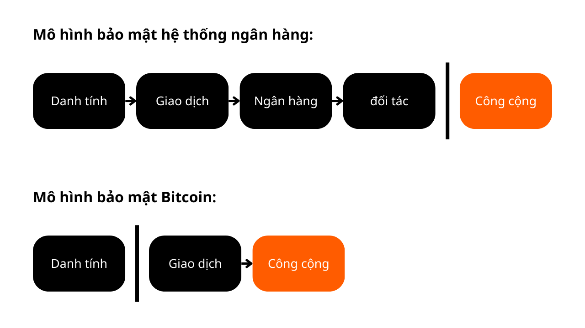

### Phần 2: Hiểu về phân tích chuối và các bảo vệ quyền riêng tư trước hoạt động này

Trong phần thứ hai, chúng ta sẽ nghiên cứu các kỹ thuật được sử dụng bởi các công ty phân tích chuỗi để truy vết hoạt động của bạn trên mạng lưới Bitcoin. Việc hiểu biết những phương pháp này là rất quan trọng để tăng cường bảo vệ quyền riêng tư của bạn. Phần này nhằm xem xét các chiến lược của những kẻ tấn công để hiểu rõ hơn về các rủi ro và đặt nền móng cho các kỹ thuật mà chúng ta sẽ nghiên cứu trong các phần tiếp theo. Chúng ta sẽ phân tích các mẫu giao dịch, đánh giá theo kinh nghiệm nội bộ và bên ngoài, cũng như các cách hiểu hợp lý về những mẫu hình này. Ngoài lý thuyết, chúng ta sẽ học cách sử dụng một trình duyệt blockchain để thực hiện phân tích chuỗi, thông qua các ví dụ và bài tập thực hành.


### Phần 3: Làm chủ các phương pháp bảo vệ quyền riêng tư của bạn

Trong phần thứ ba của khóa học, chúng ta đi vào vấn đề chính: thực hành! Mục tiêu là làm chủ tất cả các phương pháp tốt nhất cần thiết, các hoạt động đó nên trở thành phản xạ tự nhiên cho bất kỳ người dùng Bitcoin nào. Chúng tôi sẽ đề cập đến việc sử dụng địa chỉ mới, gắn nhãn, hợp nhất, sử dụng các nốt đầy đủ (full node), cũng như KYC và phương pháp mua bitcoin. Mục tiêu là cung cấp cho bạn một cái nhìn tổng quan toàn diện về các bẫy cần tránh để thiết lập nền tảng vững chắc trong nhiệm vụ bảo vệ quyền riêng tư của bản thân. Trong một số trường hợp, bạn sẽ được điều hướng đến một hướng dẫn cụ thể để thực hiện chúng.

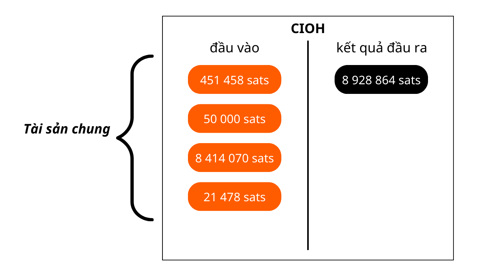

### Phần 4: Hiểu về giao dịch trộn coin - trộn coin

Làm sao chúng ta có thể nói về quyền riêng tư trên không gian Bitcoin mà không thảo luận về trộn coin - trộn coins? Trong phần 4, chúng ta sẽ khám phá mọi thứ bạn cần biết về phương pháp trộn này. Bạn sẽ học được trộn coin là gì, lịch sử và mục tiêu của nó, cũng như các hình thức trộn coin khác nhau hiện hành. Cuối cùng, đối với người dùng có kinh nghiệm hơn, chúng ta sẽ khám phá về các tập hợp ẩn danh (anonset) và entropy, và cách tính toán các chỉ số này.

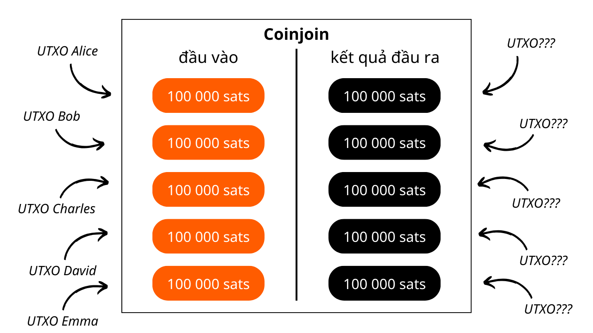

### Phần 5: Hiểu về các kỹ thuật nâng cao liên quan tới quyền riêng tư
Trong phần thứ năm, chúng tôi sẽ cung cấp một cái nhìn tổng quan về tất cả các kỹ thuật khác hiện có để bảo vệ quyền riêng tư của bạn trên không gian Bitcoin, ngoài trộn coin. Trải qua nhiều năm, các nhà phát triển đã thể hiện sự sáng tạo xuất sắc trong việc thiết kế các công cụ chuyên dụng để bảo vệ quyền riêng tư. Chúng ta sẽ khám phá tất cả các phương pháp này, như payjoin, giao dịch hợp tác, Coin Swap và Atomic Swap, chi tiết về cách hoạt động, mục tiêu và điểm yếu tiềm ẩn.

### Phần 6: Khám phá các đề xuất cải tiến giao thức liên quan đến quyền riêng tư

Trong khi các phần trước tập trung vào các giải pháp bảo vệ quyền riêng tư ở cấp độ ứng dụng, phần thứ sáu này sẽ đi sâu vào các vấn đề quyền riêng tư của người dùng ở cấp độ Bitcoin Core. Chúng ta sẽ thảo luận về quyền riêng tư ở cấp độ mạng lưới các nốt và việc phát tán, lan truyền các giao dịch. Chúng ta cũng sẽ thảo luận về các giao thức đã được đề xuất trong nhiều năm để tăng cường quyền riêng tư của người dùng trông không gian Bitcoin, bao gồm các giao thức địa chỉ tĩnh. Để kết luận, chúng ta sẽ xem xét sự ảnh hưởng tới quyền riêng tư, cả tích cực và tiêu cực, của soft-fork lớn gần đây nhất của Bitcoin, Taproot.

# Các định nghĩa và khái niệm chính
<partId>b9bbbde3-34c0-4851-83e8-e2ffb029cf31</partId>

## Mô hình UTXO của Bitcoin
<chapterId>8d6b50c5-bf74-44f4-922b-25204991cb75</chapterId>

Về căn bản, bitcoin là một loại tiền tệ, nhưng bạn có biết chi tiết về cách bitcoin - BTC được thể hiện ở trên giao thức không?

### Bitcoin UTXOs: Chúng là gì?

Trong giao thức Bitcoin, việc quản lý các đơn vị tiền tệ xoay quanh mô hình UTXO, viết tắt của "_Unspent Transaction Output_", tạm dịch là "đầu ra giao dịch chưa được chi tiêu".

Mô hình này hoàn toàn khác biệt so với các hệ thống ngân hàng truyền thống, dựa vào cơ chế tài khoản và số dư để theo dõi dòng chảy tài chính. Thực sự, trong hệ thống ngân hàng, số dư cá nhân được duy trì trong các tài khoản gắn liền với một danh tính. Ví dụ, khi bạn mua một chiếc bánh mì từ người bán bánh, ngân hàng của bạn chỉ đơn giản là ghi nợ số tiền mua hàng từ tài khoản của bạn, do đó giảm số dư của bạn, trong khi tài khoản của người bán bánh được ghi có cùng một số tiền, tăng số dư của họ. Trong hệ thống này, không có khái niệm về sự liên kết giữa tiền chảy vào tài khoản của bạn và tiền chạy ra khỏi nó, ngoài các bản ghi giao dịch.

Trên Bitcoin, mọi thứ hoạt động khác biệt. Khái niệm về tài khoản không tồn tại, và các đơn vị tiền tệ không được quản lý thông qua số dư mà thông qua UTXOs. Một UTXO đại diện cho một lượng bitcoin cụ thể chưa được chi tiêu, do đó tạo thành một "mẩu bitcoin," có thể lớn hoặc nhỏ. Ví dụ, một UTXO có thể trị giá `500 BTC` hoặc chỉ `700 SAT`.
**> Lưu ý:** Satoshi, thường được viết tắt là sat, là đơn vị nhỏ nhất của bitcoin, giống như một cent là đơn vị nhỏ nhất trong hệ thống tiền tệ pháp định USD.

```plaintext
1 BTC = 100,000,000 SAT
```

Lý thuyết, một UTXO có thể đại diện cho bất kỳ giá trị nào tính bằng bitcoin, từ một sat cho đến giới hạn tối đa theo lý thuyết là khoảng 21 triệu BTC. Tuy nhiên, việc sở hữu tất cả 21 triệu bitcoin là bất khả thi về mặt logic, và có một ngưỡng thấp được gọi là "bụi - dust", dưới đó một UTXO được coi là không kinh tế để chi tiêu (phí để chi tiêu UTXO ấy còn lớn hơn giá trị của chính UTXO đó).
**> Bạn có biết?** UTXO lớn nhất từng được tạo ra trên Bitcoin có giá trị `500,000 BTC`. Nó được tạo bởi nền tảng MtGox trong một đợt hợp nhất vào tháng 11 năm 2011: [29a3efd3ef04f9153d47a990bd7b048a4b2d213daaa5fb8ed670fb85f13bdbcf](https://mempool.space/fr/tx/29a3efd3ef04f9153d47a990bd7b048a4b2d213daaa5fb8ed670fb85f13bdbcf)
### Các UTXO và điều kiện chi tiêu

Các UTXO là những phương tiện trao đổi trên Bitcoin. Mỗi giao dịch dẫn đến việc tiêu thụ các UTXO như đầu vào và tạo ra các UTXO mới như đầu ra. Khi một giao dịch được thực hiện, các UTXO được sử dụng như các đầu vào được coi là "đã chi tiêu", các UTXO mới được tạo ra và phân bổ cho người nhận được chỉ định trong các đầu ra của giao dịch. Do đó, một UTXO đơn giản đại diện cho một đầu ra giao dịch chưa được chi tiêu, và là một lượng bitcoin (mẩu bitcoin) thuộc về một người dùng tại một thời điểm nhất định.


Tất cả UTXOs đều được bảo vệ bởi các script, các script này đặt ra các điều kiện mà chúng có thể được chi tiêu. Để tiêu thụ một UTXO, người dùng phải chứng minh với mạng lưới rằng họ đáp ứng các điều kiện được quy định bởi script bảo vệ UTXO đó. Nói chung, các UTXO được bảo vệ bởi một khóa công khai (hoặc một địa chỉ nhận đại diện cho khóa công khai này). Để chi tiêu một UTXO liên kết với khóa công khai này, người dùng phải chứng minh họ giữ khóa riêng tư tương ứng bằng cách cung cấp một chữ ký số được tạo ra với chìa khóa này. Đây là lý do tại sao người ta nói rằng ví Bitcoin của bạn thực sự không chứa bitcoin, mà thực ra nó lưu trữ các khóa riêng của bạn, từ đó cho phép bạn truy cập vào các UTXO của mình và, do đó, truy cập vào các mẩu bitcoin (lượng bitcoin) mà chúng đại diện.
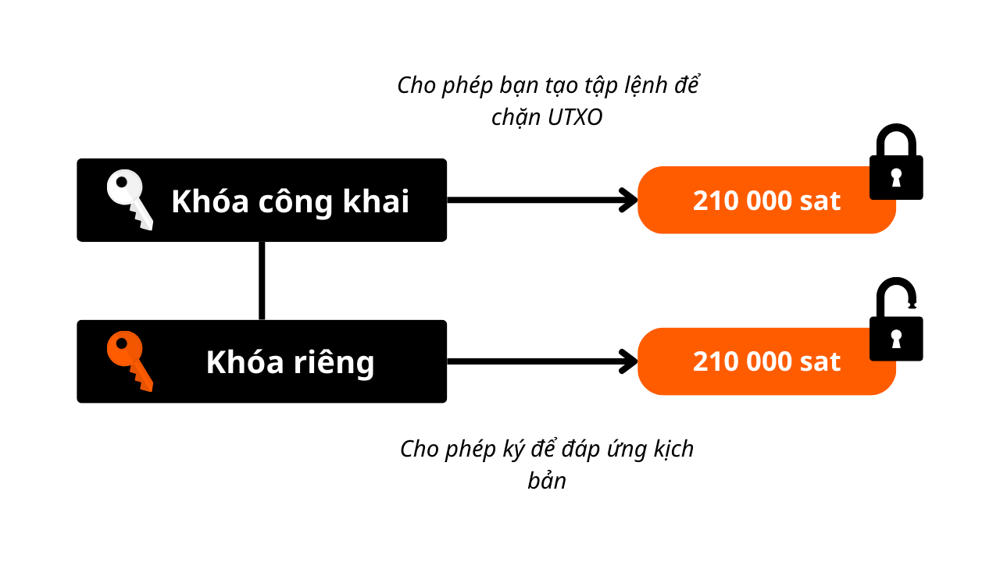

Vì khái niệm về tài khoản không tồn tại trong Bitcoin, số dư của một ví đơn giản tương ứng với tổng giá trị của tất cả các UTXO mà nó có thể chi tiêu. Ví dụ, nếu ví Bitcoin của bạn có thể chi tiêu 4 UTXO sau:

```plaintext
- 2 BTC
- 8 BTC
- 5 BTC
- 2 BTC
```

Tổng số dư ví của bạn sẽ là `17 BTC`.

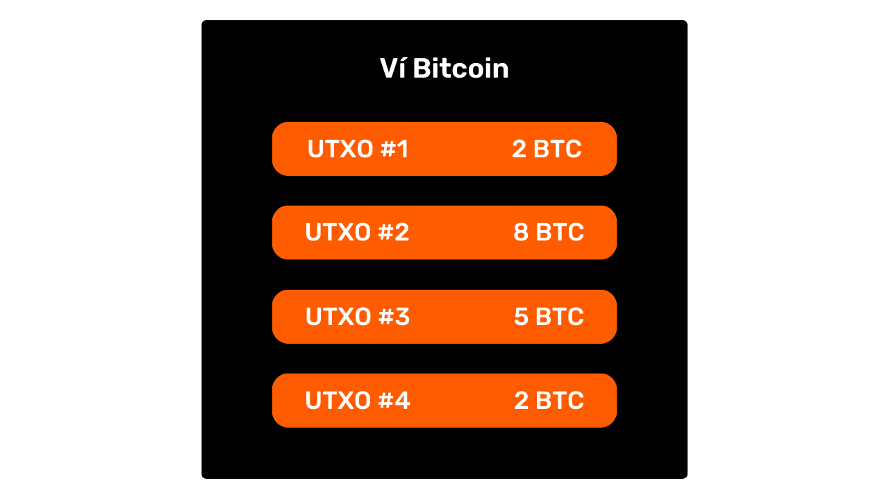

## Cấu trúc của các giao dịch Bitcoin
<chapterId>29d3aaab-de2e-4746-ab40-c9748898850c</chapterId>

### Các đầu vào và đầu ra của một giao dịch

Một giao dịch Bitcoin là một hoạt động được ghi lại trên blockchain cho phép chuyển quyền sở hữu bitcoin từ người này sang người khác. Cụ thể hơn, vì chúng ta đang ở trong mô hình UTXO và không có tài khoản, giao dịch thoả mãn các điều kiện chi tiêu đã bảo vệ một hoặc nhiều UTXO, sẽ tiêu thụ chúng, và tạo ra các UTXO mới với các điều kiện chi tiêu mới. Nói ngắn gọn, một giao dịch di chuyển bitcoin từ một script được đáp ứng sang một script mới nhằm bảo vệ chúng.

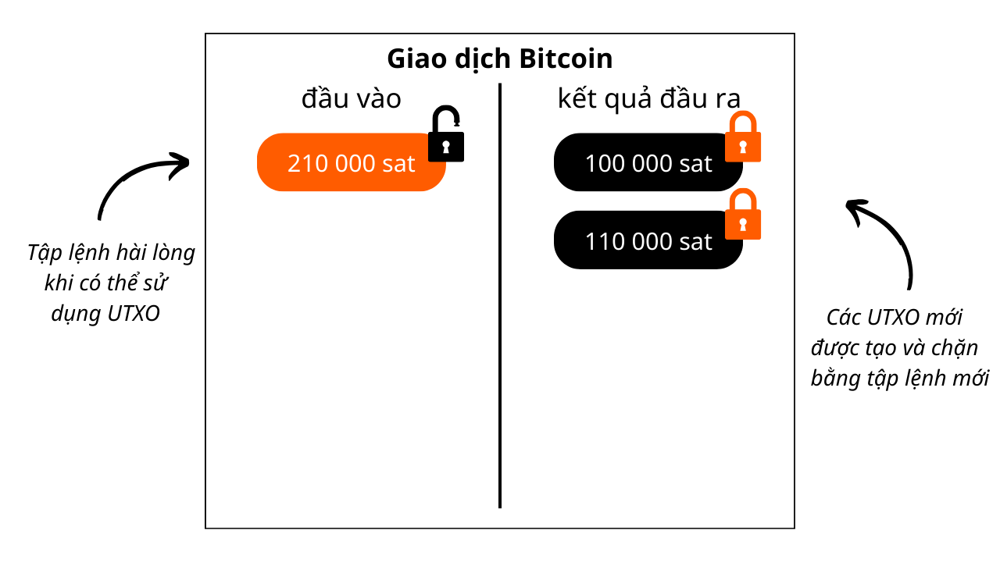

Mỗi giao dịch Bitcoin do đó bao gồm một hoặc nhiều đầu vào và một hoặc nhiều đầu ra. Các đầu vào là các UTXO được tiêu thụ bởi giao dịch đó để tạo ra các đầu ra mới. Các đầu ra là các UTXO mới sẽ có thể sử dụng như đầu vào cho các giao dịch tương lai.

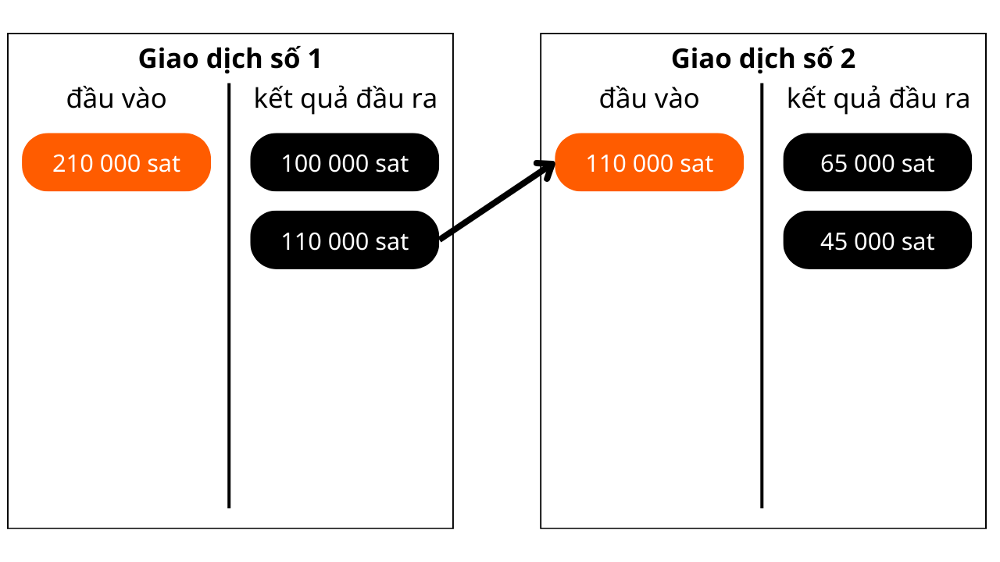
**> Bạn có biết?** Về lý thuyết, một giao dịch Bitcoin có thể có không giới hạn số lượng đầu vào và đầu ra. Thứ duy nhất giới hạn số lượng này là kích thước tối đa của một khối. Mỗi đầu vào trong một giao dịch Bitcoin là một UTXO (Unspent Transaction Output) trước đó chưa được tiêu. Để sử dụng một UTXO làm đầu vào, người giữ nó phải chứng minh rằng họ là chủ sở hữu hợp pháp bằng cách xác thực script liên quan đến nó, tức là, bằng cách đáp ứng điều kiện chi tiêu được áp đặt. Nói chung, điều này liên quan đến việc cung cấp một chữ ký số được tạo ra bằng khóa riêng tư tương ứng với khóa công khai đã được dùng để bảo vệ UTXO đó lúc ban đầu. Script do đó xác minh rằng chữ ký (dùng để chi tiêu) khớp với khóa công khai được sử dụng để nhận tiền lúc trước.
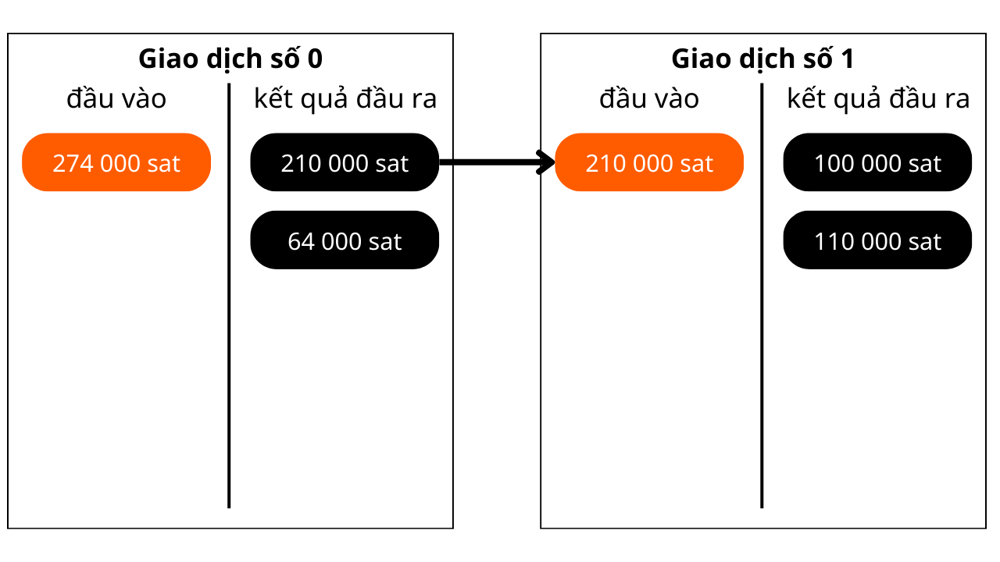

Mỗi đầu ra, mặt khác, định rõ số lượng bitcoin được chuyển giao, cũng như người nhận. Người nhận được xác định bởi một script mới mà, nói chung, nó sẽ khóa UTXO mới tạo với một địa chỉ nhận hoặc một khóa công khai mới.

Để một giao dịch được coi là hợp lệ theo quy tắc đồng thuận, tổng số của các đầu ra phải nhỏ hơn hoặc bằng tổng số của các đầu vào. Nói cách khác, tổng số bitcoin trong các UTXO mới được tạo ra bởi giao dịch không được vượt quá số lượng bitcoin trong các UTXO được tiêu thụ như đầu vào. Nguyên tắc này là hợp lý: nếu bạn chỉ có một lượng `500,000 SAT`, bạn không thể thực hiện một giao dịch mua `700,000 SAT`.

### Tiền thừa và Sự hợp nhất trong một giao dịch Bitcoin

Sự vận hành của một giao dịch Bitcoin dựa trên các UTXO có thể được so sánh với việc nấu chảy một đồng tiền vàng. Thực tế, một UTXO không thể chia nhỏ, nhưng chỉ có thể hợp nhất. Điều này có nghĩa là người dùng không thể đơn giản chia một UTXO đại diện cho một lượng bitcoin nhất định thành nhiều UTXO đại diện có những lượng bitcoin nhỏ hơn để dùng cho các mục đích khác nhau. Họ phải tiêu thụ hoàn toàn nó trong một giao dịch để tạo ra một hoặc nhiều UTXO mới với các giá trị tùy ý trong đầu ra, phải nhỏ hơn hoặc bằng giá trị ban đầu.

Cơ chế này tương tự như đối với một đồng tiền vàng. Hãy tưởng tượng bạn sở hữu một đồng tiền 2 ounce và bạn muốn thực hiện một thanh toán 1 ounce, giả sử người bán không thể trả lại tiền thừa. Bạn sẽ cần phải nấu chảy đồng tiền của mình và đúc 2 đồng mới mỗi đồng 1 ounce.
Cách vận hành tương tự được áp dụng với Bitcoin. Hãy tưởng tượng Alice có một UTXO của `10,000 SAT` và cô ấy muốn mua một chiếc bánh mì với giá `4,000 SAT`. Alice sẽ thực hiện một giao dịch với một đầu vào là 1 UTXO của `10,000 SAT` mà cô ấy sẽ tiêu thụ hoàn toàn, và trong đầu ra, cô ấy sẽ tạo ra 2 UTXO với giá trị là `4,000 SAT` và `6,000 SAT`. UTXO của `4,000 SAT` sẽ được gửi đến người bán bánh mì như là khoản thanh toán cho chiếc bánh mì, trong khi UTXO của `6,000 SAT` sẽ được quay trở lại với Alice như là tiền thừa được thối lại. UTXO này trở lại với người gửi ban đầu của giao dịch được gọi là "tiền thừa" trong thuật ngữ Bitcoin.

Bây giờ tưởng tượng rằng Alice không sở hữu một UTXO `10,000 SAT`, mà là hai UTXO mỗi cái là `3,000 SAT`. Trong tình huống này, không có UTXO nào đủ để chi trả `4,000 SAT` cho chiếc bánh mì. Do đó, Alice phải sử dụng cả hai UTXO là `3,000 SAT` làm đầu vào cho giao dịch của mình cùng một lúc. Như vậy, tổng số tiền đầu vào sẽ đạt `6,000 SAT`, cho phép cô ấy chi trả `4,000 SAT` cho người bán bánh. Phương pháp này, liên quan đến việc nhóm nhiều UTXO trong đầu vào của một giao dịch, thường được gọi là "hợp nhất".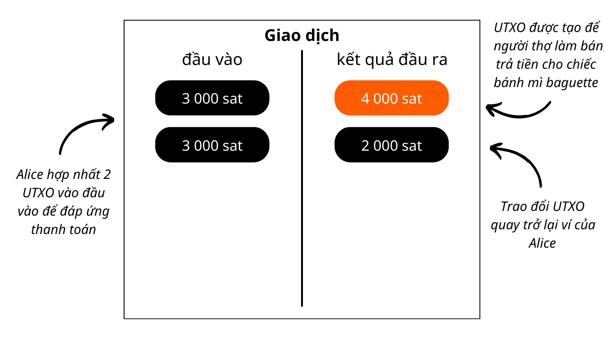

### Phí giao dịch

Một cách trực giác, người ta có thể nghĩ rằng phí giao dịch cũng đại diện cho một đầu ra của giao dịch. Nhưng trên thực tế, điều này không đúng. Phí của một giao dịch đại diện cho sự chênh lệch giữa tổng số tiền đầu vào và tổng số tiền đầu ra. Điều này có nghĩa là, sau khi sử dụng một phần giá trị của đầu vào để chi trả cho các đầu ra mong muốn trong một giao dịch, một số tiền nhất định từ đầu vào còn lại không được sử dụng. Số tiền dư này tạo thành phí giao dịch.

```plaintext
Phí = tổng đầu vào - tổng đầu ra
```

Hãy quay lại ví dụ về Alice, người có một UTXO là `10,000 SAT` và muốn mua một chiếc bánh mì với giá `4,000 SAT`. Alice tạo một giao dịch với UTXO của mình là `10,000 SAT` làm đầu vào. Sau đó, cô ấy tạo một đầu ra là `4,000 SAT` dành cho người bán bánh để thanh toán cho chiếc bánh mì. Để khuyến khích các thợ mỏ bao đưa dịch của mình vào một khối, Alice dành `200 SAT` làm phí. Cô ấy do đó tạo ra một đầu ra thứ hai, số tiền thừa, sẽ trả lại cho cô ấy, lên đến `5,800 SAT`.
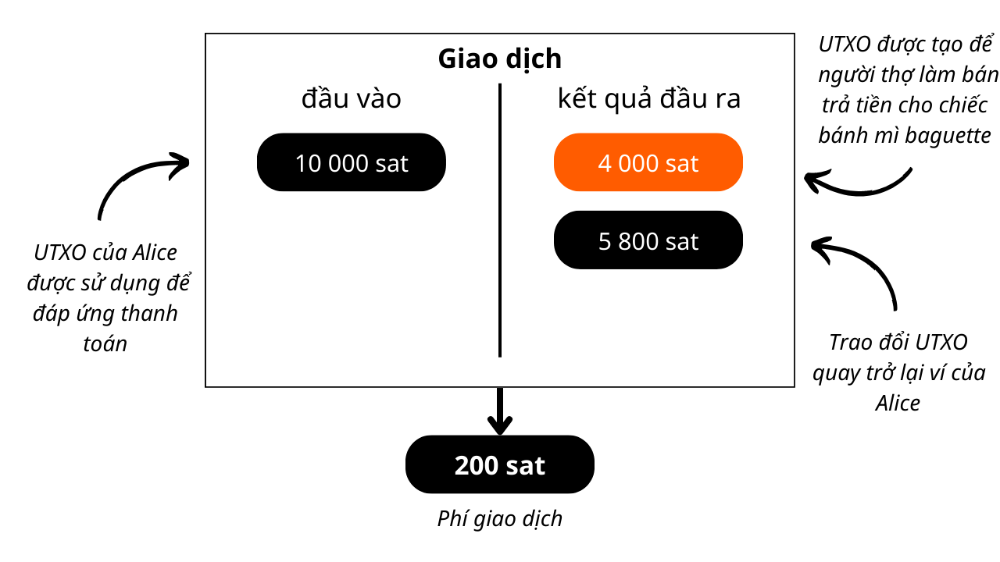

Bằng cách áp dụng công thức phí, chúng ta thực sự thấy rằng còn lại `200 SAT` cho các thợ mỏ:
```plaintext
Phí = tổng đầu vào - tổng đầu ra
Phí giao dịch = 10,000 - (4,000 + 5,800)
Phí giao dịch = 10,000 - 9,800
Phí giao dịch = 200
```
Khi một thợ mỏ thành công trong việc xác nhận một khối, họ được phép thu thập những phí này cho tất cả các giao dịch được đưa vào trong khối của họ, thông qua giao dịch "coinbase".

### Sự hình thành các UTXO trong Bitcoin

Nếu chú ý theo dõi các ý phía trước, bây giờ, bạn đã biết rằng các UTXO chỉ có thể được tạo ra bằng cách tiêu thụ các UTXO khác đã tồn tại. Do đó, các đồng tiền trên Bitcoin tạo thành một chuỗi liên tục. Tuy nhiên, bạn có thể tự hỏi cách mà các UTXO đầu tiên xuất hiện. Điều này đặt ra một tình huống tương tự như vấn đề con gà và quả trứng: các UTXO này đến từ đâu?

Câu trả lời nằm ở **giao dịch coinbase**.

Coinbase là một loại giao dịch Bitcoin đặc biệt, độc nhất và luôn là giao dịch đầu tiên của mỗi khối. Nó cho phép thợ đào đã tìm thấy một bằng chứng công việc hợp lệ nhận phần thưởng khối của họ. Phần thưởng này bao gồm hai thành phần: **trợ cấp khối - bitcoin mới** và **phí giao dịch** mà chúng ta đã nói về trong phần trước.

Giao dịch coinbase độc đáo ở chỗ nó là loại giao dịch duy nhất tạo ra bitcoin mới, từ hư không, không cần tiêu thụ đầu vào để tạo ra đầu ra của mình. Những đồng bitcoin được "in mới" này tạo thành những gì có thể được gọi là "các UTXO gốc".
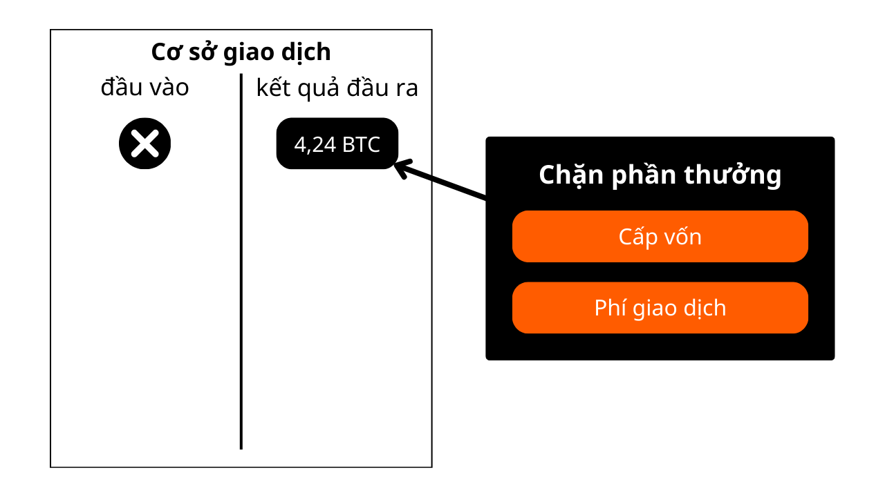
Các bitcoin từ trợ cấp khối được tạo mới từ "hư không", theo một lịch trình phát hành đã được thiết lập trước trong các quy tắc đồng thuận. Trợ cấp khối bị giảm đi một nửa sau mỗi 210.000 khối, khoảng cứ mỗi bốn năm, trong một sự kiện được gọi là "halving". Ban đầu, 50 bitcoin mới được tạo ra ứng với mỗi khối, nhưng số lượng này đã dần giảm; hiện tại, là 3,125 bitcoin mỗi khối.

Về phần liên quan đến phí giao dịch, mặc dù nó cũng đại diện cho BTC mới được tạo, chúng không được vượt quá sự chênh lệch giữa tổng số đầu vào và đầu ra của tất cả các giao dịch trong một khối. Chúng ta đã thấy trước đó rằng các phí này đại diện cho phần của đầu vào không được sử dụng trong đầu ra của các giao dịch. Phần này về mặt kỹ thuật là "mất" trong quá trình giao dịch, và người khai thác có quyền tái tạo giá trị này dưới dạng một hoặc nhiều UTXO mới. Do đó, đây là một sự chuyển giao giá trị từ người giao dịch đến thợ đào, người thêm giao dịch đó vào blockchain.

**> Bạn có biết?** Các bitcoin được tạo ra bởi một giao dịch coinbase phải trải qua một thời gian chờ đợi 100 khối trước khi chúng có thể được thợ đào chi tiêu. Quy tắc này nhằm mục đích tránh những phức tạp liên quan đến việc sử dụng bitcoin mới tạo trên một chuỗi mà sau này, nó có thể trở thành một chuỗi bị bỏ rơi (chuỗi không còn tiếp tục được xem là chuỗi hợp lệ).
### Ý Nghĩa của mô hình UTXO
Đầu tiên, mô hình UTXO ảnh hưởng trực tiếp đến phí giao dịch trên Bitcoin. Do dung lượng của mỗi khối là có hạn, các thợ đào sẽ ưu tiên các giao dịch chấp nhận trả mức phí tính theo không gian lưu trữ tốt nhất. Thực tế, càng chứa nhiều UTXO dưới dạng đầu vào và đầu ra, giao dịch đó càng nặng (tính theo dung lượng lưu trữ của bộ nhớ) và do đó, yêu cầu phí cao hơn. Đây là một trong những lý do tại sao thường có nỗ lực giảm số lượng UTXO trong ví của chúng ta, điều này cũng có thể ảnh hưởng đến quyền riêng tư, một chủ đề mà chúng ta sẽ đi sâu vào chi tiết trong phần thứ ba của khóa học này.

Tiếp theo, như đã đề cập trong các phần trước, tiền trên Bitcoin về cơ bản là một chuỗi của các UTXO. Mỗi giao dịch do đó tạo ra một liên kết giữa một UTXO quá khứ và một UTXO tương lai. UTXO do đó cho phép theo dõi rõ ràng lộ trình của bitcoin từ khi chúng được tạo ra đến khi chúng được chi tiêu hiện tại. Sự minh bạch này có thể được xem là một yếu tố tích cực, vì nó cho phép mỗi người dùng đảm bảo tính xác thực của các bitcoin nhận được. Tuy nhiên, cũng chính trên nguyên tắc về khả năng theo dõi và kiểm chứng này mà phân tích chuỗi được dựa vào, một hoạt động hướng tới xâm phạm quyền riêng tư của bạn. Chúng ta sẽ nghiên cứu về hoạt động phân tích chuỗi này một cách sâu rộng trong phần thứ hai của khóa học.

## Mô hình quyền riêng tư của Bitcoin
<chapterId>769d8963-3ed5-4094-b21d-9203c7d9e465</chapterId>

### Tiền tệ: Tính xác thực, tính toàn vẹn và hoạt động lặp chi
Một trong những chức năng của tiền tệ là giải quyết vấn đề về sự trùng khớp của nhu cầu. Trong một nền kinh tế dựa trên hàng đổi hàng, việc thực hiện một giao dịch đòi hỏi không chỉ tìm ra một cá nhân đang cung cấp loại hàng hóa phù hợp với nhu cầu của mình mà chúng ta còn phải có khả năng cung cấp cho họ loại hàng hóa có giá trị tương đương và thỏa mãn nhu cầu của họ. Việc tìm kiếm sự cân bằng này đã được chứng minh là rất phực tạp.


Chính vì vậy chúng ta sử dụng tiền tệ, cho phép dịch chuyển giá trị theo cả không gian và thời gian.


Để tiền tệ giải quyết vấn đề này, điều cần thiết là phải thuyết phục được bên cung cấp hàng hóa hoặc dịch vụ rằng họ có thể chi tiêu số tiền họ nhận được vào thời điểm mà họ muốn. Do đó, khi chấp nhận một loại tiền tệ nào đó, bất kỳ cá nhân khôn ngoan nào cũng muốn loại tiền đó, dù là tiền kỹ thuật số hay tiền vật lý, sẽ đảm bảo rằng nó đáp ứng hai tiêu chí cơ bản:
- **Đồng tiền phải còn nguyên vẹn và thật - đáng tin cậy;**- **và nó không được phép bị lặp chi.**
Khi sử dụng tiền tệ vật lý, đặc điểm đầu tiên là phức tạp nhất để xác định. Trong các giai đoạn khác nhau của lịch sử, tính toàn vẹn của đồng tiền kim loại thường xuyên bị xâm phạm bởi các hành vi như cắt xén hoặc khoan. Ví dụ, trong thời Rome cổ đại, việc người dân cạo viền của đồng tiền vàng để thu thập một ít kim loại quý, trong khi vẫn giữ chúng cho các giao dịch tương lai, là điều phổ biến. Giá trị nội tại của đồng tiền do đó bị giảm, nhưng giá trị danh nghĩa vẫn giữ nguyên. Đây chính là lý do tại sao sau này người ta đúc rãnh ở viền của đồng tiền.

Tính xác thực cũng là một đặc điểm khó xác minh với tiền tệ vật lý. Ngày nay, các kỹ thuật chống làm giả ngày càng phức tạp, buộc các thương nhân phải đầu tư vào các hệ thống xác minh đắt tiền.

Ở mặt khác, do bản chất của chúng, hiện tượng lặp chi không phải là vấn đề đối với tiền tệ vật lý. Nếu tôi đưa cho bạn một tờ €10, nó hoàn toàn được chuyển vào tay bạn, và không thể tự quay trở lại tay tôi, điều này loại trừ bất kỳ khả năng nào của việc chi tiêu cùng một đồng tiền nhiều lần. Nói ngắn gọn, tôi sẽ không thể chi tiêu lại tờ €10 mà tôi đã tiêu trước đó.


Đối với tiền tệ số, chúng ta gặp những khó khăn khác với tiền tệ vật lý. Việc đảm bảo tính xác thực và toàn vẹn của một đồng tiền số thường đơn giản hơn. Như chúng ta đã thấy trong phần trước, mô hình UTXO của Bitcoin cho phép truy vết một đồng tiền trở lại nguồn gốc của nó, từ đó xác minh rằng nó thực sự được tạo ra theo quy tắc đồng thuận bởi một thợ đào.

Tuy nhiên, rất phức tạp để đảm bảo không có sự lặp chi, vì về bản chất, bất kỳ hàng hóa số nào cũng là một dạng thông tin. Không giống như hàng hóa vật lý, thông tin không chia nhỏ trong các giao dịch mà lan truyền bằng cách nhân bản. Ví dụ, nếu tôi gửi cho bạn một tài liệu qua email, nó sẽ được nhân bản (lúc này, bạn nhận được tài liệu, và tôi vẫn còn tài liệu đó, trừ trường hợp tôi quyết định xoá nó đi). Ở phía bạn, bạn không thể xác minh chắc chắn rằng tôi đã xóa bản gốc của tài liệu.


### Ngăn chặn lặp chi trên Bitcoin
Cách duy nhất để tránh sự nhân bản của một hàng hóa số là biết tất cả các giao dịch trong toàn hệ thống. Theo cách này, người ta có thể biết ai sở hữu cái gì và cập nhật khoản nắm giữ của mọi người dựa trên các giao dịch được thực hiện. Đây là những gì được thực hiện, ví dụ, với tiền ghi sổ trong hệ thống ngân hàng. Khi bạn trả €10 cho một thương nhân bằng thẻ tín dụng, ngân hàng ghi lại giao dịch này và cập nhật sổ cái.
Trên Bitcoin, việc ngăn chặn lặp chi được thực hiện theo cùng một phương pháp như vậy. Mục tiêu là xác nhận sự vắng mặt của một giao dịch đã chi tiêu các đồng tiền đó. Nếu những đồng tiền này chưa bao giờ được sử dụng, thì chúng ta có thể chắc chắn rằng không có việc chi tiêu hai lần nào xảy ra. Nguyên tắc này được mô tả bởi Satoshi Nakamoto trong bản cáo bạch (whitepaper) với câu nói nổi tiếng này:

**"*Cách duy nhất để xác nhận sự vắng mặt của một giao dịch là biết tất cả các giao dịch.*"**

Tuy nhiên, không giống như mô hình ngân hàng, không có mong muốn phải tin tưởng vào một thực thể tập trung đối với Bitcoin. Việc tất cả người dùng có thể xác nhận sự vắng mặt này để xác định rằng không có lặp chi xảy ra, mà không phụ thuộc vào bên thứ ba là điều rất cần thiết. Do đó, mọi người phải biết được tất cả các giao dịch diễn ra trên mạng lưới Bitcoin. Đây là lý do tại sao các giao dịch Bitcoin được phát tán và lan truyền công khai trên tất cả các nốt mạng và được ghi lại rõ ràng trên blockchain của Bitcoin.

Chính sự công khai này của thông tin làm phức tạp việc bảo vệ quyền riêng tư trên mạng lưới Bitcoin. Trong hệ thống ngân hàng truyền thống, theo lý thuyết, chỉ có tổ chức tài chính mới được biết về tất cả các giao dịch được thực hiện (người dùng chỉ biết đến các giao dịch mà họ thực hiện). Còn trên mạng lưới Bitcoin, tất cả người dùng đều được cung cấp thông tin về tất cả các giao dịch, qua các nốt tương ứng của họ.

### Mô hình quyền riêng tư: hệ thống ngân hàng so với Bitcoin
Trong hệ thống truyền thống, tài khoản ngân hàng của bạn được liên kết với danh tính của bạn. Người quản lý ngân hàng có thể biết tài khoản ngân hàng nào thuộc về khách hàng nào và những giao dịch nào được liên kết với nó. Tuy nhiên, dòng thông tin này bị cắt đứt giữa ngân hàng và khu vực công cộng. Nói cách khác, việc biết được số dư và các giao dịch của một tài khoản ngân hàng thuộc về một cá nhân khác là điều bất khả thi. Chỉ có ngân hàng mới có quyền truy cập vào thông tin này.

Ví dụ, người quản lý ngân hàng của bạn biết rằng bạn mua bánh mì ba-tê mỗi sáng tại tiệm bánh ở khu phố, nhưng hàng xóm của bạn không biết về giao dịch này. Do đó, dòng thông tin chỉ có thể truy cập bởi các bên liên quan, đặc biệt là ngân hàng, nhưng vẫn không thể truy cập được bởi những người bên ngoài.

Do ràng buộc về việc khuếch tán công khai các giao dịch mà chúng ta đã thấy ở phần trước, mô hình bảo mật của Bitcoin không thể theo mô hình của hệ thống ngân hàng. Trong trường hợp của Bitcoin, vì dòng thông tin không thể bị ngắt quãng giữa các giao dịch và khu vực công cộng, **mô hình quyền riêng tư được xây dựng dựa trên sự tách biệt giữa danh tính của người dùng và chính các giao dịch**.

Ví dụ, nếu bạn dùng BTC để mua bánh mì ta-tê từ người bán, hàng xóm của bạn, người sở hữu nốt đầy đủ của riêng mình, có thể thấy giao dịch của bạn diễn ra, giống như họ có thể thấy tất cả các giao dịch khác trong hệ thống. Tuy nhiên, nếu nguyên tắc bảo mật được tôn trọng, họ không nên có khả năng liên kết một giao dịch cụ thể này với danh tính đời thực của bạn.
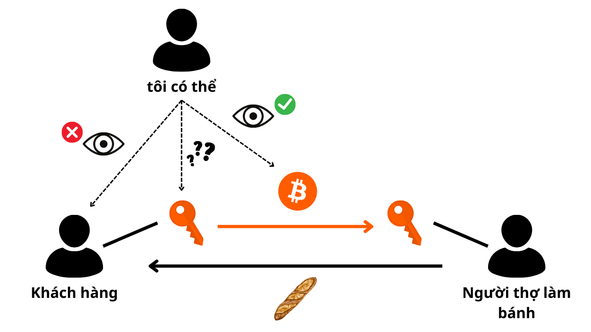

Nhưng vì các giao dịch Bitcoin được công bố công khai, vẫn có khả năng thiết lập các liên kết giữa chúng để suy luận ra thông tin về các bên liên quan. Hoạt động này thậm chí còn hình thành một ngành chuyên môn riêng gọi là "phân tích chuỗi". Trong phần tiếp theo của khóa học, tôi mời bạn khám phá cơ bản về phân tích chuỗi để hiểu cách bitcoin của bạn bị theo dõi và biết cách bảo vệ mình tốt hơn.

# Hiểu về phân tích chuối và cách bảo vệ bản thân
<partId>4739371e-9fef-45b0-bcaa-b7a4df6b4470</partId>

## Phân tích chuỗi trên mạng lưới Bitcoin là gì?
<chapterId>7d198ba6-4af2-4f24-86cb-3c79cb25627e</chapterId>

### Định nghĩa và cách vận hành

Phân tích chuỗi là một thực hành bao gồm tất cả các phương pháp được sử dụng để theo dõi dòng chảy của các đồng bitcoin (chính xác hơn là các mẩu bitcoin) trên blockchain. Nói chung, phân tích chuỗi dựa vào việc quan sát các đặc điểm trong các mẫu giao dịch trước đó. Sau đó, xác định những đặc điểm tương tự trong một giao dịch mà người ta muốn phân tích, và suy luận các giả thuyết hợp lý. Phương pháp giải quyết vấn đề này từ một cách tiếp cận thực tế, để tìm một giải pháp đủ tốt, được gọi là "phỏng đoán - heuristic".

Để đơn giản hóa, phân tích chuỗi được thực hiện trong ba bước chính:
1. **Quan sát blockchain;**
2. **Xác định các đặc điểm đã biết;**
3. **Suy luận các giả thuyết.**

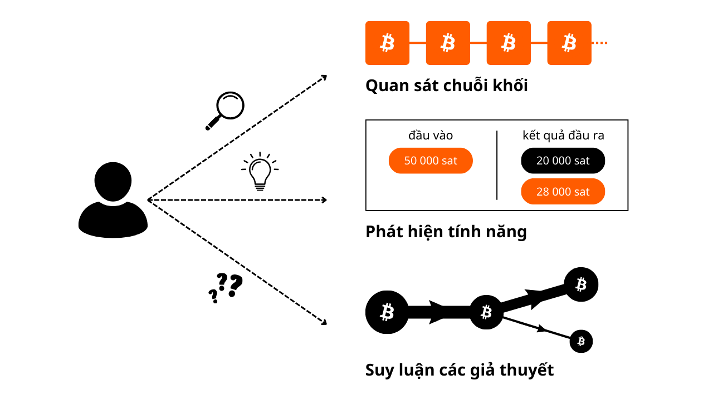

Phân tích chuỗi có thể được thực hiện bởi bất kỳ ai. Chỉ cần truy cập vào thông tin công cộng của blockchain thông qua một node đầy đủ để quan sát các chuyển động của giao dịch và đưa ra giả thuyết. Cũng có các công cụ miễn phí hỗ trợ cho việc phân tích này, như trang web [OXT.me](https://oxt.me/) mà chúng ta sẽ khám phá chi tiết trong hai chương cuối cùng của phần này. Tuy nhiên, rủi ro chính đối với quyền riêng tư đến từ các công ty chuyên về phân tích chuỗi. Những công ty này đã đưa phân tích chuỗi lên quy mô công nghiệp và bán dịch vụ của họ cho các tổ chức tài chính hoặc chính phủ. Trong số các công ty này, Chainalysis có lẽ là cái tên nổi tiếng nhất.

### Mục tiêu của phân tích chuỗi
Một trong những mục tiêu của phân tích chuỗi là phân loại theo nhóm các hoạt động khác nhau trên mạng lưới Bitcoin để xác định sự riêng nhất của người dùng thực hiện chúng. Sau đó, sẽ có thể cố gắng liên kết nhóm hoạt động này với một danh tính thực. 

Nhớ lại chương trước. Tôi đã giải thích lý do tại sao mô hình bảo mật của Bitcoin ban đầu dựa vào việc tách biệt danh tính của người dùng khỏi các giao dịch của họ. Do đó, có thể sẽ nghĩ rằng phân tích chuỗi là không cần thiết, vì ngay cả khi ai đó có khả năng phân loại thành nhóm các hoạt động trên chuỗi, họ không thể liên kết chúng với một danh tính thực.

Theo lý thuyết, phát biểu này là chính xác. Trong phần đầu của khóa học này, chúng ta đã thấy rằng các cặp khóa mật mã được sử dụng để thiết lập các điều kiện trên từng UTXO. Bản chất, những cặp khóa này không tiết lộ bất kỳ thông tin nào về danh tính của người giữ chúng. Do đó, ngay cả khi ai đó thành công trong việc phân loại thành nhóm các hoạt động liên quan đến các cặp khóa khác nhau, điều này không nói lên điều gì về thực thể đứng sau những hoạt động này.


Tuy nhiên, hoạt động này trong thực tế lại phức tạp hơn nhiều. Có rất nhiều hành vi có nguy cơ liên kết một danh tính thực với một hoạt động trên chuỗi. Trong phân tích, điều này được gọi là điểm vào, và có rất nhiều điểm như vậy.

Phổ biến nhất, tất nhiên, là KYC (*Know Your Customer*). Nếu bạn rút bitcoin của mình từ một nền tảng giao dịch được quản lý về một trong những địa chỉ nhận cá nhân của bạn, thì một số người có thể liên kết danh tính của bạn với địa chỉ này. Rộng hơn, một điểm vào có thể là bất kỳ hình thức tương tác nào giữa cuộc sống thực của bạn và một giao dịch Bitcoin. Ví dụ, nếu bạn công bố một địa chỉ nhận trên các mạng xã hội của mình, điều này có thể là một điểm nhập vào cho việc phân tích. Nếu bạn thực hiện một khoản thanh toán bằng bitcoin cho người bán bánh của mình, họ có thể liên kết khuôn mặt của bạn (là một phần của danh tính của bạn) với một địa chỉ Bitcoin.

Những điểm vào này gần như không thể tránh khỏi trong việc sử dụng Bitcoin. Mặc dù người ta có thể tìm cách hạn chế phạm vi của chúng, chúng sẽ vẫn tồn tại. Đó là lý do tại sao việc kết hợp các phương pháp nhằm bảo vệ quyền riêng tư của bạn là rất quan trọng. Mặc dù duy trì sự tách biệt giữa danh tính thực của bạn và các giao dịch của bạn là một cách tiếp cận thú vị, cho đến hiện tại, nó vẫn chưa đủ để bảo vệ hiệu quả quyền riêng tư của bản. Thực tế, nếu tất cả các hoạt động trên chuỗi của bạn có thể được phân loại theo nhóm, thì một điểm vào nhỏ nhất cũng có khả năng làm lộ lớp bảo vệ quyền riêng tư duy nhất mà bạn đã thiết lập.


### Phòng thủ chống lại phân tích chuỗi
Do đó, chúng ta cũng cần phải có khả năng đối mặt với phân tích chuỗi trong việc sử dụng Bitcoin của mình. Làm được điều đó, chúng ta có thể giảm thiểu việc các hoạt động của mình bị thu thập và hạn chế ảnh hưởng của một điểm vào đối với quyền riêng tư của chúng ta.


Thực ra, để đối phó tốt hơn với phân tích chuỗi, cách tiếp cận tốt nhất là nắm bắt được các phương pháp đang được dùng trong phân tích chuỗi. Nếu muốn biết cách cải thiện quyền riêng tư của mình trên Bitcoin, bạn phải hiểu những phương pháp này. Điều này sẽ cho phép bạn hiểu rõ hơn về các kỹ thuật như [trộn coin - trộn coin](https://planb.network/fr/tutorials/privacy/trộn coin-samourai-wallet) hoặc [payjoin](https://planb.network/fr/tutorials/privacy/payjoin) (các kỹ thuật mà chúng ta sẽ nghiên cứu trong các phần cuối của khóa học), và giảm thiểu những sai lầm có thể mắc phải.
Trong phần này, chúng ta có thể ví dụ như việc mã hóa và giải mã mã hóa. Một nhà mã hóa giỏi trước hết phải là một nhà phân tích mã hóa giỏi. Để tưởng tượng ra một thuật toán mã hóa mới, người ta phải biết nó sẽ phải đối mặt với những cuộc tấn công nào, và cũng phải nghiên cứu tại sao các thuật toán trước đó bị phá vỡ. Nguyên tắc tương tự áp dụng cho quyền riêng tư trên mạng lưới Bitcoin. Hiểu biết về các phương pháp phân tích chuỗi là chìa khóa để bảo vệ chống lại nó. Đó là lý do tại sao tôi đề xuất một phần hoàn chỉnh về phân tích chuỗi trong khóa học này.
### Các phương pháp phân tích blockchain

Quan trọng là chúng ta cần hiểu được rằng phân tích chuỗi không phải là một môn khoa học chính xác. Nó dựa trên các quy tắc suy luận từ các quan sát trước đó hoặc các diễn giải logic. Những quy tắc này cho phép đạt được kết quả khá đáng tin cậy, nhưng không bao giờ là với độ chính xác tuyệt đối cả. Nói cách khác, **phân tích chuỗi luôn tồn tại yếu tố xác suất trong các kết luận được đưa ra**. Ví dụ, có thể ước lượng với độ chắc chắn nhiều hay ít rằng hai địa chỉ thuộc về cùng một thực thể, nhưng sự chắc chắn tuyệt đối luôn nằm ngoài tầm với.

Mục tiêu trọn vẹn của phân tích chuỗi nằm chính xác trong việc tổng hợp các phép suy luận - heuristic khác nhau nhằm giảm thiểu rủi ro sai lầm. Nó, theo một cách nào đó, là sự tích lũy bằng chứng nhằm cho phép chúng ta tiếp cận thực tế một cách chặt chẽ hơn.

Những phỏng đoán nổi tiếng này có thể được phân loại vào các danh mục khác nhau mà chúng ta sẽ chi tiết cùng nhau:
- **Mô hình giao dịch (hoặc mô hình giao dịch);**
- **Phép suy luận nội bộ của giao dịch;**
- **Phép suy luận dựa trên các yếu tố bên ngoài của giao dịch.**

### Satoshi Nakamoto và phân tích chuỗi
Cần lưu ý rằng hai quy tắc suy luận đầu tiên cho phân tích chuỗi được phát hiện bởi chính Satoshi Nakamoto. Ông thảo luận về chúng trong phần 10 của Bản cáo bạch Bitcoin. Đó là:
- Phép suy luận dựa trên sở hữu đầu vào chung (Common Input Ownership Heuristic - CIOH);
- và việc sử dụng lại địa chỉ.


Nguồn: S. Nakamoto, "Bitcoin: Hệ thống tiền điện tử ngang hàng", https://bitcoin.org/bitcoin.pdf, 2009.

Trong các chương tiếp theo, chúng ta sẽ khám phá nội hàm của hai phép suy luận này, nhưng điều thú vị bạn cần lưu ý là hai quy tắc suy luận này vẫn giữ một vị thế quan trọng trong phân tích chuỗi ngày nay.

## Mô hình giao dịch
<chapterId>d365a101-2d37-46a5-bfb9-3c51e37bf96b</chapterId>

Một mô hình giao dịch đơn giản là một mô hình hoặc cấu trúc tổng thể của một giao dịch điển hình có thể được tìm thấy trên blockchain, mà việc diễn giải nó có khả năng đã được biết đến. Khi nghiên cứu các mô hình, chúng ta sẽ tập trung vào một giao dịch duy nhất mà chúng ta sẽ phân tích ở mức độ cao.

Nói cách khác, chúng ta chỉ xem xét số lượng các UTXO trong đầu vào và số lượng các UTXO trong đầu ra, không chú tâm vào các chi tiết cụ thể hơn hoặc bối cảnh của giao dịch. Từ mô hình được quan sát, chúng ta sẽ có thể diễn giải bản chất của giao dịch. Chúng ta sau đó sẽ tìm kiếm các đặc điểm trong cấu trúc của nó và suy ra một diễn giải.


Trong phần này, chúng ta sẽ cùng khám phá các mô hình giao dịch chính có thể gặp trong phân tích chuỗi, và cho mỗi mô hình, tôi sẽ cung cấp cho bạn diễn giải có khả năng của cấu trúc này, cùng với một ví dụ cụ thể.

### Giao dịch gửi bitcoin đơn giản (hoặc giao dịch thanh toán đơn giản)

Chúng ta bắt đầu với một mô hình rất phổ biến, vì đó là mô hình xuất hiện trong hầu hết các khoản thanh toán bitcoin. Mô hình thanh toán đơn giản được đặc trưng bởi việc tiêu thụ một hoặc nhiều UTXO trong đầu vào và tạo thành 2 UTXO trong đầu ra. Mô hình này sẽ trông như thế này:


Khi thấy cấu trúc giao dịch này trên blockchain, chúng ta có thể rút ra một giải thích. Như tên của nó gợi ý, mô hình này chỉ ra rằng chúng ta đang chứng kiến một giao dịch gửi tiền hoặc thanh toán. Người dùng đã sử dụng UTXO của chính mình trong đầu vào để thỏa mãn trong đầu ra một UTXO thanh toán và một UTXO thối tiền (trả lại tiền dư cho cùng một người dùng).
Do đó, chúng ta biết rằng người dùng quan sát được có khả năng không còn sở hữu một trong hai UTXO ở đầu ra (UTXO thanh toán), nhưng họ vẫn giữ sở hữu UTXO khác (UTXO thối tiền).
Tại thời điểm này, chúng ta không thể xác định đầu ra nào đại diện cho UTXO nào, vì đây không phải là mục tiêu của việc nghiên cứu mô hình. Chúng ta sẽ đạt được điều này bằng cách dựa vào các phép suy luận mà chúng ta sẽ nghiên cứu trong các phần tiếp theo. Tại giai đoạn này, mục tiêu của chúng ta giới hạn ở việc xác định bản chất của giao dịch đang được nghiên cứu, trong trường hợp này, là một giao dịch gửi đơn giản.

Ví dụ, đây là một giao dịch Bitcoin tuân theo mô hình gửi đơn giản:

```plaintext
b6cc79f45fd2d7669ff94db5cb14c45f1f879ea0ba4c6e3d16ad53a18c34b769
```


Nguồn: [Mempool.space](https://mempool.space/fr/tx/b6cc79f45fd2d7669ff94db5cb14c45f1f879ea0ba4c6e3d16ad53a18c34b769)

Sau ví dụ đầu tiên này, bạn nên hiểu rõ hơn về ý nghĩa của việc nghiên cứu một "mô hình giao dịch". Chúng ta xem xét một giao dịch chỉ dựa trên cấu trúc của nó, không xem xét môi trường xung quanh hoặc các chi tiết cụ thể của giao dịch. Chúng ta chỉ quan sát toàn cảnh nó trong bước đầu tiên này.

Bây giờ bạn đã hiểu mô hình là gì, hãy chuyển sang các mô hình khác hiện có.

### Sweeping

Mô hình thứ hai này được đặc trưng bởi việc tiêu thụ một UTXO duy nhất làm đầu vào và tạo thành một UTXO duy nhất làm đầu ra.


Giải thích của mô hình này là chúng ta đang chứng kiến một giao dịch tự chuyển. Người dùng đã chuyển bitcoin của mình cho chính mình, sang một địa chỉ khác mà họ sở hữu. Vì không có sự thay đổi nào trong giao dịch, rất khó có khả năng chúng ta đang chứng kiến một giao dịch thanh toán. Thực tế, khi một giao dịch thanh toán được thực hiện, việc người thanh toán có một UTXO chính xác khớp với số tiền mà người bán yêu cầu, cộng với phí giao dịch, gần như là không thể. Nói chung, người thanh toán do đó buộc phải tạo ra một đầu ra để thối tiền thừa.

Nhờ đó, chúng ta biết rằng người dùng quan sát được có khả năng vẫn sở hữu UTXO này. Trong bối cảnh phân tích chuỗi, nếu chúng ta biết UTXO được sử dụng làm đầu vào trong giao dịch thuộc về Alice, chúng ta có thể giả định rằng UTXO ở đầu ra cũng thuộc về cô ấy. Điều sẽ trở nên thú vị sau này là tìm ra các quy tắc suy luận nội bộ của giao dịch nhằm củng cố giả định này (chúng ta sẽ nghiên cứu những phép suy luận này trong chương 3.3).

Ví dụ, đây là một giao dịch Bitcoin tuân theo mô hình sweeping:

```plaintext
35f1072a0fda5ae106efb4fda871ab40e1f8023c6c47f396441ad4b995ea693d
```


Nguồn: [Mempool.space](https://mempool.space/fr/tx/35f1072a0fda5ae106efb4fda871ab40e1f8023c6c47f396441ad4b995ea693d) Tuy nhiên, loại mô hình này cũng có thể tiết lộ một giao dịch tự chuyển đến tài khoản của một nền tảng giao dịch tiền mã hóa. Việc nghiên cứu các địa chỉ đã biết và bối cảnh của giao dịch sẽ cho phép chúng ta biết đó là một giao dịch sweeping vào ví tự quản lý hay là một giao dịch gửi tiền vào một nền tảng giao dịch. Thực tế, các địa chỉ của nền tảng giao dịch thường dễ dàng bị nhận diện.

Hãy quay lại ví dụ của Alice: nếu việc sweeping dẫn đến một địa chỉ đã biết của nền tảng (như Binance, chẳng hạn), điều này có thể có nghĩa là bitcoin đã được chuyển ra khỏi quyền sở hữu trực tiếp của Alice, có lẽ với ý định bán chúng hoặc lưu trữ chúng trên nền tảng này. Ngược lại, nếu địa chỉ đích là không biết, có thể giả định rằng đó đơn giản là một ví khác vẫn thuộc về Alice. Nhưng loại nghiên cứu này thuộc về các phép suy luận - heuristics hơn là nghiên cứu mô hình.

### Giao dịch hợp nhất

Mô hình này được đặc trưng bởi việc tiêu thụ nhiều UTXO làm đầu vào và tạo thành một UTXO duy nhất làm đầu ra.


Việc giải thích mô hình này là chúng ta đang ở trong tình huống của một quá trình tổng hợp. Đây là một hoạt động phổ biến của người dùng Bitcoin, nhằm mục đích hợp nhất nhiều UTXO để chuẩn bị cho một đợt tăng phí giao dịch có thể xảy ra. Bằng cách thực hiện thao tác này trong khoảng thời gian khi phí giao dịch đang thấp, người dùng có thể tiết kiệm phí trong tương lai. Chúng ta sẽ nói nhiều hơn về hoạt động này trong chương 4.3.

Chúng ta có thể suy luận rằng người dùng đứng sau mô hình giao dịch này có khả năng sở hữu tất cả các UTXO ở đầu vào và vẫn giữ UTXO ở đầu ra. Đây chắc chắn là một giao dịch tự chuyển.

Giống như mô hình sweeping, loại mô hình này cũng có thể tiết lộ một giao dịch tự chuyển đến tài khoản của một nền tảng giao dịch. Việc nghiên cứu các địa chỉ đã biết và bối cảnh của giao dịch sẽ cho phép chúng ta biết đó là một quá trình tổng hợp vào ví tự quản lý hay là một hoạt động chuyển tiền đến nền tảng giao dịch.

Ví dụ, đây là một giao dịch Bitcoin áp dụng mô hình tổng hợp:

```plaintext
77c16914211e237a9bd51a7ce0b1a7368631caed515fe51b081d220590589e94
```

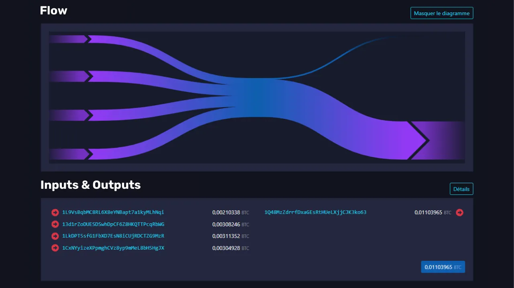

Nguồn: [Mempool.space](https://mempool.space/fr/tx/77c16914211e237a9bd51a7ce0b1a7368631caed515fe51b081d220590589e94)
Trong bối cảnh phân tích chuỗi, mô hình này có thể tiết lộ nhiều thông tin. Ví dụ, nếu chúng ta biết một trong các đầu vào thuộc về Alice, chúng ta có thể giả định rằng tất cả các đầu vào khác và đầu ra của giao dịch này cũng thuộc về cô ấy. Giả định này sau đó sẽ cho phép chúng ta truy ngược lại qua các chuỗi giao dịch trước đó để khám phá và phân tích các giao dịch khác có thể liên quan đến Alice.


### Chi tiêu theo nhóm

Mô hình này được đặc trưng bởi việc tiêu thụ một số ít UTXO làm đầu vào (thường chỉ một) và tạo thành nhiều UTXO ở đầu ra.


Việc giải thích mô hình này là chúng ta đang chứng kiến một hoạt động chi tiêu nhóm. Giao dịch loại này có khả năng tiết lộ một hoạt động kinh tế có quy mô đáng kể, chẳng hạn như một nền tảng giao dịch. Chi tiêu nhóm cho phép các thực thể này tiết kiệm phí bằng cách kết hợp các khoản chi của họ vào một giao dịch duy nhất.
Chúng ta có thể suy luận từ mô hình này rằng UTXO đầu vào đến từ một công ty có hoạt động kinh tế có quy mô đáng kể và rằng các đầu ra UTXO sẽ được phân tán. Nhiều đầu ra sẽ thuộc về khách hàng của công ty đã rút bitcoin từ nền tảng. Số khác có thể đi về phía các công ty đối tác. Cuối cùng, chắc chắn sẽ có một hoặc nhiều giao dịch quay trở lại công ty phát hành giao dịch.

Ví dụ, đây là một giao dịch Bitcoin áp dụng mô hình chi tiêu nhóm (có khả năng, đó là một giao dịch được phát hành bởi nền tảng Bybit):

```plaintext
8a7288758b6e5d550897beedd13c70bcbaba8709af01a7dbcc1f574b89176b43
```

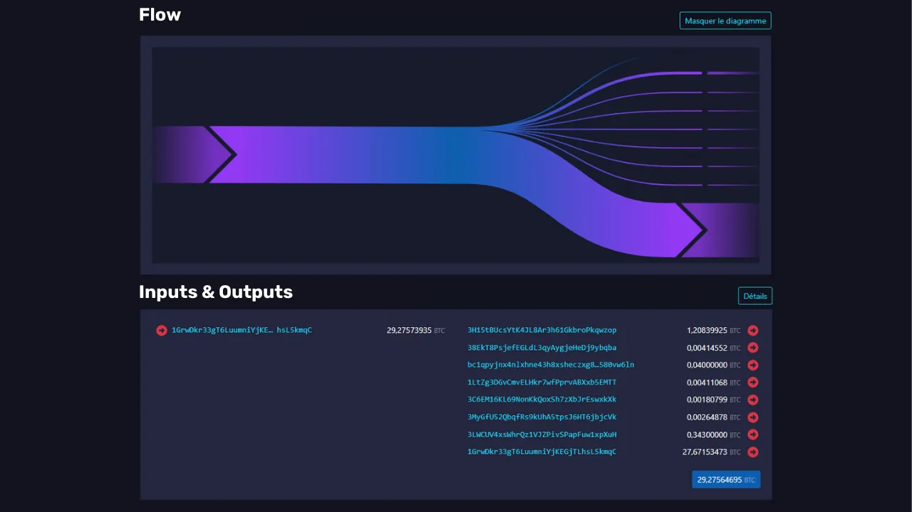

Nguồn: [Mempool.space](https://mempool.space/fr/tx/8a7288758b6e5d550897beedd13c70bcbaba8709af01a7dbcc1f574b89176b43)

### Giao dịch đặc thù theo giao thức

Trong số các mô hình giao dịch, chúng ta cũng có thể xác định các mô hình tiết lộ việc sử dụng một giao thức cụ thể. Ví dụ, giao dịch trộn coi trên Whirlpool (mà chúng ta sẽ thảo luận trong phần 5) sẽ có một cấu trúc dễ nhận biết cho phép chúng được phân biệt với các giao dịch truyền thống khác.


Việc phân tích mô hình này gợi ý rằng chúng ta có khả năng đang chứng kiến một giao dịch hợp tác. Cũng có thể quan sát thấy một trộn coin. Nếu giả thuyết sau này chứng minh là chính xác, thì số lượng đầu ra có thể cung cấp cho chúng ta một ước lượng gần đúng về số lượng người tham gia trong trộn coin.

Ví dụ, đây là một giao dịch Bitcoin áp dụng mô hình của loại giao dịch trộn coin hợp tác:

```plaintext
00601af905bede31086d9b1b79ee8399bd60c97e9c5bba197bdebeee028b9bea
```
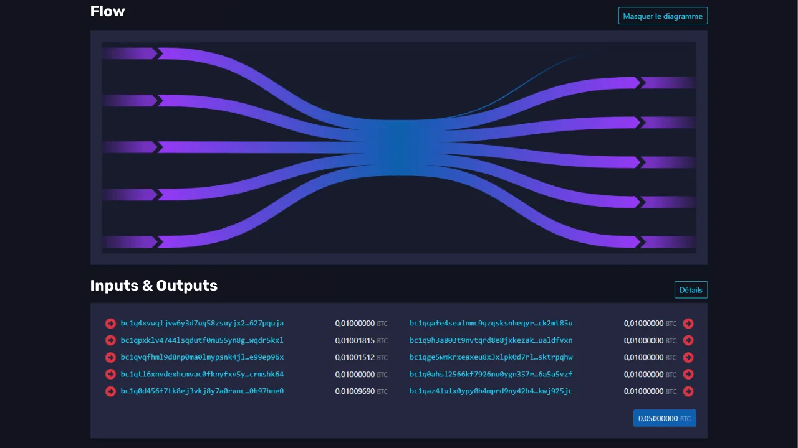

Nguồn: [Mempool.space](https://mempool.space/fr/tx/00601af905bede31086d9b1b79ee8399bd60c97e9c5bba197bdebeee028b9bea)

Có nhiều giao thức khác có cấu trúc đặc thù của riêng mình. Do đó, chúng ta có thể phân biệt các giao dịch của loại Wabisabi, giao dịch Stamps, hoặc thậm chí là Runes, ví dụ.

Nhờ các mô hình giao dịch này, chúng ta đã có thể giải thích một số thông tin về một giao dịch cụ thể. Nhưng cấu trúc của giao dịch không phải là nguồn thông tin duy nhất cho việc phân tích. Chúng ta cũng có thể nghiên cứu các chi tiết của nó. Những chi tiết này, nội bộ của một giao dịch, là những gì tôi muốn gọi là "heuristics nội bộ," và chúng ta sẽ nghiên cứu chúng trong chương tiếp theo.

## Phép suy luận nội bộ
<chapterId>c54b5abe-872f-40f4-a0d0-c59faff228ba</chapterId>

Một suy luận nội bộ - heuristic nội bộ là một đặc điểm cụ thể được xác định bên trong chính giao dịch, không cần phải xem xét tới bối cảnh xung quanh, cho phép chúng ta đưa ra suy luận. Khác với các mô hình tập trung vào cấu trúc tổng thể của giao dịch ở mức độ cao, suy luận nội bộ dựa trên bộ dữ liệu có thể trích xuất. Điều này bao gồm:
- Số lượng các UTXO khác nhau cả đầu vào và đầu ra;
- Mọi thứ liên quan đến script: địa chỉ nhận, phiên bản, thời gian khóa...

Nói chung, loại phương pháp suy luận này sẽ cho phép chúng ta xác định sự thay đổi trong một giao dịch cụ thể. Bằng cách làm như vậy, chúng ta có thể tiếp tục theo dõi một thực thể qua nhiều giao dịch khác nhau. Thực vậy, nếu chúng ta xác định được một UTXO thuộc về một người dùng mà chúng ta muốn theo dõi, điều quan trọng là phải xác định, khi họ thực hiện một giao dịch, đầu ra nào được chuyển cho người dùng khác và đầu ra nào đại diện cho phần tiền thối, do đó vẫn thuộc về họ.


Một lần nữa, tôi muốn nhắc bạn rằng những phương pháp suy luận này không hoàn toàn chính xác. Khi xem xét riêng lẻ, chúng chỉ cho phép chúng ta xác định các kịch bản có thể. Chính sự tích lũy của nhiều suy luận giúp giảm bớt sự không chắc chắn, tất nhiên, không bao giờ loại bỏ hoàn toàn sự không chắc chắn.

### Những điểm tương đồng nội bộ

Phương pháp suy luận này liên quan đến việc nghiên cứu sự tương đồng giữa các đầu vào và đầu ra của cùng một giao dịch. Nếu chúng ta quan sát thấy cùng một đặc điểm trên các đầu vào và chỉ trên một đầu ra của giao dịch, thì có khả năng đầu ra này là phần tiền thối.

Đặc điểm rõ ràng nhất là việc tái sử dụng một địa chỉ nhận trong cùng một giao dịch.

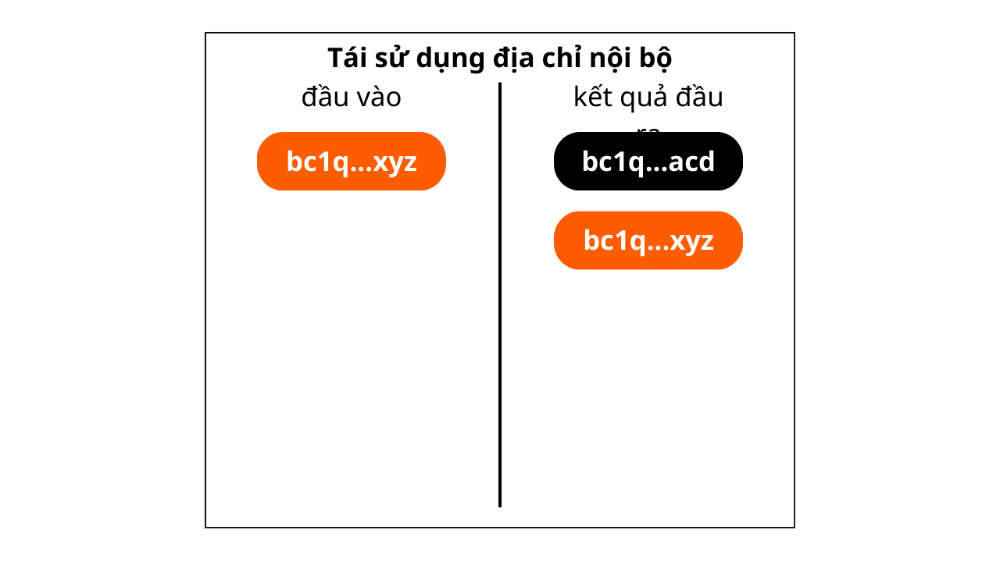
Phương pháp suy luận này để lại một chút không gian cho sự nghi ngờ. Trừ khi khóa riêng tư của một người đã bị hack, cùng một địa chỉ nhận không thể không tiết lộ hoạt động của một người dùng duy nhất. Sự giải thích theo sau là phần tiền thối từ giao dịch là đầu ra với cùng một địa chỉ như đầu vào. Điều này cho phép tiếp tục theo dõi cá nhân dựa trên phần tiền thối này.
Ví dụ, đây là một giao dịch mà cách suy luận này có thể được áp dụng một cách hợp lý:

```plaintext
54364146665bfc453a55eae4bfb8fdf7c721d02cb96aadc480c8b16bdeb8d6d0
```


Nguồn: [Mempool.space](https://mempool.space/tx/54364146665bfc453a55eae4bfb8fdf7c721d02cb96aadc480c8b16bdeb8d6d0)

Những điểm tương đồng giữa đầu vào và đầu ra không dừng lại ở việc tái sử dụng địa chỉ. Bất kỳ sự giống nhau nào trong việc sử dụng script cũng có thể cho phép đưa ra một suy luận. Ví dụ, đôi khi có thể quan sát thấy cùng một phiên bản giữa một đầu vào và một trong các đầu ra của giao dịch.

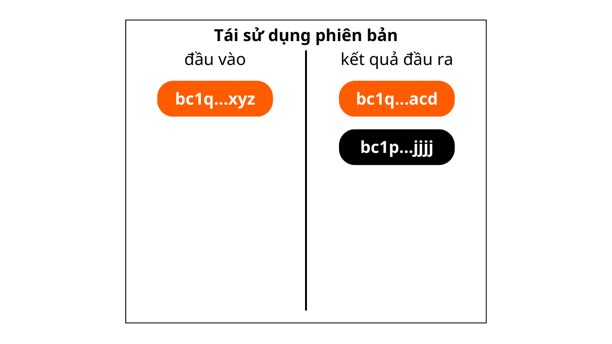

Trong sơ đồ này, chúng ta có thể thấy rằng đầu vào số 0 mở khóa một script P2WPKH (SegWit V0 bắt đầu với `bc1q`). Đầu ra số 0 sử dụng cùng một loại script. Tuy nhiên, đầu ra số 1 sử dụng một script P2TR (SegWit V1 bắt đầu với `bc1p`). Sự giải thích của đặc điểm này là có khả năng địa chỉ có cùng phiên bản với đầu vào là địa chỉ tiền thối. Do đó, nó vẫn thuộc về cùng một người dùng.

Đây là một giao dịch mà cách suy luận này có thể được áp dụng một cách hợp lý:

```plaintext
db07516288771ce5d0a06b275962ec4af1b74500739f168e5800cbcb0e9dd578
```


Nguồn: [Mempool.space](https://mempool.space/tx/db07516288771ce5d0a06b275962ec4af1b74500739f168e5800cbcb0e9dd578)
Trong trường hợp này, chúng ta có thể thấy rằng đầu vào số 0 và đầu ra số 1 sử dụng kịch bản P2WPKH (SegWit V0), trong khi đầu ra số 0 sử dụng một loại kịch bản khác, P2PKH (Legacy). Vào đầu những năm 2010, phương pháp suy luận này dựa trên việc phiên bản hóa của các kịch bản không thực sự hữu ích do sự hạn chế của các loại kịch bản có sẵn. Tuy nhiên, theo thời gian và với các bản cập nhật liên tiếp của Bitcoin, các loại kịch bản đã được giới thiệu ngày càng đa dạng. Phương pháp suy luận này trở nên ngày càng quan trọng bởi vì, với một phạm vi các loại kịch bản rộng lớn hơn, người dùng được chia thành các nhóm nhỏ hơn, do đó tăng cơ hội áp dụng phương pháp suy luận này về việc tái sử dụng phiên bản nội bộ. Vì lý do này, chỉ từ góc độ quyền riêng tư, nên chọn loại kịch bản phổ biến nhất. Ví dụ, khi tôi viết những dòng này, kịch bản Taproot (`bc1p`) được sử dụng ít thường xuyên hơn so với kịch bản SegWit V0 (`bc1q`). Mặc dù loại trước đem lại lợi ích về kinh tế và quyền riêng tư trong một số bối cảnh cụ thể, đối với các giao dịch sử dụng chữ ký đơn giản truyền thống, có thể sẽ khôn ngoan khi tuân theo một tiêu chuẩn cũ hơn vì lý do riêng tư, cho đến khi tiêu chuẩn mới được áp dụng rộng rãi hơn.
### Thanh toán số tròn

Một phương pháp suy luận nội bộ khác có thể giúp chúng ta xác định đầu ra thay đổi là phương pháp của số tròn. Nói chung, khi đối mặt với một mô hình thanh toán đơn giản (1 đầu vào và 2 đầu ra), nếu một trong các đầu ra chi tiêu một số tiền tròn, thì nó đại diện cho việc thanh toán.

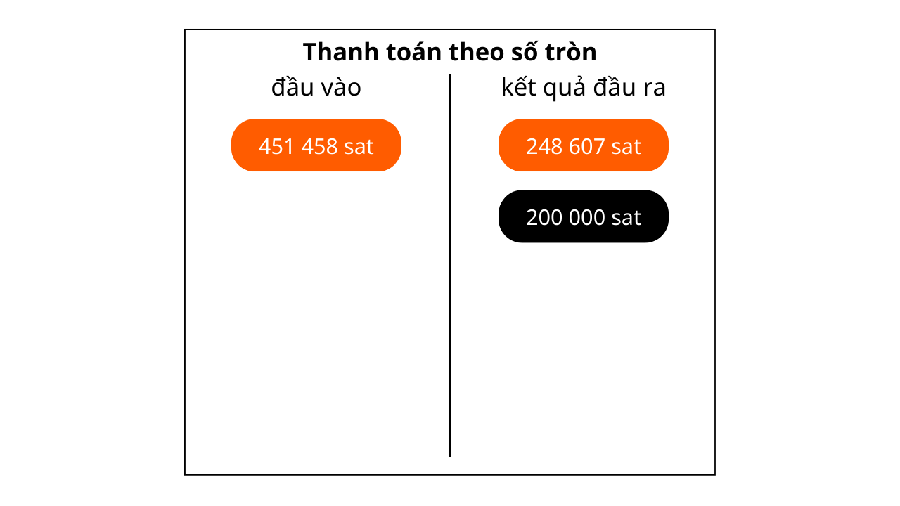

Bằng cách loại trừ, nếu một đầu ra đại diện cho việc thanh toán, đầu ra còn lại đại diện cho tiền thối. Do đó, có thể suy luận rằng người dùng tạo giao dịch vẫn giữ đầu ra được xác định là tiền thối.

Cần lưu ý rằng phương pháp suy luận này không phải lúc nào cũng áp dụng được, vì phần lớn các khoản thanh toán vẫn được thực hiện bằng đơn vị tiền tệ pháp định. Thực tế, khi một người bán hàng ở Pháp chấp nhận bitcoin, thông thường, họ không hiển thị giá cố định bằng sats. Họ sẽ chọn một sự chuyển đổi giữa giá bằng euro và số lượng bitcoin cần thanh toán. Do đó, sẽ không có một số tròn trong đầu ra giao dịch.

Tuy nhiên, một nhà phân tích có thể cố gắng thực hiện việc chuyển đổi này bằng cách tính toán tỷ giá hối đoái hiệu lực khi giao dịch được phát tán trên mạng. Hãy lấy ví dụ về một giao dịch với một đầu vào của `97,552 sat` và hai đầu ra, một là `31,085 sat` và cái kia là `64,152 sat`. Ngay từ cái nhìn đầu tiên, giao dịch này dường như không liên quan đến các số tiền tròn. Tuy nhiên, bằng cách áp dụng tỷ giá €64,339 vào thời điểm giao dịch, chúng ta có được một sự chuyển đổi sang euro như sau:
- Một đầu vào của €62.76;
- Một đầu ra của €20;
- Một đầu ra của €41.27.
Một khi được chuyển đổi sang tiền pháp định, giao dịch này cho phép áp dụng phương pháp suy luận về thanh toán số tròn. Đầu ra của €20 có khả năng dành cho một người bán hàng, hoặc ít nhất là đã thay đổi chủ sở hữu. Bằng cách suy luận, đầu ra của €41.27 có khả năng vẫn thuộc về người dùng ban đầu.
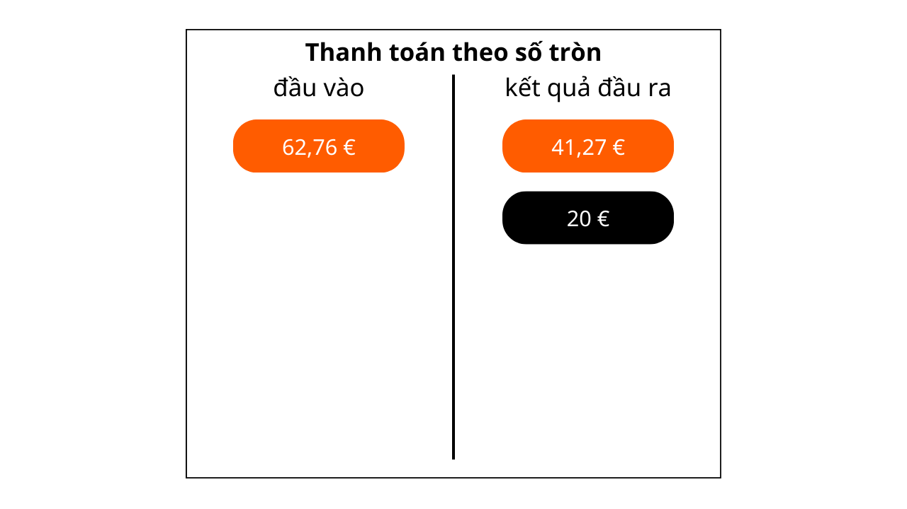

Nếu một ngày nào đó, Bitcoin trở thành đơn vị tính toán ưa thích trong các giao dịch của chúng ta, phương pháp suy luận này có thể sẽ trở nên hữu ích hơn nữa cho việc phân tích.

Ví dụ, đây là một giao dịch mà phương pháp suy luận này có thể được áp dụng:

```plaintext
2bcb42fab7fba17ac1b176060e7d7d7730a7b807d470815f5034d52e96d2828a
```


Nguồn: [Mempool.space](https://mempool.space/tx/2bcb42fab7fba17ac1b176060e7d7d7730a7b807d470815f5034d52e96d2828a)
### Đầu ra lớn nhất

Khi có sự chênh lệch đủ lớn được phát hiện giữa hai đầu ra của giao dịch trong một mô hình thanh toán đơn giản, có thể ước lượng rằng đầu ra lớn hơn có khả năng là tiền thối.

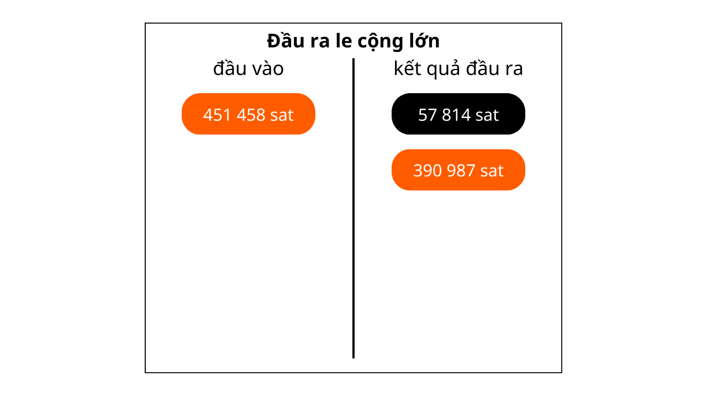

Suy luận dựa trên đầu ra lớn nhất có lẽ là không chính xác nhất trong tất cả. Nếu chỉ xác định bởi chính nó, nó khá yếu. Tuy nhiên, đặc điểm này có thể được kết hợp với các suy luận khác để giảm bớt sự không chắc chắn của chúng ta trong việc giải thích.

Ví dụ, nếu chúng ta xem xét một giao dịch có một đầu ra với một số tiền tròn và một đầu ra khác với số tiền lớn hơn, việc áp dụng chung suy luận về thanh toán tròn số và suy luận về đầu ra lớn nhất cho phép chúng ta giảm bớt mức độ không chắc chắn của mình.

Ví dụ, đây là một giao dịch mà heuristic này có thể được áp dụng:

```plaintext
b79d8f8e4756d34bbb26c659ab88314c220834c7a8b781c047a3916b56d14dcf
```


Nguồn: [Mempool.space](https://mempool.space/tx/b79d8f8e4756d34bbb26c659ab88314c220834c7a8b781c047a3916b56d14dcf)

## Suy luận dựa trên các yếu tố bên ngoài - Heuristic bên ngoài
<chapterId>4a170e3b-200d-431a-8285-18a23ff617ba</chapterId>
Việc nghiên cứu về suy luận dựa trên các yếu tố bên ngoài bao gồm việc phân tích sự giống nhau, các mẫu và đặc điểm của một số yếu tố không phải là bản chất của giao dịch. Nói cách khác, nếu trước đây chúng ta chỉ giới hạn trong việc khai thác các yếu tố nội tại của giao dịch với suy luận nội bộ, bây giờ chúng ta mở rộng lĩnh vực phân tích của mình ra bối cảnh của giao dịch nhờ vào suy luận bên ngoài.

### Tái sử dụng địa chỉ ví

Đây là một trong những phép suy luận được biết đến nhiều nhất trong số những người ủng hộ Bitcoin. Tái sử dụng địa chỉ cho phép thiết lập một liên kết giữa các giao dịch khác nhau và các UTXO khác nhau. Nó được quan sát khi một địa chỉ nhận bitcoin được sử dụng nhiều lần.

Do đó, có thể khai thác hành vi tái sử dụng địa chỉ trong cùng một giao dịch như một suy luận nội bộ để xác định tiền thối (như chúng ta đã thấy trong chương trước). Tuy nhiên, hành vi tái sử dụng địa chỉ cũng có thể phục vụ như một suy luận bên ngoài để nhận biết sự độc đáo của một thực thể đằng sau nhiều giao dịch.

Việc giải thích tái sử dụng địa chỉ là tất cả các UTXO bị khóa trên địa chỉ này thuộc về (hoặc đã thuộc về) cùng một thực thể. Phép suy luận này để lại một không gian nhỏ cho sự không chắc chắn. Khi có thể xác định nó, việc giải thích theo sau rất có khả năng tương ứng với thực tế. Do đó, nó cho phép phân loại theo nhóm các hoạt động trên chuỗi khác nhau.

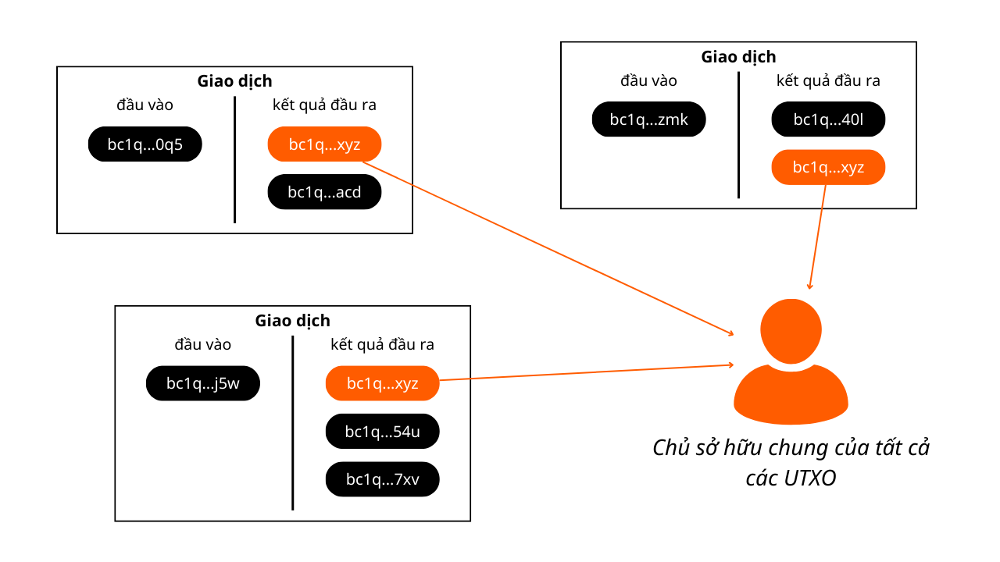

Như đã giải thích trong phần giới thiệu của phần 3 này, phép suy luận này được phát hiện bởi chính Satoshi Nakamoto. Trong bản cáo bạch, ông đề cập chi tiết đến một giải pháp cho người dùng để tránh việc tái sử dụng địa chỉ ví, đó là đơn giản chỉ sử dụng một địa chỉ mới cho mỗi giao dịch mới:

"_Như một một bức tường lửa bổ sung, một cặp khóa mới có thể được sử dụng cho mỗi giao dịch để giữ chúng không bị liên kết với một chủ sở hữu chung._"


Nguồn: S. Nakamoto, "Bitcoin: Hệ thống tiền điện tử ngang hàng", https://bitcoin.org/bitcoin.pdf, 2009.

Ví dụ, đây là một địa chỉ được tái sử dụng qua nhiều giao dịch:

```plaintext
bc1qqtmeu0eyvem9a85l3sghuhral8tk0ar7m4a0a0
```


Nguồn: [Mempool.space](https://mempool.space/address/bc1qqtmeu0eyvem9a85l3sghuhral8tk0ar7m4a0a0)

### Sự tương đồng script và dấu vân tay của ví

Ngoài việc tái sử dụng địa chỉ, có nhiều phương pháp phân tích khác cho phép liên kết các hành động với cùng một ví hoặc một nhóm địa chỉ.
Đầu tiên và quan trọng nhất, một nhà phân tích có thể tận dụng sự tương đồng trong việc sử dụng script. Ví dụ, các script ít gặp như multisig có thể được nhận diện dễ dàng hơn so với các script SegWit V0. Càng nhiều người chúng ta ẩn mình trong một loại script, càng khó để bị phát hiện. Đây là lý do tại sao, trong các giao thức trộn coin tốt, tất cả các thành viên sử dụng chính xác cùng một loại script.
Một cách rộng rãi hơn, một nhà phân tích cũng có thể tập trung vào các dấu vân tay đặc trưng của một ví. Đây là các quy trình cụ thể liên quan đến một cách sử dụng mà người ta có thể muốn nhận diện với mục đích khai thác chúng như các phép suy luận truy dấu vết. Nói cách khác, nếu người ta quan sát thấy sự tích tụ của cùng một đặc điểm nội bộ trên các giao dịch được gán cho thực thể đang được truy vết, người ta có thể cố gắng nhận diện những đặc điểm tương tự trên các giao dịch khác.

Ví dụ, có thể nhận diện được rằng người dùng được truy vết hệ thống hóa gửi tiền thừa của họ đến các địa chỉ P2TR (`bc1p…`). Nếu quy trình này lặp lại, nó có thể được sử dụng như một phép suy luận cho việc tiếp tục phân tích của chúng ta. Các dấu vân tay khác cũng có thể được sử dụng, như thứ tự của các UTXO, vị trí của tiền thừa trong các đầu ra, tín hiệu RBF (Replace-by-Fee), hoặc thậm chí, số phiên bản, trường `nSequence`, và trường `nLockTime`.

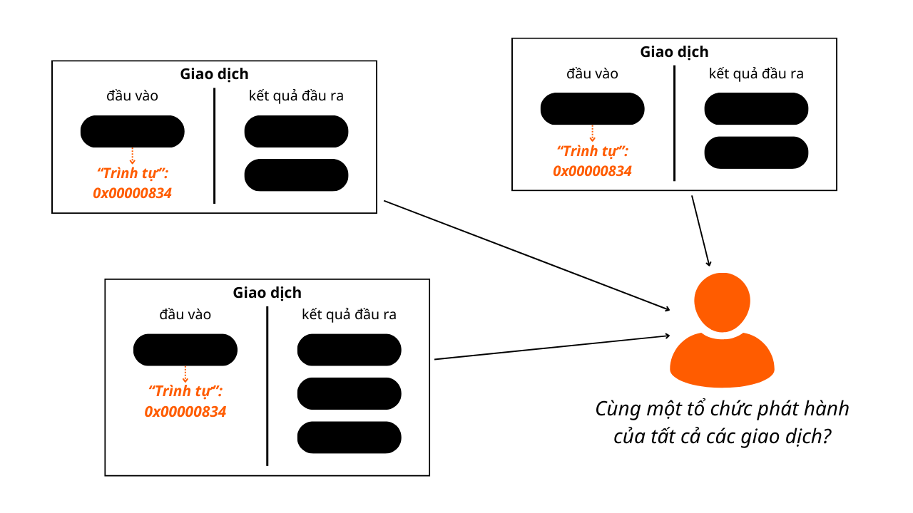

Như [@LaurentMT](https://twitter.com/LaurentMT) đã chỉ ra trong [Space Kek #19](https://podcasters.spotify.com/pod/show/decouvrebitcoin/episodes/SpaceKek-19---Analyse-de-chane--anonsets-et-entropie-e1vfuji) (một podcast bằng tiếng Pháp), việc sử dụng dấu vân tay ví trong phân tích chuỗi tăng đáng kể theo thời gian. Thực tế, số lượng loại script ngày càng tăng và việc triển khai dần dần các tính năng mới bởi phần mềm ví làm tăng sự khác biệt. Thậm chí, có thể xác định chính xác phần mềm được sử dụng bởi thực thể đang được truy vết. Do đó, quan trọng là phải hiểu rằng việc nghiên cứu dấu vân tay của một ví đặc biệt có liên quan đối với các giao dịch gần đây, hơn là đối với những giao dịch được khởi xướng vào đầu những năm 2010.

Tóm lại, một dấu vân tay có thể là bất kỳ hành vi cụ thể nào, được thực hiện tự động bởi ví hoặc thủ công bởi người dùng, có thể được tìm thấy trên các giao dịch khác để hỗ trợ chúng ta trong phân tích.

### Phép suy luận dựa trên việc sở hữu đầu vào chung (CIOH)

CIOH, viết tắt của "Common Input Ownership Heuristic" trong tiếng Anh, là một phương pháp suy luận cho rằng khi một giao dịch bao gồm nhiều đầu vào, những đầu vào này có khả năng đều đến từ một thực thể duy nhất. Do đó, quyền sở hữu của chúng là chung.
Để áp dụng CIOH, trước tiên chúng ta quan sát một giao dịch có nhiều đầu vào. Có thể ít như 2 đầu vào hoặc nhiều lên đến 30 đầu vào. Một khi đặc điểm này được xác định, chúng ta kiểm tra xem giao dịch có phù hợp với một mô hình giao dịch đã biết hay không. Ví dụ, nếu nó có 5 đầu vào với số lượng gần như nhau và 5 đầu ra với số lượng chính xác như nhau, chúng ta biết đó là cấu trúc của một giao dịch trộn coin. Do đó, chúng ta không thể áp dụng CIOH.

Tuy nhiên, nếu giao dịch không phù hợp với bất kỳ mô hình giao dịch hợp tác nào đã biết, thì chúng ta có thể suy luận rằng tất cả các đầu vào có khả năng đến từ cùng một thực thể. Điều này có thể rất hữu ích để mở rộng một cụm đã biết hoặc tiếp tục truy vết.

CIOH được phát hiện bởi Satoshi Nakamoto. Ông thảo luận về nó trong phần 10 của bản cáo bạch:

"_[...] mối liên kết là không thể tránh khỏi với các giao dịch đa đầu vào, chúng nhất thiết tiết lộ rằng các đầu vào của chúng được sở hữu bởi cùng một chủ sở hữu. Rủi ro là nếu chủ sở hữu của một khóa được tiết lộ, các liên kết có thể tiết lộ các giao dịch khác thuộc về cùng một chủ sở hữu._"

Điều đặc biệt thú vị là lưu ý rằng Satoshi Nakamoto, ngay cả trước khi Bitcoin chính thức ra mắt, đã nhận diện được hai điểm yếu chính về quyền riêng tư của người dùng, đó là CIOH và việc tái sử dụng địa chỉ ví. Sự nhìn xa trông rộng như vậy thật đáng chú ý, vì những phép suy luận này vẫn, ngay cả cho tới ngày nay, là những công cụ hữu ích nhất trong phân tích chuỗi.

Để cho bạn một ví dụ, đây là một giao dịch mà chúng ta có thể áp dụng CIOH:

```plaintext
20618e63b6eed056263fa52a2282c8897ab2ee71604c7faccfe748e1a202d712
```

Nguồn: [Mempool.space](https://mempool.space/tx/20618e63b6eed056263fa52a2282c8897ab2ee71604c7faccfe748e1a202d712)

### Dữ liệu ngoại tuyến

Rõ ràng, phân tích chuỗi không chỉ giới hạn ở dữ liệu trên chuỗi. Bất kỳ dữ liệu nào từ các phân tích trước đó hoặc có sẵn trên internet cũng có thể được sử dụng để tinh chỉnh một phân tích.
Ví dụ, nếu quan sát thấy các giao dịch được truy vết luôn được phát sóng từ cùng một nốt Bitcoin và địa chỉ IP của nó có thể được xác định, có thể có khả năng phát hiện các giao dịch khác từ cùng một thực thể, ngoài việc xác định một phần danh tính của người gửi. Mặc dù việc này không dễ dàng thực hiện, vì nó đòi hỏi phải vận hành nhiều nốt, một số công ty chuyên về phân tích chuỗi có thể đã sử dụng nó.

Nhà phân tích cũng có lựa chọn dựa vào các phân tích trước đó đã được công bố mã nguồn mở, hoặc trên các phân tích trước đó của chính họ. Có thể một người sẽ tìm thấy một đầu ra chỉ đến một cụm địa chỉ đã được xác định trước đó. Đôi khi, cũng có thể dựa vào các đầu ra chỉ đến một nền tảng giao dịch, địa chỉ của những công ty này thường được biết đến.

Tương tự, người ta có thể thực hiện phân tích bằng cách loại trừ. Ví dụ, nếu trong quá trình phân tích một giao dịch với hai đầu ra, một trong số chúng được liên kết với một cụm địa chỉ đã biết nhưng khác biệt với thực thể đang được truy vết, thì có thể giải thích rằng đầu ra kia có khả năng đại diện cho số tiền thối.

Phân tích chuỗi cũng bao gồm một phần của OSINT (*Open Source Intelligence*) có tính chất tổng quát hơn với các tìm kiếm trên internet. Đó là lý do tại sao không nên công khai trực tiếp địa chỉ nhận bitcoin trên mạng xã hội hoặc trên một trang web, dù dưới một bí danh hay không.


### Mô hình thời gian
Ít được nghĩ đến, nhưng một số hành vi của con người có thể được nhận biết trên chuỗi. Có lẽ điều hữu ích nhất trong phân tích có thể là mẫu hình giấc ngủ của bạn! Vâng, khi bạn đang ngủ, bạn có lẽ không thực hiện giao dịch Bitcoin. Vì bạn thường ngủ vào cùng một khoảng thời gian, nên việc sử dụng phân tích thời gian trong phân tích chuỗi là phổ biến. Điều này đơn giản là bao gồm việc lập danh mục các giờ mà giao dịch của một thực thể cụ thể được phát sóng đến mạng Bitcoin. Phân tích các mô hình thời gian này cho phép chúng ta suy luận nhiều thông tin.

Trước hết, phân tích thời gian đôi khi cho phép xác định bản chất của thực thể được truy vết. Nếu quan sát thấy giao dịch được phát sóng liên tục trong 24 giờ, thì điều này sẽ tiết lộ một hoạt động kinh tế mạnh mẽ. Thực thể đứng sau những giao dịch này có khả năng là một công ty, có thể là quốc tế, và có lẽ có các quá trình tự động bên trong.

Ví dụ, [tôi đã nhận ra mô hình này vài tháng trước](https://twitter.com/Loic_Pandul/status/1701127409712452072) bằng cách phân tích [giao dịch đã nhầm lẫn phân bổ 19 bitcoin vào phí](https://mempool.space/tx/d5392d474b4c436e1c9d1f4ff4be5f5f9bb0eb2e26b61d2781751474b7e870fd). Một phân tích thời gian đơn giản đã cho phép tôi giả định rằng chúng ta đang xử lý một dịch vụ tự động, và do đó có khả năng là một thực thể lớn như một nền tảng giao dịch.

Thực sự, vài ngày sau, người ta phát hiện ra rằng số tiền đó thuộc về PayPal, thông qua nền tảng giao dịch Paxos.

Ngược lại, nếu chúng ta thấy rằng mô hình thời gian phân bố rải rác qua 16 giờ cụ thể, thì chúng ta có thể ước lượng rằng chúng ta đang xử lý một người dùng cá nhân, hoặc có thể là một doanh nghiệp địa phương tùy thuộc vào khối lượng giao dịch.

Ngoài bản chất của thực thể được quan sát, mô hình thời gian cũng có thể cho chúng ta một vị trí xấp xỉ của người dùng nhờ vào múi giờ. Chúng ta có thể liên kết các giao dịch khác, và sử dụng dấu thời gian của những giao dịch này như một phép suy luận bổ sung có thể được thêm vào phân tích của chúng ta.

Ví dụ, trên địa chỉ được sử dụng lại mà tôi đã nói về trước đây, chúng ta có thể quan sát thấy rằng các giao dịch, dù là đến hay đi, đều tập trung trong một khoảng thời gian kéo dài 13 giờ.

```plaintext
bc1qqtmeu0eyvem9a85l3sghuhral8tk0ar7m4a0a0
```


Nguồn: OXT.me

Khoảng thời gian này có khả năng tương ứng với Châu Âu, Châu Phi, hoặc Trung Đông. Do đó, chúng ta có thể suy luận rằng người dùng đứng sau những giao dịch này sống ở đó.

Trong một lĩnh vực khác, đây cũng là một phân tích thời gian kiểu này đã cho phép giả thuyết rằng Satoshi Nakamoto không hoạt động từ Nhật Bản, mà thực sự là từ Hoa Kỳ: [*The Time Zones of Satoshi Nakamoto*](https://medium.com/@insearchofsatoshi/the-time-zones-of-satoshi-nakamoto-aa40f035178f)

## Ứng dụng thực tế của một trình duyệt blockchain
<chapterId>6493cf2f-225c-405f-9375-c4304f1087ed</chapterId>

Trong chương cuối cùng này, chúng ta sẽ cụ thể áp dụng các khái niệm mà chúng ta đã nghiên cứu cho đến hiện tại. Tôi sẽ đưa ra các ví dụ về giao dịch Bitcoin thực tế, và bạn sẽ cần phải trích xuất thông tin mà tôi yêu cầu.
Lý tưởng nhất, cho những bài tập này, việc sử dụng một công cụ phân tích chuỗi chuyên nghiệp sẽ được ưu tiên. Tuy nhiên, kể từ khi các nhà sáng lập của Samourai Wallet bị bắt, công cụ phân tích miễn phí duy nhất OXT.me không còn khả dụng nữa. Do đó, chúng ta sẽ chọn một trình khám phá block cổ điển cho những bài tập này. Tôi khuyên sử dụng [Mempool.space](https://mempool.space/) vì nó có nhiều tính năng và dải công cụ phân tích chuỗi, nhưng bạn cũng có thể chọn một trình khám phá khác như [Bitcoin Explorer](https://bitcoinexplorer.org/). Để bắt đầu, tôi sẽ đưa ra các bài tập. Sử dụng trình khám duyệt blockchain của bạn để hoàn thành chúng và ghi lại câu trả lời của bạn trên một tờ giấy. Sau đó, ở cuối chương này, tôi sẽ cung cấp các câu trả lời để bạn có thể kiểm tra và sửa chữa kết quả của mình.

*Giao dịch được chọn cho những bài tập này được chọn một cách có phần ngẫu nhiên chỉ dựa trên đặc điểm của chúng. Chương này chỉ nhằm mục đích giáo dục và thông tin. Tôi muốn làm rõ rằng tôi không ủng hộ hoặc khuyến khích việc sử dụng những công cụ này cho mục đích xấu. Mục tiêu là dạy bạn cách tự bảo vệ mình chống lại phân tích chuỗi, không phải để tiến hành phân tích nhằm tiết lộ thông tin cá nhân của người khác.*

### Bài tập 1

ID giao dịch cần phân tích:

```plaintext
3769d3b124e47ef4ffb5b52d11df64b0a3f0b82bb10fd6b98c0fd5111789bef7
```

Tên mô hình của giao dịch này là gì và những giải thích hợp lý nào có thể rút ra chỉ bằng cách xem xét mô hình của nó, tức là cấu trúc của giao dịch?

### Bài tập 2

ID giao dịch cần phân tích:

```plaintext
baa228f6859ca63e6b8eea24ffad7e871713749d693ebd85343859173b8d5c20
```

Tên mô hình của giao dịch này là gì và những giải thích hợp lý nào có thể rút ra chỉ bằng cách xem xét mô hình của nó, tức là cấu trúc của giao dịch?

### Bài tập 3

ID giao dịch cần phân tích:

```plaintext
3a9eb9ccc3517cc25d1860924c66109262a4b68f4ed2d847f079b084da0cd32b
```

Mô hình của giao dịch này là gì?

Sau khi xác định mô hình của nó, sử dụng các phép suy luận nội bộ của giao dịch, đầu ra nào có khả năng đại diện cho số tiền thối?

### Bài tập 4

ID giao dịch cần phân tích:

```plaintext
35f0b31c05503ebfdf7311df47f68a048e992e5cf4c97ec34aa2833cc0122a12
```

Mô hình của giao dịch này là gì?
Sau khi xác định mô hình của nó, sử dụng các phép suy luận nội bộ của giao dịch, đầu ra nào có khả năng đại diện cho số tiền thối?
### Bài tập 5

Hãy tưởng tượng rằng Loïc đã đăng một trong những địa chỉ nhận bitcoin của mình trên mạng xã hội Twitter:


```plaintext
bc1qja0hycrv7g9ww00jcqanhfpqmzx7luqalum3vu
```

Chỉ sử dụng **phép suy luận tái sử dụng địa chỉ**, chúng ta có thể liên kết những giao dịch Bitcoin nào với danh tính của Loïc?

*Rõ ràng, tôi không phải là chủ sở hữu thực sự của địa chỉ nhận này và tôi không đăng nó trên mạng xã hội. Đó là một địa chỉ tôi chọn ngẫu nhiên từ blockchain.*

### Bài tập 6

Tiếp theo Bài tập 5, nhờ phép suy luận tái sử dụng địa chỉ, bạn đã có thể xác định được một số giao dịch Bitcoin mà Loïc có vẻ liên quan. Bình thường, trong số các giao dịch được xác định, bạn nên đã phát hiện ra giao dịch này:

```plaintext
2d9575553c99578268ffba49a1b2adc3b85a29926728bd0280703a04d051eace
```
Giao dịch này là giao dịch đầu tiên gửi tiền đến địa chỉ của Loïc. Theo ý kiến của bạn, bitcoin mà Loïc nhận được qua giao dịch này đến từ đâu?

### Bài tập 7

Tiếp theo Bài tập 5, nhờ vào phép suy luận tái sử dụng địa chỉ, bạn đã có thể xác định được một số giao dịch Bitcoin mà Loïc có vẻ như đã tham gia. Bây giờ, bạn muốn tìm hiểu Loïc đến từ đâu. Dựa vào các giao dịch tìm được, tiến hành phân tích thời gian để tìm ra múi giờ mà Loïc có thể sử dụng. Từ múi giờ này, xác định một địa điểm mà Loïc có vẻ như đang sống (quốc gia, bang/khu vực, thành phố...).


### Bài tập 8

Đây là giao dịch Bitcoin cần nghiên cứu:

```plaintext
bb346dae645d09d32ed6eca1391d2ee97c57e11b4c31ae4325bcffdec40afd4f
```

Chỉ quan sát giao dịch này, chúng ta có thể giải thích thông tin gì?

### Giải pháp cho các bài tập

***Bài tập 1:***
Mô hình của giao dịch này là một khoản thanh toán đơn giản. Nếu chúng ta chỉ nghiên cứu cấu trúc của nó, chúng ta có thể giải thích rằng một đầu ra đại diện cho tiền thối và đầu ra khác đại diện cho một khoản thanh toán thực sự. Do đó, chúng ta biết rằng người dùng được quan sát có khả năng không còn sở hữu một trong hai UTXO ở đầu ra (cái dành cho thanh toán), nhưng vẫn sở hữu UTXO khác (cái dành cho tiền thối).

***Bài tập 2:***
Mô hình của giao dịch này là chi tiêu hàng loạt. Mô hình này có khả năng chỉ ra hoạt động kinh tế có quy mô đáng kể, chẳng hạn như một nền tảng giao dịch, ví dụ. Chúng ta có thể suy luận rằng UTXO ở đầu vào đến từ một công ty có hoạt động kinh tế ở quy mô đáng kể và rằng các UTXO ở đầu ra sẽ được phân tán. Một số sẽ thuộc về khách hàng của công ty đã rút bitcoin của họ về ví tự quản. Số khác có thể đi đến các công ty đối tác. Cuối cùng, chắc chắn sẽ có một phần tiền thối trở lại công ty phát hành.

***Bài tập 3:***

Mô hình của giao dịch này là một khoản thanh toán đơn giản. Do đó, chúng ta có thể áp dụng các phép suy luận nội bộ cho giao dịch để cố gắng xác định tiền thối.

Cá nhân tôi đã xác định được ít nhất hai phép suy luận nội bộ hỗ trợ cùng một giả thuyết:
- Sự tái sử dụng cùng một loại script;
- Đầu ra lớn nhất.

Phép suy luận rõ ràng nhất là sự tái sử dụng cùng một loại script. Thực tế, đầu ra `0` là một `P2SH`, có thể nhận biết qua địa chỉ nhận bắt đầu bằng `3`:

```plaintext
3Lcdauq6eqCWwQ3UzgNb4cu9bs88sz3mKD
```

Trong khi đầu ra `1` là một `P2WPKH`, có thể nhận biết qua địa chỉ bắt đầu bằng `bc1q`:

```plaintext
bc1qya6sw6sta0mfr698n9jpd3j3nrkltdtwvelywa
```

UTXO được sử dụng trong đầu vào cho giao dịch này cũng sử dụng một script `P2WPKH`:

```plaintext
bc1qyfuytw8pcvg5vx37kkgwjspg73rpt56l5mx89k
```

Do đó, chúng ta có thể giả định rằng đầu ra `0` tương ứng với một khoản thanh toán và đầu ra `1` là tiền thối của giao dịch, điều này có nghĩa là người dùng ở đầu vào vẫn sở hữu đầu ra `1`.
Để hỗ trợ hoặc bác bỏ giả thuyết này, chúng ta có thể tìm kiếm các phép suy luận khác nhằm hoặc là xác nhận suy nghĩ của chúng ta hoặc giảm khả năng giả thuyết của chúng ta là chính xác.
Tôi đã phát hiện ra ít nhất một  phép suy luận khác. Đó là đầu ra lớn nhất. Đầu ra `0` có giá trị `123,689 sat`, trong khi đầu ra `1` có giá trị `505,839 sat`. Do đó, có một sự khác biệt đáng kể giữa hai đầu ra này. Phép suy luận của đầu ra lớn nhất gợi ý rằng đầu ra có dung lượng lớn nhất có khả năng là tiền thối. Phép suy luận này này do đó càng củng cố giả thuyết ban đầu của chúng ta.

Có vẻ như người dùng cung cấp UTXO ở đầu vào vẫn giữ đầu ra `1`, và đó dường như tiền thối của giao dịch.

***Bài tập 4:***
Mô hình của giao dịch này là một giao dịch thanh toán đơn giản. Do đó, chúng ta có thể áp dụng các phép suy luận nội bộ vào giao dịch để cố gắng xác định tiền thối.
Cá nhân tôi đã xác định được ít nhất hai phép suy luận nội bộ hỗ trợ cùng một giả thuyết:
- Sử dụng lại cùng một loại script;
- Đầu ra của một số lượng tròn.

Phép suy luận rõ ràng nhất là việc sử dụng lại cùng một loại script. Thực sự, đầu ra `0` là một `P2SH`, có thể nhận biết qua địa chỉ nhận bắt đầu bằng `3`:

```plaintext
3FSH5Mnq6S5FyQoKR9Yjakk3X4KCGxeaD4
```

Trong khi đầu ra `1` là một `P2WPKH`, có thể nhận biết qua địa chỉ bắt đầu bằng `bc1q`:

```plaintext
bc1qvdywdcfsyavt4v8uxmmrdt6meu4vgeg439n7sg
```

UTXO được sử dụng làm đầu vào cho giao dịch này cũng sử dụng một script `P2WPKH`:

```plaintext
bc1qku3f2y294h3ks5eusv63dslcua2xnlzxx0k6kp
```

Do đó, chúng ta có thể giả định rằng đầu ra `0` tương ứng với một khoản thanh toán và đầu ra `1` là tiền thối của giao dịch, điều này có nghĩa là người dùng ở đầu vào vẫn sở hữu đầu ra `1`.

Để hỗ trợ hoặc bác bỏ giả thuyết này, chúng ta có thể tìm kiếm các phép suy luận khác mà hoặc là xác nhận suy nghĩ của chúng ta hoặc giảm khả năng giả thuyết của chúng ta là chính xác.

Tôi đã phát hiện ra ít nhất một phép suy luận khác. Đó là đầu ra của một số lượng tròn. Đầu ra `0` có giá trị `70,000 sat`, trong khi output `1` có giá trị `22,962 sat`. Do đó, chúng ta đang có trước mặt một đầu ra hoàn toàn tròn trong đơn vị tiền tệ BTC. Phép suy luận của đầu ra tròn gợi ý rằng UTXO với một số lượng tròn có khả năng là khoản thanh toán, và bằng cách loại trừ, cái khác đại diện cho tiền thối. Phép suy luận này do đó càng củng cố giả thuyết ban đầu của chúng ta.

Tuy nhiên, trong ví dụ này, một phép suy luận khác có thể đặt câu hỏi về giả thuyết ban đầu của chúng ta. Thực sự, đầu ra `0` lớn hơn đầu ra `1`. Nếu chúng ta dựa vào phép suy luận rằng đầu ra lớn nhất thường là tiền thối, chúng ta có thể suy luận rằng đầu ra `0` là tiền thối. Tuy nhiên, giả thuyết phản bác này có vẻ không thuyết phục, vì hai phép suy luận khác dường như thuyết phục hơn nhiều so với phép suy luận của đầu ra lớn nhất. Do đó, có vẻ hợp lý khi duy trì giả thuyết ban đầu của chúng ta bất chấp mâu thuẫn rõ ràng này.
Do đó, có vẻ như người dùng cung cấp UTXO làm đầu vào vẫn giữ đầu ra `1`, dường như đó là tiền thối từ giao dịch.
***Bài tập 5:***
Chúng ta có thể thấy rằng có 8 giao dịch có thể liên kết với danh tính của Loïc. Trong số này, 4 giao dịch liên quan đến việc nhận bitcoin:
```plaintext
2d9575553c99578268ffba49a1b2adc3b85a29926728bd0280703a04d051eace
8b70bd322e6118b8a002dbdb731d16b59c4a729c2379af376ae230cf8cdde0dd
d5864ea93e7a8db9d3fb113651d2131567e284e868021e114a67c3f5fb616ac4
bc4dcf2200c88ac1f976b8c9018ce70f9007e949435841fc5681fd33308dd762
```

Bốn giao dịch khác liên quan đến việc gửi bitcoin:

```plaintext
8b52fe3c2cf8bef60828399d1c776c0e9e99e7aaeeff721fff70f4b68145d540
c12499e9a865b9e920012e39b4b9867ea821e44c047d022ebb5c9113f2910ed6
a6dbebebca119af3d05c0196b76f80fdbf78f20368ebef1b7fd3476d0814517d
3aeb7ce02c35eaecccc0a97a771d92c3e65e86bedff42a8185edd12ce89d89cc
```

***Bài tập 6:***
Nếu chúng ta xem xét mô hình của giao dịch này, rõ ràng đó là một chi tiêu nhóm. Thật vậy, giao dịch này có một đầu vào và 51 đầu ra, cho thấy hoạt động kinh tế có quy mô đáng kể. Do đó, chúng ta có thể giả định rằng Loïc đã rút bitcoin từ một nền tảng giao dịch.

Một số yếu tố củng cố giả thuyết này. Đầu tiên, loại script được sử dụng để bảo vệ UTXO ở đầu vào là script multisig 2/3 P2SH, cho thấy một mức độ bảo mật cao điển hình của các nền tảng giao dịch:

```plaintext
OP_PUSHNUM_2
OP_PUSHBYTES_33 03eae02975918af86577e1d8a257773118fd6ceaf43f1a543a4a04a410e9af4a59
OP_PUSHBYTES_33 03ba37b6c04aaf7099edc389e22eeb5eae643ce0ab89ac5afa4fb934f575f24b4e
OP_PUSHBYTES_33 03d95ef2dc0749859929f3ed4aa5668c7a95baa47133d3abec25896411321d2d2d
OP_PUSHNUM_3
OP_CHECKMULTISIG
```
Hơn nữa, địa chỉ được phân tích `3PUv9tQMSDCEPSMsYSopA5wDW86pwRFbNF` được sử dụng lại trong hơn 220,000 giao dịch khác nhau, thường là đặc điểm của các nền tảng giao dịch, thường không quan tâm đến quyền riêng tư của họ. Phép suy luận về thời gian áp dụng cho địa chỉ này cũng cho thấy sự phân bố đều đặn các giao dịch gần như hàng ngày trong suốt 3 tháng, với giờ làm việc kéo dài hơn 24 giờ, cho thấy hoạt động liên tục của một nền tảng giao dịch.

Cuối cùng, khối lượng giao dịch do thực thể này xử lý là rất lớn. Thật vậy, địa chỉ đã nhận và gửi 44 BTC trong 222,262 giao dịch giữa tháng 12 năm 2022 và tháng 3 năm 2023. Những khối lượng lớn này càng khẳng định rằng đây khả năng là hoạt động của một nền tảng giao dịch.

***Bài tập 7:***
Bằng cách phân tích thời gian xác nhận của các giao dịch, có thể lưu ý những thời điểm UTC sau:
```plaintext
05:43
20:51
18:12
17:16
04:28
23:38
07:45
21:55
```

Phân tích những thời gian này, có vẻ như múi giờ UTC-7 và UTC-8 phù hợp với phạm vi các hoạt động phổ biến của con người (từ 08:00 đến 23:00) cho đa số các thời gian:

```plaintext
05:43 UTC > 22:43 UTC-7
20:51 UTC > 13:51 UTC-7
18:12 UTC > 11:12 UTC-7
17:16 UTC > 10:16 UTC-7
04:28 UTC > 21:28 UTC-7
23:38 UTC > 16:38 UTC-7
07:45 UTC > 00:45 UTC-7
21:55 UTC > 14:55 UTC-7

05:43 UTC > 21:43 UTC-8
20:51 UTC > 12:51 UTC-8
18:12 UTC > 10:12 UTC-8
17:16 UTC > 09:16 UTC-8
04:28 UTC > 20:28 UTC-8
23:38 UTC > 15:38 UTC-8
07:45 UTC > 23:45 UTC-8
21:55 UTC > 13:55 UTC-8
```


Múi giờ UTC-7 đặc biệt phù hợp trong mùa hè, vì nó bao gồm các bang và khu vực như:
- California (với các thành phố như Los Angeles, San Francisco, và San Diego);
- Nevada (với Las Vegas);
- Oregon (với Portland);
- Washington (với Seattle);
- Khu vực Canada của British Columbia (với các thành phố như Vancouver và Victoria).

Những thông tin này gợi ý rằng Loïc có thể cư trú ở bờ Tây của Hoa Kỳ hoặc Canada.

***Bài tập 8:***
Phân tích giao dịch này tiết lộ 5 đầu vào và một đầu ra duy nhất, có vẻ như chỉ ra một sự hợp nhất. Việc áp dụng phép suy luận CIOH gợi ý rằng tất cả UTXOs trong các đầu vào được giữ bởi một thực thể duy nhất, và UTXO trong đầu ra cũng thuộc về thực thể này. Có vẻ như người dùng đã chọn hợp nhất nhiều UTXO mà họ sở hữu thành một UTXO duy nhất trong đầu ra, với mục tiêu hợp nhất các đồng tiền của họ. Cách tiếp cận này có lẽ được thúc đẩy bởi mong muốn tận dụng mức phí giao dịch thấp tại thời điểm đó để giảm phí trong tương lai.

___

*Để viết phần này về phân tích chuỗi, tôi đã dựa vào các nguồn sau:*
- *Loạt bài viết gồm bốn phần có tên: [Understanding Bitcoin Privacy with OXT](https://medium.com/oxt-research/understanding-bitcoin-privacy-with-oxt-part-1-4-8177a40a5923), được xuất bản bởi Samourai Wallet vào năm 2021;*
- *Các báo cáo khác nhau từ [OXT Research](https://medium.com/oxt-research), cũng như công cụ phân tích chuỗi miễn phí của họ (hiện không còn khả dụng tại thời điểm này sau vụ bắt giữ các nhà sáng lập của Samourai Wallet);*
- *Ở phạm vi rộng hơn, kiến thức của tôi có được từ các bài tweet và nội dung của [@LaurentMT](https://twitter.com/LaurentMT) và [@ErgoBTC](https://twitter.com/ErgoBTC);*
- *Tôi đã tham gia [Space Kek #19](https://podcasters.spotify.com/pod/show/decouvrebitcoin/episodes/SpaceKek-19---Analyse-de-chane--anonsets-et-entropie-e1vfuji) cùng với [@louneskmt](https://twitter.com/louneskmt), [@TheoPantamis](https://twitter.com/TheoPantamis), [@Sosthene___](https://twitter.com/Sosthene___), và [@LaurentMT](https://twitter.com/LaurentMT).*
*Tôi muốn cảm ơn các tác giả, nhà phát triển, và nhà sản xuất của họ. Cũng cảm ơn các nhà phê bình đã tỉ mỉ chỉnh sửa bài viết làm cơ sở cho phần 3 này và đã ban cho tôi lời khuyên chuyên môn của họ:*
- *[Gilles Cadignan](https://twitter.com/gillesCadignan);*
- *[Ludovic Lars](https://viresinnumeris.fr/).*

# Nắm vững các phương pháp tốt nhất để bảo vệ quyền riêng tư của bạn
<partId>9bd04b63-f1af-4e50-9061-6bc90009df68</partId>

## Tái sử dụng địa chỉ ví
<chapterId>f3e97645-3df3-41bc-a4ed-d2c740113d96</chapterId>
Sau khi nghiên cứu các kỹ thuật có thể làm tổn hại đến quyền riêng tư của bạn trên mạng lưới Bitcoin, trong phần thứ ba này, chúng ta sẽ xem xét các phương pháp tốt nhất nên áp dụng để bảo vệ bản thân. Phần này không nhằm mục đích khám phá các phương pháp cải thiện quyền riêng tư, một chủ đề sẽ được đề cập sau, mà là hiểu cách tương tác đúng đắn với Bitcoin để duy trì quyền riêng tư tự nhiên mà nó mang lại, mà không cần sử dụng các kỹ thuật bổ sung.
Rõ ràng, để bắt đầu phần thứ ba này, chúng ta sẽ nói về việc tái sử dụng địa chỉ. Hiện tượng này là mối đe dọa chính đối với quyền riêng tư của người dùng. Do đó, chương này có lẽ là quan trọng nhất trong toàn bộ khóa học.

### Địa chỉ nhận là gì?

Một địa chỉ nhận Bitcoin là một chuỗi ký tự hoặc một định danh được sử dụng để nhận bitcoin vào ví.

Về mặt kỹ thuật, một địa chỉ nhận Bitcoin không "nhận" bitcoin theo nghĩa đen, mà thực chất là nó xác định các điều kiện mà bitcoin có thể được chi tiêu. Cụ thể, khi một khoản thanh toán được gửi đến bạn, giao dịch của người gửi tạo ra một UTXO mới dành cho bạn trong đầu ra từ các UTXO mà nó đã tiêu trong đầu vào. Trên đầu ra này, sẽ có một script định nghĩa cách mà UTXO này sau đó có thể được chi tiêu. Script này được biết đến là "*ScriptPubKey*" hoặc "*Locking Script*". Địa chỉ nhận của bạn, cụ thể hơn là tải trọng - payload (phần chứa dữ liệu thực sực được truyền đi khi thực hiện giao dịch chuyển bitcoin, đây là phần cốt lõi của một địa chỉ ví nhận) của nó, được tích hợp vào script này. Để đơn giản hóa, script này cơ bản quy định:

> "*Để chi tiêu UTXO mới này, một chữ ký số phải được cung cấp sử dụng khóa riêng tư liên kết với địa chỉ nhận này.*"


Các địa chỉ Bitcoin có nhiều loại tùy thuộc vào mô hình script được sử dụng. Các mô hình đầu tiên, được biết đến là "*Legacy*," bao gồm địa chỉ `P2PKH` (*Pay-to-PubKey-Hash*) và `P2SH` (*Pay-to-Script-Hash*). Địa chỉ P2PKH luôn bắt đầu bằng `1` và P2SH bắt đầu bằng `3`. Mặc dù vẫn an toàn, những định dạng này hiện nay đã lỗi thời, vì chúng dẫn đến phí giao dịch cao hơn và cung cấp ít quyền riêng tư hơn so với các tiêu chuẩn mới.
Các địa chỉ SegWit V0 (`P2WPKH` và `P2WSH`) và Taproot / SegWit V1 (`P2TR`) đại diện cho các định dạng hiện đại. Địa chỉ SegWit bắt đầu với `bc1q` và địa chỉ Taproot, được giới thiệu vào năm 2021, bắt đầu với `bc1p`.
Ví dụ, đây là một địa chỉ nhận Taproot:

```text
bc1ps5gd2ys8kllz9alpmcwxqegn7kl3elrpnnlegwkm3xpq2h8da07spxwtf5
```

Cách mà ScriptPubKey được xây dựng sẽ phụ thuộc vào tiêu chuẩn bạn đang sử dụng:
| Mô hình Script  | ScriptPubKey                                                |
| ---------------- | ----------------------------------------------------------- |
| P2PKH            | OP_DUP OP_HASH160 `<pubKeyHash>` OP_EQUALVERIFY OP_CHECKSIG |
| P2SH             | OP_HASH160 `<scriptHash>` OP_EQUAL                          |
| P2WPKH           | 0 `<pubKeyHash>`                                            |
| P2WSH            | 0 `<witnessScriptHash>`                                     |
| P2SH - P2WPKH    | OP_HASH160 `<redeemScriptHash>` OP_EQUAL                    |
| P2SH - P2WSH     | OP_HASH160 `<redeemScriptHash>` OP_EQUAL                    |
| P2TR             | 1 `<pubKey>`                                                |

Về việc xây dựng các địa chỉ nhận, nó cũng phụ thuộc vào mô hình script đã chọn:
- Đối với các địa chỉ `P2PKH` và `P2WPKH`, payload, tức là phần cốt lõi của địa chỉ, đại diện cho hash của khóa công khai;
- Đối với các địa chỉ `P2SH` và `P2WSH`, payload đại diện cho mã băm - hash của một script;
- Đối với các địa chỉ `P2TR`, payload là một khóa công khai được điều chỉnh. Các output `P2TR` kết hợp các khía cạnh của _Pay-to-PubKey_ và _Pay-to-Script_. Khóa công khai được điều chỉnh là kết quả của việc cộng một khóa công khai chi tiêu cổ điển với một "tweak", được suy ra từ gốc Merkle của một tập hợp các script cũng có thể được sử dụng để chi tiêu bitcoin.

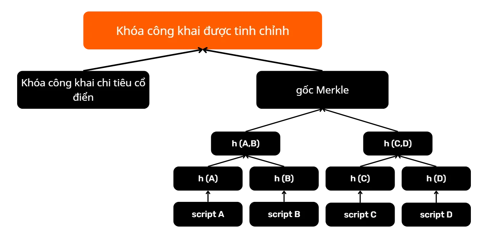

Các địa chỉ hiển thị trên phần mềm ví của bạn cũng bao gồm một HRP (*Human-Readable Part - Phần mà con người có thể đọc được*), thường là `bc` cho các địa chỉ sau-SegWit, một dấu phân cách `1`, và một số phiên bản `q` cho SegWit V0 và `p` cho Taproot/SegWit V1. Một mã kiểm tra tổng cũng được thêm vào để đảm bảo tính toàn vẹn và hợp lệ của địa chỉ trong quá trình truyền dẫn.

Cuối cùng, các địa chỉ được đưa vào một định dạng chuẩn:
- Base58check cho các địa chỉ Legacy cũ;
- Bech32 cho các địa chỉ SegWit;
- Bech32m cho các địa chỉ Taproot.

Dưới đây là ma trận phép cộng cho các định dạng bech32 và bech32m (SegWit và Taproot) từ hệ 10 (decimal):

| +   | 0   | 1   | 2   | 3   | 4   | 5   | 6   | 7   |
| --- | --- | --- | --- | --- | --- | --- | --- | --- |
| 0   | q   | p   | z   | r   | y   | 9   | x   | 8   |
| 8   | g   | f   | 2   | t   | v   | d   | w   | 0   |
| 16  | s   | 3   | j   | n   | 5   | 4   | k   | h   || 24  | c   | e   | 6   | m   | u   | a   | 7   | l   |
### Tái sử dụng địa chỉ ví là gì?

Tái sử dụng địa chỉ ám chỉ việc sử dụng cùng một địa chỉ nhận để hạn chế chi tiêu nhiều UTXO khác nhau.

Như chúng ta đã thấy ở phần trước, mỗi UTXO đều có ScriptPubKey riêng của mình để khóa nó và phải được thỏa mãn để UTXO có thể được tiêu thụ như một đầu vào trong một giao dịch mới. Chính trong ScriptPubKey này mà các địa chỉ nhận (payload) được tích hợp.

Khi các ScriptPubKey khác nhau chứa cùng một địa chỉ nhận, điều này được biết đến là tái sử dụng địa chỉ. Trên thực tế, điều này có nghĩa là một người dùng đã cung cấp cùng một địa chỉ nhiều lần cho người gửi để nhận bitcoin qua nhiều lần thanh toán. Và thực sự, thực hành này là thảm họa cho quyền riêng tư của bạn.

### Tại sao tái sử dụng ví lại là một vấn đề?

Vì blockchain là công khai, nên dễ dàng thấy được địa chỉ nào khóa UTXO nào và có bao nhiêu bitcoin. Nếu cùng một địa chỉ được sử dụng cho nhiều giao dịch, việc suy luận tất cả bitcoin liên kết với địa chỉ đó thuộc về cùng một người trở nên khả thi. Hoạt động này làm tổn hại đến quyền riêng tư của người dùng bằng cách cho phép thiết lập các liên kết xác định giữa các giao dịch khác nhau và truy vết bitcoin trên blockchain. Chính Satoshi Nakamoto đã nêu bật vấn đề này trong Bản cáo bạch Bitcoin:

> *Như một bức tường lửa bổ sung, một cặp khóa mới có thể được sử dụng cho mỗi giao dịch để giữ chúng không bị liên kết với một chủ sở hữu chung.*


Nguồn: S. Nakamoto, "Bitcoin: Hệ thống tiền điện tử ngang hàng", https://bitcoin.org/bitcoin.pdf, 2009.

Mục tiêu mà Satoshi hướng tới trong phát biểu này là tạo ra một bức tường lửa bổ sung trong liên kết giữa danh tính của người dùng và một cặp khóa trên Bitcoin, để tránh việc tất cả hoạt động của họ công khai liên kết với danh tính của họ. Ngày nay, với sự phát triển mạnh mẽ của các công ty phân tích chuỗi và quy định KYC, việc sử dụng địa chỉ duy nhất không còn là "bức tường lửa bổ sung" nữa, mà là một hoạt động cần thiết cho bất kỳ ai muốn bảo vệ quyền riêng tư của mình ở mức tối thiểu.

Khi bạn tái sử dụng một địa chỉ, bạn tạo ra một liên kết gần như không thể phủ nhận giữa tất cả các giao dịch liên quan đến địa chỉ đó. Mặc dù điều này không trực tiếp đe dọa đến tiền của bạn, vì mật mã trên đường cong e-líp đảm bảo an toàn cho khóa riêng tư của bạn, nhưng nó làm cho hoạt động của bạn dễ dàng bị theo dõi. Thực vậy, bất kỳ ai có một nốt cũng có thể quan sát các giao dịch và số dư của các địa chỉ, do đó xâm phạm hoàn toàn sự ẩn danh của bạn.


Để minh họa điểm này, hãy lấy ví dụ về Bob, một người dùng thường xuyên mua bitcoin với số lượng nhỏ thông qua DCA (Dollar Cost Averaging) và luôn gửi chúng đến cùng một địa chỉ. Sau hai năm, địa chỉ này chứa một lượng lớn bitcoin. Nếu Bob sử dụng địa chỉ này để thực hiện thanh toán cho một người bán hàng địa phương, người này có thể thấy tất cả dòng tiền liên quan và suy luận về tài sản của Bob. Điều này có thể dẫn đến rủi ro về an toàn cá nhân, bao gồm cả nỗ lực trộm cắp hoặc tống tiền. Nếu Bob đã sử dụng một địa chỉ mới để nhận mỗi lần mua định kỳ, anh ấy sẽ tiết lộ lượng thông tin ít hơn rất nhiều cho người bán hàng của mình.

Trong phân tích chuỗi, chúng ta phân biệt giữa 2 loại tái sử dụng địa chỉ:
- Tái sử dụng bên ngoài;
- Tái sử dụng nội bộ trong một giao dịch.

Loại đầu tiên được quan sát khi một địa chỉ được tái sử dụng trong nhiều giao dịch Bitcoin khác nhau. Đây là điều chúng ta đã thảo luận trước đó: tiêu chí này cho phép chúng ta suy luận rằng tất cả các UTXO đã qua địa chỉ này thuộc về một thực thể duy nhất.
Tái sử dụng địa chỉ nội bộ được quan sát không phải khi tái sử dụng xảy ra qua nhiều giao dịch, mà khi nó xảy ra trong cùng một giao dịch. Thực sự, nếu cùng một địa chỉ được sử dụng để khóa một đầu vào được sử dụng như một đầu ra trong một giao dịch, thì chúng ta có thể suy luận rằng đầu ra này vẫn thuộc về cùng một người dùng (tiền thối), và đầu ra thứ hai đại diện cho khoản thanh toán thực sự. Phép suy luận này cho phép theo dõi dòng tiền qua nhiều giao dịch.


Tái sử dụng địa chỉ là một vấn đề thực sự đối với Bitcoin. Theo trang web OXT.me (hiện không thể truy cập), tỷ lệ tái sử dụng địa chỉ trên Bitcoin vào khoảng 52% vào năm 2022:


Tỷ lệ này rất lớn, nhưng chủ yếu đến từ các nền tảng giao dịch hơn là người dùng cá nhân.

### Làm thế nào để tránh tái sử dụng địa chỉ?

Tránh tái sử dụng địa chỉ khá đơn giản: **chỉ cần sử dụng một địa chỉ hoàn toàn mới cho mỗi khoản thanh toán đến mới vào ví của bạn**.

Nhờ BIP32, ví hiện đại là các ví tất định và phân cấp. Điều này có nghĩa là một người dùng có thể tạo ra một số lượng lớn địa chỉ từ một mảnh thông tin ban đầu duy nhất: hạt giống (seed). Bằng cách lưu trữ thông tin duy nhất này, có thể khôi phục tất cả các khóa riêng của ví, do đó truy cập vào số tiền được bảo vệ bởi các địa chỉ tương ứng.


Đó là lý do tại sao, khi bạn nhấn nút "*receive*" trong phần mềm ví của bạn, một địa chỉ nhận mới, chưa từng sử dụng đến sẽ được đề xuất. Sau khi nhận bitcoin trên địa chỉ này, phần mềm tự động đề xuất một địa chỉ mới.
> *PS: Gần đây, một số phần mềm ví đã thông báo ý định của họ là ngừng tạo địa chỉ trống, do lo ngại rằng điều này có thể được coi là một hình thức rửa tiền bởi các cơ quan chức năng. Nếu phần mềm của bạn nằm trong số này, tôi khuyên bạn nên thay thế nó ngay lập tức, vì điều này không chấp nhận được đối với người dùng.*

Nếu bạn cần một định danh tĩnh để nhận thanh toán, chẳng hạn như để nhận quyên góp, ví dụ, thì không nên sử dụng địa chỉ Bitcoin cổ điển do nguy cơ tái sử dụng. Hãy ưu tiên sử dụng địa chỉ Lightning, hoặc cho một định danh thanh toán tĩnh trên chuỗi, bạn có thể lựa chọn BIP47 hoặc Silent Payments. Hoạt động của các giao thức này được nêu chi tiết trong phần 6 của khóa học này.

## Gắn nhãn và khiểm soát coin
<chapterId>fbdb07cd-c025-48f2-97b0-bd1bc21c68a8</chapterId>

Như chúng ta đã khám phá trong phần về phân tích chuỗi, có một số lượng lớn các phép suy luận và mẫu có thể được sử dụng để suy luận thông tin về một giao dịch. Là một người dùng, quan trọng là phải nhận thức được các kỹ thuật này để bảo vệ bản thân tốt hơn.

Điều này liên quan đến việc quản lý chặt chẽ ví tự quản của bản thân, bao gồm biết nguồn gốc các UTXO của mình, cũng như lựa chọn cẩn thận các UTXO để tiêu dùng trong các khoản thanh toán. Quản lý ví hiệu quả này dựa trên hai tính năng quan trọng của ví Bitcoin tốt: gắn nhãn và kiểm soát coin.

Trong chương này, chúng ta sẽ nghiên cứu các tính năng này và xem làm thế nào bạn có thể sử dụng chúng một cách thông minh, mà không làm tăng thêm quá nhiều công việc, để tối ưu hóa quyền riêng tư của bạn trên Bitcoin.

### Gắn nhãn là gì?

Gắn nhãn là một thực hành liên quan đến việc gán một chú thích hoặc nhãn cho một UTXO cụ thể trong ví Bitcoin. Những chú thích này được lưu trữ cục bộ bởi phần mềm ví và không bao giờ được truyền qua mạng Bitcoin. Do đó, gắn nhãn là một công cụ cho quản lý cá nhân.

Ví dụ, nếu tôi sở hữu một UTXO từ một giao dịch P2P trên Bisq với Charles, tôi có thể gán cho nó nhãn "`Non-KYC Bisq Charles`".
Ghi nhãn là một phương pháp tốt giúp nhớ nguồn gốc hoặc đích đến dự định của một UTXO, qua đó hỗ trợ quản lý tiền và tối ưu hóa sự riêng tư. Thực tế, ví Bitcoin của bạn có thể bảo vệ nhiều UTXO khác nhau. Nếu nguồn gốc của những UTXO này khác nhau, bạn có thể không muốn gộp chúng lại trong tương lai, nếu không, bạn có thể tiết lộ quyền sở hữu chung của chúng. Bằng cách ghi nhãn đúng cách cho tất cả đồng tiền của mình, bạn đảm bảo rằng bạn sẽ nhớ nguồn gốc của chúng khi bạn cần sử dụng, ngay cả khi bạn chỉ dùng đến nó trong vài năm sau.

### Kiểm soát coin là gì?

Việc sử dụng ghi nhãn trở nên thú vị hơn nữa khi kết hợp với tùy chọn kiểm soát đồng tiền trên phần mềm ví của bạn.

Kiểm soát đồng tiền là một tính năng có trong phần mềm ví Bitcoin tốt, cho phép bạn chọn thủ công các UTXO cụ thể để sử dụng làm đầu vào cho việc thực hiện một giao dịch. Thực tế, để thỏa mãn một khoản thanh toán đầu ra, cần phải tiêu thụ một UTXO ở đầu vào. Vì một số lý do mà chúng ta sẽ thấy sau, bạn có thể muốn chọn chính xác những đồng tiền nào để tiêu thụ ở đầu vào để thỏa mãn một khoản thanh toán cụ thể. Đây chính xác là điều mà kiểm soát đồng tiền cho phép bạn làm. Để đưa ra một phép so sánh, tính năng này giống như hành động chọn một đồng tiền cụ thể trong ví của bạn khi bạn trả tiền mua bánh mì.


Việc sử dụng phần mềm ví với kiểm soát đồng tiền, kết hợp với việc ghi nhãn UTXO, cho phép người dùng vừa phân biệt vừa chọn chính xác các UTXO cho giao dịch của họ.

### Làm thế nào để ghi nhãn UTXO của bạn một cách đúng đắn?

Không có phương pháp ghi nhãn UTXO phổ quát nào phù hợp với tất cả mọi người. Bạn cần tự xác định một hệ thống ghi nhãn sao cho bạn có thể dễ dàng tìm ra đường đi trong ví của mình. Dù sao, hãy nhớ rằng ghi nhãn tốt là ghi nhãn mà bạn sẽ có thể hiểu khi bạn cần nó. Nếu ví Bitcoin của bạn chủ yếu dùng để tiết kiệm, có thể các nhãn sẽ chỉ được sử dụng trong vòng vài thập kỷ tới. Do đó, hãy đảm bảo chúng rõ ràng, chính xác và toàn diện.

Quan trọng là người thân của bạn có thể dễ dàng xác định nguồn gốc của tiền nếu một ngày nào đó họ cần truy cập vào ví của bạn. Điều này có thể giúp họ vì lý do riêng tư cũng như vì nhu cầu pháp lý, trong trường hợp họ phải chứng minh nguồn gốc của tiền trước một cơ quan chức năng.
Khía cạnh quan trọng nhất của việc ghi nhãn là ghi chú nguồn gốc của UTXO. Bạn chỉ cần chỉ ra cách mà đồng tiền này đến được với ví của bạn. Liệu nó có phải từ một giao dịch mua trên một nền tảng giao dịch? Một khoản thanh toán từ một khách hàng? Một giao dịch ngang hàng? Hay là tiền thối từ một giao dịch mua hàng? Do đó, bạn có thể chỉ rõ:
- `Rút tiền Exchange.com`;
- `Thanh toán Khách hàng David`;
- `Mua P2P Charles`;
- `Tiền thối từ mua sofa`

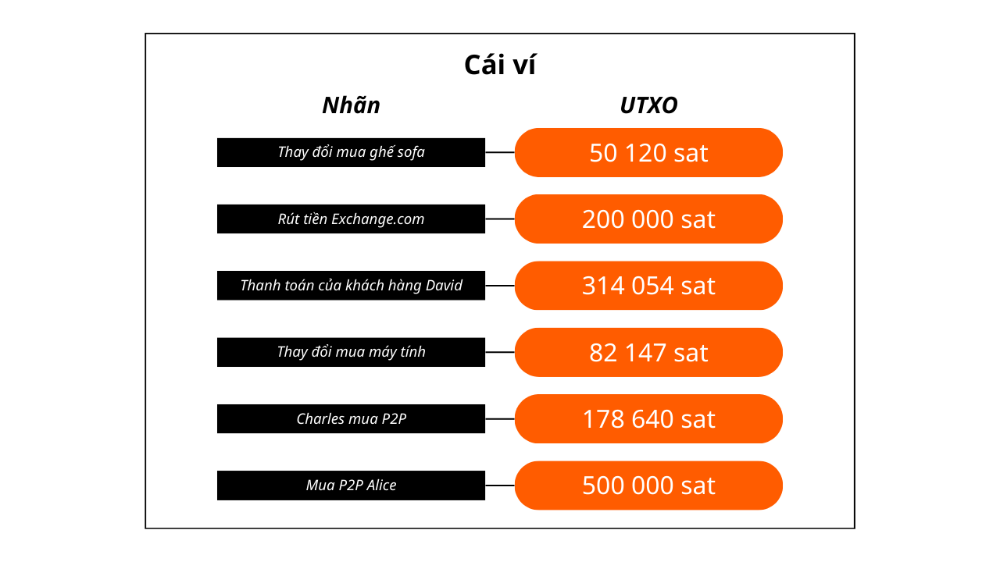

Để tinh chỉnh việc quản lý UTXO và tuân theo các chiến lược phân chia tiền trong ví của mình, bạn có thể làm giàu nhãn của mình với một chỉ số bổ sung phản ánh những phân chia này. Nếu ví của bạn chứa hai loại UTXO mà bạn không muốn trộn lẫn, bạn có thể tích hợp một dấu hiệu vào nhãn của mình để phân biệt rõ ràng những nhóm này. Các dấu hiệu phân chia này sẽ phụ thuộc vào tiêu chí của riêng bạn, như sự phân biệt giữa UTXO từ quá trình mua có yêu cầu KYC, hoặc giữa tiền dùng cho công việc và cá nhân. Lấy ví dụ về nhãn đã đề cập trước đó, điều này có thể được dịch thành:
- `KYC - Rút tiền Exchange.com`;
- `KYC - Thanh toán Khách hàng David`;
- `Không KYC - Mua P2P Charles`;
- `Không KYC - Tiền thối từ mua sofa`

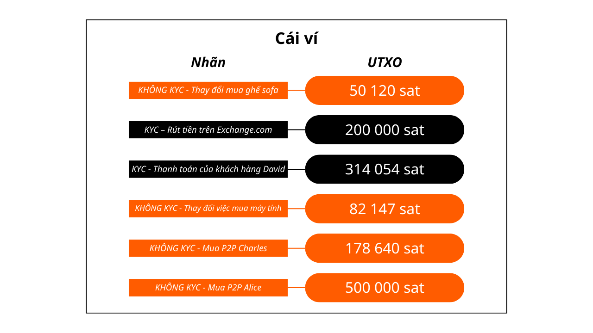
Cũng nên duy trì việc ghi nhãn cho một đồng tiền qua các giao dịch. Ví dụ, khi hợp nhất các UTXO không-KYC, hãy đảm bảo đánh dấu UTXO kết quả không chỉ là `hợp nhất`, mà cụ thể là `hợp nhất không-KYC` để duy trì một dấu vết rõ ràng về nguồn gốc của đồng tiền.
Cuối cùng, không bắt buộc phải đặt ngày trên nhãn. Phần mềm ví hầu hết đã hiển thị ngày giao dịch, và luôn có thể truy xuất thông tin này trên một trình duyệt blockchain bằng cách sử dụng TXID của nó.

### Làm thế nào để chọn đồng tiền một cách đúng đắn?

Khi bạn thực hiện một giao dịch, kiểm soát đồng tiền cho phép bạn chọn ra chính xác các UTXO nào sẽ tiêu thụ như đầu vào để đáp ứng đầu ra của khoản thanh toán. Hai khía cạnh nên được xem xét trong lựa chọn này:
- Khả năng người nhận thanh toán liên kết một phần danh tính của bạn với các UTXO được sử dụng làm đầu vào;
- Khả năng của một người quan sát từ bên ngoài thiết lập liên kết giữa tất cả các UTXO được tiêu thụ làm đầu vào.
Để minh họa điểm đầu tiên, hãy lấy một ví dụ cụ thể. Giả sử bạn mua một chiếc bánh mì ba-tê bằng bitcoin từ tiệm bánh ở địa phương của bạn. Bạn sử dụng một hoặc nhiều UTXO mà bạn sở hữu làm đầu vào để ít nhất trả đủ giá chiếc bánh mì trong đầu ra, cũng như phí giao dịch. Người bán bánh của bạn sau đó có thể liên kết khuôn mặt của bạn, hoặc bất kỳ phần nào khác thuộc về danh tính của bạn mà họ biết, với các đồng tiền được sử dụng làm đầu vào. Biết sự tồn tại của liên kết này, bạn có thể muốn chọn một UTXO cụ thể nào đó hơn là một UTXO khác khi thực hiện thanh toán.

Ví dụ, nếu một trong các UTXO của bạn đến từ một nền tảng giao dịch và bạn muốn người bán bánh không biết về tài khoản của bạn trên nền tảng này, bạn sẽ tránh sử dụng UTXO này cho việc thanh toán. Nếu bạn sở hữu một UTXO có giá trị cao tiết lộ một lượng lớn bitcoin, bạn cũng có thể chọn không sử dụng nó để ngăn người bán bánh biết về lượng tài sản bitcoin của mình.

Sự lựa chọn UTXO để sử dụng cho điểm đầu tiên này do đó dựa trên một quyết định cá nhân, bị ảnh hưởng bởi những gì bạn sẵn lòng tiết lộ hay không. Các nhãn bạn đã gán cho các UTXO của mình khi nhận chúng sẽ giúp bạn chọn những cái mà, một khi đã tiêu, chỉ tiết lộ thông tin bạn thoải mái tiết lộ cho người nhận.

Ngoài thông tin có thể tiết lộ cho người nhận, sự lựa chọn của đầu vào cũng ảnh hưởng đến những gì bạn tiết lộ cho tất cả những người đang quan sát blockchain. Thực vậy, bằng cách sử dụng nhiều UTXO làm đầu vào cho giao dịch của bạn, bạn tiết lộ rằng chúng được sở hữu bởi cùng một thực thể, theo phép suy luận sở hữu đầu vào chung (CIOH).

Khi chọn đồng tiền để tiêu, bạn do đó phải nhận thức rằng giao dịch bạn sắp phát đi sẽ tạo ra một liên kết giữa tất cả các UTXO được sử dụng. Liên kết này có thể gây ra vấn đề cho quyền riêng tư của bạn, đặc biệt nếu các UTXO đến từ các nguồn khác nhau.

Hãy quay lại ví dụ về UTXO không-KYC của tôi từ Bisq. Tôi muốn tránh kết hợp nó với một UTXO từ, chẳng hạn, một nền tảng giao dịch được quản lý biết danh tính của tôi. Thực sự, nếu tôi sử dụng 2 UTXO này làm đầu vào trong cùng một giao dịch, nền tảng được quản lý sẽ có thể liên kết danh tính của tôi với UTXO tôi mua trên Bisq, trong khi trước đó nó không được liên kết với danh tính của tôi.
Cuối cùng, để lựa chọn đúng các UTXO cần tiêu thụ làm đầu vào cho một giao dịch, điều quan trọng nhất là tránh sử dụng nhiều UTXO. Khi có thể, hãy chọn một đồng tiền duy nhất có giá trị đủ lớn để thanh toán. Bằng cách này, bạn hoàn toàn tránh được rủi ro liên quan đến việc trộn coin (trộn các đầu vào với nhau để thực hiện thanh toán). Tuy nhiên, nếu không có UTXO nào đủ lớn cho việc thanh toán và bạn phải tiêu thụ nhiều UTXO, hãy đảm bảo chúng đến từ các nguồn tương tự để giảm thiểu rủi ro tạo ra các liên kết không mong muốn. Ngoài ra, hãy nhớ rằng người nhận có thể liên kết thông tin họ có về bạn với lịch sử của các đồng tiền được sử dụng làm đầu vào.

### Hiểu về chọn coin tự động

Trong các phần trước, chúng ta đã thảo luận về việc chọn UTXO một cách thủ công cho một giao dịch. Nhưng điều gì xảy ra khi phần mềm ví tự động thực hiện việc lựa chọn này? Có một số phương pháp để xác định đồng tiền nào sẽ tiêu thụ, và việc lựa chọn UTXO là một lĩnh vực nghiên cứu thực sự trong Bitcoin. Mục tiêu chính của quá trình tự động này thường là giảm phí giao dịch cho người dùng.

Các phương pháp lựa chọn UTXO như FIFO (*First In First Out - Vào trước thì ra trước*) và LIFO (*Last In First Out - Vào sau thì ra trước*) là những phương pháp đơn giản nhất nhưng cũng kém hiệu quả nhất. Với FIFO, các đồng tiền cũ nhất trong ví được sử dụng trước. Cách tiếp cận này thường không hiệu quả cả trong việc giảm phí giao dịch và bảo vệ quyền riêng tư, trừ khi sử dụng các khóa thời gian tương đối và cần được gia hạn định kỳ. Ngược lại, LIFO ưu tiên sử dụng các UTXO mới nhất. Mặc dù đơn giản, nhưng hai phương pháp này thường được chứng minh là không hiệu quả.

Một phương pháp tiên tiến hơn là *Knapsack Solver*. Đây là phương pháp được sử dụng trong ví Bitcoin Core cho đến phiên bản 0.17. Nó bao gồm việc lựa chọn lặp đi lặp lại và ngẫu nhiên các UTXO từ ví, cộng chúng lại trong các tập con, và giữ giải pháp giảm trọng lượng giao dịch càng nhiều càng tốt, nhằm giảm phí cho người dùng.
Phương pháp *Branch-and-Bound* (BNB), thường được gọi là "thuật toán Murch" theo tên của người phát minh, đã thay thế *Knapsack Solver* trong Bitcoin Core bắt đầu từ phiên bản 0.17. Phương pháp tiên tiến hơn này nhằm mục tiêu tìm một tập hợp các UTXO phù hợp chính xác với số lượng cần thiết để thỏa mãn các đầu ra của một giao dịch. Mục tiêu của BNB là giảm thiểu số lượng tiền thối cũng như phí, bằng cách giảm điều được gọi là tiêu chí lãng phí, tính toán cả chi phí ngay lập tức và chi phí dự kiến trong tương lai cho tiền thối. Phương pháp này được phát triển từ khái niệm gốc của *Branch-and-Bound*, được thiết kế vào năm 1960 bởi Ailsa Land và Alison Harcourt, và cung cấp một cách tối ưu hóa phí chính xác hơn so với *Knapsack Solver*.
Tất cả các phương pháp tự động lựa chọn UTXO này có thể hiệu quả trong việc giảm phí giao dịch, nhưng chúng thường không hiệu quả trong việc bảo vệ quyền riêng tư của người dùng. Thực vậy, các thuật toán này có thể kết hợp nhiều UTXO thành đầu vào, do đó tiết lộ sở hữu chung của các UTXO này vì phép suy luận sở hữu đầu vào chung. Rõ ràng, các phương pháp này không thể tính đến các nhãn gắn với UTXO, là điều cần thiết để chọn đồng tiền một cách có ý thức nhằm tiết lộ cho người nhận giao dịch những gì mình muốn. Hiện tại, giải pháp duy nhất để tối ưu hóa quyền riêng tư khi chọn đồng tiền là thực hiện thủ công.

### Hướng dẫn về gán nhãn UTXO

Nếu bạn muốn học cách gắn nhãn cho UTXO của mình, chúng tôi đã tạo một hướng dẫn đầy đủ liên quan tới các phần mềm ví Bitcoin phổ biến hiện nay. Tìm hiểu [bằng cách nhấp vào đây](https://planb.network/tutorials/privacy/utxo-labelling).

## KYC và xác định danh tính của chủ khoá
<chapterId>cec6b9d9-0eed-4f85-bc4e-1e9aa59ca605</chapterId>
KYC viết tắt của "Know Your Customer" (Hiểu biết về khách Hàng của bạn), là một quy trình quy định được thực hiện bởi một số công ty hoạt động trong lĩnh vực Bitcoin. Quy trình này nhằm mục đích xác minh và ghi lại danh tính của khách hàng với mục tiêu được tuyên bố là chống lại rửa tiền và tài trợ khủng bố.

Cụ thể, KYC bao gồm việc thu thập các dữ liệu cá nhân khác nhau từ khách hàng, có thể thay đổi tùy theo quy định của từng khu vực pháp lý, nhưng thường bao gồm một giấy tờ tùy thân, một bức ảnh, và một bằng chứng của nơi cư trú. Những thông tin này sau đó được xác minh và giữ lại cho mục đích sử dụng trong tương lai.

Quy trình này đã trở nên bắt buộc đối với tất cả các nền tảng giao dịch được quy định ở đa số các quốc gia phương Tây. Điều này có nghĩa là bất kỳ ai muốn đổi tiền pháp định lấy bitcoin qua các nền tảng này đều phải tuân thủ các yêu cầu KYC.

Quy trình này không phải không có rủi ro đối với bảo mật và an toàn thông tin của người dùng. Trong chương này, chúng ta sẽ xem xét chi tiết những rủi ro này và phân tích ảnh hưởng cụ thể của KYC và quy trình xác minh danh tính đối với quyền riêng tư của người dùng Bitcoin.

### Tạo điều kiện cho hoạt động theo dõi trên chuỗi (Onchain Tracking)

Rủi ro đầu tiên liên quan đến KYC là nó cung cấp một điểm vào rất mạnh cho phân tích chuỗi. Như chúng ta đã thấy trong phần trước, các nhà phân tích có thể phân loại theo nhóm và theo dõi các hoạt động trên blockchain bằng cách sử dụng các mô hình giao dịch và phép suy luận. Một khi họ đã phân loại theo nhóm hoạt động trên chuỗi của một người dùng, chỉ cần tìm một điểm vào trong tất cả giao dịch và các khóa của họ là đủ để có thể xâm phạm trọn vẹn quyền riêng tư của họ.


Khi thực hiện KYC, bạn cung cấp một điểm vào rất giá trị cho phân tích chuỗi, khi bạn liên kết các địa chỉ nhận của mình được sử dụng khi rút bitcoin từ một nền tảng giao dịch với danh tính đã được xác minh hoàn toàn của bạn. Theo lý thuyết, thông tin này chỉ được biết bởi công ty mà bạn đã cung cấp, nhưng, như chúng ta sẽ thấy sau, rủi ro rò rỉ dữ liệu là có thật. Hơn nữa, việc một công ty giữ thông tin này cũng đã là một vấn đề, ngay cả khi họ không chia sẻ nó.

Do đó, nếu bạn không thực hiện các biện pháp khác để hạn chế việc phân loại theo nhóm các hoạt động của mình trên blockchain, bất kỳ ai biết về điểm vào đã được KYC có thể liên kết tất cả hoạt động của bạn trên mạng lưới Bitcoin với danh tính của bạn. Đứng từ góc độ của công ty này, việc sử dụng Bitcoin của bạn đã hoàn toàn mất đi sự riêng tư.


Để minh họa điều này bằng một so sánh, giống như người quản lý ngân hàng của bạn từ *Ngân hàng X* không chỉ có quyền truy cập vào tất cả giao dịch của bạn với *Ngân hàng X*, mà còn có thể quan sát giao dịch của bạn với *Ngân hàng Y* và tất cả giao dịch rút tiền mặt của bạn.

Nhớ từ phần đầu của khóa học này: mô hình quyền riêng tư của Bitcoin, như được thiết kế bởi Satoshi Nakamoto, dựa trên sự tách biệt giữa danh tính của người dùng và các cặp khóa của họ. Mặc dù lớp bảo mật này ngày nay không còn đủ, nhưng vẫn là khôn ngoan khi bạn biết bảo vệ nó, tránh cho hiệu quả của bức tường này bị suy giảm, càng nhiều càng tốt.

### Phơi bày trước sự giám sát cấp nhà nước

Vấn đề lớn thứ hai với KYC là nó tiết lộ cho nhà nước rằng bạn đã sở hữu bitcoin vào một thời điểm nào đó. Khi bạn mua bitcoin thông qua một công ty được quản lý theo quy định, nhà nước có thể biết về việc sở hữu này. Hiện tại, có vẻ như điều đó không quan trọng, nhưng tương lai chính trị và kinh tế của đất nước không nằm trong tay bạn, đó là điều quan trọng bạn cần nhớ.
Trước hết và quan trọng nhất, nhà nước có thể nhanh chóng áp dụng một quan điểm chính sách chuyên quyền. Lịch sử đầy rẫy các ví dụ về việc chính sách thay đổi đột ngột. Ngày nay, ở Châu Âu, những người ủng hộ Bitcoin có thể viết bài về Bitcoin, tham gia hội nghị, và quản lý ví của họ theo cách tự quản lý. Nhưng ai có thể nói ngày mai sẽ ra sao? Nếu Bitcoin đột nhiên trở thành kẻ thù số một của công chúng, việc được liên kết với nó trong hồ sơ của nhà nước có thể gây ra vấn đề.
Tiếp theo, khi đối mặt với các cuộc khủng hoảng kinh tế nghiêm trọng, nhà nước có thể xem xét việc tịch thu bitcoin được giữ bởi công dân. Có lẽ ngày mai, những người sở hữu bitcoin sẽ được coi là những người hưởng lợi từ khủng hoảng và sẽ bị đánh thuế quá mức do lợi nhuận mà họ thu được trong bối cảnh giảm giá trị của tiền pháp định.

Bạn có thể nghĩ đây không phải là vấn đề vì bitcoin của bạn đã được trộn, và do đó không thể bị truy vết. Tuy nhiên, vấn đề ở đây không phải là việc truy vết. Vấn đề thực sự là nhà nước biết bạn đã sở hữu bitcoin. Thông tin đơn giản này có thể đủ để buộc tội bạn hoặc yêu cầu bạn giải trình. Bạn có thể cố gắng tuyên bố rằng bạn đã tiêu bitcoin của mình, nhưng điều này nên được phản ánh trong bản khai thuế của bạn, và bạn sẽ bị bắt. Bạn cũng có thể nói rằng bạn đã mất chìa khóa trong một tai nạn thuyền, nhưng ngoài được dùng để làm trò đùa trên Twitter, bạn có thực sự nghĩ rằng điều đó đủ để miễn tội cho bản thân không?

Do đó, việc xem xét rủi ro liên quan đến việc nhà nước biết bạn đã sở hữu BTC, ngay cả khi rủi ro này có vẻ xa vời ngày nay, vẫn là điều quan trọng.

Một vấn đề khác do KYC đặt ra về giám sát của nhà nước là việc các nền tảng giao dịch được quản lý phải báo cáo bắt buộc. Mặc dù tôi không quen thuộc với quy định ở các khu vực pháp lý khác, ở Pháp, *Nhà cung cấp dịch vụ tài sản số* (PSAN) được yêu cầu báo cáo cho cơ quan giám sát tài chính bất kỳ giao dịch chuyển tiền nào mà họ coi là đáng ngờ.

Vì vậy, ở Pháp vào năm 2023, có 1,449 hành động đáng ngờ được báo cáo bởi các PSAN. Cho đến nay, đa số các hành động này liên quan đến tội phạm. Tuy nhiên, các cơ quan chức năng cũng yêu cầu các nền tảng này báo cáo bất kỳ giao dịch Bitcoin đáng ngờ nào chỉ dựa trên cấu trúc của nó. Nếu bạn thực hiện một giao dịch hợp tác, hoặc thậm chí chỉ là một giao dịch có một mô hình không điển hình nào đó, và giao dịch này xảy ra gần thời điểm bạn rút bitcoin của mình từ các nền tảng này, bạn có thể bị báo cáo cho cơ quan chức năng. Ngay cả khi không có hành vi sai trái và bạn chỉ đang thực hiện quyền hợp pháp của mình, việc báo cáo này có thể dẫn đến việc kiểm tra và giám sát tăng lên, những bất tiện mà bạn đã tránh được nếu không có KYC.

### Rủi ro rò rỉ dữ liệu cá nhân
Một vấn đề khác với KYC nằm ở việc nó yêu cầu lưu trữ tất cả dữ liệu cá nhân của bạn trên máy chủ của một công ty tư nhân. Các sự kiện gần đây đã nhắc nhở chúng ta rằng không ai là miễn nhiễm với sự cố, dù là tài chính hay liên quan đến IT. Trong năm 2022, khách hàng của Celsius đã phải chịu hậu quả. Theo sau sự phá sản của công ty, tên của các chủ nợ và thông tin tài sản của họ đã được công bố bởi hệ thống tư pháp Mỹ trong quá trình thực hiện thủ tục hành chính.

Hơn hai năm trước, một tổ chức an ninh mạng hàng đầu trong lĩnh vực tiền mã hóa đã trải qua một vụ trộm dữ liệu cá nhân của khách hàng. Mặc dù sự cố này không trực tiếp liên quan đến việc mua bitcoin, nhưng rủi ro này cũng tồn tại đối với các nền tảng giao dịch. Do đó, có một rủi ro rõ ràng liên quan đến dữ liệu cá nhân.

Thật vậy, chúng ta đã giao phó rất nhiều dữ liệu cá nhân của mình cho các công ty tư nhân. Tuy nhiên, rủi ro ở đây là kép vì dữ liệu này không chỉ cho phép bạn bị định danh mà còn liên kết với hoạt động trên mạng lưới Bitcoin. Thực vậy, khi một hacker truy cập được vào dữ liệu của khách hàng của một nền tảng giao dịch, họ có thể hợp lý giả định rằng những khách hàng này sở hữu bitcoin. Rủi ro này do đó được tăng cường bởi thực tế là bitcoin, giống như bất kỳ tài sản giá trị nào khác, thu hút sự quan tâm của kẻ trộm.

Khi dữ liệu bị rò rỉ, trong trường hợp tốt nhất, bạn có thể trở thành mục tiêu của các nỗ lực tấn công giả mạo. Trong trường hợp xấu nhất, bạn có thể thấy bản thân và gia đình phải đối diện với các mối đe dọa vật lý.
Ngoài những rủi ro cụ thể liên quan đến Bitcoin, cũng cần phải xem xét những nguy hiểm liên quan đến việc truyền tải các giấy tờ tùy thân. Thực vậy, trong trường hợp rò rỉ dữ liệu, chúng ta có khả năng trở thành nạn nhân của việc đánh cắp danh tính. Do đó, vấn đề không chỉ giới hạn ở việc bảo vệ tính bảo mật của các giao dịch mà còn liên quan đến sự an toàn ngoài đời thực của mỗi cá nhân.

### Những hiểu lầm về KYC đang phổ biến

Quan trọng là phải làm sáng tỏ một số hiểu lầm đang phổ biến liên quan KYC thường xuyên xuất hiện trên Twitter hoặc trong các cuộc thảo luận của chúng ta giữa những người ủng hộ Bitcoin.
Đầu tiên và quan trọng nhất, việc cho rằng bảo vệ quyền riêng tư cho bitcoin mua được qua con đường có KYC là vô ích là không đúng. Công cụ và phương pháp để bảo vệ quyền riêng tư trên Bitcoin là đa dạng và phục vụ cho các mục đích khác nhau. Việc sử dụng giao dịch trộn coin đối với số bitcoin có được từ các con đường có KYC, chẳng hạn, không phải là ý tưởng tồi. Tất nhiên, cần phải thận trọng với các nền tảng giao dịch được quản lý để tránh việc đóng băng hoặc cấm tài khoản của mình, nhưng từ góc độ kỹ thuật thuần túy, những hoạt động này không mâu thuẫn. Trộn coin có tác dụng phá vỡ lịch sử của một đồng tiền, giúp bạn chống lại một số rủi ro phân tích chuỗi liên quan đến KYC. Mặc dù nó không loại bỏ tất cả các rủi ro, nhưng nó đã đại diện cho một lợi ích đáng kể.

Quyền riêng tư trên Bitcoin không nên được xem xét một cách nhị phân, như một sự phân biệt giữa bitcoin "ẩn danh" và những cái khác không phải vậy. Sở hữu bitcoin được mua qua các con đường có KYC không có nghĩa là tất cả đã mất; mà ngược lại, việc sử dụng công cụ bảo vệ quyền riêng tư có thể được chứng minh là còn có lợi hơn.

Ngược lại, việc mua bitcoin thông qua phương pháp không KYC không đảm bảo quyền riêng tư hoàn hảo và không miễn trừ bạn khỏi nhu cầu cần thực hiện các biện pháp bảo vệ khác. Nếu bạn giữ bitcoin không KYC nhưng sử dụng lại địa chỉ nhận nhiều lần, giao dịch của bạn có thể bị truy vết và nhóm lại. Mối liên kết nhỏ nhất với thế giới bên ngoài Bitcoin có thể làm tổn hại đến lớp quyền riêng tư duy nhất bạn có. Do đó, quan trọng là phải nhận thấy rằng tất cả các công cụ và phương pháp cải thiện quyền riêng tư trên Bitcoin là bổ sung cho nhau. Mỗi kỹ thuật giải quyết một rủi ro cụ thể và có thể thêm vào một lớp bảo vệ bổ sung. Như vậy, việc sở hữu bitcoin không KYC hoàn toàn không miễn trừ một người khỏi việc cần phải thực hiện các biện pháp phòng ngừa khác.

### Có thể hủy bỏ KYC không?

Tôi đôi khi được hỏi liệu có thể "quay trở lại" sau khi đã hoàn thành KYC, và như bạn có thể tưởng tượng từ các đoạn trước, câu trả lời là có nhiều khía cạnh. Để tránh các rủi ro liên quan đến KYC, phương pháp đơn giản nhất là không sử dụng nó khi mua bitcoin. Chúng ta sẽ đi sâu hơn vào chủ đề này trong chương tiếp theo. Tuy nhiên, nếu KYC đã được thực hiện và bitcoin đã được mua, có cách nào để giảm thiểu các rủi ro gặp phải không?

Liên quan tới rủi ro giao dịch của bạn bị truy vết, việc sử dụng trộn coin là một giải pháp. Chúng ta sẽ thảo luận chi tiết về phương pháp này sau trong khóa học, nhưng hãy lưu ý rằng trộn coin có thể phá vỡ lịch sử của một đồng tiền và ngăn chặn việc truy vết quá khứ-hiện tại và hiện tại-quá khứ của nó. Ngay cả đối với bitcoin thu được qua một nền tảng được quản lý, kỹ thuật này có thể ngăn chặn việc truy vết của chúng.
Tuy nhiên, trộn coin không loại bỏ rủi ro thứ hai liên quan đến KYC: thực tế là nhà nước được thông báo về số lượng bitcoin bạn sở hữu. Thực sự, ngay cả khi các đồng tiền của bạn không còn có thể được truy vết, tùy thuộc vào quyền hạn, nhà nước có thể truy cập vào các bản khai báo về việc bạn thanh lý tài sản tiền mã hóa. Vì rủi ro này không phải là kỹ thuật mà là hành chính, không có giải pháp cụ thể nào cho Bitcoin để loại bỏ nó, ngoại trừ việc không tự mình tiếp xúc với những con đường có KYC ngay từ đầu. Cách tiếp cận hợp pháp duy nhất để giảm thiểu rủi ro này là bán bitcoin của bạn đã mua qua các nền tảng được quản lý trên các nền tảng được quản lý, và sau đó mua lại chúng thông qua các con đường không có KYC. Bằng cách bán và khai báo việc thanh lý, cơ quan quản lý sẽ thấy rằng bạn không còn sở hữu chúng nữa.

Về rủi ro thông tin cá nhân và giấy tờ tùy thân của bạn bị rò rỉ, đây là một nguy cơ nằm ngoài Bitcoin, và không có giải pháp kỹ thuật nào để tránh khỏi nó. Một khi dữ liệu của bạn được tiết lộ, việc đảo ngược thao tác này là khó khăn. Bạn có thể thử đóng tài khoản trên nền tảng, nhưng điều này không đảm bảo việc xóa bỏ dữ liệu KYC của bạn, đặc biệt khi việc xác minh danh tính được giao cho đối tác thuê ngoài. Xác minh việc nền tảng đã xóa hoàn toàn thông tin của bạn hay chưa là không thể. Do đó, không có giải pháp nào để hoàn toàn ngăn chặn rủi ro này và đảm bảo nó không còn tồn tại.

### Sự khác biệt giữa KYC và xác định danh tính của chủ khoá

Đôi khi, một số người dùng bitcoin có xu hướng mở rộng thuật ngữ "KYC" cho bất kỳ giao dịch Bitcoin nào liên quan đến việc chuyển tiền hoặc thanh toán bằng thẻ tín dụng, vì những phương tiện này cũng có thể tiết lộ nguồn gốc của khoản thanh toán, giống như KYC vậy. Tuy nhiên, điều quan trọng là không nhầm lẫn KYC với việc xác định khóa. Cá nhân tôi phải thừa nhận rằng quan điểm của mình về vấn đề này đã phát triển theo thời gian.

KYC cụ thể chỉ đến một thủ tục quy định được một số công ty thực hiện để xác minh và ghi lại danh tính của khách hàng của họ. Đó là một điều nhị phân: khi bạn mua bitcoin, hoặc là bạn trải qua KYC, hoặc là bạn không. Tuy nhiên, xác định danh tính của chủ khóa, liên quan đến việc liên kết một khía cạnh của danh tính người dùng với hoạt động trên chuỗi, không phải là nhị phân (có hoặc không) mà thay vào đó nó đại diện cho một miền liên tục. Thực sự, trong bối cảnh mua hoặc tiêu dùng bitcoin, việc xác định này luôn có thể xảy ra ở các mức độ khác nhau.
Ví dụ, nếu bạn mua bitcoin trên một nền tảng được quản lý ở Thụy Sĩ, KYC (Know Your Customer) không cần thiết. Tuy nhiên, có thể danh tính chủ khoá của bạn bị xác định vì việc mua được thực hiện qua tài khoản ngân hàng của bạn. Đây là nơi hai rủi ro đầu tiên liên quan đến KYC — tạo điều kiện cho việc theo dõi trên chuỗi và phơi bày trước sự giám sát của nhà nước — cũng có thể biểu hiện trong một giao dịch không KYC. Nếu thực thể Thụy Sĩ báo cáo các giao dịch đáng ngờ cho cơ quan chức năng tại quốc gia của bạn, họ có thể đơn giản kiểm tra tài khoản ngân hàng được sử dụng để mua để khám phá danh tính của bạn. Do đó, mua hàng không qua KYC trên các nền tảng được quản lý có nguy cơ cao về việc xác định khóa.

Tuy nhiên, tránh các nền tảng được quản lý và lựa chọn các phương thức mua bán P2P (Peer-to-Peer) không hoàn toàn loại bỏ rủi ro bị xác định danh tính chủ khóa mà chỉ giảm bớt nó. Xem xét ví dụ về việc mua hàng trên Bisq hoặc một nền tảng P2P khác. Để thanh toán với đối tác của bạn, bạn có thể sẽ sử dụng tài khoản ngân hàng của mình. Nếu cơ quan chức năng hỏi người đã thực hiện giao dịch với bạn và yêu cầu tên của bạn, chúng ta gặp phải rủi ro 1 và 2 đã đề cập trước đó. Những rủi ro này chắc chắn thấp hơn nhiều so với việc mua hàng không qua KYC trên một nền tảng được quản lý, và còn giảm bớt hơn nữa so với việc mua hàng có KYC, nhưng vẫn còn tồn tại ở mức độ nhỏ hơn.
Cuối cùng, ngay cả khi bạn mua bitcoin thông qua giao dịch trực tiếp bằng tiền mặt, bạn không hoàn toàn ẩn danh. Người bạn giao dịch đã thấy mặt bạn, đó là một phần thuộc về danh tính của bạn. Mặc dù trong ví dụ này, khả năng nhận diện danh tính chủ khóa là tối thiểu, nhưng vẫn có khả năng nhận diện khóa.


Kết luận, trong quá trình giao dịch bitcoin lấy tài sản khác, dù là mua bằng tiền pháp định hay bán lấy hàng hóa thực, luôn có một hình thức nhận diện danh tính chủ khóa nào đó. Tùy thuộc vào phương thức giao dịch được chọn, việc nhận diện này có thể thay đổi về mức độ. Quan trọng là không nhầm lẫn việc nhận diện này với KYC, là một quy trình được quy định rõ ràng. Tuy nhiên, có một mối liên kết giữa KYC và phạm vi nhận diện, vì KYC nằm ở đầu cao của phạm vi này, khi nó hệ thống hóa việc nhận diện khóa của người dùng bởi các cơ quan chức năng.

## Các phương thức mua bán
<chapterId>756598af-95aa-4c77-ac48-243c7ad89530</chapterId>
Sau khi đọc chương trước, bạn có thể tự hỏi về cách mua hoặc bán bitcoin mà không cần phải trải qua quá trình xác minh danh tính, nhằm tránh những rủi ro liên quan đến KYC. Có một số phương thức để thực hiện giao dịch.

### Giao dịch P2P bằng tiền mặt

Như chúng ta đã thấy, phương thức tốt nhất về mặt bảo mật là giao dịch P2P (ngang hàng) bằng tiền mặt. Phương thức này cho phép bạn giảm thiểu dấu vết để lại và giảm đáng kể khả năng nhận diện khóa, dù bạn là người mua hay người bán.


Tuy nhiên, thực hành này mang lại rủi ro cho an toàn cá nhân. Nguy hiểm chính nằm ở việc trong quá trình giao dịch, bên đối diện sẽ biết bạn sở hữu một lượng lớn, dù là tiền mặt hay bitcoin. Thông tin này có thể thu hút sự chú ý của những cá nhân có ý đồ xấu. Thực tế, người ta thường khuyên nên giữ kín về việc sở hữu bitcoin của bản thân. Lời khuyên này cũng có thể áp dụng cho tiền mặt. Tuy nhiên, trong một giao dịch trực tiếp, việc tiết lộ bạn sở hữu bitcoin là không thể tránh khỏi, có thể gây ra lòng tham.


Để hạn chế rủi ro này, tôi khuyên bạn nên ưu tiên giao dịch tiền mặt với những người quen biết đáng tin cậy, như thành viên gia đình hoặc bạn bè thân thiết. Ngoài ra, bạn cũng có thể xem xét thực hiện giao dịch tại [các cuộc họp Bitcoin địa phương](https://btcmap.org/communities/map), sau khi đã tham gia vài lần. Điều này sẽ giúp bạn biết rõ hơn về các thành viên khác và không phải đối mặt một mình trong quá trình giao dịch trực tiếp. Tuy nhiên, quan trọng là phải nhận ra rằng giao dịch P2P bằng tiền mặt vốn dĩ mang rủi ro cho an toàn cá nhân, rủi ro này không tồn tại khi bạn mua hàng qua một nền tảng được quản lý và tài khoản ngân hàng của mình.

Hơn nữa, tùy thuộc vào nơi bạn sống, việc mang theo và lưu trữ số tiền lớn có thể gây rủi ro, dù là cho bitcoin hay tiền mặt.

Giao dịch tiền mặt cũng có thể gây rủi ro pháp lý trong quá trình kiểm tra của cảnh sát hoặc các tình huống khác. Mặc dù ở hầu hết các quốc gia, không có hạn chế về số tiền mặt bạn có thể mang theo, nhưng số lượng lớn có thể gây ra nghi ngờ. Vì vậy, hãy cẩn thận, đặc biệt nếu bạn phải di chuyển quãng đường dài, và tránh thực hiện giao dịch quá lớn một lần để không phải giải thích việc sở hữu số tiền đáng kể.
Cuối cùng, một nhược điểm khác của việc mua bán P2P là giá thường cao hơn so với những gì quan sát được trên các nền tảng giao dịch được quản lý. Người bán thường áp đặt một khoản phụ phí từ 1% đến đôi khi hơn 10%. Có một số lý do giải thích sự chênh lệch giá này. Đầu tiên, đây là một hoạt động phổ biến giữa các người bán P2P đã có uy tín theo thời gian. Tiếp theo, người bán có các khoản phí giao dịch liên quan đến việc gửi tiền cho người mua. Cũng có rủi ro tăng về trộm cắp trong giao dịch P2P so với giao dịch trên các nền tảng, điều này biện minh cho việc thu phí cao để bù đắp cho rủi ro mà họ đã chấp nhận. Cuối cùng, phụ phí có thể liên quan đến nhu cầu và chất lượng của giao dịch về mặt riêng tư. Là một người mua, việc tăng cường riêng tư có một giá, phản ánh trong khoản phụ phí mà người bán áp dụng. Một số người yêu thích bitcoin cũng tin rằng mức giá chênh lên của bitcoin được mua qua P2P phản ánh giá trị thực sự của nó, và cho rằng giá thấp hơn trên các nền tảng được quản lý là kết quả của việc thỏa hiệp về quyền riêng tư của bạn.

### Giao dịch P2P qua nền tảng ghép đôi

Một phương án ít rủi ro hơn về mặt an toàn cá nhân là thực hiện giao dịch P2P hoàn toàn trực tuyến, qua các phương thức thanh toán điện tử như PayPal, chuyển khoản ngân hàng, hoặc Revolut.

Phương pháp này giúp tránh nhiều rủi ro liên quan đến giao dịch tiền mặt. Tuy nhiên, rủi ro rằng bên đối tác không thực hiện cam kết của họ trong một giao dịch trực tuyến là lớn hơn. Thực sự, trong một giao dịch trực tiếp, nếu bạn đưa tiền cho người bán mà họ không gửi bitcoin cho bạn, bạn có thể ngay lập tức yêu cầu họ chịu trách nhiệm vì họ đang ở trước mặt bạn. Trực tuyến, ngược lại, thường là không thể tìm ra người đã lừa đảo bạn.

Để giảm thiểu rủi ro này, có thể sử dụng các nền tảng chuyên biệt trong việc ghép đôi cho giao dịch P2P. Các nền tảng này sử dụng các cơ chế giải quyết xung đột để bảo vệ người dùng bị thiệt hại. Nói chung, họ cung cấp một hệ thống escrow, nơi bitcoin được giữ lại cho đến khi thanh toán tiền pháp định được người bán xác nhận.

Về mặt an toàn cá nhân, phương pháp mua hàng này an toàn đáng kể hơn so với giao dịch tiền mặt trực tiếp. Tuy nhiên, như đã đề cập trước đó, giao dịch P2P trực tuyến để lại nhiều dấu vết hơn so với giao dịch trực tiếp, điều này có thể gây hại cho quyền riêng tư trên không gian Bitcoin. Bằng cách sử dụng một phương thức thanh toán tiền pháp định trực tuyến như ngân hàng, bạn đã tiết lộ nhiều thông tin hơn và có thể dễ dàng bị xác định danh tính chủ khoá.

Một lần nữa, tôi khuyên bạn không nên thực hiện các giao dịch lớn trong một giao dịch duy nhất trên các nền tảng này. Bằng cách chia nhỏ giao dịch của bạn, bạn phân tán rủi ro liên quan đến khả năng bị đối tác lừa đảo.
Một lần nữa, một nhược điểm khác của việc mua bán P2P là giá thường cao hơn so với những gì quan sát được trên các nền tảng giao dịch được quản lý. Người bán thường áp đặt một khoản phụ phí từ 1% đến đôi khi hơn 10%. Có một số lý do giải thích sự chênh lệch giá này. Đầu tiên, đây là một hoạt động phổ biến giữa các người bán P2P đã có uy tín theo thời gian. Tiếp theo, người bán có các khoản phí giao dịch liên quan đến việc gửi tiền cho người mua. Cũng có rủi ro tăng về trộm cắp trong giao dịch P2P so với giao dịch trên các nền tảng, điều này biện minh cho việc thu phí cao để bù đắp cho rủi ro mà họ đã chấp nhận. Cuối cùng, phụ phí có thể liên quan đến nhu cầu và chất lượng của giao dịch về mặt riêng tư. Là một người mua, việc tăng cường riêng tư có một giá, phản ánh trong khoản phụ phí mà người bán áp dụng. Một số người yêu thích bitcoin cũng tin rằng mức giá chênh lên của bitcoin được mua qua P2P phản ánh giá trị thực sự của nó, và cho rằng giá thấp hơn trên các nền tảng được quản lý là kết quả của việc thỏa hiệp về quyền riêng tư của bạn.

Về giải pháp, cá nhân tôi luôn sử dụng [Bisq](https://bisq.network/) và rất hài lòng với nó. Hệ thống của họ được thiết lập tốt và có vẻ đáng tin cậy. Tuy nhiên, Bisq chỉ có sẵn trên máy tính cá nhân và giao diện của nó có thể quá phức tạp đối với người mới bắt đầu. Một nhược điểm khác là Bisq chỉ hoạt động với giao dịch trên chuỗi, có thể trở nên tốn kém trong những thời kỳ phí giao dịch Bitcoin cao.

[-> Khám phá hướng dẫn của chúng tôi về Bisq.](https://planb.network/en/tutorials/exchange/bisq)

Đối với một lựa chọn đơn giản hơn, bạn có thể thử [Peach](https://peachbitcoin.com/), một ứng dụng di động giúp kết nối người mua và người bán với hệ thống giải quyết tranh chấp tích hợp. Quy trình này dễ hiểu hơn so với Bisq.

[-> Khám phá hướng dẫn của chúng tôi về Peach.](https://planb.network/en/tutorials/exchange/peach-wallet)
Một lựa chọn trực tuyến khác là [HodlHodl](https://hodlhodl.com/), một nền tảng đã có uy tín tốt và cung cấp tính thanh khoản tốt, mặc dù cá nhân tôi chưa từng trải nghiệm.

[-> Khám phá hướng dẫn của chúng tôi về HodlHodl.](https://planb.network/en/tutorials/exchange/hodlhodl)

Đối với các giải pháp dựa trên Lightning Network, bạn có thể thử [RoboSats](https://learn.robosats.com/) và [LNP2PBot](https://lnp2pbot.com/). RoboSats có thể truy cập qua một trang web và tương đối dễ sử dụng. LNP2PBot thì đặc biệt hơn, vì nó hoạt động thông qua một hệ thống trao đổi trên ứng dụng nhắn tin Telegram.

[-> Khám phá hướng dẫn của chúng tôi về RoboSats.](https://planb.network/en/tutorials/exchange/robosats)
[-> Khám phá hướng dẫn của chúng tôi về LNP2PBot.](https://planb.network/en/tutorials/exchange/lnp2pbot)

### Các nền tảng giao dịch được quản lý nhưng không yêu cầu KYC

Tùy thuộc vào quốc gia bạn sống, bạn có thể có quyền truy cập vào các nền tảng được quản lý không yêu cầu thủ tục KYC để mua hoặc bán bitcoin. Ở Thụy Sĩ, ví dụ, bạn có thể sử dụng các nền tảng như [Relai](https://relai.app/) và [MtPelerin](https://www.mtpelerin.com/).

[-> Khám phá hướng dẫn của chúng tôi về Relai.](https://planb.network/en/tutorials/exchange/relai)
Như chúng ta đã thấy trong chương trước, loại nền tảng này giúp bạn tránh được rủi ro liên quan đến các thủ tục KYC, nhưng chúng lại mang lại mức độ rủi ro cao hơn trong việc dễ bị xác định danh tính chủ khoá. Về mặt bảo mật thông tin cá nhân trên Bitcoin, những nền tảng này do đó cung cấp bảo vệ tốt hơn so với các phương pháp mua bán có KYC, nhưng chúng kém hấp dẫn hơn so với giao dịch P2P.

Tuy nhiên, về mặt an toàn cá nhân, việc sử dụng những nền tảng này ít rủi ro hơn đáng kể so với giao dịch P2P. Chúng cũng thường dễ sử dụng hơn so với các nền tảng hỗ trợ giao dịch P2P.

### ATM

Một lựa chọn khác để mua hoặc bán bitcoin mà không cần KYC là các máy ATM tiền mã hóa (ATM). Cá nhân tôi chưa bao giờ có cơ hội thử giải pháp này, vì không có máy nào ở nước tôi. Nhưng phương pháp này có thể rất thú vị tùy thuộc vào nơi bạn sống.


Vấn đề với ATM là chúng bị cấm ở một số quốc gia hoặc bị quản lý chặt chẽ ở những nơi khác. Nếu một máy ATM yêu cầu quy trình xác minh danh tính, sử dụng đó sẽ đối mặt với những rủi ro tương tự như những nền tảng KYC được quản lý. Tuy nhiên, nếu máy ATM cho phép giao dịch mà không cần xác minh danh tính với các khoản nhỏ, thì việc sử dụng nó có thể cung cấp một mức độ bảo mật thông tin cá nhân tương đương với giao dịch P2P dựa trên tiền mặt, đồng thời tránh được hầu hết các rủi ro liên quan đến loại giao dịch này.
Nhược điểm chính của ATM nằm ở mức phí giao dịch thường cao, dao động từ vài phần trăm đến đôi khi 15% số tiền được giao dịch.

### Thẻ quà tặng

Cuối cùng, tôi cũng muốn giới thiệu một giải pháp hoạt động tốt cho những ai muốn sử dụng bitcoin hàng ngày cho việc mua sắm thay vì bán chúng để đổi lấy tiền pháp định.

Cách tốt nhất để tiêu bitcoin rõ ràng là sử dụng trực tiếp bitcoin hoặc Lightning Network để mua hàng hoá hoặc dịch vụ. Tuy nhiên, ở nhiều quốc gia, số lượng người bán chấp nhận bitcoin vẫn hạn chế. Một phương án thực tế khác là sử dụng thẻ quà tặng.

Một số nền tảng không yêu cầu thủ tục KYC cung cấp khả năng đổi bitcoin lấy thẻ quà tặng có thể sử dụng ở các cửa hàng lớn. Trong số các nền tảng này, chúng ta có thể tìm thấy [CoinsBee](https://www.coinsbee.com/), [The Bitcoin Company](https://thebitcoincompany.com/), và [Bitrefill](https://www.bitrefill.com/). Những nền tảng này giúp việc sử dụng bitcoin vào các giao dịch hàng ngày của bạn trở nên dễ dàng hơn bằng cách cho phép bạn tiếp cận với một loạt sản phẩm và dịch vụ mà không cần phải chuyển đổi sang tiền pháp định.


### Các phương pháp mua bán khác

Trong số các phương pháp khác để mua bitcoin mà vẫn bảo vệ được quyền riêng tư của bạn, rõ ràng có việc đào bitcoin. Để bắt đầu đào sat, không cần thiết phải tiết lộ danh tính của bạn; bạn chỉ cần tìm một bằng chứng công việc hợp lệ và gửi nó cho mạng lưới. Nếu bạn chọn đào pool, một số pool yêu cầu một hình thức xác định danh tính, như KYC, trong khi những pool khác thì không.

Một phương pháp khác bao gồm làm việc và nhận lương bằng bitcoin. Phương pháp mua bán này có thể thú vị, nhưng mức độ xác định danh tính yêu cầu thay đổi rất nhiều tùy theo hoàn cảnh.

*Để viết chương này, tôi đã sử dụng khóa học [BTC205](https://planb.network/fr/courses/btc205) được tạo bởi [@pivi___](https://x.com/pivi___) trên PlanB Network (hiện chỉ có sẵn bằng tiếng Pháp).*

## Hợp nhất, quản lý UTXO và CIOH
<chapterId>d0486c8f-332d-402b-ae2e-949416752b9c</chapterId>
Một trong những khía cạnh phức tạp nhất để quản lý khi bạn có ví tự quản của riêng mình chắc chắn là việc hợp nhất. Bạn có nên hợp nhất không? Mục đích là gì? Bạn nên nhắm đến kích thước UTXO nào? Có những sự đánh đổi về quyền riêng tư như thế nào? Đây là những gì chúng ta sẽ cố gắng khám phá trong phần này.

### Hợp nhất là gì?

Hoạt động của Bitcoin tương tự như một thị trường đấu giá nơi các giao dịch đề xuất phí mức tốt nhất để được các thợ mỏ ưu tiên. Tuy nhiên, mỗi khối có một kích thước tối đa, giới hạn số lượng giao dịch có thể được đưa vào. Vì một khối được tạo ra trung bình sau mỗi 10 phút, không gian có sẵn trong mỗi khối là một nguồn tài nguyên có tính khan hiếm.

Các thợ đào, hoạt động của họ phát sinh chi phí đáng kể về điện, vốn và bảo dưỡng, có xu hướng tự nhiên là tìm cách tối đa hóa lợi nhuận của họ. Họ có xu hướng ưu tiên các giao dịch mang lại cho họ nhiều phí nhất so với kích thước (tính theo dung lượng bộ nhớ) của chúng.

Thực tế, không phải tất cả các giao dịch Bitcoin đều có kích thước như nhau. Những giao dịch có nhiều đầu vào và đầu ra sẽ có kích thước lớn hơn. Ví dụ, xem xét 2 giao dịch:
- Giao dịch A bao gồm 1 đầu vào và 1 đầu ra. Nó phân bổ 1,994 sat cho phí giao dịch và kích thước của nó là 141 vB;
- Giao dịch B, phức tạp hơn, với 2 đầu vào và 2 đầu ra, phân bổ 2,640 sat cho phí giao dịch với kích thước 220 vB.


Trong ví dụ này, mặc dù giao dịch B đề xuất tổng số phí cao hơn, các thợ mỏ sẽ ưu tiên giao dịch A vì nó cung cấp tỷ lệ tốt hơn giữa phí và kích thước. Dưới đây là phép tính cho mỗi giao dịch, được biểu thị bằng sat trên mỗi byte ảo (sat/vB):

```text
Giao dịch A: 1994 / 141 = 14 sat/vB

Giao dịch B: 2640 / 220 = 12 sat/vB
```

Điều này có nghĩa là cho mỗi đơn vị kích thước, giao dịch A cung cấp nhiều phí hơn so với giao dịch B, mặc dù giao dịch sau cung cấp nhiều phí hơn về mặt giá trị tuyệt đối.


Do đó, sẽ có lợi hơn cho người dùng khi tiêu thụ ít đầu vào nhất có thể trong giao dịch của mình. Tuy nhiên, cần phải tiêu thụ đủ lượng để có thể thanh toán cho các đầu ra. Trong việc quản lý ví của mình, người ta phải có các UTXO đủ lớn.

Nguyên tắc của việc hợp nhất chính xác là tận dụng các khoảng thời gian khi phí giao dịch trên mạng lưới Bitcoin thấp để hợp nhất các UTXO nhỏ của mình thành một UTXO lớn duy nhất. Như vậy, khi phí trên Bitcoin tăng, người ta có thể thực hiện giao dịch với số lượng đầu vào tối thiểu, và do đó chi tiêu ít phí tuyệt đối hơn. Mục tiêu là lên kế hoạch cho các giao dịch bắt buộc phải được thực hiện trong các khoảng thời gian phí cao.

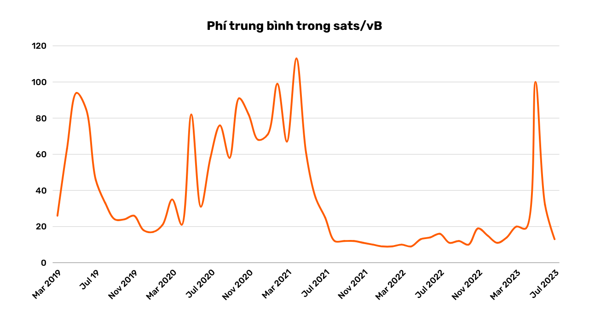
Ngoài việc tiết kiệm về phí giao dịch, việc hợp nhất UTXOs giúp tránh tạo ra "bụi." Bụi ám chỉ các UTXO có giá trị tính theo satoshi quá thấp đến mức không đủ để trang trải phí giao dịch cần thiết để tiêu chúng. Điều này làm cho việc sử dụng các UTXO này trở nên không hợp lý về mặt kinh tế miễn là phí giao dịch vẫn cao. Bằng cách chủ động nhóm các UTXO của mình, bạn ngăn chúng biến thành bụi, đảm bảo rằng tất cả các đồng tiền của bạn vẫn có thể sử dụng được.

### Kích thước tối thiểu cho các UTXO của bạn là bao nhiêu?

Đôi khi, tôi được hỏi giá trị tối thiểu khuyến nghị cho một UTXO là bao nhiêu. Thật không may, không có câu trả lời chung cho tất cả, vì nó phụ thuộc vào sở thích của bạn và điều kiện thị trường về phí. Tuy nhiên, dưới đây là một công thức có thể giúp bạn xác định một ngưỡng phù hợp với nhu cầu của bạn:

$$
\frac {P \times F}T = M
$$

Nơi:
- $P$ là kích thước của giao dịch;
- $F$ đại diện cho mức phí tối đa theo satoshi mỗi vbyte (sats/vB) mà bạn sẵn lòng chi trả;
- $T$ là phần trăm của phí giao dịch mà bạn sẵn lòng trả so với tổng giá trị của UTXO;
- $M$ là số lượng tối thiểu bằng satoshi cho mỗi UTXO.

Giả sử bạn dự định chi trả phí cho một giao dịch SegWit tiêu chuẩn với 1 đầu vào và 2 đầu ra, có kích thước là 141 vB. Nếu bạn chi trả tới 800 sats/vB, và bạn sẵn lòng chi trả tới 12% giá trị của UTXO cho phí giao dịch tối đa, thì phép tính sẽ là:

$$
\frac{141 \times 800}{0.12} = 940\ 000
$$

Trong ví dụ này, sẽ là khôn ngoan khi duy trì giá trị tối thiểu 940,000 satoshi cho các UTXO trong ví của bạn.

### Hợp nhất và COIH

Một trong những phương pháp phân tích chuỗi được sử dụng nhiều nhất là COIH (*Common Input Ownership Heuristic - Phép suy luận dựa trên sự sở hữu đầu vào chung*), cho phép giả định rằng tất cả các đầu vào của một giao dịch Bitcoin thuộc về cùng một thực thể. Cụ thể, nguyên tắc của việc hợp là sử dụng nhiều UTXO làm đầu vào và tạo ra một UTXO duy nhất làm đầu ra. Do đó, việc tổng hợp cho phép áp dụng COIH.


Trên thực tế, điều này có nghĩa là một quan sát viên bên ngoài có thể biết rằng tất cả các UTXO được gộp lại có khả năng thuộc về cùng một người và đầu ra luôn thuộc về người này. Điều này rõ ràng là vấn đề với quyền riêng tư của bạn, vì bạn đang liên kết các lịch sử khác nhau. Ví dụ, hãy tưởng tượng rằng tôi tổng hợp 3 UTXO mua P2P và với một UTXO mua trên một nền tảng thông qua quy trình KYC.


Bằng cách làm như vậy, bất kỳ thực thể nào có quyền truy cập vào dữ liệu của nền tảng giao dịch, bao gồm cả các cơ quan chính phủ, có thể xác định rằng tôi sở hữu các khoản bitcoin khác. Trước đây, những UTXO này không được liên kết trực tiếp với danh tính của tôi; bây giờ, chúng đã được liên kết. Hơn nữa, điều này tiết lộ cho tất cả các nguồn rằng tôi đang sở hữu một lượng bitcoin nhất định.

Trong quản lý UTXO, các xem xét kinh tế, thúc đẩy việc hợp nhất để giảm phí, do đó xung đột với các thực hành bảo vệ quyền riêng tư tốt, sẽ khuyến nghị không bao giờ gộp các UTXO của bạn. Sự lựa chọn giữa kinh tế và quyền riêng tư do đó phụ thuộc vào ưu tiên của từng người dùng.

Nếu bạn có thể tránh việc hợp nhất trong khi duy trì kích thước UTXO đáng kể, đó là lý tưởng. Để làm điều này, tối ưu hóa phương pháp mua của bạn. Nếu bạn mua bitcoin theo DCA, hãy cố gắng tách các lần mua một lần càng nhiều càng tốt để nhóm giá trị vào ít UTXO hơn. Việc quản lý một lần mua 1.000 euro mỗi 2 tháng sẽ dễ dàng hơn là mua 120 euro mỗi tuần. Điều này giảm thiểu số lượng UTXO được tạo ra và đơn giản hóa việc quản lý ví của bạn trong khi bảo vệ quyền riêng tư của bản thân.
Nếu bạn thấy mình cần phải hợp nhất các bitcoin của mình, hãy ưu tiên hợp nhất các UTXO từ cùng một nguồn trước. Ví dụ, việc gộp 10 UTXO từ một nền tảng duy nhất sẽ ảnh hưởng đến quyền riêng tư của bạn ít hơn so với việc trộn 5 UTXO từ nền tảng A với 5 UTXO từ nền tảng B. Nếu việc hợp nhất từ các nguồn khác nhau là không thể tránh khỏi, hãy cố gắng phân loại theo đặc điểm của chúng. Ví dụ, nhóm các UTXO thu được qua KYC trong một giao dịch, và những cái thu được trong P2P trong một giao dịch khác.

Dù trong trường hợp nào, hãy nhớ rằng bất kỳ sự hợp nhất nào cũng không thể tránh khỏi việc mất quyền riêng tư. Do đó, hãy cẩn trọng đánh giá sự cần thiết của thao tác này và các tác động tiềm ẩn đối với quyền riêng tư của bạn, tính toán đến các.

## Các phương pháp tốt khác
<chapterId>b5216965-7d13-4ea1-9b7c-e292966a487b</chapterId>

Hãy cùng khám phá một số phương pháp tốt khác có thể giúp bạn tối ưu hóa quyền riêng tư trên Bitcoin.

### Nốt đầy đủ - Full Node
Sở hữu bitcoin của bạn trong trong ví tự quản lý là tốt, nhưng sử dụng nốt đầy đủ của riêng bạn còn tốt hơn! Dưới đây là lý do tại sao việc có nốt riêng của bạn là quan trọng cho việc duy trì chủ quyền hoàn toàn trong việc sử dụng Bitcoin:
- **Chống kiểm duyệt**: Giao dịch của bạn không thể bị chặn lại bởi bất kỳ ai;
- **Độc lập với bên thứ ba**: Bạn không còn phụ thuộc vào bất kỳ dịch vụ bên ngoài nào để xác minh dữ liệu trên blockchain;
- **Tham gia tích cực**: Bạn có khả năng đặt ra các quy tắc xác thực của riêng mình và tham gia trực tiếp vào quá trình đạt được sự đồng thuận;
- **Đóng góp cho mạng lưới**: Bằng cách chạy một nốt, bạn giúp tăng cường độ mạnh và sự phi tập trung của mạng lưới Bitcoin;
- **Giáo dục bản thân về kỹ thuật**: Quản lý một nốt đầy đủ là cách tuyệt vời để nâng cao kiến thức kỹ thuật về Bitcoin.

Ngoài những lợi ích này, việc sử dụng một nốt đầy đủ cũng cải thiện quyền riêng tư của bạn khi phát tán giao dịch của mình. Khi bạn phát hành một giao dịch, nó đầu tiên được tạo và ký qua ví của bạn. Để phát tán nó trên mạng Bitcoin, giao dịch đó phải được biết đến bởi ít nhất một nốt. Bằng cách sử dụng nốt của riêng mình, bạn trực tiếp kiểm soát việc phát tán này, từ đó tăng cường quyền riêng tư của bạn và giảm thiểu rủi ro rò rỉ dữ liệu.


Nếu bạn không có nốt Bitcoin của riêng mình, bạn buộc phải sử dụng nốt của bên thứ ba, chẳng hạn như nốt được của nhà cung cấp phần mềm ví. Ngoài việc phát tán giao dịch, ví của bạn cần truy cập vào các thông tin khác như giao dịch đang chờ xử lý, số dư liên quan đến địa chỉ của bạn, hoặc số lần xác nhận cho giao dịch của bạn. Để truy cập tất cả dữ liệu này, bạn cần truy vấn một nốt.


Rủi ro chính khi bạn không sử dụng nốt Bitcoin của riêng mình là người vận hành nốt bên thứ ba có thể quan sát hoạt động của bạn trên blockchain, hoặc thậm chí chia sẻ thông tin này với các thực thể khác. Để giảm thiểu rủi ro này, một giải pháp trung gian là sử dụng phần mềm ví cho phép bạn che giấu kết nối của mình qua Tor. Điều này có thể giảm sự phơi bày dữ liệu của bạn. Tuy nhiên, giải pháp tối ưu vẫn là có nốt Bitcoin của riêng bạn và sử dụng nó để phát tán các giao dịch của mình. Rõ ràng, bạn cũng cần đảm bảo rằng không có thông tin nào rò rỉ từ nốt của bạn, nhưng đó là một chủ đề khác mà chúng ta sẽ khám phá trong các phần tiếp theo.
Ngoài lợi ích rõ ràng cho quyền riêng tư của bạn, việc sở hữu một nốt đầy đủ riêng còn đảm bảo tính chính xác của dữ liệu trên blockchain, bảo vệ chống lại sự kiểm duyệt, và cho phép bạn tham gia tích cực vào việc quản trị mạng lưới Bitcoin. Bằng cách sử dụng nốt của riêng mình, bạn đóng góp sức nặng kinh tế của mình vào chuỗi mà bạn chọn, điều này quan trọng trong những sự kiện xung đột cộng đồng, như trong Cuộc chiến kích thước khối từ 2015 đến 2017, chẳng hạn. Trong trường hợp có một sự chia tách, việc sử dụng nốt của bên thứ ba có thể dẫn bạn đến việc bạn đang hỗ trợ một chuỗi mà bạn không muốn ủng hộ, vì người vận hành nốt là người đưa ra lựa chọn cho bạn. Như bạn có thể hiểu, trong mối quan tâm đến quyền riêng tư và rộng lớn hơn là chủ quyền cá nhân, việc chạy và sử dụng nốt đầy đủ của riêng bạn là cần thiết!

### Đánh lừa các phép suy luận

Một cách rộng lớn hơn, quan trọng là phải hiểu các phép suy luận - heuristics mà chúng ta đã nói trong phần trước, để có thể tránh hoặc lừa chúng một cách tốt hơn. Việc áp dụng một loạt các phương pháp tốt csẽ mang lại lợi ích, ngay cả khi chúng không phải là không thể thiếu. Chúng có thể mang lại một lớp bảo vệ bổ sung quan trọng để duy trì quyền riêng tư tốt khi sử dụng Bitcoin.

Lời khuyên đầu tiên tôi có thể đưa ra là hãy hòa mình vào đám đông dày đặc nhất. Trên Bitcoin, điều này có nghĩa là sử dụng các mẫu script được áp dụng nhiều nhất. Ví dụ, các script P2WSH, thường được sử dụng cho cấu hình multisig SegWit V0, là rất hiếm. Chúng không cho phép bạn ẩn mình trong một tập hợp ẩn danh lớn. Tương tự như vậy đối với các mô hình cũ như P2PKH hoặc P2SH. Mặc dù chúng được hiện diện rộng rãi trong bộ UTXO, nhưng chúng đang được sử dụng ít đi cho các giao dịch mới.

Nói chung, an toàn hơn khi chuyển sang tiêu chuẩn script mới nhất, miễn là nó được áp dụng đủ rộng rãi. Do đó, nếu vào năm 2022, tôi sẽ khuyên không sử dụng P2TR (Taproot) do sự áp dụng thấp của nó, đến năm 2024, tôi sẽ khuyến nghị chọn loại script này, hoặc nếu không, cho script SegWit V0, vì số lượng giao dịch sử dụng P2TR bắt đầu chiếm một phần rất đáng kể.


Nguồn: [txstats.com](https://txstats.com/d/000000054/utxo-set-repartition-by-output-type)
Một mẹo khác để bảo vệ quyền riêng tư của bạn là cố gắng tránh các phép suy luận nội bộ của giao dịch. Ví dụ, khi thực hiện một khoản thanh toán, bạn có thể cố gắng tránh tạo một output với một số tiền tròn, vì điều này có thể chỉ ra rằng output khác đại diện cho tiền thối. Nếu bạn cần gửi 100k satoshi cho một người bạn, hãy xem xét chuyển một số tiền cao hơn một chút để thoát khỏi phép suy luận này. Tương tự, hãy cố gắng không tạo ra các đầu ra tiền thối quá cao so với khoản thanh toán đã thực hiện, vì điều này cũng có thể tiết lộ đầu ra nào đại diện cho tiền thối.


Cuối cùng, nếu bạn thực hiện các giao dịch Bitcoin một cách thường xuyên, hãy chắc chắn rằng bạn không luôn phát sóng chúng vào cùng một thời điểm. Bằng cách phân tán việc phát sóng giao dịch của bạn trong suốt ngày và tuần, bạn tránh cho phép các quan sát viên bên ngoài có khả năng phát hiện một mô hình thời gian dựa trên múi giờ có thể tăng cường phân tích của họ.

Ngoài tất cả những thực hành tốt này để áp dụng hàng ngày, còn có những phương pháp hiệu quả hơn nữa để hoàn toàn phá vỡ khả năng bị theo dõi của bitcoin của bạn. Trong số đó, rõ ràng có các giao dịch trộn coin mà chúng ta sẽ nghiên cứu kỹ lưỡng trong phần tiếp theo.

# Hiểu về giao dịch trộn coin
<partId>6d0bbf16-3714-4db1-9897-2d45019f6bdc</partId>

## Giao dịch trộn coin là gì?
<chapterId>0862bc6b-1c48-4aa4-b76d-4f547b469008</chapterId>
Sau khi nghiên cứu những nguyên tắc cơ bản của việc bảo vệ quyền riêng tư, chúng ta sẽ bàn về những kỹ thuật tinh vi hơn nhằm bảo vệ quyền riêng tư một cách chủ động, đặc biệt là thông qua việc phân tách lịch sử của bitcoin của bạn. Trong phần tiếp theo, chúng ta sẽ khám phá nhiều kỹ thuật nhỏ, nhưng trước hết, tôi muốn nói với bạn về trộn coin.

Trộn coin thường được xem là phương pháp hiệu quả nhất để bảo vệ quyền riêng tư của người dùng Bitcoin. Nhưng trộn coin là gì? Hãy cùng tìm hiểu.

### Nguyên tắc cơ bản của trộn coin

Trộn coin là một kỹ thuật làm gián đoạn khả năng theo dõi bitcoin trên blockchain. Nó dựa vào một giao dịch hợp tác với cấu trúc cụ thể mang tên: giao dịch trộn coin.
Như chúng ta đã thấy trong những phần đầu của khóa học này, giao dịch trên Bitcoin được biết đến bởi tất cả người dùng qua nốt của họ. Do đó, việc xác minh chuỗi chữ ký điện tử của mỗi đồng tiền và quan sát lịch sử của nó trở nên dễ dàng. Điều này có nghĩa là tất cả người dùng có thể phân tích giao dịch của người dùng khác. Kết quả là, sự ẩn danh ở cấp độ giao dịch là không thể. Tuy nhiên, sự ẩn danh được bảo toàn ở cấp độ nhận dạng cá nhân. Khác với hệ thống ngân hàng truyền thống nơi mỗi tài khoản được liên kết với một danh tính cá nhân, trên Bitcoin, tiền được liên kết với các cặp khóa mật mã (hoặc script), do đó cung cấp cho người dùng một dạng giả danh sau các định danh mật mã.
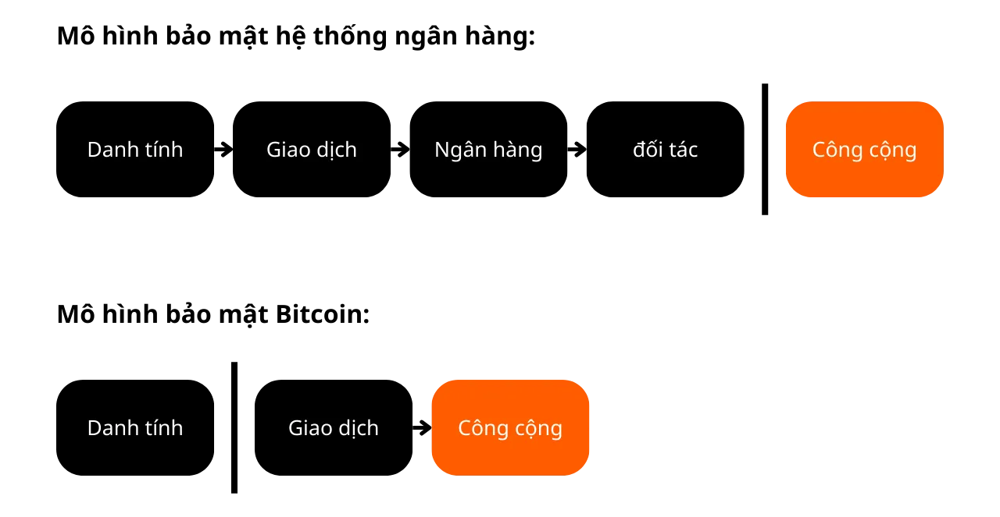

Do đó, bảo mật trên Bitcoin bị xâm phạm khi các quan sát viên bên ngoài có thể liên kết các UTXO cụ thể với người dùng đã được định danh. Một khi mối liên kết này được thiết lập, việc theo dõi giao dịch của họ và phân tích lịch sử bitcoin của họ trở nên khả thi. Trộn coin chính xác là một kỹ thuật được phát triển để phá vỡ khả năng bị theo dõi của UTXO, nhằm cung cấp một lớp bảo mật nhất định cho người dùng Bitcoin ở cấp độ giao dịch.

Trộn coin tăng cường bảo mật cho người dùng Bitcoin bằng cách làm phức tạp hoá việc phân tích chuỗi đối với các quan sát viên bên ngoài. Cấu trúc của chúng cho phép kết hợp các đồng tiền từ nhiều người dùng khác nhau vào một giao dịch duy nhất, do đó làm mờ dấu vết và khó xác định mối liên kết giữa địa chỉ đầu vào và đầu ra.

Quan trọng là phải hiểu rằng mục tiêu của một giao dịch trộn coin là phá vỡ lịch sử của một đồng tiền. Kỹ thuật này không cung cấp sự ẩn danh vĩnh viễn cũng như không hoàn toàn chặn được việc truy vết Bitcoin, trái với những gì một số người nghĩ. Trộn coin chỉ nhằm phá vỡ lịch sử tại điểm mà giao dịch trộn được thực hiện. Tuy nhiên, trước và sau hoạt động này, đồng tiền vẫn chịu cùng một rủi ro về quyền riêng tư.


### Trộn coin hoạt động như thế nào?

Nguyên tắc của trộn dựa trên một cách tiếp cận hợp tác: nhiều người dùng muốn trộn bitcoin của họ đặt cùng một số tiền vào các đầu vào của cùng một giao dịch. Số tiền này sau đó được phân phối lại trong các đầu ra với giá trị bằng nhau cho mỗi người dùng.


Sau giao dịch, việc liên kết một đầu ra cụ thể với một người dùng đã biết ở đầu vào trở nên không thể. Không có liên kết trực tiếp nào tồn tại giữa các đầu vào và đầu ra, điều này phá vỡ mối liên kết giữa người dùng và UTXO của họ, cũng như lịch sử của mỗi đồng tiền.


Hãy lấy ví dụ về Alice. Cô ấy muốn gửi khoảng 100,000 satoshi cho chị gái mình, Eve, nhân dịp sinh nhật. Tuy nhiên, Alice không muốn Eve có thể truy vết lịch sử giao dịch của mình vì cô ấy không muốn tiết lộ số lượng bitcoin mình sở hữu hoặc cách cô ấy có được chúng. Để làm điều này, Alice quyết định phá vỡ lịch sử của UTXO của mình bằng một giao dịch trộn. Cô ấy hợp tác cùng với Bob, Charles, David và Frank để thực hiện một giao dịch hợp tác: Alice, Bob, Charles, David và Frank mỗi người dùng một UTXO có giá trị 100,500 satoshi (với 500 satoshi cho phí giao dịch) làm đầu vào cho giao dịch:


- Để tiêu thụ những đầu vào này, mỗi người tạo một địa chỉ mới để tạo ra năm đầu ra giống hệt nhau, mỗi đầu ra là 100,000 satoshi. Mỗi người nhận một đầu ra:


- Alice cuối cùng sở hữu một UTXO của 100,000 satoshi với lịch sử được trộn lẫn. Cô ấy sử dụng UTXO này trong một giao dịch mới để gửi số tiền cho Eve nhân dịp sinh nhật:


- Nếu Eve cố gắng phân tích giao dịch này để trích xuất thông tin, cô ấy sẽ đối mặt với giao dịch trộn coin liên quan đến Alice, Bob, Charles, David và Frank. Không thể phân biệt đầu vào nào thuộc về ai do sự đồng nhất của các số lượng, Eve không thể truy vết lịch sử của UTXO của Alice, cũng không xác định được số lượng bitcoin chị gái mình sở hữu hoặc cách cô ấy có được chúng:


Trong kịch bản này, Alice đã sử dụng kỹ thuật trộn coin để tăng cường quyền riêng tư của mình chống lại phân tích "hồi tưởng". Thực vâuk, Alice tự bảo vệ mình khỏi khả năng mà Eve có thể phân tích bằng cách bắt đầu từ một giao dịch cụ thể để truy vết lịch sử của UTXO phía sau. Sự bảo vệ này chống lại phân tích từ hiện tại về quá khứ là những gì chúng ta gọi là tập hợp ẩn danh hồi tưởng. Chúng ta sẽ đi sâu vào khái niệm này một cách chi tiết hơn trong những chương cuối của phần này.

Tuy nhiên, trộn coin cũng cung cấp khả năng tăng cường quyền riêng tư chống lại phân tích từ quá khứ đến hiện tại, được gọi là tập hợp ẩn danh tương lai. Hãy quay lại ví dụ của chúng ta khi Alice gửi 98,000 satoshi cho Eve nhân dịp sinh nhật, nhưng đảo ngược vai trò. Bây giờ hãy tưởng tượng rằng Eve lo lắng về quyền riêng tư của mình. Thực sự, Alice có thể bị cám dỗ theo dõi đồng tiền cô ấy gửi cho Eve để thu thập thông tin. Eve có thể hợp UTXO mà cô ấy vừa nhận với tất cả các UTXO khác của mình, hành động này có thể tiết lộ cho Alice số lượng bitcoin cô ấy giữ trong ví. Để tránh điều này, Eve cũng có thể phá vỡ lịch sử của đồng tiền mà cô ấy vừa nhận.
- Eve, Grace, Mallory, Oscar và Victor mỗi người dùng một UTXO của 98,000 sats làm đầu vào trong một giao dịch Bitcoin:


- Để tiêu thụ những đầu vào này, mỗi người cung cấp một địa chỉ mới để tạo ra 5 đầu ra của 97,500 satoshi mỗi cái, hoàn toàn bằng nhau. Mỗi người dùng nhận một đầu ra:


- Eve giờ đây sở hữu một UTXO của 97,500 satoshi với lịch sử bị phá vỡ. Cô ấy có thể sử dụng nó mà không lo sợ cho các giao dịch tương lai. Thực vậy, nếu Alice cố gắng theo dõi bitcoin mà cô ấy gửi cho Eve, cô ấy sẽ gặp phải một giao dịch trộn coin. Cô ấy sẽ không thể xác định được UTXO đầu ra nào thuộc về Eve. Phân tích sau đó trở nên không thể:


Trong ví dụ đầu tiên, chúng ta đã thấy cách trộn có thể bảo vệ sự riêng tư của một đồng tiền liên quan đến quá khứ của nó, và trong ví dụ thứ hai, là cách nó có thể bảo vệ lịch sử của một đồng tiền liên quan đến tương lai của nó. Đó là lý do tôi lưu ý rằng trộn coin nên được xem như một sự kiện một lần, phân chia lịch sử của một đồng tiền theo cả hai hướng:


### Pha trộn, trộn coin, máy trộn... Sự khác biệt là gì?

Thuật ngữ "pha trộn" đôi khi được sử dụng để mô tả trộn coin, một thuật ngữ mà một số người dùng bitcoin từ chối vì họ lo ngại sự nhầm lẫn với các dịch vụ pha trộn có quản lý. Tuy nhiên, tôi nghĩ rằng sự lo lắng này là không có cơ sở, bởi vì, trong bối cảnh toán học, trộn coin thể hiện chính xác khái niệm của việc pha trộn.

Trong lĩnh vực toán học nói chung, pha trộn ám chỉ tính chất của một hệ thống động, nơi sau một thời gian, tất cả các phần của không gian ban đầu, về lý thuyết, có thể được pha trộn với bất kỳ phần nào khác. Pha trộn ngụ ý rằng vị trí của một hạt hoặc trạng thái của một hệ thống phát triển theo cách mà phân phối tương lai của nó độc lập với phân phối ban đầu của nó, do đó đạt được trạng thái mà các đặc điểm của trạng thái ban đầu được phân phối đồng đều trong không gian của hệ thống. Đây chính xác là những gì xảy ra trong một giao dịch trộn coin với bitcoin. Do đó, theo ý kiến của tôi, trộn coin thực sự là một phương pháp pha trộn đồng tiền.


Tuy nhiên, quan trọng là phải phân biệt trộn coin với các dịch vụ pha trộn. Một dịch vụ pha trộn là dịch vụ nơi người dùng gửi bitcoin của họ đến để được pha trộn. Những dịch vụ này đã phổ biến trong những năm 2010, nhưng việc sử dụng chúng đã giảm do hai nhược điểm lớn so với trộn coin:
- Chúng yêu cầu người dùng từ bỏ quyền kiểm soát tiền của mình trong quá trình pha trộn, điều này đặt họ trước rủi ro bị trộm;
- Không có sự bảo đảm rằng dịch vụ pha trộn không ghi lại chi tiết của các giao dịch, hoặc thậm chí bán thông tin này cho các công ty phân tích chuỗi.


Do đó, ngày nay, người dùng ưa thích trộn coin hơn, vì nó cho phép họ duy trì quyền kiểm soát đầy đủ đối với toeemf của mình trong suốt quá trình. Những người tham gia vào một giao dịch trộn coin không phải đối mặt với nguy cơ bị các bên khác liên quan đánh cắp bitcoin của bản thân. Hãy cùng khám phá làm thế nào tất cả điều này có thể xảy ra trong chương tiếp theo.

## Zerolink và trộn coin Chaumian
<chapterId>326c9654-b359-4906-b23d-d6518dd5dc3e</chapterId>

Sự riêng tư được mang lại bởi giao dịch trộn coin có được dựa trên kích thước của nhóm mà đồng tiền của chúng ta được ẩn đi. Do đó, cần phải tìm càng nhiều người tham gia càng tốt. Hoàn toàn có thể thực hiện một giao dịch trộn coin thủ công, với những người dùng mà một người tự tìm được, nhưng phương pháp này phức tạp, và nó không cho phép đạt được các tập hợp ẩn danh lớn.

Đó là lý do tại sao các nhà điều phối trộn coin đã phát triển trên Bitcoin. Vai trò của họ là kết nối các người dùng khác nhau và truyền đạt thông tin cần thiết cho việc thực hiện thành công giao dịch hợp tác.


Nhưng làm thế nào chúng ta có thể đảm bảo rằng điều phối viên không bao giờ kiểm soát được bitcoin của người dùng, và mặc dù họ là người xây dựng giao dịch trộn coin, làm thế nào chúng ta có thể đảm bảo rằng họ không thể liên kết các đầu vào và đầu ra của người dùng, điều này có thể tạo thành một rò rỉ về sự riêng tư?

### Chữ ký mù của Chaum

Các cách thực thi hiện đại của trộn coin sử dụng chữ ký mù của David Chaum để tránh rò rỉ thông tin. Hãy cùng nhanh chóng tìm hiểu cách những chữ ký mù này hoạt động.
Chữ ký mù của Chaum là một dạng chữ ký số mà người phát hành chữ ký không biết nội dung của thông điệp mà họ đang ký. Tuy nhiên, chữ ký sau này có thể được xác minh với thông điệp gốc. Kỹ thuật này được nhà mật mã học David Chaum phát triển vào năm 1983.

Lấy ví dụ về một công ty muốn xác thực một tài liệu mật, như một hợp đồng, mà không tiết lộ nội dung của nó. Công ty áp dụng một quá trình che giấu mà biến đổi tài liệu gốc một cách có thể đảo ngược được. Tài liệu đã được sửa đổi này được gửi đến một cơ quan chứng nhận áp dụng chữ ký mù mà không biết nội dung bên dưới. Sau khi nhận được tài liệu đã ký, công ty gỡ bỏ lớp che giấu chữ ký. Kết quả là một tài liệu gốc được xác thực bởi chữ ký của cơ quan chứng nhận, mà cơ quan đó không bao giờ thấy nội dung gốc.

Do đó, chữ ký mù của Chaum cho phép xác thực tính xác thực của một tài liệu mà không cần biết nội dung của nó, điều này đảm bảo cả tính bảo mật của dữ liệu người dùng và tính toàn vẹn của tài liệu đã ký.

### Phương pháp trộn coin Chaumian
Trong "trộn coin Chaumian," việc sử dụng Tor và chữ ký mù của David Chaum được kết hợp để đảm bảo rằng điều phối viên không thể biết đầu ra nào thuộc về người dùng nào. Quá trình xây dựng giao dịch trộn coin xoay quanh 3 bước chính: đăng ký các đầu vào, đăng ký các đầu ra, và ký giao dịch. Hãy xem xét quá trình này thông qua ví dụ về Alice, một trong những người tham gia vào giao dịch trộn coin. Tất cả những người tham gia khác thực hiện các bước tương tự như Alice, mỗi người một cách riêng biệt.

**Bước 1: Đăng ký các đầu vào.**
- Alice gửi cho điều phối viên UTXO mà cô ấy muốn sử dụng làm đầu vào cho giao dịch, cũng như địa chỉ nhận được che giấu mà cô ấy muốn sử dụng làm đầu ra để nhận bitcoin. Do đó, điều phối viên không thể biết địa chỉ của Alice. Anh ta chỉ thấy phiên bản được che giấu:

**Bước 2: Đăng ký các đầu ra.**
- Alice giờ đây có thể gỡ bỏ lớp che giấu địa chỉ của mình đã được ký bởi khóa riêng của điều phối viên. Cô ấy thiết lập một kết nối mới dưới một danh tính Tor khác. Điều phối viên không thể xác định đó là Alice kết nối dưới danh tính mới này:

- Alice gửi địa chỉ và chữ ký không được che giấu cho điều phối viên (người vẫn không biết đó là Alice):

**Bước 3: Ký giao dịch.**
- Điều phối viên thu hồi các đầu ra không được che giấu tương tự từ tất cả các người tham gia. Nhờ vào các chữ ký liên quan, anh ta có thể xác minh rằng mỗi đầu ra được gửi ẩn danh thực sự đã được ký bởi khóa riêng của mình trước đó, đảm bảo tính hợp lệ của chúng. Anh ta sau đó sẵn sàng xây dựng giao dịch trộn coin và gửi nó cho những người tham gia để họ ký:

- Alice, giống như những người tham gia khác, xác minh rằng đầu vào và đầu ra của mình được bao gồm một cách chính xác trong giao dịch do điều phối viên xây dựng. Nếu mọi thứ đều hài lòng, cô ấy gửi chữ ký mở khóa script của đầu vào của mình cho điều phối viên:

- Sau khi thu thập chữ ký từ tất cả những người tham gia trộn coin, điều phối viên có thể phát sóng giao dịch trên mạng lưới Bitcoin, để nó có thể được thêm vào một khối.
Trong hệ thống này, điều phối viên không thể liên kết một đầu vào với một đầu ra cụ thể. Hơn nữa, họ không thể chiếm đoạt quỹ của người tham gia, vì họ không bao giờ có quyền truy cập vào các khóa riêng tư cần thiết để mở khóa các UTXOs của người tham gia. Trong suốt quá trình, và cho đến hết bước 3, họ cũng không có quyền truy cập vào các chữ ký. Khi Alice và các thành viên khác ký vào giao dịch chung, sau khi đảm bảo mọi thứ đều chính xác, điều phối viên không thể thay đổi giao dịch này, bao gồm cả các đầu ra, mà không làm mất hiệu lực của nó. Điều này do đó ngăn chặn được việc điều phối viên ăn cắp bitcoin.

Cuối cùng, khi ghi lại đầu ra của họ trong giao dịch, người dùng trộn coin muốn có những bảo đảm tương tự như một công dân khi bỏ phiếu trong một cuộc bầu cử. Có một sự song song giữa khía cạnh công cộng và riêng tư của những hành động này. Một mặt, có những gì người ta muốn giữ kín: đối với cử tri, họ không muốn lá phiếu của mình được liên kết với danh tính của họ; đối với người dùng trộn coin, họ không muốn đầu ra của mình được liên kết với đầu vào của mình. Thực vậy, nếu điều phối viên, hoặc bất kỳ bên nào khác, có thể thiết lập một liên kết giữa một đầu vào và một đầu ra, trộn coin mất hết mục đích của nó. Như đã giải thích trước đó, trộn coin phải hoạt động như một sự phân tách lịch sử của một đồng tiền. Sự phân tách này xảy ra chính xác khi không thể liên kết một đầu vào cụ thể với một đầu ra cụ thể trong giao dịch trộn coin (tập hợp ẩn danh tương lai) và ngược lại (tập hợp ẩn danh hồi tưởng).

Mặt khác, có khía cạnh công cộng: cử tri muốn đảm bảo lá phiếu của họ được bao gồm trong hòm phiếu; tương tự, người dùng trộn coin muốn đảm bảo đầu ra của họ được bao gồm trong giao dịch trộn coin. Thực vậy, việc các thành viên của một giao dịch trộn coin có thể xác minh sự hiện diện của đầu ra của mình trước khi ký giao dịch là hoàn toàn cần thiết, nếu không điều phối viên có thể ăn cắp tiền.

Chính là hai khía cạnh công khai và riêng tư này, khả thi nhờ vào việc sử dụng chữ ký mù của David Chaum, đảm bảo cho người tham gia trộn coin Chaumian rằng bitcoin của họ sẽ không bị ăn cắp, và tiền của họ không thể bị truy vết.

### Ai đã phát minh ra khái niệm trộn coin?

Khó có thể xác định chắc chắn ai là người đầu tiên giới thiệu ý tưởng về trộn coin trên Bitcoin, và ai đã có ý tưởng sử dụng chữ ký mù của David Chaum trong bối cảnh này. Gregory Maxwell thường được xem là người đầu tiên nói về nó trong [một tin nhắn trên BitcoinTalk vào năm 2013](https://bitcointalk.org/index.php?topic=279249.0):
Sử dụng Chữ Ký Mù Chaum: Người dùng đăng nhập và cung cấp đầu vào (và địa chỉ nhận tiền thối) cũng như một phiên bản bị mù bằng mật mã hoá của địa chỉ mà họ muốn gửi các đồng tiền riêng tư của mình đến; máy chủ ký vào các token và trả lại chúng cho người dùng. Người dùng kết nối lại một cách ẩn danh, tiết lộ địa chỉ đầu ra của họ, và gửi chúng trở lại cho máy chủ. Máy chủ có thể thấy rằng tất cả các đầu ra đã được ký bởi nó và do đó, tất cả các đầu ra đều đến từ những người tham gia hợp lệ. Sau đó, mọi người kết nối lại và ký.
Maxwell, G. (2013, August 22). *Trộn coin: Quyền riêng tư với Bitcoin cho thế giới thực*. Diễn đàn BitcoinTalk. https://bitcointalk.org/index.php?topic=279249.0


Tuy nhiên, đã có những đề cập sớm hơn, cả về chữ ký Chaum trong bối cảnh của việc trộn lẫn (mixings), cũng như về trộn coin. [Vào tháng 6 năm 2011, Duncan Townsend đã trình bày trên BitcoinTalk](https://bitcointalk.org/index.php?topic=12751.0) một bộ trộn sử dụng chữ ký Chaum theo cách khá tương tự như trộn coin Chaumian hiện đại.
Trong cùng một chủ đề, có [một tin nhắn từ hashcoin phản hồi Duncan Townsend](https://bitcointalk.org/index.php?topic=12751.msg315793#msg315793) để cải thiện bộ trộn của mình. Quy trình được mô tả trong tin nhắn này chính xác là điều gần giống nhất với trộn coin. Cũng có đề cập về một hệ thống tương tự trong [một tin nhắn từ Alex Mizrahi vào năm 2012](https://gist.github.com/killerstorm/6f843e1d3ffc38191aebca67d483bd88#file-laundry), khi ông đang tư vấn cho những người sáng tạo ra Tenebrix, một trong những altcoin đầu tiên đã làm nền tảng cho việc tạo ra Litecoin sau này. Ngay cả thuật ngữ "Coinjoin - trộn coin" cũng không phải do Greg Maxwell phát minh, mà nó xuất phát từ một ý tưởng của Peter Todd.


### Zerolink

Zerolink là một giao thức trộn lẫn toàn diện tích hợp trộn coin Chaumian và các chiến lược khác nhau để bảo vệ sự ẩn danh của người dùng nhằm chống lại nhiều hình thức phân tích chuỗi, đặc biệt là giảm thiểu lỗi liên quan đến quản lý ví. Giao thức này [được nopara73 và TDevD giới thiệu vào năm 2017](https://github.com/nopara73/ZeroLink/blob/master/README.md).


Như tên gọi của nó, nguyên tắc của Zerolink là thực hiện các giao dịch trộn coin đảm bảo không thể truy vết được các liên kết giữa các đầu vào và đầu ra. Đặc điểm này được đạt được bằng cách đảm bảo rằng tất cả các đầu ra có số lượng hoàn toàn giống nhau.


Một biện pháp phòng ngừa quan trọng của Zerolink bao gồm việc tách biệt hoàn toàn các UTXO chưa trộn lẫn với các UTXO đã trộn lẫn bằng cách sử dụng các bộ khóa mật mã khác nhau, hoặc thậm chí là các ví riêng biệt. Như vậy, ví "pre-mix", dành cho các đồng tiền trước khi trộn, được phân biệt với ví "post-mix", dành riêng cho các đồng tiền đã được trộn.


Sự phân chia các UTXO này chủ yếu nhằm mục đích ngăn chặn sự liên kết vô tình giữa một UTXO đã trộn và một UTXO chưa trộn. Thực sự, nếu những liên kết như vậy xảy ra, hiệu quả của trộn coin trên UTXO đã trộn sẽ bị vô hiệu hóa mà người dùng không hề biết, từ đó làm mất đi sự bảo mật của một UTXO mà họ tin rằng lịch sử của nó đã được cắt đứt. Những liên kết này có thể phát sinh do việc sử dụng lại địa chỉ khi bảo vệ một UTXO đã trộn với một UTXO chưa trộn, hoặc bằng cách áp dụng phép suy luận dựa trên sở hữu đầu vào chung (CIOH), nếu người dùng sử dụng các UTXO đã trộn và chưa trộn làm đầu vào của cùng một giao dịch. Bằng cách tách biệt ví trước và sau khi trộn, những liên kết vô tình này được tránh khỏi và người dùng được bảo vệ khỏi những lỗi không mong muốn.


Sự tách biệt này cũng mở ra khả năng áp dụng các quy tắc riêng biệt giữa ví trước khi trộn và sau khi trộn ở cấp độ phần mềm ví. Ví dụ, trong ví sau khi trộn, phần mềm có thể cấm việc kết hợp các UTXO thành đầu vào để ngăn chặn việc áp dụng CIOH, điều này sẽ làm lộ thông tin về tập ẩn danh của người dùng. Cũng có thể chuẩn hóa việc sử dụng kịch bản và các tùy chọn giao dịch (như tín hiệu RBF) để ngăn chặn việc nhận dạng qua dấu vân tay ví.

Hiện tại, Whirlpool là ứng dụng duy nhất của trộn coin có áp dụng chặt chẽ giao thức Zerolink. Trong chương tiếp theo, chúng ta sẽ khám phá các ứng dụng trộn coin khác nhau hiện có và ưu nhược điểm của từng loại.

## Các ứng dụng trộn coin
<chapterId>e37ed073-9498-4e4f-820b-30951e829596</chapterId>

*Vào năm 2024, chúng ta đang chứng kiến những thay đổi đáng kể trong các công cụ có sẵn cho người dùng muốn thực hiện trộn coin trên Bitcoin. Chúng ta hiện đang ở trong một giai đoạn quan trọng, và thị trường trộn coin đang trải qua một đợt tái cấu trúc lớn. Do đó, chương này có thể sẽ được cập nhật theo thời gian.*

Hiện tại, chủ yếu có 3 ứng dụng trộn coin khác nhau trên Bitcoin:
- Whirlpool;
- Wabisabi;
- JoinMarket.
Mỗi triển khai này đều nhằm mục đích phá vỡ lịch sử của các UTXO thông qua các giao dịch trộn coin. Tuy nhiên, cơ chế của chúng có sự khác biệt đáng kể. Do đó, việc hiểu cách thức hoạt động của từng loại là cần thiết để chọn lựa phương án phù hợp nhất với nhu cầu của bạn.

### JoinMarket

JoinMarket, được tạo ra vào năm 2015 bởi Adam Gibson và Chris Belcher, nổi bật so với các ứng dụng trộn coin khác nhờ vào mô hình ghép đôi người dùng độc đáo của mình. Hệ thống này dựa trên một thị trường trao đổi P2P nơi một số người dùng, những "người tạo lập," cung cấp bitcoin của họ cho việc trộn, trong khi những người khác, những "người nhận," sử dụng các đồng tiền này để thực hiện trộn coin và trả một khoản.


Trong mô hình này, "người tạo lập" để bitcoin của họ sẵn sàng cho "người nhận" và nhận một khoản phí cho dịch vụ của họ. Ngược lại, "người nhận" trả phí để sử dụng bitcoin của "người tạo lập" để thực hiện các giao dịch trộn coin của riêng họ. Phí dịch vụ thay đổi tùy thuộc vào vai trò: "người tạo lập" tích lũy phí cho việc cung cấp thanh khoản của họ, trong khi "người nhận" trả phí. Thị trường này hoạt động tự do mà không có điều kiện sử dụng.

Một trong những nhược điểm chính của JoinMarket là độ phức tạp trong việc sử dụng, yêu cầu một sự quen thuộc nhất định với thiết bị đầu cuối để khai thác hiệu quả. Mặc dù độ phức tạp này không phải là rào cản đối với người dùng có kinh nghiệm, nhưng nó sẽ hạn chế quyền truy cập của công chúng nói chung. Tuy nhiên, việc ra mắt gần đây của một giao diện web có tên JAM đã phần nào làm cho việc sử dụng nó dễ dàng hơn.


Nguồn: [JAM](https://github.com/joinmarket-webui/jam/blob/devel/docs/assets/screenshot-dark.webp)

Tuy nhiên, rào cản kỹ thuật vẫn là một trở ngại lớn. Trong hệ sinh thái trộn coin, nơi mà sự bảo mật được tăng cường bởi số lượng người tham gia, bất kỳ hạn chế nào làm giảm khả năng tiếp cận cũng trực tiếp ảnh hưởng đến thanh khoản có sẵn, đây là một yếu tố quan trọng cho tính hiệu quả của việc trộn. Bitcoin, đã là một phân khúc chuyên biệt trong các giao dịch tài chính, việc sử dụng trộn coin là một phân khúc phụ, và JoinMarket đại diện cho một phần còn chuyên biệt hơn, do đó hạn chế khả năng gia tăng sự ẩn danh của người dùng.
Mặc dù có mô hình ghép cặp P2P đổi mới cho trộn coin, JoinMarket vẫn có một số nhược điểm đáng kể, đặc biệt là về cấu trúc giao dịch. Khác với các triển khai khác như Whirlpool, JoinMarket không đảm bảo sự bình đẳng hoàn hảo giữa các đầu ra, và có thể truy vết các liên kết định trước giữa các đầu vào và đầu ra. Hơn nữa, nó thiếu các công cụ để ngăn chặn việc tiền đã được trộn lẫn với nhau từ việc được trộn lại, điều này có thể làm suy giảm tính bảo mật mà người dùng tìm kiếm. Cuối cùng, mặc dù khái niệm về JoinMarket thú vị, đặc biệt là đối với những người quan tâm đến một thị trường thanh khoản động, nhưng theo ý kiến của tôi, những yếu kém về cấu trúc và độ phức tạp kỹ thuật làm cho nó kém hấp dẫn, đối với cả người mới bắt đầu lẫn các chuyên gia tìm kiếm một ứng dụng trộn coin.

### Wabisabi

Wabisabi là một ứng dụng trộn coin khác, với cách tiếp cận tập trung vào việc điều phối giao dịch. Mô hình này được thiết kế bởi Ádám Ficsór (nopara73), Yuval Kogman, Lucas Ontivero, và István András Seres vào năm 2021, và được tích hợp vào phần mềm Wasabi 2.0 vào năm sau. Wabisabi chính xác là sự tiến hóa của mô hình trộn coin của phần mềm Wasabi ra mắt vào năm 2018.


Vào cuối những năm 2010, Wasabi đã áp dụng một cấu trúc giao dịch cho trộn coin của mình hoàn toàn khác biệt so với Whirlpool. Để tăng tập hợp ẩn danh cho các thành viên tham gia, Wasabi sử dụng các giao dịch trộn coin rất lớn, nhóm hàng chục người tham gia. Ngược lại, Whirlpool chọn lựa nhiều giao dịch nhỏ, cho phép tăng lũy thừa tập hợp ẩn danh với mỗi chu kỳ.

Các phương pháp quản lý tiền thối cũng phân biệt hai ứng dụng này. Với Whirlpool, tiền thối được loại trừ và tách biệt khỏi các UTXO trước các chu kỳ trộn coin nhờ vào TX0, một khái niệm mà tôi sẽ giải thích thêm trong chương tiếp theo. Tại Wasabi, ngược lại, tiền thối tạo thành một trong những đầu ra của giao dịch trộn coin, duy trì các liên kết định trước giữa một số đầu vào và đầu ra.


Với Wabisabi, phiên bản 2.0 của Wasabi đã điều chỉnh cách tiếp cận của mình đối với trộn coin để tiến gần hơn đến mô hình của Whirlpool. Mặc dù các giao dịch trộn coin vẫn rất lớn, giờ đây đã có thể thực hiện nhiều chu kỳ liên tiếp, theo mô hình của Whirlpool. Một nỗ lực đặc biệt cũng đã được thực hiện về quản lý tiền thối: không giống như Wasabi 1.0, nơi tiền thối được trực tiếp liên kết với các đầu vào của người dùng, Wabisabi tìm cách chia nhỏ tiền thối thành nhiều số lượng nhỏ, phân phối đều cho tất cả các thành viên.

Hãy minh họa điều này với một ví dụ đơn giản chỉ bao gồm 2 người dùng: Alice muốn trộn 115,000 satoshi và Bob, 210,000 satoshi. Bỏ qua phí, với Wasabi 1.0, một giao dịch trộn coin sẽ tạo ra 3 đầu ra của 100,000 satoshi, cộng với 1 đầu ra của tiền thối 15,000 satoshi cho Alice và đầu ra tiền thối 10,000 satoshi cho Bob. Các đầu ra tiền thối luôn được liên kết với các đầu vào:


Dưới Wabisabi, cùng một giao dịch sẽ tạo ra 3 đầu ra của 100,000 satoshi và 5 đầu ra của 5,000 satoshi, do đó phân tán tiền lẻ theo cách để không bị truy vết trực tiếp đến một đầu vào cụ thể:

Cá nhân tôi thấy rằng việc quản lý tiền lẻ trong Wabisabi đặt ra một số rủi ro có thể làm giảm hiệu quả của nó về mặt quyền riêng tư:
- Khi một người dùng đóng góp với một UTXO lớn hơn đáng kể so với những người dùng khác, họ không tránh khỏi việc hoàn thành giao dịch với một lượng tiền thối sẽ được liên kết với đầu vào của họ. Điều này đi ngược lại mục tiêu ban đầu của giao thức, là loại bỏ bất kỳ khoản tiền thối nào có thể bị nhận dạng;
- Việc nhân lên các mệnh giá để phân mảnh tiền thối có thể huỷ hoại hiệu quả của quá trình pha trộn. Quá trình này có thể dẫn đến sự giảm số lượng tập hợp ẩn danh cho một số đầu ra, khi chúng trở nên dễ nhận dạng hơn;
- Phương pháp này cũng tạo ra các UTXO có giá trị thấp gây ra vấn đề quản lý cho người dùng. Những UTXO nhỏ này, nếu trở nên quá tốn kém để chi tiêu so với giá trị, có thể trở thành "bụi". Hiện tượng này thúc đẩy người dùng hợp nhất nhiều UTXO thành đầu vào trong các giao dịch tương lai hoặc tổng hợp chúng. Trong cả hai trường hợp, do sở hữu chung - COH, điều này có thể giảm tập hợp ẩn danh đạt được hoặc hoàn toàn hủy bỏ lợi ích về mặt quyền riêng tư đã thu được thông qua giao dịch trộn coin ban đầu.

Khác với Whirlpool, sử dụng giao thức ZeroLink đảm bảo sự tách biệt nghiêm ngặt giữa UTXO trước và sau khi trộn, Wabisabi không duy trì sự phân chia nghiêm ngặt này. Cũng đã có vấn đề về việc tái sử dụng địa chỉ bởi một số khách hàng Wasabi, rõ ràng là rất bất lợi cho người dùng.

Trong phiên bản 2.0 của Wasabi, một chính sách phí trộn coin mới đã được triển khai. Bây giờ, phí điều phối được đặt ở mức 0.3% cho UTXO lớn hơn 0.01 bitcoin, trong khi đối với các UTXO nhỏ hơn, những phí này hoàn toàn được miễn. Hơn nữa, việc tái pha trộn cho những UTXO nhỏ này là miễn phí, mặc dù phí cho thợ đào vẫn do người dùng chịu trách nhiệm cho tất cả các giao dịch, bao gồm cả tái pha trộn.

Điều này tương phản với chính sách của Whirlpool, nơi phí cố định, bất kể kích thước của tập hợp ẩn danh đạt được. Với Wasabi 2.0, mặc dù phí điều phối được miễn cho các UTXO nhỏ, người dùng vẫn phải trả phí thợ đào cho tất cả các giao dịch, bao gồm cả tái pha trộn.
Tính đến thời điểm viết bài, việc sử dụng Wabisabi đã trở nên phức tạp hơn đáng kể sau các sự kiện gần đây. Thực vậy, sau vụ bắt giữ các nhà sáng lập của Samourai Wallet, zkSNACKs, công ty tài trợ và quản lý phát triển Wasabi, đã thông báo việc ngừng dịch vụ điều phối trộn coin vào ngày 1 tháng 6 năm 2024. Đây là điều phối viên được đặt mặc định trên Wasabi, nắm giữ phần lớn lượng thanh khoản.

Do điều phối viên chính này đã đóng cửa, người dùng giờ đây phải kết nối với các điều phối viên độc lập mới. Sự thay đổi này đặt ra mối quan ngại: một mặt, các điều phối viên mới có thể không có đủ lượng thanh khoản, do đó giảm hiệu quả của trộn coin về mặt quyền riêng tư. Mặt khác, có rủi ro gặp phải một điều phối viên có ý đồ xấu. Tình hình này tạo ra thêm những rủi ro đáng kể mới cho những người muốn sử dụng Wabisabi.

Ngoài các vấn đề kỹ thuật, quyết định của zkSNACKs, công ty đứng sau Wasabi, sử dụng dịch vụ của một công ty phân tích chuỗi để lọc các thành viên tham gia trộn coin đặt ra những câu hỏi nghiêm túc về đạo đức và chiến lược. Ý tưởng ban đầu là ngăn chặn việc sử dụng trộn coin trên Wasabi bởi tội phạm, một động thái có vẻ hợp lệ. Tuy nhiên, điều này tạo ra một nghịch lý: trả phí cho một điều phối viên, nhiệm vụ chính của họ là tăng cường quyền riêng tư của người dùng, chỉ để sau đó tài trợ cho một công ty có mục tiêu là xâm phạm chính quyền riêng tư đó.
Càng đáng lo ngại hơn là nguyên tắc lọc thông tin, điều này trái ngược hoàn toàn với triết lý của Bitcoin nhằm mục đích cung cấp một hệ thống tài chính mở và không thể kiểm duyệt. Mặc dù có vẻ hợp lý khi muốn loại trừ các hoạt động phạm tội, việc lọc này cũng có thể ảnh hưởng đến những cá nhân mà hành động của họ, mặc dù được phân loại là bất hợp pháp trong một số bối cảnh, có thể được coi là đạo đức chính đáng hoặc có lợi ích xã hội. Ví dụ về Edward Snowden minh họa hoàn hảo cho sự đối lập này: được một số chính phủ coi là tội phạm vì những tiết lộ của mình, ông được nhìn nhận bởi người khác như một người tố giác hành động vì lợi ích công cộng. Sự phức tạp này nhấn mạnh nguy cơ tiềm ẩn của việc lọc thông tin, mặc dù bắt đầu từ một ý định tốt nhưng cuối cùng có thể xâm phạm quyền và an ninh của người dùng hợp pháp. Tôi cũng có thể đã nhắc đến các nhà hoạt động và nhà báo bị bức hại dưới một số chế độ độc tài. Như bạn đã hiểu, sự ưu tiên của tôi không nghi ngờ gì nữa hướng về mô hình Whirlpool để thực hiện trộn coin trên Bitcoin. Hệ thống này nổi bật với tính nghiêm ngặt và cung cấp các bảo đảm vượt trội về quyền riêng tư. Đây cũng là hệ thống duy nhất đề xuất một phương pháp trộn được coi là hoàn hảo trong một bối cảnh toán học. Theo quan điểm của tôi, mô hình này đại diện cho tương lai của trộn coin trên Bitcoin. Do đó, tôi mời bạn khám phá sâu hơn mô hình này trong chương tiếp theo.

## Cách thức hoạt động của Whirlpool
<chapterId>bdbd7109-e36d-4b4f-a3c6-928df4e9bfda</chapterId>

Whirlpool phân biệt với các phương pháp trộn coin khác bằng cách sử dụng các giao dịch "_ZeroLink_", đảm bảo rằng không có liên kết kỹ thuật nào có thể xảy ra giữa tất cả các đầu vào và đầu ra. Việc trộn hoàn hảo này được thực hiện thông qua một cấu trúc nơi mỗi người tham gia đóng góp một lượng giống nhau ở đầu vào (trừ phí khai thác), do đó tạo ra các đầu ra với số lượng hoàn toàn bằng nhau.

Cách tiếp cận hạn chế về đầu vào này mang lại cho các giao dịch trộn coin Whirlpool một đặc điểm độc đáo: sự vắng mặt hoàn toàn của các liên kết tất định giữa các đầu vào và đầu ra. Nói cách khác, mỗi đầu ra có khả năng bằng nhau được gán cho bất kỳ người tham gia nào, liên quan đến tất cả các đầu ra khác của giao dịch.


### Cách thức hoạt động chung của Whirlpool

Ban đầu, số lượng người tham gia trong mỗi giao dịch trộn coin Whirlpool được giới hạn ở 5, với 2 người mới tham gia và 3 người tái pha trộn (chúng tôi sẽ giải thích các khái niệm này thêm). Tuy nhiên, sự tăng giá của phí giao dịch trên chuỗi vào năm 2023 đã thúc đẩy các đội ngũ Samourai tái cấu trúc mô hình của họ để cải thiện quyền riêng tư trong khi giảm chi phí. Do đó, xét đến tình hình thị trường về phí và số lượng người tham gia, điều phối viên giờ đây có thể tổ chức các giao dịch trộn coin có đến 6, 7, hoặc 8 người tham gia. Những phiên nâng cao này được gọi dưới tên "_Surge Cycles_". Quan trọng là phải lưu ý rằng, bất kể cấu hình như thế nào, luôn chỉ có 2 người mới tham gia trong các giao dịch trộn coin Whirlpool.

Do đó, giao dịch Whirlpool được đặc trưng bởi số lượng đầu vào và đầu ra giống nhau, có thể là:
- 5 đầu vào và 5 đầu ra;


- 6 đầu vào và 6 đầu ra;


- 7 đầu vào và 7 đầu ra;


- 8 đầu vào và 8 đầu ra.


Mô hình được đề xuất bởi Whirlpool dựa trên các giao dịch trộn coin nhỏ nhỏ. Khác với Wabisabi và JoinMarket, nơi sự vững chắc của các tập hợp ẩn danh phụ thuộc vào lượng người tham gia trong một chu kỳ (hoặc vài chu kỳ), Whirlpool đặt cược vào việc kết nối nhiều chu kỳ nhỏ. Trong mô hình này, người dùng chỉ phải chịu phí khi họ lần đầu tiên tham gia vào một pool, cho phép họ tham gia vào nhiều lần remix mà không phải trả thêm phí. Những người tham gia mới là người trả phí đào cho những người tái pha trộn.

Với mỗi lần trộn coin thêm vào mà một đồng tiền tham gia, cùng với các đối tác đã gặp trong quá khứ, các tập hợp ẩn danh sẽ tăng lên theo cấp số nhân. Mục tiêu, do đó, là tận dụng những lần tái trộn miễn phí này, mỗi lần xảy ra, góp phần tăng cường mật độ của các tập hợp ẩn danh liên quan đến mỗi đồng tiền đã được trộn.


Whirlpool được thiết kế với hai yêu cầu quan trọng:
- Khả năng triển khai trên thiết bị di động, vì Samourai Wallet là một ứng dụng chủ yếu dành cho điện thoại thông minh;
- Tốc độ của các chu kỳ rtái pha trộn để khuyến khích sự tăng đáng kể trong tập hợp ẩn danh.

Những yêu cầu này đã định hướng lựa chọn của các nhà phát triển Samourai Wallet trong việc thiết kế Whirlpool, khiến họ hạn chế số lượng người tham gia mỗi chu kỳ. Quá ít người tham gia sẽ làm giảm hiệu quả của trộn coin, giảm đáng kể các tập hợp ẩn danh được tạo ra trong mỗi chu kỳ, trong khi quá nhiều người tham gia sẽ gây ra vấn đề quản lý trên các ứng dụng di động và cản trở dòng chảy của các chu kỳ.

Cuối cùng, không cần phải có một số lượng lớn người tham gia mỗi giao dịch trộn coin trên Whirlpool vì các tập hợp ẩn danh được tạo ra qua việc tích lũy nhiều chu kỳ trộn coin. Nguyên tắc quan trọng nhất ở đây là sự đồng nhất của các UTXO của tất cả người tham gia, vì điều này cho phép một sự trộn lẫn hoàn hảo, và do đó, tận dụng tối đa các chu kỳ trộn và tái trộn.

### Các pool và phí trộn coin

Để những chu kỳ này có thể tăng hiệu quả các tập hợp ẩn danh của các đồng tiền đã trộn, một khuôn khổ nhất định phải được thiết lập để hạn chế số lượng các UTXO được sử dụng. Whirlpool do đó xác định các pools khác nhau.

Một pool đại diện cho một nhóm người dùng muốn trộn lẫn với nhau, đồng ý về số lượng cac UTXO để sử dụng nhằm tối ưu hóa quá trình trộn coin trong khi duy trì sự đồng nhất hoàn hảo của các đồng tiền. Mỗi pool quy định một lượng cố định cho UTXO, mà người dùng phải tuân thủ để tham gia. Do đó, để thực hiện trộn coin với Whirlpool, bạn cần chọn một pool. Các pool có sẵn vào thời điểm hiện tại là như sau:
- 0.5 bitcoin;
- 0.05 bitcoin;
- 0.01 bitcoin;
- 0.001 bitcoin (= 100,000 satoshi).
Bằng cách tham gia một pool với bitcoin của mình, chúng sẽ được chia để tạo ra các UTXO hoàn toàn đồng nhất với những người tham gia khác trong pool. Mỗi pool có một giới hạn tối đa; do đó, đối với các số tiền vượt quá giới hạn này, bạn sẽ buộc phải thực hiện hai lần nhập riêng biệt trong cùng một pool hoặc chuyển sang pool khác với số lượng lớn hơn:
| Pool (bitcoin) | Số lượng tối đa mỗi lần nhập (bitcoin) |
|------------------|----------------------------------------|
| 0.5              | 35                                     |
| 0.05             | 3.5                                    |
| 0.01             | 0.7                                    |
| 0.001            | 0.025                                  |
Một UTXO được coi là thuộc về một pool khi nó sẵn sàng để được tích hợp vào một trộn coin. Tuy nhiên, điều này không có nghĩa là người dùng mất quyền sở hữu của nó. Như chúng ta đã thấy trong các chương đầu tiên của phần này, qua các chu kỳ trộn khác nhau, bạn vẫn giữ quyền kiểm soát đầy đủ các khóa của mình và do đó, là bitcoin của bạn. Đây là điều phân biệt kỹ thuật trộn coin với các kỹ thuật trộn tập trung khác.

Để tham gia vào một pool trộn coin, bạn phải trả phí dịch vụ cũng như phí đào. Phí dịch vụ được cố định cho mỗi pool và nhằm trả lương cho các đội ngũ chịu trách nhiệm phát triển và bảo trì Whirlpool.

Phí dịch vụ khi sử dụng Whirlpool phải được trả một lần khi tham gia vào pool. Một khi bước này hoàn tất, bạn có khả năng tham gia vào số lần tái trộn không giới hạn mà không cần phí bổ sung. Dưới đây là các phí cố định hiện tại cho mỗi pool:

| Pool (bitcoin) | Phí tham gia (bitcoin)          |
|----------------|-----------------------------|
| 0.5            | 0.0175                      |
| 0.05           | 0.00175                     |
| 0.01           | 0.0005 (50,000 sats)        |
| 0.001          | 0.00005 (5,000 sats)        |

Những loại phí này hoạt động như một vé vào cửa cho pool được chọn, bất kể số lượng bạn đưa vào giao dịch trộn coin. Do đó, dù bạn tham gia pool 0.01 với chính xác 0.01 BTC hay nhập vào với 0.5 BTC, phí sẽ giữ nguyên về giá trị tuyệt đối.

Trước khi tiến hành trộn coin với Whirlpool, người dùng lựa chọn giữa 2 chiến lược:
- Chọn một pool nhỏ hơn để giảm thiểu phí dịch vụ, biết rằng họ sẽ nhận lại nhiều UTXO nhỏ hơn;
- Hoặc ưu tiên một pool lớn hơn, đồng ý trả phí cao hơn để kết thúc với số lượng ít các UTXO giá trị lớn hơn.
Thông thường người dùng không được khuyến khích gộp nhiều UTXO đã trộn sau các chu kỳ trộn coin, vì điều này có thể làm giảm quyền riêng tư đã đạt được, đặc biệt do phép suy luận dựa trên sở hữu đầu vào chung (CIOH: *Common-Input-Ownership-Heuristic*). Do đó, có thể sẽ khôn ngoan hơn khi chọn một pool lớn hơn, ngay cả khi phải trả nhiều hơn, để tránh có quá nhiều UTXO giá trị nhỏ làm đầu ra. Người dùng phải cân nhắc những sự đánh đổi này để chọn pool họ ưa thích.
Ngoài phí dịch vụ, phí đào là điển hình cho bất kỳ giao dịch Bitcoin nào cũng cần được xem xét. Là người dùng Whirlpool, bạn sẽ phải trả phí đào cho giao dịch chuẩn bị (`Tx0`) cũng như cho giao dịch trộn coin đầu tiên. Tất cả các lần tái trộn tiếp theo sẽ miễn phí, nhờ vào mô hình của Whirlpool dựa trên khoản thanh toán phí của người mới gia nhập.

Thực vậy, trong mỗi giao dịch trộn coin Whirlpool, 2 người dùng trong số các đầu vào là người mới gia nhập. Các đầu vào khác đến từ những người tái trộn. Kết quả là, phí khai thác cho tất cả các bên tham gia trong giao dịch được trả bởi 2 người tham gia mới này, những người sau đó cũng sẽ được hưởng những lần tái trộn miễn phí:

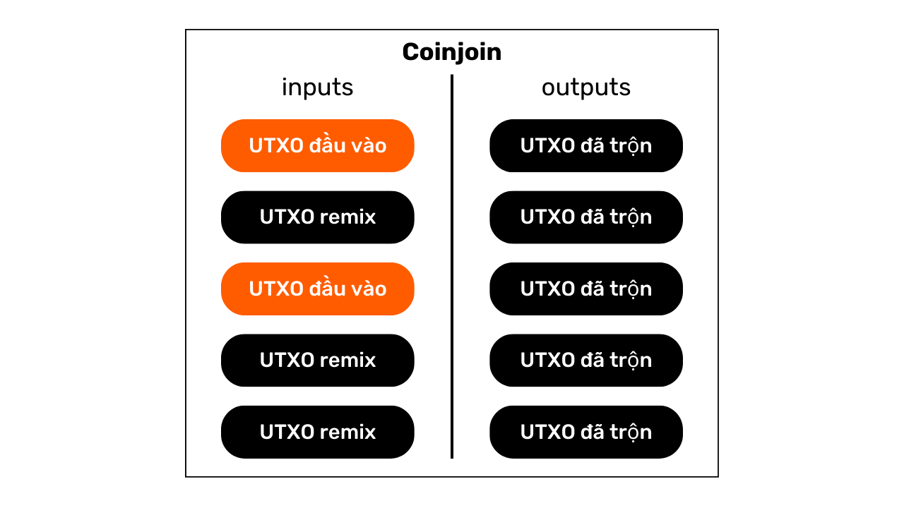

Nhờ vào hệ thống phí này, Whirlpool thực sự khác biệt so với các ứng dụng trộn coin khác vì tập hợp ẩn danh của các UTXO không tỷ lệ với chi phí được trả bởi người dùng. Do đó, có thể đạt được mức độ ẩn danh cao đáng kể mà chỉ cần trả phí gia nhập vào pool và phí đào cho 2 giao dịch (các `Tx0` và giao dịch trộn coin ban đầu).
Một điểm quan trọng cần lưu ý là người dùng cũng sẽ phải chịu phí đào để rút UTXO của họ khỏi pool sau khi thực hiện nhiều lần trộn coin, trừ khi họ đã chọn tùy chọn `mix to`, cho phép cung cấp một địa chỉ bên ngoài sẽ trực tiếp nhận được số tiền như một đầu ra của trộn coin, mà không cần bất kỳ giao dịch bổ sung nào.

### Tài khoản ví HD

Để thực hiện trộn coin qua Whirlpool, ví cần phải tạo ra nhiều tài khoản riêng biệt. Đây là nguyên tắc của giao thức ZeroLink. Một tài khoản, trong bối cảnh của một ví HD (*Hierarchical Deterministic - Tất định phân cấp*), tạo thành một phần hoàn toàn tách biệt khỏi các phần khác, sự tách biệt này xảy ra ở mức độ thứ ba của hệ thống phân cấp của ví, tức là, ở mức của `xpub`.


Về lý thuyết, một ví HD có thể sinh ra `2^(32/2)` tài khoản khác nhau. Tài khoản ban đầu, được sử dụng mặc định trên tất cả các ví Bitcoin, tương ứng với chỉ mục `0'`.

Đối với các ví được áp dụng cho Whirlpool, 4 tài khoản được sử dụng để đáp ứng nhu cầu của quy trình ZeroLink:
- **Tài khoản gửi tiền**, được xác định bởi chỉ mục `0'`;
- **Tài khoản ngân hàng xấu** (hoặc "tiền thối bị lộ vết"), được xác định bởi chỉ mục `2 147 483 644'`;
- **Tài khoản trước trộn**, được xác định bởi chỉ mục `2 147 483 645'`;
- **Tài khoản sau trộn**, được xác định bởi chỉ mục `2 147 483 646'`.

Mỗi tài khoản này đều thực hiện một chức năng cụ thể trong quá trình trộn coin, mà chúng ta sẽ khám phá trong các phần sau.

Tất cả các tài khoản này đều được liên kết với một hạt giống duy nhất, cho phép người dùng khôi phục quyền truy cập vào tất cả bitcoin của họ thông qua cụm từ khôi phục và, nếu cần, cụm từ mật khẩu (passphrase) của họ. Tuy nhiên, cần phải chỉ định cho phần mềm, trong quá trình khôi phục này, các chỉ mục tài khoản đã được sử dụng.

Bây giờ, hãy xem xét các giai đoạn khác nhau của một giao dịch trộn coin Whirlpool trong các tài khoản này.

### TX0

Điểm khởi đầu của bất kỳ giao dịch trộn coin Whirlpool nào là **tài khoản gửi tiền**. Đây là tài khoản bạn tự động sử dụng khi bạn tạo một ví Bitcoin mới. Tài khoản này phải được ghi có với bitcoin mà bạn muốn trộn.

`Tx0` đại diện cho bước đầu tiên trong quá trình trộn coin Whirlpool. Mục tiêu là chuẩn bị và cân bằng các UTXO cho trộn coin, chia chúng thành các đơn vị tương ứng với số tiền của pool được chọn, để đảm bảo sự đồng nhất của quá trình trộn. Các UTXO được cân bằng sau đó được gửi đến **tài khoản trước trộn**. Còn sự khác biệt không thể nhập hồ được tách ra thành một tài khoản cụ thể: **ngân hàng xấu** (hoặc "tiền thối bị lộ vết").

Giao dịch ban đầu `Tx0` cũng thanh toán phí dịch vụ cho điều phối viên trộn coin. Khác với các bước tiếp theo, giao dịch này không phải là cộng tác; người dùng do đó phải chịu toàn bộ phí đào:

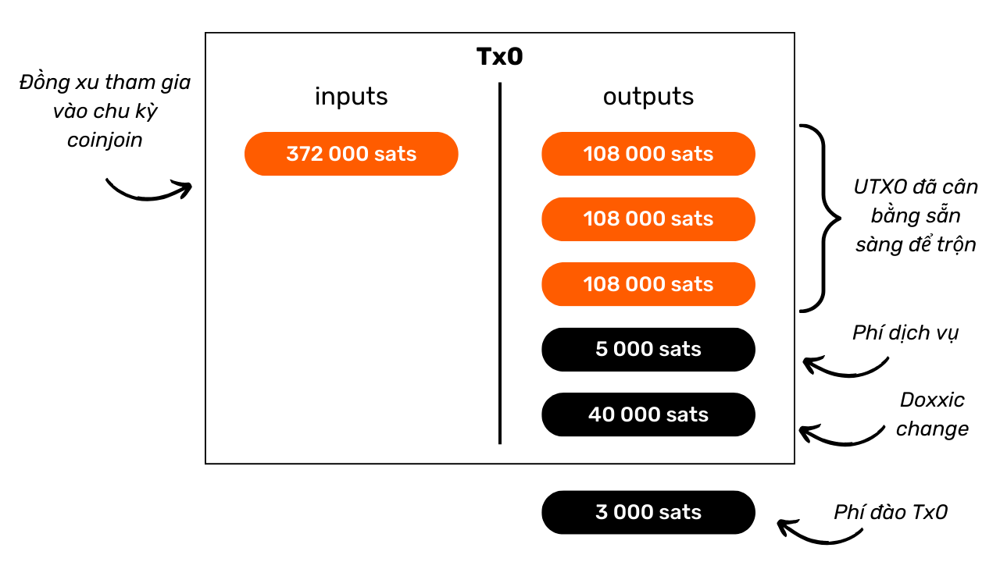

Trong ví dụ này của giao dịch `Tx0`, một đầu vào `372000 satoshi` từ **tài khoản gửi tiền** của chúng ta được chia thành nhiều UTXO đầu ra, được phân bổ như sau:
- Một số tiền `5000 satoshi` dùng để trả phí dịch vụ cho điều phối viên, tương ứng với việc nhập vào pool của `100000 satoshi`;
- 3 UTXO được chuẩn bị cho việc trộn, chuyển hướng đến **tài khoản trước trộn** của chúng ta và đăng ký với điều phối viên. Các UTXO này được cân bằng ở mức `108000 satoshi` mỗi cái, để trang trải phí đào cho lần trộn ban đầu của chúng;
- Số dư thừa không thể nhập vào pool, do quá nhỏ, được coi là số tiền thối độc hại. Nó được chuyển đến tài khoản dành nó. Tại đây, lượng tiền thối này lên đến `40000 satoshi`;
- Cuối cùng, có `3000 satoshi` không tạo thành một đầu ra, nhưng là phí dành cho thợ đào để xác nhận `Tx0`.
Ví dụ, đây là một Tx0 Whirlpool thực tế (không phải của tôi): [edef60744f539483d868caff49d4848e5cc6e805d6cdc8d0f9bdbbaedcb5fc46](https://mempool.space/fr/tx/edef60744f539483d868caff49d4848e5cc6e805d6cdc8d0f9bdbbaedcb5fc46)


### Tiền thối "độc hại"

Lượng tiền dư thừa không thể nhập vào pool, tương đương với `40000 satoshi`, được chuyển hướng đến tài khoản **ngân hàng xấu**, còn được gọi là "tiền thối độc hại," để đảm bảo sự tách biệt nghiêm ngặt từ các UTXO khác trong ví.

UTXO này nguy hiểm cho quyền riêng tư của người dùng vì không chỉ vẫn gắn liền với quá khứ của nó, và do đó có thể gắn với danh tính của chủ sở hữu, mà nó còn được đánh dấu là thuộc về một người dùng đã tham gia vào một giao dịch trộn coin.


Nếu UTXO này được hợp nhất với các đầu ra đã trộn, họ sẽ mất tất cả sự riêng tư đã đạt được trong các chu kỳ trộn coin, đặc biệt là do CIOH (*Common-Input-Ownership-Heuristic*). Nếu nó được hợp nhất với các lượng tiền thối độc hại khác, người dùng có nguy cơ mất quyền riêng tư vì điều này sẽ liên kết các đợt nhập khác nhau từ các chu kỳ trộn coin. Do đó, nó phải được xử lý cẩn thận. Chúng tôi sẽ nói chi tiết hơn về quản lý các UTXO độc hại này trong phần cuối của chương này.

### Lần trộn ban đầu

Sau khi `Tx0` hoàn thành, các UTXO được cân bằng sẽ được gửi đến tài khoản **trước trộn** của ví chúng ta, sẵn sàng được đưa vào vào chu kỳ trộn coin đầu tiên của chúng, còn được gọi là "đợt trộn ban đầu." Nếu, như trong ví dụ của chúng ta, `Tx0` tạo ra nhiều UTXO dành cho việc trộn, mỗi UTXO sẽ được tích hợp vào một đợt trộn ban đầu riêng biệt.

Kết thúc những đợt trộn ban đầu này, tài khoản **trước trộn** sẽ trống, trong khi đồng tiền của chúng ta, sau khi đã trả phí đào cho giao dịch trộn coin ban đầu này, sẽ được điều chỉnh chính xác theo số lượng được xác định bởi pool đã chọn. Trong ví dụ của chúng ta, UTXO ban đầu của chúng ta là `108000 satoshi` sẽ được giảm xuống chính xác còn `100000 satoshi`.


### Các lần trộn Lại
Sau lần trộn đầu tiên, các UTXO được chuyển đến tài khoản **sau trộn**. Tài khoản này tập hợp cả các UTXO đã được trộn và những UTXO đang chờ được trộn lại. Khi khách hàng Whirlpool hoạt động, các UTXO trong tài khoản **sau trộn** tự động sẵn sàng cho việc trộn lại và sẽ được chọn ngẫu nhiên để tham gia vào các chu kỳ trộn mới.
Bạn cần lưu ý rằng, các lần trộn lại sau đó là miễn phí 100%: không yêu cầu thêm phí dịch vụ hoặc phí đào. Do đó, giá trị các UTXO trong tài khoản **sau trộn** không đổi và đồng thời cải thiện tập hợp ẩn danh của họ. Đó là lý do tại sao việc cho phép những đồng tiền này tham gia vào nhiều chu kỳ trộn coin lại là điều quan trọng. Nó không tốn của bạn bất cứ điều gì, và nó tăng cấp độ ẩn danh của chúng.
Khi bạn quyết định chi tiêu các UTXO đã được trộn lẫn, bạn có thể làm điều này trực tiếp từ tài khoản **sau trộn** của mình. Người dùng khuyến nghị giữ các UTXO đã trộn trong tài khoản này để hưởng lợi từ việc tái trộn miễn phí và để ngăn chúng rời khỏi chu trình Whirlpool, điều này có thể làm giảm quyền riêng tư của chúng.

### Làm thế nào để quản lý tài khoản sau trộn một cách đúng đắn?

Sau khi thực hiện các chu kỳ trộn coin, chiến lược tốt nhất là giữ các UTXO của bạn trong tài khoản **sau trộn**, cho đến khi bạn sử dụng chúng trong tương lai. Thậm chí được khuyến nghị để chúng được trộn lại vô thời hạn cho đến khi bạn cần chi tiêu chúng.

Một số người dùng có thể xem xét việc chuyển các bitcoin đã trộn của họ vào một ví cứng. Điều này là khả thi, nhưng quan trọng là phải theo sát các khuyến nghị của Samourai Wallet để không làm tổn hại đến sự bảo mật đã đạt được.

Việc kết hợp các UTXO là lỗi thường gặp nhất. Cần tránh kết hợp các UTXO đã trộn với các UTXO chưa trộn trong cùng một giao dịch, để tránh CIOH. Điều này đòi hỏi quản lý cẩn thận các UTXO của bạn trong ví, đặc biệt là về việc gắn nhãn.


Một điều nữa cũng rất quan trọng là phải cẩn thận khi tổng hợp các UTXO đã trộn với nhau. Việc hợp nhất vừa phải là có thể xem xét nếu các UTXO đã trộn của bạn có tập hợp ẩn danh đáng kể, nhưng điều này sẽ không tránh khỏi làm giảm bảo mật các đồng tiền của bạn. Đảm bảo rằng việc hợp nhất không quá đáng kể hoặc thực hiện sau một số lượng lần tái trộn không đủ, với rủi ro thiết lập các liên kết có thể suy luận giữa các UTXO của bạn trước và sau các chu kỳ trộn coin. Trong trường hợp nghi ngờ về những thao tác này, cách tốt nhất là không hợp nhất các UTXO sau trộn, và chuyển chúng từng cái một vào ví cứng của bạn, tạo một địa chỉ trắng mới mỗi lần. Một lần nữa, nhớ gắn nhãn đúng cách cho mỗi UTXO nhận được.
Người dùng cũng được khuyến cáo không chuyển các UTXO sau trộn của mình vào một ví sử dụng các script không phổ biến. Ví dụ, nếu bạn nhập Whirlpool từ một ví đa chữ ký sử dụng kịch bản `P2WSH`, bạn chỉ có một cơ hội nhỏ bạn sẽ được trộn lẫn với những người dùng khác có cùng loại ví ban đầu. Nếu bạn rút các UTXO sau trộn của mình về cùng một ví đa chữ ký đó, mức độ riêng tư của các bitcoin đã trộn của bạn sẽ bị giảm đáng kể. Ngoài script, có nhiều dấu vân tay ví khác có thể làm bạn nhầm lẫn.
Như với bất kỳ giao dịch Bitcoin nào, không sử dụng lại các địa chỉ nhận cũng là điều rất quan trọng. Mỗi giao dịch mới nên được nhận trên một địa chỉ trắng mới.

Giải pháp đơn giản và an toàn nhất là để các UTXO đã trộn của bạn nghỉ ngơi trong tài khoản **sau trộn** để chúng được tái trộn và chỉ chạm vào chúng khi cần chi tiêu. Ví Samourai và Sparrow có thêm các biện pháp bảo vệ chống lại tất cả những rủi ro liên quan đến phân tích chuỗi. Những biện pháp bảo vệ này giúp bạn tránh mắc lỗi.

### Làm thế nào để quản lý đúng cách phần tiền thối độc hại của bạn?

Tiếp theo, bạn phải cẩn thận trong việc quản lý tiền thối độc hại của mình, tiền thối không thể nhập vào pool trộn coin. Những UTXO độc hại này, kết quả từ việc sử dụng Whirlpool, đặt ra rủi ro cho quyền riêng tư của bạn vì chúng thiết lập một liên kết giữa bạn và việc sử dụng trộn coin. Do đó, việc xử lý chúng một cách cẩn thận và không kết hợp chúng với các UTXO khác, đặc biệt là các UTXO đã trộn, là điều bắt buộc.

Dưới đây là các chiến lược khác nhau để xem xét sử dụng chúng:
- **Trộn chúng trong các pool hơn:** Nếu UTXO độc hại của bạn đủ lớn để tự mình nhập vào một pool nhỏ hơn, hãy xem xét trộn chúng. Đây thường là lựa chọn tốt nhất. Tuy nhiên, việc kết hợp nhiều UTXO độc hại để truy cập một pool được khuyến cáo không nên, vì điều này có thể liên kết các lần nhập vào pool khác nhau của bạn;
- **Đánh dấu chúng là "không thể tiêu":** Một cách tiếp cận khác là không sử dụng chúng nữa, đánh dấu chúng là "không thể tiêu" trong tài khoản dành riêng cho chúng và chỉ giữ chúng. Điều này đảm bảo bạn không vô tình tiêu chúng. Nếu giá trị của bitcoin tăng, các pool mới phù hợp hơn với các UTXO độc hại của bạn có thể xuất hiện;
- **Làm từ thiện:** Cân nhắc làm từ thiện, ngay cả những đóng góp khiêm tốn, cho các nhà phát triển làm việc trên Bitcoin và phần mềm liên quan. Bạn cũng có thể quyên góp cho các tổ chức chấp nhận bitcoin. Nếu việc quản lý các UTXO độc hại quá phức tạp, bạn có thể đơn giản loại bỏ chúng bằng cách làm từ thiện.
- **Mua thẻ quà tặng:** Các nền tảng như [Bitrefill](https://www.bitrefill.com/) cho phép bạn đổi bitcoin lấy thẻ quà tặng có thể sử dụng tại các nhà bán lẻ khác nhau. Đây có thể là cách để loại bỏ các UTXO độc hại mà không đánh mất giá trị.
- **Hợp nhất chúng trên Monero:** Samourai Wallet cung cấp dịch vụ hoán đổi nguyên tử giữa BTC và XMR. Đây là cách lý tưởng để quản lý các UTXO độc hại bằng cách tập hợp chúng trên Monero, mà không làm mất đi sự riêng tư thông qua KYC, trước khi gửi chúng trở lại Bitcoin. Tuy nhiên, lựa chọn này có thể tốn kém về phí đào và phí phụ trội do hạn chế về thanh khoản.
- **Gửi chúng đến Lightning Network:** Chuyển những UTXO này đến Lightning Network để hưởng lợi từ phí giao dịch giảm là một lựa chọn thú vị. Tuy nhiên, phương pháp này có thể tiết lộ một số thông tin tùy thuộc vào cách bạn sử dụng Lightning Network và do đó nên được thực hiện một cách cẩn thận.

### Cách sử dụng Whirlpool?

Sau vụ bắt giữ các nhà sáng lập của Samourai Wallet và việc tịch thu máy chủ của họ vào ngày 24 tháng 4 năm 2024, công cụ Whirlpool không còn hoạt động, ngay cả đối với những người có Dojo riêng của họ. Trước đó, nó được cung cấp trên Samourai Wallet và Sparrow Wallet.


Tuy nhiên, vẫn có khả năng công cụ này có thể được đưa vào sử dụng trở lại trong những tuần tới, tùy thuộc vào kết quả của các phiên tòa, hoặc được khởi động lại theo một cách khác. Dù sao, tôi tin rằng thị trường trộn coin trên Bitcoin sẽ không tồn tại ở trạng thái không có nhà cung cấp trong một thời gian dài, vì có một nhu cầu rõ ràng về hoạt động này. Hơn nữa, mô hình Whirlpool, là tiên tiến nhất về mặt quyền riêng tư, chắc chắn sẽ được sử dụng trong tương lai trong các ứng dụng khác.

Chúng tôi đang chú ý theo dõi diễn biến của vụ việc này cũng như các công cụ liên quan. Hãy yên tâm rằng chúng tôi sẽ cập nhật khóa học này khi có thông tin mới.

Trong chương tiếp theo, chúng ta sẽ khám phá "tập hợp ẩn danh" là gì, cách các chỉ số này được tính toán, và làm thế nào chúng có thể giúp chúng ta ước lượng được hiệu quả của các chu kỳ trộn coin.

## Các tập hợp ẩn danh - Anonymity Sets
<chapterId>be1093dc-1a74-40e5-9545-2b97a7d7d431</chapterId>

Sau khi nghiên cứu cách trộn coin hoạt động và những thách thức liên quan đến việc trộn hiệu quả, bây giờ chúng ta sẽ học cách đo lường hiệu quả của hoạt động này. Làm thế nào để xác định được mức độ hiệu quả và mức độ ẩn danh mà một đồng tiền đạt được sau quá trình trộn coin? Đây là những gì chúng ta sẽ khám phá trong chương này với các tập hợp ẩn danh hay "anonsets" trong tiếng Anh.

### Nhắc lại về tính hữu dụng của việc trộn coin
Ích lợi của trộn coin nằm ở khả năng tạo ra sự phủ nhận hợp lý bằng cách ngâm đồng tiền của bạn trong một nhóm các đồng tiền không thể phân biệt được. Mục tiêu của hành động này là để phá vỡ các liên kết theo dõi, cả từ quá khứ đến hiện tại và từ hiện tại trở về quá khứ.
Nói cách khác, một nhà phân tích biết giao dịch ban đầu của bạn (`Tx0`) tại điểm nhập của các chu kỳ trộn coin không nên có khả năng xác định chính xác UTXO của bạn tại điểm thoát của các chu kỳ tái pha trộn (phân tích từ điểm tham gia vào chu kỳ đến điểm thoát chu kỳ).
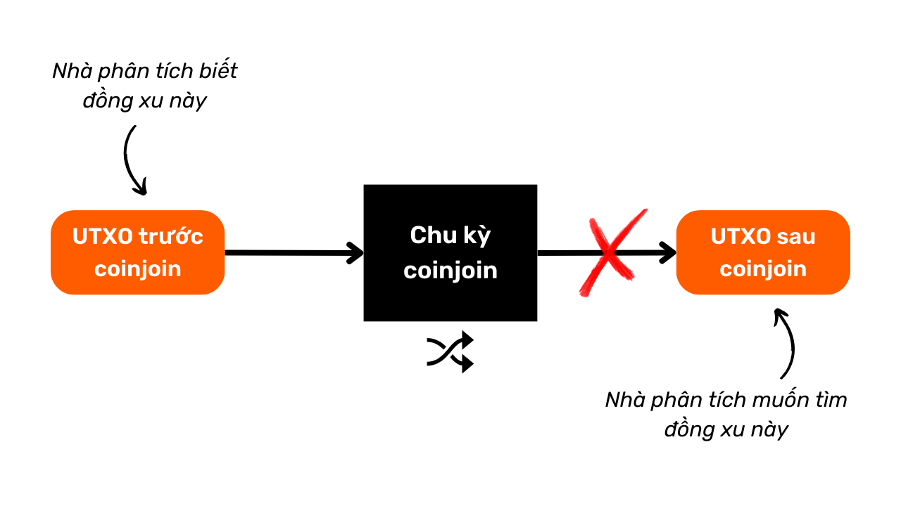

Ngược lại, một nhà phân tích biết UTXO của bạn tại điểm thoát của các chu kỳ trộn coin không nên có khả năng xác định giao dịch gốc tại điểm nhập vào các chu kỳ (phân tích từ điểm thoát chu kỳ đến điểm nhập vào chu kỳ).

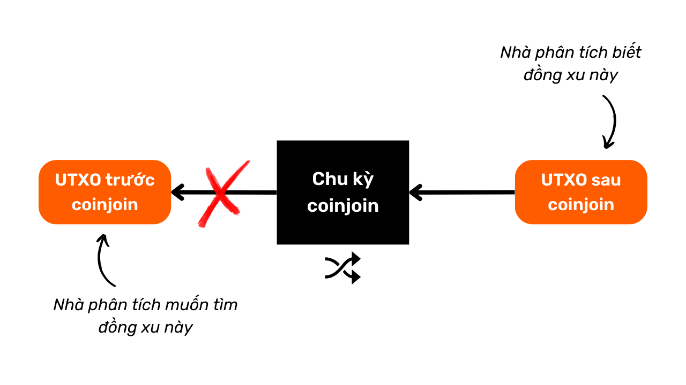

Để đánh giá độ khó cho một nhà phân tích trong việc liên kết quá khứ với hiện tại và ngược lại, cần phải định lượng kích thước của các nhóm đồng coin đồng nhất mà trong đó coin của bạn được ẩn giấu. Thước đo này cho chúng ta biết số lượng phân tích có khả năng tương đương. Ví dụ, nếu phân tích chính xác bị lẫn trong 3 phân tích khác có khả năng bằng nhau, mức độ ẩn giấu của bạn rất thấp. Tuy nhiên, nếu phân tích chính xác nằm trong một tập hợp của 20000 phân tích, tất cả đều có khả năng tương đương, đồng coin của bạn được ẩn giấu rất tốt. Và cụ thể, kích thước của các nhóm này đại diện cho các chỉ số được gọi là "tập hợp ẩn danh".

### Hiểu về tập hợp ẩn danh

Tập hợp ẩn danh là các chỉ số giúp đánh giá mức độ riêng tư của một UTXO cụ thể. Cụ thể hơn, chúng đo lường số lượng các UTXO không thể phân biệt được trong tập hợp bao gồm các đồng coin đang được nghiên cứu. Yêu cầu về một tập hợp UTXO đồng nhất có nghĩa là tập hợp ẩn danh thường được tính toán qua các chu kỳ trộn coin. Việc sử dụng các chỉ số này đặc biệt liên quan đến trộn coin Whirlpool do tính đồng nhất của chúng.

Tập hợp ẩn danh cho phép, khi cần thiết, đánh giá chất lượng của các trộn coin. Một kích thước tập hợp ẩn danh lớn biểu thị một mức độ ẩn danh cao, vì nó trở nên khó khăn để phân biệt một UTXO cụ thể trong tập hợp đồng nhất.

Có 2 loại tập hợp ẩn danh:
- **Tập hợp ẩn danh tương lai;**
- **Tập hợp ẩn danh hồi tưởng.**

### Tập hợp ẩn danh tương lai

Tập hợp ẩn danh tương lai chỉ ra kích thước của nhóm mà UTXO đang được nghiên cứu được ẩn giấu tại điểm thoát của chu kỳ, biết UTXO tại điểm nhập, tức là số lượng đồng coin không thể phân biệt được hiện diện trong nhóm này. Trong tiếng Anh, tên của chỉ số này là "forward anonset", hoặc "forward-looking metrics".
Chỉ số này cho phép đo lường khả năng chống lại việc phân tích từ quá khứ đến hiện tại (từ đầu vào đến đầu ra).
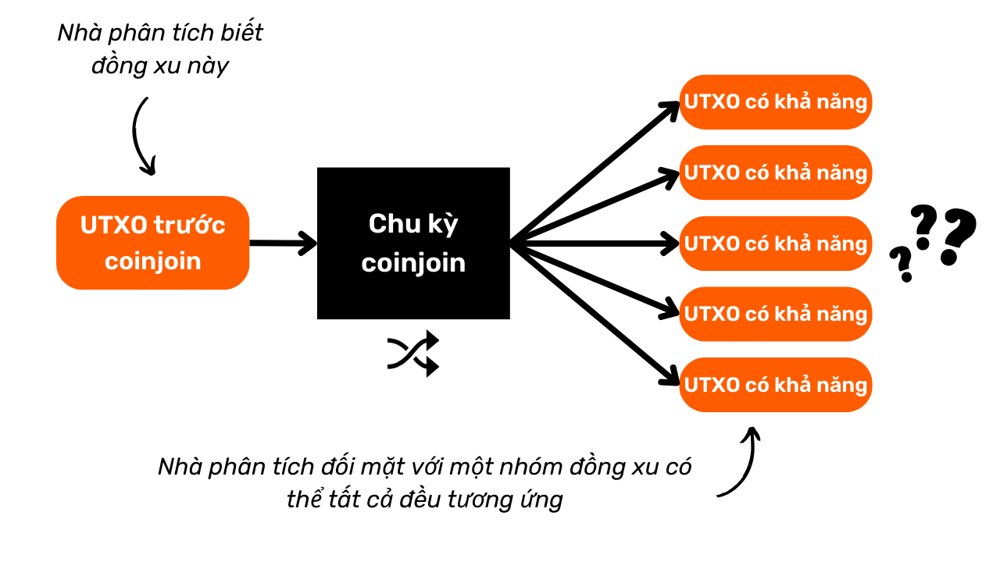

Chỉ số này ước lượng mức độ UTXO của bạn được bảo vệ khỏi các nỗ lực tái tạo lịch sử của nó từ điểm nhập vào đến điểm thoát ra trong quá trình trộn coin.

Ví dụ, nếu giao dịch của bạn tham gia vào chu kỳ trộn coin đầu tiên và hai chu kỳ con cháu bổ sung được hoàn thành, tập hợp ẩn danh tương lai của coin của bạn sẽ là `13`:


Ví dụ, hãy tưởng tượng rằng đồng coin của chúng ta tại điểm nhập của chu kỳ trộn coin được hưởng một tập hợp ẩn danh tương lai của `86,871`. Thực tế, điều này có nghĩa là nó được ẩn giấu trong số `86,871` đồng coin (mẫu coin) không thể phân biệt được. Đối với một quan sát viên bên ngoài biết về đồng coin này tại điểm bắt đầu của các chu kỳ trộn coin và cố gắng truy tìm điểm thoát của nó, họ sẽ đối mặt với `86,871` UTXO khả dĩ, mỗi UTXO có một xác suất giống nhau được tìm thấy.

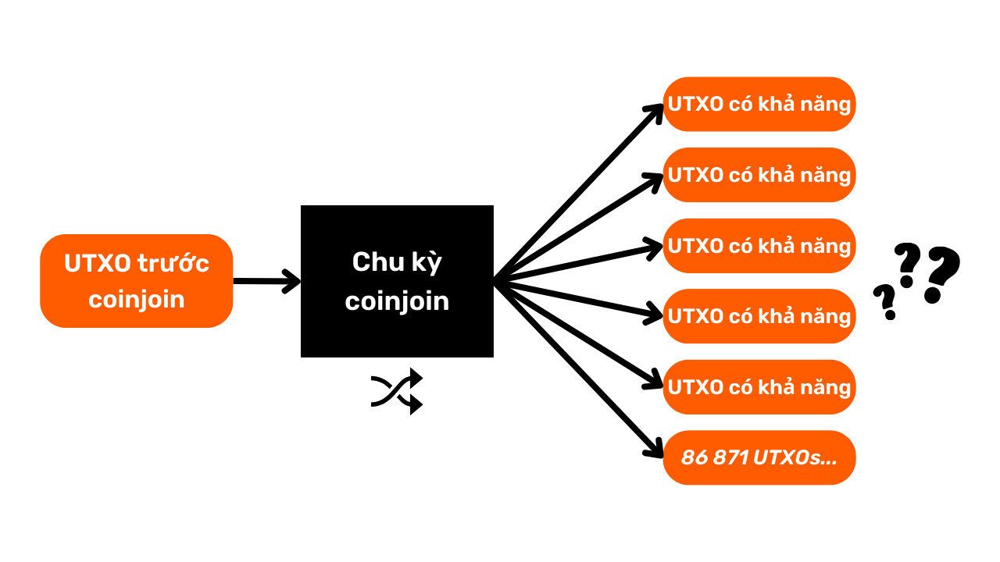

### Tập hợp ẩn danh hồi tưởng
Chỉ số tập hợp ẩn danh hồi tưởng chỉ ra số lượng nguồn có thể có cho một đồng tiền cụ thể, biết UTXO tại điểm thoát của chu kỳ. Chỉ số này đo lường khả năng chống lại việc phân tích từ hiện tại về quá khứ (từ điểm thoát đến điểm nhập) của đồng tiền, tức là mức độ khó khăn cho một nhà phân tích khi truy vết nguồn gốc của đồng tiền của bạn, trước các chu kỳ trộn coin. Trong tiếng Anh, tên của chỉ số này là "backward anonset," hoặc "backward-looking metrics."
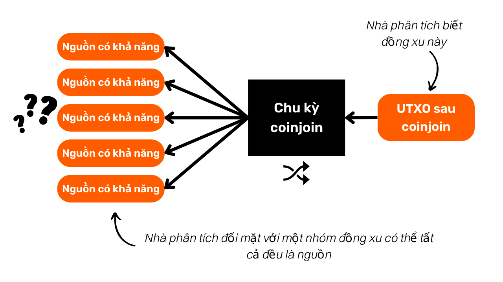

Biết UTXO của bạn tại điểm thoát của các chu kỳ, tập hợp ẩn danh hồi tưởng xác định số lượng giao dịch Tx0 tiềm năng có thể đã tạo thành điểm nhập của bạn vào các chu kỳ trộn coin. Trong sơ đồ dưới đây, điều này tương ứng với tổng số của tất cả các bong bóng màu cam.


Ví dụ, hãy tưởng tượng rằng đồng tiền của chúng ta tại điểm thoát của chu kỳ trộn coin hưởng lợi từ một tập hợp ẩn danh hồi tưởng là `42,185`. Thực tế, điều này có nghĩa là có `42,185` nguồn tiềm năng cho UTXO này. Nếu một quan sát viên bên ngoài xác định đồng tiền này tại cuối các chu kỳ và tìm cách truy vết nguồn gốc của nó, họ sẽ đối mặt với `42,185` nguồn khả dĩ, tất cả đều có xác suất như nhau là nguồn gốc đang được tìm kiếm.

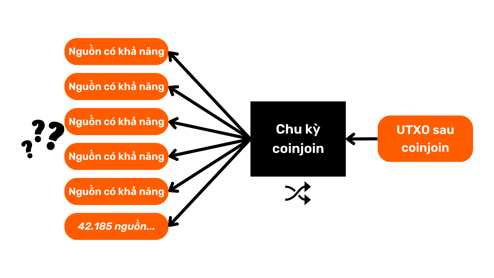

### Làm thế nào để tính toán tập hợp ẩn danh một cách cụ thể?
Có thể tính toán tập hợp ẩn danh của một UTXO bằng cách sử dụng một trình duyệt khối cho các tập hợp ẩn danh nhỏ. Tuy nhiên, đối với các tập hợp ẩn danh lớn hơn, việc sử dụng một công cụ chuyên biệt trở nên cần thiết. Theo kiến thức của tôi, phần mềm duy nhất có khả năng thực hiện nhiệm vụ này là *Whirlpool Stats Tool*, một công cụ Python được phát triển bởi các đội ngũ tại Samourai và OXT. Thật không may, công cụ được dùng để trích xuất dữ liệu từ blockchain này hiện đang ngừng hoạt động sau vụ bắt giữ các nhà sáng lập của Samourai và việc ngừng hoạt động của OXT.


Như chúng ta đã thấy trong chương này, tập hợp ẩn danh chỉ có thể được tính toán nếu có một sự đồng nhất nhất định trong cấu trúc của các hoạt động trộn coin. Và chính xác, trong chương tiếp theo, chúng ta sẽ khám phá cách định lượng sự đồng nhất này trong một giao dịch Bitcoin, dù đó là một giao dịch trộn coin hay một giao dịch truyền thống hơn.

## Entropy
<chapterId>e4fe289d-618b-49a2-84c9-68c562e708b4</chapterId>

Như chúng ta đã thấy trong phần này về trộn coin, sự đồng nhất của các UTXO trong đầu vào và đầu ra đóng một vai trò quan trọng trong việc cải thiện tính bảo mật của một giao dịch Bitcoin. Tham số này cho phép chống lại phân tích chuỗi một cách khéo léo. Có một số phương pháp có thể đo lường sự đồng nhất này, nhưng theo ý kiến của tôi, một trong những phương pháp hiệu quả nhất là sử dụng các chỉ số được cung cấp bởi công cụ *Boltzmann*, được phát triển bởi các đội ngũ tại OXT và Samourai Wallet, đặc biệt là entropy của giao dịch. Đây là điều chúng ta sẽ nghiên cứu chi tiết trong chương này.

Khác với tập hợp ẩn danh, được tính toán trên một tập hợp các giao dịch, các chỉ số mà chúng ta sẽ trình bày ở đây tập trung duy nhất vào một giao dịch duy nhất, dù đó là một giao dịch trộn coin hay một giao dịch truyền thống hơn.

### Số lượng các cách diễn giải
Dấu hiệu đầu tiên có thể quan sát được trong một giao dịch Bitcoin là tổng số lượng các cách diễn giải có thể có trong mắt của một người quan sát bên ngoài khi phân tích giao dịch. Xét đến giá trị của các UTXO tham gia trong giao dịch, dấu hiệu này chỉ ra số cách mà các đầu vào có thể được liên kết với các đầu ra. Nói cách khác, nó xác định số lượng những cách diễn giải khả dĩ mà một giao dịch có thể tạo ra trong dòng chảy của bitcoin từ góc độ của một người quan sát bên ngoài đang phân tích nó.

Ví dụ, một giao dịch thanh toán đơn giản với 1 đầu vào và 2 đầu ra chỉ có một cách diễn giải, đó là đầu vào #0 tài trợ cho đầu ra #0 và đầu ra #1. Không có cách diễn giải nào khác khả dĩ nữa:


Ngược lại, một giao dịch trộn coin được cấu trúc theo mô hình Whirlpool 5x5 thể hiện 1,496 sự kết hợp khả dĩ:


Một giao dịch trộn coin theo mô hình Whirlpool Surge Cycle 8x8 thể hiện 9,934,563 cách diễn giải khả dĩ:


### Entropy

Từ số lượng các cách diễn giải của một giao dịch Bitcoin, chúng ta có thể tính toán entropy của nó.

Trong mật mã học và công nghệ thông tin, entropy là một thước đo định lượng về sự không chắc chắn hoặc khó dự đoán liên quan đến một nguồn dữ liệu hoặc một quá trình ngẫu nhiên. Nói cách khác, entropy là một cách để đo lường mức độ khó dự đoán hoặc đoán thông tin.

Trong bối cảnh cụ thể của phân tích chuỗi, entropy cũng là tên của một chỉ số, được suy ra từ entropy Shannon và [được phát minh bởi LaurentMT](https://gist.github.com/LaurentMT/e758767ca4038ac40aaf), có thể được tính toán trên một giao dịch Bitcoin.

Khi một giao dịch thiể hiện một số lượng lớn các cách diễn giải khả dĩ thì tham chiếu đến entropy của nó thường là cách phù hợp hơn. Chỉ số này cho phép đo lường sự thiếu hiểu biết của các nhà phân tích về cấu hình chính xác của giao dịch. Nói cách khác, entropy càng cao, nhiệm vụ xác định dòng chảy của bitcoin giữa các đầu vào và đầu ra trở nên khó khăn hơn đối với các nhà phân tích.

Trên thực tế, entropy tiết lộ liệu, từ góc độ của một người quan sát bên ngoài, một giao dịch có nhiều cách diễn giải khả dĩ hay không, chỉ dựa trên số lượng của đầu vào và đầu ra, mà không xem xét các mô hình và phép suy luận bên ngoài hoặc bên trong khác. Do đó, entropy cao đồng nghĩa với sự bảo mật tốt hơn cho giao dịch.

Entropy được định nghĩa là logarit nhị phân của số lượng cách diễn giải khả dĩ. Đây là công thức được sử dụng với E là entropy của giao dịch và C là số lượng cách diễn giải khả dĩ:

$$
E = \log_2(C)
$$

Trong toán học, logarit nhị phân (logarit cơ số 2) tương ứng với phép toán ngược của việc lũy thừa 2. Nói cách khác, logarit nhị phân của x là số mũ mà 2 phải được nâng lên để thu được x. Chỉ số này do đó được biểu thị bằng bit.

Hãy lấy ví dụ về việc tính entropy cho một giao dịch trộn coin được cấu trúc theo mô hình Whirlpool 5x5, mà, như đã đề cập trong phần trước, thể hiện cho 1,496 cách diễn giải khả dĩ:

$$
\begin{align*}
C &= 1,496 \\
E &= \log_2(1,496) \\
E &= 10.5469 \text{ bit}
\end{align*}
$$
Như vậy, giao dịch trộn coin này hiển thị một entropy của 10.5469 bit, được coi là rất thỏa đáng. Giá trị này càng cao, giao dịch càng có nhiều cách diễn giải khả dĩ, do đó tăng cường mức độ riêng tư của nó.
Đối với một giao dịch trộn coin 8x8 có 9,934,563 cách diễn giải khả dĩ, entropy sẽ là:
$$
\begin{align*}
C &= 9,934,563 \\
E &= \log_2(9,934,563) \\
E &= 23.244 \text{ bit}
\end{align*}
$$

Hãy xem xét một ví dụ khác với một giao dịch thanh toán tiêu chuẩn, có 1 đầu vào và 2 đầu ra: [1b1b0c3f0883a99f1161c64da19471841ed12a1f78e77fab128c69a5f578ccce](https://mempool.space/tx/1b1b0c3f0883a99f1161c64da19471841ed12a1f78e77fab128c69a5f578ccce)


Trong trường hợp của giao dịch này, chỉ có một cách diễn giải duy nhất là: `(In.0) > (Out.0 ; Out.1)`. Do đó, entropy của nó được xác định là 0:

$$
\begin{align*}
C &= 1 \\
E &= \log_2(1) \\
E &= 0 \text{ bit}
\end{align*}
$$

### Hiệu quả

Từ entropy của giao dịch, chúng ta cũng có thể tính toán hiệu quả của nó về mặt quyền riêng tư. Chỉ số này đánh giá hiệu quả của giao dịch bằng cách so sánh nó với giao dịch lý tưởng nhất có thể trong một cấu hình giống nhau.

Điều này dẫn chúng ta đến khái niệm về entropy tối đa, tương ứng với entropy cao nhất mà một cấu trúc giao dịch cụ thể có thể đạt được về lý thuyết. Hiệu quả của giao dịch sau đó được tính toán bằng cách đối chiếu entropy tối đa này với entropy thực tế của giao dịch được phân tích.

Công thức được sử dụng như sau với:
- E_R: entropy thực tế của giao dịch được biểu thị bằng bit;
- E_M: entropy tối đa có thể có cho một cấu trúc giao dịch cũng được biểu thị bằng bit;
- Ef: hiệu quả của giao dịch được biểu thị bằng bit:

$$
Ef = E_R - E_M
$$

Ví dụ, đối với một cấu trúc trộn coin loại Whirlpool 5x5, entropy tối đa là 10.5469:

$$
\begin{align*}
E_R &= 10.5469 \\
E_M &= 10.5469 \\
Ef &= E_R - E_M \\
Ef &= 10.5469 - 10.5469 \\
Ef &= 0 \text{ bit}
\end{align*}
$$

Chỉ số này cũng được biểu thị dưới dạng phần trăm. Công thức được sử dụng như sau với:
- C_R: số lượng cách diễn giải thực tế có thể có;
- C_M: số lượng cách diễn giải tối đa có thể có với cùng một cấu trúc;
- Ef: hiệu quả được biểu thị dưới dạng phần trăm:

$$
\begin{align*}
E_f &= \frac{C_R}{C_M} \\
E_f &= \frac{1\,496}{1\,496} \\
E_f &= 100\%
\end{align*}
$$

Một hiệu quả của 100\% do đó chỉ ra rằng giao dịch đã đạt tới tối đa tiềm năng về quyền riêng tư dựa trên cấu trúc của nó.

### Mật độ Entropy

Entropy là một chỉ số tốt để đo lường quyền riêng tư của một giao dịch, nhưng nó phụ thuộc một phần vào số lượng đầu vào và đầu ra trong giao dịch. Để so sánh entropy của 2 giao dịch khác nhau không có cùng số lượng đầu vào và đầu ra, người ta có thể tính toán mật độ entropy. Chỉ số này cung cấp một cái nhìn về entropy tương đối với mỗi đầu vào hoặc đầu ra của giao dịch. Mật độ entropy được chứng minh là hữu ích để đánh giá và so sánh hiệu quả của các giao dịch có kích thước khác nhau.
Để tính toán, chỉ cần chia tổng entropy của giao dịch cho tổng số lượng đầu vào và đầu ra tham gia vào giao dịch:
- E_D: mật độ entropy được biểu thị bằng bit;
- E: entropy của giao dịch được biểu thị bằng bit;
- T: tổng số lượng đầu vào và đầu ra trong giao dịch:

$$
E_D = \frac{E}{T}
$$

Hãy lấy ví dụ về một giao dịch trộn coin Whirlpool 5x5:

$$
\begin{align*}
T &= 5 + 5 = 10 \\
E &= 10.5469 \\
E_D &= \frac{E}{T} \\
E_D &= \frac{10.5469}{10} \\
E_D &= 1.054 \text{ bit}
\end{align*}
$$

Hãy cũng tính mật độ entropy của một giao dịch trộn coin Whirlpool 8x8:

$$
\begin{align*}
T &= 8 + 8 = 16 \\
E &= 23.244 \\
E_D &= \frac{E}{T} \\
E_D &= \frac{23.244}{16} \\
E_D &= 1.453 \text{ bit}
\end{align*}
$$

Bằng cách phân tích mật độ entropy của hai giao dịch trộn coin này, rõ ràng là, ngay cả khi chuẩn hóa entropy theo số lượng phần tử, trộn coin "Surge Cycle 8x8" tạo ra nhiều sự không chắc chắn hơn cho việc phân tích.

### Điểm Boltzmann
Một thông tin khác được phân tích trong một giao dịch là điểm Boltzmann của mỗi phần tử so với phần tử khác. Đây là bảng các xác suất tương ứng giữa các đầu vào và đầu ra. Bảng này chỉ ra, thông qua điểm Boltzmann, xác suất có điều kiện mà một đầu vào cụ thể được liên kết với một đầu ra nhất định. Do đó, đây là một biện pháp định lượng của xác suất có điều kiện mà một sự kết hợp giữa một đầu vào và một đầu ra trong một giao dịch xảy ra, dựa trên tỷ lệ số lượng sự kiện ưa thích so với tổng số lượng sự kiện có thể xảy ra, trong một tập hợp các cách diễn giải.
Lấy ví dụ về một giao dịch trộn coin Whirlpool, bảng xác suất có điều kiện sẽ làm nổi bật cơ hội của một liên kết giữa mỗi đầu vào và đầu ra, cung cấp một biện pháp định lượng về sự mơ hồ của các kết hợp trong giao dịch:

| %       | Đầu ra 0 | Đầu ra 1 | Đầu ra 2 | Đầu ra 3 | Đầu ra 4 |
| ------- | -------- | -------- | -------- | -------- | -------- |
| Đầu vào 0 | 34%      | 34%      | 34%      | 34%      | 34%      |
| Đầu vào 1 | 34%      | 34%      | 34%      | 34%      | 34%      |
| Đầu vào 2 | 34%      | 34%      | 34%      | 34%      | 34%      |
| Đầu vào 3 | 34%      | 34%      | 34%      | 34%      | 34%      |
| Đầu vào 4 | 34%      | 34%      | 34%      | 34%      | 34%      |

Ở đây, rõ ràng mỗi đầu vào có cơ hội ngang nhau được liên kết với bất kỳ đầu ra nào, điều này tăng cường tính bảo mật của giao dịch.

Việc tính toán điểm Boltzmann bao gồm việc chia số lượng các cách diễn giải mà một sự kiện nhất định biểu hiện bởi tổng số lượng cách diễn giải có sẵn. Do đó, để xác định điểm liên kết đầu vào #0 với đầu ra #3 (một sự kiện có mặt trong 512 cách diễn), quy trình như sau:

$$
\begin{align*}
\text{Số lượng cách diễn giải (IN.0 > OUT.3)} &= 512 \\
\text{Tổng số cách diễn giải} &= 1496 \\
\text{Điểm số} &= \frac{512}{1496} \\
\text{Điểm số} &= 34\%
\end{align*}
$$

Nếu chúng ta xem xét lại ví dụ về một chu trình trộn coin Whirlpool Surge Cycle 8x8, bảng Boltzmann sẽ trông như sau:

|       | OUT.0 | OUT.1 | OUT.2 | OUT.3 | OUT.4 | OUT.5 | OUT.6 | OUT.7 |
|-------|-------|-------|-------|-------|-------|-------|-------|-------|
| IN.0  | 23%   | 23%   | 23%   | 23%   | 23%   | 23%   | 23%   | 23%   |
| IN.1  | 23%   | 23%   | 23%   | 23%   | 23%   | 23%   | 23%   | 23%   |
| IN.2  | 23%   | 23%   | 23%   | 23%   | 23%   | 23%   | 23%   | 23%   |
| IN.3  | 23%   | 23%   | 23%   | 23%   | 23%   | 23%   | 23%   | 23%   |
| IN.4  | 23%   | 23%   | 23%   | 23%   | 23%   | 23%   | 23%   | 23%   |
| IN.5  | 23%   | 23%   | 23%   | 23%   | 23%   | 23%   | 23%   | 23%   |
| IN.6  | 23%   | 23%   | 23%   | 23%   | 23%   | 23%   | 23%   | 23%   |
| IN.7  | 23%   | 23%   | 23%   | 23%   | 23%   | 23%   | 23%   | 23%   |

Tuy nhiên, trong trường hợp của một giao dịch đơn giản bao gồm một đầu vào và 2 đầu ra, tình hình sẽ khác:

| %       | Đầu ra 0 | Đầu ra 1 |
|---------|----------|----------|
| Đầu vào 0 | 100%     | 100%     |

Ở đây, chúng ta quan sát thấy rằng xác suất cho mỗi đầu ra xuất phát từ đầu vào #0 là 100%. Do đó, một xác suất thấp hơn thể hiện quyền riêng tư lớn hơn bằng cách làm loãng các liên kết trực tiếp giữa các đầu vào và đầu ra.

### Liên kết tất định

Cũng có thể tính toán số lượng liên kết tất định trong một giao dịch. Chỉ số này tiết lộ bao nhiêu kết nối giữa các đầu vào và đầu ra trong giao dịch được phân tích là không thể chối cãi, với xác suất 100%. Chỉ số này sau đó có thể được bổ sung bằng cách tính toán tỷ lệ của các liên kết tất. Tỷ lệ cung cấp một cái nhìn về trọng lượng của những liên kết định rõ này trong tất cả các liên kết của giao dịch.
Ví dụ, một giao dịch trộn coin kiểu Whirlpool không hiển thị mối liên kết tất định giữa các đầu vào và đầu ra, do đó hiển thị chỉ số là 0 liên kết và tỷ lệ là 0%. Ngược lại, trong giao dịch thanh toán đơn giản thứ hai của chúng ta được kiểm tra (với một đầu vào và 2 đầu ra), chỉ số cho chúng ta biết rằng có 2 liên kết tất định và tỷ lệ đạt 100%. Do đó, một chỉ số bằng không báo hiệu quyền riêng tư xuất sắc do không có kết nối trực tiếp và không thể chối cãi giữa các đầu vào và đầu ra.
### Làm thế nào để tính toán các chỉ số này?
Việc tính toán các chỉ số này một cách thủ công sử dụng các phương trình tôi đã cung cấp là tương đối đơn giản. Khó khăn chính nằm ở việc xác định số lượng cách diễn giải khả dĩ của một giao dịch. Đối với một giao dịch tiêu chuẩn, việc tính toán này có thể được thực hiện bằng tay. Tuy nhiên, đối với một giao dịch trộn coin, nhiệm vụ này phức tạp hơn nhiều.

Trước đây, có một công cụ Python có tên là _Boltzmann Calculator_, được phát triển bởi các đội ngũ tại OXT và Samourai, cho phép tính toán tự động tất cả các chỉ số này của một giao dịch Bitcoin:


Cũng có thể sử dụng trang web KYCP.org cho các phân tích này:


Thật không may, sau vụ bắt giữ các nhà sáng lập của Samourai, các công cụ này hiện không còn hoạt động.

Bây giờ chúng ta đã thảo luận chi tiết về trộn coin, chúng ta sẽ khám phá các kỹ thuật bảo mật khác có sẵn trên Bitcoin trong phần cuối cùng của khóa đào tạo này. Chúng ta sẽ xem xét payjoins, các loại giao dịch cụ thể giả trộn coin, các giao thức địa chỉ tĩnh, cũng như các biện pháp nhằm tăng cường quyền riêng tư không ở cấp độ giao dịch mà ở cấp độ mạng lưới các nốt.

# Hiểu biết về các kỹ thuật bảo mật nâng cao khác
<partId>19989ae6-d608-4acf-b698-2cf1e7e5e6ae</partId>

## Các giao dịch Payjoin
<chapterId>c1e90b95-f709-4574-837b-2ec26b11286f</chapterId>

Trộn coin đại diện cho phương pháp hiệu quả nhất để đưa sự không chắc chắn vào việc truy vết tiền trong quá trình phân tích chuỗi. Như chúng ta đã thấy trong các chương trước, để đạt được việc trộn hiệu quả, các đầu vào và đầu ra cần phải càng đồng nhất càng tốt. Hơn nữa, việc tiền được tích hợp vào một nhóm lớn càng nhiều càng tốt để tối đa hóa các tập hợp ẩn danh là rất quan trọng. Do đó, để trộn coin được hiệu quả, chúng phải liên quan đến một số lượng lớn các đồng coin đồng nhất. Điều này đòi hỏi các giao dịch trộn coin có một cấu trúc rất cứng nhắc: số lượng được xác định trước, và tất cả các bên tham gia phải tuân thủ chúng để đảm bảo sự đồng nhất của quá trình. Ngoài ra, trộn coin yêu cầu sự đồng bộ giữa tất cả các bên tham gia và điều phối viên trong quá trình xây dựng giao dịch.
Những yêu cầu này làm cho trộn coin không phù hợp cho các khoản thanh toán trực tiếp. Ví dụ, nếu bạn sở hữu một mảnh 1 triệu satoshi trong một pool trộn coin, việc sử dụng nó trực tiếp cho một khoảnthanh toán sẽ phức tạp. Điều này sẽ yêu cầu sự đồng bộ với các bên tham gia khác và điều phối viên để xây dựng giao dịch hợp tác chính xác vào thời điểm bạn cần thực hiện thanh toán, và số tiền mua phải chính xác bằng giá trị của mảnh bitcoin đó của bạn, điều này thực tế là không thể đạt được. Do đó, một giao dịch trộn coin theo bản chất là một giao dịch sweeping hợp tác, có nghĩa là thường là cùng một chủ sở hữu của các đầu vào được tìm thấy trong các đầu ra.
Tuy nhiên, sẽ thú vị khi có các cấu trúc giao dịch cho phép thực hiện thanh toán thực tế trong khi vẫn mang lại sự hoài nghi trong phân tích chuỗi. Đây chính xác là những gì chúng ta sẽ khám phá trong chương này và chương tiếp theo.

### Giao dịch Payjoin là gì?

Payjoin là một cấu trúc giao dịch Bitcoin cụ thể nhằm giúp tăng cường quyền riêng tư của người dùng trong quá trình chi tiêu bằng cách hợp tác với người nhận thanh toán.
Vào năm 2015, LaurentMT lần đầu tiên đề cập đến phương pháp này dưới tên gọi "giao dịch giấu thông tin" (*steganographic transactions*), theo một tài liệu có thể truy cập [tại đây](https://gist.githubusercontent.com/LaurentMT/e758767ca4038ac40aaf/raw/c8125f6a3c3d0e90246dc96d3b603690ab6f1dcc/gistfile1.txt). Kỹ thuật này sau đó được Samourai Wallet áp dụng, và vào năm 2018, đây là ứng dụng đầu tiên triển khai nó với công cụ Stowaway. Khái niệm về payjoin cũng được tìm thấy trong [BIP79](https://github.com/bitcoin/bips/blob/master/bip-0079.mediawiki) và [BIP78](https://github.com/bitcoin/bips/blob/master/bip-0078.mediawiki). Một số thuật ngữ được sử dụng để chỉ định payjoin:
- Payjoin;
- Stowaway;
- P2EP (*Pay-to-End-Point*);
- Giao dịch giấu thông tin.

Đặc điểm của payjoin nằm ở khả năng tạo ra một giao dịch trông bình thường ở cái nhìn đầu tiên, nhưng thực tế là một giao dịch trộn coin nhỏ giữa hai người. Để làm được điều này, cấu trúc giao dịch sẽ bao gồm người nhận thanh toán trong các đầu vào cùng với người gửi thực sự. Người nhận do đó đính kèm một khoản thanh toán cho chính họ ở giữa giao dịch, cho phép họ được thanh toán.

Hãy lấy một ví dụ để hiểu rõ hơn về quy trình này. Alice mua một ổ bánh mì ba-tê với giá 4,000 satoshi sử dụng một UTXO chứa 10,000 satoshi và chọn payjoin. Người bán bánh mì của cô, Bob, thêm một UTXO chứa 15,000 satoshi thuộc về anh ấy vào đầu vào, và anh ấy sẽ thu hồi hoàn toàn trong đầu ra, ngoài ra còn có 4,000 satoshi của Alice.


Trong ví dụ này, Bob người bán bánh mì nhập vào 15,000 satoshi và ra với 19,000 satoshi, sự khác biệt chính xác là 4,000 satshi, đó là giá của chiếc bánh mì. Về phía Alice, cô ấy nhập vào với 10,000 satoshi và kết thúc nhận được 6,000 satoshi trong đầu ra, đại diện cho một sự cân bằng của -4,000 satoshi, tức là giá của chiếc bánh mì. Để đơn giản hóa ví dụ, tôi đã cố ý bỏ qua phí đào trong giao dịch này.

### Mục đích của payjoin là gì?

Giao dịch payjoin đạt được hai mục tiêu cho phép người dùng cải thiện sự riêng tư đối với thanh toán của họ.

Thứ nhất, payjoin nhằm mục đích đánh lạc hướng một quan sát viên bên ngoài bằng cách tạo ra một bức bình phong trong phân tích chuỗi. Điều này được thực hiện nhờ vào giả thuyết CIOH (*Common Input Ownership Heuristic*). Như chúng ta đã thấy trong phần 3, thường thì, khi một giao dịch trên blockchain có nhiều đầu vào, người ta giả định rằng tất cả các đầu vào này thuộc về cùng một thực thể hoặc người dùng.

Do đó, khi một nhà phân tích xem xét một giao dịch payjoin, họ được dẫn dắt để tin rằng tất cả các đầu vào đến từ cùng một người. Tuy nhiên, quan điểm này không chính xác, vì người nhận thanh toán cũng đóng góp vào các đầu vào cùng với người thanh toán thực sự. Phân tích chuỗi do đó bị đánh lạc hướng sang một cách diễn giải sai.

Hãy quay lại ví dụ của chúng ta về một giao dịch payjoin cho việc thanh toán một chiếc bánh mì ba-tê:


Nhìn thấy giao dịch này trên blockchain, một quan sát viên bên ngoài tuân theo các phép suy luận trong phân tích chuỗi thông thường sẽ giải thích như sau: "*Alice đã kết hợp 2 UTXO trong đầu vào của giao dịch để thanh toán 19,000 satoshi cho Bob*".
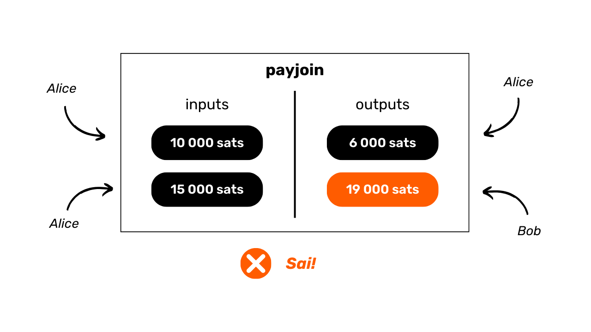
Sự hiểu lầm này rõ ràng là không chính xác, như bạn đã biết, hai UTXO trong đầu vào không thuộc về cùng một người. Một UTXO đến từ Alice, người mua bánh mì, và UTXO kia từ Bob, người bán bánh.


Do đó, phân tích của người quan sát bên ngoài bị hướng đến một kết luận sai lầm, điều này đảm bảo sự bảo mật thông tin của các bên liên quan.

### Giao dịch giấu thông tin

Mục tiêu thứ hai của payjoin là để lừa dối một người quan sát bên ngoài về số tiền thực sự đã được thanh toán. Bằng cách xem xét cấu trúc của giao dịch, nhà phân tích có thể tin rằng số tiền thanh toán tương đương với số tiền của một trong các đầu ra.
Nếu chúng ta xem xét lại ví dụ về việc mua bánh mì, nhà phân tích sẽ nghĩ rằng số tiền thanh toán tương ứng hoặc là UTXO 6,000 satoshi hoặc là UTXO 19,000 satoshi. Trong trường hợp này, nhà phân tích có khả năng nghĩ rằng số tiền thanh toán là 19,000 satoshi, bởi vì có 2 UTXO trong đầu ra, ít nhất một trong số đó lớn hơn 6,000 satoshi (không có lý do lô-gic nào để sử dụng 2 UTXO để thanh toán 6,000 satoshi khi một UTXO duy nhất đã đủ cho việc thanh toán này).
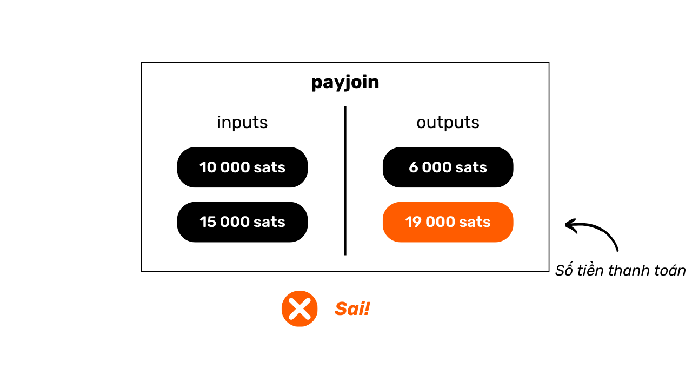

Nhưng thực tế, phân tích này không chính xác. Số tiền thanh toán không tương ứng với bất kỳ đầu ra nào. Thực tế, đó là sự chênh lệch giữa UTXO của người nhận trong đầu ra và UTXO của người nhận trong đầu vào.

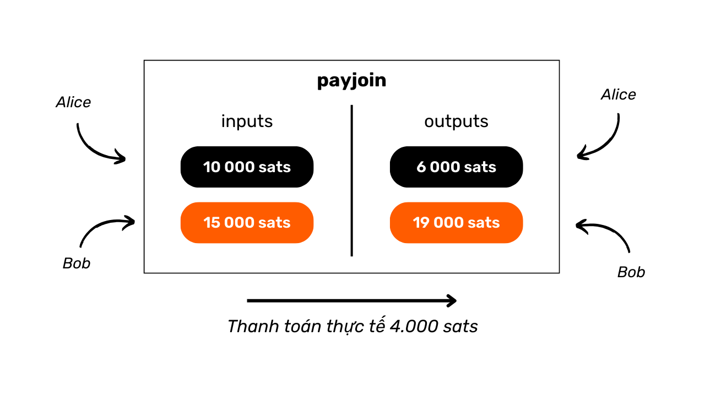

Trong trường hợp này, giao dịch payjoin rơi vào lĩnh vực của giao dịch giấu thông tin. Nó cho phép ẩn số tiền thực sự của một giao dịch trong một giao dịch giả mạo, hoạt động như một bức bình phong.

Steganography là kỹ thuật ẩn thông tin trong dữ liệu hoặc đối tượng khác, theo cách mà sự hiện diện của thông tin ẩn không thể nhận biết được. Ví dụ, một thông điệp bí mật có thể được ẩn bên trong một dấu chấm trong một văn bản không liên quan, làm cho nó không thể phát hiện bằng mắt thường (đây là kỹ thuật của [micropoint](https://fr.wikipedia.org/wiki/Micropoint)).

Khác với mã hóa, làm cho thông tin chỉ có thể hiểu được khi có khóa giải mã, steganography không thay đổi thông tin. Nó vẫn hiển thị rõ ràng. Mục tiêu của nó là để ẩn sự tồn tại thực sự của thông điệp bí mật, trong khi mã hóa rõ ràng tiết lộ sự hiện diện của thông tin ẩn, mặc dù không thể truy cập được nếu mà không có khóa. Đây là lý do tại sao tên ban đầu cho payjoin là "*giao dịch steganographic*".

Một phép so sánh có thể được thực hiện giữa mã hóa và trộn coin, cũng như giữa steganography và payjoin. Thực sự, trộn coin có những đặc điểm tương tự như mã hóa: phương pháp có thể nhận biết, nhưng thông tin là không thể giải mã. Ngược lại, payjoin giống như steganography: thông tin lý thuyết có thể truy cập, nhưng do phương pháp ẩn giấu không được nhận biết, nó trở nên không thể truy cập.

### Làm thế nào để sử dụng payjoin?

Trong số các phần mềm được biết đến hỗ trợ payjoin, có Sparrow Wallet, Wasabi Wallet, Mutiny, BitMask, BlueWallet, và JoinMarket, cũng như bộ xử lý thanh toán BTCPay.


Phiên bản tiên tiến nhất của payjoin chỉ là Stowaway trên Samourai Wallet. Tuy nhiên, kể từ khi các nhà sáng lập phần mềm bị bắt, công cụ này giờ chỉ hoạt động một phần. Lợi ích của Stowaway là nó là một giao thức hoàn chỉnh và rất dễ sử dụng, hỗ trợ cả việc nhận và gửi payjoins. Các giao dịch được ký một phần có thể được trao đổi thủ công qua việc quét nhiều mã QR hoặc tự động thông qua Tor qua Soroban. Phương thức giao tiếp sau hiện đang không hoạt động.

Khó khăn trong việc sử dụng payjoin nằm ở việc nó phụ thuộc vào sự tham gia của người bán hàng. Là một khách hàng, việc sử dụng payjoin là không thể nếu người bán hàng không hỗ trợ nó. Điều này thêm một khó khăn nữa trong quá trình mua hàng: việc tìm kiếm người bán hàng chấp nhận bitcoin đã phức tạp rồi, thì việc tìm kiếm những người hỗ trợ payjoins, càng trở nên phức tạp hơn.

Giải pháp sẽ là sử dụng các cấu trúc giao dịch giới thiệu sự mơ hồ trong phân tích chuỗi mà không yêu cầu sự hợp tác của người nhận. Điều này sẽ cho phép chúng ta cải thiện sự riêng tư của các khoản thanh toán mà không phụ thuộc vào sự tham gia tích cực của người bán hàng. Đây chính xác là điều chúng ta sẽ nghiên cứu trong chương tiếp theo.

## Mini-Payjoin Coinjoins
<chapterId>300777ee-30ae-43d7-ab00-479dac3522c1</chapterId>

Khi muốn thực hiện một giao dịch thanh toán trong khi bảo tồn một mức độ riêng tư nhất định, payjoin là một lựa chọn tốt. Nhưng như chúng ta đã thấy, payjoin yêu cầu sự tham gia của người nhận. Phải làm gì nếu người nhận từ chối tham gia vào một payjoin, hoặc nếu bạn đơn giản là không muốn liên quan tới họ? Một lựa chọn khác là sử dụng giao dịch Stonewall hoặc Stonewall x2. Hãy xem xét kỹ hơn hai loại giao dịch này.

### Giao Dịch Stonewall

Stonewall là một dạng cụ thể của giao dịch Bitcoin nhằm tăng cường sự riêng tư của người dùng trong quá trình chi tiêu bằng cách mô phỏng một giao dịch giả trộn coin (pseudo-coinjoin) giữa hai người, mà thực sự không phải là một. Thực tế, giao dịch này không phải là một sự hợp tác. Một người dùng có thể xây dựng nó một mình, chỉ liên quan đến các UTXO mà họ sở hữu như đầu vào. Bạn có thể tạo một giao dịch Stonewall cho bất kỳ dịp nào, mà không cần phải đồng bộ với người dùng khác hoặc người nhận.

Hoạt động của giao dịch Stonewall như sau: trong đầu vào của giao dịch, người gửi sử dụng 2 UTXO thuộc về họ. Trong đầu ra, giao dịch tạo ra 4 UTXO, 2 trong số đó sẽ có cùng một lượng chính xác. 2 UTXO khác sẽ tạo thành tiền thối. Trong số 2 đầu ra có cùng một lượng tền, chỉ có một thực sự đi đến người nhận thanh toán.
Chỉ có 2 vai trong một giao dịch Stonewall:
- Người gửi, người thực hiện thanh toán;
- Người nhận, người có thể không biết về bản chất cụ thể của giao dịch và chỉ đang chờ một khoản thanh toán từ người gửi.

Hãy lấy một ví dụ để hiểu cấu trúc giao dịch này. Alice đang ở cửa hàng bánh mì của Bob để mua một chiếc bánh, giá 4,000 satoshi. Cô ấy muốn thanh toán bằng bitcoin trong khi duy trì một mức độ riêng tư nhất định về khoản thanh toán của mình. Do đó, cô ấy quyết định xây dựng một giao dịch Stonewall cho khoản thanh toán.

Phân tích giao dịch này, chúng ta có thể thấy rằng Bob, người làm bánh, thực sự đã nhận được 4,000 satoshi tiền thanh toán cho chiếc bánh mì. Alice đã sử dụng 2 UTXO làm đầu vào: một là 10,000 satoshi và một là 15,000 satoshi. Trong phần đầu ra, cô ấy nhận được 3 UTXO: một là 4,000 satoshi, một là 6,000 satoshi, và một là 11,000 satoshi. Như vậy, Alice có một số dư ròng là -4,000 satoshi trong giao dịch này, tương đương chính xác với giá của chiếc bánh mì baguette.
Trong ví dụ này, tôi cố ý bỏ qua phí đào để dễ hiểu hơn. Trên thực tế, phí giao dịch hoàn toàn do người gửi chịu.

### Mục tiêu của giao dịch Stonewall là gì?

Cấu trúc Stonewall tăng cường độ nhiễu lên giao dịch và làm mờ dấu vết phân tích chuỗi. Từ bên ngoài, giao dịch như vậy có thể được hiểu là một giao dịch trộn coin quy mô nhỏ giữa hai người. Nhưng trên thực tế, đó là một khoản thanh toán. Phương pháp này do đó tạo ra sự không chắc chắn trong phân tích chuỗi, hoặc thậm chí dẫn đến những dấu vết sai lệch.

Hãy quay lại ví dụ của Alice tại tiệm bánh của Bob. Giao dịch trên blockchain sẽ trông như thế này:


Một người quan sát bên ngoài dựa vào các phép suy luận phân tích chuỗi thông thường có thể kết luận sai rằng "*hai người đã thực hiện một giao dịch trộn coin quy mô nhỏ, với mỗi người một UTXO ở đầu vào và hai UTXO ở đầu ra*". Việc phân tích giao dịch này từ bên ngoài không dẫn đến việc áp dụng CIOH, bởi vì sự hiện diện của hai đầu ra cùng một số lượng gợi ý một mô hình trộn coin. Từ quan điểm bên ngoài, CIOH do đó không áp dụng trong trường hợp cụ thể này.


Cách diễn giải này không chính xác, bởi vì, như bạn biết, một UTXO đã được gửi đến Bob, người làm bánh, 2 UTXO ở đầu vào đến từ Alice, và cô ấy đã lấy lại 3 đầu ra tiền thối.


Và điều đặc biệt thú vị về cấu trúc của giao dịch Stonewall là từ góc độ của một người quan sát bên ngoài, nó trông giống hệt như cấu trúc của một giao dịch Stonewall x2.

### Giao dịch Stonewall x2

Stonewall x2 là một hình thức giao dịch Bitcoin cụ thể khác cũng nhằm mục đích tăng cường quyền riêng tư cho người dùng trong quá trình chi tiêu, nhưng lần này bằng cách hợp tác với một bên thứ ba không tham gia vào việc chi tiêu. Phương pháp này hoạt động giống như một giao dịch trộn coin giả giữa hai người tham gia, trong khi đồng thời thực hiện thanh toán cho một người thứ ba.

Cách thức hoạt động của giao dịch Stonewall x2 tương đối đơn giản: một người sử dụng một UTXO trong quyền sở hữu của mình để thực hiện thanh toán và yêu cầu sự giúp đỡ của một bên thứ ba, người cũng đóng góp một UTXO mà họ sở hữu. Giao dịch kết thúc với bốn đầu ra: hai trong số đó có số lượng bằng nhau, một dành cho địa chỉ của người nhận thanh toán, cái khác cho địa chỉ thuộc về người hợp tác. Một UTXO thứ ba được gửi trở lại địa chỉ khác của người hợp tác, cho phép họ khôi phục số lượng ban đầu (một hành động trung tính đối với họ, trừ phí đào), và một UTXO cuối cùng trở về địa chỉ thuộc về chúng ta, là phần tiền thối của khoản thanh toán.

Như vậy, ba vai khác nhau được định nghĩa trong các giao dịch Stonewall x2:
- Người gửi, người thực hiện thanh toán thực tế;
- Người nhận, người có thể không biết về bản chất cụ thể của giao dịch và đơn giản chỉ chờ đợi một khoản thanh toán từ người gửi;
- Người hợp tác, người cung cấp bitcoin để tạo nghi ngờ trong phân tích giao dịch, trong khi hoàn toàn thu hồi lại số tiền của họ khi hoàn thành giao dịch (một hành động trung tính đối với họ, trừ phí đào).
Hãy quay lại ví dụ của chúng ta với Alice, người đang ở tiệm bánh của Bob để mua chiếc bánh mì có giá 4,000 satoshi. Cô ấy muốn thanh toán bằng bitcoin trong khi duy trì một mức độ riêng tư nhất định về khoản thanh toán của mình. Vì vậy, cô ấy nhờ đến người bạn Charles, người sẽ giúp cô trong quá trình này.


Phân tích giao dịch này, chúng ta có thể thấy rằng Bob, người bán bánh, thực sự đã nhận được 4,000 satoshi trong khoản thanh toán cho chiếc bánh mì. Alice đã sử dụng 10,000 satoshi ở đầu vào và thu hồi 6,000 satoshi ở đầu ra, dẫn đến một số dư ròng là -4,000 satoshi, tương ứng với giá của chiếc bánh mì. Đối với Charles, anh ấy đã cung cấp 15,000 satoshi ở đầu vào và nhận được hai đầu ra: một là 4,000 satoshi và cái kia là 11,000 satoshi, tạo ra một số dư là 0.

Trong ví dụ này, tôi cố ý bỏ qua phí đào để dễ hiểu hơn. Trên thực tế, phí đào thường được chia đều giữa người phát hành thanh toán và người hợp tác.

### Mục tiêu của giao dịch Stonewall x2 là gì?
Giống như cấu trúc Stonewall, cấu trúc Stonewall x2 thêm một lượng lớn entropy vào giao dịch và làm mờ dấu vết của phân tích chuỗi. Từ quan điểm bên ngoài, một giao dịch như vậy có thể được giải thích là một giao dịch trộn coin quy mô nhỏ giữa hai người. Nhưng trên thực tế, đó là một khoản thanh toán. Phương pháp này, do đó, tạo ra sự không chắc chắn trong phân tích chuỗi, thậm chí dẫn đến những dấu vết sai.

Hãy xem lại ví dụ về Alice, Bob người bán bánh, và Charles. Giao dịch trên blockchain sẽ trông như thế này:


Một người quan sát bên ngoài dựa vào các phép suy luận phân tích chuỗi thông thường có thể kết luận sai rằng "*Alice và Charles đã thực hiện một trộn coin nhỏ, với mỗi người một UTXO ở đầu vào và hai UTXO ở đầu ra*". Một lần nữa, việc phân tích giao dịch này từ bên ngoài không dẫn đến việc áp dụng CIOH, bởi vì sự hiện diện của hai đầu ra cùng một số lượng gợi ý một mô hình trộn coin. Do đó, từ quan điểm bên ngoài, CIOH không áp dụng trong trường hợp cụ thể này.


Cách diễn giải này không chính xác bởi vì, như bạn biết, một UTXO đã được gửi đến Bob người bán bánh, Alice chỉ có một đầu ra tiền thối, và Charles có hai.


Và một lần nữa, điều đặc biệt thú vị với cấu trúc giao dịch Stonewall x2 là từ quan điểm của một người quan sát bên ngoài, nó trông giống hệt như một giao dịch Stonewall.

### Sự khác biệt giữa Stonewall và Stonewall x2 là gì?

Giao dịch StonewallX2 hoạt động giống hệt như một giao dịch Stonewall, ngoại trừ loại giao dịch đầu là hình thức cộng tác, trong khi loại sau thì không. Như chúng ta đã thấy, một giao dịch Stonewall x2 liên quan đến sự tham gia của một bên thứ ba (Charles), người nằm ngoài khoản thanh toán, và cung cấp bitcoin của mình để tăng cường tính bảo mật của giao dịch. Trong một giao dịch Stonewall cổ điển, vai trò của người hợp tác được thực hiện bởi người gửi.


Từ quan điểm bên ngoài, mô hình của giao dịch do đó hoàn toàn giống nhau.

Thực tế là hai cấu trúc giao dịch này chia sẻ chính xác cùng một mô hình cho thấy rằng ngay cả khi một quan sát viên bên ngoài xác định được một mô hình "Stonewall(x2)", họ sẽ không có tất cả thông tin. Họ sẽ không thể xác định được UTXO nào trong hai UTXO có cùng số lượng tương ứng với khoản thanh toán. Hơn nữa, họ cũng không thể xác định liệu hai UTXO trong đầu vào đến từ hai người khác nhau (Stonewall x2) hay chúng thuộc về một người đã kết hợp chúng (Stonewall).

Điểm cuối cùng này là do giao dịch Stonewall x2 tuân theo chính xác cùng một mô hình như giao dịch Stonewall. Từ bên ngoài và không có thông tin bổ sung về bối cảnh, không thể phân biệt được giao dịch Stonewall với giao dịch Stonewall x2. Tuy nhiên, cái trước không phải là giao dịch hợp tác, trong khi cái sau thì có. Điều này tạo thêm sự nghi ngờ vào trong quá trình phân tích một trong những giao dịch này.

### Khi nào sử dụng giao dịch Stonewall và Stonewall x2?

Khi muốn sử dụng một trong hai công cụ trên để bảo mật cho một giao dịch, bạn nên tuân theo logic sau:
- Ưu tiên, sử dụng giao dịch mà ta có thể chọn thực hiện một payjoin;
- Nếu người bán không hỗ trợ payjoins, sử dụng giao dịch có thể thực hiện một giao dịch hợp tác với người khác bên ngoài khoản thanh toán sử dụng cấu trúc Stonewall x2;
- Nếu không tìm được ai để thực hiện giao dịch Stonewall x2, chọn cách có thể thực hiện một giao dịch Stonewall một mình, sẽ mô phỏng hành vi của một giao dịch Stonewall x2.

### Làm thế nào để sử dụng giao dịch Stonewall và Stonewall x2?

Giao dịch Stonewall và Stonewall x2 có sẵn cả trên ứng dụng Samourai Wallet và phần mềm Sparrow Wallet.


Tuy nhiên, giống như với payjoins, sau vụ bắt giữ các nhà sáng lập của Samourai, giao dịch Stonewall x2 hiện chỉ hoạt động bằng cách trao đổi thủ công các PSBT giữa các bên liên quan. Việc trao đổi tự động qua Soroban không khả dụng vào thời điểm này.

Cũng có thể thực hiện thủ công loại giao dịch này từ bất kỳ phần mềm ví Bitcoin nào.

Trong chương tiếp theo, chúng ta sẽ nghiên cứu một kỹ thuật bảo mật khác it được biết đến, nhưng rất hữu ích bổ sung cho những gì chúng ta đã nghiên cứu.

## Ricochets

<chapterId>db9a20ac-a149-443d-884b-ea6c03f28499</chapterId>

Việc sử dụng các cấu trúc giao dịch Bitcoin thêm vào sự mơ hồ trong phân tích chuỗi, như trộn coin, đặc biệt có lợi cho việc bảo vệ quyền riêng tư. Tuy nhiên, như chúng ta đã thảo luận trong chương về payjoins, các giao dịch trộn coin tự nhiên có thể được xác định trên chuỗi. Hãy nhớ lại sự tương đồng mà chúng ta đã thiết lập giữa mã hóa và trộn coins: khi ai đó mã hóa một tệp, một bên thứ ba phát hiện ra tệp này không thể truy cập nội dung của nó, nhưng có thể rõ ràng xác định rằng đã có một sự thay đổi của tệp để ẩn nội dung của nó. Điều tương tự cũng đúng với trộn coin: khi một nhà phân tích xem xét một giao dịch trộn coin, mặc dù họ không thể thiết lập các liên kết trực tiếp giữa các đầu vào và đầu ra (và ngược lại), họ vẫn có thể nhận ra rằng giao dịch được quan sát là một giao dịch trộn coin.
Tùy thuộc vào mục đích sử dụng đồng tiền của bạn sau khi trải qua các chu kỳ trộn coin, việc nó đã trải qua quá trình này có thể gây ra vấn đề. Ví dụ, nếu bạn dự định bán đồng tiền của mình trên một nền tảng giao dịch được quy định, nhưng nó gần đây đã trải qua một trộn coin, công cụ phân tích chuỗi của nền tảng sẽ phát hiện ra điều này. Nền tảng có thể từ chối chấp nhận UTXO đã trải qua trộn coin của bạn, hoặc thậm chí yêu cầu bạn giải trình, với nguy cơ tài khoản của bạn bị đình chỉ hoặc tiền của bạn bị đóng băng. Trong một số trường hợp, nền tảng cũng có thể báo cáo hành vi của bạn cho các cơ quan nhà nước (ví dụ, đây là những gì TRACFIN yêu cầu các Nhà cung cấp Dịch vụ Tài sản Kỹ thuật số (PSAN) ở Pháp).


Những gì chúng ta cần để tránh điều này là một công cụ có khả năng làm mờ dấu vết của quá khứ của một đồng Bitcoin, nhằm khôi phục một dạng tính chất đổi lẫn nhất định. Đây chính xác là mục tiêu của ricochet.


### Ricochet là gì?

Ricochet là một kỹ thuật bao gồm việc thực hiện nhiều giao dịch giả mạo cho chính mình (sweeping) để mô phỏng việc chuyển quyền sở hữu bitcoin. Công cụ này khác biệt so với các cấu trúc giao dịch khác mà chúng ta đã thảo luận vì nó không cho phép ẩn danh về phía tương lại, mà là một dạng ẩn danh hồi tưởng. Thực sự, ricochet cho phép làm mờ các chi tiết có thể làm tổn hại đến tính đổi lẫn của một đồng bitcoin do quá khứ của nó.

Để làm mờ dấu vết để lại bởi một sự kiện quá khứ trên một đồng coin, chẳng hạn như các chu kỳ trộn coin, ricochet thực hiện bốn giao dịch liên tiếp nơi người dùng chuyển tiền cho chính họ trên các địa chỉ khác nhau.


Sau chuỗi giao dịch này, công cụ ricochet cuối cùng chuyển bitcoin đến điểm đến cuối cùng của chúng, chẳng hạn như một nền tảng giao dịch.

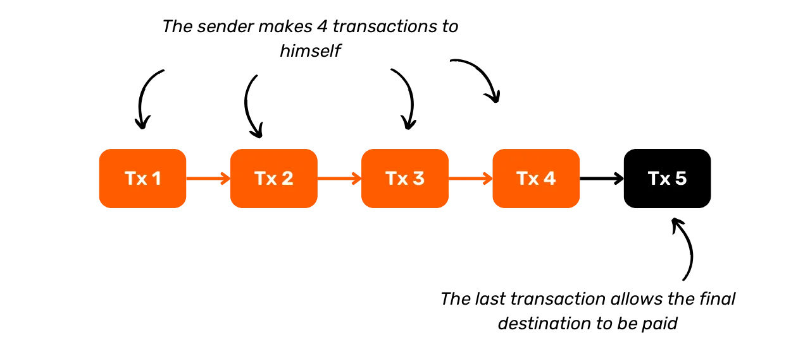

Mục tiêu là tạo ra một khoảng cách ảnh hưởng đến tính đổi lẫn của đồng tiền, chẳng hạn như một giao dịch trộn coin, và hành động cuối cùng của việc chi tiêu có thể từ chối đồng tiền này vì quá khứ của nó. Do đó, công cụ phân tích chuỗi có thể kết luận rằng có lẽ đã có sự thay đổi quyền sở hữu sau sự kiện, và coi đồng tiền này là có thể đổi lẫn. Trong trường hợp của một trộn coin, công cụ phân tích chuỗi có thể sau đó giả định rằng không phải là cùng một người đã gửi bitcoin và thực hiện trộn coin, và do đó không cần thiết phải khởi xướng các hành động chống lại người gửi.


### Tại sao điều này lại hiệu quả?
Đối mặt với phương pháp ricochet này, người ta có thể tưởng tượng rằng phần mềm phân tích chuỗi sẽ mở rộng cuộc kiểm tra của họ ngoài bốn bước nhảy. Tuy nhiên, các nền tảng này đối mặt với một bài toán khó trong việc tối ưu hóa ngưỡng phát hiện. Họ phải thiết lập một giới hạn về số lượng bước nhảy sau đó họ thừa nhận rằng có khả năng đã xảy ra sự thay đổi quyền sở hữu và rằng liên kết với một sự kiện trước đó (chẳng hạn như trộn coin) nên được bỏ qua.


Tuy nhiên, việc xác định ngưỡng này chứa đựng rủi ro: mỗi lần mở rộng số lượng bước nhảy quan sát được tăng lên theo cấp số nhân khối lượng của các trường hợp dương tính giả, tức là, cá nhân bị đánh dấu nhầm là tham gia vào một sự kiện, khi hoạt động được thực hiện bởi người khác. Kịch bản này đặt ra một rủi ro lớn cho các công ty này, vì dương tính giả dẫn đến sự không hài lòng, có thể đẩy khách hàng bị ảnh hưởng về phía đối thủ cạnh tranh. Về lâu dài, một ngưỡng phát hiện quá rộng dẫn đến việc một nền tảng mất nhiều khách hàng hơn so với đối thủ cạnh tranh của mình, có thể đe dọa đến sự tồn tại của nó. Do đó, việc tăng số lượng bước nhảy quan sát được là phức tạp đối với các nền tảng này, và 4 thường là một con số đủ để chống lại phân tích của họ.

Hiện tượng quan sát ở đây có phần tương tự như lý thuyết sáu bậc tách biệt.
Lý thuyết sáu bậc tách biệt cho rằng bất kỳ người nào trên Trái Đất đều có thể kết nối với người khác thông qua một chuỗi quen biết không quá sáu người trung gian. Chỉ cần đi qua một loạt sáu người, mỗi người biết người tiếp theo, để tiếp cận bất kỳ cá nhân nào trên thế giới.

Đối với các giao dịch Bitcoin, một hiện tượng tương tự được tìm thấy. Bằng cách truy vết lại một số lượng đủ các giao dịch Bitcoin, người ta không thể tránh khỏi việc gặp phải một hoạt động trộn coin. Phương pháp ricochet tận dụng nguyên tắc này bằng cách sử dụng một số lượng bước nhảy cao hơn so với những gì các nền tảng giao dịch có thể theo dõi một cách hợp lý. Nếu các nền tảng quyết định theo dõi nhiều giao dịch hơn, thì đơn giản chỉ cần thêm một bước nhảy nữa để lách qua biện pháp này.

### Khi nào và làm thế nào để sử dụng ricochet?

Trường hợp sử dụng phổ biến nhất cho ricochet xảy ra khi cần che giấu sự tham gia trước đó trong một hoạt động trộn coin trên một UTXO mà bạn sở hữu. Lý tưởng nhất là tránh chuyển bitcoin đã trải qua trộn coin cho các thực thể được quản lý. Tuy nhiên, trong trường hợp một người không còn lựa chọn nào khác, đặc biệt trong tình huống cần chuyển đổi bitcoin thành tiền pháp định gấp, ricochet cung cấp một giải pháp hiệu quả.

Phương pháp này không chỉ hiệu quả đối với trộn coin mà còn đối với bất kỳ dấu hiệu nào khác có thể làm ảnh hưởng đến tính đổi lẫn của một đồng tiền.
Ý tưởng về phương pháp ricochet này ban đầu đến từ các đội ngũ tại Samourai Wallet, người đã tích hợp nó vào ứng dụng của họ để tự động hóa quy trình. Dịch vụ này trên Samourai là có phí, với một phí dịch vụ ricochet là 100,000 sats, ngoài phí đào. Do đó, việc sử dụng nó được khuyến nghị cho các giao dịch có số lượng đáng kể.


Ứng dụng Samourai cung cấp hai biến thể của ricochet:
- Ricochet nâng cao, hay "giao hàng chậm rãi," có lợi thế là phân tán phí dịch vụ Samourai qua năm giao dịch liên tiếp. Tùy chọn này cũng đảm bảo rằng mỗi giao dịch được phát sóng vào một thời điểm riêng biệt và được ghi lại trong một khối khác nhau, giúp mô phỏng hành vi thay đổi sở hữu càng chặt chẽ càng tốt. Mặc dù chậm hơn, phương pháp này được ưa chuộng cho những ai không vội, vì nó tối đa hóa hiệu quả của ricochet bằng cách tăng cường khả năng chống lại phân tích chuỗi;

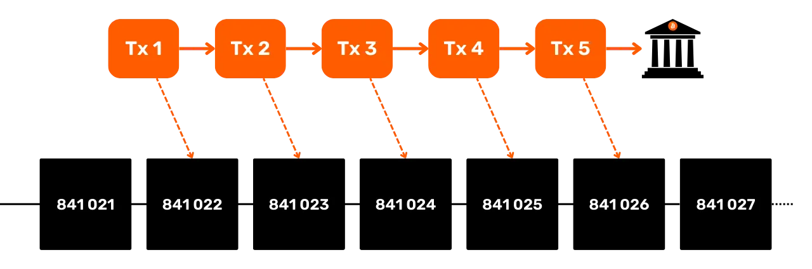

- Ricochet cổ điển, được thiết kế để thực hiện hoạt động nhanh chóng bằng cách phát sóng tất cả các giao dịch trong một khoảng thời gian ngắn. Do đó, phương pháp này cung cấp ít quyền riêng tư và khả năng chống lại phân tích thấp hơn so với phương pháp nâng cao. Nó chỉ nên được sử dụng cho những lần gửi gấp.


Ricochet đơn giản chỉ là việc gửi bitcoins cho chính mình. Hoàn toàn có thể thực hiện một ricochet một cách thủ công trên bất kỳ phần mềm ví nào, mà không cần sử dụng công cụ chuyên biệt. Chỉ cần chuyển cùng một đồng tiền cho chính mình liên tiếp, sử dụng một địa chỉ trống mới mỗi lần.

Trong chương tiếp theo, chúng ta sẽ khám phá các kỹ thuật khác nhau cho việc chuyển giao tài sản bí mật. Những phương pháp này khác biệt rõ rệt so với những gì chúng ta đã xem xét cho đến nay, cả về cách thức hoạt động và kết quả.

## Chuyển giao tài sản bí mật
<chapterId>a2067036-849c-4d6b-87d2-44235cfae7a1</chapterId>

Trong số các kỹ thuật bảo mật trên Bitcoin, còn có phương pháp chuyển giao tài sản bí mật. Phương pháp này nhằm mục đích chuyển quyền sở hữu bitcoin từ một người này sang người khác, và ngược lại, mà không làm cho giao dịch này được hiển thị rõ ràng trên blockchain. Hãy cùng nhau nghiên cứu các kỹ thuật khác nhau cũng như ưu và nhược điểm của chúng.

### CoinSwap - Đổi tiền
CoinSwap dựa trên một khái niệm tương đối đơn giản: nó sử dụng hợp đồng thông minh để tạo điều kiện cho việc chuyển quyền sở hữu bitcoin giữa hai người dùng, mà không cần sự tin tưởng và không làm cho việc chuyển này được hiển thị rõ ràng trên blockchain.

Hãy tưởng tượng một ví dụ đơn giản với Alice và Bob. Alice sở hữu 1 BTC được bảo vệ bằng khóa riêng tư A, và Bob cũng sở hữu 1BTC, được bảo vệ bằng khóa riêng tư B. Về lý thuyết, họ có thể trao đổi khóa riêng tư của mình qua một kênh giao tiếp bên ngoài để thực hiện việc chuyển giao bí mật.


Tuy nhiên, phương pháp ngây thơ này đặt ra rủi ro cao về mặt tin tưởng. Không có gì ngăn cản Alice giữ lại bản sao của khóa riêng tư A sau khi trao đổi và sử dụng nó sau đó để ăn cắp bitcoin, một khi khóa đó nằm trong quyền sở hữu của Bob.


Hơn nữa, không có bảo đảm nào ngăn cản Alice nhận khóa riêng $B$ của Bob và không bao giờ gửi lại khóa riêng $A$ của mình. Do đó, việc trao đổi này dựa vào sự tin tưởng quá mức giữa các bên và chứng minh là không hiệu quả trong việc đảm bảo một việc chuyển giao quyền sở hữu một cách bí mật và an toàn.


Để giải quyết những vấn đề này và cho phép các giao dịch giữa các bên không tin tưởng lẫn nhau, chúng ta có thể sử dụng hệ thống hợp đồng thông minh. Hợp đồng thông minh là một chương trình tự động thực hiện khi các điều kiện được định trước đáp ứng, trong trường hợp của chúng ta, đảm bảo rằng việc chuyển giao quyền sở hữu xảy ra tự động mà không cần sự tin tưởng lẫn nhau.

Để làm điều này, chúng ta có thể sử dụng HTLC (*Hợp Đồng Bị Khóa Thời Gian Bằng Mã Băm*) hoặc PTLC (*Hợp Đồng Bị Khóa Thời Gian Bằng Điểm*). Hai giao thức này hoạt động tương tự nhau bằng cách sử dụng một hệ thống khóa thời gian đảm bảo rằng việc trao đổi hoặc là hoàn toàn thành công hoặc bị hủy bỏ hoàn toàn, do đó bảo vệ tính toàn vẹn về tiền của cả hai bên. Sự khác biệt chính giữa HTLCs và PTLCs là HTLCs sử dụng mã băm và preimages để bảo vệ giao dịch, trong khi PTLCs sử dụng Chữ ký thích nghi.

Trong một kịch bản coinswap sử dụng HTLC hoặc PTLC giữa Alice và Bob, việc trao đổi diễn ra một cách an toàn: hoặc là thành công, và mỗi người nhận được BTC của người kia, hoặc thất bại, và mỗi người giữ lại BTC của mình. Do đó, là không thể cho một trong hai bên gian lận hoặc ăn cắp BTC của bên kia.

> *HTLCs cũng là cơ chế được sử dụng để định tuyến thanh toán một cách an toàn qua các kênh hai chiều của Lightning Network.*
Việc sử dụng Chữ ký thích nghi rất thú vị trong bối cảnh này, vì nó cho phép bỏ qua các kịch bản truyền thống (đây là một cơ chế đôi khi được gọi là "_scriptless scripts_"). Tính năng này giúp giảm phí liên quan đến việc trao đổi. Một lợi ích lớn khác của Chữ ký thích nghi là chúng không yêu cầu sử dụng một mã băm chung cho cả hai bên của giao dịch, do đó tránh lộ liên kết trực tiếp giữa họ trong một số loại trao đổi.
### Chữ ký thích nghi

Chữ kỹ thích nghi là một phương pháp mật mã học tích hợp một chữ ký hợp lệ với một chữ ký bổ sung, được gọi là "_chữ ký thích nghi_," để tiết lộ một phần dữ liệu bí mật. Cơ chế này được thiết kế theo cách mà nếu biết 2 trong 3 yếu tố sau đây: chữ ký hợp lệ, chữ ký thích nghi, và bí mật, chúng ta có thể suy luận ra yếu tố thứ ba còn thiếu. Một tính chất thú vị của phương pháp này là, nếu chúng ta biết chữ ký thích nghi của đối tác và điểm cụ thể trên đường cong e líp liên quan đến bí mật được sử dụng để tính toán chữ ký thích nghi này, chúng ta có thể suy ra chữ ký thích nghi của mình sẽ tương thích với bí mật đó, mà không cần truy cập trực tiếp vào bí mật đó.
Trong một giao dịch đổi tiền, việc sử dụng Chữ ký thích nghi (Adaptor Signatures) cho phép việc tiết lộ đồng thời hai thông tin nhạy cảm giữa các bên tham gia, từ đó tránh được nhu cầu về sự tin tưởng lẫn nhau. Hãy lấy một ví dụ để minh họa quy trình này với Alice và Bob, những người muốn trao đổi quyền sở hữu 1 BTC của nhau, nhưng không tin tưởng lẫn nhau. Họ sử dụng Chữ ký thích nghi để loại bỏ nhu cầu về sự tin tưởng trong giao dịch này. Dưới đây là cách họ tiến hành:
* Alice khởi xướng giao dịch bằng cách tạo một giao dịch m_A gửi 1 BTC cho Bob. Cô ấy tạo ra một chữ ký s_A, xác thực giao dịch này, sử dụng khóa riêng tư p_A (P_A = p_A \cdot G), một nonce n_A (N_A = n_A \cdot G), và một bí mật t (T = t \cdot G):

$$s_A = n_A + t + H(N_A + T \parallel P_A \parallel m_A) \cdot p_A$$

* Alice tính toán chữ ký thích nghi s_A' bằng cách trừ đi bí mật t từ chữ ký thực sự s_A của mình:

$$s_A' = s_A - t$$

* Alice gửi cho Bob chữ ký thích nghi s_A', giao dịch chưa ký m_A của cô ấy, điểm tương ứng với bí mật trên đường cong e líp (T), và điểm tương ứng với nonce (N_A). Những yếu tố này tạo thành cái gọi là "*adaptor - thể thích nghi*". Điều quan trọng cần lưu ý là, chỉ với thông tin này, Bob không thể khôi phục được BTC của Alice.
* Tuy nhiên, Bob có khả năng xác minh rằng Alice không cố gắng lừa đảo anh ta. Để làm điều này, anh ta kiểm tra xem chữ ký thích nghi s_A' của Alice có thực sự tương ứng với giao dịch đề xuất m_A hay không. Nếu phương trình sau đây là chính xác, anh ta có thể chắc chắn rằng chữ ký thích nghi của Alice là hợp lệ:
$$s_A' \cdot G = N_A + H(N_A + T \parallel P_A \parallel m_A) \cdot P_A$$

* Việc xác minh này cung cấp sự bảo đảm cho Bob tiếp tục giao dịch một cách tự tin. Sau đó, anh ta tạo giao dịch của mình m_B, dự định gửi 1 BTC cho Alice, và tạo ra chữ ký thích nghi s_B' của mình, cũng sẽ được liên kết với cùng một bí mật t. Tại thời điểm này, chỉ có Alice biết giá trị của t; Bob chỉ biết điểm tương ứng T mà Alice đã truyền cho anh ta:

$$s_B' = n_B + H(N_B + T \parallel P_B \parallel m_B) \cdot p_B$$

* Bob truyền cho Alice chữ ký thích nghi s_B' của mình, giao dịch chưa ký m_B, cũng như điểm tương ứng với bí mật (T) và điểm tương ứng với nonce (N_B). Alice, người biết bí mật t, giờ đây có thể kết hợp chữ ký thích nghi s_B' của Bob với bí mật này để tạo ra một chữ ký hợp lệ s_B cho giao dịch m_B sẽ chuyển BTC của Bob cho cô ấy:

$$s_B = s_B' + t$$

$$(s_B' + t) \cdot G = N_B + T + H(N_B + T \parallel P_B \parallel m_B) \cdot P_B$$

* Alice phát sóng giao dịch đã ký m_B trên blockchain Bitcoin để khôi phục BTC mà Bob hứa hẹn. Khi Bob thấy giao dịch này trên blockchain, anh ta có thể trích xuất chữ ký s_B = s_B' + t. Với thông tin này, Bob sau đó có thể tách ra bí mật nổi tiếng t mà anh ta cần.
$$t = (s_B' + t) - s_B' = s_B - s_B'$$
* Và thực sự, bí mật t này là yếu tố duy nhất còn thiếu để Bob tạo ra chữ ký hợp lệ s_A từ chữ ký thích nghi s_A' của Alice. Chữ ký này cho phép xác thực giao dịch m_A gửi BTC từ Alice sang Bob. Sau đó, Bob tính toán s_A và tiếp đến phát sóng giao dịch m_A trên blockchain:

$$s_A = s_A' + t$$

$$(s_A' + t) \cdot G = N_A + T + H(N_A + T \parallel P_A \parallel m_A) \cdot P_A$$
Hãy tóm tắt cách hoạt động của Chữ ký thích nghi trong một giao dịch đổi tiền. Ban đầu, Alice gửi cho Bob một giao dịch chưa ký kèm với một adaptor - thể thích nghi, cho phép Bob xác minh rằng bí mật được tiết lộ sau này sẽ cho anh ta quyền truy cập vào bitcoin. Đổi lại, Bob gửi cho Alice giao dịch chưa ký và thể thích nghi của anh ta. Alice sau đó có thể hoàn tất giao dịch của Bob và thu hồi bitcoin bằng cách phát sóng một giao dịch hợp lệ sử dụng bí mật. Khi giao dịch này được công bố trên blockchain, Bob có khả năng trích xuất bí mật và do đó mở khóa giao dịch của Alice. Do đó, nếu Alice khởi xướng việc chuyển bitcoin của Bob, anh ta, ở chiều của mình, có thể truy cập vào bitcoin của Alice mà không cần sự tin tưởng lẫn nhau.
Đáng chú ý là giao dịch đổi tiền lần đầu tiên được đề xuất bởi [Gregory Maxwell vào tháng 10 năm 2013 trên BitcoinTalk](https://bitcointalk.org/index.php?topic=321228.0).

### Atomic Swap - Hoán đổi nguyên tử

Tương tự như giao dịch swap và sử dụng cùng một loại hợp đồng thông minh, chúng ta cũng có thể thực hiện hoán đổi nguyên tử. Hoán đổi nguyên tử cho phép trao đổi trực tiếp các loại tiền điện tử khác nhau, như BTC và XMR, giữa hai người dùng mà không cần tin tưởng hoặc sự can thiệp của bên trung gian. Các giao dịch này được gọi là "nguyên tử" vì chúng chỉ có hai kết quả có thể: hoặc là giao dịch thành công và cả hai bên đều hài lòng, hoặc nó thất bại và mỗi bên giữ lại số tiền điện tử ban đầu của mình, do đó loại bỏ nhu cầu phải tin tưởng vào bên kia.


Hoán đổi nguyên tử và giao dịch đổi tiền chia sẻ phương pháp hoạt động tương tự và cung cấp những ưu và nhược điểm giống nhau về quyền riêng tư. Thực vậy, từ góc độ của Bitcoin, một hoán đổi nguyên tử có thể so sánh với một giao dịch đổi tiền được thực hiện trong hai bước. Đầu tiên, chúng ta đổi BTC của mình lấy một loại tiền điện tử khác, và sau đó loại tiền điện tử này có thể được đổi lấy BTC khác. Cuối cùng, chúng ta thu hồi BTC của người dùng khác. Đây là lý do tại sao, trong phân tích vấn đề quyền riêng tư, tôi nhóm hai giao thức này dưới danh mục giao dịch bí mật chuyển quyền sở hữu.


Tuy nhiên, không giống như giao dịch đổi tiền, hoán đổi nguyên tử có thể có sự mất cân đối về khả năng cung cấp thanh khoản, đặc biệt là trong các giao dịch BTC/XMR. Thông thường, việc đổi bitcoin lấy altcoin dễ dàng hơn, do có nhu cầu cao đối với bitcoin, giữ cho mức phí thấp cho hướng chuyển đổi này. Tuy nhiên, việc đổi altcoin để lấy BTC có thể phức tạp hơn do nhu cầu thấp, thường dẫn đến mức phí rất cao.

Cuối cùng, khi một hoán đổi nguyên tử liên quan đến bitcoin trên chuỗi và bitcoin trên mạng Lightning, chúng ta sau đó gọi đó là một "*hoán đổi tàu ngầm*".

### Các phương pháp có thực sự hữu ích?
Các phương pháp chuyển quyền sở hữu bí mật, như giao dịch đổi tiền và hoán đổi nguyên tử, có lợi thế là đánh lừa các phép suy luận trong phân tích chuỗi. Các phương pháp này có thể tạo ra ấn tượng rằng các giao dịch liên quan đến cùng một người dùng, mặc dù quyền sở hữu thực sự đã được chuyển giao. Tuy nhiên, nhược điểm chính của các phương pháp này là chúng rất rủi ro nếu không sử dụng thêm kỹ thuật để phá vỡ lịch sử của đồng tiền.
Thực vậy, khi Alice thực hiện một giao dịch đổi tiền hoặc hoán đổi nguyên tử với Bob, cô ấy đã trao đổi quyền sở hữu bitcoin của mình để lấy bitcoin của Bob. Trong trường hợp của hoán đổi nguyên tử, giao dịch bao gồm một altcoin, nhưng nguyên tắc vẫn giữ nguyên. Do đó, khi hoàn thành, Alice nhận được đồng tiền B và Bob nhận được đồng tiền A. Điều này làm tăng sự nghi ngờ trong phân tích chuỗi, nhưng lịch sử của các đồng tiền vẫn có thể bị truy vết. Nếu một nhà phân tích kiểm tra đồng tiền A, họ có thể truy vết lại các hoạt động trước đó của Alice, và ngược lại đối với đồng tiền B.
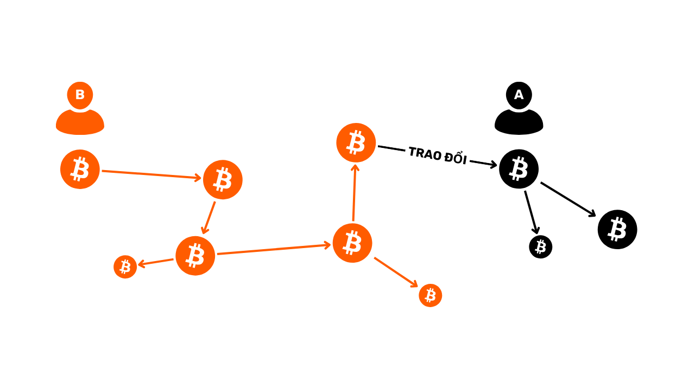

Từ góc nhìn của Alice, rủi ro là lịch sử của đồng tiền B có thể được coi là đáng ngờ bởi một số tổ chức. Nếu, ví dụ, Bob đã có được đồng tiền B thông qua một hành vi phạm tội như hack, đồng tiền này sẽ vẫn liên kết với các hoạt động bất hợp pháp của anh ta. Có thể, Alice sẽ phát hiện rằng mình đang sở hữu một đồng tiền mà cô ấy không thể chuyển nhượng trên các nền tảng giao dịch được quy định mà không tránh được rủi ro bị đóng băng tài sản, hoặc thậm chí bị buộc tội về các tội ác của Bob, mặc dù cô ấy không liên quan gì đến chúng.

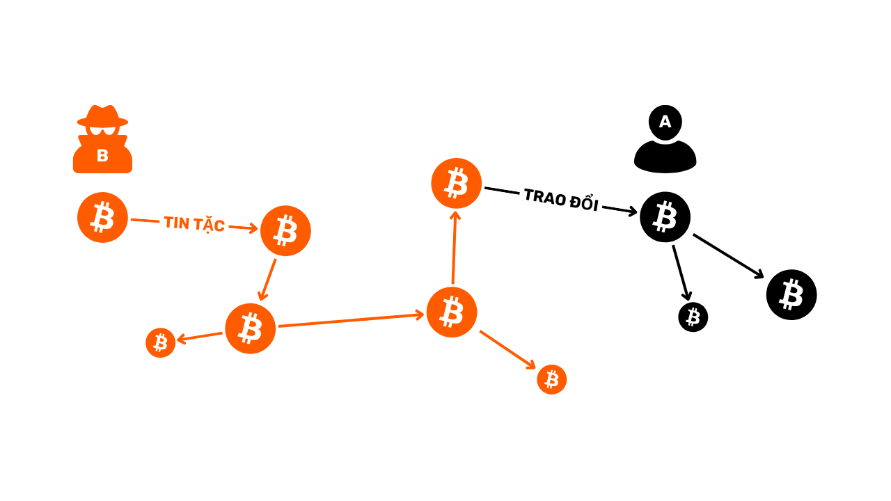

Và tất nhiên, các phương pháp bảo mật như đổi tiền hoặc hoán đổi nguyên tử được ưa chuộng bởi những tội phạm mà tài sản của họ đang bị cơ quan chức năng giám sát. Những giao thức này cung cấp cho họ cơ hội để thoát khỏi số bitcoin đang bị giám sát của mình để đổi lấy số bitcoin hoàn toàn có đổi lẫn được. Điều này cũng cho phép họ tạo ra một sự phân tâm, hướng cơ quan chức năng về phía người dùng khác. Do đó, có một lợi ích kép cho những cá nhân này.

Với trộn coin, ngay cả khi đồng tiền của bạn được trộn lẫn với bitcoin đang bị giám sát, lịch sử của đồng tiền bị phá vỡ, điều này mang lại một hình thức chối bỏ mà chúng ta không thể có được qua các giao thức chuyển giao tài sản bí mật như đổi tiền hoặc hoán đổi nguyên tử.


Nếu Alice muốn tránh mọi rủi ro, cô ấy cần phải sử dụng một phương pháp để phá vỡ lịch sử của đồng tiền B, chẳng hạn như đưa nó qua một quy trình trộn coin. Điều này đặt ra một câu hỏi về việc kết hợp chuyển giao quyền sở hữu bí mật và trộn coin. Trộn coin, bằng cách phá vỡ lịch sử của một đồng tiền, đã mang lại một mức độ riêng tư đủ cho Alice. Do đó, theo ý kiến của tôi, nếu Alice đang tìm cách bảo vệ quyền riêng tư của mình, sẽ khôn ngoan hơn khi thực hiện một quy trình trộn coin luôn thay vì đổi tiền xong rồi lại tiếp tục thực hiện trộn coin.
Để các phương pháp chuyển giao quyền sở hữu bí mật thực sự hiệu quả và tránh rủi ro liên kết lịch sử của người dùng A với người dùng B, một cách nghịch lý, hoạt động này cần được biết đến rộng rãi. Nếu đổi tiền được sử dụng rộng rãi và cơ quan chức năng biết đến hoạt động phổ biến này, thì sẽ có khả năng thiết lập được sự chối bỏ hợp lý (plausible deniability) . Tuy nhiên, nếu việc sử dụng các phương pháp này vẫn còn hạn chế, tôi tin rằng chũng vẫn còn quá rủi ro cho người dùng.

Cho đến nay, chúng ta chủ yếu đã nghiên cứu các phương pháp bảo mật ở cấp độ giao dịch. Trong chương tiếp theo, chúng ta sẽ khám phá các vấn đề ở cấp độ mạng và sự phát tán của giao dịch.

## Quyền riêng tư trên mạng lưới ngang hàng
<chapterId>04a2467b-db84-4076-a9ff-919be5135106</chapterId>

Trong phần 4, chúng ta đã thảo luận về tầm quan trọng của việc sử dụng một nốt đầy đủ để bảo vệ quyền riêng tư của các giao dịch của bản thân. Tuy nhiên, quan trọng là phải được hiểu rằng chính nốt của bạn cũng có thể bị tấn công nhằm mục đích trích xuất thông tin về các hoạt động của bạn. Do đó, trong chương này, chúng ta sẽ xem xét các biện pháp bảo vệ quyền riêng tư khác nhau, không phải ở cấp độ của các giao dịch hoặc dòng dịch chuyển của bitcoin, mà ở cấp độ mạng lưới.

### Dandelion
Một cách để tránh các cuộc tấn công phá vỡ sự ẩn danh là sử dụng đề xuất Dandelion. Giao thức phát sóng này đã được chính thức hóa trong BIP156, nhưng nó chưa bao giờ được triển khai trên Bitcoin.
Ý tưởng của Dandelion là cải thiện sự riêng tư của việc định tuyến giao dịch trong mạng lưới Bitcoin để chống lại các hình thức tấn công khác nhau. Mục tiêu chính của nó là che giấu nốt nguồn phát sóng ban đầu của một giao dịch trên mạng. Việc tiết lộ nốt này có thể liên kết một giao dịch Bitcoin với một địa chỉ IP cụ thể (nếu nốt hoạt động trên clearnet), có thể cung cấp một điểm vào cho phân tích chuỗi.
Sự liên kết giữa một hoạt động trên mạng lưới Bitcoin và một địa chỉ IP là một rủi ro đáng kể đối với quyền riêng tư của người dùng. Thực vậy, nhiều thực thể có thể dễ dàng liên kết một địa chỉ IP với một danh tính cá nhân. Bao gồm chính phủ và các nhà cung cấp dịch vụ Internet. Hơn nữa, thông tin này có thể trở nên công khai, ví dụ, nếu địa chỉ IP và dữ liệu cá nhân của bạn bị tiết lộ do rò rỉ trong quá trình hack cơ sở dữ liệu của một trang web.
Trong hoạt động tiêu chuẩn của mạng lưới Bitcoin, các giao dịch được một người dùng tạo trên phần mềm ví của họ được truyền đến nốt cá nhân của họ. Nốt này ngay lập tức phát sóng giao dịch mới cho tất cả các đối tác mà nó kết nối.

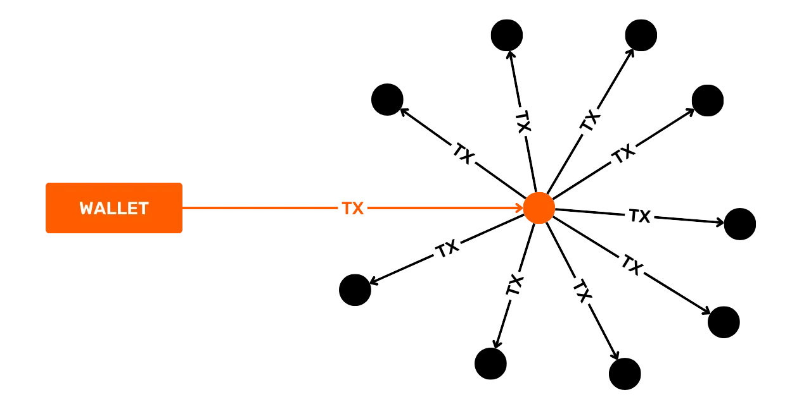

Các đối tác sau đó xác minh giao dịch để đảm bảo nó tuân thủ các quy tắc đồng thuận và quy tắc chuẩn hóa cục bộ. Một khi được xác nhận, mỗi đối tác lần lượt truyền giao dịch cho các đối tác của mình, và cứ thế tiếp tục.


Việc phân phối các giao dịch đang chờ để tích hợp vào một khối được thực hiện một cách khá cân bằng và có thể dự đoán theo thống kê. Lỗ hổng này có thể bị các nốt gián điệp thông đồng khai thác, những nốt này thông đồng với nhau để giám sát và phân tích mạng, nhằm mục đích xác định nốt đầu tiên đã phát sóng một giao dịch. Nếu một quan sát viên xác định được nốt nguồn, họ có thể giả định rằng giao dịch bắt nguồn từ người vận hành nốt đó. Loại quan sát này có thể liên kết giao dịch, thông thường là ẩn danh, với các địa chỉ IP cụ thể.

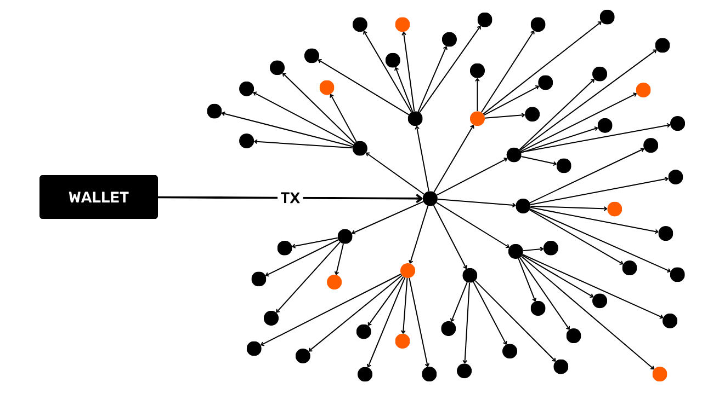

Mục tiêu của BIP156 là giải quyết vấn đề này. Để làm điều này, nó giới thiệu một giai đoạn bổ sung trong việc phát sóng một giao dịch mới để bảo tồn sự ẩn danh trước khi nó được phát tán rộng rãi. Dandelion trước tiên sử dụng một giai đoạn "stem" nơi giao dịch được gửi qua một con đường ngẫu nhiên của các nốt.


Sau đó, giao dịch được phát sóng cho toàn bộ mạng trong giai đoạn "fluff".


Stem và fluff là những tham chiếu đến hành vi của sự lan truyền giao dịch qua mạng, giống như hình dạng của một bông hoa bồ công anh.

Theo đó, các nốt gián điệp có tiềm năng truy được vết của giao dịch trở lại nốt đã khởi xướng giai đoạn fluff, nhưng nốt này không phải là nốt đầu tiên phát sóng giao dịch, vì nó nhận được nó từ nốt cuối cùng trong giai đoạn stem. Nếu các nốt gián điệp không thể truy vết ngược lên stem, họ không thể xác định được nốt nguồn.


Ngay cả khi có sự hiện diện của các nốt gián điệp trong giai đoạn stem, sự nghi ngờ luôn tồn tại bởi vì ngay khi họ gặp một nốt trung thực trong đồ thị lan truyền, các node gián điệp không thể xác định liệu nốt này là nốt nguồn hay chỉ là một trung gian.
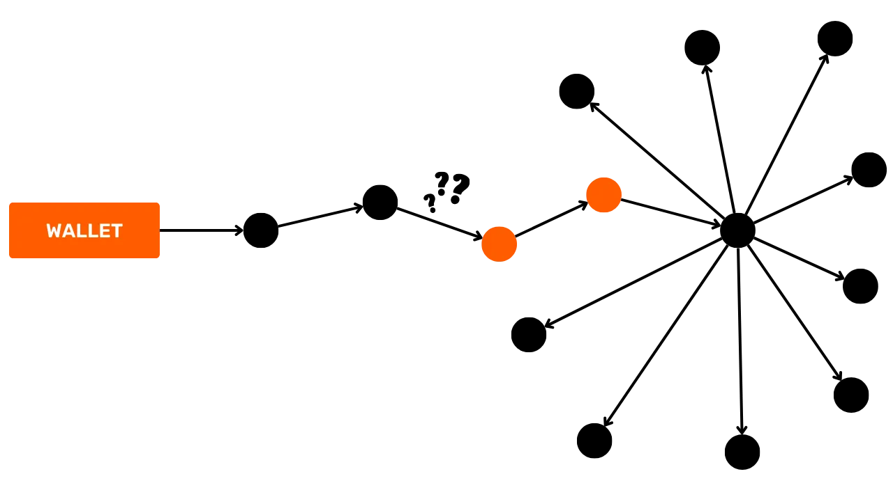
Phương pháp định tuyến này làm mờ dấu vết dẫn đến nốt nguồn, khiến việc truy vết một giao dịch qua mạng trở lại nguồn gốc trở nên khó khăn. Dandelion do đó cải thiện quyền riêng tư bằng cách hạn chế khả năng của đối thủ có thể phá vỡ sự ẩn danh của mạng lưới. Phương pháp này càng hiệu quả hơn khi giao dịch trong giai đoạn "stem" qua một nốt đã mã hóa thông tin liên lạc của mình, như với Tor hoặc P2P Transport V2.
BIP156 chưa được tích hợp vào Bitcoin Core và hiện được phân loại dưới trạng thái "bị từ chối". Một trong những mối quan tâm chính về giao thức này nằm ở việc, trong giai đoạn "stem", giao dịch phải được chuyển tiếp bởi các nốt trung gian trước khi được xác thực. Như chúng ta đã thấy, trong mô hình bình thường của Bitcoin, mỗi nốt phải xác thực giao dịch trước khi phát sóng nó cho các nốt đồng nghiệp của mình. Nếu một giao dịch không tuân thủ các quy tắc đồng thuận hoặc các quy tắc chuẩn hóa cục bộ của nốt, nó sẽ bỏ qua và không phát sóng nó. Đây là quy trình quan trọng để chống lại các cuộc tấn công từ chối dịch vụ DoS, vì chỉ có các giao dịch hợp lệ mới được phát sóng ra toàn bộ mạng lưới. Các giao dịch không hợp lệ, có thể được tạo ra hàng loạt để làm quá tải mạng, bị chặn lại ngay tại nốt đầu tiên chúng gặp phải và không thể lan truyền tiếp. Rủi ro chính với Dandelion là giao thức mới này có thể tạo ra các điểm yếu mới cho các cuộc tấn công DoS bằng cách cho phép phát sóng các giao dịch không hợp lệ qua một phần của mạng lưới.

### P2P Transport V2

P2P Transport V2 là một giao thức mạng khác được trình bày trong BIP324. Đây là phiên bản mới của giao thức vận chuyển P2P của Bitcoin. Nó tích hợp mã hoá cơ hội (OE - Opportunistic Encryption) để cải thiện tính bảo mật và bảo mật của các thông tin liên lạc giữa các nốt.

Cải tiến này nhằm giải quyết một số vấn đề ở phiên bản cơ bản của giao thức P2P. Một mặt, nó làm cho dữ liệu trao đổi không thể phân biệt với các loại dữ liệu khác lưu thông trên Internet đối với một quan sát viên thụ động. Mục tiêu chính là ngăn chặn chính phủ, các nhà cung cấp dịch vụ Internet, hoặc các nhà cung cấp VPN thực hiện việc giám sát hàng loạt người dùng Bitcoin. Điều này cũng làm cho nhiệm vụ xác định liệu một người dùng Internet cũng là một người dùng Bitcoin hay không (tức là họ đang vận hành một nốt đầy đủ hay không) trở nên phức tạp.
P2P V2 cũng góp phần giảm rủi ro kiểm duyệt và tấn công thông qua việc phát hiện các mẫu cụ thể trong các gói dữ liệu. Nó làm phức tạp và tăng chi phí thực hiện các loại tấn công mạo nhận (Sybil Attack) khác nhau ở cấp độ mạng. Một cuộc tấn công mạo nhận xảy ra khi một người tạo ra nhiều danh tính giả mạo để có được lợi thế không công bằng. Trong bối cảnh của mạng Bitcoin, điều này thường thể hiện ra như một thực thể kiểm soát một số lượng lớn nốt đầy đủ và sử dụng chúng một cách hung hăng để nhân lên các kết nối. Các cuộc tấn công mạo nhận có thể là thụ động, nhằm thu thập thông tin và xâm phạm quyền riêng tư của người dùng, hoặc chủ động, dưới hình thức tấn công Eclipse. Cuộc tấn công Eclipse cô lập một nốt cụ thể khỏi phần còn lại của mạng, cho phép kiểm duyệt người dùng hoặc thay đổi dữ liệu họ nhận được. Cuối cùng, P2P V2 cũng làm cho các cuộc tấn công kẻ trung gian *Man-In-The-Middle* (MITM) trở nên tốn kém hơn và dễ bị phát hiện hơn.
Quá trình mã hóa được thực hiện bởi P2P V2 không bao gồm xác thực để tránh việc tạo thêm sự phức tạp không cần thiết, và để không làm tổn hại đến bản chất không cần sự cấp phép của kết nối mạng lưới. Tuy vậy, giao thức vận chuyển P2P mới này cung cấp bảo mật tốt hơn chống lại các cuộc tấn công thụ động và làm cho các cuộc tấn công chủ động trở nên tốn kém và dễ phát hiện hơn một cách đáng kể. Sự có mặt của một dòng dữ liệu ngẫu nhiên giả trong các thông điệp mạng làm cho nhiệm vụ của những kẻ tấn công muốn kiểm duyệt hoặc thao túng thông tin liên lạc trở nên phức tạp hơn.

Vận chuyển P2P V2 được bao gồm như một tùy chọn (theo mặc định là vô hiệu hoá) trong phiên bản 26.0 của Bitcoin Core, được triển khai vào tháng 12 năm 2023. Sau đó, nó được kích hoạt theo mặc định trong phiên bản 27.0 vào tháng 4 năm 2024. Nó có thể được chỉnh sửa với tùy chọn `v2transport=` trong tệp cấu hình.

### Tỏ
Một giải pháp tương đối đơn giản khác để tránh rủi ro mất bảo mật thông tin cho một nốt trong mạng là chạy hoàn toàn dưới Tor.
Tor là một mạng của các máy chủ chuyển tiếp (nốt) giúp ẩn danh nguồn gốc của các kết nối TCP trên internet. Nó hoạt động bằng cách đóng gói dữ liệu trong nhiều lớp mã hóa. Mỗi nốt chuyển tiếp loại bỏ một lớp để tiết lộ địa chỉ của nốt tiếp theo, cho đến khi đạt đến điểm đến cuối cùng. Mạng Tor đảm bảo ẩn danh bằng cách ngăn chặn việc các nốt trung gian biết cả nguồn gốc và điểm đến của dữ liệu, làm cho việc truy vết hoạt động của người dùng trở nên rất khó khăn.


Vì vậy, Tor không chỉ mã hóa dữ liệu truyền thông mà còn cho phép che giấu nguồn gốc và điểm đến của các thông tin liên lạc. Bằng cách sử dụng Tor cho việc truyền thông của nốt cá nhân, chúng ta tăng cường quyền riêng tư cho các giao dịch của mình: Nhà cung cấp dịch vụ Internet (ISP) không thể giải mã các thông tin liên lạc, và các nốt khác trong mạng Bitcoin không thể xác định địa chỉ IP của nốt nguồn. Hơn nữa, Tor cũng ẩn việc bạn sử dụng Bitcoin khỏi ISP của bạn.

Rủi ro chính liên quan đến phương pháp này là Tor là một giao thức độc lập với Bitcoin. Nếu bạn có một nốt Bitcoin dưới Tor và Tor ngừng hoạt động, thì nốt Bitcoin của bạn sẽ không thể giao tiếp được nữa.

Ngoài ra, cần lưu ý rằng giao tiếp qua Tor chậm hơn. Độ trễ này đặc biệt gây phiền toái trong quá trình khởi chạy ban đầu của một nốt, vì việc tải xuống ba đầu (IBD) đòi hỏi nhiều giao tiếp. Do đó, việc đồng bộ hóa ban đầu của bạn với mạng Bitcoin có thể kéo dài đáng kể khi sử dụng Tor. Cũng có thể thực hiện IBD trên clearnet, sau đó kích hoạt Tor sau. Mặc dù phương pháp này tiết lộ sự tồn tại nốt Bitcoin của bạn cho ISP, nhưng nó bảo vệ thông tin liên quan đến các giao dịch cá nhân của bạn một khi bạn chuyển sang Tor.

Sau khi khám phá các phương pháp bảo mật ở cấp độ mạng, tôi cũng muốn giới thiệu trong các chương tiếp theo hai giải pháp tinh tế để tránh việc sử dụng lại địa chỉ: BIP47 và Silent Payments.

## BIP47 và Mã thanh toán có thể tái sử dụng
<chapterId>ad88e076-a04b-4aec-b3b2-7b4760175504</chapterId>

Như chúng ta đã thấy trong phần 3, việc sử dụng lại địa chỉ đặt ra một trở ngại lớn cho quyền riêng tư của người dùng trên giao thức Bitcoin. Để giảm thiểu những rủi ro này, việc tạo một địa chỉ nhận mới cho mỗi khoản thanh toán mới nhận được trong ví là điều được khuyến nghị mạnh mẽ. Mặc dù việc tạo một địa chỉ mới ngày nay được đơn giản hóa bởi việc sử dụng phần mềm hiện đại và ví phân cấp tấ định, thực hành này có vẻ trái ngược với trực giác.


Ví dụ, trong hệ thống ngân hàng truyền thống, chúng ta quen với việc chia sẻ IBAN của mình, luôn luôn giữ nguyên. Một khi đã thông báo cho ai đó, họ có thể gửi cho chúng ta nhiều khoản thanh toán mà không cần phải tương tác lại với chúng ta. Các ngân hàng hiện đại cũng cung cấp nhiều tính năng hiện đại hơn như sử dụng địa chỉ email duy nhất trên PayPal hoặc RevTags trên Revolut. Ngay cả ngoài lĩnh vực tài chính, các bộ nhận dạng hàng ngày của chúng ta như địa chỉ bưu điện, số điện thoại và địa chỉ email cũng là duy nhất và vĩnh viễn. Chúng ta không cần phải làm mới chúng với mỗi tương tác mới.


Tuy nhiên, hoạt động của Bitcoin khác biệt: việc tạo một địa chỉ nhận mới cho mỗi giao dịch đến là điều bắt buộc. Sự thỏa hiệp giữa sự tiện lợi và quyền riêng tư này có từ ngay trong bản cáo bạch của Bitcoin (Bitcoin Whitepaper). Từ lần công bố phiên bản đầu tiên của tài liệu này vào cuối năm 2008, Satoshi Nakamoto đã cảnh báo chúng ta về rủi ro này:
**"*Như một bức tường lửa bổ sung, một cặp khóa mới có thể được sử dụng cho mỗi giao dịch để giữ chúng không liên kết với một chủ sở hữu chung.*"**
Có nhiều phương pháp để nhận nhiều khoản thanh toán vào một định danh duy nhất mà không gây ra việc tái sử dụng địa chỉ. Mỗi phương pháp đều có những sự thỏa hiệp và hạn chế của riêng nó. Một trong số các phương pháp này là BIP47, một đề xuất được phát triển bởi Justus Ranvier và công bố vào năm 2015. Đề xuất này nhằm tạo ra các mã thanh toán có thể tái sử dụng cho phép thực hiện nhiều giao dịch với cùng một người mà tránh được việc tái sử dụng địa chỉ ví. Về bản chất, BIP47 tìm cách cung cấp một hệ thống thanh toán trực quan như một định danh duy nhất, đồng thời bảo vệ sự riêng tư của các giao dịch.


BIP47 không trực tiếp cải thiện sự riêng tư của người dùng, vì một khoản thanh toán BIP47 cung cấp cùng một mức độ riêng tư như một giao dịch Bitcoin cổ điển sử dụng địa chỉ mới. Tuy nhiên, nó làm cho việc sử dụng Bitcoin trở nên thuận tiện và trực quan hơn, một sự thuận tiện mà, bình thường, sẽ phải đánh đổi bởi sự riêng tư. Nhờ có BIP47, sự thuận tiện này đạt được cùng một mức độ riêng tư như một giao dịch cổ điển. Đây là lý do tại sao BIP47 là một công cụ quý giá để bảo vệ sự riêng tư.

Ban đầu, BIP47 là một đề xuất được đưa ra để tích hợp vào Bitcoin Core, nhưng nó chưa bao giờ được chấp nhận. Một số phần mềm vẫn chọn để triển khai nó theo cách riêng của họ ở cấp độ ứng dụng. Do đó, các đội ngũ tại Samourai Wallet đã phát triển triển khai BIP47 của riêng họ có tên là "PayNym".

### Nguyên tắc chung của BIP47 và PayNym

Mục tiêu của BIP47 là cho phép việc nhận nhiều khoản thanh toán mà không gây ra việc tái sử dụng địa chỉ. Nó dựa vào việc sử dụng một mã thanh toán có thể tái sử dụng, cho phép các bên khác nhau gửi nhiều khoản thanh toán vào một mã duy nhất thuộc về người dùng khác. Do đó, người nhận không phải cung cấp một địa chỉ mới cho mỗi giao dịch, điều này giúp họ dễ dàng trao đổi hơn đồng thời bảo vệ sự riêng tư của họ.

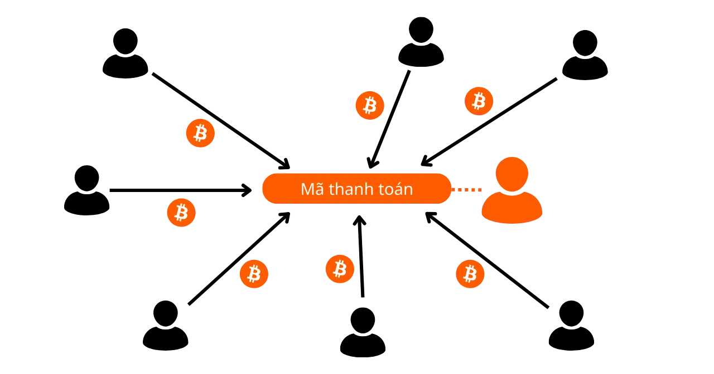

Một người dùng có thể chia sẻ mã thanh toán của mình một cách tự do, dù là trên mạng xã hội hay trên trang web của họ, mà không lo mất đi sự riêng tư, không giống như những gì sẽ xảy ra với một địa chỉ nhận cổ điển hoặc một khóa công khai.
Để thực hiện một giao dịch, cả hai bên phải có một ví Bitcoin với triển khai BIP47, như PayNym trên Samourai Wallet hoặc Sparrow Wallet. Việc sử dụng chung mã thanh toán tạo ra một kênh bí mật giữa họ. Để thiết lập kênh này một cách hiệu quả, người gửi phải thực hiện một giao dịch cụ thể trên blockchain Bitcoin, được biết đến là "giao dịch thông báo" (Tôi sẽ cung cấp thêm chi tiết về điều này sau).

Sự kết hợp của mã thanh toán của cả hai người dùng tạo ra các bí mật chung, từ đó cho phép tạo ra một số lượng lớn địa chỉ Bitcoin nhận đọc nhất (chính xác là 2^32, hoặc khoảng 4 tỷ). Do đó, các khoản thanh toán thực hiện qua BIP47 thực sự không được gửi đến chính mã thanh toán, mà là đến các địa chỉ nhận cổ điển được tạo ra từ mã thanh toán của những người dùng liên quan.

Mã thanh toán do đó phục vụ như một định danh ảo được tạo ra từ hạt giống của ví. Trong cấu trúc phân cấp của ví, mã thanh toán được đặt ở cấp độ 3, tức là, ở cấp độ tài khoản.

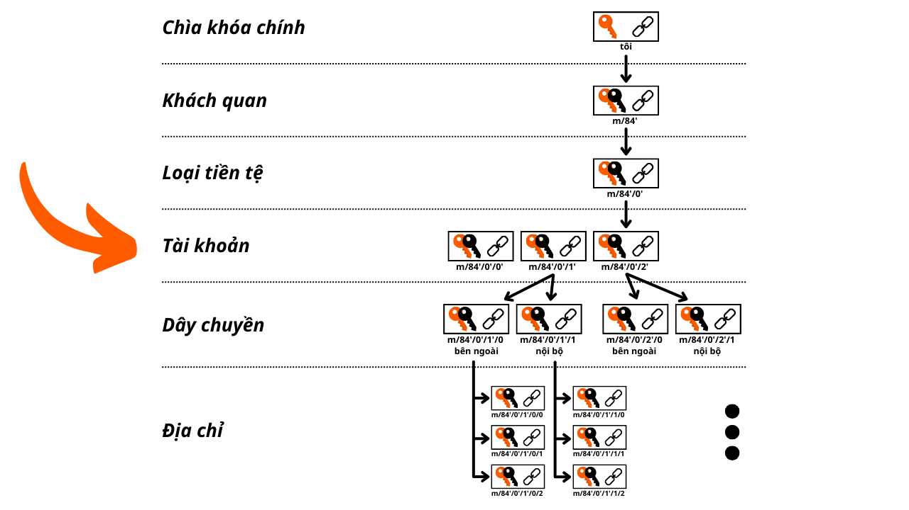

Mục tiêu phái sinh cho BIP47 được xác định bởi chỉ số `47'` (`0x8000002F`), tham chiếu đến BIP47. Ví dụ về một đường dẫn phái sinh cho một mã thanh toán có thể tái sử dụng như sau:
```plaintext
m/47'/0'/0'/
```

Đây là mã thanh toán của tôi, một ví dụ để bạn có thể hình dung về một mã thanh toán:
```plaintext
PM8TJSBiQmNQDwTogMAbyqJe2PE2kQXjtgh88MRTxsrnHC8zpEtJ8j7Aj628oUFk8X6P5rJ7P5qDudE4Hwq9JXSRzGcZJbdJAjM9oVQ1UKU5j2nr7VR5
```
Mã cũng có thể được mã hóa thành một mã QR, để thuận tiện cho việc truyền đạt, giống như một địa chỉ nhận cổ điển.

Về PayNym Bots, những robot này thỉnh thoảng được thấy trên Twitter, chúng là biểu diễn hình ảnh của mã thanh toán, được tạo ra bởi Samourai Wallet. Chúng được tạo ra thông qua một hàm băm, mang lại cho chúng sự gần như là độc nhất. Chúng xuất hiện dưới dạng một chuỗi nhỏ các ký tự bắt đầu với `+`:
```plaintext
+throbbingpond8B1
+twilightresonance487
+billowingfire340
```

Những avatar này cũng có thể được biểu diễn dưới dạng hình ảnh:


Mặc dù những robot này không có chức năng kỹ thuật cụ thể nào trong khuôn khổ của BIP47, chúng đóng vai trò trong việc tạo điều kiện cho các tương tác giữa người dùng bằng cách cung cấp một danh tính hình ảnh dễ nhận biết.

Trong các phần tiếp theo của chương được dành riêng cho BIP47 này, chúng ta sẽ xem xét chi tiết cách thức hoạt động của nó, và nhấn mạnh đặc biệt vào các phương pháp mật mã học được sử dụng. Để hiểu đầy đủ những giải thích kỹ thuật này, điều cần thiết là phải hiểu trước cấu trúc của ví HD - ví phân cấp tất định, các quy trình phát sinh khóa, và các nguyên tắc cơ bản của mật mã học dựa trên đường cong e líp. Nếu bạn muốn tìm hiểu sâu hơn về những khái niệm này, một khóa học miễn phí khác có sẵn trên PlanB Network: [CRYPTO 301](https://planb.network/en/courses/crypto301). Tôi vẫn khuyên bạn nên theo dõi chúng, vì việc hiểu rõ cơ chế kỹ thuật của BIP47 sẽ giúp bạn dễ dàng hiểu các đề xuất tương tự khác mà chúng ta sẽ thảo luận trong các chương tiếp theo.
### Mã thanh toán có thể sử dụng lại

Như đã đề cập trước đó, mã thanh toán có thể sử dụng lại nằm ở độ sâu 3 của ví HD, làm cho nó tương đương với một `xpub`, cả về vị trí của nó trong cấu trúc ví và vai trò của nó.

Mã thanh toán 80 byte sẽ bao gồm:
- **Byte `0`: Phiên bản - Version**. Đối với phiên bản đầu tiên của BIP47, byte này được thiết lập là `0x01`;
- **Byte `1`: Trường bit - Bit Filed**. Không gian này được dành riêng để tích hợp các chỉ dẫn bổ sung trong các sử dụng cụ thể. Đối với cách sử dụng tiêu chuẩn với PayNym, byte này được định nghĩa là `0x00`;
- **Byte `2`: Tính chẵn lẻ của `y`**. Byte này là `0x02` hoặc `0x03`, chỉ ra rằng tung độ của khóa công khai là chẵn hay lẻ, vì một khóa công khai nén được sử dụng ở đây;
- **Từ byte `3` đến byte `34`: Giá trị `x`**. Những byte này đại diện cho hoành độ của khóa công khai. Sự kết hợp của `x` và tính chẵn lẻ của `y` tạo thành khóa công khai nén hoàn chỉnh;
- **Từ byte `35` đến byte `66`: Mã chuỗi - Chain Code**. Không gian này chứa mã chuỗi liên kết với khóa công khai;
- **Từ byte `67` đến byte `79`: Đệm - Padding**. Không gian này dành cho các phát triển tương lai có thể có. Đối với phiên bản hiện tại, các số không đơn giản được đặt ở đây để đạt được kích thước 80 byte cần thiết cho một đầu ra `OP_RETURN`.

Dưới đây là biểu diễn hệ thập lục phân của mã thanh toán có thể sử dụng lại của
tôi đã được nếu ra trong phần trước:
```
0x010002a0716529bae6b36c5c9aa518a52f9c828b46ad8d907747f0d09dcd4d9a39e97c3c5f37c470c390d842f364086362f6122f412e2b0c7e7fc6e32287e364a7a36a00000000000000000000000000
```

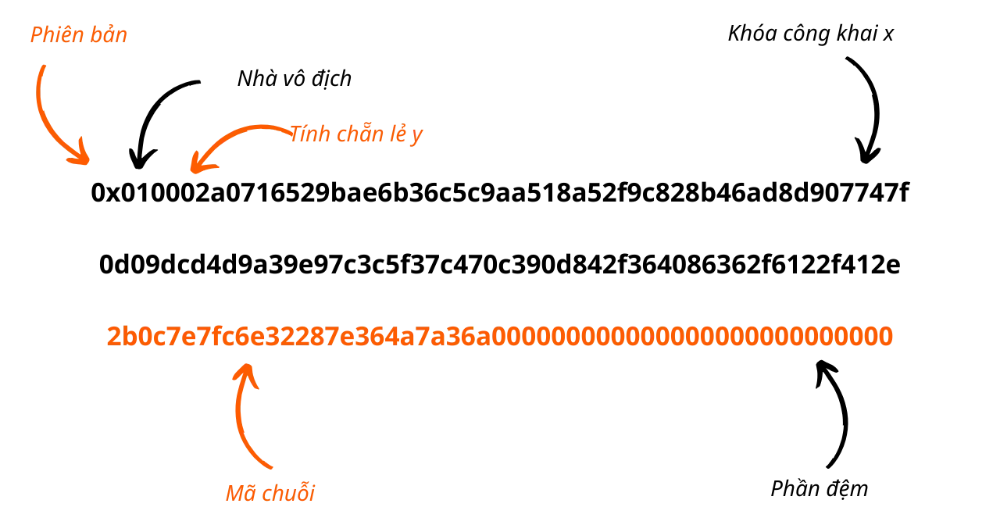

Đầu tiên, cần phải thêm byte tiền tố `P` vào đầu để chỉ rõ rằng đó là một mã thanh toán. Byte này được biểu diễn bởi `0x47`:
```plaintext
0x47010002a0716529bae6b36c5c9aa518a52f9c828b46ad8d907747f0d09dcd4d9a39e97c3c5f37c470c390d842f364086362f6122f412e2b0c7e7fc6e32287e364a7a36a00000000000000000000000000
```

Cuối cùng, để đảm bảo tính toàn vẹn của mã thanh toán, một phép tính checksum được thực hiện sử dụng `HASH256`, bao gồm một quá trình băm kép với hàm `SHA256`. Bốn byte đầu tiên thu được từ băm này sau đó được nối vào cuối mã thanh toán:
```plaintext
0x47010002a0716529bae6b36c5c9aa518a52f9c828b46ad8d907747f0d09dcd4d9a39e97c3c5f37c470c390d842f364086362f6122f412e2b0c7e7fc6e32287e364a7a36a00000000000000000000000000567080c4
```

Sau khi hoàn thành các bước này, mã thanh toán đã sẵn sàng. Điều còn lại là chuyển đổi nó thành hệ Base58 để thu được phiên bản cuối cùng:
```plaintext
PM8TJSBiQmNQDwTogMAbyqJe2PE2kQXjtgh88MRTxsrnHC8zpEtJ8j7Aj628oUFk8X6P5rJ7P5qDudE4Hwq9JXSRzGcZJbdJAjM9oVQ1UKU5j2nr7VR5
```

Trong quá trình tạo mã thanh toán này, chúng ta sử dụng một khóa công khai nén và một mã chuỗi. Cả hai đều được suy ra từ một quá trình dẫn xuất tất định và phân cấp từ hạt giống của ví. Đường dẫn xuất được sử dụng để đạt được điều này là:
```plaintext
m/47'/0'/0'/
```
Để tạo ra khóa công khai nén và mã chuỗi liên quan cho mã thanh toán có thể sử dụng lại, chúng ta bắt đầu bằng cách tính toán khóa riêng tư chính từ hạt giống của ví. Sau đó, chúng ta tiếp tục suy ra một cặp khóa con sử dụng chỉ số `47 + 2^31` (dẫn xuất cứng). Bước này được theo sau bởi hai lần xuất ra các cặp khóa con, mỗi lần sử dụng chỉ số `2^31` (dẫn xuất cứng).

### Trao đổi khoá Đường cong e-líp Diffie-Hellman (ECDH)
Giao thức mật mã nằm ở trung tâm của BIP47 được gọi tắt là ECDH - *Elliptic-Curve Diffie-Hellman*. Phương pháp này là một biến thể của giao thức trao đổi khóa Diffie-Hellman gốc.

Được giới thiệu vào năm 1976, Diffie-Hellman là một giao thức thỏa thuận khóa cho phép hai bên, mỗi bên được trang bị một cặp khóa (công khai và riêng tư), thỏa thuận về một bí mật chung, ngay cả khi giao tiếp chỉ qua một kênh công cộng và không an toàn.

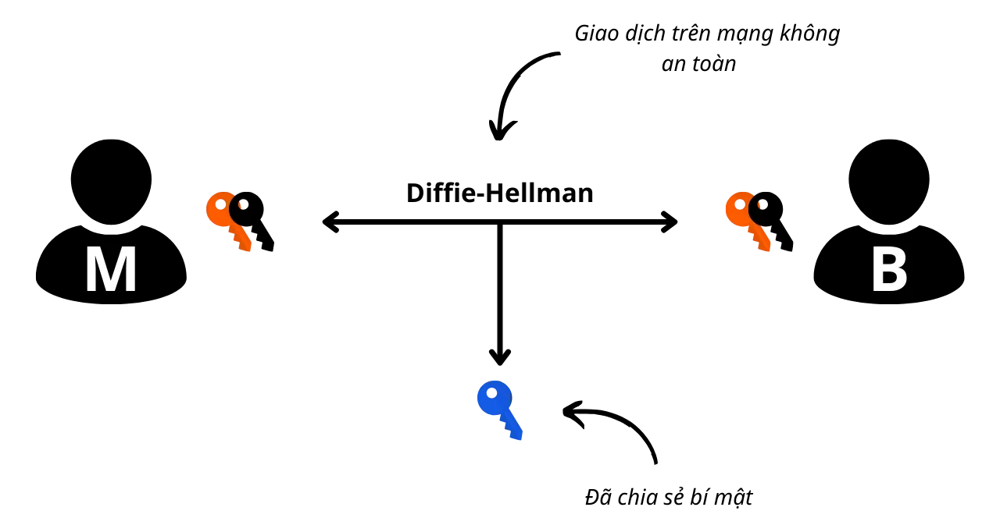

Bí mật chung này (ở đây, là chìa khóa màu xanh), sau đó có thể được sử dụng cho các hoạt động khác. Thông thường, bí mật chung này có thể được sử dụng để mã hóa và giải mã giao tiếp qua một mạng lưới không an toàn:


Để thực hiện trao đổi này, Diffie-Hellman sử dụng số học mô-đun để tính toán bí mật chung. Dưới đây là một giải thích đơn giản về cách nó hoạt động:
- Alice và Bob thỏa thuận về một màu chung, ở đây là màu vàng, đây là dữ liệu công khai (kẻ tấn công biết màu này);
- Alice chọn một màu bí mật, ở đây là màu đỏ, và trộn hai màu để thu được màu cam;
- Bob cũng chọn một màu bí mật, ở đây là màu xanh, và trộn nó với màu vàng để thu được màu xanh lá;
- Sau đó, họ trao đổi màu sắc thu được, màu cam và màu xanh lá. Việc trao đổi này có thể diễn ra qua một mạng không an toàn và bị quan sát;
- Bằng cách trộn màu xanh lá của Bob với màu bí mật của mình, Alice tạo ra màu nâu;
- Bob, làm tương tự với màu cam của Alice và màu xanh bí mật của mình, cũng thu được màu nâu.

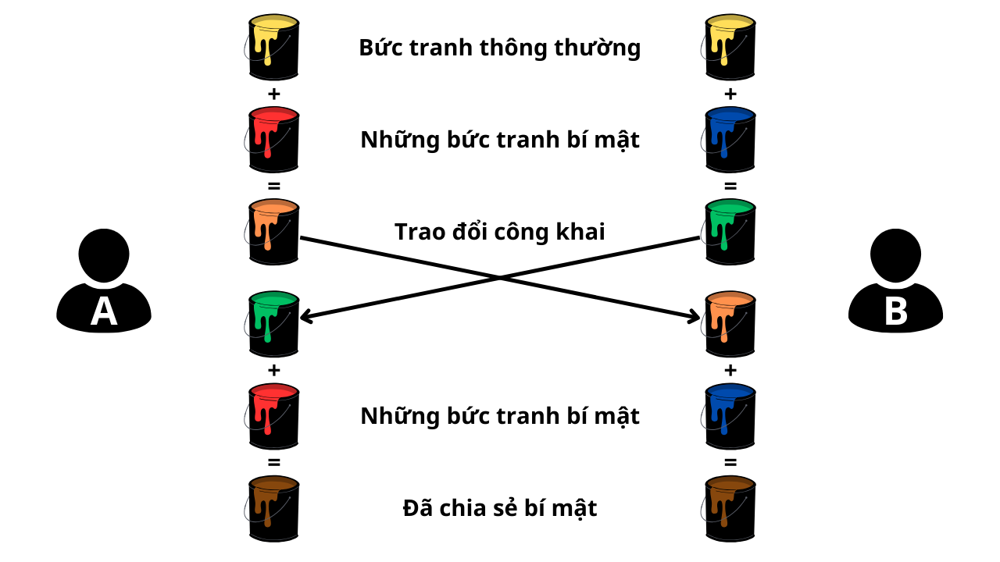

Trong ví dụ đơn giản hóa này, màu nâu đại diện cho bí mật chung giữa Alice và Bob. Điều quan trọng cần hiểu là, trong thực tế, kẻ tấn công không thể tách màu cam và màu xanh lá để khám phá màu bí mật của Alice hoặc Bob.

Bây giờ, hãy xem xét cách giao thức này thực sự hoạt động, không phải với các phép ẩn dụ màu sắc, mà sử dụng số thực và số học mô-đun!
Trước khi thảo luận về các cơ chế của Diffie-Hellman, cho phép tôi nhắc bạn về hai khái niệm toán học thiết yếu mà chúng ta sẽ cần:

- Một **số nguyên tố** là một số tự nhiên chỉ có hai ước số: 1 và chính nó. Ví dụ, 7 là một số nguyên tố vì nó chỉ có thể chia hết cho 1 và 7. Ngược lại, 8 không phải là số nguyên tố vì nó có thể chia hết cho 1, 2, 4 và 8. Do đó, nó có bốn ước số nguyên dương thay vì hai;
- **Modulo - số dư** (ký hiệu mod hoặc %) là một phép toán toán học mà, giữa hai số nguyên, trả về số dư của phép chia của số thứ nhất cho số thứ hai. Ví dụ, 16 \mod 5 = 1.

**Việc trao đổi khóa Diffie-Hellman giữa Alice và Bob diễn ra như sau:**

- Alice và Bob thỏa thuận về hai số chung: p và g. p là một số nguyên tố, và số này càng lớn thì Diffie-Hellman càng an toàn. g là một căn nguyên thủy của p. Hai số này có thể được thông báo một cách công khai qua một mạng lưới không an toàn. Chúng đại diện cho tương đương của **màu vàng** trong ví dụ đơn giản hóa trước đó. Do đó, rất quan trọng là Alice và Bob sử dụng chính xác cùng một giá trị cho p và g.
- Một khi các tham số này được xác định, Alice và Bob mỗi người chọn một số ngẫu nhiên bí mật. Alice đặt tên cho số ngẫu nhiên bí mật của mình là a (tương đương với **màu đỏ**) và Bob đặt tên cho số của mình là b (tương đương với **màu xanh dương**). Những số này phải được giữ bí mật tuyệt đối.
- Thay vì trực tiếp trao đổi các số a và b, mỗi bên tính toán A và B như sau:

A bằng g nâng lên lũy thừa của a theo modulo p:

$$
A = g^a \bmod p
$$

B bằng g nâng lên lũy thừa của b theo modulo p:

$$
B = g^b \bmod p
$$

- Các giá trị A (tương đương với **màu cam**) và B (tương đương với **màu xanh lá**) được trao đổi giữa hai bên. Việc trao đổi này có thể diễn ra công khai trên một mạng không an toàn;

- Alice, sau khi nhận được B, tính giá trị của x như sau:

x bằng B nâng lên lũy thừa của $a$ theo modulo p:

$$
z = B^a \bmod p
$$

Để nhớ lại:

$$
B = g^b \bmod p
$$

Như vậy, chúng ta có:

$$
z = B^a \bmod p
$$

$$
z = (g^b)^a \bmod p
$$

Áp dụng quy tắc của lũy thừa:
$$
(x^n)^m = x^{nm}
$$

Chúng ta sau đó có:

$$
z = g^{ba} \bmod p
$$

- Về phía mình, Bob, sau khi nhận được A, cũng tính giá trị của z theo cách sau:

z bằng A nâng lên lũy thừa của b theo modulo p:

$$
z = A^b \bmod p
$$

Như vậy, chúng ta có:

$$
z = (g^a)^b \bmod p
$$

$$
z = g^{ab} \bmod p
$$

$$
z = g^{ba} \bmod p
$$

Nhờ vào tính phân phối của toán tử modulo, Alice và Bob thu được chính xác cùng một giá trị z. Số này đại diện cho bí mật chung của họ, tương đương với **màu nâu** trong ví dụ đơn giản hóa trước đó với các lọ sơn. Giờ đây, họ có thể sử dụng bí mật chung này để mã hóa thông tin liên lạc của mình một cách đối xứng trên một mạng lưới không an toàn.


Kẻ tấn công, ngay cả khi có trong tay p, g A và B (các giá trị công khai), sẽ không thể tính toán được a, b, hoặc z (các giá trị riêng tư). Để làm được điều này, người ta phải đảo ngược phép lũy thừa, một thao tác không thể thực hiện nếu không thử từng cái một, vì nó tương đương với việc tính logarit rời rạc, tức là nghịch đảo của phép mũ trong một nhóm chu kỳ hữu hạn.

Do đó, miễn là các giá trị của a, b và p đủ lớn, giao thức Diffie-Hellman được coi là an toàn. Thông thường, với các tham số 2048-bit (một số có 600 chữ số trong hệ thập phân), việc thử tất cả các khả năng cho a và b sẽ không khả thi. Cho đến nay, với những con số như vậy, thuật toán này được coi là an toàn.
Đây chính xác là nơi mà nhược điểm chính của giao thức Diffie-Hellman tồn tại. Để đảm bảo an toàn, thuật toán phải sử dụng các số lớn. Đó là lý do tại sao, ngày nay, thuật toán ECDH (*Elliptic Curve Diffie-Hellman*), một biến thể của Diffie-Hellman dựa trên một đường cong đại số, cụ thể hơn là một đường cong e-líp, được ưa chuộng. Cách tiếp cận này cho phép làm việc với các số nhỏ hơn nhiều trong khi vẫn duy trì mức độ bảo mật tương đương, từ đó giảm bớt nguồn lực cần thiết cho việc tính toán và lưu trữ.

Nguyên tắc chung của thuật toán vẫn giữ nguyên. Tuy nhiên, thay vì sử dụng một số ngẫu nhiên a và một số A được tính từ a thông qua lũy thừa mô-đun, chúng ta sử dụng một cặp khóa được thiết lập trên một đường cong e-líp. Thay vì dựa vào tính phân phối của toán tử modulo, chúng ta sử dụng luật nhóm trên các đường cong e-líp, và cụ thể hơn là tính kết hợp của luật này.

Để giải thích ngắn gọn nguyên tắc của mật mã học đường cong e-líp, một khóa riêng tư được biểu diễn bởi một số ngẫu nhiên từ 1 đến n-1, nơi n đại diện cho thứ tự của đường cong. Mặt khác, khóa công khai là một điểm cụ thể trên đường cong này, thu được từ khóa riêng tư thông qua các phép toán cộng điểm và nhân đôi điểm bắt đầu từ điểm sinh, theo phương trình:
$$
K = k \cdot G
$$

Trong công thức này, K là khóa công khai, k là khóa riêng tư, và G là điểm sinh.

Một trong những đặc điểm quan trọng của các khóa này là việc tính toán K từ k và G dễ dàng, trong khi việc tìm k từ K và G gần như là không thể. Sự bất đối xứng này tạo ra một hàm một chiều. Nói cách khác, việc tính toán khóa công khai nếu biết khóa riêng tư thì dễ dàng, nhưng việc tìm khóa riêng từ khóa công khai là không thể. Sự an toàn này vẫn dựa trên độ khó tính toán của logarit rời rạc.

Chúng ta sẽ sử dụng tính chất này để điều chỉnh thuật toán Diffie-Hellman của mình. **Nguyên tắc hoạt động của ECDH như sau:**

- Alice và Bob cùng nhau thỏa thuận một đường cong elliptic an toàn về mặt mật mã và các tham số của nó. Thông tin này là công khai;

- Alice tạo ra một số ngẫu nhiên ka sẽ là khóa riêng tư của cô ấy. Khóa riêng tư này phải được giữ bí mật. Cô ấy xác định khóa công khai Ka của mình bằng cách cộng và nhân đôi các điểm trên đường cong e-líp đã chọn:

$$
K_a = k_a \cdot G
$$

- Bob cũng tạo ra một số ngẫu nhiên kb sẽ là khóa riêng của anh ấy. Anh ấy tính toán khóa công khai Kb liên quan:

$$
K_b = k_b \cdot G
$$

- Alice và Bob trao đổi khóa công khai Ka và Kb qua một mạng công cộng không an toàn.

- Alice tính toán một điểm (x,y) trên đường cong bằng cách áp dụng khóa riêng tư ka của cô ấy vào khóa công khai Kb của Bob:

$$
(x,y) = k_a \cdot K_b
$$

- Bob tính toán một điểm (x,y) trên đường cong bằng cách áp dụng khóa riêng kb của anh ấy vào khóa công khai Ka của Alice:

$$
(x,y) = k_b \cdot K_a
$$

- Alice và Bob thu được cùng một điểm trên đường cong elliptic. Bí mật chung sẽ là tọa độ theo trục x, x,  của điểm này.

Họ thực sự thu được cùng một bí mật chung vì:
(x,y) = k_a \cdot K_b = k_a \cdot (k_b \cdot G) = (k_a \cdot k_b) \cdot G = (k_b \cdot k_a) \cdot G = k_b \cdot (k_a \cdot G) = k_b \cdot K_a$$
Kẻ tấn công quan sát mạng công cộng không bảo mật chỉ có thể thu thập được khóa công khai của từng bên và các tham số của đường cong e-líp đã chọn. Như đã giải thích trước đó, riêng thông tin này không đủ để xác định khóa riêng tư. Do đó, kẻ tấn công không thể tìm ra bí mật chung giữa Alice và Bob.

ECDH do đó là một thuật toán cho phép trao đổi khóa. Nó thường được sử dụng kết hợp với các phương pháp mật mã khác để thiết lập một giao thức hoàn chỉnh. Ví dụ, ECDH được tích hợp vào cốt lõi của TLS (*Transport Layer Security - Bảo mật lớp vận chuyển*), một giao thức mã hóa và xác thực được sử dụng cho lớp vận chuyển của internet. TLS sử dụng ECDHE cho việc trao đổi khóa, một biến thể của ECDH nơi mà các khóa là tạm thời, để cung cấp tính bảo mật liên tục. Ngoài ra, TLS sử dụng các thuật toán xác thực như ECDSA, các thuật toán mã hóa như AES, và các hàm băm như SHA256.

TLS chịu trách nhiệm cho chữ `s` trong `https` cũng như ổ khóa hiển thị trên thanh địa chỉ của trình duyệt của bạn, biểu tượng của giao tiếp được mã hóa. Bằng cách theo dõi khóa học này, bạn đang sử dụng ECDH, và rất có thể bạn sử dụng nó hàng ngày mà không hề biết.

### Giao dịch thông báo

Như chúng ta đã thấy trong phần trước, ECDH là một biến thể của trao đổi Diffie-Hellman sử dụng các cặp khóa được thiết lập trên một đường cong e-líp. Điều thuận tiện là, chúng ta đã sở hữu nhiều cặp khóa tuân theo tiêu chuẩn này trong ví Bitcoin của mình! Ý tưởng của BIP47 là sử dụng các cặp khóa từ ví HD của cả hai bên để thiết lập bí mật chung và tạm thời giữa họ. Trong bối cảnh của BIP47, ECDHE (*Elliptic Curve Diffie-Hellman Ephemeral*) được sử dụng thay cho ECDH.


ECDHE được sử dụng lần đầu tiên trong BIP47 để chuyển mã thanh toán từ người gửi đến người nhận. Đây là **giao dịch thông báo**. Bước này rất quan trọng vì để BIP47 hoạt động hiệu quả, cả hai bên tham gia (người gửi và người nhận) phải biết mã thanh toán của nhau. Điều này cho phép việc họ xuất ra các khóa công khai tạm thời và do đó, các địa chỉ nhận trống liên quan.
Trước khi trao đổi, về mặt logic, người gửi đã biết mã thanh toán của người nhận vì họ đã thu thập nó ngoại tuyến, ví dụ, từ trang web của họ, một hóa đơn, hoặc trên mạng xã hội của họ. Tuy nhiên, người nhận có thể không nhất thiết biết mã thanh toán của người gửi. Tuy nhiên, mã này phải được truyền đến họ; nếu không, họ sẽ không thể suy ra các khóa tạm thời cần thiết để xác định các địa chỉ nơi bitcoin của họ được lưu trữ, cũng như truy cập vào tiền của họ. Mặc dù về mặt kỹ thuật, việc truyền mã của người gửi có thể được thực hiện ngoại tuyến thông qua các phương tiện giao tiếp khác, điều này gây ra vấn đề nếu ví cần được khôi phục chỉ từ hạt giống.
Quả thực, khác với các địa chỉ thông thường, địa chỉ BIP47 không được tạo ra trực tiếp từ hạt giống của người nhận—sử dụng `xpub` sẽ đơn giản hơn trong trường hợp này—nhưng là kết quả của việc tính toán kết hợp cả hai mã thanh toán: của người gửi và của người nhận. Do đó, nếu người nhận mất ví và cố gắng khôi phục nó từ hạt giống của họ, họ sẽ khôi phục được mã thanh toán của mình, được tạo ra trực tiếp từ hạt giống của họ. Tuy nhiên, để tìm ra các địa chỉ tạm thời, họ cần phải có mã thanh toán của tất cả mọi người đã gửi bitcoin cho họ qua BIP47. Do đó, giao dịch thông báo trở nên quan trọng, cho phép lưu trữ thông tin này trên blockchain Bitcoin, đồng thời có thể tìm thấy nó một cách dễ dàng mà không cần phải tìm qua hàng tỷ giao dịch được thực hiện kể từ khi nó ra đời vào năm 2009.
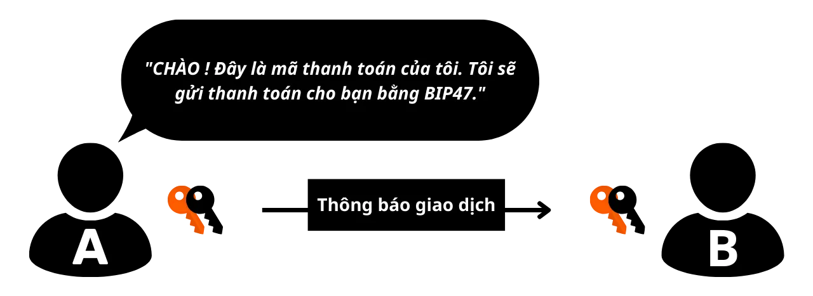

Vì vậy, sẽ có thể triển khai BIP47 mà không cần đến giao dịch thông báo, miễn là mỗi người dùng giữ một bản sao lưu của mã thanh toán của đối tác. Tuy nhiên, phương pháp này chứng minh là phức tạp để quản lý nếu một giải pháp đơn giản, mạnh mẽ và hiệu quả cho việc tạo ra, lưu trữ và cập nhật các bản sao lưu này không được phát triển. Do đó, trong tình hình hiện tại, giao dịch thông báo trở nên gần như không thể thiếu.

Trong các chương tiếp theo, chúng ta sẽ nghiên cứu các giao thức khác với mục tiêu tương tự như BIP47, nhưng không yêu cầu giao dịch thông báo. Tuy nhiên, những phương án thay thế này lại tạo ra những thỏa hiệp riêng của chúng.

Ngoài vai trò trong việc sao lưu mã thanh toán, giao dịch thông báo cũng thực hiện chức năng thông báo cho người nhận, như tên gọi của nó. Nó báo hiệu cho ứng dụng của người nhận biết rằng một kênh thanh toán mới đã được thiết lập, và do đó đề xuất giám sát các địa chỉ tạm thời được tạo ra.

### Mô hình riêng tư của BIP47

Trước khi chi tiết hoá hoạt động kỹ thuật của giao dịch thông báo, quan trọng là phải thảo luận về mô hình riêng tư liên quan đến BIP47, điều này giải thích cho một số biện pháp được thực hiện trong quá trình tạo ra giao dịch ban đầu này.
Mã thanh toán, bản thân nó, không đặt ra rủi ro trực tiếp đối với sự riêng tư. Khác với mô hình Bitcoin truyền thống, mục tiêu là phá vỡ liên kết giữa danh tính của người dùng và các giao dịch của họ (được công khai) bằng cách bảo vệ sự ẩn danh của khóa và địa chỉ, mã thanh toán có thể được liên kết một cách công khai với một danh tính mà không gây ra mối đe dọa.
Quả thực, mã thanh toán không được sử dụng để trực tiếp tạo ra các địa chỉ nhận thanh toán BIP47. Thay vào đó, các địa chỉ này được tạo ra thông qua việc áp dụng ECDH giữa các khóa được tạo ra từ mã thanh toán của hai bên liên quan.

Do đó, một mã thanh toán bản thân nó không trực tiếp dẫn đến đánh mất sự riêng tư, vì chỉ có địa chỉ thông báo được tạo ra từ nó. Mặc dù địa chỉ này có thể tiết lộ một số thông tin, bình thường, nó không cho phép phát hiện các bên mà bạn đang thực hiện giao dịch, trừ khi qua phân tích chuỗi kỹ lưỡng. Quả thực, nếu người gửi sử dụng cac UTXO có thể liên kết với danh tính của họ để thực hiện giao dịch thông báo, thì có thể suy luận rằng danh tính của họ có lẽ liên kết đến các khoản thanh toán BIP47 đến mã thanh toán của bạn. Điều này sẽ không tiết lộ các giao dịch cơ bản nhưng sẽ chỉ ra sự tồn tại có khả năng của chúng.

Do đó, việc duy trì sự tách biệt nghiêm ngặt giữa mã thanh toán của người dùng là cần thiết. Hướng tới mục tiêu này, bước giao tiếp ban đầu của mã là một thời điểm quan trọng cho sự riêng tư của thanh toán, nhưng lại bắt buộc cho sự hoạt động đúng đắn của giao thức. Nếu một trong các mã thanh toán có thể được lấy công khai (như trên một trang web), mã thứ hai, của người gửi, không được liên kết với mã đầu tiên trong bất kỳ trường hợp nào.

Hãy lấy một ví dụ cụ thể: Tôi muốn quyên góp cho một phong trào chính trị qua BIP47:
- Tổ chức đã công bố mã thanh toán của mình trên trang web hoặc qua các mạng xã hội của họ;
- Mã này do đó được liên kết với phong trào chính trị;
- Tôi lấy lại mã thanh toán này;
- Trước khi tiến hành gửi, tôi phải đảm bảo rằng họ biết mã thanh toán của riêng tôi, mã này cũng được liên kết với danh tính của tôi vì tôi sử dụng nó để nhận giao dịch trên các mạng xã hội của mình.

Làm thế nào để truyền mã của tôi mà không có rủi ro? Việc sử dụng các phương tiện liên lạc thông thường có thể dẫn đến rò rỉ thông tin, và do đó, có thể liên kết tôi với phong trào chính trị này. Giao dịch thông báo mang lại cho chúng ta một giải pháp nhờ vào lớp mã hóa mà được tạo ra để ngăn chặn sự liên kết này giữa hai mã. Mặc dù đây không phải là phương pháp duy nhất để truyền mã thanh toán của người gửi một cách bí mật, nhưng nó được chứng minh là rất hiệu quả.

Trong sơ đồ dưới đây, các đường màu cam chỉ ra các điểm nơi dòng thông tin phải bị gián đoạn, và các mũi tên màu đen cho thấy các kết nối tiềm năng có thể bị quan sát bởi bên thứ ba:
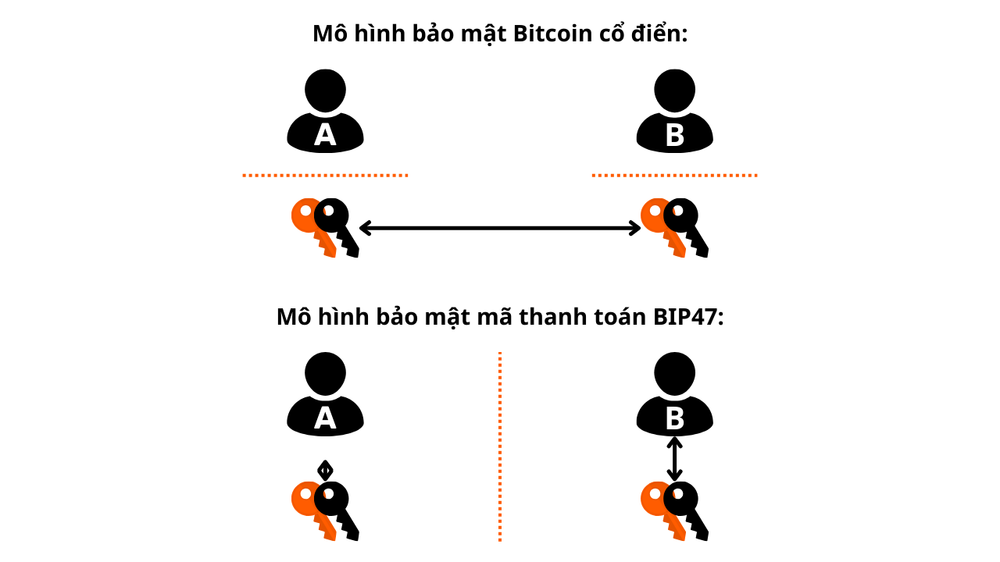
Trong thực tế, trong mô hình riêng tư truyền thống của Bitcoin, việc hoàn toàn tách biệt dòng thông tin giữa cặp khóa và người dùng, đặc biệt là trong các giao dịch từ xa là rất phức tạp. Ví dụ, trong bối cảnh của một chiến dịch quyên góp, người nhận bắt buộc phải tiết lộ một địa chỉ hoặc một khóa công khai qua trang web hoặc mạng xã hội của họ. Việc sử dụng đúng BIP47, đặc biệt là với giao dịch thông báo, cho phép vượt qua vấn đề này nhờ vào ECDHE và lớp mã hóa mà chúng ta sẽ nghiên cứu thêm.

Tất nhiên, mô hình riêng tư cổ điển của Bitcoin vẫn áp dụng cho các khóa công khai dùng tạm, được tạo ra từ sự kết hợp của hai mã thanh toán. Hai mô hình thực sự bổ sung cho nhau. Điều tôi muốn nhấn mạnh ở đây là, trái ngược với việc sử dụng một khóa công khai theo cách thông thường để nhận bitcoin, mã thanh toán có thể được liên kết với một danh tính cụ thể, bởi vì thông tin "_Alice thực hiện giao dịch với Bob_" được phá vỡ ở một giai đoạn khác. Mã thanh toán được sử dụng để tạo địa chỉ thanh toán, nhưng chỉ dựa trên quan sát blockchain, là không thể liên kết một giao dịch thanh toán BIP47 với các mã thanh toán được sử dụng để thực hiện nó, trừ khi các UTXO liên quan đã được liên kết với một danh tính trước đó và người dùng đã liên kết các mã thanh toán của họ với danh tính tương ứng của họ.

Tóm lại, mô hình riêng tư được cung cấp bởi các giao dịch thanh toán BIP47 có thể được coi là vượt trội so với cơ sở của Bitcoin, mặc dù nó không phải là phép màu theo bất kỳ nghĩa nào.

### Xây dựng giao dịch thông báo

Bây giờ, hãy xem cách giao dịch thông báo này hoạt động. Hãy tưởng tượng Alice muốn gửi tiền cho Bob với BIP47. Trong ví dụ của tôi, Alice đóng vai trò là người gửi và Bob là người nhận. Người sau đã công bố mã thanh toán của mình trên trang web của mình. Do đó, Alice đã biết mã thanh toán của Bob.

**1- Alice tính toán một bí mật chung với ECDH:**

- Cô ấy chọn một cặp khóa từ ví HD của mình nằm trên một nhánh khác từ mã thanh toán của mình. Lưu ý, cặp này không nên dễ dàng được liên kết với địa chỉ thông báo của Alice, cũng như với danh tính của Alice (xem phần trước);

- Alice chọn khóa riêng từ cặp này. Chúng ta gọi nó là a (chữ thường);

$$
a
$$
- Alice lấy khóa công khai liên kết với địa chỉ thông báo của Bob. Khóa này là con gái đầu tiên được sinh ra từ mã thanh toán của Bob (chỉ mục /0). Chúng ta gọi khóa công khai này là B (chữ hoa). Khóa riêng tư liên kết với khóa công khai này được gọi là b (chữ thường). B được xác định bằng cách cộng và nhân đôi các điểm trên đường cong e-líp từ G (điểm sinh) với b (khóa riêng tư):
$$ B = b \cdot G $$
- Alice tính toán một điểm bí mật S (viết hoa) trên đường cong e-líp bằng cách cộng và nhân đôi các điểm bằng cách áp dụng khóa riêng tư a của cô ấy từ khóa công khai B của Bob.
$$ S = a \cdot B $$

- Alice tính toán hệ số làm mờ $f$ sẽ cho phép cô ấy mã hóa mã thanh toán của mình. Để làm điều này, cô ấy sẽ xác định một số giả ngẫu nhiên với hàm HMAC-SHA512. Trong đầu vào thứ hai của hàm này, cô ấy sử dụng một giá trị mà chỉ Bob mới có thể truy xuất: x là hoành độ của điểm bí mật đã được tính toán trước đó. Đầu vào đầu tiên o là UTXO được tiêu thụ trong đầu vào của giao dịch này (điểm ra - outpoint).

$$ f = \text{HMAC-SHA512}(o, x) $$

**2- Alice chuyển đổi mã thanh toán cá nhân của mình sang cơ số 2 (nhị phân).**

**3- Cô ấy sử dụng hệ số làm mờ này như một khóa để thực hiện mã hóa đối xứng trên payload của mã thanh toán của mình.** Thuật toán mã hóa được sử dụng đơn giản là `XOR`. Phép toán được thực hiện tương đương với mã Vernam, còn được gọi là "One-Time Pad".

- Alice đầu tiên chia hệ số làm mờ của mình thành hai phần: 32 byte đầu tiên được gọi là f1 và 32 byte cuối cùng được gọi là f2. Như vậy, chúng ta có:

$$ f = f1 || f2 $$

- Alice tính toán x' được mã hóa của hoành độ khóa công khai x của mã thanh toán của mình, và c' được mã hóa của mã chuỗi c một cách riêng biệt. f1 và f2 lần lượt đóng vai trò như các khóa mã hóa. Phép toán được sử dụng là `XOR` (hoặc độc quyền).

$$ x' = x \oplus f1 $$
$$ c' = c \oplus f2 $$

- Alice thay thế các giá trị thực của hoành độ khóa công khai x và mã chuỗi c trong mã thanh toán của mình bằng các giá trị được mã hóa x' và c'.
**4-** Hiện tại Alice có mã thanh toán của mình với payload được mã hóa. Cô ấy sẽ xây dựng và phát sóng một giao dịch bao gồm khóa công khai A của mình làm đầu vào, một đầu ra đến địa chỉ thông báo của Bob, và một đầu ra `OP_RETURN` chứa mã thanh toán của cô ấy với payload được mã hóa. **Giao dịch này là giao dịch thông báo**.
Một `OP_RETURN` là một opcode đánh dấu một đầu ra giao dịch Bitcoin như không hợp lệ. Ngày nay, nó được sử dụng để phát sóng hoặc neo thông tin trên blockchain Bitcoin. Tối đa 80 byte dữ liệu có thể được lưu trữ, được viết trên chuỗi và do đó có thể nhìn thấy bởi tất cả người dùng khác.

Như chúng ta đã thấy trong các phần trước, ECDH được sử dụng để tạo ra một bí mật chung giữa hai người dùng giao tiếp qua một mạng lưới không an toàn, có thể được quan sát bởi kẻ tấn công. Trong BIP47, ECDH được sử dụng cho giao tiếp qua mạng Bitcoin, bản chất là một mạng giao tiếp minh bạch được nhiều kẻ tấn công quan sát. Bí mật chung được tính toán thông qua trao đổi khóa ECDH sau đó được sử dụng để mã hóa thông tin bí mật cần truyền đạt: mã thanh toán của người gửi (Alice).

Hãy tóm tắt lại các bước mà chúng ta vừa xem xét cùng nhau để thực hiện một giao dịch thông báo:
- Alice lấy mã thanh toán và địa chỉ thông báo của Bob;
- Alice chọn một UTXO mà cô ấy sở hữu trong ví HD của mình với cặp khóa tương ứng;
- Cô ấy tính toán một điểm bí mật trên đường cong e-líp sử dụng ECDH;
- Cô ấy sử dụng điểm bí mật này để tính toán một HMAC, đó là hệ số làm mờ;
- Cô ấy sử dụng hệ số làm mờ này để mã hóa payload của mã thanh toán cá nhân của mình;
- Cô ấy sử dụng một đầu ra giao dịch `OP_RETURN` để truyền đạt mã thanh toán được che giấu cho Bob.
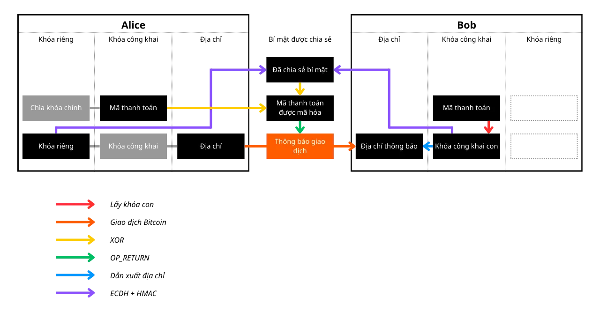

### Giao thông báo: Nghiên cứu cụ thể

Để hiểu rõ hơn về cách hoạt động, đặc biệt là việc sử dụng `OP_RETURN`, hãy cùng nhau xem xét một giao dịch thông báo thực tế. Tôi đã thực hiện một giao dịch như vậy trên testnet, bạn có thể tìm thấy [bằng cách nhấp vào đây](https://mempool.space/fr/testnet/tx/0e2e4695a3c49272ef631426a9fd2dae6ec3a469e3a39a3db51aa476cd09de2e).


Quan sát giao dịch này, chúng ta có thể thấy nó có một đầu vào và 4 đầu ra:
- Đầu ra đầu tiên là `OP_RETURN` chứa mã thanh toán được che giấu của tôi;
- Đầu ra thứ hai chứa 546 satoshi chỉ đến địa chỉ thông báo của người nhận;
- Đầu ra thứ ba chứa 15,000 satoshi được dùng để trả phí dịch vụ, vì tôi đã sử dụng Samourai Wallet để xây dựng giao dịch này;
- Đầu ra thứ tư chứa 2 triệu satoshi là tiền thối, tức là sự chênh lệch còn lại từ đầu vào của tôi quay trở lại một địa chỉ khác thuộc về tôi.
Điều thú vị nhất để nghiên cứu rõ ràng là đầu ra số 0 sử dụng `OP_RETURN`. Hãy xem xét kỹ hơn nội dung của nó. Đây là `scriptPubKey` dưới dạng hệ thập lục phân:

```text
6a4c50010002b13b2911719409d704ecc69f74fa315a6cb20fdd6ee39bc9874667703d67b164927b0e88f89f3f8b963549eab2533b5d7ed481a3bea7e953b546b4e91b6f50d800000000000000000000000000
```

Trong script này, chúng ta có thể phân tích một số phần. Đầu tiên là các opcode:

```text
6a4c
```

Trong số các opcode, chúng ta có thể nhận ra `0x6a` chỉ định `OP_RETURN` và `0x4c` chỉ định `OP_PUSHDATA1`.

Byte tiếp theo sau opcode này chỉ ra kích thước của payload theo sau. Nó chỉ ra `0x50`, hay 80 byte:

```text
6a4c50
```

Sau đó, chúng ta có metadata của mã thanh toán của tôi dưới dạng văn bản rõ ràng:

```text
010002
```

Tọa độ x được mã hóa của khóa công khai của mã thanh toán của tôi:

```text
b13b2911719409d704ecc69f74fa315a6cb20fdd6ee39bc9874667703d67b164
```

Mã chuỗi được mã hóa của mã thanh toán của tôi:

```text
927b0e88f89f3f8b963549eab2533b5d7ed481a3bea7e953b546b4e91b6f50d8
```

Và cuối cùng, đệm để đạt được 80 byte, kích thước tiêu chuẩn của một `OP_RETURN`:

```text
00000000000000000000000000
```

Để hiểu rõ hơn, đây là mã thanh toán của tôi dưới dạng văn bản rõ ràng trong hệ Base58:

```text
PM8TJQCyt6ovbozreUCBrfKqmSVmTzJ5vjqse58LnBzKFFZTwny3KfCDdwTqAEYVasn11tTMPc2FJsFygFd3YzsHvwNXLEQNADgxeGnMK8Ugmin62TZU
```

Và ở hệ Base16:

```text
4701000277507c9c17a89cfca2d3af554745d6c2db0e7f6b2721a3941a504933103cc42add94881210d6e752a9abc8a9fa0070e85184993c4f643f1121dd807dd556d1dc000000000000000000000000008604e4db
```

Khi so sánh mã thanh toán dạng văn bản của tôi với `OP_RETURN`, có thể thấy rằng HRP (`0x47`) và checksum (`0x8604e4db`) không được truyền đi. Điều này là dự kiến, vì những thông tin này dành cho con người. Tiếp theo, chúng ta có thể xác định phiên bản (`0x01`), trường bit (`0x00`), và tính chẵn lẻ của khóa công khai (`0x02`). Và, ở cuối mã thanh toán, các byte trống (`0x00000000000000000000000000`) được sử dụng để đệm mã lên tổng cộng 80 byte. Tất cả những metadata này được truyền đi dưới dạng văn bản rõ (không mã hóa).

Cuối cùng, có thể quan sát thấy rằng tọa độ x của khóa công khai (`0x77507c9c17a89cfca2d3af554745d6c2db0e7f6b2721a3941a504933103cc42a`) và mã chuỗi (`0xdd94881210d6e752a9abc8a9fa0070e85184993c4f643f1121dd807dd556d1dc`) đã được mã hóa. Điều này tạo thành phần nội dung của mã thanh toán.

### XOR là gì?

Trong các phần trước, chúng ta đã thấy rằng mã thanh toán được truyền đi dưới dạng mã hóa sử dụng phép toán XOR. Hãy dành một chút thời gian để hiểu cách hoạt động của toán tử này, vì nó được sử dụng rộng rãi trong mật mã học.

XOR là một toán tử logic theo bit dựa trên đại số Boolean. Với hai toán hạng bit, nó trả về `1` nếu các bit cùng hạng khác nhau, và trả về `0` nếu các bit cùng hạng giống nhau. Dưới đây là bảng chân lý của XOR dựa trên giá trị của các toán hạng `D` và `E`:

| D   | E   | D XOR E |
| --- | --- | ------- |
| 0   | 0   | 0       |
| 0   | 1   | 1       |
| 1   | 0   | 1       |
| 1   | 1   | 0       |

Ví dụ:

$$
0110 \oplus 1110 = 1000
$$

Hoặc:

$$
010011 \oplus 110110 = 100101
$$

Với ECDH, việc sử dụng XOR làm lớp mã hóa đặc biệt phù hợp. Đầu tiên, vì với toán tử này, mã hóa là đối xứng. Điều này cho phép người nhận giải mã mã thanh toán bằng cùng một khóa được sử dụng để mã hóa. Chìa khóa mã hóa và giải mã được tính từ bí mật chung nhờ ECDH. Tính đối xứng này được kích hoạt bởi các tính chất giao hoán và kết hợp của toán tử XOR:

- Các tính chất khác:

$$
D \oplus D = 0
$$
D ⊕ 0 = D
- Tính giao hoán:

$$
D \oplus E = E \oplus D
$$

- Tính kết hợp:

$$
D \oplus (E \oplus Z) = (D \oplus E) \oplus Z = D \oplus E \oplus Z
$$

Nếu:

$$
D \oplus E = L
$$

Thì:

$$
D \oplus L = D \oplus (D \oplus E) = D \oplus D \oplus E = 0 \oplus E = E \\
\therefore D \oplus L = E
$$

Tiếp theo, phương pháp mã hóa này rất giống với mã Vernam (One-Time Pad - Đệm một lần), là thuật toán mã hóa duy nhất được biết đến cho đến nay có độ bảo mật tuyệt đối. Để mã Vernam có được đặc tính này, khóa mã hóa phải hoàn toàn ngẫu nhiên, phải có kích thước bằng với thông điệp, và chỉ được sử dụng một lần. Trong phương pháp mã hóa được sử dụng cho BIP47, khóa thực sự có kích thước bằng với thông điệp, yếu tố làm mờ chính xác bằng kích thước của sự kết hợp giữa tọa độ x của khóa công khai với mã chuỗi của mã thanh toán. Khóa mã hóa này thực sự chỉ được sử dụng một lần. Tuy nhiên, khóa này không phải là kết quả của sự ngẫu nhiên hoàn hảo vì nó là một HMAC - Hash-based Message Authentication Code (Mã xác thực tin nhắn dựa trên mã băm). Nó khá giả ngẫu nhiên. Do đó, nó không phải là mã Vernam, nhưng phương pháp này tương tự.

### Nhận giao dịch thông báo

Bây giờ Alice đã gửi giao dịch thông báo cho Bob, hãy xem anh ấy giải mã nó như thế nào. Nhắc lại, Bob phải có khả năng truy cập vào mã thanh toán của Alice. Không có thông tin này, như chúng ta sẽ thấy trong phần sau, anh ấy sẽ không thể suy ra các cặp khóa được tạo bởi Alice, và do đó, anh ấy sẽ không thể truy cập vào số bitcoin mình nhận được thông qua BIP47. Hiện tại, payload của mã thanh toán của Alice được mã hóa. Hãy xem Bob giải mã nó như thế nào.

**1-** Bob theo dõi các giao dịch tạo ra các đầu vào với địa chỉ thông báo của mình.

**2-** Khi một giao dịch có đầu ra dấn đến địa chỉ thông báo của mình, Bob phân tích nó để xem nó có chứa đầu ra OP_RETURN theo tiêu chuẩn BIP47 hay không.

**3-** Nếu byte đầu tiên của payload OP_RETURN là `0x01`, Bob bắt đầu tìm kiếm một bí mật được chia sẻ khả dĩ với ECDH:
- Bob chọn khóa công khai trong đầu vào của giao dịch. Đó là, khóa công khai của Alice được gọi là A với:

$$ A = a \cdot G $$

- Bob chọn khóa riêng b liên quan đến địa chỉ thông báo cá nhân của mình:

$$ b $$
- Bob tính điểm bí mật S (bí mật chia sẻ ECDH) trên đường cong e-líp bằng cách cộng và nhân đôi các điểm, áp dụng khóa riêng b của mình vào khóa công khai A của Alice:
$$ S = b \cdot A $$

- Bob xác định yếu tố làm mờ f sẽ cho phép anh ấy giải mã payload của mã thanh toán của Alice. Cùng một cách mà Alice đã tính trước đó, Bob sẽ tìm f bằng cách áp dụng HMAC-SHA512 trên tung độ x của điểm bí mật S, và trên UTXO o được tiêu thụ như đầu vào trong giao dịch thông báo này:

$$ f = \text{HMAC-SHA512}(o, x) $$

**4-** Bob giải mã dữ liệu trong OP_RETURN của giao dịch thông báo như một mã thanh toán. Anh ấy sẽ giải mã payload của mã thanh toán tiềm năng này một cách đơn giản sử dụng yếu tố làm mờ f:
- Bob chia yếu tố làm mờ f thành 2 phần: 32 byte đầu tiên của f sẽ là f1 và 32 byte cuối cùng sẽ là f2;
- Bob giải mã tọa độ x đã mã hóa x' của khóa công khai từ mã thanh toán của Alice:

$$ x = x' \oplus f1 $$

- Bob giải mã giá trị mã chuỗi đã mã hóa c' từ mã thanh toán của Alice:

$$ c = c' \oplus f2 $$

**5-** Bob kiểm tra xem giá trị của khóa công khai từ mã thanh toán của Alice có thực sự thuộc nhóm secp256k1 hay không. Nếu đúng, anh ta coi đây là một mã thanh toán hợp lệ. Nếu không, anh ta sẽ bỏ qua giao dịch này.

Giờ đây, khi Bob đã biết mã thanh toán của Alice, cô ấy có thể gửi cho anh ta tới `2^32` khoản thanh toán (khoảng hơn 4 tỷ), mà không bao giờ cần thực hiện một giao dịch thông báo kiểu này nữa.

Tại sao điều này lại hoạt động? Làm thế nào Bob có thể xác định được cùng một yếu tố làm mờ như Alice, và do đó giải mã mã thanh toán của cô ấy? Hãy xem xét kỹ hơn vai trò của ECDH trong những gì chúng ta vừa mô tả.

Trước hết, chúng ta đang đối mặt với mã hóa đối xứng. Điều này có nghĩa là khóa mã hóa và khóa giải mã là cùng một giá trị. Khóa trong giao dịch thông báo này là yếu tố làm mờ:

$$ f = f1 || f2 $$

Do đó, Alice và Bob phải thu được cùng một giá trị cho f, mà không trực tiếp truyền đạt nó vì một kẻ tấn công có thể đánh cắp nó và giải mã thông tin bí mật. Yếu tố làm mờ này thu được bằng cách áp dụng HMAC-SHA512 trên 2 giá trị:
- tọa độ x của một điểm bí mật;
- và UTXO được tiêu thụ như đầu vào trong giao dịch.
Do đó, Bob cần hai thông tin này để giải mã payload của mã thanh toán của Alice. Đối với UTXO như đầu vào, Bob có thể đơn giản lấy nó bằng cách quan sát giao dịch thông báo. Đối với điểm bí mật, Bob sẽ phải sử dụng ECDH. Như đã thấy trong phần trước về Diffie-Hellman, chỉ bằng cách trao đổi khóa công khai tương ứng và bí mật áp dụng khóa riêng tư của họ vào khóa công khai của người kia, Alice và Bob có thể tìm ra một điểm cụ thể và bí mật trên đường cong e-líp. Giao dịch thông báo dựa vào cơ chế này:
- Cặp khóa của Bob:

$$ B = b \cdot G $$

- Cặp khóa của Alice:

$$ A = a \cdot G $$

- Đối với một điểm bí mật S(x, y):

$$ S = a \cdot B = a \cdot (b \cdot G) = (b \cdot a) \cdot G = b \cdot A $$

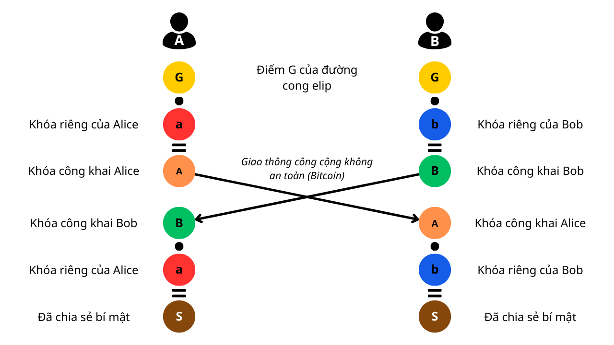

Giờ đây, khi Bob biết mã thanh toán của Alice, anh ta sẽ có thể phát hiện các khoản thanh toán BIP47 của cô ấy, và anh ta có thể suy ra các khóa riêng để mở khóa số bitcoin nhận được.

Hãy tóm tắt lại các bước mà chúng ta vừa trải qua để nhận và diễn giải một giao dịch thông báo:
- Bob theo dõi các đầu ra giao dịch đến địa chỉ thông báo của mình;
- Khi anh ta phát hiện một đầu ra, anh ta lấy thông tin chứa trong OP_RETURN;
- Bob chọn khóa công khai trong đầu vào và tính toán một điểm bí mật sử dụng ECDH;
- Anh ta sử dụng điểm bí mật này để tính toán một HMAC là yếu tố làm mờ;
- Anh ta sử dụng yếu tố làm mờ này để giải mã payload của mã thanh toán của Alice chứa trong OP_RETURN.

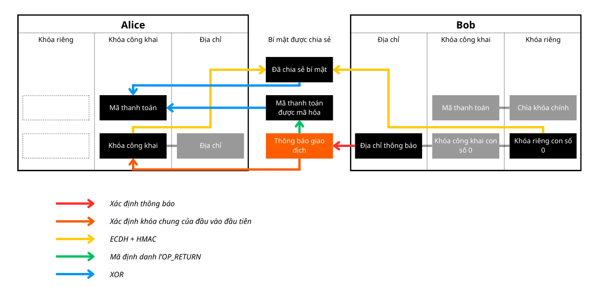

### Giao dịch thanh toán BIP47

Bây giờ, hãy cùng nhau nghiên cứu quy trình thanh toán với BIP47. Để nhắc lại tình hình hiện tại:
- Alice biết mã thanh toán của Bob bằng cách đơn giản là lấy từ website của anh ta;
- Bob biết mã thanh toán của Alice nhờ vào giao dịch thông báo; Alice sẽ thực hiện một khoản thanh toán đầu tiên cho Bob. Cô ấy sẽ có thể thực hiện nhiều khoản thanh toán khác theo cùng một cách.

Trước khi giải thích quy trình này, tôi nghĩ, quan trọng là phải nhắc lại các chỉ số mà chúng ta đang làm việc hiện tại. Đường dẫn xuất của một mã thanh toán được mô tả như sau: `m/47'/0'/0'`. Độ sâu tiếp theo phân phối các chỉ số theo cách này:
- Cặp con bình thường (không cứng) đầu tiên là cái được sử dụng để tạo ra địa chỉ thông báo mà chúng ta đã nói về trong phần trước: `m/47'/0'/0'/0`;
- Các cặp khóa con bình thường được sử dụng trong ECDH để tạo ra địa chỉ nhận thanh toán BIP47 như chúng ta sẽ thấy trong phần này: từ `m/47'/0'/0'/0` đến `m/47'/0'/0'/2 147 483 647`;
- Các cặp khóa con cứng là các mã thanh toán tạm thời: từ `m/47'/0'/0'/0'` đến `m/47'/0'/0'/2 147 483 647'`.

Bất cứ khi nào Alice muốn gửi một khoản thanh toán cho Bob, cô ấy tạo ra một địa chỉ mới, độc nhất, chưa từng sử dụng, nhờ giao thức ECDH:
- Alice chọn khóa riêng đầu tiên được sinh ra từ mã thanh toán cá nhân có thể tái sử dụng của mình:

$$ a $$

- Alice chọn khóa công khai chưa sử dụng đầu tiên được sinh ra từ mã thanh toán của Bob. Khóa công khai này, chúng ta sẽ gọi nó là B. Nó được liên kết với khóa riêng b mà chỉ Bob biết:

$$ B = b \cdot G $$

- Alice tính toán một điểm bí mật S trên đường cong e-líp bằng cách cộng và nhân đôi điểm bằng cách áp dụng khóa riêng a của mình vào khóa công khai B của Bob:

$$ S = a \cdot B $$

- Từ điểm bí mật này, Alice sẽ tính toán bí mật chung s (chữ thường). Để làm điều này, cô ấy chọn tọa độ x của điểm bí mật S được gọi là Sx, và cô ấy đưa giá trị này qua hàm băm SHA256:

$$ S = (Sx, Sy) $$
$$ s = \text{SHA256}(Sx) $$

- Alice sử dụng bí mật chung s này để tính toán một địa chỉ nhận thanh toán Bitcoin. Ban đầu, cô ấy xác minh rằng s nằm trong phạm vi của đường cong secp256k1. Nếu không, cô ấy tăng chỉ số của khóa công khai của Bob để sinh ra một bí mật chung khác;
- Thứ hai, cô ấy tính toán một khóa công khai K0 bằng cách cộng trên đường cong e-líp các điểm B và s·G. Nói cách khác, Alice cộng khóa công khai được phái sinh từ mã thanh toán của Bob B với một điểm khác được tính toán trên đường cong e-líp bằng cách cộng và nhân đôi với bí mật chung s từ điểm sinh của đường cong secp256k1 G. Điểm mới này đại diện cho một khóa công khai, và chúng ta gọi nó là K0:

$$ K0 = B + s \cdot G $$

- Với khóa công khai K0 này, Alice có thể phái sinh một địa chỉ nhận tiêu chuẩn mới (ví dụ, SegWit V0 trong bech32).
Một khi Alice đã có được địa chỉ nhận của Bob K0, cô ấy có thể thực hiện một giao dịch Bitcoin theo cách tiêu chuẩn. Để làm điều này, cô ấy chọn một UTXO mà cô ấy sở hữu, được bảo vệ bởi một cặp khóa từ một nhánh khác trong ví HD của mình, và chi tiêu nó để thỏa mãn một đầu ra cho địa chỉ của Bob K0. Quan trọng là phải lưu ý rằng khoản thanh toán này, một khi địa chỉ được sinh ra, tuân theo một quy trình thông thường và không còn phụ thuộc vào các khóa liên quan đến BIP47.
Hãy cùng ôn lại các bước mà chúng ta vừa trải qua để thực hiện một giao dịch BIP47:
- Alice chọn khóa riêng con đầu tiên được sinh ra từ mã thanh toán cá nhân của cô ấy;
- Cô ấy tính toán một điểm bí mật trên đường cong e-líp sử dụng ECDH từ khóa công khai con chưa được sử dụng đầu tiên từ mã thanh toán của Bob;
- Cô ấy sử dụng điểm bí mật này để tính toán một bí mật chung với SHA256;
- Cô ấy sử dụng bí mật chung này để tính toán một điểm bí mật mới trên đường cong e-líp;
- Cô ấy thêm điểm bí mật mới này vào khóa công khai của Bob;
- Cô ấy nhận được một khóa công khai tạm thời mới mà chỉ Bob có khóa riêng tư tương ứng;
- Alice có thể thực hiện một giao dịch tiêu chuẩn với Bob thông qua địa chỉ nhận tạm thời được vừa được sinh ra từ khoá công khai trên.

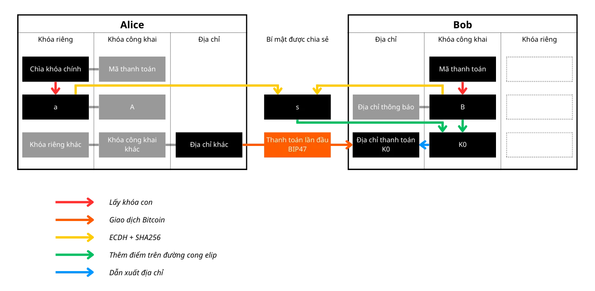

Nếu Alice muốn thực hiện một khoản thanh toán thứ hai, cô ấy sẽ tuân theo các bước như trước, ngoại trừ lần này cô ấy sẽ chọn khóa công khai con thứ hai từ mã thanh toán của Bob. Cụ thể, cô ấy sẽ sử dụng khóa chưa được sử dụng tiếp theo. Cô ấy do đó sẽ nhận được một địa chỉ nhận mới thuộc về Bob, được chỉ định là K1:

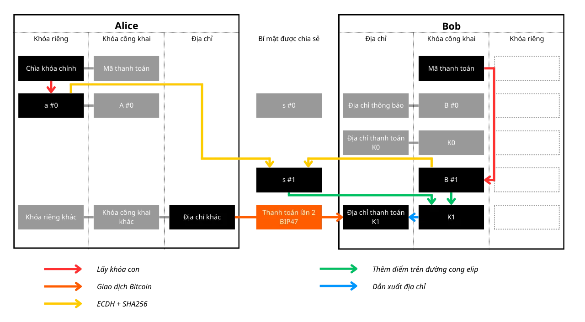

Cô ấy có thể tiếp tục theo cách này và sinh ra tới `2^32` địa chỉ chưa được sử dụng thuộc về Bob.

Từ góc nhìn bên ngoài, theo lý thuyết, bằng cách quan sát blockchain, không thể phân biệt một giao dịch BIP47 với một giao dịch tiêu chuẩn. Dưới đây là một ví dụ về giao dịch BIP47 trên Testnet:

```text
94b2e59510f2e1fa78411634c98a77bbb638e28fb2da00c9f359cd5fc8f87254
```

Điều này trông giống như một giao dịch tiêu chuẩn với một đầu vào đã được sử dụng, một đầu ra để thanh toán, và một đầu ra thối tiền:


### Nhận giao dịch BIP47 và Sinh khoá riêng

Alice vừa thực hiện khoản thanh toán đầu tiên của mình đến một địa chỉ BIP47 mới thuộc về Bob. Bây giờ, hãy xem Bob nhận thanh toán này như thế nào. Chúng ta cũng sẽ xem tại sao Alice không có quyền truy cập vào khóa riêng của địa chỉ mà cô ấy vừa tạo ra, và làm thế nào Bob lấy lại khóa này để chi tiêu bitcoin mà anh ấy vừa nhận được.
Ngay khi Bob nhận được giao dịch thông báo từ Alice, anh ấy sinh ra khóa công khai BIP47 K0 ngay cả trước khi cô ấy gửi bất kỳ khoản thanh toán nào. Sau đó, anh ấy theo dõi bất kỳ khoản thanh toán nào đến địa chỉ liên quan. Thực tế, anh ấy ngay lập tức sinh ra một số địa chỉ mà anh ấy sẽ theo dõi (K0, K1, K2, K3...). Dưới đây là cách anh ấy sinh ra khóa công khai K0 này:
- Bob chọn khóa con riêng đầu tiên được sinh ra từ mã thanh toán của mình. Khóa riêng này được gọi là b. Nó được liên kết với khóa công khai B mà Alice đã sử dụng trong các bước trước:

$$ b $$

- Bob chọn khóa công khai đầu tiên của Alice được sinh ra từ mã thanh toán của cô ấy. Khóa này được gọi là A. Nó được liên kết với khóa riêng a mà Alice đã sử dụng, và chỉ có Alice biết. Bob có thể thực hiện quá trình này vì anh ấy biết mã thanh toán của Alice được truyền cho anh ấy với giao dịch thông báo:

$$ A = a \cdot G $$

- Bob tính toán điểm bí mật S, bằng cách cộng và nhân đôi các điểm trên đường cong e-líp, áp dụng khóa riêng b của mình vào khóa công khai A của Alice. Tại đây chúng ta tìm thấy việc sử dụng ECDH đảm bảo rằng điểm này S sẽ giống nhau cho cả Bob và Alice:

$$ S = b \cdot A $$
- Giống như Alice, Bob tách biệt tọa độ x của điểm S này. Chúng ta đã đặt tên giá trị này là Sx. Anh ta đưa giá trị này qua hàm SHA256 để tìm ra bí mật chung s (chữ thường):
$$ s = \text{SHA256}(Sx) $$

- Giống như Alice, Bob tính toán điểm s·G trên đường cong e-líp. Sau đó, anh ta cộng điểm bí mật này với khóa công khai B của mình. Anh ta sau đó nhận được một điểm mới trên đường cong e-líp mà anh ta xem là khóa công khai KO:

$$ K0 = B + s \cdot G $$

Một khi Bob có khóa công khai K0, anh ta có thể suy ra khóa riêng tư tương ứng để có thể chi tiêu bitcoin của mình. Anh ta là người duy nhất có thể tạo ra khóa riêng tư này:

- Bob cộng khóa riêng tư con của mình b được suy ra từ mã thanh toán cá nhân của mình. Anh ta là người duy nhất có thể biết được giá trị của b. Sau đó, anh ta cộng b với bí mật chung s để nhận được k0, khóa riêng tư của K0:

$$ k0 = b + s $$

Nhờ vào luật nhóm của đường cong e-líp, Bob nhận được khóa riêng tư tương ứng với khóa công khai mà Alice sử dụng một cách chính xác. Chúng ta có:

$$ K0 = k0 \cdot G $$
Tôi sẽ tóm tắt các bước chúng ta vừa trải qua cùng nhau để nhận một khoản thanh toán BIP47 và tính toán khóa riêng tư tương ứng:
- Bob chọn khóa riêng tư con đầu tiên được suy ra từ mã thanh toán cá nhân của mình;
- Anh ta tính toán một điểm bí mật trên đường cong e-líp sử dụng ECDH từ khóa công khai con đầu tiên được suy ra từ mã chuỗi của Alice;
- Anh ta sử dụng điểm bí mật này để tính toán một bí mật chung với SHA256;
- Anh ta sử dụng bí mật chung này để tính toán một điểm bí mật mới trên đường cong e-líp;
- Anh ta cộng điểm bí mật mới này với khóa công khai cá nhân của mình;
- Anh ta nhận được một khóa công khai tạm thời mới, mà Alice sẽ gửi khoản thanh toán đầu tiên của cô ấy;
- Bob tính toán khóa riêng tư tương ứng với khóa công khai tạm thời này bằng cách cộng khóa riêng tư con của mình được suy ra từ mã thanh toán và bí mật chung.

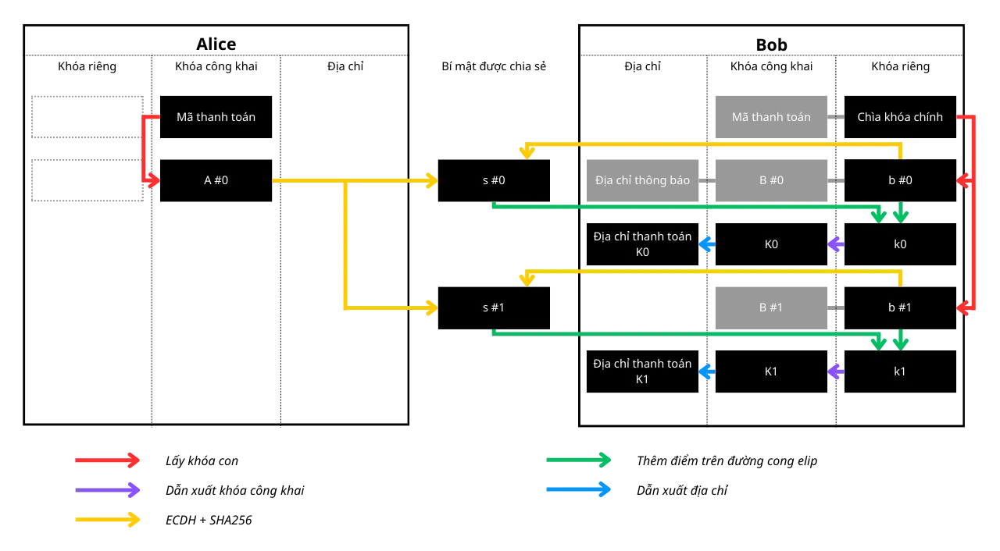

Vì Alice không thể có được b (khóa riêng tư của Bob), cô ấy không thể xác định được k0 (khóa riêng tư tương ứng với địa chỉ nhận BIP47 của Bob). Chúng ta có thể biểu diễn sơ đồ hoá việc tính toán bí mật chung S như thế này:


Một khi bí mật chung được tìm thấy với ECDH, Alice và Bob tính toán khóa công khai thanh toán BIP47 K0, và Bob cũng tính toán khóa riêng tư tương ứng k0:

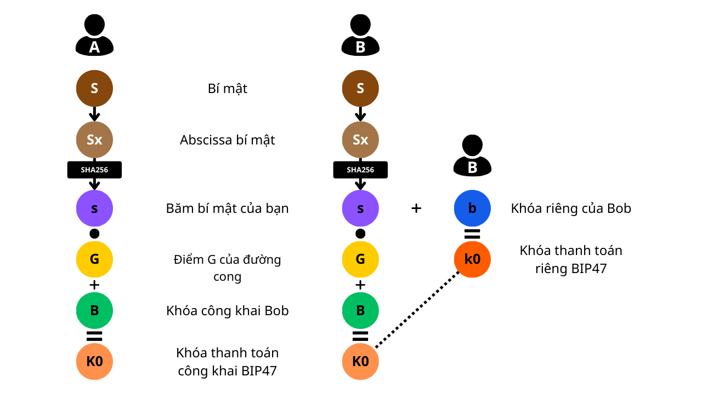

### Hoàn tiền cho khoản toán BIP47

Vì Bob biết mã thanh toán có thể tái sử dụng của Alice, anh ta đã có tất cả thông tin cần thiết để gửi lại tiền cho cô ấy. Anh ta sẽ không cần phải liên hệ lại với Alice để yêu cầu bất kỳ thông tin nào. Anh ta chỉ cần thông báo cho cô ấy bằng một giao dịch thông báo, nhằm giúp cô ấy có thể lấy lại địa chỉ BIP47 và hạt giống của mình, và sau đó anh ta cũng có thể gửi cho cô ấy tới `2^32` khoản thanh toán.

Chức năng hoàn tiền là đặc thù của BIP47 và là một trong những ưu điểm so với các phương pháp khác mà chúng ta sẽ nghiên cứu trong các chương tiếp theo, như Silent Payments.

Bob sau đó có thể hoàn tiền cho Alice theo cùng một cách mà cô ấy đã gửi cho anh ta các khoản thanh toán. Vai trò được đảo ngược:

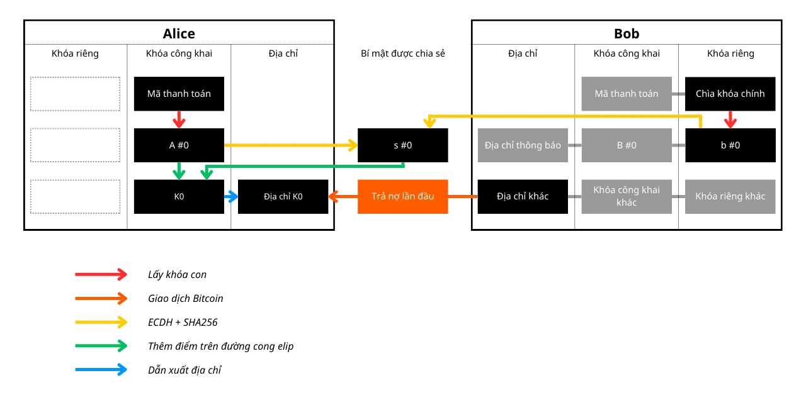
*Xin chân thành cảm ơn [Fanis Michalakis](https://x.com/FanisMichalakis) vì đã duyệt bài và đưa ra những lời khuyên chuyên môn quý báu về bài viết đã truyền cảm hứng cho việc viết chương này!*
## Thanh toán ẩn danh
<chapterId>2871d594-414e-4598-a830-91c9eb84dfb8</chapterId>
BIP47 đã bị chỉ trích vì sự không hiệu quả của nó trên chuỗi. Như đã giải thích trong chương trước, nó đòi hỏi một giao dịch thông báo cho mỗi người nhận mới. Ràng buộc này trở nên không trở thành vấn đề lớn nếu người ta dự định thiết lập một kênh thanh toán lâu dài với người nhận này. Thực vậy, một giao dịch thông báo mở đường cho một số lượng gần như vô hạn các khoản thanh toán BIP47 tiếp theo.

Tuy nhiên, trong một số tình huống, giao dịch thông báo có thể là một trở ngại cho người dùng. Lấy ví dụ về một khoản quyên góp một lần cho một người nhận: với một địa chỉ Bitcoin cổ điển, một giao dịch duy nhất là đủ để thực hiện khoản quyên góp. Nhưng với BIP47, hai giao dịch là cần thiết: một cho thông báo và một cho khoản thanh toán thực sự. Khi nhu cầu về không gian khối thấp và phí giao dịch tối thiểu, bước thêm này không phải là vấn đề. Tuy nhiên, trong những thời kỳ tắc nghẽn, phí giao dịch có thể trở nên cực kỳ cao cho một khoản thanh toán đơn lẻ, việc gấp đôi chi phí cho người dùng so với một giao dịch Bitcoin tiêu chuẩn có thể không được người dùng chấp nhận.

Đối với những tình huống mà người dùng dự định chỉ thực hiện một vài khoản thanh toán cho một định danh cố định, các giải pháp khác đã được phát triển. Trong số đó có thanh toán ẩn danh, được mô tả trong [BIP352](https://github.com/bitcoin/bips/blob/master/bip-0352.mediawiki). Giao thức này cho phép sử dụng một định danh cố định để nhận thanh toán mà không tạo ra việc sử dụng lại địa chỉ, và không yêu cầu sử dụng giao dịch thông báo. Hãy xem xét cách giao thức này hoạt động.

---

*Để hiểu đầy đủ chương này, điều cần thiết là phải quen thuộc với cách hoạt động của ECDH (Elliptic Curve Diffie-Hellman) và việc dẫn xuất ra khóa mật mã trong một ví HD. Những khái niệm này đã được chi tiết hoá trong chương trước về BIP47. Tôi sẽ không đi sâu vào chúng ở đây. Nếu bạn chưa quen với những khái niệm này, tôi khuyên bạn nên tham khảo chương trước trước khi tiếp tục với chương này. Tôi cũng sẽ không bàn lại về những rủi ro liên quan đến việc tái sử dụng địa chỉ nhận, cũng như tầm quan trọng của việc có một định danh duy nhất để nhận thanh toán.*

---

### Tại sao không chuyển thông báo?

Như đã thảo luận trong chương về BIP47, giao dịch thông báo chủ yếu phục vụ hai chức năng:
- Nó thông báo cho người nhận;
- Nó truyền mã thanh toán của người gửi.

Người ta có thể nghĩ một cách ngây thơ rằng quá trình thông báo này có thể được thực hiện ngoại tuyến. Trên lý thuyết, điều này hoàn toàn khả thi: chỉ cần cho người nhận đưa ra một phương tiện liên lạc để nhận mã thanh toán BIP47 từ người gửi. Tuy nhiên, cách tiếp cận này đặt ra hai vấn đề lớn:
- Đầu tiên, điều này sẽ chuyển quá trình truyền mã sang một giao thức liên lạc khác. Các vấn đề liên quan đến chi phí và quyền riêng tư của giao dịch vẫn tồn tại, nhưng chỉ đơn giản là được chuyển sang giao thức mới này. Về mặt quyền riêng tư, điều này cũng có thể tạo ra một liên kết giữa danh tính của người dùng và hoạt động trên chuỗi khối, điều mà chúng ta mong muốn tránh bằng cách thực hiện thông báo trực tiếp trên blockchain. Hơn nữa, việc thực hiện thông báo ngoài blockchain sẽ đối diện với rủi ro bị kiểm duyệt (như việc chặn tiền), điều không tồn tại trên mạng lưới Bitcoin;
- Tiếp theo, điều này sẽ tạo ra một vấn đề tronq quá trình khôi phục. Với BIP47, người nhận phải biết chắc chắn mã thanh toán của người gửi để truy cập vào tiền. Điều này đúng tại thời điểm nhận tiền, nhưng cũng đúng trong trường hợp khôi phục quỹ thông qua hạt giống trong trường hợp mất ví. Với thông báo trên blockchain, chúng ta tránh được rủi ro này, vì người dùng có thể tìm và giải mã các giao dịch thông báo chỉ bằng cách biết hạt giống của mình. Tuy nhiên, nếu việc thông báo được thực hiện ngoài blockchain, người dùng sẽ cần duy trì một bản sao lưu động của tất cả mã thanh toán đã nhận, điều này không thực tế cho người dùng ở trình độ trung bình.
Tất cả những hạn chế này làm cho việc sử dụng thông báo trên blockchain (thông báo onchain) trở nên không thể thiếu trong bối cảnh của BIP47. Tuy nhiên, Silent Payments tập trung chuyên biệt vào việc tìm cách tránh bước thông báo onchain này do chi phí của nó. Do đó, giải pháp được chấp nhận không phải là di chuyển thông báo, mà là loại bỏ hoàn toàn nó. Để đạt được điều này, một sự thỏa hiệp phải được chấp nhận: đó là việc quét. Khác với BIP47, nơi người dùng biết chính xác nơi để truy cập tiền của mình nhờ vào giao dịch thông báo, trong bối cảnh của Silent Payments, người dùng phải kiểm tra tất cả các giao dịch Bitcoin hiện có để phát hiện bất kỳ khoản thanh toán nào là dành cho họ. Để giảm bớt gánh nặng của hoạt động này, việc tìm kiếm Silent Payments chỉ giới hạn ở các giao dịch có khả năng chứa các khoản thanh toán như vậy, cụ thể là những giao dịch bao gồm ít nhất một đầu ra Taproot P2TR. Việc quét cũng chỉ tập trung vào các giao dịch từ ngày tạo ví (không cần quét các giao dịch trở lại năm 2009 nếu ví được tạo vào năm 2024).

Do đó, bạn có thể thấy tại sao BIP47 và Silent Payments, mặc dù hướng tới một mục tiêu tương tự, lại liên quan đến những thỏa hiệp khác nhau và **do đó thực sự phục vụ cho các trường hợp sử dụng khác nhau**. Đối với các khoản thanh toán một lần, như quyên góp không thường xuyên, Silent Payments phù hợp hơn do chi phí thấp hơn. Ngược lại, đối với các giao dịch thường xuyên cho cùng một người nhận, như trong trường hợp của các nền tảng giao dịch hoặc pook đào, BIP47 có thể được ưu tiên.
Hãy cùng nhau khám phá cách thức hoạt động của Silent Payments về mặt kỹ thuật để hiểu rõ hơn về ứng dụng của chúng. Để làm điều này, tôi đề xuất chúng ta áp dụng cùng một cách tiếp cận như tài liệu giải thích của BIP352. Chúng ta sẽ dần dần phân tích các phép tính cần thực hiện, từng phần tử một.
### Một số khái niệm cần hiểu

Trước khi bắt đầu, điều quan trọng cần làm rõ là Silent Payments dựa hoàn toàn vào việc sử dụng các loại script P2TR (*Pay to Taproot*). Khác với BIP47, Silent Payments không cần phải tạo ra các địa chỉ nhận từ các khóa công khai con bằng cách băm chúng. Thực tế, trong tiêu chuẩn P2TR, khóa công khai đã được chỉnh sửa (tweaked public key) được sử dụng trực tiếp và công khai trong địa chỉ. Do đó, một địa chỉ nhận Taproot cơ bản là một khóa công khai kèm theo một số metadata. Khóa công khai này đã được chỉnh sửa là sự tổng hợp của hai khóa công khai khác: một cho phép chi tiêu trực tiếp và truyền thống thông qua một chữ ký đơn giản, và khóa khác đại diện cho gốc Merkle của MAST (Merkelized Alternative Script Tree), cho phép chi tiêu tuân theo sự thỏa mãn của một trong các điều kiện có thể được ghi trong cây Merkle.


Quyết định giới hạn Silent Payments chỉ danh cho Taproot được thúc đẩy bởi hai lý do chính:
- Đầu tiên, nó làm cho việc triển khai và cập nhật trong tương lai trong phần mềm ví dễ dàng hơn đáng kể, vì chỉ cần tuân theo một tiêu chuẩn;
- Thứ hai, cách tiếp cận này giúp cải thiện tập hợp ẩn danh (anonset) của người dùng bằng cách khuyến khích họ không phân tán giữa các loại script khác nhau, hoạt động thường tạo ra các dấu vân tay ví khác nhau trong phân tích chuỗi (để biết thêm thông tin về khái niệm này, tôi mời bạn tham khảo chương 4 của phần 2).

### Sự suy diễn ngây thơ của một khóa công khai Silent Payments
Hãy bắt đầu với một ví dụ đơn giản giúp bạn hiểu về cơ chế hoạt động cốt lõi của SP (Silent Payments - Thanh toán ẩn danh). Lấy ví dụ về Alice và Bob, hai người dùng Bitcoin. Alice muốn gửi bitcoin cho Bob vào một địa chỉ nhận mới. Ba mục tiêu cần được đạt được trong quá trình này:
- Alice phải có thể tạo ra một địa chỉ mới;
- Bob phải có thể xác định một khoản thanh toán được gửi đến địa chỉ cụ thể này;
- Bob phải có thể lấy được khóa riêng tư liên kết với địa chỉ này để có thể chi tiêu số tiền của mình.

Alice có một UTXO trong ví Bitcoin của mình được bảo vệ bằng cặp khóa sau:
- a: khóa riêng tư;
- A: khóa công khai ($A = a \cdot G$)

Bob có một địa chỉ SP mà anh ấy đã công bố trên internet với:
- b: khóa riêng;
- B: khóa công khai ($B = b \cdot G$)
Bằng cách truy xuất địa chỉ của Bob, Alice có thể tính toán một địa chỉ trống mới thuộc về Bob sử dụng ECDH. Hãy gọi địa chỉ này là P:
$$  P = B + \text{hash}(a \cdot B) \cdot G  $$

Trong phương trình này, Alice đơn giản tính toán tích vô hướng của khóa riêng tư a của mình và khóa công khai B của Bob. Cô ấy truyền kết quả này qua một hàm băm được biết đến bởi tất cả. Giá trị đầu ra sau đó được nhân vô hướng với điểm sinh G của đường cong e-líp `secp256k1`. Cuối cùng, Alice cộng điểm thu được với khóa công khai B của Bob. Một khi Alice có được địa chỉ P, cô ấy sử dụng nó như một đầu ra trong một giao dịch, nghĩa là cô ấy gửi bitcoin đến nó.

> *Trong bối cảnh của Silent Payments, hàm "băm" tương ứng với hàm băm SHA256 được gắn cụ thể với `BIP0352/SharedSecret`, đảm bảo rằng các mã băm được tạo ra là duy nhất cho giao thức này và không thể tái sử dụng trong các bối cảnh khác, đồng thời cung cấp bảo vệ bổ sung chống lại việc tái sử dụng nonce trong chữ ký. Tiêu chuẩn này tương ứng với cái được [quy định trong BIP340 cho chữ ký Schnorr](https://github.com/bitcoin/bips/blob/master/bip-0340.mediawiki) trên `secp256k1`.*

Nhờ vào các tính chất của đường cong e-líp mà ECDH dựa vào, chúng ta biết rằng:

$$  a \cdot B = b \cdot A  $$

Do đó, Bob sẽ có thể tính toán được địa chỉ nhận mà Alice đã gửi bitcoin. Để làm điều này, anh ấy theo dõi tất cả các giao dịch Bitcoin phù hợp với tiêu chí của Silent Payments và áp dụng phép tính sau đây cho từng giao dịch để xem liệu thanh toán có được gửi đến mình không (*quét - scanning*):

$$  P' = B + \text{hash}(b \cdot A) \cdot G  $$

Khi anh ấy quét giao dịch của Alice, anh ấy nhận ra rằng P' bằng P. Anh ấy do đó biết rằng khoản thanh toán này được gửi đến mình:

$$  P' = B + \text{hash}(b \cdot A) \cdot G = B + \text{hash}(a \cdot B) \cdot G = P   $$

Từ đó, Bob sẽ có thể tính toán được khóa riêng tư p cho phép chi tiêu tiền trong địa chỉ P:

$$  p = (b + \text{hash}(b \cdot A)) \bmod n  $$

Như bạn có thể thấy, để tính toán khóa riêng tư p này, người ta nhất thiết phải có khóa riêng b. Chỉ có Bob mới có khóa riêng b này. Do đó, anh ấy thực sự sẽ là người duy nhất có thể chi tiêu bitcoin được gửi đến địa chỉ Silent Payments của mình.


*Chú thích:*
- B: Khóa công khai / địa chỉ tĩnh được công bố bởi Bob
- b: Khóa riêng của Bob
- A: Khóa công khai của UTXO của Alice được sử dụng làm đầu vào cho giao dịch
- a: Khóa riêng của Alice
- G: Điểm sinh của đường cong e-líp `secp256k1`
- SHA256: Hàm băm SHA256 được gắn thẻ với `BIP0352/SharedSecret`
- s: Bí mật ECDH chung 
- P: Khóa công khai / địa chỉ duy nhất để thanh toán cho Bob

Dưới đây là một cách tiếp cận ban đầu khá ngây thơ khi sử dụng địa chỉ tĩnh của Bob, được ký hiệu là B, để tạo ra một địa chỉ duy nhất P để gửi bitcoin. Tuy nhiên, phương pháp này quá đơn giản và có một số lỗi cần được sửa chữa. Vấn đề đầu tiên là, trong kế hoạch này, Alice không thể tạo nhiều đầu ra cho Bob trong cùng một giao dịch.

### Làm thế nào để tạo nhiều đầu ra?

Trong ví dụ từ phần trước, Alice tạo một đầu ra duy nhất sẽ đi đến Bob tại địa chỉ duy nhất của anh ấy P. Với cùng một đầu vào được chọn, Alice không thể tạo hai địa chỉ mới hoàn toàn cho Bob, vì phương pháp sử dụng sẽ luôn dẫn đến cùng một kết quả cho P, do đó là cùng một địa chỉ. Tuy nhiên, có thể có nhiều tình huống mà Alice muốn chia thanh toán của mình cho Bob thành nhiều số tiền nhỏ hơn, do đó tạo ra nhiều UTXO. Do đó, cần phải tìm ra một phương pháp cho phép điều này được thực hiện.

Để đạt được điều này, chúng ta sẽ chỉnh sửa nhẹ phép tính mà Alice thực hiện để tạo ra P, sao cho cô ấy có thể tạo ra hai địa chỉ khác nhau cho Bob, cụ thể là P_0 và P_1.

Để chỉnh sửa phép tính và nhận được 2 địa chỉ khác nhau, chỉ cần thêm một số nguyên làm thay đổi kết quả. Do đó, Alice sẽ thêm 0 vào phép tính của mình để nhận được địa chỉ P_0 và thêm 1 để nhận được địa chỉ P_1. Hãy gọi số nguyên này là i:

$$  P_i = B + \text{hash}(a \cdot B \text{ ‖ } i) \cdot G  $$

Quy trình tính toán vẫn không thay đổi so với phương pháp trước, ngoại trừ lần này Alice sẽ nối a.B với i trước khi tiến hành băm. Sau đó chỉ cần thay đổi i để có một địa chỉ mới thuộc về Bob. Ví dụ:

$$  P_0 = B + \text{hash}(a \cdot B \text{ ‖ } 0) \cdot G  $$

$$  P_1 = B + \text{hash}(a \cdot B \text{ ‖ } 1) \cdot G  $$

Khi Bob quét blockchain để tìm các khoản thanh toán ẩn dành cho mình, anh ấy bắt đầu bằng cách sử dụng i = 0 cho địa chỉ P_0. Nếu anh ấy không tìm thấy khoản thanh toán nào trên P_0, anh ấy kết luận rằng giao dịch này không chứa khoản thanh toán ẩn nào dành cho mình và dừng việc phân tích nó. Tuy nhiên, nếu P_0 hợp lệ và chứa một khoản thanh toán cho mình, anh ấy tiếp tục với P_1 trong cùng một giao dịch để kiểm tra xem Alice có thực hiện khoản thanh toán thứ hai không. Nếu P_1 không hợp lệ, anh ấy sẽ dừng tìm kiếm giao dịch này; nếu không, anh ấy tiếp tục kiểm tra các giá trị tiếp theo của i:
$$  P_0 = B + \text{hash}(b \cdot A \text{ ‖ } 0) \cdot G  $$
$$  P_1 = B + \text{hash}(b \cdot A \text{ ‖ } 1 + \text{inputHash}) \cdot G  $$

Vì Bob ngay lập tức dừng lại ở i = 0 nếu P_0 không mang lại kết quả gì, việc sử dụng số nguyên này gần như không tạo thêm gánh nặng nào cho hoạt động quét các giao dịch của Bob.

Sau đó, Bob có thể tính toán các khóa riêng theo cùng một cách:

$$ 
p_0 = (b + \text{hash}(b \cdot A \text{ ‖ } 0 + \text{inputHash})) \bmod n
 $$

$$ 
p_1 = (b + \text{hash}(b \cdot A \text{ ‖ } 1 + \text{inputHash})) \bmod n 
 $$


*Chú thích:*
- B: Khóa công khai / địa chỉ tĩnh được Bob công bố
- b: Khóa riêng tư của Bob
- A: Khóa công khai của UTXO của Alice được sử dụng làm đầu vào cho giao dịch
- a: Khóa riêng của Alice
- G: Điểm sinh của đường cong e-líp `secp256k1`
- SHA256: Hàm băm SHA256 được gắn thẻ với `BIP0352/SharedSecret`
- s_0: Bí mật ECDH chung đầu tiên
- s_1: Bí mật ECDH chung thứ hai
- P_0: Khóa công khai / địa chỉ duy nhất đầu tiên để thanh toán cho Bob
- P_1: Khóa công khai / địa chỉ duy nhất thứ hai để thanh toán cho Bob

Với phương pháp này, chúng ta bắt đầu có một giao thức tốt, nhưng vẫn còn một số thách thức cần vượt qua, đặc biệt là ngăn chặn việc tái sử dụng địa chỉ.

### Làm thế nào để tránh tái sử dụng địa chỉ?
Như chúng ta đã thấy trong các phần trước, Alice sử dụng cặp khóa bảo vệ UTXO của mình, mà cô ấy sẽ tiêu để tính toán bí mật chung ECDH với Bob. Bí mật này cho phép cô ấy tạo ra địa chỉ duy nhất P_0. Tuy nhiên, cặp khóa (a, A) được Alice sử dụng có thể bảo vệ nhiều UTXO nếu cô ấy đã sử dụng lại địa chỉ này nhiều lần. Trong trường hợp Alice thực hiện hai khoản thanh toán cho địa chỉ tĩnh B của Bob sử dụng hai UTXO được bảo vệ bởi cùng một khóa A, điều này sẽ dẫn đến việc tái sử dụng địa chỉ cho Bob.
> *Tái sử dụng địa chỉ là một hoạt động ảnh hưởng rất xấu cho quyền riêng tư của người dùng. Để hiểu tại sao, tôi khuyên bạn nên xem lại các phần đầu của khóa học này.*

Thực vậy, vì địa chỉ duy nhất P_0 được tạo ra từ A và B, nếu Alice tạo ra một địa chỉ thứ hai cho một khoản thanh toán thứ hai cho B, với cùng một khóa A, cô ấy sẽ nhận được cùng một địa chỉ P_0. Để tránh rủi ro này và ngăn chặn việc tái sử dụng địa chỉ trong Silent Payments, chúng ta cần chỉnh sửa một chút trong các phép tính của mình.

Điều chúng ta muốn là mỗi UTXO được Alice tiêu dùng làm đầu vào của một khoản thanh toán sẽ tạo ra một địa chỉ duy nhất phía Bob, ngay cả khi nhiều UTXO được bảo vệ bởi cùng một cặp khóa. Do đó, chỉ cần thêm một tham chiếu đến UTXO trong việc tính toán địa chỉ duy nhất P_0. Tham chiếu này đơn giản sẽ là mã băm của UTXO được tiêu dùng làm đầu vào:

$$  \text{inputHash} = \text{hash}(\text{outpoint} \text{ ‖ } A)  $$

Với tham chiếu đầu vào này, Alice sẽ thêm vào trong việc tính toán của mình về địa chỉ duy nhất P_0:
Trong quá trình quét của mình, Bob cũng có thể thêm inputHash, vì tất cả những gì anh ấy cần làm là quan sát giao dịch để suy luận ra outpoint:

$$  P_0 = B + \text{hash}(\text{inputHash} \cdot b \cdot A \text{ ‖ } 0) \cdot G  $$

Khi anh ấy tìm thấy một P_0 hợp lệ, anh ấy có thể tính toán khóa riêng tương ứng p_0:

$$ 
p_0 = (b + \text{hash}(\text{inputHash} \cdot b \cdot A \text{ ‖ } 0)) \bmod n
 $$


*Chú giải:*
- B: Khóa công khai / địa chỉ tĩnh được Bob công bố
- b: Khóa riêng tư của Bob
- A: Khóa công khai của UTXO của Alice được sử dụng làm đầu vào cho giao dịch
- a: Khóa riêng tư của Alice
- H: Hash của UTXO được sử dụng làm đầu vào
- G: Điểm sinh của đường cong e-líp `secp256k1`
- SHA256: Hàm hash SHA256 được gắn thẻ với `BIP0352/SharedSecret`
- s_0: Bí mật ECDH chung đầu tiên
- P_0: Khóa công khai / địa chỉ thanh toán duy nhất cho Bob

Hiện tại, các phép tính của chúng ta giả định rằng Alice sử dụng một đầu vào duy nhất cho giao dịch của mình. Tuy nhiên, cô ấy nên có thể sử dụng nhiều đầu vào. Do đó, về phía Bob, theo lý thuyết, cho mỗi giao dịch chứa nhiều đầu vào, anh ấy sẽ cần phải tính toán ECDH cho mỗi đầu vào để xác định xem một khoản thanh toán có dành cho mình hay không. Phương pháp này không thỏa đáng, vì vậy chúng ta cần tìm một giải pháp để giảm bớt khối lượng công việc!

### Chỉnh sửa các khóa công khai trong đầu vào

Để giải quyết vấn đề này, thay vì sử dụng cặp khóa bảo vệ một đầu vào cụ thể phía Alice, chúng ta sẽ sử dụng tổng của tất cả các cặp khóa được sử dụng trong các đầu vào của giao dịch. Tổng này sau đó sẽ được coi là một cặp khóa mới. Kỹ thuật này được biết đến là "tweak".

Ví dụ, hãy tưởng tượng giao dịch của Alice có 3 đầu vào, mỗi đầu vào được bảo vệ bằng một cặp khóa khác nhau:
- a_0 bảo vệ đầu vào #0;
- a_1 bảo vệ đầu vào #1;
- a_2 bảo vệ đầu vào #2.


Theo phương pháp được mô tả ở trên, Alice sẽ phải chọn một cặp khóa duy nhất trong số a_0, a_1 và a_2 để tính toán bí mật ECDH và tạo ra địa chỉ thanh toán duy nhất P từ địa chỉ tĩnh B của Bob. Tuy nhiên, cách tiếp cận này yêu cầu Bob phải kiểm tra từng khả năng một cách tuần tự, bắt đầu với a_0, sau đó là a_1, và tiếp tục như vậy, cho đến khi xác định được một cặp tạo ra một địa chỉ P hợp lệ. Quá trình này đòi hỏi Bob phải thực hiện tính toán ECDH trên tất cả các đầu vào của tất cả các giao dịch, làm tăng đáng kể khối lượng công việc quét.

Để tránh điều này, chúng ta sẽ yêu cầu Alice thực hiện tính toán của P sử dụng tổng của tất cả các khóa trong đầu vào. Lấy ví dụ của chúng ta, khóa riêng được chỉnh sửa a sẽ được tính như sau:

$$  a = a_0 + a_1 + a_2  $$
Tương tự, Alice và Bob sẽ có thể tính toán khóa công khai đã được điều chỉnh:
$$  A = A_0 + A_1 + A_2  $$
Nhờ phương pháp này, Bob chỉ cần tính tổng các khóa công khai của giao dịch, sau đó tính toán bí mật ECDH từ A chỉ một lần, giúp giảm đáng kể số lượng tính toán cần thực hiện cho bước quét. Tuy nhiên, nhớ lại từ phần trước,chúng ta đã bao gồm trong tính toán của mình giá trị mã băm inputHash được sử dụng như một số ngẫu nhiên để ngăn chặn việc tái sử dụng địa chỉ:

$$  \text{inputHash} = \text{hash}(\text{outpoint} \text{ ‖ } A)  $$

Nhưng nếu có nhiều đầu vào trong một giao dịch, cần phải xác định outpoint nào được chọn trong tính toán này. Theo BIP352, tiêu chí lựa chọn outpoint để sử dụng là chọn cái nhỏ nhất theo thứ tự từ điển, có nghĩa là chọn UTXO xuất hiện đầu tiên theo thứ tự bảng chữ cái. Phương pháp này chuẩn hóa UTXO được chọn trong mỗi giao dịch. Ví dụ, nếu outpoint nhỏ nhất theo thứ tự từ điển là outpoint_L, việc tính toán inputHash sẽ là:

$$  \text{inputHash} = \text{hash}(\text{outpoint}_L \text{ ‖ } A)  $$

Các phép tính sau đó vẫn giống như đã trình bày trong phần trước, ngoại trừ việc khóa riêng a và khóa công khai tương ứng A không còn là một cặp bảo vệ một đầu vào duy nhất, mà bây giờ đại diện cho sự điều chỉnh của tất cả các cặp khóa trong các đầu vào.

### Tách riêng khoá chi tiêu và khoá quét

Cho đến nay, chúng ta đã thảo luận về địa chỉ tĩnh Silent Payment B như một khóa công khai duy nhất. Nhớ lại, chính khóa công khai B này được Alice sử dụng để tạo ra bí mật ECDH chung, từ đó được sử dụng để tính toán địa chỉ thanh toán duy nhất P. Bob sử dụng khóa công khai B này và khóa riêng tương ứng b để quét giao dịch. Nhưng anh ấy cũng sử dụng khóa riêng b để tính toán khóa riêng p cho phép chi tiêu từ tiền từ địa chỉ P.

Nhược điểm của phương pháp này là khóa riêng b, vừa được sử dụng để tính toán tất cả các khóa riêng cho các địa chỉ nhận Silent Payments, vừa được Bob sử dụng để quét giao dịch. Bước này yêu cầu khóa b phải có sẵn trên một phần mềm ví kết nối với internet, điều này làm tăng nguy cơ bị đánh cắp so với việc giữ nó trên một ví lạnh. Lý tưởng nhất, sẽ có lợi nếu có thể tận dụng Silent Payments trong khi vẫn giữ khóa riêng b, kiểm soát quyền truy cập vào tất cả các khóa riêng khác, được bảo mật trên một ví cứng. May mắn thay, giao thức đã điều chỉnh để cho phép chính xác điều đó.
Để đạt được điều này, BIP352 quy định rằng người nhận sử dụng 2 cặp khóa khác nhau:
- B_spend: để tính toán các khóa riêng của địa chỉ thanh toán duy nhất;
- B_scan: để tìm địa chỉ thanh toán duy nhất.

Như vậy, Bob có thể giữ khóa riêng tư b_spend trên một ví cứng và sử dụng khóa riêng tư b_scan trên phần mềm trực tuyến để tìm các Silent Payments của mình, mà không tiết lộ b_spend. Tuy nhiên, cả hai khóa công khai B_scan và B_spend đều được công bố công khai, vì chúng được tìm thấy trong địa chỉ tĩnh B của Bob:
Để tính toán một địa chỉ thanh toán duy nhất P_0 thuộc về Bob, Alice sẽ thực hiện phép tính sau:

$$  P_0 = B_{\text{spend}} + \text{hash}(\text{inputHash} \cdot a \cdot B_{\text{scan}} \text{ ‖ } 0) \cdot G  $$

Để tìm các khoản thanh toán được gửi đến mình, Bob sẽ thực hiện phép tính sau:

$$  P_0 = B_{\text{spend}} + \text{hash}(\text{inputHash} \cdot b_{\text{scan}} \cdot A \text{ ‖ } 0) \cdot G  $$

Như bạn thấy, cho đến nay, Bob chưa cần sử dụng b_spend nằm trong ví cứng của mình. Khi anh ấy muốn chi tiêu P_0, anh ấy có thể thực hiện phép tính sau để tìm khóa riêng p_0:

$$ p_0 = (b_{\text{spend}} + \text{hash}(\text{inputHash} \cdot b_{\text{scan}} \cdot A \text{ ‖ } 0)) \bmod n $$


*Chú thích:*
- B_scan: Khóa công khai quét của Bob (địa chỉ tĩnh)
- b_scan: Khóa riêng tư quét của Bob
- B_spend: Khóa công khai chi tiêu của Bob (địa chỉ tĩnh)
- b_spend: Khóa riêng tư chi tiêu của Bob
- A: Tổng các khóa công khai trong đầu vào (tweak)
- a: Khóa riêng tương ứng với khóa công khai đã được tweak
- H: Mã băm của UTXO nhỏ nhất (theo thứ tự từ điển) được sử dụng trong đầu vào
- G: Điểm sinh của đường cong e-líp `secp256k1`
- SHA256: Hàm băm SHA256 được gắn thẻ với `BIP0352/SharedSecret`
- s_0: Bí mật ECDH chung đầu tiên
- P_0: Khóa công khai / địa chỉ thanh toán duy nhất đầu tiên cho Bob

### Sử dụng địa chỉ SP với nhãn

Bob có một địa chỉ tĩnh B cho Thanh toán ẩn như sau:

$$ B = B_{\text{scan}} \text{ ‖ } B_{\text{spend}} $$

Vấn đề với phương pháp này là nó không cho phép phân biệt các khoản thanh toán khác nhau được gửi đến địa chỉ này. Ví dụ, nếu Bob có 2 khách hàng khác nhau cho doanh nghiệp của mình và anh ấy muốn phân biệt rõ ràng các khoản thanh toán từ mỗi người, anh ấy sẽ cần 2 địa chỉ tĩnh khác nhau. Một giải pháp ngây thơ, với cách tiếp cận hiện tại, sẽ là Bob tạo ra hai ví riêng biệt, mỗi ví với địa chỉ tĩnh riêng, hoặc thậm chí thiết lập hai địa chỉ tĩnh khác nhau trong cùng một ví. Tuy nhiên, giải pháp này đòi hỏi quét toàn bộ blockchain hai lần (một lần cho một địa chỉ) để phát hiện các khoản thanh toán dành cho mỗi địa chỉ tương ứng. Việc quét kép này làm tăng gánh nặng hoạt động cho Bob một cách không hợp lý.
Để giải quyết vấn đề này, BIP352 sử dụng một hệ thống gán nhãn cho phép sử dụng các địa chỉ tĩnh khác nhau mà không làm tăng khối lượng công việc để tìm kiếm các khoản thanh toán ẩn trên blockchain một cách không hợp lý. Để thực hiện điều này, một số nguyên m được thêm vào khóa công khai chi tiêu B_spend. Số nguyên này có thể nhận giá trị 1 cho địa chỉ tĩnh đầu tiên, sau đó là 2 cho địa chỉ thứ hai, và cứ thế tiếp tục. Các khóa chi tiêu B_spend từ đây sẽ được gọi là B_m và sẽ được xây dựng theo cách này:
$$  B_m = B_{\text{spend}} + \text{hash}(b_{\text{scan}} \text{ ‖ } m) \cdot G  $$

Ví dụ, cho khóa chi tiêu đầu tiên với nhãn 1:

$$  B_1 = B_{\text{spend}} + \text{hash}(b_{\text{scan}} \text{ ‖ } 1) \cdot G  $$

Địa chỉ tĩnh được công bố bởi Bob bây giờ sẽ bao gồm B_scan và B_m. Ví dụ, địa chỉ tĩnh đầu tiên với nhãn 1 sẽ là:

$$ B = B_{\text{scan}} \text{ ‖ } B_1 $$

> *Chúng ta chỉ bắt đầu từ nhãn 1 vì nhãn 0 được dành riêng cho tiền thối.*

Về phần mình, Alice sẽ suy ra địa chỉ thanh toán duy nhất P theo cách tương tự như trước, nhưng sử dụng địa chỉ mới là B_1 thay vì B_spend.
$$  P_0 = B_1 + \text{hash}(\text{inputHash} \cdot a \cdot B_{\text{scan}} \text{ ‖ } 0) \cdot G  $$

Trên thực tế, Alice có thể không biết rằng Bob có một địa chỉ được gán nhãn, vì cô ấy đơn giản sử dụng phần thứ hai của địa chỉ tĩnh mà anh ấy cung cấp cho cô ấy, trong trường hợp này, là giá trị B_1 thay vì B_spend

Để quét các khoản thanh toán, Bob sẽ luôn sử dụng giá trị của địa chỉ tĩnh ban đầu của mình với B_spend theo cách này:

$$   P_0 = B_{\text{spend}} + \text{hash}(\text{inputHash} \cdot b_{\text{scan}} \cdot A \text{ ‖ } 0) \cdot G  $$

Sau đó, anh ấy chỉ cần trừ giá trị mà mình tìm thấy cho P_0 từ mỗi đầu ra một cách lần lượt. Anh ấy sau đó kiểm tra xem kết quả của những phép trừ này có trùng khớp với giá trị của một trong những nhãn mà anh ấy sử dụng trong ví của mình hay không. Nếu trùng khớp, ví dụ, cho đầu ra #4 với nhãn 1, điều này có nghĩa là đầu ra này là một khoản thanh toán ẩn liên quan đến địa chỉ tĩnh được gán nhãn B_1 của anh ấy:

$$ Out_4 - P_0 = \text{hash}(b_{\text{scan}} \text{ ‖ } 1) \cdot G $$

Điều này hoạt động bởi vì:

$$  B_1 = B_{\text{spend}} + \text{hash}(b_{\text{scan}} \text{ ‖ } 1) \cdot G  $$
Nhờ phương pháp này, Bob có thể sử dụng nhiều địa chỉ tĩnh (B_1, B_2, B_3...), tất cả đều được tạo ra từ địa chỉ tĩnh cơ bản của anh ấy B = B_scan ‖ B_spend, để phân loại mục đích sử dụng một cách chính xác. Tuy nhiên, việc tách biệt các địa chỉ tĩnh này chỉ có giá trị từ góc độ quản lý ví cá nhân và không mang lại sự tách biệt về danh tính. Vì tất cả chúng đều có cùng B_scan, việc liên kết tất cả các địa chỉ tĩnh với nhau và suy luận rằng chúng thuộc về một thực thể duy nhất là rất dễ dàng.


*Chú thích:*
- B_scan: Khóa công khai quét của Bob (địa chỉ tĩnh)
- b_scan: Khóa riêng tư quét của Bob
- B_spend: Khóa công khai chi tiêu của Bob (địa chỉ ban đầu)
- B_m: Khóa công khai chi tiêu được gắn nhãn của Bob (địa chỉ tĩnh)
- b_m: Khóa riêng tư chi tiêu được gắn nhãn của Bob
- A: Tổng của các khóa công khai đầu vào (tweak)
- a: Khóa riêng tư tương ứng với khóa công khai đã được điều chỉnh
- H: Mã băm của UTXO nhỏ nhất (theo thứ tự từ điển) được sử dụng làm đầu vào
- G: Điểm sinh của đường cong e-líp `secp256k1`
- SHA256: Hàm băm SHA256 được gắn thẻ với `BIP0352/SharedSecret`
- s_0: Bí mật ECDH chung đầu tiên
- P_0: Khóa công khai / địa chỉ thanh toán duy nhất đầu tiên cho Bob
- p_0: Khóa riêng tư của địa chỉ thanh toán duy nhất đầu tiên cho Bob
- X: Mã băm của khóa riêng tư quét với nhãn

### Làm thế nào để tạo ra một địa chỉ thanh toán ẩn

Để tạo một địa chỉ thanh toán ẩn chuyên dụng, trước tiên người ta phải tạo ra 2 cặp khóa trong ví HD của mình:
- Cặp b_scan, B_scan để tìm kiếm các khoản thanh toán gửi đến chúng ta;
- Cặp b_spend, B_spend để chi tiêu số bitcoin mà chúng ta đã nhận.

Các cặp này được tạo ra theo các đường dẫn sau (*Bitcoin Mainnet*):

```text
scan: m / 352' / 0' / 0' / 1' / 0
spend: m / 352' / 0' / 0' / 0' / 0
```

Một khi có sẵn 2 cặp khóa này, người ta chỉ cần nối chúng lại với nhau (đầu-cuối) để tạo ra payload của địa chỉ tĩnh:

$$ B = B_{\text{scan}} \text{ ‖ } B_{\text{spend}} $$

Nếu muốn sử dụng nhãn, B_spend được thay thế bằng B_m:

$$ B = B_{\text{scan}} \text{ ‖ } B_m $$

Với nhãn m:

$$  B_m = B_{\text{spend}} + \text{hash}(b_{\text{scan}} \text{ ‖ } m) \cdot G  $$

Một khi payload này có sẵn, người ta thêm HRP (*Phần dễ đọc*) `sp` và phiên bản `q` (= phiên bản 0). Một checksum cũng được thêm vào, và địa chỉ được định dạng trong bech32m.
Ví dụ, đây là địa chỉ Silent Payments tĩnh của tôi:
```text
sp1qqvhjvsq2vz8zwrw372vuzle7472zup2ql3pz64yn5cpkw5ngv2n6jq4nl8cgm6zmu48yk3eq33ryc7aam6jrvrg0d0uuyzecfhx2wgsumcurv77e
```
Một điểm quan trọng liên quan đến địa chỉ tĩnh, mà bạn có thể đã biết trong các phần trước, là những địa chỉ này không hiển thị trong các giao dịch Bitcoin. Chỉ có các địa chỉ thanh toán P, được sử dụng trong các đầu ra, mới xuất hiện trên blockchain theo định dạng Taproot tiêu chuẩn. Do đó, từ bên ngoài, không thể phân biệt một giao dịch liên quan đến Silent Payment với một giao dịch thông thường sử dụng đầu ra P2TR.

Giống như với BIP47, không thể thiết lập một kết nối giữa một địa chỉ tĩnh B và một địa chỉ thanh toán P được tạo ra từ B. Thực tế, ngay cả khi Eve, một kẻ tấn công tiềm năng, cố gắng quét blockchain với địa chỉ tĩnh B của Bob, cũng không thể thực hiện được các phép tính cần thiết để xác định P. Để làm điều này, cô ấy cần có khóa quét riêng tư b_scan của Bob hoặc khóa riêng tư của người gửi a, nhưng cả hai yếu tố này, tất nhiên, đều là riêng tư. Do đó, có thể liên kết rõ ràng địa chỉ tĩnh của một người với một hình thức danh tính cá nhân.

### Làm thế nào để sử dụng Silent Payments?

Đề xuất cho Silent Payments là tương đối mới và cho đến nay chỉ được một số lượng rất hạn chế ví hỗ trợ. Theo kiến thức của tôi, chỉ có 3 phần mềm hỗ trợ chúng:
- [CakeWallet](https://cakewallet.com/)
- [Silentium](https://app.silentium.dev/)
- [DonationWallet](https://github.com/Sosthene00/donationwallet)

Chúng tôi sẽ sớm cung cấp một hướng dẫn chi tiết về cách thiết lập địa chỉ Silent Payments tĩnh của riêng bạn.

Vì tính năng này là mới, nên cần thận trọng và tránh sử dụng Silent Payments cho các khoản tiền lớn trên mainnet.

*Để tạo chương này về Silent Payments, tôi đã sử dụng [trang giải thích Silent Payments](https://silentpayments.xyz/) và [tài liệu giải thích BIP352](https://github.com/bitcoin/bips/blob/master/bip-0352.mediawiki).*


## Cho chúng tôi biết phản hồi của bạn về khóa học này
<chapterId>195d149f-80fa-5816-8b46-995a9226d082</chapterId>
<isCourseReview>true</isCourseReview>

## Kỳ thi cuối cùng
<chapterId>e803d394-e3c1-5816-a6b4-a69a2472019c</chapterId>
<isCourseExam>true</isCourseExam>

## Kết luận
<chapterId>cd8e5c67-50e4-4dcd-8e04-88ba5ec95305</chapterId>

Xin chúc mừng bạn đã hoàn thành khóa đào tạo này về quyền riêng tư trên mạng lưới Bitcoin!

Chúng tôi đã đề cập đến nhiều chủ đề  nâng cao và thiên về kỹ thuật trong khoá này, nhưng bạn không nhất thiết phải sử dụng tất cả các công cụ được trình bày ở đây. Mục tiêu chính là trao quyền cho bạn để chọn lựa thông tin bạn muốn tiết lộ và thông tin bạn muốn giữ kín trong việc sử dụng Bitcoin của mình. Điều này thể hiện bản chất cốt lõi của việc bảo vệ quyền riêng tư. Để đưa ra quyết định thông tin nào nên chia sẻ hoặc giấu kín, cần phải nhận thức được hậu quả của các hành động của mình. Tôi hy vọng khóa đào tạo này đã giúp bạn có được những kiến thức này.
Nếu tôi phải chọn phần quan trọng nhất của khóa đào tạo này, tôi sẽ chọn phần dành riêng cho phân tích chuỗi. Hiểu biết về các kỹ thuật mà kẻ tấn công tiềm năng của bạn sử dụng là cách tốt nhất để bảo vệ bản thân. Do đó, lời khuyên của tôi sẽ là xem xét kỹ lưỡng phần này và cố gắng nắm bắt tất cả các chi tiết.
Trong khóa đào tạo này, chúng tôi chỉ tập trung vào vấn đề quyền riêng tư của Bitcoin trên chuỗi chính. Các vấn đề về riêng tư trên các hệ thống lớp thứ hai, như Lightning Network và sidechains, cũng rất quan trọng và có những đặc điểm cụ thể. Mặc dù việc sử dụng các giao dịch ngoại tuyến có thể là một chiến lược hiệu quả để lách qua nhiều rủi ro về khả năng theo dõi trên mạng lưới Bitcoin mà chúng ta đã nghiên cứu, nó cũng đưa bạn đến với những rủi ro khác mà chúng ta cần nhận biết. Đó là lý do tại sao những chủ đề này sẽ được đề cập trong một khóa đào tạo chuyên sâu trong tương lai trên PlanB Network.

Nếu bạn thích khóa đào tạo này, tôi sẽ rất biết ơn nếu bạn có thể chia sẻ nó với bạn bè của bạn và trên mạng xã hội. Cảm ơn bạn! :)
