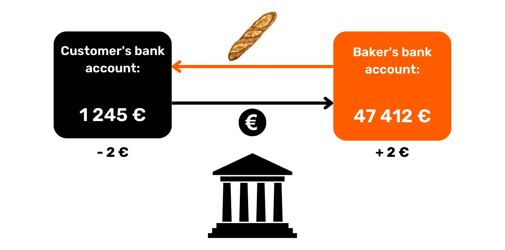
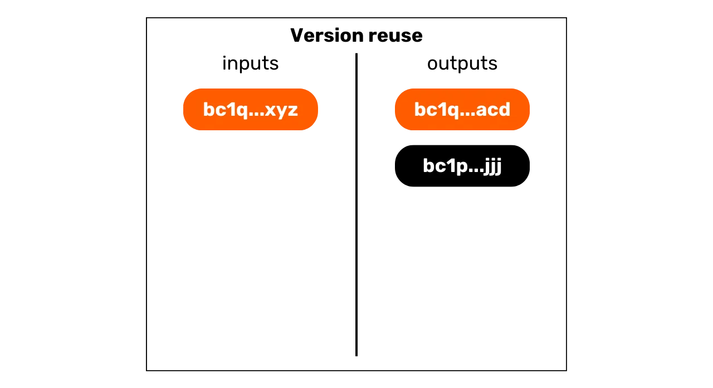
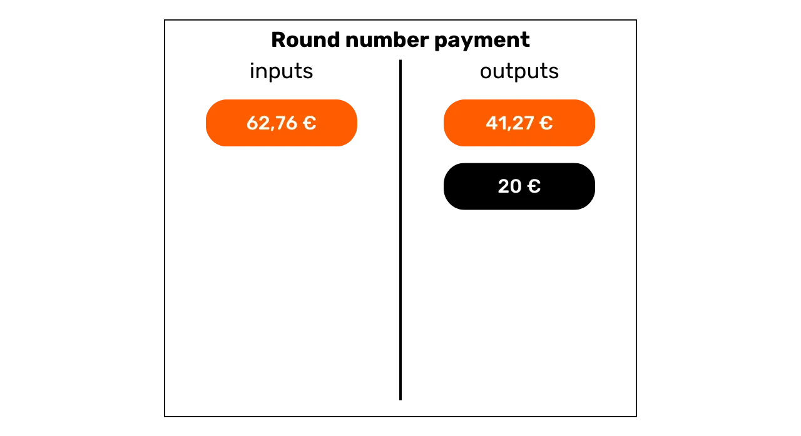

# 保护你在比特币上的隐私

在一个金融交易隐私逐渐成为奢侈品的世界里，理解和掌握在使用比特币时保护隐私的原则是至关重要的。这个培训为你提供了所有理论和实践的关键，以实现自主达成这一目标。

如今，在比特币上，有专门从事链分析的公司。它们的核心业务正是侵入你的私人领域，以妥协你的交易机密性。实际上，比特币上的“隐私权”并不存在。因此，作为用户的你，需要主张你的自然权利并保护你的交易机密性，因为没有其他人会为你做这件事。

这个培训呈现为一个完整和通用的旅程。每个技术概念都将详细讨论，并通过解释性图表支持。目标是使知识对每个人都是可访问的。BTC204 因此适合初学者和中级用户。这个培训对于最有经验的比特币用户也提供了附加价值，因为我们深入探讨了一些通常未知的技术概念。

加入我们，转变你使用比特币的方式，成为一个能够理解围绕机密性的利害关系并保护你隐私的知情用户。

+++

# 引言
<partId>e17474a8-8899-4bdb-a7f8-bc52ddb01440</partId>

## 培训简介
<chapterId>08ba1933-f393-4fb5-8279-777d874caedb</chapterId>

在一个金融交易隐私逐渐成为奢侈品的世界里，理解和掌握在使用比特币时保护隐私的原则是至关重要的。这个培训为你提供了所有理论和实践的关键，以实现自主达成这一目标。
如今，在比特币生态系统中，有专门从事链分析的公司。它们的核心业务正是侵入你的私人领域，妥协你的交易机密性。实际上，比特币上的“隐私权”并不存在。因此，作为用户的你，需要主张你的自然权利并保护你的交易机密性，因为没有其他人会为你做这件事。

比特币不仅仅是为了“数字增长”和储蓄价值的保持。由于其独特的特性和历史，它首先是反经济的工具。感谢这一杰出的发明，你可以自由地管理你的钱，花费它，并积累它，没有任何人能够阻止你。

比特币提供了一种从国家桎梏中平和逃脱的方式，让你完全享受你的自然权利，这些权利不能被既定法律挑战。感谢中本聪的发明，你有权力强制尊重你的私有财产并重新获得契约自由。

然而，比特币默认并不是匿名的，这对于从事反经济活动的个人来说可能构成风险，特别是在专制政权下的地区。但这并不是唯一的危险。鉴于比特币是一种有价值且不可审查的资产，它可能吸引窃贼的贪婪。因此，保护你的隐私也成为一种安全问题：它可以帮助你防止网络攻击和身体攻击。
正如我们将看到的，尽管该协议提供了一些内在的隐私保护，但使用额外的工具来优化和保护这些隐私至关重要。这项培训被设计为一个完整的、通才的旅程，旨在理解比特币隐私问题的利害关系。每个技术概念都将详细说明，并通过解释性图表支持。目标是使知识对每个人都易于理解，包括初学者和中级用户。对于更有经验的比特币用户，我们也会在这次培训中涵盖非常技术性和有时未知的概念，以加深对每个主题的理解。

这次培训的目标不是让您在使用比特币时完全匿名，而是提供给您必要的工具，了解如何根据您的个人目标保护您的隐私。您将有自由选择所介绍的概念和工具，以开发适合您的目标和特定需求的策略。

### 第1节：定义和关键概念
首先，我们将一起回顾支配比特币运作的基本原则，然后再平静地接触与隐私相关的概念。在能够完全理解我们将在后续章节中讨论的概念之前，掌握一些基本概念是必要的，例如UTXO、接收地址或脚本。我们还将介绍比特币隐私的一般模型，正如中本聪所设想的，这将使我们能够把握利害关系和相关风险。


### 第2节：理解链分析及如何防御

在第二节中，我们研究链分析公司用来追踪您在比特币上的活动的技术。理解这些方法对于增强您的隐私保护至关重要。这部分旨在检查攻击者的策略，以更好地理解风险，并为我们将在后续章节中研究的技术奠定基础。我们将分析交易模式、内部和外部启发式方法，以及这些模式的合理解释。除了理论部分外，我们还将学习使用区块浏览器进行链分析，通过实际示例和练习。


### 第3节：掌握保护隐私的最佳实践

在我们培训的第三节中，我们进入了实践的核心部分：实践！目标是掌握所有应该成为任何比特币用户自然反应的基本最佳实践。我们将涵盖使用新地址、标记、合并、使用全节点以及KYC和获取方法的使用。目的是为您提供一个全面的概述，了解要避免的陷阱，以建立我们追求隐私保护的坚实基础。对于其中的一些实践，您将被引导到一个特定的教程来实施它们。


### 第4节：理解Coinjoin交易

我们怎能在不讨论coinjoins的情况下谈论比特币上的隐私呢？在第4节中，您将发现关于这种混合方法的所有需要知道的信息。您将学习什么是coinjoin，它的历史和目标，以及存在的不同类型的coinjoins。最后，对于更有经验的用户，我们将探讨什么是匿名集和熵，以及如何计算这些指标。


### 第5节：理解其他高级隐私技术的利害关系
在第五部分中，我们将提供除了coinjoin之外，所有其他现有技术来保护您在比特币上的隐私的概览。多年来，开发者们在设计隐私工具方面展现出了非凡的创造力。我们将检查所有这些方法，如Payjoin、协作交易、Coin Swap和Atomic Swap，详细说明它们的操作、目标和潜在弱点。

### 第6节：探索与隐私相关的协议增强提案

虽然之前的部分集中在应用层面的隐私解决方案上，但这第六节将深入探讨协议层面上用户隐私的挑战。我们将讨论节点网络层面的隐私和交易的广播。我们还将讨论多年来提出的各种协议，以增强比特币上的用户隐私。最后，我们将检查比特币最后一次主要软分叉Taproot对隐私的正面和负面影响。

***(WIP: LOIC: 在此处添加示意图示例)***

### 附加部分：第二层协议上的隐私

正如您所理解的，这次培训的核心专注于链上隐私。在这最后的附加部分中，我希望将话题扩展到与比特币相关的其他协议上的隐私。我们将特别讨论闪电网络上的隐私。一些人声称闪电网络默认是私密的，而其他人则认为用户隐私不足。那么，真相是什么呢？我们将揭开真相与虚假，以更好地理解闪电网络上隐私相关的挑战。我们还将讨论像Liquid Network这样的侧链和像Cashu或Fedimint这样的Chaumian银行。


# 定义和关键概念
<partId>b9bbbde3-34c0-4851-83e8-e2ffb029cf31</partId>


## 比特币的UTXO模型
<chapterId>8d6b50c5-bf74-44f4-922b-25204991cb75</chapterId>

比特币主要是一种货币，但你知道BTC在协议上是如何具体表示的吗？

### 比特币的UTXOs：它们是什么？

在比特币协议上，货币单位的管理围绕着UTXO模型展开，这是“_未花费交易输出_”的缩写。
这个模型与传统银行系统依赖账户和余额机制来跟踪财务流动的方式截然不同。实际上，在银行系统中，个人余额是通过与身份相关联的账户来维护的。例如，当你从面包师那里买一个法棍时，你的银行只是从你的账户中扣除购买金额，从而减少你的余额，而面包师的账户则被记入相同的金额，增加他们的余额。在这个系统中，除了交易记录外，没有进入你账户的钱和离开它的钱之间的联系的概念。


在比特币上，工作方式不同。账户的概念不存在，货币单位不是通过余额而是通过UTXOs来管理的。一个UTXO代表了一定数量的尚未花费的比特币，从而形成了一个可以大可以小的“比特币片段”。例如，一个UTXO可能价值`500 BTC`或仅`700 SATS`。

**> 提醒：** Satoshi，通常缩写为sat，是比特币的最小单位，类似于法定货币中的分。

```plaintext
1 BTC = 100 000 000 SATS
```
理论上，一个UTXO（未花费交易输出）可以代表从一个satoshi到大约2100万BTC的任何比特币值。然而，拥有全部2100万比特币在逻辑上是不可能的，而且存在一个称为“尘埃”的经济下限，低于这个下限的UTXO被认为是经济上不划算去花费的。

**> 你知道吗？** 在比特币上创建的最大的UTXO价值为`500 000 BTC`。它是由MtGox平台在2011年11月的一次整合操作中创建的：[29a3efd3ef04f9153d47a990bd7b048a4b2d213daaa5fb8ed670fb85f13bdbcf](https://mempool.space/en/tx/29a3efd3ef04f9153d47a990bd7b048a4b2d213daaa5fb8ed670fb85f13bdbcf)

### UTXOs和花费条件

UTXOs是比特币上的交换工具。每一笔交易都会消耗UTXOs作为输入，并创建新的UTXOs作为输出。当进行交易时，用作输入的UTXOs被认为是“已花费的”，并且会生成新的UTXOs分配给交易输出中指示的接收者。因此，UTXO简单地代表了一个未花费的交易输出，因此是某个时间点上属于用户的一定数量的比特币。

所有UTXOs都由脚本保护，这些脚本定义了它们可以被花费的条件。要消费一个UTXO，用户必须向网络证明他们满足该UTXO保护脚本规定的条件。通常，UTXOs受公钥保护（或代表此公钥的接收地址）。要花费与此公钥关联的UTXO，用户必须证明他们持有相应的私钥，通过提供用此密钥制作的数字签名。这就是为什么说你的比特币钱包实际上不包含比特币，而是存储你的私钥，这些私钥反过来让你访问你的UTXOs，从而访问它们代表的比特币。


鉴于比特币中缺乏账户的概念，钱包的余额简单对应于它可以花费的所有UTXOs的值之和。例如，如果你的比特币钱包可以花费以下4个UTXOs：

```plaintext
- 2 BTC
- 8 BTC
- 5 BTC
- 2 BTC
```

你钱包的总余额将是`17 BTC`。


## 比特币交易的结构
<chapterId>29d3aaab-de2e-4746-ab40-c9748898850c</chapterId>

### 交易的输入和输出

比特币交易是一种在区块链上记录的操作，允许将比特币的所有权从一个人转移到另一个人。更具体地说，由于我们处于UTXO模型中且没有账户，交易满足了保护一个或多个UTXOs的花费条件，消耗它们，并等价地创建了赋予新花费条件的新UTXOs。简而言之，交易将比特币从一个满足条件的脚本移动到旨在保护它们的新脚本。


每一笔比特币交易都由一个或多个输入和一个或多个输出组成。输入是交易消耗的UTXO（未花费交易输出），用以生成输出。输出则是新的UTXO，将来可作为未来交易的输入使用。


**> 你知道吗？** 理论上，一笔比特币交易可以有无限多的输入和输出。只有区块的最大大小限制了这个数字。
比特币交易中的每个输入都指向一个之前未花费的UTXO。要使用UTXO作为输入，其持有者必须证明他们是合法所有者，通过验证与之关联的脚本，即满足所施加的花费条件。通常，这涉及提供一个与最初保护该UTXO的公钥相对应的私钥生成的数字签名。因此，脚本包括验证签名是否与接收资金时使用的公钥匹配。


另一方面，每个输出指定了要转移的比特币数量以及接收者。后者由一个新脚本定义，通常，这个脚本用接收地址或一个新的公钥锁定新创建的UTXO。

根据共识规则，要使交易被视为有效，输出的总量必须小于或等于输入的总量。换句话说，交易生成的新UTXO的总和不得超过作为输入消耗的UTXO的总和。这个原则是合乎逻辑的：如果你只有`500,000 SATS`，你不能进行`700,000 SATS`的购买。

### 比特币交易中的找零和合并

因此，比特币交易对UTXO的作用可以比作金币的熔化。实际上，UTXO是不可分割的，但只能合并。这意味着用户不能简单地将代表一定数量比特币的UTXO分割成几个较小的UTXO。他们必须在交易中完全消耗它，以在输出中创建一个或多个任意值的新UTXO，这些值必须小于或等于初始值。

这个机制类似于金币的机制。想象你拥有一枚2盎司的金币，你想支付1盎司，假设卖家不能给你找零。你需要将你的金币熔化，铸造出2枚新的各为1盎司的金币。
在比特币上，操作类似。假设Alice有一个`10,000 SATS`的UTXO，她想买一个价值`4,000 SATS`的法棍。Alice将进行一笔交易，输入1个UTXO为`10,000 SATS`，她将完全消耗它，并在输出中创建2个UTXO，价值分别为`4,000 SATS`和`6,000 SATS`。`4,000 SATS`的UTXO将作为法棍的支付发送给面包师，而`6,000 SATS`的UTXO将作为找零返回给Alice。这个返回给交易初始发送者的UTXO就是比特币术语中所说的“找零”。

现在让我们想象，Alice没有单一的`10,000 SATS`的UTXO，而是有两个各`3,000 SATS`的UTXO。在这种情况下，没有任何一个单独的UTXO足以支付`4,000 SATS`买法棍。因此，Alice必须使用两个`3,000 SATS`的UTXO作为她交易的输入。通过这种方式，输入的总金额将达到`6,000 SATS`，使她能够支付给面包师`4,000 SATS`的费用。这种涉及在交易的输入中组合多个UTXO的方法，通常被称为“合并”。


### 交易费用

直觉上，人们可能会认为交易费用也代表了交易的一个输出。但实际上，情况并非如此。交易的费用代表了输入总额与输出总额之间的差额。这意味着，在使用输入的一部分价值来支付交易中所需的输出后，输入的某个金额将未被使用。这个剩余的金额构成了交易费用。

```plaintext
费用 = 总输入 - 总输出
```

让我们重新审视Alice拥有`10,000 SATS`的UTXO并想用`4,000 SATS`购买法棍的例子。Alice用她的`10,000 SATS`的UTXO作为输入创建了一个交易。然后，她生成了一个`4,000 SATS`的输出，用于支付给面包师的法棍费用。为了鼓励矿工将她的交易包含在一个区块中，Alice分配了`200 SATS`作为费用。因此，她创建了第二个输出，即找零，将返回给她，金额为`5,800 SATS`。


通过应用费用公式，我们确实看到矿工们剩下了`200 SATS`：

```plaintext
费用 = 总输入 - 总输出
费用 = 10,000 - (4,000 + 5,800)
费用 = 10,000 - 9,800
费用 = 200
```

当矿工成功验证一个区块时，他们可以通过所谓的“coinbase”交易，收集他们区块中包含的所有交易的这些费用。

### 在比特币上创建UTXO

如果你已经仔细跟随前面的段落，你现在知道UTXO只能通过消耗其他现有的UTXO来创建。因此，比特币上的硬币形成了一个连续的链条。然而，你可能会想知道这个链条中的第一个UTXO是如何出现的。这引发了一个类似于鸡和蛋的问题：这些原始的UTXO从哪里来？

答案在于**coinbase交易**。

Coinbase是比特币交易的一种特定类型，对于每个区块都是唯一的，并且总是第一个。它允许找到有效工作证明的矿工接收他们的区块奖励。这个奖励由两部分组成：**区块补贴**和**我们在前一部分讨论的交易费用**。

Coinbase交易的独特之处在于，它是唯一可以凭空创建比特币的交易，无需消耗输入来生成其输出。这些新创建的比特币构成了我们可能称之为“原始UTXO”的东西。

区块奖励中的比特币是根据共识规则中预先设定的发行计划，从无到有创造的新BTC。区块奖励每210,000个区块减半一次，大约每四年发生一次，这个过程被称为“减半”。最初，每个奖励创造50个比特币，但这个数量已经逐渐减少；目前，每个区块是3.125个比特币。

至于与交易费用相关的部分，尽管它也代表新创造的BTC，但它们不能超过一个区块中所有交易的总输入和输出之间的差额。我们之前看到，这些费用代表输入中未用于交易输出的部分。这部分在交易过程中技术上是“丢失”的，矿工有权以一个或多个新的UTXO形式重新创造这个价值。因此，这是一个从交易发送者到将其添加到区块链的矿工的价值转移。

**> 你知道吗？** 通过coinbase交易生成的比特币在它们不能被矿工花费的100个区块的成熟期内受到限制。这条规则旨在防止使用可能稍后被废弃的链上新创造的比特币引起的复杂问题。
### UTXO模型的影响
首先，UTXO模型直接影响比特币上的交易费用。鉴于每个区块的容量有限，矿工优先处理相对于它们将占用的区块空间提供最佳费用的交易。实际上，交易包含的输入和输出UTXO越多，它就越重，因此，它需要更高的费用。这是我们经常尝试减少钱包中UTXO数量的原因之一，这也会影响隐私，这是我们将在本培训的第三部分详细讨论的话题。

接下来，如前面部分提到的，比特币上的硬币本质上是一系列UTXO的链。因此，每笔交易都在过去的UTXO和未来的UTXO之间创建了一个链接。因此，UTXO允许从比特币的创建到当前支出的明确跟踪。这种透明性可以被积极地看待，因为它允许每个用户验证所接收比特币的真实性。然而，正是基于这种可追溯性和可审计性的原则，链分析得以实施，这是一种旨在侵犯你隐私的做法。我们将在培训的第二部分深入研究这种做法。

## 比特币隐私模型
<chapterId>769d8963-3ed5-4094-b21d-9203c7d9e465</chapterId>

### 货币：真实性、完整性和双重支付

货币的一个功能是解决双重需求的巧合问题。在基于物物交换的系统中，进行交换不仅需要找到一个提供满足我需求的商品的个体，还需要提供一个等价值的商品满足对方的需求。找到这种平衡证明是复杂的。


这就是为什么我们诉诸于货币，它允许价值在空间和时间上的转移。


为了解决这个问题，货币至关重要的是，提供商品或服务的一方相信他们以后能够花费那笔钱。因此，任何希望接受一笔货币（无论是数字的还是物理的）的理性个体都会确保它满足两个基本标准：
- **硬币必须是完整且真实的；**- **并且它不能被双重支付。**
在使用实体货币时，第一个特性是最难以断言的。在历史的不同时期，金属硬币的完整性常常因剪边或钻孔等做法而受到损害。例如，在古罗马时期，公民常常刮取金币边缘的一点点贵金属，同时还保留它们以备将来交易。因此，硬币的内在价值降低了，但其面值保持不变。这正是后来在硬币边缘铸造凸起边的原因。

真实性也是一个难以验证的特性，尤其是对于实体货币媒介。如今，对抗伪造的技术越来越复杂，迫使商家投资于昂贵的验证系统。

另一方面，由于其性质，对于实体货币来说，双重支付不是问题。如果我给你一张€10的钞票，它不可撤销地离开我的占有，进入你的占有，自然排除了多次花费同一货币单位的可能性。简而言之，我将无法再次花费那张€10的钞票。


对于数字货币，困难在于不同的方面。确保一枚硬币的真实性和完整性通常更简单。正如我们在前一节中看到的，比特币的UTXO模型允许追溯一枚硬币的来源，从而验证它确实是按照共识规则由矿工创建的。

然而，确保没有双重支付更为复杂，因为任何数字商品本质上都是信息。与实体商品不同，信息在交换过程中不会分割，而是通过复制来传播。例如，如果我通过电子邮件发送给你一个文档，它就会被复制。在你这一端，你无法确定我是否已经删除了原始文档。


### 在比特币上防止双重支付
避免数字商品复制的唯一方法是了解系统上的所有交易。这样，就可以知道谁拥有什么，并根据进行的交易更新每个人的持有量。例如，这就是银行系统中记账货币所做的。当你用信用卡支付给商家€10时，银行记录这次交换并更新账本。
在比特币上，以同样的方式实现防止双重支付。目标是确认不存在已经使用过相关硬币的交易。如果这些硬币从未被使用，那么我们可以确信不会发生双重支付。中本聪在白皮书中用这句著名的话描述了这一原则：

**"*确认交易不存在的唯一方法是了解所有交易。*"**

然而，与银行模型不同的是，比特币不希望必须信任中央实体。所有用户都必须能够确认没有双重支付，而不依赖于第三方。因此，每个人都必须了解所有比特币交易。这就是为什么比特币交易在所有网络节点上公开广播并在区块链上明确记录的原因。

正是这种信息的公开传播，使得在比特币上保护隐私变得复杂。在传统银行系统中，理论上，只有金融机构知道所进行的交易。另一方面，在比特币上，所有用户通过各自的节点了解所有交易。

### 隐私模型：银行系统 vs 比特币
在传统系统中，您的银行账户与您的身份相连。银行家能够知道哪个银行账户属于哪个客户，以及与之相关的交易是什么。然而，这种信息流在银行和公共领域之间是被切断的。换句话说，不可能知道属于另一个个人的银行账户的余额和交易情况。只有银行能够访问这些信息。

例如，您的银行家知道您每天早上在邻里面包店买法棍面包，但您的邻居不知道这笔交易。因此，信息流对相关方，特别是银行是可访问的，但对外人来说是不可访问的。

由于我们在前一部分中看到的公共传播交易的限制，比特币的隐私模型不能遵循银行系统的模型。在比特币的情况下，由于信息流在交易和公共领域之间不能被切断，**隐私模型依赖于用户身份和交易本身之间的分离**。

例如，如果您通过支付BTC在面包师那里买了一根法棍面包，拥有自己的完整节点的邻居可以看到您的交易进行，就像他们可以看到系统中的所有其他交易一样。然而，如果遵守隐私原则，他们不应该能够将这个特定的交易与您的身份联系起来。


但由于比特币交易是公开的，仍然有可能在它们之间建立联系，以推断出有关参与方的信息。这项活动甚至构成了一个专业领域，称为“链分析”。在培训的下一部分，我邀请您探索链分析的基础知识，以了解您的比特币是如何被追踪的，以及如何更好地防御它。

# 理解链分析及如何保护自己
<partId>4739371e-9fef-45b0-bcaa-b7a4df6b4470</partId>

## 什么是比特币上的链分析？
<chapterId>7d198ba6-4af2-4f24-86cb-3c79cb25627e</chapterId>

### 定义和操作

链分析是一种实践，涵盖了追踪区块链上比特币流动的所有方法。通常，链分析依赖于观察以前交易样本中的特征。然后涉及识别希望分析的交易中的相同特征，并推断出合理的解释。这种从实际方法出发，找到足够好的解决方案的问题解决方法，就是所谓的“启发式”。

简而言之，链分析分为三个主要步骤：
1. **观察区块链；**
2. **识别已知特征；**
3. **推断假设。**


任何人都可以进行链分析。它只需要通过完整节点访问区块链的公共信息，以观察交易的动向并提出假设。也有免费工具促进这种分析，比如我们将在本部分的最后两章详细探讨的网站[OXT.me](https://oxt.me/)。然而，隐私的主要风险来自于专门从事链分析的公司。这些公司已将链分析提升到工业规模，并将其服务销售给金融机构或政府。在这些公司中，Chainalysis可能是最著名的。

### 链分析的目标
链分析的目标之一是将比特币上的各种活动分组，以确定执行这些活动的用户的唯一性。随后，将尝试将这一系列活动与一个真实身份联系起来。

回想前一章。我解释了比特币的隐私模型最初是如何依赖于将用户的身份与他们的交易分开的。因此，人们可能会认为链分析是不必要的，因为即使有人设法将链上活动分组，也无法将它们与真实身份关联起来。

从理论上讲，这个说法是准确的。在本培训的第一部分，我们看到了加密密钥对是如何用来在UTXO上建立条件的。本质上，这些密钥对不会透露其持有者的任何身份信息。因此，即使有人成功地将与不同密钥对相关的活动分组，这也无法告诉我们这些活动背后的实体是谁。


然而，实际情况要复杂得多。存在着许多行为可能会将一个真实身份与链上活动联系起来。在分析中，这被称为入口点，而且这样的入口点有很多。

最常见的当然是KYC（*了解你的客户*）。如果你从一个受监管的平台提取你的比特币到你的一个个人接收地址，那么一些人能够将你的身份与这个地址联系起来。更广泛地说，入口点可以是你的真实生活与比特币交易之间的任何形式的互动。例如，如果你在你的社交网络上发布一个接收地址，这可以构成分析的一个入口点。如果你用比特币向你的面包师支付，他们可以将你的面孔（这是你身份的一部分）与一个比特币地址关联起来。

这些入口点在使用比特币时几乎是不可避免的。尽管人们可以寻求限制它们的范围，但它们仍将存在。这就是为什么结合旨在保护你的隐私的方法至关重要。虽然保持你的真实身份和你的交易之间的分离是一个有趣的方法，但今天它仍然不够。事实上，如果你所有的链上活动都可以被分组，那么最轻微的入口点都可能危及你所建立的唯一的隐私层。


### 防御链分析
因此，在我们使用比特币时，也有必要能够面对区块链分析。通过这种方式，我们可以最小化我们活动的聚合，并限制入口点对我们隐私的影响。


实际上，为了更好地对抗区块链分析，比熟悉区块链分析中使用的方法更好的方法是什么呢？如果你想知道如何在比特币上提高你的隐私，你必须理解这些方法。这将使你能够更好地掌握像[Coinjoin](https://planb.network/en/tutorials/privacy/coinjoin-samourai-wallet)或[Payjoin](https://planb.network/en/tutorials/privacy/payjoin)（我们将在培训的最后部分研究的技术）这样的技术，并减少你可能犯的错误。
在这里，我们可以用密码学和密码分析作一个类比。一个优秀的密码学家首先是一个优秀的密码分析师。要想象一个新的加密算法，必须知道它将面临什么样的攻击，同时还要研究为什么之前的算法会被破解。这一原则同样适用于比特币上的隐私保护。理解区块链分析的方法是保护免受其侵害的关键。这就是为什么我在这次培训中提议整个部分都关于区块链分析。

### 区块链分析的方法

重要的是要理解，区块链分析不是一门精确的科学。它依赖于从之前的观察或逻辑解释中得出的启发式规则。这些规则允许得到相当可靠的结果，但永远不会有绝对的精确度。换句话说，**区块链分析总是涉及到在所得出的结论中加入概率维度**。例如，可能会更或少地估计两个地址属于同一实体，但总的确定性总是无法达到。

区块链分析的整个目标正是在于聚合各种启发式规则，以最小化错误的风险。某种意义上，这是一种证据的积累，使我们能够更接近地接触现实。

这些著名的启发式规则可以分为不同的类别，我们将一起详细介绍：
- **交易模式（或交易模型）；**
- **交易内部的启发式规则；**
- **交易外部的启发式规则。**

### 中本聪和区块链分析
值得注意的是，链分析的前两个启发式规则是由中本聪本人发现的。他在比特币白皮书的第10部分讨论了这些规则。这些是：
- 共同输入所有权启发式（CIOH）；
- 以及地址重用。


来源：S. Nakamoto, "Bitcoin: A Peer-to-Peer Electronic Cash System", https://bitcoin.org/bitcoin.pdf, 2009。

在接下来的章节中，我们将探讨这些内容，但已经很有趣的是，这两个启发式规则今天在链分析中仍然保持着优势地位。

## 交易模式
<chapterId>d365a101-2d37-46a5-bfb9-3c51e37bf96b</chapterId>

交易模式简单来说就是可以在区块链上找到的典型交易的一个模型或整体结构，其解释可能是已知的。在研究模式时，我们将关注单一交易，并在高层次上分析它。

换句话说，我们只会看输入中的UTXOs数量和输出中的UTXOs数量，而不会深入到更具体的细节或交易的环境中。从观察到的模型中，我们将能够解释交易的性质。然后，我们将寻找其结构的特征并推导出解释。


在这部分，我们将一起发现在链分析中可以遇到的主要交易模型，对于每个模型，我将给出这种结构的可能解释，以及一个具体的例子。

### 简单发送（或简单支付）

我们从一个非常普遍的模式开始，因为它是在大多数比特币支付中出现的模式。简单支付模型的特点是输入中消耗一个或多个UTXOs，并在输出中产生2个UTXOs。因此，这个模型将如下所示：


当我们在区块链上发现这种交易结构时，我们就可以做出解读。正如其名称所示，这个模型表明我们正处于一个发送或支付交易的场景中。用户已经使用了他们自己的UTXO作为输入，以满足输出中的支付UTXO和找零UTXO（找零返回给同一用户）。
因此，我们知道观察到的用户很可能不再拥有输出中的两个UTXO之一（支付那个），但他们仍然拥有另一个UTXO（找零那个）。
目前，我们无法指定哪个输出代表哪个UTXO，因为这不是研究模式的目标。我们将通过依赖于我们在后续部分将研究的启发式方法来实现这一点。在这个阶段，我们的目标仅限于识别所讨论的交易的性质，即在这种情况下，是一个简单的发送。

例如，这里是一个采用简单发送模式的比特币交易：

```plaintext
b6cc79f45fd2d7669ff94db5cb14c45f1f879ea0ba4c6e3d16ad53a18c34b769
```


来源：[Mempool.space](https://mempool.space/en/tx/b6cc79f45fd2d7669ff94db5cb14c45f1f879ea0ba4c6e3d16ad53a18c34b769)

在这个第一个例子之后，你应该对研究“交易模式”意味着什么有了更好的理解。我们通过只关注交易的结构来检查一个交易，而不考虑其环境或交易的具体细节。我们在这第一步中只以全局方式观察它。

现在你已经理解了什么是模式，让我们继续探讨其他现有的模型。

### 清扫

这第二种模型的特点是输入中消耗了单个UTXO，并在输出中产生了单个UTXO。


这个模型的解读是，我们处于自我转账的场景中。用户已经将他的比特币转移到了他自己拥有的另一个地址。由于交易中没有找零，我们几乎可以确定我们不处于支付场景中。实际上，当进行支付时，付款人几乎不可能拥有一个完全匹配卖家所需金额加上交易费用的UTXO。通常，付款人因此被迫产生一个找零输出。

然后我们知道，观察到的用户很可能仍然拥有这个UTXO。在链分析的上下文中，如果我们知道用于交易输入的UTXO属于Alice，我们可以假设输出中的UTXO也属于她。稍后变得有趣的是找到交易内部的启发式方法，这些方法可以加强这个假设（我们将在第3.3章研究这些启发式方法）。

例如，这里是一个采用清扫模式的比特币交易：

```plaintext
35f1072a0fda5ae106efb4fda871ab40e1f8023c6c47f396441ad4b995ea693d
```


来源：[Mempool.space](https://mempool.space/en/tx/35f1072a0fda5ae106efb4fda871ab40e1f8023c6c47f396441ad4b995ea693d)然而，这种模式也可能揭示了一种自我转账到加密货币交易平台账户的行为。通过研究已知地址和交易上下文，我们可以知道这是向自我保管钱包的清扫还是提现到平台。实际上，交易平台的地址往往容易识别。

让我们回到Alice的例子：如果清扫导致了一个平台的已知地址（例如Binance），这可能意味着比特币被转移出了Alice的直接控制，可能是出于出售它们或在该平台存储它们的意图。另一方面，如果目的地地址是未知的，合理的假设是它仅仅是Alice的另一个钱包。但这种类型的研究更多地属于启发式分类，而不是模式研究。

### 合并

这种模型的特点是消耗多个UTXO作为输入，并产生单个UTXO作为输出。


对这种模型的解释是，我们处于合并的状态。这是比特币用户之间的一种常见做法，旨在合并多个UTXO以预期交易费用可能的增加。通过在费用较低的时期执行此操作，可以节省未来的费用。我们将在第4.3章更多地讨论这种做法。

我们可以推断，进行这种交易模型的用户很可能拥有所有输入中的UTXO，并且仍然拥有输出中的UTXO。这肯定是一次自我转账。

就像清扫一样，这种模式也可以揭示一次自我转账到交易平台账户的行为。通过研究已知地址和交易上下文，我们可以知道这是向自我保管钱包的合并还是提现到平台。

例如，这里是一个采用合并模式的比特币交易：

```plaintext
77c16914211e237a9bd51a7ce0b1a7368631caed515fe51b081d220590589e94
```


来源：[Mempool.space](https://mempool.space/en/tx/77c16914211e237a9bd51a7ce0b1a7368631caed515fe51b081d220590589e94)
在链分析的背景下，这种模型可以揭示很多信息。例如，如果我们知道其中一个输入属于Alice，我们可以假设这笔交易的所有其他输入和输出也属于她。这个假设随后允许我们追溯之前的交易链，以发现和分析可能与Alice相关的其他交易。


### 聚合支出

这种模型的特点是消耗少量UTXO作为输入（通常只有一个）并产生许多UTXO作为输出。


这个模型的解释是，我们正在处理聚合支出。这是一种可能揭示重大经济活动的做法，例如交易平台。聚合支出允许这些实体通过将其费用合并为单一交易来节省费用。
从这个模型中，我们可以推断出UTXO输入来自于一个有着重大经济活动的公司，而UTXO输出将会分散。许多将属于从平台提取比特币的公司客户。其他可能流向合作公司。最后，肯定会有一个或多个交易返回给发行公司。

例如，这里有一个采用聚合支出模式的比特币交易（假设是由Bybit平台发出的）：

```plaintext
8a7288758b6e5d550897beedd13c70bcbaba8709af01a7dbcc1f574b89176b43
```


来源：[Mempool.space](https://mempool.space/en/tx/8a7288758b6e5d550897beedd13c70bcbaba8709af01a7dbcc1f574b89176b43)

### 特定协议的交易

在交易模式中，我们还可以识别出揭示使用特定协议的模型。例如，Whirlpool coinjoins（我们将在第5部分讨论）将具有容易识别的结构，使它们能够与其他更传统的交易区分开来。


这种模式的分析表明，我们很可能正在处理一种协作交易。也有可能观察到一个coinjoin。如果这个后者的假设被证明是准确的，那么输出的数量可以为我们提供一个关于coinjoin参与者数量的大致估计。

例如，这里是一个采用协作交易类型coinjoin模式的比特币交易：

```plaintext
00601af905bede31086d9b1b79ee8399bd60c97e9c5bba197bdebeee028b9bea
```


来源：[Mempool.space](https://mempool.space/en/tx/00601af905bede31086d9b1b79ee8399bd60c97e9c5bba197bdebeee028b9bea)

还有许多其他协议具有自己特定的结构。因此，我们可以区分Wabisabi类型、Stamps交易或Runes交易等。

感谢这些交易模式，我们已经可以解释关于给定交易的许多信息。但交易的结构不是分析的唯一信息来源。我们还可以研究它的细节。这些细节，仅限于交易内部，是我喜欢称之为“内部启发式”的，我们将在下一章探讨它们。

## 内部启发式
<chapterId>c54b5abe-872f-40f4-a0d0-c59faff228ba</chapterId>

内部启发式是在交易本身内部识别的一个特定特征，无需检查其环境，就能让我们做出推断。与侧重于高层次上交易整体结构的模式不同，内部启发式基于可提取数据的全部内容。这包括：
- 不同UTXO（未花费交易输出）的金额，包括进账和出账；
- 与脚本相关的所有内容：接收地址、版本控制、锁定时间等。

通常，这种启发式方法将允许我们识别特定交易中的变化。通过这样做，我们可以继续跟踪某个实体在几个不同的交易中的活动。确实，如果我们识别出属于我们希望跟踪的用户的UTXO，在他们进行交易时，确定哪个输出被转移到另一个用户，哪个输出代表找零，因而仍然属于他们的所有，这一点至关重要。


再次提醒，这些启发式方法并不绝对精确。单独使用时，它们只能让我们识别出可能的情景。是多个启发式方法的累积帮助减少不确定性，但永远无法完全消除。

### 内部相似性

这种启发式方法涉及研究同一交易中输入和输出之间的相似性。如果我们观察到输入和交易的仅一个输出上有相同的特征，那么很可能这个输出构成了找零。

最明显的特征是在同一交易中重用接收地址。


这种启发式方法留下的疑问很少。除非有人的私钥被黑，否则相同的接收地址不可避免地揭示了单一用户的活动。随之而来的解释是，交易中的找零是具有与输入相同地址的输出。这允许基于这种变化继续跟踪个体。
例如，这里有一个可以合理应用此启发式方法的交易：

```plaintext
54364146665bfc453a55eae4bfb8fdf7c721d02cb96aadc480c8b16bdeb8d6d0
```


来源：[Mempool.space](https://mempool.space/tx/54364146665bfc453a55eae4bfb8fdf7c721d02cb96aadc480c8b16bdeb8d6d0)

输入和输出之间的这些相似性不仅限于地址重用。任何在脚本使用上的相似性都可以应用启发式方法。例如，有时可以观察到输入和交易的一个输出之间的相同版本控制。



在此图中，我们可以看到输入编号0解锁了一个P2WPKH脚本（SegWit V0以`bc1q`开头）。输出编号0使用相同类型的脚本。然而，输出编号1使用了一个P2TR脚本（SegWit V1以`bc1p`开头）。这个特征的解释是，与输入具有相同版本控制的地址很可能是找零地址。因此，它仍然属于同一用户。

这里是一个可以合理应用此启发式方法的交易：

```plaintext
db07516288771ce5d0a06b275962ec4af1b74500739f168e5800cbcb0e9dd578
```


来源：[Mempool.space](https://mempool.space/tx/db07516288771ce5d0a06b275962ec4af1b74500739f168e5800cbcb0e9dd578)
在这个案例中，我们可以看到输入编号0和输出编号1使用的是P2WPKH脚本（SegWit V0），而输出编号0使用的是不同类型的脚本，P2PKH（传统）。在2010年代初期，由于可用脚本类型的限制，基于脚本版本的启发式方法相对来说并不太有用。然而，随着时间的推移和比特币的连续更新，引入了越来越多样化的脚本类型。这种启发式方法变得越来越相关，因为随着脚本类型范围的扩大，用户被划分为更小的群体，从而增加了应用这种内部版本重用启发式方法的机会。因此，仅从隐私角度来看，建议选择最常见的脚本类型。例如，正如我写这些行时，Taproot脚本（`bc1p`）的使用频率低于SegWit V0脚本（`bc1q`）。尽管前者在某些特定情境下提供经济和隐私方面的好处，对于更传统的单签名用途，出于隐私原因，坚持使用较旧的标准可能是明智的，直到新标准被更广泛地采用。

### 圆整数额支付

另一个可以帮助我们识别找零的内部启发式方法是圆整数额。通常，在面对一个简单的支付模式（1个输入和2个输出）时，如果其中一个输出花费了一个圆整数额，那么它代表了支付。


通过排除法，如果一个输出代表支付，另一个则代表找零。因此，可以推断输入用户很可能仍然拥有被识别为找零的输出。

应该注意的是，这种启发式方法并不总是适用，因为大多数支付仍以法定货币单位进行。实际上，当法国的商家接受比特币时，通常，他们不会以sats显示稳定的价格。他们宁愿选择将欧元价格和要支付的比特币金额之间进行转换。因此，交易输出中不应该有圆整数。

尽管如此，分析师可以尝试通过考虑交易在网络上广播时的汇率来进行这种转换。以一笔输入为`97,552 sats`和两个输出，一个为`31,085 sats`，另一个为`64,152 sats`的交易为例。乍一看，这笔交易似乎不涉及圆整数额。然而，通过应用交易时的64,339 €汇率，我们得到的欧元转换如下所示：
- 一个输入为62.76 €；
- 一个输出为20 €；
- 另一个输出为41.27 €。
一旦转换成法定货币，这笔交易允许应用圆整数额支付的启发式方法。20欧元的输出很可能是为了商家，或者至少是所有权发生了变化。通过推断，41.27欧元的输出很可能仍然属于原始用户。


如果有一天，比特币成为我们交易中首选的计价单位，这种启发式方法对于分析可能会变得更加有用。

例如，这里是一个可能适用这种启发式方法的交易：

```plaintext
2bcb42fab7fba17ac1b176060e7d7d7730a7b807d470815f5034d52e96d2828a
```

来源：[Mempool.space](https://mempool.space/tx/2bcb42fab7fba17ac1b176060e7d7d7730a7b807d470815f5034d52e96d2828a)

### 最大输出

当在简单支付模型中发现两个交易输出之间有足够大的差距时，可以估计最大的输出很可能是找零。


这种最大输出的启发式方法可能是所有方法中最不精确的。如果单独识别，它相当弱。然而，这个特征可以与其他启发式方法结合起来，以减少我们解释的不确定性。

例如，如果我们检查一个交易，展示一个输出有一个整数金额，另一个输出有更大的金额，那么整数支付和最大输出的启发式方法的联合应用允许我们降低不确定性的水平。

例如，这里是一个可能适用此启发式方法的交易：

```plaintext
b79d8f8e4756d34bbb26c659ab88314c220834c7a8b781c047a3916b56d14dcf
```


来源：[Mempool.space](https://mempool.space/tx/b79d8f8e4756d34bbb26c659ab88314c220834c7a8b781c047a3916b56d14dcf)

## 外部启发式
<chapterId>4a170e3b-200d-431a-8285-18a23ff617ba</chapterId>
研究外部启发式涉及分析某些元素的相似性、模式和特征，这些元素并非交易本身固有的。换句话说，如果之前我们限于利用交易内在元素的内部启发式，现在我们通过外部启发式扩展了对交易环境的分析领域。

### 地址重用

这是比特币用户中最著名的启发式之一。地址重用允许建立不同交易和不同UTXOs之间的链接。当一个比特币接收地址被多次使用时，就会观察到地址重用。

因此，可以在同一交易中利用地址重用作为内部启发式来识别找零（如前一章所见）。但地址重用也可以作为外部启发式，以识别多个交易背后同一实体的独特性。

地址重用的解释是，锁定在此地址上的所有UTXOs属于（或曾属于）同一实体。这种启发式留下的不确定性很小。当能够识别它时，随之而来的解释很可能与现实相符。因此，它允许对不同的链上活动进行分组。


正如本第3部分引言中所解释的，这种启发式是由中本聪自己发现的。在白皮书中，他特别提到了一个避免产生它的解决方案，那就是每个新交易都使用一个新的地址：

"_作为一个额外的防火墙，每个交易都可以使用一对新的密钥，以防止它们被链接到一个共同的所有者。_"


来源：S. Nakamoto, "Bitcoin: A Peer-to-Peer Electronic Cash System", https://bitcoin.org/bitcoin.pdf, 2009.
例如，这里有一个地址在多个交易中重复使用：
```plaintext
bc1qqtmeu0eyvem9a85l3sghuhral8tk0ar7m4a0a0
```


来源：[Mempool.space](https://mempool.space/address/bc1qqtmeu0eyvem9a85l3sghuhral8tk0ar7m4a0a0)

### 脚本相似性和钱包指纹

除了地址重用之外，还有许多其他启发式方法可以将行为链接到同一个钱包或一组地址。
首先，分析师可以从脚本的使用相似性中受益。例如，像多签名这样的少数脚本比SegWit V0脚本更容易被识别。我们隐藏的群体越大，我们就越难被发现。这就是为什么在好的Coinjoin协议中，所有参与者都使用完全相同类型的脚本的原因。
更广泛地说，分析师还可以关注钱包的特征指纹。这些是特定于使用的过程，人们可能寻求识别它们以将它们作为追踪启发式方法。换句话说，如果观察到归因于被追踪实体的交易上积累了相同的内部特征，就可以尝试在其他交易上识别这些相同的特征。

例如，可以识别出被追踪的用户系统性地将他们的零钱发送到P2TR地址（`bc1p…`）。如果这个过程重复，它可以作为我们分析的启发式方法。其他指纹也可以使用，例如UTXOs的顺序、输出中零钱的位置、RBF（Replace-by-Fee）的标示，甚至是版本号、`nSequence`字段和`nLockTime`字段。


正如[@LaurentMT](https://twitter.com/LaurentMT)在[Space Kek #19](https://podcasters.spotify.com/pod/show/decouvrebitcoin/episodes/SpaceKek-19---Analyse-de-chane--anonsets-et-entropie-e1vfuji)（一个法语播客）中指出的，钱包指纹在链分析中的作用随着时间的推移显著增加。实际上，脚本类型的不断增加和这些新功能由钱包软件逐渐部署的情况加剧了差异。甚至可能准确识别出被追踪实体使用的软件。因此，重要的是要理解，钱包指纹的研究对于近期的交易特别相关，而对于20世纪10年代初期发起的交易则不那么相关。

总之，指纹可以是任何特定的实践，由钱包自动执行或用户手动执行，可以在其他交易中找到以协助我们的分析。

### 公共输入所有权启发式（CIOH）

CIOH，即英文"Common Input Ownership Heuristic"的缩写，是一种启发式方法，它声明当一个交易包含多个输入时，这些输入很可能都来自单一实体。因此，它们的所有权是共同的。

要应用共同输入所有权启发式（CIOH），我们首先观察一个具有多个输入的交易。这可能是2个输入，或多达30个输入。一旦识别出这个特征，我们检查交易是否不符合已知的交易模型。例如，如果它有5个输入，数量大致相同，以及5个输出，数量完全相同，我们知道这是coinjoin的结构。因此，我们不能应用CIOH。


然而，如果交易不符合任何已知的协作交易模型，那么我们可以推断所有输入很可能来自同一实体。这对于扩展已知的集群或继续追踪非常有用。


CIOH是由中本聪发现的。他在白皮书的第10部分讨论了这一点：

“_[...] 多输入交易不可避免地链接起来，必然显示它们的输入是由同一所有者拥有的。风险在于，如果密钥的所有者被揭露，链接可以揭示属于同一所有者的其他交易。_”


特别令人着迷的是，中本聪甚至在比特币正式推出之前，就已经识别出了用户隐私方面的两个主要漏洞，即CIOH和地址重用。这种先见之明相当引人注目，因为这两种启发式方法即使在今天，仍然是链上分析中最有用的。

给你一个例子，这里是一个我们可能可以应用CIOH的交易：

```plaintext
20618e63b6eed056263fa52a2282c8897ab2ee71604c7faccfe748e1a202d712
```


来源：[Mempool.space](https://mempool.space/tx/20618e63b6eed056263fa52a2282c8897ab2ee71604c7faccfe748e1a202d712)

### 离链数据

显然，链上分析并不仅限于链上数据。来自之前分析的任何数据或可在互联网上访问的数据也可以用来精细化分析。
例如，如果观察到被追踪的交易一致从同一个比特币节点广播，并且可以识别其IP地址，那么可能能够发现来自同一实体的其他交易，除此之外还能确定发送者身份的一部分。虽然这种做法不容易实现，因为它需要操作许多节点，但一些专门从事链上分析的公司可能会采用这种做法。

分析师还可以依赖之前公开的分析，或他们自己之前的分析。也许会发现一个输出指向一个已经被识别的地址集群。有时，也可能依赖指向交易平台的输出，这些公司的地址通常是已知的。

同样，可以进行排除法分析。例如，如果在分析一个有两个输出的交易时，其中一个输出链接到一个已知的地址集群，但与被追踪的实体不同，那么可以解释说另一个输出很可能代表找零。
链分析还包括了OSINT（*开源情报*）的更一般部分，包括互联网搜索。这就是为什么建议不要在社交媒体或网站上直接发布接收地址，无论是使用假名还是不使用假名。


### 时间模型

人们较少考虑的是，某些人类行为在链上是可以识别的。在分析中最有用的可能是你的睡眠模式！是的，当你睡觉时，你大概不会广播比特币交易。而且，你通常在相同的时间睡觉。因此，在链分析中常用时间分析。这仅仅涉及记录给定实体的交易被广播到比特币网络的时间。分析这些时间模式允许我们推断出许多信息。

首先，时间分析有时允许我们识别被追踪实体的性质。如果观察到交易在24小时内持续广播，那么这将暗示强烈的经济活动。这些交易背后的实体很可能是一个商业实体，可能是国际性的，也许内部有自动化程序。
例如，几个月前，我通过分析[错误地分配了19个比特币作为手续费的交易](https://mempool.space/tx/d5392d474b4c436e1c9d1f4ff4be5f5f9bb0eb2e26b61d2781751474b7e870fd)认出了这个模型。一个简单的时间分析让我假设我们正在处理一个自动化服务，因此很可能是一个大型实体，如一个交易平台。
实际上，几天后，发现这些资金属于PayPal，通过交易平台Paxos。

相反，如果我们看到时间模式相当分散在16个特定小时内，那么我们可以估计我们正在处理一个个人用户，或者可能是一个根据交易量来看的本地商业实体。

除了观察到的实体的性质之外，时间模式还可以通过时区给我们一个用户的大致位置。因此，我们可以将其他交易相关联，并使用这些交易的时间戳作为可以添加到我们分析中的额外启发式。

例如，在我之前谈到的多次重用的地址上，我们可以观察到，无论是进账还是出账的交易，都集中在一个13小时的时间间隔内。

```plaintext
bc1qqtmeu0eyvem9a85l3sghuhral8tk0ar7m4a0a0
```


来源：OXT.me

这个间隔很可能对应于欧洲、非洲或中东。因此，我们可以解释说这些交易背后的用户住在那里。

在不同的注册中，也是这种类型的时间分析，允许假设中本聪不是从日本操作，而是确实来自美国：[*中本聪的时区*](https://medium.com/@insearchofsatoshi/the-time-zones-of-satoshi-nakamoto-aa40f035178f)

## 使用区块浏览器的实际应用
<chapterId>6493cf2f-225c-405f-9375-c4304f1087ed</chapterId>
在这最后一章中，我们将具体应用到目前为止我们学习的概念。我将向你展示一些真实的比特币交易示例，你需要提取我询问的信息。理想情况下，对于这些练习，使用专业的链分析工具会更好。然而，由于Samourai Wallet的创建者被逮捕后，唯一的免费分析工具OXT.me不再可用。因此，我们将选择使用经典的区块浏览器来进行这些练习。我推荐使用[Mempool.space](https://mempool.space/)，因为它具有众多功能和一系列链分析工具，但你也可以选择其他浏览器，如[Bitcoin Explorer](https://bitcoinexplorer.org/)。
首先，我将介绍练习。使用你的区块浏览器完成它们，并将你的答案写在一张纸上。然后，在本章的最后，我将提供答案，以便你可以检查并更正你的结果。

*这些练习选定的交易仅因其特征以某种随机方式被选中。本章仅用于教育和信息目的。我想澄清，我不支持或鼓励使用这些工具进行恶意目的。目标是教你如何保护自己免受链分析，而不是进行分析以暴露他人的私人信息。*

### 练习 1

待分析的交易ID：

```plaintext
3769d3b124e47ef4ffb5b52d11df64b0a3f0b82bb10fd6b98c0fd5111789bef7
```

这笔交易的模型名称是什么，仅通过检查其模型，即交易的结构，可以得出哪些合理的解释？

### 练习 2

待分析的交易ID：

```plaintext
baa228f6859ca63e6b8eea24ffad7e871713749d693ebd85343859173b8d5c20
```

这笔交易的模型名称是什么，仅通过检查其模型，即交易的结构，可以得出哪些合理的解释？

### 练习 3

待分析的交易ID：

```plaintext
3a9eb9ccc3517cc25d1860924c66109262a4b68f4ed2d847f079b084da0cd32b
```

这笔交易的模型是什么？

在识别其模型后，使用交易的内部启发式规则，哪个输出很可能代表找零？

### 练习 4

待分析的交易ID：

```plaintext
35f0b31c05503ebfdf7311df47f68a048e992e5cf4c97ec34aa2833cc0122a12
```

这笔交易的模型是什么？
在识别其模型后，使用交易的内部启发式规则，哪个输出很可能代表找零？

### 练习 5

想象Loïc在社交网络Twitter上发布了他的一个比特币接收地址：


```plaintext
bc1qja0hycrv7g9ww00jcqanhfpqmzx7luqal3um3vu
```

**仅使用地址重用启发式规则**，我们可以将哪些比特币交易与Loïc的身份关联起来？

*显然，我不是这个接收地址的真实拥有者，我也没有在社交网络上发布它。这是我从区块链上随机挑选的一个地址。*

### 练习 6
继练习5之后，感谢地址重用启发式方法，您能够识别出几笔看似与Loïc有关的比特币交易。通常，在您识别的交易中，您应该注意到这一笔：
```plaintext
2d9575553c99578268ffba49a1b2adc3b85a29926728bd0280703a04d051eace
```

这笔交易是第一笔将资金发送到Loïc地址的交易。在您看来，Loïc通过这笔交易收到的比特币来自哪里？

### 练习7

继练习5之后，感谢地址重用启发式方法，您能够识别出几笔看似与Loïc有关的比特币交易。现在，您希望找出Loïc来自哪里。基于找到的交易，进行时间分析以找出Loïc可能使用的时区。根据这个时区，确定Loïc似乎居住的地点（国家、州/地区、城市等）。


### 练习8

这是要研究的比特币交易：

```plaintext
bb346dae645d09d32ed6eca1391d2ee97c57e11b4c31ae4325bcffdec40afd4f
```

仅通过观察这笔交易，我们能解读出哪些信息？

### 练习的解答

***练习1：***
这笔交易的模型是简单支付。如果我们仅研究其结构，我们可以解读出一个输出代表找零，另一个输出代表实际支付。因此，我们知道观察到的用户可能不再拥有输出中的两个UTXO之一（支付的那个），但仍然拥有另一个UTXO（找零的那个）。

***练习2：***
这笔交易的模型是批量支出。这个模型很可能表明有重大的经济活动，例如一个交易平台。我们可以推断，输入中的UTXO来自于一个有重大经济活动的公司，输出中的UTXO将会分散。一些将属于已将他们的比特币提取到自我保管钱包的公司客户。其他可能流向合作伙伴公司。最后，肯定会有一个找零返回给发行公司。

***练习3：***

这笔交易的模型是简单支付。因此，我们可以对交易应用内部启发式方法来尝试识别找零。

我个人至少识别出两种支持相同假设的内部启发式方法：
- 使用相同类型的脚本重用；
- 最大的输出。

最明显的启发式方法是使用相同类型的脚本重用。确实，输出`0`是一个`P2SH`，可通过其接收地址以`3`开头识别：

```plaintext
3Lcdauq6eqCWwQ3UzgNb4cu9bs88sz3mKD
```

而输出`1`是一个`P2WPKH`，可通过其地址以`bc1q`开头识别：

```plaintext
bc1qya6sw6sta0mfr698n9jpd3j3nrkltdtwvelywa
```

这笔交易中使用的输入UTXO也使用`P2WPKH`脚本：

```plaintext
bc1qyfuytw8pcvg5vx37kkgwjspg73rpt56l5mx89k
```
因此，我们可以假设输出`0`对应于一次支付，而输出`1`是交易的找零，这意味着输入中的用户仍然拥有输出`1`。
为了支持或反驳这个假设，我们可以寻找其他启发式方法，这些方法要么确认我们的想法，要么降低我们的假设正确的可能性。

我至少发现了另一种启发式方法。那就是最大输出。输出`0`的量是`123,689 sats`，而输出`1`的量是`505,839 sats`。因此，这两个输出之间存在显著的差异。最大输出的启发式方法表明，最大体积的输出很可能是找零。这种启发式方法因此进一步加强了我们最初的假设。

因此，看起来输入中提供UTXO的用户仍然持有输出`1`，这似乎代表了交易的找零。

***练习 4:***
这笔交易的模型是一个简单的支付。因此，我们可以对交易应用内部启发式方法来尝试识别找零。
我个人至少识别了两种支持同一假设的内部启发式方法：
- 重用相同类型的脚本；
- 输出一个整数金额。

最明显的启发式方法是重用相同类型的脚本。的确，输出`0`是一个`P2SH`，可以通过其接收地址以`3`开头识别：

```plaintext
3FSH5Mnq6S5FyQoKR9Yjakk3X4KCGxeaD4
```

而输出`1`是一个`P2WPKH`，可以通过其地址以`bc1q`开头识别：

```plaintext
bc1qvdywdcfsyavt4v8uxmmrdt6meu4vgeg439n7sg
```

作为这笔交易输入的UTXO也使用了一个`P2WPKH`脚本：

```plaintext
bc1qku3f2y294h3ks5eusv63dslcua2xnlzxx0k6kp
```

因此，我们可以假设输出`0`对应于一次支付，而输出`1`是交易的找零，这意味着输入中的用户仍然拥有输出`1`。

为了支持或反驳这个假设，我们可以寻找其他启发式方法，这些方法要么确认我们的想法，要么降低我们的假设正确的可能性。

我至少发现了另一种启发式方法。那就是输出一个整数金额。输出`0`的量是`70,000 sats`，而输出`1`的量是`22,962 sats`。因此，我们面对的是一个在BTC单位账户中完美整数的输出。整数输出的启发式方法表明，具有整数金额的UTXO很可能是支付，而另一个则代表找零。这种启发式方法因此进一步加强了我们最初的假设。

然而，在这个例子中，另一种启发式方法可能会质疑我们最初的假设。的确，输出`0`大于输出`1`。如果我们基于最大输出通常是找零的启发式方法，我们可以推断输出`0`是找零。然而，这个反假设似乎不太可能，因为另外两种启发式方法看起来比最大输出的启发式方法更有说服力。因此，尽管存在这种明显的矛盾，保持我们最初的假设似乎是合理的。
因此，看起来输入中提供UTXO的用户仍然持有`1`输出，这似乎代表了交易的找零。
***练习 5：***我们可以看到有8笔交易与Loïc的身份相关联。其中4笔涉及接收比特币：

```plaintext
2d9575553c99578268ffba49a1b2adc3b85a29926728bd0280703a04d051eace
8b70bd322e6118b8a002dbdb731d16b59c4a729c2379af376ae230cf8cdde0dd
d5864ea93e7a8db9d3fb113651d2131567e284e868021e114a67c3f5fb616ac4
bc4dcf2200c88ac1f976b8c9018ce70f9007e949435841fc5681fd33308dd762
```

另外4笔涉及发送比特币：

```plaintext
8b52fe3c2cf8bef60828399d1c776c0e9e99e7aaeeff721fff70f4b68145d540
c12499e9a865b9e920012e39b4b9867ea821e44c047d022ebb5c9113f2910ed6
a6dbebebca119af3d05c0196b76f80fdbf78f20368ebef1b7fd3476d0814517d
3aeb7ce02c35eaecccc0a97a771d92c3e65e86bedff42a8185edd12ce89d89cc
```

***练习 6：***
如果我们检查这笔交易的模型，显然这是一笔集中支出的交易。事实上，这笔交易有一个输入和51个输出，这表明了显著的经济活动。因此，我们可以假设Loïc从一个交易平台提取了比特币。

几个元素加强了这一假设。首先，用于保护输入中UTXO的脚本类型是一个多签名P2SH 2/3脚本，这表明了交易平台典型的高级安全级别：

```plaintext
OP_PUSHNUM_2
OP_PUSHBYTES_33 03eae02975918af86577e1d8a257773118fd6ceaf43f1a543a4a04a410e9af4a59
OP_PUSHBYTES_33 03ba37b6c04aaf7099edc389e22eeb5eae643ce0ab89ac5afa4fb934f575f24b4e
OP_PUSHBYTES_33 03d95ef2dc0749859929f3ed4aa5668c7a95baa47133d3abec25896411321d2d2d
OP_PUSHNUM_3
OP_CHECKMULTISIG
```
此外，所研究的地址`3PUv9tQMSDCEPSMsYSopA5wDW86pwRFbNF`在超过220,000笔不同的交易中被重复使用，这通常是交易平台的特征，一般不关心他们的隐私。应用于此地址的时间启发式分析也显示了几乎每天在3个月的时间里都有规律地分布交易，且延续时间超过24小时，这表明了一个交易平台的连续活动。
最后，这个实体处理的交易量是巨大的。实际上，该地址在2022年12月至2023年3月之间接收和发送了44 BTC，在222,262笔交易中。这些重大的交易量进一步证实了其活动性质很可能是一个交易平台。

***练习7：***
通过分析交易的确认时间，可以注意到以下UTC时间：

```plaintext
05:43
20:51
18:12
17:16
04:28
23:38
07:45
21:55
```

分析这些时间，似乎UTC-7和UTC-8时区与大多数时间的一系列常见人类活动时间（08:00至23:00之间）一致：

```plaintext
05:43 UTC > 22:43 UTC-7
20:51 UTC > 13:51 UTC-7
18:12 UTC > 11:12 UTC-7
17:16 UTC > 10:16 UTC-7
04:28 UTC > 21:28 UTC-7
23:38 UTC > 16:38 UTC-7
07:45 UTC > 00:45 UTC-7
21:55 UTC > 14:55 UTC-7

05:43 UTC > 21:43 UTC-8
20:51 UTC > 12:51 UTC-8
18:12 UTC > 10:12 UTC-8
17:16 UTC > 09:16 UTC-8
04:28 UTC > 20:28 UTC-8
23:38 UTC > 15:38 UTC-8
07:45 UTC > 23:45 UTC-8
21:55 UTC > 13:55 UTC-8
```

UTC-7时区在夏季尤其相关，因为它包括如下州和地区：
- 加利福尼亚州（包括洛杉矶、旧金山和圣迭戈等城市）；
- 内华达州（有拉斯维加斯）；
- 俄勒冈州（有波特兰）；
- 华盛顿州（有西雅图）；
- 加拿大的不列颠哥伦比亚地区（包括温哥华和维多利亚等城市）。

这些信息表明，Loïc很可能居住在美国或加拿大的西海岸。

***练习8：***
这次交易的分析揭示了5个输入和一个输出，这似乎表明了一次整合。应用CIOH启发式分析表明，所有输入中的UTXOs都由单一实体持有，并且输出中的UTXO也属于这个实体。看来用户选择将他们拥有的几个UTXOs组合成输出中的单个UTXO，目的是整合他们的硬币。这种方法可能是出于利用当时的低交易费用以减少未来费用的愿望。

*在编写这部分链上分析的第3部分时，我依赖了以下资源：*
- *由Samourai Wallet在2021年制作的四篇文章系列：[Understanding Bitcoin Privacy with OXT](https://medium.com/oxt-research/understanding-bitcoin-privacy-with-oxt-part-1-4-8177a40a5923);*
- *来自[OXT Research](https://medium.com/oxt-research)的各种报告，以及他们的免费链上分析工具（目前由于Samourai Wallet的创始人被捕，该工具暂时不可用）；*
- 更广泛地说，我的知识来自于不同的推文和内容，这些内容由[@LaurentMT](https://twitter.com/LaurentMT) 和 [@ErgoBTC](https://twitter.com/ErgoBTC)发布；
- 我参与了[Space Kek #19](https://podcasters.spotify.com/pod/show/decouvrebitcoin/episodes/SpaceKek-19---Analyse-de-chane--anonsets-et-entropie-e1vfuji)播客，与[@louneskmt](https://twitter.com/louneskmt)，[@TheoPantamis](https://twitter.com/TheoPantamis)，[@Sosthene___](https://twitter.com/Sosthene___) 和 [@LaurentMT](https://twitter.com/LaurentMT)一起。

我想感谢他们的作者、开发者和制作人。也感谢那些对作为这部分第3部分基础的文章进行了细致校正并给予我专家建议的审稿人：
- [@GillesCadignan](https://twitter.com/gillesCadignan)；
- [@LudovicLars](https://viresinnumeris.fr/)。

# 掌握最佳实践以保护您的隐私
<partId>9bd04b63-f1af-4e50-9061-6bc90009df68</partId>

## 地址重用
<chapterId>f3e97645-3df3-41bc-a4ed-d2c740113d96</chapterId>

本章正在编写中，将很快发布！

## 币的标记和控制
<chapterId>fbdb07cd-c025-48f2-97b0-bd1bc21c68a8</chapterId>

本章正在编写中，将很快发布！

## 合并、UTXO管理和CIOH
<chapterId>b5216965-7d13-4ea1-9b7c-e292966a487b</chapterId>

本章正在编写中，将很快发布！

## 完整节点
<chapterId>fc80d2a3-cd9c-4b25-b17a-b853f9a1d99d</chapterId>

本章正在编写中，将很快发布！

## KYC和关键身份识别
<chapterId>cec6b9d9-0eed-4f85-bc4e-1e9aa59ca605</chapterId>

KYC代表“了解你的客户”，这是一些在比特币领域运营的公司实施的一项监管程序。该程序旨在验证和记录其客户的身份，其声明的目的是打击洗钱和资助恐怖主义。

具体来说，KYC涉及从客户那里收集各种个人数据，这些数据根据司法管辖区的不同而有所不同，但通常包括身份证件、照片和住址证明。然后，这些信息被验证并保留以备将来使用。

在大多数西方国家，所有受监管的交易平台都必须强制执行此程序。这意味着任何希望通过这些平台将法定货币兑换为比特币的人都必须遵守KYC要求。

这个程序对用户的隐私和安全并非没有风险。在本章中，我们将详细检查这些风险，并分析KYC和身份识别过程对比特币用户隐私的具体影响。

### 促进链上追踪
与KYC（了解你的客户）相关的第一个风险是，它为链上分析提供了一个特权入口。正如我们在前一部分中看到的，分析师可以使用交易模式和启发式方法对区块链上的活动进行分组和跟踪。一旦他们设法聚集了某个用户的链上活动，只需找到其所有交易和密钥中的一个入口点，就足以完全破坏他们的隐私。


当你执行KYC时，你为链上分析提供了一个非常高质量的入口点，因为你将从交易平台提取比特币时使用的接收地址与你的完整且经过验证的身份链接起来。理论上，这些细节只有你提供它们的公司知道，但正如我们稍后将看到的，数据泄露的风险是真实存在的。此外，仅仅是公司持有这些信息的事实就可能是有问题的，即使它不分享这些信息。

因此，如果你不采取其他措施来限制你在区块链上活动的分组，任何知道这个入口点（KYC）的人都有可能将你在比特币上的所有活动与你的身份联系起来。从这家公司的角度来看，你使用比特币的行为因此失去了所有的保密性。


用一个比喻来说明，这就好比你在*银行X*的银行家不仅可以访问你通过*银行X*进行的所有交易，还可以观察你与*银行Y*的交易以及你所有的现金交易。

请记住我们在本培训的第一部分中提到的：比特币的隐私模型，正如中本聪所设计的，依赖于用户身份与其密钥对之间的分离。尽管这层隐私今天已不再足够，但尽可能限制其退化仍然是明智的。

### 暴露于国家监视

KYC的第二个主要问题是，它向国家透露了你在某个时刻拥有过比特币。当你通过受监管的实体购买比特币时，国家就有可能知道这一拥有情况。目前，这可能看起来是无害的，但重要的是要记住，你所在国家的政治和经济未来并不掌握在你手中。

首先，国家可以迅速采取威权立场。历史上充满了政策突然改变的例子。今天，在欧洲，比特币用户可以撰写关于比特币的文章，参加会议，并以自我保管的方式管理他们的钱包。但谁能说明天会发生什么？如果比特币突然成为公敌，那么在国家记录中与之相关联可能会证明是有问题的。

接下来，在面对严重的经济危机时，国家可能会考虑没收公民持有的比特币。也许明天，比特币用户会被视为危机投机者，并因他们面对法定货币贬值时的资本收益而被过度征税。
你可能认为这不是问题，因为你的比特币已经混合，因此无法追踪。然而，追踪并不是这里的问题。真正的问题是国家知道你拥有过比特币。这一简单的信息可能就足以指控你或要求你解释。你可以试图声称你已经花掉了你的比特币，但这应该反映在你的税务申报中，你会被抓住。你也可以说你在一次划船事故中丢失了你的密钥，但除了Twitter上的笑话，你真的认为这就足够免除你的责任吗？
因此，考虑到仅仅是国家可能知道你拥有过BTC的事实所带来的风险是重要的，即使这个风险今天可能看起来很遥远。
KYC在国家监控方面带来的另一个问题是受监管平台的强制报告。虽然我对其他司法管辖区的规定不太熟悉，但在法国，*数字资产服务提供商*（PSAN）必须向金融监管机构报告他们认为可疑的任何资金流动。
因此，在2023年法国，PSAN报告了1,449起可疑行为。目前，这些行为的大多数与犯罪活动有关。然而，当局还要求受监管平台报告任何基于其结构单独被认为可疑的比特币交易。如果你进行合作交易，或者仅仅是进行了一个略显不寻常模式的交易，并且这笔交易发生在你从这些平台提取比特币的时间附近，你可能会发现自己被报告给当局。即使在没有任何不当行为和合法行使你的权利的情况下，这种报告也可能导致检查和增加的监视，这是你如果没有KYC就可以避免的不便。

### 个人数据泄露的风险

KYC的另一个问题是它要求在私人公司的服务器上存储你的所有个人数据。

最近的事件提醒我们，无人能免于失败，无论是财务上的还是计算机相关的。2022年，Celsius的客户就经历了后果。随着公司破产，债权人的姓名和他们的资产金额在行政程序期间被美国司法系统公开。
就在两年多前，加密货币网络安全的一个领军人物看到其客户的个人数据被盗。尽管这起事件并不直接与比特币的购买有关，但对于交易平台来说，这样的风险仍然存在。因此，这些个人数据确实存在明确的风险。

确实，我们已经将大量个人数据托付给私人公司。然而，这里的风险是双重的，因为这些数据不仅允许你被识别，而且还与比特币活动相关联。事实上，当黑客设法访问交易平台客户的数据时，他们可以合理地假设这些客户拥有比特币。因此，由于比特币和任何其他有价资产一样，吸引了小偷的贪婪，这种风险因此被加剧。

在数据泄露事件中，最好的情况是，你可能成为针对性网络钓鱼尝试的目标。在最坏的情况下，你可能发现自己成为对你家中的身体威胁的中心。

除了与比特币相关的特定风险外，还必须考虑与身份文件传输相关的危险。实际上，在数据泄露的情况下，可能成为身份盗窃的受害者。因此，风险不仅仅局限于交易机密性的保护，还涉及每个个体的个人安全。

### 关于KYC的一些误解

重要的是要揭穿关于KYC的某些在Twitter上或在比特币用户之间的交流中经常发现的误解。

首先，认为通过KYC获得的比特币保护你的隐私是无用的，这是不正确的。比特币上的隐私工具和方法是多样化的，服务于不同的目的。例如，对通过KYC获得的比特币使用coinjoin交易并不是一个坏主意。当然，需要谨慎对待受监管的交易平台，以避免冻结或禁止你的账户，但从严格的技术角度来看，这些做法并不矛盾。Coinjoin的效果是打破了一个币的历史，这有助于你对抗与KYC相关的一些链分析风险。尽管它并不消除所有风险，但它已经代表了一个重大的好处。


在比特币上的隐私不应该以二元的方式来看待，不应该简单区分为“匿名”比特币和其他非匿名比特币。通过KYC（了解你的客户）手段获得的比特币，并不意味着所有隐私都已泄露；相反，使用隐私工具可能会更加有益。反之，通过非KYC方式获取比特币也不能保证完美的保密性，并且不免除需要采取额外保护措施的需求。如果你持有非KYC比特币但多次重用接收地址，你的交易就可能被追踪和归组。与比特币外界的最轻微联系都可能威胁到你唯一的隐私层。因此，将增强比特币隐私的所有工具和方法视为互补的是很重要的。每种技术针对特定风险，并可以增加额外的保护层。因此，拥有非KYC比特币并不免除采取其他预防措施的责任。

### KYC能否被撤销？

我有时会被问到，执行KYC后是否可以“回头”，正如你从前面的段落中想象的，答案是复杂的。为避免与KYC相关的风险，最简单的方法是在获取比特币时不使用KYC。我们将在下一章更深入地讨论这个话题。然而，如果已经执行了KYC并购买了比特币，是否有方法可以减轻所承担的风险？

关于交易可追踪性的风险，使用coinjoin是一个解决方案。我们将在培训的后面详细讨论这种方法，但重要的是要知道，coinjoin可以打破一个币的历史，防止其过去-现在和现在-过去的追踪。即使是通过受监管平台获得的BTC，这种技术也可以防止它们的可追踪性。

然而，coinjoin并不能消除与KYC相关的第二个风险：即国家知晓你拥有比特币的事实。事实上，即使你的币不再可追踪，根据管辖区的不同，国家可能有权访问你的加密资产处置声明。由于这个风险不是技术性的，而是行政性的，除了最初不暴露自己于KYC之外，没有特定于比特币的解决方案来消除它。减轻这种风险的唯一合法方法是通过受监管平台出售通过受监管平台获得的比特币，然后通过非KYC手段重新购买。通过出售并声明处置，行政机关应该注意到你不再拥有它们。
关于泄露你的个人数据和身份文件的风险，这是比特币外部的危险，没有技术解决方案可以避免。一旦你的数据被泄露，很难逆转这一操作。你可以尝试关闭平台上的账户，但这并不能保证你的KYC数据被删除，特别是当身份验证是外包的时候。验证你的信息是否完全删除是不可能的。因此，没有办法完全预防这种风险并确保它不再存在。

### KYC与密钥识别的区别

有时，一些比特币用户倾向于将“KYC”这个术语扩展到任何涉及电汇或信用卡支付的BTC交换，因为这些方法也可以揭示支付的来源，就像KYC一样。然而，KYC和密钥识别不应该混为一谈。就个人而言，我必须承认，随着时间的推移，我对这个主题的看法已经发生了变化。
KYC（了解您的客户）特指某些公司实施的一种监管程序，用于验证和记录其客户的身份。这是一个二元的事情：在获取比特币时，要么你接受KYC，要么你不接受。然而，关键识别，涉及将用户身份的某个方面与链上活动联系起来，并不是二元的，而是代表一个连续体。实际上，在获取或处置比特币的背景下，这种识别总是可能在不同程度上实现。

例如，如果你在瑞士的一个受监管平台上购买比特币，KYC是不必要的。然而，可能会有你的密钥识别，因为购买是通过你的银行账户完成的。这就是KYC相关的前两个风险——促进链上追踪和暴露于国家监视——也可能在没有KYC的交易中显现出来。如果瑞士实体向你所在国家的当局报告可疑交易，他们可以简单地检查用于购买的银行账户来发现你的身份。因此，在受监管平台上不经KYC购买的风险相对于密钥识别而言相当高。


然而，避免使用受监管平台并选择P2P（点对点）获取方法并不能完全消除密钥识别的风险，但可以在一定程度上减少它。考虑在Bisq或其他P2P平台上进行购买的例子。为了与你的交易对手结算，你可能会使用你的银行账户。如果当局质询你交易的那个人并要求提供你的姓名，我们就会遇到之前提到的风险1和2。这些风险确实比在平台上不经KYC购买时要低得多，甚至比经KYC购买时还要低，但它们在较小程度上仍然存在。


最后，即使你通过现金进行实体交换来获取比特币，你也不是完全匿名的。你交易的那个人已经看到了你的脸，这是你身份的一部分。尽管在这个例子中最小，但仍然存在密钥识别的可能性。


总之，在比特币与其他资产交换过程中，无论是用法定货币购买还是出售实物商品，总会有某种形式的密钥识别。根据选择的交换方法，这种识别的强度可以有所不同。重要的是不要将这种识别与KYC混淆，后者是一个明确定义的监管过程。然而，KYC与识别的光谱之间存在联系，因为KYC位于这个光谱的上端，因为它系统性地促进了当局对用户密钥的识别。

## 销售和获取方法
<chapterId>756598af-95aa-4c77-ac48-243c7ad89530</chapterId>

阅读了前一章后，你可能会想知道如何购买或出售比特币而不必经过身份验证程序，以避免与KYC相关的风险。有几种方法可以进行交换。

### P2P现金交换

正如我们所见，就隐私而言，最佳方法仍然是使用现金结算的P2P（人对人）交换。这种方法允许你最大限度地减少留下的痕迹，并显著降低密钥识别的可能性，无论你是买家还是卖家。


尽管如此，这种做法对个人安全带来风险。主要危险在于，在交换过程中，对方会知道你持有大量现金或比特币。这一信息可能吸引恶意个体的注意。事实上，通常建议对持有比特币的情况保持低调。这一建议也适用于现金。然而，在面对面交换时，不可避免地会暴露你拥有比特币的事实，这可能引起他人的贪婪。


为了限制这一风险，我建议你优先与信任的个人进行现金交易，如家庭成员或亲密朋友。或者，你也可以考虑在参加几次后，在[当地比特币聚会](https://btcmap.org/communities/map)进行交换。这将使你能够更好地了解其他参与者，并且在物理交换过程中不会孤单。然而，重要的是要认识到，P2P现金交换本质上带来的个人安全风险，在通过受监管平台和你的银行账户进行购买时是不存在的。

此外，根据你居住的地方，运输和储存大量现金可能会带来风险，无论是比特币还是现金。

在警察检查或其他情况下，现金交换也可能带来法律风险。尽管在大多数国家，你可以携带的现金金额没有限制，但过大的金额可能会引起怀疑。因此，特别是如果你需要长途旅行，要小心，并避免一次进行过大的交易，以免不得不解释大量资金的拥有。

最后，P2P购买的另一个缺点是价格通常高于受监管平台上观察到的价格。卖家通常会加价1%到有时超过10%。几个原因解释了这种价格差异。首先，这是P2P卖家随时间建立起来的常见做法。接下来，卖家有与向买家发送资金相关的交易费用。与平台上的交易相比，P2P销售的盗窃风险增加，这就证明了为所承担的风险提供补偿。最后，额外成本可能与需求和交换的保密性质量有关。作为买家，保密性的增加有一个价格，这反映在卖家应用的加价中。一些比特币用户还认为，P2P购买中BTC的增加价格反映了其真实价值，并认为受监管平台上的较低价格是对个人数据保密性妥协的结果。


### 通过匹配平台进行P2P交换

在个人安全方面，一个较少风险的替代方案是仅通过在线进行P2P交换，使用电子支付方法，如PayPal、银行转账或Revolut。


这种方法有助于避免与现金交易相关的许多风险。然而，在线交换期间，对方不履行其承诺的风险更大。实际上，在面对面交换时，如果你将钱交给卖家，而卖家没有相应地发送比特币给你，你可以立即追究他们的责任，因为他们就在你面前。然而，在线上，通常很难找到从你这里窃取的人。


为了降低这种风险，可以使用专门从事P2P交换配对的平台。这些平台使用冲突解决机制来保护受损用户。通常，他们提供一个托管系统，在卖家确认收到法定货币支付之前，比特币将被保留。


就个人安全而言，这种购买方法比实体现金交换要安全得多。然而，如前所述，P2P在线交换比实体交换留下更多痕迹，这可能对比特币的隐私产生不利影响。通过使用在线法定货币支付方式，如银行，你暴露了更多可能有助于识别密钥的信息。


再次，我建议不要在这些平台上一次性进行大额交换。通过分割你的交易，你分散了与潜在对手方盗窃相关的风险。

再次，P2P购买的另一个缺点是价格通常高于在受监管平台上看到的价格。卖家通常会加价1%到有时超过10%。几个原因解释了这种价格差异。首先，这是P2P卖家之间随时间建立起来的常见做法。接下来，卖家有与向买家发送资金相关的交易费用。与在平台上的交易相比，P2P销售的盗窃风险增加，这就证明了为所承担的风险提供补偿。最后，附加费可能与需求和交换的隐私质量有关。作为买家，隐私的增益有一个价格，这反映在卖家应用的加价中。一些比特币用户还相信，通过P2P购买的BTC增加的价格反映了其真实汇率，并认为受监管平台上的较低价格是对个人数据隐私妥协的结果。


关于解决方案，我个人一直使用[Bisq](https://bisq.network/)，对此非常满意。他们的系统建立良好，看起来可靠。然而，Bisq仅在PC上可用，其界面对初学者来说可能过于复杂。另一个缺点是Bisq仅使用链上交易，这在比特币交易费用高昂的时期可能变得昂贵。

[-> 探索我们关于Bisq的教程。](https://planb.network/en/tutorials/exchange/bisq)

对于更简单的选项，你可以尝试[Peach](https://peachbitcoin.com/)，一个移动应用程序，通过集成的争议解决系统促进买家和卖家之间的联系。该过程比Bisq的更直观。

[-> 探索我们关于Peach的教程。](https://planb.network/en/tutorials/exchange/peach-wallet)
另一个在线选项是[HodlHodl](https://hodlhodl.com/)，一个设立良好的平台，提供良好的流动性，尽管我个人没有测试过它。
[-> 探索我们关于HodlHodl的教程。](https://planb.network/en/tutorials/exchange/hodlhodl)

对于基于闪电网络的解决方案，你可以尝试[RoboSats](https://learn.robosats.com/)和[LNP2PBot](https://lnp2pbot.com/)。RoboSats可以通过网站访问，使用起来相对简单。LNP2PBot更为特别，因为它通过Telegram消息应用的交换系统运作。
[-> 探索我们关于RoboSats的教程。](https://planb.network/en/tutorials/exchange/robosats)[-> 探索我们关于LNP2PBot的教程。](https://planb.network/en/tutorials/exchange/lnp2pbot)


### 不需要KYC的受监管平台

根据您所在的国家，您可能可以访问不需要进行KYC程序就能买卖比特币的受监管平台。例如，在瑞士，您可以使用像[Relai](https://relai.app/)和[MtPelerin](https://www.mtpelerin.com/)这样的平台。

[-> 探索我们关于Relai的教程。](https://planb.network/en/tutorials/exchange/relai)

正如我们在前一章中看到的，这类平台避免了与KYC程序相关的风险，但它们在关键识别方面呈现更高的风险水平。就比特币的隐私而言，这些平台因此提供比带KYC的购买方法更好的保护，但它们不如P2P交易所有趣。

然而，就个人安全而言，使用这些平台的风险显著低于P2P交易所。它们通常也比促进P2P交易的平台更简单易用。

### 自动取款机

另一个不需要KYC就能买卖比特币的选项是加密货币自动取款机（ATM）。个人而言，我从未有机会测试这个解决方案，因为我的国家里没有这样的设备。但是，根据您居住的地方，这种方法可能非常有趣。


ATM的问题在于，它们在一些国家被禁止，或在其他国家受到严格监管。如果ATM需要身份验证程序，那么它就会暴露于与受监管KYC平台相同的风险。然而，如果ATM允许小额的无身份验证交易，那么其使用可以提供与现金P2P交易相当的隐私水平，同时避免了与这种类型的交易相关的大多数风险。
ATM的主要缺点在于它们通常很高的兑换费用，这些费用从几个百分点到有时交换金额的15%不等。

### 礼品卡

最后，我还想介绍一种对于那些希望日常使用比特币进行购买而不是将其出售为法定货币的人来说，效果很好的解决方案。

花费BTC的最佳方式显然是直接使用比特币或通过闪电网络购买商品或服务。然而，在许多国家，接受比特币的商家数量仍然有限。一个实用的替代方案是使用礼品卡。

几个不需要KYC程序的平台提供了将比特币兑换为可在主要品牌中使用的礼品卡的可能性。在这些平台中，我们找到了[CoinsBee](https://www.coinsbee.com/)、[The Bitcoin Company](https://thebitcoincompany.com/)和[Bitrefill](https://www.bitrefill.com/)。这些平台极大地方便了您日常使用比特币，允许您在不需要将其转换为法定货币的情况下，访问广泛的产品和服务。


__

*撰写本章时，我使用了PlanB Network上由[@pivi___](https://x.com/pivi___)创建的[BTC205](https://planb.network/en/courses/btc205)课程（目前仅提供法语版本）。*

# 理解Coinjoin交易
<partId>6d0bbf16-3714-4db1-9897-2d45019f6bdc</partId>

## 什么是Coinjoin交易？
<chapterId>0862bc6b-1c48-4aa4-b76d-4f547b469008</chapterId>

本章正在编写中，很快就会发布！

## Zerolink和Chaumian Coinjoins
<chapterId>326c9654-b359-4906-b23d-d6518dd5dc3e</chapterId>

本章正在编写中，很快就会发布！

## Coinjoin的不同实现
<chapterId>e37ed073-9498-4e4f-820b-30951e829596</chapterId>
本章正在编写中，很快就会发布！

## 匿名集
<chapterId>be1093dc-1a74-40e5-9545-2b97a7d7d431</chapterId>

本章正在编写中，很快就会发布！

## 熵
<chapterId>e4fe289d-618b-49a2-84c9-68c562e708b4</chapterId>

本章正在编写中，很快就会发布！

# 理解其他高级隐私技术的挑战
<partId>19989ae6-d608-4acf-b698-2cf1e7e5e6ae</partId>

## Payjoin交易
<chapterId>c1e90b95-f709-4574-837b-2ec26b11286f</chapterId>

本章正在编写中，很快就会发布！

## 特定的Samourai交易
<chapterId>300777ee-30ae-43d7-ab00-479dac3522c1</chapterId>

本章正在编写中，很快就会发布！

## 秘密所有权转移
<chapterId>a2067036-849c-4d6b-87d2-44235cfae7a1</chapterId>

本章正在编写中，很快就会发布！
### Coin Swap

### Atomic Swap

### 点对点交换

# 探索与隐私相关的协议改进提案
<partId>a7827171-3a2f-4399-99d1-9b822b565792</partId>

## P2P网络上的隐私
<chapterId>04a2467b-db84-4076-a9ff-919be5135106</chapterId>

本章正在编写中，很快就会发布！
### P2P传输V2

### TOR

### 蒲公英

## BIP47和可重用支付代码
<chapterId>ad88e076-a04b-4aec-b3b2-7b4760175504</chapterId>

正如我们在第三部分中看到的，重复使用地址对比特币协议上的用户隐私构成了严重障碍。为了降低这些风险，强烈建议为钱包中收到的每一笔新支付生成一个新的接收地址。尽管现代软件和分层确定性钱包的使用已经简化了生成新地址的过程，但这种做法可能看起来违反直觉。


在传统银行系统中，例如，我们习惯于共享我们的IBAN，它始终保持不变。一旦与某人沟通，他们就可以在不再与我们互动的情况下向我们发送多次付款。新型银行也提供更现代的可能性，如在PayPal上使用独特的电子邮件地址或在Revolut上使用RevTags。即使在金融领域之外，我们的日常标识符，如我们的邮政地址、电话号码和电子邮件地址，也是独一无二且永久的。我们不必在每次新的互动中重新获取它们。

然而，比特币的运作方式不同：对于每一笔进账交易，必须生成一个新的接收地址。这种易用性与隐私之间的折衷可以追溯到比特币白皮书的最初起源。自2008年底第一个版本的文档发布以来，中本聪就已经提醒我们这一风险：

**“*作为一个额外的防火墙，每一笔交易都可以使用一对新的密钥，以保持它们不与一个共同的所有者关联。*”**

有许多方法允许在不导致地址重用的情况下，通过一个独特的标识符接收多次付款。每种方法都有其自身的折衷和缺点。其中一种方法是BIP47，这是由Justus Ranvier开发并于2015年发布的提案。该提案旨在创建可重用的支付代码，使得可以向同一个人进行多次交易，同时避免地址重用。本质上，BIP47寻求提供一个像独特标识符一样直观的支付系统，同时保护交易隐私。

BIP47并不直接提高用户隐私，因为BIP47支付提供的隐私水平与使用新地址的经典比特币交易相同。然而，它使得使用比特币更加方便直观，这种便利性通常应该会损害隐私。多亏了BIP47，这种易用性达到了与经典交易相同的隐私水平。这就是为什么BIP47是保护隐私的有价值工具。

最初，BIP47是一个提议，旨在被整合到比特币核心中，但它从未被采纳。一些软件仍然选择在应用层面自行实现它。因此，Samourai Wallet的团队开发了他们自己的BIP47实现，名为"PayNym"。

### BIP47和PayNym的一般原则
BIP47旨在使接收多次付款而不导致地址重用成为可能。它依赖于使用可重用的支付代码，该代码允许不同的发送者向另一个用户拥有的单一代码发送多次付款。因此，接收者不必为每笔交易提供一个新的未使用地址，极大地便利了他们的交换，同时保护了他们的隐私。

用户因此可以自由分享他们的支付代码，无论是在社交媒体上还是在他们的网站上，而不会像使用传统接收地址或公钥那样冒失去隐私的风险。

要进行交易，双方必须拥有实现了BIP47的比特币钱包，如Samourai Wallet上的PayNym或Sparrow Wallet。他们支付代码的共同使用在他们之间创建了一个秘密通道。为了有效地建立这个通道，发送者必须在比特币区块链上执行一个特定的交易，称为“通知交易”（稍后我会给你更多细节）。
两个用户的支付代码关联允许生成共享秘密，进而能够创建大量独特的比特币接收地址（准确来说是2^32个，或约40亿个）。因此，通过BIP47进行的支付实际上并不是直接发送到支付代码本身，而是发送到由用户支付代码派生出的传统接收地址。

支付代码因此充当从钱包种子派生出的虚拟标识符。在钱包的层次化派生结构中，支付代码位于第3级，即账户级别。


BIP47的派生目标由索引`47'`（`0x8000002F`）标识，指的是BIP47。一个可重用支付代码的派生路径示例如下：
```plaintext
m/47'/0'/0'/
```

为了让你了解支付代码的样子，这是我的：
```plaintext
PM8TJSBiQmNQDwTogMAbyqJe2PE2kQXjtgh88MRTxsrnHC8zpEtJ8j7Aj628oUFk8X6P5rJ7P5qDudE4Hwq9JXSRzGcZJbdJAjM9oVQ1UKU5j2nr7VR5
```

这个代码也可以编码成二维码，以便于通信，就像传统的接收地址一样。
关于PayNym机器人，这些有时在Twitter上看到的机器人，它们是由Samourai Wallet创建的支付代码的视觉表示。它们通过哈希函数生成，这使得它们几乎是唯一的。它们显示为以`+`开头的一小串字符：
```plaintext
+throbbingpond8B1
+twilightresonance487
+billowingfire340
```

这些头像也可以以图像形式表示：


尽管这些机器人在BIP47框架内没有任何特定的技术功能，但它们通过提供易于识别的视觉身份，发挥着促进用户间互动的作用。

---

*在本章接下来关于BIP47的部分，我们将详细检查其操作，特别强调使用的加密方法。要完全理解这些有些技术性的解释，事先了解HD钱包的结构、密钥派生过程以及基于椭圆曲线的加密基本原理是必要的。如果你希望深入了解这些概念，PlanB Network上还提供了另一项免费培训：[CRYPTO 301](https://planb.network/en/courses/crypto301)。我仍然建议你跟进它们，因为通过理解BIP47的技术操作，你将更容易理解我们在接下来的章节中将讨论的其他类似提议。*

### 可重用支付代码

如前所述，可重用支付代码位于HD钱包的第3层，这使其与`xpub`相当，无论是在钱包结构中的位置还是其角色。

80字节的支付代码分解如下：
- **字节`0`：版本**。对于BIP47的第一个版本，此字节设置为`0x01`；
- **字节`1`：位字段**。此空间保留用于在特定用途中集成额外指示。对于与PayNym标准使用，此字节被定义为`0x00`；
- **字节`2`：`y`的奇偶性**。此字节为`0x02`或`0x03`，表示公钥的纵坐标是偶数还是奇数，因为使用了压缩公钥；
- **从字节`3`到字节`34`：`x`的值**。这些字节代表公钥的横坐标。`x`和`y`的奇偶性的连接形成了完整的压缩公钥。
- **从字节`35`到字节`66`：链码**。此空间包含与公钥关联的链码；
- **从字节`67`到字节`79`：填充区**。此区域用于可能的未来发展。对于当前版本，简单地在这里放置零，以达到`OP_RETURN`输出所需的80字节的大小。

这是我在前一节中已经介绍的可重用支付代码的十六进制表示：
```plaintext
0x010002a0716529bae6b36c5c9aa518a52f9c828b46ad8d907747f0d09dcd4d9a39e97c3c5f37c470c390d842f364086362f6122f412e2b0c7e7fc6e32287e364a7a36a00000000000000000000000000
```


接下来，还需要在开头添加前缀字节`P`，以明确表示这是一个支付代码。此字节由`0x47`表示：

```plaintext
0x47010002a0716529bae6b36c5c9aa518a52f9c828b46ad8d907747f0d09dcd4d9a39e97c3c5f37c470c390d842f364086362f6122f412e2b0c7e7fc6e32287e364a7a36a00000000000000000000000000
```

最后，为了确保支付代码的完整性，使用`HASH256`执行校验和计算，它由`SHA256`函数的双重哈希组成。然后将此哈希结果的前四个字节连接到支付代码的末尾：

```plaintext
0x47010002a0716529bae6b36c5c9aa518a52f9c828b46ad8d907747f0d09dcd4d9a39e97c3c5f37c470c390d842f364086362f6122f412e2b0c7e7fc6e32287e364a7a36a00000000000000000000000000567080c4
```


完成这些步骤后，支付代码就准备好了。剩下的就是将其转换为base 58，以获得其最终版本：
在创建支付代码的过程中，我们使用了压缩公钥和链码。这两者都是从钱包的种子进行确定性和层次化派生得到的。用于实现此目的的派生路径是：
```plaintext
m/47'/0'/0'/
```

具体来说，为了生成与可重用支付代码相关的压缩公钥和链码，我们首先从钱包的种子计算出主私钥。然后，我们继续使用索引 `47 + 2^31`（强化派生）派生一对子密钥。此步骤之后是使用索引 `2^31`（强化派生）进行两次更多连续的子对派生。


### 椭圆曲线迪菲-赫尔曼（ECDH）密钥交换

BIP47的核心加密协议被称为ECDH，即*椭圆曲线迪菲-赫尔曼*。这种方法是原始迪菲-赫尔曼密钥交换的变体。

迪菲-赫尔曼密钥交换于1976年引入，是一种密钥协议，允许两个各自配备一对密钥（公钥和私钥）的方，即使仅通过公共和不安全的通道通信，也能就一个共同的秘密达成一致。


这个共同的秘密（这里是蓝色的钥匙），然后可以用于其他操作。通常，这个共享的秘密可以用来加密和解密在不安全网络上的通信：


为了实现这种交换，迪菲-赫尔曼使用模运算来计算共享的秘密。这里是它的简化解释：
- 爱丽丝和鲍勃就一个共同的颜色（这里是黄色）达成一致，这构成了公共数据（攻击者知道这个颜色）；
- 爱丽丝选择一个秘密颜色（这里是红色），并将两者混合以获得橙色；
- 鲍勃也选择一个秘密颜色（这里是蓝色），并将其与黄色混合以获得绿色；
- 然后他们交换结果颜色，橙色和绿色。这种交换可以通过被攻击者观察的不安全网络进行；
- 通过将鲍勃的绿色与她自己的秘密颜色混合，爱丽丝产生了棕色；
- 鲍勃也做同样的事情，用爱丽丝的橙色和他的秘密蓝色混合，也得到了棕色。


在这个简化中，棕色代表爱丽丝和鲍勃之间的共享秘密。想象一下，在现实中，攻击者不可能分离橙色和绿色来找到爱丽丝或鲍勃的秘密颜色。
现在，让我们来看看这个协议实际是如何工作的，不是用颜色类比，而是使用真实的数字和模运算！

在讨论迪菲-赫尔曼机制之前，允许我简要提醒您我们将需要的两个基本数学概念：
- **质数**是一个自然整数，它只有两个除数：`1`和它本身。例如，`7`是一个质数，因为它只能被`1`和`7`整除。另一方面，`8`不是质数，因为它可以被`1`、`2`、`4`和`8`整除。它有四个正整数除数，而不是两个；
- **模运算**（表示为`mod`或`%`）是一种数学运算，它在两个整数之间返回欧几里得除法的第一个数除以第二个数的余数。例如，`16 mod 5 = 1`。

**Alice和Bob之间的Diffie-Hellman密钥交换如下进行：**

- Alice和Bob同意两个共同的数字：`p`和`g`。`p`是一个质数，这个数字越大，Diffie-Hellman就越安全。`g`是`p`的原根。这两个数字可以在不安全的网络上公开通信。它们代表了之前简化中的**黄色**。因此，Alice和Bob使用`p`和`g`的确切相同的值是非常重要的。

- 一旦定义了这些参数，Alice和Bob各自选择一个秘密的随机数。Alice将她的秘密随机数命名为`a`（相当于**红色**），Bob将他的命名为`b`（相当于**蓝色**）。这些数字必须绝对保密。

- 而不是直接交换数字`a`和`b`，双方分别计算`A`和`B`如下：

`A`等于`g`的`a`次方对`p`取模：

```plaintext
A = g^a % p 
```

`B`等于`g`的`b`次方对`p`取模：

```plaintext
B = g^b % p
```

- 值`A`（相当于**橙色**）和`B`（相当于**绿色**）在双方之间交换。这次交换可以在不安全的网络上公开进行；

- Alice收到`B`后，按照以下方式计算`z`的值：
`z`等于`B`的`a`次方对`p`取模：
```plaintext
z = B^a % p
```

提醒：

```plaintext
B = g^b % p
```

因此，我们得到：

```plaintext
z = B^a % p
z = (g^b)^a % p
```

应用幂规则：

```plaintext
(x^n)^m = x^(nm)
```

然后我们得到：

```plaintext
z = g^(ba) % p
```

- 在他的方面，Bob收到`A`后，也以以下方式计算`z`的值：

`z`等于`A`的`b`次方对`p`取模：

```plaintext
z = A^b % p
```

因此，我们得到：

```plaintext
z = (g^a)^b % p
z = g^(ab) % p
z = g^(ba) % p
```
感谢模运算的分配性，Alice和Bob得到了完全相同的值`z`。这个数字代表他们的共同秘密，相当于之前用颜料罐简化的**棕色**。现在，他们可以使用这个共同的秘密，通过一个不安全的网络对他们的通信进行对称加密。


即使攻击者拥有`p`、`g`、`A`和`B`（公开值），也无法计算出`a`、`b`或`z`（私有值）。要做到这一点，必须逆转指数运算，这是一个不可能的操作，除非逐一尝试所有可能性，因为这相当于计算离散对数，即在有限循环群中指数的逆。

因此，只要`a`、`b`和`p`的值足够大，Diffie-Hellman协议就是安全的。通常情况下，使用2048位参数（十进制中的600位数字），测试`a`和`b`的所有可能性将是不切实际的。到目前为止，对于这样的数字，这个算法被认为是安全的。

这正是Diffie-Hellman协议的主要缺点所在。为了保证安全，算法必须使用大数字。这就是为什么，如今，更倾向于使用ECDH算法（*椭圆曲线Diffie-Hellman*），这是一种依赖于代数曲线，更准确地说是椭圆曲线的Diffie-Hellman变体。这种方法允许使用更小的数字，同时保持等效的安全性，从而减少了计算和存储所需的资源。
算法的总体原理保持不变。然而，我们不是使用一个随机数`a`和通过模指数计算从`a`得到的数`A`，而是使用建立在椭圆曲线上的一对密钥。我们不依赖模运算的分配性，而是使用椭圆曲线上的群律，更具体地说是这个律的结合性。

为了简要解释椭圆曲线上的密码学原理，私钥由`1`到`n-1`之间的随机数表示，其中`n`代表曲线的阶。另一方面，公钥是这条曲线上的一个特定点，通过从生成点进行点加和加倍的操作，根据方程从私钥得到：

```plaintext
K = k·G
```

在这个公式中，`K`表示公钥，`k`表示私钥，`G`表示生成点。

这些密钥的一个基本特征是，从`k`和`G`计算`K`很容易，而从`K`和`G`找到`k`几乎是不可能的。这种不对称性创造了一个单向函数。换句话说，如果知道私钥，计算公钥很容易，但从公钥找到私钥是不可能的。这种安全性仍然依赖于离散对数的计算难度。

因此，我们将使用这个属性来适应我们的Diffie-Hellman算法。**ECDH的操作原理如下：**

- Alice和Bob一起同意一个密码学上安全的椭圆曲线及其参数。这些信息是公开的；

- Alice生成一个随机数`ka`，这将是她的私钥。这个私钥必须保密。她通过在选定的椭圆曲线上进行点加和加倍来确定她的公钥`Ka`：
- Bob同样生成了一个随机数`kb`，这将是他的私钥。他计算出关联的公钥`Kb`：

```plaintext
Kb = kb·G
```

- Alice和Bob通过一个不安全的公共网络交换他们的公钥`Ka`和`Kb`。

- Alice通过将她的私钥`ka`应用于Bob的公钥`Kb`，在曲线上计算出一个点`(x,y)`：

```plaintext
(x,y) = ka·Kb
```

- Bob通过将他的私钥`kb`应用于Alice的公钥`Ka`，在曲线上计算出一个点`(x,y)`：

```plaintext
(x,y) = kb·Ka
```

- Alice和Bob在椭圆曲线上获得相同的点。共享的秘密将是这个点的`x`坐标。
他们确实获得了相同的共享秘密，因为：

```plaintext
(x,y) = ka·Kb = ka·(kb·G) = (ka·kb)·G = (kb·ka)·G = kb·(ka·G) = kb·Ka
```

一个潜在的攻击者观察不安全的公共网络，只能获得每个个体的公钥和所选椭圆曲线的参数。如前所述，仅凭这些信息不足以确定私钥。因此，攻击者无法找到Alice和Bob之间的共享秘密。

因此，ECDH是一个允许密钥交换的算法。它经常与其他加密方法结合使用，以建立一个完整的协议。例如，ECDH是TLS（*传输层安全性*）核心的一部分，TLS是用于互联网传输层的加密和认证协议。TLS使用ECDHE进行密钥交换，这是ECDH的一个变种，其中的密钥是短暂的，以提供持久的保密性。此外，TLS使用诸如ECDSA的认证算法，如AES的加密算法，以及如SHA256的哈希函数。

TLS特别负责`https`中的`s`以及您浏览器地址栏中可见的锁形符号，这些是加密通信的象征。通过学习这门课程，您因此正在使用ECDH，而且很可能您每天都在无意中使用它。

### 通知交易

正如我们在前一节中看到的，ECDH是使用在椭圆曲线上建立的密钥对的Diffie-Hellman交换的变种。方便的是，我们的比特币钱包中已经拥有许多符合这一标准的密钥对！BIP47的想法是使用双方的确定性层次比特币钱包中的密钥对，来在它们之间建立共享和短暂的秘密。在BIP47的上下文中，使用了ECDHE（*椭圆曲线Diffie-Hellman **短暂***）代替。
ECDHE 在 BIP47 中首次用于将支付码从发送方传输给接收方。这就是著名的**通知交易**。这一步骤至关重要，因为为了让 BIP47 高效运作，涉及的双方（发送方和接收方）必须知道彼此的支付码。这一知识允许衍生出临时公钥，进而生成相关的空白接收地址。在此交换之前，发送方逻辑上已经知道接收方的支付码，因为他们已经通过链下方式获取了它，例如，从他们的网站、发票或社交媒体上。然而，接收方可能不一定知道发送方的支付码。但是，必须将其传输给他们；否则，他们将无法衍生出识别存储其比特币的地址所需的临时密钥，也无法访问他们的资金。尽管技术上可以通过其他通信方式链下传输发送方的代码，但如果仅通过种子恢复钱包，这会带来问题。

实际上，与常规地址不同，BIP47 地址不是直接从接收方的种子衍生出来的——在这种情况下使用 `xpub` 会更简单——而是由两个支付码的组合计算结果：发送方的和接收方的。因此，如果接收方丢失了他们的钱包并尝试从他们的种子恢复它，他们将恢复他们自己的支付码，该支付码直接从他们的种子衍生。然而，要找到临时地址，对他们来说也必须拥有通过 BIP47 发送给他们比特币的每个人的支付码。因此，通知交易的重要性在于，它允许在比特币区块链上保存这些信息，同时能够在不必搜索自 2009 年启动以来执行的数十亿笔交易的情况下非常容易地找到它。

因此，如果每个用户保留对方支付码的备份，理论上可以在不使用通知交易的情况下实现 BIP47。然而，只要没有开发出一种简单、健壮且高效的方法来制作、存储和更新这些备份，这种方法就难以管理。在当前情况下，通知交易几乎是不可或缺的。

在接下来的章节中，我们将研究与 BIP47 目标相似但不需要通知交易的其他协议。然而，这些替代方案引入了它们自己的妥协。
除了在保护支付码方面的作用外，通知交易还为接收方提供了通知功能，正如其名称所示。它向接收方的客户端发出信号，表明已经建立了一个新的支付通道，因此建议监控产生的临时地址。

### BIP47 的隐私模型

在详细讨论通知交易的技术工作原理之前，讨论与 BIP47 相关的隐私模型很重要，这为创建这个初始交易期间采取的某些措施提供了理由。

支付码本身不直接对隐私构成风险。与传统的比特币模型不同，后者旨在通过保护密钥和地址的匿名性来打破用户身份与其公开交易之间的联系，支付码可以公开与身份关联而不构成威胁。

实际上，支付码不是用来直接衍生接收 BIP47 支付的地址。这些地址是通过将两个参与方的支付码衍生密钥之间应用 ECDH 生成的。
因此，支付代码本身并不直接导致隐私损失，因为从中派生的只是通知地址。尽管这个地址可以透露一些信息，但通常不允许发现您正在与之交易的另一方，除非通过深入的链上分析。实际上，如果发送者使用可以与其身份链接的UTXOs来执行通知交易，那么就有可能推断出他们的身份很可能与向您的支付代码进行的BIP47支付有关。这不会透露底层交易，但会表明它们很可能存在。
因此，维持用户支付代码之间的严格分离至关重要。为了实现这一目标，代码的初始通信步骤是支付隐私的关键时刻，但对协议的正确运行是必需的。如果其中一个支付代码可以公开获得（例如在网站上），那么第二个代码，即发送者的代码，绝不能与第一个代码链接。

让我们来看一个具体的例子：我希望通过BIP47向一个政治运动捐款：
- 该组织在其网站或通过其社交网络公开了其支付代码；
- 因此，这个代码与政治运动相关联；
- 我获取了这个支付代码；
- 在进行发送之前，我必须确保他们知道我的支付代码，因为我使用它在我的社交网络上接收交易，所以它也与我的身份相关联。
我如何无风险地传输我的代码？使用常规通信手段可能会导致信息泄露，从而将我与这个政治运动联系起来。通知交易通过一个加密层提供了一个解决方案，这个加密层正好阻止了两个代码之间的关联。尽管这不是秘密传输发送者支付代码的唯一方法，但它被证明是非常有效的。
在下面的图表中，橙色线条指示信息流必须中断的点，黑色箭头显示可能被第三方观察到的连接：


实际上，在传统的比特币隐私模型中，尤其是在远程交易期间，完全分离密钥对与用户之间的信息流通常很复杂。例如，在捐赠活动的背景下，接收者必须通过其网站或社交网络不可避免地披露一个地址或公钥。正确使用BIP47，特别是通过通知交易，得益于ECDHE和我们将进一步研究的加密层，可以绕过这个问题。

当然，对于从两个支付代码的关联派生的临时公钥，仍然遵循经典的比特币隐私模型。这两种模型实际上是互补的。我想在这里强调的是，与通常使用公钥接收比特币不同，支付代码可以与特定身份链接，因为信息“_Alice与Bob进行交易_”在另一个阶段被打破。支付代码用于生成支付地址，但仅基于对区块链的观察，不可能将BIP47支付交易链接到用于执行它的支付代码，除非涉及的UTXOs之前已经与某个身份链接，并且用户已将他们的支付代码与各自的身份关联。

总之，BIP47支付提供的隐私模型可以被认为是优于基本比特币的，尽管它不是万能的。

### 通知交易的构建
现在，让我们看看这个通知交易是如何工作的。想象一下，Alice想要通过BIP47向Bob发送资金。在我的例子中，Alice扮演发送者，Bob扮演接收者。后者已经在他的网站上发布了他的支付代码。因此，Alice已经知道了Bob的支付代码。
1. **Alice通过ECDH计算一个共享秘密：**
- 她从位于与她的支付代码不同分支的HD钱包中选择一对密钥。注意，这对密钥不应该容易与Alice的通知地址或Alice的身份关联（见前一节）；
- Alice选择这对密钥中的私钥。我们将其命名为`a`（小写）；

```plaintext
a
```

- Alice检索与Bob的通知地址关联的公钥。这个公钥是从Bob的支付代码（索引`/0`）派生的第一个子公钥。我们将这个公钥命名为`B`（大写）。与这个公钥关联的私钥被命名为`b`（小写）。`B`是通过`G`（生成点）与`b`（私钥）的加法和倍点运算确定的：

```plaintext
B = b·G
```

- Alice通过将她的私钥`a`应用于Bob的公钥`B`，通过加法和倍点运算在椭圆曲线上计算一个秘密点`S`（大写）。

```plaintext
S = a·B
```

- Alice计算一个盲因子`f`，这将允许她加密她的支付代码。为此，她将使用HMAC-SHA512函数确定一个伪随机数。在这个函数的第二个输入中，她使用一个只有Bob能检索的值：`x`，这是之前计算的秘密点的横坐标。第一个输入是`o`，这是这个交易输入中消耗的UTXO（输出点）。

```plaintext
f = HMAC-SHA512(o, x)
```

2. **Alice将她的个人支付代码转换为2进制（二进制）。**

3. **她使用这个盲因子作为密钥对她支付代码的有效载荷进行对称加密。** 使用的加密算法简单地是`XOR`。执行的操作类似于Vernam密码，也称为“一次性密码本”。

- Alice首先将她的盲因子分成两部分：前32字节命名为`f1`，后32字节命名为`f2`。因此，我们有：

```plaintext
f = f1 || f2
```

- Alice分别计算她支付代码的公钥横坐标`x`的加密`x'`和链代码`c`的加密`c'`。`f1`和`f2`分别充当加密密钥。使用的操作是`XOR`（异或）。

```plaintext
x' = x XOR f1
c' = c XOR f2
```
- Alice用加密后的值`x'`和`c'`替换她支付代码中公钥的x坐标`x`和链代码`c`的真实值。
4. Alice现在有了一个带有加密有效载荷的支付代码。她将构建并广播一个交易，该交易涉及她的公钥`A`作为输入，一个输出到Bob的通知地址，以及一个包含她的支付代码和加密有效载荷的`OP_RETURN`输出。**这个交易就是通知交易**。
`OP_RETURN`是一个操作码，用于将比特币交易输出标记为无效。如今，它被用来在比特币区块链上广播或锚定信息。最多可以存储80字节的数据，这些数据被写入链上，因此对所有其他用户可见。

正如我们在前面的章节中看到的，ECDH被用来在两个用户之间生成一个共享密钥，这两个用户通过一个不安全的网络进行通信，该网络可能被攻击者观察。在BIP47中，ECDH被用来在比特币网络上启用通信，这个网络本质上是一个被许多攻击者观察的透明通信网络。通过ECDH密钥交换计算出的共享密钥随后被用来加密要传输的秘密信息：发送者（Alice）的支付代码。

让我们回顾一下我们刚刚一起审查的执行通知交易的步骤：
- Alice检索Bob的支付代码和通知地址；
- Alice选择她在她的HD钱包中拥有的一个UTXO及相应的密钥对；
- 她使用ECDH计算椭圆曲线上的一个秘密点；
- 她使用这个秘密点来计算一个HMAC，这是盲化因子；
- 她使用这个盲化因子来加密她个人支付代码的有效载荷；
- 她使用一个`OP_RETURN`交易输出来向Bob通信掩码支付代码。

### 通知交易：具体研究

此小节目前正在编写中，将很快发布！

### 什么是XOR？

在继续讨论这个通知交易的技术描述之前，让我们花点时间来讨论XOR操作。XOR是基于布尔代数的位逻辑运算符。对于两个位操作数，如果同等级的位不同，则返回1；如果同等级的位相同，则返回0。这里是基于操作数值D和E的XOR真值表：

### 接收通知交易

### BIP47支付交易

### 接收BIP47支付并派生私钥
### BIP47支付补偿

## 静默支付
<chapterId>2871d594-414e-4598-a830-91c9eb84dfb8</chapterId>

本章目前正在编写中，将很快发布！

## Taproot软分叉
<chapterId>f6baa32e-f292-448c-a543-0635d3a7329e</chapterId>

本章目前正在编写中，将很快发布！

### 中长期利益

### 短期劣势

# 加分项：二层协议上的隐私
<partId>40fc3ce1-78eb-45c0-9629-089e486746f6</partId>

## 闪电网络上的隐私
<chapterId>99e57c42-daff-4a40-95e6-d9543bdc1809</chapterId>

本章目前正在编写中，将很快发布！

## 侧链上的隐私
<chapterId>025409a9-3c4f-426c-901a-46de74ef496d</chapterId>

本章目前正在编写中，将很快发布！

## 在Chaumian银行中的隐私
<chapterId>04ddfbe9-787c-4e41-aa31-518c328a3165</chapterId>

本章目前正在编写中，将很快发布！

### Fedimint

### Cashu