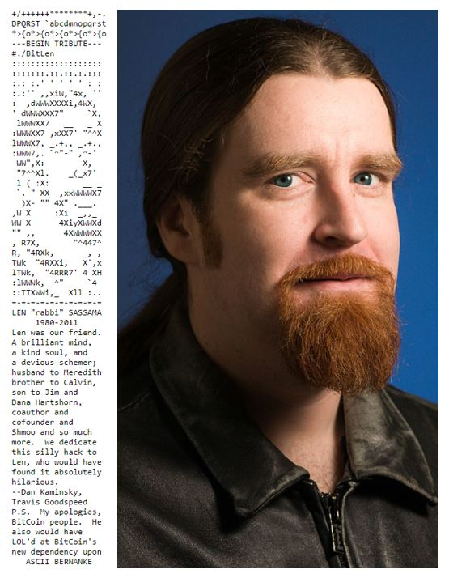
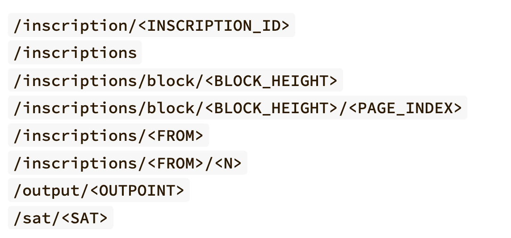

# 0/ Précautions

⚠️ **ATTENTION**  
La pérennité d'Ordinals n'est pas garantie. Ce protocole pourrait devenir obsolète à long terme.  
Ceci reste une expérimentation en version bêta (au 01/09/24), précédemment en phase alpha jusqu'au 25/06/24, et peut donc subir des modifications majeures.

La version actuelle est : `ord 0.19.1`.

Étant donné la nouveauté du protocole, il n'existe pas encore de spécialistes formés sur ce sujet. J'ai découvert Ordinals en février 2023 et je suis simplement un explorateur de ce protocole.

Les informations partagées ici sont une synthèse de mes connaissances et expériences, susceptibles d'évoluer. Comme pour Bitcoin, il est crucial de rester informé des évolutions de ce protocole.

## 1. Préambule

J'ai choisi une approche différente de celle généralement adoptée pour expliquer les protocoles, comme le montre [What is Ordinals and runes protocol?](https://youtu.be/g1jsHW-MX7A?si=5G3yOW0nVDIWR-38).

J'ai décidé de privilégier l'explication de l'enveloppe, qui constitue selon moi le cœur de cette innovation, avant d'aborder les satoshis et la *ordinal theory*.  
Les projets que nous discutons et présentons visent à sensibiliser et expliquer l'évolution en cours. Ce module est une introduction générale à Ordinals. Des formations plus approfondies seront proposées, et l'histoire de ces développements pourrait être détaillée dans des pages spécialisées.

**Définition (Protocole, messages protocolaires)** : Un protocole est un ensemble de règles suivi par un réseau (informatique ou humain) pour fournir un service. Les **messages protocolaires** sont les communications qui suivent ces règles établies.

*Exemples* :
- **Bitcoin** est un protocole monétaire informatique, ses messages sont des transactions.
- **HTTP** (*HyperText Transfer Protocol*) est un protocole pour échanger des pages web ou des fichiers via le protocole Internet, ses messages sont appelés [requêtes](https://www.ionos.fr/digitalguide/hebergement/aspects-techniques/requete-http/).
- Le processus de vote des lois est un protocole humain, ses messages sont les échanges durant le processus décisionnel et la communication de la validation officielle.

# I/ Introduction

Ordinals a été proposé par Casey Rodarmor[^1].

<!--Transcript depuis [Casey Rodarmor - From Ordinals to Runes: Meet Bitcoin’s Most Controversial Dev](https://www.youtube.com/watch?v=sqfCarDdXPM) :-->

En 2019, Casey découvre [Art Blocks | Generative digital art](https://www.artblocks.io/), une plateforme qui publie et promeut l'art génératif. Fasciné par cette algorithmisation de l'art, il souhaite y contribuer. En explorant les NFTs, il identifie des lacunes majeures, notamment la nécessité de déployer un contrat pour inscrire une URL menant à un lien IPFS stockant un JPEG. Convaincu que les données devraient être inscrites *on-chain*, et en tant que maximaliste de Bitcoin[^2], il développe un outil permettant d'inscrire **concrètement** l'image sur Bitcoin.

C'est ainsi que **Ordinals** est né.

Le protocole Ordinals a été utilisé pour la première fois le 14 décembre 2022 [Inscription #0](https://ordiscan.com/inscription/0).
Fondamentalement, Ordinals facilite l'inscription et la récupération de données sur Bitcoin.

Dans *L'élégance de Bitcoin* (Les contrats autonomes, l'inscription de données arbitraires et métaprotocoles pp.332-340), **Ludovic Lars** découvre des trésors cachés dans Bitcoin comme l'hommage à Len Sassaman en art ASCII  [source image](https://hellotoken.io/dordinals/) et bien d'autres[^3].

Bien que l'inscription de données sur Bitcoin ne soit pas nouvelle, leur récupération reste compliquée, souvent car ces éléments ne sont pas indexés nativement[^4].

Ordinals répond à cette problématique. Il utilise des **enveloppes**, des **index** (ou indexeurs[^5]), et les **satoshis** (les unités de Bitcoin), pour tracer la propriété.  
Nous allons donc explorer le fonctionnement de ce protocole, son utilisation pratique, et présenter quelques projets clés de l'écosystème Ordinals.

Avant de continuer, il est pertinent de se demander : Ordinals est-il unique ?

## Ordinals est-il unique ?

D'autres protocoles à enveloppe existent, tant sur Bitcoin, comme Atomicals, que sur d'autres blockchains, telles que Dogecoin (avec Doginals).

### Atomicals

Proposé fin 2023, Atomicals est accessible via une interface en ligne de commande construite en JavaScript : [atomicals-js](https://github.com/atomicals/atomicals-js). Comme Ordinals, ce protocole nécessite une indexation, assurée par un indexer spécifique basé sur ElectrumX : [Electrumx Atomicals Indexer Server](https://github.com/atomicals/atomicals-electrumx).

Atomicals gère ses messages de manière plus compacte qu'Ordinals, utilisant une enveloppe plus simple. Plutôt que d'écrire directement les données en hexadécimal sur Bitcoin, il les transcrit d'abord en CBOR (*Concise Binary Object Representation*) puis en hexadécimal. Atomicals permet également la création native de : tokens, de NFTs et de noms de domaine, appelés *realms*.

Une avancée majeure attendue pour Atomicals est l'introduction de l'Atomicals Virtual Machine (AVM), qui offrirait la possibilité de déployer des contrats autonomes sur Bitcoin (pas encore disponible actuellement).

Bien que ce protocole offre de nombreuses possibilités sur Bitcoin, il souffre d'un manque de notoriété et d'une communauté réduite comparée à celle d'Ordinals. Des cours futurs aborderont plus en détail Atomicals. Pour plus d'informations, vous pouvez consulter [la documentation réalisée par la communauté](https://atomicals-community.github.io/atomicals-guide/).

### Doginals

Doginals est une adaptation du protocole Ordinals pour la blockchain Dogecoin[^9], utilisant la même enveloppe. Cependant, les développements sur Doginals ont souvent quelques mois de retard par rapport à Ordinals. Utiliser Ordinals sur Dogecoin présente des avantages, notamment des coûts d'inscription nettement plus bas et une rapidité accrue des transactions.

La culture autour de Doginals est légèrement différente, plus orientée vers celle de Dogecoin. Bien que les volumes d'échange soient minimes par rapport à ceux d'Ordinals, il existe tout de même une certaine activité. Doginals est limité par la qualité de ses indexers et par le développement encore embryonnaire de ses outils d'interaction.

L'intégration prochaine de Doginals dans [mydoge wallet](https://www.mydoge.com/) pourrait faciliter son utilisation et sa diffusion. Les principaux sites pour l'achat et la vente d'inscriptions Doginals sont [doggy.market](https://doggy.market) et [drc-20.org](https://drc-20.org/)[^6].

Bien que les protocoles d'inscription comme Atomicals offrent une approche assez différente de celle d'Ordinals, comprendre Ordinals est bénéfique pour saisir les évolutions futures de ces technologies.

# II/ Le cœur d'Ordinals

**Focus sur les détails de l'enveloppe et des tags du protocole.**

Dans une transaction Bitcoin, il est possible d'insérer un message qui doit suivre une structure spécifique et utiliser certaines "fonctions" propres au protocole Bitcoin. Ces "fonctions" sont désignées sous le terme <u>opérations</u> et nommées `OP_CODE` (par exemple, `OP_ADD` pour l'opération d'addition). Ces opérations sont transmises au *réseau Bitcoin*[^7] via des transactions.

Les `OP_CODEs` permettent d'exécuter des opérations algorithmiques sur le réseau Bitcoin, ce qu'on appelle un `script` (toute transaction Bitcoin nécessite l'utilisation de script). Pour plus de détails, voir : [Opcodes used in Bitcoin Script - Bitcoin Wiki](https://wiki.bitcoinsv.io/index.php/Opcodes_used_in_Bitcoin_Script).

Ordinals peut être considéré comme une proposition de standardisation des scripts Bitcoin pour faciliter l'écriture de grandes quantités de données sur Bitcoin et en suivre la possession. Cela illustre le lien étroit entre le script Bitcoin et les protocoles d'inscription sur Bitcoin. 
Les protocoles d'inscription utilisent généralement la structure de script suivante : 
```
OP_FALSE
OP_IF
    OP_PUSHDATA <ID_DU_PROTOCOLE>
    OP_PUSHDATA <REGLE_APPLIQUEE>
    ...
    OP_PUSHDATA <DONNEES>
OP_ENDIF
```
Bien que la forme exacte puisse varier d'un protocole à l'autre, tous les protocoles d'inscription actuels reposent sur une structure similaire. Nous appelons ce script une **enveloppe**, qui sert à encapsuler les données sur Bitcoin.

Dans ce cours, nous nous concentrerons principalement sur l'enveloppe Ordinals, mais vous pourrez facilement trouver les détails de l'enveloppe d'Atomicals dans la documentation fournie par la communauté Atomicals.

## 1. L'enveloppe

Basiquement, on pousse les informations suivantes via l'enveloppe : 
```
"ord"

"Type" (MIME format) 

"Données"
```

Autrement dit, on envoie le script suivant sur Bitcoin : 
```
OP_FALSE
OP_IF
    OP_PUSHDATA "ord"
    OP_PUSH 1
    OP_PUSHDATA <TYPE MIME>
    OP_PUSH 0
    OP_PUSHDATA <DONNEES>
OP_ENDIF
```

Les opérations `OP_PUSH 1` et `OP_PUSH 0` sont utilisées pour séparer les champs de l'enveloppe. Ces séparateurs sont appelés **tags**, et nous détaillerons leur utilité plus loin.

### Qu'est-ce que le format MIME ?

Le format MIME est un standard internet initialement conçu pour spécifier le type de fichier envoyé dans un courrier électronique. Il permet d'indiquer le type de contenu d'un fichier (source : [MIME](https://developer.mozilla.org/fr/docs/Web/HTTP/Basics_of_HTTP/MIME_types/Common_types)). Chaque extension de fichier (`.jpg`, `.pdf`, `.mp3`, ...) a un type MIME associé, comme défini dans la [RFC 2046](https://datatracker.ietf.org/doc/html/rfc2046).

Dans le contexte d'Ordinals, le type MIME est sélectionné en fonction du fichier que l'on souhaite inscrire, afin de :

- Faciliter la récupération des données inscrites selon leur type.
- Assurer une présentation adéquate des données dans les explorers, permettant ainsi une visualisation correcte du contenu inscrit.

Avec la possibilité d'inscrire n'importe quel format MIME, on peut stocker sur Bitcoin des formats variés comme du HTML, du CSS, du JavaScript, ainsi que des fichiers audio ou vidéo.

Pour des exemples concrets, voir l'article [{In-On}-Chain](https://6120.eu/posts/in-on-chain/). Un exemple notable est l'inscription 466 : [Yet Another Doom Clone](https://ordinals.com/content/521f8eccffa4c41a3a7728dd012ea5a4a02feed81f41159231251ecf1e5c79dai0), qui est un jeu codé entièrement en HTML, assurant que DOOM reste toujours accessible via Bitcoin. Le code source est disponible sur [Inscription #466 | Ordiscan](https://ordiscan.com/inscription/466), en cliquant sur **view source code** en haut de la fenêtre d'affichage.

Pour voir le nombre d'inscriptions par type MIME, consultez [ordinals.com/status](https://ordinals.com/status).

### Activité

Trouvez des inscriptions de type MIME `text/html;charset=utf-8`, `image/jpeg`, `image/webp`, `video/mp4`, `image/gif` et `text/javascript` en utilisant un explorer Ordinals qui permet de filtrer par types MIME.
<!-- Explorer possible : ord.io -->

### Activité avancée

Créez le script de création d'une transaction utilisant `createrawtransaction` avec une bibliothèque ou un langage de votre choix. (Intéressant à faire en bitcoin-cli, mais évitez de copier-coller du Rust depuis [./src/subcommand/wallet/inscribe.rs](https://github.com/ordinals/ord))

### Détails sur les inscriptions brc-20

En mars 2023, [domodata](https://domo-2.gitbook.io/brc-20-experiment) a proposé un standard nommé **brc-20**, permettant de créer et d'échanger des tokens sur Bitcoin via l'enveloppe Ordinals. Ce nom fait référence au standard ERC-20 d'Ethereum et vise à offrir une solution simple et fonctionnelle pour les tokens sur Bitcoin. Bien qu'il ne soit pas parfait ni optimisé, il fonctionne et constitue une première expérimentation dans ce domaine.

#### Fonctionnement du standard brc-20

Pour créer un token brc-20, il suffit de créer une inscription avec le type MIME `application/json` ou `text/plain;charset=utf-8` et de respecter la structure JSON suivante : 
```json
{
    "p": "brc-20",
    "op": "deploy",
    "tick": "TICK",
    "supply": "xx",
    "lim": 1000000
}
```

Les éléments constitutifs de cette structure sont :
- `p` : le protocole, ici brc-20.
- `op` : l'opération à réaliser, ici *deploy* pour le déploiement d'un token.
- `tick` : le ticker du token, qui doit comporter 4 caractères pour être indexé correctement.
- `supply` : la quantité totale de tokens possibles.
- `lim` : le nombre maximum de tokens pouvant être émis par opération de *mint*.

Ce protocole comprend trois opérations principales : *deploy*, *mint* (pour créer des tokens), et *transfer* (pour échanger des tokens). Chaque opération requiert des paramètres spécifiques et doit respecter la structure attendue pour être indexée correctement.

#### Indexation et gestion des tokens

Un indexer spécifique est nécessaire. Cet indexer fait plus que simplement indexer les tokens : il tient également à jour les balances pour chaque portefeuille ayant participé à des opérations de *mint* ou de *transfer*. Le protocole est considéré comme *stateful* car il prend en compte l'état du système[^15].

Pour *mint* des tokens, on utilise une structure JSON simplifiée : 
```json
{
    "p": "brc-20",
    "op": "mint",
    "tick": "TICK",
    "amt": "xx"
}
```

Si le montant spécifié dépasse la limite établie dans l'opération de *deploy*, l'opération est refusée et les tokens ne sont pas émis. Si le montant est inférieur ou égal à la limite, les tokens sont ajoutés au solde de l'adresse initiatrice.

Pour transférer des tokens, une autre structure JSON est nécessaire, et ce fichier doit ensuite être transféré à l'adresse de destination : 
```json
{
    "p": "brc-20",
    "op": "transfer",
    "tick": "TICK",
    "amt": "xx"
}
```

Ces opérations démontrent comment des fichiers JSON simples peuvent être utilisés pour créer des tokens via l'enveloppe Ordinals avec un indexer brc-20.

#### Autres expérimentations

Plusieurs autres expérimentations sont en cours, notamment avec l'[écosystème Trac](https://trac.network/), qui propose plusieurs protocoles pour la création de tokens, des swaps, du staking, et des tokens d'authentification. Pour plus d'informations en français sur ces développements, vous pouvez écouter l'[OP_SPACE 006: Tap Protocol -> TOUT !](https://x.com/i/spaces/1lPJqbbnzwmxb). Une autre initiative, [`cbrc-20`](https://www.ord.io/preview/130c79034450163f36fcde8e27f96904dc42e535f28aacd5af3b9a18d0b1c7f9i0?type=text/html&raw=true), propose un standard de token plus avancé et plus natif à Ordinals dans sa définition, démontrant l'évolution continue de ces technologies.


### Récursivité

La récursivité dans les inscriptions Ordinals permet d'accéder à des éléments spécifiques dans Bitcoin via des *endpoints* définis dans la [documentation officielle](https://docs.ordinals.com/inscriptions/recursion.html). Ces endpoints suivent le format `/r/<OPTION>/<ID>`, où `OPTION` désigne une catégorie et `ID` l'identifiant de l'inscription ou de l'objet considéré.

Cette fonctionnalité permet d'écrire du code qui interagit avec d'autres inscriptions depuis Bitcoin. Par exemple, le code de React@18.2.0 est disponible [on-chain](https://ordinals.com/content/7f403153b6484f7d24f50a51e1cdf8187219a3baf103ef0df5ea2437fb9de874i0) et peut être utilisé pour créer des sites web entièrement on-chain, comme démontré par le [site web Psyop](https://ordiscan.com/inscription/25949479).

La récursivité est devenue un outil couramment utilisé dans les projets Ordinals, permettant l'intégration de divers packages JavaScript, comme ceux listés par [jokie88/ordinalpublicgoods](https://github.com/jokie88/ordinalpublicgoods?tab=readme-ov-file#ordinal-public-goods).

### Activité

Trouvez une collection importante qui utilise la récursivité.


## 3. L'interprétation des satoshis et l'`index` pour la propriété

Le protocole Ordinals, développé par Casey Rodarmor, applique une numérotation unique à chaque satoshi généré par le réseau Bitcoin, une méthode connue sous le nom de *Ordinal Theory*. Cette numérotation se fait automatiquement à mesure que de nouveaux blocs sont minés. Selon cette théorie, dans une UTXO contenant une inscription, le premier satoshi est celui qui porte l'inscription.

Le principe de numérotation suit la règle du *First In First Out* (FIFO), ce qui facilite la traçabilité des satoshis via l'indexer. Par défaut, la propriété d'une inscription est attribuée au premier satoshi de l'UTXO. Cependant, il est possible de spécifier un autre satoshi pour porter une inscription, ce qui nécessite alors de suivre la chaîne de propriété de ce satoshi spécifique.

Les informations de localisation de ces satoshis sont accessibles grâce aux indexers et peuvent être consultées sur des interfaces telles que [ordinals.com](https://ordinals.com) ou directement via le fichier `index.redb`.

Certains satoshis sont considérés comme rares et donc plus précieux. Par exemple, le tout premier satoshi miné par Satoshi Nakamoto est légendaire; les premiers satoshis minés lors de chaque halving sont rares; et les premiers satoshis de chaque bloc sont non-commun (*uncommon*). La communauté ajoute des niveaux de rareté, comme les *pizza sats* du célèbre Bitcoin Pizza Day, enrichissant ainsi leur valeur de collection.


### Activité 
En prenant connaissance des [points d'accès](https://docs.ordinals.com/guides/explorer.html) donné dans la documentation et des explorers trouvés précédemment donner des sats rares et/ou vérifier la rareté de certains sats. 


Trouver une collection ayant été entièrement inscrite sur des sats particuliers. 
<!--Pizza Ninja-->

Un bon thread au sujet de la rareté réalisé par [@Besbtc](https://x.com/Besbtc) : [Sat rarity](https://x.com/Besbtc/status/1739987968922632240). 
<!--Proposer à Besbtc de faire un tuto sats rares.-->

#### Pour aller plus loin

La ligne de commande `ord` permet également d'étudier les sats. Pour cela il faut avoir l'index qui est convenanblement configuré. 
> Donner la configuration pour chasser les sats.

> Discuter du format redb. 

<!--Proposer à Crypto9ine de faire un tuto sur la chasse aux sats en cli.-->

# III/ L'utilisation & les projets

Nous avons examiné en détail le fonctionnement on-chain d'Ordinals et les concepts qui le sous-tendent. Désormais, explorons les utilisations concrètes et les projets développés sur cette infrastructure.

## 1. Les outils

L'utilisation d'Ordinals nécessite des outils spécifiques. Pour les développeurs et les utilisateurs à l'aise avec les commandes, la ligne de commande [`ord`](https://github.com/ordinals/ord) permet d'inscrire et d'indexer sur Ordinals. Pour cela, il est nécessaire de disposer d'environ 1 To d'espace pour héberger un full node Bitcoin avec l'option `txindex=1` activée. Vous pouvez suivre les instructions détaillées dans la vidéo de [@pazNGMI: How To Setup A Bitcoin Node & Ord Wallet](https://www.youtube.com/watch?v=tdC8kmjn5N0) et consulter les [Tutoriels nodes](https://planb.network/fr/tutorials/node) de PlanB Network pour la configuration du node Bitcoin.

Pour ceux qui préfèrent une approche plus conviviale :
- **Explorers** comme [ordinals.com](https://ordinals.com), [ordiscan.com](https://ordiscan.com), [ordpool.space](https://ordpool.space), et [ord.io](https://ord.io) sont disponibles.
- **Wallets** tels que [Unisat](https://unisat.io), [Xverse](https://xverse.app), et [Magic Eden](https://wallet.magiceden.io/) facilitent la gestion des inscriptions.
- **Outils d'inscription** comme [Unisat](https://unisat.io), [ordinals bot](https://ordinalsbot.com), [looksordinals.com](https://looksordinals.com), et [Chisel](https://chisel.xyz) permettent de réaliser des inscriptions, notamment des structures parent/enfant.

## 2. Les Projets

Dans Ordinals, la propriété est attribuée sur la base du premier à écrire un fichier. Ce principe de "premier arrivé, premier servi" est crucial pour définir le consensus au sein des sous-protocoles.

### a. Premières collections

L'histoire des Ordinals commence par quelques collections pionnières, chacune illustrant un aspect unique de ce que la technologie peut offrir.

**Histoire initiale :**

*Pour explorer les premières inscriptions réalisées, consultez [Inscriptions | Ordiscan](https://ordiscan.com/inscriptions?types=image&sort=oldest).*

**Bitcoin Schrooms | @BitcoinShrooms**

`inscription_id: 9163af650dcdeeeb9a7e1f47f693b51921dce3bdf2475e69360ec83d9956f5d7i0`
Cette collection de 224 inscriptions d'art génératif capte les codes de l'internet, des mèmes et de Bitcoin. Vous pouvez découvrir plus sur cette collection en visitant [bitcoinshrooms.com](https://bitcoinshrooms.com), qui contient des références à l'Orange Pill, Bitcoin Magazine, à l'euro et à l'Union européenne et bien d'autres. Malgré son succès, elle est inégalement indexée sur des plateformes comme [gamma.io](https://gamma.io/ordinals/collections/bitcoinshrooms) et [ordiscan](https://ordiscan.com/collection/bitcoin-shrooms?sort=oldest), reflétant la jeunesse de l'écosystème Ordinals. Ces inscriptions ont été échangées pour plusieurs BTC, avec les moins chères actuellement autour de 1,9 BTC (Août 24).

**Bitcoin Rocks | @ordrocks**

`inscription_id: e8ce0fcb238b377b3a6b9921333e26fbec5c5724c5bf6e783c3dcc1129794508i0`
Première collection inscrite en une seule fois et entièrement on-chain, listée sur l'[inscription #191](https://ordiscan.com/inscription/191). Ces inscriptions soulèvent des questions sur leur réalisation, probablement avec l'aide d'un mineur pour isoler ces transactions dans un bloc, peut-être le premier grand test de charge pour un bloc Bitcoin.

**Bitcoin Wizard | @bitcoinwizardry**

`inscription_id: b1c5baa2593b256068635bbc475e0cc439d66c2dcf12e9de6f3aaeaf96ff818bi0`
Directement issu de [Reddit r/BitcoinWizard](https://www.reddit.com/r/BitcoinWizard/), cette collection tire son origine d'une campagne marketing pour Bitcoin lancée en février 2013, qui a popularisé l'image du "Sorcier Bitcoin". Cette image est devenue emblématique pour la communauté Bitcoin, symbolisant l'aspect magique de la monnaie numérique : *"Magic Internet Money"*.

Ces collections mettent en lumière non seulement la créativité mais aussi l'immaturité de l'écosystème Ordinals, illustrant le potentiel immense mais aussi les défis de son exploitation à grande échelle.

Nous parlerons des **Taproot Wizards** qui se sont basés sur ce meme pour construire leur empire. On pourra également noter les [**Bitcoin Punks**](https://bitcoinpunks.com/) *10k inscriptions*, inscrits assez rapidement, faisant référence aux *cryptopunks*.
 
`inscription_id:5a55780e69b923d418ac6212151540c4c4462088e3e6d52522a466d36c006cdai0`


### b. Bitmap

Le projet [Bitmap](https://bitmap.community/) explore une approche unique à la notion de propriété sur la blockchain Bitcoin, en introduisant l'idée d'un métaverse où les blocs Bitcoin eux-mêmes sont des biens de propriété. Selon ce protocole, le premier à inscrire `NumeroDeBloc.bitmap` devient le propriétaire du bloc Bitcoin correspondant.

La création de Bitmap est *possiblement* attribuée à [TheBlockRunner](https://www.youtube.com/@TheBlockRunner), qui a su fédérer une communauté importante autour de ce projet. Les participants sont passionnés par le potentiel et soutiennent activement l'évolution de Bitmap.

**Rarefication des blocs et traits de collection :**
- La communauté a développé [Blocktributes](https://8bit-1.gitbook.io/blocktributes), un guide détaillant la rareté des blocs basée sur leurs caractéristiques spécifiques telles que les frais de transaction, la récompense de bloc, et le nombre de transactions.
- Les [définitions de traits](https://docs.bitmap.community/bitmap.community/trait-definitions) offrent une analyse approfondie des blocs, ce qui incite les détenteurs et les investisseurs à étudier minutieusement chaque bloc avant toute transaction. Des caractéristiques comme les blocs minés par le [Patoshi](https://bitcoin.fr/satoshi-etait-il-un-mineur-cupide/), ou ceux avec moins de 100, 1 000 ou 100 000 transactions, sont valorisés pour leur rareté.

Bien que l'échange et la spéculation soient les activités principales actuellement, Bitmap nourrit de grandes ambitions pour son métaverse, incluant des jeux qui rappellent [Minecraft](https://www.minecraft.net/fr-fr), où les joueurs peuvent extraire des ressources des transactions contenues dans chaque bloc.

Pour rester informé sur les derniers développements de Bitmap, vous pouvez suivre leurs mises à jour sur leur compte X (anciennement Twitter).


### c. Taproot Wizard

Un projet notable dans l'écosystème Ordinals est [**Taproot Wizard** 🧙 | Manifesto](https://taprootwizards.com/manifesto), avec 2 108 inscriptions.


Ce projet, porté par des figures telles que [Udi Wertheimer | @udiWertheimer](https://x.com/udiwertheimer) et [Eric Wall | @ercwl](https://x.com/ercwl), et illustré par [0xFar | @0xfar](https://x.com/0xfar), s'inspire clairement de Bitcoin Wizards.

**Historique et impact :**
Taproot Wizard a marqué les esprits en étant la première collection à inscrire un bloc Bitcoin particulièrement lourd, [Block 774628](https://mempool.space/block/0000000000000000000515e202c8ae73c8155fc472422d7593af87aa74f2cf3d?showDetails=true), une prouesse réalisée en partenariat avec la pool [Luxor Technology | @luxor](https://x.com/luxor). Cette démarche illustre la capacité des mineurs à sélectionner spécifiquement les transactions pour un bloc, facilitant ainsi le passage de transactions choisies[^14].

**Acquisition et distribution :**
Initialement, les Taproot Wizards n'étaient pas vendus sur le marché secondaire. Les intéressés devaient tweeter la *txid* de l'image ci-dessus pour tenter d'en obtenir une. Bien que la distribution exacte reste non divulguée, des personnalités telles que [Jameson Lopp | @lopp](https://x.com/lopp) sont réputées posséder des Taproot Wizards, bien que les détails des wallets ne soient pas publics.

**Développements et ambitions :**
Après cette première phase, le projet a dévoilé un manifesto ambitieux proposant la création d'un "Wizard Village" et d'une école de sorcier, visant à établir une communauté forte et engagée. L'adhésion à cette communauté exige des contributions significatives, avec des récompenses sous forme de whitelist permettant l'achat de nouveaux Wizards pour les contributeurs les plus actifs.

**Engagement communautaire et quêtes sociales :**
Par leur école de Sorciers, Taproot Wizard constitue une force de frappe conséquente sur les réseaux sociaux. Afin d'obtenir des Whitelists précieuses ou de tenter d'acquérir un Quantum Cat, ils ont lancé les quêtes `Mission: OP_CAT`. Les participants doivent réaliser une série de tweets sur différents sujets pour participer. La première mission demandait :
> Write the story of your biggest Bitcoin (or crypto) challenge

Leur message suivant cette première mission était très inspirant :
> Today, you showed us that we have a legion of cadets filled with grit and mettle. Today, you inspired us with your stories of struggle and growth. Today, we collectively took the first step.
> The journey has just begun. Tomorrow we continue. Every day, we will continue. We will stride forward together until we usher in an era of magic the likes that Bitcoin has never seen.

**Implications technologiques et communautaires :**
Les fondateurs utilisent des concepts comme les [*covenants*](https://fr.wikipedia.org/wiki/Covenant), envisagés pour imposer des règles spécifiques aux adresses Bitcoin via des modifications protocolaires. Des propositions comme `OP_CAT` sont débattues dans la communauté pour leur potentiel à transformer la gestion des transactions Bitcoin, comme discuté dans [Bitcoin OPTECH #200](https://bitcoinops.org/en/newsletters/2022/05/18/#when-would-enabling-op-cat-allow-recursive-covenants).

**Pourquoi faire ?**
Cette initiative vise non seulement à sensibiliser un large public au code Bitcoin, mais aussi à l'impliquer activement dans le développement de nouvelles fonctionnalités. Les actions de Taproot Wizard montrent que l'éducation et l'engagement communautaire peuvent coexister avec des objectifs commerciaux et technologiques, ajoutant une couche de complexité et d'attrait au projet.

Qu'en pensez-vous ? Est-ce bénéfique pour l'écosystème ? 

Pour en savoir plus sur les covenants et les mises à jour proposées pour Bitcoin, vous pouvez consulter [Covenants, OP_CAT et OP_CTV : Tout savoir sur la prochaine mise à jour de Bitcoin](https://cryptoast.fr/covenants-opcat-opctv-tout-savoir-prochaine-mise-a-jour-bitcoin/).


## Conclusion

Au terme de notre exploration approfondie des Ordinals, notamment l'enveloppe sur laquelle nous reviendrons dans des discussions techniques futures, il est essentiel de reconnaître le dynamisme des projets et des communautés utilisant la timechain de Bitcoin. Des initiatives telles que Taproot Wizard invitent les utilisateurs à s'engager activement, mais il est crucial de questionner les motivations sous-jacentes et les résultats de ces engagements. Quel est le but réel de ces projets, au-delà de la participation communautaire ?

Il est également important de rester critique et vigilant face aux développements actuels. Bien que ces projets puissent paraître innovants et bénéfiques, ils soulèvent des questions sur leur durabilité, leur impact à long terme sur la timechain de Bitcoin, et les implications pour ceux qui y investissent du temps et des ressources.

Regardant vers l'avenir, les protocoles à inscriptions sur Bitcoin (et les protocoles associés) offrent des opportunités substantielles, tant sur le plan professionnel que personnel. Ils ouvrent de nouvelles avenues pour les créateurs, les développeurs et les entrepreneurs désireux de façonner l'avenir du numérique. Cependant, comme avec toute innovation, il convient d'approcher avec une compréhension complète des risques et des avantages potentiels.

En conclusion, alors que nous continuons à naviguer dans le monde complexe des Ordinals et des inscriptions sur des protocoles *Bitcoin-based*, la prudence, l'éducation et l'engagement éclairé resteront nos meilleurs outils pour exploiter au mieux ces technologies émergentes.


[^1]: Casey a quitté l'école à 15 ans pour aller travailler dans des petits boulots. A 21 ans il découvre la programmation et veut en faire son métier. Il rattrape ses dernières années dans un [collège communautaire](https://fr.wikipedia.org/wiki/Coll%C3%A8ge_communautaire) avant d'intégrer Berkeley en Sciences de l'Informatique (Computer sciences). Il poursuit chez Google comme Ingénieur Fiabilité sur site ([Site Reliability Engineering](https://fr.wikipedia.org/wiki/Site_Reliability_Engineering)) puis rejoint l'équipe de [Chaincode Labs](https://chaincode.com/) en 2015. Chez Chaincode Labs il a maintenu Bitcoin core en réalisant des petites missions: nettoyage de certains PRs (Pull Requests), remaniement d'une partie des tests, et d'autres taches de maintenance. Pour plus de détails sur la vie de Casey (et son avis) vous pouvez consulter: [Casey Rodarmor's Resume](https://rodarmor.com/resume/index.html). [Casey Rodarmor - From Ordinals to Runes: Meet Bitcoin’s Most Controversial Dev](https://www.youtube.com/watch?v=sqfCarDdXPM) Vous pouvez écouter son podcast en anglais: [Hell Money](https://hell.money/) co-host par [Realizing Erin](https://www.youtube.com/realizingerin). ([Casey (@rodarmor) | Twitter](https://twitter.com/rodarmor/), [R O D A R M O R](https://rodarmor.com/), [casey (Casey Rodarmor) | Github](https://github.com/casey/))

[^2]: Bitcoin maximaliste se dit des personnes mettant en avant le fait que Seul Bitcoin a une véritable valeur monétaire. Les autres cryptos sont en général désignées par *Shitcoin* de la part des maximalistes. Il existe plusieurs courant du maximalisme allant du minimalisme au toxic maximalisme. Les détails dépassent largement le cadre de cet introduction à Ordinals.  

[^3]: Pour un peu d'histoire cypherpunk : [Len Sassaman and Satoshi: a Cypherpunk history | Medium](https://evanhatch.medium.com/len-sassaman-and-satoshi-e483c85c2b10).

[^4]: En effet, il est possible de retrouver ces données sur Internet par exemple mais très difficile on-chain (depuis Bitcoin).

[^5]: En français on prononce indexeUr et non indexé, comme explorer (exploreUr et non exploré).

[^6]: Standard basé sur brc-20 pour Doginals. Nous détaillerons plus tard ce qu'est le standard brc-20.

[^7]: On appelle <u>réseau Bitcoin</u>, l'ensemble des machines exécutant le protocole Bitcoin. On trouvera un détail des clients utilisés pour accéder au réseau Bitcoin sur [Coin Dance | Bitcoin Nodes Summary](https://coin.dance/nodes/share).

[^8]: Attention, ces outils peuvent être obsolètes ou ne pas être sécurisés. Il est important de bien se renseigner avant d'utiliser un outil et de ne pas mettre tout son argent dans un seul outil !

[^9]: Techniquement il y a des différences assez importantes dû au code de Dogecoin qui n'est pas à jour par rapport à Bitcoin. Taproot n'est pas implémenté. 

[^10]: [RFC 2045 | Format of Internet Message Bodies](https://datatracker.ietf.org/doc/html/rfc2045), [RFC 2046 | Media Types](https://datatracker.ietf.org/doc/html/rfc2046).

[^11]: Les chiffres historique à ce sujet manque mais vous pouvez chercher sur [OpenOrdex](https://openordex.org/collection?slug=bitcoin-shrooms) si cela vous intéresse. 

[^13]: Plus gros airdrop Bitcoin jamais réalisé ayant occasioné le minage du bloc: [Block 832849](https://mempool.space/block/00000000000000000000e37d10aa5a5ece8dba4a20f011280ae3d1880414ff7e). Un *airdrop* est un envoi gratuit d'inscription(s) ou de jeton(s). 

[^14]: En ce moment, mempool.space propose un service d'accéleration de transaction basé sur ce principe d'accord (off-chain, pris entre le mineur et l'utilisateur par l'intermédiaire de mempool). Est-ce que ces accords successifs avec TaprootWizards et Runestone ont joués pour quelque chose ?


[^15]: Pour un exemple de protocole *stateless* on peut penser à Bitcoin qui ne stocke que les UTXO et non pas les états des adresses (nativement) en opposition à Ethereum qui stocke les états de chaque adresses au cours du temps. Ethereum est un exemple de protocole *stateful*. 
