# Der erste Schritt zur Bitcoin-Adoption

Heutzutage sind zahlreiche Bildungsinhalte im Internet verfügbar, die es jedem ermöglichen, sich über Bitcoin und sein Ökosystem zu informieren.
Jedoch **fehlt vielen von uns, den Bitcoinern, die Gelegenheit, sich zu treffen, auszutauschen und unser Wissen zu teilen**. Aber auch, **gemeinsam aufzubauen**.

Um diesem wachsenden Bedarf gerecht zu werden, entscheiden sich viele Bitcoiner regelmäßig dazu, **neue Gemeinschaften um sich herum zu schaffen**. Treffen werden dann vorgeschlagen, wenn die Anzahl der Teilnehmer ausreichend ist; und diese Treffen, die oft wiederkehrend werden, werden dann zu einem fruchtbaren Boden für die Realisierung von Präsentationen und Workshops, sowohl technischer als auch popularisierender Art.

In dieser Schulung mit dem Titel "**BTC302**" werden wir uns bemühen, das **Interesse an der Schaffung einer Community und/oder eines Bitcoin-Meet-ups** zu präsentieren, dann werden wir **verschiedene Tools für die Entwicklung der visuellen und digitalen Identität** einer Gemeinschaft oder eines Meet-ups im Detail vorstellen und vorschlagen.
Anschließend werden wir **verschiedene Projekte und Initiativen** präsentieren, die insbesondere aus bildungstechnischer Sicht leicht umgesetzt werden können. Mehrere vorgefertigte Ressourcen werden dann im Open-Source angeboten.
Schließlich wird eine tiefergehende Reflexion über **die Entwicklung von Gemeinschaften aus nationaler Perspektive** geführt; aber auch über **ihre Rolle in der Hyperbitcoinisierung der Welt von morgen**.

+++

# Einleitung
<partId>81318b8f-d316-5787-aa4c-4ec8370ba668</partId>

## Rekontextualisierung
<chapterId>e8991b82-4966-5e04-8f05-7cae46eacbaa</chapterId>

Seit 2009 hat sich Bitcoin kontinuierlich weiterentwickelt. Dies umfasst die Implementierung neuer Bitcoin-Verbesserungsvorschläge (BIP), die Schaffung neuer Schichten zur Skalierung des Netzwerks (unter anderem das Lightning-Netzwerk) und die Entwicklung mehrerer Unternehmen und Startups.

Seine Entwicklung ist auch on-chain sichtbar, insbesondere durch seine zunehmende Anzahl von Transaktionen.
So wird geschätzt, dass zwischen dem 1. Januar 2018 und dem 1. Januar 2024 die Anzahl der Transaktionen auf der Hauptebene von Bitcoin um 66,2% [zugenommen hat](https://dune.com/queries/3375917/5663935); während zwischen August 2021 und August 2023 die Anzahl der öffentlichen Transaktionen auf der Lightning-Overlay um 1212% [zugenommen hat](https://river.com/learn/files/river-lightning-report-2023.pdf).
Diese statistische Ansicht ist natürlich eng verbunden mit:
* dem wachsenden [Interesse vieler Einzelpersonen weltweit an der Nutzung von Bitcoin](https://profedustream.substack.com/p/21-raisons-dutiliser-bitcoin), mit dem Ziel, sich vom Bankensystem zu emanzipieren und/oder eine Währung zu verwenden, die weniger volatil oder weniger entwertet ist als ihre eigene, wie es bei den Bevölkerungen in Libanon, Syrien, Ägypten, Argentinien usw. der Fall ist;
* der Wertschätzung seines Preises im Laufe der Zeit, die ihn durch seine Geldausgabe zu einem Wertaufbewahrungsmittel und einer langfristigen Investition führt.
* die sukzessive Entwicklung des spekulativen Marktes der Kryptowährungen, insbesondere in 2017/2018 und in 2020/2021;
* das zunehmend regelmäßige Auftreten von Bitcoin in den Medien.

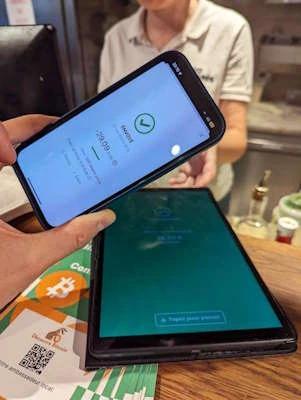

####
Während Bitcoin noch in den Kinderschuhen steckt, führt uns diese Beobachtung - die Ihnen sicherlich bereits bekannt ist - dazu, über zwei Dinge nachzudenken.
Einerseits, wie können wir Bitcoiner ermutigen, in ihrem Lernen und in ihren Projekten weiterzugehen, um **das volle Potenzial von Bitcoin auszuschöpfen**?
Andererseits, wie könnten wir neue Leute, die aus dem Gewinnstreben in das "Kryptowährungs-Ökosystem" kommen, ermutigen, ihr Geld nicht in der neuesten trendigen Memecoin zu verlieren, sondern sich **über die Grundlagen von Bitcoin zu informieren**?
####
Für diese beiden Probleme ist die beste Lösung, vor Ort zu sein und zu bilden.

## Warum eine Bitcoin-Community oder ein Meet-up gründen?
<chapterId>893ea248-7d5a-5b8e-948c-7031497b1031</chapterId>

### Was ist der Unterschied zwischen einer Community und einem Meet-up?

Obwohl es im Bitcoin-Ökosystem keine spezifische Definition für diese beiden Begriffe gibt, kann eine Community als die Zusammenkunft mehrerer Individuen gesehen werden, die eine (oder mehrere) gemeinsame Leidenschaft(en) teilen und mehr oder weniger regelmäßig miteinander kommunizieren.
Parallel dazu ist ein Meet-up eine Veranstaltung, die von (und für) diese Community organisiert wird, mit einem spezifischen Ziel vor Augen. Es findet daher in der Regel erst statt, nachdem die zugehörige Community gegründet wurde.
In diesem Sinne werden wir im Verlauf dieses Kurses davon ausgehen, dass es notwendig ist, vorher mit anderen Personen, die an der Realisierung dieser Art von Veranstaltung interessiert sind, ausgetauscht zu haben; und daher, dass **vorher eine Bitcoin-Community gegründet worden sein muss**.
### Warum eine Community gründen?

Wie im vorherigen Kapitel erwähnt, kann die Gründung einer Community mehrere Ziele haben.

Einerseits kann eine Community, wenn sie aus Bitcoinern besteht, ihren Mitgliedern ermöglichen, Informationen untereinander auszutauschen und zu teilen. Gegenseitige Hilfe steht dann in der Regel im Mittelpunkt, was jedem ermöglicht, sein Lernen zu beschleunigen.
Das macht besonders im Fall von Bitcoin Sinn, angesichts seiner Komplexität.

Parallel dazu kann eine Community von Bitcoinern auch den Aufbau unter Gleichgesinnten ermöglichen. So entstehen zahlreiche Initiativen und bedeutende Projekte, die geboren, aufgebaut und entwickelt werden.
####
Andererseits kann eine Bitcoin-Community auch offenere Ziele haben; insbesondere mit dem Ziel, die Bevölkerung so umfassend wie möglich über Folgendes aufzuklären:
1. was Bitcoin ist;
2. wie es funktioniert;
3. was es unserer Gesellschaft bringt;
4. die unbegründeten und/oder irreführenden Unsinnigkeiten, die einige Persönlichkeiten und Medien zu verbreiten suchen;
5. seine grundlegenden Unterschiede zu anderen Kryptowährungen.

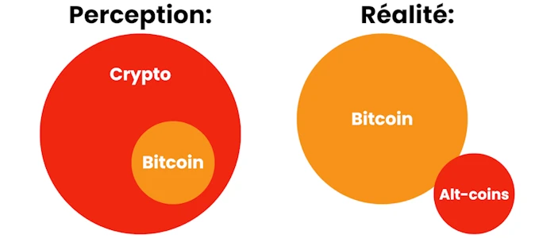

Indem sie schrittweise die ersten Zitadellen der Welt von morgen aufbauen, **stehen Bitcoin-Communities weltweit als besonders relevanter Bollwerk gegen Versuche der Desinformation und/oder Zensur in einigen Ländern**. Parallel dazu **schaffen sie einen fruchtbaren Boden für das Erlernen der Grundlagen von Bitcoin**; dies ermöglicht jedem, der es noch nicht verstanden hat, wenn er bereit ist, die Kontakte und Ressourcen zu haben, um eine neue Welt zu envisionieren.

Darüber hinaus, **da Bitcoin inklusiv ist, scheint es die Rolle einer Community zu sein, alle zukünftigen Bitcoiner über die Grundlagen von Bitcoin zu ermächtigen und aufzuklären**; einschließlich der am meisten Zurückhaltenden.
####
Obwohl wir später im Kurs noch ausführlicher darüber sprechen werden, ist es dennoch relevant, jetzt zu erwähnen, dass **eine Gemeinschaft vollständig digital existieren kann**. So stellen eine "Bitcoin London" Telegram-Gruppe, eine "Bitcoin Berlin" Facebook-Gruppe, ein "Bitcoin Madrid" Discord-Server oder eine "Bitcoin France" E-Mail-Verteilerliste, vollständig digital, Gemeinschaften dar. Das bedeutet, dass **eine Gemeinschaft technisch gesehen keine physischen Treffen benötigt, um zu existieren, Fortschritte zu machen und ihre Projekte zu entwickeln. Ihr Ziel bleibt jedoch, zu teilen, zu bauen und zu bilden**.

### Warum ein Meet-up erstellen?

Wie bereits gesagt, **folgt die Erstellung eines Meet-ups der Gründung einer Gemeinschaft, da es eine Ergänzung dazu ist**.
Tatsächlich heben im Laufe der Reise eines Bitcoin-Enthusiasten eine sehr signifikante Anzahl von Personen den Wunsch (und die Notwendigkeit) hervor, **sich zu treffen und physisch mit anderen innerhalb desselben Ökosystems auszutauschen**. Dies wird im Allgemeinen durch das Aufkommen eines Gefühls der Einsamkeit erklärt, das bei vielen von ihnen vorhanden ist.
Die Organisation dieser Meet-ups kann also physische Begegnungen ermöglichen, die viel geselliger sind als durch Audio- oder Videoanrufe. Sie können **bei einem Getränk oder einer Mahlzeit** stattfinden und ermöglichen präzisere und direktere Austausche mit einer größeren Anzahl von Personen.

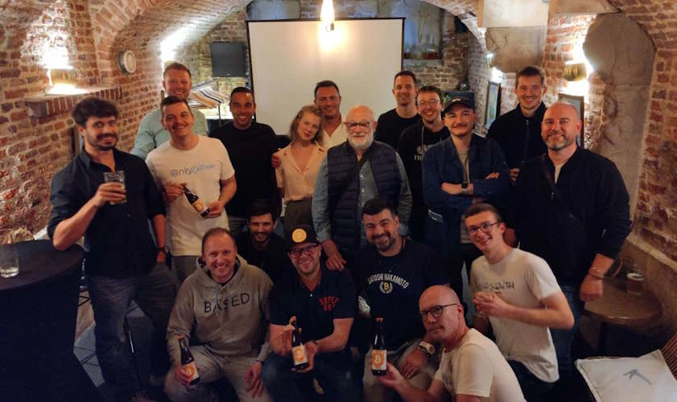

Für Bitcoin-Enthusiasten können Meet-ups dann ein Moment sein, **der förderlich für Diskussionen über technische Themen oder Projekte ist**, die sie entwickeln; und für "angehende Bitcoiner", um **die Welt von Bitcoin zu entdecken und sich allmählich darin einzutauchen**.
####
Darüber hinaus können diese Veranstaltungen auch die Ankündigung von Bitcoin-bezogenen Projekten, das Verleihen von Ausrüstung oder Büchern, die Vorpremiere eines Dokumentarfilms; aber auch die Abhaltung einer Konferenz oder eines Workshops zu einem bestimmten Thema erleichtern. Wir werden in Teil 6/8 dieses Kurses, betitelt "[Beispiele für Projekte und Initiativen](LINK), ausführlicher darüber sprechen.
####
Obwohl es jeder Gemeinschaft obliegt, ihre eigenen Meinungen zu bilden, ihre eigenen Projekte zu starten und ihre eigenen Experimente durchzuführen, **scheinen Meet-ups für die Entwicklung von Bitcoin und seinen Gemeinschaften unerlässlich zu sein**; und das, über alle Territorien hinweg.

**Ihre Organisation erfordert jedoch etwas Planung und Zeit**; und deshalb werden wir in diesem Kurs bestrebt sein, die zusammengefasste Erfahrung der [sechzig französischen und belgischen Bitcoin-Gemeinschaften](https://btcmap.org/communities/map#2/5.24949/0.20000) zu teilen; **damit Sie Ihre Gemeinschaft und Ihr Meet-up so einfach wie möglich erstellen und entwickeln können**.

## Wo erstellen Sie Ihre Gemeinschaft und Ihr Meet-up?
<chapterId>72da5285-5395-592d-ab62-303a0aef3d6d</chapterId>

Sobald Sie sich entschieden haben, eine Bitcoin-Gemeinschaft zu gründen, ist die erste Frage, die Sie sich stellen sollten: wo soll sie erstellt werden? Und diese Frage ist wesentlich.

Tatsächlich, obwohl die Gründung einer Gemeinschaft anfangs nur auf Kommunikationswerkzeugen und digitalen sozialen Netzwerken basiert, **muss der geografische Standort aus mehreren Gründen berücksichtigt werden**.
####
Ursprünglich, wenn man versucht, sich auszutauschen und andere Bitcoin-Enthusiasten zu treffen, beginnt man häufig mit einigen Recherchen im Internet. Dies führt schnell dazu, Discord-Server oder Telegram-Kanäle wie die von [Decouvre Bitcoin](https://decouvrebitcoin.fr/), oder sogar Diskussionsforen wie [bitcointalk.org](https://bitcointalk.org) zu entdecken und sich ihnen zuzuwenden.
Nach einigen Monaten der Interaktion über Bildschirme hinweg kommt oft der Zeitpunkt, an dem der Wunsch verspürt wird, weiterzugehen. Dieser Wunsch kristallisiert sich dann in das Bedürfnis, andere Bitcoin-Enthusiasten zu treffen, mit denen man sich "physisch" nahe fühlt. Mit anderen Worten: Bitcoin-Enthusiasten aus der eigenen Stadt oder sogar dem eigenen Landkreis.
Leider **ist es durchaus möglich, dass zu diesem Zeitpunkt keine Bitcoin-Gemeinschaft in Ihrer Nähe existiert. Dies ist sicherlich der Moment für Sie, die Rolle des Botschafters für eine neue Gemeinschaft zu übernehmen**.

Bevor Sie jedoch starten, ist es wesentlich, den nächsten Schritt zu antizipieren: ein mögliches Treffen. Ein Meet-up, mit anderen Worten!
Es ist jedoch klar, dass, wenn Mitglieder Ihrer Gemeinschaft eine zweistündige Fahrt auf sich nehmen müssen, um zu Ihrem Event zu kommen, nur wenige von ihnen die Reise machen werden.
Deshalb **hat die Geolokalisierung Ihrer Gemeinschaft (und daher Ihrer zukünftigen Meet-ups) einen erheblichen Einfluss auf ihre Entwicklung**.

#### 
Hier sind einige Gedanken, die Sie leiten können:
1) **Erstellen und entwickeln Sie Ihre Gemeinschaft in einer mittelgroßen oder großen Stadt**. Dies ermöglicht es Ihnen:
    * **einen Veranstaltungsort** viel leichter für Ihr Meet-up und/oder Ihre Projekte (Präsentationen, Workshops, Akzeptieren von Bitcoin als Zahlungsmittel usw.) zu finden;
    * **das Gefühl der Beteiligung und Zugehörigkeit** einer größeren Anzahl von Menschen zu Ihrer Gemeinschaft und Ihren Veranstaltungen zu verstärken;
    * **es einfacher zu machen, Ihren Veranstaltungen beizutreten** (öffentliche Verkehrsmittel, Parkplätze für Autos usw.). **Daher ist die Wahl eines Veranstaltungsortes für die Organisation eines physischen Meet-ups in der Nähe von öffentlichen Verkehrsmitteln und Parkplätzen eindeutig ratsam**.

2) **Wählen Sie einen Namen für Ihre Gemeinschaft/Meet-up, der auf diese Stadt Bezug nimmt**, sodass es für die Menschen leicht ist, sich damit zu identifizieren. Zum Beispiel: "Bitcoin Paris", "Einundzwanzig Berlin", "Satoshi Spritz Milano" usw.
####
Ein weiterer Punkt, der mehr als relevant zu erkunden ist: **Gibt es bereits ein Meet-up in meiner Nähe?**
Dazu sollten Sie wissen, dass die Website [btcmap.org](https://btcmap.org/communities/map#0/0/0/) fast alle globalen Gemeinschaften und Meet-ups auflistet.

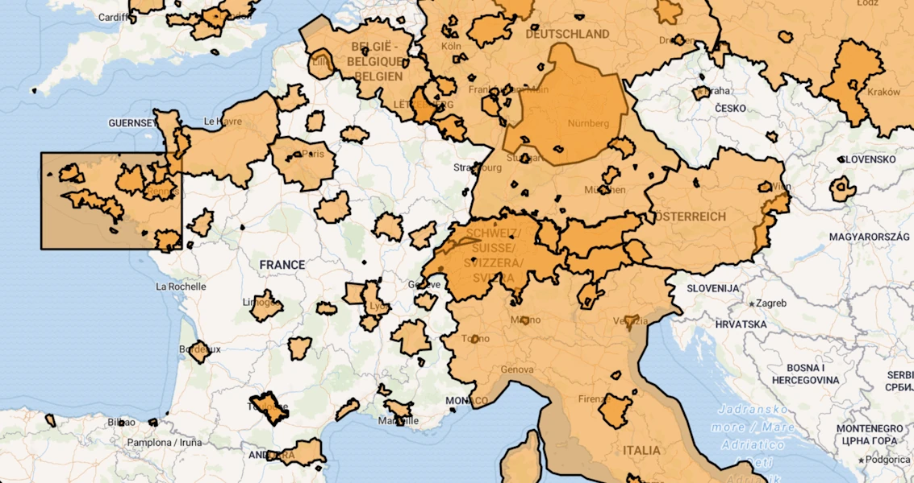
Nach einiger Recherche, wenn Sie sich entscheiden, ein Meet-up oder eine Gemeinschaft in derselben Stadt (oder der benachbarten) wie ein aktives Meet-up zu gründen, das seit mehreren Monaten/Jahren läuft, sollten Sie wissen, dass dies eine Art von Wettbewerb schaffen kann; auch wenn es unbeabsichtigt ist. Natürlich, da Bitcoin dezentralisiert ist, ist jeder frei zu tun, was er möchte. Es ist jedoch klar, dass **es relevanter ist, Kräfte so weit wie möglich zu vereinen, anstatt nahe Gemeinschaften zu vervielfachen; dadurch verringert sich die Schlagkraft jeder einzelnen**.
In diesem Sinne könnte die folgende "Konvention" Ihnen helfen, eine Entscheidung zu treffen: Wenn keine aktive Bitcoin-Gemeinschaft innerhalb von 45 Minuten von Ihrem Standort existiert (sagen wir mal mit dem Auto, zum Beispiel), dann könnte es relevant erscheinen, eine neue zu gründen.
Aber natürlich sind Sie völlig frei zu tun, was Sie möchten.

Falls jedoch eine Bitcoin-Gemeinschaft existiert, aber nicht aktiv ist, könnte es relevanter sein, sie zu übernehmen und ihre Flamme neu zu entfachen; indem Sie zum Beispiel deren frühere Schöpfer kontaktieren mit dem Ziel, Zugang zu zuvor genutzten Kommunikationskanälen und sozialen Netzwerken zu erhalten.

Im Gegenteil, in dem Fall, dass eine alte Bitcoin-Gemeinschaft - sagen wir mal - "sich weiterentwickelt" hat, nicht mehr Ihre Werte teilt und Sie nicht die Motivation oder Zeit haben, sie zu überzeugen, ist es immer möglich, einen Fork zu erstellen.

## Welche Ziele sollten gesetzt werden?
<chapterId>0aae1aa8-93ec-544a-ad88-22d32c619595</chapterId>
Jetzt, da Sie die Stadt (oder den geografischen Ort) gefunden haben, an den Sie Ihre Gemeinschaft knüpfen möchten, ist es nun wesentlich, **über die Ziele nachzudenken, die Sie erreichen möchten**.
Diese Frage kann allein beantwortet werden, beim Start Ihrer Gemeinschaft/Meet-up, oder auch später, wenn bereits mehrere Mitglieder beigetreten sind und Ihre Gemeinschaft aktiv ist.

Um Ihnen zu helfen, haben wir unten einige Überlegungen aufgelistet, die nützlich sein könnten.
####
1. **Warum habe ich als Bitcoiner diese Gemeinschaft gegründet?** Geht es darum, mein Wissen zu teilen? Zu bilden? Von anderen zu lernen? Andere Menschen zu treffen, die die gleiche Vision teilen? Sich im Ökosystem zu engagieren? Fachleute zu treffen? Einfach nur Bier zu trinken und neue Freunde zu machen?

Offensichtlich werden je nach Ihren Antworten Ihre Positionierung und Motivationen nicht die gleichen sein.
Zum Beispiel, wenn Ihr Ziel ist, **Ihr Wissen mit dem Ziel zu teilen, über Bitcoin aufzuklären**, ist es klar, dass die **Erstellung von Bildungsinhalten** (Artikel, Podcasts, Videos, Präsentationen, Flyer usw.) relevant ist. Sie werden anderen dann dutzende Stunden an Recherche und Arbeit ersparen. Dies kann sogar noch weitergeführt werden, durch die **Organisation von Workshops, Präsentationen und Konferenzen**.
Parallel dazu, wenn Ihr Ziel ist, "einfach" andere Bitcoiner zu treffen, um Ihren Alltag zu teilen, kann dies auf eine viel entspanntere Weise geschehen; zum Beispiel bei einem Getränk.
Jedoch sind Sie zweifellos darüber im Klaren, dass Anstoßen dazu beiträgt, soziale Interaktionen zu erleichtern, besonders wenn es Alkohol involviert. Dennoch, obwohl es heute noch üblich ist, sich allein und von allen unverstanden zu fühlen, wenn man zutiefst von dem überzeugt ist, was Bitcoin unserer Gesellschaft bringt, ist es wichtig, nicht zu vergessen, dass **Biertrinken zu Diskussionen über die Welt führt, aber nicht zu deren Veränderung** :smirk:

In diesem Sinne scheint es notwendig, **konkrete Ziele und Projekte festzulegen**.
####
2. Ist es relevant, **meiner Gemeinschaft eine physische Dimension zu geben**? Wenn ja, welche Arten von Veranstaltungen könnten realisiert werden?

In dem Fall, dass Sie Ihrer Gemeinschaft eine physische Dimension geben möchten, wird Ihr erstes Event sicherlich ein Meet-up sein. Sein Ziel wird dann offensichtlich sein, schrittweise die Bitcoiner in Ihrer Nähe zu treffen.

Jedoch, wie wir später im Abschnitt [Beispiele für Projekte und Initiativen](LINK) sehen werden, **kann ein Meet-up auf verschiedene Weisen konstruiert werden, mit verschiedenen und vielfältigen Zielen**.
Tatsächlich kann es ermöglichen, **die Entdeckung neuer Menschen und bildende Präsentation über eine spezifische mit Bitcoin assoziierte Vorstellung, professionelle Präsentation von Bitcoin-Lösungen oder Unternehmen, Strategie des Orange-Pillens von Händlern usw. zu kombinieren**. Es liegt an jedem Meet-up-Organisator, sich gemäß seinen Zielen zu positionieren.

Manchmal, abhängig von den behandelten Themen (wie bei technischen Präsentationen oder manuellen Workshops), kann es relevant sein, ein **Ereignis zusätzlich zum Meet-up** zu halten, an einem anderen Ort und zu einer anderen Zeit.

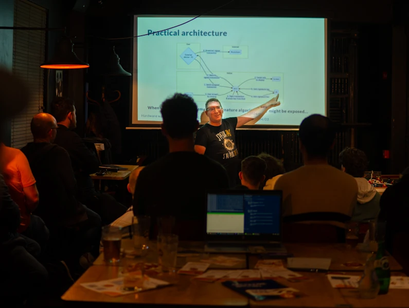

####
3. Welches Engagement möchte ich, dass meine Gemeinschaft im Bitcoin-Ökosystem hat?

Diese Frage, viel weiter fortgeschritten, kann bereits bei der Gründung Ihrer Gemeinschaft in Betracht gezogen werden.
Tatsächlich, wenn Sie darauf abzielen, **eine vereinte, engagierte Gemeinschaft voller motivierter Bitcoiner zu entwickeln**, die so viele Menschen um sich herum wie möglich bilden und orange-pillen möchten, dann müssen Sie:
* einerseits, **Sie näher an die bereits bestehenden entwickelten Gemeinschaften zu bringen**, mit dem Ziel, Zugang zu einem umfangreicheren Informationspanel zu haben, Zugang zu einer Vielzahl von Links und Open-Source-Ressourcen zu erhalten, die wiederverwendet werden können, aber auch, um eine helfende Hand zu bekommen, wenn Sie sie brauchen;* andererseits, **sich selbst zu organisieren - und somit Aufgaben innerhalb Ihrer Gemeinschaft zu verteilen -, um gemeinsam weiterzukommen**.
####
Natürlich ist es keine leichte Aufgabe, Ziele zu setzen. Jedoch können **kurzfristige, mittelfristige und langfristige Ziele** zu verschiedenen Zeitpunkten in der Entwicklung Ihrer Gemeinschaft definiert werden.
**Zum Beispiel könnten Sie bei der Gründung Ihrer Gemeinschaft beschließen, sich kurzfristig auf die Entwicklung ihrer sozialen Netzwerke und Kommunikationskanäle zu konzentrieren. Mittelfristig erscheint die Entwicklung von Bildungsressourcen (Artikel, Flyer usw.) zugänglich und relevant. Schließlich ist langfristig, zum Beispiel in 6 Monaten, die Durchführung eines physischen Treffens im Allgemeinen vorstellbar**.

Ein paar Monate später, **wenn Ihre Treffen regelmäßig werden, könnten Sie kurzfristig die Implementierung von Präsentationen oder Workshops zu spezifischen Themen definieren; mittelfristig die Realisierung einer Bitcoin-Aufklärungs-/Bildungskampagne; und langfristig die Gründung eines Vereins oder die Suche nach einer Bar, die Bitcoin als Zahlungsmittel akzeptiert**.
####
Denken Sie jedoch daran, dass das Erstellen einer Gemeinschaft nicht über Nacht geschieht: **Es erfordert Zeit, Motivation und ein wenig Organisation**.
Manchmal kann es sogar entmutigend sein; besonders wenn niemand zu einem Ihrer Treffen erscheint und Sie sich allein fühlen, diese Sache auf Ihren Schultern zu tragen.

Das ist der Grund, warum **dieser Kurs mit dem Ziel erstellt wurde, alle möglichen Ressourcen und Tipps zu teilen, damit Ihre Gemeinschaft wachsen und autonom werden kann**.

# Eine einzigartige Identität für Ihre Bitcoin-Gemeinschaft gestalten
<partId>da6673ad-bf49-5979-80a6-3f69cfb28046</partId>

## Warum und wie eine eigene Identität schaffen?
<chapterId>b48a18cc-afdf-5216-802c-32647b5cd8a3</chapterId>

Im Weiteren dieses Kurses werden wir davon ausgehen, dass:
* Sie eine Gemeinschaft (oder eventuell ein Treffen) in einer Stadt oder einem geografischen Ort, den Sie bereits definiert haben, gründen möchten;
* Sie Ziele auf verschiedenen Zeithorizonten gesetzt haben, diese natürlich nicht in Stein gemeißelt sind.

**Der zweite Schritt bei der Gründung einer Gemeinschaft ist offensichtlich der ihrer Identität**. Dies beinhaltet die Wahl ihres Namens, aber auch **ihrer visuellen Identität**.
Deswegen werden wir uns bemühen, Ihnen in diesem Teil 2/8 Tutorials und Softwarelösungen anzubieten, die es Ihnen ermöglichen, die visuelle Identität Ihrer Gemeinschaft zu gestalten; und das, ohne notwendigerweise über die Fähigkeiten eines Designers zu verfügen.####
Es ist offensichtlich, dass sich ein Mensch, der sich mit einer Gruppe identifiziert, mehr involviert fühlt. In diesem Sinne ist eine einzigartige Identität für Ihre Gemeinschaft wesentlich.

Dies beginnt zuallererst mit der Wahl des Namens. Tatsächlich existieren je nach Land verschiedene Initiativen und/oder nationale Gemeinschaften.
Zum Beispiel **in Frankreich, wo die fünfzig dort entwickelten Gemeinschaften "Bitcoin [STADT]" oder "[STADT] Bitcoin" genannt werden; was dazu führt, dass ihre Telegram-Gruppe "Bitcoin [STADT] Treffen" oder "[STADT] Bitcoin Treffen" genannt wird**.
In Deutschland hat die Initiative "Einundzwanzig" dazu geführt, dass nahezu alle deutschsprachigen Gemeinschaften als "Einundzwanzig [STADT]" bezeichnet werden; während in Italien die Initiative "Satoshi Spritz" - der Auslöser für die Mehrheit der aktuellen italienischen Gemeinschaften - ihre Gemeinschaften "Satoshi Spritz [STADT]" nennt. **Jede Gemeinschaft hat somit ihre eigene Identität, bezogen auf ihre Herkunftsstadt; aber auch auf die globale Identität ihres Landes**.

Daher ist es zwar durchaus möglich, dass Sie eine neue französische Gemeinschaft mit dem Namen Ihrer Wahl gründen, **es scheint jedoch in unserem Land relevanter zu sein, sie "Bitcoin [STADT]" oder "[STADT] Bitcoin" zu nennen**.

####
Parallel dazu spielt **die visuelle Identität Ihrer Gemeinschaft und Ihres Treffens eine wesentliche Rolle in ihrer Entwicklung**, denn teilweise ist es ihr zu verdanken, dass Ihre Initiative in Erinnerung bleibt.
Deshalb muss beim Erstellen Ihrer sozialen Netzwerke und Ihrer Kommunikationskanäle **ein Logo und ein Banner entworfen worden sein**. Dies muss jedoch nicht unbedingt von einem professionellen Designer gemacht werden, und es gibt einfache, kostenlos nutzbare Werkzeuge.

Um seine visuelle Identität zu schaffen, ist der beste Ansatz, mit einem bedeutenden Element oder Ort aus Ihrer Stadt zu beginnen. Das könnte zum Beispiel der Eiffelturm in Paris, der Belfried oder die Zitadelle in Lille, der Felsen von Monaco in Monaco, der alte Hafen in Marseille usw. sein.
Ausgehend von diesem Element ist es dann möglich, ein mehr oder weniger aufwändiges Logo zu entwerfen, abhängig von der gewünschten Komplexität.

Um Ihnen einige Ideen zu geben, hier sind ein paar Beispiele für Logos von französischen Gemeinschaften:
- In Marseille stellt das Logo die Basilika Notre-Dame-de-la-Garde dar, die über der Stadt thront:

- In Monaco bezieht es sich auf den Felsen von Monaco:

- In Lille stellt das schlichte Logo die Zitadelle von Vauban und ihren Park dar, nur wenige Minuten vom Stadtzentrum entfernt:

- In Saint-Malo wird das Hermelin - das Wappen der Stadt - hervorgehoben:

Es liegt nun an Ihnen, **ein bedeutendes Element oder einen Ort in Ihrer Stadt zu finden und es zu nutzen, um das Visuelle für Ihre Bitcoin-Gemeinschaft zu gestalten**.

####
Darüber hinaus, wenn die Inspiration Sie überkommt, ist es sogar möglich, weiter zu gehen, indem Sie ein Wappen, ein Motto oder sogar ein Lied im Zusammenhang mit Ihrer Gemeinschaft erstellen. Ihre Vorstellungskraft ist dann Ihre einzige Grenze!

## Ein Logo, ein Poster und ein Banner erstellen
<chapterId>3470a31f-0190-5e87-8af0-6a00e79267ef</chapterId>

### Canva nutzen

Um die verschiedenen Visuals für Ihre Gemeinschaft zu erstellen, **ist es möglich, [Canva](https://www.canva.com/)** zu nutzen.

Diese Website, einfach zu bedienen und kostenlos, wird besonders für ihre Menge an vorgefertigten Modellen geschätzt; die Sie duplizieren und nach Belieben ändern können.

Beim **Erstellen Ihres Logos** ist es dann möglich, auf der Startseite eine Suche nach den verschiedenen vorgefertigten Logos durchzuführen, das oder diejenigen, die Sie interessieren, zu duplizieren; und dann nach Belieben zu ändern.
Ein Hintergrundelement, das Ihre Stadt repräsentiert (durch Importieren eines Fotos oder durch Suchen nach "Illustrationen" oder "Bildern" im linken Menü "Elemente"), kann dann hinzugefügt werden. Anschließend ist es möglich, das Logo oder ₿ von Bitcoin darüber einzufügen - sogar dessen Farbe nach Wunsch zu ändern.

Im Fall von **Erstellen eines Banners oder eines Posters**, müssen Sie einfach erneut auf der Startseite der Website suchen, um ein vorgefertigtes Poster zu erhalten. Nachdem Sie es dupliziert haben, können Sie es durch Ändern der Texte und Schriftarten, Hinzufügen des Logos Ihrer Gemeinschaft und Importieren von Fotos, die in einen Rahmen gezogen werden (den Sie durch Suchen nach "Rahmen" im linken Menü "Elemente" erhalten), modifizieren.

Darüber hinaus ermöglicht das linke Menü "Designs" die Suche nach anderen Modellen gemäß Ihrer Anfrage.

Schließlich ist es auch möglich, auf der Startseite nach einem **vorgefertigten YouTube-Miniaturbild oder Banner** zu suchen, es zu duplizieren und dann nach Belieben zu modifizieren.

Kurz gesagt, **die Möglichkeiten sind endlos und hängen von Ihren Bedürfnissen ab, aber auch von der grafischen Charta, die Sie für Ihre Gemeinschaft und Ihre Treffen/Veranstaltungen erstellen möchten**!
####
Um Sie detaillierter zu führen, bieten wir unten ein nicht erschöpfendes Video-Tutorial an, das einige Möglichkeiten vorstellt:

####

Hier sind auch einige vorgefertigte, duplizierbare und bearbeitbare Dateien, die wir mit unserem Verein, Bitcoin Lille, verwenden:
- **Ankündigungsplakat für Meet-ups** (für soziale Netzwerke und gedruckt in A4 oder A3): [Link](https://www.canva.com/design/DAGBvBXFJ8A/92_j_toeLU8QbVAD0NwoAA/edit?utm_content=DAGBvBXFJ8A&utm_campaign=designshare&utm_medium=link2&utm_source=sharebutton)

- **Ankündigungsplakat für gemeinsame Veranstaltungen** (für soziale Netzwerke und gedruckt in A4 oder A3): [Link](https://www.canva.com/design/DAGBvG3rNCc/oXtNR9pduRs22AqclG4O2g/edit?utm_content=DAGBvG3rNCc&utm_campaign=designshare&utm_medium=link2&utm_source=sharebutton)

- **Banner für bestimmte soziale Netzwerke**: [Link](https://www.canva.com/design/DAGBvOXyNqw/iSJG9PbIQHgGWHz5PhlXSQ/edit?utm_content=DAGBvOXyNqw&utm_campaign=designshare&utm_medium=link2&utm_source=sharebutton)

- **Ankündigung eines Wettbewerbs**: [Link](https://www.canva.com/design/DAGBvIjuA_w/YzSUXzOmbNV9oCma9mluOw/edit?utm_content=DAGBvIjuA_w&utm_campaign=designshare&utm_medium=link2&utm_source=sharebutton)

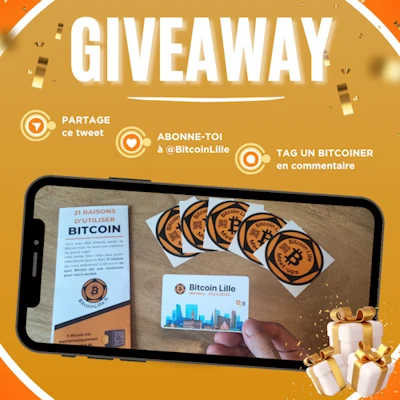

- **Charta** unserer Bibliothek, ausgestellt in A4 während Meet-ups: [Link](https://www.canva.com/design/DAGBvPqL7N4/LmUItfsysypRLSOFOzBXcQ/edit?utm_content=DAGBvPqL7N4&utm_campaign=designshare&utm_medium=link2&utm_source=sharebutton)
- **PowerPoint-Präsentation** "Kapitel 2 - Verständnis von Bitcoin-Transaktionen", von @ProfEduStream: [Link](https://www.canva.com/design/DAFsEcnOro8/Mz9FYdTGhsvozZOe0Y9jtw/edit?utm_content=DAFsEcnOro8&utm_campaign=designshare&utm_medium=link2&utm_source=sharebutton)
- **Flyer** "21 Gründe, Bitcoin zu nutzen", geschrieben von @ProfEduStream: [Link](https://www.canva.com/design/DAFtAR1NauQ/ZDwl2CchIJ9Gpb36N6-7iw/edit?utm_content=DAFtAR1NauQ&utm_campaign=designshare&utm_medium=link2&utm_source=sharebutton)

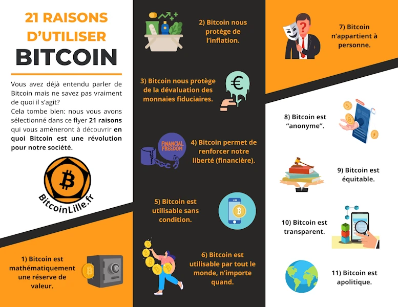
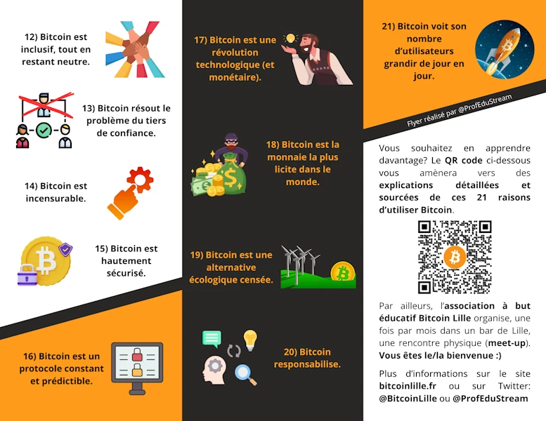
####
Wie Sie sehen können, sind die Möglichkeiten endlos und hängen offensichtlich von Ihren Bedürfnissen ab. **Zögern Sie nicht, selbst neue Modelle zu entwerfen, und nehmen Sie sich dann ein paar Minuten Zeit, um sie mit anderen in Ihrer Umgebung zu teilen, damit sie mehreren Stunden Arbeit für andere Gemeinschaften in Ihrem Land ersparen können**. Denken Sie daran, dass **jede Gemeinschaft früher oder später mit denselben Problemen und Bedürfnissen konfrontiert sein wird wie Sie. Indem Sie Ihre Ressourcen im Sinne von Open Source teilen, beschleunigen Sie also indirekt die Entwicklung aller anderen Bitcoin-Gemeinschaften**.

Achten Sie jedoch beim Erstellen Ihrer Visualisierungen darauf, die von den sozialen Netzwerken und Kommunikationsanwendungen, die Sie planen zu verwenden, erwarteten Dimensionen zu berücksichtigen.
Hier sind einige Proportionen und Standards, die Ihnen nützlich sein könnten:

| Netzwerk / Plattform | Logo      | Banner     | Poster / Bild |
| -------------------- | --------- | ---------- | ------------- |
| Telegram             | 512 x 512 | N/A        | N/A           |
| Signal               | N/A       | N/A        | N/A           |
| Twitter              | 400 x 400 | 1500 x 500 | 1200 x 628    |
| Meet-up              | N/A       | N/A        | N/A           |
| Discord              | 512 x 512 | 960 x 540  | N/A           |
| Facebook             | 512 x 512 | 851 x 315  | 960 x 720     |

In diesem Sinne ist für die Erstellung eines **Logos** die angemessene Größe **512 Pixel mal 512 Pixel**.
Für ein **Banner** **hängt es speziell von der Anwendung oder Website ab**, die Sie verwenden.
Was **Poster und andere Bilder** angeht, ist das klassische **A4-Format** im Allgemeinen relevant.

### Einsatz von Künstlicher Intelligenz

Obwohl Canva Ihnen unzählige Dinge ermöglicht (Logos, Poster, Banner, Flyer usw.), ist es offensichtlich nicht die einzige Website oder Software, die es Ihnen ermöglicht, diese Aufgaben zu erfüllen.
In diesem Sinne, wenn Sie sich mit einer anderen Software-Suite (insbesondere Photoshop oder Illustrator) wohler fühlen, tun Sie, was für Sie am praktischsten ist.

Ob es jedoch darum geht, ein Logo für Ihre Gemeinschaft zu erstellen oder ansprechende Visualisierungen zu Postern, Präsentationen oder Flyern hinzuzufügen, **könnte es relevant sein, Künstliche Intelligenz zur Verbesserung Ihrer Materialien zu nutzen**.

Zu diesem Zweck existieren zahlreiche KIs. Insbesondere:
- [midjourney](https://docs.midjourney.com/docs/quick-start) (kostenpflichtig);
- [leonardo](https://leonardo.ai/) (kostenlos, begrenzt durch Konto);
- [copilot](https://copilot.microsoft.com/) (kostenlos, begrenzt durch Konto);
- [DALL-E](https://www.dall-efree.com/) (kostenpflichtig). Offensichtlich sind in den letzten Monaten viele andere künstliche Intelligenzen im Bereich der visuellen Inhalteerstellung aufgetaucht. Diese Liste ist daher nicht erschöpfend.####
Für den Fall, dass man beispielsweise ein futuristisches Bild oder Logo für das "Bitcoin London" Meet-up erstellen möchte, kann man dann den KI-"Copiloten" fragen:
- [ ] *Erstelle ein Bitcoin-Logo mit der London Bridge und dem Big Ben im Hintergrund. Futuristisch* - [Link](https://copilot.microsoft.com/images/create/un-logo-bitcoin-futuriste-avec-en-arric3a8re-plan-le-/1-6612ba1758df4384bc33c4bca00ab45b?FORM=SYDBIC)

Wenn die vier Vorschläge von Copilot nicht realistisch genug für Ihren Geschmack sind, ist es möglich, das Gespräch zu ergänzen:
- [ ] *Mache das 4. viel realistischer* - [Link](https://copilot.microsoft.com/images/create/un-logo-bitcoin-futuriste-avec-en-arric3a8re-plan-le-/1-6612ba64b72d4cea9830ab7eb844f785?FORM=SYDBIC)

Das letzte Rendering ist übrigens ziemlich nett!
####
Jedoch, wenn man ein viel schlichteres Logo wünscht, zum Beispiel für einen Aufkleber, kann man dann auf "Copilot" eingeben:
- [ ] *Erstelle das Logo für das "London Bitcoin Meetup" mit einem britischen und schlichten Stil* - [Link](https://copilot.microsoft.com/images/create/logo-for-27londres-bitcoin-meetup27-with-a-british-a/1-6612bb9451924859a6c34b350b3a6ebc?FORM=SYDBIC)
      
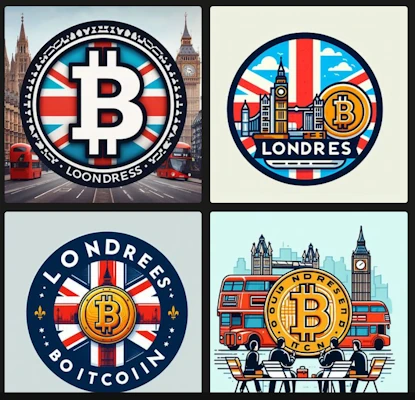

Das zweite Rendering ist typisch und könnte perfekt passen!
####
Obwohl es die Erstellung sehr interessanter visueller Darstellungen in Rekordzeit ermöglicht, **kann die künstliche Intelligenz leider nicht genau das erreichen, was Sie im Detail machen möchten**.
Seien Sie also geduldig, versuchen Sie, Anweisungen (oder "Prompts") so präzise wie möglich zu diktieren; und **wenn Sie mit den erhaltenen Renderings nicht zufrieden sind, hindert Sie nichts daran, sich an einen Bitcoiner zu wenden, der sich besser mit dem Thema auskennt**. Für ein paar Sats (oder kostenlos) ist es sicher, dass sie ein qualitativ hochwertiges Logo oder Visual für Sie erstellen werden.

# Kommunikationskanäle für Ihre Bitcoin-Community erstellen
<partId>fc588298-6876-554c-bd57-55d182464878</partId>

## Welche Kommunikationskanäle sollten priorisiert werden?
<chapterId>b4f4eef6-1035-5290-848a-2b7f9391c77a</chapterId>
Wie zuvor erwähnt, können die Kommunikationskanäle einer Gemeinschaft je nach individuellen Motivationen und Gewohnheiten unterschiedlich sein. Zum Beispiel sind **in Frankreich, Deutschland und Italien Telegram und Twitter die Hauptkommunikationskanäle**. Mit der Zeit sind sie zu "Kommunikationsstandards" für die Bitcoin-Gemeinschaften in diesen Ländern geworden. Einige Gemeinschaften nutzen jedoch auch andere Kanäle für spezifische Zwecke. Im Gegensatz dazu verwenden in der Tschechischen Republik die zahlreichen dort entwickelten Gemeinschaften **Matrix**, ein verschlüsseltes Sofortnachrichtenprotokoll. In ihrem Land wird Telegram somit selten verwendet.
In diesem Sinne ist **die Auswahl von Kommunikationskanälen am relevantesten, wenn man damit beginnt, Beispiele aus benachbarten Gemeinschaften im eigenen Land zu betrachten**. Um dies zu tun, gibt der Zugriff auf die Karte unter [btcmap.org](https://btcmap.org/communities/map#0/0/0/) eine sehr genaue Vorstellung von den am meisten genutzten Kommunikationskanälen in Ihrem Land. In der Schweiz beispielsweise werden Informationen hauptsächlich über Telegram, Twitter und die Website der Gemeinschaft weitergegeben.
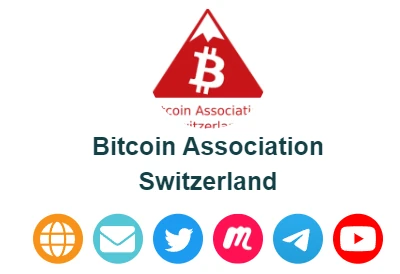
####
**Im Fall von Frankreich (und der französischsprachigen Welt im Allgemeinen) ist der Hauptkommunikationskanal Telegram**. Mehr als 90% der französischen Meet-ups haben einen: es ist ein "Muss". Danach ist **das Hauptsozialnetzwerk, das von Gemeinschaften genutzt wird, Twitter** (70% der französischen Meet-ups); ein soziales Netzwerk, auf dem eine Mehrheit der Bitcoiner präsent ist. Darüber hinaus haben fast 30% der französischen Meet-ups (sowie alle kanadischen Meet-ups) ein bezahltes Konto in der **Meetup**-App. Tatsächlich kann dies eine ausgezeichnete Möglichkeit sein, Veranstaltungen außerhalb des Bitcoin-Ökosystems sichtbar zu machen. Schließlich haben 30% der französischen Meet-ups auch eine **Website**; und 10%, einen **Discord**-Server und ein **NOSTR**-Konto.
####
Natürlich werden manchmal auch andere Kommunikationskanäle und soziale Netzwerke verwendet: Matrix, Keet, Signal, Facebook, Instagram, LinkedIn usw. **Jede Gemeinschaft ist tatsächlich frei, die Kanäle zu entwickeln, die sie wünscht**. Es versteht sich jedoch von selbst, dass, **je mehr Kommunikationskanäle und soziale Netzwerke vervielfacht werden, desto mehr Zeit es von den Organisator(en) verlangt, sie zu verwalten**, wichtige Informationen regelmäßig zu posten und bei Bedarf zu moderieren.
####
**Für jeden, der in Frankreich eine Gemeinschaft gründen möchte, wird daher empfohlen, nur mit Folgendem zu beginnen:**
- **einer Telegram-Gruppe**;
- **einem Twitter-Konto**.

Je nach Ihrer Zeit und Ihren Wünschen können Sie später andere Netzwerke entwickeln; sogar **die Moderation zukünftigen Mitgliedern Ihrer Gemeinschaft zuweisen**.

## Erstellen und Konfigurieren eines Kanals, einer Gruppe oder einer Super-Gruppe auf Telegram
<chapterId>d13714ce-8f08-53e9-bedd-b6a3aaac5dad</chapterId>
Wie bereits erwähnt, ist Telegram in vielen Ländern ein "Muss". Wenn Sie jedoch einen Kommunikationskanal für Ihre Gemeinschaft in dieser Instant-Messaging-Anwendung erstellen, ist es wichtig, die Unterschiede zu verstehen zwischen:
- einem Telegram-Kanal;
- einer Telegram-Gruppe;
- einer Telegram-Super-Gruppe.

Wir werden später darauf eingehen, aber **es wird dringend empfohlen, "Telegram-Gruppe" zu wählen, wenn Sie erstellen** (oder, abhängig von Ihren Zielen, "Telegram-Super-Gruppe").
####
Für die folgenden Tutorials werden wir die APK-Anwendung "Telegram+" verwenden; eine Anwendung, die eine fortgeschrittenere Konfiguration Ihres Telegram ermöglicht. Dies ist jedoch nicht notwendig, da das Erstellen einer Gruppe oder Super-Gruppe auf Telegram jetzt sehr einfach auf einem Telefon durchgeführt werden kann:

### Erstellen eines Telegram-Kanals

Wenn Sie einen Ort schaffen möchten, an dem Ihre Mitglieder direkt miteinander kommunizieren, aufeinander reagieren usw. können, dann ist ein Telegram-Kanal absolut nicht das, was Sie wählen sollten!
Gehen Sie also direkt zum nächsten Abschnitt, betitelt [Erstellen einer Telegram-Gruppe](LINK).

Tatsächlich ist **ein Telegram-Kanal nur eine Schaufenster der Informationen, die von den Administratoren gepostet werden, in denen Mitglieder nicht viel mehr tun können, als Emojis hinzuzufügen**.

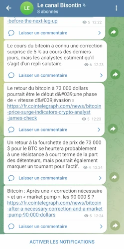
Es ist jedoch möglich, die Fähigkeit für Kanalmitglieder hinzuzufügen, Kommentare zu jedem Beitrag eines Administrators zu verfassen, aber dies wird in separaten Diskussionen erfolgen; was die Austausche erheblich teilt. **Daher wird generell nicht empfohlen, einen Telegram-Kanal für eine Gemeinschaft zu erstellen.**
####
Anleitung zur Erstellung eines Telegram-Kanals:

### Erstellung einer Telegram-Gruppe

Im Gegensatz dazu ist **die Erstellung einer Telegram-Gruppe durchaus relevant**.
Tatsächlich können, um bekannte Beispiele wie Messenger- oder WhatsApp-Gruppen zu nehmen, alle, die dieser **Telegram-Gruppe beitreten, miteinander austauschen, aufeinander antworten; und das alles innerhalb derselben Diskussion**.

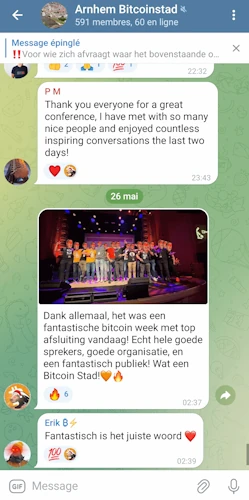

Die Administratoren dieses Kanals können dann:
- selbst Nachrichten posten;
- die wichtigsten **anpinnen**;
- **Umfragen posten** (sehr praktisch, um das Datum des nächsten Treffens zu wählen, wenn es noch nicht regelmäßig ist, d.h., wenn die Gemeinschaft noch in der Entwicklung ist);
- einen **angepassten Einladungslink erstellen** (vorausgesetzt, die Gruppe ist "öffentlich" und nicht "privat", was in den Einstellungen festgelegt werden muss. Es ist auch sehr praktisch, Ihren Telegram-Einladungslink im Stil von: t.me/Bitcoin[STADT] zu haben);
- **Berechtigungen, Administratoren und Mitglieder hinzufügen oder entfernen**;
- Ein **"Profilbild"** zur Telegram-Gruppe hinzufügen (d.h. das Logo Ihrer Gemeinschaft) **und dessen Namen ändern**.
####
Anleitung zur Erstellung einer Telegram-Gruppe:

Eine kurze Anmerkung: wie zuvor erwähnt, wurde das obige Tutorial auf einem Computer mit der APK "Telegram+" erstellt. Es ist jedoch jetzt sehr einfach, eine Telegram-Gruppe auf einem Telefon zu erstellen.
Daher ist es nicht mehr notwendig, "Telegram+" herunterzuladen, um diese Aufgabe auszuführen; es sei denn, Sie möchten tiefer in die Datenschutzeinstellungen Ihrer Gruppe eintauchen.

### Erstellung einer Telegram-Supergruppe

Der Nachteil einer Telegram-Gruppe ist, dass, wenn sie anfängt, mehrere hundert Mitglieder zu haben, parallele Diskussionen im selben Kommunikationskanal beginnen, unübersichtlich zu werden. Dies führt dann zu einem unerwünschten Effekt: Einige Mitglieder folgen der Telegram-Gruppe nicht mehr täglich, was manchmal dazu führt, dass sie wichtige Informationen verpassen; wie zum Beispiel das Datum des nächsten Treffens.

Um dies zu beheben, können mehrere Lösungen angewendet werden:
1. **Wichtige Nachrichten als Administrator anpinnen**, damit jeder benachrichtigt wird (drücken Sie einmal mit dem Finger auf die betreffende Nachricht und wählen Sie dann "Anpinnen");
2. Ihrer Gemeinschaft vorschlagen, einen **Discord-Server zu verwenden** mit verschiedenen und vielfältigen Kommunikationskanälen, die jeder nach Wunsch stummschalten kann;
3. Eine **"Supergruppe" auf Telegram erstellen**.
####
Aber was ist eine Telegram-Supergruppe?

Es ist einfach **eine Telegram-Gruppe, in der mehrere "Themen" integriert sind**. So kann ein Thema **"Wichtige Informationen"** erstellt werden, in dem nur wichtige Informationen und Informationen zu bevorstehenden Veranstaltungen/Treffen gepostet werden.
Ein **"Allgemeines"** Thema kann auch eingerichtet werden, in dem alle Mitglieder diskutieren könnten.
Schließlich können **spezifische Themen** (Mining, Entwicklung eines Projekts, nächste Konferenz usw.) hinzugefügt werden.

Es liegt an Ihnen, dies nach Ihren Wünschen zu ändern; ähnlich wie zum Beispiel bei der Supergruppe des Abidjan Bitcoin Meet-ups.

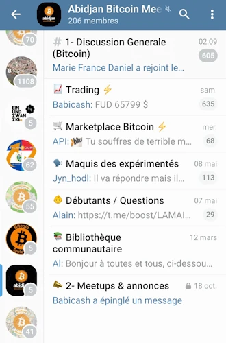
####
Es sollte jedoch beachtet werden, dass **eine Telegram-Supergruppe für einige Mitglieder schwieriger zu nutzen sein kann**. Tatsächlich gelingt es manchmal einigen nicht zu verstehen, **wie man auf die anderen Themen dieser Supergruppe zugreift** (dazu einfach auf das Logo der Gruppe klicken; und das öffnet die Liste der erstellten Themen). Ihnen durch das Senden eines kurzen Tutorial-Videos in einem Screenshot zu helfen, kann dann eine gute Idee sein.

Generell gibt es keine spezifische Mitgliederanzahl, bei der es relevant wird, eine Telegram-Supergruppe anstelle einer Telegram-Gruppe zu nutzen. Daher liegt die Wahl bei Ihnen, basierend auf den Bedürfnissen und Anfragen Ihrer Mitglieder; wobei zu beachten ist, dass eine Telegram-Gruppe leicht in eine Telegram-Supergruppe (und umgekehrt) umgewandelt werden kann. Dazu müssen Sie lediglich ein Thema erstellen (oder alle löschen).

Tutorial zur Erstellung einer Telegram-Supergruppe:

Hinweis: Wie zuvor erwähnt, wurde das obige Tutorial auf einem Computer mit der "Telegram+" APK durchgeführt. Es ist jedoch jetzt sehr einfach, eine Telegram-Supergruppe auf einem Telefon zu erstellen.
Dazu einfach eine Telegram-Gruppe erstellen; dann in ihren Einstellungen auf den Button "Themen" klicken, um einige hinzuzufügen. Sobald die Änderung bestätigt ist, erscheint eine Liste von Themen; und Sie können diese nach Belieben ändern.
Es ist nicht mehr notwendig, "Telegram+" herunterzuladen, um diese Aufgaben auszuführen; es sei denn, Sie möchten tiefer in die Datenschutzeinstellungen Ihrer Supergruppe eintauchen.

## Einrichten Ihrer Telegram-Gruppe oder Supergruppe
<chapterId>35e674b3-5924-50b0-98f1-83a56c9a186d</chapterId>

Jetzt, da Sie Ihre Telegram-Gruppe (oder Supergruppe) erstellt haben, ist es an der Zeit, **über deren Berechtigungen und Moderation nachzudenken**. Und natürlich ist jede Gemeinschaft frei zu tun, was sie will!

Es ist jedoch **aus Erfahrung vorzuziehen, den Mitgliedern die Berechtigungen zu entziehen**:
- **eine Umfrage zu senden**;
- **Dateien zu senden** (im Falle von Viren);
- **Sprachnachrichten zu senden**;
- **Benutzer hinzuzufügen** (für den Fall, dass ein Bot der Gruppe beitritt);
- **Nachrichten anzupinnen**;
- **die Austauschinformationen zu ändern**.

Es wird auch **dringend empfohlen, eine Beschreibung Ihres Treffens beim Erstellen der Gruppe oder Supergruppe auf Telegram zu schreiben**, da sie von jedem gesehen wird, der beitreten möchte. Das könnte zum Beispiel sein:

> Willkommen beim Telegram von @Bitcoin[STADT] 🔥
> 
> Wir organisieren jeden ersten Mittwoch im Monat ein Treffen in der Bar [NAME_DER_BAR] in [STADT] 🍻
> 
> Um auf unsere anderen sozialen Netzwerke zuzugreifen: [GEWÜNSCHTER_LINK] 🌐

Wie oben im Bild zu sehen ist, wurde der Einladungslink von den Administratoren der Bitcoin Lille Telegram-Gruppe angepasst, da er öffentlich ist.

Anschließend kann es in den "Gruppeneinstellungen" relevant sein, **"Neue Mitglieder genehmigen" zu aktivieren**.
Tatsächlich gab es aus Erfahrung einen Fall, in dem eine Bitcoin-Community-Telegram-Gruppe von mehreren tausend gefälschten Konten angegriffen wurde, die der Gruppe beitreten wollten, um sie mit Spam zu überfluten und zu zerstören. Zusätzlich zur Möglichkeit, gefälschte pornografische Konten, die auf Ihre Gruppe zugreifen wollen, zu entfernen, wird **die Aktivierung der Mitgliedergenehmigung Sie sicherlich vor einem Spam-Angriff schützen**.
Schließlich kann im Abschnitt "Administratoren" eine Funktion namens "Aggressive Anti-Spam" hinzugefügt werden, die Nachrichten, die als solche betrachtet werden, automatisch löscht. Dies ist jedoch möglicherweise nicht unbedingt erforderlich.
## Einfügen eines Multi-Funktion-Bots in einen Telegram-Kanal
<chapterId>c61f69cc-15ec-53f1-8c02-1cea55def09e</chapterId>

**Eine weitere Möglichkeit, Ihre Telegram-Gruppe oder Super-Gruppe einzurichten und zu sichern, ist das Hinzufügen eines Multi-Funktion-Bots**. Dies ermöglicht tatsächlich eine viel fortschrittlichere Konfiguration.

Unter den zahlreichen verfügbaren Optionen mit **dem Bot [@GroupHelpBot](https://telegram.me/grouphelpbot)**, notieren wir unter anderem:
- **Hinzufügen eines Regelsets** (Befehl /rules);
- Konfigurieren eines **Anti-Spam-Mechanismus**;
- Hinzufügen einer **automatischen, anpassbaren Willkommensnachricht für neue Mitglieder, die nach einigen Minuten gelöscht wird**;
- Konfigurieren des **Anti-Flut-Mechanismus**;
- Hinzufügen eines @administrator Befehls;
- Hinzufügen von Blocks;
- Hinzufügen eines Befehls zum Abrufen des Gruppenlinks (/link);
- Konfigurieren von Befehlsberechtigungen;
- Automatisches Löschen bestimmter Nachrichtentypen;
- usw.

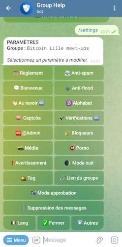

Drei weitere einfache Ideen sind:
- **Erstellen eines "/link" Befehls**, um den Zugangslink zur Telegram-Gruppe zu senden;
- das Gleiche für den Zugriff auf soziale Netzwerke ("/socials") oder Ihre potenziellen Regeln im Falle der Moderation ("/rules");
- **Blockieren des Eintritts von Bots** und "Eintritte/Austritte".

Zahlreiche zusätzliche Optionen stehen Ihnen ebenfalls zur Verfügung. Ein Rat jedoch: **Versuchen Sie nicht, den Austausch übermäßig einzuschränken**.
####
Anleitung zum Hinzufügen eines Multi-Funktion-Bots zu einer Gruppe oder Super-Gruppe auf Telegram:

Kleine Anmerkung: Wie zuvor erwähnt, kann dieses Verfahren mittlerweile auch auf einem Telefon durchgeführt werden.

## Erstellen eines Discord-Servers
<chapterId>eef2a965-4c24-5f3a-8013-72cc7d315314</chapterId>

Wenn die Anzahl der Mitglieder in Ihrer Telegram-Gruppe steigt, könnte die Umwandlung in eine Super-Gruppe auf Telegram die Lösung sein.
Wie zuvor erwähnt, können jedoch **die potenziellen "Benutzbarkeitsschwierigkeiten" und die Zunahme der Anzahl von Themen und Nachrichten in einer Telegram-Super-Gruppe zu einem Verlust des Interesses bei einigen aktiven Mitgliedern führen**.
**Discord präsentiert sich dann als Alternative** zur Erstellung einer Telegram-Super-Gruppe, da es **die Erstellung von spezifischen Text- und Sprachkanälen ermöglicht**; und vor allem können seine Nutzer jeden Kanal, der sie nicht interessiert, stummschalten.

Offensichtlich erfordert dies, zusätzlich zu Telegram und Twitter, immer noch etwas mehr Zeit zum Verwalten; insbesondere während der Einrichtung und des Starts.

Um Ihnen die Dinge zu erleichtern, **teilen wir einen [vorgefertigten, duplizierbaren und modifizierbaren Discord-Server](https://discord.com/template/bDY4eXXJk2C8) mit Ihnen, den Sie nach Belieben anpassen können**:

####
So kann ein gut konstruierter Discord-Server ein echter Gewinn für seine Gemeinschaft sein. Tatsächlich nutzen viele Bitcoiner bereits täglich Discord (und nicht Telegram), und **ihnen zu ermöglichen, den Gesprächen der Telegram-Gruppe direkt innerhalb des Discord-Servers zu folgen, spart erheblich Zeit**. Und umgekehrt.
Aus diesem Grund wurde ein Open-Source-Bot namens [TediCross](https://github.com/TediCross/TediCross) entwickelt. Sein Ziel ist einfach: Nachrichten automatisch von einem Discord-Textkanal in eine Telegram-Gruppe (oder ein Thema in einer Telegram-Supergruppe) zu übertragen; und umgekehrt. Dies kann daher sehr interessant sein, um es einzurichten.####
Es ist jedoch zu beachten, dass seine Installation nicht sehr einfach ist, dass **es erfordert, kontinuierlich eine Befehlszeile (CMD) auf einem Computer laufen zu lassen, damit dieser Bot funktioniert**; aber auch, dass es manchmal Fehler gibt. Glücklicherweise muss in dieser Situation einfach neu gestartet werden; und dann geht alles wieder zum Normalzustand zurück.

Um Ihnen erneut Zeit zu sparen, finden Sie hier ein Tutorial, wie Sie einen Multifunktions-Bot zu einer Telegram-Gruppe oder Supergruppe hinzufügen können:

## Betrachten Sie andere Kommunikationskanäle, privat und sicherer
<chapterId>29d0aad6-0612-5dd0-bcef-7337eaf4fefc</chapterId>

Wie bereits in diesem Abschnitt erwähnt, sind Twitter und Telegram die beiden Hauptkommunikationskanäle in Europa (und möglicherweise in der Welt).
Sie sind sich jedoch wahrscheinlich bewusst, dass **Telegram nicht der sicherste und vertraulichste Nachrichtendienst ist und dass Twitter nicht das freieste Unternehmen der Welt ist**.
In diesem Sinne ist es **vollkommen relevant - wenn Sie Zeit zuweisen können - über Alternativen nachzudenken**.
Das ist tatsächlich der Grund, warum in den kommenden Monaten Tutorials zur Nutzung von vertraulicheren und sichereren Kommunikationsprotokollen [innerhalb dieses Kurses selbst, auf planb.network](LINK) angeboten werden.
####
Aber warum diese Alternativen in Betracht ziehen?

Einfach weil, wie das NOSTR-Sozialnetzwerk und Kommunikationsanwendungen wie Matrix, Signal oder Element, sie dezentralisiert und/oder verschlüsselt sind. Neben dem **Gewinn an Vertraulichkeit** in den Austauschen zwischen verschiedenen Mitgliedern Ihrer Gemeinschaft, ermöglicht dies Ihnen auch, sich **gegen eine Abschaltung (Zensur?) Ihrer Telegram-Gruppe oder Supergruppe zu schützen**.
Was könnte besser sein, genau wie das Bitcoin-Protokoll, als **unzensierbar und unveränderlich zu sein**?

# Starten Ihrer sozialen Netzwerke
<partId>8ebf8cd7-9248-543f-bc27-4ec4cc03f9cf</partId>

## Die Bedeutung der Sichtbarkeit für die Entwicklung Ihrer Bitcoin-Gemeinschaft
<chapterId>b20f12e4-c5de-5f02-80c7-b7fc6cadd3ac</chapterId>

Da haben Sie es, Ihre Gemeinschaft ist gestartet, und Sie haben jetzt einen oder mehrere Kommunikationskanäle (Telegram und/oder Matrix, zum Beispiel)!
Jedoch, für den Moment... sind Sie allein. Also, Sie werden **ein bisschen - Kommunikation machen müssen**.

Es ist in der Tat offensichtlich, dass, wenn niemand auf Ihre Kommunikationskanäle zugreifen kann, auf denen Sie regelmäßig Informationen posten werden (Datum des nächsten Treffens, Projekte usw.), Sie vergeblich arbeiten werden. Deshalb werden **soziale Netzwerke - und bestimmte spezifische Plattformen, die wir später besprechen werden - eine vorherrschende Rolle in der Entwicklung Ihrer Gemeinschaft spielen**.

Unter diesen sozialen Netzwerken positioniert sich **Twitter als fast unverzichtbar in der Welt von Bitcoin**. In diesem Sinne scheint es wichtig zu sein, **ein Profil auf dieser Plattform zu haben**; auch wenn seine Zentralisierung und Entwicklung weit von korrekt sind.
Das ist der Grund, warum ein **NOSTR-Profil, das spezifisch für Ihre Gemeinschaft ist**, ebenfalls erstellt werden kann, mit der Idee, potenzielle Einschränkungen und/oder Zensur auf Twitter zu antizipieren. Schließlich gilt: Vorbeugen ist besser als heilen.
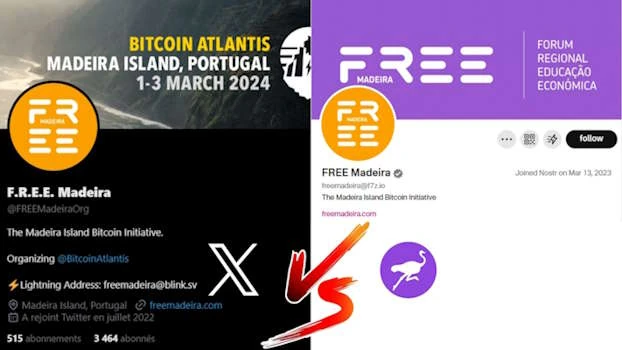

Andere soziale Netzwerke können offensichtlich auch genutzt werden. Das trifft auf Facebook zu (im Falle einer Facebook-Gruppe oder -Seite) oder sogar auf LinkedIn.
Dennoch ist es wichtig zu bedenken, dass **je mehr Kommunikationskanäle und soziale Netzwerke es zu erstellen - und daher zu pflegen - gibt, desto zeitaufwendiger wird es. Es ist besser, sich auf die relevantesten zu konzentrieren; und Twitter (und NOSTR) scheinen gute Kandidaten zu sein**.
Im folgenden Teil dieses Kurses werden wir detailliert erklären, wie man ein Twitter-Konto erstellt und wie man es effektiv nutzt, um maximale Sichtbarkeit zu erlangen. Ähnliche Erklärungen und Tutorials bezüglich NOSTR werden diesem Abschnitt [Launching your social networks](LINK) in ein paar Wochen hinzugefügt.

## Ein Twitter-Profil erstellen
<chapterId>c8d73097-8eba-5530-918c-221002954110</chapterId>

Twitter ist sehr benutzerfreundlich und erfordert die Anpassung einiger Einstellungen, um die Privatsphäre zu erhöhen.

**Beim Erstellen eines neuen Twitter-Kontos müssen vier wesentliche Informationen angegeben werden**:
1. **der @ Twitter**, der Ihre Identität definieren und Sie leicht auffindbar machen wird. Wenn Ihre Gemeinschaft "Bitcoin [STADT]" genannt wird, ist es daher durchaus relevant, "@Bitcoin[STADT]" zu wählen;
2. **das Logo und Banner**, die Sie für Ihre Gemeinschaft oder Ihr Meet-up erstellt haben (siehe Abschnitt [Ein Logo, ein Poster und ein Banner erstellen](LINK));
3. **die Beschreibung**, die es Ihnen ermöglicht, in etwa hundert Zeichen wichtige Informationen über Ihre Gemeinschaft zu geben. Das könnte zum Beispiel sein:
> Offizielles Konto der Bitcoin-Gemeinschaft [STADT] #BTC | Meet-ups jeden ersten Mittwoch des Monats im [NAME_DER_BAR] in [STADT] 🍻 | Treten Sie uns auf Telegram bei 🔽
4. Unter dieser Beschreibung ist es auch möglich, **einen Link einzufügen**. Dieser kann Benutzer dazu führen, eine "Soziale Netzwerke"-Seite auf der Website Ihrer Gemeinschaft zu erreichen, oder er kann sie zu Ihrem Telegram-Kommunikationskanal leiten.

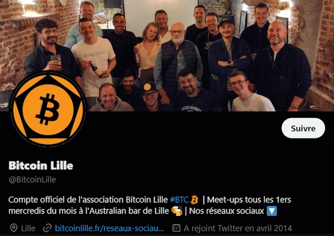

Darüber hinaus scheint es relevant, **einige Datenschutzeinstellungen zu ändern**; das offensichtlichste ist:
* die Entscheidung, **Ihr Twitter-Konto im "öffentlichen" Modus zu belassen** (Beiträge für jeden sichtbar);
* **von jedem identifizierbar zu sein** (Vorsicht vor Betrügereien);
* **Standortverfolgung und Datenweitergabe an andere Entitäten zu deaktivieren** (eine Frage der Privatsphäre).
####
Mit der Zeit werden Sie auf Twitter posten. Diese Tweets werden dann Ihr nächstes Event ankündigen, eine wichtige Information im Ökosystem oder sogar eine Ankündigung von einer anderen Gemeinschaft, der Sie folgen.
Jedoch, wie bei der überwiegenden Mehrheit der sozialen Netzwerke, **ist Sichtbarkeit der Schlüssel zum Erfolg**.
Um Ihnen eine erhebliche Menge Zeit zu sparen, haben wir uns die Zeit genommen, den [Open-Source-Code des Ranking-Algorithmus von Twitter](https://github.com/twitter) zu studieren. Hier sind **die Schlüsselpunkte, auf die Sie achten sollten, um Ihre Sichtbarkeit zu erhöhen**:
* Allgemein:
    - **tweeten Sie in der Sprache, die Sie auf Ihrem Twitter-Konto eingestellt haben**, oder auf Englisch (anderenfalls ist die Strafe schwerwiegend);
    - **tweeten Sie nur Informationen, die zum Expertisebereich Ihres Kontos gehören** (anderenfalls gibt es eine starke Strafe);
    - tweeten Sie 1 bis 2 Mal pro Tag (Konsistenz ist wichtig);
- **Tweete zu Zeiten hoher Sichtbarkeit** (am interessantesten sind Donnerstag oder Freitag zwischen 8 und 10 Uhr morgens; siehe deine "Twitter Analytics" deines Kontos).
* Beim Verfassen eines Tweets:
    - **füge ein Foto hinzu** (oder ein Video);
    - **füge nur einen Hashtag zu deinem Tweet hinzu** (#Bitcoin ist in der Regel der relevanteste. Wenn es sinnvoll ist und es zum Expertisebereich deines Kontos passt, füge einen trendigen Hashtag hinzu);
    - **ermutige deine Community zu liken** (Gewichtung von 0,5), **zu retweeten** (Gewichtung von 1) **aber vor allem zu antworten** (Gewichtung von 27!);
    - **antworte Personen, die auf deine Tweets reagieren** (Gewichtung von 75!);
    - **füge keinen Link in deinen anfänglichen Tweet ein** (dies kann zum Beispiel im ersten Kommentar erfolgen);
    - schreibe Wörter vollständig, ohne Abkürzungen zu verwenden.

* Weitere Punkte, die zu beachten sind:
    - tweete entsprechend den Trends, vorausgesetzt, sie liegen im Expertisebereich deines Kontos;
    - **reposte / retweete die meistgesehenen Tweets**;
    - **führe gelegentlich Umfragen durch**;
    - **schreibe Threads, wenn möglich**;
    - ermutige deine Community, dein Profil zu besuchen und zu folgen.
####
Darüber hinaus ist es **möglich, einen Tweet an dein Twitter-Profil anzupinnen, dem du eine signifikante Sichtbarkeit verleihen möchtest**.

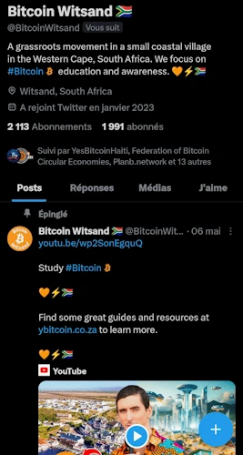

Beachte auch, dass es sowohl auf dem Telefon als auch am Computer möglich ist, gleichzeitig in zwei Twitter-Konten eingeloggt zu sein. Dies kann sehr praktisch sein, um nicht zwischen deinem persönlichen Konto und deinem Community-Konto ein- und ausloggen zu müssen; genauso kann es nach hinten losgehen, wenn du versehentlich ein Foto von dir im Kostüm mit deinem Community-Konto postest... Vorsicht also!

Schließlich, obwohl dein Benutzername "@Bitcoin[CITY]" einzigartig ist und dir jetzt gehört, könnte es klug sein, präventiv Konten "@Bitcoin_[CITY]", "@[CITY]Bitcoin" oder "@[CITY]_Bitcoin" zu erstellen, um **sicherzustellen, dass niemand versucht, deine Identität zu duplizieren**. Es ist tatsächlich besser, zu antizipieren!

Tutorial zur Erstellung eines Twitter-Kontos:

## Verbindung mit benachbarten Meet-ups
<chapterId>12a21c3b-235a-5292-8209-67bf60f61e49</chapterId>

Jetzt, da deine Kommunikationskanäle und sozialen Netzwerke erstellt, eingerichtet und mit der visuellen Identität deiner Stadt/Gemeinschaft/Meet-up versehen wurden, ist es an der Zeit, den "richtigen Leuten" auf diesen Plattformen zu folgen.

Auf Twitter kann dies beginnen, indem man **bestimmten Konten folgt, die an der Entwicklung von Bitcoin international arbeiten**, wie @Bitcoin, @bitcoincoreorg, @planb_network, @FBCEglobal, und indem man das berühmte "Running bitcoin" vom 11. Januar 2009 von @halfin retweetet; aber auch - und das ist am wichtigsten - indem man **den Konten von Bitcoin-Communities und Meet-ups in deinem Land folgt**.
Tatsächlich **wird dies gegenseitiges Folgen, Taggen und somit kollektiv Sichtbarkeit gewinnen ermöglichen**.
Das ist der Fall bei den etwa fünfzig französischen Bitcoin-Communities; und das Gleiche gilt für die meisten "Satoshi Spritz"-Initiativen in Italien und "Einundzwanzig" in Deutschland.
Obwohl es für manche unnötig erscheinen mag, kann das **Folgen der Konten lokaler Gemeinschaften und Initiativen in Ihrem Land indirekt zur Realisierung gemeinsamer Projekte** oder sogar "Partnerschaften" führen. So kamen die Gemeinschaften Bitcoin Liège und Bitcoin Lille in Kontakt (das Gleiche gilt für Bitcoin Aix und Bitcoin Marseille); was sie nun dazu führt, mindestens einmal pro Jahr ein gemeinsames Meet-up abzuhalten. Die **Cercle du Coin**-Dinners sind ein weiteres Beispiel.

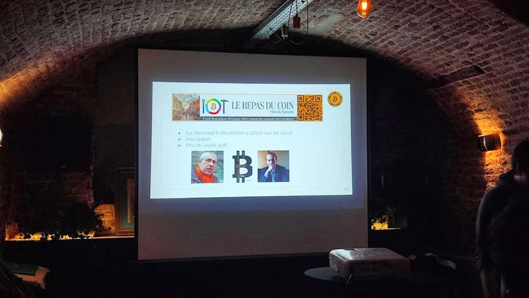

Darüber hinaus könnte es in Frankreich auch relevant sein, Initiativen wie @KonsensusFR, @bitcoinpointfr, @DecouvreBitcoin und @btcmap zu folgen. Dies sind lediglich Vorschläge, und jede Gemeinschaft ist natürlich frei zu tun, was sie möchte, in voller Dezentralisierung und Autonomie.
Das Interesse, einander zu folgen, ist ganz einfach: sich gegenseitig Sichtbarkeit zu verschaffen. Tatsächlich gilt: Je präsenter Sie in Netzwerken sind, desto mehr wird über Sie gesprochen; und je mehr über Sie gesprochen wird, desto wahrscheinlicher ist es, dass Menschen zu Ihren Veranstaltungen kommen. Das Liken/Retweeten von Beiträgen anderer Gemeinschaften in sozialen Netzwerken kann auch interessant sein.
####
Parallel dazu ist es auch möglich, **Meet-up-Organisatoren und denen, die eine Gemeinschaft gegründet haben, die Gelegenheit zu bieten, sich zu einem vordefinierten Zeitpunkt während physischer Veranstaltungen zu treffen**. Dies kann eine Diskussion über jedermanns Empfindungen ermöglichen, über die Entwicklung der gegenwärtigen Gemeinschaften sprechen, Ideen für erfolgreiche Projekte teilen; aber auch, einander Lösungen anzubieten, wenn nötig. Ein schriftlicher Bericht kann dann nach diesem "Treffen" mit den Organisatoren von Gemeinschaften in Ihrem Land, die nicht anwesend waren, geteilt werden, falls gewünscht.

## BTC Map
<chapterId>365f43d4-7b2c-5961-a184-157b8c1a0116</chapterId>

In diesem Stadium ist Ihre Gemeinschaft bereits gestartet. Es bleibt nur noch, auf die Ankunft neuer Bitcoiner und Interessierter zu warten, mit dem Ziel, sie zu entwickeln.

Sie können jedoch nicht weiterkommen, ohne zu wissen, dass **es Plattformen gibt, die es interessierten Bitcoinern ermöglichen, Gemeinschaften und Meet-ups in ihrer Nähe zu finden**.
Deshalb ist es **entscheidend, dass Sie sich ein paar Minuten Zeit nehmen, um auf diesen Seiten/Plattformen gelistet zu werden**.
####
Unter diesen finden wir insbesondere:
* **[Btcmap.org](https://btcmap.org/)**, eine Website, die täglich zwei Karten aktualisiert: **[die Weltkarte der Geschäfte, die Bitcoin akzeptieren](https://btcmap.org/map)**, und **[die Karte der globalen Gemeinschaften](https://btcmap.org/communities)**. Viele Bitcoiner überprüfen diese Karten regelmäßig während ihres Urlaubs oder sogar im täglichen Leben, um neue Begegnungen oder Einkäufe zu machen. **Btcmap ist eindeutig DIE globale Referenz. Und für Ihre Sichtbarkeit muss Ihre Gemeinschaft dort gelistet sein.**
* **[BitcoinerEvents](https://www.bitcoinerevents.com/)** ist eine von Bitcoinern für Bitcoiner erstellte Website. Es ist also möglich, **bevorstehende Veranstaltungen der eigenen Gemeinschaft** dort zu posten. Leider wird diese Plattform in Frankreich relativ wenig genutzt.
* Je nach Land gibt es auch einzigartige Initiativen. Das trifft insbesondere auf Frankreich zu, **mit der Webseite [bitcoin.fr](https://bitcoin.fr/events/categories/evenements/), die dutzende von Bitcoin-Veranstaltungen in Frankreich jeden Monat auflistet**. Falls Sie ihnen noch nicht auf Twitter gefolgt sind oder sie kontaktiert haben, um Informationen über Ihre Gemeinschaft und/oder Veranstaltungen zu geben, ist jetzt der richtige Zeitpunkt! **Darüber hinaus, mit dem Ziel, ihnen zu helfen, diesen französischen Veranstaltungskalender aktuell zu halten, wäre es wünschenswert, wenn alle französischen Bitcoin-Gemeinschaften sich daran gewöhnen würden:**
    * **bei jeder neuen Veranstaltungsankündigung ihrer Gemeinschaft @bitcoinpointfr auf Twitter zu erwähnen**;
    * **die Ankündigung des besagten Ereignisses in ihrer Gemeinschafts-Telegram-Gruppe anzupinnen**.
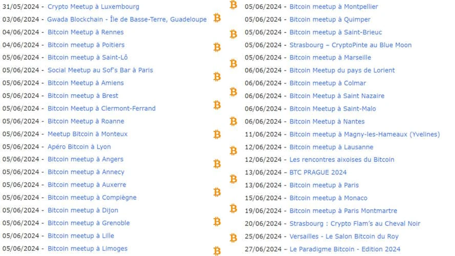
####
Es ist erwähnenswert, dass auch andere Plattformen und Anwendungen eine erhöhte Sichtbarkeit ermöglichen. **[Meetup](https://www.meetup.com/)** ist eine davon. Tatsächlich ist es eine Webseite (und eine Telefonanwendung), die es ermöglicht, ein Ereignis zu erstellen; aber auch nach solchen in Ihrer Umgebung zu suchen.
Leider muss man, um Meet-ups erstellen zu können, fast 8€ pro Monat (was etwa 90€ pro Jahr entspricht) ausgeben, was für eine Gemeinschaft, die weder strukturiert noch reif ist, teuer ist. Meetup ist jedoch in bestimmten Ländern, insbesondere in Kanada und den Vereinigten Staaten, sehr beliebt; sein Hauptvorteil ist, dass es eine integrierte Verwaltung von Meeting-Anmeldungen ermöglicht.

Parallel dazu ermöglicht **[Orangepillapp](https://www.orangepillapp.com/)**, eine kostenpflichtige Telefonanwendung, dass Bitcoiner einander treffen können. Sie ist jedoch ebenfalls kostenpflichtig (50.000 Sats/Jahr oder 200.000 Sats auf Lebenszeit).
####
Obwohl sie die Entwicklung der Sichtbarkeit Ihrer Gemeinschaft und Ihrer Veranstaltungen ermöglichen, werden diese beiden Anwendungen jedoch nicht beim Start Ihrer Gemeinschaft empfohlen, einfach weil sie kostenpflichtig sind.
**Mit einem Eintrag auf [btcmap.org](https://btcmap.org/), auf [BitcoinerEvents](https://www.bitcoinerevents.com/); und für französische Gemeinschaften auf [bitcoin.fr](https://bitcoin.fr) ist daher eindeutig ausreichend**.
#### 
Glückwunsch! Ihre **Gemeinschaft ist gegründet**, Ihre **Visuals sind erstellt**, Ihre **Ziele sind gesetzt**, Ihre **Kommunikationskanäle sind eingerichtet**, Ihre **sozialen Netzwerke sind gestartet** und Ihre **Sichtbarkeitsstrategie ist festgelegt**.
Sobald sich eine kleine Gruppe von Bitcoinern Ihnen angeschlossen hat, ist der nächste Schritt, sich auf das spannende Abenteuer eines Bitcoin-Treffens einzulassen!

# Ein Bitcoin-Treffen organisieren
<partId>c009d2a6-40ce-583b-bd24-fdfd1fea262e</partId>

## Warum ein regelmäßiges Treffen mit Ihrer Gemeinschaft starten?
<chapterId>ed8e471c-3b99-57e2-a042-2d4e8a40b137</chapterId>

Jetzt, da die sozialen Netzwerke und Kommunikationskanäle Ihrer Gemeinschaft gestartet wurden, bleibt nur noch, Ihre Präsenz auf diesen Plattformen bekannt zu machen und neue Mitglieder sollten sich vorstellen und nach und nach in Diskussionen einsteigen.
Dies kann Ihnen daher etwas Zeit freimachen mit dem Ziel, über die Schaffung einer Veranstaltung vom Typ "Meet-up" in beliebigem Format nachzudenken. Dies ist besonders relevant, wenn Sie beginnen, eine gewisse Begeisterung innerhalb Ihrer Gemeinschaft zu spüren.
Wie zuvor erwähnt, kann ein **Bitcoin-Treffen somit als die "nächste Stufe" einer Gemeinschaft angesehen werden**. Es ermöglicht einerseits **seinen Bitcoin-Mitgliedern, sich zu treffen**; und andererseits, **neue, am Ökosystem interessierte Personen zu schulen**. Ein "Meet-up"-Typ-Event wird somit ermöglichen - in Ihrem Maßstab - **Begeisterung für Bitcoin in Ihrer Stadt zu schaffen**; was sich mit der Zeit je nach den Projekten, die Ihre Gemeinschaft unternimmt, ausweiten kann.

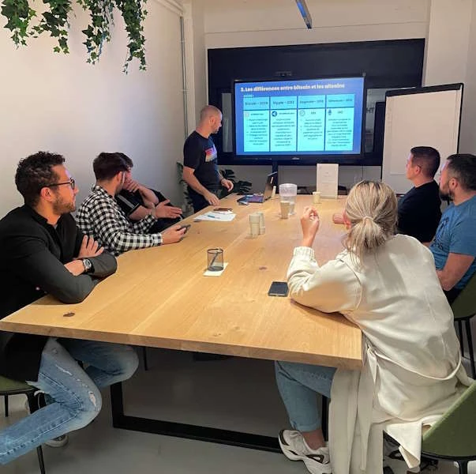

Natürlich gilt: Je bedeutender die Ziele sind, die Sie für die Entwicklung Ihrer Gemeinschaft setzen, desto notwendiger wird es sein - für Sie und Ihre Mitglieder - Zeit dafür aufzuwenden.
Es ist daher wichtig, **zunächst erreichbare Ziele für die Organisation dieses Treffens zu setzen**.

## Das erste Meet-up: wann und warum?
<chapterId>f3f8a614-cfb4-5994-a2e8-d56e6f8e3347</chapterId>

Es ist durchaus möglich, nur wenige Wochen nach der Gründung einer Gemeinschaft, ein Meet-up-Typ-Event zu starten.
In dieser Situation wird Ihre Gemeinschaft jedoch sicherlich noch nicht viel entwickelt haben. Das bedeutet, dass es denkbar ist, dass nur wenige Personen erscheinen könnten. Oder gar keine.
Daher scheint es relevant, **die Organisation eines Treffens vorzuschlagen, sobald es einige Personen gibt, die in den Kommunikationskanälen Ihrer Gemeinschaft involviert sind**; sagen wir zum Beispiel **eine kleine Gruppe von etwa zehn Mitgliedern**. Dies kann also recht schnell gehen.

Sobald Sie diesen kleinen Funken spüren, ist es dann durchaus möglich, die Idee eines persönlichen Treffens vorzuschlagen. Wenn diese Idee Interesse bei anderen weckt, müssen Sie lediglich **das Datum für Ihr erstes Meet-up festlegen**.
Dazu ist es sicherlich vorzuziehen, nicht von Anfang an ein festes Datum festzulegen, sondern etwa zehn Tage im Voraus **eine Umfrage mit verschiedenen Tagen und Zeitfenstern vorzuschlagen**. So wird, abhängig von den Stimmen aller, ermöglicht, **die Teilnahme der Mitglieder zu maximieren**, mehr Begeisterung zu schaffen; aber auch, **Ihre Zeit besser zu "optimieren"**.

Es ist dann wichtig, keine festgelegte Vorstellung davon zu haben, wie dieses Meet-up ablaufen wird, wie viele von Ihnen da sein werden, die Diskussionsthemen usw. Sie riskieren, enttäuscht zu werden; und die Teilnehmer fühlen sich möglicherweise "unter Druck gesetzt".
In diesem Sinne scheint es vorzuziehen, die Dinge natürlich geschehen zu lassen, vielleicht bei einem Getränk. Gespräche sollten dann leicht sein; selbst wenn es bedeutet, Bitcoin anzusprechen, wenn Sie sich mit einem verlorenen Schaf unter vier Augen finden.####
Wenn Sie bestimmte Flautezeiten antizipieren möchten, können Sie verschiedene "Aktivitäten" oder Ausweichoptionen planen. Dazu gehören:
- ein Computer oder Smartphone mit dem **[Mempool](https://mempool.space/)**;
- ein Buch mitbringen;
- einen **Nerdminer**, Bitaxe, FPGA oder sogar einen ASIC mitbringen;
- einen **Bitcoin-Flyer** zur Hand haben;
- Brainstorming um ein weiterentwickeltes Bitcoin-Visual/Logo für Ihre Gemeinschaft;
- ein **[Bitcoin-Kartenspiel](https://www.maximalist.ovh/accueil/20-game-le-coin-de-table.html)**;
- die **[btcmap.org-Karte](https://btcmap.org/)** von Gemeinschaften und Geschäften;
- ein zwangloses: "Hey, übrigens, **hast du schon mal Bitcoin über Lightning gesendet?**"
Es sollte jedoch beachtet werden, dass zu Beginn eines Meet-ups eine formelle Präsentation möglicherweise nicht relevant ist. Wenn nur wenige von euch anwesend sind, scheint es vorzuziehen, in einer offeneren und freundlicheren Weise Diskussionen zu führen.
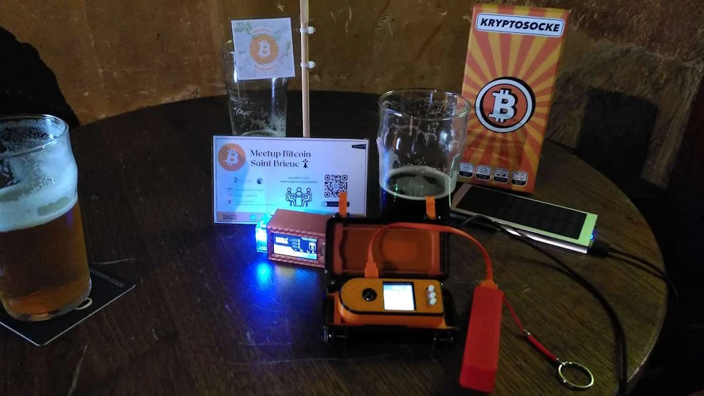
####
Sobald Ihr Meet-up stattgefunden hat, möchten Sie wahrscheinlich ein weiteres organisieren. **Solange Ihre Gemeinschaft noch klein ist, scheint es vorzuziehen, das Datum weiterhin durch eine Umfrage vorzuschlagen; zum Beispiel einmal im Monat (oder alle zwei Monate)**. Es liegt an Ihnen, dies mit Ihrer Gemeinschaft zu besprechen.

Jedoch, in dem Fall, dass **sich eine regelmäßige Gruppe von Bitcoin-Interessierten und -Enthusiasten entwickelt**, scheint es angebracht, **dieses Ereignis regelmäßiger zu planen**; aus mehreren Gründen:
1) es ermöglicht den Mitgliedern, ihre Teilnahme einfacher zu planen;
2) es hilft auch, eine **"Gewohnheit" zu etablieren**. So kann jemand, der den Kommunikationskanälen oder Netzwerken des Meet-ups nicht täglich folgt (aus Zeitmangel) und den üblichen Tag Ihres Treffens im Monat kennt, dann vorbeischauen, "wie üblich".
####
Dieser zweite Punkt ist sehr wichtig. Es ist einer der Gründe, warum **in Frankreich die Mehrheit der Meet-ups am ersten Mittwoch jedes Monats stattfindet**; auf Initiative der "Botschafter", gestartet von [DecouvreBitcoin](https://decouvrebitcoin.fr/).
In Deutschland gibt es keinen landesweit festgelegten Tag; dasselbe gilt für Italien.
Es ist jedoch wichtig zu betonen, dass **das Abhalten aller nationalen Meet-ups am selben Tag ein Zentralisierungsproblem schafft**. Neben Sicherheitsbedenken können Bitcoiner, die am Meet-up in ihrer jeweiligen Stadt teilnehmen, nicht an Bitcoin-Veranstaltungen benachbarter Gemeinschaften teilnehmen. Daher liegt es an Ihnen, eine Haltung einzunehmen. Um dies zu tun, **kann die Interaktion mit dem/den nächstgelegenen Meet-up(s) zu einer relevanten Entscheidung führen**.

#### 
Schließlich, wenn Ihre Gemeinschaft bedeutend wächst und Ihre Meet-ups anfangen, sich zu füllen, ist es durchaus möglich, vorzuschlagen:
* **ein spezifisches Ziel für jedes Ihrer Meet-ups**;
* oder sogar **ein zweites Ereignis im Monat**.

Im ersten Fall, obwohl es notwendig ist, auf die Sensibilitäten und Wünsche aller zu achten, kann dies allen Teilnehmern ermöglichen, **die Veranstaltung mit neuem Wissen zu verlassen**, während die Gesprächsthemen wieder auf Bitcoin fokussiert werden (falls sie abwichen).
Im zweiten Fall ermöglicht ein zweites Ereignis im Monat, zum Beispiel, **ein spezifisches Thema anzusprechen, wie die Einrichtung von "Anfänger"-Sitzungen und/oder Workshops** (Mining, Lightning, Node-Installation usw.).

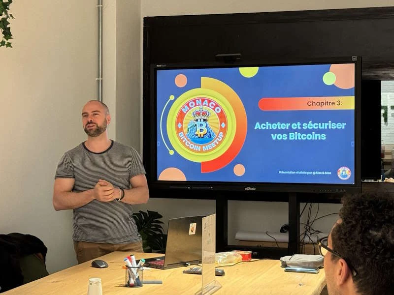

Beachten Sie jedoch, dass **dies mehr Organisation erfordert; und daher mehr Zeit in Anspruch nehmen wird** (obwohl viele Open-Source-Ressourcen in Teil 6/8, betitelt "[Beispiele für Projekte und Initiativen](LINK), verfügbar sein werden).

In jedem Fall wird all dies von dem kurz-, mittel- und langfristigen Aktionsplan abhängen, den Sie (oder Ihre Gemeinschaft) festgelegt haben.

## Einen Veranstaltungsort finden
<chapterId>405d389e-6a32-5777-af8d-293380d2e8fd</chapterId>

Die Suche nach einem Veranstaltungsort für Ihre Events ist nicht unbedingt einfach. Es scheint jedoch wesentlich, **dass dieser Ort in der Stadt Ihrer Gemeinschaft liegt**.
Gleichzeitig müssen viele Kriterien berücksichtigt werden. Unter ihnen:
1) die Lage des Veranstaltungsortes: ist er leicht **mit öffentlichen Verkehrsmitteln erreichbar? Mit dem Auto?** Kann man dort ohne Schwierigkeiten parken?
2) Ist der Ort **angenehm und nicht zu laut?** Suchen Sie nach einem formellen Ort (Coworking-Space, Besprechungsraum) oder einem informellen (Bar oder sogar Restaurant)?  
3) Hat die Location eine **ausreichende Kapazität, um Sie aufzunehmen?** Und das auch am Abend eines Rugby-Spiels oder der Champions League?  
4) Verfügt der Ort über einen **Videoprojektor und einen ruhigen Raum für Ihre Präsentationen?**  
5) Schließlich, im Falle einer Bar (oder sogar eines Restaurants), **ermöglicht die Speisekarte es jedem, etwas zu essen und zu trinken?**  
Zu diesen Punkten können drei wichtige Bemerkungen hinzugefügt werden:  
- für den Fall, dass Sie den Abend in zwei Teile teilen möchten (zuerst eine **Präsentation in einem formellen Raum**, um jedem zu ermöglichen, sich besser zu konzentrieren; dann **Wechsel des Ortes, um den Abend in einer entspannteren Atmosphäre in einer Bar** oder einem Restaurant fortzusetzen), ist es wichtig zu wissen, dass dieser Ortswechsel mitten am Abend **einige Teilnehmer dazu veranlassen wird, die Gelegenheit zum Verlassen zu nutzen. Daher wird diese Art der Anordnung nicht empfohlen**;  
- während Ihrer ersten Meet-ups werden wahrscheinlich nur wenige Personen erscheinen, und so werden Sie wahrscheinlich keine Präsentation machen. In diesem Sinne scheint es nicht notwendig zu sein, sich dem Besitzer bekannt zu machen und Ihre Ziele usw. vorzustellen. Sobald Ihre Meet-ups jedoch regelmäßig und gut besucht sind, scheint es relevant, sich vorzustellen, um Ihre Ernsthaftigkeit und Ihren Wunsch, regelmäßig zu kommen, zu zeigen. Dies kann zu vielen Diskussionen führen (automatische monatliche Buchung, kostenlose Getränke und/oder Platten, Rabatte, Diskussion über Bitcoin, Akzeptanz von Bitcoin als Zahlungsmethode usw.) Offensichtlich, in dem Fall, dass Sie speziell nach einem Ort mit einem Videoprojektor für Präsentationen suchen, scheint es wesentlich, im Voraus ein Treffen (persönlich oder sogar telefonisch) mit dem Besitzer und/oder Manager zu vereinbaren, um Ihr Projekt und Ihre Ziele vorzustellen;

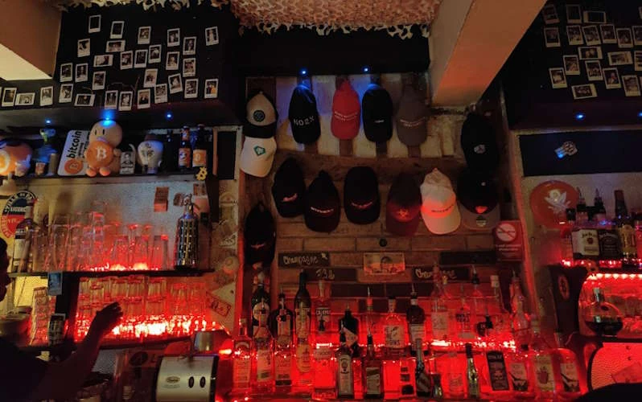

- schließlich möchten einige Gemeinschaften ihre Veranstaltungen möglicherweise nur an Orten abhalten, die Bitcoin als Zahlungsmethode akzeptieren; und das ist durchaus verständlich. In dieser Perspektive scheint es relevant, **zunächst nach Geschäften in Ihrer Stadt zu suchen, die Bitcoin akzeptieren (zum Beispiel auf [btcmap.org](https://btcmap.org/map/))** und sie zu kontaktieren, um einen Ort zu finden, der Ihren Kriterien entspricht. Für den Fall, dass leider nichts geeignet ist, haben Sie dann die Möglichkeit, neue Händler "an Bord" zu holen. Erwarten Sie jedoch viele Ablehnungen, was entmutigend sein kann. Deshalb **könnte es vernünftig sein, dies nicht von Anfang an als Ziel zu setzen, sondern dazu zu kommen, sobald Ihre Gemeinschaft gut entwickelt ist** und Sie ausreichend "Einfluss" haben.

Zögern Sie außerdem nicht, **in den ersten Monaten nach dem Start Ihres Meet-ups die Veranstaltungsorte zu wechseln**. Dies ermöglicht es Ihnen, möglicherweise **Kontakte** mit einigen Managern zu knüpfen, **verschiedene Atmosphären zu entdecken**; aber auch, **Informationen** über die verschiedenen Orte zu sammeln, die potenziell Ihre Veranstaltungen ausrichten könnten.
Nichts hindert Sie später daran, wenn Sie viele Teilnehmer haben, einen Nachmittag zu nutzen, um mehrere Geschäfte und Bars zu besuchen und zu fragen, ob sie einen geeigneten Ort haben, um einmal im Monat Ihre Veranstaltungen und Meet-ups auszurichten!

## Vor dem Meet-up
<chapterId>c5218943-580d-5efc-89ed-6b5d728816d6</chapterId>

Sie haben beschlossen, ein Meet-up zu organisieren und Ihre Gemeinschaft über das Datum informiert? Mehrere wichtige Schritte folgen nun:
1) **Kontaktieren Sie den Veranstaltungsort**, an dem Sie Ihr Event abhalten möchten, um eine **Reservierung** für eine bestimmte Anzahl von Personen zu **bestätigen**;  
2) **Kündigen Sie Ihr Event in sozialen Medien und Kommunikationskanälen an, indem Sie Datum, Zeit, Ort klar angeben** und fügen Sie den Registrierungslink hinzu, falls notwendig. Für diese Kommunikation kann ein spezifisches Visual erstellt werden (zum Beispiel ein Canva-Poster, siehe Teil 2/8 "[Designing a unique identity for your Bitcoin community](LINK)"). Um die Sichtbarkeit dieser Ankündigung zu maximieren, kann sie auf Telegram und Twitter **angeheftet werden** und sollte auch ein **"@everyone" auf Discord** beinhalten. Es scheint zudem mehr als relevant, diese Ankündigungen **1 Woche bis zehn Tage vor dem Eventdatum zu posten**, damit jeder seine Teilnahme planen kann;

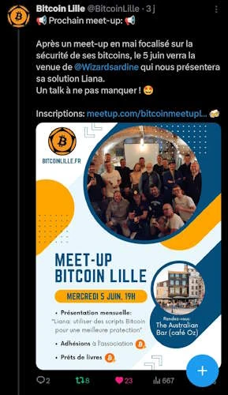

4) **Zwei bis drei Tage vor dem Event können diese Ankündigungen erneut getwittert und geteilt werden**, um mehr Sichtbarkeit zu erlangen;  
5) Schließlich, abhängig von der Anzahl der Antworten und/oder Anmeldungen, die am Tag vorher oder davor eingegangen sind, ist es durchaus möglich, dass Sie den Besitzer des Veranstaltungsortes erneut kontaktieren, um die Anzahl der erwarteten Teilnehmer zu bestätigen.  
####  
Zu diesen vier Schritten können auch hinzugefügt werden:  
- **Drucken von Flyern und/oder Postern**;  
- **Erstellen einer Präsentation** zu einem vordefinierten Thema;  
- **Vorbereiten einer Aktivität oder eines Workshops**;  
- usw.

## Am Tag des Meet-ups  
<chapterId>cf60067b-591f-5fdf-9b9e-d442aad0e8f9</chapterId>  

Der große Tag ist da! Eine Stunde oder zwei vor Beginn des Events können Sie eine einfache Nachricht in den Kommunikationskanälen Ihrer Community senden (es ist nicht nötig, soziale Medien zu überladen), um die Uhrzeit anzukündigen, ab der Sie da sein werden, aber auch um zukünftige Teilnehmer zu informieren, dass Sie erkennbar sein werden, weil Sie (zum Beispiel) ein Bitcoin-T-Shirt und eine Kappe tragen werden.  
####  
Wenn Ihr Meet-up wächst und Sie mehr als 20 Personen pro Event begrüßen, wird **die Vorbereitung des Raums / des Veranstaltungsortes zu einem wichtigen Element**.  
Um dies zu erreichen, wird es notwendig sein:  
1) **etwas früher anzukommen**, um vorzubereiten;  
2) **den Raum oder Platz entsprechend den Möglichkeiten und Ihren Bedürfnissen zu arrangieren**. Wenn Sie etwa ein halbes Dutzend sind, gibt es wirklich nicht viel zu tun. Aber sobald Sie 10 bis 20 Personen pro Event erreichen, werden Sie schnell feststellen, dass es keine so gute Idee ist, alle sitzen zu haben, da dies weniger Austausch ermöglicht und Sie nicht mit jedem während des Abends sprechen können. In diesem Sinne scheint es relevant, **eine Stehkonfiguration zu bevorzugen, mit zum Beispiel gut verteilten Stehtischen** (wenn möglich), sobald Sie etwa fünfzehn Personen erreichen. Denken Sie jedoch daran, **immer noch Stühle zur Verfügung zu haben** (hohe, zum Beispiel). Für den Fall, dass eine Präsentation gehalten wird, ist es vorzuziehen, die Stehkonfiguration den ganzen Abend beizubehalten, auch wenn das bedeutet, einige Stühle (hohe) ein paar Minuten vor der Präsentation hereinzubringen;  
3) Zusätzlich zur Anordnung des Raumes können andere kleine "Anpassungen" vorgenommen werden:  
    - Anzeigen, mit Patafix, eines **Posters vor dem Ort Ihres Meet-ups, das angibt, in welchem Raum Sie sein werden** (denken Sie natürlich daran, im Voraus um Erlaubnis zu bitten);  
    - Anzeigen, mit Patafix, **spezifischer Poster** im Raum, in dem Sie Ihr Event abhalten (**Bitcoin White Paper, Charta Ihrer Community, laufende Projekte**, usw.);
- das Aufstellen auf einem oder mehreren Tischen von **Stickern, Flyern oder sogar Material, das zu Diskussionen führen kann** (Nerdminer, Stahlplatte, Hardware-Wallet, eingeschalteter Computer mit dem Mempool, ASIC, Metallplatte zur Sicherung Ihres privaten Schlüssels usw.)
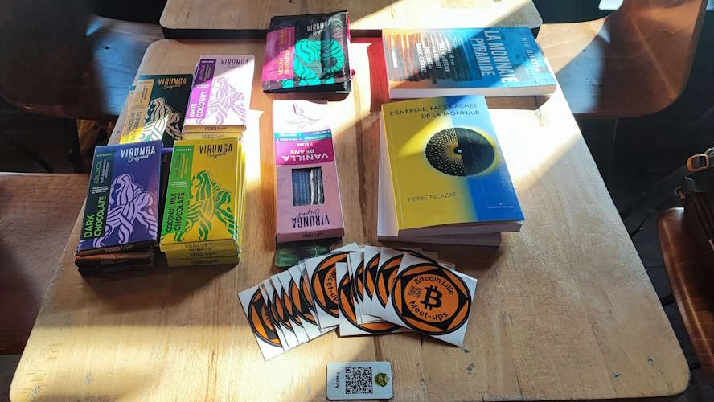
####
Natürlich, wenn Sie nur wenige Teilnehmer erwarten und die Manager nicht über Ihr Meet-up informiert haben, weil Sie es gerade erst starten, sollten Sie nicht beginnen, all Ihr Material mitzubringen und auszustellen.
Jedoch, **sobald Vertrauen zu den Managern aufgebaut ist, werden Sie viel freier sein, den Raum nach Ihren Vorstellungen zu gestalten**.

Es bleibt nur noch, ein Getränk zu nehmen und geduldig auf potenzielle Teilnehmer zu warten. Wie jedoch zuvor erwähnt: **seien Sie nicht enttäuscht, wenn beim ersten Mal niemand erscheint**. Planen Sie daher, ein Buch oder ein Video zum Anschauen dabei zu haben, für alle Fälle.

## Nach dem Meet-up
<chapterId>3e881af9-9c09-5721-81ee-c5cda3b109c5</chapterId>
Wenn das Meet-up endet, ist es Zeit für die Veranstaltungsort-Manager, **aufzuräumen**. Also, bevor Sie gehen (und im Allgemeinen werden Sie zumindest anfangs unter den Letzten sein, die gehen), erwägen Sie, den Kellnern und/oder Managern Ihre Hilfe anzubieten. Das kann so einfach sein wie **Gläser auf einem Tisch sammeln**; oder, wenn Sie in der Nähe der Bar sind, **sie zurückzubringen, bevor Sie gehen**.

Sobald Sie wieder zu Hause sind, ist es sehr wahrscheinlich, dass Sie für einige Tage **Bitcoins in Ihren Augen haben werden**. Dies wird ein günstiger Moment sein, um Feedback einzuholen, zum Beispiel indem Sie:
- eine Nachricht auf Ihren Kommunikationskanälen senden, um den Teilnehmern zu **danken**, und/oder Links oder Websites, die Sie besprochen haben, zu teilen;
- denen, die am Meet-up teilgenommen haben, vorschlagen, **Verbesserungen für das nächste Mal vorzuschlagen**;
- und auch, um **sich auf das nächste Event vorzubereiten!**

Es wird sich dann eine lange Periode von einigen Wochen präsentieren; perfekt, um andere Designs und/oder Projekte für Ihr Meet-up zu entwickeln.

## Die Bedeutung der Einbindung und Bindung von Teilnehmern
<chapterId>f5355e35-4b07-527c-88a3-8535cba7592c</chapterId>

Rom wurde nicht an einem Tag erbaut; und dasselbe gilt für Ihre Gemeinschaft. Das bedeutet, dass **es durch die regelmäßige Organisation von Meet-ups und Veranstaltungen ist, dass Sie es schaffen werden, eine Dynamik um Bitcoin zu schaffen**.
Um dies zu tun, ist ein Punkt wesentlich: **Sie müssen die Teilnehmer Ihrer Veranstaltungen binden**.

Dies kann mit einer kleinen Gruppe von eingefleischten Bitcoinern beginnen, deren Ziel es ist, sich regelmäßig zu treffen, um über Bitcoin zu sprechen. Über die Wochen hinweg, und abhängig von der Zeit und Sensibilität jedes Einzelnen, können Sie **einige organisatorische Aufgaben Ihrer Gemeinschaft verteilen**; oder sogar **diesen Bitcoinern vorschlagen, ein bestimmtes Projekt zu übernehmen**. Dieses Projekt könnte spezifisch für Ihre Gemeinschaft, Ihre Meet-ups oder sogar Ihre Stadt sein; es könnte sich auch von einer der vielen in [Teil 6/8 dieses Kurses](LINK) vorgeschlagenen Initiativen inspirieren lassen. **Dies würde den Kern Ihrer Gemeinschaft einbeziehen und ihr daher helfen, zu gedeihen**.
**Neue Gesichter werden sich Ihnen im Laufe der Treffen anschließen**. Das könnten Personen sein, die BTC und/oder Alt-/Shitcoins in vorherigen Zyklen gekauft haben, No-Coiner, die ihr Verständnis von Bitcoin und seinem Ökosystem vertiefen möchten; aber auch Neulinge, die ihre ersten Informationen über dieses neue System des unzensierbaren, dezentralisierten, transparenten, fairen, bedingungslosen und vertrauenslosen elektronischen Zahlungsverkehrs sammeln. Um sicherzustellen, dass sich **jeder bei Veranstaltungen willkommen fühlt**, können zwei Hauptbereiche der Reflexion bearbeitet werden.
Einerseits ist es aus sozialer Perspektive entscheidend für die Entwicklung einer Gemeinschaft, dass sich jeder Teilnehmer eines Events einbezogen fühlt. Das bedeutet: **sich um diese neuen Teilnehmer zu bemühen, sich für ihre Gründe des Daseins zu interessieren, sie herzlich willkommen zu heißen**, usw. Indem sie sich einbezogen und willkommen fühlen, werden diese Personen zurückkehren wollen; und sogar, in der Zukunft, abhängig von ihrem Profil, sich an der Organisation dieser Veranstaltungen beteiligen wollen.
Offensichtlich **erfordert dies Zeit und Motivation**. Im Falle, dass Sie einen Shitcoiner (oder schlimmer: einen XRP-Maximalisten) begrüßen, kann es ziemlich schwierig sein, seine zeitliche Präferenz beiseite zu legen und zu akzeptieren, "Zeit zu verschwenden" in einseitigen Diskussionen. Es ist jedoch, indem wir uns die Zeit nehmen, mit diesen Menschen zu sprechen, dass wir ihnen helfen können, ihre Missverständnisse und Fehler im Denken zu verstehen. Sobald sie diese akzeptieren, werden sie dann bereit sein, Bitcoin zu verstehen.

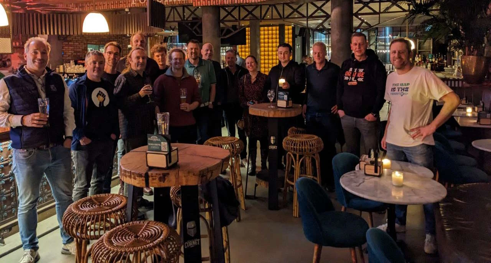

Andererseits können aus technischer Sicht mehrere Fragen auftauchen:
- war der Ort, an dem **das Treffen stattfand, angenehm?**
- war es **leicht zugänglich?**
- warum sind einige Teilnehmer letztendlich nicht gekommen?
- welche Diskussionen wurden geführt? Waren sie **zu technisch, sodass Neulinge nicht einbezogen werden konnten?**
- floss Alkohol zu frei?

Offensichtlich hat jeder Teilnehmer seine eigene Persönlichkeit, Sensibilität, Ziele und Interessen. Daher wird jeder das Treffen anders erleben.
Aber **wenn der Ort gut gewählt ist, die anwesenden Personen (insbesondere die Organisatoren) aufgeschlossen sind und ihr Ziel edel ist, gibt es keinen Grund, dass das Treffen kein Erfolg wird**.
####
**Ein Treffen zu organisieren erfordert also Zeit; aber vor allem Organisation.
Es ist ein menschliches Projekt, und deshalb kann es nur langfristig funktionieren und sich entwickeln, wenn es durchdacht, offen und inklusiv ist**.
Natürlich **liegt es an jedem, seine Grenze festzulegen**, was mit "offen und inklusiv" gemeint ist. Aber vergessen wir nicht: ein Shitcoiner ist ein Bitcoiner in der Entstehung (der noch nicht rekt wurde).

# Beispiele für Projekte und Initiativen
<partId>45b3bc40-1c31-583e-8411-2662e6efd765</partId>

## Warum über das bloße Biertrinken hinausgehen?
<chapterId>3213d87a-1998-5972-ab93-97a5769ba279</chapterId>
Mit dem Fortschritt der Blöcke wird Ihre Gemeinschaft wachsen. Neue Gesichter werden dazukommen, und andere werden verschwinden.
Um das Bitcoin-Ökosystem voranzutreiben und noch stärkere Bindungen innerhalb Ihrer Gemeinschaft aufzubauen, können zahlreiche Projekte und Initiativen unternommen werden.

Unten **bieten wir eine Reihe von nicht erschöpfenden Ideen an, die innerhalb einer Gemeinschaft oder während eines Treffens umgesetzt werden können**.
Sie können frei wählen, welche Ihnen gefallen, aber auch andere hinzufügen, indem Sie einen "Pull Request" auf GitHub machen.
####
Aber bevor wir beginnen, scheint es interessant, tiefer in einen Punkt einzutauchen, der bereits in den vorherigen Teilen dieses Kurses aufgeführt wurde.
Wenn Sie ein Bitcoin-Treffen organisieren, lernen Sie neue Leute kennen. Soziale Interaktionen sind daher wichtig, und Bier (Alkohol im Allgemeinen) macht diese Art von Veranstaltungen festlich. Aber VORSICHT: 
- einerseits **hemmt Alkohol bestimmte kognitive Fähigkeiten** (Denken, Verstehen usw.). Es ist daher **schwieriger für Teilnehmer, ernsten Diskussionen zu folgen** - oder einer Präsentation - nachdem sie ein süßes alkoholisches Getränk hatten;
- andererseits kann **Alkohol tröstend sein**: jeden Monat haben Sie Ihren "Bitcoin-Moment" mit Ihren neuen Kumpels. Sie teilen eine gemeinsame Leidenschaft, und das ist sehr positiv! **Aber ist das Trinken von Bieren wirklich das Hauptziel Ihres Treffens?** Würden Sie nicht lieber über Ihre neuen Erkenntnisse/Forschungen austauschen, von den Erfahrungen anderer lernen; oder sogar Bitcoin für Neulinge demokratisieren, um sie einzuführen?

Jeder hat seine eigenen Wünsche, seine eigenen Überzeugungen, seine eigene Persönlichkeit. Es wird also hier kein Urteil über die Funktionsweise des einen oder anderen Treffens gefällt. Schließlich **ist es bei einem Bier, dass wir die Welt neu gestalten, aber es ist nicht so, wie wir sie tiefgreifend verwandeln**.

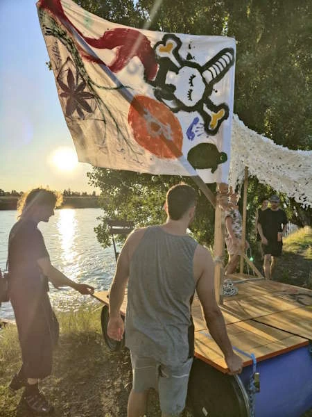

## Thematische Treffen organisieren, die einer festgelegten jährlichen Progression folgen

<chapterId>46afdbcc-a775-5c16-b20a-34956690d58f</chapterId>

Sobald Ihre Treffen regelmäßig werden und eine Kerngruppe von etwa zehn Personen etabliert wurde, können Sie jetzt **bei jedem Ihrer Treffen eine Präsentation durchführen**. Diese können dann **thematisch** sein, mit einem Thema, das im Voraus angekündigt wird; sie können auch unabhängig voneinander sein.
Im Kontext der Einrichtung von Präsentationen und/oder Workshops kann es sehr relevant sein, **eine durchdachte Progression im Voraus zu erstellen**. Das Ziel dieser Progression wäre es daher, **alle wichtigen Konzepte im Zusammenhang mit Bitcoin abzudecken**; dies ermöglicht es jedem, der an den Treffen teilnimmt, Bitcoin als Ganzes zu verstehen.
In Frankreich haben die Organisatoren von Treffen im Sommer 2023 an **einer jährlichen Progression** gearbeitet, der mehrere von ihnen folgen. Neben einer **starken Bildungsdimension ermöglicht dies auch den Treffen, Dokumente und Open-Source-PowerPoints auszutauschen**, um eine Datenbank von Ressourcen zum gleichen Thema aufzubauen.
Diese Initiative wird bei Treffen besonders geschätzt und zielt darauf ab, sich in den kommenden Jahren zu entwickeln.

Die Progression, die von den französischen Treffen in 2023/2024 verfolgt wird, ist daher unten verfügbar. Sie umfasst **das Thema jedes Treffens sowie ein Video und eine Open-Source-Präsentation, die Ihnen Ideen zu den Konzepten geben können, die angesprochen werden können**.
Wenn Sie auf andere bearbeitbare Ressourcen zugreifen möchten, sollten Sie das [Bitcoin Educational Toolkit](https://planb.network/fr/resources/bet) überprüfen!

Es sollte auch beachtet werden, dass Kapitel 2 und 7 in zwei Präsentationen unterteilt werden können, mit dem Ziel, die Teilnehmer nicht mit Informationen zu überladen; sie können auch in einem Zug durchgeführt werden. In dieser zweiten Option ermöglicht es mehr Freiheit, zwei Treffen die Durchführung von Workshops oder spezifischen Veranstaltungen zu ermöglichen (gemeinsames Treffen oder Quiz zum Beispiel).

| Monat              | Thema                                                       | Video                                             | Bearbeitbare Ressource                                                        |
| ------------------ | ----------------------------------------------------------- | ------------------------------------------------- | ----------------------------------------------------------------------------- |
| September          | Kapitel 1: Was ist Bitcoin?                                 | [YT](https://www.youtube.com/watch?v=CSjuBqrl4t8) | [canva](https://www.canva.com/design/DAFu0d5Jd7M/9gAWDAOSS6LDkWENuZjYgw/edit) |
| Oktober & November | Kapitel 2: Verständnis von Bitcoin-Transaktionen            | [YT](https://www.youtube.com/watch?v=inFnR-3NsdM) | [canva](https://www.canva.com/design/DAFsEcnOro8/Mz9FYdTGhsvozZOe0Y9jtw/edit) |
| Dezember           | Kapitel 3: Verständnis des Lightning-Netzwerks              | [YT](https://www.youtube.com/watch?v=hHz-ALx8D9w) | [canva](https://www.canva.com/design/DAF4YPSNnR8/HKp4Vmcno8eMtVWnZmFtcw/edit) |
| Januar             | Kapitel 4: Was ist Mining?                                  | [YT](https://www.youtube.com/watch?v=QyHZ3CVI_OI) | [canva](https://www.canva.com/design/DAF5DE6iBEM/tsy8E3oBebUnsR0kj53vvQ/edit) |
| Februar            | Kapitel 5: Einrichtung eines Bitcoin- und Lightning-Knotens | [YT](https://www.youtube.com/watch?v=RRYK-usg-OY) | [canva](https://www.canva.com/design/DAF55FU6HI0/sQ0lacRJblqrhn_9Xk1yDg/edit) |
| März               | Kapitel 6: Nutzung des Lightning-Netzwerks im Alltag        | [YT](https://www.youtube.com/watch?v=o2BS4xjei8M) | [canva](https://www.canva.com/design/DAGAcJMw7lw/-haMNnHnwj5vpDAy8MDowA/edit) |
| April & Mai        | Kapitel 7: Sicherung Ihrer Bitcoins                         | [YT](https://www.youtube.com/watch?v=fHExPbhM0Hg) | [canva](https://www.canva.com/design/DAGDz3Nq4e0/D3uG-4w9FN6OhUq-VXzhfg/edit) |
| Juni               | Demnächst                                                   | Demnächst                                         | Demnächst                                                                     |
| Juli               | Demnächst                                                   | Demnächst                                         | Demnächst                                                                     |
| August             | Demnächst                                                   | Demnächst                                         | Demnächst                                                                     |
####
Natürlich gibt es Zeiten, in denen einige Personen nicht bei einem Meet-up anwesend sein können. Wenn möglich, **ist es relevant, die Präsentation aufzunehmen und auf einer Streaming-Plattform und/oder Ihrer Website zu posten**. Dies kann denen, die abwesend waren, ermöglichen, frühere Präsentationen nachzuholen; oder sogar, sie im Replay anzusehen, um sich besser zu informieren.

**Fühlen Sie sich frei, diese Ressourcen zu nehmen, zu modifizieren und zu teilen, wie Sie möchten**. Denken Sie nur daran, **Ihre Quellen zu zitieren**, wenn Sie eine modifizierbare Präsentation wiederverwenden.
####
Parallel dazu können andere thematische Meet-ups organisiert werden. Darunter zählen wir:
- ein **Wissensquiz** (mit beispielsweise einer physischen Wallet als Preis);
- eine **"Onboarding"-Herausforderung** durch das kostenlose Senden von Satoshis an No-Coiners;
- **die Organisation der Ankunft eines Experten in einem spezifischen Feld oder eines Unternehmens**, das ein relevantes Produkt im Zusammenhang mit Bitcoin anbietet;
- ein **"Bar- und Geschäftstour"-Abend**, der Bitcoin als Zahlungsmethode akzeptiert;
- usw.

Die einzigen Grenzen, die gesetzt werden sollten, sind die Ihrer Vorstellungskraft!

## Erstellung von Nebenveranstaltungen und Workshops
<chapterId>9dbd651a-8712-5630-90b3-b9525dcc1385</chapterId>
Im Laufe des Jahres können andere Veranstaltungen organisiert werden. Dazu können gehören:
- **ein Restaurantabend zum Pizza-Tag**, am 22. Mai;
- **ein Abend oder ein Wochenende, um das bevorstehende Halving zu "feiern"**;
- **ein "Familienspiel"-Event rund um Bitcoin** und wie es funktioniert. Spiele wie ["Le Coin de Table"](https://www.maximalist.ovh/) oder ["SHAmory"](https://shamory.com/) können mitgebracht werden;

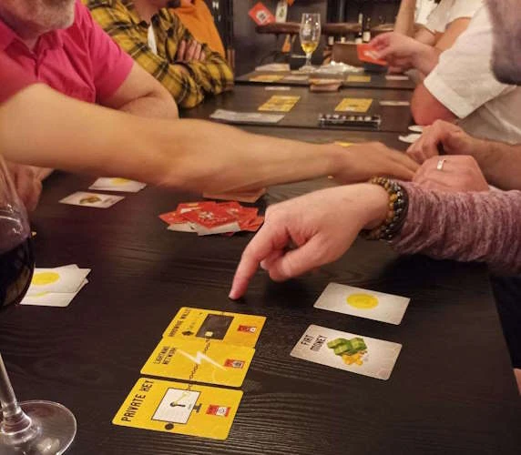

- **ein Mining-Workshop**, mit der Entdeckung verschiedener Hardware (Prozessor, Grafikkarte, FPGA, ASIC, nerdminer, bitaxe);
- **ein Nachmittag oder Abend speziell für Anfänger, mit thematischen Workshops**;
- oder sogar, **ein gemeinsames Meet-up mit einem (oder mehreren) benachbarten Meet-up(s)**.
####
Jedoch seien Sie vorsichtig, **nicht zu viele Veranstaltungen in einem Monat zu organisieren, da je mehr es gibt, desto mehr Zeit wird sowohl von den Organisatoren als auch von den Teilnehmern benötigt**; und dies könnte einige dazu bringen, ihre Teilnahme zu überdenken.

## Erstellung von Stickern
<chapterId>d605f3b3-130e-513d-85e6-06bc5ea13e99</chapterId>

Als Symbole der Identität Ihrer Gemeinschaft könnte es interessant sein, Sticker zu entwerfen und dann zu bestellen.
Bevor Sie Ihre Bestellung aufgeben, könnte es relevant sein, die folgenden Punkte zu berücksichtigen:
- wenn Sie möchten, dass diese Sticker im Freien angebracht werden können, benötigen Sie **wasserfeste Sticker** ("wasserdicht" oder undurchlässig);
- **stellen Sie sicher, dass Ihr Logo kleiner als die bei der Bestellung angekündigte Fläche ist**. Dies wird tatsächlich helfen, Präzisionsfehler von Laserschneidern zu vermeiden, die einen Teil Ihres Logos abschneiden würden. Dies wird in der Regel bei einer Bestellung erklärt;
- erwägen Sie **die Verwendung einer Vektordatei** anstelle einer Bilddatei. Dies wird die Druckqualität verbessern;
- **überlegen Sie zweimal die gewünschte Größe**. Zum Beispiel hat ein kreisförmiger Sticker mit einem Durchmesser von 8 cm etwa die Größe einer Handfläche eines Erwachsenen. Suchen Sie diese Größe, die für die Sichtbarkeit ziemlich bedeutend ist, oder suchen Sie etwas Diskreteres (zum Beispiel 4 cm im Durchmesser)?
- schließlich - und das ist ein bisschen technisch - wenn Sie einen reichen schwarzen Druck (ein "Vierfarben-Schwarz") möchten, sollten die Eigenschaften dieses sein: 30% Cyan, 30% Magenta, 30% Gelb und 100% Schwarz. In Fällen, in denen nur 100% Schwarz verwendet wird, wird das Ergebnis ein etwas gräuliches Schwarz sein. Glücklicherweise achten Drucker im Allgemeinen auf dieses Detail. Sie sollten sich also nicht zu viele Sorgen darüber machen.
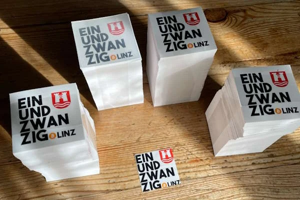
#### 
Je nach Ihrer Anfrage und dem von Ihnen gewählten Lieferanten, rechnen Sie damit, **zwischen 100 und 250 Euro für 1000 Sticker zu bezahlen**. Sie können auch [@Mill3sim3 auf Twitter](https://x.com/Mill3sim3) kontaktieren, einen französischen Bitcoiner, der auf Marketing spezialisiert ist und Ihnen helfen kann, Preise zu erhalten, die fast 30% günstiger sind als die üblichen Online-Seiten. Zögern Sie nicht, ihn dafür zu kontaktieren.

Es ist jedoch zu beachten, dass 1000 Sticker eine bedeutende Menge darstellen. Daher ist es eindeutig **vorzuziehen, zunächst mit dem Kauf von hundert Stickern zu beginnen**; um sicherzustellen, dass dieser Bestand verkauft wird.
Auch eine kleine Anmerkung: **Wenn Sie entscheiden, einen dieser Aufkleber auf der Straße anzubringen, kann dies je nach Land, in dem Sie sich befinden, gesetzlich verboten sein**. Im Falle von Frankreich ist es beispielsweise verboten, Aufkleber auf der Straße anzubringen, außer auf öffentlichen Anschlagtafeln, die es in jeder Stadt gibt. Das bedeutet, wenn einer Ihrer Aufkleber achtlos angebracht wird (oder eher: irgendwo, wie in der Mitte eines Stoppschilds), wird er schnell entfernt; und wenn er Informationen enthält, die zu Ihrer Identität oder der Ihres Treffens zurückverfolgt werden können, ist es nicht ausgeschlossen, dass Sie eine Geldstrafe erhalten könnten. Seien Sie also vorsichtig und informieren Sie Ihre Mitglieder.

#### 
Parallel dazu, wenn Sie ein Fan von Konzerten, Bars oder Stadien sind, **überprüfen Sie, ob bereits Aufkleber angebracht sind, bevor Sie Ihren platzieren. Andernfalls fragen Sie einen Mitarbeiter, ob dies akzeptiert wird**.
Tatsächlich wäre es schade, wenn ein Händler zum ersten Mal von Ihrer Gemeinschaft / Ihrem Treffen / Ihrer Vereinigung / Bitcoin erfährt, weil Sie die Dekoration seiner Toiletten sabotiert haben!

## Eine Bibliothek erstellen
<chapterId>acc94093-f8b3-51b8-9359-348e9e075d38</chapterId>

Ein weiteres Projekt, das leicht umgesetzt werden kann, ist **die Einrichtung einer Bibliothek innerhalb Ihrer Treffen**.
Dazu können Sie alle interessierten Personen bitten, ihre Lektüren zu teilen, indem sie ein Buch zum Thema Bitcoin mitbringen und während des Treffens, wenn jemand anderes daran interessiert ist, es auszuleihen, **kann zum Beispiel ein Darlehen an seinen Besitzer gegen eine Kaution von 21.000 Satoshis in Lightning erfolgen**.
Dies ermöglicht es dem Besitzer, die Kosten im Falle von Vergessenheit oder Diebstahl zu decken; und dem Entleiher, zu einem zukünftigen Treffen zurückzukehren, um seine 21.000 Satoshis zurückzuholen!
####
Wenn Sie **eine Vereinigung leiten und einen Teil Ihrer Schatzkammer in Bildungs- und Lehrressourcen investieren möchten**, können Sie mehrere Bücher bestellen und diese bei jedem Treffen in Ihrer **Bitcoin-Bibliothek** anbieten.

####
In diesem Zusammenhang und mit dem Ziel, das Ökosystem zu entwickeln, **bietet der Verlag Konsensus.Network Treffen und internationalen Bitcoin-Gemeinschaften einen Rabatt von 15% bis 35% auf alle seine Bücher; ab drei gekauften**.

Wenn Sie keine Schatzkammer haben, ist es immer noch möglich, dass die Mitglieder Ihrer Gemeinschaft von diesem Rabatt profitieren.
Tatsächlich kann einer der Organisatoren Ihrer Gemeinschaft zum Beispiel die Bestellung mehrerer Mitglieder zentralisieren und sie zu einem niedrigeren Preis bei Konsensus aufgeben, mit dem Ziel, die erhaltenen Exemplare beim nächsten Treffen neu zu verteilen. Diese Neuverteilung könnte dann zum Beispiel in Lightning durchgeführt werden.

Um diesen Rabatt in Anspruch zu nehmen, **kontaktieren Sie einfach [Konsensus Verlag](https://twitter.com/KonsensusFR) auf Twitter**.
####
Weiterhin kann eine Buchausleih-Charta geschrieben und während der Treffen ausgehängt werden, die kurz die Regeln des Ausleihens erklärt.

Hier ist ein Open-Source-Beispiel, das Sie nach Belieben übernehmen und ändern können:
[Buchausleih-Charta](https://www.canva.com/design/DAF7u1b5kRM/r2gEAlibe_jTIXIX-O9PMA/edit)

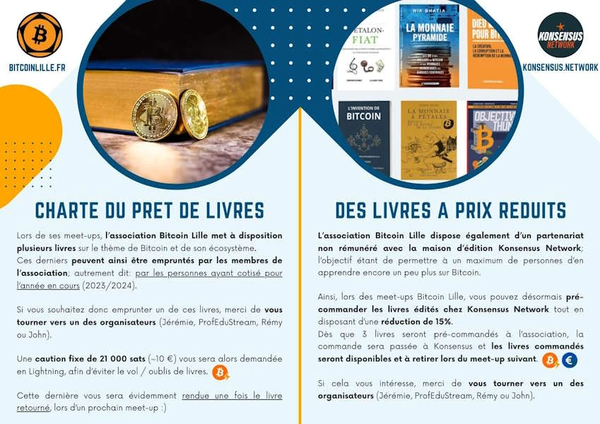
#### 
Parallel dazu, immer noch mit der Idee, das Lesen über Bitcoin zu fördern, kann eine weitere bedeutende Aktion sein, **die städtischen Bibliotheken der Stadt zu besuchen und zu überprüfen, ob sie verschiedene Bücher über Bitcoin haben**.
Falls ja, könnte es möglich sein, die Bibliothekare zu fragen, ob **Rundtischgespräche** zu diesem Thema in den kommenden Monaten abgehalten werden, und ihnen sogar den Kontakt des städtischen Meet-ups zu geben. Falls nicht, **könnte das Vorschlagen des Kaufs mehrerer Bücher, die Sie im Voraus ausgewählt haben**, eine Option sein. Die Website des [Konsensus-Verlags](https://konsensus.network/) kann hierfür eine Inspirationsquelle sein.

## Erstellen Sie individuelle Flyer und verteilen Sie diese
<chapterId>62ad5430-c698-51b3-89ac-090f31c88953</chapterId>

Das Erstellen von Flyern ist ein zeitaufwändiger Schritt. Es ermöglicht jedoch, **während Diskussionen über Bitcoin eine gedruckte Unterstützung zu haben**, was durchaus wertvoll ist.

Diese Flyer können somit bestimmt sein für:
- **Händler**, falls Sie ihnen vorschlagen möchten, Bitcoin als Zahlungsmethode zu akzeptieren;
- **Teilnehmer Ihrer Veranstaltungen**, mit einem speziell erklärten Flyer, wie man Bitcoin / Lightning nutzt und bezahlt; - und **Neulinge**, die Sie auf der Straße, am Arbeitsplatz oder bei einem Familienessen treffen, mit einem Flyer, der die Hauptvorteile von Bitcoin zusammenfasst.

Es ist auch durchaus möglich, **einen spezifischen Flyer für Ihre Gemeinschaft oder Meet-ups vorzubereiten, der Ihre Aktionen, Ihre Ziele, Ihre Netzwerke und Kommunikationskanäle vorstellt; aber auch die Daten und Orte Ihrer bereits geplanten Veranstaltungen**.
####
Mehrere Flyer sind bereits **im Open-Source verfügbar**, und weitere werden in den kommenden Monaten erstellt. Sie finden sie insbesondere **im [Bitcoin Educational Toolkit von planB.network](https://planb.network/fr/resources/bet)**.

Unter ihnen finden Sie einen [umfassenden, mit Quellen versehenen Flyer](https://profedustream.substack.com/p/21-raisons-dutiliser-bitcoin), der 21 Gründe auflistet, Bitcoin zu verwenden. Sein Design ist auch [im Open-Source verfügbar](https://www.canva.com/design/DAFtAR1NauQ/ZDwl2CchIJ9Gpb36N6-7iw/edit?utm_content=DAFtAR1NauQ&utm_campaign=designshare&utm_medium=link2&utm_source=sharebutton).

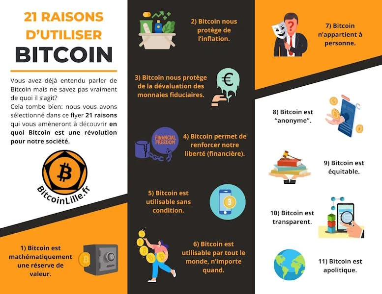

Modifizieren Sie ihn, passen Sie ihn an und teilen Sie ihn, wie Sie möchten. Denken Sie jedoch daran, Ihre Quellen zu zitieren.
#### 
Wie zuvor erwähnt, **können diese Flyer nahezu überall platziert werden**: auf einem gemeinsamen Schreibtisch an Ihrem Arbeitsplatz, auf einem Tisch während eines Familienessens, in einer städtischen Bibliothek usw.

In Frankreich und einigen anderen Ländern gibt es auch **"Buchboxen"**.
Diese Boxen, in der Regel aus Holz gefertigt, heißen Bücher zum Verschenken willkommen. Daher könnte eine Möglichkeit sein, **dort einen Flyer zu hinterlassen; oder noch besser: ein Buch!**

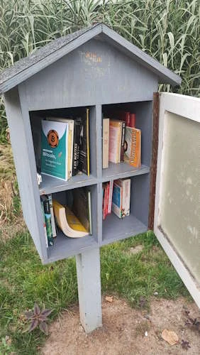

In diesem Zusammenhang wurde 2023 **die Initiative "Ein Bitcoin-Whitepaper in den Buchboxen Frankreichs"** gestartet.
Um dieses Projekt erfolgreich mit allen Interessierten durchzuführen, war es zunächst notwendig, **die Geolokalisierung aller existierenden Buchboxen im Land zu erhalten**. Hierfür existieren verschiedene Datenbanken:
- [boite.a.livres.zonelivre.fr](https://boite.a.livres.zonelivre.fr/);
- [boites-a-livres.fr](https://www.boites-a-livres.fr/carte-de-france);
- [delivrez.fr](https://delivrez.fr/maps/fr_FR/); sowie einige Artikel in der lokalen Presse.
Natürlich hat das Platzieren des Bitcoin-Whitepapers in diesen Büchertauschbörsen eine symbolische Bedeutung. Allerdings ist es für einen Neuling zu komplex, um es zu verstehen. Die Idee war daher, **ein kleines Heft zu schreiben, einschließlich**:
- **einer vereinfachten und belegten Einführung in Bitcoin, seine Nutzung und die Probleme, die es löst**;
- und **das Bitcoin-Whitepaper**, übersetzt ins Französische.

Hier ist das Heft, das unter französischen Bitcoinern geteilt wurde [das Heft, das unter französischen Bitcoinern geteilt wurde](https://profedustream.substack.com/p/bitcoin-la-naissance-dune-nouvelle) und das seine Reise in mehreren Dutzend Büchertauschbörsen im ganzen Land beendet hat. Sein Design ist auch [als Open-Source verfügbar](https://www.canva.com/design/DAFs18FSoVM/Sy0QsfUkycTgXveeGgutBg/edit?utm_content=DAFs18FSoVM&utm_campaign=designshare&utm_medium=link2&utm_source=sharebutton).

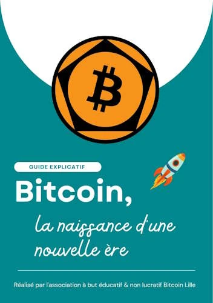
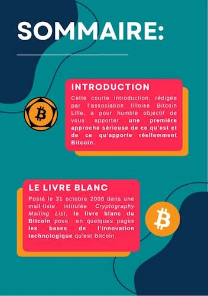

## Eine Videovorführung organisieren
<chapterId>892b248a-b837-5df6-aac9-4b3261ff0390</chapterId>

Jeder Bitcoiner hat sicherlich schon die sehr interessante Mini-Serie "Das Satoshi-Mysterium, am Ursprung von Bitcoin" von [Rémi Forte](https:/https://twitter.com/forteremi) gesehen.
Veröffentlicht im Jahr 2021, wurde sie [mehrere Millionen Mal auf YouTube angesehen](https://www.youtube.com/watch?v=0ETcLj5jBy4), da sie ein anregender erster Schritt ist, um zu verstehen, woher Bitcoin kommt.
In diesem Sinne ist es durchaus möglich, **eine Videovorführung dieser Mini-Serie für Ihre Gemeinschaft vorzuschlagen**; sogar die Schaffung eines speziellen Ereignisses zum Beispiel.

Es gibt jedoch einen kleinen Haken: In Frankreich haben wir ARTE kontaktiert, um zu überprüfen, ob dies rechtlich möglich ist. Leider war aufgrund von **Vorführungsrechten** der Preis pro Vorführung fast 250€; mit einem möglichen Rabatt von 120€ pro Vorführung, wenn 5 Meet-ups innerhalb eines Jahres eine durchführten.
Folglich ist dieser Tarif für die überwiegende Mehrheit der Gemeinschaften prohibitiv. Dennoch ist die Dokumentation kostenlos auf ARTE verfügbar...
####
Parallel dazu können andere Vorführungen organisiert werden.
In Frankreich zum Beispiel **stimmte die Regisseurin der Dokumentation "Stranded", [Alana Mediavilla](https://twitter.com/AlanaMediavilla), zu, dass die Meet-ups des Landes ihre Dokumentation in der Vorschau zeigen dürfen**; einige der Aufnahmen stammen aus den Sequenzen des [Films "Dirty Coin"](https://www.dirtycointhemovie.com/), der 2024 veröffentlicht wird.
Die französische Bitcoiner-Gemeinschaft nahm dann die Initiative, **die Dokumentation "Stranded" vollständig zu übersetzen**, französische Untertitel zu integrieren und sie mit allen Meet-ups im ganzen Land zu teilen. In der Woche des 4. März 2024 **wurde eine gemeinsame Vorführung in etwa zehn Meet-ups im ganzen Land organisiert**.
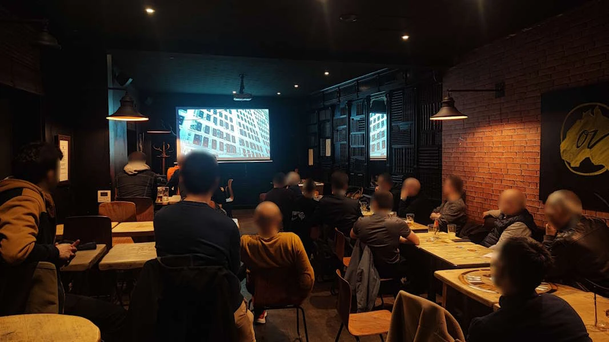

Diese Ausstrahlung führte zu zahlreichen Diskussionen über Bitcoin-Mining, seinen Stromverbrauch und seine Auswirkungen auf die Ökologie im weiteren Sinne.

## Plakate in Ihrer Stadt aufhängen
<chapterId>6565e8a0-d535-5be0-9764-273584c675bd</chapterId>
In mehreren europäischen Ländern (Deutschland, Spanien, Frankreich usw.) haben **einige Bitcoin-Anhänger die Initiative ergriffen, Plakate im Zusammenhang mit Bitcoin zu posten**. Einige dieser Plakate zeigen dann Werke von Banksy, während andere das Bitcoin-Logo auf unterschiedliche Weise einbinden.
Dies trifft insbesondere auf [StreetCyberArt](https://twitter.com/streetcyber_art), einen deutschen Bitcoin-Anhänger, zu, der seit mehreren Jahren Collagen und Street Art erstellt.

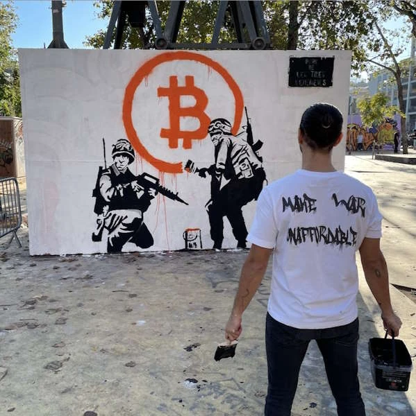
####
Natürlich müssen Sie, wenn Sie mit dem Plakatieren beginnen möchten, **die Gesetze in Ihrem Land kennen**. In Frankreich ist es beispielsweise nur erlaubt, **Plakate an öffentlichen Anschlagtafeln zu posten**. Anderswo ist dies verboten und kann zu einer Geldstrafe führen.
Offensichtlich gilt: **Aus den Augen, aus dem Sinn**. Seien Sie in diesem Fall vielleicht vorsichtig, keine Elemente auf diesen Plakaten einzuschließen, die zu Ihnen zurückverfolgt werden könnten (Name des Treffens, @ Twitter usw.)

Wenn Sie planen, **diese Art von Plakaten mit einem persönlichen Drucker zu drucken, beachten Sie, dass dies im Allgemeinen dazu führt, dass das Papier stark verschmiert, aber auch schnell mit der Zeit verfällt**. In diesem Sinne ist **das Beste sicherlich, sich mit einem professionellen Drucker in Verbindung zu setzen, um diese Plakate auf speziellem selbstklebendem Papier zu produzieren, das speziell für den Außeneinsatz konzipiert ist**. Die Qualität wird dadurch sichergestellt.

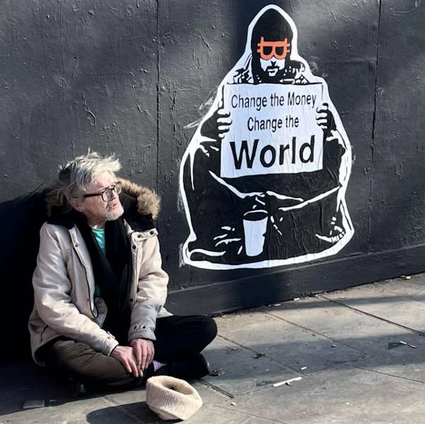
####
Es lässt sich jedoch nicht leugnen, dass **diese Initiative erhebliche Kosten verursacht: mehr als 0,40€ pro Plakat (d.h. 40€ für hundert Plakate)**; und das, wenn man gute Kontakte hat. Online können die Preise tatsächlich von doppelt bis fünfmal so viel variieren.

Wie zuvor erwähnt, verfügt der französische Bitcoin-Anhänger [@Mill3sim3](https://twitter.com/Mill3sim3) über die entsprechende professionelle Ausrüstung. Daher können Sie ihn auf Twitter für Informationen kontaktieren.

## Eine individuelle NFC-Karte haben
<chapterId>8ad65d4e-a68a-59c2-a812-85f4907ed9f3</chapterId>
Ein weiteres einzigartiges Projekt ist die **Erstellung von personalisierten NFC-Karten für Zahlungen mit Lightning**, die dem BoltCard-Standard entsprechen. Für diesen Zweck ist **Swiss Bitcoin Pay** ein qualitativ hochwertiger Partner.

Derzeit gibt es auf ihrer Website unter [https://swiss-bitcoin-pay.ch/cards](https://swiss-bitcoin-pay.ch/cards) vier Grunddesigns, die von Swiss Bitcoin Pay angeboten werden.
Wenn Sie jedoch **mehr als 50 NFC-Karten bestellen möchten, können Sie das Unternehmen über seine offizielle Website (oder auf [Twitter](https://twitter.com/SwissBitcoinPay)) kontaktieren und ein individuelles Design vorschlagen**, das Sie für die Vorderseite der Karte erstellt haben. Die Rückseite ist jedoch standardisiert.

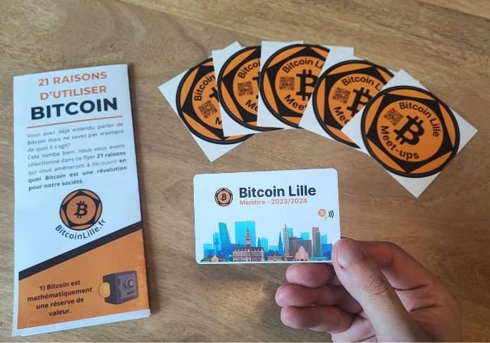

Die [französische Vereinigung Bitcoin Lille](https://twitter.com/BitcoinLille) hat beispielsweise im Jahr 2023 hundert NFC-Karten mit einem individuellen Design bestellt, zu **einem Preis von etwa 2,50€ bis 5€ pro Karte** (der Tarif ändert sich regelmäßig und ist progressiv).
So **erhält jedes neue Mitglied der Vereinigung eine angepasste NFC-Karte in ihrem Willkommenspaket**.

Diese Idee kann offensichtlich nach Belieben übernommen und verbessert werden.

## Eine Website erstellen
<chapterId>9a2a1b9b-0633-544a-b331-c06187d23d7f</chapterId>
Mit dem Ziel, eine Schaufenster für Ihre Gemeinschaft, Meet-ups, Veranstaltungen und Bildungsdokumente zu haben, könnte es irgendwann relevant sein, **eine Webseite zu haben**. Allerdings **erfordert das Design viel Zeit** (mehrere Zehnerstunden).

Um diese Aufgabe der Erstellung zu vereinfachen, zeigt Ihnen das folgende Tutorial in einer halben Stunde die Schritte, um eine **kostenlose Webseite auf der WordPress-Plattform** zu erstellen. Diese Seite ermöglicht es Ihnen, **eine anpassbare Startseite zu haben, Kategorien zu erstellen, Artikel zu veröffentlichen, Medien zu integrieren (YouTube-Videos, Bilder, PDFs)**, usw.
Später können Sie Ihren eigenen Domainnamen kaufen und sogar auf Ihrem persönlichen Server hosten, wenn Sie möchten.

####
Andere CMS oder Plattformen ermöglichen ebenfalls die Erstellung von Webseiten. Obwohl einige aufgrund ihrer benutzerfreundlichen Oberfläche einfacher sind, sind die resultierenden Webseiten auch viel weniger anpassbar.
**WordPress scheint die relevanteste Wahl für den Einstieg zu sein**. Darüber hinaus ermöglicht es die **Integration von Plug-ins**, von denen einige kostenpflichtig, aber von hoher Qualität sind, was eine viel weitergehende Entwicklung einer Webseite ermöglicht; und das, ohne programmieren zu müssen.
Das [Uncode-Plugin](https://undsgn.com/uncode/), das kostenpflichtig ist, ist eines davon.
## Erstellen eines Videokanals (YouTube oder Odyssee)
<chapterId>076286db-1627-57ec-a410-c44b1666e1cd</chapterId>

Unter den Mitgliedern Ihrer Gemeinschaft könnten einige daran interessiert sein, **multimediale Inhalte zu erstellen**. Dies könnte beispielsweise in Form von Produktion von Tutorial-Videos (Verwendung einer Software-Wallet, Tutorial zum Kauf von nicht-KYC BTC usw.) geschehen.
Parallel dazu könnte eines Tages der Tag kommen, an dem Präsentationen bei Ihren Meet-ups gemacht werden. Oder sogar, wenn Ihre Gemeinschaft Konferenzen in weiterführenden Schulen und Universitäten durchführt.

In diesem Sinne, **wenn der Bedarf entsteht, könnte es relevant sein, einen Videokanal zu haben, der es Ihnen ermöglicht, alle Videos, Präsentationen und Konferenzen, die im Rahmen Ihrer Aktionen und Projekte gemacht wurden, online zu posten**.
####
Unter den bekanntesten Videoplattformen finden wir insbesondere:
- [**YouTube**](https://www.youtube.com/), das den Mangel hat, **nicht widerstandsfähig gegen Zensur zu sein**;
- [**Odyssee**](https://odysee.com/), das relativ wenig genutzt wird, aber **dezentralisiert** durch seinen Peer-to-Peer-Betrieb ist;
- [**peertube**](https://joinpeertube.org/fr_FR), das Ihnen erlaubt, Ihre eigene Videoplattform zu erstellen. Dies ist wahrscheinlich ein Schritt darüber in Bezug auf die Einrichtung.

Je nachdem, was Sie umsetzen möchten, werden Sie offensichtlich **spezifische Visuals für diese Plattform erstellen müssen**, mit dem Ziel, Ihren Videokanal visuell ansprechend zu machen. Der positive Punkt ist, dass mit **Canva**, über das wir in [Teil 2/8 dieses Kurses](LINK) gesprochen haben, es eine "YouTube Thumbnail"-Kategorie mit bereits entworfenen und leicht modifizierbaren Visuals gibt.

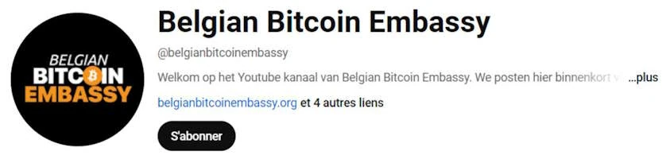
####
Für den Fall, dass Sie **auf Ihrem Computer aufnehmen möchten, funktioniert Software wie ["Streamlabs"](https://streamlabs.com/fr-fr) sehr gut**. Sie ermöglicht es Ihnen, viele Einstellungen anzupassen, ist kostenlos und ermöglicht auch Szenenübergänge.

Was die **Videobearbeitung** angeht (falls vorhanden), werden Sie geeignete Software benötigen.
Wenn Sie noch keines haben, ist die Software ["Wondershare Filmora"](https://filmora.wondershare.fr/) besonders effektiv und sehr einfach zu bedienen; sie ermöglicht es Ihnen, ernsthafte Bearbeitungen vorzunehmen. Leider ist sie kostenpflichtig (45 € pro Jahr). Schließlich, für das **Intro und Outro** Ihres Videos, wird eine spezifische Suche auf **Canva** Ihnen ermöglichen, das Gesuchte zu finden, die Ergebnisse nach Belieben zu modifizieren, sie herunterzuladen; und dann müssen Sie sie nur noch in Ihre Bearbeitungssoftware integrieren.
Hinweis: für den Fall, dass Bitcoin eines Tages verboten oder zensiert werden sollte, könnte es relevant sein, immer **eine lokale Kopie auf einer Festplatte der Videos** zu behalten, die Sie posten.

## Erstellen eines Audio-Podcasts
<chapterId>12e96b45-1c33-5687-a753-80d0114d487a</chapterId>

Das Erstellen eines Audio-Podcasts kann ebenfalls eine interessante Initiative sein. Wie beim Erstellen eines Videokanals sollten Sie jedoch nicht erwarten, schnell Tausende von Aufrufen zu erhalten.

Unter den bekanntesten Podcast-Plattformen finden wir:
- [**Fountain**](https://www.fountain.fm/), das besonders interessant ist, weil es direkte Spenden in Lightning ermöglicht;
- [**Soundcloud**](https://soundcloud.com/);
- [**Deezer**](https://www.deezer.com/fr/);
- [**Spotify**](https://open.spotify.com/);
- [**Google Podcast**](https://podcasts.google.com/).

Das Problem ist jedoch, dass **jede dieser Plattformen ein sehr spezifisches Publikum hat**. Um also so viele Menschen wie möglich zu erreichen, müssen Sie auf fast allen von ihnen präsent sein.

Glücklicherweise ermöglicht die Plattform **["Spotify for podcasters"](https://podcasters.spotify.com/), Ihre Podcast-Datei einmal zu importieren und dann einen RSS-Feed zu generieren, der auf jede der zuvor genannten Plattformen kopiert und eingefügt werden kann**.
Sobald die Arbeit auf "Spotify for podcasters" erledigt ist, bleibt nur noch die Formatierung auf Ihren anderen Plattformen; was relativ schnell geht.
####
Für den Fall, dass Sie **auf Ihrem Computer aufnehmen möchten, funktioniert eine kostenlose Software wie ["Audacity"](https://www.audacityteam.org/) sehr gut**. Sie ermöglicht es Ihnen, viele Einstellungen anzupassen, Crescendos durchzuführen und sogar die Klangklarheit während der Bearbeitung zu verbessern. Ihre Stimme aufzunehmen und dann das Audio Ihres Podcasts zu bearbeiten, sollte daher ziemlich einfach sein.

Hier ist ein kurzes Tutorial, das in 10 Minuten die wichtigsten Funktionen vorstellt, die man kennen sollte, um einen Podcast mit Audacity zu machen.

Hinweis: wie zuvor erwähnt, für den Fall, dass Bitcoin eines Tages verboten oder zensiert werden sollte, könnte es relevant sein, immer **eine lokale Kopie auf einer Festplatte der Podcasts** zu behalten, die Sie posten.

## Erstellen eines Abzeichens für Ihre Veranstaltungen
<chapterId>0cccef8d-a765-5844-8921-c40f0ce653e4</chapterId>
Bei Ihren Meet-ups und Veranstaltungen ist es möglich, einen kleinen Anreiz zur Teilnahme zu gestalten. Die Idee wäre dann, **eine Art Abzeichen zu erstellen, das nur bei der betreffenden Veranstaltung erhalten werden kann**. Dies existiert unter dem Namen "POAP" ("Proof Of Attendance Protocol") auf anderen Blockchains. Derzeit gibt es jedoch keine kostenlose Möglichkeit, dies auf Bitcoin einzurichten.
Im Prinzip könnte diese Initiative auch dazu dienen, **die am meisten engagierten Mitglieder Ihrer Gemeinschaft zu belohnen, zum Beispiel durch die Organisation einer jährlichen Verlosung**, bei der ein erhaltenes Abzeichen einem Los entspricht. Ein Mitglied, das bei allen 12 Treffen des Jahres anwesend war, hätte dann 12 Lose für diese jährliche Verlosung.

Zusätzlich, in einem völlig anderen Zusammenhang, ist es auch möglich, **bei jedem Event die Teilnehmer dazu aufzufordern, ihren Vornamen oder Pseudonym auf ein Abzeichen zu schreiben**. Dazu können auch die Gründe für ihre Teilnahme hinzugefügt werden. Diese Strategie, obwohl sie ein wenig formell erscheint, kann einigen Mitgliedern ermöglichen, **leichter Gemeinsamkeiten und Gesprächsthemen zu finden**, während sie es auch **Neulingen erleichtert, die Organisatoren** und potenzielle Mitglieder des Vereins zu identifizieren.

Mehrere Modelle, die von der Bitcoin Lille Association verwendet werden, sind auch [in Open-Source auf Canva verfügbar](https://www.canva.com/design/DAGHAsT15MU/AIA7-L_xBjNdsuxdD4-h-Q/edit?utm_content=DAGHAsT15MU&utm_campaign=designshare&utm_medium=link2&utm_source=sharebutton).

## Nachdenken über den Übergang im Todesfall
<chapterId>c5febf18-235c-51bc-8fbb-9467dabe4cb0</chapterId>

Ein weiterer Punkt, der völlig anders gelagert ist, ist die Haltung zum **Tod eines Mitglieds Ihrer Bitcoin-Gemeinschaft**.
Leider kann eines Tages der Fall eintreten, dass die Familie eines Ihrer ehemaligen Mitglieder Sie kontaktiert, um Ihnen mitzuteilen, dass diese Person verstorben ist. Sie werden dann erklären, dass **dieses Individuum Anweisungen hinterlassen hat**, und eine davon ist, **sich mit Ihrer Gemeinschaft / Ihrem Treffen / Ihrem Verein in Verbindung zu setzen**.
Diese Person wird wahrscheinlich erklären, dass sie **Hilfe bei der Wiederbeschaffung der Gelder benötigt**, da sie der Begünstigte des Erbes dieses ehemaligen Mitglieds ist.

Auf diese Anfrage zu reagieren, kann es sehr relevant sein, **bereits über eine Art Verfahren nachgedacht zu haben, das befolgt werden soll**; und das aus mehreren Gründen.
Einerseits:
- um sicherzustellen, dass der Verstorbene vorausgedacht hat, **seiner Familie niemals zu offenbaren oder zu einem Treffen die privaten Schlüssel und die physischen Geldbörsen des Verstorbenen mitzubringen**;
- damit die Familie klar versteht, dass **ihr Besuch darum geht, Bitcoin zu lernen**, um schließlich souverän über die Gelder des Verstorbenen zu werden;
- damit **die Familie über das Gesetz Bescheid weiß, das im Land im Falle einer Schenkung, Erbschaft oder Umwandlung in Fiat-Währung gilt**;

Weiterhin stellt das Vorausdenken über ein zu befolgendes Verfahren sicher, dass niemand, ob Mitglied des Treffens oder nur Gast, diese Situation in irgendeiner Weise zu seinem Vorteil nutzen (und/oder die Gelder stehlen) kann.

Zu diesem Ziel könnte es interessant sein, **eine "Arbeitsgruppe" zum Verfahren, das im Todesfall und bei Hilfegesuchen von der Familie zu adoptieren ist, vorzuschlagen**. Die Bitcoin Lille Association arbeitet tatsächlich an diesem Punkt und wird ihr abschließendes Arbeitsdokument in ein paar Monaten auf Open-Source-Basis [hier](https://docs.google.com/document/d/1TDfLZjuictC5s3PEM2Z7WmkxIDSJ8Q1E4xevm52pVgU/edit?usp=sharing) teilen.

## Durchführung von Konferenzen in Schulen und Universitäten
<chapterId>65efdb44-e3d4-567c-aedf-972765753d73</chapterId>
Die zuvor beschriebene Liste von Projekten ist natürlich nicht erschöpfend. Im Allgemeinen handelt es sich um Projekte, die intern in der Gemeinschaft/Meet-ups stattfinden und recht einfach umgesetzt werden können, sobald Ihre Gemeinschaft sich entwickelt hat. Es ist daher jetzt an der Zeit, sich dem Thema Onboarding zu widmen.

Zunächst sind Sie zweifellos darüber im Klaren, dass **eine der besten Möglichkeiten, mit möglichst vielen Menschen gleichzeitig über Bitcoin zu sprechen, offensichtlich darin besteht, eine Konferenz** (oder einen Workshop) abzuhalten. Dies kann **innerhalb von weiterführenden Schulen und Universitäten** geschehen; und so junge (und vielleicht nicht ganz so junge) Menschen dazu bringen, Bitcoin zu entdecken oder ihr Verständnis dafür zu vertiefen.

Neben der Wichtigkeit, **öffentlich sprechen zu können**, erfordert das Ausrichten einer Konferenz vor mehreren Dutzend oder sogar Hunderten von Personen **Stressmanagement, Artikulation und Zeitmanagement** zu beherrschen. Es erfordert auch **die Vorbereitung einer qualitativ hochwertigen Präsentation oder eines Workshops, der recherchiert und auf das Kompetenzniveau des Publikums abgestimmt ist**, dem Sie gegenüberstehen werden.
Darüber hinaus ist **eine offene Denkweise, bereit, Konzepte bei Bedarf zu vereinfachen**, in dieser Art von Übung unerlässlich; besonders während der Frage-/Antwortphase und im Falle einer Podiumsdiskussion. Das bedeutet nicht, "Ihre Prinzipien aufzugeben"; sondern einfach zu akzeptieren, dass andere möglicherweise einen anderen Standpunkt haben, selbst wenn das bedeutet, später zu antworten oder es dabei zu belassen, damit der Dialog fortschreiten kann. Wie auch immer, wenn **Ihre Rede und Ihre Antworten auf relevanten und recherchierten Argumenten basieren**, wird das Publikum nicht getäuscht werden.
Also, wenn Sie sich dazu in der Lage fühlen: Legen Sie los! Unsere Welt hat einen solchen Bildungsbedarf darüber, was Bitcoin ist...
Es versteht sich jedoch von selbst, dass für diese Aufgabe **viel Motivation, eine große Menge an Arbeit; aber auch die richtigen Kontakte** erforderlich sind.

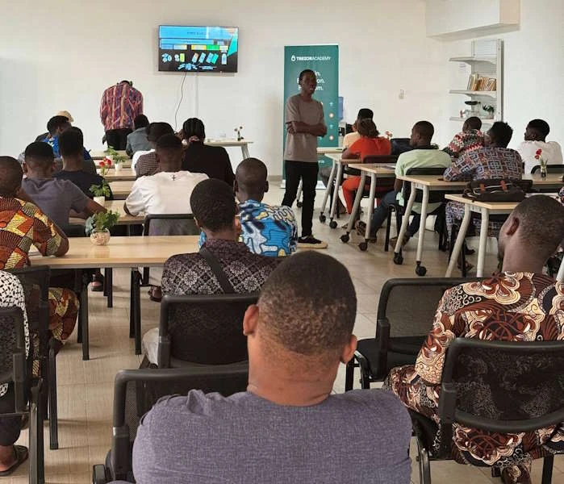
####
Tatsächlich ist **die Organisation einer Konferenz oder eines Workshops an einer Schule und/oder Universität keine leichte Aufgabe**.
Zunächst ist es notwendig, **einen Kontakt zu bekommen**. Dies kann **über eine Bekanntschaft, über das BDE ("Bureaux Des Étudiants" oder Studentenbüros); oder sogar Studentenvereinigungen** erreicht werden, die in der Regel jedes Jahr Konferenz- und Treffenzyklen organisieren. Ihre **ehemaligen Professoren der Ingenieursschule und/oder Universität** können auch als Vermittler fungieren.
Im Falle einer post-bakkalaureaten Schule ist es auch möglich, **direkt die Person zu kontaktieren, die für das Ausbildungsprogramm verantwortlich ist**, mit dem Ziel, Ihren Vorschlag zu erklären. Dies kann dann zu einem ersten Treffen führen und – im besten der Welten, einige Wochen später – zu einer Präsentation darüber, was Bitcoin ist und wie es funktioniert, vor den Studenten.
####
Leider wird Bitcoin in unserer heutigen Welt immer noch zu oft absichtlich von den Medien und Politikern dämonisiert; was viele Neulinge dazu bringt zu denken, dass es aus Klassenzimmern und Hörsälen verbannt werden sollte. **Die Wahrscheinlichkeit, dass Sie auf viele Ablehnungen stoßen werden, ist daher ziemlich hoch**; besonders im akademischen Bereich, wo Bitcoins Proof of Work und Energieverbrauch manchmal tabu zu sein scheinen.
Nichts hindert Sie jedoch daran, es zu versuchen, insbesondere mit dem BDE und Studentenvereinigungen. **Mit etwas Glück, selbst wenn die Ablehnung das erste Mal fest ist, ist es nicht unmöglich, dass Sie während des nächsten Bull-Runs unter der E-Mail-Adresse Ihrer Gemeinschaft erneut kontaktiert werden, um eine Konferenz vor fast 280 Studenten zu halten!**

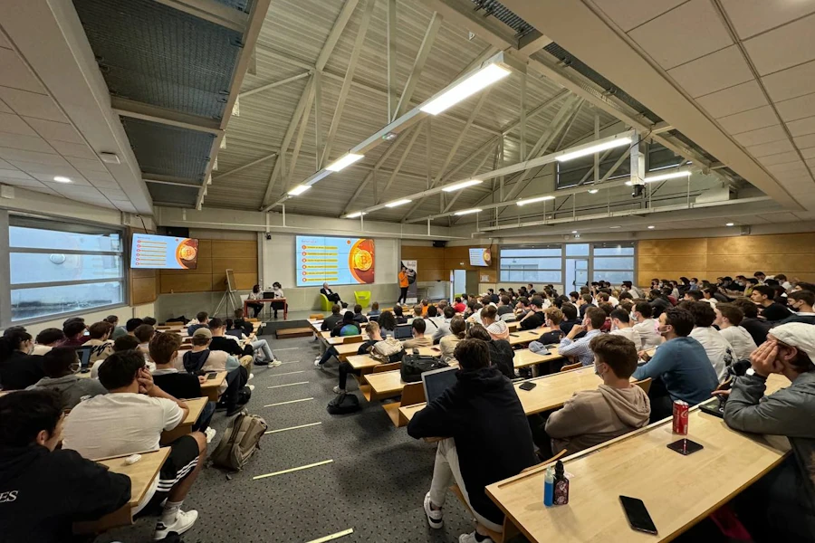

## Unternehmen ansprechen
<chapterId>b730462b-7928-5d28-a14f-9ceaa773d3d2</chapterId>
Das Ziel, **Bitcoin als Zahlungsmethode bei einem Händler akzeptiert zu bekommen**, ist für viele Bitcoin-Enthusiasten gewissermaßen der "Heilige Gral". Es ist, als würde man einen Erfolg in ihrem Pokédex freischalten! Da jedoch jeder Händler anders ist, ist diese Aufgabe nicht einfach; und zahlreiche Probleme treten auf:
- **ein Händler benötigt immer noch Fiat-Währung, um seine Lieferanten zu bezahlen (vorerst)**;
- **sie benötigen klare und explizite Finanzberichte**, die sie an ihre Buchhalter senden können;
- **ihre Zahlungsmethoden müssen ohne technische oder logistische Probleme funktionieren**, und Mitarbeiter müssen in der Lage sein, Zahlungen zu empfangen, ohne mit der Kasse durchbrennen zu können.

Zu diesen Problemen kommen hinzu:
- **die potenziellen Vorurteile** des Händlers gegenüber Bitcoin;
- **die Schwierigkeit, eine Softwarelösung zu finden**, die perfekt funktioniert;
- aber auch **die Wichtigkeit, ihnen die Vorteile des Akzeptierens von Bitcoin als Zahlungsmethode zu vermitteln**.

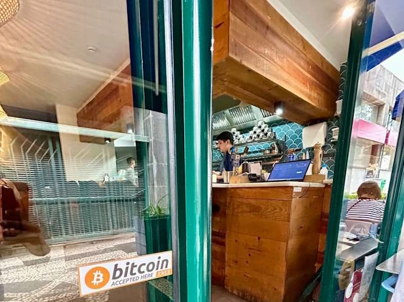
####
Die Entwicklung des Bitcoin-Ökosystems in Ihrer Stadt kann daher das **Onboarding von Händlern** beinhalten. Um dies zu tun, ist der einfachste Weg, **schrittweise vorzugehen**:

1) Sobald Sie in einen Laden gehen, **fragen Sie immer, ob Sie in Bitcoin bezahlen können**. Dies wird im Allgemeinen zu einer Ablehnung und einem fragenden Blick führen, aber diese einfache Frage wird Händler nach und nach dazu bringen zu sehen, dass Bitcoin von "normalen Menschen" verwendet werden kann und dass es als Zahlungsmethode unter der Bevölkerung an Interesse gewinnt. Sie können sogar **zwei oder drei Personen im selben Geschäft rotieren lassen, ein paar Tage auseinander, die fragen, ob sie in Bitcoin bezahlen können**. Irgendwann wird dies die Aufmerksamkeit des Händlers erregen;

2) Sobald sie interessiert sind oder fragen, was Bitcoin ist, können Sie **es ihnen kurz und in Laienbegriffen erklären**. Zum Beispiel, dass Bitcoin eine Währung ist, die nicht von Banken kontrolliert wird, ohne einen vertrauenswürdigen Zwischenhändler, dass sie nicht zensierbar ist, nicht der Inflation unterliegt und dass die Gebühren niedriger sind als bei dem traditionellen Bankensystem. Sie können ihnen dann **einen Flyer geben**, zum Beispiel "21 Gründe, Bitcoin zu verwenden" und/oder "10 Gründe, Bitcoin in Ihrem Geschäft zu akzeptieren", und dann **ihnen Ihren Kontakt oder den Ihres Meet-ups geben**. So können sie Sie kontaktieren, wenn sie an einer Demonstration interessiert sind.

3) Sobald diese Person sich entschieden hat, Bitcoin zu akzeptieren, **scheint es angebracht, ein Treffen mit ihr zu vereinbaren, um die Softwarelösung zu zeigen, die Sie vorschlagen**. **[Swiss Bitcoin Pay](https://swiss-bitcoin-pay.ch/)** präsentiert sich diesbezüglich als eine ausgezeichnete Lösung, weil:
- es Händlern, die es wünschen, ermöglicht, ihre täglichen Bitcoin-Einnahmen in Fiat-Währung umzuwandeln, sodass sie ihre Lieferanten bezahlen können;
- es auch ermöglicht, einen bestimmten Prozentsatz des Umsatzes in BTC zu behalten, wenn gewünscht;
- es den Export der Buchhaltung für alle Bitcoin-Zahlungen ermöglicht, um sie an Buchhalter zu senden, wodurch deren Arbeit erleichtert wird;
- es ein benutzerfreundliches Dashboard für den Manager hat;
- aber auch eine ergonomische und leicht zu bedienende Schnittstelle für Mitarbeiter, die in der Lage sein werden, Zahlungen zu verarbeiten, ohne mit der Kasse durchbrennen zu können;
- schließlich sind seine Nutzungskosten günstiger als die des traditionellen Bankennetzes mit 2 bis 3%.

4) **Wenn dieses Geschäft Bitcoin akzeptiert**, wird es dann möglich für Sie:
- **regelmäßig zu besuchen**, um Einkäufe zu tätigen;
- die Gelegenheit zu nutzen, **zu fragen, ob alles gut läuft**, sogar Ihren Kontakt erneut anzubieten, falls benötigt;
- **erneut vorzuschlagen, zu Ihren Meet-ups und Veranstaltungen zu kommen**;
- um **dieses Geschäft auf [der btcmap.org Karte](https://btcmap.org/) hinzuzufügen**, und [Swiss Bitcoin Pay auf Twitter](https://x.com/swissbitcoinpay) zu informieren, um diesem Geschäft Sichtbarkeit zu verleihen; - aber auch, um **potenziell Veranstaltungen in diesem Geschäft abzuhalten**, wie Meet-ups oder Workshops.

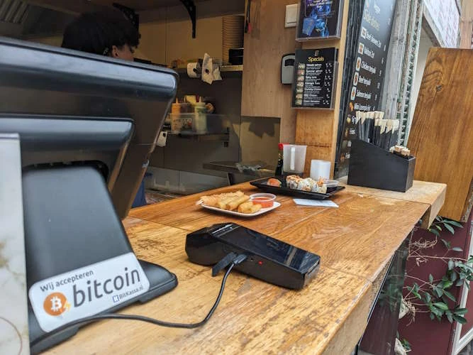

5) Sobald mehrere Geschäfte in Ihrer Stadt an Bord geholt wurden und verstanden haben, was Bitcoin ihnen bringt, können Sie dann **vorschlagen, eine spezielle Telegram-Gruppe für Händler zu erstellen**; das Ziel ist es, **ihnen zu ermöglichen, sich gegenseitig zu helfen** und weiter in der Orange-Pillierung anderer Geschäfte in der Stadt voranzukommen. Parallel dazu kann diese Gruppe auch als **technischer Support fungieren**, falls ein Problem mit einem Kunden auftritt.
####
Natürlich ist **diese Akquise eine langfristige Aufgabe. Sie erfordert viel Zeit, gesteigerte Motivation, aber auch ein bisschen Strategie**.
Fühlt sich Ihre Gemeinschaft bereit, in Ihrer Stadt **die Grundlagen einer Bitcoin-Kreislaufwirtschaft zu bauen**, ähnlich wie [Arnhem in den Niederlanden](https://www.arnhembitcoinstad.nl/)? Wenn ja, dann legen Sie los!

## Kontaktierung der lokalen Presse und des Radios
<chapterId>435bfbc1-22dd-59bb-b737-a32ea995b238</chapterId>

Sehr oft vergessen, denken wir Bitcoiner im Allgemeinen, dass die besten Kommunikationsmittel soziale Netzwerke und das Internet sind. Aber wir liegen – teilweise – falsch.

Mehrere Gemeinschaften (dies ist insbesondere bei [Breizh Bitcoin](https://breizhbitcoin.com/) in Frankreich der Fall) haben sich daher daran gewöhnt, **ihre lokale Presse zu kontaktieren**, um:
- **Ihnen von den Veranstaltungen zu erzählen, die sie organisieren** (Meet-ups, Präsentationen, Workshops, Halving-Partys usw.);
- **Sie einzuladen, lokale Geschäfte zu erkunden, die Bitcoin akzeptieren, mit dem Ziel, einen Artikel** über das Thema zu schreiben;
- aber auch einfach, **sie zu bitten, das Datum und den Ort ihrer bevorstehenden Veranstaltungen zu teilen**.

Tatsächlich haben viele lokale Zeitungen immer noch auf ihrer letzten oder vorletzten Seite eine Liste von Veranstaltungen, die in ihrer Region organisiert werden.
Das Feedback von Breizh Bitcoin ist klar: Es funktioniert gut, und neue Leute haben ihre Meet-ups besucht, nachdem sie ihren Verein in der Zeitung entdeckt haben.

Obwohl dies spezifisch für den Ort sein kann, an dem Sie sich befinden, finden Sie hier eine Liste der wichtigsten regionalen französischen Presse-Titel:
- [acpm.fr](https://www.acpm.fr/Les-chiffres/Diffusion-Presse/Presse-Payante/Presse-Quotidienne-Regionale);
- [csmp.fr](http://www.csmp.fr/layout/set/print/Menu/La-presse/Presse-quotidienne-regionale).

Parallel dazu kann es auch interessant sein, **lokale Radiosender zu kontaktieren, um beispielsweise die Erstellung eines Podcasts oder eines Interviews vorzuschlagen**.
Seien Sie sich jedoch bewusst, dass Worte in den Medien leicht zu ihrem Nachteil gewendet werden können. **Also ist dies keine leichte Aufgabe, und es könnte klug sein, sich darauf vorzubereiten**.

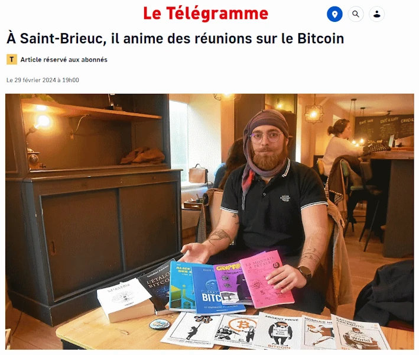
####
Offensichtlich können **viele andere Projekte realisiert werden**. Im Allgemeinen wird alles von Ihrer Zeit, Ihrer Motivation abhängen; aber auch von der Schwierigkeit des jeweiligen Projekts.
Bei der Realisierung dieser **drei Ratschläge** können Sie leiten:
1) **definieren Sie im Voraus die Schritte des Projekts, seine Ziel(e) und was getan werden muss**;
2) **gehen Sie Schritt für Schritt vor, ohne sich entmutigen zu lassen**; 3) und vor allem, **bitten Sie Ihre Mitglieder und andere Gemeinschaften in Ihrer Umgebung um Hilfe und Unterstützung**.

Behalten Sie im Kopf, dass **jede Gemeinschaft und jedes Treffen die gleichen Phasen durchlaufen hat, die Sie gerade durchmachen**. Zögern Sie also nicht, **sie um Rat zu fragen**.

# Die Zukunft antizipieren
<partId>6ea07445-9369-54bc-9aa0-d260db026e0b</partId>

## Planung für einen Anstieg der Teilnehmerzahl
<chapterId>8af722d4-3a9f-548c-9001-424f2142de12</chapterId>

Da die Welt in ihre vierte Epoche eingetreten ist, bei Block 840.000, sehen immer mehr Menschen **Bitcoin als eine technologische, finanzielle und soziale Revolution**.
Genau wie die Internetrevolution wird auch diese **Zeit benötigen**, und das ist gut so. Es wird jedem ermöglichen, **sich über die Grundlagen von Bitcoin zu informieren und zu lernen, wie man es verwendet**. Aber es wird auch Entwicklern und Unternehmen Zeit geben, relevante Protokolle und Anwendungen zu entwickeln, die es ermöglichen, das volle Potenzial von Bitcoin zu erkunden.
Obwohl es unmöglich ist, die Zukunft vorherzusagen, **ist mit einem sehr signifikanten Anstieg der Anzahl der Bitcoin-Nutzer zu rechnen**, um **auf alle Situationen vorbereitet zu sein**. Einschließlich der katastrophalsten, wie eine mögliche Implosion des traditionellen Finanzsystems; oder sogar: ein Verbot von Bitcoin.

In diesem achten und letzten Teil dieses Kurses werden wir uns die Zeit nehmen, einige Punkte zu erläutern, die bei der Entwicklung Ihrer Gemeinschaft und Ihrer Treffen zu berücksichtigen sind.
####
Das Erste davon (das am einfachsten zu antizipieren ist) ist natürlich **der Anstieg der Anzahl der Personen, die Ihrer Gemeinschaft beitreten**. Dies wird sie auf zwei Arten beeinflussen:

1) **Ihre Kommunikationskanäle (Telegram, Signal, Matrix usw.) werden sich füllen, was möglicherweise Gespräche schwer zu verfolgen macht**. Zwei Punkte sind dann zu bedenken.
Einerseits, wenn Sie 500 sind, die in demselben Diskussionskanal über verschiedene Themen austauschen, wird eine Mehrheit Ihrer Mitglieder nach und nach aufhören, den Gesprächen zu folgen; unter anderem wegen der Fülle an zu lesenden Nachrichten und zugehörigen Benachrichtigungen. In diesem Sinne könnte es relevant sein, **Ihre Kommunikationskanäle neu zu überdenken; wie zum Beispiel Telegram-Supergruppen oder sogar einen Discord-Server**, die beide das Gruppieren von Gesprächen nach Thema ermöglichen.
Andererseits bedeutet mehr Menschen in den Austauschkanälen auch mehr Bots, mehr Betrügereien und auch **mehr Moderation, die durchgeführt werden muss**. Sie müssen daher vorbereitet sein, indem Sie zum Beispiel einen Satz von Regeln entwerfen, auf den Sie sich stützen können, wenn Sie eine Nachricht moderieren. Aus Erfahrung vermeidet dies einen großen Teil der Konflikte; besonders wenn die Regeln auf Ihren Kommunikationskanälen zum Lesen verfügbar sind. In diesem Sinne hat der Verein Bitcoin Lille vor einigen Jahren **[einen Open-Source-Regelsatz](https://bitcoinlille.fr/reglement/) für seine Telegram-Gruppe und seinen Discord-Server** geschrieben, basierend auf einfachen und universellen Prinzipien. Sein Design ist [auch verfügbar](https://www.canva.com/design/DAGHI692AD4/rjT4sqEnhajc5FiPA6GFZQ/edit?utm_content=DAGHI692AD4&utm_campaign=designshare&utm_medium=link2&utm_source=sharebutton).

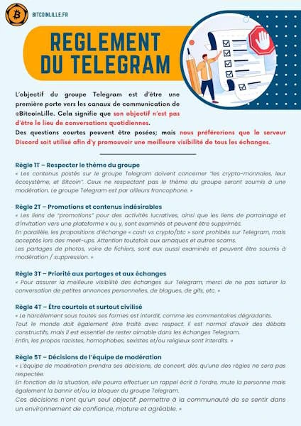

2) **Ihre Treffen und Veranstaltungen werden sich deutlich füllen, mit einer Fülle von neuen Gesichtern, die miteinander austauschen möchten**.
Angesichts dieses signifikanten Zustroms können mehrere Ansätze diskutiert und in Betracht gezogen werden:
- Zunächst könnte es relevant sein, **einen größeren Ort für die Organisation von Treffen und Veranstaltungen zu finden**, besonders wenn Sie zuvor nur etwa zwanzig Personen im vorherigen Veranstaltungsort unterbringen konnten;
- Zweitens, wenn Sie bemerken, dass die menschliche Präsenz zu überwältigend wird, können Sie auch – für die folgenden Treffen – **entweder verlangen, dass sich Teilnehmer registrieren** (dies kann über die Meetup-App oder durch ein Standardformular geschehen), **oder mehrere Treffen innerhalb des Monats organisieren** (zum Beispiel: ein Treffen für Anfänger, eines für Fortgeschrittene und eines für Experten);
- Darüber hinaus ist es sicher, dass viele Anfänger im Ökosystem sich Ihnen anschließen werden, in der Regel mit dem Ziel, Geld zu verdienen. **Um die Gespräche während dieser schnell wachsenden Treffen auf Bitcoin fokussiert zu halten**, wird empfohlen:
    a) **eine thematische Präsentation über Bitcoin während dieser Treffen durchzuführen**, da dies anschließend einen guten Teil der Teilnehmer dazu bringen wird, über dieses Thema zu diskutieren, und nicht über ein sogenanntes revolutionäres neues Projekt;
    b) **sich nicht nur auf Bitcoiner zu beschränken, sondern sich den Neulingen zu nähern, auch wenn das bedeutet, die Initiative zu ergreifen und sich am hinteren Teil des Raums aufzuhalten, um sie zu begrüßen**. Die Diskussionen können sich dann um die Gründe drehen, warum diese Personen gekommen sind, was sie suchen, die Ziele (oder Grundlagen) Ihrer Gemeinschaft usw.
####
Schließlich, obwohl es bedauerlich zu sagen ist, **können Betrüger bei Treffen auftauchen**. Ihr Ziel wird dann sein, so viel wie möglich über ihr Schneeballsystem, ihr MLM oder ihr "revolutionäres Blockchain-Projekt" zu sprechen. Es ist auch durchaus plausibel, dass Personen mit böswilliger Absicht speziell kommen, um Geld zu waschen oder BTC mit Falschgeld zu kaufen.
In komplexen Situationen wie diesen ist der einfachste Ansatz, die Initiative zu ergreifen und diesen Personen "freundlich" zu erklären, dass das Treffen nicht der Ort ist, an dem sie Erfolg haben werden, indem man Argumente x oder y vorbringt (wie zum Beispiel die Information über die Anwesenheit von verdeckten Polizisten).
Wenn diese Personen sich leider weigern zu gehen oder sich an die Regeln des Anstands zu halten (was schon vorgekommen ist), kann während des Treffens eine mündliche Ankündigung gemacht werden, dass eine oder mehrere Personen versuchen, solche böswilligen Handlungen zu begehen.
**Glücklicherweise sind diese Situationen selten und in der Regel ziemlich eigenartig. Aber es ist besser, vorbereitet zu sein.**
Außerdem, wenn es Sie als Organisator beruhigen kann, solange Sie sich selbst nicht strafbar machen oder illegale Austausche erleichtern, müssen Sie sich keine Sorgen machen. In Frankreich sind Sie tatsächlich nicht rechtlich verantwortlich für die Handlungen anderer.####
In einer idealen Welt wäre es daher am besten, einen Veranstaltungsort zu haben, der mehrere Dutzend Personen aufnehmen kann (abhängig vom Wachstum Ihrer Gemeinschaft); aber auch, **starke Beziehungen zwischen Bitcoinern und zukünftigen Bitcoinern während des Bärenmarktes aufzubauen**, damit Sie bereit sind, **während des nächsten Bullenmarktes zu orange-pillen**.

## Dezentralisierung der Organisation Ihrer Gemeinschaft
<chapterId>bedfc110-e099-58f4-a5b7-fb50f3b19a49</chapterId>

Sie sind der Organisator eines Treffens und entscheiden über Nacht, **diese Aufgabe zu beenden**, um in Peru Lamas zu züchten; einfach alles hinter sich lassen?

**Überlegen Sie, Ihre Gemeinschaft zu übergeben, indem Sie**:
1) **administrative (oder sogar Eigentums-) Rechte der Kommunikationskanäle an vertrauenswürdige Personen geben**, auch wenn das bedeutet, dass sie später weitergegeben werden;
2) **mit mindestens einer vertrauenswürdigen Person in Ihrer Gemeinschaft die Kontonamen, Passwörter und E-Mails der Konten und sozialen Netzwerke teilen**, die Sie erstellt haben, um ihr Sichtbarkeit zu geben.

Ohne diese Rechte und Kennungen ist es für niemanden möglich, **leicht die Initiative zu übernehmen und somit die Initiative fortzusetzen, die Sie so viel Zeit in die Entwicklung gesteckt haben**.
Von Grund auf neu zu beginnen, indem man "geforkte" Netzwerke und Kanäle erstellt, benötigt so viel Zeit und so viel Energie…
**Also rechnen Sie mit Ihrer möglichen Abreise** nach Peru. Und falls Sie in Frankreich kein vertrauenswürdiges Mitglied in Ihrem Treffen haben, können Sie immer @ProfEduStream oder @gabtribe auf Telegram kontaktieren, um diesen Übergang reibungslos zu gestalten.
Dies bringt uns zu **einem entscheidenden Punkt in der Entwicklung einer Gemeinschaft: ihrer Dezentralisierung**.
Tatsächlich, wenn Sie die einzige involvierte Person sind, die alle Kontrollen hat, was wird passieren, wenn Sie verschwinden? Die Antwort ist einfach: Ihre Gemeinschaft wird verschwinden.

Der beste Weg, dies zu vermeiden, ist daher, **Aufgaben zu dezentralisieren und Rechte, Rollen und Zugänge zu teilen**. So kann, falls eines der organisierenden Teammitglieder Ihrer Gemeinschaft oder Ihres Treffens in einer zukünftigen Dystopie verhaftet wird, weil sie nicht-KYC Bitcoin besitzen (oder einfach: weil sie keine Zeit mehr dafür aufbringen können, weil sie gerade ein Kind bekommen oder den Job gewechselt haben), die anderen ihre Missionen ohne Schwierigkeiten fortsetzen.
####
Im Bestreben, noch weiter zu dezentralisieren, kann **die Verwendung von Open-Source-Software wie der Framasoft-Suite** auch eine erste "Verteidigungslinie" gegen einen fiktiven Staat darstellen, der Bitcoin zensieren würde. Die Verwendung von verschlüsselten - sogar anonymen - Kommunikationstools ist eine zweite.
## Was, wenn Bitcoin zum öffentlichen Feind Nr. 1 wird?
<chapterId>c739651f-cd13-51e0-a36e-85023749b15b</chapterId>

Am 5. April 1933 unterzeichnete Franklin Roosevelt, damals der 32. Präsident der Vereinigten Staaten von Amerika, die Executive Order 6102, die es jedem Einzelnen untersagte, Goldmünzen, Goldbarren und Goldzertifikate auf dem gesamten Territorium zu besitzen.

Offensichtlich ist die Große Depression (der Börsencrash von 1929) heute nicht mehr relevant. Aber wer will sagen, dass morgen nicht ein anderer Staat dasselbe tun und **jedem Einzelnen verbieten wird, Bitcoin zu besitzen?**
####
Glücklicherweise wird diese orwellsche Dystopie niemanden daran hindern, seine Bitcoins wirklich zu besitzen, da es unmöglich ist, jemandem das Erlernen einer Wortfolge zu verwehren.
Aber was wird passieren, **wenn die Führer unserer Welt endlich verstehen, dass Bitcoin die Kapazität hat, die Weltordnung zu ändern, einschließlich auf Staatsebene?** Wird Bitcoin dann zum **"öffentlichen Feind Nr. 1"?**
####
Natürlich sollten wir nicht in eine Form des Verschwörungsdenkens verfallen. Aber **nichts hindert uns daran, von jetzt an zu antizipieren, zu dezentralisieren und aufzuklären**.

# Schlussfolgerung
<partId>62bc2138-c0be-5d39-a341-594690863257</partId>

## Ein zusammengefasster Aktionsplan zur Gründung Ihrer Bitcoin-Gemeinschaft
<chapterId>1f463ec2-3f64-5641-8d60-e02a47c94f27</chapterId>

Satoshi Nakamoto schuf ein revolutionäres Werkzeug, das die Kapazität hat, die Welt, wie wir sie kennen, zu verändern. Es ist jedoch sicher, dass **es an uns, den Bitcoinern, liegt, die Trajektorie zu wählen, die wir einschlagen möchten, um die Zukunft zu gestalten**.

Parallel dazu macht die Essenz von Bitcoin es zu einem riesigen Kaninchenbau, der so viele historische, wirtschaftliche, literarische, mathematische, informatische und kryptografische Aspekte kreuzt, dass es unmöglich ist, sie alle abzudecken. Dies bildet teilweise seine Schönheit.
Als Menschen haben wir nur eine begrenzte Menge an Zeit in unserem Leben. **Es ist, indem wir demütig bleiben und von anderen lernen**, dass jeder von uns die Ziele, die wir uns im Verständnis von Bitcoin gesetzt haben, erreichen wird.
**Globale Bitcoin-Gemeinschaften spielen daher eine grundlegende Rolle beim Aufbau der Welt von morgen**; Gemeinschaften, in denen Bitcoiner **austauschen, aufbauen und teilen können**. **Gemeinsam**.####
Wie Sie aus diesem Kurs verstanden haben werden, erfordert das **Erstellen einer Gemeinschaft und eines Bitcoin-Treffens** Organisation und Motivation. Natürlich, abhängig von Ihren Wünschen und der Zeit, die Sie dafür aufwenden können, werden Sie in den Projekten mehr oder weniger weit gehen.
Dennoch bleibt das Ziel dasselbe: **den Funken für Bitcoin in Ihrer Stadt zu entzünden**.
####
Um die vielen Kapitel und Unterkapitel dieses Kurses zusammenzufassen, hier ist **eine "Aktionsplan"-Zusammenfassung für die Erstellung Ihrer Bitcoin-Gemeinschaft**:
1) Entscheiden Sie im Voraus, warum Sie eine Bitcoin-Gemeinschaft erstellen möchten, zu welchem Zweck(en), wo usw.;
2) Nähern Sie sich bereits etablierten Gemeinschaften in Ihrer Umgebung, indem Sie Kontakt aufnehmen und/oder um Rat fragen;
3) Erstellen Sie eine einzigartige Identität für Ihre Gemeinschaft und ihren Standort (Logo, Poster, Banner, Flyer usw.)
4) Erstellen Sie Kommunikationskanäle und soziale Netzwerke wie Telegram, Twitter, NOSTR, Discord. Berücksichtigen Sie auch dezentralisierte und/oder unzensierbare Kanäle;
5) Nähern Sie sich benachbarten Treffen und Gemeinschaften (insbesondere in sozialen Medien) und lassen Sie sich auf verschiedenen Karten und Plattformen listen, um Sichtbarkeit zu gewinnen;

Sobald die Kommunikationskanäle Ihrer Gemeinschaft ausreichend entwickelt sind:

6) Schlagen Sie eine Treffen-Art Versammlung durch eine Umfrage vor;
7) Überlegen Sie sich, welche Ziele Sie mit diesem physischen Ereignis erreichen möchten;
8) Suchen Sie nach einem gut gelegenen, einladenden Ort, der Ihren Zielen entspricht, und reservieren Sie einen Tisch;
9) Kommunizieren Sie eine Woche vor dem Event darüber in Ihren Netzwerken und Kommunikationskanälen. Wiederholen Sie dies zwei bis drei Tage vor dem entscheidenden Datum;
10) Lassen Sie Ihr Event auf geeigneten Plattformen und Websites listen, wenn möglich;
11) Am Tag des Treffens lassen Sie die Dinge geschehen und gehen auf andere zu, auch wenn das bedeutet, das Gespräch bei Bedarf sanft zurückzulenken;

Im Anschluss:

12) Versuchen Sie, so viele Mitglieder und Teilnehmer wie möglich zu halten und einzubeziehen, damit sie zurückkehren;
13) Schlagen Sie Projektideen und einfache Initiativen vor und beginnen Sie mit der Umsetzung derjenigen, die Ihnen persönlich wichtig sind. Wenn jemand anderes etwas anderes aufbauen möchte, zögern Sie nicht, je nach Aufgabe und gewünschtem Ziel zu helfen;
Schließlich:

14) Planen Sie die Zukunft, indem Sie einen größeren Ort für Treffen, Regeln für Kommunikationskanäle, eine Website usw. in Betracht ziehen;
15) Beginnen Sie, die Akzeptanz von Bitcoin in den Geschäften Ihrer Stadt zu demokratisieren, indem Sie beispielsweise fragen, ob sie Bitcoin akzeptieren;
16) Dezentralisieren Sie Aufgaben unter vertrauenswürdigen Personen sowie die Rechte an Ihren Kanälen und Netzwerken;
17) Bewerben Sie Ihre Gemeinschaft, damit immer mehr Menschen beitreten, und binden Sie interessierte Personen ein;
18) Gehen Sie noch weiter mit Projekten, die Ihnen gefallen und die Ihnen am Herzen liegen.

In einer etwas weniger detaillierten Weise sieht es in einem 21-minütigen Video so aus:

####
Unabhängig davon, **denken Sie daran, dass Sie nicht allein sind und dass bestehende Gemeinschaften da sind, um Ihnen zu helfen**.

## BTC302 Kurs
<chapterId>8bf10b77-80ee-5d50-87bc-0ef32574a675</chapterId>

In diesem BTC302-Kurs haben wir die Schritte zum Erstellen einer Gemeinschaft, eines Treffens; aber auch die Umsetzung zahlreicher Projekte detailliert beschrieben.

Wenn Ihre Gemeinschaft bereit ist, auf die nächste Stufe zu gehen, **ist es möglich, einen Verein zu gründen**.
In Frankreich gibt es beispielsweise aus etwa fünfzig Gemeinschaften und Treffen fast zehn Vereine.
#### 
Das Interesse an der Gründung eines solchen ist zweifach:
- einerseits ermöglicht der Status eines Vereins **einen offiziellen Status zu haben, ein Vereinskonto zu eröffnen und auch eine Form der Anerkennung von der Presse, den Medien und durch Subventionen zu erhalten**; - andererseits ermöglicht er **eine präzisere Organisation der Abläufe der Gemeinschaft und die Umsetzung ihrer Projekte**, indem spezifische Rollen definiert werden.
####
Mit dem Ziel, Ihre Gemeinschaft weiterhin zum Blühen zu bringen, **wird in den kommenden Monaten ein Kurs namens COMMU201 auf [planb.network](https://planb.network/) veröffentlicht**.

Darin **werden wir auch einen weiteren wichtigen Punkt detailliert behandeln: die Organisation von Großveranstaltungen mit etwa hundert Teilnehmern**. Wir werden Fragen behandeln wie: Warum? Welche Organisation? Wo? Welches Budget? Wie? Welcher Ablauf?
Um dies zu erreichen, beginnen wir mit den Erfahrungen mehrerer französischer Gemeinschaften, die bereits ihre eigenen Veranstaltungen organisiert haben, wie **das BEF (Bitcoin Economic Forum, im Mai, in der Bretagne) und das B-only (im November, in Annecy)**.
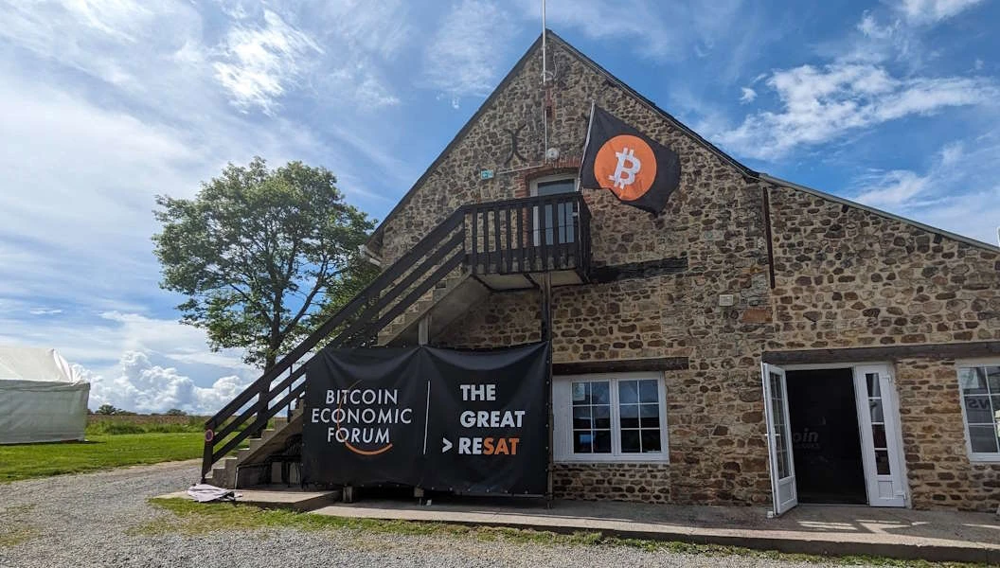
####
Natürlich sind **in anderen Ländern die Gesetzgebung und die Funktionsweise von Vereinen unterschiedlich**. Viele Punkte werden jedoch sehr nützlich sein, um einen Verein zu gründen oder eine Großveranstaltung zu organisieren; und **wir hoffen, dass andere Bitcoiner diese Ausbildung in einer Weise ergänzen werden, die spezifisch für ihr Land ist**.

## Bewerten Sie den Kurs
<chapterId>08a35d2a-204b-519a-9bb1-588665a037fa</chapterId>
<isCourseReview>true</isCourseReview>

## Kümmern Sie sich um sich selbst
<chapterId>cf1631cb-ddbe-55c7-be8c-26a5652979a0</chapterId>

Wenn man in das Kaninchenloch fällt, ändert sich unsere Wahrnehmung vieler Dinge.
Das drängt uns dann dazu, weiter gehen zu wollen, mehr entdecken zu wollen über jene anderen Menschen, die die gleiche geistige Arbeit wie wir leisten und die auch verstanden haben.
Das motiviert uns, gibt uns noch mehr Lust, **unseren Stein zum Gebäude beizutragen** und unsere Entdeckung zu teilen: Bitcoin.
Es führt uns auch dazu, **über die Welt von morgen nachzudenken, die wir aufbauen möchten, und über die Gemeinschaften, die dabei sind, sie zu bauen**.
####
**In dieser langen Galerie, die die Schaffung einer Gemeinschaft ist, müssen Sie Motivation, Strategie, Selbstaufopferung und Zeit zeigen**. Es ist manchmal eine undankbare Aufgabe; und bei diesem Unterfangen ist es besser, die Dinge nach und nach anzugehen, um sich nicht zu verletzen.
**Denken Sie also an sich selbst, Ihre Grenzen**. Und obwohl Bitcoin Sie Tag und Nacht begeistern mag, **versuchen Sie nicht, alles alleine zu machen; sonst werden Sie sich erschöpfen**.

Fragen Sie im Gegenteil **um Hilfe bei Bitcoinern, die bereits durch diese gleiche Galerie gegangen sind, die bereits die gleichen Probleme erkundet und die gleichen Werkzeuge gebaut haben**. Das wird Ihnen eine enorme Menge an Zeit sparen.

**Schlagen Sie auch den Menschen, die Ihnen in diesem Abenteuer folgen werden, vor, Ihnen zu helfen, auch wenn das bedeutet, einige Aufgaben zu delegieren** und dass diese länger dauern können. Auf lange Sicht wird Ihre Gemeinschaft geeint und reifer hervorgehen.

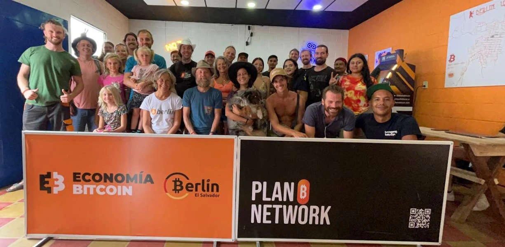

Allein kann man schnell eine der vielen Galerien des Bitcoin-Kaninchenlochs erkunden, bis man deren Ende erreicht. Aber da ist die Rückreise zu machen. Dann all die anderen Richtungen zu erkunden.
Während **durch das Erstellen und/oder Beitreten einer Gemeinschaft von Bitcoinern, durch regelmäßiges Teilen und Austauschen mit ihnen, werden Sie alle Richtungen des Bitcoin-Kaninchenlochs gleichzeitig erkunden**.

Dann können Sie viel schneller, als Sie es allein getan hätten, sagen: "Ich habe Bitcoin verstanden".
