# The first step towards Bitcoin adoption

Nowadays, a wealth of educational content is available online, allowing anyone to learn about Bitcoin and its ecosystem.

However, **one thing is often missing: the opportunity to meet, exchange ideas, share knowledge** and above all, **to build together**.

To meet this growing need, many bitcoiners regularly choose to **create local communities**. 
Once there are enough participants, meet-ups are organized, and these recurring gatherings often become fertile ground for technical presentations, hands-on workshops, and broader discussions.

In this training session "**BTC302**", we will explore **why creating a Bitcoin community and/or meet-up matters**, then dive into **tools and methods to develop your community's visual and digital identity**.

We will also present **projects and initiatives** that are easy to launch, especially educational ones, supported by several pre-designed, open-source resources.

Finally, we'll discuss **the evolution of Bitcoin communities at a national level**, and **their potential to accelerate tomorrow's hyperbitcoinized world**.

+++

# Introduction

<partId>81318b8f-d316-5787-aa4c-4ec8370ba668</partId>

## Course overview

<chapterId>e8991b82-4966-5e04-8f05-7cae46eacbaa</chapterId>

Welcome to BTC302!

Since 2009, Bitcoin has grown relentlessly. This growth has taken shape through new Bitcoin Improvement Proposals (BIP), the creation of additional layers to make the network scalable (Lightning Network among others), and the development of multiple companies and start-ups.

Its development is also evident in On-Chain, with the number of transactions steadily increasing.

For example, between January 1, 2018 and January 1, 2024, the number of transactions on Bitcoin's main layer is estimated to have [increased by 66.2%](https://dune.com/queries/3375917/5663935). Meanwhile, between August 2021 and August 2023, the number of public transactions on Lightning Network [rose by 1,212%](https://river.com/learn/files/river-lightning-report-2023.pdf).

This significant growth is, of course, closely linked to:

- the [growing interest of people around the world in using Bitcoin](https://profedustream.substack.com/p/21-raisons-dutiliser-Bitcoin), to free themselves from the banking system and/or use a less volatile or less devalued currency, as is the case for populations in Lebanon, Syria, Egypt, Argentina, and others;
- its price appreciation over time, establishing it as a store of value and a long-term investment, driven by its fixed monetary policy;
- the successive growth of the speculative cryptocurrency market, particularly during 2017-2018 and 2020-2021;
- Bitcoin's growing presence in mainstream media.

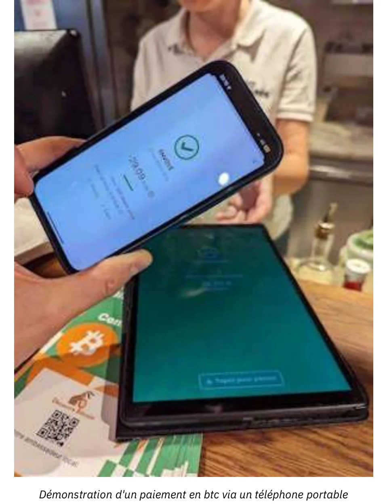

Although Bitcoin is still in its early stages, this reality, which you're likely already aware of, prompts us to consider two key questions:

* How can we encourage Bitcoiners to go further in their learning and projects to **fully harness Bitcoin's potential**?

* How can we help newcomers, often drawn to short-term speculation, avoid losing money on the latest memecoin craze and instead focus on **learning Bitcoin's fundamentals**?

The best solution to both challenges is simple: **be present in the real world and educate**.

The aim of this course is to provide you with everything you need to create and effectively organize a Bitcoin community or meet-up. Whether you want to build a local initiative or grow an online group, this course will guide you step by step : from creating your visual identity to setting up regular events and managing your communication channels.

**Section 1: Introduction

We'll begin by highlighting the importance of uniting people around Bitcoin, whether through online communities or local meetups. You'll discover why and where to launch your own community, along with how to set clear goals to foster its growth and long-term sustainability.

**Section 2: Designing a Unique Identity for Your Bitcoin Community**

To attract new members and foster a sense of belonging, it's essential to build a unique identity. In this section, you'll learn how to design logos, posters, and banners that embody the spirit of your Bitcoin community.

**Section 3: Creating Communication Channels for Your Bitcoin Community**

Communication is the backbone of any community. In this section, we'll explore the best channels to use and guide you through efficiently setting up a Telegram group or Discord server. You'll also learn how to integrate multifunctional bots to streamline community management.

**Section 4: Launching Your Social Networks** (in French)

Visibility is key to growing your community. In this section, you'll learn how to create a dedicated Twitter profile, connect with local meetups, and leverage platforms like btcmap.org to boost your visibility and attract new members.

**Section 5: Organizing a Bitcoin Meet-up**

This section covers how to organize meetups : from choosing the right venue to running the event itself. We'll also explore strategies to build participant loyalty and ensure your community's long-term sustainability.

**Section 6: Examples of Projects and Initiatives** (in French)

To go beyond simple meetups, this section showcases concrete and original projects : from themed events and workshops to educational content creation and local collaborations. You'll also learn how to design both physical and digital materials to promote your community.

**Section 7: Anticipating the Future**

Here, we'll examine the natural evolution of your community: what to do if it grows too quickly, how to decentralize your organization, and how to respond to a hostile regulatory environment. This section will help you anticipate and overcome these challenges.

**Section 8: Bringing Bitcoiners Together**

The final section centers on the essence of your project: uniting Bitcoin enthusiasts around a shared vision. You'll learn how to structure your approach to attract and retain members, delegate tasks effectively, and grow your community sustainably.

Ready to learn how to build a strong, vibrant Bitcoin community? Let's dive in!

## Why start a Bitcoin community or meetup?

<chapterId>893ea248-7d5a-5b8e-948c-7031497b1031</chapterId>

### What's the difference between a community and a meet-up?

While there's no strict definition of these terms in the Bitcoin ecosystem, a community is best understood as a group of people who share a common passion and communicate regularly.

A meetup, on the other hand, is an event organized by and for this community, with a specific purpose. Meetups typically take place once a community is already established.

For this course, we assume that before launching a Bitcoin meetup, you've already connected with a few people interested in holding such an event, in other words, the **community already exists**.

### Why create a Bitcoin community?

There are several reasons for creating a Bitcoin community:

* Knowledge sharing & collaboration: Communities give members a space to exchange ideas and share knowledge. Mutual support is a key pillar for growth, enabling everyone to accelerate their learnin, especially relevant for Bitcoin, given how much there is to discover.

* Peer-to-peer building: Many initiatives and projects are conceived, built, and developed within these communities.

Bitcoin communities often pursue broader goals, especially public education on:

1. What Bitcoin is;

2. How it works;

3. Its contributions to society;

4. Debunking misleading or baseless claims made by some public figures and media;

5. The fundamental differences between Bitcoin and other crypto-currencies;

By building the first "citadels" of tomorrow, **Bitcoin communities worldwide serve as a bulwark against disinformation and censorship while providing fertile ground for learning Bitcoin's fundamentals**. They offer newcomers, even skeptics, the resources and connections needed to explore Bitcoin's true potential.

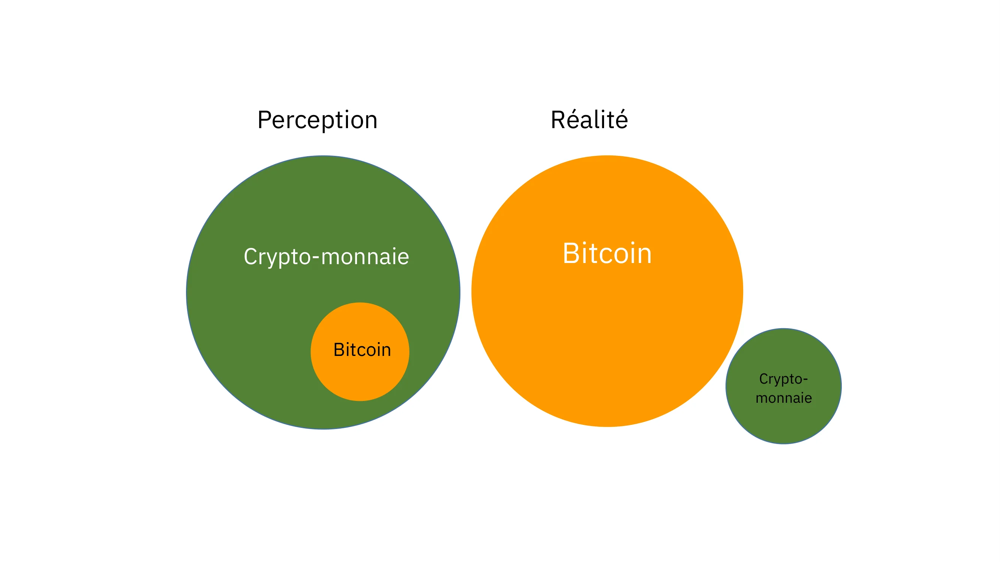

It's also worth noting that **a community can exist entirely online**, whether it's a Telegram group ("Bitcoin London"), a Facebook group ("Bitcoin Berlin"), a Discord server ("Bitcoin Madrid"), or even an email list ("Bitcoin France").

In other words, **a community doesn't need physical meetups to thrive or launch projects. Its core purpose remains the same: to share, build, and educate**.

### Why create a meet-up?

As mentioned earlier, **meetups usually come after a community is established and serve to complement it**.

As a bitcoiner's journey evolves, there's often a desire, or even a need, **to meet and interact in person with others** from the same ecosystem. This may come from feeling isolated or simply not having anyone to talk to about Bitcoin in daily life.

Meetups offer a more personal and welcoming experience than online audio or video calls. Whether **over a drink or a meal**, they create informal, friendly spaces where people can exchange ideas openly and directly.

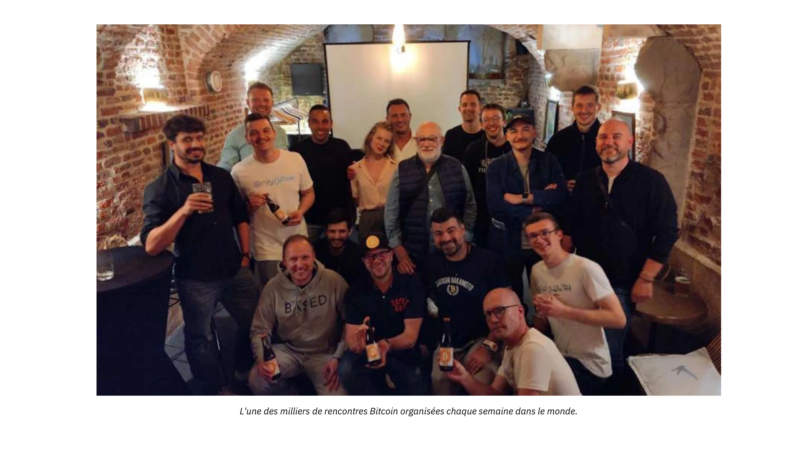

Bitcoin meetups can serve many purposes:

* Discussing technical topics or ongoing projects
* Helping new bitcoiners gradually dive deeper into the Bitcoin world
* Announcing new projects or initiatives
* Exchanging materials or books
* Screening documentaries in preview
* Hosting conferences or workshops on specific topics

We'll cover many of these possibilities in detail in part 6/8 of this course, entitled "[Examples of projects and initiatives](https://planb.network/courses/1c643dc9-a15f-4f9e-93b6-cb3c58b4ee35/3213d87a-1998-5972-ab93-97a5769ba279).

While every community is free to form its own opinions, launch projects, and experiment in its own way, meetups are proving increasingly **essential to Bitcoin's development and to the growth of bitcoiners**. **Organizing them does require time and effort**, which is why this course shares the combined experience of [around sixty Bitcoin communities in France and Belgium](https://btcmap.org/communities/map#2/5.24949/0.20000) **to help you build and grow your own community and meetups as smoothly as possible**.

## Where should you create your community?

<chapterId>72da5285-5395-592d-ab62-303a0aef3d6d</chapterId>

The first question to ask is: where should your community be based?
This decision is crucial if you want to keep the option of organizing meetups later.

If members have to drive two hours to attend an event, attendance will likely be low. That's why choosing the right **location for your community, and therefore your future meetups, has a major impact on its growth**.

A few tips to guide your decision:

1/ **Create and grow your community in a medium-sized or large city**. This will make it easier to:

    - Find pleasant venues for meetups and projects (presentations, workshops, promoting Bitcoin adoption, etc.);
    - Increase the sense of involvement and belonging among a larger number of people;
    - Improve event accessibility (public transport, parking, etc.). Choosing a location close to public transportation and parking is highly recommended.

2/ **Choose a name linked to your city**. This makes it easy for people to identify with your community. Examples: Bitcoin Paris, Einundzwanzig Berlin, Satoshi Spritz Milano, etc.

3/ **Check if a meet-up already exists near you**.
You can check [btcmap.org](https://btcmap.org/communities/map#0/0/0/), which lists most Bitcoin communities and meet-ups worldwide.

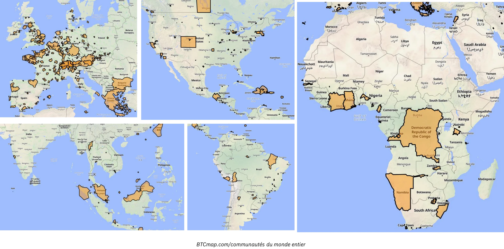

After some research, you might find an existing meetup or community in your city.
Bitcoin is decentralized, so naturally, anyone is free to do as they wish.

However, **joining forces often makes more sense than splitting nearby communities and reducing each one's impact**. Starting a brand-new community where one already exists can unintentionally create competition.

In this sense, a simple "rule of thumb" can help: if there's no active Bitcoin community within 30-45 minutes of where you live, it may be worth starting a new one. That said, you're always free to do as you wish.

And of course, if an older community has "evolved" in a direction that no longer aligns with your values, and you don't have the time or motivation to "orange-pill" them, then creating your own fork is always an option.

## What objectives should guide your community?

<chapterId>0aae1aa8-93ec-544a-ad88-22d32c619595</chapterId>

Once you've identified the city (or geographic area) for your community, it's time to **define what you want to achieve**.

These goals can be set right at launch or refined later, once several members have joined and your group is actively engaged.

Here are some points to guide your thinking:

1/ **Why am I creating this community as a bitcoiner?** Is it to share knowledge? Educate others? Learn from more experienced peers? Meet like-minded people? Get involved in the Bitcoin ecosystem? Connect with professionals? Or simply have a drink and make new friends?

OYour answers will shape your positioning and motivation.

If your goal is to **share knowledge and educate people about Bitcoin**, focus on **creating educational content** (articles, podcasts, videos, presentations, flyers, etc.), saving others countless hours of research. You can even go further by **organizing workshops, presentations, and conferences**.

If your aim is simply to meet other bitcoiners and share experiences, you can take a more relaxed approach, like meeting up for a drink.

This is why **setting concrete goals and projects is essential**.

2/ Should I give my community a **physical dimension**? If yes, what kind of events should you organize?

Your first event will likely be a meet-up. Its main purpose: to bring together bitcoiners in your area.

However, as we'll see later in [Examples of projects and initiatives](https://planb.network/courses/1c643dc9-a15f-4f9e-93b6-cb3c58b4ee35/3213d87a-1998-5972-ab93-97a5769ba279), **a meet-up can be built in many ways, with many objectives:**

* Combine networking with an educational presentation on a Bitcoin concept;
* Host a professional demonstration of Bitcoin solutions;
* Debate strategies for orange-pilling local merchants;
and so one.

Depending on the subjects (technical talks or hands-on workshops), it may even make sense to **organize additional events** outside your regular meet-up.

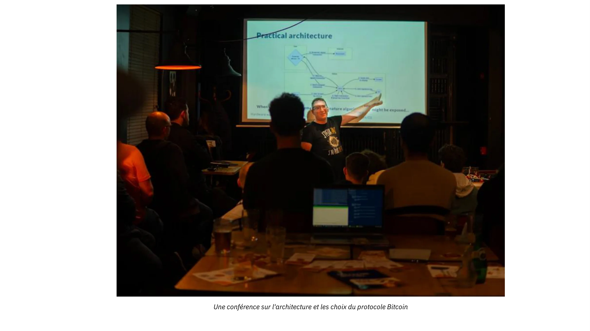

3/ How do I want my community to contribute to the Bitcoin ecosystem?

This is a more advanced question, but it’s worth thinking about early on.

If your vision is to **create a tight-knit, motivated community** focused on orange-pilling as many people as possible, then:

- Collaborate with existing communities to access broader information, open-source resources, and valuable support when needed.
- Organize and delegate tasks within your group to expand and scale your efforts effectively.

**Set short, medium, and long-term goals**
A practical way to plan is by setting goals for each timeframe:

* Short-term: build a social media presence and set up community communication channels.
* Medium-term: create educational resources (articles, flyers, videos).
* Long-term: launch regular physical meetups.

Once meetups are established, you could aim for:

* Short-term: host workshops or presentations on specific topics
* Medium-term: run Bitcoin awareness or education campaigns
* Long-term: create a formal association or partnership with a bar that accepts Bitcoin as payment.

Be prepared: **building a community takes effort**

Creating a community doesn't happen overnight. It takes time, motivation, and organization.
At times, it can even feel discouraging.

That's why **this course is designed  to share valuable resources and tips, helping communities grow effectively and eventually become self-sufficient.**.

# Designing a community identity Bitcoin

<partId>da6673ad-bf49-5979-80a6-3f69cfb28046</partId>

## Why and how can you create your own identity?

<chapterId>b48a18cc-afdf-5216-802c-32647b5cd8a3</chapterId>

At this stage, we assume that:

- You already know where your community (or future regular meetup) will be based.
- You've set goals for different time horizons, even if they're not yet final.

The next step in building your community is to **define its identity**, both its name and its visual style.

This section provides tutorials and beginner-friendly software solutions to help you design your community's visual identity.

**Why does identity matter?**
People feel more engaged and committed when they can identify with a group. A strong identity helps your community stand out and fosters a sense of belonging.

It all starts with choosing a name, and each country often has its own trends:

* France: Most of the 60+ local communities use names like "Bitcoin [CITY]" or "[CITY] Bitcoin". Their Telegram groups often follow this pattern: "Bitcoin [CITY] meetup".
* Germany: The Einundzwanzig (meaning "21") initiative inspired names like "Einundzwanzig [CITY]".
* Italy: The Satoshi Spritz network uses names such as Satoshi "Spritz [CITY]".

**Each community has its own identity, linked to its hometown, yet connected to the broader identity of its country**.

Your visual identity : logo, colors, banners, is what people will remember and associate with your group.

When creating social media accounts and communication channels, having a logo and banner is a strong plus. Don't worry, you don't need professional design skills; free and easy-to-use tools are available.

A great starting point is to incorporate a landmark or symbol from your city. In Paris, this might be the Eiffel Tower. In Lille, the belfry or citadel. In New York, the Statue of Liberty. In London, Big Ben, and so on.

From there, you can design either a simple or more detailed logo, depending on your preference.

To give you some ideas, here are a few examples of French community logos:

- In Marseille, the logo represents the Notre-Dame-de-la-Garde basilica, which overlooks the city:

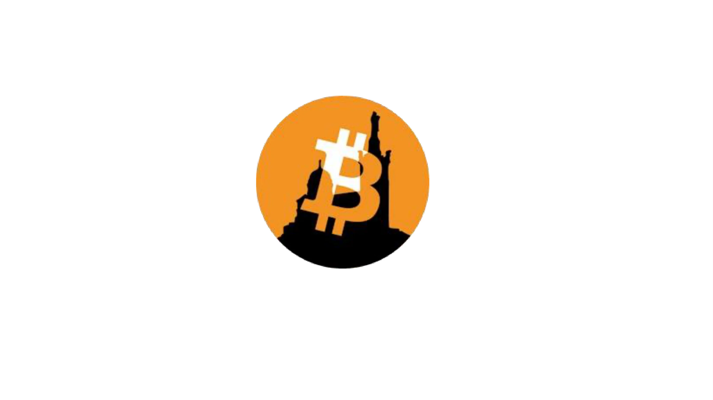

- In Monaco, it refers to the Monegasque rock:

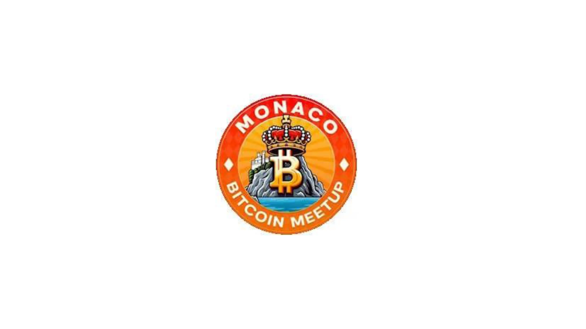

- In Lille, the sleek logo represents Vauban's citadel and its park:

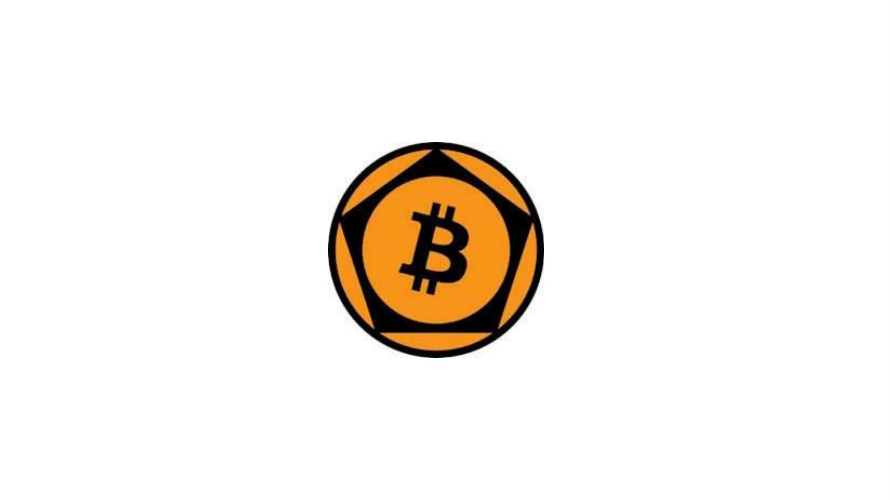

- In Saint-Malo, the ermine - the town's emblem - is highlighted:

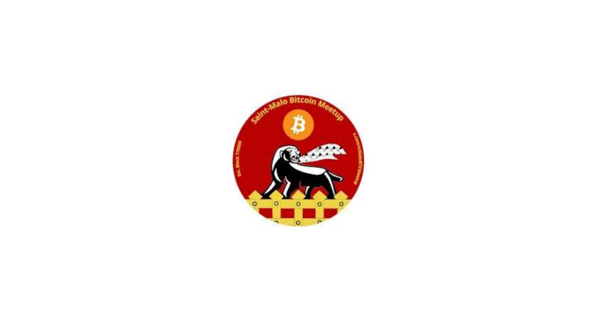

**Go further if you like**
If inspiration strikes, you can take it even further: create a crest, a motto, or even a song for your community. Your creativity is the only limit!

## Create a logo, poster and banner

<chapterId>3470a31f-0190-5e87-8af0-6a00e79267ef</chapterId>

### Using Canva

You can use [Canva](https://www.canva.com/)** to create the various visuals for your community.

This free and easy-to-use platform is popular for its large library of pre-designed templates that you can duplicate and customize in just a few clicks.

**Creating your logo**
On the Canva home page, search for pre-designed logos. Select one or several that inspire you, duplicate them, and then customize them to match your community.

You can add a local landmark or emblem to the background (import a photo or search "Illustrations" or "Images" in the Elements menu), then overlay the Bitcoin logo or ₿, adjusting its color if needed.

**Creating banners and posters**
To create a banner or poster, search Canva's library for pre-designed templates. Once you've duplicated one, modify the text and fonts, add your community logo, and import any photos using frames (search for "frame" in the Elements menu).

You can also use the Designs menu to explore additional models that match your needs.

For YouTube thumbnails or banners, simply search for those templates, duplicate, and customize them as desired.

In short, **the possibilities are endless and shaped not only by your needs but also by the visual style you want to create** for your community and your meet-ups / events!

To give you a clearer idea, we've included a non-exhaustive video tutorial showcasing some of these possibilities:

:::video id=d11ae0ed-eacd-4924-afd3-75aff95d2899:::

**Example Templates from Bitcoin Lille**
Here are ready-made Canva templates you can duplicate and adapt for your community:

- **Meet-up announcement poster** (for social media and A4/A3 printing): [link](https://www.canva.com/design/DAGBvBXFJ8A/92-j_toeLU8QbVAD0NwoAA/edit?utm_content=DAGBvBXFJ8A&utm_campaign=designshare&utm_medium=link2&utm_source=sharebutton)

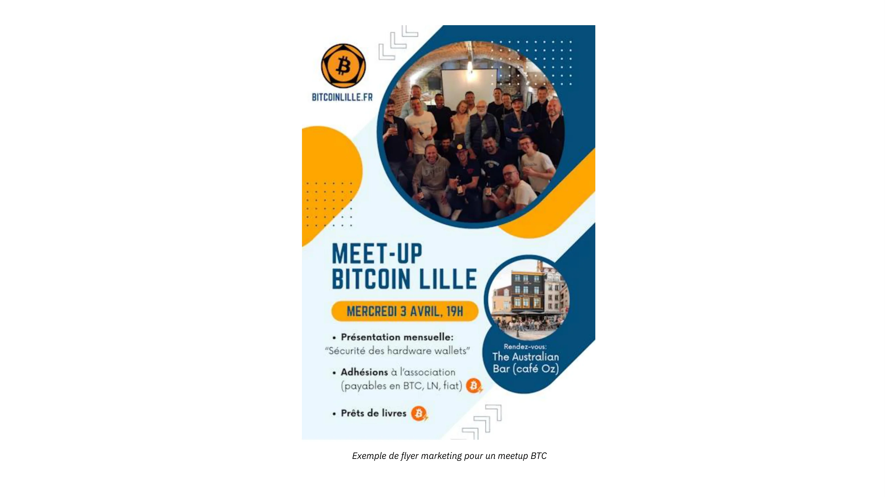

- **Event poster** (for social media and A4/A3 printing): [link](https://www.canva.com/design/DAGBvG3rNCc/oXtNR9pduRs22AqclG4O2g/edit?utm_content=DAGBvG3rNCc&utm_campaign=designshare&utm_medium=link2&utm_source=sharebutton)

- **social media banners**: [link](https://www.canva.com/design/DAGBvOXyNqw/iSJG9PbIQHgGWHz5PhlXSQ/edit?utm_content=DAGBvOXyNqw&utm_campaign=designshare&utm_medium=link2&utm_source=sharebutton)

- **Contest announcement**: [link](https://www.canva.com/design/DAGBvIjuA_w/YzSUXzOmbNV9oCma9mluOw/edit?utm_content=DAGBvIjuA_w&utm_campaign=designshare&utm_medium=link2&utm_source=sharebutton)

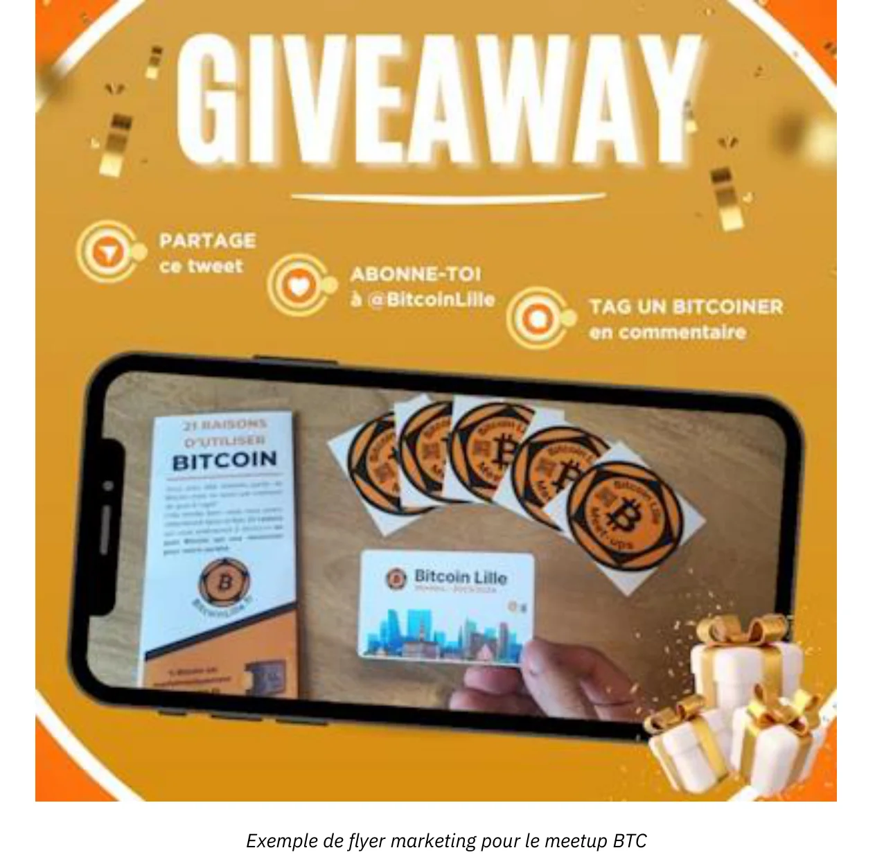

- **brand guidelines** of our library, displayed on A4 at meet-ups: [link](https://www.canva.com/design/DAGBvPqL7N4/LmUItfsysypRLSOFOzBXcQ/edit?utm_content=DAGBvPqL7N4&utm_campaign=designshare&utm_medium=link2&utm_source=sharebutton)

- **PowerPoint presentation** "Chapter 2 - Understanding Bitcoin transactions", by @ProfEduStream: [link](https://www.canva.com/design/DAFsEcnOro8/Mz9FYdTGhsvozZOe0Y9jtw/edit?utm_content=DAFsEcnOro8&utm_campaign=designshare&utm_medium=link2&utm_source=sharebutton)

- **flyer** "21 reasons to use Bitcoin", written by @ProfEduStream: [link](https://www.canva.com/design/DAFtAR1NauQ/ZDwl2CchIJ9Gpb36N6-7iw/edit?utm_content=DAFtAR1NauQ&utm_campaign=designshare&utm_medium=link2&utm_source=sharebutton)

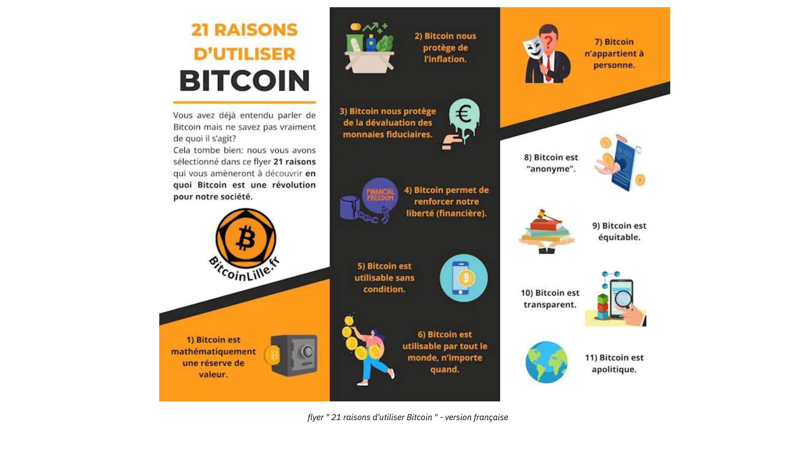

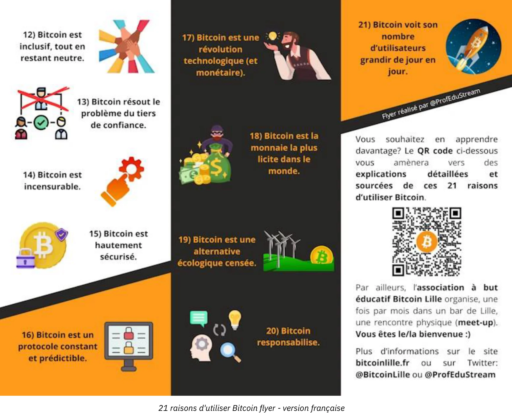

**Share your creations**
The possibilities are endless, and your designs will depend on your goals and visual identity. Consider sharing your templates in open source, it saves time for other Bitcoin communities that will inevitably face the same challenges as you. By sharing, you help accelerate the growth of Bitcoin communities everywhere.

**Recommended dimensions**
When creating visuals, always check the size requirements for each platform:

| Platform | Logo | Banner | Poster / Image
| -------- | -------- | -------- | -------- |
| Telegram     | 512 x 512     | N/A     | N/A     |
| Signal     | N/A     | N/A     | N/A     |
| Twitter     | 400 x 400     | 1500 x 500     | 1200 x 628     |
| Meet-up     | N/A     | N/A     | N/A     |
| Discord     | 512 x 512     | 960 x 540     | N/A     |
| Facebook     | 512 x 512     | 851 x 315     | 960 x 720     |

Usually appropriate sizes :  
Logos: 512 x 512 pixels
Banners: Vary depending on the app or site
Posters: A4 is the standard print format

### Using artificial intelligence

While Canva offers a wide range of tools for creating logos, posters, banners, and flyers, it's not the only option. If you're more comfortable with other software (like Photoshop or Illustrator), feel free to use what works best for you.

That said, whether you're designing a community logo or enhancing posters, presentations, or flyers, **artificial intelligence can be a powerful ally for creating unique and appealing visuals**.

A number of AIs are available for this purpose. These include

- [midjourney](https://docs.midjourney.com/docs/quick-start) (paid);
- [leonardo](https://leonardo.ai/) (free, account-limited);
- [copilot](https://copilot.microsoft.com/) (free, account-limited);
- [DALL-E](https://www.dall-efree.com/) (paid).

Many other AI tools have emerged recently, so this list is far from exhaustive.

**Example: Creating a Futuristic Bitcoin London Logo**
If you want to design a futuristic logo for a "Bitcoin London" meet-up, you can ask Copilot:

- [ ] *Prompt: Create a Bitcoin logo with London Bridge and Big Ben in the background. Futuristic* - [Link](https://copilot.microsoft.com/images/create/un-logo-Bitcoin-futuriste-avec-en-arric3a8re-plan-le-/1-6612ba1758df4384bc33c4bca00ab45b?FORM=SYDBIC)

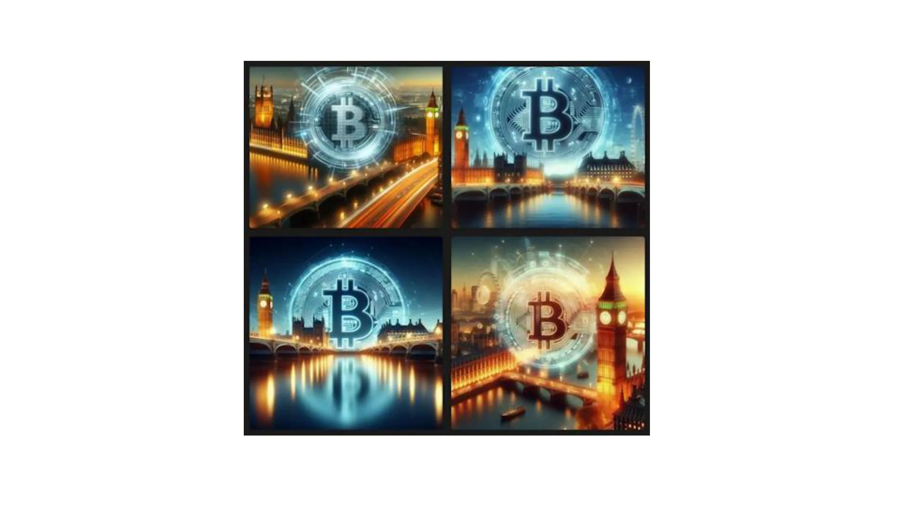

If the first four results aren't realistic enough, refine your request:

- [ ] *Prompt: Make the 4th one much more realistic* - [Link](https://copilot.microsoft.com/images/create/un-logo-Bitcoin-futuriste-avec-en-arric3a8re-plan-le-/1-6612ba64b72d4cea9830ab7eb844f785?FORM=SYDBIC)

The latest result turned out great!

**Example: Creating a Simple British-Style Logo**
For a cleaner look, like for a sticker:

- [ ] *Prompt: Create the logo of the "London Bitcoin Meetup" with a British and clean style* - [Link](https://copilot.microsoft.com/images/create/logo-for-27londres-Bitcoin-meetup27-with-a-british-a/1-6612bb9451924859a6c34b350b3a6ebc?FORM=SYDBIC)

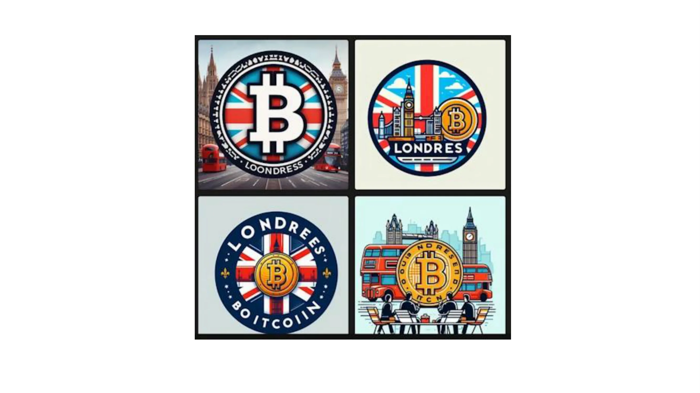

The result looks really cool!

**Tips for Working with AI**

* Be patient: AI may not produce exactly what you envision on the first try.

* Use precise prompts: The clearer and more detailed your instructions, the better the results.

* Ask for help: If you're not satisfied, reach out to someone experienced with graphic design or AI tools, many Bitcoiners will happily help, sometimes even for free or a few sats.

# Creating communication channels for your Bitcoin community

<partId>fc588298-6876-554c-bd57-55d182464878</partId>

## Which communication channels should you choose?

<chapterId>b4f4eef6-1035-5290-848a-2b7f9391c77a</chapterId>

As mentioned above, a community's communication channels can differ according to motivations and habits.

For example, **in France, Germany and Italy, Telegram and Twitter are the dominant platforms**, and have become the "standard" for Bitcoin communities.
By contrast, in the Czech Republic, many communities use **Matrix**, a secure instant messaging protocol, instead of Telegram.

Tip: Before choosing your channels, **look at what nearby communities are doing**. Use the map [btcmap.org](https://btcmap.org/communities/map#0/0/0/) to see which platforms are most popular in your region.

For instance, Swiss communities primarily use Telegram, Twitter, and their own website :

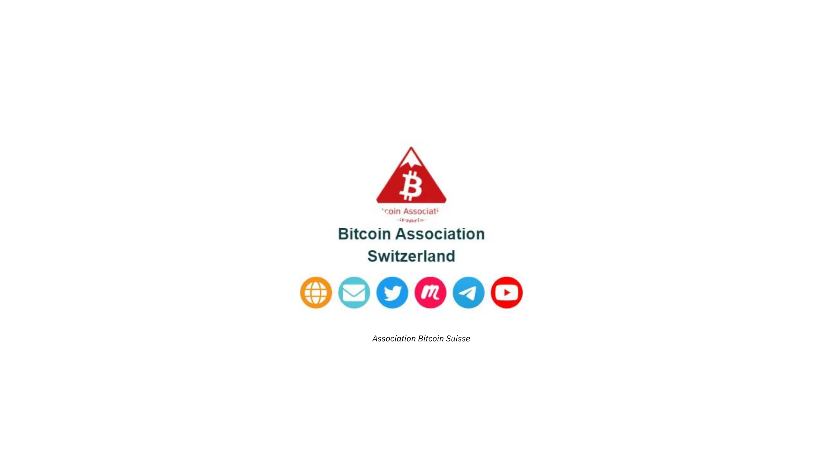

**Recommended Channels for French-Speaking Communities**

* Telegram: The #1 communication tool, over 90% of French meet-ups use it.

* Twitter (X): The main social network used by bitcoiners over the world. It is used by ~70% of French meet-ups. It is ideal for reaching bitcoiners.

* Meetup.com: Paid but widely used (by ~30% of French meet-ups and nearly all Canadian ones) to increase visibility outside the Bitcoin ecosystem.

* Other options: ~30% also have a website; ~10% run Discord servers or NOSTR accounts.

Other platforms like Matrix, Keet, Signal, Facebook, Instagram, and LinkedIn can also be used. Beware, the more channels you manage, the more time you'll spend moderating, posting, and keeping them active.

Anyone wishing to launch a community in France would therefore be well advised to start by creating :

- a Telegram group;
- a Twitter account.

As your community grows, you can add more platforms and delegate moderation to trusted members.

## Create and configure a Telegram channel, group or supergroup

<chapterId>d13714ce-8f08-53e9-bedd-b6a3aaac5dad</chapterId>

Before creating your community's communication space on Telegram, it's important to know the difference between:

- a Telegram channel;
- a Telegram group;
- a Telegram supergroup.

It is strongly recommended to start with a Telegram Group.
If needed, you can later convert it to a Supergroup.

For the tutorials below, we originally used the "Telegram+" APK, which allows for more advanced configuration. However, you don't need it anymore, the official Telegram app is now enough for creating and managing groups:

:::video id=b1da7cb4-5fb1-4a41-a1d4-bd90686826a9:::

### Create a Telegram channel

If you want to create a place where your members can talk to each other directly, respond to each other, etc., then you might wanna create a Telegram group and not a Telegram channel !

Go directly to the next section, entitled [Create a Telegram group](https://planb.network/courses/1c643dc9-a15f-4f9e-93b6-cb3c58b4ee35/d13714ce-8f08-53e9-bedd-b6a3aaac5dad).

Indeed, **a Telegram channel is more like a one-way broadcast tool for admins**. Members cannot freely chat, they can only react with emojis (or leave comments in separate threads, which fragments conversations).

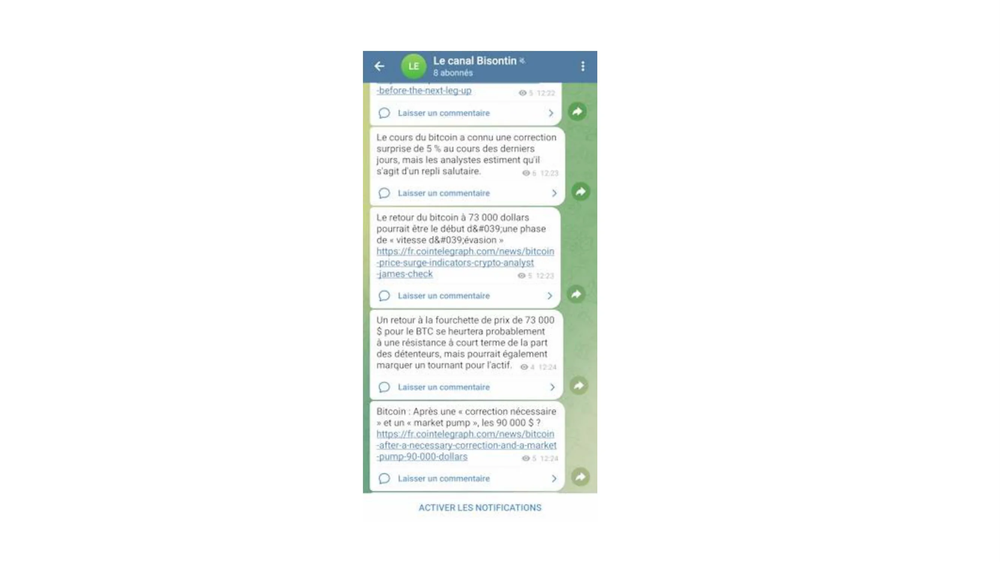

**Because communities need interaction and collaboration, a Telegram channel is not recommended** if your goal is to build relationships and share knowledge.

Tutorial for creating a Telegram channel:

:::video id=98be4709-d221-4030-8c31-e10113482515:::

### Create a Telegram group

On the other hand, **a Telegram Group is ideal for communities** : Members can chat and reply to each other in a single shared conversation.

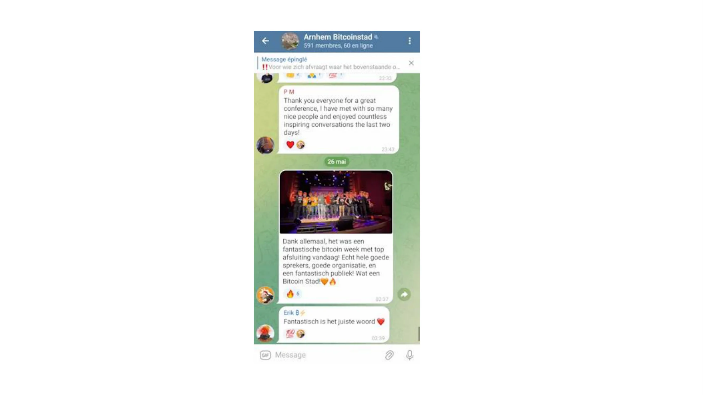

What You Can Do as an Admin:

- Post and pin important messages.
- Create **polls** (useful for deciding meet-up dates when your community is new).
- create **custom invitation link** (Only if the group is "public" and not "private", which is defined in the settings. It's also handy to have your own Telegram invitation link, such as: t.me/Bitcoin[CITY]);
- Manage member permissions, roles, and moderation.
- Add a profile picture (your community logo) and update the group's name.

Tutorial for creating a Telegram group:

:::video id=3d4792a7-1345-475b-93b1-b3a3945fb567:::

Note: This tutorial was made using Telegram+, but you can do everything directly from the standard Telegram mobile app.

### Create a Telegram supergroup

Why a Supergroup?
As your Telegram group grows into hundreds of members, conversations can become chaotic. This often leads to members missing important announcements, like the date of the next meet-up.

Several solutions are available:

1. **Pin important messages** so all members receive a notification (press once with your finger on the message in question, then select "Pin");

2. Consider using **Discord** for multiple communication channels, each of which users can mute if needed.

3. **Convert your Telegram group into a Supergroup**.

What is a Telegram supergroup?

A Supergroup is essentially a Telegram group with topics (sub-channels) inside it.

Example topics:
- "Important Information" : only key updates and event announcements.
- "General" : for all member discussions.
- Specific Topics : e.g., mining, project development, upcoming conferences.

Tip: Adapt your topics to your community's needs. Example: Abidjan Bitcoin Meet-up successfully uses this format.

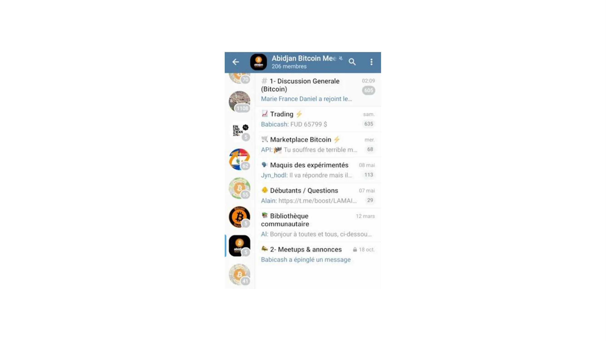

Keep in mind that **Telegram supergroups can be a bit tricky for some members to use**. For example, not everyone knows **how to access the different topics** (they just need to tap the group logo in the main Telegram menu to see the full list of topics). Sending a quick screenshot can help clear up any confusion.

There's no strict rule for when to switch from a regular Telegram group to a supergroup, it really depends on your members' needs. The good news is, you can easily switch back and forth: simply create a topic to convert to a supergroup or delete all topics except "General" to return to a regular group.

Tutorial for creating a Telegram supergroup:

:::video id=f78800ae-d8ca-479a-b913-99abd9916bff:::

Quick note: as mentioned earlier, the tutorial above was made on a computer using the "Telegram+" APK. Today, however, creating a Telegram supergroup on your phone is simple.

Just create a Telegram group, go to its settings, and tap the "Topics" button to add topics. Once saved, you'll see a list of topics that you can edit as you like.

So, there's no need to download "Telegram+" anymore, unless you want access to more advanced privacy settings for your supergroup.

## Setting up your Telegram group or supergroup

<chapterId>35e674b3-5924-50b0-98f1-83a56c9a186d</chapterId>

Now that your Telegram group (or supergroup) is up and running, it's time to **configure permissions and set up moderation**.
Each community is free to choose its own approach, but experience shows it's **best to limit certain member permissions**:

- Sending a survey;
- Sending files (to avoid potential viruses);
- Sending voice messages;
- Adding users (helps prevent bot invasions);
- Pinning messages;
- Editing group information.

It's highly recommended to **write a clear description of your meetup** when creating your Telegram group or supergroup, as it's the first thing potential members will see. For example:

> Welcome to @Bitcoin's Telegram [CITY] 🔥
>
> We organize a meet-up every first Wednesday of the month at the bar [BAR_NAME], in [CITY] 🍻
>
> Check out our other social networks: [LINK] 🌐

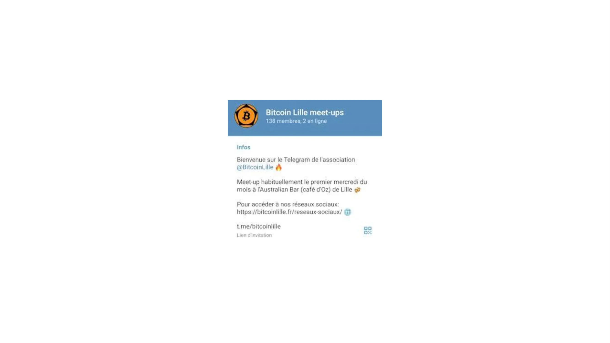

In this example, the Bitcoin Lille administrators have customized their public Telegram link for easier sharing.

In "Group settings", it may be wise to **enable "Approve new members "**.

Some Bitcoin Telegram groups have been targeted by thousands of fake accounts designed to spam or disrupt the community.

**Activating member approval can save your group from a spam attack.**

Within the Administrators section, you can also enable an "Aggressive Anti-Spam" feature to automatically delete suspicious messages.
This isn't always necessary but can add an extra layer of protection.

## Adding a Multi-Function Bot to Your Telegram Group

<chapterId>c61f69cc-15ec-53f1-8c02-1cea55def09e</chapterId>

**Another option for configuring and securing your Telegram group or supergroup is to add a multi-function bot**. This allows you to significantly expand your group's features and moderation capabilities.

Using **the bot [@GroupHelpBot](https://telegram.me/grouphelpbot)**, the most useful options are:

- A **rules command** (/rules) to display your community guidelines;
- **Anti-spam** protection to filter suspicious messages and accounts;
- **Customizable automatic welcome messages** for new members (with optional auto-delete after a few minutes)
- **Anti-flood protection** to prevent message spam
- An **@administrator command** for quickly reaching group admins
- **Blocking rules** for unwanted content
- A **group link command** (/link)
- Command **permission management**
- **Automatic deletion** of specific message types
- **Bot blocking** and **entry/exit blocking** to keep your group secure
- List your **community's social networks** (/networks)
- And much more...

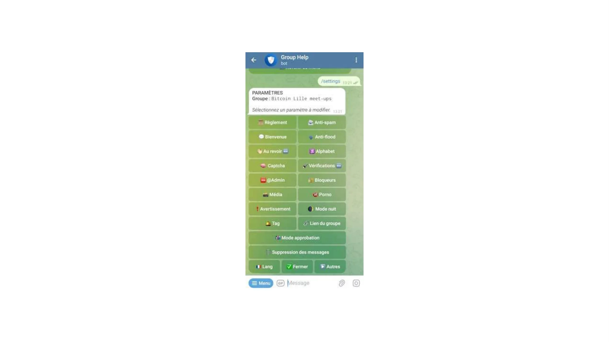

Countless additional features are available.

Pro tip: **Don't over-restrict conversation**.

Tutorial for adding a multi-function bot to a Telegram group or supergroup:

:::video id=cdbf82d6-3530-45c4-90de-593f100863bb:::

(Note: This entire process can now be done directly from your phone. There's no longer any need for the Telegram+ app.)

## Create a Discord server

<chapterId>eef2a965-4c24-5f3a-8013-72cc7d315314</chapterId>

When your Telegram group grows too large, transforming it into a Telegram supergroup can help organize discussions.
However, as mentioned earlier, the **added complexity and the increase in topics and messages may cause some active members to lose interest**.

Why Consider Discord?
**Discord is an alternative** to a Telegram supergroup since it allows users to **create specific text and voice chat rooms** and allow members to mute any channels they're not interested in.

Of course, managing both Telegram and Discord requires a bit more time, especially during configuration and launch.

To make things easier for you, **we're sharing a [Discord server that you can duplicate and customize](https://discord.com/template/bDY4eXXJk2C8)**:

:::video id=e647458a-a21e-44e0-bd03-20b82a871777:::

When well designed, a Discord server can be a real asset for your community. Many Bitcoiners already use **Discord** daily, and being able to follow Telegram conversations directly within Discord (and vice versa) can save everyone a lot of time.

To sync both platforms, there's an open-source bot called [TediCross](https://github.com/TediCross/TediCross). Its purpose is simple: automatically forward messages from a Discord text channel to a Telegram group (or topic in a supergroup), and vice versa.

However, keep in mind that it's not the easiest to install. You'll need to keep a command prompt (CMD) running on your computer for the bot to work, and occasional errors may occur. Fortunately, fixing it is simple : just restart the bot, and most of the time, everything goes back to normal.

To save you time, here's a tutorial on how to add this multi-function bot to a Telegram group or supergroup:

:::video id=6a0283f6-6d6c-4e81-8b2f-644b33c52fe6:::

## Consider alternative, private and more secure communication channels

<chapterId>29d0aad6-0612-5dd0-bcef-7337eaf4fefc</chapterId>

As discussed earlier, Twitter and Telegram are the most widely used communication tools for Bitcoin communities in Europe (if not worldwide).

However, Telegram isn't exactly known for being the most secure or privacy-focused messaging app, and Twitter, now X, is owned by one of the freest-moving corporations on the planet.

That's why, once your core channels are in place and things are running smoothly, it can be worth taking the time to explore other options.

In the coming months, this course and the planb.network platform will offer tutorials on how to use alternative protocols such as **Simplex and Element** : decentralized, encrypted, and highly customizable communication tools.

**Why bother looking into these options?**
Because, just like the NOSTR social network, they provide not only greater privacy but also a safeguard against censorship or the arbitrary shutdown of your Telegram group.

And really, what could be more in line with the spirit of Bitcoin than being  censorship-resistant and resilient by design?

# Launch your social networks

<partId>8ebf8cd7-9248-543f-bc27-4ec4cc03f9cf</partId>

## The importance of visibility for growing your Bitcoin community

<chapterId>b20f12e4-c5de-5f02-80c7-b7fc6cadd3ac</chapterId>

So, your community is up and running. You've set up your Telegram or Matrix space... but for now, you're the only one there. **Time to let people know you exist!**

It's simple: if no one is able to access your group and see when the next meet-up is happening, you'll just be posting into the void. That's why social media, and a few specific platforms we'll cover later, are so important for building your community.

Twitter (X) has become almost synonymous with Bitcoin conversation online. It's not perfect, far from it, but it's currently where a large portion of the community gathers. Creating an account there is strongly recommended.

To stay ahead of possible censorship or restrictions, some communities also open a NOSTR profile.  

That's what the FREE Madeira collective has done.

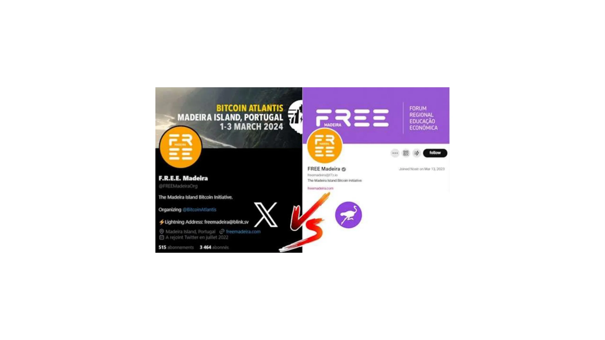

Of course, other platforms can be useful too. Facebook (with either a group or a page), or even LinkedIn.

That said, keep in mind that **the more communication channels and social networks you manage, the more time it requires**. It's often better to focus **on the most relevant ones**, Twitter (and NOSTR) are great options to start with.

## Create a Twitter profile

<chapterId>c8d73097-8eba-5530-918c-221002954110</chapterId>

Twitter is very easy to use, and to improve your privacy, you'll need to adjust a few settings.

**When creating a new Twitter account, four essential pieces of information must be entered:**:

1/ **the @ Twitter**, which defines your identity and makes you easy to find. If your community's name is "Bitcoin [CITY]", it's appropriate to choose "@Bitcoin[CITY]";

2/ **the logo and banner** you've created for your community or meet-up (see section [Create a logo, poster and banner](https://planb.network/courses/1c643dc9-a15f-4f9e-93b6-cb3c58b4ee35/3470a31f-0190-5e87-8af0-6a00e79267ef));

3/ **the description**, which allows you to share key information about your community in a few hundred characters. For example:

> Official account of the Bitcoin [CITY] community #BTC | Meet-ups every 1st Wednesday of the month at [BAR_NAME] in [CITY] 🍻 | Join us on Telegram 🔽

4/ Below this description, it is possible to **insert a link**. This can lead users to a "social media" page on your community's website, or to your Telegram channel. It's up to you to decide what you want to highlight.

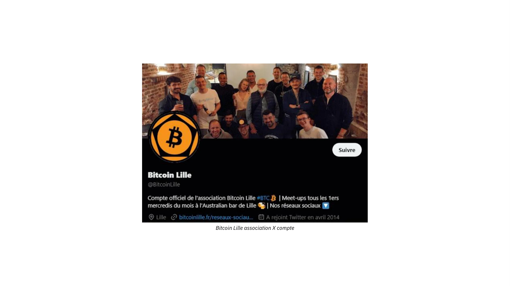

Additionally, **a few privacy settings are worth adjusting**:

- leave your Twitter account in "public " mode (posts visible to anyone);
- allow everyone to find you;
- disable location tracking and data sharing with other entities (in the privacy settings).

For each event, you'll likely use Twitter to share useful information. But, like most social networks, **visibility is everything**.

To save you considerable time, we took the time to study [Twitter's open-source ranking algorithm](https://github.com/twitter).

Here are the **key things to focus on to boost your visibility**:

- General Tips:
    - Tweet in your account's set language or in English : tweeting in other languages can reduce your visibility a lot;
    - Stick to your niche, only share content related to your account's focus; off-topic tweets are penalized by the algorithm;
    - Aim for 1 to 2 tweets per day;
    - Post during peak hours : Thursday or Friday between 8 to 10 a.m. tends to perform best (check in your account : Twitter Analytics).

- When writing a tweet:
    - add a photo (or even a video);
    - Use only one hashtag (usually #Bitcoin is the most relevant. If appropriate, you can add a trending hashtag related to your account area);
    - Encourage your community to interact:
        - Like = weight 0.5
        - Retweet = weight 1
        - **Reply = weight 27 (!!)**
    - **Reply to people who respond to your tweets** (weight of 75!!);
    - Avoid placing links in the main tweet : instead, add them in the first comment.;
    - Write words in full, avoid abbreviations.

- Other Tips:
    - Tweet about trending topics, as long as they align with your account's area of expertise;
    - Repost your top-performing tweets;
    - Occasionally run polls;
    - Write threads when possible;
    - Encourage your community to visit your profile and follow you.

What's more, **you can pin a tweet or thread to your Twitter profile to give it maximum visibility**, just like the Bitcoin Witsand community in South Africa does.

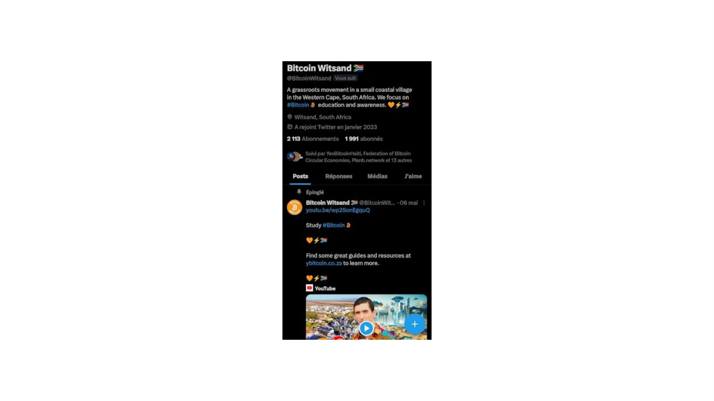

Also note that it's possible to stay logged into two Twitter accounts at the same time, on both phone and computer. This is super handy if you want to switch easily between your personal and community accounts.
Just be careful... accidentally posting a party photo from the community account can happen faster than you think!

Finally, even though your username "@Bitcoin[CITY]" is unique and now yours, it's smart to anticipate fake or copycat accounts. Consider also registering:

- @Bitcoin_[CITY]
- @[CITY]Bitcoin
- @[CITY]_Bitcoin

That way, you'll greatly reduce the chances of someone impersonating your community.

Tutorial for creating a Twitter account:

:::video id=4648976f-41ec-499a-b7ec-a53e796f71b4:::

## Getting closer to neighboring meetups

<chapterId>12a21c3b-235a-5292-8209-67bf60f61e49</chapterId>

Now that your communication channels and social networks are set up and reflect your community's visual identity, it's time to start following the right people.

On Twitter, begin by following key accounts that promote Bitcoin globally such as [@Bitcoin](https://twitter.com/Bitcoin) and [@planb_network](https://twitter.com/planb_network), as well as initiatives like [@FBCEglobal](https://twitter.com/FBCEglobal). You can also retweet [@halfin](https://twitter.com/halfin)'s famous "Running Bitcoin" tweet from January 11, 2009. And more importantly, **follow the accounts of Bitcoin communities and meetups in your own country**.

This creates **opportunities to follow each other, tag each other, and boost collective visibility**. It's already common practice among the ~50 Bitcoin communities in France, the "Satoshi Spritz" initiatives in Italy, and the "Einundzwanzig" groups in Germany.

While it may seem trivial to some, **following the accounts of local communities and initiatives can lead to collaborations or even partnerships**. For example, the Bitcoin Liège and Bitcoin Lille communities (and likewise Bitcoin Aix and Bitcoin Marseille) connected this way, leading them to co-host an annual meetup. 
The **Cercle du Coin** meals are another good example.

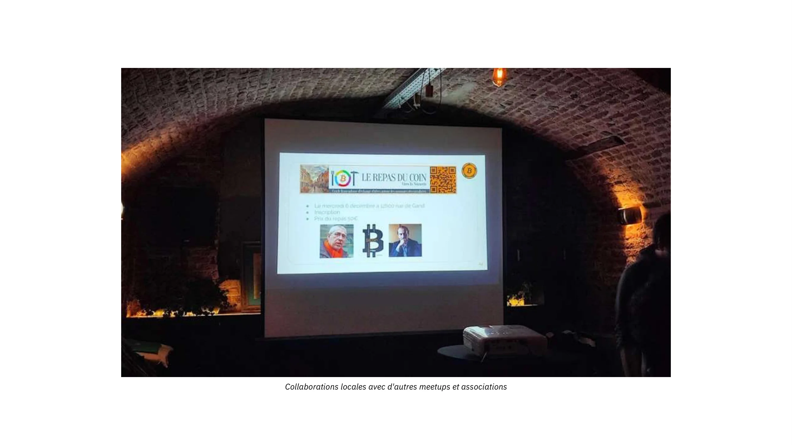

In France, it may also be relevant to **follow the initiatives such as [@KonsensusFR](https://twitter.com/KonsensusFR), [@bitcoinpointfr](https://twitter.com/bitcoinpointfr), [@DecouvreBitcoin](https://twitter.com/DecouvreBitcoin) and [@btcmap](https://twitter.com/btcmap)**. These are of course only suggestions, and each community is free to do as it wishes, in complete decentralization and autonomy.

As mentioned above, the goal of following each other is to vuild mutual visibility. The more you promote your community and those of your region/country on the social networks, the more people will talk about you. The more people will talk about you, the more likely they are to attend your events.

Liking and retweeting posts from other communities can therefore greatly help their development... and yours.

You could also suggest that **meetup organizers and bitcoiners who run communities meet two or three times a year by videoconference to review the progress of national projects and related communities. This can also take place during in-person events.**
The goal is simple: gather everyone's feedback, discuss how the communities are evolving, share successful ideas and projects, and propose solutions when needed. A written summary of the meeting can be shared afterward with community organizers in your country who couldn't attend.

## Btcmap.org

<chapterId>365f43d4-7b2c-5961-a184-157b8c1a0116</chapterId>

At this stage, your community is already up and running. All that's left is to welcome more interested people and help it grow.

But you can't move forward without knowing that **there are platforms where bitcoiners can find communities and meetups near them**. That's why it's important to take a few minutes to request a listing on these sites.

These include:

- [Btcmap.org](https://btcmap.org/)**, a website with two maps updated daily: **[the world map of businesses accepting Bitcoin](https://btcmap.org/map)** and **[the world communities map](https://btcmap.org/communities/map)**. Many bitcoiners check these maps regularly, whether they're traveling or going about their daily lives, to meet new people or find places to spend their sats. Btcmap is the global reference, and listing your community there is essential for visibility.**
- [BitcoinerEvents](https://www.bitcoinerevents.com/), a website created by bitcoiners, for bitcoiners. **It lets you post your community's upcoming events**. In France, however, it's still not widely used.
- depending on your country, there may be other local initiatives. In France, for example, there's [Bitcoin.fr](https://Bitcoin.fr/events/categories/evenements/), which **lists dozens of Bitcoin events every month**. So if you haven't yet followed them on Twitter or contacted them to share information about your community and events, now's the time! **To help keep the French events calendar up to date, it would be great if all French Bitcoin communities got into the habit of:**
    - mentioning @bitcoinpointfr on Twitter for every new community event
    - pinning new event announcements in their Telegram group.

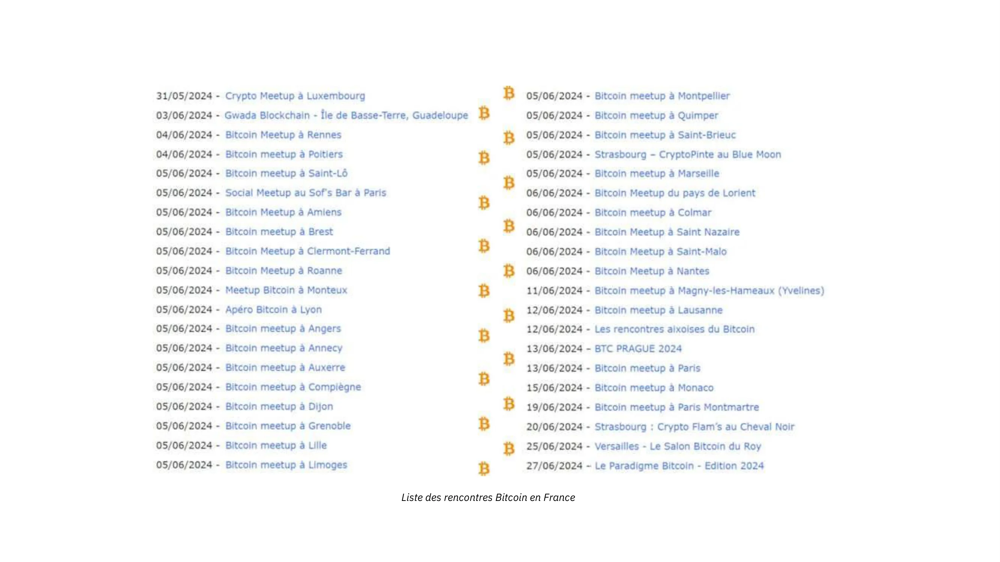

Other platforms can also boost your visibility. **[Meetup](https://www.meetup.com/)** is one of them, and it's a website (and a phone app) where you can create an event and find others nearby.
It cost around 8€ a month (or around 90€ a year), which can be expensive for a small, unstructured community. That said, Meetup is widely used in some countries, especially in Canada and the United States, and it is useful for managing registrations.

Similarly, **[Orangepillapp](https://www.orangepillapp.com/)** is a paid mobile app (50,000 sats/year or 200,000 sats for lifetime access) that helps bitcoiners meet.

While these last two platforms can help increase visibility, they're not recommended when launching a community, simply because they aren't free. 
**Starting with a listing on [btcmap.org](https://btcmap.org/), [BitcoinerEvents](https://www.bitcoinerevents.com/) and for French communities, on [Bitcoin.fr](https://Bitcoin.fr) is more than enough**.

Congratulations! Your **community is created**, your **visuals are ready**, your **objectives are set**, your **communication channels are in place**, your **social networks are launched** and your **visibility strategy is decided**.

Once a small group of bitcoiners has joined you, it's time for the next step: organizing your first Bitcoin meetup.

# Organize a Bitcoin meet-up

<partId>c009d2a6-40ce-583b-bd24-fdfd1fea262e</partId>

## Why launch a regular meetup with your community?

<chapterId>ed8e471c-3b99-57e2-a042-2d4e8a40b137</chapterId>

Now that your community's social networks and communication channels have been launched, it’s time to make your presence felt on these platforms. Encourage new members to introduce themselves and gradually join the conversation.

This will free up your time, which you could be use to think about creating some kind of meetup. This will become even more relevant once you start to feel real excitement within your community.

As mentioned earlier, **a Bitcoin meetup can be seen as the next "level" for a community**. On one hand, it allows **members to meet in person**, and on the other, it helps **educate newcomers interested in this ecosystem**.

An event like this lets you, on your own scale, to **create a buzz around Bitcoin** in your town, which can grow over time as your community takes on projects.

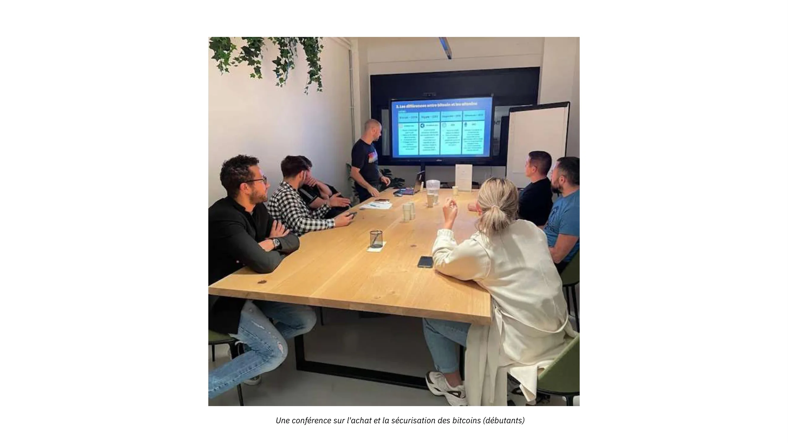

Of course, the bigger your community development goals, the more time you and your members will need to invest.
That's why it's important to **start by setting achievable goals for your meetup**.

## The first meet-up: when, and why?

<chapterId>f3f8a614-cfb4-5994-a2e8-d56e6f8e3347</chapterId>

You can launch a meet-up just a few weeks after creating your community.
However, at that stage your group will probably still be small, which means there's a chance no one will show up.

It's better to organize a meet-up once you have at least a few active members in your communication channels, for example, a few dozen. This can happen quickly, but it also depends on people's personalities.

Once you feel that spark, suggest meeting in person. If others are interested, all that's left is to **set a date for your first meet-up**.

Rather than picking the date yourself, it's usually best to **create a poll about ten days in advance with several possible days and times**. This way, you can use the votes to maximize attendance, build excitement, and make the best use of your time.

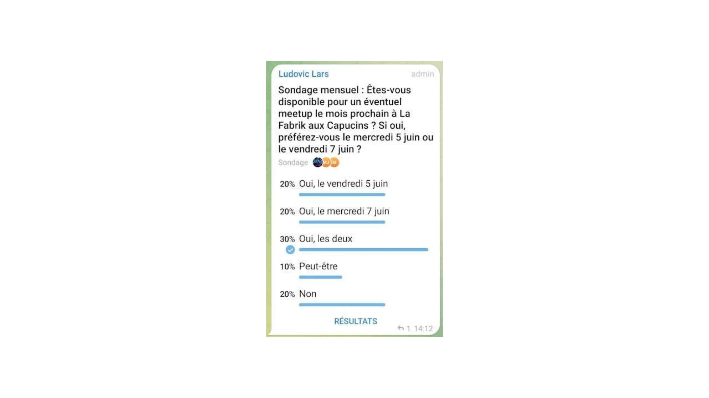

It's best not to go in with fixed expectations about how the meet-up will unfold, how many people will come, or what topics will be discussed. This avoids disappointment and prevents participants from feeling pressured.

Let things flow naturally, maybe over a drink. Conversations should happen easily, and if needed, you can gently steer the discussion back to Bitcoin if it starts to drift.

If you want to prepare for quieter moments, you can plan a few activities or talking points, such as:

- showing the **[Mempool](https://Mempool.space/)** on a computer or smartphone;
- bringing a book;
- bringing a **Nerdminer**, Bitaxe, FPGA or even ASIC;
- having a **Bitcoin flyer**;
- brainstorming a Bitcoin visual or logo for your community;
- playing a **[Bitcoin card game](https://www.Maximalist.ovh/accueil/20-game-le-coin-de-table.html)**;
- showing the **[btcmap.org](https://btcmap.org/)** map of communities and merchants;
- sending or receiving Bitcoin using **Lightning**.

When your meet-up is just starting out, it's often not the right time for a formal presentation. If attendance is small, an open and casual discussion usually works best.

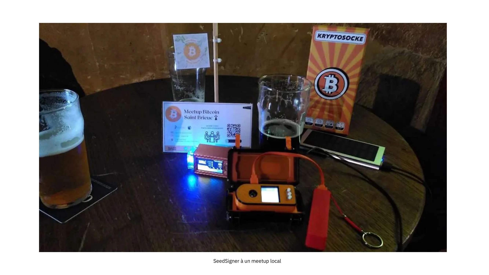

After your first meet-up, you'll probably want to plan another. While your community is still small, it's best to keep choosing dates through polls, for example, once a month or every two months. You can discuss this in your communication channels.

If a regular group of bitcoiners and interested participants forms, it makes sense to set a recurring schedule for two reasons:
1) it makes it easier for everyone to plan ahead;
2) it helps **establish a "habit"**. Even if someone stops checking your channels regularly, they'll still know when the meet-up happens and can drop by as usual.

This second point is one of reason why, **in France, most meetups take place on the first Wednesday of every month** (see the "ambassadors" initiative, launched by [DecouvreBitcoin](https://decouvrebitcoin.fr/) in 2022).
In Germany and Italy, there's no fixed national day.

However, having all meet-ups nationwide on the same day creates a centralization problem: it prevents bitcoiners from attending events in nearby communities and can also raise security concerns. Talking with neighboring meet-up organizers can help you agree on a good arrangement.

As your community grows and meet-ups attract more people, you could:
- set a specific goal for each meet-ups;
- or even **add a second event each month**.

In the first case, while keeping everyone's preferences in mind, a clear goal can ensure attendees leave having learned something new and keep conversations focused on Bitcoin.
In the second case, a second monthly event could be dedicated to a specific theme, such as beginner sessions or workshops (mining, Lightning, node installation, etc.).

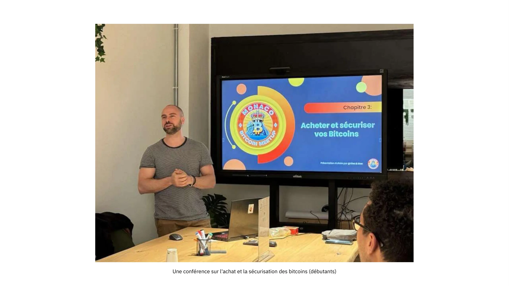

Bear in mind that **this requires more organization and more of your time**. Fortunately, in [part 6/8 of this course](https://planb.network/courses/1c643dc9-a15f-4f9e-93b6-cb3c58b4ee35/3213d87a-1998-5972-ab93-97a5769ba279), you'll find a range of reusable open-source resources to help.

In any case, it all depends on the short-, medium- and long-term action plan you, or your community, set for yourselves.

## The search for a location

<chapterId>405d389e-6a32-5777-af8d-293380d2e8fd</chapterId>

Finding a venue for your events is often no easy task. On top of that, it's essential that this venue be **located in your community's city**.

There are several criteria to consider, including:
1) **Location**: is it easily accessible by public transport? By car? Is parking available?
2) Is the venue pleasant and not too **noisy**? Are you looking for a formal setting (coworking space, meeting room) or something more informal (bar, restaurant)?
3) Does it have enough capacity to host you, even on a rugby or Champions League match night?
4) Does it have a video projector and a quiet area for presentations?
5) And finally, if it's a bar or restaurant, does the menu offer something for everyone to eat and drink?

In addition, here are three important points to keep in mind:
- If you plan to split the evening into two parts : first, a presentation in a formal space to help everyone focus, then moving to a bar or restaurant to continue in a more relaxed atmosphere, experience shows that changing venues mid-evening often leads some participants to leave during the break. This approach is therefore not recommended.
- At your first meet-ups, attendance will likely be small, and you probably won't hold formal presentations. In that case, there's no need to introduce yourself to the owner or explain your objectives. However, **once the meet-ups become regular and well-attended, it's worth doing so to show professionalism and express your wish to return monthly**. This can lead to many discussions (automatic monthly reservations, free drinks and/or food boards, discounts, conversations about Bitcoin, acceptance of Bitcoin payments, etc.). Obviously, if you're specifically looking for a venue with a video projector to make presentations, it seems essential to ask for a meeting (face-to-face, or even by telephone) with the owner and/or manager to present your project and objectives.

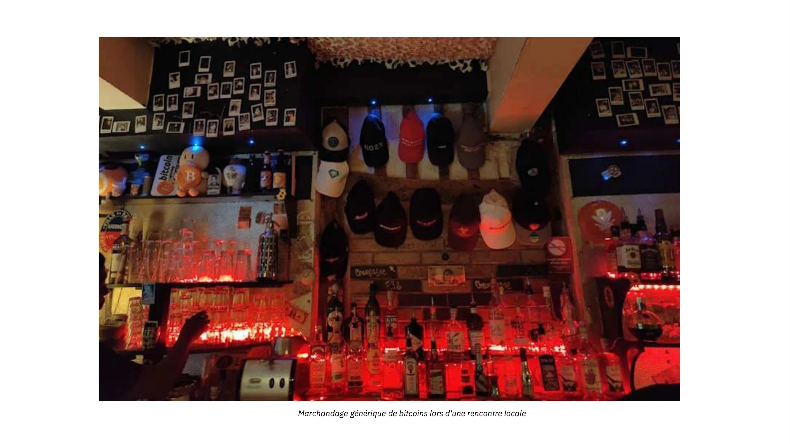

- lastly, some communities **only want to hold their events in places that accept Bitcoin payments**, which is understandable. In this case, it's a good idea to **start by searching for Bitcoin-accepting businesses in your city** (on [btcmap.org](https://btcmap.org/map/)and contact them to see if they meet your criteria. If nothing suitable is available, you can try onboarding new merchants, but expect many refusals, which can be discouraging. That's why it's often best not to set this as a goal from the start, and instead consider it once your community is well established and you have enough "firepower."

Also, when launching your meet-up, don't hesitate to **change venues for the first few months**. This will help you **build relationships with different managers**, explore various atmospheres, and gather information about potential future hosts.

Later, once your group has grown, you could even take an afternoon to visit several businesses and bars, asking if they have a space suitable for hosting your monthly events and meet-ups.

## Before the meet-up

<chapterId>c5218943-580d-5efc-89ed-6b5d728816d6</chapterId>

Planning to organize a meet-up in the coming weeks? 
Here's a checklist to help you prepare:
1/ **Confirm the venue**
Contact the location where you'll host the event and reserve it for the estimated number of attendees.
2/ **Announce the event**:
    - Share the date, time, and location on your social networks and other communication channels. Include a registration link if needed.
    - Create a dedicated visual (Canva poster for example, see part 2/8 "[Designing an identity for your Bitcoin community](https://planb.network/courses/1c643dc9-a15f-4f9e-93b6-cb3c58b4ee35/b48a18cc-afdf-5216-802c-32647b5cd8a3)").
    - Maximize visibility by pinning the announcement on Telegram and Twitter, and using an "@everyone" mention on Discord.
    - Post announcements 7 to 10 days before the event so attendees can plan ahead.

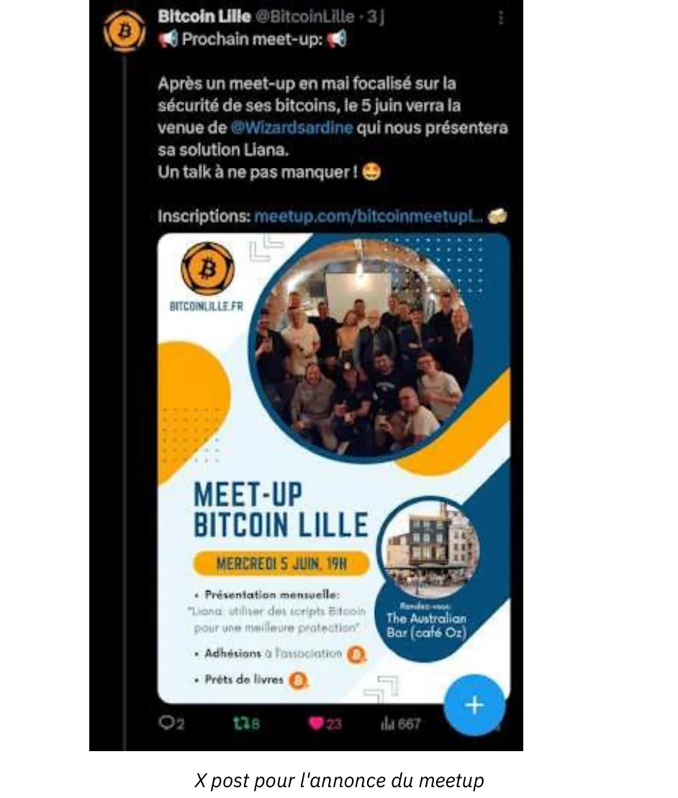

3/ **Remind your audience**
Two to three days before the event, re-share and retweet your announcements to boost visibility.
4/ **Update the venue**
The day before (or two days prior), check your registrations and let the venue know the final expected number of participants.

Extra steps to make your event stand out:
- Print flyers and/or posters
- Prepare a presentation on a specific topic
- Organize an activity or workshop

## The day of the meet-up

<chapterId>cf60067b-591f-5fdf-9b9e-d442aad0e8f9</chapterId>

The big day is here! One or two hours before the event starts, send a reminder through your community's communication channels. Reconfirm the start time and let participants know how to recognize you, for example, by mentioning that you'll be wearing a Bitcoin T-shirt and cap.

As your meetups grow and you begin welcoming more than 20 people, preparing the venue will become increasingly important.

Here's what to do:
1) **Arrive early** to set things up.
2) **Arrange the space** according to your needs and the venue's possibilities. If you're only six people, little setup is needed. But once you reach 10-20 attendees, a fully seated layout can limit interactions. In that case, choose a standing setup with well-spaced high tables if available, while still providing a few (preferably high) chairs. If a presentation is planned, keep the standing layout for most of the evening and bring in chairs just before the talk.
3) Add small custom touches:
    - Put up a poster at the entrance to indicate your location (use Patafix and get the venue's permission first).
    - Display Bitcoin-themed posters inside (Bitcoin white paper, your community charter, current projects, etc.).
    - Place stickers, flyers, or conversation starters on tables, for example: a Nerdminer, hardware wallet, laptop displaying its Mempool, ASIC miner, or metal backup plate for private keys.

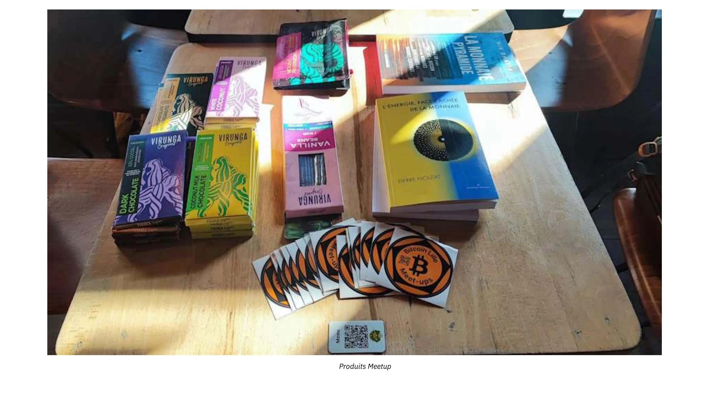

If you're expecting only a few participants and haven't yet built a relationship with the venue managers, avoid bringing and displaying all your equipment right away. Once trust is established, you'll have more freedom to arrange the space as you wish.

Finally, grab a drink and wait for people to arrive. And remember : don't be discouraged if no one comes the first time. Bring a book or a video to watch, just in case.

## After the meet-up

<chapterId>3e881af9-9c09-5721-81ee-c5cda3b109c5</chapterId>

When the meetup ends, it's cleanup time for the venue staff. Before you leave, offer to lend a hand to the waiters or managers. This could be as simple as gathering all the glasses onto one table or, if you're near the bar, returning them before you go.

Once you're back home, you'll likely still have Bitcoin on your mind for days. That's the perfect time to take your community's pulse and collect feedback from participants. You can:
- Post a thank-you message on your communication channels and share any links or resources mentioned during the event.
- Invite attendees to suggest improvements for the next meetup.
- Begin planning your next event.

You'll then have a few weeks to develop fresh ideas, visuals, or projects to make the next meetup even better.

## The importance of involving and retaining participants

<chapterId>f5355e35-4b07-527c-88a3-8535cba7592c</chapterId>

Rome wasn't built in a day, and neither will your community be. Momentum around Bitcoin comes from holding regular meetups and events.

To make that happen, one thing is essential: **keep participants engaged**.

It might start with a small group of passionate bitcoiners, whose aim is to get together regularly and talk about Bitcoin. Over time, depending on each person's availability and interests, you can **share certain organizational tasks with the group**, or invite core **members to take on specific projects**. These can be unique to your community, your meet-ups or your city or even inspired by the many initiatives proposed in [part 6/8 of this course](https://planb.network/courses/1c643dc9-a15f-4f9e-93b6-cb3c58b4ee35/3213d87a-1998-5972-ab93-97a5769ba279). **This not only fosters commitment from your core members but also helps your community grow and thrive.**.

As your meetups progress, new faces will appear: people who bought BTC and/or altcoins in previous cycles, tech enthusiasts wanting to deepen their understanding, or complete beginners curious about this uncensorable, decentralized, transparent, and fair payment system that works without conditions and without trusted third parties.

To make sure everyone feels included at your events, focus on two key aspects:
- **Social inclusion**: Everyone who attends should feel welcome. Make the effort to greet newcomers, ask why they came, and introduce them to others. When people feel included, they're more likely to come back and maybe even help organize future events.
- **Patience and openness**: This takes time and motivation. If you're speaking with a committed shitcoiner (or worse, an XRP maximalist), it can be tempting to dismiss them. But by engaging in conversation, you may clear up misunderstandings or flawed reasoning. If they're willing to listen, they might be ready to truly understand Bitcoin.

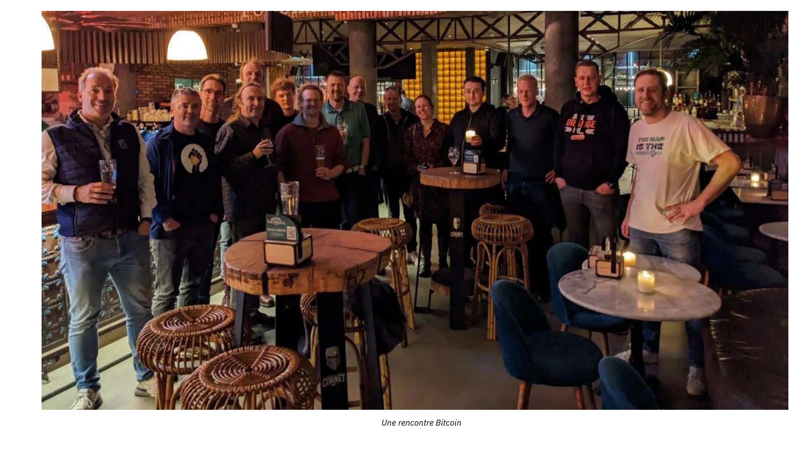

From a practical standpoint, think about the overall event experience:
- Was the **venue pleasant**?
- Was it **easy to access?**
- Why did some people sign up but not show up?
- What discussions were held? Were the discussions too technical for beginners?
- Were the discussions too alcoholic?

Each participant has their own personality, goals, and interests, so experiences will vary. But when the venue is right, the crowd is open-minded, and the intentions are genuine, there's every reason for the meetup to succeed.

Building a meetup takes time but above all, it requires organization. It's a human project, and it will only work and grow over the long term if it's well planned, open, and inclusive.

Ultimately, it's up to you to decide how far "open and inclusive" should go. Just remember: a shitcoiner is often just a bitcoiner in the making.

# Examples of projects and initiatives

<partId>45b3bc40-1c31-583e-8411-2662e6efd765</partId>

## Why go further than just drinking beer?

<chapterId>3213d87a-1998-5972-ab93-97a5769ba279</chapterId>

As the blocks roll on, your community will evolve. New faces will join, others will drift away but the guiding principle should remain the same: develope the Bitcoin ecosystem and strengthen the bonds between members.

There are many projects and initiatives that can be implemented. This chapter offers a non-exhaustive list of ideas that can be carried out within a community or during a meetup. Feel free to choose the ones that inspire you and even contribute your own ideas to this course [by making a "Pull Request" on GitHub](https://github.com/PlanB-Network/Bitcoin-educational-content).

Before diving in, let's revisit a point mentioned earlier.

When you organize a Bitcoin meetup, you meet new people. Social interaction is essential and beer (or alcohol in general) can help create a festive atmosphere. But it's worth keeping in mind:
- Alcohol impairs cognitive abilities like thinking and comprehension, which can make it harder for participants to follow serious discussions or presentations.
- Alcohol can also become a comfort ritual: every month, you share your "Bitcoin moment" with friends over a drink. While that's a great way to connect, is drinking beer really the main goal of your meetup? Or would you rather exchange research, learn from others, and help newcomers discover Bitcoin?

Everyone has their own preferences, convictions and personality. This isn't about judging one meetup over another. Still, while it's often over a beer that we talk about changing the world, revolutions don't start, or grow, that way.

The key is simply to be aware of it.

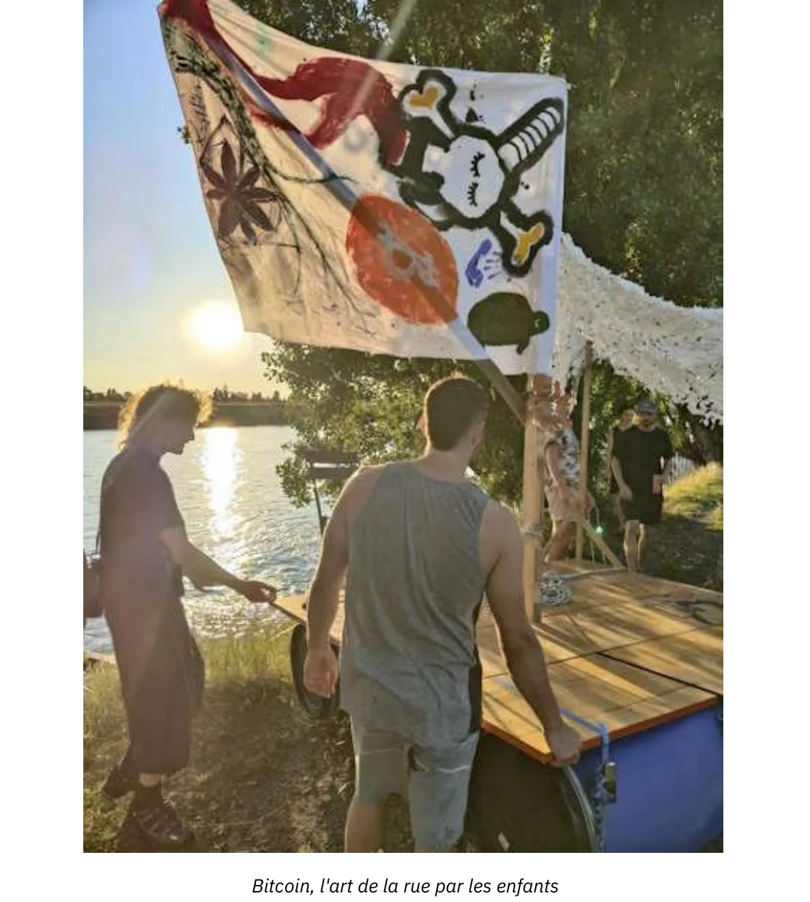

## Organize themed meet-ups, with annual progression

<chapterId>46afdbcc-a775-5c16-b20a-34956690d58f</chapterId>

Once you've built up a core group of around ten people, you'll be able to **produce a presentation at each of your meet-ups**. These can be **themed**, on a subject announced in advance; or they can be unconnected to each other.

In the case of presentations and/or workshops, it can be very useful to **construct a well-thought-out progression** in advance. The aim of this progression would then be to **address all the important notions of Bitcoin**, enabling people attending the meet-ups to understand Bitcoin from different angles.

In France, during the summer of 2023, meet-up organizers worked on **an annual progression**. As well as having a strong **educational dimension, this also enables meet-ups to exchange open-source documents and powerpoint presentations**; thus providing an ever-growing database of resources.

This initiative is particularly popular at meet-ups, and is set to expand over the next few years.

The progression followed in 2023/2024 by the French meet-ups is therefore available below. For each one, **an open-source presentation accompanied by its video is proposed, perhaps giving you some ideas on the notions that can be tackled**.

Other editable resources are also available in the [Bitcoin Teaching Toolbox](https://planb.network/fr/resources/bet)!

| Mois | Thème | Vidéo | Ressource modifiable |
| -------- | -------- | -------- | --- |
| Septembre     | Chapitre 1: Qu'est-ce que Bitcoin?     | [Lien youtube](https://www.youtube.com/watch?v=CSjuBqrl4t8)     | [PowerPoint modifiable](https://www.canva.com/design/DAFu0d5Jd7M/9gAWDAOSS6LDkWENuZjYgw/edit) |
| Octobre & Novembre| Chapitre 2: Comprendre les transactions sur Bitcoin     | [Lien youtube](https://www.youtube.com/watch?v=inFnR-3NsdM)     | [PowerPoint modifiable](https://www.canva.com/design/DAFsEcnOro8/Mz9FYdTGhsvozZOe0Y9jtw/edit) |
| Décembre     | Chapitre 3: Comprendre le Lightning Network     | [Lien youtube](https://www.youtube.com/watch?v=hHz-ALx8D9w)     | [PowerPoint modifiable](https://www.canva.com/design/DAF4YPSNnR8/HKp4Vmcno8eMtVWnZmFtcw/edit) |
| Janvier     | Chapitre 4: Qu'est-ce que le minage?     | [Lien youtube](https://www.youtube.com/watch?v=QyHZ3CVI_OI)     | [PowerPoint modifiable](https://www.canva.com/design/DAF5DE6iBEM/tsy8E3oBebUnsR0kj53vvQ/edit) |
| Février     | Chapitre 5: Monter un noeud Bitcoin et Lightning     | [Lien youtube](https://www.youtube.com/watch?v=RRYK-usg-OY)     | [PowerPoint modifiable](https://www.canva.com/design/DAF55FU6HI0/sQ0lacRJblqrhn_9Xk1yDg/edit) |
| Mars     | Chapitre 6: Utiliser le Lightning Network au quotidien     | [Lien youtube](https://www.youtube.com/watch?v=o2BS4xjei8M)    | [PowerPoint modifiable](https://www.canva.com/design/DAGAcJMw7lw/-haMNnHnwj5vpDAy8MDowA/edit) |
| Avril & Mai     | Chapitre 7: Sécuriser ses bitcoins      | [Lien youtube](https://www.youtube.com/watch?v=fHExPbhM0Hg)    | [PowerPoint modifiable](https://www.canva.com/design/DAGDz3Nq4e0/D3uG-4w9FN6OhUq-VXzhfg/edit) |
| Juin     | Chapitre 8: Qu'est-ce qu'un multi-sig?     | [Lien youtube](https://www.youtube.com/watch?v=Me5489mpoxA)     | [PowerPoint modifiable](https://www.canva.com/design/DAGLMtQT6sg/rYIxr4ldUJ0jTelNf-Pj8Q/edit) |
| Juillet     | Chapitre 9: Comprendre le bull-run, et s'y préparer     | [Lien youtube](https://www.youtube.com/watch?v=7RA-gnCJWyM)     | [PowerPoint modifiable](https://www.canva.com/design/DAGJQkiZ_YA/9lUluP9RZ0eeA_e61mk9Hw/edit) |
| Août     | Chapitre 10: Le fisc n'est jamais bien loin     | [Lien youtube](https://www.youtube.com/watch?v=oY4NwonGDm0)     | [PowerPoint modifiable](https://www.canva.com/design/DAGQhx7Yc_c/7mRhb_vlgnhSgxd1FtjK8w/edit) |

Chapters 2 and 7 can be split into two presentations, for example, to avoid overloading participants with information. Doing them in one go, however, allows greater freedom in the planning of annual events, so that specific workshops or events can be held in addition (joint meeting with a neighboring meet-up, quizzes, workshops, etc.)

**Feel free to take these resources, modify them and share them as you wish**. Just remember to **cite your sources** in case you reuse any of these presentations.

Of course, not all participants will be present at every meet-up. It may therefore be a good idea to **capture the presentation on video and post it on a streaming platform and/or your website**. This can encourage those who don't attend to take a look at the presentations from previous meet-ups, or even to watch them several times in replay mode, in order to learn more.

In parallel, themed meet-ups can be organized. These include

- a **knowledge quiz** (with, for example, a physical portfolio to be won);
- an **onboarding challenge** by sending free satoshis to no-coiners on the street;
- l'**organization of the visit of experts in a specific field**, or of a company offering a Bitcoin product;
- an **evening tour of bars and shops accepting Bitcoin** as payment;
- etc.

The only limits are those of your imagination!

## Create side-events and workshops

<chapterId>9dbd651a-8712-5630-90b3-b9525dcc1385</chapterId>

Depending on the time you have available and the involvement of your community, other events can be organized to punctuate the year. This could be anything from:

- a restaurant evening for Pizza Day**, on May 22;
- an evening or weekend to "celebrate" the next Halving**;
- a "family game" event around Bitcoin** and how it works. Games such as [Le Coin de Table](https://www.Maximalist.ovh/) or [SHAmory](https://shamory.com/) can then be brought in;
- a mining workshop**, with the discovery of several types of hardware (processor, graphics card, FPGA, ASIC, nerdminer, bitaxe);
- an afternoon or evening especially for beginners, with themed workshops**;
- or even **a joint meet-up with neighboring meet-ups**.

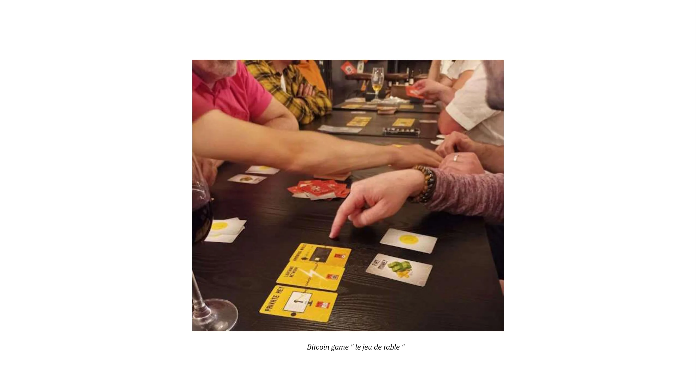

However, be careful **not to hold too many events in a month, as the more there are, the more time-consuming** it is for both organizers and participants, and this can lead some of them to stop coming each time.

## Create stickers

<chapterId>d605f3b3-130e-513d-85e6-06bc5ea13e99</chapterId>

As a symbol of your community's identity, stickers can be a great way to get the word out about Bitcoin and your initiative.

Before you place your order, however, there are a number of points to consider:

- if you want these stickers to be stuck on the street, you'll need waterproof stickers;
- make sure your logo is smaller than the area specified when ordering**. This will prevent laser cutters from making precision errors and cutting out part of your logo. This is usually explained when you place your order;
- consider **using a vector file** rather than an image file. This will improve print quality;
- think twice about the size you want**. For example, an 8 cm diameter circular sticker is about the size of the palm of an adult hand. Are you looking for this size, which is still quite visible, or are you looking for something more discreet (4 cm in diameter, for example)?
- finally - it's a bit technical - but if you want a beautiful black for printing ("quadri black"), the properties of the latter should be: 30% cyan, 30% magenta, 30% yellow and 100% black. If only 100% black is taken into account, the result will be a slightly grayish black. Fortunately, printers generally pay attention to this detail. So you needn't worry.

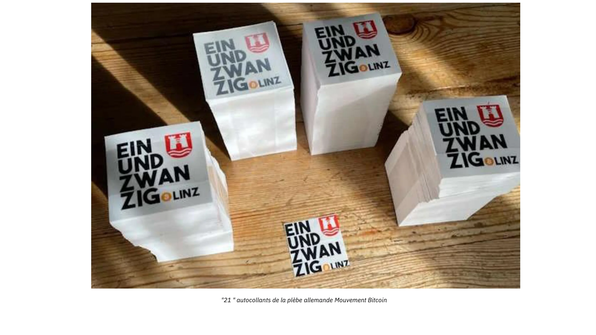

Depending on your requirements and the supplier you choose, expect to pay **between 100 and 250 euros for 1000 stickers**. You can also contact [@Mill3sim3 on Twitter](https://x.com/Mill3sim3), a French bitcoiner specializing in marketing who can help you get prices almost 30% cheaper than the usual online sites.

However, it should be noted that 1000 stickers is a very large quantity. So it's clearly **preferable, to start with, to buy around a hundred stickers**; to be sure of selling out this stock.

And also: **if you decide to stick one of these stickers on the street, depending on the country you're in, it may be prohibited**.

In France, for example, stickers may only be affixed to public notice boards in each city. This means that if one of your stickers is affixed in any way (or rather: anywhere, such as in the middle of a stop sign), it will be quickly removed; and if it contains information that can be traced back to you or your meet-up, you could be fined. So be careful and inform your members.

At the same time, if you're a fan of concerts, bars or stadiums, **think about checking that there are already stickers affixed before applying your own. If not, take a few seconds to ask an employee if it's okay**. It would be a shame for a shopkeeper to hear about your community / meet-up / association / Bitcoin for the first time because you "sabotaged" the decoration of his toilets!

## Create a library

<chapterId>acc94093-f8b3-51b8-9359-348e9e075d38</chapterId>

Another project that can easily be set up is **installing a library at your meet-ups**.

To do this, you can suggest to anyone interested in sharing their reading that they bring back a Bitcoin-related book and, if anyone else at the meet-up is interested in borrowing it, **a loan could be made to its owner, for a deposit of 21,000 satoshis in Lightning, for example**.

For the owner, this means covering the costs in the event of loss or theft; and for the borrower, coming back at a future meet-up to collect his or her 21,000 satoshis!

If you own **an association and wish to invest part of your cash flow in teaching and educational resources**, you can also order several books and offer them in your **Bitcoin library**, at each meet-up.

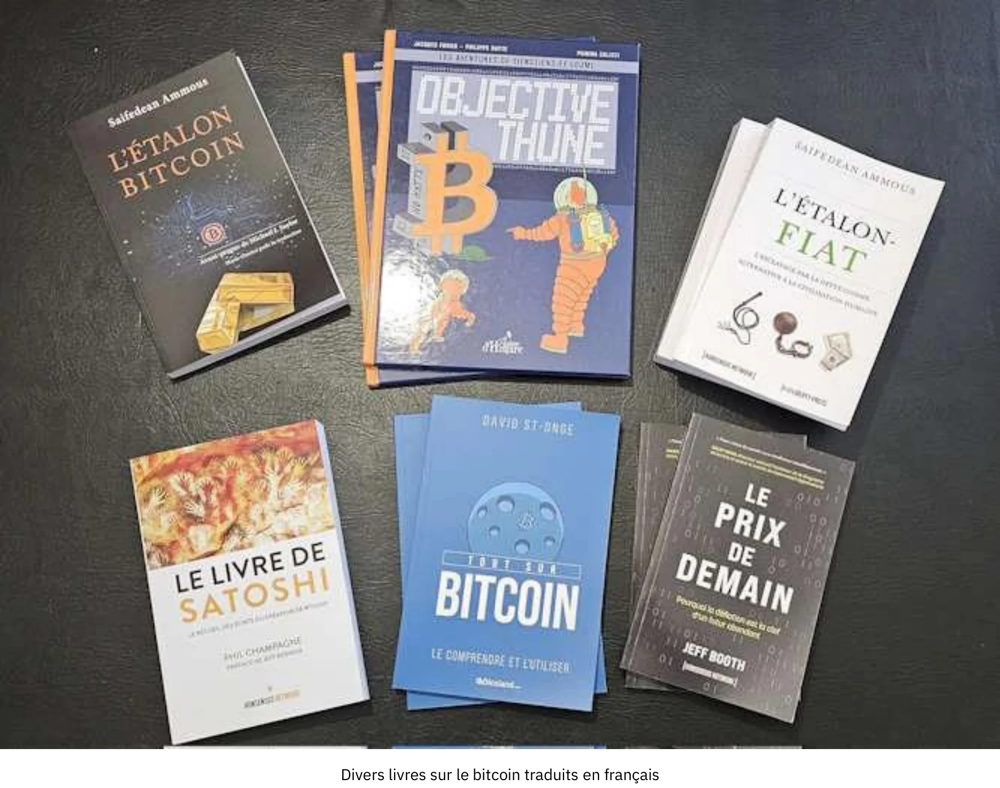

With a view to developing the ecosystem, **[publisher Konsensus Network](https://konsensus.network/) has been offering international Bitcoin meet-ups and communities a discount of between 15% and 35% on all its books since the end of 2023; from three purchased**.

To take advantage of this discount, simply **contact [Konsensus publishing house](https://twitter.com/KonsensusFR) on Twitter**.

If you don't have the cash, you can still pass on the discount to members of your community.

For example, one of your community organizers could centralize your members' orders and place them with Konsensus at a lower cost, with a view to redistributing the copies received at the next meet-up. This redistribution could then take place at the time of payment, in Lightning.

In addition, a book-lending charter can be posted at meet-ups, giving newcomers a succinct explanation of borrowing rules.

Here's an open-source example, which you can take and modify as you like:

[Book lending charter](https://www.canva.com/design/DAF7u1b5kRM/r2gEAlibe_jTIXIX-O9PMA/edit)

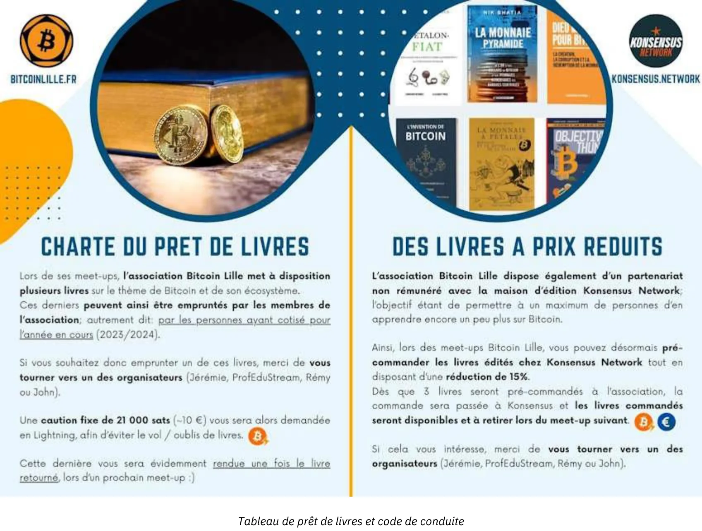

Finally, still with the idea of developing readings around Bitcoin, a last major action could be to **go to the town's municipal libraries and check that they have various books on Bitcoin**.

If so, we can ask librarians if any **round tables** on this subject are going to be held in the next few months, even if it means giving them the contact details for the town's meet-up.

If not, **you may be asked to purchase several books that you have selected in advance**. The website of [publisher Konsensus Network](https://konsensus.network/) can be a source of inspiration.

## Create and distribute personalized flyers

<chapterId>62ad5430-c698-51b3-89ac-090f31c88953</chapterId>

Creating and writing flyers takes a lot of time. Nonetheless, it allows us to **have something to hand when discussing Bitcoin**, which is very much appreciated.

These flyers can be designed for:

- merchants**, if you wish to offer them Bitcoin as a means of payment;
- people attending your events**, with a flyer explaining how to use and pay with Bitcoin / Lightning;
- newcomers**, whether you've met them on the street, in the workplace or at a family dinner, with a flyer highlighting Bitcoin's main interests.

It's also possible to prepare **a specific flyer for your community or meet-ups, presenting your actions, objectives, networks and communication channels, as well as the dates and locations of your planned events**.

Several flyers are already **available as open-source**, and more will be created in the coming months. You'll find them **in the [Bitcoin Teaching Toolbox](https://planb.network/fr/resources/bet)** on planB.network.

Among them is a [complete sourced flyer](https://profedustream.substack.com/p/21-raisons-dutiliser-Bitcoin) with 21 reasons to use Bitcoin. The design is also [available in open-source](https://www.canva.com/design/DAFtAR1NauQ/ZDwl2CchIJ9Gpb36N6-7iw/edit?utm_content=DAFtAR1NauQ&utm_campaign=designshare&utm_medium=link2&utm_source=sharebutton). Feel free to modify it, adapt it to your needs and share it. Just remember to cite your sources.

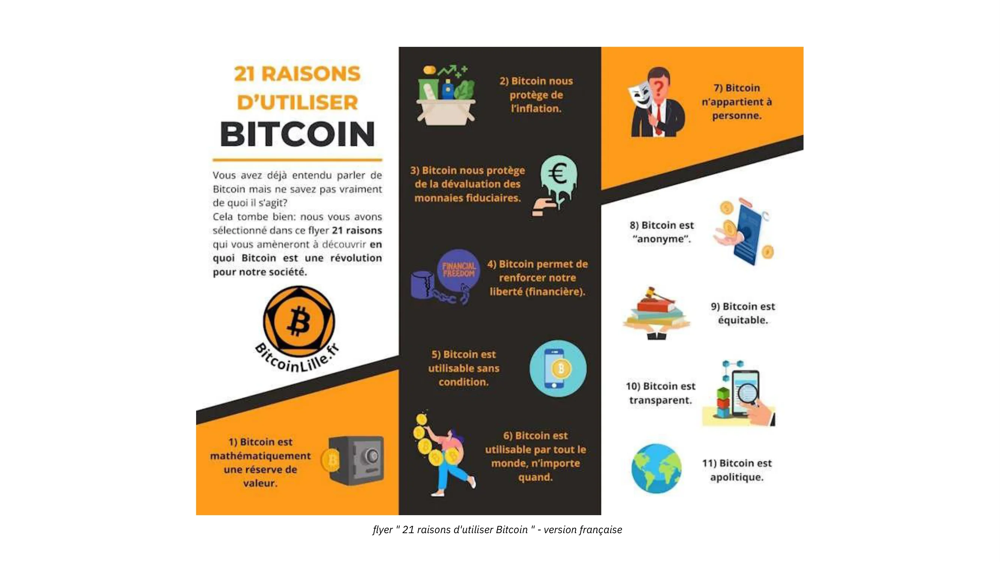

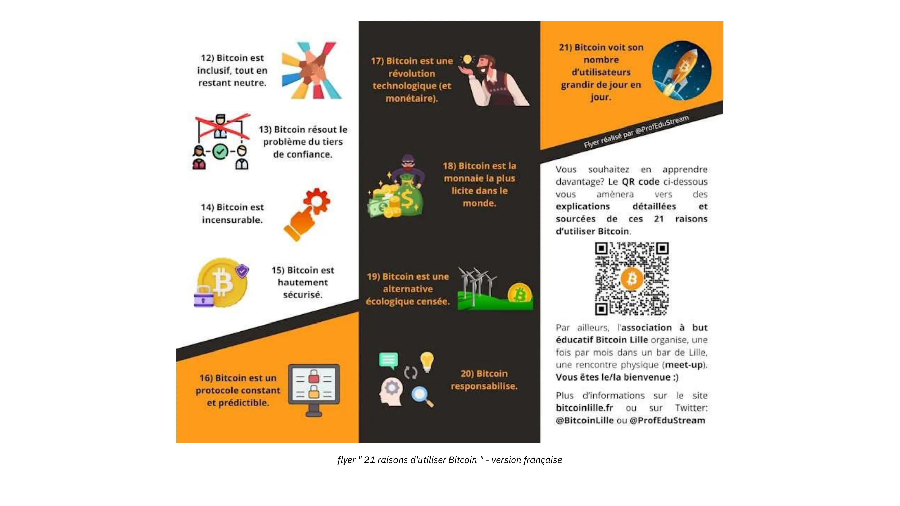

As mentioned above, **these flyers can be placed just about anywhere**: on a collective desk at your place of work, on a table at a family dinner, in a public library, etc.

In France and a few other countries, there are also **"boîtes à livres "**.

These are usually made of wood, and welcome books to be donated free of charge. One possibility would be to **leave a flyer; or better still, a book!

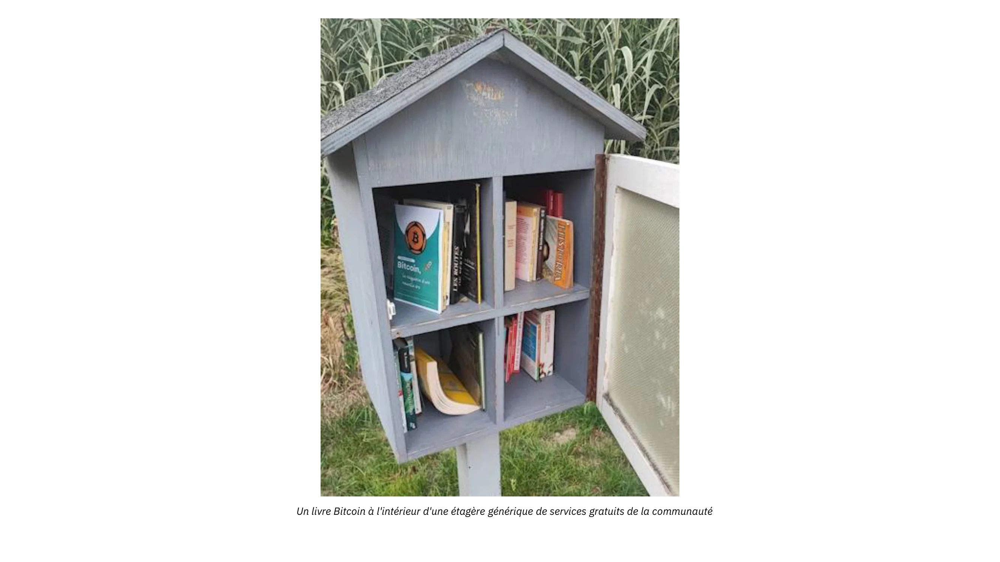

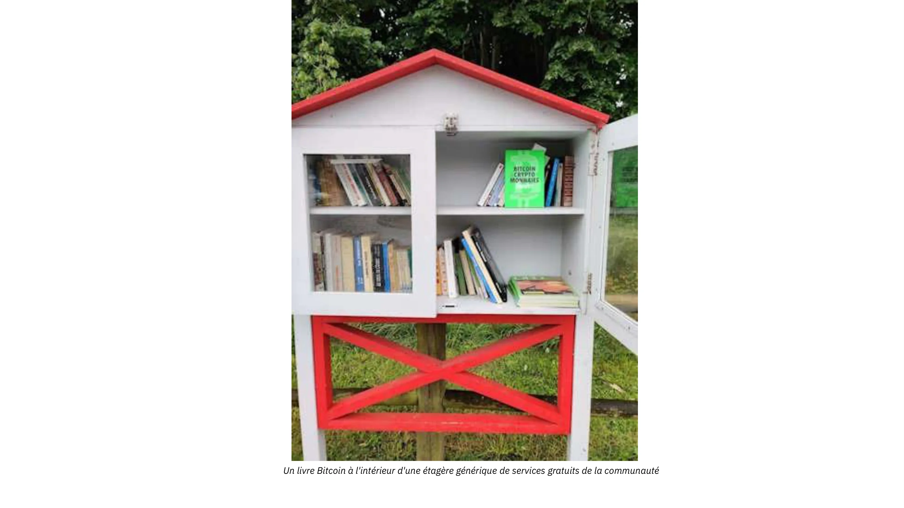

With this in mind, in 2023 **the initiative "Un livre blanc de Bitcoin dans les boîtes à livres de France "** was launched.

In order to carry out this project, it was first necessary to **obtain the geolocation of all the book boxes existing in the country**. Various databases exist for this purpose:

- [boite.a.livres.zonelivre.fr](https://boite.a.livres.zonelivre.fr/);
- [boites-a-livres.fr](https://www.boites-a-livres.fr/carte-de-france);
- [delivrez.fr](https://delivrez.fr/maps/fr_FR/);
- some other articles in the local press.

Of course, there's something symbolic about posting the Bitcoin white paper in these book boxes. However, for a neophyte, it's too complex to understand.

The idea was to **write a small booklet, including**:

- an easy-to-understand, well-sourced introduction to Bitcoin, its use and the problems it solves**;
- accompanied by the Bitcoin white paper**, translated into French.

So here's [the booklet that was shared between French bitcoiners](https://profedustream.substack.com/p/Bitcoin-la-naissance-dune-nouvelle) and has been deposited in dozens of bookboxes around the country. Its design is also [available as open-source](https://www.canva.com/design/DAFs18FSoVM/Sy0QsfUkycTgXveeGgutBg/edit?utm_content=DAFs18FSoVM&utm_campaign=designshare&utm_medium=link2&utm_source=sharebutton).

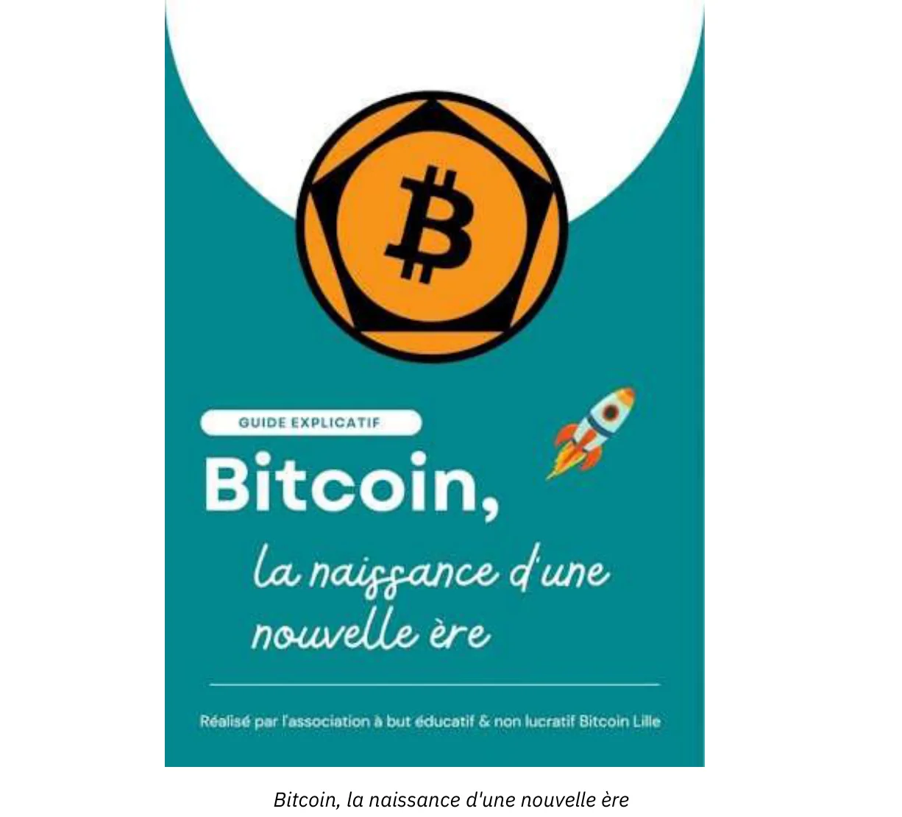

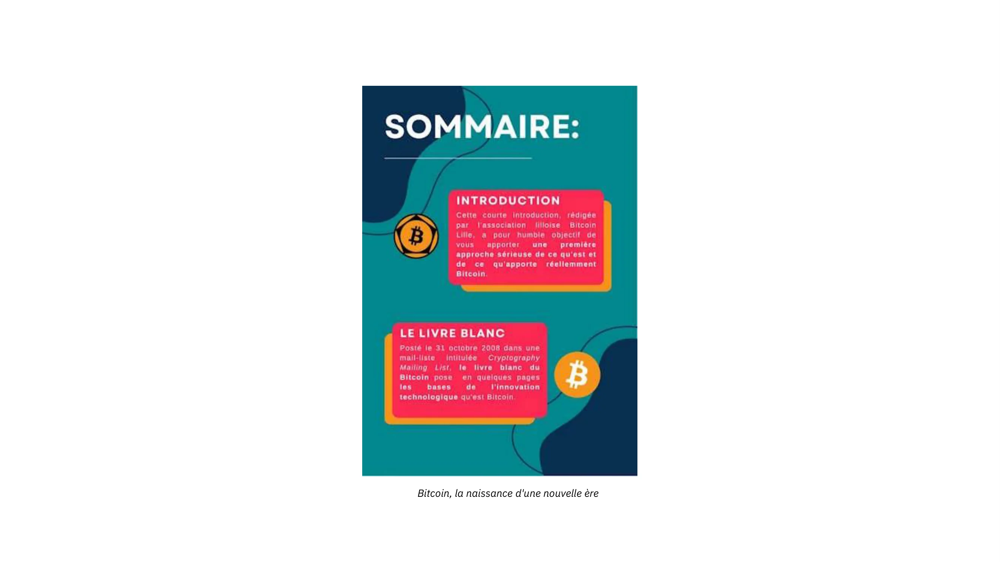

## Producing a video projection

<chapterId>892b248a-b837-5df6-aac9-4b3261ff0390</chapterId>

Any bitcoiner will certainly have seen [Rémi Forte]'s very interesting mid-series "Le mystère Satoshi, aux origines du Bitcoin"(https://twitter.com/forteremi).

Released in 2021, it has been viewed [several million times on YouTube](https://www.youtube.com/watch?v=0ETcLj5jBy4).

A first idea would therefore be to **propose to your community a video projection of the Satoshi mystery**, at an additional monthly event for example.

A word of warning, however: although ARTE France has confirmed that this broadcast is possible, to be legal it will be necessary to pay the **projection rights**, which amounted to nearly €250 per screening in 2023 (with a possible reduction to €120 per screening if 5 meet-ups screened during the year).

As a result, for the vast majority of communities, the price is prohibitive. And on top of that, the documentary is available for free on ARTE's youtube channel...

At the same time, other projections can be made.

In France, for example, **director [Alana Mediavilla](https://twitter.com/AlanaMediavilla) has agreed to let the country's meet-ups preview her documentary "Stranded "**, some of whose images are taken from footage in the film "Dirty Coin"(https://www.dirtycointhemovie.com/), due for release in 2024.

Some bitcoiners then took the initiative to **fully translate the "Stranded" documentary into French**, integrate subtitles and share it at all the country's meet-ups. During the week of March 4, 2024, **the screening then took place synchronously in a dozen or so meet-ups across the country**.

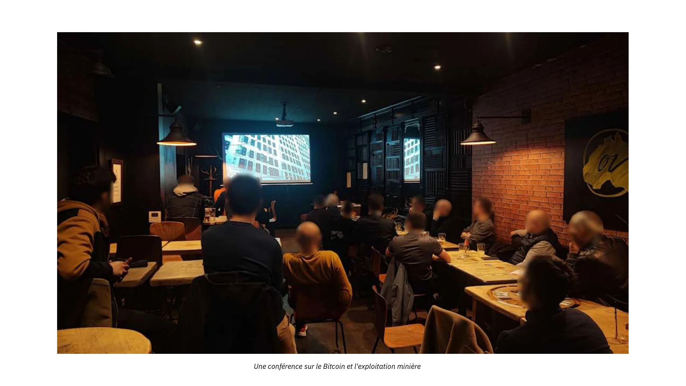

This led to much discussion about bitcoin mining, its power consumption and its impact on the environment in general.

## Putting up posters in your city

<chapterId>6565e8a0-d535-5be0-9764-273584c675bd</chapterId>

In several European countries (Germany, Spain, France, etc.), **bitcoiners have taken the initiative of putting up posters in their towns**. Some of these posters reproduce Banksy's work, incorporating the Bitcoin logo.

This is particularly true of [StreetCyberArt](https://twitter.com/streetcyber_art), a German bitcoiner who has been creating collages and street art for several years.

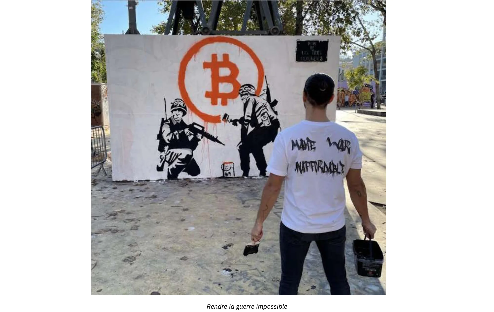

However, if you want to get involved in street collage, you'll need to **know your country's laws**. In France, for example, it's only allowed to **paste posters on public billboards**. Elsewhere, it's forbidden and punishable by fine.

If you want to defy the "ban" and hope you won't be caught "red-handed", remember not to put anything on the posters that might help us find you (name of the meet-up, @ Twitter, etc.)

In the event that you wish to **print this type of poster with a personal printer, be aware that this generally causes the paper to drool heavily, but also to deteriorate rapidly over time**. In this sense, **the best strategy is certainly to contact a professional printer to produce these posters on specific self-adhesive paper, specially designed for outdoor use**. Quality is guaranteed.

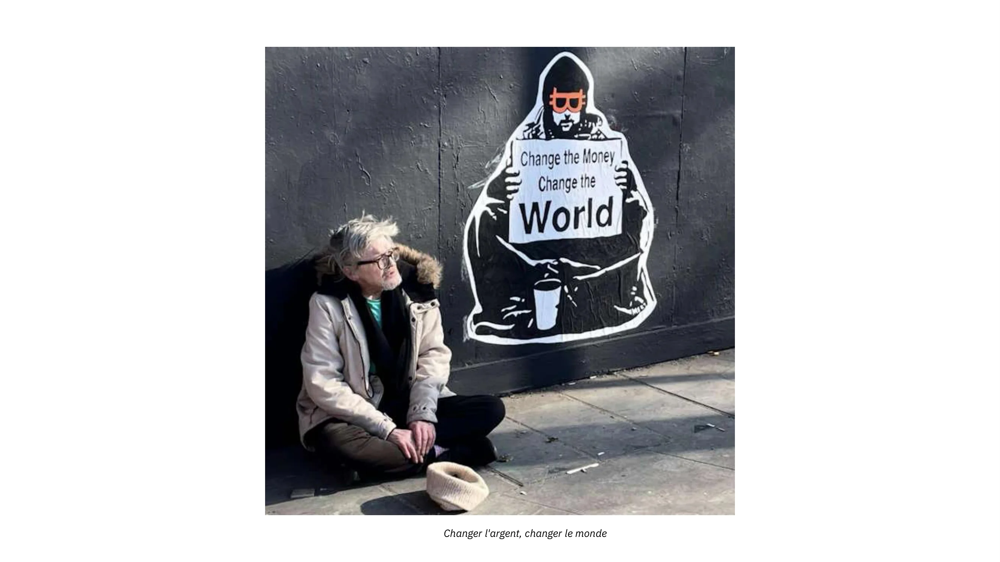

However, there's no denying that **this initiative comes with a hefty price tag: over €0.40 per poster (i.e. €40 for a hundred posters)**. And on the internet, prices can vary from double to quintuple. So you need the right contacts.

As mentioned above, French bitcoiner [@Mill3sim3](https://twitter.com/Mill3sim3) has the right professional equipment. You can contact him on Twitter to ask for information.

Another idea - this time DIY - would be to make a stencil out of a large piece of cardboard and buy cans of spray paint. You can then tag your work in certain corners of your city.

## A personalized NFC card

<chapterId>8ad65d4e-a68a-59c2-a812-85f4907ed9f3</chapterId>

Another unique project is the **creation of personalized NFC cards for Lightning payment** (in line with the BoltCard standard). For this, **Swiss Bitcoin Pay** is a first-rate partner.

Currently, [on their website](https://swiss-Bitcoin-pay.ch/cards), there are four basic designs.

However, if you would like to order **more than 50 NFC cards, you can contact the company on its official website (or on [Twitter](https://twitter.com/SwissBitcoinPay)) and propose a customized** design for the front of the card. The reverse side is standardized.

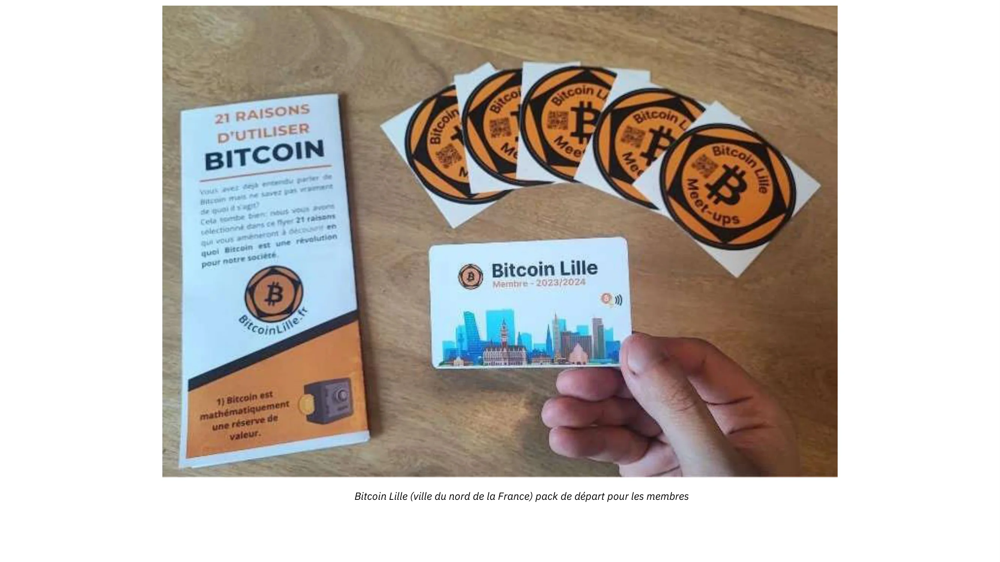

For example, in 2023, the French association Bitcoin Lille (https://twitter.com/BitcoinLille) ordered a series of NFC cards with a customized design. So, throughout the year, **every new member of the association received a customized NFC card in their welcome pack**. This idea can of course be taken up and improved as you wish.

The unit price of these cards ranges from €2.50 to €5**, although it changes regularly and decreases according to the quantity ordered.

## Create a website

<chapterId>9a2a1b9b-0633-544a-b331-c06187d23d7f</chapterId>

With the aim of providing a showcase for your community, your meet-ups, your events and your educational documents, it may be relevant at a certain stage of development to **have a website**.

However, **it takes a lot of time to design**.

To simplify the creation process, the tutorial below takes you through the half-hour steps involved in creating **a free website on the WordPress platform**. This will enable you to **have a customizable home page, publish articles, integrate media (youtube videos, images, pdf)**, and so on.

You can then purchase your own domain name, or even host your website on your own server.

:::video id=a1b25c18-5fc1-4b97-baef-816d819c9382:::

Other CMS or platforms can also be used to create websites. Although some are simpler in terms of their Interface friendliness, the resulting websites are also far less customizable. *so *WordPress seems to be the best choice for getting started**.

What's more, it allows you to **integrate plug-ins** (some of which are fee-paying, but of a high quality), enabling you to go much further in the creation of your website, without needing to code.

The [paid plug-in "Uncode"](https://undsgn.com/uncode/) is one of them.

## Create a video channel (Youtube or Odyssee)

<chapterId>076286db-1627-57ec-a410-c44b1666e1cd</chapterId>

Some of your community members may be interested in **creating multimedia content**, such as tutorial videos.

At the same time, you may one day be giving presentations at your meet-ups, or even at universities.

**When the need arises, it may be a good idea to set up a video channel so that you can post all your content online**.

Some of the best-known video platforms include:

- [**YouTube**](https://www.youtube.com/), which has the defect of **not being censorship-resistant**;
- [**Odyssee**](https://odysee.com/), which is relatively little used but is **decentralized** due to its peer-to-peer operation;
- [**peertube**](https://joinpeertube.org/fr_FR), which lets you create your own video platform. It's probably a level above in terms of set-up.

Depending on your wishes and needs, you'll obviously need to **create visuals specific to this platform**; to make your video channel visually appealing. On the plus side, with **Canva**, which we talked about in [part 2/8 of this course](https://planb.network/courses/1c643dc9-a15f-4f9e-93b6-cb3c58b4ee35/3470a31f-0190-5e87-8af0-6a00e79267ef), there's a "YouTube Thumbnail" category with pre-designed, easily modifiable visuals.

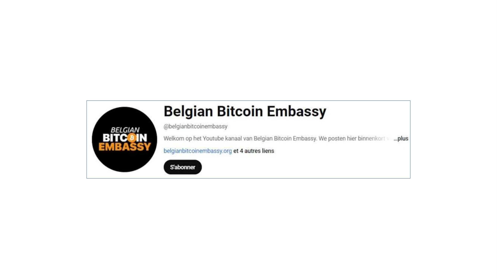

If you want to **record yourself on your computer, software such as [Streamlabs](https://streamlabs.com/fr-fr) will do the trick**. It's free, has a wide range of settings and lets you make scene transitions.

As for **video editing** (if there is such a thing), you'll need the appropriate software.

Although it costs €45 per year, [Wondershare Filmora](https://filmora.wondershare.fr/) is particularly efficient and easy to use, allowing you to produce quality montages in just a few minutes.

Finally, when it comes to the **intro and outro** of your video, a well-informed search on **Canva** will enable you to find what you're looking for, modify the rendering to your liking, download it and all that's left to do is integrate it into your editing software.

Note: if Bitcoin is ever banned or censored, it's a good idea to always **keep a local copy of any videos** you post on a hard disk.

## Create an audio podcast

<chapterId>12e96b45-1c33-5687-a753-80d0114d487a</chapterId>

Creating an audio podcast can also be an interesting initiative. However, as with creating a video channel, don't expect to get thousands of views quickly.

Some of the best-known podcast platforms include:

- [**Fountain**](https://www.fountain.fm/), which is particularly interesting as it allows Lightning donations to be received;
- [**Soundcloud**](https://soundcloud.com/);
- [**Deezer**](https://www.deezer.com/fr/);
- [**Spotify**](https://open.spotify.com/);
- [**Google podcast**](https://podcasts.google.com/).

The big problem, however, is that **each of these platforms has a very specific audience**. So, to reach as many people as possible, you'll need to be present just about everywhere.

Fortunately, the **[Spotify for podcasters](https://podcasters.spotify.com/) platform allows you to import your podcast file once, then generate an RSS feed that can be copied and pasted onto any of the above-mentioned platforms**.

So, once you've done the work on "Spotify for podcasters", all you have to do is format your other platforms, which is relatively quick.

From a sound recording point of view, if you want to **record yourself on your computer, free software like [Audacity](https://www.audacityteam.org/) does the trick**. It allows you to adjust numerous parameters, crescendos and even improve the sharpness of the sound when editing. So recording your voice and then editing your audio podcast should be easy enough.

Here's a short 10-minute tutorial on the main features you need to know to create a podcast with Audacity.

:::video id=67d80ac7-253f-40a5-b621-fef2fb7174bd:::

Note: as mentioned above, should Bitcoin ever be banned or censored, it's a good idea to always **keep a local copy of any podcasts** you post on a hard disk.

## Create a badge for your events

<chapterId>0cccef8d-a765-5844-8921-c40f0ce653e4</chapterId>

At your meet-ups and events, a little incentive can be put in place: event badges. The idea is to **create a kind of badge that can only be obtained at the event in question**. This exists under the name of "POAP" ("Proof Of Attendance Protocol") on other blockchains. However, there is currently no free way of implementing this on Bitcoin.

The idea is that this initiative could also be used to **reward the most committed members of your community, for example by setting up an annual tombola**, in which a badge earned would correspond to a participation ticket. A member present at 12 meet-ups during the year would then have 12 tickets for this annual tombola.

In parallel, and in a completely different register, it is also possible **at each event to ask participants to write their first name or pseudonym on a badge**. The reason for their presence can also be requested.

This initiative, though a little formal, can help members **find common ground and topics of conversation more easily**; while also making it **easier for newcomers to spot the organizers** (or even official members of the community/association).

Several of the models used by the Bitcoin Lille association are [available in open-source on Canva](https://www.canva.com/design/DAGHAsT15MU/AIA7-L_xBjNdsuxdD4-h-Q/edit?utm_content=DAGHAsT15MU&utm_campaign=designshare&utm_medium=link2&utm_source=sharebutton).

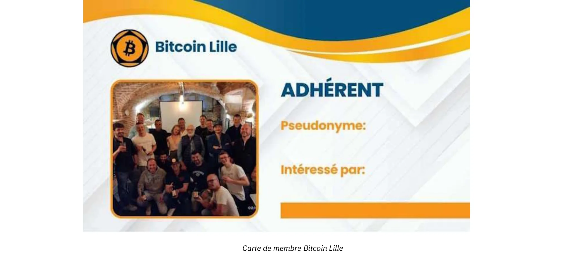

## Thinking about the handover in the event of death

<chapterId>c5febf18-235c-51bc-8fbb-9467dabe4cb0</chapterId>

On a completely different note, I'd like to comment on the **death of a member of the Bitcoin community**.

The day will certainly come when, unfortunately, the family of one of your former members will contact you to tell you that this person has passed away. They will then explain that **this person left instructions**, one of which was to **get in touch with your community / meet-up / association**.

This person will then probably explain that they **need help recovering the funds**, as they are the beneficiary of this former member's inheritance.

Faced with this demand, it can be very useful to **have already thought through a procedure with your community**, for a number of reasons.

On the one hand:

- so that the deceased can **warn his family never to divulge his private keys, and never to bring his physical wallets** to a meet-up;
- to make sure the family understands that **their visit is to learn Bitcoin**, so that they can later become sovereigns of the deceased's funds;
- so that **the family is aware of the laws that apply in the country in the case of gifts, inheritance and conversion into cash**;

At the same time, thinking through a common procedure in advance ensures that no one, whether a member of the meet-up or just a guest, can take advantage of such a situation to steal funds.

**A "working group" can then be set up to work on this procedure to be adopted in the event of death**. The Bitcoin Lille association has already started work on this, and will be sharing its final working document (https://docs.google.com/document/d/1TDfLZjuictC5s3PEM2Z7WmkxIDSJ8Q1E4xevm52pVgU/edit?usp=sharing) open-source within the next few months.

## Give lectures at schools and universities

<chapterId>65efdb44-e3d4-567c-aedf-972765753d73</chapterId>

The list of projects described above is obviously not exhaustive. Generally speaking, they tend to be projects that are internal to the community/meet-ups, and that can be easily set up as they develop.

So now it's time to talk about onboarding.

First of all, as you know, **one of the best ways to tell as many people as possible about Bitcoin at the same time is to hold a free conference**. In particular, this can be done **in post-baccalaureate schools and universities**, bringing young - and not-so-young - people to discover or learn more about Bitcoin.

In addition to the importance of **knowing how to express yourself in public**, leading a conference in front of several dozen or even hundreds of people requires **good management of your stress, your elocution and your time**. It also requires you to **prepare a presentation or workshop of high quality, well-sourced and appropriate to the skill level of the audience** you'll be facing.

What's more, **having an open mind, ready to popularize when necessary**, is essential in this type of exercise; especially during the question/answer phase at the end of a conference, or in the case of a round-table discussion. This doesn't mean "giving up on your principles", but simply accepting that others may have a different point of view, even if it means replying later or letting things slide so that the dialogue can move forward. In any case, if **your speech and your answers are based on relevant, well-sourced arguments**, the audience won't be fooled.

If you feel up to it: go for it! Our world is in dire need of education about Bitcoin...

It goes without saying, however, that to complete this exercise, **you'll need a lot of motivation, a lot of hard work; but also, the right contacts**.

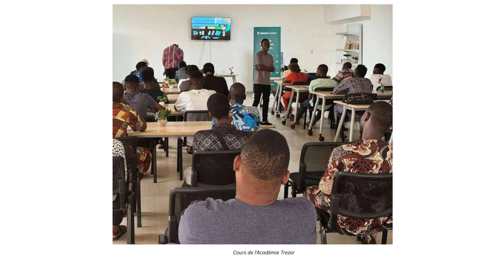

Organizing a conference or workshop at a school and/or university is no easy task**.

The first step is to **get in touch**. This can be done **through an acquaintance, through the BDE ("Bureaux Des Étudiants"); or even through student associations**, which generally organize cycles of conferences and meetings throughout the year. Your **former engineering school and/or university teachers** can also act as intermediaries.

In the case of a post-baccalaureate school, it's also possible to **contact the person in charge of training directly** to present your initiative or association. This can lead to a first meeting and then - in the best of all possible worlds, a few weeks later - a presentation of what Bitcoin is and how it works, in front of the students.

Unfortunately, in today's world, Bitcoin is still all too deliberately demonized by the media and politicians; leading many neophytes to believe that it should be banned from classrooms and lecture theaters. **There's a good chance you'll get a lot of rejection**, especially in the academic world where Bitcoin's proof of work and energy consumption seem to be taboo.

However, there's nothing to stop you trying, especially with BDEs and student associations. **With a bit of luck, even if you're turned down the first time, it's not impossible that you'll be contacted again at your community's e-mail address during the next bull-run, with the aim of giving a talk to around 280 students!

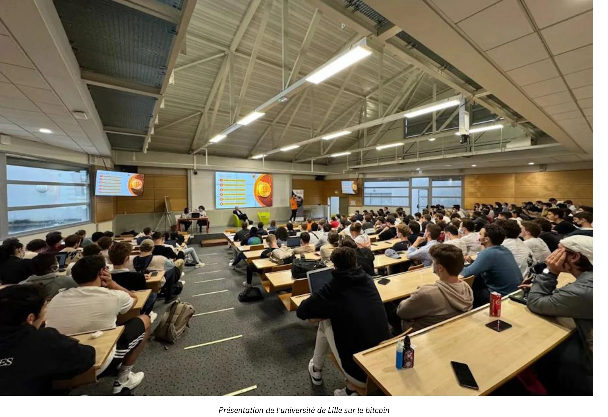

## Canvassing businesses

<chapterId>b730462b-7928-5d28-a14f-9ceaa773d3d2</chapterId>

Getting a business to accept Bitcoin as a means of payment** is something of a grail for many bitcoiners. It's like an achievement you can unlock on your pokédex!

However, as every retailer is different, this task is not an easy one, and many issues arise:

- a retailer still needs cash to pay his suppliers**;
- he needs clear and explicit financial reports** that can be sent to his accountants;
- its means of payment must function without any technical or logistical problems**, and employees must be able to receive payments without having to leave with the cash register.

To these problems, we must add:

- the retailer's potential misconceptions** about Bitcoin;
- the difficulty of finding a software solution** that works perfectly;
- but also **the importance of making him understand the advantages of accepting Bitcoin** as a means of payment.

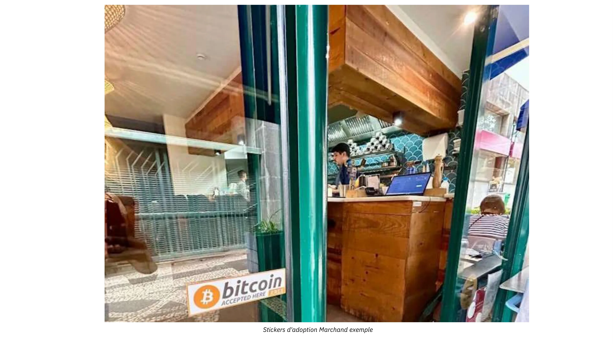

Developing the Bitcoin ecosystem in your city can therefore involve **onboarding merchants**. The easiest way to do this is to **proceed in stages**:

1/ as soon as you go into a shop, **systematically ask if you can pay in Bitcoin**. This will usually be met with a refusal and a questioning (or even judgmental) look, but this simple question gradually leads shopkeepers to see that Bitcoin can be used by "normal people", and that it is gaining in interest among the general public as a means of payment. You can even **turn around two or three people on the same trade, every few days, asking to pay in Bitcoin**. At some point, this will catch the merchant's attention;

2/ once he/she is interested or asks you what Bitcoin is, you can **explain it succinctly and in layman's terms**. For example, that Bitcoin is a currency, not controlled by banks, with no trusted intermediaries, that it's incensurable, not subject to inflation, and that fees are lower than with the traditional banking system. You can then **give them a flyer**, for example "21 reasons to use Bitcoin" and/or "10 reasons to accept Bitcoin in your business", and **give them your contact details or those of your meet-up**. That way, when he/she is ready for a "live" demonstration, he/she can contact you.

3/ once this person has decided to accept Bitcoin, **make an appointment with them to show them the software solution you are proposing seems relevant**. **Swiss Bitcoin Pay](https://swiss-Bitcoin-pay.ch/)** is an excellent solution because:

    - it enables merchants to convert the bitcoins they obtain into fiat currency on a daily basis, enabling them to pay their suppliers;
    - it also allows a certain percentage of revenues to be retained in BTC, if desired;
    - allows you to export the accounting for all BTC payments, so that you can send it to your accountants to make their work easier;
    - an easy-to-use dashboard for the manager;
    - but also a Interface that's ergonomic and easy to use for employees, who will have the option of cashing payments without having to take the cash register with them;
    - lastly, it costs less to use than the 2% to 3% of the traditional banking network.

4/ **when this business accepts Bitcoin**, it will then be possible for you:

    - to **visit regularly** to consume;
    - take the opportunity to **ask if everything's going well**, even if it means giving your contact back if necessary;
    - to **propose again to come to your meet-ups and events**;
    - to **add this business on [the btcmap.org map](https://btcmap.org/)** and inform [Swiss Bitcoin Pay on Twitter](https://x.com/swissbitcoinpay) to give visibility to this business;
    - but also to **potentially hold events in this business**, such as meet-ups or workshops.

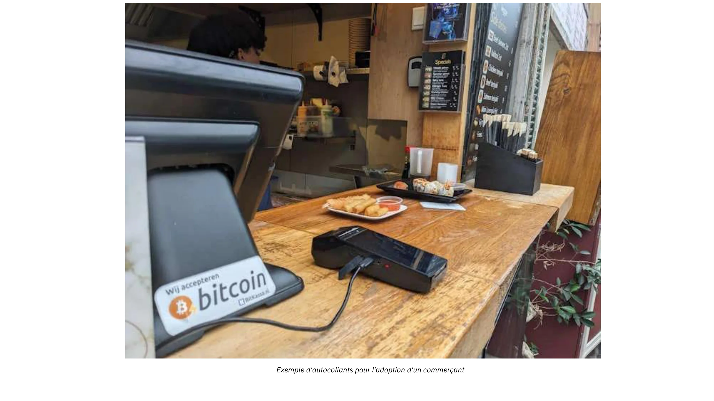

5/ Once several businesses in your town have been onboarded and have understood what Bitcoin can do for them, you can then **propose to them to create a special Telegram group for merchants**; the aim being to **allow them to help each other** and go further in orange-pilling other businesses in the town. At the same time, this group could also **play the role of technical support**, should a problem arise with a customer.

Of course, **this canvassing is a long-term job. It requires a great deal of time, motivation and strategy**.

Is your community ready to build **the foundations of a Bitcoin circular economy**, like [Arnhem in the Netherlands](https://www.arnhembitcoinstad.nl/)? If so, go for it!

## Contact the local press and radio

<chapterId>435bfbc1-22dd-59bb-b737-a32ea995b238</chapterId>

Very often forgotten, we bitcoiners generally think that the best means of communication are social networks and the internet. But we're - partly - wrong.

Several communities (such as [Breizh Bitcoin](https://breizhbitcoin.com/), in France) have taken to **contacting their local press** in order to:

- tell them about the events they organize** (meet-ups, presentations, workshops, Halving parties, etc.);
- invite them to discover Bitcoin merchants in their area, and then write an article** about it;
- but also, quite simply, **to ask them to relay the date and location of their next events**.

Indeed, many local newspapers still have a list of events in their area on the last or penultimate page.

So the feedback from Breizh Bitcoin is clear: it works, and new people have turned up to meet-ups after discovering this Bitcoin association in the newspaper.

Although this strategy may be specific to certain local dynamics, it may be worthwhile to get in touch with regional publishers. Here is a list of the main French press titles:

- [acpm.fr](https://www.acpm.fr/Les-chiffres/Diffusion-Presse/Presse-Payante/Presse-Quotidienne-Regionale);
- [voxpublic.org](https://www.voxpublic.org/spip.php?page=annuaire&cat=medias&type_media=Presse%20quotidienne%20r%C3%A9gionale).

At the same time, it may also be worthwhile to **contact local radio stations, for example to offer to produce a podcast or interview**.

Be aware, however, that words in the media can easily be turned to their disadvantage. **It's not an easy exercise, and it's important to be prepared**.

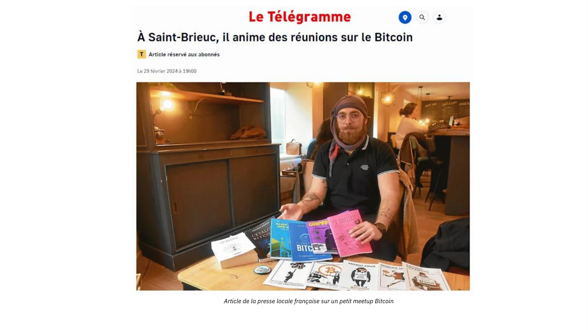

Obviously, in addition to all those suggested in this section, **many other projects can be carried out**. Generally speaking, it all depends on your time and motivation, but also on the difficulty of the project in question.

**Three tips** can then guide you:

1) **define upstream the project's stages, its objective(s) and what needs to be done**;

2) **go one step at a time, without getting discouraged**;

3) and above all, **ask for help or a helping hand from your members and other communities around you**.

Don't forget that **every community and every meet-up has gone through the same stages as you have**. So don't hesitate to **ask them for advice**.

# Anticipating the future

<partId>6ea07445-9369-54bc-9aa0-d260db026e0b</partId>

## Plan for an increase in the number of participants

<chapterId>8af722d4-3a9f-548c-9001-424f2142de12</chapterId>

As Bitcoin entered its fourth era, on block 840,000, more and more people saw **in it a revolution; technological, financial and social**.

Like the Internet, this revolution will necessarily **take time**, and so much the better. It will allow everyone to **educate themselves on the fundamentals of Bitcoin and learn how to use it**. But it will also allow developers and companies to develop protocols and applications that will enable the full potential of this technology to be explored.

Although it's impossible to predict the future, **a very significant increase in the number of Bitcoin users should be anticipated** in order to **be prepared for all possible eventualities**. Including the most catastrophic, such as a potential implosion of the traditional financial system; or even: a ban on Bitcoin.

In this seventh and penultimate part of the course, we'll take a look at a few points to consider when developing your community and your meet-ups.

The first of these (and the easiest to anticipate) is obviously **an increase in the number of people joining your community**. This will impact your community in two ways:

1/ **your communication channels (Telegram, Signal, Matrix, etc...) will fill up, potentially making conversations difficult to follow**. So there are two points to bear in mind. Firstly, if there are 500 of you exchanging on various subjects in the same discussion channel, it's a certainty that the abundance of messages and notifications will lead a large proportion of your members to gradually stop following the conversations. In this respect, it may be a good idea to **enter a reflection on your communication channels at this point; for example, Telegram super-groups or Discord** servers, both of which allow you to group conversations by theme.

On the other hand, more people in the chat channels also means more bots, more scams, and **more moderation to do**. So you'll need to be prepared, for example by drawing up a set of rules that you can refer to when moderating a message. Experience has shown that this avoids a large number of conflicts, especially when the rules are available to read on your communication channels. A few years ago, the Bitcoin Lille association drafted **[an open-source rulebook](https://bitcoinlille.fr/reglement/) for its Telegram group and Discord server**, based on simple, universal principles. Its design is [available in editable version here](https://www.canva.com/design/DAGHI692AD4/rjT4sqEnhajc5FiPA6GFZQ/edit?utm_content=DAGHI692AD4&utm_campaign=designshare&utm_medium=link2&utm_source=sharebutton).

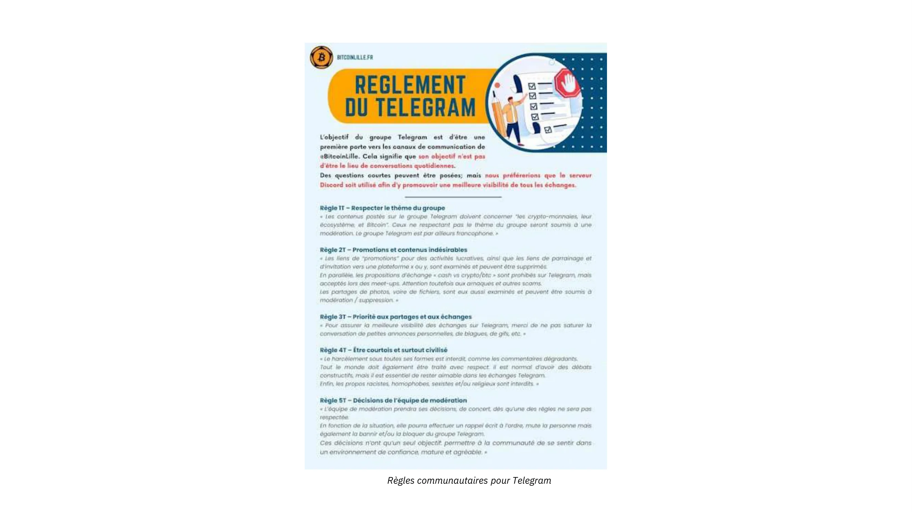

2/ **your meet-ups and events will fill up in a big way, with an abundance of new faces there to talk to**.

Faced with this massive influx

    - it may be a good idea to start by **finding a larger venue for your meet-ups and events**, especially if you've only been able to accommodate a maximum of twenty people in the past;
    - in a second phase, if you find that the human presence is becoming too great, you can - for subsequent meet-ups - **either require participants to register** (this can be done via the Meetup application, or via a standard form), **or organize several meet-ups in a month** (for example: a beginner meet-up, an intermediate meet-up and an expert meet-up);
    - at the same time, it's certain that many people new to the ecosystem will join you, generally with the aim of making money. **In order to keep conversations focused on Bitcoin in these high-growth meet-ups**, it's advisable:

a) **to make a thematic presentation on Bitcoin** at these events, as this will subsequently lead a good proportion of participants to discuss this theme (and not the latest so-called revolutionary shitcoin project);

b) **not to stay between bitcoiners, but to go and see the newcomers, even if it means taking the initiative of staying at the back of the room to welcome them**. Discussions can then turn to why these people have come, what they're looking for, the objectives (or even fundamentals) of your community, and so on.

Finally, although it's unfortunate to say so, **scammers can show up at meet-ups**. Their aim will then be to talk as much as possible about their ponzi, their MLM or their "project revolutionizing Blockchain thanks to AI". It's also quite plausible that, one day, ill-intentioned people will come along with the specific aim of laundering money or buying BTC with counterfeit bills.

When faced with complex situations like these, the easiest thing to do is to take the initiative and "kindly" explain to these people that the meet-up is not the place for them, by putting forward x or y arguments (such as informing them of a potential plainclothes police presence).

If, unfortunately, these people refuse to leave or to abide by the rules of decency (this has already happened), an oral intervention during the meet-up informing that one (or more) person(s) is (are) trying to carry out such and such a malicious act can be carried out.

**Fortunately, these situations are comical and extremely rare. But it's best to be prepared

And if it's any comfort to you as an organizer, as long as you yourself are not in breach of the law or facilitating illegal exchanges, you have nothing to worry about. In France, you are not legally responsible for the actions of others during an event you organize.

In the best of all possible worlds, the best thing would be to have a place that can accommodate several dozen people as your community grows; but also, to **build solid relationships between bitcoiners and future bitcoiners during the bear-market**, so that you have as many people as possible ready to **orange-pillage during the bull-run**.

## Decentralize community organization

<chapterId>bedfc110-e099-58f4-a5b7-fb50f3b19a49</chapterId>

You're a meet-up organizer and, from one day to the next, **you decide to quit that job** and go off to raise llamas in Peru or become a professional surfer in El Salvador, leaving everything behind?

Please **think ahead about transferring your community into**:

1) **give administrative rights (or even ownership) of communications channels to trusted individuals**, even if this changes hands at a later date;

2) **sharing with at least one trusted member of your community the account names, passwords and e-mails for the social accounts and networks** you've created to give it visibility.

Without these rights and identifiers, it will be impossible for anyone else to easily **take up the torch and keep alive the initiative you've spent so much time developing**.

Starting from scratch by creating "forked" networks and communication channels takes so much time and so much energy..

**And if you don't have a trusted member of your meet-up in France, you can always contact @ProfEduStream, @copinmalin or @gabtribe on Telegram to make this transition as smooth as possible. They'll then take care of finding a motivated new member and giving them access as soon as possible.

This brings us to **a crucial point in community development: decentralization**.

If you're the only person involved, and you have all the controls, what happens if you disappear? The answer is simple: your community will disappear too.

The best way to avoid this is to **decentralize tasks and share rights, roles and access**. This way, if one of the people organizing your community or meet-up no longer responds and disappears (because, for example, they no longer have the time to devote to it, or because they get arrested in a future dystopia for possessing non-KYC Bitcoin), the other organizers can continue to administer the community without difficulty.

With the aim of further decentralization, **using [free software such as the framasoft suite](https://framasoft.org/fr/)** can also constitute a first "bulwark" against a fictional state that would censor or ban Bitcoin. Using encrypted - or even anonymous - communication tools is obviously a second.

## What if Bitcoin became public enemy No. 1?

<chapterId>c739651f-cd13-51e0-a36e-85023749b15b</chapterId>

On April 5, 1933, Franklin Roosevelt, then 32nd President of the United States of America, signed Executive Order 6102 prohibiting private individuals from possessing gold coins, bullion and certificates anywhere in the country.

Of course, the Great Depression (stock market crash of 1929) is no longer relevant. But who's to say that, tomorrow, another state won't do the same and **ban all private individuals from owning Bitcoin?**

Fortunately, this Orwellian dystopia won't prevent anyone from actually owning their own BTC, as it's impossible to prevent anyone from learning a sequence of words.

But what will happen **if our world's leaders finally understand that Bitcoin has the ability to change the world order, including at state level?** Will Bitcoin then become **"public enemy No. 1"**?

Of course, we mustn't fall into a form of conspiracy. But **nothing is stopping us from anticipating, decentralizing and educating**.

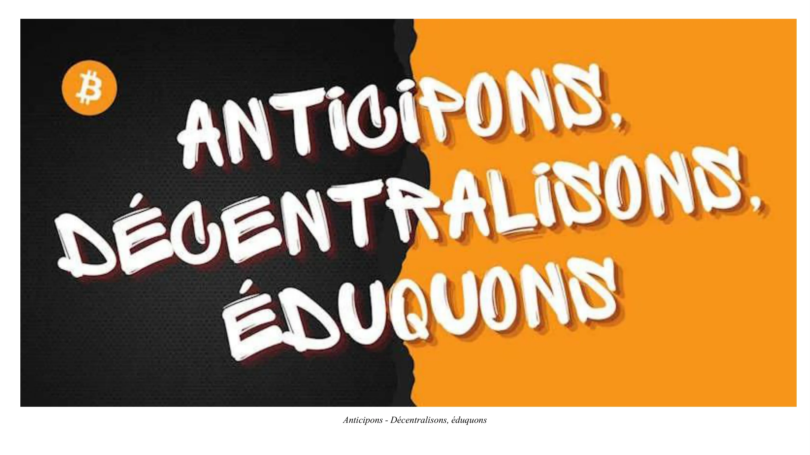

# Bringing bitcoiners together

<partId>62bc2138-c0be-5d39-a341-594690863257</partId>

## An action plan to create your Bitcoin community

<chapterId>1f463ec2-3f64-5641-8d60-e02a47c94f27</chapterId>

Satoshi Nakamoto has created a revolutionary tool that is already changing the world as we know it. However, **it's up to us bitcoiners to choose the trajectory we want to take to build the future**.

But the essence of Bitcoin is an immense rabbit hole, encompassing so many aspects of history, economics, literature, mathematics, computer science and cryptography that it's impossible to go round it all. And that's part of its beauty.

But as we are only human, we only have a finite amount of time in our lifetime. **It is therefore by remaining humble and learning from others** that each of us will reach our desired level of understanding of Bitcoin.

**Global Bitcoin communities therefore play a fundamental role in building tomorrow's world**; communities in which bitcoiners can **exchange, build and share**. **Together**.

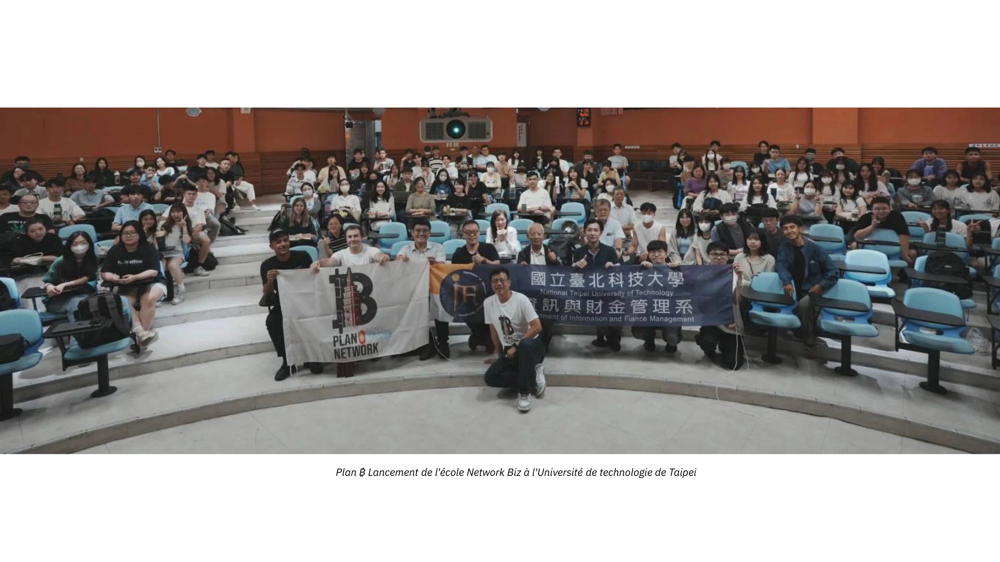

As you will have understood from this course, **creating a Bitcoin community and meet-up** requires organization and motivation. Of course, depending on how much you want to do it and how much time you have to devote to it, you'll end up going further or further down the road.

Whatever the case, the goal remains the same: **ignite the spark for Bitcoin to grow in your city**.

To summarize the many chapters and sub-chapters of this course, here's **a summarized "action plan" for creating your Bitcoin community**:

1) decide in advance why you want to create a Bitcoin community, for what purpose(s), what city, what location, etc..;

2) Get in touch with the existing communities around you, and don't hesitate to ask them for advice when you need it;

3) Create an identity for your community and the locality in which you'll be developing it (logo, poster, banner, flyer, etc.)

4) Create communication channels and social networks like Telegram, Twitter, NOSTR, Discord or Simplex. Also consider decentralized and/or incensurable channels;

5) Follow local meet-ups and communities on social networks, and get listed on various maps and platforms to increase your visibility.

Once your community's communication channels are sufficiently developed:

6) Propose a meet-up by survey when you start to feel a stir;

7) Think about what you want to achieve from this physical event;

8) Look for a conveniently located, welcoming venue that meets your objectives, and reserve a table or room;

9) One week before the event, communicate on your networks and communication channels. Repeat this two or three days before the fateful date;

10) Get your event listed on the right platforms and websites;

11) On the day of the meet-up, let things happen and reach out to others, even if it means refocusing the discussion gently if necessary.

As a result:

12) Seek to retain and involve as many members and participants as possible, to keep them coming back;

13) Come up with ideas for simple projects and initiatives, and start implementing those that are close to your personal heart. If someone else wants to set something else in motion, don't hesitate to lend a hand, depending on the task and the desired objective;

Finally:

14) Anticipate the future by thinking about a larger venue for meet-ups, rules for communication channels, a website, etc;

15) Start democratizing Bitcoin acceptance in your local shops, for example by automatically asking if they accept Bitcoin;

16) Decentralize tasks to people you trust, as well as the rights of your channels and networks;

17) Get the word out about your community so that more and more people join, and get interested parties involved;

18) Go even further with projects that you enjoy and that are important to you.

In slightly less detail, this 21-minute video summarizes these steps:

:::video id=a59956da-f554-4b54-89dd-5ca55b722686:::

In any case, **please remember that you're not alone, and that existing communities are there to help you**.

## Taking care of yourself

<chapterId>cf1631cb-ddbe-55c7-be8c-26a5652979a0</chapterId>

When we fall down the rabbit hole, our outlook on life changes.

It makes us want - deep down - to go further; to want to discover those other people who are doing the same mind work as we are, and who have also understood.

This motivates us and makes us even more eager to **contribute to the cause** , by sharing our find: Bitcoin.

But also to **think about the world of tomorrow, the world we want to build and the communities that are building it**.

**In the long gallery that is the creation of a community, you'll need motivation, strategy, self-sacrifice and time**. It's a sometimes thankless job, and in this adventure, it's best to take things one step at a time so as not to hurt yourself.

**Think of yourself, of your limits**. And although Bitcoin may drive you night and day, **don't try to do it all alone, or you'll burn yourself out**.

Instead, **ask for help from bitcoiners who have already been through this same gallery, who have already explored the same issues and built the same tools**. It will save you a lot of time.

**Offer to help the people who will follow you on this adventure, even if it means delegating certain tasks** and making them more time-consuming. In the long term, your community will emerge stronger and more mature.

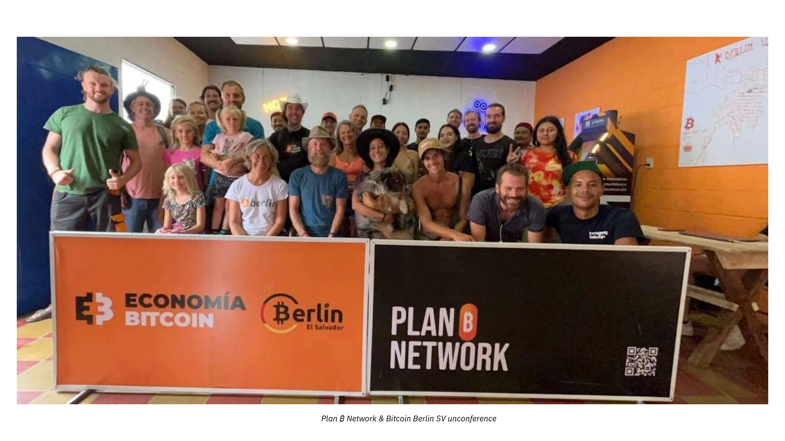

Alone, it's true that you can quickly explore one of the many galleries of the rabbit hole that is Bitcoin. But don't forget that there are plenty of other directions to explore.

Whereas **by creating and/or integrating a community of bitcoiners, sharing and exchanging with them on a regular basis, you'll be moving in all directions down the rabbit hole at the same time**.

## BTC302 training, continued

<chapterId>8bf10b77-80ee-5d50-87bc-0ef32574a675</chapterId>

In this BTC302 training course, we take a detailed look at the steps involved in setting up a community or a meet-up, as well as setting up a wide range of projects.

When your community feels ready to take the next step, **it's possible to create an association**.

In France, for example, of the sixty or so communities and meet-ups, there are almost a dozen associations.

The advantage of creating one is twofold:

- on the one hand, the status of association enables us to **have an official status, to open an association bank account, but also to obtain a form of recognition from the press and media, as well as subsidies**;
- on the other hand, it allows you to **organize the running of your community and the implementation of your projects** in a more serious way, notably by defining specific roles.

With the aim of helping your community to grow even more, **it's not out of the question that a sequel to the COMMU302 training course may be released on [planb.network](https://planb.network/) in the coming months**.

This session will cover a number of more detailed points, such as: how to design presentations or workshops for your meet-ups, and with what objectives in mind? and how to set up a large-scale event with a hundred or so participants But also: how to set up a large-scale event, with a hundred or so participants?

To do this, we'll be drawing on the experience of several communities that have already produced their own events and presentations.

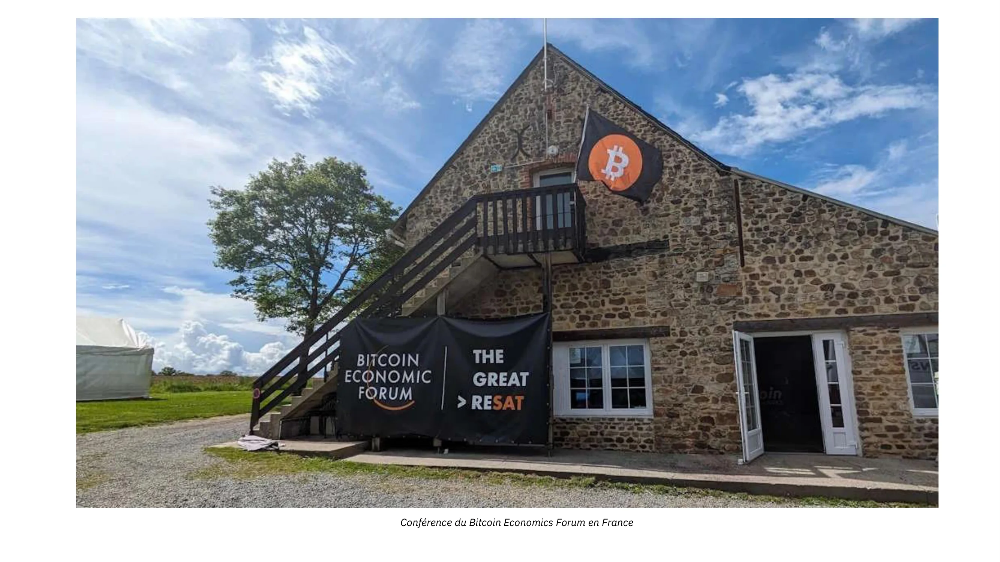

# Final section

<partId>e9bdddf4-54c9-4de9-bbce-c3eade8c32e5</partId>

## Reviews & Ratings

<chapterId>08a35d2a-204b-519a-9bb1-588665a037fa</chapterId>

<isCourseReview>true</isCourseReview>

## Conclusion

<chapterId>d74606a5-cb14-4117-acb2-2bf5920de092</chapterId>

<isCourseConclusion>true</isCourseConclusion>
