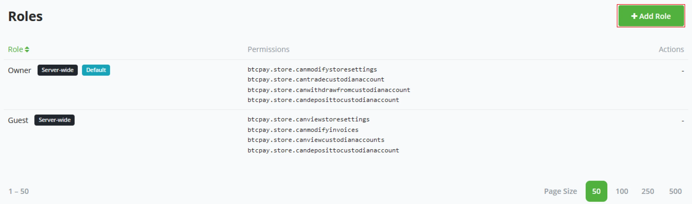
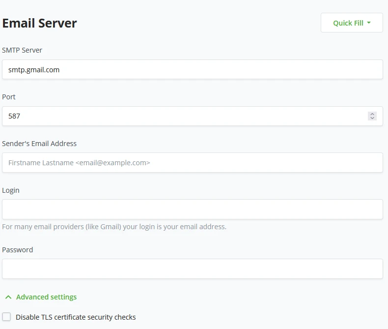
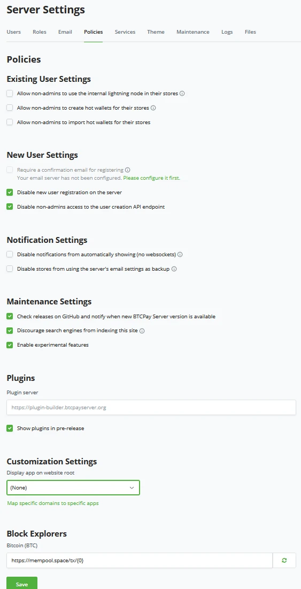
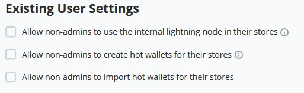
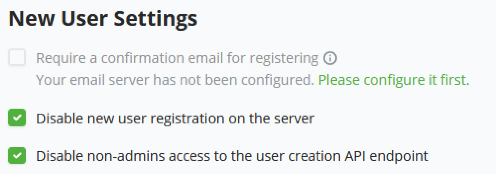

# Bitcoin and BTCPay Server

This is an introduction course on BTCPay Server Operator written by Alekos and Bas, which was adapted in the PlanB Course Format by melontwist and asi0.

AN UNFINISHED STORY

"This Is Lies, My Trust In You Is Broken, I Will Make You Obsolete".

Produced by BTCPay Server Foundation

+++

# Introduction

<partId>59e43fe3-b494-5da6-b4b4-9df5bdf08916</partId>

## Critical acclaim for Author’s Bitcoin and BTCPay Server

<chapterId>e1fe6294-3c82-5203-9537-779f9087c35a</chapterId>

Let's start with what BTCPay Server is and where it came from. We value transparency and certain standards to form trust in the Bitcoin space.
A project in the space broke these values. BTCPay Server’s lead developer, Nicolas Dorier, took this personally and made the promise to obsolete them. Here we are many years later and working towards this future, fully open-source, every day.

> This is lies, my trust in you is broken, I will make you obsolete.
> Nicolas Dorier

After the words spoken by Nicolas, it was time to start building. Lots of work went into what we now call BTCPay Server. More people wanted to help with this push. The most recognizable are r0ckstardev, MrKukks, Pavlenex, and the first merchant to use the software, astupidmoose.

What does open source mean, and what goes into such a project?

FOSS stands for Free & Open-Source Software. The former refers to terms that allow anyone to copy, modify, and even distribute versions (even for profit) of the software. The latter refers to openly sharing the source code, encouraging the public to contribute and improve it.
This brings in experienced users enthusiastic about contributing to the software they already use and derive value from, proving over time to win out in adoption over proprietary software. It is consistent with the Bitcoin ethos that “information longs to be free.” It brings together passionate people who form a community and is simply more fun. Like Bitcoin, FOSS is inevitable.

### Before we begin

This course consists of multiple parts. Many will be taken care of by your classroom teacher, Demo environments that you get access to, a hosted server for yourself, and possibly a domain name. If you complete this course independently, please be aware that the environments labeled as DEMO won’t be available for you.
NB. If you follow this course by classroom, server names might differ depending on your classroom setup. Variables in Server names might be different due to this.

### Course Structure

Every chapter has objectives and knowledge assessments. In this course, we will cover each of these and have a summary of key features at each lesson block (ie. chapter). Illustrations are featured to provide visual feedback and reinforce key concepts in a visual aspect. Objectives are set at the start of each lesson block. These objectives go beyond a checklist. These provide you with a guide into a new skill set. Knowledge Assessments progressively more challenging set up of your BTCPay Server set up.

### What do students receive with the course?

With the BTCPay Server Course, a student can understand the basic principles, technically and non-technical of Bitcoin. The extensive training in using Bitcoin through BTCPay Server will allow students to operate their own Bitcoin infrastructure.

### Important Web addresses or Contact opportunities

The BTCPay Server Foundation, which allowed Alekos and Bas to write this course, is in Tokyo, japan. The BTCPay Server foundation can be reached through the website listed;

- https://foundation.btcpayserver.org
- join the official chat channels :https://chat.btcpayserver.org

## Introduction To Bitcoin

<chapterId>5c0bc234-c188-5b4a-94d5-adee87a120e2</chapterId>

### Understanding Bitcoin via classroom exercice

This is classroom exercise so if you take this course yourself, you cannot perform it but you can go still through this exercice. To complete this task, the minimum number of people is between 9 and 11.

The exercise starts after watching the introduction “How Bitcoin and the blockchain works” by the BBC.


This exercise requires at least nine people to participate. This exercise intends to physically get an idea of how Bitcoin works. By playing each role in the network, you will have an interactive and playful way of learning. This exercise does not involve Lightning Network.

### Example; Requires 9 / 11 people

The roles ares :

- 1 Costumer
- 1 Merchant
- 7 to 9 Bitcoin nodes

**Setup is as follows:**

Customers buys a product from the store with Bitcoin.

**Scenario 1 - Traditional Banking System**

- Set up:
  - See diagrams/explainer in the attached Figjam - [Activity Schematic](https://www.figma.com/file/ckmvMq02Jm2MegSsVCDFhc/Day-1-Classroom-Activity?type=whiteboard&node-id=0-1&t=KR31ofMaJX6S95UL-0).
  - Get three student volunteers to play the roles of Customer (Alice), Merchant (Bob), and Bank.
- Act out the sequence of events:
  - Customer- browsing the store online and finds an item for $25 which they want, and informs the Merchant they would like to purchase
  - Merchant- asks for payment.
  - Customer- sends card information to Merchant
  - Merchant- forwards information to the Bank (identifying both their own and the identity/information) requesting payment of
  - Bank collects information about the Customer and Merchant (Alice and Bob) and checks that the customer’s balance is sufficient.
  - Deducts \$25 from Alice’s account, adds \$24 to Bob’s account, takes \$1 for the service
  - The Merchant receives thumbs-up from Bank and ships the item to the customer.
- Comments:
  - Bob and Alice must have a relationship with a bank.
  - Bank collects identifying information about both Bob and Alice.
  - Bank takes a cut.
  - Bank must be trusted to custody of each participant’s money all the time.

**Scenario 2 - Bitcoin System**

- Set up:
  - See diagrams/explainer in the attached Figjam - [Activity Schematic](https://www.figma.com/file/ckmvMq02Jm2MegSsVCDFhc/Day-1-Classroom-Activity?type=whiteboard&node-id=0-1&t=KR31ofMaJX6S95UL-0).
  - Replace Bank with nine students who will play the role of a Computer (Bitcoin Nodes/Miners) in a network to replace the Bank.
- Each of the 9 Computers has a complete historical record of all past transactions ever made (thus accurate balances without forgeries), as well as a set of rules:
  - Verify transaction is properly signed (thekeyfitsthelock)
  - Broadcast and receive valid transactions to peers in the network, throw out invalid ones (including any that attempt to spend the same funds twice)
- Update/Add records periodically with new transactions received from “random” computer provided all contents are valid (note: we are ignoring, for now, the Proof of Work component to all this, for simplicity), otherwise reject these and continue as before until the next “random” computer sends an update
  - The proper amount was rewarded if the contents were valid.
- Act out the sequence of events:
  - Customer- browsing the store online and finds an item for $25 which they want, and informs the Merchant they’d like to purchase
  - Merchant- asks for payment by sending the customer an invoice/address from their wallet.
  - Customer- constructs a transaction (sending $25 worth of BTC to an address provided by Merchant) and broadcasts it to the Bitcoin Network.
- Computers- receive the transaction and verify:
  - There is at least $25 of BTC in the address being sent from
  - The transaction is signed properly (“unlocked” by the customer)
  - If not the case, then the transaction will not be propagated through the network, and if so, then it propagates and is held in waiting.
  - Merchants can check that transaction is pending and waiting.
- One computer is “randomly” chosen to propose to finalize the proposed transaction by broadcasting “a block” containing it; if it checks out, they will receive a BTC reward.
  - OPTIONAL/ADVANCED - instead of randomly selecting a Computer, simulate mining by having Computers roll dice until some predetermined outcome occurs (e.g. first one to roll double sixes is selected)
  - It can also play out what would happen if two Computers win approximately simultaneously, resulting in a chain split.
  - Computers check the validity, update/add records to their ledgers if rules are met, and broadcast block to peers.
  - The randomly chosen computer receives a reward for proposing a valid block.
  - Merchant checks transaction was finalized; thus, funds were received, and the item was sent to the customer.
- Comments:
  - Notice there was no need for a pre-existing banking relationship.
  - No third party needed to facilitate; replaced by code/incentives.
  - No data collection by anyone outside the direct exchange and only the necessary amount must be exchanged between participants (e.g., shipping address).
  - No trust is required between the people (other than the Merchant sending the item), like a cash purchase in many ways.
  - The money is owned directly by the individuals.
  - The Bitcoin ledger is depicted in dollars for simplicity, but in reality, it is BTC.
  - We simulate a single transaction being broadcast, but in reality, multiple transactions are pending in the network, and blocks include thousands of transactions at once. Nodes also check there are no double-spend transactions pending (I would throw all but one out if it were the case).
- Cheating scenarios:
  - What if the customer did not have $25 BTC?
    - They would not be able to create the transaction because “unlocking” and “ownership” are the same thing, and computers check transaction is properly signed; otherwise, they reject it
  - What if the randomly chosen computer attempts to “change the ledger”?
    - The block would be rejected, as every other computer has a complete history and would notice the change, violating one of their rules.
    - Random Computer would not get a reward, and no transactions from their block would be finalized.

## Knowledge assessment

<chapterId>1461f064-933d-50ea-8935-324b68ec5d5f</chapterId>

### KA Classroom discussion

Discuss some oversimplifications made in the classroom exercise under the second scenario and describe what the actual Bitcoin system does in more detail.

### KA Vocabulary review

Define the following key terms introduced in the prior section:

- Node
- Mempool
- Difficulty Target
- Block

**Discuss meaning of some additional terms as a group:**

Blockchain, Transaction, Double-Spend, Byzantine Generals’ Problem, Mining, Proof of Work (PoW), Hash Function, Block Reward, Blockchain, Longest Chain, 51% Attack, Output, Output Lock, Change, Satoshis, Public/Private Key, Address, Public-Key Cryptography, Digital Signature, Wallet

# Introducing BTCPay Server

<partId>9c8a2d0c-9ba1-5c39-874c-f9eaf1bba663</partId>

## Understanding BTCPay Server login screen

<chapterId>14aad54c-9bd8-54f2-9455-178b8ae63408</chapterId>

### Working with BTCPay Server

The objective of this course block will be to have a general understanding of BTCPay Server software. In a shared environment, it’s recommended to follow the instructor’s demonstration and follow along with the BTCPay Server Coursebook to follow the teacher. You will learn how to create a wallet through multiple methods. Examples include Hot wallet setups and hardware wallets connected through BTCPay Server Vault. These objectives occur in the Demo environment, displayed and given access to by your course instructor.

If you follow this course by yourself, you can find a list of third-party hosts for Demo purposes at https://directory.btcpayserver.org/filter/hosts. We strongly advise against using these third-party options as production environments, but they serve the right purposes for an introduction to using Bitcoin and BTCPay Server.

As a BTCPay Server rockstar trainee, you might have previous experience setting up a Bitcoin node. This course will talk specifically tailored to the BTCPay Server Software stack.

Many of the options in BTCPay Server exist in some form or another in other Bitcoin Wallet-related software.

### BTCPay Server Login screen

As you are welcomed to the Demo environment, you are asked to ‘Login’ or ‘Create your account.’ Server administrators might turn off the feature of creating new accounts for security reasons. BTCPay Server logos and button colors can be changed because BTCPay Server is Open Source Software. A Third-party host can White-label the software and change the entire look.


### Create an Account window

Creating accounts on BTCPay Server requires valid Email address strings; example@email.com would be a valid string for Email.

Password need to be at least 8 characters long, including letters, numbers, and characters. After setting the password once, you will have to verify the typed password to make sure it’s correct to what was typed in the first password field.

When both the Email and Password fields are properly filled in, click on the ‘Create Account’ button. This will save the Email and password on the instructor’s BTCPay Server instance.


**!Note!**

If you follow this course on your own, creating this account would be something you might do on a third-party host; therefore, again, we mention never to use these as production environments but only for training purposes.

### Account Creation by BTCPay Server Administrator

The Administrator of the BTCPay Server Instance can also create accounts for BTCPay Server. The Administrator of the BTCPay Server instance can click on ‘Server Settings’ (1), click on the ‘Users’ tab (2), and click the “+ Add User” button (3) in the top right of the Users tab. In Objective (4.3), you will learn more about the administrator control of Accounts.


As an administrator, you would need the user’s Email address and set a standard password. It is advised as Administrator to inform the user that they should change this password before using the account for security reasons. If the Administrator does NOT set a Password and SMTP has been set on the server, the user will receive an email with an invite link to create their account and set the password themselves.

### Example

When following the course by an instructor, follow the link given by the instructor and create your account on the Demo environment provided. Ensure your email address and password are saved securely; you will need these login credentials for the rest of the demo objectives in this course.

Your instructor may have gathered the email address upfront and sent an invitation link before this exercise. If instructed, check your Email.

When taking the course without an instructor, create your account using the BTCPay Server demo environment; go to

https://mainnet.demo.btcpayserver.org/login.

This account should only be used for demonstration/training purposes and never for business.

### Skill Summary

In this section, you learned the following:

- How to create an account on a hosted server through the interface.
- How a server administrator can manually add users in the server settings.

### Knowledge assessment

#### KA Conceptual Review

Give reasons why using a Demo Server is a bad idea for production purposes.

## Managing user account(s)

<chapterId>b58ca6ee-b7fc-5e81-a6aa-c8ff212b4c55</chapterId>

### Account Management on BTCPay Server

After a store owner has created their account, they can manage it in the Bottom Left of the BTCPay Server UI. Underneath the Account button, there are multiple higher-level settings.

- Dark/Light mode.
- Hide Sensitive Info toggle.
- Manage Account.


### Dark and Light mode

Users of BTCPay Server can choose between a Light or Dark mode version of the UI. Customer- facing pages won’t change. They use customer- preferred settings regarding dark or light mode.

### Hide Sensitive info toggle

The hide sensitive info button brings a quick and simple layer of security. Whenever you need to operate your BTCPay Server, but there might be people lurking over your shoulder in a public space, turn on Hide Sensitive Info, and all the values in BTCPay Server will be hidden. One might be able to look over your shoulder but can no longer see the values you are dealing with.

### Manage Account

Once the user account has been created, this is where to manage passwords, 2fa, or API kes.

### Manage Account - Account

Optionally update your account with a different Email address. To ensure your email address is correct, BTCPay Server allows you to send a verification email. Click save if the user sets a new email address and confirms the verification worked. The username remains the same as the previous Email.

A user may decide to delete their whole account. This can be done by clicking the delete button on the Account tab.


**!Note!**

After changing the Email, the username for the account will not change. The previous given Email Address will stay the Login name.

### Manage Account - Password

A student may want to change his password. He can do this by going to the Password tab. Here he is required to type his old password and can change it to a new one.


### Two-Factor Authentication (2fa)

To limit the consequences of a stolen password, you can use two-factor authentication (2fa), a relatively new security method. You can activate two- factor authentication via the Manage account and the tab for two-factor authentication. You must complete a second step after logging in with your username and password.

BTCPay Server allows for two ways of enabling 2FA, App-based 2FA (Authy, Google, Microsoft authenticators) or through Security devices (FIDO2 or LNURL Auth).

### Two-Factor Authentication - App based

Based on your mobile phone’s Operating System (Android or iOS), users can pick between the following apps;

1. Download a two-factor authenticator;
   - Authy for [Android](https://play.google.com/store/apps/details?id=com.authy.authy) or [iOS](https://apps.apple.com/us/app/authy/id494168017)
   - Microsoft Authenticator for [Android](https://play.google.com/store/apps/details?id=com.azure.authenticator) or [iOS](https://apps.apple.com/us/app/microsoft-authenticator/id983156458)
   - Google Authenticator for [Android](https://play.google.com/store/apps/details?id=com.google.android.apps.authenticator2&hl=e%C2%80) or [iOS](https://apps.apple.com/us/app/google-authenticator/id388497605)
2. After downloading and installing the Authenticator App.
   - Scan the QR Code provided by BTCPay Server
   - Or enter the generated key by BTCPay Server manually into your Authenticator app.
3. The Authenticator app will provide you with a unique code. Enter the unique code in BTCPay Server to verify the setup, and click verify to complete the process.


### Skill Summary

In this section, you learned the following:

- Account management options and the various ways to manage an account on a BTCPay Server instance.
- How to set up app-based 2FA.

### Knowledge assessment

#### KA Conceptual Review

Describe how app-based 2FA helps secure your account

## Creating a new store

<chapterId>463b3634-b49f-5512-a711-3b2e096fc2e0</chapterId>

### Create your store wizard

When a new user logs into BTCPay Server, the environment is empty and needs a first store. The introduction wizard of BTCPay Server will give the user the option to ‘Create your store’ (1). A Store can be seen as a Home for your Bitcoin needs. A new BTCPay Server Node will start with Synching the Bitcoin Blockchain (2). Depending on what infrastructure you run BTCPay Server on, this can range from a few hours to a few days. The instance's current version is shown in the bottom right corner of your BTCPay Server UI. This is useful for reference when troubleshooting.


### Create your store wizard

Following this course will start with a slightly different screen than the previous page. As your instructor has prepared the Demo environment, the Bitcoin blockchain has been synchronized prior, and therefore you will not see the nodes’ sync status.

A user may decide to delete their whole account. This can be done by clicking the delete button on the Account tab.


**!Note!**

BTCPay Server account’s can make unlimited amounts of stores. Each store is a wallet or “ home”.

### Example

Start by clicking on "Create your store".


This will create your first Home and dashboard for using BTCPay server.

(1) After clicking "Create your store", BTCPay Server will require you to name the store; this can be anything useful to you.


(2) A default store currency has to be set next, either a fiat currency or denominated in a Bitcoin / Sats standard. For the demo environment, we will set it to USD.


(3) As a last parameter on the store setup, BTCPay Server requires you to set a "Preferred price source" to compare Bitcoin’s price against the current fiat price so your store displays the correct exchange rate between Bitcoin and the store-set fiat currency. We will stick with the default in the Demo example and set this to the Kraken exchange. BTCPay Server uses the Kraken API to check the exchange rates.


(4) Now that these store parameters have been set, click on the Create button, and BTCPay Server will create your first store’s dashboard, where the wizard will continue.


Congratulations, you have created your first store, and this rounds up this exercise.


### Skill Summary

In this section, you learned:

- Store creation and configuring a default currency combined with price source preferences.
- Each "Store" is a new home separated from other stores on this installation of BTCPay Server.

# Introduction to Securing Bitcoin Keys

<partId>25da22d8-fd37-51c5-af2a-58b9f3b046b2</partId>

## Understanding Bitcoin Keys Generation

<chapterId>d162735b-847b-578e-83b8-a044ab703ec5</chapterId>

### What is involved in generating bitcoin keys ?

Bitcoin wallets, when created, create a so-called "seed". In the last objective, you created a "seed", The series of words generated before are also known as mnemonic phrases. The seed is used to derive individual Bitcoin Keys from and used to send or receive Bitcoin. Seed phrases should never be shared with third parties or untrusted peers.

The seed generation is done along the industry standard known as the "Hierarchical Deterministic" (HD) framework.


### Addresses

BTCPay Server built to generate a new Address. This alleviates the problem of public key or Address reuse. Using the same Public key makes tracking your entire payment history very easy. Thinking of keys as one-time-use vouchers would significantly improve your privacy. We also use Bitcoin Addresses, do not confuse these with Public keys.

An Address gets derived from the Public key through a “hashing algorithm.” Most wallets and transactions, however, will display Addresses rather than those public keys. Addresses are, in general, shorter than public keys and usually begin with a `1`, `3`, or `bc1`, whereas public keys begin with `02`, `03`, or `04`.

- Addresses starting with `1.....` are still very common addresses. As mentioned in chapter Creating a new store, these are legacy addresses. This address type is meant for P2PKH transactions. P2Pkh uses Base58 encoding, which makes the address case-sensitive. Its structure is based on the public key with an additional 1 digit as the identifier.

- Addresses starting with `bc1...` are slowly moving into the very common addresses. These are known as (native) SegWit Addresses. These offer a better fee structure than the other mentioned Addresses. Native SegWit Addresses use Bech32 encoding and only allow for lowercase letters.

- Addresses starting with `3...` are commonly still used by exchanges for deposit addresses. These addresses are mentioned in chapter Creating a new store, wrapped or nested SegWit addresses. However, they could also function as a "Multisig Address". When used as a SegWit address, there are some savings on transaction fees again, less so than Native SegWit. P2SH Addresses use Base58 encoding. This makes it case Sensitive, like the legacy address.

- Addresses starting with `2...` are Testnet addresses. They are meant to receive testnet bitcoin (tBTC). You should never mix this up and send Bitcoin to these addresses. For development purposes, you can generate a testnet wallet. There are multiple faucets online to get testnet Bitcoin. Never purchase Testnet Bitcoin. Testnet Bitcoin is mined. This might be a reason for a developer to use Regtest instead. This is a playground environment for developers, missing certain network components. Bitcoin is, however, for development purposes, very useful.

### Public Keys

Public keys get less used in practice today. Over time bitcoin users have been replacing them with Addresses instead. They do still exist and still get used occasionally. Public keys are, in general, much longer strings than addresses. Just like with addresses, they start with a specific identifier.

- First, `02...` and `03...` are very standard public key identifiers encoded in SEC format. These can be processed and turned into addresses for receiving, used for creating multi-sig addresses, or to verify a signature. Early-day Bitcoin transactions used public keys as part of P2PK transactions.

- HD wallets, however, use a different structure. `xpub...`, `ypub...` or `zpub...` are called extended public keys rather called xpubs. These keys are used to derive many public keys as it’s part of the HD wallet. As your xpub holds the records of your entire history, meaning past and future transactions, never share these with untrusted parties.

### Skill Summary

In this section, you learned the following:

- The differences between addresses and public key data types and the benefits of using addresses over public keys.

### Knowledge assessment

Describe the benefit of using fresh addresses for each transaction compared to address reuse or public key methods

## Securing keys with hardware wallet

<chapterId>c54a6d61-5a43-5fdb-93ae-c6750de9c612</chapterId>

### Storing Bitcoin Keys

After generating a seed phrase, the list of 12 - 24 words generated in this book requires proper backups and security, as these words are the only way to recover access to a wallet. The structure of HD wallets and how it generates addresses deterministically using that one seed, all your created addresses will get backed up using this one list of mnemonic words representing your seed or recovery phrase.

Keep your recovery phrase secured. If accessed by someone, specifically with malicious intent, they can move your funds. Keeping the seed safe and secured but also remembering it is mutual to each other. There are several methods to store Bitcoin private keys, each with benefits and disadvantages, either in security, privacy, convenience, or physical means. Due to the importance of private keys, bitcoin users tend to store and safely keep these keys in “self custody” over using “custodial” services like banks. Depending on the user, he has to use either a Cold storage solution or a Hot wallet.

### Hot and Cold storage of bitcoin keys

Usually, bitcoin wallets are denominated in a Hot Wallet or Cold Wallet. Most trade-offs lie in convenience, ease of use, and security risks. Each of these methods can also be seen in a custodian solution. However, trade-offs here are mostly security and privacy based and go beyond the scope of this course.

### Hot wallet

Hot wallets are the most convenient way of interacting with Bitcoin through mobile, web, or desktop software. The wallet is always connected to the internet, enabling users to send or receive Bitcoin. This, however, is also its weakness, the wallet, as it is always online, is now more vulnerable to attacks by hackers or malware on your device. In BTCPay Server, hot wallets store the private keys on the instance. Anyone accessing your BTCPay Server store could steal funds from this address if malicious. When BTCPay Server runs in a hosted environment, you should always consider this in your security profile and preferably not use a Hot-wallet in such a case. When BTCPay Server is installed on owned hardware, secured and trusted by you, the risk profile lowers significantly, but it never disappears!

### Cold Wallet

Individuals move their Bitcoin into a cold wallet because it can isolate the private keys from the internet. Removing the internet connection from the equation reduces the risk of malware, spyware, and SIM swaps. Cold storage is believed to be superior to hot storage for security and autonomy, so long as adequate precautions are taken to avoid losing the Bitcoin private keys. Cold storage is most suitable for large amounts of Bitcoin, which are not intended to be spent often due to the wallet setup’s complexity.

There are various methods of how to store Bitcoin keys in cold storage, from paper wallets to brain wallets, hardware wallets, or, from the beginning, a wallet file. Most wallets use BIP 39 to generate the seed phrase. However, within the Bitcoin core software, a consensus has yet to be reached on using it. Bitcoin Core software will still generate a Wallet.dat file you need to store in a secure offline location.

### Skill Summary

In this section, you learned:

- The differences between hot and cold wallets in terms of functionality and their trade-offs.

### Knowledge assessment Conceptual Review

- What is a wallet?

- What's the difference between hot and cold wallets?

- Describe what is meant by "generating a wallet"?

## Using your Bitcoin keys

<chapterId>bff488de-5052-56e6-b696-97e896f762ae</chapterId>

### BTCPay Server Wallet

BTCPay Server consists of the following standard wallet features:

- Transactions
- Send
- Receive
- Rescan
- Pull Payments
- Payouts
- PSBT
- General settings

### Transactions

Administrators can see the in and outgoing transactions for the on-chain wallet connected to this specific store in the transactions view. Each transaction has a distinction between received and sent. Received will be green and outgoing transactions will be red. Within the BTCPay Server transaction view, administrators will also see a set of standard labels.

| Transaction Type | Description                                          |
| ---------------- | ---------------------------------------------------- |
| App              | Payment was received through an app created invoice  |
| invoice          | Payment was received through an invoice              |
| payjoin          | Not paid, invoice timer still has not expired        |
| payjoin-exposed  | UTXO was exposed through an invoice payjoin proposal |
| payment-request  | Payment was received through a payment request       |
| payout           | Payment was sent through a payout or refund          |

### How to Send

BTCPay server’s send function sends transactions from your BTCPay Server on-chain wallet. BTCPay Server allows for multiple ways of signing your transactions to spend funds. A transaction can be signed with;

- Hardware Wallet
- Wallets supporting PSBT
- HD private key or recovery seeds.
- Hot Wallet

#### Hardware wallet

BTCPay Server has built-in hardware wallet support allowing you to use your hardware wallet with BTCPay Vault without leaking information to third-party apps or servers. The hardware wallet integration within BTCPay Server allows you to import your hardware wallet and spend the incoming funds with a simple confirmation on your device. Your private keys never leave the device, and all funds are being validated against your full node so there is no data leakage.

#### Signing with a wallet supporting PSBT

PSBT (Partially Signed Bitcoin transactions) is an interchange format for Bitcoin transactions that still need to be fully signed. PSBT is supported in BTCPay Server and can be signed with compatible hardware and software wallets.

The construction of a fully signed Bitcoin transaction goes through the following steps:

- A PSBT gets constructed with specific inputs and outputs but no signatures
- The exported PSBT can be imported by a wallet that supports this format
- The transaction data can be inspected and signed using the wallet
- The signed PSBT file gets exported from the wallet and imported with BTCPay Server
- BTCPay Server produces the final Bitcoin transaction
- You verify the result and broadcast it to the network

#### Signing with HD Private Key or mnemonic seed

If you have created a wallet before using BTCPay Server, you can spend the funds by inputting your private key into an appropriate field. Set a proper "AccountKeyPath" in wallet> Settings; otherwise, you cannot spend.

#### Signing with a hot wallet

If you created a new wallet when setting up your store and enabled it as a hot wallet, it will automatically use the seed stored on a server to sign.

### RBF (Replace-By-Fee)

Replace-By-Fee (RBF) is a Bitcoin protocol feature that allows you to replace a previously broadcast transaction (while still unconfirmed). This allows randomizing your wallet’s transaction fingerprint or replacing it with a higher fee rate to move the transaction higher in the queue of confirmation (mining) priority. This will effectively replace the original transaction as the higher fee rate will be prioritized, and once confirmed, invalidate the original one (no double spend).

Press the "Advanced Settings button to view the RBF options;


- Randomize for higher privacy, Allows the transaction to be replaced automatically for randomization of transaction fingerprint.
- Yes, Flag transaction for RBF and be replaced explicitly (Not replaced by default, only by input)
- No, Do not allow the transaction to be replaced.

### Coin Selection

Coin selection is an advanced privacy-enhancing feature that allows you to select coins you want to spend when crafting a transaction. For example, paying with coins that are fresh from a conjoin mix.

Coin selection works natively with the wallet labels feature. This lets you label incoming funds for smoother UTXO management and spending.

BTCpay Server also supports BIP-329 for label management. BIP-329 allows for labels on to; if you transfer from a wallet supporting this particular BIP and set labels, BTCPay Server will recognize these and import them. When migrating servers, this information can also be exported and imported into the new environment.

### How to Receive

When clicking on the receive button in BTCPay Server, it generates an unused address that can be used to receive payments. Administrators may also generate a new address by generating a new “Invoice.”

BTCPay Server will always ask to generate the following available address to avoid address reuse. After clicking “Generate next available BTC Address,” BTCPay Server generated a new address and QR. It also allows you to directly set a Label to the address for better management of your addresses.


#### Re-scan

The Rescan feature relies on Bitcoin Core 0.17.0’s “Scantxoutset” to scan the current state of the blockchain (called UTXO Set) for coins belonging to the configured derivation scheme. Wallet rescan solves two issues BTCPay Server users experience.

1. Gap limit problem - Most third-party wallets are light wallets that share a node between many users. Light and full node-reliant wallets limit the amount (typically 20) of addresses without balance they track on the blockchain to prevent performance issues. BTCPay Server generates a new address for every invoice. With the above in mind, after BTCPay Server generates 20 consecutive unpaid invoices, the external wallet stops fetching the transactions, assuming no new transactions occurred. Your external wallet won’t show them once invoices are paid on the 21st, 22nd, etc. On the other hand, internally, the BTCPay Server wallet tracks any address it generates along with a much greater gap limit. It does not rely on a third party and can always show a correct balance.
2. The gap limit solution - If your [external/existing wallet](https://docs.btcpayserver.org/WalletSetup/#use-an-existing-wallet) allows gap- limit configuration, the easy fix is to increase it. However, the majority of wallets do not allow this. The only wallets that allow gap-limit configuration we know are Electrum, Wasabi, and Sparrow Wallet. Unfortunately, you are likely to encounter a problem with many other wallets. For the best user experience and privacy, consider dropping external wallets and using the BTCPay Server internal wallet.

#### BTCPay Server uses “mempoolfullrbf=1”

BTCPay Server uses “mempoolfullrbf=1”; we have added this as default to your BTCPay Server setup. However, we have also made it a fragment you can disable yourself. Without “mempoolfullrbf=1,” if a customer double- spends a payment with a transaction not signaling RBF, the Merchant would only know after confirmation.

An administrator may want to opt out of this setting. By the following string, you can change the set default.

```
BTCPAYGEN_EXCLUDE_FRAGMENTS="$BTCPAYGEN_EXCL UDE_FRAGMENTS;opt-mempoolfullrbf"
. btcpay-setup.sh -i**
```

### BTCPay Server Wallet settings

Wallet settings within BTCPay Server give a clear and quick overview of the general settings of your wallet. All these settings are prefilled if the wallet was created with BTCPay Server.


Wallet settings within BTCPay Server give a clear and quick overview of the general settings of your wallet. All these settings are prefilled if the wallet was created with BTCPay Server. BTCPay Server’s wallet settings start with the wallet status. Is it a Watch-only or Hot wallet? Depending on the wallet type, actions may vary from rescanning the wallet for missing transactions, Pruning old transactions from history, registering the wallet for payment links, or replacing and deleting the current wallet attached to the store. In BTCPay Server’s wallet setting, administrators may set a Label for the wallet for better wallet management. Here the Administrator will also be able to see the Derivation Scheme, account key (xpub), Fingerprint, and Keypath. Payments in wallet settings only have 2 main settings. Payment is invalid if the transaction fails to confirm in (set minutes) after invoice expiration. Consider the invoice confirmed when the payment transaction has X amount of confirmations. Administrators can also set a toggle to show recommended fees at payments or set a manual confirmation target in the number of blocks.


**!Note!**

If you follow this course on your own, creating this account would be something you might do on a third-party host, therefore again we mention never to use these as production environments, but rather only for training purposes.

### Example

#### Set up a Bitcoin Wallet in BTCPay Server

BTCPay Server allows two ways of wallet setup. One way is importing an already existing Bitcoin wallet. The import can be done by Connecting a hardware wallet, importing a Wallet file, entering an Extended public key, Scanning a wallet’s QR code, or the least favorable, entering a previously created Wallet recovery seed by hand. In BTCPay Server, it is also possible to create a new wallet. There are two possible ways of configuring BTCPay Server when generating a new wallet.

The hot wallet option in BTCPay Server allows for features like 'Payjoin' or 'Liquid'. There is, however, a drawback, the recovery seed generated for this Wallet will be stored on the server, where anyone who has Admin control could fetch the recovery seed. As your private key is derived from your recovery seed, a malicious actor could gain access to your current and future funds!

To mitigate such risk in BTCPay Server, an Admin can set in Server Settings > Policies > "Allow non-admins to create hot wallets for their stores" to no, as it is per default. To enhance the security of those Hot wallets, the server administrator should enable 2FA authentication on accounts allowed to have Hot wallets. Storing private keys on a public server is dangerous and comes with risks. Some are similar to Lightning Network risks (see next chapter for Lightning Network risks).

The second option BTCPay Server offers in generating a new wallet is by creating a Watch-Only wallet. BTCPay Server will generate your private keys once. After the user confirms to have written down their Seed Phrase, BTCPay Server will wipe the private keys from the server. As a result, your store now has a Watch- only wallet connected to it. To spend the funds received on your watch-only Wallet, see chapter How to Send, either by using BTCPay Server Vault, PSBT (partially signed bitcoin transaction), or, least recommended, manually providing your seed phrase.

You created a new 'Store' in the last part. The installation wizard will continue by asking to "Set up a wallet" or "Set up a Lightning node". In this example, you will follow the "Set up a wallet" wizard process (1).


After clicking "Set up a wallet", the wizard will continue by requesting how you want to continue; BTCPay Server now offers the option to connect an existing Bitcoin wallet to your new store. If you do not have a wallet, BTCPay Server proposes creating a new one. This example will follow the steps for “create a new wallet” (2). Follow the steps to learn how to "Connect an existing wallet (1).


**!Note!**

If you take this course in a class room, the current example and seed we generated is only for educational purposes. There should never be any substantial amount other than required throughout the exercises on these addresses.

(1) Continue the “New wallet” wizard by clicking on the "Create a new wallet" button.


(2) After clicking “Create a new wallet,” the next window in the wizard will give the options “Hot wallet” and “Watch-only wallet.” If you follow along with an instructor, your environment is a shared Demo, and you can only create a Watch-only wallet. Notice the difference between both below figures. As you are in the Demo environment following along with the instructor, create a "Watch-only wallet" and continue with the "New Wallet" wizard.


(3) Continuing the new wallet wizard, you are now in the Create BTC watch-only wallet section. Here we get to set the wallet "Address type" BTCPay Server allows you to pick your preferred Address type; as of the writing of this course, it is still recommended to use bech32 addresses. Learn more in detail about addresses in the first chapter of this part.

- Segwit (bech32)
  - Native SegWit are addresses that start with `bc1q`.
  - Example: `bc1qXXXXXXXXXXXXXXXXXXXXXX`
- Legacy
  - Legacy addresses are addresses that start with the number `1`.
  - Example: `15e15hXXXXXXXXXXXXXXXXXXXX`
- Taproot (For advanced users)
  - Taproot addresses start with `bc1p`.
  - Example: `bc1pXXXXXXXXXXXXXXXXXXXXXXXX`
- Segwit wrapped
  - Segwit wrapped are addresses that start with `3`.
  - Example: `37BBXXXXXXXXXXXXXXX`

Choose segwit (recommended) as your preferred wallet address type.


(4) When setting the parameter for the Wallet, BTCPay Server allows the users to set an optional passphrase through BIP39, be sure to confirm your password.


(5) After setting the Wallet’s Address type and possibly setting some advanced options, click Create, and BTCPay Server will generate your new Wallet. Note that this is the last step before generating your Seed phrase. Make sure you only do this in an environment where one might not steal the seed phrase by looking at your screen.


(6) In the following screen of the wizard, BTCPay Server shows you the Recovery seed phrase for your newly generated Wallet; these are the keys to recovering your Wallet and signing transactions. BTCPay Server generates a seed phrase of 12 words. These words will be erased from the server after this setup screen. This Wallet is specifically a Watch-only wallet. It is advised not to store this seed phrase digitally or by photographic image. Users may only go further in the wizard if they acknowledge actively that they wrote down their seed phrase.


(7) After clicking Done and securing the newly generated Bitcoin seed phrase, BTCPay Server will update your store with the attached new Wallet and is ready to receive payments. In the User Interface, in the left navigation menu, notice how Bitcoin is now highlighted and activated under Wallet.


### Example: Writing down a seed phrase

This is a very particular and secure moment to use Bitcoin. As mentioned before, only you should have access to or knowledge about your seed phrase. As you follow along with an instructor and classroom, the seed generated should only be used in this course. Too many factors, prying eyes from classmates, unsecure systems, and many others make these keys only educational and untrusted. However, the keys generated should still be stored for course examples.

The first method we will use in the current situation, also the least secure one, is writing down the seed phrase in the proper order. A Seed phrase card is in the course material provided to the student or found on BTCPay Server GitHub. We will use this card to write down the words generated in the prior step. Make sure to write them down in the correct order. After you have written them down, check them against what was given by the software to make sure you wrote them down in the correct order. Once you have written it down, click the checkbox stating you have written down your seed phrase properly.

### Example: Storing a seed phrase on a Hardware Wallet

In this course, we touch on storing a seed phrase on a hardware wallet. Following this course by an instructor might only sometimes include such a device. In the course, guide materials have written a list of hardware wallets provided that would fit this exercise.

We will use BTCPay Server vault and a Blockstream Jade hardware wallet in this example.

You can also follow along by video for reference on connecting a hardware wallet.


Download BTCPay Server Vault: https://github.com/btcpayserver/BTCPayServer.Vault/releases

Make sure you download the correct files for your system. Windows users should download the [BTCPayServerVault-2.0.5-setup.exe](https://github.com/btcpayserver/BTCPayServer.Vault/releases/download/Vault%2Fv2.0.5/BTCPayServerVault-2.0.5-setup.exe) package, Mac users download the [BTCPayServerVault-osx-x64-2.0.5.dmg](https://github.com/btcpayserver/BTCPayServer.Vault/releases/download/Vault%2Fv2.0.5/BTCPayServerVault-osx-x64-2.0.5.dmg), and Linux users should download [BTCPayServerVault-Linux-2.0.5.tar.gz](https://github.com/btcpayserver/BTCPayServer.Vault/releases/download/Vault%2Fv2.0.5/BTCPayServerVault-Linux-2.0.5.tar.gz)

After installing BTCPay Server Vault, start the software by clicking the icon on your Desktop. When BTCPay Server Vault is installed properly and started for the first time, it will ask permission to be used with Web Applications. It will ask to grant access to the specific BTCPay Server you work with. Accept these conditions. BTCPay Server Vault will now search for the Hardware device. Once the device is found, BTCPay Server will recognize that Vault is running and has fetched your device.

**!Note!**

Do not give your SSH keys or server admin account to anyone else apart from administrators when using a hot wallet. Anyone with access to these accounts will have access to the funds in the Hot Wallet.

### Skill Summary

In this section, you learned the following:

- The transaction view of the Bitcoin wallet and its various categorizations.
- Various options are available when sending from a Bitcoin wallet, from hardware to hot wallets.
- The gap limit problem faced when using most wallets, and how to correct this.
- How to generate a new Bitcoin wallet within BTCPay Server, including storing the keys in a hardware wallet and backing up the recovery phrase.

In this objective, you have learned how to generate a new Bitcoin wallet within BTCPay Server. We have not yet gone into how to secure or use those keys. In a quick overview of this objective, you have learned how to set up the first store. You have learned how to generate a Bitcoin Recovery Seed phrase.

### Knowledge Assessment Practical Review

Describe a method for generating keys and a scheme for securing them, along with the trade-offs/risks of the security scheme.

## BTCPay Server Lightning Wallet

<chapterId>1bbece7e-0197-57e6-a93a-561cf384d946</chapterId>

When a server administrator provisions a new BTCPay Server instance, he can set up a lightning network implementation, LND, Core Lightning, or Eclair; see Part Configuring BTCPay Server for more detailed installation instructions.

If followed along by a classroom, connecting a Lightning node to your BTCPay Server works through a Custom node. A user who is not a server administrator on BTCPay Server will not be able to use the internal Lightning node by default. This is to protect the server owner from losing his funds. Server administrators may install a Plugin to give access to their Lightning node through LNBank; this is outside of the scope of this book; read more on LNBank on the official plugin page.

### Connect internal node (server administrator)

The Server Administrator can use BTCPay Server's internal Lightning Node. Regardless of the Lightning implementation, the connecting to the internal Lightning node is the same.

Goto a previous setup store, and click on the "Lightning" wallet in the left menu. BTCPay Server gives two setup possibilities, Using the Internal node (Server admin only by default) or a custom node (external connection). Server administrators can click on the "Use internal node" option. There is no further configuration required. Click the "save" button and notice the notification stating, "BTC Lightning node updated". The store has now successfully got Lightning network capabilities.

### Connect external node (server user/store owner)

As store owners are by default not allowed to use the server administrator Lightning Node. The connection needs to be made to an external node, either a node owned by the store owner prior to a BTCPay Server setup, an LNBank plugin if made available by the server administrator, or a custodian solution like Alby.

Goto a previous setup store, and click "Lightning" underneath wallets in the left menu. As store owners are not allowed to use the internal node by default, this option is grayed out. Using a custom node is the only option by default available for store owners.

BTCPay Server needs connection information; the prior made (or custodian solution) will deliver this information specific to a Lightning implementation. Within the BTCPay Server, Store owners can use the following connections;

- C-lightning via TCPorUnixdomainsocketconnection.
- Lightning Charge via HTTPS
- Eclair via HTTPS
- LND via the REST proxy
- LNDhub via the REST API


Click "test connection" to ensure you correctly entered the connection details. After the connection confirms to be good, click save, and BTCPay Server shows the store is updated with a Lightning Node.

### Managing internal Lightning node LND (Server administrator)

After connecting the internal Lightning Node, server administrators will notice new tiles on the Dashboard specifically for Lightning information.

- Lightning Balance
- BTC in channels
  - BTC opening channels
  - BTC local Balance
  - BTC remote balance
  - BTC closing channels
- BTC On-chain
  - BTC confirmed
  - BTC unconfirmed
  - BTC reserved
- Lightning Services
  - Ride the Lightning (RTL).

By clicking either on the Ride the Lightning Logo in the "Lightning services" tile or "Lightning" underneath wallets in the left menu, server administrators can reach RTL for Lightning node management.

**Note!**

Connecting the internal Lightning Node fails - If the internal connection fails, confirm:

1. The Bitcoin on-chain node is fully synchronized
2. The Internal lightning node is "Enabled" under "Lightning" > "Settings" > "BTC Lightning Settings"

If you are unable to connect to your Lightning node, try restarting your server, or read for more details on BTCPay Server official documentation; https://docs.btcpayserver.org/Troubleshooting/ . You cannot accept lightning payments in your store until your Lightning node appears "Online". Try to test your Lightning connection by clicking the "Public Node Info" link

### Lightning wallet

Within the Lightning wallet option in the left menu bar, server administrators will find easy access to RTL, their Public node Info, and Lightning settings specific to their BTCPay Server store.

#### Internal node info

Server administrators can click on the internal node info and glance at their server status (Online/ Offline) and connection string for Clearnet or Tor.


#### Change connection

If the store owner decides to use changed within the Lightning Settings - Change connection.
Next to the Public Node info store, owners can find this option. It will bring back the initial setup for the external lightning node connection, fill out the new Lightning node information, click save, and update the store with the new node information.


#### Services

If the server administrator decides to install multiple services for the Lightning implementation, they will be listed here. With a standard LND implementation, administrators will have Ride The Lightning (RTL) as a standard tool for node management.

#### BTC Lightning wallet settings

After adding the Lightning node to the store in a prior step, within the settings of the Lightning wallet, store owners can still choose to deactivate it for their store by using the Toggle at the top of Lightning settings.


#### Lightning Payment options

Store owners can set parameters for the following to enhance the Lightning experience for their customers.

- Display Lightning payment amounts in Satoshis.
- Add hop hints for private channels to the Lightning invoice.
- Unify on-chain and Lightning payment URL/QR codes at checkout.
- Set a description template for lightning invoices.

#### LNURL

Store owners can choose to either use or not use LNURL. A Lightning Network URL, or LNURL, is a proposed standard for interactions between Lightning Payer and payee. In short, an LNURL is a bech32 encoded url prefixed with lnurl. The Lightning wallet is expected to decode the URL, contact the URL, and await a JSON object with further instructions, most notably a tag defining the behavior of the knurl.

- Enable LNURL
- LNURL Classic Mode
  - For wallet compatibility, Bech32 encoded (classic) vs cleartext URL (upcoming)
- Allow the payee to pass a comment.

### Example 1

#### Connect to Lightning with the internal node (Administrator)

This option is only available if you are the Administrator of this instance or if the Administrator has changed the default settings where users can use the internal lightning node.

As an administrator, click on the Lightning Wallet in the left menu bar. BTCPay Server will ask to use one of two options for connecting a Lightning Node, an Internal node, or a custom external node. Click on Use internal node and click on save.

#### Managing your Lightning node (RTL)

After connecting to the internal lightning node, BTCPay Server will update and show a notification "BTC Lightning node updated", confirming you have now connected Lightning to your store.

Managing the lightning node is a task for the Administrator of the server. This involve.

- Manage transaction
- Managing liquidity
  - Inbound liquidity
  - Outbound liquidity
- Managing peers and channels
  - Connected peers
  - Channel fees
  - Channel status
- Making frequent backups of the channel states.
- Checking routing reports
- Alternatively, use services such as Loop.

All lightning node management is as standard done with RTL (assuming you are running on a LND implementation). Administrators can click on their Lightning Wallet in BTCPay Server and find a button to open RTL. The main Dashboard of BTCPay Server is now updated with the Lightning Network Tiles, including quick access to RTL.

### Example 2

#### Connect to lightning with Alby

When connecting with a custodian like Alby, store owners should first create an account, visit: https://getalby.com/


After creating the Alby account, go to your BTCPay Server store.

Step 1: Click 'Set up a Lightning node' on the Dashboard or 'Lightning' underneath wallets.


Step 2: Insert your Wallet connection credentials provided by Alby. On the Dashboard of, Alby, click on Wallet. Here you will find "Wallet Connection Credentials". Copy these credentials. Paste the credentials from Alby into the Connection configuration field in BTCPay Server.


Step 3: After providing BTCPay Server with the Connection details, click the "Test Connection" button to ensure the connection is working properly. Notice the "Connection to lightning node successful" message at the top of your screen. This confirms that everything works in order.


Step 4: Click save, and your store is now connected with a lightning node by Alby.


**!Note!**

Never trust a custodian Lightning solution to more value than you are willing to lose.

### Skill Summary

In this section you learned:

- How to connect an internal or external Lightning node
- The contents and function of various Lightning-related tiles in the Dashboard
- How to configure Lightning wallet using Voltage Surge or Alby

### Knowledge assessment Practical Review

Describe some of the various options for connecting a Lightning wallet to your store.

# BTCPay Server Interface

<partId>25e88b81-e1ab-515f-a035-09f2a3075556</partId>

## Dashboard overview

<chapterId>410ff28b-a272-5c91-93e0-48d5b28c53ab</chapterId>

BTCPay Server is a modular software package. However, there are standards that every BTCPay Server will have and the Administrator/users will interact with. Starting with the Dashboard. The main entry point of every BTCPay Server after logging in. The Dashboard gives an overview of how your store is performing, the wallet's current balance, and the last tx’s in the past 7 days. As it is a modular view, Plugins may utilize this view for their benefit and create their tiles on the Dashboard. For this course book, we will only talk about standard plugins/ apps and their respective views throughout BTCPay Server.

### Dashboard Tiles

Within the main view of the BTCPay Server dashboard are a couple of standard tiles available. These tiles are meant for the Store owner or Administrator to manage his store in one overview quickly.

- Wallet balance
- Transaction activity
- Lightning Balance (if Lightning is enabled on the store)
- Lightning Services (if Lightning is enabled on the store)
- Recent transactions.
- Recent Invoices
- Current active Crowdfunds
- Store performance / top-selling items.

### Wallet balance

The Wallet Balance tile gives a quick overview of your wallet’s funds and performance. It can be viewed in either BTC or Fiat currency in a Weekly, monthly, or yearly graph.


### Transaction activity

Next to the Wallet Balance tile, BTCPay Server shows a quick overview of Payouts pending, the amount of Transactions in the last 7 days, and if your store has issued any refunds. Clicking on the Manage button brings you into management for pending payouts (learn more about payouts in BTCPay Server - Payments chapter).


### Lightning Balance

This is only visible when Lightning is activated.

When the Administrator has allowed Lightning network access, BTCPay Server dashboard now has a new tile with your Lightning node information. How much BTC is in channels, how this is balanced local or remote (inbound or outbound liquidity) if channels are closing or opening, and how much bitcoin is held on-chain on the lightning node.


### Lightning Services

This is only visible when lightning is active.

Next to seeing your Lightning balance on BTCPay Server dashboard, administrators will also see the tile for Lightning Services. Here administrators can find quick buttons for tools they use to manage their Lightning node; for example, Ride the Lightning is one of the standard tools with BTCPay Server for Lightning node management.


### Recent Transactions

The recent transactions tile will show your store’s most recent transactions. With one click, the Administrator of the BTCPay Server instance can now see the latest transaction and see if attention is needed towards it.


### Recent invoices

The recent invoices tile shows the 6 latest invoices generated by your BTCPay Server, including Status and invoice amount. The tile also includes a "View all" button to access the full Invoice overview easily.


### Point Of Sale and Crowdfunds

As BTCPay Server delivers a set of standard plugins or apps, Point Of Sale and Crowdfund are the two main plugins of BTCPay Server. With every store and wallet, a BTCPay Server user may generate as many Point Of Sales or Crowdfunds as he sees fit. Each will create a new dashboard tile showing the plugins’ performance.


Notice the slight difference between a Point of Sale and Crowdfund tile. The Administrator sees the top items sold in the Point of Sales tile. In the Crowdfund tile, this becomes Top Perks. Both tiles have quick buttons to manage the respective app and view recent invoices created by top items or top perks.


**!?Note!?**

Balance graphs and recent transactions are available only for an on-chain payment method. Information about Lightning Network balances and transactions is on the to-do. As of BTCPay Server Version 1.6.0, basic Lightning Network balances are available.

### Skill Summary

In this section, you learned the following:

- The core layout of tiles on the main landing page is known as the Dashboard.
- A basic understanding of the contents of each tile.

### Knowledge Assessment Review

List as many tiles from memory as you can from the Dashboard.

## BTCPay Server - Store settings

<chapterId>e8faef7b-278d-550e-a511-bc3a442daf64</chapterId>

Within the BTCPay Server software, we know of 2 types of settings. BTCPay Server Store-specific settings, the settings button found in the left menu bar below the Dashboard, and BTCPay Server settings, found at the bottom of the menu bar right above Account. The BTCPay Server Server-specific settings can only be viewed by Server administrators.

The store settings consist of many tabs to categorize each set of settings.

- General
- Rates
- Checkout Appearance
- Access Tokens
- Users
- Roles
- Webhooks
- Payout Processors
- Emails
- Forms

### General

In the General Settings tab, store owners set their branding and payment defaults. At the initial setup of the store, a store name was given; this will be reflected in the General settings under Store Name. Here the store owner can also set their website to match branding and a Store ID for the Administrator to recognize in the database.

#### Branding

As BTCPay Server is FOSS, a store owner can do custom branding to match his store. Set the brand color, store your brand’s logos, and add custom CSS for public/customer-facing pages (Invoices, Payment Requests, Pull payments)

#### Payment

In the payments settings, store owners get to set their store default currency (either in Bitcoin or in any fiat currency).

#### Allow anyone to create invoices

This setting is meant for developers or builders on top of BTCPay Server. With this setting switched on for your store, it enables the outside world to create invoices on your BTCPay Server instance.

#### Add additional Fee (network fee) to invoices

A feature within BTCPay to protect merchants from dust attacks or clients to drive a high cost in fees later on when the merchant needs to move much bitcoin at once. For example, the customer created an invoice for 20$ and paid it partially, paying 1$ 20 times until the invoice was fully paid. The merchant now has a larger transaction, increasing the mining cost in case the merchant decides to move those funds later. By default, BTCPay applies an additional network cost to the total invoice amount to cover that expense for the merchant when the invoice is paid in multiple transactions. BTCPay offers several options to customize this protection feature. You can apply a network fee:

- Only if the customer makes more than one payment for the invoice (In the above example, if the customer created an invoice for 20\$ and paid 1\$, the total invoice due is now 19\$ + the network fee. The network fee is applied after the first payment)
- On every payment (including the first payment, in our example, the total will be 20\$ + network fee right away, even on the first payment)
- Never add network fee (disables the network fee entirely)

While it protects from dust transactions, it can also reflect negatively on businesses if not communicated properly. Customers may have additional questions and think you are overcharging them.

#### Invoice expires if the full amount has not been paid after?

The invoice timer is set to 15 minutes by default. The timer is a protection mechanism against volatility since it locks the Bitcoin amount according to the Bitcoin to fiat rates. If the customer does not pay the invoice within the defined period, the invoice is considered expired. The invoice is considered "paid" as soon as the transaction is visible on the blockchain (0-confirmations) but considered "complete" when it reaches the number of confirmations the merchant defined (usually, 1-6). The timer is customizable by minutes.

#### Consider the invoice paid even if the paid amount is X% less than expected?

When a customer uses an exchange wallet to pay directly for an invoice, the exchange takes a small fee. This means that such an invoice is not considered fully completed. The invoice gets the status "paid partially". You can set the percentage rate here if a merchant wants to accept underpaid invoices.

### Rates

In BTCPay Server, when an invoice gets generated, it always needs the most up-to-date and accurate Bitcoin to fiat price. When creating a new store in BTCPay Server, administrators get asked to set their preferred price source; after the store is set up, store owners can always change their price source in this tab.

#### Advanced rate rule scripting

Mainly used by power users. If toggled on, store owners can create scripts around price behavior and how to charge their customers.

#### Testing

A quick testing place for your preferred currency pairs. This also includes a feature to check default currency pairs via REST query.

### Checkout Appearance

The checkout Appearance tab begins with invoice-specific settings and a default payment method and enables specific payment methods when set requirements are met.

#### Invoice settings

Default payment methods. BTCPay Server in a standard configuration has three options.

- BTC (on-chain)
- BTC (LNURL-pay)
- BTC (Off-chain & Lightning)

We can set parameters for our store, where a customer only will interact with Lightning when the price is less than X amount and vice versa for On-chain transactions when X is greater than Y always present the On-chain payment option.


#### Checkout

As of BTCPay Server release 1.7, it was introduced to a new Checkout interface, Checkout V2, as it is called. Since release 1.9 was standardized, administrators and store owners can still set the checkout to the previous release. By using the toggle "Use the classic checkout", a store owner can set the store back to the previous checkout experience. BTCPay Server also has a select set of presets for Online commerce or an in-store experience.


When a customer interacts with the store and generates an invoice, there is an expiration time for the invoice. By default BTCPay Server sets this to 5 minutes, and the Administrator can set this to whatever they see fit. The checkout page can further be customized by checking the following parameters:

- Celebrate payment by showing confetti
- Show the store header (Name and logo)
- Show the "Pay in wallet" button
- Unify on-chain and off-chain payments URL/QRs
- Display Lightning payment amounts in Satoshis
- Auto-detect language on checkout


When Auto-detect language is not set, BTCPay Server, by default, will display English. A store owner can change this default to their preferred language.


Click on the Drop down and Store owners can set a Custom HTML title to be displayed on the checkout page.


To ensure the customer knows his payment method, a store owner can explicitly set his checkout always to require the users to choose their preferred payment method. When the invoice is paid for, BTCPay Server allows the customer to return to the webshop. Store owners can set this redirect after the customer has paid automatically.


#### Public receipt

Within the public receipt settings, a store owner can set the receipt pages to the public and show the payment list on the receipt page and the QR code of the receipt for the customer to access it digitally easily.


### Access Tokens

Access tokens are used for pairing to certain e-commerce integration's or custom build integration's.


### Users

Store users are where the store owner can manage his staff members, their accounts, and access to the store. After staff members create their accounts, the store owner can add specific users to the store as Guest users or owners. To further define the staffer’s role, refer to the next section on “BTCPay Server Store settings - Roles.”


### Roles

A store owner might not find the user’s standard roles significant enough. In the custom roles settings, a store owner can define the exact needs for each role in his business.

(1) To create a new role, Click the "+ Add role" button.


(2) Enter a Role name, for example, "Cashier".


(3) Configure the individual permissions for the role.

- Modify your stores.
- Manage exchange accounts linked to your stores.
  - View exchange accounts linked to your stores.
- Manage your pull payments.
- Create pull payments.
  - Create non-approved pull payments.
- Modify invoices.
  - View invoices.
  - Create an invoice.
  - Create invoices from the lightning nodes associated with your stores.
- View your stores.
  - View invoices.
  - View your payment requests.
  - Modify stores’ webhooks.
- Modify your payment requests.
  - View your payment requests.
- Use the lightning nodes associated with your stores.
  - View the lightning invoices associated with your stores.
  - Create invoices from the lightning nodes associated with your stores.
- Deposit funds to exchange accounts linked to your stores.
- Withdraw funds from exchange accounts to your store.
- Trade funds on your store’s exchange accounts.

When the role gets created, the name is fixed and cannot be changed after in the edit mode.


### Webhooks

Within BTCPay Server, it's reasonably easy to make a new "Webhook". In the BTCPay Server Store settings - Webhooks tab, a store owner can easily create a new webhook by clicking on the "+ Create Webhook". Webhooks allow BTCPay Server to send HTTP events related to your store to other servers or ecommerce integrations.


You're now in the view for creating a Webhook. Make sure you know your Payload URL and paste this into your BTCPay Server. While you pasted the payload URL, underneath it shows the webhook secret. Copy the webhook secret and provide it on the endpoint. When everything has been set, you can toggle in BTCPay Server to Automatical redelivery. We will try to redeliver any failed delivery after 10 seconds, 1 minute, and up to 6 times after 10 minutes. You can toggle between every event or specify the events for your needs. Be sure to enable the webhook and hit the Add webhook to save it.


Webhooks are not meant to be compatible with Bitpay API. There's two separate IPNs (in BitPay terms: "Instant Payment Notifications") in BTCPay Server.

- Webhookp
- Notifications

Only use Notification URL when you create invoices through Bitpay api.

### Payout Processors

Payout processors work together with the Payouts concept in BTCPay Server. A payout aggregator to batch multiple transactions and send them at once. With payout processors, a store owner can automate the batched payouts. BTCPay Server provides two methods of automated payouts, On-chain and Off-chain (LN).

The store owner can click and configure both payout processors separately. A store owner might only want to run the on-chain processor once every X hours, whereas off-chain might go every few minutes. For On-chain, you may also set a target for which block it should be included. Per default, this is set to 1 (or the next block available). Notice that setting the Off-chain payout processor only has the interval timer and no block target. Lightning network payments are instant.


Store owners can only configure the on-chain processor if they have a Hot-wallet connected to their store.


After setting up a Payout processor, you can quickly remove or modify it by returning to the Payout processor tab in BTCPay Server Store settings.

**!?Note!?**

Payout processor on-chain - The onchain payouts processor can only work on a store configured with a Hot wallet connected. If there is no hot wallet connected, BTCPay Server does not hold the keys to the wallet and won’t be able to automatically process the payouts.

### Emails

BTCPay Server can use Emails for Notifications or, when set correctly, to recover accounts that were made on the instance, as standard BTCPay Server does not send an email when the password is lost, for example.


Before a store owner can set Email rules to fire off on specific events of his store, we have to set up some basic email settings. BTCPay Server needs these settings to send emails for events based on your store or for password resets.

BTCPay Server made it easier to fill out this information by using the "Quick Fill" Option:

- Gmail.com
- Yahoo.com
- Mailgun
- Office365
- SendGrid

By using the quick fill option, BTCPay Server will pre-populate the fields for the SMTP server and port; now, the store owner only needs to fill out his credentials in an Email address, Login (which is usually equal to your email address), and your password. The advanced option BTCPay Server offers in the email settings is to Disable TLS Certificate security checks; by default, this is Enabled.


With Email rules, a store owner can set specific events to trigger emails to specific email addresses.

- Invoice Created
- Invoice Received Payment
- Invoice Processing
- Invoice Expired
- Invoice Settled
- Invoice Invalid
- Invoice Payment Settled

If the customer has provided an Email address, these triggers can also send the information to the customer. Store owners can pre-fill the Subject line to make clear why this Email happened and what trigger caused it.


### Forms

As BTCPay Server does not gather any data, a store owner might want to add a custom form to their checkout experience; this way, the store owner can gather additional information from his customer. BTCPay Server Form builder consists of two parts, a visual and more advanced code view of the forms.

When creating a new form, BTCPay Server opens a new window requesting basic information on what you want your new form to request. At first, the store owner needs to give a clear name to their new form, this name CANNOT be changed after setting it.


After the store owner gives the form a name, you may also toggle the switch for "Allow form for public use" to ON, and it becomes green. This is so the form gets used in every customer-facing place. For example, if a store owner creates 1 separate invoice not through his Point Of Sale, he might still want to gather the info from the customer; this toggle to ON allows for that info to be gathered.


Every form starts with at least 1 New form field. A store owner can pick what the type of field should be;

- Text
- Number
- Password
- Email
- URL
- Telephone numbers
- Date
- Hidden fields
- Fieldset
- A text area for open comments.
- Option selector

Every type comes with its parameters to fill. The store owner can set it to his liking. Below the first created field, store owners can keep adding new fields to this one form.


#### Advanced custom forms

BTCPay Server also allows you to build Forms in code. JSON, in particular. Instead of looking at the editor, store owners can click on the CODE button right next to the editor and get into the code of their Forms. In a field definition, only the following fields can be set; the values of the fields are stored in the metadata of the invoice:

| Field                 | Description                                                                                                                                                                                                                                                                                                                                                                                                                                                        |
| --------------------- | ------------------------------------------------------------------------------------------------------------------------------------------------------------------------------------------------------------------------------------------------------------------------------------------------------------------------------------------------------------------------------------------------------------------------------------------------------------------ |
| .fields.constant      | If true, the .value must be set in the form definition, and the user will not be able to change the field's value. ( example: the form definition's version)                                                                                                                                                                                                                                                                                                       |
| .fields.type          | The HTML input type text, radio, checkbox, password, hidden, button, color, date, datetime-local, month, week, time, email, number, range, search, url, select, tel                                                                                                                                                                                                                                                                                                |
| .fields.options       | If .fields.type is select, the list of selectable values                                                                                                                                                                                                                                                                                                                                                                                                           |
| .fields.options.text  | The text displayed for this option                                                                                                                                                                                                                                                                                                                                                                                                                                 |
| .fields.options.value | The value of the field if this option is selected                                                                                                                                                                                                                                                                                                                                                                                                                  |
| .fields.type=fieldset | Create a HTML fieldset around the children .fields.fields (see below)                                                                                                                                                                                                                                                                                                                                                                                              |
| .fields.name          | The JSON property name of the field as it will appear in the invoice's metadata                                                                                                                                                                                                                                                                                                                                                                                    |
| .fields.value         | The default value of the field                                                                                                                                                                                                                                                                                                                                                                                                                                     |
| .fields.required      | if true, the field will be required                                                                                                                                                                                                                                                                                                                                                                                                                                |
| .fields.label         | The label of the field                                                                                                                                                                                                                                                                                                                                                                                                                                             |
| .fields.helpText      | Additional text to provide an explanation for the field.                                                                                                                                                                                                                                                                                                                                                                                                           |
| .fields.fields        | You can organize your fields in a hierarchy, allowing child fields to be nested within the invoice’s metadata. This structure can help you better organize and manage the collected information, making it easier to access and interpret. For example, if you have a form that collects customer information, you can group the fields under a parent field called customer. Within this parent field, you might have child fields like name, Email, and address. |

The field name represents the JSON property name that stores the user-provided value in the invoice’s metadata. Some well-known names can be interpreted and modify the invoice’s settings.

| Field name       | Description            |
| ---------------- | ---------------------- |
| invoice_amount   | The invoice's amount   |
| invoice_currency | The invoice's currency |

You can pre-fill the fields of an invoice automatically by adding query strings to the form’s URL, such as "?your_field=value".

Here are some use cases for this feature:

- Assisting user input: Pre-fill fields with known customer information to make it easier for them to complete the form. For example, if you already know a customer’s email address, you can pre-fill the email field to save them time.
- Personalization: Customize the form based on customer preferences or segmentation. For instance, if you have different customer tiers, you can pre-fill the form with relevant data, such as their membership level or specific offers.
- Tracking: Track the source of customer visits using hidden fields and pre-filled values. For example, you can create links with pre-filled utm_media values for each marketing channel (e.g., Twitter, Facebook, Email). This helps you analyze the effectiveness of your marketing efforts.
- A/B testing: Pre-fill fields with different values to test different form versions, enabling you to optimize the user experience and conversion rates.

### Skill Summary

In this section, you learned the following:

- The layout and functions of the tabs in the Store Settings
- A multitude of options for fine-tuning the handling of underlying exchange rates, partial payments, slight underpayments, and more.
- Customize the checkout appearance, including price-dependent main chain vs. Lightning enablement on invoices.
- Manage levels of store access and permissions across roles.
- Configure automated emails and their triggers
- Create custom forms for gathering additional customer information at checkout.

### Knowledge Assessments

#### KA Review

What is the difference between Store Settings and Server Settings?

#### KA Hypothetical

Describe some options you might select in Checkout Appearance > Invoice Settings, and why.

## BTCPay Server - Server settings

<chapterId>1dd858a2-49ea-586b-9bc1-75a65f508df6</chapterId>

BTCPay Server consists of two different settings views. One is dedicated to Store settings and another for Server settings. The latter is only available if you are a Server administrator and not for store owners. Server administrators can add users, create custom roles, configure the email server, set policies, run maintenance tasks, check all services attached to BTCPay Server, upload files to the server, or check Logs.

### Users

As mentioned previous part, Server Administrators can invite users to their server by adding them to the Users tab.

### Server wide custom Roles

BTCPay Server knows two sorts of custom roles, the store-specific custom roles and server-wide Custom roles in the BTCPay Server settings. Both hold a similar set of permissions; however, if set through the BTCpay Server Settings - Roles tab, the applied role will be server-wide and apply to multiple stores. Notice a "Server-wide" tag to the custom roles in Server settings.



### Server wide custom Roles

Server-wide custom roles permission set;

- Modify your stores.
- Manage exchange accounts linked to your stores.
  - View exchange accounts linked to your stores.
- Manage your pull payments.
- Create pull payments.
  - Create non-approved pull payments.
- Modify invoices.
  - View invoices.
  - Create an invoice.
  - Create invoices from the lightning nodes associated with yourstores.
- View your stores.
  - View invoices.
  - View your payment requests.
  - Modify stores’ webhooks.
- Modify your payment requests.
  - View your payment requests.
- Use the lightning nodes associated with your stores.
  - View the lightning invoices associated with your stores.
  - Create invoices from the lightning nodes associated with your stores.
- Deposit funds to exchange accounts linked to your stores.
- Withdraw funds from exchange accounts to your store.
- Trade funds on your store’s exchange accounts.

**!?Note!?**

When the role gets created, the name is fixed and cannot be changed after in the edit mode.

### Email

The Server-wide Email settings look similar to those in the Store-specific email settings. However, this setup handles not only triggers for stores or administrator logs. This Email setup also makes password recovery available on BTCPay Server at Login. It works similarly to the Store-specific settings; administrators can Quickly fill in their Email parameters and enter their email credentials, and the server can now send emails.



### Policies

BTCPay Server policy administrators can set some settings on topics like Existing User settings, New Users Settings, Notifications settings, and Maintenance settings. These are meant for registering new users as admin or normal users or even hiding BTCPay Server from search engines by adding to your server header.



#### Existing user Settings

The options available here are separate from custom roles. These extra permissions might make a store or store owner vulnerable to attacks. Policies that may be added to existing users:

- Allow non-admins to use the internal Lightning node in their stores.
  - This would allow store owners to use the server Administrator’s Lightning node and, therefore, his funds! Beware, this is not a solution to giving access to Lightning.
- Allow non-admins to create hot wallets for their stores.
  - This would allow anyone with an account on your BTCPay Server instance to create Hot-wallets and store their recovery seed on the Administrator’s server. This might make the Administrator liable for holding third party their funds!
- Allow non-admins to import hot wallets for their stores.
  - Similar to the previous topic of creating Hot wallets, this policy allows importing a hot wallet, with the same dangers mentioned in the creating hot wallets section.



#### New user settings

We can set some important settings to manage new users coming to the server. We can set a confirmation email for new registrations, Disable new user creation through the login screen, and restrict non-admins access to user creation over the API.

- Require a confirmation email for registering.
  - The server administrator has to have set up an Email server!
- Disable new user registration on the server
- Disable non-admins access to the user creation API endpoint.

By default, BTCPay Server has toggled on Disable new user registration and turned off the non-admins access to the user creation API endpoint. This is out of a security aspect where no random person who might have found the BTCPay Login of your server can start creating accounts.



#### Notification Settings


#### Maintenance Settings

BTCPay Server is an Open Source project that lives on GitHub. Whenever BTCPay Server releases a new version of the software, Administrators can be notified that a new version is available. Administrators may also want to discourage search engines (google, yahoo, duckduckgo) from indexing the BTCPay Server domain. As BTCPay Server is FOSS, developers worldwide might want to create new features; BTCPay Server has an experimental feature when toggled on, and an administrator can use features not meant for production yet, purely for testing purposes.

- Check releases on GitHub and notify when a new BTCPay Server version is available.
- Discourage search engines from indexing this site
- Enable experimental features.


#### Plugins

BTCPay Server can add Plugins and expand its feature set. The plugins, by default, are loaded from the BTCPay Server plugin-builder repository. An administrator, however, may choose to see plugins in a Pre-release state, and if the plugin developer allows it, the server administrator can now install beta versions of plugins.


##### Customization Settings

A standard BTCPay Server deployment will be reachable through the domain set up for it at installation. However, a server administrator can remap the root domain and display one of the created apps from a specific store. The Server Administrator can also map specific domains to specific apps.

- Display the app on the website’s root
  - Displays list of possible apps to show on the root domain.


- Map specific domains to specific apps.
  - When you click to set up a specific domain for specific apps, the Administrator can set as many domains pointed to specific apps as needed.


#### Block explorers

BTCPay Server, as standard, comes with mempool.space as its Block explorer for transactions. When BTCPay Server generates a new invoice, and there is a transaction tied to it, the store owner can click to open the transaction; BTCPay Server will standard point towards mempool.space as a block explorer; a server Administrator may change this to his preference.


### Services

The BTCPay Server settings: Services tab is an overview of components your BTCPay Server uses. The services your BTCPay Server exposes might vary depending on the deployment method.

A BTCPay Server Administrator can click on the “See information “behind each service to open it and set specific settings.


#### LND (gRPC)

BTCPay exposes LND’s GRPC service for outside consumption; you will find connection information in this specific settings menu; compatible wallets are listed here. BTCPay Server also gives a QR code for connection to scan and apply in the mobile wallet.

Server administrators can open more details to see;

- Host details
- Use of SSL
- Macaroon
- AdminMacaroon
- InvoiceMacaroon
- ReadonlyMacaroon
- GRPC SSL Cipher suite (GRPC_SSL_CIPHER_SUITES)

#### LND (REST)

BTCPay exposes LND’s REST service for outside consumption; you will find connection information here; compatible wallets are listed here. Among the compatible wallets are Joule, Alby, and ZeusLN. BTCPay Server gives a QR code for connection, scan and apply in the compatible wallet.

- REST Uri
- Macaroon
- AdminMacaroon
- InvoiceMacaroon
- ReadonlyMacaroon

#### LND Seed Backup

The LND seed backup is useful to recover funds from your LND wallet in case of a corruption of your Server. As the Lightning node is a Hot-wallet, you can find the confidential seed information on this page.

LND documents the recovery process. See https://github.com/lightningnetwork/lnd/blob/master/docs/recovery.md for documentation.

#### Ride The Lightning

Ride the Lightning is a Lightning node management tool built as Open Source software. BTCPay Server uses RTL as the Lightning node management component in its stack. BTCPay Server administrators can reach RTL through the Server settings - Services tab or by clicking on the Lightning wallet.

#### Full node P2P

Server administrators may want to connect their Bitcoin node to a mobile wallet. This page exposes information to connect remotely to your full node via the P2P protocol. As of writing this book, BTCPay Server lists Blockstream Green and Wasabi wallet as compatible wallets. BTCPay Server gives a QR code for connection, scan and apply in the compatible wallet.

#### Full node RPC

This page exposes information to connect remotely to your full node via the RPC protocol.

#### SSH

SSH is used for maintenance purposes. BTCPay Server shows the initial connection command to reach your Server and SSH public keys authorized to connect to your Server. Server Administrators might want to turn off SSH changes through the UI of BTCPay Server.

#### Dynamic DNS

Dynamic DNS allows you to have a stable DNS name pointing to your Server, even if your IP address changes regularly. This is recommended if you are hosting BTCPay Server at home and wish to have a clearnet domain to access your Server.

Note that you need to properly configure your NAT and BTCPay Server installation to get the HTTPS certificate.

### Theme

BTCPay Server, as standard, comes with two themes: Light and Dark modes. These can be switched by Clicking on Account in the bottom left and toggling between Dark theme or Light theme. BTCPay Server administrators may add their theme by providing a custom CSS theme.

Administrators can extend the Light/Dark theme by adding their own custom CSS or setting their custom theme as a full custom.


#### Server Branding

Server administrators can change the BTCPay Server branding by setting a Server-wide branding of your company. As BTCPay Server is FOSS, server administrators can white label the software and change the look to suit their business.


### Maintenance

As a server administrator, your users expect you to take good care of the Server. Within BTCPay Server’s Maintenance tab, the admin can do some essential maintenance. Set the domain name to the BTCPay Server instance, Restart or clean up the Server. Possibly most important, run updates.

BTCPay Server is an Open Source project and updates frequently. Every new release is announced by either your BTCPay Server Notifications or on the official Channels BTCPay Server communicates through.


#### Domain name

After BTCPay Server is set up, an administrator might want to change away from his original Domain. Within the Maintenance tab, the administrator can change the Domain. After clicking confirm and setting up the proper DNS records on the Domain, BTCPay Server updates and restarts to return to the new Domain.


#### Restart

Restart BTCPay Server and related services.


#### Clean

BTCPay Server runs with Docker components; with updates, there might be leftovers of Docker images, temp files, etc. Server Administrators can clean this up and recoup space on their environment by running the Clean script.


#### Update

Possibly the most important option in the Maintenance tab. BTCPay Server is built by the community, and therefore, its update cycles are more frequent than most software products. When BTCPay Server has a new release, administrators will be notified in their notification center. By clicking the update button, BTCPay Server will check GitHub for the latest release, update the Server and restart. Before updating, server administrators are always advised to read the release notes distributed through the official channels of BTCPay Server.


### Logs

Facing a problem is never fun. This document explains the most common workflow and steps to efficiently identify your issue and solve it yourself or with community help.

Identifying the problem is crucial.

#### Replicating the issue

First and foremost, try to determine when the issue happens. Try to replicate the problem. Try to update and restart your Server to verify that you can reproduce your issue. If it describes your issue better, take a screenshot.

##### Updating the server

Check your version of BTCPay Server if it is much older than the [latest version](https://github.com/btcpayserver/btcpayserver/releases) of BTCPay Server. Updating your Server may resolve the issue.

##### Restarting the server

Restarting your Server is an easy way to solve many of the most common BTCPay Server issues. You may need to SSH into your Server to restart it.

##### Restarting a service

You may only need to restart a particular service in your BTCPay Server deployment for some issues. Such as restarting the lets encrypt container to renew the SSL certificate.

```bash
sudo su -
cd btcpayserver-docker
docker restart letsencrypt-nginx-proxy-companion
```

Use docker ps to find the name of a different service you would like to restart.

#### Looking through the logs

Logs can provide an essential piece of information. In the following paragraphs, we will describe how to get the log information for various parts of BTCPay.

##### BTCPay Logs

Since v1.0.3.8, you can easily access BTCPay Server logs from the front end. If you are a server admin, go to Server Settings > Logs and open the logs file. If you do not know what a particular error in the logs means, mention it when troubleshooting.

If you want more detailed logs and are using a Docker deployment, you can view logs of specific Docker containers using the command line. See these [instructions to ssh](https://docs.btcpayserver.org/FAQ/ServerSettings/#how-to-ssh-into-my-btcpay-running-on-vp%C2%80) into an instance of BTCPay running on a VPS.

On the next page, a general list of the container names used for BTCPay Server.

Run the commands below to print logs by container name. Replace the container name to view other container logs.

```bash
sudo su -
cd btcpayserver-docker
docker ps
docker logs --tail 100 generated_btcpayserver_1
```

| Logs for     | Container Name                    |
| ------------ | --------------------------------- |
| BTCPayServer | generated_btcpayserver_1          |
| NBXplorer    | generated_nbxplorer_1             |
| Bitcoind     | btcpayserver_bitcoind             |
| Postgres     | generated_postgres_1              |
| proxy        | letsencrypt-nginx-proxy-companion |
| Nginx        | nginx-gen                         |
| Nginx        | nginx                             |
| c-lightning  | btcpayserver_clightning_bitcoin   |
| LND          | btcpayserver_lnd_bitcoin          |
| RTL          | generated_lnd_bitcoin_rtl_1       |
| Thunderhub   | generated_bitcoin_thub_1          |
| LibrePatron  | librepatron                       |
| Tor          | tor-gen                           |
| Tor          | tor                               |

###### Lightning Network LND - Docker

There are a few ways to access your LND logs when using Docker. First log in as root:

```bash
sudo su -
Navigate to the correct directory:
cd btcpayserver-docker
# Find container name:
docker ps
Print logs by container name:
docker logs --tail 100 btcpayserver_lnd_bitcoin
```

Alternatively, you can quickly print logs by using container ID (only the first unique ID characters are needed, such as the two furthest left characters):

```bash
docker logs 'add your container ID'
```

If for any reason you need more logs

```bash
sudo su -
cd /var/lib/docker/volumes/generated_lnd_bitcoin_datadir/\_data/logs/ bitcoin/mainnet/
ls
```

You will see something like

```bash
lnd.log lnd.log.13 lnd.log.15 lnd.log.16.gz lnd.log.17.gz
```

To access uncompressed logs of those logs do `cat lnd.log` or if you want another one, use `cat lnd.log.15`.

To access compressed logs in `.gzip` use `gzip -d lnd.log.16.gz` (in this case we're accessing `lnd.log.16.gz`). This should give you a new file, where you can do `cat lnd.log.16`. In case the above does not work, you may need to use install gzip first with `sudo apt-get install gzip`.

###### Lightning Network c-lightning - Docker

```bash
sudo su -
docker ps
# Find the c-lightning container ID.
docker logs 'add your container ID here'
```

alternatively, use this

```bash
docker logs --tail 100 btcpayserver_clightning_bitcoin
```

You can also get log information with c-lightning cli command.

```bash
bitcoin-lightning-cli.sh getlog
```

#### Bitcoin Node Logs

In addition to [looking at logs](https://docs.btcpayserver.org/Troubleshooting/#2-looking-through-the-logs) of your Bitcoind container, you can also use any of the [bitcoin-cli commands](https://developer.bitcoin.org/reference/rpc/index.html)

[(opens new window)](https://developer.bitcoin.org/reference/rpc/index.html) to obtain information from your bitcoin node. BTCPay includes a script to allow you to communicate with your Bitcoin node easily.

Inside the btcpayserver-docker folder, get the blockchain information using your node:

```bash
bitcoin-cli.sh getblockchaininfo
```

### Files

BTCPay Server has a local file system and uploads Store (product) assets, Logos, and branding directly to the Server. The Server’s file system is only accessible by Server Administrators; store owners can upload their logos/branding at the store level.

When the Server administrator is in the File Storage tab, it is possible to directly upload to your Server or change the file storage provider to a Local file system or Azure Blob Storage.


### Skill Summary

In this section, you learned the following:

- The difference between Store and Server settings, in particular as they relate to Users, Roles, and Emails
- Set server-wide policies for Lightning or Bitcoin hot wallet use and creation, new user registration, and email notifications.
- How to add custom themes (instead of simple light/dark options provided) as well as create custom logos
- Perform simple server maintenance tasks via the GUI provided
- Troubleshoot issues, including fetching details for any of the Docker containers or your node
- Manage file storage

### Knowledge assessment

#### KA Conceptual Review

What is the difference in Roles assigned through Server vs Store Settings, and what describe a potential use for one over the other?

#### KA Practical Review

Describe some possible use cases enabled in the Policies tab.

#### KA Practical Review

Describe some actions an administrator might routinely make in the Maintenance tab.

## BTCPay Server - Payments

<chapterId>e2b71ff9-3f4f-5e71-9771-8e03fbbef00f</chapterId>

An invoice is a document the seller issues to a buyer to collect payment.

In BTCPay Server, an invoice represents a document that must be paid within a defined time interval at a fixed exchange rate. Invoices have expiration because they lock the exchange rate within a specified time frame to protect the receiver from price fluctuations.

The core of BTCPay Server is the ability to act as a Bitcoin invoice management system. An invoice is an essential tool for tracking and managing a received payment.

Unless you use a built-in [Wallet](https://docs.btcpayserver.org/Wallet/) to receive payments manually, all payments within a store will be shown on the Invoices page. This page cumulatively sorts payments by date and is a central piece for invoice management and payment troubleshooting.


### General

#### Invoice statuses

The table below lists and describes standard invoice statuses in BTCPay and suggests common actions. Actions are just recommendations. It’s up to users to define the best course of action for their use case and business.

| Invoice Status             | Description                                                                                                                             | Action                                                                                                                      |
| -------------------------- | --------------------------------------------------------------------------------------------------------------------------------------- | --------------------------------------------------------------------------------------------------------------------------- |
| New                        | Not paid, invoice timer still has not expired                                                                                           | None                                                                                                                        |
| New (paidPartial)          | Paid, not in full, invoice timer still has not expired                                                                                  | None                                                                                                                        |
| Expired                    | Not paid, invoice timer expired                                                                                                         | None                                                                                                                        |
| Expired (paidPartial) \*\* | Paid, not in full amount, and expired                                                                                                   | Contact buyer to arrange a refund or ask for them to pay their due. Optionally mark invoice as settled or invalid           |
| Expired (paidLate)         | Paid, in full amount, after the invoice timer has expired                                                                               | Contact buyer to arrange a refund or process order if late confirmations are acceptable.                                    |
| Settled (paidOver)         | Paid more than the invoice amount, settled, received sufficient amount of confirmations                                                 | Contact buyer to arrange a refund for the extra amount, or optionally wait for buyer to contact you                         |
| Processing                 | Paid in full, but has not received sufficient amount of confirmations specified in the store settings                                   | Contact buyer to arrange a refund for the extra amount, or optionally wait for buyer to contact you                         |
| Processing (paidOver)      | Paid more than the invoice amount, not received sufficient amount of confirmations                                                      | Wait to be settled then contact buyer to arrange a refund for the extra amount, or optionally wait for buyer to contact you |
| Settled                    | Paid, in full, received sufficient amount of confirmations in store                                                                     | Fulfil the order                                                                                                            |
| Settled (marked)           | Status was manually changed to settled from an processing or invalid status                                                             | Store admin has marked the payment as settled                                                                               |
| Invalid\*                  | Paid, but failed to receive sufficient amount of confirmations within the time specified in store settings                              | Check the transaction on a blockchain explorer, if it received sufficient confirmations, mark as settled                    |
| Invalid (marked)           | Status was manually changed to invalid from a settled or expired status                                                                 | Store admin has marked the payment as invalid                                                                               |
| Invalid (paidOver)         | Paid more than the invoice amount, but failed to receive sufficient amount of confirmations within the time specified in store settings | Check the transaction on a blockchain explorer, if it received sufficient confirmations, mark as settled                    |

#### Invoice details

The invoice details page contains all information related to an invoice.

Invoice information is created automatically based on invoice status, exchange rate, etc. Product information is created automatically if the invoice was created with product information, such as in the Point of Sale app.

#### Invoice filtering

Invoices can be filtered via the quick filters located next to the search button or the advanced filters, which can be toggled by clicking the (Help) link on the top. Users can filter invoices by store, order id, item id, status, or date.

#### Invoice export

BTCPay Server Invoices can be exported in CSV or JSON format. For more information about invoice export and accounting.

#### Refunding an invoice

If, for any reason, you would like to issue a refund, you can easily create a refund from the invoice view.

#### Archiving invoices

As a result of the no address re-use feature of BTCPay Server, it is common to see many expired invoices on your store’s invoice page. To hide them from your view, select them in the list and mark them as archived. Invoices that have been marked as archived are not deleted. Payment to an archived invoice will still be detected by your BTCPay Server (paidLate status). You can view the store’s archived invoices at any time by selecting archived invoices from the search filter dropdown.

#### Default Currency

Store default currency, this was set at the store creation wizard

#### Allow anyone to create invoice

You should enable this option if you want to allow the outside world to create invoices in your store. This option is only useful if you're using the payment button or if you are issuing invoices via API or 3rd party HTML website. PoS app is pre-authorised and does not need this enabled for a random visitor to open your POS store and create an invoice.

#### Add Additional fee (network fee) to invoice

- Only if the customer makes more than one payment for the invoice
- On every payment
- Never add network fee

#### Invoice expires if the full amount has not been paid after .. Minutes.

The invoice timer is set to 15 minutes by default. The timer is a protection mechanism against the volatility since it locks the cryptocurrency amount according to the crypto to fiat rates. If the customer does not pay the invoice within the defined period, the invoice is considered expired. The invoice is considered "paid" as soon as the transaction is visible on the blockchain (o-confirmations) but considered "complete" when it reaches the number of confirmations the merchant defined (usually, 1-6). The timer is customizable.

#### Consider the invoice paid even if the paid amount is ..% less than expected.

In a situation where a customer uses an exchange wallet to pay directly for an invoice, the exchange takes a small amount of fee. This means that such invoice is not considered fully completed. The invoice gets status "paid partially." If a merchant wants to accept underpaid invoices, you can set the percentage rate here

### Requests

Payment Requests are a feature that allows BTCPay store owners to create long-lived invoices. Funds are paid to a payment request using the exchange rate at the time of payment. This allows users to make payments at their convenience without negotiating or verifying exchange rates with the store owner at the time of payment.

Users can pay requests in partial payments. The payment request will remain valid until it is paid in full or if the store owner requires an expiration time. Addresses are never re-used. A new address is generated each time the user clicks pay to create an invoice for the payment request.

Store owners can print payment requests (or export invoice data) for record-keeping and accounting. BTCPay automatically labels invoices as Payment Requests in your store’s invoice list.

#### Customize Your Payment Requests

- Invoice Amount - Set Requested Payment Amount
- Denomination - Show Requested Amount in Fiat or Cryptocurrency
- Payment Quantity - Allow only single payments or partial payments
- Expiration Time - Allow payments until a date or without expiry
- Description - Text Editor, Data Tables, Embed Photos & Videos
- Appearance - Color and Style with CSS Themes


#### Create a Payment Request

In the left menu, go to Payment Request and click "Create Payment Request".


Provide the Request Name, Amount, Display Denomination, Associated Store, Expiration Time & Description (Optional)

Select the option Allow payee to create invoices in their denomination if you want to allow partial payments.

Click Save & View to review your payment request.

BTCPay creates a URL for the payment request. Share this URL to view your payment request. Need multiple of the same request? You can duplicate payment requests using the Clone option in the main menu.


**WARNING**

Payment requests are store-dependent, meaning each payment request is associated with a store during creation. Be sure to have a wallet connected to your store to which the payment request belongs to.

#### Paid Request

The payee and requester can view the status of the payment request after sending the payment. The status will appear as Settled if payment has been received in full. If only partial payments were made, the Amount Due will show the balance due.


#### Customize Payment Requests

The description content can be edited using the payment request’s text editor. Both options are available if you want to use additional color themes or custom CSS styling.

Non-technical users can use a [bootstrap theme](https://docs.btcpayserver.org/Development/Theme/#2-bootstrap-themes). Further customization can be done by providing additional CSS code, like shown below.

```css
:root {
  --btcpay-font-family-base: "Source Sans Pro", -apple-system,
    BlinkMacSystemFont, "Segoe UI", Roboto, "Helvetica Neue", Arial, sans-serif;
  --btcpay-primary: #7d4698;
  --btcpay-primary-accent: #59316b;
  --btcpay-body-text: #333a41;
  --btcpay-body-bg: #fff;
  --btcpay-bg-tile: #f8f9fa;
}

#mainNav {
  color: white;
  background: linear-gradient(#59316b, #331840);
}

#mainNav .btn-link {
  color: white;
}
```

### Pull payments

Traditionally, a receiver shares their Bitcoin address to make a Bitcoin payment, and the sender later sends money to this address. Such a system is called Push payment, as the sender initiates the payment while the receiver may be unavailable, pushing the payment to the receiver.

However, what about reversing the role?

What if, instead of a sender pushing the payment, the sender allows the receiver to pull the payment at a time the receiver sees fit? This is the concept of a Pull payment. This allows several new applications, such as:

- A subscription service (where the subscriber allows the service to pull money every x amount of time)
- Refunds (where the merchant allows the customer to pull the refund money to his wallet when they see fit)
- Time-based billing for freelancers (where the person hiring allows the freelancer to pull money to his wallet as time gets reported)
- Patronage (where the patron allows the recipient to pull money every month to continue supporting their work)
- Automatic selling (where a customer of an exchange would allow an exchange to pull money from their wallet to sell every month automatically)
- Balance withdraw system (where a high-volume service allows users to request withdrawals from their balance, the service can then easily batch all the payouts to many users at fixed intervals)

### Payouts

The payout functionality is tied into the [Pull Payments](https://docs.btcpayserver.org/PullPayments/). This feature allows you to create payouts within your BTCPay. This feature allows you to process pull payment (refunds, salary payouts, or withdrawals).

#### Example 1: Refund

Let's start with the refund example. The customer has bought an item in your store but sadly has to return the item. They want a refund. Within BTCPay, you can create a [Refund](https://docs.btcpayserver.org/Refund/) and provide the customer with the link to claim their funds. Whenever the customer has given their address and claimed the funds, it will be shown in the Payouts.

The first status it has is Awaiting Approval. Store clerks can check if multiple ones are waiting, and after making the selection, you use the Actions button.

Options on the action button

- Approve selected payouts
- Approve & send selected payouts
- Cancel selected payouts

The next step is to Approve & send selected payouts as we want to refund the customer. Check the Customer's Address, shows the amount and if we want fees to be subtracted from the refund or not. Once you've done the checks, only signing the transaction is left.

The customer now gets updated on the Claiming page. He can follow the transaction as he's provided with a link to a block explorer and his transaction. Once the transaction has been confirmed, and the status changes to Completed.

#### Example 2: Salary

Now let's get into Salary payout, as this is driven from inside the store and not per the Customer's request. The underlying is the same; it uses the Pull payments. But instead of creating a refund, we will make a [Pull Payment](https://docs.btcpayserver.org/PullPayments/).

Goto the Pull Payments tab in your BTCPay server. In the top right, click the Create Pull Payment Button.

Now we are in the creation of the Payout, give it a name and the desired amount in desired currency, fill out the Description, so the employee knows what it's about. The next portion is similar to refunds. The employee fills out the Destination address and the amount he wants to claim from this Payout. He might decide to make it 2 separate claims, to different addresses, or even partly claim over lightning.

If there are multiple waiting Payouts, you can batch these to be signed and sent out. Once signed, the payouts move to the In progress tab and show the Transaction. When accepted by the network, the payout moves to the Completed tab. The completed tab is purely for historical purposes. It holds the processed Payouts and the transaction that belongs to it

### Pull payments

#### Concept

When a sender configures a Pull payment, they can configure a number of properties:

- Pull request Name
- A limit amount
- A Unit (such as BTC, SAT, USD)
- Payment Methods
  - BTC On-chain
  - BTC Off-chain
- Description
- Custom CSS
- End date (optional for Lightning Network BOLT11)

After this, the sender can share the pull payment using a link with the receiver, allowing the receiver to create a payout. The receiver will choose their payout:

- Which payment method to use
- Where to send the money

Once a payout is created, it will count toward the pull payment’s limit for the current period. The sender will then approve the payout by setting the rate at which the payout will be sent and proceed with payment.

For the sender, we provide an easy-to-use way to batch the payment of several payouts from the [BTCPay Internal Wallet](https://docs.btcpayserver.org/Wallet/).

#### Greenfield API

BTCPay Server provides a full API to both the sender and receiver that is documented in the `/docs` page of your instance. (or on the documentations website https://docs.btcpayserver.org)

Since our API exposes the full capability of pull payments, a sender can automate payments to his own needs.

### Skill Summary

In this section, you learned the following:

- In-depth understanding of BTCPay Server’s invoice statuses as well as actions that can be performed on them
- Customize and manage extended-life invoice mechanisms known as Requests.
- The additional flexible payment possibilities opened up with BTCPay Server’s unique Pull Payment feature, particularly how to handle refunds and salary payments.

### Knowledge assessment

#### KA Conceptual Review

What are some differences between invoices and payment requests, and what might be a good reason for using the latter?

#### KA Conceptual Review

How do pull payments expand on what typically can be done on-chain? Describe some use cases they enable.

## BTCPay Server Default Plugins

<chapterId>7d673dc4-bd5d-5411-819b-f135f1d86636</chapterId>

### Default Plugins and Apps

BTCPay server comes with a standard set of Plugins (Apps) that can make BTCPay Server into an e-commerce payment gateway. With the additions of a Point Of sale, Crowdfund platform, and an easy Pay button, BTCPay Server becomes an easy- to-deploy solution.

### Point Of Sale

One of the standard Plugins of BTCPay Server is Point of Sale (PoS). With the PoS plugin, a store owner can create a Webshop directly from BTCPay Server, the store owner does not need third-party e-commerce solutions to run a Webshop. The web-based PoS app allows users with brick-and-mortar stores to readily accept Bitcoin, without fees or a third party, directly to their wallet. The PoS can be displayed easily on tablets or other devices supporting web browsing. Users can easily create a home screen shortcut to access the web app quickly.

#### How to create a new Point of Sale

BTCPay Server allows Store owners to create a Point of Sale in multiple layouts quickly. BTCPay Server recognizes that not every store is e-commerce, and not every store is a bar or restaurant, and it comes with multiple standard setups for your PoS.

When the Store owner clicks on "Point of Sale" in his left menu bar, BTCPay Server will now ask for a name; this name will be visible in the left menu bar. Click Create to create the PoS.


#### Update newly created Point of Sale

After creating a new PoS, the following screen will be to update your Point of Sale and add items for your store.

##### App name

The name given here to your Point of Sale will be visible in the main menu of the BTCPay Server.

##### Display Title

The public will see the public title or name when visiting your store. BTCPay Server as standard names your store “Tea shop” Replace this with your shops name.


#### Choose Point of Sale Style

BTCPay Server is capable of displaying its Point Of Sale in multiple ways.

- Product list
  - A shop view where customers can only purchase 1 product at a time.
- Product list with a cart.
  - A shop view where customers can purchase multiple items at once and get a shopping cart overview to the right of their screen.
- Keypad only
  - No product list, just a keypad for direct invoicing.
- Print display (Printable product list with QR)
  - If you cannot always display your product list digitally, you need an "offline" solution for products; BTCPay Server has a print display to function as an Offline store.


#### Point Of Sale Style - Product list


#### Point Of Sale Style - Product list + Cart


#### Point Of Sale Style - Keypad only


#### Point Of Sale Style - Print display


#### Currency

The Store owner may set a different currency for his Point of Sale than his overall set default currency. The store’s default currency will automatically populate this field.

#### Description

Tell the world about your shop; what are you selling, and for how much? Everything explaining your shop goes here.


#### Products

When a Point of Sale gets created, a standard BTCPay Server adds a couple of items to the shop for reference. Click the Edit button on any of the standard items to understand each possible option for an item better.

Creating a new product in your store consists of the following fields;

- Title
- Price (fixed, minimum, or custom)
- Image URL
- Description
- Inventory
- ID
- Buy Button Text.
- Enable/Disable

Once the store owner has populated all the new product fields, click on save, and you will notice that the Products section in the Point of Sale is now getting populated. Always make sure to save in the top right of your screen to circumvent that store owners might lose their progress on adding products.

Store owners may also use the "Raw Editor" to configure their products. The raw editor requires a basic understanding of JSON structures.


#### Checkout

BTCPay Server allows for small PoS-specific checkout customization. The Store owner can set the "Buy for x" text or request specific customer data by adding in forms.

#### Tips

Only some shops need the option for Tips on their sales. Store owners may toggle this on or off as they see fit for their shop. If the shop uses tips toggled on, the store owner can set the text in the field for tips they like. BTCPay Server tips work based on a percentage amount. Store owners can add multiple percentages with comma separation.

#### Discounts

As a store owner, you might want to give the customer a custom discount at checkout; the toggle for Discounts becomes available at your shop’s checkout. However, this is very much advised against self-checkout systems.

#### Custom Payments

When the Custom Payments option is toggled on, the customer gets to input their set price equal to or above the original invoice generated by the store.

#### Additional Options

After setting everything for your Point of Sale, some extra options are left. Store owners can easily Embed their PoS through an Iframe or embed a payment button linking to a specific store item. To stylize the just-created PoS store, owners may add custom CSS at the bottom of the additional options.

#### Delete this app

If the store owner wants to entirely delete the Point of Sale from his BTCPay Server, at the bottom of updating the PoS, store owners can Click on the Delete this app button to fully destroy their PoS app. When clicking "Delete this app", BTCPay Server will ask for confirmation by typing `DELETE` and confirming by clicking the Delete button. After deleting the store owner returns to the BTCPay Server dashboard.

### BTCPay Server - Crowdfund

Next to the Point of Sale plugin, BTCPay Server has the option to create a crowdfund. Just like any other Crowdfund platform, store owners can set a goal, create perks for contributions, and customize it to their needs.

#### How to set up a new crowdfund

Click on the Crowdfund plugin through the main menu on the left of your BTCPay Server, below the Plugin section. BTCPay Server will now request a name for the Crowdfund; this name will also be displayed in the Left menu bar.


#### Update newly created Point of Sale

Once the App is given a name, its next screen will be to update the App to have context.

#### App Name

The name given to your Crowdfund will be visible in the main menu of BTCPay Server.

#### Display Title

The title is given to the Crowdfund for the public.

#### Tagline

Give the crowdfund a one-liner to recognize what the fundraiser is about.


#### Featured Image URL

Every crowdfund has its main image, the one banner that you recognize directly. This image can be stored on your server if you have Administrative rights, Admins can upload under the BTCPay Server Server settings - Files. When you are a Store owner, the image must be uploaded to the web through a third party host (for example imgur)

#### Make Crowdfund Public

This toggle makes your Crowdfund go public and thus visible for the outside world. For testing purposes or to see if your theme is applied correctly, one might want to keep this set to OFF for the period of building the crowdfund.

#### Description

Tell the world about your Crowdfund, what are you raising for? Everything explaining your crowdfund goes here.


#### Crowdfund Goal

Set a target goal for what the fundraiser should earn for the project and what currency the goal should be denominated. Ensure that if your goals are set between dates, include these target and end dates underneath Goals in crowdfund.


#### Perks

Perks help a lot with your crowdfunding. This is because perks give people a way to participate in your campaign. They tap into selfish motivations as well as benevolent motivations. And they let you access your supporters’ spending, not just their philanthropic purse -- you can guess which is more significant.

Creating a new perk consists of the following fields ;

- Title
- Price (fixed, minimum, or custom)
- Image URL
- Description
- Inventory
- ID
- Buy Button Text.
- Enable/Disable

Once the store owner has populated all the fields of the new to create perk, click on save, and you will notice that the Perks section in the crowdfunds is now getting populated.


### BTCPay Server - Point Of Sale

#### Contributions

Store owners can choose how to display Perks, how they are sorted, or even ranked against the other perks. However, once the Crowdfunds goals are reached, store owners might want to stop donations flowing toward this fundraiser. Therefore, he can toggle on "Do not allow additional contributions after reaching the target". This will stop the Crowdfund from accepting donations.

##### Crowdfund behavior

Crowdfund’s standard only counts invoices created with the Crowdfund towards the goal. However, there might be instances where the Store owner wants all invoices made in this store to count towards the crowdfund.

#### Additional Options for customization

BTCpay Server offers a couple of extra customizations. Add sounds, animations, or even discussion threads to the Crowdfund. Store owners might also change the look and feel of the Crowdfund by inputting their own custom CSS.

#### Delete this app

If the store owner wants to fully delete the Crowdfund from his BTCPay Server, at the bottom of updating the Crowdfund store owners can Click on the “Delete this app” button to fully destroy their Crowdfund app. When clicking "Delete this app", BTCPay Server will ask for confirmation by typing `DELETE` and confirming by clicking the Delete button. After deleting the store owner returns to the BTCPay Server dashboard.

### BTCPay Server - Pay Button

Easily-embeddable HTML and highly customizable payment buttons allow store owners to receive tips and donations. In the left menu bar of BTCPay Server, below the Plugins section, store owners can click the “Pay Button” and click Enable to create a Payment button.

#### General Settings

Within the General Settings for the Payment Button, store owners can set

- Standard price
- Default Currency
- Default Payment method
  - Use store default
  - BTC on-chain
  - BTC Off-chain (Lightning)
  - BTC Off-chain (LNURL-pay)
- Checkout description
- Order ID

#### Display options

BTCPay Server’s Pay button can be configured to suit different styles. Buttons can have a fixed or custom amount, either shown with a slider or plus and min toggles.

#### Use Modal

When creating the payment button, store owners can choose its behavior when a customer clicks it and show it in a modal or as a new page.

**!?Note!?**

Warning: Payment button should only be used for tips and donations

Using the payment button for e-commerce integrations is not recommended since order relevant information can be modified by the user. For e-commerce, you should use our Greenfield API. If this store processes commercial transactions, we advise you to create a separate store before using the payment button.

#### Customize Pay button Text

By default, BTCPay Server’s payment button states "Pay With BTCPay". Store owners can set this text to their desire and change the BTCPay Server logo to their own. Set the text by using the "Pay Button Text" and paste the image URL underneath the "Pay Button Image URL".

##### Image size

The size of the image in the button can only be set to three defaults.

- 146x40px
- 168x46px
- 209x57px

#### Button Type

BTCPay Server knows of three states for the Payment Button.

- Fixed Amount
  - The previous set price is in the button’s general settings.
- Custom Amount
  - BTCPay Server’s Pay button has + and - toggles to set a custom price.
  - When using the custom amount, BTCPay Server will request a Min, Max, and how gradually it should increase.
  - Buttons may be set to “Use Simple input style “.This takes away the +/- Toggles.
  - Fit button inline where button and toggles appear inline.
- Slider
  - Similar to the custom amount, however,visually different as it has a slider instead of the +/- toggles.
  - When using the Slider, BTCPay Server will request a Min, Max, and how gradually it should increase.

**!?Note!?**

Deleting the Payment button can be done at the top in the warning description.

#### Payment Notifications

Server IPN (Instant Payment Notification) is meant for webhooks and can be filled by a URL to post-purchase data.

#### Email Notifications

Whenever payment has happened, BTCPay Server can notify the store owner.

#### Browser redirect

When the customer completes the purchase, he will be redirected to this link if set by the store owner.

#### Advanced Payment Button Options

Specify additional query string parameters that should be appended to the checkout page once the invoice is created. For example, `lang=da-DK` would load the checkout page in Danish by default.

#### Use App as Endpoint

Directly link the payment button to an item in one of the PoS or Crowdfund apps before.

Store owners can click on the dropdown menu and select their desired App; once the App is selected, the store owner can add the item that needs to be linked.

#### Generated Code

As BTCPay Server’s Payment button is Easily-embeddable HTML, BTCPay Server shows the generated code to copy into a website at the bottom after configuring the Payment button.

Store owners can copy the generated code into their website, and the Payment button from BTCPay Server is directly active on their website.

#### Payment Notifications

Server IPN (Instant Payment Notification) is meant for webhooks and can be filled by a URL to post purchase data.

#### Email Notifications

Whenever a payment has happened, BTCPay Server can notify the store owner.

#### Browser redirect

When the customer completes the purchase, he will be redirected to this link if set by the store owner.

#### Advanced Payment Button Options

Specify additional query string parameters that should be appended to the checkout page once the invoice is created. For example, `lang=da-DK` would load the checkout page in Danish by default.

#### Use App as Endpoint

Directly link the payment button to an item in one of the PoS or Crowdfund apps before. Store owners can click on the dropdown menu and select their desired app, once the app is selected, the store owner can add the item that needs to be linked.

#### Generated Code

As BTCPay Server’s Payment button is Easily-embeddable HTML, BTCPay Server shows the generated code to copy into a website at the bottom after configuring the Payment button. Store owners can copy the generated code into their website and the Payment button from BTCPay Server is directly active on their website.

### Skill Summary

In this section you learned:

- How to use BTCPay Server’s integrated PoS plugin to easily create a custom store
- How to use BTCPay Server’s integrated Crowdfund plugin to easily create a custom crowdfund app
- Generating code for a custom pay button using the Pay Button plugin

### Knowledge assessment

#### KA Review

What are the three built-in plugins that come standard with BTCPay Server? In a few words, describe how each can be used.

# Configuring BTCPay Server

<partId>ff38596c-7de3-5e5c-ba50-9b9edbbbb5eb</partId>

## Basic understanding of installing BTCPay Server on a LunaNode environment

<chapterId>d0a28514-ffcf-529b-9156-29141f0b060a</chapterId>

### Installing BTCPay Server on Hosted Env. (LunaNode)

These steps will provide all the information necessary to start using BTCPay Server on LunaNode. There are many options on how to deploy the software.
You can find all details of BTCPay Server at https://docs.btcpayserver.org.

#### Where do we start?

In this part, you will familiarize yourself with LunaNode as the hosting provider, learn about the first steps of using your BTCPay Server, and learn how to go with Lightning Network. After we have gone through all the steps, you can run a webshop or crowdfund platform accepting Bitcoin!

This is one of many ways to deploy BTCPay Server. Read our documentation for more details,

https://docs.btcpayserver.org.

### BTCPay Server - LunaNode deployment

#### LunaNode deployment

First, go to the website of LunaNode.com, where we will create a new account. Click on the Sign Up top right or use the Get Started wizard on their homepage.


After you have created your new account, LunaNode sends a verification email. Once you verify the account, compared to Voltage, you immediately get presented to top up your account balance. This balance is needed to pay for the server space and hosting costs.


#### Add credit to your LunaNode account

Once you’ve clicked "Deposit credit", you get to set how much you want to top up your account with and how you want to pay for it. LunaNode and BTCPay Server will cost between 10$USD and 20$USD p/m.
Compared to Voltage.cloud, you do get full access to your Virtual Private Server (VPS from here on) and therefore have some more control over your server. After you’ve created your new account, LunaNode sends a verification email.
Once you verify the account, compared to Voltage, you now immediately get presented to top up your account balance. This balance is needed to pay for the server space and hosting cost.

#### How to deploy a new server?

In this guide, we will go through the setup by creating a set of API keys and using the BTCPay Server launcher made by LunaNode.

In your LunaNode dashboard, click API in the top right. This opens up a new page. We only have to set a Name for the API key. The rest will be taken care of by LunaNode and will not be covered in this guide. Click the Create API Credential button.
After creating the API credentials, you get a long string of letters and characters. This is your API key.


#### How to deploy a new server?

There are 2 parts to these credentials, API key and API ID; we will need both. Before we go into the next step, let’s open a second tab in the browser and go to https://launchbtcpay.lunanode.com/

Here you will be asked to provide your API key and API ID. This is to verify it is you who provisions this new server. The API key should still be open in your previous tab; if you scroll down in the table below, you will find the API ID.

Go back to the page with the Launcher, fill out the fields with your API key and ID, and click on continue.


In the next step, you can provide a domain name. If you already own a domain and want to use this for BTCPay Server, make sure you also add the DNS record (Called an `A` record) on your domain. If you do not own a domain, use the LunaNode provided domain instead (you can change this later in BTCPay Server settings) and click Continue.

Read more about setting or changing a DNS record for BTCPay Server; https://docs.btcpayserver.org/FAQ/Deployment/#how-to-change-your-btcpay-server-domain-name

#### Launch BTCPay Server on LunaNode

After taking the steps prior, we can set all the options for our new server. Here we will select Bitcoin (BTC) as our Supported currency; we can set an email to get notified about encryption certificates for renewal purposes; this is not mandatory.

This guide aims at setting up a Mainnet environment (real-world Bitcoin); however, LunaNode also allows you to set this to Testnet or Regtest for development purposes. We will leave it on the Mainnet option for this guide.

Choose your Lightning implementation. LunaNode offers two different implementations, LND and Core Lightning. For this guide, we will take LND. There are little but true differences in both implementations; for more on this, we recommend reading the extensive documentation; https://docs.btcpayserver.org/LightningNetwork#getting-started-with-btcpay-server-and-core-lightning-cln


LunaNode offers multiple Virtual Machine (VM) plans. These are different in price ranges and specifications of the server. For this guide, an m2 plan will suffice; however, if you have ticked more than just Bitcoin as currency, consider using at least m4.

Accelerate the initial blockchain synchronization; this is optional and depends on your needs. There are advanced options like setting a Lightning Alias, pointing to a specific GitHub release, or setting SSH keys; none of these will be touched on in this guide.

After filling out the form, you have to click Launch VM, and Lunanode will start creating your new VM, including BTCPay Server installed on it. This process takes a couple of minutes; once your server is ready, LunaNode gives you the link to your new BTCPay Server.

After the creation process, click on the link to your BTCPay Server; here, you will be asked to create an Administrator account.


### Skill Summary

In this section you learned:

- Creating and funding an account on LunaNode
- Using the BTCPay Server Launcher to create your own server

### Knowledge assessment

#### KA Conceptual Review

Describe some of the differences between running an instance of BTCPay Server on a VPS vs. creating an account on a hosted instance.

## Installing BTCPay Server on a Voltage environment

<chapterId>11c7d284-b4d2-5542-872c-df9bd9c1491b</chapterId>

You will get familiar with Voltage.cloud as the hosting provider, learn about the first steps of using your BTCPay Server, and learn how to go with Lightning Network. After we have gone through all the steps, you can run a webshop or crowdfund platform accepting Bitcoin!

This is one of many ways to deploy BTCPay Server. Read our documentation for more details,
https://docs.btcpayserver.org.

### BTCPay Server - Voltage.cloud deployment

First, go to the website Voltage.cloud and sign up for a new account. When creating an account you can sign up for a 7 day free trial. Either Click on the Sign Up top right or use the "Try a free 7 day trial" on their homepage.


After you have made an account, click the `NODES` button on your dashboard. Once we have selected Nodes and created a new node, we get presented with the possible node’s Voltage offers. As this guide will also go over LightningNetwork, at Voltage, we first have to choose our Lightning implementation before we create a BTCPay Server. Click on LightningNode.


Here you will have to select what kind of Lightning node you want. Voltage has a variety of options for your lighting setup. This is different when deploying with, for example, LunaNode. For the intent of this guide, a Lite Node will suffice. Read more on the differences in Voltage.cloud.


Give your node a Name, set a password, and secure this password. If this password gets lost, you lose access to your backups, and Voltage cannot recover it. Create the node, and Voltage shows you the progress. Voltage has created your Lightning Node. We can now create the BTCPay Server instance and directly access the Lightning Network.

Click on Nodes in the top left of your dashboard. Here you can set up the next portion of your BTCPay Server instance. Click "create new" once you are in the nodes overview. You get a similar screen as before. Now instead of Lightning Node, we choose BTCPay Server.

Voltage shows you the geolocation of your BTCPay Server, voltage hosts in the US West region. Here you will also see the cost of hosting the server. Click Create and give your BTCPay Server a name. Enable Lightning and Voltage shows you the Lightning node created in the previous step. Click Create, and Voltage will create a BTCPay Server instance.


After you hit create, Voltage presents you with the default username and password. These are similar to your previous set password in Voltage. Click the Login to Account button to redirect you to your BTCPay Server.

Welcome to your new BTCPay Server instance. As we have already set up Lightning in the creation process, it shows you Lightning is enabled already!

### Skill Summary

In this chapter you learned:

- Creating an account on Voltage.cloud
- Steps to get BTCPay Server running together with a Lightning node on the account

### Knowledge assessment

#### KA Conceptual Review

What are some key differences between the Voltage and LunaNode setups?

## Installing BTCPay Server on a Umbrel node

<chapterId>3298e292-6476-5fe0-836c-7fa021348799</chapterId>

By the end of these steps, you can accept lightning payments to your BTCPay store on your local network. This process will also apply if you run an umbrel node in s restaurant or business. If you want to connect this store to a public website, follow the Advanced exercise to expose your umbrel node to the public.

https://umbrel.com/


### BTCPay Server - Umbrel deployment

After your Umbrel node has fully synced with the Bitcoin blockchain, go to the Umbrel App Store, and search for BTCPay Server underneath Apps.


Click on BTCPay Server to see the App details. When the details are open for BTCPay Server, the bottom right shows the requirements for the App to run properly. It shows it requires Bitcoin and Lightning node. If you have not installed the Lightning Node on your Umbrel, click Install. This process can take a couple of minutes.


After installing your lightning Node:

1. Click open in the app details or on the App in the Umbrels dashboard.
2. Click setup a new node; you will be shown 24 words for recovery of your lightning node.
3. Write these down.


Umbrel will ask for verification on the words just written down. After the Lightning node is set up, return to the Umbrel App Store and find BTCPay Server. Click on the install button, and Umbrel will show if the required components are installed and that BTCPay Server requires access to these components. After installation, click Open in the top right of the App details or open BTCPay Server through your Umbrels dashboard.

Umbrel will ask for verification on the words just written down.


**!?Note!?**

Make sure to store these in a proper location like previously learned with storing keys.

After the Lightning node is set up, return to the Umbrel App Store and find BTCPay Server. Click on the install button, and Umbrel will show if the required components are installed and that BTCPay Server requires access to these components.


After installation, click Open in the top right of the App details or open BTCPay Server through your Umbrels dashboard.


### Skill Summary

In this section you learned:

- Steps to install BTCPay Server with Lightning functionality on an Umbrel node

### Knowledge assessment

#### KA Conceptual Review

How does the setup on Umbrel differ from the previous two hosted options?

# Conclusion

<partId>d72e6fa5-0870-5f00-9143-9466ed22e2bd</partId>


## Evaluate the course
<chapterId>d90bb93d-b894-551e-9fd6-6855c739a904</chapterId>
<isCourseReview>true</isCourseReview>

## Course Conclusion

<chapterId>c07ac2a5-f97e-5c57-8a80-4955b48128d4</chapterId>


You should also have a general understanding of what Bitcoin is, how it works, and how it can scale with second layers like the Lightning Network. In this course, we extensively covered how anyone can use BTCPay Server, from initial installation to store creation and complex invoice management, to become a financially self-sovereign individual or merchant.

Congratulations on completing this course. We hope you’ve enjoyed the content and continue to use and explore BTCPay Server, and are as excited about the promising future Bitcoin and the growing community of builders and participants will bring forth as we are.

> **FOSS is inevitable.**

### Glossary

| Term                                        | Definition                                                                                                                                                                                                                                                                                                                                                                                                                                                                                                                                                                                                                                                                                                                                                                                                                                                              |
| ------------------------------------------- | ----------------------------------------------------------------------------------------------------------------------------------------------------------------------------------------------------------------------------------------------------------------------------------------------------------------------------------------------------------------------------------------------------------------------------------------------------------------------------------------------------------------------------------------------------------------------------------------------------------------------------------------------------------------------------------------------------------------------------------------------------------------------------------------------------------------------------------------------------------------------- |
| 51% Attack                                  | The act of intentionally building a new longest chain of blocks to replace blocks in the blockchain. This allows you to replace transactions that have been mined into the blockchain. This kind of attack is easiest to perform when you have a majority of the mining power, which is why it’s referred to as a “Majority Attack” or a “51% Attack”.                                                                                                                                                                                                                                                                                                                                                                                                                                                                                                                  |
| AccountKey                                  | The account key to rebase                                                                                                                                                                                                                                                                                                                                                                                                                                                                                                                                                                                                                                                                                                                                                                                                                                               |
| AccountKeyPath                              | The path from the root to the account key is prefixed by the master public key fingerprint.                                                                                                                                                                                                                                                                                                                                                                                                                                                                                                                                                                                                                                                                                                                                                                             |
| Address                                     | Bitcoin addresses compactly encode the information necessary to pay a receiver. A modern address consists of a string of letters and numbers that starts with bc1 and looks like bc1qw508d6qejxtdg4y5r3zarvary0c5xw7kv8f3t4. An address is a shorthand for a receiver’s locking script, which can be used by a sender to sign over funds to the receiver. Most addresses either represent the receiver’s public key or some form of script that defines more complex spending conditions. The preceding example is a bech32 address encoding a witness program locking funds to the hash of a public key (See Pay-to-Witness-Public-Key-Hash). There are also older address formats that start with 1 or 3 that use the Base58Check address encoding to represent public key hashes or script hashes.                                                                   |
| Address Type                                | An address can represent several different scripts. Addresses are encoded and prefixed in order to convey their script type. Legacy addresses use Base58, and when a legacy address is the hash of a public key, a so-called P2PKH address, it begins with a ‘1’. Less frequently, a legacy address is a hash of a script, in which case it will begin with a ‘3’. Currently, all SegWit addresses are encoded in Bech32 and begin with the prefix ‘bc1’.                                                                                                                                                                                                                                                                                                                                                                                                               |
| App                                         | BTCPay Server has plugins that might function as an application on it self.                                                                                                                                                                                                                                                                                                                                                                                                                                                                                                                                                                                                                                                                                                                                                                                             |
| BIP 329                                     | Export/import wallet labels                                                                                                                                                                                                                                                                                                                                                                                                                                                                                                                                                                                                                                                                                                                                                                                                                                             |
| BIP49                                       | Defines the derivation scheme for HD wallets using the P2WPKH-nested-in-P2SH (BIP 141) serialization format for segregated witness transactions.                                                                                                                                                                                                                                                                                                                                                                                                                                                                                                                                                                                                                                                                                                                        |
| Bitcoin Address                             | Alphanumeric string where you send your bitcoin, so it “lives” there now Is an identificatory, which consists of a string of about 33 letters and numbers combined. In a current protocol version, an address starts with 1, 3, or b. Having a recipient’s address is a necessary part to initiate bitcoin transaction. Bitcoin addresses are generated from public keys and several addresses can be generated from one set of public keys to improve the privacy. Bitcoin addresses act just like email address, if you want to send a message you need to know where it is going, same is with bitcoin. Before sending a bitcoin transaction, you need to make sure that the recipient’s address is accurate since bitcoin transactions are irreversible and you may be sending bitcoin to the address which does not belong to a recipient.                         |
| bitcoin versus Bitcoin                      | Bitcoin is the monetary network, and bitcoin (lowercase) is a monetary unit on Bitcoin network. You use bitcoin currency or a token to transact on a Bitcoin network.                                                                                                                                                                                                                                                                                                                                                                                                                                                                                                                                                                                                                                                                                                   |
| Block                                       | A block is a data structure in the Bitcoin blockchain that consists of a header and a body of Bitcoin transactions. The block is marked with a timestamp and commits to a specific predecessor (parent) block. When hashed, the block header provides the proof of work that makes the blockchain probabilistically immutable. Blocks must adhere to the rules enforced by network consensus to extend the blockchain. When a block is appended to the blockchain, the included transactions are considered to have their first confirmation.                                                                                                                                                                                                                                                                                                                           |
| Block Explorer                              | An online tool that enables you to search for real-time and historical information about a blockchain, including data related to blocks, transactions, addresses, and more.                                                                                                                                                                                                                                                                                                                                                                                                                                                                                                                                                                                                                                                                                             |
| Block Hash                                  | A block hash is the SHA-256 hash of the block’s data, and is usually represented in hexadecimal format. A block hash can be interpreted as a very large number. In order to satisfy the Proof-of-Work requirement, a block hash must be below a certain threshold. Thus, all block hashes start with a series of zeros followed by an alphanumeric string. Some blocks have as many as twenty leading zeros, while earlier blocks have as few as eight. The number of zeros required roughly demonstrates the difficulty of mining at the time the block was published.                                                                                                                                                                                                                                                                                                 |
| Block Height                                | Each block is numbered in ascending order, starting at zero.                                                                                                                                                                                                                                                                                                                                                                                                                                                                                                                                                                                                                                                                                                                                                                                                            |
| Block Reward                                | Consists of the block subsidy (newly created bitcoin) and the sum of all transaction fees from transactions included in the block.                                                                                                                                                                                                                                                                                                                                                                                                                                                                                                                                                                                                                                                                                                                                      |
| Block Size                                  | Each block has limited amount of data it can fit it. The data that did not fit into a certain block, it will be recorded in one of the following blocks. When it comes to bitcoin blocks, it used to have block size of 1mb, however after a soft fork the block size can technically fit up to 4mb of data.                                                                                                                                                                                                                                                                                                                                                                                                                                                                                                                                                            |
| Block Subsidy                               | The amount of new bitcoin minted in each block. Each block that is produced and added to the blockchain allows the creator of the block to mint a certain amount of new bitcoin. The subsidy started at 50 BTC per block, and is cut in half every 210,000 blocks or roughly 4 years.                                                                                                                                                                                                                                                                                                                                                                                                                                                                                                                                                                                   |
| Blockchain                                  | A distributed log, or database, of all Bitcoin transactions. Transactions are grouped in discrete updates called blocks, limited up to 4 million weight units. Blocks are produced approximately every 10 minutes via a stochastic process called mining. Each block includes aa computationally intensive "proof of work." The proof of work requirement is used to regulate the block intervals and protect the blockchain against attacks to rewrite history: an attacker would need to outdo existing proof of work to replace already published blocks, making each block probabilistically immutable as it is buried under subsequent blocks.                                                                                                                                                                                                                     |
| BTCPAY Server Vault                         | For optimal balance between ease of use, security and privacy, it's recommended to use BTCPay Server Wallet with a hardware wallet. BTCPay Vault is build to bridge the Hardware Wallet and BTCPay Server.                                                                                                                                                                                                                                                                                                                                                                                                                                                                                                                                                                                                                                                              |
| Byzantine Generals' Problem                 | A game theory problem which describes the difficulty decentralized parties have in arriving at consensus without relying on a trusted central party. The name comes from the scenario of several generals besieging Byzantium. They have surrounded the city, but they must collectively decide when to attack. If all generals attack at the same time, they will win, but if they attack at different times, they will lose. The generals have no secure communication channels with one another because any messages they send or receive may have been intercepted or deceptively sent by Byzantium’s defenders. How can the generals organize to attack at the same time?                                                                                                                                                                                          |
| Censorship                                  | Control over what information can be transmitted to the masses. When it comes to bitcoin, censorship is about ability to stop the transaction by 3rd parties.                                                                                                                                                                                                                                                                                                                                                                                                                                                                                                                                                                                                                                                                                                           |
| Change                                      | The portion of UTXOs returned to the sender’s wallet, usually via a different address. Amounts to the sum of the inputs minus the amount spent and the transaction fee.                                                                                                                                                                                                                                                                                                                                                                                                                                                                                                                                                                                                                                                                                                 |
| Child Pays For Parent (CPFP)                | A fee bumping technique where a user spends an output from a low-feerate unconfirmed transaction in a child transaction with a high feerate in order to encourage miners to include both transactions in a block.                                                                                                                                                                                                                                                                                                                                                                                                                                                                                                                                                                                                                                                       |
| Coinbase Transaction                        | Very first transaction in each block which distributes the block reward and transaction fees to whoever mined the block.                                                                                                                                                                                                                                                                                                                                                                                                                                                                                                                                                                                                                                                                                                                                                |
| Coincidence of Wants                        | An economic phenomenon where two parties each hold an item that the other wants, so they exchange these items directly without any monetary medium.                                                                                                                                                                                                                                                                                                                                                                                                                                                                                                                                                                                                                                                                                                                     |
| Cold Storage                                | A way to manage data without being connected to the internet                                                                                                                                                                                                                                                                                                                                                                                                                                                                                                                                                                                                                                                                                                                                                                                                            |
| Cold Wallet                                 | A type of bitcoin wallet that securely stores your private keys offline, usually on a physical device. Also known as a hardware wallet, and it protects your digital bitcoin from online hackers by using a flash drive-like device that isn't connected to the internet.                                                                                                                                                                                                                                                                                                                                                                                                                                                                                                                                                                                               |
| Command Line Interface (CLI)                | Interacting with a device or computer program with commands from a user or client, and responses from the device or program, in the form of lines of text.                                                                                                                                                                                                                                                                                                                                                                                                                                                                                                                                                                                                                                                                                                              |
| Commitment Transaction                      | A commitment transaction is a Bitcoin transaction, signed by both channel partners, that encodes the latest balance of a channel. Every time a new payment is made or forwarded using the channel, the channel balance will update, and a new commitment transaction will be signed by both parties. Importantly, in a channel between Alice and Bob, both Alice and Bob keep their own version of the commitment transaction, which is also signed by the other party. At any point, the channel can be closed by either Alice or Bob if they submit their commitment transaction to the Bitcoin blockchain. Submitting an older (outdated) commitment transaction is considered cheating (i.e., a protocol breach) in the Lightning Network and can be penalized by the other party, claiming all the funds in the channel for themselves, via a penalty transaction. |
| Confirmation                                | Once a transaction is included in a block, it has one confirmation. As soon as another block is mined on the blockchain, the transaction has two confirmations, and so on. Six or more confirmations are considered sufficient proof that a transaction cannot be reversed.                                                                                                                                                                                                                                                                                                                                                                                                                                                                                                                                                                                             |
| Crowdfund (CF)                              | A default plugin of BTCPay Server allowing a store owner to easily create a typical crowdfund website. They can easily set a goal, create perks for contributions, and customize it to their needs.                                                                                                                                                                                                                                                                                                                                                                                                                                                                                                                                                                                                                                                                     |
| Cryptography                                | A special system, where the original message is changed so only the intended recipients can receive it                                                                                                                                                                                                                                                                                                                                                                                                                                                                                                                                                                                                                                                                                                                                                                  |
| Dashboard                                   | The central landing page of BTCPay Server. It provides an overview of all activity for a store, displayed across a number of summary tiles.                                                                                                                                                                                                                                                                                                                                                                                                                                                                                                                                                                                                                                                                                                                             |
| Demo                                        | Refers to the virtual environment that software demos take place within.                                                                                                                                                                                                                                                                                                                                                                                                                                                                                                                                                                                                                                                                                                                                                                                                |
| Deployment                                  | Software deployment is all of the activities that make a software system available for use. The general deployment process consists of several interrelated activities with possible transitions between them.                                                                                                                                                                                                                                                                                                                                                                                                                                                                                                                                                                                                                                                          |
| Derivation Path                             | A piece of data which tells a Hierarchical Deterministic (HD) wallet how to derive a specific key within a tree of keys. Derivation paths are used as a Bitcoin standard and were introduced with HD wallets as a part of BIP 32.                                                                                                                                                                                                                                                                                                                                                                                                                                                                                                                                                                                                                                       |
| Difficulty Adjustment                       | Adjustment to difficulty target, every 2016 blocks (roughly two weeks) to try and ensure that blocks are mined once every 10 minutes on average. It therefore creates a consistent time between blocks and a consistent issuance of new bitcoins in to the network (via the block reward).                                                                                                                                                                                                                                                                                                                                                                                                                                                                                                                                                                              |
| Difficulty Target                           | Used in mining, it is a number that a block hash must be below for the block to be added on to the blockchain.                                                                                                                                                                                                                                                                                                                                                                                                                                                                                                                                                                                                                                                                                                                                                          |
| Digital Signature                           | A digital signature is a mathematical scheme for verifying the authenticity and integrity of digital messages or documents. It can be seen as a cryptographic commitment in which the message is not hidden.                                                                                                                                                                                                                                                                                                                                                                                                                                                                                                                                                                                                                                                            |
| Divisible                                   | The property of a good that can be broken into smaller amounts without losing value. Because economic transactions frequently occur in varying amounts, a currency must be divisible to be used broadly in an economy.                                                                                                                                                                                                                                                                                                                                                                                                                                                                                                                                                                                                                                                  |
| Docker                                      | Software which packages software into standardized units called containers that have everything the software needs to run including libraries, system tools, code, and runtime.                                                                                                                                                                                                                                                                                                                                                                                                                                                                                                                                                                                                                                                                                         |
| Double-Spend                                | The result of successfully spending some money more than once. Bitcoin protects against double-spending by verifying that each transaction added to the blockchain adheres to the rules of consensus; this means checking that the inputs for the transaction have not been previously spent.                                                                                                                                                                                                                                                                                                                                                                                                                                                                                                                                                                           |
| Durable                                     | Property of money, in which the currency can maintain its original state overtime and withstand repeated use. A durable currency must be able to survive potential damage.                                                                                                                                                                                                                                                                                                                                                                                                                                                                                                                                                                                                                                                                                              |
| Electrum                                    | Electrum is one of the most popular Bitcoin wallets, created in 2011.                                                                                                                                                                                                                                                                                                                                                                                                                                                                                                                                                                                                                                                                                                                                                                                                   |
| Extended public key (Xpub)                  | Extended public key also known as Xpub, a public key that functions as a parent to keys that are derived from the xpub as a feature of the HD Wallet. This Xpub is a standard introduced in BIP 32. Wallet’s use it behind the scenes to derive public keys. Sharing of the Xpub is not advised against, your funds won’t be at direct risk of getting moved, the xpub can’t derive private keys. The benefit of sharing an xpub might be for crowdfund purposes in BTCPay Server. The xpub is shared through online means, while the private keys remain offline on a HWW.                                                                                                                                                                                                                                                                                             |
| F.U.D.                                      | Shorthand for Fear, uncertainty and doubt; Usually evoked intentionally in order to put a competitor at a disadvantage.                                                                                                                                                                                                                                                                                                                                                                                                                                                                                                                                                                                                                                                                                                                                                 |
| Fee                                         | In the context of the Lightning Network, nodes will charge routing fees for forwarding other users' payments. Individual nodes can set their own fee policies which will be calculated as the sum of a fixed base_fee and a fee_rate that depends on the payment amount. In the context of Bitcoin, the sender of a transaction pays a transaction fee to miners for including the transaction in a block. Bitcoin transaction fees do not include a base fee and depend linearly on the weight of the transaction, but not on the amount.                                                                                                                                                                                                                                                                                                                              |
| Fiat                                        | Government-issued currency that is not backed by a commodity such as gold.                                                                                                                                                                                                                                                                                                                                                                                                                                                                                                                                                                                                                                                                                                                                                                                              |
| Finite                                      | Refers to Bitcoin's capped supply.                                                                                                                                                                                                                                                                                                                                                                                                                                                                                                                                                                                                                                                                                                                                                                                                                                      |
| Fork                                        | A change to a protocol or a piece of code. Forks are usually introduced to upgrade a project. In the open source community, forks exist because many individuals choose to download and run the same software at different times and do not always update. If two users download and run version 1 of a software, and only one user upgrades when version 2 is released, the user who updated is running a fork of version 1.                                                                                                                                                                                                                                                                                                                                                                                                                                           |
| Funding Transaction                         | Transaction used to open a payment channel. The value (in bitcoin) of the funding transaction is exactly the capacity of the payment channel. The output of the funding transaction is a 2-of-2 multisignature script (multisig) where each channel partner controls one key. Due to its multisig nature, it can only be spent by mutual agreement between the channel partners. It will eventually be spent by one of the commitment transactions or by the closing transaction.                                                                                                                                                                                                                                                                                                                                                                                       |
| Fungible                                    | Being something (such as money or a commodity) of such a nature that one part or quantity may be replaced by another equal part or quantity in paying a debt or settling an account                                                                                                                                                                                                                                                                                                                                                                                                                                                                                                                                                                                                                                                                                     |
| Gap Limit                                   | Refers to the standard number of public addresses that are checked for transactions in the blockchain in order to calculate an account's balance. Transactions received on an address beyond the address gap limit are not detected.                                                                                                                                                                                                                                                                                                                                                                                                                                                                                                                                                                                                                                    |
| Genesis Block                               | First block in the Bitcoin blockchain. Satoshi Nakamoto, the creator of Bitcoin, mined the Genesis block on January 3, 2009 and included that day’s Financial Times headline, “Chancellor on brink of second bailout for banks.”                                                                                                                                                                                                                                                                                                                                                                                                                                                                                                                                                                                                                                        |
| Github                                      | A platform and cloud-based service for software development and version control using Git, allowing developers to store and manage their code.                                                                                                                                                                                                                                                                                                                                                                                                                                                                                                                                                                                                                                                                                                                          |
| Gossip Protocol                             | LN nodes send and receive information about the topology of the Lightning Network through gossip messages which are exchanged with their peers. The gossip protocol is mainly defined in BOLT #7 and defines the format of the node_announcement, channel_announcement, and channel_update messages. To prevent spam, node announcement messages will only be forwarded if the node already has a channel, and channel announcement messages will only be forwarded if the funding transaction of the channel has been confirmed by the Bitcoin network. Usually, Lightning nodes connect with their channel partners, but it is fine to connect with any other Lightning node to process gossip messages.                                                                                                                                                              |
| Gresham's Law                               | Law stating that “bad money drives out good”. In other words, in an economy where two currencies are in use, individuals will spend the bad money, which is constantly devaluing, and hold the good money, which retains its value. Thus, the bad money will dominate in terms of circulation and use in daily transactions, while good money will dominate in terms of savings and long term investment.                                                                                                                                                                                                                                                                                                                                                                                                                                                               |
| Halving                                     | An event which reduces the issuance rate of bitcoin by half every 210,000 blocks (approximately four years).                                                                                                                                                                                                                                                                                                                                                                                                                                                                                                                                                                                                                                                                                                                                                            |
| Hard Fork                                   | A consensus change that is not backwards compatible. Backwards incompatibility occurs when a previously invalid behavior is made valid. In order to maintain consensus across a hard fork, all nodes are required to upgrade. Otherwise, old nodes will reject transactions or blocks as invalid under the old rules, while upgraded nodes will accept them as valid. For this reason, hard forks are avoided at all costs in Bitcoin.                                                                                                                                                                                                                                                                                                                                                                                                                                  |
| Hardware Wallet (HWW)                       | A special type of Bitcoin wallet which stores the user’s private keys in a secure hardware device.                                                                                                                                                                                                                                                                                                                                                                                                                                                                                                                                                                                                                                                                                                                                                                      |
| Hash Function                               | A cryptographic hash function is a mathematical algorithm that maps data of arbitrary size to a bit string of a fixed size (a hash) and is designed to be a one-way function, that is, a function that is infeasible to invert. The only way to recreate the input data from an ideal cryptographic hash function’s output is to attempt a brute-force search of possible inputs to see if they produce a match.                                                                                                                                                                                                                                                                                                                                                                                                                                                        |
| Hash Rate                                   | A measure of how many hashes miners cumulatively produce per second on the Bitcoin network. A single hash is an attempt to create a Proof-of-Work for a block.                                                                                                                                                                                                                                                                                                                                                                                                                                                                                                                                                                                                                                                                                                          |
| Hot Wallet                                  | A device with external connections, especially to the internet. A hot wallet is a Bitcoin wallet which connects to the internet. These wallets are more convenient for day-to-day spending, but are not as secure as cold storage options because they interact with the internet.                                                                                                                                                                                                                                                                                                                                                                                                                                                                                                                                                                                      |
| Initial Block Download (IBD)                | The process of building the full Bitcoin blockchain from scratch. When a new node is set up and joins the network, it connects to other nodes and asks them for blocks. The new node processes these blocks and builds the blockchain until it has caught up and is in sync with the network.                                                                                                                                                                                                                                                                                                                                                                                                                                                                                                                                                                           |
| Invoice                                     | A commercial document issued by a seller to a buyer relating to a sale transaction and indicating the products, quantities, and agreed-upon prices for products or services the seller had provided the buyer.                                                                                                                                                                                                                                                                                                                                                                                                                                                                                                                                                                                                                                                          |
| Know Your Customer (KYC)                    | Laws intended to prevent financial instutions from being used for illicit money transfers by mandating that all financial accounts be identifiable to individuals or organizations.                                                                                                                                                                                                                                                                                                                                                                                                                                                                                                                                                                                                                                                                                     |
| Layer 2                                     | A network built on top of a blockchain, e.g., the Lightning Network.                                                                                                                                                                                                                                                                                                                                                                                                                                                                                                                                                                                                                                                                                                                                                                                                    |
| Legacy Address                              | Legacy addresses use Base58, and when a legacy address is the hash of a public key, a so-called P2PKH address, it begins with a ‘1’.                                                                                                                                                                                                                                                                                                                                                                                                                                                                                                                                                                                                                                                                                                                                    |
| Lightning Network                           | A protocol on top of Bitcoin. It creates a network of payment channels which enables the trustless forwarding of payments through the network with the help of HTLCs and onion routing. Other components of the Lightning Network are the gossip protocol, the transport layer, and payment requests.                                                                                                                                                                                                                                                                                                                                                                                                                                                                                                                                                                   |
| Liquidity                                   | Measure of several features of a particular asset’s order book within a given market. Liquidity is an indicator of how much of a market impact a large order will have on the price of an asset. An asset with more liquidity has deeper order book depth. This means that it will be able to absorb more orders with smaller price movements.                                                                                                                                                                                                                                                                                                                                                                                                                                                                                                                          |
| Longest Chain                               | The chain of blocks that took the most effort to build. Named this way since intuitively a blockchain with more blocks in it will have taken more energy to build than a chain with fewer blocks in it, but more accurately it is the chain which required more work to produce, so a better name could have been "heaviest chain."                                                                                                                                                                                                                                                                                                                                                                                                                                                                                                                                     |
| Main Chain                                  | In the context of the Lightning Network this refers to the Bitcoin Network                                                                                                                                                                                                                                                                                                                                                                                                                                                                                                                                                                                                                                                                                                                                                                                              |
| Medium of Exchange                          | A type of good that facilitates the exchange of other goods and services within an economy. Historically, items like shells, beads, and gold were used as a medium of exchange.                                                                                                                                                                                                                                                                                                                                                                                                                                                                                                                                                                                                                                                                                         |
| Mempool                                     | Short for "memory pool," it is a temporary storage for transactions that have been received by a node.                                                                                                                                                                                                                                                                                                                                                                                                                                                                                                                                                                                                                                                                                                                                                                  |
| Miner                                       | A node engaged in the process of building the blockchain by adding new blocks through the process of hashing.                                                                                                                                                                                                                                                                                                                                                                                                                                                                                                                                                                                                                                                                                                                                                           |
| Mining                                      | Process of constructing a block from recent Bitcoin transactions and then solving a computational problem required as proof of work. It is the process by which the shared bitcoin ledger (i.e., the Bitcoin blockchain) is updated and by which new transactions are included in the ledger. It is also the process by which new bitcoin is issued. Every time a new block is created, the mining node will receive new bitcoin created within the coinbase transaction of that block.                                                                                                                                                                                                                                                                                                                                                                                 |
| Multisignature (multisig)                   | A script that requires more than one signature to authorize spending. Payment channels are always encoded as multisig addresses requiring one signature from each partner of the payment channel. In the standard case of a two-party payment channel, a 2-of-2 multisig address is used.                                                                                                                                                                                                                                                                                                                                                                                                                                                                                                                                                                               |
| Node                                        | A computer participating in a network. In particular the Bitcoin or Lightning networks.                                                                                                                                                                                                                                                                                                                                                                                                                                                                                                                                                                                                                                                                                                                                                                                 |
| Output                                      | Package of bitcoins created in a bitcoin transaction.                                                                                                                                                                                                                                                                                                                                                                                                                                                                                                                                                                                                                                                                                                                                                                                                                   |
| Output Lock                                 | A set of requirements placed on an output. These requirements must be met to be able to use the output in a transaction. The most common example is a simple requirement of having the private key.                                                                                                                                                                                                                                                                                                                                                                                                                                                                                                                                                                                                                                                                     |
| P2SH Address                                | P2SH addresses are Base58Check encodings of the 20-byte hash of a script. P2SH addresses start with a "3." P2SH addresses hide all of the complexity, so that the sender of a payment does not see the script.                                                                                                                                                                                                                                                                                                                                                                                                                                                                                                                                                                                                                                                          |
| P2WPKH Address                              | The "native SegWit v0" address format, P2WPKH addresses are bech32-encoded and start with "bc1q".                                                                                                                                                                                                                                                                                                                                                                                                                                                                                                                                                                                                                                                                                                                                                                       |
| P2WSH Address                               | The "native Segwi v0" script address format, P2WSH addresses are bech32-encoded and start with "bc1q".                                                                                                                                                                                                                                                                                                                                                                                                                                                                                                                                                                                                                                                                                                                                                                  |
| Partially Signed Bitcoin Transaction (PSBT) | A Bitcoin standard that facilitates portability of unsigned transactions, which allows multiple parties to easily sign the same transaction. This is most useful when multiple parties wish to add inputs to the same transaction. PSBT was introduced by BIP 174, and allows users to more easily sign transactions on a cold storage device and then broadcast the signed transaction from a device connected to the internet.                                                                                                                                                                                                                                                                                                                                                                                                                                        |
| Pathfinding                                 | The process of finding a path for payment from source to destination in Lightning Network.                                                                                                                                                                                                                                                                                                                                                                                                                                                                                                                                                                                                                                                                                                                                                                              |
| Pay-to-Public-Key-Hash (P2PKH)              | P2PKH is a type of output that locks bitcoin to the hash of a public key. An output locked by a P2PKH script can be unlocked (spent) by presenting the public key matching the hash and a digital signature created by the corresponding private key.                                                                                                                                                                                                                                                                                                                                                                                                                                                                                                                                                                                                                   |
| Pay-to-Script-Hash (P2SH)                   | P2SH is a versatile type of output that allows the use of complex Bitcoin Scripts. With P2SH, the complex script that details the conditions for spending the output (redeem script) is not presented in the locking script. Instead, value is locked to the hash of a script, which must be presented and fulfilled to spend the output.                                                                                                                                                                                                                                                                                                                                                                                                                                                                                                                               |
| Pay-to-Taproot (P2TR)                       | Activating in November 2021, Taproot is a new output type that locks bitcoin to a tree of spending conditions, or a single root condition.                                                                                                                                                                                                                                                                                                                                                                                                                                                                                                                                                                                                                                                                                                                              |
| Pay-to-Witness-Public-Key-Hash (P2WPKH)     | P2WPKH is the SegWit equivalent of P2PKH, using a segregated witness. The signature to spend a P2WPKH output is put in the witness tree instead of the ScriptSig field.                                                                                                                                                                                                                                                                                                                                                                                                                                                                                                                                                                                                                                                                                                 |
| Pay-to-Witness-Script-Hash (P2WSH)          | P2WSH is the SegWit equivalent of P2SH, using a segregated witness. The signature and script to spend a P2WSH output is put in the witness tree instead of the ScriptSig field.                                                                                                                                                                                                                                                                                                                                                                                                                                                                                                                                                                                                                                                                                         |
| Payjoin                                     | A special type of Bitcoin transaction where both the sender and receiver contribute inputs in order to break the common input ownership heuristic, an assumption used to strip privacy from bitcoin users.                                                                                                                                                                                                                                                                                                                                                                                                                                                                                                                                                                                                                                                              |
| Payment Channel                             | A financial relationship between two nodes on the Lightning Network, created using a bitcoin transaction paying a multisignature address. The channel partners can use the channel to send bitcoin back and forth between each other without committing all of the transactions to the Bitcoin blockchain. In a typical payment channel only two transactions, the funding transaction and the commitment transaction, are added to the blockchain. Payments sent across the channel are not recorded in the blockchain and are said to occur "off-chain."                                                                                                                                                                                                                                                                                                              |
| Payment Request                             | A feature which allows BTCPay store owners to create long-lived invoices. Funds paid to a payment request use the exchange rate at the time of payment. This allows users to make payments at their convenience without having to negotiate or verify exchange rates with the store owner at the time of payment.                                                                                                                                                                                                                                                                                                                                                                                                                                                                                                                                                       |
| Payout                                      | The payout functionality is tied into Pull Payments. This feature allows you to process pull payment (refunds, salary payouts, or withdrawals).                                                                                                                                                                                                                                                                                                                                                                                                                                                                                                                                                                                                                                                                                                                         |
| Plugin                                      | A software add-on that is installed on a program, enhancing its capabilities.                                                                                                                                                                                                                                                                                                                                                                                                                                                                                                                                                                                                                                                                                                                                                                                           |
| Point Of Sale (PoS)                         | A default plugin of BTCPay Server allowing a store owner to create a webshop directly from BTCPay Server. The store owner does not need any third party ecommerce solutions to run a webshop.                                                                                                                                                                                                                                                                                                                                                                                                                                                                                                                                                                                                                                                                           |
| Portable                                    | Ability of a good to be transported easily across space. Portability is an important feature of sound money; in order for a money to be widely adopted, and therefore usable, it must be able to move across borders, between individuals, and over long distances with relative ease.                                                                                                                                                                                                                                                                                                                                                                                                                                                                                                                                                                                  |
| Proof Of Work (PoW)                         | Data that requires significant computation to find, and can be easily verified by anyone to prove the amount of work that was required to produce it. In Bitcoin, miners must find a numeric solution to the SHA-256 algorithm that meets a network-wide target, called the difficulty target.                                                                                                                                                                                                                                                                                                                                                                                                                                                                                                                                                                          |
| Pseudonym                                   | A fake name used by individuals to protect their identity or build a reputation separate from their real identity. Public keys are used to allow Bitcoin users to receive bitcoin while remaining pseudonymous with regards to the blockchain.                                                                                                                                                                                                                                                                                                                                                                                                                                                                                                                                                                                                                          |
| Public-Key Cryptography                     | Involves a pair of keys known as a public key and a private key, which are associated with an entity that needs to authenticate its identity electronically or to sign or encrypt data. The public key is published and the corresponding private key is kept secret. Data that is encrypted with the public key can be decrypted only with the corresponding private key.                                                                                                                                                                                                                                                                                                                                                                                                                                                                                              |
| Public/Private Key                          | Key pair used in public-key cryptography. The public key is shared with others in the open, and can be thought of as an account number, while the private key is kept secret and can be thought of as a password.                                                                                                                                                                                                                                                                                                                                                                                                                                                                                                                                                                                                                                                       |
| Pull Payment                                | Traditionally, to make a Bitcoin payment, a receiver shares their bitcoin address and the sender later sends money to this address. Such system is called push payment as the sender initiates the payment while the receiver may be unavailable, in effect pushing the payment to the receiver. Instead of the typical scenario of a sender "pushing" the payment, the sender allows the receiver to pull the payment at a time the receiver sees fit.                                                                                                                                                                                                                                                                                                                                                                                                                 |
| Rabbit Hole                                 | A reference to Alice In Wonderland where the hero embarks on an adventure by entering a rabbit hole. Within Bitcoin it refers to the seemingly never-ending topics one explores and sees in a new light once they have begun to understand Bitcoin.                                                                                                                                                                                                                                                                                                                                                                                                                                                                                                                                                                                                                     |
| Receive                                     | The process of having bitcoin sent to an address provided.                                                                                                                                                                                                                                                                                                                                                                                                                                                                                                                                                                                                                                                                                                                                                                                                              |
| Register                                    | The process of creating an account or signing up for a service typically done by choosing a username and password.                                                                                                                                                                                                                                                                                                                                                                                                                                                                                                                                                                                                                                                                                                                                                      |
| Replace By Fee (RBF)                        | A Bitcoin transaction can be designated as RBF in order to allow the sender to replace this transaction with another similar transaction which pays a higher fee. This mechanism exists to allow users to respond if the network becomes congested and fees rise unexpectedly.                                                                                                                                                                                                                                                                                                                                                                                                                                                                                                                                                                                          |
| Repository                                  | In version control systems, a repository is a data structure that stores metadata for a set of files or directory structure.[1] Depending on whether the version control system in use is distributed, like Git or Mercurial, or centralized, like Subversion, CVS, or Perforce, the whole set of information in the repository may be duplicated on every user's system or may be maintained on a single server.[2] Some of the metadata that a repository contains includes, among other things, a historical record of changes in the repository, a set of commit objects, and a set of references to commit objects, called heads.                                                                                                                                                                                                                                  |
| Rescan                                      | Process of scanning the current state of the UTXO set for coins belonging to a previously configured derivation scheme.                                                                                                                                                                                                                                                                                                                                                                                                                                                                                                                                                                                                                                                                                                                                                 |
| Revokation Key                              | Every Revocable Sequence Maturity Contract (RSMC) contains two revocation keys. Each channel partner knows one revocation key. Knowing both revocation keys, the output of the RSMC can be spent within the predefined timelock. While negotiating a new channel state, the old revocation keys are shared, thereby "revoking" the old state. Revocation keys are used to discourage channel partners from broadcasting an old channel state.                                                                                                                                                                                                                                                                                                                                                                                                                           |
| Routing                                     | The process of using the Lightning Network path to make payment.                                                                                                                                                                                                                                                                                                                                                                                                                                                                                                                                                                                                                                                                                                                                                                                                        |
| Routing Fees                                | In Lightning Network, fees charged for forwarding other users' payments. Individual nodes can set their own fee policies which will be calculated as the sum of a fixed base_fee and a fee_rate that depends on the payment amount.                                                                                                                                                                                                                                                                                                                                                                                                                                                                                                                                                                                                                                     |
| Salability                                  | The ease with which a good can be sold on the market whenever its holder desires, with the least loss in its price.                                                                                                                                                                                                                                                                                                                                                                                                                                                                                                                                                                                                                                                                                                                                                     |
| Satoshi (sat)                               | A satoshi is the smallest unit (denomination) of bitcoin that can be recorded on the blockchain. One satoshi is 1/100 millionth (0.00000001) of a bitcoin and is named after the creator of Bitcoin, Satoshi Nakamoto.                                                                                                                                                                                                                                                                                                                                                                                                                                                                                                                                                                                                                                                  |
| Satoshi Nakamoto                            | The name used by the person or group of people who designed Bitcoin and created its original reference implementation. As part of the implementation, they also devised the first blockchain database. In the process, they were the first to solve the double-spending problem for digital currency. Their real identity remains unknown.                                                                                                                                                                                                                                                                                                                                                                                                                                                                                                                              |
| Satoshi Per Byte                            | A unit for measuring transaction priority, defined by the transaction's fee in satoshi divided by the size of the transaction in bytes.                                                                                                                                                                                                                                                                                                                                                                                                                                                                                                                                                                                                                                                                                                                                 |
| Satoshi Per Verabyte                        | Similar concept to Satoshi Per Byte, but for newer addresses that use Segwit. Equal to the transaction's size in Weight units divided by 4. Weight units are calculated by taking the transaction size (without the witness) times 3, added to the transaction size including witness.                                                                                                                                                                                                                                                                                                                                                                                                                                                                                                                                                                                  |
| Scarcity                                    | Property of a good which cannot be costlessly replicated. Scarcity is not dependent on the number of existing units of a good, but rather on the costliness of producing more units.                                                                                                                                                                                                                                                                                                                                                                                                                                                                                                                                                                                                                                                                                    |
| Script                                      | Bitcoin uses a scripting system for transactions called Bitcoin Script. Resembling the Forth programming language, it is simple, stack-based, and processed from left to right. It is purposefully Turing-incomplete, without loops or recursion.                                                                                                                                                                                                                                                                                                                                                                                                                                                                                                                                                                                                                       |
| Seed Phrase                                 | A list of words which store all the information needed to recover Bitcoin funds on-chain. Wallet software will typically generate a seed phrase and instruct the user to write it down on paper. If the user's computer breaks or their hard drive becomes corrupted, they can download the same wallet software again and use the paper backup to get their bitcoins back.                                                                                                                                                                                                                                                                                                                                                                                                                                                                                             |
| Segregated Witness (SegWit)                 | Segregated Witness (SegWit) is an upgrade to the Bitcoin protocol introduced in 2017 that adds a new witness for signatures and other transaction authorization proofs. This new witness field is exempt from the calculation of the transaction ID, which solves most classes of third-party transaction malleability. Segregated Witness was deployed as a soft fork and is a change that technically makes Bitcoin’s protocol rules more restrictive.                                                                                                                                                                                                                                                                                                                                                                                                                |
| Self-Sovereignty                            | A model for managing digital identities in which individuals or businesses have sole ownership over the ability to control their accounts and personal data.                                                                                                                                                                                                                                                                                                                                                                                                                                                                                                                                                                                                                                                                                                            |
| Send                                        | The process of moving bitcoin to an address.                                                                                                                                                                                                                                                                                                                                                                                                                                                                                                                                                                                                                                                                                                                                                                                                                            |
| Sensitivity Mode                            | Enabled via a toggle in the store settings, activation results in numerical values (e.g., amount of bitcoin) being obscured in al views.                                                                                                                                                                                                                                                                                                                                                                                                                                                                                                                                                                                                                                                                                                                                |
| Server Settings                             | Settings within BTCPay Server which apply server-wide (as opposed to Store Settings which are limited in scope to a single store).                                                                                                                                                                                                                                                                                                                                                                                                                                                                                                                                                                                                                                                                                                                                      |
| SHA-256                                     | A cryptographic hash function. A member of a family of hash functions called Secure Hashing Algorithm (SHA) functions.                                                                                                                                                                                                                                                                                                                                                                                                                                                                                                                                                                                                                                                                                                                                                  |
| Shopify                                     | A Canadian multinational e-commerce company headquartered in Ottawa, Ontario. Shopify is the name of its proprietary e-commerce platform for online stores and retail point-of-sale systems.                                                                                                                                                                                                                                                                                                                                                                                                                                                                                                                                                                                                                                                                            |
| SMTP                                        | Simple Mail Transfer Protocol is an Internet standard communication protocol for electronic mail transmission.                                                                                                                                                                                                                                                                                                                                                                                                                                                                                                                                                                                                                                                                                                                                                          |
| Soft Fork                                   | A protocol upgrade that’s forward and backward compatible, so it allows both old nodes and new nodes to continue using the same chain.                                                                                                                                                                                                                                                                                                                                                                                                                                                                                                                                                                                                                                                                                                                                  |
| Software Stack                              | In computing, a solution stack or software stack is a set of software subsystems or components needed to create a complete platform such that no additional software is needed to support applications                                                                                                                                                                                                                                                                                                                                                                                                                                                                                                                                                                                                                                                                  |
| Store                                       | A store within BTCPay Server can be seen as a "Home" to a specific bitcoin wallet, extending with all the features of BTCPay Server.                                                                                                                                                                                                                                                                                                                                                                                                                                                                                                                                                                                                                                                                                                                                    |
| Store Settings                              | Settings within BTCPay Server specific to a store.                                                                                                                                                                                                                                                                                                                                                                                                                                                                                                                                                                                                                                                                                                                                                                                                                      |
| Taproot                                     | Upgrade to Bitcoin which would introduced several new features. The upgrade is described in BIPs 340, 341, and 342, and introduces the Schnorr signature scheme, Taproot, and Tapscript. Together, these upgrades introduce new, more efficient, flexible, and private ways of transferring bitcoin.                                                                                                                                                                                                                                                                                                                                                                                                                                                                                                                                                                    |
| Thier's Law                                 | Law which states that good money will drive out bad money.                                                                                                                                                                                                                                                                                                                                                                                                                                                                                                                                                                                                                                                                                                                                                                                                              |
| Third-Party Host                            | When a website for an individual or company is run off of servers owned and managed by another business. The alternative is to have your website hosted on your servers in your own data center.                                                                                                                                                                                                                                                                                                                                                                                                                                                                                                                                                                                                                                                                        |
| Timelock                                    | A timelock is a type of encumbrance that restricts the spending of some bitcoin until a specified future time or block height. Timelocks feature prominently in many Bitcoin contracts, including payment channels and HTLCs.                                                                                                                                                                                                                                                                                                                                                                                                                                                                                                                                                                                                                                           |
| Topology                                    | The topology of the Lightning Network describes the shape of the Lightning Network as a mathematical graph. Nodes of the graph are the Lightning nodes (network participants/peers). The edges of the graph are the payment channels. The topology of the Lightning Network is publicly broadcast with the help of the gossip protocol, with the exception of unannounced channels. This means that the Lightning Network may be significantly larger than the announced number of channels and nodes. Knowing the topology is of particular interest in the source-based routing process of payments in which the sender discovers a route.                                                                                                                                                                                                                            |
| Transaction                                 | Transactions are data structures used by Bitcoin to transfer bitcoin from one address to another. Several thousand transactions are aggregated in a block, which is then recorded (mined) on the blockchain. The first transaction in each block, called the coinbase transaction, generates new bitcoin.                                                                                                                                                                                                                                                                                                                                                                                                                                                                                                                                                               |
| Transaction ID                              | A string of letters and numbers that identifies a specific transaction on the blockchain. The string is simply the double SHA-256 hash of a transaction. This hash can be used to look up a transaction on a node or block explorer.                                                                                                                                                                                                                                                                                                                                                                                                                                                                                                                                                                                                                                    |
| Two Factor Authentication (2FA)             | An identity and access management security method that requires two forms of identification to access resources and data, often with a secondary device in addition to the standard login password.                                                                                                                                                                                                                                                                                                                                                                                                                                                                                                                                                                                                                                                                     |
| Uncensorable                                | Property that no entity has the ability to reverse a Bitcoin transaction or blacklist a wallet or address.                                                                                                                                                                                                                                                                                                                                                                                                                                                                                                                                                                                                                                                                                                                                                              |
| Unconfiscatable                             | Property that no entitty can take bitcoin from an entity against their will.                                                                                                                                                                                                                                                                                                                                                                                                                                                                                                                                                                                                                                                                                                                                                                                            |
| Unspent Transaction Outputs (UTXO)          | Outputs not yet spent, thus available to be spent in new transactions.                                                                                                                                                                                                                                                                                                                                                                                                                                                                                                                                                                                                                                                                                                                                                                                                  |
| User Experience (UX)                        | How a user interacts with and experiences a product, system or service. It includes a person's perceptions of utility, ease of use, and efficiency.                                                                                                                                                                                                                                                                                                                                                                                                                                                                                                                                                                                                                                                                                                                     |
| User Interface (UI)                         | The point of human-computer interaction and communication in a device.                                                                                                                                                                                                                                                                                                                                                                                                                                                                                                                                                                                                                                                                                                                                                                                                  |
| Vefitiable                                  | Property of a good which can be easily differentiated from impostors and counterfeits.                                                                                                                                                                                                                                                                                                                                                                                                                                                                                                                                                                                                                                                                                                                                                                                  |
| Virtual                                     | Being on or simulated on a computer or computer network.                                                                                                                                                                                                                                                                                                                                                                                                                                                                                                                                                                                                                                                                                                                                                                                                                |
| Virtual machine (VM)                        | In computing, a virtual machine is the virtualization or emulation of a computer system. Virtual machines are based on computer architectures and provide the functionality of a physical computer. Their implementations may involve specialized hardware, software, or a combination of the two.                                                                                                                                                                                                                                                                                                                                                                                                                                                                                                                                                                      |
| Virtual Private Server                      | A virtual private server is a virtual machine sold as a service by an Internet hosting service. The term "virtual dedicated server" also has a similar meaning. A virtual private server runs its own copy of an operating system, and customers may have superuser-level access to that operating system instance, so they can install almost any software that runs on that OS                                                                                                                                                                                                                                                                                                                                                                                                                                                                                        |
| Volatility                                  | Measure of the degree of variation in an asset’s price over time. Assets that experience large changes in price regularly are more volatile, whereas assets that have a more stable price are less volatile.                                                                                                                                                                                                                                                                                                                                                                                                                                                                                                                                                                                                                                                            |
| Wallet                                      | Bitcoin wallets hold a user’s keys, allowing users to receive bitcoin, sign transactions, and check their account balance. The private and public keys held in a bitcoin wallet serve two distinct functions, but are tied together in creation. Bitcoin wallets contain a user’s keys, not their actual bitcoin. Conceptually, a wallet is like a keychain in the sense that it holds many pairs of private and public keys. These keys are used to sign transactions, allowing a user to prove they own transaction outputs on the blockchain, i.e. their bitcoin. All bitcoin is recorded on the blockchain in the form of transaction outputs.                                                                                                                                                                                                                      |
| Wasabi Wallet                               | An open-source, non-custodial, privacy-focused Bitcoin wallet for Desktop that implements trustless CoinJoin.                                                                                                                                                                                                                                                                                                                                                                                                                                                                                                                                                                                                                                                                                                                                                           |
| Watch-Only Wallet                           | Bitcoin wallets that allow you to keep track of your bitcoin in cold storage while disabling the ability to spend funds. This is because watch-only wallets do not store or use private keys, and are therefore unable to authorize any spends on behalf of the user.                                                                                                                                                                                                                                                                                                                                                                                                                                                                                                                                                                                                   |
| Whale                                       | Within the context of Bitcoin, a whale is someone who holds a large amount of bitcoin.                                                                                                                                                                                                                                                                                                                                                                                                                                                                                                                                                                                                                                                                                                                                                                                  |
| White-Label                                 | A white-label product is a product or service produced by one company that other companies rebrand to make it appear as if they had made it.                                                                                                                                                                                                                                                                                                                                                                                                                                                                                                                                                                                                                                                                                                                            |
| Whitepaper                                  | Introduces a new idea or topic for discussion. The Bitcoin whitepaper introduced Bitcoin as a “Peer-to-peer electronic cash system” which “required no trusted third parties”. Satoshi Nakamoto released the whitepaper on October 31, 2008 to an email list of cryptographers and cypherpunks.                                                                                                                                                                                                                                                                                                                                                                                                                                                                                                                                                                         |
| Wrapped Segwit                              | A design implementation included in the SegWit upgrade meant to enable wallets and other Bitcoin software to more easily support SegWit. In order to achieve this, the two native SegWit scripts, P2WPKH and P2WSH, are used as the “redeemScript” of a P2SH transaction, yielding wrapped SegWit script types of P2SH-P2WPKH and P2SH-P2WSH respectively.                                                                                                                                                                                                                                                                                                                                                                                                                                                                                                              |


