# Bitcoin y BTCPay Server

Este es un curso introductorio sobre Operador de BTCPay Server escrito por Alekos y Bas, que fue adaptado al Formato de Curso PlanB por melontwist y asi0.

UNA HISTORIA INCONCLUSA

"Esto es mentira, mi confianza en ti está rota, te haré obsoleto".

Producido por la Fundación BTCPay Server

+++

# Introducción

<partId>59e43fe3-b494-5da6-b4b4-9df5bdf08916</partId>

## Elogio crítico para el Bitcoin y BTCPay Server de los Autores

<chapterId>e1fe6294-3c82-5203-9537-779f9087c35a</chapterId>

Empecemos con qué es BTCPay Server y de dónde viene. Valoramos la transparencia y ciertos estándares para formar confianza en el espacio Bitcoin.
Un proyecto en el espacio rompió estos valores. El desarrollador líder de BTCPay Server, Nicolas Dorier, se tomó esto como algo personal y prometió dejarlos obsoletos. Aquí estamos muchos años después, trabajando todos los días por este futuro, completamente de código abierto.

> Esto es mentira, mi confianza en ti está rota, te haré obsoleto.
> Nicolas Dorier

Después de las palabras pronunciadas por Nicolas, era hora de empezar a construir. Mucho trabajo se invirtió en lo que ahora llamamos BTCPay Server. Más personas querían ayudar con este impulso. Los más reconocibles son r0ckstardev, MrKukks, Pavlenex y el primer comerciante en usar el software, astupidmoose.

¿Qué significa código abierto y qué implica un proyecto de este tipo?

FOSS significa Free & Open-Source Software (en español: Software Libre y de Código Abierto). El primero se refiere a términos que permiten a cualquiera copiar, modificar e incluso distribuir versiones (incluso con fines de lucro) del software. El segundo se refiere a compartir abiertamente el código fuente, fomentando que el público contribuya y lo mejore.
Esto atrae a usuarios experimentados entusiasmados por contribuir al software que ya utilizan y del cual obtienen valor, demostrando con el tiempo prevalecer en la adopción frente al software propietario. Es consistente con el ethos de Bitcoin de que "la información anhela ser libre". Une a personas apasionadas que forman una comunidad y es simplemente más divertido. Al igual que Bitcoin, FOSS es inevitable.

### Antes de comenzar

Este curso consta de varias partes. Muchas serán gestionadas por tu profesor en el aula, entornos de demostración a los que tendrás acceso, un servidor alojado para ti y posiblemente, un nombre de dominio. Si completas este curso de manera independiente, ten en cuenta que los entornos etiquetados como DEMO no estarán disponibles para ti.
Nota: Si sigues este curso por aula, los nombres de los servidores pueden diferir dependiendo de tu configuración de aula. Las variables en los nombres de los servidores pueden ser diferentes por esta razón.

### Estructura del curso

Cada capítulo tiene objetivos y evaluaciones de conocimiento. En este curso, cubriremos cada uno de estos y tendremos un resumen de las características clave en cada bloque de lección (es decir, capítulo). Las ilustraciones se presentan para proporcionar retroalimentación visual y reforzar los conceptos clave de manera visual. Los objetivos se establecen al inicio de cada bloque de lección. Estos objetivos van más allá de una simple lista de verificación. Te proporcionan una guía para adquirir un nuevo conjunto de habilidades. Las evaluaciones de conocimiento se vuelven progresivamente más desafiantes en la configuración de tu BTCPay Server.

### ¿Qué reciben los estudiantes con el curso?

Con el Curso de BTCPay Server, un estudiante puede entender los principios básicos, tanto técnicos como no técnicos, de Bitcoin. La extensa formación en el uso de Bitcoin a través de BTCPay Server permitirá a los estudiantes gestionar su propia infraestructura de Bitcoin.

### Direcciones web importantes u oportunidades de contacto

La Fundación BTCPay Server, que permitió a Alekos y Bas escribir este curso, se encuentra en Tokio, Japón. Se puede contactar a la Fundación BTCPay Server a través del sitio web que se indica;

- https://foundation.btcpayserver.org
- únase a los canales de chat oficiales: https://chat.btcpayserver.org

## Introducción a Bitcoin

<chapterId>5c0bc234-c188-5b4a-94d5-adee87a120e2</chapterId>

### Entendiendo Bitcoin a través de ejercicios en clase

Este es un ejercicio en clase, así que si tomas este curso por tu cuenta, no podrás realizarlo, pero aún puedes profundizar en el ejercicio. Para completar esta tarea, el número mínimo de personas es entre 9 y 11.

El ejercicio comienza después de ver la introducción "Cómo funcionan Bitcoin y la Blockchain" por la BBC.


Este ejercicio requiere al menos nueve personas para participar. El objetivo del ejercicio es obtener físicamente una idea de cómo funciona Bitcoin. Al desempeñar cada rol en la red, tendrás una forma interactiva y divertida de aprender. Este ejercicio no involucra Lightning Network.

### Ejemplo; Requiere 9 / 11 personas

Los roles son:

- 1 Cliente
- 1 Comerciante
- 7 a 9 nodos de Bitcoin

**La configuración es la siguiente:**

El cliente compra un producto de la tienda con Bitcoin.

**Escenario 1 - Sistema Bancario Tradicional**

- Configuración:
  - Ver diagramas/explicaciones en el Figjam adjunto - [Esquema de Actividad](https://www.figma.com/file/ckmvMq02Jm2MegSsVCDFhc/Day-1-Classroom-Activity?type=whiteboard&node-id=0-1&t=KR31ofMaJX6S95UL-0).
  - Conseguir tres estudiantes voluntarios para desempeñar los roles de Cliente (Alice), Comerciante (Bob) y Banco.
- Actuar la secuencia de eventos:
  - Cliente- navega por la tienda en línea y encuentra un artículo por $25 que quiere, e informa al Comerciante que le gustaría comprarlo
  - Comerciante- solicita el pago.
  - Cliente- envía información de la tarjeta al Comerciante
  - Comerciante- reenvía la información al Banco (identificando tanto su propia identidad como la del cliente) solicitando el pago
  - Banco recopila información sobre el Cliente y el Comerciante (Alice y Bob) y verifica que el saldo del cliente sea suficiente.
  - Deduce \$25 de la cuenta de Alice, añade \$24 a la cuenta de Bob, toma \$1 por el servicio
  - El Comerciante recibe aprobación del Banco y envía el artículo al cliente.
- Comentarios:
  - Bob y Alice deben tener una relación con un banco.
  - El banco recopila información de identificación sobre Bob y Alice.
  - El banco toma una comisión.
  - Se debe confiar en el banco para la custodia del dinero de cada participante todo el tiempo.

**Escenario 2 - Sistema Bitcoin**

- Configuración:
  - Ver diagramas/explicaciones en el Figjam adjunto - [Esquema de Actividad](https://www.figma.com/file/ckmvMq02Jm2MegSsVCDFhc/Day-1-Classroom-Activity?type=whiteboard&node-id=0-1&t=KR31ofMaJX6S95UL-0).
- Reemplazar el Banco con nueve estudiantes que desempeñarán el papel de una Computadora (Nodos/Mineros de Bitcoin) en una red para reemplazar al Banco.
- Cada una de las 9 Computadoras tiene un registro histórico completo de todas las transacciones realizadas en el pasado (por lo tanto, saldos precisos sin falsificaciones), así como un conjunto de reglas:
  - Verificar que la transacción esté debidamente firmada (laclaveabreelcerrojo)
  - Transmitir y recibir transacciones válidas de los pares en la red, descartar las inválidas (incluyendo aquellas que intenten gastar los mismos fondos dos veces)
- Actualizar/Agregar registros periódicamente con nuevas transacciones recibidas de una computadora "aleatoria" siempre que todos los contenidos sean válidos (nota: estamos ignorando, por ahora, el componente de Prueba de Trabajo o Proof Of Work de todo esto, por simplicidad), de lo contrario, rechazar estas y continuar como antes hasta que la próxima computadora "aleatoria" envíe una actualización.
  - La cantidad adecuada fue recompensada si los contenidos eran válidos.
- Actuar la secuencia de eventos:
  - Cliente- navegando por la tienda en línea y encuentra un artículo por $25 que quiere, e informa al Comerciante que le gustaría comprar
  - Comerciante- pide el pago enviando al cliente una factura/dirección de su billetera.
  - Cliente- construye una transacción (enviando $25 en BTC a una dirección proporcionada por el Comerciante) y la difunde a la Red de Bitcoin.
- Computadoras- reciben la transacción y verifican:
  - Hay al menos $25 de BTC en la dirección de envío
  - La transacción está firmada correctamente (“desbloqueada” por el cliente)
  - Si no es así, entonces la transacción no se propagará a través de la red, y si es así, entonces se propaga y se mantiene en espera.
  - Los comerciantes pueden verificar que la transacción está pendiente y en espera.
- Una computadora es "elegida al azar" para proponer finalizar la transacción propuesta difundiendo "un bloque" que la contiene; si se comprueba, recibirán una recompensa en BTC.
  - OPCIONAL/AVANZADO - en lugar de seleccionar aleatoriamente una Computadora, simular la minería haciendo que las Computadoras lancen dados hasta que ocurra algún resultado predeterminado (por ejemplo, el primero en sacar un doble seis es seleccionado)
  - También puede representar lo que sucedería si dos Computadoras ganan aproximadamente al mismo tiempo, resultando en una división de cadena.
  - Las Computadoras verifican la validez, actualizan/agregan registros a sus libros contables si se cumplen las reglas, y difunden el bloque a los pares.
  - La computadora elegida al azar recibe una recompensa por proponer un bloque válido.
  - El Comerciante verifica que la transacción fue finalizada; así, los fondos fueron recibidos, y el artículo fue enviado al cliente.
- Comentarios:
  - Nótese que no fue necesaria una relación bancaria preexistente.
  - No se necesita un tercero para facilitar; es reemplazado por código/incentivos.
  - No se recopilan datos por nadie fuera del intercambio directo y solo la cantidad necesaria debe ser intercambiada entre los participantes (por ejemplo, dirección de envío).
  - No se requiere confianza entre las personas (aparte del Comerciante enviando el artículo), de muchas maneras es como una compra en efectivo.
  - El dinero es propiedad directamente de los individuos.
  - El libro mayor de Bitcoin se representa en dólares por simplicidad, pero en realidad, es BTC.
  - Simulamos una única transacción siendo difundida, pero en realidad, múltiples transacciones están pendientes en la red, y los bloques incluyen miles de transacciones a la vez. Los nodos también verifican que no haya transacciones pendientes de doble gasto (descartarían todas menos una si ese fuera el caso).
- Escenarios de trampa:
  - ¿Qué pasa si el cliente no tuviera $25 en BTC?
    - No podría crear la transacción porque “desbloquear” y “propiedad” son lo mismo, y las computadoras verifican que la transacción esté debidamente firmada; de lo contrario, la rechazan.
- ¿Qué pasa si la computadora elegida al azar intenta "modificar el libro mayor"?
  - El bloque sería rechazado, ya que todos los demás ordenadores tienen un historial completo y notarían el cambio, violando una de sus reglas.
  - La Computadora Aleatoria no recibiría una recompensa, y ninguna transacción de su bloque sería finalizada.

## Evaluación de conocimientos

<chapterId>1461f064-933d-50ea-8935-324b68ec5d5f</chapterId>

### Discusión en clase de KA

Discutir algunas simplificaciones realizadas en el ejercicio de clase bajo el segundo escenario y describir lo que el sistema Bitcoin de manera más detallada.

### Revisión de vocabulario de KA

Definir los siguientes términos clave introducidos en la sección anterior:

- Nodo
- Mempool
- Objetivo de Dificultad
- Bloque

**Discutir el significado de algunos términos adicionales en grupo:**

Blockchain, Transacción, Doble Gasto, Problema de los Generales Bizantinos, Minería, Prueba de Trabajo (PoW), Función Hash, Recompensa de Bloque, Blockchain, Cadena más Larga, Ataque del 51%, Output, Bloqueo de Output, Cambio, Satoshis, Clave Pública/Privada, Dirección, Criptografía de Clave Pública, Firma Digital, Billetera

# Introducción a BTCPay Server

<partId>9c8a2d0c-9ba1-5c39-874c-f9eaf1bba663</partId>

## Entendiendo la pantalla de inicio de sesión de BTCPay Server

<chapterId>14aad54c-9bd8-54f2-9455-178b8ae63408</chapterId>

### Trabajando con BTCPay Server

El objetivo de este bloque del curso será tener un entendimiento general del software BTCPay Server. En un entorno compartido, se recomienda seguir la demostración del instructor y seguir junto con el Libro de Curso de BTCPay Server para seguir al profesor. Aprenderás a crear una billeera mediante múltiples métodos. Los ejemplos incluyen configuraciones de billeteras calientes y billeteras de hardware conectadas a través de BTCPay Server Vault. Estos objetivos ocurren en el entorno de demostración, mostrado y al que tendrás accedo dado por tu instructor del curso.

Si sigues este curso por ti mismo, puedes encontrar una lista de hosts de terceros para propósitos de demostración en https://directory.btcpayserver.org/filter/hosts. Aconsejamos enérgicamente no usar estas opciones de terceros como entornos de producción, pero son útiles para una introducción al uso de Bitcoin y BTCPay Server.

Como aprendiz rockstar de BTCPay Server, es posible que ya tengas experiencia previa configurando un nodo de Bitcoin. Este curso hablará específicamente adaptado al stack de Software de BTCPay Server.

Muchas de las opciones en BTCPay Server existen de una forma u otra en otro software relacionado con billeteras de Bitcoin.

### Pantalla de inicio de sesión de BTCPay Server

Al ser bienvenido al entorno de demostración, se te pide 'Iniciar sesión' o 'Crear tu cuenta'. Los administradores del servidor podrían desactivar la función de crear nuevas cuentas por razones de seguridad. Los logos y colores de botones de BTCPay Server pueden cambiarse porque BTCPay Server es Software de Código Abierto. Un host de terceros puede etiquetar el software con su marca y cambiar todo el aspecto.

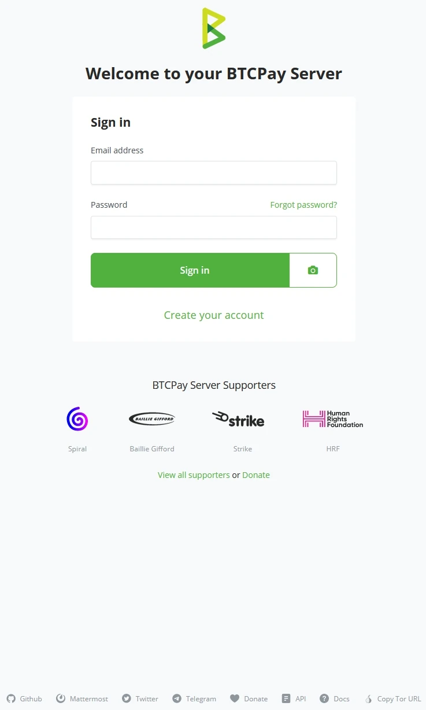

### Ventana de Crear una Cuenta

Crear cuentas en BTCPay Server requiere un correo electrónico válido; example@email.com sería un ejemplo de correo electrónico válido.

La contraseña necesita tener al menos 8 caracteres de largo, incluyendo letras, números y caracteres. Después de establecer la contraseña una vez, tendrás que verificar la contraseña escrita para asegurarte de que es correcta a lo que se escribió en el primer campo de contraseña.
Cuando ambos campos, email y contraseña, estén debidamente completados, haz clic en el botón ‘Crear Cuenta’. Esto guardará el email y la contraseña en la instancia de BTCPay Server del instructor.
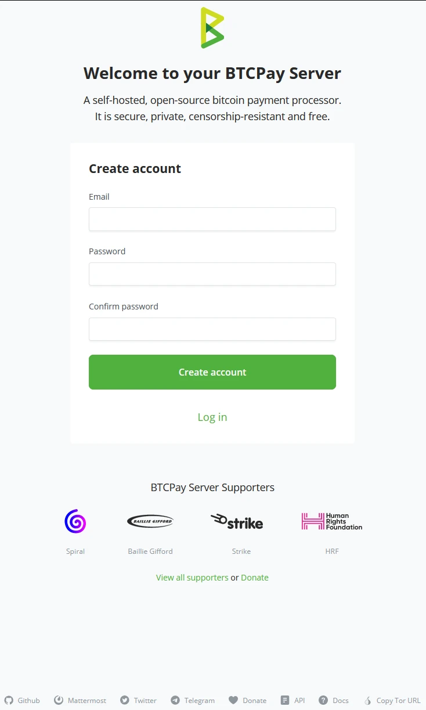

**!Nota!**

Si sigues este curso por tu cuenta, crear esta cuenta sería algo que podrías hacer en un host de terceros; por lo tanto, mencionamos nuevamente que nunca uses estos como entornos de producción sino solo para fines de aprendizaje.

### Creación de cuenta por el administrador de BTCPay Server

El administrador de la instancia de BTCPay Server también puede crear cuentas para BTCPay Server. El administrador de la instancia de BTCPay Server puede hacer clic en ‘Configuración del Servidor’ (1), hacer clic en la pestaña ‘Usuarios’ (2), y hacer clic en el botón “+ Añadir Usuario” (3) en la parte superior derecha de la pestaña de Usuarios. En el Objetivo (4.3), aprenderás más sobre el control del administrador de Cuentas.

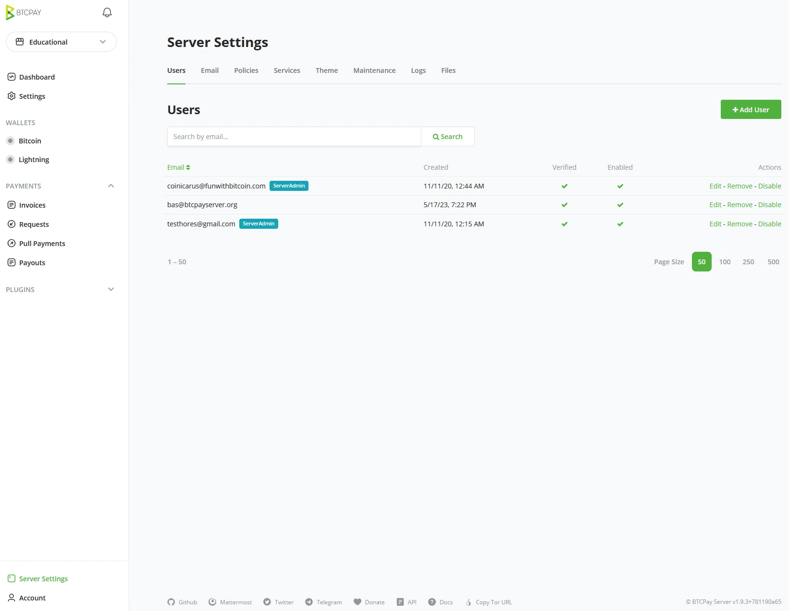

Como administrador, necesitarás la dirección de correo electrónico del usuario y establecer una contraseña estándar. Se recomienda como ddministrador informar al usuario que debería cambiar esta contraseña antes de usar la cuenta por razones de seguridad. Si el administrador NO establece una Contraseña y el SMTP ha sido configurado en el servidor, el usuario recibirá un correo electrónico con un enlace de invitación para crear su cuenta y establecer la contraseña por sí mismo.

### Ejemplo

Cuando sigas el curso con un instructor, sigue el enlace dado por el instructor y crea tu cuenta en el entorno de Demostración proporcionado. Asegura que tu dirección de correo electrónico y contraseña estén guardadas de forma segura; necesitarás estas credenciales de inicio de sesión para el resto de los objetivos de demostración en este curso.

Tu instructor puede haber recopilado la dirección de correo electrónico de antemano y enviado un enlace de invitación antes de este ejercicio. Si se te instruyó, revisa tu correo electrónico.

Cuando tomes el curso sin un instructor, crea tu cuenta usando el entorno de demostración del Servidor BTCPay; ve a

https://mainnet.demo.btcpayserver.org/login.

Esta cuenta solo debe usarse para propósitos de demostración/aprendizaje y nunca para negocios.

### Resumen de Habilidades

En esta sección, aprendiste lo siguiente:

- Cómo crear una cuenta en un servidor alojado a través de la interfaz.
- Cómo un administrador del servidor puede agregar manualmente usuarios en la configuración del servidor.

### Evaluación de Conocimientos

#### Revisión Conceptual de KA

Proporciona razones por las cuales usar un Servidor de Demostración es una mala idea para propósitos de producción.

## Gestión de cuenta(s) de usuario

<chapterId>b58ca6ee-b7fc-5e81-a6aa-c8ff212b4c55</chapterId>

### Gestión de Cuenta en BTCPay Server

Después de que un propietario de tienda ha creado su cuenta, puede gestionarla en la parte inferior izquierda de la interfaz de BTCPay Server. Debajo del botón de Cuenta, hay múltiples configuraciones de nivel superior.

- Modo Oscuro/Claro.
- Ocultar Información Sensible.
- Gestionar Cuenta.

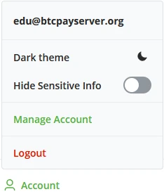

### Modo oscuro y claro

Los usuarios de BTCPay Server pueden elegir entre una versión de la interfaz en modo oscuro o claro. Las páginas orientadas al cliente no cambiarán. Usan las configuraciones preferidas por el cliente respecto al modo oscuro o claro.

### Alternar ocultar información densible

El botón de ocultar información sensible aporta una capa rápida y simple de seguridad. Siempre que necesites operar BTCPay Server, y hayan personas mirando por encima de tu hombro en un espacio público, activa ‘Ocultar Información Sensible’, y todos los valores en BTCPay Server estarán ocultos. Aunque alguien pueda estar mirando por encima de tu hombro no podrá ver los valores con los que estás trabajando.

### Gestionar cuenta

Una vez que la cuenta de usuario ha sido creada, aquí es donde se gestionan las contraseñas, 2FA, o claves de API.

### Administrar cuenta - Cuenta

Opcionalmente, actualiza tu cuenta con una dirección de correo electrónico diferente. Para asegurar que tu dirección de correo electrónico es correcta, BTCPay Server te permite enviar un correo electrónico de verificación. Haz clic en guardar si el usuario establece una nueva dirección de correo electrónico y confirma que la verificación funcionó. El nombre de usuario permanecerá igual que el correo electrónico anterior.

Un usuario puede decidir eliminar su cuenta por completo. Esto se puede hacer haciendo clic en el botón de eliminar en la pestaña de Cuenta.

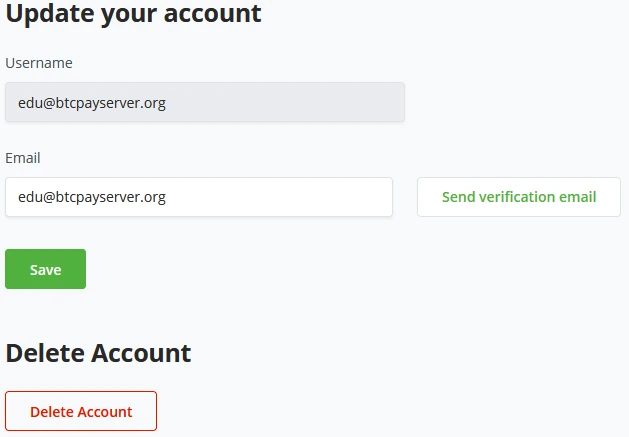

**¡Nota!**

Después de cambiar el correo electrónico, el nombre de usuario para la cuenta no cambiará. El correo electrónico dado anteriormente permanecerá como el nombre de inicio de sesión.

### Administrar cuenta - Contraseña

Un estudiante puede querer cambiar su contraseña. Puede hacerlo yendo a la pestaña de Contraseña. Aquí se le requiere que escriba su contraseña antigua y puede cambiarla por una nueva.

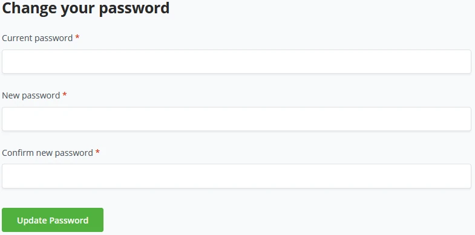

### Autenticación de Dos Factores (2FA)

Para limitar las consecuencias de una contraseña robada, puedes usar la autenticación de dos factores (2FA), un método de seguridad relativamente nuevo. Puedes activar la autenticación de dos factores a través de Administrar cuenta y la pestaña para la autenticación de dos factores. Debes completar un segundo paso después de iniciar sesión con tu nombre de usuario y contraseña.

BTCPay Server permite dos maneras de habilitar 2FA, 2FA basada en aplicaciones (Authy, Google, Microsoft authenticators) o a través de dispositivos de seguridad (FIDO2 o LNURL Auth).

### Autenticación de Dos Factores - Basada en aplicaciones

Basado en el Sistema Operativo de tu teléfono móvil (Android o iOS), los usuarios pueden elegir entre las siguientes aplicaciones;

1. Descarga un autenticador de dos factores;
   - Authy para [Android](https://play.google.com/store/apps/details?id=com.authy.authy) o [iOS](https://apps.apple.com/us/app/authy/id494168017)
   - Microsoft Authenticator para [Android](https://play.google.com/store/apps/details?id=com.azure.authenticator) o [iOS](https://apps.apple.com/us/app/microsoft-authenticator/id983156458)
   - Google Authenticator para [Android](https://play.google.com/store/apps/details?id=com.google.android.apps.authenticator2&hl=e%C2%80) o [iOS](https://apps.apple.com/us/app/google-authenticator/id388497605)
2. Después de descargar e instalar la Aplicación Autenticadora.
   - Escanea el Código QR proporcionado por BTCPay Server
   - O ingresa la clave generada por BTCPay Server manualmente en tu aplicación autenticadora.
3. La aplicación autenticadora te proporcionará un código único. Ingresa el código único en BTCPay Server para verificar la configuración, y haz clic en verificar para completar el proceso.

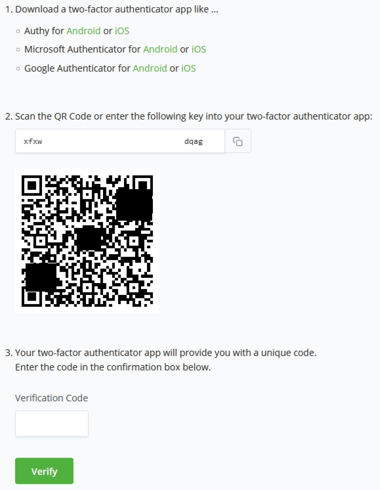

### Resumen de Habilidades

En esta sección, aprendiste lo siguiente:

- Opciones de administración de cuenta y las diversas maneras de administrar una cuenta en una instancia de BTCPay Server.
- Cómo configurar 2FA basada en aplicaciones.

### Evaluación de Conocimientos

#### Revisión Conceptual de KA

Describe cómo la 2FA basada en aplicaciones ayuda a asegurar tu cuenta

## Creando una nueva tienda

<chapterId>463b3634-b49f-5512-a711-3b2e096fc2e0</chapterId>

### Crea tu tienda con el asistente

Cuando un nuevo usuario inicia sesión en BTCPay Server, el entorno está vacío y necesita una primera tienda. El asistente de introducción de BTCPay Server le dará al usuario la opción de 'Crear tu tienda' (1). Una Tienda puede verse como un Hogar para tus necesidades de Bitcoin. Un nuevo Nodo de BTCPay Server comenzará con la Sincronización de la Blockchain de Bitcoin (2). Dependiendo de la infraestructura en la que se ejecute BTCPay Server, esto puede variar desde unas pocas horas hasta unos días. La versión actual de la instancia se muestra en la esquina inferior derecha de tu interfaz de BTCPay Server. Esto es útil para referencia cuando se está solucionando problemas.
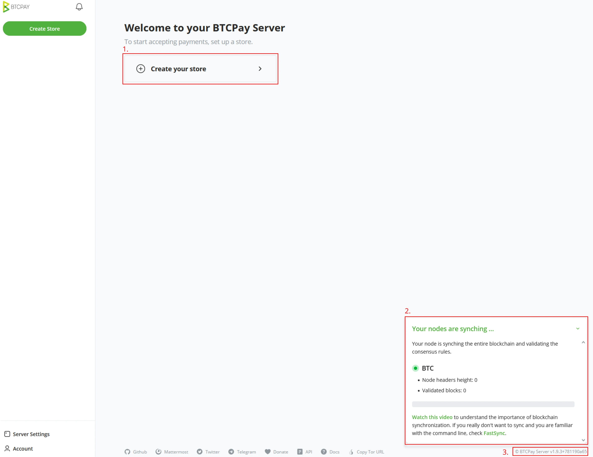

### Asistente para crear tu tienda

Seguir este curso comenzará con una pantalla ligeramente diferente a la página anterior. Como tu instructor ha preparado el entorno de demostración, la Blockchain de Bitcoin ha sido sincronizada previamente, y por lo tanto, no verás el estado de sincronización de los nodos.

Un usuario puede decidir eliminar toda su cuenta. Esto se puede hacer haciendo clic en el botón de eliminar en la pestaña de Cuenta.

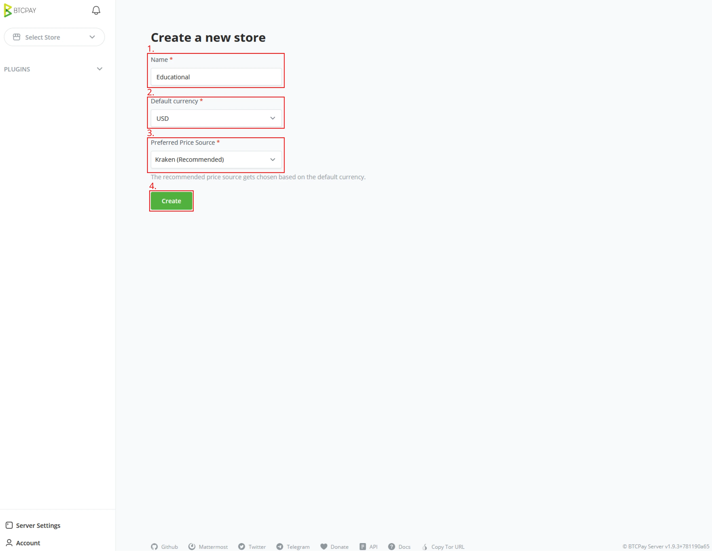

**¡Nota!**

Las cuentas de BTCPay Server pueden crear cantidades ilimitadas de tiendas. Cada tienda es una billetera u "hogar".

### Ejemplo

Comienza haciendo clic en "Crear tu tienda".

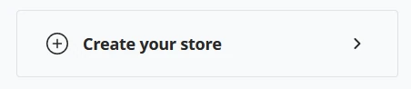

Esto creará tu primer Hogar y panel de control para usar BTCPay Server.

(1) Después de hacer clic en "Crear tu tienda", BTCPay Server requerirá que nombres la tienda; esto puede ser cualquier cosa que te resulte útil.

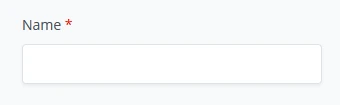

(2) A continuación, se debe establecer una moneda predeterminada para la tienda, ya sea una moneda fiduciaria o denominada en un estándar de Bitcoin / Sats. Para el entorno de demostración, lo configuraremos en USD.

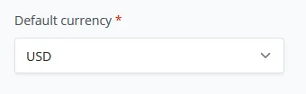

(3) Como último parámetro en la configuración de la tienda, BTCPay Server requiere que establezcas una "Fuente de precio preferida" para comparar el precio de Bitcoin contra el precio fiduciario actual para que tu tienda muestre la tasa de cambio correcta entre Bitcoin y la moneda fiduciaria establecida para la tienda. Nos quedaremos con la opción predeterminada en el ejemplo de demostración y estableceremos esto en el exchange Kraken. BTCPay Server utiliza la API de Kraken para verificar las tasas de cambio.

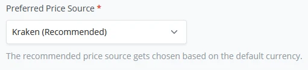

(4) Ahora que estos parámetros de la tienda han sido establecidos, haz clic en el botón Crear, y BTCPay Server generará el panel de control de tu primera tienda, donde el asistente continuará.


Felicidades, has creado tu primera tienda, y esto concluye este ejercicio.

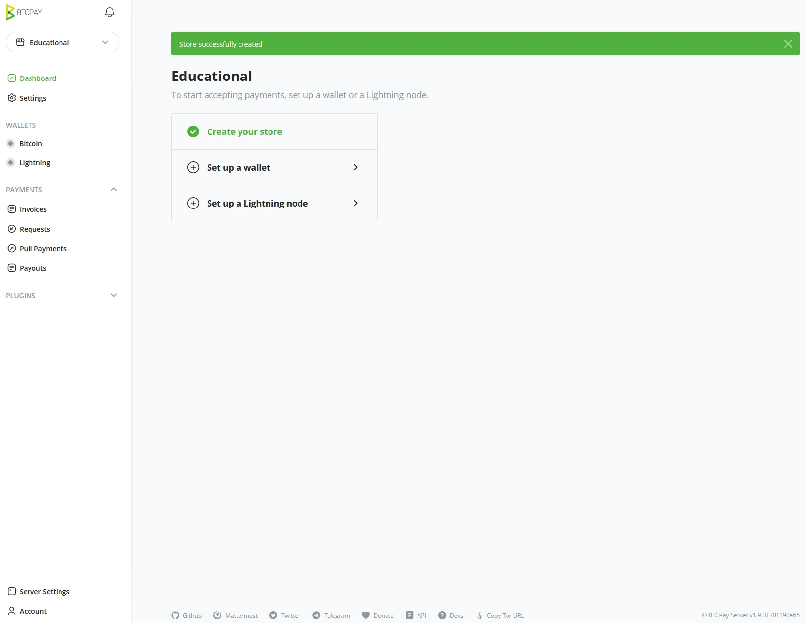

### Resumen de habilidades

En esta sección, aprendiste:

- Creación de tienda y configuración de una moneda predeterminada combinada con preferencias de fuente de precio.
- Cada "Tienda" es una nueva entidad separada de otras tiendas en esta instalación de BTCPay Server.

# Introducción a la Seguridad de las Claves de Bitcoin

<partId>25da22d8-fd37-51c5-af2a-58b9f3b046b2</partId>

## Entendiendo la Generación de Claves de Bitcoin

<chapterId>d162735b-847b-578e-83b8-a044ab703ec5</chapterId>

### ¿Qué implica generar claves de Bitcoin?

Las billeteras de Bitcoin, cuando se crean, generan lo que se llama "semilla" (seed). En el último objetivo, creaste una "semilla". La serie de palabras generadas antes también se conocen como frases mnemotécnicas. La semilla se utiliza para derivar Claves de Bitcoin individuales y se utiliza para enviar o recibir Bitcoin. La frase semilla nunca debe compartirse con terceros o pares no confiables.
La generación de semillas se realiza siguiendo el estándar de la industria conocido como el marco "Determinista Jerárquico" (Hierarchical Deterministic o HD, por sus siglas en inglés).
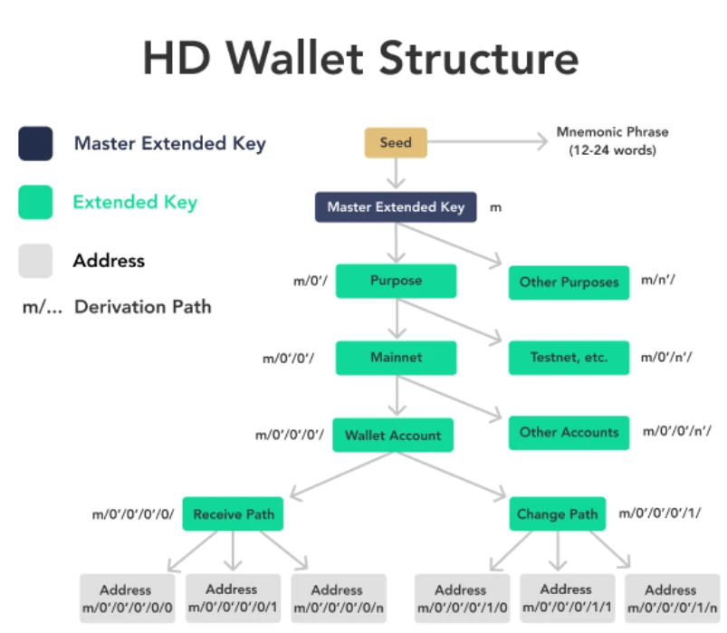

### Direcciones

BTCPay Server está diseñado para generar una nueva Dirección. Esto alivia el problema de reutilizar la clave pública o Dirección. Usar la misma clave pública hace que rastrear todo tu historial de pagos sea muy fácil. Pensar en las claves como vales de un solo uso mejoraría significativamente tu privacidad. También usamos direcciones de Bitcoin, no confundas estas con las claves públicas.

Una Dirección se deriva de la clave pública a través de un “algoritmo de hash”. Sin embargo, la mayoría de las billeteras y transacciones mostrarán direcciones en lugar de esas claves públicas. Las direcciones, en general, son más cortas que las claves públicas y suelen comenzar con un `1`, `3`, o `bc1`, mientras que las claves públicas comienzan con `02`, `03`, o `04`.

- Las direcciones que comienzan con `1.....` son direcciones todavía muy comunes. Como se mencionó en el capítulo "Creando una nueva tienda", estas son direcciones heredadas. Este tipo de dirección está destinado para transacciones P2PKH. P2PKH utiliza codificación Base58, lo que hace que la dirección sea sensible a mayúsculas y minúsculas. Su estructura se basa en la clave pública con un dígito adicional como identificador.

- Las direcciones que comienzan con `bc1...` están lentamente convirtiéndose en direcciones muy comunes. Estas son conocidas como Direcciones SegWit (nativas). Estas ofrecen una mejor estructura de tarifas que las otras direcciones mencionadas. Las direcciones SegWit Nativas utilizan codificación Bech32 y solo permiten letras minúsculas.

- Las direcciones que comienzan con `3...` son comúnmente utilizadas todavía por los intercambios para direcciones de depósito. Estas direcciones se mencionan en el capítulo "Creando una nueva tienda", como direcciones SegWit envueltas o anidadas. Sin embargo, también podrían funcionar como una "Dirección Multisig". Cuando se usan como una dirección SegWit, hay algunos ahorros en las tarifas de transacción, aunque menos que con SegWit Nativo. Las Direcciones P2SH utilizan codificación Base58. Esto las hace sensibles a mayúsculas y minúsculas, como la dirección heredada.

- Las direcciones que comienzan con `2...` son direcciones de Testnet. Están destinadas a recibir bitcoin de testnet (tBTC). Nunca debes confundir esto y enviar Bitcoin a estas direcciones. Para propósitos de desarrollo, puedes generar una billetera de testnet. Hay múltiples faucets en línea para obtener Bitcoin de testnet. Nunca compres Bitcoin de testnet. El Bitcoin de testnet se mina. Esta podría ser una razón para que un desarrollador use Regtest en su lugar. Este es un entorno de juego para desarrolladores, que carece de ciertos componentes de la red. Sin embargo, Bitcoin es, para propósitos de desarrollo, muy útil.

### Claves Públicas

Las claves públicas se usan menos en la práctica hoy en día. Con el tiempo, los usuarios de bitcoin han estado reemplazándolas con Direcciones. Sin embargo, todavía existen y se usan ocasionalmente. Las claves públicas, en general, son cadenas mucho más largas que las direcciones. Al igual que con las direcciones, comienzan con un identificador específico.

- Primero, `02...` y `03...` son identificadores de clave pública muy estándar codificados en formato SEC. Estos pueden procesarse y convertirse en direcciones para recibir, usarse para crear direcciones multi-firma, o para verificar una firma. Las transacciones de Bitcoin de los primeros días usaban claves públicas como parte de las transacciones P2PK.

- Sin embargo, las billeteras HD utilizan una estructura diferente. `xpub...`, `ypub...` o `zpub...` se llaman claves públicas extendidas, más conocidas como xpubs. Estas claves se utilizan para derivar muchas claves públicas ya que son parte de la billetera HD. Dado que tu xpub contiene los registros de toda tu historia, es decir, transacciones pasadas y futuras, nunca compartas estas con partes no confiables.

### Resumen de Habilidades

En esta sección, aprendiste lo siguiente:

- Las diferencias entre direcciones y tipos de datos de clave pública y los beneficios de usar direcciones sobre claves públicas.

### Evaluación de conocimientos

Describe el beneficio de usar direcciones nuevas para cada transacción en comparación con la reutilización de direcciones o métodos de clave pública.

## Asegurando las claves con una billetera de hardware

<chapterId>c54a6d61-5a43-5fdb-93ae-c6750de9c612</chapterId>

### Almacenando Claves de Bitcoin

Después de generar una frase semilla, la lista de 12 - 24 palabras generadas en este libro requiere respaldos adecuados y seguridad, ya que estas palabras son la única manera de recuperar el acceso a una billetera. La estructura de las billeteras HD y cómo genera direcciones de manera determinista usando esa única semilla, todas tus direcciones creadas se respaldarán usando esta única lista de palabras mnemotécnicas que representan tu frase de recuperación o frase semilla.

Manten tu frase de recuperación segura. Si alguien accede a ella, específicamente con intenciones maliciosas, pueden mover tus fondos. Mantener la semilla segura y protegida pero también recordarla es fundamental. Hay varios métodos para almacenar claves privadas de Bitcoin, cada uno con beneficios y desventajas, ya sea en seguridad, privacidad, conveniencia o medios físicos. Debido a la importancia de las claves privadas, los usuarios de Bitcoin tienden a almacenar y mantener estas claves de manera segura en "autocustodia" en lugar de usar servicios "custodios" como los bancos. Dependiendo del usuario, tiene que usar ya sea una solución de almacenamiento en frío (cold) o una Hot Wallet (Billetera Caliente).

### Almacenamiento en caliente y en frío de claves de Bitcoin

Usualmente, las billeteras de Bitcoin se denominan Hot Wallet (Billetera Caliente) o Cold Wallet (Billetera Fría). La mayoría de los compromisos están en la conveniencia, facilidad de uso y riesgos de seguridad. Cada uno de estos métodos también puede verse en una solución de custodia. Sin embargo, los compromisos aquí son principalmente de seguridad y privacidad y van más allá del alcance de este curso.

### Hot Wallet 

Las Hot Wallet (Billetera Caliente) son la manera más conveniente de interactuar con Bitcoin a través de móviles, web o software de escritorio. La billetera siempre está conectada a internet, permitiendo a los usuarios enviar o recibir Bitcoin. Sin embargo, esto también es su debilidad, la billetera, al estar siempre en línea, ahora es más vulnerable a ataques por hackers o malware en tu dispositivo. En BTCPay Server, las billeteras calientes almacenan las claves privadas en la instancia. Cualquiera que acceda a tu tienda BTCPay Server podría robar fondos de esta dirección si tiene malas intenciones. Cuando BTCPay Server se ejecuta en un entorno alojado, siempre deberías considerar esto en tu perfil de seguridad y preferiblemente no usar una Billetera Caliente en tal caso. Cuando BTCPay Server está instalado en hardware propio, asegurado y confiable para ti, el perfil de riesgo disminuye significativamente, ¡pero nunca desaparece!

### Cold Wallet 

Las personas mueven sus Bitcoin a una Cold Wallet (Billetera Fría) porque puede aislar las claves privadas de internet. Eliminar la conexión a internet de la ecuación reduce el riesgo de malware, spyware y swaps de SIM. Se cree que el almacenamiento en frío es superior al almacenamiento en caliente en términos de seguridad y autonomía, siempre y cuando se tomen precauciones adecuadas para evitar perder las claves privadas de Bitcoin. El almacenamiento en frío es más adecuado para grandes cantidades de Bitcoin, que no se pretenden gastar a menudo debido a la complejidad de la configuración de la billeteras.

Hay varios métodos de cómo almacenar claves de Bitcoin en almacenamiento en frío, desde billeteras de papel, billeteras mentales, billeteras de hardware o, desde el principio, un archivo de billetera. La mayoría de las billetera usan BIP 39 para generar la frase semilla. Sin embargo, dentro del software de Bitcoin Core, aún no se ha llegado a un consenso sobre su uso. El software de Bitcoin Core todavía generará un archivo Wallet.dat que necesitas almacenar en una ubicación segura fuera de línea.

### Resumen de habilidades

En esta sección, aprendiste:

- Las diferencias entre billeteras calientes y frías en términos de funcionalidad y sus compromisos.

### Evaluación de conocimientos Revisión Conceptual

- ¿Qué es una billetera o billetera?
- ¿Cuál es la diferencia entre billeteras calientes y frías?

- Describe lo que se entiende por "generar una billetera".

## Usando tus claves de Bitcoin

<chapterId>bff488de-5052-56e6-b696-97e896f762ae</chapterId>

### Billetera de BTCPay Server

BTCPay Server consta de las siguientes características estándar de billetera:

- Transacciones
- Enviar
- Recibir
- Reescanear
- Pagos Pull
- Pagos
- PSBT
- Configuración general

### Transacciones

Los administradores pueden ver las transacciones entrantes y salientes para la billetera on-chain conectada a esta tienda específica en la vista de transacciones. Cada transacción tiene una distinción entre recibida y enviada. Las recibidas serán verdes y las transacciones salientes serán rojas. Dentro de la vista de transacciones de BTCPay Server, los administradores también verán un conjunto de etiquetas estándar.

| Tipo de Transacción | Descripción                                                       |
| ------------------- | ----------------------------------------------------------------- |
| App                 | El pago fue recibido a través de una factura de aplicación        |
| invoice             | El pago fue recibido a través de una factura                      |
| payjoin             | No pagado, el temporizador de la factura aún no ha expirado       |
| payjoin-exposed     | UTXO fue expuesto a través de una propuesta de payjoin de factura |
| payment-request     | El pago fue recibido a través de una solicitud de pago            |
| payout              | El pago fue enviado a través de un pago o reembolso               |

### Cómo Enviar

La función de envío de BTCPay Server envía transacciones desde tu billetera on-chain de BTCPay Server. BTCPay Server permite múltiples formas de firmar tus transacciones para gastar fondos. Una transacción puede ser firmada con;

- Billetera de Hardware
- Billeteras que soportan PSBT
- Clave privada HD o semillas de recuperación.
- Billetera Caliente

#### Billetera de hardware

BTCPay Server tiene soporte integrado para billeteras de hardware que te permite usar tu billetera de hardware con BTCPay Vault sin filtrar información a aplicaciones o servidores de terceros. La integración de la billetera de hardware dentro de BTCPay Server te permite importar tu billetera de hardware y gastar los fondos entrantes con una simple confirmación en tu dispositivo. Tus claves privadas nunca abandonan el dispositivo, y todos los fondos se validan contra tu nodo completo, por lo que no hay fuga de datos.

#### Firmando con una billetera que soporta PSBT

PSBT (Transacciones de Bitcoin firmadas parcialmente) es un formato de intercambio para transacciones de Bitcoin que aún necesitan ser completamente firmadas. PSBT es compatible con BTCPay Server y puede ser firmado con billeteras de hardware y software compatibles.

La construcción de una transacción de Bitcoin completamente firmada pasa por los siguientes pasos:

- Se construye un PSBT con entradas y salidas específicas pero sin firmas
- El PSBT exportado puede ser importado por una billetera que soporte este formato
- Los datos de la transacción pueden ser inspeccionados y firmados usando la billetera
- El archivo PSBT firmado se exporta desde la billetera e importa a BTCPay Server
- BTCPay Server produce la transacción final de Bitcoin
- Verificas el resultado y lo transmites a la red

#### Firmando con clave privada HD o semilla mnemónica

Si has creado una billetera antes usando BTCPay Server, puedes gastar los fondos ingresando tu clave privada en el campo apropiado. Establece una "AccountKeyPath" adecuada en la configuración de la billetera; de lo contrario, no podrás gastar.

#### Firmando con una billetera caliente

Si creaste una nueva billetera al configurar tu tienda y la habilitaste como una billetera caliente, automáticamente usará la semilla almacenada en un servidor para firmar.

### RBF (Reemplazo por Tarifa)

Replace-By-Fee (RBF) es una característica del protocolo Bitcoin que permite reemplazar una transacción previamente difundida (mientras aún no está confirmada). Esto permite aleatorizar la huella de transacción de tu billetera o reemplazarla con una tasa de comisión más alta para mover la transacción más arriba en la cola de prioridad de confirmación (minado). Esto reemplazará efectivamente la transacción original ya que la tasa de comisión más alta será priorizada y, una vez confirmada, invalidará la original (sin doble gasto).
Presiona el botón "Configuración Avanzada" para ver las opciones de RBF;

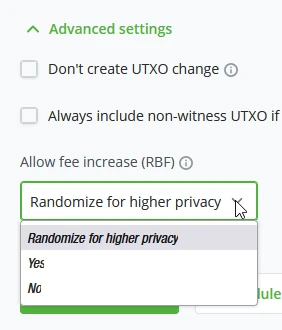

- Aleatorizar para mayor privacidad: permite que la transacción sea reemplazada automáticamente para la aleatorización de la huella de transacción.
- Sí: marcar la transacción para RBF y ser reemplazada explícitamente (No reemplazada por defecto, solo por entrada)
- No: no permitir que la transacción sea reemplazada.

### Selección de Monedas

La selección de monedas es una característica avanzada que mejora la privacidad y permite seleccionar las monedas que deseas gastar al crear una transacción. Por ejemplo, pagar con monedas que provienen directamente de una mezcla de conjoin.

La selección de monedas funciona de manera nativa con la característica de etiquetas de la billetera. Esto te permite etiquetar los fondos entrantes para un manejo y gasto más fluido de UTXO.

BTCPay Server también soporta BIP-329 para la gestión de etiquetas. BIP-329 permite aplicar etiquetas; si transfieres desde una billetera que soporta este BIP en particular y estableces etiquetas, BTCPay Server las reconocerá e importará. Al migrar servidores, esta información también puede ser exportada e importada al nuevo entorno.

### Cómo Recibir

Al hacer clic en el botón de recibir en BTCPay Server, se genera una dirección sin usar que puede utilizarse para recibir pagos. Los administradores también pueden generar una nueva dirección generando una nueva “Factura”.

BTCPay Server siempre pedirá generar la siguiente dirección disponible para evitar la reutilización de direcciones. Después de hacer clic en “Generar la siguiente dirección BTC disponible”, BTCPay Server generará una nueva dirección y QR. También te permite establecer directamente una etiqueta a la dirección para un mejor manejo de tus direcciones.

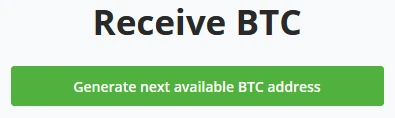

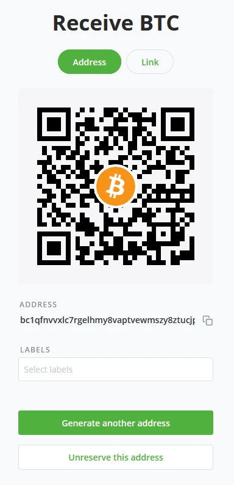

#### Re-escaneo

La función de Re-escaneo se basa en “Scantxoutset” de Bitcoin Core 0.17.0 para escanear el estado actual de la blockchain (llamado Conjunto de UTXO) en busca de monedas pertenecientes al esquema de derivación configurado. El re-escaneo de billetera resuelve dos problemas que los usuarios de BTCPay Server experimentan.

1. Problema del límite de brecha - La mayoría de las billeteras de terceros son billeteras ligeras que comparten un nodo entre muchos usuarios. Las billeteras dependientes de nodos ligeros y completos limitan la cantidad (típicamente 20) de direcciones sin saldo que rastrean en la blockchain para prevenir problemas de rendimiento. BTCPay Server genera una nueva dirección para cada factura. Teniendo en cuenta lo anterior, después de que BTCPay Server genere 20 facturas consecutivas sin pagar, la billetera externa deja de buscar las transacciones, asumiendo que no ocurrieron nuevas transacciones. Tu billetera externa no las mostrará una vez que las facturas se paguen en la 21ª, 22ª, etc. Por otro lado, internamente, la billetera de BTCPay Server rastrea cualquier dirección que genere junto con un límite de brecha mucho mayor. No depende de un tercero y siempre puede mostrar un saldo correcto.
2. La solución del límite de brecha - Si tu [billetera externa/existente](https://docs.btcpayserver.org/WalletSetup/#use-an-existing-wallet) permite la configuración del límite de brecha, la solución fácil es aumentarlo. Sin embargo, la mayoría de las billeteras no permiten esto. Las únicas billeteras que conocemos que permiten la configuración del límite de brecha son Electrum, Wasabi y Sparrow Wallet. Desafortunadamente, es probable que encuentres un problema con muchas otras billeteras. Para la mejor experiencia de usuario y privacidad, considera dejar de utilizar billeteras externas y utilizar la billetera interna de BTCPay Server.

#### BTCPay Server utiliza “mempoolfullrbf=1”

BTCPay Server utiliza “mempoolfullrbf=1”; hemos añadido esto como predeterminado en tu configuración de BTCPay Server. Sin embargo, también hemos hecho posible desactivarla manualmente. Sin “mempoolfullrbf=1”, si un cliente gasta dos veces un pago con una transacción que no señala RBF, el Comerciante solo lo sabría después de la confirmación.

Un administrador puede querer optar por no usar esta configuración. Con la siguiente cadena, puedes cambiar el valor predeterminado establecido.

```
BTCPAYGEN_EXCLUDE_FRAGMENTS="$BTCPAYGEN_EXCLUDE_FRAGMENTS;opt-mempoolfullrbf"
. btcpay-setup.sh -i**
```

### Configuraciones de la billetera de BTCPay Server

Las configuraciones de la billetera dentro de BTCPay Server ofrecen una visión clara y rápida de las configuraciones generales de tu billetera. Todas estas configuraciones están prellenadas si la billetera fue creada con BTCPay Server.

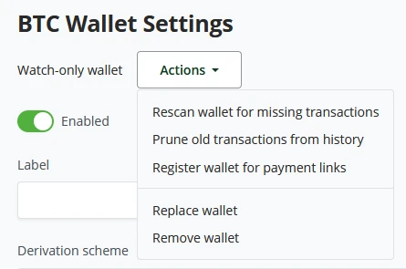

Las configuraciones de la billetera dentro de BTCPay Server ofrecen una visión clara y rápida de las configuraciones generales de tu billetera. Todas estas configuraciones están predefinidas si la billetera fue creada con BTCPay Server. Las configuraciones de la billetera de BTCPay Server comienzan con el estado de la billetera. ¿Es una billetera solo de observación o una billetera activa? Dependiendo del tipo de billetera, las acciones pueden variar desde volver a escanear la billetera para transacciones perdidas, podar transacciones antiguas del historial, registrar la billetera para enlaces de pago, o reemplazar y eliminar la billetera actual adjunta a la tienda. En la configuración de la billetera de BTCPay Server, los administradores pueden establecer una etiqueta para la billetera para un mejor manejo de la misma. Aquí el Administrador también podrá ver el Esquema de Derivación, la clave de cuenta (xpub), la Huella Digital y el Keypath. Los pagos en la configuración de la billetera solo tienen 2 configuraciones principales. El pago es inválido si la transacción no se confirma (minutos establecidos) después de la expiración de la factura. Se considera la factura confirmada cuando la transacción de pago tiene X cantidad de confirmaciones. Los administradores también pueden establecer un interruptor para mostrar las tarifas recomendadas en los pagos o establecer un objetivo de confirmación manual en el número de bloques.

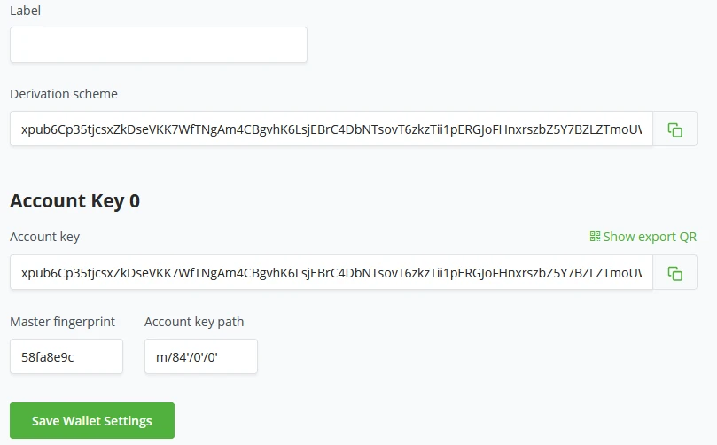

**¡Nota!**

Si sigues este curso por tu cuenta, crear esta cuenta sería algo que podrías hacer en un host de terceros, por lo tanto, mencionamos nuevamente no usar estos como entornos de producción, sino solo para propósitos de aprendizaje.

### Ejemplo

#### Configurar una billetera de Bitcoin en BTCPay Server

BTCPay Server permite dos formas de configuración de billetera. Una manera es importando una billetera de Bitcoin ya existente. La importación se puede hacer conectando una billetera de hardware, importando un archivo de billetera, ingresando una clave pública extendida, escaneando el código QR de una billetera, o la menos favorable, ingresando a mano una semilla de recuperación de billetera previamente creada. En BTCPay Server, también es posible crear una nueva billetera. Hay dos posibles formas de configurar BTCPay Server al generar una nueva billetera.
La opción de billetera caliente (hot wallet) en BTCPay Server permite características como 'Payjoin' o 'Liquid'. Sin embargo, hay una desventaja: la semilla de recuperación generada para este monedero se almacenará en el servidor, donde cualquier persona que tenga control de Admin podría obtener la semilla de recuperación. Dado que tu clave privada se deriva de tu semilla de recuperación, ¡un actor malicioso podría obtener acceso a tus fondos actuales y futuros!
Para mitigar tal riesgo en BTCPay Server, un Admin puede configurar en Configuración del Servidor > Políticas > "Permitir a los no administradores crear monederos calientes para sus tiendas" en no, como es por defecto. Para mejorar la seguridad de esas billeteras calientes, el administrador del servidor debería habilitar la autenticación 2FA en las cuentas autorizadas para tener billeteras calientes. Almacenar claves privadas en un servidor público es peligroso y conlleva riesgos. Algunos son similares a los riesgos de la Red Lightning (ver el próximo capítulo para los riesgos de la Red Lightning).

La segunda opción que BTCPay Server ofrece al generar una nueva billetera es mediante la creación de una billetera Solo-Consulta. BTCPay Server generará tus claves privadas una sola vez. Después de que el usuario confirme haber anotado su Frase de Recuperación, BTCPay Server eliminará las claves privadas del servidor. Como resultado, tu tienda ahora tiene una billetera Solo-Consulta conectado a ella. Para gastar los fondos recibidos en tu billetera Solo-Consulta, consulta el capítulo Cómo Enviar, ya sea usando BTCPay Server Vault, PSBT (Transacción de Bitcoin Parcialmente Firmada), o, menos recomendado, proporcionando manualmente tu frase de recuperación.

Creaste una nueva 'Tienda' en la última parte. El asistente de instalación continuará preguntando si deseas "Configurar una billetera" o "Configurar un nodo de Lightning". En este ejemplo, seguirás el proceso del asistente de "Configurar una billetera" (1).

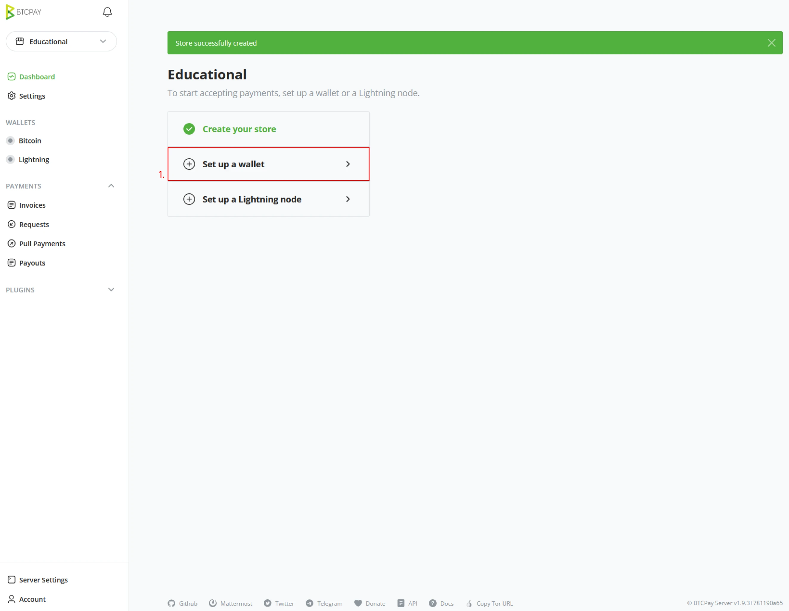

Después de hacer clic en "Configurar una billetera", el asistente continuará solicitando cómo deseas continuar; BTCPay Server ahora ofrece la opción de conectar una billetera de Bitcoin existente a tu nueva tienda. Si no tienes una billetera, BTCPay Server propone crear una nueva. Este ejemplo seguirá los pasos para "crear una nueva billetera" (2). Sigue los pasos para aprender cómo "Conectar una billetera existente" (1).

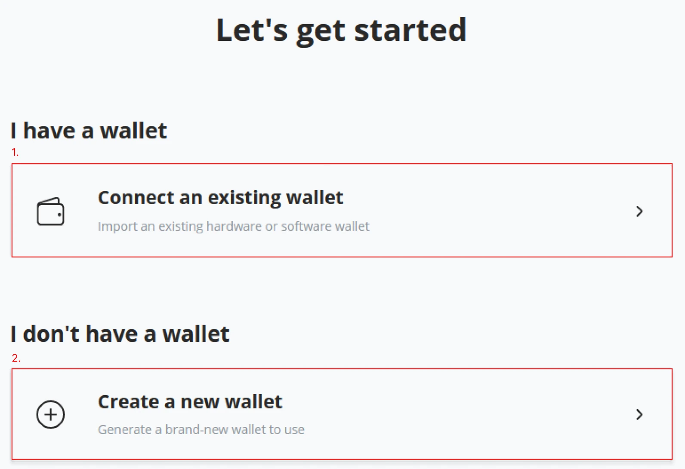

**¡Nota!**

Si tomas este curso en un aula, el ejemplo actual y la semilla que generamos es solo para fines educativos. Nunca debería haber ninguna cantidad sustancial aparte de la requerida a lo largo de los ejercicios en estas direcciones.

(1) Continúa el asistente de “Nueva billetera” haciendo clic en el botón "Crear una nueva billetera".

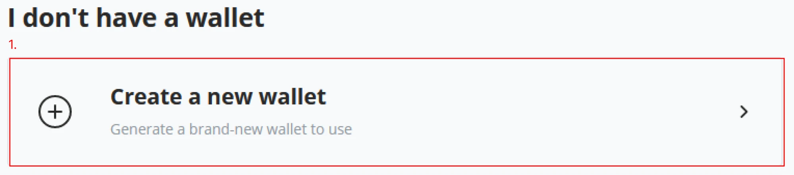

(2) Después de hacer clic en “Crear una nueva billetera”, la siguiente ventana del asistente dará las opciones “Billetera Caliente” y “Billetera Solo-Consulta”. Si sigues junto con un instructor, tu ambiente es una Demo compartida, y solo puedes crear una Billetera Solo-Consulta. Observa la diferencia entre ambas figuras a continuación. Como estás en el ambiente de Demo siguiendo junto con el instructor, crea un "Billetera Solo-Consulta" y continúa con el asistente de "Nueva Billetera".

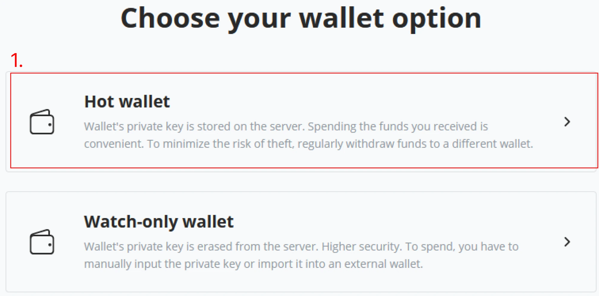

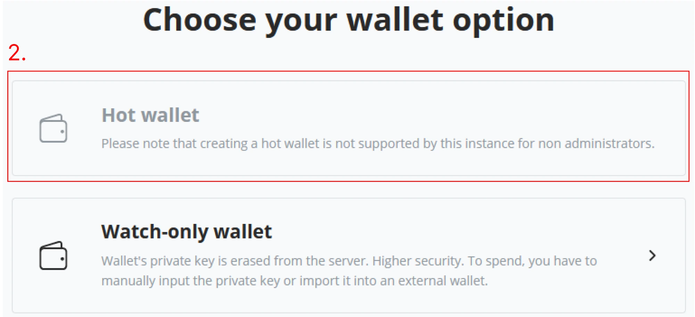

(3) Continuando el asistente de nuevo billetera, ahora estás en la sección Crear billetera BTC Solo-Consulta. Aquí podemos configurar el tipo de dirección de la billetera "Tipo de dirección" BTCPay Server te permite elegir tu tipo de dirección preferido; al momento de escribir este curso, todavía se recomienda usar direcciones bech32. Aprende más en detalle sobre direcciones en el primer capítulo de esta parte.

- Segwit (bech32)
- Native SegWit son direcciones que comienzan con `bc1q`. - Ejemplo: `bc1qXXXXXXXXXXXXXXXXXXXXXX`
- Legacy
  - Las direcciones Legacy son direcciones que comienzan con el número `1`.
  - Ejemplo: `15e15hXXXXXXXXXXXXXXXXXXXX`
- Taproot (Para usuarios avanzados)
  - Las direcciones Taproot comienzan con `bc1p`.
  - Ejemplo: `bc1pXXXXXXXXXXXXXXXXXXXXXXXX`
- Segwit envuelto
  - Las direcciones Segwit envueltas comienzan con `3`.
  - Ejemplo: `37BBXXXXXXXXXXXXXXX`

Elige Segwit (recomendado) como tu tipo de dirección de billetera preferido.

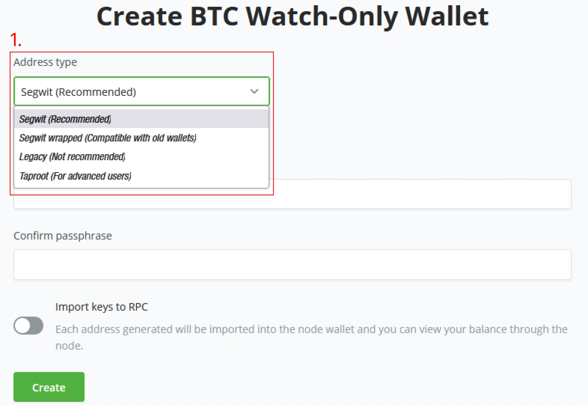

(4) Al configurar el parámetro para la Billetera, BTCPay Server permite a los usuarios establecer una frase de paso opcional a través de BIP39, asegúrate de confirmar tu contraseña.

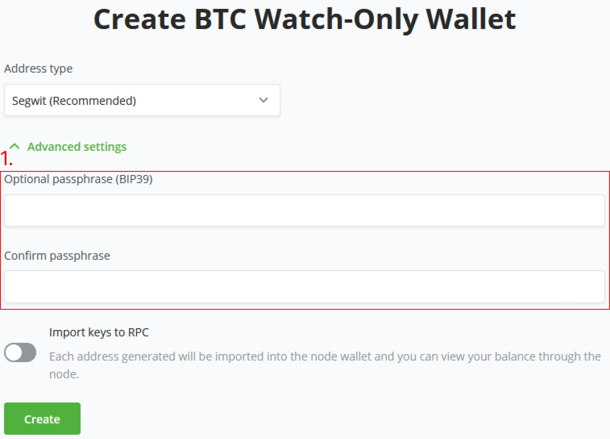

(5) Después de establecer el tipo de dirección de la Billetera y posiblemente configurar algunas opciones avanzadas, haz clic en Crear, y BTCPay Server generará tu nueva Billetera. Ten en cuenta que este es el último paso antes de generar tu frase semilla. Asegúrate de hacer esto solo en un entorno donde nadie pueda robar la frase semilla mirando tu pantalla.

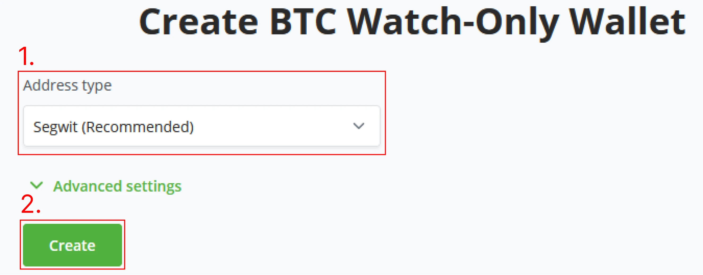

(6) En la siguiente pantalla del asistente, BTCPay Server te muestra la frase semilla de recuperación para tu billetera recién generada; estas son las claves para recuperar tu billetera y firmar transacciones. BTCPay Server genera una frase semilla de 12 palabras. Estas palabras serán borradas del servidor después de esta pantalla de configuración. Esta billetera es específicamente una billetera solo de observación. Se aconseja no almacenar esta frase semilla digitalmente ni mediante imagen fotográfica. Los usuarios pueden avanzar en el asistente solo si reconocen activamente que han anotado su frase semilla.

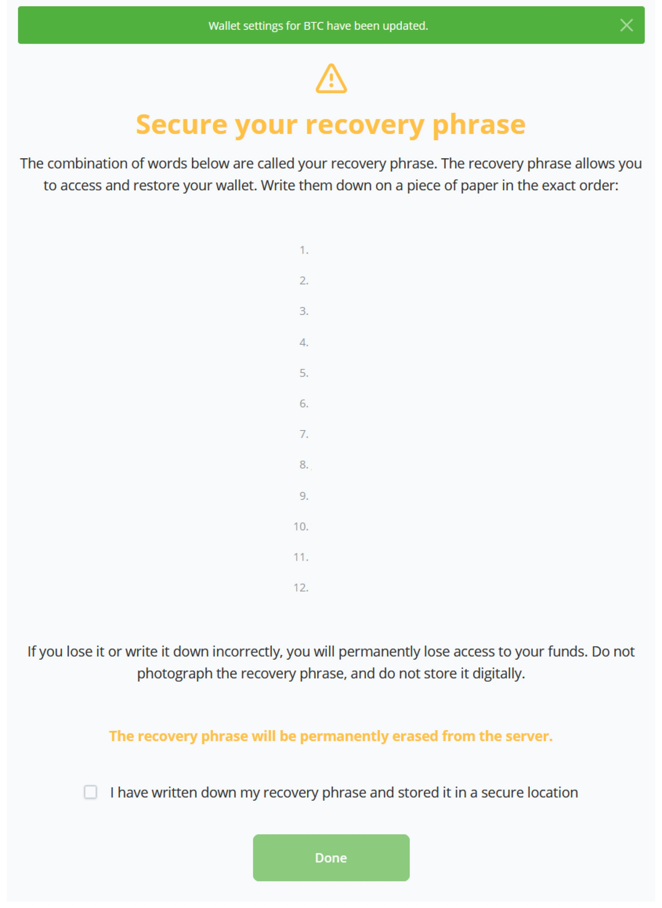

(7) Después de hacer clic en Hecho y asegurar la frase semilla de Bitcoin recién generada, BTCPay Server actualizará tu tienda con la nueva billetera adjunta y estará lista para recibir pagos. En la Interfaz de Usuario, en el menú de navegación izquierdo, observa cómo Bitcoin ahora está resaltado y activado debajo de la opción "billetera (Wallets)".

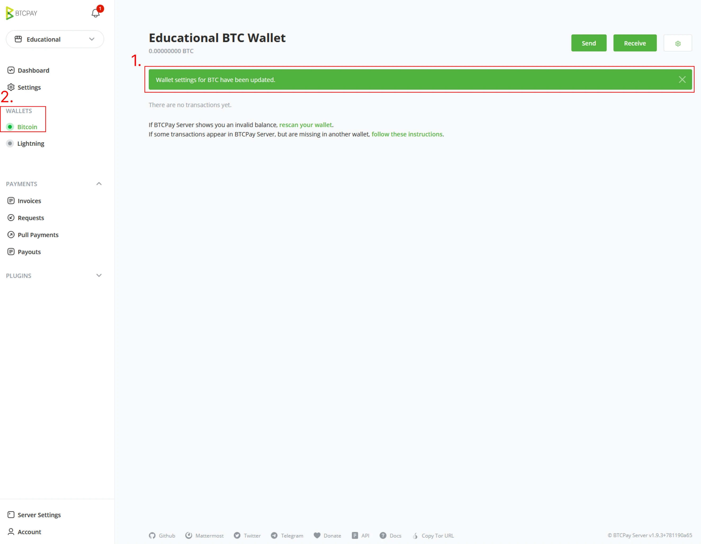

### Ejemplo: Anotando una frase semilla

Este es un momento muy particular y seguro para usar Bitcoin. Como se mencionó antes, solo tú deberías tener acceso o conocimiento sobre tu frase semilla. Mientras sigues junto con un instructor y el aula, la frase semilla generada solo debe usarse en este curso. Demasiados factores, ojos curiosos de compañeros de clase, sistemas no seguros y muchos otros hacen que estas llaves sean solo educativas y no confiables. Sin embargo, las llaves generadas aún deben ser almacenadas para ejemplos del curso.

El primer método que usaremos en la situación actual, también el menos seguro, es anotar la frase semilla en el orden correcto. Una tarjeta de frase semilla está en el material del curso proporcionado al estudiante o encontrado en el Github de BTCPay Server. Usaremos esta tarjeta para anotar las palabras generadas en el paso anterior. Asegúrate de escribirlas en el orden correcto. Después de haberlas escrito, compruébalas contra lo que fue dado por el software para asegurarte de que las escribiste en el orden correcto. Una vez que las hayas escrito, marca la casilla indicando que has anotado tu frase semilla correctamente.

### Ejemplo: Almacenando una frase semilla en una Billetera de Hardware

En este curso, tocamos el tema de almacenar una frase semilla en un billetera de hardware. Seguir este curso por un instructor podría no siempre incluir tal dispositivo. En el curso, los materiales guía han escrito una lista de monederos hardware proporcionados que se adaptan a este ejercicio.
Usaremos BTCPay Server Vault y una billetera de hardware Blockstream Jade en este ejemplo.
También puedes seguir el proceso a través de un video de referencia sobre cómo conectar una billetera de hardware.


Descargar BTCPay Server Vault: https://github.com/btcpayserver/BTCPayServer.Vault/releases

Asegúrate de descargar los archivos correctos para tu sistema. Los usuarios de Windows deben descargar el paquete [BTCPayServerVault-2.0.5-setup.exe](https://github.com/btcpayserver/BTCPayServer.Vault/releases/download/Vault%2Fv2.0.5/BTCPayServerVault-2.0.5-setup.exe), los usuarios de Mac deben descargar [BTCPayServerVault-osx-x64-2.0.5.dmg](https://github.com/btcpayserver/BTCPayServer.Vault/releases/download/Vault%2Fv2.0.5/BTCPayServerVault-osx-x64-2.0.5.dmg), y los usuarios de Linux deben descargar [BTCPayServerVault-Linux-2.0.5.tar.gz](https://github.com/btcpayserver/BTCPayServer.Vault/releases/download/Vault%2Fv2.0.5/BTCPayServerVault-Linux-2.0.5.tar.gz)

Después de instalar BTCPay Server Vault, inicia el software haciendo clic en el ícono en tu escritorio. Cuando BTCPay Server Vault se instala correctamente y se inicia por primera vez, pedirá permiso para ser utilizado con aplicaciones web. Solicitará otorgar acceso al BTCPay Server específico con el que trabajas. Acepta estas condiciones. BTCPay Server Vault ahora buscará el dispositivo de hardware. Una vez encontrado el dispositivo, BTCPay Server reconocerá que Vault está en funcionamiento y ha detectado tu dispositivo.

**!Nota!**

No entregues tus claves SSH o cuenta de administrador del servidor a nadie más aparte de los administradores cuando uses una billetera caliente. Cualquiera con acceso a estas cuentas tendrá acceso a los fondos en la billetera caliente.

### Resumen de Habilidades

En esta sección, has aprendido lo siguiente:

- La vista de transacciones de la billetera de Bitcoin y sus diversas categorizaciones.
- Las diversas opciones disponibles al enviar desde una billetera de Bitcoin, desde billeteras de hardware hasta billeteras calientes.
- El problema del límite de brecha que se enfrenta al usar la mayoría de las billeteras, y cómo corregirlo.
- Cómo generar una nueva billetera de Bitcoin dentro de BTCPay Server, incluyendo almacenar las llaves en una billetera de hardware y respaldar la frase de recuperación.

En este objetivo, aprendiste a cómo generar una nueva billetera de Bitcoin dentro de BTCPay Server. Aún no hemos profundizado en cómo proteger o usar esas claves. En una rápida visión general de este objetivo, has aprendido cómo configurar la primera tienda. Has aprendido cómo generar una frase de recuperación de Bitcoin.

### Evaluación de Conocimientos Práctica

Describe un método para generar claves y un esquema para asegurarlas, junto con los compromisos/riesgos del esquema de seguridad.

## Billetera Lightning de BTCPay Server

<chapterId>1bbece7e-0197-57e6-a93a-561cf384d946</chapterId>

Cuando un administrador de servidor provisiona una nueva instancia de BTCPay Server, puede configurar una implementación de la red Lightning, LND, Core Lightning o Eclair; consulta la Parte de Configuración de BTCPay Server para obtener instrucciones de instalación más detalladas.
Si se sigue junto con un aula, conectar un nodo Lightning a su BTCPay Server funciona a través de un nodo personalizado. Un usuario que no sea administrador del servidor en BTCPay Server no podrá usar el nodo Lightning interno por defecto. Esto es para proteger al propietario del servidor de perder sus fondos. Los administradores del servidor pueden instalar un Plugin para dar acceso a su nodo Lightning a través de LNBank; esto está fuera del alcance de este libro; lea más sobre LNBank en la página oficial del plugin.

### Conectar nodo interno (administrador del servidor)

El Administrador del Servidor puede usar el Nodo Lightning interno de BTCPay Server. Independientemente de la implementación de Lightning, la conexión al nodo Lightning interno es la misma.

Ve a una tienda configurada previamente y haz clic en la billetera "Lightning" en el menú de la izquierda. BTCPay Server ofrece dos posibilidades de configuración, Usar el nodo interno (solo administrador del servidor por defecto) o un nodo personalizado (conexión externa). Los administradores del servidor pueden hacer clic en la opción "Usar nodo interno". No se requiere ninguna configuración extra. Haz clic en el botón "guardar" y observe la notificación que indica, "Nodo Lightning BTC actualizado". La tienda ahora ha obtenido con éxito capacidades de la Lightning Network.

### Conectar nodo externo (propietario de la tienda/usuario del servidor)

Como los propietarios de las tiendas por defecto no tienen permitido usar el Nodo Lightning del administrador del servidor. La conexión debe hacerse a un nodo externo, ya sea un nodo propiedad del propietario de la tienda antes de una configuración de BTCPay Server, un plugin de LNBank si está disponible por el administrador del servidor, o una solución de custodia como Alby.

Ve a una tienda configurada previamente y haz clic en "Lightning" debajo de "Billeteras" en el menú de la izquierda. Como a los propietarios de las tiendas no se les permite usar el nodo interno por defecto, esta opción está desactivada. Usar un nodo personalizado es la única opción disponible por defecto para el propietario de la tienda.

BTCPay Server necesita información de conexión; la solución previamente realizada (o de custodia) proporcionará esta información específica para una implementación de Lightning. Dentro de BTCPay Server, el propietario de la tienda pueden usar las siguientes conexiones;

- C-lightning vía TCP o conexión de dominio Unix.
- Lightning Charge vía HTTPS
- Eclair vía HTTPS
- LND vía el proxy REST
- LNDhub vía la API REST

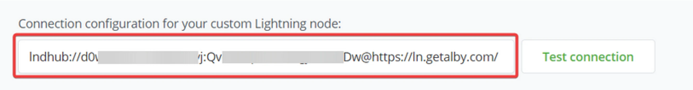

Haga clic en "probar conexión" para asegurarse de que ingresó correctamente los detalles de la conexión. Después de que la conexión confirme ser buena, haga clic en guardar, y BTCPay Server muestra que la tienda se actualizó con un Nodo Lightning.

### Administrando el nodo Lightning interno LND (Administrador del servidor)

Después de conectar el Nodo Lightning interno, los administradores del servidor notarán nuevas fichas en el Panel de Control específicamente para información de Lightning.

- Saldo Lightning
- BTC en canales
  - BTC abriendo canales
  - BTC saldo local
  - BTC saldo remoto
  - BTC cerrando canales
- BTC On-chain
  - BTC confirmado
  - BTC no confirmado
  - BTC reservado
- Servicios Lightning
  - Ride the Lightning (RTL).

Haciendo clic ya sea en el Logo de Ride the Lightning en la baldosa de "Servicios Lightning" o en "Lightning" debajo de billeteras en el menú de la izquierda, los administradores del servidor pueden acceder a RTL para la gestión del nodo Lightning.

**¡Nota!**

Conexión fallida del Nodo Lightning interno - Si la conexión interna falla, confirme:

1. El nodo Bitcoin On-chain está completamente sincronizado
2. El nodo Lightning interno está "Habilitado" en "Lightning" > "Configuración" > "Configuración de Lightning BTC"
   Si no puedes conectarte a tu nodo Lightning, intenta reiniciar tu servidor o lee más detalles en la documentación oficial de BTCPay Server; https://docs.btcpayserver.org/Troubleshooting/ . No podrás aceptar pagos Lightning en tu tienda hasta que tu nodo Lightning aparezca como "En línea". Intenta probar tu conexión Lightning haciendo clic en el enlace "Información del nodo público"

### Billetera Lightning

Dentro de la opción de billetera Lightning en la barra de menú izquierda, los administradores del servidor encontrarán fácil acceso a RTL, su Información del nodo público y configuraciones específicas de Lightning para su tienda BTCPay Server.

#### Información del nodo interno

Los administradores del servidor pueden hacer clic en la información del nodo interno y echar un vistazo a su estado del servidor (En línea/ Fuera de línea) y la cadena de conexión para Clearnet o Tor.

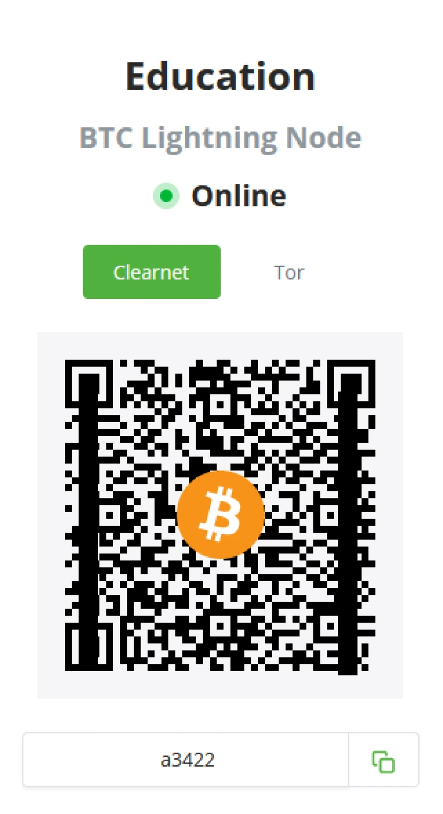

#### Cambiar conexión

Si el propietario de la tienda decide usar cambios dentro de las Configuraciones de Lightning hacer click en "Cambiar conexión".
Al lado de la información del Nodo público de la tienda, los propietarios pueden encontrar esta opción. Esto devolverá la configuración inicial para la conexión del nodo Lightning externo, completar la nueva información del nodo Lightning, hacer clic en guardar y actualizar la tienda con la nueva información del nodo.

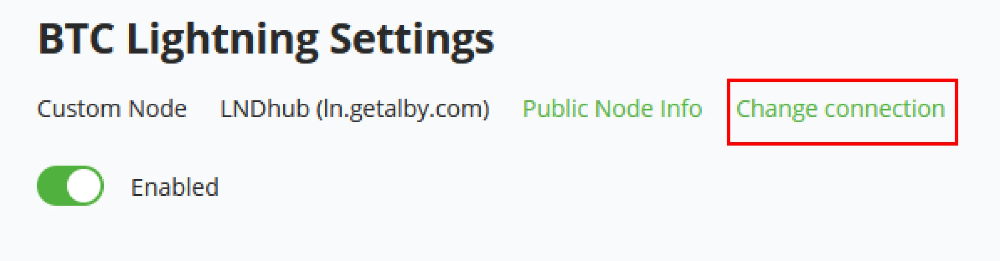

#### Servicios

Si el administrador del servidor decide instalar múltiples servicios para la implementación de Lightning, se listarán aquí. Con una implementación estándar de LND, los administradores tendrán Ride The Lightning (RTL) como herramienta estándar para la gestión del nodo.

#### Configuraciones de la billetera BTC Lightning

Después de agregar el nodo Lightning a la tienda en un paso anterior, dentro de las configuraciones de la billetera Lightning, los propietarios de la tienda aún pueden elegir desactivarlo para su tienda usando el Toggle en la parte superior de la configuracion de Lightning.

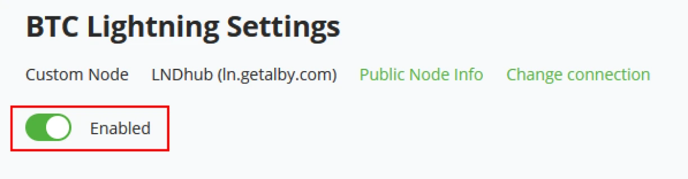

#### Opciones de pago Lightning

Los propietarios de las tiendas pueden establecer parámetros para lo siguiente para mejorar la experiencia Lightning para sus clientes.

- Mostrar montos de pago Lightning en Satoshis.
- Agregar pistas de salto para canales privados a la factura Lightning.
- Unificar las URL/códigos QR de pago on-chain y Lightning en el proceso de pago.
- Establecer una plantilla de descripción para las facturas Lightning.

#### LNURL

Los propietarios de las tiendas pueden elegir usar o no usar LNURL. Una URL de la Red Lightning, o LNURL, es un estándar propuesto para interacciones entre el pagador y el receptor de Lightning. En resumen, una LNURL es una url codificada en bech32 prefijada con lnurl. Se espera que la billetera Lightning decodifique la URL, contacte la URL y espere un objeto JSON con más instrucciones, notablemente una etiqueta que define el comportamiento de la lnurl.

- Habilitar LNURL
- Modo Clásico LNURL
  - Para compatibilidad de billetera, Bech32 codificado (clásico) vs URL en texto claro (próximamente)
- Permitir que el receptor pase un comentario.

### Ejemplo 1

#### Conectar a Lightning con el nodo interno (Administrador)

Esta opción solo está disponible si eres el Administrador de esta instancia o si el Administrador ha cambiado la configuración predeterminada donde los usuarios pueden usar el nodo Lightning interno.

Como administrador, haz clic en "Lightning Wallet" en la barra de menú izquierda. BTCPay Server pedirá usar una de dos opciones para conectar un Nodo Lightning, un nodo interno o un nodo externo personalizado. Haz clic en "Use internal node" (usar nodo interno) y luego en "save" (guardar).

#### Gestionando tu nodo Lightning (RTL)

Después de conectar al nodo Lightning interno, BTCPay Server se actualizará y mostrará una notificación "BTC Lightning node updated" (Nodo Lightning BTC actualizado), confirmando que ahora has conectado Lightning a tu tienda.

Gestionar el nodo Lightning es una tarea para el Administrador del servidor. Esto involucra.

- Gestionar transacción
- Gestionar liquidez
  - Liquidez entrante
  - Liquidez saliente
- Gestionar pares y canales
  - Pares conectados
  - Tarifas de canal
  - Estado del canal
- Realizar copias de seguridad frecuentes de los estados del canal.
- Verificar informes de enrutamiento
- Alternativamente, usar servicios como Loop.

Todo el manejo de nodos Lightning se realiza como estándar con RTL (asumiendo que estás ejecutando una implementación de LND). Los administradores pueden hacer clic en su Lightning Wallet en BTCPay Server y encontrar un botón para abrir RTL. El Panel de control principal de BTCPay Server ahora se actualiza con los mosaicos de la Red Lightning, incluyendo acceso rápido a RTL.

### Ejemplo 2

#### Conectarse a lightning con Alby

Cuando se conecta con un custodio como Alby, el propietario de la tienda debe primero crear una cuenta, visitar: https://getalby.com/

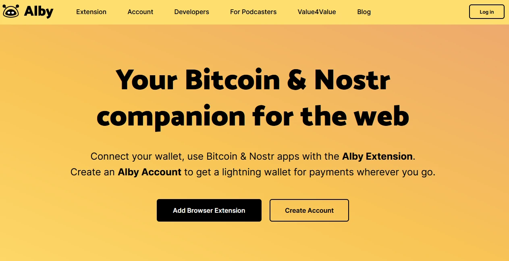

Después de crear la cuenta de Alby, ve a tu tienda BTCPay Server.

Paso 1: Haz clic en 'Set up a Lightning node' (Configurar un nodo Lightning) en el Panel de control o en 'Lightning' debajo de billeteras.

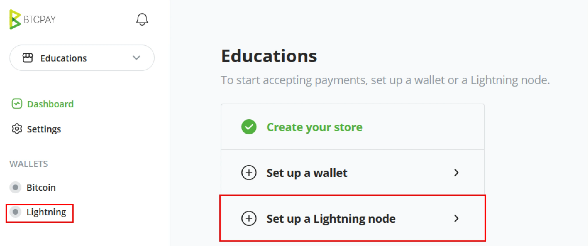

Paso 2: Inserta tus credenciales de conexión de billetera proporcionadas por Alby. En el Dashboard de Alby, haz clic en Wallet. Aquí encontrarás "Wallet Connection Credentials" (Credenciales de Conexión de Billetera). Copia estas credenciales. Pega las credenciales de Alby en el campo de configuración de conexión en BTCPay Server.

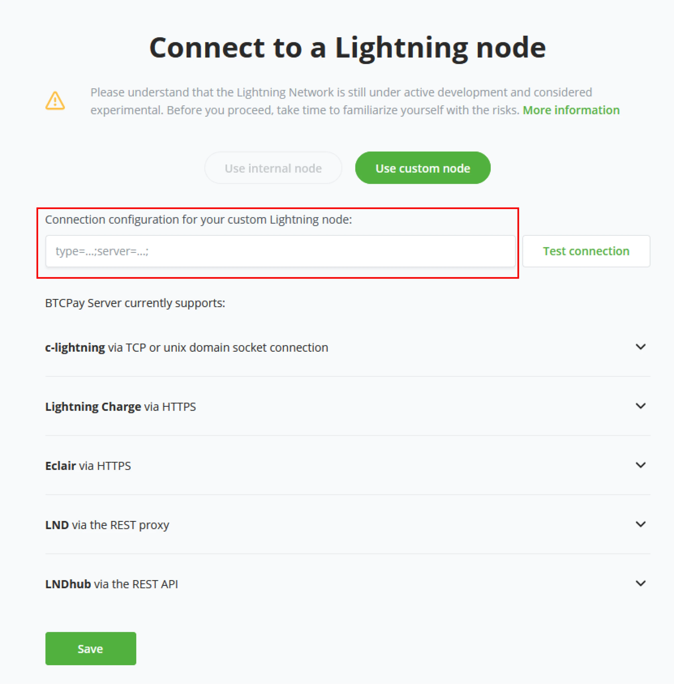

Paso 3: Después de proporcionar a BTCPay Server los detalles de la conexión, haz clic en el botón "Test Connection" (Probar Conexión) para asegurarte de que la conexión está funcionando correctamente. Nota el mensaje "Connection to lightning node successful"  (Conexión al nodo lightning exitosa) en la parte superior de tu pantalla. Esto confirma que todo funciona en orden.

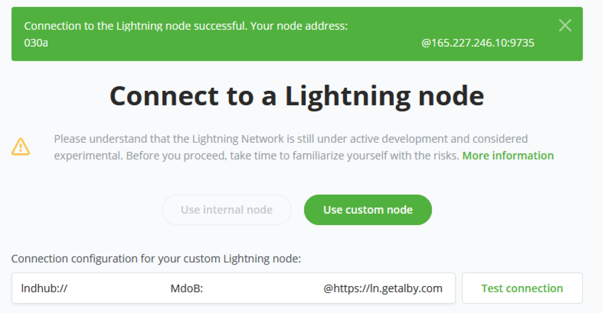

Paso 4: Haz clic en 'Save' (guardar), y tu tienda ahora está conectada con un nodo lightning por Alby.


**¡Nota!**

Nunca confíes en una solución Lightning custodiada con más valor del que estás dispuesto a perder.

### Resumen de habilidades

En esta sección aprendiste:

- Cómo conectar un nodo Lightning interno o externo
- Los contenidos y función de varios mosaicos relacionados con Lightning en el Dashboard
- Cómo configurar una billetera Lightning usando Voltage Surge o Alby

### Evaluación de conocimientos Revisión práctica

Describe algunas de las diversas opciones para conectar una billetera Lightning a tu tienda.

# Interfaz de BTCPay Server

<partId>25e88b81-e1ab-515f-a035-09f2a3075556</partId>

## Visión general del Dashboard

<chapterId>410ff28b-a272-5c91-93e0-48d5b28c53ab</chapterId>

BTCPay Server es un paquete de software modular. Sin embargo, hay estándares que cada BTCPay Server tendrá y con los que interactuarán el Administrador/usuarios. Comenzando con el Dashboard o Panel de control. El punto de entrada principal de cada BTCPay Server después de iniciar sesión. El Dashboard ofrece una visión general de cómo está funcionando tu tienda, el saldo actual de la billetera y las últimas transacciones en los últimos 7 días. Como es una vista modular, los Plugins pueden utilizar esta vista para su beneficio y crear sus mosaicos en el Dashboard. Para este libro de curso, solo hablaremos sobre plugins/aplicaciones estándar y sus respectivas vistas a lo largo de BTCPay Server.

### Mosaicos del Dashboard

Dentro de la vista principal del dashboard de BTCPay Server hay un par de mosaicos estándar disponibles. Estos mosaicos están destinados para que el propietario de la tienda o el Administrador gestionen su tienda rápidamente en una visión general.

- Saldo de la billetera
- Actividad de transacción
- Saldo de Lightning (si Lightning está habilitado en la tienda)
- Servicios de Lightning (si Lightning está habilitado en la tienda)
- Transacciones recientes.
- Facturas recientes
- Crowdfunds activos actuales
- Rendimiento de la tienda / artículos más vendidos.

### Saldo de la billetera

El mosaico de "Wallet Balance" (Saldo de la Cartera) ofrece una visión rápida de los fondos y el rendimiento de tu billetera. Se puede visualizar en BTC o en moneda Fiat en un gráfico semanal, mensual o anual.


### Actividad de transacción

Junto al mosaico de Wallet Balance, BTCPay Server muestra una visión rápida de los Pagos pendientes, la cantidad de Transacciones en los últimos 7 días, y si tu tienda ha emitido algún reembolso. Al hacer clic en el botón de "Manage" (Gestionar) te lleva a la gestión de pagos pendientes (aprende más sobre pagos en BTCPay Server - Capítulo de Pagos).

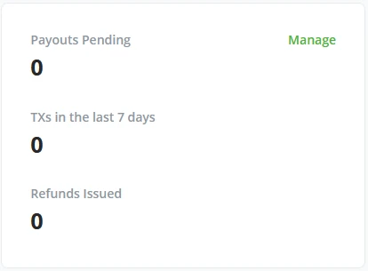

### Saldo de Lightning

Esto solo es visible cuando Lightning está activado.

Cuando el Administrador ha permitido el acceso a la red Lightning, el tablero de BTCPay Server ahora tiene un nuevo mosaico con la información de tu nodo Lightning. Cuánto BTC hay en canales, cómo está balanceado esto local o remotamente (liquidez entrante o saliente), si los canales están cerrándose o abriéndose, y cuánto bitcoin se mantiene en cadena en el nodo lightning.

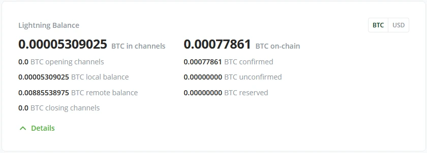

### Servicios de Lightning

Esto solo es visible cuando lightning está activo.

Además de ver tu saldo de Lightning en el tablero de BTCPay Server, los administradores también verán el mosaico para "Lightning Services" (Servicios de Lightning). Aquí los administradores pueden encontrar botones rápidos para herramientas que usan para gestionar su nodo Lightning; por ejemplo, Ride the Lightning es una de las herramientas estándar con BTCPay Server para la gestión de nodos Lightning.

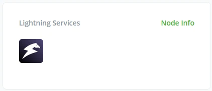

### Transacciones Recientes

El mosaico de transacciones recientes (Recent Transactions) mostrará las transacciones más recientes de tu tienda. Con un clic, el Administrador de la instancia de BTCPay Server ahora puede ver la última transacción y ver si se necesita atención hacia ella.

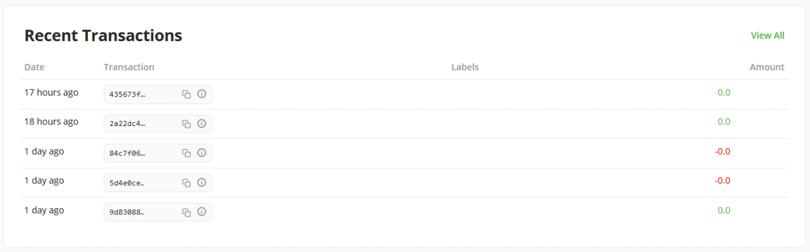

### Facturas Recientes

El mosaico de facturas recientes (Recent Invoices) muestra las 6 últimas facturas generadas por tu BTCPay Server, incluyendo el Estado y el monto de la factura. El mosaico también incluye un botón de "View All" (Ver todo) para acceder fácilmente a la vista completa de las facturas.

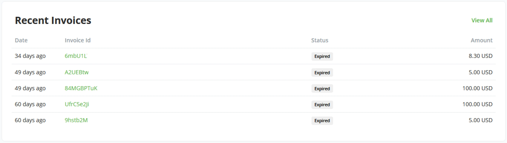

### Punto de Venta y Crowdfunds

BTCPay Server ofrece un conjunto de plugins o aplicaciones estándar, Punto de Venta (Point Of Sale) y Crowdfund son los dos principales plugins de BTCPay Server. Con cada tienda y billetera, un usuario de BTCPay Server puede generar tantos Puntos de Venta o Crowdfunds como considere oportuno. Cada uno creará un nuevo mosaico en el tablero mostrando el rendimiento de los plugins.

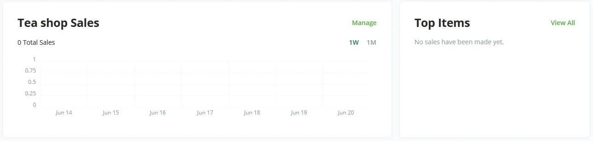

Nota la ligera diferencia entre un mosaico de Punto de Venta y Crowdfund. El Administrador ve los artículos más vendidos en el mosaico de Punto de Ventas. En el mosaico de Crowdfund, esto se convierte en los "Top Perks" (beneficios más populares). Ambos mosaicos tienen botones rápidos para gestionar la aplicación respectiva y ver facturas recientes creadas por los artículos más vendidos o los beneficios más populares.

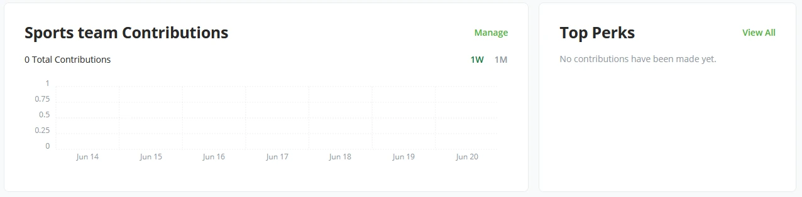

**!?Nota!?**

Los gráficos de saldo y las transacciones recientes están disponibles solo para un método de pago en cadena. La información sobre saldos y transacciones de la Red Lightning está pendiente. A partir de la Versión 1.6.0 de BTCPay Server, los saldos básicos de la Red Lightning están disponibles.

### Resumen de habilidades

En esta sección, aprendiste lo siguiente:

- La disposición central de mosaicos en la página principal conocida como el Panel de Control o Dashboard.
- Una comprensión básica del contenido de cada mosaico.

### Revisión de la Evaluación de Conocimientos

Enumera tantos mosaicos como puedas recordar del Dashboard.

## BTCPay Server - Configuración de la tienda

<chapterId>e8faef7b-278d-550e-a511-bc3a442daf64</chapterId>
Dentro del software BTCPay Server, conocemos dos tipos de configuraciones. Las configuraciones específicas de la tienda BTCPay Server, que se encuentra en el botón de configuraciones en la barra de menú a la izquierda debajo del Dashboard, y configuraciones de BTCPay Server, encontradas al fondo de la barra de menú justo arriba de "Account" (Cuenta). Las configuraciones específicas del servidor BTCPay Server solo pueden ser vistas por los administradores del servidor.
Las configuraciones de la tienda consisten en muchas pestañas para categorizar cada conjunto de configuraciones.

- General
- Tarifas (Rates)
- Apariencia del Pago (Checkout Appearance)
- Tokens de Acceso (Access Tokens)
- Usuarios (Users)
- Roles
- Webhooks
- Procesadores de Pagos (Payout Processors)
- Emails
- Formularios (Forms)

### General

En la pestaña de "General Settings" (Configuraciones Generales), el propietario de la tienda establece su marca y los valores predeterminados de pago. En la configuración inicial de la tienda, se dio un nombre a la tienda; esto se reflejará en las configuraciones Generales bajo "Store Name" (Nombre de la Tienda). Aquí, el propietario de la tienda también puede configurar su sitio web para que coincida con la marca y un ID de Tienda para que el Administrador lo reconozca en la base de datos.

#### Marca

Como BTCPay Server es FOSS, un propietario de tienda puede hacer personalización de marca para que coincida con su tienda. Establecer el color de la marca, almacenar los logos de la marca y añadir CSS personalizado para páginas públicas/de cara al cliente (Facturas, Solicitudes de Pago, Pagos Pull)

#### Pago

En las configuraciones de pagos, el propietario de la tienda puede establecer la moneda predeterminada de su tienda (ya sea en Bitcoin o en cualquier moneda fiat).

#### Permitir a cualquiera crear facturas

Esta configuración está pensada para desarrolladores o constructores sobre BTCPay Server. Con esta configuración activada para tu tienda, permite al mundo exterior crear facturas en tu instancia de BTCPay Server.

#### Añadir tarifa adicional (tarifa de red) a las facturas

Una característica dentro de BTCPay para proteger a los comerciantes de ataques de polvo (dusting attack) o para evitar que los clientes generen altos costos en tarifas cuando el comerciante necesite mover grandes cantidades de Bitcoin de una sola vez. Por ejemplo, el cliente creó una factura por 20$ y la pagó parcialmente, pagando 1$ 20 veces hasta que la factura fue completamente pagada. El comerciante ahora tiene una transacción más grande, aumentando el costo de minería en caso de que el comerciante decida mover esos fondos más tarde. Por defecto, BTCPay aplica un costo de red adicional al monto total de la factura para cubrir ese gasto para el comerciante cuando la factura se paga en múltiples transacciones. BTCPay ofrece varias opciones para personalizar esta característica de protección. Puedes aplicar una tarifa de red:

- Solo si el cliente realiza más de un pago por la factura (En el ejemplo anterior, si el cliente creó una factura por 20\$ y pagó 1\$, el total debido de la factura es ahora 19\$ + la tarifa de red. La tarifa de red se aplica después del primer pago)
- En cada pago (incluyendo el primer pago, en nuestro ejemplo, el total será 20\$ + tarifa de red de inmediato, incluso en el primer pago)
- Nunca añadir tarifa de red (desactiva completamente la tarifa de red)

Aunque protege de transacciones de polvo, también puede reflejarse negativamente en los negocios si no se comunica adecuadamente. Los clientes pueden tener preguntas adicionales y pensar que se les está cobrando de más.

#### La factura expira si el monto total no ha sido pagado después de?

El temporizador del invoce o factura está configurado por defecto en 15 minutos. El temporizador es un mecanismo de protección contra la volatilidad, ya que bloquea la cantidad de Bitcoin de acuerdo a las tasas de Bitcoin a fiat. Si el cliente no paga la factura dentro del período definido, la factura se considera vencida. La factura se considera "pagada" tan pronto como la transacción es visible en la blockchain (0-confirmaciones) pero se considera "completa" cuando alcanza el número de confirmaciones que el comerciante definió (usualmente, 1-6). El temporizador es personalizable por minutos.

#### Considerar la factura pagada incluso si el monto pagado es X% menos de lo esperado?

Cuando un cliente utiliza una billetera de intercambio para pagar directamente una factura, el intercambio toma una pequeña comisión. Esto significa que dicha factura no se considera completamente completada. La factura obtiene el estado "pagada parcialmente". Aquí puedes establecer la tasa porcentual si un comerciante desea aceptar facturas pagadas parcialmente.

### Tarifas

En BTCPay Server, cuando se genera una factura, siempre necesita el precio de Bitcoin a fiat más actualizado y preciso. Al crear una nueva tienda en BTCPay Server, se les pide a los administradores que establezcan su fuente de precio preferida; después de configurar la tienda, los propietarios de la tienda siempre pueden cambiar su fuente de precio en esta pestaña.

#### Reglas avanzadas de scripting de tarifas

Principalmente utilizado por usuarios avanzados. Si se activa, el propietario de la tienda puede crear scripts sobre el comportamiento del precio y cómo cobrar a sus clientes.

#### Pruebas

Un lugar rápido para probar tus pares de divisas preferidos. Esto también incluye una función para verificar pares de divisas predeterminados mediante consulta REST.

### Apariencia del Checkout

La pestaña de "Checkout Appearance" (Apariencia del Checkout) comienza con configuraciones específicas de la factura y un método de pago predeterminado y habilita métodos de pago específicos cuando se cumplen los requisitos establecidos.

#### Configuraciones de la factura

Métodos de pago predeterminados. BTCPay Server en una configuración estándar tiene tres opciones:

- BTC (on-chain)
- BTC (LNURL-pay)
- BTC (off-chain & Lightning)

Podemos establecer parámetros para nuestra tienda, donde un cliente solo interactuará con Lightning cuando el precio sea menor que 'X' cantidad y viceversa para transacciones en cadena cuando 'X' sea mayor que 'Y' siempre presentar la opción de pago en cadena.

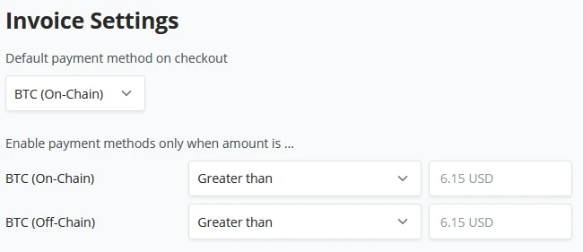

#### Checkout

A partir del lanzamiento de BTCPay Server 1.7, se introdujo una nueva interfaz de Checkout, Checkout V2, como se le llama. Desde el lanzamiento 1.9 fue estandarizado, los administradores y propietarios de tiendas todavía pueden configurar el checkout a la versión anterior. Usando el interruptor "Use the classic checkout" (Usar el checkout clásico), un propietario de tienda puede volver la tienda a la experiencia de checkout anterior. BTCPay Server también tiene un conjunto selecto de preajustes para comercio en línea o una experiencia en tienda.

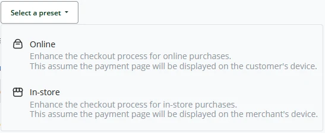

Cuando un cliente interactúa con la tienda y genera una factura, hay un tiempo de expiración para la factura. Por defecto, BTCPay Server establece esto en 5 minutos, y el Administrador puede configurarlo como considere adecuado. La página de checkout puede personalizarse aún más revisando los siguientes parámetros:

- Celebrar el pago mostrando confeti
- Mostrar el encabezado de la tienda (Nombre y logo)
- Mostrar el botón "Pagar en Wallet"
- Unificar URLs/Códigos QR de pagos on-chain y off-chain
- Mostrar montos de pago Lightning en Satoshis
- Detección automática del idioma en el checkout

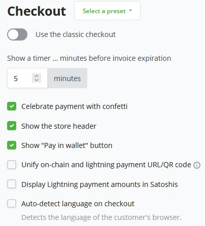

Cuando la detección automática del idioma no está configurada, BTCPay Server, por defecto, mostrará inglés. Un propietario de tienda puede cambiar este predeterminado a su idioma preferido.

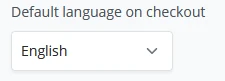

Haciendo clic en el menú desplegable, el propietario de la tienda puede establecer un título HTML personalizado para mostrarse en la página de checkout.

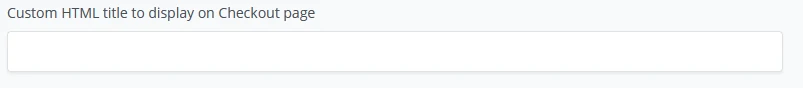

Para asegurar que el cliente conozca su método de pago, el propietario de la tienda puede configurar explícitamente su checkout para siempre requerir que los usuarios elijan su método de pago preferido. Cuando se paga la factura, BTCPay Server permite al cliente regresar a la tienda en línea. el propietario de la tienda puede configurar esta redirección después de que el cliente haya pagado automáticamente.

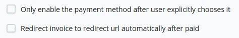

#### Recibo público

Dentro de los ajustes del recibo público, el propietario de la tienda puede configurar las páginas de recibos para que sean públicas y mostrar la lista de pagos en la página del recibo y el código QR del recibo para que el cliente pueda acceder a él digitalmente con facilidad.
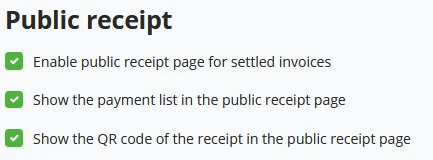

### Tokens de Acceso

Los tokens de acceso se utilizan para emparejar ciertas integraciones de comercio electrónico o integraciones personalizadas.

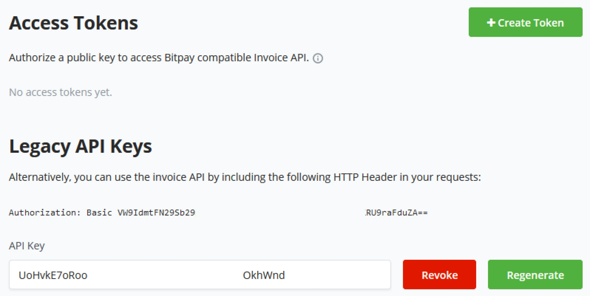

### Usuarios

"Store Users" (Usuarios de la tienda) es donde el propietario de la tienda puede gestionar a los miembros de su personal, sus cuentas y el acceso a la tienda. Después de que los miembros del personal crean sus cuentas, el propietario de la tienda puede agregar usuarios específicos a la tienda como usuarios invitados o propietarios. Para definir más detalladamente el rol del personal, consulta la siguiente sección sobre "Configuraciones de la tienda BTCPay Server - Roles".

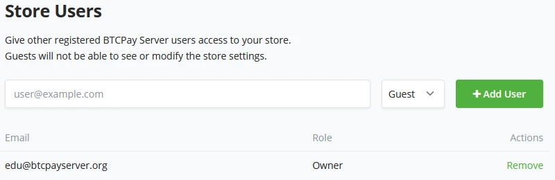

### Roles

Un propietario de una tienda podría no encontrar los roles estándar de los usuarios lo suficientemente significativos. En la configuración de roles personalizados, un propietario puede definir las necesidades exactas para cada rol en su negocio.

(1) Para crear un nuevo rol, haz clic en el botón "+ Añadir rol".

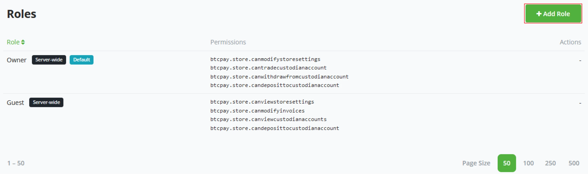

(2) Ingresa un nombre para el Rol, por ejemplo, "Cajero".

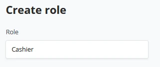

(3) Configura los permisos individuales para el rol.

- Modificar tus tiendas.
- Gestionar cuentas de intercambio vinculadas a tus tiendas.
  - Ver cuentas de intercambio vinculadas a tus tiendas.
- Gestionar tus pagos pull.
- Crear pagos pull.
  - Crear pagos pull no aprobados.
- Modificar facturas.
  - Ver facturas.
  - Crear una factura.
  - Crear facturas desde los nodos lightning asociados a tus tiendas.
- Ver tus tiendas.
  - Ver facturas.
  - Ver tus solicitudes de pago.
  - Modificar los webhooks de las tiendas.
- Modificar tus solicitudes de pago.
  - Ver tus solicitudes de pago.
- Usar los nodos lightning asociados a tus tiendas.
  - Ver las facturas lightning asociadas a tus tiendas.
  - Crear facturas desde los nodos lightning asociados a tus tiendas.
- Depositar fondos en cuentas de intercambio vinculadas a tus tiendas.
- Retirar fondos de cuentas de intercambio a tu tienda.
- Comerciar fondos en las cuentas de intercambio de tu tienda.

Cuando se crea el rol, el nombre se fija y no se puede cambiar después en el modo de edición.

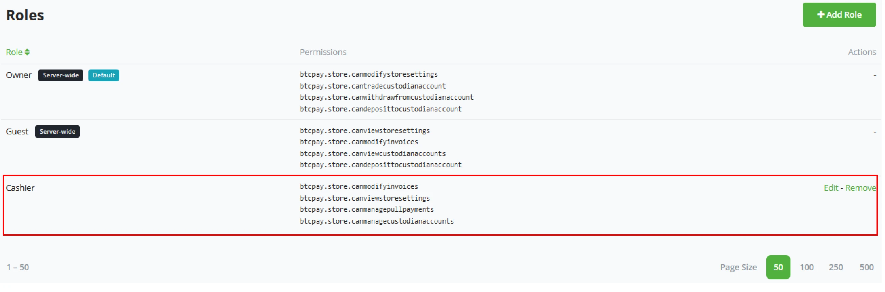

### Webhooks

Dentro de BTCPay Server, es bastante fácil hacer un nuevo "Webhook". En la pestaña de configuraciones de la tienda BTCPay Server - Webhooks, un propietario de tienda puede crear fácilmente un nuevo webhook haciendo clic en "Create Webhook" (Crear Webhook). Los webhooks permiten que BTCPay Server envíe eventos HTTP relacionados con tu tienda a otros servidores o integraciones de comercio electrónico.

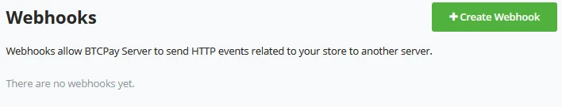

Ahora estás en la vista para crear un Webhook. Asegúrate de conocer tu URL de Payload y pégala en tu BTCPay Server. Mientras pegas la URL del payload, debajo muestra la clave secreta del webhook. Copia la clave secreta del webhook y proporciónalo en el endpoint. Cuando todo haya sido configurado, puedes alternar en BTCPay Server a redelivery automático. Intentaremos volver a entregar cualquier entrega fallida después de 10 segundos, 1 minuto, y hasta 6 veces después de 10 minutos. Puedes alternar entre cada evento o especificar los eventos según tus necesidades. Asegúrate de habilitar el webhook y presiona Añadir webhook para guardarlo.

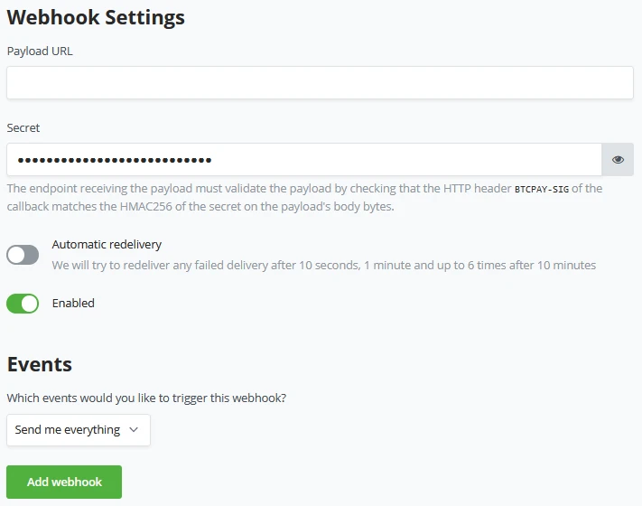

Los webhooks no están destinados a ser compatibles con la API de Bitpay. Hay dos IPNs separados (en términos de BitPay: "Notificaciones de Pago Instantáneo") en BTCPay Server.

- Webhookp
- Notificaciones

Solo usa la URL de Notificación cuando creas facturas a través de la API de Bitpay.

### Procesadores de Pago

Los procesadores de pagos trabajan junto con el concepto de Pagos en BTCPay Server. Funcionan como un agregador de pagos para agrupar múltiples transacciones y enviarlas de una vez. Con los procesadores de pagos, un propietario de una tienda puede automatizar los pagos agrupados. BTCPay Server ofrece dos métodos de pagos automatizados, On-chain y Off-chain (LN).
El propietario de la tienda puede hacer clic y configurar ambos procesadores de pagos por separado. Un propietario podría querer ejecutar el procesador on-chain solo una vez cada X horas, mientras que off-chain podría ir cada pocos minutos. Para On-chain, también puedes establecer un objetivo para qué bloque debe ser incluido. Por defecto, esto se establece en 1 (o el siguiente bloque disponible). Observa que configurar el procesador de pagos Off-chain solo tiene el temporizador de intervalo y ningún objetivo de bloque. Los pagos de la Lightning Network son instantáneos.

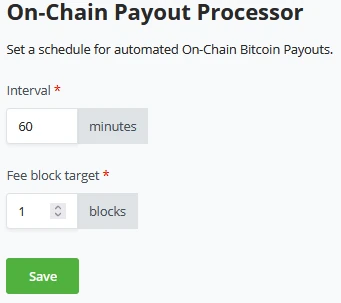
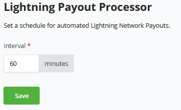

Los propietarios de las tiendas solo pueden configurar el procesador on-chain si tienen una Hot wallet (Cartera caliente) conectada a su tienda.

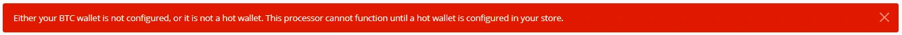

Después de configurar un procesador de pagos, puedes eliminarlo o modificarlo rápidamente volviendo a la pestaña de procesador de pagos en la configuración de la tienda de BTCPay Server.

**!?Nota!?**

Procesador de pagos on-chain - El procesador de pagos on-chain solo puede funcionar en una tienda configurada con una Hot wallet conectada. Si no hay una hot wallet conectada, BTCPay Server no posee las claves de la billetera y no podrá procesar automáticamente los pagos.

### Correos Electrónicos

BTCPay Server puede usar correos electrónicos para notificaciones o, cuando se configura correctamente, para recuperar cuentas que se crearon en la instancia, ya que, por defecto, BTCPay Server no envía un correo electrónico cuando se pierde la contraseña, por ejemplo.

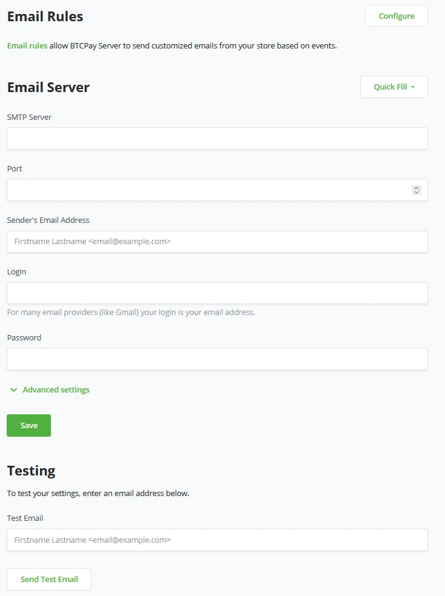

Antes de que un propietario de tienda pueda establecer reglas de correo electrónico para activarse en eventos específicos de su tienda, tenemos que configurar algunos ajustes básicos de correo electrónico. BTCPay Server necesita estos ajustes para enviar correos electrónicos sobre eventos relacionados con tu tienda o para restablecimientos de contraseña.

BTCPay Server facilitó completar esta información usando la opción de "Quick Fill" (Relleno Rápido):

- Gmail.com
- Yahoo.com
- Mailgun
- Office365
- SendGrid

Al usar la opción de relleno rápido, BTCPay Server prellenará los campos para el servidor SMTP y puerto; ahora, el propietario de la tienda solo necesita completar sus credenciales en una dirección de correo electrónico, Inicio de sesión (que generalmente es igual a tu dirección de correo electrónico) y tu contraseña. La opción avanzada que BTCPay Server ofrece en los ajustes de correo electrónico es Desactivar las comprobaciones de seguridad del certificado TLS; por defecto, esto está Habilitado.

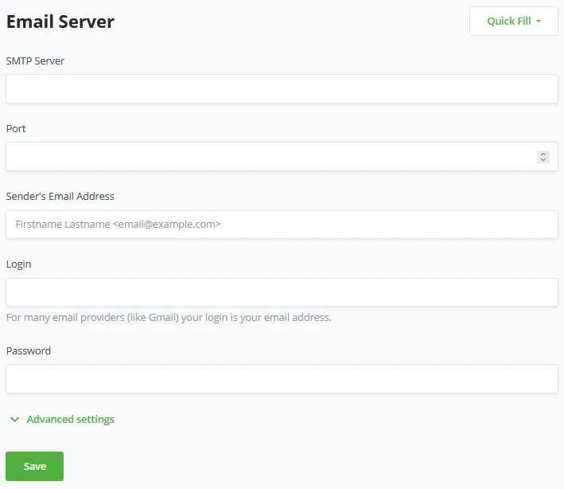

Con las reglas de correo electrónico, un propietario de una tienda puede establecer eventos específicos para activar correos electrónicos a direcciones de correo electrónico específicas.

- Factura Creada
- Factura Recibió Pago
- Factura en Procesamiento
- Factura Expirada
- Factura Liquidada
- Factura Inválida
- Pago de Factura Liquidado

Si el cliente ha proporcionado una dirección de correo electrónico, también se puede enviar la información al cliente. Los propietarios de tiendas pueden prellenar la línea de Asunto para dejar claro por qué sucedió este correo electrónico y qué desencadenante lo causó.

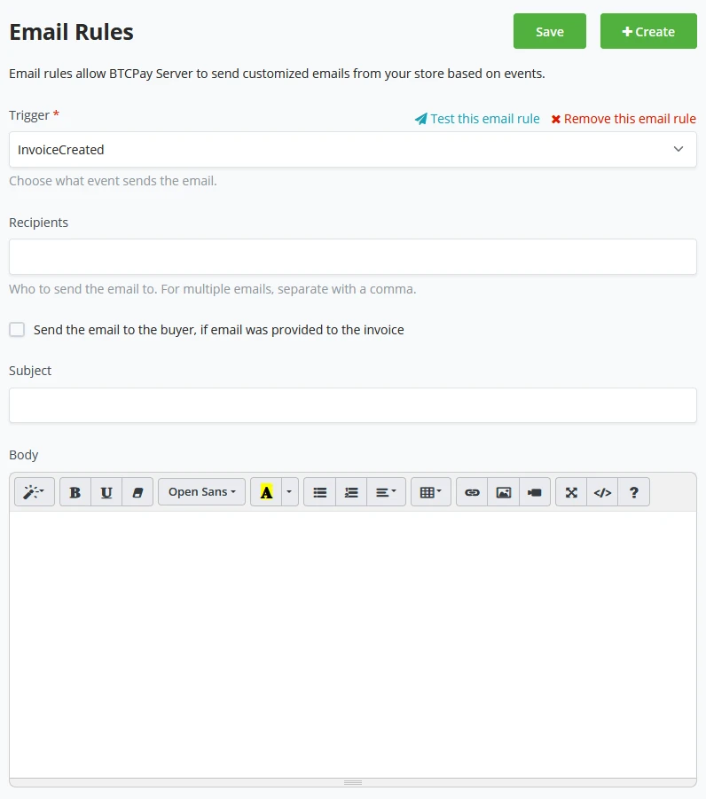

### Formularios

Como BTCPay Server no recopila ningún dato, un propietario de una tienda podría querer agregar un formulario personalizado a su experiencia de pago; de esta manera, el propietario de la tienda puede recopilar información adicional de su cliente. El constructor de formularios de BTCPay Server consta de dos partes, una visual y una vista de código más avanzada de los formularios.
Al crear un nuevo formulario, BTCPay Server abre una nueva ventana solicitando información básica sobre lo que deseas que tu nuevo formulario solicite. Primero, el propietario de la tienda necesita darle un nombre claro a su nuevo formulario, este nombre NO se podrá cambiar después de establecerlo.
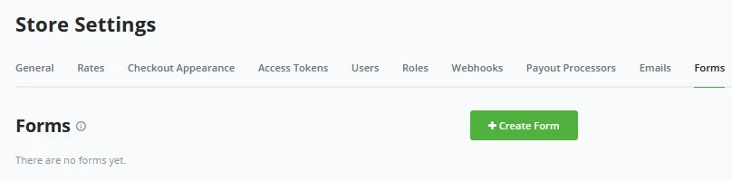

Después de que el propietario de la tienda le da un nombre al formulario, también puedes activar el interruptor para "Permitir formulario para uso público" en ON, y se vuelve verde. Esto es para que el formulario se use en todos los lugares orientados al cliente. Por ejemplo, si un propietario de tienda crea 1 factura separada no a través de su Punto de Venta, aún podría querer recopilar la información del cliente; este interruptor en ON permite que esa información sea recopilada.

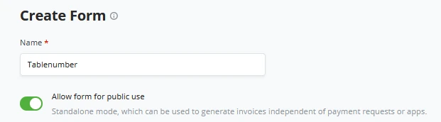

Cada formulario comienza con al menos 1 Nuevo campo de formulario. Un propietario puede elegir qué tipo de campo debería ser;

- Texto
- Número
- Contraseña
- Email
- URL
- Números de teléfono
- Fecha
- Campos ocultos
- Conjunto de campos (Fieldset)
- Un área de texto para comentarios abiertos.
- Selector de opciones

Cada tipo viene con sus parámetros para completar. El propietario de la tienda puede configurarlo a su gusto. Debajo del primer campo creado, el propietario de la tienda puede seguir agregando nuevos campos a este único formulario.

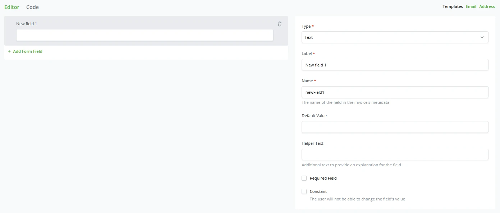

#### Formularios personalizados avanzados

BTCPay Server también te permite construir Formularios en código. JSON, en particular. En lugar de mirar el editor, el propietario de la tienda puede hacer clic en el botón CODE justo al lado del editor y entrar en el código de sus Formularios. En una definición de campo, solo se pueden establecer los siguientes campos; los valores de los campos se almacenan en los metadatos de la factura:

| Campo                 | Descripción                                                                                                                                                                                                                                                                                                                                                                                                                                                                                                               |
| --------------------- | ------------------------------------------------------------------------------------------------------------------------------------------------------------------------------------------------------------------------------------------------------------------------------------------------------------------------------------------------------------------------------------------------------------------------------------------------------------------------------------------------------------------------- |
| .fields.constant      | Si es verdadero, el .value debe establecerse en la definición del formulario, y el usuario no podrá cambiar el valor del campo. (ejemplo: la versión de la definición del formulario)                                                                                                                                                                                                                                                                                                                                     |
| .fields.type          | El tipo de input HTML: text, radio, checkbox, password, hidden, button, color, date, datetime-local, month, week, time, email, number, range, search, url, select, tel                                                                                                                                                                                                                                                                                                                                                   |
| .fields.options       | Si .fields.type es select, la lista de valores seleccionables                                                                                                                                                                                                                                                                                                                                                                                                                                                             |
| .fields.options.text  | El texto mostrado para esta opción                                                                                                                                                                                                                                                                                                                                                                                                                                                                                        |
| .fields.options.value | El valor del campo si esta opción es seleccionada                                                                                                                                                                                                                                                                                                                                                                                                                                                                         |
| .fields.type=fieldset | Crea un conjunto de campos HTML alrededor de los .fields.fields (ver abajo)                                                                                                                                                                                                                                                                                                                                                                                                                                               |
| .fields.name          | El nombre de la propiedad JSON del campo tal como aparecerá en los metadatos de la factura                                                                                                                                                                                                                                                                                                                                                                                                                                |
| .fields.value         | El valor predeterminado del campo                                                                                                                                                                                                                                                                                                                                                                                                                                                                                         |
| .fields.required      | si es verdadero, el campo será requerido                                                                                                                                                                                                                                                                                                                                                                                                                                                                                  |
| .fields.label         | La etiqueta del campo                                                                                                                                                                                                                                                                                                                                                                                                                                                                                                     |
| .fields.helpText      | Texto adicional para proporcionar una explicación para el campo.                                                                                                                                                                                                                                                                                                                                                                                                                                                          |
| .fields.fields        | Puedes organizar tus campos en una jerarquía, permitiendo que los campos secundarios se aniden dentro de los metadatos de la factura. Esta estructura puede ayudarte a organizar y gestionar mejor la información recopilada, facilitando su acceso e interpretación. Por ejemplo, si tienes un formulario que recopila información del cliente, puedes agrupar los campos bajo un campo principal llamado cliente. Dentro de este campo principal, podrías tener campos secundarios como nombre, Email y dirección. |

El nombre del campo representa el nombre de la propiedad JSON que almacena el valor proporcionado por el usuario en los metadatos de la factura. Algunos nombres bien conocidos pueden interpretarse y modificar los ajustes de la factura.

| Nombre del campo       | Descripción             |
| ---------------- | ----------------------- |
| invoice_amount   | El monto de la factura  |
| invoice_currency | La moneda de la factura |

Puedes prellenar los campos de una factura automáticamente añadiendo cadenas de consulta al URL del formulario, como "?tu_campo=valor".

Aquí hay algunos casos de uso para esta característica:

- Asistencia en la entrada de datos del usuario: Prellenar campos con información conocida del cliente para facilitarles completar el formulario. Por ejemplo, si ya conoces la dirección de correo electrónico de un cliente, puedes prellenar el campo del Email para ahorrarles tiempo.
- Personalización: Personalizar el formulario basado en las preferencias del cliente o segmentación. Por ejemplo, si tienes diferentes niveles de clientes, puedes prellenar el formulario con datos relevantes, como su nivel de membresía u ofertas específicas.
- Seguimiento: Rastrear el origen de las visitas de los clientes usando campos ocultos y valores prellenados. Por ejemplo, puedes crear enlaces con valores utm_media prellenados para cada canal de marketing (por ejemplo, X, Facebook, Email). Esto te ayuda a analizar la efectividad de tus esfuerzos de marketing.
- Pruebas A/B: Prellenar campos con diferentes valores para probar diferentes versiones del formulario, lo que te permite optimizar la experiencia del usuario y las tasas de conversión.

### Resumen de habilidades

En esta sección, aprendiste lo siguiente:

- La disposición y funciones de las pestañas en los Ajustes de la Tienda (Store Settings)
- Una multitud de opciones para ajustar finamente el manejo de tipos de cambio subyacentes, pagos parciales, pagos insuficientes leves y más.
- Personalizar la apariencia del checkout, incluyendo la habilitación de la cadena principal (main chain) vs. Lightning dependiendo del precio en las facturas.
- Gestionar niveles de acceso a la tienda y permisos a través de roles.
- Configurar correos electrónicos automáticos y sus disparadores
- Crear formularios personalizados para recopilar información adicional del cliente en el checkout.

### Evaluaciones de conocimiento

#### Revisión de KA

¿Cuál es la diferencia entre Ajustes de la Tienda y Ajustes del Servidor?

#### Hipotético de KA

Describe algunas opciones que podrías seleccionar en Apariencia del Checkout > Ajustes de la Factura, y por qué.

## BTCPay Server - Ajustes del servidor

<chapterId>1dd858a2-49ea-586b-9bc1-75a65f508df6</chapterId>

BTCPay Server consta de dos vistas de ajustes diferentes. Una está dedicada a los Ajustes de la Tienda y otra para los Ajustes del Servidor. Esta última solo está disponible si eres un administrador del Servidor y no para los propietarios de las tiendas. Los administradores del servidor pueden añadir usuarios, crear roles personalizados, configurar el servidor de correo electrónico, establecer políticas, realizar tareas de mantenimiento, verificar todos los servicios adjuntos a BTCPay Server, subir archivos al servidor o verificar los Registros.

### Usuarios

Como se mencionó anteriormente, los Administradores del Servidor pueden invitar a usuarios a su servidor añadiéndolos en la pestaña de Usuarios.

### Roles personalizados a nivel del servidor

BTCPay Server reconoce dos tipos de roles personalizados, los roles personalizados específicos de la tienda y los roles personalizados a nivel del servidor en los ajustes de BTCPay Server. Ambos tienen un conjunto similar de permisos; sin embargo, si se establece a través de la pestaña de Roles de los Ajustes de BTCPay Server, el rol aplicado será a nivel del servidor y se aplicará a múltiples tiendas. Nota que los roles personalizados tienen una etiqueta "A nivel del servidor" en los ajustes del Servidor.

### Roles personalizados a nivel de servidor

Conjunto de permisos para roles personalizados a nivel de servidor:

- Modificar tus tiendas.
- Gestionar cuentas de intercambio vinculadas a tus tiendas.
  - Ver cuentas de intercambio vinculadas a tus tiendas.
- Gestionar tus pagos pull.
  - Crear pagos pull.
  - Crear pagos pull no aprobados.
- Modificar facturas.
  - Ver facturas.
  - Crear una factura.
  - Crear facturas desde los nodos lightning asociados a tus tiendas.
- Ver tus tiendas.
  - Ver facturas.
  - Ver tus solicitudes de pago.
  - Modificar los webhooks de tus tiendas.
- Modificar tus solicitudes de pago.
  - Ver tus solicitudes de pago.
- Usar los nodos lightning asociados a tus tiendas.
  - Ver las facturas lightning asociadas a tus tiendas.
  - Crear facturas desde los nodos lightning asociados a tus tiendas.
- Depositar fondos en cuentas de intercambio vinculadas a tus tiendas.
- Retirar fondos de cuentas de intercambio a tu tienda.
- Operar con fondos en las cuentas de intercambio de tu tienda.

**!?Nota!?**

Cuando se crea el rol, el nombre queda fijo y no puede cambiarse después en el modo de edición.

### Email

La configuración de correo electrónico a nivel de servidor son similares a la de los ajustes de correo electrónico específicos de la tienda. Sin embargo, esta configuración maneja no solo disparadores para tiendas o registros de administrador. Esta configuración de Email también hace disponible la recuperación de contraseña en BTCPay Server en el Login. Funciona de manera similar a los ajustes específicos de la tienda; los administradores pueden llenar rápidamente sus parámetros de Email e ingresar sus credenciales de correo electrónico, y el servidor ahora puede enviar emails.

### Políticas

Los administradores de políticas de BTCPay Server pueden establecer algunos ajustes sobre temas como Configuraciones de Usuarios Existentes, Configuraciones de Nuevos Usuarios, Configuraciones de Notificaciones y Configuraciones de Mantenimiento. Estos están destinados para registrar nuevos usuarios como administradores o usuarios normales o incluso ocultar BTCPay Server de los motores de búsqueda agregando a tu encabezado de servidor.

#### Configuraciones de usuario existente

Las opciones disponibles aquí son independientes de los roles personalizados. Estos permisos adicionales podrían hacer a una tienda o un propietario de una tienda vulnerable a ataques. Las políticas que pueden ser añadidas a usuarios existentes son:

- Permitir a los no administradores usar el nodo Lightning interno en sus tiendas.
  - Esto permitiría a los propietarios de las tiendas usar el nodo Lightning del administrador del servidor y, por lo tanto, ¡sus fondos! Cuidado, esto no es una solución para dar acceso a Lightning.
- Permitir a los no administradores crear billeteras calientes para sus tiendas.
  - Esto permitiría a cualquier persona con una cuenta en tu instancia de BTCPay Server crear billeteras calientes y almacenar su semilla de recuperación en el servidor del Administrador. ¡Esto podría hacer al Administrador responsable de mantener fondos de terceros!
- Permitir a los no administradores importar billeteras calientes para sus tiendas.
  - Similar al tema anterior de crear billeteras calientes, esta política permite importar una billeteras caliente, con los mismos peligros mencionados en la sección de creación de billeteras calientes.

#### Configuraciones de nuevos usuarios

Podemos establecer algunos ajustes importantes para gestionar nuevos usuarios que llegan al servidor. Podemos establecer un correo electrónico de confirmación para nuevos registros, deshabilitar la creación de nuevos usuarios a través de la pantalla de login, y restringir el acceso de no administradores a la creación de usuarios a través la API.

- Requerir un correo electrónico de confirmación para registrarse.
  - ¡El administrador del servidor tiene que haber configurado un servidor de Email!
- Deshabilitar la registración de nuevos usuarios en el servidor
- Deshabilitar el acceso de no administradores al endpoint de creación de usuarios en la API.

Por defecto, BTCPay Server tiene activada la opción "Disable new user registration" (Deshabilitar el registro de nuevos usuarios) y desactivado el acceso de no administradores al endpoint de creación de usuarios en la API. Esto es por un aspecto de seguridad donde ninguna persona aleatoria que podría haber encontrado el Login de BTCPay de tu servidor puede empezar a crear cuentas.

#### Configuración de Notificaciones

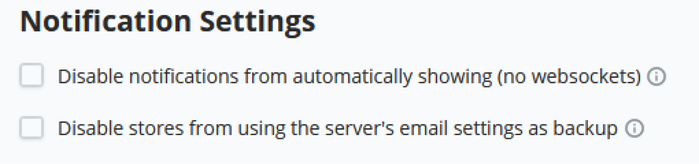

- Deshabilitar las notificaciones para que no se muestren automáticamente (sin websockets).
- Deshabilitar que las tiendas usen las configuraciones de correo electrónico del servidor como respaldo.

#### Configuración de Mantenimiento

BTCPay Server es un proyecto de Código Abierto que se encuentra en GitHub. Siempre que BTCPay Server lanza una nueva versión del software, los Administradores pueden ser notificados de que una nueva versión está disponible. Los Administradores también pueden querer desalentar a los motores de búsqueda (google, yahoo, duckduckgo) de indexar el dominio de BTCPay Server. Como BTCPay Server es FOSS, desarrolladores de todo el mundo podrían querer crear nuevas funciones; BTCPay Server tiene una característica experimental que, cuando se activa, un administrador puede usar características aún no destinadas para producción, puramente para propósitos de prueba.

- Verificar lanzamientos en GitHub y notificar cuando una nueva versión de BTCPay Server esté disponible.
- Desalentar a los motores de búsqueda de indexar este sitio
- Habilitar características experimentales.

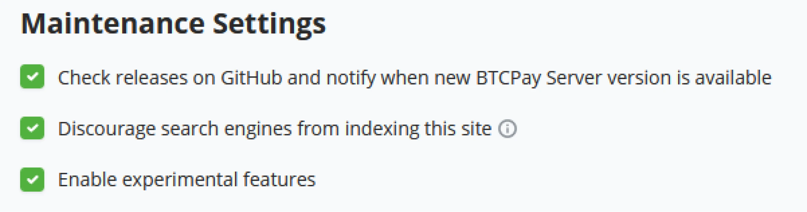

#### Plugins

BTCPay Server puede añadir Plugins y expandir su conjunto de características. Los plugins, por defecto, se cargan desde el repositorio plugin-builder de BTCPay Server. Sin embargo, un administrador puede elegir ver plugins en estado de Pre-lanzamiento, y si el desarrollador del plugin lo permite, el administrador del servidor ahora puede instalar versiones beta de los plugins.

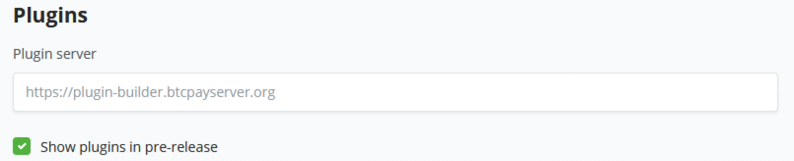

##### Configuración de Personalización

Una implementación estándar de BTCPay Server será accesible a través del dominio configurado para ello en la instalación. Sin embargo, un administrador del servidor puede remapear el dominio raíz y mostrar una de las aplicaciones creadas de una tienda específica. El Administrador del Servidor también puede mapear dominios específicos a aplicaciones específicas.

- Mostrar la aplicación en el dominio raíz del sitio web
  - Muestra lista de posibles aplicaciones para mostrar en el dominio raíz.

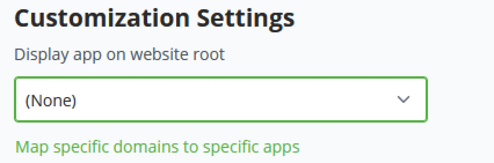

- Asignar dominios específicos a aplicaciones específicas.
  - Cuando haces clic para configurar un dominio específico para aplicaciones específicas, el Administrador puede configurar tantos dominios apuntando a aplicaciones específicas como sea necesario.

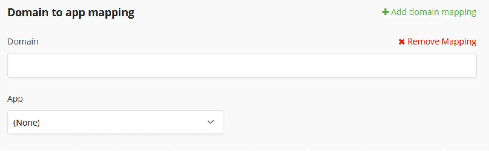

#### Exploradores de Bloques

BTCPay Server, por defecto, viene con mempool.space como su explorador de bloques para transacciones. Cuando BTCPay Server genera una nueva factura, y hay una transacción vinculada a ella, el propietario de la tienda puede hacer clic para abrir la transacción; BTCPay Server apuntará estándarmente hacia mempool.space como explorador de bloques; un administrador del servidor puede cambiar esto según su preferencia.

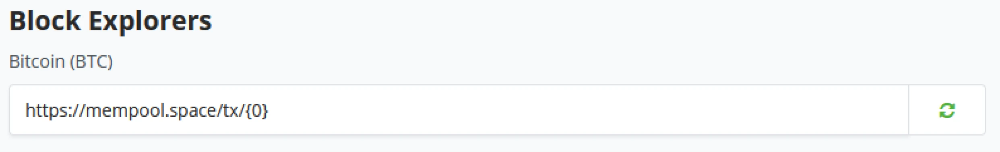

### Servicios

La pestaña de configuración de servicios de BTCPay Server es una visión general de los componentes que tu BTCPay Server utiliza. Los servicios que tu BTCPay Server expone pueden variar dependiendo del método de despliegue.

Un Administrador de BTCPay Server puede hacer clic en "See information" (Ver información) detrás de cada servicio para abrirlo y configurar ajustes específicos.

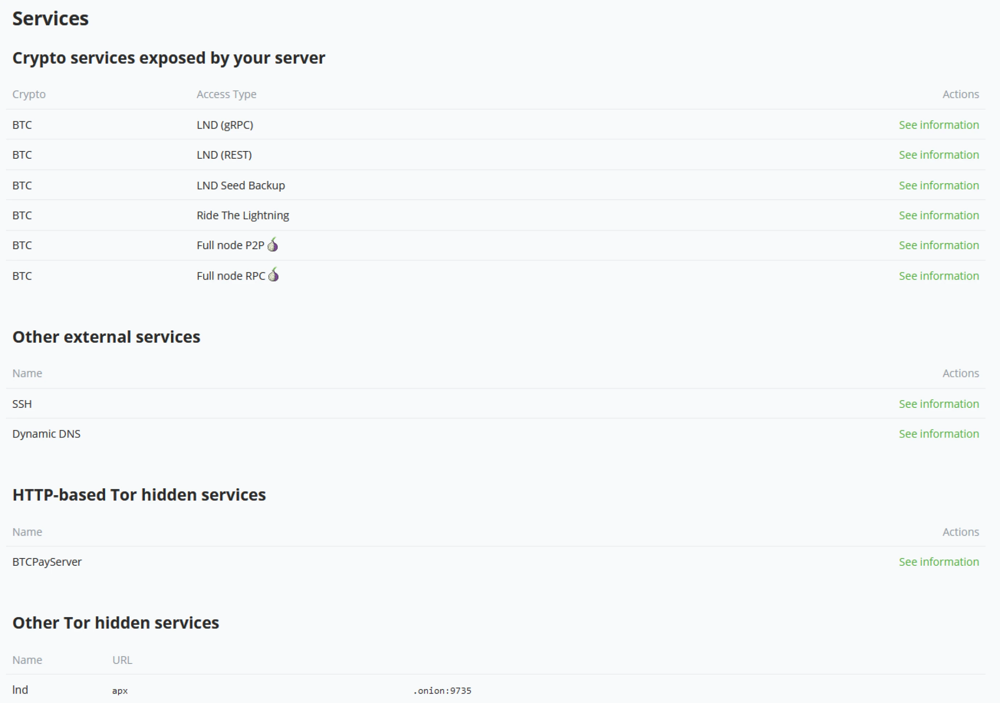

#### LND (gRPC)

BTCPay expone el servicio gRPC de LND para su consumo externo; encontrarás información de conexión en este menú de configuración específico; aquí se listan las billeteras compatibles. BTCPay Server también proporciona un código QR para la conexión, escanéalo y aplícalo en la billetera móvil.

Los administradores del servidor pueden abrir más detalles para ver:

- Detalles del Host
- Uso de SSL
- Macaroon
- AdminMacaroon
- InvoiceMacaroon
- ReadonlyMacaroon
- Conjunto de cifrado SSL GRPC (GRPC_SSL_CIPHER_SUITES)

#### LND (REST)

BTCPay expone el servicio REST de LND para su consumo externo; encontrarás información de conexión aquí; aquí se listan las billeteras compatibles. Entre las billeteras compatibles están Joule, Alby y ZeusLN. BTCPay Server proporciona un código QR para la conexión, escanéalo y aplícalo en la billetera compatible.

- URI REST
- Macaroon
- AdminMacaroon
- InvoiceMacaroon
- ReadonlyMacaroon

#### Copia de seguridad de la Semilla LND

La copia de seguridad de la semilla LND es útil para recuperar fondos de tu billetera LND en caso de corrupción de tu Servidor. Como el nodo Lightning es una Hot-wallet, puedes encontrar la información confidencial de la semilla en esta página.

LND documenta el proceso de recuperación. Consulta https://github.com/lightningnetwork/lnd/blob/master/docs/recovery.md para la documentación.

#### Ride The Lightning 

Ride the Lightning es una herramienta de gestión de nodos Lightning construida como software de Código Abierto. BTCPay Server utiliza RTL como el componente de gestión de nodos Lightning en su stack. Los administradores de BTCPay Server pueden acceder a RTL a través de la configuración del Servidor - pestaña de Servicios o haciendo clic en la billetera Lightning.

#### Nodo completo P2P

Los administradores de servidores pueden querer conectar su nodo Bitcoin a una billetera móvil. Esta página proporciona información para conectarse de forma remota a tu nodo completo a través del protocolo P2P. Al momento de escribir este libro, BTCPay Server enumera a Blockstream Green y Wasabi wallet como billeteras compatibles. BTCPay Server proporciona un código QR para la conexión, escanea y aplica en la billetera compatible.

#### Nodo completo RPC

Esta página expone información para conectarse de forma remota a tu nodo completo a través del protocolo RPC.

#### SSH

SSH se utiliza con fines de mantenimiento. BTCPay Server muestra el comando de conexión inicial para alcanzar tu Servidor y las claves públicas SSH autorizadas para conectarse a tu Servidor. Los Administradores de Servidores podrían querer desactivar los cambios de SSH a través de la interfaz de usuario de BTCPay Server.

#### DNS Dinámico

El DNS Dinámico te permite tener un nombre DNS estable que apunte a tu Servidor, incluso si tu dirección IP cambia regularmente. Esto se recomienda si estás alojando BTCPay Server en casa y deseas tener un dominio en la clearnet para acceder a tu Servidor.

Ten en cuenta que necesitas configurar correctamente tu NAT y la instalación de BTCPay Server para obtener el certificado HTTPS.

### Tema

BTCPay Server, como estándar, viene con dos temas: modos claro y oscuro. Estos se pueden cambiar haciendo clic en Cuenta en la parte inferior izquierda y alternando entre tema oscuro o tema claro. Los administradores de BTCPay Server pueden agregar su propio tema proporcionando un tema CSS personalizado.

Los administradores pueden extender el tema claro/oscuro añadiendo su propio CSS personalizado o estableciendo su tema personalizado como un tema propio.

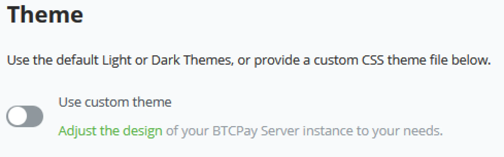

#### Branding del Servidor

Los administradores del servidor pueden cambiar el branding de BTCPay Server estableciendo un branding de tu empresa para todo el Servidor. Como BTCPay Server es FOSS, los administradores del servidor pueden etiquetar el software con su marca y cambiar la apariencia para adaptarla a su negocio.

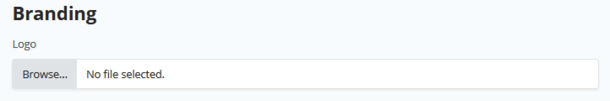

### Mantenimiento

Como administrador del servidor, tus usuarios esperan que cuides bien del Servidor. Dentro de la pestaña de Mantenimiento de BTCPay Server, el administrador puede realizar algunos mantenimientos esenciales. Establecer el nombre de dominio para la instancia de BTCPay Server, Reiniciar o limpiar el Servidor. Posiblemente lo más importante, ejecutar actualizaciones.

BTCPay Server es un proyecto de Código Abierto y se actualiza frecuentemente. Cada nuevo lanzamiento es anunciado ya sea por tus Notificaciones de BTCPay Server o en los Canales oficiales por los cuales BTCPay Server se comunica.

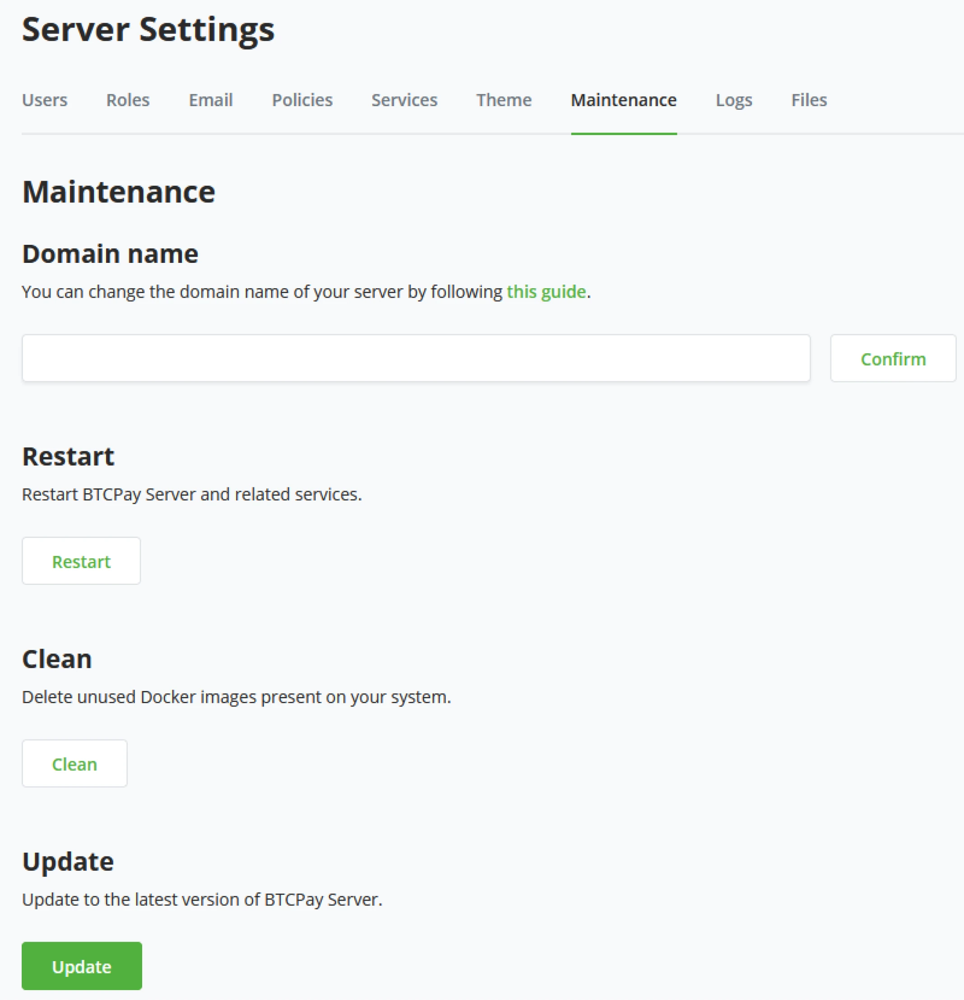

#### Nombre de dominio

Después de que BTCPay Server está configurado, es posible que un administrador desee cambiar de Dominio. Dentro de la pestaña de Mantenimiento, el administrador puede cambiar el Dominio. Después de hacer clic en confirmar y configurar los registros DNS adecuados en el Dominio, BTCPay Server se actualiza y reinicia para volver al nuevo Dominio.

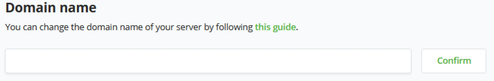

#### Reiniciar

Esta opción reinicia BTCPay Server y los servicios relacionados.

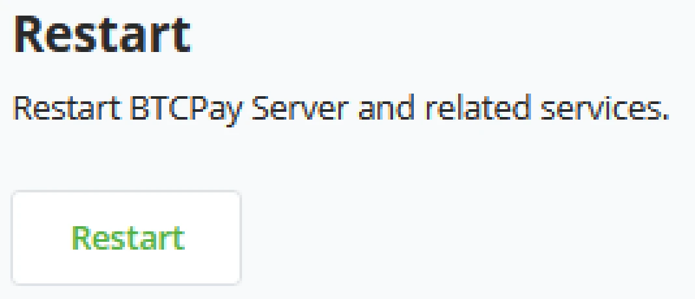

#### Limpiar

BTCPay Server se ejecuta con componentes de Docker; con las actualizaciones, podría haber restos de imágenes de Docker, archivos temporales, etc. Los administradores de servidores pueden limpiar esto y recuperar espacio en su entorno ejecutando el script de limpieza.
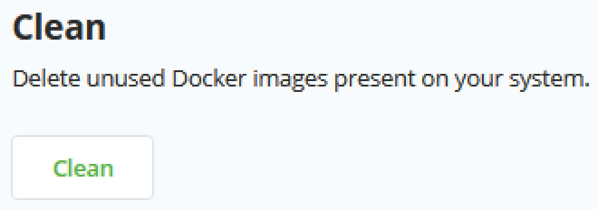

#### Actualización

Posiblemente la opción más importante en la pestaña de "Maintenance" (Mantenimiento). BTCPay Server es construido por la comunidad, y por lo tanto, sus ciclos de actualización son más frecuentes que la mayoría de los productos de software. Cuando BTCPay Server tiene una nueva versión, los administradores serán notificados en su centro de notificaciones. Al hacer clic en el botón de actualización, BTCPay Server verificará en GitHub la última versión, actualizará el Servidor y se reiniciará. Antes de actualizar, es aconsejable que los administradores del servidor lean las notas de la versión distribuidas a través de los canales oficiales de BTCPay Server.

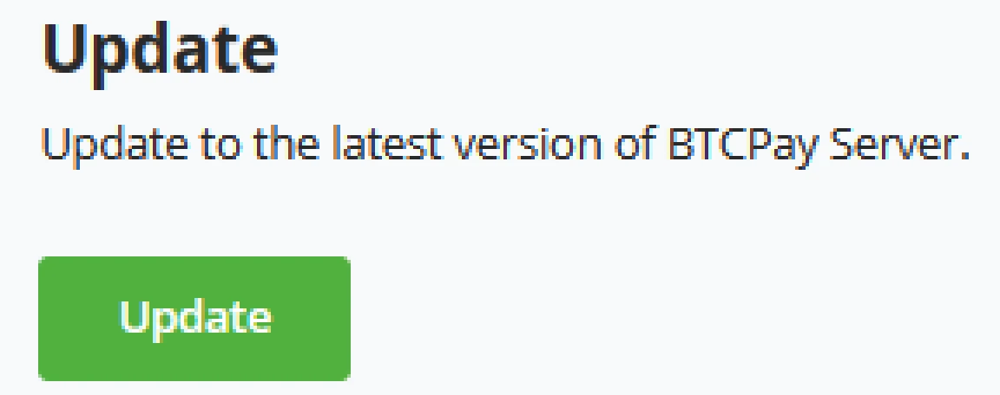

### Registros o Logs

Enfrentar un problema nunca es divertido. Este documento explica el flujo de trabajo más común y los pasos para identificar eficientemente tu problema y resolverlo por ti mismo o con ayuda de la comunidad.

Identificar el problema es crucial.

#### Replicando el problema

Primero y ante todo, intenta determinar cuándo ocurre el problema. Intenta replicar el problema. Intenta actualizar y reiniciar tu Servidor para verificar que puedes reproducir tu problema. Si describe mejor tu problema, toma una captura de pantalla.

##### Actualizando el servidor

Verifica tu versión de BTCPay Server si es mucho más antigua que la [última versión](https://github.com/btcpayserver/btcpayserver/releases) de BTCPay Server. Actualizar tu Servidor puede resolver el problema.

##### Reiniciando el servidor

Reiniciar tu Servidor es una manera fácil de resolver muchos de los problemas más comunes de BTCPay Server. Puede que necesites SSH en tu Servidor para reiniciarlo.

##### Reiniciando un servicio

Para algunos problemas, solo puede ser necesario reiniciar un servicio particular en tu implementación de BTCPay Server. Como reiniciar el contenedor "lets encrypt" para renovar el certificado SSL.

```bash
sudo su -
cd btcpayserver-docker
docker restart letsencrypt-nginx-proxy-companion
```

Usa docker ps para encontrar el nombre de un servicio diferente que te gustaría reiniciar.

#### Revisando los registros

Los logs o registros pueden proporcionar una pieza esencial de información. En los siguientes párrafos, describiremos cómo obtener la información de registro para varias partes de BTCPay.

##### Registros de BTCPay

Desde la v1.0.3.8, puedes acceder fácilmente a los registros de BTCPay Server desde la interfaz. Si eres un administrador del servidor, ve a Configuración del Servidor > Registros y abre el archivo de registros. Si no sabes qué significa un error particular en los registros, menciónalo al solucionar problemas.

Si quieres registros más detallados y estás usando una implementación de Docker, puedes ver los registros de contenedores específicos de Docker usando la línea de comandos. Ve estas [instrucciones para hacer ssh](https://docs.btcpayserver.org/FAQ/ServerSettings/#how-to-ssh-into-my-btcpay-running-on-vp%C2%80) en una instancia de BTCPay que se ejecuta en un VPS.

En la siguiente página, una lista general de los nombres de contenedores utilizados para BTCPay Server.

Ejecuta los comandos a continuación para imprimir registros por nombre de contenedor. Reemplaza el nombre del contenedor para ver otros registros de contenedores.

```bash
sudo su -
cd btcpayserver-docker
docker ps
docker logs --tail 100 generated_btcpayserver_1
```

| Registros para | Nombre del Contenedor             |
| -------------- | --------------------------------- |
| BTCPayServer   | generated_btcpayserver_1          |
| NBXplorer      | generated_nbxplorer_1             |
| Bitcoind       | btcpayserver_bitcoind             |
| Postgres       | generated_postgres_1              |
| proxy          | letsencrypt-nginx-proxy-companion |
| Nginx          | nginx-gen                         |
| Nginx          | nginx                             |
| c-lightning    | btcpayserver_clightning_bitcoin   |
| LND            | btcpayserver_lnd_bitcoin          |
| RTL            | generated_lnd_bitcoin_rtl_1       |
| Thunderhub     | generated_bitcoin_thub_1          |
| LibrePatron    | librepatron                       |
| Tor            | tor-gen                           |
| Tor            | tor                               |

###### Lightning Network LND - Docker

Existen varias formas de acceder a tus registros de LND cuando usas Docker. Primero inicia sesión como root:

```bash
sudo su -
Navega al directorio correcto:
cd btcpayserver-docker
# Encuentra el nombre del contenedor:
docker ps
Imprime los registros por nombre del contenedor:
docker logs --tail 100 btcpayserver_lnd_bitcoin
```

Alternativamente, puedes imprimir rápidamente los registros usando el ID del contenedor (solo se necesitan los caracteres únicos del ID, como los dos caracteres más a la izquierda):

```bash
docker logs 'añade tu ID de contenedor aquí'
```

Si por alguna razón necesitas más registros

```bash
sudo su -
cd /var/lib/docker/volumes/generated_lnd_bitcoin_datadir/_data/logs/bitcoin/mainnet/
ls
```

Verás algo como

```bash
lnd.log lnd.log.13 lnd.log.15 lnd.log.16.gz lnd.log.17.gz
```

Para acceder a registros no comprimidos de esos registros haz `cat lnd.log` o si quieres otro, usa `cat lnd.log.15`.

Para acceder a registros comprimidos en `.gzip` usa `gzip -d lnd.log.16.gz` (en este caso estamos accediendo a `lnd.log.16.gz`). Esto debería darte un nuevo archivo, donde puedes hacer `cat lnd.log.16`. En caso de que lo anterior no funcione, puede que necesites instalar gzip primero con `sudo apt-get install gzip`.

###### Lightning Network c-lightning - Docker

```bash
sudo su -
docker ps
# Encuentra el ID del contenedor de c-lightning.
docker logs 'añade tu ID de contenedor aquí'
```

alternativamente, puedes usar esto

```bash
docker logs --tail 100 btcpayserver_clightning_bitcoin
```

También puedes obtener información de los registros con el comando cli de c-lightning.

```bash
bitcoin-lightning-cli.sh getlog
```

#### Registros del Nodo Bitcoin

Además de [mirar los registros](https://docs.btcpayserver.org/Troubleshooting/#2-looking-through-the-logs) de tu contenedor Bitcoind, también puedes usar cualquiera de los [comandos de bitcoin-cli](https://developer.bitcoin.org/reference/rpc/index.html)

[(abre una nueva ventana)](https://developer.bitcoin.org/reference/rpc/index.html) para obtener información de tu nodo bitcoin. BTCPay incluye un script para permitirte comunicarte con tu nodo Bitcoin fácilmente.

Dentro de la carpeta btcpayserver-docker, obtén la información de la blockchain usando tu nodo:

```bash
bitcoin-cli.sh getblockchaininfo
```

BTCPay Server cuenta con un sistema de archivos local y sube los recursos de la Tienda (productos), Logotipos y branding directamente al Servidor. El sistema de archivos del Servidor solo es accesible por los Administradores del Servidor; los propietarios de las tiendas pueden subir sus logotipos/branding a nivel de tienda.
Cuando el administrador del Servidor está en la pestaña de Almacenamiento de Archivos, es posible subir directamente a su Servidor o cambiar el proveedor de almacenamiento de archivos a un sistema de archivos Local o Azure Blob Storage.

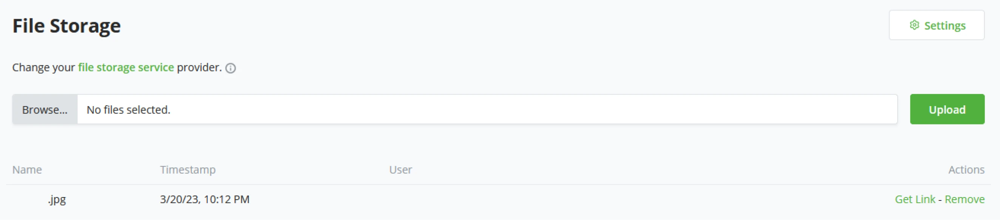

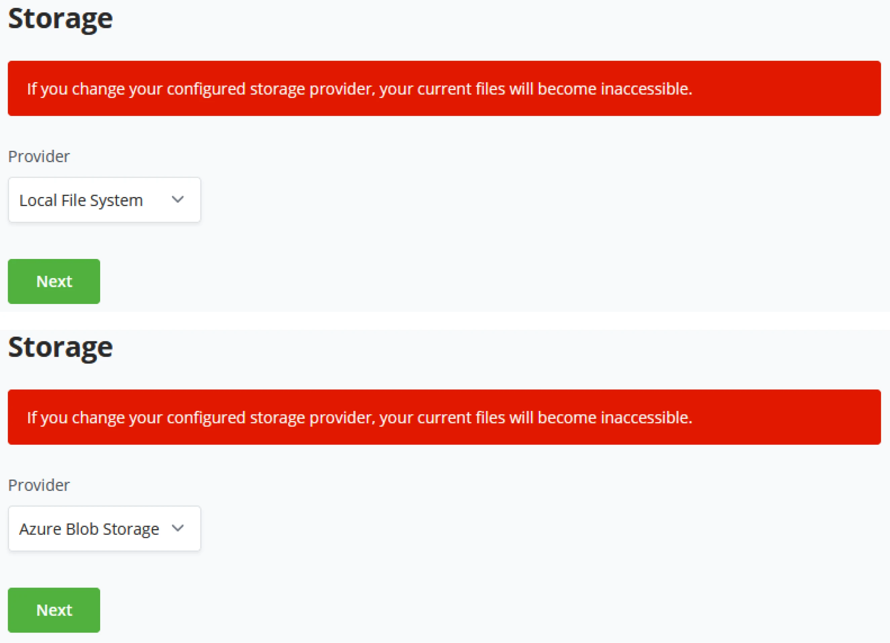

### Resumen de Habilidades

En esta sección, aprendiste lo siguiente:

- La diferencia entre los ajustes de Tienda y Servidor, en particular en lo que se refiere a Usuarios, Roles y Correos Electrónicos
- Establecer políticas a nivel de servidor para el uso y creación de billeteras calientes de Lightning o Bitcoin, registro de nuevos usuarios y notificaciones por correo electrónico.
- Cómo añadir temas personalizados (en lugar de los simples modo claro y modo oscuro proporcionados) así como crear logotipos personalizados
- Realizar tareas simples de mantenimiento del servidor a través de la interfaz gráfica proporcionada
- Solucionar problemas, incluyendo la obtención de detalles para cualquiera de los contenedores de Docker o tu nodo
- Gestionar el almacenamiento de archivos

### Evaluación de Conocimientos

#### Revisión Conceptual KA

¿Cuál es la diferencia en los Roles asignados a través de los Ajustes del Servidor vs los Ajustes de la Tienda, y qué describe un uso potencial para uno sobre el otro?

#### Revisión Práctica KA

Describe algunos posibles casos de uso habilitados en la pestaña de Políticas (Policies).

#### Revisión Práctica KA

Describe algunas acciones que un administrador podría realizar rutinariamente en la pestaña de Mantenimiento (Maintenance).

## BTCPay Server - Pagos

<chapterId>e2b71ff9-3f4f-5e71-9771-8e03fbbef00f</chapterId>

Un invoice o factura es un documento que el vendedor emite al comprador para cobrar el pago.

En BTCPay Server, una factura representa un documento que debe pagarse dentro de un intervalo de tiempo definido a un tipo de cambio fijo. Las facturas tienen vencimiento porque bloquean el tipo de cambio dentro de un marco de tiempo especificado para proteger al receptor de las fluctuaciones de precio.

El núcleo de BTCPay Server es la capacidad de actuar como un sistema de gestión de facturas de Bitcoin. Una factura es una herramienta esencial para rastrear y gestionar un pago recibido.

A menos que uses una [Wallet](https://docs.btcpayserver.org/Wallet/) integrada para recibir pagos manualmente, todos los pagos dentro de una tienda se mostrarán en la página de Facturas. Esta página ordena acumulativamente los pagos por fecha y es una pieza central para la gestión de facturas y la solución de problemas de pago.

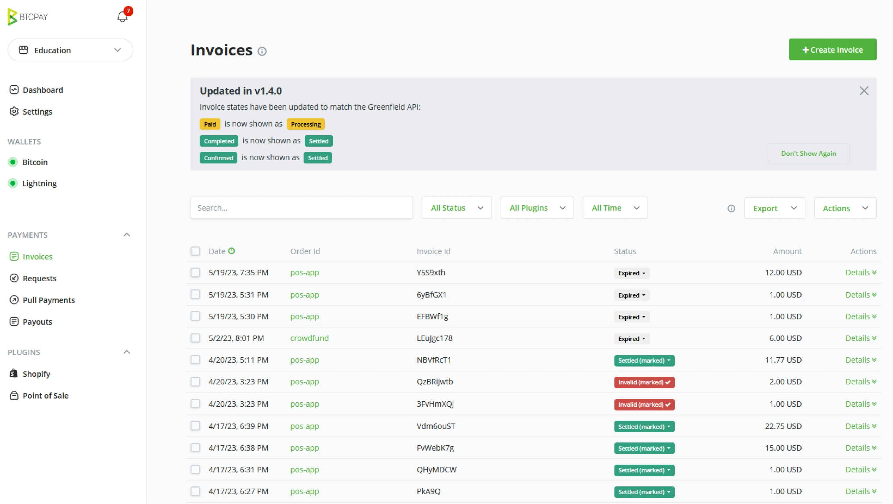

### General

#### Estados de las facturas

La tabla a continuación lista y describe los estados estándar de las facturas en BTCPay y sugiere acciones comunes. Las acciones son solo recomendaciones. Depende de los usuarios definir el mejor curso de acción para su caso de uso y negocio.

| Estado de la Factura        | Descripción                                                                                                                                                       | Acción                                                                                                                                                        |
| --------------------------- | ----------------------------------------------------------------------------------------------------------------------------------------------------------------- | ------------------------------------------------------------------------------------------------------------------------------------------------------------- |
| Nuevo                       | No pagado, el temporizador de la factura aún no ha expirado                                                                                                       | Ninguna                                                                                                                                                       |
| Nuevo (pagoParcial)         | Pagado parcialmente, el temporizador de la factura aún no ha expirado                                                                                      | Ninguna                                                                                                                                                       |
| Expirado                    | No pagado, el temporizador de la factura expiró                                                                                                                   | Ninguna                                                                                                                                                       |
| Expirado (pagoParcial) \*\* | Pagado, no en la cantidad total, y expirado                                                                                                                       | Contactar al comprador para organizar un reembolso o pedirle que pague lo que debe. Opcionalmente marcar la factura como resuelta o inválida                  |
| Expirado (pagoTardío)       | Pagado, en la cantidad total, después de que el temporizador de la factura haya expirado                                                                          | Contactar al comprador para organizar un reembolso o procesar el pedido si las confirmaciones tardías son aceptables.                                         |
| Liquidado (pagado de más)   | Pagado más del importe de la factura, liquidado, recibido suficiente cantidad de confirmaciones                                                                   | Contactar al comprador para organizar un reembolso por el importe extra, o opcionalmente esperar a que el comprador te contacte                               |
| En proceso                  | Pagado en su totalidad, pero no ha recibido suficiente cantidad de confirmaciones especificadas en la configuración de la tienda                                  | Contactar al comprador para organizar un reembolso por el importe extra, o opcionalmente esperar a que el comprador te contacte                               |
| En proceso (pagado de más)  | Pagado más del importe de la factura, no recibido suficiente cantidad de confirmaciones                                                                           | Esperar a ser liquidado luego contactar al comprador para organizar un reembolso por el importe extra, o, opcionalmente esperar a que el comprador se contacte contigo |
| Liquidado                   | Pagado, en su totalidad, recibido suficiente cantidad de confirmaciones en tienda                                                                                 | Cumplir con el pedido                                                                                                                                         |
| Liquidado (marcado)         | El estado fue cambiado manualmente a liquidado desde un estado en proceso o inválido                                                                              | El administrador de la tienda ha marcado el pago como liquidado                                                                                               |
| Inválido\*                  | Pagado, pero falló en recibir suficiente cantidad de confirmaciones dentro del tiempo especificado en la configuración de la tienda                               | Revisar la transacción en un explorador de blockchain, si recibió suficientes confirmaciones, marcar como liquidado                                           |
| Inválido (marcado)          | El estado fue cambiado manualmente a inválido desde un estado liquidado o expirado                                                                                | El administrador de la tienda ha marcado el pago como inválido                                                                                                |
| Inválido (pagado de más)    | Pagado más del importe de la factura, pero falló en recibir suficiente cantidad de confirmaciones dentro del tiempo especificado en la configuración de la tienda | Revisar la transacción en un explorador de blockchain, si recibió suficientes confirmaciones, marcar como liquidado                                           |

#### Detalles de la factura

La página de detalles de la factura contiene toda la información relacionada con una factura.

La información de la factura se crea automáticamente basada en el estado de la factura, tipo de cambio, etc. La información del producto se crea automáticamente si la factura fue creada con información del producto, como en la aplicación de Punto de Venta.

#### Filtrado de facturas

Las facturas pueden ser filtradas mediante los filtros rápidos ubicados junto al botón de búsqueda o los filtros avanzados, que pueden ser activados haciendo clic en el enlace (Ayuda) en la parte superior. Los usuarios pueden filtrar las facturas por tienda, id de orden, id de artículo, estado o fecha.

#### Exportación de facturas

Las facturas de BTCPay Server pueden ser exportadas en formato CSV o JSON. Para obtener más información sobre la exportación de facturas y contabilidad.

#### Reembolsar una factura

Si, por cualquier razón, deseas emitir un reembolso, puedes crear fácilmente un reembolso desde la vista de "invoice" (factura).

#### Archivar facturas

Como resultado de la característica de no reutilización de direcciones de BTCPay Server, es común ver muchas facturas expiradas en la página de facturas de tu tienda. Para ocultarlas de tu vista, selecciónalas en la lista y márcalas como archivadas. Las facturas que han sido marcadas como archivadas no son eliminadas. El pago a una factura archivada aún será detectado por tu BTCPay Server (pagado tarde). Puedes ver las facturas archivadas de la tienda en cualquier momento seleccionando facturas archivadas desde el menú desplegable de filtro de búsqueda.

#### Moneda predeterminada

Moneda predeterminada de la tienda, esto se estableció en el asistente de creación de la tienda

#### Permitir a cualquiera crear una factura

Deberías habilitar esta opción si deseas permitir al mundo exterior crear facturas en tu tienda. Esta opción solo es útil si estás usando el botón de pago o si estás emitiendo facturas a través de APIs o sitios web HTML de terceros. La aplicación PoS (Punto de Venta) está preautorizada y no necesita que esa opción esté habilitada para que un visitante aleatorio abra tu tienda PoS y cree una factura.

#### Agregar tarifa adicional (tarifa de red) a la factura

- Solo si el cliente realiza más de un pago por la factura
- En cada pago
- Nunca agregar tarifa de red

#### La factura expira si el monto total no se ha pagado después de .. minutos.

El temporizador de la factura está configurado por defecto en 15 minutos. El temporizador es un mecanismo de protección contra la volatilidad ya que bloquea la cantidad de bitcoin de acuerdo a las tasas de cambio de bitcoin a fiat. Si el cliente no paga la factura dentro del período definido, la factura se considera vencida. La factura se considera "pagada" tan pronto como la transacción es visible en la blockchain (0-confirmaciones) pero se considera "completa" cuando alcanza el número de confirmaciones que el comerciante definió (usualmente, 1-6). El temporizador es personalizable.

#### Considera la factura pagada incluso si el monto pagado es ..% menos de lo esperado.

En una situación donde un cliente usa una billetera de intercambio para pagar directamente una factura, el intercambio toma una pequeña cantidad como comisión. Esto significa que dicha factura no se considera completamente completada. La factura obtiene el estado "pagada parcialmente". Si un comerciante quiere aceptar facturas pagadas parcialmente, puedes establecer aquí la tasa porcentual.

### Solicitudes

Las Solicitudes de Pago son una característica que permite al propietario de la tienda BTCPay crear facturas de larga duración. Los fondos se pagan a una solicitud de pago usando la tasa de cambio en el momento del pago. Esto permite a los usuarios realizar pagos a su conveniencia sin negociar o verificar las tasas de cambio con el propietario de la tienda en el momento del pago.

Los usuarios pueden pagar solicitudes en pagos parciales. La solicitud de pago permanecerá válida hasta que se pague totalmente o si la factura tiene un tiempo de expiración. Las direcciones nunca se reutilizan. Se genera una nueva dirección cada vez que el usuario hace clic en pagar para crear una factura para la solicitud de pago.

Los propietarios de tiendas pueden imprimir solicitudes de pago (o exportar datos de factura) para llevar registros y contabilidad. BTCPay etiqueta automáticamente las facturas como Solicitudes de Pago en la lista de facturas de la tienda.

#### Personaliza tus solicitudes de pago

- Cantidad de la Factura - Establecer Monto de Pago Solicitado
- Denominación - Mostrar Monto Solicitado en Fiat o Bitcoin
- Cantidad de Pago - Permitir solo pagos únicos o pagos parciales
- Tiempo de Expiración - Permitir pagos hasta una fecha o sin expiración
- Descripción - Editor de Texto, Tablas de Datos, Incorporar Fotos & Videos
- Apariencia - Color y Estilo con Temas CSS

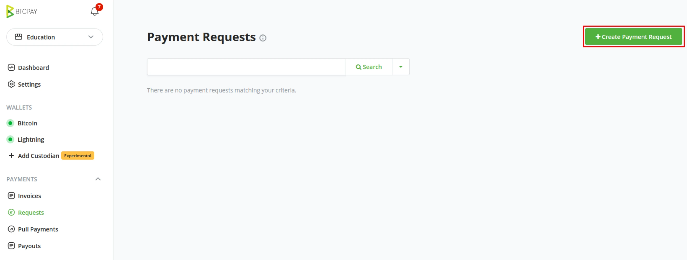

#### Crear una solicitud de pago

En el menú de la izquierda, ve a Solicitud de Pago (Payment Request) y haz clic en "Crear Solicitud de Pago" (Create Payment Request).

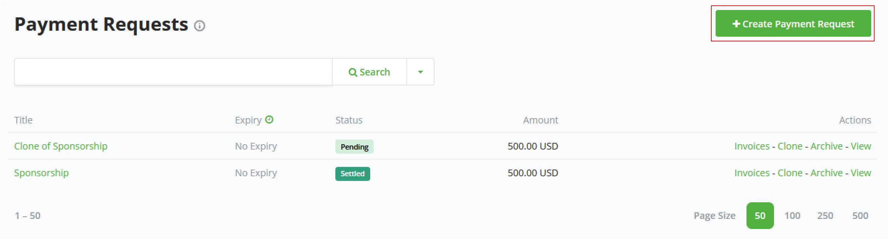

Proporciona el Nombre de la Solicitud, Cantidad, Denominación de Visualización, Tienda Asociada, Tiempo de Expiración & Descripción (Opcional)

Selecciona la opción Permitir al pagador crear facturas en su denominación si deseas permitir pagos parciales.

Haz clic en Guardar & Ver (Save & View) para revisar tu solicitud de pago.

BTCPay crea una URL para la solicitud de pago. Comparte esta URL para ver tu solicitud de pago. ¿Necesitas múltiples de la misma solicitud? Puedes duplicar solicitudes de pago usando la opción Clonar (Clone) en el menú principal.

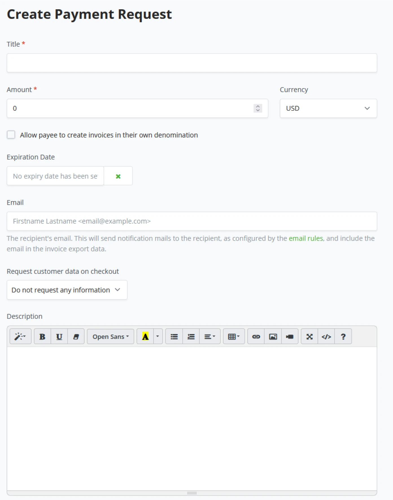

**ADVERTENCIA**

Las solicitudes de pago dependen de la tienda, lo que significa que cada solicitud de pago está asociada con una tienda durante su creación. Asegúrate de tener una billetera conectada a tu tienda a la que pertenece la solicitud de pago.

#### Solicitud Pagada

El pagador y el solicitante pueden ver el estado de la solicitud de pago después de enviar el pago. El estado aparecerá como Resuelto si el pago se ha recibido en su totalidad. Si solo se hicieron pagos parciales, el Monto Adeudado mostrará el saldo pendiente.

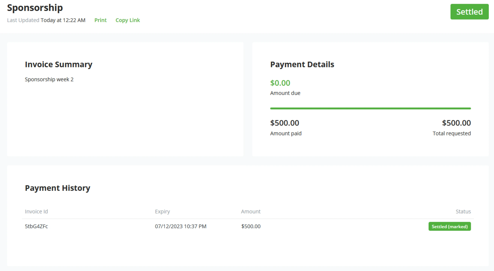

#### Personalizar Solicitudes de Pago

El contenido de la descripción se puede editar usando el editor de texto de la solicitud de pago. Ambas opciones están disponibles si deseas usar temas de color adicionales o estilos CSS personalizados.
Los usuarios no técnicos pueden utilizar un [tema de bootstrap](https://docs.btcpayserver.org/Development/Theme/#2-bootstrap-themes). Se puede realizar una personalización adicional proporcionando código CSS adicional, como se muestra a continuación.

```css
:root {
  --btcpay-font-family-base: "Source Sans Pro", -apple-system,
    BlinkMacSystemFont, "Segoe UI", Roboto, "Helvetica Neue", Arial, sans-serif;
  --btcpay-primary: #7d4698;
  --btcpay-primary-accent: #59316b;
  --btcpay-body-text: #333a41;
  --btcpay-body-bg: #fff;
  --btcpay-bg-tile: #f8f9fa;
}

#mainNav {
  color: white;
  background: linear-gradient(#59316b, #331840);
}

#mainNav .btn-link {
  color: white;
}
```

### Pagos Pull

Tradicionalmente, un receptor comparte su dirección de Bitcoin para realizar un pago en Bitcoin, y el emisor envía dinero a esta dirección más tarde. Tal sistema se llama pago Push, ya que el emisor inicia el pago mientras el receptor puede estar no disponible, empujando el pago hacia el receptor.

Pero, ¿qué pasa si invertimos el rol?

¿Qué pasa si, en lugar de un emisor empujando el pago, el emisor permite que el receptor retire el pago en el momento que este considere oportuno? Este es el concepto de un pago Pull o pago por retiro. Esto permite varias aplicaciones nuevas, tales como:

- Un servicio de suscripción (donde el suscriptor permite que el servicio retire dinero cada cierta cantidad de tiempo)
- Reembolsos (donde el comerciante permite al cliente retirar el dinero del reembolso a su billetera cuando lo considere oportuno)
- Facturación basada en tiempo para freelancers (donde la persona que contrata permite al freelancer retirar dinero a su billetera a medida que se reporta el tiempo)
- Patrocinio (donde el patrocinador permite al beneficiario retirar dinero cada mes para continuar apoyando su trabajo)
- Venta automática (donde un cliente de un intercambio permitiría a un intercambio retirar dinero de su billetera para vender automáticamente cada mes)
- Sistema de retiro de saldo (donde un servicio de alto volumen permite a los usuarios solicitar retiros de su saldo, el servicio puede entonces agrupar fácilmente todos los pagos a muchos usuarios en intervalos fijos)

### Pagos

La funcionalidad de pago está vinculada a los [Pagos Pull](https://docs.btcpayserver.org/PullPayments/). Esta característica te permite crear pagos dentro de tu BTCPay. Esta función te permite procesar pagos pull (reembolsos, pagos de salarios o retiros).

#### Ejemplo 1: Reembolso

Comencemos con el ejemplo de reembolso. El cliente ha comprado un artículo en tu tienda pero lamentablemente tiene que devolver el artículo. Quieren un reembolso. Dentro de BTCPay, puedes crear un [Reembolso](https://docs.btcpayserver.org/Refund/) y proporcionar al cliente un enlace para reclamar sus fondos. Cuando el cliente haya dado su dirección y reclamado los fondos, se mostrará en los Pagos.

El primer estado que tiene es Esperando Aprobación. Los empleados de la tienda pueden verificar si varios están esperando, y después de hacer la selección, se utiliza el botón de Acción.

Opciones en el botón de acción

- Aprobar pagos seleccionados
- Aprobar y enviar pagos seleccionados
- Cancelar pagos seleccionados

El siguiente paso es Aprobar y enviar pagos seleccionados ya que queremos reembolsar al cliente. Verifica la Dirección del Cliente, muestra el monto y si queremos que las tarifas se resten del reembolso o no. Una vez que hayas hecho las verificaciones, solo queda firmar la transacción.
El cliente ahora recibe actualizaciones en la página de Reclamaciones. Puede seguir la transacción ya que se le proporciona un enlace a un explorador de bloques y su transacción. Una vez que la transacción ha sido confirmada, el estado cambia a Completado.

#### Ejemplo 2: Salario

Ahora hablemos del pago de salarios, ya que esto se maneja desde dentro de la tienda y no a petición del Cliente. El procedimiento es el mismo; utiliza los pagos Pull. Pero en lugar de crear un reembolso, vamos a hacer un [Pago Pull](https://docs.btcpayserver.org/PullPayments/).

Ve a la pestaña de "Pull Payments" (Pagos Pull) en tu servidor BTCPay. En la parte superior derecha, haz clic en el botón Crear Pago Pull.

Ahora estamos en la creación del Pago, dale un nombre y la cantidad deseada en la moneda deseada, completa la Descripción, para que el empleado sepa de qué se trata. La siguiente parte es similar a los reembolsos. El empleado completa la dirección de Destino y la cantidad que quiere reclamar de este Pago. Podría decidir hacerlo en 2 reclamos separados, a direcciones diferentes, o incluso reclamar parcialmente a través de lightning.

Si hay múltiples Pagos esperando, puedes agrupar estos para ser firmados y enviados. Una vez firmados, los pagos pasan a la pestaña En progreso y muestran la Transacción. Cuando son aceptados por la red, el pago pasa a la pestaña Completado. La pestaña completado es puramente para propósitos históricos. Contiene los Pagos procesados y la transacción que le pertenece.

### Pagos Pull

#### Concepto

Cuando un emisor configura un pago Pull, puede configurar una serie de propiedades:

- Nombre de la solicitud Pull
- Un límite de cantidad
- Una Unidad (como BTC, SAT, USD)
- Métodos de pago
  - BTC on-chain
  - BTC off-chain
- Descripción
- CSS personalizado
- Fecha de finalización (opcional para Lightning Network BOLT11)

Después de esto, el emisor puede compartir el pago Pull usando un enlace con el receptor, permitiendo al receptor crear un pago. El receptor elegirá su pago:

- Qué método de pago utilizar
- A dónde enviar el dinero

Una vez creado un pago, este contará hacia el límite del pago Pull para el período actual. El emisor entonces aprobará el pago estableciendo la tasa a la cual el pago será enviado y procederá con el pago.

Para el emisor, proporcionamos una manera fácil de agrupar el pago de varios pagos desde la [Cartera Interna BTCPay](https://docs.btcpayserver.org/Wallet/).

#### API Greenfield

BTCPay Server proporciona una API completa tanto para el emisor como para el receptor que está documentada en la página `/docs` de tu instancia. (o en el sitio web de documentaciones https://docs.btcpayserver.org)

Dado que nuestra API expone la capacidad completa de los pagos Pull, un emisor puede automatizar los pagos según sus necesidades.

### Resumen de habilidades

En esta sección, aprendiste lo siguiente:

- Comprensión profunda de los estados de las facturas de BTCPay Server así como las acciones que se pueden realizar sobre ellas.
- Personalizar y gestionar mecanismos de factura de vida extendida conocidos como Solicitudes (Requests).
- Las posibilidades de pago flexibles adicionales que se abren con la característica única de Pago Pull (Pull Payment) de BTCPay Server, en particular cómo manejar reembolsos y pagos de salario.

### Evaluación de conocimientos

#### Revisión Conceptual KA

¿Cuáles son algunas diferencias entre facturas y solicitudes de pago, y cuál podría ser una buena razón para usar esta última?

#### Revisión Conceptual KA

¿Cómo amplían los pagos Pull lo que típicamente se puede hacer en cadena? Describe algunos casos de uso que permiten.

## Plugins Predeterminados de BTCPay Server

<chapterId>7d673dc4-bd5d-5411-819b-f135f1d86636</chapterId>

### Plugins y aplicaciones por defecto

BTCPay Server viene con un conjunto estándar de Plugins (complementos) que pueden convertir a BTCPay Server en una pasarela de pago de comercio electrónico. Con las adiciones de un Punto de Venta, plataforma de Crowdfunding y un botón de pago fácil, BTCPay Server se convierte en una solución fácil de implementar.

### Punto de Venta

Uno de los Plugins estándar de BTCPay Server es el Punto de Venta (PoS por sus siglas en inglés). Con el plugin PoS, el propietario de una tienda puede crear un Webshop directamente desde BTCPay Server, el propietario no necesita soluciones de comercio electrónico de terceros para operar un Webshop. La aplicación web PoS permite a los usuarios con tiendas físicas aceptar Bitcoin fácilmente, sin comisiones ni terceros, directamente en su monedero. El PoS se puede mostrar fácilmente en tabletas u otros dispositivos que soporten navegación web. Los usuarios pueden crear fácilmente un acceso directo en la pantalla de inicio para acceder rápidamente a la aplicación web.

#### Cómo crear un nuevo Punto de Venta (PoS)

BTCPay Server permite al propietario de la tienda crear un Punto de Venta en múltiples diseños rápidamente. BTCPay Server reconoce que no todas las tiendas son de comercio electrónico, y no todas las tiendas son un bar o restaurante, y viene con múltiples configuraciones estándar para tu PoS.

Cuando el propietario de la tienda hace clic en "Punto de Venta" (Point Of Sale) en su barra de menú izquierda, BTCPay Server ahora pedirá un nombre; este nombre será visible en la barra de menú izquierda. Haz clic en "Crear" (Create) para crear el PoS.

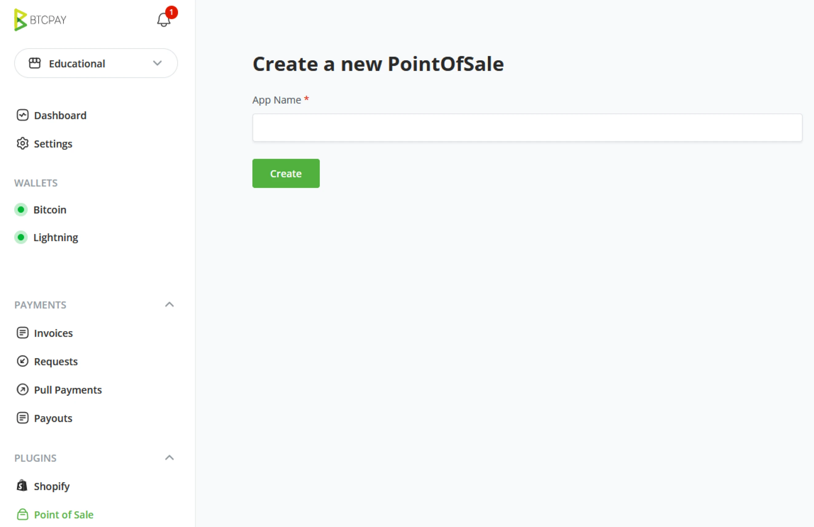

#### Actualizar el Punto de Venta recién creado

Después de crear un nuevo PoS, la siguiente pantalla será para actualizar tu Punto de Venta y añadir artículos para tu tienda.

##### Nombre de la aplicación

El nombre dado aquí a tu Punto de Venta será visible en el menú principal del BTCPay Server.

##### Título de visualización

El público verá el título público o nombre cuando visite tu tienda. BTCPay Server como nombres estándar nombra tu tienda como “Tienda de té” Reemplaza esto con el nombre de tu tienda.

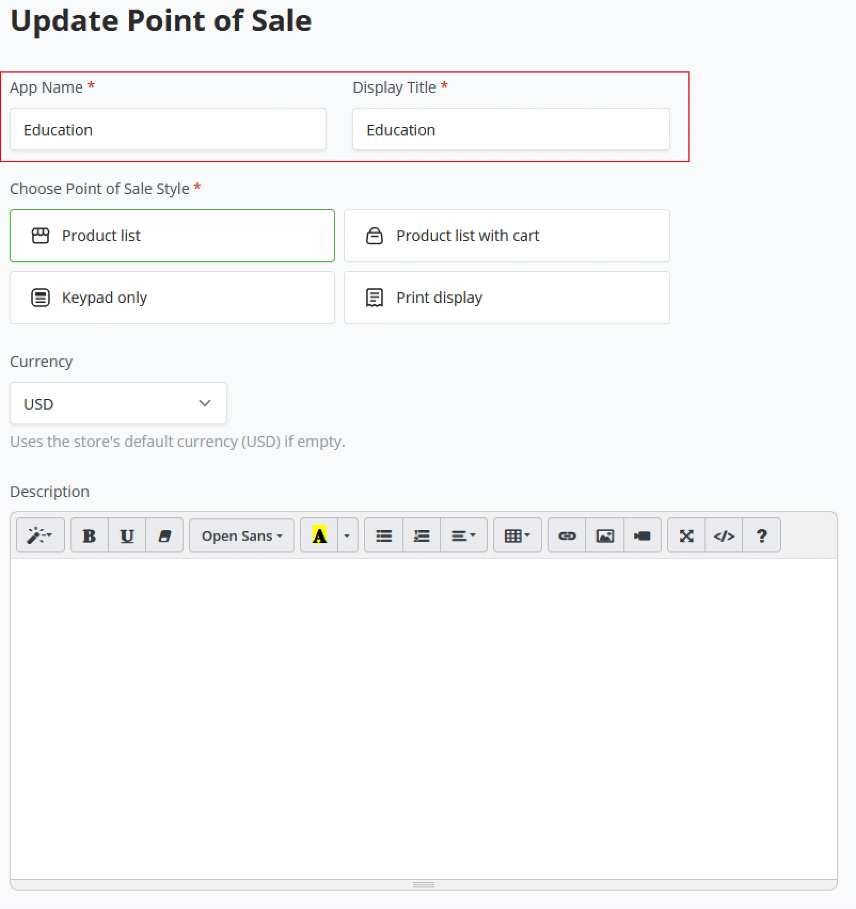

#### Elegir estilo del Punto de Venta

BTCPay Server es capaz de mostrar su Punto de Venta de múltiples maneras.

- Lista de productos
  - Una vista de la tienda donde los clientes solo pueden comprar 1 producto a la vez.
- Lista de productos con carrito.
  - Una vista de la tienda donde los clientes pueden comprar múltiples artículos a la vez y obtener una vista general del carrito de compras a la derecha de su pantalla.
- Solo teclado
  - Sin lista de productos, solo un teclado para facturación directa.
- Pantalla de impresión (Lista de productos imprimible con QR)
  - Si no puedes mostrar siempre tu lista de productos digitalmente, necesitas una solución "offline" para productos; BTCPay Server tiene una pantalla de impresión para funcionar como una tienda Offline.

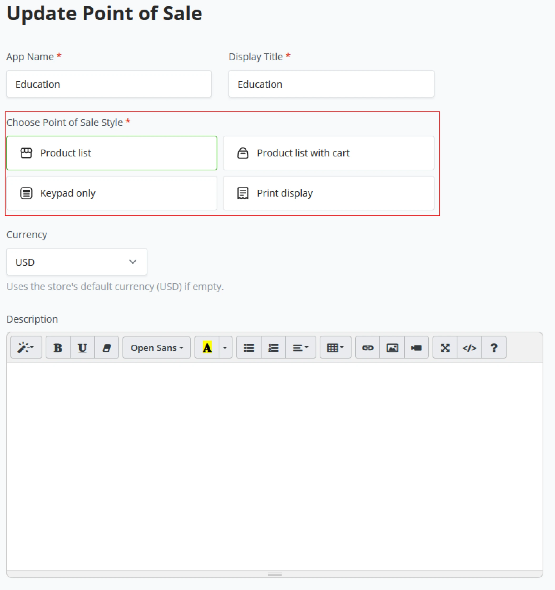

#### Estilo del Punto de Venta - Lista de productos


#### Estilo del Punto de Venta - Lista de productos + carrito

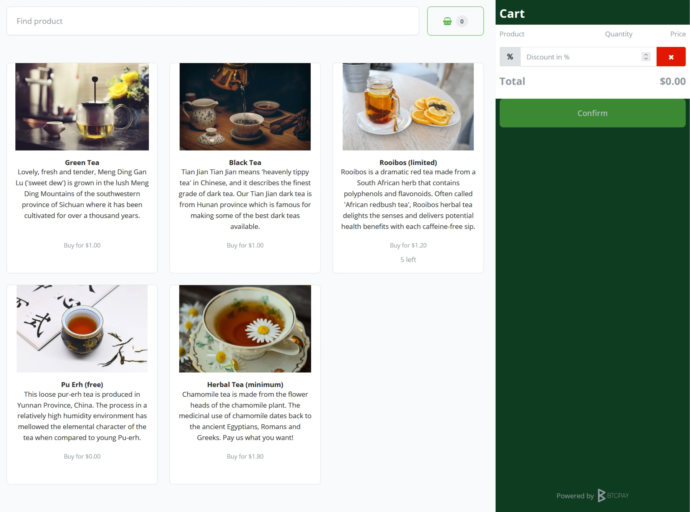

#### Estilo del Punto de Venta - Solo teclado

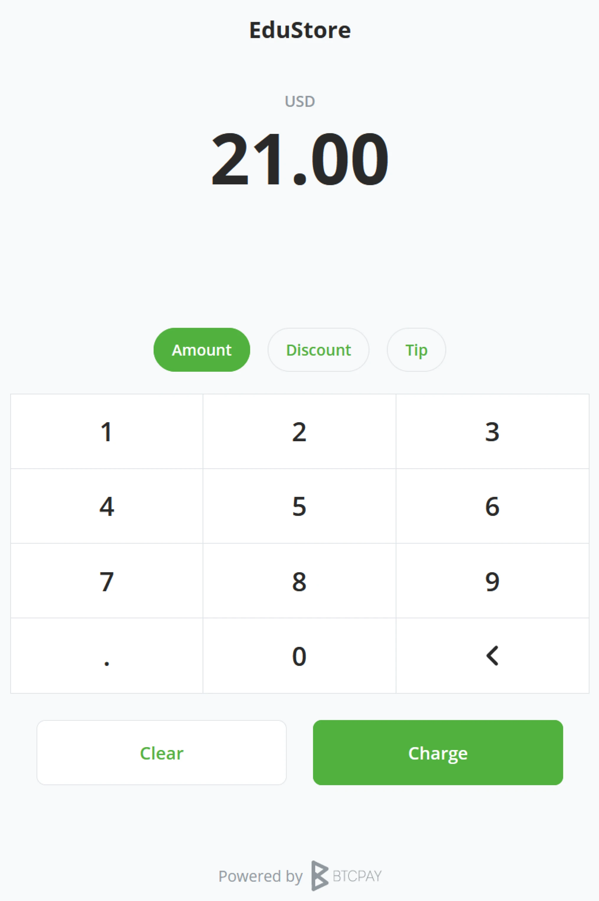

#### Estilo del Punto de Venta - Pantalla de impresión

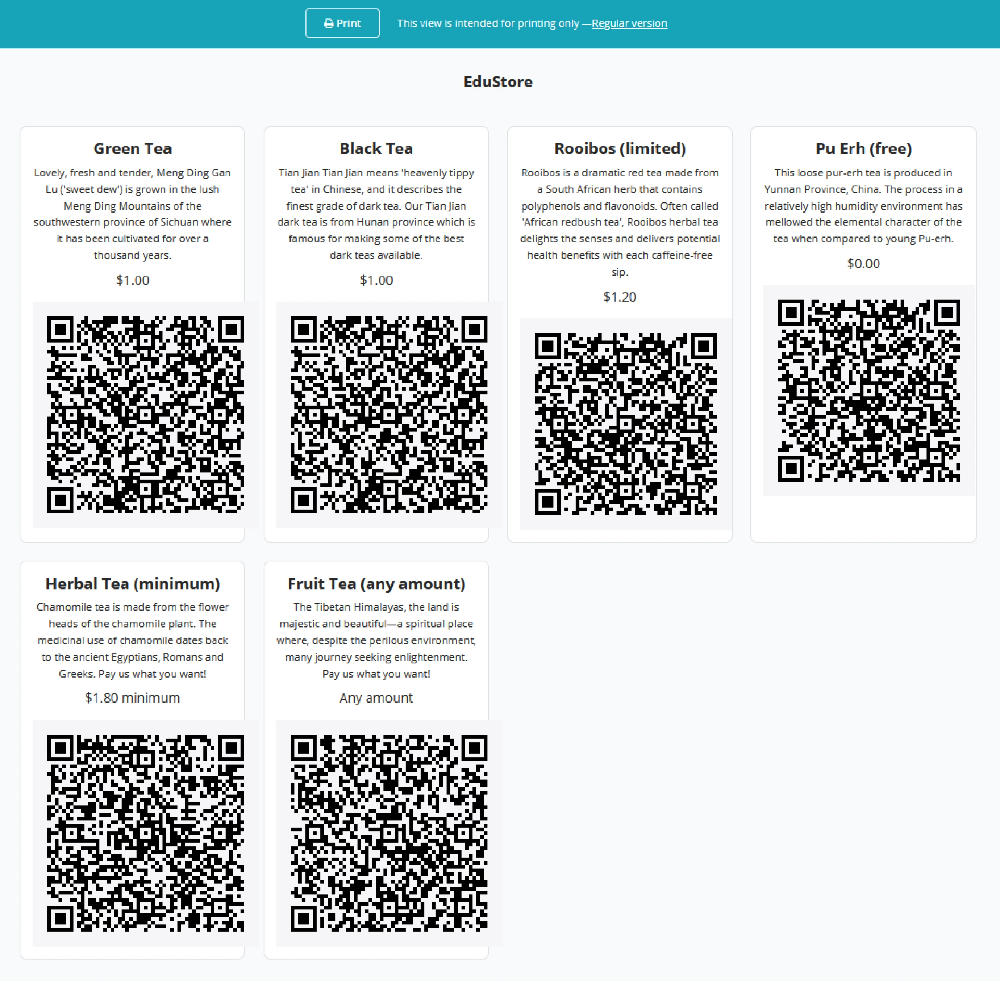

#### Moneda

El propietario de la tienda puede establecer una moneda diferente para su Punto de Venta que su moneda predeterminada establecida en general. La moneda predeterminada de la tienda se completará automáticamente en este campo.

#### Descripción

Cuenta al mundo sobre tu tienda; ¿qué estás vendiendo y por cuánto? Todo lo que explique tu tienda va aquí.
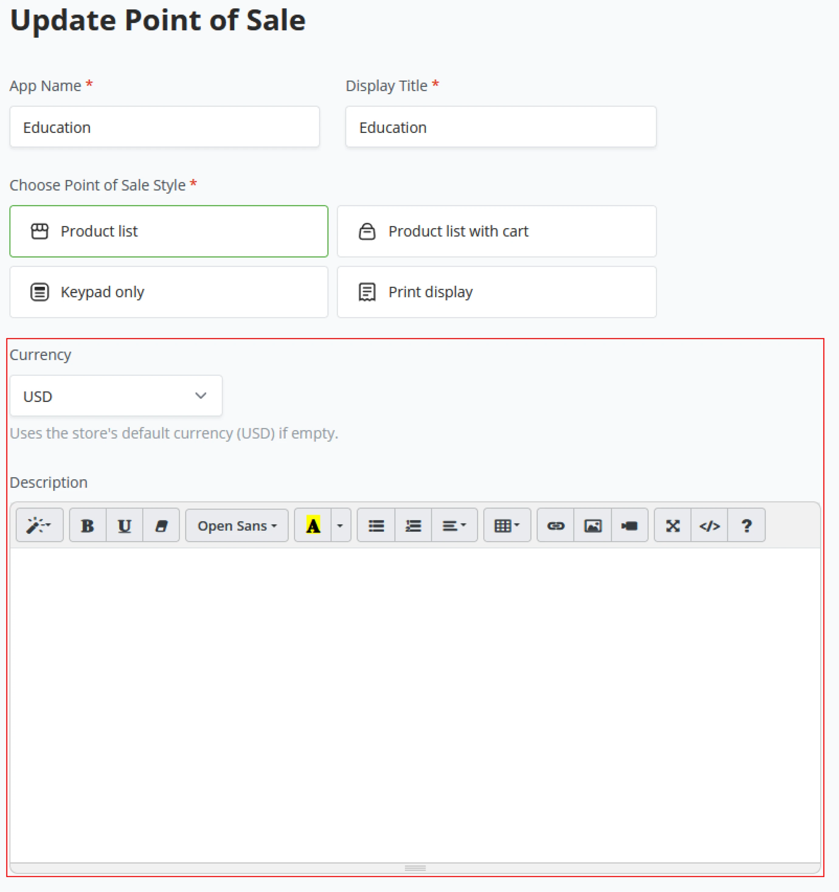

#### Productos

Cuando se crea un Punto de Venta, un servidor BTCPay estándar agrega algunos artículos a la tienda como referencia. Haz clic en el botón Editar en cualquiera de los artículos estándar para entender de mejor manera cada opción posible para un artículo.

Crear un nuevo producto en tu tienda consiste en los siguientes campos;

- Título
- Precio (fijo, mínimo o personalizado)
- URL de la imagen
- Descripción
- Inventario
- ID
- Texto del botón de compra.
- Habilitar/Deshabilitar

Una vez que el propietario de la tienda ha completado todos los campos del nuevo producto, haz clic en guardar, y notarás que la sección de "Productos" en el Punto de Venta ahora se está llenando. Asegúrate siempre de guardar en la parte superior derecha de tu pantalla para evitar que el propietario de la tienda pierda su progreso al agregar productos.

El propietarios de la tienda también puede usar el "Editor en Bruto" para configurar sus productos. El editor en bruto requiere un conocimiento básico de las estructuras JSON.

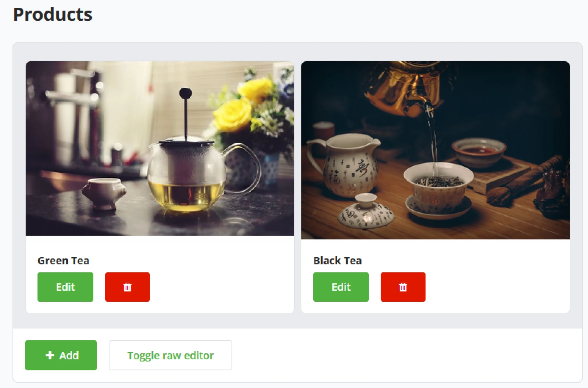

#### Pago

BTCPay Server permite una pequeña personalización específica de pago para PoS. El propietario de la tienda puede configurar el texto "Comprar por x" o solicitar datos específicos del cliente agregando formularios.

#### Propinas

No todas las tiendas necesitan la opción de Propinas en sus ventas. El propietario de la tienda puede activarla o desactivarla según lo considere adecuado para su tienda. Si la tienda activa las propinas, el propietario de la tienda puede configurar el texto en el campo de propinas que prefiera. Las propinas en BTCPay Server funcionan basadas en un porcentaje. Los propietarios de tiendas pueden agregar varios porcentajes separados por comas.

#### Descuentos

Como propietario de una tienda, es posible que quieras ofrecer al cliente un descuento personalizado en el momento del pago; el interruptor para Descuentos se vuelve disponible en el pago de tu tienda. Sin embargo, esto se desaconseja mucho en los sistemas de auto-pago.

#### Pagos personalizados

Cuando la opción de Pagos Personalizados está activada, el cliente puede ingresar su precio establecido igual o superior a la factura original generada por la tienda.

#### Opciones adicionales

Después de configurar todo para tu Punto de Venta, quedan algunas opciones extras. El propietario puede incrustar fácilmente su PoS a través de un Iframe o incrustar un botón de pago que enlace a un artículo específico de la tienda. Para estilizar la tienda PoS recién creada, el propietario puede agregar CSS personalizado en la parte inferior de las opciones adicionales.

#### Eliminar esta aplicación

Si el propietario de la tienda quiere eliminar completamente el Punto de Venta de su BTCPay Server, en la parte inferior de la actualización del PoS, el propietario de la tienda puede hacer clic en el botón Eliminar esta aplicación para destruir completamente su aplicación PoS. Al hacer clic en "Eliminar esta aplicación", BTCPay Server pedirá confirmación escribiendo `DELETE` y confirmando haciendo clic en el botón Eliminar. Después de eliminar, el propietario de la tienda regresa al tablero de BTCPay Server.

### BTCPay Server - Crowdfund

Junto al plugin de Punto de Venta, BTCPay Server ofrece la opción de crear un crowdfund. Al igual que cualquier otra plataforma de Crowdfund, el propietario de la tienda puede establecer una meta, crear incentivos para contribuciones y personalizarlo según sus necesidades.

#### Cómo configurar un nuevo crowdfund

Haz clic en el plugin de Crowdfund a través del menú principal a la izquierda de tu BTCPay Server, debajo de la sección de Plugin. BTCPay Server ahora solicitará un nombre para el Crowdfund; este nombre también se mostrará en la barra del menú izquierdo.


#### Actualizar el Punto de Venta recién creado

Una vez que se le da un nombre a la App, la siguiente pantalla será para actualizar la App para darle contexto.

#### Nombre de la aplicación

El nombre dado a tu Crowdfund será visible en el menú principal de BTCPay Server.

#### Título de visualización

El título se otorga al Crowdfund para el público.

#### Lema

Dale al crowdfund un lema para reconocer de qué trata la recaudación de fondos.


#### URL de la imagen destacada

Cada crowdfund tiene su imagen principal, el banner que reconoces directamente. Esta imagen puede almacenarse en tu servidor si tienes derechos Administrativos, los Admins pueden subirla en la configuración del servidor de BTCPay Server - Archivos. Cuando eres propietario de una tienda, la imagen debe subirse a la web a través de un host de terceros (por ejemplo, imgur)

#### Hacer público el Crowdfund

Este interruptor hace que tu Crowdfund sea público y, por lo tanto, visible para todo el mundo. Para propósitos de prueba o para ver si tu tema se aplica correctamente, es posible que quieras mantener esto en OFF durante el período de creación del crowdfund.

#### Descripción

Cuenta al mundo sobre tu Crowdfund, ¿para qué estás recaudando? Todo lo que explique tu crowdfund va aquí.


#### Objetivo del Crowdfund

Establece un objetivo para lo que la recaudación de fondos debería ganar para el proyecto y en qué moneda debe denominarse el objetivo. Asegúrate de que si tus objetivos se establecen entre fechas, incluyas estas fechas objetivo y de finalización debajo de Objetivos en el crowdfund.


#### Beneficios (Perks)

Los perks ayudan mucho con tu crowdfunding. Esto se debe a que los perks ofrecen a las personas una manera de participar en tu campaña. Apelan tanto a motivaciones egoístas como a motivaciones benevolentes. Y te permiten acceder al gasto de tus seguidores, no solo a su billetera filantrópica -- puedes adivinar cuál es más significativa.

Crear un nuevo beneficio consiste en los siguientes campos;

- Título
- Precio (fijo, mínimo o personalizado)
- URL de la Imagen
- Descripción
- Inventario
- ID
- Texto del Botón de Compra.
- Habilitar/Deshabilitar

Una vez que el propietario de la tienda ha completado todos los campos del nuevo beneficio a crear, haz clic en guardar, y notarás que la sección de Beneficios en los crowdfunds ahora se está llenando.

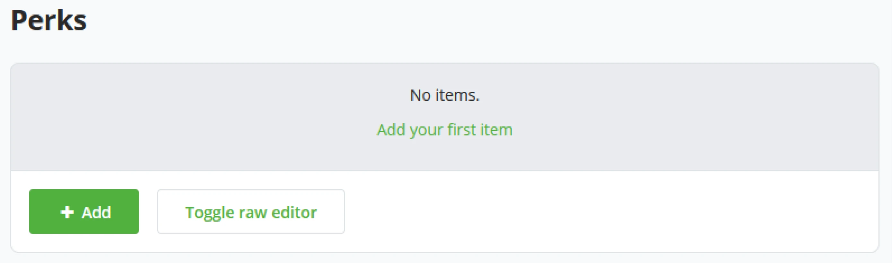

### BTCPay Server - Punto de Venta

#### Contribuciones

Los propietarios de tiendas pueden elegir cómo mostrar los Beneficios, cómo se ordenan o incluso cómo se clasifican frente a otros beneficios. Sin embargo, una vez que se alcanzan los objetivos del Crowdfund, el propietario de la tienda puede querer detener el flujo de donaciones hacia esta recaudación de fondos. Por lo tanto, puede activar "No permitir contribuciones adicionales después de alcanzar el objetivo". Esto detendrá el Crowdfund de aceptar donaciones.

##### Comportamiento del Crowdfund

El estándar de Crowdfund solo cuenta las facturas creadas con el Crowdfund hacia el objetivo. Sin embargo, puede haber casos en los que el propietario de la tienda quiera que todas las facturas realizadas en esta tienda cuenten para el progreso del crowdfund.

#### Opciones adicionales para personalización

BTCPay Server ofrece un par de personalizaciones extras. Agregar sonidos, animaciones o incluso hilos de discusión al Crowdfund. El propietario de la tienda también puede cambiar la apariencia del Crowdfund ingresando su propio estilo CSS personalizado.

#### Eliminar una aplicación

Si el propietario de la tienda quiere eliminar completamente el Crowdfund de su BTCPay Server, en la parte inferior de la actualización del Crowdfund los propietarios de las tiendas pueden hacer clic en el botón “Eliminar esta aplicación” para destruir completamente su aplicación Crowdfund. Al hacer clic en "Eliminar esta aplicación", BTCPay Server pedirá confirmación escribiendo `DELETE` y confirmando con el botón de Eliminar. Después de eliminar, el propietario de la tienda regresa al panel de control de BTCPay Server.

### BTCPay Server - Botón de pago

Los botones de pago HTML fácilmente incrustables y altamente personalizables permiten al propietario de la tienda recibir propinas y donaciones. En la barra de menú izquierda de BTCPay Server, debajo de la sección de Plugins, el propietario de la tienda puede hacer clic en "Pay Button" y luego en Habilitar para crear un botón de pago.

#### Configuración general

Dentro de la configuración general para el botón de pago, el propietario de la tienda puede establecer

- Precio estándar
- Moneda predeterminada
- Método de pago predeterminado
  - Usar el predeterminado de la tienda
  - BTC on-chain
  - BTC off-chain (Lightning)
  - BTC off-chain (LNURL-pay)
- Descripción del checkout
- ID de pedido

#### Opciones de visualización

El botón de pago de BTCPay Server se puede configurar para adaptarse a diferentes estilos. Los botones pueden tener un monto fijo o personalizado, mostrado ya sea con un deslizador o con controles de suma y resta.

#### Utilizar Modal

Al crear el botón de pago, el propietario de la tienda puede elegir su comportamiento cuando un cliente hace clic en él y mostrarlo en un Modal o como una nueva página.

**!?Nota!?**

Advertencia: El botón de pago solo debe usarse para propinas y donaciones

Usar el botón de pago para integraciones de comercio electrónico no se recomienda ya que la información relevante del pedido puede ser modificada por el usuario. Para comercio electrónico, deberías usar nuestra API Greenfield. Si esta tienda procesa transacciones comerciales, te aconsejamos crear una tienda separada antes de usar el botón de pago.

#### Personalizar el Texto del Botón de Pago

Por defecto, el botón de pago de BTCPay Server indica "Pagar con BTCPay". Los propietarios de tiendas pueden establecer este texto a su gusto y cambiar el logo de BTCPay Server por el suyo. Establece el texto usando "Pay Button Text" y pega la URL de la imagen debajo de "Pay Button Image URL".

##### Tamaño de la imagen

El tamaño de la imagen en el botón de pago solo puede configurarse a tres valores predeterminados.

- 146x40px
- 168x46px
- 209x57px

#### Tipo de Botón

BTCPay Server conoce tres estados para el Botón de Pago.

- Monto Fijo
  - El precio previamente establecido está en la configuración general del botón.
- Monto Personalizado
  - El botón de Pago de BTCPay Server tiene controles + y - para establecer un precio personalizado.
  - Al usar el monto personalizado, BTCPay Server solicitará un Min, Max y cómo debería aumentar gradualmente.
  - Los botones pueden configurarse para "Usar estilo de entrada Simple". Esto elimina los controles +/-.
  - Ajustar botón en línea donde el botón y los controles aparecen en línea.
- Deslizador
  - Similar al monto personalizado, sin embargo, visualmente diferente ya que tiene un deslizador en lugar de los controles +/-.
  - Al usar el Deslizador, BTCPay Server solicitará un Min, Max y cómo debería aumentar gradualmente.

**!?Nota!?**

Eliminar el Botón de Pago se puede hacer en la parte superior en la descripción de advertencia.

#### Notificaciones por Email

Siempre que se realice un pago, BTCPay Server puede notificar al propietario de la tienda por correo electrónico.

#### Redirección del navegador

Cuando el cliente completa la compra, será redirigido a este enlace si así lo establece el propietario de la tienda.

#### Opciones Avanzadas del Botón de Pago

Especifica parámetros adicionales de cadena de consulta que deben agregarse a la página de checkout una vez que se crea la factura. Por ejemplo, `lang=da-DK` cargaría la página de checkout en danés por defecto.

#### Usar una aplicación como Endpoint

Enlaza directamente el botón de pago a un artículo en una de las apps de PoS o Crowdfund antes mencionadas.
Los propietarios de las tiendas pueden hacer clic en el menú desplegable y seleccionar la App deseada; una vez seleccionada la App, el propietario de la tienda puede agregar el artículo que necesita ser vinculado.

#### Código generado

Como el botón de pago de BTCPay Server es HTML fácilmente incrustable, BTCPay Server muestra el código generado para copiar en un sitio web en la parte inferior después de configurar el botón de pago.

Los propietarios de las tiendas pueden copiar el código generado en su sitio web, y el botón de pago de BTCPay Server está directamente activo en su sitio web.

#### Notificaciones de pago

El IPN del servidor (Notificación Instantánea de Pago) está destinado para webhooks y puede ser completado con una URL para publicar datos de compra.

### Resumen de habilidades

En esta sección aprendiste:

- Cómo usar el plugin integrado de PoS de BTCPay Server para crear fácilmente una tienda personalizada
- Cómo usar el plugin integrado de Crowdfund de BTCPay Server para crear fácilmente una app de crowdfunding personalizada
- Generar código para un botón de pago personalizado usando el plugin de Botón de Pago

### Evaluación de Conocimientos

#### Revisión de KA

¿Cuáles son los tres plugins integrados que vienen por defecto con BTCPay Server? En pocas palabras, describe cómo se puede usar cada uno.

# Configurando BTCPay Server

<partId>ff38596c-7de3-5e5c-ba50-9b9edbbbb5eb</partId>

## Comprensión básica de la instalación de BTCPay Server en un entorno de LunaNode

<chapterId>d0a28514-ffcf-529b-9156-29141f0b060a</chapterId>

### Instalando BTCPay Server en un Entorno alojado (LunaNode)

Estos pasos proporcionarán toda la información necesaria para comenzar a usar BTCPay Server en LunaNode. Hay muchas opciones sobre cómo desplegar el software.
Puedes encontrar todos los detalles de BTCPay Server en https://docs.btcpayserver.org.

#### ¿Por dónde empezamos?

En esta parte, te familiarizarás con LunaNode como el proveedor de hospedaje, aprenderás sobre los primeros pasos de usar tu BTCPay Server y cómo proceder con Lightning Network. Después de haber pasado por todos los pasos, ¡puedes ejecutar una tienda en línea o una plataforma de crowdfunding que acepte Bitcoin!

Esta es una de las muchas maneras de desplegar BTCPay Server. Lee nuestra documentación para más detalles,

https://docs.btcpayserver.org.

### Despliegue de BTCPay Server - LunaNode

#### Despliegue en LunaNode

Primero, ve al sitio web de LunaNode.com, donde crearemos una nueva cuenta. Haz clic en "Sign Up" (Registrarse) en la parte superior derecha o usa el asistente "Get Started" (Empezar) en su página de inicio.
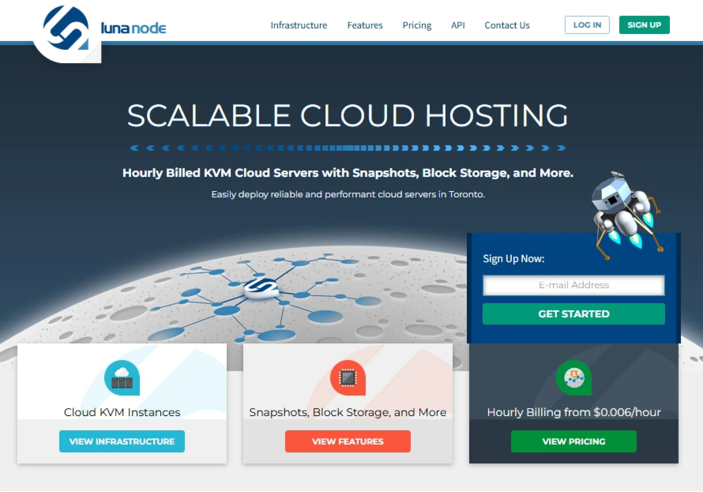

Después de haber creado tu nueva cuenta, LunaNode envía un correo electrónico de verificación. Una vez que verifiques la cuenta, a diferencia de Voltage, inmediatamente se te presenta la opción de recargar tu saldo de cuenta. Este saldo es necesario para pagar el espacio del servidor y los costos de alojamiento.

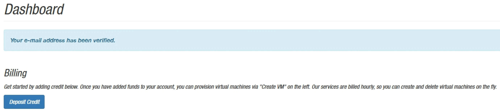

#### Agregar crédito a tu cuenta de LunaNode

Una vez que hayas hecho clic en "Deposit credit" (Depositar crédito), puedes establecer cuánto deseas recargar en tu cuenta y cómo deseas pagar. LunaNode y BTCPay Server costarán entre 10$USD y 20$USD por mes.
A diferencia de Voltage.cloud, sí obtienes acceso completo a tu Servidor Privado Virtual (VPS de aquí en adelante) y, por lo tanto, tienes algo más de control sobre tu servidor. Después de haber creado tu nueva cuenta, LunaNode envía un correo electrónico de verificación.
Una vez que verifiques la cuenta, a diferencia de Voltage, ahora inmediatamente se te presenta la opción de recargar tu saldo de cuenta. Este saldo es necesario para pagar el espacio del servidor y los costos de alojamiento.

#### ¿Cómo desplegar un nuevo servidor?

En esta guía, procederemos con la configuración creando un conjunto de claves API y utilizando el lanzador de BTCPay Server creado por LunaNode.

En tu panel de control de LunaNode, haz clic en "API" en la parte superior derecha. Esto abre una nueva página. Solo tenemos que establecer un Nombre para la clave API. El resto será gestionado por LunaNode y no se cubrirá en esta guía. Haz clic en el botón "Create API Credential" (Crear credencial de API).
Después de crear las credenciales API, obtendrás una larga cadena de letras y caracteres. Esta es tu clave API.

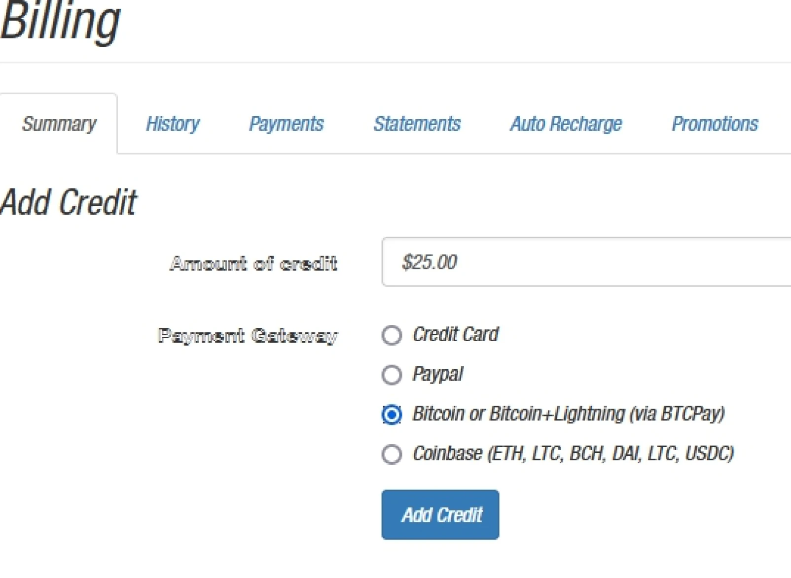

#### ¿Cómo desplegar un nuevo servidor?

Hay 2 partes en estas credenciales, la clave API y el ID de la API; necesitaremos ambas. Antes de pasar al siguiente paso, vamos a abrir una segunda pestaña en el navegador e ir a https://launchbtcpay.lunanode.com/

Aquí se te pedirá que proporciones tu clave API y tu ID de API. Esto es para verificar que eres tú quien provisiona este nuevo servidor. La clave API todavía debería estar abierta en tu pestaña anterior; si te desplazas hacia abajo en la tabla a continuación, encontrarás el ID de API.

Regresa a la página con el Launcher, completa los campos con tu clave API y el ID, y haz clic en continuar.


En el siguiente paso, puedes proporcionar un nombre de dominio. Si ya posees un dominio y quieres usarlo para BTCPay Server, asegúrate de también añadir el registro DNS (denominado registro `A`) en tu dominio. Si no posees un dominio, utiliza el dominio proporcionado por LunaNode en su lugar (puedes cambiar esto más tarde en la configuración de BTCPay Server) y haz clic en Continuar.

Lee más sobre cómo establecer o cambiar un registro DNS para BTCPay Server; https://docs.btcpayserver.org/FAQ/Deployment/#how-to-change-your-btcpay-server-domain-name

#### Lanzar BTCPay Server en LunaNode

Después de seguir los pasos anteriores, podemos configurar todas las opciones para nuestro nuevo servidor. Aquí seleccionaremos Bitcoin (BTC) como nuestra moneda soportada; podemos establecer un correo electrónico para recibir notificaciones sobre la renovación de certificados de cifrado; esto no es obligatorio.
Esta guía tiene como objetivo configurar un entorno Mainnet (Bitcoin del mundo real); sin embargo, LunaNode también te permite configurarlo para Testnet o Regtest para fines de desarrollo. Dejaremos la opción de Mainnet activada para esta guía.
Elige tu implementación de Lightning. LunaNode ofrece dos implementaciones diferentes, LND y Core Lightning. Para esta guía, tomaremos LND. Hay pequeñas pero verdaderas diferencias entre ambas implementaciones; para más información sobre esto, recomendamos leer la extensa documentación; https://docs.btcpayserver.org/LightningNetwork#getting-started-with-btcpay-server-and-core-lightning-cln

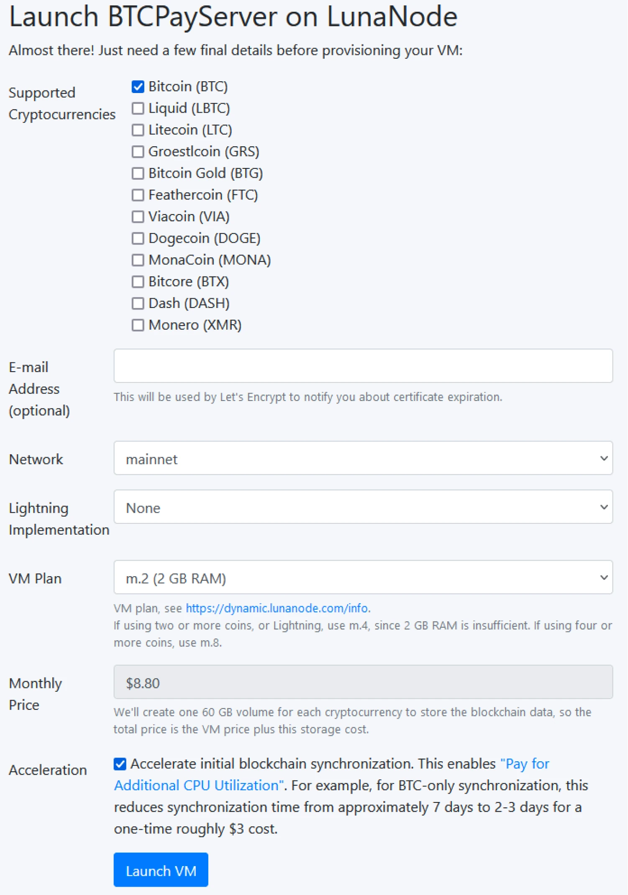

LunaNode ofrece múltiples planes de Máquina Virtual (VM). Estos varían en rangos de precios y especificaciones del servidor. Para esta guía, un plan m2 será suficiente; sin embargo, si has seleccionado más monedas aparte de Bitcoin, considera usar al menos un m4.

Acelera la sincronización inicial de la blockchain; esto es opcional y depende de tus necesidades. Hay opciones avanzadas como configurar un Alias de Lightning, apuntar a un lanzamiento específico de GitHub, o configurar claves SSH; ninguna de estas opciones será abordada en esta guía.

Después de completar el formulario, tienes que hacer clic en "Launch VM" (Lanzar Máquina Virtual), y LunaNode comenzará a crear tu nueva VM, incluyendo BTCPay Server instalado en ella. Este proceso tarda un par de minutos; una vez tu servidor esté listo, LunaNode te proporciona el enlace a tu nuevo BTCPay Server.

Después del proceso de creación, haz clic en el enlace a tu BTCPay Server; aquí, se te pedirá que crees una cuenta de Administrador.

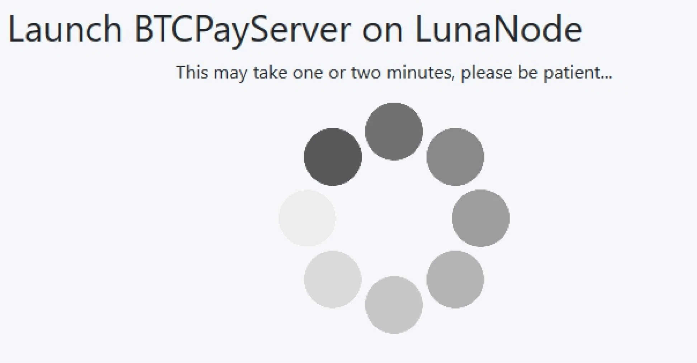

### Resumen de habilidades

En esta sección aprendiste:

- Crear y financiar una cuenta en LunaNode
- Usar el lanzador de BTCPay Server para crear tu propio servidor

### Evaluación de conocimientos

#### Revisión Conceptual de KA

Describe algunas de las diferencias entre ejecutar una instancia de BTCPay Server en un VPS versus crear una cuenta en una instancia alojada.

## Instalando BTCPay Server en un entorno Voltage

<chapterId>11c7d284-b4d2-5542-872c-df9bd9c1491b</chapterId>

Te familiarizarás con Voltage.cloud como proveedor de alojamiento, aprenderás sobre los primeros pasos para usar tu BTCPay Server y cómo proceder con la Red Lightning. Después de haber pasado por todos los pasos, ¡podrás ejecutar una tienda en línea o una plataforma de crowdfunding que acepte Bitcoin!

Esta es una de las muchas formas de implementar BTCPay Server. Lee nuestra documentación para más detalles,
https://docs.btcpayserver.org.

### Implementación de BTCPay Server - Voltage.cloud

Primero, ve al sitio web Voltage.cloud y regístrate para obtener una nueva cuenta. Al crear una cuenta puedes inscribirte para una prueba gratuita de 7 días. Haz clic en Sign Up en la parte superior derecha o usa el botón "Try a free 7 day trial" en su página de inicio.

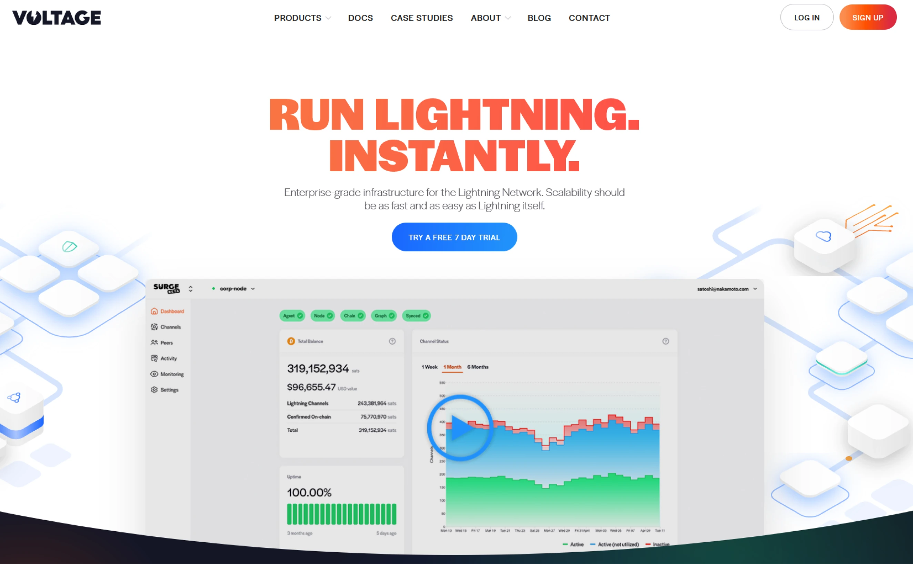

Después de haber creado una cuenta, haz clic en el botón `NODES` en tu panel de control. Una vez que hayamos seleccionado Nodes y creado un nuevo nodo, se nos presentarán las posibles opciones de nodos que Voltage ofrece. Como esta guía también cubrirá Lightning Network, en Voltage, primero tenemos que elegir nuestra implementación de Lightning antes de crear un BTCPay Server. Haz clic en "Lightning Node".

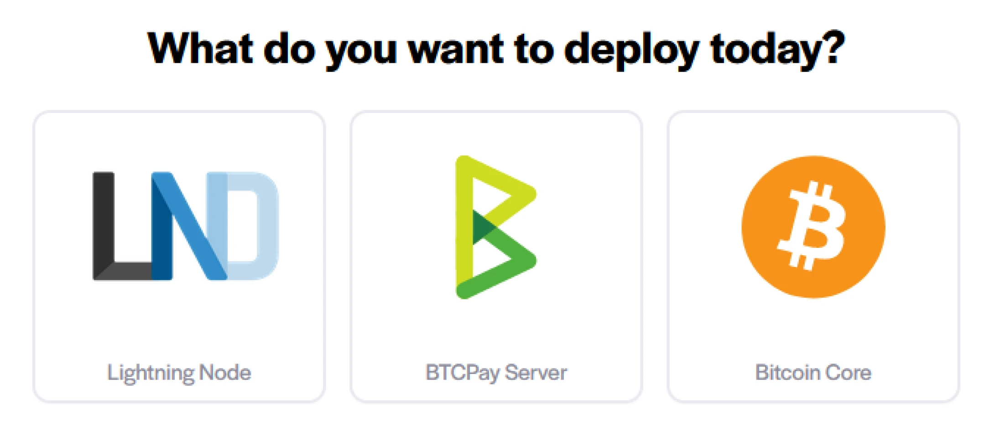
Aquí tendrás que seleccionar qué tipo de nodo Lightning deseas. Voltage ofrece una variedad de opciones para tu configuración de iluminación. Esto es diferente cuando se despliega con, por ejemplo, LunaNode. Para el propósito de esta guía, un Nodo Lite será suficiente. Lee más sobre las diferencias en Voltage.cloud.
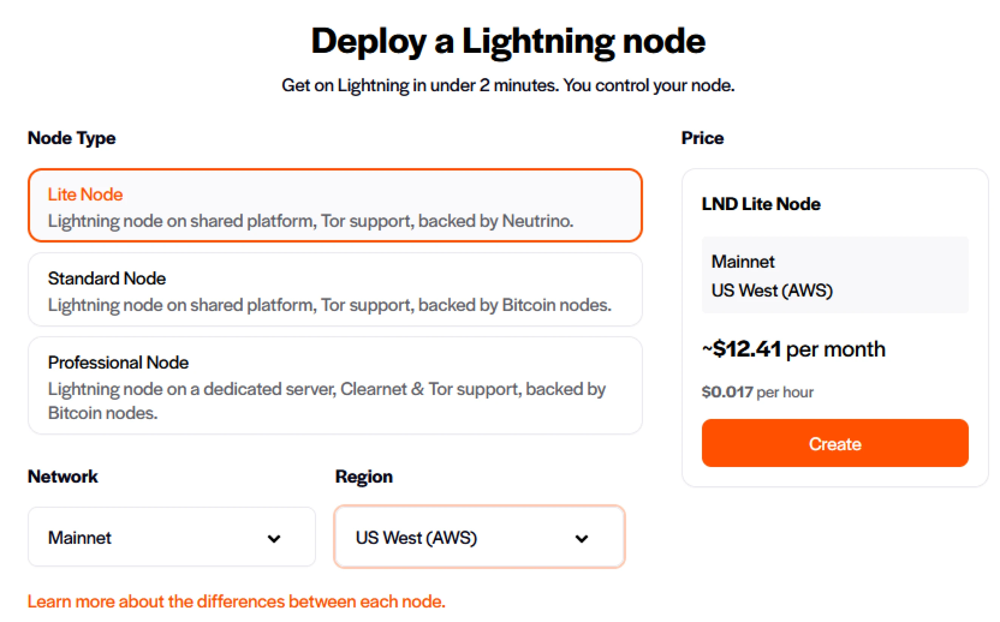

Dale a tu nodo un nombre, establece una contraseña y asegúrate de guardar bien esta contraseña. Si esta contraseña se pierde, perderás acceso a tus copias de seguridad, y Voltage no puede recuperarla. Crea el nodo, y Voltage te muestrará el progreso. Una vez creado tu Nodo Lightning, podremos crear la instancia de BTCPay Server y acceder directamente a la Lightning Network.

Haz clic en "Nodos" en la parte superior izquierda de tu panel de control. Aquí puedes configurar la siguiente parte de tu instancia de BTCPay Server. Haz clic en "crear nuevo" una vez que estés en la vista general de nodos. Obtienes una pantalla similar a la anterior. Ahora en lugar de Nodo Lightning, elegimos BTCPay Server.

Voltage te muestra la geolocalización de tu BTCPay Server, Voltage aloja en la región oeste de EE. UU. Aquí también verás el costo de alojar el servidor. Haz clic en "Crear" y dale a tu BTCPay Server un nombre. Habilita Lightning y Voltage te muestra el nodo Lightning creado en el paso anterior. Haz clic en "Crear", y Voltage creará una instancia de BTCPay Server.

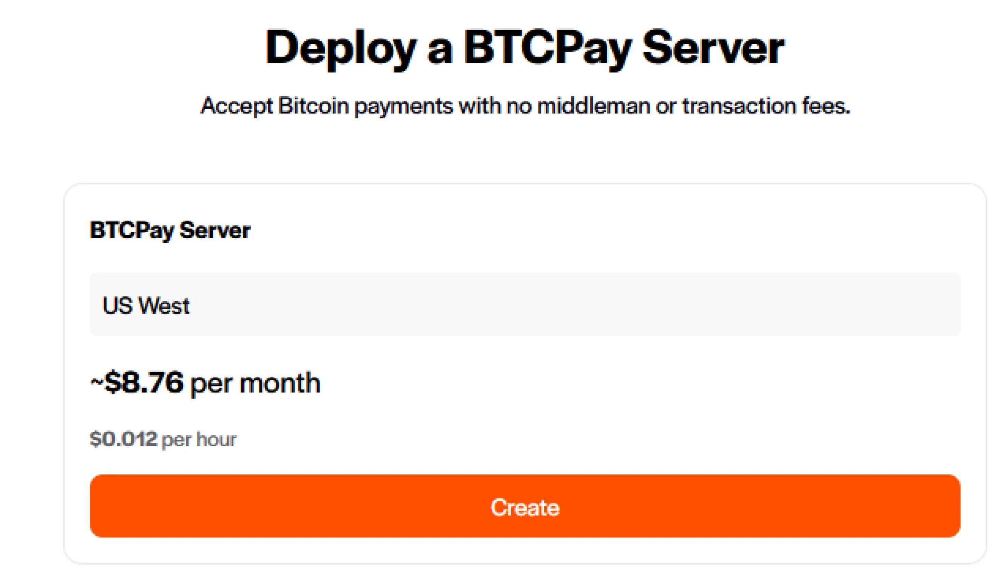

Después de hacer clic en crear, Voltage te presenta el nombre de usuario y contraseña predeterminados. Estos son similares a tu contraseña establecida anteriormente en Voltage. Haz clic en el botón Iniciar sesión en la cuenta para redirigirte a tu BTCPay Server.

Bienvenido a tu nueva instancia de BTCPay Server. Como ya hemos configurado Lightning en el proceso de creación, ¡te muestra que Lightning ya está habilitado!

### Resumen de habilidades

En este capítulo aprendiste:

- Crear una cuenta en Voltage.cloud
- Pasos para poner en funcionamiento BTCPay Server junto con un nodo Lightning en la cuenta

### Evaluación de conocimientos

#### Revisión Conceptual de KA

¿Cuáles son algunas diferencias clave entre las configuraciones de Voltage y LunaNode?

## Instalando BTCPay Server en un nodo Umbrel

<chapterId>3298e292-6476-5fe0-836c-7fa021348799</chapterId>

Al final de estos pasos, podrás aceptar pagos lightning en tu tienda BTCPay en tu red local. Este proceso también se aplicará si ejecutas un nodo umbrel en un restaurante o negocio. Si quieres conectar esta tienda a un sitio web público, sigue el ejercicio avanzado para exponer tu nodo umbrel al público.

https://umbrel.com/


### BTCPay Server - Despliegue en Umbrel

Después de que tu nodo Umbrel se haya sincronizado completamente con la blockchain de Bitcoin, ve a la Tienda de Aplicaciones de Umbrel y busca "BTCPay Server" debajo de Apps.

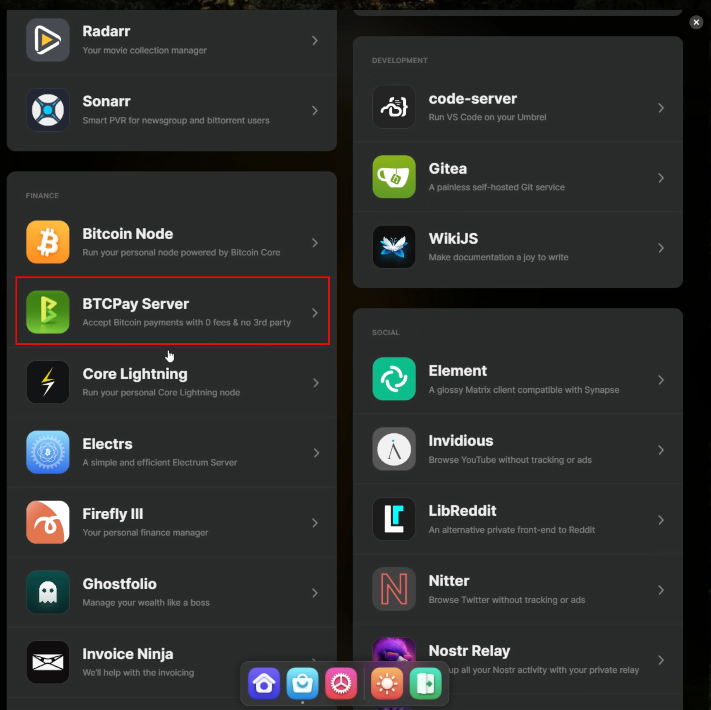

Haz clic en BTCPay Server para ver los detalles de la App. Cuando los detalles estén abiertos para BTCPay Server, la parte inferior derecha muestra los requisitos para que la App funcione correctamente. Muestra que requiere Bitcoin y nodo Lightning. Si no has instalado el Nodo Lightning en tu Umbrel, haz clic en Instalar. Este proceso puede tomar un par de minutos.

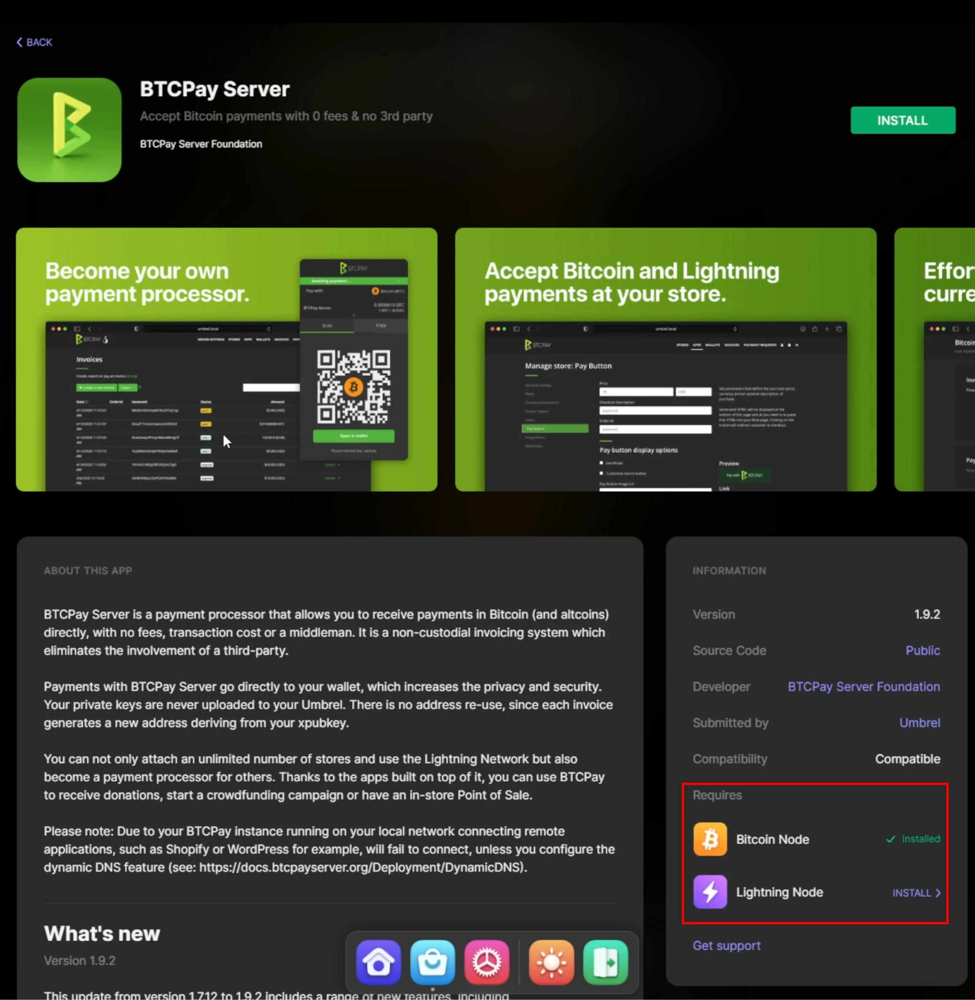

Después de instalar tu Nodo Lightning:

1. Haz clic en abrir en los detalles de la app o en la App en el tablero de Umbrel.
2. Haz clic en configurar un nuevo nodo; se te mostrarán 24 palabras para la recuperación de tu nodo Lightning.
3. Anótalas.

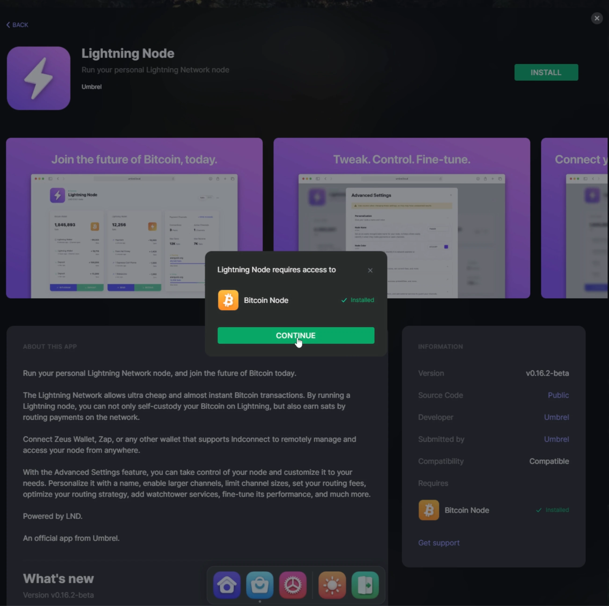
Umbrel solicitará verificación sobre las palabras que acaba de anotar. Después de configurar el nodo Lightning, regrese a la Tienda de Aplicaciones de Umbrel y busque BTCPay Server. Haga clic en el botón de instalación, y Umbrel mostrará si los componentes requeridos están instalados y que BTCPay Server requiere acceso a estos componentes. Después de la instalación, haga clic en Abrir en la parte superior derecha de los detalles de la aplicación o abra BTCPay Server a través del tablero de Umbrel.

Umbrel solicitará verificación sobre las palabras que acaba de anotar.


**!?Nota!?**

Asegúrese de almacenar estas en un lugar adecuado como aprendió anteriormente con el almacenamiento de llaves.

Después de configurar el nodo Lightning, regrese a la Tienda de Aplicaciones de Umbrel y busque BTCPay Server. Haga clic en el botón de instalación, y Umbrel mostrará si los componentes requeridos están instalados y que BTCPay Server requiere acceso a estos componentes.

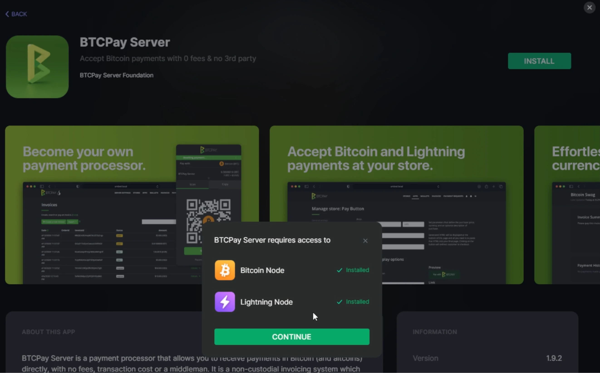

Después de la instalación, haga clic en Abrir en la parte superior derecha de los detalles de la aplicación o abra BTCPay Server a través del tablero de Umbrel.

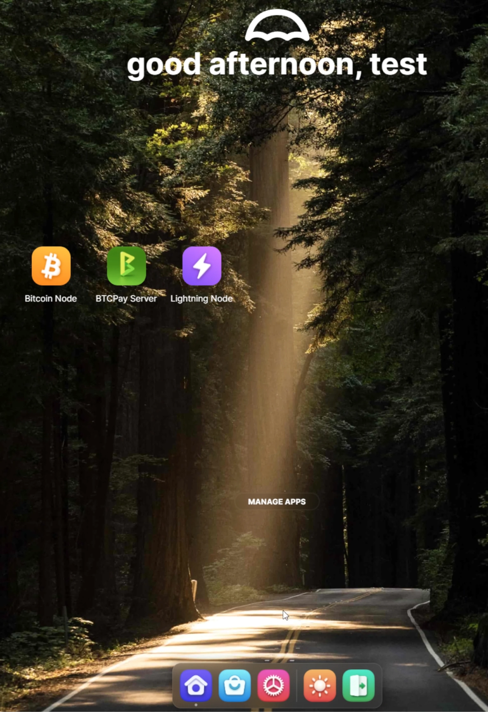

### Resumen de Habilidades

En esta sección aprendió:

- Pasos para instalar BTCPay Server con funcionalidad Lightning en un nodo Umbrel

### Evaluación de Conocimientos

#### Revisión Conceptual de KA

¿Cómo difiere la configuración en Umbrel de las dos opciones alojadas previas?

# Conclusión

<partId>d72e6fa5-0870-5f00-9143-9466ed22e2bd</partId>

## Conclusión del curso

<chapterId>c07ac2a5-f97e-5c57-8a80-4955b48128d4</chapterId>


También es importante tener un entendimiento general de qué es Bitcoin, cómo funciona y cómo puede escalar con segundas capas como la Lightning Network. En este curso, cubrimos extensamente cómo cualquiera puede usar BTCPay Server, desde la instalación inicial hasta la creación de tiendas y la gestión compleja de facturas, para convertirse en un individuo o comerciante financieramente autónomo.

Felicitaciones por completar este curso. Esperamos que hayas disfrutado el contenido y que continúes usando y explorando BTCPay Server, y esté tan emocionado por el futuro prometedor que Bitcoin y la creciente comunidad de constructores y participantes que este futuro traerá.

> **El FOSS es inevitable.**

### Glosario

| Término                                                                                  | Definición                                                                                                                                                                                                                                                                                                                                                                                                                                                                                                                                                                                                                                                                                                                                                                                                                                                                                                                                                                      |
| ---------------------------------------------------------------------------------------- | ------------------------------------------------------------------------------------------------------------------------------------------------------------------------------------------------------------------------------------------------------------------------------------------------------------------------------------------------------------------------------------------------------------------------------------------------------------------------------------------------------------------------------------------------------------------------------------------------------------------------------------------------------------------------------------------------------------------------------------------------------------------------------------------------------------------------------------------------------------------------------------------------------------------------------------------------------------------------------- |
| 51% Attack                                                                               | El acto de construir intencionalmente una nueva cadena de bloques más larga para reemplazar bloques en la blockchain. Esto le permite reemplazar transacciones que han sido minadas en la blockchain. Este tipo de ataque es más fácil de realizar cuando se tiene la mayoría del poder de minería, por lo que se le denomina "Ataque de la Mayoría" o "Ataque del 51%".                                                                                                                                                                                                                                                                                                                                                                                                                                                                                                                                                                                                        |
| AccountKey                                                                               | La clave de cuenta para rebasear                                                                                                                                                                                                                                                                                                                                                                                                                                                                                                                                                                                                                                                                                                                                                                                                                                                                                                                                                |
| AccountKeyPath                                                                           | La ruta desde la raíz hasta la clave de cuenta está prefijada por la huella de la clave pública maestra.                                                                                                                                                                                                                                                                                                                                                                                                                                                                                                                                                                                                                                                                                                                                                                                                                                                                        |
| Dirección                                                                                | Las direcciones de Bitcoin codifican de manera compacta la información necesaria para pagar a un receptor. Una dirección moderna consiste en una cadena de letras y números que comienza con bc1 y se ve como bc1qw508d6qejxtdg4y5r3zarvary0c5xw7kv8f3t4. Una dirección es una forma abreviada de script de bloqueo del receptor, que puede ser utilizado por el emisor para transferir fondos al receptor. La mayoría de las direcciones representan la clave pública del receptor o alguna forma de script que define condiciones de gasto más complejas. El ejemplo anterior es una dirección bech32 que codifica un programa testigo bloqueando fondos al hash de una clave pública (Ver Pay-to-Witness-Public-Key-Hash). También existen formatos de dirección más antiguos que comienzan con 1 o 3 que utilizan la codificación de dirección Base58Check para representar hashes de clave pública o hashes de script.                                               |
| Tipo de Dirección                                                                        | Una dirección puede representar varios scripts diferentes. Las direcciones están codificadas y prefijadas para transmitir su tipo de script. Las direcciones heredadas utilizan Base58, y cuando una dirección heredada es el hash de una clave pública, una dirección P2PKH, comienza con un ‘1’. Menos frecuentemente, una dirección heredada es un hash de un script, en cuyo caso comenzará con un ‘3’. Actualmente, todas las direcciones SegWit están codificadas en Bech32 y comienzan con el prefijo ‘bc1’.                                                                                                                                                                                                                                                                                                                                                                                                                                                             |
| App                                                                                      | BTCPay Server tiene plugins que podrían funcionar como una aplicación por sí mismos.                                                                                                                                                                                                                                                                                                                                                                                                                                                                                                                                                                                                                                                                                                                                                                                                                                                                                            |
| BIP 329                                                                                  | Exportar/importar etiquetas de billetera                                                                                                                                                                                                                                                                                                                                                                                                                                                                                                                                                                                                                                                                                                                                                                                                                                                                                                                                          |
| BIP49                                                                                    | Define el esquema de derivación para billeteras HD utilizando el formato de serialización P2WPKH-anidado-en-P2SH (BIP 141) para transacciones de testigo segregado.                                                                                                                                                                                                                                                                                                                                                                                                                                                                                                                                                                                                                                                                                                                                                                                                               |
| Dirección de Bitcoin                                                                     | Cadena alfanumérica donde envías tu bitcoin, por lo que ahora "vive" allí. Es un identificador, que consiste en una cadena de aproximadamente 33 letras y números combinados. En una versión actual del protocolo, una dirección comienza con 1, 3 o b. Tener la dirección de un destinatario es una parte necesaria para iniciar una transacción de bitcoin. Las direcciones de Bitcoin se generan a partir de claves públicas y varias direcciones pueden generarse a partir de un conjunto de claves públicas para mejorar la privacidad. Las direcciones de Bitcoin actúan justo como una dirección de correo electrónico, si quieres enviar un mensaje necesitas saber a dónde va, lo mismo ocurre con bitcoin. Antes de enviar una transacción de bitcoin, necesitas asegurarte de que la dirección del destinatario sea precisa ya que las transacciones de bitcoin son irreversibles y podrías estar enviando bitcoin a una dirección que no pertenece al destinatario. |
| bitcoin versus Bitcoin                                                                   | Bitcoin es la red monetaria, y bitcoin (en minúscula) es una unidad monetaria en la red de Bitcoin. Usas bitcoin como moneda para realizar transacciones en la red de Bitcoin.                                                                                                                                                                                                                                                                                                                                                                                                                                                                                                                                                                                                                                                                                                                                                                                      |
| Bloque                                                                                   | Un bloque es una estructura de datos en la cadena de bloques (blockchain) de Bitcoin que consiste en un encabezado y un cuerpo de transacciones de Bitcoin. El bloque está marcado con una marca de tiempo y se compromete con un bloque predecesor (padre) específico. Cuando se hace hash, el encabezado del bloque proporciona la prueba de trabajo que hace que la cadena de bloques sea probabilísticamente inmutable. Los bloques deben adherirse a las reglas impuestas por el consenso de la red para extender la cadena de bloques. Cuando se añade un bloque a la cadena de bloques, las transacciones incluidas se consideran que han recibido su primera confirmación.                                                                                                                                                                                                                                                                                                           |
| Explorador de Bloques                                                                    | Una herramienta en línea que te permite buscar información en tiempo real e histórica sobre una cadena de bloques, incluyendo datos relacionados con bloques, transacciones, direcciones y más.                                                                                                                                                                                                                                                                                                                                                                                                                                                                                                                                                                                                                                                                                                                                                                                 |
| Hash de Bloque                                                                           | Un hash de bloque es el hash SHA-256 de los datos del bloque, y usualmente se representa en formato hexadecimal. Un hash de bloque puede interpretarse como un número muy grande. Para satisfacer el requisito de Prueba de Trabajo (PoW), un hash de bloque debe estar por debajo de cierto umbral. Así, todos los hashes de bloque comienzan con una serie de ceros seguidos por una cadena alfanumérica. Algunos bloques tienen hasta veinte ceros iniciales, mientras que los bloques más antiguos tienen tan solo ocho. La cantidad de ceros requeridos demuestra aproximadamente la dificultad de minería en el momento en que se publicó el bloque.                                                                                                                                                                                                                                                                                                                            |
| Altura de Bloque                                                                         | Cada bloque está numerado en orden ascendente, comenzando desde cero.                                                                                                                                                                                                                                                                                                                                                                                                                                                                                                                                                                                                                                                                                                                                                                                                                                                                                                           |
| Recompensa de Bloque                                                                     | Consiste en el subsidio del bloque (bitcoin recién creado) y la suma de todas las tarifas de transacción de las transacciones incluidas en el bloque.                                                                                                                                                                                                                                                                                                                                                                                                                                                                                                                                                                                                                                                                                                                                                                                                                         |
| Tamaño de Bloque                                                                         | Cada bloque tiene una cantidad limitada de datos que puede contener. Los datos que no caben en un bloque determinado, se registrarán en uno de los bloques siguientes. En cuanto a los bloques de bitcoin, solían tener un tamaño de bloque de 1mb, sin embargo, después de una bifurcación suave (soft fork) el tamaño de bloque puede técnicamente contener hasta 4mb de datos.                                                                                                                                                                                                                                                                                                                                                                                                                                                                                                                                                                                               |
| Subsidio de Bloque                                                                     | La cantidad de bitcoin nuevo acuñado en cada bloque. Cada bloque que se produce y se añade a la cadena de bloques permite al creador del bloque acuñar una cierta cantidad de bitcoin nuevo. El subsidio comenzó en 50 BTC por bloque, y se reduce a la mitad cada 210,000 bloques o aproximadamente cada 4 años.                                                                                                                                                                                                                                                                                                                                                                                                                                                                                                                                                                                                                                                             |
| Blockchain                                                                               | Un registro distribuido, o base de datos, de todas las transacciones de Bitcoin. Las transacciones se agrupan en actualizaciones discretas llamadas bloques, limitados hasta 4 millones de unidades de peso. Los bloques se producen aproximadamente cada 10 minutos a través de un proceso estocástico llamado minería. Cada bloque incluye una "prueba de trabajo" (PoW) computacionalmente intensiva. El requisito de prueba de trabajo se utiliza para regular los intervalos de bloque y proteger la cadena de bloques contra ataques para reescribir la historia: un atacante necesitaría superar la prueba de trabajo existente para reemplazar bloques ya publicados, haciendo que cada bloque sea probabilísticamente inmutable a medida que se entierra bajo bloques subsiguientes.                                                                                                                                                                                         |
| BTCPay Server Vault                                                                      | Para un equilibrio óptimo entre facilidad de uso, seguridad y privacidad, se recomienda utilizar BTCPay Server Wallet con una billetera de hardware. BTCPay Vault está construido para conectar la billetera de Hardware y BTCPay Server.                                                                                                                                                                                                                                                                                                                                                                                                                                                                                                                                                                                                                                                                                                                                               |
| Problema de los Generales Bizantinos                                                     | Un problema de teoría de juegos que describe la dificultad que tienen las partes descentralizadas para llegar a un consenso sin depender de una parte central de confianza. El nombre proviene del escenario de varios generales que sitian Bizancio. Han rodeado la ciudad, pero deben decidir colectivamente cuándo atacar. Si todos los generales atacan al mismo tiempo, ganarán, pero si atacan en momentos diferentes, perderán. Los generales no tienen canales de comunicación seguros entre sí porque cualquier mensaje que envíen o reciban podría haber sido interceptado o enviado de manera engañosa por los defensores de Bizancio. ¿Cómo pueden los generales organizarse para atacar al mismo tiempo?                                                                                                                                                                                                                                                           |
| Censura                                                                                  | Control sobre la información que se puede transmitirse a las masas. En cuanto a Bitcoin, la censura se refiere a la capacidad de terceros para detener una transacción.                                                                                                                                                                                                                                                                                                                                                                                                                                                                                                                                                                                                                                                                                                                                                                                                          |
| Cambio                                                                                   | La porción de UTXOs que se devuelve a la billetera del remitente, generalmente a través de una dirección diferente. Equivale a la suma de las entradas menos la cantidad gastada y la tarifa de transacción.                                                                                                                                                                                                                                                                                                                                                                                                                                                                                                                                                                                                                                                                                                                                                                             |
| Child Pays For Parent (CPFP)                                                             | Una técnica de incremento de tarifa donde un usuario gasta una salida de una transacción no confirmada con una tarifa baja en una transacción hija con una tarifa alta para incentivar a los mineros a incluir ambas transacciones en un bloque.                                                                                                                                                                                                                                                                                                                                                                                                                                                                                                                                                                                                                                                                                                                                |
| Transacción Coinbase                                                                     | La primera transacción en cada bloque que distribuye la recompensa del bloque y las tarifas de transacción a quien haya minado el bloque.                                                                                                                                                                                                                                                                                                                                                                                                                                                                                                                                                                                                                                                                                                                                                                                                                                       |
| Coincidencia de Deseos                                                                     | Un fenómeno económico donde dos partes tienen un ítem que la otra desea, por lo que intercambian estos ítems directamente sin ningún medio monetario.                                                                                                                                                                                                                                                                                                                                                                                                                                                                                                                                                                                                                                                                                                                                                                                                                           |
| Almacenamiento en frío (Cold Storage)                                                                          | Una manera de gestionar datos sin estar conectado a internet.                                                                                                                                                                                                                                                                                                                                                                                                                                                                                                                                                                                                                                                                                                                                                                                                                                                                                                                   |
| Cold Wallet (Cartera en Frío)                                                                              | Un tipo de billetera de bitcoin que almacena de manera segura tus claves privadas fuera de línea, usualmente en un dispositivo físico. También conocida como una hardware wallet, y protege tu bitcoin digital de hackers en línea usando un dispositivo similar a una memoria USB que no está conectado a internet.                                                                                                                                                                                                                                                                                                                                                                                                                                                                                                                                                                                                                                                            |
| Interfaz de Línea de Comandos (CLI)                                                             | Interactuar con un dispositivo o programa de computadora con comandos de un usuario o cliente, y respuestas del dispositivo o programa, en forma de líneas de texto.                                                                                                                                                                                                                                                                                                                                                                                                                                                                                                                                                                                                                                                                                                                                                                                                            |
| Commitment Transaction                                                                   | Una transacción de compromiso es una transacción de Bitcoin, firmada por ambos socios del canal, que codifica el último saldo de un canal. Cada vez que se realiza o se reenvía un nuevo pago usando el canal, el saldo del canal se actualizará, y una nueva transacción de compromiso será firmada por ambas partes. Importante, en un canal entre Alice y Bob, ambos mantienen su propia versión de la transacción de compromiso, que también está firmada por la otra parte. En cualquier momento, el canal puede ser cerrado por Alice o Bob si presentan su transacción de compromiso en la blockchain de Bitcoin. Presentar una transacción de compromiso antigua (desactualizada) se considera trampa (es decir, una violación del protocolo) en la Lightning Network y puede ser penalizada por la otra parte, reclamando todos los fondos del canal para sí mismos, mediante una transacción de penalización.                                                         |
| Confirmation                                                                             | Una vez que una transacción está incluida en un bloque, tiene una confirmación. Tan pronto como otro bloque es minado en la blockchain, la transacción tiene dos confirmaciones, y así sucesivamente. Seis o más confirmaciones se consideran prueba suficiente de que una transacción no puede ser revertida.                                                                                                                                                                                                                                                                                                                                                                                                                                                                                                                                                                                                                                                                  |
| Crowdfund (CF)                                                                           | Un plugin predeterminado de BTCPay Server que permite a un propietario de tienda crear fácilmente un sitio web de financiamiento colectivo típico. Pueden establecer fácilmente un objetivo, crear incentivos para contribuciones y personalizarlo según sus necesidades.                                                                                                                                                                                                                                                                                                                                                                                                                                                                                                                                                                                                                                                                                                       |
| Criptografía                                                                             | Un sistema especial, donde el mensaje original es cambiado para que solo los destinatarios previstos puedan recibirlo.                                                                                                                                                                                                                                                                                                                                                                                                                                                                                                                                                                                                                                                                                                                                                                                                                                                          |
| Panel de Control (Dashboard)                                                                                | La página central de aterrizaje de BTCPay Server. Proporciona una visión general de toda la actividad de una tienda, mostrada a través de una serie de cuadros resumen.                                                                                                                                                                                                                                                                                                                                                                                                                                                                                                                                                                                                                                                                                                                                                                                                         |
| Demo                                                                                     | Se refiere al entorno virtual en el que tienen lugar las demostraciones de software.                                                                                                                                                                                                                                                                                                                                                                                                                                                                                                                                                                                                                                                                                                                                                                                                                                                                                            |
| Deployment                                                                               | El despliegue de software incluye todas las actividades que hacen un sistema de software disponible para su uso. El proceso general de despliegue consiste en varias actividades interrelacionadas con posibles transiciones entre ellas.                                                                                                                                                                                                                                                                                                                                                                                                                                                                                                                                                                                                                                                                                                                                       |
| Ruta de Derivación                                                                       | Un dato que le indica a una billetera Determinística Jerárquica (HD) cómo derivar una clave específica dentro de un árbol de claves. Las rutas de derivación se utilizan como un estándar de Bitcoin e fueron introducidas con las billeteras HD como parte del BIP 32.                                                                                                                                                                                                                                                                                                                                                                                                                                                                                                                                                                                                                                                                                                         |
| Ajuste de Dificultad                                                                     | Ajuste al objetivo de dificultad, cada 2016 bloques (aproximadamente dos semanas) para intentar asegurar que los bloques sean minados una vez cada 10 minutos en promedio. Por lo tanto, crea un tiempo consistente entre bloques y una emisión consistente de nuevos bitcoins en la red (a través de la recompensa de bloque).                                                                                                                                                                                                                                                                                                                                                                                                                                                                                                                                                                                                                                                 |
| Objetivo de Dificultad                                                                   | Usado en la minería, es un número que el hash de un bloque debe ser inferior para que el bloque sea añadido a la blockchain.                                                                                                                                                                                                                                                                                                                                                                                                                                                                                                                                                                                                                                                                                                                                                                                                                                                    |
| Firma Digital                                                                            | Una firma digital es un esquema matemático para verificar la autenticidad e integridad de mensajes o documentos digitales. Se puede ver como un compromiso criptográfico en el que el mensaje no está oculto.                                                                                                                                                                                                                                                                                                                                                                                                                                                                                                                                                                                                                                                                                                                                                                   |
| Divisible                                                                                | La propiedad de un bien que puede ser dividido en cantidades menores sin perder valor. Debido a que las transacciones económicas ocurren frecuentemente en cantidades variables, una moneda debe ser divisible para ser utilizada ampliamente en una economía.                                                                                                                                                                                                                                                                                                                                                                                                                                                                                                                                                                                                                                                                                                                  |
| Docker                                                                                   | Software que empaqueta software en unidades estandarizadas llamadas contenedores que tienen todo lo que el software necesita para ejecutarse, incluyendo bibliotecas, herramientas del sistema, código y tiempo de ejecución.                                                                                                                                                                                                                                                                                                                                                                                                                                                                                                                                                                                                                                                                                                                                                   |
| Doble Gasto                                                                              | El resultado de gastar exitosamente algún dinero más de una vez. Bitcoin protege contra el doble gasto verificando que cada transacción añadida a la blockchain cumpla con las reglas de consenso; esto significa verificar que las entradas para la transacción no hayan sido previamente gastadas.                                                                                                                                                                                                                                                                                                                                                                                                                                                                                                                                                                                                                                                                            |
| Duradero                                                                                 | Propiedad del dinero, en la cual la moneda puede mantener su estado original a lo largo del tiempo y soportar uso repetido. Una moneda duradera debe ser capaz de sobrevivir daños potenciales.                                                                                                                                                                                                                                                                                                                                                                                                                                                                                                                                                                                                                                                                                                                                                                                 |
| Electrum                                                                                 | Electrum es una de las billeteras de Bitcoin más populares, creado en 2011.                                                                                                                                                                                                                                                                                                                                                                                                                                                                                                                                                                                                                                                                                                                                                                                                                                                                                                      |
| Clave pública extendida (Xpub)                                                           | Clave pública extendida también conocida como Xpub, una clave pública que funciona como padre de claves que se derivan del xpub como una característica de la Billetera HD. Este Xpub es un estándar introducido en el BIP 32. Las billeteras lo usan detrás de escena para derivar claves públicas. No se desaconseja compartir el Xpub, tus fondos no estarán en riesgo directo de ser movidos, el xpub no puede derivar claves privadas. El beneficio de compartir un xpub podría ser para propósitos de financiamiento colectivo en BTCPay Server. El xpub se comparte a través de medios en línea, mientras que las claves privadas permanecen fuera de línea en un HWW.                                                                                                                                                                                                                                                                                                   |
| F.U.D.                                                                                   | Abreviatura de Miedo, incertidumbre y duda; Usualmente evocado intencionalmente para poner a un competidor en desventaja.                                                                                                                                                                                                                                                                                                                                                                                                                                                                                                                                                                                                                                                                                                                                                                                                                                                       |
| Tarifa (Fee)                                                                                  | En el contexto de la Red Lightning, los nodos cobrarán tarifas de enrutamiento por reenviar los pagos de otros usuarios. Los nodos individuales pueden establecer sus propias políticas de tarifas que se calcularán como la suma de una tarifa_base fija y una tarifa_proporcional que depende del monto del pago. En el contexto de Bitcoin, el remitente de una transacción paga una tarifa de transacción a los mineros por incluir la transacción en un bloque. Las tarifas de transacción de Bitcoin no incluyen una tarifa base y dependen linealmente del peso de la transacción, pero no del monto.                                                                                                                                                                                                                                                                                                                                                                    |
| Fiat  (Dinero fiduciario)                                                                                   | Moneda emitida por el gobierno que no está respaldada por una mercancía como el oro.                                                                                                                                                                                                                                                                                                                                                                                                                                                                                                                                                                                                                                                                                                                                                                                                                                                                                            |
| Finito                                                                                   | Se refiere al suministro limitado de Bitcoin.                                                                                                                                                                                                                                                                                                                                                                                                                                                                                                                                                                                                                                                                                                                                                                                                                                                                                                                                   |
| Fork                                                                                     | Un cambio en un protocolo o en un fragmento de código. Los forks generalmente se introducen para actualizar un proyecto. En la comunidad de código abierto, los forks existen porque muchas personas eligen descargar y ejecutar el mismo software en diferentes momentos y no siempre se actualizan. Si dos usuarios descargan y ejecutan la versión 1 de un software, y solo uno de los usuarios actualiza cuando se lanza la versión 2, el usuario que actualizó está ejecutando un fork de la versión 1.                                                                                                                                                                                                                                                                                                                                                                                                                                                                    |
| Funding Transaction                                                                      | Transacción utilizada para abrir un canal de pago. El valor (en bitcoin) de la transacción de financiamiento es exactamente la capacidad del canal de pago. La salida de la transacción de financiamiento es un script de firma múltiple 2-de-2 (multisig) donde cada socio del canal controla una llave. Debido a su naturaleza multisig, solo puede ser gastada por acuerdo mutuo entre los socios del canal. Eventualmente será gastada por una de las transacciones de compromiso o por la transacción de cierre.                                                                                                                                                                                                                                                                                                                                                                                                                                                           |
| Fungible                                                                                 | Ser algo (como dinero o una mercancía) de tal naturaleza que una parte o cantidad puede ser reemplazada por otra parte o cantidad igual en el pago de una deuda o en la liquidación de una cuenta.                                                                                                                                                                                                                                                                                                                                                                                                                                                                                                                                                                                                                                                                                                                                                                              |
| Gap Limit (Límite de intervalo)                                                                              | Se refiere al número estándar de direcciones públicas que se comprueban en busca de transacciones en la blockchain para calcular el saldo de una cuenta. Las transacciones recibidas en una dirección más allá del límite de brecha de direcciones no son detectadas.                                                                                                                                                                                                                                                                                                                                                                                                                                                                                                                                                                                                                                                                                                           |
| Genesis Block (Bloque Génesis)                                                                           | Primer bloque en la blockchain de Bitcoin. Satoshi Nakamoto, el creador de Bitcoin, minó el bloque Génesis el 3 de enero de 2009 e incluyó el titular de ese día del Financial Times, “Chancellor on brink of second bailout for banks” (Canciller al borde del segundo rescate para los bancos).                                                                                                                                                                                                                                                                                                                                                                                                                                                                                                                                                                                                                                                                               |
| Github                                                                                   | Una plataforma y servicio basado en la nube para el desarrollo de software y control de versiones usando Git, permitiendo a los desarrolladores almacenar y gestionar su código.                                                                                                                                                                                                                                                                                                                                                                                                                                                                                                                                                                                                                                                                                                                                                                                                |
| Gossip Protocol                                                                          | Los nodos de LN envían y reciben información sobre la topología de la Lightning Network a través de mensajes de gossip que se intercambian con sus pares. El protocolo de gossip está principalmente definido en BOLT #7 y define el formato de los mensajes de node_announcement, channel_announcement y channel_update. Para prevenir el spam, los mensajes de anuncio de nodo solo serán reenviados si el nodo ya tiene un canal, y los mensajes de anuncio de canal solo serán reenviados si la transacción de financiamiento del canal ha sido confirmada por la red de Bitcoin. Por lo general, los nodos de Lightning se conectan con sus socios de canal, pero está bien conectarse con cualquier otro nodo de Lightning para procesar mensajes de gossip.                                                                                                                                                                                                              |
| Gresham's Law                                                                            | Ley que establece que “el dinero malo expulsa al bueno”. En otras palabras, en una economía donde se utilizan dos monedas, los individuos gastarán el dinero malo, que se devalúa constantemente, y retendrán el dinero bueno, que mantiene su valor. Así, el dinero malo dominará en términos de circulación y uso en transacciones diarias, mientras que el dinero bueno dominará en términos de ahorros e inversión a largo plazo.                                                                                                                                                                                                                                                                                                                                                                                                                                                                                                                                           |
| Halving                                                                                  | Un evento que reduce la tasa de emisión de bitcoin a la mitad cada 210,000 bloques (aproximadamente cada cuatro años).                                                                                                                                                                                                                                                                                                                                                                                                                                                                                                                                                                                                                                                                                                                                                                                                                                                          |
| Hard Fork                                                                                | Un cambio de consenso que no es compatible con versiones anteriores. La incompatibilidad hacia atrás ocurre cuando un comportamiento previamente inválido se hace válido. Para mantener el consenso a través de un hard fork, todos los nodos deben actualizarse. De lo contrario, los nodos antiguos rechazarán las transacciones o bloques como inválidos bajo las reglas antiguas, mientras que los nodos actualizados los aceptarán como válidos. Por esta razón, los hard forks se evitan a toda costa en Bitcoin.                                                                                                                                                                                                                                                                                                                                                                                                                                                         |
| Hardware Wallet (Billetera de Hardware)                                                                    | Un tipo especial de billetera de Bitcoin que almacena las claves privadas del usuario en un dispositivo de hardware seguro.                                                                                                                                                                                                                                                                                                                                                                                                                                                                                                                                                                                                                                                                                                                                                                                                                                                     |
| Función Hash                                                                            | Una función hash criptográfica es un algoritmo matemático que mapea datos de tamaño arbitrario a una cadena de bits de tamaño fijo (un hash) y está diseñado para ser una función de un solo sentido, es decir, una función que es inviable de invertir. La única manera de recrear los datos de entrada a partir de la salida de una función hash criptográfica ideal es intentar una búsqueda por fuerza bruta de entradas posibles para ver si producen una coincidencia.                                                                                                                                                                                                                                                                                                                                                                                                                                                                                                    |
| Hash Rate                                                                                | Una medida de cuántos hashes producen los mineros por segundo de forma acumulativa en la red de Bitcoin. Un solo hash es un intento de crear una Prueba de Trabajo para un bloque.                                                                                                                                                                                                                                                                                                                                                                                                                                                                                                                                                                                                                                                                                                                                                                                              |
| Billetera Caliente (Hot Wallet)                                                                               | Un dispositivo con conexiones externas, especialmente a internet. Una hot wallet es una billetera de Bitcoin que se conecta a internet. Estas billeteras son más convenientes para gastos del día a día, pero no son tan seguras como las opciones de almacenamiento en frío porque interactúan con internet.                                                                                                                                                                                                                                                                                                                                                                                                                                                                                                                                                                                                                                                                   |
| Descarga Inicial de Bloques (IBD)                                                             | El proceso de construir la blockchain completa de Bitcoin desde cero. Cuando se configura un nuevo nodo y se une a la red, se conecta a otros nodos y les pide bloques. El nuevo nodo procesa estos bloques y construye la blockchain hasta que se ha puesto al día y está sincronizado con la red.                                                                                                                                                                                                                                                                                                                                                                                                                                                                                                                                                                                                                                                                             |
| Factura (Invoice)                                                                                 | Un documento comercial emitido por un vendedor a un comprador relacionado con una transacción de venta e indicando los productos, cantidades y precios acordados para los productos o servicios que el vendedor ha proporcionado al comprador.                                                                                                                                                                                                                                                                                                                                                                                                                                                                                                                                                                                                                                                                                                                                  |
| Conoce a tu Cliente (KYC)                                                                 | Leyes destinadas a prevenir que las instituciones financieras sean utilizadas para transferencias de dinero ilícitas al mandar que todas las cuentas financieras sean identificables a individuos u organizaciones.                                                                                                                                                                                                                                                                                                                                                                                                                                                                                                                                                                                                                                                                                                                                                             |
| Segunda Capa (Layer 2)                                                                                 | Una red construida encima de una blockchain, por ejemplo, la Lightning Network.                                                                                                                                                                                                                                                                                                                                                                                                                                                                                                                                                                                                                                                                                                                                                                                                                                                                                                 |
| Legacy Address                                                                           | Las direcciones legacy usan Base58, y cuando una dirección legacy es el hash de una clave pública, una dirección P2PKH, comienza con un ‘1’.                                                                                                                                                                                                                                                                                                                                                                                                                                                                                                                                                                                                                                                                                                                                                                                                                                    |
| Lightning Network                                                                        | Un protocolo encima de Bitcoin. Crea una red de canales de pago que permite el reenvío de pagos sin confianza a través de la red con la ayuda de HTLCs y enrutamiento cebolla. Otros componentes de la Lightning Network son el protocolo de chismes, la capa de transporte y las solicitudes de pago.                                                                                                                                                                                                                                                                                                                                                                                                                                                                                                                                                                                                                                                                          |
| Liquidez                                                                                | Medida de varias características del libro de órdenes de un activo particular dentro de un mercado dado. La liquidez es un indicador de cuánto impacto en el mercado tendrá una orden grande sobre el precio de un activo. Un activo con más liquidez tiene una mayor profundidad en el libro de órdenes. Esto significa que será capaz de absorber más órdenes con movimientos de precio más pequeños.                                                                                                                                                                                                                                                                                                                                                                                                                                                                                                                                                                         |
| Cadena más Larga (Longest Chain)                                                         | La cadena de bloques que requirió más esfuerzo para construirse. Se denomina así porque intuitivamente una blockchain con más bloques habrá requerido más energía para su construcción que una cadena con menos bloques, pero más precisamente es la cadena que requirió más trabajo para producirse, por lo que un nombre más adecuado podría haber sido "cadena más pesada".                                                                                                                                                                                                                                                                                                                                                                                                                                                                                                                                                                                                  |
| Cadena Principal (Main Chain)                                                            | En el contexto de la Red Lightning, esto se refiere a la Red de Bitcoin.                                                                                                                                                                                                                                                                                                                                                                                                                                                                                                                                                                                                                                                                                                                                                                                                                                                                                                        |
| Medio de Intercambio (Medium of Exchange)                                                | Un tipo de bien que facilita el intercambio de otros bienes y servicios dentro de una economía. Históricamente, elementos como conchas, cuentas y oro fueron utilizados como medios de intercambio.                                                                                                                                                                                                                                                                                                                                                                                                                                                                                                                                                                                                                                                                                                                                                                             |
| Mempool                                                                                  | Abreviatura de "pool de memoria", es un almacenamiento temporal para transacciones que han sido recibidas por un nodo.                                                                                                                                                                                                                                                                                                                                                                                                                                                                                                                                                                                                                                                                                                                                                                                                                                                          |
| Minero (Miner)                                                                           | Un nodo involucrado en el proceso de construir la blockchain añadiendo nuevos bloques a través del proceso de hashing.                                                                                                                                                                                                                                                                                                                                                                                                                                                                                                                                                                                                                                                                                                                                                                                                                                                          |
| Minería                                                                         | Proceso de construir un bloque a partir de transacciones recientes de Bitcoin y luego resolver un problema computacional requerido como prueba de trabajo. Es el proceso mediante el cual se actualiza el libro mayor compartido de bitcoin (es decir, la blockchain de Bitcoin) y por el cual se incluyen nuevas transacciones en el libro mayor. También es el proceso mediante el cual se emite nuevo bitcoin. Cada vez que se crea un nuevo bloque, el nodo minero recibirá nuevo bitcoin creado dentro de la transacción coinbase de ese bloque.                                                                                                                                                                                                                                                                                                                                                                                                                           |
| Multifirma (Multisignature, multisig)                                                    | Un script que requiere más de una firma para autorizar un gasto. Los canales de pago siempre se codifican como direcciones multisig que requieren una firma de cada socio del canal de pago. En el caso estándar de un canal de pago de dos partes, se utiliza una dirección multisig 2-de-2.                                                                                                                                                                                                                                                                                                                                                                                                                                                                                                                                                                                                                                                                                   |
| Nodo (Node)                                                                              | Un computador participando en una red. En particular, las redes de Bitcoin o Lightning.                                                                                                                                                                                                                                                                                                                                                                                                                                                                                                                                                                                                                                                                                                                                                                                                                                                                                         |
| Salida (Output)                                                                          | Paquete de bitcoins creado en una transacción de bitcoin.                                                                                                                                                                                                                                                                                                                                                                                                                                                                                                                                                                                                                                                                                                                                                                                                                                                                                                                       |
| Bloqueo de Salida (Output Lock)                                                          | Un conjunto de requisitos impuestos a una salida. Estos requisitos deben cumplirse para poder utilizar la salida en una transacción. El ejemplo más común es el simple requisito de tener la clave privada.                                                                                                                                                                                                                                                                                                                                                                                                                                                                                                                                                                                                                                                                                                                                                                     |
| Dirección P2SH                                                                           | Las direcciones P2SH son codificaciones Base58Check del hash de 20 bytes de un script. Las direcciones P2SH comienzan con un "3". Las direcciones P2SH ocultan toda la complejidad, de modo que el remitente de un pago no ve el script.                                                                                                                                                                                                                                                                                                                                                                                                                                                                                                                                                                                                                                                                                                                                        |
| Dirección P2WPKH                                                                         | El formato de dirección "native SegWit v0", las direcciones P2WPKH son codificadas en bech32 y comienzan con "bc1q".                                                                                                                                                                                                                                                                                                                                                                                                                                                                                                                                                                                                                                                                                                                                                                                                                                                            |
| Dirección P2WSH                                                                          | El formato de dirección de script "native SegWit v0", las direcciones P2WSH son codificadas en bech32 y comienzan con "bc1q".                                                                                                                                                                                                                                                                                                                                                                                                                                                                                                                                                                                                                                                                                                                                                                                                                                                   |
| Transacción de Bitcoin Parcialmente Firmada (Partially Signed Bitcoin Transaction, PSBT) | Un estándar de Bitcoin que facilita la portabilidad de transacciones sin firmar, lo que permite a múltiples partes firmar fácilmente la misma transacción. Esto es más útil cuando varias partes desean agregar entradas a la misma transacción. PSBT fue introducido por BIP 174, y permite a los usuarios firmar transacciones más fácilmente en un dispositivo de almacenamiento en frío y luego transmitir la transacción firmada desde un dispositivo conectado a internet.                                                                                                                                                                                                                                                                                                                                                                                                                                                                                                |
| Búsqueda de Camino (Pathfinding)                                                                      | El proceso de encontrar un camino para el pago desde el origen hasta el destino en la Red Lightning.                                                                                                                                                                                                                                                                                                                                                                                                                                                                                                                                                                                                                                                                                                                                                                                                                                                                            |
| Pay-to-Public-Key-Hash (P2PKH)                                                           | P2PKH es un tipo de salida que bloquea bitcoin al hash de una clave pública. Una salida bloqueada por un script P2PKH puede ser desbloqueada (gastada) presentando la clave pública que coincide con el hash y una firma digital creada por la clave privada correspondiente.                                                                                                                                                                                                                                                                                                                                                                                                                                                                                                                                                                                                                                                                                                   |
| Pay-to-Script-Hash (P2SH)                                                                | P2SH es un tipo de salida versátil que permite el uso de Scripts de Bitcoin complejos. Con P2SH, el script complejo que detalla las condiciones para gastar la salida (script de canje) no se presenta en el script de bloqueo. En su lugar, el valor se bloquea al hash de un script, que debe ser presentado y cumplido para gastar la salida.                                                                                                                                                                                                                                                                                                                                                                                                                                                                                                                                                                                                                                |
| Pay-to-Taproot (P2TR)                                                                    | Activado en noviembre de 2021, Taproot es un nuevo tipo de salida que bloquea bitcoin a un árbol de condiciones de gasto, o una única condición raíz.                                                                                                                                                                                                                                                                                                                                                                                                                                                                                                                                                                                                                                                                                                                                                                                                                           |
| Pay-to-Witness-Public-Key-Hash (P2WPKH)                                                  | P2WPKH es el equivalente SegWit de P2PKH, utilizando un testigo segregado. La firma para gastar una salida P2WPKH se coloca en el árbol de testigos en lugar del campo ScriptSig.                                                                                                                                                                                                                                                                                                                                                                                                                                                                                                                                                                                                                                                                                                                                                                                               |
| Pay-to-Witness-Script-Hash (P2WSH)                                                       | P2WSH es el equivalente SegWit de P2SH, utilizando un testigo segregado. La firma y el script para gastar una salida P2WSH se colocan en el árbol de testigos en lugar del campo ScriptSig.                                                                                                                                                                                                                                                                                                                                                                                                                                                                                                                                                                                                                                                                                                                                                                                     |
| Payjoin                                                                                  | Un tipo especial de transacción de Bitcoin donde tanto el emisor como el receptor contribuyen con entradas para romper la heurística de propiedad de entrada común, una suposición utilizada para quitar privacidad a los usuarios de bitcoin.                                                                                                                                                                                                                                                                                                                                                                                                                                                                                                                                                                                                                                                                                                                                  |
| Canal de Pago                                                                            | Una relación financiera entre dos nodos en la Lightning Network, creada usando una transacción de bitcoin que paga a una dirección multifirma. Los socios del canal pueden usar el canal para enviarse bitcoin entre ellos sin tener que comprometer todas las transacciones en la cadena de bloques de Bitcoin. En un canal de pago típico, solo dos transacciones, la transacción de financiación y la transacción de compromiso, se añaden a la cadena de bloques. Los pagos enviados a través del canal no se registran en la cadena de bloques y se dice que ocurren "fuera de la cadena".                                                                                                                                                                                                                                                                                                                                                                              |
| Solicitud de Pago                                                                        | Una función que permite al propietario de la tienda de BTCPay crear facturas de larga duración. Los fondos pagados a una solicitud de pago usan el tipo de cambio en el momento del pago. Esto permite a los usuarios realizar pagos a su conveniencia sin tener que negociar o verificar los tipos de cambio con el propietario de la tienda en el momento del pago.                                                                                                                                                                                                                                                                                                                                                                                                                                                                                                                                                                                                            |
| Pago                                                                                     | La funcionalidad de pago está vinculada a los Pagos por Extracción. Esta característica te permite procesar pagos por extracción (reembolsos, pagos de salarios o retiros).                                                                                                                                                                                                                                                                                                                                                                                                                                                                                                                                                                                                                                                                                                                                                                                                     |
| Plugin (Complementos)                                                                                   | Un complemento de software que se instala en un programa, mejorando sus capacidades.                                                                                                                                                                                                                                                                                                                                                                                                                                                                                                                                                                                                                                                                                                                                                                                                                                                                                            |
| Punto de Venta (PoS)                                                                     | Un plugin predeterminado de BTCPay Server que permite a un propietario de tienda crear una tienda en línea directamente desde BTCPay Server. El propietario de la tienda no necesita soluciones de comercio electrónico de terceros para operar una tienda en línea.                                                                                                                                                                                                                                                                                                                                                                                                                                                                                                                                                                                                                                                                                                            |
| Portable                                                                                 | Capacidad de un bien para ser transportado fácilmente a través del espacio. La portabilidad es una característica importante del dinero sólido; para que una moneda sea ampliamente adoptada, y por lo tanto utilizable, debe poder moverse a través de fronteras, entre individuos y a largas distancias con relativa facilidad.                                                                                                                                                                                                                                                                                                                                                                                                                                                                                                                                                                                                                                               |
| Prueba de trabajo (Proof Of Work, PoW)                                                                      | Datos que requieren un cálculo significativo para encontrar, y que pueden ser fácilmente verificados por cualquiera para probar la cantidad de trabajo que se requirió para producirlos. En Bitcoin, los mineros deben encontrar una solución numérica al algoritmo SHA-256 que cumpla con un objetivo a nivel de red, llamado el objetivo de dificultad.                                                                                                                                                                                                                                                                                                                                                                                                                                                                                                                                                                                                                       |
| Pseudonym                                                                                | Un nombre falso utilizado por individuos para proteger su identidad o construir una reputación separada de su identidad real. Las claves públicas se utilizan para permitir a los usuarios de Bitcoin recibir bitcoin mientras permanecen pseudónimos con respecto a la blockchain.                                                                                                                                                                                                                                                                                                                                                                                                                                                                                                                                                                                                                                                                                             |
| Public-Key Cryptography                                                                  | Involucra un par de claves conocidas como una clave pública y una clave privada, que están asociadas con una entidad que necesita autenticar su identidad electrónicamente o para firmar o cifrar datos. La clave pública se publica y la clave privada correspondiente se mantiene en secreto. Los datos que están cifrados con la clave pública solo pueden ser descifrados con la clave privada correspondiente.                                                                                                                                                                                                                                                                                                                                                                                                                                                                                                                                                             |
| Public/Private Key                                                                       | Par de claves utilizado en la criptografía de clave pública. La clave pública se comparte con otros abiertamente, y puede considerarse como un número de cuenta, mientras que la clave privada se mantiene en secreto y puede considerarse como una contraseña.                                                                                                                                                                                                                                                                                                                                                                                                                                                                                                                                                                                                                                                                                                                 |
| Pull Payment                                                                             | Tradicionalmente, para realizar un pago con Bitcoin, un receptor comparte su dirección de bitcoin y el remitente envía dinero a esta dirección más tarde. Tal sistema se llama pago por empuje ya que el remitente inicia el pago mientras que el receptor puede estar no disponible, efectivamente empujando el pago al receptor. En lugar del escenario típico de un remitente "empujando" el pago, el remitente permite que el receptor extraiga el pago en el momento que el receptor considere oportuno.                                                                                                                                                                                                                                                                                                                                                                                                                                                                   |
| Madriguera del Conejo (Rabbit Hole)                                                                              | Una referencia a Alicia en el País de las Maravillas donde el héroe se embarca en una aventura al entrar en una madriguera de conejo. Dentro de Bitcoin, se refiere a los temas aparentemente interminables que uno explora y ve bajo una nueva luz una vez que han comenzado a entender Bitcoin.                                                                                                                                                                                                                                                                                                                                                                                                                                                                                                                                                                                                                                                                                   |
| Recibir (Receive)                                                                                 | El proceso de recibir bitcoin enviado a una dirección proporcionada.                                                                                                                                                                                                                                                                                                                                                                                                                                                                                                                                                                                                                                                                                                                                                                                                                                                                                                            |
| Registro                                                                                 | El proceso de crear una cuenta o inscribirse en un servicio típicamente hecho eligiendo un nombre de usuario y contraseña.                                                                                                                                                                                                                                                                                                                                                                                                                                                                                                                                                                                                                                                                                                                                                                                                                                                      |
| Reemplazo por Tarifa (Replace By Fee, RBF)                                                                     | Una transacción de Bitcoin puede ser designada como RBF para permitir al remitente reemplazar esta transacción con otra transacción similar que pague una tarifa más alta. Este mecanismo existe para permitir a los usuarios responder si la red se congestiona y las tarifas aumentan inesperadamente.                                                                                                                                                                                                                                                                                                                                                                                                                                                                                                                                                                                                                                                                        |
| Repository                                                                               | En sistemas de control de versiones, un repositorio es una estructura de datos que almacena metadatos para un conjunto de archivos o estructura de directorio. Dependiendo de si el sistema de control de versiones en uso es distribuido, como Git o Mercurial, o centralizado, como Subversion, CVS o Perforce, el conjunto completo de información en el repositorio puede ser duplicado en el sistema de cada usuario o puede ser mantenido en un solo servidor. Algunos de los metadatos que contiene un repositorio incluyen, entre otras cosas, un registro histórico de cambios en el repositorio, un conjunto de objetos de commit y un conjunto de referencias a objetos de commit, llamados cabezas.                                                                                                                                                                                                                                                                 |
| Rescan                                                                                   | Proceso de escanear el estado actual del conjunto UTXO para monedas que pertenecen a un esquema de derivación previamente configurado.                                                                                                                                                                                                                                                                                                                                                                                                                                                                                                                                                                                                                                                                                                                                                                                                                                          |
| Revokation Key                                                                           | Cada Contrato de Madurez de Secuencia Revocable (RSMC, por sus siglas en inglés) contiene dos llaves de revocación. Cada socio del canal conoce una llave de revocación. Conociendo ambas llaves de revocación, la salida del RSMC puede gastarse dentro del timelock predefinido. Mientras se negocia un nuevo estado del canal, las viejas llaves de revocación se comparten, de esta manera "revocando" el estado antiguo. Las llaves de revocación se utilizan para desalentar a los socios del canal de transmitir un estado antiguo del canal.                                                                                                                                                                                                                                                                                                                                                                                                                            |
| Enrutamiento (Routing)                                                                                | El proceso de usar la ruta de la Red Lightning para realizar un pago.                                                                                                                                                                                                                                                                                                                                                                                                                                                                                                                                                                                                                                                                                                                                                                                                                                                                                                           |
| Tarifa de Enrutamiento (Routing Fees)                                                                             | En la Red Lightning, tarifas cobradas por reenviar los pagos de otros usuarios. Los nodos individuales pueden establecer sus propias políticas de tarifas, las cuales serán calculadas como la suma de una base_fee fija y una fee_rate que depende del monto del pago.                                                                                                                                                                                                                                                                                                                                                                                                                                                                                                                                                                                                                                                                                                         |
| Vendibilidad (Salability)                                                                              | La facilidad con la que un bien puede ser vendido en el mercado cuando su poseedor lo desee, con la menor pérdida en su precio.                                                                                                                                                                                                                                                                                                                                                                                                                                                                                                                                                                                                                                                                                                                                                                                                                                                 |
| Satoshi (sat)                                                                            | Un satoshi es la unidad más pequeña (denominación) de bitcoin que puede ser registrada en la blockchain. Un satoshi es 1/100 millonésima (0.00000001) de un bitcoin y lleva el nombre del creador de Bitcoin, Satoshi Nakamoto.                                                                                                                                                                                                                                                                                                                                                                                                                                                                                                                                                                                                                                                                                                                                                 |
| Satoshi Nakamoto                                                                         | El nombre utilizado por la persona o grupo de personas que diseñaron Bitcoin y crearon su implementación de referencia original. Como parte de la implementación, también idearon la primera base de datos blockchain. En el proceso, fueron los primeros en resolver el problema del doble gasto para la moneda digital. Su verdadera identidad sigue siendo desconocida.                                                                                                                                                                                                                                                                                                                                                                                                                                                                                                                                                                                                      |
| Satoshi Per Byte                                                                         | Una unidad para medir la prioridad de la transacción, definida por la tarifa de la transacción en satoshi dividida por el tamaño de la transacción en bytes.                                                                                                                                                                                                                                                                                                                                                                                                                                                                                                                                                                                                                                                                                                                                                                                                                    |
| Satoshi Per Verabyte                                                                     | Concepto similar a Satoshi Per Byte, pero para direcciones más nuevas que usan Segwit. Igual a la transacción en tamaño de Unidades de Peso dividido por 4. Las Unidades de Peso se calculan tomando el tamaño de la transacción (sin el testigo) veces 3, añadido al tamaño de la transacción incluyendo el testigo.                                                                                                                                                                                                                                                                                                                                                                                                                                                                                                                                                                                                                                                           |
| Escasez (Scarcity)                                                                                 | Propiedad de un bien que no puede ser replicado sin costo. La escasez no depende del número de unidades existentes de un bien, sino más bien del costo de producir más unidades.                                                                                                                                                                                                                                                                                                                                                                                                                                                                                                                                                                                                                                                                                                                                                                                                |
| Script                                                                                   | Bitcoin utiliza un sistema de scripting para transacciones llamado Bitcoin Script. Asemejándose al lenguaje de programación Forth, es simple, basado en pila y se procesa de izquierda a derecha. Es intencionalmente Turing-incompleto, sin bucles o recursión.                                                                                                                                                                                                                                                                                                                                                                                                                                                                                                                                                                                                                                                                                                                |
| Frase Semilla (Seed Phrase)                                                                              | Una lista de palabras que almacena toda la información necesaria para recuperar fondos de Bitcoin en la cadena. El software de la billetera típicamente generará una frase semilla e instruirá al usuario para que la escriba en papel. Si la computadora del usuario se rompe o su disco duro se corrompe, pueden descargar el mismo software de billetera nuevamente y usar la copia de seguridad en papel para recuperar sus bitcoins.                                                                                                                                                                                                                                                                                                                                                                                                                                                                                                                                       |
| Segregated Witness (SegWit)                                                              | Segregated Witness (SegWit) es una actualización al protocolo de Bitcoin introducida en 2017 que agrega un nuevo campo de testigo para firmas y otras pruebas de autorización de transacciones. Este nuevo campo de testigo está exento del cálculo del ID de la transacción, lo que resuelve la mayoría de las clases de maleabilidad de transacciones por terceros. Segregated Witness se implementó como un soft fork y es un cambio que técnicamente hace las reglas del protocolo de Bitcoin más restrictivas.                                                                                                                                                                                                                                                                                                                                                                                                                                                             |
| Self-Sovereignty                                                                         | Un modelo para gestionar identidades digitales en el que individuos o empresas tienen la propiedad exclusiva sobre la capacidad de controlar sus cuentas y datos personales.                                                                                                                                                                                                                                                                                                                                                                                                                                                                                                                                                                                                                                                                                                                                                                                                    |
| Enviar (Send)                                                                                     | El proceso de mover bitcoin a una dirección.                                                                                                                                                                                                                                                                                                                                                                                                                                                                                                                                                                                                                                                                                                                                                                                                                                                                                                                                    |
| Modo sensible                                                                         | Habilitado mediante un interruptor en los ajustes de la tienda, su activación resulta en que los valores numéricos (por ejemplo, cantidad de bitcoin) se oculten en todas las vistas.                                                                                                                                                                                                                                                                                                                                                                                                                                                                                                                                                                                                                                                                                                                                                                                           |
| Ajustes de Servidor                                                                         | Ajustes dentro de BTCPay Server que se aplican a nivel del servidor (a diferencia de los Store Settings que están limitados en alcance a una única tienda).                                                                                                                                                                                                                                                                                                                                                                                                                                                                                                                                                                                                                                                                                                                                                                                                                     |
| SHA-256                                                                                  | Una función de hash criptográfico. Miembro de una familia de funciones de hash llamadas funciones de Secure Hashing Algorithm (SHA).                                                                                                                                                                                                                                                                                                                                                                                                                                                                                                                                                                                                                                                                                                                                                                                                                                            |
| Shopify                                                                                  | Una compañía multinacional de comercio electrónico con sede en Ottawa, Ontario, Canadá. Shopify es el nombre de su plataforma de comercio electrónico propietaria para tiendas en línea y sistemas de punto de venta minorista.                                                                                                                                                                                                                                                                                                                                                                                                                                                                                                                                                                                                                                                                                                                                                 |
| SMTP                                                                                     | Simple Mail Transfer Protocol es un protocolo de comunicación estándar de Internet para la transmisión de correo electrónico.                                                                                                                                                                                                                                                                                                                                                                                                                                                                                                                                                                                                                                                                                                                                                                                                                                                   |
| Soft Fork                                                                                | Una actualización de protocolo que es compatible hacia adelante y hacia atrás, por lo que permite que tanto los nodos antiguos como los nuevos continúen usando la misma cadena.                                                                                                                                                                                                                                                                                                                                                                                                                                                                                                                                                                                                                                                                                                                                                                                                |
| Software Stack                                                                           | En informática, un stack de soluciones o stack de software es un conjunto de subsistemas o componentes de software necesarios para crear una plataforma completa de tal manera que no se necesita software adicional para soportar aplicaciones.                                                                                                                                                                                                                                                                                                                                                                                                                                                                                                                                                                                                                                                                                                                                |
| Tienda (Store)                                                                                    | Una tienda dentro de BTCPay Server puede verse como un "Home" para una billetera de bitcoin específica, extendiéndose con todas las características de BTCPay Server.                                                                                                                                                                                                                                                                                                                                                                                                                                                                                                                                                                                                                                                                                                                                                                                                          |
| Ajustes de Tienda                                                                           | Ajustes dentro de BTCPay Server específicos para una tienda.                                                                                                                                                                                                                                                                                                                                                                                                                                                                                                                                                                                                                                                                                                                                                                                                                                                                                                                    |
| Taproot                                                                                  | Actualización a Bitcoin que introduciría varias características nuevas. La actualización se describe en los BIPs 340, 341 y 342, e introduce el esquema de firma Schnorr, Taproot y Tapscript. Juntos, estas actualizaciones introducen nuevas formas más eficientes, flexibles y privadas de transferir bitcoin.                                                                                                                                                                                                                                                                                                                                                                                                                                                                                                                                                                                                                                                               |
| Thier's Law                                                                              | Ley que establece que el buen dinero expulsará al mal dinero.                                                                                                                                                                                                                                                                                                                                                                                                                                                                                                                                                                                                                                                                                                                                                                                                                                                                                                                   |
| Alojamiento de terceros                                                                         | Cuando un sitio web de un individuo o empresa se ejecuta en servidores propiedad y gestionados por otro negocio. La alternativa es tener tu sitio web alojado en tus servidores en tu propio centro de datos.                                                                                                                                                                                                                                                                                                                                                                                                                                                                                                                                                                                                                                                                                                                                                                   |
| Timelock                                                                                 | Un timelock es un tipo de gravamen que restringe el gasto de algunos bitcoin hasta un tiempo futuro especificado o una altura de bloque determinada. Los timelocks juegan un papel importante en muchos contratos de Bitcoin, incluyendo canales de pago y HTLCs.                                                                                                                                                                                                                                                                                                                                                                                                                                                                                                                                                                                                                                                                                                               |
| Topología                                                                                | La topología de la Lightning Network describe la forma de la Lightning Network como un grafo matemático. Los nodos del grafo son los nodos de Lightning (participantes de la red/pares). Los bordes del grafo son los canales de pago. La topología de la Lightning Network se transmite públicamente con la ayuda del protocolo de gossip, con la excepción de los canales no anunciados. Esto significa que la Lightning Network puede ser significativamente más grande que el número anunciado de canales y nodos. Conocer la topología es de particular interés en el proceso de enrutamiento basado en el origen de los pagos en el cual el remitente descubre una ruta.                                                                                                                                                                                                                                                                                                  |
| Transacción                                                                              | Las transacciones son estructuras de datos utilizadas por Bitcoin para transferir bitcoin de una dirección a otra. Varios miles de transacciones se agregan en un bloque, que luego se registra (se mina) en la blockchain. La primera transacción en cada bloque, llamada transacción coinbase, genera nuevos bitcoin.                                                                                                                                                                                                                                                                                                                                                                                                                                                                                                                                                                                                                                                         |
| ID de Transacción                                                                        | Una cadena de letras y números que identifica una transacción específica en la blockchain. La cadena es simplemente el doble hash SHA-256 de una transacción. Este hash se puede utilizar para buscar una transacción en un nodo o explorador de bloques.                                                                                                                                                                                                                                                                                                                                                                                                                                                                                                                                                                                                                                                                                                                       |
| Autenticación de Dos Factores (2FA)                                                      | Un método de seguridad de gestión de identidad y acceso que requiere dos formas de identificación para acceder a recursos y datos, a menudo con un dispositivo secundario además de la contraseña de inicio de sesión estándar.                                                                                                                                                                                                                                                                                                                                                                                                                                                                                                                                                                                                                                                                                                                                                 |
| Incensurable                                                                             | Propiedad por la cual ninguna entidad tiene la capacidad de revertir una transacción de Bitcoin o poner en una lista negra una billetera o dirección.                                                                                                                                                                                                                                                                                                                                                                                                                                                                                                                                                                                                                                                                                                                                                                                                                            |
| Inconfiscable                                                                            | Propiedad por la cual ninguna entidad puede tomar bitcoin de una entidad contra su voluntad.                                                                                                                                                                                                                                                                                                                                                                                                                                                                                                                                                                                                                                                                                                                                                                                                                                                                                    |
| Salidas de Transacción No Gastadas (UTXO)                                                | Salidas aún no gastadas, por lo tanto, disponibles para ser gastadas en nuevas transacciones.                                                                                                                                                                                                                                                                                                                                                                                                                                                                                                                                                                                                                                                                                                                                                                                                                                                                                   |
| Experiencia de Usuario (UX)                                                              | Cómo un usuario interactúa con y experimenta un producto, sistema o servicio. Incluye las percepciones de una persona sobre utilidad, facilidad de uso y eficiencia.                                                                                                                                                                                                                                                                                                                                                                                                                                                                                                                                                                                                                                                                                                                                                                                                            |
| Interfaz de Usuario (UI)                                                                 | El punto de interacción y comunicación humano-computadora en un dispositivo.                                                                                                                                                                                                                                                                                                                                                                                                                                                                                                                                                                                                                                                                                                                                                                                                                                                                                                    |
| Verificable                                                                              | Propiedad de un bien que puede ser fácilmente diferenciado de impostores y falsificaciones.                                                                                                                                                                                                                                                                                                                                                                                                                                                                                                                                                                                                                                                                                                                                                                                                                                                                                     |
| Virtual                                                                                  | Que existe o está simulado en una computadora o red informática.                                                                                                                                                                                                                                                                                                                                                                                                                                                                                                                                                                                                                                                                                                                                                                                                                                                                                                                |
| Máquina Virtual (VM)                                                                     | En informática, una máquina virtual es la virtualización o emulación de un sistema informático. Las máquinas virtuales se basan en arquitecturas informáticas y proporcionan la funcionalidad de una computadora física. Sus implementaciones pueden involucrar hardware especializado, software, o una combinación de ambos.                                                                                                                                                                                                                                                                                                                                                                                                                                                                                                                                                                                                                                                   |
| Servidor Privado Virtual (VPS)                                                                 | Un servidor privado virtual es una máquina virtual vendida como un servicio por un servicio de alojamiento en Internet. El término "servidor dedicado virtual" también tiene un significado similar. Un servidor privado virtual ejecuta su propia copia de un sistema operativo, y los clientes pueden tener acceso a nivel de superusuario a esa instancia del sistema operativo, por lo que pueden instalar casi cualquier software que funcione en ese SO.                                                                                                                                                                                                                                                                                                                                                                                                                                                                                                                  |
| Volatilidad                                                                              | Medida del grado de variación en el precio de un activo a lo largo del tiempo. Los activos que experimentan grandes cambios en el precio regularmente son más volátiles, mientras que los activos que tienen un precio más estable son menos volátiles.                                                                                                                                                                                                                                                                                                                                                                                                                                                                                                                                                                                                                                                                                                                         |
| Cartera o Billetera                                                                                  | Las billeteras de Bitcoin contienen las claves de un usuario, permitiéndole recibir bitcoin, firmar transacciones y verificar el saldo de su cuenta. Las claves privadas y públicas contenidas en una billetera de bitcoin cumplen dos funciones distintas, pero están vinculadas en su creación. Las billeteras de Bitcoin contienen las claves de un usuario, no sus bitcoins reales. Conceptualmente, una billetera es como un llavero en el sentido de que contiene muchos pares de claves privadas y públicas. Estas claves se utilizan para firmar transacciones, permitiendo al usuario probar que poseen salidas de transacciones en la blockchain, es decir, sus bitcoins. Todos los bitcoins se registran en la blockchain en forma de salidas de transacciones.                                                                                                                                                                                                              |
| Wasabi Wallet                                                                            | Cartera de Bitcoin de código abierto, no custodia, enfocada en la privacidad para Desktop que implementa CoinJoin sin confianza.                                                                                                                                                                                                                                                                                                                                                                                                                                                                                                                                                                                                                                                                                                                                                                                                                                            |
| Cartera Solo-Consulta (Watch-Only Wallet)                                                                    | Carteras de Bitcoin que te permiten hacer seguimiento de tus bitcoins en almacenamiento en frío mientras se deshabilita la capacidad de gastar fondos. Esto se debe a que las billeteras solo-consulta no almacenan ni utilizan claves privadas, y por lo tanto, son incapaces de autorizar cualquier gasto en nombre del usuario.                                                                                                                                                                                                                                                                                                                                                                                                                                                                                                                                                                                                                                                |
| Ballena                                                                                  | Dentro del contexto de Bitcoin, una ballena es alguien que posee una gran cantidad de bitcoins.                                                                                                                                                                                                                                                                                                                                                                                                                                                                                                                                                                                                                                                                                                                                                                                                                                                                                 |
| Marca Blanca (White-Label)                                                                             | Un producto de marca blanca es un producto o servicio producido por una compañía que otras compañías reetiquetan para hacerlo aparecer como si ellos lo hubieran hecho.                                                                                                                                                                                                                                                                                                                                                                                                                                                                                                                                                                                                                                                                                                                                                                                                         |
| Libro Blanco (Whitepaper)                                                                             | Introduce una nueva idea o tema para discusión. El libro blanco de Bitcoin introdujo a Bitcoin como un “sistema de efectivo electrónico de igual a igual” que “no requería de terceros de confianza”. Satoshi Nakamoto lanzó el libro blanco el 31 de octubre de 2008 a una lista de correo de criptógrafos y cypherpunks.                                                                                                                                                                                                                                                                                                                                                                                                                                                                                                                                                                                                                                                      |
| Segwit Envuelto                                                                          | Una implementación de diseño incluida en la actualización de SegWit destinada a permitir que las billeteras y otro software de Bitcoin soporten más fácilmente SegWit. Para lograr esto, los dos scripts nativos de SegWit, P2WPKH y P2WSH, se utilizan como el “redeemScript” de una transacción P2SH, produciendo tipos de script SegWit envueltos de P2SH-P2WPKH y P2SH-P2WSH respectivamente.                                                                                                                                                                                                                                                                                                                                                                                                                                                                                                                                                                                 |

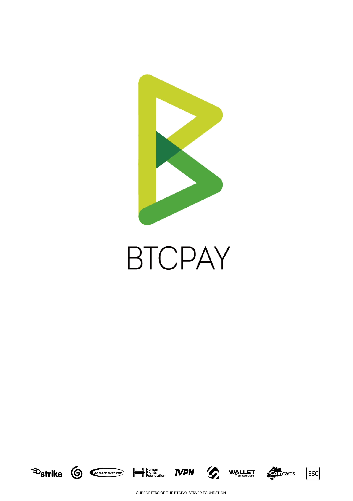
