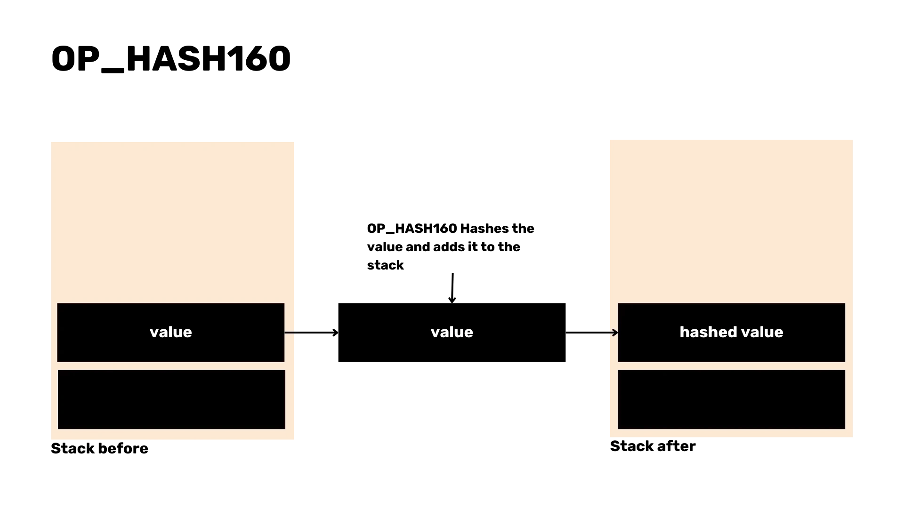

Welcome to the Cubo+ development courses for Bitcoin!

Over the next 20 hours, you will dive deep into the BTC and LN protocols. This course is designed for programmers who want to start working in the BTC ecosystem and are seeking a solid understanding of the different technology stacks of BTC and LN.

The videos were recorded live during the CUBO+ 2023 bootcamp in El Salvador and succeeded in bringing together world-renowned teachers. This course was offered for free thanks to the generosity of Fulgure Venture and the collaborative efforts of the teachers, the Bitcoin office, DecouvreBitcoin, and many other actors.

Enjoy!

+++

# Introduction and preparatory courses

<partId>43a835de-c4e7-542b-9d1a-c92f049e88e6</partId>

## Introduction to CUBO+ courses

<chapterId>dcf2d37e-b32a-5eb8-aaa3-41ac92475ba9</chapterId>


Filippo and Mario provide an introductory talk on CUBO+ 2023, setting the stage for the comprehensive learning journey that awaits. They discuss the structure of the courses, the learning outcomes, and how these will empower students in the Bitcoin development space.

### Objectives

The course aims to equip participants with a deep understanding of Bitcoin's underlying principles, practical development skills, and the ability to navigate and contribute to the Bitcoin ecosystem effectively. Through a blend of theoretical knowledge and practical exercises, students will master the essentials of Bitcoin security, the intricacies of its software stack, and the mechanisms of its governance.

### Prerequisite

Participants are expected to bring a strong sense of curiosity, an eagerness to learn at a professional level, and some foundational knowledge in development. While a detailed background in Bitcoin is not required, a basic understanding of coding principles and an openness to engaging with complex technical concepts are essential for making the most of the accelerator.

#### Tools

Throughout the course, participants will leverage key tools that will aid their understanding and enhance their learning experience. The use of Linux, the command line interface, GitHub, and Docker will be integral in providing a hands-on approach to Bitcoin development. These tools will facilitate working with the Bitcoin software stack, managing development environments, and collaborating on projects in a real-world setting.

## Why Bitcoin

<chapterId>89a0aa8b-90bd-58b2-82b3-bc5e1f82eaeb</chapterId>

### Why El Salvador Needs Bitcoin


Welcome to the first lecture of the **Cubo Plus** educational program. Today, we are diving into the world of Bitcoin, led by Ricky, the founder of the **Bitcoin Italia Podcast**. Ricky is a passionate human rights activist who uses Bitcoin as a tool to protect and promote human rights. With over six years of experience, Ricky has traveled extensively, documenting Bitcoin adoption in emerging markets like El Salvador and Guatemala. His work goes beyond podcasting; he’s also active on YouTube (**Bitcoin Explorers**) and Twitter (**BTC Explorer**, **Ricky6**). Ricky's commitment to Bitcoin stems from his belief that it offers financial freedom and privacy, challenging traditional, centralized banking systems.


_The Global Unbanked Population_

### Bitcoin: Financial Freedom and Its Impact on El Salvador

This lecture, **"Why El Salvador Needs Bitcoin,"** provides an overview of the **Bitcoin protocol**, its roots in the **Cypherpunk movement**, and its role as a tool for freedom—enabling **uncensored money**, **financial inclusion**, and much more.

> **Definitions:**
>
> - _Bitcoin protocol:_ The rules and structure that govern how Bitcoin operates as a decentralized digital currency.
> - _Cypherpunk movement:_ A group advocating for the use of cryptography to ensure privacy and freedom in digital spaces.
> - _Financial inclusion:_ Providing access to financial services for people who have been excluded from traditional banking systems, often referred to as the "unbanked."
> - _Uncensored money:_ Money that cannot be controlled or restricted by governments or financial institutions.

#### Ricky's Background and Bitcoin Advocacy

Ricky’s journey into Bitcoin is rooted in his work as a human rights advocate. He believes that Bitcoin can provide individuals with control over their finances, allowing them to protect their privacy and avoid the limitations of centralized banks. His exploration of Bitcoin's adoption in places like El Salvador highlights how this technology can empower people in emerging markets to gain financial independence.

### The Global Significance and Challenges of Bitcoin

Bitcoin is much more than just a digital currency. It is a tool for protecting privacy and ensuring financial freedom. By using **private keys**, which act like master passwords, users can securely manage their Bitcoin, with full control over their funds.

In authoritarian regimes, where financial repression is common, Bitcoin’s **uncensorable nature** allows people to transact without fear of their funds being frozen or confiscated. Its **open-source** nature encourages global participation, fostering a community that continually improves the network.


Despite its potential, Bitcoin faces significant challenges. In areas such as Africa and India, basic infrastructure like electricity and internet access is often lacking, limiting adoption. Moreover, **digital inclusion**—ensuring that people of all ages and educational levels can use technology—remains a major hurdle.

> **Definitions:**
>
> - _Private keys:_ Secret codes that give access to a user's Bitcoin.
> - _Open-source:_ Software that anyone can inspect, modify, and improve.

### The Case of El Salvador

El Salvador's decision to adopt Bitcoin as legal tender demonstrates its transformative potential. By using Bitcoin, the country seeks to attract foreign investment and foster financial stability. Projects like **Bitcoin Beach** show how local economies can grow by adopting Bitcoin as a means of exchange.

However, global Bitcoin adoption faces obstacles such as ignorance, resistance to new technologies, and challenges in infrastructure. The path to a more inclusive financial system—where Bitcoin can help elevate developing nations—is long but promising. The decentralized and open-source nature of Bitcoin offers hope for a future where financial fairness is available to everyone.

#### Conclusion

In summary, Bitcoin holds immense promise for financial empowerment and inclusion, but significant challenges lie ahead. Staying engaged with the Bitcoin community, learning, and asking questions will be key to realizing a decentralized financial future. Through collaboration and advocacy, the vision of a fairer financial system for all can become a reality.

### Cypherpunk Movement and Austrian Economics


#### Cypherpunk Movement

The **Cypherpunk movement** emerged in the late 20th century, advocating for privacy and freedom through cryptography. Pioneers like **Eric Hughes** and **Tim May** believed that strong encryption was essential to protect personal freedom in a digital world. Their ideas heavily influenced the creation of Bitcoin.

> **Definition:**
>
> - _Cypherpunk:_ A movement promoting privacy and freedom using cryptography.

#### Austrian Economics

At the same time, **Austrian Economics** provided the foundation for Bitcoin's monetary principles. Economists like **Ludwig von Mises** and **Friedrich Hayek** argued that sound money should be scarce, durable, and a good store of value—core principles that shaped Bitcoin’s design.

> **Definition:**
>
> - _Scarcity:_ Limited availability, creating value through the need for careful allocation.

### Bitcoin's Creation

**Satoshi Nakamoto** combined these ideas to create Bitcoin in 2008 as a decentralized, censorship-resistant digital currency. By merging Cypherpunk ideals of privacy with Austrian principles of sound money, Bitcoin offers a financial system that challenges traditional banks and government control.

> **Definition:**
>
> - _Censorship-resistant:_ Money that cannot be controlled or blocked by external forces.

#### Key Economic Principles

- **Scarcity:** Bitcoin’s fixed supply ensures its value over time.
- **Time preference:** Encourages saving for the future rather than spending immediately.
- **Saving:** Storing value for future needs, which leads to investment and innovation.

> **Definitions:**
>
> - _Time preference:_ Valuing present goods over future ones.
> - _Saving:_ Storing value for future use.

### Bitcoin in El Salvador

El Salvador's adoption of Bitcoin reflects its potential as a tool for financial freedom, aligning with **Austrian Economics** by promoting voluntary adoption and decentralization. This move challenges traditional financial systems by addressing key issues: competition, monopoly, and confiscation.


- **Competition**: Bitcoin introduces competition to the financial landscape by offering an alternative to traditional banking, allowing Salvadorans to bypass financial gatekeepers and choose services that better meet their needs.

- **Monopoly**: By decentralizing financial access, Bitcoin breaks the monopoly of banks and government-issued currencies, reducing reliance on centralized institutions and fostering financial inclusion.

- **Confiscation**: Bitcoin’s resistance to confiscation provides Salvadorans with control over their assets, protecting their wealth from external seizure and enhancing financial sovereignty.

El Salvador’s embrace of Bitcoin promotes a more inclusive, competitive, and secure financial system, challenging the limitations of traditional finance.

#### Conclusion

Bitcoin’s foundations in the **Cypherpunk movement** and **Austrian Economics** make it a unique and revolutionary form of money. Understanding these principles helps in grasping why Bitcoin was created and how it operates today. For further reading, consider **The Bitcoin Standard** by **Saifedean Ammous**.

Thank you for engaging with this material!

## How Bitcoin

<chapterId>d800970a-0d8e-5557-810a-7aef845d4a34</chapterId>

### Bitcoin's Technology Stack


In the first lecture of the 'How Bitcoin' course, we began exploring the technology stack that underpins the Bitcoin network. We covered topics such as **Hashcash**, **transactions**, the **blockchain**, the **Lightning Network**, and other key components of the Bitcoin protocol.

### Bitcoin's Technological Stack Part 2


During the second lecture of 'How Bitcoin', we conducted a more in-depth examination of Bitcoin's technology stack.


### Bitcoin Structure

The origins of Bitcoin are based on several key innovations, starting with **Adam Back's Hashcash**, a proof-of-work (PoW) system designed to prevent email spam and denial-of-service attacks by requiring senders to complete computational tasks. This PoW concept became a cornerstone of Bitcoin's security.

Bitcoin relies on **digital signatures** using **elliptic curve cryptography** to secure and verify transactions. The **Elliptic Curve Digital Signature Algorithm (ECDSA)** ensures that only the rightful owner of Bitcoin can authorize transactions without revealing their private keys.

**Satoshi Nakamoto**, Bitcoin's pseudonymous creator, expanded on these ideas by transitioning the PoW model to a decentralized **blockchain**. This allowed for a distributed network of nodes to validate and record transactions without a central authority, marking a significant evolution from previous digital currency attempts.

> **Definitions:**
>
> - _Proof-of-Work (PoW):_ A system where participants must solve computational puzzles to validate transactions and secure the network.
> - _Elliptic Curve Cryptography:_ A cryptographic method that enables secure, efficient digital signatures.

### Blockchain Mechanics and Transaction Validation

Bitcoin transactions are validated and added to blocks by **miners**, who compete to solve a cryptographic puzzle using the proof-of-work algorithm. This involves finding a hash with a specific number of leading zeros by adjusting a **nonce** value until the correct hash is discovered.

Each **block** in the blockchain consists of a **header** (with data like the previous block’s hash) and a list of transactions. The first block, known as the **Genesis Block**, is unique because it has no predecessor.


Before transactions are included in a block, they reside in the **mempool**, where they await validation. Once validated, these transactions are added to the newly mined block and then to the blockchain.

> **Definitions:**
>
> - _Mining:_ The process of solving cryptographic puzzles to add new blocks to the blockchain.
> - _Nonce:_ A value used to find the correct hash during mining.
> - _Mempool:_ A waiting area for unconfirmed transactions before they are added to a block.

### Scalability, Privacy, and Development in Bitcoin

Bitcoin faces challenges related to scalability and privacy. The limited transaction capacity of the blockchain makes it difficult to handle high transaction volumes. Solutions like the **Lightning Network** address these challenges by enabling off-chain transactions through payment channels, which increase speed and privacy.

Running a **full node** is essential for ensuring decentralization and security, but **Simplified Payment Verification (SPV) nodes** allow lighter participation at the cost of some security.

Bitcoin development has evolved to improve performance and security. Major upgrades include **Segregated Witness (SegWit)**, which addresses transaction malleability and increases the effective block size, and **Taproot**, which improves privacy and allows for more complex contracts using **Merkleized Abstract Syntax Trees (MAST)**.

> **Definitions:**
>
> - _SegWit:_ A Bitcoin upgrade that separates signature data from transaction data, improving efficiency.
> - _Taproot:_ An upgrade that enhances Bitcoin’s privacy and scalability by enabling more complex smart contracts.
> - _Lightning Network:_ A second-layer solution for faster, cheaper Bitcoin transactions using payment channels.

#### Conclusion

Bitcoin's structure and ongoing evolution showcase the innovation and adaptability of its technology. From **Hashcash** to a decentralized blockchain, and from **SegWit** to **Taproot**, Bitcoin continues to address challenges related to scalability, privacy, and security. The continuous efforts of the community ensure that Bitcoin remains resilient and decentralized while evolving to meet the demands of the future.

## Debunk Bitcoin

<chapterId>171ec71d-3028-5820-9b4f-36682113fc81</chapterId>

### Debunking Bitcoin


In this lecture, we debunk common myths surrounding **Bitcoin**, **blockchains**, and **cryptocurrencies**. Let's address misconceptions about Bitcoin's energy consumption, criminal usage, and the broader "FUD" (fear, uncertainty, doubt) spread about this technology.

### Bitcoin vs. Blockchain

A frequent misconception is that **Bitcoin** and **blockchain** are the same. While Bitcoin is a digital currency, **blockchain** is the technology that powers it. Blockchains provide a verified record of transactions but come with trade-offs like slower speeds and higher costs, which solutions like the **Lightning Network** address.

> **Definitions:**
>
> - _Blockchain:_ The underlying technology used to record transactions in a decentralized, immutable ledger.
> - _Lightning Network:_ A second-layer solution that improves Bitcoin's transaction efficiency by enabling off-chain transactions.

### Bitcoin vs. Crypto

Another key distinction is that **Bitcoin** was created with the sole purpose of providing a decentralized, censorship-resistant form of money, free from control by any company or government. In contrast, cryptocurrencies **shitcoins** are often designed with centralized control, primarily existing to enrich the companies behind them through predatory practices, pump-and-dump schemes, or outright scams. These tokens typically serve no genuine purpose beyond making a quick profit for their creators at the expense of uninformed investors. Bitcoin, however, stands alone as the only truly decentralized digital currency with a proven track record of security and resilience.

> **Definitions:**
>
> - _Shitcoins:_ Shitcoins are low-value or questionable quality cryptocurrencies that lack real utility. They are often highly speculative and are sometimes created for fraudulent purposes or without a clear purpose, taking advantage of the cryptocurrency market boom.


### Energy Consumption and Environmental Impact

One of the most common criticisms of Bitcoin is its **energy consumption**. While Bitcoin mining does use energy, it accounts for less than 1% of global electricity consumption and less than 3% of wasted energy. Moreover, **Bitcoin mining** often taps into unused or renewable energy sources, making it greener than often portrayed.

> **Definitions:**
>
> - _Bitcoin Mining:_ The process of validating transactions and securing the network by solving cryptographic puzzles, which requires computational power.

### Misconceptions About Criminal Usage

Bitcoin is often criticized for being used in criminal activities. However, blockchain analysis shows that only a small percentage of Bitcoin transactions are linked to crime. In reality, traditional financial systems see far more criminal use than Bitcoin.

### Privacy and Fungibility

**Privacy** and **fungibility** are essential features of Bitcoin. Privacy protects users in oppressive regimes, and fungibility ensures that every Bitcoin is equal, regardless of its history. This makes Bitcoin a reliable and fair form of money.

> **Definitions:**
>
> - _Fungibility:_ The property of money where each unit is interchangeable with another, ensuring equal value.

### Handling FUD and Market Dynamics

FUD surrounding Bitcoin often exaggerates concerns about its environmental impact, criminal usage, and security. While market fluctuations will occur, Bitcoin’s decentralized and sound technology provides a solid foundation for long-term stability and financial freedom, particularly in restrictive environments like Venezuela.

#### Conclusion

Understanding the realities of Bitcoin’s energy consumption, privacy features, and role in crime prevention helps dispel the myths surrounding it. By cutting through the FUD, we can appreciate Bitcoin’s potential as a revolutionary form of sound money that promotes privacy, security, and decentralization.

## Running Bitcoin

<chapterId>5f638ec9-a6c1-5716-b27f-d837ab896eb1</chapterId>
<professor>radio-talent</professor>

### Installation of Bitcoin Core


In the first lecture of the 4th module, we explored Bitcoin's architecture and the installation of a Bitcoin Core node.

### Running a Bitcoin Node

**1. Introduction Recap**
Welcome back! In the previous session, we covered the fundamental concepts behind Bitcoin’s architecture, including its cryptographic foundations and the peer-to-peer network structure. Today, we'll move from theory to practice by demonstrating how to install and configure a Bitcoin node.

**2. Practical Session Overview**
In this session, Alekos will walk us through the process of setting up a Bitcoin node using a virtual machine. This hands-on tutorial is designed to familiarize you with the steps involved in configuring your node to participate in the Bitcoin network.


Running a Bitcoin node involves validating transactions and blocks, enforcing consensus rules, and supporting the network’s decentralization. Setting up a node ensures you have a direct connection to the Bitcoin network, allowing you to contribute to its security and integrity.

In this lecture, you will find a guide to install and run your own Bitcoin Core, learn how to prune the blockchain to save space, and begin experimenting with the software. Alekos will guide you step by step through this exciting process.

### What You Can Do with Bitcoin Core and Its Benefits

By running Bitcoin Core, you gain the ability to:

- **Validate your own transactions and blocks**: Ensuring that the Bitcoin network's rules are followed without relying on third parties.
- **Strengthen the network**: By participating in the network, you help keep it decentralized, making Bitcoin more resilient to attacks.
- **Prune the blockchain**: Reduce the storage requirements by keeping only the most recent transactions, which is ideal if you have limited disk space.
- **Use advanced wallet features**: Manage your Bitcoin with privacy and security, generate private keys offline, and sign transactions securely.
- **Interact with the Bitcoin network directly**: By using Bitcoin Core, you can connect directly to the network without intermediaries, ensuring you get the most accurate data.
- **Benefit from increased privacy**: As a full node operator, you don’t have to trust external services, protecting your transaction privacy from external surveillance.

The benefits of running a Bitcoin node are substantial for any dedicated Bitcoiner. Not only do you help secure the network and reinforce its decentralization, but you also enhance your privacy, ensure the integrity of your own transactions, and take a proactive role in the Bitcoin ecosystem. Running a node is a key step in achieving financial sovereignty and fully embracing the decentralized nature of Bitcoin.

### Fundamental Commands

These are some of the basic commands when configuring your node:

- **Check the status of the Bitcoin daemon**:

  ```bash
  sudo systemctl status bitcoind
  ```

- **Start the Bitcoin daemon:**:

  ```bash
    systemctl start bitcoind
  ```

- **Stop the Bitcoin daemon:**:

  ```bash
    sudo systemctl stop bitcoind
  ```

  - **Get detailed information**:

  ```bash
    bitcoin-cli getblockchaininfo
  ```

- **Prune the blockchain to save disk space by keeping only the most recent blocks:**:

  ```bash
    prune=550
  ```

- **Enable the Bitcoin Core server and configure RPC settings:**:

  ```bash
    server=1
    rpcuser=yourusername
    rpcpassword=yourpassword
  ```

- **Check the status of the Bitcoin daemon**:

  ```bash
  sudo systemctl status bitcoind
  ```

- **Check the balance of your Bitcoin wallet:**:
  ```bash
    sudo systemctl status bitcoind
  ```

### Installation of C-lightning


#### 1. **Bitcoin Core Recap**

Let's start with a brief recap of the steps involved in installing Bitcoin Core on a cloud VM, as this will be crucial for our subsequent setup of C-Lightning.

**Reinstalling Bitcoin Core on a Cloud VM**
To begin, you'll want to reinstall Bitcoin Core on your virtual machine. For this session, we'll skip the verification of binaries to save time, but remember that in a production environment, verifying binaries is a critical step to ensure security.

**Download and Verify File Hashes**
First, download the latest Bitcoin Core release and verify the file hashes to ensure no tampering has occurred.

```sh
wget https://bitcoin.org/bin/bitcoin-core-22.0/bitcoin-22.0-x86_64-linux-gnu.tar.gz
sha256sum bitcoin-22.0-x86_64-linux-gnu.tar.gz
# Compare the output hash with the official hash
```

**Install the Binary and Configure Auto-Start with systemd**
Next, install the binary and set it up to auto-start using systemd.

```sh
tar -xzf bitcoin-22.0-x86_64-linux-gnu.tar.gz
sudo install -m 0755 -o root -g root -t /usr/local/bin bitcoin-22.0/bin/*
```

**Create a systemd service file:**

```sh
sudo nano /etc/systemd/system/bitcoind.service
```

**Add the following configuration:**

```ini
[Unit]
Description=Bitcoin daemon
After=network.target

[Service]
ExecStart=/usr/local/bin/bitcoind -daemon
User=bitcoin
Group=bitcoin
Type=forking
PIDFile=/var/lib/bitcoind/bitcoind.pid
Restart=on-failure

[Install]
WantedBy=multi-user.target
```

**Create and Configure Bitcoin User and Directories**
Create a dedicated user and set up directories for Bitcoin Core.

```sh
sudo adduser --disabled-login --gecos "" bitcoin
sudo mkdir -p /var/lib/bitcoind
sudo chown bitcoin:bitcoin /var/lib/bitcoind
```

**Use Minimal Disk Space by Pruning the Blockchain**
To save disk space, enable pruning in the configuration file.

```sh
sudo nano /var/lib/bitcoind/bitcoin.conf
```

Add the following lines:

```ini
prune=550
```

With these steps, you should have Bitcoin Core up and running with minimal disk usage, ready to interact with C-Lightning.

#### 2. **C-Lightning Overview and Installation**

**C-Lightning Overview**

C-Lightning, also known as Core-Lightning, is a Layer 2 protocol that facilitates faster and cheaper transactions using off-chain channels. It stands out due to its modular and developer-friendly architecture, which allows for extensive customization through plugins.

**Importance of Modularity and Extensibility with Plugins**
The modular design of C-Lightning means you can add or remove features as needed, enabling you to tailor the system to specific use-cases. Example use-cases include:

- **Payment Processing**: Custom plugins can handle specific payment conditions.
- **Routing Fees**: Adjust routing fees dynamically based on network conditions.
- **Automation**: Automate tasks like channel management and liquidity provisioning.

### C-Lightning Installation

Let's move on to installing C-Lightning.

**Use the Latest Stable Release**
For this lecture, we'll use the latest stable release, e.g., 22.11.1.

```sh
wget https://github.com/ElementsProject/lightning/releases/download/v22.11.1/clightning-v22.11.1.tar.gz
sha256sum clightning-v22.11.1.tar.gz
# Verify the hash against the provided hash
```

**Verify Integrity with GPG Keys**
Always verify the integrity of the downloaded file with GPG keys.

```sh
gpg --recv-keys <developer-key-id>
gpg --verify clightning-v22.11.1.tar.gz.asc clightning-v22.11.1.tar.gz
```

**Install Dependencies and Compile from Source Code**
Install the necessary dependencies and compile C-Lightning from the source.

```sh
sudo apt-get update
sudo apt-get install -y autoconf automake build-essential git libtool libgmp-dev \
                        libsqlite3-dev python3 python3-mako net-tools zlib1g-dev
tar -xzf clightning-v22.11.1.tar.gz
cd clightning-v22.11.1
./configure
make
sudo make install
```

**Configure the systemd Service for Auto-Start**
Create a systemd service file for C-Lightning:

```sh
sudo nano /etc/systemd/system/lightningd.service
```

Add the following configuration:

```ini
[Unit]
Description=C-Lightning daemon
After=network.target bitcoind.service

[Service]
ExecStart=/usr/local/bin/lightningd
User=bitcoin
Group=bitcoin
Type=simple
Restart=on-failure

[Install]
WantedBy=multi-user.target
```

#### 3. **Configuration and Setup**

**Create Necessary Directories and Configuration Files**
Create directories and configuration files required for C-Lightning.

```sh
sudo mkdir -p /var/lib/lightning
sudo chown bitcoin:bitcoin /var/lib/lightning
sudo -u bitcoin nano /var/lib/lightning/config
```

Add the following lines to the config file:

```ini
network=testnet
log-level=debug
plugin=/usr/local/libexec/c-lightning/plugins
```

**Configure C-Lightning to Connect with Bitcoin Core on Testnet**
Ensure that C-Lightning can connect with Bitcoin Core by adding the following lines:

```ini
bitcoin-datadir=/var/lib/bitcoind
bitcoin-rpcuser=<rpcusername>
bitcoin-rpcpassword=<rpcpassword>
```

**Ensure Compatibility and Synchronization**
Start the services and ensure they are compatible and synchronized.

```sh
sudo systemctl start bitcoind
sudo systemctl start lightningd
sudo systemctl enable bitcoind
sudo systemctl enable lightningd
```

**Address File Paths and Permissions, Especially for Tor Integration**
Configure file paths and permissions to ensure smooth operation, especially if using Tor for privacy.

```sh
sudo apt-get install tor
sudo -u bitcoin nano /var/lib/lightning/config
```

Add the following for Tor integration:

```ini
proxy=127.0.0.1:9050
```

**Backup HSM Secret for Fund Recovery**
Backup the HSM secret for fund recovery.

```sh
sudo cp /var/lib/lightning/hsm_secret /path/to/secure/location
```

**Test Connections and Validate Node's Operational Status**
Finally, validate the operational status of your node by testing connections and ensuring everything works as expected.

```sh
lightning-cli getinfo
```

By following these steps, you will have a fully functional C-Lightning setup connected to your Bitcoin Core node, ready for testnet transactions.

#### Conclusion & Questions

In conclusion, today we covered the essential steps for reinstalling Bitcoin Core, followed by a detailed walkthrough of installing and configuring C-Lightning. If you have any questions, please feel free to ask now or prepare them for further clarification in our next session. Remember, practical hands-on experience is crucial, so use the Testnet setup we discussed to gain more insights.

### Security and Hardware devices


### Specter and Ledger Device

#### Introduction

Welcome to our lecture on security and device setup for Bitcoin. Today's focus is on understanding the utilization of security tools, particularly the Specter desktop wallet and Ledger hardware wallet, and how to configure them effectively for enhanced Bitcoin security.

**Tools: Specter Desktop Wallet and Ledger Emulator**

Specter is a desktop wallet designed to facilitate the creation and management of Bitcoin wallets, particularly those using hardware devices. For our demonstration, we'll employ a Ledger emulator, which mimics a Ledger hardware wallet's functionality.

**Difference Between Ledger Device and Company Controversy**

The Ledger device, a popular hardware wallet, is celebrated for its robust security. However, the company behind Ledger has faced scrutiny due to various controversies concerning user data privacy. Understanding the distinction between the physical device's security and the company's practices is crucial for informed usage.

**Security Models: Importance of Multi-Sig Wallets and Diverse Hardware**

A key aspect of Bitcoin security is leveraging multi-signature (multi-sig) wallets. Multi-sig wallets require multiple private keys to authorize a transaction, significantly enhancing security. Additionally, using different types of hardware wallets diversifies risk and strengthens the security model.

### Setup and Configuration

**Downloading and Setting Up Specter**

The first step in our setup process involves downloading Specter from its official repository. It's crucial to verify the integrity of the download to avoid compromised software. Once downloaded, install Specter on your desktop and launch the application.

**Configuring Specter to Connect with Bitcoin Core or Electrum Servers**

To configure Specter, you need to connect it to a Bitcoin Core or Electrum server. These servers provide the necessary blockchain data for wallet operations. Configuration involves setting the server address in Specter's settings and ensuring a stable connection.

**Explaining Derivation Paths and Public Key Retrieval**

Understanding derivation paths is essential for wallet management. Derivation paths define how keys are generated from a master key. In Specter, you can retrieve public keys by connecting your hardware wallet (or emulator) and navigating through the wallet interface. Ensure you document these paths for future reference.

**Practical Demonstration: Using Ledger Emulator**

We'll now use a Ledger emulator to fetch keys. This involves connecting the emulator to Specter, navigating to the key management section, and selecting the appropriate keys for wallet creation.

**Creating and Managing Wallets in Specter**

Creating a wallet in Specter is straightforward. Access the wallet creation interface, input the necessary details, and include your retrieved public keys. Once created, you can manage the wallet, monitor transactions, and ensure robust security practices.

**Receiving and Monitoring Transactions**

After the wallet setup, receiving transactions is as simple as sharing your wallet address. Specter provides real-time monitoring of incoming transactions, ensuring you're always up-to-date on your wallet's status.

### Advanced Configurations

**Setting Up Remote Specter Daemon**

For advanced users, setting up a remote Specter daemon can enhance accessibility and security. This involves configuring a remote server to run Specter's backend, allowing secure access from different devices.

**Enabling Tor for Privacy**

To bolster privacy, configuring Specter to use Tor is highly recommended. Tor anonymizes your network traffic, protecting your IP address from potential surveillance. This is particularly important for users concerned about privacy and security.

**Connecting to Remote Nodes Securely**

When connecting to remote nodes, ensure the connection is secure. This involves using SSL/TLS certificates and verifying the node's authenticity. Secure connections prevent man-in-the-middle attacks and ensure data integrity.

**Debugging Issues: Practical Techniques**

Encountering issues is inevitable. Practical debugging involves checking user permissions, verifying data directory access, and consulting logs for errors. For example, ensure Specter has the necessary permissions to access the Bitcoin Core data directory to avoid operational disruptions.

**Example Issue: Data Directory Access**

A common issue is incorrect data directory access. Verify that the path to your Bitcoin Core data directory is correctly set in Specter's configuration. This ensures Specter has access to the necessary blockchain data for wallet operations.

**Next Steps and Integration**

As we conclude, the next steps involve integrating Specter with the Lightning network. This enables sending funds from Specter to a Lightning node, facilitating faster and cheaper transactions. Future lessons will cover this integration in detail, enhancing your Bitcoin transaction capabilities.

**Block Timing Variability**

Understanding block timing variability is crucial. Bitcoin blocks can be mined at varying intervals, affecting transaction confirmation times. This variability must be accounted for in all configurations and wallet operations.

**Learning Resources**

For additional learning, consider resources like "Mastering the Lightning Network" and Rusty Russell's tutorials. These materials provide in-depth knowledge on Lightning nodes and advanced Bitcoin configurations.

**Node Installation and Tor Security**

Installing nodes, whether locally or remotely, benefits from using Tor for enhanced security. Running your own node ensures personal transaction validation, improving security and privacy.

**Philosophy: Self-Sufficiency in Learning**

Embrace a philosophy of self-sufficiency. Practical skills and self-learning are paramount, often surpassing formal education's benefits. Engage in hands-on practices to deepen your understanding of Bitcoin security.

**Privacy Considerations**

Maintain privacy by avoiding services that track or log transactions. Anonymity is crucial for secure Bitcoin operations, and careful service selection helps protect your identity and transaction history.

This concludes our lecture on security and device setup for Bitcoin using Specter and Ledger. Feel free to ask any questions or seek clarification on any points discussed.

## Improving Bitcoin

<chapterId>4fdd032f-2b05-5f24-a094-297d64f939de</chapterId>

### Open Problems in the Bitcoin ecosystem


Over more than a decade, Bitcoin has proven to be a transformative innovation in the financial world, successfully operating on a global scale and opening new possibilities in the digital economy. However, it still faces challenges that require creative and collaborative solutions. The ongoing evolution of Bitcoin presents a unique opportunity for those interested in shaping the future of decentralized finance.


#### Open Problems in the Bitcoin Usability

Bitcoin, despite its over-a-decade-long existence, still grapples with significant usability challenges. The tools and interfaces available to users often lack the maturity and user-friendliness found in more traditional financial systems. This is particularly evident in regions such as El Salvador, where Bitcoin adoption has been government-endorsed. The primary issue here is the need for better abstractions that can simplify the user experience, making Bitcoin accessible even to individuals with minimal technical know-how.

#### Open Problems in Scalability

Scalability has been a persistent problem in Bitcoin's development. The network's ability to handle a high volume of transactions remains limited, often leading to high on-chain fees that can exclude some users from participating. While solutions like the Lightning Network offer some relief by enabling off-chain transactions, they do not fully address the scalability concerns. The need for more comprehensive solutions that can handle growing transaction volumes without compromising the network's integrity is evident.

#### Open Problems in Security

Securing Bitcoin assets is a complex task, fraught with challenges. Hot wallets, which are often used for everyday transactions, pose significant security risks, especially for those who operate Lightning nodes. Additionally, planning for the inheritance of Bitcoin assets remains a convoluted and often insecure process. The complexity of these security measures can deter potential users and complicate widespread adoption.

#### Open Problems in Privacy

Privacy is another critical issue within the Bitcoin ecosystem. While privacy is essential for security, Bitcoin's current framework offers limited privacy features. On-chain transactions are easily traceable, posing a risk to user anonymity. Although the Lightning Network has the potential to enhance privacy, it still requires substantial improvements. The balance between transparency and privacy is delicate and demands innovative solutions to ensure user security and privacy.

#### Open Problems in Flexibility

Flexibility within the Bitcoin protocol is necessary to foster improvements in privacy, security, and scalability. However, too much flexibility can become a vulnerability, potentially serving as an attack vector and threatening the network's decentralization. Striking the right balance is crucial to maintain the integrity and resilience of the Bitcoin protocol.

### Trade-offs in Enhancing Bitcoin

#### Usability vs. Security and Privacy


Efforts to enhance Bitcoin's usability often come at the expense of security and privacy. For instance, user-friendly custodial wallets, such as the Wallet of Satoshi, provide an accessible interface but compromise significantly on security and privacy. Simplified systems may increase usability but can lead to issues like address reuse, which undermines privacy. Therefore, any improvements in usability must be carefully weighed against potential security and privacy trade-offs.

#### Scalability and Privacy Trade-offs

Scalability and privacy are often at odds in the Bitcoin network. Enhancements that improve scalability, such as larger UTXOs or reduced cryptographic obfuscation, generally diminish privacy. Conversely, privacy-focused techniques like Monero's ring signatures enhance user anonymity but negatively impact scalability. Furthermore, the introduction of stateful contracts, as seen in Ethereum, offers increased flexibility at the cost of reduced security and scalability. Balancing these trade-offs is a complex challenge that requires meticulous consideration.

### Privacy Techniques

Different approaches to privacy in Bitcoin come with their own sets of trade-offs. Privacy by obfuscation, which involves adding more information to obscure relevant data, can enhance privacy but may complicate the network. Examples include Monero and Zcash. On the other hand, privacy by omission, which aims to reduce on-chain information, as seen in the Lightning Network, can improve both privacy and scalability. Each method has its advantages and drawbacks, necessitating a nuanced approach to privacy enhancements.

### Consensus Changes and Challenges

Altering Bitcoin's consensus mechanism is a rare and challenging endeavor due to the network's decentralized nature. Proposals like ChISA (cross-input signature aggregation) and covenants aim to introduce more complex transaction rules, but their implementation is fraught with difficulties. Consensus changes require broad agreement within the community, and the coordination needed can lead to significant frustration and burnout if proposed changes are not accepted. This highlights the need for careful and collaborative efforts in protocol development.

### Innovations and Standards in Bitcoin Development

Adhering to standardized practices in Bitcoin wallet development is crucial for ensuring ease of use and security. Many wallets currently do not follow established standards, leading to fragmentation and potential vulnerabilities. Standardization can significantly improve user experience and the overall security of Bitcoin transactions.

The traditional 12-word backup phrases, while effective for basic Bitcoin use, fall short in accommodating off-chain protocols like the Lightning Network. Future backup standards need to evolve to provide better security and usability for these advanced features, ensuring that users can safely manage their assets across different layers of the Bitcoin ecosystem.

Simplifying the payment process through unified protocols is essential for enhancing user experience. Existing protocols like BIP70, BIP78, and Payneem offer various solutions, but there is room for further innovation. A more streamlined and user-friendly payment protocol can facilitate broader adoption and ease of use.

The development of better tools and hardware is vital for improving Bitcoin's usability and security. Innovations like hardware wallets (e.g., Ledger and Trezor) offer robust security solutions but must continue to evolve to address emerging threats. Improved tools can make Bitcoin more accessible and secure for a wider audience.

Mitigating risks associated with hardware wallet distribution and ensuring their integrity is crucial. Supply chain attacks pose significant threats to the security of these devices. Implementing rigorous security measures and ensuring transparency in the production and distribution process can help mitigate these risks.

Simplifying user interactions with Bitcoin and the Lightning Network while maintaining security and efficiency is a key goal. Better UX abstractions can make Bitcoin more accessible to non-technical users, fostering broader adoption without compromising on security.

Creating educational materials to improve Bitcoin's usability, security, and privacy is impactful. Educating users on best practices and the underlying principles of Bitcoin can empower them to make informed decisions and enhance their overall experience with the network.


**Layer 1 and Layer 2 Changes**

Innovations at the base layer (Layer 1) are challenging but critical for the long-term evolution of Bitcoin. Layer 2 solutions, like the Lightning Network, allow for more experimental changes and can address scalability and privacy issues more flexibly. Both layers play a crucial role in Bitcoin's ongoing development.

**Consensus Coordination**

Changes to Bitcoin's protocol require significant coordination and community consensus. The decentralized nature of Bitcoin makes this process inherently challenging. Effective coordination and clear communication are essential to navigate the complexities of protocol changes and ensure the successful adoption of improvements.

**Scalability Challenges**

Achieving global consensus and managing complex secondary layers, such as the Lightning Network, present scalability challenges. These issues must be addressed to ensure Bitcoin can accommodate increasing transaction volumes while maintaining its core principles of security and decentralization.

In conclusion, continuously addressing these open problems and innovating within the Bitcoin ecosystem is crucial for its evolution. The balance between usability, security, privacy, and scalability requires careful consideration and collaborative efforts. By contributing to these developments, participants can help shape the future of Bitcoin and its role in the global financial landscape.

# Bitcoin Fundamentals

<partId>6c0a3691-3ce4-5309-8ad7-e16e4b63c734</partId>

## Security Thinking in Bitcoin

<chapterId>0b97af0c-015a-54e3-a7f0-0f62ceb96c07</chapterId>
<professor>because-drama</professor>


Welcome to today's lecture on **Security and Reliability**. Our objective is to explore the nuanced relationship between these two fundamental aspects of system design and application in real-world scenarios.

### Introduction to Security Thinking

Security thinking is grounded in principles designed to protect systems from intentional attacks. It involves identifying potential threats and implementing measures to mitigate them. In contrast, reliability focuses on ensuring systems function correctly under specified conditions, accounting for probabilistic failures rather than deliberate attempts to breach security.

#### Relationship Between Security and Reliability

While both security and reliability aim to maintain system integrity, their approaches differ significantly. Reliability engineering deals with the likelihood of system failures due to random events and often employs statistical methods to predict and mitigate these failures. On the other hand, security must consider the deliberate and intelligent nature of attacks, requiring a multi-layered defense strategy known as "defense in depth."

#### Security vs. Reliability

A quintessential example of reliability engineering can be traced back to the 18th century with the construction of a bridge. The quality of steel used, including its composition and manufacturing process, critically influenced the bridge’s reliability. Engineers had to consider single points of failure and use probability and statistics to assess and ensure the bridge's dependability over time.


Unlike reliability, security deals with intentional threats. For instance, a 256-bit cryptographic key provides a mathematical guarantee of security due to the infeasibility of brute-forcing it. Security measures must account for different threat models, from physical tampering to sophisticated cyber-attacks.

### Real-World Applications

Consider the process of creating and storing Bitcoin keys using paper wallets. While paper wallets can be secure, they are susceptible to physical damage and tampering. Ensuring the integrity of such wallets requires tamper-evident methods and robust verification protocols.

In another scenario, imagine an airport pickup where a driver uses a secret code to authenticate the passenger. This simple yet effective security measure prevents imposters from deceiving both parties.

In Guatemala, timestamping election results played a critical role in ensuring the integrity of the electoral process. By using cryptographic methods to timestamp data, election officials could provide tamper-evident proof of the results' authenticity, deterring potential manipulators driven by significant financial incentives.


### Identifying and Mitigating Potential Threats

Threat modeling is the process of identifying potential security threats and creating strategies to mitigate them. This involves understanding the system's environment, identifying possible attackers, and developing secure protocols based on assumptions and probabilistic analysis.

#### Creating Secure Protocols

To safeguard elections, for instance, impartial oversight or cross-party monitoring can be implemented to ensure transparency and integrity. Cryptographic methods, such as timestamping and cross-verification, help in maintaining data authenticity and preventing tampering.

#### Trust Verification

Trust verification can be illustrated with PGP (Pretty Good Privacy) verification. By verifying the fingerprints and signatures of PGP keys, users can establish the authenticity of digital identities. Similar practices are essential in verifying software integrity through hash matching (e.g., SHA-256).

#### Establishing Trust Pathways

Building trust is not instantaneous; it requires linking multiple trust pathways and ensuring redundancy. Using HTTPS and blockchain-backed certificate transparency, for instance, ensures the authenticity of web sources, making it difficult for attackers to breach trust.

#### Incentives for Security

Understanding the role of incentives is crucial in maintaining security. For example, Bitcoin’s security model relies on miners' incentives and network participants' validation, highlighting the importance of economic incentives in safeguarding digital ecosystems.

#### Securing Bitcoin Wallets

Strategies for securing Bitcoin wallets include multi-signature setups and diversified storage. These methods ensure that even if one component is compromised, the overall security remains intact.

#### Validation Importance

Finally, user validation is critical in maintaining a secure network. Each user’s role in validating transactions and verifying software and hardware components helps preserve the network’s integrity and thwart potential threats.

In conclusion, comprehending and integrating security and reliability principles are essential in designing robust systems. By learning from historical examples, applying real-world strategies, and continuously validating trust, we can build systems that are both secure and reliable.


## Free and Open Source Software (FLOSS) in Bitcoin

<chapterId>2c59d609-f1ef-53f4-9575-df62e4d066e9</chapterId>
<professor>because-drama</professor>


The use of Free and Open Source Software (FLOSS) is critical in Bitcoin's ecosystem. Peter Todd explores the importance of FLOSS for Bitcoin, exploring the history of FLOSS and examining how Github allow us to collaboratively build open-source software like Bitcoin.

### Nature and Importance of Software

Software, at its core, is a collection of code and data that instructs computing devices on how to perform specific tasks. Unlike hardware, which requires physical materials and manufacturing processes to replicate, software can be easily copied and distributed at virtually no cost. This fundamental difference plays a crucial role in the proliferation and development of software.

One of the key distinctions between software and hardware is the concept of open-source. While open-source hardware exists, it is not as prevalent due to the complexities involved in duplicating physical objects. In contrast, open-source software thrives because of the ease of replication and distribution. Open-source software allows anyone to view, modify, and distribute the code, fostering a collaborative environment that accelerates innovation and problem-solving.

The legal framework governing software primarily revolves around copyright laws. These laws grant the creator of the software exclusive rights to use, modify, and distribute their work. However, open-source licenses provide a mechanism to share these rights with the public, under specific conditions. This legal structure is essential in understanding the dynamics of software distribution and modification.

In summary, software's nature as easily replicable code and data, coupled with the legal mechanisms provided by open-source licenses, underscores its critical importance in the modern digital landscape. This framework not only drives innovation but also ensures that software can be freely shared and improved upon by the global community.

### History of Free Software Movement

The Free Software Movement has its roots in the early 1980s, primarily driven by Richard Stallman's vision of software freedom. Frustrated by the restrictive nature of proprietary software, Stallman embarked on a mission to create software that users could freely use, modify, and share. This led to the founding of the Free Software Foundation (FSF) in 1985.

One of Stallman's significant contributions was the development of the GNU Project, aiming to create a free Unix-like operating system. GNU, which stands for "GNU's Not Unix," provided many essential components of a fully free operating system. However, it lacked a kernel, the core part of the operating system.

The gap was filled by Linus Torvalds' creation of the Linux kernel in 1991. Torvalds' kernel, combined with the GNU components, resulted in a fully functional free operating system known as GNU/Linux. This collaboration between Stallman's philosophical commitment to software freedom and Torvalds' practical contribution exemplifies the power of the open-source approach.


The Free Software Movement has profoundly impacted the software industry, promoting the idea that software should be free for all to use, modify, and share. Its principles have laid the foundation for many of the open-source projects and communities that thrive today.

### Economics and Funding in Open Source

Funding and sustaining open-source projects present unique challenges and opportunities. Unlike proprietary software, which generates revenue through sales and licensing fees, open-source projects often rely on alternative funding models.

One successful example is Bitcoin Core, a critical part of the Bitcoin infrastructure. Developers working on Bitcoin Core are often funded through grants, donations, and sponsorships from organizations that benefit from the project's success. This model allows developers to focus on improving the software without the constraints of traditional commercial funding.


Another prominent example is the Linux operating system. Many companies, such as IBM, Red Hat, and Intel, contribute to the development of Linux because their products and services depend on a robust and secure operating system. These companies provide financial support, contribute code, and offer resources to maintain and enhance the Linux ecosystem.

Open-source licenses, such as the MIT, GPL, and AGPL, also play a crucial role in the economic dynamics of open-source software. Permissive licenses like MIT allow for more flexible use of the code, including commercialization. In contrast, copyleft licenses like GPL ensure that any derivative work must also be open-source, fostering a collaborative environment.


In conclusion, the economics of open-source software are driven by community contributions, corporate sponsorships, and innovative funding models. These mechanisms ensure the sustainability and continuous improvement of open-source projects, benefiting both developers and users.

## Cryptography in Bitcoin

<chapterId>71867dd2-912c-55ad-b59c-9dbca8a39469</chapterId>
<professor>happy-panda</professor>


Welcome! Today, we will dive into the crucial aspects of cryptography that every Bitcoin developer should know. We'll focus on foundational concepts and practical applications without overwhelming you with excessive theoretical details. The primary goal is to equip you with the knowledge to understand, implement, and troubleshoot cryptographic mechanisms in Bitcoin effectively.

### Core Cryptographic Concepts for Bitcoin Developers

In this section, we’ll delve into the key cryptographic concepts essential for Bitcoin developers, including hash functions, Merkle trees, digital signatures, and elliptic curves.


**Hash Functions**: A hash function takes an input and produces a fixed-length string of bytes. In Bitcoin, hash functions are fundamental for data integrity and security. Cryptographic hash functions must be efficient, generate seemingly random outputs, and produce fixed-length outputs regardless of input size. They are used for file integrity checks, ensuring that data has not been altered maliciously.


**Security Properties**: Cryptographic hash functions must adhere to several security properties. Pre-image resistance ensures that it is computationally infeasible to reverse-engineer the original input from the hash output. Second pre-image resistance means it should be difficult to find a different input that produces the same hash output. Collision resistance ensures that it is improbable to find two different inputs that yield the same hash output.

**Merkle Trees**: A Merkle tree is a data structure that enables efficient and secure verification of large data sets. Data items are hashed in pairs, with the resulting hashes combined iteratively to form a single root hash. In Bitcoin, Merkle trees are crucial in block creation and transaction verification, particularly for Simplified Payment Verification (SPV) clients and in Taproot (Mast).


**Digital Signatures (ECDSA)**: The Elliptic Curve Digital Signature Algorithm (ECDSA) is used to ensure authenticity and integrity in Bitcoin transactions. It involves generating a signature using a private key that can be verified using the corresponding public key. Key concepts include understanding finite fields, discrete logarithms, and the importance of nonces.

**Elliptic Curves**: Elliptic curves are used in public key cryptography due to their efficiency and security. The security of elliptic curve cryptography relies on the difficulty of solving the discrete logarithm problem.


### Practical Cryptographic Applications and Security Practices in Bitcoin

In this section, we will explore the application of these concepts in real-world Bitcoin development and the best security practices to follow.

**Cryptography = Danger**: Cryptography is a double-edged sword. While it protects against accidental data damage and malicious actions, incorrect implementation can lead to severe vulnerabilities. Developers must deeply understand cryptographic mechanisms to ensure both secure implementation and the ability to troubleshoot potential issues. For example, SHA-2's 256-bit output ensures preimage attacks require around 2^256 work, with collision resistance around 2^128 work.


**Merkle Tree Applications**: Understanding the logarithmic proof size and ensuring careful tree design is essential to avoid flaws, such as hash duplication in transaction verification. Merkle trees are used in block creation, transaction verification, and enhancements like Taproot.

**Public Key Cryptography**: Discrete logarithms and finite fields are fundamental in cryptographic calculations in Bitcoin. Challenge-response protocols are used to verify knowledge of a private key without revealing it.


**Security Implications**: Historical examples show significant financial losses due to nonce reuse. Understanding the importance of generating unique nonces is crucial. Using trusted libraries like LibSecP256k1 ensures robust and secure cryptographic operations.

**Elliptic Curve Cryptography (ECC)**: Signature schemes have evolved from identity protocols to schemes like Schnorr signatures, currently used in Bitcoin (BIP 340). Knowledge of elliptic curves and finite field arithmetic ensures secure cryptographic implementations.

**General Advice for Developers**: Cryptographic protocols must undergo thorough peer reviews. Developers must be precise and fully understand every step of cryptographic procedures. Awareness of common pitfalls in cryptographic implementations can prevent significant vulnerabilities.

**Elliptic Curves in Cryptography**: Key tweaking and security are important topics, such as modifying a public key using an additional private key while ensuring security. Bitcoin's specific elliptic curve, SECP256K1, and its parameters (P and N) are fundamental to its implementation.

#### Conclusion

In this lecture, we've explored the fundamental cryptographic concepts that underpin the security and functionality of Bitcoin. From the critical roles of hash functions, Merkle trees, and digital signatures to the intricate mathematics of elliptic curve cryptography, these elements form the backbone of Bitcoin's decentralized network. Understanding these concepts isn't just about grasping the theory—it's about recognizing the practical implications and potential pitfalls in real-world development.

As Bitcoin developers, it's essential to approach cryptographic implementations with caution and precision. The security of the Bitcoin network relies heavily on the correct and secure application of these cryptographic principles. Whether you're verifying transactions, designing new features, or ensuring the integrity of the blockchain, a deep knowledge of cryptography will enable you to build more robust, secure, and innovative solutions within the Bitcoin ecosystem.

By mastering these concepts and adhering to best practices, you'll be well-equipped to contribute effectively to the ongoing development of Bitcoin, ensuring its resilience and security for the future.

## Bitcoin's Governance Model

<chapterId>a30ec3e7-b290-5145-a9a9-042224ab20d2</chapterId>
<professor>because-drama</professor>


### Nature of Bitcoin

Bitcoin is a digital currency that operates on a consensus protocol, a set of rules agreed upon by the network participants to ensure uniformity and functionality. At its core, Bitcoin is a decentralized ledger known as a blockchain, where transactions are recorded and verified by network nodes. Full nodes, which store the entire history of the Bitcoin blockchain, play a crucial role in maintaining the integrity of this ledger. Other types of nodes, such as archival nodes, pruned nodes, and SPV (Simplified Payment Verification) nodes, also contribute to the network in various ways. The consensus protocol ensures that all these nodes agree on the state of the blockchain, making Bitcoin robust against censorship and fraud.

#### Preventing Changes

Governance in Bitcoin is vital to prevent arbitrary or malicious changes to the protocol. This is achieved through a consensus mechanism that requires broad agreement among the community. Developers with programming knowledge play a significant role in proposing changes, but these changes must be accepted by the wider community to be implemented.

Bitcoin Core and alternate implementations have maintainers who oversee the development and upkeep of the software. These maintainers are responsible for merging code changes, ensuring that they adhere to the consensus rules and do not introduce vulnerabilities.

#### Soft Forks vs Hard Forks

Soft forks are changes that tighten the existing rules of the Bitcoin protocol, making some previously valid transactions invalid. They are backward-compatible, meaning that non-upgraded nodes will still recognize the new rules. An example of a soft fork is the fix for the overflow bug in 2010, which prevented the creation of money out of thin air.

Hard forks are changes that loosen the existing rules, allowing new types of transactions. These are not backward-compatible, meaning that non-upgraded nodes will not recognize the new rules. An example of a hard fork might be needed for the Year 2106 problem to ensure Bitcoin continues functioning beyond this date.


### Examples of Governance

Several real-world examples illustrate Bitcoin's governance in action. The overflow bug fix in 2010 was a soft fork that addressed a critical flaw. The Year 2106 problem will likely require a hard fork to address its implications. The transition from the longest chain to the most work chain reflects a significant governance decision that affected how consensus is achieved.

Bitcoin's governance also addresses real-world changes in the protocol's usage. For instance, the introduction of ordinals and inscriptions illustrates how protocol changes can fail to censor transactions. Similarly, the implementation of Full RBF (Replace-By-Fee) altered transaction replacement procedures without changing consensus rules.

#### Motivations for Change and Consensus

Changes to Bitcoin can be driven by various motivations, such as fixing critical bugs, introducing new features, or limiting changes due to economic or political reasons. These motivations often lead to debates within the community about what constitutes a bug versus a feature and the overall impact on the network.

Bitcoin's consensus mechanism makes it inherently political, requiring broad agreement for changes to be accepted. This political aspect is crucial for maintaining the network's decentralized nature and ensuring that any modifications are in the community's best interest.

Running nodes can validate Bitcoin rules and participate in the network, even with different communication protocols like Blockstream Satellite. This highlights the separation between Bitcoin's consensus mechanism and the data communication methods used by the network. The economic significance of nodes, particularly those run by large entities like Binance, can influence the adoption of changes. These entities have substantial economic interests in the network and can sway decisions by running influential nodes.

### Block Size Debate

The block size debate was a significant governance issue, revolving around whether to increase Bitcoin's block size. This controversy was resolved with the implementation of SegWit, a soft fork that increased the effective block size and enabled the Lightning Network.


### Forced Changes and Majority Rule

There have been legal attempts to compel Bitcoin developers to alter the blockchain rules for personal benefit, such as lawsuits by Craig Wright. These attempts highlight the challenges and ethical considerations involved in Bitcoin governance.

In Bitcoin, majority rule plays a vital role. If 60% of miners adopt a new rule, their blocks will be rejected by those running the original Bitcoin Core, leading to a split. An example of a failed hard fork due to lack of community support is Bitcoin Satoshi's Vision (BSV).

Let's briefly review some important concepts.

**Forced Soft Fork**: The concept of implementing restrictive rules to change Bitcoin can lead to further splits and governance issues. This approach illustrates the complexities and potential conflicts within the Bitcoin community.

**51% Attack**: A 51% attack describes a scenario where a majority of hashing power could attack Bitcoin by mining empty blocks. This could effectively kill the network unless the community adopts new consensus rules to address the attack.

**Check-Lock-Time-Verify (CLTV)**: Check-Lock-Time-Verify (CLTV) is an example of a governance change implemented as a soft fork. CLTV ensures that transactions are only valid after a certain time, which is useful for payment channels and backup keys. This change tightened the rules using an opcode that previously did nothing.

In conclusion, Bitcoin's future and changes are determined by the collective will of its users. Significant changes require broad consensus, reflecting the decentralized and political nature of Bitcoin's governance.

# Layer One Concepts

<partId>5300855f-e5e4-5bca-9afe-2397f7c76260</partId>

## Node Components in Bitcoin

<chapterId>75ea1d88-ee6f-5f98-af90-e4758c55e606</chapterId>
<professor>happy-panda</professor>


Adam Gibson breaks down the various components of a Bitcoin node. The chapter focuses on the role each component plays in maintaining the network's functionality and integrity. In particularly he focuses on why we should run a bitcoin node, what does a bitcoin node do, and how the different components of a bitcoin node function.

### Introduction to Bitcoin Nodes

Understanding the role of Bitcoin nodes is critical for anyone involved in the Bitcoin network. Running a Bitcoin node allows users to validate transactions, participate in consensus, and maintain control over their privacy. This lecture delves into why running a Bitcoin node is beneficial and how it contributes to the overall security and decentralization of the Bitcoin network.

### Why Run a Bitcoin Node?

Running a Bitcoin node is essential for several reasons:

1. **Verification**: By running a node, you can verify transactions yourself, ensuring that the Bitcoin you receive is valid without relying on third parties.
2. **Participation in Consensus**: Nodes play a crucial role in determining the rules of the Bitcoin network, thus participating in consensus helps maintain the integrity and security of the blockchain.
3. **Privacy and Control**: Running your own node ensures that you do not have to rely on external nodes, which could compromise your privacy by tracking your transactions and wallet balance.

### What does a Bitcoin node do?

- **Keeps a list of peers**: Nodes must find and connect to other nodes in the network to exchange information.
- **Receives and sends valid transactions and blocks**: Bitcoin nodes are responsible for propagating valid transactions and blocks across the network.
- **Keeps history of blocks and heaviest chain**: Nodes store their own copy of the blockchain, which allows them to validate the authenticity of transactions and blocks.
- **Maintains list of valid candidates; mempool**: Nodes must keep a list of possible transaction candidates in the mempool to be included in blocks.


**NOTE**: The mempool is a temporary storage area for transactions that have been validated but not yet included on a block.

### Node Components

#### Bitcoin Core Modules


- **Peer discovery**: Peer discovery is the process by which a node finds other nodes to connect to.
- **Validation engine**: The validation engine is responsible for checking the validity of transactions and blocks according to the network's rules.
- **RPC (Remote Procedure Call)**: Bitcoin Core includes an RPC interface that allows external applications, such as wallets, to interact with the node.
- **Storing blocks and Chain State**: Bitcoin Core can store the whole Blockchain or not, whether it's an archival or pruned node. It also stores the current state of the network (The UTXO set) on disk.

#### What can we remove?

- **Miner**: Most Bitcoin nodes do not participate in mining due to the high computational power required.
- **RPC (Server)**: Bitcoin Core implements a JSON-RPC interface that can be accessed using the command-line helper bitcoin-cli.
- **Wallet (disablewallet)**: If you prefer to use an external wallet, you can disable the wallet functionality in Bitcoin Core. This allows you to manage your private keys separately.
- **Mempool (blocksonly)**: For users looking to minimize bandwidth usage, running a "blocksonly" node can be a solution where the node only processes blocks, ignoring transactions.

### Chain State

#### Where are the coins?

The coins are not stored in addresses; they reside in UTXOs, which represent all outputs of transactions that haven't been spent. You can retrieve this information with the command:

```Bash
bitcoin-cli gettxoutsetinfo
```


We can audit that the number of Bitcoins is correct.

#### For each UTXO, chainstate has:

- Txid.
- Output index.
- Which block the UTXO is in.
- Whether it is a coinbase UTXO.

**IMPORTANT**: Transactions are not the same as UTXOs.


#### Mempool

It's a list of unconfirmed transactions in each node, which are called candidate transactions. Stored in RAM for quick access and it's not part of the consensus.

#### Security Considerations for Bitcoin Nodes

Security is paramount when running a Bitcoin node. Here are some key considerations to keep in mind:

#### Avoiding Centralization

Relying on a single source for blockchain data, such as downloading all blocks from a central server, poses significant risks. To maintain the decentralized nature of Bitcoin, nodes should connect to multiple peers and validate the data they receive.

#### Preventing Isolation Attacks

Isolation attacks occur when a node is tricked into connecting to a limited set of peers, allowing an attacker to feed it incorrect data. By connecting to a diverse set of peers and verifying the data received, nodes can protect themselves against these attacks.

#### Managing Peer Connections

Nodes must carefully manage their peer connections to ensure they are not connecting to malicious actors. This includes maintaining a list of banned peers who have exhibited suspicious behavior and regularly updating the peer list to avoid relying on a small group of nodes.

#### Importance of the UTXO Set

The UTXO set represents the current state of Bitcoin, listing all unspent transaction outputs. It is crucial for validating transactions and ensuring that coins are not spent more than once. Keeping this set small and easily accessible is important for maintaining the efficiency of the network.

#### Conclusion

Running a Bitcoin node is a powerful way to participate in the Bitcoin network, providing you with the ability to verify transactions, maintain privacy, and contribute to the security and decentralization of the blockchain. Whether you choose to run a full node or customize your setup by pruning the blockchain or disabling certain components, understanding the core functions and security considerations of a Bitcoin node will empower you to make informed decisions and contribute to the ongoing evolution of Bitcoin.

## Bitcoin's Data Structures

<chapterId>5ed314b1-8293-567d-bf03-730e8c9c774b</chapterId>
<professor>radio-talent</professor>


The primary goal of this lecture is to guide you through the process of parsing a Bitcoin block by coding a parser in Rust. This involves understanding the structure of Bitcoin blocks and transactions, and implementing the necessary logic to extract and interpret this data.

### Parsing Bitcoin Blocks and Transactions in Rust


#### Components to Parse

To parse a Bitcoin block, you'll need to focus on the following components:

1. **Block Header**
2. **Transactions within the Block**
3. **Transaction Inputs and Outputs**

#### Block Header Structure

The block header is the cornerstone of a Bitcoin block and contains the following fields:

- **Version**: Indicates the version of the block.
- **Previous Block**: Reference to the previous block in the blockchain.
- **Merkle Root**: A hash representing the combined hash of all transactions in the block.
- **Timestamp**: The time at which the block was mined.
- **Bits**: The target threshold for a valid block hash.
- **Nonce**: The value that miners adjust to achieve a hash below the target threshold.
- **Transaction Count**: The number of transactions in the block.

**Note**: Only the first 80 bytes (comprising the block header) are hashed during mining.


#### Simplifications

To keep our example manageable:

- We will focus on parsing pre-SegWit (legacy) blocks, avoiding the added complexity of Segregated Witness.
- We will skip certain opcodes in the Bitcoin scripting language, focusing on a few that we need to parse a full block.

#### Transaction Structure

Each transaction in a Bitcoin block contains the following:

- **Version**: The version of the transaction.
- **Number of Inputs**: Count of transaction inputs.
- **Inputs**: The list of the inputs.
  - **Previous output (outpoint)**: The previous output reference.
    - **Hash**: The hash of the referenced transaction.
    - **Index**: The index of the specific output in the transaction, called "vout".
  - **Script length**: The length of the signature script.
  - **Signature script**: Script for confirming transaction authorization.
  - **Sequence**: Transaction version as defined by the sender.
- **Number of Outputs**: Count of transaction outputs.
- **Outputs**: Contains Value and ScriptPubKey.
  - **Value**: Transaction value.
  - **PubKey Script length**: Length of the PubKey script.
  - **PubKey Script**: Contains the public key as a setup to claim the output.
- **Lock Time**: Indicates the block height or timestamp at which this transaction can be included in a block.


#### Parsing Techniques

In Rust, we can use various techniques to parse these structures:

- Utilize `from_le_bytes` for reading Little Endian data.
- Implement a custom `parse` trait to handle the parsing logic for different structures.

```Rust
trait Parse: Sized {
    fn parse(bytes: &[u8]) -> Result<(Self, &[u8]), Error>;
}
```

- Implement parsing generically for lists and specific types such as `VarInt`, `U32`, `U64`, etc.

```Rust
impl Parse for i32 {
    fn parse(bytes: &[u8]) -> Result<(Self, &[u8]), Error> {
        let val = i32::from_le_bytes(bytes[0..4].try_into()?);
        Ok((val, &bytes[4..]))
    }
}
```

### Debugging and Testing

To ensure our parser works correctly:

- Compare parsed data against known block details (e.g., from mempool.space).
- Validate that parsed transaction counts and block details match expected values.

### Handling Special Cases and Script Parsing

#### Implementation of 'parse' Function

We will implement the `parse` function to handle the full block, including the block header and transactions. This involves reading the block data and extracting the relevant fields.

```Rust
impl Parse for Block {
    fn parse(bytes: &[u8]) -> Result<(Self, &[u8]), Error> {
        let (header, bytes) = Parse::parse(bytes)?;
        let (transactions, bytes) = Parse::parse(bytes)?;

        let block = Block {
            header, transactions
        };

        Ok((block, bytes))
    }
}
```

#### Block Header Modification

We need to adjust our parsing logic to remove the transaction count from the block header structure, treating it as a separate entity.

```Rust
impl Parse for BlockHeader {
    fn parse(bytes: &[u8]) -> Result<(Self, &[u8]), Error> {
        let (version, bytes) = Parse::parse(bytes)?;
        let (prev_block, bytes) = Parse::parse(bytes)?;
        let (merkle_root, bytes) = Parse::parse(bytes)?;
        let (timestamp, bytes) = Parse::parse(bytes)?;
        let (bits, bytes) = Parse::parse(bytes)?;
        let (nonce, bytes) = Parse::parse(bytes)?;

        let header = BlockHeader {
            version, prev_block, merkle_root, timestamp, bits, nonce,
        };

        Ok((header, bytes))
    }
}
```

#### Structure Definition

Define a new structure `Block` that contains both the block header and a list of transactions.

```Rust
struct Block {
    header: BlockHeader,
    transactions: Vec<Transaction>,
}
```

#### Rust Syntax Elements

Introduce Rust syntax elements such as the question mark (`?`) for error handling. This will simplify our code and make it more readable.

#### Assertions

Add assertions to verify that no bytes are left unparsed after processing a full block. This ensures the integrity of our parsing process.

#### Special Cases like Coinbase Transactions

Coinbase transactions, which are the first transaction in a block used to claim the block reward, have unique characteristics. We need to handle these special cases appropriately.

```Rust
struct OutPoint {
    txid: [u8; 32],
    vout: u32,
}

impl OutPoint {
    fn is_coinbase(&self) -> bool {
        self.txid == [0; 32] && self.vout == 0xFFFFFFFF
    }
}
```

#### Script Parsing Strategy

To parse the script in transactions, we will focus on common opcodes such as `OP_CHECKSIG`, `OP_HASH160` and `OP_PUSH`. Parsing these scripts is crucial for validating transactions and handling errors.

```Rust
enum OpCode {
    False,
    Return,
    Dup,
    Equal,
    CheckSig,
    Hash160,
    EqualVerify,
    Push(Vec<u8>),
}

impl Parse for OpCode {
    fn parse(bytes: &[u8]) -> Result<(Self, &[u8]), Error> {
        match bytes[0] {
            v @ 1..=75 => {
                let data = bytes[1..(v as usize + 1)].iter().cloned().collect();
                Ok((OpCode::Push(data), &bytes[(v as usize + 1)..]))
            },
            76 => {
                let len = bytes[1] as usize;
                let data = bytes[2..(len + 2)].iter().cloned().collect();
                Ok((OpCode::Push(data), &bytes[(len + 2)..]))
            },

            0 => Ok((OpCode::False, &bytes[1..])),

            106 => Ok((OpCode::Return, &bytes[1..])),
            118 => Ok((OpCode::Dup, &bytes[1..])),
            135 => Ok((OpCode::Equal, &bytes[1..])),

            136 => Ok((OpCode::EqualVerify, &bytes[1..])),
            169 => Ok((OpCode::Hash160, &bytes[1..])),
            172 => Ok((OpCode::CheckSig, &bytes[1..])),

            _ => todo!()
        }
    }
}
```





#### Challenges in Script Parsing

Script parsing can present challenges, particularly with coinbase transactions. It's important to account for edge cases and handle them correctly to ensure accurate parsing.

```Rust
impl Parse for Script {
    fn parse(bytes: &[u8]) -> Result<(Self, &[u8]), Error> {
        let (len, bytes) = VarInt::parse(bytes)?;
        let mut script_bytes = &bytes[..len.0 as usize];
        let mut opcodes = Vec::new();
        while !script_bytes.is_empty() {
            let (opcode, bytes) = OpCode::parse(script_bytes)?;
            script_bytes = bytes;
            opcodes.push(opcode);
        }

        Ok((Script(opcodes), &bytes[len.0 as usize..]))
    }
}
```

#### Compact Blocks

The use of compact blocks are currently used to enhance the efficiency of data transmission between nodes. This reduces bandwidth usage and speeds up synchronization by sending the transactions that weren missing in the mempool, filling them with the transaction the node already had in a block, and then validating it.

#### Use of Existing Libraries

For consensus-critical applications, it is recommended to use existing libraries to avoid bugs and ensure security like [rust-bitcoin](https://docs.rs/bitcoin/latest/bitcoin/) or [bitcoin-dev-kit](https://docs.rs/bdk/latest/bdk/). Implementing your own parser can be educational but also risky in production environments.


### Efficiency and Security in Bitcoin Mining

#### Efficiency in Mining

Mining empty blocks can be more efficient for miners:

- Miners start mining empty blocks to save time.
- Empty blocks can be mined quickly before switching to a full block once the previous block is confirmed.

#### Reasons for Mining Empty Blocks

Empty blocks are sometimes mined due to timing issues. Miners might not have received the full list of transactions by the time they start mining the next block, so they choose to mine an empty block instead.


#### Malicious Mining of Empty Blocks

While malicious mining of empty blocks is possible, it has not been observed. The primary reason for empty blocks is the timing constraint rather than malicious intent.

#### Implications of Empty Blocks

The occurrence of empty blocks is a normal aspect of the mining process and is primarily due to timing issues. While they do not contain transactions, they still extend the blockchain and contribute to network security.

#### Importance of Security

Security in Bitcoin mining is paramount. By adhering to best practices and using well-vetted libraries, miners and developers can ensure the integrity of the blockchain and protect against potential vulnerabilities.

In conclusion, parsing Bitcoin blocks and transactions in Rust involves understanding complex structures and implementing efficient parsing techniques. Handling special cases and script parsing requires careful consideration, and focusing on efficiency and security ensures the robustness of the Bitcoin network.

## Bitcoin Software Overview and Node Implementations

<chapterId>96d64781-fc27-5209-88d8-2acf00d05ea8</chapterId>
<professor>mad-salad</professor>


Daniela Brozzoni offers a comprehensive overview of the Bitcoin Layer 1 software stack, explaining the layers that comprise the foundation of Bitcoin's protocol (ie. Bitcoin nodes and Bitcoin wallets) and how to build Bitcoin software with an introduction to Bitcoin libraries and a deep dive into Bitcoin Development Kit (BDK).

### Bitcoin Software Overview

Bitcoin's software stack is fundamental to its operation and is composed of various elements, including nodes and wallets. A critical part of this ecosystem is the Bitcoin Development Kit (BDK), which we will explore in detail later. First, let's focus on the role of nodes within the Bitcoin network.

#### Bitcoin Nodes

Bitcoin nodes are the backbone of the Bitcoin network. They connect to each other, exchange transactions and blocks, and validate incoming data. There are different types of nodes, each serving a unique purpose:

- **Full Nodes**: These nodes store the entire blockchain and validate all transactions and blocks. They provide a high level of security and are essential for the network's decentralization.

  - **Archival Nodes**: A subset of full nodes, archival nodes retain all blockchain data, making them valuable for historical analysis and debugging.

  

  - **Pruned Nodes**: Pruned nodes save disk space by keeping only a portion of the blockchain, eliminating older data that is no longer needed for validation.

  

#### Bitcoin Core

Bitcoin Core is the most widely used full node implementation. It performs dual functions as both a full node and a wallet. Key aspects of Bitcoin Core include:

- **Usability**: It can be utilized via a Command Line Interface (CLI) and a graphical user interface (GUI).
- **Open-Source Nature**: The code is open-source, allowing developers to contribute and scrutinize its workings.
- **Language**: Written in C++ with tests in Python, ensuring robust performance and reliability.


##### Exploring Bitcoin Core

To get hands-on experience with Bitcoin Core, one can compile and run tests using Git. This process involves:

- Compiling the codebase to create an executable version. [bitcoin github](https://github.com/bitcoin/bitcoin) access to doc/build-\*.md for instructions.

```Bash
./autogen.sh
./configure
make # use "-j N" for N parallel jobs
make install # optional
```

- Running tests to ensure everything functions correctly. Instructions can be found [here](https://github.com/bitcoin/bitcoin/blob/master/test/README.md)

```Bash
make check

#individual tests can be run directly calling the test script e.g:
test/functional/feature_rbf.py

#run all possible tests
test/functional/test_runner.py
```

- Creating and executing a test in Python to validate specific functionality. The file [example.py](https://github.com/bitcoin/bitcoin/blob/master/test/functional/example_test.py) is a heavily commented example of a test case that uses both the RPC and P2P interfaces.

#### Alternative Node Implementations

Beyond Bitcoin Core, there are several alternative node implementations:

- **Bitcoin Knots**: It offers more advanced features than Bitcoin core, taking more space and memory.
- **LibBitcoin**: A flexible and modular implementation.
- **btcd**: Written in Go, it offers different design philosophies.

Implementing these alternatives comes with its own risks, particularly regarding the consensus rules. Deviating from established validation rules can lead to forks or inconsistencies. The Bitcoin Kernel project seeks to mitigate these risks by centralizing consensus code, ensuring uniformity across implementations.


### Bitcoin Wallets and Security

Bitcoin wallets are crucial for managing your Bitcoin holdings securely. They come in various forms, each with distinct features and security considerations.

#### Types of Bitcoin Wallets

1. **Custodian vs. Non-Custodian**:

   - **Custodian Wallets**: Managed by third parties, offering convenience but requiring trust in the custodian.
   - **Non-Custodian Wallets**: Controlled by users, providing higher security and privacy.

2. **Desktop vs. Mobile**:

   - **Desktop Wallets**: Typically more feature-rich and secure.
   - **Mobile Wallets**: Offer convenience and portability.

3. **On-Chain vs. Lightning**:

   - **On-Chain Wallets**: Interact directly with the Bitcoin blockchain.
   - **Lightning Wallets**: Facilitate faster and cheaper transactions off-chain.

4. **Cold Wallets vs. Hot Wallets**:
   - **Cold Wallets**: Not connected to the internet, providing superior security against hacks.
   - **Hot Wallets**: Connected to the internet, offering more accessibility but less security.

#### Cold Wallet Security

Cold wallets are revered for their security. By remaining offline, they are inherently resistant to online hacks. However, it is crucial to ensure that transactions performed through cold wallets are secure and accurate to prevent inadvertently sending Bitcoin to malicious actors.

#### Watch-Only Wallets

Watch-only wallets contain only public keys, allowing users to receive Bitcoin and monitor their balance without the ability to spend. This feature adds an extra layer of security for those who need to keep a close eye on their holdings.

#### Basic Functions of a Bitcoin Wallet

Regardless of type, every Bitcoin wallet performs three fundamental functions:

1. **Receive Bitcoin**: Generate addresses and monitor for incoming transactions.
2. **Send Bitcoin**: Create and broadcast transactions to the network.
3. **Display Balance**: Show the current balance of the wallet.

#### Role of Bitcoin Wallets

- Bitcoin wallets act as keychains, holding and generating cryptographic keys.


- They monitor the blockchain for incoming transactions.


- Create transactions by selecting unspent transaction outputs (UTXOs), setting inputs and outputs, and optimizing for privacy and fees.


#### Reusability of Wallet Logic

Given that all Bitcoin wallets share similar functions, rewriting wallet logic repeatedly is inefficient. This is where the Bitcoin Development Kit (BDK) comes into play.

### Bitcoin Development Kit (BDK) and Technical Concepts

The Bitcoin Development Kit (BDK) is a library designed to simplify the creation and management of Bitcoin wallets.

#### Overview of BDK

BDK simplifies wallet creation by providing higher-level functionality built on top of Rust Bitcoin. It supports multiple programming languages through bindings, including Kotlin, Swift, and Python.

#### Other Bitcoin Libraries

Numerous Bitcoin libraries cater to different programming languages, such as Python, JavaScript, Java, Go, and C. These libraries offer diverse tools for Bitcoin development.

#### Key Technical Concepts

1. **Descriptors**: Descriptors describe how to derive Bitcoin scripts and addresses from keys, allowing for more flexible and powerful wallet functionalities.
2. **PSBT (Partially Signed Bitcoin Transactions)**: PSBT is a format for transactions that require multiple signatures, facilitating collaborative transactions and enhanced security.
3. **Rust Syntax**: Key concepts in Rust, such as `Option` for null safety and the `Result` type for error handling, are integral to understanding and using BDK effectively.

#### Creating and Managing Transactions

BDK streamlines the process of building, signing, and broadcasting transactions:

1. **Build Transactions**: Specify recipients, amounts, and fees.
2. **Sign Transactions**: Use PSBT to gather signatures.
3. **Broadcast Transactions**: Send finalized transactions to the network.

#### Example Workflow in BDK

- **Set Up Wallet**: Initialize a wallet with descriptors.

```Rust
use bdk::{Wallet, SyncOptions};
use bdk::database::MemoryDatabase;
use bdk::blockchain::ElectrumBlockchain;
use bdk::electrum_client::Client;
use bdk::bitcoin;

fn main() -> Result<(), bdk::Error> {
  let wallet = Wallet::new(
    "tr(tprv8ZgxMBicQKsPf6WJ1Rr8Zmdsr6MaACS5K3tHw3QDQmFbkEsdnG3zAZzhjEgEtetL1jwZ5VAL85UaaFzUpAZPrS7aGkQ3GdM75xPu4sUxSiF/*)",
    None,
    bitcoin::Network::Testnet,
    MemoryDatabase::default(),
  )?;

  Ok(())
}
```

- **Generate Addresses**: Create new addresses to receive Bitcoin from a testnet faucet.

```Rust
//import AddressIndex outside the main function
use bdk::wallet::AddressIndex;

  //Function to add isnide main function
  let address = wallet.get_address(AddressIndex::New)?;

```

- **Check Balance**: Monitor the wallet's balance, first by connecting to electrum, syncing wallet and getting the balance from the wallet.

```Rust
    //connect to Electrum server and save the blockchain
    let client = Client::new("ssl://electrum.blockstream.info:60002")?;
    let blockchain = ElectrumBlockchain::from(client);

    //sync wallet to the blockchain received
    wallet.sync(&blockchain, SyncOptions::default())?;

    //get the balance from your wallet
    let balance = wallet.get_balance()?;
    println!("This is your wallet balance: {}", balance);
```

- **Build, Sign, and Broadcast Transactions**: Construct and finalize transactions, then broadcast them to the network.

```Rust
//Add to the imports
use bdk::bitcoin::Address;
use bdk::{SignOptions};
use std::str::FromStr;
use bdk::blockchain::Blockchain;

    //build a transaction psbt
    let mut builder = wallet.build_tx();
    let recipient_address = Address::from_str("tb1qlj64u6fqutr0xue85kl55fx0gt4m4urun25p7q").unwrap();

    builder
        .drain_wallet()
        .drain_to(recipient_address.script_pubkey())
        .fee_rate(FeeRate::from_sat_per_vb(2.0))
        .enable_rbf();
    let (mut psbt, tx_details) = builder.finish()?;
    println!("This is our psbt: {}", psbt);
    println!("These are the details of the tx: {:?}", tx_details);

    //Sign the PSBT
    let finalized = wallet.sign(&mut psbt, SignOptions::default())?;
    println!("Is my PSBT Signed? {}", finalized);
    println!("This is my PSBT finalized: {}", psbt);


    let tx = psbt.extract_tx();
    let tx_id = tx.txid();
    println!("this is my Bitcoin tx: {}", bitcoin::consensus::encode::serialize_hex(&tx));
    println!("this is mny tx id: {}", tx_id);

    //Broadcast the transaction
    blockchain.broadcast(&tx)?;
```

#### Print TXID and Broadcast Transaction

Assigning and printing the Transaction ID (TXID) allows monitoring on platforms like mempool.space. Broadcasting the transaction can be accomplished using the `Blockchain.broadcast` method, and verifying the transaction's details and status is crucial for ensuring successful propagation.

#### BDK Utility and Privacy Considerations

The BDK is invaluable for simplifying Bitcoin wallet development. For enhanced privacy, tools like Electrum, Explora, and personal Bitcoin Core nodes are recommended.

#### Programming Languages

When developing Bitcoin projects, Rust is often preferred due to its safety and efficiency. However, the choice of language may vary based on specific project requirements and developer expertise.

#### BDK Dependencies

BDK relies on several key dependencies, including Rust-Bitcoin and Rust-Miniscipt. Additional libraries may be employed for database management and cryptography.

By understanding these components, from Bitcoin nodes and wallets to the Bitcoin Development Kit (BDK), you can navigate the Bitcoin ecosystem with greater confidence and competence. This knowledge empowers you to develop robust and secure Bitcoin applications, contributing to the ongoing evolution of this revolutionary technology.


# Lightning Network

<partId>d7ac2ad7-a4b3-564f-8a8d-cfec5297b3a5</partId>

## History of Payment Channels

<chapterId>a0b11c6e-c0ff-5e65-b809-b2ab9a2fc37b</chapterId>
<professor>best-lion</professor>


### History of Payment Channels

Welcome to our lecture on modern payment solutions within blockchain technology. Today, we will explore the historical context and key developments of multi-hop locks (MHLs) and the Lytle Network.

#### Overview and Historical Context

Multi-hop locks (MHLs) and the Lytle Network are advanced concepts in blockchain technology that facilitate efficient and secure micropayments across the network. Historically, the need for these innovations arose from the inefficiencies and limitations observed in the initial deployment of blockchain technologies, particularly Bitcoin. As we delve deeper, you will understand how topic-based structures and layered approaches have revolutionized blockchain transactions.

### Topic-Based Structure

The introduction of MHLs and the Lytle Network signifies a paradigm shift from traditional, linear blockchain transactions to more sophisticated, multi-layered systems. By compartmentalizing transactions into specific topics or segments, these innovations enable a more scalable and secure payment infrastructure that addresses many of the inherent issues in early blockchain implementations.

### Problems with Bitcoin

Bitcoin, the pioneer of blockchain technology, introduced a decentralized system where transactions are broadcasted across the entire network. While revolutionary, this method is inherently inefficient. Every node in the network must validate each transaction, leading to significant delays and bottlenecks, especially during high transaction volumes.

The decentralized validation process of Bitcoin requires substantial computational resources. Each transaction must be verified and recorded by multiple nodes, consuming enormous amounts of energy and processing power. This not only escalates the operational costs but also puts a strain on the network’s bandwidth, leading to increased transaction fees and slower processing times.

While Bitcoin’s decentralization is one of its core strengths, it also poses significant challenges. The public nature of the blockchain means that all transactions are visible to everyone, raising privacy concerns. Moreover, the need for consensus among numerous nodes can lead to centralization pressures, as mining power becomes concentrated in the hands of a few large entities.

### Payment Channels as a Solution

_Gold Standard Metaphor_

To address the inefficiencies and privacy issues of Bitcoin, payment channels have been proposed as a viable solution. Micro-payment channels allow transactions to occur off-chain, reducing the need for constant data sharing across the entire network. This significantly alleviates the burden on the blockchain, allowing for quicker and cheaper transactions.

The fundamental principle behind payment channels is the concept of taking transactions off-chain. Instead of broadcasting every transaction to the entire network, parties can open a payment channel and conduct numerous transactions between themselves. Only the opening and closing of the channel are recorded on the blockchain, vastly improving efficiency and privacy.

Despite the off-chain nature of payment channels, there remains the option to enforce transactions on-chain. If there is a dispute or if one party attempts to cheat, the latest state of the channel can be broadcasted to the blockchain, ensuring that the agreed-upon transactions are honored and that funds are allocated correctly.

Payment channels represent a significant leap forward in blockchain technology, providing a scalable and secure method for conducting transactions while addressing many of the fundamental issues associated with Bitcoin. As we continue to innovate and build upon these foundations, the future of blockchain looks increasingly promising.

In conclusion, understanding the historical context and challenges of Bitcoin, and the innovative solutions proposed through MHLs, Lytle Network, and payment channels, provides a comprehensive view of the current landscape and future potential of blockchain technology.

## History of Atomic Routing

<chapterId>28be7b31-e6b2-5eea-a5ed-62ce0a154b6e</chapterId>
<professor>best-lion</professor>


In our previous discussions, we covered the fundamentals of basic payment channels. These channels allow two participants, say Alice and Bob, to transact directly with each other seamlessly. However, there is a glaring limitation with this model: Alice can only transact with Bob and not with other participants like Charlie, unless she establishes separate channels with each one of them. This necessity for multiple channels leads to inefficiency and scalability issues, as it would be impractical for Alice to open a direct channel with everyone she needs to transact with.

### Centralized Hops

To address these limitations, Manny Rosenfeld proposed the concept of centralized hops in 2012. This model introduced centralized payment processors, such as TrustPay, to route payments between users. While this method can reduce the need for multiple direct channels, it introduces significant drawbacks. Centralized hops suffer from security issues, trust concerns, privacy infringements, the potential for scams, censorship, and reliability problems. Users must trust these centralized entities to facilitate their transactions, which is contrary to the decentralization ethos.

### Hashed Time Lock Contract (HTLC) and Implementation

The limitations and drawbacks of centralized hops called for a more secure and decentralized solution. This need led to the development of the Hashed Time Lock Contract (HTLC), proposed in 2015 by Joseph Poon and Thaddeus Dreijer as part of the Lightning Network. HTLCs combine the principles of time locks and hash locks to ensure atomicity and trustlessness in transactions. This means that a transaction either fully completes or does not occur at all, mitigating risks associated with incomplete payments.

The workflow of HTLC involves a multi-step process that ensures secure routing through multiple intermediaries. Suppose Alice wants to pay Eric through intermediaries Bob, Carol, and Diana. Each step in the process involves creating commitment transactions with diminishing time locks and amounts. If necessary, the final step can be broadcast to the Bitcoin network to finalize the transaction.

In an HTLC, Alice locks the payment with a hash of a secret "R." Bob, Carol, and Diana each create similar contracts with their subsequent intermediaries, ensuring that they can only claim their funds if they present the correct secret "R." This mechanism ensures atomicity; the payment fully completes or fails, safeguarding against partial fund losses.

_Hash lock function_

### Practical Considerations and Network Dynamics

In a practical scenario, Alice's payment flow involves paying Eric through multiple intermediaries, such as Bob, Carol, and Diana. Each participant in this chain is responsible for pulling funds from the preceding participant.

#### Channel State Updates

Channels update their state based on mutual agreements and signatures between participants. For example, Alice and Bob can update their channel state without necessarily using the secret "R," provided they agree on the transaction terms.

#### Atomicity Ensured

The HTLC mechanism ensures atomicity through the use of time locks and signatures. This safeguard ensures that the payment protocol guarantees either complete success or failure, protecting against partial fund losses.

_Combine restrictions_

#### Incentives and Responsibilities

Intermediaries like Diana and Carol are incentivized to act correctly within the network. If they fail to do so, the consequences typically impact only the intermediary itself, thereby promoting responsible behavior.

### Practical Considerations

However, more hops in the payment route can increase latency, fees, and potential unreliability. Opening multiple channels can help reduce the number of hops required for routing, enhancing overall efficiency.

#### Channel Graph and Liquidity

Nodes within the network can either be part of a publicly announced channel graph or remain unannounced. The liquidity of these channels plays a crucial role in effective routing since nodes need sufficient balances to forward payments successfully.

#### Source Routing and Privacy

Alice must have knowledge of the network topology to decide on the payment route. Source routing is employed to preserve privacy despite the complexity of routing payments through multiple intermediaries.

_Source Routing Path_

#### Conclusion

In summary, proper node operation ensures atomic payments, and the Lightning Network aims to address many issues faced by traditional payment systems like Ripple. By leveraging HTLCs and strategic routing, the Lightning Network provides a more scalable, efficient, and secure solution for decentralized payments.

## BOLT Review

<chapterId>ba4b09ae-81de-53f2-8c15-316f037aaea9</chapterId>
<professor>another-satoshi</professor>


The Bitcoin network operates as a trustless value exchange system, primarily serving as a settlement layer where transactions are recorded on a public ledger. This ensures security and immutability but comes with limitations, particularly in terms of transaction speed and fees. As a result, Bitcoin can be inefficient for everyday small transactions.

Enter the Lightning Network, which functions as a second layer on top of the Bitcoin blockchain. This payment network is designed to facilitate rapid and low-cost transactions. By opening a payment channel between two parties, they can transact off-chain, only recording the initial and final balances on the Bitcoin blockchain. This significantly reduces the load on the main network, enhancing scalability and making microtransactions feasible.

To grasp the concept better, consider the analogy of a bar tab. When you open a tab at a bar, you can continuously order drinks without paying after each one. Finally, you settle the total amount at the end of the night. Similarly, a Lightning channel allows multiple transactions off-chain, which are only settled on-chain when the channel is closed. Another analogy is an airport, where routing a payment through multiple nodes is akin to taking connecting flights to reach your destination. Each node (or "flight") helps direct your payment to where it needs to go, ensuring efficient routing.

_The airport analogy of LN_

In essence, the Lightning Network complements the Bitcoin network by addressing its limitations, transforming it from a mere settlement layer into a versatile system capable of handling everyday transactions efficiently.

### **Lightning Network Specifications**

The Lightning Network protocol is meticulously defined through 10 BOLTs (Basis of Lightning Technology). These BOLTs were agreed upon during a conference in Milan and serve as the foundation for various implementations of the Lightning Network.

_BOLT Diagram _

#### BOLT 1 (Base Protocol)

BOLT 1 outlines the message formatting using a Type-Length-Value (TLV) structure, which ensures that messages are uniformly understood across different implementations. Communication is typically conducted via a specific TCP port, and the messages can be categorized into:

- **Communication Messages**: These include `Init`, `Error`, `Warning`, `Ping`, and `Pong` messages, which establish connections, handle errors, probe the connection status, and obfuscate traffic.
- **Channel Setup Messages**: These are crucial during the establishment phase of a channel.
- **Channel State Messages**: These messages handle updates within active channels, ensuring both parties are in sync.
- **Gossip Messages**: These are used for network topology discovery and updates.
- **Experimental Messages**: These allow for testing new features without disrupting the network.

#### BOLT 2 (Channel Lifecycle)

BOLT 2 delves into the channel lifecycle, starting from establishment to normal operations and, eventually, settlement. Key processes include:

- **Channel Establishment**: In this phase, parties open a channel, exchange signatures, and create a funding transaction.
- **Normal Operation**: Here, the channel state is continuously updated using Hash Time-Locked Contracts (HTLCs). Commitment and revocation messages ensure both parties agree on the current state.
- **Settlement**: This involves closing the channel, usually through mutual agreement and fee negotiation, to finalize transactions without entering an indefinite closure loop.

#### Update Mechanism

HTLCs play a pivotal role in the network's payment routing, allowing secure transactions without trust. Commitment and revocation messages ensure mutual agreement on the channel's state and prevent fraud.

#### Special Messages

Specific messages like `Update Fee` adjust miner fees for commitment transactions, while `Channel Reestablish` messages ensure both peers stay synchronized after disconnections.

#### Closing Channels

Channels can be closed through mutual agreement, unilateral action, or punishment if cheating is detected. Proper closure finalizes transactions securely.

#### Swaps for Liquidity Management

Swaps enable on-chain withdrawals and efficient liquidity management without closing channels. Future solutions like splicing are being developed to enhance this process.

#### Security Measures

Commitment transactions incorporate mechanisms like nLockTime, OPCheckSequenceVerify, and revocation keys to secure funds and prevent theft.

### Routing & Onion Routing

_Onion Routing diagram _

Payments are routed using Onion routing, which involves creating encrypted packets sent through multiple nodes. HTLCs secure the transaction, ensuring privacy and security.

### Invoice Structure

Lightning Network invoices (BOLT 11) are encoded in Bech32 and include details like payment hash, description, and expiry. Each invoice must be used once to prevent reuse issues.

_BOLT11 Invoice_

#### Encryption & Authentication

Handshake procedures and encryption (Chacha20) with authentication (Poly1305) ensure message integrity and privacy in Lightning transactions.

#### Alternatives

Other payment request methods like LNURL, KeySend, and BOLT 12 offer varying features and levels of adoption, providing flexibility in the network.

#### Network Discovery

Network discovery in the Lightning Network has evolved from its initial use of IRC (Internet Relay Communication) to a more sophisticated protocol defined by BOLT 7. This protocol uses specific Lightning messages—commonly referred to as gossip messages—to discover and maintain the network topology.

#### Bolt7 Messages

Key BOLT 7 messages include:

- **Node Announcement**: This message broadcasts the existence of a node.
- **Channel Announcement**: This message informs the network about the creation of a new channel.
- **Announcement Signature**: This ensures the authenticity of broadcast messages.
- **Channel Update**: This message communicates updates about a channel, such as fee structures and maximum HTLC amounts.

#### Channel Announcement Process

The process begins with local peers exchanging identity and channel details. After verifying signatures and funding transactions, they announce the channel to their network peers, ensuring that the entire network stays updated with the most recent topology changes.

#### DNS Bootstrap

Discovering Lightning peers is facilitated by DNS and Bitcoin DNS seed queries, which provide IP and node information. This initial discovery mechanism helps nodes connect to the network quickly.

#### Feature Announcements

Nodes can broadcast their supported features, ensuring backward compatibility while allowing for optional enhancements. This flexibility ensures that all nodes can interact smoothly, even as the protocol evolves.

#### Handling Bolt11 Invoices

The network ensures the uniqueness of BOLT 11 invoices to avoid multiple payments for the same invoice. If an invoice is reused, network nodes intercept and prevent double payments, maintaining transaction integrity.

#### Voice Data Transmission

Although possible, transmitting voice data via the Lightning Network is heavily compressed and limited by message size. An example application is Sphinx, which explores the innovative use of Lightning for data transmission.

#### Use Cases and Debates

The Lightning Network's purpose is a topic of ongoing debate. While primarily designed for payments, other use cases like data transmission are being explored, though not universally accepted. The community continuously discusses potential network applications and protocol enhancements.

#### Community Discussions

The Lightning Network community is vibrant, engaging in continuous debate and discussion about use cases, protocol applications, and potential improvements. This collaborative environment fosters innovation while ensuring the network evolves to meet users' needs.

In conclusion, understanding the Second Layer Importance, Lightning Network Specifications, and Network Discovery mechanisms is crucial for anyone looking to delve into the intricacies of the Lightning Network. It's a complex but highly rewarding field that holds promise for transforming the future of digital transactions.

## Major LN Clients

<chapterId>a2ad8db4-aea2-5231-927c-616c53db31bf</chapterId>
<professor>another-satoshi</professor>


The Lightning Network (LN) represents a significant breakthrough in Bitcoin scalability and transaction speed. LN clients, typically referred to as Lightning wallets, are specialized software or apps that enable users to conduct transactions through the Lightning Network. These wallets serve as a crucial interface between the user and the LN, facilitating instantly settled, low-fee transactions by leveraging off-chain paths.

Lightning wallets are designed to make the process user-friendly, allowing even those with minimal technical knowledge to benefit from advanced Bitcoin functionalities. By enabling quick and cost-effective microtransactions, these wallets contribute significantly to the broader adoption of Bitcoin for everyday transactions.

_Lightning Wallets_

### Bitcoin Wallets vs. Lightning Wallets

Bitcoin wallets and Lightning wallets differ fundamentally in their architecture and use cases, although they share the common feature of private key management:

#### Bitcoin Wallets:

- **Private Key Concern**: The primary focus for Bitcoin wallets is who holds the private key. This determines the security and control of the user's funds.
- **Transaction Complexity**: Bitcoin wallets handle various transaction scripts such as Segregated Witness (SegWit) and Taproot, which optimize transaction sizes and enhance privacy and security.

#### Lightning Wallets:

- **Private Key Management**: Similar to Bitcoin wallets, the control of private keys remains crucial.
- **Liquidity Management**: A distinctive feature of Lightning wallets is the need to manage liquidity, which involves balancing local (outbound) and remote (inbound) liquidity to ensure smooth transaction routing. This requires users to understand and optimize their channels to facilitate efficient payment forwarding.

#### Liquidity Management in Lightning Wallets

Effective liquidity management is a cornerstone of successful Lightning Network operations. It involves the strategic balance of two primary types of liquidity:

#### Local (Outbound) Liquidity:

- This represents the amount of Bitcoin a user can send out from their Lightning channels. It's crucial for initiating payments and ensuring that transactions can be routed to the recipient.

#### Remote (Inbound) Liquidity:

- This represents the amount of Bitcoin a user can receive through their channels. It is equally important, as it ensures that others can send payments to the user.

#### Example of Liquidity Management:

_Lightning Liquidity_

Consider a scenario involving Alice, Bob, Charlie, and Dan - typical LN users interconnected through various channels:

- Alice wants to pay Dan but lacks sufficient local liquidity in her channel with Bob.
- If Bob has an adequate balance and a channel with Charlie, and Charlie has a channel with Dan, Alice's payment can be routed through Bob and Charlie to reach Dan.

_Lightning Liquidity_

However, if any of these channels face depletion or connectivity issues, the transaction may fail. This illustrates the importance of maintaining balanced liquidity across the network.

#### Challenges in the Lightning Network:

- **Channel Depletion**: Over time, channels can become unbalanced, with funds concentrated on one side, limiting transaction capabilities.
- **Connectivity Issues**: Efficient transaction routing requires robust network connections, which can be challenging to maintain.

To address these challenges, Liquidity Service Providers (LSPs) offer services to help manage liquidity, often for a fee, ensuring users maintain optimal channel balances for smooth transactions.

### Different Wallets and Their Features

Various Lightning wallets are available, each catering to different user needs and preferences. Here are some examples:

#### Wallet of Satoshi:

- **Features**: Fully custodial, user-friendly, but closed source with potential privacy concerns.

#### Albi:

- **Features**: Browser extension, open-source, supports both custodial and non-custodial models, enhancing versatility.

#### Breeze:

- **Features**: Lightweight node on a phone, open-source, combines self-custody with managed liquidity, providing a balance of control and convenience.

#### Phoenix:

- **Features**: Similar to Breeze, utilizes an LSP model for liquidity, open-source, focuses on user simplicity and effective liquidity management.

#### Open Bitcoin Wallet (OBW):

- **Features**: Integrates on-chain and Lightning wallets, supports hosted channels, open-source with advanced features, suitable for power users.

### Custody and Liquidity Management Matrix

Wallets can be classified based on who holds the private keys and who manages liquidity. This matrix helps users choose wallets that align with their preferences for security and convenience:

- **Custodial Wallets**: Third-party holds private keys, usually offer automatic liquidity management. Examples include Wallet of Satoshi.
- **Non-Custodial Wallets**: Users hold private keys, may require manual liquidity management. Examples include Breeze and OBW.

_2x2 Matrix of LN Clients_

### Criticism and Improvement Areas

Despite their benefits, Lightning wallets face several criticisms and areas for improvement:

- **Privacy**: Closed-source wallets and certain custodial models raise privacy concerns.
- **Ease of Use**: Balancing advanced features with user-friendliness remains a challenge.
- **Open-Source Development**: Varied levels of open-source contributions affect user trust and the pace of innovation.

### Additional Insights and Use Cases

#### Algorithm Challenges:

Current algorithms for finding the optimal path within the Lightning Network are often suboptimal, involving trial and error. Improvements are needed to enhance routing efficiency.

#### Multipart Payments:

Breaking down larger payments into smaller transactions can alleviate liquidity and pathfinding issues, ensuring smoother transactions.

#### Earnings from Routing:

Earnings through routing fees are typically minimal, making it less attractive for individual users to run routing nodes for profit.

#### Various Wallet Examples:

- **Blink Wallet**: El Salvador-based, custodial, requires phone number, features stable sats, but lacks advanced Lightning Network features.
- **Blitz Wallet**: Open-source, self-custody, requires user-managed liquidity, offers extensive information for power users.
- **SwissBitcoinPay**: Designed for merchants, custodial for up to 24 hours, minimal fees for high-volume users.

#### Wallet Use Cases:

Different wallets serve distinct purposes, from ease of use for beginners to advanced features for power users. There is no single "best" wallet; the choice depends on individual needs and preferences.

#### Open Source Contribution:

User feedback and contributions to open-source projects are invaluable for development and personal skill growth, fostering a collaborative and innovative environment.

In conclusion, understanding the various aspects of Lightning Network clients, their differences from traditional Bitcoin wallets, and the importance of effective liquidity management is crucial for leveraging the full potential of the Lightning Network. By choosing the right wallet and actively participating in the ecosystem, users can significantly enhance their Bitcoin transaction experience.

# The Challenges of LN

<partId>ca58c9d7-ba7e-5392-8488-6a21a9850e6a</partId>

## Practical Challenges to LN

<chapterId>014c7c40-aef7-58ac-b51f-33784463f482</chapterId>
<professor>another-satoshi</professor>

**(the video will be available soon)**

In this session, Asi0 addresses the practical challenges faced when working with the Lightning Network (LN). Despite its revolutionary approach to scaling Bitcoin transactions, the Lightning Network presents several practical challenges that both users and developers must navigate. In particular, we will explore four main challenges: **liquidity management**, **Layer 1/Layer 2 abstraction**, **receiving offline payments**, and **backup management**.

Each of these challenges is viewed from two perspectives: the **user** and the **developer**, as the challenges and solutions differ depending on the role you play in the ecosystem.

---

### Challenge 1: Liquidity Management

#### **From the User's Perspective:**

In the Lightning Network, **liquidity** refers to the availability of funds in payment channels that are necessary to make or receive payments. Users need to ensure they have enough inbound and outbound liquidity for successful transactions. For example, if you wish to receive payments, you must have inbound liquidity available, meaning that another node must allocate part of its balance to your channel. Similarly, if you want to send payments, you need outbound liquidity in your channel.

- **Practical Issue**: Users often find it difficult to balance their channels and maintain sufficient liquidity. In addition, channel rebalancing can incur costs.
- **Possible Solutions**: Some Lightning wallets have started integrating automatic channel rebalancing, but this feature is still under development. Users also rely on **Lightning Service Providers (LSPs)** to assist with liquidity management.

#### **From the Developer's Perspective:**

Developers face the challenge of implementing seamless liquidity management within applications. They need to create tools that automate rebalancing and reduce friction for users, while optimizing for fees and avoiding liquidity bottlenecks.

- **Practical Issue**: Implementing effective algorithms for routing payments across a network with variable liquidity can be complex and computationally intensive.
- **Possible Solutions**: Developers are exploring advanced algorithms for **liquidity routing** and utilizing **dual-funded channels** to ensure liquidity is available on both ends of a transaction.

> **Definitions**:
>
> - **Liquidity**: The availability of funds in a Lightning channel to make or receive payments.
> - **LSP (Lightning Service Provider)**: A service that helps users manage liquidity and channels on the Lightning Network.

---

### Challenge 2: L1/L2 Abstraction

#### **From the User's Perspective:**

The interaction between **Layer 1 (L1)** (Bitcoin’s base layer) and **Layer 2 (L2)** (the Lightning Network) is often not fully abstracted for users. For instance, opening and closing channels requires on-chain Bitcoin transactions (L1), and users must pay on-chain fees for these actions. This introduces additional complexity and potential delays when the Bitcoin network is congested.

- **Practical Issue**: Users often struggle with the complexity of understanding when they are interacting with the Bitcoin base layer versus the Lightning layer. This can result in confusion regarding fees, transaction times, and security.
- **Possible Solutions**: Improved wallet designs that abstract L1/L2 interactions and manage channel openings/closings in the background. Some wallets already allow users to switch seamlessly between on-chain and Lightning transactions, depending on the circumstances.

#### **From the Developer's Perspective:**

Developers are tasked with abstracting the complexities of L1 and L2 for users, creating smooth and intuitive interfaces that handle transactions efficiently. The challenge is to optimize user experience while maintaining the integrity and security of the Lightning protocol.

- **Practical Issue**: Ensuring that the user is shielded from the technical complexities of managing channels and on-chain transactions while maintaining transparency when needed.
- **Possible Solutions**: Developers are working on features such as **splicing** (which allows funds to be added or removed from a channel without closing it) and automatic channel management tools.

> **Definitions**:
>
> - **L1 (Layer 1)**: Bitcoin’s main blockchain layer.
> - **L2 (Layer 2)**: The Lightning Network, which operates on top of Bitcoin to enable faster and cheaper transactions.
> - **Splicing**: A technique that allows modifications to the balance of a Lightning channel without needing to close it.

---

### Challenge 3: Receiving Offline Payments

#### **From the User's Perspective:**

One of the challenges in the Lightning Network is **receiving payments when the user is offline**. Unlike Bitcoin’s base layer, where transactions can be received at any time, Lightning requires both the payer and payee to be online to complete a transaction. This is a significant limitation for many users who wish to use Lightning payments in everyday situations.

- **Practical Issue**: Users cannot receive payments unless their node is online and connected to the network, making it inconvenient for those who want to use Lightning as a day-to-day payment method.
- **Possible Solutions**: Some workarounds include using custodial wallets or relying on third-party services that act as payment intermediaries until the recipient node comes online.

#### **From the Developer's Perspective:**

Developers are exploring ways to allow users to receive Lightning payments even when their nodes are offline. This requires creative solutions to maintain Lightning’s decentralized nature while addressing the practical issue of being constantly connected.

- **Practical Issue**: Developing a protocol or system that allows users to receive payments offline without compromising security or decentralization is a significant technical challenge.
- **Possible Solutions**: Research into **offline payment vouchers**, which would allow recipients to claim payments once they reconnect to the network, is ongoing.

> **Definitions**:
>
> - **Offline Payments**: Payments sent or received while one party is not connected to the Lightning Network.
> - **Custodial Wallets**: Wallets where a third party controls the private keys and manages transactions on behalf of the user.

---

### Challenge 4: Backup Management

#### **From the User's Perspective:**

Backing up Lightning channels is critical for users to recover their funds in case their node goes down or data is lost. However, the backup process for Lightning channels is more complex than for Bitcoin because channels are stateful, meaning they change with each transaction.

- **Practical Issue**: Users need to ensure that their channel backups are up-to-date, as using an outdated backup can result in loss of funds or penalization by the network.
- **Possible Solutions**: Wallets like Phoenix and others have implemented automatic channel backups, but these features are not yet ubiquitous across all Lightning wallets.

#### **From the Developer's Perspective:**

Developers need to implement backup solutions that allow users to recover their funds safely and reliably, even after catastrophic failures. The challenge is to ensure that these solutions are secure and easy to use while maintaining the integrity of the Lightning protocol.

- **Practical Issue**: Designing backup systems that are secure, decentralized, and user-friendly poses a significant challenge, as backups must be kept up-to-date with each state change in a channel.
- **Possible Solutions**: **Static Channel Backups (SCBs)** have been developed to simplify recovery, but more advanced solutions are needed for fully automated and secure backups.

> **Definitions**:
>
> - **Static Channel Backup (SCB)**: A type of backup that allows users to recover their funds from a Lightning channel in case of failure by restoring the latest state of the channel.

---

#### Conclusion

The Lightning Network offers tremendous benefits in terms of speed and cost efficiency for Bitcoin transactions, but it also presents several practical challenges. These challenges—**liquidity management**, **L1/L2 abstraction**, **receiving offline payments**, and **backup management**—require innovative solutions from both users and developers. As the network continues to evolve, overcoming these obstacles will be key to achieving widespread adoption and improving the overall user experience.

By addressing these challenges, the Lightning Network will continue to mature, becoming a more robust and reliable solution for scaling Bitcoin.

## LN Future Evolution

<chapterId>c06763dd-bb26-5fec-8ac4-3e446e9517cd</chapterId>
<professor>best-lion</professor>


### Bitcoin's Resilience and Evolution

**Bitcoin Mascot: Honey Badger**
Bitcoin is often personified by the honey badger, a creature renowned for its tenacity and resilience. This symbol aptly represents Bitcoin's robust and unyielding nature. Just as the honey badger can withstand venomous bites and continue to thrive, Bitcoin has demonstrated remarkable resilience against various adversities, including regulatory challenges, market volatility, and technical attacks.

**Bitcoin's Nature: Constantly Evolving**
Contrary to the notion of being static, Bitcoin is in a state of perpetual evolution. Its protocol and ecosystem are continuously refined and improved by a global community of developers and researchers. This evolutionary process is driven by the need to enhance security, scalability, and functionality, ensuring that Bitcoin remains at the forefront of the cryptocurrency landscape.

### Innovations in the Lightning Network

**Lightning Network: Rapid Development**
The Lightning Network, Bitcoin's second-layer solution for scaling and speeding up transactions, is undergoing rapid development. This layer allows for fast, low-cost transactions by enabling off-chain payment channels. Significant innovations are being integrated to bolster its efficiency and usability.

**Dual-Funded Channels**
Traditionally, a Lightning channel is funded by one party. However, dual-funded channels allow both parties (e.g., Alice and Bob) to contribute to the channel's liquidity. This enhancement facilitates greater flexibility in both sending and receiving capacity and necessitates upfront communication and new protocols to manage the joint funding.

**Splicing**
Splicing is a feature that allows users to modify the size of a Lightning channel without closing it. This functionality enables the addition or removal of funds from an existing channel, providing a seamless way to manage channel liquidity. Splicing fosters interoperability between on-chain transactions and Lightning channels, enhancing overall network efficiency.

**L2 Mechanism**
The L2 mechanism introduces a new method for invalidating old channel states without relying on the penalty mechanism. This update depends on SIGHASH_ANYPREVOUT, a feature that requires a Bitcoin soft fork. The L2 mechanism promises to simplify channel management and improve security.

**Bolt 12**
Bolt 12 addresses the limitations of the current Bolt 11 invoices used in the Lightning Network. It introduces reusable invoices and automates processes, eliminating the need for HTTP and web servers by operating solely within the Lightning network. This innovation streamlines transactions and enhances user experience.

### Enhancing Privacy and Efficiency in Bitcoin Transactions

**Taproot, MuSig, and Schnorr Signatures**
Taproot is a significant upgrade that consolidates transaction complexity and enhances privacy. When combined with MuSig (a protocol for multi-signature transactions) and Schnorr Signatures, Taproot improves transaction efficiency. These advancements allow Lightning transactions to resemble regular Bitcoin transactions, simplifying the process and bolstering privacy.

**PTLC Routing**
Point Time Locked Contracts (PTLCs) are an improvement over the existing Hash Time Lock Contracts (HTLCs). PTLCs use Schnorr signatures and improve privacy by replacing shared secrets with public keys, reducing the potential for payment correlation and misuse.

**Channel Factories**
Channel factories enable the creation of multi-party channels (e.g., 4-of-4 multisig), which can spawn new 2-of-2 payment channels off-chain. This system allows for quick, fee-free channel creation and closure, although it requires the cooperation of all participants. Channel factories increase the overall scalability and flexibility of the Lightning Network.

**Watchtowers**
Watchtowers are third-party entities that monitor the blockchain for old channel states. If a breach is detected, they publish penalty transactions to ensure network security. While watchtowers enhance security by deterring misbehavior, they also introduce privacy concerns regarding the monitoring of transactions.

**Blinded Paths**
Blinded paths are designed to enhance receiver privacy in the Lightning Network. They obscure the final recipient's address, ensuring that only the sender knows the intermediate node, and each node is aware of only its adjacent nodes. This method protects the receiver's identity and enhances overall privacy.

**Lightning Service Providers (LSPs)**
Conceptualized by Breeze Wallet, Lightning Service Providers (LSPs) aim to improve user experience by enabling instant receiving capabilities. LSPs open channels for users, akin to how internet service providers offer connectivity services. This innovation simplifies the user onboarding process and ensures seamless interactions on the Lightning Network.

**Resources for Staying Updated**
To keep abreast of the latest technical innovations in Bitcoin and the Lightning Network, it is essential to leverage valuable resources. The Bitcoin OpTec newsletter, the lightning dev mailing list, and materials from industry experts like Jason Lopp provide insights and updates on the ongoing advancements and research in this rapidly evolving field.

By understanding and appreciating these developments, we can recognize the multifaceted progress and potential that both Bitcoin and the Lightning Network hold for the future of digital transactions.

## Protocols on top of LN

<chapterId>f4d147bb-f146-5b36-a994-b9b70da83744</chapterId>
<professor>radio-talent</professor>


### Extending and Integrating Lightning Payments

#### Understanding Lightning Payments

Before delving into the extensions and integrations of Lightning payments, it's essential to understand the basic operation of a Lightning payment. A conventional Lightning payment involves several key components: the **payer**, the **payee**, and the **Lightning network** itself. The payer initiates a payment to the payee by generating an **invoice**, which includes critical information such as the amount to be paid and the destination (the payee's node).

The process relies on **Hash Time-Locked Contracts (HTLCs)**, which ensure that payments can only be claimed by the rightful recipient within a specified time frame. Two important elements in this mechanism are **Onion Routing** and the **HTLC Chain**:

- **Onion Routing**: Provides privacy by encapsulating transaction data in layers, ensuring that each intermediary only knows its preceding and following nodes but not the entire route.
- **HTLC Chain**: A series of contracts that lock up the funds until the payment is either completed or reverted.

A newer protocol enhancing the Lightning Network's capabilities is **Keysend**. Unlike traditional methods that require prior communication between the sender and the recipient to generate an invoice, Keysend enables **sender-initiated payments**, streamlining the process and improving the user experience.

However, traditional invoices have their limitations. For example:

- **Single-use**: Invoices are typically used for one transaction only, which can be inconvenient.
- **Size limitations**: Large invoices can be difficult to handle in QR code form, making them impractical for certain applications.

> **Definitions**:
>
> - **Invoice**: A request for payment in the Lightning Network, typically containing the amount and recipient details.
> - **HTLC (Hash Time-Locked Contract)**: A type of smart contract used to ensure conditional payments within a time limit.
> - **Onion Routing**: A privacy technique where transaction data is layered like an onion to protect the identities of the sender and recipient.

### Protocols and Use Cases

To oBusiness Models and Advanced Protocols
vercome the limitations of traditional invoices, several protocols have emerged to extend and enhance Lightning payments.

- **LNURL**: A protocol that simplifies invoice generation by allowing for the creation of invoices dynamically, supporting fiat denomination, and enabling the use of **Lightning addresses**. This approach greatly enhances user experience by offering more flexible payment methods and integration with different use cases.

- **BOLT 12 Offers**: This protocol is similar to LNURL but utilizes **Onion messaging** for enhanced privacy. BOLT 12 allows users to fetch invoices automatically without manual intervention, improving both privacy and usability.

One noteworthy integration of Lightning payments is in **Nostr**, a decentralized social media platform. Nostr integrates Lightning payments to enable tipping and micro-transactions, showcasing how Lightning can be embedded in diverse applications.

Another protocol, **RGB**, further extends Lightning's functionality by enabling **asset transfers** over the Lightning Network. RGB allows the transfer of various assets, including tokens, over Lightning channels, broadening the scope of what can be transacted.

**Lightning Liquidity Service Providers (LSPs)** also play a critical role in extending Lightning payments. LSPs provide liquidity for receiving payments, help open **dual-funded channels**, and ensure seamless transactions by intercepting payments and opening channels on-the-fly.

> **Definitions**:
>
> - **LNURL**: A protocol that allows for dynamic invoice creation, making payments easier and more flexible.
> - **BOLT 12**: An extension of Lightning that leverages Onion messaging for privacy while automating invoice fetching.
> - **Nostr**: A decentralized platform that integrates LProtocols and Use Cases
ightning payments for micro-transactions.
> - **RGB Protocol**: A protocol enabling the transfer of assets, like tokens, over the Lightning Network.
> - **LSP (Lightning Service Provider)**: An entity that provides liquidity and opens channels for Lightning transactions, making the network more accessible to users.

### Business Models and Advanced Protocols

The advancements in Lightning payments have paved the way for new business models, particularly for **Lightning Service Providers (LSPs)**. LSPs enhance the user experience by opening channels only when payments are detected, thus reducing pre-setup complexity.

One example of a business model facilitated by Lightning is the **auction model**. Here, a server holds the highest bid and rejects lower bids, keeping payments pending until the auction concludes. This avoids the need for refunds and streamlines the auction process.

Another practical example is in **poker games**, where the server manages payments by holding bets until the game ends, ensuring a smooth betting process.

Lightning payments are also being integrated into platforms like **Nostr** and podcasting services, demonstrating the versatility of these protocols. In addition, **pre-images** of payments can be used as **access keys** to unlock content or services, adding further utility to the Lightning Network.

Advanced protocols like **Point Time-Locked Contracts (PTLCs)** take Lightning even further by enabling more complex cryptographic operations. PTLCs offer improvements in routing and payment splitting, enhancing both security and efficiency.

Protocols such as **LNURL** and **BOLT 12** streamline payments by reducing manual interactions, ensuring that the Lightning Network becomes more user-friendly and widely adopted.

> **Definitions**:
>
> - **PTLC (Point Time-Locked Contract)**: A cryptographic primitive that improves upon HTLCs, enabling more flexible and secure payments.
> - **Pre-image**: A value used to unlock an HTLC, which can also serve as an access key for services.
> - **Auction Model**: A payment model where payments are held pending during an auction and released only when the highest bid is accepted.

### Conclusion

The extension and integration of Lightning payments through various protocols and use cases demonstrate the dynamic evolution of the Lightning Network. From improving the basic functionality of payments to introducing advanced business models and cryptographic protocols, the future of Lightning holds significant promise for innovation and widespread adoption.

# Bonus

<partId>4c5c74d7-40a9-5292-9b82-e3f3d79875e1</partId>

## Bitcoin Mining Essentials

<chapterId>a4eacfc3-7b37-5fa3-abd1-b1fc48b645f0</chapterId>
<professor>diamond-jar</professor>


#### Introduction

Ajelex focuses on the business aspect of Bitcoin mining, examining strategies for maintaining profitability in a competitive market. The discussion includes an analysis of operational costs, efficiency measures, and the economics driving the mining industry.

### 1. Mining Complexity and Profitability Factors

#### Technical and Strategic Factors

Mining complexity in the context of Bitcoin primarily involves the technical and strategic elements that determine the profitability of mining operations. It's crucial to understand that mining is not just a game of chance but a sophisticated process that requires careful planning and continuous optimization.

#### Key Profitability Factors


1. **Electricity Costs**: One of the most significant factors affecting mining profitability is the cost of electricity. In regions like France, electricity can be relatively expensive compared to countries like El Salvador, where lower costs provide a competitive edge for miners.
2. **Hardware Efficiency**: The efficiency of mining hardware, measured by its hash rate and power consumption, plays a pivotal role. Advanced ASIC miners like the S19J Pro are far more efficient than older models such as the Antminer S9.
3. **Time period**: Bitcoin mining encourages long-term planning.
4. **BTC Price**: The BTC Price is essential to determine the mining profitability.
5. **Network difficulty**: The network difficulty represents the amount of hashrate in average needed to mine a block in 10 minutes.
6. **Strategic Tools**: Tools like [braiins.com](https://insights.braiins.com) are invaluable for calculating profitability and helping miners make data-driven decisions.

#### Practical Application

From personal experience, I've even used mining to heat my apartment in France, creatively offsetting electricity costs while mining Bitcoin. This example underscores the practicality of integrating mining operations into everyday life for added benefits.

#### Bottlenecks in Mining

Miners face three primary bottlenecks: hardware availability, energy access, and the capital required to sustain operations. The scarcity of ASICs due to high demand often leads to long wait times and inflated prices, further complicating the mining landscape.

- Example of **Energy bottleneck**.
  In 2021, the Chinese government banned mining within its territory, causing mining companies in China to lose access to energy. This resulted in a **50%** drop in the hashrate over two weeks.


---

### 2. Evolution and Efficiency of Mining Hardware

#### Historical Evolution

The journey of mining hardware has been monumental, starting from simple CPU mining to the highly specialized ASIC miners we use today.


1. **CPU Mining**: In the early days, mining was performed using regular computer processors (CPUs). This method was quickly outpaced as the network grew.
2. **GPU Mining**: Graphics Processing Units (GPUs) provided a significant boost in mining efficiency, making CPUs obsolete for mining purposes.
3. **FPGA Mining**: Field-Programmable Gate Arrays (FPGAs) offered even better performance and energy efficiency than GPUs.
4. **ASIC Mining**: Application-Specific Integrated Circuits (ASICs) represent the pinnacle of mining hardware efficiency, designed specifically for mining operations with unparalleled performance.

#### Detailed Comparison: S19J Pro vs. Antminer S9

- **S19J Pro**: Known for its high efficiency and reliability, the S19J Pro offers a superior hash rate with lower power consumption, making it ideal for large-scale operations.
- **Antminer S9**: While older and less efficient, the Antminer S9 remains popular for smaller setups and hobbyists due to its affordability and decent performance.


#### Mining Efficiency and Learning

Mining not only provides financial rewards but also valuable hands-on experience. Acquiring KYC-free bitcoins through mining can be an attractive proposition for those concerned about privacy.

#### Advanced Tools and Techniques

Aftermarket software can enhance the efficiency and functionality of mining hardware. Tools that offer optimization and auto-tuning capabilities ensure that each chip operates at maximum efficiency, balancing hash rate and power usage effectively.

---

### 3. Regulatory and Market Dynamics in Mining Operations

#### Regulatory Impact

Regulation plays a significant role in shaping the mining landscape. For instance, the Chinese mining ban had profound effects on global mining operations, causing a significant drop in the network hash rate and leading to a redistribution of mining power across different regions.

#### Market Dynamics

1. **Hardware Availability and Cost**: The price and availability of ASIC miners are influenced by Bitcoin's market price. High demand during bull markets results in scarcity and inflated prices.
2. **Hash Value and Hash Price**: Understanding the distinction between hash value (satoshis earned per terahash per day) and hash price (monetary value of the hash rate) is essential. Both are impacted by network difficulty and Bitcoin's market price.

#### Mining Pools and Reward Mechanisms

1. **Mining Pools**: By combining resources, mining pools provide more stable rewards, reducing the variance and risk associated with solo mining.
2. **Reward Schemes**: Different reward mechanisms, like Pay-Per-Share (PPS) and proportional rewards, offer various risk and reward profiles for miners.

   - **Pay per share**: Pay-Per-Share rewards miners for each valid share they submit, regardless of whether the pool finds a block. **Shares** are units of proof that miners have completed the required work, and the pool verifies these shares.

   

   - **Proportional**: It depends on the pool mining a block to distribute the reward equally to the contribution of the miner to the total hashrate of the pool.

   

#### Future of Mining

As block rewards diminish, miners will increasingly rely on transaction fees. This shift raises concerns about whether transaction fees alone will provide sufficient incentives for miners to continue securing the network.

#### Hosted Mining

Hosted mining services can offer lower operational costs but come with risks such as lack of control and potential for fraud. Proper due diligence is necessary to mitigate these risks.

#### Security and Efficiency

Advanced security protocols and the use of renewable energy not only enhance profitability but also contribute to the sustainable growth of the mining ecosystem.

In conclusion, the world of Bitcoin mining is a complex, multifaceted domain that requires a deep understanding of technical, strategic, regulatory, and market dynamics. Whether you're a seasoned miner or just starting, staying informed and adaptable is key to thriving in this ever-evolving field. Thank you for your attention, and I look forward to your questions and discussions.

## Understanding Joinmarket

<chapterId>f109f64f-9b73-5fbf-8870-5d34d5b69df8</chapterId>
<professor>happy-panda</professor>


Adam Gibson offers insight into Joinmarket, detailing how this CoinJoin implementation enhances Bitcoin's privacy and fungibility. He discusses how Joinmarket facilitates collaborative, trustless, and anonymous transactions within the Bitcoin ecosystem. Then in a second part, he show how to run Joinmarket in Signet.

## Cubo+ first year Hackathon

<chapterId>3faf7daa-ea42-5b68-bcaf-04b70b2e02dd</chapterId>

### Groupe 1 Hackathon - The Satoshi Legacy


The Satoshi Legacy's group presents their work on building a Lightning e-commerce with Shopify, React JS and Hydrogen and the IBEX payment gateway.

### Groupe 2 Hackathon - Honey Badger


Honey Badger's group presents her solution for a blog with Lightning Powered Micropayments built-in with the use of LnBits and Next.js, Node.js and Hydrogen.

### Groupe 3 Hackathon


The third group presents a Lightning Network Node Dashboard via a customed API, LND, vue.js, node.js, Bootstrap.

### Groupe 4 Hackathon - Satoshi Fellowship


Satoshi's Fellowship's group presents a LN gaming app using LnBits and MongoDB, Poetry, Node.js.

### Groupe 5 Hackathon - Lighting Walker


Lightning Walker's group presents their solution for Remittances Service using MySQL, JavaScript and ZDB's API.

## Give us some feedback about this course

<chapterId>7f4f46e2-de71-5387-8609-9785fb9e5946</chapterId>
<isCourseReview>true</isCourseReview>

## Acknowledgments

<chapterId>33cb95cf-91d1-555b-a33b-0e3bd6745c33</chapterId>

We'd like to acknowledge the contributions of our educators:

- Peter Todd
- Adam Gibson
- Alekos Filini
- Daniela Brozzoni
- Ajelex
- Asi0
- Gabriel Comte

Their expertise has been invaluable to the success of this course. This has been the first course based on the 1st edition of the Cubo+ initiative, conducted in July 2023. Thank you to all participants and educators for being a part of this pioneering educational journey. It marks the beginning of what we hope will be a long and fruitful journey into the world of Bitcoin development. As the first cohort, your participation has set the standard for future classes.

Continue to explore, learn, and contribute to the Bitcoin ecosystem. The knowledge gained here is just a starting point. Keep digging the rabbit hole, and you'll discover an ever-expanding world of opportunities.