¡Bienvenido a los cursos de desarrollo de Cubo+ para Bitcoin!

Durante las próximas 20 horas, profundizarás en los protocolos BTC y LN. Este curso está enfocado a programadores que quieren empezar a trabajar en el ecosistema BTC y buscan una sólida comprensión de los distintos stacks tecnológicos de BTC y LN.

Los videos fueron grabados en vivo durante el 2023 CUBO+ bootcamp en El Salvador y lograron reunir a profesores de renombre mundial. Este curso se ofreció de forma gratuita, gracias a la generosidad de Fulgure Venture y los esfuerzos de colaboración de los profesores, The Bitcoin Office, DecouvreBitcoin, y muchos otros contribuyentes.

¡Que lo disfrutes!

+++

# Introducción y cursos preparatorios

<partId>43a835de-c4e7-542b-9d1a-c92f049e88e6</partId>

## Introducción a los cursos de CUBO+

<chapterId>dcf2d37e-b32a-5eb8-aaa3-41ac92475ba9</chapterId>


Filippo y Mario ofrecen una charla introductoria sobre CUBO+, preparando el escenario para el completo viaje de aprendizaje que espera. Discuten la estructura de los cursos, los resultados de aprendizaje y cómo estos empoderarán a los estudiantes en el espacio del desarrollo de Bitcoin.

### Objetivos

El curso tiene como objetivo equipar a los participantes con una comprensión profunda de los principios subyacentes de Bitcoin, habilidades prácticas de desarrollo y la capacidad de navegar y contribuir al ecosistema de Bitcoin de manera efectiva. A través de una combinación de conocimientos teóricos y ejercicios prácticos, los estudiantes dominarán los aspectos esenciales de la seguridad de Bitcoin, las complejidades de su pila de software y los mecanismos de su gobernanza.

### Prerrequisitos

Se espera que los participantes tengan un fuerte sentido de curiosidad, un deseo de aprender a nivel profesional y algunos conocimientos fundamentales en desarrollo. Si bien no se requiere un conocimiento detallado de Bitcoin, es esencial tener una comprensión básica de los principios de codificación y una disposición para involucrarse con conceptos técnicos complejos para aprovechar al máximo el acelerador.

## Por qué Bitcoin

<chapterId>89a0aa8b-90bd-58b2-82b3-bc5e1f82eaeb</chapterId>

### Por qué El Salvador necesita Bitcoin


Bienvenidos a la primera conferencia del programa educativo **CUBO+**. Hoy, nos adentraremos en el mundo de Bitcoin, guiados por Ricky, el fundador del **Bitcoin Italia Podcast**. Ricky es un activista de los derechos humanos apasionado, que utiliza Bitcoin como una herramienta para proteger y promover los derechos humanos. Con más de seis años de experiencia, Ricky ha viajado extensamente, documentando la adopción de Bitcoin en mercados emergentes como El Salvador y Guatemala. Su trabajo va más allá del podcasting; también está activo en YouTube (Bitcoin Explorers) y en Twitter (**BTC Explorer**, **Ricky6**). El compromiso de Ricky con Bitcoin se basa en su creencia de que ofrece libertad financiera y privacidad, desafiando los sistemas bancarios tradicionales y centralizados.


_La Población mundial no bancarizada_

Esta clase, **"Por qué El Salvador necesita Bitcoin"**, ofrece una visión general del protocolo de Bitcoin, sus raíces en el movimiento Cypherpunk y su papel como herramienta de libertad—permitiendo **dinero no censurado**, **inclusión financiera** y mucho más.

> **Definiciones:**
>
> - _Protocolo de Bitcoin:_ Las reglas y la estructura que gobiernan el funcionamiento de Bitcoin como una moneda digital descentralizada.
> - _Movimiento Cypherpunk:_ Un grupo que aboga por el uso de la criptografía para asegurar la privacidad y la libertad en los espacios digitales.
> - _Inclusión financiera:_ Proveer acceso a servicios financieros para personas que han sido excluidas de los sistemas bancarios tradicionales, a menudo conocidas como los "no bancarizados."
> - _Dinero no censurado:_ Dinero que no puede ser controlado o restringido por gobiernos o instituciones financieras.

#### Antecedentes de Ricky y la Defensa de Bitcoin

El viaje de Ricky hacia Bitcoin está arraigado en su trabajo como defensor de los derechos humanos. Él cree que Bitcoin puede proporcionar a las personas control sobre sus finanzas, permitiéndoles proteger su privacidad y evitar las limitaciones de los bancos centralizados. Su exploración de la adopción de Bitcoin en lugares como El Salvador destaca cómo esta tecnología puede empoderar a las personas en mercados emergentes para lograr independencia financiera.

#### La Significación Global y los Desafíos de Bitcoin

Bitcoin es mucho más que una moneda digital. Es una herramienta para proteger la privacidad y asegurar la libertad financiera. Al utilizar **claves privadas**, que actúan como contraseñas maestras, los usuarios pueden gestionar su Bitcoin de forma segura, con control total sobre sus fondos.

En regímenes autoritarios, donde la represión financiera es común, la **naturaleza incensurable** de Bitcoin permite a las personas realizar transacciones sin temor a que sus fondos sean congelados o confiscados. Su naturaleza **de código abierto** fomenta la participación global, promoviendo una comunidad que mejora continuamente la red.

A pesar de su potencial, Bitcoin enfrenta desafíos significativos. En áreas como África e India, la infraestructura básica como la electricidad y el acceso a internet a menudo es insuficiente, limitando la adopción. Además, la **inclusión digital** (asegurar que personas de todas las edades y niveles educativos puedan utilizar la tecnología) sigue siendo un obstáculo importante.

> **Definiciones:**
>
> - _Claves privadas:_ Códigos secretos que dan acceso al Bitcoin de un usuario.
> - _Código abierto:_ Software que cualquiera puede inspeccionar, modificar y mejorar.

#### El Caso de El Salvador

La decisión de El Salvador de adoptar Bitcoin como moneda de curso legal demuestra su potencial transformador. Al utilizar Bitcoin, el país busca atraer inversiones extranjeras y fomentar la estabilidad financiera. Proyectos como **Bitcoin Beach** o **Bitcoin Berlín** muestran cómo las economías locales pueden crecer al adoptar Bitcoin como medio de intercambio.

Sin embargo, la adopción global de Bitcoin enfrenta obstáculos como la ignorancia, la resistencia a las nuevas tecnologías y los desafíos en infraestructura. El camino hacia un sistema financiero más inclusivo—donde Bitcoin pueda ayudar a elevar a las naciones en desarrollo—es largo pero prometedor. La naturaleza descentralizada y de código abierto de Bitcoin ofrece esperanza para un futuro en el que la equidad financiera esté disponible para todos.

#### Conclusión

En resumen, Bitcoin tiene un inmenso potencial para el empoderamiento y la inclusión financiera, pero existen desafíos significativos por delante. Mantenerse involucrado con la comunidad de Bitcoin, aprender y hacer preguntas será clave para lograr un futuro financiero descentralizado. A través de la colaboración y la defensa, la visión de un sistema financiero más justo para todos puede convertirse en una realidad.

### Movimiento Cypherpunk y Economía Austriaca


#### Movimiento Cypherpunk

El **movimiento Cypherpunk** surgió a finales del siglo XX, abogando por la privacidad y la libertad a través de la criptografía. Pioneros como **Eric Hughes** y **Tim May** creían que la encriptación fuerte era esencial para proteger la libertad personal en un mundo digital. Sus ideas influyeron de manera significativa en la creación de Bitcoin.

> **Definición:**
>
> - _Cypherpunk:_ Un movimiento que promueve la privacidad y la libertad utilizando criptografía.

#### Economía Austriaca

Al mismo tiempo, la **Economía Austriaca** proporcionó la base para los principios monetarios de Bitcoin. Economistas como **Ludwig von Mises** y **Friedrich Hayek** argumentaban que el dinero sólido debe ser escaso, duradero y un buen depósito de valor—principios centrales que moldearon el diseño de Bitcoin.

> **Definición:**
>
> - _Escasez:_ Disponibilidad limitada, creando valor a través de la necesidad de una asignación cuidadosa.

#### Creación de Bitcoin

**Satoshi Nakamoto** combinó estas ideas para crear Bitcoin en 2008 como una moneda digital descentralizada y resistente a la censura. Al fusionar los ideales Cypherpunk de privacidad con los principios austriacos del dinero sólido, Bitcoin ofrece un sistema financiero que desafía a los bancos tradicionales y al control gubernamental.

> **Definición:**
>
> - _Resistente a la censura:_ Dinero que no puede ser controlado o bloqueado por fuerzas externas.

#### Principios Económicos Clave

- **Escasez:** El suministro fijo de Bitcoin asegura su valor a lo largo del tiempo.
- **Preferencia temporal:** Fomenta el ahorro para el futuro en lugar del gasto inmediato.
- **Ahorro:** Almacenamiento de valor para necesidades futuras, lo que lleva a la inversión y la innovación.

> **Definiciones:**
>
> - _Preferencia temporal:_ Valorar los bienes presentes sobre los futuros.
> - _Ahorro:_ Almacenamiento de valor para su uso futuro.

#### Bitcoin en El Salvador

La adopción de Bitcoin por parte de El Salvador refleja su potencial como una herramienta para la libertad financiera, alineándose con la **Economía Austriaca** al promover la adopción voluntaria y la descentralización.

#### Conclusión

Las bases de Bitcoin en el **movimiento Cypherpunk** y en la **Economía Austriaca** lo convierten en una forma de dinero única y revolucionaria. Comprender estos principios ayuda a entender por qué se creó Bitcoin y cómo opera hoy en día. Para una lectura adicional, considera **El Patron Bitcoin** de **Saifedean Ammous**.

¡Gracias por leer en este material!

## Cómo Bitcoin

<chapterId>d800970a-0d8e-5557-810a-7aef845d4a34</chapterId>

### Pila Tecnológica de Bitcoin


En la primera conferencia del curso 'Cómo Bitcoin', comenzamos a explorar la pila tecnológica que respalda la red Bitcoin. Cubrimos una variedad de temas, incluyendo Hashcash, transacciones, la cadena de bloques, la Lightning Network y otros componentes clave del protocolo Bitcoin.

### Pila Tecnológica de Bitcoin Parte 2


Durante la segunda conferencia de 'Cómo Bitcoin', realizamos un examen más profundo de la pila tecnológica de Bitcoin.

### Estructura y Evolución de Bitcoin

#### Estructura de Bitcoin

Los orígenes de Bitcoin se basan en varias innovaciones clave, comenzando con el **Hashcash de Adam Back**, un sistema de Prueba de Trabajo (Proof of Work o PoW) diseñado para prevenir el spam en el correo electrónico y los ataques de denegación de servicio al exigir que los remitentes completen tareas computacionales. Este concepto de PoW se convirtió en una piedra angular de la seguridad de Bitcoin.

Bitcoin se basa en **firmas digitales** utilizando **criptografía de curvas elípticas** para asegurar y verificar transacciones. El **Algoritmo de Firma Digital de Curva Elíptica (ECDSA)** asegura que solo el propietario legítimo de Bitcoin pueda autorizar transacciones sin revelar sus claves privadas.

**Satoshi Nakamoto**, el creador seudónimo de Bitcoin, amplió estas ideas al trasladar el modelo de PoW a una **cadena de bloques (blockchain)** descentralizada. Esto permitió a una red distribuida de nodos validar y registrar transacciones sin una autoridad central, marcando una evolución significativa respecto a los intentos previos de moneda digital.

> **Definiciones:**
>
> - _Prueba de Trabajo (PoW):_ Un sistema en el que los participantes deben resolver acertijos computacionales para validar transacciones y asegurar la red.
> - _Criptografía de Curvas Elípticas:_ Un método criptográfico que permite firmas digitales seguras y eficientes.

#### Mecánica de la Cadena de Bloques y Validación de Transacciones

Las transacciones de Bitcoin son validadas y añadidas a los bloques por **mineros**, quienes compiten para resolver un acertijo criptográfico utilizando el algoritmo de prueba de trabajo. Esto implica encontrar un hash con un número específico de ceros a la izquierda ajustando un valor de **nonce** hasta que se descubra el hash correcto.

Cada **bloque** en la cadena de bloques consta de un **encabezado** (con datos como el hash del bloque anterior) y una lista de transacciones. El primer bloque, conocido como el **Bloque Génesis**, es único porque no tiene un predecesor.

Antes de que las transacciones se incluyan en un bloque, residen en el **mempool**, donde esperan ser validadas. Una vez validadas, estas transacciones se añaden al bloque recién minado y luego a la cadena de bloques.

> **Definiciones:**
>
> - _Minado:_ El proceso de resolver acertijos criptográficos para añadir nuevos bloques a la cadena de bloques.
> - _Nonce:_ Un valor utilizado para encontrar el hash correcto durante el minado.
> - _Mempool:_ Un área de espera para transacciones no confirmadas antes de que se añadan a un bloque.

#### Escalabilidad, Privacidad y Desarrollo en Bitcoin

Bitcoin enfrenta desafíos relacionados con la escalabilidad y la privacidad. La capacidad de transacción limitada de la cadena de bloques dificulta manejar altos volúmenes de transacciones. Soluciones como la **Lightning Network** abordan estos desafíos al permitir transacciones fuera de la cadena a través de canales de pago, lo que aumenta la velocidad y la privacidad.

Ejecutar un **nodo completo** es esencial para garantizar la descentralización y la seguridad, pero los **nodos de Verificación de Pagos Simplificados (SPV)** permiten una participación más ligera a costa de cierta seguridad.

El desarrollo de Bitcoin ha evolucionado para mejorar el rendimiento y la seguridad. Las principales actualizaciones incluyen **Segregated Witness (SegWit)**, que aborda la maleabilidad de las transacciones y aumenta el tamaño efectivo del bloque, y **Taproot**, que mejora la privacidad y permite contratos más complejos utilizando **Árboles de Sintaxis Abstracta Merkleizados (MAST)**.

> **Definiciones:**
>
> - _SegWit:_ Una actualización de Bitcoin que separa los datos de firma de los datos de transacción, mejorando la eficiencia.
> - _Taproot:_ Una actualización que mejora la privacidad y la escalabilidad de Bitcoin al habilitar contratos inteligentes más complejos.
> - _Lightning Network:_ Una solución de segunda capa para transacciones de Bitcoin más rápidas y económicas mediante el uso de canales de pago.

#### Conclusión

La estructura y la evolución continua de Bitcoin demuestran la innovación y adaptabilidad de su tecnología. Desde **Hashcash** hasta una cadena de bloques descentralizada, y desde **SegWit** hasta **Taproot**, Bitcoin sigue abordando los desafíos relacionados con la escalabilidad, la privacidad y la seguridad. Los esfuerzos continuos de la comunidad aseguran que Bitcoin permanezca resistente y descentralizado mientras evoluciona para satisfacer las demandas del futuro.

## Desmitificando Bitcoin

<chapterId>171ec71d-3028-5820-9b4f-36682113fc81</chapterId>

### Desmitificando Bitcoin


En esta conferencia, desmentimos mitos comunes sobre **Bitcoin**, **blockchains** y **criptomonedas**. Vamos a abordar conceptos erróneos sobre el consumo de energía de Bitcoin, su uso criminal y el más amplio "FUD" (miedo, incertidumbre, duda) que se difunde sobre esta tecnología.

#### Bitcoin vs. Blockchain

Una idea errónea frecuente es que **Bitcoin** y **blockchain** son lo mismo. Mientras que Bitcoin es una moneda digital, **blockchain** es la tecnología que lo impulsa. Los blockchains proporcionan un registro verificado de transacciones, pero vienen con compromisos como velocidades más lentas y mayores costos, que soluciones como la **Lightning Network** abordan.

> **Definiciones:**
>
> - _Blockchain:_ La tecnología subyacente utilizada para registrar transacciones en un libro mayor descentralizado e inmutable.
> - _Lightning Network:_ Una solución de segunda capa que mejora la eficiencia de las transacciones de Bitcoin al habilitar transacciones fuera de la cadena.

#### Bitcoin vs. Cripto

Otra distinción clave es que **Bitcoin** fue creado con el único propósito de proporcionar una forma de dinero descentralizada y resistente a la censura, libre del control de cualquier empresa o gobierno. En contraste, las criptomonedas **shitcoins** a menudo están diseñadas con control centralizado, existiendo principalmente para enriquecer a las empresas detrás de ellas a través de prácticas depredadoras, esquemas de pump-and-dump o estafas directas. Estos tokens típicamente no sirven a un propósito genuino más allá de hacer una ganancia rápida para sus creadores a expensas de inversores desinformados. Bitcoin, sin embargo, se destaca como la única moneda digital verdaderamente descentralizada con un historial comprobado de seguridad y resiliencia.

> **Definiciones:**
>
> - _Shitcoins:_ Shitcoins son criptomonedas de bajo valor o de calidad cuestionable que carecen de utilidad real. A menudo son altamente especulativas y a veces se crean con fines fraudulentos o sin un propósito claro, aprovechando el auge del mercado de criptomonedas.

#### Consumo de Energía e Impacto Ambiental

Una de las críticas más comunes a Bitcoin es su **consumo de energía**. Aunque la minería de Bitcoin utiliza energía, representa menos del 1% del consumo eléctrico global y menos del 3% de la energía desperdiciada. Además, la **minería de Bitcoin** a menudo utiliza fuentes de energía no utilizadas o renovables, haciéndola más ecológica de lo que a menudo se representa.

> **Definiciones:**
>
> - _Minería de Bitcoin:_ El proceso de validar transacciones y asegurar la red resolviendo acertijos criptográficos, lo que requiere poder computacional.

#### Conceptos Erróneos Sobre el Uso Criminal

Bitcoin a menudo se critica por ser utilizado en actividades criminales. Sin embargo, el análisis de blockchain muestra que solo un pequeño porcentaje de las transacciones de Bitcoin están relacionadas con el crimen. En realidad, los sistemas financieros tradicionales ven mucho más uso criminal que Bitcoin.

#### Privacidad y Fungibilidad

La **privacidad** y la **fungibilidad** son características esenciales de Bitcoin. La privacidad protege a los usuarios en regímenes opresivos, y la fungibilidad asegura que cada Bitcoin sea igual, independientemente de su historia. Esto hace que Bitcoin sea una forma de dinero confiable y justa.

> **Definiciones:**
>
> - _Fungibilidad:_ La propiedad del dinero en la que cada unidad es intercambiable con otra, asegurando un valor igual.

#### Manejo del FUD y Dinámicas del Mercado

El FUD (Miedo e incertidumbre) que rodea a Bitcoin a menudo exagera las preocupaciones sobre su impacto ambiental, uso criminal y seguridad. Aunque ocurrirán fluctuaciones en el mercado, la tecnología descentralizada y sólida de Bitcoin proporciona una base sólida para la estabilidad a largo plazo y la libertad financiera, particularmente en entornos restrictivos como Venezuela.

#### Conclusión

Comprender las realidades del consumo de energía de Bitcoin, sus características de privacidad y su papel en la prevención del crimen ayuda a disipar los mitos que lo rodean. Al cortar a través del FUD, podemos apreciar el potencial de Bitcoin como una forma revolucionaria de dinero sólido que promueve la privacidad, la seguridad y la descentralización.

## Ejecutando Bitcoin

<chapterId>5f638ec9-a6c1-5716-b27f-d837ab896eb1</chapterId>

### Instalación de Bitcoin Core


En la primera conferencia del cuarto módulo, exploramos la arquitectura de Bitcoin y la instalación de un nodo de Bitcoin Core.

#### Conferencia: Ejecutando un Nodo de Bitcoin

**1. Recapitulación de la Introducción**
En la sesiones anteriores, cubrimos los conceptos fundamentales detrás de la arquitectura de Bitcoin, incluyendo sus fundamentos criptográficos y la estructura de la red peer-to-peer. Hoy, pasaremos de la teoría a la práctica demostrando cómo instalar y configurar un nodo de Bitcoin.

**2. Descripción General de la Sesión Práctica**
En esta sesión, Alekos nos guiará a través del proceso de configuración de un nodo de Bitcoin utilizando una máquina virtual. Este tutorial práctico está diseñado para familiarizarte con los pasos necesarios para configurar tu nodo y participar en la red de Bitcoin.

#### Ejecutando un Nodo de Bitcoin

Ejecutar un nodo de Bitcoin implica validar transacciones y bloques, hacer cumplir las reglas de consenso y apoyar la descentralización de la red. Configurar un nodo asegura que tengas una conexión directa con la red de Bitcoin, permitiéndote contribuir a su seguridad e integridad.

En esta conferencia, encontrarás una guía para instalar y ejecutar tu propio Bitcoin Core, aprenderás a podar la cadena de bloques para ahorrar espacio y comenzarás a experimentar con el software. Alekos te guiará paso a paso a través de este emocionante proceso.

#### Lo Que Puedes Hacer con Bitcoin Core y Sus Beneficios

Al ejecutar Bitcoin Core, obtienes la capacidad de:

- **Validar tus propias transacciones y bloques**: Asegurando que se sigan las reglas de la red de Bitcoin sin depender de terceros.
- **Fortalecer la red**: Al participar en la red, ayudas a mantenerla descentralizada, haciendo a Bitcoin más resistente a los ataques.
- **Podar la cadena de bloques**: Reducir los requisitos de almacenamiento al mantener solo las transacciones más recientes, lo que es ideal si tienes un espacio en disco limitado.
- **Utilizar funciones avanzadas de la billetera**: Administrar tu Bitcoin con privacidad y seguridad, generar claves privadas fuera de línea y firmar transacciones de forma segura.
- **Interactuar directamente con la red de Bitcoin**: Al usar Bitcoin Core, puedes conectarte directamente a la red sin intermediarios, asegurando que obtienes los datos más precisos.
- **Beneficiarte de una mayor privacidad**: Como operador de un nodo completo, no tienes que confiar en servicios externos, protegiendo la privacidad de tus transacciones de la vigilancia externa.

Los beneficios de ejecutar un nodo de Bitcoin son sustanciales para cualquier Bitcoiner dedicado. No solo ayudas a asegurar la red y reforzar su descentralización, sino que también aumentas tu privacidad, aseguras la integridad de tus propias transacciones y asumes un papel proactivo en el ecosistema de Bitcoin. Ejecutar un nodo es un paso clave para lograr la soberanía financiera y abrazar completamente la naturaleza descentralizada de Bitcoin.

#### Fundamental Commands

These are some of the basic commands when configuring your node:

- **Verifica el estado del daemon de Bitcoin**:

  ```bash
  sudo systemctl status bitcoind
  ```

- **Inicia el daemon de Bitcoin:**:

  ```bash
    systemctl start bitcoind
  ```

- **Detén el daemon de Bitcoin:**:

  ```bash
    sudo systemctl stop bitcoind
  ```

  - **Obtén información detallada:**:

  ```bash
    bitcoin-cli getblockchaininfo
  ```

- **Podar la cadena de bloques para ahorrar espacio en disco manteniendo solo los bloques más recientes:**:

  ```bash
    prune=550
  ```

- **Habilitar el servidor de Bitcoin Core y configurar los ajustes RPC:**:

  ```bash
    server=1
    rpcuser=yourusername
    rpcpassword=yourpassword
  ```

- **Verifica el estado del daemon de Bitcoin:**:

  ```bash
  sudo systemctl status bitcoind
  ```

- **Verifica el saldo de tu billetera de Bitcoin:**:
  ```bash
    sudo systemctl status bitcoind
  ```

### Instalación de C-lightning


#### 1. **Recapitulemos el Bitcoin Core**

Comencemos con un breve resumen de los pasos involucrados en la instalación de Bitcoin Core en una máquina virtual en la nube, ya que esto será crucial para la configuración posterior de C-Lightning.

**Reinstalar Bitcoin Core en una VM en la Nube**
Para empezar, querrás reinstalar Bitcoin Core en tu máquina virtual. Para esta sesión, omitiremos la verificación de los binarios para ahorrar tiempo, pero recuerda que en un entorno de producción, verificar los binarios es un paso crítico para garantizar la seguridad.

**Descargar y Verificar los Hashes de los Archivos**
Primero, descarga la última versión de Bitcoin Core y verifica los hashes de los archivos para asegurar que no ha habido alteraciones.

```sh
wget https://bitcoin.org/bin/bitcoin-core-22.0/bitcoin-22.0-x86_64-linux-gnu.tar.gz
sha256sum bitcoin-22.0-x86_64-linux-gnu.tar.gz
# Compara el hash obtenido con el hash oficial
```

**Instalar el Binario y Configurar el Inicio Automático con systemd:**
A continuación, instala el binario y configúralo para que se inicie automáticamente utilizando systemd.

```sh
tar -xzf bitcoin-22.0-x86_64-linux-gnu.tar.gz
sudo install -m 0755 -o root -g root -t /usr/local/bin bitcoin-22.0/bin/*
```

**Crea un archivo de servicio systemd:**

```sh
sudo nano /etc/systemd/system/bitcoind.service
```

**Añade la siguiente configuración:**

```ini
[Unit]
Description=Bitcoin daemon
After=network.target

[Service]
ExecStart=/usr/local/bin/bitcoind -daemon
User=bitcoin
Group=bitcoin
Type=forking
PIDFile=/var/lib/bitcoind/bitcoind.pid
Restart=on-failure

[Install]
WantedBy=multi-user.target
```

**Crear y Configurar Usuario y Directorios para Bitcoin**
Crea un usuario dedicado y configura los directorios para Bitcoin Core.

```sh
sudo adduser --disabled-login --gecos "" bitcoin
sudo mkdir -p /var/lib/bitcoind
sudo chown bitcoin:bitcoin /var/lib/bitcoind
```

**Usar Espacio en Disco Mínimo Podando la Blockchain**
Para ahorrar espacio en disco, habilita la poda en el archivo de configuración.

```sh
sudo nano /var/lib/bitcoind/bitcoin.conf
```

Añade las siguientes líneas:

```ini
prune=550
```

Con estos pasos, deberías tener Bitcoin Core funcionando con un uso mínimo de disco, listo para interactuar con C-Lightning.

#### 2. **Visión General e Instalación de C-Lightning**

**Visión General de C-Lightning**

C-Lightning, también conocido como Core-Lightning, es un protocolo de Capa 2 que facilita transacciones más rápidas y económicas utilizando canales fuera de la cadena. Se destaca por su arquitectura modular y amigable para los desarrolladores, que permite una personalización extensa a través de complementos.

**Importancia de la Modularidad y Extensibilidad con Complementos**
El diseño modular de C-Lightning significa que puedes agregar o quitar funciones según sea necesario, permitiéndote adaptar el sistema a casos de uso específicos. Ejemplos de casos de uso incluyen:

- **Procesamiento de Pagos**: Complementos personalizados pueden manejar condiciones de pago específicas.
- **Tarifas de Enrutamiento**: Ajusta las tarifas de enrutamiento dinámicamente según las condiciones de la red.
- **Automatización**: Automatiza tareas como la gestión de canales y el suministro de liquidez.

#### Instalación de C-Lightning

Pasemos a la instalación de C-Lightning.

**Utiliza la última versión estable**
Para esta clase, utilizaremos la última versión estable lanzada, 22.11.1.

```sh
wget https://github.com/ElementsProject/lightning/releases/download/v22.11.1/clightning-v22.11.1.tar.gz
sha256sum clightning-v22.11.1.tar.gz
# Verifica el hash nuevamente con el hash dado
```

**Verificar integridad con claves GPG**
Siempre verifica la integridad del archivo descargado con claves GPG.

```sh
gpg --recv-keys <developer-key-id>
gpg --verify clightning-v22.11.1.tar.gz.asc clightning-v22.11.1.tar.gz
```

**Instalar Dependencias y Compilar desde el Código Fuente**
Instala las dependencias necesarias y compila C-Lightning desde el código fuente.

```sh
sudo apt-get update
sudo apt-get install -y autoconf automake build-essential git libtool libgmp-dev \
                        libsqlite3-dev python3 python3-mako net-tools zlib1g-dev
tar -xzf clightning-v22.11.1.tar.gz
cd clightning-v22.11.1
./configure
make
sudo make install
```

**Configurar el Servicio systemd para Inicio Automático**
Crea un archivo de servicio systemd para C-Lightning:

```sh
sudo nano /etc/systemd/system/lightningd.service
```

Añade la siguiente configuración:

```ini
[Unit]
Description=C-Lightning daemon
After=network.target bitcoind.service

[Service]
ExecStart=/usr/local/bin/lightningd
User=bitcoin
Group=bitcoin
Type=simple
Restart=on-failure

[Install]
WantedBy=multi-user.target
```

#### 3. **Configuración e instalación**

**Crear Directorios y Archivos de Configuración Necesarios**
Crea los directorios y archivos de configuración necesarios para C-Lightning.

```sh
sudo mkdir -p /var/lib/lightning
sudo chown bitcoin:bitcoin /var/lib/lightning
sudo -u bitcoin nano /var/lib/lightning/config
```

Agrega las siguientes líneas al archivo de configuración:

```ini
network=testnet
log-level=debug
plugin=/usr/local/libexec/c-lightning/plugins
```

**Configurar C-Lightning para Conectarse con Bitcoin Core en Testnet**
Asegúrate de que C-Lightning pueda conectarse con Bitcoin Core agregando las siguientes líneas:

```ini
bitcoin-datadir=/var/lib/bitcoind
bitcoin-rpcuser=<rpcusername>
bitcoin-rpcpassword=<rpcpassword>
```

**Asegurar Compatibilidad y Sincronización**
Inicia los servicios y asegúrate de que sean compatibles y estén sincronizados.

```sh
sudo systemctl start bitcoind
sudo systemctl start lightningd
sudo systemctl enable bitcoind
sudo systemctl enable lightningd
```

**Configurar Rutas de Archivos y Permisos, Especialmente para la Integración con Tor**
Configura las rutas de archivos y permisos para asegurar un funcionamiento fluido, especialmente si usas Tor para mayor privacidad.

```sh
sudo apt-get install tor
sudo -u bitcoin nano /var/lib/lightning/config
```

Añade lo siguiente para la integración de Tor:

```ini
proxy=127.0.0.1:9050
```

**Realizar una Copia de Seguridad del HSM para la Recuperación de Fondos**
Realiza una copia de seguridad del HSM para la recuperación de fondos.

```sh
sudo cp /var/lib/lightning/hsm_secret /path/to/secure/location
```

**Probar Conexiones y Validar el Estado Operativo del Nodo**
Finalmente, valida el estado operativo de tu nodo probando las conexiones y asegurándote de que todo funcione como se espera.

```sh
lightning-cli getinfo
```

Siguiendo estos pasos, tendrás una configuración completa de C-Lightning conectada a tu nodo de Bitcoin Core, lista para realizar transacciones en la red de prueba (Testnet).

#### Conclusión

En conclusión, hoy cubrimos los pasos esenciales para reinstalar Bitcoin Core, seguido de una guía detallada para instalar y configurar C-Lightning. Recuerda, la experiencia práctica es crucial, así que utiliza la configuración de Testnet que discutimos para obtener más información.

### Seguridad y dispositivos de hardware


#### 1. Specter y Dispositivo Ledger

#### Introducción

Bienvenidos a nuestra charla sobre seguridad y configuración de dispositivos para Bitcoin. El enfoque de hoy está en comprender la utilización de herramientas de seguridad, particularmente la billetera de escritorio Specter y la billetera hardware Ledger, y cómo configurarlos de manera efectiva para mejorar la seguridad de Bitcoin.

**Herramientas: Billetera Escritorio Specter y Emulador Ledger**

Specter es una billetera de escritorio diseñada para facilitar la creación y gestión de monederos de Bitcoin, especialmente aquellos que utilizan dispositivos hardware. Para nuestra demostración, utilizaremos un emulador Ledger, que imita la funcionalidad de un monedero hardware Ledger.

**Diferencia entre el Dispositivo Ledger y la Controversia de la Empresa**

El dispositivo Ledger, un popular monedero hardware, es conocido por su robusta seguridad. Sin embargo, la empresa detrás de Ledger ha enfrentado escrutinio debido a diversas controversias relacionadas con la privacidad de los datos de los usuarios. Comprender la distinción entre la seguridad del dispositivo físico y las prácticas de la empresa es crucial para un uso informado.

**Modelos de Seguridad: Importancia de las billeteras Multi-Sig y Diversificación del Hardware**

Un aspecto clave de la seguridad en Bitcoin es el uso de billeteras de firma múltiple (multi-sig). Las billeteras multi-sig requieren múltiples claves privadas para autorizar una transacción, lo que mejora significativamente la seguridad. Además, utilizar diferentes tipos de billeteras hardware diversifica el riesgo y fortalece el modelo de seguridad.

#### 2. Configuración e Instalación

**Descargar y Configurar Specter**

El primer paso en nuestro proceso de configuración consiste en descargar Specter desde su repositorio oficial. Es crucial verificar la integridad de la descarga para evitar software comprometido. Una vez descargado, instala Specter en tu escritorio y ejecuta la aplicación.

**Configurar Specter para Conectarse con Bitcoin Core o Servidores Electrum**

Para configurar Specter, debes conectarlo a un servidor de Bitcoin Core o Electrum. Estos servidores proporcionan los datos necesarios de la cadena de bloques para las operaciones de la billetera. La configuración implica establecer la dirección del servidor en la configuración de Specter y asegurar una conexión estable.

**Explicación de Rutas de Derivación y Recuperación de Claves Públicas**

Entender las rutas de derivación es esencial para la gestión de billeteras. Las rutas de derivación definen cómo se generan las claves a partir de una clave maestra. En Specter, puedes recuperar claves públicas conectando tu billetera hardware (o emulador) y navegando a través de la interfaz de la billetera. Asegúrate de documentar estas rutas para referencia futura.

**Demostración Práctica: Uso del Emulador Ledger**

Ahora utilizaremos un emulador Ledger para obtener claves. Esto implica conectar el emulador a Specter, navegar a la sección de gestión de claves y seleccionar las claves apropiadas para la creación de la billetera.

**Crear y Gestionar Billeteras en Specter**

Crear una billetera en Specter es sencillo. Accede a la interfaz de creación de billeteras, ingresa los detalles necesarios e incluye tus claves públicas recuperadas. Una vez creado, puedes gestionar la billetera, monitorear las transacciones y asegurar prácticas de seguridad robustas.

**Recibir y Monitorear Transacciones**

Después de configurar la billetera, recibir transacciones es tan sencillo como compartir la dirección de tu billetera. Specter proporciona monitoreo en tiempo real de las transacciones entrantes, asegurando que siempre estés al tanto del estado de tu billetera.

#### 3. Configuraciones Avanzadas

**Configurar un Daemon Remoto de Specter**

Para usuarios avanzados, configurar un daemon remoto de Specter puede mejorar la accesibilidad y la seguridad. Esto implica configurar un servidor remoto para ejecutar el backend de Specter, permitiendo el acceso seguro desde diferentes dispositivos.

**Habilitar Tor para Privacidad**

Para fortalecer la privacidad, se recomienda encarecidamente configurar Specter para usar Tor. Tor anonimiza tu tráfico de red, protegiendo tu dirección IP de posibles vigilancias. Esto es particularmente importante para usuarios preocupados por la privacidad y la seguridad.

**Conexión Segura a Nodos Remotos**

Cuando te conectes a nodos remotos, asegúrate de que la conexión sea segura. Esto implica usar certificados SSL/TLS y verificar la autenticidad del nodo. Las conexiones seguras previenen ataques de intermediarios y aseguran la integridad de los datos.

**Depuración de Problemas: Técnicas Prácticas**

Encontrar problemas es inevitable. La depuración práctica implica revisar los permisos de usuario, verificar el acceso al directorio de datos y consultar los registros para detectar errores. Por ejemplo, asegúrate de que Specter tenga los permisos necesarios para acceder al directorio de datos de Bitcoin Core para evitar interrupciones operativas.

**Problema Ejemplo: Acceso al Directorio de Datos**

Un problema común es el acceso incorrecto al directorio de datos. Verifica que la ruta a tu directorio de datos de Bitcoin Core esté correctamente configurada en Specter. Esto asegura que Specter tenga acceso a los datos necesarios de la cadena de bloques para las operaciones del monedero.

**Próximos Pasos e Integración**

Al concluir, los próximos pasos implican integrar Specter con la Lightning Network. Esto permite enviar fondos desde Specter a un nodo Lightning, facilitando transacciones más rápidas y económicas. Las futuras lecciones cubrirán esta integración en detalle, mejorando tus capacidades de transacción con Bitcoin.

**Variabilidad en el Tiempo de Bloques**

Entender la variabilidad en el tiempo de bloques es crucial. Los bloques de Bitcoin pueden ser minados en intervalos variables, lo que afecta los tiempos de confirmación de transacciones. Esta variabilidad debe ser considerada en todas las configuraciones y operaciones del monedero.

**Recursos de Aprendizaje**

Para aprender más, considera recursos como "Mastering the Lightning Network" y los tutoriales de Rusty Russell. Estos materiales proporcionan conocimientos profundos sobre nodos Lightning y configuraciones avanzadas de Bitcoin.

**Instalación de Nodos y Seguridad con Tor**

Instalar nodos, ya sea localmente o de forma remota, se beneficia del uso de Tor para una mayor seguridad. Ejecutar tu propio nodo asegura la validación personal de transacciones, mejorando la seguridad y la privacidad.

**Filosofía: Autosuficiencia en el Aprendizaje**

Adopta una filosofía de autosuficiencia. Las habilidades prácticas y el autoaprendizaje son fundamentales, a menudo superando los beneficios de la educación formal. Participa en prácticas prácticas para profundizar tu comprensión de la seguridad de Bitcoin.

**Consideraciones de Privacidad**

Mantén la privacidad evitando servicios que rastreen o registren transacciones. La anonimidad es crucial para operaciones seguras de Bitcoin, y una selección cuidadosa de servicios ayuda a proteger tu identidad y el historial de transacciones.

Esto concluye nuestra lección sobre seguridad y configuración de dispositivos para Bitcoin usando Specter y Ledger. Si tienes alguna pregunta o necesitas aclaración sobre algún punto discutido, no dudes en preguntar a la comunidad.

## Mejorando Bitcoin

<chapterId>4fdd032f-2b05-5f24-a094-297d64f939de</chapterId>

### Problemas Abiertos en el Ecosistema Bitcoin


#### Usabilidad

A pesar de su existencia de más de una década, Bitcoin aún enfrenta desafíos significativos en términos de usabilidad. Las herramientas y las interfaces disponibles para los usuarios a menudo carecen de la madurez y facilidad de uso que se encuentran en los sistemas financieros más tradicionales. Esto es particularmente evidente en regiones como El Salvador, donde la adopción de Bitcoin ha sido respaldada por el gobierno. El problema principal aquí es la necesidad de mejores abstracciones que puedan simplificar la experiencia del usuario, haciendo que Bitcoin sea accesible incluso para personas con conocimientos técnicos mínimos.

#### Escalabilidad

La escalabilidad ha sido un problema persistente en el desarrollo de Bitcoin. La capacidad de la red para manejar un alto volumen de transacciones sigue siendo limitada, lo que a menudo lleva a altas tarifas en la cadena que pueden excluir a algunos usuarios de participar. Aunque soluciones como la Lightning Network ofrecen cierto alivio al permitir transacciones fuera de la cadena, no abordan completamente las preocupaciones de escalabilidad. Es evidente la necesidad de soluciones más completas que puedan manejar volúmenes crecientes de transacciones sin comprometer la integridad de la red.

#### Seguridad

Asegurar los activos de Bitcoin es una tarea compleja, llena de desafíos. Los monederos calientes, que a menudo se utilizan para transacciones diarias, representan riesgos significativos de seguridad, especialmente para aquellos que operan nodos Lightning. Además, planificar la herencia de activos de Bitcoin sigue siendo un proceso enrevesado y a menudo inseguro. La complejidad de estas medidas de seguridad puede desalentar a los usuarios potenciales y complicar la adopción generalizada.

#### Privacidad

La privacidad es otro problema crítico dentro del ecosistema de Bitcoin. Aunque la privacidad es esencial para la seguridad, el marco actual de Bitcoin ofrece características de privacidad limitadas. Las transacciones en la cadena son fácilmente rastreables, lo que representa un riesgo para el anonimato del usuario. Aunque la Lightning Network tiene el potencial de mejorar la privacidad, aún requiere mejoras sustanciales. El equilibrio entre transparencia y privacidad es delicado y demanda soluciones innovadoras para garantizar la seguridad y privacidad del usuario.

#### Flexibilidad

La flexibilidad dentro del protocolo de Bitcoin es necesaria para fomentar mejoras en privacidad, seguridad y escalabilidad. Sin embargo, demasiada flexibilidad puede convertirse en una vulnerabilidad, potencialmente sirviendo como un vector de ataque y amenazando la descentralización de la red. Encontrar el equilibrio adecuado es crucial para mantener la integridad y la resiliencia del protocolo de Bitcoin.

### Compromisos en la Mejora de Bitcoin

#### Usabilidad vs. Seguridad y Privacidad

Los esfuerzos por mejorar la usabilidad de Bitcoin a menudo se realizan a expensas de la seguridad y la privacidad. Por ejemplo, las billeteras custodiadas amigables para el usuario, como la Wallet of Satoshi, proporcionan una interfaz accesible pero comprometen significativamente la seguridad y la privacidad. Los sistemas simplificados pueden aumentar la usabilidad pero pueden llevar a problemas como la reutilización de direcciones, lo que socava la privacidad. Por lo tanto, cualquier mejora en la usabilidad debe ser cuidadosamente sopesada contra los posibles compromisos en seguridad y privacidad.

#### Escalabilidad y Compromisos con la Privacidad

La escalabilidad y la privacidad a menudo están en desacuerdo en la red de Bitcoin. Las mejoras que mejoran la escalabilidad, como UTXOs más grandes o una menor ofuscación criptográfica, generalmente disminuyen la privacidad. Por el contrario, las técnicas enfocadas en la privacidad como las firmas en anillo de Monero mejoran el anonimato del usuario pero impactan negativamente en la escalabilidad. Además, la introducción de contratos con estado, como se ve en Ethereum, ofrece una mayor flexibilidad a costa de una menor seguridad y escalabilidad. Encontrar un equilibrio entre estos compromisos es un desafío complejo que requiere una consideración meticulosa.

#### Técnicas de Privacidad

Los diferentes enfoques para la privacidad en Bitcoin vienen con sus propios conjuntos de compromisos. La privacidad por ofuscación, que implica agregar más información para oscurecer los datos relevantes, puede mejorar la privacidad pero puede complicar la red. Ejemplos incluyen Monero y Zcash. Por otro lado, la privacidad por omisión, que busca reducir la información en la cadena, como se ve en la Lightning Network, puede mejorar tanto la privacidad como la escalabilidad. Cada método tiene sus ventajas y desventajas, lo que requiere un enfoque matizado para las mejoras de privacidad.

#### Cambios y Desafíos en el Consenso

Alterar el mecanismo de consenso de Bitcoin es un esfuerzo raro y desafiante debido a la naturaleza descentralizada de la red. Propuestas como ChISA (agregación de firmas cruzadas de entrada) y los pactos buscan introducir reglas de transacción más complejas, pero su implementación está llena de dificultades. Los cambios en el consenso requieren un amplio acuerdo dentro de la comunidad, y la coordinación necesaria puede llevar a una frustración y agotamiento significativos si los cambios propuestos no son aceptados. Esto resalta la necesidad de esfuerzos cuidadosos y colaborativos en el desarrollo del protocolo.

### Innovaciones y Normas en el Desarrollo de Bitcoin

#### Normas de Billeteras de Bitcoin

Adherirse a prácticas estandarizadas en el desarrollo de billeteras de Bitcoin es crucial para garantizar la facilidad de uso y la seguridad. Muchas billeteras actualmente no siguen normas establecidas, lo que lleva a la fragmentación y posibles vulnerabilidades. La estandarización puede mejorar significativamente la experiencia del usuario y la seguridad general de las transacciones de Bitcoin.

#### Innovación en Esquemas de Respaldo

Las frases de respaldo tradicionales de 12 palabras, aunque efectivas para el uso básico de Bitcoin, no son adecuadas para acomodar protocolos fuera de la cadena como la Lightning Network. Los futuros estándares de respaldo necesitan evolucionar para proporcionar una mejor seguridad y usabilidad para estas características avanzadas, asegurando que los usuarios puedan gestionar sus activos de manera segura a través de diferentes capas del ecosistema de Bitcoin.

#### Protocolos de Pago

Simplificar el proceso de pago a través de protocolos unificados es esencial para mejorar la experiencia del usuario. Los protocolos existentes como BIP70, BIP78 y Payneem ofrecen varias soluciones, pero hay espacio para una mayor innovación. Un protocolo de pago más simplificado y amigable para el usuario puede facilitar una adopción más amplia y una mayor facilidad de uso.

#### Desarrollo de Herramientas

El desarrollo de mejores herramientas y hardware es vital para mejorar la usabilidad y seguridad de Bitcoin. Innovaciones como las billeteras hardware (por ejemplo, Ledger y Trezor) ofrecen soluciones de seguridad robustas pero deben seguir evolucionando para enfrentar las amenazas emergentes. Herramientas mejoradas pueden hacer que Bitcoin sea más accesible y seguro para una audiencia más amplia.

#### Ataques en la Cadena de Suministro

Mitigar los riesgos asociados con la distribución de billeteras hardware y garantizar su integridad es crucial. Los ataques en la cadena de suministro representan amenazas significativas para la seguridad de estos dispositivos. Implementar medidas de seguridad rigurosas y asegurar la transparencia en el proceso de producción y distribución puede ayudar a mitigar estos riesgos.

#### Abstracciones de Experiencia del Usuario (UX)

Simplificar las interacciones de los usuarios con Bitcoin y la Lightning Network mientras se mantiene la seguridad y eficiencia es un objetivo clave. Mejores abstracciones de UX pueden hacer que Bitcoin sea más accesible para usuarios no técnicos, fomentando una adopción más amplia sin comprometer la seguridad.

#### Educación y Recursos

Crear materiales educativos para mejorar la usabilidad, seguridad y privacidad de Bitcoin tiene un impacto significativo. Educar a los usuarios sobre las mejores prácticas y los principios subyacentes de Bitcoin puede empoderarlos para tomar decisiones informadas y mejorar su experiencia general con la red.

#### Cambios en Capa 1 y Capa 2

Las innovaciones en la capa base (Capa 1) son desafiantes pero críticas para la evolución a largo plazo de Bitcoin. Las soluciones de Capa 2, como la Lightning Network, permiten cambios más experimentales y pueden abordar problemas de escalabilidad y privacidad de manera más flexible. Ambas capas juegan un papel crucial en el desarrollo continuo de Bitcoin.

#### Coordinación del Consenso

Los cambios en el protocolo de Bitcoin requieren una coordinación significativa y consenso comunitario. La naturaleza descentralizada de Bitcoin hace que este proceso sea inherentemente desafiante. Una coordinación efectiva y una comunicación clara son esenciales para navegar las complejidades de los cambios en el protocolo y asegurar la adopción exitosa de las mejoras.

#### Desafíos de Escalabilidad

Lograr consenso global y gestionar capas secundarias complejas, como la Lightning Network, presentan desafíos de escalabilidad. Estos problemas deben ser abordados para asegurar que Bitcoin pueda acomodar volúmenes de transacciones crecientes mientras mantiene sus principios fundamentales de seguridad y descentralización.

En conclusión, abordar continuamente estos problemas abiertos e innovar dentro del ecosistema de Bitcoin es crucial para su evolución. El equilibrio entre usabilidad, seguridad, privacidad y escalabilidad requiere una consideración cuidadosa y esfuerzos colaborativos. Al contribuir a estos desarrollos, los participantes pueden ayudar a dar forma al futuro de Bitcoin y su rol en el panorama financiero global.

# Fundamentos de Bitcoin

<partId>6c0a3691-3ce4-5309-8ad7-e16e4b63c734</partId>

## Pensamiento de Seguridad en Bitcoin

<chapterId>0b97af0c-015a-54e3-a7f0-0f62ceb96c07</chapterId>
<professor>because-drama</professor>


Bienvenidos a la conferencia de hoy sobre **Seguridad y Fiabilidad**

Nuestro objetivo es explorar la relación matizada entre estos dos aspectos fundamentales del diseño de sistemas y su aplicación en escenarios del mundo real.

### Introducción al Pensamiento de Seguridad

El pensamiento de seguridad se basa en principios diseñados para proteger los sistemas de ataques intencionales. Implica identificar amenazas potenciales e implementar medidas para mitigarlas. En contraste, la fiabilidad se centra en asegurar que los sistemas funcionen correctamente bajo condiciones especificadas, considerando fallos probabilísticos en lugar de intentos deliberados de violar la seguridad.

#### Relación entre Seguridad y Fiabilidad

Aunque tanto la seguridad como la fiabilidad buscan mantener la integridad del sistema, sus enfoques difieren significativamente. La ingeniería de fiabilidad se ocupa de la probabilidad de fallos del sistema debido a eventos aleatorios y a menudo emplea métodos estadísticos para predecir y mitigar estos fallos. Por otro lado, la seguridad debe considerar la naturaleza deliberada e inteligente de los ataques, requiriendo una estrategia de defensa en profundidad conocida como "defensa en profundidad".

#### Seguridad vs. Fiabilidad

Un ejemplo clásico de ingeniería de fiabilidad se puede rastrear hasta el siglo XVIII con la construcción de un puente. La calidad del acero utilizado, incluyendo su composición y proceso de fabricación, influyó críticamente en la fiabilidad del puente. Los ingenieros tuvieron que considerar los puntos únicos de fallo y usar probabilidad y estadísticas para evaluar y asegurar la fiabilidad del puente a lo largo del tiempo.


A diferencia de la fiabilidad, la seguridad trata con amenazas intencionales. Por ejemplo, una clave criptográfica de 256 bits proporciona una garantía matemática de seguridad debido a la imposibilidad de descifrarla mediante fuerza bruta. Las medidas de seguridad deben tener en cuenta diferentes modelos de amenaza, desde la manipulación física hasta los ataques cibernéticos sofisticados.

#### Aplicaciones en el Mundo Real

Considera el proceso de creación y almacenamiento de claves Bitcoin utilizando billeteras de papel. Aunque las billetras de papel pueden ser seguras, son susceptibles a daños físicos y manipulación. Asegurar la integridad de estas billeteras requiere métodos evidentes de manipulación y protocolos de verificación robustos.

En otro escenario, imagina una recogida en el aeropuerto donde un conductor utiliza un código secreto para autenticar al pasajero. Esta medida de seguridad simple pero efectiva previene que los impostores engañen a ambas partes.

En Guatemala, el estampado de resultados electorales jugó un papel crítico en asegurar la integridad del proceso electoral. Al utilizar métodos criptográficos para estampar datos, los funcionarios electorales pudieron proporcionar una prueba evidente de manipulación de la autenticidad de los resultados, disuadiendo a los manipuladores potenciales impulsados por incentivos financieros significativos.


### Identificación y Mitigación de Amenazas Potenciales

El modelado de amenazas es el proceso de identificar amenazas potenciales de seguridad y crear estrategias para mitigarlas. Esto implica comprender el entorno del sistema, identificar posibles atacantes y desarrollar protocolos seguros basados en suposiciones y análisis probabilístico.

#### Creación de Protocolos Seguros

Para proteger elecciones, por ejemplo, se puede implementar supervisión imparcial o monitoreo entre partidos para asegurar transparencia e integridad. Métodos criptográficos, como el estampado de tiempo y la verificación cruzada, ayudan a mantener la autenticidad de los datos y prevenir la manipulación.

#### Verificación de Confianza

La verificación de confianza se puede ilustrar con la verificación de PGP (Pretty Good Privacy). Al verificar las huellas digitales y firmas de las claves PGP, los usuarios pueden establecer la autenticidad de las identidades digitales. Prácticas similares son esenciales en la verificación de la integridad del software a través de la coincidencia de hashes (por ejemplo, SHA-256).

#### Establecimiento de Vías de Confianza

Construir confianza no es instantáneo; requiere vincular múltiples vías de confianza y asegurar redundancia. Usar HTTPS y transparencia de certificados respaldada por blockchain, por ejemplo, asegura la autenticidad de las fuentes web, haciendo difícil que los atacantes rompan la confianza.

#### Incentivos para la Seguridad

Entender el papel de los incentivos es crucial para mantener la seguridad. Por ejemplo, el modelo de seguridad de Bitcoin se basa en los incentivos de los mineros y la validación de los participantes en la red, destacando la importancia de los incentivos económicos en la protección de los ecosistemas digitales.

#### Seguridad de las Billeteras de Bitcoin

Las estrategias para asegurar las billeteras de Bitcoin incluyen configuraciones de firma múltiple y almacenamiento diversificado. Estos métodos aseguran que incluso si un componente se ve comprometido, la seguridad general permanezca intacta.

#### Importancia de la Validación

Finalmente, la validación de usuarios es crítica para mantener una red segura. El papel de cada usuario en la validación de transacciones y la verificación de componentes de software y hardware ayuda a preservar la integridad de la red y a frustrar amenazas potenciales.

En conclusión, comprender e integrar los principios de seguridad y fiabilidad es esencial para diseñar sistemas robustos. Aprendiendo de ejemplos históricos, aplicando estrategias del mundo real y validando continuamente la confianza, podemos construir sistemas que sean tanto seguros como fiables.

## Software Libre y de Código Abierto (FLOSS) en Bitcoin

<chapterId>2c59d609-f1ef-53f4-9575-df62e4d066e9</chapterId>


### El Uso de Software Libre y de Código Abierto (FLOSS) en el Ecosistema de Bitcoin

El uso de Software Libre y de Código Abierto (FLOSS) es fundamental en el ecosistema de Bitcoin. Peter Todd explora la importancia del FLOSS para Bitcoin, indagando en la historia del FLOSS y examinando cómo Github nos permite construir colaborativamente software de código abierto como Bitcoin.

### Naturaleza e Importancia del Software

El software, en su esencia, es una colección de código y datos que instruye a los dispositivos informáticos sobre cómo realizar tareas específicas. A diferencia del hardware, que requiere materiales físicos y procesos de fabricación para su replicación, el software puede ser fácilmente copiado y distribuido a casi ningún costo. Esta diferencia fundamental juega un papel crucial en la proliferación y el desarrollo del software.

Una de las principales distinciones entre software y hardware es el concepto de código abierto. Aunque existe hardware de código abierto, no es tan prevalente debido a las complejidades involucradas en la duplicación de objetos físicos. En contraste, el software de código abierto prospera debido a la facilidad de replicación y distribución. El software de código abierto permite a cualquiera ver, modificar y distribuir el código, fomentando un entorno colaborativo que acelera la innovación y la resolución de problemas.

El marco legal que gobierna el software gira principalmente en torno a las leyes de derechos de autor. Estas leyes otorgan al creador del software derechos exclusivos para usar, modificar y distribuir su trabajo. Sin embargo, las licencias de código abierto proporcionan un mecanismo para compartir estos derechos con el público, bajo condiciones específicas. Esta estructura legal es esencial para entender la dinámica de la distribución y modificación del software.

En resumen, la naturaleza del software como código y datos fácilmente replicables, junto con los mecanismos legales proporcionados por las licencias de código abierto, subraya su importancia crítica en el paisaje digital moderno. Este marco no solo impulsa la innovación, sino que también asegura que el software pueda ser compartido y mejorado libremente por la comunidad global.

### Historia del Movimiento de Software Libre

El Movimiento de Software Libre tiene sus raíces en los años 80, impulsado principalmente por la visión de Richard Stallman sobre la libertad del software. Frustrado por la naturaleza restrictiva del software propietario, Stallman emprendió una misión para crear software que los usuarios pudieran usar, modificar y compartir libremente. Esto llevó a la fundación de la Free Software Foundation (FSF) en 1985.

Una de las contribuciones significativas de Stallman fue el desarrollo del Proyecto GNU, que tenía como objetivo crear un sistema operativo libre similar a Unix. GNU, que significa "GNU's Not Unix", proporcionó muchos componentes esenciales de un sistema operativo completamente libre. Sin embargo, carecía de un núcleo, la parte central del sistema operativo.

La brecha fue cubierta por la creación del núcleo Linux por Linus Torvalds en 1991. El núcleo de Torvalds, combinado con los componentes de GNU, dio lugar a un sistema operativo libre completamente funcional conocido como GNU/Linux. Esta colaboración entre el compromiso filosófico de Stallman con la libertad del software y la contribución práctica de Torvalds ejemplifica el poder del enfoque de código abierto.


El Movimiento de Software Libre ha impactado profundamente en la industria del software, promoviendo la idea de que el software debe ser libre para que todos lo usen, modifiquen y compartan. Sus principios han establecido la base para muchos de los proyectos y comunidades de código abierto que prosperan hoy en día.

### Economía y Financiamiento en el Código Abierto

El financiamiento y la sostenibilidad de los proyectos de código abierto presentan desafíos y oportunidades únicos. A diferencia del software propietario, que genera ingresos a través de ventas y tarifas de licencia, los proyectos de código abierto a menudo dependen de modelos de financiamiento alternativos.

Un ejemplo exitoso es Bitcoin Core, una parte crítica de la infraestructura de Bitcoin. Los desarrolladores que trabajan en Bitcoin Core a menudo reciben fondos a través de subvenciones, donaciones y patrocinio de organizaciones que se benefician del éxito del proyecto. Este modelo permite a los desarrolladores centrarse en mejorar el software sin las limitaciones de un financiamiento comercial tradicional.


Otro ejemplo destacado es el sistema operativo Linux. Muchas empresas, como IBM, Red Hat e Intel, contribuyen al desarrollo de Linux porque sus productos y servicios dependen de un sistema operativo robusto y seguro. Estas empresas proporcionan apoyo financiero, contribuyen con código y ofrecen recursos para mantener y mejorar el ecosistema de Linux.

Las licencias de código abierto, como MIT, GPL y AGPL, también juegan un papel crucial en la dinámica económica del software de código abierto. Las licencias permisivas como MIT permiten un uso más flexible del código, incluida la comercialización. En contraste, las licencias de copyleft como GPL aseguran que cualquier trabajo derivado también debe ser de código abierto, fomentando un entorno colaborativo.

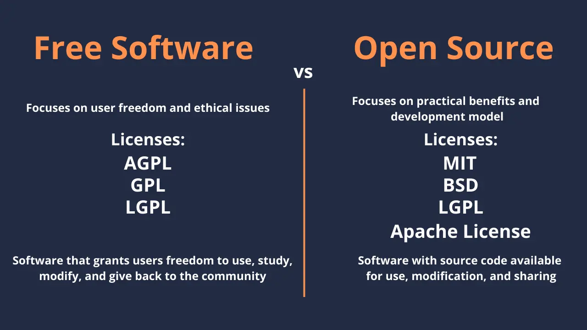

En conclusión, la economía del software de código abierto se basa en las contribuciones de la comunidad, el patrocinio corporativo y modelos de financiamiento innovadores. Estos mecanismos aseguran la sostenibilidad y la mejora continua de los proyectos de código abierto, beneficiando tanto a desarrolladores como a usuarios.

## Criptografía en Bitcoin

<chapterId>71867dd2-912c-55ad-b59c-9dbca8a39469</chapterId>


¡Bienvenidos! Hoy, exploraremos los aspectos cruciales de la criptografía que todo desarrollador de Bitcoin debe conocer. Nos centraremos en conceptos fundamentales y aplicaciones prácticas sin abrumarte con detalles teóricos excesivos. El objetivo principal es proporcionarte el conocimiento necesario para entender, implementar y solucionar problemas con los mecanismos criptográficos en Bitcoin de manera efectiva.

### Conceptos Criptográficos Fundamentales para Desarrolladores de Bitcoin

En esta sección, profundizaremos en los conceptos criptográficos clave esenciales para los desarrolladores de Bitcoin, incluidos las funciones hash, los árboles de Merkle, las firmas digitales y las curvas elípticas.

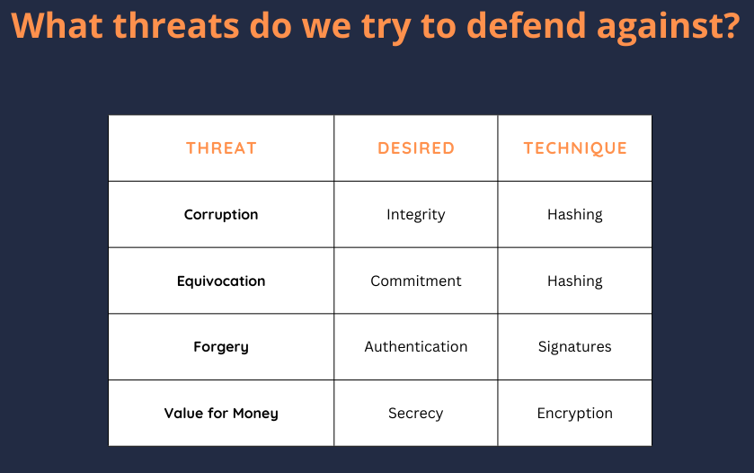

**Funciones Hash**: Una función hash toma una entrada y produce una cadena de bytes de longitud fija. En Bitcoin, las funciones hash son fundamentales para la integridad y seguridad de los datos. Las funciones hash criptográficas deben ser eficientes, generar salidas aparentemente aleatorias y producir salidas de longitud fija independientemente del tamaño de la entrada. Se utilizan para verificar la integridad de archivos, asegurando que los datos no hayan sido alterados maliciosamente.


**Propiedades de Seguridad**: Las funciones hash criptográficas deben cumplir con varias propiedades de seguridad. La resistencia a la preimagen asegura que sea computacionalmente inviable revertir la entrada original a partir del hash. La resistencia a la segunda preimagen significa que debe ser difícil encontrar una entrada diferente que produzca la misma salida de hash. La resistencia a colisiones asegura que es improbable encontrar dos entradas diferentes que generen la misma salida de hash.

**Árboles de Merkle**: Un árbol de Merkle es una estructura de datos que permite la verificación eficiente y segura de grandes conjuntos de datos. Los elementos de datos se hashean en pares, y los hashes resultantes se combinan iterativamente para formar un único hash raíz. En Bitcoin, los árboles de Merkle son cruciales en la creación de bloques y la verificación de transacciones, especialmente para clientes de Verificación de Pagos Simplificados (SPV) y en Taproot (Mast).


**Firmas Digitales (ECDSA)**: El Algoritmo de Firma Digital de Curva Elíptica (ECDSA) se utiliza para garantizar la autenticidad e integridad en las transacciones de Bitcoin. Implica la generación de una firma utilizando una clave privada que puede ser verificada mediante la clave pública correspondiente. Los conceptos clave incluyen la comprensión de campos finitos, logaritmos discretos y la importancia de los nonces.

**Curvas Elípticas**: Las curvas elípticas se utilizan en la criptografía de clave pública debido a su eficiencia y seguridad. La seguridad de la criptografía de curva elíptica se basa en la dificultad de resolver el problema del logaritmo discreto.


### Aplicaciones Criptográficas Prácticas y Prácticas de Seguridad en Bitcoin

En esta sección, exploraremos la aplicación de estos conceptos en el desarrollo real de Bitcoin y las mejores prácticas de seguridad a seguir.

**Criptografía = Peligro**: La criptografía es una espada de doble filo. Mientras protege contra daños accidentales de datos y acciones maliciosas, una implementación incorrecta puede llevar a vulnerabilidades graves. Los desarrolladores deben entender profundamente los mecanismos criptográficos para asegurar tanto una implementación segura como la capacidad de solucionar posibles problemas. Por ejemplo, la salida de 256 bits de SHA-2 asegura que los ataques de preimagen requieren alrededor de 2^256 de trabajo, con la resistencia a colisiones alrededor de 2^128 de trabajo.


**Aplicaciones de Árboles de Merkle**: Comprender el tamaño de prueba logarítmica y asegurar un diseño cuidadoso del árbol es esencial para evitar fallos, como la duplicación de hashes en la verificación de transacciones. Los árboles de Merkle se utilizan en la creación de bloques, la verificación de transacciones y mejoras como Taproot.

**Criptografía de Clave Pública**: Los logaritmos discretos y los campos finitos son fundamentales en los cálculos criptográficos en Bitcoin. Los protocolos de desafío-respuesta se utilizan para verificar el conocimiento de una clave privada sin revelarla.


**Implicaciones de Seguridad**: Ejemplos históricos muestran pérdidas financieras significativas debido a la reutilización de nonces. Comprender la importancia de generar nonces únicos es crucial. Usar bibliotecas confiables como LibSecP256k1 asegura operaciones criptográficas robustas y seguras.

**Criptografía de Curvas Elípticas (ECC)**: Los esquemas de firma han evolucionado de protocolos de identidad a esquemas como las firmas Schnorr, actualmente utilizadas en Bitcoin (BIP 340). Conocer las curvas elípticas y la aritmética de campo finito asegura implementaciones criptográficas seguras.

**Consejos Generales para Desarrolladores**: Los protocolos criptográficos deben someterse a revisiones exhaustivas por pares. Los desarrolladores deben ser precisos y comprender completamente cada paso de los procedimientos criptográficos. Conocer los errores comunes en las implementaciones criptográficas puede prevenir vulnerabilidades significativas.

**Curvas Elípticas en Criptografía**: La modificación de claves y la seguridad son temas importantes, como modificar una clave pública usando una clave privada adicional mientras se asegura la seguridad. La curva elíptica específica de Bitcoin, SECP256K1, y sus parámetros (P y N) son fundamentales para su implementación.

### Conclusión

En esta lección, hemos explorado los conceptos criptográficos fundamentales que sustentan la seguridad y funcionalidad de Bitcoin. Desde los papeles críticos de las funciones hash, los árboles de Merkle y las firmas digitales, hasta las matemáticas intrincadas de la criptografía de curva elíptica, estos elementos forman la columna vertebral de la red descentralizada de Bitcoin. Entender estos conceptos no es solo acerca de comprender la teoría, sino de reconocer las implicaciones prácticas y las posibles trampas en el desarrollo real.

Como desarrolladores de Bitcoin, es esencial abordar las implementaciones criptográficas con cautela y precisión. La seguridad de la red Bitcoin depende en gran medida de la aplicación correcta y segura de estos principios criptográficos. Ya sea que estés verificando transacciones, diseñando nuevas características o asegurando la integridad de la blockchain, un profundo conocimiento de la criptografía te permitirá construir soluciones más robustas, seguras e innovadoras dentro del ecosistema Bitcoin.

Al dominar estos conceptos y adherirse a las mejores prácticas, estarás bien equipado para contribuir eficazmente al desarrollo continuo de Bitcoin, asegurando su resistencia y seguridad para el futuro.

## Modelo de Gobernanza de Bitcoin

<chapterId>a30ec3e7-b290-5145-a9a9-042224ab20d2</chapterId>


### Naturaleza de Bitcoin

Bitcoin es una moneda digital que opera bajo un protocolo de consenso, un conjunto de reglas acordadas por los participantes de la red para asegurar la uniformidad y funcionalidad. En su núcleo, Bitcoin es un libro mayor descentralizado conocido como blockchain, donde las transacciones son registradas y verificadas por los nodos de la red. Los nodos completos, que almacenan toda la historia del blockchain de Bitcoin, juegan un papel crucial en el mantenimiento de la integridad de este libro mayor. Otros tipos de nodos, como los nodos archivadores, los nodos podados y los nodos SPV (Simplified Payment Verification), también contribuyen a la red de diversas maneras. El protocolo de consenso asegura que todos estos nodos estén de acuerdo sobre el estado del blockchain, haciendo a Bitcoin robusto contra la censura y el fraude.

#### Prevención de Cambios

La gobernanza en Bitcoin es vital para prevenir cambios arbitrarios o maliciosos en el protocolo. Esto se logra a través de un mecanismo de consenso que requiere un amplio acuerdo entre la comunidad. Los desarrolladores con conocimientos de programación juegan un papel significativo en la propuesta de cambios, pero estos cambios deben ser aceptados por la comunidad en general para ser implementados.

Bitcoin Core y las implementaciones alternativas tienen mantenedores que supervisan el desarrollo y mantenimiento del software. Estos mantenedores son responsables de fusionar los cambios de código, asegurando que cumplan con las reglas de consenso y no introduzcan vulnerabilidades.

#### Soft Forks vs Hard Forks

Los **soft forks** son cambios que endurecen las reglas existentes del protocolo de Bitcoin, haciendo que algunas transacciones previamente válidas se vuelvan inválidas. Son retrocompatibles, lo que significa que los nodos no actualizados aún reconocerán las nuevas reglas. Un ejemplo de un soft fork es la corrección del error de desbordamiento en 2010, que impidió la creación de dinero de la nada.

Los **hard forks** son cambios que relajan las reglas existentes, permitiendo nuevos tipos de transacciones. Estos no son retrocompatibles, lo que significa que los nodos no actualizados no reconocerán las nuevas reglas. Un ejemplo de un hard fork podría ser necesario para el problema del Año 2106 para asegurar que Bitcoin continúe funcionando más allá de esta fecha.


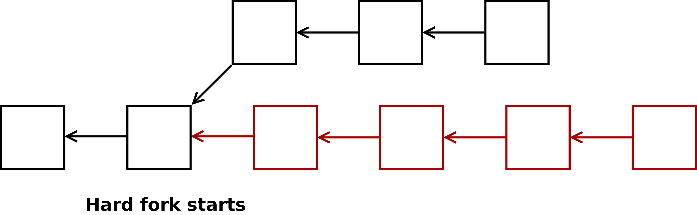

### Ejemplos de Gobernanza

Varios ejemplos del mundo real ilustran la gobernanza de Bitcoin en acción. La corrección del error de desbordamiento en 2010 fue un soft fork que abordó una falla crítica. El problema del Año 2106 probablemente requerirá un hard fork para abordar sus implicaciones. La transición de la cadena más larga a la cadena con más trabajo refleja una decisión significativa de gobernanza que afectó cómo se logra el consenso.

La gobernanza de Bitcoin también aborda cambios en el uso del protocolo en el mundo real. Por ejemplo, la introducción de ordinales e inscripciones ilustra cómo los cambios en el protocolo pueden evitar la censura de transacciones. De manera similar, la implementación del Full RBF (Replace-By-Fee) alteró los procedimientos de reemplazo de transacciones sin cambiar las reglas de consenso.

#### Motivaciones para el Cambio y el Consenso

Los cambios en Bitcoin pueden ser impulsados por diversas motivaciones, como corregir errores críticos, introducir nuevas características o limitar los cambios debido a razones económicas o políticas. Estas motivaciones a menudo llevan a debates dentro de la comunidad sobre qué constituye un error versus una característica y el impacto general en la red.

El mecanismo de consenso de Bitcoin lo hace inherentemente político, requiriendo un amplio acuerdo para que los cambios sean aceptados. Este aspecto político es crucial para mantener la naturaleza descentralizada de la red y asegurar que cualquier modificación esté en el mejor interés de la comunidad.

Ejecutar nodos puede validar las reglas de Bitcoin y participar en la red, incluso con diferentes protocolos de comunicación como Blockstream Satellite. Esto destaca la separación entre el mecanismo de consenso de Bitcoin y los métodos de comunicación de datos utilizados por la red. La importancia económica de los nodos, particularmente aquellos ejecutados por entidades grandes como Binance, puede influir en la adopción de cambios. Estas entidades tienen intereses económicos sustanciales en la red y pueden influir en las decisiones ejecutando nodos influyentes.

### Debate sobre el Tamaño del Bloque

El debate sobre el tamaño del bloque fue un problema significativo de gobernanza, centrado en si aumentar el tamaño del bloque de Bitcoin. Esta controversia se resolvió con la implementación de SegWit, un soft fork que aumentó el tamaño efectivo del bloque y habilitó la Lightning Network.


### Cambios Forzados y Regla de la Mayoría

Han existido intentos legales de obligar a los desarrolladores de Bitcoin a modificar las reglas de la cadena de bloques para beneficios personales, como las demandas de Craig Wright. Estos intentos destacan los desafíos y consideraciones éticas involucrados en la gobernanza de Bitcoin.

En Bitcoin, la regla de la mayoría juega un papel crucial. Si el 60% de los mineros adoptan una nueva regla, sus bloques serán rechazados por aquellos que ejecutan el Bitcoin Core original, lo que lleva a una bifurcación. Un ejemplo de una bifurcación dura fallida debido a la falta de apoyo de la comunidad es Bitcoin Satoshi's Vision (BSV).

Revisemos brevemente algunos conceptos importantes.

**Soft Fork Forzado**: El concepto de implementar reglas restrictivas para cambiar Bitcoin puede llevar a nuevas bifurcaciones y problemas de gobernanza. Este enfoque ilustra las complejidades y posibles conflictos dentro de la comunidad de Bitcoin.

**Ataque del 51%**: Un ataque del 51% describe un escenario donde una mayoría del poder de minería podría atacar a Bitcoin al minar bloques vacíos. Esto podría efectivamente matar la red a menos que la comunidad adopte nuevas reglas de consenso para abordar el ataque.

**Check-Lock-Time-Verify (CLTV)**: Check-Lock-Time-Verify (CLTV) es un ejemplo de un cambio de gobernanza implementado como un soft fork. CLTV asegura que las transacciones solo sean válidas después de un cierto tiempo, lo que es útil para los canales de pago y las claves de respaldo. Este cambio ajustó las reglas utilizando un opcode que anteriormente no hacía nada.

En conclusión, el futuro y los cambios de Bitcoin son determinados por la voluntad colectiva de sus usuarios. Los cambios significativos requieren un amplio consenso, reflejando la naturaleza descentralizada y política de la gobernanza de Bitcoin.

# Conceptos de la Capa Uno

<partId>5300855f-e5e4-5bca-9afe-2397f7c76260</partId>

## Componentes de un Nodo en Bitcoin

<chapterId>75ea1d88-ee6f-5f98-af90-e4758c55e606</chapterId>


En el capítulo de Adam Gibson sobre los nodos de Bitcoin, se desglosan los diversos componentes de un nodo y su papel en el mantenimiento de la funcionalidad y la integridad de la red. A continuación, se explora en detalle por qué deberíamos ejecutar un nodo de Bitcoin, qué hace un nodo y cómo funcionan los diferentes componentes de un nodo de Bitcoin.

### Introducción a los Nodos de Bitcoin

Comprender el papel de los nodos de Bitcoin es fundamental para cualquier persona involucrada en la red de Bitcoin. Ejecutar un nodo de Bitcoin permite a los usuarios validar transacciones, participar en el consenso y mantener el control sobre su privacidad. Esta conferencia profundiza en por qué es beneficioso ejecutar un nodo de Bitcoin y cómo contribuye a la seguridad y descentralización general de la red de Bitcoin.

### ¿Por Qué Ejecutar un Nodo de Bitcoin?

Ejecutar un nodo de Bitcoin es esencial por varias razones:

1. **Verificación**: Al ejecutar un nodo, puedes verificar las transacciones por ti mismo, asegurando que el Bitcoin que recibes es válido sin depender de terceros.
2. **Participación en el Consenso**: Los nodos juegan un papel crucial en la determinación de las reglas de la red de Bitcoin, por lo que participar en el consenso ayuda a mantener la integridad y seguridad de la cadena de bloques.
3. **Privacidad y Control**: Ejecutar tu propio nodo garantiza que no tengas que depender de nodos externos, que podrían comprometer tu privacidad al rastrear tus transacciones y saldo de la billetera.

### ¿Qué Hace un Nodo de Bitcoin?

- **Mantiene una lista de pares**: Los nodos deben encontrar y conectarse a otros nodos en la red para intercambiar información.
- **Recibe y envía transacciones y bloques válidos**: Los nodos de Bitcoin son responsables de propagar transacciones y bloques válidos a través de la red.
- **Mantiene el historial de bloques y la cadena más pesada**: Los nodos almacenan su propia copia de la cadena de bloques, lo que les permite validar la autenticidad de las transacciones y bloques.
- **Mantiene una lista de candidatos válidos; mempool**: Los nodos deben mantener una lista de posibles candidatos de transacciones en el mempool para ser incluidos en los bloques.

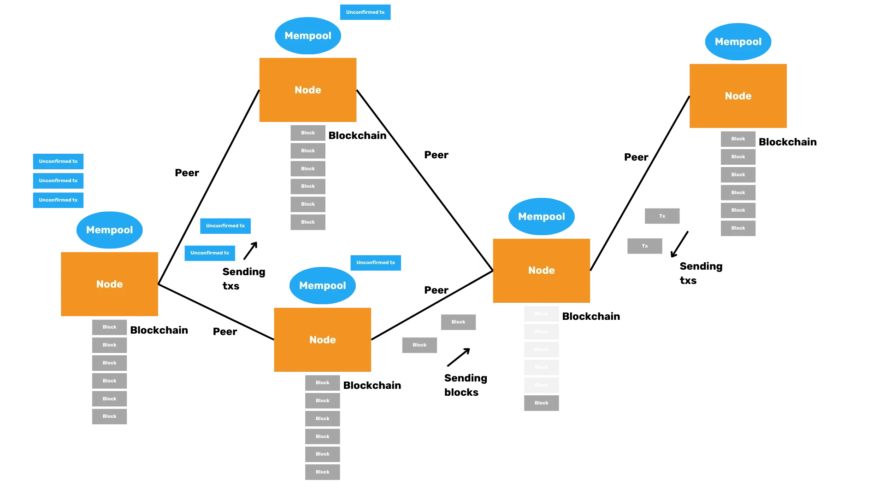

**NOTA**: La mempool es un área de almacenamiento temporal para transacciones que han sido validadas pero que aún no se han incluido en un bloque.

### Componentes de un Nodo

#### Módulos de Bitcoin Core


- **Descubrimiento de Pares (Peer Discovery)**: El descubrimiento de pares es el proceso mediante el cual un nodo encuentra y se conecta con otros nodos en la red.
- **Motor de Validación (Validation Engine)**: El motor de validación es responsable de verificar la validez de las transacciones y bloques de acuerdo con las reglas de la red.
- **RPC (Remote Procedure Call)**: Bitcoin Core incluye una interfaz RPC que permite a aplicaciones externas, como billeteras, interactuar con el nodo.
- **Almacenamiento de Bloques y Estado de la Cadena (Storing Blocks and Chain State)**: Bitcoin Core puede almacenar toda la cadena de bloques o no, dependiendo de si el nodo es un nodo archivista o podado. También almacena el estado actual de la red (el conjunto de UTXO) en el disco.

#### ¿Qué Podemos Eliminar?

- **Minería (Miner)**: La mayoría de los nodos de Bitcoin no participan en la minería debido al alto poder computacional requerido.
- **RPC (Servidor)**: Bitcoin Core implementa una interfaz JSON-RPC que puede ser accedida utilizando la herramienta de línea de comandos `bitcoin-cli`.
- **Billetera (Wallet) (disablewallet)**: Si prefieres usar una billetera externa, puedes desactivar la funcionalidad de billetera en Bitcoin Core. Esto te permite gestionar tus claves privadas por separado.
- **Mempool (blocksonly)**: Para los usuarios que desean minimizar el uso de ancho de banda, ejecutar un nodo en modo "blocksonly" puede ser una solución, donde el nodo solo procesa bloques, ignorando transacciones.

### Estado de la Cadena (Chain State)

#### ¿Dónde están los bitcoins?

Los bitcoins no se almacenan en direcciones; residen en UTXOs, que representan todos los saldos de transacciones que no han sido gastados. Puedes recuperar esta información con el comando:

```Bash
bitcoin-cli gettxoutsetinfo
```


Podemos auditar que el número de bitcoins es correcto.

#### Para cada UTXO, el estado de la cadena (chainstate) tiene:

- Txid.
- Índice de salida (Output Index).
- En qué bloque se encuentra el UTXO.
- Si es un UTXO coinbase.

**IMPORTANTE**: Las transacciones no son lo mismo que los UTXOs.

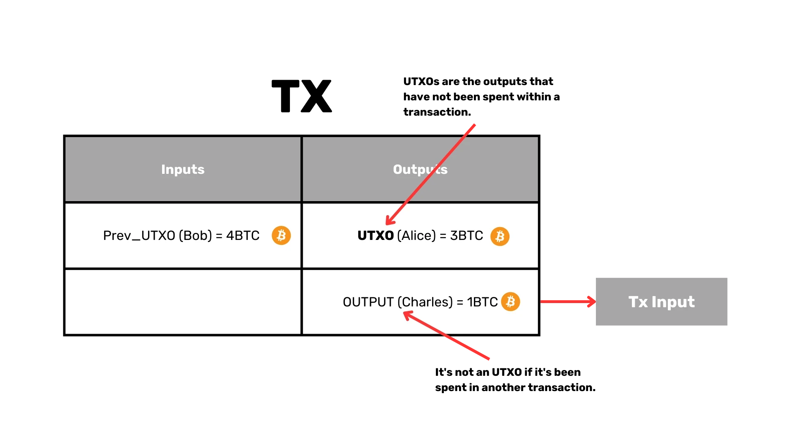

#### Mempool

Es una lista de transacciones no confirmadas en cada nodo, que se llaman transacciones candidatas. Se almacena en RAM para un acceso rápido y no es parte del consenso.

#### Consideraciones de Seguridad para los Nodos de Bitcoin

La seguridad es primordial al ejecutar un nodo de Bitcoin. Aquí hay algunas consideraciones clave a tener en cuenta:

#### Evitar la Centralización

Confiar en una sola fuente para los datos de la cadena de bloques, como descargar todos los bloques desde un servidor central, presenta riesgos significativos. Para mantener la naturaleza descentralizada de Bitcoin, los nodos deben conectarse a múltiples pares y validar los datos que reciben.

#### Prevención de Ataques de Aislamiento

Los ataques de aislamiento ocurren cuando un nodo es engañado para conectarse a un conjunto limitado de pares, permitiendo a un atacante alimentarlo con datos incorrectos. Al conectarse a un conjunto diverso de pares y verificar los datos recibidos, los nodos pueden protegerse contra estos ataques.

#### Gestión de Conexiones de Pares

Los nodos deben gestionar cuidadosamente sus conexiones de pares para asegurarse de que no se conecten a actores maliciosos. Esto incluye mantener una lista de pares prohibidos que hayan exhibido comportamientos sospechosos y actualizar regularmente la lista de pares para evitar depender de un pequeño grupo de nodos.

#### Importancia del Conjunto de UTXO

El conjunto de UTXO representa el estado actual de Bitcoin, listando todas las salidas de transacciones no gastadas. Es crucial para validar transacciones y asegurar que los bitcoins no se gasten más de una vez. Mantener este conjunto pequeño y fácilmente accesible es importante para mantener la eficiencia de la red.

#### Conclusión

Ejecutar un nodo de Bitcoin es una forma poderosa de participar en la red de Bitcoin, proporcionándote la capacidad de verificar transacciones, mantener la privacidad y contribuir a la seguridad y descentralización de la cadena de bloques. Ya sea que elijas ejecutar un nodo completo o personalizar tu configuración mediante la poda de la cadena de bloques o deshabilitando ciertos componentes, entender las funciones fundamentales y las consideraciones de seguridad de un nodo de Bitcoin te permitirá tomar decisiones informadas y contribuir a la evolución continua de Bitcoin.

## Estructuras de Datos de Bitcoin

<chapterId>5ed314b1-8293-567d-bf03-730e8c9c774b</chapterId>


Alekos Filini presenta un análisis en profundidad de las estructuras de datos de Bitcoin. Esto cubre la organización de los datos dentro de la cadena de bloques y cómo permite la robustez y eficiencia de la red.

### 1. Análisis de bloques y transacciones de Bitcoin en Rust

#### Objetivo

El objetivo principal de esta lección es guiarte a través del proceso de análisis de un bloque de Bitcoin mediante la codificación de un analizador en Rust. Esto implica comprender la estructura de los bloques y transacciones de Bitcoin, e implementar la lógica necesaria para extraer e interpretar estos datos.

#### Componentes a Analizar

Para analizar un bloque de Bitcoin, necesitarás enfocarte en los siguientes componentes:

1. **Encabezado del Bloque**
2. **Transacciones dentro del Bloque**
3. **Entradas y Salidas de Transacciones**

#### Estructura del Encabezado del Bloque

El encabezado del bloque es la piedra angular de un bloque de Bitcoin y contiene los siguientes campos:

- **Versión**: Indica la versión del bloque.
- **Bloque Anterior**: Referencia al bloque anterior en la cadena de bloques.
- **Raíz de Merkle**: Un hash que representa el hash combinado de todas las transacciones en el bloque.
- **Marca de Tiempo**: El momento en el que se minó el bloque.
- **Bits**: El umbral objetivo para un hash de bloque válido.
- **Nonce**: El valor que los mineros ajustan para lograr un hash por debajo del umbral objetivo.
- **Conteo de Transacciones**: El número de transacciones en el bloque.

**Nota**: Solo los primeros 80 bytes (que comprenden el encabezado del bloque) se hash durante la minería.

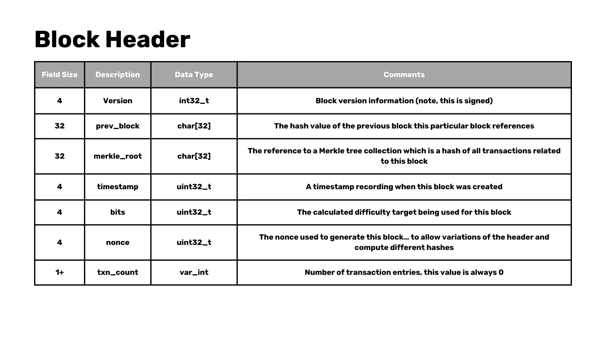

#### Simplificaciones

Para mantener nuestro ejemplo manejable:

- Nos centraremos en analizar bloques pre-SegWit (legado), evitando la complejidad añadida de Segregated Witness.
- Omitiremos ciertos opcodes en el lenguaje de scripting de Bitcoin, enfocándonos en algunos que necesitamos para analizar un bloque completo.

#### Estructura de Transacción

Cada transacción en un bloque de Bitcoin contiene lo siguiente:

- **Versión**: La versión de la transacción.
- **Número de Entradas**: Conteo de las entradas de la transacción.
- **Entradas**: La lista de las entradas.
  - **Salida Anterior (Outpoint)**: La referencia de la salida anterior.
    - **Hash**: El hash de la transacción referenciada.
    - **Índice**: El índice de la salida específica en la transacción, llamado "vout".
  - **Longitud del Script**: La longitud del script de firma.
  - **Script de Firma**: Script para confirmar la autorización de la transacción.
  - **Secuencia**: Versión de la transacción según lo definido por el remitente.
- **Número de Salidas**: Conteo de las salidas de la transacción.
- **Salidas**: Contiene Valor y ScriptPubKey.
  - **Valor**: Valor de la transacción.
  - **Longitud del ScriptPubKey**: Longitud del script PubKey.
  - **ScriptPubKey**: Contiene la clave pública como un setup para reclamar la salida.
- **Lock Time**: Indica la altura del bloque o el timestamp en el cual esta transacción puede ser incluida en un bloque.

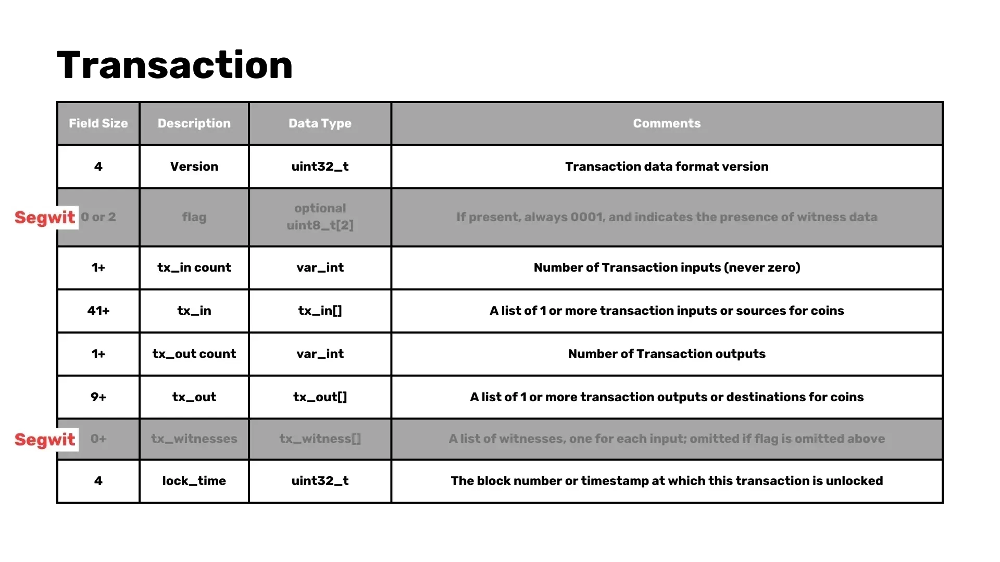
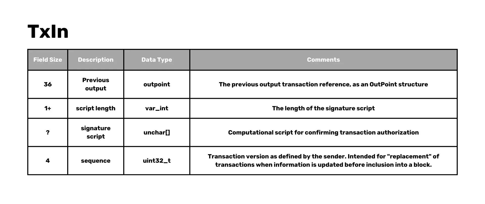

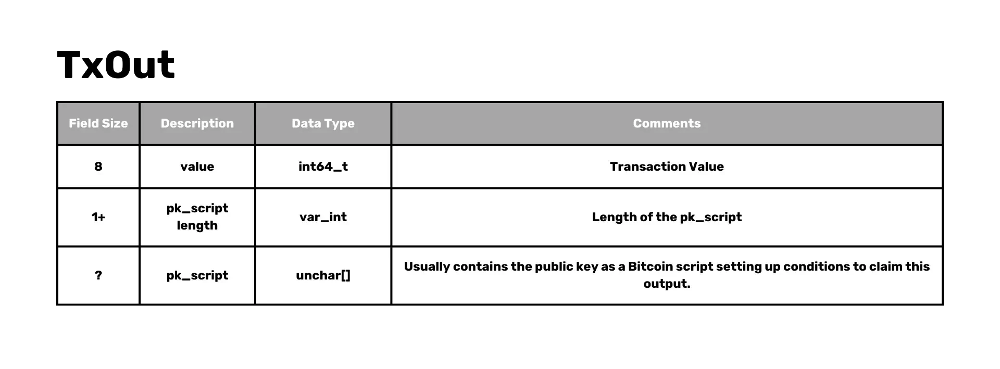

#### Técnicas de Análisis

En Rust, podemos utilizar varias técnicas para analizar estas estructuras:

- Utilizar `from_le_bytes` para leer datos en formato Little Endian.
- Implementar un trait personalizado `parse` para manejar la lógica de análisis para diferentes estructuras.

```Rust
trait Parse: Sized {
    fn parse(bytes: &[u8]) -> Result<(Self, &[u8]), Error>;
}
```

- Implementar el análisis de forma genérica para listas y tipos específicos como `VarInt`, `U32`, `U64`, etc.

```Rust
impl Parse for i32 {
    fn parse(bytes: &[u8]) -> Result<(Self, &[u8]), Error> {
        let val = i32::from_le_bytes(bytes[0..4].try_into()?);
        Ok((val, &bytes[4..]))
    }
}
```

### Depuración y Pruebas

Para asegurar que nuestro analizador funcione correctamente:

- Comparar los datos analizados con detalles de bloques conocidos (por ejemplo, desde mempool.space).
- Validar que los conteos de transacciones analizadas y los detalles del bloque coincidan con los valores esperados.

### 2. Manejo de Casos Especiales y Análisis de Scripts

#### Implementación de la Función 'parse'

Implementaremos la función `parse` para manejar el bloque completo, incluyendo el encabezado del bloque y las transacciones. Esto implica leer los datos del bloque y extraer los campos relevantes.

```Rust
impl Parse for Block {
    fn parse(bytes: &[u8]) -> Result<(Self, &[u8]), Error> {
        let (header, bytes) = Parse::parse(bytes)?;
        let (transactions, bytes) = Parse::parse(bytes)?;

        let block = Block {
            header, transactions
        };

        Ok((block, bytes))
    }
}
```

### Modificación del encabezado del bloque

Necesitamos ajustar nuestra lógica de análisis para eliminar el recuento de transacciones de la estructura del encabezado del bloque, tratándolo como una entidad separada.

```Rust
impl Parse for BlockHeader {
    fn parse(bytes: &[u8]) -> Result<(Self, &[u8]), Error> {
        let (version, bytes) = Parse::parse(bytes)?;
        let (prev_block, bytes) = Parse::parse(bytes)?;
        let (merkle_root, bytes) = Parse::parse(bytes)?;
        let (timestamp, bytes) = Parse::parse(bytes)?;
        let (bits, bytes) = Parse::parse(bytes)?;
        let (nonce, bytes) = Parse::parse(bytes)?;

        let header = BlockHeader {
            version, prev_block, merkle_root, timestamp, bits, nonce,
        };

        Ok((header, bytes))
    }
}
```

#### Definición de estructura

Definimos una nueva estructura "Bloque" que contenga tanto el encabezado del bloque como una lista de transacciones.

```Rust
struct Block {
    header: BlockHeader,
    transactions: Vec<Transaction>,
}
```

#### Elementos de Sintaxis de Rust

Introduce elementos de sintaxis de Rust, como el signo de interrogación (`?`) para el manejo de errores. Esto simplificará nuestro código y lo hará más legible.

#### Aserciones

Agrega aserciones para verificar que no queden bytes sin analizar después de procesar un bloque completo. Esto asegura la integridad de nuestro proceso de análisis.

#### Casos Especiales como las Transacciones Coinbase

Las transacciones Coinbase, que son la primera transacción en un bloque utilizada para reclamar la recompensa del bloque, tienen características únicas. Necesitamos manejar estos casos especiales de manera adecuada.

```Rust
struct OutPoint {
    txid: [u8; 32],
    vout: u32,
}

impl OutPoint {
    fn is_coinbase(&self) -> bool {
        self.txid == [0; 32] && self.vout == 0xFFFFFFFF
    }
}
```

#### Estrategia de Análisis de Scripts

Para analizar el script en las transacciones, nos centraremos en opcodes comunes como `OP_CHECKSIG`, `OP_HASH160` y `OP_PUSH`. Analizar estos scripts es crucial para validar las transacciones y manejar errores.

```Rust
enum OpCode {
    False,
    Return,
    Dup,
    Equal,
    CheckSig,
    Hash160,
    EqualVerify,
    Push(Vec<u8>),
}

impl Parse for OpCode {
    fn parse(bytes: &[u8]) -> Result<(Self, &[u8]), Error> {
        match bytes[0] {
            v @ 1..=75 => {
                let data = bytes[1..(v as usize + 1)].iter().cloned().collect();
                Ok((OpCode::Push(data), &bytes[(v as usize + 1)..]))
            },
            76 => {
                let len = bytes[1] as usize;
                let data = bytes[2..(len + 2)].iter().cloned().collect();
                Ok((OpCode::Push(data), &bytes[(len + 2)..]))
            },

            0 => Ok((OpCode::False, &bytes[1..])),

            106 => Ok((OpCode::Return, &bytes[1..])),
            118 => Ok((OpCode::Dup, &bytes[1..])),
            135 => Ok((OpCode::Equal, &bytes[1..])),

            136 => Ok((OpCode::EqualVerify, &bytes[1..])),
            169 => Ok((OpCode::Hash160, &bytes[1..])),
            172 => Ok((OpCode::CheckSig, &bytes[1..])),

            _ => todo!()
        }
    }
}
```

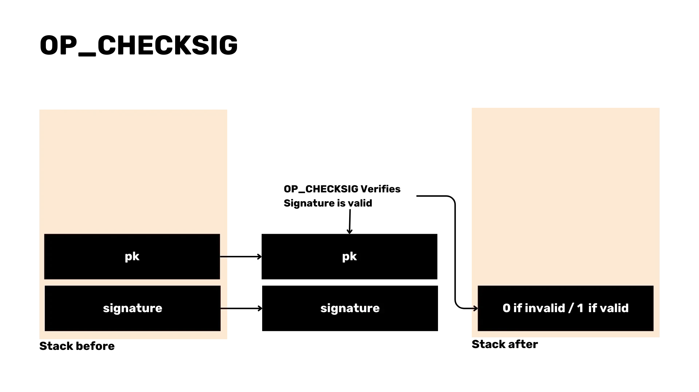


#### Desafíos en el análisis de scripts

El análisis de scripts puede presentar desafíos, particularmente con las transacciones de Coinbase. Es importante tener en cuenta los casos extremos y manejarlos correctamente para garantizar un análisis preciso.

```Rust
impl Parse for Script {
    fn parse(bytes: &[u8]) -> Result<(Self, &[u8]), Error> {
        let (len, bytes) = VarInt::parse(bytes)?;
        let mut script_bytes = &bytes[..len.0 as usize];
        let mut opcodes = Vec::new();
        while !script_bytes.is_empty() {
            let (opcode, bytes) = OpCode::parse(script_bytes)?;
            script_bytes = bytes;
            opcodes.push(opcode);
        }

        Ok((Script(opcodes), &bytes[len.0 as usize..]))
    }
}
```

#### Bloques Compactos

El uso de bloques compactos actualmente se emplea para mejorar la eficiencia de la transmisión de datos entre nodos. Esto reduce el uso de ancho de banda y acelera la sincronización al enviar las transacciones que faltaban en el mempool, rellenándolas con las transacciones que el nodo ya tenía en un bloque, y luego validarlas.

#### Uso de Bibliotecas Existentes

Para aplicaciones críticas en cuanto a consenso, se recomienda usar bibliotecas existentes para evitar errores y asegurar la seguridad, como [rust-bitcoin](https://docs.rs/bitcoin/latest/bitcoin/) o [bitcoin-dev-kit](https://docs.rs/bdk/latest/bdk/). Implementar tu propio analizador puede ser educativo pero también riesgoso en entornos de producción.


### Eficiencia y Seguridad en la Minería de Bitcoin

#### Eficiencia en la Minería

Minar bloques vacíos puede ser más eficiente para los mineros:

- Los mineros comienzan a minar bloques vacíos para ahorrar tiempo.
- Los bloques vacíos se pueden minar rápidamente antes de cambiar a un bloque completo una vez que el bloque anterior se ha confirmado.

#### Razones para Minar Bloques Vacíos

A veces se minan bloques vacíos debido a problemas de tiempo. Los mineros pueden no haber recibido la lista completa de transacciones para cuando comienzan a minar el siguiente bloque, por lo que eligen minar un bloque vacío en su lugar.

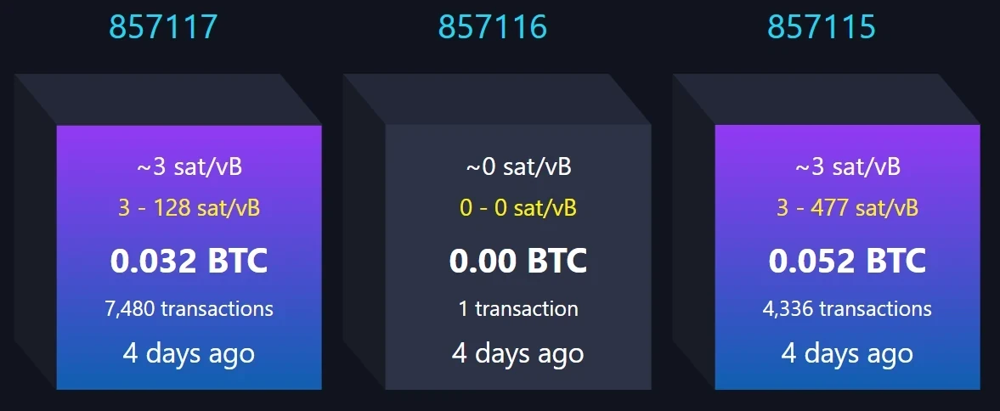

#### Minería Maliciosa de Bloques Vacíos

Aunque la minería maliciosa de bloques vacíos es posible, no se ha observado. La razón principal de los bloques vacíos es la restricción de tiempo más que la intención maliciosa.

#### Implicaciones de los Bloques Vacíos

La ocurrencia de bloques vacíos es un aspecto normal del proceso de minería y se debe principalmente a problemas de tiempo. Aunque no contienen transacciones, aún extienden la cadena de bloques y contribuyen a la seguridad de la red.

#### Importancia de la Seguridad

La seguridad en la minería de Bitcoin es primordial. Al seguir las mejores prácticas y usar bibliotecas bien probadas, los mineros y desarrolladores pueden asegurar la integridad de la cadena de bloques y proteger contra posibles vulnerabilidades.

En conclusión, analizar bloques y transacciones de Bitcoin en Rust implica entender estructuras complejas e implementar técnicas de análisis eficientes. Manejar casos especiales y el análisis de scripts requiere una consideración cuidadosa, y enfocarse en la eficiencia y seguridad asegura la robustez de la red de Bitcoin.

## Pila de Software Bitcoin Layer 1

<chapterId>96d64781-fc27-5209-88d8-2acf00d05ea8</chapterId>


### Introducción

Daniela Brozzoni ofrece una visión general integral de la pila de software de Bitcoin, explicando las capas que componen la base del protocolo de Bitcoin (es decir, nodos de Bitcoin y billeteras de Bitcoin) y cómo construir software de Bitcoin con una introducción a las bibliotecas de Bitcoin y una inmersión profunda en el Bitcoin Development Kit (BDK).

### Visión General del Software de Bitcoin

La pila de software de Bitcoin es fundamental para su funcionamiento y está compuesta por varios elementos, incluidos nodos y billeteras. Una parte crítica de este ecosistema es el Bitcoin Development Kit (BDK), que exploraremos en detalle más adelante. Primero, centrémonos en el papel de los nodos dentro de la red de Bitcoin.

#### Nodos de Bitcoin

Los nodos de Bitcoin son la columna vertebral de la red de Bitcoin. Se conectan entre sí, intercambian transacciones y bloques, y validan los datos entrantes. Hay diferentes tipos de nodos, cada uno con un propósito único:

- **Nodos Completos**: Estos nodos almacenan la cadena de bloques completa y validan todas las transacciones y bloques. Proporcionan un alto nivel de seguridad y son esenciales para la descentralización de la red.

  - **Nodos de archivo**: Un subconjunto de nodos completos, los nodos de archivo conservan todos los datos de la blockchain, lo que los hace valiosos para el análisis histórico y la depuración.

  

  - **Nodos Podados**: Los nodos podados ahorran espacio en disco al conservar solo una parte de la cadena de bloques, eliminando datos antiguos que ya no son necesarios para la validación.

  

#### Bitcoin Core

Bitcoin Core es la implementación de nodo completo más utilizada. Cumple funciones duales como nodo completo y billetera. Los aspectos clave de Bitcoin Core incluyen:

- **Usabilidad**: Puede utilizarse a través de una interfaz de línea de comandos (CLI) y una interfaz gráfica de usuario (GUI).
- **Naturaleza de Código Abierto**: El código es de código abierto, lo que permite a los desarrolladores contribuir y examinar su funcionamiento.
- **Lenguaje**: Escrito en C++ con pruebas en Python, asegurando un rendimiento y fiabilidad robustos.

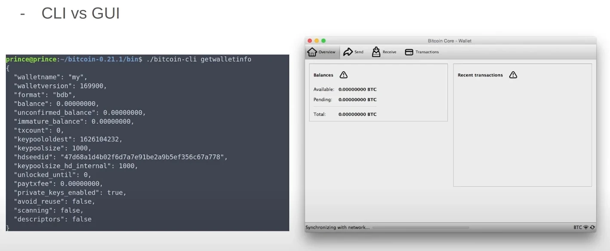

##### Explorando Bitcoin Core

Para obtener experiencia práctica con Bitcoin Core, se puede compilar y ejecutar pruebas utilizando Git. Este proceso implica:

- Compilar la base de código para crear una versión ejecutable. Accede al [Github de Bitcoinsssss](https://github.com/bitcoin/bitcoin) y consulta el archivo `doc/build-*.md` para obtener instrucciones.

```Bash
./autogen.sh
./configure
make # usa "-j N" para N ordenes paralelas
make install # opcional
```

- Realizar pruebas para asegurar que todo funcione correctamente. Las instrucciones se pueden encontrar [aquí](https://github.com/bitcoin/bitcoin/blob/master/test/README.md)

```Bash
make check

#Las pruebas individuales pueden ser ejecutadas directamente llamando el script de prueba p.ej:
test/functional/feature_rbf.py

#ejecutar todas las pruebas posibles
test/functional/test_runner.py
```

- Crear y ejecutar una prueba en Python para validar funcionalidades específicas. El archivo [example.py](https://github.com/bitcoin/bitcoin/blob/master/test/functional/example_test.py) es un ejemplo con abundantes comentarios de un caso de prueba que utiliza tanto las interfaces RPC como P2P.

#### Implementaciones Alternativas de Nodo

Más allá de Bitcoin Core, existen varias implementaciones alternativas de nodos:

- **Bitcoin Knots**: Ofrece características más avanzadas que Bitcoin Core, ocupando más espacio y memoria.
- **LibBitcoin**: Una implementación flexible y modular.
- **btcd**: Escrito en Go, ofrece diferentes filosofías de diseño.

Implementar estas alternativas conlleva sus propios riesgos, particularmente en lo que respecta a las reglas de consenso. Desviarse de las reglas de validación establecidas puede llevar a bifurcaciones o inconsistencias. El proyecto Bitcoin Kernel busca mitigar estos riesgos al centralizar el código de consenso, asegurando uniformidad en las implementaciones.


### Billeteras de Bitcoin y Seguridad

Las billeteras de Bitcoin son cruciales para gestionar tus fondos de Bitcoin de manera segura. Vienen en varias formas, cada una con características y consideraciones de seguridad distintas.

#### Tipos de Billeteras de Bitcoin

1. **Custodias vs. No Custodias**:

   - **Billeteras Custodias**: Gestionadas por terceros, ofrecen conveniencia pero requieren confianza en el custodio.
   - **Billeteras No Custodias**: Controladas por los usuarios, proporcionando mayor seguridad y privacidad.

2. **De Escritorio vs. Móviles**:

   - **Billeteras de Escritorio**: Típicamente más completas en características y seguridad.
   - **Billeteras Móviles**: Ofrecen conveniencia y portabilidad.

3. **On-Chain vs. Lightning**:

   - **Billeteras On-Chain**: Interactúan directamente con la blockchain de Bitcoin.
   - **Billeteras Lightning**: Facilitan transacciones más rápidas y económicas fuera de la cadena.

4. **Billeteras Frías vs. Calientes**:
   - **Billeteras Frías**: No conectadas a Internet, proporcionando una seguridad superior contra hackeos.
   - **Billeteras Calientes**: Conectadas a Internet, ofreciendo mayor accesibilidad pero menos seguridad.

#### Seguridad de Billeteras Frías

Las billeteras frías son muy valoradas por su seguridad. Al permanecer fuera de línea, son inherentemente resistentes a los hackeos en línea. Sin embargo, es crucial garantizar que las transacciones realizadas a través de billeteras frías sean seguras y precisas para evitar enviar Bitcoin inadvertidamente a actores maliciosos.

#### Billeteras Solo de Consulta

Las billeteras solo de consulta contienen únicamente claves públicas, permitiendo a los usuarios recibir Bitcoin y monitorear su saldo sin la capacidad de gastar. Esta característica añade una capa adicional de seguridad para aquellos que necesitan vigilar de cerca sus fondos.

#### Funciones Básicas de una Billetera Bitcoin

Independientemente del tipo, cada billetera de Bitcoin realiza tres funciones fundamentales:

1. **Recibir Bitcoin**: Generar direcciones y monitorear las transacciones entrantes.
2. **Enviar Bitcoin**: Crear y difundir transacciones a la red.
3. **Mostrar Saldo**: Mostrar el saldo actual de la billetera.

#### Rol de las Billeteras de Bitcoin

- Las billeteras de Bitcoin actúan como llaveros, almacenando y generando claves criptográficas.

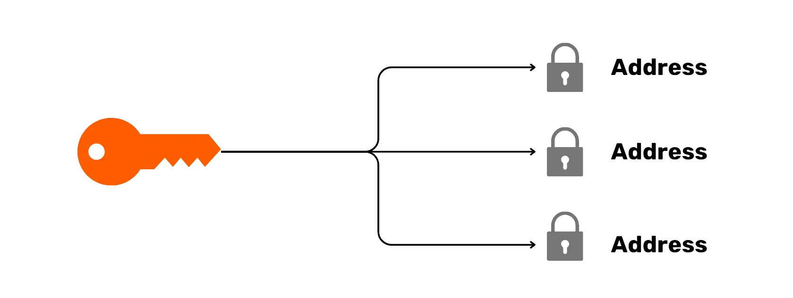

- Monitorean la blockchain en busca de transacciones entrantes.

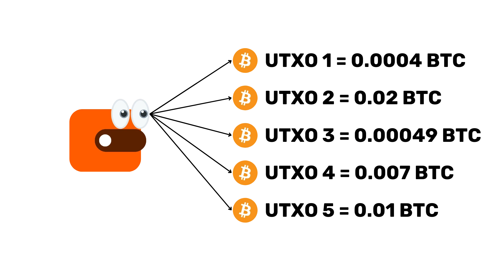

- Crean transacciones seleccionando salidas de transacción no gastadas (UTXOs), estableciendo entradas y salidas, y optimizando para la privacidad y las tarifas.

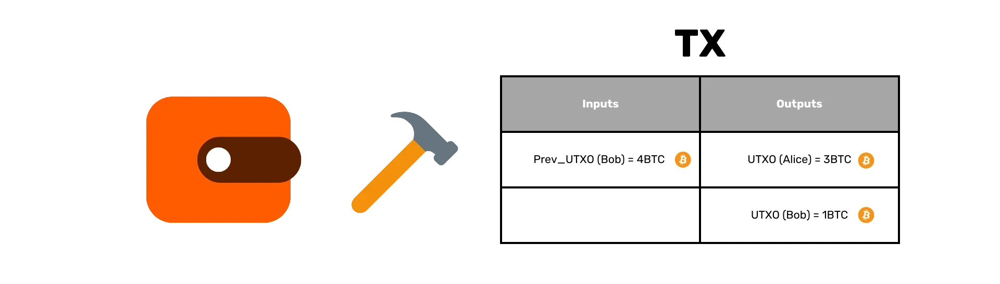

#### Reusabilidad de la Lógica de Billeteras

Dado que todas las billeteras de Bitcoin comparten funciones similares, reescribir la lógica de billeteras repetidamente es ineficiente. Aquí es donde entra el Bitcoin Development Kit (BDK).

### Bitcoin Development Kit (BDK) y Conceptos Técnicos

El Bitcoin Development Kit (BDK) es una biblioteca diseñada para simplificar la creación y gestión de billeteras de Bitcoin.

#### Visión General de BDK

BDK simplifica la creación de billeteras proporcionando funcionalidades de nivel superior basadas en Rust Bitcoin. Soporta múltiples lenguajes de programación a través de enlaces, incluyendo Kotlin, Swift y Python.

#### Otras Bibliotecas de Bitcoin

Numerosas bibliotecas de Bitcoin están disponibles para diferentes lenguajes de programación, como Python, JavaScript, Java, Go y C. Estas bibliotecas ofrecen diversas herramientas para el desarrollo en Bitcoin.

#### Conceptos Técnicos Claves

1. **Descriptores**: Los descriptores describen cómo derivar scripts y direcciones de Bitcoin a partir de claves, permitiendo funcionalidades de billetera más flexibles y potentes.
2. **PSBT (Transacciones de Bitcoin Parcialmente Firmadas)**: PSBT es un formato para transacciones que requieren múltiples firmas, facilitando transacciones colaborativas y mejorando la seguridad.
3. **Sintaxis de Rust**: Conceptos clave en Rust, como `Option` para la seguridad contra valores nulos y el tipo `Result` para el manejo de errores, son esenciales para entender y usar BDK de manera efectiva.

#### Creación y Gestión de Transacciones

BDK simplifica el proceso de construir, firmar y difundir transacciones:

1. **Construir Transacciones**: Especificar destinatarios, montos y tarifas.
2. **Firmar Transacciones**: Utilizar PSBT para recolectar firmas.
3. **Difundir Transacciones**: Enviar transacciones finalizadas a la red.

#### Ejemplo de Flujo de Trabajo en BDK

- **Configurar Billetera**: Inicializar una billetera con descriptores.

```Rust
use bdk::{Wallet, SyncOptions};
use bdk::database::MemoryDatabase;
use bdk::blockchain::ElectrumBlockchain;
use bdk::electrum_client::Client;
use bdk::bitcoin;

fn main() -> Result<(), bdk::Error> {
  let wallet = Wallet::new(
    "tr(tprv8ZgxMBicQKsPf6WJ1Rr8Zmdsr6MaACS5K3tHw3QDQmFbkEsdnG3zAZzhjEgEtetL1jwZ5VAL85UaaFzUpAZPrS7aGkQ3GdM75xPu4sUxSiF/*)",
    None,
    bitcoin::Network::Testnet,
    MemoryDatabase::default(),
  )?;

  Ok(())
}
```

- **Generar direcciones**: crea nuevas direcciones para recibir Bitcoin desde un faucet de Testnet.

```Rust
//importar AddressIndex fuera de la función principal
use bdk::wallet::AddressIndex;

  //Función a añadir dentro de la función principal
  let address = wallet.get_address(AddressIndex::New)?;

```

- **Verificar saldo**: controla el saldo de la billetera, primero conectándose a Electrum, sincronizando la billetera y obteniendo el saldo de la billetera.

```Rust
    //Conectar al servidor de Electrum y guardar la blockchain
    let client = Client::new("ssl://electrum.blockstream.info:60002")?;
    let blockchain = ElectrumBlockchain::from(client);

    //Sincronizar billetera a la blockchain recibida
    wallet.sync(&blockchain, SyncOptions::default())?;

    //Obtener el saldo de tu billetera
    let balance = wallet.get_balance()?;
    println!("This is your wallet balance: {}", balance);
```

- **Crear, firmar y transmitir transacciones**: construir y finalizar transacciones, luego transmitirlas a la red.

```Rust
//Añadir a las importaciones
use bdk::bitcoin::Address;
use bdk::{SignOptions};
use std::str::FromStr;
use bdk::blockchain::Blockchain;

    //Construir una Transacción de Bitcoin Parcialmente Firmada (PSBT)
    let mut builder = wallet.build_tx();
    let recipient_address = Address::from_str("tb1qlj64u6fqutr0xue85kl55fx0gt4m4urun25p7q").unwrap();

    builder
        .drain_wallet()
        .drain_to(recipient_address.script_pubkey())
        .fee_rate(FeeRate::from_sat_per_vb(2.0))
        .enable_rbf();
    let (mut psbt, tx_details) = builder.finish()?;
    println!("This is our psbt: {}", psbt);
    println!("These are the details of the tx: {:?}", tx_details);

    //Sign the PSBT
    let finalized = wallet.sign(&mut psbt, SignOptions::default())?;
    println!("Is my PSBT Signed? {}", finalized);
    println!("This is my PSBT finalized: {}", psbt);


    let tx = psbt.extract_tx();
    let tx_id = tx.txid();
    println!("this is my Bitcoin tx: {}", bitcoin::consensus::encode::serialize_hex(&tx));
    println!("this is mny tx id: {}", tx_id);

    //Difundir la transacción
    blockchain.broadcast(&tx)?;
```

### Imprimir TXID y Difundir la Transacción

Asignar e imprimir el ID de Transacción (TXID) permite el monitoreo en plataformas como mempool.space. La difusión de la transacción se puede realizar utilizando el método `Blockchain.broadcast`, y verificar los detalles y el estado de la transacción es crucial para asegurar una propagación exitosa.

#### Utilidad de BDK y Consideraciones de Privacidad

BDK es invaluable para simplificar el desarrollo de billeteras de Bitcoin. Para una mayor privacidad, se recomiendan herramientas como Electrum, Esplora y nodos personales de Bitcoin Core.

#### Lenguajes de Programación

Al desarrollar proyectos de Bitcoin, Rust es a menudo preferido debido a su seguridad y eficiencia. Sin embargo, la elección del lenguaje puede variar según los requisitos específicos del proyecto y la experiencia del desarrollador.

#### Dependencias de BDK

BDK depende de varias dependencias clave, incluyendo Rust-Bitcoin y Rust-Miniscipt. También se pueden emplear bibliotecas adicionales para la gestión de bases de datos y criptografía.

---

Al comprender estos componentes, desde nodos de Bitcoin y billeteras hasta el Kit de Desarrollo de Bitcoin (BDK), puedes navegar por el ecosistema de Bitcoin con mayor confianza y competencia. Este conocimiento te permite desarrollar aplicaciones de Bitcoin robustas y seguras, contribuyendo a la evolución continua de esta tecnología revolucionaria.

# Lightning Network

<partId>d7ac2ad7-a4b3-564f-8a8d-cfec5297b3a5</partId>

## Historia de los Canales de Pago

<chapterId>a0b11c6e-c0ff-5e65-b809-b2ab9a2fc37b</chapterId>


### 1. Historia de los Canales de Pago

Bienvenidos a nuestra lección sobre soluciones de pago modernas dentro de la tecnología blockchain. Hoy exploraremos el contexto histórico y los desarrollos clave de los Multi-Hop Locks (MHLs) y la Red Lytle.

#### Descripción General y Contexto Histórico

Los Multi-Hop Locks (MHLs) y la Red Lytle son conceptos avanzados en la tecnología blockchain que facilitan micropagos eficientes y seguros a través de la red. Históricamente, la necesidad de estas innovaciones surgió de las ineficiencias y limitaciones observadas en el despliegue inicial de las tecnologías blockchain, particularmente Bitcoin. A medida que profundicemos, entenderás cómo las estructuras basadas en temas y los enfoques en capas han revolucionado las transacciones en blockchain.

### Estructura Basada en Temas

La introducción de los MHLs y la Red Lytle señala un cambio de paradigma de las transacciones tradicionales y lineales en blockchain hacia sistemas más sofisticados y en capas. Al compartmentalizar las transacciones en temas o segmentos específicos, estas innovaciones permiten una infraestructura de pagos más escalable y segura que aborda muchos de los problemas inherentes en las primeras implementaciones de blockchain.

### Problemas con Bitcoin

Bitcoin, el pionero de la tecnología blockchain, introdujo un sistema descentralizado donde las transacciones se transmiten a través de toda la red. Aunque revolucionario, este método es inherentemente ineficiente. Cada nodo en la red debe validar cada transacción, lo que lleva a retrasos significativos y cuellos de botella, especialmente durante altos volúmenes de transacciones.

El proceso de validación descentralizado de Bitcoin requiere recursos computacionales sustanciales. Cada transacción debe ser verificada y registrada por múltiples nodos, consumiendo enormes cantidades de energía y potencia de procesamiento. Esto no solo aumenta los costos operativos, sino que también pone una presión sobre el ancho de banda de la red, lo que lleva a tarifas de transacción más altas y tiempos de procesamiento más lentos.

Aunque la descentralización de Bitcoin es una de sus principales fortalezas, también presenta desafíos significativos. La naturaleza pública de la blockchain significa que todas las transacciones son visibles para todos, lo que plantea preocupaciones de privacidad. Además, la necesidad de consenso entre numerosos nodos puede llevar a presiones de centralización, ya que el poder de minería se concentra en manos de unas pocas entidades grandes.

### Canales de Pago como Solución

_Metáfora del Estándar Oro_

Para abordar las ineficiencias y problemas de privacidad de Bitcoin, se han propuesto los canales de pago como una solución viable. Los canales de micropagos permiten que las transacciones ocurran fuera de la cadena, reduciendo la necesidad de compartir datos constantemente a través de toda la red. Esto alivia significativamente la carga sobre la blockchain, permitiendo transacciones más rápidas y económicas.

El principio fundamental detrás de los canales de pago es el concepto de llevar las transacciones fuera de la cadena. En lugar de transmitir cada transacción a toda la red, las partes pueden abrir un canal de pago y realizar numerosas transacciones entre sí. Solo la apertura y el cierre del canal se registran en la blockchain, mejorando enormemente la eficiencia y la privacidad.

A pesar de la naturaleza fuera de la cadena de los canales de pago, sigue existiendo la opción de hacer cumplir las transacciones en la cadena. Si hay una disputa o si una parte intenta hacer trampa, el estado más reciente del canal puede ser transmitido a la blockchain, asegurando que las transacciones acordadas se honren y que los fondos se asignen correctamente.

Los canales de pago representan un avance significativo en la tecnología blockchain, proporcionando un método escalable y seguro para realizar transacciones mientras abordan muchos de los problemas fundamentales asociados con Bitcoin. A medida que continuamos innovando y construyendo sobre estas bases, el futuro de la blockchain parece cada vez más prometedor.

En conclusión, entender el contexto histórico y los desafíos de Bitcoin, así como las soluciones innovadoras propuestas a través de MHLs, la Red Lytle y los canales de pago, proporciona una visión completa del panorama actual y del potencial futuro de la tecnología blockchain.

## Historia del Enrutamiento Atómico

<chapterId>28be7b31-e6b2-5eea-a5ed-62ce0a154b6e</chapterId>


En nuestras lecciones anteriores, cubrimos los fundamentos de los canales de pago básicos. Estos canales permiten a dos participantes, digamos Alice y Bob, transaccionar directamente entre sí de manera fluida. Sin embargo, hay una limitación evidente en este modelo: Alice solo puede transaccionar con Bob y no con otros participantes como Charlie, a menos que establezca canales separados con cada uno de ellos. Esta necesidad de múltiples canales conduce a ineficiencias y problemas de escalabilidad, ya que sería poco práctico para Alice abrir un canal directo con cada persona con la que necesita transaccionar.

### Saltos Centralizados

Para abordar estas limitaciones, Manny Rosenfeld propuso el concepto de saltos centralizados en 2012. Este modelo introdujo procesadores de pagos centralizados, como TrustPay, para enrutar pagos entre usuarios. Aunque este método puede reducir la necesidad de múltiples canales directos, introduce desventajas significativas. Los saltos centralizados sufren de problemas de seguridad, preocupaciones de confianza, infracciones de privacidad, estafas potenciales, censura y problemas de confiabilidad. Los usuarios deben confiar en estas entidades centralizadas para facilitar sus transacciones, lo cual es contrario a la ética de descentralización.

### Contrato de Bloqueo de Tiempo Hashed (HTLC) y Implementación

Las limitaciones y desventajas de los saltos centralizados demandaron una solución más segura y descentralizada. Esta necesidad llevó al desarrollo del Contrato de Bloqueo de Tiempo Hashed (HTLC), propuesto en 2015 por Joseph Poon y Thaddeus Dreijer como parte de la Lightning Network. Los HTLC combinan los principios de bloqueos de tiempo y bloqueos de hash para asegurar atomicidad y confianza en las transacciones. Esto significa que una transacción se completa en su totalidad o no ocurre en absoluto, mitigando los riesgos asociados con pagos incompletos.

El flujo de trabajo del HTLC involucra un proceso de varios pasos que asegura un enrutamiento seguro a través de múltiples intermediarios. Supongamos que Alice quiere pagar a Eric a través de los intermediarios Bob, Carol y Diana. Cada paso en el proceso implica la creación de transacciones de compromiso con bloqueos de tiempo y montos decrecientes. Si es necesario, el paso final puede ser transmitido a la red de Bitcoin para finalizar la transacción.

En un HTLC, Alice bloquea el pago con un hash de un secreto "R". Bob, Carol y Diana crean contratos similares con sus intermediarios subsecuentes, asegurando que solo puedan reclamar sus fondos si presentan el secreto correcto "R". Este mecanismo asegura la atomicidad; el pago se completa en su totalidad o falla, protegiendo contra pérdidas parciales de fondos.

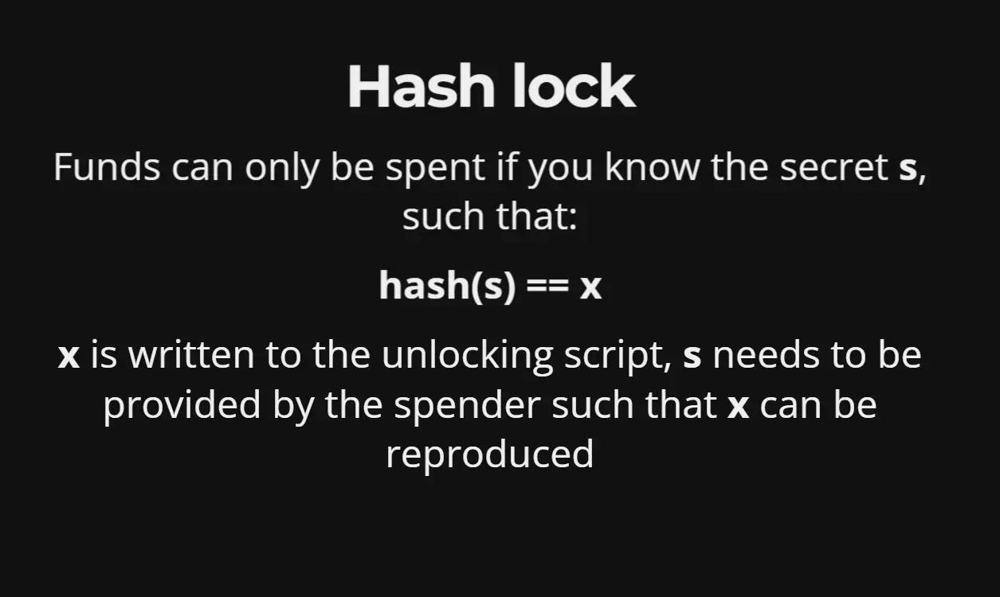_Función de bloqueo de hash_

### Consideraciones Prácticas y Dinámicas de la Red

En un escenario práctico, el flujo de pago de Alice implica pagar a Eric a través de múltiples intermediarios, como Bob, Carol y Diana. Cada participante en esta cadena es responsable de retirar fondos del participante anterior.

#### Actualizaciones del Estado del Canal

Los canales actualizan su estado basado en acuerdos mutuos y firmas entre participantes. Por ejemplo, Alice y Bob pueden actualizar el estado de su canal sin necesariamente usar el secreto "R", siempre y cuando estén de acuerdo en los términos de la transacción.

#### Atomicidad Asegurada

El mecanismo HTLC asegura la atomicidad mediante el uso de bloqueos de tiempo y firmas. Esta salvaguarda asegura que el protocolo de pago garantice el éxito completo o el fracaso, protegiendo contra pérdidas parciales de fondos.

_Restricciones combinadas_

#### Incentivos y Responsabilidades

Los intermediarios como Diana y Carol están incentivados a actuar correctamente dentro de la red. Si no lo hacen, las consecuencias normalmente afectan solo al intermediario mismo, promoviendo así un comportamiento responsable.

### Consideraciones Prácticas

Sin embargo, más saltos en la ruta de pago pueden aumentar la latencia, las tarifas y la posible falta de fiabilidad. Abrir múltiples canales puede ayudar a reducir el número de saltos necesarios para el enrutamiento, mejorando la eficiencia general.

#### Gráfico de Canales y Liquidez

Los nodos dentro de la red pueden ser parte de un gráfico de canales anunciado públicamente o permanecer no anunciado. La liquidez de estos canales juega un papel crucial en el enrutamiento efectivo, ya que los nodos necesitan balances suficientes para reenviar pagos con éxito.

#### Enrutamiento de Origen y Privacidad

Alice debe tener conocimiento de la topología de la red para decidir la ruta de pago. El enrutamiento de origen se emplea para preservar la privacidad a pesar de la complejidad del enrutamiento de pagos a través de múltiples intermediarios.

_Ruta de enrutamiento de origen_

#### Conclusión

En resumen, el funcionamiento adecuado de los nodos asegura pagos atómicos, y la Lightning Network tiene como objetivo abordar muchos de los problemas enfrentados por los sistemas de pago tradicionales como Ripple. Al aprovechar los HTLC y el enrutamiento estratégico, la Lightning Network proporciona una solución más escalable, eficiente y segura para pagos descentralizados.

## Revisión de BOLT

<chapterId>ba4b09ae-81de-53f2-8c15-316f037aaea9</chapterId>


La red Bitcoin opera como un sistema de intercambio de valor sin confianza, que sirve principalmente como una capa de liquidación donde las transacciones se registran en un libro mayor público. Esto asegura seguridad e inmutabilidad, pero presenta limitaciones, especialmente en términos de velocidad de transacción y tarifas. Como resultado, Bitcoin puede ser ineficiente para transacciones pequeñas diarias.

Entra en escena la Lightning Network o Lightning Network, que funciona como una segunda capa sobre la blockchain de Bitcoin. Esta red de pagos está diseñada para facilitar transacciones rápidas y de bajo costo. Al abrir un canal de pago entre dos partes, pueden transaccionar fuera de la cadena, solo registrando los saldos inicial y final en la blockchain de Bitcoin. Esto reduce significativamente la carga en la red principal, mejorando la escalabilidad y haciendo que las microtransacciones sean viables.

Para entender mejor el concepto, considera la analogía de una cuenta en un bar. Cuando abres una cuenta en un bar, puedes seguir pidiendo bebidas sin pagar después de cada una. Finalmente, pagas el monto total al final de la noche. De manera similar, un canal de Lightning permite múltiples transacciones fuera de la cadena, que solo se liquidan en la cadena cuando el canal se cierra. Otra analogía es un aeropuerto, donde enrutar un pago a través de múltiples nodos es similar a tomar vuelos de conexión para llegar a tu destino. Cada nodo (o "vuelo") ayuda a dirigir tu pago a donde debe ir, asegurando un enrutamiento eficiente.

_La analogía del aeropuerto de LN_

En esencia, la Lightning Network complementa la red Bitcoin al abordar sus limitaciones, transformándola de una mera capa de liquidación en un sistema versátil capaz de manejar transacciones diarias de manera eficiente.

### **Especificaciones de la Lightning Network**

El protocolo de la Lightning Network está meticulosamente definido a través de 10 BOLTs (Basis of Lightning Technology). Estos BOLTs fueron acordados durante una conferencia en Milán y sirven como base para las diversas implementaciones de la Lightning Network.

_Diagrama BOLT_

#### BOLT 1 (Protocolo Base)

BOLT 1 describe el formato de los mensajes utilizando una estructura de Tipo-Longitud-Valor (TLV), lo que asegura que los mensajes sean comprendidos de manera uniforme en las diferentes implementaciones. La comunicación se realiza típicamente a través de un puerto TCP específico, y los mensajes pueden ser categorizados en:

- **Mensajes de Comunicación**: Incluyen mensajes `Init`, `Error`, `Warning`, `Ping`, y `Pong`, que establecen conexiones, manejan errores, prueban el estado de la conexión y ocultan el tráfico.
- **Mensajes de Configuración del Canal**: Son cruciales durante la fase de establecimiento de un canal.
- **Mensajes de Estado del Canal**: Manejan actualizaciones dentro de los canales activos, asegurando que ambas partes estén sincronizadas.
- **Mensajes de Gossip**: Se utilizan para el descubrimiento y actualización de la topología de la red.
- **Mensajes Experimentales**: Permiten probar nuevas características sin interrumpir la red.

#### BOLT 2 (Ciclo de Vida del Canal)

BOLT 2 explora el ciclo de vida del canal, desde el establecimiento hasta las operaciones normales y, eventualmente, la liquidación. Los procesos clave incluyen:

- **Establecimiento del Canal**: En esta fase, las partes abren un canal, intercambian firmas y crean una transacción de financiamiento.
- **Operación Normal**: Aquí, el estado del canal se actualiza continuamente utilizando Contratos de Bloqueo de Tiempo Hashed (HTLCs). Los mensajes de compromiso y revocación aseguran que ambas partes estén de acuerdo con el estado actual.
- **Liquidación**: Esto implica cerrar el canal, generalmente a través de un acuerdo mutuo y la negociación de tarifas, para finalizar las transacciones sin entrar en un bucle de cierre indefinido.

#### Mecanismo de Actualización

Los HTLCs juegan un papel fundamental en el enrutamiento de pagos de la red, permitiendo transacciones seguras sin necesidad de confianza. Los mensajes de compromiso y revocación aseguran un acuerdo mutuo sobre el estado del canal y previenen fraudes.

#### Mensajes Especiales

Mensajes específicos como `Update Fee` ajustan las tarifas de minero para transacciones de compromiso, mientras que los mensajes `Channel Reestablish` aseguran que ambos pares se mantengan sincronizados después de desconexiones.

#### Cierre de Canales

Los canales pueden cerrarse mediante acuerdo mutuo, acción unilateral o castigo si se detecta fraude. Un cierre adecuado finaliza las transacciones de manera segura.

#### Intercambios para Gestión de Liquidez

Los intercambios permiten retiros en la cadena y una gestión de liquidez eficiente sin necesidad de cerrar canales. Se están desarrollando soluciones futuras como el splicing para mejorar este proceso.

#### Medidas de Seguridad

Las transacciones de compromiso incorporan mecanismos como nLockTime, OPCheckSequenceVerify y claves de revocación para asegurar los fondos y prevenir robos.

### Enrutamiento y Enrutamiento Cebolla

_Diagrama de Onion routing o Enrutamiento Cebolla_

Los pagos se enrutan utilizando enrutamiento cebolla, que implica crear paquetes encriptados enviados a través de múltiples nodos. Los HTLCs aseguran la transacción, garantizando privacidad y seguridad.

### Estructura de Factura

Las facturas o invoices de la Lightning Network (BOLT 11) están codificadas en Bech32 e incluyen detalles como el hash de pago, la descripción y la fecha de expiración. Cada factura debe usarse una sola vez para evitar problemas de reutilización.

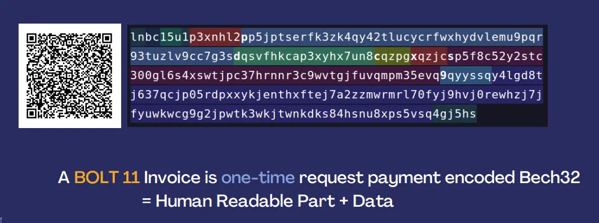_Factura BOLT11_

#### Cifrado y Autenticación

Los procedimientos de apretón de manos y el cifrado (Chacha20) con autenticación (Poly1305) aseguran la integridad y privacidad de los mensajes en las transacciones de Lightning.

#### Alternativas

Otros métodos de solicitud de pago como LNURL, KeySend y BOLT 12 ofrecen diversas características y niveles de adopción, proporcionando flexibilidad en la red.

#### Descubrimiento de la Red

El descubrimiento de la red en la Lightning Network ha evolucionado desde su uso inicial de IRC (Internet Relay Communication) a un protocolo más sofisticado definido por BOLT 7. Este protocolo utiliza mensajes específicos de Lightning—comúnmente referidos como mensajes de gossip—para descubrir y mantener la topología de la red.

#### Mensajes de Bolt7

Los mensajes clave de BOLT 7 incluyen:

- **Anuncio de Nodo**: Este mensaje transmite la existencia de un nodo.
- **Anuncio de Canal**: Este mensaje informa a la red sobre la creación de un nuevo canal.
- **Firma de Anuncio**: Esto asegura la autenticidad de los mensajes transmitidos.
- **Actualización de Canal**: Este mensaje comunica actualizaciones sobre un canal, como estructuras de tarifas y montos máximos de HTLC.

#### Proceso de Anuncio de Canal

El proceso comienza con los pares locales intercambiando detalles de identidad y del canal. Tras verificar firmas y transacciones de financiamiento, anuncian el canal a sus pares en la red, asegurando que toda la red se mantenga actualizada con los cambios más recientes en la topología.

#### Arranque DNS

El descubrimiento de pares en Lightning se facilita mediante consultas DNS y semillas DNS de Bitcoin, que proporcionan información sobre IP y nodos. Este mecanismo inicial de descubrimiento ayuda a los nodos a conectarse a la red rápidamente.

#### Anuncios de Funcionalidades

Los nodos pueden difundir las funcionalidades que soportan, asegurando compatibilidad hacia atrás mientras permiten mejoras opcionales. Esta flexibilidad asegura que todos los nodos puedan interactuar sin problemas, incluso a medida que el protocolo evoluciona.

#### Manejo de Facturas BOLT 11

La red asegura la unicidad de las facturas BOLT 11 para evitar pagos múltiples por la misma factura. Si se reutiliza una factura, los nodos de la red interceptan y previenen pagos dobles, manteniendo la integridad de las transacciones.

#### Transmisión de Datos de Voz

Aunque es posible, la transmisión de datos de voz a través de la Lightning Network está muy comprimida y limitada por el tamaño de los mensajes. Un ejemplo de aplicación es Sphinx, que explora el uso innovador de Lightning para la transmisión de datos.

#### Casos de Uso y Debates

El propósito de la Lightning Network es un tema de debate continuo. Aunque está diseñado principalmente para pagos, se están explorando otros casos de uso como la transmisión de datos, aunque no son universalmente aceptados. La comunidad discute continuamente sobre las aplicaciones potenciales de la red y las mejoras del protocolo.

#### Discusiones de la Comunidad

La comunidad de la Lightning Network es vibrante, participando en debates y discusiones continuas sobre casos de uso, aplicaciones del protocolo y mejoras potenciales. Este entorno colaborativo fomenta la innovación mientras asegura que la red evolucione para satisfacer las necesidades de los usuarios.

En conclusión, entender la Importancia de la Segunda Capa, las Especificaciones de la Lightning Network y los mecanismos de Descubrimiento de la Red es crucial para cualquiera que quiera profundizar en las complejidades de la Lightning Network. Es un campo complejo pero altamente gratificante que promete transformar el futuro de las transacciones digitales.

## Principales Clientes de LN

<chapterId>a2ad8db4-aea2-5231-927c-616c53db31bf</chapterId>


La Lightning Network (LN) representa un avance significativo en la escalabilidad y velocidad de transacción de Bitcoin. Los clientes de LN, típicamente conocidos como billeteras Lightning, son software o aplicaciones especializadas que permiten a los usuarios realizar transacciones a través de la Lightning Network. Estas billeteras sirven como una interfaz crucial entre el usuario y la LN, facilitando transacciones instantáneamente liquidadas y con bajas tarifas al aprovechar los caminos fuera de la cadena.

Las billeteras Lightning están diseñadas para hacer que el proceso sea amigable para el usuario, permitiendo que incluso aquellos con conocimientos técnicos mínimos se beneficien de las funcionalidades avanzadas de Bitcoin. Al permitir microtransacciones rápidas y económicas, estas billeteras contribuyen significativamente a la adopción más amplia de Bitcoin para transacciones diarias.

_Billeteras Lightning_

### Billeteras de Bitcoin vs. Billeteras Lightning

Las billeteras de Bitcoin y las billeteras Lightning difieren fundamentalmente en su arquitectura y casos de uso, aunque comparten la característica común de la gestión de claves privadas:

#### Billeteras de Bitcoin:

- **Preocupación por la Clave Privada**: El enfoque principal de las billeteras de Bitcoin es quién posee la clave privada. Esto determina la seguridad y el control de los fondos del usuario.
- **Complejidad de la Transacción**: Las billeteras de Bitcoin manejan varios scripts de transacción como Segregated Witness (SegWit) y Taproot, que optimizan el tamaño de las transacciones y mejoran la privacidad y seguridad.

#### Billeteras Lightning:

- **Gestión de Claves Privadas**: Al igual que con las billeteras de Bitcoin, el control de las claves privadas sigue siendo crucial.
- **Gestión de Liquidez**: Una característica distintiva de las billeteras Lightning es la necesidad de gestionar la liquidez, lo que implica equilibrar la liquidez local (saldos de salida) y remota (saldos de entrada) para asegurar un enrutamiento de transacciones fluido. Esto requiere que los usuarios comprendan y optimicen sus canales para facilitar el reenvío eficiente de pagos.

#### Gestión de Liquidez en las Billeteras Lightning

La gestión efectiva de la liquidez es una piedra angular de las operaciones exitosas de la Lightning Network. Implica el equilibrio estratégico de dos tipos principales de liquidez:

#### Liquidez Local (de Salida):

- Esta representa la cantidad de Bitcoin que un usuario puede enviar desde sus canales Lightning. Es crucial para iniciar pagos y asegurar que las transacciones puedan ser enrutadas al destinatario.

#### Liquidez Remota (de Entrada):

- Esta representa la cantidad de Bitcoin que un usuario puede recibir a través de sus canales. Es igualmente importante, ya que asegura que otros puedan enviar pagos al usuario.

#### Ejemplo de Gestión de Liquidez:

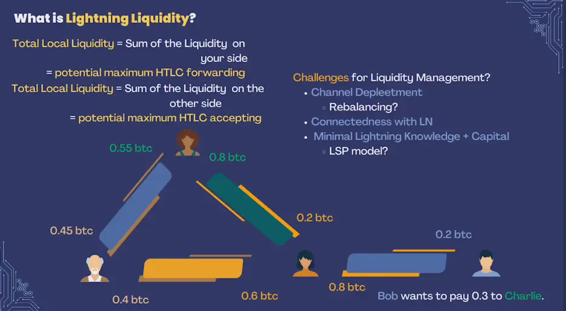_Liquidez en Lightning_

Considera un escenario que involucra a Alice, Bob, Charlie y Dan - usuarios típicos de LN interconectados a través de varios canales:

- Alice quiere pagar a Dan pero carece de suficiente liquidez local en su canal con Bob.
- Si Bob tiene un saldo adecuado y un canal con Charlie, y Charlie tiene un canal con Dan, el pago de Alice puede ser enrutado a través de Bob y Charlie para llegar a Dan.

_Liquidez en Lightning_

Sin embargo, si alguno de estos canales enfrenta agotamiento o problemas de conectividad, la transacción puede fallar. Esto ilustra la importancia de mantener una liquidez equilibrada en toda la red.

#### Desafíos en la Lightning Network:

- **Agotamiento de Canales**: Con el tiempo, los canales pueden desequilibrarse, con fondos concentrados en un lado, limitando las capacidades de transacción.
- **Problemas de Conectividad**: Un enrutamiento eficiente de transacciones requiere conexiones de red robustas, que pueden ser difíciles de mantener.

Para abordar estos desafíos, los Proveedores de Servicios de Liquidez (LSPs) ofrecen servicios para ayudar a gestionar la liquidez, a menudo por una tarifa, asegurando que los usuarios mantengan balances óptimos en sus canales para transacciones fluidas.

### Diferentes Billeteras y Sus Características

Existen diversas billeteras Lightning disponibles, cada una adaptada a diferentes necesidades y preferencias de los usuarios. Aquí algunos ejemplos:

#### Wallet of Satoshi:

- **Características**: Totalmente custodiada, amigable para el usuario, pero de código cerrado con posibles preocupaciones de privacidad.

#### Albi:

- **Características**: Extensión de navegador, de código abierto, soporta modelos tanto custodiados como no custodiados, mejorando la versatilidad.

#### Breeze:

- **Características**: Nodo ligero en un teléfono, de código abierto, combina auto-custodia con gestión de liquidez, proporcionando un equilibrio entre control y conveniencia.

#### Phoenix:

- **Características**: Similar a Breeze, utiliza un modelo LSP para la liquidez, de código abierto, se enfoca en la simplicidad del usuario y en una gestión eficaz de la liquidez.

#### Open Bitcoin Wallet (OBW):

- **Características**: Integra billeteras on-chain y Lightning, soporta canales alojados, de código abierto con características avanzadas, adecuado para usuarios avanzados.

### Matriz de Custodia y Gestión de Liquidez

Las billeteras pueden clasificarse en función de quién posee las claves privadas y quién gestiona la liquidez. Esta matriz ayuda a los usuarios a elegir billeteras que se alineen con sus preferencias de seguridad y conveniencia:

- **Billeteras Custodiadas**: Terceros mantienen las claves privadas, generalmente ofrecen gestión automática de liquidez. Ejemplos incluyen Wallet of Satoshi.
- **Billeteras No Custodiadas**: Los usuarios mantienen las claves privadas, pueden requerir gestión manual de liquidez. Ejemplos incluyen Breeze y OBW.

_Matriz 2x2 de Clientes LN_

### Críticas y Áreas de Mejora

A pesar de sus beneficios, las billeteras Lightning enfrentan varias críticas y áreas de mejora:

- **Privacidad**: Las billeteras de código cerrado y ciertos modelos custodiados plantean preocupaciones de privacidad.
- **Facilidad de Uso**: Equilibrar características avanzadas con facilidad de uso sigue siendo un desafío.
- **Desarrollo de Código Abierto**: Los diversos niveles de contribuciones de código abierto afectan la confianza de los usuarios y el ritmo de la innovación.

### Perspectivas Adicionales y Casos de Uso

#### Desafíos de Algoritmos:

Los algoritmos actuales para encontrar el camino óptimo dentro de la Lightning Network a menudo son subóptimos, involucrando prueba y error. Se necesitan mejoras para aumentar la eficiencia del enrutamiento.

#### Pagos Multipartitos:

Dividir pagos grandes en transacciones más pequeñas puede aliviar problemas de liquidez y de búsqueda de rutas, asegurando transacciones más suaves.

#### Ganancias por Enrutamiento:

Las ganancias a través de tarifas de enrutamiento suelen ser mínimas, lo que hace menos atractivo para los usuarios individuales operar nodos de enrutamiento con fines de lucro.

#### Ejemplos de Billeteras:

- **Blink Wallet**: Basada en El Salvador, custodial, requiere número de teléfono, presenta sats estables, pero carece de características avanzadas de la Lightning Network.
- **Blitz Wallet**: De código abierto, auto-custodia, requiere gestión de liquidez por parte del usuario, ofrece información extensa para usuarios avanzados.
- **SwissBitcoinPay**: Diseñada para comerciantes, custodial por hasta 24 horas, tarifas mínimas para usuarios de alto volumen.

#### Casos de Uso de Billeteras:

Diferentes billeteras sirven para propósitos distintos, desde facilidad de uso para principiantes hasta características avanzadas para usuarios avanzados. No hay una "mejor" billetera; la elección depende de las necesidades y preferencias individuales.

#### Contribución de Código Abierto:

Los comentarios de los usuarios y las contribuciones a proyectos de código abierto son invaluables para el desarrollo y el crecimiento personal, fomentando un entorno colaborativo e innovador.

En conclusión, entender los diversos aspectos de los clientes de la Lightning Network, sus diferencias con las billeteras tradicionales de Bitcoin y la importancia de una gestión efectiva de la liquidez es crucial para aprovechar todo el potencial de la Lightning Network. Al elegir la billetera adecuada y participar activamente en el ecosistema, los usuarios pueden mejorar significativamente su experiencia con las transacciones de Bitcoin.

# Los Desafíos de LN

<partId>ca58c9d7-ba7e-5392-8488-6a21a9850e6a</partId>

## Desafíos Prácticos para LN

<chapterId>014c7c40-aef7-58ac-b51f-33784463f482</chapterId>

**(el video estará disponible pronto)**

En esta sesión, Asi0 aborda los desafíos prácticos que se enfrentan al trabajar con la Lightning Network (LN). A pesar de su enfoque revolucionario para escalar las transacciones de Bitcoin, la Lightning Network presenta varios desafíos prácticos que tanto los usuarios como los desarrolladores deben navegar. En particular, exploraremos cuatro desafíos principales: **gestión de liquidez**, **abstracción de Capa 1/Capa 2**, **recepción de pagos fuera de línea** y **gestión de respaldos**.

Cada uno de estos desafíos se examina desde dos perspectivas: la del **usuario** y la del **desarrollador**, ya que los desafíos y soluciones varían dependiendo del rol que juegas en el ecosistema.

---

### Desafío 1: Gestión de Liquidez

#### **Desde la Perspectiva del Usuario:**

En la Lightning Network, **liquidez** se refiere a la disponibilidad de fondos en los canales de pago necesarios para realizar o recibir pagos. Los usuarios deben asegurarse de tener suficiente liquidez entrante y saliente para transacciones exitosas. Por ejemplo, si deseas recibir pagos, debes tener liquidez entrante disponible, lo que significa que otro nodo debe asignar parte de su saldo a tu canal. De manera similar, si deseas enviar pagos, necesitas liquidez saliente en tu canal.

- **Problema Práctico**: Los usuarios a menudo encuentran difícil equilibrar sus canales y mantener suficiente liquidez. Además, el reequilibrio de canales puede incurrir en costos.
- **Posibles Soluciones**: Algunas billeteras Lightning han comenzado a integrar el reequilibrio automático de canales, pero esta función aún está en desarrollo. Los usuarios también dependen de los **Proveedores de Servicios de Liquidez (LSPs)** para ayudar con la gestión de liquidez.

#### **Desde la Perspectiva del Desarrollador:**

Los desarrolladores enfrentan el desafío de implementar una gestión de liquidez fluida dentro de las aplicaciones. Necesitan crear herramientas que automaticen el reequilibrio y reduzcan la fricción para los usuarios, mientras optimizan las tarifas y evitan cuellos de botella en la liquidez.

- **Problema Práctico**: Implementar algoritmos efectivos para enrutar pagos a través de una red con liquidez variable puede ser complejo y computacionalmente intensivo.
- **Posibles Soluciones**: Los desarrolladores están explorando algoritmos avanzados para el **enrutamiento de liquidez** y utilizando **canales dualmente financiados** para asegurar que la liquidez esté disponible en ambos extremos de una transacción.

> **Definiciones**:
>
> - **Liquidez**: La disponibilidad de fondos en un canal Lightning para realizar o recibir pagos.
> - **LSP (Proveedor de Servicios de Liquidez)**: Un servicio que ayuda a los usuarios a gestionar la liquidez y los canales en la Lightning Network.

---

### Desafío 2: Abstracción L1/L2

#### **Desde la Perspectiva del Usuario:**

La interacción entre **Capa 1 (L1)** (la capa base de Bitcoin) y **Capa 2 (L2)** (la Lightning Network) a menudo no está completamente abstraída para los usuarios. Por ejemplo, abrir y cerrar canales requiere transacciones en la cadena de Bitcoin (L1), y los usuarios deben pagar tarifas en la cadena para estas acciones. Esto introduce complejidad adicional y posibles retrasos cuando la red de Bitcoin está congestionada.

- **Problema Práctico**: Los usuarios a menudo tienen dificultades para entender cuándo están interactuando con la capa base de Bitcoin versus la capa Lightning. Esto puede resultar en confusión respecto a las tarifas, los tiempos de transacción y la seguridad.
- **Posibles Soluciones**: Diseños de billeteras mejorados que abstraigan las interacciones L1/L2 y gestionen la apertura/cierre de canales en segundo plano. Algunas billeteras ya permiten a los usuarios cambiar de manera fluida entre transacciones en la cadena y Lightning, dependiendo de las circunstancias.

#### **Desde la Perspectiva del Desarrollador:**

Los desarrolladores tienen la tarea de abstraer las complejidades de L1 y L2 para los usuarios, creando interfaces suaves e intuitivas que manejen las transacciones de manera eficiente. El desafío es optimizar la experiencia del usuario mientras se mantiene la integridad y seguridad del protocolo Lightning.

- **Problema Práctico**: Asegurar que el usuario esté protegido de las complejidades técnicas de gestionar canales y transacciones en la cadena, mientras se mantiene la transparencia cuando sea necesario.
- **Posibles Soluciones**: Los desarrolladores están trabajando en características como **splicing** (que permite añadir o retirar fondos de un canal sin necesidad de cerrarlo) y herramientas automáticas de gestión de canales.

> **Definiciones**:
>
> - **L1 (Capa 1)**: La capa principal de la cadena de bloques de Bitcoin.
> - **L2 (Capa 2)**: La Lightning Network, que opera sobre Bitcoin para habilitar transacciones más rápidas y económicas.
> - **Splicing**: Una técnica que permite modificaciones en el saldo de un canal Lightning sin necesidad de cerrarlo.

---

### Desafío 3: Recepción de Pagos Offline

#### **Desde la Perspectiva del Usuario:**

Uno de los desafíos en la Lightning Network es **recibir pagos cuando el usuario está offline**. A diferencia de la capa base de Bitcoin, donde las transacciones se pueden recibir en cualquier momento, Lightning requiere que tanto el pagador como el receptor estén en línea para completar una transacción. Esta es una limitación significativa para muchos usuarios que desean utilizar pagos Lightning en situaciones cotidianas.

- **Problema Práctico**: Los usuarios no pueden recibir pagos a menos que su nodo esté en línea y conectado a la red, lo que resulta inconveniente para aquellos que desean usar Lightning como un método de pago diario.
- **Posibles Soluciones**: Algunas soluciones incluyen el uso de billeteras custodiales o la dependencia de servicios de terceros que actúan como intermediarios de pagos hasta que el nodo receptor vuelva a estar en línea.

#### **Desde la Perspectiva del Desarrollador:**

Los desarrolladores están explorando formas de permitir a los usuarios recibir pagos Lightning incluso cuando sus nodos están offline. Esto requiere soluciones creativas para mantener la naturaleza descentralizada de Lightning mientras se aborda el problema práctico de estar constantemente conectado.

- **Problema Práctico**: Desarrollar un protocolo o sistema que permita a los usuarios recibir pagos offline sin comprometer la seguridad o la descentralización es un desafío técnico significativo.
- **Posibles Soluciones**: La investigación sobre **vales de pago offline**, que permitirían a los receptores reclamar pagos una vez que se reconecten a la red, está en curso.

> **Definiciones**:
>
> - **Pagos Offline**: Pagos enviados o recibidos mientras una de las partes no está conectada a la Lightning Network.
> - **Billeteras Custodiales**: Billeteras en las que un tercero controla las claves privadas y gestiona las transacciones en nombre del usuario.

---

### Desafío 4: Gestión de Copias de Seguridad

#### **Desde la Perspectiva del Usuario:**

Hacer copias de seguridad de los canales Lightning es crucial para que los usuarios puedan recuperar sus fondos en caso de que su nodo se caiga o se pierdan datos. Sin embargo, el proceso de respaldo para los canales Lightning es más complejo que para Bitcoin porque los canales son "stateful", lo que significa que cambian con cada transacción.

- **Problema Práctico**: Los usuarios necesitan asegurarse de que sus copias de seguridad de los canales estén actualizadas, ya que usar una copia de seguridad desactualizada puede resultar en la pérdida de fondos o en penalizaciones por parte de la red.
- **Posibles Soluciones**: Billeteras como Phoenix y otras han implementado copias de seguridad automáticas de canales, pero estas características aún no son ubicuas en todas las billeteras Lightning.

#### **Desde la Perspectiva del Desarrollador:**

Los desarrolladores necesitan implementar soluciones de respaldo que permitan a los usuarios recuperar sus fondos de manera segura y confiable, incluso después de fallos catastróficos. El desafío es asegurar que estas soluciones sean seguras y fáciles de usar, mientras se mantiene la integridad del protocolo Lightning.

- **Problema Práctico**: Diseñar sistemas de respaldo que sean seguros, descentralizados y amigables para el usuario presenta un desafío significativo, ya que las copias de seguridad deben mantenerse actualizadas con cada cambio de estado en un canal.
- **Posibles Soluciones**: Los **Backups de Canales Estáticos (SCBs)** se han desarrollado para simplificar la recuperación, pero se necesitan soluciones más avanzadas para copias de seguridad completamente automatizadas y seguras.

> **Definiciones**:
>
> - **Backup de Canal Estático (SCB)**: Un tipo de copia de seguridad que permite a los usuarios recuperar sus fondos de un canal Lightning en caso de fallo, restaurando el último estado del canal.

---

#### Conclusión

La Lightning Network ofrece beneficios tremendos en términos de velocidad y eficiencia de costos para las transacciones de Bitcoin, pero también presenta varios desafíos prácticos. Estos desafíos (**gestión de liquidez**, **abstracción L1/L2**, **recepción de pagos offline**, y **gestión de copias de seguridad**) requieren soluciones innovadoras tanto de los usuarios como de los desarrolladores. A medida que la red sigue evolucionando, superar estos obstáculos será clave para lograr una adopción generalizada y mejorar la experiencia del usuario en general.

Al abordar estos desafíos, la Lightning Network seguirá evolucionando, convirtiéndose en una solución más robusta y confiable para escalar Bitcoin.

## Futura Evolución de LN

<chapterId>c06763dd-bb26-5fec-8ac4-3e446e9517cd</chapterId>


### 1. Resiliencia y Evolución de Bitcoin

**Mascota de Bitcoin: Tejón Melero**
Bitcoin a menudo es personificado por el tejón melero, una criatura conocida por su tenacidad y resistencia. Este símbolo representa adecuadamente la robustez e inflexibilidad de Bitcoin. Así como el tejón de miel puede soportar mordeduras venenosas y continuar prosperando, Bitcoin ha demostrado una notable resistencia ante diversas adversidades, incluidos desafíos regulatorios, volatilidad del mercado y ataques técnicos.

**La Naturaleza de Bitcoin: Evolución Constante**
Contrario a la noción de ser estático, Bitcoin está en un estado de evolución perpetua. Su protocolo y ecosistema son continuamente refinados y mejorados por una comunidad global de desarrolladores e investigadores. Este proceso evolutivo es impulsado por la necesidad de mejorar la seguridad, escalabilidad y funcionalidad, asegurando que Bitcoin se mantenga a la vanguardia del paisaje de las criptomonedas.

### 2. Innovaciones en la Lightning Network

**Lightning Network: Desarrollo Rápido**
La Lightning Network, la solución de segunda capa de Bitcoin para escalar y acelerar transacciones, está experimentando un desarrollo rápido. Esta capa permite transacciones rápidas y de bajo costo al habilitar canales de pago fuera de la cadena. Se están integrando innovaciones significativas para mejorar su eficiencia y usabilidad.

**Canales Dual-Fundados**
Tradicionalmente, un canal de Lightning es financiado por una sola parte. Sin embargo, los canales dual-fundados permiten que ambas partes (por ejemplo, Alice y Bob) contribuyan a la liquidez del canal. Esta mejora facilita una mayor flexibilidad tanto en la capacidad de envío como de recepción y requiere comunicación previa y nuevos protocolos para gestionar el financiamiento conjunto.

**Splicing**
El splicing es una función que permite a los usuarios modificar el tamaño de un canal de Lightning sin cerrarlo. Esta funcionalidad permite la adición o eliminación de fondos de un canal existente, proporcionando una forma fluida de gestionar la liquidez del canal. El splicing fomenta la interoperabilidad entre las transacciones en cadena y los canales de Lightning, mejorando la eficiencia general de la red.

**Mecanismo L2**
El mecanismo L2 introduce un nuevo método para invalidar estados antiguos de canales sin depender del mecanismo de penalización. Esta actualización depende de SIGHASH_ANYPREVOUT, una característica que requiere un soft fork de Bitcoin. El mecanismo L2 promete simplificar la gestión de canales y mejorar la seguridad.

**BOLT 12**
BOLT 12 aborda las limitaciones de las facturas BOLT 11 actuales utilizadas en la Lightning Network. Introduce facturas reutilizables y automatiza procesos, eliminando la necesidad de servidores HTTP y web al operar exclusivamente dentro de la Lightning Network. Esta innovación simplifica las transacciones y mejora la experiencia del usuario.

### 3. Mejorando la Privacidad y Eficiencia en las Transacciones de Bitcoin

**Taproot, MuSig y Firmas Schnorr**
Taproot es una actualización significativa que consolida la complejidad de las transacciones y mejora la privacidad. Cuando se combina con MuSig (un protocolo para transacciones de firma múltiple) y las Firmas Schnorr, Taproot mejora la eficiencia de las transacciones. Estos avances permiten que las transacciones Lightning se asemejen a las transacciones regulares de Bitcoin, simplificando el proceso y reforzando la privacidad.

**Ruteo PTLC**
Los Contratos de Tiempo Bloqueado por Punto (PTLCs) son una mejora sobre los Contratos de Bloqueo de Tiempo de Hash (HTLCs) existentes. Los PTLCs utilizan firmas Schnorr y mejoran la privacidad al reemplazar secretos compartidos con claves públicas, reduciendo la posibilidad de correlación de pagos y mal uso.

**Fábricas de Canales**
Las fábricas de canales permiten la creación de canales multiparte (por ejemplo, multisig 4-de-4), que pueden generar nuevos canales de pago 2-de-2 fuera de la cadena. Este sistema permite la creación y cierre rápido de canales sin tarifas, aunque requiere la cooperación de todos los participantes. Las fábricas de canales aumentan la escalabilidad y flexibilidad general de la Lightning Network.

**Watchtowers**
Los watchtowers o torres de vigilancia son entidades de terceros que monitorean la blockchain en busca de estados antiguos de canales. Si se detecta una infracción, publican transacciones de penalización para garantizar la seguridad de la red. Aunque los watchtowers mejoran la seguridad al disuadir el comportamiento indebido, también introducen preocupaciones de privacidad relacionadas con la monitorización de transacciones.

**Rutas Ciegas**
Las rutas ciegas están diseñadas para mejorar la privacidad del receptor en la Lightning Network. Oscurecen la dirección del receptor final, asegurando que solo el remitente conozca el nodo intermedio, y cada nodo solo sea consciente de sus nodos adyacentes. Este método protege la identidad del receptor y mejora la privacidad general.

**Proveedores de Servicios Lightning (LSPs)**
Conceptualizados por Breeze Wallet, los Proveedores de Servicios Lightning (LSPs) tienen como objetivo mejorar la experiencia del usuario al permitir capacidades de recepción instantánea. Los LSPs abren canales para los usuarios, de manera similar a cómo los proveedores de servicios de internet ofrecen servicios de conectividad. Esta innovación simplifica el proceso de incorporación del usuario y asegura interacciones fluidas en la Lightning Network.

**Recursos para Mantenerse Actualizado**
Para mantenerse al tanto de las últimas innovaciones técnicas en Bitcoin y la Lightning Network, es esencial aprovechar recursos valiosos. El boletín Bitcoin OpTec, la lista de correo de desarrolladores de Lightning y los materiales de expertos de la industria como Jason Lopp proporcionan ideas y actualizaciones sobre los avances y la investigación en este campo en rápida evolución.

Al comprender y apreciar estos desarrollos, podemos reconocer el progreso multifacético y el potencial que tanto Bitcoin como la Lightning Network tienen para el futuro de las transacciones digitales.

## Protocolos sobre LN

<chapterId>f4d147bb-f146-5b36-a994-b9b70da83744</chapterId>


### Extending and Integrating Lightning Payments

#### Entendiendo los Pagos Lightning

Antes de profundizar en las extensiones e integraciones de los pagos Lightning, es esencial entender el funcionamiento básico de un pago Lightning. Un pago Lightning convencional implica varios componentes clave: el **pagador**, el **beneficiario** y la **Lightning Network** en sí. El pagador inicia un pago al beneficiario generando una **factura**, que incluye información crítica como el monto a pagar y el destino (el nodo del beneficiario).

El proceso se basa en **Contratos de Tiempo Bloqueado por Hash (HTLCs)**, que garantizan que los pagos solo puedan ser reclamados por el destinatario legítimo dentro de un marco de tiempo específico. Dos elementos importantes en este mecanismo son **Enrutamiento Cebolla** y la **Cadena HTLC**:

- **Onion Routing o Enrutamiento Cebolla**: Proporciona privacidad encapsulando los datos de la transacción en capas, asegurando que cada intermediario solo conozca sus nodos anteriores y siguientes, pero no la ruta completa.
- **Cadena HTLC**: Una serie de contratos que bloquean los fondos hasta que el pago se complete o se revierta.

Un protocolo más reciente que mejora las capacidades de la Lightning Network es **Keysend**. A diferencia de los métodos tradicionales que requieren comunicación previa entre el remitente y el destinatario para generar una factura, Keysend permite **pagos iniciados por el remitente**, agilizando el proceso y mejorando la experiencia del usuario.

Sin embargo, las facturas tradicionales tienen sus limitaciones. Por ejemplo:

- **Uso Único**: Las facturas suelen utilizarse para una sola transacción, lo que puede ser inconveniente.
- **Limitaciones de Tamaño**: Las facturas grandes pueden ser difíciles de manejar en forma de código QR, haciéndolas poco prácticas para ciertas aplicaciones.

> **Definiciones**:
>
> - **Factura**: Una solicitud de pago en la Lightning Network, que generalmente contiene el monto y los detalles del destinatario.
> - **HTLC (Contrato de Bloqueo Temporal por Hash)**: Un tipo de contrato inteligente utilizado para asegurar pagos condicionales dentro de un límite de tiempo.
> - **Enrutamiento Cebolla**: Una técnica de privacidad donde los datos de la transacción se encapsulan en capas como una cebolla para proteger las identidades del remitente y el destinatario.

#### Protocolos y Casos de Uso

Para superar las limitaciones de las facturas tradicionales, han surgido varios protocolos que extienden y mejoran los pagos Lightning.

- **LNURL**: Un protocolo que simplifica la generación de facturas al permitir la creación dinámica de facturas, soportar denominaciones en fiat y habilitar el uso de **direcciones Lightning**. Este enfoque mejora significativamente la experiencia del usuario al ofrecer métodos de pago más flexibles e integración con diferentes casos de uso.

- **BOLT 12 Offers**: Este protocolo es similar a LNURL pero utiliza **mensajería Onion** para una mayor privacidad. BOLT 12 permite a los usuarios obtener facturas automáticamente sin intervención manual, mejorando tanto la privacidad como la usabilidad.

Una integración notable de los pagos Lightning es en **Nostr**, una plataforma de redes sociales descentralizada. Nostr integra pagos Lightning para habilitar propinas y microtransacciones, demostrando cómo Lightning puede ser incorporado en aplicaciones diversas.

Otro protocolo, **RGB**, extiende aún más la funcionalidad de Lightning al permitir **transferencias de activos** sobre la Lightning Network. RGB permite la transferencia de varios activos, incluidos tokens, a través de canales Lightning, ampliando el alcance de lo que se puede transaccionar.

**Proveedores de Servicios de Liquidez Lightning (LSPs)** también juegan un papel crítico en la extensión de los pagos Lightning. Los LSPs proporcionan liquidez para recibir pagos, ayudan a abrir **canales dualmente financiados** y aseguran transacciones sin problemas al interceptar pagos y abrir canales sobre la marcha.

> **Definiciones**:
>
> - **LNURL**: Un protocolo que permite la creación dinámica de facturas, facilitando los pagos y haciéndolos más flexibles.
> - **BOLT 12**: Una extensión de Lightning que aprovecha la mensajería Onion para la privacidad mientras automatiza la obtención de facturas.
> - **Nostr**: Una plataforma descentralizada que integra pagos Lightning para microtransacciones.
> - **Protocolo RGB**: Un protocolo que permite la transferencia de activos, como tokens, sobre la Lightning Network.
> - **LSP (Proveedor de Servicios Lightning)**: Una entidad que proporciona liquidez y abre canales para transacciones Lightning, haciendo que la red sea más accesible para los usuarios.

#### Modelos de Negocio y Protocolos Avanzados

Los avances en los pagos Lightning han allanado el camino para nuevos modelos de negocio, particularmente para los **Proveedores de Servicios Lightning (LSPs)**. Los LSPs mejoran la experiencia del usuario al abrir canales solo cuando se detectan pagos, reduciendo así la complejidad de la configuración previa.

Un ejemplo de un modelo de negocio facilitado por Lightning es el **modelo de subasta**. En este modelo, un servidor mantiene la oferta más alta y rechaza las ofertas más bajas, manteniendo los pagos pendientes hasta que concluye la subasta. Esto evita la necesidad de reembolsos y agiliza el proceso de subasta.

Otro ejemplo práctico se encuentra en **juegos de póker**, donde el servidor gestiona los pagos al mantener las apuestas hasta el final del juego, asegurando un proceso de apuestas sin interrupciones.

Los pagos Lightning también se están integrando en plataformas como **Nostr** y servicios de podcasts, demostrando la versatilidad de estos protocolos. Además, los **pre-imágenes** de los pagos pueden usarse como **claves de acceso** para desbloquear contenido o servicios, agregando aún más utilidad a la Lightning Network.

Protocolos avanzados como **Contratos de Tiempo Bloqueado por Punto (PTLCs)** llevan a Lightning aún más allá al permitir operaciones criptográficas más complejas. Los PTLCs ofrecen mejoras en el enrutamiento y la división de pagos, mejorando tanto la seguridad como la eficiencia.

Protocolos como **LNURL** y **BOLT 12** simplifican los pagos al reducir las interacciones manuales, asegurando que la Lightning Network se vuelva más amigable para el usuario y ampliamente adoptada.

> **Definiciones**:
>
> - **PTLC (Contrato de Tiempo Bloqueado por Punto)**: Un primitivo criptográfico que mejora los HTLCs, permitiendo pagos más flexibles y seguros.
> - **Pre-imagen**: Un valor utilizado para desbloquear un HTLC, que también puede servir como una clave de acceso para servicios.
> - **Modelo de Subasta**: Un modelo de pago donde los pagos se mantienen pendientes durante una subasta y se liberan solo cuando se acepta la oferta más alta.

### Conclusión

La extensión e integración de los pagos Lightning a través de varios protocolos y casos de uso demuestran la dinámica evolución de la Lightning Network. Desde la mejora de la funcionalidad básica de los pagos hasta la introducción de modelos de negocio avanzados y protocolos criptográficos, el futuro de Lightning promete una innovación significativa y una adopción generalizada.

# Bonus

<partId>4c5c74d7-40a9-5292-9b82-e3f3d79875e1</partId>

## Fundamentos de la Minería de Bitcoin

<chapterId>a4eacfc3-7b37-5fa3-abd1-b1fc48b645f0</chapterId>


#### Introducción

Ajelex se centra en el aspecto empresarial de la minería de Bitcoin, examinando estrategias para mantener la rentabilidad en un mercado competitivo. La discusión incluye un análisis de los costos operativos, medidas de eficiencia y la economía que impulsa la industria minera.

### 1. Complejidad de la Minería y Factores de Rentabilidad

#### Factores Técnicos y Estratégicos

La complejidad minera en el contexto de Bitcoin involucra principalmente los elementos técnicos y estratégicos que determinan la rentabilidad de las operaciones de minería. Es crucial entender que la minería no es solo un juego de azar, sino un proceso sofisticado que requiere una planificación cuidadosa y una optimización continua.

#### Factores Clave de Rentabilidad


1. **Costos de Electricidad**: Uno de los factores más significativos que afecta la rentabilidad de la minería es el costo de la electricidad. En regiones como Francia, la electricidad puede ser relativamente cara en comparación con países como El Salvador, donde los costos más bajos ofrecen una ventaja competitiva para los mineros.
2. **Eficiencia del Hardware**: La eficiencia del hardware de minería, medida por su tasa de hash y consumo de energía, juega un papel crucial. Los mineros ASIC avanzados como el S19J Pro son mucho más eficientes que los modelos antiguos como el Antminer S9.
3. **Período de Tiempo**: La minería de Bitcoin fomenta la planificación a largo plazo.
4. **Precio de BTC**: El precio de BTC es esencial para determinar la rentabilidad minera.
5. **Dificultad de la Red**: La dificultad de la red representa la cantidad de hash rate necesario para minar un bloque en aproximadamente 10 minutos.
6. **Herramientas Estratégicas**: Herramientas como [braiins.com](https://insights.braiins.com) son invaluables para calcular la rentabilidad y ayudar a los mineros a tomar decisiones basadas en datos.

#### Aplicación Práctica

Desde mi experiencia personal, incluso he usado la minería para calentar mi apartamento en Francia, compensando creativamente los costos de electricidad mientras minaba Bitcoin. Este ejemplo subraya la practicidad de integrar las operaciones de minería en la vida cotidiana para obtener beneficios adicionales.

#### Cuellos de Botella en la Minería

Los mineros enfrentan tres cuellos de botella principales: disponibilidad de hardware, acceso a energía y el capital necesario para mantener las operaciones. La escasez de ASICs debido a la alta demanda a menudo conduce a largos tiempos de espera y precios inflacionarios, complicando aún más el panorama minero.

- Ejemplo de **Cuello de Botella de Energía**:
  En 2021, el gobierno chino prohibió la minería dentro de su territorio, haciendo que las empresas mineras en China perdieran acceso a la energía. Esto resultó en una caída del **50%** en la tasa de hash durante dos semanas.


---

### 2. Evolución y Eficiencia del Hardware de Minería

#### Evolución Histórica

El viaje del hardware de minería ha sido monumental, comenzando desde la minería con CPU hasta los altamente especializados mineros ASIC que usamos hoy en día.


1. **Minería con CPU**: En los primeros días, la minería se realizaba utilizando procesadores de computadora regulares (CPUs). Este método rápidamente quedó obsoleto a medida que la red creció.
2. **Minería con GPU**: Las Unidades de Procesamiento Gráfico (GPUs) proporcionaron un impulso significativo en la eficiencia de la minería, haciendo que las CPUs fueran obsoletas para fines de minería.
3. **Minería con FPGA**: Las Matrices de Puertas Programables en Campo (FPGAs) ofrecieron un rendimiento y eficiencia energética aún mejores que las GPUs.
4. **Minería con ASIC**: Los Circuitos Integrados de Aplicación Específica (ASICs) representan el pináculo de la eficiencia del hardware de minería, diseñados específicamente para operaciones mineras con un rendimiento inigualable.

#### Comparación Detallada: S19J Pro vs. Antminer S9

- **S19J Pro**: Conocido por su alta eficiencia y fiabilidad, el S19J Pro ofrece una tasa de hash superior con un menor consumo de energía, lo que lo hace ideal para operaciones a gran escala.
- **Antminer S9**: Aunque más antiguo y menos eficiente, el Antminer S9 sigue siendo popular para configuraciones más pequeñas y aficionados debido a su asequibilidad y rendimiento decente.


#### Eficiencia de Minería y Aprendizaje

La minería no solo proporciona recompensas financieras, sino también valiosa experiencia práctica. Adquirir bitcoins sin KYC a través de la minería puede ser una propuesta atractiva para aquellos preocupados por la privacidad.

#### Herramientas y Técnicas Avanzadas

El software de posventa puede mejorar la eficiencia y funcionalidad del hardware de minería. Herramientas que ofrecen capacidades de optimización y ajuste automático aseguran que cada chip opere a máxima eficiencia, equilibrando efectivamente la tasa de hash y el uso de energía.

---

### 3. Dinámicas Regulatorias y del Mercado en las Operaciones de Minería

#### Impacto Regulatorio

La regulación juega un papel significativo en la configuración del panorama minero. Por ejemplo, la prohibición de minería en China tuvo efectos profundos en las operaciones mineras globales, provocando una caída significativa en la tasa de hash de la red y llevando a una redistribución del poder minero a través de diferentes regiones.

#### Dinámicas del Mercado

1. **Disponibilidad y Costo del Hardware**: El precio y la disponibilidad de los mineros ASIC están influenciados por el precio del mercado de Bitcoin. La alta demanda durante los mercados alcistas resulta en escasez y precios inflacionarios.
2. **Valor del Hash y Precio del Hash**: Es esencial entender la distinción entre el valor del hash (satoshis ganados por terahash por día) y el precio del hash (valor monetario de la tasa de hash). Ambos están impactados por la dificultad de la red y el precio del mercado de Bitcoin.

#### Pools de Minería y Mecanismos de Recompensa

1. **Pools de Minería**: Al combinar recursos, los pools de minería proporcionan recompensas más estables, reduciendo la variabilidad y el riesgo asociado con la minería en solitario.
2. **Esquemas de Recompensa**: Diferentes mecanismos de recompensa, como Pay-Per-Share (PPS) y recompensas proporcionales, ofrecen varios perfiles de riesgo y recompensa para los mineros.

   - **Pay per Share (PPS)**: El sistema Pay-Per-Share recompensa a los mineros por cada acción válida que envían, independientemente de si el pool encuentra un bloque. **Shares** son unidades de prueba de que los mineros han completado el trabajo requerido, y el pool verifica estas shares.

   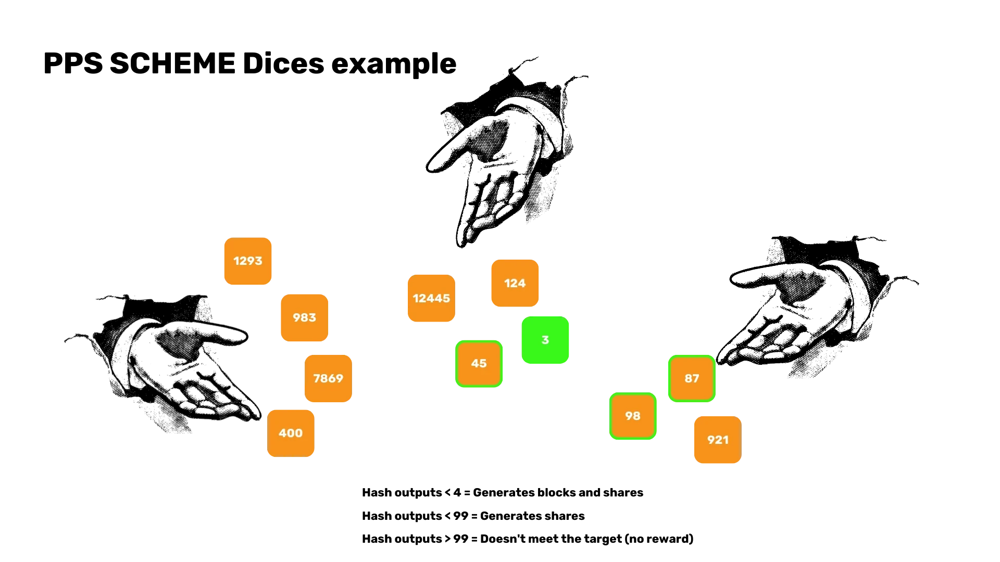

   - **Proporcional**: Depende de que el pool mine un bloque para distribuir la recompensa de manera equitativa a la contribución del minero a la tasa de hash total del pool.

   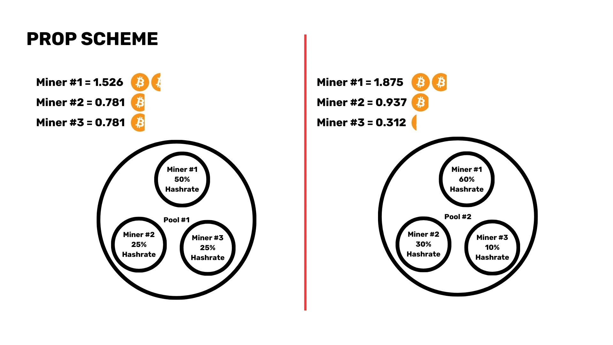

#### Futuro de la Minería

A medida que las recompensas por bloque disminuyen, los mineros dependerán cada vez más de las tarifas de transacción. Este cambio plantea preocupaciones sobre si las tarifas de transacción por sí solas proporcionarán incentivos suficientes para que los mineros continúen asegurando la red.

#### Minería Alojada

Los servicios de minería alojada pueden ofrecer menores costos operativos pero vienen con riesgos como la falta de control y el potencial de fraude. Es necesaria una debida diligencia adecuada para mitigar estos riesgos.

#### Seguridad y Eficiencia

Los protocolos de seguridad avanzados y el uso de energía renovable no solo mejoran la rentabilidad, sino que también contribuyen al crecimiento sostenible del ecosistema minero.

En conclusión, el mundo de la minería de Bitcoin es un dominio complejo y multifacético que requiere una comprensión profunda de las dinámicas técnicas, estratégicas, regulatorias y del mercado. Ya seas un minero experimentado o estés comenzando, mantenerse informado y adaptable es clave para prosperar en este campo en constante evolución.

## Comprendiendo Joinmarket

<chapterId>f109f64f-9b73-5fbf-8870-5d34d5b69df8</chapterId>


Adam Gibson ofrece información sobre Joinmarket, detallando cómo esta implementación de CoinJoin mejora la privacidad y fungibilidad de Bitcoin. Habla sobre cómo Joinmarket facilita transacciones colaborativas, sin confianza y anónimas dentro del ecosistema de Bitcoin. Luego, en una segunda parte, muestra cómo ejecutar Joinmarket en Signet.

## Cubo+ primer año Hackathon

<chapterId>3faf7daa-ea42-5b68-bcaf-04b70b2e02dd</chapterId>

### Grupo 1 Hackathon - El Legado de Satoshi


El grupo El Legado de Satoshi presenta su trabajo en la construcción de un comercio electrónico Lightning con Shopify, React JS y Hydrogen, y la pasarela de pago IBEX.

### Grupo 2 Hackathon - Honey Badger


El grupo Honey Badger presenta su solución para un blog con pagos micropagos Lightning integrados utilizando LnBits y Next.js, Node.js y Hydrogen.

### Grupo 3 Hackathon


El tercer grupo presenta un panel de control de nodo de la Lightning Network a través de una API personalizada, LND, vue.js, node.js y Bootstrap.

### Grupo 4 Hackathon - Satoshi Fellowship


El grupo de Satoshi Fellowship presenta una aplicación de juegos LN utilizando LnBits y MongoDB, Poetry, Node.js.

### Grupo 5 Hackathon - Lighting Walker


El grupo Lighting Walker presenta su solución para un servicio de remesas utilizando MySQL, JavaScript y la API de ZDB.

## Danos tu opinión sobre este curso

<chapterId>7f4f46e2-de71-5387-8609-9785fb9e5946</chapterId>
<isCourseReview>true</isCourseReview>

## Reconocimientos

<chapterId>33cb95cf-91d1-555b-a33b-0e3bd6745c33</chapterId>

Nos gustaría reconocer las contribuciones de nuestros educadores:

- Peter Todd
- Adam Gibson
- Alekos Filini
- Daniela Brozzoni
- Ajelex
- asi0
- Gabriel Comte

Su experiencia ha sido invaluable para el éxito de este curso. Este ha sido el primer curso basado en la primera edición de la iniciativa Cubo+, realizado en julio de 2023. Gracias a todos los participantes y educadores por ser parte de este viaje educativo pionero. Marca el comienzo de lo que esperamos sea un largo y fructífero camino en el desarrollo de Bitcoin. Como primera cohorte, su participación ha establecido el estándar para futuras clases.

Continúa explorando, aprendiendo y contribuyendo al ecosistema de Bitcoin. El conocimiento adquirido aquí es solo un punto de partida. Sigue profundizando en la madriguera del conejo y descubrirás un mundo de oportunidades en constante expansión.
