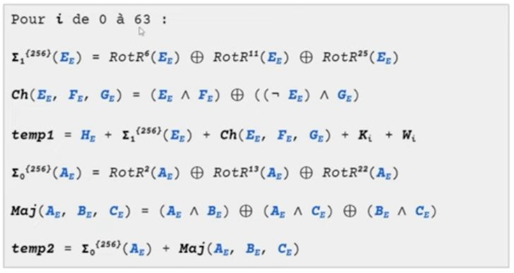
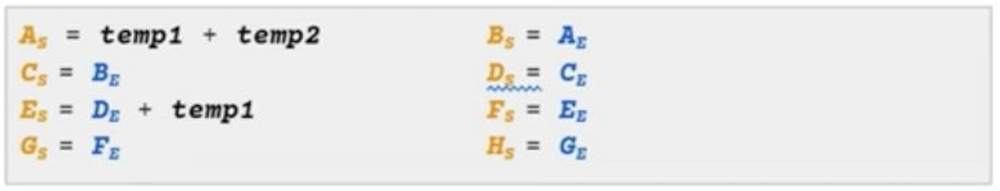
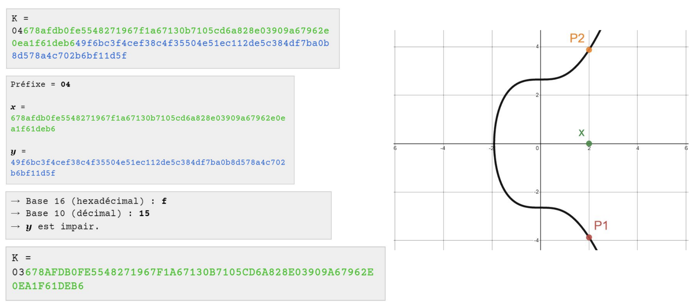

namn: Introduktion till kryptografi
mål: Förstå skapandet av en Bitcoin-plånbok ur ett kryptografiskt perspektiv
mål:

- Avmystifiera kryptografi-terminologin relaterad till Bitcoin.
- Behärska skapandet av en Bitcoin-plånbok.
- Förstå strukturen hos en Bitcoin-plånbok.
- Förstå adresser och härledningsvägar.

---

# En resa in i kryptografin

Är du fascinerad av Bitcoin? Undrar du hur en Bitcoin-plånbok fungerar? Gör dig redo för en spännande resa in i kryptografin! Vår expert Loïc kommer att guida dig genom skapandet av en Bitcoin-plånbok och avslöja mysterierna bakom skrämmande tekniska termer som hashning, nyckelhärledning och elliptiska kurvor.

Denna utbildning kommer inte bara att ge dig kunskap för att förstå strukturen hos en Bitcoin-plånbok, utan också förbereda dig för att dyka djupare in i den spännande världen av kryptografi. Är du redo att ge dig ut på denna resa? Gå med oss och omvandla din nyfikenhet till kompetens!

+++

# Introduktion

## Introduktion till kryptografi

### Är denna utbildning för dig? JA!


Vi välkomnar dig varmt till den nya utbildningen "Crypto 301: Introduktion till kryptografi och HD-plånbok", ledd av experten Loïc Morel. Denna kurs kommer att föra dig in i den fascinerande världen av kryptografi, den grundläggande disciplinen inom matematiken som säkerställer kryptering och säkerhet för dina data.

I vårt vardagsliv, och särskilt inom Bitcoin-området, spelar kryptografin en avgörande roll. Begrepp som privata nycklar, publika nycklar, adresser, härledningsvägar, frö och entropi är kärnan i användningen och skapandet av en Bitcoin-plånbok. Genom denna kurs kommer Loïc att förklara i detalj hur privata nycklar skapas och hur de är kopplade till adresser. Loïc kommer också att ägna en timme åt att förklara de matematiska detaljerna kring elliptiska kurvor. Dessutom kommer du att förstå varför användningen av HMAC SHA512 är viktig för att säkra din plånbok och vad skillnaden är mellan fröet och minnesfrasen.
Det ultimata målet med denna utbildning är att ge dig en teknisk förståelse för processen att skapa en HD-plånbok och de kryptografiska metoder som används. Under åren har Bitcoin-plånböcker utvecklats för att bli enklare att använda, säkrare och standardiserade genom specifika BIP:ar. Loïc kommer att hjälpa dig att förstå dessa BIP:ar för att förstå valen som Bitcoin-utvecklare och kryptografer gör. Precis som alla utbildningar som erbjuds av vårt universitet är denna helt gratis och öppen källkod. Det betyder att du fritt kan använda och anpassa den. Vi ser fram emot att höra dina åsikter efter avslutad kurs.

### Nu är det dags för professorn att tala!


Hej alla, jag är Loïc Morel, er guide genom denna tekniska utforskning av kryptografin som används i Bitcoin-plånböcker.

Vår resa börjar med en djupdykning i de kryptografiska hashfunktionernas avgrunder. Tillsammans kommer vi att demontera de viktigaste delarna av SHA256 och utforska olika algoritmer för avledning.

Vi kommer att fortsätta vår äventyrliga resa genom att avkoda den mystiska världen av digitala signaturer. Du kommer att upptäcka hur magin med elliptiska kurvor tillämpas på dessa signaturer, och vi kommer att belysa hur man beräknar den publika nyckeln från den privata nyckeln. Självklart kommer vi också att gå igenom processen för digital signering.

Därefter kommer vi att resa tillbaka i tiden för att se utvecklingen av Bitcoin-plånböcker och utforska begreppen entropi och slumpmässiga tal. Vi kommer att gå igenom den berömda mnemoniska frasen och även ta upp passfrasen. Du kommer till och med få möjlighet att uppleva något unikt genom att skapa en frö från 128 tärningskast!

Med denna gedigna grund kommer vi att vara redo för den avgörande delen: skapandet av en Bitcoin-plånbok. Från skapandet av fröet och master-nyckeln, till studien av utökade nycklar och avledningen av barnnyckelpar, kommer varje steg att analyseras noggrant. Vi kommer också att diskutera plånbokens struktur och avledningsvägar.

Som avslutning kommer vi att undersöka Bitcoin-adresser. Vi kommer att förklara hur de skapas och hur de spelar en avgörande roll i funktionen hos Bitcoin-plånböcker.

Häng med mig på denna spännande resa och förbered dig på att utforska kryptografins värld som aldrig tidigare. Lämna dina förutfattade meningar vid dörren och öppna ditt sinne för en ny förståelse av Bitcoin och dess grundläggande struktur.

# Hashfunktioner

## Introduktion till kryptografiska hashfunktioner relaterade till Bitcoin


Välkommen till dagens session som är dedikerad till en djupdykning i den kryptografiska världen av hashfunktioner, en grundläggande byggsten för säkerheten i Bitcoin-protokollet. Tänk dig en hashfunktion som en supereffektiv kryptografisk dekrypteringsrobot som omvandlar information av alla storlekar till en unik och fixerad digital avtryck, kallad "hash", "avtryck" eller "sammandrag".
Kort sagt tar en hashfunktion in en godtycklig storlek på meddelande som input och omvandlar det till en fixerad storlek på avtryck som output.

Att beskriva profilerna för kryptografiska hashfunktioner kräver förståelse för två viktiga egenskaper: deras oåterkallelighet och deras motståndskraft mot förfalskning.

Oåterkallelighet eller motståndskraft mot preimage innebär att beräkningen av outputen med vetskap om inputen kan göras enkelt, men beräkningen av inputen med vetskap om outputen är omöjlig.
Det är en enkelriktad funktion.


Motståndskraften mot förfalskning kommer från det faktum att minsta ändring i inputen ger en helt annorlunda output.
Dessa funktioner används för att verifiera integriteten hos nedladdade programvaror.


En annan avgörande egenskap de har är deras motståndskraft mot kollisioner och andra preimages. En kollision innebär att två olika inputs ger samma output.
Visst, i hashvärlden är kollisioner oundvikliga, men en utmärkt kryptografisk hashfunktion minimerar dem avsevärt. Risken måste vara så låg att den kan betraktas som obefintlig. Det är som om varje hash var ett hus i en enorm stad; trots det enorma antalet hus ser en bra hashfunktion till att varje hus har en unik adress.
Motståndet mot andra preimages beror på motståndet mot kollisioner; om det finns motstånd mot kollisioner finns det också motstånd mot andra preimages.
Givet en påtvingad input måste vi hitta en andra input, skild från den första, som ger en kollision i hashvärdet som output från funktionen. Motståndet mot andra preimages liknar motståndet mot kollisioner förutom det faktum att inputen är påtvingad.
Låt oss nu navigera på de stormiga vågorna av föråldrade hashfunktioner. SHA0, SHA1 och MD5 betraktas idag som rostiga skal i det kryptografiska hashhavet. De avråds ofta eftersom de har förlorat sin motståndskraft mot kollisioner. Principen om lådor förklarar varför, trots våra bästa ansträngningar, det är omöjligt att undvika kollisioner på grund av begränsningen av utdatastorleken. För att verkligen anses vara säker måste en hashfunktion motstå kollisioner, andra bilder och ursprungsbilder.

En nyckelkomponent i Bitcoin-protokollet är hashfunktionen SHA-256, skeppets kapten. Andra funktioner, som SHA-512, används för härledning med HMAC och PBKDF. Dessutom används RIPMD160 för att minska en hash till 160 bitar. När vi pratar om HASH256 och HASH160 hänvisar vi till användningen av dubbelhashning med SHA-256 och RIPMD.

För HASH256 är det en dubbelhashning av meddelandet med SHA256.

$$
SHA256(SHA256(meddelande))
$$

För HASH160 är det en dubbelhashning av meddelandet genom att först använda SHA256 och sedan RIPMD160.

$$
RIPMD160(SHA256(meddelande))
$$

Användningen av HASH160 är särskilt fördelaktig eftersom den möjliggör säkerheten hos SHA-256 samtidigt som storleken på hashen minskas.

Sammanfattningsvis är det ultimata målet med en kryptografisk hashfunktion att omvandla information av godtycklig storlek till en hash med fast storlek. För att anses vara säker måste den ha flera egenskaper: omvändbarhet, motståndskraft mot förfalskning, motståndskraft mot kollisioner och motståndskraft mot andra bilder.


Efter denna utforskning har vi avmystifierat kryptografiska hashfunktioner, framhävt deras användning i Bitcoin-protokollet och analyserat deras specifika mål. Vi har lärt oss att för att anses vara säkra måste hashfunktioner vara motståndskraftiga mot ursprungsbilder, andra bilder, kollisioner och förfalskning. Vi har också gått igenom utbudet av olika hashfunktioner som används i Bitcoin-protokollet. I vår nästa session kommer vi att dyka ner i hjärtat av SHA256-hashfunktionen och upptäcka de fascinerande matematiska egenskaperna som ger den dess unika egenskaper.

## SHA256:s mekanismer


Välkommen till fortsättningen på vår fascinerande resa genom de kryptografiska labyrinterna hos hashfunktionen. Idag avslöjar vi mysterierna hos SHA256, en komplex men smart process som vi tidigare introducerade.
För att påminna, syftet med SHA256 hashfunktionen är att ta ett meddelande som inmatning av vilken storlek som helst och generera en 256-bitars hash som utmatning.

### Förbehandling

Låt oss ta ett steg vidare i denna labyrint genom att börja med förbehandlingen av SHA256.

#### Padding-bitar

Målet med detta första steg är att ha ett meddelande som är jämnt delbart med 512 bitar. För att göra detta kommer vi att lägga till padding-bitar till meddelandet.

Låt M vara storleken på det ursprungliga meddelandet.
Låt 1 vara en bit reserverad för separering.
Låt P vara antalet bits som används för padding och 64 vara antalet bits som reserveras för den andra förbehandlingsfasen.
Totalt måste vara ett multiplum av 512 bitar, vilket representeras av n.


Exempel med ett inmatningsmeddelande på 950 bitar:

```
Steg 1: Bestäm storleken; det önskade slutliga antalet bits.
Det första multiplumet av 512 > (M + 64 + 1) (med M = 950) är 1024.
1024 = 2 * 512
Så n = 2.

Steg 2: Bestäm P, antalet padding-bitar som krävs för att nå det önskade slutliga antalet bits.
-> M + 1 + P + 64 = n * 512
-> M + 1 + P + 64 = 2 * 512
-> 940 + 1 + P + 64 = 1024
-> P = 1024 - 1 - 64 - 950
-> P = 9

Så det kommer att krävas att lägga till 9 padding-bitar för att få ett meddelande som är jämnt delbart med 512.
```

Och nu?
Direkt efter det ursprungliga meddelandet måste vi lägga till separeraren 1 följt av P, som i vårt exempel är nio 0.

```
meddelande + 1 000 000 000
```

#### Storlekspadding

Vi går nu vidare till den andra fasen av förbehandlingen, vilket innebär att vi lägger till den binära representationen av storleken på det ursprungliga meddelandet, i bitar.

Låt oss ta exemplet med en inmatning på 950 bitar:

```
Den binära representationen av talet 950 är: 11 1011 0110

Vi använder våra 64 reserverade bitar från föregående steg. Vi lägger till nollor för att avrunda våra 64 bitar till vår jämnt delbara inmatning. Sedan kombinerar vi det ursprungliga meddelandet, padding-bitar och storlekspadding för att få vår jämnt delbara inmatning.
```

Här är resultatet:


### Behandlingen

#### Förståelseförutsättningar

##### Konstanter och initialiseringsvektorer

Nu förbereder vi oss för de första stegen i SHA-256-funktionens bearbetning. Precis som i ett bra recept behöver vi vissa grundläggande ingredienser, som vi kallar konstanter och initialiseringsvektorer.
Initialiseringsvektorerna, från A till H, är de första 32 bitarna av decimaldelarna av kvadratroten ur de 8 första primtalen. De kommer att användas som grundvärden i de första stegen av bearbetningen. Deras värden är i hexadecimalt format.

Konstanterna K, från 0 till 63, representerar de första 32 bitarna av decimaldelarna av kubroten ur de 64 första primtalen. De används i varje omgång av komprimeringsfunktionen. Deras värden är också i hexadecimalt format.

##### Använda operationer

Inom komprimeringsfunktionen använder vi specifika operatorer som XOR, AND och NOT. Vi behandlar bitarna en efter en baserat på deras position, genom att använda XOR-operatorn och en sanningstabell. AND-operatorn används för att returnera 1 endast om båda operanderna är lika med 1, och NOT-operatorn används för att returnera det motsatta värdet av en operand. Vi använder också SHR-operationen för att skifta bitarna åt höger med ett valt antal steg.

Sanningstabellen:


Bitförskjutningsoperationer:


#### Komprimeringsfunktionen

Innan vi tillämpar komprimeringsfunktionen delar vi upp indata i block om 512 bitar. Varje block kommer att behandlas oberoende av de andra.

Varje block med 512 bitar delas sedan upp i bitdelar W på 32 bitar. På detta sätt representerar W(0) de första 32 bitarna av det 512-bitars blocket. W(1) representerar de följande 32 bitarna och så vidare tills vi når de 512 bitarna i blocket.

När alla konstanter K och bitdelar W är definierade kan vi utföra följande beräkningar för varje bitdel W i varje omgång.

Vi utför 64 beräkningsomgångar i komprimeringsfunktionen. Vid den sista omgången kommer vi att ha ett mellanresultat vid "Funktionsutgången" som kommer att adderas till det ursprungliga tillståndet för komprimeringsfunktionen.

Därefter upprepar vi alla dessa steg i komprimeringsfunktionen för nästa 512-bitars block, tills vi når det sista blocket.

Alla additioner i komprimeringsfunktionen är modulo 2^32 för att alltid behålla en 32-bitars summa.

##### En omgång av komprimeringsfunktionen

Komprimeringsfunktionen kommer att utföras 64 gånger. Vi har våra bitar W och våra tidigare definierade konstanter K som inmatning.
De röda kvadraterna/korsen motsvarar en addition modulo 2^32 bitar.

Ingångsvärdena A, B, C, D, E, F, G, H kommer att associeras med en 32-bitars värde för att totalt ge 32 \* 8 = 256 bitar.
Vi har också en ny följd A, B, C, D, E, F, G, H som utmatning. Denna utmatning kommer sedan att användas som inmatning i nästa runda och så vidare tills den 64:e rundan är klar.

Värdena för följden som används som inmatning i den första rundan av komprimeringsfunktionen motsvarar de fördefinierade initialiseringsvektorerna som nämndes tidigare.
För att påminna, representerar initialiseringsvektorerna de första 32 bitarna av decimaldelen av kvadratroten av de första 8 primtalen.

Här är ett exempel på en runda:



##### Det mellanliggande tillståndet

För att påminna, delas meddelandet upp i block om 512 bitar som sedan delas upp i bitar om 32 bitar. För varje block av 512 bitar tillämpar vi de 64 rundorna av komprimeringsfunktionen.
Det mellanliggande tillståndet motsvarar slutet av de 64 rundorna för ett block. Värdena i följden som utmatas efter den 64:e rundan används som initialvärden för följden som används som inmatning i den första rundan av nästa block.



#### Överblick över hashfunktionen


Vi kan observera att utmatningen från den första 512-bitars biten av meddelandet motsvarar våra initialiseringsvektorer som används som inmatning i den andra 512-bitars biten av meddelandet, och så vidare.

Utmattningen från den sista rundan, den sista biten motsvarar det slutliga resultatet av SHA256-funktionen.

Slutligen vill vi betona den avgörande roll som beräkningarna i CH, MAJ, σ0 och σ1 spelar. Dessa operationer, bland andra, är de som säkerställer robustheten hos SHA256-hashfunktionen mot attacker och gör den till ett föredraget val för säkerheten hos många digitala system, särskilt inom Bitcoin-protokollet. Det är uppenbart att även om SHA256 är komplex, ligger dess skönhet i dess förmåga att hitta inmatningen från hashvärdet, medan verifieringen av hashvärdet för en given inmatning är en mekaniskt enkel åtgärd.

## De använda algoritmerna för härledning


HMAC- och PBKDF2-algoritmerna är nyckelkomponenter i säkerhetsmekanismen för Bitcoin-protokollet. De förhindrar olika potentiella attacker och säkerställer integriteten hos Bitcoin-plånböcker.
HMAC och PBKDF2 är kryptografiska verktyg som används för olika uppgifter inom Bitcoin. HMAC används främst för att motverka längdutökningattacker vid härledning av deterministiska hierarkiska plånböcker (HD), medan PBKDF2 används för att omvandla en minnesfras till en frö.

#### HMAC-SHA512

HMAC-SHA512 tar två inmatningar: ett meddelande m (Inmatning 1) och en nyckel K som väljs godtyckligt av användaren (Inmatning 2).
Den har också en utmatning av fast storlek: 512 bitar.

```
Observera:
- m: godtyckligt meddelande valt av användaren (inmatning 1)
- K: godtycklig nyckel vald av användaren (inmatning 2)
- K': jämnlång nyckel K. Den har justerats till blockstorleken B.
- ||: konkateneringsoperation.
- opad: konstant definierad av byte 0x5c upprepat B gånger.
- ipad: konstant definierad av byte 0x36 upprepat B gånger.
- B: storleken på blocken i den använda hashfunktionen.
```


HMAC-SHA512, som tar ett meddelande och en nyckel som inmatning, genererar en utmatning av fast storlek. För att säkerställa enhetlighet justeras nyckeln baserat på blockstorleken som används i hashfunktionen. Inom ramen för härledning av HD-plånböcker används HMAC-SHA-512. Den här använder block på 1024 bitar (128 byte) och justerar nyckeln därefter. Den använder konstanterna OPAD (0x5c) och IPAD (0x36), upprepas så många gånger som behövs för att förstärka säkerheten.

Processen för HMAC-SHA-512 innebär att resultatet av SHA-512 tillämpat på nyckeln XOR OPAD och nyckeln XOR IPAD sammanslås med meddelandet. När det används med 1024-bitars block (128 byte) fylls inmatningsnyckeln med nollor vid behov och XOR:as sedan med IPAD och OPAD. Den modifierade nyckeln sammanslås sedan med meddelandet.


Att inkludera en extra källa till entropi i strängkoden ökar säkerheten för härledda nycklar. Utan den kan en attack kompromettera hela plånboken och stjäla alla bitcoins.

PBKDF2 används för att omvandla en minnesfras till en frö. Denna algoritm utför 2048 iterationer med HMAC SHA512. Genom dessa härledningsalgoritmer kan olika inmatningar ge en unik och fast utmatning, vilket löser problemet med möjliga längdutökningattacker på SHA-2-familjens funktioner.
En attack med längdutvidgning utnyttjar en specifik egenskap hos vissa kryptografiska hashfunktioner. I en sådan attack kan en angripare som redan har hashen av ett okänt meddelande använda den för att beräkna hashen av ett längre meddelande, som är en förlängning av det ursprungliga meddelandet. Detta är ofta möjligt utan att känna till innehållet i det ursprungliga meddelandet, vilket kan leda till allvarliga säkerhetsbrister om denna typ av hashfunktion används för uppgifter som integritetskontroll.

Slutsatsen är att HMAC- och PBKDF2-algoritmerna spelar en avgörande roll för säkerheten vid härledning av HD-plånböcker i Bitcoin-protokollet. HMAC-SHA-512 används för att skydda mot längdutvidgningsattacker, medan PBKDF2 möjliggör omvandling av minnesfrasen till en frö. Kedjekoden lägger till en extra källa till entropi i nyckelavledningen och säkerställer därmed systemets robusthet.

# Digitala signaturer

## Digitala signaturer och elliptiska kurvor


Var lagras dessa berömda bitcoins? Inte i en Bitcoin-plånbok, som man kan tro. I själva verket sparar en Bitcoin-plånbok de privata nycklarna som behövs för att bevisa ägandet av bitcoins. Själva bitcoins registreras på blockkedjan, en decentraliserad databas som arkiverar alla transaktioner.

I Bitcoin-systemet är enheten för räkning bitcoin (märk det med ett litet "b"). Den är delbar upp till åtta decimaler, där den minsta enheten är satoshi. UTXO, eller "Unspent Transaction Output", representerar utgångar från transaktioner som inte har spenderats och tillhör en offentlig nyckel som matematiskt är kopplad till en privat nyckel. För att spendera dessa bitcoins måste man kunna uppfylla transaktionens utgiftsvillkor. Ett vanligt utgiftsvillkor är att bevisa för resten av nätverket att användaren är den legitima ägaren till den offentliga nyckeln som är kopplad till UTXO. För att göra detta måste användaren bevisa att han/hon har den privata nyckeln som motsvarar den offentliga nyckeln för varje UTXO, utan att avslöja den privata nyckeln.

Detta möjliggörs genom den digitala signaturen. Den fungerar som ett matematiskt bevis på ägandet av en privat nyckel som är kopplad till en specifik offentlig nyckel. Denna dataskyddsteknik är i huvudsak baserad på ett fascinerande område inom kryptografin som kallas elliptisk kurvkryptografi (ECC).

Signaturen kan matematiskt verifieras av andra deltagare i Bitcoin-nätverket.


För att säkerställa säkerheten för transaktioner använder Bitcoin två protokoll för digital signatur: ECDSA (Elliptic Curve Digital Signature Algorithm) och Schnorr. ECDSA är ett signaturprotokoll som har funnits i Bitcoin sedan dess lansering 2009, medan Schnorr-signaturer lades till senare, i november 2021. Även om båda dessa protokoll bygger på elliptisk kurvkryptografi och använder liknande matematiska mekanismer, skiljer de sig främst åt i termer av signaturstruktur.
I denna kurs kommer vi att presentera ECDSA-algoritmen.

### Vad är en elliptisk kurva?

Elliptisk kurvkryptografi är en uppsättning algoritmer som använder en elliptisk kurva för dess olika geometriska och matematiska egenskaper i kryptografiska syften, och vars säkerhet bygger på svårigheten att beräkna diskreta logaritmer.

Elliptiska kurvor är användbara inom en rad kryptografiska tillämpningar på Bitcoin-protokollet, från nyckelutbyte till asymmetrisk kryptering och digitala signaturer.

Elliptiska kurvor har intressanta egenskaper:

- Symmetri: En icke-vertikal linje som skär två punkter på den elliptiska kurvan kommer också att skära kurvan i en tredje punkt.
- En icke-vertikal linje som är tangent till kurvan vid en punkt kommer alltid att skära kurvan i en unik andra punkt.

Bitcoin-protokollet använder en specifik elliptisk kurva som kallas Secp256k1 för att utföra sina kryptografiska operationer.

Innan vi går djupare in på dessa signaturmekanismer är det viktigt att förstå vad en elliptisk kurva är. En elliptisk kurva definieras av ekvationen y² = x³ + ax + b. Varje punkt på denna kurva har en distinkt symmetri som är nyckeln till dess användbarhet inom kryptografi.


I slutändan erkänns olika elliptiska kurvor som säkra för kryptografisk användning. Den mest kända är kanske kurvan secp256r1. Men för Bitcoin valde Satoshi Nakamoto en annan kurva: secp256k1.

Denna kurva definieras av parametrarna a=0 och b=7, och dess ekvation är y² = x³ + 7 modulo n, där n är ett primtal som bestämmer kurvans ordning.


Den första bilden representerar secp256k1-kurvan över de reella talen och dess ekvation.
Den andra bilden är en representation av secp256k1-kurvan över kroppen ZP, kroppen av naturliga och positiva heltal, modulo p där p är ett primtal. Det liknar en moln av punkter. Vi använder denna kropp av naturliga och positiva heltal för att undvika approximationer.
p är ett primtal, det är ordningen på kurvan som används.
Slutligen är ekvationen som används i Bitcoin-protokollet:

$$
y^2 = (x^3 + 7) mod(p)
$$

Ekvationen för elliptiska kurvan på bitcoin motsvarar den sista ekvationen på föregående bild.

I nästa avsnitt av denna kurs kommer vi att använda kurvor som finns på de reella talen bara för att underlätta förståelsen.

### Beräkna den publika nyckeln från den privata nyckeln


För att börja, låt oss dyka in i världen av algoritmen Elliptic Curve Digital Signature Algorithm (ECDSA). Bitcoin använder denna digitala signaturalgoritm för att koppla samman privata och publika nycklar. I detta system är den privata nyckeln ett slumpmässigt eller pseudoslumpmässigt tal med 256 bitar. Det totala antalet möjligheter för en privat nyckel är teoretiskt sett 2^256, men i verkligheten är det något mindre än så. För att vara exakt är vissa 256-bitars privata nycklar inte giltiga för Bitcoin.

För att vara kompatibel med Bitcoin måste en privat nyckel vara mellan 1 och n-1, där n representerar ordningen av den elliptiska kurvan. Detta innebär att det totala antalet möjligheter för en Bitcoin-privat nyckel är nästan lika med 1,158 x 10^77. För att sätta detta i perspektiv är det ungefär samma antal atomer som finns i det observerbara universum.


Den unika privata nyckeln, betecknad k, används sedan för att bestämma en publika nyckel.

Den publika nyckeln, betecknad K, är en punkt på den elliptiska kurvan som härleds från den privata nyckeln med hjälp av irreversibla algoritmer som ECDSA. När vi har kunskap om den privata nyckeln är det mycket enkelt att hitta den publika nyckeln, men när vi bara har den publika nyckeln är det omöjligt att hitta den privata nyckeln. Denna oåterkallelighet är hörnstenen i säkerheten för Bitcoin-plånboken.

Den publika nyckeln är 512 bitar eftersom den motsvarar en punkt på kurvan med en x-koordinat på 256 bitar och en y-koordinat på 256 bitar. Men den kan komprimeras till ett 264-bitars tal.


Generationspunkten (G) är punkten på kurvan från vilken alla publika nycklar genereras i Bitcoin-protokollet. Den har specifika x- och y-koordinater, vanligtvis representerade i hexadecimal form. För secp256k1 är G-koordinaterna i hexadecimal:

- `Gx = 79BE667E F9DCBBAC 55A06295 CE870B07 029BFCDB 2DCE28D9 59F2815B 16F81798`
- `Gy = 483ADA77 26A3C465 5DA4FBFC 0E1108A8 FD17B448 A6855419 9C47D08F FB10D4B8`
  Denna punkt är användbar för att härleda alla offentliga nycklar. För att beräkna den offentliga nyckeln K, multiplicera punkten G med den privata nyckeln k, så att: K = k.G

Vi kommer nu att studera hur man adderar och multiplicerar punkter på elliptiska kurvor.

#### Addition och dubbling av punkter på elliptiska kurvor

##### Addera två punkter M + L

En av de anmärkningsvärda egenskaperna hos elliptiska kurvor är att en icke-vertikal linje som skär kurvan i två punkter också kommer att skära den i en tredje punkt, kallad punkt O i vårt exempel. Denna egenskap används för att bestämma punkten U, som är motsatsen till punkten O.

M + L = U


##### Addera en punkt med sig själv = Dubbling av punkt

Att addera en punkt G till sig själv görs genom att dra en tangent till kurvan vid den punkten. Denna tangent, enligt egenskaperna hos elliptiska kurvor, kommer att skära kurvan i en andra unik punkt -J. Motsatsen till denna punkt, J, är resultatet av att addera punkten G till sig själv.
G + G = J

Faktum är att punkten G är startpunkten för att beräkna alla användares offentliga nycklar i Bitcoin-systemet.


#### Skalärprodukt på elliptisk kurva

Skalärprodukten av en punkt med n innebär att lägga till denna punkt till sig själv n gånger.

På samma sätt som vid dubbling av en punkt, görs skalärprodukten av punkten G med en punkt n genom att dra en tangent till kurvan vid punkten G. Denna tangent, enligt egenskaperna hos elliptiska kurvor, kommer att skära kurvan i en andra unik punkt -2G. Motsatsen till denna punkt, 2G, är resultatet av att addera punkten G till sig själv.

Om n = 4, upprepar vi operationen tills vi når 4G.


Här är ett exempel på beräkning för 3G:


Dessa operationer på punkter på en elliptisk kurva utgör grunden för beräkningen av offentliga nycklar. Att härleda en offentlig nyckel med vetskap om den privata nyckeln är mycket enkelt.
En offentlig nyckel är en punkt på den elliptiska kurvan, det är resultatet av vår addition och dubbling av punkten G k gånger. Med k = privat nyckel.

I detta exempel:

- Den privata nyckeln k = 4
- Den offentliga nyckeln K = kG = 4G


Med vetskap om den privata nyckeln k är det enkelt att beräkna den publika nyckeln K. Det är dock omöjligt att återfå den privata nyckeln baserat på den publika nyckeln. Är resultatet av en addition eller en dubbling av punkten?
I vår nästa lektion kommer vi att utforska hur en digital signatur utförs med hjälp av ECDSA-algoritmen med en privat nyckel för att spendera bitcoins.

## Signera med den privata nyckeln


Processen för digital signatur är en nyckelmetod för att bevisa att du är innehavare av en privat nyckel utan att behöva avslöja den. Detta uppnås genom att använda ECDSA-algoritmen, som innefattar att bestämma en unik nonce, beräkna ett specifikt nummer V och skapa en digital signatur bestående av två delar, S1 och S2.
Det är avgörande att alltid använda en unik nonce för att undvika säkerhetsattacker. Ett välkänt exempel på vad som kan hända när denna regel inte följs är fallet med PlayStation 3-hacket, som komprometterades på grund av återanvändning av nonce.


Steg:

- Bestäm en nonce v, det vill säga ett unikt slumpmässigt nummer.
  Nonce = Number Only Use Once (nummer som bara används en gång).
  Det bestäms av den som utför signaturen.
- Beräkna genom att addera och dubbla punkter på elliptiska kurvor från punkten G, positionen för V på den elliptiska kurvan.
  Så att V = v.G
  x och y är koordinaterna för V på planet.
- Beräkna S1.
  S1 = x mod n där n är ordningen på kurvan och x är en koordinat för V på planet.
  OBS: Antalet möjliga publika nycklar är större än antalet punkter på den elliptiska kurvan i den ändliga kroppen av positiva heltal som används i Bitcoin.
  Ordningen på kurvan motsvarar endast möjligheterna som den publika nyckeln kan ha på kurvan.
- Beräkna S2.
  H(Tx) = Hash av transaktionen
  k = den privata nyckeln
- Beräkna signaturen: sammanslagningen av S1 + S2.
- Beräkna P, verifieringsberäkningen av signaturen.
  K = den publika nyckeln

Till exempel, för att få den publika nyckeln 3G, ritar du en tangent till punkten G, beräknar motsatsen till -G för att få 2G, och sedan adderar du G och 2G. För att genomföra en transaktion måste du bevisa att du känner till talet 3 genom att låsa upp de bitcoins som är associerade med den publika nyckeln 3G.
För att skapa en digital signatur och bevisa att du känner till den privata nyckeln som är associerad med den publika nyckeln 3G, beräknar du först en nonce och sedan punkten V som är associerad med denna nonce (i det givna exemplet är det 4G). Sedan beräknar du punkten T genom att addera den publika nyckeln 3G och punkten V, vilket ger 7G.


Låt oss förenkla processen för digital signatur.
På föregående bild är den privata nyckeln k = 3.
Vi kan enkelt beräkna den publika nyckeln K som är associerad med denna privata nyckel: K = 3G.
Därefter genererar vi pseudo-slumpmässigt en nonce: v = 4.
Från denna nonce är det möjligt att beräkna V som: V = v.G = 4G.

Från denna punkt V beräknar vi punkten T som:
T = t.G = 7G (där t = 7).

Det är dags att verifiera den digitala signaturen.

Verifiering av en digital signatur är en avgörande steg i användningen av ECDSA-algoritmen, som gör det möjligt att bekräfta äktheten hos ett signerat meddelande utan att behöva avsändarens privata nyckel. Här är hur det går till i detalj:

I vårt exempel har vi två viktiga värden: t och V.
t är ett numeriskt värde (7 i detta exempel), och V är en punkt på den elliptiska kurvan (representerad av 4G här). Dessa värden genereras vid skapandet av den digitala signaturen och skickas sedan med meddelandet för att möjliggöra verifiering.

När verifieraren tar emot meddelandet kommer denne också att ta emot dessa två värden, t och V.

Här är stegen som verifieraren kommer att följa för att validera signaturen:

1. Först kommer verifieraren att beräkna hashvärdet för meddelandet, som vi kommer att kalla H.
2. Sedan kommer verifieraren att beräkna u1 och u2. För att göra detta kommer denne att använda följande formler:
   - u1 = H /\* (S2)^-1 mod n
   - u2 = T /\* (S2)^-1 mod n
     Där S2 är den andra delen av den digitala signaturen, n är ordningen för den elliptiska kurvan och (S2)^-1 är inversen av S2 mod n.
3. Verifieraren kommer sedan att beräkna en punkt P' på den elliptiska kurvan med hjälp av formeln: P' = u1 _ G + u2 _ K
   - G är punkten för kurvgenereringen
   - K är avsändarens publika nyckel
4. Verifieraren kommer sedan att beräkna I', som helt enkelt är x-koordinaten för punkten P' modulo n.
5. Slutligen kommer verifieraren att bekräfta att I' är lika med t. Om så är fallet anses signaturen vara giltig. Om inte, är signaturen ogiltig.
   Denna procedur garanterar att endast avsändaren som har den motsvarande privata nyckeln kan ha producerat en signatur som passerar denna verifieringsprocess.
   

Förenklat uttryckt:
Den som producerar signaturen kommer att ge den som verifierar antalet t (i vårt exempel, t = 7) och punkten V.

Det är omöjligt att bestämma den publika nyckeln eller den privata nyckeln från numret 7 och numret V.

Stegen för att verifiera den digitala signaturen är följande:

- På kurvan adderar den punkten för den publika nyckeln med punkten V för att hitta punkten T'.
- Den beräknar antalet t.G
- Den verifierar att resultatet av t.G faktiskt är lika med antalet T'

Sammanfattningsvis är verifieringen av en digital signatur en viktig procedur i Bitcoin-transaktioner. Den garanterar att det signerade meddelandet inte har ändrats under överföringen och att avsändaren verkligen är innehavaren av den privata nyckeln. Denna teknik för digital autentisering bygger på komplexa matematiska principer, inklusive elliptisk kurvaritmetik, samtidigt som den håller den privata nyckeln konfidentiell. Den erbjuder en solid säkerhetsgrund för kryptotransaktioner.

Med det sagt är hanteringen av dessa nycklar, liksom deras skapande, en annan viktig fråga inom Bitcoin. Hur genererar man ett nytt nyckelpar? Hur organiserar man en mängd nycklar på ett säkert och effektivt sätt? Hur återställer man dem vid behov?

För att svara på dessa frågor och fördjupa din förståelse för kryptosäkerhet kommer vår nästa kurs att fokusera på konceptet Hierarkisk Deterministisk Plånbok (HD-plånböcker) och användningen av mnemoniska fraser. Dessa mekanismer erbjuder eleganta sätt att effektivt hantera dina kryptonycklar samtidigt som säkerheten stärks.

# Mnemonisk fras

## Utvecklingen av Bitcoin-plånböcker


Hierarkisk Deterministisk Plånbok, eller mer vanligt kallad HD-plånbok, spelar en viktig roll i kryptomyntens ekosystem. Termen "plånbok" kan verka vilseledande för de som är nya inom området, eftersom den inte innebär att man äger pengar eller valutor. Istället hänvisar den till en samling av kryptografiska privata nycklar.

De första plånböckerna var programvara som samlade privata nycklar som genererades på ett pseudoslumpmässigt sätt men som inte hade något samband med varandra. Dessa plånböcker kallas "Just a Bunch Of Keys" (JBOK).

Eftersom nycklarna inte hade något samband med varandra var användaren tvungen att göra en ny säkerhetskopia för varje nytt nyckelpar som genererades.
Antingen använder användaren samma nyckelpar hela tiden och förlorar i sekretess, eller så genererar hen nya nyckelpar slumpmässigt och måste göra en ny säkerhetskopia av dessa nycklar.


Komplexiteten i hanteringen av dessa nycklar kompenseras dock av en uppsättning protokoll, kallade Bitcoin Improvement Proposals (BIP). Dessa uppgraderingsförslag är kärnan i funktionaliteten och säkerheten hos HD-plånböcker. Till exempel revolutionerade [BIP32](https://github.com/bitcoin/bips/blob/master/bip-0032.mediawiki), som lanserades 2012, hur dessa nycklar genereras och lagras genom att introducera konceptet av deterministisk och hierarkiskt härledda nycklar. Tanken är att härleda alla nycklar deterministiskt och hierarkiskt från en enda information: seeden. På så sätt förenklas processen att säkerhetskopiera dessa nycklar avsevärt samtidigt som deras säkerhetsnivå bibehålls.


Därefter introducerade [BIP39](https://github.com/bitcoin/bips/blob/master/bip-0039.mediawiki) en betydande innovation: en mnemonisk fras med 24 ord. Detta system omvandlade en komplex och svår att komma ihåg siffersekvens till en serie vanliga ord, mycket lättare att memorera och lagra. Dessutom föreslog [BIP38](https://github.com/bitcoin/bips/blob/master/bip-0038.mediawiki) att lägga till ett extra lösenord för att förstärka säkerheten för enskilda nycklar. Dessa påföljande förbättringar ledde till BIP43 och BIP44-standarderna, som standardiserade strukturen och hierarkin för HD-plånböcker och gjorde dessa plånböcker mer tillgängliga och enklare att använda för allmänheten.

I de följande avsnitten kommer vi att gå djupare in på hur HD-plånböcker fungerar. Vi kommer att behandla principerna för nyckelavledning och undersöka grundläggande begrepp som entropi och generering av slumpmässiga tal, vilka är avgörande för att säkerställa säkerheten för din HD-plånbok.

Sammanfattningsvis är det viktigt att betona den centrala rollen som BIP32 och BIP39 spelar i utformningen och säkerheten hos HD-plånböcker. Dessa protokoll möjliggör generering av många nycklar från en enda frö, som förväntas vara ett slumpmässigt eller pseudoslumpmässigt tal. Idag antas dessa standarder av majoriteten av kryptoplånböcker, oavsett om de är dedikerade till en enda kryptokurrency eller stöder flera typer av valutor.

## Entropi och slumpmässiga tal


Betydelsen av säkerheten för privata nycklar inom Bitcoin-ekosystemet är obestridlig. De utgör faktiskt hörnstenen för säkerheten hos Bitcoin-transaktioner. För att undvika sårbarheter relaterade till förutsägbarhet måste dessa nycklar genereras på ett verkligt slumpmässigt sätt, vilket kan vara en tidskrävande uppgift. Problemet är att det inom datavetenskap är omöjligt att generera ett verkligt slumpmässigt nummer eftersom det alltid kommer från en deterministisk process; en kod. Därför är det viktigt att lära sig om olika Slumptalsgeneratorer (RNG). Typerna av RNG varierar, från Pseudo-Random Number Generators (PRNG) till True Random Number Generators (TRNG), samt PRNG som inkluderar en källa till entropi.

Entropi hänvisar till graden av "oordning" i ett system. Genom att använda en extern entropi, det vill säga en extern informationskälla, är det möjligt att använda en slumpmässig nummergenerator för att få ett slumpmässigt nummer.

Låt oss nu titta på hur en Pseudo-Random Number Generator (PRNG) fungerar.

Den tar in en frö, det vill säga en information som motsvarar intern tillstånd 0.
På detta interna tillstånd tillämpas en transformationsfunktion och resultatet, som är ett pseudoslumpmässigt nummer, motsvarar intern tillstånd 1.
På detta interna tillstånd 1 tillämpas återigen en transformationsfunktion som resulterar i ett nytt slumpmässigt nummer = intern tillstånd 2.
Och så vidare.

Det stora problemet är att samma frö alltid kommer att ge samma resultat. Dessutom, om vi känner till resultatet av transformationsfunktionerna från början, kan vi återskapa det slumpmässiga numret som genereras.

Ett exempel på en transformationsfunktion är PBKDF2-funktionen.

**För att sammanfatta måste en kryptografiskt säker PRNG:**

- vara statistiskt slumpmässig
- vara oförutsägbar
- vara motståndskraftig även om resultaten avslöjas
- ha en tillräckligt lång period

I fallet med Bitcoin genereras privata nycklar från en enda grundläggande information i plånboken. Denna information möjliggör en deterministisk och hierarkisk härledning av barnnyckelpar. Entropin utgör grunden för alla HD-plånböcker, även om det inte finns någon standard för generering av detta slumpmässiga nummer. Därför är genereringen av slumpmässiga nummer en viktig fråga för att säkra Bitcoin-transaktioner.

## Mnemonisk fras


Säkerheten för en Bitcoin-plånbok är en stor oro för alla dess användare. Ett viktigt sätt att säkerhetskopiera plånboken är att generera en mnemonisk fras baserad på entropi och checksumma.


För att konvertera entropin till en mnemonisk fras behöver man bara beräkna checksumman för entropin och sammanslå entropin och checksumman.

När entropin har genererats använder man SHA256-funktionen på entropin för att skapa en hash.
De första 8 bitarna av hashen är checksumman.
Mnemonisk fras är resultatet av entropin plus checksumman.

Checksumman säkerställer att återställningsfrasen är korrekt. Utan denna checksumma kan ett fel i frasen leda till skapandet av en annan plånbok och därmed förlust av medel. Man får checksumman genom att köra entropin genom SHA256-funktionen och ta de första 8 bitarna av hashen.


Det finns olika standarder för mnemoniska fraser beroende på entropins storlek. Den vanligast använda standarden för en återställningsfras med 24 ord är en entropi på 256 bitar. Storleken på checksumman bestäms genom att dela entropins storlek med 32.

Till exempel genererar en entropi på 256 bitar en checksumma på 8 bitar. Så sammanslagningen av entropin och checksumman leder till respektive storlekar på 128 bitar, 160 bitar, osv. Beroende på entropins storlek kommer återställningsfrasen att bestå av 12 ord för 128 bitar, 15 ord för 160 bitar och 24 ord för 256 bitar.

**Kodningen av mnemoniska frasen:**


De sista 8 bitarna motsvarar checksumman.
Varje segment av 11 bitar konverteras till decimaltal.
Varje decimaltal motsvarar ett ord från en lista med 2048 ord på BIP39. Det är viktigt att påpeka att inget ord har de fyra första bokstäverna i samma ordning.

Det är viktigt att säkerhetskopiera den 24-ords återställningsfrasen för att bevara integriteten hos Bitcoin-plånboken. De två vanligast använda standarderna baseras på en entropi på 128 eller 256 bitar och en sammanslagning av 12 eller 24 ord. Att lägga till en lösenfras är ett extra alternativ för att förstärka säkerheten för plånboken.

Slutsatsen är att genereringen av en mnemonisk fras för att säkra en Bitcoin-plånbok är en avgörande process. Det är viktigt att följa standarderna för mnemoniska fraser baserat på entropins storlek. Att säkerhetskopiera den 24-ords återställningsfrasen är avgörande för att förhindra förlust av medel.

## Lösenfras


En passphrase är ett extra lösenord som kan läggas till i en Bitcoin-plånbok för att öka dess säkerhet. Dess användning är valfri och upp till användarens bedömning. Genom att lägga till godtycklig information som tillsammans med minnesfrasen möjliggör beräkning av plånbokens frö, stärker passphrase säkerheten för plånboken.


Passphrasen är en valfri kryptografisk salt av en storlek som användaren väljer. Den förbättrar säkerheten för en HD-plånbok genom att lägga till godtycklig information som, när den kombineras med minnesfrasen, möjliggör beräkning av fröet.

När den har etablerats vid skapandet av en plånbok, krävs den för härledningen av alla nycklar i plånboken. Funktionen pbkdf2 används för att generera fröet från passphrasen. Detta frö möjliggör härledning av alla barnnyckelpar i plånboken. Om passphrasen ändras blir Bitcoin-plånboken helt annorlunda.

Passphrasen är ett viktigt verktyg för att stärka säkerheten för Bitcoin-plånböcker. Den kan användas för att tillämpa olika säkerhetsstrategier. Till exempel kan den användas för att skapa dubbletter och underlätta säkerhetskopiering av minnesfrasen. Den kan också förbättra plånbokens säkerhet genom att minska riskerna med slumpmässig generering av minnesfrasen.

En effektiv passphrase bör vara lång (20 till 40 tecken) och varierad (använda versaler, gemener, siffror och symboler). Den bör inte vara direkt kopplad till användaren eller dess miljö. Det är säkrare att använda en slumpmässig sekvens av tecken istället för ett enkelt ord som passphrase.


En passphrase är säkrare än ett vanligt lösenord. Den idealiska passphrasen är lång, varierad och slumpmässig. Den kan stärka säkerheten för en plånbok eller varmvara. Den kan också användas för att skapa redundanta och säkra säkerhetskopior.

Det är viktigt att ta hand om säkerhetskopior av passphrasen för att undvika att förlora åtkomsten till plånboken. En passphrase är ett alternativ för en HD-plånbok. Den kan genereras slumpmässigt med tärningar eller en annan pseudoslumpgenerator. Det rekommenderas inte att memorera en passphrase eller minnesfras.

I vår nästa lektion kommer vi att undersöka hur fröet fungerar och det första nyckelparet som genereras från det. Tveka inte att följa den här lektionen för att fortsätta din inlärning. Vi ser fram emot att träffa dig snart igen.

# Skapa Bitcoin-plånböcker

## Skapa fröet och huvudnyckeln

Skapa fröet och huvudnyckeln

I den här delen av kursen kommer vi att utforska stegen för att härleda en HD-plånbok (Hierarchical Deterministic Wallet), som gör det möjligt att skapa och hantera privata och publika nycklar hierarkiskt och deterministiskt.

Grundvalen för HD-plånboken är två väsentliga element: minnesfrasen och lösenfrasen (valfritt extra lösenord). Tillsammans utgör de fröet, en alfanumerisk sekvens på 512 bitar som fungerar som grund för att härleda plånbokens nycklar. Med hjälp av detta frö kan alla barnnyckelpar för Bitcoin-plånboken härledas. Fröet är nyckeln som ger åtkomst till alla bitcoins som är associerade med plånboken, oavsett om du använder en lösenfras eller inte.

För att få fröet används funktionen pbkdf2 (Password-Based Key Derivation Function 2) med minnesfrasen och lösenfrasen. Utdata från pbkdf2 är ett frö på 512 bitar.

Med hjälp av fröet kan den huvudsakliga privata nyckeln och kedjekoden bestämmas genom att använda HMAC SHA-512 (Hash-based Message Authentication Code Secure Hash Algorithm 512). Denna algoritm kräver ett meddelande och en nyckel som inmatning för att generera ett resultat. Den huvudsakliga privata nyckeln beräknas från fröet och frasen "Bitcoin SEED". Denna fras är densamma för alla härledningar av alla HD-plånböcker och garanterar därmed en samstämmighet mellan plånböckerna.

Ursprungligen var inte SHA-512-funktionen implementerad i Bitcoin-protokollet, vilket är varför vi använder HMAC SHA-512. Användningen av HMAC SHA-512 med frasen "Bitcoin SEED" tvingar användaren att generera en plånbok specifik för Bitcoin. Resultatet av HMAC SHA-512 är ett 512-bitars tal, uppdelat i två delar: de vänstra 256 bitarna representerar den huvudsakliga privata nyckeln, medan de högra 256 bitarna representerar den huvudsakliga kedjekoden.

Den huvudsakliga privata nyckeln är den överordnade nyckeln för alla framtida nycklar i plånboken, medan kedjekoden används vid härledningen av barnnycklarna. Det är viktigt att notera att det är omöjligt att härleda ett barnnyckelpar utan att känna till den motsvarande kedjekoden för föräldraparet.

Ett nyckelpar i plånboken består av en privat nyckel, en publik nyckel och en kedjekod. Kedjekoden möjliggör införandet av slumpmässighet vid härledningen av barnnycklarna och isolerar varje nyckelpar för att undvika läckage av information.
Det är viktigt att betona att huvudprivatnyckeln är den första härledda privata nyckeln från seeden och har ingen koppling till plånbokens utökade nycklar.
I nästa lektion kommer vi att utforska utökade nycklar i detalj, som xPub, xPRV, zPub, och vi kommer att förstå varför de används och hur de konstrueras.

## Utökade nycklar


I den här delen av lektionen kommer vi att studera utökade nycklar (xPub, zPub, yPub) och deras prefix, som spelar en viktig roll i härledningen av barnnycklar i en HD-plånbok (Hierarchical Deterministic Wallet).


Utökade nycklar skiljer sig från huvudnycklar. En HD-plånbok genererar en mnemonisk fras och en seed för att få huvudnyckeln och huvudkedjekoden. Utökade nycklar används för att härleda barnnycklar och kräver både föräldernyckeln och den motsvarande kedjekoden. En utökad nyckel kombinerar dessa två uppgifter för att förenkla härledningsprocessen.


Utökade publika nycklar kan bara härledas från vanliga barnpublika nycklar, medan utökade privata nycklar kan härleda både publika och privata barnnycklar, antingen genom normal eller förstärkt härledning. Förstärkt härledning är härledning från förälderns privata nyckel. Normal härledning motsvarar härledning från förälderns publika nyckel.

Användningen av utökade nycklar med prefixet XPUB gör det möjligt att härleda nya adresser utan att behöva gå tillbaka till de motsvarande privata nycklarna, vilket ger bättre säkerhet. Metadata som är associerade med utökade nycklar ger viktig information om deras roll och position i nyckelhierarkin.

Utökade nycklar identifieras med specifika prefix (XPRV, XPUB, YPUB, ZPUB) som indikerar om det är en utökad privat eller offentlig nyckel, samt dess specifika syfte. Metadata som är associerad med en utökad nyckel inkluderar versionen (prefixet), djupet, fingeravtrycket för den offentliga nyckeln, indexet och nyttolasten (kedjekod och föräldernyckel).


Versionen motsvarar nyckeltypen: xpub, xprv, ...

Djupet motsvarar antalet härledningar mellan förälder-barn som har gjorts från huvudnyckeln.

Fingeravtrycket förälder är de första 4 oktetterna av hash 160 av föräldernyckeln.
Indexet är numret på paret som används för att generera den utökade nyckeln bland sina syskon. (syskon = nycklar med samma djup) Exempel: om vi vill härleda xpub för vårt tredje konto, kommer dess index att vara 2 (eftersom index börjar på 0).

Payloaden består av strängkoden (32 byte) och föräldernyckeln (33 byte).

Komprimerade publika nycklar är 33 byte långa, medan råa publika nycklar är 512 bitar. Komprimerade publika nycklar behåller samma information som råa nycklar, men med en mindre storlek. Utökade nycklar är 82 byte långa och deras prefix representeras i bas 58 genom en hexadecimal konvertering. Kontrollsiffran beräknas med hjälp av HASH256 hashfunktionen.


Förstärkta härledningar börjar från index som är potenser av 2 (2^31). Det är intressant att notera att de vanligast använda prefixen är xpub och zpub, vilka motsvarar legacy-standarder och segwit v1 och segwit v0.

I vår nästa lektion kommer vi att titta på härledningen av barnnyckelpar genom att använda kunskapen vi har fått om utökade nycklar och plånbokens huvudnyckel.

## Härledning av barnnyckelpar


Som en påminnelse har vi diskuterat beräkningen av fröet och huvudnyckeln, som utgör de första väsentliga elementen för hierarkisering och härledning av HD-plånboken (Hierarchical Deterministic Wallet). Fröet, som är 128 till 256 bitar långt, genereras slumpmässigt eller från en hemlig fras. Det spelar en deterministisk roll i härledningen av alla andra nycklar. Huvudnyckeln är den första nyckeln som härleds från fröet och den möjliggör härledning av alla andra barnnyckelpar.

Mästarkedjekoden spelar en viktig roll i återhämtningen av plånboken från fröet. Det bör noteras att alla nycklar som härleds från samma frö kommer att ha samma mästarkedjekod.


Hierarkisering och härledning av HD-plånboken möjliggör en mer effektiv hantering av nycklar och plånboksstrukturer. Utökade nycklar möjliggör härledning av ett barnnyckelpar från en föräldernyckel genom användning av matematiska beräkningar och specifika algoritmer.
Det finns olika typer av barnnyckelpar, inklusive förstärkta nycklar och vanliga nycklar. Den utökade offentliga nyckeln möjliggör endast härledning av vanliga barnoffentliga nycklar, medan den utökade privata nyckeln möjliggör härledning av alla barnnycklar, både offentliga och privata, oavsett om de är i normalt eller förstärkt läge. Varje nyckelpar har en index som används för att skilja dem åt.


Härledningen av barnnycklar använder HMAC-SHA512-funktionen med den överordnade nyckeln som är sammanslagen med indexet och kopplingskoden för nyckelparet. Vanliga barnnycklar har ett index mellan 0 och 2 upphöjt till 31 minus 1, medan förstärkta barnnycklar har ett index mellan 2 upphöjt till 31 och 2 upphöjt till 32 minus 1.


Det finns två typer av barnnyckelpar: förstärkta par och vanliga par. Processen för att härleda barnnycklar använder de offentliga nycklarna för att generera utgiftsvillkoren, medan de privata nycklarna används för signering. Den utökade offentliga nyckeln möjliggör endast härledning av vanliga barnoffentliga nycklar, medan den utökade privata nyckeln möjliggör härledning av alla barnnycklar, både offentliga och privata, i normalt eller förstärkt läge.


Förstärkt härledning använder den överordnade privata nyckeln, medan vanlig härledning använder den överordnade offentliga nyckeln. HMAC-SHA512-funktionen används för förstärkt härledning, medan vanlig härledning använder en 512-bitars hash. Barnoffentliga nyckeln erhålls genom att multiplicera barnprivata nyckeln med elliptiska kurvans generator.


Hierarkisering och härledning av många nyckelpar på ett deterministiskt sätt möjliggör skapandet av ett trädliknande schema för hierarkisk härledning. I nästa del av denna utbildning kommer vi att studera strukturen för HD-plånboken och härledningsvägarna, med särskilt fokus på notationen för härledningsvägarna.

## Struktur för plånbok och härledningsvägar


I det här avsnittet kommer vi att studera strukturen för avledningsträdet i en HD-plånbok (Hierarchical Deterministic Wallet). Vi har redan utforskat beräkningen av fröet, huvudnyckeln och avledningen av barnnyckelpar. Nu kommer vi att fokusera på organisationen av nycklarna inom plånboken.
HD-plånboken använder djuplager för att organisera nycklarna. Varje avledning från ett föräldrapar till ett barnpar motsvarar ett djuplager.


- Djuplager 0 motsvarar huvudnyckeln och master chain code.

- Djuplager 1 används för att härleda barnnycklar enligt ett specifikt syfte, som bestäms av indexet. Syftena följer BIP 84 och Segwit v0/v1-standarderna.

- Djuplager 2 används för att skilja mellan konton för olika kryptovalutor eller nätverk. Detta gör det möjligt att organisera plånboken baserat på olika finansieringskällor. För bitcoin kommer indexet att vara 0.

- Djuplager 3 används för att organisera plånboken i olika konton och ger därmed en tydligare och mer organiserad struktur.

- Djuplager 4 motsvarar interna och externa kedjor, som används för adresser som ska kommuniceras offentligt. Index 0 är associerat med den externa kedjan, medan index 1 är associerat med den interna kedjan. Varje konto har två kedjor: den externa kedjan (0) och den interna kedjan (1). Djuplager 4 används också för att hantera skriptyper i fallet med multisignaturplånböcker.

- Djuplager 5 används för mottagningsadresser i en vanlig plånbok. I nästa avsnitt kommer vi att undersöka avledningen av barnnyckelpar mer i detalj.


För varje djuplager använder vi index för att skilja mellan barnnyckelpar.

Index utan apostrof motsvarar det faktiska använda indexet, medan index med apostrof motsvarar det faktiska indexet + 2^31. Förstärkta avledningar använder index från 2^31 till 2^32-1. Till exempel motsvarar indexet 44' det faktiska indexet 2^31 + 44.

För att generera en specifik mottagningsadress härleder vi ett barnnyckelpar från huvudnyckeln och master chain code. Sedan använder vi indexet för att skilja mellan olika barnnyckelpar på samma djuplager.
Utökade nycklar, som XPUB, gör det möjligt att dela din plånbok med flera personer. Avledningskedjan används för att skilja den externa kedjan (adresser avsedda att delas) från den interna kedjan (växlingsadresser).
I nästa kapitel kommer vi att undersöka mottagaradresser, deras fördelar och stegen för att skapa dem.

# Vad är en Bitcoin-adress?

## Bitcoin-adresser


I det här kapitlet kommer vi att utforska mottagaradresser, som spelar en avgörande roll i Bitcoin-systemet. De används för att ta emot medel på en transaktion och genereras från privata och publika nyckelpar. Även om det finns en typ av skript som kallas Pay2PublicKey som kan låsa bitcoins till en offentlig nyckel, föredrar användare vanligtvis att använda mottagaradresser istället för detta skript.


När en mottagare vill ta emot bitcoins, ger de mottagaradressen till avsändaren istället för sin publika nyckel. En adress är faktiskt en hash av en publik nyckel, med en specifik formatering. Den publika nyckeln härleds från den underliggande barnprivata nyckeln genom att använda matematiska operationer som addition och dubbling av punkter på elliptiska kurvor.


Det är viktigt att notera att det inte är möjligt att gå från en adress tillbaka till en publik nyckel, eller från en publik nyckel till en privat nyckel. Användningen av en adress minskar storleken på den publika nyckelinformationen, som ursprungligen är 512 bitar.

Bitcoin-adresser har minskats i storlek för att underlätta användningen. De har en checksum, vilket gör det möjligt att upptäcka stavfel och minska risken för förlust av bitcoins. Å andra sidan har publika nycklar ingen checksumma, vilket innebär att stavfel kan leda till förlust av motsvarande medel.

Adresser ger också ett andra lager av säkerhet mellan offentlig och privat information, vilket gör det svårare att ta kontroll över den privata nyckeln.

Det är viktigt att betona att varje adress bör vara engångs. Återanvändning av samma adress innebär integritetsproblem och bör undvikas.

Olika prefix används för Bitcoin-adresser. Till exempel motsvarar BC1Q en Segwit V0-adress, BC1P en Taproot/Segwit V1-adress, och prefixen 1 och 3 är associerade med Pay2PublicKeyH/Pay2ScriptH-adresser (legacy). I nästa lektion kommer vi att förklara steg för steg hur man härleder en adress från en publik nyckel.

## Hur skapar man en Bitcoin-adress?


I det här avsnittet kommer vi att gå igenom hur man skapar en mottagaradress för Bitcoin-transaktioner. En mottagaradress är en alfanumerisk representation av en komprimerad offentlig nyckel. Konverteringen av en offentlig nyckel till en mottagaradress går igenom flera steg.

### Steg 1: Komprimering av den offentliga nyckeln



En adress härleds från en barnoffentlig nyckel.

En offentlig nyckel är en punkt på en elliptisk kurva. Tack vare symmetrin hos den elliptiska kurvan kommer en punkt på den elliptiska kurvan bara ha en x-koordinat som är associerad med två möjliga värden för y: positiv eller negativ.
Men på Bitcoin-protokollet arbetar vi med ett ändligt positivt heltalsområde istället för det reella området. För att skilja mellan de två möjliga värdena för y räcker det att ange om y är jämnt eller udda.

Komprimering av en offentlig nyckel minskar dess storlek från 520 bitar till 264 bitar.

Vi använder prefixet 0x02 för ett jämnt y och 0x03 för ett udda y. Detta är den komprimerade formen av den offentliga nyckeln.

### Steg 2: Hashning av den komprimerade offentliga nyckeln


Hashningen av den komprimerade offentliga nyckeln utförs med SHA256-funktionen. Sedan tillämpas RIPEMD160-funktionen på hashvärdet.

### Steg 3: Payload = Adressens nyttolast


Det binära hashvärdet för RIPEMD160(SHA256(K)) används för att bilda grupper av 5 bitar. Varje grupp omvandlas till bas16 (hexadecimal) och/eller bas 10.

### Steg 4: Tillägg av metadata för checksumberäkning med BCH-programmet


För legacy-adresser använder vi dubbelhashning med SHA256 för att generera adressens checksumma. Men för Segwit V0- och V1-adresser använder vi BCH-checksumteknologin för att säkerställa felupptäckt. BCH-programmet kan föreslå och korrigera fel med en extremt låg felmöjlighet. För närvarande används BCH-programmet för att upptäcka och föreslå ändringar som ska göras, men det utför dem inte automatiskt istället för användaren.
Programmet BCH kräver flera ingångsinformation, inklusive HRP (Human Readable Part) som måste utökas. Utökningen av HRP innebär att varje bokstav kodas i bas 2 enligt deras ASCII-kod. Sedan, genom att ta de första 3 bitarna av resultatet för varje bokstav och omvandla dem till bas 10 (blå på bilden). Infoga en separator 0. Sedan sammankopplas de 5 sista bitarna av varje tidigare omvandlad bokstav till bas 10 (gul på bilden).
Utökningen av HRP i bas 10 gör det möjligt att isolera de fem sista bitarna av varje tecken, vilket förstärker checksumman.

Segwit V0-versionen representeras av koden 00 och "payload" är i svart, i bas 10. Detta följs av sex reserverade tecken för checksumman.

### Steg 5: Beräkning av checksumman med BCH-programmet


Indatan som innehåller metadata skickas sedan till BCH-programmet för att få checksumman i bas 10.

Här har vi checksumman.

### Steg 6: Konstruktion av adressen och omvandling till Bech32


Genom att sammankoppla versionen, payloaden och checksumman kan adressen konstrueras. Tecknen i bas 10 omvandlas sedan till bech32-tecken med hjälp av en matchningstabell. Bech32-alfabetet innehåller alla alfanumeriska tecken, förutom 1, b, i och o, för att undvika förvirring.

### Steg 7: Tillägg av HRP och separatorn


I rosa finns checksumman.
I svart finns payloaden = hash av den publika nyckeln.
I blått finns versionen.

Allt detta omvandlas till Bech32 och 'bc' för bitcoin och '1' läggs till som separator, och här är adressen.

# Gå vidare

## Skapa en seed genom att kasta tärningar 128 gånger!


Att skapa en mnemonisk fras är en avgörande del av att säkra din kryptovalv. Det finns flera metoder för att generera en mnemonisk fras, men vi kommer att fokusera på den manuella genereringsmetoden med hjälp av tärningar. Det är viktigt att påpeka att denna metod inte är lämplig för en högvärdig plånbok. Det rekommenderas att använda öppen källkodsprogramvara eller en hårdvaruplånbok för att generera den mnemoniska frasen. För att skapa en mnemonisk fras kommer vi att använda tärningar för att generera binär information. Målet är att förstå processen för att skapa den mnemoniska frasen.

**Steg 1 - Förberedelse:**
Se till att ha en amnesisk Linux-distribution, som Tails OS, installerad på en USB-enhet för extra säkerhet. Observera att denna handledning inte bör användas för att skapa en huvudplånbok.
**Steg 2 - Generering av slumpmässigt binärt nummer:**
Vi kommer att använda tärningar för att generera binär information. Kasta en tärning 128 gånger och notera varje resultat (1 för udda, 0 för jämnt).

**Steg 3 - Organisering av binära nummer:**
Organisera de erhållna binära numren i rader med 11 siffror för att underlätta senare beräkningar. Den tolfte raden bör bara ha 7 siffror.

**Steg 4 - Beräkning av checksumma:**
De sista 4 siffrorna för den tolfte raden motsvarar checksumman. För att beräkna denna checksumma måste vi använda en terminal från en Linux-distribution. Det rekommenderas att använda [TailOs](https://tails.boum.org/index.fr.html) som är en minneslös distribution som kan startas från en USB-enhet. När du är i din terminal, skriv in kommandot `echo <binärt nummer> | shasum -a 254 -0`. Ersätt `<binärt nummer>` med din lista över 128 nollor och ettor. Utmatningen är en hexadecimal hash. Skriv ner det första tecknet i denna hash och konvertera det till binärt. Du kan använda dig av denna [tabell](https://www.educative.io/answers/decimal-binary-and-hex-conversion-table) för hjälp. Lägg till checksumman i binär form (4 siffror) till den tolfte raden på ditt blad.

**Steg 5 - Konvertering till decimaltal:**
För att hitta orden som är associerade med varje rad måste du först konvertera varje serie av 11 bitar till decimaltal. Här kan du inte använda en online-omvandlare eftersom dessa bitar representerar ditt mnemoniska fras. Du måste därför konvertera med hjälp av en miniräknare och en knep som följer: varje bit är associerad med en potens av 2, så från vänster till höger har vi 11 positioner som motsvarar 1024, 512, 256, 128, 64, 32, 16, 8, 4, 2, 1. För att konvertera din serie av 11 bitar till decimaltal behöver du bara addera de positioner som innehåller en 1. Till exempel för serien 00110111011 motsvarar detta följande addition: 256 + 128 + 32 + 16 + 8 + 2 + 1 = 443. Du kan nu konvertera varje rad till decimaltal. Och innan du går vidare till kodning av ord måste du lägga till +1 på alla rader eftersom indexet för BIP39-ordlistan börjar från 1 och inte 0.

**Steg 8 - Generering av mnemonisk fras:**
Börja med att skriva ut [listan över de 2048 orden](https://seedxor.com/files/wordlist.pdf) för att konvertera mellan dina decimaltal och BIP39-orden. Det speciella med denna lista är att inget ord har de första 4 bokstäverna gemensamma med något annat ord i denna ordlista. Sedan letar du efter det associerade ordet för varje rad med dina decimaltal.
**Steg 9 - Testa minnesfrasen:**
Testa omedelbart din minnesfras på Sparrow Wallet genom att skapa en plånbok med den. Om du får ett ogiltigt checksumfel är det troligt att du har gjort en beräkningsfel. Rätta till detta fel genom att gå tillbaka till steg 4 och testa igen på Sparrow Wallet. Det är klart! Du har just skapat en ny Bitcoin-plånbok genom att kasta tärningar 128 gånger.

Att generera en minnesfras är en viktig process för att säkra din kryptovalutaplånbok. Det rekommenderas att använda mer säkra metoder, som att använda öppen källkod eller hårdvaruplånbok, för att generera minnesfrasen. Men genom att utföra denna övning får du en bättre förståelse för hur vi kan skapa en Bitcoin-plånbok från en slumpmässig siffra.

## BONUS: Intervju med Théo Pantamis

En annan kryptografisk metod som används mycket i Bitcoin-protokollet är metoden för digitala signaturer.

## Slutsats och avslutning

### Tack och fortsätt gräva kaninhålet

Vi vill tacka er uppriktigt för att ni har deltagit i Crypto 301-utbildningen. Vi hoppas att denna erfarenhet har varit givande och lärorik för er. Vi har behandlat många spännande ämnen, från matematik till kryptografi till hur Bitcoin-protokollet fungerar.

Om ni vill fördjupa er ytterligare i ämnet har vi en extra resurs att erbjuda er. Vi har genomfört en exklusiv intervju med Théo Pantamis och Loïc Morel, två välrenommerade experter inom kryptografiområdet. Denna intervju utforskar olika aspekter av ämnet i djupet och ger intressanta perspektiv.

Tveka inte att titta på denna intervju för att fortsätta utforska den fascinerande världen av kryptografi. Vi hoppas att det kommer att vara användbart och inspirerande för er i er resa. Återigen, tack för er medverkan och engagemang under hela denna utbildning.

### Stöd oss

Denna kurs, liksom allt innehåll på denna plattform, har erbjudits gratis av vår gemenskap. För att stödja oss kan ni dela den med andra, bli medlem i universitetet och till och med bidra till dess utveckling via GitHub. På hela teamets vägnar, tack!

### Betygsätt utbildningen

Ett betygssystem för utbildningen kommer snart att integreras i denna nya E-learning-plattform! Tills dess, tack så mycket för att ni har följt kursen och om ni har uppskattat den, tänk på att dela den med andra.
