# Un viaje al corazón de la criptografía

¿Estás fascinado por Bitcoin? ¿Te preguntas cómo funciona una billetera Bitcoin? ¡Prepárate para embarcarte en un viaje fascinante al corazón de la criptografía! Loïc, nuestro experto, te guiará a través de los entresijos de la creación de una billetera Bitcoin, revelando los misterios detrás de términos técnicos intimidantes como el hash, la derivación de claves y las curvas elípticas.

Este curso no solo te proporcionará los conocimientos para comprender la estructura de una billetera Bitcoin, sino que también te preparará para sumergirte más profundamente en el apasionante mundo de la criptografía. Entonces, ¿estás listo para emprender este viaje? ¡Únete a nosotros y convierte tu curiosidad en habilidad!

+++

# Introducción

## Introducción a la criptografía

### ¿Esta formación es para ti? ¡SÍ!

Es un gran placer darles la bienvenida al nuevo curso titulado "Crypto 301: Introducción a la criptografía y a la billetera HD", dirigido por el experto en la materia, Loïc Morel. Este curso te sumergirá en el fascinante mundo de la criptografía, esta disciplina fundamental de las matemáticas que garantiza el cifrado y la seguridad de tus datos.

En nuestra vida cotidiana y especialmente en el campo de Bitcoin, la criptografía juega un papel primordial. Los conceptos relacionados con ella, como las claves privadas, públicas, las direcciones, las rutas de derivación, la semilla y la entropía, son fundamentales para el uso y la creación de una billetera Bitcoin. A lo largo de este curso, Loïc te explicará en detalle cómo se crean las claves privadas y cómo están relacionadas con las direcciones. Loïc también dedicará una hora a explicarte los detalles matemáticos de la curva elíptica, esta compleja curva matemática. Además, comprenderás por qué es importante utilizar HMAC SHA512 para asegurar tu billetera y cuál es la diferencia entre la semilla y la frase mnemotécnica.

El objetivo final de esta formación es permitirle comprender técnicamente los procesos de creación de una billetera HD y los métodos criptográficos utilizados. A lo largo de los años, las billeteras de Bitcoin han evolucionado para ser más fáciles de usar, más seguras y estandarizadas gracias a BIP específicos. Loïc lo ayudará a comprender estos BIP para comprender las decisiones de los desarrolladores de Bitcoin y los criptógrafos. Como todos los cursos ofrecidos por nuestra universidad, este es completamente gratuito y de código abierto. Esto significa que puede tomarlo y usarlo libremente a su gusto. Esperamos recibir sus comentarios al final de este emocionante curso.

### ¡La palabra es del profesor!

Hola a todos, soy Loïc Morel, su guía en este viaje técnico de exploración de la criptografía utilizada en las billeteras de Bitcoin.

Nuestro viaje comienza con una inmersión en las profundidades de las funciones de hash criptográficas. Desmontaremos juntos los engranajes del imprescindible SHA256 y exploraremos varios algoritmos dedicados a la derivación.

Continuaremos nuestra aventura descifrando el mundo misterioso de las firmas digitales. Descubrirán cómo la magia de las curvas elípticas se aplica a estas firmas, y arrojaremos luz sobre cómo calcular la clave pública a partir de la clave privada. Y, por supuesto, abordaremos el acto de firmar con la clave privada.

Luego, retrocederemos en el tiempo para ver la evolución de las billeteras de Bitcoin, y nos aventuraremos en los conceptos de entropía y números aleatorios. Repasaremos la famosa frase mnemotécnica, mientras abrimos un paréntesis sobre la frase de contraseña. ¡Incluso tendrán la oportunidad de vivir una experiencia única creando una semilla a partir de 128 lanzamientos de dados!

Con estas bases sólidas, estaremos listos para la parte crucial: la creación de una billetera de Bitcoin. Desde el nacimiento de la semilla y la clave maestra, pasando por el estudio de las claves extendidas, hasta la derivación de pares de claves secundarias, cada paso será analizado en detalle. También discutiremos la estructura de la billetera y las rutas de derivación.

Para coronarlo todo, terminaremos nuestro recorrido examinando las direcciones de Bitcoin. Explicaremos cómo se crean y cómo desempeñan un papel fundamental en el funcionamiento de las billeteras de Bitcoin.

Embárquense conmigo en este emocionante viaje, y prepárense para explorar el mundo de la criptografía como nunca antes. Dejen sus preconcepciones en la puerta y abran sus mentes a una nueva forma de comprender Bitcoin y su estructura fundamental.

# Las funciones de hash

## Introducción a las funciones de hash criptográficas relacionadas con Bitcoin

Bienvenidos a nuestra sesión de hoy dedicada a una inmersión profunda en el mundo criptográfico de las funciones de hash, un pilar fundamental para la seguridad del protocolo Bitcoin. Imagina una función de hash como un robot descifrador criptográfico ultraeficiente que transforma información de cualquier tamaño en una huella digital única y de tamaño fijo, llamada "hash". A lo largo de nuestra exploración, retrataremos el perfil de las funciones de hash criptográficas, destacando su uso en el protocolo Bitcoin y definiendo los objetivos específicos que estas funciones criptográficas deben alcanzar.

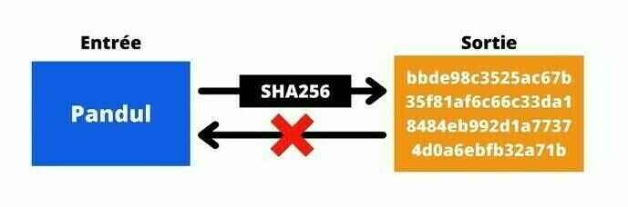

Retratar el perfil de las funciones de hash criptográficas requiere comprender dos cualidades esenciales: su irreversibilidad y su resistencia a la falsificación. Cada función de hash criptográfica es como un artista único, produciendo un "hash" distinto para cada entrada. Incluso un pincel que se desvía ligeramente altera considerablemente el cuadro final, es decir, el hash. Estas funciones actúan como guardianes digitales, verificando la integridad de los software descargados. Otra característica crucial que poseen es su resistencia a las colisiones. Sin duda, en el mundo del hash, las colisiones son inevitables, pero una excelente función de hash criptográfica las minimiza considerablemente. Es como si cada hash fuera una casa en una ciudad inmensa; a pesar del enorme número de casas, una buena función de hash se asegura de que cada casa tenga una dirección única.

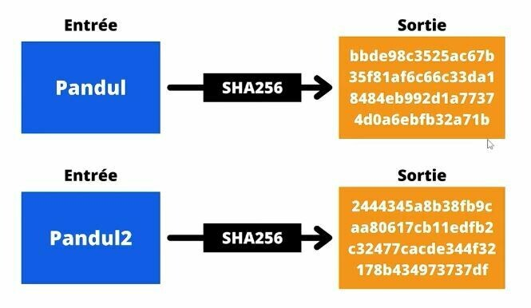

Ahora naveguemos por las aguas turbulentas de las funciones de hash obsoletas. SHA0, SHA1 y MD5 son consideradas hoy en día como cascarones oxidados en el océano de las funciones de hash criptográficas. A menudo se desaconsejan porque han perdido su resistencia a las colisiones. El principio de los cajones explica por qué, a pesar de nuestros mejores esfuerzos, evitar las colisiones es imposible debido a la limitación del tamaño de salida. También es importante tener en cuenta que la resistencia a la segunda preimagen depende de la resistencia a las colisiones. Para ser verdaderamente considerada segura, una función de hash debe resistir las colisiones, la segunda preimagen y la preimagen.

'Elemento clave en el protocolo Bitcoin, la función de hash SHA-256 es el capitán del barco. Otras funciones, como SHA-512, se utilizan para la derivación con HMAC y PBKDF. Además, RIPMD160 se utiliza para reducir una huella a 160 bits. Cuando hablamos de HASH256 y HASH160, nos referimos al uso de un doble hash con SHA-256 y RIPMD. El uso de HASH160 es especialmente ventajoso ya que permite beneficiarse de la seguridad de SHA-256 mientras se reduce el tamaño de la huella.

Para resumir, el objetivo final de una función de hash criptográfica es transformar una información de tamaño arbitrario en una huella de tamaño fijo. Para ser reconocida como segura, debe tener varias características: irreversibilidad, resistencia a la falsificación, resistencia a las colisiones y resistencia a la segunda preimagen.

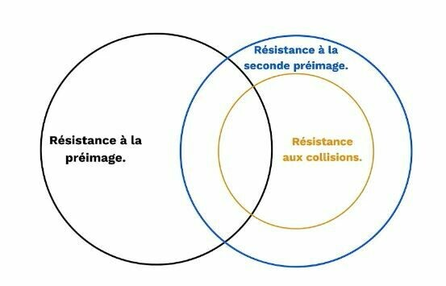

Al final de esta exploración, hemos desmitificado las funciones de hash criptográficas, destacado su uso en el protocolo Bitcoin y analizado sus objetivos específicos. Hemos aprendido que para considerarse seguras, las funciones de hash deben ser resistentes a la preimagen, a la segunda preimagen, a las colisiones y a la falsificación. También hemos recorrido el espectro de las diferentes funciones de hash utilizadas en el protocolo Bitcoin. En nuestra próxima sesión, nos sumergiremos en el corazón de la función de hash SHA256 y descubriremos las fascinantes matemáticas que le confieren sus características únicas.

## Los engranajes de SHA256

Bienvenidos a la continuación de nuestro fascinante viaje a través de los laberintos criptográficos de la función de hash. Hoy levantamos el velo sobre los misterios de SHA256, un proceso complejo pero ingenioso que presentamos en nuestra discusión anterior sobre las funciones de hash. Avancemos un paso más en este laberinto, comenzando por el preprocesamiento de SHA256. Imaginen el preprocesamiento como la preparación de un plato sabroso, donde agregamos "bits de relleno" para que el tamaño de nuestro ingrediente principal, la entrada, alcance un múltiplo perfecto de 512 bits. Todo esto con el objetivo final de generar un hash delicioso de 256 bits a partir de un ingrediente de tamaño variable.

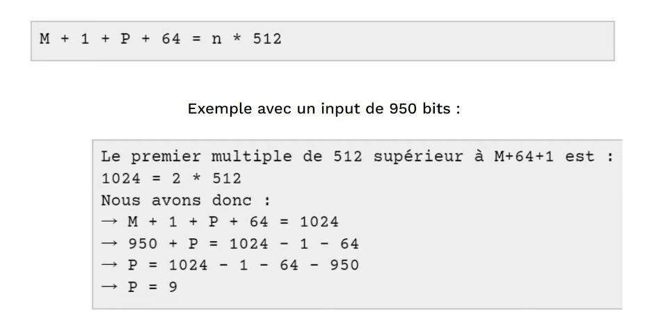
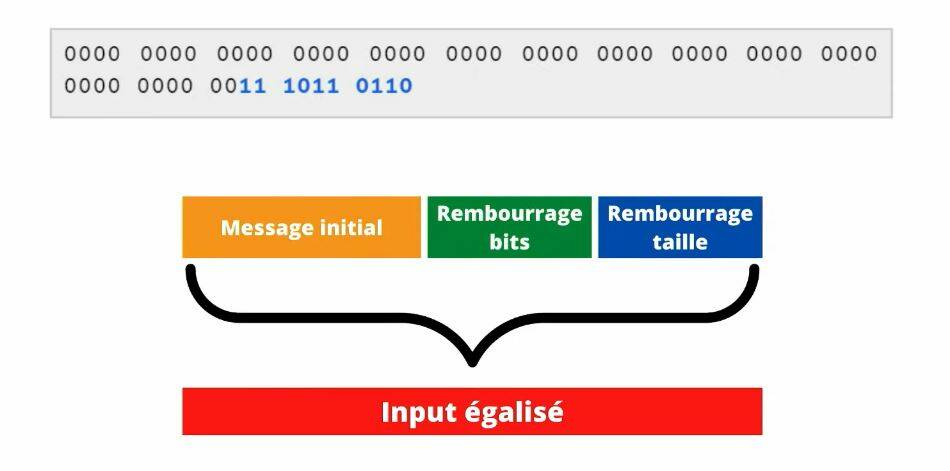

En esta receta criptográfica, jugamos con los bits, teniendo un tamaño de mensaje inicial que llamaremos M. Un bit está reservado para el separador, mientras que P bits se utilizan para el relleno. Además, reservamos 64 bits para la segunda fase de preprocesamiento. El total debe ser un múltiplo de 512 bits. Es un poco como asegurarse de que todos los ingredientes se mezclen perfectamente en nuestro plato.

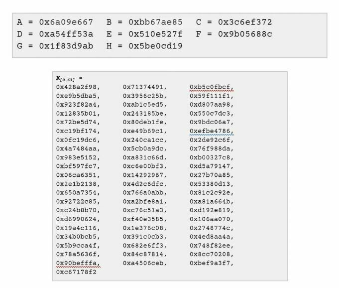

Ahora pasamos a la segunda fase del preprocesamiento, que implica agregar la representación binaria del tamaño del mensaje inicial, en bits. Para esto, utilizamos nuestros 64 bits reservados en el paso anterior. Agregamos ceros para redondear nuestros 64 bits a nuestra entrada equilibrada. Luego, mezclamos el mensaje inicial, el relleno de bits y el relleno de tamaño, como ingredientes en una licuadora, para obtener nuestra entrada equilibrada.

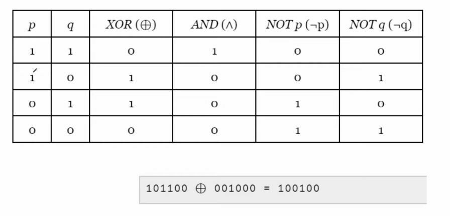

Ahora nos preparamos para los primeros pasos del procesamiento de la función SHA-256. Como en cualquier buena receta, necesitamos algunos ingredientes básicos que llamamos constantes y vectores de inicialización. Los vectores de inicialización, de A a H, son los primeros 32 bits de las partes decimales de las raíces cuadradas de los primeros 8 números primos. Las constantes K, de 0 a 63, representan los primeros 32 bits de las partes decimales de las raíces cúbicas de los primeros 64 números primos.

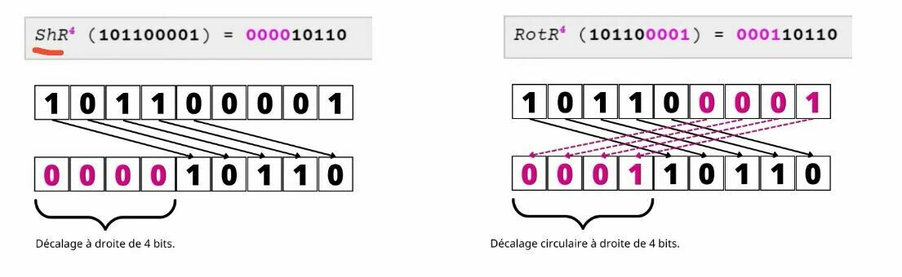

Dentro de la función de compresión, utilizamos operadores específicos como XOR, AND y NOT. Procesamos los bits uno por uno según su posición, utilizando el operador XOR y una tabla de verdad. El operador AND se utiliza para devolver 1 solo si ambos operandos son iguales a 1, y el operador NOT para devolver el valor opuesto de un operando. También utilizamos la operación SHR para desplazar los bits hacia la derecha según un número elegido.

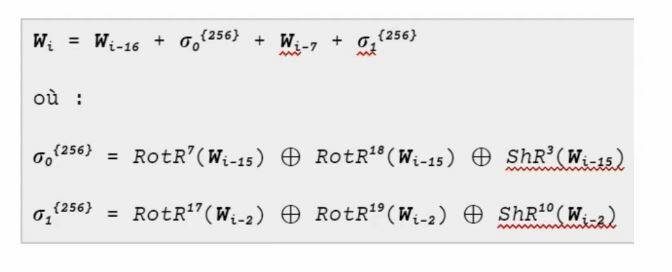
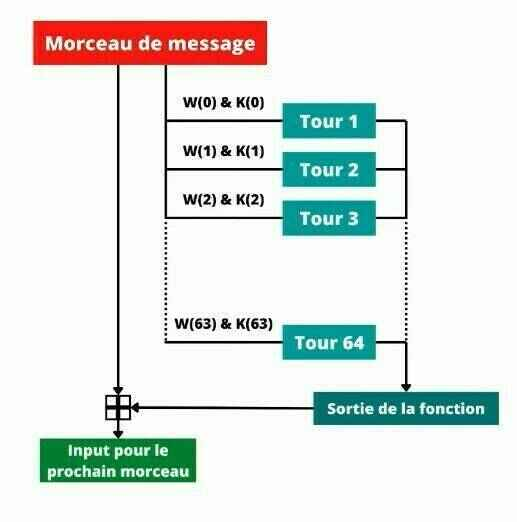

Finalmente, después de separar la entrada equilibrada en diferentes bloques de mensajes de 512 bits, realizamos 64 rondas de cálculo en la función de compresión. Al igual que en una carrera de ciclismo, cada vuelta mejora nuestra posición. Sumamos módulo 2^32 el estado intermedio al estado inicial de la función de compresión. Las sumas en la función de compresión son sumas módulo 2^32 para contener el tamaño de las sumas a 32 bits.

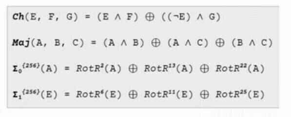
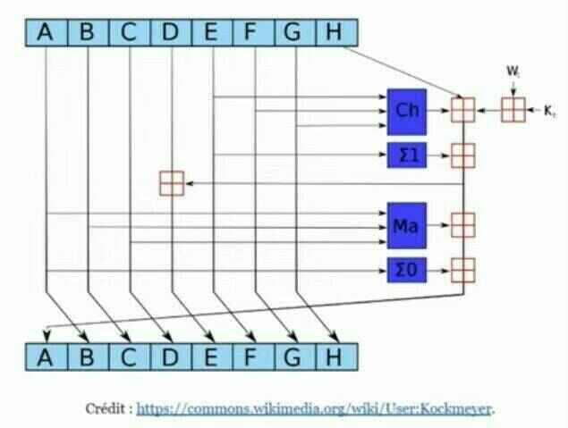

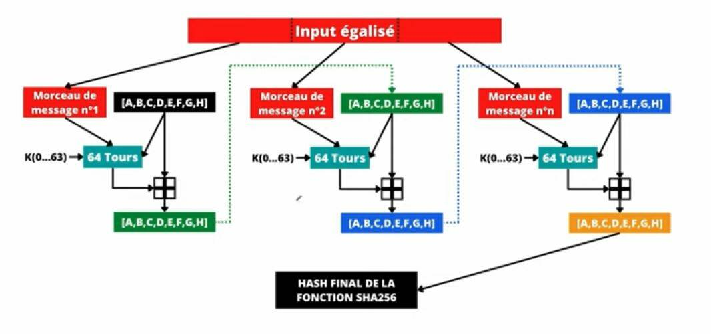

Para concluir, nos gustaría destacar el papel crucial de los cálculos realizados en las cajas CH, MAJ, σ0 y σ1. Estas operaciones, entre otras, son los guardianes que aseguran la robustez de la función de hash SHA256 frente a los ataques, lo que la convierte en una elección preferida para la seguridad de muchos sistemas digitales, especialmente dentro del protocolo Bitcoin. Por lo tanto, es evidente que aunque sea compleja, la belleza de SHA256 radica en su robustez para encontrar la entrada a partir del hash, mientras que la verificación del hash para una entrada dada es una acción mecánicamente simple.

## Los algoritmos utilizados para la derivación

Los algoritmos de derivación HMAC y PBKDF2 son componentes clave en la mecánica de seguridad del protocolo Bitcoin. Previenen una variedad de posibles ataques y garantizan la integridad de las carteras de Bitcoin.

HMAC y PBKDF2 son herramientas criptográficas utilizadas para diferentes tareas en Bitcoin. HMAC se utiliza principalmente para contrarrestar los ataques de extensión de longitud durante la derivación de carteras deterministas jerárquicamente (HD), mientras que PBKDF2 se utiliza para convertir una frase mnemotécnica en una semilla.

HMAC, que toma un mensaje y una clave como entradas, genera una salida de tamaño fijo. Para garantizar la uniformidad, la clave se ajusta según el tamaño de los bloques utilizados en la función de hash. En el caso de la derivación de carteras HD, se utiliza HMAC-SHA-512. Este último funciona con bloques de 1024 bits (128 bytes) y ajusta la clave en consecuencia. Utiliza las constantes OPAD (0x5c) e IPAD (0x36), repetidas tantas veces como sea necesario para reforzar la seguridad.

El proceso de HMAC-SHA-512 implica la concatenación del resultado de aplicar SHA-512 a la clave XOR OPAD y la clave XOR IPAD con el mensaje. Cuando se utiliza con bloques de 1024 bits (128 bytes), la clave de entrada se completa con ceros si es necesario, y luego se realiza una operación XOR con IPAD y OPAD. La clave modificada de esta manera se concatena luego con el mensaje.

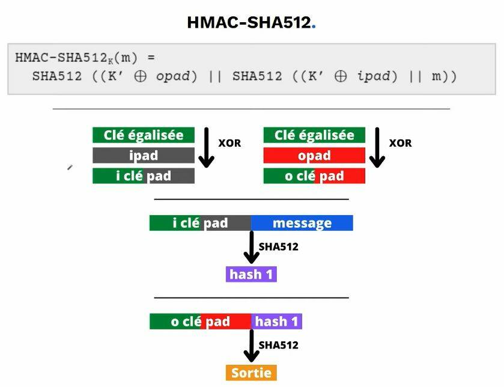

El código de cadena, al integrar una fuente adicional de entropía, aumenta la seguridad de las claves derivadas. Sin él, un ataque podría comprometer toda la cartera y robar todos los bitcoins.

PBKDF2 se utiliza para convertir una frase mnemónica en una semilla. Este algoritmo realiza 2048 iteraciones utilizando HMAC SHA512. Gracias a estos algoritmos de derivación, dos entradas diferentes pueden dar una salida única y fija, lo que soluciona el problema de posibles ataques de extensión de longitud en las funciones de la familia SHA-2. Un ataque de extensión de longitud aprovecha una propiedad específica de algunas funciones de hash criptográficas. En dicho ataque, un atacante que ya tiene el hash de un mensaje desconocido puede usarlo para calcular el hash de un mensaje más largo, que es una extensión del mensaje original. Esto a menudo es posible sin conocer el contenido del mensaje original, lo que puede llevar a importantes vulnerabilidades de seguridad si se utiliza este tipo de función de hash para tareas como la verificación de integridad.

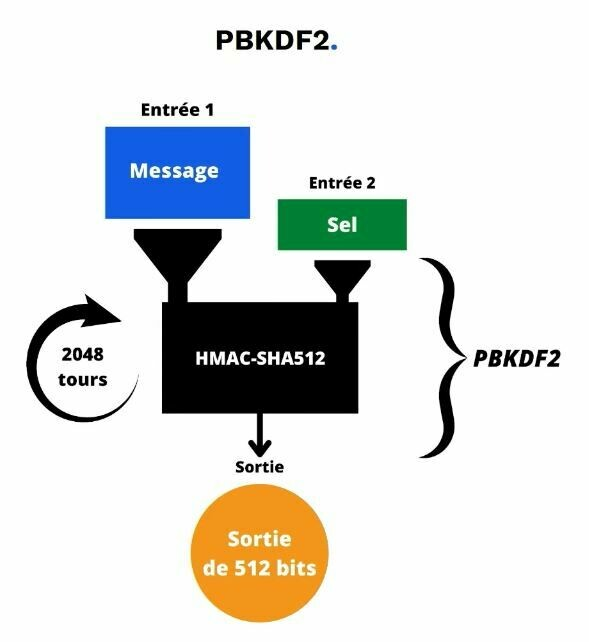

En conclusión, los algoritmos HMAC y PBKDF2 desempeñan roles esenciales en la seguridad de la derivación de las carteras HD en el protocolo Bitcoin. HMAC-SHA-512 se utiliza para protegerse contra ataques de extensión de longitud, mientras que PBKDF2 permite la conversión de la frase mnemónica en una semilla. El código de cadena agrega una fuente adicional de entropía en la derivación de claves, asegurando así la robustez del sistema.

# Las firmas digitales

## Firmas digitales y curvas elípticas

En el mundo de las criptomonedas, la seguridad de las transacciones es primordial. En el corazón del protocolo Bitcoin se encuentra el uso de firmas digitales que sirven como pruebas matemáticas de posesión de una clave privada asociada a una clave pública específica. Esta técnica de protección de datos se basa principalmente en un fascinante campo de la criptografía llamado criptografía de curvas elípticas (ECC).

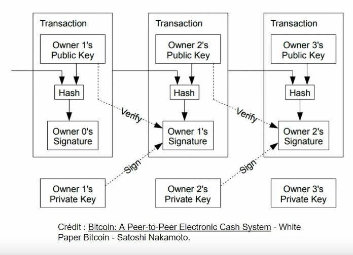

La criptografía de curvas elípticas es el pilar de la seguridad de las transacciones de Bitcoin. Estas curvas elípticas, que recuerdan a las curvas matemáticas estudiadas en la escuela, son útiles en una variedad de aplicaciones criptográficas, desde intercambios de claves hasta cifrado asimétrico y creación de firmas digitales. Un detalle interesante que distingue a las curvas elípticas es su simetría: cualquier línea no vertical que corte dos puntos de la curva intersectará un tercer punto.

Ahora, profundicemos un poco más: el protocolo Bitcoin utiliza una curva elíptica particular llamada SecP256K1 para realizar sus operaciones criptográficas. Esta curva, definida en un conjunto finito de enteros positivos módulo un número primo de 256 bits, se puede visualizar como una nube de puntos en lugar de una curva tradicional. Es esta diseño único el que permite a Bitcoin asegurar eficazmente sus transacciones.

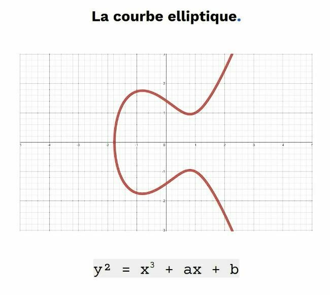

En cuanto a la elección de la curva secp256k1 para Bitcoin, es interesante destacar que se prefirió sobre la curva secp256r1. Esta curva se define por los parámetros a=0 y b=7, y su ecuación es y² = x³ + 7 módulo n, donde n representa el número primo que determina el orden de la curva.

Cuando hablamos de las constantes utilizadas en el sistema Bitcoin, generalmente nos referimos a los parámetros específicos del algoritmo Elliptic Curve Digital Signature Algorithm (ECDSA) y del sistema de curvas elípticas utilizado por Bitcoin, que es la curva secp256k1. Estos son los parámetros:

- campo primo (p): Bitcoin utiliza una curva en un campo primo, por lo que p es el primer número utilizado para definir este campo. Para la curva secp256k1, p es igual a `p = FFFFFFFF FFFFFFFF FFFFFFFF FFFFFFFF FFFFFFFF FFFFFFFF FFFFFFFE FFFFFC2F` en hexadecimal o p = 2^256 - 2^32 - 2^9 - 2^8 - 2^7 - 2^6 - 2^4 -1 en decimal.
- orden de la curva (n): Es el número de puntos en la curva, incluyendo el punto en el infinito. Para secp256k1, n es igual a `n = FFFFFFFF FFFFFFFF FFFFFFFF FFFFFFFE BAAEDCE6 AF48A03B BFD25E8C D0364141` en hexadecimal o n = 2^256 - 432420386565659656852420866394968145599 en decimal.
- punto generador (G): El punto base, o generador, es el punto en la curva a partir del cual se generan todas las demás claves públicas. Tiene coordenadas x e y específicas, generalmente representadas en hexadecimal. Para secp256k1, las coordenadas G son, en hexadecimal:
  - `Gx = 79BE667E F9DCBBAC 55A06295 CE870B07 029BFCDB 2DCE28D9 59F2815B 16F81798`
  - `Gy = 483ADA77 26A3C465 5DA4FBFC 0E1108A8 FD17B448 A6855419 9C47D08F FB10D4B8`

Ten en cuenta que todos los valores hexadecimales generalmente se representan en base 16, mientras que los valores decimales están en base 10. Además, todas las operaciones con estas constantes se realizan módulo p para las coordenadas de los puntos en la curva y módulo n para las operaciones de clave y firma.

Entonces, ¿dónde se almacenan estos famosos bitcoins? No en una billetera de Bitcoin, como se podría pensar. En realidad, una billetera de Bitcoin guarda las claves privadas necesarias para demostrar la posesión de los bitcoins. Los propios bitcoins se registran en la cadena de bloques, una base de datos descentralizada que archiva todas las transacciones.

En el sistema Bitcoin, la unidad de cuenta es el bitcoin (nota la "b" minúscula). Este último es divisible hasta ocho decimales, siendo la unidad más pequeña el satoshi. Los UTXO, o "Unspent Transaction Output" (Salida de Transacción No Gastada), representan las salidas de transacciones no gastadas que pertenecen a un usuario. Para gastar estos bitcoins, es necesario demostrar la posesión de la clave privada correspondiente a la clave pública vinculada a cada UTXO.

Para garantizar la seguridad de las transacciones, Bitcoin utiliza dos protocolos de firma digital: ECDSA (Elliptic Curve Digital Signature Algorithm) y Schnorr. ECDSA es un protocolo de firma integrado en Bitcoin desde su lanzamiento en 2009, mientras que las firmas de Schnorr se agregaron más recientemente, en noviembre de 2021. Aunque estos dos protocolos se basan en la criptografía de curvas elípticas y utilizan mecanismos matemáticos similares, difieren principalmente en términos de estructura de firma.

Antes de adentrarnos más en estos mecanismos de firma, es importante comprender qué es una curva elíptica. Una curva elíptica se define por la ecuación y² = x³ + ax + b. Cada punto en esta curva tiene una simetría distintiva que es clave para su utilidad en criptografía.

En última instancia, se reconocen diversas curvas elípticas como seguras para uso criptográfico. La más conocida quizás sea la curva secp256r1. Sin embargo, para Bitcoin, Satoshi Nakamoto optó por otra curva: secp256k1.

En la próxima sección de este curso, examinaremos más de cerca la clave pública y la clave privada para una comprensión más profunda de la criptografía en curvas elípticas y el algoritmo de firma digital. Será el momento de consolidar tus conocimientos y comprender cómo toda esta información se articula para garantizar la seguridad del protocolo Bitcoin.

## Calcular la clave pública desde la clave privada

En la continuación de este curso, nos adentraremos en los mecanismos de las claves públicas y privadas, dos elementos cruciales del protocolo Bitcoin. Estas claves están intrínsecamente vinculadas por el algoritmo de firma digital de curva elíptica (ECDSA, por sus siglas en inglés). Comprenderlas nos dará una visión profunda de cómo Bitcoin asegura las transacciones en su plataforma.

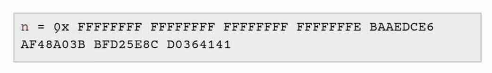

Para comenzar, sumerjámonos en el mundo del algoritmo ECDSA. Bitcoin utiliza este algoritmo de firma digital para vincular las claves privadas y públicas. En este sistema, la clave privada es un número aleatorio o pseudoaleatorio de 256 bits. El número total de posibilidades para una clave privada teóricamente es de 2^256, pero en realidad es ligeramente inferior a eso. Para ser precisos, algunas claves privadas de 256 bits no son válidas para Bitcoin.

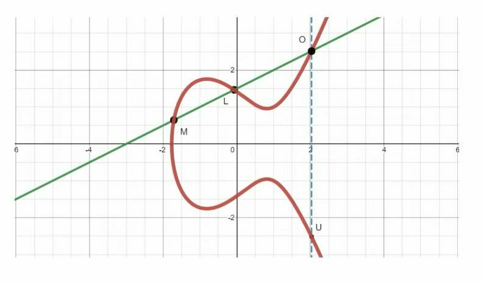

Para ser compatible con Bitcoin, una clave privada debe estar comprendida entre 1 y n-1, donde n representa el orden de la curva elíptica. Esto significa que el número total de posibilidades para una clave privada de Bitcoin es casi igual a 1,158 x 10^77. Para poner esto en perspectiva, es aproximadamente la misma cantidad de átomos presentes en el universo observable. Luego, la clave privada única se utiliza para determinar una clave pública de 512 bits.

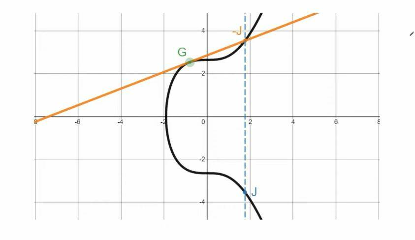

La clave pública, denotada como K, es un punto en la curva elíptica que se deriva de la clave privada utilizando operaciones de puntos en la curva. Es importante destacar que la función ECDSA es irreversible, es decir, es imposible recuperar la clave privada a partir de la clave pública. Esta irreversibilidad es la piedra angular de la seguridad de la billetera Bitcoin.

La clave pública está compuesta por dos puntos de 256 bits cada uno, totalizando 512 bits. Sin embargo, puede comprimirse en un número de 264 bits. El punto G es el punto de partida para calcular todas las claves públicas de los usuarios del sistema.

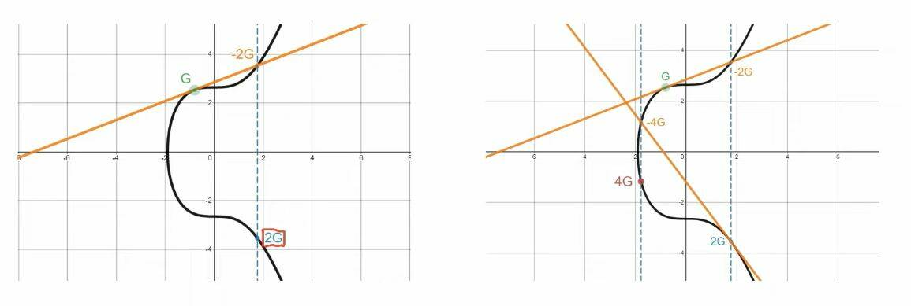

Una de las propiedades notables de las curvas elípticas es que una línea que intersecta la curva en dos puntos también intersectará un tercer punto, llamado punto O. Esta propiedad se utiliza para determinar el punto U, que es el opuesto del punto O. La adición de un punto consigo mismo se realiza trazando una tangente a la curva en ese punto, lo que da como resultado un nuevo punto único llamado j. El producto escalar de un punto por n implica agregar ese punto consigo mismo n veces.

Estas operaciones en los puntos de una curva elíptica son la base para el cálculo de claves públicas. Conociendo la clave privada, es fácil calcular la clave pública. Sin embargo, conocer la clave pública no permite calcular la clave privada, lo que garantiza la seguridad del sistema Bitcoin. De hecho, la seguridad de las claves públicas y privadas se basa en el problema del logaritmo discreto, una cuestión matemática compleja.
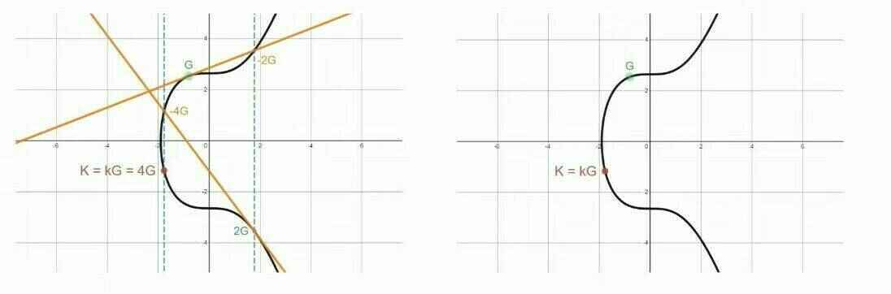

En nuestro próximo curso, exploraremos cómo se realiza una firma digital utilizando el algoritmo ECDSA con una clave privada para desbloquear bitcoins. Estén atentos a esta emocionante exploración del mundo de las criptomonedas y la criptografía.

## Firmar con la clave privada

El proceso de firma digital es un método clave para demostrar que eres el titular de una clave privada sin tener que revelarla. Esto se logra utilizando el algoritmo ECDSA, que incluye la determinación de un nonce único, el cálculo de un número específico, V, y la creación de una firma digital compuesta por dos partes, S1 y S2. Es crucial siempre utilizar un nonce único para evitar ataques de seguridad. Un ejemplo notorio de lo que puede suceder cuando esta regla no se cumple es el caso del hackeo de la PlayStation 3, que fue comprometida debido a la reutilización del nonce.

De manera precisa, para validar una firma digital utilizando el algoritmo ECDSA (Elliptic Curve Digital Signature Algorithm), generalmente se involucran los siguientes pasos:

1. Verificar que los valores de la firma, S1 y S2, estén en el intervalo [1, n-1]. Si no es así, la firma es inválida.
2. Calcular el inverso de S2 mod n. Lo llamaremos u. A menudo se calcula de la siguiente manera: u = (S2)^-1 mod n.
3. Calcular H, que es el valor hash del mensaje firmado.
4. Calcular u1 = H _ u mod n y u2 = S1 _ u mod n.
5. Calcular el punto P en la curva elíptica utilizando u1, u2 y la clave pública K: P = u1*G + u2*K, donde G es el punto de generación de la curva.
6. Si P es el punto en el infinito, la firma es inválida.
7. Calcular I = coordenada x de P mod n.
8. La firma es válida si I es igual a S1.

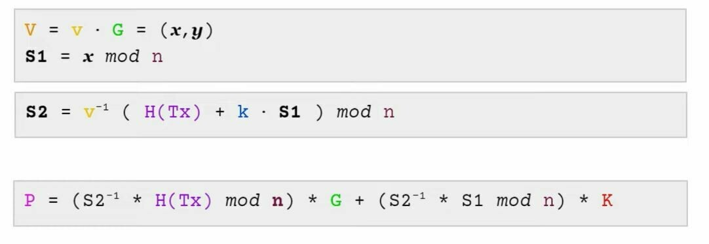
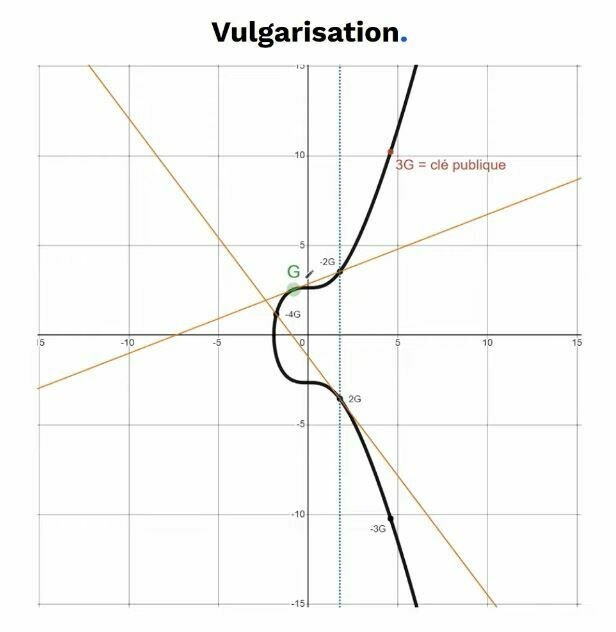

Es importante tener en cuenta que cada software puede utilizar diferentes notaciones y algunas etapas pueden combinarse o reorganizarse, pero la lógica básica es la misma. También tenga en cuenta que todas las operaciones aritméticas se realizan en el cuerpo finito definido por la curva elíptica (mod n, donde n es el orden de la curva). Como recordatorio, la curva secp256k1 (utilizada en Bitcoin) n = 2^256 - 432420386565659656852420866394968145599.
En cuanto a la generación de claves públicas y privadas, es esencial familiarizarse con la curva elíptica y el punto generador. Para obtener una clave pública, se debe elegir un número aleatorio como clave privada, a menudo llamado "nonce", y se utiliza en la ecuación de la curva elíptica.

La curva elíptica es una herramienta poderosa para generar claves públicas y privadas seguras. Por ejemplo, para obtener la clave pública 3G, se traza una tangente al punto G, se calcula el opuesto de -G para obtener 2G, y luego se suma G y 2G. Para realizar una transacción, se debe demostrar que se conoce el número 3 desbloqueando los bitcoins asociados con la clave pública 3G.

Para crear una firma digital y demostrar que se conoce la clave privada asociada con la clave pública 3G, primero se calcula un nonce, luego el punto V asociado con este nonce (en el ejemplo dado, es 4G). Luego, se calcula el punto T sumando la clave pública 3G y el punto V, lo que da como resultado 7G.

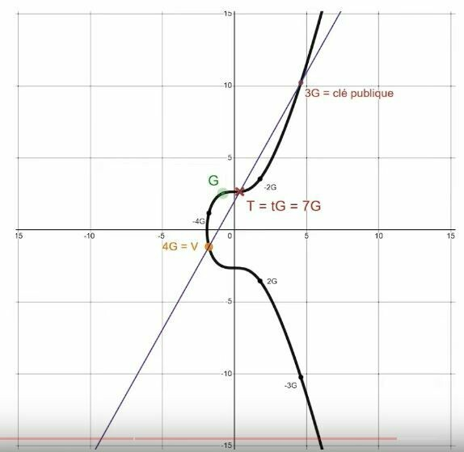

La verificación de una firma digital es un paso crucial en el uso del algoritmo ECDSA, que permite confirmar la autenticidad de un mensaje firmado sin necesidad de la clave privada del remitente. Esto es cómo se lleva a cabo en detalle:

En nuestro ejemplo, tenemos dos valores importantes: T y V. T es un valor numérico (7 en este ejemplo), y V es un punto en la curva elíptica (representado por 4G aquí). Estos valores se generan durante la creación de la firma digital y luego se envían junto con el mensaje para permitir la verificación.

Cuando el verificador recibe el mensaje, también recibirá estos dos valores, T y V.

Estos son los pasos que el verificador seguirá para validar la firma:

1. Primero calculará el hash del mensaje, que llamaremos H.
2. Luego calculará u1 y u2. Para hacer esto, utilizará las siguientes fórmulas:
   - u1 = H /\* (S2)^-1 mod n
   - u2 = T /\* (S2)^-1 mod n'
     'Donde S2 es la segunda parte de la firma digital, n es el orden de la curva elíptica y (S2)^-1 es la inversa de S2 mod n.3. A continuación, el verificador calcula un punto P' en la curva elíptica mediante la fórmula: P' = u1 _ G + u2 _ K
   - G es el punto en el que se generó la curva
   - K es la clave pública del emisor
3. El verificador calculará entonces I', que es simplemente la coordenada x del punto P' módulo n.
4. Por último, el verificador confirmará que I' es igual a T. Si lo es, la firma se considera válida. Si no lo es, la firma no es válida.

Este procedimiento garantiza que sólo el remitente con la clave privada correspondiente puede haber producido una firma que supere este proceso de verificación.

En conclusión, la verificación de una firma digital ECDSA es un procedimiento esencial en las transacciones Bitcoin. Garantiza que el mensaje firmado no ha sido alterado durante la transmisión y que el remitente es realmente el titular de la clave privada. Esta técnica de autenticación digital se basa en principios matemáticos complejos, en particular la aritmética de curva elíptica, manteniendo la confidencialidad de la clave privada. Constituye una sólida base de seguridad para las transacciones criptográficas.

Dicho esto, la gestión de estas claves, así como su creación, es otra cuestión clave en Bitcoin. ¿Cómo se genera un nuevo par de claves? ¿Cómo organizar una multitud de claves de forma segura y eficiente?

Para responder a estas preguntas y profundizar en su comprensión de la cripto seguridad, nuestro próximo curso se centrará en el concepto de Carteras Deterministas Jerárquicas (carteras HD) y el uso de frases mnemotécnicas. Estos mecanismos ofrecen formas elegantes de gestionar eficientemente sus claves de criptodivisas al tiempo que mejoran la seguridad y la recuperabilidad.

# La frase mnemotécnica

## Évolution des portefeuilles Bitcoin

El **Portafolio Determinista Jerárquico**, o comúnmente conocido como portafolio HD, desempeña un papel fundamental en el ecosistema de las criptomonedas. El término "portafolio" puede parecer engañoso para aquellos que son novatos en este campo, ya que no implica la posesión de dinero o divisas. Más bien, se refiere a una colección de claves criptográficas privadas derivadas de una única clave maestra, gracias a un ingenioso proceso de aritmética algorítmica. Estas claves privadas, que tienen una longitud fija de 256 bits, son la esencia misma de la posesión de criptomonedas y a veces se denominan de manera más cruda como "Just a Bunch Of Keys" (JBOC).

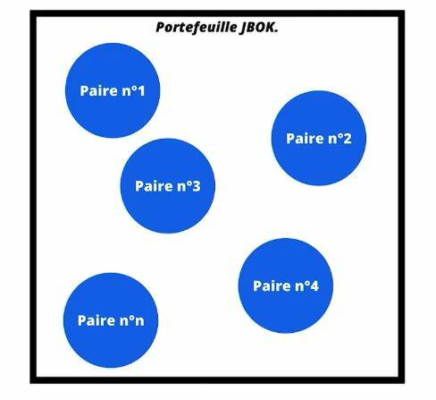

Sin embargo, la complejidad de la gestión de estas claves se compensa con un conjunto de protocolos llamados Propuestas de Mejora de Bitcoin (BIP, por sus siglas en inglés). Estas propuestas de actualización son fundamentales para la funcionalidad y seguridad de los portafolios HD. Por ejemplo, el [BIP32](https://github.com/bitcoin/bips/blob/master/bip-0032.mediawiki), lanzado en 2012, revolucionó la forma en que se generan y almacenan estas claves, al introducir el concepto de claves derivadas de manera determinista y jerárquica. De esta manera, el proceso de respaldo de estas claves se simplifica en gran medida, manteniendo su nivel de seguridad.

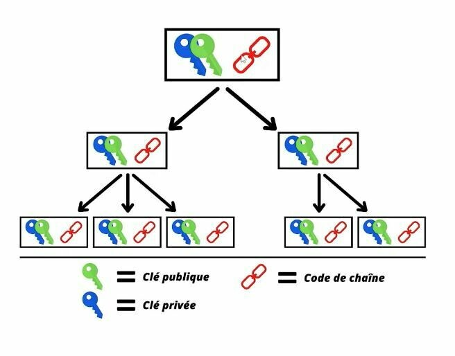

Posteriormente, el [BIP39](https://github.com/bitcoin/bips/blob/master/bip-0039.mediawiki) introdujo una innovación destacada: la frase mnemotécnica de 24 palabras. Este sistema permitió transformar una serie de números complejos y difíciles de recordar en una serie de palabras comunes, mucho más fáciles de memorizar y almacenar. Además, el [BIP38](https://github.com/bitcoin/bips/blob/master/bip-0038.mediawiki) propuso agregar una frase de contraseña adicional para fortalecer la seguridad de las claves individuales. Estas mejoras sucesivas llevaron a las normas BIP43 y BIP44, que estandarizaron la estructura y jerarquía de los portafolios HD, haciendo que estos portafolios sean más accesibles y fáciles de usar para el público en general.

En las siguientes secciones, profundizaremos en el funcionamiento de los portafolios HD. Abordaremos los principios de derivación de claves y examinaremos los conceptos fundamentales de la entropía y la generación de números aleatorios, que son esenciales para garantizar la seguridad de su portafolio HD.
En resumen, es esencial destacar el papel central de BIP32 y BIP39 en el diseño y la seguridad de las carteras HD. Estos protocolos permiten generar una multitud de claves a partir de una única semilla, que se supone que es un número aleatorio o pseudoaleatorio. Hoy en día, estas normas son adoptadas por la mayoría de las carteras de criptomonedas, ya sea que estén dedicadas a una sola criptomoneda o que admitan varios tipos de monedas.

Espero que esta introducción les haya ayudado a comprender mejor los fundamentos de la cartera HD y sus diversas características. Nuestro objetivo es ayudarles a dominar estos conceptos esenciales y navegar de manera más eficiente en el complejo mundo de las criptomonedas. Así que permanezcan con nosotros mientras continuamos explorando las sutilezas y matices de este fascinante mundo en las próximas lecciones.

## Entropía y número aleatorio

La importancia de la seguridad de las claves privadas en el ecosistema de Bitcoin es innegable. De hecho, son la piedra angular que garantiza la seguridad de las transacciones de Bitcoin. Para evitar cualquier vulnerabilidad asociada a la previsibilidad, estas claves deben generarse de manera verdaderamente aleatoria, lo cual puede resultar rápidamente en un ejercicio laborioso para el usuario. Una solución a este enigma es la Cartera Determinista Jerárquica, o cartera HD. Este método permite generar de manera determinista y jerárquica pares de claves secundarias a partir de una única información en la base de la cartera. Aquí es donde la aleatoriedad se vuelve indispensable para garantizar la seguridad de las claves derivadas.

La generación de números aleatorios es de hecho un elemento crucial en criptografía, para asegurar la integridad de las claves privadas. Para prevenir cualquier vulnerabilidad relacionada con la previsibilidad, una clave privada debe generarse de manera aleatoria. El uso de un nuevo par de claves para cada transacción permite fortalecer aún más la seguridad, aunque esto complica su respaldo y solo preserva parcialmente la confidencialidad. En resumen, la seguridad de las claves privadas es una prioridad absoluta, que requiere una generación rigurosa y aleatoria. Las carteras HD ofrecen una solución para facilitar la generación y gestión de claves, al tiempo que mantienen un alto nivel de seguridad.

Sin embargo, la generación de números aleatorios en las computadoras presenta un desafío, ya que los resultados obtenidos no son verdaderamente aleatorios. Por eso es esencial utilizar un Generador de Números Aleatorios (RNG). Los tipos de RNG varían, desde los Generadores de Números Pseudoaleatorios (PRNG) hasta los Generadores de Números Verdaderamente Aleatorios (TRNG), así como los PRNG que incorporan una fuente de entropía.

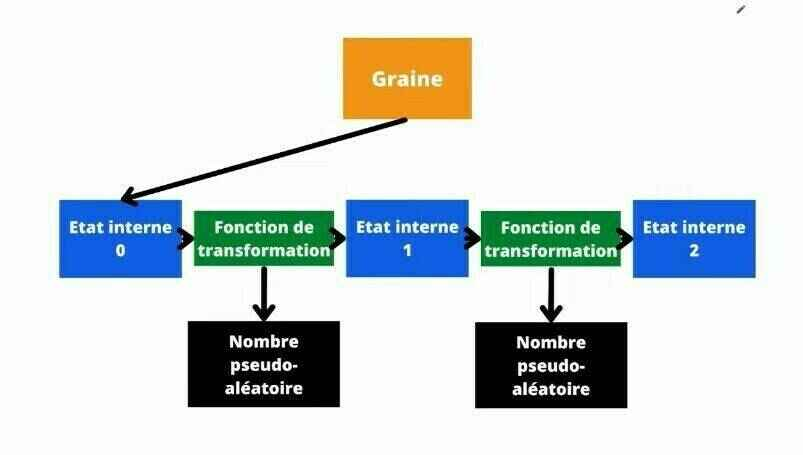

En el caso de Bitcoin, las claves privadas se generan a partir de una única información en la base de la billetera. Esta información permite una derivación determinista y jerárquica de pares de claves secundarias. La entropía es la base de todas las billeteras HD, aunque no existe un estándar para la generación de este número aleatorio. Por lo tanto, la generación de números aleatorios es un desafío importante para asegurar las transacciones de Bitcoin.

La fase de verificación de la generación de claves es crucial para garantizar la seguridad y autenticidad de la generación de números aleatorios, un paso fundamental para prevenir cualquier vulnerabilidad asociada a la previsibilidad. Por lo tanto, se recomienda encarecidamente utilizar billeteras de código abierto para permitir esta verificación.

Sin embargo, es importante tener en cuenta que algunas billeteras de hardware pueden ser "de código cerrado", lo que hace imposible verificar la generación del número aleatorio. Una posible solución sería generar una frase mnemotécnica utilizando dados, aunque este enfoque puede presentar ciertos riesgos.

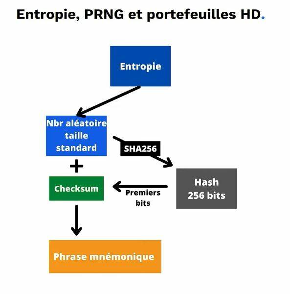

El uso de una frase de contraseña generada aleatoriamente puede ayudar a mitigar estos riesgos.

Un ejemplo de aplicación de este método es la opción "dice roll" ofrecida por CoinKit para generar frases mnemotécnicas. Otra posibilidad sería utilizar una información inicial muy amplia y reducir esta información a 256 bits con la función de hash SHA-256, capaz de generar un buen número aleatorio. Es importante mencionar que la función de hash SHA-256 es resistente a colisiones, falsificaciones y ataques de preimagen y segunda preimagen.

En definitiva, la aleatoriedad ocupa un lugar central en la criptografía y la informática, y la capacidad de generar aleatoriedad de manera segura es crucial para garantizar la seguridad de las claves privadas y las transacciones de Bitcoin. La entropía, que es el corazón de la billetera HD de Bitcoin, es esencial para su seguridad. En nuestra próxima lección, continuaremos explorando este tema, abordando más en detalle cómo la entropía contribuye a la seguridad de las billeteras HD.

## La frase mnemotécnica

La seguridad de una billetera de Bitcoin es una preocupación importante para todos sus usuarios. Una forma esencial de asegurar la copia de seguridad de la billetera es generar una frase mnemotécnica basada en la entropía y la suma de verificación.

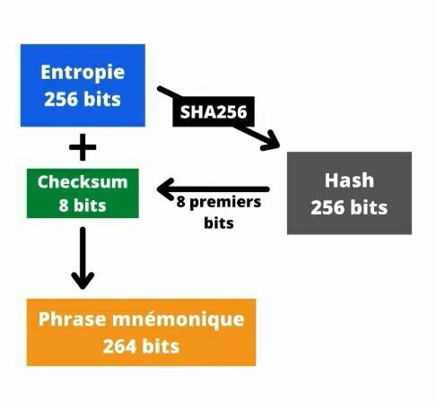

La entropía es el pilar de la seguridad de la billetera HD. Existen varios métodos para generar esta entropía, incluyendo generadores de números pseudoaleatorios (PRNG), generadores de números aleatorios verdaderos (TRNG) o de forma manual. Es crucial que esta entropía sea aleatoria o pseudoaleatoria para garantizar la seguridad de la billetera.

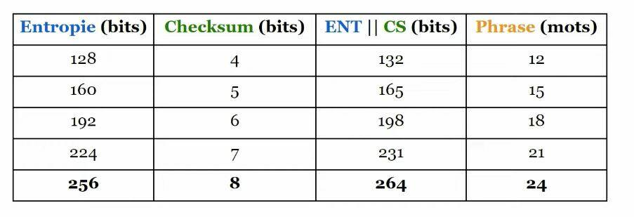

Por otro lado, la suma de verificación asegura la verificación de la exactitud de la frase de recuperación. Sin esta suma de verificación, un error en la frase podría resultar en la creación de una billetera diferente y, por lo tanto, en la pérdida de fondos. Se obtiene la suma de verificación pasando la entropía a través de la función SHA256 y recuperando los primeros 8 bits del hash.

Existen diferentes estándares para la frase mnemotécnica según el tamaño de la entropía. El estándar más comúnmente utilizado para una frase de recuperación de 24 palabras es una entropía de 256 bits. El tamaño de la suma de verificación se determina dividiendo el tamaño de la entropía por 32.

Por ejemplo, una entropía de 256 bits genera una suma de verificación de 8 bits. La concatenación de la entropía y la suma de verificación resulta en tamaños respectivos de 128 bits, 160 bits, etc. Según el tamaño de la entropía, la frase de recuperación contendrá 12 palabras para 128 bits, 15 palabras para 160 bits y 24 palabras para 256 bits.

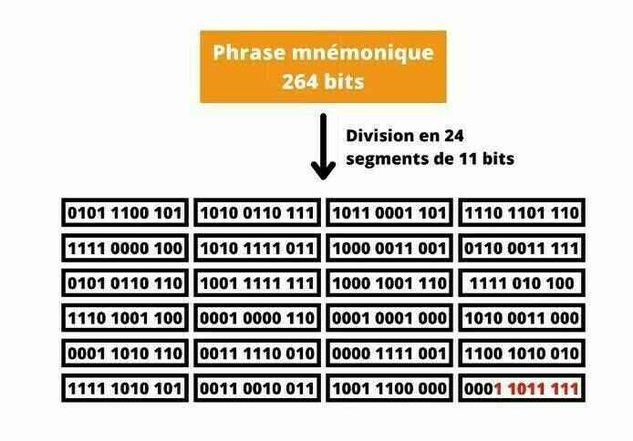

Para convertir los bits en palabras, cada segmento se asocia con una palabra de una lista de 2048 palabras. Es importante destacar que ninguna palabra tiene las cuatro primeras letras en el mismo orden.

Es esencial guardar la frase de recuperación de 24 palabras para preservar la integridad de la billetera de Bitcoin. Los dos estándares más comúnmente utilizados se basan en una entropía de 128 o 256 bits y una concatenación de 12 o 24 palabras. Agregar una frase de contraseña constituye una opción adicional para fortalecer la seguridad de la billetera.

En conclusión, la generación de una frase mnemotécnica para asegurar una billetera de Bitcoin es un proceso crucial. Es importante cumplir con los estándares de la frase mnemotécnica según el tamaño de la entropía. La copia de seguridad de la frase de recuperación de 24 palabras es esencial para prevenir cualquier pérdida de fondos. Agradecemos su atención y esperamos verlos en nuestra próxima clase sobre criptomonedas.

## La frase de contraseña

La passphrase es una contraseña adicional que se puede integrar en una billetera de Bitcoin para aumentar su seguridad. Su uso es opcional y queda a discreción del usuario. Al agregar información arbitraria que, junto con la frase mnemotécnica, permite calcular la semilla de la billetera, la passphrase refuerza su seguridad.

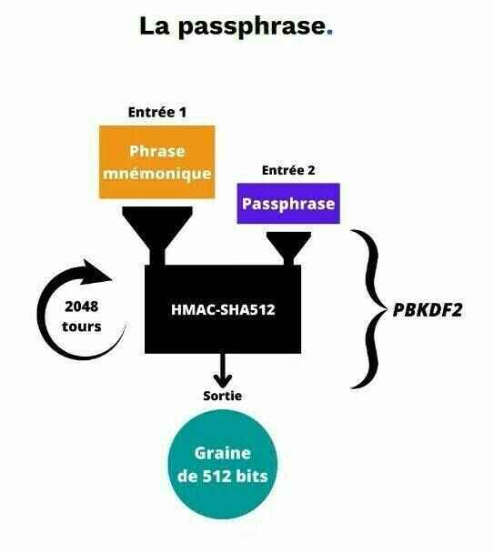

Para derivar las claves de una billetera HD, se necesitan tanto la frase mnemotécnica como la passphrase. La passphrase es libre y puede tener un tamaño casi infinito. No está incluida en la frase mnemotécnica, que es estandarizada y debe cumplir ciertas restricciones de tamaño, checksum y codificación. Un atacante no puede acceder a los bitcoins de un usuario sin conocer la passphrase. Esta última juega un papel en la construcción y el cálculo de todas las claves de la billetera.

La función pbkdf2 se utiliza para generar la semilla a partir de la passphrase. Esta semilla permite derivar todos los pares de claves hijas de la billetera. Si se modifica la passphrase, la billetera de Bitcoin se vuelve completamente diferente.

La passphrase es una herramienta esencial para fortalecer la seguridad de las billeteras de Bitcoin. Puede permitir la aplicación de diversas estrategias de seguridad. Por ejemplo, se puede utilizar para crear duplicados y facilitar las copias de seguridad de la frase mnemotécnica. También puede mejorar la seguridad de la billetera al mitigar los riesgos asociados con la generación aleatoria de la frase mnemotécnica.

Una passphrase efectiva debe ser larga (de 20 a 40 caracteres) y diversa (utilizando mayúsculas, minúsculas, números y símbolos). No debe estar directamente relacionada con el usuario o su entorno. Es más seguro utilizar una secuencia aleatoria de caracteres en lugar de una palabra simple como passphrase.

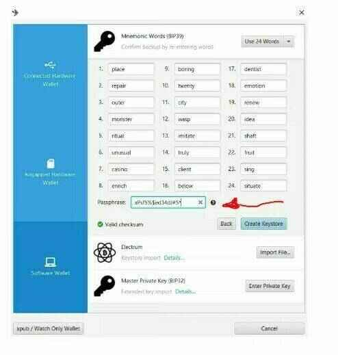

Una passphrase es más segura que una simple contraseña. La passphrase ideal es larga, variada y aleatoria. Puede fortalecer la seguridad de una billetera o un software caliente. También se puede utilizar para crear copias de seguridad redundantes y seguras.

Es crucial cuidar las copias de seguridad de la passphrase para evitar perder el acceso a la billetera. Una passphrase es una opción para una billetera HD. Puede generarse aleatoriamente con dados u otro generador de números pseudoaleatorios. No se recomienda memorizar una passphrase o una frase mnemotécnica.

En nuestro próximo curso, examinaremos en detalle el funcionamiento de la semilla y el primer par de claves generado a partir de ella. No dudes en seguir este curso para continuar tu aprendizaje. Estamos ansiosos por verte muy pronto.

# Creación de billeteras de Bitcoin

## Creación de la semilla y la clave maestra

En esta parte del curso, exploraremos los pasos para derivar una billetera HD (Hierarchical Deterministic Wallet), que permite crear y administrar claves privadas y públicas de manera jerárquica.

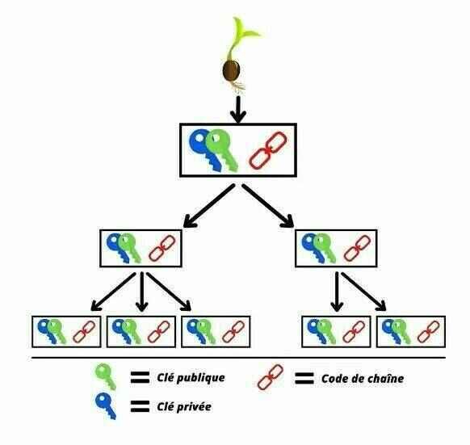

La base de la billetera HD se basa en dos elementos esenciales: la frase mnemotécnica y la frase de contraseña (opcional). Juntos, forman la semilla, una secuencia alfanumérica de 512 bits que sirve como base para derivar las claves de la billetera. A partir de esta semilla, es posible derivar todos los pares de claves secundarias de la billetera Bitcoin. La semilla es la clave que permite acceder a todos los bitcoins asociados con la billetera, ya sea que se use una frase de contraseña o no.

Para obtener la semilla, se utiliza la función pbkdf2 (Password-Based Key Derivation Function 2) con la frase mnemotécnica y la frase de contraseña. La salida de pbkdf2 es una semilla de 512 bits. La clave privada maestra y el código de cadena maestro se determinan utilizando el algoritmo HMAC SHA-512 (Hash-based Message Authentication Code Secure Hash Algorithm 512). Este algoritmo requiere un mensaje y una clave para generar un resultado. La clave privada maestra se calcula a partir de la semilla y la frase "Bitcoin SEED". Esta frase es idéntica para todas las derivaciones de billeteras HD, lo que garantiza coherencia entre las billeteras.

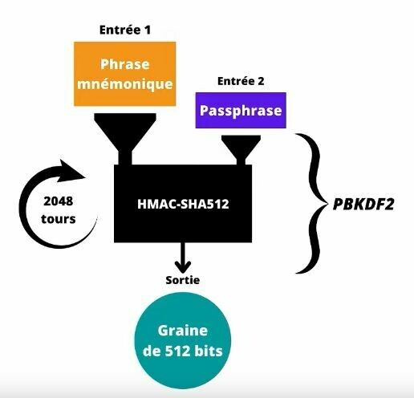

Inicialmente, la función SHA-512 no estaba implementada en el protocolo Bitcoin, por lo que se utiliza HMAC SHA-512. El uso de HMAC SHA-512 con la frase "Bitcoin SEED" obliga al usuario a generar una billetera específica para Bitcoin. El resultado de HMAC SHA-512 es un número de 512 bits, dividido en dos partes: los 256 bits de la izquierda representan la clave privada maestra, mientras que los 256 bits de la derecha representan el código de cadena maestro.

La clave privada maestra es la clave principal de todas las claves futuras de la billetera, mientras que el código de cadena maestro se utiliza en la derivación de las claves secundarias. Es importante tener en cuenta que no es posible derivar un par de claves secundarias sin conocer el código de cadena correspondiente del par principal. El código de cadena agrega una fuente de entropía al proceso de derivación.

Un par de claves en la billetera incluye una clave privada, una clave pública y un código de cadena. El código de cadena permite introducir una fuente de aleatoriedad en la derivación de las claves secundarias y aislar cada par de claves para evitar cualquier fuga de información.

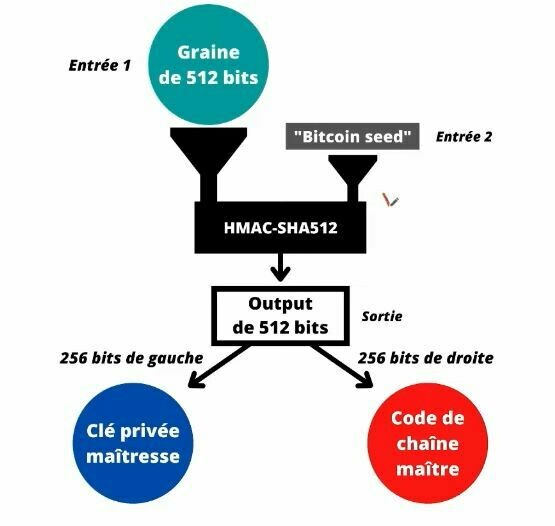

Es importante destacar que la clave privada maestra es la primera clave privada derivada de la semilla y no tiene ninguna relación con las claves extendidas de la billetera. Por lo tanto, la semilla es el elemento fundamental para derivar todas las claves de la billetera. Se diferencia de la frase mnemotécnica y la frase de contraseña, que se utilizan para la creación de la semilla.

En el próximo curso, exploraremos en detalle las claves extendidas, como xPub, xPRV, zPub, y entenderemos por qué se utilizan y cómo se construyen.

## Las claves extendidas

En esta parte del curso, estudiaremos las claves extendidas (xPub, zPub, yPub) y sus prefijos, que desempeñan un papel importante en la derivación de las claves hijas en una billetera HD (Hierarchical Deterministic Wallet).

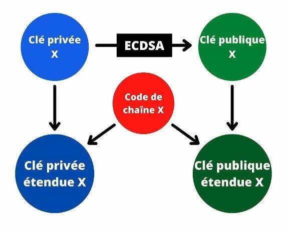

Las claves extendidas se distinguen de las claves maestras. Una billetera HD genera una frase mnemotécnica y una semilla para obtener la clave maestra y el código de cadena maestro. Las claves extendidas se utilizan para derivar las claves hijas y requieren tanto la clave padre como el código de cadena correspondiente. Una clave extendida combina esta información para simplificar el proceso de derivación.

Las claves extendidas se identifican por prefijos específicos (XPRV, XPUB, YPUB, ZPUB) que indican si es una clave extendida privada o pública, así como su propósito específico. Los metadatos asociados a una clave extendida incluyen la versión (prefijo), la profundidad, la huella de la clave pública, el índice y la carga útil (código de cadena y clave padre).

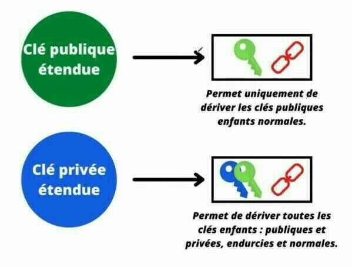

La carga útil está compuesta por el código de cadena (32 bytes) y la clave padre (33 bytes). Estos elementos son esenciales para la derivación de las claves hijas. Una clave privada se genera a partir de un número aleatorio o pseudoaleatorio, mientras que una clave pública se genera utilizando el algoritmo ECDSA (Elliptic Curve Digital Signature Algorithm).

Cada par de claves extendidas está asociado con un código de cadena único, que permite realizar derivaciones específicas. Al concatenar la clave padre con el código de cadena, se obtiene una clave privada o pública extendida.

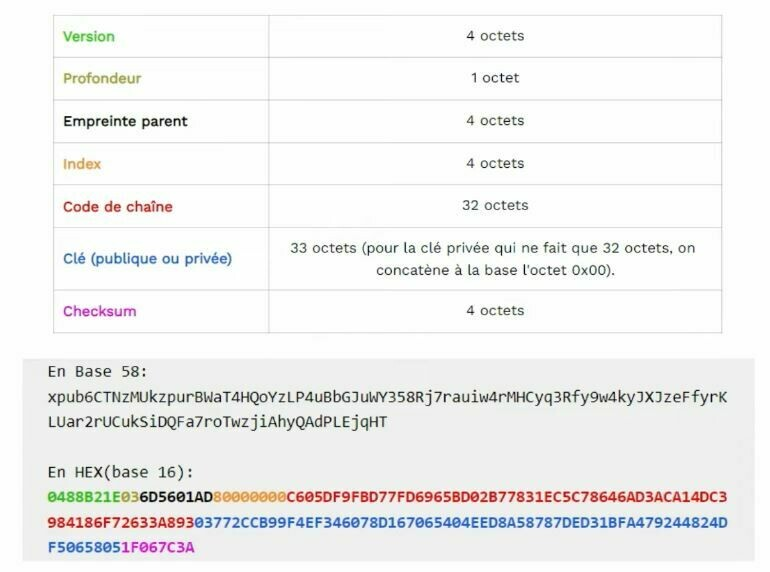

'Las claves públicas extendidas solo pueden derivarse de claves públicas hijas normales, mientras que las claves privadas extendidas pueden derivarse de claves públicas y privadas hijas, ya sea en una derivación normal o endurecida. El uso de claves extendidas con el prefijo XPUB permite derivar nuevas direcciones sin remontarse a las claves privadas correspondientes, lo que ofrece una mayor seguridad. Los metadatos asociados con las claves extendidas proporcionan información importante sobre su función y posición en la jerarquía de claves.

Las claves públicas comprimidas tienen un tamaño de 33 bytes, mientras que las claves públicas sin procesar son de 512 bits. Las claves públicas comprimidas conservan la misma información que las claves sin procesar, pero con un tamaño reducido. Las claves extendidas tienen un tamaño de 82 bytes y su prefijo se representa en base 58 mediante una conversión hexadecimal. El checksum se calcula utilizando la función de hash HASH256.

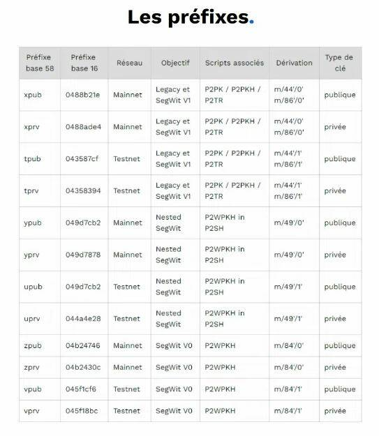

Las derivaciones endurecidas comienzan a partir de índices que son potencias de 2 (2^31). Las claves públicas extendidas solo permiten derivar claves públicas hijas normales, mientras que las claves privadas extendidas permiten derivar cualquier clave hija. Es interesante destacar que los prefijos más comúnmente utilizados son xpub y zpub, que corresponden respectivamente a los estándares legacy y segwit v1 y segwit v0.

En nuestro próximo curso, nos centraremos en la derivación de pares de claves hijas utilizando los conocimientos adquiridos sobre claves extendidas y la clave maestra de la billetera.

En conclusión, las claves extendidas desempeñan un papel esencial en la criptografía y el funcionamiento de las billeteras HD. Comprender su uso y cálculo es crucial para garantizar la seguridad de las transacciones y la protección de los activos digitales. Los prefijos y metadatos asociados con las claves extendidas permiten un uso eficiente y una derivación precisa de las claves hijas necesarias.

## Dérivation des paires de clés enfants

Ahora abordaremos el cálculo de la semilla y la clave maestra, que son los primeros elementos esenciales para la jerarquización y derivación de la billetera HD (Hierarchical Deterministic Wallet). La semilla, que tiene una longitud de 128 a 256 bits, se genera de forma aleatoria o a partir de una frase secreta. Juega un papel determinista en la derivación de todas las demás claves. La clave maestra es la primera clave derivada de la semilla y permite derivar todos los demás pares de claves hijas.'

El código de cadena maestro juega un papel importante en la recuperación de la cartera a partir de la semilla. Es importante tener en cuenta que todas las claves derivadas de la misma semilla tendrán el mismo código de cadena maestro.

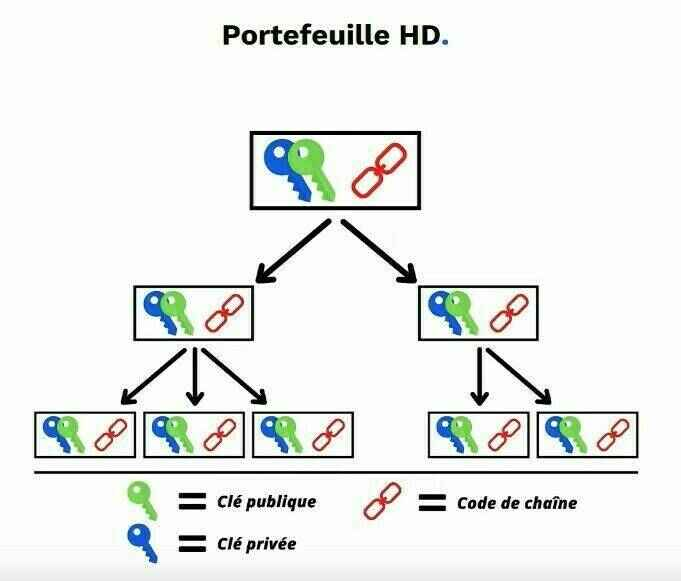

La jerarquización y derivación de la cartera HD ofrecen una gestión más eficiente de las claves y estructuras de la cartera. Las claves extendidas permiten la derivación de un par de claves hijo a partir de un par padre utilizando cálculos matemáticos y algoritmos específicos.

Existen diferentes tipos de pares de claves hijo, incluyendo claves reforzadas y claves normales. La clave pública extendida solo permite la derivación de claves públicas normales, mientras que la clave privada extendida permite la derivación de todas las claves hijo, tanto públicas como privadas, ya sea en modo normal o reforzado. Cada par de claves tiene un índice que las diferencia entre sí.

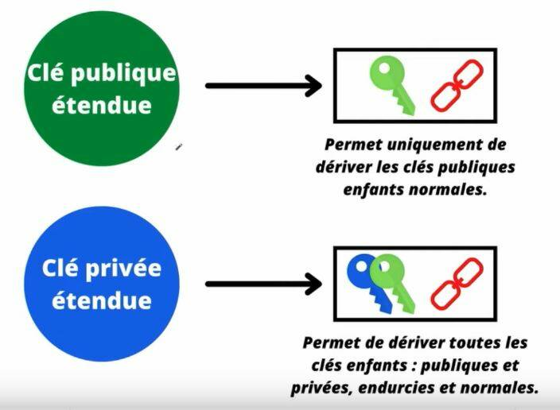

La derivación de claves hijo utiliza la función HMAC-SHA512 utilizando la clave padre concatenada con el índice y el código de cadena asociado al par de claves. Las claves hijo normales tienen un índice que va desde 0 hasta 2 elevado a la potencia 31 menos 1, mientras que las claves hijo reforzadas tienen un índice que va desde 2 elevado a la potencia 31 hasta 2 elevado a la potencia 32 menos 1.

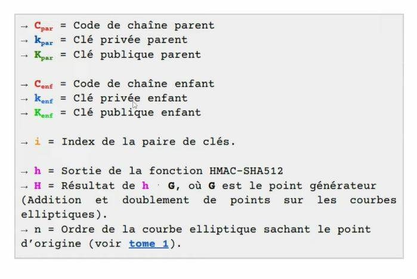
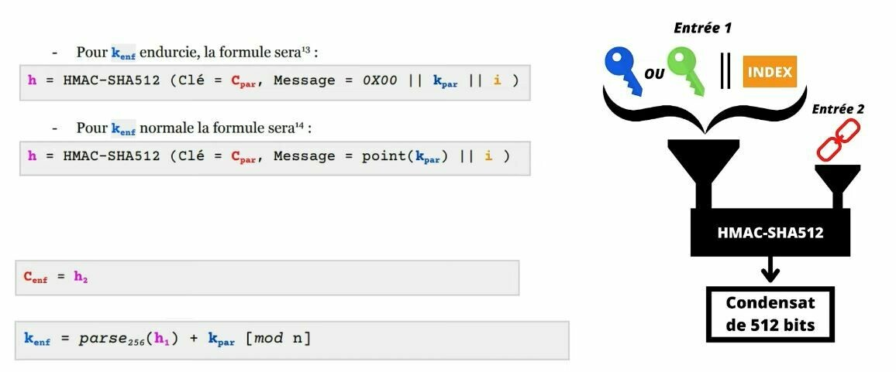

Existen dos tipos de pares de claves hijo: pares reforzados y pares normales. El proceso de derivación de claves hijo utiliza las claves públicas para generar las condiciones de gasto, mientras que las claves privadas se utilizan para la firma. La clave pública extendida solo permite la derivación de claves públicas normales, mientras que la clave privada extendida permite la derivación de todas las claves hijo, tanto públicas como privadas, en modo normal o reforzado.

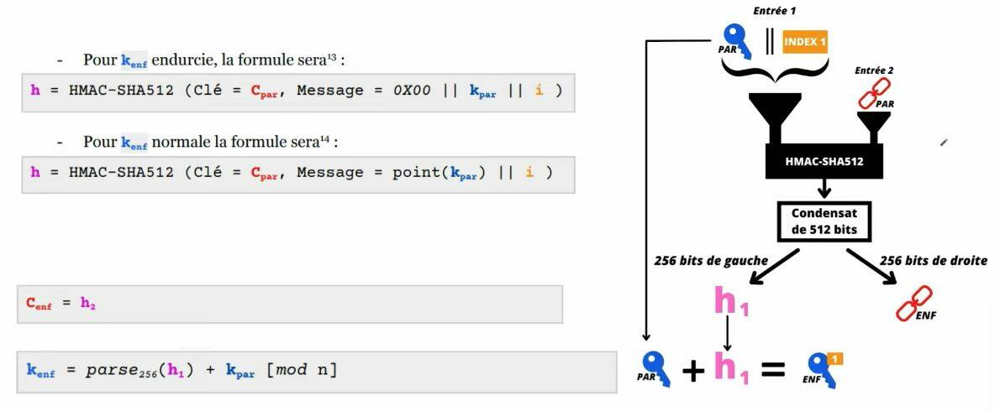
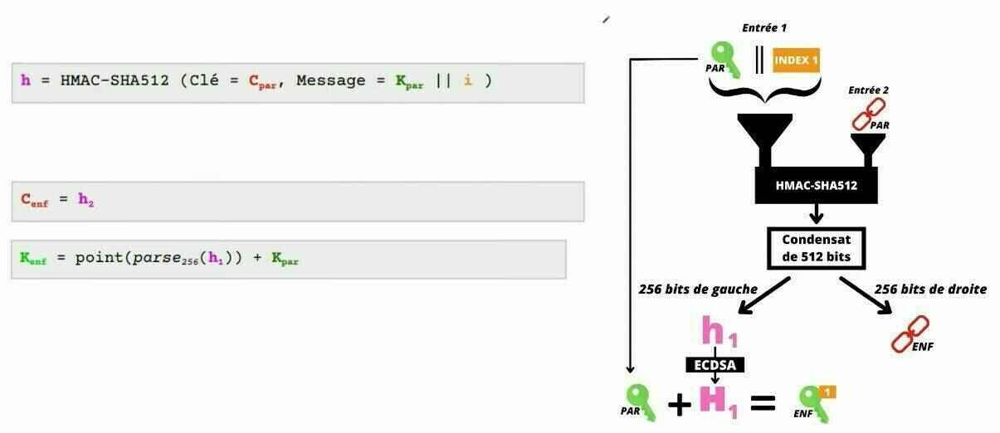

La derivación reforzada utiliza la clave privada padre, mientras que la derivación normal utiliza la clave pública padre. La función HMAC-SHA512 se utiliza para la derivación reforzada, mientras que la derivación normal utiliza un condensado de 512 bits. La clave pública hijo se obtiene multiplicando la clave privada hijo por el generador de la curva elíptica.

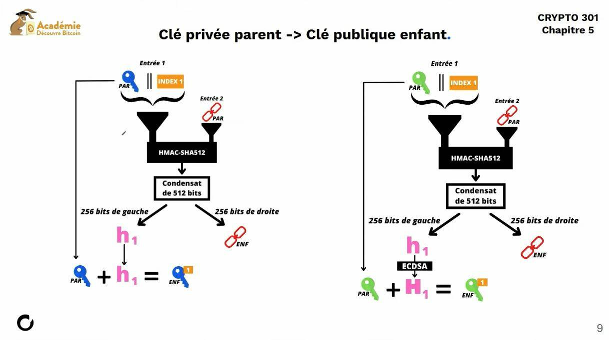
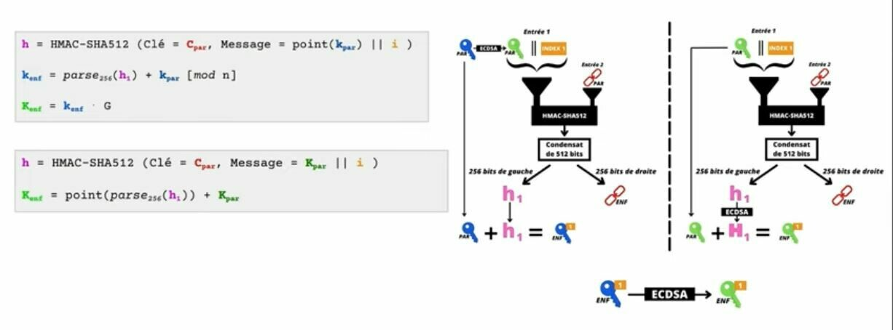

La jerarquización y derivación determinista de muchos pares de claves crea un esquema de árbol genealógico para la derivación jerárquica. En la siguiente lección de este curso, estudiaremos la estructura de la cartera HD y las rutas de derivación, con especial énfasis en las notaciones de las rutas de derivación.

## Estructura de la cartera y vías de derivación

Estructura de la cartera y vías de derivación](https://youtu.be/etO9UxwyE2I)

En este capítulo estudiaremos la estructura del árbol de derivación en una cartera HD (Hierarchical Deterministic Wallet). Ya hemos explorado el cálculo de la semilla, la clave maestra y la derivación de pares de claves hijo. Ahora vamos a centrarnos en la organización de las claves dentro de la cartera.

La cartera HD utiliza capas de profundidad para organizar las claves. Cada derivación de un par padre a un par hijo corresponde a una capa de profundidad. La profundidad 0 corresponde a la clave maestra y al código de cadena maestro.

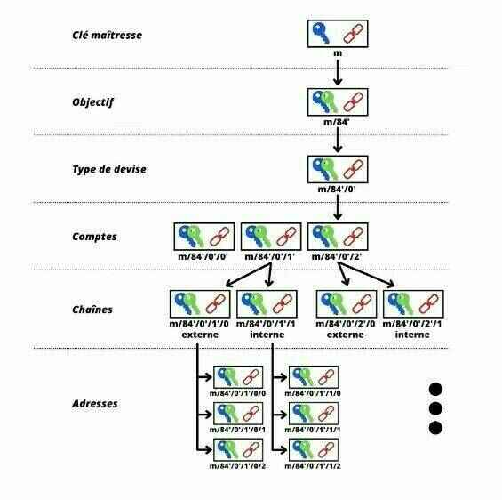

- La profundidad 1 se utiliza para derivar claves hijo según un objetivo específico, que viene determinado por el índice. Los objetivos cumplen las normas BIP 84 y Segwit v0/v1.

- La profundidad 2 se utiliza para diferenciar cuentas de distintas criptomonedas o redes. Esto permite organizar la cartera en función de las distintas fuentes de fondos.

- La profundidad 3 se utiliza para organizar la cartera en diferentes cuentas, proporcionando una estructura más clara y organizada.

- La profundidad 4 corresponde a las cadenas interna y externa, que se utilizan para las direcciones destinadas a la comunicación pública. El índice 0 se asocia a la cadena externa, mientras que el índice 1 se asocia a la cadena interna. Cada cuenta tiene dos cadenas: la cadena externa (0) y la cadena interna (1). La profundidad 4 también se utiliza para gestionar los tipos de escritura de las carteras multifirma.

- La profundidad 5 se utiliza para recibir direcciones en una cartera clásica. En la próxima sección, veremos con más detalle la derivación de pares de claves hijo.

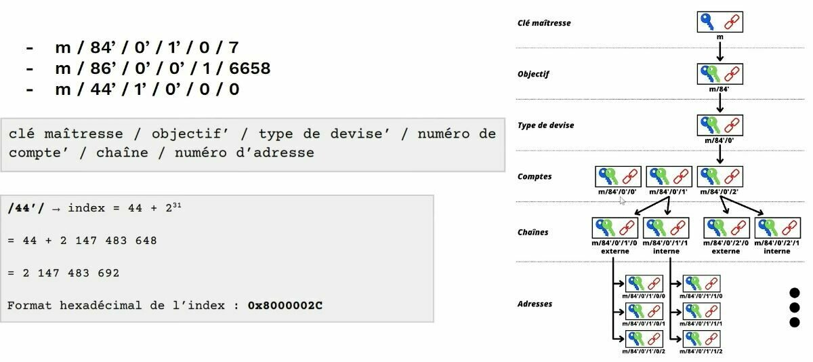

Para cada nivel de profundidad, utilizamos índices para diferenciar los pares de claves hijo. Se utilizan índices reforzados con un apóstrofo para determinadas derivaciones. La clave pública por año se utiliza como entrada para la función HMAC. El índice en una ruta de derivación indica el valor utilizado en la función HMAC.

El índice sin apóstrofe corresponde al índice real utilizado, mientras que el índice con apóstrofe corresponde al índice real + 2^31. Las derivaciones reforzadas utilizan índices de 2^31 a 2^32-1. Por ejemplo, el índice 44' corresponde al índice real 2^31 + 44.

Para generar una dirección de recepción específica, derivamos un par de claves hijo de la clave maestra y el código de cadena maestra. Luego, utilizamos el índice para diferenciar los diferentes pares de claves hijo de la misma profundidad.

Las claves extendidas, como XPUB, permiten compartir tu billetera con varias personas. La cadena de derivación se utiliza para diferenciar la cadena externa (direcciones destinadas a ser compartidas) y la cadena interna (direcciones de cambio).

Es importante tener en cuenta que se utilizan diferentes profundidades en una billetera HD según los diferentes estándares. La derivación de claves padre a claves hijo permite pasar de una profundidad a otra. El uso de diferentes ramas en la billetera HD indica los diferentes estándares seguidos.

En el próximo capítulo, estudiaremos las direcciones de recepción, sus ventajas de uso y los pasos para su construcción.

# ¿Qué es una dirección Bitcoin?

## Las direcciones Bitcoin

En este capítulo, exploraremos las direcciones de recepción, que desempeñan un papel crucial en el sistema Bitcoin. Permiten recibir fondos en una transacción y se generan a partir de pares de claves privadas y públicas. Aunque existe un tipo de script llamado Pay2PublicKey que permite bloquear bitcoins en una clave pública, los usuarios suelen preferir utilizar direcciones de recepción en lugar de este script.

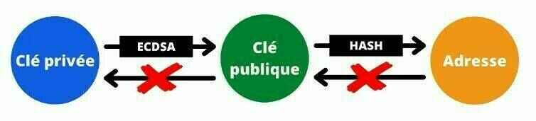

Cuando un destinatario desea recibir bitcoins, proporciona una dirección de recepción al remitente en lugar de su clave pública. Una dirección es en realidad un hash de una clave pública, con un formato específico. La clave pública se deriva de la clave privada hijo utilizando operaciones matemáticas como la suma y la duplicación de puntos en curvas elípticas.

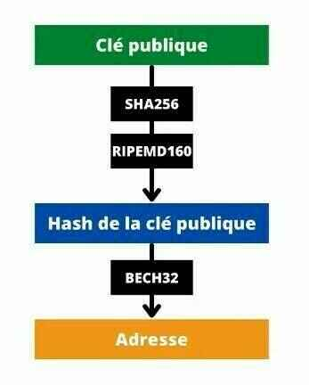

Es importante tener en cuenta que no es posible retroceder desde una dirección hacia la clave pública, ni desde la clave pública hacia la clave privada. El uso de una dirección permite reducir el tamaño de la información de la clave pública, que inicialmente tiene 512 bits. Es posible comprimir una clave pública conservando solo el valor de x y agregando un prefijo, pero esta técnica no era conocida en el momento de la creación de Bitcoin. Por lo tanto, el uso de una dirección no permite ahorrar espacio en los bloques.

Las direcciones de Bitcoin se han reducido en tamaño para facilitar su uso. Tienen un checksum, lo que permite detectar errores tipográficos y reducir el riesgo de pérdida de bitcoins. Sin embargo, las claves públicas no tienen un checksum, lo que significa que los errores tipográficos pueden resultar en la pérdida de los fondos correspondientes.

Las direcciones también ofrecen una segunda capa de seguridad entre la información pública y privada, lo que dificulta el control de la clave privada. Las funciones de hash utilizadas permiten que los pares de claves sean resistentes a posibles ataques de computadoras cuánticas. De hecho, estas computadoras pueden potencialmente romper ECDSA (Algoritmo de Firma Digital de Curva Elíptica), pero no pueden romper una función de hash.

Es importante destacar que cada dirección es de un solo uso, lo que contribuye a la seguridad y privacidad. Reutilizar la misma dirección plantea graves problemas de privacidad y debe evitarse. Además, cada dirección es un hash de una clave pública, acompañada de un checksum para reducir el riesgo de pérdida de bitcoins.

Se utilizan diferentes prefijos para las direcciones de Bitcoin. Por ejemplo, BC1Q corresponde a una dirección Segwit V0, BC1P a una dirección Taproot/Segwit V1, y los prefijos 1 y 3 están asociados con direcciones Pay2PublicKeyH/Pay2ScriptH (legacy). En el próximo curso, explicaremos paso a paso la derivación de una dirección a partir de una clave pública.

En resumen, las direcciones de recepción son un elemento esencial del sistema Bitcoin. Se generan a partir de pares de claves privadas y públicas, y se utilizan para recibir fondos en una transacción. Las direcciones incluyen un checksum para reducir el riesgo de pérdida de bitcoins y están diseñadas para ser de un solo uso, garantizando así la seguridad y privacidad. Se utilizan diferentes tipos de direcciones en el sistema Bitcoin, ofreciendo una mayor privacidad y seguridad.

## ¿Cómo crear una dirección de Bitcoin?

En este capítulo, abordaremos la construcción de una dirección de recepción para transacciones de Bitcoin. Una dirección de recepción es una representación alfanumérica de una clave pública comprimida. La conversión de una clave pública en una dirección de recepción pasa por varias etapas.

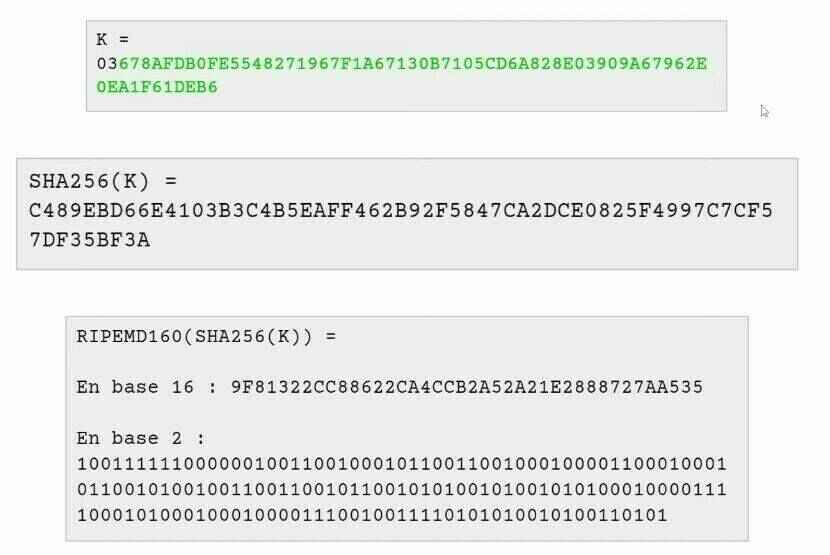

Una de las características ventajosas de las direcciones de recepción es la presencia de un checksum, que permite la detección de errores. Para esto, utilizamos la tecnología de checksum BCH (Bose-Chaudhuri-Hocquenghem), que garantiza una detección precisa de errores. Esta tecnología también contribuye a reducir el número de caracteres necesarios para representar una dirección, facilitando su uso.

Para comenzar la construcción de una dirección, debemos comprimir la clave pública correspondiente. Una clave pública sin procesar ocupa 520 bits, pero gracias a la simetría de la curva elíptica utilizada, una curva elíptica puede tener una abscisa x asociada a dos valores posibles para y: positivo o negativo. En la red de Bitcoin, trabajamos con un cuerpo de enteros positivos finitos en lugar del cuerpo de los reales. Para representar una clave pública a partir de x, agregamos un prefijo que indica el valor de y (par o impar). La compresión de una clave pública permite reducir su tamaño de 520 a 264 bits. La paridad de y en un cuerpo de enteros positivos finitos corresponde a la paridad de y en el cuerpo de los reales.

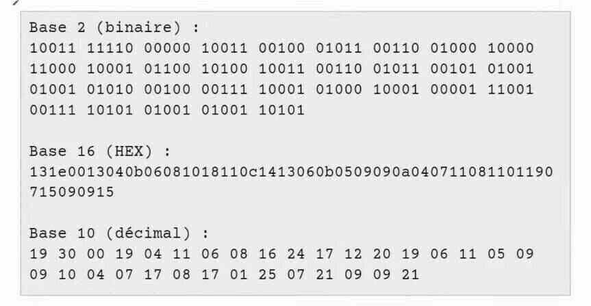
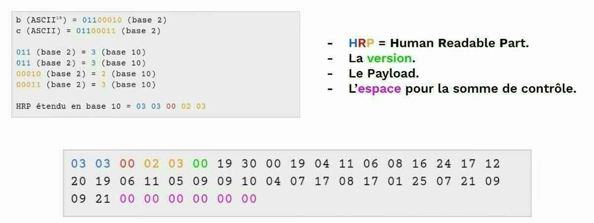

Tomemos el ejemplo de la clave pública perteneciente a Satoshi Nakamoto, con un prefijo 0,3 que indica un valor impar de y. Luego podemos pasar al segundo paso de la construcción de una dirección a partir de claves públicas comprimidas. Es posible calcular dos direcciones para cada clave pública. Para ello, utilizamos la función SHA256 para obtener el condensado (hash) de la clave pública. Luego, aplicamos la función ripemd160 al resultado de SHA256 para obtener una secuencia de caracteres. Esta secuencia luego se codifica en formato binario en grupos de 5 bits, a los cuales se agregan metadatos para el cálculo de la suma de verificación utilizando el programa BCH.

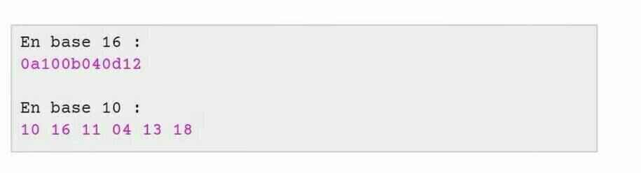

En el caso de las direcciones legacy, utilizamos el doble hash SHA256 para generar la suma de verificación de la dirección. Sin embargo, para las direcciones Segwit V0 y V1, recurrimos a la tecnología de suma de verificación BCH para garantizar la detección de errores. El programa BCH es capaz de sugerir y corregir errores con una probabilidad de error extremadamente baja. Actualmente, el programa BCH se utiliza para detectar y sugerir modificaciones, pero no las realiza automáticamente en lugar del usuario. El cálculo de la suma de verificación con el código BCH se basa en la aritmética polinomial de Chien-Chauffage.

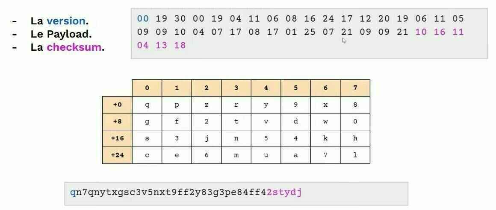

El programa BCH requiere varias entradas de información, incluyendo el HRP (Parte Legible por Humanos) que debe ser ampliado. La ampliación del HRP consiste en codificar cada letra en base 2, tomando los tres primeros bits de cada carácter.
', insertando un separador 0 y luego concatenando los últimos cinco bits de cada carácter. Los caracteres azules convertidos a base 10 corresponden a 3 y 3 en decimal, mientras que los otros cinco caracteres naranjas corresponden a 2 y 3 en base 10. La extensión del HRP en base 10 permite aislar los últimos cinco bits de cada carácter, fortaleciendo así la suma de verificación.

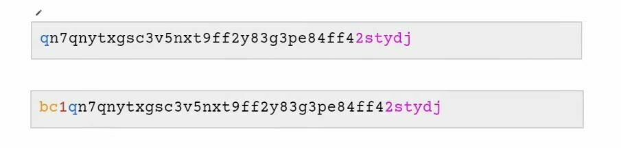

La versión Segwit V0 está representada por el código 00 y el "payload" está en negro, en base 10. Esto es seguido por seis caracteres reservados para la suma de verificación. Luego, la entrada que contiene los metadatos se somete al programa BCH para obtener la suma de verificación en base 10. La concatenación de la versión, el payload y la suma de verificación permite construir la dirección. Los caracteres en base 10 luego se convierten en caracteres bech32 utilizando una tabla de correspondencia. El alfabeto bech32 incluye todos los caracteres alfanuméricos, excepto 1, b, i y o, para evitar confusiones.

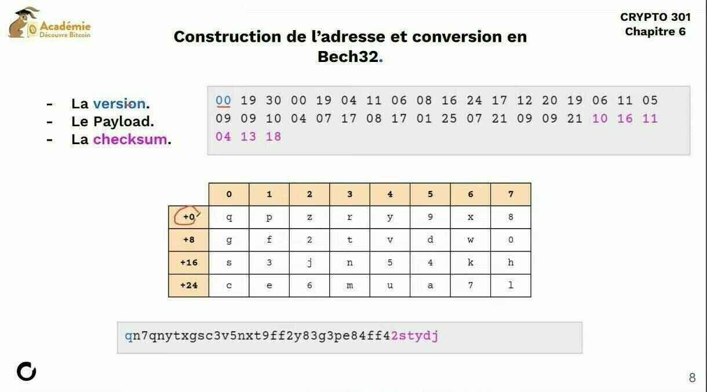
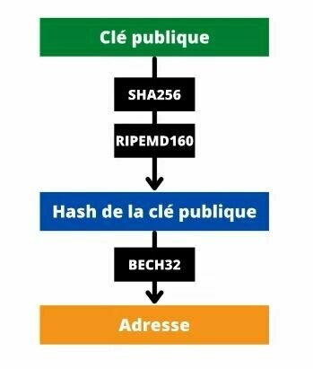

Para construir una dirección que comienza con bc1q, debemos aplicar una función hash (H160) a una clave pública comprimida, luego agregar la suma de verificación, la versión (q), el HRP (bc) y el separador (1). Las direcciones Taproot, por otro lado, comienzan con bc1p porque su versión (Segwit V1) corresponde a 0+1=1, de ahí el uso del carácter p. Todos estos elementos se convierten luego en BCH32, una variante de la base 32 específica de Bitcoin.

Así, hemos recorrido los pasos para construir una dirección de recepción, el uso de la tecnología de suma de verificación BCH, así como la construcción de una dirección que comienza con bc1q o bc1p utilizando la variante BCH32 de la base 32 específica de Bitcoin.

## Resumen de la criptografía para las carteras de Bitcoin

A lo largo de esta formación, hemos estudiado en profundidad la cartera determinista jerárquica (HD) con el BIP32. La entropía juega un papel central en este tipo de cartera, ya que se utiliza para generar una frase mnemotécnica a partir de un número aleatorio. Gracias a la lista de 2048 palabras proporcionada en el BIP39, esta frase mnemotécnica se puede codificar en una serie de palabras fáciles de recordar. La frase mnemotécnica, junto con una posible frase de paso, son necesarias para generar la semilla de la cartera. La frase de paso actúa como una sal criptográfica que agrega una capa adicional de protección a la cartera.

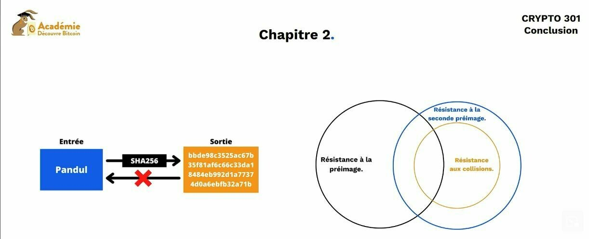

La función pbkdf2 se utiliza para generar la semilla a partir de la frase mnemotécnica y la frase de contraseña, utilizando un hmacha512 y 2048 iteraciones. A partir de esta semilla, se derivan la clave maestra y el código de cadena maestro utilizando nuevamente la función hmacha512 con la frase "bitcoin seed". La clave privada maestra y el código de cadena maestro son los elementos más altos en la jerarquía de la billetera HD.

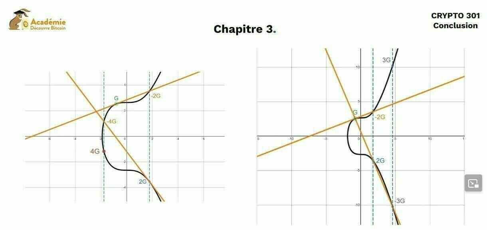

La derivación de una clave hija depende de varios factores, incluyendo la clave padre y el código de cadena correspondiente. Una clave extendida se obtiene concatenando una clave padre con su código de cadena, mientras que una clave maestra es una clave separada. Para derivar una dirección, primero se aplica una función hash SHA256 y RIPMD160 a la clave pública comprimida, luego se calcula una suma de verificación. El doble hash SHA256 se utiliza para calcular la suma de verificación en el caso de un estándar legacy, mientras que se utiliza el programa BCH (Bose-Chaudhuri-Hocquenghem) para calcular la suma de verificación en el caso de un estándar segwit. Luego, se utiliza una representación en formato base 58 para un estándar legacy, mientras que se utiliza el formato bech32 para un estándar segwit, para obtener la dirección de la billetera HD.

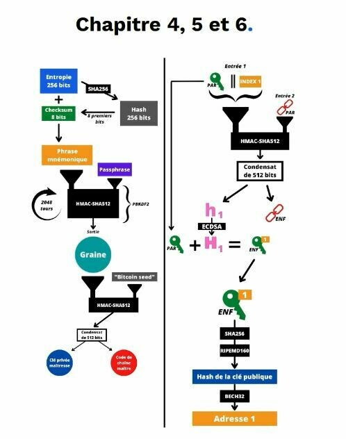

En resumen, hemos explorado en detalle las funciones hash y sus características, así como las firmas digitales y las curvas elípticas. Luego nos sumergimos en el mundo de la billetera determinista jerárquica (HD) con el BIP32, utilizando la entropía y la frase de contraseña para generar la semilla de la billetera. También aprendimos cómo derivar claves hijas y obtener la dirección de la billetera HD. Espero que esta información haya sido útil y ahora te animo a realizar la evaluación para poner a prueba tus conocimientos adquiridos durante el curso Crypto 301. Gracias por tu atención.

# Ve más allá

## ¡Creación de una semilla a partir de 128 lanzamientos de dados!

La creación de una frase mnemotécnica es un paso crucial para asegurar su cartera de criptomonedas. Hay varios métodos para generar una frase mnemotécnica, sin embargo, nos centraremos en el método de generación manual utilizando dados. Es importante destacar que este método no es adecuado para una cartera de alto valor. Se recomienda utilizar un software de código abierto o una cartera de hardware para generar la frase mnemotécnica. Para crear una frase mnemotécnica, utilizaremos dados para generar información binaria. El objetivo es comprender el proceso de creación de la frase mnemotécnica.

**Paso 1 - Preparación:**
Asegúrese de tener una distribución de Linux amnésica, como Tails OS, instalada en una memoria USB para mayor seguridad. Tenga en cuenta que este tutorial no debe ser utilizado para crear una cartera principal.

**Paso 2 - Generación de un número binario aleatorio:**
Utilizaremos dados para generar información binaria. Lanza un dado 128 veces y anota cada resultado (1 para impar, 0 para par).

**Paso 3 - Organización de los números binarios:**
Organiza los números binarios obtenidos en filas de 11 dígitos para facilitar los cálculos posteriores. La duodécima fila debe tener solo 7 dígitos.

**Paso 4 - Cálculo del checksum:**
Los últimos 4 dígitos de la duodécima fila corresponden al checksum. Para calcular este checksum, necesitamos utilizar una terminal de una distribución de Linux. Se recomienda utilizar [TailOs](https://tails.boum.org/index.fr.html), que es una distribución sin memoria que se puede arrancar desde una memoria USB. Una vez en su terminal, ingrese el comando `echo <número binario> | shasum -a 254 -0`. Reemplace `<número binario>` con su lista de 128 ceros y unos. La salida es un hash en hexadecimal. Tome el primer carácter de este hash y conviértalo en binario. Puede utilizar esta [tabla](https://www.educative.io/answers/decimal-binary-and-hex-conversion-table) como ayuda. Agregue el checksum en binario (4 dígitos) a la duodécima fila de su hoja.

**Paso 5 - Conversión a decimal:**
Para encontrar las palabras asociadas a cada una de sus líneas, primero debe convertir a decimal cada serie de 11 bits. Aquí no puede utilizar un convertidor en línea porque estos bits representan su frase mnemotécnica. Por lo tanto, deberá convertir utilizando una calculadora y un truco que aquí se explica: cada bit está asociado a una potencia de 2, de izquierda a derecha tenemos 11 posiciones que corresponden a 1024, 512, 256, 128, 64, 32, 16, 8, 4, 2, 1. Para convertir su serie de 11 bits a decimal, simplemente debe sumar solo las posiciones que contienen un 1. Por ejemplo, para la serie 00110111011, esto corresponde a la siguiente suma: 256 + 128 + 32 + 16 + 8 + 2 + 1 = 443. Ahora puede convertir cada línea a decimal. Y antes de pasar a la codificación en palabras, debe agregar +1 a todas las líneas porque el índice de la lista de palabras BIP39 comienza a partir de 1 y no de 0.

**Paso 8 - Generación de la frase mnemotécnica:**
Comience por imprimir la [lista de 2048 palabras](https://seedxor.com/files/wordlist.pdf) para hacer la conversión entre sus números decimales y las palabras de BIP39. La particularidad de esta lista es que ninguna palabra comparte las 4 primeras letras con todas las demás palabras de este diccionario. Luego, busque para cada una de sus líneas la palabra asociada al número decimal.

**Paso 9 - Prueba de la frase mnemotécnica:**
Pruebe inmediatamente su frase mnemotécnica en Sparrow Wallet creando una billetera a partir de ella. Si obtiene un error de suma de comprobación inválida, es probable que haya cometido un error de cálculo. Corrija este error volviendo al paso 4 y pruebe nuevamente en Sparrow Wallet. ¡Listo! Acaba de crear una nueva billetera de Bitcoin a partir de 128 lanzamientos de dados.

Generar una frase mnemotécnica es un proceso importante para asegurar su billetera de criptomonedas. Se recomienda utilizar métodos más seguros, como el uso de software de código abierto o una billetera de hardware, para generar la frase mnemotécnica. Sin embargo, realizar este taller ayuda a comprender mejor cómo a partir de un número aleatorio podemos crear una billetera de Bitcoin.

## BONUS: Entrevista con Théo Pantamis

## Conclusión y fin

### Agradecimientos y sigan profundizando en la madriguera del conejo

Nos gustaría agradecerles sinceramente por haber tomado el curso Crypto 301. Esperamos que esta experiencia haya sido enriquecedora y formativa para ustedes. Hemos abordado muchos temas emocionantes, desde matemáticas hasta criptografía, pasando por el funcionamiento del protocolo Bitcoin.

Si desean profundizar aún más en el tema, tenemos un recurso adicional para ofrecerles. Hemos realizado una entrevista exclusiva con Théo Pantamis y Loïc Morel, dos expertos reconocidos en el campo de la criptografía. Esta entrevista explora en profundidad varios aspectos del tema y ofrece perspectivas interesantes.

No duden en ver esta entrevista para seguir explorando el fascinante campo de la criptografía. Esperamos que les sea útil e inspirador en su trayectoria. Una vez más, gracias por su participación y compromiso a lo largo de este curso.

### Apóyanos

Este curso, al igual que todo el contenido presente en esta universidad, les ha sido ofrecido de forma gratuita por nuestra comunidad. Para apoyarnos, pueden compartirlo con quienes les rodean, convertirse en miembros de la universidad e incluso contribuir a su desarrollo a través de GitHub. ¡En nombre de todo el equipo, gracias!

### Califica el curso

¡Pronto se integrará un sistema de calificación para el curso en esta nueva plataforma de E-learning! Mientras tanto, muchas gracias por haber tomado el curso y si les gustó, consideren compartirlo con quienes les rodean.
