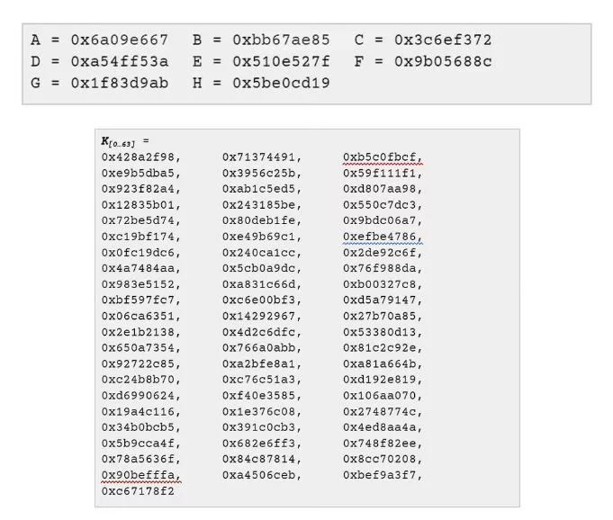
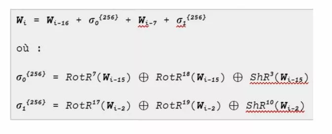
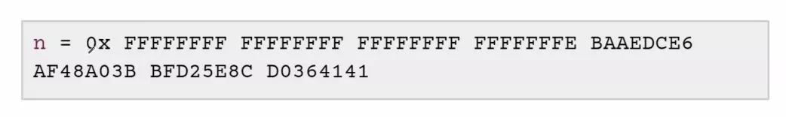
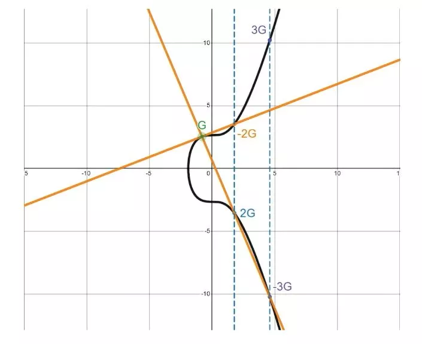
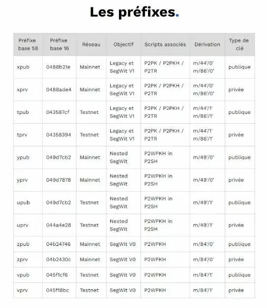
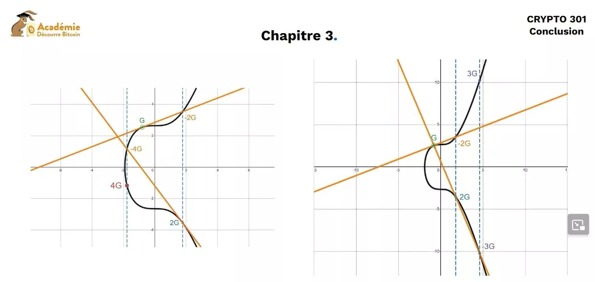

# 暗号学への旅

ビットコインに魅了されていますか？ビットコインウォレットの仕組みについて知りたいですか？暗号学の奥深さについての魅力的な旅に備えましょう！私たちの専門家であるロワイックが、ハッシング、鍵派生、楕円曲線などの難解な技術用語の背後にある謎を解き明かしながら、ビットコインウォレットの作成の複雑さを案内します。

このトレーニングでは、ビットコインウォレットの構造を理解する知識だけでなく、さらに暗号学の魅力的な世界に深く入り込む準備もできます。さあ、この旅に出る準備はできましたか？私たちに参加して、あなたの好奇心を専門知識に変えましょう！

+++

# はじめに
<partId>49bbd914-b954-5a23-af75-88e4a7375153</partId>

## 暗号学入門
<chapterId>059d0d7d-eeb7-5e22-9542-4b4246fabb75</chapterId>

### このトレーニングはあなたにぴったりです！

私たちは、暗号学とHDウォレットに関する新しいトレーニングコース「Crypto 301: 暗号学入門」を、専門家であるロワイック・モレル氏が指導することを大変嬉しく思います。このコースでは、データの暗号化とセキュリティを保証する数学の基本的な学問である暗号学の魅力的な世界に没頭します。

私たちの日常生活、特にビットコインの世界では、暗号学に関連する概念である秘密鍵、公開鍵、アドレス、派生パス、シード、エントロピーなどが重要な役割を果たしています。このコースでは、ロワイックが詳細に説明しますが、秘密鍵の生成方法やアドレスとの関連性についても説明します。また、ロワイックは楕円曲線という複雑な数学的曲線の数学的な詳細を1時間かけて説明します。さらに、ウォレットのセキュリティに重要なHMAC SHA512の使用方法やシードとニーモニックフレーズの違いについても理解することができます。

このトレーニングの究極の目標は、HDウォレットの作成の技術的なプロセスと使用される暗号学的な手法を理解できるようにすることです。ビットコインウォレットは年々使いやすく、より安全で、特定のBIPによって標準化されることで進化してきました。ロワイックはこれらのBIPを理解するのを助け、ビットコインの開発者や暗号学者が行った選択を理解するお手伝いをします。私たちの大学が提供するすべてのトレーニングと同様に、このトレーニングも完全に無料でオープンソースです。つまり、自由に受講し、自由に使用することができます。このエキサイティングなコースの最後には、あなたからのフィードバックをお待ちしています。

### では、教授にお任せします！

皆さん、こんにちは。ビットコインウォレットで使用される暗号学の技術的な探求を案内するロワイック・モレルです。

私たちの旅は、暗号学的ハッシュ関数の奥深さによって始まります。一緒に、重要なSHA256の内部動作を解析し、派生に特化したさまざまなアルゴリズムを探求します。

次に、デジタル署名の神秘的な世界を解読していきます。楕円曲線の魔法がこれらの署名にどのように適用されるかを発見し、秘密鍵から公開鍵を計算する方法について明らかにします。そしてもちろん、秘密鍵での署名にも触れます。
次に、Bitcoinウォレットの進化を見て、エントロピーと乱数の概念について探求します。有名なニーモニックフレーズを復習しながら、パスフレーズのトピックにも深入りします。さらに、128回のサイコロの目からシードを作成することで、ユニークな体験をする機会もあります！

これらの堅固な基礎を持って、重要な部分であるBitcoinウォレットの作成に備えましょう。シードとマスターキーの生成から、拡張キーの研究、子キーペアの派生まで、各ステップを詳しく解説します。また、ウォレットの構造と派生パスについても議論します。

さらに、Bitcoinアドレスの調査を行い、それらがどのように作成され、Bitcoinウォレットの機能においてどのような重要な役割を果たしているかを説明します。

私と一緒に魅力的な旅に参加し、これまでにない方法で暗号化の世界を探索しましょう。あらかじめ持っている固定観念を捨て、Bitcoinとその基本的な構造を理解する新しい方法に心を開いてください。

# ハッシュ関数
<partId>5b57b183-31b0-5e8d-99af-fd8047007ebf</partId>

## Bitcoinに関連する暗号ハッシュ関数の紹介
<chapterId>0d330f89-c4ef-5cdc-bd45-eda2aab8dc4c</chapterId>

Bitcoinプロトコルのセキュリティにおいて重要な要素であるハッシュ関数の暗号学的な世界に深く没入する今日のセッションへようこそ。ハッシュ関数を、情報を固有の固定サイズのデジタルフィンガープリントである「ハッシュ」というものに変換する超効率的な暗号解読ロボットと考えてみてください。私たちの探求の過程で、ハッシュ関数の特徴を描写し、Bitcoinプロトコルでの使用方法を強調し、これらの暗号関数が達成しなければならない具体的な目標を定義します。

ハッシュ関数の特徴を描写するためには、その逆転不可能性と偽造への耐性の2つの重要な特性を理解する必要があります。各暗号ハッシュ関数は、入力ごとに異なる「ハッシュ」を生成するユニークなアーティストのような存在です。わずかに逸脱した筆遣いでも、最終的な絵、つまりハッシュが大きく変わってしまいます。これらの関数は、ダウンロードしたソフトウェアの整合性を検証するデジタルの番人のような役割を果たします。また、重要な特性として、ハッシュ関数は衝突に対する耐性も持っています。確かに、ハッシュ関数の世界では衝突は避けられませんが、優れた暗号ハッシュ関数は衝突を大幅に最小化します。まるで各ハッシュが広大な都市の家のようなものであり、膨大な数の家があるにもかかわらず、良いハッシュ関数は各家にユニークな住所を与えることを保証します。

さて、時代遅れのハッシュ関数の波乱の水域に進みましょう。SHA0、SHA1、MD5は、暗号ハッシュの海において錆びついた遺物と見なされています。衝突への耐性を失ったため、これらはしばしば非推奨とされています。引き出しの原理により、出力サイズの制限により衝突回避は不可能であることが説明されます。また、第二原像への耐性は衝突への耐性に依存しています。真に安全とされるためには、ハッシュ関数は衝突、第二原像、元のイメージに対して耐性を持たなければなりません。

Bitcoinプロトコルにおける重要な要素であるSHA-256ハッシュ関数は、船の船長のような存在です。SHA-512などの他の関数は、HMACとPBKDFでの派生に使用されます。さらに、RIPMD160は指紋を160ビットに縮小するために使用されます。HASH256とHASH160という言葉が出てきた場合、それはSHA-256とRIPMDを用いたダブルハッシュの使用を指しています。HASH160の使用は特に有利であり、SHA-256のセキュリティを確保しながら指紋のサイズを縮小することができます。
要約すると、暗号ハッシュ関数の究極の目標は、任意のサイズの情報を固定サイズの指紋に変換することです。安全と認識されるためには、いくつかの強みを持つ必要があります：逆変換不可能性、偽造耐性、衝突耐性、および第二原像耐性です。

この探求の終わりに、暗号ハッシュ関数の謎を解き明かし、Bitcoinプロトコルでの使用方法を強調し、具体的な目標を分析しました。安全と見なされるためには、ハッシュ関数は第一原像、第二原像、衝突、および偽造に耐性を持つ必要があります。また、Bitcoinプロトコルで使用されるさまざまなハッシュ関数の範囲もカバーしました。次のセッションでは、SHA256ハッシュ関数の核心に迫り、その独特な特性を与える魅力的な数学を発見します。

## SHA256の内部動作
<chapterId>3f7271a0-fecb-521c-bc73-aa828eea6eb3</chapterId>

ハッシュ関数の暗号学的な迷路を魅力的に進む旅の続きへようこそ。今日は、前回のハッシュ関数に関する議論で紹介した、複雑で巧妙なSHA256の謎を解き明かします。バランスの取れた入力から美味しい256ビットのハッシュを生成するという究極の目標のために、この迷路のさらなる一歩を踏み出しましょう。

この暗号学的なレシピでは、ビットを扱い、初期メッセージサイズをMと呼びます。1ビットはセパレーターに予約され、Pビットはパディングに使用されます。さらに、2番目の前処理フェーズには64ビットが予約されています。合計は512ビットの倍数でなければなりません。まるで料理の材料が完璧に混ざり合うことを確認するようなものです。

次に、前処理の第2フェーズに移ります。これには、初期メッセージサイズのバイナリ表現をビット単位で追加します。これには、前のステップで予約した64ビットを使用します。64ビットをバランスの取れた入力に丸めるためにゼロを追加します。次に、初期メッセージ、パディングビット、およびサイズパディングをブレンダーのように結合して、バランスの取れた入力を得ます。

さて、SHA-256関数処理の最初のステップに備えます。良いレシピのように、定数と初期化ベクトルと呼ばれる基本的な材料が必要です。初期化ベクトルAからHは、最初の8つの素数の平方根の小数部の最初の32ビットです。定数Kは、最初の64個の素数の立方根の小数部の最初の32ビットを表します。

圧縮関数内では、XOR、AND、NOTなどの特定の演算子を使用します。ビットをランクに従って1ビットずつ処理し、XOR演算子と真理値表を使用します。AND演算子は、両方のオペランドが1に等しい場合にのみ1を返し、NOT演算子はオペランドの反対の値を返します。また、選択した数だけビットを右にシフトするためにSHR演算を使用します。

最後に、バランスの取れた入力を512ビットのメッセージの異なるブロックに分割した後、圧縮関数で64ラウンドの計算を行います。自転車競技のように、各周回で私たちの位置が向上します。中間状態を圧縮関数の初期状態に2^32で割った余りを加えます。圧縮関数の加算は、32ビットの合計のサイズを保持するために2^32で割った余りの加算です。

CH、MAJ、σ0、およびσ1ボックスで行われる計算の重要な役割を強調したいと思います。これらの操作は、攻撃に対してSHA256ハッシュ関数の堅牢性を確保するガーディアンであり、特にBitcoinプロトコル内で多数のデジタルシステムを保護するための選択肢となっています。SHA256の美しさは、入力からハッシュを見つける堅牢性と、与えられた入力のハッシュを検証することが機械的に簡単なアクションであることです。

## 派生に使用されるアルゴリズム
<chapterId>da504e7f-9591-5566-9a76-cf8cfea24a9b</chapterId>

HMACとPBKDF2派生アルゴリズムは、Bitcoinプロトコルのセキュリティメカニズムの重要な要素です。これらはさまざまな潜在的な攻撃を防ぎ、Bitcoinウォレットの整合性を確保します。

HMACとPBKDF2は、Bitcoinで異なるタスクに使用される暗号ツールです。HMACは、階層的決定性（HD）ウォレットを派生させる際の長さ拡張攻撃に対抗するために主に使用されます。一方、PBKDF2はニーモニックフレーズをシードに変換するために使用されます。

HMACは、メッセージとキーを入力として受け取り、固定サイズの出力を生成します。均一性を確保するために、キーはハッシュ関数で使用されるブロックサイズに基づいて調整されます。HDウォレットの派生においては、HMAC-SHA-512が使用されます。後者は1024ビット（128バイト）のブロックで動作し、キーを適切に調整します。セキュリティを向上させるために、OPAD（0x5c）とIPAD（0x36）という定数を必要に応じて繰り返し使用します。

HMAC-SHA-512のプロセスでは、キーXOR OPADとキーXOR IPADに適用されたSHA-512の結果をメッセージと連結します。1024ビット（128バイト）のブロックを使用する場合、入力キーが必要に応じてゼロでパディングされ、次にIPADとOPADとXORされます。変更されたキーは、その後メッセージと連結されます。

派生キーのセキュリティを向上させるために、ソルトを使用することで追加のエントロピー源を組み込むことができます。それがない場合、攻撃者はウォレット全体を危険にさらし、すべてのビットコインを盗むことができます。
PBKDF2は、ニーモニックフレーズをシードに変換するために使用されます。このアルゴリズムは、HMAC SHA512を使用して2048ラウンドを実行します。これらの派生アルゴリズムのおかげで、2つの異なる入力は固有かつ固定の出力を生成することができ、SHA-2ファミリーの関数における可能性のある長さ拡張攻撃の問題を軽減します。長さ拡張攻撃は、特定の暗号ハッシュ関数の特性を悪用するものです。この攻撃では、既に不明なメッセージのハッシュを持っている攻撃者が、元のメッセージの拡張であるより長いメッセージのハッシュを計算することができます。これは、元のメッセージの内容を知らなくても可能であり、整合性検証などのタスクにこのタイプのハッシュ関数が使用される場合、重大なセキュリティの脆弱性につながる可能性があります。

結論として、HMACとPBKDF2アルゴリズムは、BitcoinプロトコルにおけるHDウォレット派生のセキュリティにおいて重要な役割を果たしています。HMAC-SHA-512は長さ拡張攻撃に対して保護するために使用され、PBKDF2はニーモニックフレーズをシードに変換することを可能にします。チェーンコードは鍵派生における追加のエントロピー源を提供し、システムの堅牢性を確保します。

# デジタル署名
<partId>ac9255ed-d90c-5992-ab87-65ea02eb6c17</partId>

## デジタル署名と楕円曲線
<chapterId>e15d3376-d255-5811-9174-6f0f68d108ed</chapterId>

仮想通貨の世界では、トランザクションのセキュリティが最も重要です。Bitcoinプロトコルの中心には、デジタル署名が使用され、特定の公開鍵に関連付けられた秘密鍵の所有を数学的に証明するためのものです。このデータ保護技術は、楕円曲線暗号学と呼ばれる暗号学の魅力的な分野に基づいています。

楕円曲線暗号学は、Bitcoinトランザクションのセキュリティの基盤です。学校で学んだ数学の曲線に似たこれらの楕円曲線は、鍵交換から非対称暗号化、デジタル署名の作成まで、さまざまな暗号アプリケーションで役立ちます。楕円曲線を特徴づける興味深い詳細は、その対称性です：曲線上の2つの点を交差する任意の垂直でない直線は、3つ目の点を交差します。

さて、もう少し深く掘り下げましょう：Bitcoinプロトコルでは、特定の楕円曲線であるSecP256K1を使用して、暗号操作を行います。この曲線は、256ビットの素数を法とする正の整数の有限集合上に定義されており、従来の曲線ではなく点の雲として視覚化することができます。これにより、Bitcoinは効果的にトランザクションを保護することができるのです。

Bitcoinのためにsecp256k1曲線が選択された理由については、secp256r1曲線よりも好まれたことが興味深いです。この曲線は、パラメータa=0およびb=7で定義され、その方程式はy² = x³ + 7 modulo nであり、nは曲線の次数を決定する素数を表します。

Bitcoinシステムで使用される定数について話すとき、一般的には楕円曲線デジタル署名アルゴリズム（ECDSA）とBitcoinで使用される楕円曲線システムの特定のパラメータを指します。以下にこれらのパラメータを示します。
- 素数体（p）：Bitcoinは素数体上の曲線を使用しているため、pはこのフィールドを定義するために使用される最初の数です。secp256k1曲線の場合、pは16進数で`p = FFFFFFFF FFFFFFFF FFFFFFFF FFFFFFFF FFFFFFFF FFFFFFFF FFFFFFFE FFFFFC2F`または10進数でp = 2^256 - 2^32 - 2^9 - 2^8 - 2^7 - 2^6 - 2^4 -1と等しいです。
- 曲線の位数（n）：これは曲線上の点の数であり、無限遠点を含みます。secp256k1の場合、nは16進数で`n = FFFFFFFF FFFFFFFF FFFFFFFF FFFFFFFE BAAEDCE6 AF48A03B BFD25E8C D0364141`または10進数でn = 2^256 - 432420386565659656852420866394968145599と等しいです。
- 生成点（G）：ベースポイントまたはジェネレータは、他のすべての公開鍵が生成される曲線上の点です。特定のx座標とy座標を持ち、通常は16進数で表されます。secp256k1の場合、座標Gは以下の通りです：
  - `Gx = 79BE667E F9DCBBAC 55A06295 CE870B07 029BFCDB 2DCE28D9 59F2815B 16F81798`
  - `Gy = 483ADA77 26A3C465 5DA4FBFC 0E1108A8 FD17B448 A6855419 9C47D08F FB10D4B8`

すべての16進数値は一般的に16進法で表され、10進数値は10進法で表されます。また、これらの定数に対するすべての操作は、曲線上の点の座標ではpで割った余り、キーと署名の操作ではnで割った余りで行われます。

では、有名なビットコインはどこに保存されているのでしょうか？一般的に考えられるように、ビットコインウォレットには保存されていません。実際には、ビットコインウォレットにはビットコインの所有権を証明するために必要な秘密鍵が保存されています。ビットコイン自体は、すべてのトランザクションをアーカイブする分散型データベースであるブロックチェーンに記録されています。

ビットコインシステムでは、単位はビットコイン（小文字の「b」）です。最小単位であるサトシを含め、8桁まで分割することができます。UTXO（未使用トランザクション出力）は、ユーザーに属する未使用のトランザクション出力を表します。これらのビットコインを使うには、各UTXOに関連付けられた公開鍵に対応する秘密鍵の所有権を証明する必要があります。

トランザクションのセキュリティを確保するために、ビットコインは2つのデジタル署名プロトコル、ECDSA（楕円曲線デジタル署名アルゴリズム）とSchnorrに依存しています。ECDSAは2009年のビットコインのローンチ以来統合された署名プロトコルであり、Schnorr署名は最近の2021年11月に追加されました。両方のプロトコルは楕円曲線暗号に基づいており、似たような数学的なメカニズムを使用していますが、主に署名の構造の違いがあります。

これらの署名メカニズムについて詳しく説明する前に、楕円曲線とは何かを理解することが重要です。楕円曲線は方程式y² = x³ + ax + bで定義されます。この曲線上のすべての点には、暗号学での有用性に重要な対称性があります。
最終的に、様々な楕円曲線が暗号利用において安全と認識されています。もっともよく知られているのは、secp256r1曲線です。しかし、Bitcoinでは、Satoshi Nakamotoは異なる曲線、secp256k1を選択しました。

このコースの次のセクションでは、楕円曲線上の暗号化とデジタル署名アルゴリズムの理解のために、公開鍵と秘密鍵について詳しく見ていきます。これは、知識を確固たるものにし、Bitcoinプロトコルのセキュリティを確保するために、これらの情報がどのように結びついているかを理解するための時間です。

## 秘密鍵から公開鍵を計算する
<chapterId>6f3c4d8d-2c98-5975-9775-b13ceb49a4e4</chapterId>

このコースの次のセクションでは、Bitcoinプロトコルの重要な要素である公開鍵と秘密鍵の仕組みについて詳しく調べていきます。これらの鍵は楕円曲線デジタル署名アルゴリズム（ECDSA）によって本質的に関連しています。これらを理解することで、Bitcoinがプラットフォーム上でトランザクションのセキュリティを確保している仕組みについて深く理解することができます。

まず、ECDSAアルゴリズムの世界に飛び込んでみましょう。Bitcoinはこのデジタル署名アルゴリズムを使用して、秘密鍵と公開鍵を関連付けます。このシステムでは、秘密鍵はランダムまたは擬似ランダムな256ビットの数値です。秘密鍵の可能性の総数は理論的には2^256ですが、実際にはそれよりも少なくなります。正確には、一部の256ビットの秘密鍵はBitcoinには有効ではありません。

Bitcoinと互換性があるためには、秘密鍵は1からn-1の間である必要があります。ここで、nは楕円曲線の次数を表します。つまり、Bitcoinの秘密鍵の可能性の総数は、おおよそ1.158 x 10^77となります。これを具体的に説明すると、観測可能な宇宙に存在する原子の数とほぼ同じです。このユニークな秘密鍵を使用して、512ビットの公開鍵が導出されます。

公開鍵は、楕円曲線上の点であるKとして表され、曲線上の点操作を使用して秘密鍵から導出されます。ECDSA関数は逆にできないため、公開鍵から秘密鍵を取得することは不可能です。この逆転不可能性がBitcoinウォレットのセキュリティの基盤です。

公開鍵は、256ビットの2つの点で構成され、合計で512ビットです。しかし、264ビットの数値に圧縮することもできます。点Gは、システム内のユーザーのすべての公開鍵を計算するための出発点です。

楕円曲線の注目すべき特性の一つは、曲線上の2点で交差する直線は、第3の点である点Oとも交差するということです。この特性を利用して、点Oの反対側である点Uを決定します。点を自身に加えることは、その点で曲線に接線を引くことで行われ、新しいユニークな点であるjが得られます。点のn倍のスカラー倍は、その点を自身にn回加えることと等価です。

これらの楕円曲線上の点に対する操作は、公開鍵の計算の基礎となります。秘密鍵を知っていれば、公開鍵を簡単に計算することができます。しかし、公開鍵を知っていても秘密鍵を計算することはできません。これにより、Bitcoinシステムのセキュリティが確保されます。実際、公開鍵と秘密鍵のセキュリティは、複雑な数学的問題である離散対数問題に依存しています。

次のレッスンでは、ECDSAアルゴリズムを使用してデジタル署名を行い、ビットコインをアンロックする方法について探求します。仮想通貨と暗号学の世界を興奮させるこの探求にご期待ください。

## 秘密鍵での署名
<chapterId>81420b43-e943-5061-8eb0-3c63f0798a0e</chapterId>

デジタル署名のプロセスは、秘密鍵の保持者であることを証明するための重要な方法であり、秘密鍵を明かさずに行われます。これは、ECDSAアルゴリズムを使用して実現されます。このアルゴリズムでは、一意のnonceを決定し、特定の数値Vを計算し、2つの部分S1とS2からなるデジタル署名を作成します。セキュリティ攻撃を回避するために、常に一意のnonceを使用することが重要です。このルールに従わない場合に起こり得る有名な例は、PlayStation 3のハック事件で、nonceの再利用によって侵害されました。

具体的には、ECDSA（楕円曲線デジタル署名アルゴリズム）アルゴリズムを使用してデジタル署名を検証するには、通常以下の手順が関与します：

1. 署名値S1とS2が範囲[1、n-1]にあることを確認します。そうでない場合、署名は無効です。
2. S2 mod nの逆数を計算します。これをuと呼びます。通常、次のように計算されます：u = (S2)^-1 mod n。
3. 署名されたメッセージのハッシュ値であるHを計算します。
4. u1 = H _ u mod nおよびu2 = S1 _ u mod nを計算します。
5. u1、u2、および公開鍵Kを使用して楕円曲線上の点Pを計算します：P = u1*G + u2*K（ここで、Gは曲線の生成点です）。
6. Pが無限遠点である場合、署名は無効です。
7. I = Pのx座標 mod nを計算します。
8. IがS1と等しい場合、署名は有効です。

各ソフトウェアが異なる表記法を使用する場合や、一部の手順が結合または並べ替えられる場合があることに注意してくださいが、基本的なロジックは同じです。また、すべての算術演算は、楕円曲線によって定義された有限体（mod n、ここでnは曲線の次数です）で行われます。Bitcoinで使用されるsecp256k1曲線の場合、n = 2^256 - 432420386565659656852420866394968145599です。
公開鍵と秘密鍵を生成する際には、楕円曲線と生成点について理解することが重要です。公開鍵を取得するには、一意のランダムな数値である秘密鍵（通常は「nonce」と呼ばれる）を選択し、楕円曲線の方程式に使用する必要があります。
楕円曲線は、安全な公開鍵と秘密鍵を生成するための強力なツールです。例えば、公開鍵3Gを得るためには、点Gに接線を引き、-Gの逆を計算して2Gを得た後、Gと2Gを足します。トランザクションを行うためには、公開鍵3Gに関連付けられたビットコインをアンロックするために、数値3を知っていることを証明する必要があります。

公開鍵3Gに関連付けられた秘密鍵を知っていることを証明し、デジタル署名を作成するためには、まずノンスを計算し、そのノンスに関連付けられた点V（この例では4G）を計算します。次に、公開鍵3Gと点Vを足して点Tを計算します。これにより、7Gが得られます。

デジタル署名の検証は、送信者の秘密鍵を必要とせずに、署名されたメッセージの真正性を確認することができるECDSAアルゴリズムの使用において重要なステップです。以下に、詳細な動作方法を示します。

この例では、TとVという2つの重要な値があります。Tは数値の値（この例では7）であり、Vは楕円曲線上の点（ここでは4Gで表される）です。これらの値は、デジタル署名の作成時に生成され、メッセージと共に送信され、検証を可能にします。

検証者がメッセージを受け取ると、TとVという2つの値も受け取ります。

署名の検証を行うために、検証者は以下の手順に従います。

1. まず、メッセージのハッシュを計算します。これをHと呼びます。
2. 次に、u1とu2を計算します。以下の式を使用します。
   - u1 = H * (S2)^-1 mod n
   - u2 = T * (S2)^-1 mod n'

# ニーモニックフレーズ
<partId>3633fb39-a55b-5882-bcbe-e8d8cf2c4b00</partId>

## Bitcoinウォレットの進化
<chapterId>94354163-ea15-5f4d-a320-57a22c9ad2b3</chapterId>

階層的決定ウォレット、または一般的にHDウォレットとして知られるものは、暗号通貨エコシステムにおいて重要な役割を果たしています。"ウォレット"という用語は、この分野に新しく参入する人々には誤解を招くかもしれません。なぜなら、それはお金や通貨の保持を意味しているわけではなく、単一のマスターキーから派生した一連のプライベート暗号鍵の集合を指しているからです。これらのプライベート鍵は、256ビットの固定長であり、暗号通貨の所有権の本質であり、時には"Just a Bunch Of Keys"（JBOC）というやや粗雑な名前で呼ばれることもあります。

ただし、これらの鍵の管理の複雑さは、Bitcoin Improvement Proposals（BIP）として知られる一連のプロトコルによって相殺されています。これらのアップグレード提案は、HDウォレットの機能性とセキュリティの中心にあります。例えば、2012年に発表された[BIP32](https://github.com/bitcoin/bips/blob/master/bip-0032.mediawiki)は、これらの鍵の生成と保存方法を革新し、決定論的かつ階層的に派生した鍵の概念を導入しました。これにより、これらの鍵の保存プロセスが大幅に簡素化されながら、セキュリティレベルが維持されるようになりました。
その後、[BIP39](https://github.com/bitcoin/bips/blob/master/bip-0039.mediawiki)は画期的なイノベーションである24語のニーモニックフレーズを導入しました。このシステムにより、複雑で覚えにくい数字の並びを普通の単語のシリーズに変換することが可能となり、記憶や保存が容易になりました。さらに、[BIP38](https://github.com/bitcoin/bips/blob/master/bip-0038.mediawiki)では個々のキーのセキュリティを強化するために追加のパスフレーズの追加が提案されました。これらの連続した改善により、BIP43とBIP44が生まれ、HDウォレットの構造と階層を標準化し、一般の人々によりアクセスしやすく使いやすくしました。

次のセクションでは、HDポートフォリオの仕組みについて詳しく説明します。キーの派生の原則を説明し、エントロピーと乱数生成の基本的な概念を検討します。これらはHDポートフォリオのセキュリティを保証するために不可欠です。

階層的決定ウォレット、または一般的にHDウォレットとして知られるものは、暗号通貨エコシステムで重要な役割を果たしています。"ウォレット"という用語は、この分野に新しい人には誤解を招くかもしれません。なぜなら、それはお金や通貨の保持を意味しているわけではないからです。むしろ、アルゴリズム的な算術の巧妙なプロセスによって、単一のマスターキーから派生した一連の秘密の暗号鍵のコレクションを指します。これらの秘密の鍵は、256ビットの固定長であり、暗号通貨の所有権の本質であり、時には「Just a Bunch Of Keys」（JBOC）というやや粗雑な名前で呼ばれることもあります。

ただし、これらの鍵の管理の複雑さは、Bitcoin Improvement Proposals（BIP）と呼ばれる一連のプロトコルによって相殺されています。これらのアップグレード提案は、HDウォレットの機能とセキュリティの中心にあります。例えば、2012年に発表された[BIP32](https://github.com/bitcoin/bips/blob/master/bip-0032.mediawiki)は、これらの鍵の生成と保存方法を革新し、決定論的かつ階層的に派生した鍵の概念を導入しました。これにより、これらの鍵の保存プロセスが大幅に簡素化され、そのセキュリティレベルが維持されました。

要約すると、BIP32とBIP39がHDウォレットの設計とセキュリティにおいて中心的な役割を果たしていることを強調することは不可欠です。これらのプロトコルにより、ランダムまたは擬似ランダムな数値であるべきシードから複数の鍵の生成が可能となります。現在、これらの標準は、単一の暗号通貨に特化したウォレットであっても、複数の通貨タイプをサポートしているウォレットであっても、ほとんどの暗号通貨ウォレットで採用されています。

この導入がHDウォレットの基礎とそのさまざまな特性をより理解するのに役立ったことを願っています。私たちの目標は、これらの重要な概念をマスターし、複雑な暗号通貨の世界でより効率的に操作できるようにすることです。次のレッスンでも、この魅力的な世界の複雑さと微妙なニュアンスを探求し続けるために、私たちと一緒にいてください。

## エントロピーと乱数
<chapterId>1c92568c-a899-597f-85f7-c903d2f7245d</chapterId>

ビットコインエコシステムにおけるプライベートキーのセキュリティの重要性は否定できません。実際、これらのキーはビットコイン取引のセキュリティを保証する基盤です。予測可能性に関連する脆弱性を回避するために、これらのキーは真にランダムな方法で生成されなければなりませんが、これはユーザーにとって手間のかかる作業になることがあります。このパズルの解決策の1つが、階層的決定ウォレット（HDウォレット）です。この方法では、ウォレットの基盤となる情報から決定論的かつ階層的に子キーペアを生成することができます。これが、派生キーのセキュリティを保証するためにランダム性が不可欠となる場所です。

ランダムな数値の生成は、暗号化においてプライベートキーの整合性を保証するために実際には重要な要素です。予測可能性に関連する脆弱性を防ぐためには、プライベートキーはランダムに生成されなければなりません。各取引に新しいキーペアを使用することはセキュリティを向上させますが、バックアップを複雑化し、機密性を部分的にしか保持しません。要約すると、プライベートキーのセキュリティは絶対的な優先事項であり、厳格かつランダムな生成が必要です。HDウォレットは、高いセキュリティレベルを維持しながらキーの生成と管理を容易にする解決策を提供します。

ただし、コンピュータ上でランダムな数値を生成することは大きな課題であり、得られる結果は真にランダムではありません。そのため、ランダムナンバージェネレータ（RNG）を使用することが重要です。RNGの種類はさまざまで、疑似乱数生成器（PRNG）から真の乱数生成器（TRNG）まで、エントロピー源を組み込んだPRNGまであります。

ビットコインの場合、プライベートキーはウォレットの基盤となる情報から生成されます。この情報により、子キーペアの決定論的かつ階層的な派生が可能となります。エントロピーはHDウォレットの基盤ですが、このランダムナンバーの生成には標準が存在しません。そのため、ランダムナンバーの生成はビットコイン取引のセキュリティを確保する上で重要な懸念事項です。

キー生成の検証フェーズは、予測可能性に関連する脆弱性を防ぐために、ランダムナンバーの生成のセキュリティと真正性を確保するために重要です。この検証を可能にするために、オープンソースのウォレットの使用を強く推奨します。

ただし、ハードウェアウォレットの中には「クローズドソース」であるものもあり、ランダムナンバーの生成を検証することができません。ダイスを使用して自分自身でニーモニックフレーズを生成するという方法もありますが、このアプローチには一定のリスクが存在する可能性があります。

ランダムに生成されたパスフレーズの使用は、これらのリスクを軽減するのに役立ちます。

この方法を適用する例として、CoinKitが提供する「ダイスロール」オプションを使用してニーモニックフレーズを生成する方法があります。別の可能性としては、非常に大きな初期情報を使用し、この情報をSHA-256ハッシュ関数で256ビットに縮小する方法があります。SHA-256ハッシュ関数は衝突、偽造、および前像攻撃および第二前像攻撃に耐えることができます。

最終的には、ランダム性は暗号化とコンピュータサイエンスにおいて中心的な役割を果たし、ランダム性を安全に生成する能力はプライベートキーとビットコイン取引のセキュリティを確保するために不可欠です。エントロピーはビットコインHDウォレットの核心であり、そのセキュリティにとって重要です。次のレッスンでは、このトピックをさらに探求し、エントロピーがHDウォレットのセキュリティにどのように貢献するかを見ていきます。

## ニーモニックフレーズ
<chapterId>7d9ef9ef-da53-50c5-89af-ef2c18a4622b</chapterId>

ビットコインウォレットのセキュリティは、すべてのユーザーにとって重要な関心事です。ウォレットのバックアップを確保するための重要な方法は、エントロピーとチェックサムに基づいたニーモニックフレーズを生成することです。
エントロピーはHDウォレットのセキュリティの基盤です。疑似乱数生成器（PRNG）、真の乱数生成器（TRNG）、または手動でエントロピーを生成するためのいくつかの方法が存在します。ウォレットのセキュリティを保証するために、このエントロピーはランダムまたは疑似ランダムであることが重要です。

一方、チェックサムは回復フレーズの正確性の検証を保証します。このチェックサムがないと、フレーズのエラーにより異なるウォレットが作成され、資金が失われる可能性があります。チェックサムはエントロピーをSHA256関数を通じて渡し、ハッシュの最初の8ビットを取得することで得られます。

エントロピーのサイズに応じて、ニーモニックフレーズの異なる標準が存在します。24ワードの回復フレーズに最も一般的に使用される標準は、256ビットのエントロピーです。チェックサムのサイズは、エントロピーのサイズを32で割ることで決定されます。

例えば、256ビットのエントロピーは8ビットのチェックサムを生成します。エントロピーとチェックサムの連結により、それぞれ128ビット、160ビットなどのサイズが得られます。エントロピーのサイズに応じて、回復フレーズは128ビットの場合は12ワード、160ビットの場合は15ワード、256ビットの場合は24ワードとなります。

ビットをフレーズに変換するために、各セグメントは2048語のリストからの単語と関連付けられます。重要なことは、どの単語も最初の4文字の順序が同じではないということです。

ビットコインウォレットの完全性を保護するためには、24ワードの回復フレーズをバックアップすることが重要です。最も一般的に使用される2つの標準は、128ビットまたは256ビットのエントロピーと12ワードまたは24ワードの連結に基づいています。パスフレーズを追加することでウォレットのセキュリティを強化することもできます。

結論として、ビットコインウォレットのセキュリティを確保するためにニーモニックフレーズを生成することは重要なプロセスです。エントロピーのサイズに応じたニーモニックフレーズの標準に従うことが重要です。24ワードの回復フレーズをバックアップすることは、資金の損失を防ぐために不可欠です。ご注意いただき、次回の仮想通貨コースを楽しみにしています。

## パスフレーズ
<chapterId>2574ea14-a95a-5d59-b95b-bb0e704d3333</chapterId>

パスフレーズは、ビットコインウォレットのセキュリティを向上させるために統合できる追加のパスワードです。その使用は任意であり、ユーザーの裁量に委ねられています。ニーモニックフレーズとともにウォレットのシードの計算を可能にする任意の情報を追加することで、パスフレーズはセキュリティを強化します。

HDウォレットのキーを導出するためには、ニーモニックフレーズとパスフレーズの両方が必要です。パスフレーズは自由に設定でき、ほぼ無限のサイズになります。パスフレーズはニーモニックフレーズに含まれず、サイズ、チェックサム、エンコーディングの特定の制約に従う必要があります。パスフレーズを知らないと、攻撃者はユーザーのビットコインにアクセスすることはできません。パスフレーズはウォレットのすべてのキーの構築と計算において重要な役割を果たします。

pbkdf2関数は、パスフレーズからシードを生成するために使用されます。このシードにより、ウォレットのすべての子キーペアを導出することができます。パスフレーズが変更されると、ビットコインウォレットは完全に異なるものになります。
パスフレーズは、Bitcoinウォレットのセキュリティを向上させるための重要なツールです。さまざまなセキュリティ戦略の適用を可能にします。たとえば、ニーモニックフレーズの複製の作成やバックアップの容易化に使用することができます。また、ランダム生成されたニーモニックフレーズに関連するリスクを軽減することで、ウォレットのセキュリティを向上させることもできます。
効果的なパスフレーズは、長さが長く（20〜40文字）、多様化している（大文字、小文字、数字、記号を使用している）ことが重要です。ユーザーやその環境と直接関連していないことが望ましいです。パスフレーズとして単純な単語ではなく、ランダムな文字列を使用する方が安全です。

パスフレーズは、単純なパスワードよりも安全です。理想的なパスフレーズは、長く、多様で、ランダムです。ウォレットやホットソフトウェアのセキュリティを向上させることができます。また、冗長で安全なバックアップの作成にも使用することができます。

ウォレットへのアクセスを失わないために、パスフレーズのバックアップに注意することが重要です。パスフレーズはHDウォレットのオプションです。ダイスや他の疑似乱数生成器を使用してランダムに生成することができます。パスフレーズやニーモニックフレーズを記憶することは推奨されていません。

次のレッスンでは、シードの機能とそれから生成される最初のキーペアについて詳しく説明します。学習を続けるために、このコースをフォローしてください。近いうちにお会いできることを楽しみにしています。

# Bitcoinウォレットの作成
<partId>60a0d096-0430-5ccc-b0e4-caddc9ae4884</partId>

## シードとマスターキーの作成
<chapterId>987618e2-ee4b-5a59-918e-aefab568d334</chapterId>

このコースのこの部分では、階層的決定ウォレット（HDウォレット）の派生手順について探求します。これにより、階層的な方法でプライベートキーとパブリックキーの作成と管理が可能になります。

HDウォレットの基盤は、ニーモニックフレーズとパスフレーズ（オプションの追加パスワード）の2つの要素に依存しています。これらはシードを構成し、ウォレットのキーの派生の基礎となる512ビットの英数字のシーケンスです。このシードから、Bitcoinウォレットのすべての子キーペアを派生させることができます。シードは、パスフレーズの使用の有無に関係なく、ウォレットに関連するすべてのビットコインへのアクセスを許可するキーです。

シードを取得するためには、pbkdf2関数（Password-Based Key Derivation Function 2）がニーモニックフレーズとパスフレーズを使用して使用されます。pbkdf2の出力は512ビットのシードです。マスタープライベートキーとマスターチェーンコードは、HMAC SHA-512（ハッシュベースメッセージ認証コードセキュアハッシュアルゴリズム512）アルゴリズムを使用して決定されます。このアルゴリズムは、結果を生成するためにメッセージとキーが必要です。マスタープライベートキーは、シードとフレーズ「Bitcoin SEED」から計算されます。このフレーズはすべてのHDウォレットの派生で同じであり、ウォレット間の一貫性を保証します。

当初、BitcoinプロトコルにはSHA-512関数が実装されていませんでした。そのため、HMAC SHA-512が使用されています。フレーズ「Bitcoin SEED」を使用したHMAC SHA-512の使用により、ユーザーはBitcoinに特化したウォレットを生成することに制約されます。HMAC SHA-512の結果は、512ビットの数値であり、左側の256ビットがマスタープライベートキーを表し、右側の256ビットがマスターチェーンコードを表します。
マスタープライベートキーは、ウォレット内のすべての将来のキーの親キーであり、マスターチェーンコードは子キーの派生に関与します。親ペアの対応するチェーンコードを知らないと、子キーペアを派生させることは不可能であることに注意することが重要です。チェーンコードは派生プロセスにエントロピーの要素を追加します。

ウォレット内のキーペアは、プライベートキー、パブリックキー、およびチェーンコードで構成されます。チェーンコードは子キーの派生にランダム性を導入し、各キーペアを分離して情報漏洩を防ぎます。

マスタープライベートキーはシードから派生した最初のプライベートキーであり、ウォレットの拡張キーとは関係ありません。したがって、シードはウォレットのすべてのキーを派生するための基本要素です。これは、シードの作成に使用されるニーモニックフレーズとパスフレーズとは異なります。

次のレッスンでは、xPub、xPRV、zPubなどの拡張キーについて詳しく調査し、それらがなぜ使用され、どのように構築されるのかを理解します。

## 拡張キー
<chapterId>13e0779f-1cfc-50f2-9243-5fcb4932a9b9</chapterId>

このレッスンのこの部分では、拡張キー（xPub、zPub、yPub）とそれらの接頭辞について学習し、HD（階層的決定ウォレット）ウォレットでの子キーの派生に重要な役割を果たします。

拡張キーはマスターキーとは異なります。HDウォレットはニーモニックフレーズとシードを生成し、マスターキーとマスターチェーンコードを取得します。拡張キーは子キーを派生させるために使用され、親キーと対応するチェーンコードの両方が必要です。拡張キーはこれらの2つの情報を組み合わせて派生プロセスを簡素化します。

拡張キーは、特定の接頭辞（XPRV、XPUB、YPUB、ZPUB）によって識別されます。これにより、拡張プライベートキーまたはパブリックキーであるか、およびその特定の目的が示されます。拡張キーに関連するメタデータには、バージョン（接頭辞）、深さ、パブリックキーのフィンガープリント、インデックス、およびペイロード（チェーンコードと親キー）が含まれます。

ペイロードにはチェーンコード（32バイト）と親キー（33バイト）が含まれます。これらの要素は子キーの派生に不可欠です。プライベートキーはランダムまたは擬似ランダムな数値から生成され、パブリックキーはECDSA（楕円曲線デジタル署名アルゴリズム）アルゴリズムを使用して生成されます。

各拡張キーペアは固有のチェーンコードに関連付けられており、特定の派生を可能にします。親キーとチェーンコードを連結することで、拡張プライベートまたはパブリックキーが得られます。

拡張パブリックキーは通常の子パブリックキーからのみ派生できますが、拡張プライベートキーは通常またはハード化された派生を介して、パブリックおよびプライベートの両方の子キーから派生できます。XPUB接頭辞を持つ拡張キーを使用すると、対応するプライベートキーに戻ることなく新しいアドレスを派生させることができ、より高いセキュリティを提供します。拡張キーに関連するメタデータは、キー階層内での役割と位置についての重要な情報を提供します。

圧縮されたパブリックキーは33バイトのサイズであり、非圧縮されたパブリックキーは512ビットです。圧縮されたパブリックキーは非圧縮キーと同じ情報を保持していますが、サイズが小さくなっています。拡張キーは82バイトのサイズであり、その接頭辞は16進数変換を介してベース58で表されます。チェックサムはHASH256ハッシュ関数を使用して計算されます。

ハードニングされた派生は、2のべき乗（2^31）のインデックスから始まります。拡張公開鍵は通常の子公開鍵の派生のみを許可し、拡張秘密鍵は任意の子鍵の派生を許可します。最も一般的に使用されるプレフィックスは、xpubとzpubであり、それぞれレガシー、segwit v1、segwit v0の標準に対応していることに注意する価値があります。

次のレッスンでは、拡張鍵とウォレットのマスターキーに関する知識を活用して、子鍵ペアの派生について探求します。

結論として、拡張鍵は暗号化とHDウォレットの運用において重要な役割を果たします。その使用と計算方法を理解することは、トランザクションのセキュリティとデジタルアセットの保護を確保するために重要です。拡張鍵に関連するプレフィックスとメタデータは、必要な子鍵の効率的な使用と正確な派生を可能にします。

## 子鍵ペアの派生
<chapterId>177c0b30-bc23-5305-bd33-4d834f83679d</chapterId>

次に、HDウォレット（階層的決定ウォレット）の階層的な組織と派生のための最初の要素であるシードとマスターキーの計算について説明します。シードは、128ビットから256ビットの長さを持ち、ランダムに生成されるか秘密のフレーズから生成されます。他のすべての鍵の派生において決定的な役割を果たします。マスターキーはシードから派生する最初の鍵であり、他のすべての子鍵ペアの派生を可能にします。

マスターチェーンコードは、シードからポートフォリオを復元する際に重要な役割を果たします。同じシードから派生したすべての鍵は同じマスターチェーンコードを持つことに注意してください。

階層的かつ決定的なウォレット（HDウォレット）は、鍵とウォレットの構造の効率的な管理を提供します。拡張鍵は、数学的な計算と特定のアルゴリズムを使用して、親鍵ペアから子鍵ペアを派生させることができます。

ハードニングされた鍵と通常の鍵を含むさまざまなタイプの子鍵ペアがあります。拡張公開鍵は通常の子公開鍵の派生のみを許可し、拡張秘密鍵は通常またはハードニングモードのいずれかで、すべての子鍵（公開鍵と秘密鍵の両方）の派生を許可します。各鍵ペアには、それらを区別するインデックスがあります。

子鍵の派生には、親鍵とインデックス、および鍵ペアに関連するチェーンコードを連結したものを使用して、HMAC-SHA512関数が使用されます。通常の子鍵は、0から2の31乗マイナス1までのインデックスを持ち、ハードニングされた子鍵は、2の31乗から2の32乗マイナス1までのインデックスを持ちます。

ハードニングされた派生では親秘密鍵が使用され、通常の派生では親公開鍵が使用されます。ハードニングされた派生にはHMAC-SHA512関数が使用され、通常の派生には512ビットのハッシュが使用されます。子公開鍵は、楕円曲線の生成子に子秘密鍵を乗算することで得られます。

## ウォレットの構造と導出パス
<chapterId>27e2b44f-b256-5b89-909f-e2b49e29ac6a</chapterId>

この章では、階層的決定ウォレット（HDウォレット）の導出ツリーの構造について学びます。すでにシード、マスターキーの計算、および子キーペアの導出について調査しました。今度は、ウォレット内のキーの組織に焦点を当てます。

HDウォレットでは、深さのレイヤーを使用してキーを組織化します。親ペアから子ペアへの導出ごとに、深さのレイヤーが対応します。深さ0はマスターキーとマスターチェーンコードに対応します。

- 深さ1は、インデックスによって決定される特定の目的のための子キーを導出するために使用されます。目的は、BIP 84およびSegwit v0/v1の標準に準拠しています。

- 深さ2は、異なる暗号通貨やネットワークのためのアカウントの差別化を可能にします。これにより、異なる資金源に基づいてウォレットを組織化することができます。

- 深さ3は、ウォレットを異なるアカウントに組織化するために使用され、より明確で整理された構造を提供します。

- 深さ4は、公に通信されるアドレスに使用される外部および内部チェーンに対応します。インデックス0は外部チェーンに関連付けられ、インデックス1は内部チェーンに関連付けられます。各アカウントには、外部チェーン（0）と内部チェーン（1）の2つのチェーンがあります。深さ4は、マルチシグネチャウォレットの場合にスクリプトタイプを管理するためにも使用されます。

- 深さ5は、標準ウォレットの受信アドレスに使用されます。次のセクションでは、子キーペアの導出について詳しく調べます。

各深さのレイヤーごとに、インデックスを使用して子キーペアを区別します。特定の導出には、ハード化されたインデックスが使用され、アポストロフィが付けられます。 HMAC関数の入力として、年ごとの公開鍵が使用されます。導出パスのインデックスは、HMAC関数で使用される値を示します。
アポストロフィのないインデックスは、実際に使用されるインデックスに対応し、アポストロフィの付いたインデックスは、実際のインデックス+2^31に対応します。強化された導出では、2^31から2^32-1までのインデックスが使用されます。たとえば、インデックス44'は、実際のインデックス2^31 + 44に対応します。
特定の受信アドレスを生成するには、マスターキーとマスターチェーンコードから子キーペアを導出します。その後、インデックスを使用して、同じ深さで異なる子キーペアを区別します。

XPUBなどの拡張キーを使用すると、ウォレットを複数の人と共有することができます。導出パスは、外部チェーン（通信されるアドレス）と内部チェーン（おつりのアドレス）を区別するために使用されます。

異なる標準に応じて、HDウォレットでは異なる深さが使用されることに注意することが重要です。親キーから子キーへの導出により、異なる深さへの移行が可能になります。HDウォレットの異なるブランチの使用は、それぞれ異なる標準に従っていることを示しています。

次の章では、受信アドレス、その使用の利点、および構築に関与する手順について学びます。

# ビットコインアドレスとは何ですか？
<partId>784a12be-e7a7-571f-878d-b4165d3c2c38</partId>

## ビットコインアドレス
<chapterId>0d1e498d-080f-5fd1-8aa0-5c0448bf87cb</chapterId>

この章では、ビットコインシステムにおいて重要な役割を果たす受信アドレスについて探求します。受信アドレスは、コイン上で資金を受け取るためのものであり、秘密鍵と公開鍵のペアから生成されます。Pay2PublicKeyというスクリプトタイプがあり、ビットコインを公開鍵にロックすることができますが、一般的にはユーザーはこのスクリプトの代わりに受信アドレスを使用することを好みます。

受信者がビットコインを受け取りたい場合、公開鍵ではなく受信アドレスを送信者に提供します。アドレスは、特定の形式で公開鍵のハッシュです。公開鍵は、楕円曲線上での点の加算や倍化などの数学的な操作を使用して、子秘密鍵から導出されます。

重要な点として、アドレスから公開鍵に逆変換すること、および公開鍵から秘密鍵に逆変換することはできないことに注意してください。アドレスを使用することで、最初は512ビットである公開鍵情報のサイズを削減することができます。公開鍵をx値のみ保持し、接頭辞を追加することで公開鍵を圧縮することも可能ですが、ビットコインの作成時点ではこの技術は知られていませんでした。したがって、アドレスを使用してもブロック内のスペースは節約されません。

## ビットコインアドレスの作成方法
<chapterId>ccd706d1-3ab2-59ab-b7a7-8cae2859ebd7</chapterId>

この章では、ビットコイン取引のための受信アドレスの構築について説明します。受信アドレスは、圧縮された公開鍵の英数字表現です。公開鍵を受信アドレスに変換するためには、いくつかのステップを経る必要があります。

受信アドレスの利点の一つは、エラー検出が可能なチェックサムの存在です。これには、正確なエラー検出を保証するBCH（Bose-Chaudhuri-Hocquenghem）チェックサム技術を使用します。この技術は、アドレスを表現するために必要な文字数を減らすことにも貢献しており、使用が容易になっています。

アドレスの構築を開始するには、対応する公開鍵を圧縮する必要があります。生の公開鍵は520ビットを占有しますが、使用される楕円曲線の対称性により、楕円曲線にはx座標に対してyの2つの可能な値（正または負）が関連付けられることができます。ビットコインネットワークでは、実数の集合ではなく正の整数の有限集合で作業を行います。xから公開鍵を表現するために、yの値（偶数または奇数）を示す接頭辞を追加します。公開鍵の圧縮により、サイズが520ビットから264ビットに縮小されます。有限集合の正の整数におけるyの偶奇は、実数の集合におけるyの偶奇に対応します。

さて、Satoshi Nakamotoに所属する公開鍵の例を取り上げてみましょう。yの値が奇数であることを示す接頭辞0,3を持っています。次に、圧縮された公開鍵からアドレスを構築するための第二のステップに進むことができます。これを行うために、公開鍵のハッシュを取得するためにSHA256関数を使用します。次に、SHA256の結果にripemd160関数を適用して、文字列を取得します。この文字列を5ビットのバイナリ形式でエンコードし、BCHプログラムを使用してチェックサムの計算に必要なメタデータを追加します。
レガシーアドレスの場合、アドレスのチェックサムを生成するためにダブルSHA256ハッシングを使用します。しかし、Segwit V0およびV1アドレスの場合、エラー検出を確実にするためにBCHチェックサム技術を使用しています。BCHプログラムは、非常に低いエラー確率でエラーを検出し修正することができます。現在、BCHプログラムは修正を提案するために使用されていますが、ユーザーの代わりに自動的に修正することはありません。BCHコードによるチェックサムの計算は、多項式Chien-Chauffage算術に基づいています。

BCHプログラムには、拡張する必要があるHRP（Human Readable Part）を含む複数の入力情報が必要です。HRPの拡張には、各文字を基数2でエンコードし、各文字の最初の3ビットをセパレータ0で挿入し、各文字の最後の5ビットを連結することが含まれます。青色の文字は10進数で3と3に対応し、他の5つのオレンジ色の文字は10進数で2と3に対応します。HRPの10進数での拡張により、各文字の最後の5ビットを分離することができ、チェックサムが強化されます。

Segwit V0バージョンはコード00で表され、"payload"は黒で、10進数で表されます。これに続いて、チェックサム用に予約された6つの文字があります。メタデータを含む入力は、その後BCHプログラムに提出され、10進数でのチェックサムを取得します。バージョン、ペイロード、およびチェックサムの連結により、アドレスが構築されます。その後、10進数の文字はマッピングテーブルを使用してbech32の文字に変換されます。bech32アルファベットには、1、b、i、およびoを除くすべての英数字が含まれており、混乱を避けるためです。

bc1qで始まるアドレスを構築するには、ハッシュ関数（H160）を圧縮された公開鍵に適用し、その後にチェックサム、バージョン（q）、HRP（bc）、およびセパレータ（1）を追加する必要があります。一方、Taprootアドレスはbc1pで始まり、そのバージョン（Segwit V1）は0+1=1に対応しているため、文字pが使用されます。これらの要素はすべて、Bitcoin固有のbase 32のBCH32に変換されます。

したがって、受信アドレスの構築手順、BCHチェックサム技術の使用、およびBCH32バリアントのBitcoin固有のbase 32を使用してbc1qまたはbc1pで始まるアドレスの構築について説明しました。

## Bitcoinウォレットの暗号化に関するまとめ

このトレーニングでは、BIP32を使用した階層的決定論的（HD）ウォレットについて詳しく学びました。このタイプのウォレットでは、エントロピーが重要な役割を果たし、ランダムな数値からニーモニックフレーズを生成するために使用されます。BIP39で提供される2048語のリストを使用して、このニーモニックフレーズを覚えやすい単語のシリーズにエンコードすることができます。ニーモニックフレーズは、オプションのパスフレーズとともにウォレットのシードを生成するために必要です。パスフレーズは、ウォレットに追加の保護層を追加する暗号的なソルトとして機能します。
pbkdf2関数は、hmacha512と2048回の反復を使用して、ニーモニックフレーズとパスフレーズからシードを生成するために使用されます。その後、"bitcoin seed"というフレーズを使用して、再びhmacha512関数を使用してこのシードからマスターキーとマスターチェーンコードが派生します。マスタープライベートキーとマスターチェーンコードは、HDウォレットの階層で最も上位の要素です。

子キーの派生は、親キーと対応するチェーンコードを含むいくつかの要素に依存します。拡張キーは、親キーとそのチェーンコードを連結することで得られますが、マスターキーは別個のキーです。アドレスを派生するために、圧縮された公開鍵はまずSHA256とRIPMD160を使用してハッシュされ、その後チェックサムが計算されます。レガシー標準の場合は、ダブルSHA256ハッシングがチェックサムの計算に使用されますが、セグウィット標準の場合はBCH（Bose-Chaudhuri-Hocquenghem）プログラムがチェックサムの計算に使用されます。その後、レガシー標準ではベース58形式の表現が使用され、セグウィット標準ではbech32形式が使用され、HDウォレットアドレスが取得されます。

まとめると、ハッシュ関数とその特性、デジタル署名と楕円曲線について詳しく調査しました。そして、エントロピーとパスフレーズを使用してウォレットシードを生成するための階層的決定論的（HD）ウォレットの世界に深入りしました。また、子キーを派生させ、HDウォレットアドレスを取得する方法も学びました。この情報が役に立ったことを願っており、Crypto 301コースで得た知識をテストするために評価に進むことをお勧めします。ご注意いただきありがとうございました。

# さらに進む
<partId>01e4315e-f1c9-52bc-b412-81a937b9cd20</partId>

## 128回のサイコロの目からシードを生成する！
<chapterId>6f4c3d3b-f77d-5b4d-b2cb-9155de9b3ce2</chapterId>

ニーモニックフレーズの作成は、暗号通貨ポートフォリオを保護するための重要なステップです。ニーモニックフレーズを生成するためのいくつかの方法がありますが、ここではダイスを使用した手動生成方法に焦点を当てます。ただし、この方法は高額なウォレットには適していません。ニーモニックフレーズを生成するためには、オープンソースのソフトウェアまたはハードウェアウォレットを使用することを推奨します。ニーモニックフレーズを作成するために、ダイスを使用してバイナリ情報を生成します。目的は、ニーモニックフレーズの作成プロセスを理解することです。

**ステップ1 - 準備：**
セキュリティを向上させるために、Tails OSなどのアムネジックなLinuxディストリビューションがUSBドライブにインストールされていることを確認してください。このチュートリアルは、主要なウォレットを作成するために使用すべきではありません。

**ステップ2 - ランダムなバイナリ数の生成：**
ダイスを使用してバイナリ情報を生成します。ダイスを128回振り、各結果を記録します（奇数の場合は1、偶数の場合は0）。

**ステップ3 - バイナリ数の整理：**
得られたバイナリ数を11桁の行に整理して、さらなる計算を容易にします。12番目の行には7桁の数字のみがあるはずです。

**ステップ4 - チェックサムの計算：**
12行目の最後の4桁はチェックサムに対応しています。このチェックサムを計算するには、Linuxディストリビューションのターミナルを使用する必要があります。[TailOs](https://tails.boum.org/index.fr.html)を使用することをお勧めします。これはUSBドライブから起動可能なメモリレスディストリビューションです。ターミナルに入力し、コマンド`echo <binary number> | shasum -a 254 -0`を入力します。`<binary number>`を128個のゼロと1のリストに置き換えてください。出力は16進数のハッシュです。このハッシュの最初の文字をメモし、バイナリに変換してください。[この表](https://www.educative.io/answers/decimal-binary-and-hex-conversion-table)を使用してください。バイナリのチェックサム（4桁）をシートの12行目に追加してください。
**ステップ5 - 10進数への変換：**
各行に関連する単語を見つけるには、まず各11ビットのシリーズを10進数に変換する必要があります。オンラインコンバーターは使用できません。これらのビットはニーモニックフレーズを表しているためです。そのため、計算機と以下のトリックを使用して変換する必要があります。各ビットは2のべき乗に関連付けられているため、左から右に向かって1024、512、256、128、64、32、16、8、4、2、1に対応する11のランクがあります。11ビットのシリーズを10進数に変換するには、1を含むランクを合計するだけです。例えば、シリーズ00110111011の場合、次の加算に対応します：256 + 128 + 32 + 16 + 8 + 2 + 1 = 443。各行を10進数に変換できます。そして、単語へのエンコードに移る前に、すべての行に+1を追加する必要があります。なぜなら、BIP39ワードリストのインデックスは0ではなく1から始まるためです。

**ステップ8 - ニーモニックフレーズの生成：**
まず、[2048語のリスト](https://seedxor.com/files/wordlist.pdf)を印刷して、10進数とBIP39の単語の変換に使用します。このリストの特異性は、この辞書のすべての他の単語と共通する最初の4文字を持つ単語がないことです。次に、各行に関連する単語を10進数で検索します。

**ステップ9 - ニーモニックフレーズのテスト：**
Sparrow Walletでニーモニックフレーズをすぐにテストし、それを使用してウォレットを作成します。無効なチェックサムエラーが表示された場合、計算エラーが発生した可能性があります。このエラーを修正するには、ステップ4に戻ってSparrow Walletで再度テストしてください。以上です！128回のサイコロのロールから新しいBitcoinウォレットを作成しました。

ニーモニックフレーズの生成は、暗号通貨ウォレットのセキュリティを確保するための重要なプロセスです。ニーモニックフレーズを生成するために、オープンソースソフトウェアやハードウェアウォレットなどのより安全な方法を使用することをお勧めします。ただし、このワークショップを完了することで、ランダムな数値からBitcoinウォレットを作成する方法をより理解することができます。

## 結論と最後に
<chapterId>08353ad8-328b-583d-8773-d7382c1828dd</chapterId>

### 謝辞とウサギの穴を掘り続ける

Crypto 301トレーニングにご参加いただき、心から感謝申し上げます。この経験があなたにとって豊かで教育的なものであったことを願っています。数学から暗号学、Bitcoinプロトコルの仕組みまで、多くの興味深いトピックをカバーしました。
もしもこのテーマについてさらに深く掘り下げたい場合は、追加のリソースを提供します。私たちは、暗号学の分野で名高い専門家であるThéo PantamisとLoïc Morelとの独占インタビューを実施しました。このインタビューでは、さまざまな側面に深く踏み込み、興味深い視点を提供しています。

暗号学の魅力的な分野をさらに探求するために、ぜひこのインタビューをご覧ください。このトレーニングが役に立ち、あなたの旅にインスピレーションを与えることを願っています。改めて、参加とコミットメントに感謝申し上げます。

### 私たちをサポートしてください

このコースは、私たちのコミュニティによって無料で提供されています。私たちをサポートするために、他の人と共有したり、大学のメンバーになったり、GitHubを通じて開発に貢献したりすることができます。チーム全体を代表して、ありがとうございます！

### トレーニングを評価してください

この新しいE-learningプラットフォームには、トレーニングの評価システムが近々統合されます！その間、このコースを受講していただき、もし気に入っていただけた場合は、ぜひ他の人と共有していただけると幸いです。