# Uma jornada ao coração da criptografia

Você está fascinado pelo Bitcoin? Você se pergunta como uma carteira Bitcoin funciona? Prepare-se para embarcar em uma jornada cativante ao coração da criptografia! Loïc, nosso especialista, irá guiá-lo pelos meandros da criação de uma carteira Bitcoin, revelando os mistérios por trás de termos técnicos intimidadores como hash, derivação de chaves e curvas elípticas.

Este treinamento não apenas fornecerá o conhecimento para entender a estrutura de uma carteira Bitcoin, mas também o preparará para mergulhar mais profundamente no emocionante universo da criptografia. Então, você está pronto para embarcar nessa jornada? Junte-se a nós e transforme sua curiosidade em habilidade!

+++

# Introdução

## Introdução à criptografia

### Esta formação é para você? SIM!

É com grande prazer que damos as boas-vindas ao novo treinamento intitulado "Crypto 301: Introdução à criptografia e à carteira HD", orquestrado pelo especialista no assunto, Loïc Morel. Este curso irá mergulhá-lo no fascinante universo da criptografia, essa disciplina fundamental da matemática que garante a criptografia e a segurança de seus dados.

Em nossa vida cotidiana e especialmente no campo do Bitcoin, a criptografia desempenha um papel fundamental. Os conceitos relacionados a ela, como chaves privadas, públicas, endereços, caminhos de derivação, semente e entropia, estão no cerne do uso e criação de uma carteira Bitcoin. Ao longo deste curso, Loïc explicará em detalhes como as chaves privadas são criadas e como estão relacionadas aos endereços. Loïc também dedicará uma hora para explicar os detalhes matemáticos da curva elíptica, essa complexa curva matemática. Além disso, você entenderá por que o uso do HMAC SHA512 é importante para proteger sua carteira e qual é a diferença entre semente e frase mnemônica.

O objetivo final deste treinamento é permitir que você compreenda tecnicamente os processos de criação de uma carteira HD e os métodos criptográficos utilizados. Ao longo dos anos, as carteiras Bitcoin evoluíram para se tornarem mais fáceis de usar, mais seguras e padronizadas graças a BIPs específicos. Loïc irá ajudá-lo a entender essas BIPs para compreender as escolhas dos desenvolvedores do Bitcoin e dos criptógrafos. Como todos os treinamentos oferecidos pela nossa universidade, este é totalmente gratuito e de código aberto. Isso significa que você pode livremente utilizá-lo como quiser. Estamos ansiosos para receber seus feedbacks ao final deste curso emocionante.

### A palavra é do professor!

Olá a todos, eu sou Loïc Morel, seu guia nesta exploração técnica da criptografia utilizada nas carteiras Bitcoin.

Nossa jornada começa com uma imersão nas profundezas das funções de hash criptográficas. Vamos desmontar juntos os mecanismos do indispensável SHA256 e explorar diversos algoritmos dedicados à derivação.

Continuaremos nossa aventura decifrando o mundo misterioso das assinaturas digitais. Você descobrirá como a magia das curvas elípticas se aplica a essas assinaturas, e esclareceremos como calcular a chave pública a partir da chave privada. E, é claro, abordaremos o ato de assinar com a chave privada.

Em seguida, voltaremos no tempo para ver a evolução das carteiras Bitcoin e nos aventuraremos nos conceitos de entropia e números aleatórios. Vamos revisar a famosa frase mnemônica, enquanto abrimos um parêntese sobre a frase de acesso. Você terá até a oportunidade de vivenciar uma experiência única criando uma semente a partir de 128 lançamentos de dados!

Com essas bases sólidas, estaremos prontos para a parte crucial: a criação de uma carteira Bitcoin. Desde o nascimento da semente e da chave mestra, passando pelo estudo das chaves estendidas, até a derivação dos pares de chaves filhas, cada etapa será analisada minuciosamente. Também discutiremos a estrutura da carteira e os caminhos de derivação.

Para coroar tudo isso, concluiremos nossa jornada examinando os endereços Bitcoin. Explicaremos como eles são criados e como desempenham um papel fundamental no funcionamento das carteiras Bitcoin.

Embarque comigo nesta jornada fascinante e prepare-se para explorar o universo da criptografia como nunca antes. Deixe suas preconcepções do lado de fora e abra sua mente para uma nova maneira de entender o Bitcoin e sua estrutura fundamental.

# As funções de hash

## Introdução às funções de hash criptográfico relacionadas ao Bitcoin

Bem-vindo à nossa sessão de hoje dedicada a uma imersão profunda no mundo criptográfico das funções de hash, uma pedra angular essencial para a segurança do protocolo Bitcoin. Imagine uma função de hash como um robô decifrador criptográfico ultraeficiente que transforma informações de todos os tamanhos em uma impressão digital única e de tamanho fixo, chamada "hash". Ao longo de nossa exploração, retrataremos o perfil das funções de hash criptográficas, destacando seu uso no protocolo Bitcoin e definindo os objetivos específicos que essas funções criptográficas devem alcançar.

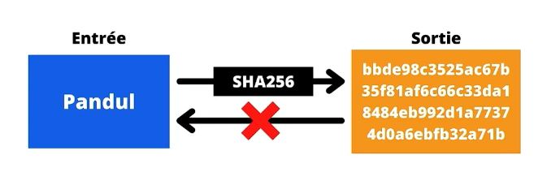

Retratar o perfil das funções de hash criptográficas requer entender duas qualidades essenciais: sua irreversibilidade e sua resistência à falsificação. Cada função de hash criptográfica é como um artista único, produzindo um "hash" distinto para cada entrada. Mesmo um pincel que desvia ligeiramente altera consideravelmente a pintura final, ou seja, o hash. Essas funções atuam como sentinelas digitais, verificando a integridade de softwares baixados. Outra característica crucial que elas possuem é sua resistência a colisões. Certamente, no universo do hash, as colisões são inevitáveis, mas uma excelente função de hash criptográfica as minimiza consideravelmente. É como se cada hash fosse uma casa em uma cidade imensa; apesar do grande número de casas, uma boa função de hash garante que cada casa tenha um endereço único.

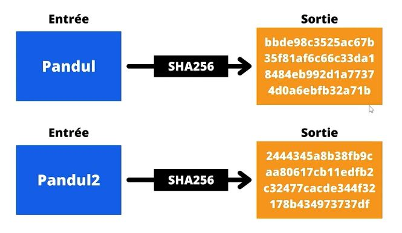

Agora vamos navegar pelas águas turbulentas das funções de hash obsoletas. SHA0, SHA1 e MD5 são hoje consideradas cascas enferrujadas no oceano do hash criptográfico. Elas são frequentemente desaconselhadas porque perderam sua resistência a colisões. O princípio das gavetas explica por que, apesar de nossos melhores esforços, evitar colisões é impossível devido à limitação do tamanho de saída. Também é importante observar que a resistência à segunda pré-imagem depende da resistência a colisões. Para ser verdadeiramente considerada segura, uma função de hash deve resistir a colisões, segunda pré-imagem e pré-imagem.
'Elemento chave no protocolo Bitcoin, a função de hash SHA-256 é o capitão do navio. Outras funções, como SHA-512, são usadas para derivação com HMAC e PBKDF. Além disso, o RIPMD160 é usado para reduzir uma impressão digital para 160 bits. Quando falamos de HASH256 e HASH160, estamos nos referindo ao uso de uma dupla hash com SHA-256 e RIPMD. O uso de HASH160 é especialmente vantajoso, pois permite aproveitar a segurança do SHA-256 enquanto reduz o tamanho da impressão digital.

Para resumir, o objetivo final de uma função de hash criptográfica é transformar uma informação de tamanho arbitrário em uma impressão digital de tamanho fixo. Para ser reconhecida como segura, ela deve ter várias características: irreversibilidade, resistência à falsificação, resistência a colisões e resistência à segunda pré-imagem.

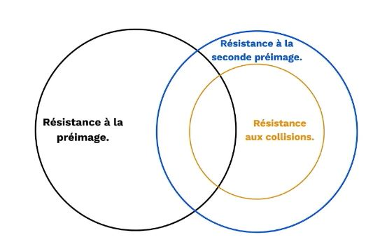

Ao final desta exploração, desmistificamos as funções de hash criptográficas, destacamos seu uso no protocolo Bitcoin e analisamos seus objetivos específicos. Aprendemos que, para serem consideradas seguras, as funções de hash devem ser resistentes à pré-imagem, à segunda pré-imagem, a colisões e à falsificação. Também percorremos a variedade de diferentes funções de hash usadas no protocolo Bitcoin. Em nossa próxima sessão, mergulharemos no cerne da função de hash SHA256 e descobriremos as fascinantes matemáticas que lhe conferem suas características únicas.

## Os mecanismos do SHA256

Bem-vindo à continuação de nossa fascinante jornada pelos labirintos criptográficos da função de hash. Hoje, revelamos os mistérios do SHA256, um processo complexo, mas engenhoso, que introduzimos em nossa discussão anterior sobre funções de hash. Vamos dar mais um passo neste labirinto, começando pelo pré-processamento do SHA256. Imagine o pré-processamento como a preparação de um prato saboroso, onde adicionamos "bits de preenchimento" para que o tamanho de nosso ingrediente principal, a entrada, atinja um múltiplo perfeito de 512 bits. Tudo isso com o objetivo final de gerar um hash suculento de 256 bits a partir de um ingrediente de tamanho variado.

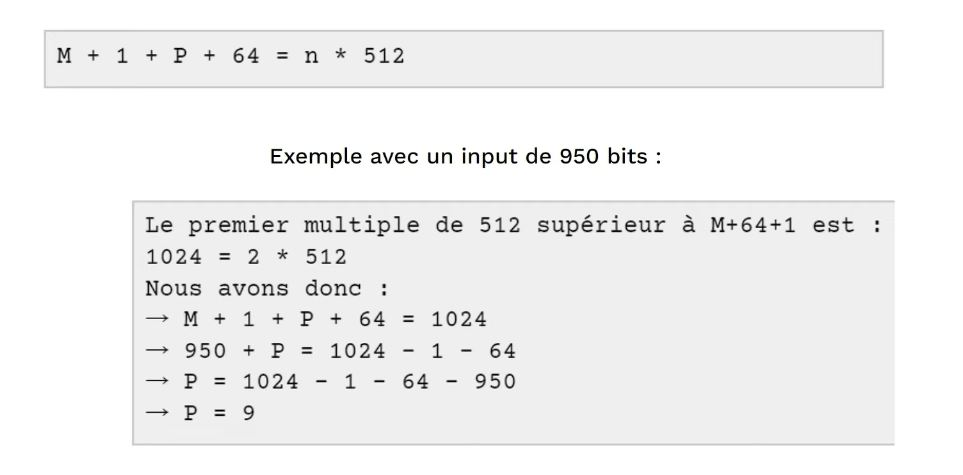

Nesta receita criptográfica, brincamos com bits, tendo um tamanho de mensagem inicial que chamaremos de M. Um bit é reservado para o separador, enquanto P bits são usados para o preenchimento. Além disso, reservamos 64 bits para a segunda fase de pré-processamento. O total deve ser um múltiplo de 512 bits. Um pouco como garantir que todos os ingredientes se harmonizem perfeitamente em nosso prato.

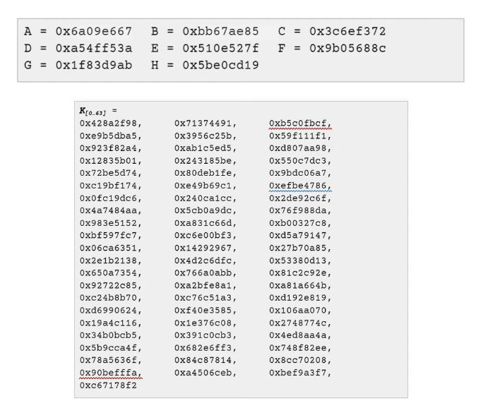

Agora passamos para a segunda fase do pré-processamento, que envolve a adição da representação binária do tamanho da mensagem inicial, em bits. Para isso, usamos nossos 64 bits reservados na etapa anterior. Adicionamos zeros para arredondar nossos 64 bits para nossa entrada equilibrada. Em seguida, mesclamos a mensagem inicial, o preenchimento dos bits e o preenchimento do tamanho, como ingredientes em um liquidificador, para obter nossa entrada equilibrada.

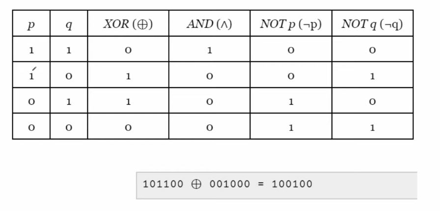

Agora nos preparamos para as primeiras etapas do processamento da função SHA-256. Como em qualquer boa receita, precisamos de alguns ingredientes básicos, que chamamos de constantes e vetores de inicialização. Os vetores de inicialização, de A a H, são os primeiros 32 bits das partes decimais das raízes quadradas dos 8 primeiros números primos. As constantes K, de 0 a 63, representam os primeiros 32 bits das partes decimais das raízes cúbicas dos 64 primeiros números primos.

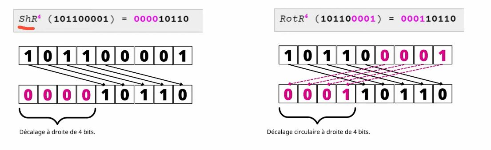

Dentro da função de compressão, usamos operadores específicos como XOR, AND e NOT. Processamos os bits um por um de acordo com sua posição, usando o operador XOR e uma tabela verdade. O operador AND é usado para retornar 1 apenas se ambos os operandos forem iguais a 1, e o operador NOT para retornar o valor oposto de um operando. Também usamos a operação SHR para deslocar os bits para a direita de acordo com um número escolhido.

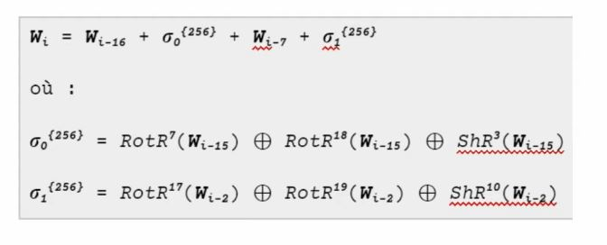

Finalmente, depois de separar a entrada equilibrada em diferentes blocos de mensagens de 512 bits, realizamos 64 rodadas de cálculo na função de compressão. Como em uma corrida de bicicleta, cada volta na pista melhora nossa posição. Somamos módulo 2^32 o estado intermediário ao estado inicial da função de compressão. As adições na função de compressão são adições módulo 2^32 para conter o tamanho das somas em 32 bits.

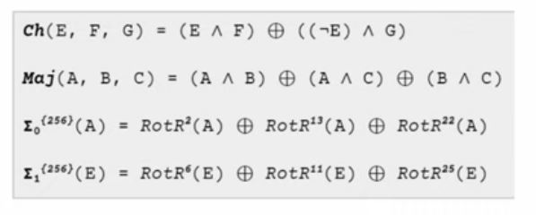
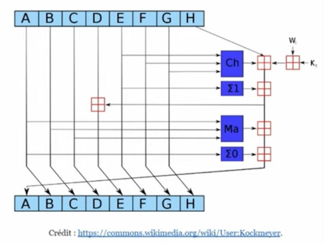
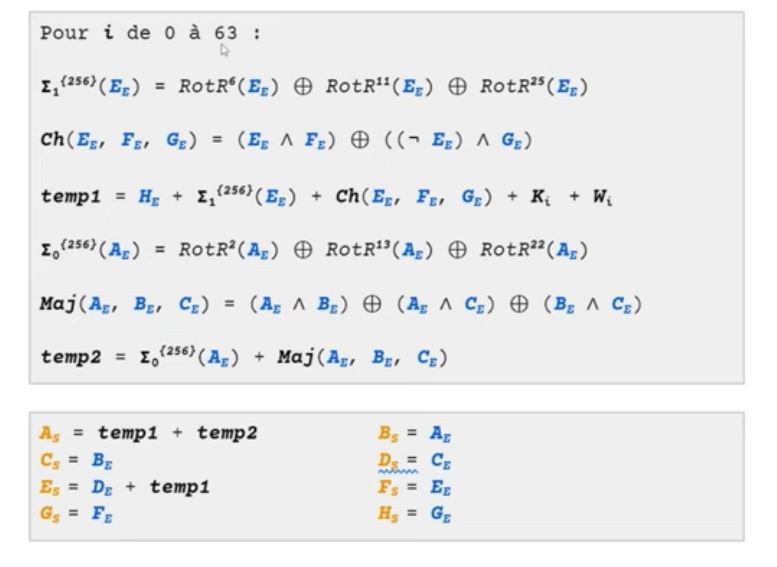
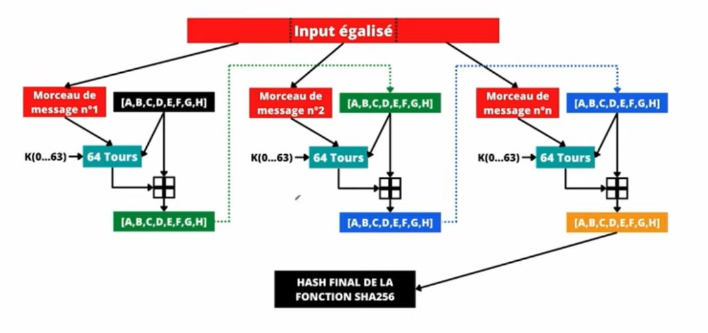

Para concluir, gostaríamos de enfatizar o papel crucial dos cálculos realizados nas caixas CH, MAJ, σ0 e σ1. Essas operações, entre outras, são os guardiões que garantem a robustez da função de hash SHA256 contra ataques, tornando-a uma escolha preferida para a segurança de muitos sistemas digitais, especialmente no protocolo Bitcoin. Portanto, é evidente que, embora complexa, a beleza do SHA256 reside em sua robustez em encontrar a entrada a partir do hash, enquanto a verificação do hash para uma entrada específica é uma ação mecanicamente simples.

## Os algoritmos usados para a derivação

Os algoritmos de derivação HMAC e PBKDF2 são componentes-chave na mecânica de segurança do protocolo Bitcoin. Eles previnem uma variedade de ataques potenciais e garantem a integridade das carteiras Bitcoin.

HMAC e PBKDF2 são ferramentas criptográficas usadas para diferentes tarefas no Bitcoin. O HMAC é principalmente usado para combater ataques de extensão de comprimento durante a derivação de carteiras determinísticas hierarquicamente (HD), enquanto o PBKDF2 é usado para converter uma frase mnemônica em uma semente.

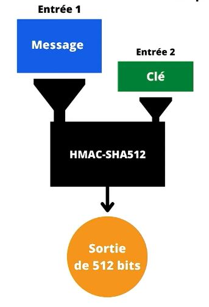

O HMAC, que recebe uma mensagem e uma chave como entrada, gera uma saída de tamanho fixo. Para garantir a uniformidade, a chave é ajustada de acordo com o tamanho dos blocos usados na função de hash. No caso da derivação de carteiras HD, é usado o HMAC-SHA-512. Este último funciona com blocos de 1024 bits (128 bytes) e ajusta a chave de acordo. Ele usa as constantes OPAD (0x5c) e IPAD (0x36), repetidas quantas vezes forem necessárias para reforçar a segurança.

O processo do HMAC-SHA-512 envolve a concatenação do resultado do SHA-512 aplicado à chave XOR OPAD e à chave XOR IPAD com a mensagem. Quando usado com blocos de 1024 bits (128 bytes), a chave de entrada é preenchida com zeros, se necessário, e depois XORada com IPAD e OPAD. A chave modificada é então concatenada com a mensagem.

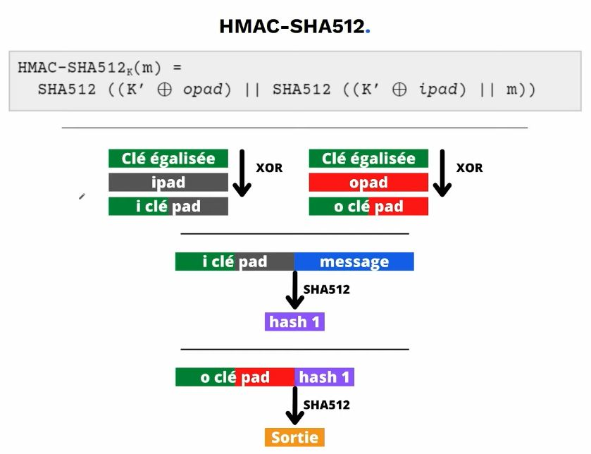

O código de cadeia, ao integrar uma fonte adicional de entropia, aumenta a segurança das chaves derivadas. Sem ele, um ataque poderia comprometer toda a carteira e roubar todos os bitcoins.

PBKDF2 é usado para converter uma frase mnemônica em uma semente. Esse algoritmo realiza 2048 iterações usando HMAC SHA512. Graças a esses algoritmos de derivação, duas entradas diferentes podem produzir uma saída única e fixa, o que resolve o problema de possíveis ataques de extensão de comprimento nas funções da família SHA-2. Um ataque de extensão de comprimento explora uma propriedade específica de algumas funções de hash criptográficas. Nesse tipo de ataque, um invasor que já possui o hash de uma mensagem desconhecida pode usá-lo para calcular o hash de uma mensagem mais longa, que é uma extensão da mensagem original. Isso muitas vezes é possível sem conhecer o conteúdo da mensagem original, o que pode levar a falhas de segurança significativas se esse tipo de função de hash for usado para tarefas como verificação de integridade.

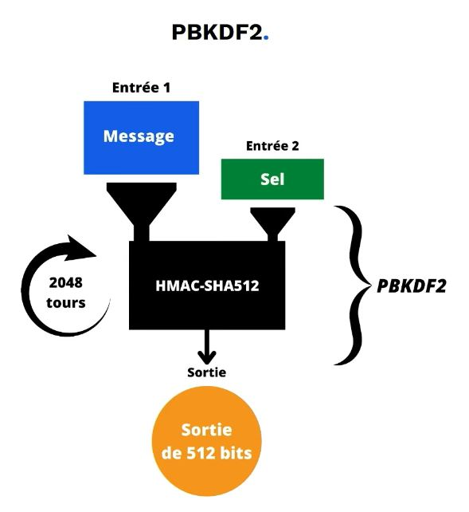

Em conclusão, os algoritmos HMAC e PBKDF2 desempenham papéis essenciais na segurança da derivação de carteiras HD no protocolo Bitcoin. O HMAC-SHA-512 é usado para se proteger contra ataques de extensão de comprimento, enquanto o PBKDF2 permite a conversão da frase mnemônica em uma semente. O código de cadeia adiciona uma fonte adicional de entropia na derivação das chaves, garantindo assim a robustez do sistema.

# Assinaturas digitais

## Assinaturas digitais e curvas elípticas

No mundo das criptomoedas, a segurança das transações é fundamental. No cerne do protocolo Bitcoin, encontramos o uso de assinaturas digitais que servem como provas matemáticas da posse de uma chave privada associada a uma chave pública específica. Essa técnica de proteção de dados é essencialmente baseada em um campo fascinante da criptografia chamado criptografia de curvas elípticas (ECC).

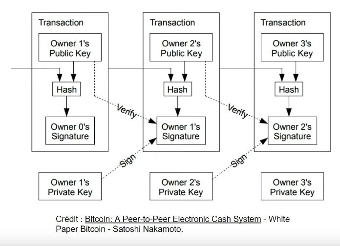

A criptografia de curvas elípticas é a espinha dorsal da segurança das transações Bitcoin. Essas curvas elípticas, que lembram as curvas matemáticas que estudamos na escola, são úteis em uma variedade de aplicações criptográficas, desde trocas de chaves até criptografia assimétrica e criação de assinaturas digitais. Um detalhe interessante que distingue as curvas elípticas é sua simetria: qualquer linha não vertical que intersecta dois pontos da curva também intersectará um terceiro ponto.
Maintenant, creusons un peu plus : le protocole Bitcoin utilise une courbe elliptique particulière dénommée SecP256K1 pour effectuer ses opérations cryptographiques. Cette courbe, définie sur un ensemble fini d'entiers positifs modulo un nombre premier de 256 bits, peut être visualisée comme un nuage de points plutôt qu'une courbe traditionnelle. C'est cette conception unique qui permet à Bitcoin de sécuriser efficacement ses transactions.

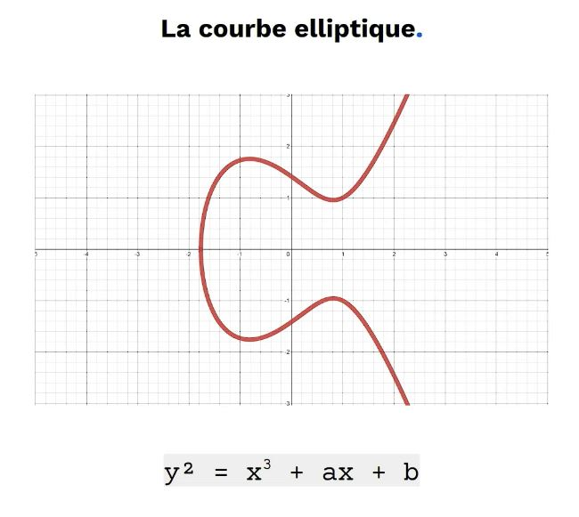

Quant au choix de la courbe secp256k1 pour Bitcoin, il est intéressant de noter qu'elle a été privilégiée à la courbe secp256r1. Cette courbe se définit par les paramètres a=0 et b=7, et son équation est y² = x³ + 7 modulo n, avec n représentant le nombre premier qui détermine l'ordre de la courbe.

Lorsque l'on parle des constantes utilisées dans le système Bitcoin, on fait généralement référence aux paramètres spécifiques de l'algorithme Elliptic Curve Digital Signature Algorithm (ECDSA) et du système de courbes elliptiques utilisé par Bitcoin, qui est la courbe secp256k1. Voici ces paramètres:

- champ primaire (p): Bitcoin utilise une courbe sur un champ primaire, donc p est le premier nombre utilisé pour définir ce champ. Pour la courbe secp256k1, p est égal à `p = FFFFFFFF FFFFFFFF FFFFFFFF FFFFFFFF FFFFFFFF FFFFFFFF FFFFFFFE FFFFFC2F` en hexadécimal ou p = 2^256 - 2^32 - 2^9 - 2^8 - 2^7 - 2^6 - 2^4 -1 en décimal.
- ordre de la courbe (n): Il s'agit du nombre de points sur la courbe, y compris le point à l'infini. Pour secp256k1, n est égal à `n = FFFFFFFF FFFFFFFF FFFFFFFF FFFFFFFE BAAEDCE6 AF48A03B BFD25E8C D0364141` en hexadécimal ou n = 2^256 - 432420386565659656852420866394968145599 en décimal.
- point générateur (G): Le point de base, ou générateur, est le point sur la courbe à partir duquel toutes les autres clés publiques sont générées. Il a des coordonnées x et y spécifiques, généralement représentées en hexadécimal. Pour secp256k1, les coordonnées G sont, en hexadécimale :
  - `Gx = 79BE667E F9DCBBAC 55A06295 CE870B07 029BFCDB 2DCE28D9 59F2815B 16F81798`
  - `Gy = 483ADA77 26A3C465 5DA4FBFC 0E1108A8 FD17B448 A6855419 9C47D08F FB10D4B8`

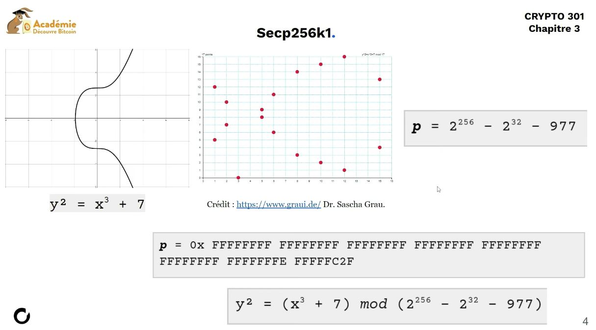

Observe que todos os valores hexadecimais são geralmente representados na base 16, enquanto os valores decimais estão na base 10. Além disso, todas as operações com essas constantes são realizadas módulo p para as coordenadas dos pontos na curva e módulo n para operações de chave e assinatura.
Então, onde esses famosos bitcoins são armazenados? Não em uma carteira Bitcoin, como se poderia pensar. Na realidade, uma carteira Bitcoin guarda as chaves privadas necessárias para provar a posse dos bitcoins. Os próprios bitcoins são registrados na blockchain, um banco de dados descentralizado que arquiva todas as transações.

No sistema Bitcoin, a unidade de conta é o bitcoin (observe o "b" minúsculo). Este último é divisível em até oito casas decimais, sendo a menor unidade o satoshi. UTXOs, ou "Unspent Transaction Outputs", representam as saídas de transações não gastas pertencentes a um usuário. Para gastar esses bitcoins, é necessário comprovar a posse da chave privada correspondente à chave pública vinculada a cada UTXO.

Para garantir a segurança das transações, o Bitcoin utiliza dois protocolos de assinatura digital: ECDSA (Elliptic Curve Digital Signature Algorithm) e Schnorr. O ECDSA é um protocolo de assinatura incorporado ao Bitcoin desde o seu lançamento em 2009, enquanto as assinaturas de Schnorr foram adicionadas mais recentemente, em novembro de 2021. Embora esses dois protocolos se baseiem na criptografia de curvas elípticas e usem mecanismos matemáticos semelhantes, eles diferem principalmente em termos de estrutura de assinatura.

Antes de mergulhar mais fundo nesses mecanismos de assinatura, é importante entender o que é uma curva elíptica. Uma curva elíptica é definida pela equação y² = x³ + ax + b. Qualquer ponto nessa curva possui uma simetria distintiva que é a chave para sua utilidade em criptografia.

No final das contas, várias curvas elípticas são reconhecidas como seguras para uso criptográfico. A mais conhecida talvez seja a curva secp256r1. No entanto, para o Bitcoin, Satoshi Nakamoto optou por outra curva: a secp256k1.

Na próxima seção deste curso, examinaremos mais de perto a chave pública e a chave privada para uma compreensão aprofundada da criptografia em curvas elípticas e do algoritmo de assinatura digital. Este será o momento de consolidar seus conhecimentos e entender como todas essas informações se encaixam para garantir a segurança do protocolo Bitcoin.

## Calcular a chave pública a partir da chave privada

Dans a sequência deste curso, vamos analisar os mecanismos das chaves públicas e privadas, dois elementos cruciais do protocolo Bitcoin. Essas chaves estão intrinsecamente ligadas pelo algoritmo Elliptic Curve Digital Signature Algorithm (ECDSA). Compreendê-las nos dará uma visão profunda de como o Bitcoin garante a segurança das transações em sua plataforma.

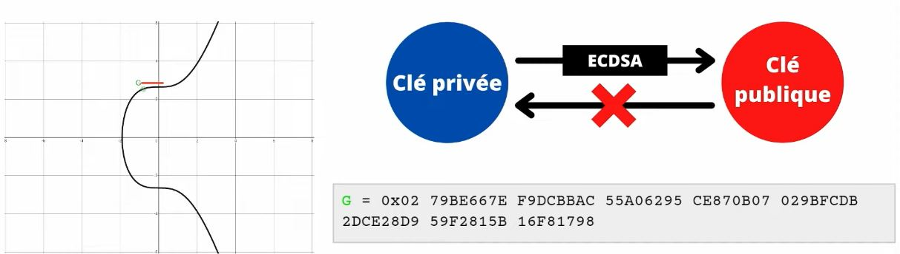

Para começar, vamos mergulhar no universo do algoritmo ECDSA. O Bitcoin utiliza esse algoritmo de assinatura digital para vincular as chaves privadas e públicas. Nesse sistema, a chave privada é um número aleatório ou pseudo-aleatório de 256 bits. O número total de possibilidades para uma chave privada é teoricamente 2^256, mas na realidade é ligeiramente inferior a isso. Para ser preciso, algumas chaves privadas de 256 bits não são válidas para o Bitcoin.

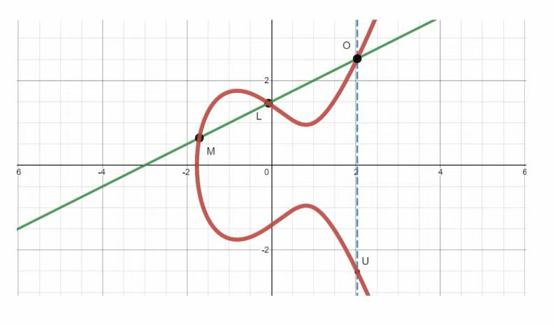

Para ser compatível com o Bitcoin, uma chave privada deve estar entre 1 e n-1, onde n representa a ordem da curva elíptica. Isso significa que o número total de possibilidades para uma chave privada do Bitcoin é quase igual a 1,158 x 10^77. Para colocar isso em perspectiva, é aproximadamente o mesmo número de átomos presentes no universo observável. A chave privada única é então usada para determinar uma chave pública de 512 bits.

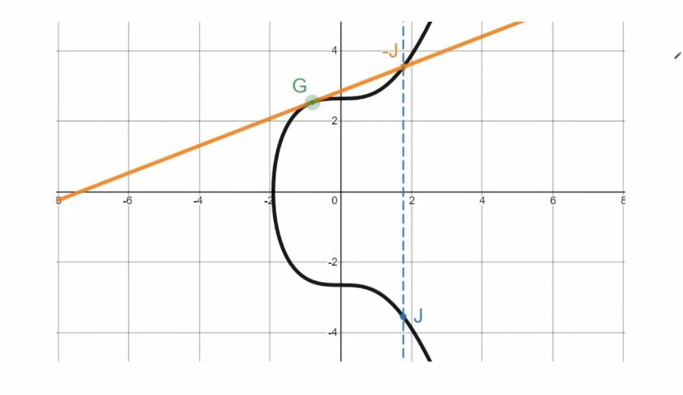

A chave pública, denotada por K, é um ponto na curva elíptica que é derivado da chave privada usando operações de pontos na curva. É importante notar que a função ECDSA é irreversível, ou seja, é impossível recuperar a chave privada a partir da chave pública. Essa irreversibilidade é a pedra angular da segurança da carteira Bitcoin.

A chave pública é composta por dois pontos de 256 bits cada, totalizando 512 bits. No entanto, ela pode ser comprimida em um número de 264 bits. O ponto G é o ponto de partida para calcular todas as chaves públicas dos usuários do sistema.

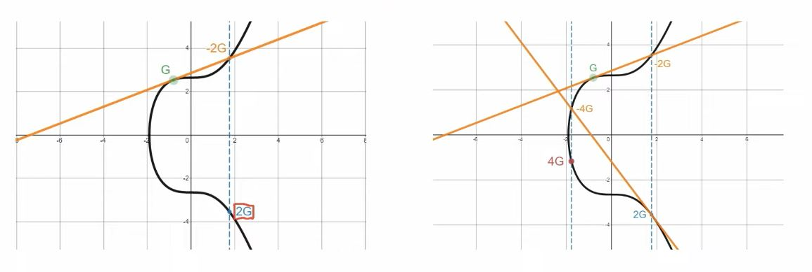

Uma das propriedades notáveis das curvas elípticas é que uma reta que intersecta a curva em dois pontos também intersectará um terceiro ponto, chamado ponto O. Essa propriedade é usada para determinar o ponto U, que é o oposto do ponto O. A adição de um ponto a si mesmo é feita traçando uma tangente à curva no nível desse ponto, o que resulta em um novo ponto único chamado j. O produto escalar de um ponto por n é equivalente a adicionar esse ponto a si mesmo n vezes.

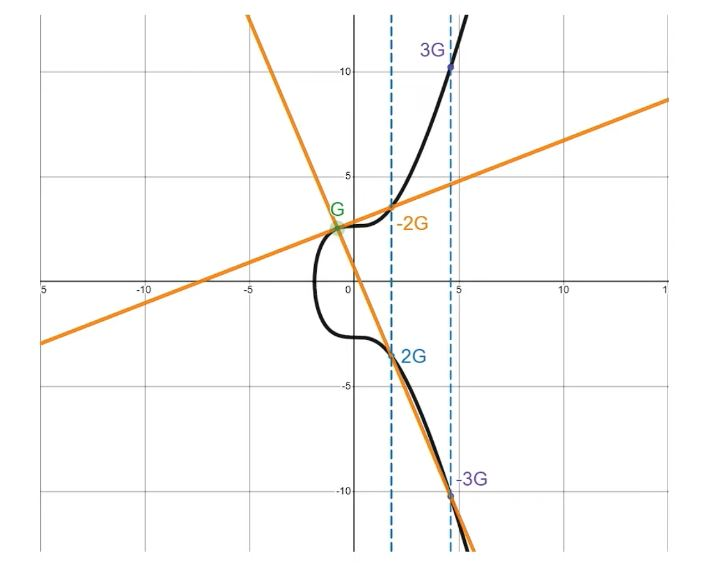

Essas operações nos pontos de uma curva elíptica são a base para o cálculo das chaves públicas. Sabendo a chave privada, é fácil calcular a chave pública. No entanto, saber a chave pública não permite calcular a chave privada, garantindo assim a segurança do sistema Bitcoin. De fato, a segurança das chaves públicas e privadas se baseia no problema do logaritmo discreto, uma questão matemática complexa.

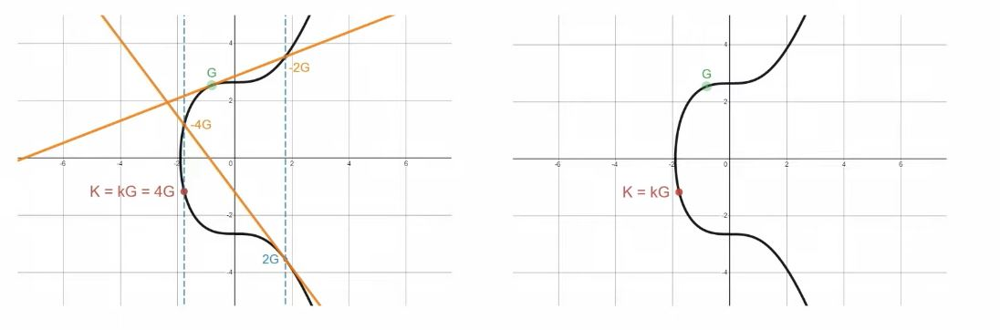

No nosso próximo curso, exploraremos como uma assinatura digital é realizada usando o algoritmo ECDSA com uma chave privada para desbloquear bitcoins. Fique atento a essa emocionante exploração do mundo das criptomoedas e da criptografia.

## Assinando com a chave privada

O processo de assinatura digital é um método chave para provar que você é o detentor de uma chave privada sem precisar revelá-la. Isso é feito usando o algoritmo ECDSA, que envolve a determinação de um nonce único, o cálculo de um número específico, V, e a criação de uma assinatura digital composta por duas partes, S1 e S2. É crucial sempre usar um nonce único para evitar ataques de segurança. Um exemplo notório do que pode acontecer quando essa regra não é seguida é o caso do hackeamento do PlayStation 3, que foi comprometido devido à reutilização do nonce.

De forma precisa, para validar uma assinatura digital usando o algoritmo ECDSA (Elliptic Curve Digital Signature Algorithm), as seguintes etapas geralmente estão envolvidas:

1. Verifique se os valores da assinatura, S1 e S2, estão no intervalo [1, n-1]. Se não estiverem, a assinatura é inválida.
2. Calcule o inverso de S2 mod n. Vamos chamar isso de u. Geralmente, é calculado da seguinte forma: u = (S2)^-1 mod n.
3. Calcule H, que é o valor de hash da mensagem assinada.
4. Calcule u1 = H _ u mod n e u2 = S1 _ u mod n.
5. Calcule o ponto P na curva elíptica usando u1, u2 e a chave pública K: P = u1*G + u2*K, onde G é o ponto de geração da curva.
6. Se P for o ponto no infinito, a assinatura é inválida.
7. Calcule I = coordenada x de P mod n.
8. A assinatura é válida se I for igual a S1.

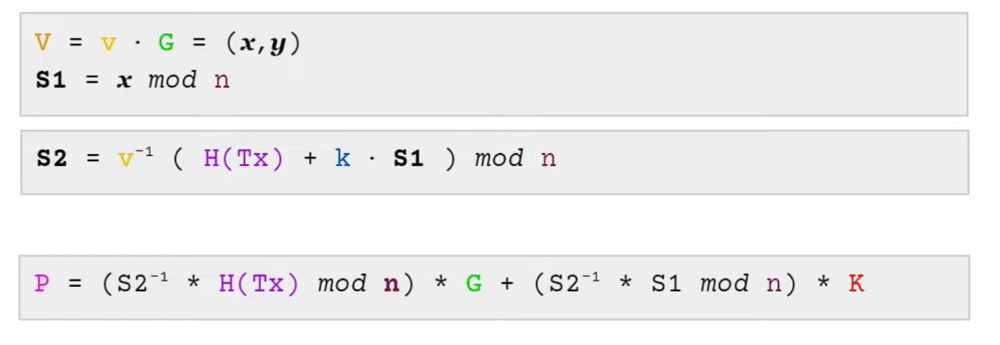
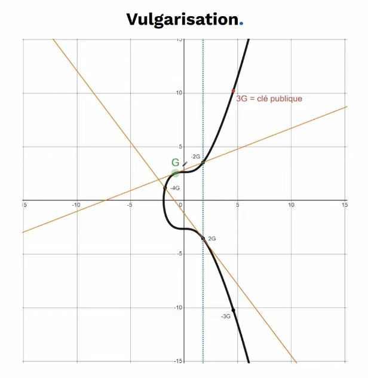

É importante notar que cada programa pode usar notações diferentes e alguns passos podem ser combinados ou reorganizados, mas a lógica básica é a mesma. Note-se também que todas as operações aritméticas são efectuadas no campo finito definido pela curva elíptica (mod n, onde n é a ordem da curva). Como lembrete, a curva secp256k1 (usada no Bitcoin) n = 2^256 - 432420386565659656852420866394968145599.
Quando se trata de gerar chaves públicas e privadas, é essencial estar familiarizado com a curva elíptica e o ponto gerador. Para obter uma chave pública, deve ser escolhido um número aleatório como chave privada, muitas vezes chamado `nonce`, e utilizado na equação da curva elíptica.

A curva elíptica é uma ferramenta poderosa para gerar chaves públicas e privadas seguras. Por exemplo, para obter a chave pública 3G, desenha-se uma tangente no ponto G, calcula-se o oposto de -G para obter 2G e, em seguida, adiciona-se G e 2G. Para efetuar uma transação, é necessário provar que se conhece o número 3, desbloqueando os bitcoins associados à chave pública 3G.

Para criar uma assinatura digital e provar que conhece a chave privada associada à chave pública 3G, começa por calcular um nonce, depois o ponto V associado a este nonce (no exemplo dado, é 4G). De seguida, calcula o ponto T adicionando a chave pública 3G e o ponto V, o que dá 7G.

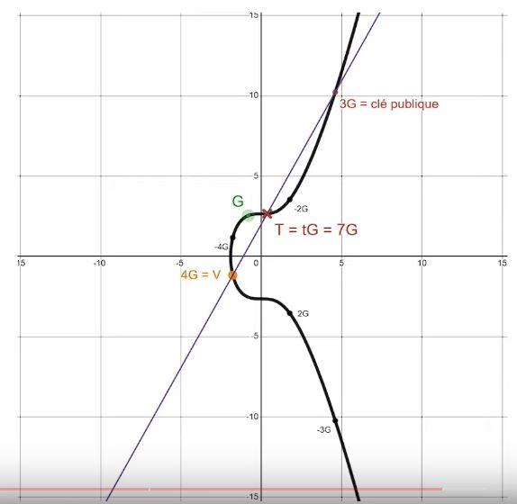

A verificação de uma assinatura digital é um passo crucial na utilização do algoritmo ECDSA, que permite confirmar a autenticidade de uma mensagem assinada sem necessitar da chave privada do remetente. Eis como funciona em pormenor:

No nosso exemplo, temos dois valores importantes: T e V. T é um valor numérico (7 neste exemplo), e V é um ponto na curva elíptica (representado por 4G aqui). Esses valores são produzidos quando a assinatura digital é criada e, em seguida, são enviados com a mensagem para verificação.

Quando o verificador recebe a mensagem, ele também recebe esses dois valores, T e V.

Eis os passos que o verificador seguirá para validar a assinatura:

1. Começa por calcular o hash da mensagem, a que chamaremos H.
2. De seguida, calcula u1 e u2. Para o efeito, utiliza as seguintes fórmulas :
   - u1 = H /\* (S2)^-1 mod n
   - u2 = T /\* (S2)^-1 mod n'
     'Où S2 est a segunda parte da assinatura digital, n é a ordem da curva elíptica e (S2)^-1 é o inverso de S2 mod n.3. O verificador então calculará um ponto P' na curva elíptica usando a fórmula: P' = u1 _ G + u2 _ K
   - G é o ponto de geração da curva
   - K é a chave pública do remetente
3. O verificador então calculará I', que é simplesmente a coordenada x do ponto P' módulo n.
4. Por fim, o verificador confirmará se I' é igual a T. Se for o caso, a assinatura é considerada válida. Se não for o caso, a assinatura é inválida.

Este procedimento garante que apenas o remetente que possui a chave privada correspondente poderia ter produzido uma assinatura que passa por esse processo de verificação.

Em conclusão, a verificação de uma assinatura digital ECDSA é um procedimento essencial nas transações de Bitcoin. Isso garante que a mensagem assinada não foi alterada durante a transmissão e que o remetente é o detentor da chave privada. Essa técnica de autenticação digital é baseada em princípios matemáticos complexos, incluindo a aritmética de curva elíptica, enquanto mantém a confidencialidade da chave privada. Ela oferece uma base sólida de segurança para transações criptográficas.

Dito isso, a gestão dessas chaves, bem como sua criação, é outra questão essencial no Bitcoin. Como gerar um novo par de chaves? Como organizar várias chaves de forma segura e eficiente? Como recuperá-las, se necessário?

Para responder a essas perguntas e aprofundar sua compreensão da segurança da criptografia, nosso próximo curso se concentrará no conceito de Carteira Hierárquica Determinística (HD wallets) e no uso de frases mnemônicas. Esses mecanismos oferecem maneiras elegantes de gerenciar eficientemente suas chaves de criptomoeda, ao mesmo tempo em que fortalecem a segurança e a capacidade de recuperação.

# A frase mnemônica

## Evolução das carteiras Bitcoin

O **Portefólio Determinístico Hierárquico**, ou mais comumente chamado de portefólio HD, desempenha um papel fundamental no ecossistema das criptomoedas. O termo "portefólio" pode parecer enganador para aqueles que são novatos nesse campo, pois não envolve a posse de dinheiro ou moedas. Em vez disso, refere-se a uma coleção de chaves criptográficas privadas derivadas de uma única chave mestra, por meio de um engenhoso processo de aritmética algorítmica. Essas chaves privadas, que têm um comprimento fixo de 256 bits, são a essência da posse de criptomoedas e às vezes são chamadas de "Just a Bunch Of Keys" (JBOC).

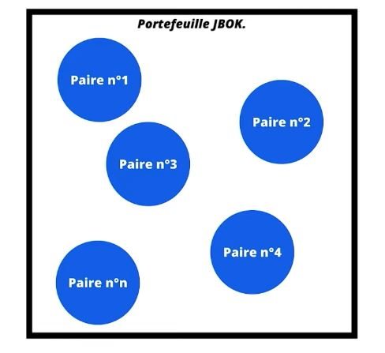

No entanto, a complexidade da gestão dessas chaves é compensada por um conjunto de protocolos, chamados de Propostas de Melhoria do Bitcoin (BIP). Essas propostas de atualização estão no cerne da funcionalidade e segurança dos portefólios HD. Por exemplo, o [BIP32](https://github.com/bitcoin/bips/blob/master/bip-0032.mediawiki), lançado em 2012, revolucionou a forma como essas chaves são geradas e armazenadas, introduzindo o conceito de chaves derivadas de forma determinística e hierárquica. Assim, o processo de backup dessas chaves é muito simplificado, mantendo seu nível de segurança.

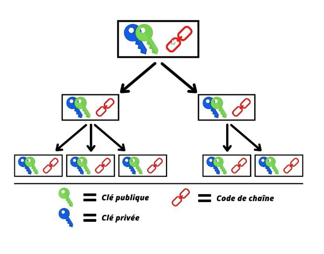

Posteriormente, o [BIP39](https://github.com/bitcoin/bips/blob/master/bip-0039.mediawiki) introduziu uma inovação marcante: a frase mnemônica de 24 palavras. Esse sistema transformou uma sequência complexa de números difícil de lembrar em uma série de palavras comuns, muito mais fáceis de memorizar e armazenar. Além disso, o [BIP38](https://github.com/bitcoin/bips/blob/master/bip-0038.mediawiki) propôs adicionar uma frase de senha adicional para reforçar a segurança das chaves individuais. Essas melhorias sucessivas resultaram nos padrões BIP43 e BIP44, que padronizaram a estrutura e hierarquia dos portefólios HD, tornando esses portefólios mais acessíveis e fáceis de usar para o público em geral.

Nas seções seguintes, vamos mergulhar mais profundamente no funcionamento dos portefólios HD. Abordaremos os princípios de derivação de chaves e examinaremos os conceitos fundamentais de entropia e geração de números aleatórios, que são essenciais para garantir a segurança do seu portefólio HD.
Em forma de síntese, é essencial destacar o papel central do BIP32 e BIP39 no design e segurança das carteiras HD. Esses protocolos permitem gerar uma infinidade de chaves a partir de uma única semente, que deve ser um número aleatório ou pseudo-aleatório. Hoje em dia, essas normas são adotadas pela maioria das carteiras de criptomoedas, sejam elas dedicadas a uma única criptomoeda ou que suportem vários tipos de moedas.

Espero que esta introdução tenha ajudado a compreender melhor os fundamentos da carteira HD e suas diversas características. Nosso objetivo é ajudá-lo a dominar esses conceitos essenciais e navegar de forma mais eficiente no complexo universo das criptomoedas. Portanto, continue conosco enquanto exploramos as sutilezas e nuances deste fascinante mundo nas próximas lições.

## Entropia e número aleatório

A importância da segurança das chaves privadas no ecossistema do Bitcoin é incontestável. Elas são, de fato, a pedra angular que garante a segurança das transações de Bitcoin. Para evitar qualquer vulnerabilidade associada à previsibilidade, essas chaves devem ser geradas de forma verdadeiramente aleatória, o que pode rapidamente se tornar um exercício trabalhoso para o usuário. Uma solução para esse enigma é a Carteira Determinística Hierárquica, ou carteira HD. Este método permite gerar de forma determinística e hierárquica pares de chaves filhas a partir de uma única informação na base da carteira. É aqui que a aleatoriedade se torna indispensável para garantir a segurança das chaves derivadas.

A geração de números aleatórios é, de fato, um elemento crucial na criptografia, para garantir a integridade das chaves privadas. Para prevenir qualquer vulnerabilidade relacionada à previsibilidade, uma chave privada deve ser produzida de forma aleatória. O uso de um novo par de chaves para cada transação fortalece ainda mais a segurança, embora isso torne o backup mais complexo e preserve a confidencialidade apenas parcialmente. Em resumo, a segurança das chaves privadas é uma prioridade absoluta, exigindo uma geração rigorosa e aleatória. As carteiras HD oferecem uma solução para facilitar a geração e gestão das chaves, mantendo um alto nível de segurança.

Cependant, a geração de números aleatórios em computadores apresenta um desafio significativo, uma vez que os resultados obtidos não são verdadeiramente aleatórios. Por isso, é essencial usar um Gerador de Números Aleatórios (RNG). Os tipos de RNG variam, desde Geradores de Números Pseudo-Aleatórios (PRNG) até Geradores de Números Verdadeiramente Aleatórios (TRNG), bem como PRNGs que incorporam uma fonte de entropia.

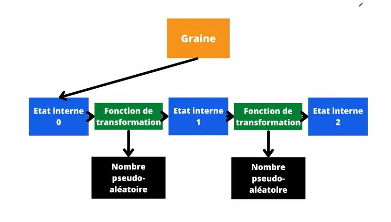

No caso do Bitcoin, as chaves privadas são geradas a partir de uma única informação na base da carteira. Essa informação permite uma derivação determinística e hierárquica dos pares de chaves filhas. A entropia é a base de todas as carteiras HD, embora não exista um padrão para a geração desse número aleatório. Portanto, a geração de números aleatórios é uma questão importante para garantir a segurança das transações Bitcoin.

A fase de verificação da geração das chaves é crucial para garantir a segurança e autenticidade da geração de números aleatórios, um passo fundamental para prevenir qualquer vulnerabilidade associada à previsibilidade. Portanto, é altamente recomendável usar carteiras de código aberto para permitir essa verificação.

No entanto, é importante observar que algumas carteiras de hardware podem ser "closed source", tornando impossível verificar a geração do número aleatório. Uma possível solução seria gerar sua própria frase mnemônica usando dados, embora essa abordagem possa apresentar alguns riscos.

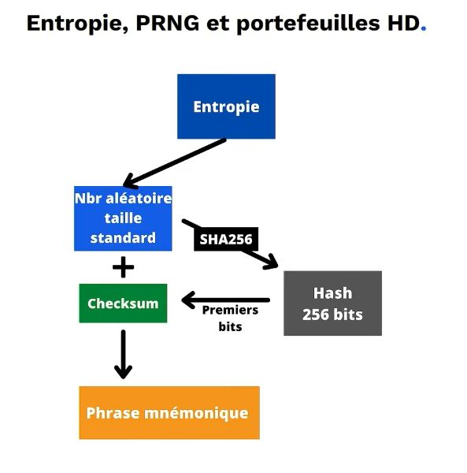

O uso de uma frase de acesso gerada aleatoriamente pode ajudar a mitigar esses riscos.

Um exemplo de aplicação desse método é a opção "dice roll" oferecida pelo CoinKit para gerar frases mnemônicas. Outra possibilidade seria usar uma informação inicial muito grande e reduzir essa informação para 256 bits usando a função de hash SHA-256, capaz de gerar um bom número aleatório. É importante mencionar que a função de hash SHA-256 é resistente a colisões, falsificações e ataques de pré-imagem e segunda pré-imagem.

Em última análise, a aleatoriedade desempenha um papel central na criptografia e na computação, e a capacidade de gerar aleatoriedade de forma segura é crucial para garantir a segurança das chaves privadas e das transações Bitcoin. A entropia, que está no cerne da carteira HD do Bitcoin, é essencial para sua segurança. Em nossa próxima lição, continuaremos explorando esse assunto, abordando mais detalhadamente como a entropia contribui para a segurança das carteiras HD.

## A frase mnemônica

A segurança de uma carteira Bitcoin é uma preocupação importante para todos os seus usuários. Uma maneira essencial de garantir a segurança da carteira é gerar uma frase mnemônica baseada na entropia e na checksum.

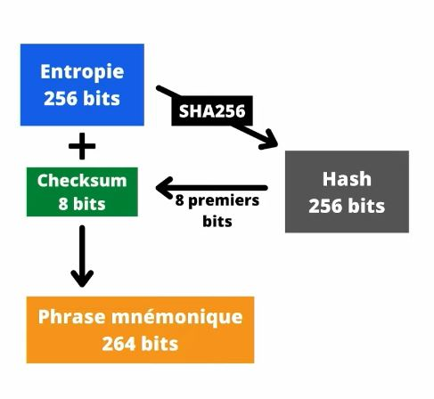

A entropia é o pilar da segurança da carteira HD. Existem várias maneiras de gerar essa entropia, incluindo geradores de números pseudoaleatórios (PRNG), geradores de números verdadeiramente aleatórios (TRNG) ou manualmente. É crucial que essa entropia seja aleatória ou pseudoaleatória para garantir a segurança da carteira.

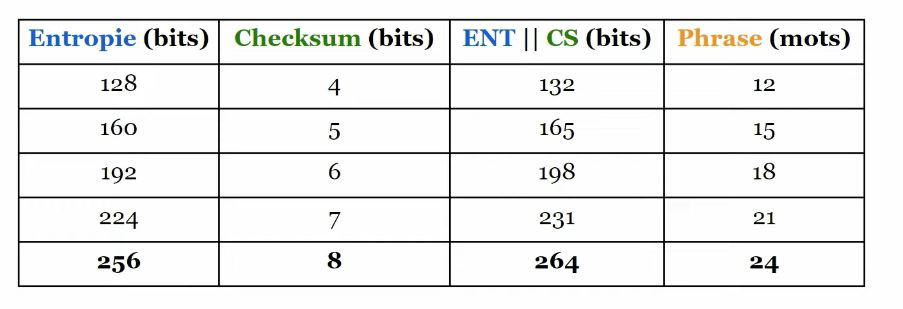

Por outro lado, a checksum verifica a precisão da frase de recuperação. Sem essa checksum, um erro na frase pode resultar na criação de uma carteira diferente e, portanto, na perda dos fundos. A checksum é obtida passando a entropia pela função SHA256 e recuperando os 8 primeiros bits do hash.

Existem diferentes padrões para a frase mnemônica, dependendo do tamanho da entropia. O padrão mais comumente usado para uma frase de recuperação de 24 palavras é uma entropia de 256 bits. O tamanho da checksum é determinado dividindo o tamanho da entropia por 32.

Por exemplo, uma entropia de 256 bits gera uma checksum de 8 bits. A concatenação da entropia e da checksum resulta em tamanhos respectivos de 128 bits, 160 bits, etc. Dependendo do tamanho da entropia, a frase de recuperação terá 12 palavras para 128 bits, 15 palavras para 160 bits e 24 palavras para 256 bits.

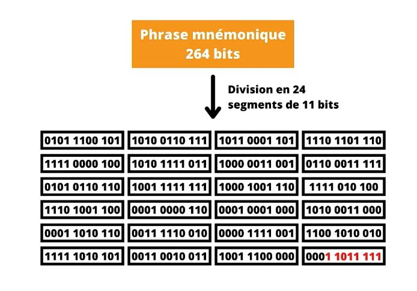

Para transformar os bits em palavras, cada segmento é associado a uma palavra de uma lista de 2048 palavras. É importante observar que nenhuma palavra tem as quatro primeiras letras na mesma ordem.

É essencial fazer backup da frase de recuperação de 24 palavras para preservar a integridade da carteira Bitcoin. Os dois padrões mais comumente usados são baseados em uma entropia de 128 ou 256 bits e uma concatenação de 12 ou 24 palavras. Adicionar uma frase secreta é uma opção adicional para reforçar a segurança da carteira.

Em conclusão, a geração de uma frase mnemônica para proteger uma carteira Bitcoin é um processo crucial. É importante seguir os padrões da frase mnemônica de acordo com o tamanho da entropia. Fazer backup da frase de recuperação de 24 palavras é essencial para evitar perda de fundos. Agradecemos sua atenção e esperamos vê-lo em nossa próxima aula sobre criptomoedas.

## A frase secreta

A passphrase é uma senha adicional que pode ser incorporada a uma carteira Bitcoin para aumentar sua segurança. Seu uso é opcional e fica a critério do usuário. Ao adicionar informações arbitrárias que, juntamente com a frase mnemônica, permitem calcular a semente da carteira, a passphrase fortalece sua segurança.

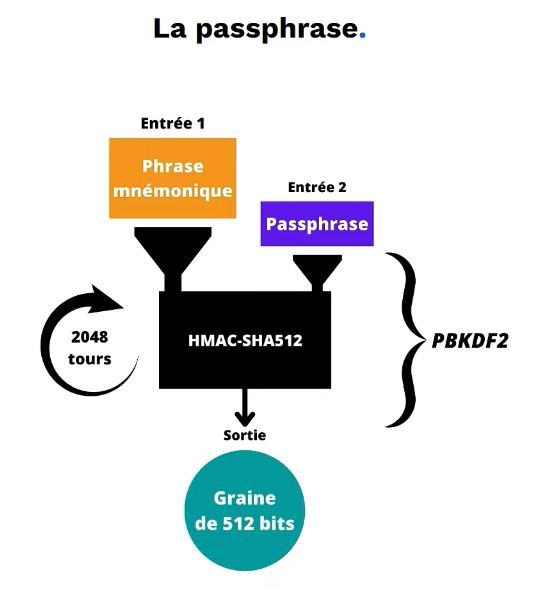

Para derivar as chaves de uma carteira HD, a frase mnemônica e a passphrase são necessárias. A passphrase é livre e pode ter um tamanho quase infinito. Ela não está incluída na frase mnemônica, que é padronizada e deve seguir certas restrições de tamanho, checksum e codificação. Um invasor não pode acessar os bitcoins de um usuário sem conhecer a passphrase. Esta última desempenha um papel na construção e cálculo de todas as chaves da carteira.

A função pbkdf2 é usada para gerar a semente a partir da passphrase. Essa semente permite derivar todos os pares de chaves filhas da carteira. Se a passphrase for alterada, a carteira Bitcoin se torna completamente diferente.

A passphrase é uma ferramenta essencial para fortalecer a segurança das carteiras Bitcoin. Ela pode permitir a aplicação de várias estratégias de segurança. Por exemplo, pode ser usada para criar duplicatas e facilitar o backup da frase mnemônica. Também pode melhorar a segurança da carteira ao mitigar os riscos associados à geração aleatória da frase mnemônica.

Uma passphrase eficaz deve ser longa (20 a 40 caracteres) e diversificada (usando letras maiúsculas, minúsculas, números e símbolos). Não deve estar diretamente relacionada ao usuário ou ao seu ambiente. É mais seguro usar uma sequência aleatória de caracteres em vez de uma palavra simples como passphrase.

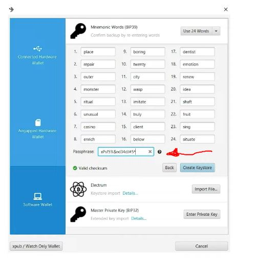

Uma passphrase é mais segura do que uma simples senha. A passphrase ideal é longa, variada e aleatória. Ela pode fortalecer a segurança de uma carteira ou de um software quente. Também pode ser usada para criar backups redundantes e seguros.

É crucial cuidar dos backups da passphrase para evitar perder o acesso à carteira. Uma passphrase é uma opção para uma carteira HD. Ela pode ser gerada aleatoriamente com dados ou outro gerador de números pseudoaleatórios. Não é recomendado memorizar uma passphrase ou frase mnemônica.

Em nossa próxima aula, examinaremos em detalhes o funcionamento da semente e o primeiro par de chaves gerado a partir dela. Não hesite em seguir esta aula para continuar sua aprendizagem. Mal podemos esperar para vê-lo novamente em breve.

# Criação de carteiras Bitcoin

## Criação da semente e da chave mestra

Nesta parte do curso, vamos explorar as etapas de derivação de uma carteira HD (Hierarchical Deterministic Wallet), que permite criar e gerenciar chaves privadas e públicas de forma hierárquica.

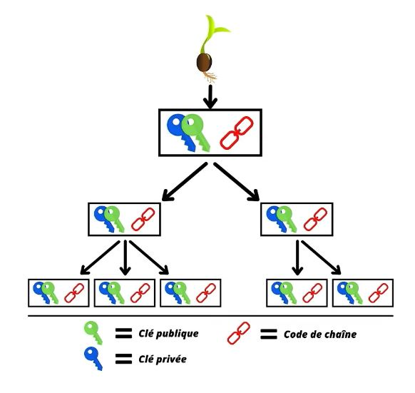

A base da carteira HD é composta por dois elementos essenciais: a frase mnemônica e a passphrase (senha adicional opcional). Juntos, eles formam a seed, uma sequência alfanumérica de 512 bits que serve como base para derivar as chaves da carteira. A partir dessa seed, é possível derivar todos os pares de chaves filhas da carteira Bitcoin. A seed é a chave que permite acessar todos os bitcoins associados à carteira, seja usando uma passphrase ou não.

Para obter a seed, utiliza-se a função pbkdf2 (Password-Based Key Derivation Function 2) com a frase mnemônica e a passphrase. A saída do pbkdf2 é uma seed de 512 bits. A chave privada mestra e o código de cadeia mestre são determinados usando o algoritmo HMAC SHA-512 (Hash-based Message Authentication Code Secure Hash Algorithm 512). Esse algoritmo requer uma mensagem e uma chave para gerar um resultado. A chave privada mestra é calculada a partir da seed e da frase "Bitcoin SEED". Essa frase é a mesma para todas as derivações de carteiras HD, garantindo consistência entre as carteiras.

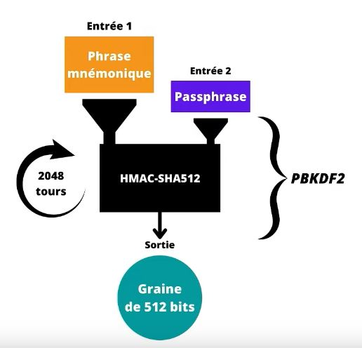

Inicialmente, a função SHA-512 não estava implementada no protocolo Bitcoin, por isso utiliza-se o HMAC SHA-512. O uso do HMAC SHA-512 com a frase "Bitcoin SEED" obriga o usuário a gerar uma carteira específica para o Bitcoin. O resultado do HMAC SHA-512 é um número de 512 bits, dividido em duas partes: os 256 bits da esquerda representam a chave privada mestra, enquanto os 256 bits da direita representam o código de cadeia mestre.

A chave privada mestra é a chave pai de todas as futuras chaves da carteira, enquanto o código de cadeia mestre é usado na derivação das chaves filhas. É importante notar que é impossível derivar um par de chaves filhas sem conhecer o código de cadeia correspondente do par pai. O código de cadeia adiciona uma fonte de entropia ao processo de derivação.

Um par de chaves na carteira inclui uma chave privada, uma chave pública e um código de cadeia. O código de cadeia permite introduzir uma fonte de aleatoriedade na derivação das chaves filhas e isolar cada par de chaves para evitar vazamento de informações.

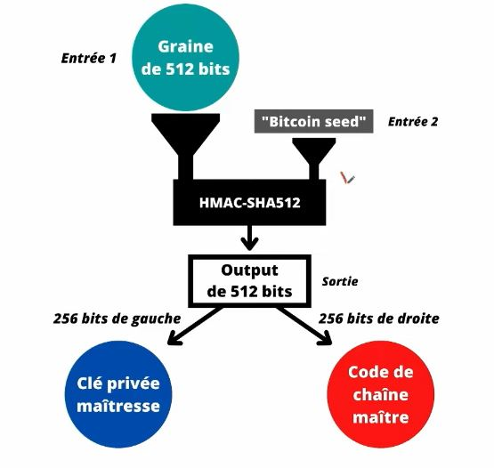

É importante ressaltar que a chave privada mestra é a primeira chave privada derivada da semente e não tem nenhuma ligação com as chaves estendidas da carteira. Portanto, a semente é o elemento fundamental para derivar todas as chaves da carteira. Ela difere da frase mnemônica e da frase de acesso, que são usadas para a criação da semente.

No próximo curso, exploraremos em detalhes as chaves estendidas, como xPub, xPRV, zPub, e entenderemos por que elas são usadas e como são construídas.

## As chaves estendidas

Nesta parte do curso, estudaremos as chaves estendidas (xPub, zPub, yPub) e seus prefixos, que desempenham um papel importante na derivação das chaves filhas em uma carteira HD (Hierarchical Deterministic Wallet).

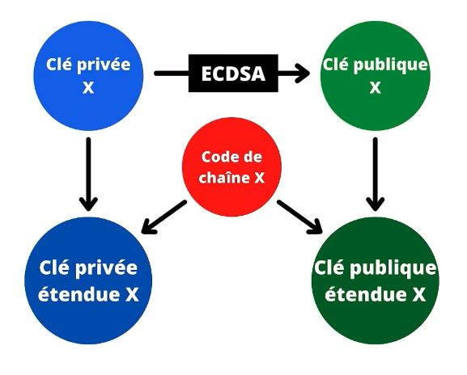

As chaves estendidas se distinguem das chaves mestras. Uma carteira HD gera uma frase mnemônica e uma semente para obter a chave mestra e o código de cadeia mestre. As chaves estendidas são usadas para derivar as chaves filhas e requerem tanto a chave pai quanto o código de cadeia correspondente. Uma chave estendida combina essas duas informações para simplificar o processo de derivação.

As chaves estendidas são identificadas por prefixos específicos (XPRV, XPUB, YPUB, ZPUB) que indicam se é uma chave estendida privada ou pública, bem como seu propósito específico. Os metadados associados a uma chave estendida incluem a versão (prefixo), a profundidade, a impressão digital da chave pública, o índice e a carga útil (código de cadeia e chave pai).

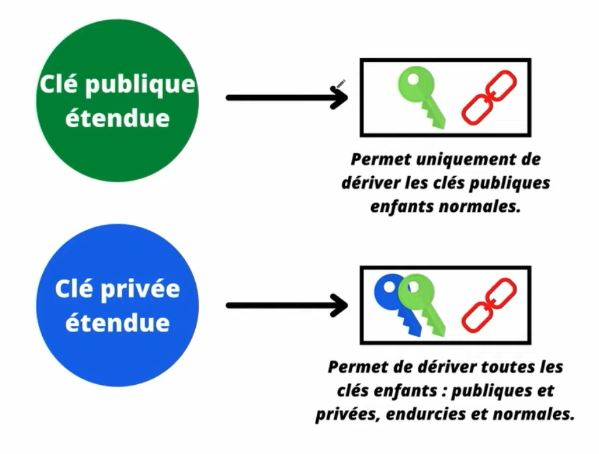

A carga útil é composta pelo código de cadeia (32 bytes) e pela chave pai (33 bytes). Esses elementos são essenciais para a derivação das chaves filhas. Uma chave privada é gerada a partir de um número aleatório ou pseudoaleatório, enquanto uma chave pública é gerada usando o algoritmo ECDSA (Elliptic Curve Digital Signature Algorithm).

Cada par de chaves estendidas está associado a um código de cadeia único, que permite realizar derivações específicas. Ao concatenar a chave pai com o código de cadeia, obtemos uma chave privada ou pública estendida.

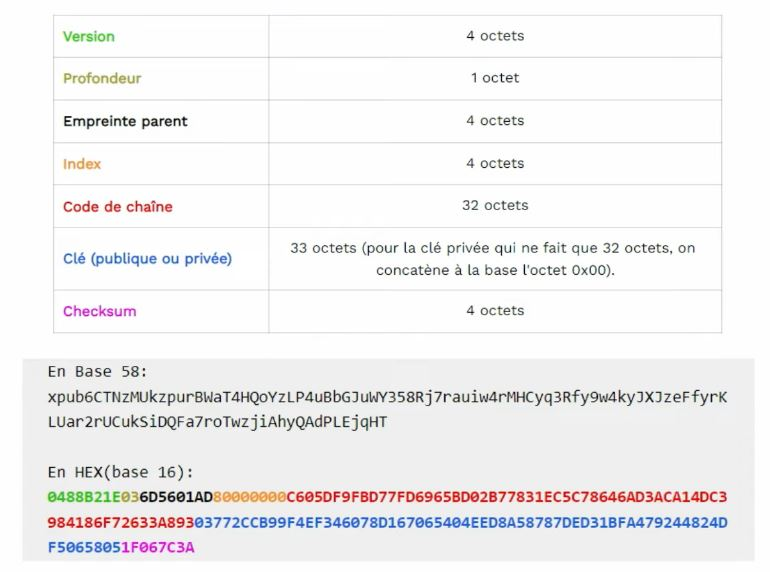

As chaves públicas estendidas só podem ser derivadas de chaves públicas filhas normais, enquanto as chaves privadas estendidas podem ser derivadas de chaves públicas e privadas filhas, seja em uma derivação normal ou endurecida. O uso de chaves estendidas com o prefixo XPUB permite derivar novos endereços sem precisar voltar às chaves privadas correspondentes, oferecendo assim uma segurança melhor. Os metadados associados às chaves estendidas fornecem informações importantes sobre seu papel e posição na hierarquia das chaves.

As chaves públicas comprimidas têm um tamanho de 33 bytes, enquanto as chaves públicas não processadas têm 512 bits. As chaves públicas comprimidas mantêm as mesmas informações que as chaves não processadas, mas com um tamanho reduzido. As chaves estendidas têm um tamanho de 82 bytes e seu prefixo é representado em base 58 por meio de uma conversão hexadecimal. O checksum é calculado usando a função de hash HASH256.

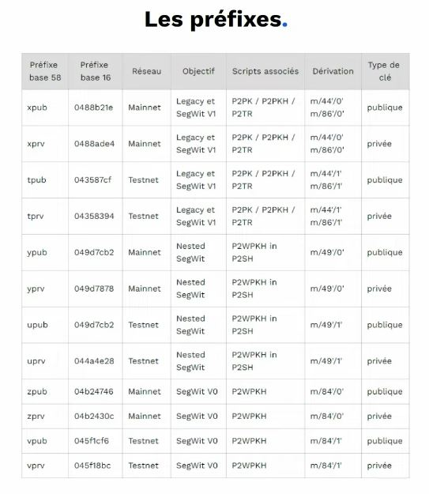

As derivações endurecidas começam a partir de índices que são potências de 2 (2^31). As chaves públicas estendidas só permitem derivar chaves públicas filhas normais, enquanto as chaves privadas estendidas permitem derivar qualquer chave filha. É interessante notar que os prefixos mais comumente usados são xpub e zpub, que correspondem respectivamente aos padrões legacy e segwit v1 e segwit v0.

No nosso próximo curso, vamos explorar a derivação de pares de chaves filhas usando o conhecimento adquirido sobre chaves estendidas e a chave mestra da carteira.

Em conclusão, as chaves estendidas desempenham um papel essencial na criptografia e no funcionamento das carteiras HD. Compreender seu uso e cálculo é crucial para garantir a segurança das transações e a proteção dos ativos digitais. Os prefixos e metadados associados às chaves estendidas permitem um uso eficiente e uma derivação precisa das chaves filhas necessárias.

## Dérivation des paires de clés enfants

Agora, vamos abordar o cálculo da semente e da chave mestra, que são os primeiros elementos essenciais para a hierarquização e derivação da carteira HD (Hierarchical Deterministic Wallet). A semente, com um comprimento de 128 a 256 bits, é gerada aleatoriamente ou a partir de uma frase secreta. Ela desempenha um papel determinístico na derivação de todas as outras chaves. A chave mestra é a primeira chave derivada da semente e permite derivar todos os outros pares de chaves filhas.
O código da cadeia mestra desempenha um papel importante na recuperação da carteira a partir da semente. É importante observar que todas as chaves derivadas da mesma semente terão o mesmo código da cadeia mestra.

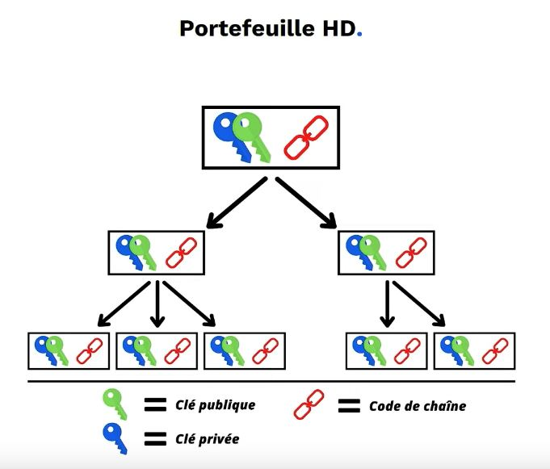

A hierarquização e a derivação da carteira HD oferecem uma gestão mais eficiente das chaves e das estruturas da carteira. As chaves estendidas permitem a derivação de um par de chaves filho a partir de um par pai usando cálculos matemáticos e algoritmos específicos.

Existem diferentes tipos de pares de chaves filho, incluindo chaves reforçadas e chaves normais. A chave pública estendida permite apenas a derivação de chaves públicas normais, enquanto a chave privada estendida permite a derivação de todas as chaves filho, tanto públicas quanto privadas, seja no modo normal ou reforçado. Cada par de chaves possui um índice que permite diferenciá-las umas das outras.

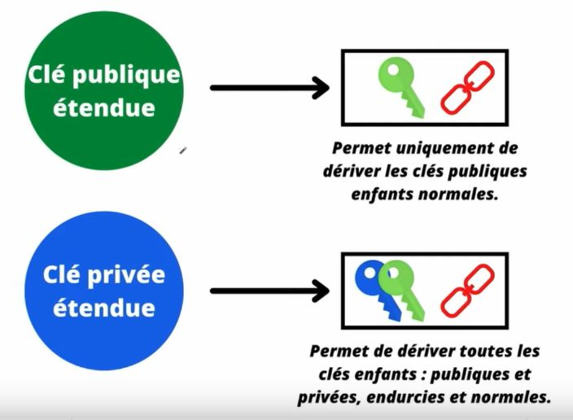

A derivação das chaves filho utiliza a função HMAC-SHA512 usando a chave pai concatenada com o índice e o código da cadeia associada ao par de chaves. As chaves filho normais têm um índice entre 0 e 2 elevado à potência 31 menos 1, enquanto as chaves filho reforçadas têm um índice entre 2 elevado à potência 31 e 2 elevado à potência 32 menos 1.

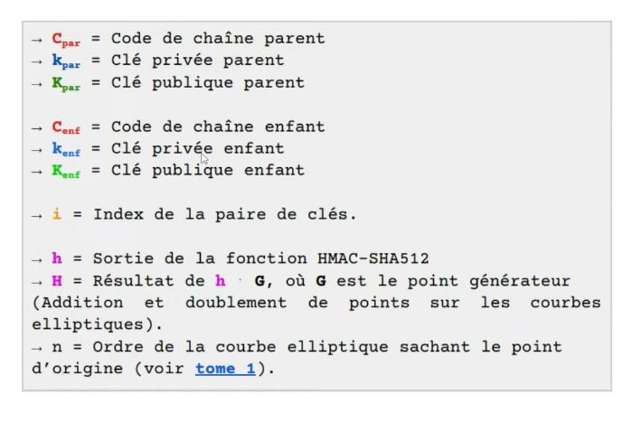
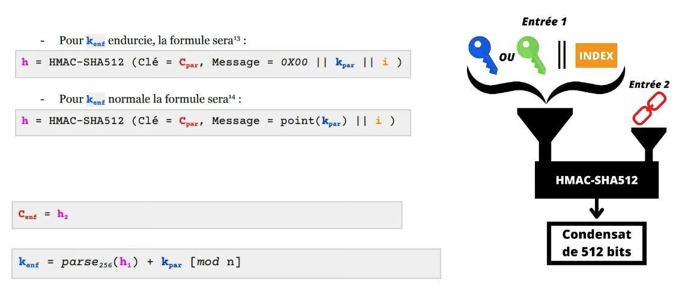

Existem dois tipos de pares de chaves filho: pares reforçados e pares normais. O processo de derivação das chaves filho utiliza as chaves públicas para gerar as condições de gasto, enquanto as chaves privadas são usadas para a assinatura. A chave pública estendida permite apenas a derivação de chaves públicas normais, enquanto a chave privada estendida permite a derivação de todas as chaves filho, tanto públicas quanto privadas, no modo normal ou reforçado.

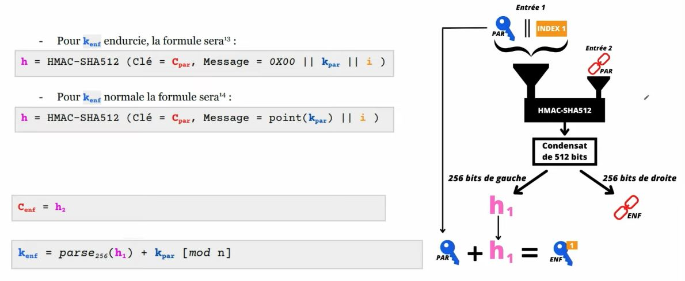

A derivação reforçada utiliza a chave privada pai, enquanto a derivação normal utiliza a chave pública pai. A função HMAC-SHA512 é usada para a derivação reforçada, enquanto a derivação normal utiliza um resumo de 512 bits. A chave pública filho é obtida multiplicando a chave privada filho pelo gerador da curva elíptica.

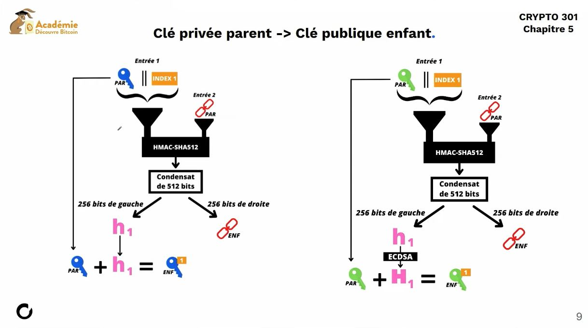
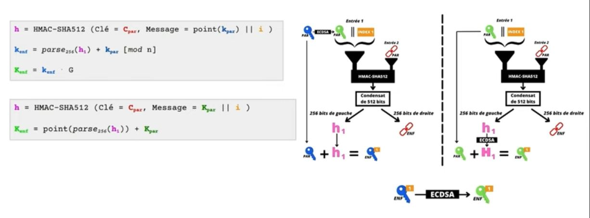

## Estrutura da carteira e caminhos de derivação

Neste capítulo, vamos estudar a estrutura da árvore de derivação em uma carteira HD (Hierarchical Deterministic Wallet). Já exploramos o cálculo da semente, a chave mestra e a derivação das pares de chaves filhas. Agora, vamos nos concentrar na organização das chaves dentro da carteira.

A carteira HD utiliza camadas de profundidade para organizar as chaves. Cada derivação de um par pai para um par filho corresponde a uma camada de profundidade. A profundidade 0 corresponde à chave mestra e ao código de cadeia mestra.

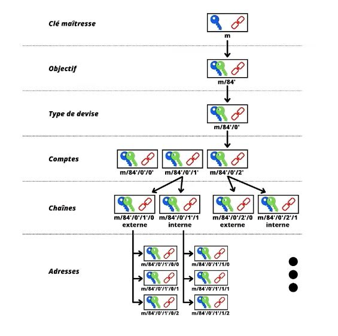

- A profundidade 1 é usada para derivar chaves filhas com base em um objetivo específico, que é determinado pelo índice. Os objetivos estão em conformidade com os padrões BIP 84 e Segwit v0/v1.

- A profundidade 2 permite diferenciar contas de diferentes criptomoedas ou redes. Isso permite organizar a carteira com base em diferentes fontes de fundos.

- A profundidade 3 é usada para organizar a carteira em diferentes contas, oferecendo uma estrutura mais clara e organizada.

- A profundidade 4 corresponde às cadeias interna e externa, que são usadas para endereços destinados a serem divulgados publicamente. O índice 0 está associado à cadeia externa, enquanto o índice 1 está associado à cadeia interna. Cada conta possui duas cadeias: a cadeia externa (0) e a cadeia interna (1). A profundidade 4 também é usada para gerenciar tipos de script no caso de carteiras multiassinaturas.

- A profundidade 5 é usada para endereços de recebimento em uma carteira clássica. Na próxima seção, examinaremos mais detalhadamente a derivação das pares de chaves filhas.

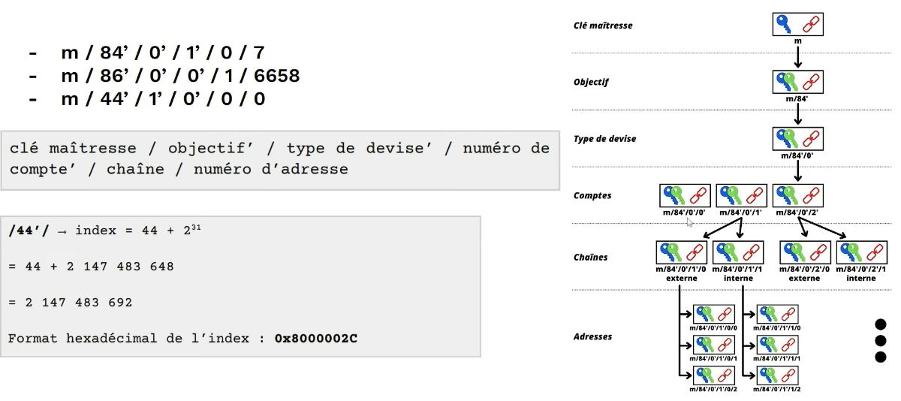

Para cada camada de profundidade, usamos índices para diferenciar as pares de chaves filhas. Índices aprimorados são usados com um apóstrofo para algumas derivações. A chave pública por ano é usada como entrada para a função HMAC. O índice em um caminho de derivação indica o valor usado na função HMAC.
O índice sem apóstrofo corresponde ao índice real utilizado, enquanto o índice com apóstrofo corresponde ao índice real + 2^31. As derivações reforçadas utilizam índices de 2^31 a 2^32-1. Por exemplo, o índice 44' corresponde ao índice real 2^31 + 44.
Para gerar um endereço de recebimento específico, derivamos um par de chaves filhas da chave mestra e do código de cadeia mestra. Em seguida, usamos o índice para diferenciar os diferentes pares de chaves filhas da mesma profundidade.

As chaves estendidas, como XPUB, permitem compartilhar sua carteira com várias pessoas. A cadeia de derivação é usada para diferenciar a cadeia externa (endereços destinados a serem comunicados) e a cadeia interna (endereços de troco).

É importante observar que diferentes profundidades são usadas em uma carteira HD, dependendo dos diferentes padrões. A derivação das chaves pai para as chaves filhas permite passar de uma profundidade para outra. O uso de diferentes ramos na carteira HD indica os diferentes padrões seguidos.

No próximo capítulo, vamos estudar os endereços de recebimento, suas vantagens de uso e os passos para sua construção.

# O que é um endereço Bitcoin?

## Os endereços Bitcoin

Neste capítulo, vamos explorar os endereços de recebimento, que desempenham um papel crucial no sistema Bitcoin. Eles permitem receber fundos em uma transação e são gerados a partir de pares de chaves privadas e públicas. Embora exista um tipo de script chamado Pay2PublicKey que permite bloquear bitcoins em uma chave pública, os usuários geralmente preferem usar endereços de recebimento em vez desse script.

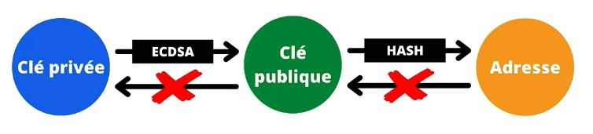

Quando um destinatário deseja receber bitcoins, ele fornece um endereço de recebimento ao remetente em vez de sua chave pública. Um endereço é na verdade um hash de uma chave pública, com um formato específico. A chave pública é derivada da chave privada filha usando operações matemáticas como adição e duplicação de pontos em curvas elípticas.

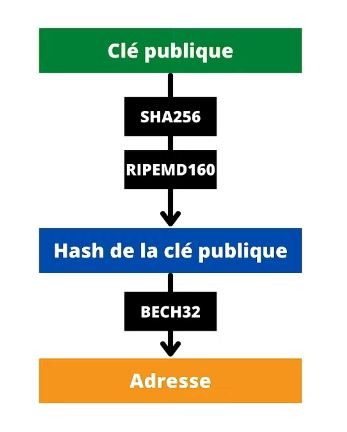

É importante observar que não é possível retroceder do endereço para a chave pública, nem da chave pública para a chave privada. O uso de um endereço reduz o tamanho da informação da chave pública, que inicialmente tem 512 bits. É possível comprimir uma chave pública mantendo apenas o valor de x e adicionando um prefixo, mas essa técnica não era conhecida na época da criação do Bitcoin. Portanto, o uso de um endereço não economiza espaço nos blocos.
As seguintes informações foram reduzidas em tamanho para facilitar o uso dos endereços Bitcoin. Eles possuem um checksum, o que permite detectar erros de digitação e reduzir os riscos de perda de bitcoins. Por outro lado, as chaves públicas não possuem um checksum, o que significa que erros de digitação podem resultar na perda dos fundos correspondentes.

Os endereços também oferecem uma segunda camada de segurança entre informações públicas e privadas, tornando mais difícil assumir o controle da chave privada. As funções de hash usadas permitem que os pares de chaves sejam resistentes a possíveis ataques de computadores quânticos. De fato, esses computadores podem potencialmente quebrar o ECDSA (Elliptic Curve Digital Signature Algorithm), mas não podem quebrar uma função de hash.

É essencial destacar que cada endereço é de uso único, o que contribui para a segurança e privacidade. A reutilização do mesmo endereço apresenta sérios problemas de privacidade e deve ser evitada. Além disso, cada endereço é um hash de uma chave pública, acompanhado de um checksum para reduzir o risco de perda de bitcoins.

Diferentes prefixos são usados para os endereços Bitcoin. Por exemplo, BC1Q corresponde a um endereço Segwit V0, BC1P a um endereço Taproot/Segwit V1, e os prefixos 1 e 3 estão associados aos endereços Pay2PublicKeyH/Pay2ScriptH (legacy). No próximo curso, explicaremos passo a passo a derivação de um endereço a partir de uma chave pública.

Em resumo, os endereços de recebimento são um elemento essencial do sistema Bitcoin. Eles são gerados a partir de pares de chaves privadas e públicas e são usados para receber fundos em uma transação. Os endereços incorporam um checksum para reduzir os riscos de perda de bitcoins e são projetados para serem usados de forma única, garantindo assim a segurança e privacidade. Diferentes tipos de endereços são usados no sistema Bitcoin, oferecendo maior privacidade e segurança.

## Como criar um endereço Bitcoin?

Neste capítulo, abordaremos a construção de um endereço de recebimento para transações Bitcoin. Um endereço de recebimento é uma representação alfanumérica de uma chave pública comprimida. A conversão de uma chave pública em um endereço de recebimento passa por várias etapas.

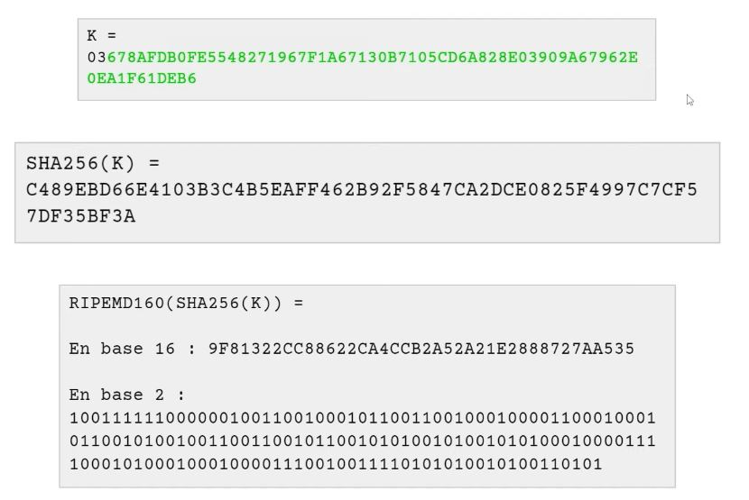

Uma das características vantajosas dos endereços de recebimento é a presença de um checksum, que permite a detecção de erros. Para isso, usamos a tecnologia de checksum BCH (Bose-Chaudhuri-Hocquenghem), que garante uma detecção precisa de erros. Essa tecnologia também contribui para a redução do número de caracteres necessários para representar um endereço, facilitando assim seu uso.

Para começar a construção de um endereço, precisamos compactar a chave pública correspondente. Uma chave pública bruta ocupa 520 bits, mas devido à simetria da curva elíptica utilizada, uma curva elíptica pode ter uma abscissa x associada a dois valores possíveis para y: positivo ou negativo. Na rede Bitcoin, trabalhamos com um corpo de inteiros positivos finitos em vez do corpo dos reais. Para representar uma chave pública a partir de x, adicionamos um prefixo indicando o valor de y (par ou ímpar). A compactação de uma chave pública reduz seu tamanho de 520 para 264 bits. A paridade de y em um corpo de inteiros positivos finitos corresponde à paridade de y no corpo dos reais.

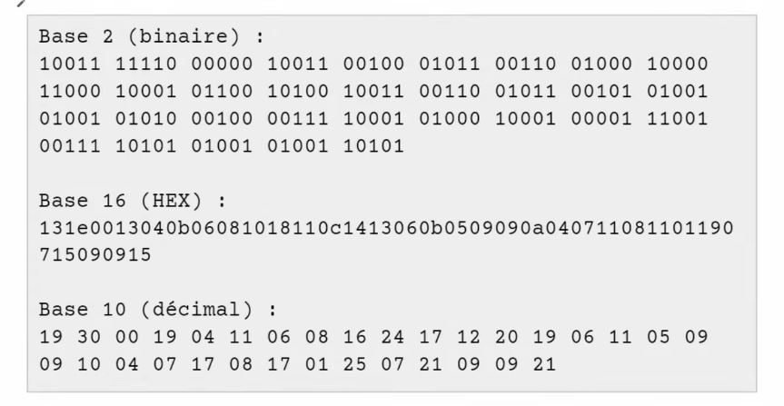
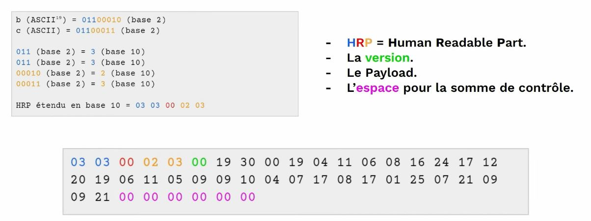

Vamos tomar como exemplo a chave pública pertencente a Satoshi Nakamoto, com um prefixo 0,3 indicando um valor ímpar de y. Podemos então passar para a segunda etapa da construção de um endereço a partir de chaves públicas compactadas. É possível calcular dois endereços para cada chave pública. Para isso, usamos a função SHA256 para obter o hash da chave pública. Em seguida, aplicamos a função ripemd160 ao resultado do SHA256 para obter uma sequência de caracteres. Essa sequência é então codificada em formato binário em grupos de 5 bits, aos quais metadados são adicionados para o cálculo do checksum usando o programa BCH.

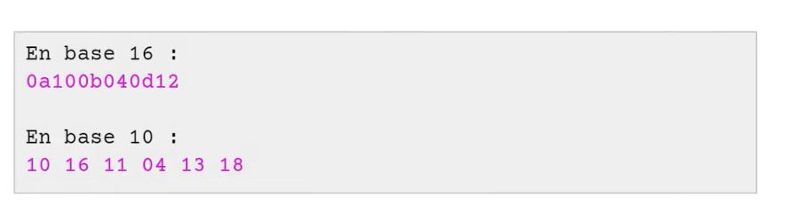

No caso dos endereços legacy, usamos o hash duplo SHA256 para gerar o checksum do endereço. No entanto, para os endereços Segwit V0 e V1, recorremos à tecnologia de checksum BCH para garantir a detecção de erros. O programa BCH é capaz de sugerir e corrigir erros com uma probabilidade de erro extremamente baixa. Atualmente, o programa BCH é usado para detectar e sugerir alterações a serem feitas, mas não as realiza automaticamente em substituição ao usuário. O cálculo do checksum com o código BCH é baseado na aritmética polinomial de Chien-Chauffage.

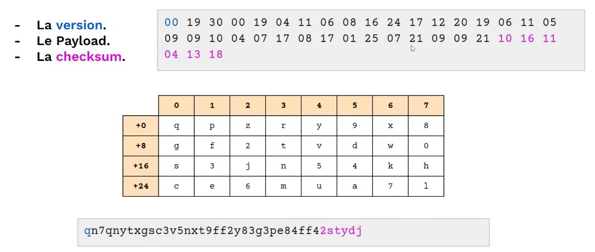

O programa BCH requer várias informações de entrada, incluindo o HRP (Parte Legível pelo Humano) que precisa ser expandido. A expansão do HRP envolve a codificação de cada letra em base 2, levando os três primeiros bits de cada caractere.
', inserindo um separador 0 e concatenando os cinco últimos bits de cada caractere. Os caracteres azuis convertidos para base 10 correspondem a 3 e 3 em decimal, enquanto os outros cinco caracteres laranjas correspondem a 2 e 3 em base 10. A extensão do HRP em base 10 permite isolar os cinco últimos bits de cada caractere, reforçando assim a checksum.

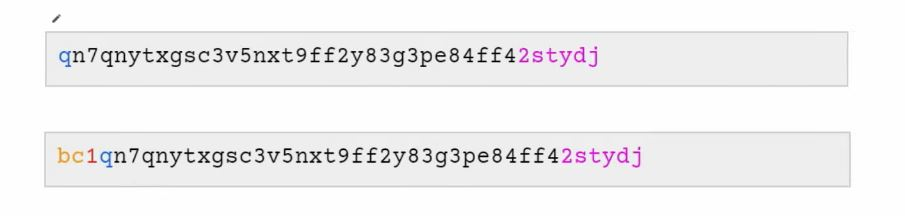

A versão Segwit V0 é representada pelo código 00 e o "payload" está em preto, em base 10. Isso é seguido por seis caracteres reservados para a checksum. A entrada contendo os metadados é então submetida ao programa BCH para obter a checksum em base 10. A concatenação da versão, do payload e da checksum permite construir o endereço. Os caracteres em base 10 são então convertidos em caracteres bech32 usando uma tabela de correspondência. O alfabeto bech32 inclui todos os caracteres alfanuméricos, exceto 1, b, i e o, para evitar confusão.

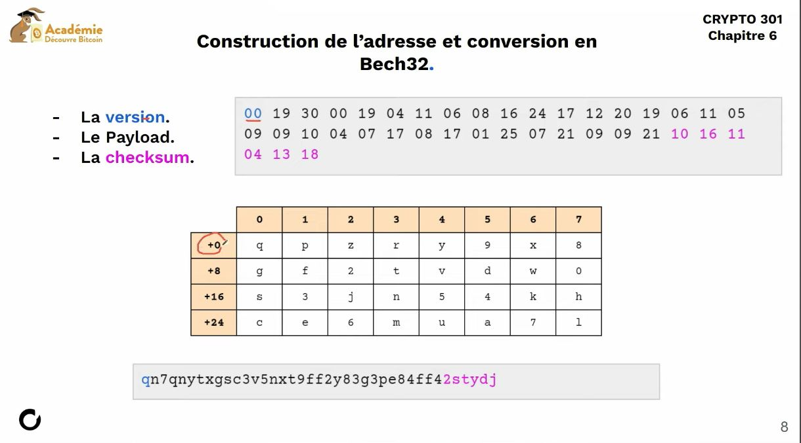
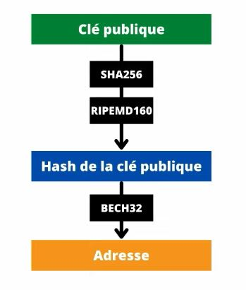

Para construir um endereço começando com bc1q, precisamos aplicar uma função de hash (H160) a uma chave pública comprimida e depois adicionar a checksum, a versão (q), o HRP (bc) e o separador (1). Os endereços Taproot, por sua vez, começam com bc1p porque sua versão (Segwit V1) corresponde a 0+1=1, daí o uso do caractere p. Todos esses elementos são então convertidos em BCH32, uma variante da base 32 específica para o Bitcoin.

Assim, passamos pelas etapas de construção de um endereço de recebimento, uso da tecnologia de checksum BCH e construção de um endereço começando com bc1q ou bc1p usando a variante BCH32 da base 32 específica para o Bitcoin.

## Resumo da criptografia para carteiras Bitcoin

Ao longo deste treinamento, estudamos em profundidade a carteira determinística hierárquica (HD) com o BIP32. A entropia desempenha um papel central nesse tipo de carteira, pois é usada para gerar uma frase mnemônica a partir de um número aleatório. Com a lista de 2048 palavras fornecida no BIP39, essa frase mnemônica pode ser codificada em uma série de palavras fáceis de lembrar. A frase mnemônica, juntamente com uma possível frase secreta, são necessárias para gerar a seed da carteira. A frase secreta atua como um sal criptográfico que adiciona uma camada adicional de proteção à carteira.

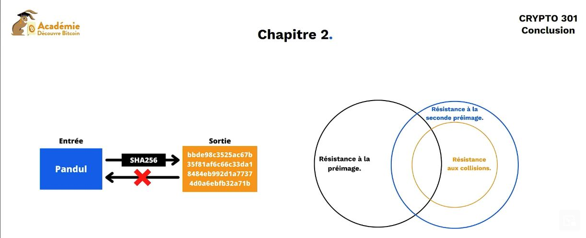

A função pbkdf2 é usada para gerar a semente a partir da frase mnemônica e da frase secreta, usando um hmacha512 e 2048 iterações. A chave mestra e o código da cadeia mestra são então derivados dessa semente usando novamente a função hmacha512 com a frase "bitcoin seed". A chave privada mestra e o código da cadeia mestra são os elementos mais altos na hierarquia da carteira HD.

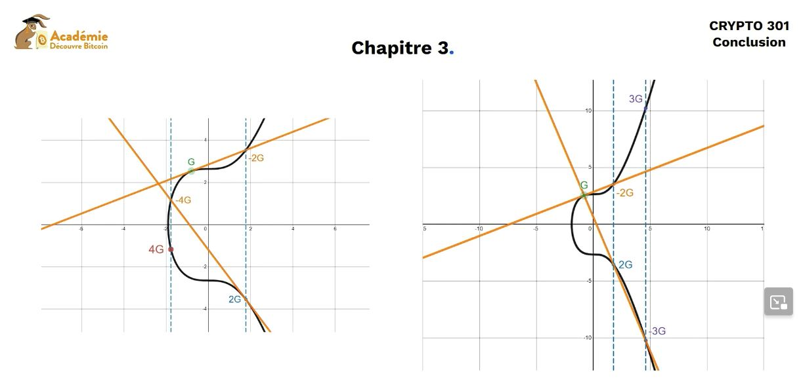

A derivação de uma chave filha depende de vários fatores, incluindo a chave pai e o código da cadeia correspondente. Uma chave estendida é obtida concatenando uma chave pai com seu código de cadeia, enquanto uma chave mestra é uma chave separada. Para derivar um endereço, a chave pública comprimida é primeiro hashada usando SHA256 e RIPMD160, e então um checksum é calculado. O hash duplo SHA256 é usado para calcular o checksum no caso de um padrão legado, enquanto o programa BCH (Bose-Chaudhuri-Hocquenghem) é usado para calcular o checksum no caso de um padrão segwit. Em seguida, uma representação no formato base 58 é usada para um padrão legado, enquanto o formato bech32 é usado para um padrão segwit, a fim de obter o endereço da carteira HD.

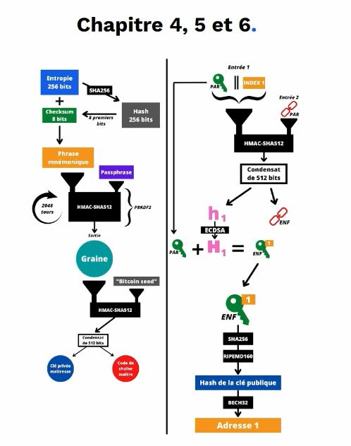

Resumindo, exploramos em detalhes as funções de hash e suas características, bem como as assinaturas digitais e as curvas elípticas. Em seguida, mergulhamos no mundo da carteira determinística hierárquica (HD) com o BIP32, usando a entropia e a frase secreta para gerar a semente da carteira. Também aprendemos como derivar chaves filhas e obter o endereço da carteira HD. Espero que essas informações tenham sido úteis e agora encorajo você a fazer a avaliação para testar seus conhecimentos adquiridos durante o treinamento Crypto 301. Obrigado pela sua atenção.

# Vá mais longe

## Criação de uma semente a partir de 128 lançamentos de dados!

A criação de uma frase mnemônica é um passo crucial para a segurança da sua carteira de criptomoedas. Existem várias maneiras de gerar uma frase mnemônica, no entanto, vamos nos concentrar no método de geração manual usando dados. É importante ressaltar que este método não é adequado para uma carteira de alto valor. É recomendado usar um software de código aberto ou uma carteira de hardware para gerar a frase mnemônica. Para criar uma frase mnemônica, vamos usar dados para gerar informações binárias. O objetivo é entender o processo de criação da frase mnemônica.

**Passo 1 - Preparação:**
Certifique-se de ter uma distribuição Linux amnésica, como o Tails OS, instalada em um pen drive para maior segurança. Observe que este tutorial não deve ser usado para criar uma carteira principal.

**Passo 2 - Geração de um número binário aleatório:**
Vamos usar dados para gerar informações binárias. Jogue um dado 128 vezes e anote cada resultado (1 para ímpar, 0 para par).

**Passo 3 - Organização dos números binários:**
Organize os números binários obtidos em linhas de 11 dígitos para facilitar os cálculos posteriores. A décima segunda linha deve ter apenas 7 dígitos.

**Passo 4 - Cálculo do checksum:**
Os últimos 4 dígitos da décima segunda linha correspondem ao checksum. Para calcular esse checksum, precisamos usar um terminal de uma distribuição Linux. É recomendado usar o [TailOs](https://tails.boum.org/index.fr.html), que é uma distribuição sem memória inicializável a partir de um pen drive. Uma vez no seu terminal, digite o comando `echo <número binário> | shasum -a 254 -0`. Substitua `<número binário>` pela sua lista de 128 zeros e uns. A saída é um hash em hexadecimal. Anote o primeiro caractere desse hash e converta-o para binário. Você pode usar esta [tabela](https://www.educative.io/answers/decimal-binary-and-hex-conversion-table) como referência. Adicione o checksum em binário (4 dígitos) à décima segunda linha do seu documento.

**Passo 5 - Conversão para decimal:**
Para encontrar as palavras associadas a cada uma de suas linhas, você primeiro precisa converter em decimal cada série de 11 bits. Aqui você não pode usar um conversor online, pois esses bits representam sua frase mnemônica. Portanto, você precisará converter usando uma calculadora e um truque que é o seguinte: cada bit está associado a uma potência de 2, então da esquerda para a direita temos 11 posições que correspondem a 1024, 512, 256, 128, 64, 32, 16, 8, 4, 2, 1. Para converter sua série de 11 bits em decimal, basta somar apenas as posições que contêm um 1. Por exemplo, para a série 00110111011, isso corresponde à seguinte adição: 256 + 128 + 32 + 16 + 8 + 2 + 1 = 443. Agora você pode converter cada linha em decimal. E antes de passar para a codificação em palavras, é necessário adicionar +1 a todas as linhas, pois o índice da lista de palavras BIP39 começa a partir de 1 e não de 0.

**Etapa 8 - Geração da frase mnemônica:**
Comece imprimindo a [lista de 2048 palavras](https://seedxor.com/files/wordlist.pdf) para fazer a conversão entre seus números decimais e as palavras do BIP39. A particularidade desta lista é que nenhuma palavra possui as mesmas 4 primeiras letras em comum com todas as outras palavras deste dicionário. Em seguida, procure para cada uma de suas linhas a palavra associada ao número decimal.

**Etapa 9 - Teste da frase mnemônica:**
Teste imediatamente sua frase mnemônica no Sparrow Wallet, criando uma carteira a partir dela. Se você receber um erro de checksum inválido, é provável que você tenha cometido um erro de cálculo. Corrija esse erro voltando para a etapa 4 e teste novamente no Sparrow Wallet. Pronto! Você acabou de criar uma nova carteira Bitcoin a partir de 128 lançamentos de dados.

Gerar uma frase mnemônica é um processo importante para garantir a segurança de sua carteira de criptomoedas. É recomendado usar métodos mais seguros, como o uso de software de código aberto ou uma carteira de hardware, para gerar a frase mnemônica. No entanto, realizar esta oficina ajuda a entender melhor como podemos criar uma carteira Bitcoin a partir de um número aleatório.

## Conclusão e fim

### Agradecimentos e continue explorando a toca do coelho

Nous gostaríamos de agradecer sinceramente por ter participado do curso Crypto 301. Esperamos que essa experiência tenha sido enriquecedora e formativa para você. Abordamos diversos tópicos empolgantes, desde matemática até criptografia, passando pelo funcionamento do protocolo Bitcoin.

Se você deseja se aprofundar ainda mais no assunto, temos um recurso adicional para oferecer. Realizamos uma entrevista exclusiva com Théo Pantamis e Loïc Morel, dois especialistas renomados no campo da criptografia. Essa entrevista explora em profundidade diversos aspectos do assunto e oferece perspectivas interessantes.

Não hesite em assistir a essa entrevista para continuar explorando o fascinante campo da criptografia. Esperamos que isso seja útil e inspirador em sua jornada. Mais uma vez, obrigado por sua participação e dedicação ao longo deste curso.

### Apoie-nos

Este curso, assim como todo o conteúdo presente nesta universidade, foi oferecido gratuitamente pela nossa comunidade. Para nos apoiar, você pode compartilhá-lo com outras pessoas, se tornar membro da universidade e até mesmo contribuir para o seu desenvolvimento através do GitHub. Em nome de toda a equipe, obrigado!

### Avalie o curso

Um sistema de avaliação para o curso será em breve integrado a esta nova plataforma de E-learning! Enquanto isso, muito obrigado por ter concluído o curso e se você gostou, considere compartilhá-lo com outras pessoas.
