# Deep-dive into cryptographie

It is difficult to find many materials that offer a good middle ground in cryptography education.

On the one hand, there are lengthy, formal treatises, really only accessible to those with a strong background in mathematics, logic, or some other formal discipline. On the other hand, there are very high-level introductions that really hide too many of the details for anyone that is at least a bit curious. 

This introduction to cryptography seeks to capture the middle ground. While it should be relatively challenging and detailed for anyone new to cryptography, it is not the rabbit hole of a typical foundational treatise.

+++

# An Introduction to Cryptography

## Short description

This book offers a deep-dive introduction to the science and practice of cryptography. Where possible it focuses on conceptual, rather than formal exposition of the material. 

> This course is based on [JWBurgers's repo](https://github.com/JWBurgers/An_Introduction_to_Cryptography). All right to him. The content is not yet finished and only here to showcase how we could integrate it if JWburger's agree. 

### Motivation and aims

It is difficult to find many materials that offer a good middle ground in cryptography education. 

On the one hand, there are lengthy, formal treatises, really only accessible to those with a strong background in mathematics, logic, or some other formal discipline. On the other hand, there are very high-level introductions that really hide too many of the details for anyone that is at least a bit curious. 

This introduction to cryptography seeks to capture the middle ground. While it should be relatively challenging and detailed for anyone new to cryptography, it is not the rabbit hole of a typical foundational treatise. 

### Target audience

From developers to the intellectually curious, this book is useful for anyone that wants more than a superficial understanding of cryptography. If your aim is to master the field of cryptography, then this book is also a good starting point. 

### Reading guidelines

The book currently contains seven chapters: "What is Cryptography?" (Chapter 1), "Mathematical Foundations of Cryptography I" (Chapter 2), "Mathematical Foundations of Cryptography II" (Chapter 3), "Symmetric Cryptography" (Chapter 4), "RC4 and AES" (Chapter 5), "Asymmetric Cryptography" (Chapter 6), and "The RSA cryptosystem" (Chapter 7). A final chapter, "Cryptography in Practice," will still be added. It focuses on various cryptographic applications, including transport layer security, onion routing, and Bitcoin's value exchange system. 

Unless you have a strong background in mathematics, number theory is probably the most difficult topic in this book. I offer an overview of it in Chapter 3, and it also appears in the exposition of AES in Chapter 5 and the RSA cryptosystem in Chapter 7.

If you are really struggling with the formal details in these parts of the book, I recommend you settle for a high-level reading of them the first time around. 

### Acknowledgements

The most influential book in shaping this one has been Jonathan Katz and Yehuda Lindell’s _Introduction to Modern Cryptography_, CRC Press (Boca Raton, FL), 2015. An accompanying course is available on Coursera called "Cryptography."

The main additional sources that have been helpful in creating the overview in this book are Simon Singh, _The Code Book_, Fourth Estate (London, 1999); Christof Paar and Jan Pelzl, _Understanding Cryptography_, Springer (Heidelberg, 2010) and a course based on the book by Paar called “Introduction to Cryptography” (available at https://www.youtube.com/channel/UC1usFRN4LCMcfIV7UjHNuQg); and Bruce Schneier, Applied Cryptography, 2nd edn, 2015 (Indianapolis, IN: John Wiley & Sons). 

I will only cite very specific information and results I take from these sources, but want to acknowledge my general indebtedness to them here.  

For those readers who wish to seek out more advanced knowledge on cryptography after this introduction, I highly recommend Katz and Lindell’s book. Katz's course on Coursera is somewhat more accessible than the book. 

### Contributions

Please have a look at the contributions file in the repository for some guidelines on how to support the project.

# What is Cryptography?

Let’s start our enquiry into the field of cryptography with one of the more charming and entertaining episodes in its history: that of the Beale ciphers.[1](#footnote1)

The story of the Beale ciphers is, in my opinion, more likely to be fiction than reality. But it supposedly transpired as follows.

## The Beale ciphers

In both the Winter of 1820 and 1822, a man named Thomas J. Beale stayed at an inn owned by Robert Morriss in Lynchburg (Virginia). At the end of Beale’s second stay, he handed Morriss an iron box with valuable papers for safekeeping. 

A few months later, Morriss received a letter from Beale dated May 9, 1822. It emphasized the great value of the contents of the iron box and related some instructions to Morriss: if neither Beale nor any of his associates ever came to claim the box, he should open it precisely ten years from the date of the letter (that is, May 9, 1832). Some of the papers inside would be written in regular text. Several others, however, would be “unintelligible without the aid of a key.” This “key” would, then, be delivered to Morriss by an unnamed friend of Beale’s in June of 1832.    

Despite the clear instructions, Morriss did not open the box in May of 1832 and Beale’s mysterious friend never turned up in June of that year. It was not until 1845 that the innkeeper finally decided to open the box. In it, Morriss found a note explaining how Beale and his associates discovered gold and silver out West and buried it, together with some jewelry, for safekeeping. In addition, the box contained three **ciphertexts**: that is, texts written in code which require a **cryptographic key**, or a secret, and an accompanying algorithm to unlock. This process of unlocking a ciphertext is known as **decryption**, while the locking process is known as **encryption**. (As explained in Chapter 3, the term cipher can take on various meanings. In the name "Beale ciphers", it is short for ciphertexts.)

The three ciphertexts that Morriss found in the iron box each consist of a series of numbers separated by commas. According to Beale’s note, these ciphertexts separately provide the location of the treasure, the contents of the treasure, and a list of names with rightful heirs to the treasure and their shares (the latter information being relevant in case Beale and his associates never came to claim the box).

Morris attempted to decrypt the three ciphertexts for twenty years. This would have been easy with the key. But Morriss did not have the key and was unsuccessful in his attempts to recover the original texts, or **plaintexts** as they are typically called in cryptography.  

Nearing the end of his life, Morriss passed the box on to a friend in 1862. This friend subsequently published a pamphlet in 1885, under the pseudonym J.B. Ward. It included a description of the (alleged) history of the box, the three ciphertexts, and a solution that he had found for the second ciphertext. (Apparently, there is one key for each ciphertext, and not one key that works on all three ciphertexts as Beale originally seems to have suggested in his letter to Morriss.) 

You can see the second ciphertext in *Figure 2* below.[2](#footnote2) The key to this ciphertext is the United States Declaration of Independence. The decryption procedure comes down to the applying the following two rules:

* For any number n in the ciphertext, locate the nth word in the United States Declaration of Independence
* Replace the number n with the first letter of the word you found

*Figure 1: Beale cipher no. 2*

For instance, the first number of the second ciphertext is 115. The 115th word of the Declaration of Independence is “instituted,” so the first letter of the plaintext is “i.” The ciphertext does not directly indicate word spacing and capitalization. But after decrypting the first few words, you can logically deduce that the first word of the plaintext was simply “I.” (The plaintext starts with the phrase “I have deposited in the county of Bedford.”)

After decryption, the second message provides the detailed contents of the treasure (gold, silver, and jewels), and suggests that it was buried in iron pots and covered with rocks in Bedford County (Virginia). People love a good mystery, so great efforts have been expended on decrypting the other two Beale ciphers, particularly the one describing the location of the treasure. Even various prominent cryptographers have tried their hands on them. However, as of yet, no one has been able to decrypt the other two ciphertexts.   

## Modern cryptography

Colorful stories such as that of the Beale ciphers are what most of us associate with cryptography. Yet, modern cryptography differs in at least four important ways from these types of historical examples.

First, historically cryptography has only been concerned with **secrecy** (or confidentiality).[3](#footnote3) Ciphertexts would be created to ensure that only certain parties could be privy to the information in the plaintexts, as in the case of the Beale ciphers. In order for an encryption scheme to serve this purpose well, decrypting the ciphertext should only be feasible if you have the key. 

Modern cryptography is concerned with a wider range of themes than just secrecy. These themes include primarily (1) **message integrity**—that is, assuring that a message has not been changed; (2) **message authenticity**—that is, assuring that a message has really come from a particular sender; and (3) **non-repudiation**—that is, assuring that a sender cannot falsely deny later that she sent a message.[4](#footnote4)

An important distinction to keep in mind is, thus, between an **encryption scheme** and a **cryptographic scheme**. An encryption scheme is just concerned with secrecy. While an encryption scheme is a cryptographic scheme, the reverse is not true. A cryptographic scheme can also serve the other main themes of cryptography, including integrity, authenticity, and non-repudiation.   

The themes of integrity and authenticity are just as important as secrecy. Our modern communications systems would not be able to function without guarantees regarding the integrity and authenticity of communications. Non-repudiation is also an important concern, such as for digital contracts, but less ubiquitously needed in cryptographic applications than secrecy, integrity, and authenticity. 

Second, classical encryption schemes such as the Beale ciphers always involve one key that was shared among all the relevant parties. However, many modern cryptographic schemes involve not just one, but two keys: a **private** and a **public key**. While the former should remain private in any applications, the latter is typically public knowledge (hence, their respective names). Within the realm of encryption, the public key can be used to encrypt the message, while the private key can be used for decryption. 

The branch of cryptography that deals with schemes where all parties share one key is known as **symmetric cryptography**. The single key in such a scheme is usually called the **private key** (or secret key). The branch of cryptography which deals with schemes that require a private-public key pair is known as **asymmetric cryptography**. These branches are sometimes also referred to as **private key cryptography** and **public key cryptography**, respectively (though this can raise confusion, as public key cryptographic schemes also have private keys).  

The advent of asymmetric cryptography in the late 1970s has been one of the most important events in the history of cryptography. Without it, most of our modern communication systems, including Bitcoin, would not be possible, or at least very impractical.

Importantly, modern cryptography is not exclusively the study of symmetric and assymetric key cryptographic schemes (though that covers much of the field). For instance, cryptography is also concerned with hash functions and pseudorandom number generators, and you can build applications on these primitives that are not related to symmetric or assymetric key cryptography. 

Third, classical encryption schemes, like those used in the Beale ciphers, were more art than science. Their perceived security was largely based on intuitions regarding their complexity. They would typically be patched when a new attack on them was learned, or dropped entirely if the attack was particularly severe. Modern cryptography, however, is a rigorous science with a formal, mathematical approach to both developing and analyzing cryptographic schemes.[5](#footnote5)

Specifically, modern cryptography centers on formal **proofs of security**. Any proof of security for a cryptographic scheme proceeds in three steps: 

1.	The statement of a **cryptographic definition of security**, that is, a set of security goals and the threat posed by the attacker.  
2.	The statement of any mathematical assumptions with regards to computational complexity of the scheme. For instance, a cryptographic scheme may contain a pseudorandom number generator. Though we cannot prove these exist, we can assume that they do.    
3.	The exposition of a mathematic **proof of security** of the scheme on the basis of the formal notion of security and any mathematical assumptions.

Fourth, whereas historically cryptography was primarily utilized in military settings, it has come to permeate our daily activities in the digital age. Whether you are banking online, posting on social media, buying a product from Amazon with your credit card, or tipping a friend bitcoin, cryptography is the sine qua non of our digital age.

Given these four aspects to modern cryptography, we might characterize modern **cryptography** as the science concerned with the formal development and analysis of cryptographic schemes to secure digital information against adversarial attacks.[6](#footnote6) Security here should be broadly understood as preventing attacks that damage secrecy, integrity, authentication, and/or non-repudiation in communications. 

Cryptography is best seen as a subdiscipline of **cybersecurity**, which is concerned with preventing the theft, damaging, and misuse of computer systems. Note that many cybersecurity concerns have little or only a partial connection to cryptography. 

For instance, if a company houses expensive servers locally, they may be concerned with securing this hardware from theft and damage. While this is a cybersecurity concern, it has little to do with cryptography. 

For another example, **phishing attacks** are a common problem in our modern age. These attacks attempt to deceive people via an e-mail or some other message medium to relinquish sensitive information such as passwords or credit card numbers. While cryptography can help address phishing attacks to a certain degree, a comprehensive approach requires more than just using some cryptography. 

## Open communications

Modern cryptography is designed to provide security assurances in an **open communications** environment. If our communication channel is so well-protected that eavesdroppers have no chance of manipulating or even just observing our messages, then cryptography is superfluous. Most of our communication channels, however, are hardly this well-guarded.

The backbone of communication in the modern world is a massive network of fiber optic cables. Making phone calls, viewing television, and browsing the web in a modern household generally relies on this network of fiber optic cables (a small percentage may rely purely on satelites). It is true that you might have different data connections in your home, such as coaxial cable, (asymmetric) digital subscriber line, and fiber optic cable. But, at least in the developed world, these different data mediums quickly join outside your house to a node in a massive network of fiber optic cables which connects the entire globe. Exceptions are some remote areas of the developed world, such as in the United States and Australia, where data traffic might still also travel substantial distances over traditional copper telephone wires. 

It would be impossible to prevent potential attackers from physically accessing this network of cables and its supporting infrastructure. In fact, we already know that most of our data is intercepted by various national intelligence agencies at crucial intersections of the Internet.[7](#footnote7) This includes everything from Facebook messages to website addresses that you visit. 

While surveilling data on a massive scale requires a powerful adversary, such as a national intelligence agency, attackers with only few resources can easily attempt to snoop at a more local scale. Though this can happen at the level of tapping wires, it is far easier just to intercept wireless communications. 

Most of our local network data—whether in our homes, at the office, or in a café—now travels via radio waves to wireless access points on all-in-one routers, rather than through physical cables. So an attacker needs little resources to intercept any of your local traffic. This is particularly concerning as most people do very little to protect the data that travels across their local networks. In addition, potential attackers can also target our mobile broadband connections, such as 3G, 4G, and 5G. All these wireless communications are an easy target for attackers.

Hence, the idea of keeping communications secret by protecting the communication channel is a hopelessly delusional aspiration for much of the modern world. Everything we know warrants severe paranoia: you should always assume that someone is listening. And cryptography is the main tool we have to obtain any kind of security in this modern environment.    

### Notes
[^1]: For a good summary of the story, see Simon Singh, *The Code Book*, Fourth Estate (London, 1999), pp. 82-99. A short movie of the story was made by Andrew Allen in 2010. You can find the movie, “The Thomas Beale Cipher,” on its website [^1].

[^2]: This image is available on the Wikipedia page for the Beale ciphers [^2].

[^3]: To be exact, the important applications of cryptographic schemes have been concerned with secrecy. Kids, for instance, frequently use simple cryptographic schemes for “fun”. Secrecy is not really a concern in those cases [^3].

[^4]: Bruce Schneier, *Applied Cryptography*, 2nd edn, 2015 (Indianapolis, IN: John Wiley & Sons), p. 2 [^4].

[^5]: See Jonathan Katz and Yehuda Lindell, *Introduction to Modern Cryptography*, CRC Press (Boca Raton, FL: 2015), esp. pp. 16–23, for a good description [^5].

[^6]: Cf. Katz and Lindell, ibid., p. 3. I think their characterization has some issues, so present a slightly different version of their statement here [^6].

[^7]: See, for instance, Olga Khazan, “The creepy, long-standing practice of undersea cable tapping”, *The Atlantic*, July 16, 2013 (available at [The Atlantic](https://www.theatlantic.com/international/archive/2013/07/the-creepy-long-standing-practice-of-undersea-cable-tapping/277855/)) [^7].

# Mathematical Foundations of Cryptography I

Cryptography relies on mathematics. And if you want to build more than a superficial understanding of cryptography, you need to be comfortable with that mathematics. 

This chapter introduces most of the basic mathematics you will encounter in learning cryptography. The topics include random variables, modulo operations, XOR operations, and pseudorandomness. You should master the material in these sections for any non-superficial understanding of cryptography.  

The next chapter deals with number theory, which is much more challenging. 

## Random variables

A random variable is typically denoted by a non-bold, uppercase letter. So, for instance, we might talk about a random variable X, a random variable Y, or a random variable Z. This is the notation I will also employ from here on out.  

A **random variable** can take on two or more possible values, each with a certain positive probability. The possible values are listed in the **outcome set**.

Each time you **sample** a random variable, you draw a particular value from its outcome set according to the defined probabilities. 

Lets turn to a simple example. Suppose a variable X that is defined as follows: 

* X has the outcome set {1,2} 
* Pr [X = 1] = 0.5
* Pr [X = 2] = 0.5

It is easy to see that X is a random variable. First, there are two or more possible values that X can take on, namely 1 and 2. Second, each possible value has a positive probability of occurring whenever you sample X, namely 0.5.

All that a random variable requires is an outcome set with two or more possibilities, where each possibility has a positive probability of occurring upon sampling. In principle, then, a random variable can be defined abstractly, devoid of any context. In this case, you might think of “sampling” as running some natural experiment to determine the value of the random variable. 

The variable X above was defined abstractly. You might, thus, think of sampling the variable X above as flipping a fair coin and assigning “2” in the case of heads and “1” in the case of tails. For each sample of X, you flip the coin again. 

Alternatively, you might also think of sampling X, as rolling a fair die and assigning “2” in case the die lands 1, 3, or 4, and assigning “1” in case the die lands 2, 5, or 6. Each time you sample X, you roll the die again. 

Really, any natural experiment that would allow you to define the probabilities of the possible values of X above can be imagined with respect to the drawing.

Frequently, however, random variables are not just introduced abstractly. Instead, the set of possible outcome values has explicit real-world meaning (rather than just as numbers). In addition, these outcome values might be defined against some specific type of experiment (rather than as any natural experiment with those values). 

Lets now consider an example of variable X that is not defined abstractly. X is defined as follows in order to determine which of two teams starts a football game:

* X has the outcome set {red kicks off,blue kicks off}
* Flip a particular coin C: tails = “red kicks off”; heads = “blue kicks off”
* Pr [X = red kicks off] = 0.5
* Pr [X = blue kicks off] = 0.5

In this case, the outcome set of X is provided with a concrete meaning, namely which team starts in a football game. In addition, the possible outcomes and their associated probabilities are determined by a concrete experiment, namely flipping a particular coin C. 

Within discussions of cryptography, random variables are usually introduced against an outcome set with real-world meaning. It might be the set of all messages that could be encrypted, known as the message space, or the set of all keys the parties using the encryption can choose from, known as the key space. 

Random variables in discussions on cryptography are, however, not usually defined against some specific natural experiment, but against any experiment that might yield the right probability distributions. 

Random variables can have discrete or continuous probability distributions. Random variables with a **discrete probability distribution**—that is, discrete random variables—have a finite number of possible outcomes. The random variable X in both examples given so far was discrete. 

**Continuous random variables** can instead take on values in one or more intervals. You might say, for instance, that a random variable, upon sampling, will take on any real value between 0 and 1, and that each real number in this interval is equally likely. Within this interval, there are infinitely possible values. 

For cryptographic discussions, you will only need to understand discrete random variables. Any discussion of random variables from here on out should, therefore, be understood as referring to discrete random variables, unless specifically stated otherwise.
 

### Graphing random variables

The possible values and associated probabilities for a random variable can be easily visualized through a graph. For instance, consider the random variable X from the previous section with an outcome set of {1,2}, and Pr [X = 1] = 0.5 and Pr [X = 2] = 0.5. We would typically display such a random variable in the form of a bar graph as in *Figure 1*.

*Figure 1: Random variable X*

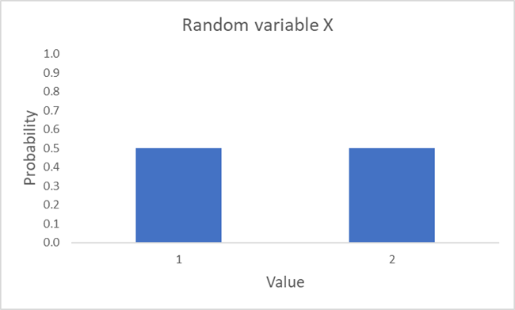

The wide bars in *Figure 1* obviously do not mean to suggest that the random variable X is actually continuous. Instead, the bars are made wide in order to be more visually appealing (just a line straight up provides a less intuitive visualization).  

### Uniform variables

In the expression “random variable,” the term “random” just means “probabilistic”. In other words, it just means that two or more possible outcomes of the variable occur with certain probabilities. These outcomes, however, do *not necessarily* have to be equally likely (though the term “random” can indeed have that meaning in other contexts). 

A **uniform variable** is a special case of a random variable. It can take on two or more values all with an equal probability. The random variable X depicted in *Figure 1* is clearly a uniform variable, as both possible outcomes occur with a probability 0.5. There are, however, many random variables that are not instances of uniform variables. 

Consider, for example, the random variable Y. It has an outcome set {1,2,3,8,10} and the following probability distribution: Pr [Y = 1] = 0.25; Pr [Y = 2] = 0.35; Pr [Y = 3] = 0.1; Pr [Y = 8] = 0.25; Pr [Y = 10] = 0.05. 

While two possible outcomes indeed have an equal probability of occurring, namely 1 and 8, Y can also take on certain values with different probabilities than 0.25 upon sampling. Hence, while Y is indeed a random variable, it is not a uniform variable. 

A graphical depiction of Y is provided in *Figure 2*.

*Figure 2: Random variable Y*

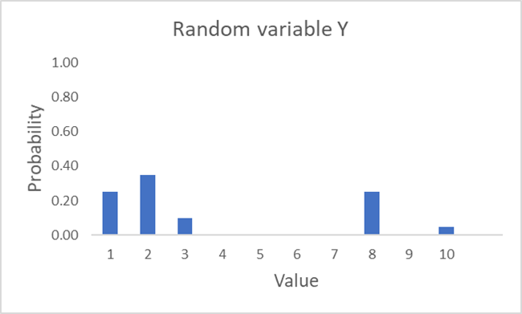

For a final example, consider the random variable Z. It has the outcome set {1,3,7,11,12} and the following probability distribution: Pr (2) = 0.2; Pr (3) = 0.2; Pr (9) = 0.2; Pr (11) = 0.2; Pr (12) = 0.2. You can see it depicted in Figure 3. The random variable Z is, in contrast to Y, indeed a uniform variable, as all the probabilities for the possible values upon sampling are equal. 

*Figure 3: Random variable Z*

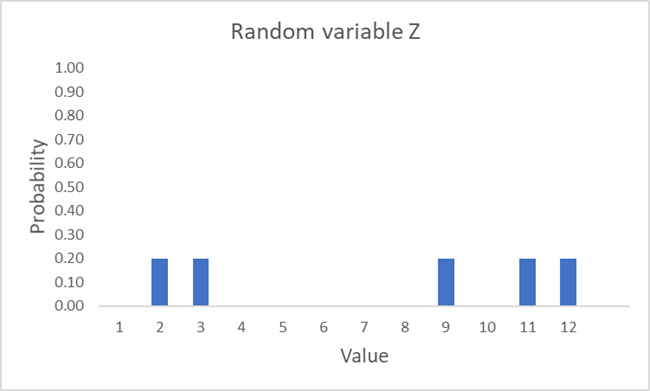

### Conditional probability

Suppose that Bob intends to uniformly select a day from the last calendar year. What should we conclude is the probability of the selected day being in Summer? 

As long as we think Bob’s process will indeed be truly uniform, we should conclude that there is a 1/4 probability Bob selects a day in Summer. This is the **unconditional probability** of the randomly selected day being in Summer. 

Suppose now that instead of uniformly drawing a calendar day, Bob only selects uniformly from among those days on which the noon temperature at Crystal Lake (New Jersey) was 21 degrees Celcius or higher. Given this additional information, what can we conclude about the probability that Bob will select a day in Summer?  

We should really draw a different conclusion than before, even without any further specific information (e.g., the temperature at noon each day last calendar year). 

Knowing that Crystal Lake is in New Jersey, we would certainly not expect the temperature at noon to be 21 degrees Celsius or higher in Winter. Instead, it is much more likely to be a warm day in the Spring or Fall, or a day somewhere in the Summer. Hence, knowing the noon temperature at Crystal Lake on the selected day was 21 degrees Celsius or higher, the probability that the day selected by Bob is in the Summer becomes much higher. This is the **conditional probability** of the randomly selected day being in Summer, given that the noon temperature at Crystal Lake was 21 degrees Celsius or higher.  

Unlike in the previous example, the probabilities of two events can also be completely unrelated. In that case, we say that they are **independent**.

Suppose, for example, that a certain fair coin has landed heads. Given this fact, what, then, is the probability that it will rain tomorrow? The conditional probability in this case should be the same as the unconditional probability that it will rain tomorrow, as a coin flip does not generally have any impact on the weather. 

We use a “|” symbol for writing out conditional probability statements. For instance, the probability of event A given that event B has transpired can be written as follows: Pr[A|B]. So, when two events, A and B, are independent, then Pr[A|B] = Pr[A] and Pr[B|A] = Pr[B]. The condition for independence can be simplified as follows: Pr[A,B] = Pr[A]*Pr[B].  

A key result in probability theory is known as **Bayes Theorem**. It basically states that Pr[A|B] can be rewritten as follows: 

Pr[A|B] = (Pr[B|A] • Pr[A]) / Pr[B]

Instead of using conditional probabilities with specific events, we can also look at the conditional probabilities involved with two or more random variables over a set of possible events. Suppose two random variables, X and Y. We can denote any possible value for X by x, and any possible value for Y by y. We might say, then, that two random variables are independent if the following statement holds: 

Pr[X = x,Y = y] = Pr[X = x] • Pr[Y =  y] for all x and y

Lets be a bit more explicit about what this statement means. 

Suppose that the outcome sets for X and Y are defined as follows: **X** = {x1,x2….,xi,….xn} and **Y** = {y1,y2….,yi,….ym}. (It is typical to indicate sets of values by bold-faced, upper-case letters.)

Now suppose you sample Y and observe y1. The statement above tells us that the probability of now obtaining x1 from sampling X is exactly the same as if we had never observed y1. This is true for any yi we could have drawn from our initial sampling of Y. Finally, this holds true not just for x1. For any xi the probability of occurring is not influenced by the outcome of a sampling of Y. All this also applies to the case where X is sampled first.  

Lets end our discussion on a slightly more philosophical point. In any real-world situation, the probability of some event is always assessed against a particular set of information. There is no “unconditional probability” in any very strict sense of the word. 

For instance, suppose I asked you for the probability that pigs will fly by 2030. Though I give you no further information, you clearly know a lot about the world that can influence your judgment. You have never seen pigs fly. You know that most people will not expect them to fly. You know that they are not really built to fly. And so on. 

Hence, when we speak of an “unconditional probability” of some event in a real-world context, that term really can only have meaning if we take it to mean something like “the probability without any further explicit information”. Any understanding of a “conditional probability” should, then, always be understood against some specific piece of information. 

I might, for instance, ask you the probability that pigs will fly by 2030, after giving you evidence that some goats in New Zealand have learned to fly after a few years of training. In this case, you will probably adjust your judgment of the probability that pigs will fly by 2030. So the probability that pigs will fly by 2030 is conditional upon this evidence about goats in New Zealand.     

## The modulo operation

The most basic expression with the **modulo operation** is of the following form: x mod y.

The variable x is called the dividend and the variable y the divisor. To perform a modulo operation with a positive dividend and a positive divisor, you just determine the remainder of the division. 

For instance, consider the expression 25 mod 4. The number 4 goes into the number 25 a total of 6 times. The remainder of that division is 1. Hence, 25 mod 4 equals 1. In a similar manner, we can evaluate the expressions below:

* 29 mod 30 = 29 (as 30 goes into 29 a total of 0 times and the remainder is 29)
* 42 mod 2 = 0 (as 2 goes into 42 a total of 21 times and the remainder is 0)
* 12 mod 5 = 2 (as 5 goes into 12 a total of 2 times and the remainder is 2)
* 20 mod 8 = 4 (as 8 goes into 20 a total of 2 times and the remainder is 4)

When the dividend or divisor is negative, modulo operations can be handled differently by programming languages. 

You will definitely come across cases with a negative dividend in cryptography. In these cases, the typical approach is as follows:

* First determine the closest value *lower than or equal to* the dividend into which the divisor divides with a remainder of zero. Call that value p. 
* If the dividend is x, then the result of the modulo operation is the value of x – p.  

For instance, suppose that the dividend is – 20 and the divisor 3. The closest value lower than or equal to – 20 into which 3 divides evenly is – 21. The value of x – p in this case is – 20 – – 21. This equals 1 and, hence, – 20 mod 3 equals 1. In a similar manner, we can evaluate the expressions below:

* – 8 mod 5 = 2 
* – 19 mod 16 = 13 
* – 14 mod 6 = 4

Regarding notation, you will typically see the following types of expressions: x = [y mod z]. Due to the brackets, the modulo operation in this case only applies to the right-hand side of the expression. If y equals 25 and z equals 4, for example, then x evaluates to 1. 

Without brackets, the modulo operation acts on *both sides* of an expression. Suppose, for instance, the following expression: x = y mod z. If y equals 25 and z equals 4, then all we know is that x mod 4 evaluates to 1. This is consistent with any value for x from the set {….– 7, – 3, 1, 5, 9….}. 

The branch of mathematics that involves modulo operations on numbers and expressions is referred to **modular arithmetic**. You can think of this branch as arithmetic for cases in which the number line is not infinitely long. Though we typically come across modulo operations for (positive) integers within cryptography, you can also perform modulo operations using any real numbers. 

### The shift cipher

The modulo operation is frequently encountered within cryptography. To illustrate, lets consider one of the most famous historical encryption schemes: the shift cipher. 

Lets first define it. Suppose a dictionary *D* that equates all the letters of the English alphabet, in order, with the set of numbers {0,1,2…,25}. Assume a message space **M**. The **shift cipher** is, then, an encryption scheme defined as follows:

- Select uniformly a key k out of the key space **K**, where **K** = {0,1,2,…,25}[1](#footnote1) 
- Encrypt a message m є **M**, as follows:
    - Separate m into its individual letters m0, m1,….mi….,ml
    - Convert each mi to a number according to *D*
    - For each mi, ci = [(mi + k) mod 26]
    - Convert each ci to a letter according to *D*
    - Then combine c0, c1,….,cl to yield the ciphertext c
- Decrypt a ciphertext c as follows:
    -- Convert each ci to a number according to *D*
    -- For each ci, mi = [(ci – k) mod 26]
    -- Convert each mi to a letter according to *D*
    -- Then combine m0, m1,….,ml to yield the original message m

The modulo operator in the shift cipher ensures that letters wrap around, so that all ciphertext letters are defined. To illustrate, consider the application of the shift cipher on the word “DOG”. 

Suppose that you uniformly selected a key to have the value of 17. The letter “O” equates to 15. Without the modulo operation, the addition of this plaintext number with the key would amount to a ciphertext number of 32. However, that ciphertext number cannot be turned into a ciphertext letter, as the English alphabet only has 26 letters. The modulo operation ensures that the ciphertext number is actually 6 (the result of 32 mod 26), which equates to the ciphertext letter “G”.  

The entire encryption of the word “DOG” with a key value of 17 is as follows:

* Message = DOG = D,O,G = 3,15,6
* c0 = [(3 + 17) Mod 26] = [(20) Mod 26] = 20 = U
* c1 = [(15 + 17) Mod 26] = [(32) Mod 26] = 6 = G
* c2 = [(6 + 17) Mod 26] = [(23) Mod 26] = 23 = X
* c = UGX

Everyone can intuitively understand how the shift cipher works and probably use it themselves. For advancing your knowledge of cryptography, however, it is important to start becoming more comfortable with formalization, as the schemes will become much more difficult. Hence, why the steps for the shift cipher were formalized. 

## The XOR operation

All computer data is processed, stored, and sent across networks at the level of bits. Any cryptographic schemes that are applied to computer data also operate at the bit-level. 

For instance, suppose that you have typed an e-mail into your e-mail application. Any encryption you apply does not occur on the ASCII characters of your e-mail directly. Instead, it is applied to the bit-representation of the letters and other symbols in your e-mail. 

A key mathematical operation to understand for modern cryptography, besides the modulo operation, is that of the **XOR operation**, or “exclusive or” operation. This operation takes as inputs two bits and yields as output another bit. The XOR operation will simply be denoted as "XOR". It yields 0 if the two bits are the same and 1 if the two bits are different. You can see the four possibilities below. 

* 0 XOR 0 = 0
* 0 XOR 1 = 1
* 1 XOR 0 = 1
* 1 XOR 1 = 0

You can perform an XOR operation on two messages longer than a single bit by lining up the bits of those two messages and performing the XOR operation on each individual pair of bits. 

To illustrate, suppose that you have a message m1 (01111001) and a message m2 (01011001). The XOR operation of these two messages can be seen below. 

* m1 XOR m2 = 01111001 XOR 01011001 = 00100000 

The process is straightforward. Your first XOR the left-most bits of m1 and m2. In this case that is 0 XOR 0 = 0. You then XOR the second pair of bits from the left. In this case that is 1 XOR 1 = 0. You continue this process until you have performed the XOR operation on the right-most bits. 

It is easy to see that the XOR operation is commutative, namely that m1 XOR m2 = m2 XOR m1. In addition, the XOR operation is also associative. That is, (m1 XOR m2) XOR m3 = m1 XOR (m2 XOR m3). 

An XOR operation on two strings of alternative lengths can have different interpretations, depending on the context. We will not concern ourselves here with any XOR operations on strings of different lengths. 

An XOR operation is equivalent to the special case of performing a modulo operation on the addition of bits when the divisor is 2. You can see the equivalency in the following results:

* (0 + 0) mod 2 = 0 XOR 0 = 0
* (1 + 0) mod 2 = 1 XOR 0 = 1
* (0 + 1) mod 2 = 0 XOR 1 = 1
* (1 + 1) mod 2 = 1 XOR 1 = 0

## Pseudorandomness

In our discussion of random and uniform variables, we drew a specific distinction between “random” and “uniform”. That distinction is typically maintained in practice when describing random variables. However, in our current context, this distinction needs to be dropped and “random” and “uniform” are used synonymously. I will explain why at the end of the section.  

To start, we can call a binary string of length n **random** (or **uniform**), if it was the result of sampling a uniform variable S which gives each binary string of such a length n an equal probability of selection. 

Suppose, for instance, the set of all binary strings with length 8: {0000 0000,0000 0001,….,1111 1111}. (It is typical to write an 8-bit string in two quartets, each called a **nibble**.) Lets call this set of strings **S8**. 

Per the definition above, we can, then, call a particular binary string of length 8 random (or uniform), if it was the result of sampling a uniform variable S that gives each string in **S8** an equal probability of selection. Given that the set **S8** includes 28 elements, the probability of selection upon sampling would have to be 1/28 for each string in the set. 

A key aspect to the randomness of a binary string is that it is defined with reference to the process by which it was selected. The form of any particular binary string on its own, therefore, reveals nothing about its randomness in selection. 

For example, many people intuitively have the idea that a string like 1111 1111 could not have been selected randomly. But this is clearly false. 

Defining a uniform variable S over all the binary strings of length 8, the likelihood of selecting 1111 1111 from the set **S8** is the same as that of a string such as 0111 01001. Thus, you cannot tell anything about the randomness of a string, just by analyzing the string itself. 

We can also speak of random strings without specifically meaning binary strings. We might, for instance, speak of a random hex string AF 02 82. In this case, the string would have been selected at random from the set of all hex strings of length 6. This is equivalent to randomly selecting a binary string of length 24, as each hex digit represents 4 bits. 

Typically the expression “a random string”, without qualification, refers to a string randomly selected from the set of all strings with the same length. This is how I have described it above. A string of length n can, of course, also be randomly selected from a different set. One, for example, that only constitutes a subset of all the strings of length n, or perhaps a set that includes strings of varying length. In those cases, however, we would not refer to it as a “random string”, but rather “a string that is randomly selected from some set **S**”.

A key concept within cryptography is that of pseudorandomness. A **pseudorandom string** of length n appears *as if* it was the result of sampling a uniform variable S that gives each string in **Sn** an equal probability of selection. In fact, however, the string is the result of sampling a uniform variable S' that only defines a probability distribution—not necessarily one with equal probabilities for all possible outcomes—on a subset of **Sn**. The crucial point here is that no one can really distinguish between samples from S and S', even if you take many of them. 

Suppose, for instance, a random variable S. Its outcome set is **S256**, this is the set of all binary strings of length 256. This set has 2256 elements. Each element has an equal probability of selection, 1/2256, upon sampling. 

In addition suppose a random variable S’. Its outcome set only includes 2128 binary strings of length 256. It has some probability distribution over those strings, but this distribution is not necessarily uniform. 

Suppose that I now took a 1000s of samples from S and 1000s of samples from S' and gave the two sets of outcomes to you. I tell you which set of outcomes is associated with which random variable. Next, I take a sample from one of the two random variables. But this time I do not tell you which random variable I sample. If S' were pseudorandom, then the idea is that your probability of making the right guess as to which random variable I sampled is practically no better than 1/2.  

Typically, a pseudorandom string of length n is produced by randomly selecting a string of size n – x, where x is a positive integer, and using it as an input for an expansionary algorithm. This random string of size n – x is known as the **seed**.

Pseudorandom strings are a key concept to making cryptography practical. Consider, for instance, stream ciphers. With a stream cipher, a randomly selected key is plugged into an expansionary algorithm to produce a much larger pseudorandom string. This pseudorandom string is then combined with the plaintext via an XOR operation to produce a ciphertext. 

If we were unable to produce this type of pseudorandom string for a stream cipher, then we would need a key that is as long as the message for its security. This is not a very practical option in most cases. 

The notion of pseudorandomness discussed in this section can be defined more formally. It also extends to other contexts. But we need not delve into that discussion here. All you really need to intuitively understand for much of cryptography is the difference between a random and a pseudorandom string.[2](#footnote2)  

The reason for dropping the distinction between “random” and “uniform” in our discussion should now also be clear. In practice everyone uses the term pseudorandom to indicate a string that appears **as if** it was the result of sampling a uniform variable S. Strictly speaking, we should call such a string “pseudo-uniform,” adopting our language from earlier. As the term “pseudo-uniform” is both clunky and not used by anyone, we will not introduce it here for clarity. Instead, we just drop the distinction between “random” and “uniform” in the current context.  

## Notes

[^1]: We can define this statement exactly, using the terminology from the previous section. Let a uniform variable K have **K** as its set of possible outcomes. So Pr [K = 0] = 1/26, Pr [K = 1] = 1/26, and so on. Sample the uniform variable K once to yield a particular key [^1].

[^2]: If interested in a more formal exposition on these matters, you can consult Katz and Lindell’s *Introduction to Modern Cryptography*, esp. chapter 3 [^2].

# Mathematical Foundations of Cryptography II

This chapter covers a more advanced topic on the mathematical foundations of cryptography: number theory. Though number theory is important to symmetric cryptography (such as in the Rijndael Cipher), it is particularly important in the public key cryptographic setting.

If you are finding the details of number theory cumbersome, I would recommend a high-level reading the first time around. You can always come back to it at a later point. 

## What is number theory?

You might characterize **number theory** as the study of the properties of integers and mathematical functions that work with integers. 

Consider, for example, that any two numbers a and N are **coprimes** (or **relative primes**) if their greatest common divisor equals 1. Suppose now a particular integer N. How many integers smaller than N are coprimes with N? Can we make general statements about the answers to this question? These are the typical types of questions that number theory seeks to answer.

Modern number theory relies on the tools of abstract algebra. The field of **abstract algebra** is a subdiscipline of mathematics where the main objects of analysis are abstract objects known as algebraic structures. An **algebraic structure** is a set of elements conjoined with one or more operations, which meets certain axioms. Through algebraic structures mathematicians can gain insights into specific mathematical problems, by abstracting away from their details. 

The field of abstract algebra is sometimes also called modern algebra. You may also come across the concept of **abstract mathematics** (or **pure mathematics**). This latter term is not a reference to abstract algebra, but rather means the study of mathematics for its own sake, and not just with eye on potential applications. 

The sets from abstract algebra can deal with many types of objects, from the shape-preserving transformations on an equilateral triangle to wall paper patterns. For number theory, we only consider sets of elements that contain integers or functions that work with integers. 

  
## Groups

A basic concept in mathematics is that of a set of elements. A set is usually denoted by accolade signs with the elements separated by commas. 

For instance, the set of all integers is {…,-2,-1,0,1,2,…}. The ellipses here means that a certain pattern continues in a particular direction. So the set of all integers also includes 3,4,5,6 and so on, as well as -3,-4,-5,-6 and so on. This set of all integers is typically denoted by ℤ.

Another example of a set is ℤ mod 11, or the set of all integers modulo 11. In contrast to the entire set ℤ, this set only contains a finite number of elements, namely {0,1,…,9,10}. 

A common mistake is to think that the set ℤ mod 11 actually is {-10,-9,….,0,….,9,10}. But this is not the case, given the way we defined the modulo operation earlier . Any negative integers reduced by modulo 11 wrap onto {0,1,….,9,10}. For instance, the expression -2 mod 11 wraps around to 9, while the expression -27 mod 11 wraps around to 5.  

Another basic concept in mathematics is that of a binary operation. This is any operation that takes two elements to produce a third. For instance, from basic arithmetic and algebra, you would be familiar with four fundamental binary operations: addition, subtraction, multiplication, and division. 

These two basic mathematical concepts, sets and binary operations, are used to define the notion of a group, the most essential structure in abstract algebra. 

Specifically, suppose some binary operation ◌. In addition, suppose some set of elements **S** equipped with that operation. All “equipped” means here is that the operation ◌ can be performed between any two elements in the set **S**. 

The combination 〈**S**, ◌〉 is, then, a **group** if it meets four specific conditions, known as the group axioms.

1. For any a and b that are elements of **S**, a ◌ b is also an element of **S**. This is known as the **closure condition**. 
2. For any a, b, and c that are elements of **S**, it is the case that (a ◌ b) ◌ c = a ◌ (b ◌ c). This is known as the **associativity condition**. 
3. There is a unique element e in **S**, such that for every element a in **S**, the following equation holds: e ◌ a = a ◌ e = a. As there is only one such element e, it is called the **identity element**. This condition is known as the **identity condition**. 
4. For each element a in **S**, there exists an element b in **S**, such that the following equation holds: a ◌ b = b ◌ a = e, where e is the identity element. Element b here is known as the **inverse element**, and it is commonly denoted as a-1. This condition is known as the **inverse condition** or the **invertibility condition**. 

Lets explore groups a little further. Denote the set of all integers by ℤ. This set combined with standard addition, or 〈ℤ, +〉, clearly fits the definition of a group, as it meets the four axioms above.

1. For any x and y that are elements of ℤ, x + y is also an element of ℤ. So 〈ℤ, +〉 meets the closure condition.
2. For any x, y, and z that are elements of ℤ, (x + y) + z = x + (y + z). So 〈 ℤ, +〉 meets the associativity condition.
3. There is an identity element in 〈ℤ, +〉, namely 0. For any x in ℤ, it namely holds that: 0 + x = x + 0 = x. So 〈ℤ, +〉 meets the identity condition.
4. Finally, for each element x in ℤ, there is a y so that x + y = y + x = 0. If x were 10, for instance, y would be – 10 (in the case that x is 0, y is also 0). So 〈ℤ, +〉 meets the inverse condition.

Importantly, that the set of integers with addition constitutes a group does not mean that it constitutes a group with multiplication. You can verify this by testing 〈ℤ, •〉 against the four group axioms (where • means standard multiplication). 

The first two axioms obviously hold. In addition, under multiplication the element 1 can serve as the identity element. Any integer x multiplied by 1, namely yields x. However, 〈ℤ, •〉 does not meet the inverse condition. That is, there is not a unique element y in ℤ for every x in ℤ, so that x • y = 1. 

For instance, suppose that x = 22. What value y from the set ℤ multiplied with x would yield the identity element 1? The value of 1/22 would work, but this is not in the set ℤ. In fact, you run into this problem for any integer x, other than the values of 1 and -1 (where y would have to be 1 and -1 respectively). 

If we allowed real numbers for our set, then our problems largely disappear. For any element x in the set, multiplication by 1/x yields 1. As fractions are included in the set of real numbers, an inverse can be found for every real number. The exception is zero, as any multiplication with zero will never yield the identity element 1. Hence, the set of non-zero real numbers equipped with multiplication is indeed a group.  

Some groups meet a fifth general condition, known as the **commutativity condition**. This condition is as follows:

* Suppose a group G with a set **S** and a binary operator ◌.  Suppose that a and b are elements of **S**. If it is the case that a ◌ b = b ◌ a for any two elements a and b in **S**, then G meets the commutativity condition.

Any group that meets the commutativity condition is known as a **commutative group**, or an **Abelian group** (after Niels Henrik Abel). It is easy to verify that both the set of real numbers over addition and the set of integers over addition are Abelian groups. The set of integers over multiplication is not a group at all, so ipso facto cannot be an Abelian group. The set of non-zero real numbers over multiplication, by contrast, is also an Abelian group.

You should heed two important conventions on notation. First, the signs “+” or “x” will frequently be employed to symbolize group operations, even when the elements are not, in fact, numbers. In these cases, you should not interpret these signs as standard arithmetic addition or multiplication. Instead, they are operations with only an abstract similarity to these arithmetic operations. 

Unless you are specifically referring to arithmetic addition or multiplication, it is easier to use symbols such as ◌ and ◊ for group operations, as these do not have very culturally engrained connotations.

Second, for the same reason that “+” and “x” are often used for indicating non-arithmetic operations, the identity elements of groups are frequently symbolized by “0” and “1”, even when the elements in these in groups are not numbers. Unless you are referring to the identity element of a group with numbers, it is easier to use a more neutral symbol such as “e” to indicate the identity element.  

Many different and very important sets of values in mathematics equipped with certain binary operations are groups. Cryptographic applications, however, only work with sets of integers or at least elements that are described by integers, that is, within the domain of number theory. Hence, sets with real numbers other than integers are not employed in cryptographic applications.   

Lets finish by providing an example of elements that can be “described by integers”, even though they are not integers. A good example is the points of elliptic curves. Though any point on an elliptic curve is clearly not an integer, such a point is indeed described by two integers. 

Elliptic curves are, for instance, crucial to Bitcoin. Any standard Bitcoin private and public key pair is selected from the set of points that is defined by the following elliptic curve: x3 + 7 = y2 mod 2256 – 232 – 29 – 28 – 27 – 26 - 24 - 1 (the largest prime number less than 2256). The x-coordinate is the private key and the y-coordinate is your public key.

Transactions in Bitcoin typically involve locking outputs to one or more public keys in some way. The value from these transactions can, then, be unlocked making digital signatures with the corresponding private keys. 

## Cyclic groups

A major distinction we can draw is between a **finite** and an **infinite group**. The former has a finite number of elements, while the latter has an infinite number of elements. The number of elements in any finite group is known as the **order of the group**. All practical cryptography that involves the use of groups relies on finite (number-theoretic) groups. 

Within public key cryptography, a certain class of finite Abelian groups known as cyclic groups are particularly important. In order to understand cyclic groups, we first need to understand the concept of group element exponentiation.

Suppose a group G with a group operation ◌, and that a is an element of G. The expression an should, then, be interpreted as the element a combined with itself a total of n – 1 times. For instance, a2 means a ◌ a, a3 means a ◌ a ◌ a, and so on. (Note that exponentiation here is not necessarily exponentiation in the standard arithmetic sense.)

Lets turn to an example. Suppose that G = 〈ℤ mod 7,+〉, and that our value for a equals 4. In this case, a2 = [4 + 4 mod 7] = [8 mod 7] = 1 mod 7. Alternatively, a4 would represent [4 + 4 + 4 + 4 mod 7] = [16 mod 7] = 2 mod 7.   

Some Abelian groups have one or more elements, which can yield all other group elements through continued exponentiation. These elements are called **generators** or **primitive elements**. 

An important class of such groups is 〈ℤ* mod N, •〉, where N is a prime number. The notation ℤ* here means that the group contains all non-zero, positive integers less than N. Such a group, therefore, always has N – 1 elements. 

Consider, for instance, G = 〈ℤ* mod 11, •〉. This group has the following elements: {1, 2, 3, 4, 5, 6, 7, 8, 9, 10}. The order of this group is 10 (which is indeed equal to 11 – 1).  

Lets explore exponentiating the element 2 from this group. The calculations up until 212 are shown below. Note that on the left side of the equation, the exponent refers to group element exponentiation. In our particular example, this indeed involves arithmetic exponentiation on the right side of the equation (but it could have also involved, for instance, addition). To clarify, I have written out the repeated operation, rather than the exponent form on the right side.   

* 21 = 2 mod 11 
* 22 = 2 · 2 mod 11 = 4 mod 11
* 23 = 2 · 2 · 2 mod 11 = 8 mod 11
* 24 = 2 · 2 · 2 · 2 mod 11 = 16 mod 11 = 5 mod 11
* 25 = 2 · 2 · 2 · 2 · 2 mod 11 = 32 mod 11 = 10 mod 11
* 26 = 2 · 2 · 2 · 2 · 2 · 2 mod 11 = 64 mod 11 = 9 mod 11
* 27 = 2 · 2 · 2 · 2 · 2 · 2 · 2 mod 11 = 128 mod 11 = 7 mod 11
* 28 = 2 · 2 · 2 · 2 · 2 · 2 · 2 · 2 mod 11 = 256 mod 11 = 3 mod 11
* 29 = 2 · 2 · 2 · 2 · 2 · 2 · 2 · 2 · 2 mod 11 = 512 mod 11 = 6 mod 11
* 210 = 2 · 2 · 2 · 2 · 2 · 2 · 2 · 2 · 2 · 2 mod 11 = 1024 mod 11 = 1 mod 11
* 211 = 2 · 2 · 2 · 2 · 2 · 2 · 2 · 2 · 2 · 2 · 2 mod 11 = 2048 mod 11 = 2 mod 11
* 212 = 2 · 2 · 2 · 2 · 2 · 2 · 2 · 2 · 2 · 2 · 2 · 2 mod 11 = 4096 mod 11 = 4 mod 11

If you look carefully, you can see that performing exponentiation on the element 2 cycles through all the elements of 〈ℤ* mod 11, •〉 in the following order: 2, 4, 8, 5, 10, 9, 7, 3, 6, 1. After 210, continued exponentiation of the element 2 cycles through all the elements again and in the same order. Hence, the element 2 is a generator in 〈ℤ* mod 11, •〉.

Though 〈ℤ* mod 11, •〉 has multiple generators, not all the elements of this group are generators. Consider, for example, the element 3. Running through the first 10 exponentiations, without showing the cumbersome calculations, yields the following results: 

* 31 = 3 mod 11 
* 32 = 9 mod 11
* 33 = 5 mod 11
* 34 = 4 mod 11
* 35 = 1 mod 11
* 36 = 3 mod 11
* 37 = 9 mod 11
* 38 = 5 mod 11
* 39 = 4 mod 11
* 310 = 1 mod 11

Instead of cycling through all the values in 〈ℤ* mod 11, •〉, exponentiation of the element 3 only leads to a subset of those values: 3,9,5,4, and 1. After the fifth exponentiation, these values start repeating. 

We can now define a **cyclic group** as any group with at least one generator. That is, there is at least one group element from which you can produce all other group elements through exponentiation. 

You may have noticed in our example above that both 210 and 310 equal 1 mod 11. In fact, though we will not perform the calculations, the exponentiation by 10 of any element in the group 〈ℤ* mod 11, •〉 will yield 1 mod 11. Why is this the case?

This is an important question, but it takes some work to answer. 

To start, suppose two positive integers a and N. An important theorem in number theory states that a has a multiplicative inverse modulo N (that is, an integer b so that a • b = 1 mod N) if and only if the greatest common divisor between a and N equals 1. That is, if a and N are coprimes. 

So, for any group of integers equipped with multiplication modulo N only the smaller coprimes with N are included in the set. We can denote this set by ℤc mod N.

For instance, suppose that N is 10. Only the integers 1,3,7, and 9 are coprimes with 10. So the set ℤc mod 10 only includes {1,3,7,9}. You cannot create a group with integer multiplication modulo 10 using any other integers between 1 and 10. For this particular group, the inverses are the pairs 1 and 9, and 3 and 7.

In the case where N itself is prime, all the integers from 1 through N – 1 are coprimes with N. Such a group, thus, has an order of N – 1. Using our earlier notation, ℤc mod N equals ℤ* mod N when N is prime. The group we selected for our earlier example, 〈ℤ* mod 11, •〉, is a particular instance of this class of groups.

Next, the function φ(N) calculates the number of coprimes up until a number N, and is known as **Euler’s Phi function**.[1](#footnote1) According to **Euler’s Theorem**, whenever two integers a and N are coprimes, the following holds:

* aφ(N) mod N = 1 mod N

This has an important implication for the class of groups 〈ℤ* mod N, •〉 where N is prime. For these groups, group element exponentiation represents arithmetic exponentiation. That is, aφ(N) mod N represents the arithmetic operation aφ(N) mod N. As any element a in these multiplicative groups is coprime with N, it means that aφ(N) mod N = aN – 1 mod N = 1 mod N. 

Euler’s theorem is a really important result. To start, it implies that all elements in 〈ℤ* mod N, •〉 can only cycle through a number of values by exponentiation that divides into N – 1. In the case of 〈ℤ* mod 11, •〉, this means that each element can only cycle through 2, 5, or 10 elements. The group values that any element cycles through upon exponentiation is known as the **order of the element**. An element with an order equivalent to the order of a group is a generator. 

Furthermore, Euler’s theorem implies that we can always know the result of aN – 1 mod N for any group 〈ℤ* mod N, •〉 where N is prime. This is so regardless of how complicated the actual calculations might be. 

For instance, suppose our group is ℤ* mod 160,481,182 (where 160,481,182 is indeed a prime number). We know that all integers 1 through 160,481,181 must be elements of this group, and that φ(n) = 160,481,181. Though we can not make all the steps in the calculations, we know that expressions such as 514160,481,181, 2,005160,481,181, and 256,212160,481,181 must all evaluate to 1 mod 160,481,182. 

## Fields

A group is the basic algebraic structure in abstract algebra, but there are many more. The only other algebraic structure you need to be familiar with is that of a field, specifically that of a finite field. This type of algebraic structure is frequently used in cryptography, such as in the Advanced Encryption Standard. The latter is the main symmetric encryption scheme that you will encounter in practice.  

A field is derived from the notion of a group. Specifically, a **field** is a set of elements **S** equipped with two binary operators ◌ and ◊, which meets the following conditions: 

1. The set **S** equipped with ◌ is an Abelian group. 
2. The set **S** equipped with ◊ is an Abelian group for the “non-zero” elements. 
3. The set **S** equipped with the two operators meets what is known as the distributive condition: Suppose that a, b, and c are elements of **S**. Then **S** equipped with the two operators meets the distributive property when a ◌ (b ◊ c) = a ◌ b ◊ a ◌ c. 

Note that, as with groups, the definition of a field is very abstract. It makes no claims about the types of elements in **S**, or about the operations ◌ and ◊. It just states that a field is any set of elements with two operations for which the three above conditions hold. (The “zero” element in the second Abelian group can be abstractly interpreted.)

So what might be an example of a field? A good example is the set ℤ mod 7, or {0,1,…,7} defined over standard addition (in place of ◌ above) and standard multiplication (in place of ◊ above).

First, ℤ mod 7 meets the condition for being an Abelian group over addition, and it meets the condition for being an Abelian group over multiplication if you only consider the non-zero elements. Second, the combination of the set with the two operators meets the distributive condition. 

It is didactively worthwhile to explore these claims by using some particular values. Lets take the experimental values 5, 2, and 3, some randomly selected elements from the set ℤ mod 7, to inspect the field 〈ℤ mod 7, +, •〉. We will use these three values in order, as needed to explore particular conditions.  

Let’s first explore if ℤ mod 7 equipped with addition is an Abelian group. 

1. Closure condition: Let’s take 5 and 2 as our values. In that case, [5 + 2] mod 7 = 7 mod 7 = 0. This is indeed an element of ℤ mod 7, so the result is consistent with the closure condition.  
2. Associativity condition: Let’s take 5, 2, and 3 as our values. In that case, [(5 + 2) + 3] mod 7 = [5 + (2 + 3)] mod 7 = 10 mod 7 = 3. This is consistent with the associativity condition.  
3. Identity condition: Let’s take 5 as our value. In that case, [5 + 0] mod 7 = [0 + 5] mod 7 = 5. So 0 looks to be the identity element for addition.   
4. Inverse condition: Consider the inverse of 5. It needs to be the case that [5 + d] mod 7 = 0, for some value of d. In this case, the unique value from ℤ mod 7 that meets this condition is 2.  
5. Commutativity condition: Let’s take 5 and 3 as our values. In that case, [5 + 3] mod 7 = [3 + 5] mod 7 = 1. This is consistent with the commutativity condition.

The set ℤ mod 7 equipped with addition clearly appears to be an Abelian group. Let’s now explore if ℤ mod 7 equipped with multiplication is an Abelian group for all the non-zero elements.

1. Closure condition: Let’s take 5 and 2 as our values. In that case, [5 • 2] mod 7 = 10 mod 7 = 3. This is also an element of ℤ mod 7, so the result is consistent with the closure condition.  
2. Associativity condition: Let’s take 5, 2, and 3 as our values. In that case, [(5 • 2) • 3] mod 7 = [5 • (2 • 3)] mod 7 = 30 mod 7 = 2. This is consistent with the associativity condition.  
3. Identity condition: Let’s take 5 as our value. In that case, [5 • 1] mod 7 = [1 • 5] mod 7 = 5. So 1 looks to be the identity element for multiplication.   
4. Inverse condition: Consider the inverse of 5. It needs to be the case that [5 • d] mod 7 = 1, for some value of d. The unique value from ℤ mod 7 that meets this condition is 3. This is consistent with the inverse condition. 
5. Commutativity condition: Let’s take 5 and 3 as our values. In that case, [5 • 3] mod 7 = [3 • 5] mod 7 = 15 mod 7 = 1. This is consistent with the commutativity condition.

The set ℤ mod 7 clearly seems to meet the rules for being an Abelian group when conjoined with either addition or multiplication over the non-zero elements. 

Finally, this set combined with both operators seems to meet the distributive condition. Let’s take 5, 2, and 3 as our values. We can see that [5 • (2 + 3)] mod 7 = [5 • 2 + 5 • 3] mod 7 = 25 mod 7 = 4.

We have now seen that ℤ mod 7 equipped with addition and multiplication meets the axioms for a finite field when testing with particular values. Of course we can also show that generally, but will not do so here.  

A key distinction is between two types of fields: finite and infinite fields. 

An **infinite field** involves a field where the set **S** is infinitely large. The set of real numbers ℝ equipped with addition and multiplication is an example of an infinite field. A **finite field**, also known as a **Galois field**, is a field where the set **S** is finite. Our example above of 〈ℤ mod 7, +, •〉 is a finite field. 

In cryptography, we are primarily interested in finite fields. Generally, it can be shown that a finite field exists for some set of elements **S** if and only if it has pm elements, where p is a prime number and m a positive integer greater than or equal to one. In other words, if the order of some set **S** is a prime number (pm where m = 1) or some prime power (pm where m > 1), then you can find two operators ◌ and ◊ such that the conditions for a field are satisfied.  

If some finite field has a prime number of elements, then it is called a **prime field**. If the number of elements in the finite field is a prime power, then the field is called an **extension field**. In cryptography, we are interested in both prime and extension fields.[2](#footnote2)

The main prime fields of interest in cryptography are those where the set of all integers is modulated by some prime number, and the operators are standard addition and multiplication. This class of finite fields would include ℤ mod 2, ℤ mod 3, ℤ mod 5, ℤ mod 7, ℤ mod 11, ℤ mod 13, and so on. For any prime field ℤ mod p, the set of integers of the field is as follows: {0,1,….,p – 2, p – 1}.

In cryptography we are also interested in extension fields, particularly any fields with 2m elements where m > 1. Such finite fields are, for instance, used in the Rijndael Cipher, which forms the basis of the Advanced Encryption Standard. While prime fields are relatively intuitive, these base 2 extension fields are probably not for anyone unfamiliar with abstract algebra. 

To start, it is indeed true that any set of integers with 2m elements can be assigned two operators that would make their combination a field (as long as m is a positive integer). Yet, just because a field exists does not necessarily mean that it is easy to discover or particularly practical for certain applications.

As it turns out, particularly applicable extension fields of 2m in cryptography are those defined over particular sets of polynomial expressions, rather than some set of integers. 

For instance, suppose that we wanted an extension field with 23 (i.e., 8) elements in the set. While there might be many different sets that can be used for fields of that size, one such set includes all unique polynomials of the form of a2x2 + a1x + a0, where each coefficient ai is either 0 or 1. Hence, this set **S** includes the following elements:

1. 0: The case where a2 = 0, a1 = 0, and a0 = 0.
2. 1: The case where a2 = 0, a1 = 0, and a0 = 1.
3. x: The case where a2 = 0, a1 = 1, and a0 = 0.
4. x + 1: The case where a2 = 0, a1 = 1, and a0 = 1.
5. x2: The case where a2= 1, a1 = 0, and a0 = 0. 
6. x2 + 1: The case where a2 = 1, a1 = 0, and a0 = 1. 
7. x2 + x: The case where a2 = 1, a1 = 1, and a0 = 0. 
8. x2 + x + 1: The case where a2 = 1, a1 = 1, and a0 = 1. 

So **S** would be the set {0,1,x,x + 1, x2,x2 + 1, x2 + x, x2 + x + 1}. What two operations can be defined over this set of elements to ensure their combination is a field?

The first operation on the set S (◌) can be defined as standard polynomial addition modulo 2. All you have to do is add the polynomials as you normally would, and then apply the modulo 2 to each of the coefficients of the resulting polynomial. Here are some examples:

* [(x2) + (x2 + x + 1)] mod 2 = [2x2 + x + 1] mod 2 = x + 1
* [(x2 + x) + (x)] mod 2 = [x2 + 2x] mod 2 = x2
* [(x + 1) + (x2 + x + 1)] mod 2 = [x2 + 2x + 2] mod 2 = x2 + 1

The second operation on the set S (◌) that is needed for creating the field is more complicated. It is a kind of multiplication, but not standard multiplication from arithmetic. Instead, you have to see each element as a vector and understand the operation as the multiplication of those two vectors modulo an irreducible polynomial. 

Let’s first turn to the idea of an irreducible polynomial. An **irreducible polynomial** is one that cannot be factored (just as a prime number cannot be factored into components other than 1 and the prime number itself). For our purposes, we are interested in polynomials that are irreducible with respect to the set of all integers. (Note that you may be able to factor certain polynomials by, for example, the real or complex numbers, even if you cannot factor them using integers.) 

For instance, consider the polynomial x2 - 3x + 2. This can be rewritten as (x – 1)(x – 2). Hence, this is not irreducible. Now consider the polynomial x2 + 1. Using only integers, there is no way to further factor this expression. Hence, this is an irreducible polynomial with respect to the integers. 

Next, let’s turn to the concept of vector multiplication. We will not explore this topic in depth, you just need to understand a basic rule: Any vector division can take place as long as the dividend has a degree higher than or equal to that of the divisor. If the dividend has a lower degree than the divisor, then the dividend can no longer be divided by the divisor.  

For instance, consider the expression x6 + x + 1 mod x5 + x2. This clearly reduces further as the degree of the dividend, 6, is higher than the degree of the divisor, 5. Now consider the expression x5 + x + 1 mod x5 + x2. This also reduces further, as the degree of the dividend, 5, and the divisor, 5, are equal. 

However, now consider the expression x4 + x + 1 mod x5 + x2. This does not reduce further, as the degree of the dividend, 4, is lower than the degree than the divisor, 5.

On the basis of this information, we are now ready to find our second operation for the set {0,1,x,x + 1,x2,x2 + 1,x2 + x,x2 + x + 1}. 

I have already said that the second operation should be understood as vector multiplication modulo some irreducible polynomial. This irreducible polynomial should ensure that the second operation defines an Abelian group over **S** and is consistent with the distributive condition. So what should that irreducible polynomial be?

As all vectors in the set are of degree 2 or lower, the irreducible polynomial should be of degree 3. If any multiplication of two vectors in the set yields a polynomial degree 3 or higher, we know that modulo a polynomial of degree 3 always yields a polynomial of degree 2 or lower. This is the case because any polynomial of degree 3 or higher is always divisible by a polynomial of degree 3. In addition, the polynomial that functions as the divisor has to be irreducible. 

It turns out that there are several irreducible polynomials of degree 3 that we could use as our divisor. Each of these polynomials defines a different field in conjunction with our set S and addition modulo 2. This means you have multiple options when using extension fields 2m in cryptography.  

For our example, suppose that we select the polynomial x3 + x + 1. This indeed is irreducible, because you cannot factor it using integers. In addition, it will ensure that any multiplication of two elements will yield a polynomial of degree 2 or less.  

Let’s work through an example of the second operation using the polynomial x3 + x + 1 as the divisor to illustrate how it works. Suppose that you multiply the elements x2 + 1 with x2 + x in our set **S**. We, then, need to calculate the expression [(x2 + 1) • (x2 + x)] mod x3 + x + 1. This can be simplified as follows:

* [(x2 + 1) • (x2 + x)] mod x3 + x + 1 =
* [x2 • x2 + x2 • x + 1 • x2 + 1 • x] mod x3 + x + 1 = 
* [x4 + x3 + x2 + x] mod x3 + x + 1
    
We know that [x4 + x3 + x2 + x] mod x3 + x + 1 can be reduced as the dividend has a higher degree (4) than the divisor (3). 

To start, you can see that the expression x3 + x + 1 goes into x4 + x3 + x2 + x a total of x times. You can verify this by multiplying x3 + x + 1 by x, which is x4 + x2 + x. As the latter term is of the same degree as the dividend, namely 4, we know this works. You can calculate the remainder of this division by x as follows: 

* [(x4 + x3 + x2 + x) – (x4 + x2 + x)] mod x3 + x + 1 = 
* [x3] mod x3 + x + 1 =
* x3

So after dividing x4 + x3 + x2 + x by x3 + x + 1 a total of x times, we have a remainder of x3. Can this be further divided by x3 + x + 1?

Intuitively, it might be appealing to say that x3 can no longer be divided by x3 + x + 1, because the latter term seems larger. However, remember our discussion on vector division earlier. As long as the dividend has a degree larger or equal to the divisor, the expression can be further reduced. Specifically, the expression x3 + x + 1 can go into x3 exactly 1 time. The remainder is calculated as follows:

[(x3) – (x3 + x + 1)] mod x3 + x + 1 = 
[x + 1] mod x3 + x + 1 = 
x + 1

You might be wondering why (x3) – (x3 + x + 1) evaluates to x + 1 and not – x – 1. Remember that the first operation of our field is defined modulo 2. Hence, the subtraction of two vectors yields exactly the same result as the addition of two vectors. 

To sum up the multiplication of x2 + 1 and x2 + x: When you multiply those two terms you get a degree 4 polynomial, x4 + x3 + x2 + x, which needs to be reduced modulo x3 + x + 1. The degree 4 polynomial is divisible by x3 + x + 1 exactly x + 1 times. The remainder after dividing x4 + x3 + x2 + x by x3 + x + 1 exactly x + 1 times is x + 1. This is indeed an element in our set {0,1,x,x + 1,x2,x2 + 1,x2 + x,x2 + x + 1}.

Why would extension fields with base 2 over sets of polynomials, like in the example above, be useful for cryptography? The reason is that you can view the coefficients in the polynomials of such sets, either 0 or 1, as elements of binary strings with a particular length. The set **S** in our example above, for example, could be viewed instead as a set S that includes all binary strings of length 3 (000 through 111). The operations on **S**, then, can also be used to perform operations on these binary strings and produce a binary string of the same length.   

## Abstract algebra in practice

Despite the formal language and abstractness of the discussion, the concept of a group should not be too difficult to grasp. It is just a set of elements together with an binary operation, where performance of that binary operation on those elements meets four general conditions. An Abelian group just has an extra condition known as commutativity. A cyclic group, in turn, is a special kind of Abelian group, namely one that has a generator. A field is merely a more complex construct from the basic group notion.  

But if you are a practically inclined person, you might wonder at this point: Who cares? Does knowing some set of elements with an operator is a group, or even an Abelian or cyclic group, have any real world relevance? Does knowing something is a field?

Without venturing into too much detail, the answer is “yes”. Groups were first created in the 19th century by the French mathematician Evariste Galois. He used them to draw conclusions about solving polynomial equations of a degree higher than five. 

Since then the concept of a group has helped shed light on a number of problems in mathematics and elsewhere. On their basis, for instance, the physicist Murray-Gellman was able to predict the existence of a particle before it was actually observed in experiments.[3](#footnote3) For another example, chemists use group theory to classify the shapes of molecules. Mathematicians have even used the concept of a group to draw conclusions about something so concrete as wall paper! 

Essentially showing that a set of elements with some operator is a group, means that what you are describing has a particular symmetry. Not a symmetry in the common sense of the word, but in a more abstract form. And this can provide substantial insights into particular systems and problems. The more complex notions from abstract algebra just give us additional information. 

Most importantly, you will see the importance of number theoretic groups and fields in practice through their application in cryptography, particularly public key cryptography. We have already seen in our discussion of fields, for instance, how extension fields are employed in the Rijndael Cipher. We will work out that example in *Chapter 5*.  

## Further exploration

For further discussion on abstract algebra, I would recommend the excellent video series on abstract algebra by Socratica.[4](#footnote4) I would particularly recommend the following videos: “What is abstract algebra?”, “Group definition (expanded)”, “Ring definition (expanded)”, and “Field definition (expanded).” These four videos will give you some additional insight into much of the discussion above. (We did not discuss rings, but a field is just a special type of ring.) 

For further discussion on modern number theory, you can consult many advanced discussions on cryptography. I would offer as suggestions Jonathan Katz and Yehuda Lindell’s Introduction to Modern Cryptography or Christof Paar and Jan Pelzl’s Understanding Cryptography for further discussion.[5](#footnote5)

### Notes

[^1]: The function works as follows. Any integer N can be factored into a product of primes. Suppose that a particular N is factored as follows: p1e1 • p2e2 …. • pmem where all the p’s are prime numbers and all the e’s are integers greater than or equal to 1. Then, φ(N) = Sumi=1…m[piei – piei - 1] [^1].

[^2]: Extension fields become very counterintuitive. Instead of having elements of integers, they have sets of polynomials. In addition, any operations are performed modulo some irreducible polynomial [^2].

[^3]: See [YouTube Video](https://www.youtube.com/watch?v=NOMUnMuxDZY&feature=youtu.be) [^3].

[^4]: Socratica, [Abstract Algebra](https://www.socratica.com/subject/abstract-algebra) [^4].

[^5]: Katz and Lindell, *Introduction to Modern Cryptography*, 2nd edn, 2015 (CRC Press: Boca Raton, FL). Paar and Pelzl, *Understanding Cryptography*, 2010 (Springer-Verlag: Berlin) [^5].

# Symmetric Cryptography

One of the two main branches of cryptography is symmetric cryptography. It includes encryption schemes as well as schemes concerned with authentication and integrity. Until the 1970s, all of cryptography would have consisted of symmetric encryption schemes. 

The main discussion starts by looking at symmetric encryption schemes and making the crucial distinction between stream ciphers and block ciphers. We, then, turn to message authentication codes, which are schemes for ensuring message integrity and authenticity. Finally, we explore how symmetric encryption schemes and message authentication codes can be combined to ensure secure communication.

This chapter discusses various symmetric cryptographic schemes from practice in passing. The next chapter offers a detailed exposition of encryption with a stream cipher and a block cipher from practice, namely RC4 and AES respectively.  

Before starting our discussion on symmetric cryptography, I want to briefly make some remarks on the Alice and Bob illustrations in this and subsequent chapters.

## Alice and Bob

In illustrating the principles of cryptography, people often rely on examples involving Alice and Bob. I will do so as well. 

Especially if you are new to cryptography, it is important to realize that these examples of Alice and Bob are only meant to serve as illustrations of cryptographic principles and constructions in a simplified environment. The principles and constructions, however, are applicable to a much wider range of real-life contexts. 

Following are five key points to keep in mind about examples involving Alice and Bob in cryptography:

1. They can easily be translated into examples with other types of actors such as companies or government organizations.  
2. They can easily be extended to include three or more actors.
3. In the examples, Bob and Alice are typically active participants in creating each message and in the application of cryptographic schemes on that message. But in reality, electronic communications are largely automated. When you visit a website using transport layer security, for example, the cryptography is typically all handled by your computer and the web server. 
4. In the context of electronic communication, the “messages” that are sent across a communication channel are usually TCP/IP packets. These can belong to an e-mail, a Facebook message, a phone conversation, a file transfer, a website, a software upload, and so on. They are not messages in the traditional sense. Nevertheless, cryptographers will often simplify this reality by stating that the message is, for instance, an e-mail. 
5. The examples typically focus on electronic communication, but they can also be extended to traditional forms of communication such as letters.

## Symmetric encryption schemes

We can loosely define a **symmetric encryption scheme** as any cryptographic scheme with three algorithms: 

1. A **key generation algorithm**, which generates a private key.
2. An **encryption algorithm**, which takes the private key and a plaintext as inputs and outputs a ciphertext.
3. A **decryption algorithm**, which takes the private key and the ciphertext as inputs and outputs the original plaintext.

Typically an encryption scheme—whether symmetric or asymmetric—offers a template for encryption based on a core algorithm, rather than an exact specification. 

For instance, consider Salsa20, a symmetric encryption scheme. It can be used with both 128- and 256-bit key lengths. The choice regarding key length impacts some minor details of the algorithm (the number of rounds in the algorithm to be exact). 

But one would not say that using Salsa20 with a 128-bit key is a different encryption scheme than Salsa20 with a 256-bit key. The core algorithm stays the same. Only when the core algorithm changes would we really speak of two different encryption schemes. 
 
Symmetric encryption schemes are typically useful in two kinds of cases: (1) Those in which two or more agents are communicating from a distance and want to keep the contents of their communications secret; and (2) those in which one agent wants to keep the contents of a message secret across time. 

You can see a depiction of situation (1) in *Figure 1* below. Bob wants to send a message M to Alice across a distance, but does not want others to be able to read that message. 

Bob first encrypts the message M with the private key K. He, then, sends the ciphertext C to Alice. Once Alice has received the ciphertext, she can decrypt it using the key K and read the plaintext. With a good encryption scheme, any attacker that intercepts the ciphertext C should not be able to learn anything of real significance about the message M.  

You can see a depiction of situation (2) in *Figure 2* below. Bob wants to prevent others from viewing certain information. A typical situation might be that Bob is an employee storing sensitive data on his computer, which neither outsiders nor his colleagues are supposed to read.  

Bob encrypts the message M at time T0 with the key K to produce the ciphertext C. At time T1 he needs the message again, and decrypts the ciphertext C with the key K. Any attacker that might have come across the ciphertext C in a meantime should not have been able to deduce anything significant about M from it. 

*Figure 1: Secrecy across space*

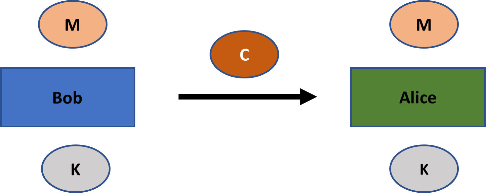

*Figure 2: Secrecy across time*

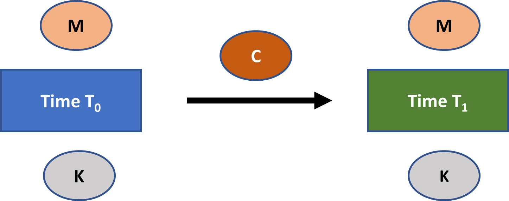

## An example: The shift cipher

In Chapter 2, we encountered the shift cipher which is an example of a very simple symmetric encryption scheme. Let’s look at it again here. 

Suppose a dictionary *D* that equates all the letters of the English alphabet, in order, with the set of numbers {0,1,2…,25}. Assume a set of possible messages **M**. The shift cipher is, then, an encryption scheme defined as follows:

- Select randomly a key k out of the set of possible keys **K**, where **K** = {0,1,2,…,25} 
- Encrypt a message m є **M**, as follows:
    - Separate m into its individual letters m0, m1,….mi….,ml
    - Convert each mi to a number according to *D*
    - For each mi, ci = [(mi + k) mod 26]
    - Convert each ci to a letter according to *D*
    - Then combine c0, c1,….,cl to yield the ciphertext c
- Decrypt a ciphertext c as follows:
    - Convert each ci to a number according to *D*
    - For each ci, mi = [(ci – k) mod 26]
    - Convert each mi to a letter according to *D*
    - Then combine m0, m1,….,ml to yield the original message m

What makes the shift cipher a symmetric encryption scheme is that the same key is used for both the encryption and the decryption process. For instance, suppose that you want to encrypt the message “DOG” using the shift cipher, and that you randomly selected "24" as a key. Encrypting the message with this key would yield “BME”. The only way to retrieve the original message is by using the same key, "24", for the decryption process. 

This Shift cipher is an example of a **monoalphabetic substitution cipher**: an encryption scheme where the ciphertext alphabet is fixed (i.e, only one alphabet is used). Assuming that the decryption algorithm is deterministic, each symobl in the substitution ciphertext can at most pertain to one symbol in the plaintext. 

Until the 1700s, many applications of encryption relied heavily on monoalphabetic substitution ciphers, though often these were much more complex than the Shift cipher. You could, for instance, randomly select a letter from the alphabet for each original text letter under the constraint that each letter occurs only once in the ciphertext alphabet. That means you would have factorial 26 possible private keys, which was huge in the precomputer age. 

Note that you will come across the term **cipher** a lot in cryptography. Be aware that this term has various meanings. In fact, I know of at least five distinct meanings of the term within cryptography. 

In some cases it refers to an encryption scheme, as it does in Shift cipher and monoalphabetic substitution cipher. However, the term can also refer specifically to the encryption algorithm, the private key, or just the ciphertext of any such encryption scheme. 

Lastly, the term cipher can also refer to a core algorithm from which you can construct cryptographic schemes. These can include various encryption algorithms, but also other types of cryptographic schemes. This sense of the term becomes relevant in the context of block ciphers (see the section “Block Ciphers” below). 

You may also come across the terms to **encipher** or to **decipher**. These terms are merely synonyms for encryption and decryption. 

## Brute force attacks and Kerckhoff's principle

The shift cipher is a very insecure symmetric encryption scheme, at least in the modern world.[1](#footnote1) An attacker could just attempt decryption of any ciphertext with all 26 possible keys to see which result makes sense. This type of attack, where the attacker is just cycling through keys to see what works, is known as a **brute force attack** or **exhaustive key search**. 

For any encryption scheme to meet a minimal notion of security, it must have a set of possible keys, or **keyspace**, which is so large that brute-force attacks are infeasible. All modern encryption schemes meet this standard. It is known as the **sufficient key space principle**. A similar principle typically applies in different types of cryptographic schemes. 

To get a feel for the massive key space size in modern encryption schemes, suppose that a file has been encrypted with a 128-bit using the advanced encryption standard. This means an attacker has a set of 2128 keys that she needs to cycle through for a brute force attack. A chance of 0.78% of success with this strategy would require the attacker to cycle through roughly 2.65 x 1036 keys. 

Suppose we optimistically assume that an attacker can attempt 10 quadrillion keys per second (i.e., 1016 keys per second). To test 0.78% of all keys in the key space, her attack would have to last 2.65 x 1020 seconds. This is about 8.4 trillion years. So even a brute force attack by an absurdly powerful adversary is not realistic with a modern 128-bit encryption scheme. This is the sufficient key space principle at play.     

Is the shift cipher more secure if the attacker does not know the encryption algorithm? Perhaps, but not by much.

In any case, modern cryptography, always assumes that the security of any symmetric encryption scheme only relies on keeping the private key secret. The attacker is always assumed to know all the other details, including the message space, the key space, the ciphertext space, the key selection algorithm, the encryption algorithm, and the decryption algorithm. 

The idea that the security of a symmetric encryption scheme can only rely on the secrecy of the private key is known as **Kerckhoffs’ principle**.

As originally intended by Kerckhoffs, the principle only applies to symmetric encryption schemes. A more general version of the principle, however, also applies to all other modern-day types of cryptographic schemes: Any cryptographic scheme’s design must not be required to be secret in order for it to be secure; the secrecy can only extend to some strings(s) of information, typically a private key.

Kerckhoffs’ principle is central to modern cryptography for four reasons.[2](#footnote2) First, there are only a limited number of cryptographic schemes for particular types of applications. For instance, most modern symmetric encryption applications use the Rijndael cipher. So your secrecy regarding a scheme’s design is just very limited. There is, however, much more flexibility in keeping some private key for the Rijndael cipher secret. 

Second, it is easier to replace some string of information than an entire cryptographic scheme. Suppose that the employees of a company all have the same encryption software, and that every two employees have a private key to communicate confidentially. Key compromises are a hassle in this scenario, but at least the company could keep the software with such security breaches. If the company were relying on the secrecy of the scheme, then any breach of that secrecy would require replacing all the software.  

Third, Kerckhoffs’ principle allows for standardization and compatibility between users of cryptographic schemes. This has massive benefits for efficiency. For instance, it is difficult to imagine how millions of people could securely connect to Google’s web servers each day, if that security required keeping cryptographic schemes secret.  

Fourth, Kerckhoff’s principle allows for the public scrutiny of cryptographic schemes. This type of scrutiny is absolutely necessary to achieve secure cryptographic schemes. Illustratively, the main core algorithm in symmetric cryptography, the Rijndael cipher, was the result of a competition organized by the National Institute of Standards and Technology between 1997 and 2000. 

Any system that attempts to achieve **security by obscurity** is one that relies on keeping the details of its design and/or implementation secret. In cryptography, this would be specifically a system that relies on keeping the design details of the cryptographic scheme secret. So security by obscurity is in direct contrast to Kerckhoffs’ principle.

The ability of openess to bolster quality and security also extends more broadly to digital world than just cryptography. Free and open source Linux distributions such as Debian, for example, generally have several advantages over their Windows and MacOS counterparts in terms of privacy, stability, security, and flexibility. While that may have multiple causes, the most important principle is probably, as Eric Raymond phrased it in his famous essay "The Cathedral and the Bazaar," that "[g]iven enough eyeballs, all bugs are shallow.”[3](#footnote3) It is this wisdom of the crowds type principle that gave Linux its most significant success. 

One can never state unambiguously that a cryptographic scheme is "secure" or "insecure." Instead, there are various notions of security for cryptographic schemes. Each **definition of cryptographic security** must specify (1) security goals, as well as (2) the capabilities of an attacker. Analyzing cryptographic schemes against one or more specific notions of security provides insights into their applications and limitations. 

While we will not delve into all the details of the various notions of cryptographic security, you should know that two assumptions are ubiquitous to all modern cryptographic notions of security pertaining to symmetric and asymmetric schemes (and in some form to other cryptographic primitives):

* The attacker’s knowledge about the scheme conforms to Kerckhoffs’ principle.
* The attacker cannot feasibly perform a brute force attack on the scheme. Specifically, the threat models of cryptographic notions of security typically do not even allow brute force attacks, as they assume that these are not a relevant consideration. 

## Stream ciphers

Symmetric encryption schemes are standardly subdivided into two types: stream ciphers and block ciphers. This distinction is somewhat troublesome, however, as people use these terms in an inconsistent manner. In the next few sections, I will set out the distinction in the way I think is best. You should be aware, however, that many people will use these terms somewhat differently than I set out.

Let’s first turn to stream ciphers. A **stream cipher** is a symmetric encryption scheme where encryption consists of two steps. 

First, a string the length of the plaintext is produced via a private key. This string is called the **keystream**.

Next, the key stream is mathematically combined with the plaintext to produce a ciphertext. This combination is typically an XOR operation. For decryption, you can just reverse the operation. (Note that A XOR B = B XOR A, in the case A and B are bit-strings. So the order to an XOR operation in a stream cipher does not matter for the result. This property is known as commutativity.) 

A typical XOR stream cipher is depicted in *Figure 3*. You first take a private key K and use it to generate a keystream. The keystream is, then, combined with the plaintext via an XOR operation to produce the ciphertext. Any agent that receives the ciphertext can easily decrypt it if they have the key K. All she needs to do is create a keystream as long as the ciphertext according to the specified procedure of the scheme and XOR it with the ciphertext.  

*Figure 3: An XOR stream cipher*

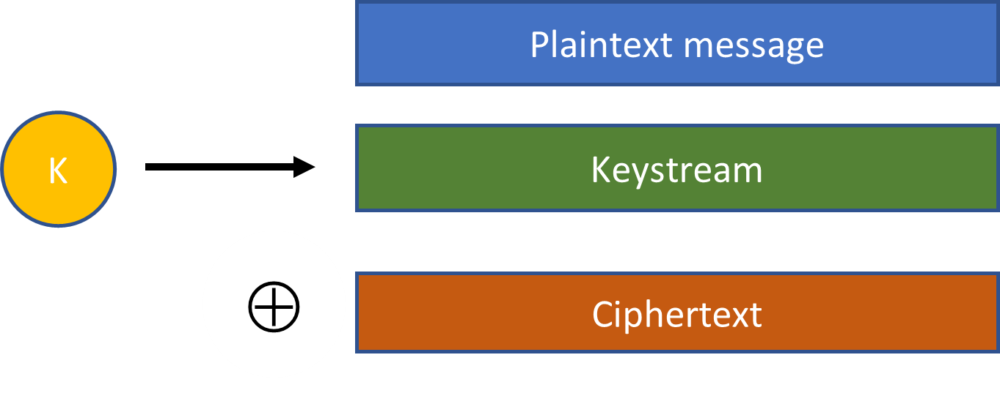

Be reminded that an encryption scheme is typically a template for encryption with the same core algorithm, rather than an exact specification. By extension, a stream cipher is typically a template for encryption in which you can use keys of different lengths. Though the key length can impact some minor details of the scheme, it will not impact its essential form. 

The shift cipher is an example of a very simple and insecure stream cipher. Using a single letter (the private key), you can produce a string of letters the length of the message (the keystream). This keystream is, then, combined with the plaintext via a modulo operation to produce a ciphertext. (This modulo operation can be simplified to an XOR operation when representing the letters in bits). 

Another famous example of a stream cipher is the **Vigenere cipher**, after Blaise de Vigenere who fully developed it at the end of the 16th century (though others had done a lot of preceding work). It is an example of a **polyalphabetic substitution cipher**: an encryption scheme where the ciphertext alphabet for a plaintext symbol changes depending on its position in the text. By contrast to a monoalphabetic substitution cipher, ciphertext symbols can be associated with more than one plaintext symbol. 

As encryption gained popularity in Renaissance Europe, so did **cryptanalysis**—that is, the breaking of ciphertexts—particularly, using **frequency analysis**. The latter employs statistical regularities in our language to break ciphertexts, and was discovered by Arabic scholars already in the ninth centry. It is a technique that works particularly well with longer texts. And even the most sophisticated monoalphabetic substition ciphers were no longer sufficient against frequency analysis by the 1700s in Europe, particularly in military and security settings. As the Vigenere cipher offered a significant advancement in security, it became popular in this period and was widespread by the late 1700s.

Informally speaking, the encryption scheme works as follows:

1.	Select a multi-letter word as the private key
2.	For any message, apply the shift cipher to each letter of the message using the corresponding letter in the key word as the shift
3.	If you have cycled through the key word but still have not totally enciphered the plaintext, again apply the key word’s letters as a shift cipher to the corresponding letters in the remainder of the text
4.	Continue this process until the entire message has been enciphered 

To illustrate, suppose that your private key is GOLD and you want to encrypt the message "CRYPTOGRAPHY". In that case you would proceed as follows according to the Vigenere cipher:

- c0  = [(2 + 6) Mod 26] = 8 = I
- c1  = [(17 + 14) Mod 26] = 5 = F
- c2  = [(24 + 11) Mod 26] = 9 = J
- c3  = [(15 + 3) Mod 26] = 18 = S
- c4  = [(19 + 6) Mod 26] = 25 = Z
- c5  = [(14 + 14) Mod 26] = 2 = C
- c6  = [(6 + 11) Mod 26] = 17 = R
- c7  = [(17 + 3) Mod 26] = 20 = U
- c8  = [(0 + 6) Mod 26] = 6 = G
- c9  = [(15 + 14) Mod 26] = 3 = D
- c10 = [(7 + 11) Mod 26] = 18 = S
- c11 = [(24 + 3) Mod 26] = 1 = B
- c = "IFJSZCRUGDSB"

Another famous example of a stream cipher is the **one-time pad**. With the one-time pad, you simply create a string of random bits as long as the plaintext message and produce the ciphertext via the XOR operation. Hence, the private key and the keystream are equivalent with a one-time pad. 

While the Shift cipher and Vigenere ciphers are very insecure in the modern age, the one-time pad is very secure if used correctly. Probably the most famous application of the one-time pad was, at least until the 1980s, for the **Washington-Moscow hotline**.[4](#footnote4) 

The hotline is a direct communications link between Washington and Moscow for urgent matters that was installed after the Cuban Missile Crisis. The technology for the has transformed over the years. Currently, it includes a direct fiber optic cable as well as two satellite links (for redundancy), which enable e-mail and text messaging. The link ends in various places in the US. The Pentagon, the White House, and Raven Rock Mountain are known endpoints. Contrary to popular opinion, the hotline has never involved telephones.  

In essence, the one-time pad scheme worked as follows. Both Washington and Moscow would have two sets of random numbers. One set of random numbers, created by the Russians, pertained to encryption and decryption of any messages in the Russian language. One set of random numbers, created by the Americans, pertained to encryption and decryption of any messages in the English language. From time to time, more random numbers would be delived to the other side by trusted couriers. 

Washington and Moscow were, then, able to communicate secretly by using these random numbers for creating one-time pads. Each time you needed to communicate, you would use the next portion of random numbers for your message.

While highly secure, the one-time pad faces significant practical limitations: the key needs to be as long as the message and no part of a one-time pad can be re-used. This means that you need to keep track of where you are in the one-time pad, store a massive number of bits, and exchange random bits with your counterparties from time to time. As a consequence, the one-time pad is not frequently used in practice.   

Instead, the predominant stream ciphers used in practice are **pseudorandom stream ciphers**. Salsa20 and a closely related variant called ChaCha are examples of commonly used pseudorandom stream ciphers.

With these pseudorandom stream ciphers, you first randomly select a key K that is shorter than the length of the plaintext. Such a random key K is usually created by our computer on the basis of unpredictable data which it collects over time, such as the time between network messages, mouse movements, and so on. 

This random key K is then inserted into an expansion algorithm which creates a pseudorandom key stream as long as the message. You can specify precisely how long the keystream needs to be (e.g., 500 bits, 1000 bits, 1200 bits, 29,117 bits, and so on). 

A pseudorandom keystream appears *as if* it was chosen completely randomly from the set of all strings with the same length. Hence, encryption with a pseudorandom keystream appears as if it had been done with a one-time pad. But that is, of course, not the case. 

As our private key is shorter than the keystream and our expansionary algorithm needs to be deterministic in order for the encryption/decryption process to work, not every keystream of that particular length could have resulted as an output from our expansionary operation. 

Suppose, for instance, that our private key has a length of 128 bits and that we can insert it into an expansionary algorithm to create a much longer keystream, say of 2,500 bits. As our expansionary algorithm needs to be deterministic, our algorithm can at most select 1/2128 strings with a length of 2,500 bits. So such a keystream could never be selected entirely randomly from all the strings of the same length. 

Our definition of a stream cipher has two aspects: (1) a keystream as long as the plaintext is generated with the aid of a private key; and (2) this keystream is combined with the plaintext, typically via an XOR operation, to produce the ciphertext. 

Sometimes people define condition (1) more strictly, by asserting that the keystream must specifically be pseudorandom. This means that neither the shift cipher, nor the one-time pad would be considered stream ciphers. 

In my view, defining condition (1) more broadly provides an easier way to organize encryption schemes. In addition, it means that we do not have to stop calling a particular encryption scheme a stream cipher just because we learn that it does not actually rely on pseudorandom keystreams. 

## Block ciphers

The first way that a **block cipher** is commonly understood is as something more primitive than a stream cipher: A core algorithm that performs a length-preserving transformation on a string of a suitable length with the aid of a key. This algorithm can be used for creating encryption schemes and perhaps other types of cryptographic schemes. 

Frequently, a block cipher can take input strings of varying lengths such as 64, 128, or 256 bits, as well as keys of varying lengths such as 128, 192, or 256 bits. Though some details of the algorithm might change depending on these variables, the core algorithm does not change. If it did, we would speak of two different block ciphers. Note that the use of the core algorithm terminology here is the same as for encryption schemes. 

A depiction of how a block cipher works can be seen in *Figure 4* below. A message M of length L and a key K serve as inputs to the Block cipher. It outputs a message M’ of length L. The key does not necessarily need to be the same length as M and M’ for most block ciphers. 

*Figure 4: A block cipher*

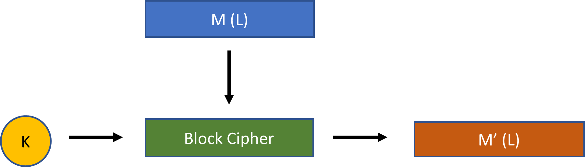

A block cipher on its own is not an encryption scheme. But a block cipher can be used with various **modes of operation** to produce different encryption schemes. A mode of operation simply adds some additional operations outside the block cipher. 

To illustrate how this works, suppose a block cipher (BC) that requires a 128-bit input string and a 128-bit private key. Figure 5 below displays how that block cipher can be used with **electronic code book mode** (**ECB mode**) to create an encryption scheme. (The ellipses on the right indicate that you can repeat this pattern as long as is needed). 

*Figure 5: A block cipher with ECB mode*

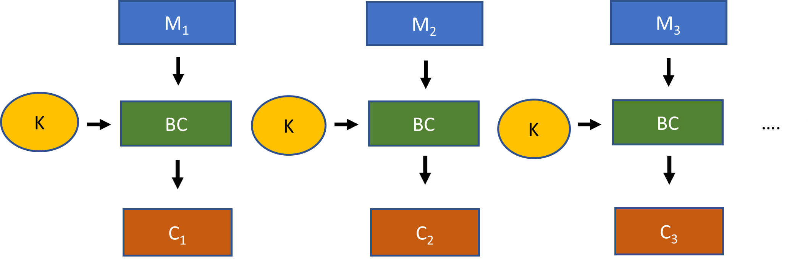

The process for electronic code book encryption with the block cipher is as follows. See if you can divide your plaintext message into 128-bit blocks. If not, add **padding** to the message, so that the result can be evenly divided by the block size of 128 bits. This is your data used for the encryption process.

Now split the data into chunks of 128-bit strings (M1, M2, M3, and so on). Run each 128-bit string through the block cipher with your 128-bit key to produce 128-bit chunks of ciphertext (C1, C2, C3, and so on). These chunks re-combined form the full ciphertext. 

Decryption is just the reverse process, although the recipient does need some recognizable way to strip any padding from the decrypted data to produce the original plaintext message.  

Though relatively straightforward, a block cipher with electronic code book mode lacks in security. This is because it leads to **deterministic encryption**. Any two identical 128-bit strings of data are encrypted exactly the same way. That information can be exploited.

Instead, any encryption scheme constructed from a block cipher should be **probabilistic**: that is, the encryption of any message M, or any specific chunk of M, should generally yield a different outcome each time.[5](#footnote5) 

The **cipher block chaining mode** (**CBC mode**) is probably the most common mode used with a block cipher. The combination, if done right, produces a probabilistic encryption scheme. You can see a depiction of this mode of operation in Figure 6 below. 

*Figure 6: A block cipher with CBC mode*

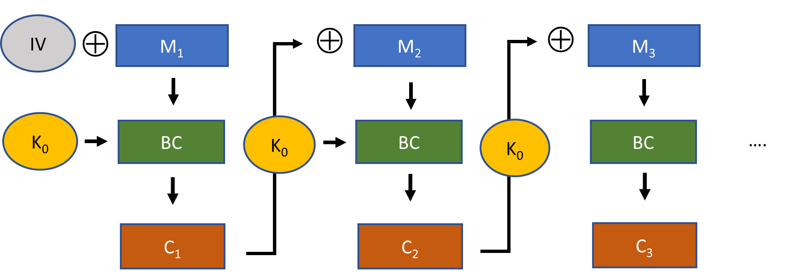

Suppose the block size is again 128 bits. So to start, you would again need to assure that your original plaintext message receives the necessary padding.  

Then, you XOR the first 128-bit portion of your plaintext with an **initialization vector** of 128-bits. The result is placed into the block cipher to produce a ciphtertext for the first block. For the second block of 128 bits, you first XOR the plaintext with the ciphertext from the first block, before inserting it into the block cipher. You continue this process until you have encrypted your entire plaintext message. 

When finished, you send the encrypted message together with the unencrypted initialization vector to the recipient. The recipient needs to know the initialization vector, otherwise she cannot decrypt the ciphertext. 

This construction is much securer than electronic code book mode when used correctly. You should, first, ensure that the initialization vector is a random or pseudorandom string. In addition, you should use a different initialization vector each time you use this encryption scheme. 

In other words, your initialization vector should be a random or pseudorandom nonce, where a **nonce** stands for "a number that is only used once." If you keep this practice, then CBC mode with a block cipher ensures that any two identical plaintext blocks will generally be encrypted differently each time. 

Finally, lets turn our attention to **output feedback mode** (**OFB mode**). You can see a depiction of this mode in *Figure 7*.

*Figure 7: A block cipher with OFB mode*

With OFB mode you also select an initialization vector. But here, for the first block, the initialization vector is directly inserted into the block cipher with your key. The resulting 128-bits are, then, treated as a keystream. This keystream is XORed with the plaintext to produce the ciphertext for the block. For subsequent blocks, you use the keystream from the previous block as an input into the block cipher and repeat the steps. 

If you look carefully, what has actually been created here from the block cipher with OFB mode is a stream cipher. You generate keystream portions of 128-bits until you have the length of the plaintext (discarding the bits you do not need from the last 128-bit keystream portion). You, then, XOR the keystream with your plaintext message to obtain the ciphertext. 

In the previous section on stream ciphers, I stated that you produce a keystream with the aid of a private key. To be exact, it does not only have to be created with a private key. As you can see in OFB mode, the keystream is produced with the support of both a private key and an initialization vector. 

Note that as with CBC mode, it is important to select a pseudorandom or random nonce for the initialization vector each time you use a block cipher in OFB mode. Otherwise, the same 128-bit message string sent in different communications will be encrypted in the same manner. This is one way to create probabilistic encryption with a stream cipher.

Some stream ciphers only use a private key to create a keystream. For those stream ciphers, it is important that you use a random nonce to select the private key for each instance of communication. Otherwise, the results of encryption with those stream ciphers will also be deterministic, leading to security issues. 

The most popular modern block cipher is the **Rijndael cipher**. It was the winning entry out of fifteen submissions to a competition held by the National Institute of Standards and Technology (NIST) between 1997 and 2000 in order to replace an older encryption standard, the **data encryption standard** (**DES**).

The Rijndael cipher can be used with different specifications for key lengths and block sizes, as well as in different modes of operation. The committee for the NIST competition adopted a constricted version of the Rijndael cipher—namely one which requires 128-bit block sizes and key lengths of either 128 bits, 192 bits, or 256 bits—as part of the **advanced encryption standard** (**AES**). This is really the main standard for symmetric encryption applications. It is so secure that even the NSA is apparently willing to use it with 256-bit keys for top secret documents.[6](#footnote6)

The AES block cipher will be explained in detail in *Chapter 5*. 

## Clearing up the confusion

The confusion about the distinction between block ciphers and stream ciphers arises because sometimes people will understand the term block cipher as referring specifically to a *block cipher with a block mode of encryption*. 

Consider the ECB and CBC modes in the previous section. These specifically require the data for encryption to be divisible by the block size (meaning you might have to use padding for the original message). In addition, the data in these modes is also operated on by the block cipher directly (and not just combined with the result of a block cipher operation as in OFB mode). 

Hence, alternatively, you can define a **block cipher** as any encryption scheme, which operates on fixed-length blocks of the message at a time (where any block must be longer than a byte, otherwise it collapses into a stream cipher). Both the data for encryption and the ciphertext must divide evenly into this block size. Typically, the block size is 64, 128, 192, or 256 bits in length. By contrast, a stream cipher can encrypt any messages in chunks of one bit or byte at a time. 

With this more specific understanding of block cipher, you can indeed claim that modern encryption schemes are either stream or block ciphers. From here on out, I will mean the term block cipher in the more general sense unless otherwise specified.  

The discussion on OFB mode in the previous section also raises another interesting point. Some stream ciphers are built from block ciphers, like Rijndael with OFB. Some like Salsa20 and ChaCha are not created from block ciphers. You might called the latter **primitive stream ciphers**. (There is not really a standardized term to refer to such stream ciphers.)

When people speak about the advantages and disadvantages of stream ciphers and block ciphers, they are typically comparing primitive stream ciphers to encryption schemes based on block ciphers.  

While you can always easily construct a stream cipher from a block cipher, it is typically very difficult to build some type of construct with a block mode of encryption (such as with CBC mode) from a primitive stream cipher. 

From this discussion, you should now understand *Figure 8*. It provides an overview on symmetric encryption schemes. We use three kinds of encryption schemes: primitive stream ciphers, block cipher stream ciphers, and block ciphers in a block mode (also called “block ciphers” in the diagram). 

*Figure 8: Overview of symmetric encryption schemes*

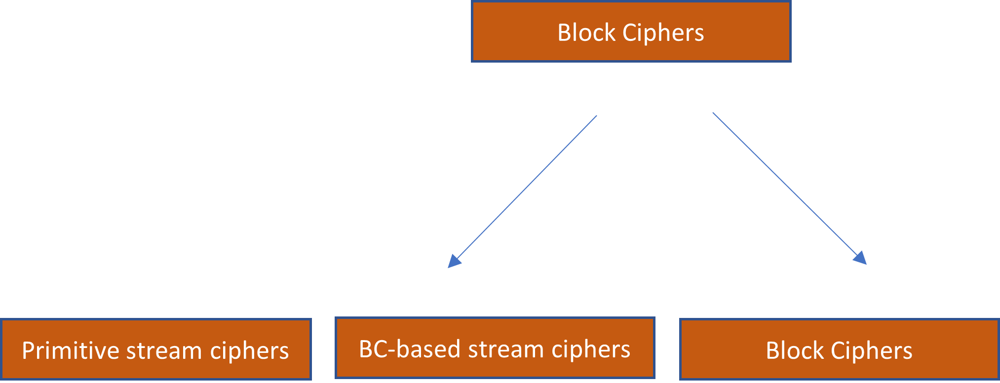

## Message authentication codes

Encryption is concerned with secrecy. But cryptography is also concerned with broader themes, such as message integrity, authenticity, and non-repudiation. So called **message authentication codes** (MACs) are symmetric key cryptographic schemes that support authenticity and integrity in communications. 

Why is anything, but secrecy needed in communication? Suppose that Bob sends Alice a message using practically unbreakable encryption. Any attacker that intercepts this message will not be able to ascertain any significant insights regarding the contents. However, the attacker still has at least two other attack vectors available to her:

1. She could intercept the ciphertext, alter its contents, and send the altered ciphertext on to Alice.
2. She could block Bob’s message entirely and send her own created ciphertext. 

In both these cases, the attacker might not have any insights into the contents from ciphertexts (1) and (2). But she could still cause significant damage in this way. This is where message authentication codes become important.

Message authentication codes are defined loosely as symmetric cryptographic schemes with three algorithms: a key generation algorithm, a tag generation algorithm, and a verification algorithm. A secure MAC ensures that tags are **existentially unforgeable** for any attacker—that is, they cannot successfully create a tag on the message which verifies, unless they have the private key. 

Bob and Alice can combat the manipulation of a particular message using a MAC. Suppose for the moment that they do not care about secrecy. They only want to ensure that the message received by Alice was indeed from Bob and not changed in any way. 

The process is depicted in *Figure 9*. To use a MAC, they would first generate a private key K that is shared between the two of them. Bob creates a tag T for the message using the private key K. He, then, sends the message as well as the message tag to Alice. She can, then, verify that Bob indeed made the tag, by running the private key, the message, and the tag through a verification algorithm. 

*Figure 9: Overview of symmetric encryption schemes*

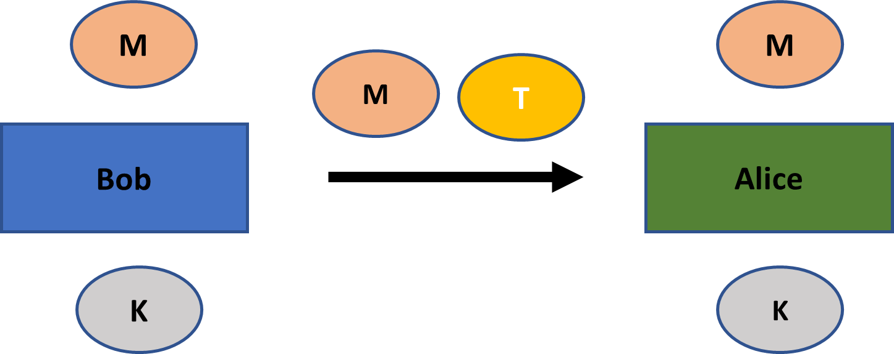

Due to existential unforgeability, an attacker cannot alter the message M in any way or create a message of her own with a valid tag. This is so, even if the attacker observes the tags of many messages between Bob and Alice that uses the same private key. At most, an attacker could block Alice from receiving the message M (a problem which cryptography cannot address). 

A MAC guarantees that a message was actually created by Bob. This authenticity, automatically implies message integrity—that is, if Bob has created some message, then, ipso facto, it was not altered in any way by an attacker. So from here on out, any concern for authentication should be automatically understood to imply a concern for integrity. 

While I have drawn a distinction between message authenticity and integrity in my discussion, it is also common to use those terms as synonyms. They, then, refer to the idea of messages that were both created by a particular sender an not altered any way. In this spirit, message authentication codes are frequently also called **message integrity codes**. 

## Authenticated encryption

Typically, you would want to guarantee both secrecy and authenticity in communication and, hence, encryption schemes and MAC schemes are typically used together. 

An **authenticated encryption scheme** is a scheme that combines encryption with a MAC in a highly secure manner. Specifically, it has to meet the standards for existential unforgeability as well as a very strong notion of secrecy, namely one that is resistant to **chosen-ciphertext attacks**.[7](#footnote7) 

In order for an encryption scheme to be resistant to chosen-ciphertext attacks, it must meet the standards for **non-malleability**: that is, any modification of a ciphertext by an attacker should yield either an invalid ciphertext or one that decrypts to a plaintext having no relation to the original one.[8](#footnote8) 

As an authenticated encryption scheme ensures that a ciphertext created by an attacker is always invalid (as the tag will not be verified), it meets the standards for resistance to chosen-ciphertext attacks. Interestingly, you can prove that an authenticated encryption scheme can always be created from the combination of an existentially unforgeable MAC and an encryption scheme that meets a less stronger notion of security, known as **chosen-plaintext-attack security**.

We will not delve into all the details of constructing authenticated encryption schemes. But it is important to know two details of their construction. 

First, an authenticated encryption scheme first handles the encryption and then creates a message tag on the ciphertext. It turns out that other approaches—such as combining the ciphertext with a tag on the plaintext, or first creating a tag and then encrypting both the plaintext and the tag—are insecure. In addition, both operations have their own randomly selected private key, otherwise your security is severely compromised. 

The aforementioned principle applies more generally: *you should always use distinct keys when combining basic cryptographic schemes*.

An authenticated encryption scheme is depicted in *Figure 10*. Bob first creates a ciphertext C from the message M using a randomly selected key KC. He, then, creates a message tag T by running the ciphertext and a different randomly selected key KT through the tag generation algorithm. Both the ciphtertext and the message tag are sent to Alice. 

Alice now first checks whether the tag is valid given the ciphertext C and the key KT. If valid, she can, then, decrypt the message using the key KC. Not only is she assured of a very strong notion of secrecy in their communications, she also knows the message was created by Bob. 

*Figure 10: An authenticated encryption scheme*

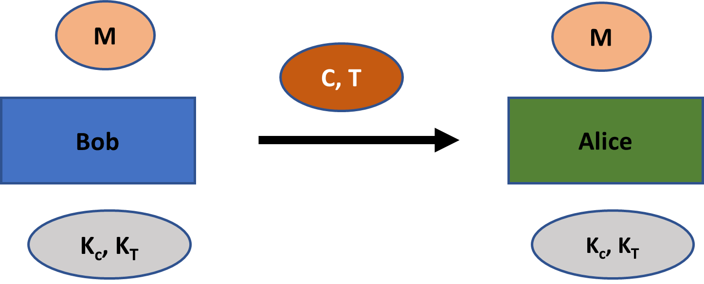

How are MACs created? While MACs can be created via multiple methods, and common and efficient way to create them is via cryptographic hash functions. 

We will introduce cryptographic hash functions more thoroughly in *Chapter 6*. For now, just know that a **hash function** is an efficiently computable function that takes inputs of arbitrary size and yields fixed length outputs. For example, the popular hash function **SHA-256** (secure hash algorithm 256) always generates a 256-bit output regardless of the size of the input. Some hash functions, such as SHA-256, have useful applications in cryptography. 

The most common type of tag produced with a cryptographic hash function is the **hash-based message authenitcation code** (HMAC). The process is depicted in *Figure 11*. A party produces two distinct keys from a private key K, the innner key K1 and outer key K2. The plaintext M or ciphertext C is, then, hashed together with the inner key. The result T' is, then, hashed with the outer key to produce the message tag T.

There is a palette of hash functions that can be used to create an HMAC. The most commonly employed hash function is SHA-256. 

*Figure 11: HMAC*

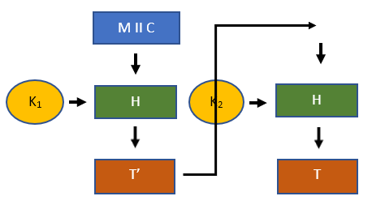

## Secure communication sessions

Suppose that two parties are in a communication session, so they send multiple messages back and forth. 

An authenticated encryption scheme allows a recipient of a message to verify that it was created by her partner in the a communication session (as long as the private key has not leaked). This works well enough for a single message. Typically, however, two parties are sending messages back and forth in a communication session. And in that setting, a plain authenticated encryption scheme as described in the previous section falls short in providing security.

The main reason is that an authenticated encryption scheme does not provide any guarantees that the message was actually also sent by the agent who created it within a communication session. Consider the following three attack vectors:

1. **Replay attack**: An attacker re-sends a ciphertext and a tag that she intercepted between two parties at an earlier point. 
2. **Re-ordering attack**: An attacker intercepts two messages at different times, and sends them on to the recipient in the reverse order.
3. **Reflection attack**: An attacker observes a message sent from A to B, and also sends that message to A. 

Though the attacker has no knowledge of the ciphertext and cannot create spoof ciphertexts, the attacks above can still cause significant damage in communications. 

Suppose, for instance, that a particular message between the two parties involves the transfer of financial funds. A replay attack might transfer the funds a second time. A vanilla authenticated encryption scheme has no defense against such attacks.

Fortunately, these kinds of attacks can be easily mitigated in a communication session using **identifiers** and **relative time indicators**.

Identifiers can be added to the plaintext message before encryption. This would bar any reflection attacks. A relative time indicator can, for example, be a sequence number in a particular communication session. Each party adds a sequence number to a message before encryption, so the recipient knows in what order the messages were sent. This eliminates the possibility of re-ordering attacks. It also eliminates replay attacks. Any message an attacker sends down the line will have an old sequence number, and the recipient will know not to process the message again. 

To illustrate how secure communication sessions work, suppose again Alice and Bob. They send a total of four messages back and forth. You can see how an authenticated encryption scheme with identifiers and sequence numbers would work below in *Figure 11*.

The communication session starts by Bob sending a ciphertext C0,B to Alice with a message tag T0,B. The ciphertext contains the message, as well as an identifier (BOB) and a sequence number (0). The tag T0,B is made over the entire ciphertext. In their subsequent communications, Alice and Bob maintain this protocol, updating fields as necessary. 

*Figure 12: A secure communication session*

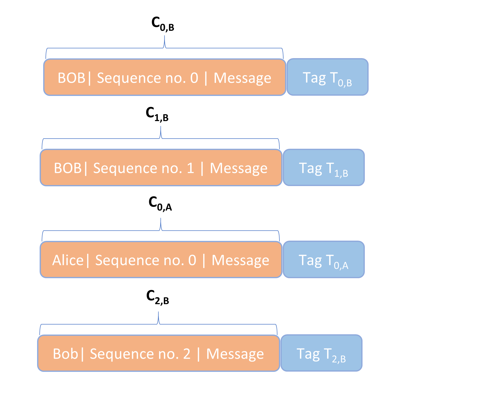

## Notes

[^1]: According to Seutonius, a shift cipher with a constant key value of 3 was used by Julius Caeser in his military communications. So A would always become D, B always E, C always F, and so on. This particular version of the Shift cipher has, thus, become known as the **Caesar Cipher** (though it is not really a cipher in the modern sense of the word, as the key value is constant). The Caesar cipher may have been secure in the first century BC, if Rome’s enemies were very unfamiliar with encryption. But it clearly would not be a very secure scheme in modern times [^1].

[^2]: Jonathan Katz and Yehuda Lindell, *Introduction to Modern Cryptography*, CRC Press (Boca Raton, FL: 2015), p. 7f [^2].

[^3]: Eric Raymond, “The Cathedral and the Bazaar,” paper was presented at the Linux Kongress, Würzburg, Germany (May 27, 1997). There are a number of subsequent versions available as well as a book. My citations are from page 30 in the book: Eric Raymond, *The Cathedral and the Bazaar: Musings on Linux and Open Source by an Accidental Revolutionary*, revised edn. (2001), O’Reilly: Sebastopol, CA [^3].

[^4]: Crypto Museum, "Washington-Moscow hotline," 2013, available at [Crypto Museum](https://www.cryptomuseum.com/crypto/hotline/index.htm) [^4].

[^5]: The importance of probabilistic encryption was first emphasized by Shafi Goldwasser and Silvio Micali, “Probabilistic encryption,” *Journal of Co [^5].

# RC4 and AES

In this Chapter, we will discuss the details of an encryption scheme with a modern primitive stream cipher, RC4 (or "Rivest cipher 4"), and a modern block cipher, AES. While the RC4 cipher has fallen into disfavor as a method of encryption, AES is the standard for modern symmetric encryption. These two examples should give a better idea of how symmetric encryption works under the hood. 

## The RC4 stream cipher

In order to have a sense of how modern pseudorandom stream ciphers work, I will focus on the RC4 stream cipher. It is a pseudorandom stream cipher that was used in the WEP and WAP wireless access point security protocols as well as in TLS. As RC4 has many proven weaknesses, it has fallen into disfavor. In fact, the Internet Engineering Task Force now forbids the use of RC4 suites by client and server applications in all instances of TLS.[3](#footnote3) Nevertheless, it works well as an example to illustrate how a primitive stream cipher works.  

To start, I will first show how to encrypt a plaintext message with a baby RC4 cipher. Suppose our plaintext message is “SOUP.” Encryption with our baby RC4 cipher, then, proceeds in four steps.

### Step 1

First, define an array S with S[0] = 0 to S[7] = 7. An array here is simply means a mutable collection of values organized by an index, also called a list in some programming languages (e.g., Python). In this case, the index runs from 0 through 7, and the values also run from 0 to 7. So S is as follows:

- S = [0,1,2,3,4,5,6,7]

The values here are not ASCII numbers, but the decimal value representations of 1 byte strings. So the value 2 would equal 0000 0011. The length of the array S is, thus, 8 bytes. 

### Step 2

Second, define a key array K of 8 bytes length by choosing a key between 1 and 8 bytes (with no fractions of bytes permissible). As each byte is 8 bits, you can select any number between 0 and 255 for each byte of your key.   

Suppose we choose our key k as [14,48,9], so that it has length of 3 bytes. Each index of our key array is, then, set according to the decimal value for that particular element of the key, in order. If you run through the entire key, start again at the beginning, until you have filled the 8 slots of the key array. Hence, our key array is as follows

- K = [14,48,9,14,48,9,14,48]

### Step 3

Third, we will transform the array S using the key array K, in a process known as key scheduling. The process is as follows in pseudocode: 

- Create variables j and i
- Set the variable j = 0
- For each i from 0 to 7:
	- Set j = j + S[i] + K[i] mod 8
	- Swap S[i] and S[j] 

The transformation of array S is captured by *Table 1*. 

To start, you can see the initial state of S as [0,1,2,3,4,5,6,7] with an initial value of 0 for j. This will be transformed using the key array [14,48,9,14,48,9,14,48]. 

The for loop starts with i = 0. According to our pseudocode above, the new value of j becomes 6 (j = j + S[0] + K[0] mod 8 = 0 + 0 + 14 mod 8 = 6 mod 8). Swapping S[0] and S[6], the state of S after 1 round becomes [6,1,2,3,4,5,0,7]. 

In the next row, i = 1. Going through the for loop again, j obtains a value of 7 (j = j + S[1] + K[1] mod 8 = 6 + 1 + 48 mod 8 = 55 mod 8 = 7 mod 8). Swapping S[1] and S[7] from the current state of S, [6,1,2,3,4,5,0,7], yields [6,7,2,3,4,5,0,1] after round 2. 

We continue with this process until we produce the final row at the bottom for the array S, [6,4,1,0,3,7,5,2].  

*Table 1: Key scheduling table*

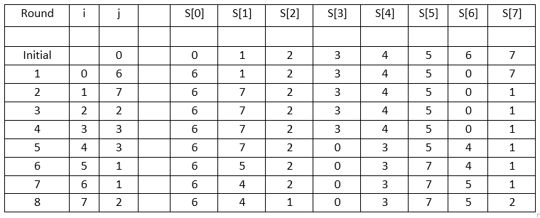

### Step 4

As a fourth step, we produce the keystream. This is the pseudorandom string of a length equal to the message we want to send. This is what will be used to encrypt the original message “SOUP.” As the keystream needs to be as long as the message, we need one that has 4 bytes. 

The keystream is produced by the following pseudocode:

- Create the variables j, i, and t
- Set j = 0
- For each i of the plaintext, starting with i = 1 and going until i = 4, each byte of the keystream is produced as follows:
    - j = j + S[i] mod 8
	- Swap S[i] and S[j]
	- t = S[i] + S[j] mod 8
	- The ith byte of the keystream = S[t]

You can follow the calculations in *Table 2*. 

The initial state of S = S = [6,4,1,0,3,7,5,2]. Setting i = 1, the value j becomes 4 (j = j + S[i] mod 8 = 0 + 4 mod 8 = 4). We, then, swap S[1] and S[4] to produce the transformation of S in the second row, [6,3,1,0,4,7,5,2]. The value t is, then, 7 (t = S[i] + S[j] mod 8 = 3 + 4 mod 8 = 7). Finally, the byte for the keystream is, then, S[7], or 2. 

We can, then, continue to produce the other bytes until we have the following four bytes: 2, 6, 3, and 7. Each of these bytes can, then, be used to encrypt each letter of the plaintext, "SOUP". 

To start, using an ASCII table, we can see that “SOUP” encoded by the decimal values of the underlying byte strings is “83 79 85 80”. Combination with the keystream “2 6 3 2” yields “85 85 88 82”, which stays the same after a modulo 256 operation. In ASCII, the ciphertext “85 85 88 82” equals “UUXR”. 

What happens if the word to encrypt were longer than the array S? In that case, the array S just keeps transforming in this manner displayed above for every byte i of the plaintext, until we have a number of bytes in the keystream equal to the number of letters in the plaintext. 

*Table 2: Keystream generation*

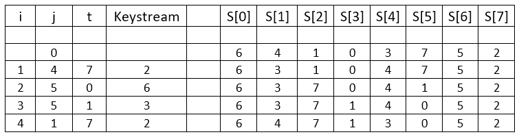

The example that we just discussed is only a watered down version of the RC4 stream cipher. The actual RC4 stream cipher has an S array of 256 bytes in length, not 8 bytes, and a key that can be between 1 and 256 bytes, not between 1 and 8 bytes. The key array and the keystreams are, then, all produced considering the 256 byte length of the S array. That calculations become immensely more complex, but the principles stay the same. Using the same key, [14,48,9], with the standard RC4 cipher, the plaintext message "SOUP" is encrypted as 67 02 ed df in hexadecimal format. 

A stream cipher in which the key stream updates independently of the plaintext message or the ciphertext is a **synchronous stream cipher**. The keystream is only dependent on the key. Clearly, RC4 is an example of a synchronous stream cipher, as the keystream has no relationship with the plaintext or the ciphertext. All our primitive stream ciphers mentioned in the previous chapter, including the shift cipher, the Vigenere cipher, and the one-time pad, were also of the synchronous variety. 

By contrast, an **asynchronous stream cipher** has a keystream that is produced by both the key and previous elements of the ciphertext. This type of cipher is also called a **self-synchronizing cipher**. 

Importantly, the keystream produced with RC4 should be treated as a one-time pad, and you cannot produce the keystream in exactly the same way the next time. Rather than changing the key each time, the practical solution is to combine the key with a nonce to produce the bytestream.

## AES with a 128-bit key

As mentioned in the previous chapter, the National Institute of Standards and Technology (NIST) held a competition between 1997 and 2000 to determine a new symmetric encryption standard. The Rijndael cipher turned out to be the winning entry. The name is a word play on the names of the Belgian creators, Vincent Rijmen en Joan Daemen. 

The Rijndael cipher is a block cipher, meaning there is a core algorithm, which can be used with different specifications for key lengths and block sizes. You can, then, use it with different modes of operation to construct encryption schemes.  

The committee for the NIST competition adopted a constricted version of the Rijndael cipher—namely one which requires 128-bit block sizes and key lengths of either 128 bits, 192 bits, or 256 bits—as part of the advanced encryption standard. This constricted version of the Rijndael cipher can also be used under multiple modes of operation. The specification for the standard is what is known as the Advanced Encryption Standard (AES).

In order to show how the Rijndael cipher works, the core of AES, I will illustrate the process for encryption with a 128-bit key. The key size has an impact on the number of rounds held for each block of encryption. For 128-bit keys, 10 rounds are required. With 192 bits and 256 bits, it would have been 12 and 14 rounds respectively. 

In addition, I will assume that AES is used in ECB-mode. This makes exposition slightly easier and doesn't matter for the Rijndael algorithm. To be sure, ECB mode is not secure in practice because it leads to deterministic encryption. The most commonly used secure mode with AES is CBC. 

Let's call the key K0. The construction with the above parameters, then, looks as in Figure 1, where Mi stands for a part of the plaintext message of 128 bits and Ci for a part of the ciphertext of 128 bits. Padding is added to the plaintext for the last block, if the plaintext cannot be evenly divided by the block size.

*Figure 1: AES-ECB with a 128-bit key*

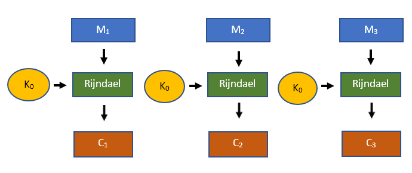

Each 128-block of text goes through ten rounds in the Rijndael encryption scheme. This requires a separate round key for each round (K1 through K10). These are produced for each round from the original 128-bit key K0 using a key expansion algorithm. Hence, for each block of text to be encrypted, we will use the original key K0 as well as ten separate round keys. Note that these same 11 keys are used for each 128-bit block of plaintext that requires encryption.  

The key expansion algorithm is long and complex. Working through it has little didactic benefits. You can look through the key expansion algorithm on your own, if you wish. Once the round keys are produced, the Rijndael cipher will manipulate the first 128-bit block of plaintext, M1, as seen in Figure 2. We will now go through these steps.

*Figure 2: The manipulation of M1 with the Rijndael cipher*

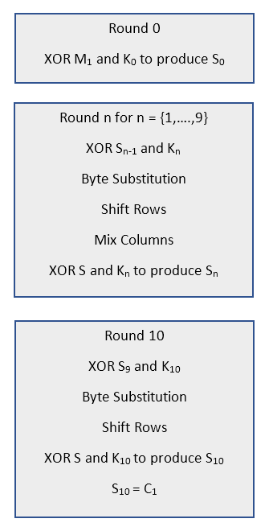

### Round 0

Round 0 of the Rijndael cipher is straightforward. An array S0 is produced by an XOR operation between the 128-bit plaintext and the private key. That is,

- S0 = M1 XOR K0

### Round 1

In round 1, the array S0 is first combined with the round key K1 using an XOR operation. This produces a new state of S. 

Second, the byte substitution operation is performed on the current state of S. It works by taking each byte of the 16-byte S array and subtituting it with a byte of an array called **Rijndael’s S-box**. Each byte has a unique transformation, and a new state of S is produced as a result. Rijndael's S-box is displayed in *Figure 3*. 

*Figure 3: Rijndael's S-Box*

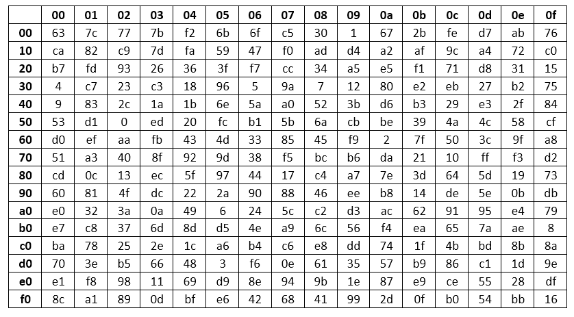

This S-Box is one place where abstract algebra comes into play in the Rijndael cipher, specifically Galois fields. 

To start, you define each possible byte element 00 through FF as an 8-bit vector. Each such vector is an element of the Galois field GF(28) where the irreducible polynomial for the modulo operation is x8 + x4 + x3 + x + 1. The Galois field with these specifications is also called Rijndael’s Finite Field. 

Next, for each possible element in the field we create what is called the **Nyberg S-Box**. In this box, each byte is mapped onto its multiplicative inverse (i.e., so that their product equals 1). We, then, map those values from the Nyberg S-box to Rijndael’s S-Box using the affine transformation. 

The third operation on the S array is the shift rows operation. It takes the state of S and lists all of the sixteen bytes in a matrix. The filling of the matrix starts on the top left and works its way around by going from top to bottom and then, each time a column is filled, shifting one column right and to the top. 

Once the matrix of S has been constructed, the four rows are shifted. The first row stays the same. The second row moves one over to the left. The third moves two over to the left. The fourth moves three over to the left. An example of the process is provided in *Figure 4*. The original state of S is shown on the top, the resultant state after the shift rows operation is shown below it.

*Figure 4: Shift rows operation*

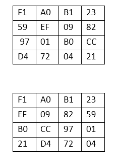

In the fourth step, Galois fields make an appearance again. To start, each column of the S matrix is multiplied by the column of the 4 x 4 matrix seen in *Figure 5*. But instead of being regular matrix multiplication, it is vector multiplication modulo an irreducible polynomial, x8 + x4 + x3 + x + 1. The resulting vector coefficients represent the individual bits of a byte. 

*Figure 5: Mix columns matrix*

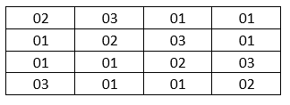

Multiplication of the first column of the S matrix with the 4 x 4 matrix above yields the result in *Figure 6*. 

*Figure 6: Multiplication of the first column*

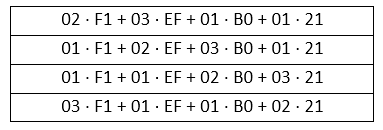

As a next step, all the terms in the matrix would have to be turned into polynomials. For instance, F1 represents 1 byte and would become x7 + x6 + x5 + x4 + 1 and 03 represents 1 byte and would become x + 1. 

All the multiplications are, then, performed modulo x8 + x4 + x3 + x + 1. This results with the addition of four polynomials in each of the four cells of the column. After performing those additions modulo 2, you will end up with four polynomials. Each of these polynomials represents an 8-bit string, or 1 byte, of S. We will not perform all these calculations here on the matrix in *Figure 6* as they are extensive. 

Once the first column has been processed, the other three columns of the S matrix are processed in the same manner. Eventually this will yield a matrix with sixteen bytes that can be transformed into an array. 

As a final step, the array S is combined wtih the round key again in an XOR operation. This produces the state S1. That is,

- S1 = S XOR K0

### Rounds 2 through 10

Rounds 2 through 9 are just a repetition of round 1, *mutatis mutandis*. The final round looks very similar to the previous rounds, except that the mix columns step is eliminated. That is, round 10 is executed as follows:

- S9 XOR K10
- Byte Substitution
- Shift Rows
- S10 = S XOR K10

The state S10 is now set to C1, the first 128 bits of the ciphertext. Proceeding through the remaining 128-bit plaintext blocks yields the full ciphertext C. 

### The operations of the Rijndael cipher

What is the reasoning behind the different operations seen in the Rijndael cipher?

Without entering into the details, encryption schemes are assessed on the basis of the extent they create confusion and diffusion. If the encryption scheme has a high degree of **confusion**, it means that the ciphertext looks drastically different than the plaintext. If the encryption scheme has a high degree of **diffusion**, it means that any small change to the plaintext produces a drastically different ciphertext. 

The reasoning for the operations behind the Rijndael cipher is they produce both a high degree of confusion and diffusion. The confusion is produced by the Byte substitution operation, while the diffusion is produced by the shift rows and mix columns operations. 

# Asymmetric Cryptography

As with symmetric cryptography, asymmetric schemes can be used to ensure both secrecy and authentication. By contrast, however, these schemes employ two keys rather than one: a private and a public key.

We start our enquiry with the discovery of asymmetric cryptography, particularly the problems that spurred it on. Next, we discuss how asymmetric schemes for encryption and authentication work on a high level. We, then, introduce hash functions, which are key to understanding asymmetric authentication schemes, and also have relevance in other cryptographic contexts, such as for the hash-based message authentication codes we discussed in Chapter 4.   

## The key distribution and management problem

Suppose that Bob wants to buy a new rain coat from Jim’s Sporting Goods, an online sporting goods retailer with millions of customers in North America. This will be his first purchase from them and he wants to use his credit card. So, Bob will first need to create an account with Jim’s Sporting Goods, which requires sending over personal details such as his address and credit card information. He can, then, go through the steps needed to purchase the rain coat. 

Bob and Jim’s Sporting Goods will want to ensure that their communications are secure throughout this process, considering that the Internet is an open communications system. They will want to ensure, for example, that no potential attacker can ascertain Bob’s credit card and address details, and that no potential attacker can repeat his purchases or create fake ones on his behalf. 

An advanced authenticated encryption scheme as discussed in the previous chapter could certainly make the communications between Bob and Jim’s Sporting Goods secure. But there are clearly practical obstacles to implementing such a scheme. 

To illustrate these practical obstacles, suppose that we lived in a world in which only the tools of symmetric cryptography existed. What could Jim’s Sporting Goods and Bob, then, do to ensure secure communication?

Under those circumstances, they would face substantial costs to communicating securely. As the Internet is an open communications system, they cannot just exchange a set of keys over it. Hence, Bob and a representative for Jim’s Sporting Goods will need to make a key exchange in person.  

One possibility is that Jim’s Sporting Goods creates special key exchange locations, where Bob and other new customers can retrieve a set of keys for secure communication. This would obviously come at substantial organizational costs and greatly reduce the efficiency with which new customers can make purchases.  

Alternatively, Jim’s Sporting Goods can send Bob a pair of keys with a highly trusted courier. This is probably more efficient than organizing key exchange locations. But this would still come at substantial costs, particularly if many customers only make one or a few purchases.   

Next, a symmetric scheme for authenticated encryption also forces Jim’s Sporting Goods to store seperate sets of keys for all their customers. This would be a signficant practical challenge for thousands of customers, let alone millions.  

To understand this latter point, suppose that Jim’s Sporting Goods provides each customer the same pair of keys. This would allow each customer—or anyone else that could obtain this pair of keys—to read and even manipulate all the communications between Jim’s Sporting Goods and its customers. You might, then, as well not use cryptography at all in your communications. 

Even repeating a set of keys for only some customers is a terrible security practice. Any potential attacker could attempt to exploit that feature of the scheme (remember that attackers are assumed to know everything about a scheme but the keys, in accordance with Kerckhoffs’ principle.)

So, Jim’s Sporting Goods would have to store a pair of keys for each customer, regardless of how these key pairs are distributed. This clearly presents several practical problems. 

- Jim’s Sporting Goods would have to store millions of pairs of keys, one set for each customer.
- These keys would have to be properly secured, as they would be a sure fire target for hackers. Any breaches of security would require the repetition of costly key exchanges, either at special key exchange locations or by courier. 
- Any customer of Jim’s Sporting Goods would have to safely store a pair of keys at home. Losses and thefts will occur, requiring a repetition of key exchanges. Customers would also have to go through this process for any other online stores or other types of entities they wish to communicate and transact with over the Internet.  

These two main challenges just described were very fundamental concerns until the late 1970s. They were known as the **key distribution problem** and the **key management problem**, respectively. 

These problems had always existed, of course, and often created headaches in the past. Military forces, for instance, would have to constantly distribute books with keys for secure communication to personnel in the field at great risks and costs. But these problems were becoming worse as the world was increasingly moving into one of long-distance, digital communication, particularly for non-governmental entities. 

If these problems had not been resolved in the 1970s, efficient and secure shopping at Jim’s Sporting Goods would likely not have existed. In fact, most of our modern world with practical and secure e-mailing, online banking, and shopping would probably be just a distant fantasy. Anything even resembling Bitcoin could not have existed at all. 

So, what happened in the 1970s? How is it possible that we can instantly make purchases online and securely browse the World Wide Web? How is it possible that we can instantaneously send Bitcoins all across the world from our smart phones? 

## New directions in cryptography

By the 1970s, the key distribution and key management problems had grabbed the attention of a group of American academic cryptographers: Whitfield Diffie, Martin Hellman, and Ralph Merkle. In the face of severe skepticism from the majority of their peers, they ventured to devise a solution to it. 

At least one primary motivation for their venture was the foresight that open computer communications would profoundly affect our world. As Diffie and Helmann note in 1976, 

> The development of computer controlled communication networks promises effortless and inexpensive contact between people or computers on opposite sides of the world, replacing  most mail and many excursions with telecommunications. For many applications these contacts must be made secure against both eavesdropping and the injection of illegitimate messages. At present, however, the solution of security problems lags well behind other areas of communications technology. *Contemporary cryptography is unable to meet the requirements, in that its use would impose such severe inconveniences on the system users, as to eliminate many of the benefits of teleprocessing.*[1](#footnote1)

The tenacity of Diffie, Hellman, and Merkle paid off. The first publication of their results was a paper by Diffie and Helmann in 1976 entitled “New Directions in Cryptography.” In it, they presented two original ways to address the key distribution and the key management problems. 

The first solution they offered was a remote *key-exchange protocol*, that is, a set of rules for the exchange of one or more symmetric keys over an insecure communication channel. This protocol is now known as *Diffie-Helmann key exchange* or *Diffie-Helmann-Merkle key exchange*.[2](#footnote2)

With Diffie-Helmann key exchange, two parties first exchange some information publicly on an insecure channel such as the Internet. On the basis of that information they, then, independently create a symmetric key (or a pair of symmetric keys) for secure communication. While both parties create their keys independently, the information they shared publicly ensures that this key creation process yields the same result for the both of them. 

Importantly, while everyone can observe the information that is exchanged publicly by the parties over the insecure channel, only the two parties engaging in the information exchange can create symmetric keys from it.

This, of course, sounds completely counterintuitive. How could two parties exchange some information publicly that would allow only them to create symmetric keys from it? Why would anyone else observing the information exchange not be able to create the same keys?

It relies on some beautiful mathematics of course. Diffie-Helmann key exchange works via a one-way function with a trapdoor. Lets discuss the meaning of these two terms in turn.

Suppose that you are given some function f(x) and the result f(a) = y, where a is a particular value for x. We say that f(x) is a **one-way function** if it is easy to calculate the value y when given a and f(x), but it is computationally infeasible to calculate the value a when given y and f(x). The name one-way function, of course, stems from the fact that such a function is only practical to calculate in one direction.

Some one-way functions have what is known as a trapdoor. While it is practically impossible to calculate a given only y and f(x), there is a certain piece of information Z which makes calculating a from y computationally feasible. This piece of information Z is known as the **trapdoor**. One-way functions that have a trapdoor are known as **trapdoor functions**.

We will not delve into the details of Diffie-Helmann key exchange here. But essentially each participant creates some information, of which a part is publicly shared and of which some remains secret. Each party, then, takes their secret piece of information and the public information shared by the other party to create a private key. And somewhat miraculously, both parties will end up with the same private key. 

Any party observing just the publicly shared information between the two parties in a Diffie Helmann key exchange is unable to replicate these calculations. They would need the private information from one of the two parties in order to do so. 

Although the basic version of Diffie-Helmann key exchange presented in the 1976 paper is not very secure, sophisticated versions of the basic protocol are certainly still in use today. Most importantly, every key exchange protocol in the latest version of the transport layer security protocol (version 1.3) is essentially an enriched version of the protocol presented by Diffie and Hellman in 1976. The transport layer security protocol is the predominant protocol for securely exchanging information formatted according to the hypertext transfer protocol (http), the standard for exchanging Web content.  

Importantly, Diffie-Helmann key exchange is not an asymmetric scheme. Strictly speaking, it arguably belongs to the realm of symmetric key cryptography. But as both Diffie-Helmann key exchange and asymmetric cryptography rely on one-way number-theoretic functions with trapdoors, they are typically discussed together. 

The second way which Diffie and Helmann offered to address the key distribution and management problem in their 1976 paper was, of course, via asymmetric cryptography. 

In contrast to their presentation of Diffie-Hellman key exchange, they only provided the general contours of how asymmetric cryptographic schemes could plausibly be constructed. They did not offer any one-way function that could specifically fulfill the conditions needed for reasonable security in such schemes. 

A practical implementation of an asymmetric scheme was, however, found a year later by three different academic cryptographers and mathematicians: Ronald Rivest, Adi Shamir, and Leonard Adleman.[3](#footnote3) The cryptosystem they introduced became known as the **RSA cryptosystem** (after their last names).

The trapdoor functions used in asymmetric cryptography (and Diffie Helmann key exchange) are all related to two main **computationally hard problems**: prime factorization and the calculation of discrete logarithms. 

**Prime factorization** requires, as the name implies, breaking down an integer into its prime factors. The RSA problem is by far the most well-known example of a cryptosystem related to prime factorization. 

The **discrete logarithm problem** is a problem that occurs in cyclic groups. Given a generator in a particular cyclic group, it requires the calculation of the unique exponent needed to produce another element in the group from the generator. 

Discrete logarithm-based schemes rely on two main kinds of cyclic groups: multiplicative groups of integers and groups that include the points on elliptic curves. The original Diffie Helmann key exchange as presented in “New Directions in Cryptography” works with a cyclic multiplicative group of integers. Bitcoin’s digital signature algorithm and recently introduced Schnorr signature scheme (2021) are both based on the discrete logarithm problem for a particular elliptic curve cyclic group.  

Next, we will turn to a high-level overview of secrecy and authentication in the asymmetric setting. Before doing so, however, we do need to make a brief historical note. 

It now seems plausible that a group of British cryptographers and mathematicians working for the Government Communications Headquarters (GCHQ) had independently made the discoveries mentioned above a few years earlier. This group consisted of James Ellis, Clifford Cocks, and Malcolm Williamson.

According to their own accounts and that of GCHQ, it was James Ellis who first devised the concept of public key cryptography in 1969. Supposedly, Clifford Cocks then discovered the RSA cryptographic system in 1973, and Malcolm Williamson the concept of Diffie Helmann key exchange in 1974.[4](#footnote4) Their discoveries were, however, purportedly not revealed until 1997, given the secret nature of the work done at GCHQ. 

## Asymmetric encryption and authentication

An overview of asymmetric encryption with the help of Bob and Alice is provided in *Figure 1*.

Alice first creates a pair of keys, consisting of one public key (KP) and one private key (KS), where the “P” in KP stands for “public” and the “S” in KS for “secret”. She, then, distributes this public key freely to others. We will return to the details of this distribution process a little later. But for now assume that anyone, including Bob, can securely obtain Alice’s public key KP.

At some later point, Bob wants to write a message M to Alice. As it includes sensitive information, however, he wants the contents to remain secret for everyone but Alice. So, Bob first encrypts his message M using KP. He then sends the resulting ciphertext C to Alice, who decrypts C with KS to produce the original message M.

*Figure 1: Asymmetric encryption*

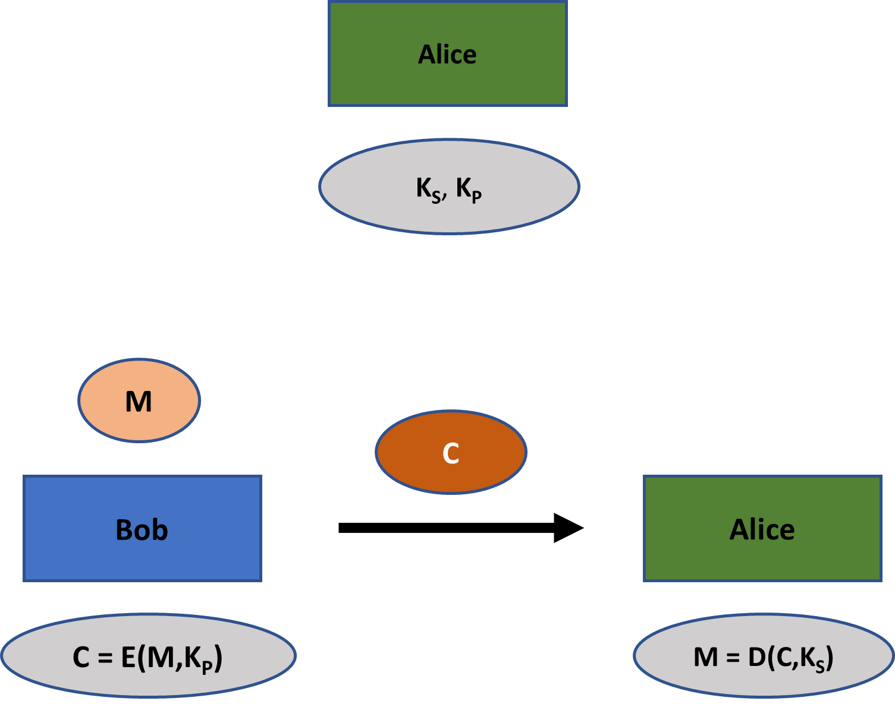

Any adversary that listens in on Bob and Alice’s communication can observe C. She also knows KP and the encryption algorithm E(·). Importantly, however, this information does not allow the attacker to feasibly decrypt the ciphertext C. Decryption specifically requires KS, which the attacker does not possess.

Symmetric encryption schemes generally need to be secure against an attacker that can validly encrypt plaintext messages (known as chosen-ciphertext attack security). It is not designed, however, with the explicit purpose of allowing the creation of such valid ciphertexts by an attacker or anyone else. 

This is in stark contrast to an asymmetric encryption scheme, where its whole purpose is to allow anyone, including attackers, to produce valid ciphertexts. Asymmetric encryption schemes can, therefore, be labeled as **multiple access ciphers**.

To understand better what is happening, imagine that instead of sending a message electronically, Bob wanted to send a physical letter in secrecy. One way of ensuring secrecy would be for Alice to send a secure padlock to Bob, but keep the key to unlock it. After writing his letter, Bob could put the letter in a box and close it with Alice’s padlock. He could, then, send the locked box with the message to Alice who has the key to unlock it. 

While Bob is able to lock the padlock, neither he nor any other person who intercepts the box can undo the padlock if it is indeed secure. Only Alice can unlock it and see the contents of Bob’s letter because she has the key. 

An asymmetric encryption scheme is, roughly speaking, a digital version of this process. The padlock is akin to the public key and the padlock key is akin to the private key. Because the padlock is digital, however, it is much easier and not so costly for Alice to distribute it to anyone that might want to send secret messages to her.  

For authentication in the asymmetric setting, we use **digital signatures**. These, thus, have the same function as message authentication codes in the symmetric setting. An overview of digital signatures is provided in *Figure 2*.

Bob first creates a pair of keys, consisting of the public key (KP) and the private key (KS), and distributes his public key. When he wants to send an authenticated message to Alice, he first takes his message M and his private key to create a digital signature D. Bob, then, sends Alice his message together with the digital signature. Alice inserts the message, the public key, and the digital signature into a verification algorithm. This algorithm produces either true for a valid signature, or false for an invalid signature. 

A digital signature is, as the name clearly implies, the digital equivalent of a written signature on letters, contracts, and so on. In fact, a digital signature is usually much more secure. With some effort, you can falsify a written signature; a process made easier by the fact that written signatures are frequently not closely verified. A secure digital signature, however, is, just as a secure message authentication code, **existentially unforgeable**: that is, with a secure digital signature scheme, no one can feasibly create a signature for a message which passes the verification procedure, unless they have the private key. 

*Figure 2: Asymmetric authentication*

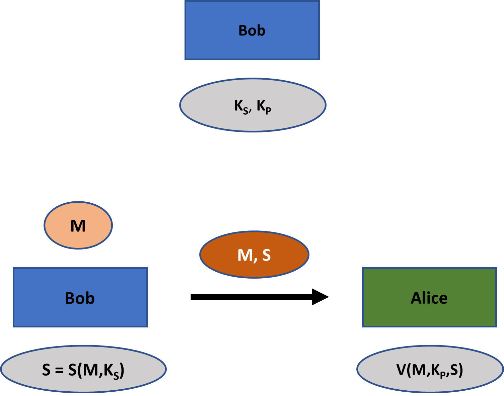

As with asymmetric encryption, we see an interesting contrast between digital signatures and message authentication codes. For the latter, the verification algorithm can only be employed by one of the parties privy to the secure communication. This is because it requires a private key. In the asymmetric setting, however, anyone can verify a digital signature S made by Bob. 

All this makes digital signatures an extremely powerful tool. It forms the basis, for instance, of creating signatures on contracts that can be verified for legal purposes. If Bob had made a signature on a contract in the exchange above, Alice can show the message M, the contract, and the signature S to a court of law. The court of law can, then, verify the signature using Bob’s public key.[5](#footnote5)

For another example, digital signatures are an important aspect to secure software and software update distribution. This type of public verifiability could never be created using just message authentication codes. 

As a last example of the power of digital signatures, consider Bitcoin. One of the most common misconceptions about Bitcoin, particularly in the media, is that transactions are encrypted: they are not. Instead, Bitcoin transactions work with digital signatures for ensuring security.  

Bitcoins exist in batches called unspent transaction outputs (or UTXO’s). Suppose you receive three payments on a particular Bitcoin address for 2 bitcoins each. You technically do not now have 6 bitcoins on that address. Instead, you have three batches of 2 bitcoins that are locked by a cryptographic problem associated with that address. For any payment you make, you can use one, two, or all three of these batches, depending on how much you need for the transaction. 

The proof of ownership over unspent transaction outputs is usually shown via one or more digital signatures. Bitcoin works precisely because valid digital signatures on unspent transaction outputs are computationally infeasible to make, unless you are in possession of the secret information required to make them. 

Currently, Bitcoin transactions transparently include all the information that needs to be verified by participants in the network, such as the origins of the unspent transaction outputs used in the transaction. While it is possible to hide some of that information and still allow for verification (as some alternative cryptocurrencies such as Monero do), this also creates particular security risks. 

Confusion sometimes arises over digital signatures and written signatures captured digitally. In the latter case, you capture an image of your written signature and paste it to an electronic document such as an employment contract. This, however, is not a digital signature in the cryptographic sense. The latter is just a long number that can only be produced by being in possession of a private key. 

Just as in the symmetric key setting, you can also use asymmetric encryption and authentication schemes together. Similar principles apply. First of all, you should use different private-public key pairs for encryption and making digital signatures. In addition, you should first encrypt a message and then authenticate it. 

Importantly, in many applications asymmetric cryptography is not used throughout the entire communication process. Instead, it will typically only be used to *exchange symmetric keys* between the parties by which they will actually communicate.

This is the case, for instance, when you purchase goods online. Knowing the vendor’s public key, she can send you digitally signed messages which you can verify for their authenticity. On this basis, you can follow one of multiple protocols for exchanging symmetric keys to securely communicate.   

The main reason for the frequency of the aforementioned approach is that asymmetric cryptography is much less efficient than symmetric cryptography in producing a particular level of security. This is one reason why we still need symmetric key cryptography next to public cryptography. In addition, symmetric key cryptography is much more natural in particular applications such as a computer user encrypting their own data. 

So how exactly do digital signatures and public key encryption address the key distribution and key management problems? 

There is not one answer here. Asymmetric cryptography is a tool and there is not one way to employ that tool. But let’s take our earlier example from Jim’s Sporting Goods to show how the issues would typically be addressed in this example.  

To start, Jim’s Sporting Goods would probably approach a **certificate authority**, an organization that supports in public key distribution. The certificate authority would register some details about Jim’s Sporting Goods and grant it a public key. It would, then, send Jim’s Sporting Goods a certificate, known as a **TLS/SSL certificate**, with Jim’s Sporting Goods’s public key digitally signed using the certificate authority’s own public key. In this way, the certificate authority affirms that a particular public key indeed belongs to Jim’s Sporting Goods. 

The key to understanding this process with TLS/SSL certificates is that, while you will generally not have Jim’s Sporting Goods’s public key stored anywhere on your computer, the public keys of recognized certificate authorities are indeed stored in your browser or in your operating system. These are stored in what are called **root certificates**. 

Hence, when Jim’s Sporting Goods provides you with its TLS/SSL certificate, you can verify the certificate authority’s digital signature via a root certificate in your browser or operating system. If the signature is valid, you can be relatively sure that the public key on the certificate indeed belongs to Jim’s Sporting Goods. On this basis, it is easy to set up a protocol for secure communication with Jim’s Sporting Goods. 

Key distribution has now become vastly simpler for Jim’s Sporting Goods. It is not hard to see that key management has also become greatly simplified. Instead of having to store thousands of keys, Jim’s Sporting Goods merely needs to store a private key that allows it to make signatures for the public key on its SSL certificate. Each time a customer comes to Jim’s Sporting Goods’s site, they can establish a secure communication session from this public key. Customers also do not need to store any information (other than the public keys of recognized certificate authorities in their operating system and browser).  

## Hash functions

Hash functions are ubiquitous in cryptography. They are neither symmetric nor asymmetric schemes, but fall into a cryptographic category in their own right. 

We already came across hash functions in Chapter 4 with the creation of hash-based authentication messages. They are also important in the context of digital signatures, though for a slightly different reason: Digital signatures are namely typically made over the hash value of some (encrypted) message, rather than the actual (encrypted) message. In this section, I will offer a more thorough introduction of hash functions. 

Lets start with defining a hash function. A **hash function** is any efficiently computable function that takes inputs of arbitrary size and yields fixed length outputs. 

A **cryptographic hash function** is just a hash function that is useful for applications in cryptography. The output of a cyptographic hash function is typically called the **hash**, **hash-value**, or **message digest**.

In the context of crypgraphy, a “hash function” typically refers to a cryptographic hash function. I will adopt that practice from here on out. 

An example of a popular hash function is **SHA-256** (secure hash algorithm 256). Regardless of the size of the input (e.g., 15 bits, 100 bits, or 10,000 bits), this function will yield a 256-bit hash value. Below you can see a few example outputs of the SHA-256 function.

* “Hello”: 185f8db32271fe25f561a6fc938b2e264306ec304eda518007d1764826381969
* “52398”: a3b14d2bf378c1bd47e7f8eaec63b445150a3d7a80465af16dd9fd319454ba90
* “Cryptography is fun”: 3cee2a5c7d2cc1d62db4893564c34ae553cc88623992d994e114e344359b146c

All the outputs are exactly 256 bits written out in hexadecimal format (each hex digit can be represented by four binary digits). So even if you had inserted Tolkien’s *The Lord of the Rings* book into the SHA-256 function, the output would still be 256 bits. 

Hash functions such as SHA-256 are employed to various ends in cryptography. Which properties are required from a hash function really depends on the context of a particular application. There are two main properties generally desired of hash functions in cryptography:[6](#footnote6)

1.	Collision-resistance
2.	Hiding

A hash function H is said to be **collision-resistant** if it is infeasible to find two values, x and y, such that x ≠ y, yet H(x) = H(y). 

Collision-resistant hash functions are important, for instance, in the verification of software. Suppose that you wanted to download the Windows release of Bitcoin Core 0.21.0 (a server application for processing Bitcoin network traffic). The main steps you would have to take, in order to verify the legitimacy of the software, are as follows: 

1.	You first need to download and import the public keys of one or more contributors Bitcoin Core into software that can verify digital signatures (e.g. Kleopetra). You can find these public keys [here](https://github.com/bitcoin/bitcoin/blob/master/contrib/builder-keys/keys.txt). It is recommended that you verify the Bitcoin Core software with the public keys from multiple contributors.  
2.	Next, you need to verify the public keys which you imported. At least one step you should take is to verify that the public keys you found are the same as published in various other locations. You might, for instance, consult the personal web pages, Twitter pages, or Github pages of the people whose public keys you imported. Typically this comparison of public keys is done by comparing a short hash of the public key known as a fingerprint. 
3.	Next, you need to download the executable for Bitcoin Core from their [website](www.bitcoincore.org). There will be packages available for Linux, Windows, and MAC operating systems.  
4.	Next, you have to locate two release files. The first one contains the official SHA-256 hash for the executable you downloaded together with the hashes over all the other packages that were released. Another release file will contain the signatures from various contributors over release file with the package hashes. Both these release files should be located on the Bitcoin Core website. 
5.	 Next, you would need to calculate the SHA-256 hash of the executable you downloaded from the Bitcoin Core website on your own computer. You, then, compare this result with that for the official package hash for the executable. They should be the same.
6.	Finally, you would have to verify that one or more of the digital signatures over the release file with the official package hashes indeed corresponds to one or more public keys you imported (releases of Bitcoin Core are not always signed by everyone). You can do this with an application such as Kleopetra.   

This process of software verification has two main benefits. First, it ensures that there were no errors in transmission while downloading from Bitcoin Core’s website. Second, it ensures that no attacker could have gotten you to download modified, malicious code, either by hacking the Bitcoin Core website or by intercepting traffic.

How exactly does the software verification process above protect against these issues?

If you diligently verified the public keys you imported, then you can be fairly certain these keys is actually theirs and have not been compromised. Given that digital signatures have existential unforgeability, you know that only these contributors could have made a digital signature over the official package hashes on the release file.

Suppose the signatures on the release file you downloaded check out. You can now compare the hash value you calculated locally for the Windows executable you downloaded with that included in the properly signed release file. As you know the SHA-256 hash function is collion resistant, a match means that your executable is exactly the same as the official executable. 

Lets now turn to the second common property of hash functions: hiding. Any hash function H is said to have the property of hiding, if, for any randomly selected x from a very large range, it is infeasable to find x when only given H(x). 

Below, you can see the SHA-256 output of a message I wrote. To ensure sufficient randomness, the message included a randomly generated string of characters at the end. Given that SHA-256 has the hiding property, no one would be able to decipher this message. 

* b194221b37fa4cd1cfce15aaef90351d70de17a98ee6225088b523b586c32ded

But I will not leave you in suspense until SHA-256 becomes weaker. The original message I wrote was as follows:

* “This is a very random message, or well kind of random. This beginning part is not, but I will end with some relatively random characters to ensure a very unpredictable message. XLWz4dVG3BxUWm7zQ9qS”. 

A common way in which hash functions with the hiding property are used is in password management (collision-resistance is also important to this application). Any decent online account-based service such as Facebook or Google will not store your passwords directly to manage access to your account. Instead, they will only store a hash of that password. Each time you fill in your password on a browser, a hash is first calculated. Only that hash is sent to the service provider’s server and compared with the hash stored in the back-end database. The hiding property can help ensure that attackers cannot recover it from the hash value.

Password management via hashes, of course, only works if users actually choose difficult passwords. The hiding property assumes that x is chosen randomly from a very large range. Selecting passwords such as “1234”, “mypassword”, or your birthday date will not provide any real security. Long lists of common passwords and their hashes exist which attackers can leverage if they ever obtain the hash of your password. These types of attacks are known as **dictionary attacks**. If attackers know some of your personal details, they might also attempt some informed guesses. Hence, you always need long, secure passwords (preferably long, random strings from a password manager). 

Sometimes an application might need a hash function which has both collision resistance and hiding. But certainly not always. The software verification process we discussed, for example, only requires that the hash function displays collision-resistance, hiding is not important.  

While collision resistance and hiding are the main properties sought of hash functions in cryptography, in certain applications other types of properties might also be desirable. 

### Notes
[^1]: Whitfield Diffie and Martin Hellman, “New directions in cryptography,” *IEEE Transactions on Information Theory* IT-22 (1976), pp. 644–654, at p. 644 [^1].

[^2]: Ralph Merkle also discusses a key exchange protocol in “Secure communications over insecure channels”, *Communications of the Association for Computing Machinery*, 21 (1978), 294–99. While Merkle actually submitted this paper before the paper by Diffie and Hellman, it was published later. Merkle’s solution is not exponentially secure, unlike Diffie-Hellman’s [^2].

[^3]: Ron Rivest, Adi Shamir, and Leonard Adleman, “A method for obtaining digital signatures and public-key cryptosystems”, *Communications of the Association for Computing Machinery*, 21 (1978), pp. 120–26 [^3].

[^4]: A good history of these discoveries is provided by Simon Singh, *The Code Book*, Fourth Estate (London, 1999), Chapter 6 [^4].

[^5]: Any schemes attempting to achieve non-repudiation, the other theme we discussed in *Chapter 1*, will at its basis need to involve digital signatures [^5].

[^6]: The “hiding” terminology is not common language, but taken specifically from Arvind Narayanan, Joseph Bonneau, Edward Felten, Andrew Miller, and Steven Goldfeder, *Bitcoin and Cryptocurrency Technologies*, Princeton University Press (Princeton, 2016), Chapter 1 [^6].

# The RSA cryptosystem

While symmetric cryptography is usually fairly intuitive for most people, this is typically not the case with asymmetric cryptography. Though you are likely comfortable with the high-level description offered in the previous sections, you are probably wondering what precisely one-way functions are and how exactly they are used to construct asymmetric schemes. 

In this chapter, I will remove some of the mystery surrounding asymmetric cryptography, by looking more deeply into a specific example, namely the RSA cryptosystem. In the first section, I will introduce the factorization problem on which the RSA problem is based. In will, then, cover a number of key results from number theory. In the last section, we will put this information together to explain the RSA problem, and how this can be used for creating asymmetric cryptographic schemes. 

Adding this depth to our discussion is not an easy task. It requires introducing quite a few number-theoretic theorems and propositions. But don’t let the mathematics dissuade you. Working through this discussion will significantly improve your comprehension of what underlies asymmetric cryptography and is a worthwhile investment.  

Lets now first turn to the factoring problem. 

## The factoring problem

Whenever you multiply two numbers, say a and b, we refer to the numbers a and b as **factors**, and the result as the **product**. Attempting to write a number N into the multiplication of two or more factors is called **factorization** or **factoring**.[1](#footnote1) You can call any problem that requires this a **factorization problem**.

Around 2,500 years ago, the Greek mathematician Euclid of Alexandria discovered a key theorem about the factorization of integers. It is commonly called the **unique factorization theorem** and states the following: 

*Theorem 1*. Every integer N which is greater than 1 is either a prime number, or can be expressed as a product of prime factors. 

All the latter part of this statement means is that you can take any non-prime integer N greater than 1, and write it out as a multiplication of prime numbers. Below are several examples of non-prime integers written as the product of prime factors.  

* 18 = 2 • 3 • 3 = 2 • 32
* 84 = 2 • 2 • 3 • 7 = 22 • 3 • 7
* 144 = 2 • 2 • 2 • 2 • 3 • 3 = 24 • 32

For all three of the integers above, calculating their prime factors is relatively easy, even if you are only given N. You start with the smallest prime number, namely 2, and see how many times the integer N is divisible by it. You, then, move on to testing the divisibility of N by 3, 5, 7, and so forth. You continue this process until your integer N is written as the product of only prime numbers. 

Take, for instance, the integer 84. Below you can see the process for determining its prime factors. At each step we take out the smallest remaining prime factor (on the left) and determine the remainder term to be factored. We continue until the remainder term is also a prime number. At each step, the current factorization of 84 is displayed on the far right. 

* Prime factor = 2: remainder term = 42 	(84 = 2 • 42)
* Prime factor = 2: remainder term = 21 	(84 = 2 • 2 • 21)
* Prime factor = 3: remainder term = 7 		(84 = 2 • 2 • 3 • 7)
* As 7 is a prime number, the result is 2 • 2 • 3 • 7, or 22 • 3 • 7. 

Suppose now that N is very large. How difficult would it be to reduce N into its prime factors?

That really depends on N. Suppose, for instance, that N is 50,450,400. Though this number looks intimidating, the calculations are not that complicated and can easily be done by hand. As above, you just start with 2 and work your way onwards. Below, you can see the result of this process in a similar manner as above.    

* 2: 25,225,200 	(50,450,400 = 2 • 25,225,200)  
* 2: 12,612,600 	(50,450,400 = 22 • 12,612,600)  
* 2: 6,306,300 		(50,450,400 = 23 • 6,306,300)  
* 2: 3,153,150 		(50,450,400 = 24 • 3,153,150)  
* 2: 1,576,575 		(50,450,400 = 25 • 1,576,575)  
* 3: 525,525 		(50,450,400 = 25 • 3 • 525,525)
* 3: 175,175 		(50,450,400 = 25 • 32 • 175,175)
* 5: 35,035 		(50,450,400 = 25 • 32 • 5 • 35,035)
* 5: 7,007		    (50,450,400 = 25 • 32 • 52 • 7,007)
* 7: 1,001		    (50,450,400 = 25 • 32 • 52 • 7 • 1,001)
* 7: 143			(50,450,400 = 25 • 32 • 52 • 72 • 143)
* 11: 13			(50,450,400 = 25 • 32 • 52 • 72 • 11 • 13)
* As 13 is a prime number, the result is 25 • 32 • 52 • 72 • 11 • 13.

Working this problem out by hand takes some time. A computer, of course, could do all of this in a small fraction of a second. In fact, a computer can frequently even factorize extremely large integers in a fraction of a second. 

There are, however, certain exceptions. Suppose that we first randomly select two very large prime numbers. It is typical to label these p and q, and I will adopt that convention here. 

For concreteness, let’s say that p and q are both 1024-bit primes, and that they indeed require at least 1024 bits in order to be represented (so the first bit must be 1). So, for example, 37 could not be one of the prime numbers. You can certainly represent 37 with 1024 bits. But clearly *you do not need* this many bits to represent it. You can represent 37 by any string that has 6 bits or more. (In 6 bits, 37 would be represented as 100101). 

It is important to appreciate how large p and q are if selected under the conditions above. As an example, I have selected a random prime number that needs at least 1024 bits for representation below.

* 14,752,173,874,503,595,484,930,006,383,670,759,559,764,562,721,397,166,747,289,220,945,457,932,666,751,048,198,854,920,097,085,690,793,755,254,946,188,163,753,506,778,089,706,699,671,722,089,715,624,760,049,594,106,189,662,669,156,149,028,900,805,928,183,585,427,782,974,951,355,515,394,807,209,836,870,484,558,332,897,443,152,653,214,483,870,992,618,171,825,921,582,253,023,974,514,209,142,520,026,807,636,589

Suppose now after randomly selecting prime numbers p and q, we multiply them to obtain an integer N. This latter integer, therefore, is a 2048 bit number which requires at least 2048 bits for its representation. It is much, much larger than either p or q.   

Suppose you only give a computer N, and ask it to find the two 1024 bit prime factors of N. The probability that the computer discovers p and q is extremely small. You can say it is impossible for all practical purposes. This is so, even if you were to employ a supercomputer or even a network of supercomputers.

To start, suppose that the computer attempts to solve the problem by cycling through 1024 bit numbers, testing in each case whether they are prime and if they are factors of N. The set of prime numbers to be tested is then approximately 1.265 • 10305.[2](#footnote2)

Even if you take all the computers on the planet and have them attempt to find and test 1024-bit prime numbers in this way, a 1 in a billion chance of successfully finding a prime factor of N would require a period of calculation much longer than the age of the Universe.    

Now in practice a computer can do better than the rough procedure just described. There exist several algorithms that the computer can apply to come to a factorization more quickly. The point, however, is that even using these more efficient algorithms, the computer’s task is still computationally infeasible.[3](#footnote3)

Importantly, the difficulty of the factorization under the conditions just described rests on the assumption that there are no computationally efficient algorithms for calculating prime factors. We cannot actually prove that an efficient algorithm does not exist. Nevertheless, this assumption is very plausible: despite extensive efforts spanning hundreds of years, we have yet to find such a computationally efficient algorithm. 

Hence, the factorization problem, under certain circumstances, can plausibly be assumed to be a hard problem. Specifically, when p and q are very large prime numbers, their product N is not difficult to calculate; but factorization only given N is practically impossible. 

## Number theoretic results

Unfortunately, the factoring problem cannot be used directly for asymmetric cryptographic schemes. However, we can use a more complex but related problem to this effect: the RSA problem. 

To understand the RSA problem, we will need to understand a number of theorems and propositions from number theory. These are presented in this section in three subsections: (1) the order of N, (2) invertibility modulo N, and (3) Euler’s theorem.

Some of the material in the three subsections has already been introduced in *Chapter 3*. But I will here restate that material for convenience.   

### The order of N

An integer a is **coprime** or a **relative prime** with an integer N, if the greatest common divisor between them is 1. While 1 is by convention not a prime number, it is a coprime of every integer (as is – 1). 

For instance, consider the case when a = 18 and N = 37. These are clearly coprimes. The greatest integer which divides into both 18 and 37 is 1. By contrast, consider the case when a = 42 and N = 16. These are clearly not coprimes. Both numbers are divisible by 2, which is greater than 1.  

We can now define the order of N as follows. Suppose that N is an integer greater than 1. The **order of N** is, then, the number of all coprimes with N such that for each coprime a, the following condition holds: 1 ≤ a < N. 

For instance, if N = 12, then 1, 5, 7, and 11 are the only coprimes that meet the requirement above. Hence, the order of 12 is equal to 4. 

Suppose that N is a prime number. Then any integer smaller than N but greater or equal to 1 is coprime with it. This includes all the elements in the following set: {1,2,3….,N – 1}. Hence, when N is prime, the order of N is N – 1. This is stated in proposition 1, where φ(N) denotes the order of N. 

**Proposition 1**. φ(N) = N – 1 when N is prime

Suppose that N is not prime. You can, then, calculate its order using **Euler’s Phi function**. While calculating the order of a small integer is relatively straightforward, Euler’s Phi function becomes particularly important for larger integers. The proposition of Euler’s Phi function is stated below.

*Theorem 2*. Let N equal p1e_1 • p2e_2 • … • pie_i • … • pne_n, where the set {pi} consists of all the distinct prime factors of N and each e_i indicates how many times the prime factor pi occurs for N. Then, φ(N) = p1e_1 - 1 • (p1 - 1) • p2e_2 - 1 • (p2 - 1) • … • pne_n - 1 • (pn - 1).

*Theorem 2* shows that once you have broken down any non-prime N into its distinct prime factors, it is easy to calculate the order of N. 

For instance, suppose that N = 270. This is clearly not a prime number. Breaking down N into its prime factors yields the expression: 2 • 33 • 5. According to Euler’s Phi function, the order of N is then as follows:

* φ(N) = 21 – 1 (2 – 1) + 33 – 1 (3 – 1) + 51 – 1 (5 – 1) = 1 (1) + 9 (2) + 1 (4) = 1 + 18 + 4 = 23

Suppose next that N is a product of two primes, p and q. *Theorem 2* above, then, states that the order of N is as follows: p1 – 1 (p – 1) x q1 – 1 (q – 1) = (p – 1) x (q – 1). This is a key result for the RSA problem particularly, and is stated in *Proposition 2* below. 

*Proposition 2*. If N is the product of two primes, p and q, the order of N is the product (p – 1) x (q – 1). 

To illustrate, suppose that N = 119. This integer can be factored into two primes, namely 7 and 17. Hence, Euler’s Phi function suggests that the order of 119 is as follows: 

* φ(119) = (7 – 1) • (17 – 1) = 6 • 16 = 96.  

In other words, the integer 119 has 96 coprimes in the range from 1 until 119. In fact, this set includes all integers from 1 until 119, which are not multiples of either 7 or 17. 

From here on, lets denote the set of coprimes that determines the order of N as **CN**. For our example where N = 119, the set **C119** is far too large to list completely. But some of the elements are as follows: **C119** = {1,2,….6,8….13,15,16,18,….,33,35….,96}.

### Invertibility modulo N

We can say that an integer a is **invertible modulo N**, if there exists at least one integer b such that a x b modulo N = 1 modulo N. Any such integer b is referred to as an **inverse** (or **multiplicative inverse**) of a given reduction by modulo N. 

Suppose, for example, that a = 5 and N = 11. There are many integers by which you can multiply 5, so that 5 x b mod 11 = 1 mod 11. Consider, for instance, the integers 20 and 31. It is easy to see that both these integers are inverses of 5 for reduction modulo 11. 

* 5 x 20 mod 11 = 100 mod 11 = 1 mod 11
* 5 x 31 mod 11 = 155 mod 11 = 1 mod 11

While 5 has many inverses reduction modulo 11, you can show that only a single positive inverse of 5 exists which is less than 11. In fact, this is not unique to our particular example, but a general result. 

*Proposition 3*. If the integer a is invertible modulo N, it must be the case that exactly one positive inverse of a is less than N. (So, this unique inverse of a must come from the set {1,…,N – 1}).

Lets denote the unique inverse of a from Proposition 3 as a-1. For the case when a = 5 and N = 11, you can see that a-1 = 9, given that 5 x 9 mod 11 = 45 mod 11 = 1 mod 11. 

Notice that you can also obtain the value 9 for a-1 in our example by simply reducing any other inverse of a by modulo 11. For instance, 20 mod 11 = 31 mod 11 = 9 mod 11. So whenever an integer a > N is invertible modulo N, then a mod N must also be invertible modulo N. 

It is not necessarily the case that an inverse of a exists reduction modulo N. Suppose, for example, that a = 2 and N = 8. There is no b, or any a-1 specifically, such that 2 x b mod 8 = 1 mod 8. This is because any value of b will always produce a multiple of 2, so no division by 8 can ever yield a remainder that equals 1.

How exactly do we know if some integer a has an inverse for a given N? As you may have noticed in the example above, the greatest common divisor between 2 and 8 is higher than 1, namely 2. And this is actually illustrative of the following general result:

*Proposition 4*. An inverse exists of an integer a given reduction modulo N, and specifically a unique positive inverse less than N, if and only if the greatest common divisor between a and N is 1 (that is, if they are coprimes). 

For the case when a = 5 and N = 11, we concluded that a-1 = 9, given that 5 x 9 mod 11 = 45 mod 11 = 1 mod 11. It is important to note that the reverse is also true. That is, when a = 9 and N = 11, it is the case that a-1 = 5. 

### Euler's theorem

Before moving onto the RSA problem, we need to understand one more crucial theorem, namely **Euler’s theorem**. It states the following:

*Theorem 3*. Suppose two integers a and N are coprimes. Then, aφ(N) mod N = 1 mod N. 

This is a remarkable result, but a little confusing at first. Lets turn to an example to understand it.

Suppose that a = 5 and N = 7. These are indeed coprimes as Euler’s theorem requires. We know that the order of 7 equals 6, given that 7 is a prime number (see **Proposition 1**). 

What Euler’s theorem now states is that 56 mod 7 must be equal to 1 mod 7. Below are the calculations to show that this is indeed true.

* 56 mod 7 = 15,625 mod 7 = 1 mod N 

The integer 7 divides into 15,624 a total of 2,233 times. Hence, the remainder of dividing 16,625 by 7 is 1. 

Next, using Euler’s Phi function, *Theorem 2*, you can derive *Proposition 5* below. 

*Proposition 5*. φ(a • b) = φ(a) • φ(b) for any positive integers a and b.

We will not show why this is the case. But merely note that you have already seen evidence of this proposition by the fact that φ(p • q) = φ(p) • φ(q) = (p – 1) • (q – 1) when p and q are primes, as stated in *Proposition 2*.

Euler’s theorem in conjunction with *Proposition 5* has important implications. See what happens, for instance, in the expressions below, where a and N are coprimes. 

* a2 • φ(N) mod N = aφ(N) • aφ(N) mod N = 1 • 1 mod N = 1 mod N
* aφ(N) + 1 mod N = aφ(N) • a1 mod N = 1 • a1 mod N = a mod N
* a8 • φ(N) + 3 mod N = a8 • φ(N) • a3  mod N = 1 • a3  mod N = a3  mod N

Hence, the combination of Euler’s theorem and *Proposition 5* allow us to simply calculate a number of expressions. In general, we can summarize the insight as in *Proposition 6*.

*Proposition 6*. ax mod N = ax mod φ(N)

Now we have to put everything together in a tricky last step. 

Just as N has an order φ(N) which includes the elements of the set **CN**, we know that the integer φ(N) must in turn also have an order and a set of coprimes. Lets set φ(N) = R. Then we know that there is also a value for φ(R) and a set of coprimes **CR**.

Suppose that we now select an integer e from the set **CR**. We know from *Proposition 3* that this integer e only has one unique positive inverse less than R. That is, e has one unique inverse from the set **CR**. Lets call this inverse d. Given the definition of an inverse, this means that e • d = 1 mod R.

We can use this result to make a statement about our original integer N. This is summarized in *Proposition 7*.

*Proposition 7*. Suppose that e • d mod φ(N) = 1 mod φ(N). Then for any element a of the set **CN** it must be the case that ae • d mod φ(N) = a1 mod φ(N) = a mod N. 

We know have all the number theoretic results needed to state the RSA problem clearly.

## The RSA cryptosystem

We are now ready to state the RSA problem. Suppose you create a set of variables consisting of p, q, N, φ(N), e, d, and y. Call this set Π. It is created as follows: 

1. Generate two random primes p and q of equal size and calculate their product N. 
2. Calculate the order of N, φ(N), by the following product: (p – 1) • (q – 1). 
3. Select an e > 2 such that it is smaller and coprime to φ(N). 
4. Calculate d by setting e • d mod φ(N) = 1. 
5. Select a random value y that is smaller and coprime to N.

The RSA problem consists of finding an x such that xe = y, while only being given a subset of information regarding Π, namely the variables N, e, and y. When p and q are very large, typically it is recommended that they are 1024 bits in size, the RSA problem is thought to be hard. You can see now why this is the case given the foregoing discussion. 

An easy way to calculate x when xe mod N = y mod N is simply by calculating yd mod N. We know yd mod N = x mod N by the following calculations:

* yd mod N = xe • d mod N = xe • d mod φ(N) mod N = x1 mod φ(N) mod N = x mod N. 

The problem is that we do not know the value d, as it is not given in the problem. Hence, we cannot directly calculate yd mod N to produce x mod N. 

We might be able, however, to indirectly calculate d from the order of N, φ(n), as we know that e • d mod φ(N) = 1 mod φ(N). But by assumption the problem does not give a value for φ(N) either. 

Finally, the order could be calculated indirectly with the prime factors p and q, so that we can eventually calculate d. But by assumption, the values p and q were also not provided to us. 

Strictly speaking, even if the factoring problem within an RSA problem is hard, we cannot prove that the RSA problem is also hard. There may namely be other ways to solve the RSA problem than through factoring. However, it is generally accepted and assumed that if the factoring problem within the RSA problem is hard, that the RSA problem itself is also hard.

If the RSA problem is indeed hard, then it produces a one-way function with a trap door. The function here is f(g) = ge mod N. With knowledge of f(g), anyone could easily calculate a value y for a particular g = x. However, it is practically impossible to calculate a particular value x just from knowing the value y and the function f(g). The exception is when you are given a piece of information d, the trapdoor. In that case, you can simply calculate yd to give x. 

Lets walk through a specific example to illustrate the RSA problem. I cannot select an RSA problem that would be considered hard under the conditions above, as the numbers would be unwieldy. Instead, this example is just to illustrate how the RSA problem generally works. 

To start, suppose you select two random prime numbers 13 and 31. So p = 13 and q = 31. The product N of these two primes equals 403. We can easily calculate the order of 403. It is equivalent to (13 – 1) • (31 – 1) = 360. 

Next, as dictated by step 3 of the RSA problem, we need to select a coprime for 360 that is greater than 2 and less than 360. We do not have to select this value randomly. Suppose that we select 103. This is a coprime of 360 as its greatest common divisor with 103 is 1. 

Step 4 now requires that we calculate a value d such that 103 • d mod 360 = 1. This is not an easy task by hand when the value for N is large. It requires that we use a procedure called the **extended Euclidean algorithm**.

Though I do not show the procedure here, it yields the value 7 when e = 103. You can verify that the pair of values 103 and 7 indeed meets the general condition e • d mod φ(n) = 1 through the calculations below. 

* 103 • 7 mod 360 = 721 mod 360 = 1 mod 360 

Importantly, given *Proposition 4*, we know that no other integer between 1 and 360 for d will produce the result that 103 • d = 1 mod 360. Additionally, the proposition implies that selecting a different value for e, will yield a different unique value for d.

In step 5 of the RSA problem, we have to select some positive integer y which is a smaller coprime of 403. Suppose that we set y = 2103. Exponentiation of 2 by 103 yields the result below. 

* 2103 mod 403 = 10,141,204,801,825,835,211,973,625,643,008 mod 403 = 349 mod 403

The RSA problem in this particular example is now as follows: You are provided with N = 403, e = 103, and y = 349 mod 403. You now have to calculate x such that x103 = 349 mod 403. That is, you must find that the original value before exponentiation by 103 was 2. 

It would be easy (for a computer at least) to calculate x if we knew that d = 7. In that case, you could just determine x as below.

* x = y7 mod 403 = 3497 mod 403 = 630,634,881,591,804,949 mod 403 = 2 mod 403

The problem is that you have not been provided the information that d = 7. You could, of course, calculate d from the fact that 103 • d = 1 mod 360. The problem is that you are also not given the information that the order of N = 360. Finally, you could also calculate the order of 403 by calculating the following product: (p – 1) • (q – 1). But you are also not told that p = 13 and p = 31. 

Of course, a computer could still solve the RSA problem for this example relatively easily, because the prime numbers involved are not large. But when the primes become very large, it faces a practically impossible task.  

We have now presented the RSA problem, a set of conditions under which it is hard, and the underlying mathematics. How does any of this help with asymmetric cryptography? Specifically, how can we turn the hardness of the RSA problem under certain conditions into an encryption scheme or a digital signature scheme? 

One approach is to take the RSA problem and build schemes in a straightforward manner. For instance, suppose that you generated a set of variables Π as described in the RSA problem, and ensure that p and q are sufficiently large. You set your public key equal to (N, e) and share this information with the world. As described above, you keep the values for p, q, φ(n), and d secret. In fact, d is your private key. 

Anyone that wants to send you a message m which is an element of **CN** could simply encrypt it as follows: c = me mod N. (The ciphertext c here is equivalent to the value y in the RSA problem.) You can easily decrypt this message by just calculating cd mod N. 

You might attempt to create a digital signature scheme in the same manner. Suppose that you want to send someone a message m with a digital signature S. You could just set S = md mod N and send the pair (m,S) to the recipient. Anyone can verify the digital signature just by checking whether Se mod N = m mod N. Any attacker, however, would have a really difficult time creating a valid S for a message, given that they do not posses d. 

Unfortunately, turning what is on its own a hard problem, the RSA problem, into a cryptographic scheme is not this straightforward. For the straightforward encryption scheme you can only select coprimes of N as your messages. That does not leave us with many possible messages, certainly not enough for standard communication. In addition, these messages have to be selected randomly. That seems somewhat impractical. Finally, any message that is selected twice will yield the exact same ciphertext. This is extremely undesirable in any encryption scheme, and does not meet any rigorous modern standard notion of security in encryption. 

The problems become even worse for our straightforward digital signature scheme. As it stands, any attacker can easily forge digital signatures just by first selecting a coprime of N as the signature and then calculating the corresponding original message. This clearly breaks the requirement of existential unforgeability. 

Nevertheless, with adding a bit of clever complexity, the RSA problem can be used to create a secure public key encryption scheme as well as a secure digital signature scheme. We will not enter into the details of such constructions here.[4](#footnote4) Importantly, however, this additional complexity does not change the fundamental underlying RSA problem on which these schemes are based.

### Notes

[^1]: Factorization can also be important for working with other types of mathematical objects than numbers. For instance, it can be useful to factor polynomial expressions such x^2 – 2x + 1. In our discussion, we will only focus on the factorization of numbers, specifically integers [^1].

[^2]: According to the prime number theorem, the number of primes less than or equal to N is approximately N/ln⁡(N). This means that you can approximate the number of primes of length 1024 bits by 2^1024/ln⁡(2^1024) - 2^1023/ln⁡(2^1023) which equals approximately 1.265 x 10^305 [^2].

# Contributions

## About

Any contributions are most welcome. Before doing so, please have a look below for background information on my own plans for the book as well the guidelines for making contributions.

### Current plans

My current plans for further development of the book are as follows:

- Create a final chapter that goes into the details of practical cryptographic applications, such as transport layer security, onion routing, and value exchange in Bitcoin 
- Create better and more figures and diagrams to support the written discussion
- Use LaTeX Math or some other typesetting application for the formal notation (rather than just Markdown) 

### Guidelines for contributions

If you have minor corrections or suggestions with regards to the existing text, you can create a pull request or raise an issue. If you create a pull request, please mind the following guidelines:

- Create the commits on a seperate branch in your fork of the repository
- Label the commits clearly
- Create seperate commits for logically distinct issues to make the review process easier

If you have more substantial suggestions with regards to the book, please raise an issue or contact me directly at **jaburgers@protonmail.com**.

### License

The work in this repository is licensed under the Creative Commons Attribution-NonCommercial-NoDerivatives 4.0 International License (CC BY-NC-ND 4.0).

You can find a short description of the license [here](https://creativecommons.org/licenses/by-nc-nd/4.0/). 

You can find a complete version of the license [here](https://creativecommons.org/licenses/by-nc-nd/4.0/legalcode). 

## Notation

### Key terms

Key terms in the primers are introduced by making them bold. For instance, the introduction of the Rijndael cipher as a key term would look as follows: **Rijndael cipher**. 

Key terms are explicitly defined, unless they are proper names or their meaning is obvious from the discussion.  

Any definition is usually given upon introduction of a key term, though sometimes it is more convenient to leave the definition until a later point.  

### Emphasized words and phrases

Words and phrases are emphasized via italics. For instance, the phrase "Remember your password" would look as follows: *Remember your password*. 

### Formal notation

The formal notation mainly concerns variables, random variables, and sets.

* Variables: These are usually just indicated by a lowercase letter (e.g., "x" or "y"). Sometimes they are capitalized for clarity (e.g., "M" or "K").
* Random variables: These are always indicated by an uppercase letter (e.g., "X" or "Y")
* Sets: These are always indicated by bold, upper-case letters (e.g., **S**)
