# Syväsukellus kryptografiaan

On vaikea löytää monia materiaaleja, jotka tarjoaisivat hyvän keskitien kryptografian opetuksessa.

Toisaalta on olemassa pitkiä, formaaleja käsitelmiä, jotka ovat todella saavutettavissa vain niille, joilla on vahva tausta matematiikassa, logiikassa tai jossakin muussa formaalissa tieteessä. Toisaalta on olemassa hyvin yleistason johdantoja, jotka todella piilottavat liian monta yksityiskohtaa keneltäkään, joka on edes hieman utelias.

Tämä johdatus kryptografiaan pyrkii vangitsemaan keskitien. Vaikka sen tulisi olla suhteellisen haastava ja yksityiskohtainen kenelle tahansa, joka on uusi kryptografiassa, se ei ole tyypillisen perustavaa laatua olevan käsitelmän kaninkolo.

+++

# Johdatus kryptografiaan
<partId>bbed2f46-d64c-5fb5-b892-d726032f2494</partId>

## Lyhyt kuvaus
<chapterId>bb8a8b73-7fb2-50da-bf4e-98996d79887b</chapterId>

Tämä kirja tarjoaa syväsukelluksen kryptografian tieteen ja käytännön maailmaan. Missä mahdollista, se keskittyy käsitteelliseen, pikemminkin kuin formaaliin materiaalin esittämiseen.

> Tämä kurssi perustuu [JWBurgersin repoon](https://github.com/JWBurgers/An_Introduction_to_Cryptography). Kaikki oikeudet hänelle. Sisältö ei ole vielä valmis ja on täällä vain esimerkkinä siitä, miten voisimme integroida sen, jos JWburger suostuu.

### Motivaatio ja tavoitteet

On vaikea löytää monia materiaaleja, jotka tarjoaisivat hyvän keskitien kryptografian opetuksessa.

Toisaalta on olemassa pitkiä, formaaleja käsitelmiä, jotka ovat todella saavutettavissa vain niille, joilla on vahva tausta matematiikassa, logiikassa tai jossakin muussa formaalissa tieteessä. Toisaalta on olemassa hyvin yleistason johdantoja, jotka todella piilottavat liian monta yksityiskohtaa keneltäkään, joka on edes hieman utelias.

Tämä johdatus kryptografiaan pyrkii vangitsemaan keskitien. Vaikka sen tulisi olla suhteellisen haastava ja yksityiskohtainen kenelle tahansa, joka on uusi kryptografiassa, se ei ole tyypillisen perustavaa laatua olevan käsitelmän kaninkolo.

### Kohdeyleisö

Kehittäjistä tiedonhaluisiin, tämä kirja on hyödyllinen kenelle tahansa, joka haluaa enemmän kuin pintapuolisen ymmärryksen kryptografiasta. Jos tavoitteenasi on hallita kryptografian alaa, tämä kirja on myös hyvä lähtökohta.

### Lukusuositukset

Kirja sisältää tällä hetkellä seitsemän lukua: "Mikä on kryptografia?" (Luku 1), "Kryptografian matemaattiset perusteet I" (Luku 2), "Kryptografian matemaattiset perusteet II" (Luku 3), "Symmetrinen kryptografia" (Luku 4), "RC4 ja AES" (Luku 5), "Asymmetrinen kryptografia" (Luku 6) ja "RSA-kryptosysteemi" (Luku 7). Vielä lisättävä viimeinen luku, "Kryptografia käytännössä", keskittyy erilaisiin kryptografisiin sovelluksiin, mukaan lukien kuljetuskerroksen turvallisuus, sipulireititys ja Bitcoinin arvonvaihtojärjestelmä.
Ellet ellei sinulla ole vahvaa matematiikan taustaa, lukuteoria on todennäköisesti tämän kirjan vaikein aihe. Tarjoan siitä yleiskatsauksen luvussa 3, ja se esiintyy myös AES:n esittelyssä luvussa 5 ja RSA-salakirjoitusjärjestelmässä luvussa 7.
Jos todella kamppailet näiden kirjan osien muodollisten yksityiskohtien kanssa, suosittelen, että tyydyt ensimmäisellä kerralla niiden korkean tason lukemiseen.

### Kiitokset

Vaikuttavin kirja tämän teoksen muotoutumisessa on ollut Jonathan Katz ja Yehuda Lindellin _Introduction to Modern Cryptography_, CRC Press (Boca Raton, FL), 2015. Siihen liittyvä kurssi on saatavilla Courserassa nimellä "Cryptography."

Tärkeimmät lisälähteet, jotka ovat olleet hyödyllisiä tämän kirjan yleiskatsauksen luomisessa, ovat Simon Singh, _The Code Book_, Fourth Estate (Lontoo, 1999); Christof Paar ja Jan Pelzl, _Understanding Cryptography_, Springer (Heidelberg, 2010) ja Paarin kirjaan perustuva kurssi nimeltä “Introduction to Cryptography” (saatavilla osoitteessa https://www.youtube.com/channel/UC1usFRN4LCMcfIV7UjHNuQg); sekä Bruce Schneier, Applied Cryptography, 2. painos, 2015 (Indianapolis, IN: John Wiley & Sons).

Viittaan vain hyvin spesifeihin tietoihin ja tuloksiin, jotka otan näistä lähteistä, mutta haluan tässä yhteydessä tunnustaa yleisen velkani niille.

Niille lukijoille, jotka haluavat etsiä edistyneempää tietoa kryptografiasta tämän johdannon jälkeen, suosittelen lämpimästi Katz ja Lindellin kirjaa. Katzin kurssi Courserassa on hieman kirjaa helpommin lähestyttävä.

### Osallistumiset

Ole hyvä ja tutustu projektin osallistumisohjeisiin repositorion contributions-tiedostossa.

# Mikä on kryptografia?
<partId>48e4d6d5-cd00-5c00-8adb-ae8477ff47c4</partId>

Aloitetaan tutkimuksemme kryptografian alalta yhdellä sen viehättävimmistä ja viihdyttävimmistä jaksoista historiassa: Bealen kirjoitusten tarinalla.[1](#footnote1)

Mielestäni Bealen kirjoitusten tarina on todennäköisemmin fiktiota kuin todellisuutta. Mutta sen kerrotaan tapahtuneen seuraavasti.

## Bealen kirjoitukset
<chapterId>ae674346-4789-5ab1-9b6f-c8989d83be89</chapterId>

Sekä vuoden 1820 että 1822 talvella mies nimeltä Thomas J. Beale majoittui Robert Morrissin omistamaan majataloon Lynchburgissa (Virginia). Bealen toisen vierailun päätteeksi hän antoi Morrissille rautalaatikon, jossa oli arvokkaita papereita säilytettäväksi.

Muutama kuukausi myöhemmin Morriss sai Bealelta kirjeen, päivätty 9. toukokuuta 1822. Siinä korostettiin rautalaatikon sisällön suurta arvoa ja annettiin Morrissille joitakin ohjeita: jos Beale tai hänen kumppaninsa eivät koskaan tulisi vaatimaan laatikkoa, hänen tulisi avata se tarkalleen kymmenen vuotta kirjeen päiväyksestä (eli 9. toukokuuta 1832). Osa papereista sisällä olisi kirjoitettu tavallisella tekstillä. Useat muut kuitenkin olisivat “käsittämättömiä ilman avaimen apua.” Tämä “avain” toimitettaisiin sitten Morrissille Bealen nimettömän ystävän toimesta kesäkuussa 1832.
Huolimatta selkeistä ohjeista, Morriss ei avannut laatikkoa toukokuussa 1832, eikä Bealen salaperäinen ystävä ilmaantunut paikalle kesäkuussa samana vuonna. Vasta 1845 majatalonpitäjä päätti lopulta avata laatikon. Sieltä Morriss löysi viestin, jossa selitettiin, miten Beale ja hänen kumppaninsa löysivät kultaa ja hopeaa lännestä ja hautasivat sen, yhdessä jonkin verran koruja, turvaan. Lisäksi laatikko sisälsi kolme **salakirjoitusta**: tekstejä, jotka on kirjoitettu koodilla ja jotka vaativat **kryptografisen avaimen**, tai salaisuuden, ja siihen liittyvän algoritmin avatakseen. Tämän prosessin, salakirjoituksen avaamisen, tunnetaan nimellä **dekrptaus**, kun taas lukitsemisprosessi tunnetaan nimellä **enkryptaus**. (Kuten luvussa 3 selitetään, termillä salakirjoitus voi olla erilaisia merkityksiä. Nimityksessä "Bealen salakirjoitukset" se tarkoittaa lyhyesti salakirjoituksia.)

Kolme salakirjoitusta, jotka Morriss löysi rautalaatikosta, koostuvat kumpikin numerosarjasta, joka on erotettu pilkuilla. Bealen viestin mukaan nämä salakirjoitukset tarjoavat erikseen aarteen sijainnin, aarteen sisällön ja luettelon nimistä oikeutettuine perillisineen aarteen osuuksineen (jälkimmäinen tieto on relevantti, jos Beale ja hänen kumppaninsa eivät koskaan tulisi vaatimaan laatikkoa).

Morris yritti purkaa kolmea salakirjoitusta kaksikymmentä vuotta. Tämä olisi ollut helppoa avaimen kanssa. Mutta Morrissilla ei ollut avainta, ja hän epäonnistui yrityksissään palauttaa alkuperäiset tekstit, tai **selkotekstit**, kuten ne tyypillisesti kutsutaan kryptografiassa.

Elämänsä loppupuolella Morriss antoi laatikon ystävälleen vuonna 1862. Tämä ystävä julkaisi myöhemmin pamfletin vuonna 1885, salanimellä J.B. Ward. Se sisälsi kuvauksen (väitetystä) laatikon historiasta, kolmesta salakirjoituksesta ja ratkaisun, jonka hän oli löytänyt toiselle salakirjoitukselle. (Ilmeisesti jokaisella salakirjoituksella on oma avaimensa, eikä yhtä avainta, joka toimisi kaikilla kolmella salakirjoituksella, kuten Beale alun perin näyttää ehdottaneen kirjeessään Morrissille.)

Voit nähdä toisen salakirjoituksen *Kuvassa 2* alla.[2](#footnote2) Tämän salakirjoituksen avain on Yhdysvaltain itsenäisyysjulistus. Dekryptausmenettely perustuu seuraavien kahden säännön soveltamiseen:

* Etsi jokaiselle salakirjoituksen numerolle n vastaava sana Yhdysvaltain itsenäisyysjulistuksesta
* Korvaa numero n löytämäsi sanan ensimmäisellä kirjaimella

*Kuva 1: Bealen salakirjoitus nro 2*

Esimerkiksi toisen salakirjoituksen ensimmäinen numero on 115. Itsenäisyysjulistuksen 115. sana on “instituted”, joten selkotekstin ensimmäinen kirjain on “i”. Salakirjoitus ei suoraan osoita sanavälejä ja isoja alkukirjaimia. Mutta ensimmäisten muutaman sanan dekryptaamisen jälkeen voit loogisesti päätellä, että selkotekstin ensimmäinen sana oli yksinkertaisesti “I.” (Selkoteksti alkaa lauseella “I have deposited in the county of Bedford.”)
Salauksen purkamisen jälkeen toinen viesti tarjoaa yksityiskohtaiset tiedot aarteesta (kulta, hopea ja jalokivet) ja vihjaa, että se oli haudattu rautapatoihin ja peitetty kivillä Bedfordin piirikunnassa (Virginia). Ihmiset rakastavat hyviä mysteerejä, joten suuria ponnistuksia on käytetty muiden kahden Bealen salakirjoituksen purkamiseen, erityisesti sen, joka kuvailee aarteen sijaintia. Jopa useat merkittävät kryptografit ovat kokeilleet niitä. Kuitenkaan tähän mennessä kukaan ei ole kyennyt purkamaan kahta muuta salatekstiä.

## Moderni kryptografia
<chapterId>d07d576f-8a4b-5890-b182-2e5763f550f4</chapterId>

Värikkäät tarinat, kuten Bealen salakirjoitukset, ovat sitä, mitä useimmat meistä yhdistävät kryptografiaan. Kuitenkin moderni kryptografia eroaa näistä historiallisista esimerkeistä ainakin neljällä tärkeällä tavalla.

Ensinnäkin, historiallisesti kryptografia on keskittynyt vain **salaisuuteen** (tai luottamuksellisuuteen).[3](#footnote3) Salatekstejä luotiin varmistamaan, että vain tietyt osapuolet voivat olla perillä alkuperäistekstien tiedoista, kuten Bealen salakirjoitusten tapauksessa. Jotta salausjärjestelmä palvelisi tätä tarkoitusta hyvin, salatekstin purkaminen tulisi olla mahdollista vain, jos sinulla on avain.

Moderni kryptografia keskittyy laajempaan teemojen kirjoon kuin pelkkä salaisuus. Näihin teemoihin kuuluu ensisijaisesti (1) **viestin eheys**—eli varmistaminen, että viestiä ei ole muutettu; (2) **viestin aitous**—eli varmistaminen, että viesti todella on tullut tietyltä lähettäjältä; ja (3) **kiistämättömyys**—eli varmistaminen, että lähettäjä ei voi myöhemmin väärin perustein kieltää lähettäneensä viestiä.[4](#footnote4)

Tärkeä ero, joka tulee pitää mielessä, on siis **salausjärjestelmän** ja **kryptografisen järjestelmän** välillä. Salausjärjestelmä keskittyy vain salaisuuteen. Vaikka salausjärjestelmä on kryptografinen järjestelmä, päinvastainen ei pidä paikkaansa. Kryptografinen järjestelmä voi palvella myös muita kryptografian pääteemoja, mukaan lukien eheys, aitous ja kiistämättömyys.

Eheyden ja aitouden teemat ovat yhtä tärkeitä kuin salaisuus. Nykyaikaiset viestintäjärjestelmät eivät pystyisi toimimaan ilman takeita viestinnän eheydestä ja aitoudesta. Kiistämättömyys on myös tärkeä huolenaihe, kuten digitaalisissa sopimuksissa, mutta sitä tarvitaan kryptografisissa sovelluksissa vähemmän yleisesti kuin salaisuutta, eheyttä ja aitoutta.

Toiseksi, klassiset salausjärjestelmät, kuten Bealen salakirjoitukset, aina sisältävät yhden avaimen, joka jaettiin kaikkien asiaankuuluvien osapuolten kesken. Monet modernit kryptografiset järjestelmät sisältävät kuitenkin ei vain yhtä, vaan kaksi avainta: **yksityisen** ja **julkisen avaimen**. Vaikka edellisen tulisi pysyä yksityisenä kaikissa sovelluksissa, jälkimmäinen on tyypillisesti julkista tietoa (siitä niiden nimet). Salausalueella julkinen avain voidaan käyttää viestin salaamiseen, kun taas yksityistä avainta voidaan käyttää salauksen purkamiseen.

Kryptografian haara, joka käsittelee järjestelmiä, joissa kaikki osapuolet jakavat yhden avaimen, tunnetaan nimellä **symmetrinen kryptografia**. Tällaisen järjestelmän yksittäistä avainta kutsutaan yleensä **yksityiseksi avaimiksi** (tai salaiseksi avaimiksi). Kryptografian haara, joka käsittelee järjestelmiä, jotka vaativat yksityisen-julkisen avainparin, tunnetaan nimellä **asymmetrinen kryptografia**. Näitä haaroja kutsutaan joskus myös **yksityisen avaimen kryptografiaksi** ja **julkisen avaimen kryptografiaksi**, vastaavasti (vaikka tämä voi aiheuttaa sekaannusta, sillä julkisen avaimen kryptografisissa järjestelmissä on myös yksityisiä avaimia).
Asymmetrisen kryptografian tulo 1970-luvun lopulla on ollut yksi kryptografian historian merkittävimmistä tapahtumista. Ilman sitä suurin osa nykyaikaisista viestintäjärjestelmistämme, mukaan lukien Bitcoin, ei olisi mahdollisia tai ainakin ne olisivat hyvin epäkäytännöllisiä.
Tärkeää on, että nykyaikainen kryptografia ei ole yksinomaan symmetristen ja asymmetristen avainkryptografisten järjestelmien tutkimista (vaikka se kattaa suuren osan alasta). Esimerkiksi kryptografia käsittelee myös hajautusfunktioita ja pseudosatunnaislukugeneraattoreita, ja näiden perusosien päälle voi rakentaa sovelluksia, jotka eivät liity symmetriseen tai asymmetriseen avainkryptografiaan.

Kolmanneksi, klassiset salausjärjestelmät, kuten ne, joita käytettiin Beale-salakirjoituksissa, olivat enemmän taidetta kuin tiedettä. Niiden koettu turvallisuus perustui suurelta osin intuitioihin niiden monimutkaisuudesta. Ne tyypillisesti korjattiin, kun niiden haavoittuvuus uuden hyökkäyksen myötä opittiin, tai hylättiin kokonaan, jos hyökkäys oli erityisen vakava. Nykyaikainen kryptografia sen sijaan on tarkka tiede, jossa kryptografisia järjestelmiä kehitetään ja analysoidaan formaalin, matemaattisen lähestymistavan kautta.

Erityisesti nykyaikainen kryptografia keskittyy formaaleihin **turvallisuuden todistuksiin**. Kryptografisen järjestelmän turvallisuuden todistus etenee kolmessa vaiheessa:

1.	**Kryptografisen turvallisuuden määritelmän** esittäminen, eli joukko turvallisuustavoitteita ja hyökkääjän aiheuttama uhka.
2.	Mahdollisten matemaattisten oletusten esittäminen järjestelmän laskennallisen monimutkaisuuden suhteen. Esimerkiksi kryptografisessa järjestelmässä voi olla pseudosatunnaislukugeneraattori. Vaikka emme voi todistaa niiden olemassaoloa, voimme olettaa, että ne ovat olemassa.
3.	Formaalin turvallisuuskäsitteen ja mahdollisten matemaattisten oletusten perusteella tehtävän järjestelmän **turvallisuuden todistuksen** esittäminen.

Neljänneksi, vaikka historiallisesti kryptografiaa käytettiin pääasiassa sotilasympäristöissä, se on tullut osaksi päivittäisiä toimiamme digitaalisella aikakaudella. Olitpa sitten tekemässä pankkitoimia verkossa, postaamassa sosiaaliseen mediaan, ostamassa tuotetta Amazonista luottokortillasi tai antamassa kaverillesi bitcoineja, kryptografia on välttämätön osa digitaalista aikaamme.

Näiden neljän näkökulman perusteella voimme luonnehtia nykyaikaista **kryptografiaa** tieteenalaksi, joka keskittyy kryptografisten järjestelmien formaalin kehittämisen ja analysoinnin turvaamaan digitaalista tietoa vihamielisiltä hyökkäyksiltä. Turvallisuus tässä yhteydessä tulisi ymmärtää laajasti hyökkäysten estämisenä, jotka vahingoittavat salassapitoa, eheyttä, autentikointia ja/tai kiistämättömyyttä viestinnässä.

Kryptografiaa voidaan pitää parhaiten **kyberturvallisuuden** aladisipliininä, joka keskittyy estämään tietokonejärjestelmien varastamisen, vahingoittamisen ja väärinkäytön. On huomattava, että monet kyberturvallisuuden huolenaiheet liittyvät vain vähän tai osittain kryptografiaan.

Esimerkiksi, jos yritys sijoittaa kalliita palvelimia paikallisesti, se saattaa olla huolissaan näiden laitteiden suojaamisesta varkauksilta ja vahingoilta. Vaikka tämä on kyberturvallisuuden huolenaihe, sillä on vähän tekemistä kryptografian kanssa.

Toisena esimerkkinä, **phishing-hyökkäykset** ovat yleinen ongelma nykyaikana. Nämä hyökkäykset pyrkivät huijaamaan ihmisiä sähköpostitse tai muun viestimen kautta luovuttamaan arkaluonteisia tietoja, kuten salasanoja tai luottokorttinumeroita. Vaikka kryptografia voi auttaa torjumaan phishing-hyökkäyksiä tietyssä määrin, kattava lähestymistapa vaatii enemmän kuin vain jonkin verran kryptografian käyttöä.

## Avoin viestintä

Moderni kryptografia on suunniteltu tarjoamaan turvallisuusvakuutuksia **avoin viestintä** -ympäristössä. Jos viestintäkanavamme on niin hyvin suojattu, että salakuuntelijoilla ei ole mahdollisuutta manipuloida tai edes havaita viestejämme, silloin kryptografia on tarpeetonta. Useimmat viestintäkanavamme eivät kuitenkaan ole läheskään näin hyvin suojattuja.
Nykyisen maailman viestinnän selkäranka on valtava kuituoptisten kaapeleiden verkosto. Puheluiden soittaminen, television katselu ja verkon selaaminen nykyaikaisessa kotitaloudessa yleensä nojaa tähän kuituoptisten kaapeleiden verkostoon (pieni prosenttiosuus saattaa luottaa pelkästään satelliitteihin). On totta, että kotona saattaa olla erilaisia datayhteyksiä, kuten koaksiaalikaapeli, (epäsymmetrinen) digitaalinen tilaajayhteys ja kuituoptinen kaapeli. Mutta ainakin kehittyneessä maailmassa nämä erilaiset datavälineet liittyvät nopeasti talosi ulkopuolella solmupisteeseen valtavassa kuituoptisten kaapeleiden verkostossa, joka yhdistää koko maapallon. Poikkeuksia ovat jotkin kehittyneen maailman syrjäiset alueet, kuten Yhdysvalloissa ja Australiassa, missä dataliikenne saattaa yhä kulkea merkittäviä etäisyyksiä perinteisten kuparipuhelinjohtojen kautta.
Olisi mahdotonta estää potentiaalisia hyökkääjiä fyysisesti pääsemästä käsiksi tähän kaapeliverkostoon ja sen tukirakenteisiin. Itse asiassa tiedämme jo, että suurin osa tiedoistamme on eri kansallisten tiedusteluvirastojen kaappaamaa tärkeissä internetin risteyskohdissa. Tämä sisältää kaiken Facebook-viesteistä verkkosivujen osoitteisiin, joilla vierailet.

Vaikka datan valvonta massiivisessa mittakaavassa vaatii voimakkaan vastustajan, kuten kansallisen tiedusteluviraston, vähäisin resurssein varustetut hyökkääjät voivat helposti yrittää urkkia paikallisemmalla tasolla. Vaikka tämä voi tapahtua johdot kuunnellen, langattoman viestinnän kaappaaminen on paljon helpompaa.

Suurin osa paikallisesta verkkodatastamme – olipa kyseessä kotona, toimistossa tai kahvilassa – kulkee nykyään radioaaltojen kautta langattomiin tukiasemiin monitoimiroutereissa, eikä fyysisten kaapeleiden kautta. Joten hyökkääjän tarvitsee käyttää vain vähän resursseja kaapatakseen mitä tahansa paikallista liikennettäsi. Tämä on erityisen huolestuttavaa, koska useimmat ihmiset tekevät hyvin vähän suojellakseen paikallisissa verkoissaan kulkevia tietoja. Lisäksi potentiaaliset hyökkääjät voivat myös kohdistaa iskunsa mobiililaajakaistayhteyksiimme, kuten 3G, 4G ja 5G. Kaikki nämä langattomat viestinnät ovat helppoja kohteita hyökkääjille.

Siksi viestinnän salassapidon idea suojaamalla viestintäkanavaa on suurelta osin toivoton harhakuvitelma nykymaailmassa. Kaikki mitä tiedämme, edellyttää vakavaa paranoiaa: sinun tulisi aina olettaa, että joku kuuntelee. Ja salakirjoitus on pääväline, joka meillä on minkäänlaisen turvallisuuden saavuttamiseksi tässä nykyaikaisessa ympäristössä.

### Huomautuksia
[^1]: Hyvän yhteenvedon tarinasta löydät teoksesta Simon Singh, *The Code Book*, Fourth Estate (Lontoo, 1999), s. 82-99. Tarinasta tehtiin lyhytelokuva Andrew Allenin toimesta vuonna 2010. Voit löytää elokuvan, “The Thomas Beale Cipher,” sen verkkosivustolta [^1].

[^2]: Tämä kuva on saatavilla Wikipedia-sivulla Beale-salakirjoituksista [^2].

[^3]: Tarkalleen ottaen, salakirjoituksen tärkeät sovellukset ovat liittyneet salassapitoon. Lapset esimerkiksi käyttävät usein yksinkertaisia salakirjoitusjärjestelmiä “huvin vuoksi”. Salassapito ei todellisuudessa ole huolenaihe näissä tapauksissa [^3].

[^4]: Bruce Schneier, *Applied Cryptography*, 2. painos, 2015 (Indianapolis, IN: John Wiley & Sons), s. 2 [^4].

[^5]: Katso Jonathan Katz ja Yehuda Lindell, *Introduction to Modern Cryptography*, CRC Press (Boca Raton, FL: 2015), erityisesti s. 16–23, hyvän kuvauksen saamiseksi [^5].

[^6]: Vrt. Katz ja Lindell, ibid., s. 3. Mielestäni heidän karakterisointinsa sisältää joitakin ongelmia, joten esitän tässä hieman erilaisen version heidän lausunnostaan [^6].
[^7]: Katso esimerkiksi Olga Khazan, "The creepy, long-standing practice of undersea cable tapping", *The Atlantic*, 16. heinäkuuta 2013 (saatavilla osoitteessa [The Atlantic](https://www.theatlantic.com/international/archive/2013/07/the-creepy-long-standing-practice-of-undersea-cable-tapping/277855/)) [^7].

# Kryptografian matemaattiset perusteet I
<partId>1bf9f0aa-0f68-5493-83fb-2167238ff9de</partId>

Kryptografia perustuu matematiikkaan. Ja jos haluat ymmärtää kryptografian syvällisemmin, sinun on oltava mukava sen matematiikan kanssa.

Tässä luvussa esitellään suurin osa perusmatematiikasta, johon törmäät opetellessasi kryptografiaa. Aiheisiin kuuluvat satunnaismuuttujat, modulo-operaatiot, XOR-operaatiot ja pseudosatunnaisuus. Sinun tulisi hallita näiden osioiden materiaali, jos haluat ymmärtää kryptografian syvällisemmin.

Seuraava luku käsittelee lukuteoriaa, joka on paljon haastavampi.

## Satunnaismuuttujat
<chapterId>b623a7d0-3dff-5803-bd4e-8257ff73dd69</chapterId>

Satunnaismuuttuja merkitään tyypillisesti lihavoimattomalla, isolla kirjaimella. Esimerkiksi voimme puhua satunnaismuuttujasta X, satunnaismuuttujasta Y tai satunnaismuuttujasta Z. Tätä notaatiota tulen myös käyttämään jatkossa.

**Satunnaismuuttuja** voi saada kaksi tai useampia mahdollisia arvoja, joista kullakin on tietty positiivinen todennäköisyys. Mahdolliset arvot luetellaan **tulossarjassa**.

Kun **otat näytteen** satunnaismuuttujasta, vedät tietyn arvon sen tulossarjasta määriteltyjen todennäköisyyksien mukaan.

Käännymme yksinkertaisen esimerkin puoleen. Oletetaan muuttuja X, joka on määritelty seuraavasti:

* X:llä on tulossarja {1,2}
* Pr [X = 1] = 0,5
* Pr [X = 2] = 0,5

On helppo nähdä, että X on satunnaismuuttuja. Ensinnäkin X voi saada kaksi tai useampia mahdollisia arvoja, nimittäin 1 ja 2. Toiseksi, kullakin mahdollisella arvolla on positiivinen todennäköisyys esiintyä, kun otat näytteen X:stä, nimittäin 0,5.

Kaikki mitä satunnaismuuttuja vaatii, on tulossarja, jossa on kaksi tai useampia mahdollisuuksia, joista kullakin on positiivinen todennäköisyys esiintyä näytettäessä. Periaatteessa satunnaismuuttuja voidaan siis määritellä abstraktisti, ilman mitään kontekstia. Tässä tapauksessa saatat ajatella "näytteenottoa" luonnollisena kokeena, jolla määritetään satunnaismuuttujan arvo.

Yllä mainittu muuttuja X oli määritelty abstraktisti. Saatat siis ajatella X:n näytteenottoa heittämällä reilua kolikkoa ja osoittamalla "2" jos tulee kruuna ja "1" jos tulee klaava. Joka kerta kun otat näytteen X:stä, heität kolikon uudelleen.

Vaihtoehtoisesti saatat myös ajatella X:n näytteenottoa heittämällä reilua noppaa ja osoittamalla "2", jos noppa näyttää 1, 3 tai 4, ja osoittamalla "1", jos noppa näyttää 2, 5 tai 6. Joka kerta kun otat näytteen X:stä, heität noppaa uudelleen.

Todella, mikä tahansa luonnollinen koe, joka mahdollistaisi X:n yllä mainittujen mahdollisten arvojen todennäköisyyksien määrittämisen, voidaan kuvitella suhteessa piirrokseen.
Usein satunnaismuuttujat eivät kuitenkaan ole pelkästään abstraktisti esiteltyjä. Sen sijaan mahdollisten tulosten joukolla on eksplisiittinen todellisen maailman merkitys (eikä vain numeroina). Lisäksi nämä tulokset saattavat olla määriteltyjä jonkin tietyn tyyppisen kokeen perusteella (eikä minkä tahansa luonnollisen kokeen, jolla on kyseiset arvot).

Katsotaanpa nyt esimerkkiä muuttujasta X, joka ei ole määritelty abstraktisti. X on määritelty seuraavasti määrittämään, kumpi kahdesta joukkueesta aloittaa jalkapallo-ottelun:

* X:n tulosten joukko on {punainen aloittaa, sininen aloittaa}
* Heitä tiettyä kolikkoa C: hännät = "punainen aloittaa"; klaava = "sininen aloittaa"
* Pr [X = punainen aloittaa] = 0.5
* Pr [X = sininen aloittaa] = 0.5

Tässä tapauksessa X:n tulosten joukolle on annettu konkreettinen merkitys, nimittäin kumpi joukkue aloittaa jalkapallo-ottelun. Lisäksi mahdolliset tulokset ja niiden todennäköisyydet määritetään konkreettisen kokeen, nimittäin tietyn kolikon C heittämisen, perusteella.

Kryptografian keskusteluissa satunnaismuuttujat esitellään yleensä tulosten joukolla, jolla on todellisen maailman merkitys. Se voi olla kaikkien viestien joukko, jotka voidaan salata, tunnetaan viestitilana, tai kaikkien avainten joukko, joita salauksen käyttävät osapuolet voivat valita, tunnetaan avaintilana.

Kryptografian keskusteluissa satunnaismuuttujat eivät kuitenkaan yleensä ole määriteltyjä jonkin tietyn luonnollisen kokeen perusteella, vaan minkä tahansa kokeen perusteella, joka saattaa tuottaa oikeat todennäköisyysjakaumat.

Satunnaismuuttujilla voi olla diskreettejä tai jatkuvia todennäköisyysjakaumia. **Diskreetillä todennäköisyysjakaumalla** olevat satunnaismuuttujat — toisin sanoen diskreetit satunnaismuuttujat — omaavat rajallisen määrän mahdollisia tuloksia. Tähän mennessä annetuissa esimerkeissä käytetty satunnaismuuttuja X oli diskreetti.

**Jatkuvat satunnaismuuttujat** voivat sen sijaan saada arvoja yhdessä tai useammassa välissä. Voitaisiin esimerkiksi sanoa, että satunnaismuuttuja saa näytteistössä minkä tahansa todellisen arvon välillä 0 ja 1, ja että jokainen tässä välissä oleva todellinen luku on yhtä todennäköinen. Tässä välissä on äärettömästi mahdollisia arvoja.

Kryptografian keskusteluissa sinun tarvitsee ymmärtää vain diskreetit satunnaismuuttujat. Kaikki tästä eteenpäin olevat satunnaismuuttujia koskevat keskustelut tulisi siis ymmärtää viittaavan diskreetteihin satunnaismuuttujiin, ellei toisin ole nimenomaisesti mainittu.

### Satunnaismuuttujien kuvaaminen

Satunnaismuuttujan mahdolliset arvot ja niihin liittyvät todennäköisyydet voidaan helposti visualisoida graafin avulla. Esimerkiksi, harkitse edellisessä osiossa mainittua satunnaismuuttujaa X, jonka tulosten joukko on {1,2}, ja Pr [X = 1] = 0.5 ja Pr [X = 2] = 0.5. Tällainen satunnaismuuttuja näytetään tyypillisesti pylväsdiagrammin muodossa kuten *Kuva 1*.

*Kuva 1: Satunnaismuuttuja X*

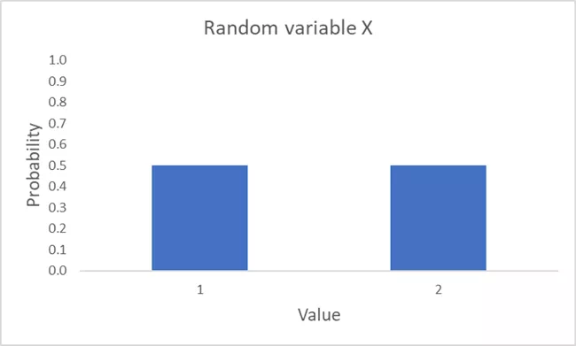

*Kuva 1*:ssä olevat leveät palkit eivät tietenkään tarkoita vihjaavan, että satunnaismuuttuja X olisi itse asiassa jatkuva. Sen sijaan palkit on tehty leveiksi, jotta ne olisivat visuaalisesti houkuttelevampia (vain suora viiva ylöspäin tarjoaisi vähemmän intuitiivisen visualisoinnin).

### Tasajakaumat

Ilmaisussa "satunnaismuuttuja" termi "satunnainen" tarkoittaa vain "probabilistinen". Toisin sanoen, se tarkoittaa vain, että kahdella tai useammalla muuttujan mahdollisella tuloksella on tietyt todennäköisyydet. Nämä tulokset eivät kuitenkaan *välttämättä* ole yhtä todennäköisiä (vaikka termi "satunnainen" voi todellakin tarkoittaa sitä muissa yhteyksissä).
**Yhtenäismuuttuja** on satunnaismuuttujan erityistapaus. Se voi saada kaksi tai useampia arvoja, joilla kaikilla on yhtä suuri todennäköisyys. Satunnaismuuttuja X, joka on esitetty *Kuvassa 1*, on selvästi yhtenäismuuttuja, sillä molemmat mahdolliset tulokset tapahtuvat todennäköisyydellä 0,5. On kuitenkin monia satunnaismuuttujia, jotka eivät ole yhtenäismuuttujia. 
Harkitse esimerkiksi satunnaismuuttujaa Y. Sen tulosten joukko on {1,2,3,8,10} ja seuraava todennäköisyysjakauma: Pr [Y = 1] = 0,25; Pr [Y = 2] = 0,35; Pr [Y = 3] = 0,1; Pr [Y = 8] = 0,25; Pr [Y = 10] = 0,05. 

Vaikka kaksi mahdollista tulosta todellakin tapahtuvat yhtä suurella todennäköisyydellä, nimittäin 1 ja 8, Y voi myös saada tiettyjä arvoja eri todennäköisyyksillä kuin 0,25 otannassa. Siksi, vaikka Y onkin satunnaismuuttuja, se ei ole yhtenäismuuttuja. 

Y:n graafinen esitys on tarjolla *Kuvassa 2*.

*Kuva 2: Satunnaismuuttuja Y*

Lopullisena esimerkkinä harkitse satunnaismuuttujaa Z. Sen tulosten joukko on {1,3,7,11,12} ja seuraava todennäköisyysjakauma: Pr (2) = 0,2; Pr (3) = 0,2; Pr (9) = 0,2; Pr (11) = 0,2; Pr (12) = 0,2. Voit nähdä sen esitettynä Kuvassa 3. Satunnaismuuttuja Z on, toisin kuin Y, todellakin yhtenäismuuttuja, sillä kaikki mahdollisten arvojen todennäköisyydet otannassa ovat yhtä suuret. 

*Kuva 3: Satunnaismuuttuja Z*

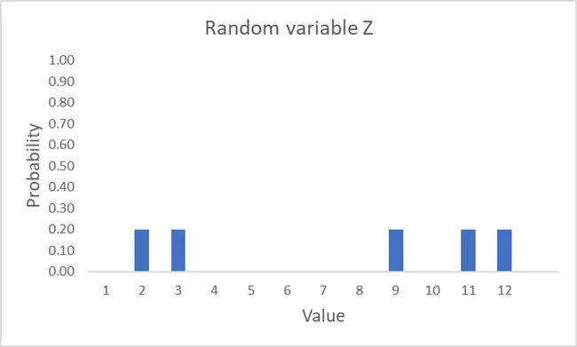

### Ehdollinen todennäköisyys

Oletetaan, että Bob aikoo valita päivän viimeisestä kalenterivuodesta yhtenäisesti. Mitä meidän tulisi päätellä valitun päivän todennäköisyydestä olla kesässä? 

Niin kauan kuin ajattelemme Bobin prosessin todella olevan täysin yhtenäinen, meidän tulisi päätellä, että Bob valitsee päivän kesässä 1/4 todennäköisyydellä. Tämä on **ehdoton todennäköisyys** satunnaisesti valitun päivän olemisesta kesässä. 

Oletetaan nyt, että Bobin sijaan valitsee yhtenäisesti vain niiden päivien joukosta, joina Crystal Laken (New Jersey) keskipäivän lämpötila oli 21 astetta Celsius tai korkeampi. Ottaen huomioon tämän lisätiedon, mitä voimme päätellä todennäköisyydestä, että Bob valitsee päivän kesässä? 

Meidän tulisi todella tehdä erilainen johtopäätös kuin aiemmin, vaikka emme tietäisikään mitään tarkempaa tietoa (esim. keskipäivän lämpötila jokaisena päivänä viime kalenterivuonna). 

Tietäen, että Crystal Lake sijaitsee New Jerseyssä, emme varmasti odottaisi keskipäivän lämpötilan olevan 21 astetta Celsius tai korkeampi talvella. Sen sijaan on paljon todennäköisempää, että kyseessä on lämmin päivä keväällä tai syksyllä, tai päivä jossain kesän aikana. Siksi tietäen, että Crystal Laken valitun päivän keskipäivän lämpötila oli 21 astetta Celsius tai korkeampi, todennäköisyys, että Bobin valitsema päivä on kesässä, kasvaa huomattavasti. Tämä on **ehdollinen todennäköisyys** satunnaisesti valitun päivän olemisesta kesässä, ottaen huomioon, että Crystal Laken keskipäivän lämpötila oli 21 astetta Celsius tai korkeampi.
Toisin kuin edellisessä esimerkissä, kahden tapahtuman todennäköisyydet voivat myös olla täysin riippumattomia toisistaan. Tässä tapauksessa sanomme, että ne ovat **riippumattomia**.
Oletetaan esimerkiksi, että tietty reilu kolikko on laskeutunut kruunalle. Ottaen huomioon tämän seikan, mikä on todennäköisyys sille, että huomenna sataa? Tässä tapauksessa ehdollisen todennäköisyyden tulisi olla sama kuin ehdoton todennäköisyys sille, että huomenna sataa, sillä kolikon heitolla ei yleensä ole vaikutusta säähän.

Käytämme “|” symbolia kirjoittaessamme ehdollisia todennäköisyyslauseita. Esimerkiksi tapahtuman A todennäköisyys sillä ehdolla, että tapahtuma B on tapahtunut, voidaan kirjoittaa seuraavasti: Pr[A|B]. Joten, kun kaksi tapahtumaa, A ja B, ovat riippumattomia, silloin Pr[A|B] = Pr[A] ja Pr[B|A] = Pr[B]. Riippumattomuuden ehto voidaan yksinkertaistaa seuraavasti: Pr[A,B] = Pr[A]*Pr[B].

Todennäköisyysteoriassa tunnetaan keskeinen tulos nimeltään **Bayesin teoreema**. Se käytännössä toteaa, että Pr[A|B] voidaan kirjoittaa uudelleen seuraavasti:

Pr[A|B] = (Pr[B|A] • Pr[A]) / Pr[B]

Ehdollisten todennäköisyyksien käyttämisen sijaan tiettyjen tapahtumien kanssa voimme myös tarkastella ehdollisia todennäköisyyksiä, jotka liittyvät kahteen tai useampaan satunnaismuuttujaan joukossa mahdollisia tapahtumia. Oletetaan kaksi satunnaismuuttujaa, X ja Y. Voimme merkitä minkä tahansa mahdollisen arvon X:lle x:llä ja minkä tahansa mahdollisen arvon Y:lle y:llä. Voimme sanoa, että kaksi satunnaismuuttujaa ovat riippumattomia, jos seuraava lausunto pitää paikkansa:

Pr[X = x,Y = y] = Pr[X = x] • Pr[Y = y] kaikille x ja y

Olkoon tämä lausunto hieman selkeämmin ilmaistu.

Oletetaan, että X:n ja Y:n tulossarjat määritellään seuraavasti: **X** = {x1,x2….,xi,….xn} ja **Y** = {y1,y2….,yi,….ym}. (On tyypillistä ilmaista arvojen joukot lihavoituna, isoilla kirjaimilla.)

Nyt oletetaan, että otat näytteen Y:stä ja havaitset y1. Yllä oleva lausunto kertoo meille, että todennäköisyys saada nyt x1 ottaessa näytettä X:stä on täsmälleen sama kuin emme olisi koskaan havainneet y1. Tämä pätee mihin tahansa yi:hin, jonka olisimme voineet vetää alustavasta näytteestämme Y:stä. Lopuksi, tämä pitää paikkansa ei vain x1:lle. Mikä tahansa xi:n esiintymisen todennäköisyys ei ole vaikuttunut Y:n näytteenoton tuloksesta. Kaikki tämä pätee myös tapauksessa, jossa X otetaan näytteeksi ensin.

Lopetetaan keskustelumme hieman filosofisemmalla huomiolla. Missä tahansa todellisessa tilanteessa, jonkin tapahtuman todennäköisyyttä arvioidaan aina tiettyä tietojoukkoa vasten. Ei ole olemassa mitään "ehdotonta todennäköisyyttä" sanan erittäin tiukassa merkityksessä.

Oletetaan esimerkiksi, että kysyisin sinulta todennäköisyyttä sille, että siat lentävät vuoteen 2030 mennessä. Vaikka en anna sinulle lisätietoja, tiedät selvästi paljon maailmasta, joka voi vaikuttaa arvioosi. Et ole koskaan nähnyt sikoja lentävän. Tiedät, että useimmat ihmiset eivät odota niiden lentävän. Tiedät, että ne eivät todellakaan ole rakennettu lentämään. Ja niin edelleen.
Kun puhumme "ehdollisesta todennäköisyydestä" jossakin todellisen maailman kontekstissa, termillä voi todella olla merkitystä vain, jos tarkoitamme sillä jotakin "todennäköisyyttä ilman mitään lisätietoja". Kaiken ymmärryksen "ehdollisesta todennäköisyydestä" tulisi siis aina ymmärtää suhteessa johonkin tiettyyn tietoon.
Voisin esimerkiksi kysyä sinulta todennäköisyyttä sille, että siat lentävät vuoteen 2030 mennessä, kun olen antanut sinulle todisteita siitä, että jotkut Uuden-Seelannin vuohet ovat oppineet lentämään muutaman vuoden koulutuksen jälkeen. Tässä tapauksessa todennäköisesti säätäisit arviotasi siitä, että siat lentävät vuoteen 2030 mennessä. Joten todennäköisyys sille, että siat lentävät vuoteen 2030 mennessä, on ehdollinen tälle todisteelle vuohista Uudessa-Seelannissa.

## Modulo-operaatio
<chapterId>709b34e5-b155-53d2-abbd-97d67e56db00</chapterId>

Yksinkertaisin lauseke **modulo-operaation** kanssa on seuraavanlainen: x mod y.

Muuttujaa x kutsutaan jakolausekkeeksi ja muuttujaa y jakajaksi. Suorittaaksesi modulo-operaation positiivisella jakolausekkeella ja positiivisella jakajalla, määrität vain jakojäännöksen.

Esimerkiksi, harkitse lauseketta 25 mod 4. Luku 4 menee lukuun 25 yhteensä 6 kertaa. Tämän jaon jäännös on 1. Näin ollen, 25 mod 4 on yhtä kuin 1. Samalla tavalla voimme arvioida alla olevat lausekkeet:

* 29 mod 30 = 29 (koska 30 menee 29:ään yhteensä 0 kertaa ja jäännös on 29)
* 42 mod 2 = 0 (koska 2 menee 42:een yhteensä 21 kertaa ja jäännös on 0)
* 12 mod 5 = 2 (koska 5 menee 12:een yhteensä 2 kertaa ja jäännös on 2)
* 20 mod 8 = 4 (koska 8 menee 20:een yhteensä 2 kertaa ja jäännös on 4)

Kun jakolauseke tai jakaja on negatiivinen, modulo-operaatioita käsitellään eri tavoin ohjelmointikielissä.

Törmäät varmasti tapauksiin, joissa on negatiivinen jakolauseke kryptografiassa. Näissä tapauksissa tyypillinen lähestymistapa on seuraava:

* Määritä ensin lähin arvo *pienempi tai yhtä suuri kuin* jakolauseke, johon jakaja jakaa jäännöksellä nolla. Kutsu tätä arvoa p:ksi.
* Jos jakolauseke on x, niin modulo-operaation tulos on arvon x – p arvo.

Esimerkiksi, oletetaan, että jakolauseke on –20 ja jakaja 3. Lähin arvo pienempi tai yhtä suuri kuin –20, johon 3 jakaa tasaisesti, on –21. Arvon x – p arvo tässä tapauksessa on –20 – (–21). Tämä on yhtä kuin 1 ja näin ollen, –20 mod 3 on yhtä kuin 1. Samalla tavalla voimme arvioida alla olevat lausekkeet:

* –8 mod 5 = 2
* –19 mod 16 = 13
* –14 mod 6 = 4

Notaatiossa näet tyypillisesti seuraavanlaisia lausekkeita: x = [y mod z]. Hakasulkujen vuoksi modulo-operaatio soveltuu tässä tapauksessa vain lausekkeen oikealle puolelle. Jos y on 25 ja z on 4, esimerkiksi, silloin x arvioituu 1:ksi.
Ilman sulkeita modulo-operaatio vaikuttaa *molemmille puolille* lauseketta. Oletetaan esimerkiksi seuraava lauseke: x = y mod z. Jos y on 25 ja z on 4, tiedämme vain, että x mod 4 antaa tulokseksi 1. Tämä on yhtäpitävä minkä tahansa x:n arvon kanssa joukosta {….– 7, – 3, 1, 5, 9….}.

Matematiikan haara, joka sisältää modulo-operaatioita lukuja ja lausekkeita varten, tunnetaan **modulaariaritmetiikkana**. Voit ajatella tätä haaraa aritmetiikkana tapauksissa, joissa lukusuora ei ole äärettömän pitkä. Vaikka tyypillisesti kohtaamme modulo-operaatioita (positiivisille) kokonaisluvuille kryptografiassa, voit suorittaa modulo-operaatioita myös millä tahansa reaaliluvuilla.

### Siirtosalakirjoitus

Modulo-operaatio on yleinen kryptografiassa. Havainnollistaaksemme, tarkastellaan yhtä kuuluisimmista historiallisista salausjärjestelmistä: siirtosalakirjoitusta.

Määritellään se ensin. Oletetaan sanakirja *D*, joka yhdistää kaikki englannin aakkosten kirjaimet, järjestyksessä, numeroiden joukkoon {0,1,2…,25}. Oletetaan viestitila **M**. **Siirtosalakirjoitus** on sitten salausjärjestelmä, joka määritellään seuraavasti:

- Valitse tasaisesti avain k avaintilasta **K**, missä **K** = {0,1,2,…,25}[1](#footnote1)
- Salaa viesti m, joka kuuluu **M**:ään, seuraavasti:
    - Erottele m sen yksittäisiksi kirjaimiksi m0, m1,….mi….,ml
    - Muunna jokainen mi numeroksi *D*:n mukaisesti
    - Jokaiselle mi, ci = [(mi + k) mod 26]
    - Muunna jokainen ci kirjaimeksi *D*:n mukaisesti
    - Yhdistä sitten c0, c1,….,cl saadaksesi salatun tekstin c
- Purkaa salattu teksti c seuraavasti:
    -- Muunna jokainen ci numeroksi *D*:n mukaisesti
    -- Jokaiselle ci, mi = [(ci – k) mod 26]
    -- Muunna jokainen mi kirjaimeksi *D*:n mukaisesti
    -- Yhdistä sitten m0, m1,….,ml saadaksesi alkuperäisen viestin m

Modulo-operaattori siirtosalakirjoituksessa varmistaa, että kirjaimet kiertävät ympäri, jotta kaikki salatun tekstin kirjaimet ovat määriteltyjä. Havainnollistaaksemme, tarkastellaan siirtosalakirjoituksen soveltamista sanaan “DOG”.

Oletetaan, että olet valinnut avaimen arvoksi 17 tasaisesti. Kirjain “O” vastaa 15:tä. Ilman modulo-operaatiota tämän alkuperäisen numeron ja avaimen lisäys johtaisi salatun tekstin numeroon 32. Kuitenkaan tätä salatun tekstin numeroa ei voida muuttaa salatun tekstin kirjaimeksi, koska englannin aakkostossa on vain 26 kirjainta. Modulo-operaatio varmistaa, että salatun tekstin numero on itse asiassa 6 (tuloksena 32 mod 26), joka vastaa salatun tekstin kirjainta “G”.

Koko sanan “DOG” salaaminen avaimen arvolla 17 on seuraava:
* Viesti = KOIRA = K,O,I,R,A = 3,15,6* c0 = [(3 + 17) Mod 26] = [(20) Mod 26] = 20 = U
* c1 = [(15 + 17) Mod 26] = [(32) Mod 26] = 6 = G
* c2 = [(6 + 17) Mod 26] = [(23) Mod 26] = 23 = X
* c = UGX

Jokainen voi intuitiivisesti ymmärtää, miten siirtosalakirjoitus toimii ja todennäköisesti käyttää sitä itse. Kryptografian tietämyksen edistämiseksi on kuitenkin tärkeää alkaa tottua formalisointiin, sillä järjestelmät muuttuvat paljon monimutkaisemmiksi. Siksi siirtosalakirjoituksen vaiheet formalisoitiin.

## XOR-operaatio
<chapterId>22f185cc-c516-5b33-950b-0908f2f881fe</chapterId>

Kaikki tietokoneiden data käsitellään, tallennetaan ja lähetetään verkkojen yli bittitasolla. Kaikki tietokonedataan sovelletut kryptografiset järjestelmät toimivat myös bittitasolla.

Oletetaan esimerkiksi, että olet kirjoittanut sähköpostiviestin sähköpostisovelluksellasi. Kaikki käyttämäsi salaus ei tapahdu suoraan sähköpostisi ASCII-merkeissä. Sen sijaan se sovelletaan kirjainten ja muiden symbolien bittiesitykseen sähköpostissasi.

Tärkeä matemaattinen operaatio modernille kryptografialle modulo-operaation lisäksi on **XOR-operaatio**, tai "poissulkeva tai" -operaatio. Tämä operaatio ottaa syötteiksi kaksi bittiä ja tuottaa tulokseksi toisen bitin. XOR-operaatio merkitään yksinkertaisesti "XOR". Se tuottaa 0, jos kaksi bittiä ovat samat, ja 1, jos kaksi bittiä ovat erilaiset. Alla näet neljä mahdollisuutta.

* 0 XOR 0 = 0
* 0 XOR 1 = 1
* 1 XOR 0 = 1
* 1 XOR 1 = 0

Voit suorittaa XOR-operaation kahdelle yksittäistä bittiä pidemmälle viestille asettamalla viestien bitit rinnakkain ja suorittamalla XOR-operaation kullekin bittiparille erikseen.

Kuvitellaan, että sinulla on viesti m1 (01111001) ja viesti m2 (01011001). Näiden kahden viestin XOR-operaatio näkyy alla.

* m1 XOR m2 = 01111001 XOR 01011001 = 00100000

Prosessi on suoraviivainen. Ensin XORataan m1:n ja m2:n vasemmanpuoleisimmat bitit. Tässä tapauksessa se on 0 XOR 0 = 0. Sitten XORataan toinen bittipari vasemmalta. Tässä tapauksessa se on 1 XOR 1 = 0. Jatkat tätä prosessia, kunnes olet suorittanut XOR-operaation oikeanpuoleisimmille biteille.
On helppo nähdä, että XOR-operaatio on vaihdannainen, eli m1 XOR m2 = m2 XOR m1. Lisäksi XOR-operaatio on myös liitännäinen. Tämä tarkoittaa, että (m1 XOR m2) XOR m3 = m1 XOR (m2 XOR m3). 
XOR-operaatio kahden eri pituisen merkkijonon välillä voi saada erilaisia tulkintoja riippuen kontekstista. Emme tässä yhteydessä käsittele eri pituisten merkkijonojen XOR-operaatioita.

XOR-operaatio on yhtä kuin erikoistapaus modulo-operaatiosta, kun bitit lasketaan yhteen ja jakajana on 2. Yhtäsuuruuden voi nähdä seuraavista tuloksista:

* (0 + 0) mod 2 = 0 XOR 0 = 0
* (1 + 0) mod 2 = 1 XOR 0 = 1
* (0 + 1) mod 2 = 0 XOR 1 = 1
* (1 + 1) mod 2 = 1 XOR 1 = 0

## Pseudosatunnaisuus
<chapterId>20463fc5-3e92-581f-a1b7-3151279bd95e</chapterId>

Keskustellessamme satunnaisista ja tasajakaumaisista muuttujista, teimme erityisen eron "satunnaisen" ja "tasajakaumaisen" välillä. Käytännössä tämä ero yleensä säilytetään, kun kuvaillaan satunnaismuuttujia. Kuitenkin nykyisessä kontekstissamme tämä ero on hylättävä ja "satunnainen" sekä "tasajakaumainen" käytetään synonyymeinä. Selitän miksi osion lopussa.

Aloitetaan siitä, että voimme kutsua binaarista merkkijonoa pituudeltaan n **satunnaiseksi** (tai **tasajakaumaiseksi**), jos se oli tulosta tasajakaumaisen muuttujan S näytteestä, joka antaa jokaiselle kyseisen pituuden n binaariselle merkkijonolle yhtä suuren todennäköisyyden valikoitua.

Oletetaan esimerkiksi kaikkien 8-bittisten binaaristen merkkijonojen joukko: {0000 0000,0000 0001,….,1111 1111}. (On tyypillistä kirjoittaa 8-bittinen merkkijono kahtena nelikko ryhmänä, joista kumpaakin kutsutaan **nibbleksi**.) Kutsukaamme tätä merkkijonojen joukkoa **S8**.

Edellä mainitun määritelmän mukaan voimme sitten kutsua tiettyä 8-bittistä binaarista merkkijonoa satunnaiseksi (tai tasajakaumaiseksi), jos se oli tulosta tasajakaumaisen muuttujan S näytteestä, joka antaa jokaiselle merkkijonolle **S8**-joukossa yhtä suuren todennäköisyyden valikoitua. Ottaen huomioon, että **S8**-joukko sisältää 28 elementtiä, valinnan todennäköisyyden näytteestä otettaessa tulisi olla 1/28 jokaiselle joukon merkkijonolle.

Binaarisen merkkijonon satunnaisuuden keskeinen näkökohta on, että se määritellään viittaamalla prosessiin, jonka kautta se valittiin. Mikä tahansa tietty binaarinen merkkijono sinänsä ei siis paljasta mitään sen satunnaisuudesta valinnassa.

Esimerkiksi monet ihmiset intuitiivisesti ajattelevat, että merkkijono kuten 1111 1111 ei olisi voitu valita satunnaisesti. Mutta tämä on selvästi väärin.
Määritellään yhtenäinen muuttuja S kaikille 8 merkin pituisille binäärijonoille, todennäköisyys valita 1111 1111 joukosta **S8** on sama kuin jonon, kuten 0111 01001, valitsemisen todennäköisyys. Näin ollen et voi sanoa mitään jonon satunnaisuudesta pelkästään analysoimalla jonoa itseään.
Voimme myös puhua satunnaisista jonoista ilman, että tarkoitamme nimenomaan binäärijonoja. Voisimme esimerkiksi puhua satunnaisesta heksajonosta AF 02 82. Tässä tapauksessa jono olisi valittu satunnaisesti kaikkien 6 merkin pituisten heksajonojen joukosta. Tämä vastaa 24 merkin pituisen binäärijonon satunnaista valintaa, sillä jokainen heksamerkki edustaa 4 bittiä.

Tyypillisesti ilmaisu “satunnainen jono”, ilman tarkennusta, viittaa jonoon, joka on satunnaisesti valittu kaikkien saman pituisten jonojen joukosta. Näin olen sen yllä kuvannut. Jonon, jonka pituus on n, voi tietysti myös satunnaisesti valita eri joukosta. Esimerkiksi sellaisesta, joka muodostaa vain osajoukon kaikista n pituisten jonojen joukosta, tai ehkä joukosta, joka sisältää eri pituisia jonoja. Näissä tapauksissa emme kuitenkaan viittaisi siihen “satunnaisena jonona”, vaan pikemminkin “jonona, joka on satunnaisesti valittu jostakin joukosta **S**”.

Keskeinen käsite kryptografiassa on pseudosatunnaisuus. **Pseudosatunnainen jono** pituudeltaan n vaikuttaa *siltä kuin* se olisi seurausta yhtenäisen muuttujan S näytteestä, joka antaa jokaiselle jonolle **Sn** yhtä suuren todennäköisyyden tulla valituksi. Todellisuudessa kuitenkin jono on seurausta yhtenäisen muuttujan S' näytteestä, joka määrittelee todennäköisyysjakauman – ei välttämättä yhtä suurilla todennäköisyyksillä kaikille mahdollisille tuloksille – osajoukolle **Sn**. Ratkaiseva seikka tässä on, että kukaan ei todellisuudessa pysty erottamaan näytteitä S:stä ja S':stä, vaikka ottaisit niitä monta.

Oletetaan esimerkiksi satunnainen muuttuja S. Sen tulosten joukko on **S256**, tämä on kaikkien 256 merkin pituisten binäärijonojen joukko. Tällä joukolla on 2256 elementtiä. Jokaisella elementillä on yhtä suuri todennäköisyys tulla valituksi, 1/2256, näytettäessä.

Lisäksi oletetaan satunnainen muuttuja S’. Sen tulosten joukko sisältää vain 2128 256 merkin pituista binäärijonoa. Sillä on jonkinlainen todennäköisyysjakauma näiden jonojen yli, mutta tämä jakauma ei välttämättä ole yhtenäinen.

Oletetaan, että otin nyt tuhansia näytteitä S:stä ja tuhansia näytteitä S':stä ja annoin sinulle molempien tulosten joukot. Kerron sinulle, kumpi tulosten joukko liittyy kumpaan satunnaiseen muuttujaan. Seuraavaksi otan näytteen yhdestä kahdesta satunnaisesta muuttujasta. Mutta tällä kertaa en kerro sinulle, kumman satunnaisen muuttujan näytteen otan. Jos S' olisi pseudosatunnainen, idea on, että todennäköisyytesi arvata oikein, kumman satunnaisen muuttujan näytteen otin, on käytännössä tuskin parempi kuin 1/2.

Tyypillisesti pseudosatunnainen jono pituudeltaan n tuotetaan satunnaisesti valitsemalla jono kooltaan n – x, missä x on positiivinen kokonaisluku, ja käyttämällä sitä laajentavan algoritmin syötteenä. Tämä satunnainen jono kooltaan n – x tunnetaan nimellä **siemen**.
Pseudosatunnaiset merkkijonot ovat keskeinen käsite käytännöllisen kryptografian mahdollistamisessa. Otetaan esimerkiksi virtasalaukset. Virtasalauksessa satunnaisesti valittu avain syötetään laajentavaan algoritmiin tuottamaan huomattavasti pidempi pseudosatunnainen merkkijono. Tämä pseudosatunnainen merkkijono yhdistetään sitten avoimeen tekstiin XOR-operaation avulla tuottamaan salateksti.
Jos emme pystyisi tuottamaan tällaista pseudosatunnaista merkkijonoa virtasalaukselle, tarvitsisimme avaimen, joka on yhtä pitkä kuin viesti sen turvallisuuden takaamiseksi. Tämä ei useimmissa tapauksissa ole kovin käytännöllinen vaihtoehto.

Tässä osiossa käsiteltyä pseudosatunnaisuuden käsitettä voidaan määritellä muodollisemmin. Se ulottuu myös muihin yhteyksiin. Mutta meidän ei tarvitse syventyä tähän keskusteluun tässä. Kaiken, mitä sinun todella tarvitsee intuitiivisesti ymmärtää suurimmasta osasta kryptografiaa, on ero satunnaisen ja pseudosatunnaisen merkkijonon välillä.[2](#footnote2)

Syy siihen, miksi hylkäämme eron "satunnaisen" ja "tasajakauman" välillä keskustelussamme, pitäisi nyt myös olla selvä. Käytännössä kaikki käyttävät termiä pseudosatunnainen osoittamaan merkkijonoa, joka näyttää **kuin** se olisi seurausta tasajakauman muuttujan S otoksesta. Tarkkaan ottaen meidän pitäisi kutsua tällaista merkkijonoa "pseudo-tasajakaumaksi", ottaen käyttöön aiemmin käytetyn kielen. Koska termi "pseudo-tasajakauma" on sekä kömpelö että sitä ei käytä kukaan, emme esittele sitä tässä selkeyden vuoksi. Sen sijaan jätämme vain eron "satunnaisen" ja "tasajakauman" välillä pois nykyisessä kontekstissa.

## Muistiinpanot
<chapterId>7cccd92c-15bc-5394-9024-af126988ecd7</chapterId>

[^1]: Voimme määritellä tämän lausunnon tarkasti käyttäen edellisessä osiossa käytettyä terminologiaa. Oletetaan, että tasajakauman muuttujalla K on **K** mahdollisten tulosten joukko. Joten Pr [K = 0] = 1/26, Pr [K = 1] = 1/26, ja niin edelleen. Otetaan tasajakauman muuttujasta K yksi otos tuottamaan tietty avain [^1].

[^2]: Jos olet kiinnostunut näistä asioista muodollisemmasta esityksestä, voit konsultoida Katz ja Lindellin teosta *Introduction to Modern Cryptography*, erityisesti luku 3 [^2].

# Kryptografian matemaattiset perusteet II
<partId>d7245cc9-bb6d-5403-b3d5-9c703d9a2f81</partId>

Tämä luku käsittelee edistyneempää aihetta kryptografian matemaattisissa perusteissa: lukuteoriaa. Vaikka lukuteoria on tärkeä symmetrisessä kryptografiassa (kuten Rijndael-salauksessa), se on erityisen tärkeää julkisen avaimen kryptografisessa ympäristössä.

Jos lukuteorian yksityiskohdat tuntuvat työläiltä, suosittelen ensimmäisellä kerralla korkean tason lukemista. Voit aina palata siihen myöhemmin.

## Mikä on lukuteoria?
<chapterId>c0051c34-fd5d-539c-93e2-5c6dfd4c3355</chapterId>

Voitaisiin kuvailla, että **lukuteoria** on kokonaislukujen ja niiden kanssa toimivien matemaattisten funktioiden ominaisuuksien tutkimista.

Harkitse esimerkiksi, että mitkä tahansa kaksi lukua a ja N ovat **keskenään jaottomia** (tai **suhteellisia alkulukuja**), jos niiden suurin yhteinen tekijä on 1. Oletetaan nyt tietty kokonaisluku N. Kuinka monta kokonaislukua, jotka ovat pienempiä kuin N, ovat keskenään jaottomia N:n kanssa? Voimmeko tehdä yleisiä lausuntoja tämän kysymyksen vastauksista? Tällaiset ovat tyypillisiä kysymyksiä, joita lukuteoria pyrkii vastaamaan.
Nykyajan lukuteoria nojaa abstraktin algebran työkaluihin. **Abstrakti algebra** on matematiikan aladisipliini, jonka päätutkimuskohteena ovat abstraktit objektit, joita kutsutaan algebraisiksi rakenteiksi. **Algebrallinen rakenne** on joukko elementtejä, joihin liittyy yksi tai useampi operaatio, ja joka täyttää tietyt aksioomat. Algebraisten rakenteiden kautta matemaatikot voivat saada oivalluksia tiettyihin matemaattisiin ongelmiin abstrahoimalla niiden yksityiskohdista.

Abstraktin algebran alaa kutsutaan joskus myös moderniksi algebraksi. Saatat myös törmätä käsitteeseen **abstrakti matematiikka** (tai **puhdas matematiikka**). Tämä jälkimmäinen termi ei viittaa abstraktiin algebraan, vaan tarkoittaa matematiikan tutkimista sen itsensä vuoksi, ei pelkästään mahdollisten sovellusten näkökulmasta.

Abstraktin algebran joukot voivat käsitellä monenlaisia objekteja, tasasivuisen kolmion muodon säilyttävistä muunnoksista tapettikuvioihin. Lukuteorialle me kuitenkin tarkastelemme vain joukkoja, jotka sisältävät kokonaislukuja tai funktioita, jotka toimivat kokonaislukujen kanssa.

## Ryhmät
<chapterId>3209b270-f9cd-5224-803e-0ed19fbf7826</chapterId>

Peruskäsite matematiikassa on elementtien joukko. Joukko merkitään yleensä aaltosulkeilla, ja elementit erotetaan toisistaan pilkuilla.

Esimerkiksi kaikkien kokonaislukujen joukko on {…,-2,-1,0,1,2,…}. Ellipsit tässä tarkoittavat, että tietty kuvio jatkuu tietyssä suunnassa. Joten kaikkien kokonaislukujen joukko sisältää myös 3,4,5,6 ja niin edelleen, sekä -3,-4,-5,-6 ja niin edelleen. Tämä kaikkien kokonaislukujen joukko merkitään tyypillisesti ℤ:llä.

Toinen esimerkki joukosta on ℤ mod 11, eli kaikkien kokonaislukujen joukko modulo 11. Toisin kuin koko joukko ℤ, tämä joukko sisältää vain rajallisen määrän elementtejä, nimittäin {0,1,…,9,10}.

Yleinen virhe on ajatella, että ℤ mod 11 -joukko on itse asiassa {-10,-9,….,0,….,9,10}. Mutta näin ei ole, ottaen huomioon aiemmin määritellyn modulo-operaation. Kaikki negatiiviset kokonaisluvut modulo 11 kääriytyvät joukkoon {0,1,….,9,10}. Esimerkiksi lauseke -2 mod 11 kääriytyy arvoon 9, kun taas lauseke -27 mod 11 kääriytyy arvoon 5.

Toinen peruskäsite matematiikassa on binäärioperaatio. Tämä on mikä tahansa operaatio, joka ottaa kaksi elementtiä tuottaakseen kolmannen. Esimerkiksi perusaritmetiikasta ja algebrasta tuttuja ovat neljä perustavanlaatuista binäärioperaatiota: yhteenlasku, vähennyslasku, kertolasku ja jakolasku.

Nämä kaksi perusmatemaattista käsitettä, joukot ja binäärioperaatiot, käytetään määrittelemään ryhmän käsite, joka on abstraktin algebran keskeisin rakenne.

Erityisesti oletetaan, että on olemassa jokin binäärioperaatio ◌. Lisäksi oletetaan, että on olemassa joukko elementtejä **S**, johon tämä operaatio on liitetty. Kaikki "varustettu" tässä tarkoittaa sitä, että operaatio ◌ voidaan suorittaa minkä tahansa kahden elementin välillä joukossa **S**.

Yhdistelmä 〈**S**, ◌〉 on siis **ryhmä**, jos se täyttää neljä tiettyä ehtoa, jotka tunnetaan ryhmän aksioomina.

1. Mille tahansa a ja b, jotka ovat elementtejä joukossa **S**, a ◌ b on myös elementti joukossa **S**. Tätä kutsutaan **sulkeutumisehdoiksi**.
2. Jokaiselle a, b ja c, jotka ovat joukon **S** alkiota, pätee, että (a ◌ b) ◌ c = a ◌ (b ◌ c). Tätä kutsutaan **assosiatiivisuusehdoksi**. 3. Joukossa **S** on yksikäsitteinen alkio e, siten että jokaiselle alkiolle a joukossa **S** pätee seuraava yhtälö: e ◌ a = a ◌ e = a. Koska tällainen alkio e on vain yksi, sitä kutsutaan **identiteettialkioksi**. Tätä ehtoa kutsutaan **identiteettiehdoksi**.
4. Jokaiselle alkiolle a joukossa **S** on olemassa alkio b joukossa **S**, siten että seuraava yhtälö pätee: a ◌ b = b ◌ a = e, missä e on identiteettialkio. Alkiota b tässä kutsutaan **käänteisalkioksi**, ja se merkitään yleisesti a-1. Tätä ehtoa kutsutaan **käänteisyys-** tai **kääntyvyys-ehdoksi**.

Tutkitaan ryhmiä hieman tarkemmin. Merkitään kaikkien kokonaislukujen joukkoa ℤ:llä. Tämä joukko yhdistettynä tavalliseen yhteenlaskuun, eli 〈ℤ, +〉, täyttää selvästi ryhmän määritelmän, koska se täyttää yllä mainitut neljä aksioomaa.

1. Jokaiselle x:lle ja y:lle, jotka ovat ℤ:n alkiota, x + y on myös ℤ:n alkio. Joten 〈ℤ, +〉 täyttää sulkeutumisehdon.
2. Jokaiselle x:lle, y:lle ja z:lle, jotka ovat ℤ:n alkiota, (x + y) + z = x + (y + z). Joten 〈ℤ, +〉 täyttää assosiatiivisuusehdon.
3. Joukossa 〈ℤ, +〉 on identiteettialkio, nimittäin 0. Jokaiselle x:lle ℤ:ssä pätee nimittäin: 0 + x = x + 0 = x. Joten 〈ℤ, +〉 täyttää identiteettiehdon.
4. Lopuksi, jokaiselle alkiolle x ℤ:ssä on olemassa y siten, että x + y = y + x = 0. Jos x olisi esimerkiksi 10, y olisi –10 (jos x on 0, myös y on 0). Joten 〈ℤ, +〉 täyttää käänteisyys-ehdon.

On tärkeää huomata, että kokonaislukujen joukko yhteenlaskun kanssa muodostaa ryhmän, mutta se ei tarkoita, että se muodostaisi ryhmän kertolaskun kanssa. Voit varmistaa tämän testaamalla 〈ℤ, •〉 neljää ryhmäaksioomaa vasten (missä • tarkoittaa tavallista kertolaskua).

Ensimmäiset kaksi aksioomaa pätevät ilmeisesti. Lisäksi kertolaskussa alkio 1 voi toimia identiteettialkiona. Mikä tahansa kokonaisluku x kerrottuna 1:llä tuottaa nimittäin x:n. Kuitenkin 〈ℤ, •〉 ei täytä käänteisyys-ehdot. Eli ei ole olemassa yksikäsitteistä alkiota y ℤ:ssä jokaiselle x:lle ℤ:ssä, siten että x • y = 1.

Oletetaan esimerkiksi, että x = 22. Mikä y:n arvo joukosta ℤ kerrottuna x:llä tuottaisi identiteettialkion 1? Arvo 1/22 toimisi, mutta se ei ole joukon ℤ alkio. Itse asiassa kohtaat tämän ongelman minkä tahansa kokonaisluvun x kohdalla, paitsi arvojen 1 ja -1 kohdalla (missä y:n tulisi olla 1 ja -1 vastaavasti).
Jos sallisimme reaaliluvut joukkoomme, ongelmamme suurelta osin katoaisivat. Mille tahansa joukon elementille x, kertominen arvolla 1/x tuottaa 1:n. Koska murtoluvut sisältyvät reaalilukujen joukkoon, jokaiselle reaaliluvulle voidaan löytää käänteisarvo. Poikkeuksena on nolla, sillä mikään kertominen nollalla ei koskaan tuota identiteettialkiota 1. Näin ollen, nollasta poikkeavien reaalilukujen joukko varustettuna kertolaskulla on todellakin ryhmä.
Jotkut ryhmät täyttävät viidennen yleisen ehdotuksen, joka tunnetaan **vaihdannaisuusehtona**. Tämä ehto on seuraava:

* Oletetaan ryhmä G, jolla on joukko **S** ja binäärioperaattori ◌. Oletetaan, että a ja b ovat elementtejä joukossa **S**. Jos pätee, että a ◌ b = b ◌ a mille tahansa kahdelle elementille a ja b joukossa **S**, silloin G täyttää vaihdannaisuusehdon.

Mikä tahansa ryhmä, joka täyttää vaihdannaisuusehdon, tunnetaan **vaihdannaisena ryhmänä** tai **Abelin ryhmänä** (Niels Henrik Abelin mukaan). On helppo todentaa, että sekä reaalilukujen joukko yhteenlaskun suhteen että kokonaislukujen joukko yhteenlaskun suhteen ovat Abelin ryhmiä. Kokonaislukujen joukko kertolaskun suhteen ei ole lainkaan ryhmä, joten se ei voi olla Abelin ryhmä. Sen sijaan nollasta poikkeavien reaalilukujen joukko kertolaskun suhteen on myös Abelin ryhmä.

Sinun tulisi kiinnittää huomiota kahteen tärkeään notaatiokonventioon. Ensinnäkin merkit “+” tai “x” käytetään usein symboloimaan ryhmäoperaatioita, vaikka elementit eivät tosiasiassa olisikaan numeroita. Näissä tapauksissa sinun ei tulisi tulkita näitä merkkejä standardin aritmeettisen yhteen- tai kertolaskun mukaisesti. Sen sijaan ne ovat operaatioita, joilla on vain abstrakti yhtäläisyys näiden aritmeettisten operaatioiden kanssa.

Ellet erityisesti viittaa aritmeettiseen yhteen- tai kertolaskuun, on helpompaa käyttää symboleita kuten ◌ ja ◊ ryhmäoperaatioihin, sillä näillä ei ole kulttuurisesti syvään juurtuneita merkityksiä.

Toiseksi, samasta syystä kuin “+” ja “x” usein käytetään merkitsemään ei-aritmeettisia operaatioita, ryhmien identiteettialkioita symboloidaan usein “0” ja “1” merkeillä, vaikka näiden ryhmien elementit eivät olekaan numeroita. Ellet viittaa ryhmän identiteettialkioon, jossa on numeroita, on helpompaa käyttää neutraalimpaa symbolia kuten “e” merkitsemään identiteettialkiota.

Monet erilaiset ja erittäin tärkeät arvojoukot matematiikassa, jotka on varustettu tietyillä binäärioperaatioilla, ovat ryhmiä. Kryptografiset sovellukset toimivat kuitenkin vain kokonaislukujen joukoilla tai ainakin elementeillä, jotka kuvataan kokonaisluvuilla, eli lukuteorian alueella. Siksi reaalilukujen joukkoja, jotka eivät ole kokonaislukuja, ei käytetä kryptografisissa sovelluksissa.

Lopetetaan antamalla esimerkki elementeistä, jotka voidaan “kuvailla kokonaisluvuilla”, vaikka ne eivät olekaan kokonaislukuja. Hyvä esimerkki on elliptisten käyrien pisteet. Vaikka mikään elliptisen käyrän piste ei selvästikään ole kokonaisluku, tällainen piste kuvataan todellakin kahdella kokonaisluvulla.

Elliptiset käyrät ovat esimerkiksi ratkaisevan tärkeitä Bitcoinille. Mikä tahansa standardi Bitcoinin yksityinen ja julkinen avainpari valitaan pisteiden joukosta, joka määritellään seuraavalla elliptisellä käyrällä: x3 + 7 = y2 mod 2256 – 232 – 29 – 28 – 27 – 26 - 24 - 1 (suurin alkuluku, joka on pienempi kuin 2256). x-koordinaatti on yksityinen avain ja y-koordinaatti on julkinen avain.
Bitcoinissa tapahtumat tyypillisesti sisältävät lähtökohtien lukitsemisen yhteen tai useampaan julkiseen avaimiin jollakin tavalla. Näiden tapahtumien arvo voidaan sitten vapauttaa tekemällä digitaalisia allekirjoituksia vastaavilla yksityisillä avaimilla.

## Sykliset ryhmät
<chapterId>bfa5c714-7952-5fef-88b1-ca5b07edd886</chapterId>

Yksi merkittävä ero, jonka voimme tehdä, on **äärellisen** ja **äärettömän ryhmän** välillä. Edellisessä on äärellinen määrä elementtejä, kun taas jälkimmäisessä on ääretön määrä elementtejä. Mikä tahansa äärellisen ryhmän elementtien lukumäärä tunnetaan ryhmän **järjestyksenä**. Kaikki käytännön kryptografia, joka sisältää ryhmien käytön, nojaa äärellisiin (lukuteoreettisiin) ryhmiin.

Julkisen avaimen kryptografiassa tietty luokka äärellisiä Abelian-ryhmiä, tunnettuina syklisinä ryhminä, on erityisen tärkeä. Syklisten ryhmien ymmärtämiseksi meidän on ensin ymmärrettävä ryhmäelementtien eksponentiaation käsite.

Oletetaan ryhmä G, jolla on ryhmäoperaatio ◌, ja että a on G:n elementti. Ilmaisua an tulisi tällöin tulkita niin, että elementti a yhdistetään itsensä kanssa yhteensä n – 1 kertaa. Esimerkiksi, a2 tarkoittaa a ◌ a, a3 tarkoittaa a ◌ a ◌ a, ja niin edelleen. (Huomaa, että eksponentiaatio tässä ei välttämättä tarkoita eksponentiaatiota tavallisessa aritmeettisessa mielessä.)

Käännymme esimerkin puoleen. Oletetaan, että G = 〈ℤ mod 7,+〉, ja että arvomme a on 4. Tässä tapauksessa a2 = [4 + 4 mod 7] = [8 mod 7] = 1 mod 7. Vaihtoehtoisesti, a4 edustaisi [4 + 4 + 4 + 4 mod 7] = [16 mod 7] = 2 mod 7.

Jotkut Abelian-ryhmät sisältävät yhden tai useamman elementin, jotka voivat tuottaa kaikki muut ryhmän elementit jatkuvalla eksponentiaatiolla. Näitä elementtejä kutsutaan **generaattoreiksi** tai **primitiivielementeiksi**.

Tärkeä luokka tällaisia ryhmiä on 〈ℤ* mod N, •〉, missä N on alkuluku. Notaatio ℤ* tässä tarkoittaa, että ryhmä sisältää kaikki nollasta poikkeavat, positiiviset kokonaisluvut, jotka ovat pienempiä kuin N. Tällainen ryhmä sisältää siis aina N – 1 elementtiä.

Harkitse esimerkiksi G = 〈ℤ* mod 11, •〉. Tällä ryhmällä on seuraavat elementit: {1, 2, 3, 4, 5, 6, 7, 8, 9, 10}. Tämän ryhmän järjestys on 10 (mikä todellakin on yhtä kuin 11 – 1).

Tutkitaanpa elementin 2 eksponentiaatiota tästä ryhmästä. Laskelmat aina 212 asti on esitetty alla. Huomaa, että yhtälön vasemmalla puolella oleva eksponentti viittaa ryhmäelementin eksponentiaatioon. Erityisessä esimerkissämme tämä todellakin sisältää aritmeettisen eksponentiaation yhtälön oikealla puolella (mutta se olisi voinut sisältää esimerkiksi myös yhteenlaskua). Selkeyden vuoksi olen kirjoittanut toistuvan operaation, eikä eksponenttimuotoa oikealla puolella.

* 21 = 2 mod 11 
* 22 = 2 · 2 mod 11 = 4 mod 11
* 23 = 2 · 2 · 2 mod 11 = 8 mod 11
* 24 = 2 · 2 · 2 · 2 mod 11 = 16 mod 11 = 5 mod 11
* 25 = 2 · 2 · 2 · 2 · 2 mod 11 = 32 mod 11 = 10 mod 11
* 26 = 2 · 2 · 2 · 2 · 2 · 2 mod 11 = 64 mod 11 = 9 mod 11
* 27 = 2 · 2 · 2 · 2 · 2 · 2 · 2 mod 11 = 128 mod 11 = 7 mod 11
* 28 = 2 · 2 · 2 · 2 · 2 · 2 · 2 · 2 mod 11 = 256 mod 11 = 3 mod 11
* 29 = 2 · 2 · 2 · 2 · 2 · 2 · 2 · 2 · 2 mod 11 = 512 mod 11 = 6 mod 11
* 210 = 2 · 2 · 2 · 2 · 2 · 2 · 2 · 2 · 2 · 2 mod 11 = 1024 mod 11 = 1 mod 11
* 211 = 2 · 2 · 2 · 2 · 2 · 2 · 2 · 2 · 2 · 2 · 2 mod 11 = 2048 mod 11 = 2 mod 11
* 212 = 2 · 2 · 2 · 2 · 2 · 2 · 2 · 2 · 2 · 2 · 2 · 2 mod 11 = 4096 mod 11 = 4 mod 11

Jos tarkastelet huolellisesti, voit nähdä, että eksponentiaalifunktion suorittaminen elementille 2 kiertää kaikki 〈ℤ* mod 11, •〉 ryhmän elementit seuraavassa järjestyksessä: 2, 4, 8, 5, 10, 9, 7, 3, 6, 1. 210 jälkeen elementin 2 eksponentiaalifunktion jatkaminen kiertää kaikki elementit uudelleen ja samassa järjestyksessä. Näin ollen elementti 2 on generaattori 〈ℤ* mod 11, •〉 ryhmässä.

Vaikka 〈ℤ* mod 11, •〉 ryhmässä on useita generaattoreita, kaikki ryhmän elementit eivät ole generaattoreita. Harkitse esimerkiksi elementtiä 3. Ensimmäisten 10 eksponentiaation läpikäynti, ilman työläiden laskelmien näyttämistä, tuottaa seuraavat tulokset:

* 31 = 3 mod 11
* 32 = 9 mod 11
* 33 = 5 mod 11
* 34 = 4 mod 11
* 35 = 1 mod 11
* 36 = 3 mod 11
* 37 = 9 mod 11
* 38 = 5 mod 11
* 39 = 4 mod 11
* 310 = 1 mod 11

Sen sijaan, että kävisimme läpi kaikki arvot joukossa 〈ℤ* mod 11, •〉, luvun 3 eksponentiaatio tuottaa vain osajoukon näistä arvoista: 3, 9, 5, 4 ja 1. Viidennen eksponentiaation jälkeen nämä arvot alkavat toistua.

Voimme nyt määritellä **syklisen ryhmän** minä tahansa ryhmänä, jolla on ainakin yksi generaattori. Toisin sanoen, on olemassa ainakin yksi ryhmän elementti, josta voit tuottaa kaikki muut ryhmän elementit eksponentiaation kautta.

Olet ehkä huomannut yllä olevassa esimerkissämme, että sekä 210 että 310 ovat yhtä kuin 1 mod 11. Itse asiassa, vaikka emme suoritakaan laskelmia, minkä tahansa joukon 〈ℤ* mod 11, •〉 elementin eksponentiaatio 10:llä tuottaa 1 mod 11. Miksi näin on?

Tämä on tärkeä kysymys, mutta sen vastaamiseen tarvitaan hieman työtä.

Aloitetaan olettamalla, että on olemassa kaksi positiivista kokonaislukua a ja N. Eräs tärkeä lukuteorian teoreema toteaa, että a:lla on kertolaskun käänteisluku modulo N (eli kokonaisluku b siten, että a • b = 1 mod N), jos ja vain jos suurin yhteinen tekijä a:n ja N:n välillä on 1. Toisin sanoen, jos a ja N ovat keskenään alkulukuja.

Joten, minkä tahansa kokonaislukujen ryhmän, joka on varustettu kertolaskulla modulo N, sisältää vain pienemmät N:n kanssa alkuluvut. Voimme merkitä tämän joukon ℤc mod N.

Esimerkiksi, oletetaan että N on 10. Vain kokonaisluvut 1, 3, 7 ja 9 ovat alkulukuja 10:n kanssa. Joten joukko ℤc mod 10 sisältää vain {1, 3, 7, 9}. Et voi luoda ryhmää kokonaislukujen kertolaskulla modulo 10 käyttäen mitään muita kokonaislukuja välillä 1 ja 10. Tälle erityiselle ryhmälle käänteisparit ovat 1 ja 9 sekä 3 ja 7.

Tapauksessa, jossa N itse on alkuluku, kaikki kokonaisluvut 1:stä N – 1:een ovat alkulukuja N:n kanssa. Tällainen ryhmä, siis, on järjestykseltään N – 1. Käyttäen aiempaa merkintäämme, ℤc mod N on yhtä kuin ℤ* mod N, kun N on alkuluku. Valitsemamme ryhmä esimerkissämme, 〈ℤ* mod 11, •〉, on tämän luokan ryhmien erityistapaus.

Seuraavaksi, funktio φ(N) laskee alkulukujen määrän aina lukuun N saakka, ja sitä kutsutaan **Eulerin φ-funktioksi**.[1](#footnote1) **Eulerin teoreeman** mukaan, aina kun kaksi kokonaislukua a ja N ovat alkulukuja, seuraava pätee:

* aφ(N) mod N = 1 mod N
Tällä on tärkeä merkitys ryhmien 〈ℤ* mod N, •〉 luokalle, missä N on alkuluku. Näissä ryhmissä ryhmäelementin eksponentiaatio edustaa aritmeettista eksponentiaatiota. Toisin sanoen, aφ(N) mod N edustaa aritmeettista toimitusta aφ(N) mod N. Koska mikä tahansa elementti a näissä kertolaskuryhmissä on keskenään jaottomissa suhteissa N:n kanssa, se tarkoittaa, että aφ(N) mod N = aN – 1 mod N = 1 mod N.
Eulerin teoreema on todella tärkeä tulos. Aluksi se tarkoittaa, että kaikki elementit ryhmässä 〈ℤ* mod N, •〉 voivat vain kiertää rajallisen määrän arvoja eksponentiaation kautta, jotka jakautuvat N – 1:llä. Esimerkiksi 〈ℤ* mod 11, •〉 tapauksessa tämä tarkoittaa, että jokainen elementti voi vain kiertää läpi 2, 5 tai 10 elementtiä. Ryhmän arvot, joiden läpi mikä tahansa elementti kiertää eksponentiaation kautta, tunnetaan elementin **järjestyksenä**. Elementti, jonka järjestys vastaa ryhmän järjestystä, on generaattori.

Lisäksi Eulerin teoreema tarkoittaa, että voimme aina tietää tuloksen aN – 1 mod N mistä tahansa ryhmästä 〈ℤ* mod N, •〉, missä N on alkuluku. Näin on riippumatta siitä, kuinka monimutkaisia todelliset laskelmat saattavat olla.

Esimerkiksi, oletetaan että ryhmämme on ℤ* mod 160,481,182 (missä 160,481,182 on todellakin alkuluku). Tiedämme, että kaikki kokonaisluvut 1 läpi 160,481,181 ovat tämän ryhmän elementtejä, ja että φ(n) = 160,481,181. Vaikka emme voi tehdä kaikkia laskutoimituksia, tiedämme, että lausekkeet kuten 514160,481,181, 2,005160,481,181, ja 256,212160,481,181 kaikki arvioituvat 1 mod 160,481,182.

## Kentät
<chapterId>fad52d86-3a22-5c9f-979e-3bec9eaa008e</chapterId>

Ryhmä on perus algebraallinen rakenne abstraktissa algebrassa, mutta on olemassa monia muita. Ainoa toinen algebraallinen rakenne, jonka kanssa sinun tarvitsee olla tuttu, on kenttä, erityisesti äärellinen kenttä. Tämäntyyppistä algebraallista rakennetta käytetään usein kryptografiassa, kuten Advanced Encryption Standardissa. Jälkimmäinen on pääasiallinen symmetrinen salausjärjestelmä, jonka kohtaat käytännössä.

Kenttä johdetaan ryhmän käsitteestä. Erityisesti **kenttä** on elementtien joukko **S** varustettuna kahdella binäärioperaattorilla ◌ ja ◊, jotka täyttävät seuraavat ehdot:

1. Joukko **S** varustettuna ◌:lla on Abelin ryhmä.
2. Joukko **S** varustettuna ◊:lla on Abelin ryhmä "nollaamattomille" elementeille.
3. Joukko **S** varustettuna kahdella operaattorilla täyttää niin sanotun jakautumisehdon: Oletetaan, että a, b ja c ovat **S**-joukon elementtejä. Sitten **S** varustettuna kahdella operaattorilla täyttää jakautumisominaisuuden, kun a ◌ (b ◊ c) = a ◌ b ◊ a ◌ c.
Huomaa, että ryhmien tapaan kentän määritelmä on hyvin abstrakti. Se ei tee oletuksia elementtien tyypeistä joukossa **S**, eikä operaatioista ◌ ja ◊. Se vain toteaa, että kenttä on mikä tahansa elementtien joukko kahdella operaatiolla, joille pätevät kolme yllä mainittua ehtoa. (Toisen Abelian ryhmän "nolla"-elementti voidaan tulkita abstraktisti.)
Mikä voisi olla esimerkki kentästä? Hyvä esimerkki on joukko ℤ mod 7, eli {0,1,…,7}, määritelty standardin yhteenlaskun (◌:n sijaan yllä) ja standardin kertolaskun (◊:n sijaan yllä) avulla.

Ensinnäkin, ℤ mod 7 täyttää ehdon ollakseen Abelian ryhmä yhteenlaskun suhteen, ja se täyttää ehdon ollakseen Abelian ryhmä kertolaskun suhteen, jos otetaan huomioon vain nollasta poikkeavat elementit. Toiseksi, joukon ja kahden operaattorin yhdistelmä täyttää distributiivisen ehdon.

On didaktisesti hyödyllistä tutkia näitä väitteitä käyttämällä joitakin tiettyjä arvoja. Otetaan kokeellisiksi arvoiksi 5, 2 ja 3, joitakin satunnaisesti valittuja elementtejä joukosta ℤ mod 7, tutkiaksemme kenttää 〈ℤ mod 7, +, •〉. Käytämme näitä kolmea arvoa tarpeen mukaan tutkiaksemme tiettyjä ehtoja.

Tutkitaan ensin, onko ℤ mod 7 varustettuna yhteenlaskulla Abelian ryhmä.

1. Sulkeutumisehto: Otetaan arvoiksi 5 ja 2. Tässä tapauksessa [5 + 2] mod 7 = 7 mod 7 = 0. Tämä on todellakin elementti joukossa ℤ mod 7, joten tulos on johdonmukainen sulkeutumisehdon kanssa.
2. Assosiatiivisuusehto: Otetaan arvoiksi 5, 2 ja 3. Tässä tapauksessa [(5 + 2) + 3] mod 7 = [5 + (2 + 3)] mod 7 = 10 mod 7 = 3. Tämä on johdonmukaista assosiatiivisuusehdon kanssa.
3. Identiteettiehto: Otetaan arvoksi 5. Tässä tapauksessa [5 + 0] mod 7 = [0 + 5] mod 7 = 5. Joten 0 vaikuttaa olevan identiteettielementti yhteenlaskulle.
4. Inverssiehto: Harkitaan 5:n inverssiä. Sen täytyy olla niin, että [5 + d] mod 7 = 0, jollekin arvolle d. Tässä tapauksessa ℤ mod 7:stä löytyvä yksilöllinen arvo, joka täyttää tämän ehdon, on 2.
5. Vaihdannaisuusehto: Otetaan arvoiksi 5 ja 3. Tässä tapauksessa [5 + 3] mod 7 = [3 + 5] mod 7 = 1. Tämä on johdonmukaista vaihdannaisuusehdon kanssa.

Joukko ℤ mod 7 varustettuna yhteenlaskulla näyttää selvästi olevan Abelian ryhmä. Tutkitaan nyt, onko ℤ mod 7 varustettuna kertolaskulla Abelian ryhmä kaikille nollasta poikkeaville elementeille.

1. Sulkeutumisehto: Otetaan arvoiksi 5 ja 2. Tässä tapauksessa [5 • 2] mod 7 = 10 mod 7 = 3. Tämä on myös elementti joukossa ℤ mod 7, joten tulos on johdonmukainen sulkeutumisehdon kanssa.
2. Assosiatiivisuusehto: Otetaan arvot 5, 2 ja 3. Tässä tapauksessa [(5 • 2) • 3] mod 7 = [5 • (2 • 3)] mod 7 = 30 mod 7 = 2. Tämä on yhdenmukaista assosiatiivisuusehdon kanssa.
3. Identiteettiehto: Otetaan arvoksi 5. Tässä tapauksessa [5 • 1] mod 7 = [1 • 5] mod 7 = 5. Joten 1 vaikuttaa olevan kertolaskun identiteettialkio.
4. Käänteisalkion ehto: Harkitaan luvun 5 käänteisalkiota. Sen on täytettävä ehto [5 • d] mod 7 = 1, jollakin d:n arvolla. Ainutlaatuinen arvo ℤ mod 7:stä, joka täyttää tämän ehdon, on 3. Tämä on yhdenmukaista käänteisalkion ehdon kanssa.
5. Vaihdannaisuusehto: Otetaan arvot 5 ja 3. Tässä tapauksessa [5 • 3] mod 7 = [3 • 5] mod 7 = 15 mod 7 = 1. Tämä on yhdenmukaista vaihdannaisuusehdon kanssa.

Joukko ℤ mod 7 vaikuttaa selvästi täyttävän abelilaisen ryhmän säännöt, kun sitä käytetään yhdessä joko yhteen- tai kertolaskun kanssa nollasta eroavien alkioiden kanssa.

Lopuksi tämä joukko yhdessä molempien operaattoreiden kanssa vaikuttaa täyttävän distributiivisuusehdon. Otetaan arvot 5, 2 ja 3. Voimme nähdä, että [5 • (2 + 3)] mod 7 = [5 • 2 + 5 • 3] mod 7 = 25 mod 7 = 4.

Olemme nyt nähneet, että ℤ mod 7 varustettuna yhteen- ja kertolaskulla täyttää äärellisen kentän aksioomat, kun testataan tietyillä arvoilla. Tietenkin voimme myös osoittaa tämän yleisesti, mutta emme tee sitä tässä.

Keskeinen ero on kahdenlaisissa kentissä: äärellisissä ja äärettömissä kentissä.

**Ääretön kenttä** sisältää kentän, jossa joukko **S** on äärettömän suuri. Reaalilukujen ℝ joukko varustettuna yhteen- ja kertolaskulla on esimerkki äärettömästä kentästä. **Äärellinen kenttä**, joka tunnetaan myös nimellä **Galois'n kenttä**, on kenttä, jossa joukko **S** on äärellinen. Yllä oleva esimerkkimme 〈ℤ mod 7, +, •〉 on äärellinen kenttä.

Kryptografiassa olemme ensisijaisesti kiinnostuneita äärellisistä kentistä. Yleisesti voidaan osoittaa, että äärellinen kenttä on olemassa jollekin alkioiden joukolle **S** vain ja ainoastaan, jos sillä on pm alkiota, missä p on alkuluku ja m positiivinen kokonaisluku, joka on suurempi tai yhtä suuri kuin yksi. Toisin sanoen, jos jonkin joukon **S** järjestys on alkuluku (pm missä m = 1) tai jonkin alkuluvun potenssi (pm missä m > 1), niin voit löytää kaksi operaattoria ◌ ja ◊ siten, että kentän ehdot täyttyvät.

Jos jollakin äärellisellä kentällä on alkuluvun verran alkoita, sitä kutsutaan **alkukentäksi**. Jos äärellisen kentän alkioiden lukumäärä on alkuluvun potenssi, kenttä on **laajennuskenttä**. Kryptografiassa olemme kiinnostuneita sekä alkukentistä että laajennuskentistä.[2](#footnote2)
Kryptografian keskeiset pääkentät ovat niitä, joissa kaikkien kokonaislukujen joukko moduloituu jonkin alkuluvun mukaan, ja operaattorit ovat standardi yhteen- ja kertolasku. Tämä äärellisten kenttien luokka sisältäisi ℤ mod 2, ℤ mod 3, ℤ mod 5, ℤ mod 7, ℤ mod 11, ℤ mod 13, ja niin edelleen. Mille tahansa alkukentälle ℤ mod p, kentän kokonaislukujen joukko on seuraava: {0,1,….,p – 2, p – 1}.
Kryptografiassa olemme myös kiinnostuneita laajennuskentistä, erityisesti mistä tahansa kentistä, joilla on 2m elementtiä, missä m > 1. Tällaisia äärellisiä kenttiä käytetään esimerkiksi Rijndael-salauksessa, joka muodostaa Advanced Encryption Standardin perustan. Vaikka alkukentät ovat suhteellisen intuitiivisia, nämä kantaluvun 2 laajennuskentät eivät todennäköisesti ole tuttuja kenellekään, joka ei ole perehtynyt abstraktiin algebraan.

Aloitetaan sillä, että todellakin mikä tahansa kokonaislukujen joukko, jolla on 2m elementtiä, voidaan määrittää kahdella operaattorilla, jotka tekevät niiden yhdistelmästä kentän (kunhan m on positiivinen kokonaisluku). Kuitenkaan pelkästään se, että kenttä olemassa, ei välttämättä tarkoita, että se olisi helppo löytää tai erityisen käytännöllinen tietyissä sovelluksissa.

Käy ilmi, että erityisen soveltuvia laajennuskenttiä 2m kryptografiassa ovat ne, jotka määritellään erityisten polynomilausekkeiden joukkojen yli, eikä jonkin kokonaislukujen joukon yli.

Oletetaan esimerkiksi, että haluaisimme laajennuskentän, jolla on 23 (eli 8) elementtiä joukossa. Vaikka tällaisen koon kenttiä varten voisi olla monia erilaisia joukkoja, yksi tällainen joukko sisältää kaikki uniikit polynomit muodossa a2x2 + a1x + a0, missä jokainen kerroin ai on joko 0 tai 1. Näin ollen tämä joukko **S** sisältää seuraavat elementit:

1. 0: Tapaus, jossa a2 = 0, a1 = 0, ja a0 = 0.
2. 1: Tapaus, jossa a2 = 0, a1 = 0, ja a0 = 1.
3. x: Tapaus, jossa a2 = 0, a1 = 1, ja a0 = 0.
4. x + 1: Tapaus, jossa a2 = 0, a1 = 1, ja a0 = 1.
5. x2: Tapaus, jossa a2= 1, a1 = 0, ja a0 = 0.
6. x2 + 1: Tapaus, jossa a2 = 1, a1 = 0, ja a0 = 1.
7. x2 + x: Tapaus, jossa a2 = 1, a1 = 1 ja a0 = 0. 8. x2 + x + 1: Tapaus, jossa a2 = 1, a1 = 1 ja a0 = 1.

Joten **S** olisi joukko {0,1,x,x + 1, x2,x2 + 1, x2 + x, x2 + x + 1}. Mitkä kaksi operaatiota voidaan määritellä tämän elementtien joukon yli varmistaaksemme, että niiden yhdistelmä muodostaa kentän?

Ensimmäinen operaatio joukossa S (◌) voidaan määritellä standardina polynomien lisäyksenä modulo 2. Sinun tarvitsee vain lisätä polynomit kuten tavallisesti ja sitten soveltaa modulo 2 kunkin tuloksena olevan polynomin kertoimiin. Tässä on joitakin esimerkkejä:

* [(x2) + (x2 + x + 1)] mod 2 = [2x2 + x + 1] mod 2 = x + 1
* [(x2 + x) + (x)] mod 2 = [x2 + 2x] mod 2 = x2
* [(x + 1) + (x2 + x + 1)] mod 2 = [x2 + 2x + 2] mod 2 = x2 + 1

Toinen operaatio joukossa S (◌), joka tarvitaan kentän luomiseksi, on monimutkaisempi. Se on eräänlainen kertolasku, mutta ei standardi aritmeettinen kertolasku. Sen sijaan sinun täytyy nähdä jokainen elementti vektorina ja ymmärtää operaatio näiden kahden vektorin kertolaskuna modulo reduusoimaton polynomi.

Käännämme ensin katseemme reduusoimattoman polynomin käsitteeseen. **Reduusoimaton polynomi** on sellainen, jota ei voida jakaa tekijöihin (aivan kuten alkulukua ei voida jakaa muihin tekijöihin kuin 1 ja itse alkuluku). Tarkoituksemme kannalta olemme kiinnostuneita polynomeista, jotka ovat reduusoimattomia kaikkien kokonaislukujen joukossa. (Huomaa, että tietyt polynomit saattaa pystyä jakamaan tekijöihin esimerkiksi reaaliluvuilla tai kompleksiluvuilla, vaikka et pystyisikään jakamaan niitä käyttäen kokonaislukuja.)

Esimerkiksi, harkitse polynomia x2 - 3x + 2. Tämä voidaan kirjoittaa uudelleen muodossa (x – 1)(x – 2). Siksi tämä ei ole reduusoimaton. Nyt harkitse polynomia x2 + 1. Käyttäen vain kokonaislukuja, tälle lausekkeelle ei ole mahdollista löytää edelleen tekijöitä. Siksi tämä on reduusoimaton polynomi kokonaislukujen suhteen.
Seuraavaksi käännetään katse vektorikertolaskun käsitteeseen. Emme tutki tätä aihetta syvällisesti, sinun tarvitsee vain ymmärtää perussääntö: Mikä tahansa vektorijako on mahdollinen, kunhan jaettavalla on korkeampi tai yhtä suuri aste kuin jakajalla. Jos jaettavalla on matalampi aste kuin jakajalla, jaettavaa ei enää voida jakaa jakajalla.
Esimerkiksi, tarkastellaan lauseketta x6 + x + 1 mod x5 + x2. Tämä selkeästi supistuu edelleen, koska jaettavan aste, 6, on suurempi kuin jakajan aste, 5. Nyt tarkastellaan lauseketta x5 + x + 1 mod x5 + x2. Tämäkin supistuu edelleen, koska jaettavan aste, 5, ja jakajan aste, 5, ovat yhtä suuret.

Kuitenkin, nyt tarkastellaan lauseketta x4 + x + 1 mod x5 + x2. Tämä ei supistu edelleen, koska jaettavan asteen, 4, on matalampi kuin jakajan asteen, 5.

Tämän tiedon perusteella olemme nyt valmiita löytämään toisen toiminnon joukolle {0,1,x,x + 1,x2,x2 + 1,x2 + x,x2 + x + 1}.

Olen jo sanonut, että toisen toiminnon tulisi ymmärtää vektorikertolaskuna modulo jonkin redusoimattoman polynomin suhteen. Tämän redusoimattoman polynomin tulisi varmistaa, että toinen toiminto määrittelee Abelin ryhmän joukon **S** yli ja on yhdenmukainen distributiivisen ehdon kanssa. Mikä siis tämän redusoimattoman polynomin tulisi olla?

Koska kaikki joukon vektorit ovat asteeltaan 2 tai matalampia, redusoimattoman polynomin tulisi olla asteen 3. Jos kahden joukon vektorin kertolasku tuottaa asteen 3 tai korkeamman polynomin, tiedämme, että modulo asteen 3 polynomilla tuottaa aina asteen 2 tai matalamman polynomin. Näin on siksi, että mikä tahansa asteen 3 tai korkeampi polynomi on aina jaettavissa asteen 3 polynomilla. Lisäksi, toimivan jakajan polynomin on oltava redusoimaton.

Käy ilmi, että on olemassa useita asteen 3 redusoimattomia polynomeja, joita voisimme käyttää jakajanamme. Jokainen näistä polynomeista määrittelee eri kentän yhdessä joukkomme S ja modulo 2 lisäyksen kanssa. Tämä tarkoittaa, että sinulla on useita vaihtoehtoja, kun käytät laajennuskenttiä 2m kryptografiassa.

Esimerkkinämme oletetaan, että valitsemme polynomin x3 + x + 1. Tämä on todellakin redusoimaton, koska sitä ei voi jakaa kokonaisluvuilla. Lisäksi se varmistaa, että kahden elementin kertolasku tuottaa aina asteen 2 tai matalamman polynomin.
Käydään läpi esimerkki toisesta operaatiosta käyttäen jakajana polynomia x3 + x + 1, jotta ymmärrämme, miten se toimii. Oletetaan, että kerrot joukkomme **S** alkiot x2 + 1 ja x2 + x keskenään. Meidän on sitten laskettava lauseke [(x2 + 1) • (x2 + x)] mod x3 + x + 1. Tämä voidaan yksinkertaistaa seuraavasti:
* [(x2 + 1) • (x2 + x)] mod x3 + x + 1 =
* [x2 • x2 + x2 • x + 1 • x2 + 1 • x] mod x3 + x + 1 = 
* [x4 + x3 + x2 + x] mod x3 + x + 1
    
Tiedämme, että [x4 + x3 + x2 + x] mod x3 + x + 1 voidaan pienentää, koska jaettavalla on korkeampi aste (4) kuin jakajalla (3).

Aloitetaan siitä, että lauseke x3 + x + 1 menee x4 + x3 + x2 + x sisään yhteensä x kertaa. Voit varmistaa tämän kertomalla x3 + x + 1:n x:llä, mikä on x4 + x2 + x. Koska jälkimmäinen termi on samaa astetta jaettavan kanssa, nimittäin 4, tiedämme tämän toimivan. Voit laskea tämän jakamisen jäännöksen x:llä seuraavasti:

* [(x4 + x3 + x2 + x) – (x4 + x2 + x)] mod x3 + x + 1 = 
* [x3] mod x3 + x + 1 =
* x3

Joten jaettuamme x4 + x3 + x2 + x:n x3 + x + 1:llä yhteensä x kertaa, meillä on jäännöksenä x3. Voiko tämän jakaa edelleen x3 + x + 1:llä?
Vaistomaisesti voi tuntua houkuttelevalta sanoa, että x3 ei enää jakaudu termillä x3 + x + 1, koska jälkimmäinen termi vaikuttaa suuremmalta. Muista kuitenkin aiempi keskustelumme vektorijakolaskusta. Niin kauan kuin jakaja on asteen suuruinen tai suurempi kuin jakaja, lauseketta voidaan edelleen pienentää. Erityisesti lauseke x3 + x + 1 mahtuu x3:een täsmälleen 1 kerran. Jäännös lasketaan seuraavasti:
[(x3) – (x3 + x + 1)] mod x3 + x + 1 = 
[x + 1] mod x3 + x + 1 = 
x + 1

Saatat ihmetellä, miksi (x3) – (x3 + x + 1) arvioituu x + 1:ksi eikä – x – 1. Muista, että ensimmäinen toimintomme kentässämme määritellään modulo 2. Siksi kahden vektorin vähennys tuottaa täsmälleen saman tuloksen kuin kahden vektorin lisäys.

Yhteenvetona x2 + 1:n ja x2 + x:n kertolaskusta: Kun kerrot nämä kaksi termiä, saat asteen 4 polynomin, x4 + x3 + x2 + x, joka on pienennettävä modulo x3 + x + 1. Asteen 4 polynomi jakautuu x3 + x + 1:llä täsmälleen x + 1 kertaa. Jäännös jaettaessa x4 + x3 + x2 + x termi x3 + x + 1:llä täsmälleen x + 1 kertaa on x + 1. Tämä on todellakin elementti joukossamme {0,1,x,x + 1,x2,x2 + 1,x2 + x,x2 + x + 1}.

Miksi laajennuskentät, joiden perustana on 2 yli polynomijoukkojen, kuten yllä olevassa esimerkissä, ovat hyödyllisiä kryptografiassa? Syy on, että voit tarkastella tällaisten joukkojen polynomien kertoimia, joko 0 tai 1, binäärijonojen elementteinä tietyn pituuden kanssa. Joukko **S** yllä olevassa esimerkissä voitaisiin esimerkiksi nähdä sen sijaan joukkona S, joka sisältää kaikki 3 pituiset binäärijonot (000 - 111). **S**-joukon operaatioita voidaan sitten käyttää myös näiden binäärijonojen operaatioihin ja tuottaa saman pituinen binäärijono.

## Abstrakti algebra käytännössä
<chapterId>ed35b98d-18b4-5790-9911-1078e0f84f92</chapterId>
Vaikka keskustelun muodollinen kieli ja abstraktius saattavat aluksi vaikuttaa haastavilta, ryhmän käsite ei pitäisi olla liian vaikea ymmärtää. Se on vain joukko elementtejä yhdessä binäärioperaation kanssa, jossa kyseisen binäärioperaation suorittaminen näille elementeille täyttää neljä yleistä ehtoa. Abelin ryhmässä on vain yksi lisäehto, jota kutsutaan kommutatiivisuudeksi. Syklinen ryhmä puolestaan on erityinen Abelin ryhmä, nimittäin sellainen, jolla on generaattori. Kenttä on vain monimutkaisempi rakenne perusryhmän käsitteestä.

Mutta jos olet käytännönläheinen henkilö, saatat tässä vaiheessa miettiä: Ketä kiinnostaa? Onko sillä mitään todellista merkitystä, että tietty elementtien joukko operaattorin kanssa muodostaa ryhmän, tai jopa Abelin tai syklisen ryhmän? Entä onko sillä merkitystä, että jokin on kenttä?

Menemättä liian yksityiskohtiin, vastaus on "kyllä". Ryhmät keksittiin ensimmäisen kerran 1800-luvulla ranskalaisen matemaatikon Evariste Galois'n toimesta. Hän käytti niitä päätelmien tekemiseen yli viidennen asteen polynomiyhtälöiden ratkaisemisesta.

Siitä lähtien ryhmän käsite on auttanut valaisemaan lukuisia ongelmia matematiikassa ja muualla. Esimerkiksi fyysikko Murray-Gellmanin avulla ryhmäteoriaa hyödyntäen ennustettiin hiukkasen olemassaolo ennen kuin sitä havaittiin kokeissa.[3](#footnote3) Toisena esimerkkinä kemistit käyttävät ryhmäteoriaa molekyylien muotojen luokitteluun. Matemaatikot ovat jopa käyttäneet ryhmän käsitettä päätelmien tekemiseen jostakin niin konkreettisesta kuin tapettien kuviot!

Käytännössä osoittaminen, että tietty elementtien joukko jonkin operaattorin kanssa muodostaa ryhmän, tarkoittaa, että kuvailemasi asia omaa tietyn symmetrian. Ei symmetriaa tavallisessa merkityksessä, vaan abstraktimmassa muodossa. Ja tämä voi tarjota merkittäviä oivalluksia tiettyihin järjestelmiin ja ongelmiin. Abstraktin algebran monimutkaisemmat käsitteet antavat meille lisätietoa.

Tärkeintä on, että näet lukuteoreettisten ryhmien ja kenttien merkityksen käytännössä niiden sovellusten kautta kryptografiassa, erityisesti julkisen avaimen kryptografiassa. Olemme jo nähneet keskustelussamme kentistä, esimerkiksi miten laajennuskenttiä käytetään Rijndael-salauksessa. Käymme läpi tämän esimerkin *Luvussa 5*.

## Lisätutkimuksia
<chapterId>ab51038d-82bd-5c5d-a759-276cfbf7fbce</chapterId>

Lisäkeskusteluun abstraktista algebrasta suosittelen erinomaista videoiden sarjaa abstraktista algebrasta, jonka on tuottanut Socratica.[4](#footnote4) Erityisesti suosittelen seuraavia videoita: “What is abstract algebra?”, “Group definition (expanded)”, “Ring definition (expanded)”, ja “Field definition (expanded).” Nämä neljä videota tarjoavat lisäoivalluksia yllä käytyyn keskusteluun. (Emme käsitelleet renkaita, mutta kenttä on vain erityinen tyyppi rengasta.)

Lisäkeskusteluun modernista lukuteoriasta voit tutustua moniin edistyneisiin keskusteluihin kryptografiasta. Ehdotuksina tarjoan Jonathan Katz ja Yehuda Lindellin Introduction to Modern Cryptography tai Christof Paar ja Jan Pelzlin Understanding Cryptography lisäkeskusteluun.[5](#footnote5)

### Muistiinpanot
[^1]: Funktio toimii seuraavasti. Mikä tahansa kokonaisluku N voidaan jakaa alkulukujen tuloksi. Oletetaan, että tietty N jaetaan seuraavasti: p1e1 • p2e2 …. • pmem, missä kaikki p:t ovat alkulukuja ja kaikki e:t ovat kokonaislukuja, jotka ovat suurempia tai yhtä suuria kuin 1. Silloin, φ(N) = Sumi=1…m[piei – piei - 1] [^1].
[^2]: Laajennuskentät ovat hyvin vastaväittäisiä. Niiden elementit eivät ole kokonaislukuja, vaan polynomien joukkoja. Lisäksi kaikki operaatiot suoritetaan modulo jonkin redusoimattoman polynomin suhteen [^2].

[^3]: Katso [YouTube-video](https://www.youtube.com/watch?v=NOMUnMuxDZY&feature=youtu.be) [^3].

[^4]: Socratica, [Abstrakti algebra](https://www.socratica.com/subject/abstract-algebra) [^4].

[^5]: Katz ja Lindell, *Johdatus moderniin kryptografiaan*, 2. painos, 2015 (CRC Press: Boca Raton, FL). Paar ja Pelzl, *Ymmärrä kryptografia*, 2010 (Springer-Verlag: Berlin) [^5].

# Symmetrinen kryptografia
<partId>ef768d0e-fe7b-510c-87d6-6febb3de1039</partId>

Yksi kryptografian kahdesta päähaarasta on symmetrinen kryptografia. Se käsittää salausjärjestelmät sekä järjestelmät, jotka liittyvät autentikointiin ja eheyteen. 1970-luvulle asti kaikki kryptografia olisi koostunut symmetrisistä salausjärjestelmistä.

Pääkeskustelu alkaa tarkastelemalla symmetrisiä salausjärjestelmiä ja tekemällä ratkaiseva ero virtasalausten ja lohkosalausten välillä. Tämän jälkeen käännytään viestien autentikointikoodeihin, jotka ovat järjestelmiä viestien eheyden ja aitouden varmistamiseksi. Lopuksi tutkitaan, miten symmetriset salausjärjestelmät ja viestien autentikointikoodit voidaan yhdistää turvallisen viestinnän varmistamiseksi.

Tässä luvussa käsitellään ohimennen erilaisia symmetrisiä kryptografisia järjestelmiä käytännöstä. Seuraava luku tarjoaa yksityiskohtaisen esityksen salauksesta käytännön virta- ja lohkosalausten, nimittäin RC4:n ja AES:n, avulla.

Ennen kuin aloitamme keskustelun symmetrisestä kryptografiasta, haluan lyhyesti mainita muutaman huomion Alice ja Bob -esimerkeistä tässä ja seuraavissa luvuissa.

## Alice ja Bob
<chapterId>47345330-be2d-5faf-afd0-d289a8d21bf1</chapterId>

Kryptografian periaatteiden havainnollistamisessa ihmiset usein turvautuvat esimerkkeihin, jotka sisältävät Alicen ja Bobin. Aion tehdä niin myös minä.

Erityisesti jos olet uusi kryptografiassa, on tärkeää ymmärtää, että nämä Alicen ja Bobin esimerkit on tarkoitettu ainoastaan kryptografian periaatteiden ja rakenteiden havainnollistamiseen yksinkertaistetussa ympäristössä. Periaatteet ja rakenteet ovat kuitenkin sovellettavissa paljon laajempaan joukkoon todellisia konteksteja.

Seuraavassa on viisi keskeistä seikkaa, jotka tulee pitää mielessä kryptografiassa käytettävistä Alicen ja Bobin esimerkeistä:

1. Ne voidaan helposti kääntää esimerkeiksi, joissa toimijoina ovat muun tyyppiset tahot, kuten yritykset tai hallitusorganisaatiot.
2. Ne voidaan helposti laajentaa sisältämään kolme tai useampia toimijoita.
3. Esimerkeissä Bob ja Alice ovat tyypillisesti aktiivisia osallistujia luomassa jokaista viestiä ja soveltamassa kryptografisia järjestelmiä kyseiseen viestiin. Todellisuudessa elektroninen viestintä on pitkälti automatisoitua. Esimerkiksi kun vierailet verkkosivustolla, joka käyttää kuljetuskerroksen turvallisuutta, kryptografia hoidetaan tyypillisesti kokonaan tietokoneesi ja web-palvelimen toimesta. 4. Elektronisen viestinnän kontekstissa lähetetyt "viestit" kanavan yli ovat yleensä TCP/IP-paketteja. Nämä voivat kuulua sähköpostiin, Facebook-viestiin, puhelinkeskusteluun, tiedostonsiirtoon, verkkosivustoon, ohjelmiston lataukseen ja niin edelleen. Ne eivät ole viestejä perinteisessä mielessä. Siitä huolimatta kryptografian asiantuntijat usein yksinkertaistavat tätä todellisuutta sanomalla, että viesti on esimerkiksi sähköposti.
5. Esimerkit keskittyvät tyypillisesti elektroniseen viestintään, mutta niitä voidaan myös laajentaa perinteisiin viestintämuotoihin, kuten kirjeisiin.

## Symmetriset salausjärjestelmät
<chapterId>41bfdbe1-6d41-5272-98bb-81f24b2fd6af</chapterId>

Voimme löyhästi määritellä **symmetrisen salausjärjestelmän** minä tahansa kryptografisena järjestelmänä, joka sisältää kolme algoritmia:

1. **Avaimen luontialgoritmi**, joka luo yksityisen avaimen.
2. **Salausalgoritmi**, joka ottaa yksityisen avaimen ja avoimen tekstin syötteiksi ja tuottaa salatun tekstin.
3. **Salauksen purkualgoritmi**, joka ottaa yksityisen avaimen ja salatun tekstin syötteiksi ja tuottaa alkuperäisen avoimen tekstin.

Tyypillisesti salausjärjestelmä—oli se sitten symmetrinen tai asymmetrinen—tarjoaa mallin salaukselle perustuen ydin algoritmiin, eikä tarkkaan määrittelyyn.

Esimerkiksi, otetaan huomioon Salsa20, symmetrinen salausjärjestelmä. Sitä voidaan käyttää sekä 128- että 256-bittisen avaimen pituuksilla. Avaimen pituuden valinta vaikuttaa joitakin pieniä yksityiskohtia algoritmissa (tarkalleen ottaen algoritmin kierrosten määrään).

Mutta ei sanoisi, että Salsa20:n käyttö 128-bittisellä avaimella on eri salausjärjestelmä kuin Salsa20 256-bittisellä avaimella. Ydin algoritmi pysyy samana. Vain kun ydin algoritmi muuttuu, todella puhuisimme kahdesta eri salausjärjestelmästä.

Symmetriset salausjärjestelmät ovat tyypillisesti hyödyllisiä kahdenlaisissa tapauksissa: (1) Niissä, joissa kaksi tai useampi agentti kommunikoi etäältä ja haluaa pitää viestintänsä sisällön salassa; ja (2) niissä, joissa yksi agentti haluaa pitää viestin sisällön salassa ajan yli.

Voit nähdä tilanteen (1) kuvauksen alla olevassa *Kuvassa 1*. Bob haluaa lähettää viestin M Alicelle etäisyyden yli, mutta ei halua muiden pystyvän lukemaan kyseistä viestiä.

Bob ensin salaa viestin M yksityisellä avaimella K. Sen jälkeen hän lähettää salatun tekstin C Alicelle. Kun Alice on vastaanottanut salatun tekstin, hän voi purkaa sen käyttäen avainta K ja lukea avoimen tekstin. Hyvällä salausjärjestelmällä mikä tahansa hyökkääjä, joka keskeyttää salatun tekstin C, ei pystyisi oppimaan mitään todellista merkitystä viestistä M.

Voit nähdä tilanteen (2) kuvauksen alla olevassa *Kuvassa 2*. Bob haluaa estää muita näkemästä tiettyjä tietoja. Tyypillinen tilanne voisi olla, että Bob on työntekijä, joka tallentaa arkaluonteisia tietoja tietokoneelleen, joita ulkopuolisten tai hänen kollegoidensa ei oleteta lukevan.
Bob salaa viestin M ajankohtana T0 avaimella K tuottaakseen salatun tekstin C. Ajankohtana T1 hän tarvitsee viestin uudelleen ja purkaa salatun tekstin C avaimella K. Mikään hyökkääjä, joka olisi saattanut saada salatun tekstin C käsiinsä sillä välin, ei olisi pitänyt pystyä päättelemään mitään merkittävää viestistä M siitä.

*Kuva 1: Salaisuus tilan yli*

*Kuva 2: Salaisuus ajan yli*

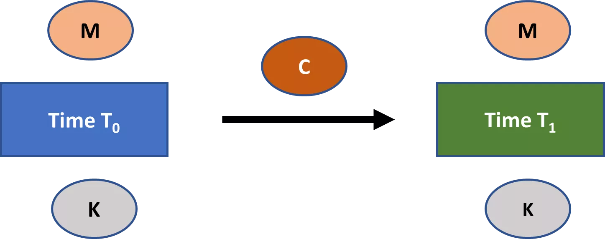

## Esimerkki: Siirtosalakirjoitus
<chapterId>7b179ae8-8d15-5e80-a43f-22c970d87b5e</chapterId>

Luvussa 2 kohtasimme siirtosalakirjoituksen, joka on esimerkki hyvin yksinkertaisesta symmetrisestä salausmenetelmästä. Katsotaan sitä uudelleen tässä.

Oletetaan sanakirja *D*, joka yhdistää kaikki englannin aakkoset, järjestyksessä, numeroiden joukkoon {0,1,2…,25}. Oletetaan joukko mahdollisia viestejä **M**. Siirtosalakirjoitus on sitten salausmenetelmä, joka määritellään seuraavasti:

- Valitse satunnaisesti avain k mahdollisten avainten joukosta **K**, missä **K** = {0,1,2,…,25}
- Salaus viestille m є **M**, seuraavasti:
    - Erottele m sen yksittäisiksi kirjaimiksi m0, m1,….mi….,ml
    - Muunna jokainen mi numeroksi sanakirjan *D* mukaan
    - Jokaiselle mi, ci = [(mi + k) mod 26]
    - Muunna jokainen ci kirjaimeksi sanakirjan *D* mukaan
    - Yhdistä sitten c0, c1,….,cl saadaksesi salatun tekstin c
- Salatun tekstin c purkaminen seuraavasti:
    - Muunna jokainen ci numeroksi sanakirjan *D* mukaan
    - Jokaiselle ci, mi = [(ci – k) mod 26]
    - Muunna jokainen mi kirjaimeksi sanakirjan *D* mukaan
    - Yhdistä sitten m0, m1,….,ml saadaksesi alkuperäisen viestin m

Mikä tekee siirtosalakirjoituksesta symmetrisen salausmenetelmän, on se, että samaa avainta käytetään sekä salaukseen että salauksen purkuun. Esimerkiksi, oletetaan, että haluat salata viestin “DOG” käyttäen siirtosalakirjoitusta, ja olet satunnaisesti valinnut "24" avaimen. Viestin salaaminen tällä avaimella tuottaisi “BME”. Ainoa tapa saada alkuperäinen viesti takaisin on käyttämällä samaa avainta, "24", salauksen purkuprosessissa.
Tämä Shift-salakirjoitus on esimerkki **monoalfabeettisesta substituutiosalakirjoituksesta**: salausjärjestelmästä, jossa salattu aakkosto on kiinteä (eli käytössä on vain yksi aakkosto). Olettaen, että purkualgoritmi on deterministinen, jokainen symboli substituutiosalatussa tekstissä voi korkeintaan vastata yhtä symbolia alkuperäisessä tekstissä.
1700-luvulle asti monet salauksen sovellukset nojasivat vahvasti monoalfabeettisiin substituutiosalakirjoituksiin, vaikka usein nämä olivat paljon monimutkaisempia kuin Shift-salakirjoitus. Esimerkiksi, voisit satunnaisesti valita kirjaimen aakkosista jokaiselle alkuperäisen tekstin kirjaimelle sillä ehdolla, että jokainen kirjain esiintyy vain kerran salatussa aakkostossa. Tämä tarkoittaisi, että sinulla olisi faktoriaali 26 mahdollista yksityistä avainta, mikä oli valtava määrä ennen tietokoneiden aikakautta.

Huomaa, että tulet kohtaamaan termin **salakirjoitus** usein kryptografiassa. Ole tietoinen siitä, että tällä termillä on useita merkityksiä. Itse asiassa tiedän ainakin viisi erillistä merkitystä termille kryptografian sisällä.

Joissakin tapauksissa se viittaa salausjärjestelmään, kuten se tekee Shift-salakirjoituksessa ja monoalfabeettisessa substituutiosalakirjoituksessa. Kuitenkin termi voi myös viitata nimenomaan salausalgoritmiin, yksityiseen avaimen, tai vain mihin tahansa tällaisen salausjärjestelmän salattuun tekstiin.

Lopuksi, termi salakirjoitus voi myös viitata ydin algoritmiin, josta voit rakentaa kryptografisia järjestelmiä. Näihin voivat sisältyä erilaiset salausalgoritmit, mutta myös muuntyyppiset kryptografiset järjestelmät. Tämä merkitys tulee relevantiksi lohkosalausten yhteydessä (katso osio "Lohkosalaus" alla).

Saatat myös kohdata termit **salata** tai **purkaa salaus**. Nämä termit ovat vain synonyymejä salaukselle ja salauksen purkamiselle.

## Voimakeino-hyökkäykset ja Kerckhoffin periaate
<chapterId>2d73ef97-26c5-5d11-8815-0ddbe89c8003</chapterId>

Shift-salakirjoitus on hyvin turvaton symmetrinen salausjärjestelmä, ainakin nykymaailmassa.[1](#footnote1) Hyökkääjä voisi vain yrittää purkaa minkä tahansa salatun tekstin kaikilla 26 mahdollisella avaimella nähdäkseen, mikä tulos on järkevä. Tämäntyyppistä hyökkäystä, jossa hyökkääjä vain kiertää läpi avaimia nähdäkseen mikä toimii, kutsutaan **voimakeino-hyökkäykseksi** tai **täydelliseksi avainhaulla**.

Jotta mikä tahansa salausjärjestelmä täyttäisi turvallisuuden minimaalisen käsitteen, sen täytyy olla mahdollisten avainten joukko, tai **avainavaruus**, joka on niin suuri, että voimakeino-hyökkäykset ovat käytännössä mahdottomia. Kaikki nykyaikaiset salausjärjestelmät täyttävät tämän standardin. Tätä kutsutaan **riittävän avainavaruuden periaatteeksi**. Samankaltainen periaate tyypillisesti pätee erilaisissa kryptografisissa järjestelmissä.

Saadaksesi käsityksen nykyaikaisten salausjärjestelmien massiivisesta avainavaruuden koosta, oletetaan että tiedosto on salattu 128-bittisellä edistyneellä salausstandardilla. Tämä tarkoittaa, että hyökkääjällä on joukko 2128 avainta, joiden läpi hänen täytyy kiertää voimakeino-hyökkäyksessä. 0,78%:n onnistumismahdollisuus tällä strategialla vaatisi hyökkääjän kiertävän läpi suunnilleen 2.65 x 1036 avainta.
Oletetaan optimistisesti, että hyökkääjä voi yrittää 10 biljoonaa avainta sekunnissa (eli 1016 avainta sekunnissa). Testatakseen 0,78% kaikista avaimista avainavaruudessa, hänen hyökkäyksensä kestäisi 2,65 x 1020 sekuntia. Tämä on noin 8,4 biljoonaa vuotta. Joten jopa äärimmäisen tehokkaan vastustajan tekemä voimakas hyökkäys ei ole realistinen nykyaikaisella 128-bittisellä salausjärjestelmällä. Tämä on riittävän avainavaruuden periaatteen mukainen tilanne.
Onko siirtosalakirjoitus turvallisempi, jos hyökkääjä ei tiedä salausalgoritmia? Ehkä, mutta ei paljoa.

Joka tapauksessa, nykyaikainen kryptografia olettaa aina, että minkä tahansa symmetrisen salausjärjestelmän turvallisuus perustuu yksinomaan yksityisen avaimen salassapitoon. Oletetaan, että hyökkääjä tietää kaikki muut yksityiskohdat, mukaan lukien viestin avaruuden, avainavaruuden, salatun tekstin avaruuden, avaimen valinta-algoritmin, salausalgoritmin ja purkualgoritmin.

Ajatus siitä, että symmetrisen salausjärjestelmän turvallisuus voi perustua vain yksityisen avaimen salaisuuteen, tunnetaan **Kerckhoffs’in periaatteena**.

Alun perin Kerckhoffs’in tarkoittamana periaate koskee vain symmetrisiä salausjärjestelmiä. Yleisempi versio periaatteesta kuitenkin soveltuu myös kaikkiin muihin nykyaikaisiin kryptografian järjestelmiin: Minkään kryptografisen järjestelmän suunnittelun ei tarvitse olla salainen, jotta se olisi turvallinen; salaisuus voi ulottua vain joihinkin tietostringeihin, tyypillisesti yksityiseen avaimiin.

Kerckhoffs’in periaate on keskeinen nykyaikaiselle kryptografialle neljästä syystä.[2](#footnote2) Ensinnäkin, tietyntyyppisiin sovelluksiin on vain rajoitettu määrä kryptografisia järjestelmiä. Esimerkiksi useimmat nykyaikaiset symmetrisen salauksen sovellukset käyttävät Rijndael-salausalgoritmia. Joten salaisuutesi järjestelmän suunnittelusta on vain hyvin rajallinen. Rijndael-salausalgoritmin yksityisen avaimen salassapito tarjoaa kuitenkin paljon enemmän joustavuutta.

Toiseksi, jonkin tietostringin korvaaminen on helpompaa kuin koko kryptografisen järjestelmän vaihtaminen. Oletetaan, että yrityksen kaikilla työntekijöillä on sama salausohjelmisto, ja jokaisella kahdella työntekijällä on yksityinen avain luottamukselliseen viestintään. Avainkompromissit ovat tässä skenaariossa hankalia, mutta ainakin yritys voisi säilyttää ohjelmiston tällaisten turvallisuusrikkomusten kanssa. Jos yritys luottaisi järjestelmän salaisuuteen, mikä tahansa sen salaisuuden rikkominen vaatisi kaiken ohjelmiston vaihtamista.

Kolmanneksi, Kerckhoffs’in periaate mahdollistaa kryptografisten järjestelmien standardisoinnin ja yhteensopivuuden käyttäjien välillä. Tällä on valtavia hyötyjä tehokkuuden kannalta. Esimerkiksi on vaikea kuvitella, miten miljoonat ihmiset voisivat turvallisesti yhdistää Googlen verkkopalvelimiin joka päivä, jos turvallisuus edellyttäisi kryptografisten järjestelmien salassapitoa.

Neljänneksi, Kerckhoffs’in periaate mahdollistaa kryptografisten järjestelmien julkisen tarkastelun. Tällainen tarkastelu on ehdottoman välttämätöntä turvallisten kryptografisten järjestelmien saavuttamiseksi. Havainnollistavasti, symmetrisen kryptografian pääalgoritmi, Rijndael-salausalgoritmi, oli kilpailun tulos, jonka järjesti National Institute of Standards and Technology vuosina 1997–2000.

Mikä tahansa järjestelmä, joka yrittää saavuttaa **turvallisuuden hämärtämisen kautta**, on sellainen, joka perustuu sen suunnittelun ja/tai toteutuksen yksityiskohtien salassapitoon. Kryptografiassa tämä olisi nimenomaan järjestelmä, joka perustuu kryptografisen järjestelmän suunnittelun yksityiskohtien salassapitoon. Joten turvallisuus hämärtämisen kautta on suorassa ristiriidassa Kerckhoffs’in periaatteen kanssa.
Avoin lähdekoodi ja sen kyky parantaa laatua ja turvallisuutta ulottuu digitaaliseen maailmaan paljon laajemmin kuin pelkkään kryptografiaan. Esimerkiksi vapaat ja avoimen lähdekoodin Linux-jakelut, kuten Debian, tarjoavat yleensä useita etuja verrattuna niiden Windows- ja MacOS-vastineisiin yksityisyyden, vakauden, turvallisuuden ja joustavuuden osalta. Vaikka tähän voi olla useita syitä, tärkein periaate on todennäköisesti, kuten Eric Raymond ilmaisi kuuluisassa esseessään "The Cathedral and the Bazaar", että "[k]un tarpeeksi moni silmäpari katsoo, kaikki viat ovat matalia."[3](#footnote3) Juuri tämä joukkojen viisaus -periaate antoi Linuxille sen merkittävimmän menestyksen.
Ei voi koskaan väittää yksiselitteisesti, että kryptografinen järjestelmä on "turvallinen" tai "turvaton". Sen sijaan on olemassa erilaisia turvallisuuden käsitteitä kryptografisille järjestelmille. Jokaisen **kryptografisen turvallisuuden määritelmän** on määriteltävä (1) turvallisuustavoitteet sekä (2) hyökkääjän kyvyt. Kryptografisten järjestelmien analysointi yhtä tai useampaa tiettyä turvallisuuskäsitettä vasten tarjoaa näkemyksiä niiden sovelluksista ja rajoituksista.

Vaikka emme syvenny kaikkiin yksityiskohtiin eri kryptografisten turvallisuuden käsitteiden osalta, sinun tulisi tietää, että kaksi oletusta ovat kaikkialla läsnä kaikissa nykyaikaisissa kryptografian turvallisuuden käsitteissä, jotka liittyvät symmetrisiin ja asymmetrisiin järjestelmiin (ja jossain muodossa muihin kryptografisiin primitiiveihin):

* Hyökkääjän tiedon järjestelmästä oletetaan noudattavan Kerckhoffs’in periaatetta.
* Hyökkääjä ei voi käytännössä suorittaa brute force -hyökkäystä järjestelmään. Erityisesti kryptografisten turvallisuuden uhkamallit eivät tyypillisesti edes salli brute force -hyökkäyksiä, sillä oletetaan, että ne eivät ole relevantti huolenaihe.

## Virtasalaukset
<chapterId>479aa6f4-45c4-59ca-8616-8cf8e61fc871</chapterId>

Symmetriset salausjärjestelmät jaetaan yleensä kahteen tyyppiin: virtasalauksiin ja lohkosalauksiin. Tämä ero on kuitenkin hieman ongelmallinen, sillä ihmiset käyttävät näitä termejä epäjohdonmukaisesti. Seuraavissa osioissa esitän eron tavalla, joka mielestäni on paras. Sinun tulisi kuitenkin olla tietoinen siitä, että monet ihmiset käyttävät näitä termejä hieman eri tavalla kuin minä esitän.

Katsotaan ensin virtasalauksia. **Virtasalauksen** idea on symmetrisessä salausjärjestelmässä, jossa salaus koostuu kahdesta vaiheesta.

Ensimmäiseksi, tuotetaan merkkijono, joka on yhtä pitkä kuin alkuperäinen teksti, käyttäen yksityistä avainta. Tätä merkkijonoa kutsutaan **avainvirraksi**.

Seuraavaksi, avainvirta yhdistetään matemaattisesti alkuperäiseen tekstiin tuottaen salatun tekstin. Tämä yhdistäminen on tyypillisesti XOR-operaatio. Salaus voidaan purkaa kääntämällä operaatio. (Huomaa, että A XOR B = B XOR A, tapauksessa, jossa A ja B ovat bittijonoja. Joten XOR-operaation järjestyksellä virtasalauksessa ei ole merkitystä tuloksen kannalta. Tätä ominaisuutta kutsutaan vaihdannaisuudeksi.)

Tyypillinen XOR-virtasalauksen kuvaus on esitetty *Kuvassa 3*. Otat ensin yksityisen avaimen K ja käytät sitä avainvirran tuottamiseen. Avainvirta yhdistetään sitten alkuperäiseen tekstiin XOR-operaation avulla tuottaen salatun tekstin. Mikä tahansa agentti, joka vastaanottaa salatun tekstin, voi helposti purkaa sen, jos hänellä on avain K. Kaikki mitä hänen tarvitsee tehdä, on luoda avainvirta yhtä pitkä kuin salattu teksti määritellyn menettelyn mukaisesti ja XORata se salatun tekstin kanssa.

*Kuva 3: XOR-virtasalauksen kuvaus*

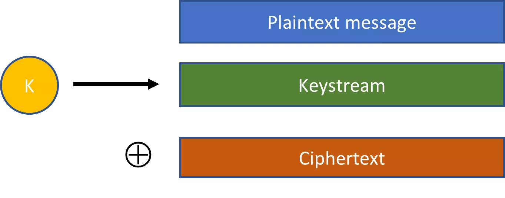
Muistutuksena, salausjärjestelmä on tyypillisesti malli salaukseen samalla ydinalgoritmilla, eikä tarkka määrittely. Laajennettuna, virtasalaus on tyypillisesti malli salaukseen, jossa voit käyttää eri pituisia avaimia. Vaikka avaimen pituus voi vaikuttaa joihinkin järjestelmän pieniin yksityiskohtiin, se ei vaikuta sen olennaiseen muotoon.
Siirtosalaus on esimerkki hyvin yksinkertaisesta ja turvattomasta virtasalauksesta. Käyttämällä yhtä kirjainta (yksityinen avain), voit tuottaa kirjainsarjan, joka on viestin pituinen (avainvirta). Tämä avainvirta yhdistetään sitten alkuperäiseen tekstiin modulo-operaation kautta tuottaen salatun tekstin. (Tämä modulo-operaatio voidaan yksinkertaistaa XOR-operaatioksi, kun esitetään kirjaimet bitteinä).

Toinen kuuluisa esimerkki virtasalauksesta on **Vigenèren salaus**, joka on nimetty Blaise de Vigenèren mukaan, joka kehitti sen loppuun 1500-luvun lopulla (vaikka muut olivat tehneet paljon ennakkotyötä). Se on esimerkki **polyalfabeettisesta substituutiosalauksesta**: salausjärjestelmästä, jossa salatun tekstin aakkosto vaihtuu alkuperäisen symbolin sijainnin mukaan tekstissä. Toisin kuin monoalfabeettisessa substituutiosalauksessa, salatut symbolit voivat vastata useampaa kuin yhtä alkuperäistä symbolia.

Kun salaus alkoi yleistyä renessanssin Euroopassa, myös **kryptanalyysi**—eli salattujen tekstien murtaminen—erityisesti käyttäen **taajuusanalyysiä**, yleistyi. Jälkimmäinen hyödyntää kielemme tilastollisia säännönmukaisuuksia salattujen tekstien murtamiseen, ja sen keksivät arabialaiset tutkijat jo yhdeksännellä vuosisadalla. Se on tekniikka, joka toimii erityisen hyvin pitkien tekstien kanssa. Ja jopa kaikkein kehittyneimmät monoalfabeettiset substituutiosalaukset eivät enää riittäneet taajuusanalyysiä vastaan 1700-luvulla Euroopassa, erityisesti sotilaallisissa ja turvallisuusympäristöissä. Koska Vigenèren salaus tarjosi merkittävän edistysaskeleen turvallisuudessa, se tuli suosituksi tällä aikakaudella ja oli laajalle levinnyt 1700-luvun loppuun mennessä.

Epämuodollisesti sanottuna salausjärjestelmä toimii seuraavasti:

1.	Valitse monikirjaiminen sana yksityiseksi avaineksi
2.	Sovella siirtosalausta jokaiseen viestin kirjaimeen käyttäen vastaavaa avainsanan kirjainta siirtona
3.	Jos olet käynyt läpi avainsanan, mutta et ole vielä täysin salannut alkuperäistä tekstiä, sovella uudelleen avainsanan kirjaimia siirtosalauksena tekstissä jäljellä oleviin kirjaimiin
4.	Jatka tätä prosessia, kunnes koko viesti on salattu

Esimerkiksi, oletetaan, että yksityinen avain on GOLD ja haluat salata viestin "CRYPTOGRAPHY". Tässä tapauksessa toimisit seuraavasti Vigenèren salauksen mukaisesti:

- c0  = [(2 + 6) Mod 26] = 8 = I
- c1  = [(17 + 14) Mod 26] = 5 = F
- c2  = [(24 + 11) Mod 26] = 9 = J
- c3  = [(15 + 3) Mod 26] = 18 = S
- c4  = [(19 + 6) Mod 26] = 25 = Z
- c5  = [(14 + 14) Mod 26] = 2 = C
- c6  = [(6 + 11) Mod 26] = 17 = R
- c7 = [(17 + 3) Mod 26] = 20 = U
- c8 = [(0 + 6) Mod 26] = 6 = G
- c9 = [(15 + 14) Mod 26] = 3 = D
- c10 = [(7 + 11) Mod 26] = 18 = S
- c11 = [(24 + 3) Mod 26] = 1 = B
- c = "IFJSZCRUGDSB"

Toinen kuuluisa esimerkki virtasalauksesta on **kertakäyttöavain**. Kertakäyttöavaimen kanssa luot vain satunnaisbittejä sisältävän merkkijonon, joka on yhtä pitkä kuin alkuperäinen viesti, ja tuotat salatun viestin XOR-operaatiolla. Näin ollen yksityinen avain ja avainvirta ovat yhtä ja samaa kertakäyttöavaimessa.

Vaikka Siirto-salaus ja Vigenèren salaukset ovat hyvin turvattomia nykyaikana, kertakäyttöavain on erittäin turvallinen, jos sitä käytetään oikein. Todennäköisesti kuuluisin kertakäyttöavaimen käyttötapaus oli, ainakin 1980-luvulle asti, **Washington-Moskova-pikayhteys**.[4](#footnote4)

Pikayhteys on suora viestintälinkki Washingtonin ja Moskovan välillä kiireellisiä asioita varten, joka asennettiin Kuuban ohjuskriisin jälkeen. Teknologia on vuosien varrella muuttunut. Nykyään se sisältää suoran kuituoptisen kaapelin sekä kaksi satelliittilinkkiä (redundanssin vuoksi), jotka mahdollistavat sähköpostin ja tekstiviestien lähettämisen. Linkki päättyy eri paikkoihin Yhdysvalloissa. Pentagon, Valkoinen talo ja Raven Rock Mountain ovat tunnettuja päätepisteitä. Vastoin yleistä käsitystä, pikayhteys ei ole koskaan sisältänyt puhelimia.

Käytännössä kertakäyttöavainjärjestelmä toimi seuraavasti. Sekä Washingtonilla että Moskovalla oli kaksi sarjaa satunnaislukuja. Yksi satunnaislukujen sarja, jonka venäläiset loivat, liittyi minkä tahansa viestin salaamiseen ja purkamiseen venäjän kielellä. Toinen satunnaislukujen sarja, jonka amerikkalaiset loivat, liittyi minkä tahansa viestin salaamiseen ja purkamiseen englannin kielellä. Ajoittain lisää satunnaislukuja toimitettiin luotettujen lähettien kautta toiselle puolelle.

Washington ja Moskova pystyivät siten kommunikoimaan salaisesti käyttämällä näitä satunnaislukuja luodakseen kertakäyttöavaimia. Joka kerta kun tarvitsit kommunikoida, käyttäisit seuraavaa satunnaislukujen osaa viestillesi.

Vaikka kertakäyttöavain on erittäin turvallinen, sillä on merkittäviä käytännön rajoituksia: avaimen on oltava yhtä pitkä kuin viesti, eikä kertakäyttöavaimen osaa voi käyttää uudelleen. Tämä tarkoittaa, että sinun on pidettävä kirjaa siitä, missä kohtaa kertakäyttöavainta olet, säilytettävä valtava määrä bittejä ja vaihdettava satunnaisbittejä vastapuoliesi kanssa ajoittain. Seurauksena kertakäyttöavainta ei käytetä usein käytännössä.

Sen sijaan käytännössä yleisesti käytetyt virtasalaukset ovat **pseudosatunnaisia virtasalauksia**. Salsa20 ja sen läheinen variantti ChaCha ovat esimerkkejä yleisesti käytetyistä pseudosatunnaisista virtasalauksista.

Näiden pseudosatunnaisten virtasalauksien kanssa valitset ensin satunnaisesti avaimen K, joka on lyhyempi kuin alkuperäisen viestin pituus. Tällainen satunnainen avain K luodaan yleensä tietokoneellamme sen keräämien ennakoimattomien tietojen perusteella, kuten verkkojen viestien välisen ajan, hiiren liikkeiden ja niin edelleen.
Tämä satunnainen avain K asetetaan sitten laajennusalgoritmiin, joka luo pseudosatunnaisen avainvirran, joka on yhtä pitkä kuin viesti. Voit määrittää tarkasti, kuinka pitkän avainvirran tarvitset (esim. 500 bittiä, 1000 bittiä, 1200 bittiä, 29 117 bittiä ja niin edelleen).
Pseudosatunnainen avainvirta vaikuttaa *siltä kuin* se olisi valittu täysin satunnaisesti kaikkien saman pituisten merkkijonojen joukosta. Siksi salaus pseudosatunnaisella avainvirralla näyttää siltä, kuin se olisi tehty kertakäyttöisellä salasanalla. Mutta näin ei tietenkään ole.

Koska yksityinen avaimemme on lyhyempi kuin avainvirta ja laajennusalgoritmimme on oltava deterministinen, jotta salaus/purku prosessi toimisi, ei jokainen kyseisen pituinen avainvirta olisi voinut syntyä laajennustoimintomme tuloksena.

Oletetaan esimerkiksi, että yksityisellä avaimellamme on pituus 128 bittiä ja että voimme syöttää sen laajennusalgoritmiin luodaksemme paljon pidemmän avainvirran, sanokaamme 2 500 bittiä. Koska laajennusalgoritmimme on oltava deterministinen, algoritmimme voi korkeintaan valita 1/2128 merkkijonoa, joiden pituus on 2 500 bittiä. Joten tällaista avainvirtaa ei voisi koskaan valita täysin satunnaisesti kaikista saman pituisista merkkijonoista.

Virtasalauksen määritelmässämme on kaksi näkökohtaa: (1) yksityisen avaimen avulla generoidaan avainvirta, joka on yhtä pitkä kuin alkuperäinen teksti; ja (2) tämä avainvirta yhdistetään alkuperäiseen tekstiin, tyypillisesti XOR-operaation kautta, tuottaen salatun tekstin.

Joskus ihmiset määrittelevät ehtoa (1) tiukemmin väittäen, että avainvirran on nimenomaan oltava pseudosatunnainen. Tämä tarkoittaisi, että ei sekä siirtosalauksia että kertakäyttöisiä salasanoja pidettäisi virtasalauksina.

Mielestäni ehdolle (1) antaminen laajempi määritelmä tarjoaa helpomman tavan järjestää salausjärjestelmiä. Lisäksi se tarkoittaa, että meidän ei tarvitse lopettaa tietyn salausjärjestelmän kutsumista virtasalaukseksi vain siksi, että opimme sen ei itse asiassa perustuvan pseudosatunnaisiin avainvirtoihin.

## Lohkosalaus
<chapterId>2df52d51-943d-5df7-9d49-333e4c5d97b7</chapterId>

Ensimmäinen tapa, jolla **lohkosalausta** yleisesti ymmärretään, on jotain primitiivisempää kuin virtasalaus: Perusalgoritmi, joka suorittaa pituutta säilyttävän muunnoksen sopivan pituiselle merkkijonolle avaimen avulla. Tätä algoritmia voidaan käyttää luomaan salausjärjestelmiä ja ehkä muita kryptografisia järjestelmiä.

Usein lohkosalaus voi ottaa syötteenä eri pituisia merkkijonoja, kuten 64, 128 tai 256 bittiä, sekä eri pituisia avaimia, kuten 128, 192 tai 256 bittiä. Vaikka algoritmin yksityiskohdat saattavat muuttua näiden muuttujien mukaan, perusalgoritmi ei muutu. Jos se muuttuisi, puhuisimme kahdesta eri lohkosalausjärjestelmästä. Huomaa, että perusalgoritmin terminologiaa käytetään tässä samalla tavalla kuin salausjärjestelmissä.

Kuvaus siitä, miten lohkosalaus toimii, voidaan nähdä *Kuvassa 4* alla. Viesti M, jonka pituus on L, ja avain K toimivat syötteinä lohkosalaukselle. Se tuottaa viestin M’, jonka pituus on L. Avaimen ei välttämättä tarvitse olla samaa pituutta kuin M ja M’ useimmissa lohkosalausjärjestelmissä.

*Kuva 4: Lohkosalaus*

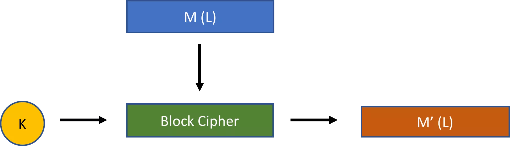
Lohkosalaus itsessään ei ole salausjärjestelmä. Mutta lohkosalausta voidaan käyttää erilaisten **toimintatapojen** kanssa tuottamaan erilaisia salausjärjestelmiä. Toimintatapa lisää yksinkertaisesti joitakin lisätoimintoja lohkosalauksen ulkopuolelle.

Havainnollistaaksemme, miten tämä toimii, oletetaan lohkosalaus (BC), joka vaatii 128-bittisen syötejonon ja 128-bittisen yksityisen avaimen. Alla oleva kuva 5 näyttää, miten kyseistä lohkosalausta voidaan käyttää **elektronisen koodikirjan tilassa** (**ECB-tila**) luomaan salausjärjestelmä. (Oikealla olevat ellipsit osoittavat, että voit toistaa tämän kaavan tarpeen mukaan).

*Kuva 5: Lohkosalaus ECB-tilassa*

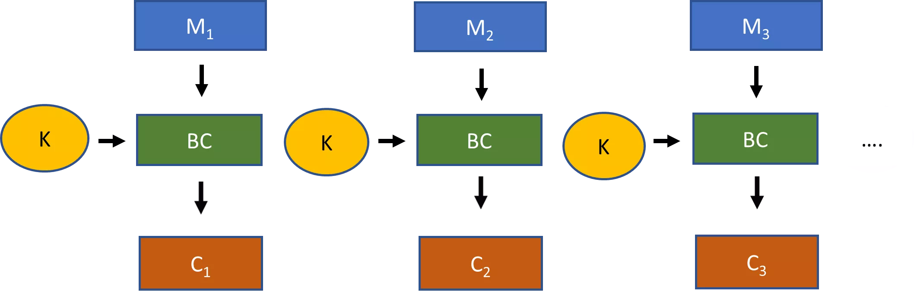

Elektronisen koodikirjan salausprosessi lohkosalauksen kanssa toimii seuraavasti. Katso, voitko jakaa tekstimuotoisen viestisi 128-bittisiin lohkoihin. Jos et, lisää **täytettä** viestiin, jotta tulos voidaan jakaa tasaisesti 128 bitin lohkokokoon. Tämä on data, jota käytetään salausprosessissa.

Jaa nyt data 128-bittisiin jonoiksi (M1, M2, M3 ja niin edelleen). Aja jokainen 128-bittinen jono läpi lohkosalauksen 128-bittisellä avaimellasi tuottaaksesi 128-bittisiä salatun tekstin palasia (C1, C2, C3 ja niin edelleen). Nämä palaset yhdistettynä muodostavat koko salatun tekstin.

Salauksen purku on vain käänteinen prosessi, vaikkakin vastaanottajan on tunnistettava jokin tunnistettava tapa poistaa mahdollinen täyte salatusta datasta tuottaakseen alkuperäisen tekstimuotoisen viestin.

Vaikka suhteellisen suoraviivainen, lohkosalaus elektronisen koodikirjan tilassa kärsii turvallisuudesta. Tämä johtuu siitä, että se johtaa **deterministiseen salaukseen**. Kaksi identtistä 128-bittistä datajonoa salataan täsmälleen samalla tavalla. Tätä tietoa voidaan hyödyntää.

Sen sijaan, mikä tahansa lohkosalauksesta rakennettu salausjärjestelmä tulisi olla **probabilistinen**: eli minkä tahansa viestin M, tai minkä tahansa tietyn M:n palan, salauksen tulisi yleensä tuottaa eri lopputulos joka kerta.[5](#footnote5)

**Lohkoketjutustila** (**CBC-tila**) on todennäköisesti yleisin tila, jota käytetään lohkosalauksen kanssa. Yhdistelmä, jos se tehdään oikein, tuottaa probabilistisen salausjärjestelmän. Voit nähdä tämän toimintatavan kuvauksen alla olevassa kuvassa 6.

*Kuva 6: Lohkosalaus CBC-tilassa*

Oletetaan, että lohkokoko on jälleen 128 bittiä. Aloittaaksesi, sinun täytyisi jälleen varmistaa, että alkuperäinen tekstimuotoinen viestisi saa tarvittavan täytteen.

Sitten, XORaa ensimmäinen 128-bittinen osa tekstiviestistäsi 128-bittisen **alkuarvojakson** kanssa. Tulos asetetaan lohkosalaukseen tuottamaan salattu teksti ensimmäiselle lohkolle. Toiselle 128-bittiselle lohkolle, XORaa ensin tekstimuotoinen viesti ensimmäisen lohkon salatun tekstin kanssa, ennen kuin syötät sen lohkosalaukseen. Jatka tätä prosessia, kunnes olet salannut koko tekstimuotoisen viestisi.

Kun olet valmis, lähetä salattu viesti yhdessä salaamattoman alkuarvojakson kanssa vastaanottajalle. Vastaanottajan on tiedettävä alkuarvojakso, muuten hän ei voi purkaa salattua tekstiä.
Tämä rakenne on paljon turvallisempi kuin elektroninen koodikirjamoodi, kun sitä käytetään oikein. Sinun tulisi ensin varmistaa, että alustusvektori on satunnainen tai pseudosatunnainen merkkijono. Lisäksi sinun tulisi käyttää eri alustusvektoria joka kerta, kun käytät tätä salausjärjestelmää.
Toisin sanoen, alustusvektorisi tulisi olla satunnainen tai pseudosatunnainen kertakäyttönumero, missä **kertakäyttönumero** tarkoittaa "numeroa, jota käytetään vain kerran". Jos noudatat tätä käytäntöä, niin lohkosalaus CBC-moodissa varmistaa, että samat tavalliset tekstilohkot salataan yleensä eri tavalla joka kerta.

Lopuksi kiinnitetään huomiota **output feedback -moodiin** (**OFB-moodi**). Voit nähdä tämän moodin esityksen *Kuvassa 7*.

*Kuva 7: Lohkosalaus OFB-moodissa*

OFB-moodissa valitset myös alustusvektorin. Mutta tässä, ensimmäiselle lohkolle, alustusvektori syötetään suoraan lohkosalaukseen avaimellasi. Saadut 128-bittiä käsitellään sitten avainvirrana. Tämä avainvirta XORataan tavallisen tekstin kanssa tuottaakseen salatun tekstin lohkolle. Seuraaville lohkoille käytät edellisen lohkon avainvirtaa syötteenä lohkosalaukseen ja toistat vaiheet.

Jos tarkastelet huolellisesti, mitä tässä on itse asiassa luotu lohkosalauksesta OFB-moodissa, on virtasalaus. Generoit 128-bittisiä avainvirran osia, kunnes sinulla on tavallisen tekstin pituus (hyläten tarpeettomat bitit viimeisestä 128-bittisestä avainvirran osasta). Sitten XORaat avainvirran tavallisen tekstiviestisi kanssa saadaksesi salatun tekstin.

Edellisessä osiossa virtasalauksista mainitsin, että tuotat avainvirran yksityisen avaimen avulla. Tarkalleen ottaen, sitä ei tarvitse luoda vain yksityisellä avaimella. Kuten näet OFB-moodissa, avainvirta tuotetaan sekä yksityisen avaimen että alustusvektorin tuella.

Huomaa, että kuten CBC-moodissa, on tärkeää valita pseudosatunnainen tai satunnainen kertakäyttönumero alustusvektoriksi joka kerta, kun käytät lohkosalauksessa OFB-moodia. Muuten sama 128-bittinen viestijono lähetettynä eri viestinnöissä salataan samalla tavalla. Tämä on yksi tapa luoda todennäköisyyspohjaista salausta virtasalauksella.

Jotkut virtasalaukset käyttävät vain yksityistä avainta avainvirran luomiseen. Näille virtasalauksille on tärkeää, että käytät satunnaista kertakäyttönumeroa valitessasi yksityisen avaimen kullekin viestintäkerralle. Muuten näiden virtasalauksien salaus tulokset ovat myös deterministisiä, mikä johtaa turvallisuusongelmiin.

Suosituin nykyaikainen lohkosalaus on **Rijndael-salaus**. Se oli voittaja viidentoista ehdotuksen joukosta kilpailussa, jonka National Institute of Standards and Technology (NIST) järjesti vuosien 1997 ja 2000 välillä korvaamaan vanhemman salausstandardin, **data encryption standardin** (**DES**).
Rijndael-salausalgoritmi voidaan käyttää eri määrittelyillä avainten pituuksille ja lohkokooille sekä eri toimintatiloissa. NIST-kilpailun komitea hyväksyi rajoitetun version Rijndael-salausalgoritmista—nimittäin sellaisen, joka vaatii 128-bittiset lohkokoot ja avainten pituudet joko 128 bittiä, 192 bittiä tai 256 bittiä—osana **edistynyttä salaustandardia** (**AES**). Tämä on todella päästandardi symmetrisille salaussovelluksille. Se on niin turvallinen, että jopa NSA on ilmeisesti valmis käyttämään sitä 256-bittisillä avaimilla huippusalaisiin asiakirjoihin.[6](#footnote6)
AES-lohkosalauksesta kerrotaan yksityiskohtaisesti *Luvussa 5*.

## Selventämässä sekaannusta
<chapterId>121c1858-27e3-5862-b0ce-4ff2f70f9f0f</chapterId>

Sekaannus lohko- ja virtasalausten välillä syntyy, koska joskus ihmiset ymmärtävät termiä lohkosalakirjoitus viittaavan nimenomaan *lohkosalauskirjoitukseen lohkomoodin salauksella*.

Harkitse edellisessä osiossa mainittuja ECB- ja CBC-tiloja. Nämä erityisesti vaativat, että salattavan datan on oltava jaettavissa lohkokoon mukaan (tämä tarkoittaa, että alkuperäiseen viestiin on ehkä käytettävä täytettä). Lisäksi näissä tiloissa dataa käsitellään suoraan lohkosalauksella (eikä vain yhdistetä lohkosalauksen tuloksen kanssa kuten OFB-tilassa).

Vaihtoehtoisesti voit määritellä **lohkosalauskirjoituksen** minä tahansa salausjärjestelmänä, joka toimii kiinteän pituisten viestilohkojen kanssa kerrallaan (missä mikä tahansa lohko on oltava pidempi kuin yksi tavu, muuten se muuttuu virtasalaukseksi). Sekä salattavan datan että salatun tekstin on jaettava tasaisesti tähän lohkokokoon. Tyypillisesti lohkon koko on 64, 128, 192 tai 256 bittiä pitkä. Sen sijaan virtasalakirjoitus voi salata viestejä yhden bitin tai tavun kokoisissa paloissa kerrallaan.

Tällä tarkemmalla lohkosalauskirjoituksen ymmärtämisellä voit todellakin väittää, että nykyaikaiset salausjärjestelmät ovat joko virta- tai lohkosalauskirjoituksia. Tästä lähtien käytän termiä lohkosalauskirjoitus yleisemmässä mielessä, ellei toisin mainita.

Keskustelu OFB-tilasta edellisessä osiossa nostaa esiin toisen mielenkiintoisen seikan. Jotkut virtasalauskirjoitukset on rakennettu lohkosalauskirjoituksista, kuten Rijndael OFB:llä. Jotkut, kuten Salsa20 ja ChaCha, eivät ole luotu lohkosalauskirjoituksista. Jälkimmäisiä saatetaan kutsua **primitiivisiksi virtasalauskirjoituksiksi**. (Ei todellakaan ole vakiintunutta termiä viittaamaan tällaisiin virtasalauskirjoituksiin.)

Kun ihmiset puhuvat virta- ja lohkosalauskirjoitusten eduista ja haitoista, he vertaavat tyypillisesti primitiivisiä virtasalauskirjoituksia lohkosalauskirjoituksiin perustuviin salausjärjestelmiin.

Vaikka virtasalauskirjoituksen voi aina helposti rakentaa lohkosalauskirjoituksesta, primitiivisestä virtasalauskirjoituksesta on tyypillisesti erittäin vaikea rakentaa jonkinlaista rakennelmaa lohkomoodin salauksella (kuten CBC-tilassa).

Tästä keskustelusta sinun tulisi nyt ymmärtää *Kuva 8*. Se tarjoaa yleiskatsauksen symmetrisistä salausjärjestelmistä. Käytämme kolmenlaista salausjärjestelmää: primitiiviset virtasalauskirjoitukset, lohkosalauskirjoitukset virtasalauskirjoituksina ja lohkosalauskirjoitukset lohkomoodissa (kutsutaan myös "lohkosalauskirjoituksiksi" diagrammissa).

*Kuva 8: Yleiskatsaus symmetrisistä salausjärjestelmistä*

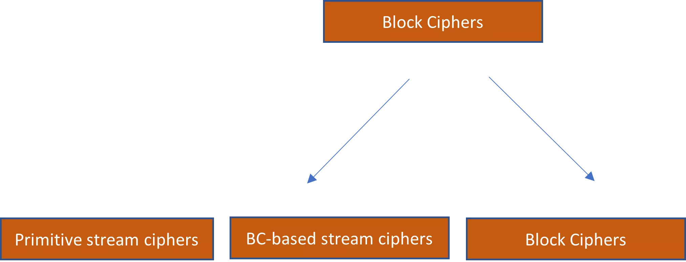
<chapterId>19fa7c00-db59-56a0-9654-5350a137939d</chapterId>
Salaus liittyy salaisuuden säilyttämiseen. Mutta kryptografia käsittelee myös laajempia teemoja, kuten viestin eheyttä, aitoutta ja kiistämättömyyttä. Niin sanotut **viestin aitoustunnuskoodit** (MACs) ovat symmetrisiin avaimiin perustuvia kryptografisia järjestelmiä, jotka tukevat aitoutta ja eheyttä viestinnässä.

Miksi pelkkä salaisuus ei riitä viestinnässä? Oletetaan, että Bob lähettää Alicelle viestin käyttäen käytännössä murtamatonta salausta. Mikä tahansa viestin kaappaava hyökkääjä ei pysty saamaan merkittäviä oivalluksia sisällöstä. Hyökkääjällä on kuitenkin vähintään kaksi muuta hyökkäysvektoria käytettävissään:

1. Hän voisi kaapata salatun viestin, muuttaa sen sisältöä ja lähettää muutetun salatun viestin Alicelle.
2. Hän voisi estää Bobin viestin kokonaan ja lähettää oman luomansa salatun viestin.

Molemmissa tapauksissa hyökkääjä ei ehkä saa mitään käsitystä salattujen viestien (1) ja (2) sisällöstä. Mutta hän voisi silti aiheuttaa merkittävää vahinkoa tällä tavoin. Tässä kohtaa viestin aitoustunnuskoodit tulevat tärkeiksi.

Viestin aitoustunnuskoodit määritellään löyhästi symmetrisiksi kryptografisiksi järjestelmiksi, joissa on kolme algoritmia: avaimen luontialgoritmi, tunnuskoodin luontialgoritmi ja varmennusalgoritmi. Turvallinen MAC varmistaa, että tunnuskoodit ovat **eksistentiaalisesti väärentämättömiä** mille tahansa hyökkääjälle – eli he eivät voi onnistuneesti luoda tunnuskoodia viestille, joka varmennetaan, elleivät he omaa yksityistä avainta.

Bob ja Alice voivat torjua tietyn viestin manipuloinnin käyttämällä MACia. Oletetaan hetkeksi, että he eivät välitä salaisuudesta. He haluavat vain varmistaa, että Alicen vastaanottama viesti oli todellakin Bobilta eikä sitä ole muutettu millään tavalla.

Prosessi on kuvattu *Kuvassa 9*. MACin käyttämiseksi heidän tulisi ensin luoda yksityinen avain K, joka jaetaan heidän kesken. Bob luo viestille tunnuskoodin T käyttäen yksityistä avainta K. Hän lähettää sitten viestin sekä viestin tunnuskoodin Alicelle. Tämän jälkeen Alice voi varmistaa, että Bob todella teki tunnuskoodin, suorittamalla yksityisen avaimen, viestin ja tunnuskoodin läpi varmennusalgoritmin.

*Kuva 9: Yleiskatsaus symmetrisiin salausjärjestelmiin*

Eksistentiaalisen väärentämättömyyden vuoksi hyökkääjä ei voi muuttaa viestiä M millään tavalla tai luoda omaa viestiään voimassaolevalla tunnuskoodilla. Näin on, vaikka hyökkääjä havainnoisi monia Bobin ja Alicen välisiä viestejä, jotka käyttävät samaa yksityistä avainta. Korkeintaan hyökkääjä voisi estää Alicen vastaanottamasta viestiä M (ongelma, jota kryptografia ei voi ratkaista).

MAC takaa, että viesti on todellakin luotu Bobin toimesta. Tämä aitous tarkoittaa automaattisesti viestin eheyttä – eli jos Bob on luonut jonkin viestin, se tarkoittaa, että sitä ei ole millään tavalla muutettu hyökkääjän toimesta. Tästä lähtien kaikki huoli aitoudesta tulisi automaattisesti ymmärtää huoleksi eheydestä.

Vaikka olen tehnyt erottelun viestin aitouden ja eheyden välillä keskustelussani, on myös yleistä käyttää näitä termejä synonyymeinä. Ne viittaavat silloin ajatukseen viesteistä, jotka on sekä luotu tietyn lähettäjän toimesta että ovat muuttumattomia. Tässä hengessä viestin aitoustunnuskoodit kutsutaan usein myös **viestin eheyttunnuskoodiksi**.

## Authenticated encryption
<chapterId>33f2ec9b-9fb4-5c61-8fb4-50836270a144</chapterId>
Tyypillisesti haluat taata sekä viestinnän salaisuuden että aitouden, ja siksi salausjärjestelmiä ja MAC-järjestelmiä käytetään yleensä yhdessä. **Autentikoitu salausjärjestelmä** on järjestelmä, joka yhdistää salauksen ja MAC:n erittäin turvallisella tavalla. Erityisesti sen on täytettävä standardit eksistentiaaliselle väärentämättömyydelle sekä erittäin vahvalle salaisuuden käsitteelle, nimittäin sellaiselle, joka on vastustuskykyinen **valitun salakirjoituksen hyökkäyksille**.[7](#footnote7)

Jotta salausjärjestelmä olisi vastustuskykyinen valitun salakirjoituksen hyökkäyksille, sen on täytettävä **muuttumattomuuden** standardit: mikä tahansa salakirjoituksen muokkaus hyökkääjän toimesta pitäisi johtaa joko virheelliseen salakirjoitukseen tai sellaiseen, joka purettaessa paljastaa tekstin, jolla ei ole mitään tekemistä alkuperäisen kanssa.[8](#footnote8)

Koska autentikoitu salausjärjestelmä varmistaa, että hyökkääjän luoma salakirjoitus on aina virheellinen (koska tagia ei vahvisteta), se täyttää standardit vastustuskyvylle valitun salakirjoituksen hyökkäyksiä vastaan. Mielenkiintoista on, että voidaan todistaa, että autentikoitu salausjärjestelmä voidaan aina luoda yhdistämällä eksistentiaalisesti väärentämätön MAC ja salausjärjestelmä, joka täyttää heikomman turvallisuuden käsitteen, tunnettu nimellä **valitun tavallisen tekstin hyökkäyksen turvallisuus**.

Emme syvenny kaikkiin yksityiskohtiin autentikoitujen salausjärjestelmien rakentamisessa. Mutta on tärkeää tietää kaksi yksityiskohtaa niiden rakenteesta.

Ensinnäkin, autentikoitu salausjärjestelmä käsittelee ensin salauksen ja luo sitten viestitagin salakirjoitukseen. Käy ilmi, että muut lähestymistavat—kuten salakirjoituksen yhdistäminen tagiin tavallisessa tekstissä, tai ensin tagin luominen ja sitten sekä tavallisen tekstin että tagin salaaminen—ovat turvattomia. Lisäksi molemmilla toiminnoilla on oma satunnaisesti valittu yksityinen avaimensa, muuten turvallisuutesi on vakavasti vaarantunut.

Edellä mainittu periaate pätee yleisemmin: *sinun tulisi aina käyttää erillisiä avaimia yhdistäessäsi perus kryptografisia järjestelmiä*.

Autentikoitu salausjärjestelmä on esitetty *Kuvassa 10*. Bob luo ensin salakirjoituksen C viestistä M käyttäen satunnaisesti valittua avainta KC. Sen jälkeen hän luo viestitagin T suorittamalla salakirjoituksen ja toisen satunnaisesti valitun avaimen KT läpi tagin luontialgoritmin. Sekä salakirjoitus että viestitag lähetetään Alicelle.

Alice tarkistaa nyt ensin, onko tagi kelvollinen annetun salakirjoituksen C ja avaimen KT kanssa. Jos se on kelvollinen, hän voi sen jälkeen purkaa viestin käyttäen avainta KC. Hän ei ainoastaan ole varma viestinnän erittäin vahvasta salaisuudesta, mutta hän myös tietää viestin olevan luotu Bobin toimesta.

*Kuva 10: Autentikoitu salausjärjestelmä*

Miten MACit luodaan? Vaikka MACeja voidaan luoda monilla menetelmillä, yleinen ja tehokas tapa luoda ne on käyttämällä kryptografisia hajautusfunktioita.

Esittelemme kryptografiset hajautusfunktiot tarkemmin *Luvussa 6*. Toistaiseksi riittää tietää, että **hajautusfunktio** on tehokkaasti laskettava funktio, joka ottaa syötteitä mielivaltaisesta koosta ja tuottaa kiinteän pituisia tulosteita. Esimerkiksi suosittu hajautusfunktio **SHA-256** (secure hash algorithm 256) tuottaa aina 256-bittisen tulosteen riippumatta syötteen koosta. Jotkin hajautusfunktiot, kuten SHA-256, ovat hyödyllisiä kryptografiassa.
Yleisin kryptografisen hajautusfunktion avulla tuotettu tunniste on **hajautusperusteinen viestin autentikointikoodi** (HMAC). Prosessi on esitetty *Kuvassa 11*. Osapuoli tuottaa kaksi erillistä avainta yksityisestä avaimesta K, sisäisen avaimen K1 ja ulkoisen avaimen K2. Plainteksti M tai salateksti C hajautetaan yhdessä sisäisen avaimen kanssa. Tuloksena oleva T' hajautetaan sitten ulkoisen avaimen kanssa tuottamaan viestin tunniste T.
HMAC:n luomiseen voidaan käyttää useita hajautusfunktioita. Yleisimmin käytetty hajautusfunktio on SHA-256.

*Kuva 11: HMAC*

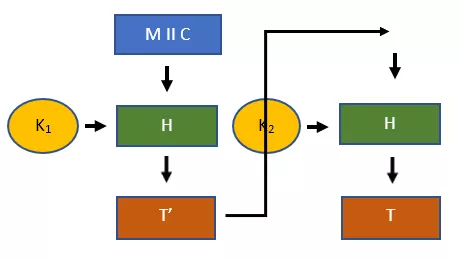

## Turvalliset viestintäistunnot
<chapterId>c7f7dcd3-bbed-53ed-a43d-039da0f180c5</chapterId>

Oletetaan, että kaksi osapuolta on viestintäistunnossa, joten he lähettävät useita viestejä edestakaisin.

Autentikoitu salausjärjestelmä mahdollistaa viestin vastaanottajan varmistaa, että viesti on luotu hänen kumppaninsa toimesta viestintäistunnossa (kunhan yksityinen avain ei ole vuotanut). Tämä toimii hyvin yksittäisen viestin kohdalla. Tyypillisesti kuitenkin kaksi osapuolta lähettää viestejä edestakaisin viestintäistunnossa. Ja tässä asetelmassa tavallinen autentikoitu salausjärjestelmä, kuten edellä kuvattu, jää lyhyeksi turvallisuuden tarjoamisessa.

Pääsyy on, että autentikoitu salausjärjestelmä ei tarjoa mitään takeita siitä, että viesti on todella myös lähetetty sen luoneen agentin toimesta viestintäistunnossa. Harkitse seuraavia kolmea hyökkäysvektoria:

1. **Uudelleenlähetys hyökkäys**: Hyökkääjä lähettää uudelleen salatekstin ja tunnisteen, jonka hän on kaapannut kahden osapuolen välillä aiemmin.
2. **Järjestyksen muuttamisen hyökkäys**: Hyökkääjä kaappaa kaksi viestiä eri aikoina ja lähettää ne vastaanottajalle käänteisessä järjestyksessä.
3. **Heijastushyökkäys**: Hyökkääjä havaitsee viestin, jonka A lähettää B:lle, ja lähettää myös sen viestin A:lle.

Vaikka hyökkääjällä ei ole tietoa salatekstistä eikä hän voi luoda väärennettyjä salatekstejä, yllä mainitut hyökkäykset voivat silti aiheuttaa merkittävää vahinkoa viestinnässä.

Oletetaan esimerkiksi, että tietty viesti kahden osapuolen välillä sisältää rahoitusvarojen siirron. Uudelleenlähetys hyökkäys saattaisi siirtää varat toisen kerran. Tavallisella autentikoidulla salausjärjestelmällä ei ole puolustusta tällaisia hyökkäyksiä vastaan.

Onneksi tällaiset hyökkäykset voidaan helposti lieventää viestintäistunnossa käyttämällä **tunnisteita** ja **suhteellisia aikaindikaattoreita**.

Tunnisteita voidaan lisätä salaamattomaan viestiin ennen salausprosessia. Tämä estäisi kaikki heijastushyökkäykset. Suhteellinen aikaindikaattori voi esimerkiksi olla sekvenssinumero tietyssä viestintäistunnossa. Kumpikin osapuoli lisää sekvenssinumeron viestiin ennen salausprosessia, joten vastaanottaja tietää, missä järjestyksessä viestit on lähetetty. Tämä poistaa mahdollisuuden järjestyksen muuttamisen hyökkäyksille. Se myös eliminoi uudelleenlähetys hyökkäykset. Mikä tahansa viesti, jonka hyökkääjä lähettää myöhemmin, sisältää vanhan sekvenssinumeron, ja vastaanottaja tietää olla käsittelemättä viestiä uudelleen.

Kuvataksemme, miten turvalliset viestintäistunnot toimivat, oletetaan jälleen Alice ja Bob. He lähettävät yhteensä neljä viestiä edestakaisin. Voit nähdä, miten autentikoitu salausjärjestelmä tunnisteiden ja sekvenssinumeroiden kanssa toimisi alla *Kuvassa 11*.
Viestintäistunto alkaa sillä, että Bob lähettää Aliceille salatun viestin C0,B viestitunnisteella T0,B. Salattu viesti sisältää viestin, tunnisteen (BOB) ja sekvenssinumeron (0). Tunniste T0,B on tehty koko salatun viestin yli. Seuraavissa viestinnöissään Alice ja Bob ylläpitävät tätä protokollaa, päivittäen tarvittavia kenttiä.

*Kuva 12: Turvallinen viestintäistunto*

## Huomautuksia
<chapterId>b96d38dd-c9cb-56a7-8764-4af8526bc63f</chapterId>

[^1]: Seutoniuksen mukaan Julius Caesar käytti sotilasviestinnässään siirtosalakirjoitusta, jossa oli vakio avaimen arvo 3. Näin ollen A muuttui aina D:ksi, B aina E:ksi, C aina F:ksi, ja niin edelleen. Tämä siirtosalakirjoituksen versio tunnetaan siten **Caesarin salakirjoituksena** (vaikka se ei modernissa mielessä olekaan salakirjoitus, koska avaimen arvo on vakio). Caesarin salakirjoitus on saattanut olla turvallinen ensimmäisellä vuosisadalla eaa., jos Rooman viholliset eivät olleet kovin tuttuja salakirjoituksen kanssa. Mutta selvästi se ei olisi kovin turvallinen järjestelmä nykyaikana [^1].

[^2]: Jonathan Katz ja Yehuda Lindell, *Johdatus nykyaikaiseen kryptografiaan*, CRC Press (Boca Raton, FL: 2015), s. 7f [^2].

[^3]: Eric Raymond, “Katedraali ja basaari,” esitelmä pidettiin Linux Kongressissa, Würzburg, Saksa (27. toukokuuta 1997). On olemassa useita myöhempiä versioita sekä kirja. Lainaukseni ovat kirjan sivulta 30: Eric Raymond, *Katedraali ja basaari: Pohdintoja Linuxista ja avoimen lähdekoodin vallankumouksesta vahingossa vallankumouksellisen silmin*, uudistettu painos (2001), O’Reilly: Sebastopol, CA [^3].

[^4]: Crypto Museum, "Washington-Moskova suora yhteys," 2013, saatavilla osoitteessa [Crypto Museum](https://www.cryptomuseum.com/crypto/hotline/index.htm) [^4].

[^5]: Probabilistisen salauksen tärkeys korostettiin ensimmäisen kerran Shafi Goldwasserin ja Silvio Micalin toimesta, “Probabilistinen salaus,” *Journal of Co [^5].

# RC4 ja AES
<partId>a48c4a7d-0a41-523f-a4ab-1305b4430324</partId>

Tässä luvussa keskustelemme yksityiskohtaisesti salausjärjestelmästä, joka käyttää modernia primitiivistä virtasalausta, RC4 (tai "Rivestin salaus 4"), ja modernia lohkosalausta, AES. Vaikka RC4-salaus on menettänyt suosionsa salausmenetelmänä, AES on nykyaikaisen symmetrisen salauksen standardi. Nämä kaksi esimerkkiä antavat paremman käsityksen siitä, miten symmetrinen salaus toimii kulissien takana.
Jotta ymmärtäisimme, miten nykyaikaiset pseudosatunnaiset virtasalaukset toimivat, keskityn RC4-virtasalaukseen. Se on pseudosatunnainen virtasalakirjoitus, jota on käytetty WEP- ja WAP-langattomien yhteyspisteiden turvaprotokollissa sekä TLS:ssä. Koska RC4:llä on monia todistettuja heikkouksia, se on menettänyt suosionsa. Itse asiassa Internet Engineering Task Force kieltää nyt RC4-sarjojen käytön asiakas- ja palvelinsovelluksissa kaikissa TLS:n tapauksissa.[3](#footnote3) Siitä huolimatta se toimii hyvin esimerkkinä siitä, miten primitiivinen virtasalakirjoitus toimii.
Aloittaakseni näytän ensin, miten salaamme tekstimuotoisen viestin baby RC4 -salakirjoituksella. Oletetaan, että tekstimuotoinen viestimme on "SOUP". Salaus baby RC4 -salakirjoituksellamme etenee sitten neljässä vaiheessa.

### Vaihe 1

Ensimmäiseksi määritellään taulukko S siten, että S[0] = 0 ja S[7] = 7. Taulukko tarkoittaa tässä yksinkertaisesti indeksillä järjestettyä muutettavissa olevien arvojen kokoelmaa, jota joissakin ohjelmointikielissä (esim. Python) kutsutaan listaksi. Tässä tapauksessa indeksi kulkee 0:sta 7:ään, ja arvot kulkevat myös 0:sta 7:ään. Joten S on seuraava:

- S = [0,1,2,3,4,5,6,7]

Arvot eivät tässä ole ASCII-numeroita, vaan 1 tavun merkkijonojen desimaaliarvojen esityksiä. Joten arvo 2 olisi yhtä kuin 0000 0011. Taulukon S pituus on siis 8 tavua.

### Vaihe 2

Toiseksi määritellään avaintaulukko K, jonka pituus on 8 tavua valitsemalla avain 1:n ja 8 tavun väliltä (tavun murto-osat eivät ole sallittuja). Koska jokainen tavu on 8 bittiä, voit valita minkä tahansa numeron väliltä 0 ja 255 kullekin avaimen tavulle.

Oletetaan, että valitsemme avaimemme k:n [14,48,9], joten sen pituus on 3 tavua. Jokainen avaintaulukon indeksi asetetaan sitten kyseisen avainelementin desimaaliarvon mukaisesti järjestyksessä. Jos käyt läpi koko avaimen, aloita alusta, kunnes olet täyttänyt avaintaulukon 8 paikkaa. Näin ollen avaintaulukkomme on seuraava:

- K = [14,48,9,14,48,9,14,48]

### Vaihe 3

Kolmanneksi muunnamme taulukon S käyttäen avaintaulukkoa K prosessissa, jota kutsutaan avainohjelmoinniksi. Prosessi on seuraava pseudokoodina:

- Luo muuttujat j ja i
- Aseta muuttuja j = 0
- Jokaiselle i:lle 0:sta 7:ään:
	- Aseta j = j + S[i] + K[i] mod 8
	- Vaihda S[i] ja S[j]

Taulukon S muunnos on esitetty *Taulukossa 1*.

Aloittaessasi voit nähdä S:n alkutilan [0,1,2,3,4,5,6,7] ja j:n alkuarvon 0. Tämä muunnetaan käyttäen avaintaulukkoa [14,48,9,14,48,9,14,48].
For-silmukka alkaa, kun i = 0. Yllä olevan pseudokoodin mukaan j:n uusi arvo tulee olemaan 6 (j = j + S[0] + K[0] mod 8 = 0 + 0 + 14 mod 8 = 6 mod 8). Vaihtaessamme S[0]:n ja S[6]:n, S:n tila 1 kierroksen jälkeen on [6,1,2,3,4,5,0,7].
Seuraavalla rivillä i = 1. Käydessämme for-silmukan läpi uudelleen, j saa arvon 7 (j = j + S[1] + K[1] mod 8 = 6 + 1 + 48 mod 8 = 55 mod 8 = 7 mod 8). Vaihtaessamme S[1]:n ja S[7]:n nykyisestä S:n tilasta, [6,1,2,3,4,5,0,7], saamme tulokseksi [6,7,2,3,4,5,0,1] 2. kierroksen jälkeen.

Jatkamme tätä prosessia, kunnes tuotamme lopullisen rivin alimmaiseksi S-taulukolle, [6,4,1,0,3,7,5,2].

*Taulukko 1: Avainohjelmointitaulukko*

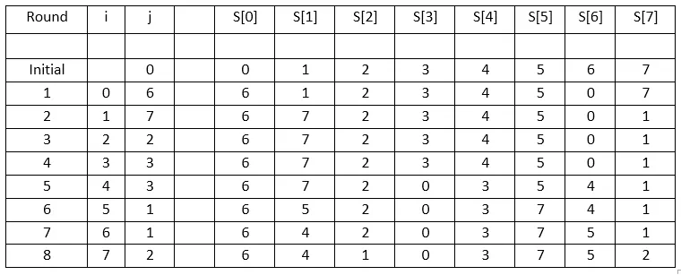

### Vaihe 4

Neljäntenä vaiheena tuotamme avainsarjan. Tämä on pseudosatunnainen merkkijono, jonka pituus on yhtä suuri kuin lähetettävä viesti. Tätä käytetään alkuperäisen viestin "SOUP" salaamiseen. Koska avainsarjan on oltava yhtä pitkä kuin viesti, tarvitsemme 4 tavun mittaisen.

Avainsarja tuotetaan seuraavan pseudokoodin mukaisesti:

- Luo muuttujat j, i ja t
- Aseta j = 0
- Käy läpi jokainen i plaintextistä, alkaen i = 1 ja jatkaen i = 4 asti, jokainen avainsarjan tavu tuotetaan seuraavasti:
    - j = j + S[i] mod 8
	- Vaihda S[i] ja S[j]
	- t = S[i] + S[j] mod 8
	- i:s tavu avainsarjasta = S[t]

Voit seurata laskelmia *Taulukossa 2*.

S:n alkutila = S = [6,4,1,0,3,7,5,2]. Asettaessamme i = 1, arvo j tulee olemaan 4 (j = j + S[i] mod 8 = 0 + 4 mod 8 = 4). Vaihdamme sitten S[1]:n ja S[4]:n tuottaaksemme S:n muutoksen toisella rivillä, [6,3,1,0,4,7,5,2]. Arvo t on sitten 7 (t = S[i] + S[j] mod 8 = 3 + 4 mod 8 = 7). Lopulta, tavu avainsarjalle on sitten S[7], eli 2.

Voimme sitten jatkaa muiden tavujen tuottamista, kunnes meillä on seuraavat neljä tavua: 2, 6, 3 ja 7. Jokaista näistä tavuista voidaan sitten käyttää salaamaan jokainen kirjain plaintextistä, "SOUP".
Aloitetaan käyttämällä ASCII-taulukkoa, voimme nähdä, että "SOUP" koodattuna perustuen tavujonojen desimaaliarvoihin on "83 79 85 80". Yhdistettynä aviovirtaan "2 6 3 2" saadaan "85 85 88 82", mikä pysyy samana modulo 256 -operaation jälkeen. ASCII:ssa salateksti "85 85 88 82" on yhtä kuin "UUXR".
Mitä tapahtuu, jos salattava sana olisi pidempi kuin taulukko S? Tässä tapauksessa taulukko S vain muuttuu tällä yllä esitetyllä tavalla jokaiselle tavulle i plaintextissä, kunnes meillä on aviovirrassa yhtä monta tavua kuin plaintextissä kirjaimia.

*Table 2: Keystream generation*

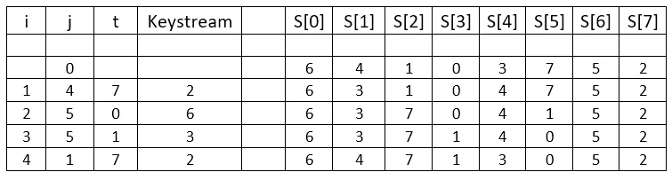

Esimerkki, josta juuri keskustelimme, on vain laimennettu versio RC4-virtasalauksesta. Todellisessa RC4-virtasalauksessa on S-taulukko, joka on 256 tavua pitkä, ei 8 tavua, ja avain, joka voi olla 1 ja 256 tavun välillä, ei 1 ja 8 tavun välillä. Avaintaulukko ja aviovirrat tuotetaan sitten kaikki ottaen huomioon S-taulukon 256 tavun pituuden. Laskelmat muuttuvat huomattavasti monimutkaisemmiksi, mutta periaatteet pysyvät samoina. Käyttäen samaa avainta, [14,48,9], standardin RC4-salauksen kanssa, plaintext-viesti "SOUP" salataan 67 02 ed df heksadesimaalimuodossa.

Virtasalauksessa, jossa aviovirta päivittyy riippumatta plaintext-viestistä tai salatekstistä, on kyse **synkronisesta virtasalauksesta**. Aviovirta riippuu vain avaimesta. Selvästi, RC4 on esimerkki synkronisesta virtasalauksesta, sillä aviovirralla ei ole suhdetta plaintextiin tai salatekstiin. Kaikki edellisessä luvussa mainitut primitiiviset virtasalauksemme, mukaan lukien siirtosalakirjoitus, Vigenèren salakirjoitus ja kertakäyttösalasana, olivat myös synkronisen tyyppisiä.

Sen sijaan **asynkronisessa virtasalauksessa** aviovirta tuotetaan sekä avaimen että aiempien salatekstin elementtien perusteella. Tätä tyyppiä kutsutaan myös **itse-synkronoivaksi salaukseksi**.

Tärkeää on, että RC4:llä tuotettua aviovirtaa tulisi käsitellä kertakäyttösalasanana, eikä aviovirtaa voi tuottaa täsmälleen samalla tavalla seuraavalla kerralla. Käytännöllinen ratkaisu on yhdistää avain nonce-arvoon bytestreamin tuottamiseksi.

## AES 128-bittisellä avaimella
<chapterId>0b30886f-e620-5b8d-807b-9d84685ca8ff</chapterId>

Kuten edellisessä luvussa mainittiin, National Institute of Standards and Technology (NIST) järjesti kilpailun vuosina 1997–2000 määrittääkseen uuden symmetrisen salausstandardin. Rijndael-salakirjoitus osoittautui voittajaksi. Nimi on sanaleikki belgialaisten luojiensa, Vincent Rijmenin ja Joan Daemenin, nimistä.

Rijndael-salakirjoitus on lohkosalaus, mikä tarkoittaa, että on olemassa ydin algoritmi, jota voidaan käyttää eri määrittelyillä avainten pituuksille ja lohkokooille. Voit sitten käyttää sitä eri toimintatilojen kanssa salausjärjestelmien rakentamiseen.
NIST-kilpailun komitea hyväksyi rajoitetun version Rijndael-salauksesta—nimittäin sellaisen, joka vaatii 128-bittiset lohkokoot ja avaimen pituudet joko 128 bittiä, 192 bittiä tai 256 bittiä—osana edistynyttä salausstandardia. Tämä rajoitettu versio Rijndael-salauksesta voidaan myös käyttää useiden toimintatapojen alla. Standardin määrittely tunnetaan nimellä Advanced Encryption Standard (AES).

Näyttääkseni, miten Rijndael-salakirjoitus toimii, AES:n ydin, tulen havainnollistamaan salausprosessin 128-bittisellä avaimella. Avaimen koko vaikuttaa kierrosten määrään kullekin salauslohkolle. 128-bittisillä avaimilla vaaditaan 10 kierrosta. 192 bitin ja 256 bitin kohdalla olisi tarvittu vastaavasti 12 ja 14 kierrosta.

Lisäksi oletan, että AES käytetään ECB-tilassa. Tämä tekee esityksestä hieman helpomman eikä sillä ole merkitystä Rijndael-algoritmille. On kuitenkin varmaa, että ECB-tila ei ole turvallinen käytännössä, koska se johtaa deterministiseen salaukseen. Yleisimmin käytetty turvallinen tila AES:n kanssa on CBC.

Kutsutaan avainta K0. Rakennelma yllä mainituilla parametreilla näyttää siis kuvassa 1, jossa Mi edustaa 128-bittistä osaa selkotekstiviestistä ja Ci 128-bittistä osaa salatusta tekstistä. Selkotekstiin lisätään täyte viimeiselle lohkolle, jos selkotekstiä ei voida jakaa tasaisesti lohkokoon mukaan.

*Kuva 1: AES-ECB 128-bittisellä avaimella*

Jokainen 128-bittinen tekstilohko käy läpi kymmenen kierrosta Rijndael-salauskaaviossa. Tämä vaatii erillisen kierrosavaimen jokaiselle kierrokselle (K1 läpi K10). Nämä tuotetaan jokaiselle kierrokselle alkuperäisestä 128-bittisestä avaimesta K0 käyttäen avaimen laajennusalgoritmia. Näin ollen jokaista salattavaa tekstilohkoa varten käytämme alkuperäistä avainta K0 sekä kymmentä erillistä kierrosavainta. Huomaa, että näitä samoja 11 avainta käytetään jokaiselle 128-bittiselle selkotekstilohkolle, joka vaatii salausta.

Avaimen laajennusalgoritmi on pitkä ja monimutkainen. Sen läpikäyminen on vähän opettavaista hyötyä. Voit tutustua avaimen laajennusalgoritmiin omatoimisesti, jos haluat. Kun kierrosavaimet on tuotettu, Rijndael-salakirjoitus manipuloi ensimmäistä 128-bittistä selkotekstilohkoa, M1, kuten kuvassa 2 näkyy. Käymme nyt läpi nämä vaiheet.

*Kuva 2: M1 manipulointi Rijndael-salakirjoituksella*

### Kierros 0

Rijndael-salakirjoituksen kierros 0 on suoraviivainen. S0-taulukko tuotetaan XOR-operaatiolla 128-bittisen selkotekstin ja yksityisen avaimen välillä. Eli,

- S0 = M1 XOR K0
Ensimmäisellä kierroksella taulukko S0 yhdistetään ensin kierrosavaimen K1 kanssa käyttäen XOR-operaatiota. Tämä tuottaa uuden tilan S:lle. 
Toiseksi, tavun korvausoperaatio suoritetaan nykyiselle S:n tilalle. Se toimii ottamalla jokaisen 16-tavuisen S-taulukon tavun ja korvaamalla sen tavulla taulukosta, jota kutsutaan **Rijndaelin S-laatikoksi**. Jokaisella tavulla on ainutlaatuinen muunnos, ja tuloksena syntyy uusi S:n tila. Rijndaelin S-laatikko on esitetty *Kuvassa 3*.

*Kuva 3: Rijndaelin S-laatikko*

Tämä S-laatikko on yksi paikka, jossa abstrakti algebra tulee mukaan Rijndaelin salaukseen, erityisesti Galois-kentät.

Aluksi määritellään jokainen mahdollinen tavuelementti 00:sta FF:ään 8-bittisenä vektorina. Jokainen tällainen vektori on Galois-kentän GF(28) elementti, jossa modulo-operaation vähentämätön polynomi on x8 + x4 + x3 + x + 1. Galois-kenttä näillä määrittelyillä tunnetaan myös Rijndaelin äärellisenä kenttänä.

Seuraavaksi, jokaiselle mahdolliselle kentän elementille luodaan niin kutsuttu **Nybergin S-laatikko**. Tässä laatikossa jokainen tavu kuvataan sen käänteisluvulle (eli niin, että niiden tulo on yksi). Sitten, kuvataan nämä arvot Nybergin S-laatikosta Rijndaelin S-laatikkoon käyttäen affiinimuunnosta.

S-taulukon kolmas operaatio on rivien siirto-operaatio. Se ottaa S:n tilan ja listaa kaikki kuusitoista tavua matriisissa. Matriisin täyttö alkaa vasemmasta yläkulmasta ja etenee ylhäältä alas ja sitten, kun sarake on täytetty, siirtyy yhden sarakkeen oikealle ja ylös.

Kun S:n matriisi on muodostettu, neljä riviä siirretään. Ensimmäinen rivi pysyy samana. Toinen rivi siirtyy yhden vasemmalle. Kolmas siirtyy kaksi vasemmalle. Neljäs siirtyy kolme vasemmalle. Prosessista on esimerkki *Kuvassa 4*. S:n alkuperäinen tila on näytetty ylhäällä, ja sen jälkeen siirto-operaation tuloksena syntynyt tila on näytetty sen alla.

*Kuva 4: Rivien siirto-operaatio*

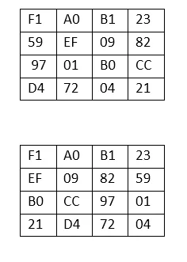

Neljännessä vaiheessa Galois-kentät tulevat jälleen esiin. Aluksi, jokainen S-matriisin sarake kerrotaan *Kuvan 5* 4 x 4 matriisin sarakkeella. Mutta sen sijaan, että kyseessä olisi tavallinen matriisikertolasku, se on vektorikertolasku modulo vähentämättömän polynomin, x8 + x4 + x3 + x + 1, mukaan. Tuloksena olevat vektorikertoimet edustavat tavun yksittäisiä bittejä.

*Kuva 5: Sarakkeiden sekoitusmatriisi*

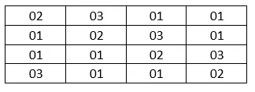

S-matriisin ensimmäisen sarakkeen kertominen yllä olevan 4 x 4 matriisin kanssa tuottaa tuloksen *Kuvassa 6*.
*Kuva 6: Ensimmäisen sarakkeen kertolasku*

Seuraavaksi kaikki matriisin termit on muunnettava polynomeiksi. Esimerkiksi F1 edustaa 1 tavua ja muuttuisi muotoon x7 + x6 + x5 + x4 + 1 ja 03 edustaa 1 tavua ja muuttuisi muotoon x + 1.

Kaikki kertolaskut suoritetaan sitten modulo x8 + x4 + x3 + x + 1. Tämä johtaa neljän polynomin lisäämiseen kunkin sarakkeen neljään soluun. Suorittamalla nämä lisäykset modulo 2, saat neljä polynomia. Jokainen näistä polynomeista edustaa 8-bittistä merkkijonoa eli 1 tavua S:ssä. Emme suorita kaikkia näitä laskelmia tässä *Kuvassa 6*, koska ne ovat laajoja.

Kun ensimmäinen sarake on käsitelty, S-matriisin kolme muuta saraketta käsitellään samalla tavalla. Lopulta tämä tuottaa matriisin, jossa on kuusitoista tavua, jotka voidaan muuntaa taulukoksi.

Viimeisessä vaiheessa S-taulukko yhdistetään uudelleen kierrosavaimen kanssa XOR-operaatiossa. Tämä tuottaa tilan S1. Eli,

- S1 = S XOR K0

### Kierrokset 2–10

Kierrokset 2–9 ovat vain toiston kierros 1, *mutatis mutandis*. Viimeinen kierros näyttää hyvin samanlaiselta kuin edelliset kierrokset, paitsi että sarakkeiden sekoitusvaihe jätetään pois. Eli, kierros 10 suoritetaan seuraavasti:

- S9 XOR K10
- Tavun korvaus
- Rivien siirto
- S10 = S XOR K10

Tila S10 on nyt asetettu C1:ksi, salatun tekstin ensimmäiset 128 bittiä. Jatkamalla loput 128-bittiset tavutekstilohkot saadaan täysi salattu teksti C.

### Rijndael-salauksen toiminnot

Mikä on eri toimintojen taustalla Rijndael-salauksessa?

Yksityiskohtia käymättä läpi, salausjärjestelmiä arvioidaan sen perusteella, missä määrin ne luovat sekaannusta ja hajontaa. Jos salausjärjestelmällä on korkea **sekaannuksen** aste, se tarkoittaa, että salattu teksti näyttää radikaalisti erilaiselta kuin alkuperäinen teksti. Jos salausjärjestelmällä on korkea **hajonnan** aste, se tarkoittaa, että mikä tahansa pieni muutos alkuperäisessä tekstissä tuottaa radikaalisti erilaisen salatun tekstin.

Rijndael-salauksen toimintojen taustalla oleva ajattelu on, että ne tuottavat sekä korkean sekaannuksen että hajonnan asteen. Sekaannus syntyy tavun korvaus -operaatiosta, kun taas hajonta syntyy rivien siirto- ja sarakkeiden sekoitus -operaatioista.

# Asymmetrinen kryptografia
<partId>868bd9dd-6e1c-5ea9-9ece-54affc13ba05</partId>

Kuten symmetrisessä kryptografiassa, asymmetrisiä järjestelmiä voidaan käyttää sekä salassapidon että todentamisen varmistamiseen. Toisin kuin symmetriset järjestelmät, nämä järjestelmät käyttävät kuitenkin kahta avainta yhden sijaan: yksityistä ja julkista avainta.
Aloitamme tutkimuksemme epäsymmetrisen kryptografian löytämisellä, erityisesti niiden ongelmien kanssa, jotka saivat sen aikaan. Seuraavaksi keskustelemme korkealla tasolla siitä, miten epäsymmetriset järjestelmät salauksessa ja autentikoinnissa toimivat. Sen jälkeen esittelemme hajautusfunktioita, jotka ovat avainasemassa ymmärtäessämme epäsymmetrisiä autentikointijärjestelmiä, ja joilla on myös merkitystä muissa kryptografisissa yhteyksissä, kuten luvussa 4 käsitellyissä hajautusperusteisissa viestien autentikointikoodeissa.

## Avainten jakelun ja hallinnan ongelma
<chapterId>1bb651ba-689a-5a89-a7d3-0b9cc3b694f7</chapterId>

Kuvitellaan, että Bob haluaa ostaa uuden sadetakin Jim’s Sporting Goods -verkkokaupasta, jolla on miljoonia asiakkaita Pohjois-Amerikassa. Tämä olisi hänen ensimmäinen ostoksensa heiltä, ja hän haluaa käyttää luottokorttiaan. Joten Bobin on ensin luotava tili Jim’s Sporting Goodsille, mikä vaatii henkilökohtaisten tietojen, kuten osoitteen ja luottokorttitiedot, lähettämistä. Sen jälkeen hän voi suorittaa tarvittavat vaiheet sadetakin ostamiseksi.

Bob ja Jim’s Sporting Goods haluavat varmistaa, että heidän viestintänsä on turvallista koko tämän prosessin ajan, ottaen huomioon, että Internet on avoin viestintäjärjestelmä. He haluavat esimerkiksi varmistaa, että mikään mahdollinen hyökkääjä ei voi saada selville Bobin luottokortin ja osoitetietoja, eikä kukaan voi toistaa hänen ostoksiaan tai luoda väärennettyjä hänen nimissään.

Edistynyt autentikoitu salausjärjestelmä, kuten edellisessä luvussa keskusteltiin, voisi varmasti tehdä viestinnän Bobin ja Jim’s Sporting Goodsin välillä turvalliseksi. Mutta käytännön esteitä tällaisen järjestelmän toteuttamiselle on selvästi olemassa.

Havainnollistaaksemme näitä käytännön esteitä, kuvitellaan, että eläisimme maailmassa, jossa olemassa on vain symmetrisen kryptografian työkaluja. Mitä Jim’s Sporting Goods ja Bob voisivat silloin tehdä varmistaakseen turvallisen viestinnän?

Tässä tilanteessa he kohtaisivat merkittäviä kustannuksia turvallisen viestinnän toteuttamiseksi. Koska Internet on avoin viestintäjärjestelmä, he eivät voi vain vaihtaa avainsettiä sen kautta. Siksi Bobin ja Jim’s Sporting Goodsin edustajan on tehtävä avaintenvaihto henkilökohtaisesti.

Yksi mahdollisuus on, että Jim’s Sporting Goods luo erityisiä avaintenvaihtopaikkoja, josta Bob ja muut uudet asiakkaat voivat noutaa avainsetin turvallista viestintää varten. Tämä aiheuttaisi ilmeisesti merkittäviä organisatorisia kustannuksia ja vähentäisi merkittävästi uusien asiakkaiden mahdollisuuksia tehdä ostoksia tehokkaasti.

Vaihtoehtoisesti Jim’s Sporting Goods voi lähettää Bobille avainparin erittäin luotettavan lähettipalvelun kautta. Tämä on todennäköisesti tehokkaampaa kuin avaintenvaihtopaikkojen järjestäminen. Mutta tämäkin tulisi merkittävillä kustannuksilla, erityisesti jos monet asiakkaat tekevät vain yhden tai muutaman ostoksen.

Lisäksi symmetrinen järjestelmä autentikoidulle salaukselle pakottaa myös Jim’s Sporting Goodsin säilyttämään erilliset avainsetit kaikille asiakkailleen. Tämä olisi merkittävä käytännön haaste tuhansille asiakkaille, saati sitten miljoonille.

Ymmärtääksemme tämän viimeisen pointin, kuvitellaan, että Jim’s Sporting Goods tarjoaisi jokaiselle asiakkaalle saman avainparin. Tämä mahdollistaisi jokaisen asiakkaan – tai kenen tahansa muun, joka voisi saada tämän avainparin – lukea ja jopa manipuloida kaikkia viestejä Jim’s Sporting Goodsin ja sen asiakkaiden välillä. Voisi siis yhtä hyvin olla käyttämättä kryptografiaa lainkaan viestinnässä.

Jopa avainsetin toistaminen vain joillekin asiakkaille olisi kauhea turvallisuuskäytäntö. Mikä tahansa mahdollinen hyökkääjä voisi yrittää hyödyntää tuota järjestelmän ominaisuutta (muistaen, että hyökkääjien oletetaan tietävän kaiken järjestelmästä paitsi avaimet, Kerckhoffs’in periaatteen mukaisesti.)

Joten Jim’s Sporting Goodsin olisi säilytettävä avainpari jokaiselle asiakkaalle, riippumatta siitä, miten nämä avainparit jaetaan. Tämä selvästi esittää useita käytännön ongelmia.

- Jim’s Sporting Goodsin olisi säilytettävä miljoonia avainpareja, yksi setti jokaiselle asiakkaalle.
- Näitä avaimia tulisi suojata huolellisesti, sillä ne olisivat varma kohde hakkerien hyökkäyksille. Turvallisuusrikkomukset vaatisivat kalliiden avainvaihtojen toistamista joko erityisissä avainvaihtopaikoissa tai kuriirin kautta. - Jim’s Sporting Goods -kaupan asiakkaan tulisi säilyttää turvallisesti avainparia kotona. Hävikkejä ja varkauksia tapahtuu, mikä vaatii avainvaihtojen toistamista. Asiakkaiden tulisi myös käydä läpi tämä prosessi minkä tahansa muun verkkokaupan tai muiden yksiköiden kanssa, joiden kanssa he haluavat kommunikoida ja tehdä transaktioita Internetin välityksellä.

Nämä kaksi päähaastetta, jotka juuri kuvailtiin, olivat hyvin perustavanlaatuisia huolenaiheita 1970-luvulle asti. Ne tunnettiin **avainten jakeluongelmana** ja **avainten hallintaongelmana**.

Nämä ongelmat olivat aina olleet olemassa, tietysti, ja aiheuttivat usein päänsärkyä menneisyydessä. Esimerkiksi sotilasvoimat joutuisivat jatkuvasti jakamaan kirjoja avaimilla turvallista kommunikaatiota varten kenttähenkilöstölle suurin riskein ja kustannuksin. Mutta nämä ongelmat pahenivat, kun maailma siirtyi yhä enemmän pitkän matkan digitaaliseen kommunikaatioon, erityisesti ei-valtiollisten toimijoiden osalta.

Jos näitä ongelmia ei olisi ratkaistu 1970-luvulla, tehokasta ja turvallista ostamista Jim’s Sporting Goods -kaupassa ei todennäköisesti olisi ollut olemassa. Itse asiassa suurin osa nykymaailmastamme, käytännöllisine ja turvallisine sähköposteineen, verkkopankkitoimintoineen ja ostoksineen, olisi todennäköisesti vain kaukainen fantasia. Mikään, mikä edes muistuttaisi Bitcoinia, ei olisi voinut olla olemassa lainkaan.

Joten, mitä tapahtui 1970-luvulla? Miten on mahdollista, että voimme tehdä ostoksia verkossa välittömästi ja selata World Wide Webiä turvallisesti? Miten on mahdollista, että voimme lähettää Bitcoineja välittömästi ympäri maailmaa älypuhelimistamme?

## Uudet suunnat kryptografiassa
<chapterId>7a9dd9a3-496e-5f9d-93e0-b5028a7dd0f1</chapterId>

1970-luvulla avainten jakelun ja hallinnan ongelmat herättivät amerikkalaisten akateemisten kryptografien ryhmän huomion: Whitfield Diffie, Martin Hellman ja Ralph Merkle. Vakavasta skeptisyydestä valtaosan kollegoidensa taholta huolimatta he ryhtyivät kehittämään ratkaisua siihen.

Ainakin yksi heidän yrityksensä päämotivaatioista oli ennakkonäkemys siitä, että avoin tietokoneviestintä vaikuttaisi syvästi maailmaamme. Kuten Diffie ja Hellman huomauttavat vuonna 1976,

> Tietokoneohjattujen viestintäverkkojen kehitys lupaa vaivatonta ja edullista yhteydenpitoa ihmisten tai tietokoneiden välillä maailman vastakkaisilla puolilla, korvaten suurimman osan postista ja monia retkiä telekommunikaatiolla. Monissa sovelluksissa nämä yhteydet on tehtävä turvallisiksi sekä salakuuntelua että laittomien viestien injektointia vastaan. Tällä hetkellä kuitenkin turvallisuusongelmien ratkaisu laahaa kaukana muiden viestintäteknologian alueiden takana. *Nykyinen kryptografia ei kykene täyttämään vaatimuksia, sillä sen käyttö aiheuttaisi sellaisia vakavia hankaluuksia järjestelmän käyttäjille, että se poistaisi monia teleprosessoinnin hyötyjä.*[1](#footnote1)

Diffien, Hellmanin ja Merklen sisukkuus palkittiin. Heidän tulostensa ensimmäinen julkaisu oli Diffien ja Hellmanin vuonna 1976 kirjoittama artikkeli “New Directions in Cryptography.” Siinä he esittivät kaksi alkuperäistä tapaa käsitellä avainten jakelun ja hallinnan ongelmia.
Ensimmäinen heidän tarjoamansa ratkaisu oli etäinen *avaintenvaihtoprotokolla*, eli joukko sääntöjä yhden tai useamman symmetrisen avaimen vaihtamiseksi turvattoman viestintäkanavan yli. Tätä protokollaa kutsutaan nykyään *Diffie-Hellmanin avaintenvaihdoksi* tai *Diffie-Hellman-Merklen avaintenvaihdoksi*.[2](#footnote2)
Diffie-Hellmanin avaintenvaihdossa kaksi osapuolta vaihtaa ensin julkisesti tietoa turvattomalla kanavalla, kuten Internetissä. Tämän tiedon perusteella he sitten itsenäisesti luovat symmetrisen avaimen (tai pari symmetrisiä avaimia) turvallista viestintää varten. Vaikka molemmat osapuolet luovat avaimensa itsenäisesti, julkisesti jaetun tiedon ansiosta tämä avainten luontiprosessi tuottaa molemmille saman tuloksen.

Tärkeää on, että vaikka kuka tahansa voi tarkkailla julkisesti vaihdettua tietoa turvattomalla kanavalla, vain nämä kaksi osapuolta, jotka osallistuvat tiedonvaihtoon, voivat luoda symmetrisiä avaimia siitä.

Tämä kuulostaa tietysti täysin vasten intuitiiviselta. Miten kaksi osapuolta voi vaihtaa julkisesti tietoa, joka sallii vain heidän luoda symmetrisiä avaimia siitä? Miksi kukaan muu tarkkailija ei pystyisi luomaan samoja avaimia?

Se perustuu tietysti kauniiseen matematiikkaan. Diffie-Hellmanin avaintenvaihto toimii yksisuuntaisen funktion avulla, jossa on ansaluukku. Keskustellaan näistä kahdesta termistä vuorollaan.

Oletetaan, että sinulle annetaan jokin funktio f(x) ja tulos f(a) = y, missä a on tietty arvo x:lle. Sanomme, että f(x) on **yksisuuntainen funktio**, jos arvon y laskeminen annetusta a:sta ja f(x):stä on helppoa, mutta arvon a laskeminen annetusta y:stä ja f(x):stä on laskennallisesti mahdotonta. Nimi yksisuuntainen funktio, tietysti, juontuu siitä, että tällainen funktio on käytännöllinen laskea vain yhteen suuntaan.

Joillakin yksisuuntaisilla funktioilla on niin kutsuttu ansaluukku. Vaikka arvon a laskeminen annetusta y:stä ja f(x):stä on käytännössä mahdotonta, on olemassa tietty tieto Z, joka tekee arvon a laskemisesta y:stä laskennallisesti mahdollista. Tämä tieto Z tunnetaan **ansaluukkuna**. Yksisuuntaisia funktioita, joilla on ansaluukku, kutsutaan **ansaluukkufunktioiksi**.

Emme syvenny Diffie-Hellmanin avaintenvaihdon yksityiskohtiin tässä. Mutta olennaisesti jokainen osallistuja luo tietoa, jonka osa jaetaan julkisesti ja jonka osa pysyy salaisena. Kumpikin osapuoli ottaa sitten salaisen tietonsa ja toisen osapuolen julkisesti jakaman tiedon luodakseen yksityisen avaimen. Ja jotenkin ihmeellisesti, molemmat osapuolet päätyvät samaan yksityiseen avaimen.

Mikään osapuoli, joka tarkkailee vain julkisesti jaettua tietoa kahden osapuolen välillä Diffie-Hellmanin avaintenvaihdossa, ei pysty toistamaan näitä laskelmia. He tarvitsisivat yksityistä tietoa yhdeltä kahdesta osapuolesta tehdäkseen niin.

Vaikka Diffie-Hellmanin avaintenvaihdon perusversio, joka esiteltiin vuoden 1976 paperissa, ei ole kovin turvallinen, sen monimutkaisemmat versiot ovat ehdottomasti edelleen käytössä tänään. Tärkeintä on, että jokainen avaintenvaihtoprotokolla uusimmassa kuljetuskerroksen turvallisuusprotokollassa (versio 1.3) on olennaisesti rikastettu versio protokollasta, jonka Diffie ja Hellman esittelivät vuonna 1976. Kuljetuskerroksen turvallisuusprotokolla on vallitseva protokolla turvallisen tiedonvaihdon toteuttamiseksi hypertext transfer protocol (http) mukaisesti, joka on Web-sisällön vaihtamisen standardi.
On tärkeää huomata, että Diffie-Helmann avainvaihto ei ole asymmetrinen järjestelmä. Tarkkaan ottaen se kuuluu pikemminkin symmetrisen avainkryptografian alueelle. Mutta koska sekä Diffie-Helmann avainvaihto että asymmetrinen kryptografia nojaavat yksisuuntaisiin lukuteoreettisiin funktioihin, joissa on ansaluukkuja, niitä käsitellään tyypillisesti yhdessä.

Toinen tapa, jonka Diffie ja Helmann tarjosivat avainten jakelun ja hallinnan ongelman ratkaisemiseksi heidän vuoden 1976 paperissaan oli, tietenkin, asymmetrisen kryptografian kautta.

Toisin kuin heidän esityksessään Diffie-Hellman avainvaihdosta, he tarjosivat vain yleiset ääriviivat siitä, miten asymmetriset kryptografiset järjestelmät voitaisiin mahdollisesti rakentaa. He eivät tarjonneet mitään tiettyä yksisuuntaista funktiota, joka voisi erityisesti täyttää kohtuullisen turvallisuuden ehdot tällaisissa järjestelmissä.

Käytännön toteutus asymmetrisesta järjestelmästä löydettiin kuitenkin vuotta myöhemmin kolmelta eri akateemiselta kryptografialta ja matemaatikolta: Ronald Rivest, Adi Shamir ja Leonard Adleman. Heidän esittelemänsä kryptosysteemi tunnetaan **RSA-kryptosysteeminä** (heidän sukunimiensä perusteella).

Asymmetrisessa kryptografiassa (ja Diffie Helmann avainvaihdossa) käytetyt ansaluukkufunktiot liittyvät kaikki kahteen pääasialliseen **laskennallisesti vaikeaan ongelmaan**: alkulukujen tekijöihin jakamiseen ja diskreettien logaritmien laskemiseen.

**Alkulukujen tekijöihin jakaminen** vaatii, kuten nimi vihjaa, kokonaisluvun jakamisen sen alkutekijöihin. RSA-ongelma on ehdottomasti tunnetuin esimerkki kryptosysteemistä, joka liittyy alkulukujen tekijöihin jakamiseen.

**Diskreetin logaritmin ongelma** on ongelma, joka esiintyy syklisissä ryhmissä. Kun annetaan generaattori tietyssä syklisessä ryhmässä, vaaditaan toisen ryhmän elementin tuottamiseen tarvittavan yksilöllisen eksponentin laskemista generaattorista.

Diskreettiin logaritmiin perustuvat järjestelmät nojaavat kahteen päätyyppiin syklisiä ryhmiä: kokonaislukujen kertolaskullisiin ryhmiin ja ryhmiin, jotka sisältävät pisteitä elliptisillä käyrillä. Alkuperäinen Diffie Helmann avainvaihto, kuten esiteltiin "New Directions in Cryptography" -julkaisussa, toimii kokonaislukujen kertolaskullisessa syklisessä ryhmässä. Bitcoinin digitaalinen allekirjoitus algoritmi ja äskettäin esitelty Schnorrin allekirjoitusjärjestelmä (2021) perustuvat molemmat diskreetin logaritmin ongelmaan tietyssä elliptisen käyrän syklisessä ryhmässä.

Seuraavaksi käymme läpi korkean tason yleiskatsauksen salassapidosta ja todentamisesta asymmetrisessa ympäristössä. Ennen sitä meidän on kuitenkin tehtävä lyhyt historiallinen huomautus.

Nyt vaikuttaa uskottavalta, että joukko brittiläisiä kryptografeja ja matemaatikkoja, jotka työskentelivät Government Communications Headquarters (GCHQ) -organisaatiossa, oli itsenäisesti tehnyt edellä mainitut löydökset muutamaa vuotta aiemmin. Tähän ryhmään kuuluivat James Ellis, Clifford Cocks ja Malcolm Williamson.

Heidän omien kertomustensa ja GCHQ:n mukaan James Ellis keksi ensimmäisenä julkisen avaimen kryptografian konseptin vuonna 1969. Clifford Cocks löysi sitten RSA-kryptografisen järjestelmän vuonna 1973, ja Malcolm Williamson Diffie Helmann avainvaihdon konseptin vuonna 1974. Heidän löytönsä julkaistiin kuitenkin väitetysti vasta vuonna 1997, ottaen huomioon GCHQ:ssa tehdyn työn salaisen luonteen.

## Asymmetrinen salaus ja todentaminen
<chapterId>2f6f0f03-3c3d-5025-90f0-5211139bc0cc</chapterId>

Yleiskatsaus asymmetriseen salaukseen Bobin ja Alicen avulla on esitetty *Kuvassa 1*.
Alice luo ensin avainparin, joka koostuu yhdestä julkisesta avaimesta (KP) ja yhdestä yksityisestä avaimesta (KS), missä “P” KP:ssä tarkoittaa “public” (julkinen) ja “S” KS:ssä “secret” (salainen). Sen jälkeen hän jakaa tämän julkisen avaimen vapaasti muiden käyttöön. Palataan tämän jakoprosessin yksityiskohtiin hieman myöhemmin. Mutta oletetaan nyt, että kuka tahansa, mukaan lukien Bob, voi turvallisesti hankkia Alicen julkisen avaimen KP.
Myöhemmässä vaiheessa Bob haluaa kirjoittaa viestin M Alicelle. Koska viesti sisältää arkaluonteista tietoa, hän haluaa, että sen sisältö pysyy salassa kaikilta paitsi Alicelta. Siksi Bob ensin salaa viestinsä M käyttäen KP:tä. Sen jälkeen hän lähettää syntyneen salatun tekstin C Alicelle, joka purkaa C:n KS:llä tuottaakseen alkuperäisen viestin M.

*Kuva 1: Epäsymmetrinen salaus*

Mikä tahansa vastustaja, joka kuuntelee Bobin ja Alicen kommunikaatiota, voi havaita C:n. Hän tietää myös KP:n ja salausalgoritmin E(·). Tärkeää on kuitenkin, että tämä tieto ei mahdollista hyökkääjän purkaa salattua tekstiä C. Salauksen purkaminen vaatii nimenomaan KS:n, jota hyökkääjällä ei ole.

Symmetriset salausjärjestelmät yleensä tarvitsevat turvallisuutta hyökkääjää vastaan, joka voi pätevästi salata avoimen tekstin viestejä (tunnetaan valitun salatun tekstin hyökkäyksen turvallisuutena). Sitä ei kuitenkaan ole suunniteltu nimenomaan mahdollistamaan tällaisten pätevien salattujen tekstien luomista hyökkääjän tai kenenkään muun toimesta.

Tämä on täysin vastakohta epäsymmetriselle salausjärjestelmälle, jonka koko tarkoitus on mahdollistaa kenen tahansa, mukaan lukien hyökkääjien, tuottaa päteviä salattuja tekstejä. Epäsymmetriset salausjärjestelmät voidaan siis luokitella **monen käyttäjän salauksiksi**.

Ymmärtääksemme paremmin, mitä tapahtuu, kuvittele, että Bob halusi lähettää kirjeen salassa elektronisen viestin sijaan. Yksi tapa varmistaa salaisuus olisi, että Alice lähettäisi turvallisen riippulukon Bobille, mutta pitäisi avaimen itsellään. Kirjoitettuaan kirjeensä Bob voisi laittaa kirjeen laatikkoon ja lukita sen Alicen riippulukolla. Sen jälkeen hän voisi lähettää lukitun laatikon viestin kanssa Alicelle, jolla on avain sen avaamiseen.

Vaikka Bob pystyy lukitsemaan riippulukon, kumpikaan hän eikä mikään muu henkilö, joka keskeyttää laatikon, ei voi avata riippulukkoa, jos se todella on turvallinen. Vain Alice voi avata sen ja nähdä Bobin kirjeen sisällön, koska hänellä on avain.

Epäsymmetrinen salausjärjestelmä on karkeasti sanottuna digitaalinen versio tästä prosessista. Riippulukko on verrattavissa julkiseen avaimen ja riippulukon avain yksityiseen avaimen. Koska riippulukko on digitaalinen, on Alicen paljon helpompi ja ei niin kallista jakaa sitä kenelle tahansa, joka haluaa lähettää hänelle salaisia viestejä.

Autentikoinnissa epäsymmetrisessä ympäristössä käytämme **digitaalisia allekirjoituksia**. Nämä toimivat siis samalla tavalla kuin viestien autentikointikoodit symmetrisessä ympäristössä. Digitaalisista allekirjoituksista on yleiskatsaus *Kuvassa 2*.
Bob luo ensin avainparin, joka koostuu julkisesta avaimesta (KP) ja yksityisestä avaimesta (KS), ja jakaa julkisen avaimensa. Kun hän haluaa lähettää todennetun viestin Alicelle, hän ottaa ensin viestinsä M ja yksityisen avaimensa luodakseen digitaalisen allekirjoituksen D. Bob lähettää sitten Alicelle viestinsä yhdessä digitaalisen allekirjoituksen kanssa. Alice syöttää viestin, julkisen avaimen ja digitaalisen allekirjoituksen varmennusalgoritmiin. Tämä algoritmi tuottaa joko tosi validille allekirjoitukselle tai epätosi epävalidille allekirjoitukselle.
Digitaalinen allekirjoitus on, kuten nimi selvästi viittaa, kirjoitetun allekirjoituksen digitaalinen vastine kirjeissä, sopimuksissa ja niin edelleen. Itse asiassa digitaalinen allekirjoitus on yleensä paljon turvallisempi. Jonkin verran vaivannäöllä voit väärentää kirjoitetun allekirjoituksen; prosessi, joka on helpompaa, koska kirjoitettuja allekirjoituksia ei usein tarkisteta huolellisesti. Turvallinen digitaalinen allekirjoitus on kuitenkin, kuten turvallinen viestin todennuskoodi, **eksistentiaalisesti väärentämätön**: eli turvallisella digitaalisen allekirjoituksen järjestelmällä kukaan ei voi käytännössä luoda allekirjoitusta viestille, joka läpäisee varmennusmenettelyn, ellei hänellä ole yksityistä avainta.

*Kuva 2: Epäsymmetrinen todentaminen*

Kuten epäsymmetrisessä salauksessa, näemme mielenkiintoisen kontrastin digitaalisten allekirjoitusten ja viestin todennuskoodien välillä. Jälkimmäisessä tapauksessa varmennusalgoritmia voi käyttää vain yksi osapuoli, joka on mukana turvallisessa viestinnässä. Tämä johtuu siitä, että se vaatii yksityisen avaimen. Epäsymmetrisessä asetelmassa kuitenkin kuka tahansa voi varmentaa digitaalisen allekirjoituksen S, jonka Bob on tehnyt.

Kaikki tämä tekee digitaalisista allekirjoituksista erittäin tehokkaan työkalun. Se muodostaa perustan esimerkiksi sopimusten allekirjoitusten luomiselle, joita voidaan varmentaa oikeudellisiin tarkoituksiin. Jos Bob olisi tehnyt allekirjoituksen sopimukseen edellä mainitussa vaihdossa, Alice voi näyttää viestin M, sopimuksen ja allekirjoituksen S oikeusistuimelle. Oikeusistuin voi sitten varmentaa allekirjoituksen käyttäen Bobin julkista avainta.[5](#footnote5)

Toisena esimerkkinä, digitaaliset allekirjoitukset ovat tärkeä osa turvallisen ohjelmiston ja ohjelmistopäivitysten jakelua. Tällaista julkista varmennettavuutta ei voisi koskaan luoda pelkästään viestin todennuskoodeilla.

Viimeisenä esimerkkinä digitaalisten allekirjoitusten voimasta, harkitse Bitcoinia. Yksi yleisimmistä väärinkäsityksistä Bitcoinista, erityisesti mediassa, on se, että transaktiot ovat salattuja: ne eivät ole. Sen sijaan Bitcoin-transaktiot toimivat digitaalisten allekirjoitusten avulla turvallisuuden takaamiseksi.

Bitcoinit ovat olemassa erissä, joita kutsutaan käyttämättömiksi transaktiotuotoksiksi (tai UTXOiksi). Oletetaan, että saat kolme maksua tietylle Bitcoin-osoitteelle 2 bitcoinia kustakin. Teknisesti sinulla ei nyt ole 6 bitcoinia sillä osoitteella. Sen sijaan sinulla on kolme erää 2 bitcoinia, jotka on lukittu kryptografisella ongelmalla, joka liittyy kyseiseen osoitteeseen. Minkä tahansa maksun tekemiseen voit käyttää yhtä, kahta tai kaikkia kolmea näistä eristä, riippuen siitä, kuinka paljon tarvitset transaktioon.

Omistusoikeuden todistaminen käyttämättömistä transaktiotuotoksista näytetään yleensä yhden tai useamman digitaalisen allekirjoituksen kautta. Bitcoin toimii juuri siksi, että käyttämättömien transaktiotuotosten pätevät digitaaliset allekirjoitukset ovat laskennallisesti mahdottomia tehdä, ellet omista salaisia tietoja, joita niiden tekemiseen tarvitaan.
Nykyisin Bitcoin-siirrot sisältävät läpinäkyvästi kaiken tiedon, joka osallistujien verkossa on vahvistettava, kuten siirrossa käytettyjen käyttämättömien siirtotulosten alkuperät. Vaikka on mahdollista piilottaa osa tästä tiedosta ja silti sallia vahvistaminen (kuten jotkin vaihtoehtoiset kryptovaluutat, kuten Monero, tekevät), tämä luo myös erityisiä turvallisuusriskejä.
Sekavuutta joskus ilmenee digitaalisten allekirjoitusten ja digitaalisesti tallennettujen kirjallisten allekirjoitusten välillä. Jälkimmäisessä tapauksessa otat kuvan kirjallisesta allekirjoituksestasi ja liität sen sähköiseen asiakirjaan, kuten työsopimukseen. Tämä ei kuitenkaan ole digitaalinen allekirjoitus kryptografisessa mielessä. Jälkimmäinen on vain pitkä numero, jonka voi tuottaa vain yksityisen avaimen hallussa ollessa.

Kuten symmetrisen avaimen asetuksessa, voit myös käyttää asymmetrista salaus- ja todennusjärjestelmiä yhdessä. Samat periaatteet pätevät. Ensinnäkin sinun tulisi käyttää eri yksityisiä-julkisia avainpareja salaukseen ja digitaalisten allekirjoitusten tekemiseen. Lisäksi sinun tulisi ensin salata viesti ja sitten todentaa se.

Tärkeää on, että monissa sovelluksissa asymmetrista kryptografiaa ei käytetä koko viestintäprosessin ajan. Sen sijaan sitä käytetään tyypillisesti vain *symmetristen avainten vaihtoon* osapuolten välillä, joilla he todellisuudessa kommunikoivat.

Näin on esimerkiksi silloin, kun ostat tavaroita verkossa. Tuntien myyjän julkisen avaimen, hän voi lähettää sinulle digitaalisesti allekirjoitettuja viestejä, joiden aitouden voit varmistaa. Tämän perusteella voit noudattaa yhtä monista protokollista symmetristen avainten vaihtamiseksi turvallisesti kommunikoidaksesi.

Pääsyy edellä mainitun lähestymistavan yleisyydelle on, että asymmetrinen kryptografia on paljon vähemmän tehokasta kuin symmetrinen kryptografia tuottamaan tietyn turvallisuustason. Tämä on yksi syy, miksi tarvitsemme edelleen symmetristä avainkryptografiaa julkisen kryptografian rinnalla. Lisäksi symmetrinen avainkryptografia on paljon luontaisempi tietyissä sovelluksissa, kuten tietokoneen käyttäjä salatessaan omia tietojaan.

Joten miten digitaaliset allekirjoitukset ja julkinen avain salaus käsittelevät avainten jakelun ja avainhallinnan ongelmia?

Tässä ei ole yhtä vastausta. Asymmetrinen kryptografia on työkalu, eikä ole vain yhtä tapaa käyttää sitä työkalua. Mutta otetaan aiempi esimerkkimme Jim's Sporting Goodsista näyttääksemme, miten ongelmat tyypillisesti käsiteltäisiin tässä esimerkissä.

Aloittaakseen Jim's Sporting Goods lähestyisi todennäköisesti **sertifikaattiviranomaista**, organisaatiota, joka tukee julkisen avaimen jakelua. Sertifikaattiviranomainen rekisteröisi joitakin tietoja Jim's Sporting Goodsista ja myöntäisi sille julkisen avaimen. Se lähettäisi sitten Jim's Sporting Goodsille sertifikaatin, joka tunnetaan **TLS/SSL-sertifikaattina**, Jim's Sporting Goodsin julkisella avaimella digitaalisesti allekirjoitettuna käyttäen sertifikaattiviranomaisen omaa julkista avainta. Näin sertifikaattiviranomainen vahvistaa, että tietty julkinen avain todella kuuluu Jim's Sporting Goodsille.

Tämän prosessin ymmärtämisen avain TLS/SSL-sertifikaattien kanssa on, että vaikka et yleensä olisi tallentanut Jim's Sporting Goodsin julkista avainta mihinkään tietokoneellesi, tunnustettujen sertifikaattiviranomaisten julkiset avaimet ovat todellakin tallennettu selaimeesi tai käyttöjärjestelmääsi. Nämä on tallennettu niin kutsuttuihin **juurisertifikaatteihin**.

Näin ollen, kun Jim's Sporting Goods toimittaa sinulle TLS/SSL-sertifikaattinsa, voit varmistaa sertifikaattiviranomaisen digitaalisen allekirjoituksen juurisertifikaatin kautta selaimessasi tai käyttöjärjestelmässäsi. Jos allekirjoitus on pätevä, voit olla suhteellisen varma, että sertifikaatissa oleva julkinen avain todella kuuluu Jim's Sporting Goodsille. Tämän perusteella on helppo perustaa protokolla turvalliseen viestintään Jim's Sporting Goodsin kanssa.
Avainjakelu on nyt tullut huomattavasti yksinkertaisemmaksi Jim's Sporting Goods -liikkeelle. Ei ole vaikea nähdä, että myös avainhallinta on huomattavasti yksinkertaistunut. Sen sijaan, että Jim's Sporting Goods joutuisi säilyttämään tuhansia avaimia, sen tarvitsee vain säilyttää yksityinen avain, joka mahdollistaa allekirjoitusten tekemisen julkiselle avaimelle sen SSL-sertifikaatissa. Aina kun asiakas tulee Jim's Sporting Goods -sivustolle, he voivat perustaa turvallisen viestintäistunnon tästä julkisesta avaimesta. Asiakkaiden ei myöskään tarvitse säilyttää mitään tietoja (muuta kuin tunnustettujen sertifikaattiviranomaisten julkiset avaimet käyttöjärjestelmässään ja selaimessaan).

## Hahmofunktiot
<chapterId>ea8327ab-b0e3-5635-941c-4b51f396a648</chapterId>

Hahmofunktiot ovat kaikkialla kryptografiassa. Ne eivät ole symmetrisiä eivätkä asymmetrisiä järjestelmiä, vaan kuuluvat omaan kryptografiseen kategoriaansa.

Olemme jo kohdanneet hahmofunktioita luvussa 4 hahmoon perustuvien todennusviestien luomisen yhteydessä. Ne ovat myös tärkeitä digitaalisten allekirjoitusten kontekstissa, joskin hieman eri syystä: Digitaaliset allekirjoitukset tehdään nimittäin tyypillisesti jonkin (salatun) viestin hahmoarvon yli, eikä itse (salatun) viestin yli. Tässä osiossa tarjoan perusteellisemman johdannon hahmofunktioihin.

Aloitetaan määrittelemällä hahmofunktio. **Hahmofunktio** on mikä tahansa tehokkaasti laskettava funktio, joka ottaa syötteitä mielivaltaisesta koosta ja tuottaa kiinteän pituisia tulosteita.

**Kryptografinen hahmofunktio** on vain hahmofunktio, joka on hyödyllinen sovelluksissa kryptografiassa. Kryptografisen hahmofunktion tulosta kutsutaan tyypillisesti **hahmoksi**, **hahmoarvoksi** tai **viestitiivistelmäksi**.

Kryptografian kontekstissa "hahmofunktio" viittaa tyypillisesti kryptografiseen hahmofunktioon. Tulen noudattamaan tätä käytäntöä tästä eteenpäin.

Esimerkki suositusta hahmofunktiosta on **SHA-256** (secure hash algorithm 256). Riippumatta syötteen koosta (esim. 15 bittiä, 100 bittiä tai 10 000 bittiä), tämä funktio tuottaa 256-bittisen hahmoarvon. Alla näet muutaman esimerkin SHA-256 -funktion tuloksista.

* "Hello": 185f8db32271fe25f561a6fc938b2e264306ec304eda518007d1764826381969
* "52398": a3b14d2bf378c1bd47e7f8eaec63b445150a3d7a80465af16dd9fd319454ba90
* "Cryptography is fun": 3cee2a5c7d2cc1d62db4893564c34ae553cc88623992d994e114e344359b146c

Kaikki tulokset ovat tarkalleen 256 bittiä esitettyinä heksadesimaalimuodossa (jokainen heksadesimaalinumero voidaan esittää neljällä binäärinumerolla). Joten vaikka olisit syöttänyt Tolkienin *Tarun Sormusten Herrasta* SHA-256 -funktioon, tuloksena olisi silti 256 bittiä.

Hahmofunktioita, kuten SHA-256, käytetään kryptografiassa eri tarkoituksiin. Mitä ominaisuuksia hahmofunktiolta vaaditaan, riippuu todella sovelluksen kontekstista. Kryptografiassa hahmofunktioilta yleisesti toivottuja pääominaisuuksia ovat:[6](#footnote6)

1.	Yhteentörmäyskestävyys
2.	Piilottaminen

Hahmofunktiota H sanotaan **yhteentörmäyskestäväksi**, jos on käytännössä mahdotonta löytää kahta arvoa, x ja y, siten, että x ≠ y, mutta H(x) = H(y).
Yhteentörmäystä kestävät hajautusfunktiot ovat tärkeitä esimerkiksi ohjelmistojen vahvistamisessa. Oletetaan, että haluaisit ladata Bitcoin Core 0.21.0:n Windows-version (palvelinsovellus Bitcoin-verkon liikenteen käsittelyyn). Sinun tulisi suorittaa seuraavat vaiheet ohjelmiston aitouden varmistamiseksi:
1. Sinun on ensin ladattava ja tuotava yhden tai useamman Bitcoin Coren avustajan julkiset avaimet ohjelmistoon, joka pystyy varmentamaan digitaalisia allekirjoituksia (esim. Kleopetra). Voit löytää nämä julkiset avaimet [täältä](https://github.com/bitcoin/bitcoin/blob/master/contrib/builder-keys/keys.txt). On suositeltavaa, että varmistat Bitcoin Core -ohjelmiston aitouden käyttämällä useiden avustajien julkisia avaimia.
2. Seuraavaksi sinun on varmistettava tuomasi julkiset avaimet. Yksi askel, jonka sinun tulisi ottaa, on varmistaa, että löytämäsi julkiset avaimet ovat samat kuin eri paikoissa julkaistut. Voisit esimerkiksi konsultoida henkilöiden verkkosivuja, Twitter-sivuja tai Github-sivuja, joiden julkiset avaimet olet tuonut. Tyypillisesti tämä julkisten avainten vertailu tehdään vertaamalla julkisen avaimen lyhyttä hajautusta, jota kutsutaan sormenjäljeksi.
3. Seuraavaksi sinun on ladattava Bitcoin Coren suoritettava tiedosto heidän [verkkosivustoltaan](www.bitcoincore.org). Paketteja on saatavilla Linux-, Windows- ja MAC-käyttöjärjestelmiin.
4. Seuraavaksi sinun on löydettävä kaksi julkaisutiedostoa. Ensimmäinen sisältää virallisen SHA-256-hajautuksen lataamallesi suoritettavalle tiedostolle yhdessä kaikkien muiden julkaistujen pakettien hajautusten kanssa. Toinen julkaisutiedosto sisältää eri avustajien allekirjoitukset julkaisutiedostolle pakettien hajautusten kanssa. Molemmat julkaisutiedostot tulisi sijaita Bitcoin Coren verkkosivustolla.
5. Seuraavaksi sinun tarvitsee laskea SHA-256-hajautus itse lataamallesi suoritettavalle tiedostolle omalla tietokoneellasi. Vertaa sitten tätä tulosta virallisen paketin hajautukseen suoritettavalle tiedostolle. Ne tulisi olla samat.
6. Lopuksi sinun on varmistettava, että yksi tai useampi julkaisutiedoston virallisten pakettien hajautusten yli tehty digitaalinen allekirjoitus todella vastaa yhtä tai useampaa tuomaasi julkista avainta (Bitcoin Coren julkaisuja ei aina allekirjoita kaikki). Voit tehdä tämän sovelluksella, kuten Kleopetra.

Tämän ohjelmiston varmennusprosessin kahdella päähyödyllä. Ensinnäkin se varmistaa, että Bitcoin Coren verkkosivustolta lataamisen aikana ei tapahtunut virheitä. Toiseksi se varmistaa, että mikään hyökkääjä ei olisi voinut saada sinua lataamaan muokattua, haitallista koodia, joko hakkeroinnin avulla Bitcoin Coren verkkosivustolla tai liikenteen kaappaamisen kautta.

Miten yllä kuvattu ohjelmiston varmennusprosessi suojaa näiltä ongelmilta?

Jos varmistit huolellisesti tuomasi julkiset avaimet, voit olla melko varma, että nämä avaimet ovat todella heidän ja niitä ei ole vaarannettu. Koska digitaalisilla allekirjoituksilla on eksistentiaalinen väärentämättömyys, tiedät, että vain nämä avustajat olisivat voineet tehdä digitaalisen allekirjoituksen virallisten pakettien hajautuksille julkaisutiedostossa.

Oletetaan, että julkaisutiedostossa olevat allekirjoitukset tarkistuvat. Voit nyt verrata paikallisesti laskemaasi hajautusarvoa Windows-suoritettavalle, jonka latasit, asianmukaisesti allekirjoitetussa julkaisutiedostossa olevaan. Koska tiedät SHA-256-hajautusfunktion olevan yhteentörmäystä kestävä, täsmäys tarkoittaa, että suoritettavasi on täsmälleen sama kuin virallinen suoritettava.

Käännämme nyt huomiomme hajautusfunktioiden toiseen yleiseen ominaisuuteen: piilottamiseen. Hajautusfunktio H:n sanotaan omaavan piilottamisen ominaisuuden, jos, kun x valitaan satunnaisesti erittäin suuresta joukosta, x:n löytäminen pelkästään H(x) annettuna on käytännössä mahdotonta.
Alla näet SHA-256-tulosteen viestistä, jonka kirjoitin. Varmistaakseni riittävän satunnaisuuden, viestiin sisältyi lopussa satunnaisesti generoitu merkkijono. Koska SHA-256:lla on piilottamisominaisuus, kukaan ei pystyisi selvittämään tätä viestiä.
* b194221b37fa4cd1cfce15aaef90351d70de17a98ee6225088b523b586c32ded

Mutta en jätä sinua jännitykseen siihen asti, kunnes SHA-256 heikkenee. Alkuperäinen viestini oli seuraava:

* “Tämä on hyvin satunnainen viesti, tai no melko satunnainen. Tämä alkuosa ei ole, mutta lopetan joillakin suhteellisen satunnaisilla merkeillä varmistaakseni hyvin arvaamattoman viestin. XLWz4dVG3BxUWm7zQ9qS”.

Yleinen tapa, jolla piilottamisominaisuutta omaavia hajautusfunktioita käytetään, on salasanojen hallinnassa (myös törmäyskestävyys on tärkeää tässä sovelluksessa). Mikään kunnollinen online-tilipohjainen palvelu, kuten Facebook tai Google, ei tallenna salasanojasi suoraan päästäkseen käsiksi tilillesi. Sen sijaan ne tallentavat vain salasanan hajautuksen. Joka kerta kun syötät salasanasi selaimessa, ensin lasketaan hajautus. Vain tämä hajautus lähetetään palveluntarjoajan palvelimelle ja verrataan tietokannan takapäässä olevaan hajautukseen. Piilottamisominaisuus voi auttaa varmistamaan, että hyökkääjät eivät voi palauttaa sitä hajautusarvosta.

Salasanojen hallinta hajautusten avulla toimii tietysti vain, jos käyttäjät todella valitsevat vaikeita salasanoja. Piilottamisominaisuus olettaa, että x valitaan satunnaisesti hyvin suuresta joukosta. Salasanojen valitseminen, kuten “1234”, “mypassword” tai syntymäpäiväsi, ei tarjoa mitään todellista turvallisuutta. Pitkiä listoja yleisistä salasanoista ja niiden hajautuksista on olemassa, joita hyökkääjät voivat hyödyntää, jos he saavat käsiinsä salasanasi hajautuksen. Tällaisia hyökkäyksiä kutsutaan **sanakirjahyökkäyksiksi**. Jos hyökkääjät tietävät joitakin henkilökohtaisia tietojasi, he saattavat myös yrittää joitakin perusteltuja arvauksia. Siksi tarvitset aina pitkiä, turvallisia salasanoja (mieluiten pitkiä, satunnaisia merkkijonoja salasananhallintaohjelmasta).

Joskus sovellus saattaa tarvita hajautusfunktiota, jolla on sekä törmäyskestävyys että piilottaminen. Mutta varmasti ei aina. Esimerkiksi ohjelmiston varmennusprosessista, josta keskustelimme, vaaditaan vain, että hajautusfunktio osoittaa törmäyskestävyyttä, piilottaminen ei ole tärkeää.

Vaikka törmäyskestävyys ja piilottaminen ovatkin kryptografiassa hajautusfunktioiden pääasiallisesti tavoiteltuja ominaisuuksia, tietyissä sovelluksissa saattaa olla toivottavaa myös muita ominaisuuksia.

### Huomautukset
[^1]: Whitfield Diffie ja Martin Hellman, “New directions in cryptography,” *IEEE Transactions on Information Theory* IT-22 (1976), s. 644–654, s. 644 [^1].

[^2]: Ralph Merkle myös keskustelee avainvaihtoprotokollasta teoksessaan “Secure communications over insecure channels”, *Communications of the Association for Computing Machinery*, 21 (1978), 294–99. Vaikka Merkle jätti tämän paperin ennen Diffie-Hellmanin paperia, se julkaistiin myöhemmin. Merklen ratkaisu ei ole eksponentiaalisesti turvallinen, toisin kuin Diffie-Hellmanin [^2].

[^3]: Ron Rivest, Adi Shamir ja Leonard Adleman, “A method for obtaining digital signatures and public-key cryptosystems”, *Communications of the Association for Computing Machinery*, 21 (1978), s. 120–26 [^3].

[^4]: Hyvän historian näistä löydöistä tarjoaa Simon Singh, *The Code Book*, Fourth Estate (Lontoo, 1999), Luku 6 [^4].
[^5]: Kaikki yritykset saavuttaa kiistämättömyys, toinen teema, josta keskustelimme *Luvussa 1*, tarvitsevat perustanaan digitaalisia allekirjoituksia [^5].
[^6]: "Piilottaminen"-terminologia ei ole yleiskieltä, vaan se on otettu suoraan Arvind Narayananilta, Joseph Bonneaulta, Edward Felteniltä, Andrew Milleriltä ja Steven Goldfederiltä, *Bitcoin ja kryptovaluuttateknologiat*, Princeton University Press (Princeton, 2016), Luku 1 [^6].

# RSA-kryptosysteemi
<partId>864dca42-2a8d-530f-bb94-2e1f68b3f411</partId>

Vaikka symmetrinen kryptografia on yleensä melko intuitiivista useimmille ihmisille, näin ei tyypillisesti ole epäsymmetrisen kryptografian kohdalla. Vaikka olet todennäköisesti mukava korkean tason kuvauksen kanssa, joka tarjottiin edellisissä osioissa, saatat miettiä, mitä yksisuuntaiset funktiot tarkalleen ottaen ovat ja miten niitä käytetään epäsymmetristen järjestelmien rakentamiseen.

Tässä luvussa poistan osan mysteeristä, joka ympäröi epäsymmetristä kryptografiaa, tutkimalla tarkemmin erityistä esimerkkiä, nimittäin RSA-kryptosysteemiä. Ensimmäisessä osiossa esittelen tekijöihin jakamisen ongelman, johon RSA-ongelma perustuu. Sen jälkeen käyn läpi useita avainlöydöksiä lukuteoriasta. Viimeisessä osiossa yhdistämme nämä tiedot selittääksemme RSA-ongelman ja miten sitä voidaan käyttää luomaan epäsymmetrisiä kryptografisia järjestelmiä.

Tämän syvyyden lisääminen keskusteluun ei ole helppo tehtävä. Se vaatii lukuisien lukuteoreettisten teoreemojen ja ehdotusten esittelyn. Mutta älä anna matematiikan lannistaa sinua. Tämän keskustelun läpikäyminen parantaa merkittävästi ymmärrystäsi siitä, mikä on epäsymmetrisen kryptografian perustana, ja on sen arvoinen sijoitus.

Katsotaan nyt ensin tekijöihin jakamisen ongelmaa.

## Tekijöihin jakamisen ongelma
<chapterId>a31a66e4-52ea-539c-9953-4769ad565d7e</chapterId>

Kun kerrot kaksi lukua, sanotaan a ja b, viittaamme lukuihin a ja b **tekijöinä**, ja tulokseen **tulona**. Yritystä kirjoittaa luku N kahden tai useamman tekijän kertolaskuna kutsutaan **tekijöihin jakamiseksi** tai **tekijöinti**.[1](#footnote1) Voit kutsua mitä tahansa tällaista vaativaa ongelmaa **tekijöihin jakamisen ongelmaksi**.

Noin 2,500 vuotta sitten kreikkalainen matemaatikko Eukleides Aleksandrialainen löysi avainlauseen kokonaislukujen tekijöihin jakamisesta. Sitä kutsutaan yleisesti **yksikäsitteisen tekijöihin jakamisen teoreemaksi** ja se toteaa seuraavaa:

*Teoreema 1*. Jokainen kokonaisluku N, joka on suurempi kuin 1, on joko alkuluku, tai se voidaan ilmaista alkulukujen tulona.

Kaikki tämän lausunnon jälkiosa tarkoittaa sitä, että voit ottaa minkä tahansa ei-alkuluvun N, joka on suurempi kuin 1, ja kirjoittaa sen ulos alkulukujen kertolaskuna. Alla on useita esimerkkejä ei-alkuluvuista kirjoitettuna alkulukujen tuloina.

* 18 = 2 • 3 • 3 = 2 • 32
* 84 = 2 • 2 • 3 • 7 = 22 • 3 • 7
* 144 = 2 • 2 • 2 • 2 • 3 • 3 = 24 • 32
Kaikille kolmelle yllä mainitulle kokonaisluvulle niiden alkutekijöiden laskeminen on suhteellisen helppoa, vaikka sinulle olisi annettu vain N. Aloitat pienimmästä alkuluvusta, nimittäin 2:sta, ja tarkistat, kuinka monta kertaa kokonaisluku N jakautuu sillä. Sen jälkeen siirryt testaamaan N:n jaollisuutta 3:lla, 5:llä, 7:llä ja niin edelleen. Jatkat tätä prosessia, kunnes kokonaislukusi N on kirjoitettu vain alkulukujen tulona.
Ota esimerkiksi kokonaisluku 84. Alla näet prosessin sen alkutekijöiden määrittämiseksi. Jokaisessa vaiheessa otamme pienimmän jäljellä olevan alkutekijän (vasemmalla) ja määritämme jäljelle jäävän termin, joka on tekijöitävä. Jatkamme, kunnes jäljelle jäävä termi on myös alkuluku. Jokaisessa vaiheessa nykyinen 84:n tekijöinti näytetään kauimpana oikealla.

* Alkutekijä = 2: jäljelle jäävä termi = 42 	(84 = 2 • 42)
* Alkutekijä = 2: jäljelle jäävä termi = 21 	(84 = 2 • 2 • 21)
* Alkutekijä = 3: jäljelle jäävä termi = 7 		(84 = 2 • 2 • 3 • 7)
* Koska 7 on alkuluku, tulos on 2 • 2 • 3 • 7, eli 22 • 3 • 7.

Oletetaan nyt, että N on erittäin suuri. Kuinka vaikeaa olisi jakaa N sen alkutekijöihin?

Se todella riippuu N:stä. Oletetaan esimerkiksi, että N on 50,450,400. Vaikka tämä luku näyttää pelottavalta, laskelmat eivät ole niin monimutkaisia ja ne voidaan helposti tehdä käsin. Kuten yllä, aloitat vain 2:sta ja jatkat eteenpäin. Alla näet tämän prosessin tuloksen samalla tavalla kuin yllä.

* 2: 25,225,200 	(50,450,400 = 2 • 25,225,200)  
* 2: 12,612,600 	(50,450,400 = 22 • 12,612,600)  
* 2: 6,306,300 		(50,450,400 = 23 • 6,306,300)  
* 2: 3,153,150 		(50,450,400 = 24 • 3,153,150)  
* 2: 1,576,575 		(50,450,400 = 25 • 1,576,575)  
* 3: 525,525 		(50,450,400 = 25 • 3 • 525,525)
* 3: 175,175 		(50,450,400 = 25 • 32 • 175,175)
* 5: 35,035 		(50,450,400 = 25 • 32 • 5 • 35,035)
* 5: 7,007		    (50,450,400 = 25 • 32 • 52 • 7,007)
* 7: 1,001 (50,450,400 = 25 • 32 • 52 • 7 • 1,001) * 7: 143 (50,450,400 = 25 • 32 • 52 • 72 • 143)
* 11: 13 (50,450,400 = 25 • 32 • 52 • 72 • 11 • 13)
* Koska 13 on alkuluku, tulos on 25 • 32 • 52 • 72 • 11 • 13.

Tämän ongelman ratkaiseminen käsin vie jonkin aikaa. Tietokone, tietenkin, voisi tehdä kaiken tämän murto-osassa sekunnista. Itse asiassa tietokone voi usein jopa tekijöidä erittäin suuria kokonaislukuja murto-osassa sekunnista.

On kuitenkin tiettyjä poikkeuksia. Oletetaan, että valitsemme ensin satunnaisesti kaksi erittäin suurta alkulukua. On tyypillistä merkitä nämä p ja q, ja minä noudatan tätä käytäntöä tässä.

Konkreettisesti sanottuna, oletetaan, että p ja q ovat molemmat 1024-bittisiä alkulukuja, ja että ne todellakin vaativat vähintään 1024 bittiä voidakseen olla esitettyinä (joten ensimmäisen bitin on oltava 1). Joten esimerkiksi 37 ei voisi olla yksi alkuluvuista. Voit varmasti esittää 37:n 1024 bitillä. Mutta selvästi *et tarvitse* näin monta bittiä sen esittämiseen. Voit esittää 37:n millä tahansa merkkijonolla, jossa on 6 bittiä tai enemmän. (6 bitissä 37 esitettäisiin 100101).

On tärkeää ymmärtää, kuinka suuria p ja q ovat, jos ne valitaan yllä mainituin ehdoin. Esimerkkinä olen valinnut satunnaisen alkuluvun, joka vaatii vähintään 1024 bittiä esitykseen alla.

* 14,752,173,874,503,595,484,930,006,383,670,759,559,764,562,721,397,166,747,289,220,945,457,932,666,751,048,198,854,920,097,085,690,793,755,254,946,188,163,753,506,778,089,706,699,671,722,089,715,624,760,049,594,106,189,662,669,156,149,028,900,805,928,183,585,427,782,974,951,355,515,394,807,209,836,870,484,558,332,897,443,152,653,214,483,870,992,618,171,825,921,582,253,023,974,514,209,142,520,026,807,636,589

Oletetaan nyt, että satunnaisesti valittujen alkulukujen p ja q jälkeen kerrotaan ne saadaksemme kokonaisluvun N. Tämä jälkimmäinen kokonaisluku on siis 2048-bittinen luku, joka vaatii vähintään 2048 bittiä esitykseensä. Se on paljon, paljon suurempi kuin kumpikaan p tai q.
Oletetaan, että annat tietokoneelle N:n ja pyydät sitä löytämään kaksi 1024-bittistä alkulukutekijää N:lle. Todennäköisyys, että tietokone löytää p:n ja q:n, on äärimmäisen pieni. Voit sanoa, että käytännön tarkoituksessa se on mahdotonta. Näin on, vaikka käyttäisit superkonetta tai jopa superkoneiden verkostoa.

Aloitetaan olettamalla, että tietokone yrittää ratkaista ongelman kiertämällä läpi 1024-bittisiä numeroita, testaten kussakin tapauksessa, ovatko ne alkulukuja ja ovatko ne N:n tekijöitä. Testattavien alkulukujen joukko on sitten suunnilleen 1.265 • 10305.[2](#footnote2)

Vaikka ottaisit kaikki maapallon tietokoneet ja antaisit niiden yrittää löytää ja testata 1024-bittisiä alkulukuja tällä tavalla, miljardissa yksi mahdollisuus onnistuneesti löytää alkulukutekijä N:lle vaatisi laskenta-aikaa, joka on paljon pitempi kuin maailmankaikkeuden ikä.

Käytännössä tietokone voi kuitenkin toimia paremmin kuin juuri kuvattu karkea menetelmä. On olemassa useita algoritmeja, joita tietokone voi soveltaa päästäkseen tekijöihin nopeammin. Pointti kuitenkin on, että jopa näitä tehokkaampia algoritmeja käyttäen, tietokoneen tehtävä on edelleen laskennallisesti mahdoton.[3](#footnote3)

Tärkeää on, että tekijöihin jakamisen vaikeus juuri kuvatuissa olosuhteissa perustuu oletukseen, että ei ole olemassa laskennallisesti tehokkaita algoritmeja alkulukutekijöiden laskemiseen. Emme voi todellisuudessa todistaa, että tehokasta algoritmia ei ole olemassa. Siitä huolimatta tämä oletus on hyvin uskottava: huolimatta laajoista ponnisteluista, jotka kattavat satoja vuosia, emme ole vielä löytäneet tällaista laskennallisesti tehokasta algoritmia.

Näin ollen tekijöihin jakamisen ongelma, tietyissä olosuhteissa, voidaan uskottavasti olettaa olevan vaikea ongelma. Erityisesti, kun p ja q ovat hyvin suuria alkulukuja, niiden tulo N ei ole vaikea laskea; mutta tekijöihin jakaminen pelkästään N:n avulla on käytännössä mahdotonta.

## Lukuteoreettiset tulokset
<chapterId>23cd2186-8d97-5709-a4a7-b984f1eb9999</chapterId>

Valitettavasti tekijöihin jakamisen ongelmaa ei voida suoraan käyttää epäsymmetrisissä salausjärjestelmissä. Voimme kuitenkin käyttää monimutkaisempaa, mutta siihen liittyvää ongelmaa tähän tarkoitukseen: RSA-ongelmaa.

RSA-ongelman ymmärtämiseksi meidän on ymmärrettävä useita teoreemoja ja ehdotuksia lukuteoriasta. Nämä esitetään tässä osiossa kolmessa alajaossa: (1) N:n järjestys, (2) kääntyvyys modulo N ja (3) Eulerin teoreema.

Osa tässä kolmessa alajaossa esitellystä materiaalista on jo esitelty *Luvussa 3*. Mutta esitän tässä materiaalin uudelleen mukavuuden vuoksi.

### N:n järjestys

Kokonaisluku a on **keskenään jaoton** tai **suhteellinen alkuluku** kokonaisluvun N kanssa, jos niiden suurin yhteinen tekijä on 1. Vaikka 1 ei perinteisesti ole alkuluku, se on jokaisen kokonaisluvun keskenään jaoton (kuten myös – 1).

Esimerkiksi, harkitse tapausta, kun a = 18 ja N = 37. Nämä ovat selvästi keskenään jaottomia. Suurin kokonaisluku, joka jakaa sekä 18 että 37, on 1. Sen sijaan, harkitse tapausta, kun a = 42 ja N = 16. Nämä eivät selvästi ole keskenään jaottomia. Molemmat numerot ovat jaollisia 2:lla, joka on suurempi kuin 1.
Voimme nyt määritellä N:n järjestyksen seuraavasti. Oletetaan, että N on kokonaisluku, joka on suurempi kuin 1. **N:n järjestys** on silloin kaikkien N:n kanssa keskenään jaottomien lukujen määrä siten, että kullekin keskenään jaottomalle luvulle a pätee seuraava ehto: 1 ≤ a < N.
Esimerkiksi, jos N = 12, silloin 1, 5, 7 ja 11 ovat ainoat keskenään jaottomat luvut, jotka täyttävät yllä mainitun vaatimuksen. Näin ollen 12:n järjestys on yhtä suuri kuin 4.

Oletetaan, että N on alkuluku. Silloin mikä tahansa N:ää pienempi kokonaisluku, joka on suurempi tai yhtä suuri kuin 1, on keskenään jaoton sen kanssa. Tämä sisältää kaikki seuraavan joukon alkiot: {1,2,3….,N – 1}. Näin ollen, kun N on alkuluku, N:n järjestys on N – 1. Tämä on esitetty lauseessa 1, jossa φ(N) merkitsee N:n järjestystä.

**Lause 1**. φ(N) = N – 1, kun N on alkuluku

Oletetaan, että N ei ole alkuluku. Voit silloin laskea sen järjestyksen käyttäen **Eulerin φ-funktiota**. Pienen kokonaisluvun järjestyksen laskeminen on suhteellisen yksinkertaista, mutta Eulerin φ-funktio muuttuu erityisen tärkeäksi suurten kokonaislukujen kohdalla. Eulerin φ-funktion lause on esitetty alla.

*Teoreema 2*. Olkoon N yhtä suuri kuin p1e_1 • p2e_2 • … • pie_i • … • pne_n, missä joukko {pi} koostuu kaikista N:n erillisistä alkutekijöistä ja jokainen e_i ilmaisee, kuinka monta kertaa alkutekijä pi esiintyy N:ssä. Silloin, φ(N) = p1e_1 - 1 • (p1 - 1) • p2e_2 - 1 • (p2 - 1) • … • pne_n - 1 • (pn - 1).

*Teoreema 2* osoittaa, että kun olet pilkkonut minkä tahansa ei-alkuluvun N sen erillisiin alkutekijöihin, N:n järjestyksen laskeminen on helppoa.

Esimerkiksi, oletetaan, että N = 270. Tämä ei selvästikään ole alkuluku. N:n jakaminen sen alkutekijöihin tuottaa lausekkeen: 2 • 33 • 5. Eulerin φ-funktion mukaan N:n järjestys on sitten seuraava:

* φ(N) = 21 – 1 (2 – 1) + 33 – 1 (3 – 1) + 51 – 1 (5 – 1) = 1 (1) + 9 (2) + 1 (4) = 1 + 18 + 4 = 23
Oletetaan seuraavaksi, että N on kahden alkuluvun, p ja q, tulo. *Lause 2* yllä siis toteaa, että N:n järjestys on seuraava: p1 – 1 (p – 1) x q1 – 1 (q – 1) = (p – 1) x (q – 1). Tämä on keskeinen tulos erityisesti RSA-ongelman kannalta, ja se esitetään *Propositio 2:ssa* alla.
*Propositio 2*. Jos N on kahden alkuluvun, p ja q, tulo, N:n järjestys on tulo (p – 1) x (q – 1).

Esimerkiksi, oletetaan että N = 119. Tämä kokonaisluku voidaan jakaa kahteen alkulukuun, nimittäin 7 ja 17. Näin ollen Eulerin Phi-funktio ehdottaa, että 119:n järjestys on seuraava:

* φ(119) = (7 – 1) • (17 – 1) = 6 • 16 = 96.

Toisin sanoen, kokonaisluvulla 119 on 96 keskinäistä alkulukua välillä 1–119. Itse asiassa, tämä joukko sisältää kaikki kokonaisluvut 1–119, jotka eivät ole kummankaan 7 tai 17 kertoimia.

Tästä eteenpäin merkitään N:n järjestystä määrittävää keskinäisten alkulukujen joukkoa **CN**. Esimerkissämme, missä N = 119, joukko **C119** on liian suuri lueteltavaksi kokonaan. Mutta jotkin elementit ovat seuraavat: **C119** = {1,2,….6,8….13,15,16,18,….,33,35….,96}.

### Kääntyvyys modulo N

Voimme sanoa, että kokonaisluku a on **kääntyvä modulo N**, jos on olemassa ainakin yksi kokonaisluku b siten, että a x b modulo N = 1 modulo N. Mitä tahansa tällaista kokonaislukua b kutsutaan a:n **käänteisluvuksi** (tai **kertolaskulliseksi käänteisluvuksi**) annetussa modulo N -reduktiossa.

Oletetaan esimerkiksi, että a = 5 ja N = 11. On monia kokonaislukuja, joilla voit kertoa 5, niin että 5 x b mod 11 = 1 mod 11. Harkitse esimerkiksi kokonaislukuja 20 ja 31. On helppo nähdä, että molemmat nämä kokonaisluvut ovat 5:n käänteislukuja modulo 11 -reduktiossa.

* 5 x 20 mod 11 = 100 mod 11 = 1 mod 11
* 5 x 31 mod 11 = 155 mod 11 = 1 mod 11

Vaikka 5:llä on monta käänteislukua modulo 11 -reduktiossa, voidaan osoittaa, että vain yksi positiivinen käänteisluku 5:lle on olemassa, joka on pienempi kuin 11. Itse asiassa, tämä ei ole ainutlaatuista vain meidän esimerkillemme, vaan yleinen tulos.

*Propositio 3*. Jos kokonaisluku a on kääntyvä modulo N, on oltava niin, että a:lla on tasan yksi positiivinen käänteisluku, joka on pienempi kuin N. (Joten, tämä ainutlaatuinen a:n käänteisluku on tultava joukosta {1,…,N – 1}).
Määritellään Proposition 3 mukaisen a:n yksikäsitteinen käänteisarvo a-1. Kun a = 5 ja N = 11, huomaat, että a-1 = 9, koska 5 x 9 mod 11 = 45 mod 11 = 1 mod 11.
Huomaa, että voit myös saada arvon 9 a-1 esimerkissämme yksinkertaisesti vähentämällä mitä tahansa muuta a:n käänteisarvoa modulo 11 mukaan. Esimerkiksi 20 mod 11 = 31 mod 11 = 9 mod 11. Joten aina kun kokonaisluku a > N on kääntyvä modulo N suhteen, myös a mod N on kääntyvä modulo N suhteen.

Ei ole välttämättä niin, että a:n käänteisarvo olisi olemassa modulo N suhteen. Oletetaan esimerkiksi, että a = 2 ja N = 8. Ei ole olemassa b:tä, tai tarkemmin sanottuna mitään a-1, siten että 2 x b mod 8 = 1 mod 8. Tämä johtuu siitä, että mikä tahansa b:n arvo tuottaa aina 2:n kertoluvun, joten jaettaessa 8:lla ei koskaan saada jäännöstä, joka olisi yhtä kuin 1.

Miten tarkalleen ottaen tiedämme, onko jollakin kokonaisluvulla a käänteisarvo annetulle N:lle? Kuten yllä olevasta esimerkistä saatoit huomata, 2:n ja 8:n suurin yhteinen tekijä on suurempi kuin 1, nimittäin 2. Ja tämä on itse asiassa seuraavan yleisen tuloksen havainnollistus:

*Proposition 4*. Kokonaisluvulla a on käänteisarvo modulo N suhteen, ja erityisesti yksikäsitteinen positiivinen käänteisarvo pienempi kuin N, jos ja vain jos a:n ja N:n suurin yhteinen tekijä on 1 (eli jos ne ovat keskenään alkulukuja).

Kun a = 5 ja N = 11, tulimme siihen tulokseen, että a-1 = 9, koska 5 x 9 mod 11 = 45 mod 11 = 1 mod 11. On tärkeää huomata, että päinvastainenkin pätee. Eli kun a = 9 ja N = 11, on niin, että a-1 = 5.

### Eulerin teoreema

Ennen kuin siirrymme RSA-ongelmaan, meidän on ymmärrettävä vielä yksi ratkaiseva teoreema, nimittäin **Eulerin teoreema**. Se toteaa seuraavaa:

*Theorem 3*. Oletetaan, että kaksi kokonaislukua a ja N ovat keskenään alkulukuja. Silloin aφ(N) mod N = 1 mod N.

Tämä on merkittävä tulos, mutta hieman hämmentävä ensi alkuun. Käännymme esimerkin puoleen ymmärtääksemme sen.

Oletetaan, että a = 5 ja N = 7. Nämä ovat todellakin keskenään alkulukuja, kuten Eulerin teoreema vaatii. Tiedämme, että 7:n järjestys on 6, koska 7 on alkuluku (katso **Proposition 1**).

Mitä Eulerin teoreema nyt toteaa, on että 56 mod 7 täytyy olla yhtä kuin 1 mod 7. Alla on laskelmat, jotka osoittavat, että tämä todella pitää paikkansa.

* 56 mod 7 = 15,625 mod 7 = 1 mod N

Kokonaisluku 7 jakaa 15,624:n yhteensä 2,233 kertaa. Näin ollen, jakamalla 16,625 seitsemällä, jäännös on 1.

Seuraavaksi, käyttäen Eulerin Phi-funktiota, *Theorem 2*, voit johtaa alla olevan *Proposition 5*.
*Lause 5*. φ(a • b) = φ(a) • φ(b) kaikille positiivisille kokonaisluvuille a ja b.
Emme näytä, miksi näin on. Huomioimme vain, että olet jo nähnyt todisteita tästä lauseesta, koska φ(p • q) = φ(p) • φ(q) = (p – 1) • (q – 1), kun p ja q ovat alkulukuja, kuten *Lauseessa 2* todetaan.

Eulerin teoreeman yhdistäminen *Lauseeseen 5* tuo tärkeitä seurauksia. Katso, mitä tapahtuu esimerkiksi alla olevissa lausekkeissa, joissa a ja N ovat keskenään jaottomia.

* a2 • φ(N) mod N = aφ(N) • aφ(N) mod N = 1 • 1 mod N = 1 mod N
* aφ(N) + 1 mod N = aφ(N) • a1 mod N = 1 • a1 mod N = a mod N
* a8 • φ(N) + 3 mod N = a8 • φ(N) • a3  mod N = 1 • a3  mod N = a3  mod N

Näin ollen Eulerin teoreeman ja *Lauseen 5* yhdistelmä mahdollistaa useiden lausekkeiden yksinkertaisen laskemisen. Yleisesti voimme tiivistää oivalluksen *Lauseeseen 6*.

*Lause 6*. ax mod N = ax mod φ(N)

Nyt meidän täytyy koota kaikki yhteen hankalassa viimeisessä vaiheessa.

Aivan kuten N:llä on järjestys φ(N), joka sisältää joukon **CN** elementit, tiedämme, että kokonaisluvun φ(N) täytyy vuorostaan myös olla järjestys ja joukko keskenään jaottomia. Asetetaan φ(N) = R. Sitten tiedämme, että on myös olemassa arvo φ(R) ja joukko keskenään jaottomia **CR**.

Oletetaan, että nyt valitsemme kokonaisluvun e joukosta **CR**. Tiedämme *Lauseesta 3*, että tällä kokonaisluvulla e on vain yksi uniikki positiivinen käänteisarvo, joka on pienempi kuin R. Toisin sanoen, e:llä on yksi uniikki käänteisarvo joukosta **CR**. Kutsutaan tätä käänteisarvoa d:ksi. Käänteisarvon määritelmän mukaan tämä tarkoittaa, että e • d = 1 mod R.

Voimme käyttää tätä tulosta tekemään lausunnon alkuperäisestä kokonaisluvusta N. Tämä on tiivistetty *Lauseeseen 7*.

*Lause 7*. Oletetaan, että e • d mod φ(N) = 1 mod φ(N). Silloin minkä tahansa joukon **CN** elementin a kohdalla täytyy olla niin, että ae • d mod φ(N) = a1 mod φ(N) = a mod N.

Nyt meillä on kaikki lukuteoreettiset tulokset, jotka tarvitaan RSA-ongelman selkeään esittämiseen.

## RSA-salausjärjestelmä
<chapterId>0253c2f7-b8a4-5d0e-bd60-812ed6b6c7a9</chapterId>
Olemme nyt valmiita määrittelemään RSA-ongelman. Kuvittele luovasi muuttujien joukon, joka koostuu p:stä, q:sta, N:stä, φ(N):stä, e:stä, d:stä ja y:stä. Kutsu tätä joukkoa Π:ksi. Se luodaan seuraavasti:
1. Generoi kaksi satunnaista alkulukua p ja q, jotka ovat yhtä suuria, ja laske niiden tulo N.
2. Laske N:n järjestys, φ(N), seuraavan tulon avulla: (p – 1) • (q – 1).
3. Valitse e > 2 siten, että se on pienempi ja keskenään jaoton φ(N):n kanssa.
4. Laske d asettamalla e • d mod φ(N) = 1.
5. Valitse satunnainen arvo y, joka on pienempi ja keskenään jaoton N:n kanssa.

RSA-ongelma koostuu x:n löytämisestä siten, että xe = y, kun annettuna on vain osajoukko tiedoista Π:stä, nimittäin muuttujat N, e ja y. Kun p ja q ovat hyvin suuria, tyypillisesti suositellaan, että ne ovat 1024 bittiä kooltaan, RSA-ongelman ajatellaan olevan vaikea. Nyt näet miksi näin on edellä käydyn keskustelun perusteella.

Helppo tapa laskea x, kun xe mod N = y mod N, on yksinkertaisesti laskemalla yd mod N. Tiedämme, että yd mod N = x mod N seuraavien laskutoimitusten perusteella:

* yd mod N = xe • d mod N = xe • d mod φ(N) mod N = x1 mod φ(N) mod N = x mod N.

Ongelmana on, että emme tunne arvoa d, sillä sitä ei anneta ongelmassa. Siksi emme voi suoraan laskea yd mod N tuottaaksemme x mod N.

Saattaisimme kuitenkin pystyä epäsuorasti laskemaan d:n N:n järjestyksestä, φ(n), koska tiedämme, että e • d mod φ(N) = 1 mod φ(N). Mutta oletuksen mukaan ongelma ei anna arvoa φ(N):llekään.

Lopulta järjestyksen voisi laskea epäsuorasti alkulukujen p ja q avulla, jotta lopulta voisimme laskea d:n. Mutta oletuksen mukaan arvot p ja q eivät myöskään olleet meille annettuja.

Tiukasti ottaen, vaikka faktorointiongelma RSA-ongelman sisällä on vaikea, emme voi todistaa, että RSA-ongelma itsessään on myös vaikea. Saattaa nimittäin olla muita tapoja ratkaista RSA-ongelma kuin faktoroinnin kautta. Kuitenkin yleisesti hyväksytään ja oletetaan, että jos faktorointiongelma RSA-ongelman sisällä on vaikea, myös RSA-ongelma itsessään on vaikea.

Jos RSA-ongelma todella on vaikea, se tuottaa yksisuuntaisen funktion ansaluukulla. Tässä funktio on f(g) = ge mod N. Tietäen f(g):n, kuka tahansa voisi helposti laskea arvon y tietylle g = x. Kuitenkin on käytännössä mahdotonta laskea tiettyä arvoa x pelkästään tietäen arvon y ja funktion f(g). Poikkeus on, kun sinulle on annettu tieto d, ansaluukku. Tässä tapauksessa voit yksinkertaisesti laskea yd antaaksesi x:n.

Käydään läpi tietty esimerkki havainnollistaaksemme RSA-ongelmaa. En voi valita RSA-ongelmaa, joka olisi pidetty vaikeana yllä mainituissa olosuhteissa, sillä numerot olisivat hankalia käsitellä. Sen sijaan tämä esimerkki on vain havainnollistamaan, miten RSA-ongelma yleisesti toimii.
Aloitetaan oletuksella, että valitset kaksi satunnaista alkulukua 13 ja 31. Joten p = 13 ja q = 31. Näiden kahden alkuluvun tulo N on 403. Voimme helposti laskea 403:n järjestyksen. Se vastaa (13 – 1) • (31 – 1) = 360.
Seuraavaksi, RSA-ongelman kolmannen vaiheen mukaisesti, meidän on valittava koprimi luvulle 360, joka on suurempi kuin 2 ja pienempi kuin 360. Tätä arvoa ei tarvitse valita satunnaisesti. Oletetaan, että valitsemme 103. Tämä on 360:n koprimi, koska sen suurin yhteinen tekijä 103:n kanssa on 1.

Neljännessä vaiheessa meidän on laskettava arvo d siten, että 103 • d mod 360 = 1. Tämä ei ole helppo tehtävä käsin, kun N:n arvo on suuri. Tämä edellyttää menetelmän käyttöä, jota kutsutaan **laajennetuksi Eukleidekseksi algoritmiksi**.

Vaikka en näytä menettelyä tässä, se tuottaa arvon 7, kun e = 103. Voit varmistaa, että arvopari 103 ja 7 todellakin täyttää yleisen ehdon e • d mod φ(n) = 1 alla olevien laskelmien kautta.

* 103 • 7 mod 360 = 721 mod 360 = 1 mod 360

Tärkeää on, että *Proposition 4*:n perusteella tiedämme, että mikään muu kokonaisluku välillä 1 ja 360 d:lle ei tuota tulosta, että 103 • d = 1 mod 360. Lisäksi ehdotus viittaa siihen, että eri arvon valitseminen e:lle tuottaa eri yksilöllisen arvon d:lle.

RSA-ongelman viidennessä vaiheessa meidän on valittava jokin positiivinen kokonaisluku y, joka on 403:n pienempi koprimi. Oletetaan, että asetamme y = 2103. Kahden eksponentointi 103:lla tuottaa alla olevan tuloksen.

* 2103 mod 403 = 10,141,204,801,825,835,211,973,625,643,008 mod 403 = 349 mod 403

Tässä erityisessä esimerkissä RSA-ongelma on nyt seuraava: Sinulle annetaan N = 403, e = 103, ja y = 349 mod 403. Sinun on nyt laskettava x siten, että x103 = 349 mod 403. Toisin sanoen, sinun on löydettävä alkuperäinen arvo ennen eksponentointia 103:lla, joka oli 2.

Olisi helppoa (ainakin tietokoneelle) laskea x, jos tiedettäisiin, että d = 7. Tässä tapauksessa voisit vain määrittää x:n alla olevan kaavan mukaisesti.

* x = y7 mod 403 = 3497 mod 403 = 630,634,881,591,804,949 mod 403 = 2 mod 403

Ongelmana on, että sinulle ei ole annettu tietoa, että d = 7. Voisit tietysti laskea d:n siitä tosiasiasta, että 103 • d = 1 mod 360. Ongelmana on, että sinulle ei myöskään ole annettu tietoa, että N:n järjestys = 360. Lopuksi, voisit myös laskea 403:n järjestyksen laskemalla seuraavan tulon: (p – 1) • (q – 1). Mutta sinulle ei myöskään kerrota, että p = 13 ja q = 31.
Tietysti tietokone voisi edelleen ratkaista RSA-ongelman tässä esimerkissä suhteellisen helposti, koska mukana olevat alkuluvut eivät ole suuria. Mutta kun alkuluvut muuttuvat hyvin suuriksi, se kohtaa käytännössä mahdottoman tehtävän.
Olemme nyt esitelleet RSA-ongelman, joukon ehtoja, joiden vallitessa se on vaikea, ja taustalla olevan matematiikan. Miten mikään tästä auttaa epäsymmetrisessä kryptografiassa? Erityisesti, miten voimme muuttaa RSA-ongelman vaikeuden tietyissä olosuhteissa salausjärjestelmäksi tai digitaalisen allekirjoituksen järjestelmäksi?

Yksi lähestymistapa on ottaa RSA-ongelma ja rakentaa järjestelmiä suoraviivaisella tavalla. Oletetaan esimerkiksi, että loit muuttujajoukon Π kuten RSA-ongelmassa kuvattu, ja varmistat, että p ja q ovat riittävän suuria. Asetat julkisen avaimen arvoksi (N, e) ja jaat tämän tiedon maailmalle. Kuten yllä kuvattu, pidät arvot p, q, φ(n) ja d salaisina. Itse asiassa d on yksityinen avaimesi.

Kuka tahansa, joka haluaa lähettää sinulle viestin m, joka on elementti **CN**, voi yksinkertaisesti salata sen seuraavasti: c = me mod N. (Tässä salattu teksti c vastaa arvoa y RSA-ongelmassa.) Voit helposti purkaa tämän viestin vain laskemalla cd mod N.

Saatat yrittää luoda digitaalisen allekirjoituksen järjestelmän samalla tavalla. Oletetaan, että haluat lähettää jollekulle viestin m digitaalisella allekirjoituksella S. Voisit asettaa S = md mod N ja lähettää parin (m,S) vastaanottajalle. Kuka tahansa voi varmistaa digitaalisen allekirjoituksen vain tarkistamalla, onko Se mod N = m mod N. Hyökkääjällä olisi kuitenkin todella vaikea aika luoda kelvollinen S viestille, koska he eivät omista d:tä.

Valitettavasti RSA-ongelman, joka itsessään on vaikea ongelma, muuttaminen kryptografiseksi järjestelmäksi ei ole näin suoraviivaista. Suoraviivaisessa salausjärjestelmässä voit valita vain N:n suhteellisia alkulukuja viesteiksesi. Tämä ei jätä meille montaa mahdollista viestiä, varmasti ei tarpeeksi standardiviestintään. Lisäksi nämä viestit on valittava satunnaisesti. Tämä vaikuttaa jokseenkin epäkäytännölliseltä. Lopuksi, mikä tahansa viesti, joka valitaan kahdesti, tuottaa täsmälleen saman salatun tekstin. Tämä on erittäin epätoivottavaa missä tahansa salausjärjestelmässä, eikä se täytä mitään tiukkaa nykyaikaista turvallisuuden standardikäsitystä salauksessa.

Ongelmat muuttuvat vielä pahemmiksi suoraviivaisessa digitaalisessa allekirjoitusjärjestelmässämme. Nykyisellään mikä tahansa hyökkääjä voi helposti väärentää digitaalisia allekirjoituksia valitsemalla ensin N:n suhteellisen alkuluvun allekirjoitukseksi ja sitten laskemalla vastaavan alkuperäisen viestin. Tämä selvästi rikkoo eksistentiaalisen väärentämättömyyden vaatimusta.

Siitä huolimatta, lisäämällä hieman ovelaa monimutkaisuutta, RSA-ongelmaa voidaan käyttää luomaan turvallinen julkinen avain salausjärjestelmä sekä turvallinen digitaalinen allekirjoitusjärjestelmä. Emme syvenny näiden rakenteiden yksityiskohtiin tässä.[4](#footnote4) Tärkeää kuitenkin on, että tämä lisämonimutkaisuus ei muuta perustavanlaatuista taustalla olevaa RSA-ongelmaa, johon nämä järjestelmät perustuvat.

### Huomautukset

[^1]: Tekijöihin jakaminen voi olla myös tärkeää työskenneltäessä muiden kuin lukujen matemaattisten objektien kanssa. Esimerkiksi polynomilausekkeiden, kuten x^2 – 2x + 1, tekijöihin jakaminen voi olla hyödyllistä. Keskustelussamme keskitymme kuitenkin vain lukujen, erityisesti kokonaislukujen tekijöihin jakamiseen [^1].
[^2]: Alkulukuteoreeman mukaan N:ää pienempien tai yhtä suurten alkulukujen määrä on suunnilleen N/ln(N). Tämä tarkoittaa, että voit arvioida 1024 bitin pituisten alkulukujen määrän kaavalla 2^1024/ln(2^1024) - 2^1023/ln(2^1023), mikä on suunnilleen 1.265 x 10^305 [^2].

# Osallistumiset
<partId>4556aab1-4876-552a-b6db-df6837bbf27a</partId>

## Tietoja
<chapterId>ff08a57b-740f-5d7e-8cf2-81db0908166e</chapterId>

Kaikki osallistumiset ovat erittäin tervetulleita. Ennen kuin teet niin, tutustu alla oleviin taustatietoihin omista suunnitelmistani kirjan kehittämiseksi sekä ohjeisiin osallistumiselle.

### Nykyiset suunnitelmat

Nykyiset suunnitelmani kirjan jatkokehitykseksi ovat seuraavat:

- Luoda loppuluku, joka käsittelee käytännön kryptografian sovelluksia, kuten kuljetuskerroksen turvallisuutta, onion-reititystä ja arvonvaihtoa Bitcoinissa
- Luoda parempia ja enemmän kuvia ja kaavioita kirjallisen keskustelun tueksi
- Käyttää LaTeX Mathia tai jotain muuta kirjoitusohjelmaa formaalin notaation esittämiseen (sen sijaan, että käytettäisiin pelkästään Markdownia)

### Ohjeet osallistumiselle

Jos sinulla on pieniä korjauksia tai ehdotuksia olemassa olevaan tekstiin, voit luoda vetopyynnön tai nostaa ongelman esiin. Vetopyynnön luodessasi, ole hyvä ja noudata seuraavia ohjeita:

- Luo commitit erilliselle haaralle omassa forkissasi
- Merkitse commitit selkeästi
- Luo erilliset commitit loogisesti erillisille asioille, jotta arviointiprosessi olisi helpompi

Jos sinulla on merkittävämpiä ehdotuksia kirjaan liittyen, ole hyvä ja nosta ongelma esiin tai ota suoraan yhteyttä minuun osoitteessa **jaburgers@protonmail.com**.

### Lisenssi

Tämän repositorion työ on lisensoitu Creative Commons Attribution-NonCommercial-NoDerivatives 4.0 International License (CC BY-NC-ND 4.0) -lisenssillä.

Lisenssin lyhyen kuvauksen löydät [täältä](https://creativecommons.org/licenses/by-nc-nd/4.0/).

Lisenssin täydellisen version löydät [täältä](https://creativecommons.org/licenses/by-nc-nd/4.0/legalcode).

## Notaatio
<chapterId>07250f8d-ad7c-5531-a70c-4417d6d1b865</chapterId>

### Avainkäsitteet

Avainkäsitteet esitellään tekemällä ne lihavoiduiksi. Esimerkiksi Rijndael-salauksen esittely avainkäsitteenä näyttäisi seuraavalta: **Rijndael-salakirjoitus**.

Avainkäsitteet määritellään selkeästi, paitsi jos ne ovat erisnimiä tai niiden merkitys on ilmeinen keskustelusta.

Määritelmä annetaan yleensä avainkäsitteen esittelyn yhteydessä, vaikka joskus määritelmän antaminen myöhemmässä vaiheessa voi olla kätevämpää.

### Korostetut sanat ja lauseet

Sanat ja lauseet korostetaan kursiivilla. Esimerkiksi lause "Muista salasanasi" näyttäisi seuraavalta: *Muista salasanasi*.

### Formaali notaatio

Formaali notaatio koskee pääasiassa muuttujia, satunnaismuuttujia ja joukkoja.

* Muuttujat: Nämä on yleensä vain osoitettu pienellä kirjaimella (esim. "x" tai "y"). Joskus ne kirjoitetaan isolla kirjaimella selkeyden vuoksi (esim. "M" tai "K").
* Satunnaismuuttujat: Nämä on aina osoitettu isolla kirjaimella (esim. "X" tai "Y").
* Joukot: Nämä ilmaistaan aina lihavoituna, isoilla kirjaimilla (esim., **S**)