# Un voyage dans RGB

Dans ce programme, nous plongerons profondément dans RGB, une solution révolutionnaire à plusieurs couches pour la scalabilité de Bitcoin. RGB utilise une validation côté client pour intégrer ses contrats intelligents dans Bitcoin, permettant des contrats hors chaîne et des cas d'utilisation évolutifs du protocole. De la DeFi aux NFT en passant par la création d'actifs, RGB est une technologie prometteuse qui peut permettre de nombreux nouveaux cas d'utilisation incensurables.

Dans ce cours, nous nous concentrerons d'abord sur les aspects théoriques, puis explorerons la partie programmation, et enfin, nous examinerons quelques exemples et exercices concrets de la vie réelle. Le cours est issu d'un séminaire en direct organisé par Fulgur'Ventures et enseigné par trois enseignants renommés et experts en RGB.

Profitez-en et bonne chance avec l'un des sujets les plus avancés de Bitcoin.

+++

# Introduction au cours RGB
<partId>c6f7a70f-d894-595f-8c0a-b54759778839</partId>

## Présentation du cours
<chapterId>cf2f087b-6c6b-5037-8f98-94fc9f1d7f46</chapterId>

Bonjour à tous et bienvenue dans cette formation dédiée à RGB, un système de contrats intelligents validés côté client, fonctionnant sur Bitcoin et le Lightning Network. La structure de cette formation est pensée pour permettre une exploration approfondie de ce sujet complexe. Voici comment la formation est organisée :

**Section 1 : Théorie**  

La première section est dédiée aux concepts théoriques nécessaires pour comprendre les principes fondamentaux de la validation côté client et de RGB. Ces notions dépassent en complexité celles de Bitcoin et de la blockchain, car elles impliquent une nature distribuée des données, contrairement à la centralisation des données sur une blockchain, donc nous allons prendre le temps d'étudier cela.

**Section 2 : Pratique**  

La deuxième section portera sur l'application des concepts théoriques vus dans la section 1. Nous apprendrons à créer et manipuler des contrats RGB, à programmer avec ces outils, et à explorer les développements futurs pour simplifier ce processus.

**Section 3 : Applications**  

La dernière section est animée par d'autres intervenants qui présentent des applications concrètes basées sur RGB, afin de mettre en lumière des cas d'utilisation réels.

---

Cette formation est initialement issue d'un bootcamp de développement avancé de deux semaines à Viareggio, en Toscane, organisé par [Fulgur'Ventures](https://fulgur.ventures/). La première semaine, centrée sur Rust et les SDK, peut être retrouvée dans cet autre cours :

https://planb.network/courses/lnp402

Dans ce cours, nous nous concentrons sur la deuxième semaine du bootcamp, qui porte sur RGB.

**Semaine 1 - LNP402 :**


**Semaine 2 - Formation actuelle :**


Un grand merci à la personne qui a organisé ces cours en direct et aux 3 enseignants qui y ont participé :
- Maxim Orlovsky : *Ex Tenebrae sententia sapiens dominabitur astris. Cypher, IA, robotique, transhumanisme. Créateur de RGB, Prime, Radiant et lnp_bp, mycitadel_io & cyphernet_io* ;
- Hunter Trujilo : *Développeur, Rust, Bitcoin, Bitcoin, Lightning, RGB* ;
- Federico Tenga : *Je fais ma part pour que le monde devienne une dystopie cypherpunk. Actuellement en train de travailler sur RGB chez Bitfinex*.

La version écrite de cette formation a été rédigée en s'appuyant sur 2 ressources principales :
- Les vidéos du séminaire de Maxim Orlovsky lors du Lightning Bootcamp ;
- La documentation de RGB, dont la production a été sponsorisée par [Bitfinex](https://www.bitfinex.com/).

# RGB en théorie
<partId>80e797ee-3f33-599f-ab82-e82eeee08219</partId>

## Introduction aux concepts de l'informatique distribuée
<chapterId>f52f8af5-5d7c-588b-b56d-99b97176204b</chapterId>


**RGB** est un protocole conçu pour appliquer et faire respecter des droits numériques (sous forme de contrats et d’actifs) de manière évolutive et confidentielle, en s’appuyant sur les règles de consensus et les opérations de la blockchain Bitcoin. L’objectif de ce premier chapitre est de présenter les concepts et la terminologie de base autour du protocole RGB, en soulignant notamment ses liens étroits avec des concepts de base de l’informatique distribuée tels que la _Client-side Validation_ et les _Single-use Seals_.

Dans ce chapitre, nous explorerons les fondements des **systèmes de consensus distribué** et nous verrons comment **RGB** s’intègre dans cette famille de technologies. Nous introduirons également les grands principes qui permettent de comprendre pourquoi RGB se veut, d’une part, extensible, et d’autre part, indépendant du mécanisme de consensus propre à Bitcoin, tout en s’appuyant sur lui lorsqu’il le faut.

### Introduction

L’**informatique distribuée** (_Distributed Computing_), une branche spécifique de l’informatique, étudie les protocoles permettant de faire circuler et de traiter des informations sur un réseau de nœuds. L’ensemble de ces nœuds et des règles du protocole constitue ce qu’on appelle un **système distribué**. Parmi les propriétés essentielles qui caractérisent un tel système, on retrouve :
- La **capacité de vérification et de validation indépendante** de certaines données par chaque nœud ;
- La possibilité pour les nœuds de construire (selon le protocole) une vue complète ou partielle de l’information. Ces vues sont les **états** du système distribué ;
- L’**ordre chronologique** des opérations, afin que les données soient horodatées de manière fiable et qu’il existe un consensus sur la séquence d’événements (séquence d’états).

En particulier, la notion de **consensus** dans un système distribué recouvre deux aspects :
- La **reconnaissance de la validité** des changements d’état (selon les règles du protocole) ;
- L’**accord sur l’ordre** de ces changements d’état, ce qui rend impossible la réécriture ou l’inversion a posteriori des opérations validées (c’est ce que l'on appelle également dans le cadre de Bitcoin, la **protection contre la double-dépense**).

La première implémentation permissionless et fonctionnelle d’un mécanisme de consensus distribué a été introduite par Satoshi Nakamoto avec Bitcoin, grâce à l’utilisation conjointe d’une structure de données en _blockchain_ et d’un algorithme de **Proof-of-Work (PoW)**. Dans ce système, la crédibilité de l’historique des blocs dépend de la puissance de calcul que les nœuds (mineurs) y consacrent. Bitcoin est donc un exemple historique et majeur de **systèmes de consensus distribué** ouvert à tous (permissionless).

Dans l'univers de la blockchain et de l'informatique distribuée, nous pouvons distinguer deux paradigmes fondamentaux : la _blockchain_ au sens traditionnel, et les _state channels_ (canaux d'état), dont le meilleur exemple en production est le _Lightning Network_. La _blockchain_ se définit comme un registre d'événements ordonnés chronologiquement, répliqué par consensus au sein d'un réseau ouvert et sans permission. Les _state channels_, eux, sont des canaux peer-to-peer qui permettent à deux (ou plusieurs) participants de maintenir un état mis à jour hors de la chaîne, ne recourant à la blockchain qu'au moment de l'ouverture et de la fermeture de ces canaux.

Dans le cadre de Bitcoin, vous connaissez sans doute les principes du minage, la décentralisation et la finalité des transactions sur la blockchain, ainsi que le fonctionnement des canaux de paiement. Nous allons introduire un nouveau paradigme appelé **client-side validation** (validation côté client), qui, contrairement à la blockchain ou à Lightning, consiste à conserver et à valider localement (côté client) les transitions d'état d'un contrat intelligent. Ceci se différencie aussi d'autres techniques de la "DeFi" (_rollups_, _plasma_, _ARK_, etc.), dans la mesure où la _client-side validation_ s'appuie sur la blockchain pour empêcher la double dépense et pour avoir un système d'horodatage, tout en conservant le registre des états et des transitions hors chaîne, uniquement chez les participants concernés.

Nous allons également plus tard introduire un terme important : la notion de "**stash**", qui désigne l'ensemble des données côté client nécessaires pour préserver l'état d'un contrat, ces données n'étant pas répliquées de façon globale sur le réseau. Enfin, nous aborderons la raison d'être de **RGB**, un protocole tirant parti de la _client-side validation_, et pourquoi il se révèle complémentaire aux approches existantes (blockchain et _state channels_).

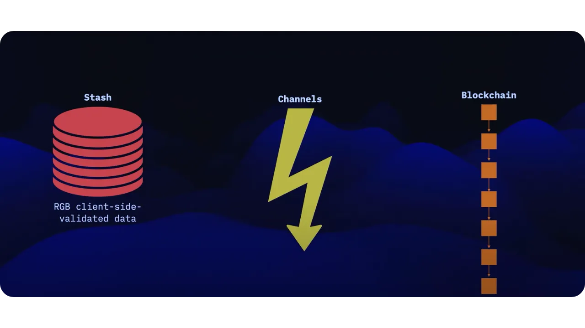

### Les trilemmes en informatique distribuée

Pour comprendre en quoi la _client-side validation_ et RGB répondent à des problématiques non résolues par la blockchain et Lightning, découvrons 3 "trilemmes" majeurs en informatique distribuée :

1. **Scalabilité, Décentralisation, Privacy**
2. **Théorème CAP** (Cohérence, Disponibilité, tolérance aux Partitions)
3. **Trilemme CIA** (Confidentialité, Intégrité, Disponibilité)

#### 1. Scalabilité, décentralisation et confidentialité

- **Blockchain (Bitcoin)**

La blockchain est très décentralisée, mais peu scalable. De plus, comme tout se trouve dans un registre global et public, la confidentialité est limitée. On peut tenter d'améliorer la confidentialité avec des technologies zero-knowledge (transactions confidentielles, schémas mimblewimble, etc.), mais la chaîne publique ne peut pas cacher le graphe des transactions.

- **Lightning/State channels**

Les canaux d'état (comme avec le Lightning Network) sont plus scalables et plus privés que la blockchain, car les transactions s'effectuent hors chaîne. Toutefois, l'obligation d'annoncer publiquement certains éléments (transactions de financement, topologie du réseau) et la surveillance du trafic réseau peuvent compromettre en partie la confidentialité. Aussi, la décentralisation en pâtit : le routage requiert une grande quantité de liquidités et les nœuds majeurs peuvent devenir des points de centralisation. C'est justement un phénomène que l'on peut commencer à observer actuellement sur Lightning.

- **Client-side validation (RGB)**

Ce nouveau paradigme est encore plus scalable et plus confidentiel, car non seulement on peut intégrer des techniques zero-knowledge, mais il n'y a pas de graphe global des transactions : personne ne détient la totalité du registre. En revanche, cela implique aussi un certain compromis sur la décentralisation : un _contract issuer_ (l'émetteur d'un contrat intelligent) peut avoir un rôle central (à l'instar d'un _contract deployer_ dans Ethereum). Néanmoins, contrairement à la blockchain, avec la _client-side validation_, vous ne stockez et ne validez que les contrats qui vous intéressent, ce qui améliore la scalabilité en évitant de télécharger et de vérifier tous les états existants.


#### 2. Théorème CAP (Consistency, Availability, Partition tolerance)

Le **théorème CAP** souligne qu'il est impossible pour un système distribué de satisfaire simultanément la cohérence (Consistency), la disponibilité (Availability) et la tolérance au partitionnement (Partition tolerance).

- **Blockchain**

La blockchain privilégie la cohérence et la disponibilité, mais s'accommode mal de la partition du réseau : si vous ne voyez pas un bloc, vous n'êtes pas en mesure d'agir et d'avoir la même vue que l'ensemble du réseau.

- **Lightning**

Un système de canaux d'états dispose de la disponibilité et de la tolérance au partitionnement (puisque deux nœuds peuvent rester connectés entre eux même si le réseau est fragmenté), mais la cohérence globale dépend de l'ouverture et de la fermeture des canaux sur la blockchain.

- **Client-side validation (RGB)**

Un système comme RGB offre la cohérence (chaque participant valide ses données localement, sans ambiguïté) et la tolérance au partitionnement (vous conservez vos données de manière autonome), mais ne garantit pas la disponibilité globale (chacun doit s'assurer d'avoir les morceaux d'historique pertinents, et certains participants peuvent ne rien publier ou cesser de partager certaines informations).

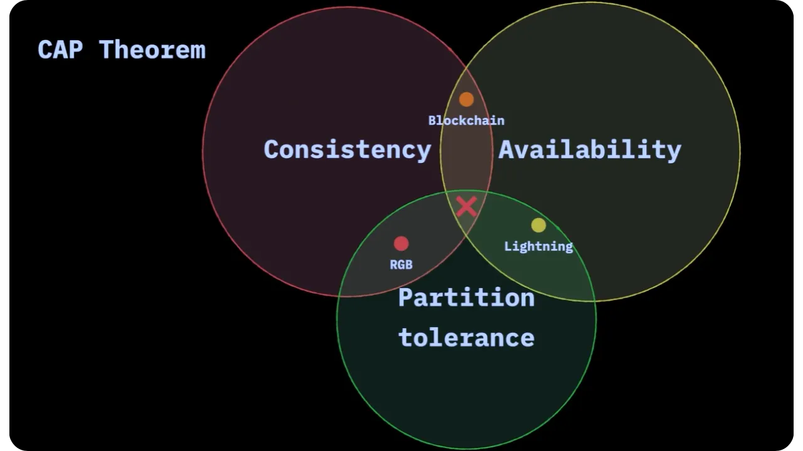

#### 3. Trilemme CIA (Confidentiality, Integrity, Availability)

Ce trilemme rappelle que la confidentialité, l'intégrité et la disponibilité ne peuvent être optimisées toutes les trois en même temps. Blockchain, Lightning et _client-side validation_ se répartissent différemment dans cet équilibre. L'idée est qu'aucun système unique ne peut tout fournir ; il faut combiner plusieurs approches (la time-stamping de la blockchain, l'approche synchrone de Lightning, et la validation locale avec RGB) pour obtenir un ensemble cohérent offrant de bonnes garanties dans chaque dimension.


### Le rôle de la blockchain et la notion de sharding

La blockchain (ici Bitcoin) sert surtout de mécanisme de _time-stamping_ et de protection contre la double dépense. Au lieu d'y insérer l'intégralité des données d'un smart contract ou d'un système décentralisé, on se contente d'y inclure des **engagements cryptographiques** (_commitments_) à des transactions (au sens de la _client-side validation_, que nous appellerons "transitions d'état"). Ainsi :
- On libère la blockchain d'une grande quantité de données et de logique.
- Chaque utilisateur ne stocke que l'historique nécessaire à sa propre portion du contrat (son "shard"), au lieu de répliquer l'état global.

Le _sharding_ est un concept né dans les bases de données distribuées (par exemple MySQL pour des réseaux sociaux comme Facebook ou Twitter). Pour résoudre le problème de volume de données et de latences de synchronisation, on segmente la base en _shards_ (États-Unis, Europe, Asie, etc.). Chaque segment est cohérent localement et ne se synchronise que partiellement avec les autres.

Pour les smart contracts de type RGB, on "sharde" selon les contrats eux-mêmes. Chaque contrat constitue un _shard_ indépendant. Par exemple, si vous ne détenez que des jetons USDT, vous n'avez pas à stocker ou valider tout l'historique d'un autre token comme l'USDC. Sur Bitcoin, la blockchain ne fait pas de _sharding_ : vous avez un ensemble d'UTXOs global. Avec la _client-side validation_, chaque participant conserve seulement les données des contrats qu'il détient ou utilise.

On peut donc imaginer l'écosystème ainsi :
- **La blockchain (Bitcoin)** comme fondation qui assure la réplication complète d'un registre minimal et sert de couche d'horodatage ;
- **Le Lightning Network** pour des transactions rapides et confidentielles, qui repose toujours sur la sécurité et le règlement final de la blockchain Bitcoin ;
- **RGB et la client-side validation** pour ajouter une logique plus complexe de smart contracts, sans encombrer la blockchain, ni perdre en confidentialité.

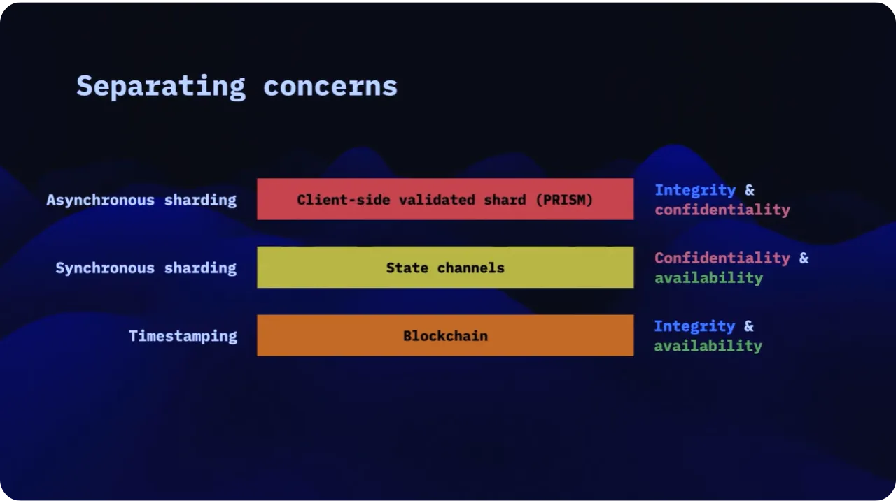

Ces trois éléments forment un ensemble triangulaire plus qu'un empilement linéaire de "layer 2", "layer 3", etc. Lightning peut se brancher directement sur Bitcoin, ou bien être associé à des transactions Bitcoin qui intègrent des données RGB. De même, un usage de la "BiFi" (finance sur Bitcoin) peut composer avec la blockchain, Lightning et RGB selon les besoins en confidentialité, scalabilité, ou logique de contrat.

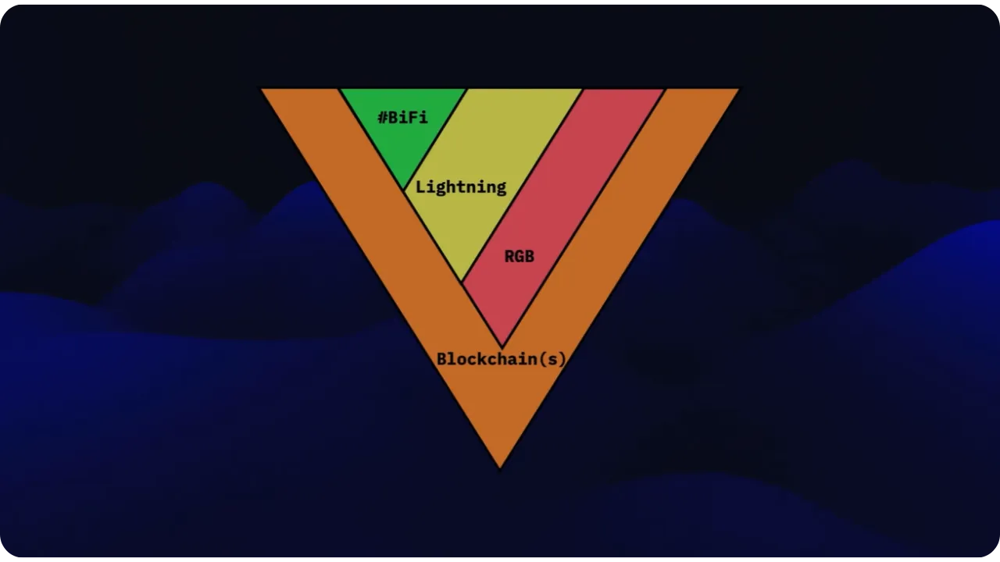

### La notion de transitions d'état

Dans tout système distribué, l’objectif du mécanisme de validation est de pouvoir **déterminer la validité et l’ordre chronologique des changements d’état**. Il s’agit de vérifier que les règles du protocole sont bien respectées et de prouver que ces changements d’état se succèdent dans un ordre définitif et inattaquable.

Pour comprendre comment se présente cette validation dans le cadre de **Bitcoin** et, plus généralement, pour saisir la philosophie derrière la *Client-side Validation*, revenons d’abord sur les mécanismes de la blockchain Bitcoin, avant de voir comment la validation côté client s’en démarque et quelles optimisations elle rend possibles.

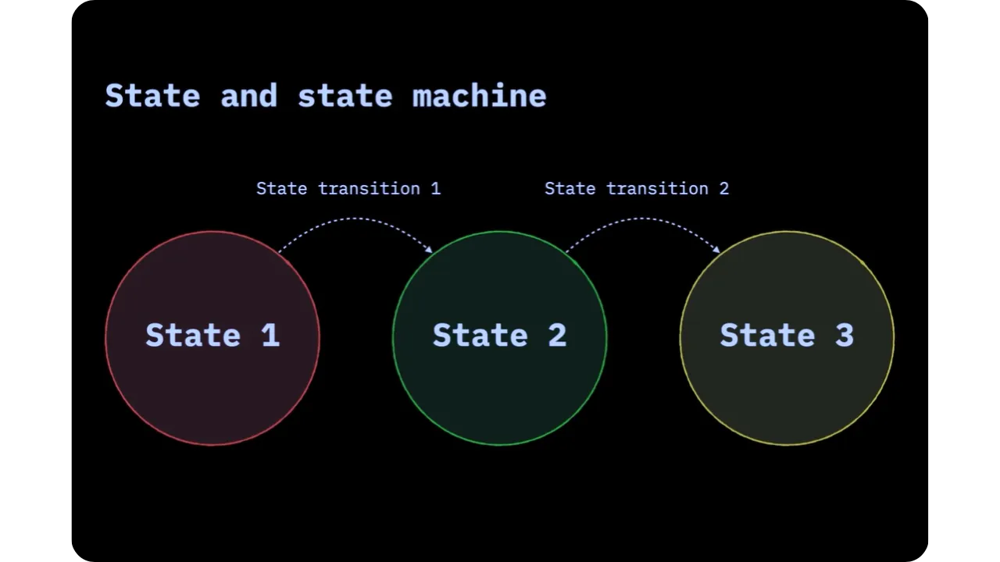

Dans le cas de la blockchain Bitcoin, la validation des transactions repose sur une règle simple :
- Tous les nœuds du réseau téléchargent chaque bloc et chaque transaction ;
- Ils **valident** ces transactions pour vérifier la bonne évolution de l'**UTXO set** (ensemble des sorties non dépensées) ;
- Ils **stockent** ces données (sous forme de blocs) de manière à pouvoir rejouer l’historique si nécessaire.

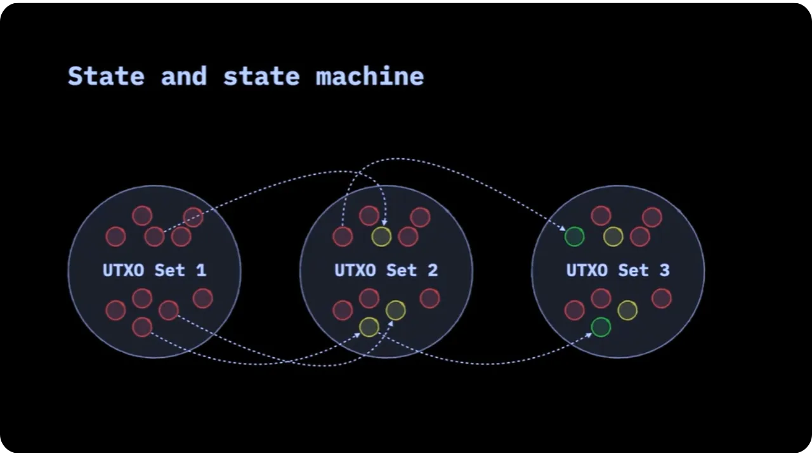

Ce modèle présente toutefois deux inconvénients majeurs :
- **Scalabilité** : puisque chaque nœud doit traiter, vérifier et archiver toutes les transactions de tout le monde, il existe une limite évidente à la capacité de transaction, liée notamment à la taille maximale des blocs (1 Mo en moyenne sur 10 minutes pour Bitcoin, hors witness) ;
- **Vie privée** : tout est diffusé et stocké publiquement (montants, adresses de destination, etc.), ce qui limite la confidentialité des échanges.

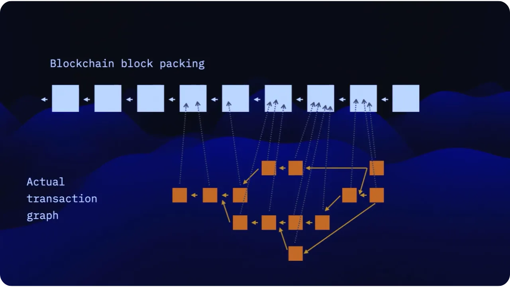

En pratique, ce modèle fonctionne pour Bitcoin en tant que couche de base (Layer 1), mais peut devenir insuffisant pour des usages plus complexes qui exigent simultanément un haut débit de transactions et un certain degré de confidentialité.

La *Client-side Validation* repose sur l’idée inverse : plutôt que d’exiger que tout le réseau valide et stocke toutes les transactions, chaque participant (client) va valider uniquement la partie de l’historique qui le concerne.

- Lorsqu’une personne reçoit un actif (ou toute autre propriété numérique), elle n’a besoin de connaître et de vérifier que la chaîne d’opérations (les transitions d'état) qui aboutit à cet actif et qui lui en prouve la légitimité.
- Cette suite d’opérations, du **genesis** (émission initiale) jusqu’à la transaction la plus récente, forme un graphe orienté acyclique (DAG) ou un **shard**, c’est-à-dire une fraction du grand historique global.

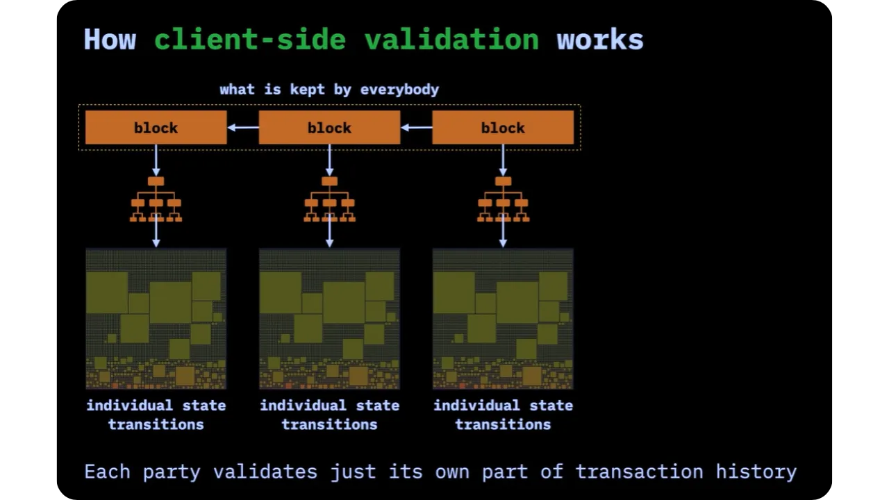

Parallèlement, pour que le reste du réseau (ou plus exactement la couche sous-jacente, telle que Bitcoin) puisse **verrouiller** l’état final sans pour autant voir le détail de ces données, la *Client-side Validation* s’appuie sur la notion de **commitment**.

Un commitment est un engagement cryptographique, typiquement un _hash_ (SHA-256 par exemple) inséré dans une transaction Bitcoin, qui prouve qu’on a englobé des données privées, sans révéler ces données.

Grâce à ces _commitments_, on peut prouver :
- L’existence d’une information (puisqu’elle est engagée dans un hash) ;
- L’antériorité de cette information (car elle est ancrée et horodatée dans la blockchain, avec une date et un ordre des blocs).

En revanche, le contenu exact n’est pas révélé, ce qui préserve la confidentialité.

Concrètement :
- Vous préparez une nouvelle transition d'état (par exemple le transfert d'un jeton RGB).
- Vous générez un engagement cryptographique à cette transition et l'insérez dans une transaction Bitcoin (on appelle ces engagements des "anchors" dans le protocole RGB).
- La contrepartie (le destinataire) récupère l'historique _client-side_ associé à cet actif et valide la cohérence de bout en bout, depuis la Genèse du smart contract jusqu'à la transition que vous lui transmettez.

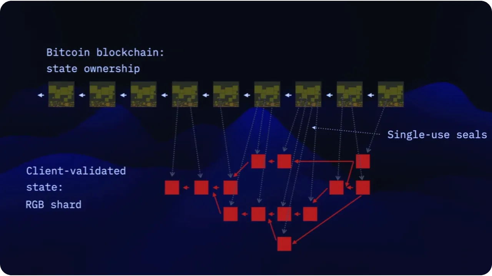

La *Client-side Validation* présente ainsi deux bénéfices majeurs :

- **La scalabilité :**  
Les engagements (*commitments*) inclus dans la blockchain ont une taille réduite (de l’ordre de quelques dizaines d’octets). Cela permet de ne pas saturer l’espace dans les blocs, car seul le hash doit être inclus, et cela permet également de faire évoluer le protocole off-chain, car chaque utilisateur n’a à stocker que son fragment d’historique (son _stash_).

- **La privacy :**  
Les transactions en elles-mêmes (c’est-à-dire leur contenu détaillé) ne sont pas publiées on-chain. Seules leurs empreintes (*hash*) le sont. Ainsi, les montants, les adresses et la logique du contrat restent privés, et le receveur peut vérifier, en local, la validité de son shard en inspectant toutes les transitions antérieures. Il n’a aucune raison de diffuser ces données publiquement, sauf en cas de litige ou de preuve nécessaire.

Dans un système comme RGB, plusieurs transitions d'état de différents contrats (ou différents actifs) peuvent être agrégées dans une même transaction Bitcoin via un seul _commitment_, parfois appelé **Anchor**. Ce mécanisme :
- Établit un lien déterministe et horodaté entre la transaction on-chain et les données off-chain (les transitions validées côté client) ;
- Permet d’enregistrer simultanément plusieurs shards dans un même point d’ancrage, ce qui réduit encore plus le coût et l’empreinte on-chain.

En pratique, lorsque cette transaction Bitcoin est validée, elle "verrouille" définitivement l’état des contrats sous-jacents, puisqu’il devient impossible de modifier le hash déjà inscrit dans la blockchain.

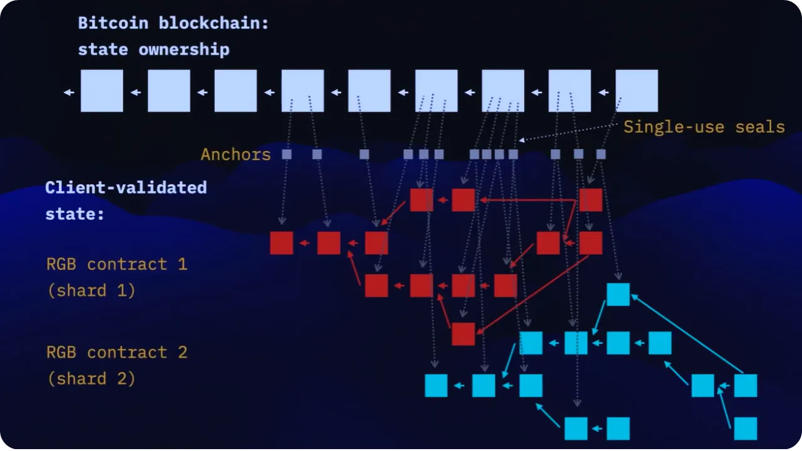

### Le concept de stash

Un **stash** est l'ensemble de données côté client qu'un participant doit absolument conserver pour maintenir l'intégrité et l'historique d'un smart contract RGB. Contrairement à un canal Lightning, où l'on peut reconstruire certains états localement à partir d'informations partagées, le stash d'un contrat RGB n'est pas répliqué ailleurs : si vous le perdez, personne ne pourra vous le restaurer, car vous êtes responsable de votre part de l'historique. D'où l'intérêt de procédures de sauvegarde fiables dans RGB.

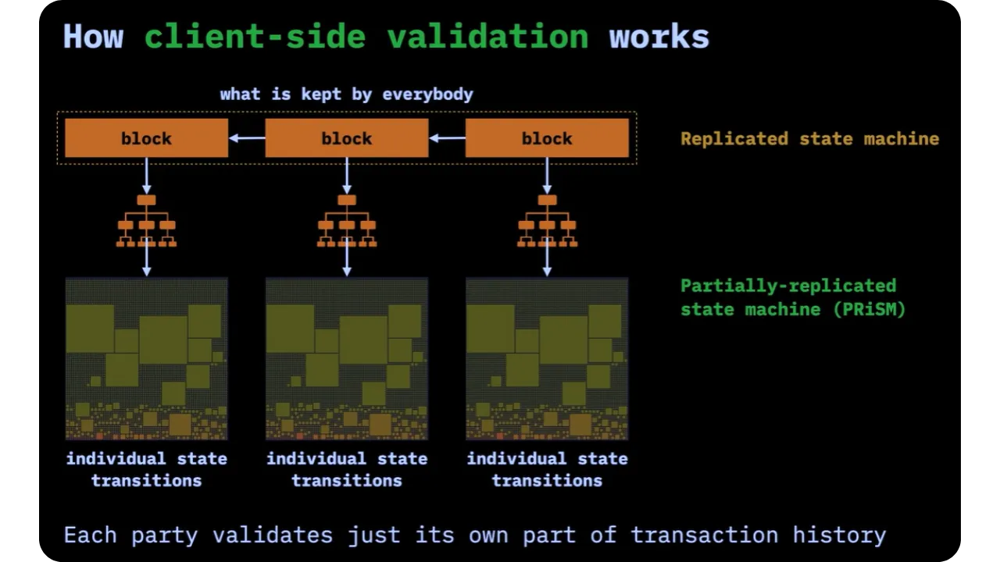


### Single use seal : origines et fonctionnement

Lors de l'acceptation d'un actif comme par exemple une monnaie, deux garanties sont essentielles :
- L'authenticité du jeton reçu ;
- L'unicité du jeton, afin d'éviter les doubles dépenses.

Pour les actifs physiques, comme un billet de banque, la présence physique suffit à prouver qu'il n'est pas dupliqué. Cependant, dans le monde numérique, où les actifs sont purement informationnels, cette vérification est plus complexe, car l'information peut facilement se multiplier et être dupliquée.

Comme nous l'avons vu précédemment, la révélation par l'envoyeur de l'historique des transitions d'état permet de s'assurer de l'authenticité d'un jeton RGB. En ayant accès à toutes les transactions depuis la transaction génésique, on peut confirmer l'authenticité du jeton. Ce principe est similaire à celui de Bitcoin où l'on peut suivre l'historique des pièces jusqu'à la transaction coinbase originelle pour vérifier leur validité. Toutefois, contrairement à Bitcoin, cet historique des transitions d'état dans RGB est privé et conservé côté client.

Pour prévenir la double dépense des jetons RGB, nous utilisons un mécanisme appelé "*Single-use Seal*". Ce système assure que chaque jeton, une fois utilisé, ne peut être réutilisé frauduleusement.

Les **Single-use Seals** sont des primitives cryptographiques, proposées en 2016 par Peter Todd, qui s’apparentent au concept de scellés physiques : une fois qu’on a placé un sceau sur un conteneur, il devient impossible de l’ouvrir ou de le modifier sans briser le sceau de manière irréversible.


Cette approche, transposée à l’univers numérique, permet de prouver qu’une séquence d’événements a bel et bien eu lieu et qu’elle ne peut plus être altérée a posteriori. Les Single-use Seals dépassent donc la simple logique de `hash + timestamp` en y ajoutant la notion d’un _sceau_ fermable **une seule et unique fois**.


Pour que les Single-use Seals fonctionnent, il faut un ***Proof-of-Publication Medium*** : un support capable de prouver l’existence ou l’absence d’une publication et difficile (voire impossible) à falsifier une fois l’information diffusée. Une **blockchain** (comme Bitcoin) peut tenir ce rôle, tout comme un journal papier au tirage public. L’idée est la suivante :
- On veut prouver qu’un certain engagement sur un message `h(m)` a été publié à une audience sans révéler le contenu du message `m` ;
- On veut prouver qu’aucun autre engagement de message `h(m')` concurrent n’a été publié à la place de `h(m)` ;
- On veut également pouvoir vérifier que le message `m` existe avant une certaine date.

Une **blockchain** se prête idéalement à ce rôle : dès qu’une transaction est incluse dans un bloc, tout le réseau possède la même preuve infalsifiable de son existence et de son contenu (du moins en partie, puisque le _commitment_ peut masquer les détails tout en prouvant l’authenticité du message).

On peut donc voir un Single-use Seal comme une promesse formelle de publier un message (encore inconnu à ce stade) une et une seule fois, de manière vérifiable par toutes les parties intéressées.

Contrairement aux simples _commitments_ (hash) ou aux timestamps qui attestent d’une date d’existence, un Single-use Seal offre la garantie supplémentaire qu’**aucun engagement alternatif** ne peut coexister : on ne peut pas fermer deux fois le même sceau ou tenter de remplacer le message scellé.

La comparaison suivante aide à comprendre :
- **Engagement cryptographique (hash)** : Avec une fonction de hachage, on peut s'engager sur une donnée (un nombre) en publiant son empreinte (hash). La donnée reste secrète tant qu'on ne révèle pas le préimage, mais on peut prouver qu'on la connaissait à l'avance.
- **Horodatage (blockchain)** : En insérant ce hash dans la blockchain, on prouve aussi qu'on le connaissait à un instant précis (celui de l'inclusion dans un bloc).
- **Single-use seal** : Avec les sceaux à usage unique, on va plus loin en rendant l'engagement unique. Avec un simple hash, on peut créer plusieurs engagements contradictoires en parallèle (le problème du docteur qui annonce "*C'est un garçon*" à la famille et "*C'est une fille*" dans son journal personnel). Le single-use seal élimine cette possibilité en connectant l'engagement à un support de preuve de publication, comme la blockchain Bitcoin, de sorte qu'une dépense d'UTXO scelle définitivement l'engagement. Une fois dépensé, on ne peut plus redépenser le même UTXO pour remplacer l'engagement.

|                                                                                  | Engagement simple (digest/hash) | Timestamps | Single-use seals |
| -------------------------------------------------------------------------------- | ------------------------------- | ---------- | ---------------- |
| La publication de l'engagement ne révèle pas le message                          | Oui                             | Oui        | Oui              |
| Preuve de la date de l'engagement / existence du message avant une certaine date | Impossible                      | Possible   | Possible         |
| Preuve qu'aucun autre engagement alternatif ne peut exister                      | Impossible                      | Impossible | Possible         |

Le fonctionnement des Single-use Seals s’articule autour de trois grandes étapes :

**Seal Definition :**
- Alice définit à l’avance les règles de publication du sceau (quand, où et comment le message sera publié) ;
- Bob accepte ou constate ces conditions.


**Seal Closing :**
- Au moment de l’exécution, Alice ferme le sceau en publiant le message effectif (généralement sous forme de _commitment_, par exemple un hash) ;
- Elle fournit aussi un **witness** (preuve cryptographique) prouvant que le sceau est bel et bien fermé et irrévocable.


**Seal Verification :**
- Une fois le sceau fermé, Bob ne peut plus l’ouvrir : il peut simplement vérifier qu’il a bien été clos ;
- Bob récupère le sceau, le **witness** et le message (ou son engagement) pour s’assurer que tout concorde et qu’il n’existe pas de sceau concurrent ou de version différente.

On peut résumer le processus :

```txt
# Défini par Alice, validé ou accepté par Bob

seal <- Define()

# Fermeture du sceau par Alice avec le message

witness <- Close(seal, message)

# Vérification par Bob

bool <- Verify(seal, witness, message)
```


Dans le cadre de la **Client-side Validation**, il faut toutefois aller plus loin : si la définition d’un sceau reste elle-même hors de la blockchain, il est possible (en théorie) que quelqu’un conteste l’existence ou la légitimité du sceau en question. Pour pallier ce problème, on recourt à une **chaîne de Single-use Seals**, imbriqués les uns dans les autres :
- Chaque sceau fermé renferme la définition du sceau suivant ;
- On inscrit ces fermetures (avec leurs _commitments_) au sein de la **blockchain** (par exemple, dans une transaction Bitcoin) ;
- Ainsi, toute tentative de modifier un sceau antérieur se retrouverait en contradiction avec l’historique ancré sur Bitcoin.

C’est précisément ce que fait le système **RGB** :
- Les messages publiés sont les _commitments_ vers des données validées côté client ;
- La définition du sceau est associée à un UTXO Bitcoin ;
- Le sceau se ferme lorsque l’on dépense cet UTXO ou qu’on crédite une nouvelle sortie liée au même engagement ;
- La chaîne de transactions qui dépense ces UTXOs correspond à la **Proof-of-Publication** : chaque transition ou changement d’état sur RGB s’ancre ainsi dans Bitcoin.

Pour résumer :
- Le _seal definition_ est l'UTXO que vous destinez à sceller un engagement futur ;
- Le _seal closing_ survient quand vous dépensez cet UTXO, en créant une transaction qui contient l'engagement ;
- Le _witness_ est la transaction elle-même, qui prouve que vous avez bien fermé le sceau avec ce contenu ;
- Vous ne pouvez pas prouver qu'un seal n'a pas été fermé (on ne peut pas être absolument sûr qu'un UTXO n'est pas déjà dépensé ou ne le sera pas dans un bloc qu'on n'a pas encore vu), mais on peut prouver qu'il a bel et bien été fermé de telle ou telle façon.

Cette unicité est importante pour la Client-side Validation : quand vous validez une transition d'état, vous vérifiez qu'elle correspond à un UTXO unique, non dépensé préalablement dans un engagement concurrent. C'est ce qui garantit l'absence de double dépense au niveau des smart contracts off-chain.

### Engagements multiples et ancrages

Un smart contract RGB peut avoir besoin de dépenser simultanément plusieurs single use seals (plusieurs UTXOs). De plus, une seule transaction Bitcoin peut référencer plusieurs contrats distincts, chacun venant sceller sa propre transition d'état. Cela nécessite un mécanisme de **multi-commitments** permettant de prouver, de manière déterministe et unique, qu'aucun des engagements n'existe en double. C'est ici qu'intervient la notion d'**anchor** dans RGB : une structure spéciale reliant une transaction Bitcoin et un ou plusieurs engagements _client-side_ (transitions d'état), chacun relevant potentiellement d'un contrat différent. Nous allons justement détailler ce concept dans le chapitre suivant.

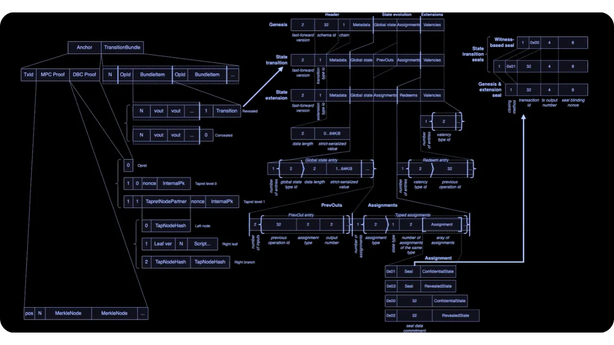

Deux principaux dépôts GitHub du projet (sous l'organisation "LNPBP") regroupent les implémentations de base de ces concepts étudiés dans le premier chapitre :
- **client_side_validation** : Contient les primitives Rust pour la validation locale.
- **single_use_seals** : Implémente la logique pour définir et fermer ces seals de manière sécurisée.

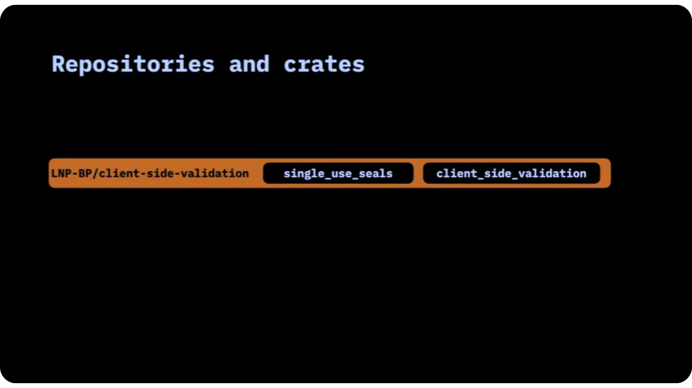

Ces briques sont agnostiques par rapport à Bitcoin ; on pourrait, en théorie, les appliquer à tout autre support de preuve de publication (un autre registre, un journal, etc.). Dans la pratique, RGB repose sur Bitcoin pour sa robustesse et son large consensus.


### Questions du public

#### Vers un usage plus large des single use seals

Peter Todd a également créé le protocole _Open Timestamps_, et le concept de single use seal est un prolongement naturel de ces idées. Au-delà de RGB, on peut envisager d'autres cas d'utilisation, par exemple la construction de _sidechains_ sans recourir au _merge mining_ ni aux propositions liées aux drivechains comme le BIP300. Tout système nécessitant un engagement unique peut, en principe, exploiter cette primitive cryptographique. Aujourd'hui, RGB est la première grande mise en application concrète et complète.

#### Problèmes de disponibilité des données

Étant donné qu'en _client-side validation_, chaque utilisateur stocke sa partie de l'historique, la disponibilité des données n'est pas garantie globalement. Si un émetteur de contrat ne publie pas certaines informations ou les révoque, vous pourriez ignorer l'évolution réelle de l'offre. Dans certains cas (comme les stablecoins), on s'attend à ce que l'émetteur tienne à jour des données publiques pour prouver le volume en circulation, mais rien ne l'y contraint techniquement. Il est donc possible de concevoir des contrats volontairement opaques avec un stock illimité, ce qui pose des questions de confiance.

#### Sharding et isolement des contrats

Chaque contrat représente un _shard_ isolé : USDT et USDC, par exemple, n'ont pas à partager leur historique. Les swaps atomiques restent possibles, mais cela n'implique pas de fusionner leurs registres. Tout se fait par engagement cryptographique, sans divulguer l'ensemble du graphe d'historique à chaque participant.

### Conclusion

Nous avons vu où se situe le concept de _client-side validation_ par rapport à la blockchain et aux _state channels_, en quoi il répond à des trilemmes persistants de l'informatique distribuée, et comment il exploite la blockchain Bitcoin uniquement pour éviter la double dépense et pour l'horodatage (time-stamping). L'idée repose sur la notion de **single use seal**, permettant la création d'engagements uniques que vous ne pouvez pas redépenser à volonté. Ainsi, chaque participant ne télécharge que l'historique strictement nécessaire, ce qui accroît la scalabilité et la confidentialité des smart contracts tout en conservant la sécurité de Bitcoin en toile de fond.

La prochaine étape consistera à expliquer plus en détail comment on applique concrètement ce mécanisme de single use seal dans Bitcoin (via les UTXOs), comment on crée et on valide les **anchors**, puis comment on bâtit des _smart contracts_ complets dans RGB. Nous verrons notamment la question des engagements multiples, le défi technique de prouver qu'une transaction Bitcoin scelle simultanément plusieurs transitions d'état dans différents contrats, sans introduire de vulnérabilités ou de doubles engagements.

Avant de plonger dans les détails plus techniques du deuxième chapitre, n'hésitez pas à relire les définitions clés (client-side validation, single use seal, anchors, etc.) et à garder à l'esprit la logique globale : nous cherchons à concilier les atouts de la blockchain Bitcoin (sécurité, décentralisation, _time-stamping_) avec ceux des solutions hors chaîne (rapidité, confidentialité, scalabilité), et c'est précisément ce que RGB et la _client-side validation_ tentent de réaliser.


## La couche d'engagement
<chapterId>cc2fe85a-9cc7-5b8c-a00a-c0a867241061</chapterId>


Dans ce chapitre, nous explorons la mise en application de la **Client-side Validation** et des **Single-use Seals** au sein de la blockchain Bitcoin. Nous présentons ainsi les principes majeurs de la **couche de commitment** (layer 1) d’RGB, en nous intéressant plus particulièrement au schémas **TxO2**, retenu par RGB pour définir et fermer un sceau dans le cadre d’une transaction Bitcoin. Ensuite, nous parlerons de deux points importants qui n’ont pas encore été traités en détail :
- Les _deterministic Bitcoin commitments_
- Les _multi-protocol commitments_

C’est la combinaison de ces concepts qui nous permet de superposer plusieurs systèmes ou contrats au-dessus d’un même UTXO et donc d’une même blockchain.

Il convient de rappeler que les opérations cryptographiques décrites peuvent s’appliquer, dans l’absolu, à d’autres blockchains ou médias de publication, mais les caractéristiques de Bitcoin (en matière de décentralisation, de résistance à la censure et d’ouverture à tous) en fait un socle idéal pour développer de la programmabilité avancée comme celle requise par **RGB**.

### Les schémas de commitment dans Bitcoin et leur utilisation par RGB

Comme vu dans le premier chapitre de la formation, les _single-use seals_ sont un concept général : on fait une promesse d’inclure un engagement (un _commitment_) dans un emplacement précis d’une transaction, cet emplacement agit comme un scellé que l’on ferme sur un message. Toutefois, sur la blockchain Bitcoin, plusieurs options existent pour choisir où placer ce _commitment_.

Pour comprendre la logique, rappelons le principe de base : pour fermer un _single-use seal_, on dépense l’endroit scellé en y insérant le _commitment_ sur un message donné. Dans Bitcoin, cela peut se faire de différentes manières :

- **Utiliser une clé publique ou une adresse**  

On peut décider qu’une clé publique ou une adresse spécifique est le _single-use seal_. Dès que cette clé ou cette adresse apparaît on-chain dans une transaction, cela signifie que le scellé est fermé avec un certain message.

- **Utiliser un output de transaction Bitcoin**  

Cela signifie que l’on définit un _single-use seal_ comme un _outpoint_ précis (un couple `TXID + numéro d’output`). Dès que cet _outpoint_ est dépensé, il s’agit de l’acte de fermeture du scellé.

En travaillant sur RGB, nous avons identifié au moins 4 manières différentes d’implémenter ces scellés sur Bitcoin :
- Définir le scellé via une clé publique, et le fermer dans un _output_
- Définir le scellé via un _outpoint_, et le fermer dans un _output_
- Définir le scellé via la valeur d'une clé publique, et le fermer dans un _input_
- Définir le scellé via un _outpoint_, et le fermer dans un _input_

| Nom du schéma | Définition du scellé      | Fermeture du scellé   | Exigences supplémentaires                                         | Application principale       | Schémas d'engagement possibles |
| ------------- | ------------------------- | --------------------- | ----------------------------------------------------------------- | ---------------------------- | ------------------------------ |
| PkO           | Valeur de la clé publique | Sortie de transaction | P2(W)PKH                                                          | Aucune pour le moment        | Keytweak, taptweak, opret      |
| TxO2          | Sortie de transaction     | Sortie de transaction | Nécessite des engagements déterministes sur Bitcoin               | RGBv1 (universel)            | Keytweak, taptweak, opret      |
| PkI           | Valeur de la clé publique | Entrée de transaction | Uniquement Taproot & non compatible avec les portefeuilles Legacy | Identités basées sur Bitcoin | Sigtweak, witweak              |
| TxO1          | Sortie de transaction     | Entrée de transaction | Uniquement Taproot & non compatible avec les portefeuilles Legacy | Aucune pour le moment        | Sigtweak, witweak              |

Nous ne détaillerons pas chacune de ces configurations, car dans RGB, nous avons choisi d’utiliser **un _outpoint_ comme définition du scellé**, et de placer le _commitment_ dans l’output de la transaction dépensant cet _outpoint_. On peut donc introduire les concepts suivants pour la suite :
- **"Seal definition"** : Un _outpoint_ donné (identifié par `TXID + N° de sortie`).
- **"Seal closing"** : La transaction qui dépense cet _outpoint_, dans laquelle on ajoute un _commitment_ à un message.

Ce schéma a été sélectionné pour sa compatibilité avec l’architecture RGB, mais d’autres configurations pourraient être utiles pour des usages différents (par exemple pour la gestion d’identités sur Bitcoin).

La mention "O2" dans "TxO2" rappelle que la définition et la fermeture reposent toutes deux sur la dépense (ou la création) d’une sortie de transaction.

### Exemple d'utilisation du schéma TxO2

Pour rappel, définir un _single-use seal_ ne nécessite pas nécessairement de publier une transaction on-chain. Il suffit qu’Alice, par exemple, possède déjà un UTXO non dépensé. Elle peut décider : "Cet _outpoint_ (déjà existant) est désormais mon scellé". Elle le note localement (_client-side_), et tant que cet UTXO n’est pas dépensé, le scellé est considéré comme ouvert.

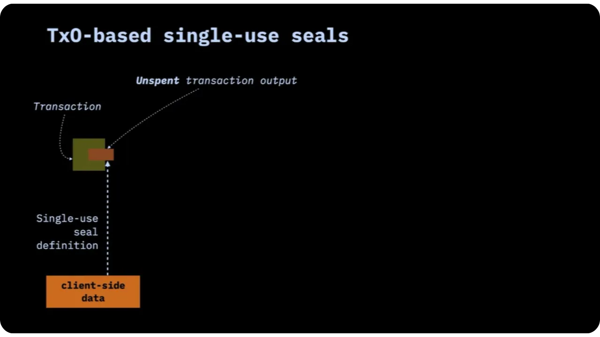

Le jour où elle veut fermer le scellé (pour signaler un événement, ou pour ancrer un message particulier), elle dépense cet UTXO dans une nouvelle transaction (on appelle souvent cette transaction la _witness transaction_, sans rapport avec _segwit_, c’est juste le terme qu’on lui donne). Cette nouvelle transaction contiendra le _commitment_ au message.

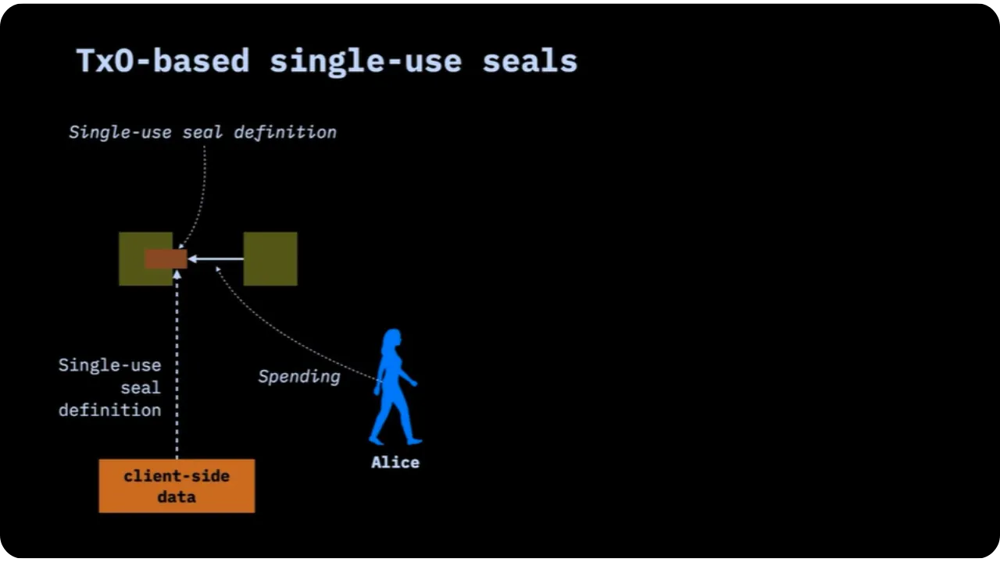

- **Personne d’autre que Bob** (ou les personnes à qui Alice choisit de révéler la preuve complète) ne saura qu’un certain message est caché dans cette transaction.
- Tout le monde peut constater que l'_outpoint_ a été dépensé, mais seul Bob détient la preuve que le message est bien ancré dans la transaction.

Pour illustrer ce schéma TxO2, on peut utiliser un _single-use seal_ comme mécanisme de révocation d’une clé PGP. Au lieu de publier un certificat de révocation sur des serveurs, Alice peut dire : "Cette sortie Bitcoin, si elle est dépensée, signifie que ma clé PGP est révoquée".

Alice dispose donc d’un UTXO spécifique, auquel est associé localement (côté client) un certain état ou des données (connues d’elle seule).

Alice informe Bob qu’en cas de dépense de cet UTXO, un événement particulier sera réputé s’être produit. De l’extérieur, on ne voit qu’une transaction Bitcoin ; mais Bob, lui, sait que cette dépense a une signification cachée.

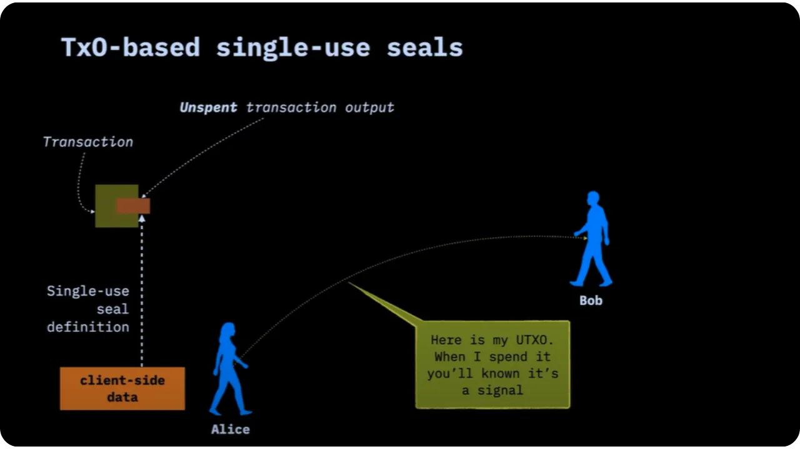

Au moment où Alice dépense cet UTXO, elle referme le scellé sur un message qui indique sa nouvelle clé, ou simplement la révocation de l’ancienne. Ainsi, toute personne surveillant on-chain verra que l’UTXO est dépensé, mais seule celle qui dispose de la preuve complète saura qu’il s’agit précisément de la révocation de la clé PGP.

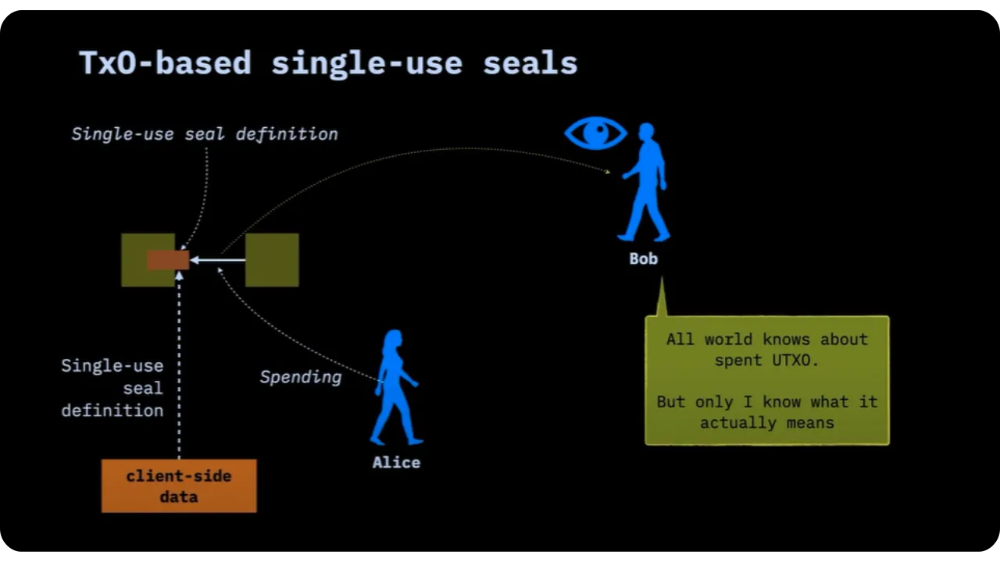

Pour que Bob ou toute autre personne concernée puisse vérifier le message caché, Alice doit lui fournir des informations off-chain.

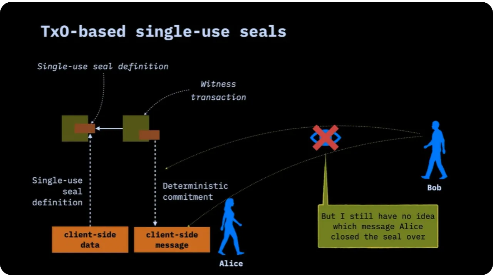

Alice doit donc fournir à Bob :
- Le message lui-même (par exemple, la nouvelle clé PGP).
- La preuve cryptographique attestant que ce message a été engagé dans la transaction (ce qu’on appelle l’_extra transaction proof_ ou _anchor_).

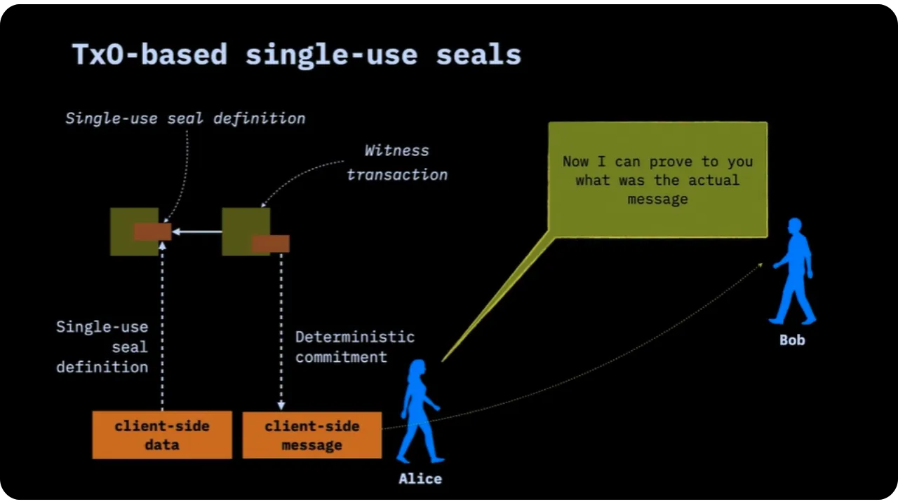

Les tiers n’ont pas cette information. Ils voient seulement qu’un UTXO a été dépensé. La confidentialité est donc assurée.

Pour bien clarifier la structure, récapitulons le cheminement en deux transactions :

- **Transaction 1** : Elle contient la _seal definition_, c’est-à-dire l'_outpoint_ qui servira de scellé.

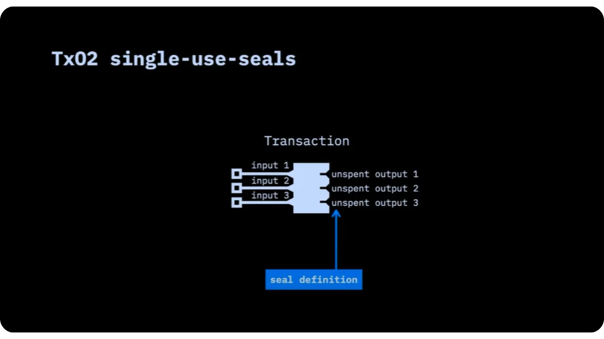

- **Transaction 2** : Elle dépense cet _outpoint_. De ce fait, le scellé est fermé et, dans cette même transaction, on insère le _commitment_ sur le message.

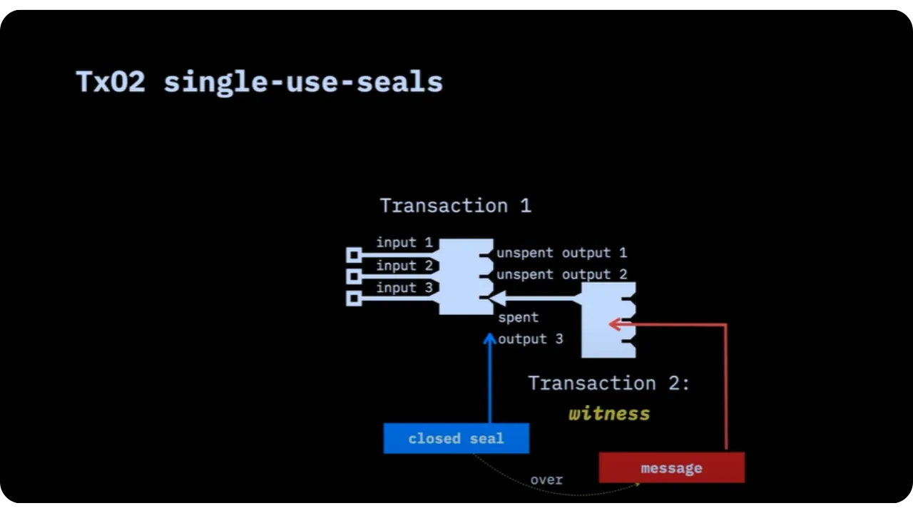

Nous appelons donc la seconde transaction la "_witness transaction_". 

Pour illustrer cela sous un autre angle, on peut représenter deux couches :

- **La couche supérieure (blockchain, publique)** : tout le monde voit la transaction et sait qu’il y a un _outpoint_ dépensé.
- **La couche inférieure (client-side, privée)** : seule Alice (ou la personne intéressée) sait que cette dépense correspond à tel message, via la preuve cryptographique et le message qu’elle conserve en local.

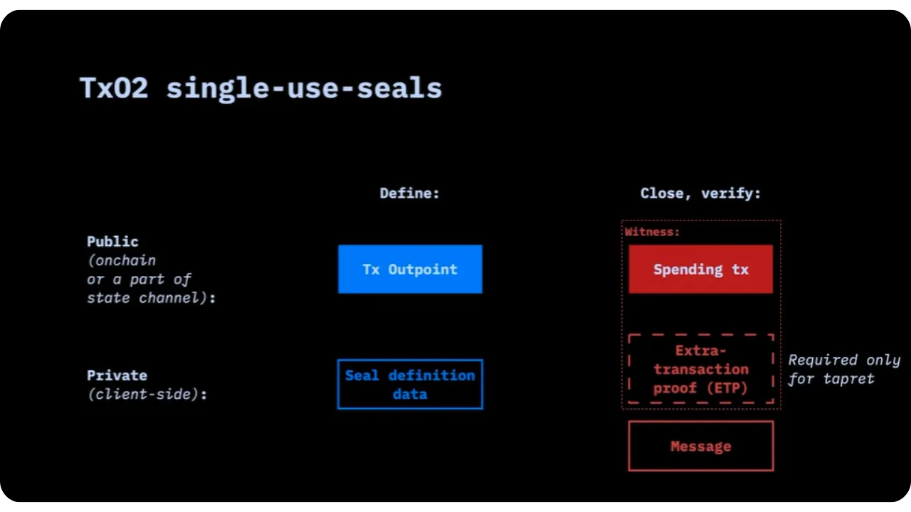

Mais lors de cette fermeture du scellé, on peut se poser la question suivante : concrètement, où devons-nous insérer le _commitment_ ?

Nous avons brièvement mentionné, dans la partie précédente, comment le modèle _client-side validation_ peut s’appliquer à RGB ou à d’autres systèmes. Ici, nous abordons la partie concernant les **deterministic Bitcoin commitments** et la façon de les intégrer dans une transaction. L’idée est de comprendre pourquoi on cherche à insérer un unique engagement dans la _witness transaction_, et surtout comment s’assurer qu’il ne puisse y avoir d’autres engagements concurrents non dévoilés.

### Les emplacements du commitment dans une transaction

Lorsque vous transmettez à quelqu’un la preuve qu’un certain message est ancré dans une transaction, vous devez pouvoir garantir qu’il n’existe pas, dans cette même transaction, une autre forme d’engagement (un second message caché) qui ne vous aurait pas été révélé. Pour que la validation _côté client_ reste robuste, il faut donc un mécanisme **déterministe** permettant de placer un unique _commitment_ dans la transaction qui ferme le _single-use seal_.

La _witness transaction_ dépense le fameux UTXO (ou _seal definition_) et cette dépense correspond à la fermeture du scellé. Au niveau technique, on sait que chaque outpoint ne peut être dépensé qu’une seule fois. C’est justement ce qui sert de base à la résistance à la double dépense sur Bitcoin. Mais la transaction de dépense peut avoir plusieurs _inputs_, plusieurs _outputs_, ou être composée de façon complexe (coinjoins, cannaux Lightning, etc.). Il faut donc définir clairement où insérer le _commitment_ dans cette structure, sans ambiguïté et de manière uniforme.

Quelle que soit la méthode (PkO, TxO2, etc.), le _commitment_ (message à sceller) peut être inséré :
- **Dans un Input** via :
    - **Sigtweak** (on modifie le composant `r` de la signature ECDSA, ce qui s’apparente au principe de "Sign-to-contract").
    - **Witweak** (on modifie les données _segregated witness_ de la transaction).

- **Dans un Output** via :
    - **Keytweak** (on “tweake” la clé publique destinataire avec le message).
    - **Opret** (on place le message dans une sortie `OP_RETURN`, non dépensable).
    - **Tapret** (ou _Taptweak_), qui s’appuie sur **taproot** pour insérer l’engagement dans la partie script d’une clé taproot, modifiant ainsi la clé publique de manière déterministe.

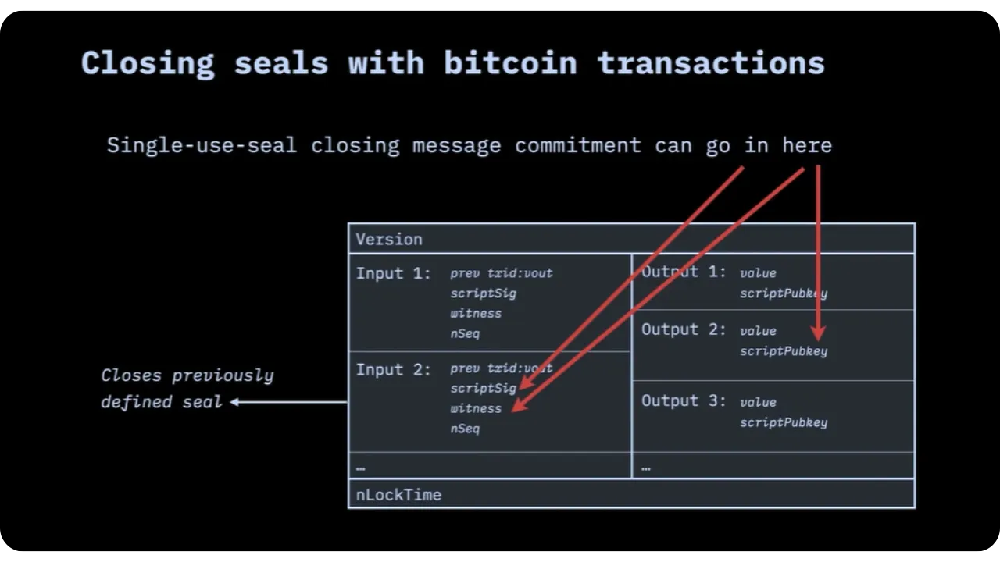

Voici le détail de chaque méthode :

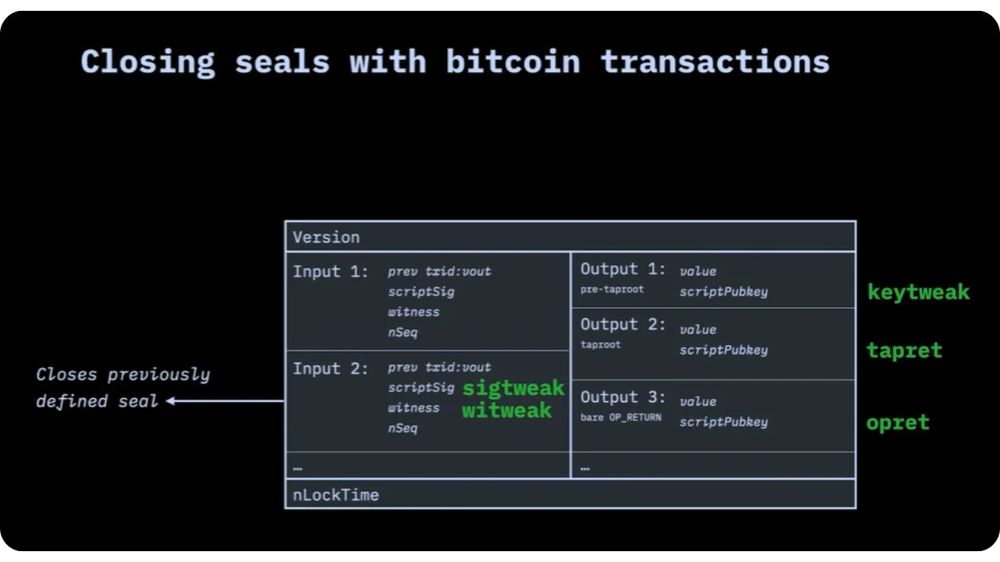

***Sig tweak (sign-to-contract) :***

Un schéma anciennement proposé consistait à exploiter la partie aléatoire d’une signature (ECDSA ou Schnorr) pour y intégrer le _commitment_ : c’est la technique appelée "**sign to contract**". Vous remplacez le nonce généré au hasard par un hash contenant la donnée. Ainsi, la signature révèle implicitement votre engagement, sans espace additionnel dans la transaction. Cette approche présente des avantages :
- Pas de surcharge on-chain (vous utilisez la même place que le nonce de base).
- En théorie, cela peut être assez discret, car le nonce est initialement une donnée aléatoire.

Cependant, 2 inconvénients majeurs ont émergé :
- Les multisig avant Taproot : quand vous avez plusieurs signataires, il faut décider quelle signature porte le _commitment_. Les signatures peuvent être ordonnées différemment, et si un signataire refuse, vous perdez le contrôle sur l’aboutissement du _commitment_.
- MuSig et le nonce partagé : avec les multisig Schnorr (*MuSig*), la génération du nonce est un algorithme multipartite, et il devient pratiquement impossible de tweaker le nonce individuellement.

En pratique, **sig tweak** est donc peu compatible avec le matériel (hardware wallets) et les formats existants (Lightning, etc.). Cette belle idée est difficile à mettre en place concrètement.

***Key tweak (pay-to-contract) :***

Le **key tweak** reprend le concept historique de _pay-to-contract_. On prend la clé publique `X` et on la tweak en lui ajoutant la valeur `H(message)`. Concrètement, si `X = x * G` et `h = H(message)`, alors la nouvelle clé sera `X' = X + h * G`. Cette clé tweakée dissimule l’engagement sur le `message`. Le détenteur de la clé privée d’origine peut, en ajoutant `h` à sa clé privée `x`, prouver qu’il possède la clé permettant de dépenser la sortie. En théorie, c’est élégant, car :
- Le _commitment_ s’inscrit sans ajouter de champs supplémentaires.
- Vous ne stockez pas de données on-chain additionnelles.

Néanmoins, dans la pratique, on se heurte aux difficultés suivantes :
- Les wallets ne reconnaissent plus la clé publique standard, puisqu’elle a été “tweakée” ; ils ne peuvent donc pas facilement associer l’UTXO à votre clé habituelle.
- Les hardware wallets ne sont pas conçus pour signer avec une clé qui n’est pas issue de leur dérivation standard.
- Vous devez adapter vos scripts, descriptors, etc.

Dans le cadre de RGB, cette piste a été envisagée jusqu’en 2021, mais il s’est avéré trop compliqué de la faire fonctionner avec les standards et l’infrastructure actuelle.

***Witness tweak :***

Une autre idée, que certains protocoles comme les _inscriptions Ordinals_ ont concrétisée, est de placer les données directement dans la section `witness` de la transaction (d’où l’expression **"witness tweak"**). Cependant, cette méthode :
- Rend l’engagement immédiatement visible (vous collez littéralement des données brutes dans le witness).
- Peut être sujette à la censure (des mineurs ou nœuds peuvent refuser de relayer si c’est trop volumineux ou arbitraire).
- Consomme de l’espace dans les blocs, ce qui est contraire à l’objectif de discrétion et de légèreté de RGB.

En plus, le witness est conçu pour être prunable dans certains contextes, ce qui peut rendre plus compliqué le fait d'avoir des preuves robustes.

***Op-return (opret) :***

Très simple dans son foncitonnement, un `OP_RETURN` permet de stocker un hash ou un message dans un champ spécial de la transaction. Mais c’est immédiatement détectable : tout le monde voit qu’il y a un _commitment_ dans la transaction, et cela peut être censuré ou écarté, en plus d’ajouter un output supplémentaire. Cela augmente également la transparence et la taille. C’est donc considéré comme moins satisfaisant dans l’optique d’une solution de _client-side validation_.

```txt
34-byte_Opret_Commitment =
 OP_RETURN   OP_PUSHBYTE_32   <mpc::Commitment>
|_________| |______________| |_________________|
  1-byte       1-byte         32 bytes                      
```

### Tapret

La dernière option est l’utilisation de **Taproot** (introduit avec le BIP341) avec le schéma *Tapret*. *Tapret* est une forme plus complexe de commitment déterministe, qui apporte des améliorations en termes d’empreinte sur la blockchain et de confidentialité pour les opérations de contrat. L’idée directrice est de **cacher le commitment** dans la partie `Script Path Spend` d’une [transaction taproot](https://github.com/bitcoin/bips/blob/master/bip-0341.mediawiki).

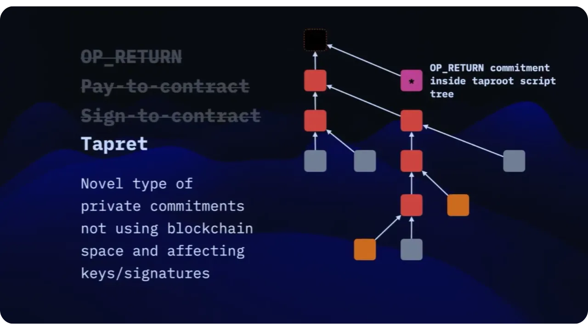

Avant de décrire comment l’engagement est inséré dans une transaction taproot, examinons la **forme exacte** de l’engagement, qui doit **impérativement** correspondre à une chaîne de 64 octets [construite](https://github.com/BP-WG/bp-core/blob/master/dbc/src/tapret/mod.rs#L179-L196) de la manière suivante :

```txt
64-byte_Tapret_Commitment =

 OP_RESERVED ...  ... .. OP_RESERVED   OP_RETURN   OP_PUSHBYTE_33  <mpc::Commitment>  <Nonce>
|___________________________________| |_________| |______________| |_______________|  |______|
 OP_RESERVED x 29 times = 29 bytes      1 byte         1 byte          32 bytes        1 byte
|________________________________________________________________| |_________________________|
        TAPRET_SCRIPT_COMMITMENT_PREFIX = 31 bytes                    MPC commitment + NONCE = 33 bytes
```

- Les 29 octets `OP_RESERVED`, suivis de `OP_RETURN`, puis de `OP_PUSHBYTE_33`, forment la partie _prefix_ de 31 octets.
- Vient ensuite un _commitment_ de 32 octets (généralement la racine de Merkle issue du **MPC**), auquel on ajoute 1 octet de **Nonce** (soit 33 octets au total pour cette seconde partie).

Ainsi, le `Tapret` de 64 octets ressemble à un `Opret` auquel on a préfixé 29 octets de `OP_RESERVED` et auquel on ajoute un octet supplémentaire en guise de Nonce.

Pour conserver une grande flexibilité d’implémentation, de confidentialité et de passage à l’échelle, **le schéma Tapret** prend en compte divers cas d’usage, selon les besoins :
- **Incorporation unique** d’un commitment Tapret dans une transaction taproot **sans** structure de Script Path préexistante ;
- **Intégration** d’un commitment Tapret dans une transaction taproot **déjà dotée** d’un Script Path.

Détaillons ensemble chacun de ces deux scénarios.
#### Incorporation Tapret sans Script Path existant

Dans ce premier cas, on part d’une **sortie taproot** (Taproot Output Key) `Q` qui ne comporte **que** la clé publique interne `P` (Internal Key), **sans** chemin de script associé (Script Path) :


- `P` : la clé publique interne pour le _Key Path Spend_.
- `G` : le point générateur de la courbe elliptique [secp256k1](https://en.bitcoin.it/wiki/Secp256k1).
- `t = tH_TWEAK(P)` est le facteur de tweak, calculé via un _tagged hash_ (par exemple `SHA-256(SHA-256(TapTweak) || P)`), conformément au [BIP86](https://github.com/bitcoin/bips/blob/master/bip-0086.mediawiki#address-derivation). Cela prouve qu’il n’y a pas de script caché.

Pour inclure un commitment **Tapret**, il faut alors ajouter une **Script Path Spend** avec un **unique script**, selon le schéma suivant :


- `t = tH_TWEAK(P || Script_root)` devient alors le nouveau facteur de tweak, incluant le **Script_root**.
- `Script_root = tH_BRANCH(64-byte_Tapret_Commitment)` représente la racine de ce **script**, laquelle est simplement un hash de type `SHA-256(SHA-256(TapBranch) || 64-byte_Tapret_Commitment)`.

La preuve d’inclusion et d’unicité dans l’arbre taproot se résume ici à la seule clé publique interne `P`.
#### Intégration Tapret dans un Script Path préexistant

Le second scénario concerne une **sortie taproot** `Q` plus complexe, qui comporte déjà plusieurs scripts. Par exemple, on dispose d’un arbre de 3 scripts :

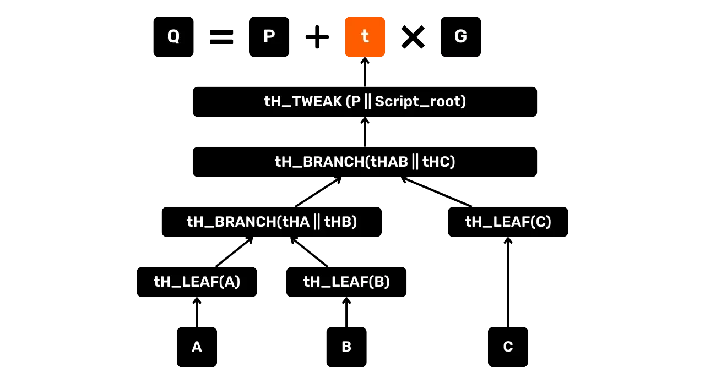

- `tH_LEAF(x)` désigne la fonction de hachage (tagged hash) normalisée d’un script leaf.
- `A, B, C` représentent les scripts déjà inclus dans la structure taproot.

Pour ajouter le commitment Tapret, **on doit insérer un script "inconsommable"** (*unspendable script*) au **premier niveau** de l’arbre, en décalant les scripts déjà existants **un niveau plus bas**. Visuellement, l’arbre devient :

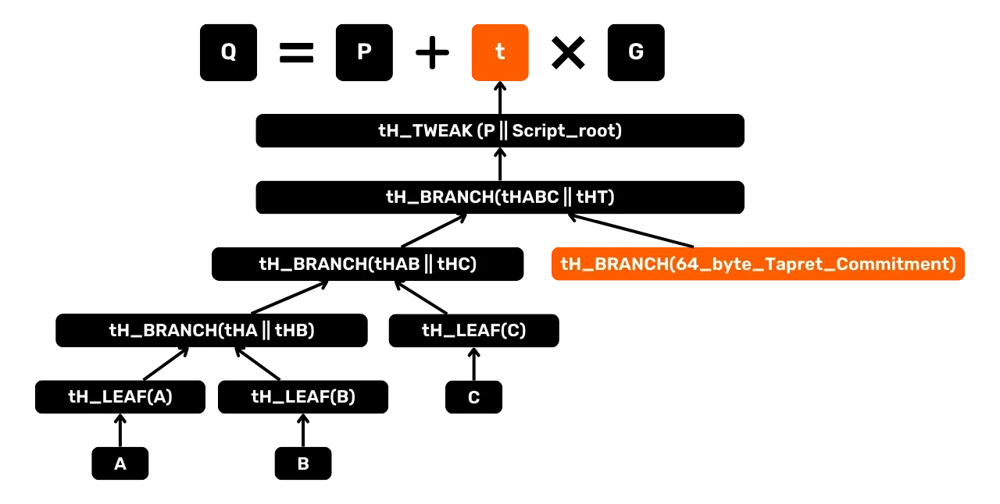

- `tHABC` représente le hash (tagged) du niveau supérieur regroupant `A, B, C`.
- `tHT` représente le hash du script correspondant au `Tapret` de 64 octets.

Selon les règles taproot, chaque branche/feuille doit être combinée en respectant un ordre lexicographique des hachages. Deux cas se présentent :
- `tHT` > `tHABC` : le commitment Tapret se place à droite dans l’arbre. La preuve d’unicité n’a besoin que de `tHABC` et `P` ;
- **`tHT` < `tHABC`** : le commitment Tapret se place à gauche. Pour prouver qu’il n’y a pas d’autre commitment Tapret dans la partie droite, il faut révéler `tHAB` et `tHC` afin de démontrer l’absence de tout autre script de ce type.

Exemple visuel pour le premier cas (`tHABC < tHT`) :


Exemple pour le second cas (`tHABC > tHT`) :

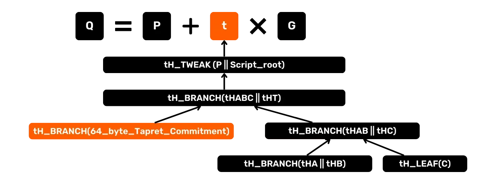

#### Optimisation avec le nonce

Pour améliorer la confidentialité, on peut "miner" (un terme plus juste serait "bruteforcer") la valeur du `<Nonce>` (le dernier octet du `Tapret` de 64 octets) pour tenter d’obtenir un hash `tHT` tel que `tHABC < tHT`. Dans ce cas, le commitment se place à droite, ce qui évite ainsi à l’utilisateur de devoir divulguer tout le contenu des scripts existants pour prouver l’unicité du Tapret.

En résumé, le `Tapret` offre un moyen discret et déterministe d’incorporer un engagement dans une transaction taproot, tout en respectant l’exigence d’unicité et de non-ambiguïté essentielle à la logique **Client-side Validation** et **Single-use Seal** de RGB.

#### Les sorties valides

Pour les opérations de commitment dans le cadre de RGB, l’exigence principale pour qu’un schéma de commitment Bitcoin soit valide est la suivante : La transaction (*witness transaction*) doit **de manière prouvable** contenir un seul commitment.

Grâce à cette exigence, il devient impossible de construire, au sein d’une même transaction, une histoire alternative pour les données validées côté client. Ainsi, le message autour duquel se ferme le _single-use seal_ est unique.

Pour satisfaire ce principe, et ce quel que soit le nombre de sorties d’une transaction, on impose qu’**une seule et unique sortie** puisse contenir un engagement (*commitment*) pour chacun des schémas utilisés (*Opret* ou *Tapret*), les seules sorties valides pouvant contenir un _commitment_ RGB sont :
- La **première sortie** `OP_RETURN` (si présente) pour le schéma *Opret* ;
- La **première sortie** taproot (si présente) pour le schéma *Tapret*.

Notez qu’il est tout à fait possible qu’une transaction contienne **simultanément** un unique commitment `Opret` et un unique commitment `Tapret` dans deux sorties distinctes. Grâce à la nature déterministe de la Seal Definition, ces deux engagements correspondent alors à deux données distinctes validées côté client.

### Analyses et choix pratiques dans RGB

Quand nous avons démarré RGB, nous avons passé en revue toutes ces méthodes pour déterminer où et comment placer un _commitment_ dans une transaction de manière déterministe. Nous avons défini des critères :
- Compatibilité avec différents scénarios (par exemple, usages de multisig, de Lightning, de hardware wallets, etc.) ;
- Impact sur la place nécessaire on-chain ;
- Difficulté d’implémentation et de maintenance ;
- Confidentialité et résistance à la censure.

| Méthode                                             | Trace et taille on-chain | Taille côté client | Intégration des portefeuilles | Compatibilité matérielle | Compatibilité Lightning | Compatibilité Taproot |
| --------------------------------------------------- | ------------------------ | ------------------ | ----------------------------- | ------------------------ | ----------------------- | --------------------- |
| Keytweak (P2C déterministe)                         | 🟢                       | 🟡                 | 🔴                            | 🟠                       | 🔴 BOLT, 🔴 Bifrost     | 🟠 Taproot, 🟢 MuSig  |
| Sigtweak (S2C déterministe)                         | 🟢                       | 🟢                 | 🟠                            | 🔴                       | 🔴 BOLT, 🔴 Bifrost     | 🟠 Taproot, 🔴 MuSig  |
| Opret (OP_RETURN)                                   | 🔴                       | 🟢                 | 🟢                            | 🟠                       | 🔴 BOLT, 🟠 Bifrost     | -                     |
| Algorithme Tapret : noeud haut-gauche               | 🟠                       | 🔴                 | 🟠                            | 🟢                       | 🔴 BOLT, 🟢 Bifrost     | 🟢 Taproot, 🟢 MuSig  |
| Algorithme Tapret #4 : n'importe quel nœud + preuve | 🟢                       | 🟠                 | 🟠                            | 🟢                       | 🔴 BOLT, 🟢 Bifrost     | 🟢 Taproot, 🟢 MuSig  |


| Schéma d’engagement déterministe                              | Standard       | Coût on-chain                                                                                                           | Taille de la preuve côté client                                                                                    |
| ------------------------------------------------------------- | -------------- | ----------------------------------------------------------------------------------------------------------------------- | ------------------------------------------------------------------------------------------------------------------ |
| Keytweak (P2C déterministe)                                   | LNPBP-1, 2     | 0 bytes                                                                                                                 | 33 bytes (clé non tweakée)                                                                                         |
| Sigtweak (S2C déterministe)                                   | WIP (LNPBP-39) | 0 bytes                                                                                                                 | 0 bytes                                                                                                            |
| Opret (OP_RETURN)                                             | -              | 36 (v)bytes (TxOut additionnel)                                                                                         | 0 bytes                                                                                                            |
| Algorithme Tapret : nœud haut-gauche                          | LNPBP-6        | 32 bytes dans le témoin (8 vbytes) sur n’importe quel multisig n-of-m et dépenses par chemin de script                  | 0 bytes sur les scriptless scripts taproot ~270 bytes dans un cas de script unique, ~128 bytes si plus d’un script |
| Algorithme Tapret #4 : n’importe quel nœud + preuve d’unicité | LNPBP-6        | 32 bytes dans le témoin (8 vbytes) pour les cas de script unique, 0 bytes dans le témoin dans la plupart des autres cas | 0 bytes sur les scriptless scripts taproot, 65 bytes jusqu’à ce que le Taptree ait une douzaine de scripts         |


| Layer                          | Coût on-chain (bytes/vbytes) | Coût on-chain (bytes/vbytes) | Coût on-chain (bytes/vbytes) | Coût on-chain (bytes/vbytes) | Coût on-chain (bytes/vbytes) | Coût côté client (bytes) | Coût côté client (bytes) | Coût côté client (bytes) | Coût côté client (bytes) | Coût côté client (bytes) |
| ------------------------------ | ---------------------------- | ---------------------------- | ---------------------------- | ---------------------------- | ---------------------------- | ------------------------ | ------------------------ | ------------------------ | ------------------------ | ------------------------ |
| **Type**                       | **Tapret**                   | **Tapret #4**                | **Keytweak**                 | **Sigtweak**                 | **Opret**                    | **Tapret**               | **Tapret #4**            | **Keytweak**             | **Sigtweak**             | **Opret**                |
| Single-sig                     | 0                            | 0                            | 0                            | 0                            | 32                           | 0                        | 0                        | 32                       | 0?                       | 0                        |
| MuSig (n-of-n)                 | 0                            | 0                            | 0                            | 0                            | 32                           | 0                        | 0                        | 32                       | ? > 0                    | 0                        |
| Multi-sig 2-of-3               | 32/8                         | 32/8 ou 0                    | 0                            | n/a                          | 32                           | ~270                     | 65                       | 32                       | n/a                      | 0                        |
| Multi-sig 3-of-5               | 32/8                         | 32/8 ou 0                    | 0                            | n/a                          | 32                           | ~340                     | 65                       | 32                       | n/a                      | 0                        |
| Multi-sig 2-of-3 with timeouts | 32/8                         | 0                            | 0                            | n/a                          | 32                           | 64                       | 65                       | 32                       | n/a                      | 0                        |


| Layer                            | Coût on-chain (vbytes) | Coût on-chain (vbytes) | Coût on-chain (vbytes) | Coût côté client (bytes) | Coût côté client (bytes) |
| -------------------------------- | ---------------------- | ---------------------- | ---------------------- | ------------------------ | ------------------------ |
| **Type**                         | **Base**               | **Tapret #2**          | **Tapret #4**          | **Tapret #2**            | **Tapret #4**            |
| MuSig (n-of-n)                   | 16.5                   | 0                      | 0                      | 0                        | 0                        |
| FROST (n-of-m)                   | ?                      | 0                      | 0                      | 0                        | 0                        |
| Multi_a (n-of-m)                 | 1+16n+8m               | 8                      | 8                      | 33 * m                   | 65                       |
| Branche MuSig / Multi_a (n-of-m) | 1+16n+8n+8xlog(n)      | 8                      | 0                      | 64                       | 65                       |
| Avec timeouts (n-of-m)           | 1+16n+8n+8xlog(n)      | 8                      | 0                      | 64                       | 65                       |


| Méthode                                   | Confidentialité et évolutivité | Interopérabilité | Compatibilité | Portabilité | Complexité |
| ----------------------------------------- | ------------------------------ | ---------------- | ------------- | ----------- | ---------- |
| Keytweak (P2C déterministe)               | 🟢                             | 🔴               | 🔴            | 🟡          | 🟡         |
| Sigtweak (S2C déterministe)               | 🟢                             | 🔴               | 🔴            | 🟢          | 🔴         |
| Opret (OP_RETURN)                         | 🔴                             | 🟠               | 🔴            | 🟢          | 🟢         |
| Algo Tapret : nœud haut-gauche            | 🟠                             | 🟢               | 🟢            | 🔴          | 🟠         |
| Algo Tapret #4 : Nœud quelconque + preuve | 🟢                             | 🟢               | 🟢            | 🟠          | 🔴         |

Au fil de l’étude, il est apparu qu’aucun des schémas de commitments n’était pleinement compatible avec le standard LN actuel (qui n’emploie pas Taproot, ni _muSig2_, ni la prise en compte d’un _commitment_ supplémentaire). Des efforts sont en cours pour modifier la construction de canaux LN (*BiFrost*) et permettre d’insérer les engagements RGB. C’est un autre chantier où l’on doit revoir la structure de la transaction, les clés, et la façon dont sont signées les mises à jour de canaux.

L’analyse a montré qu’en effet, d’autres méthodes (key tweak, sig tweak, witness tweak, etc.) présentaient d’autres formes de complication :
- Soit on a un gros volume on-chain ;
- Soit on a une incompatibilité radicale avec le code existant des wallets. ;
- Soit la solution n’est pas viable en multisig non coopératif.

Ainsi, pour RGB, deux des méthodes sortent particulièrement du lot : ***Opret*** et ***Tapret***, toutes deux classées en “Transaction Output”, et compatibles avec le mode TxO2 utilisé par le protocole.


### Multi Protocol Commitments - MPC

Dans cette section, nous abordons la manière dont **RGB** gère l’agrégation de plusieurs contrats (ou plus précisément leurs _transition bundles_) au sein d’un unique engagement (*commitment*) enregistré dans une transaction Bitcoin via un schéma déterministe (selon `Opret` ou `Tapret`). Pour y parvenir, l'ordre de Merkelisation des différents contrats s’opère dans une structure nommée **MPC Tree** (_Multi Protocol Commitment Tree_). Dans cette section, nous allons étudier la construction de ce MPC Tree, l’obtention de sa racine, ainsi que la façon dont plusieurs contrats peuvent ainsi partager la même transaction en toute confidentialité et sans ambiguïté.

Le **Multi Protocol Commitment** (MPC) vise à répondre à deux besoins :
- **La construction du hash `mpc::Commitment`** : celui-ci sera inclus dans la blockchain Bitcoin selon un schéma `Opret` ou `Tapret`, et doit refléter l’ensemble des états changés (state changes) à valider ;
- **Le stockage simultané de plusieurs contrats** dans un seul _commitment_, permettant de gérer en une seule transaction Bitcoin des mises à jour distinctes, portant sur plusieurs assets ou contrats RGB.

Concrètement, chacun des _transition bundles_ appartient à un contrat particulier. Toutes ces informations sont insérées dans un **MPC Tree** dont la racine (`mpc::Root`) est ensuite hachée de nouveau pour donner le `mpc::Commitment`. C’est ce dernier hash qui est placé dans la transaction Bitcoin (_witness transaction_), selon la méthode déterministe choisie.

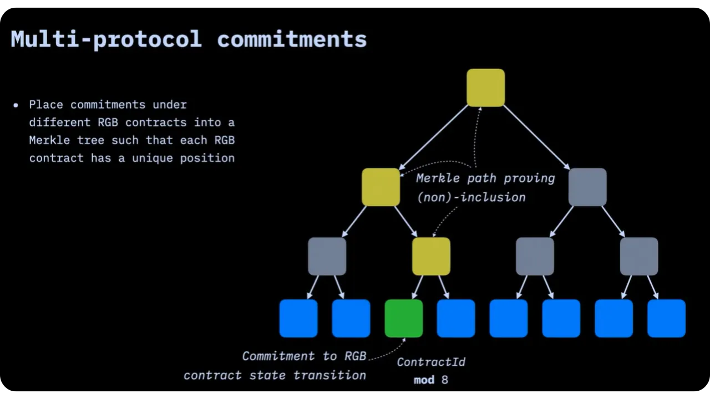

#### MPC Root Hash

La valeur effectivement inscrite on-chain (dans `Opret` ou `Tapret`) se nomme `mpc::Commitment`. Celle-ci est calculée en suivant la forme du [BIP-341](https://github.com/bitcoin/bips/blob/master/bip-0341.mediawiki), selon la formule :

```txt
mpc::Commitment = SHA-256(SHA-256(mpc_tag) || SHA-256(mpc_tag) || depth || cofactor || mpc::Root )
```

où :
- `mpc_tag` est une étiquette : `urn:ubideco:mpc:commitment#2024-01-31`, choisie selon les [conventions RGB de tagging](https://github.com/RGB-WG/rgb-core/blob/master/doc/Commitments.md) ;
- `depth` (1 octet) indique la profondeur du *MPC Tree* ;
- `cofactor` (16 bits, en Little Endian) est un paramètre permettant de favoriser l’unicité des positions assignées à chaque contrat dans l’arbre ;
- `mpc::Root` est la racine de *MPC Tree*, calculée selon le processus décrit dans la section suivante.

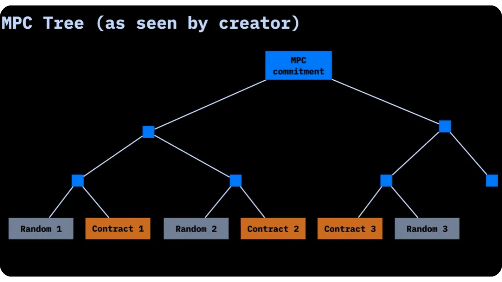

#### Construction de l'arbre MPC (MPC Tree)

Pour construire ce MPC Tree, il faut assurer qu’à chaque contrat corresponde une position de feuille unique. Supposons qu’on ait :
- `C` contrats à inclure, indexés par `i` dans `i = {0,1,..,C-1}`.
- Pour chaque contrat `c_i`​, on dispose d’un identifiant `ContractId(i) = c_i`.

On va alors bâtir un arbre de largeur `w` et de profondeur `d` telle que `2^d = w`, avec `w > C`, de sorte que chaque contrat puisse être placé dans une _leaf_ distincte. La position `pos(c_i)` de chaque contrat dans l’arbre est déterminée par :

```txt
pos(c_i) = c_i mod (w - cofactor)
```

où `cofactor` est un entier qui augmente les probabilités d’obtenir des positions distinctes pour chaque contrat. Dans la pratique, la construction suit un processus itératif :
- On part d’une profondeur minimale (`d=3` par convention pour masquer le nombre exact de contrats) ;
- On tente différents `cofactor` (jusqu’à `w/2`, ou un maximum de 500 pour des raisons de performance) ;
- Si on ne parvient pas à positionner tous les contrats sans collision, on incrémente `d` et on recommence.

Le but est d’éviter les arbres trop grands tout en maintenant un risque de collision minimal. Notons que le phénomène de collisions suit une logique de distribution aléatoire, liée au [Paradoxe des anniversaires](https://en.wikipedia.org/wiki/Birthday_problem).

#### Les feuilles habitées

Une fois `C` positions distinctes `pos(c_i)` obtenues pour les contrats `i = {0,1,..,C-1}`, on renseigne chaque feuille via une fonction de hachage (*tagged hash*) :

```txt
tH_MPC_LEAF(c_i) = SHA-256(SHA-256(merkle_tag) || SHA-256(merkle_tag) || 0x10 || c_i || BundleId(c_i))
```

où :
- `merkle_tag = urn:ubideco:merkle:node#2024-01-31`, toujours choisi selon les conventions Merkle de RGB ;
- `0x10` identifie un _contract leaf_ ;
- `c_i` est l’identifiant de 32 octets du contrat (issu du hash de sa Genesis) ;
- `BundleId(c_i)` est un hash de 32 octets décrivant l’ensemble des `State Transitions` relatives à `c_i` (réunies en une *Transition Bundle*).

#### Les feuilles inhabitées

Les feuilles restantes, non affectées à un contrat (c’est-à-dire `w - C` feuilles), sont remplies par une valeur dite "dummy" (_entropy leaf_) :

```txt
tH_MPC_LEAF(j) = SHA-256(SHA-256(merkle_tag) || SHA-256(merkle_tag) || 0x11 || entropy || j )
```

où :
- `merkle_tag = urn:ubideco:merkle:node#2024-01-31`, toujours choisi selon les conventions Merkle de RGB ;
- `0x11` désigne une _entropy leaf_ ;
- `entropy` est une valeur aléatoire de 64 octets, choisie par la personne qui construit l’arbre ;
- `j` est la position (en 32 bits Little Endian) de cette feuille dans l’arbre.

#### Les nœuds MPC

Après avoir généré les `w` feuilles (habitées ou non), on procède à la _merkelization_ en suivant la règle `commit_verify`. Tout nœud interne est haché comme suit :

```txt
tH_MPC_BRANCH(tH1 || tH2) = SHA-256(SHA-256(merkle_tag) || SHA-256(merkle_tag) || b || d || w || tH1 || tH2)
```

où :

- `merkle_tag = urn:ubideco:merkle:node#2024-01-31`, toujours choisi selon les conventions Merkle de RGB ;
- `b` est la _branching factor_ (8 bits). Le plus souvent, `b=0x02` car l’arbre est binaire et complet ;
- `d` est la profondeur du nœud dans l’arbre ;
- `w` est la largeur de l’arbre (en binaire 256 bits Little Endian) ;
- `tH1` et `tH2` sont les hachages des nœuds enfants (ou feuilles), déjà calculés comme indiqués ci-dessus.

En progressant ainsi, on obtient la racine `mpc::Root`. On peut ensuite calculer `mpc::Commitment` (comme expliqué précédemment) et l’insérer on-chain.

Pour illustrer cela, imaginons un exemple où `C=3` (trois contrats). On suppose que leurs positions sont `pos(c_0)=7`, `pos(c_1)=4`, `pos(c_2)=2`. Les autres feuilles (positions 0,1,3,5,6) sont des _entropy leaves_. Le schéma ci-dessous montre comment s’enchaînent les hachages jusqu’à la racine :

- `BUNDLE_i` représente `BundleId(c_i)`.
- `tH_MPC_LEAF(A)` et ainsi de suite, représentent les feuilles (certaines pour les contrats, d’autres pour l’entropie).
- Chaque branche `tH_MPC_BRANCH(...)` combine les hachages de ses deux fils.

Le résultat final est le **mpc::Root**, puis le `mpc::Commitment`.

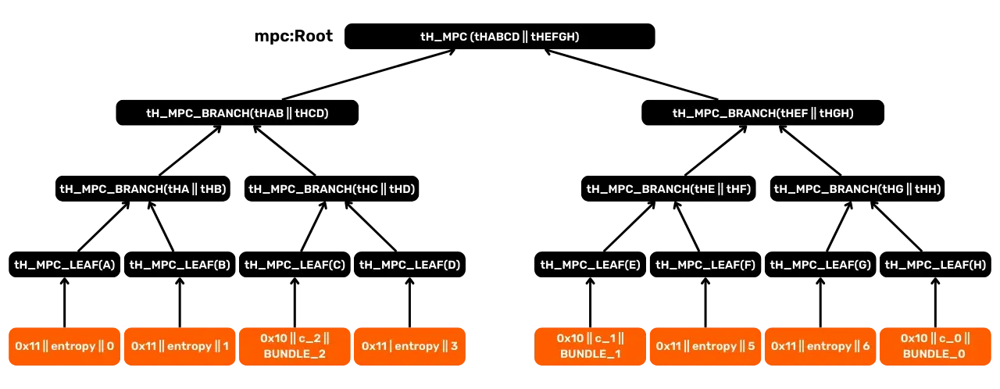

#### Vérification de l'arbre MPC

Lorsqu’un vérificateur souhaite s’assurer qu’un contrat `c_i`​ (et son `BundleId`) est bien inclus dans l’engagement final `mpc::Commitment`, il reçoit simplement **une preuve de Merkle** (*Merkle Proof*). Cette preuve indique les nœuds nécessaires pour remonter des feuilles (ici, la _contract leaf_ de `c_i`​) jusqu’à la racine. Inutile de divulguer l’intégralité du *MPC Tree* : cela protège la confidentialité des autres contrats.

Dans l’exemple, un vérificateur de `c_2` n’a besoin que de quelques hachages intermédiaires (`tH_MPC_LEAF(D)`, deux ou trois `tH_MPC_BRANCH(...)`, etc.), plus la preuve de la position `pos(c_2)` et la valeur `cofactor`. Il peut alors reconstruire localement la racine, puis recalculer le `mpc::Commitment` et le comparer à celui inscrit dans la transaction Bitcoin (au sein d’`Opret` ou `Tapret`).

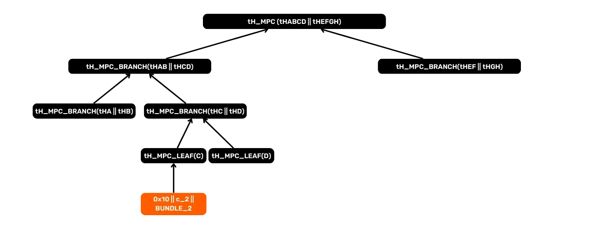

Ce mécanisme garantit ainsi que :
- L’état relatif à `c_2` est bien inclus dans le bloc d’information agrégé (client-side) ;
- Personne ne peut construire une histoire alternative avec la même transaction, car le _commitment_ on-chain pointe vers une unique racine MPC.

#### Résumé de la structure MPC

Le *Multi Protocol Commitment* (MPC) est donc le principe qui permet à RGB d’agréger plusieurs contrats dans une seule transaction Bitcoin, tout en maintenant l’unicité des engagements et la confidentialité vis-à-vis des autres participants. Grâce à la construction déterministe de l’arbre, chaque contrat se voit attribuer une position unique, et la présence de feuilles “dummy” (*Entropy Leaves*) masque partiellement le nombre total de contrats participant à l’opération.

Sur le client, on ne stocke jamais l’ensemble de l'arbre de Merkle. On se contente de générer, à l’instant T, un _Merkle path_ pour chaque contrat concerné, à transmettre au destinataire (qui pourra ainsi valider l’engagement). Dans certains cas, vous possédez plusieurs actifs passés par le même UTXO. Vous pouvez alors fusionner plusieurs _Merkle paths_ dans ce qu’on appelle un _multi-protocol commitment block_, afin d'éviter de dupliquer trop de données.

Chaque _Merkle proof_ est donc légère, d’autant plus que la profondeur de l’arbre n’excédera pas 32 dans RGB. Il existe également une notion de **Merkle block**, conservant plus d’informations (la cross-section, l’entropie, etc.), utile pour combiner ou séparer plusieurs branches.

Voilà pourquoi la finalisation de RGB a demandé du temps. On avait la vision globale dès 2019 : tout mettre en client-side, faire circuler les tokens hors chaîne. Mais des détails comme le sharding pour plusieurs contrats, la structure de l'arbre de Merkle, la manière de gérer les collisions et la fusion de preuves… tout cela a exigé des itérations.

### Les anchors : un assemblage global

Dans la continuité de la construction de nos engagements (`Opret` ou `Tapret`) et de notre **MPC** (*Multi Protocol Commitment*), nous devons aborder la notion d’**Anchor** dans le protocole **RGB**. Un Anchor est une structure validée côté client qui rassemble les éléments nécessaires pour vérifier qu’un engagement Bitcoin renferme bien une information contractuelle précise. Autrement dit, un Anchor résume toutes les données utiles à la validation des _commitments_ décrits précédemment.

Un Anchor se compose de trois champs ordonnés :
- `Txid`
- `MPC Proof`
- `Extra Transaction Proof - ETP`

Chacun de ces champs intervient dans la procédure de validation, qu’il s’agisse de reconstituer la transaction Bitcoin sous-jacente ou de prouver l’existence d’un engagement caché (notamment dans le cas de `Tapret`).

#### TxId

Le champ `Txid` correspond à l’identifiant de 32 octets de la transaction Bitcoin qui contient l’engagement `Opret` ou `Tapret`.  

En théorie, il serait envisageable de retrouver ce `Txid` en retraçant la chaîne de transitions d'états qui pointent elles-mêmes vers chaque witness transaction, en suivant la logique des single-use seals. Cependant, pour faciliter et accélérer la vérification, ce `Txid` est tout simplement inclus dans l’Anchor, ce qui évite ainsi au validateur d’avoir à remonter tout l’historique off-chain.

#### MPC Proof

Le second champ, la `MPC Proof`, se rapporte à la preuve que ce contrat précis (par exemple `c_i`) est bien inclus dans le _Multi Protocol Commitment_. Il s’agit d’une combinaison de :
- `pos_i`, la position de ce contrat dans l’arbre du MPC ;
- `cofactor`, la valeur définie pour résoudre les collisions de positions ;
- la `Merkle Proof`, c’est-à-dire l’ensemble des nœuds et hachages permettant de reconstruire la racine du MPC et de vérifier que l’identifiant de contrat et son `Transition Bundle` sont bien engagés dans la racine.

Ce mécanisme a été décrit dans la section précédente consacrée à la construction du *MPC Tree*, où chaque contrat obtient une feuille unique grâce à l’opération :

```txt
pos(c_i) = c_i mod (w - cofactor)
```

Puis, on utilise un schéma de _merkelization_ déterministe pour agréger toutes les feuilles (contrats + entropie). La `MPC Proof` permet, au final, de reconstituer localement la racine et de la comparer au `mpc::Commitment` inclus on-chain.

#### Extra Transaction Proof – ETP

Le troisième champ, l’**ETP**, dépend du type d’engagement utilisé. Si l’engagement est de type `Opret`, aucune preuve supplémentaire n’est requise. Le validateur inspecte la première sortie `OP_RETURN` de la transaction et y retrouve directement le `mpc::Commitment`.

**Si l’engagement est de type `Tapret`**, il faut fournir une preuve additionnelle appelée ***Extra Transaction Proof – ETP***. Elle contient :
- La clé publique interne (`P`) de la sortie taproot dans laquelle est incrusté le *commitment* ;
- Les nœuds partenaires du `Script Path Spend` (lorsque le *commitment* Tapret est inséré dans un script), afin de prouver l’emplacement exact de ce script dans l’arbre taproot :
	- Si le *commitment* `Tapret` se trouve sur la branche de droite, on révèle le nœud de gauche (par exemple `tHABC`),
	- Si le *commitment* `Tapret` est sur la gauche, il faut divulguer 2 nœuds (par exemple `tHAB` et `tHC`) pour prouver qu’aucun autre *commitment* n’est présent sur la partie de droite.
- Le `nonce` éventuellement utilisé pour "miner" la meilleure configuration, permettant de placer le *commitment* à droite de l’arbre (optimisation de preuve).

Cette preuve supplémentaire est indispensable, car, contrairement à `Opret`, l’engagement `Tapret` s’intègre dans la structure d’un script taproot, ce qui exige de révéler une partie de l’arbre taproot afin de valider correctement l’emplacement du commitment.

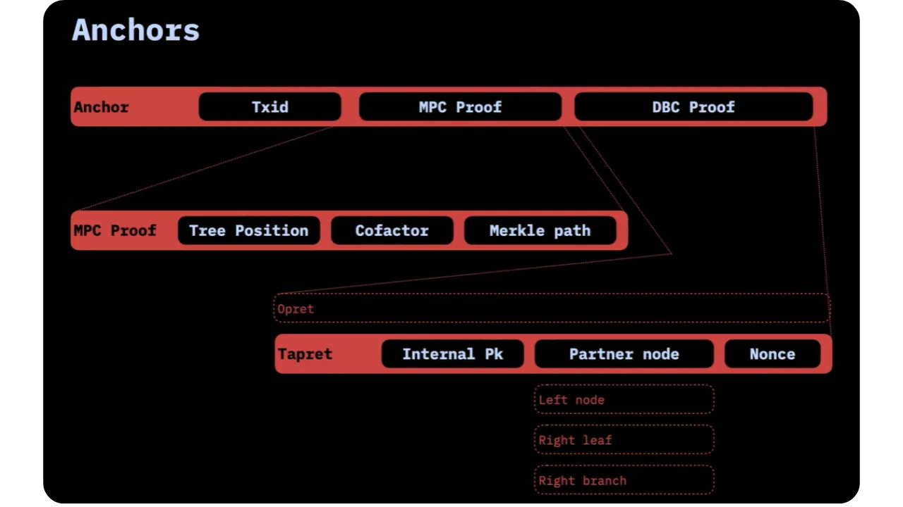

Les **Anchors** encapsulent donc l’ensemble des informations nécessaires pour valider un engagement Bitcoin dans le contexte de RGB. Ils indiquent à la fois la transaction pertinente (`Txid`) et les preuves de positionnement du contrat (`MPC Proof`), tout en gérant la preuve supplémentaire (`ETP`) dans le cas de `Tapret`. Ainsi, un Anchor protège l’intégrité et l’unicité de l’état off-chain en assurant qu’une même transaction ne puisse être réinterprétée pour d’autres données contractuelles.

### Conclusion

Nous ce chapitre, nous avons couvert :
- Comment appliquer le concept de _single-use seals_ dans Bitcoin (en particulier via un _outpoint_) ;
- Les différentes méthodes pour insérer de façon déterministe un _commitment_ dans une transaction (Sig tweak, Key tweak, witness tweak, op_return, Taproot/Tapret) ;
- Les raisons pour lesquelles RGB se concentre sur les engagements Taproot ;
- La gestion multi-contrat via des _multi-protocol commitments_, indispensable pour ne pas exposer l’intégralité d’un état ou d’autres contrats lorsqu’on veut prouver un point précis ;
- Nous avons aussi vu l’importance des _Anchors_, qui rassemblent tout (le TXID de la transaction, la preuve de l’arbre de Merkle et la preuve Taproot) dans un même ensemble.

En pratique, la mise en œuvre technique est répartie entre plusieurs _crates_ Rust dédiés (dans _client_side_validation_, _commit-verify_, _bp_core_, etc.). Les notions fondamentales sont là :

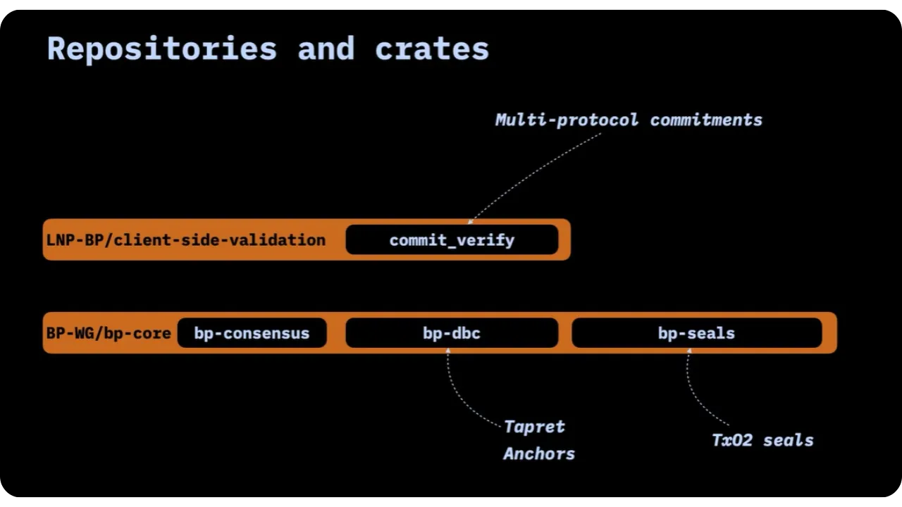

Dans le chapitre suivant, nous plongerons dans la composante purement off-chain de **RGB**, à savoir la logique des contrats. Nous verrons comment les contrats RGB, organisés sous forme de _finite state machine_ partiellement répliquée, atteignent une expressivité bien plus élevée que celle autorisée par *Bitcoin Script*, tout en préservant la confidentialité de leurs données.


## Introduction aux contrats intelligents et à leurs états
<chapterId>04a9569f-3563-5382-bf53-0c7069343ba0</chapterId>


Dans ce chapitre et le prochain, nous abordons la notion de **smart contract** au sein de l’environnement **RGB** et présentons les différentes manières dont ces contrats peuvent définir et faire évoluer leur **état** (_state_). Nous verrons pourquoi l’architecture RGB, en utilisant la séquence ordonnée de _single-use seals_, permet d’exécuter divers types de ***Contract Operations*** de manière scalable et sans passer par un registre centralisé. Nous verrons également le rôle fondamental de la ***Business Logic*** pour encadrer l’évolution de l’état contractuel.

### Contrats intelligents et droits au porteur numériques

L’objectif de **RGB** est de proposer une infrastructure où l’on peut mettre en œuvre des **smart contracts** sur Bitcoin. Par "smart contract", on entend un accord entre plusieurs parties qui est automatiquement et informatiquement appliqué, sans intervention humaine pour faire respecter les clauses. En d’autres termes, la loi du contrat est exécutée par le logiciel, et non par un tiers de confiance.

Cette automatisation soulève la question de la décentralisation : comment s’affranchir d’un registre centralisé (par exemple une plateforme ou une base de données centrale) pour gérer la propriété et l’exécution des contrats ? L’idée d’origine, reprise par RGB, consiste à renouer avec un mode de possession dit **"au porteur"** (*bearer instruments*). Dans la tradition historique, certains titres (obligations, actions, etc.) étaient émis au porteur, permettant à quiconque possédait physiquement le document de faire valoir ses droits.  


RGB applique ce concept au monde numérique : les droits (et obligations) sont enfermés dans des données manipulées off-chain, et l’état de ces données est validé par les participants eux-mêmes. Cela permet, à priori, un degré de confidentialité et d’indépendance beaucoup plus grand que celui qu’offrent d’autres approches basées sur des registres publics.

### Introduction à l’État d’un Smart Contract RGB

Un **smart contract** dans RGB peut être vu comme une machine à états, définie par :
- Un **State** (état), c’est-à-dire l’ensemble d’informations reflétant la configuration actuelle du contrat ;
- Une **Business Logic** (ensemble de règles), qui décrit sous quelles conditions et par qui l’état peut être modifié.

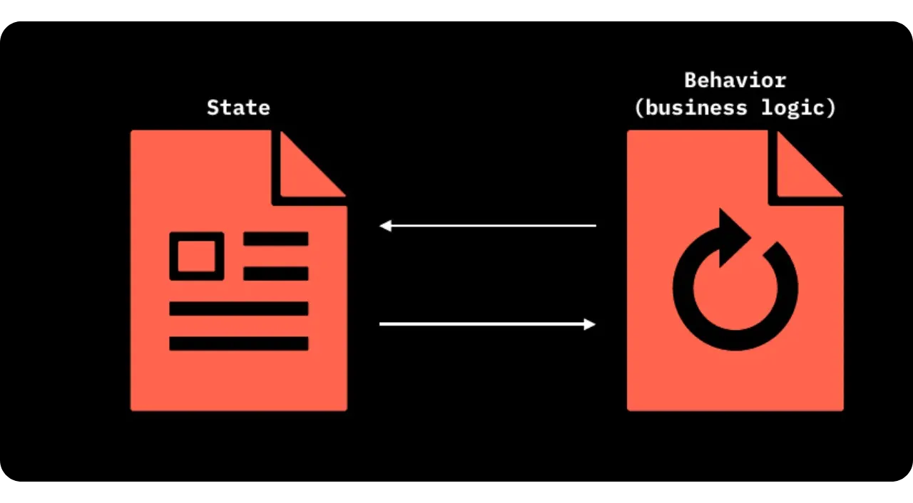

Il est important de comprendre que ces contrats ne sont pas limités aux simples transferts de tokens. Ils peuvent incarner une grande variété d’applications : des actifs traditionnels (jetons, actions, obligations) jusqu’à des mécaniques plus complexes (droits d’usage, conditions commerciales, etc.). Contrairement à d’autres blockchains où le code de contrat est accessible et exécutable par tous, l’approche de RGB cloisonne l’accès et la connaissance du contrat aux participants (***contract participants***). Il existe ainsi plusieurs rôles :
- **L’issuer** ou créateur du contrat, qui définit la Genèse du contrat et ses variables initiales ;
- **Les parties détentrices** de droits (*ownership*) ou d’autres capacités d’exécution ;
- Des **observateurs**, potentiellement limités à voir certaines informations, mais qui ne peuvent pas déclencher des modifications.

Cette séparation des rôles contribue à la résistance à la censure, en permettant que seules les personnes autorisées puissent interagir avec l’état contractuel. Cela confère également à RGB la capacité de s’étendre de manière horizontale : la majorité des validations a lieu en dehors de la blockchain, et seules des **ancrages cryptographiques** (les *commitments*) sont inscrits sur Bitcoin.

### État et Business Logic dans RGB

D’un point de vue pratique, la **Business Logic** du contrat se présente sous forme de règles et de scripts, définis dans ce que RGB appelle un **Schema**. Le Schema encode :
- La structure de l’État (quels champs sont publics ? Quels champs sont détenus par telle ou telle partie ?) ;
- Les conditions de validité (qu’est-ce qui doit être vérifié avant d’autoriser une mise à jour de l’État ?) ;
- Les autorisations (qui peut initier une *State Transition* ? Qui peut seulement observer ?).

En parallèle, l’**État** (_Contract State_) se décompose souvent en deux volets :
- Un **Global State** : partie publique, potentiellement observable par tous (selon la configuration) ;
- Des **Owned States** : parties privées, attribuées spécifiquement à des détenteurs (*owners*) via des UTXOs référencés dans la logique du contrat.

Comme nous le verrons dans les chapitres suivant, toute mise à jour d’état (*Contract Operation*) doit s’arrimer à un _commitment_ Bitcoin (via `Opret` ou `Tapret`) et se conformer aux scripts de la *Business Logic* pour être considérée comme valide.

### Contract Operations : création et évolution de l’État

Dans l’univers RGB, on appelle ***Contract Operation*** tout événement qui fait passer le contrat d’un **ancien état** (_old state_) à un **nouvel état** (_new state_). Ces opérations suivent la logique suivante :
- On prend connaissance de l’État actuel du contrat ;
- On applique la règle ou l’opération (une ***State Transition***, une ***Genesis*** si c’est le tout premier état, ou encore une ***State Extension*** s’il y a une *valency* publique à redéclencher) ;
- On ancre la modification via un nouveau _commitment_ sur la blockchain, en fermant un _single-use seal_ et en en créant un autre ;
- Les détenteurs de droits concernés valident localement (*client-side*) que la transition est conforme au *Schema* et que la transaction Bitcoin associée est inscrite on-chain.


Le résultat final est un contrat mis à jour, dont l’État est désormais différent. Cette transition ne nécessite pas que l’ensemble du réseau Bitcoin s’intéresse aux détails, puisque seule une petite empreinte cryptographique (le _commitment_) est enregistrée dans la blockchain. La séquence des *single-use seals* prévient toute double-dépense ou double-utilisation de l’État.

### Chaîne d’opérations : de la Genesis au Terminal State

Pour remettre en perspective, un **smart contract** RGB démarre par une **Genesis**, le tout premier état. Par la suite, diverses **Contract Operations** se succèdent, formant un **DAG** (*Directed Acyclic Graph*) d’opérations :
- Chaque transition s’appuie sur un état précédent (ou plusieurs, en cas de transitions convergentes) ;
- L’ordre chronologique est garanti par l’inclusion de chaque transition dans un ancrage Bitcoin, horodaté et inaltérable grâce au consensus par Proof-of-Work ;
- Lorsque plus aucune opération n’est en cours, on atteint un **Terminal State** : la situation la plus récente et complète du contrat.


Cette topologie en DAG (au lieu d’une simple chaîne linéaire) reflète la possibilité que différentes parties du contrat puissent évoluer en parallèle, tant qu’elles ne se contredisent pas. RGB se charge alors d’éviter toute incohérence via la vérification *client-side* de chaque participant concerné.

### Synthèse

Les **smart contracts** dans RGB introduisent un modèle d’“instruments au porteur” numériques, décentralisés, mais ancrés dans Bitcoin pour l’horodatage et la garantie de l’ordre des opérations. L’exécution automatisée de ces contrats repose sur :

- Un **État** (Contract State), indiquant la configuration actuelle du contrat (droits, soldes, variables…).
- Une **Business Logic** (Schema), définissant quelles transitions sont autorisées et comment elles doivent être validées.
- Des **Contract Operations**, qui mettent à jour cet État étape par étape, grâce à des engagements ancrés dans des transactions Bitcoin.

Dans le chapitre suivant, nous entrerons plus en détail dans la représentation concrète de ces **states** et des **state transitions** au niveau off-chain, ainsi que dans la manière dont ils se lient aux UTXOs et aux _single-use seals_ ancrés dans Bitcoin. Ce sera l’occasion de voir comment la mécanique interne d’RGB, fondée sur une validation client-side, parvient à maintenir la cohérence des smart contracts tout en préservant la confidentialité des données.


## Opérations des contrats RGB
<chapterId>78c44e88-50c4-5ec4-befe-456c1a9f080b</chapterId>


## Glossaire RGB
<chapterId>545e16a4-3cca-44a3-9fd5-dbc5868abf97</chapterId>

En cas de besoin dans la formation, vous pouvez revenir sur ce petit glossaire des termes techniques importants employés dans l'univers RGB (classés par ordre alphabétique). Ce chapitre n'est donc pas indispensable si vous avez déjà bien compris tout ce que nous avons vu dans la première section.

#### AluVM

L’abréviation **AluVM** désigne "_Algorithmic logic unit Virtual Machine_", une machine virtuelle à registres, conçue pour la validation de smart contracts et le calcul distribué. Elle est utilisée (sans y être exclusivement réservée) dans le cadre de la validation des contrats RGB. Les scripts ou les opérations inscrites dans un contrat RGB peuvent ainsi être exécutés dans l’environnement AluVM.  
Pour plus d’informations : [Site officiel d’AluVM](https://www.aluvm.org/)

#### Anchor

Un **Anchor** représente un ensemble de données côté client permettant de prouver l’inclusion d’un _commitment_ unique dans une transaction. Dans le protocole RGB, un Anchor est constitué des éléments suivants :
- L’identifiant de la transaction Bitcoin (le **Transaction ID** ou _txid_) de la **witness transaction**.
- Le **Multi Protocol Commitment (MPC)**.
- Le **Deterministic Bitcoin Commitment (DBC)**.
- L’**Extra Transaction Proof (ETP)** si l’on emploie le mécanisme de commitment **Tapret** (voir la section dédiée à ce schéma).

Un Anchor sert donc à établir un lien vérifiable entre une transaction Bitcoin précise et des données privées validées par le protocole RGB. Il garantit que ces données sont bel et bien incluses dans la blockchain, sans pour autant que leur contenu exact soit exposé publiquement.

#### Assignment

Dans la logique de RGB, un **Assignment** est l’équivalent d’une sortie de transaction (output) qui modifie, met à jour ou crée certaines propriétés au sein de l’état d’un **contract**. Un Assignment comporte deux éléments :

1. Une **Seal Definition** (la référence à un UTXO précis).
2. Un **Owned State** (les données décrivant l’état associé à ce nouveau détenteur).

Un Assignment indique donc qu’une portion de l’état (ex. un actif) est désormais allouée à un détenteur particulier, identifié via un _seal_ lié à un UTXO.

#### Business Logic

La **Business Logic** regroupe l’ensemble des règles et des opérations internes d’un contrat, décrites par son **schéma** (c’est-à-dire la structure même du contrat). Elle dicte la manière dont l’état du contrat peut évoluer et sous quelles conditions.

#### Client-side Validation

La **Client-side Validation** renvoie au processus par lequel chaque partie (client) vérifie un ensemble de données échangées en privé, selon les règles d’un protocole. Dans le cas de RGB, ces données échangées sont regroupées dans ce qu’on appelle des **consignments**. Contrairement au protocole Bitcoin qui exige que toutes les transactions soient publiées on-chain, RGB permet de ne stocker en public que des _commitments_ (ancrés dans Bitcoin), tandis que l’essentiel des informations de contrat (transitions, attestations, preuves) reste off-chain, partagées seulement entre les utilisateurs concernés.

#### Commitment

Un **Commitment** (au sens cryptographique) est un objet mathématique, noté `C`, dérivé de façon déterministe à partir d’une opération sur une donnée structurée `m` (le message) et d’une valeur aléatoire `r`. On écrit souvent :
$$
C = \text{commit}(m, r)
$$

Ce mécanisme comprend deux opérations principales :
- **Commit** : on applique une fonction cryptographique à un message `m` et à un aléa `r` pour produire `C` ;
- **Verify** : on utilise `C`, le message `m` et la valeur `r` pour vérifier que ce commitment est correct. La fonction renvoie `Vrai` ou `Faux`.

Un commitment doit respecter deux propriétés :
- **Binding** : il doit être impossible de trouver deux messages différents produisant le même `C` :
$$
m' : \, | \, : m' \neq m \quad \text{and} \quad r' : \, | \, : r' \neq r \quad 
$$
Tels que :
$$
\text{verify}(m, r, C) = \text{verify}(m', r', C) \rightarrow \text{True}
$$

- **Hiding** : la connaissance de `C` ne doit pas révéler le contenu de `m`.

Dans le protocole RGB, un commitment est inclus dans une transaction Bitcoin afin de prouver l’existence d’une certaine information à un instant donné, sans dévoiler cette information elle-même.

#### Consignment

Un **Consignment** regroupe les données échangées entre les parties, soumises à la Client-side Validation dans RGB. Il existe deux grandes catégories de consignments :
- **Contract Consignment** : fourni par l’**issuer** (émetteur du contrat), il comprend les informations d’initialisation telles que le **Schema**, la **Genesis**, l’**Interface** et l’**Implementation de l'Interface**.
- **Transfer Consignment** : fourni par la partie qui paie (payer). Il contient tout l’historique de transitions d’état aboutissant au **terminal consignment** (c’est-à-dire l’état final reçu par le payeur).

Ces consignments ne sont pas enregistrés publiquement dans la blockchain ; ils sont échangés directement entre les parties concernées.

#### Contract

Un **Contract** désigne un ensemble de **droits** exécutés numériquement entre plusieurs acteurs via le protocole RGB. Il possède un état actif et une logique d’affaires, définie par un **Schema**, qui précise quelles opérations sont autorisées (transferts, extensions, etc.). L’état d’un contrat, ainsi que les règles de validité, s’expriment dans le **Schema**. À tout moment, le contrat n’évolue que conformément à ce qui est permis par ce Schema et par les scripts de validation (exécutés, par exemple, dans AluVM).

#### Contract Operation

Une **Contract Operation** est une mise à jour de l’état du contrat effectuée selon les règles du **Schema**. Les opérations suivantes existent dans RGB :
- **State Transition** ;
- **Genesis** ;
- **State Extension**.

Chaque opération modifie l’état en y ajoutant ou en y remplaçant certaines données (Global State, Owned State…).

#### Contract Participant

Un **Contract Participant** est un acteur prenant part aux opérations relatives au contrat. Dans RGB, on distingue :
- L’**issuer** du contrat, qui crée la **Genesis** (l’origine du contrat).
- Les **contract parties**, c’est-à-dire les détenteurs de droits sur l’état du contrat.
- Les **public parties**, acteurs pouvant construire des **State Extensions** si le contrat propose des **Valencies** accessibles au public.

#### Contract Rights

Les **Contract Rights** désignent les différents droits que peuvent exercer les acteurs d’un contrat RGB. Ils se classent en plusieurs catégories :
- Les **ownership rights**, associés à la détention d’un UTXO particulier (via un _Seal Definition_).
- Les **executive rights**, c’est-à-dire la capacité de construire une ou plusieurs transitions (State Transitions) conformes au **Schema**.
- Les **public rights**, lorsque le Schema autorise certains usages publics, par exemple la création d’une **State Extension** via la rédemption d’une **Valency**.

#### Contract State

Le **Contract State** correspond à l’état courant d’un contrat à un instant donné. Il peut être constitué de données à la fois publiques et privées, reflétant la situation du contrat. Dans RGB, on distingue :
- Le **Global State**, qui comprend les propriétés publiques du contrat (mises en place dès la Genesis ou ajoutées via des mises à jour autorisées).
- Les **Owned States**, qui appartiennent à des détenteurs précis, identifiés par leurs UTXOs.

#### Deterministic Bitcoin Commitment - DBC

Le **Deterministic Bitcoin Commitment (DBC)** est l’ensemble de règles permettant d’inscrire de manière prouvable et unique un _commitment_ dans une transaction Bitcoin. Dans le protocole RGB, il existe deux formes principales de DBC :
- **Opret**
- **Tapret**

Ces mécanismes définissent précisément comment le _commitment_ est encodé dans les sorties ou dans la structure d’une transaction Bitcoin, afin de s’assurer que cet engagement est repérable et vérifiable de façon déterministe.

#### Directed Acyclic Graph - DAG

Un **DAG** (ou *Graphe Orienté Acyclique*) est un graphe sans cycle, permettant un ordonnancement topologique. Les blockchains, tout comme les _shards_ de contrats RGB, peuvent être représentés par des DAGs.

Pour plus d’informations : [Directed Acyclic Graph](https://en.wikipedia.org/wiki/Directed_acyclic_graph)

#### Engraving

Un **Engraving** est une chaîne de données optionnelle que les détenteurs successifs d’un contrat peuvent inscrire dans l’historique du contrat. Cette fonctionnalité existe, par exemple, dans l’interface **RGB21** et permet d’ajouter des informations commémoratives ou descriptives dans l’historique du contrat.

#### Extra Transaction Proof - ETP

L’**ETP** (*Extra Transaction Proof*) est la partie de l’**Anchor** qui renferme les données supplémentaires nécessaires à la validation d’un commitment de type **Tapret** (dans le contexte de _taproot_). Elle comprend, entre autres, la clé publique interne du script taproot (_internal PubKey_) et les informations spécifiques au _Script Path Spend_.

#### Genesis

La **Genesis** désigne l’ensemble des données, régies par un **Schema**, qui forment l’état initial de tout contrat dans RGB. On peut la rapprocher du concept de _Genesis Block_ (le bloc originel) en Bitcoin, ou bien au concept de transaction Coinbase, mais ici au niveau _client-side_ et des jetons RGB.

#### Global State

Le **Global State** est l’ensemble des propriétés publiques contenues dans l’état d’un contrat (Contract State). Il est défini lors de la **Genesis** et peut être, selon les règles du contrat, mis à jour par des transitions autorisées. Contrairement aux Owned States, le Global State n’appartient pas à une entité particulière ; il est plus proche d’un registre public dans le cadre du contrat.

#### Interface

L’**Interface** est l’ensemble des instructions qui permettent de décoder les données binaires compilées dans un **Schema** ou dans des opérations de contrat et leurs états, afin de les rendre lisibles pour l’utilisateur ou son wallet. Elle agit comme une couche d’interprétation.

#### Interface Implementation

L’**Interface Implementation** est l’ensemble des déclarations qui relient une **Interface** à un **Schema**. Elle rend possible la “traduction” sémantique opérée par l’Interface elle-même, afin que les données brutes d’un contrat soient compréhensibles par l’utilisateur ou les logiciels impliqués.

#### Invoice

Une **Invoice** prend la forme d’une URL encodée en [base58](https://en.wikipedia.org/wiki/Binary-to-text_encoding#Base58), qui embarque les données nécessaires à la construction d’une **State Transition** (par le payeur). En d’autres termes, c’est une facture permettant à la contrepartie (payer) de créer la transition correspondante pour transférer l’actif ou mettre à jour l’état du contrat.

#### Lightning Network

Le **Lightning Network** est un réseau décentralisé de canaux de paiements (ou _state channels_) Bitcoin, constitué de portefeuilles multi-signatures 2-of-2. Il permet de faire des transactions _off-chain_ rapides et peu coûteuses, tout en s’appuyant sur la couche 1 de Bitcoin pour l’arbitrage (ou la fermeture) lorsque nécessaire.

Pour plus d’informations : [Lightning Network](https://lightning.network/)

#### Multi Protocol Commitment - MPC

Le **Multi Protocol Commitment (MPC)** désigne la structure d'arbre de Merkle utilisée dans RGB pour inclure, au sein d’une unique transaction Bitcoin, plusieurs **Transition Bundles** issus de contrats différents. L’idée est de regrouper plusieurs engagements (correspondant potentiellement à différents contrats ou différents actifs) dans un seul point d’ancrage afin d’optimiser l’occupation de l’espace de bloc.

#### Owned State

Un **Owned State** est la partie de l’état d’un contrat (Contract State) qui est enfermée dans un **Assignment** et associée à un détenteur particulier (via un _seal_ pointant vers un UTXO). Cela représente, par exemple, un actif numérique ou un droit contractuel spécifique attribué à cette personne.

#### Ownership

Le terme **Ownership** renvoie à la capacité de contrôler et de dépenser un UTXO référencé par une **Seal Definition**. Lorsqu’un Owned State est lié à un UTXO, le propriétaire de cet UTXO a le droit, potentiellement, de transférer ou de faire évoluer l’état associé, selon les règles du contrat.

#### Partially Signed Bitcoin Transaction - PSBT

Une **PSBT** (_Partially Signed Bitcoin Transaction_) est une transaction Bitcoin qui n’est pas encore complètement signée. Elle peut être partagée entre plusieurs entités, chacune pouvant y ajouter ou y vérifier certains éléments (signatures, scripts…), jusqu’à ce que la transaction soit jugée prête pour la diffusion on-chain.  

Pour plus d’informations : [BIP-0174](https://github.com/bitcoin/bips/blob/master/bip-0174.mediawiki)

#### Pedersen commitment

Un **Pedersen commitment** est un type de _commitment_ cryptographique présentant la propriété d’être **homomorphique** vis-à-vis de l’opération d’addition. Cela signifie qu’il est possible de valider la somme de deux engagements sans dévoiler les valeurs individuelles.

Formellement, si :

$$
C1=\text{commit}(m1,r1) \quad C2=\text{commit}(m2,r2)
$$

alors :

$$
C3=C1⋅C2=\text{commit}(m1+m2, r1+r2)
$$

Cette propriété devient utile, par exemple, pour dissimuler les montants de tokens échangés tout en pouvant vérifier les totaux.

Pour plus d’informations : [Pedersen commitment](https://link.springer.com/chapter/10.1007/3-540-46766-1_9)

#### Redeem

Dans une **State Extension**, un **Redeem** fait référence à l’action de récupérer (ou d’exploiter) une **Valency** précédemment déclarée. Une Valency étant un droit public, le Redeem permet à un participant autorisé de réclamer une extension spécifique de l’état du contrat.

#### Schema

Un **Schema** dans RGB est un morceau de code déclaratif décrivant l’ensemble des variables, règles et logiques d’affaires (Business Logic) qui régissent le fonctionnement d’un contrat. Le Schema définit la structure de l’état, les types de transitions autorisées et les conditions de validation.

#### Seal Definition

La **Seal Definition** est la partie d’un **Assignment** qui associe le _commitment_ à un UTXO possédé par le nouveau détenteur. Elle indique, en d’autres termes, où se trouve l’état (dans quel UTXO) et permet d’établir la propriété d’un actif ou d’un droit.

#### Shard

Un **Shard** représente une branche dans le DAG de l’historique des **State Transitions** d’un contrat RGB. Autrement dit, c’est un sous-ensemble cohérent de l’historique global du contrat, correspondant par exemple à la séquence de transitions nécessaires pour prouver la validité d’un actif donné depuis la _Genesis_.

#### Single-Use Seal

Un **Single-Use Seal** est une promesse de _commit_ (engagement cryptographique) sur un message encore inconnu, qui sera révélé une seule fois à l’avenir et qui doit être connu de tous les membres d’une audience spécifique. L’objectif est d’empêcher la création de multiples engagements concurrents pour le même sceau.

#### Stash

Le **Stash** est l’ensemble des données côté client qu’un utilisateur stocke pour un ou plusieurs contrats RGB, afin de procéder à la validation (*Client-side Validation*). Cela inclut l’historique des transitions, les consignments, les preuves de validité, etc. Chaque détenteur ne conserve que les parties de l’historique dont il a besoin (*shards*).

#### State Extension

Une **State Extension** est une opération de contrat permettant de redéclencher des mises à jour de l’état via la rédemption de **Valencies** préalablement déclarées. Pour être effective, une State Extension doit ensuite être refermée par une **State Transition** (qui actualise l’état final du contrat).  

#### State Transition

La **State Transition** est l’opération centrale qui fait évoluer l’état d’un contrat RGB vers un nouvel état. Elle peut modifier les données du **Global State** et/ou les **Owned States**. Dans la pratique, chaque transition est vérifiée par les règles du **Schema** et ancrée dans la blockchain Bitcoin via un _commitment_.

#### Taproot

Le terme **Taproot** fait référence au format de transactions Segwit v1 de Bitcoin, introduit par le [BIP341](https://github.com/bitcoin/bips/blob/master/bip-0341.mediawiki) et le [BIP342](https://github.com/bitcoin/bips/blob/master/bip-0342.mediawiki). Taproot permet d’améliorer la confidentialité et la flexibilité des scripts, notamment en rendant les transactions plus compactes et plus difficiles à distinguer les unes des autres.

#### Terminal Consignment - Consignment Endpoint

Le **Terminal Consignment** (ou _Consignment Endpoint_) est un **transfer consignment** comprenant l’état final du contrat qui intègre la **State Transition** créée à partir de l’**Invoice** du destinataire (payee). Il s’agit donc du point d’aboutissement d’un transfert, avec les données nécessaires pour prouver que la propriété ou l’état a bien été transmis.

#### Transition Bundle

Un **Transition Bundle** est un ensemble de **State Transitions** RGB (appartenant au même contrat) qui sont tous engagés dans la même **witness transaction** Bitcoin. Cela permet de regrouper plusieurs mises à jour ou transferts en un seul ancrage on-chain.

#### UTXO

Un **UTXO** (*Unspent Transaction Output*) Bitcoin est défini par le hachage d’une transaction et l’index de la sortie (*vout*). On l’appelle aussi parfois un _outpoint_. Dans le protocole RGB, la référence à un UTXO (via une **Seal Definition**) permet de localiser l’**Owned State**, c’est-à-dire la propriété détenue sur la blockchain.

#### Valency

Une **Valency** est un droit public ne nécessitant pas de stockage d’état en tant que tel, mais qui peut être racheté via une **State Extension**. Il s’agit donc d’une forme de possibilité ouverte à tous (ou à certains acteurs), déclarée dans la logique du contrat, afin d’effectuer ultérieurement une extension particulière.

#### Witness Transaction

La **Witness Transaction** est la transaction Bitcoin qui ferme le _seal_ autour d’un message contenant un **Multi Protocol Commitment (MPC)**. Cette transaction dépense un UTXO ou en crée un, de façon à sceller l’engagement lié au protocole RGB. Elle fait office de preuve on-chain que l’état a été fixé à un instant précis.


# Programmation sur RGB
<partId>148a7436-d079-56d9-be08-aaa4c14c6b3a</partId>

## Bases de la programmation RGB
<chapterId>8333ea5f-51c7-5dd5-b1d7-47d491e58e51</chapterId>


## Programmation RGB Partie 2
<chapterId>f043a307-d420-5752-b0d7-ebfd845802c0</chapterId>


## Rédaction de contrats intelligents
<chapterId>0e0a645c-0049-588d-8965-b8c536590cc9</chapterId>


## Sujets avancés RGB et discussions futures
<chapterId>0962980a-8f94-5d0f-9cd0-43d7f884a01d</chapterId>


# Construire sur RGB
<partId>3b4b0d66-0c1b-505a-b5ca-4b2e57dd73c2</partId>

## Bitmask
<chapterId>dc92a5e8-ed93-5a3f-bcd0-d433932842f4</chapterId>


## Noeud RGB partie 1 
<chapterId>d4d80e07-5eac-5b29-a93a-123180e97047</chapterId>


## Noeud RGB partie 2
<chapterId>ecaabe32-20ba-5f8c-8ca1-a3f095792958</chapterId>


# Conclusion 
<partId>b0baebfc-d146-5938-849a-f835fafb386f</partId>


## Évaluez ce cours
<chapterId>0217e8b0-942a-5fee-bd91-9a866551eff3</chapterId>
<isCourseReview>true</isCourseReview>

## Mot de clôture
<chapterId>0309536d-c336-56a0-869e-a8395ed8d9ae</chapterId>

Merci d'avoir participé aux cours RGB proposés par Plan ₿ Network en collaboration avec Fulgur'Ventures. Nous exprimons notre gratitude à nos enseignants pour leur soutien. Si vous êtes intéressé à poursuivre votre travail avec RGB, voici une liste utile de ressources à explorer :

- https://rgb.tech/
- https://www.rgbfaq.com/
- https://rgb.tech/docs/
- https://www.youtube.com/LNP-BP
- https://twitter.com/lnp_bp

Merci et bonne chance pour vos études chez Plan ₿ Network.
