The Taproot Assets Protocol (TAP) enables the issuance, transfer, and management of arbitrary digital assets on Bitcoin, routable over the Lightning Network. This expert-level course takes you from the cryptographic data structures that make TAP possible through hands-on deployment and operation, covering everything from MerkleSum Sparse Merkle Trees and client-side validation to minting, sending, burning, and cross-asset Lightning payments via edge nodes and price oracles.

Through 16 demonstration videos recorded by Hannah Rosenberg, a core contributor to the protocol at Lightning Labs, you will build and operate a complete Taproot Assets stack. Whether you are building stablecoins, collectibles, or custom financial instruments, this course provides the technical depth and practical skills to work with Taproot Assets in development and production environments.

Note: The videos for this course are only available in English.

+++

# Introduction
<partId>f8d4a3c7-9b2e-4e5f-a1d3-8c6f9e2b4a15</partId>

## Course presentation
<chapterId>a2e5f8b9-4c3d-41e7-b9f2-6d8a3c5e9f14</chapterId>

### Welcome

Bitcoin's base layer was designed to be a robust, minimalist settlement network, and for good reason. Yet the desire to issue and transfer diverse assets on top of this infrastructure has been present almost since Bitcoin's earliest days. With the activation of [Taproot](https://planb.academy/resources/glossary/taproot) (BIP 341) in November 2021, a new design space opened up, one that makes it possible to embed structured asset metadata directly inside Taproot outputs without bloating the blockchain or compromising privacy. **Taproot Assets** (formerly known as Taro) is the protocol that exploits this design space to its fullest, enabling the issuance, transfer, and management of arbitrary assets, from stablecoins to collectibles, anchored in Bitcoin's security model and routable over the [Lightning Network](https://planb.academy/resources/glossary/lightning-network).

This course is an expert-level, hands-on exploration of the Taproot Assets Protocol and its reference implementation, `tapd` (the Taproot Assets Daemon). It is built around 16 demonstration videos recorded by Hannah Rosenberg, a developer at Lightning Labs and a core contributor to the protocol itself. We will not remain at the surface of concepts: together, we will walk through the full lifecycle of a Taproot Asset, from the cryptographic data structures that make it possible, through installation and configuration of the tooling, all the way to minting, sending, burning, and routing assets over Lightning channels. If you are comfortable with Bitcoin transactions, have a working understanding of Taproot and the Lightning Network, and are not afraid of a terminal, this course was built for you.

### What you will learn

- **Understand the cryptographic foundations** of the Taproot Assets Protocol, including Merkle-Sum Sparse Merkle Trees (MS-SMT), client-side validation, and the proof system that secures asset ownership off-chain.
- **Install and configure `tapd`** from source, through the Polar development environment, and via the LitD integrated stack, so you can choose the setup that fits your workflow.
- **Mint new assets** using both the CLI and the gRPC/REST API, mastering the parameters that define an asset's properties at creation time.
- **Send and receive Taproot Assets** between nodes, generating and verifying the transfer proofs that replace on-chain visibility with cryptographic certainty.
- **Burn assets permanently**, removing them from circulation in a verifiable way through the protocol's native burn mechanism.
- **Federate and query universes**, the public repositories that allow nodes to discover assets and verify their provenance without trusting a central authority.
- **Explore advanced operational topics** including TAPD upgrades, asset routing over Lightning channels, edge node architecture, and price oracle integration.

### Curriculum

This course is organized into four technical parts that follow a deliberate progression from theory to practice, and from foundational operations to advanced deployment scenarios.

**Part 2: The Taproot Asset Protocol** lays the theoretical groundwork. We will examine the Merkle-Sum Sparse Merkle Tree structure, the proof and verification system, the role of universes as asset discovery layers, how Taproot Assets integrate with the Lightning Network, and the API architecture that ties everything together. This is where you build the mental model that makes every subsequent command make sense.

**Part 3: Installation and Configuration** moves us into the terminal. We will compile `tapd` from source, set up a complete development environment using Polar, deploy the LitD integrated stack for a more production-oriented workflow, and configure universe federation so your node can participate in the broader asset network.

**Part 4: Asset Operations** is the heart of the hands-on work. We will mint assets, send them between nodes, and burn them, executing every operation through both the CLI and the API. By the end of this part, you will have performed the complete asset lifecycle with your own hands.

**Part 5: Advanced Topics** addresses the concerns that arise once basic operations are mastered. We will cover how to update TAPD safely, how Taproot Assets flow over Lightning payment channels, how edge nodes bridge the gap between on-chain and off-chain routing, and how price oracles provide the exchange rate data that real-world applications require.

Please note that all demonstration videos in this course are in English. Let's begin.

### About the course author and sources

This course is built from two primary sources: Hannah Rosenberg's [Tapping into Taproot Assets video playlist](https://www.youtube.com/playlist?list=PL-3jjRT_28SjD1cBGuJSWhgtyErVlzRmP) published by Lightning Labs, and the [official Taproot Assets documentation](https://docs.lightning.engineering/the-lightning-network/taproot-assets). The written content you are reading has been structured and edited by Plan B Academy to follow our educational format, but the technical substance and all demonstration videos are Hannah's original work.

Hannah Rosenberg is a software developer at Lightning Labs, where she works directly on the Taproot Assets Protocol and its reference daemon, `tapd`. As a core contributor to the protocol's design and implementation, she brings a rare perspective: not the perspective of someone who learned the tool after the fact, but of someone who helped build it and understands the reasoning behind each architectural decision. Her demonstrations move fluidly between high-level protocol concepts and the concrete CLI commands that bring them to life.

All video content remains the intellectual property of Lightning Labs and Hannah Rosenberg. The written course material is licensed under CC-BY-SA-V4 as part of the Plan B Academy open-source educational content.

# The Taproot Asset Protocol
<partId>d7f9e2c4-3a5b-4f8e-9c1d-2b6a8e5f3d17</partId>

## The Multi-Asset Lightning Network
<chapterId>84aeb178-895e-4212-aba3-4c7a015d31e2</chapterId>

:::video id=c8788ec8-780c-46ab-ac5c-9eb0dcd20590:::

### A Story of Cross-Asset Payments

Before we dive into protocol mechanics, let's discover together what the Taproot Assets Protocol makes possible through a concrete scenario.

Imagine a [Lightning Network](https://planb.academy/resources/glossary/lightning-network) with thousands of nodes connected via channels full of satoshis. Now imagine the edges of that network: channels that hold not just bitcoin, but various assets, from US dollar stablecoins to euro-denominated tokens. Assets can flow from one side of the network through all the satoshi liquidity in the middle, and out to a node at the other end. The intermediate channels carry ordinary Lightning payments; only the endpoints deal in Taproot Assets.

Let's make this concrete. Alice lives in the United States and holds a **USD stablecoin** on the Lightning Network via Taproot Assets. She is traveling to Berlin for a conference and meets her friend Roberto from Mexico, who holds a **peso-based stablecoin**. After lunch together, Alice pays the bill using her USD stablecoin, but the restaurant, being in Berlin, opts to receive the payment in a **euro-based stablecoin**. Roberto then pays Alice back for his half, sending pesos, while Alice chooses to receive the repayment in satoshis.

All of these cross-asset transactions are routed seamlessly through the satoshi channels in the middle of the Lightning Network. While this exact story is fiction, all of the technology to make it happen is real and running on mainnet today.

### How TAP Makes This Possible

The **Taproot Assets Protocol (TAP)** is opt-in, uses client-side validation, requires no consensus changes to Bitcoin, and is available on mainnet. Assets are embedded in [Taproot](https://planb.academy/resources/glossary/taproot) transactions, so even minting does not require high fees.

When Alice wants to mint a fungible asset (let's call it "beefbucks"), she specifies the supply, sets the asset type to fungible, and adds any metadata she wants to include. The **Taproot Assets Daemon (TAPD)** then constructs a set of specialized Merkle trees called **Merkle Sum Sparse Merkle Trees** to store all of this data. We will explore these data structures in detail in the next chapter.

To commit this data to the Bitcoin [blockchain](https://planb.academy/resources/glossary/blockchain), TAPD sums the collection of Merkle trees to a root hash, adds that root hash to the Bitcoin script tree, and embeds everything into a Bitcoin address using **TAPTweak**. To anyone looking at the blockchain, the minting transaction appears to be just a regular Taproot transaction. No one can tell that asset data was embedded unless they possess the cryptographic proofs. This is what we mean by **client-side validation**.

### On-Chain Transfers

When Alice wants to send 100 of her 1,000 beefbucks to Bob, their TAPD nodes take the current Merkle tree (where Alice holds 1,000 beefbucks) and construct two new Merkle trees: one where Alice holds 900 and another where Bob holds 100. Alice uses her asset-bearing [UTXO](https://planb.academy/resources/glossary/utxo) as an input to a transaction with at least two outputs: one for her updated tree and one for Bob's new tree.

The protocol also supports **internal transactions**, where assets move between leaves within the same set of Merkle trees. This still requires an on-chain transaction to commit the updated state, but it opens up interesting use cases.

### Lightning Channels with Assets

If Alice holds a UTXO with assets and wants to open a Lightning channel with Bob, she can use that asset-bearing UTXO as the channel funding input. The resulting channel holds both satoshis and Taproot Assets. Once open, Alice and Bob can send assets back and forth, updating the asset balance in the channel. On-chain, this looks like opening any other Taproot channel.

### The Edge Node

The final piece of the multi-asset Lightning puzzle is the **edge node**. An edge node operates at the boundary between asset channels and satoshi channels.

Let's say Alice runs a wallet service with an edge node. Her customers (Bob, Carol, Diego) all hold USD stablecoin channels with her edge node. The edge node also has regular satoshi channels connecting it to the broader Lightning Network. On the other side of the network, Elena and Frank are connected to a different edge node that supports a euro stablecoin.

When Bob wants to pay Elena, Alice's edge node calculates how many stablecoin units Bob needs to send, then forwards the payment as a regular satoshi-based Lightning payment. That payment routes through the network until it reaches Elena's edge node, which converts the satoshis to euro stablecoins and updates its channel balance with Elena.

In other words, Bob sent USD stablecoins and Elena received euro stablecoins, with the Lightning Network's satoshi liquidity bridging the gap transparently. After the initial coordination between Taproot Assets nodes, the payment routes just like any other Lightning payment, with all the same liquidity, speed, and security guarantees.

## Taproot Assets: A New Protocol for Multi-Asset Bitcoin and Lightning
<chapterId>b3c8d5f2-7e4a-4b9c-a6f1-5d9e2c3b8f16</chapterId>

:::video id=f45eeea0-6583-498b-af6a-c148cbe0ed00:::

### Understanding Taproot Assets

The **Taproot Assets Protocol (TAP)**, originally known as the Taproot Asset Representation Overlay (Taro), introduces a method for issuing arbitrary assets directly on the Bitcoin [blockchain](https://planb.academy/resources/glossary/blockchain) using the capabilities of [Taproot](https://planb.academy/resources/glossary/taproot). What makes TAP especially compelling is that these assets can also be transferred over the [Lightning Network](https://planb.academy/resources/glossary/lightning-network), combining the security of Bitcoin's base layer with the speed and low cost of Lightning payments.

Because TAP is fundamentally built on Taproot, understanding the protocol requires a working knowledge of Taproot's mechanics. This is not merely a technical convenience: Taproot is the very foundation that makes TAP's approach to asset representation possible.

Let's examine the core idea. A Taproot asset can be thought of as a specialized [UTXO](https://planb.academy/resources/glossary/utxo) nested inside a standard Bitcoin Taproot UTXO. In other words, asset data is embedded within a regular Taproot transaction in a way that makes it indistinguishable from any other Taproot transaction to outside observers. Creating one or many assets requires only a single on-chain Taproot transaction, with no theoretical limit to the number of assets that can be produced within it.

Every asset created through this protocol receives a unique identifier, the **Asset ID**, computed as follows:

$$\text{asset\_id} = \text{sha256}(\text{genesis\_outpoint} \| \text{asset\_tag} \| \text{asset\_meta})$$

This formula anchors each asset to its creation point on the Bitcoin blockchain: the genesis outpoint (the specific transaction output where the asset was born), the asset tag (its name), and any associated metadata.

### The MerkleSum Sparse Merkle Tree

The cryptographic backbone of TAP is a data structure called the **MerkleSum Sparse Merkle Tree (MS-SMT)**. It combines two separate [Merkle tree](https://planb.academy/resources/glossary/merkle-tree) concepts into a single structure. Let's explore each one before seeing how they fit together.

The first component is the **Sparse Merkle Tree**. When spending a Taproot asset, the protocol must not only prove that an asset exists in the tree (an inclusion proof), but also prove that assets have been properly removed when spent. In other words, it must demonstrate the *absence* of data, not just its presence. A Sparse Merkle Tree solves this elegantly: each object is stored at a leaf position determined by the [SHA-256](https://planb.academy/resources/glossary/sha256) digest of its data. This deterministic placement means that any object defines its own route through the tree. If the expected leaf is empty, the object is provably absent.

The second component is the **Merkle Sum Tree**. Here, each leaf carries a numeric value representing an asset quantity, and every internal node holds the sum of all values in its subtree. The root therefore contains the total of all assets in the entire structure. This summation property provides a powerful anti-inflation guarantee: by checking the root sum, a validator can confirm that no new units have been created out of thin air, without examining every individual leaf.

The complete MS-SMT integrates with Bitcoin's Taproot mechanism through the **tap tweak**. The tree root is committed to a Taproot output using the formula:

$$Q = P + H(P \| c) \cdot G$$

where $P$ is the internal public key, $c$ is the MS-SMT commitment, $H$ is a hash function, and $G$ is the generator point. This creates an unbreakable cryptographic link between the on-chain Bitcoin transaction and the off-chain asset data.

### Client-Side Validation and Proof Chains

TAP relies on **client-side validation**: recipients do not need the complete blockchain history to verify an asset's legitimacy. Instead, the recipient reconstructs a partial MS-SMT, tweaks the issuer's public key using the commitment, and verifies that the corresponding genesis transaction exists on-chain.

Every asset transfer generates a cryptographic proof. These proofs form a **proof chain** that traces the asset's ownership history all the way back to its genesis output. If a UTXO is spent without a valid new MS-SMT commitment, the proof is invalidated. This is why each transaction can be independently audited against the original issuance.

### Lightning Network Integration

The integration of fungible Taproot assets with Lightning represents one of the protocol's most practical features. To send a TAP asset over Lightning, only the sending and receiving [nodes](https://planb.academy/resources/glossary/node) must have Taproot Asset-enabled channels holding that specific asset. All intermediate nodes along the payment route simply forward ordinary satoshis, unaware that the endpoints are dealing in Taproot assets. Alice can route a USD-denominated asset through Bob, Carol, and several other hops before reaching Dan, with none of the intermediate channels needing TAP awareness.

Beyond simple transfers, the Lightning integration supports **automatic asset exchange** through a mechanism called **RFQ (Request for Quote)**. A Lightning invoice denominated in Bitcoin can be paid using a Taproot asset, or vice versa, with the conversion handled seamlessly. This opens the door to cross-asset Lightning payments that feel natural to the user while leveraging the full sophistication of TAP under the hood.

### The Universe System

**Universe** services provide the off-chain infrastructure for asset discovery and proof distribution. They function similarly to Bitcoin block explorers, but for Taproot Asset data, which is stored locally by TAP clients rather than directly on the blockchain. Universes hold no protocol-level privileges: they are data stores that anyone can run. By keeping detailed transaction histories off-chain while anchoring cryptographic commitments on-chain, the protocol achieves scalability without sacrificing security.

## Merkle Sum Sparse Merkle Trees
<chapterId>6b4ab386-9c4c-4a6c-a260-2cd589e1c9de</chapterId>

:::video id=92add1f7-d1c7-4846-99e1-31d0b43fcc6e:::

### Why This Data Structure?

In the previous chapters, we mentioned that TAPD stores asset data in **Merkle Sum Sparse Merkle Trees**. Let's now explore together what this data structure actually is, why it was designed this way, and how it gets embedded into a Bitcoin transaction. This chapter is more conceptual than practical, but understanding these foundations will make every subsequent operation far more intuitive.

When we mint an asset (let's say "beefbucks"), we need to be able to prove three things:

1. **Ownership**: that we do indeed hold the asset.
2. **Non-inflation**: that we have not created more units than we declared.
3. **Transfer**: that when we send assets to Bob, we can prove we no longer own what we sent.

The Merkle Sum Sparse Merkle Tree solves all three problems in a single, elegant structure. Let's break it into its two components.

### The Sparse Part: Proving Inclusion and Exclusion

Imagine a massive [Merkle tree](https://planb.academy/resources/glossary/merkle-tree) with a huge number of possible leaf positions. When TAPD creates an asset, it generates an **Asset ID**. The binary representation of that ID acts as a map: each bit (one or zero) tells you to go right or left as you descend from the root to a leaf. In other words, the Asset ID deterministically defines exactly where in the tree the asset data lives.

This design has a powerful consequence. To prove that an asset exists in the tree, you provide the Merkle inclusion proof following the path defined by the Asset ID. To prove that an asset does *not* exist, you show that the expected leaf position is empty. The "sparse" nature of the tree (most leaves are empty, with null hashes) makes these absence proofs efficient.

This solves problems one and three: we can prove we own an asset (inclusion proof) and we can prove we no longer own it after transfer (exclusion proof at the original position).

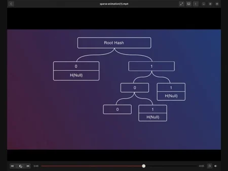

### The Sum Part: Preventing Inflation

The "sum" component adds a numeric value to each leaf. If we mint 100 beefbucks, the leaf holding our asset data carries the value 100. Each internal node in the tree carries the sum of all values in its subtree. This means the root hash of the tree encodes the total quantity of all assets it contains.

When we send 50 beefbucks to Bob, our tree updates: our leaf changes from 100 to 50, and the sums propagate all the way up to the root. If we tried to lie about our balance (claiming we still have 100 while also sending 50 to Bob), the Merkle proofs would be inconsistent. In other words, we cannot inflate the supply without invalidating our own proofs, effectively burning our assets in the process.

### Layers of Trees: A Merkle Forest

The complete data structure is not a single tree but rather a series of layers:

1. **Asset level**: the bottom layer, where individual asset data (name, metadata, balances) is stored in leaves.
2. **Group level**: above the asset level, this layer groups fungible assets together. All beefbucks minted across different rounds share the same group, making them interchangeable. This layer is what enables features like multi-tranche minting.
3. **Bitcoin Taproot tree**: the standard Bitcoin script tree, into which the entire Merkle forest is committed.

The layered structure also allows requiring [private key](https://planb.academy/resources/glossary/private-key) signatures at different levels, adding both security and flexibility in use cases. For example, a group key signature can authorize new minting rounds, while individual asset keys control transfers.

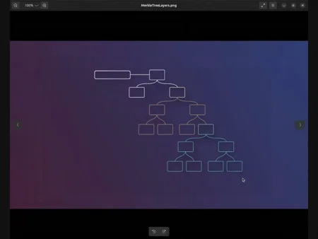

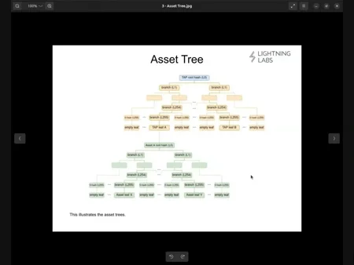

### From Merkle Forest to Bitcoin Transaction

How does all of this data actually end up on the Bitcoin blockchain? The process can be summarized in one word: **TAPTweak**.

TAPD sums the entire Merkle forest up to a single root hash. That root hash is then embedded into a Bitcoin address using the taptweak mechanism we discussed earlier:

$$Q = P + H(P \| c) \cdot G$$

The result is a standard-looking Bitcoin Taproot output. To anyone examining the blockchain, it appears as an ordinary transaction. Only parties who possess the asset proofs (the paths through the Merkle forest) can verify that assets are embedded within it.

You can visualize Taproot Assets as living inside a Bitcoin UTXO. When minting, TAPD communicates with LND (which communicates with Bitcoin Core) to create a transaction whose output contains the entire embedded Merkle forest. The inputs are regular bitcoin UTXOs funding the transaction, and the output is a Taproot address that secretly holds your entire asset tree.

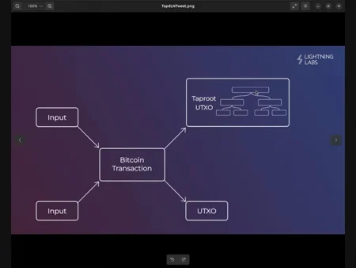

## Taproot Assets Demo
<chapterId>e6f3a8d1-9c2b-4e7f-b5a8-3d1c6f9e8b27</chapterId>

:::video id=aa81d3c5-27a6-46a2-9f7d-5097c2aa63ec:::

### The TAPD Stack

Now that we understand the protocol's theory, let's discover the software that implements it. The **Taproot Assets Protocol Daemon (TAPD)** is the reference implementation developed by Lightning Labs. It operates as a layer that sits between your application and LND, forming a three-tier architecture:

| Layer | Role |
|-------|------|
| **Bitcoin Core** | Base layer: blockchain data and transaction broadcasting |
| **LND** | Lightning layer: channel management and private key custody |
| **TAPD** | Asset layer: Taproot tweak computation, asset tracking, proof management |

This separation of concerns is deliberate. LND holds the private keys, while TAPD handles the Taproot Asset logic. Neither component oversteps its role, providing what we might call **segmented custody**.

TAPD ships as two binaries:
- **`tapd`**: the daemon itself, listening on gRPC (port 10029) and REST (port 8089)
- **`tapcli`**: the command-line interface for interacting with `tapd`

### Prerequisites and Installation

Before installing TAPD, you must have a working LND node connected to a Bitcoin backend. For installation from source, you will also need **Go version 1.18 or greater**. The installation process compiles the Go source and places both binaries in your system's Go path.

For initial experimentation, I propose to use a **regtest network via [Polar](https://lightningpolar.com/)**. Polar provides a Docker-based sandbox environment where you can create local Lightning topologies and test TAP operations without risking real funds. This is the safest way to learn.

When `tapd` starts for the first time, it creates a `.taro` directory (or `.tapd` in newer versions) in your home folder, containing its database and operational data. You can optionally create a configuration file (`tapd.conf`) in this directory, though all settings can also be passed as command-line arguments.

Starting the daemon requires specifying the network type, the LND address and port, and the paths to two LND credential files: the admin macaroon (for authentication) and the TLS certificate (for encrypted communication). Once running, `tapd` listens on its default ports and is ready to receive commands.

### Basic Asset Operations

Let's walk through the fundamental operations you will perform with `tapcli`.

**Minting** creates new assets. The command requires an asset type (typically `normal`), a name, and a supply. You can add the `--skip_batch` flag to process the mint immediately rather than batching multiple minting requests together. After minting, run `tapcli assets list` to verify that your new asset appears with its expected name, quantity, and metadata.

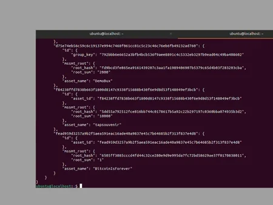

**Sending** assets requires coordination between sender and recipient. The recipient generates a TAP address by specifying the asset ID and the amount they wish to receive. An important detail: unlike standard Bitcoin addresses, **TAP addresses are unique to each specific asset and amount combination**. The sender then executes the transfer using `tapcli assets send --addr [ADDRESS]`. After on-chain confirmation, both parties can verify updated balances via `assets list`.

For deeper exploration of all available commands and their parameters, the comprehensive documentation at [docs.lightning.engineering](https://docs.lightning.engineering/) remains the definitive reference.

## Tap into the Universe
<chapterId>c9b7e4f3-5d8a-4c2e-9f6b-8a3d5e7c2b19</chapterId>

:::video id=939fd065-61ec-42e0-9f19-543d7bb4f3fd:::

### Version 0.2: Asset Groups and Multi-Asset Transactions

Taproot Assets **version 0.2** introduces several important advances. The most notable is **asset group** functionality, which enables more flexible minting strategies.

When you mint an asset with **emission enabled**, the asset becomes part of a group that can accommodate future minting rounds (or tranches). Each subsequent mint shares the same group ID, producing fungible units across multiple issuances. Conversely, when emission is **disabled** (the default), the asset's supply is permanently capped at the initial mint. This mechanism allows issuers to make credible, cryptographically enforced commitments about supply limitations.

Another powerful feature is the ability to include **multiple asset types within a single Bitcoin transaction**. Rather than requiring a separate on-chain transaction for each asset operation, the protocol embeds multiple asset transfers within the same transaction outputs. This significantly reduces the on-chain footprint while preserving all security guarantees.

### The Four API Services

TAPD exposes its functionality through four distinct API services, each with a clear responsibility:

| Service | Responsibility |
|---------|---------------|
| **AssetWalletService** | Wallet operations and asset holdings |
| **MintService** | Asset creation and batch management |
| **TaprootAssetService** | Core protocol operations: transfers, proof validation, address generation |
| **UniverseService** | Asset discovery, synchronization, and proof distribution |

These services are accessible via both gRPC (for high-throughput applications) and REST (for standard HTTP integration). The API documentation includes Python and JavaScript examples that demonstrate common workflows.

### The Dual PSBT Architecture

TAP makes sophisticated use of **Partially Signed Bitcoin Transactions ([PSBTs](https://planb.academy/resources/glossary/psbt))** to coordinate multi-party asset operations, but with an important twist: it introduces two distinct PSBT types.

**Virtual PSBTs (vPSBTs)** extend the standard PSBT format with custom fields for asset-level coordination between TAPD nodes. They carry asset-specific data such as Merkle tree updates, proof information, and commitment details, all wrapped in the familiar PSBT structure.

Once the asset-level coordination is complete, the parties create an **anchor PSBT**: a standard Bitcoin PSBT that produces the on-chain transaction containing the new asset commitments. In other words, the virtual PSBT handles *what happens to the assets*, while the anchor PSBT handles *what happens on the blockchain*.

This dual architecture is a significant advantage for developers, because existing Bitcoin transaction libraries can handle the anchor PSBT without modification, while the virtual PSBT layer adds the asset-specific coordination on top.

### Universe Roles and Federation

We briefly introduced universes in the first chapter. Let's now examine them more concretely. A universe can be understood as serving four simultaneous roles:

1. **Virtual mempool**: tracking pending asset operations
2. **Explorer**: browsing asset history and metadata
3. **Proof repository**: storing and serving cryptographic proofs
4. **Transaction library**: cataloguing completed asset operations

Running a universe requires no special setup. Any TAPD instance can serve as a universe by configuring it to listen on the appropriate RPC port and ensuring network accessibility.

The **federation** concept extends this model to enable coordination between multiple universe servers. Each client defines its own federation, a set of trusted universe servers from which it accepts asset data and proofs. Federation members periodically synchronize, exchanging information about newly created assets and completed transfers. This federated approach provides redundancy and data availability while letting users choose their preferred information sources.

The API provides practical endpoints for interacting with universes: querying proofs by asset identifier or group key, importing proofs into a local universe instance, and verifying asset ownership through the wallet API. These verification operations involve checking cryptographic signatures, validating Merkle tree structures, and confirming that referenced Bitcoin transactions exist on-chain.

# Initial Installation and Configuration
<partId>f2d8c5e9-6b3a-4e7c-8d9f-1a5c3b7e9f28</partId>

## Install from Source
<chapterId>a8e9f3b2-7c5d-4f1e-b6a9-2d8c5e3f7a31</chapterId>
:::video id=70e894f7-3759-48fc-9fcb-a3a1b33a3214:::

### Prerequisites

Before installing the **Taproot Assets Protocol Daemon** (TAPD), we need to ensure that three foundational components are already in place on our system:

1. **Bitcoin Core** (`bitcoind`) must be installed and fully synchronized with the blockchain. For initial development and testing, working on testnet is the recommended approach.
2. **LND** (Lightning Network Daemon) must be version 0.17 or greater to support TAPD v0.3. If you plan to run the latest TAPD releases, LND v0.20+ is required.
3. **Go** version 1.21 or later must be installed, as earlier versions will cause compilation errors.

These three services form the stack on which TAPD operates: Bitcoin Core provides the base layer, LND provides the Lightning layer, and TAPD manages the Taproot asset logic on top of both. In other words, TAPD never touches private keys directly; it delegates all signing to LND, which itself relies on Bitcoin Core for on-chain data.

### Building from Source

Let's now walk through the compilation process step by step.

1. Clone the official repository:

```bash
git clone https://github.com/lightninglabs/taproot-assets.git
```

2. Enter the directory and checkout the stable version you wish to install. Always use a tagged release rather than the development branch:

```bash
cd taproot-assets
git checkout v0.3.0
```

3. Compile and install the binaries:

```bash
make install
```

This command handles dependency resolution and compilation automatically. It produces two binaries installed in your Go binary directory (typically `$HOME/go/bin/`):
- `tapd`, the main daemon;
- `tapcli`, the command-line interface for interacting with it.

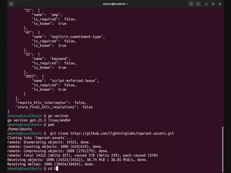

### Configuration

TAPD needs to know how to reach LND and on which network to operate. While you can pass every parameter as a CLI flag at startup, creating a dedicated configuration file is far more maintainable. TAPD looks for its config in the `.tapd` directory under your home folder.

1. Create the data directory:

```bash
mkdir -p ~/.tapd
```

2. Create and edit the configuration file `~/.tapd/tapd.conf`. A minimal example for testnet:

```ini
network=testnet
debuglevel=debug

lnd.host=localhost:10009
lnd.macaroonpath=~/.lnd/data/chain/bitcoin/testnet/admin.macaroon
lnd.tlspath=~/.lnd/tls.cert
```

The two security-critical paths here are the **TLS certificate** and the **macaroon file**. These provide the cryptographic credentials for authenticated, encrypted communication between TAPD and LND. If either path is incorrect, the daemon will refuse to start.

By default, TAPD listens on two ports:
- **gRPC**: `10029`
- **REST**: `8089`

### Systemd Integration for Production

For production deployments, we want TAPD to start automatically, restart on failure, and launch only after LND is ready. A systemd service file achieves all three.

Create `/etc/systemd/system/tapd.service`:

```ini
[Unit]
Description=Taproot Assets Daemon
After=lnd.service
Requires=lnd.service

[Service]
User=youruser
ExecStart=/home/youruser/go/bin/tapd
Restart=on-failure
RestartSec=10

[Install]
WantedBy=multi-user.target
```

Then enable and start the service:

```bash
sudo systemctl enable tapd
sudo systemctl start tapd
```

The `After=lnd.service` directive ensures TAPD waits for LND to initialize first, preventing race conditions at boot.

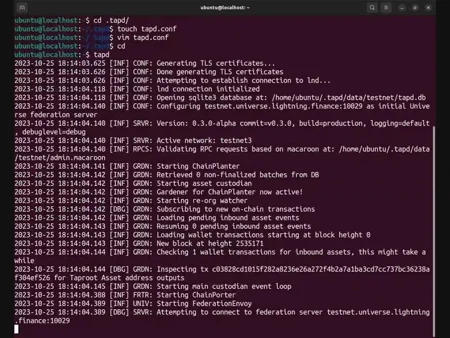

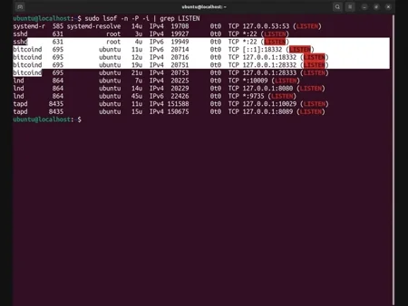

### Alternatives

Compiling from source offers full control, but two other installation paths exist. Pre-built binaries are available from the Lightning Labs releases page, eliminating the need for a Go toolchain entirely. For an even more integrated approach, **Lightning Terminal (LitD)** bundles TAPD alongside LND and several other services into a single package. We will explore LitD in detail in chapter 3.3.

## Prototype with Polar
<chapterId>d5c7f8e3-9a2b-4e6c-8f1d-3b9e5a7c4d32</chapterId>
:::video id=30cca1f1-d4c8-4d9b-88d0-d8e9e4f4986b:::

### Why Polar?

Before deploying TAPD on testnet or mainnet, it is wise to experiment in a fully local environment where mistakes cost nothing and block confirmations happen on demand. This is exactly what **Polar** provides.

[Polar](https://lightningpolar.com/) is a Docker-based desktop application for Mac, Windows, and Linux that lets you spin up complete Bitcoin and Lightning Network topologies with a few clicks. It uses the same software that runs on mainnet (Bitcoin Core, LND, TAPD), so everything you learn in Polar translates directly to production. The only prerequisite is having **Docker** installed and running on your machine.

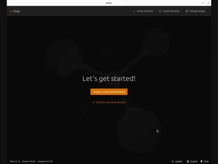

### Setting Up the Network

A functional TAPD development environment requires a minimum topology:

1. At least **1 Bitcoin Core** backend node for blockchain operations.
2. At least **2 LND nodes**, since TAPD requires LND as its Lightning implementation, and testing transfers requires two distinct endpoints.
3. **1 TAPD node per LND node**, paired through Polar's drag-and-drop interface.

Once the network is created, the first startup may take several minutes as Docker downloads the container images. After that, subsequent launches are nearly instant.

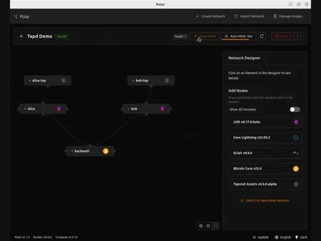

Two configuration steps are essential before you begin experimenting:

1. **Enable auto-mining.** TAPD operations (minting, sending, burning) all require on-chain confirmations. Auto-mining ensures blocks are produced automatically so you do not have to trigger them manually each time.
2. **Fund your nodes.** Asset minting creates on-chain transactions that consume bitcoin. Polar provides built-in funding mechanisms that generate testnet balances for your nodes automatically.

### Credentials and API Access

Each node in Polar exposes connection details for both REST and gRPC access, including network addresses, port numbers, and authentication credentials. The system automatically generates the **TLS certificates** and **macaroon files** required for secure API communication. You will find these credentials in each node's detail panel within the Polar interface.

### Testing Your First Mint

With the network running and nodes funded, we can verify the setup by performing a basic mint operation. As we saw in Part 2, minting in TAPD involves two distinct phases:

1. **Batch creation**: TAPD prepares all necessary data structures and cryptographic commitments, but does not yet write anything to the blockchain.
2. **Batch finalization**: the prepared asset data is embedded into a Bitcoin transaction and confirmed on-chain (handled automatically by auto-mining).

After finalization and block confirmation, query your node's asset list to verify the mint succeeded. An empty result before minting and a populated result afterward confirms that your entire stack, from Bitcoin Core through LND to TAPD, is functioning correctly.

Polar is an excellent sandbox for all the operations we will cover in Part 4 (minting, sending, burning) without risking real funds or waiting for real block times.

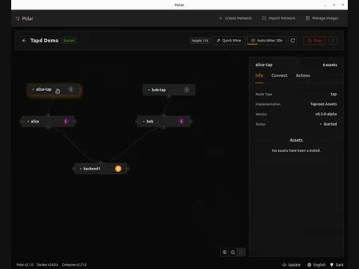

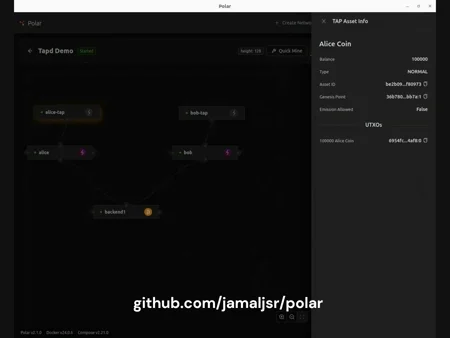

## Launch with Litd
<chapterId>b7f9a2c5-8e3d-4b7a-9c6f-5d2e8a3b1f43</chapterId>

:::video id=c488fe53-5110-4e43-8b9c-7773d9969078:::

### What LitD Bundles

**Lightning Terminal** (LitD) is Lightning Labs' integrated daemon that bundles five services into a single binary:

- **LND** for Lightning Network operations;
- **TAPD** for Taproot Assets;
- **Loop** for submarine swaps between on-chain and off-chain;
- **Pool** for Lightning channel liquidity marketplace;
- **Faraday** for channel analytics and recommendations.

This integrated approach eliminates the complexity of managing separate installations and configurations for each service. Instead of five config files, five systemd units, and five sets of credentials, you manage one. This is why LitD is often the preferred path for users who want a complete Lightning and Taproot Assets stack without assembling each component individually.

### Prerequisites and Installation

Building LitD from source requires three tools: **Go**, **Node.js**, and **Yarn**. Ensure all three are installed before proceeding.

1. Clone the Lightning Terminal repository:

```bash
git clone https://github.com/lightninglabs/lightning-terminal.git
```

2. Checkout the latest stable release:

```bash
cd lightning-terminal
git checkout v0.13.0
```

3. Compile everything:

```bash
make install
```

This single command compiles LitD along with all bundled services (LND, TAPD, Loop, Pool, Faraday). The resulting binaries are placed in your Go path.

### Configuration

LitD reads its configuration from `~/.lit/lit.conf`. Create this directory and file:

```bash
mkdir -p ~/.lit
```

A minimal `lit.conf` for testnet with a Bitcoin Core backend:

```ini
network=testnet
lnd-mode=integrated

bitcoind.rpchost=127.0.0.1
bitcoind.rpcuser=yourrpcuser
bitcoind.rpcpass=yourrpcpassword
bitcoind.zmqpubrawblock=tcp://127.0.0.1:28332
bitcoind.zmqpubrawtx=tcp://127.0.0.1:28333
```

The `lnd-mode=integrated` setting tells LitD to manage LND internally rather than connecting to an external instance.

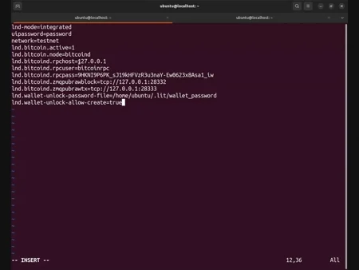

As a lighter-weight alternative, you can use **Neutrino** instead of Bitcoin Core. Neutrino relies on compact block filters and does not require a full node, but this comes with trade-offs in privacy and verification guarantees.

### Wallet Creation

On first startup, LitD requires you to create a wallet through LND's CLI:

```bash
lncli create
```

This command will generate a [seed phrase](https://planb.academy/resources/glossary/seed) that serves as the ultimate backup for your wallet. Record it securely. This phrase can restore the wallet and all associated funds.

For production environments, you can enable automatic wallet unlocking by storing the password in a secure file and referencing it in `lit.conf`:

```ini
lnd.wallet-unlock-password-file=/path/to/password.txt
```

### Verification

Once LitD is running, verify that all services are operational:

```bash
litcli status
```

This command displays the state of every bundled service. You should see LND, TAPD, Loop, Pool, and Faraday all reporting as active.

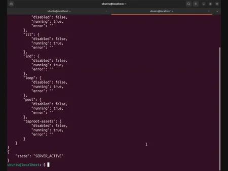

### Systemd for Production

As with standalone TAPD, a systemd service ensures LitD starts at boot and restarts on failure. The key difference is the dependency: LitD depends on `bitcoind`, not on a separate LND service (since LND is bundled inside).

```ini
[Unit]
Description=Lightning Terminal Daemon
After=bitcoind.service

[Service]
User=youruser
ExecStart=/home/youruser/go/bin/litd
Restart=on-failure
RestartSec=10

[Install]
WantedBy=multi-user.target
```

## Join a Universe Federation
<chapterId>e3d8b6f4-7c9a-4e2b-8f5c-9a1d3e6b7c54</chapterId>
:::video id=42e7cc5c-18cf-47b0-9d42-879f14733cd5:::

### What Is a Universe?

In the Taproot Assets ecosystem, a **universe** is a data store that holds asset proofs and metadata. It functions like a block explorer, but specialized for Taproot Assets: it stores the off-chain proof data that TAP clients need to discover, verify, and transfer assets. You can think of it as a Git repository, but for asset proofs rather than code.

Every TAPD node automatically includes its own local universe. When you mint an asset, the proof data is written to this local store. But the real power emerges when nodes connect their universes to share data with each other. This is what we call a **federation**: your node's collection of trusted universe connections for accessing and synchronizing asset data from multiple sources.

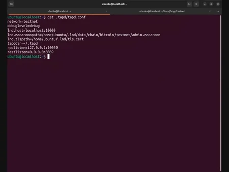

### Managing Federations via CLI

Let's discover together how to manage universe federations using the command line.

**List your current federation:**

```bash
tapcli universe federation list
```

A freshly started node typically shows at least one default universe that connects automatically at startup.

**Add a new universe:**

```bash
tapcli universe federation add --addr=<universe_network_address>
```

This is a user-controlled process. You choose which universes to connect to based on your specific needs.

**Synchronize with your federation:**

```bash
tapcli universe sync
```

This pulls the latest asset data from all connected universes into your local store.

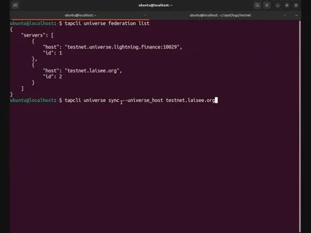

**Discover available assets:**

```bash
tapcli universe roots
```

This command reveals all assets your universe has discovered through its federation connections.

**Remove a universe:**

```bash
tapcli universe federation delete --addr=<universe_network_address>
```

### API-Based Federation Management

For applications that need to manage federations programmatically, TAPD exposes full universe functionality through its REST API.

**Add a universe via REST:**

```bash
curl -X POST https://localhost:8089/v1/taproot-assets/universe/federation \
  --cacert ~/.tapd/tls.cert \
  --header "Grpc-Metadata-macaroon: $(xxd -ps -u -c 1000 ~/.tapd/data/testnet/admin.macaroon)" \
  -d '{"servers": [{"host": "universe.example.com", "id": 0}]}'
```

**Query federation statistics:**

```bash
curl https://localhost:8089/v1/taproot-assets/universe/stats \
  --cacert ~/.tapd/tls.cert \
  --header "Grpc-Metadata-macaroon: $(xxd -ps -u -c 1000 ~/.tapd/data/testnet/admin.macaroon)"
```

The stats endpoint returns data about asset awareness, synchronization status, and federation health.

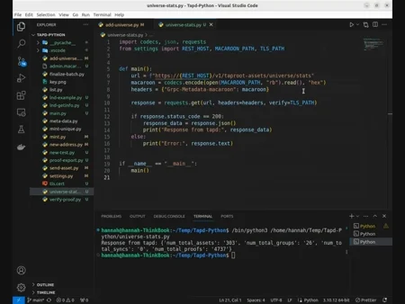

### Best Practices

I propose to close this chapter with a few operational guidelines for universe federation management:

- **Curate rather than collect.** Connect to universes that serve your specific needs. Connecting to every available universe creates unnecessary network overhead.
- **Synchronize on a regular schedule.** Periodic `universe sync` calls ensure your local data stays current without excessive polling.
- **Review your federation periodically.** Remove inactive or irrelevant connections.
- **Use CLI for administration, API for automation.** Manual operations are best done through `tapcli`, while production workflows should use the REST or gRPC APIs.

# Asset Operations
<partId>c4d0776e-870b-11f0-86c9-8fee09142fba</partId>

## Mint from the CLI
<chapterId>f5b9c3e7-8d2a-4f7e-9b6c-3a8d5e2c1f76</chapterId>

:::video id=3bc078b4-183d-4970-b63e-66862a452566:::

### Understanding the Minting Operation

Now that our environment is properly configured, we can begin working with the core operations of the [Taproot](https://planb.academy/resources/glossary/taproot) Assets Protocol. The first of these operations is **minting**, which is the act of creating brand-new assets on the Bitcoin [blockchain](https://planb.academy/resources/glossary/blockchain). Let's discover together how this process works from the command line.

Minting a Taproot asset means embedding asset data into a Bitcoin Taproot transaction. When we mint, we define the fundamental properties of our new asset: its name, its total supply, and whether additional units can ever be created in the future. The result is a unique digital asset whose existence is anchored to Bitcoin's [proof-of-work](https://planb.academy/resources/glossary/proof-of-work) security. In other words, minting is the genesis moment of an asset's life, the point where it begins to exist within the protocol.

Before we can mint, our TAPD node must be running and properly connected to an LND node with confirmed on-chain funds. The minting transaction will consume a Bitcoin [UTXO](https://planb.academy/resources/glossary/utxo) to anchor the new asset data into the blockchain.

### The Batch System

An important concept to understand before minting is the **batch system**. By default, `tapcli` does not immediately broadcast a minting transaction when you issue a mint command. Instead, it places your minting request into a **batch**, a queue of pending asset creations that will all be finalized together in a single on-chain transaction.

This design has a practical purpose. Since each minting transaction requires an on-chain Bitcoin transaction (and therefore a mining fee), batching allows you to create multiple distinct assets while paying only one transaction fee.

The minting workflow therefore follows two phases:

1. **Batch creation**: you add one or more asset definitions to the pending batch.
2. **Batch finalization**: you instruct TAPD to construct and broadcast the Bitcoin transaction that anchors all queued assets on-chain.

If you prefer to skip batching and mint an asset immediately, you can append the `--skip_batch` flag.

### Minting Your First Asset

To create a new asset, we use the `tapcli assets mint` command:

```bash
tapcli assets mint --type normal --name "MyToken" --supply 200 --skip_batch
```

Let's examine each parameter:

- `--type normal`: specifies a **fungible** asset (as opposed to a collectible).
- `--name "MyToken"`: the human-readable name for our asset.
- `--supply 200`: the number of units to create.
- `--skip_batch`: finalize and broadcast immediately.

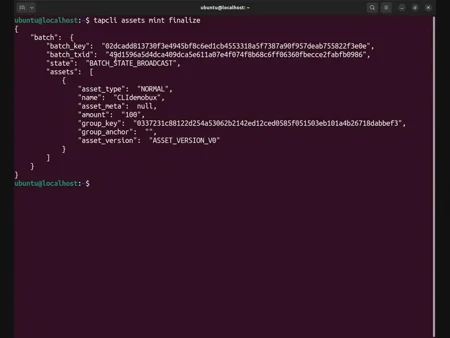

To batch multiple assets instead, omit `--skip_batch` and finalize later with:

```bash
tapcli assets mint finalize
```

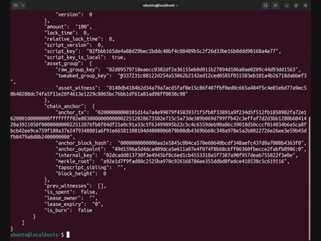

### Expandable Supply with Grouped Assets

By default, once an asset is minted, its supply is fixed forever. However, the protocol provides a mechanism for assets that need expandable supply (for example, a stablecoin).

This is achieved with the `--new_grouped_asset` flag (previously `--enable_emission`). When included during the initial mint, TAPD creates an **asset group** with a group key. Future minting operations can reference this group key to add new units:

```bash
tapcli assets mint --type normal --name "ExpandableToken" --supply 1000 --new_grouped_asset --skip_batch
```

Assets minted within the same group share a common group identifier, making them fungible with one another even though they were created in separate events.

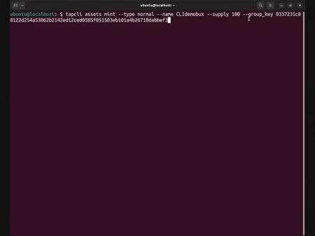

### Verification and the Genesis Outpoint

After on-chain confirmation, verify your newly created assets:

```bash
tapcli assets list
```

Each asset is identified by a unique **asset ID** derived from the [SHA-256](https://planb.academy/resources/glossary/sha256) hash of the genesis outpoint, the asset tag, and the asset metadata. The **genesis outpoint** is the Bitcoin transaction output that anchored the asset's creation, the unique fingerprint that allows any node to trace the asset back to its exact moment of birth.

## Mint from the API
<chapterId>a9d7e5f8-3c6b-4e9a-8f2d-6b1c3a9e5d87</chapterId>

:::video id=89819d63-3011-4ac6-a1f7-66babd2134b8:::

### Why Mint through the API?

As we saw in the previous section, the CLI provides a direct and intuitive way to mint assets. However, for production environments or applications that need to create assets programmatically, the REST API offers a more flexible approach. Let's discover together how to perform the same minting operation through TAPD's API.

The comprehensive API documentation is available at `lightning.engineering/api-docs/api/taproot-assets`, covering both gRPC and REST implementations with Python and JavaScript examples.

### Prerequisites and Authentication

Before making API calls, two security elements must be in place:

1. **The TLS certificate**: ensures encrypted communication between your application and the TAPD node.
2. **The admin macaroon**: provides authentication and authorization for every API request.

```python
import requests

macaroon = open("/path/to/admin.macaroon", "rb").read().hex()
cert_path = "/path/to/tls.cert"
headers = {"Grpc-Metadata-macaroon": macaroon}
base_url = "https://your-node-ip:8089"
```

### Two-Phase Minting via the API

**Phase 1: Add an asset to the batch.**

```python
mint_payload = {
    "asset": {
        "asset_type": "NORMAL",
        "name": "APIToken",
        "amount": 500
    }
}

response = requests.post(
    f"{base_url}/v1/taproot-assets/assets/mint",
    headers=headers,
    json=mint_payload,
    verify=cert_path
)
```

**Phase 2: Finalize the batch.**

```python
finalize_response = requests.post(
    f"{base_url}/v1/taproot-assets/assets/mint/finalize",
    headers=headers,
    json={},
    verify=cert_path
)
```

### Verification

After on-chain confirmation, verify with a GET request:

```python
assets = requests.get(
    f"{base_url}/v1/taproot-assets/assets",
    headers=headers,
    verify=cert_path
)
```

In other words, while the CLI is ideal for manual exploration and one-off operations, the API is where Taproot Assets become a building block for larger systems. The security model remains identical: every request requires proper TLS and macaroon authentication.

## Send from the CLI
<chapterId>d2c8f6b3-7e5a-4b9d-8c3f-9a6e2d5b1c98</chapterId>

:::video id=88cdc6ce-22f6-4ddd-90a3-da345a85eef1:::

### Understanding Asset Transfers

With our assets successfully minted, we can now explore the second fundamental operation: **sending** assets from one node to another. While minting creates new assets, sending transfers ownership of existing ones. Let's discover together how this works using the command line.

Transferring a Taproot asset is fundamentally different from a simple Bitcoin payment. When we send bitcoin, the blockchain itself records the change of ownership. With Taproot Assets, the on-chain transaction commits to an updated [Merkle root](https://planb.academy/resources/glossary/merkle-root) that reflects the new ownership structure, but the detailed asset data is managed off-chain through **proof files** exchanged between the sender and receiver.

### Universe Federation: A Prerequisite

Before any transfer can take place, both the sender and the receiver must be part of a common **universe federation**. The receiver's node needs to know that the asset exists, what its genesis data looks like, and how to validate the incoming proofs. Without proper federation, the transfer will fail.

### Step-by-Step Transfer Workflow

Let's walk through a concrete example. Alice holds 100 tokens and wants to send 10 of them to Bob.

**Step 1: Bob generates a receiving address.**

```bash
tapcli addrs new --asset_id <ASSET_ID> --amt 10
```

The command produces an encoded **TAP address**, a long string that encodes the asset ID, the requested amount, Bob's destination key, and cryptographic data needed for the sender to construct a valid transfer. Unlike standard Bitcoin addresses, **TAP addresses are unique to each specific asset and amount combination**.

**Step 2: Bob communicates the address to Alice.**

This happens outside the TAPD protocol, through any communication channel the parties choose.

**Step 3: Alice executes the send.**

```bash
tapcli assets send --addr <BOB_ENCODED_ADDRESS>
```

Behind the scenes, Alice's node constructs an on-chain Bitcoin transaction that commits to the updated Merkle tree, generates cryptographic **proofs**, and transmits them directly to Bob's node. The command returns an on-chain transaction ID verifiable through any Bitcoin block explorer.

**Step 4: Wait for on-chain confirmation.**

The transfer is not complete until the Bitcoin transaction is confirmed in a block.

**Step 5: Balance reconciliation.**

After confirmation, both nodes update their balances automatically. Alice shows 90 tokens, Bob shows 10.

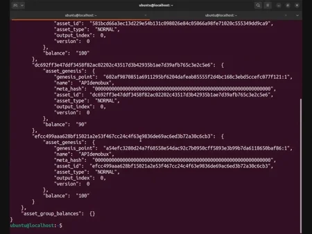

### Reviewing Transfer History

```bash
tapcli assets transfers
```

This provides a detailed record of every transfer, including transaction IDs, amounts, timestamps, and confirmation status.

### Key Considerations

- **Confirmation timing**: balance updates happen only after on-chain confirmation.
- **Proof transmission**: the proofs form the verifiable chain of custody back to the genesis output.
- **Universe synchronization**: if transfers fail, the most common cause is incomplete universe federation.

## Send from the API
<chapterId>b6f3d9a8-5c2e-4d7b-9f8a-1e3c6b8a7d19</chapterId>

:::video id=db1c8655-eb0b-49a1-83e8-dc0b16a35582:::

### Programmatic Asset Transfers

As we saw in the previous section, sending Taproot Assets via the CLI follows a clear pattern. The REST API replicates this exact workflow through HTTP endpoints. Let's discover together how to implement this.

### Three-Endpoint Workflow

**Endpoint 1: Verify available assets (GET).**

```python
assets = requests.get(
    f"{base_url}/v1/taproot-assets/assets",
    headers=headers,
    verify=cert_path
)
```

**Endpoint 2: Generate a receiving address (POST).**

```python
addr_payload = {
    "asset_id": "<ASSET_ID_HEX>",
    "amt": 10
}

addr_response = requests.post(
    f"{base_url}/v1/taproot-assets/addrs",
    headers=headers,
    json=addr_payload,
    verify=cert_path
)
tap_address = addr_response.json()["encoded"]
```

**Endpoint 3: Execute the transfer (POST).**

```python
send_payload = {
    "tap_addrs": [tap_address]
}

send_response = requests.post(
    f"{base_url}/v1/taproot-assets/send",
    headers=headers,
    json=send_payload,
    verify=cert_path
)
```

### Confirmation and Verification

After submitting a transfer, the transaction must be confirmed on-chain before balances update. In other words, the API does not provide a push notification when a transfer confirms. Your application is responsible for monitoring the state.

### Error Handling for Production

When building transfer functionality into production applications, handle these scenarios:

- **Insufficient balance**: the send endpoint rejects requests if the node does not hold enough of the specified asset.
- **Invalid address**: malformed or expired TAP addresses produce an error response.
- **Missing universe data**: if the receiver's node lacks asset metadata, address generation will fail.

## Burn from the CLI
<chapterId>e8a9b5c2-4f7d-4e3a-8b6c-7d2f9e1a3b21</chapterId>

:::video id=a9a437a4-1664-4786-a4a8-6e78082abe59:::

### Understanding Asset Burning

The third and final core operation in the Taproot Assets lifecycle is **burning**, the permanent destruction of assets. While minting brings assets into existence and sending transfers them between parties, burning removes them from circulation forever. Let's discover together how this operation works from the command line.

Why burn assets? A stablecoin issuer might burn tokens when users redeem them for fiat. A project might burn test tokens. An organization might reduce supply for governance reasons. In all cases, the key property is **irreversibility**: once burned and confirmed on-chain, assets cannot be recovered by any means.

### Checking Your Inventory

Before any destructive operation, verify your current holdings:

```bash
tapcli assets list
```

Carefully identify the exact asset you intend to burn and note its asset ID. A mistake here could result in burning the wrong asset.

### Executing the Burn

The burn command requires two parameters:

```bash
tapcli assets burn --asset_id <ASSET_ID> --amount 10
```

TAPD presents an **interactive confirmation prompt** that explicitly warns about the permanent nature of the operation. You must confirm before the burn proceeds.

For **automated environments**, the confirmation can be bypassed with a flag, but this should be treated with extreme caution.

### Verification

After on-chain confirmation:

```bash
tapcli assets list
```

The balance should reflect the burned amount (e.g., 90 minus 10 = 80). In other words, treat every burn command as if it were a transaction sending funds to an address with no known private key, because functionally, that is exactly what it is.

## Burn from the API
<chapterId>c7d5e8f9-3b6a-4e2c-9f7d-8a1b5c3e6d32</chapterId>

:::video id=03e4464a-7ce8-4fb1-889c-83f8a52ac315:::

### Programmatic Asset Destruction

The REST API implements an equivalent safety mechanism through a required confirmation parameter. Let's discover together how to burn assets programmatically.

### Pre-Burn Inventory Check

```python
assets = requests.get(
    f"{base_url}/v1/taproot-assets/assets",
    headers=headers,
    verify=cert_path
)
```

### Executing the Burn

```python
burn_payload = {
    "asset_id": "<ASSET_ID_HEX>",
    "amount": 5,
    "confirmation_str": "assets will be destroyed"
}

burn_response = requests.post(
    f"{base_url}/v1/taproot-assets/burn",
    headers=headers,
    json=burn_payload,
    verify=cert_path
)
```

The **confirmation string** is the API equivalent of the CLI's interactive prompt. Without it, the API rejects the burn request entirely. This forces the developer to explicitly acknowledge that assets will be permanently destroyed.

### Post-Burn Verification

After on-chain confirmation, query the assets endpoint again to confirm the reduced balance. For production systems, log every burn response in its entirety as an audit record.

The burn operation completes the three fundamental lifecycle operations: creation through minting, movement through sending, and destruction through burning.

# Diving deeper into Taproot Assets
<partId>863d9c88-870c-11f0-a2de-430d32152c27</partId>

## Update Tapd
<chapterId>a5b8f9c3-6d7e-4a2b-8c9f-2e3d7b1a5f54</chapterId>
:::video id=df88fe13-4a2f-4251-82db-89ce07131947:::

Keeping your **TAPD** node up to date is not optional. Each new release can patch security vulnerabilities, introduce protocol features required by the broader network, fix bugs that affect asset proofs or channel stability, and improve performance. The update procedure depends on how you installed TAPD in the first place. Whichever path you follow, one rule is absolute: **never delete your data directories** (`.tapd`, `.lnd`, `.bitcoin`) during an update. These folders contain your wallet, channel state, asset proofs, and blockchain data. The binaries are replaceable; the data is not.

### Updating a Polar Installation

If you set up your development environment with **Polar**, updating is handled mostly through the application's graphical interface. Open Polar and check whether new node versions are available in the settings panel.

For major version jumps, Polar itself may need to be replaced:

1. Note down your current network topology so you can recreate it if needed.
2. Download the latest Polar release from [lightningpolar.com](https://lightningpolar.com).
3. Be aware that significant updates sometimes require you to **recreate your networks** from scratch.
4. Verify that TAPD nodes show the expected version in the node details panel.

### Updating a Binary Installation

1. Stop the running TAPD service:

```bash
sudo systemctl stop tapd
```

2. Remove the old binaries:

```bash
sudo rm /usr/local/bin/tapd /usr/local/bin/tapcli
```

3. Download the new release, verify the SHA256 checksum against the release notes:

```bash
sha256sum taproot-assets-linux-amd64-v*.tar.gz
```

4. Extract and copy the new binaries:

```bash
tar -xzf taproot-assets-linux-amd64-v*.tar.gz
sudo cp taproot-assets-linux-amd64-v*/tapd /usr/local/bin/
sudo cp taproot-assets-linux-amd64-v*/tapcli /usr/local/bin/
```

5. Restart and verify:

```bash
sudo systemctl start tapd
tapcli version
```

### Updating a Source Installation

1. Gracefully stop the daemon:

```bash
tapcli stop
sudo systemctl stop tapd
```

2. Pull the latest changes and checkout the desired version:

```bash
cd ~/taproot-assets
git fetch --all
git checkout v0.5.0
```

3. Compile and install:

```bash
make install
```

4. Restart and verify:

```bash
sudo systemctl start tapd
tapcli version
```

### Best Practices

- **Use stable releases for production.** Release candidates are for testing only.
- **Back up before updating.** Copy `.tapd`, `.lnd`, and configuration files.
- **Read the release notes.** Some updates include breaking changes or migration steps.
- **Verify after every update.** A successful `tapcli version`, a healthy systemd status, and a quick `tapcli assets list` confirm everything is working.

## Building a Node from Scratch
<chapterId>992d8650-87f2-11f0-aace-9be7f0fb0b83</chapterId>

:::video id=9b884ff3-fca1-4488-bdd9-bb1d27ed5af4:::

In the previous chapters, we installed TAPD as a standalone daemon alongside Bitcoin Core and LND. That approach works well, but it requires managing three separate services. In this chapter, we take a different path: building a complete node from scratch using **Lightning Terminal Daemon (LitD)**, a single binary that bundles LND, TAPD, Loop, Pool, and Faraday.

The methodology presented here draws inspiration from Alex Bosworth's **Run LND** repository. The Lightning Labs team maintains a similar project called **Run LITD**, a collection of helper scripts, configuration templates, and systemd service files designed for rapid node deployment.

An important caveat: the Run LITD scripts are built for **developers who need to spin up testing environments fast**. Never blindly execute automated scripts on a production server without reviewing every line.

### Stage 1: Server Security

The first script handles fundamental server hardening from a fresh Ubuntu installation:

1. **Creates a non-root user** with `sudo` privileges.
2. **Configures SSH key-based authentication** (paste one or more public keys, one per line).
3. **Disables root login** over SSH.
4. **Disables password authentication.**

Ensure your SSH keys are properly configured **before** running this script. If the script disables password authentication and your keys are not set up correctly, you will lock yourself out.

### Stage 2: Bitcoin Core Installation

The second stage installs and configures **Bitcoin Core** as the blockchain backend. Two installation approaches are available:

- **Compilation from source** for maximum transparency.
- **Binary download with signature verification** for faster deployment.

The script then generates a secure **RPC credential string** for LND communication, prompts for **network selection** (mainnet, testnet, or signet), writes `bitcoin.conf`, and creates a systemd service. For development, **signet** is an excellent choice: it mimics mainnet behavior but uses worthless test coins.

### Stage 3: LitD Installation

The final stage installs the required dependencies (**Go**, **Node.js**, **Yarn**), then compiles LitD from source via `make install` (typically 5-10 minutes). After compilation:

1. A `lit.conf` is generated using the RPC credentials from Stage 2.
2. A systemd service file is created, configured to start after Bitcoin Core.

After dependency installation, **log out and reconnect** to ensure environment variables are loaded correctly.

### Initial Startup and Wallet Creation

LitD requires a wallet before it can operate:

1. Start LitD manually in one terminal:

```bash
litd
```

2. In a separate terminal, create the wallet:

```bash
lncli create
```

3. Set a wallet password and record the **24-word seed phrase** securely.

4. Configure automatic unlocking for production:

```bash
echo "YourWalletPassword" > ~/.lit/wallet-password
chmod 600 ~/.lit/wallet-password
```

Add to `lit.conf`:

```ini
lnd.wallet-unlock-password-file=/home/youruser/.lit/wallet-password
```

5. Stop the manual process and enable the systemd service:

```bash
sudo systemctl enable litd
sudo systemctl start litd
```

### Verification

Confirm everything is working:

```bash
litcli status          # All services running
lncli getinfo          # LND synced to chain
tapcli assets list     # TAPD responding (empty list expected)
tapcli universe federation list  # Universe connectivity
sudo systemctl status litd       # Systemd health
```

If all five checks pass, your node is fully operational.

## Running a Taproot Assets Price Oracle
<chapterId>b3f7d9a5-8c2e-4b6d-9a7f-5e1c3d8b6a76</chapterId>
:::video id=1694f29f-e009-4f0d-99d7-5cedb540c81a:::

Up to this point, every Taproot Assets operation has stayed within a single asset type. But what happens when a payment needs to cross the boundary between two different assets, for example, when someone holding a stablecoin wants to pay a Lightning invoice denominated in bitcoin?

This is where **edge nodes** and **price oracles** enter the picture. Together, they enable cross-asset payments on Lightning without requiring both parties to hold the same asset.

### The Edge Node Concept

An **edge node** is a Lightning node that maintains channels in at least two different asset types. Consider this scenario:

- **Alice** has a Taproot Assets channel funded with a US dollar stablecoin.
- **Bob** has a standard Bitcoin Lightning channel.
- An **edge node** sits between them, holding both a stablecoin channel (connected to Alice) and a Bitcoin channel (connected to Bob).

When Bob generates a Lightning invoice and sends it to Alice, she does not need to own any bitcoin. Alice sends stablecoins to the edge node, which converts them and forwards the corresponding bitcoin to Bob. In other words, the edge node acts as a bridge: it absorbs one asset on one side and releases another on the other side.

### The Request for Quote (RFQ) System

The critical question is: **how many stablecoin units must Alice send to cover Bob's bitcoin invoice?**

The **RFQ (Request for Quote)** system answers this:

1. Alice's node receives Bob's invoice and recognizes it needs bitcoin but only holds stablecoins.
2. Alice's node sends an RFQ request to the edge node.
3. The edge node consults its **price oracle** for the current exchange rate.
4. The edge node returns a quote with the exact stablecoin amount required.
5. Alice's node evaluates the quote and accepts or rejects it.

This negotiation happens in milliseconds, transparently, before the payment is routed.

### How the Price Oracle Works

The **price oracle** calculates fair exchange rates. Key aspects:

- **External price feeds**: queries cryptocurrency exchanges or aggregators for current Bitcoin prices. For production, use multiple independent sources.
- **Asset registry**: explicitly lists supported assets by asset ID or group key. Group keys are especially useful for stablecoins with multiple minting rounds.
- **Decimal display**: defines how the smallest unit relates to the human-readable value. For a USD stablecoin, a decimal display of **6** means 1 dollar = 1,000,000 base units, enabling sub-cent precision.
- **Scaling factors**: additional internal precision during calculations to prevent floating-point rounding errors.

### Building and Deploying the Oracle

```bash
cd price-oracle
make build
sudo cp price-oracle /usr/local/bin/
```

Create a systemd service for automatic management, then enable and start it.

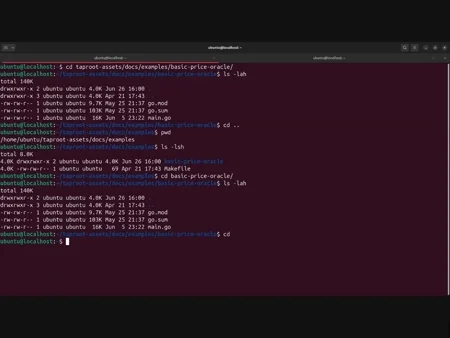

### Connecting the Oracle to Your Node

A single configuration line in `lit.conf`:

```ini
taproot-assets.experimental.rfq.priceoracleaddress=localhost:8095
```

For a remote oracle, replace `localhost` with the server's IP address.

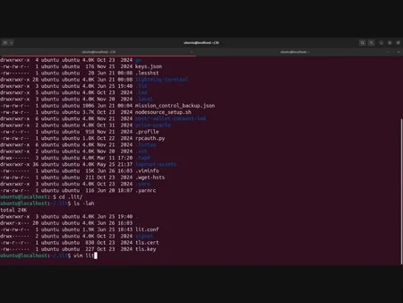

### Practical Demonstration

With two **signet** nodes (one edge node with oracle, one client), the full RFQ workflow:

**Creating an invoice with a group key:**

```bash
litcli invoices addholdinvoice --amt_msat 50000000 --asset_group_key <GROUP_KEY> --rfq_peer_pubkey <EDGE_NODE_PUBKEY>
```

**Paying the invoice:**

```bash
litcli payinvoice <INVOICE>
```

Behind the scenes, the RFQ negotiation happens automatically: quote request, oracle calculation, acceptance, stablecoin transfer, bitcoin forwarding.

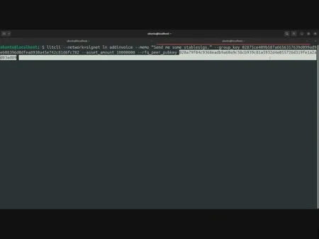

### Verifying Oracle Accuracy

- **Oracle logs**: show the exact Bitcoin price used, timestamps, and calculations.
- **Spreadsheet verification**: enter the reported price, asset amounts, and decimal display to independently calculate the expected conversion and compare with actual channel balance changes.

### Production Considerations

- **Multiple price feeds**: query at least two or three independent sources.
- **Asset support policies**: only support assets whose market dynamics you understand.
- **Comprehensive logging**: every quote, price fetch, and calculation should be logged.
- **Monitoring and alerting**: set up alerts for oracle downtime or price feed failures.

The combination of edge nodes, the RFQ system, and price oracles creates a powerful infrastructure for multi-asset Lightning payments: Alice pays with stablecoins, Bob receives bitcoin, and the edge node facilitates the conversion at a market-determined rate, all within the speed and privacy guarantees of the Lightning Network.

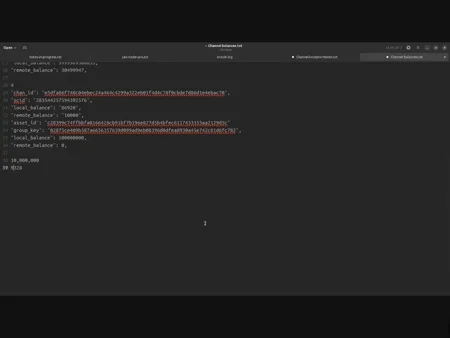

# Final Section
<partId>9469342a-870c-11f0-88da-ff4cff486fe3</partId>

## Evaluate this course
<chapterId>20570fc0-87e9-11f0-bdd0-cff9e0b16538</chapterId>
<isCourseReview>true</isCourseReview>

## Final Exam
<chapterId>a7f2c891-87e9-11f0-b3d4-2f8e9c4a6b15</chapterId>
<isCourseExam>true</isCourseExam>

## Conclusion
<chapterId>43393838-870d-11f0-b490-cb9bbebd87d5</chapterId>
<isCourseConclusion>true</isCourseConclusion>
