# Rännak krüptograafiasse

Kas olete Bitcoini poolt lummatud? Mõtlete, kuidas Bitcoin rahakott töötab? Valmistuge põnevaks rännakuks krüptograafia maailma! Loïc, meie ekspert, juhatab teid läbi Bitcoin rahakoti loomise keerukuste, lahates hirmutavaid tehnilisi termineid nagu räsistamine, võtmete tuletamine ja elliptilised kõverad.

See koolitus varustab teid mitte ainult teadmistega, et mõista Bitcoin rahakoti struktuuri, vaid valmistab teid ette ka sügavamaks sukeldumiseks krüptograafia põnevasse maailma. Niisiis, kas olete valmis sellele teekonnale asuma? Liituge meiega ja muutke oma uudishimu asjatundlikkuseks!

+++

# Sissejuhatus
<partId>32960669-d13a-592f-a053-37f70b997cbf</partId>

## Krüptograafia tutvustus
<chapterId>fb4e8857-ea35-5a8a-ae8a-5300234e0104</chapterId>

### Kas see koolitus on teile? JAH!

Meil on hea meel tervitada teid uuel koolituskursusel pealkirjaga "Krüpto 301: Krüptograafia ja HD Rahakoti tutvustus", mida juhib ala ekspert Loïc Morel. See kursus viib teid krüptograafia, matemaatika fundamentaalse distsipliini põnevasse maailma, mis tagab teie andmete krüpteerimise ja turvalisuse.

Meie igapäevaelus, eriti Bitcoini valdkonnas, mängib krüptograafia olulist rolli. Krüptograafiaga seotud kontseptsioonid nagu privaatvõtmed, avalikud võtmed, aadressid, tuletamisteed, seeme ja entroopia on Bitcoini rahakoti kasutamise ja loomise tuum. Kursuse jooksul selgitab Loïc üksikasjalikult, kuidas privaatvõtmeid genereeritakse ja kuidas need on seotud aadressidega. Loïc pühendab ka tunni elliptiliste kõverate matemaatilistele detailidele. Lisaks mõistate, miks HMAC SHA512 kasutamine on teie rahakoti turvamisel oluline ja mis vahe on seemnel ja mnemoonilisel fraasil.
Selle koolituse lõppeesmärk on võimaldada teil mõista tehnilisi protsesse, mis on seotud HD rahakoti loomisega ja kasutatavate krüptograafiliste meetoditega. Aastate jooksul on Bitcoin rahakotid muutunud kasutajasõbralikumaks, turvalisemaks ja standardiseeritumaks tänu konkreetsetele BIP-dele. Loïc aitab teil mõista neid BIP-e, et haarata Bitcoini arendajate ja krüptograafide tehtud valikuid. Nagu kõik meie ülikooli pakutavad koolitused, on ka see täiesti tasuta ja avatud lähtekoodiga. See tähendab, et võite seda vabalt võtta ja kasutada, nagu soovite. Ootame huviga teie tagasisidet selle põneva kursuse lõpus.

### Põrand on teie, professor!

Tere kõigile, mina olen Loïc Morel, teie teejuht läbi Bitcoin rahakottides kasutatava krüptograafia tehnilise uurimise.

Meie teekond algab sukeldumisega krüptograafiliste räsi funktsioonide sügavustesse. Koos lahkame SHA256 oluliste sisu ja uurime mitmesuguseid tuletamisele pühendatud algoritme.

Jätkame seiklust digitaalallkirjade müstilises maailmas. Avastate, kuidas elliptiliste kõverate maagia kehtib nende allkirjade puhul, ja heidame valgust avaliku võtme arvutamisele privaatvõtmest. Ja muidugi süveneme digitaalallkirja protsessi.
Järgnevalt läheme ajas tagasi, et näha Bitcoini rahakottide evolutsiooni, ja sukeldume entroopia ning juhuslike numbrite kontseptsioonidesse. Vaatleme kuulsat mnemoonilist fraasi, puudutades samuti paroolilauset. Teil on isegi võimalus kogeda midagi ainulaadset, luues seemne 128 täringuveeretusest!
Nende kindlate alustega oleme valmis kõige olulisemaks osaks: Bitcoini rahakoti loomiseks. Alates seemne ja peamise võtme sünnist, laiendatud võtmete uurimisest ja lastevõtmepaaride tuletamisest, võetakse iga samm luubi alla. Arutleme ka rahakoti struktuuri ja tuletamisteede üle.

Lõpetuseks vaatleme Bitcoini aadresse. Selgitame, kuidas neid luuakse ja kui olulist rolli nad mängivad Bitcoini rahakottide toimimises.

Liitu minuga sellel põneval teekonnal ja valmistu uurima krüptograafia maailma nagu kunagi varem. Jäta oma eelarvamused ukse taha ja ava oma meel uuele viisile mõista Bitcoini ja selle fundamentaalset struktuuri.

# Hash-funktsioonid
<partId>3713fee1-2ec2-512e-9e97-b6da9e4d2f17</partId>

## Sissejuhatus krüptograafilistesse hash-funktsioonidesse, mis on seotud Bitcoiniga
<chapterId>dba011f5-1805-5a48-ac2b-4bd637c93703</chapterId>

Tere tulemast tänasesse sessiooni, mis on pühendatud süvitsi sukeldumisele krüptograafia maailma hash-funktsioonide osas, mis on Bitcoini protokolli turvalisuse nurgakivi. Kujutage ette hash-funktsiooni kui ülikiiret krüptograafilist dešifreerimisrobotit, mis muudab mis tahes suurusega teabe unikaalseks ja fikseeritud suurusega digitaalseks sõrmejäljeks, mida nimetatakse "hashiks", "digestiks" või "kontrollsummaks".
Kokkuvõttes võtab hash-funktsioon sisendsõnumi suvalisest suurusest ja muudab selle fikseeritud suurusega väljundjäljendiks.

Krüptograafiliste hash-funktsioonide profiili kirjeldamine nõuab kahe olulise omaduse mõistmist: nende pöördumatust ja võltsimiskindlust.

Pöördumatus ehk eelkujule vastupanuvõime tähendab, et väljundi arvutamine sisendi põhjal on lihtne, kuid sisendi arvutamine väljundi põhjal on võimatu.
See on ühesuunaline funktsioon.


Võltsimiskindlus tuleneb asjaolust, et isegi väikseim sisendi muutus toob kaasa oluliselt erineva väljundi.
Need funktsioonid võimaldavad kontrollida allalaaditud tarkvara terviklikkust.

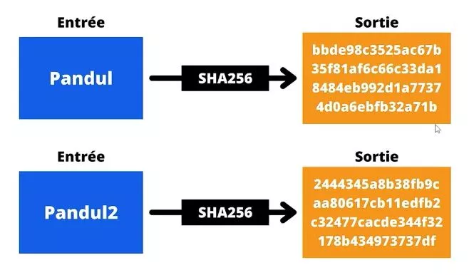

Teine oluline omadus, mida nad omavad, on vastupanuvõime kokkupõrgetele ja teisele eelkujule. Kokkupõrge tekib, kui kaks erinevat sisendit annavad sama väljundi.
Kindlasti on hashimise universumis kokkupõrked vältimatud, kuid suurepärane krüptograafiline hash-funktsioon minimeerib neid oluliselt. Risk peab olema nii väike, et seda saab pidada ebaoluliseks. Justkui oleks iga hash üks maja tohutus linnas; hoolimata tohutust majade arvust, tagab hea hash-funktsioon, et igal majal on unikaalne aadress.

Teise eelkujule vastupanuvõime sõltub kokkupõrgetele vastupanuvõimest; kui on vastupanu kokkupõrgetele, siis on vastupanu ka teisele eelkujule.
Antud sisendinformatsiooni puhul, mis on meile peale surutud, peame leidma teise sisendi, mis erineb esimesest ja toodab funktsiooni väljundhashis kokkupõrke. Teise eelkujule vastupanuvõime on sarnane kokkupõrgetele vastupanuvõimega, välja arvatud see, et sisend on peale surutud.
Lähme nüüd vananenud räsifunktsioonide tormilistele vetetele. SHA0, SHA1 ja MD5 peetakse nüüd krüptograafilise räsimise ookeanis roostetanud kestadeks. Neid ei soovitata sageli, kuna nad on kaotanud oma vastupanu kokkupõrgetele. Tuviurgu põhimõte selgitab, miks hoolimata meie parimatest pingutustest on kokkupõrgete vältimine võimatu väljundi suuruse piirangu tõttu. Selleks, et räsifunktsiooni võiks pidada turvaliseks, peab see vastu pidama kokkupõrgetele, teise eelkujudele ja eelkujudele.
Bitcoin protokolli võtmelement, SHA-256 räsifunktsioon, on laeva kapten. Teisi funktsioone, nagu SHA-512, kasutatakse tuletamiseks HMAC ja PBKDF abil. Lisaks kasutatakse RIPMD160 sõrmejälje vähendamiseks 160 bitini. Kui me viitame HASH256 ja HASH160-le, siis viitame SHA-256 ja RIPMD topelträsimise kasutamisele.

HASH256 puhul on see sõnumi topelträsimine SHA256 funktsiooniga.
$$
SHA256(SHA256(sõnum))
$$
HASH160 puhul on see sõnumi topelträsimine esmalt SHA256 ja seejärel RIPMD160 abil.
$$
RIPMD160(SHA256(sõnum))
$$
HASH160 kasutamine on eriti kasulik, kuna see võimaldab SHA-256 turvalisust säilitades vähendada sõrmejälje suurust.

Kokkuvõttes on krüptograafilise räsifunktsiooni lõppeesmärk teisendada suvalise suurusega teave fikseeritud suurusega sõrmejäljeks. Selleks, et seda tunnustataks turvalisena, peab tal olema mitu tugevust: pöördumatuse, võltsimiskindluse, kokkupõrgete vastupanu ja teise eelkujude vastupanu.

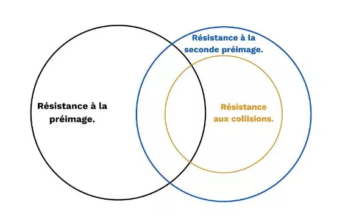

Selle uurimise lõpus oleme dešifreerinud krüptograafilised räsifunktsioonid, rõhutanud nende kasutust Bitcoin protokollis ja lahanud nende spetsiifilisi eesmärke. Oleme õppinud, et räsifunktsioone peetakse turvaliseks, kui nad on vastupidavad eelkujudele, teisele eelkujudele, kokkupõrgetele ja võltsimisele. Oleme samuti kajastanud Bitcoin protokollis kasutatavate erinevate räsifunktsioonide valikut. Järgmises sessioonis sukeldume SHA256 räsifunktsiooni tuuma ja avastame põnevad matemaatikad, mis annavad sellele unikaalsed omadused.

## SHA256 sisemine töö
<chapterId>905eb320-f15b-5fb6-8d2d-5bb447337deb</chapterId>

Tere tulemast meie põneva teekonna jätkumisele läbi krüptograafiliste räsimüsteeriumide. Täna paljastame SHA256 saladused, keerulise, kuid geniaalse protsessi, millest me varem rääkisime.

Meenutuseks, SHA256 räsifunktsiooni eesmärk on võtta sisendsõnum mis tahes suurusest ja genereerida väljundina 256-bitine räsi.

### Eeltöötlus

Lähme selles labürindis sammu edasi, alustades SHA256 eeltöötlusest.

#### Täitebitid

Selle esimese sammu eesmärk on saada sõnum, mis on võrdsustatud 512 biti kordseks. Selle saavutamiseks lisame sõnumile täitebitid.

Olgu M algse sõnumi suurus.
Olgu 1 bitt eraldaja jaoks reserveeritud.
Olgu P täitebittide arv ja 64 bitti jäetakse teise eeltöötlusfaasi jaoks kõrvale.
Kogusumma peaks olema 512 biti kordne, mida esindab n.

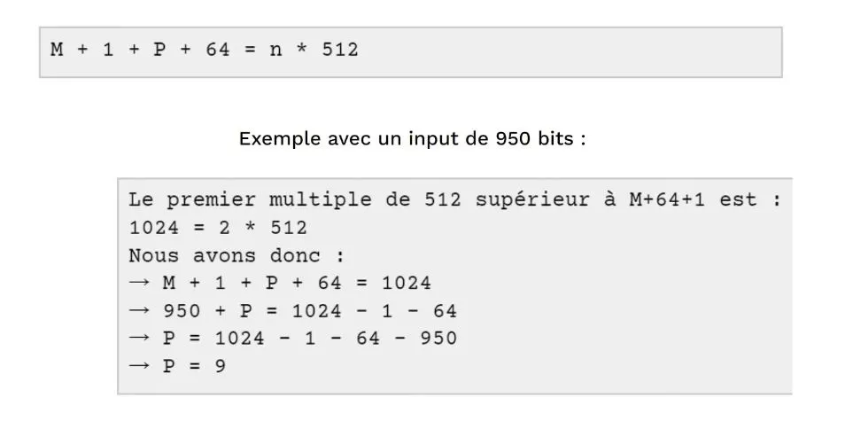

Näide 950-bitise sisendsõnumiga:

```
1. samm: Määrake suurus; lõplik soovitud bittide arv.
Esimese 512-st suurema kordaja leidmine > (M + 64 + 1) (kus M = 950) on 1024. 1024 = 2 * 512
Seega n = 2.

2. samm: Määrake P, vajalike täitmise bittide arv, et jõuda soovitud lõpliku bittide arvuni.
-> M + 1 + P + 64 = n * 512
-> M + 1 + P + 64 = 2 * 512
-> 950 + 1 + P + 64 = 1024
-> P = 1024 - 1 - 64 - 950
-> P = 9

Seega on vaja lisada 9 täitmise bitti, et sõnum oleks võrdne 512 kordsega.

Ja nüüd?
Kohe algse sõnumi järel tuleb lisada eraldaja 1, millele järgneb meie näites üheksa 0-d.

```
sõnum + 1 000 000 000
```

#### Suuruse Täitmine

Liigume nüüd eeltöötluse teise faasi, mis hõlmab algse sõnumi suuruse binaaresituse lisamist bittides.

Vaadakem näidet sisendiga 950 bitti:

```
Arvu 950 binaaresitus on: 11 1011 0110

Kasutame eelmisest sammust jäänud 64 reserveeritud bitti. Lisame nulle, et ümardada meie 64 bitti võrdsustatud sisendiga. Seejärel ühendame algse sõnumi, täitmise bitid ja suuruse täitmise, et saada meie võrdsustatud sisend.
```

Siin on tulemus:

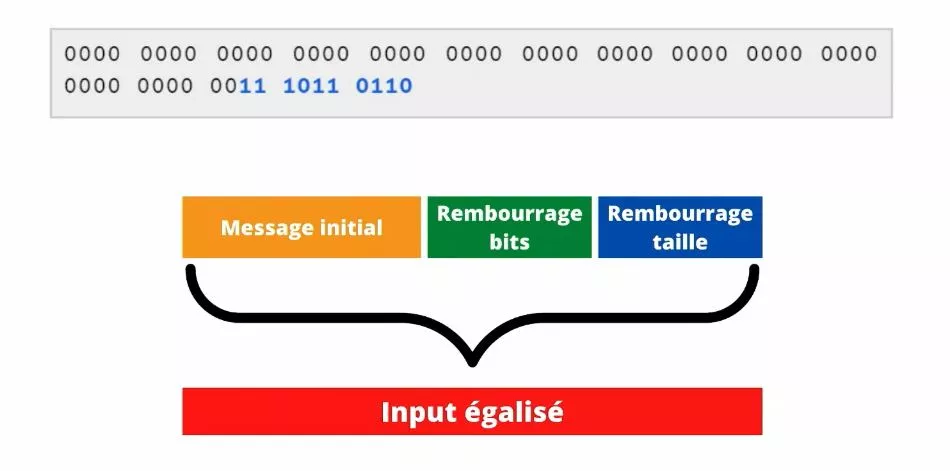

### Töötlemine

#### Eeltingimuste Mõistmine

##### Konstandid ja Initsialiseerimisvektorid

Nüüd valmistume SHA-256 funktsiooni töötlemise algseteks sammudeks. Nagu igas heas retseptis, vajame mõningaid põhikomponente, mida nimetame konstantideks ja initsialiseerimisvektoriteks.

Initsialiseerimisvektorid, A-st H-ni, on esimese 8 algarvu ruutjuurte kümnendkohtade esimesed 32 bitti. Need toimivad alusväärtustena algsetes töötlemisetappides. Nende väärtused on heksadetsimaalformaadis.

Konstandid K, 0-st 63-ni, esindavad esimese 64 algarvu kuupjuurte kümnendkohtade esimesi 32 bitti. Neid kasutatakse iga kompressioonifunktsiooni vooru ajal. Nende väärtused on samuti heksadetsimaalformaadis.


##### Kasutatud Operatsioonid

Kompressioonifunktsioonis kasutame spetsiifilisi operaatoreid nagu XOR, AND ja NOT. Töötleme bitte ükshaaval vastavalt nende asukohale, kasutades XOR operaatorit ja tõeväärtustabelit. AND operaatorit kasutatakse 1 tagastamiseks ainult siis, kui mõlemad operandid on võrdsed 1-ga, ja NOT operaatorit kasutatakse operandi vastandväärtuse tagastamiseks. Kasutame ka SHR operatsiooni, et nihutada bitte paremale valitud arvu võrra.

Tõeväärtustabel:

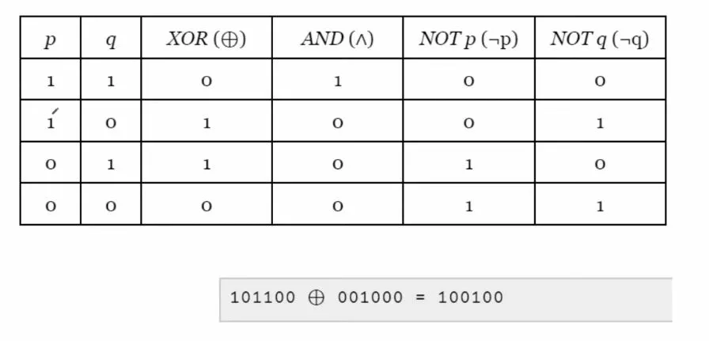

Bittide nihutamise operatsioonid:

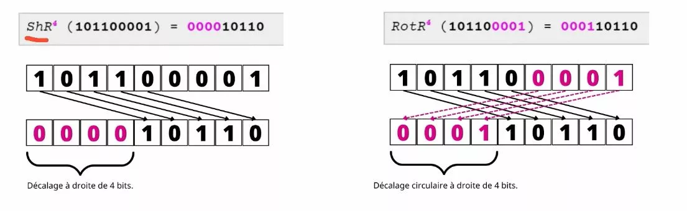

#### Kompressioonifunktsioon

Enne kompressioonifunktsiooni rakendamist jagame sisendi 512-bitisteks plokkideks. Iga plokk töödeldakse sõltumatult teistest.

Iga 512-bitine plokk jagatakse edasi 32-bitisteks tükkideks, mida nimetatakse W-ks. Sel viisil esindab W(0) 512-bitise ploki esimesi 32 bitti. W(1) esindab järgmisi 32 bitti ja nii edasi, kuni jõuame ploki 512 bitini.
Kui kõik konstandid K ja tükid W on määratletud, saame teha järgmised arvutused iga tüki W kohta igas voorus.
Teostame 64 arvutusvooru kokkusurumisfunktsioonis. Viimases voorus, funktsiooni "väljundi" tasandil, saame vahepealse oleku, mis lisatakse kokkusurumisfunktsiooni algolekule.

Seejärel kordame kõiki neid kokkusurumisfunktsiooni samme järgmise 512-bitise bloki puhul, kuni viimase blokini.

Kõik kokkusurumisfunktsiooni liitmised on modulo 2^32 liitmised, et alati hoida 32-bitist summat.


##### Üks Kokkusurumisfunktsiooni Voor

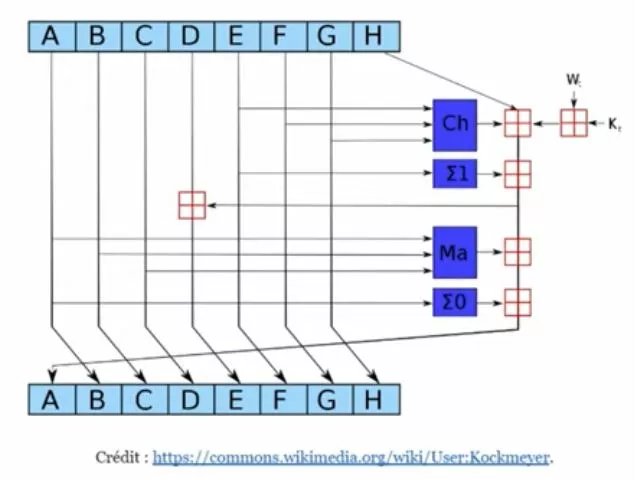

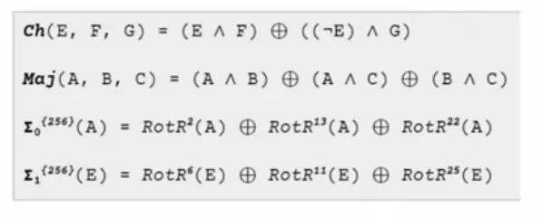

Kokkusurumisfunktsiooni teostatakse 64 korda. Meil on meie tükid W ja meie eelnevalt määratletud konstandid K sisendina.
Punased ruudud/ristid vastavad modulo 2^32-bitisele liitmisele.

Sisendid A, B, C, D, E, F, G, H seostatakse 32-bitise väärtusega, et teha kokku 32 * 8 = 256 bitti.
Meil on ka uus jada A, B, C, D, E, F, G, H väljundina. See väljund kasutatakse seejärel sisendina järgmiseks vooruks ja nii edasi kuni 64. vooru lõpuni.

Sisendjada väärtused kokkusurumisfunktsiooni esimeses voorus vastavad varem mainitud eelnevalt määratletud initsialiseerimisvektoritele.
Meenutuseks, initsialiseerimisvektorid esindavad esimese 8 algarvu ruutjuurte kümnendkohtade esimesi 32 bitte.

Siin on ühe vooru näide:

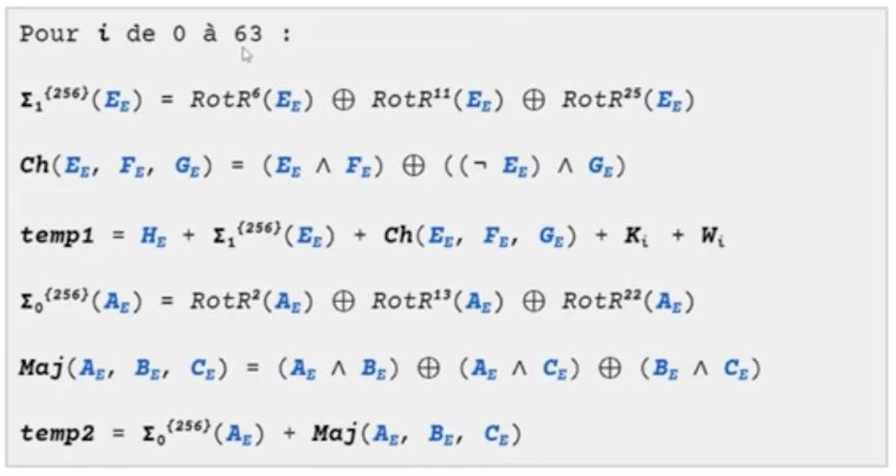

##### Vahepealne Olek

Meenutuseks, sõnum jagatakse 512-bitisteks blokkideks, mis seejärel jagatakse 32-bitisteks tükkideks. Iga 512-bitise bloki puhul rakendame 64 kokkusurumisfunktsiooni vooru.
Vahepealne olek vastab bloki 64 vooru lõpule. Selle 64. vooru väljundjada väärtusi kasutatakse järgmise bloki esimese vooru sisendjada algväärtustena.


#### Hash-funktsiooni Ülevaade

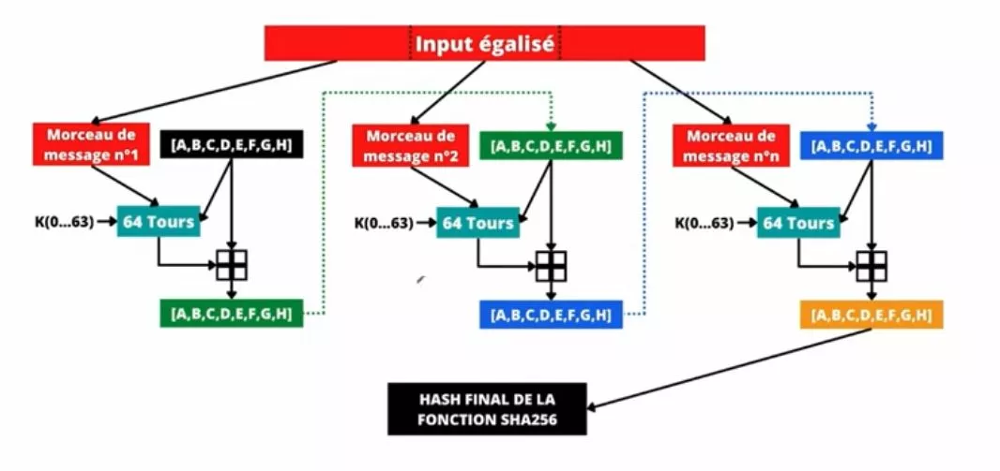

Me võime märgata, et esimese 512-bitise sõnumitüki väljund vastab meie initsialiseerimisvektoritele sisendina teise 512-bitise sõnumitüki jaoks, ja nii edasi.

Viimase vooru, viimase tüki väljund vastab SHA256 funktsiooni lõpptulemusele.

Kokkuvõttes soovime rõhutada CH, MAJ, σ0 ja σ1 kastides tehtavate arvutuste olulist rolli. Need toimingud, teiste hulgas, on valvurid, mis tagavad SHA256 hash-funktsiooni vastupidavuse rünnakutele, muutes selle paljude digitaalsüsteemide, eriti Bitcoin protokolli turvamisel eelistatud valikuks. On ilmne, et kuigi keeruline, peitub SHA256 ilu selle võimes leida sisend hashist, samal ajal kui hashi kontrollimine antud sisendi jaoks on mehaaniliselt lihtne toiming.

## Kasutatud algoritmid tuletamiseks
<chapterId>cc668121-7789-5e99-bf5e-1ba085f4f5f2</chapterId>
HMAC ja PBKDF2 tuletusalgoritmid on Bitcoin protokolli turvamehhanismi võtmetähtsusega komponendid. Need takistavad mitmesuguseid potentsiaalseid rünnakuid ja tagavad Bitcoin rahakottide terviklikkuse. HMAC ja PBKDF2 on krüptograafilised tööriistad, mida kasutatakse Bitcoini erinevates ülesannetes. HMACi kasutatakse peamiselt pikkuse laiendamise rünnakute vastu võitlemiseks, kui tuletatakse Hierarhiliselt Deterministlikke (HD) rahakotte, samal ajal kui PBKDF2 kasutatakse mnemoonilise fraasi teisendamiseks seemneks.

#### HMAC-SHA512

HMAC-SHA512 paaril on kaks sisendit: sõnum m (Sisend 1) ja kasutaja poolt suvaliselt valitud võti K (Sisend 2). Sellel on ka fikseeritud suurusega väljund: 512 bitti.

Paneme tähele:
- m: kasutaja poolt valitud suvalise suurusega sõnum (sisend 1)
- K: kasutaja poolt valitud suvaline võti (sisend 2)
- K': võrdsustatud võti K. See on kohandatud plokkide suurusele B.
- ||: konkatenatsiooni operatsioon.
- opad: konstant, mida defineerib bait 0x5c, korratud B korda.
- ipad: konstant, mida defineerib bait 0x36, korratud B korda.
- B: kasutatava räsifunktsiooni plokkide suurus.

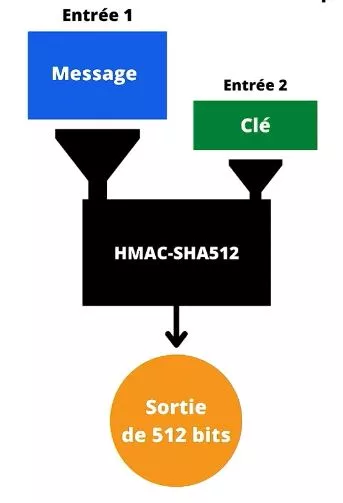

HMAC-SHA512, mis võtab sisendiks sõnumi ja võtme, genereerib fikseeritud suurusega väljundi. Et tagada ühtlus, kohandatakse võtit vastavalt räsifunktsioonis kasutatavate plokkide suurusele. HD rahakoti tuletamise kontekstis kasutatakse HMAC-SHA-512. See töötab 1024-bitiste (128-baidiste) plokkidega ja kohandab võtit vastavalt. See kasutab konstante OPAD (0x5c) ja IPAD (0x36), mis on vajadusel korratud, et suurendada turvalisust.

HMAC-SHA-512 protsess hõlmab SHA-512 tulemuse konkatenatsiooni, mis on rakendatud võtmele XOR OPAD ja võtmele XOR IPAD koos sõnumiga. 1024-bitiste (128-baidiste) plokkidega kasutamisel täidetakse sisendvõti vajadusel nullidega, seejärel XORdatakse IPADi ja OPADiga. Muudetud võti konkatenatakse seejärel sõnumiga.


Soolakoodi lisamine stringi suurendab tuletatud võtmete turvalisust. Ilma selleta võiks rünnak kompromiteerida kogu rahakoti ja varastada kõik bitcoini.

PBKDF2 kasutatakse mnemoonilise fraasi teisendamiseks seemneks. See algoritm teostab 2048 vooru, kasutades HMAC SHA512. Nende tuletusalgoritmide kaudu saavad erinevad sisendid toota unikaalse ja fikseeritud väljundi, mis leevendab SHA-2 perekonna funktsioonide võimalike pikkuse laiendamise rünnakute probleemi.
Pikkuse laiendamise rünnak kasutab ära teatud krüptograafiliste räsifunktsioonide spetsiifilist omadust. Sellises rünnakus saab ründaja, kes juba omab teadmata sõnumi räsi, seda kasutada pikema sõnumi räsi arvutamiseks, mis on algse sõnumi laiendus. See on sageli võimalik ilma algse sõnumi sisu teadmata, mis võib viia oluliste turvaaugudeni, kui seda tüüpi räsifunktsiooni kasutatakse ülesannetes nagu terviklikkuse kontrollimine.


Kokkuvõttes mängivad HMAC ja PBKDF2 algoritmid olulist rolli HD rahakoti tuletamise turvalisuses Bitcoin protokollis. HMAC-SHA-512 kasutatakse pikkuse laiendamise rünnakute vastu kaitsmiseks, samal ajal kui PBKDF2 võimaldab mnemoonilise fraasi teisendamist seemneks. Stringi kood lisab võtmete tuletamisel täiendava entroopia allika, tagades süsteemi robustsuse.

# Digitaalsed Allkirjad
<partId>76b58a00-0c18-54b9-870d-6b7e34029db8</partId>
## Digitaalsed Allkirjad ja Elliptilised Kõverad
<chapterId>c9dd9672-6da1-57f8-9871-8b28994d4c1a</chapterId>

Kus hoitakse neid kuulsaid bitcoine? Mitte Bitcoin'i rahakotis, nagu võiks arvata. Tegelikkuses salvestab Bitcoin'i rahakott privaatvõtmeid, mis on vajalikud bitcoinide omandiõiguse tõestamiseks. Bitcoinid ise on registreeritud plokiahelas, detsentraliseeritud andmebaasis, mis arhiveerib kõik tehingud.

Bitcoin süsteemis on arvestusühikuks bitcoin (märkige väike "b"). See on jagatav kuni kaheksa kümnendkohani, kusjuures väikseim ühik on satoshi. UTXO-d ehk "Kulutamata Tehingu Väljundid" esindavad avalikule võtmele kuuluvaid kulutamata tehingu väljundeid, mis on matemaatiliselt seotud privaatvõtmega. Nende bitcoinide kulutamiseks peab isik suutma rahuldada tehingu kulutamise tingimust. Tüüpiline kulutamise tingimus hõlmab ülejäänud võrgule tõestamist, et kasutaja on UTXO-ga seotud avaliku võtme legitiimne omanik. Selleks peab kasutaja demonstreerima privaatvõtme olemasolu, mis vastab iga UTXO-ga seotud avalikule võtmele, ilma privaatvõtit avalikustamata.

Siin tuleb mängu digitaalne allkiri. See toimib matemaatilise tõendina privaatvõtme olemasolu kohta, mis on seotud kindla avaliku võtmega. See andmekaitse tehnika põhineb peamiselt krüptograafia huvitaval valdkonnal, mida nimetatakse elliptiliste kõverate krüptograafiaks (ECC).

Allkirja saab matemaatiliselt kontrollida teiste Bitcoin võrgu osalejate poolt.


Tehingute turvalisuse tagamiseks toetub Bitcoin kahele digitaalse allkirja protokollile: ECDSA (Elliptilise Kõvera Digitaalne Allkirja Algoritm) ja Schnorr. ECDSA on olnud allkirja protokoll, mis on integreeritud Bitcoini alates selle käivitamisest 2009. aastal, samas kui Schnorri allkirjad lisati hiljuti novembris 2021. Kuigi mõlemad protokollid põhinevad elliptiliste kõverate krüptograafial ja kasutavad sarnaseid matemaatilisi mehhanisme, erinevad nad peamiselt allkirja struktuuri poolest.

Selles kursuses tutvustame ECDSA algoritmi.

### Mis on elliptiline kõver?

Elliptiliste kõverate krüptograafia on algoritmide kogum, mis kasutab krüptograafilises kontekstis oma mitmesuguste geomeetriliste ja matemaatiliste omaduste jaoks elliptilist kõverat, mille turvalisus põhineb diskreetse logaritmi arvutamise raskusel.

Elliptilised kõverad on kasulikud mitmesugustes krüptograafilistes rakendustes Bitcoin protokollis, ulatudes võtmevahetustest kuni asümmeetrilise krüpteerimise ja digitaalsete allkirjadeni.

Elliptilistel kõveratel on huvitavad omadused:

- Sümmeetria: Iga mittevertikaalne joon, mis lõikub kahe punktiga elliptilisel kõveral, lõikub kõveral kolmanda punktiga.
- Iga mittevertikaalne joon, mis on puutuja kõverale punktis, lõikub alati kõveral unikaalse teise punktiga.

Bitcoin protokoll kasutab oma krüptograafilistes operatsioonides spetsiifilist elliptilist kõverat nimega Secp256k1.

Enne nende allkirjamehhanismide sügavamale uurimisele sukeldumist on oluline mõista, mis on elliptiline kõver. Elliptiline kõver on määratletud võrrandiga y² = x³ + ax + b. Igal selle kõvera punktil on eristav sümmeetria, mis on võtmetähtsusega selle kasulikkuses krüptograafias.

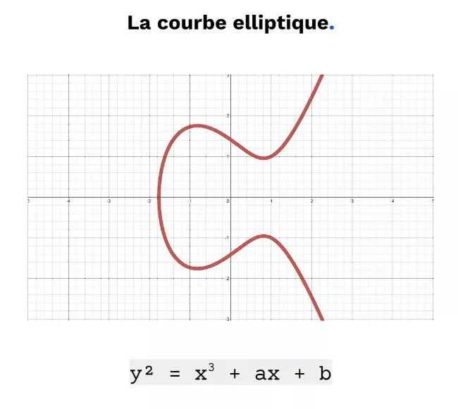

Lõppkokkuvõttes tunnustatakse mitmesuguseid elliptilisi kõveraid turvalisena krüptograafiliseks kasutamiseks. Kõige tuntum võib olla secp256r1 kõver. Siiski, Bitcoin'i jaoks valis Satoshi Nakamoto erineva kõvera: secp256k1.
See kõver on määratletud parameetritega a=0 ja b=7 ning selle võrrand on y² = x³ + 7 modulo n, kus n tähistab algarvu, mis määrab kõvera järku.
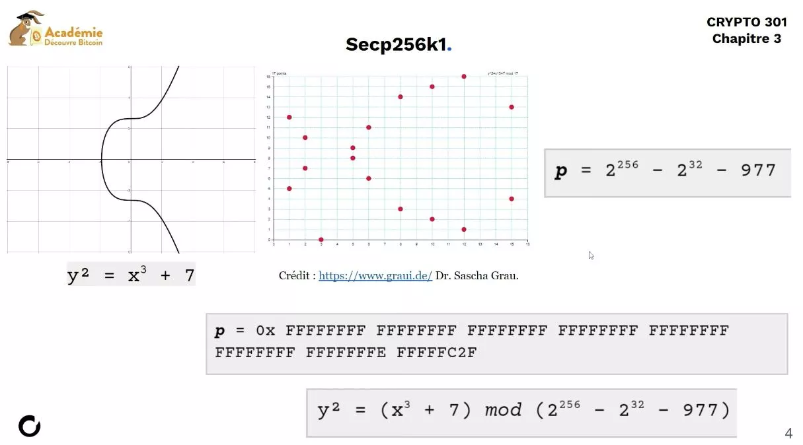

Esimene pilt esindab secp256k1 kõverat reaalarvude väljal ja selle võrrandit.
Teine pilt on secp256k1 kõvera esitus ZP väljal, positiivsete naturaalarvude väljal, modulo p, kus p on algarv. See näeb välja nagu punktipilv. Me kasutame positiivsete naturaalarvude välja, et vältida ligikaudseid väärtusi.
p on algarv ja see on kasutatava kõvera järk.
Lõpuks, Bitcoin'i protokollis kasutatav võrrand on:$$
y^2 = (x^3 + 7) mod(p) $$
Bitcoin'i elliptilise kõvera võrrand vastab viimasele võrrandile eelmisel pildil.

Järgmises kursuse osas kasutame kõveraid, mis on reaalarvude väljal, lihtsalt mõistmise hõlbustamiseks.

## Avaliku võtme arvutamine privaatvõtmest
<chapterId>fcb2bd58-5dda-5ecf-bb8f-ad1a0561ab4a</chapterId>

Alustuseks sukeldugem Elliptilise Kõvera Digitaalse Allkirja Algoritmi (ECDSA) maailma. Bitcoin kasutab seda digitaalallkirja algoritmi, et seostada privaat- ja avalikke võtmeid. Selles süsteemis on privaatvõti juhuslik või pseudojuhuslik 256-bitine number. Privaatvõtme võimalike variantide teoreetiline arv on 2^256, kuid tegelikkuses on see veidi vähem. Täpsemalt, mõned 256-bitised privaatvõtmed ei sobi Bitcoinile.

Bitcoiniga ühildumiseks peab privaatvõti olema vahemikus 1 kuni n-1, kus n tähistab elliptilise kõvera järku. See tähendab, et Bitcoin'i privaatvõtme võimalike variantide koguarv on peaaegu võrdne 1.158 x 10^77. Perspektiivi andmiseks, see on umbes sama palju kui aatomite arv vaadeldavas universumis.


Unikaalne privaatvõti, tähistatud kui k, kasutatakse seejärel avaliku võtme määramiseks.

Avalik võti, tähistatud kui K, on punkt elliptilisel kõveral, mis on tuletatud privaatvõtmest kasutades pöördumatuid algoritme nagu ECDSA. Kui me teame privaatvõtit, on avaliku võtme taastamine väga lihtne, kuid kui meil on ainult avalik võti, on privaatvõtme taastamine võimatu. See pöördumatus on Bitcoin'i rahakoti turvalisuse nurgakivi.

Avalik võti on 512 bitti pikk, kuna see vastab kõvera punktile, mille x-koordinaat on 256 bitti ja y-koordinaat on 256 bitti. Siiski, seda saab kokku suruda 264-bitiseks numbriliseks.

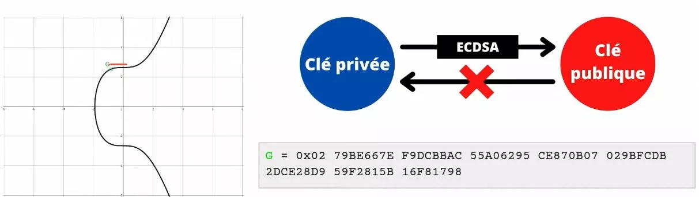

Generaatorpunkt (G) on punkt kõveral, millest kõik avalikud võtmed on Bitcoin'i protokollis genereeritud. Sellel on spetsiifilised x ja y koordinaadid, tavaliselt esitatud kuueteistkümnendsüsteemis. Secp256k1 jaoks on G koordinaadid, kuueteistkümnendsüsteemis:

- `Gx = 79BE667E F9DCBBAC 55A06295 CE870B07 029BFCDB 2DCE28D9 59F2815B 16F81798`
- `Gy = 483ADA77 26A3C465 5DA4FBFC 0E1108A8 FD17B448 A6855419 9C47D08F FB10D4B8` See punkt on kasulik kõikide avalike võtmete tuletamiseks. Avaliku võtme K arvutamiseks korrutage lihtsalt punkt G privaatvõtmega k, nii et: K = k.G

Nüüd uurime, kuidas elliptilistel kõveratel punkte liita ja korrutada.

#### Punktide liitmine ja kahekordistamine elliptilistel kõveratel

##### Kahe punkti liitmine M + L

Üks elliptiliste kõverate märkimisväärseid omadusi on see, et mittevertikaalne joon, mis lõikub kõveraga kahes punktis, lõikub sellega ka kolmandas punktis, mida meie näites nimetatakse punktiks O. Seda omadust kasutatakse punkti U määramiseks, mis on punkti O vastand.

M + L = U

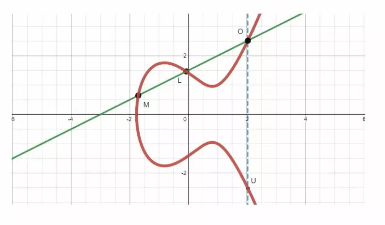

##### Punkti liitmine iseendaga = Punkti kahekordistamine

Punkti G liitmine iseendaga tehakse, joonistades kõverale selles punktis puutuja. See puutuja, vastavalt elliptiliste kõverate omadustele, lõikub kõveraga teises unikaalses punktis -J. Selle punkti, J, vastand on punkti G iseendale lisamise tulemus.
G + G = J

Tegelikult on punkt G lähtepunkt kõikide Bitcoin süsteemi kasutajate avalike võtmete arvutamiseks.

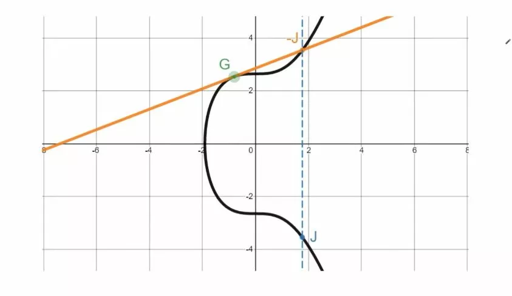

#### Skalaarne korrutamine elliptilistel kõveratel

Punkti korrutamine skalaariga n on võrdne selle punkti iseendale n korda lisamisega.

Sarnaselt punkti kahekordistamisega tehakse punkti G skalaarne korrutamine punktiga n, joonistades punktile G puutuja. See puutuja, vastavalt elliptiliste kõverate omadustele, lõikub kõveraga teises unikaalses punktis -2G. Selle punkti, 2G, vastand on punkti G iseendale lisamise tulemus.

Kui n = 4, siis korratakse operatsiooni kuni jõutakse 4G-ni.


Siin on näide arvutusest 3G jaoks:


Need toimingud elliptilise kõvera punktidega on avalike võtmete arvutamise aluseks. Avaliku võtme tuletamine teades privaatvõtit on väga lihtne.
Avalik võti on punkt elliptilisel kõveral, see on meie liitmise ja punkti G k korda kahekordistamise tulemus. Kus k = privaatvõti.

Selles näites:

- Privaatvõti k = 4
- Avalik võti K = kG = 4G


Privaatvõtit k teades on avaliku võtme K arvutamine lihtne. Siiski on võimatu taastada privaatvõtit avaliku võtme põhjal. Kas see on punktide liitmise või kahekordistamise tulemus?

Järgmises tunnis uurime, kuidas digitaalset allkirja luuakse, kasutades ECDSA algoritmi privaatvõtmega bitcoinide kulutamiseks.

## Allkirjastamine privaatvõtmega
<chapterId>bb07826f-826e-5905-b307-3d82001fb778</chapterId>

Digitaalse allkirja protsess on võtmemetoodika tõestamaks, et olete privaatvõtme omanik, ilma seda avalikustamata. See saavutatakse kasutades ECDSA algoritmi, mis hõlmab unikaalse nonce määramist, spetsiifilise numbri V arvutamist ja digitaalse allkirja loomist, mis koosneb kahest osast, S1 ja S2.
On ülioluline alati kasutada unikaalset nonce'i, et vältida turvarünnete ohtu. Kurikuulus näide sellest, mis võib juhtuda, kui seda reeglit ei järgita, on PlayStation 3 häkkimine, mis oli kompromiteeritud nonce'i taaskasutuse tõttu.


Sammud:

- Määrake nonce v, mis on unikaalne juhuslik number.
  Nonce = Number Only Used Once (Number, Mida Kasutatakse Ainult Üks Kord).
  Selle määrab allkirjastamist teostav isik.
- Arvutage, lisades ja kahekordistades punkte elliptilisel kõveral punktist G, V asukoht elliptilisel kõveral.
  Nii, et V = v.G
  x ja y on V koordinaadid tasandil.
- Arvutage S1.
  S1 = x mod n, kus n = kõvera järjekord ja x on V koordinaat tasandil.
  Märkus: Võimalike avalike võtmete arv on suurem kui punktide arv elliptilisel kõveral positiivsete täisarvude lõplikus väljas, mida kasutatakse Bitcoinis.
  Kõvera järjekord vastab ainult võimalustele, mida avalik võti võib kõveral võtta.
- Arvutage S2.
  H(Tx) = Tehingu hash
  k = privaatvõti
- Arvutage allkiri: S1 + S2 konkatenatsioon.
- Arvutage P, allkirja kontrollimise arvutus.
  K = avalik võti

Näiteks, et saada avalik võti 3G, tõmmake punktile G puutuja, arvutage -G vastand, et saada 2G, ja seejärel lisage G ja 2G. Tehingu sooritamiseks peate tõestama, et teate numbrit 3, avades bitcoine, mis on seotud avaliku võtmega 3G.

Digitaalse allkirja loomiseks ja tõestamiseks, et teate privaatvõtit, mis on seotud avaliku võtmega 3G, arvutate esmalt nonce'i, seejärel punkti V, mis on seotud selle nonce'iga (antud näites on see 4G). Seejärel arvutate punkti T, lisades avaliku võtme 3G ja punkti V, mis annab 7G.

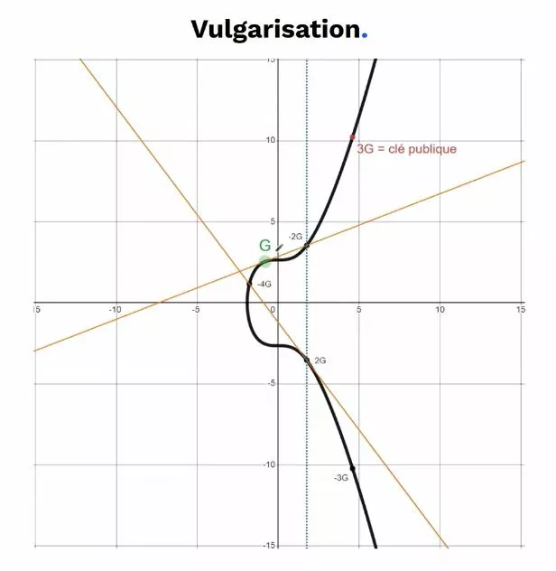

Lihtsustame digitaalse allkirja protsessi.
Eelnevas pildis on privaatvõti k = 3.
Me saame hõlpsalt arvutada selle privaatvõtmega seotud avaliku võtme: K = 3G.
Seejärel genereerime pseudojuhuslikult nonce'i: v = 4.
Selle nonce'i põhjal on võimalik arvutada V nii, et: V = v.G = 4G.

Sellest punktist V arvutame punkti T nii, et:
T = t.G = 7G (t = 7).

Nüüd on aeg jätkata digitaalse allkirja kontrollimisega.

Digitaalse allkirja kontrollimine on ECDSA algoritmi kasutamisel kriitiline samm, mis võimaldab kinnitada allkirjastatud sõnumi autentsust ilma saatja privaatvõtmeta. Siin on, kuidas see detailides toimib:

Meie näites on kaks olulist väärtust: t ja V.
t on numbriline väärtus (selles näites 7) ja V on punkt elliptilisel kõveral (esindatud siin 4G-na). Need väärtused genereeritakse digitaalse allkirja loomisel ja saadetakse seejärel sõnumiga kaasa, et võimaldada kontrollimist.

Kui kontrollija saab sõnumi, saab ta ka need kaks väärtust, t ja V.

Siin on sammud, mida kontrollija järgib allkirja valideerimiseks:

1. Esiteks arvutavad nad sõnumi hashi, mida me nimetame H-ks.
2. Seejärel arvutavad nad u1 ja u2. Selleks kasutavad nad järgmisi valemeid:
- u1 = H /\* (S2)^-1 mod n   - u2 = T /\* (S2)^-1 mod n
     Kus S2 on digitaalse allkirja teine osa, n on elliptilise kõvera järjekord ja (S2)^-1 on S2 mod n pöördväärtus.
3. Seejärel arvutab kontrollija elliptilisel kõveral punkti P', kasutades valem: P' = u1 _ G + u2 _ K
   - G on kõvera generaatorpunkt
   - K on saatja avalik võti
4. Kontrollija arvutab seejärel I', mis on lihtsalt punkti P' x-koordinaat modulo n.
5. Lõpuks kinnitab kontrollija, et I' on võrdne t-ga. Kui see nii on, peetakse allkirja kehtivaks. Kui mitte, on allkiri kehtetu.
See protseduur tagab, et allkirja oleks saanud toota ainult saatja, kes omab vastavat privaatvõtit.

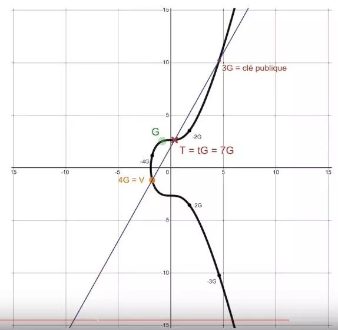

Lihtsamalt öeldes:
Allkirja tootev isik annab kontrollijale numbri t (meie näites t = 7) ja punkti V.

Avalikku võtit või privaatvõtit ei ole võimalik tuvastada numbrist 7 ja punktist V.

Digitaalse allkirja kontrollimise sammud on järgmised:

- Kõveral lisab kontrollija avaliku võtme punkti punktile V, et saada punkt T'.
- Kontrollija arvutab numbri t.G.
- Kontrollija kontrollib, kas t.G tulemus on tõepoolest võrdne numbriga T'.

Kokkuvõttes on digitaalse allkirja kontrollimine oluline protseduur Bitcoin'i tehingutes. See tagab, et allkirjastatud sõnumit ei ole edastamise ajal muudetud ja et saatja on tõepoolest privaatvõtme omanik. See digitaalne autentimistehnika põhineb keerulistel matemaatilistel põhimõtetel, sealhulgas elliptilise kõvera aritmeetikal, säilitades samal ajal privaatvõtme konfidentsiaalsuse. See pakub krüptograafiliste tehingute jaoks kindlat turvalisuse alust.

Sellest hoolimata on nende võtmete haldamine, samuti nende loomine, veel üks oluline küsimus Bitcoin'is. Kuidas genereerida uus võtmepaar? Kuidas turvaliselt ja tõhusalt korraldada paljusid võtmeid? Kuidas neid vajadusel taastada?

Nendele küsimustele vastamiseks ja krüptograafia turvalisuse mõistmise süvendamiseks keskendub meie järgmine kursus Hierarhiliste Deterministlike Rahakottide (HD rahakotid) kontseptsioonile ja mnemooniliste fraaside kasutamisele. Need mehhanismid pakuvad elegantseid viise teie krüptoraha võtmete tõhusaks haldamiseks, samal ajal turvalisust suurendades.

# Mnemooniline fraas
<partId>4070af16-c8a2-58b5-9871-a22c86c07458</partId>

## Bitcoin'i rahakottide areng
<chapterId>9d9acd5d-a0e5-5dfd-b544-f043fae8840f</chapterId>

Hierarhiline Deterministlik Rahakott, tuntud ka kui HD rahakott, mängib krüptoraha ökosüsteemis silmapaistvat rolli. Termin "rahakott" võib tunduda eksitav neile, kes on sellele valdkonnale uued, kuna see ei hõlma raha ega valuutade hoidmist. Selle asemel viitab see krüptograafiliste privaatvõtmete kogumile.

Varased rahakotid olid tarkvara, mis grupeeris privaatselt määratud võtmeid pseudojuhuslikul viisil, kuid nende vahel puudus seos. Neid rahakotte nimetatakse "Lihtsalt Hunnik Võtmeid" (JBOK).

Kuna võtmete vahel puudub seos, peab kasutaja iga uue genereeritud võtmepaari jaoks tegema uue varukoopia.
Kas kasutaja kasutab alati sama võtmepaari ja ohustab konfidentsiaalsust, või genereerib uue võtmepaari juhuslikult ja seetõttu peab tegema nende võtmete uue varukoopia.
Siiski, nende võtmete haldamise keerukust tasakaalustab protokollide kogum, mida nimetatakse Bitcoin Improvement Proposals (BIPs) ehk Bitcoin'i Täiustamise Ettepanekud. Need uuendusettepanekud on HD rahakottide funktsionaalsuse ja turvalisuse tuumikus. Näiteks [BIP32](https://github.com/bitcoin/bips/blob/master/bip-0032.mediawiki), mis käivitati 2012. aastal, revolutsioneeris nende võtmete genereerimise ja salvestamise viisi, tutvustades deterministlikult ja hierarhiliselt tuletatud võtmete kontseptsiooni. Idee on tuletada kõik võtmed deterministlikult ja hierarhiliselt unikaalsest teabest: seemnest. See lihtsustab oluliselt nende võtmete varundamise protsessi, säilitades samal ajal nende turvalisuse taseme.

Järgnevalt tutvustas [BIP39](https://github.com/bitcoin/bips/blob/master/bip-0039.mediawiki) olulist innovatsiooni: 24-sõnalise mnemoonilise fraasi. See süsteem muutis keerulise ja raskesti meeldejääva numbrijada tavaliste sõnade jadaks, muutes selle palju lihtsamini meeldejäävaks ja salvestatavaks. Lisaks pakkus [BIP38](https://github.com/bitcoin/bips/blob/master/bip-0038.mediawiki) välja lisaparooli lisamise, et suurendada üksikute võtmete turvalisust. Need järjestikused täiustused viisid BIP43 ja BIP44 standarditeni, mis standardiseerisid HD rahakottide struktuuri ja hierarhiseerimise, muutes need üldsusele kättesaadavamaks ja kasutajasõbralikumaks.

Järgnevates jaotistes süveneme HD rahakottide toimimisse põhjalikumalt. Arutame võtmete tuletamise põhimõtteid ja uurime entroopia ja juhuslike numbrite genereerimise põhikontseptsioone, mis on teie HD rahakoti turvalisuse tagamiseks hädavajalikud.

Kokkuvõttes on oluline rõhutada BIP32 ja BIP39 keskset rolli HD rahakottide kujundamisel ja turvalisuses. Need protokollid võimaldavad genereerida mitu võtit ühest seemnest, mis peaks olema juhuslik või pseudojuhuslik number. Tänapäeval on need standardid vastu võetud enamiku krüptorahakottide poolt, olgu need siis pühendatud ühele krüptorahale või toetavad mitut tüüpi valuutasid.

## Entroopia ja Juhuslik Number
<chapterId>b43c715d-affb-56d8-a697-ad5bc2fffd63</chapterId>

Privaatvõtmete turvalisuse tähtsus Bitcoin'i ökosüsteemis on vaieldamatu. Need on tõepoolest nurgakivi, mis tagab Bitcoin'i tehingute turvalisuse. Et vältida ennustatavusega seotud haavatavusi, tuleb neid võtmeid genereerida tõeliselt juhuslikul viisil, mis võib kiiresti muutuda töömahukaks ülesandeks. Probleem on selles, et arvutiteaduses on võimatu genereerida tõeliselt juhuslikku numbrit, kuna see on tingimata tuletatud deterministlikust protsessist; koodist. Seetõttu on oluline tutvuda erinevate Juhuslike Numbrite Generaatoritega (RNG). RNG tüübid varieeruvad, ulatudes Pseudo-Juhuslike Numbrite Generaatoritest (PRNG) Tõeliste Juhuslike Numbrite Generaatoriteni (TRNG), samuti PRNG-dest, mis sisaldavad entroopia allikat.

Entroopia viitab süsteemi "korratuse" seisundile. Välisest entroopiast, st välisest informatsiooni allikast, on võimalik kasutada juhusliku numbri generaatorit, et saada juhuslik number.


Vaadakem, kuidas Pseudo-Juhusliku Numbri Generaator (PRNG) töötab.

See võtab sisendina seemne, mis vastab sisemisele olekule 0.
Sellele sisemisele olekule rakendatakse transformatsioonifunktsiooni ja tulemus, mis on pseudojuhuslik number, vastab sisemisele olekule 1.
Sellele sisemisele olekule 1 rakendatakse jällegi transformatsioonifunktsiooni, mille tulemuseks on uus juhuslik number = sisemine olek 2.
Ja nii edasi.
Peamine puudus on see, et iga identne seeme toodab alati sama väljundi. Samuti, kui me teame algsete transformatsioonifunktsioonide tulemust, suudame taastada protsessi väljundi juhusliku numbri.
Transformatsioonifunktsiooni näide on PBKDF2 funktsioon.

**Kokkuvõttes peab krüptograafiliselt turvaline PRNG olema:**

- statistiliselt juhuslik
- ettearvamatu
- vastupidav isegi kui tulemused on avalikustatud
- piisavalt pika perioodiga

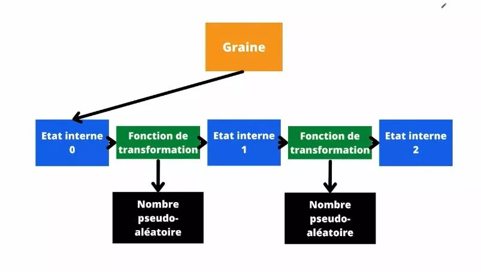

Bitcoini puhul genereeritakse privaatvõtmed ühest teabest, mis on rahakoti aluseks. See teave võimaldab deterministlikku ja hierarhilist lastevõtmepaaride tuletamist. Entroopia on iga HD rahakoti alus, kuigi selle juhusliku numbri genereerimiseks ei ole standardit. Seega on juhuslike numbrite genereerimine suur väljakutse Bitcoini tehingute turvamisel.

## Mnemooniline fraas
<chapterId>8f9340c1-e6dc-5557-a2f2-26c9669987d5</chapterId>

Bitcoini rahakoti turvalisus on kõigi selle kasutajate jaoks suur mure. Üks oluline viis rahakoti varundamise tagamiseks on mnemoonilise fraasi genereerimine entroopia ja kontrollsumma põhjal.

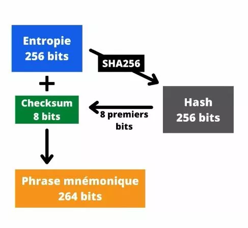

Entroopia teisendamiseks mnemooniliseks fraasiks tuleb lihtsalt arvutada entroopia kontrollsumma ja ühendada entroopia kontrollsummaga.

Kui entroopia on genereeritud, kasutatakse entroopial SHA256 funktsiooni, et luua räsi.
Välja võetakse räsi esimesed 8 bitti, mis on kontrollsumma.
Mnemooniline fraas on entroopia ja kontrollsumma tulemus.

Kontrollsumma tagab taastefraasi täpsuse kontrollimise. Ilma selle kontrollsummateta võib fraasis esinev viga põhjustada erineva rahakoti loomise ja seega vahendite kaotuse. Kontrollsumma saadakse, kui entroopia lastakse läbi SHA256 funktsiooni ja võetakse välja räsi esimesed 8 bitti.


Mnemoonilise fraasi jaoks on olemas erinevad standardid sõltuvalt entroopia suurusest. Kõige sagedamini kasutatav standard 24-sõnalise taastefraasi jaoks on 256-bitine entroopia. Kontrollsumma suurus määratakse, jagades entroopia suuruse 32-ga.

Näiteks 256-bitine entroopia genereerib 8-bitise kontrollsumma. Entroopia ja kontrollsumma ühendamine viib vastavalt 128-bitiste, 160-bitiste jne suurusteni. Sõltuvalt entroopia suurusest koosneb taastefraas 12 sõnast 128 biti, 15 sõnast 160 biti ja 24 sõnast 256 biti puhul.

**Mnemoonilise fraasi kodeerimine:**


Viimased 8 bitti vastavad kontrollsummale.
Iga 11-bitine segment teisendatakse kümnendkohaks.
Iga kümnendkoht vastab sõnale 2048 sõna nimekirjast BIP39 puhul. On oluline märkida, et ükski sõna ei oma sama nelja esimese tähe järjestust.

On hädavajalik varundada 24-sõnaline taastefraas, et säilitada Bitcoini rahakoti terviklikkus. Kaks kõige sagedamini kasutatavat standardit põhinevad 128 või 256 bitisel entroopial ja 12 või 24 sõna ühendamisel. Paroolifraasi lisamine on täiendav võimalus rahakoti turvalisuse suurendamiseks.

Kokkuvõttes on mnemoonilise fraasi genereerimine Bitcoini rahakoti turvamiseks kriitiline protsess. On oluline järgida mnemoonilise fraasi standardeid sõltuvalt entroopia suurusest. 24-sõnalise taastefraasi varundamine on hädavajalik, et vältida vahendite kaotust.

## Paroolifraas
<chapterId>6a51b397-f3b5-5084-b151-cef94bc9b93f</chapterId>
Salasõna on lisaparool, mida saab integreerida Bitcoin'i rahakotti, et suurendada selle turvalisust. Selle kasutamine on valikuline ja jääb kasutaja otsustada. Lisades suvalist teavet, mis koos mnemoonilise fraasiga võimaldab rahakoti seemne arvutamist, suurendab salasõna selle turvalisust.


Salasõna on valikuline krüptograafiline sool, mille suuruse valib kasutaja. See parandab HD rahakoti turvalisust, lisades suvalist teavet, mis koos mnemoonilise fraasiga võimaldab seemne arvutamist.

Kui see on rahakoti loomisel määratud, on see vajalik kõigi rahakoti võtmete tuletamiseks. Seemne genereerimiseks salasõnast kasutatakse pbkdf2 funktsiooni. See seeme võimaldab kõigi rahakoti alamvõtmepaaride tuletamist. Kui salasõna muudetakse, muutub Bitcoin'i rahakott täiesti erinevaks.

Salasõna on oluline vahend Bitcoin'i rahakottide turvalisuse suurendamiseks. See võimaldab rakendada erinevaid turvistrateegiaid. Näiteks saab seda kasutada mnemoonilise fraasi duplikaatide loomiseks ja varundamise hõlbustamiseks. Samuti saab see parandada rahakoti turvalisust, leevendades mnemoonilise fraasi juhusliku genereerimisega seotud riske.

Tõhus salasõna peaks olema pikk (20 kuni 40 tähemärki) ja mitmekesine (kasutades suurtähti, väiketähti, numbreid ja sümboleid). See ei tohiks olla otseselt seotud kasutaja või nende keskkonnaga. Turvalisem on kasutada juhuslike tähemärkide jada, mitte lihtsat sõna salasõnana.

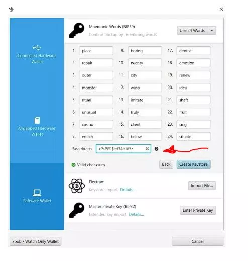

Salasõna on turvalisem kui lihtne parool. Ideaalne salasõna on pikk, mitmekesine ja juhuslik. See võib suurendada rahakoti või kuumtarkvara turvalisust. Samuti saab seda kasutada redundantselt ja turvaliselt varundamiseks.

On oluline hoolitseda salasõna varundamise eest, et vältida rahakotile juurdepääsu kaotamist. Salasõna on HD rahakoti jaoks valikuline. Seda saab genereerida juhuslikult täringuga või muu pseudojuhusliku numbri generaatoriga. Salasõna või mnemoonilise fraasi meeldejätmine ei ole soovitatav.

Järgmises tunnis uurime üksikasjalikult seemne toimimist ja sellest genereeritud esimest võtmepaari. Järgige seda kursust, et jätkata oma õpinguid. Ootame teid peagi jälle nägema.

# Bitcoin'i Rahakottide Loomine
<partId>9c25e767-7eae-50b8-8c5f-679d8fc83bab</partId>

## Seemne ja Peavõtme Loomine
<chapterId>63093760-2010-5691-8d0e-9a04732ae557</chapterId>

Selles kursuse osas uurime Hierarhilise Deterministliku Rahakoti (HD Wallet) tuletamise samme, mis võimaldab privaat- ja avalike võtmete hierarhilist ja deterministlikku loomist ja haldamist.


HD Rahakoti aluseks on kaks olulist elementi: mnemooniline fraas ja salasõna (valikuline lisaparool). Koos moodustavad nad seemne, 512-bitise tähtnumbrilise jada, mis on aluseks rahakoti võtmete tuletamiseks. Sellest seemnest on võimalik tuletada kõik Bitcoin'i rahakoti alamvõtmepaarid. Seeme on võti, mis annab juurdepääsu kõigile rahakotiga seotud bitcoinidele, olenemata sellest, kas kasutate salasõna või mitte.

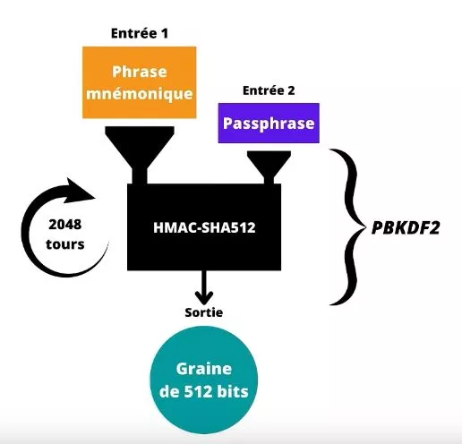
Selleks, et saada seeme, kasutatakse mnemoonilise fraasi ja paroolifraasiga pbkdf2 funktsiooni (Password-Based Key Derivation Function 2). pbkdf2 väljund on 512-bitine seeme.
Seemnest on võimalik määrata peamine privaatvõti ja ahelakood, kasutades HMAC SHA-512 (Hash-based Message Authentication Code Secure Hash Algorithm 512) algoritmi. See algoritm nõuab tulemuse genereerimiseks sõnumit ja võtit sisendina. Peamine privaatvõti arvutatakse seemnest ja fraasist "Bitcoin SEED". See fraas on identne kõigi HD rahakottide kõikide tuletiste jaoks, tagades järjepidevuse erinevate rahakottide vahel.

Algselt ei olnud SHA-512 funktsiooni Bitcoin protokollis rakendatud, mistõttu kasutatakse HMAC SHA-512. HMAC SHA-512 kasutamine fraasiga "Bitcoin SEED" piirab kasutajat, genereerides rahakoti, mis on spetsiifiline Bitcoinile. HMAC SHA-512 tulemus on 512-bitine number, mis jaguneb kaheks osaks: vasakpoolseimad 256 bitti esindavad peamist privaatvõtit, samas kui parempoolseimad 256 bitti esindavad peamist ahelakoodi.

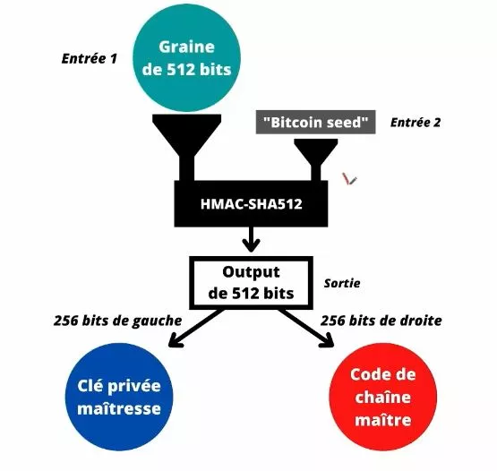

Peamine privaatvõti on kõigi tulevaste võtmete vanemvõti rahakotis, samal ajal kui peamine ahelakood osaleb alamvõtmete tuletamisel. On oluline märkida, et ilma vastava vanemvõtme ahelakoodi teadmata on võimatu tuletada alamvõtmepaari.

Rahakoti võtmepaar koosneb privaatvõtmest, avalikust võtmest ja ahelakoodist. Ahelakood toob alamvõtmete tuletamisse juhuslikkuse allika ja isoleerib iga võtmepaari, et vältida mis tahes informatsiooni lekkimist.
On oluline märkida, et peamine privaatvõti on esimene seemnest tuletatud privaatvõti ja sellel puudub seos rahakoti laiendatud võtmetega.

Järgmises tunnis uurime üksikasjalikult laiendatud võtmeid, nagu xPub, xPRV, zPub, ja mõistame, miks neid kasutatakse ja kuidas neid konstrueeritakse.

## Laiendatud Võtmed
<chapterId>8dcffce1-31bd-5e0b-965b-735f5f9e4602</chapterId>

Selles osas uurime laiendatud võtmeid (xPub, zPub, yPub) ja nende prefikseid, mis mängivad olulist rolli alamvõtmete tuletamisel Hierarhilises Deterministlikus Rahakotis (HD Rahakott).

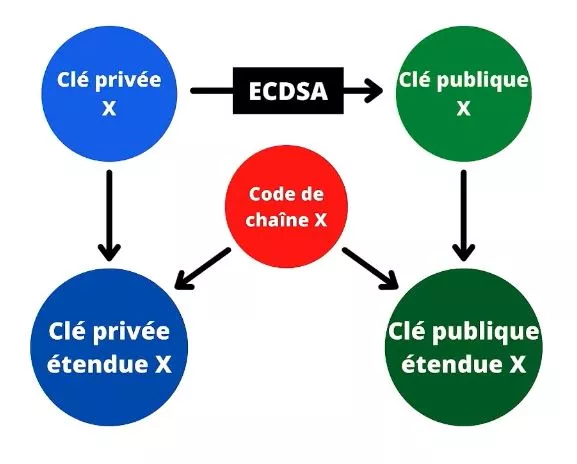

Laiendatud võtmed erinevad peamistest võtmetest. HD rahakott genereerib mnemoonilise fraasi ja seemne, et saada peamine võti ja peamine ahelakood. Laiendatud võtmeid kasutatakse alamvõtmete tuletamiseks ja nõuavad nii vanemvõtit kui ka vastavat ahelakoodi. Laiendatud võti ühendab need kaks teabeosa, et lihtsustada tuletamisprotsessi.

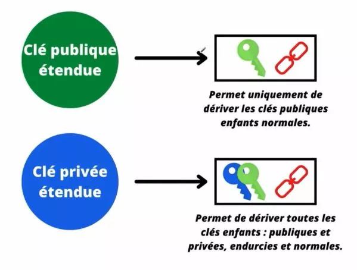

Laiendatud avalikud võtmed saavad tuletada ainult tavalisi alamavalikke võtmeid, samas kui laiendatud privaatvõtmed saavad tuletada nii alamavalikke avalikke kui ka privaatvõtmeid, olgu see siis tavalise või kõvendatud tuletamise teel. Kõvendatud tuletamine on tuletamine vanemprivaatvõtmest, samas kui tavaline tuletamine vastab tuletamisele vanemavalikvõtmest.

Laiendatud võtmete kasutamine XPUB prefiksiga võimaldab uute aadresside tuletamist ilma vastavate privaatvõtmete juurde tagasi pöördumata, pakkudes seeläbi paremat turvalisust. Laiendatud võtmetega seotud metaandmed annavad olulist teavet nende rolli ja positsiooni kohta võtmehierarhias.
Laiendatud võtmeid identifitseeritakse spetsiifiliste prefiksitega (XPRV, XPUB, YPUB, ZPUB), mis näitavad, kas tegemist on laiendatud privaat- või avaliku võtmega, samuti nende konkreetset otstarvet. Laiendatud võtme seotud metaandmed sisaldavad versiooni (prefiks), sügavust, vanemvõtme sõrmejälge, indeksit ja koormat (ahelakood ja vanemvõti).
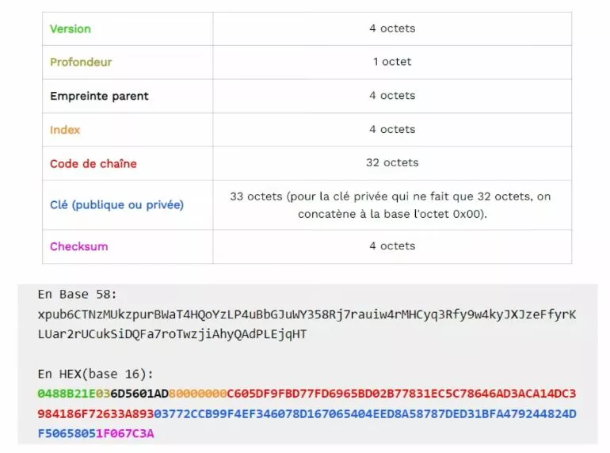

Versioon vastab võtme tüübile: xpub, xprv, ...

Sügavus vastab tuletuste arvule vanem- ja lapsvõtmete vahel alates meistervõtmest.

Vanemvõtme sõrmejälg on vanemvõtme hash 160 esimese 4 baidi suurune.
Indeks on paari number, mida kasutatakse laiendatud võtme genereerimiseks tema vendade hulgas. (vendade all mõeldakse sama sügavusega võtmeid) Näiteks, kui soovime tuletada oma kolmanda konto xpubi, on selle indeks 2 (kuna indeks algab 0-st).

Koorma moodustavad ahelakood (32 baiti) ja vanemvõti (33 baiti).

Kokkusurutud avalikud võtmed on 33 baiti suurused, samas kui toored avalikud võtmed on 512 bitti. Kokkusurutud avalikud võtmed säilitavad sama informatsiooni kui toored võtmed, kuid väiksema suurusega. Laiendatud võtmete suurus on 82 baiti ja nende prefiks on esitatud baasis 58 läbi konverteerimise heksadesse. Kontrollsumma arvutatakse kasutades HASH256 räsifunktsiooni.


Täiustatud tuletused algavad indeksitest, mis on 2 astmetes (2^31). On huvitav märkida, et kõige sagedamini kasutatavad prefiksid on xpub ja zpub, mis vastavad vastavalt pärandstandarditele ja segwit v1 ning segwit v0-le.

Järgmises tunnis keskendume lapse võtmepaaride tuletamisele, kasutades omandatud teadmisi laiendatud võtmete ja rahakoti meistervõtme kohta.

## Lapse võtmepaaride tuletamine
<chapterId>61c0807c-845b-5076-ad06-7f395b36adfd</chapterId>

Meenutuseks oleme arutanud seemne ja meistervõtme arvutamist, mis on esimesed olulised elemendid HD (Hierarhiliselt Deterministliku) rahakoti hierarhiliseks korraldamiseks ja tuletamiseks. Seeme, mille pikkus on 128 kuni 256 bitti, genereeritakse juhuslikult või salajase fraasi abil. See mängib deterministlikku rolli kõigi teiste võtmete tuletamisel. Meistervõti on esimene võti, mis tuletatakse seemnest, ja see võimaldab tuletada kõiki teisi lapse võtmepaare.

Meistri ahelakood mängib olulist rolli rahakoti taastamisel seemnest. Tuleb märkida, et kõik samast seemnest tuletatud võtmed omavad sama meistri ahelakoodi.

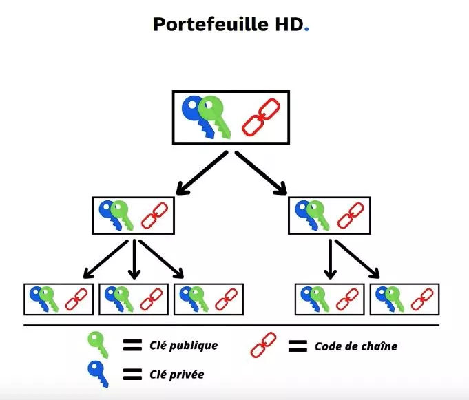

HD rahakoti hierarhiline korraldamine ja tuletamine pakub võtmete ja rahakoti struktuuride efektiivsemat haldamist. Laiendatud võtmed võimaldavad lapse võtmepaari tuletada vanemvõtmepaarist kasutades matemaatilisi arvutusi ja spetsiifilisi algoritme.
On erinevaid lapse võtmepaare, sealhulgas tugevdatud võtmeid ja tavalisi võtmeid. Laiendatud avalik võti võimaldab tuletada ainult tavalisi lapse avalikke võtmeid, samas kui laiendatud privaatvõti võimaldab tuletada kõiki lapse võtmeid, nii avalikke kui ka privaatseid, olgu need siis tavalises või tugevdatud režiimis. Igal võtmepaaril on indeks, mis võimaldab neid üksteisest eristada.

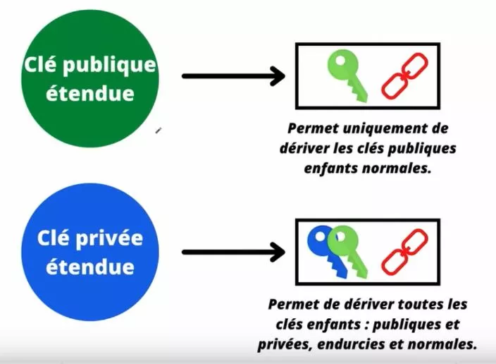
Laste võtmete tuletamine kasutab HMAC-SHA512 funktsiooni, kasutades vanema võtit, mis on ühendatud indeksiga ja võtmepaari juurde kuuluva ahelakoodiga. Tavalistel lastevõtmetel on indeks vahemikus 0 kuni 2 astmes 31 miinus 1, samal ajal kui tugevdatud lastevõtmetel on indeks vahemikus 2 astmes 31 kuni 2 astmes 32 miinus 1.
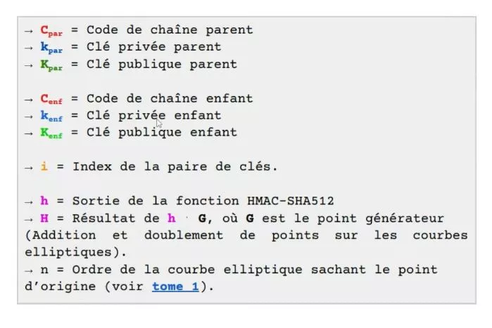

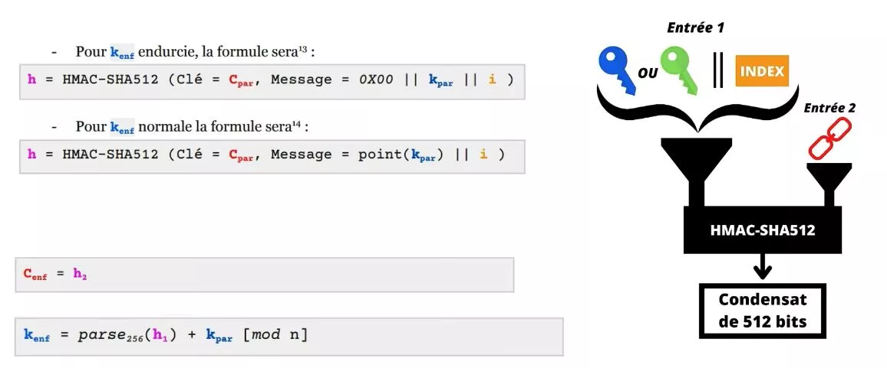

On kaks tüüpi lastevõtmepaare: tugevdatud paarid ja tavalised paarid. Lastevõtmete tuletamise protsess kasutab avalikke võtmeid kulutamistingimuste genereerimiseks, samal ajal kui privaatvõtmeid kasutatakse allkirjastamiseks. Laiendatud avalik võti lubab ainult tavaliste laste avalike võtmete tuletamist, samal ajal kui laiendatud privaatvõti lubab tuletada kõiki lastevõtmeid, nii avalikke kui ka privaatseid, tavalises või tugevdatud režiimis.

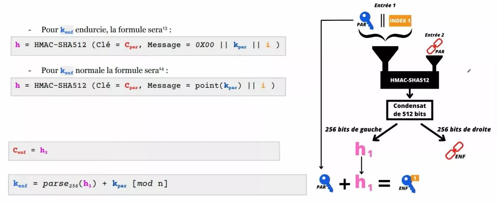


Tugevdatud tuletamine kasutab vanema privaatvõtit, samal ajal kui tavaline tuletamine kasutab vanema avalikku võtit. Tugevdatud tuletamiseks kasutatakse HMAC-SHA512 funktsiooni, samal ajal kui tavalise tuletamise jaoks kasutatakse 512-bitist kokkuvõtet. Laste avalik võti saadakse, korrutades laste privaatvõtme elliptilise kõvera generaatoriga.

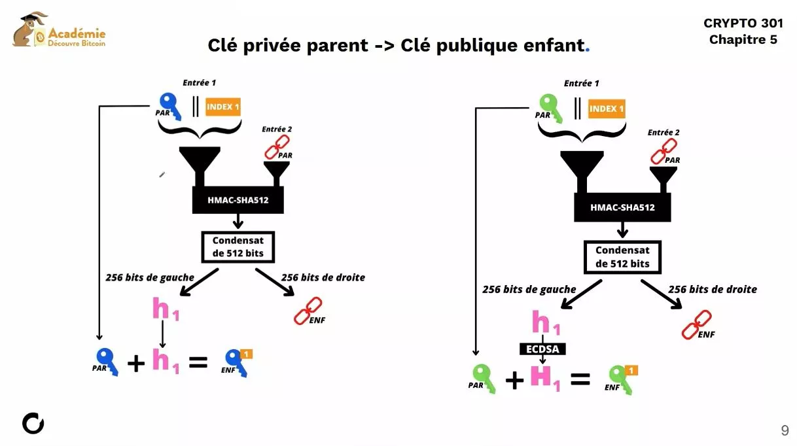
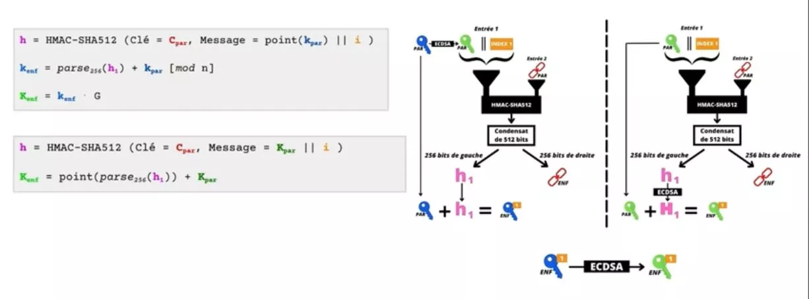

Hierarhiliselt võtmete tuletamine ja paljude võtmepaaride deterministlik tuletamine võimaldab luua puustruktuuri hierarhiliseks tuletamiseks. Järgmises koolituse osas uurime HD rahakoti struktuuri ning tuletamisteid, erilist tähelepanu pöörates tuletamisteede notatsioonidele.

## Rahakoti Struktuur ja Tuletamisteed
<chapterId>34e1bbda-67de-5493-b268-1fded8d67689</chapterId>

Sel peatükis uurime Hierarhilise Deterministliku Rahakoti (HD Rahakott) tuletamispuu struktuuri. Oleme juba uurinud seemne arvutamist, peavõtit ja lastevõtmepaaride tuletamist. Nüüd keskendume võtmete korraldamisele rahakotis.

HD Rahakott kasutab võtmete korraldamiseks sügavuskihte. Iga tuletamine vanemapaarist lastepaarini vastab sügavuskihile.

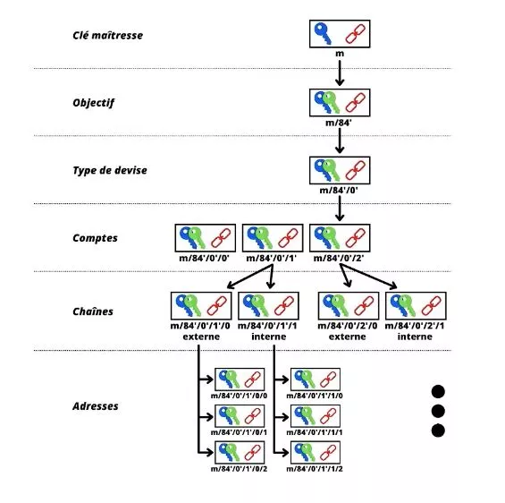

- Sügavus 0 vastab peavõtmele ja peamisele ahelakoodile.

- Sügavus 1 on kasutusel spetsiifilise eesmärgi jaoks lastevõtmete tuletamiseks, mida määrab indeks. Eesmärgid vastavad BIP 84 ja Segwit v0/v1 standarditele.

- Sügavus 2 võimaldab eristada erinevate krüptovaluutade või võrkude kontosid. See võimaldab rahakotti korraldada erinevate fondiallikate põhjal. Bitcoini puhul on indeks 0.

- Sügavus 3 on kasutusel rahakoti erinevate kontode korraldamiseks, pakkudes selgemat ja korraldatumat struktuuri.

- Sügavus 4 vastab välistele ja sisemistele ahelatele, mida kasutatakse avalikult suhtlemiseks mõeldud aadresside jaoks. Indeks 0 on seotud välise ahelaga, samal ajal kui indeks 1 on seotud sisemise ahelaga. Igal kontol on kaks ahelat: väline ahel (0) ja sisemine ahel (1). Sügavus 4 on kasutusel ka skriptitüüpide haldamiseks mitme allkirjaga rahakottide puhul.

- Sügavus 5 on kasutusel standardrahakoti vastuvõtvaadresside jaoks. Järgmises jaotises uurime lastevõtmepaaride tuletamist üksikasjalikumalt.

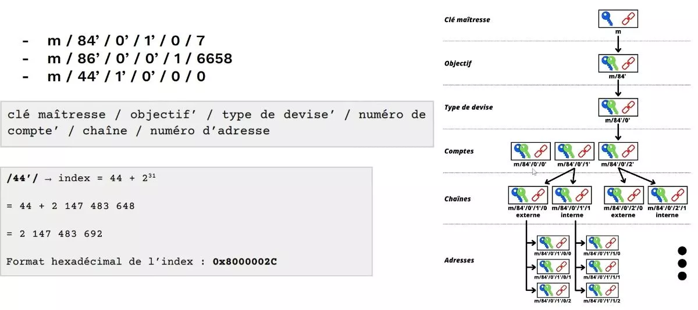

Iga sügavuskihi jaoks kasutame lastevõtmepaaride eristamiseks indekseid.
Indeks ilma apostroofita vastab tegelikult kasutatavale indeksile, samas kui indeks apostroofiga vastab tegelikule indeksile + 2^31. Kõvendatud tuletised kasutavad indekseid vahemikus 2^31 kuni 2^32-1. Näiteks indeks 44' vastab tegelikule indeksile 2^31 + 44.
Konkreetse vastuvõtu aadressi genereerimiseks tuletame lapse võtmepaari peavõtmest ja peamisest ahelakoodist. Seejärel kasutame indeksit erinevate lapse võtmepaaride eristamiseks samal sügavusel.

Laiendatud võtmed, nagu XPUB, võimaldavad teil oma rahakotti jagada mitme inimesega. Tuletamise rada kasutatakse väliste ahelate (aadressid, mida on kavas jagada) ja sisemiste ahelate (muudatusaadressid) eristamiseks.

Järgmises peatükis uurime vastuvõtu aadresse, nende kasutamise eeliseid ja nende konstrueerimise etappe.

# Mis on Bitcoin aadress?
<partId>81ec8d17-f8ee-5aeb-8035-d370866f4281</partId>

## Bitcoin aadressid
<chapterId>0a887ed8-3424-5a52-98e1-e4b406150475</chapterId>

Sel peatükis uurime vastuvõtu aadresse, mis mängivad Bitcoini süsteemis olulist rolli. Need võimaldavad tehingul vahendeid vastu võtta ja genereeritakse privaat- ja avalike võtmete paaridest. Kuigi on olemas skriptitüüp nimega Pay2PublicKey, mis võimaldab bitcoine lukustada avaliku võtme külge, eelistavad kasutajad tavaliselt selle skripti asemel kasutada vastuvõtu aadresse.

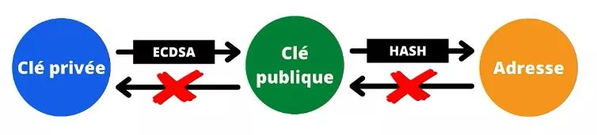

Kui saaja soovib bitcoine vastu võtta, annab ta saatjale oma avaliku võtme asemel vastuvõtu aadressi. Aadress on tegelikult avaliku võtme räsi, kindla vorminguga. Avalik võti tuletatakse lapse privaatvõtmest matemaatiliste toimingute abil, nagu punktide liitmine ja kahekordistamine elliptilistel kõveratel.

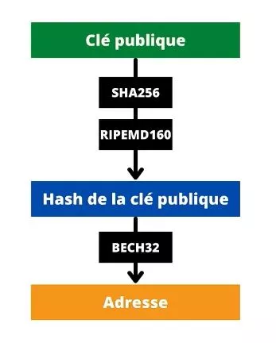

On oluline märkida, et aadressilt avalikule võtmele ega avalikult võtmelt privaatvõtmele tagasi minna ei ole võimalik. Aadressi kasutamine vähendab avaliku võtme teabe suurust, mis algselt on 512 bitti.

Bitcoin aadressid on suurust vähendatud, et hõlbustada nende kasutamist. Neil on kontrollsumma, mis võimaldab tuvastada trükivigu ja vähendada bitcoinide kaotamise riski. Teisest küljest avalikel võtmetel kontrollsummat ei ole, mis tähendab, et trükivead võivad põhjustada vastavate vahendite kaotuse.

Aadressid pakuvad ka teist turvakihti avaliku ja privaatse teabe vahel, muutes privaatvõtme kontrolli alla võtmise raskemaks.

On oluline rõhutada, et iga aadressi tuleks kasutada ainult üks kord. Sama aadressi korduv kasutamine tekitab privaatsusprobleeme ja seda tuleks vältida.

Bitcoin aadresside jaoks kasutatakse erinevaid prefikse. Näiteks BC1Q vastab Segwit V0 aadressile, BC1P Taproot/Segwit V1 aadressile ja prefiksid 1 ja 3 on seotud Pay2PublicKeyH/Pay2ScriptH (pärand) aadressidega. Järgmises tunnis selgitame samm-sammult, kuidas avalikust võtmest aadressi tuletada.

## Kuidas luua Bitcoin aadressi?
<chapterId>6dee7bf3-7767-5f8d-a01b-659b95cfe0a5</chapterId>

Sel peatükis arutame Bitcoin tehingute jaoks vastuvõtu aadressi loomist. Vastuvõtu aadress on avaliku võtme kompresseeritud esitus alfanumeerilises vormis. Avaliku võtme teisendamine vastuvõtu aadressiks hõlmab mitmeid samme.

### 1. samm: Avaliku võtme kompressioon

Aadress tuletatakse lapse avalikust võtmest.

Avalik võti on punkt elliptilisel kõveral. Tänu elliptilise kõvera sümmeetriale on elliptilisel kõveral asuval punktil x-koordinaat, millel on ainult kaks võimalikku väärtust y jaoks: positiivne või negatiivne.
Siiski, Bitcoin protokollis töötame me lõpliku positiivsete täisarvude hulgaga, mitte reaalarvude hulgaga. Kahe võimaliku y väärtuse eristamiseks piisab, kui märkida, kas y on paaris või paaritu.

Avaliku võtme kompressioon vähendab selle suurust 520 bitilt 264 bitile.

Kasutame eesliidet 0x02 paaris y jaoks ja 0x03 paaritu y jaoks. See on avaliku võtme kompresseeritud vorm.

### 2. samm: Kompresseeritud avaliku võtme räsistamine

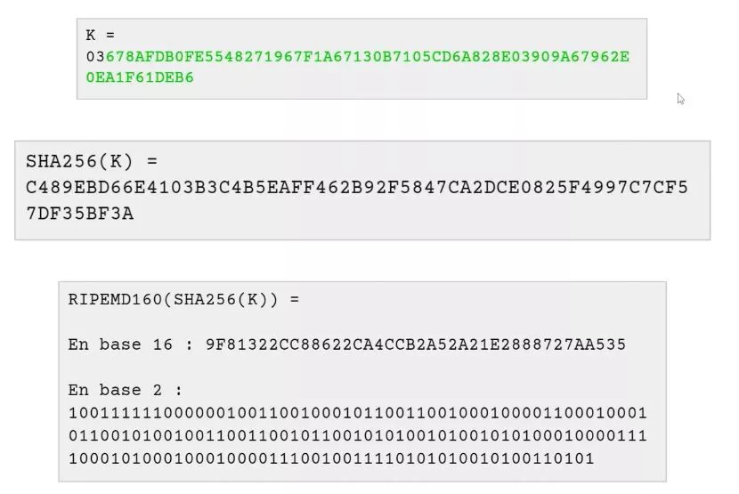

Kompresseeritud avaliku võtme räsistamine toimub SHA256 funktsiooni kasutades. Seejärel rakendatakse saadud räsile RIPEMD160 funktsiooni.

### 3. samm: Koormus = Aadressi koormus

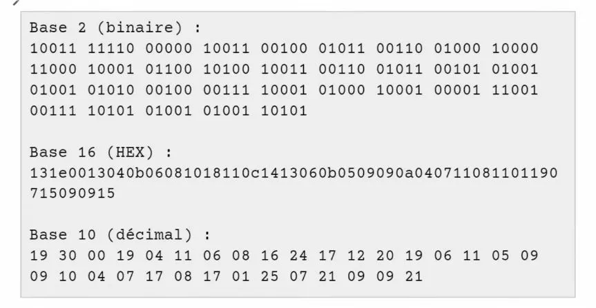

RIPEMD160(SHA256(K)) binaarset räsi kasutatakse 5-bitiste gruppide moodustamiseks. Iga grupp teisendatakse aluseks 16 (heksadesimaalne) ja/või aluseks 10.

### 4. samm: Metaandmete lisamine kontrollsumma arvutamiseks BCH programmiga


Pärandiaadresside puhul kasutame aadressi kontrollsumma genereerimiseks kahekordset SHA256 räsistamist. Siiski, Segwit V0 ja V1 aadresside puhul tuginevad me BCH kontrollsumma tehnoloogiale, et tagada vea tuvastamine. BCH programm on võimeline soovitama ja parandama vigu äärmiselt madala veatõenäosusega. Praegu kasutatakse BCH programmi vigade tuvastamiseks ja muudatuste soovitamiseks, kuid see ei tee kasutaja eest automaatseid parandusi.

BCH programm nõuab mitmeid sisendandmeid, sealhulgas HRP-d (Human Readable Part), mida on vaja laiendada. HRP laiendamine hõlmab iga tähe kodeerimist alusel 2 vastavalt nende ASCII koodile. Seejärel võetakse iga tähe tulemuse esimesed 3 bitti ja teisendatakse need aluseks 10 (pildil sinisega). Lisatakse eraldaja 0. Seejärel konkateniseeritakse iga tähe varem aluseks 10 teisendatud järgmised 5 bitti (pildil kollasega).

HRP laiendamine alusel 10 võimaldab isoleerida iga tähemärgi viimased viis bitti, tugevdades seeläbi kontrollsummat.

Segwit V0 versiooni esindab kood 00 ja "koormus" on mustana, alusel 10. Sellele järgnevad kuus kontrollsumma jaoks reserveeritud tähemärki.

### 5. samm: Kontrollsumma arvutamine BCH programmiga


Metaandmeid sisaldav sisend esitatakse BCH programmile, et saada kontrollsumma alusel 10.

Siin meil on kontrollsumma.

### 6. samm: Aadressi konstrueerimine ja teisendamine Bech32-ks


Versiooni, koormuse ja kontrollsumma konkatenatsioon võimaldab aadressi ehitada. Aluse 10 tähemärgid teisendatakse Bech32 tähemärkideks, kasutades vastavustabelit. Bech32 tähestik hõlmab kõiki tähestiku- ja numbritähemärke, välja arvatud 1, b, i ja o, et vältida segadust.

### 7. samm: HRP ja eraldaja lisamine

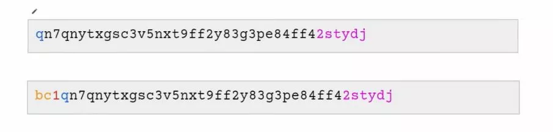

Roosas, kontrollsumma.
Mustas on koormus = avaliku võtme räsi. Sinises on versioon.

Kõik teisendatakse Bech32-ks, seejärel lisatakse bitcoinile 'bc' ja eraldajaks '1', ning siin on aadress.

# Mine kaugemale
<partId>58111408-b734-54db-9ea7-0d5b67f99f99</partId>

## Seemne loomine 128 täringuveeretusest!
<chapterId>0f4d40a7-cf0e-5faf-bc4d-691486771ac1</chapterId>

Mnemoonilise fraasi loomine on krüptorahakoti turvamisel ülioluline samm. Mnemoonilise fraasi genereerimiseks on mitmeid meetodeid, kuid keskendume käsitsi genereerimise meetodile, kasutades täringuid. On oluline märkida, et see meetod ei sobi suure väärtusega rahakoti jaoks. Soovitatav on kasutada avatud lähtekoodiga tarkvara või riistvaralist rahakotti mnemoonilise fraasi genereerimiseks. Mnemoonilise fraasi loomiseks kasutame täringuid binaarteabe genereerimiseks. Eesmärk on mõista mnemoonilise fraasi loomise protsessi.

**1. samm - Ettevalmistus:**
Veenduge, et teil on lisaturvalisuse tagamiseks USB-võtmel installitud amneesiline Linuxi distributsioon, näiteks Tails OS. Pange tähele, et seda õpetust ei tohiks kasutada peamise rahakoti loomiseks.
**2. samm - Juhusliku binaararvu genereerimine:**
Kasutame binaarteabe genereerimiseks täringuid. Veeretage täringut 128 korda ja salvestage iga tulemus (1 paaritu, 0 paaris).

**3. samm - Binaararvude organiseerimine:**
Organiseerige saadud binaararvud 11-kohalisteks ridadeks, et hõlbustada edasisi arvutusi. Kaheteistkümnendal real peaks olema ainult 7 numbrit.

**4. samm - Kontrollsumma arvutamine:**
Kaheteistkümnenda rea viimased 4 numbrit vastavad kontrollsummale. Selle kontrollsumma arvutamiseks peame kasutama terminali Linuxi distributsioonist. Soovitatav on kasutada [TailOs](https://tails.boum.org/index.fr.html), mis on USB-võtmelt käivitatav mäluta distributsioon. Kui olete oma terminalis, sisestage käsk `echo <binaararv> | shasum -a 254 -0`. Asendage `<binaararv>` oma 128 nulli ja ühega. Väljund on heksadetsimaalne räsi. Pane tähele selle räsi esimest tähemärki ja teisenda see binaariks. Selleks võite kasutada seda [tabelit](https://www.educative.io/answers/decimal-binary-and-hex-conversion-table). Lisa binaarne kontrollsumma (4 numbrit) oma lehe kaheteistkümnendale reale.

**5. samm - Teisendamine kümnendkohaks:**
Selleks, et leida sõnad, mis on seotud iga teie reaga, peate esmalt teisendama iga 11-bitise seeria kümnendsüsteemi. Siin ei saa te kasutada veebipõhist teisendajat, kuna need bitid esindavad teie mnemoonilist fraasi. Seetõttu peate teisendama kasutades kalkulaatorit ja järgmist nippi: iga bitt on seotud 2 astmega, nii et vasakult paremale meil on 11 astet, mis vastavad 1024, 512, 256, 128, 64, 32, 16, 8, 4, 2, 1. Oma 11-bitise seeria teisendamiseks kümnendsüsteemi, lihtsalt liidake ainult need astmed, mis sisaldavad 1. Näiteks seeria 00110111011 puhul vastab see järgmisele liitmisele: 256 + 128 + 32 + 16 + 8 + 2 + 1 = 443. Nüüd saate teisendada iga rea kümnendsüsteemi. Ja enne sõnadeks kodeerimist lisage kõikidele ridadele +1, kuna BIP39 sõnaloendi indeks algab 1-st, mitte 0-st.
**Samm 8 - Mnemoonilise fraasi genereerimine:**
Alustage [2048 sõna nimekirja](https://seedxor.com/files/wordlist.pdf) printimisega, et teisendada teie kümnendarvud BIP39 sõnadeks. Selle nimekirja ainulaadsus seisneb selles, et ükski sõna ei jaga oma esimesi 4 tähte ühegi teise sõnaga selles sõnastikus. Seejärel otsige sõna, mis on seotud iga teie rea kümnendarvuga.
**Samm 9 - Mnemoonilise fraasi test:**
Testige kohe oma mnemoonilist fraasi Sparrow Wallet'is, luues sellest rahakoti. Kui saate kehtetu kontrollsumma vea, on tõenäoline, et tegite arvutusvea. Parandage see viga, minnes tagasi sammu 4 juurde ja testige uuesti Sparrow Wallet'is. Voilà! Olete just loonud uue Bitcoin'i rahakoti 128 täringuveeretusest.

Mnemoonilise fraasi genereerimine on oluline protsess teie krüptorahakoti turvamiseks. Soovitatav on kasutada turvalisemaid meetodeid, nagu avatud lähtekoodiga tarkvara või riistvaraline rahakott, mnemoonilise fraasi genereerimiseks. Siiski aitab selle töötoa läbimine paremini mõista, kuidas saame luua Bitcoin'i rahakoti juhuslikust numbrist.

## BOONUS: Intervjuu Théo Pantamisega
<chapterId>39f0ec5a-e258-55cb-9789-bc46d314d816</chapterId>

Teine laialdaselt kasutatav krüptograafiline meetod Bitcoin'i protokollis on digitaalsete allkirjade meetod.


## Hinnake kursust
<chapterId>0cd71541-a7fd-53db-b66a-8611b6a28b04</chapterId>
<isCourseReview>true</isCourseReview>

## Lõpueksam
<chapterId>a53ea27d-0f84-56cd-b37c-a66210a4b31d</chapterId>
<isCourseExam>true</isCourseExam>


## Järeldus ja Lõpp
<chapterId>d291428b-3cfa-5394-930e-4b514be82d5a</chapterId>

### Täname ja jätkake jäneseurgu uurimist

Soovime teid siiralt tänada Crypto 301 kursuse lõpetamise eest. Loodame, et see kogemus on olnud teile rikastav ja hariv. Oleme kajastanud paljusid põnevaid teemasid, ulatudes matemaatikast krüptograafiani ja Bitcoin'i protokolli toimimiseni.

Kui soovite teemasse sügavamale sukelduda, pakume teile lisavõimalust. Viisime läbi eksklusiivse intervjuu Théo Pantamise ja Loïc Moreliga, kes on krüptograafia valdkonna tunnustatud eksperdid. See intervjuu uurib teemat sügavuti ja pakub huvitavaid perspektiive.

Julgustame teid seda intervjuud vaatama, et jätkata krüptograafia põneva valdkonna uurimist. Loodame, et see on teie teekonnal kasulik ja inspireeriv. Veel kord, täname teid osalemise ja pühendumuse eest kogu selle kursuse vältel.

### Toetage Meid
See kursus, nagu ka kogu selle ülikooli sisu, on teile tasuta kättesaadavaks tehtud meie kogukonna poolt. Meie toetamiseks võite seda teistega jagada, saada ülikooli liikmeks ja isegi aidata selle arendamisele kaasa GitHubi kaudu. Kogu meeskonna nimel, aitäh!

### Hinda kursust
Koolituse hindamissüsteem integreeritakse varsti sellesse uude E-õppe platvormi! Seniks suur tänu kursuse läbimise eest ja kui see teile meeldis, kaaluge palun selle jagamist teistega.
