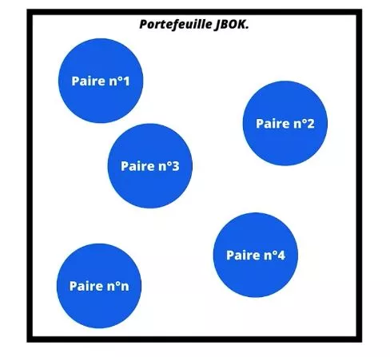

# Un voyage au cœur de la cryptographie

Vous êtes fasciné par Bitcoin ? Vous vous demandez comment fonctionne un portefeuille Bitcoin ? Préparez-vous à embarquer dans un voyage captivant au cœur de la cryptographie ! Loïc, notre expert, vous guidera à travers les méandres de la création d'un portefeuille Bitcoin, dévoilant les mystères derrière les termes techniques intimidants tels que le hachage, la dérivation des clés et les courbes elliptiques.

Cette formation vous dotera non seulement des connaissances pour comprendre la structure d'un portefeuille Bitcoin, mais vous préparera également à plonger plus profondément dans le passionnant univers de la cryptographie. Alors, êtes-vous prêt à entreprendre ce voyage ? Rejoignez-nous et transformez votre curiosité en compétence !

+++

# Introduction
<partId>32960669-d13a-592f-a053-37f70b997cbf</partId>

## Introduction à la cryptographie
<chapterId>fb4e8857-ea35-5a8a-ae8a-5300234e0104</chapterId>

### Est-ce que cette formation est pour vous ? OUI !


C'est avec grand plaisir que nous vous accueillons à la nouvelle formation intitulée "Crypto 301 : Introduction à la cryptographie et au portefeuille HD", orchestrée par l'expert en la matière, Loïc Morel. Ce cours va vous faire plonger dans le fascinant univers de la cryptographie, cette discipline fondamentale des mathématiques qui assure l'encryption et la sécurité de vos données.

Dans notre vie quotidienne et particulièrement dans le domaine des Bitcoins, la cryptographie joue un rôle primordial. Les concepts liés à celle-ci tels que les clés privées, publiques, les adresses, les chemins de dérivation, la graine et l'entropie, sont au cœur de l'utilisation et de la création d'un portefeuille Bitcoin. À travers ce cours, Loïc vous expliquera en détail comment sont créées les clés privées et comment elles sont liées aux adresses. Loïc consacrera également une heure à vous expliquer les détails mathématiques de la courbe elliptique. De plus, vous comprendrez pourquoi l'utilisation de HMAC SHA512 est importante pour sécuriser votre portefeuille et quelle est la différence entre la graine et la phrase mnémonique.

Le but ultime de cette formation est de vous permettre de comprendre techniquement les processus de création d'un portefeuille HD et les méthodes cryptographiques employées. Au fil des années, les portefeuilles Bitcoin ont évolué pour devenir plus faciles à utiliser, plus sécurisés et standardisés grâce à des BIP spécifiques. Loïc vous aidera à comprendre ces BIP pour saisir les choix des développeurs de Bitcoin et des cryptographes. Comme toutes les formations offertes par notre université, celle-ci est entièrement gratuite et open source. Cela signifie que vous pouvez librement la reprendre et l'utiliser à votre guise. Nous avons hâte de recevoir vos retours à la fin de ce cours passionnant.

### La parole est au professeur !


Bonjour à toutes et à tous, je suis Loïc Morel, votre guide à travers cette exploration technique de la cryptographie utilisée dans les portefeuilles Bitcoin.

Notre voyage commence avec une plongée dans les abysses des fonctions de hachage cryptographiques. Nous démonterons ensemble les rouages de l'incontournable SHA256 et explorerons divers algorithmes dédiés à la dérivation.

Nous poursuivrons notre aventure en déchiffrant le monde mystérieux des signatures numériques. Vous découvrirez comment la magie des courbes elliptiques s'applique à ces signatures, et nous ferons la lumière sur la manière de calculer la clé publique à partir de la clé privée. Et bien sûr, nous aborderons le processus de la signature numérique.

Ensuite, nous remonterons le temps pour voir l'évolution des portefeuilles Bitcoin, et nous nous aventurerons dans les concepts d'entropie et de nombres aléatoires. Nous passerons en revue la fameuse phrase mnémonique, tout en ouvrant une parenthèse sur la passphrase. Vous aurez même l'occasion de vivre une expérience unique en créant une graine depuis 128 lancés de dés !

Avec ces bases solides, nous serons prêts pour la partie cruciale : la création d'un portefeuille Bitcoin. De la naissance de la graine et de la clé maître, en passant par l'étude des clés étendues, jusqu'à la dérivation des paires de clés enfants, chaque étape sera décortiquée. Nous discuterons également de la structure du portefeuille et des chemins de dérivation.

Pour couronner le tout, nous terminerons notre parcours en examinant les adresses Bitcoin. Nous expliquerons comment elles sont créées et comment elles jouent un rôle essentiel dans le fonctionnement des portefeuilles Bitcoin.

Embarquez avec moi pour ce voyage captivant, et préparez-vous à explorer l'univers de la cryptographie comme jamais auparavant. Laissez vos préconceptions à la porte et ouvrez votre esprit à une nouvelle manière de comprendre Bitcoin et sa structure fondamentale.

# Les fonctions de hachage
<partId>3713fee1-2ec2-512e-9e97-b6da9e4d2f17</partId>

## Introduction aux fonctions de hachage cryptographique relative à Bitcoin
<chapterId>dba011f5-1805-5a48-ac2b-4bd637c93703</chapterId>


Bienvenue à notre session d'aujourd'hui consacrée à une immersion approfondie dans le monde cryptographique des fonctions de hachage, une pierre angulaire essentielle à la sécurité du protocole Bitcoin. Imaginez une fonction de hachage comme un robot déchiffreur cryptographique ultra-efficace qui transforme des informations de toutes tailles en une empreinte digitale unique et de taille fixe, appelée "hash", "empreinte" ou encore "condensat". 
En résumé, une fonction de hachage prend en entrée un message de taille arbitraire pour le convertir en une empreinte de taille fixe en sortie. 

Dépeindre le profil des fonctions de hachage cryptographiques nécessite de comprendre deux qualités essentielles : leur irréversibilité et leur résistance à la falsification. 

L'irréversabilité ou bien la résistance à la préimage, c'est le fait que le calcul de la sortie en sachant l'entrée peut etre réalisé facilement, mais le calcul à partir de la sortie pour retrouver l'entrée est impossible.
C'est une fonction à sens unique.


La résistance à la falcification provient du fait que la moindre modification de l'entrée donnera une sortie profondément différente.
Ces fonctions permettent de vérifier l'intégrité des logiciels téléchargés. 


Une autre caractéristique cruciale qu'elles possèdent est leur résistance aux collisions et à la seconde préimage. Une collision, c'est le fait que deux entrées distinctes rendent la même sortie.
Certes, dans l'univers du hachage, les collisions sont inévitables, mais une excellente fonction de hachage cryptographique les minimise considérablement. Le risque doit etre tellement faible qu'on peut le considérer comme nul. C'est comme si chaque hash était une maison dans une ville immense ; malgré le nombre énorme de maisons, une bonne fonction de hachage veille à ce que chaque maison ait une adresse unique.
La résistance à la seconde préimage dépend de la résistance aux collisions ; s'il y a résistance aux collisions alors il y a résistance à la seconde préimage. 
Etant donnée une information en entrée qui nous est imposée, il faut trouver une seconde entrée, différente de la première, qui  donne une collision sur le hachage en sortie de la fonction. La résistance à la seconde préimage est similaire à la résistance aux collisions excepté le fait que l'entrée est imposée.

Naviguons maintenant sur les flots tumultueux des fonctions de hachage désuètes. SHA0, SHA1, et MD5 sont aujourd'hui considérées comme des coques rouillées dans l'océan du hachage cryptographique. Elles sont souvent déconseillées car elles ont perdu leur résistance aux collisions. Le principe des tiroirs explique pourquoi, malgré nos meilleurs efforts, l'évitement des collisions est impossible en raison de la limitation de la taille de la sortie. Pour être véritablement considérée comme sûre, une fonction de hachage doit résister aux collisions, à la seconde préimage et à la préimage.

Élément clé dans le protocole Bitcoin, la fonction de hachage SHA-256 est le capitaine du navire. D'autres fonctions, comme SHA-512, sont utilisées pour la dérivation avec HMAC et PBKDF. De plus, RIPMD160 est utilisée pour réduire une empreinte à 160 bits. Lorsque nous parlons de HASH256 et HASH160, nous nous référons à l'utilisation d'un double hachage avec SHA-256 et RIPMD. 

Pour HASH256, il s'agit d'un double hachage du message avec la fonction SHA256.
$$
SHA256(SHA256(message))
$$
Pour HASH160, il s'agit d'un double hachage du message en utilisant d'abord la fonction SHA256 puis RIPMD160.
$$
RIPMD160(SHA256(message))
$$
L'utilisation de HASH160 est particulièrement avantageuse car elle permet de bénéficier de la sécurité de SHA-256 tout en réduisant la taille de l'empreinte.

Pour résumer, l'objectif ultime d'une fonction de hachage cryptographique est de transmuter une information de taille arbitraire en une empreinte de taille fixe. Pour être reconnue comme sécurisée, elle doit avoir plusieurs cordes à son arc : irréversibilité, résistance à la falsification, résistance aux collisions, et résistance à la seconde préimage.


Au terme de cette exploration, nous avons démystifié les fonctions de hachage cryptographiques, mis en évidence leurs utilisations dans le protocole Bitcoin, et décortiqué leurs objectifs spécifiques. Nous avons appris que pour être considérées comme sûres, les fonctions de hachage doivent être résistantes à la préimage, à la seconde préimage, aux collisions et à la falsification. Nous avons également parcouru l'éventail des différentes fonctions de hachage utilisées dans le protocole Bitcoin. Dans notre prochaine session, nous plongerons dans le coeur de la fonction de hachage SHA256, et découvrirons les mathématiques fascinantes qui lui confèrent ses caractéristiques uniques.

## Les rouages de SHA256
<chapterId>905eb320-f15b-5fb6-8d2d-5bb447337deb</chapterId>


Bienvenue à la suite de notre voyage fascinant à travers les labyrinthes cryptographiques de la fonction de hachage. Aujourd'hui, nous ôtons le voile sur les mystères de SHA256, un processus complexe mais ingénieux, que nous avons introduit précédemment. 
Pour rappel, le but de la fonction de hachage SHA256 c'est de prendre un message en entrée de n'importe quelle taille et de générer en sortie un hash de 256 bits.

### Le pré-traitement

Faisons un pas de plus dans ce labyrinthe, en débutant par le pré-traitement de SHA256. 

#### Les bits de rembourrage 

L'objectif de cette première étape est de disposer d'un message égalisé sur un multiple de 512 bits. Pour ce faire, nous allons ajouter des bits de rembourrage au message.

Soit M, une taille de message initial. 
Soit 1, un bit réservé pour le séparateur.
Soit P, un nombre de bits utilisés pour le rembourrage et 64, un nombre de bits mis de côté pour la deuxième phase de pré-traitement. 
Le total doit être un multiple de 512 bits, c'est ce que n représente.


Exemple avec un message en entrée de 950 bits :

```
Etape 1 : Déterminer la taille ; le nombre final de bits idéal.
Le premier multiple de 512 > (M + 64 + 1) (avec M = 950) est 1024. 
1024 = 2 * 512
Donc n = 2.

Etape 2 : Déterminer P, le nombre de bits de rembourrage necessaires pour atteindre le nombre final de bits idéal.
-> M + 1 + P + 64 = n * 512
-> M + 1 + P + 64 = 2 * 512
-> 950 + 1 + P + 64 = 1024
-> P = 1024 - 1 - 64 - 950
-> P = 9

Donc il faudra rajouter 9 bits de rembourrage pour avoir un message égalisé sur un multiple de 512.
```

Et maintenant ? 
Juste après le message initial, il faut rajouter le séparateur 1 suivit de P qui dans notre exemple, est égale à neuf 0.

```
message + 1 000 000 000
```

#### Le rembourrage de la taille

Nous passons maintenant à la deuxième phase du prétraitement, qui implique l'ajout de la représentation binaire de la taille du message initial, en bits. 

Reprenons l'exemple avec un input de 950 bits :

```
La représentation binaire du chiffre 950 est : 11 1011 0110

Nous utilisons nos 64 bits réservés lors de l'étape précédente. Nous ajoutons des zéros pour arrondir nos 64 bits à notre entrée équilibrée. Ensuite, nous fusionnons le message initial, le remplissage des bits et le remplissage de la taille, pour obtenir notre entrée égalisée.
```

Voici le résultat :


### Le traitement

#### Prérequis de compréhension

##### Les constantes et vecteurs d'initialisation

À présent, nous nous préparons pour les premières étapes du traitement de la fonction SHA-256. Comme dans toute bonne recette, nous avons besoin de certains ingrédients de base, que nous appelons constantes et vecteurs d'initialisation. 

Les vecteurs d'initialisation, de A à H, sont les premiers 32 bits des parties décimales des racines carrées des 8 premiers nombres premiers. Ils vont nous servir de valeurs de base dans les premières étapes de traitement. Leurs valeurs sont au format hexadecimal.

Les constantes K, de 0 à 63, représentent quant à elles les 32 premiers bits des parties décimales des racines cubiques des 64 premiers nombres premiers. Elles sont utilisées à chaque tour de la fonction de compression. Leurs valeurs sont également au format hexadécimal.


##### Les opérations utilisées

Au sein de la fonction de compression, nous utilisons des opérateurs spécifiques tels que XOR, AND et NOT. Nous traitons les bits un par un selon leur rang, en utilisant l'opérateur XOR et une table de vérité. L'opérateur AND est utilisé pour retourner 1 seulement si les deux opérandes sont égales à 1, et l'opérateur NOT pour renvoyer la valeur opposée d'une opérande. Nous utilisons également l'opération SHR pour décaler les bits vers la droite selon un nombre choisi.

La table de vérité :


Les opérations de décalage de bits :


#### La fonction de compression

Avant d'appliquer la fonction de compression, nous divisons l'input en blocs de 512 bits. Chaque bloc sera traité indépendamment des autres. 

Chaque bloc de 512 bits est ensuite redivisé en morceaux W de 32 bits. De cette manière, W(0) représente les 32 premiers bits du bloc de 512 bits. W(1) représente les 32 bits suivants et ainsi de suite jusqu'à arriver aux 512 bits du bloc.

Une fois que toutes les constantes K et les morceaux W sont définient, nous pourrons traiter pour chaque morceau W, les calculs suivants pour chaque tour.

Nous effectuons 64 tours de calcul dans la fonction de compression. Au dernier tour, nous aurons au niveau de la "Sortie de la fonction",  un état intermédiaire qui sera additionné à l'état initiale de la fonction de compression. 

Ensuite, nous réitérons toutes ces étapes de la fonction de compression sur le bloc de 512 bits suivant, jusqu'au dernier bloc.

Toutes les additions dans la fonction de compression sont des additions modulo 2^32 afin de toujours garder une somme à 32 bits. 


##### Un tour de la fonction de compression


Le tour de la fonction de compression se fera 64 fois. On retrouve en entrée nos morceaux W et nos constantes K définient précédemment. 

Les carrés/croix rouges correspondent à une addition modulo 2^32 bits.

Les inputs A, B, C, D, E, F, G, H seront associés à une valeur de 32 bits pour au total faire 32 * 8 = 256 bits.
On retrouve également, en output une nouvelle suite A, B, C, D, E, F, G, H. Cet output sera ensuite utilisé en entrée du tour suivant et ainsi de suite jusqu'à la fin du 64ième tour.

Les valeurs de la suite en input du premier tour de la fonction de compression, correspondent aux vecteurs d'initialisation prédéfinit plus haut. 
Pour rappel, les vecteurs d'initialisation représentent les 32 premiers bits des parties décimales des racines carrés des 8 premiers nombre premier.

Voici l'exemple d'un tour : 


##### L'état intermédiaire 

Pour rappel, le message est divisé en blocs de 512 bits qui sont ensuite divisés en morceaux de 32 bits. Pour chaque bloc de 512 bits, nous appliquons les 64 tours de la fonction de compression.
L'état intermédiaire correspond à la fin des 64 tours d'un bloc. Les valeurs de la suite en sortie de ce 64ième tour sont utilisées comme valeurs initiales de la suite en input du premier tour du bloc suivant.


#### Vision globale de la fonction de hachage


Nous remarquerons que l'output du premier morceau de message de 512 bits correspond à nos vecteurs d'initialisation en input du 2ieme morceau de message, et ainsi de suite.

L'output du dernier tour, du dernier morceau correspond au résultat final de la fonction SHA256.

Pour conclure, nous voudrions souligner le rôle crucial des calculs effectués dans les boîtes CH, MAJ, σ0 et σ1. Ces opérations, parmi d'autres, sont les gardiens qui assurent la robustesse de la fonction de hachage SHA256 face aux attaques, faisant de celle-ci un choix privilégié pour la sécurisation de nombreux systèmes numériques, notamment au sein du protocole Bitcoin. Il est donc évident que bien que complexe, la beauté de SHA256 réside dans sa robustesse à retrouver l'entrée à partir du hash, alors que la vérification du hash pour une entrée donnée est une action mécaniquement simple.

## Les algorithmes utilisés pour la dérivation
<chapterId>cc668121-7789-5e99-bf5e-1ba085f4f5f2</chapterId>


Les algorithmes de dérivation HMAC et PBKDF2 sont des composants clés dans la mécanique de sécurité du protocole Bitcoin. Ils préviennent une variété d'attaques potentielles et garantissent l'intégrité des portefeuilles Bitcoin.

HMAC et PBKDF2 sont des outils cryptographiques utilisés pour différentes tâches dans Bitcoin. HMAC est principalement utilisé pour contrer les attaques par extension de longueur lors de la dérivation des portefeuilles hiérarchiquement déterministes (HD), tandis que PBKDF2 est utilisé pour convertir une phrase mémonique en graine.

#### HMAC-SHA512

Le couple HMAC-SHA512  a pour caractéristique deux entrées : un message m (Entrée 1) et une clé K choisie arbitrairement par l'utilisateur (Entrée 2).
Il a également une sortie de taille fixe : 512 bits


Notons : 
- m : message de taille arbitraire choisi par l'utilisateur (entrée 1)
- K : clé arbitraire choisie par l'utilisateur (entrée 2)
- K' : la clé K égalisée. Elle a été ajustée à la taille B des blocs.
- || : opération de concaténation.
- opad : constante définie par l'octet 0x5c répété B fois.
- ipad : constante définie par l'octet 0x36 répété B fois.
- B : La taille des blocs de la fonction de hachage utilisée.


HMAC-SHA512, qui prend un message et une clé comme entrés, génère une sortie de taille fixe. Pour assurer l'uniformité, la clé est ajustée en fonction de la taille des blocs utilisés dans la fonction de hachage. Dans le cadre de la dérivation des portefeuilles HD, HMAC-SHA-512 est utilisé. Ce dernier fonctionne avec des blocs de 1024 bits (128 octets) et ajuste la clé en conséquence. Il utilise les constantes OPAD (0x5c) et IPAD (0x36), répétées autant de fois que nécessaire pour renforcer la sécurité.

Le processus de HMAC-SHA-512 implique la concaténation du résultat de SHA-512 appliqué à la clé XOR OPAD et à la clé XOR IPAD avec le message. Lorsqu'il est utilisé avec des blocs de 1024 bits (128 octets), la clé d'entrée est complétée par des zéros si nécessaire, puis XORée avec IPAD et OPAD. La clé ainsi modifiée est ensuite concaténée avec le message.


Le code de chaîne, en intégrant une source supplémentaire d'entropie, augmente la sécurité des clés dérivées. Sans lui, une attaque pourrait compromettre l'ensemble du portefeuille et voler tous les bitcoins.

PBKDF2 est utilisé pour convertir une phrase mémonique en graine. Cet algorithme réalise 2048 tours en utilisant HMAC SHA512. Grâce à ces algorithmes de dérivation, deux entrées différentes peuvent donner une sortie unique et fixe, ce qui pallie le problème des attaques par extension de longueur possibles sur les fonctions de la famille SHA-2.

Une attaque par extension de longueur exploite une propriété spécifique de certaines fonctions de hachage cryptographiques. Dans une telle attaque, un attaquant qui possède déjà le hachage d'un message inconnu peut l'utiliser pour calculer le hachage d'un message plus long, qui est une extension du message original. Cela est souvent possible sans connaître le contenu du message original, ce qui peut mener à des failles de sécurité importantes si ce genre de fonction de hachage est utilisé pour des tâches comme la vérification d'intégrité.


En conclusion, les algorithmes HMAC et PBKDF2 jouent des rôles essentiels dans la sécurité de la dérivation des portefeuilles HD dans le protocole Bitcoin. L'HMAC-SHA-512 est utilisé pour se prémunir contre les attaques par extension de longueur, tandis que PBKDF2 permet la conversion de la phrase mémonique en graine. Le code de chaîne ajoute une source d'entropie supplémentaire dans la dérivation des clés, assurant ainsi la robustesse du système.

# Les signatures numériques
<partId>76b58a00-0c18-54b9-870d-6b7e34029db8</partId>

## Signatures numériques et courbes elliptiques
<chapterId>c9dd9672-6da1-57f8-9871-8b28994d4c1a</chapterId>


Où sont stockés ces fameux bitcoins ? Pas dans un portefeuille Bitcoin, comme on pourrait le penser. En réalité, un portefeuille Bitcoin conserve les clés privées nécessaires pour prouver la possession des bitcoins. Les bitcoins eux-mêmes sont enregistrés sur la blockchain, une base de données décentralisée qui archive toutes les transactions.

Dans le système Bitcoin, l'unité de compte est le bitcoin (notez le "b" minuscule). Ce dernier est divisible jusqu'à huit décimales, la plus petite unité étant le satoshi. Les UTXO, ou "Unspent Transaction Output", représentent les sorties de transactions non dépensées appartenant à une clef publique qui est elle-même liée mathématiquement à une clef privée. Pour dépenser ces bitcoins, il faut pouvoir répondre à la condition de dépense de la transaction. Une condition de dépense typique consiste à prouver au reste du réseau que l'utilisateur est le propriétaire légitime de la clef publique associée aux UTXO. Pour ce faire, il va devoir démontrer qu'il est en possession de la clé privée correspondante à la clé publique liée à chaque UTXO sans pour autant dévoiler la clef privée. 

C'est ce que permet la signature numérique. Elle sert de preuve mathématique démontrant la possession d'une clé privée associée à une clé publique spécifique. Cette technique de protection des données est essentiellement basée sur un domaine fascinant de la cryptographie appelé la cryptographie sur courbes elliptiques (ECC).

La signature peut etre vérifée mathématiquement par les autres parties prenante du réseau Bitcoin.


Pour assurer la sécurité des transactions, Bitcoin fait appel à deux protocoles de signature numérique : l'ECDSA (Elliptic Curve Digital Signature Algorithm) et Schnorr. ECDSA est un protocole de signature intégré à Bitcoin depuis son lancement en 2009, tandis que les signatures de Schnorr ont été ajoutées plus récemment, en novembre 2021. Bien que ces deux protocoles reposent sur la cryptographie sur courbes elliptiques et utilisent des mécanismes mathématiques similaires, ils diffèrent principalement en termes de structure de signature.

Dans ce cours, nous présenterons l'algorithme ECDSA.

### Qu'est-ce qu'une courbe elliptique ?

La cryptographie sur courbe elliptique c'est un ensemble d'algorithmes qui utilisent une courbe elliptique pour ses differentes propriétés geométriques et mathématiques dans un objectif cryptographique et dont la sécurité se base sur la difficulté de calcul du logarithme discret.

Les courbes elliptiques sont utiles dans une variété d'applications cryptographiques sur le protocole Bitcoin, allant des échanges de clés au chiffrement asymétrique en passant par les signatures numériques. 

Les courbes élliptiques ont des propriétés intéressantes :

- la symétrie : Toute droite non verticale coupant deux points sur la courbe elliptique, recoupera la courbe en un troisieme point.
- Toute droite non verticale et tangeante à la courbe en un point, coupera toujours la courbe en un deuxieme point unique.

Le protocole Bitcoin utilise une courbe elliptique particulière nommée Secp256k1 pour effectuer ses opérations cryptographiques. 

Avant de plonger plus profondément dans ces mécanismes de signature, il est important de bien comprendre ce qu'est une courbe elliptique. Une courbe elliptique est définie par l'équation y² = x³ + ax + b. Tout point sur cette courbe a une symétrie distinctive qui est la clé de son utilité en cryptographie.


En fin de compte, diverses courbes elliptiques sont reconnues comme étant sécurisées pour un usage cryptographique. Le plus connu est peut-être la courbe secp256r1. Cependant, pour Bitcoin, Satoshi Nakamoto a opté pour une autre courbe : la secp256k1.

Cette courbe se définit par les paramètres a=0 et b=7, et son équation est y² = x³ + 7 modulo n, avec n représentant le nombre premier qui détermine l'ordre de la courbe.


La première image représente la courbe secp256k1 sur le corps des réels et son équation. 
La deuxième image est une représentation de la courbe secp256k1 sur le corps ZP, le corps des entiers naturels et positifs, modulo p où p est un nombre premier. Cela ressemble à un nuage de points. Nous utilisons ce corps des entiers naturels et positifs pour éviter les approximations.
p est un nombre premier, c'est l'ordre de la courbe qui est utilisé.
Finalement, l'équation qui est utilisée sur le protocole Bitcoin est :
$$
y^2 = (x^3 + 7) mod(p)
$$
L'équation de la courbe elliptique sur bitcoin correspond à la dernière équation sur l'image précédente.

Dans la prochaine section de ce cours, nous utiliserons des courbes qui sont sur le corps des réels simplement pour faciliter la compréhension.

## Calculer la clé publique à partir de la clé privée
<chapterId>fcb2bd58-5dda-5ecf-bb8f-ad1a0561ab4a</chapterId>


Pour commencer, plongeons dans l'univers de l'algorithme Elliptic Curve Digital Signature Algorithm (ECDSA). Bitcoin exploite cet algorithme de signature numérique pour lier les clés privées et publiques. Dans ce système, la clé privée est un nombre aléatoire ou pseudo-aléatoire de 256 bits. Le nombre total de possibilités pour une clé privée est théoriquement de 2^256, mais il est légèrement inférieur à cela dans la réalité. Pour être précis, certaines clés privées de 256 bits ne sont pas valides pour Bitcoin.

Pour être compatible avec Bitcoin, une clé privée doit être comprise entre 1 et n-1, où n représente l'ordre de la courbe elliptique. Cela signifie que le nombre total de possibilités pour une clé privée Bitcoin est presque égal à 1,158 x 10^77. Pour mettre cela en perspective, c'est à peu près le même nombre d'atomes présents dans l'univers observable. 


La clé privée unique, notée k, est ensuite utilisée pour déterminer une clé publique.

La clé publique, notée K, est un point sur la courbe elliptique qui est dérivé de la clé privée en utilisant des algorithmes irréversibles comme ECDSA. Lorsque nous avons connaissance de la clef privée, il est très facile de retrouver la clef publique mais lorsque nous possedons uniquement la clef publique, il est impossible de retrouver la clef privée. Cette irréversibilité est la pierre angulaire de la sécurité du portefeuille Bitcoin.

La clé publique fait 512 bits car elle correspond à un point sur la courbe avec une coordonnée x de 256 bits et une coordonnée y de 256 bits. Cependant, elle peut être compressée en un nombre de 264 bits.


Le point générateur (G)  est le point sur la courbe à partir duquel toutes les clés publiques sont générées sur le protocole Bitcoin. Il a des coordonnées x et y spécifiques, généralement représentées en hexadécimal. Pour secp256k1, les coordonnées G sont, en hexadécimale :

- `Gx = 79BE667E F9DCBBAC 55A06295 CE870B07 029BFCDB 2DCE28D9 59F2815B 16F81798`
- `Gy = 483ADA77 26A3C465 5DA4FBFC 0E1108A8 FD17B448 A6855419 9C47D08F FB10D4B8`

Ce point est utile pour dériver toutes les clefs publiques. Pour calculer la clef publique K, il suffit de multiplier le point G par la clef privée k, tel que : K = k.G

Nous allons maintenant étudier comment additionner et multiplier des points sur les courbes elliptiques.

#### Addition et doublement de points sur les courbes elliptiques

##### Additionner deux points M + L

L'une des propriétés remarquables des courbes elliptiques est qu'une droite non verticale intersectant la courbe en deux points l'intersectera également en un troisième point, appelé point O dans notre exemple. Cette propriété est utilisée pour déterminer le point U, qui est l'opposé du point O. 

M + L = U


##### Addition un point par lui même = Doublement de point

L'addition d'un point G à lui-même se fait en traçant une tangente à la courbe au niveau de ce point. Cette tangeante, selon les propriétés des courbes elliptiques recoupera forcément la courbe en un second point unique -J. L'opposé de ce point, J, est le résultat de l'addition du point G à lui même.
G + G = J

D'ailleur, le point G est le point de départ pour calculer toutes les clés publiques des utilisateurs du système Bitcoin.


#### Le produit scalaire sur courbe elliptique

Le produit scalaire d'un point par n revient à ajouter ce point à lui-même n fois.

De la même manière que l'or d'un doublement de point, le produit scalaire du point G par un point n se fait en traçant une tangente à la courbe au niveau du point G. Cette tangeante, selon les propriétés des courbes elliptiques recoupera forcément la courbe en un second point unique -2G. L'opposé de ce point, 2G, est le résultat de l'addition du point G à lui même.

Si n = 4, alors on réitère l'opération jusqu'à arriver à 4G.


Voici un exemple de calcul pour 3G :


Ces opérations sur les points d'une courbe elliptique sont la base du calcul des clés publiques. La dérivation d'une clef publique en sachant la clef privée est très facile.
Une clef publique est un point sur la courbe elliptique, c'est le résultat de notre addition et doublement du point G k fois. Avec k = clef privée.

Dans cet exemple :

- La clef privée k = 4
- La clef publique K = kG = 4G


Connaissant la clé privée k, il est facile de calculer la clé publique K. Impossible en revenche de retrouver la clef privée en fonction de la clef publique. Est-ce le résutat d'une addition ou d'un doublement de point ? 

Dans notre prochain cours, nous explorerons comment une signature numérique est réalisée en utilisant l'algorithme ECDSA avec une clé privée pour dépenser des bitcoins. 

## Signer avec la clé privée
<chapterId>bb07826f-826e-5905-b307-3d82001fb778</chapterId>


Le processus de signature numérique est une méthode clé pour prouver que vous êtes le détenteur d'une clé privée sans avoir à la révéler. Ceci est réalisé en utilisant l'algorithme ECDSA, qui comprend la détermination d'un nonce unique, le calcul d'un nombre spécifique, V, et la création d'une signature numérique composée de deux parties, S1 et S2. 
Il est crucial de toujours utiliser un nonce unique pour éviter les attaques de sécurité. Un exemple notoire de ce qui peut se produire lorsque cette règle n'est pas respectée est le cas du piratage de la PlayStation 3, qui a été compromis en raison de la réutilisation du nonce.


Etapes :

- Déterminer un nonce v, c'est-à-dire, un nombre unique aléatoire.
  Nonce = Number Only Use Once.
  Il est déterminé par celui qui réalise la signature.
- Calculer par addition et doublement de point sur courbe elliptique à partir du point G, la position de V sur la courbe elliptique. 
  Tel que V = v.G
  x et y sont les coordonnées de V sur le plan
- Calculer S1.
  S1 = x mod n avec n = l'ordre de la courbe et x une coordonnée de V sur le plan.
  NB : Le nombre de possibilité de la clef publique est plus grand que le nombre de points sur la courbe elliptique dans le corps fini des entiers positifs qui est utilisé sur Bitcoin.
  L'ordre de la courbe correspond uniquement aux possibilités que peut prendre la clef publique sur la courbe.
- Calculer S2.
  H(Tx) = Hash de la transaction 
  k = la clef privée
- Calculer la signature : la concatenation de S1 + S2.
- Calculer P, le calcul de vérification de la signature.
  K = la clef publique

Par exemple, pour obtenir la clé publique 3G, vous dessinez une tangente au point G, calculez l'opposé de -G pour obtenir 2G, puis additionnez G et 2G. Pour réaliser une transaction, vous devez prouver que vous connaissez le nombre 3 en débloquant les bitcoins associés à la clé publique 3G.

Pour créer une signature numérique et prouver que vous connaissez la clé privée associée à la clé publique 3G, vous calculez d'abord un nonce, puis le point V associé à ce nonce (dans l'exemple donné, c'est 4G). Ensuite, vous calculez le point T en additionnant la clé publique 3G et le point V, ce qui donne 7G.


Vulgarisons le processus de signature numérique.
Sur l'image précédente, la clef privée k = 3. 
Nous pouvons facilement calculer la clef publique K associée à cette clef privée : K = 3G
Ensuite, nous générons pseudo-aléatoirement un nonce : v = 4. 
A partir de ce nonce, il est possible de calculer V tel que : V = v.G = 4G.

A partir de ce point V, nous calculons le point T tel que :
T = t.G = 7G (avec t = 7)


Il est temps de procéder à la vérification de la signature numérique.

La vérification d'une signature numérique est une étape cruciale dans l'utilisation de l'algorithme ECDSA, qui permet de confirmer l'authenticité d'un message signé sans avoir besoin de la clé privée de l'expéditeur. Voici comment cela se déroule en détail :

Dans notre exemple, nous avons deux valeurs importantes : t et V. 
t est une valeur numérique (7 dans cet exemple), et V est un point sur la courbe elliptique (représenté par 4G ici). Ces valeurs sont produites lors de la création de la signature numérique et sont ensuite envoyées avec le message pour permettre la vérification.

Quand le vérificateur reçoit le message, il va également recevoir ces deux valeurs, t et V.

Voici les étapes que le vérificateur va suivre pour valider la signature :

1. Il va d'abord calculer le hachage du message, que nous appellerons H.
2. Ensuite, il calculera u1 et u2. Pour ce faire, il utilisera les formules suivantes :
   - u1 = H /\* (S2)^-1 mod n
   - u2 = T /\* (S2)^-1 mod n
     Où S2 est la deuxième partie de la signature numérique, n est l'ordre de la courbe elliptique et (S2)^-1 est l'inverse de S2 mod n.
3. Le vérificateur calculera ensuite un point P' sur la courbe elliptique à l'aide de la formule : P' = u1 _ G + u2 _ K
   - G est le point de génération de la courbe
   - K est la clé publique de l'expéditeur
4. Le vérificateur calculera alors I', qui est simplement la coordonnée x du point P' modulo n.
5. Enfin, le vérificateur confirmera que I' est égal à t. Si c'est le cas, la signature est considérée comme valide. Si ce n'est pas le cas, la signature est invalide.

Cette procédure garantit que seul l'expéditeur possédant la clé privée correspondante pourrait avoir produit une signature qui passe ce processus de vérification.


Vulgarisons : 
Celui qui produit la signature va fournir à celui qui vérifie le nombre t (dans notre exemple, t = 7) et le point V.

Il est impossible de déterminer la clef publique ou la clef privée à partir du nombre 7 et du nombre V.

Les étapes de vérification de la signature numérique sont les suivantes :

- Sur la courbe, il additionne le point de la clef publique avec le point V pour retrouver le point T'.
- Il calcul le nombre t.G
- Il vérifie que le résultat de t.G soit bien égal au nombre T'


En conclusion, la vérification d'une signature numérique est une procédure essentielle dans les transactions Bitcoin. Elle permet de garantir que le message signé n'a pas été altéré lors de sa transmission et que l'expéditeur est bien le détenteur de la clé privée. Cette technique d'authentification numérique repose sur des principes mathématiques complexes, notamment l'arithmétique de courbe elliptique, tout en maintenant la confidentialité de la clé privée. Elle offre une solide base de sécurité pour les transactions cryptographiques.

Cela dit, la gestion de ces clés, ainsi que leur création, est une autre question essentielle dans Bitcoin. Comment générer une nouvelle paire de clés ? Comment organiser une multitude de clés de manière sécurisée et efficace ? Comment les récupérer si nécessaire ?

Pour répondre à ces questions et approfondir votre compréhension de la sécurité de la cryptographie, notre prochain cours se concentrera sur le concept de Portefeuille Déterministe Hiérarchique (HD wallets) et l'utilisation des phrases mnémoniques. Ces mécanismes offrent des moyens élégants de gérer efficacement vos clés de cryptomonnaie tout en renforçant la sécurité.

# La phrase mnémonique
<partId>4070af16-c8a2-58b5-9871-a22c86c07458</partId>

## Évolution des portefeuilles Bitcoin
<chapterId>9d9acd5d-a0e5-5dfd-b544-f043fae8840f</chapterId>


Le Portefeuille Déterministe Hiérarchique, ou plus couramment appelé portefeuille HD, joue un rôle prépondérant dans l'écosystème des cryptomonnaies. Le terme "portefeuille" peut sembler trompeur pour ceux qui sont novices dans ce domaine, car il n'implique pas la détention d'argent ou de devises. Il fait plutôt référence à une collection de clés cryptographiques privées. 

Les premiers portefeuilles étaient des logiciels regroupant des clefs privées déterminées de manière pseudo-aléatoire mais qui n'avaient aucun lien entres elles. Ces portefeuilles sont nommés "Just a Bunch Of Keys" (JBOK).

Les clefs n'ayant aucun liens entres elles, l'utilisateur est obligé de réaliser une nouvelle sauvegarde pour toute nouvelle paire de clef générée.
Soit l'utilisateur utilise tout le temps la même pair de clef et perd en confidentialité, soit il dérive de nouvelle paire de clef de manière aléatoire et donc doit réaliser une nouvelle sauvegarde de ces clefs. 



Cependant, la complexité de la gestion de ces clés est compensée par un ensemble de protocoles, appelés Bitcoin Improvement Proposals (BIP). Ces propositions de mise à niveau sont au cœur de la fonctionnalité et de la sécurité des portefeuilles HD. Par exemple, le [BIP32](https://github.com/bitcoin/bips/blob/master/bip-0032.mediawiki), lancé en 2012, a révolutionné la manière dont ces clés sont générées et stockées, en introduisant le concept de clés dérivées de manière déterministe et hiérarchique. L'idée est de dériver toutes les clefs de façon déterministe et hierarchique depuis une information unique : la seed. Ainsi, le processus de sauvegarde de ces clés est grandement simplifié, tout en conservant leur niveau de sécurité.


Par la suite, le [BIP39](https://github.com/bitcoin/bips/blob/master/bip-0039.mediawiki) a introduit une innovation marquante : la phrase mnémonique de 24 mots. Ce système a permis de transformer une suite de chiffres complexe et difficile à retenir en une série de mots ordinaires, bien plus facile à mémoriser et à stocker. En outre, le [BIP38](https://github.com/bitcoin/bips/blob/master/bip-0038.mediawiki) a proposé d'ajouter une passphrase supplémentaire pour renforcer la sécurité des clés individuelles. Ces améliorations successives ont abouti aux normes BIP43 et BIP44, qui ont standardisé la structure et la hiérarchisation des portefeuilles HD, rendant ces portefeuilles plus accessibles et plus faciles à utiliser pour le grand public.

Dans les sections suivantes, nous allons plonger plus profondément dans le fonctionnement des portefeuilles HD. Nous aborderons les principes de dérivation des clés et nous examinerons les concepts fondamentaux de l'entropie et de la génération de nombres aléatoires, qui sont essentiels pour garantir la sécurité de votre portefeuille HD.

En guise de synthèse, il est essentiel de souligner le rôle central des BIP32 et BIP39 dans la conception et la sécurisation des portefeuilles HD. Ces protocoles permettent de générer une multitude de clés à partir d'une seule graine, qui est supposée être un nombre aléatoire ou pseudo-aléatoire. Aujourd'hui, ces normes sont adoptées par la majorité des portefeuilles de cryptomonnaies, qu'ils soient dédiés à une seule cryptomonnaie ou qu'ils prennent en charge plusieurs types de devises.


## Entropie et nombre aléatoire
<chapterId>b43c715d-affb-56d8-a697-ad5bc2fffd63</chapterId>


L'importance de la sécurité des clés privées dans l'écosystème du Bitcoin est incontestable. Elles sont en effet la pierre angulaire qui assure la sécurité des transactions Bitcoin. Pour éviter toute vulnérabilité associée à la prédictibilité, ces clés doivent être générées de manière véritablement aléatoire, ce qui peut rapidement se révéler être un exercice laborieux. Le problème c'est qu'en informatique, il est impossible de générer un nombre véritablement aléatoire puisqu'il est forcément issu d'un processus déterministe ; un code. 
C'est pourquoi il est essentiel de s'informer sur les différents Générateur de Nombres Aléatoires (RNG). Les types de RNG varient, allant des Pseudo-Random Number Generators (PRNG) aux True Random Number Generators (TRNG), ainsi qu'aux PRNG qui intègrent une source d'entropie.

L'entropie désigne l'état de « désordre » d'un système. A partir d'une entropie externe, c'est à dire, une source d'information externe, il est possible d'utiliser un générateur de nombre aléatoire afin d'obtenir un nombre aléatoire.


Voyons ensemble le fonctionnement d'un Pseudo-Random Number Generator (PRNG).

Il prend en entrée une graine, c'est à dire, une information qui va correspondre à l'état interne 0.
Sur cet etat interne, il est appliqué une fonction de transformation et le résultat qui est un nombre pseudo-aléatoire correspond à l'état interne 1.
Sur cet etat interne 1, à nouveau, il est apliqué une fonction de transformation qui résulte en un nouveau nombre aléatoire = etat interne 2.
Et ainsi de suite.

L'inconvenient principal c'est que toute graine identique donnera toujours le même résultat en sortie. Et également, si nous connaissons le résultat des fonctions de transformation du début, nous sauront en mesure de retrouver le nombre aléatoire en sortie de processus.

Un exemple de fonction de transformation est le fonction PBKDF2.

**Pour résumer, un PRNG cryptographiquement sûr doit :**

- etre statistiquement aléatoire
- etre imprédictible
- etre résistant même si les résultats sont révélés
- avoir une periode suffisamment longue


Dans le cas du Bitcoin, les clés privées sont générées à partir d'une seule information à la base du portefeuille. Cette information permet une dérivation déterministe et hiérarchique des paires de clés enfant. L'entropie est le socle de tout portefeuille HD, bien qu'il n'existe pas de standard pour la génération de ce nombre aléatoire. Par conséquent, la génération de nombres aléatoires est un enjeu majeur pour sécuriser les transactions Bitcoin.

## La phrase mnémonique
<chapterId>8f9340c1-e6dc-5557-a2f2-26c9669987d5</chapterId>


La sécurité d'un portefeuille Bitcoin est une préoccupation majeure pour tous ses utilisateurs. Une manière essentielle d'assurer la sauvegarde du portefeuille consiste à générer une phrase mnémonique basée sur l'entropie et la checksum.


Pour passer de l'entropie à une phrase mnémonique, il suffit de calculer la checksum de l'entropie et de concaténer entropie et checksum.

Une fois que l'entropie est générée, on utilise la fonction SHA256 sur l'entropie afin d'en créer un hash. 
On récupère les 8 premiers bits du hash, c'est la checksum.
La phrase mnémonique est le résultat de l'entropie additionnée de la checksum.

La checksum assure la vérification de l'exactitude de la phrase de récupération. Sans cette checksum, une erreur dans la phrase pourrait aboutir à la création d'un portefeuille différent et donc à la perte des fonds. On obtient la checksum en passant l'entropie par la fonction SHA256 et en récupérant les 8 premiers bits du hachage.


Différents standards existent pour la phrase mnémonique en fonction de la taille de l'entropie. Le standard le plus couramment utilisé pour une phrase de récupération de 24 mots est une entropie de 256 bits. La taille de la checksum est déterminée en divisant la taille de l'entropie par 32.

Par exemple, une entropie de 256 bits génère une checksum de 8 bits. La concaténation de l'entropie et de la checksum conduit alors à des tailles respectives de 128 bits, 160 bits, etc. En fonction de la taille de l'entropie, la phrase de récupération comportera 12 mots pour 128 bits, 15 mots pour 160 bits, et 24 mots pour 256 bits.

**L'encodage de la phrase mnémonique :**


Les 8 derniers bits correspondent à la checksum.
Chaque segment de 11 bits est converti en décimal.
Chaque décimal corespond à un mot  issu d'une liste de 2048 mots sur le BIP39. Il est important de préciser qu'aucun mot ne présente les quatre premières lettres dans le même ordre.

Il est essentiel de sauvegarder la phrase de récupération de 24 mots pour préserver l'intégrité du portefeuille Bitcoin. Les deux standards les plus couramment utilisés se basent sur une entropie de 128 ou 256 bits et une concaténation de 12 ou 24 mots. L'ajout d'une passphrase constitue une option supplémentaire pour renforcer la sécurité du portefeuille.

En conclusion, la génération d'une phrase mémonique pour sécuriser un portefeuille Bitcoin est un processus crucial. Il est important de respecter les standards de la phrase mémonique en fonction de la taille de l'entropie. La sauvegarde de la phrase de récupération de 24 mots est essentielle pour prévenir toute perte de fonds. 

## La passphrase
<chapterId>6a51b397-f3b5-5084-b151-cef94bc9b93f</chapterId>


La passphrase est un mot de passe additionnel qui peut être intégré à un portefeuille Bitcoin pour accroître sa sécurité. Son utilisation est optionnelle et revient à l'appréciation de l'utilisateur. En ajoutant des informations arbitraires qui, conjointement avec la phrase mémonique, permettent de calculer la graine du portefeuille, la passphrase renforce la sécurité de celui-ci.


La passphrase est un sel cryptographique optionnel d'une taille choisi par l'utilisateur. Elle permet d'améliorer la sécurité d'un portefeuille HD en ajoutant une information arbitraire qui une fois aglomérée à la phrase mnémonique permettra de calculer la graine. 

Lorsqu'elle a été établie lors de la création d'un portefeuille, elle est nécessaire pour la dérivation de toutes les clefs du portefeuille. La fonction pbkdf2 est utilisée pour générer la graine à partir de la passphrase. Cette graine permet de dériver toutes les paires de clés enfants du portefeuille. Si la passphrase est modifiée, le portefeuille Bitcoin devient complètement différent.

La passphrase est un outil essentiel pour renforcer la sécurité des portefeuilles Bitcoin. Elle peut permettre l'application de diverses stratégies de sécurité. Par exemple, elle peut être utilisée pour créer des doublons et faciliter les sauvegardes de la phrase mémonique. Elle peut également améliorer la sécurité du portefeuille en atténuant les risques associés à la génération aléatoire de la phrase mémonique.

Une passphrase efficace devrait être longue (20 à 40 caractères) et diversifiée (utilisant des majuscules, des minuscules, des chiffres et des symboles). Elle ne devrait pas être directement liée à l'utilisateur ou à son environnement. Il est plus sûr d'utiliser une séquence aléatoire de caractères plutôt qu'un mot simple comme passphrase.


Une passphrase est plus sécurisée qu'un simple mot de passe. La passphrase idéale est longue, variée et aléatoire. Elle peut renforcer la sécurité d'un portefeuille ou d'un logiciel chaud. Elle peut également être utilisée pour créer des sauvegardes redondantes et sécurisées.

Il est crucial de prendre soin des sauvegardes de la passphrase pour éviter de perdre l'accès au portefeuille. Une passphrase est une option pour un portefeuille HD. Elle peut être générée aléatoirement avec des dés ou un autre générateur de nombres pseudo-aléatoires. Il est déconseillé de mémoriser une passphrase ou une phrase mémonique.

Dans notre prochain cours, nous examinerons en détail le fonctionnement de la graine et la première paire de clés générée à partir de celle-ci. N'hésitez pas à suivre ce cours pour continuer votre apprentissage. Nous avons hâte de vous retrouver très bientôt.

# Création des portefeuilles Bitcoin
<partId>9c25e767-7eae-50b8-8c5f-679d8fc83bab</partId>

## Création de la graine et de la clé maîtresse
<chapterId>63093760-2010-5691-8d0e-9a04732ae557</chapterId>


Dans cette partie du cours, nous allons explorer les étapes de dérivation d'un portefeuille HD (Hierarchical Deterministic Wallet), qui permet de créer et gérer des clés privées et publiques de manière hiérarchique et déterministe.


Le fondement du portefeuille HD repose sur deux éléments essentiels : la phrase mnémonique et la passphrase (mot de passe supplémentaire optionnel). Ensemble, ils constituent la seed, une séquence alphanumérique de 512 bits qui sert de base pour dériver les clés du portefeuille. À partir de cette seed, il est possible de dériver toutes les paires de clés enfants du portefeuille Bitcoin. La seed est la clé permettant d'accéder à l'ensemble des bitcoins associés au portefeuille, que vous utilisiez une passphrase ou non.


Pour obtenir la seed, on utilise la fonction pbkdf2 (Password-Based Key Derivation Function 2) avec la phrase mnémonique et la passphrase. La sortie de pbkdf2 est une seed de 512 bits. 

A partir de la seed, il est possible de déterminer la clé privée maitresse et le code de chaine en utilisant l'algorithme HMAC SHA-512 (Hash-based Message Authentication Code Secure Hash Algorithm 512). Cet algorithme nécessite un message et une clé en entrée pour générer un résultat. La clé privée maîtresse est calculée à partir de la seed et de la phrase "Bitcoin SEED". Cette phrase est identique pour toutes les dérivations de tous les portefeuilles HD, garantissant ainsi une cohérence entre les portefeuilles.

Initialement, la fonction SHA-512 n'était pas implémentée dans le protocole Bitcoin, c'est pourquoi on utilise HMAC SHA-512. L'utilisation de HMAC SHA-512 avec la phrase "Bitcoin SEED" contraint l'utilisateur à générer un portefeuille spécifique à Bitcoin. Le résultat de HMAC SHA-512 est un nombre de 512 bits, divisé en deux parties : les 256 bits de gauche représentent la clé privée maîtresse, tandis que les 256 bits de droite représentent le code de chaîne maître.


La clé privée maîtresse est la clé parente de toutes les futures clés du portefeuille, tandis que le code de chaîne maître intervient dans la dérivation des clés enfants. Il est important de noter qu'il est impossible de dériver une paire de clés enfant sans connaître le code de chaîne correspondant de la paire parente. 

Une paire de clés dans le portefeuille comprend une clé privée, une clé publique et un code de chaîne. Le code de chaîne permet d'introduire une source d'aléatoire dans la dérivation des clés enfants et d'isoler chaque paire de clés pour éviter toute fuite d'information.

Il est important de souligner que la clé privée maîtresse est la première clé privée dérivée à partir de la seed et n'a aucun lien avec les clés étendues du portefeuille.

Dans le prochain cours, nous explorerons en détail les clés étendues, telles que les xPub, xPRV, zPub, et nous comprendrons pourquoi elles sont utilisées et comment elles sont construites.

## Les clés étendues
<chapterId>8dcffce1-31bd-5e0b-965b-735f5f9e4602</chapterId>


Dans cette partie du cours, nous allons étudier les clés étendues (xPub, zPub, yPub) et leurs préfixes, qui jouent un rôle important dans la dérivation des clés enfants dans un portefeuille HD (Hierarchical Deterministic Wallet).


Les clés étendues se distinguent des clés maîtresses. Un portefeuille HD génère une phrase mnémonique et une graine pour obtenir la clé maîtresse et le code de chaîne maître. Les clés étendues sont utilisées pour dériver les clés enfants et nécessitent à la fois la clé parente et le code de chaîne correspondant. Une clé étendue combine ces deux informations pour simplifier le processus de dérivation.


Les clés publiques étendues ne peuvent dériver que des clés publiques enfants normales, tandis que les clés privées étendues permettent de dériver des clés enfants publiques et privées, que ce soit sur une dérivation normale ou endurcie. 
La dérivation endurcie est la dérivation à partir de la clef parent privée. La dérivation normale correspond à la dérivation à partir de la clef parent publique.

L'utilisation de clés étendues avec le préfixe XPUB permet de dériver de nouvelles adresses sans remonter jusqu'aux clés privées correspondantes, offrant ainsi une meilleure sécurité. Les métadonnées associées aux clés étendues fournissent des informations importantes sur leur rôle et leur position dans la hiérarchie des clés.

Les clés étendues sont identifiées par des préfixes spécifiques (XPRV, XPUB, YPUB, ZPUB) qui indiquent s'il s'agit d'une clé étendue privée ou publique, ainsi que son objectif spécifique. Les métadonnées associées à une clé étendue comprennent la version (préfixe), la profondeur, l'empreinte de la clé publique, l'index et la charge utile (code de chaîne et clé parente).


La version correspond à type de clef : xpub, xprv, ...

La profondeur correspond au nombre de dérivation entre parent-enfant qu'il y a eu depuis la clef maitresse.

L'empreinte parent c'est les 4 premiers octets du hash 160 de la clef parent.

L'index est le numéro de la paire qui est utilisée pour générer la clef étendu parmis ses soeurs. (soeurs = clefs de même profondeur)
exemple : si on souhaite dériver la xpub de notre 3ieme compte, son index sera 2 (car index commence à 0).

La charge utile est composée du code de chaîne (32 octets) et de la clé parente (33 octets).

Les clés publiques compressées ont une taille de 33 octets, tandis que les clés publiques brutes sont de 512 bits. Les clés publiques compressées conservent les mêmes informations que les clés brutes, mais avec une taille réduite. Les clés étendues ont une taille de 82 octets et leur préfixe est représenté en base 58 grâce à une conversion en hexadécimal. Le checksum est calculé à l'aide de la fonction de hachage HASH256.


Les dérivations renforcées commencent à partir des indexes qui sont des puissances de 2 (2^31). Il est intéressant de noter que les préfixes les plus couramment utilisés sont xpub et zpub, qui correspondent respectivement aux standards legacy et segwit v1 et segwit v0.

Dans notre prochain cours, nous nous pencherons sur la dérivation des paires de clés enfants en utilisant les connaissances acquises sur les clés étendues et la clé maîtresse du portefeuille.

## Dérivation des paires de clés enfants
<chapterId>61c0807c-845b-5076-ad06-7f395b36adfd</chapterId>


Pour rappel, nous avons abordé le calcul de la graine et de la clé maîtresse, qui constituent les premiers éléments essentiels pour la hiérarchisation et la dérivation du portefeuille HD (Hierarchical Deterministic Wallet). La graine, d'une longueur de 128 à 256 bits, est générée de manière aléatoire ou à partir d'une phrase secrète. Elle joue un rôle déterministe dans la dérivation de toutes les autres clés. La clé maîtresse est la première clé dérivée à partir de la graine, et elle permet de dériver toutes les autres paires de clés enfants.

Le code de chaîne maître joue un rôle important dans la reprise du portefeuille à partir de la graine. Il est à noter que toutes les clés dérivées à partir de la même graine auront le même code de chaîne maître.


La hiérarchisation et la dérivation du portefeuille HD offrent une gestion plus efficace des clés et des structures de portefeuille. Les clés étendues permettent la dérivation d'une paire de clés enfant à partir d'une paire parent en utilisant des calculs mathématiques et des algorithmes spécifiques.

Il existe différents types de paires de clés enfants, notamment les clés renforcées et les clés normales. La clé publique étendue permet uniquement la dérivation de clés publiques enfants normales, tandis que la clé privée étendue permet la dérivation de toutes les clés enfants, à la fois publiques et privées, qu'elles soient en mode normal ou renforcé. Chaque paire de clés dispose d'un index qui permet de les différencier les unes des autres.


La dérivation des clés enfants utilise la fonction HMAC-SHA512 en utilisant la clé parent concaténée à l'index et au code de chaîne associé à la paire de clés. Les clés enfants normales ont un index compris entre 0 et 2 puissance 31 moins 1, tandis que les clés enfants renforcées ont un index compris entre 2 puissance 31 et 2 puissance 32 moins 1.


Il existe deux types de paires de clés enfants : les paires renforcées et les paires normales. Le processus de dérivation des clés enfants utilise les clés publiques pour générer les conditions de dépense, tandis que les clés privées sont utilisées pour la signature. La clé publique étendue permet uniquement la dérivation de clés publiques enfants normales, tandis que la clé privée étendue permet la dérivation de toutes les clés enfants, à la fois publiques et privées, en mode normal ou renforcé.


La dérivation renforcée utilise la clé privée parent, tandis que la dérivation normale utilise la clé publique parent. La fonction HMAC-SHA512 est utilisée pour la dérivation renforcée, tandis que la dérivation normale utilise un condensat de 512 bits. La clé publique enfant est obtenue en multipliant la clé privée enfant par le générateur de la courbe elliptique.


La hiérarchisation et la dérivation de nombreuses paires de clés de manière déterministe permettent de créer un schéma en arbre pour la dérivation hiérarchique. Dans le prochain cours de cette formation, nous étudierons la structure du portefeuille HD ainsi que les chemins de dérivation, en mettant notamment l'accent sur les notations des chemins de dérivation.

## Structure du portefeuille et chemins de dérivation
<chapterId>34e1bbda-67de-5493-b268-1fded8d67689</chapterId>


Dans ce chapitre, nous allons étudier la structure de l'arbre de dérivation dans un portefeuille HD (Hierarchical Deterministic Wallet). Nous avons déjà exploré le calcul de la graine, la clé maîtresse et la dérivation des paires de clés enfants. Maintenant, nous allons nous concentrer sur l'organisation des clés au sein du portefeuille.

Le portefeuille HD utilise des couches de profondeur pour organiser les clés. Chaque dérivation d'une paire parent vers une paire enfant correspond à une couche de profondeur. 


- La profondeur 0 correspond à la clé maîtresse et au code de chaîne maître.

- La profondeur 1 est utilisée pour dériver des clés enfants selon un objectif spécifique, qui est déterminé par l'index. Les objectifs sont conformes aux standards BIP 84 et Segwit v0/v1.

- La profondeur 2 permet de différencier les comptes de différentes cryptomonnaies ou réseaux. Cela permet d'organiser le portefeuille en fonction des différentes sources de fonds. Pour bitcoin, l'index sera 0.

- La profondeur 3 est utilisée pour organiser le portefeuille en différents comptes, offrant ainsi une structure plus claire et organisée.

- La profondeur 4 correspond aux chaînes interne et externe, qui sont utilisées pour les adresses destinées à être communiquées publiquement. L'index 0 est associé à la chaîne externe, tandis que l'index 1 est associé à la chaîne interne. Chaque compte dispose de deux chaînes : la chaîne externe (0) et la chaîne interne (1). La profondeur 4 est également utilisée pour gérer les types de script dans le cas des portefeuilles multi signatures.

- La profondeur 5 est utilisée pour les adresses de réception sur un portefeuille classique. Dans la prochaine section, nous examinerons plus en détail la dérivation des paires de clés enfants.


Pour chaque couche de profondeur, nous utilisons des index pour différencier les paires de clés enfants. 

L'index sans apostrophe correspond à l'index réel utilisé, tandis que l'index avec apostrophe correspond à l'index réel + 2^31. Les dérivations renforcées utilisent des index de 2^31 à 2^32-1. Par exemple, l'index 44' correspond à l'index réel 2^31 + 44.

Pour générer une adresse de réception spécifique, nous dérivons une paire de clés enfants à partir de la clé maîtresse et du code de chaîne maître. Ensuite, nous utilisons l'index pour différencier les différentes paires de clés enfants de la même profondeur.

Les clés étendues, telles que XPUB, permettent de partager votre portefeuille avec plusieurs personnes. La chaîne de dérivation est utilisée pour différencier la chaîne externe (adresses destinées à être communiquées) et la chaîne interne (adresses de change).

Dans le prochain chapitre, nous allons étudier les adresses de réception, leurs avantages d'utilisation et les étapes de leur construction.

# Qu'est-ce qu'une adresse Bitcoin ?
<partId>81ec8d17-f8ee-5aeb-8035-d370866f4281</partId>

## Les adresses Bitcoin
<chapterId>0a887ed8-3424-5a52-98e1-e4b406150475</chapterId>


Dans ce chapitre, nous allons explorer les adresses de réception, qui jouent un rôle crucial dans le système Bitcoin. Elles permettent de recevoir des fonds sur une pièce et sont générées à partir de paires de clés privées et publiques. Bien qu'il existe un type de script appelé Pay2PublicKey qui permet de bloquer des bitcoins sur une clé publique, les utilisateurs préfèrent généralement utiliser des adresses de réception plutôt que ce script.


Lorsqu'un destinataire souhaite recevoir des bitcoins, il fournit une adresse de réception à l'émetteur plutôt que sa clé publique. Une adresse est en réalité un hash d'une clé publique, avec un format spécifique. La clé publique est dérivée de la clé privée enfant en utilisant des opérations mathématiques telles que l'addition et le doublement de points sur les courbes elliptiques.


Il est important de noter qu'il n'est pas possible de remonter de l'adresse vers la clé publique, ni de la clé publique vers la clé privée. L'utilisation d'une adresse permet de réduire la taille de l'information de la clé publique, qui initialement fait 512 bits. 

Les adresses Bitcoin ont été réduites en taille pour faciliter leur utilisation. Elles possèdent une checksum, ce qui permet de détecter les fautes de frappe et de réduire les risques de perte de bitcoins. En revanche, les clés publiques n'ont pas de checksum, ce qui signifie que les fautes de frappe peuvent entraîner la perte des fonds correspondants.

Les adresses offrent également une deuxième couche de sécurité entre l'information publique et privée, rendant plus difficile la prise de contrôle de la clé privée.

Il est essentiel de souligner que chaque adresse devrait être à usage unique. La réutilisation d'une même adresse pose des problèmes de confidentialité et doit être évitée. 

Différents préfixes sont utilisés pour les adresses Bitcoin. Par exemple, BC1Q correspond à une adresse Segwit V0, BC1P à une adresse Taproot/Segwit V1, et les préfixes 1 et 3 sont associés aux adresses Pay2PublicKeyH/Pay2ScriptH (legacy). Dans le prochain cours, nous expliquerons étape par étape la dérivation d'une adresse à partir d'une clé publique.

## Comment créer une adresse Bitcoin ?
<chapterId>6dee7bf3-7767-5f8d-a01b-659b95cfe0a5</chapterId>


Dans ce chapitre, nous allons aborder la construction d'une adresse de réception pour les transactions Bitcoin. Une adresse de réception est une représentation sous forme de caractères alphanumériques d'une clé publique compressée. La conversion d'une clé publique en une adresse de réception passe par plusieurs étapes.

### Etape 1 : Compression de la clef publique


Une adresse est dérivée à partir d'une clé publique enfant.

Une clef publique est un point sur la courbe elliptique. Grâce à la symétrie de la courbe elliptique, un point sur la courbe elliptique aura une abscisse x uniquement associée à deux valeurs possibles pour y : positive ou négative. 
Cependant, sur le protocole Bitcoin, nous travaillons avec un corps d'entiers positifs finis plutôt qu'avec le corps des réels. Pour faire la distinction entre les deux valeurs possible de y, il suffit donc d'indiquer si y est pair ou bien impair.

La compression d'une clé publique permet de réduire sa taille de 520 bits à 264 bits. 

Nous utilisons le préfixe 0x02 pour un y pair et 0x03 pour un y impair. C'est la forme compressée de la clé publique.

### Etape 2 : Hachage de la clef publique compressée


Le hachage de la clef publique compressée est effectuée avec la fonction SHA256. La fonction RIPEMD160 est ensuite appliquée sur le condensat.

### Etape 3 : Le payload = Charge utile de l'adresse


Le condensat en binaire de RIPEMD160(SHA256(K)) permet de former des groupes de 5 bits. Chaque groupe est transformé en base16 (Hexadécimal) et/ou en base 10.

### Etape 4 : Ajout des métadonnées pour le calcul de la checksum avec le programme BCH


Dans le cas des adresses legacy, nous utilisons le double hachage SHA256 pour générer la somme de contrôle de l'adresse. Cependant, pour les adresses Segwit V0 et V1, nous faisons appel à la technologie de checksum BCH pour assurer la détection des erreurs. Le programme BCH est capable de suggérer et de corriger les erreurs avec une probabilité d'erreur extrêmement faible. Actuellement, le programme BCH est utilisé pour détecter et suggérer les modifications à apporter, mais il ne les effectue pas automatiquement à la place de l'utilisateur.

Le programme BCH requiert plusieurs informations en entrée, dont le HRP (Human Readable Part) qui doit être étendu. L'extension du HRP consiste à encoder chaque lettre en base 2 celon leur code ASCII. Puis, en prenant les transformer les 3 premiers bits du résultat pour chaque lettre en base 10 (en bleu sur l'image). Insérer un séparateur 0. Puis concatener à la suite les 5 derniers bits de chaque lettre préalablement transformés en base 10 (en jaune sur l'image).

L'extension du HRP en base 10 permet d'isoler les cinq derniers bits de chaque caractère, renforçant ainsi la checksum.

La version Segwit V0 est représentée par le code 00 et le "payload" est en noir, en base 10. Cela est suivi de six caractères réservés pour la checksum. 

### Etape 5 : Calcul de la somme de contrôle avec le programme BCH


L'entrée contenant les métadonnées est ensuite soumise au programme BCH pour obtenir la checksum en base 10. 

Nous avons ici la checksum.

### Etape 6 : Construction de l'adresse et conversion en Bech32


La concaténation de la version, du payload et de la checksum permet de construire l'adresse. Les caractères en base 10 sont ensuite convertis en caractères bech32 à l'aide d'une table de correspondance. L'alphabet bech32 comprend tous les caractères alphanumériques, à l'exception de 1, b, i et o, afin d'éviter toute confusion.


### Etape 7 : Ajout du HRP et du séparateur


En rose la checksum.
En noir, le payload = le hash de la clef publique.
En bleu, la version.

Le tout est converti en Bech32, puis est rajouté 'bc' pour bitcoin et '1' comme séparateur et voici l'adresse.

# Allez plus loins
<partId>58111408-b734-54db-9ea7-0d5b67f99f99</partId>

## Création d’une seed depuis 128 lancés de dés !
<chapterId>0f4d40a7-cf0e-5faf-bc4d-691486771ac1</chapterId>


La création d'une phrase mnémonique est une étape cruciale pour la sécurisation de votre portefeuille de crypto-monnaie. Il existe plusieurs méthodes pour générer une phrase mnémonique, cependant, nous allons nous focaliser sur la méthode de génération manuelle utilisant des dés. Il est important de souligner que cette méthode n'est pas adaptée pour un portefeuille de grande valeur. Il est conseillé d'utiliser un logiciel open source ou un portefeuille matériel pour générer la phrase mnémonique. Pour créer une phrase mnémonique, nous allons utiliser des dés pour générer une information binaire. L'objectif est de comprendre le processus de création de la phrase mnémonique.

**Étape 1 - Préparation :**
Assurez-vous d'avoir une distribution Linux amnésique, comme Tails OS, installée sur une clé USB pour plus de sécurité. Notez que ce tutoriel ne devrait pas être utilisé pour créer un portefeuille principal.

**Étape 2 - Génération d'un nombre aléatoire binaire :**
Nous allons utiliser des dés pour générer une information binaire. Lancez un dé 128 fois et notez chaque résultat (1 pour impair, 0 pour pair).

**Étape 3 - Organisation des nombres binaires :**
Organisez les nombres binaires obtenus en rangées de 11 chiffres pour faciliter les calculs ultérieurs. La douzième ligne ne devrait que 7 chiffres.

**Étape 4 - Calcul de la checksum :**
Les derniers 4 chiffres pour la douxième ligne correspondent à la checksum. Pour calculer cette checksum, il nous faut utiliser un terminal d'une distribution Linux. Il est conseillé d'utiliser [TailOs](https://tails.boum.org/index.fr.html) qui est une distribution sans mémoire bootable à partir d'une clé USB. Une fois sur votre terminal, entrez la commande `echo <binary number> | shasum -a 254 -0`. Remplacer `<binary number>` par votre liste de 128 zéro et un. La sortie est un hash en hexadécimal. Relevez le premier caractère de ce hash et convertissez le en binaire. Vous pouvez vous aider de cette [table](https://www.educative.io/answers/decimal-binary-and-hex-conversion-table). Ajoutez la checksum en binaire (4 chiffres) à la douxième ligne de votre feuille.

**Étape 5 - Conversion en décimale :**
Pour trouver les mots associés à chacune de vos lignes, il vous faut d'abord convertir en décimal chaque séries de 11 bits. Ici vous ne pouvez pas utiliser de convertisseur en ligne car ces bits représentent votre phrase mnémonique. Il va donc falloir convertir à l'aide d'une calculatrice et d'une astuce que voici : chaque bit est associé à une puissance de 2 ainsi de la gauche vers la droite nous avons 11 rangs qui correspondent à respectivement 1024, 512, 256, 128, 64, 32, 16, 8, 4, 2, 1. Pour convertir votre série de 11 bit en décimal il vous suffit d'additionner uniquement les rangs qui contiennent un 1. Par exemple pour la série 00110111011, cela correspond à l'addtion suivante : 256 + 128 + 32 + 16 + 8 + 2 + 1 = 443. Vous pouvez maintenant convertir chaque ligne en décimale. Et avant de passer à l'encodage en mots il faut ajouter +1 à toutes les lignes car l'index de la liste des mots BIP39 commence à partir de 1 et non 0.

**Étape 8 - Génération de la phrase mnémonique :**
Commencez par imprimer la [liste des 2048 mots](https://seedxor.com/files/wordlist.pdf) pour faire la conversion entre vos nombres décimales et les mots du BIP39. La particularité de cette liste est qu'aucun mot ne possède ces 4 premières lettres en commun avec tous les autres mots de ce dictionnaire. Puis chercher pour chacune de vos lignes le mots associés au nombre décimal.

**Étape 9 - Test de la phrase mnémonique :**
Testez immédiatement votre phrase mnémonique sur Sparrow Wallet en créant un portefeuille à partir de celle-ci. Si vous obtenez une erreur de checksum invalide, il est probable que vous ayez fait une erreur de calcul. Corrigez cette erreur en repartant à l'étape 4 et testez à nouveau sur Sparrow Wallet. Voilà ! Vous venez de créer un nouveau portefeuille Bitcoin à partir de 128 lancés de dés.

Générer une phrase mnémonique est un processus important pour sécuriser votre portefeuille de crypto-monnaie. Il est recommandé d'utiliser des méthodes plus sécurisées, comme l'utilisation de logiciels open source ou de hardware wallet, pour générer la phrase mnémonique. Toutefois, réaliser cet atelier permet de mieux saisir comment à partir d'un nombre aléatoire nous pouvons créer un portefeuille Bitcoin.

## BONUS: Interview avec Théo Pantamis
<chapterId>39f0ec5a-e258-55cb-9789-bc46d314d816</chapterId>

Une autre méthode cryptographique grandement utilisée sur le protocole Bitcoin est la méthode des signatures numériques.


## Évaluez ce cours
<chapterId>0cd71541-a7fd-53db-b66a-8611b6a28b04</chapterId>
<isCourseReview>true</isCourseReview>

## Examen final
<chapterId>a53ea27d-0f84-56cd-b37c-a66210a4b31d</chapterId>
<isCourseExam>true</isCourseExam>


## Conclusion et fin
<chapterId>d291428b-3cfa-5394-930e-4b514be82d5a</chapterId>

### Remerciements et continuez à creuser le terrier du lapin

Nous tenons à vous remercier sincèrement d'avoir suivi la formation Crypto 301. Nous espérons que cette expérience a été enrichissante et formatrice pour vous. Nous avons abordé de nombreux sujets passionnants, allant des mathématiques à la cryptographie en passant par le fonctionnement du protocole Bitcoin.

Si vous souhaitez approfondir davantage le sujet, nous avons une ressource supplémentaire à vous offrir. Nous avons réalisé une interview exclusive avec Théo Pantamis et Loïc Morel, deux experts renommés dans le domaine de la cryptographie. Cette interview explore en profondeur divers aspects du sujet et offre des perspectives intéressantes.

N'hésitez pas à regarder cette interview pour continuer à explorer le domaine fascinant de la cryptographie. Nous espérons que cela vous sera utile et inspirant dans votre parcours. Encore une fois, merci de votre participation et de votre engagement tout au long de cette formation.

### Soutiens-nous

Ce cours, ainsi que l'intégralité du contenu présent sur cette université, vous a été offert gratuitement par notre communauté. Pour nous soutenir, vous pouvez le partager autour de vous, devenir membre de l'université et même contribuer à son développement via GitHub. Au nom de toute l'équipe, merci !

### Note la formation

Un système de notation pour la formation sera bientôt intégré à cette nouvelle plateforme de E-learning ! En attendant, merci beaucoup d'avoir suivi le cours et si vous l'avez apprécié, pensez à le partager autour de vous.

