# Putovanje u srce Bitcoin novčanika


Otkrijte tajne determinističkih i hijerarhijskih Bitcoin novčanika uz naš CYP201 kurs! Bilo da ste redovan korisnik ili entuzijasta koji želi produbiti svoje znanje, ovaj kurs nudi potpuno uranjanje u funkcionisanje ovih alata koje svi svakodnevno koristimo.


Saznajte više o mehanizmima funkcija Hash, digitalnim potpisima (ECDSA i Schnorr), frazama Mnemonic, kriptografskim ključevima i kreiranju adresa za primanje, dok istražujete napredne sigurnosne strategije.


Ova obuka će vas ne samo opremiti znanjem za razumevanje strukture Bitcoin Wallet, već će vas i pripremiti da zaronite dublje u uzbudljivi svet kriptografije.


Sa jasnom pedagogijom, preko 60 objašnjavajućih dijagrama i konkretnim primerima, CYP201 će vam omogućiti da razumete od A do Š kako vaš Wallet funkcioniše, tako da možete sa sigurnošću navigirati univerzumom Bitcoin. Preuzmite kontrolu nad svojim UTXO-ima danas razumevanjem kako HD novčanici funkcionišu!


+++

# Uvod


<partId>32960669-d13a-592f-a053-37f70b997cbf</partId>


## Uvod u kurs


<chapterId>fb4e8857-ea35-5a8a-ae8a-5300234e0104</chapterId>


Dobrodošli na kurs CYP201, gde ćemo detaljno istražiti funkcionisanje HD Bitcoin novčanika. Ovaj kurs je dizajniran za svakoga ko želi da razume tehničke osnove korišćenja Bitcoin, bilo da su povremeni korisnici, prosvetljeni entuzijasti ili budući stručnjaci.


Cilj ove obuke je da vam pruži ključeve za savladavanje alata koje svakodnevno koristite. HD Bitcoin novčanici, koji su u srcu vašeg korisničkog iskustva, zasnovani su na ponekad složenim konceptima, koje ćemo pokušati učiniti pristupačnim. Zajedno ćemo ih demistifikovati!


Pre nego što zaronimo u detalje konstrukcije i rada Bitcoin novčanika, počećemo sa nekoliko poglavlja o kriptografskim primitivama kako bismo razumeli ono što sledi.

Počećemo sa kriptografskim funkcijama Hash, koje su fundamentalne kako za novčanike, tako i za sam Bitcoin protokol. Otkrićete njihove glavne karakteristike, specifične funkcije korišćene u Bitcoin, a u tehnički detaljnijem poglavlju, naučićete detalje o radu kraljice Hash funkcija: SHA256.


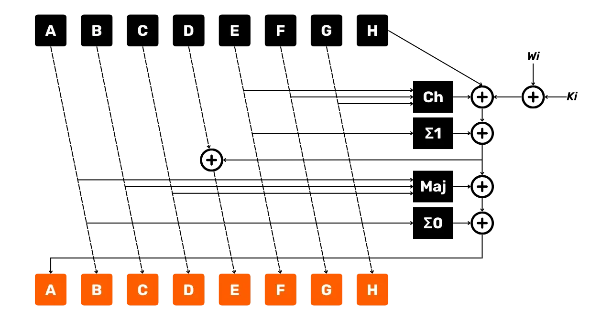


Dalje ćemo diskutovati o radu algoritama digitalnog potpisa koje koristite svakodnevno za osiguranje vaših UTXO-a. Bitcoin koristi dva: ECDSA i Schnorr protokol. Naučićete koji matematički primitivni elementi leže u osnovi ovih algoritama i kako oni osiguravaju bezbednost transakcija.


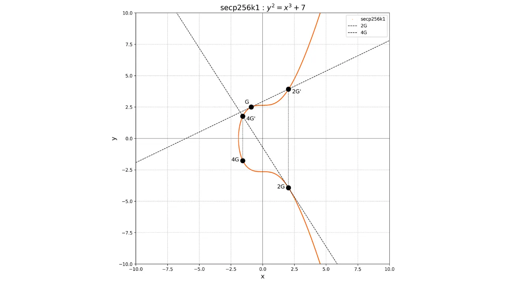


Jednom kada dobro razumemo ove Elements kriptografije, konačno ćemo preći na srž obuke: determinističke i hijerarhijske novčanike! Prvo, postoji odeljak posvećen Mnemonic frazama, tim sekvencama od 12 ili 24 reči koje vam omogućavaju da kreirate i obnovite svoje novčanike. Otkrićete kako se ove reči generišu iz izvora entropije i kako olakšavaju korišćenje Bitcoin.


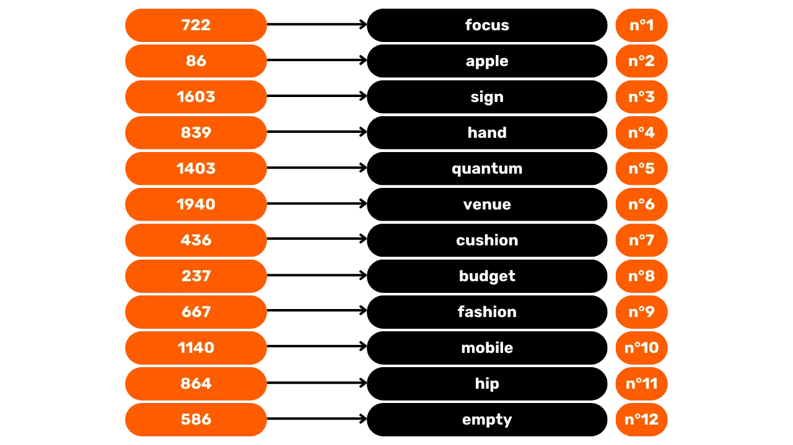


Obuka će se nastaviti proučavanjem BIP39 passphrase, seed (ne treba ga mešati sa frazom Mnemonic), master lanca koda i master ključa. Videćemo detaljno šta su ovi Elements, njihove odgovarajuće uloge i kako se izračunavaju.


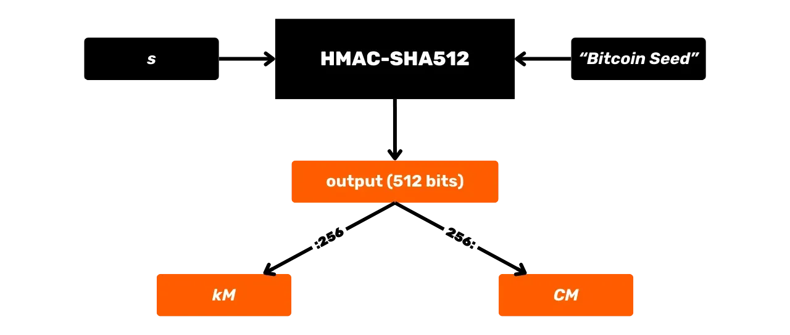


Konačno, iz glavnog ključa, otkrićemo kako se kriptografski parovi ključeva izvode na deterministički i hijerarhijski način do adresa za primanje.


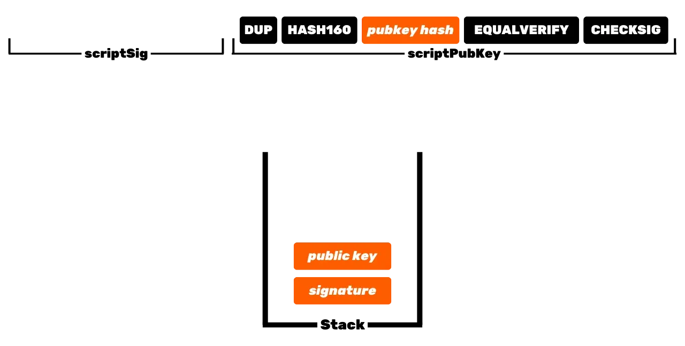


Ova obuka će vam omogućiti da koristite vaš Wallet softver sa samopouzdanjem, dok unapređujete svoje veštine za identifikaciju i ublažavanje rizika. Pripremite se da postanete pravi stručnjak za Bitcoin novčanike!


# Hash Funkcije


<partId>3713fee1-2ec2-512e-9e97-b6da9e4d2f17</partId>


## Uvod u funkcije Hash


<chapterId>dba011f5-1805-5a48-ac2b-4bd637c93703</chapterId>


Prvi tip kriptografskih algoritama korišćenih u Bitcoin obuhvata Hash funkcije. One igraju ključnu ulogu na različitim nivoima protokola, ali i unutar Bitcoin novčanika. Hajde da zajedno otkrijemo šta je Hash funkcija i za šta se koristi u Bitcoin.


### Definicija i princip heširanja


Heširanje je proces koji transformiše informacije proizvoljne dužine u drugi deo informacija fiksne dužine putem kriptografske funkcije Hash. Drugim rečima, funkcija Hash uzima ulaz bilo koje veličine i pretvara ga u otisak fiksne veličine, nazvan "Hash".

Hash se takođe ponekad može nazivati "digest", "condensate", "condensed" ili "hashed".


Na primer, SHA256 Hash funkcija proizvodi Hash fiksne dužine od 256 bita. Dakle, ako koristimo ulaz "_PlanB_", poruku proizvoljne dužine, generisani Hash će biti sledeći otisak od 256 bita:


```text
24f1b93b68026bfc24f5c8265f287b4c940fb1664b0d75053589d7a4f821b688
```


### Karakteristike Hash funkcija


Ove kriptografske funkcije Hash imaju nekoliko osnovnih karakteristika koje ih čine posebno korisnim u kontekstu Bitcoin i drugih računarskih sistema:


- Nepovratnost (ili otpornost na preimage)
- Otpornost na neovlašćeno menjanje (efekat lavine)
- Otpornost na koliziju
- Otpornost na drugu predočivu sliku


#### 1. Nepovratnost (otpornost na preimage):


Nepovratnost znači da je lako izračunati Hash iz ulaznih informacija, ali obrnuti proračun, odnosno pronalaženje ulaza iz Hash, je praktično nemoguće. Ovo svojstvo čini Hash funkcije savršenim za kreiranje jedinstvenih digitalnih otisaka prstiju bez ugrožavanja originalnih informacija. Ova karakteristika se često naziva funkcijom u jednom smeru.


U datom primeru, dobijanje Hash `24f1b9…` znajući unos "_PlanB_" je jednostavno i brzo. Međutim, pronalaženje poruke "_PlanB_" samo znajući `24f1b9…` je nemoguće.


Stoga je nemoguće pronaći preimage $m$ za Hash $h$ tako da je $h = \text{Hash}(m)$, gde je $\text{Hash}$ kriptografska Hash funkcija.


#### 2. Otpornost na neovlašćene izmene (efekat lavine)


Druga karakteristika je otpornost na neovlašćene izmene, takođe poznata kao **efekat lavine**. Ova karakteristika se primećuje u Hash funkciji ako mala promena u ulaznoj poruci rezultira radikalnom promenom u izlazu Hash.


Ako se vratimo na naš primer sa unosom "_PlanB_" i SHA256 funkcijom, videli smo da generisani Hash izgleda ovako:


```text
24f1b93b68026bfc24f5c8265f287b4c940fb1664b0d75053589d7a4f821b688
```


Ako napravimo vrlo malu promenu u unosu koristeći "_Planb_" ovaj put, onda jednostavno menjanje velikog slova "B" u malo slovo "b" potpuno menja SHA256 izlaz Hash:


```text
bb038b4503ac5d90e1205788b00f8f314583c5e22f72bec84b8735ba5a36df3f
```


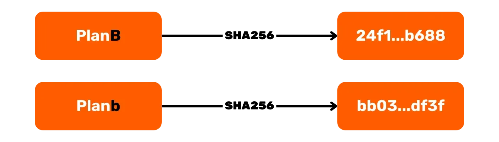


Ovo svojstvo osigurava da se čak i najmanja promena originalne poruke odmah otkriva, jer ne menja samo mali deo Hash, već ceo Hash. Ovo može biti od interesa u raznim oblastima za verifikaciju integriteta poruka, softvera ili čak Bitcoin transakcija.


#### 3. Otpornost na kolizije


Treća karakteristika je otpornost na koliziju. Funkcija Hash je otporna na koliziju ako je računarski nemoguće pronaći 2 različite poruke koje proizvode isti Hash izlaz iz funkcije. Formalno, teško je pronaći dve različite poruke $m_1$ i $m_2$ tako da:


$$
\text{HASH}(m_1) = \text{HASH}(m_2)
$$


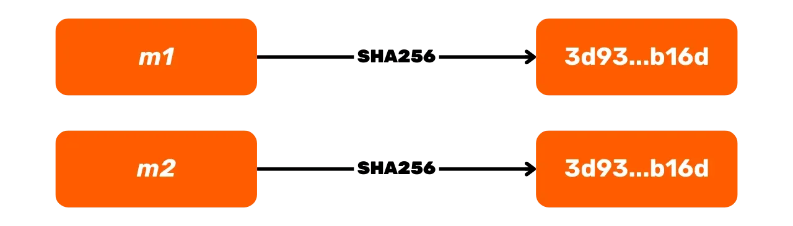


U stvarnosti, matematički je neizbežno da sudari postoje za Hash funkcije, jer veličina ulaza može biti veća od veličine izlaza. Ovo je poznato kao Dirihleov princip fioka: ako je $n$ objekata raspoređeno u $m$ fioka, sa $m < n$, onda će bar jedna fioka nužno sadržati dva ili više objekata. Za Hash funkciju, ovaj princip se primenjuje jer je broj mogućih poruka (gotovo) beskonačan, dok je broj mogućih heševa konačan ($2^{256}$ u slučaju SHA256).


Dakle, ova karakteristika ne znači da ne postoje kolizije za Hash funkcije, već da dobra Hash funkcija čini verovatnoću pronalaženja kolizije zanemarljivom. Ova karakteristika, na primer, više nije potvrđena za SHA-0 i SHA-1 algoritme, prethodnike SHA-2, za koje su pronađene kolizije. Ove funkcije se stoga sada ne preporučuju i često se smatraju zastarelim.

Za Hash funkciju od $n$ bita, otpornost na kolizije je reda veličine $2^{\frac{n}{2}}$, u skladu sa napadom rođendana. Na primer, za SHA256 ($n = 256$), složenost pronalaženja kolizije je reda veličine $2^{128}$ pokušaja. U praktičnim terminima, to znači da ako se prođe $2^{128}$ različitih poruka kroz funkciju, verovatno će se pronaći kolizija.


#### 4. Otpornost na drugi predslik


Otpornost na drugi preimage je još jedna važna karakteristika Hash funkcija. Ona navodi da je, uz datu poruku $m_1$ i njen Hash $h$, računarski neizvodljivo pronaći drugu poruku $m_2 \neq m_1$ takvu da:


$$
\text{HASH}(m_1) = \text{HASH}(m_2)
$$


Stoga, otpornost na drugi preimage je donekle slična otpornosti na koliziju, osim što je ovde napad teži jer napadač ne može slobodno izabrati $m_1$.


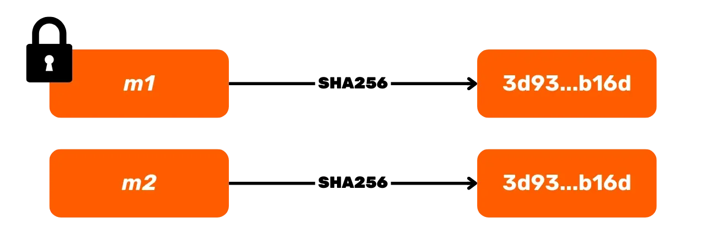


### Primene primene funkcija Hash u Bitcoin


Najčešće korišćena funkcija Hash u Bitcoin je **SHA256** ("_Secure Hash Algorithm 256 bits"_). Dizajnirana početkom 2000-ih od strane NSA i standardizovana od strane NIST, proizvodi 256-bitni Hash izlaz.


Ova funkcija se koristi u mnogim aspektima Bitcoin. Na nivou protokola, uključena je u mehanizam Proof-of-Work, gde se primenjuje dvostruko heširanje za traženje delimičnog sudara između zaglavlja kandidata bloka, kreiranog od strane Miner, i cilja težine. Ako se ovaj delimični sudar pronađe, kandidat blok postaje važeći i može biti dodat u Blockchain.


SHA256 se takođe koristi u konstrukciji Merkle Tree, koji je posebno akumulator korišćen za beleženje transakcija u blokovima. Ova struktura se takođe nalazi u Utreexo protokolu, koji omogućava smanjenje veličine UTXO skupa. Dodatno, sa uvođenjem Taproot 2021. godine, SHA256 se koristi u MAST (_Merkelised Alternative Script Tree_), koji omogućava otkrivanje samo uslova potrošnje koji su zapravo korišćeni u skripti, bez otkrivanja drugih mogućih opcija. Takođe se koristi u izračunavanju identifikatora transakcija, u prenosu paketa preko P2P mreže, u elektronskim potpisima... Na kraju, i ovo je od posebnog interesa u ovoj obuci, SHA256 se koristi na nivou aplikacije za konstrukciju Bitcoin novčanika i derivaciju adresa.


Većinu vremena, kada naiđete na upotrebu SHA256 u Bitcoin, to će zapravo biti dvostruki Hash SHA256, označen kao "**HASH256**", što jednostavno podrazumeva primenu SHA256 dva puta uzastopno:


$$
\text{HASH256}(m) = \text{SHA256}(\text{SHA256}(m))
$$


Ova praksa dvostrukog heširanja dodaje dodatni Layer nivo sigurnosti protiv određenih potencijalnih napada, iako se jedan SHA256 danas smatra kriptografski sigurnim.


Još jedna heš funkcija dostupna u Script jeziku i korišćena za dobijanje adresa za primanje je RIPEMD160 funkcija. Ova funkcija proizvodi 160-bitni Hash (dakle kraći od SHA256). Generalno se kombinuje sa SHA256 da bi se formirala HASH160 funkcija:


$$
\text{HASH160}(m) = \text{RIPEMD160}(\text{SHA256}(m))
$$


Ova kombinacija se koristi za generate kraće hešove, posebno u kreiranju određenih Bitcoin adresa koje predstavljaju hešove ključeva ili skript hešove, kao i za proizvodnju otisaka prstiju ključeva.


Konačno, samo na nivou aplikacije, ponekad se koristi i funkcija SHA512, koja indirektno igra ulogu u derivaciji ključeva za novčanike. Ova funkcija je veoma slična SHA256 u svom radu; obe pripadaju istoj SHA2 porodici, ali SHA512 proizvodi, kao što njen naziv ukazuje, 512-bitni Hash, u poređenju sa 256 bita za SHA256. Njenu upotrebu ćemo detaljno opisati u narednim poglavljima.


Sada znate osnovne osnove o heš funkcijama za ono što sledi. U sledećem poglavlju predlažem da detaljnije otkrijemo rad funkcije koja je u srcu Bitcoin: SHA256. Rasklopićemo je kako bismo razumeli kako postiže karakteristike koje smo ovde opisali. Ovo sledeće poglavlje je prilično dugo i tehničko, ali nije neophodno za praćenje ostatka obuke. Dakle, ako imate poteškoća sa razumevanjem, ne brinite i pređite direktno na sledeće poglavlje, koje će biti mnogo pristupačnije.


## Unutrašnji rad SHA256


<chapterId>905eb320-f15b-5fb6-8d2d-5bb447337deb</chapterId>


Ranije smo videli da heš funkcije poseduju važne karakteristike koje opravdavaju njihovu upotrebu u Bitcoin. Hajde sada da ispitamo unutrašnje mehanizme ovih heš funkcija koje im daju ova svojstva, i da bismo to uradili, predlažem da rastavimo operaciju SHA256.


Funkcije SHA256 i SHA512 pripadaju istoj porodici SHA2. Njihov mehanizam zasnovan je na specifičnoj konstrukciji zvanoj **Merkle-Damgård konstrukcija**. RIPEMD160 takođe koristi ovaj isti tip konstrukcije.


Kao podsetnik, imamo poruku proizvoljne veličine kao ulaz za SHA256, i proći ćemo je kroz funkciju da bismo dobili 256-bitni Hash kao izlaz.


### Pre-procesiranje ulaza


Da bismo započeli, potrebno je pripremiti našu ulaznu poruku $m$ tako da ima standardnu dužinu koja je višestruka od 512 bita. Ovaj korak je ključan za pravilno funkcionisanje algoritma kasnije.

Da bismo to uradili, počinjemo sa korakom dodavanja bitova za popunjavanje. Prvo dodajemo separator bit `1` poruci, praćen sa određenim brojem `0` bitova. Broj dodatih `0` bitova se računa tako da ukupna dužina poruke nakon ovog dodavanja bude kongruentna sa 448 modulo 512. Dakle, dužina $L$ poruke sa bitovima za popunjavanje je jednaka:


$$
L \equiv 448 \mod 512
$$


$\text{mod}$, za modulo, je matematička operacija koja, između dva cela broja, vraća ostatak Euklidove podele prvog broja drugim. Na primer: $16 \mod 5 = 1$. To je operacija koja se široko koristi u kriptografiji.


Ovde, korak popunjavanja osigurava da, nakon dodavanja 64 bita u sledećem koraku, ukupna dužina izjednačene poruke bude višekratnik od 512 bita. Ako početna poruka ima dužinu od $M$ bita, broj ($N$) `0` bita koji treba dodati je stoga:


$$
N = (448 - (M + 1) \mod 512) \mod 512
$$


Na primer, ako je početna poruka 950 bita, proračun bi bio sledeći:


$$
\begin{align*}
M & = 950 \\
M + 1 & = 951 \\
(M + 1) \mod 512 & = 951 \mod 512 \\
& = 951 - 512 \cdot \left\lfloor \frac{951}{512} \right\rfloor \\
& = 951 - 512 \cdot 1 \\
& = 951 - 512 \\
& = 439 \\
\\
448 - (M + 1) \mod 512 & = 448 - 439 \\
& = 9 \\
\\
N & = (448 - (M + 1) \mod 512) \mod 512 \\
N & = 9 \mod 512 \\
& = 9
\end{align*}
$$


Dakle, imali bismo 9 `0` uz separator `1`. Naši bita za popunjavanje koji će biti dodati direktno nakon naše poruke $M$ biće:


```text
1000 0000 00
```


Nakon dodavanja padding bitova našoj poruci $M$, takođe dodajemo 64-bitnu reprezentaciju originalne dužine poruke $M$, izraženu u binarnom obliku. Ovo omogućava funkciji Hash da bude osetljiva na redosled bitova i dužinu poruke.


Ako se vratimo na naš primer sa početnom porukom od 950 bita, konvertujemo decimalni broj `950` u binarni, što nam daje `1110 1101 10`. Ovaj broj dopunjujemo nulama na osnovi da bismo dobili ukupno 64 bita. U našem primeru, to daje:


```text
0000 0000 0000 0000 0000 0000 0000 0000 0000 0000 0000 0000 0000 0011 1011 0110
```


Ova veličina popunjavanja se dodaje nakon popunjavanja bitovima. Dakle, poruka nakon našeg predprocesiranja sastoji se od tri dela:


- Originalna poruka $M$;
- Bit `1` praćen sa nekoliko bitova `0` da formira bit padding;
- 64-bitna reprezentacija dužine $M$ za formiranje popunjavanja sa veličinom.


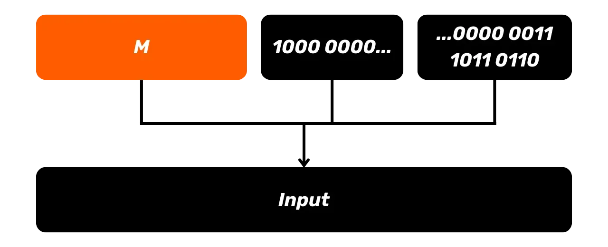


### Inicijalizacija promenljivih


SHA256 koristi osam početnih promenljivih stanja, označenih sa $A$ do $H$, svaka od 32 bita. Ove promenljive su inicijalizovane specifičnim konstantama, koje su razlomljeni delovi kvadratnih korena prvih osam prostih brojeva. Ove vrednosti ćemo koristiti naknadno tokom procesa heširanja:


- $A = 0x6a09e667$
- $B = 0xbb67ae85$
- $C = 0x3c6ef372$
- $D = 0xa54ff53a$
- $E = 0x510e527f$
- $F = 0x9b05688c$
- $G = 0x1f83d9ab$
- $H = 0x5be0cd19$


SHA256 takođe koristi 64 druge konstante, označene sa $K_0$ do $K_{63}$, koje su frakcioni delovi kubnih korena prvih 64 prostih brojeva:


$$
K[0 \ldots 63] = \begin{pmatrix}
0x428a2f98, & 0x71374491, & 0xb5c0fbcf, & 0xe9b5dba5, \\
0x3956c25b, & 0x59f111f1, & 0x923f82a4, & 0xab1c5ed5, \\
0xd807aa98, & 0x12835b01, & 0x243185be, & 0x550c7dc3, \\
0x72be5d74, & 0x80deb1fe, & 0x9bdc06a7, & 0xc19bf174, \\
0xe49b69c1, & 0xefbe4786, & 0x0fc19dc6, & 0x240ca1cc, \\
0x2de92c6f, & 0x4a7484aa, & 0x5cb0a9dc, & 0x76f988da, \\
0x983e5152, & 0xa831c66d, & 0xb00327c8, & 0xbf597fc7, \\
0xc6e00bf3, & 0xd5a79147, & 0x06ca6351, & 0x14292967, \\
0x27b70a85, & 0x2e1b2138, & 0x4d2c6dfc, & 0x53380d13, \\
0x650a7354, & 0x766a0abb, & 0x81c2c92e, & 0x92722c85, \\
0xa2bfe8a1, & 0xa81a664b, & 0xc24b8b70, & 0xc76c51a3, \\
0xd192e819, & 0xd6990624, & 0xf40e3585, & 0x106aa070, \\
0x19a4c116, & 0x1e376c08, & 0x2748774c, & 0x34b0bcb5, \\
0x391c0cb3, & 0x4ed8aa4a, & 0x5b9cca4f, & 0x682e6ff3, \\
0x748f82ee, & 0x78a5636f, & 0x84c87814, & 0x8cc70208, \\
0x90befffa, & 0xa4506ceb, & 0xbef9a3f7, & 0xc67178f2
\end{pmatrix}
$$


### Podela unosa


Sada kada imamo izjednačen ulaz, preći ćemo na glavnu fazu obrade SHA256 algoritma: funkciju kompresije. Ovaj korak je veoma važan, jer je to prvenstveno ono što daje Hash funkciji njene kriptografske osobine koje smo proučavali u prethodnom poglavlju.


Prvo, počinjemo tako što našu izjednačenu poruku (rezultat koraka predobrade) delimo na nekoliko blokova $P$ od po 512 bita. Ako naša izjednačena poruka ima ukupnu veličinu od $n \times 512$ bita, imaćemo $n$ blokova, svaki od po 512 bita. Svaki blok od 512 bita biće obrađen pojedinačno pomoću funkcije kompresije, koja se sastoji od 64 runde uzastopnih operacija. Nazovimo ove blokove $P_1$, $P_2$, $P_3$...


### Logičke Operacije


Pre nego što detaljno istražimo funkciju kompresije, važno je razumeti osnovne logičke operacije koje se koriste u njoj. Ove operacije, zasnovane na Bulovoj algebri, funkcionišu na nivou bita. Osnovne logičke operacije koje se koriste su:


- Konjunkcija (I)**: označena sa $\land$, odgovara logičkom "I".
- Disjunkcija (ILI)**: označena sa $\lor$, odgovara logičkom "ILI".
- Negacija (NOT)**: označena sa $\lnot$, odgovara logičkom "NOT".


Iz ovih osnovnih operacija, možemo definisati složenije operacije, kao što je "Ekskluzivno ILI" (XOR) označeno sa $\oplus$, koje se široko koristi u kriptografiji.

Svaka logička operacija može biti predstavljena tabelom istinitosti, koja pokazuje rezultat za sve moguće kombinacije binarnih ulaznih vrednosti (dva operanda $p$ i $q$).

Za XOR ($\oplus$):


| $p$ | $q$ | $p \oplus q$ |
| --- | --- | ------------ |
| 0   | 0   | 0            |
| 0   | 1   | 1            |
| 1   | 0   | 1            |
| 1   | 1   | 0            |

Za I ($\land$):


| $p$ | $q$ | $p \land q$ |
| --- | --- | ----------- |
| 0   | 0   | 0           |
| 0   | 1   | 0           |
| 1   | 0   | 0           |
| 1   | 1   | 1           |

ZA NE ($\lnot p$):


| $p$ | $\lnot p$ |
| --- | --------- |
| 0   | 1         |
| 1   | 0         |

Hajde da uzmemo primer da bismo razumeli operaciju XOR na nivou bita. Ako imamo dva binarna broja na 6 bita:


- $a = 101100$
- $b = 001000$


Onda:


$$

a \oplus b = 101100 \oplus 001000 = 100100


$$


Primjenom XOR-a bit po bit:


| Bit Position | $a$ | $b$ | $a \oplus b$ |
| ------------ | --- | --- | ------------ |
| 1            | 1   | 0   | 1            |
| 2            | 0   | 0   | 0            |
| 3            | 1   | 1   | 0            |
| 4            | 1   | 0   | 1            |
| 5            | 0   | 0   | 0            |
| 6            | 0   | 0   | 0            |

Rezultat je dakle $100100$.


Pored logičkih operacija, funkcija kompresije koristi operacije pomeranja bitova, koje će igrati ključnu ulogu u difuziji bitova u algoritmu.


Prvo, tu je logička operacija pomeranja udesno, označena sa $ShR_n(x)$, koja pomera sve bitove $x$ udesno za $n$ pozicija, popunjavajući prazne bitove s leve strane nulama.


Na primer, za $x = 101100001$ (na 9 bita) i $n = 4$:


$$

ShR_4(101100001) = 000010110


$$


Shema za operaciju desnog pomeranja može izgledati ovako:


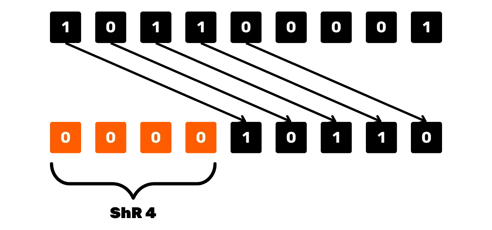


Još jedna operacija koja se koristi u SHA256 za manipulaciju bitovima je desna kružna rotacija, označena sa $RotR_n(x)$, koja pomera bitove $x$ udesno za $n$ pozicija, ponovo ubacujući pomerene bitove na početak niza.

Na primer, za $x = 101100001$ (preko 9 bita) i $n = 4$:


$$

RotR_4(101100001) = 000110110


$$


Shema za operaciju desnog kružnog pomeranja može izgledati ovako:


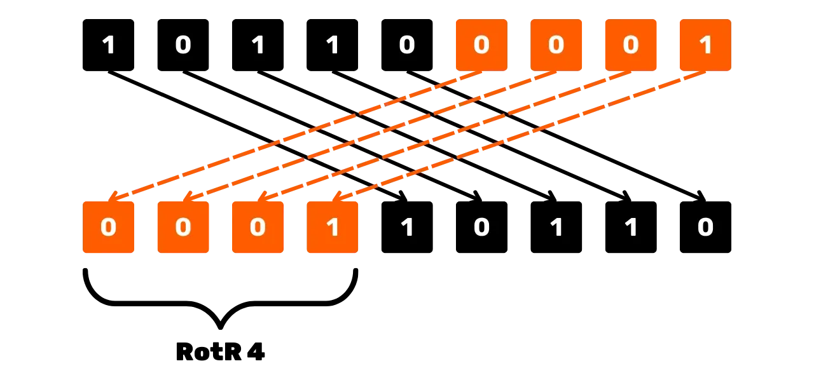


### Funkcija kompresije


Sada kada smo razumeli osnovne operacije, hajde da detaljno ispitamo SHA256 funkciju kompresije.


U prethodnom koraku, podelili smo naš ulaz na nekoliko delova od 512 bita $P$. Za svaki blok od 512 bita $P$, imamo:


- Reči poruke $W_i$**: za $i$ od 0 do 63.
- Konstante $K_i$**: za $i$ od 0 do 63, definisane u prethodnom koraku.
- Državne promenljive $A, B, C, D, E, F, G, H$**: inicijalizovane vrednostima iz prethodnog koraka.


Prvih 16 reči, $W_0$ do $W_{15}$, direktno su izvučene iz obrađenog 512-bitnog bloka $P$. Svaka reč $W_i$ se sastoji od 32 uzastopna bita iz bloka. Na primer, uzimamo naš prvi deo ulaza $P_1$, i dalje ga delimo na manje delove od 32 bita koje nazivamo rečima.


Sledećih 48 reči ($W_{16}$ do $W_{63}$) generiše se koristeći sledeću formulu:


$$
W_i = W_{i-16} + \sigma_0(W_{i-15}) + W_{i-7} + \sigma_1(W_{i-2}) \mod 2^{32}
$$


Sa:


- $\sigma_0(x) = RotR_7(x) \oplus RotR_{18}(x) \oplus ShR_3(x)$
- $\sigma_1(x) = RotR_{17}(x) \oplus RotR_{19}(x) \oplus ShR_{10}(x)$


U ovom slučaju, $x$ je jednako $W_{i-15}$ za $\sigma_0(x)$ i $W_{i-2}$ za $\sigma_1(x)$.


Jednom kada odredimo sve reči $W_i$ za naš 512-bitni deo, možemo preći na funkciju kompresije, koja se sastoji od izvođenja 64 runde.


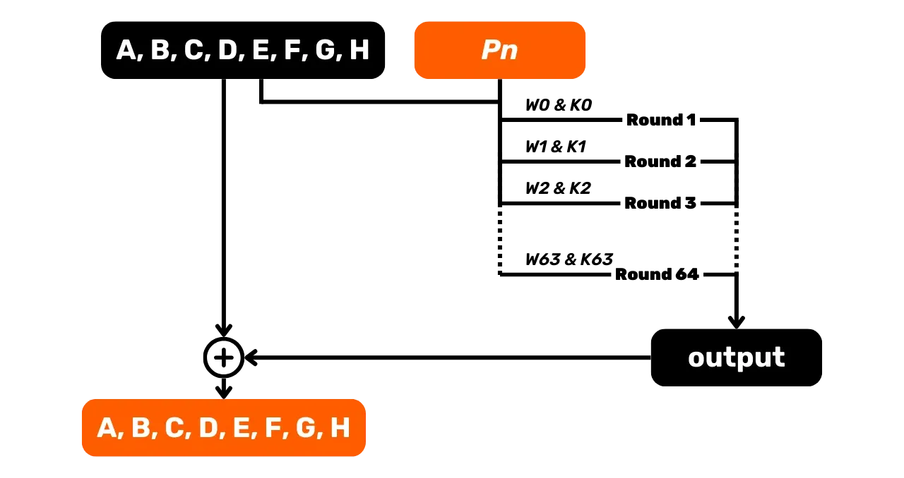

Za svaku rundu $i$ od 0 do 63, imamo tri različite vrste ulaza. Prvo, $W_i$ koji smo upravo odredili, delimično sastavljen od našeg dela poruke $P_n$. Zatim, 64 konstante $K_i$. Na kraju, koristimo promenljive stanja $A$, $B$, $C$, $D$, $E$, $F$, $G$ i $H$, koje će se razvijati tokom procesa heširanja i biti modifikovane sa svakom funkcijom kompresije. Međutim, za prvi deo $P_1$, koristimo prethodno date početne konstante.


Zatim izvršavamo sledeće operacije na našim unosima:


- Funkcija $\Sigma_0$:**


$$
\Sigma_0(A) = RotR_2(A) \oplus RotR_{13}(A) \oplus RotR_{22}(A)
$$


- Funkcija $\Sigma_1$:**


$$
\Sigma_1(E) = RotR_6(E) \oplus RotR_{11}(E) \oplus RotR_{25}(E)
$$


- Funkcija $Ch$ ("_Choose_"):**


$$
Ch(E, F, G) = (E \land F) \oplus (\lnot E \land G)
$$


- Funkcija $Maj$ ("_Majority_"):**


$$
Maj(A, B, C) = (A \land B) \oplus (A \land C) \oplus (B \land C)
$$


Zatim izračunavamo 2 privremene promenljive:


- $temp1$:


$$
temp1 = H + \Sigma_1(E) + Ch(E, F, G) + K_i + W_i \mod 2^{32}
$$


- $temp2$:


$$
temp2 = \Sigma_0(A) + Maj(A, B, C) \mod 2^{32}
$$


Zatim ažuriramo promenljive stanja na sledeći način:


$$
\begin{cases}
H = G \\
G = F \\
F = E \\
E = D + temp1 \mod 2^{32} \\
D = C \\
C = B \\
B = A \\
A = temp1 + temp2 \mod 2^{32}
\end{cases}
$$


Sledeći dijagram predstavlja rundu SHA256 kompresione funkcije kako smo upravo opisali:


- Strelice označavaju tok podataka;
- Kutije predstavljaju izvršene operacije;
- Znakovi $+$ okruženi predstavljaju sabiranje modulo $2^{32}$.


Već možemo primetiti da ova runda daje nove promenljive stanja $A$, $B$, $C$, $D$, $E$, $F$, $G$ i $H$. Ove nove promenljive će služiti kao ulaz za sledeću rundu, koja će zauzvrat proizvesti nove promenljive $A$, $B$, $C$, $D$, $E$, $F$, $G$ i $H$, koje će se koristiti za narednu rundu. Ovaj proces se nastavlja do 64. runde.

Nakon 64 runde, ažuriramo početne vrednosti promenljivih stanja dodavanjem konačnih vrednosti na kraju 64. runde:


$$
\begin{cases}
A = A_{\text{initial}} + A \mod 2^{32} \\
B = B_{\text{initial}} + B \mod 2^{32} \\
C = C_{\text{initial}} + C \mod 2^{32} \\
D = D_{\text{initial}} + D \mod 2^{32} \\
E = E_{\text{initial}} + E \mod 2^{32} \\
F = F_{\text{initial}} + F \mod 2^{32} \\
G = G_{\text{initial}} + G \mod 2^{32} \\
H = H_{\text{initial}} + H \mod 2^{32}
\end{cases}
$$


Ove nove vrednosti $A$, $B$, $C$, $D$, $E$, $F$, $G$, i $H$ će služiti kao početne vrednosti za sledeći blok, $P_2$. Za ovaj blok $P_2$, ponavljamo isti proces kompresije sa 64 runde, zatim ažuriramo promenljive za blok $P_3$, i tako dalje sve do poslednjeg bloka našeg izjednačenog ulaza.


Nakon obrade svih blokova poruka, koncateniramo konačne vrednosti promenljivih $A$, $B$, $C$, $D$, $E$, $F$, $G$ i $H$ da bismo formirali konačni 256-bitni Hash naše heš funkcije:


$$

\text{Hash} = A \Vert B \Vert C \Vert D \Vert E \Vert F \Vert G \Vert H


$$


Svaka promenljiva je 32-bitni ceo broj, tako da njihova konkatenacija uvek daje 256-bitni rezultat, bez obzira na veličinu našeg ulaznog poruke za heš funkciju.


### Justifikacija Kriptografskih Svojstava


Ali, kako je onda ova funkcija ireverzibilna, otporna na kolizije i otporna na manipulacije?


Za otpornost na neovlašćene izmene, prilično je jednostavno razumeti. Postoji mnogo proračuna koji se izvode u kaskadi, koji zavise i od ulaza i od konstanti, da i najmanja izmena početne poruke potpuno menja putanju, i tako potpuno menja izlaz Hash. Ovo se naziva efektom lavine. Ova osobina je delimično osigurana mešanjem međustanja sa početnim stanjima za svaki deo.

Zatim, kada se diskutuje o kriptografskoj funkciji Hash, termin "nepovratnost" se generalno ne koristi. Umesto toga, govorimo o "otpornosti na preimage," što znači da je za bilo koje dato $y$ teško pronaći $x$ takvo da je $h(x) = y$. Ova otpornost na preimage je zagarantovana algebarskom složenošću i jakom nelinearnošću operacija koje se izvode u funkciji kompresije, kao i gubitkom određenih informacija u procesu. Na primer, za dati rezultat sabiranja po modulu, postoji nekoliko mogućih operanada:


$$

3+2 \mod 10 = 5 \\
7+8 \mod 10 = 5 \\
5+10 \mod 10 = 5


$$


U ovom primeru, znajući samo korišćeni modulo (10) i rezultat (5), ne može se sa sigurnošću odrediti koji su tačni operandi korišćeni u sabiranju. Kaže se da postoji više kongruencija modulo 10.


Za operaciju XOR suočavamo se sa istim problemom. Setite se tabele istinitosti za ovu operaciju: bilo koji 1-bitni izlaz može biti određen sa dve različite ulazne konfiguracije koje imaju potpuno istu verovatnoću da budu tačne vrednosti. Stoga, ne može se sa sigurnošću odrediti operandi XOR-a znajući samo njegov rezultat. Ako povećamo veličinu operanada XOR-a, broj mogućih ulaza znajući samo rezultat eksponencijalno raste. Štaviše, XOR se često koristi zajedno sa drugim operacijama na nivou bita, kao što je operacija $\text{RotR}$, koje dodaju još više mogućih interpretacija rezultatu.


Funkcija kompresije takođe koristi operaciju $\text{ShR}$. Ova operacija uklanja deo osnovnih informacija, koje je kasnije nemoguće povratiti. Još jednom, ne postoji algebarski način da se ova operacija obrne. Sve ove operacije jednosmernog gubitka informacija se veoma često koriste u funkcijama kompresije. Broj mogućih ulaza za dati izlaz je stoga gotovo beskonačan, i svaki pokušaj obrnutog izračunavanja bi doveo do jednačina sa veoma velikim brojem nepoznatih, što bi se eksponencijalno povećavalo na svakom koraku.


Konačno, za karakteristiku otpornosti na kolizije, u igru ulazi nekoliko parametara. Predobrada originalne poruke igra ključnu ulogu. Bez ove predobrade, moglo bi biti lakše pronaći kolizije u funkciji. Iako, teoretski, kolizije postoje (zbog principa golubarnika), struktura Hash funkcije, u kombinaciji sa prethodno navedenim svojstvima, čini verovatnoću pronalaženja kolizije izuzetno niskom.

Da bi funkcija Hash bila otporna na kolizije, neophodno je da:


- Izlaz je nepredvidiv: Svaka predvidljivost može biti iskorišćena za pronalaženje kolizija brže nego sa napadom grubom silom. Funkcija osigurava da svaki bit izlaza zavisi na složen način od ulaza. Drugim rečima, funkcija je dizajnirana tako da svaki bit konačnog rezultata ima nezavisnu verovatnoću da bude 0 ili 1, čak i ako ta nezavisnost nije apsolutna u praksi.
- Distribucija heševa je pseudo-slučajna: Ovo osigurava da su heševi ravnomerno raspoređeni.
- Veličina Hash je značajna: što je veći mogući prostor za rezultate, to je teže pronaći koliziju.


Kriptografi dizajniraju ove funkcije procenjujući najbolje moguće napade za pronalaženje kolizija, a zatim prilagođavaju parametre kako bi ti napadi postali neefikasni.


### Merkle-Damgård Konstrukcija


Struktura SHA256 zasnovana je na Merkle-Damgård konstrukciji, koja omogućava transformaciju kompresione funkcije u Hash funkciju koja može obraditi poruke proizvoljne dužine. Ovo je upravo ono što smo videli u ovom poglavlju.


Međutim, neke stare Hash funkcije kao što su SHA1 ili MD5, koje koriste ovu specifičnu konstrukciju, su ranjive na napade produženja dužine. Ovo je tehnika koja omogućava napadaču koji zna Hash poruke $M$ i dužinu $M$ (bez poznavanja same poruke) da izračuna Hash poruke $M'$ formirane spajanjem $M$ sa dodatnim sadržajem.


SHA256, even though it uses the same type of construction, is theoretically resistant to this type of attack, unlike SHA1 and MD5. This might explain the mystery of the double hashing implemented throughout Bitcoin by Satoshi Nakamoto. To avoid this type of attack, Satoshi might have preferred to use a double SHA256:


$$

\text{HASH256}(m) = \text{SHA256}(\text{SHA256}(m))


$$


Ovo poboljšava sigurnost protiv potencijalnih napada povezanih sa Merkle-Damgård konstrukcijom, ali ne povećava sigurnost procesa heširanja u smislu otpornosti na kolizije. Štaviše, čak i da je SHA256 bio ranjiv na ovu vrstu napada, to ne bi imalo ozbiljan uticaj, jer svi slučajevi upotrebe Hash funkcija u Bitcoin uključuju javne podatke. Međutim, napad produženja dužine mogao bi biti koristan napadaču samo ako su heširani podaci privatni i korisnik je koristio Hash funkciju kao mehanizam autentifikacije za te podatke, slično MAC-u. Stoga, implementacija dvostrukog heširanja ostaje misterija u dizajnu Bitcoin.

Sada kada smo detaljno pogledali kako funkcionišu Hash funkcije, posebno SHA256, koja se intenzivno koristi u Bitcoin, fokusiraćemo se konkretnije na algoritme kriptografske derivacije korišćene na nivou aplikacije, posebno za derivaciju ključeva za vaš Wallet.


## Algoritmi korišćeni za izvođenje


<chapterId>cc668121-7789-5e99-bf5e-1ba085f4f5f2</chapterId>


Na Bitcoin na nivou aplikacije, pored funkcija Hash, koriste se algoritmi za kriptografsku derivaciju kako bi se generate zaštitili podaci od početnih ulaza. Iako se ovi algoritmi oslanjaju na funkcije Hash, služe različitim svrhama, posebno u smislu autentifikacije i generisanja ključeva. Ovi algoritmi zadržavaju neke od karakteristika funkcija Hash, kao što su ireverzibilnost, otpornost na manipulacije i otpornost na kolizije.


U Bitcoin novčanicima, uglavnom se koriste 2 algoritma derivacije:


- HMAC (_Hash-based Message Authentication Code_)**
- PBKDF2 (_Password-Based Key Derivation Function 2_)**


Istražićemo zajedno funkcionisanje i ulogu svakog od njih.


### HMAC-SHA512


HMAC je kriptografski algoritam koji izračunava autentifikacioni kod na osnovu kombinacije Hash funkcije i tajnog ključa. Bitcoin koristi HMAC-SHA512, varijantu HMAC-a koja koristi SHA512 Hash funkciju. Već smo videli u prethodnom poglavlju da je SHA512 deo iste porodice Hash funkcija kao i SHA256, ali proizvodi 512-bitni izlaz.


Evo njegovog opšteg operativnog šema sa $m$ kao ulaznom porukom i $K$ kao tajnim ključem:


Hajde da detaljnije proučimo šta se dešava u ovoj HMAC-SHA512 crnoj kutiji. Funkcija HMAC-SHA512 sa:


- $m$: proizvoljno velika poruka koju bira korisnik (prvi unos);
- $K$: proizvoljni tajni ključ koji bira korisnik (drugi unos);
- $K'$: ključ $K$ prilagođen veličini $B$ blokova funkcije Hash (1024 bita za SHA512, ili 128 bajtova);
- $\text{SHA512}$: SHA512 Hash funkcija;
- $\oplus$: XOR (isključivo ili) operacija;
- $\Vert$: operator za konkatenaciju, povezuje bitne nizove od kraja do kraja;
- $\text{opad}$: konstanta sastavljena od bajta $0x5c$ ponovljenog 128 puta
- $\text{ipad}$: konstanta sastavljena od bajta $0x36$ ponovljenog 128 puta.


Pre nego što se izračuna HMAC, potrebno je izjednačiti ključ i konstante prema veličini bloka $B$. Na primer, ako je ključ $K$ kraći od 128 bajtova, dopunjava se nulama da dostigne veličinu $B$. Ako je $K$ duži od 128 bajtova, kompresuje se koristeći SHA512, a zatim se dodaju nule dok ne dostigne 128 bajtova. Na taj način se dobija izjednačen ključ nazvan $K'$. Vrednosti $\text{opad}$ i $\text{ipad}$ se dobijaju ponavljanjem njihovog osnovnog bajta ($0x5c$ za $\text{opad}$, $0x36$ za $\text{ipad}$) dok se ne dostigne veličina $B$. Tako, sa $B = 128$ bajtova, imamo:


$$

\text{opad} = \underbrace{0x5c5c\ldots5c}\_{128 \  \text{bytes}}


$$


Jednom kada je prethodna obrada završena, HMAC-SHA512 algoritam je definisan sledećom jednačinom:


$$

\text{HMAC-SHA512}(K,m) = \text{SHA512} \left( (K' \oplus \text{opad}) \parallel \text{SHA512} \left( (K' \oplus \text{ipad}) \parallel m \right) \right)


$$


Ova jednačina je razložena na sledeće korake:


- XOR prilagođeni ključ $K'$ sa $\text{ipad}$ da bi se dobio $\text{iKpad}$;
- XOR prilagođeni ključ $K'$ sa $\text{opad}$ da bi se dobio $\text{oKpad}$;
- Konkateniraj $\text{iKpad}$ sa porukom $m$.
- Hash ovaj rezultat sa SHA512 da bi se dobio posredni Hash $H_1$.
- Konkateniraj $\text{oKpad}$ sa $H_1$.
- Hash ovaj rezultat sa SHA512 da bi se dobio konačni rezultat $H_2$.


Ovi koraci se mogu šematski rezimirati na sledeći način:


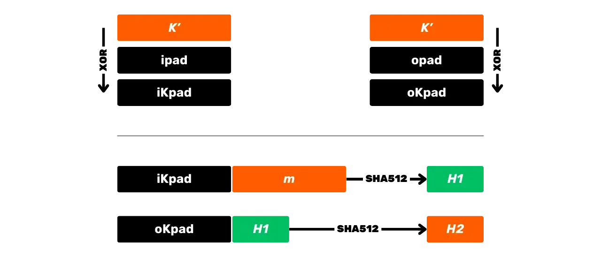


HMAC se koristi u Bitcoin posebno za derivaciju ključeva u HD (Hijerarhijski Determinističkim) novčanicima (o tome ćemo detaljnije govoriti u narednim poglavljima) i kao komponenta PBKDF2.


### PBKDF2


PBKDF2 (_Password-Based Key Derivation Function 2_) je algoritam za derivaciju ključeva dizajniran da poboljša sigurnost lozinki. Algoritam primenjuje pseudo-slučajnu funkciju (ovde HMAC-SHA512) na lozinku i kriptografski salt, a zatim ponavlja ovu operaciju određeni broj puta kako bi proizveo izlazni ključ.


U Bitcoin, PBKDF2 se koristi za generate seed HD Wallet iz Mnemonic fraze i passphrase (ali o tome ćemo detaljnije govoriti u narednim poglavljima).


PBKDF2 proces je sledeći, sa:


- $m$: korisnikova Mnemonic fraza;
- $s$: opcioni passphrase za povećanje sigurnosti (prazno polje ako nema passphrase);
- $n$: broj iteracija funkcije, u našem slučaju, to je 2048.


Funkcija PBKDF2 je definisana iterativno. Svaka iteracija uzima rezultat prethodne, prolazi ga kroz HMAC-SHA512 i kombinuje uzastopne rezultate kako bi proizvela konačni ključ:


$$

\text{PBKDF2}(m, s) = \text{HMAC-SHA512}^{2048}(m, s)


$$


Shema PBKDF2 može biti predstavljen na sledeći način:


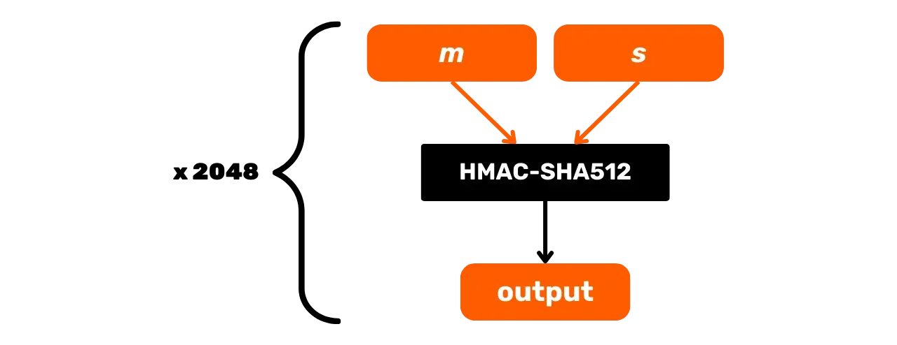


U ovom poglavlju smo istražili funkcije HMAC-SHA512 i PBKDF2, koje koriste heš funkcije kako bi osigurale integritet i sigurnost derivacija ključeva u Bitcoin protokolu. U sledećem delu ćemo se baviti digitalnim potpisima, još jednom kriptografskom metodom koja se široko koristi u Bitcoin.


# Digitalni potpisi


<partId>76b58a00-0c18-54b9-870d-6b7e34029db8</partId>


## Digitalni potpisi i eliptičke krive


<chapterId>c9dd9672-6da1-57f8-9871-8b28994d4c1a</chapterId>


Druga kriptografska metoda korišćena u Bitcoin uključuje algoritme digitalnog potpisa. Hajde da istražimo šta to podrazumeva i kako funkcioniše.


### Bitcoini, UTXO-i i Uslovi Trošenja


Termin "_wallet_" u Bitcoin može biti prilično zbunjujući za početnike. Zaista, ono što se naziva Bitcoin Wallet je softver koji ne drži direktno vaše bitkoine, za razliku od fizičkog Wallet koji može držati kovanice ili novčanice. Bitkoini su jednostavno jedinice računa. Ova jedinica računa je predstavljena **UTXO** (_Unspent Transaction Outputs_), što su neiskorišćeni izlazi transakcija. Ako ovi izlazi nisu iskorišćeni, to znači da pripadaju korisniku. UTXO-i su, na neki način, delovi bitkoina, promenljive veličine, koji pripadaju korisniku.


Bitcoin protokol je distribuiran i funkcioniše bez centralnog autoriteta. Stoga, nije kao tradicionalni bankarski zapisi, gde su evri koji pripadaju vama jednostavno povezani sa vašim ličnim identitetom. U Bitcoin, vaši UTXO-i pripadaju vama jer su zaštićeni uslovima trošenja specificiranim u Script jeziku. Da pojednostavimo, postoje dve vrste skripti: skripta zaključavanja (_scriptPubKey_), koja štiti UTXO, i skripta otključavanja (_scriptSig_), koja omogućava otključavanje UTXO i time trošenje Bitcoin jedinica koje predstavlja.

Početna operacija Bitcoin sa P2PK skriptama uključuje korišćenje javnog ključa za zaključavanje sredstava, navodeći u _scriptPubKey_ da osoba koja želi da potroši ovaj UTXO mora obezbediti važeći potpis sa privatnim ključem koji odgovara ovom javnom ključu. Da bi se otključao ovaj UTXO, neophodno je obezbediti važeći potpis u _scriptSig_. Kao što njihova imena sugerišu, javni ključ je poznat svima jer se emituje na Blockchain, dok je privatni ključ poznat samo legitimnom vlasniku sredstava.

Ovo je osnovna operacija Bitcoin, ali tokom vremena, ova operacija je postala složenija. Prvo, Satoshi je takođe uveo P2PKH skripte, koje koriste prijemni Address u _scriptPubKey_, što predstavlja Hash javnog ključa. Zatim je sistem postao još složeniji dolaskom SegWit, a potom i Taproot. Međutim, opšti princip ostaje u suštini isti: javni ključ ili njegova reprezentacija se koristi za zaključavanje UTXO-a, a odgovarajući privatni ključ je potreban da bi se oni otključali i time potrošili.


Korisnik koji želi da izvrši Bitcoin transakciju mora stoga kreirati digitalni potpis koristeći svoj privatni ključ na transakciji. Potpis može biti verifikovan od strane drugih učesnika mreže. Ako je validan, to znači da je korisnik koji inicira transakciju zaista vlasnik privatnog ključa, a samim tim i vlasnik bitkoina koje želi da potroši. Drugi korisnici tada mogu prihvatiti i propagirati transakciju.


Kao rezultat toga, korisnik koji poseduje bitkoine zaključane javnim ključem mora pronaći način da bezbedno čuva ono što omogućava otključavanje njihovih sredstava: privatni ključ. Bitcoin Wallet je upravo uređaj koji će vam omogućiti da lako čuvate sve svoje ključeve bez da im drugi ljudi imaju pristup. Stoga je više poput priveska za ključeve nego Wallet.


Matematička veza između javnog ključa i privatnog ključa, kao i mogućnost izvršavanja potpisa kako bi se dokazalo posedovanje privatnog ključa bez njegovog otkrivanja, omogućeni su algoritmom digitalnog potpisa. U protokolu Bitcoin koriste se dva algoritma potpisa: **ECDSA** (_Elliptic Curve Digital Signature Algorithm_) i **Schnorr signature scheme**. ECDSA je protokol digitalnog potpisa korišćen u Bitcoin od samog početka. Schnorr je noviji u Bitcoin, jer je uveden u novembru 2021. sa ažuriranjem Taproot.

Ova dva algoritma su prilično slična u svojim mehanizmima. Oboje su zasnovani na kriptografiji eliptičkih krivih. Glavna razlika između ovih protokola leži u strukturi potpisa i nekim specifičnim matematičkim svojstvima. Stoga ćemo proučiti funkcionisanje ovih algoritama, počevši od najstarijeg: ECDSA.


### Kriptografija eliptičkih krivih


Kriptografija eliptičkih krivih (ECC) je skup algoritama koji koriste eliptičku krivu zbog njenih različitih matematičkih i geometrijskih svojstava u kriptografske svrhe. Sigurnost ovih algoritama se oslanja na težinu problema diskretnog logaritma na eliptičkim krivama. Eliptičke krive se posebno koriste za razmenu ključeva, asimetričnu enkripciju ili za kreiranje digitalnih potpisa.


Važna osobina ovih krivih je da su simetrične u odnosu na x-osu. Dakle, svaka ne-vertikalna linija koja seče krivu u dve različite tačke će uvek preseći krivu u trećoj tački. Štaviše, svaka tangenta na krivu u nesingularnoj tački će preseći krivu u drugoj tački. Ove osobine će biti korisne za definisanje operacija na krivoj.


Evo prikaza eliptičke krive nad poljem realnih brojeva:


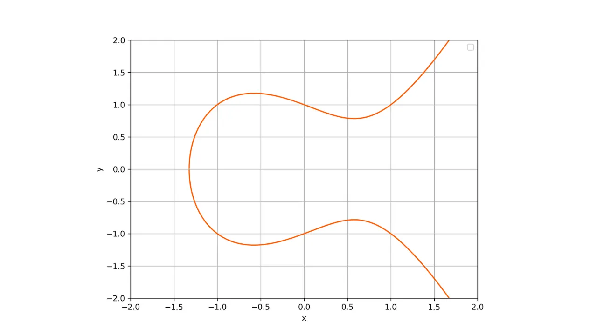


Svaka eliptička kriva definisana je jednačinom oblika:


$$

y^2 = x^3 + ax + b


$$


### secp256k1


Da bi se koristio ECDSA ili Schnorr, potrebno je izabrati parametre eliptičke krive, to jest, vrednosti $a$ i $b$ u jednačini krive. Postoje različiti standardi eliptičkih krivih za koje se smatra da su kriptografski sigurni. Najpoznatija je kriva _secp256r1_, definisana i preporučena od strane NIST-a (_National Institute of Standards and Technology_).


Uprkos tome, Satoshi Nakamoto, pronalazač Bitcoin, odlučio je da ne koristi ovu krivu. Razlog za ovu odluku je nepoznat, ali neki veruju da je preferirao da pronađe alternativu jer parametri ove krive potencijalno mogu sadržati zadnja vrata. Umesto toga, Bitcoin protokol koristi standardnu **_secp256k1_** krivu. Ova kriva je definisana parametrima $a = 0$ i $b = 7$. Njena jednačina je stoga:


$$

y^2 = x^3 + 7


$$


Njegova grafička reprezentacija preko polja realnih brojeva izgleda ovako:


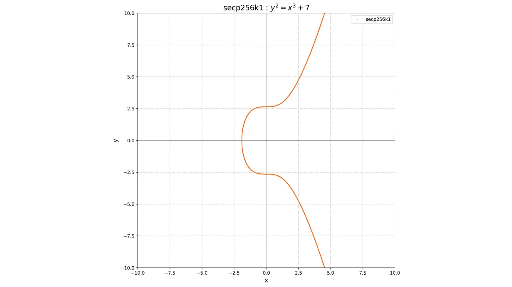


Međutim, u kriptografiji radimo sa konačnim skupovima brojeva. Tačnije, radimo na konačnom polju $\mathbb{F}_p$, koje je polje celih brojeva modulo prost broj $p$.

**Definicija**: Prosti broj je prirodan ceo broj veći ili jednak 2 koji ima samo dva različita pozitivna cela delitelja: 1 i samog sebe. Na primer, broj 7 je prost broj jer se može deliti samo sa 1 i 7. S druge strane, broj 8 nije prost jer se može deliti sa 1, 2, 4 i 8.

U Bitcoin, prost broj $p$ korišćen za definisanje konačnog polja je veoma veliki. Izabran je na takav način da je red polja (tj. broj Elements u $\mathbb{F}_p$) dovoljno veliki da obezbedi kriptografsku sigurnost.


Prosti broj $p$ koji se koristi je:


```text
p = 0xFFFFFFFFFFFFFFFFFFFFFFFFFFFFFFFFFFFFFFFFFFFFFFFFFFFFFFFEFFFFFC2F
```


U dekadnom zapisu, ovo odgovara:


$$

p = 2^{256} - 2^{32} - 977


$$


Dakle, jednačina naše eliptičke krive je zapravo:


$$

y^2 \equiv x^3 + 7 \mod p


$$


S obzirom na to da je ova kriva definisana nad konačnim poljem $\mathbb{F}_p$, ona više ne liči na kontinuiranu krivu već na diskretan skup tačaka. Na primer, ovako izgleda kriva korišćena u Bitcoin za veoma malo $p = 17$:


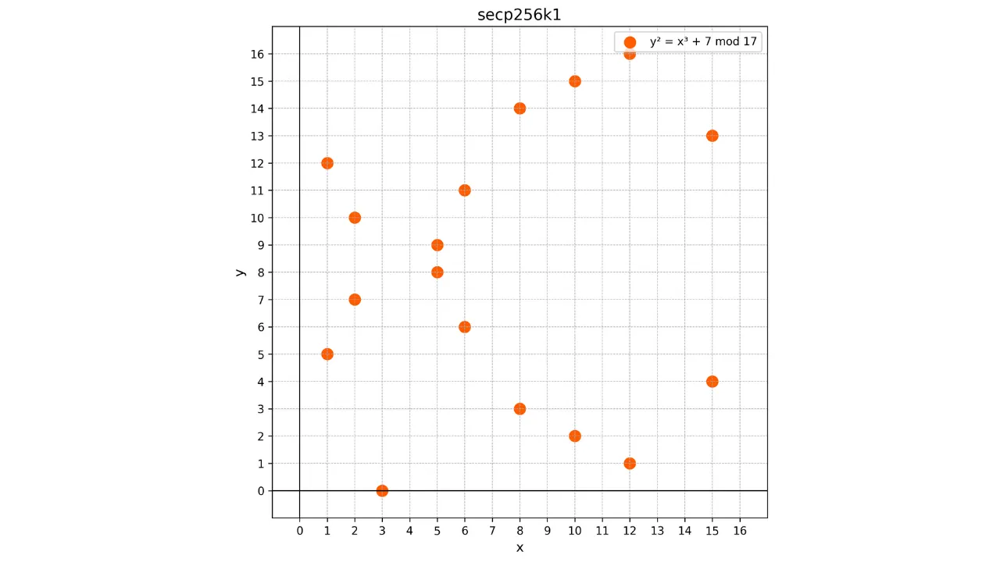


U ovom primeru, namerno sam ograničio konačno polje na $p = 17$ iz obrazovnih razloga, ali treba zamisliti da je ono korišćeno u Bitcoin neizmerno veće, skoro $2^{256}$.


Koristimo konačno polje celih brojeva modulo $p$ kako bismo osigurali tačnost operacija na krivi. Naime, eliptičke krive nad poljem realnih brojeva podložne su netačnostima zbog grešaka zaokruživanja tokom računskih proračuna. Ako se na krivi izvrši veliki broj operacija, te greške se akumuliraju i konačni rezultat može biti netačan ili teško ponovljiv. Isključiva upotreba pozitivnih celih brojeva osigurava savršenu tačnost proračuna i time ponovljivost rezultata.


Matematika eliptičkih krivih nad konačnim poljima je analogna onoj nad poljem realnih brojeva, s prilagodbom da se sve operacije izvode modulo $p$. Da bismo pojednostavili objašnjenja, u narednim poglavljima ćemo nastaviti ilustrovati pojmove koristeći krivu definisanu nad realnim brojevima, imajući na umu da je u praksi kriva definisana nad konačnim poljem.


Ako želite da saznate više o matematičkim osnovama moderne kriptografije, takođe preporučujem da pogledate ovaj drugi kurs na Plan ₿ Network:


https://planb.network/courses/d2fd9fc0-d9ed-4a87-9fa3-0fdbb3937e28

## Izračunavanje javnog ključa iz privatnog ključa


<chapterId>fcb2bd58-5dda-5ecf-bb8f-ad1a0561ab4a</chapterId>

Kao što je ranije viđeno, algoritmi digitalnog potpisa u Bitcoin zasnivaju se na paru privatnih i javnih ključeva koji su matematički povezani. Hajde da zajedno istražimo šta je ta matematička veza i kako se oni generišu.


### Privatni ključ


Privatni ključ je jednostavno nasumičan ili pseudo-nasumičan broj. U slučaju Bitcoin, ovaj broj je veličine 256 bita. Broj mogućnosti za privatni ključ Bitcoin je stoga teoretski $2^{256}$.


**Napomena**: "Pseudo-slučajan broj" je broj koji ima osobine bliske onima pravog slučajnog broja, ali je generisan determinističkim algoritmom.


Međutim, u praksi, postoji samo $n$ različitih tačaka na našoj eliptičnoj krivoj secp256k1, gde je $n$ red generatora tačke $G$ krive. Videćemo kasnije čemu odgovara ovaj broj, ali jednostavno zapamtite da je važeći privatni ključ ceo broj između $1$ i $n-1$, znajući da je $n$ broj blizak, ali malo manji od $2^{256}$. Dakle, postoje neki 256-bitni brojevi koji nisu važeći za postajanje privatnim ključem u Bitcoin, konkretno, svi brojevi između $n$ i $2^{256}$. Ako generisanje slučajnog broja (privatnog ključa) proizvede vrednost $k$ takvu da je $k \geq n$, smatra se nevažećim i mora se generisati nova slučajna vrednost.


Broj mogućnosti za privatni ključ Bitcoin je stoga oko $n$, što je broj blizak $1.158 \times 10^{77}$. Ovaj broj je toliko veliki da, ako nasumično izaberete privatni ključ, statistički je gotovo nemoguće da pogodite privatni ključ drugog korisnika. Da biste stekli predstavu o razmeri, broj mogućih privatnih ključeva u Bitcoin je reda veličine bliskog procenjenom broju atoma u posmatranom svemiru.


Kao što ćemo videti u narednim poglavljima, danas većina privatnih ključeva korišćenih u Bitcoin nije generisana nasumično, već je rezultat determinističke derivacije iz Mnemonic fraze, koja je sama po sebi pseudo-nasumična (ovo je čuvena fraza od 12 ili 24 reči). Ova informacija ne menja ništa u korišćenju algoritama za potpisivanje kao što je ECDSA, ali pomaže da se ponovo fokusiramo na popularizaciju u Bitcoin.


U ostatku objašnjenja, privatni ključ će biti označen malim slovom $k$.


### Javni ključ


Javni ključ je tačka na eliptičkoj krivi, označena velikim slovom $K$, i izračunava se iz privatnog ključa $k$. Ova tačka $K$ je predstavljena parom koordinata $(x, y)$ na eliptičkoj krivi, pri čemu je svaka koordinata ceo broj modulo $p$, prost broj koji definiše konačno polje $\mathbb{F}_p$.

U praksi, nekompresovani javni ključ je predstavljen sa 520 bita (ili 65 bajtova), što odgovara dvema 256-bitnim brojevima ($x$ i $y$) postavljenim jedan za drugim, sa prefiksom od 8 bita $0x04$.


Međutim, moguće je predstaviti javni ključ i u komprimovanom obliku koristeći samo 33 bajta (264 bita) tako što se zadrži samo apscisa $x$ naše tačke na krivi i bajt koji označava paritet $y$. Ovo je poznato kao komprimovani javni ključ. O tome ću više govoriti u poslednjim poglavljima ove obuke. Ali ono što treba da zapamtite je da je javni ključ $K$ tačka opisana sa $x$ i $y$.


Da bismo izračunali tačku $K$ koja odgovara našem javnom ključu, koristimo operaciju skalarne multiplikacije na eliptičkim krivama, definisanu kao ponovljeno sabiranje ($k$ puta) generatora $G$:


$$

K = k \cdot G


$$


gde:


- $k$ je privatni ključ (slučajan ceo broj između $1$ i $n-1$);
- $G$ je generator tačka eliptičke krive koju koriste svi učesnici Bitcoin mreže;
- $\cdot$ predstavlja skalarno množenje na eliptičnoj krivoj, što je ekvivalentno dodavanju tačke $G$ samoj sebi $k$ puta.


Činjenica da je ova tačka $G$ zajednička za sve javne ključeve u Bitcoin omogućava nam da budemo sigurni da će isti privatni ključ $k$ uvek dati isti javni ključ $K$:


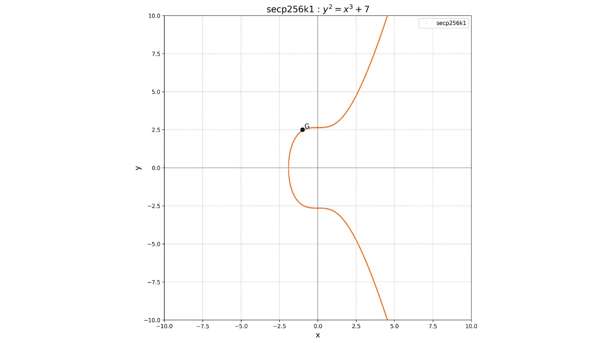


Glavna karakteristika ove operacije je da je to jednosmerna funkcija. Lako je izračunati javni ključ $K$ znajući privatni ključ $k$ i generator tačku $G$, ali je praktično nemoguće izračunati privatni ključ $k$ znajući samo javni ključ $K$ i generator tačku $G$. Pronalaženje $k$ iz $K$ i $G$ svodi se na rešavanje problema diskretnog logaritma na eliptičkim krivama, matematički teškog problema za koji nije poznat efikasan algoritam. Čak ni najmoćniji trenutni kalkulatori nisu u stanju da reše ovaj problem u razumnom vremenu.


### Sabiranje i udvostručavanje tačaka na eliptičkim krivama


Koncept sabiranja na eliptičkim krivama je definisan geometrijski. Ako imamo dve tačke $P$ i $Q$ na krivi, operacija $P + Q$ se izračunava povlačenjem prave koja prolazi kroz $P$ i $Q$. Ova prava će nužno preseći krivu u trećoj tački $R'$. Zatim uzimamo ogledalnu sliku ove tačke u odnosu na x-osu da bismo dobili tačku $R$, što je rezultat sabiranja:


$$

P + Q = R


$$


Grafički, ovo se može predstaviti na sledeći način:


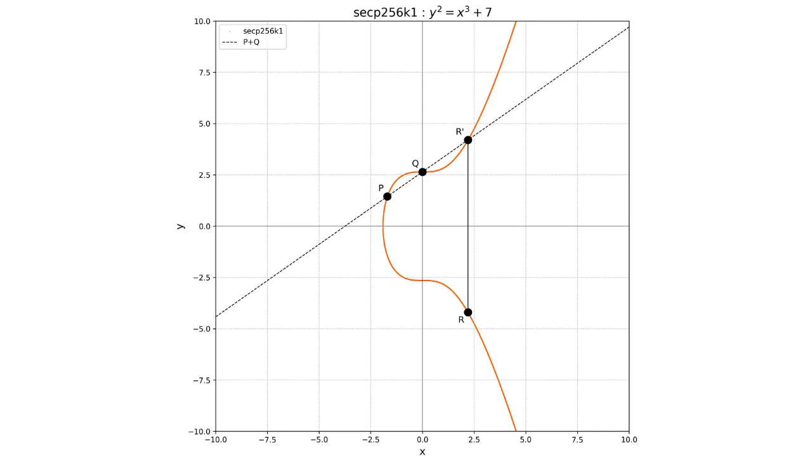


Za udvostručavanje tačke, to jest operaciju $P + P$, povlačimo tangentu na krivu u tački $P$. Ova tangenta seče krivu u drugoj tački $S'$. Zatim uzimamo zrcalnu sliku ove tačke u odnosu na x-osu da bismo dobili tačku $S$, što je rezultat udvostručavanja:


$$

2P = S


$$


Grafički, ovo je prikazano kao:


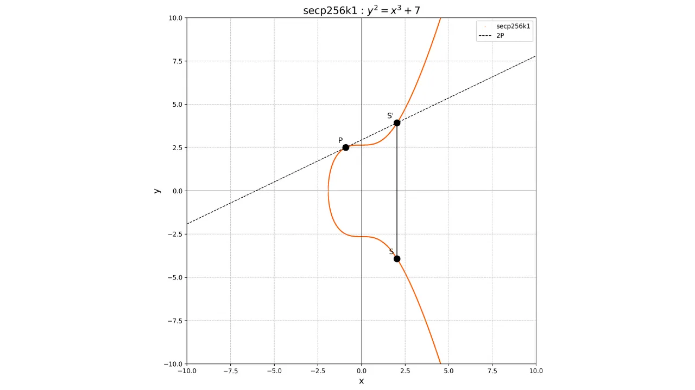


Korišćenjem ovih operacija sabiranja i udvostručavanja, možemo izvršiti skalarno množenje tačke celim brojem $k$, označeno sa $kP$, izvođenjem ponovljenih udvostručavanja i sabiranja.


Na primer, pretpostavimo da smo izabrali privatni ključ $k = 4$. Da bismo izračunali pripadajući javni ključ, izvršavamo:


$$

K = k \cdot G = 4G


$$


Grafički, ovo odgovara izvođenju niza sabiranja i udvostručavanja:


- Izračunajte $2G$ udvostručavanjem $G$.
- Izračunajte $4G$ udvostručavanjem $2G$.


Ako želimo, na primer, da izračunamo tačku $3G$, prvo moramo izračunati tačku $2G$ udvostručavanjem tačke $G$, zatim dodati $G$ i $2G$. Da bismo dodali $G$ i $2G$, jednostavno povucite liniju koja povezuje ove dve tačke, pronađite jedinstvenu tačku $-3G$ na preseku između ove linije i eliptičke krive, a zatim odredite $3G$ kao suprotnost od $-3G$.


Imaćemo:


$$

G + G = 2G


$$


$$

2G + G = 3G


$$


Grafički, ovo bi bilo predstavljeno na sledeći način:


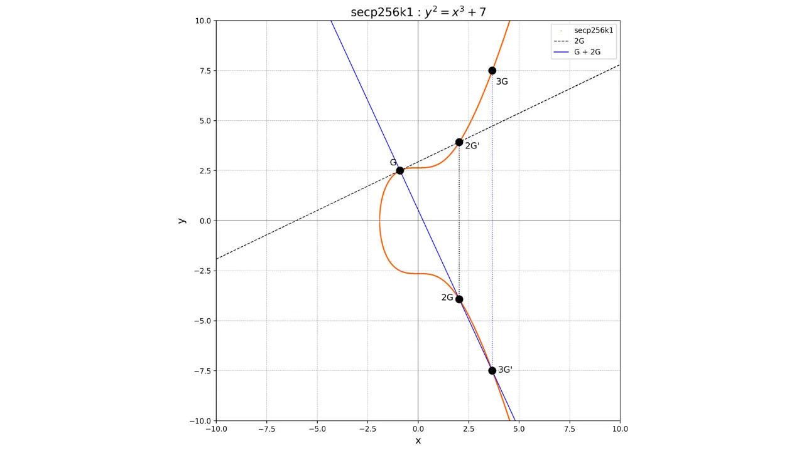


### Jednosmerna funkcija


Zahvaljujući ovim operacijama, možemo razumeti zašto je lako izvesti javni ključ iz privatnog ključa, ali je obrnuto praktično nemoguće.


Hajde da se vratimo na naš pojednostavljeni primer. Sa privatnim ključem $k = 4$. Da bismo izračunali pripadajući javni ključ, izvršavamo:


$$
K = k \cdot G = 4G
$$


Tako smo mogli lako izračunati javni ključ $K$ znajući $k$ i $G$.


Sada, ako neko zna samo javni ključ $K$, suočen je sa problemom diskretnog logaritma: pronalaženje $k$ takvog da je $K = k \cdot G$. Ovaj problem se smatra teškim jer ne postoji efikasan algoritam za njegovo rešavanje na eliptičkim krivama. Ovo osigurava bezbednost ECDSA i Schnorr algoritama.


Naravno, u ovom pojednostavljenom primeru sa $k = 4$, bilo bi moguće pronaći $k$ metodom pokušaja i greške, jer je broj mogućnosti mali. Međutim, u praksi, $k$ je 256-bitni ceo broj, što čini broj mogućnosti astronomski velikim (oko $1.158 \times 10^{77}$). Stoga je neizvodljivo pronaći $k$ metodom grube sile.


## Potpisivanje privatnim ključem


<chapterId>bb07826f-826e-5905-b307-3d82001fb778</chapterId>


Sada kada znate kako da izvedete javni ključ iz privatnog ključa, već možete primati bitkoine koristeći ovaj par ključeva kao uslov za trošenje. Ali kako ih potrošiti? Da biste potrošili bitkoine, potrebno je da otključate _scriptPubKey_ povezan sa vašim UTXO kako biste dokazali da ste zaista njegov legitimni vlasnik. Da biste to uradili, morate proizvesti potpis $s$ koji odgovara javnom ključu $K$ prisutnom u _scriptPubKey_ koristeći privatni ključ $k$ koji je prvobitno korišćen za izračunavanje $K$. Digitalni potpis je tako neoboriv dokaz da posedujete privatni ključ povezan sa javnim ključem koji tvrdite da imate.


### Parametri eliptičke krive


Da bi se izvršio digitalni potpis, svi učesnici moraju prvo da se dogovore o parametrima korišćene eliptičke krive. U slučaju Bitcoin, parametri **secp256k1** su sledeći:


Konačno polje $\mathbb{Z}_p$ definisano sa:


$$
p = 2^{256} - 2^{32} - 977
$$


```text
p = 0xFFFFFFFFFFFFFFFFFFFFFFFFFFFFFFFFFFFFFFFFFFFFFFFFFFFFFFFEFFFFFC2F
```


$p$ je veoma veliki prost broj nešto manji od $2^{256}$.


Eliptička kriva $y^2 = x^3 + ax + b$ nad $\mathbb{Z}_p$ definisana sa:


$$
a = 0, \quad b = 7
$$


Tačka generatora ili tačka porekla $G$:


```text
G = 0x0279BE667EF9DCBBAC55A06295CE870B07029BFCDB2DCE28D959F2815B16F81798
```


Ovaj broj je kompresovani oblik koji daje samo apscisu tačke $G$. Prefiks `02` na početku određuje koja od dve vrednosti sa ovom apscisom $x$ treba da se koristi kao generišuća tačka.

Redosled $n$ od $G$ (broj postojećih tačaka) i kofaktor $h$:


```text
n = 0xFFFFFFFFFFFFFFFFFFFFFFFFFFFFFFFEBAAEDCE6AF48A03BBFD25E8CD0364141
```


$n$ je veoma veliki broj nešto manji od $p$.


$$
h=1
$$


$h$ je kofaktor ili broj podgrupa. Neću ovde elaborirati šta to predstavlja, jer je prilično složeno, a u slučaju Bitcoin, ne moramo ga uzeti u obzir jer je jednak $1$.


Sve ove informacije su javne i poznate svim učesnicima. Zahvaljujući njima, korisnici mogu napraviti digitalni potpis i verifikovati ga.


### Potpis sa ECDSA


ECDSA algoritam omogućava korisniku da potpiše poruku koristeći svoj privatni ključ, na takav način da svako ko zna odgovarajući javni ključ može da proveri validnost potpisa, bez da privatni ključ ikada bude otkriven. U kontekstu Bitcoin, poruka koja se potpisuje zavisi od _sighash_-a koji korisnik izabere. Upravo taj _sighash_ će odrediti koji delovi transakcije su pokriveni potpisom. O tome ću više govoriti u narednom poglavlju.


Evo koraka za generate ECDSA potpis:


Prvo, izračunavamo Hash ($e$) poruke koja treba da bude potpisana. Poruka $m$ se tako prosleđuje kroz kriptografsku Hash funkciju, generalno SHA256 ili dupli SHA256 u slučaju Bitcoin:


$$
e = \text{HASH}(m)
$$


Zatim, izračunavamo Nonce. U kriptografiji, Nonce je jednostavno broj generisan na slučajan ili pseudo-slučajan način koji se koristi samo jednom. To jest, svaki put kada se napravi novi digitalni potpis sa ovim parom ključeva, biće veoma važno koristiti drugačiji Nonce, inače će to ugroziti sigurnost privatnog ključa. Stoga je dovoljno odrediti slučajan i jedinstven ceo broj $r$ takav da je $1 \leq r \leq n-1$, gde je $n$ red generišuće tačke $G$ eliptičke krive.


Zatim ćemo izračunati tačku $R$ na eliptičnoj krivoj sa koordinatama $(x_R, y_R)$ tako da:


$$
R = r \cdot G
$$


Izvlačimo vrednost apscise tačke $R$ ($x_R$). Ova vrednost predstavlja prvi deo potpisa. I na kraju, izračunavamo drugi deo potpisa $s$ na sledeći način:


$$
s = r^{-1} \left( e + k \cdot x_R \right) \mod n
$$


gde:


- $r^{-1}$ je modularni inverz od $r$ po modulu $n$, to jest, ceo broj takav da $r \cdot r^{-1} \equiv 1 \mod n$;
- $k$ je korisnikov privatni ključ;
- $e$ je Hash poruke;
- $n$ je red generirajuće tačke $G$ eliptičke krive.


Potpis je tada jednostavno konkatenacija $x_R$ i $s$:


$$
\text{SIG} = x_R \Vert s
$$


### Verifikacija ECDSA potpisa


Da bi verifikovao potpis $(x_R, s)$, svako ko zna javni ključ $K$ i parametre eliptičke krive može postupiti na sledeći način:


Prvo, proverite da li su $x_R$ i $s$ unutar intervala $[1, n-1]$. Ovo osigurava da potpis poštuje matematička ograničenja eliptičke grupe. Ako to nije slučaj, verifikator odmah odbacuje potpis kao nevažeći.


Zatim, izračunaj Hash poruke:


$$
e = \text{HASH}(m)
$$


Izračunajte modularni inverz od $s$ modulo $n$:


$$
s^{-1} \mod n
$$


Izračunajte dve skalarne vrednosti $u_1$ i $u_2$ na sledeći način:


$$
\begin{align*}
u_1 &= e \cdot s^{-1} \mod n \\
u_2 &= x_R \cdot s^{-1} \mod n
\end{align*}
$$


I na kraju, izračunajte tačku $V$ na eliptičnoj krivi takvu da:


$$
V = u_1 \cdot G + u_2 \cdot K
$$


Potpis je važeći samo ako je $x_V \equiv x_R \mod n$, gde je $x_V$ $x$ koordinata tačke $V$. Zaista, kombinovanjem $u_1 \cdot G$ i $u_2 \cdot K$, dobija se tačka $V$ koja, ako je potpis važeći, mora odgovarati tački $R$ korišćenoj tokom potpisivanja (modulo $n$).


### Potpisivanje sa Schnorr protokolom


Šema potpisa Schnorr je alternativa ECDSA koja nudi mnoge prednosti. Moguće ju je koristiti u Bitcoin od 2021. godine i uvođenja Taproot, sa skriptnim obrascima P2TR. Kao i ECDSA, šema Schnorr omogućava potpisivanje poruke korišćenjem privatnog ključa, na takav način da potpis može biti verifikovan od strane bilo koga ko zna odgovarajući javni ključ.

U slučaju Schnorra, koristi se potpuno ista kriva kao kod ECDSA sa istim parametrima. Međutim, javni ključevi su predstavljeni malo drugačije u poređenju sa ECDSA. Naime, oni su određeni samo $x$ koordinatom tačke na eliptičnoj krivi. Za razliku od ECDSA, gde su kompresovani javni ključevi predstavljeni sa 33 bajta (sa prefiksnim bajtom koji označava paritet $y$), Schnorr koristi 32-bajtne javne ključeve, koji odgovaraju samo $x$ koordinati tačke $K$, i pretpostavlja se da je $y$ paran po defaultu. Ova pojednostavljena reprezentacija smanjuje veličinu potpisa i olakšava određene optimizacije u algoritmima za verifikaciju.

Javni ključ je tada $x$ koordinata tačke $K$:


$$
\text{pk} = K_x
$$


Prvi korak ka generate potpisu je Hash poruke. Ali za razliku od ECDSA, to se radi sa drugim vrednostima i koristi se označena Hash funkcija kako bi se izbegle kolizije u različitim kontekstima. Označena Hash funkcija jednostavno podrazumeva dodavanje proizvoljne oznake ulazima Hash funkcije zajedno sa podacima poruke.


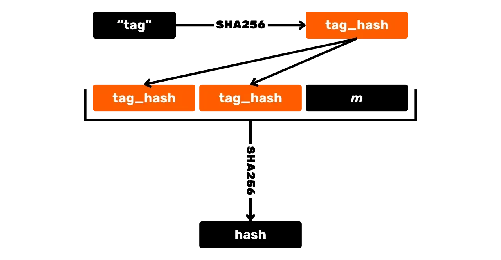


Pored poruke, $x$ koordinata javnog ključa $K_x$, kao i tačka $R = r \cdot G$, izračunata iz Nonce $r$ (koji je sam po sebi jedinstven ceo broj za svaki potpis, deterministički izračunat iz privatnog ključa i poruke kako bi se izbegle ranjivosti povezane sa ponovnom upotrebom Nonce), takođe se prosleđuju u označenu funkciju. Kao i za javni ključ, samo $x$ koordinata Nonce tačke $R_x$ se zadržava da opiše tačku.


Rezultat ovog heširanja označen $e$ naziva se "izazov":


$$
e = \text{HASH}(\text{``BIP0340/challenge''}, R_x \Vert K_x \Vert m) \mod n
$$


Ovde, $\text{Hash}$ je SHA256 Hash funkcija, a $\text{``BIP0340/challenge''}$ je specifična oznaka za heširanje.


Konačno, parametar $s$ se izračunava iz privatnog ključa $k$, Nonce $r$, i izazova $e$ na sledeći način:


$$
s = (r + e \cdot k) \mod n
$$


Potpis je tada jednostavno par $R_x$ i $s$.


$$
\text{SIG} = R_x \Vert s
$$


### Verifikacija Schnorr potpisa


Verifikacija Schnorr potpisa je jednostavnija od verifikacije ECDSA potpisa. Evo koraka za verifikaciju potpisa $(R_x, s)$ sa javnim ključem $K_x$ i porukom $m$.

Prvo, proveravamo da li je $K_x$ validan ceo broj manji od $p$. Ako je to slučaj, pronalazimo odgovarajuću tačku na krivi sa $K_y$ koji je paran. Takođe izdvajamo $R_x$ i $s$ razdvajanjem potpisa $\text{SIG}$. Zatim proveravamo da li je $R_x < p$ i $s < n$ (red krive).

Dalje, izračunavamo izazov $e$ na isti način kao i izdavalac potpisa:


$$
e = \text{HASH}(\text{``BIP0340/challenge''}, R_x \Vert K_x \Vert m) \mod n
$$


Zatim, referentnu tačku na krivi izračunavamo na sledeći način:


$$
R' = s \cdot G - e \cdot K
$$


Konačno, proveravamo da li je $R'_x = R_x$. Ako se dve x-koordinate poklapaju, tada je potpis $(R_x, s)$ zaista važeći sa javnim ključem $K_x$.


### Zašto ovo funkcioniše?


Potpisnik je izračunao $s = r + e \cdot k \mod n$, tako da bi $R' = s \cdot G - e \cdot K$ trebalo da bude jednako originalnoj tački $R$, zato što:


$$
s \cdot G = (r + e \cdot k) \cdot G = r \cdot G + e \cdot k \cdot G
$$


Pošto je $K = k \cdot G$, imamo $e \cdot k \cdot G = e \cdot K$. Dakle:


$$
R' = r \cdot G = R
$$


Dakle, imamo:


$$
R'_x = R_x
$$


### Prednosti Schnorr potpisa


Šema Schnorr potpisa nudi nekoliko prednosti za Bitcoin u odnosu na originalni ECDSA algoritam. Prvo, Schnorr omogućava agregaciju ključeva i potpisa. To znači da se više javnih ključeva može kombinovati u jedan ključ.


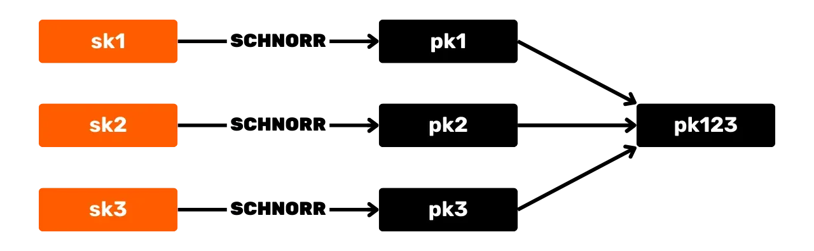


Isto tako, više potpisa može biti agregirano u jedan važeći potpis. Dakle, u slučaju transakcije sa više potpisa, grupa učesnika može potpisati sa jednim potpisom i jednim agregiranim javnim ključem. Ovo značajno smanjuje troškove skladištenja i računanja za mrežu, jer svaki čvor treba da verifikuje samo jedan potpis.


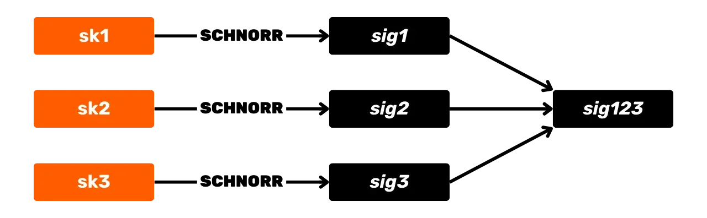


Štaviše, agregacija potpisa poboljšava privatnost. Sa Schnorr-om, postaje nemoguće razlikovati transakciju sa višestrukim potpisom od standardne transakcije sa jednim potpisom. Ova homogenost otežava analizu lanca, jer ograničava mogućnost identifikacije Wallet otisaka prstiju.


Konačno, Schnorr takođe nudi mogućnost grupne verifikacije. Verifikovanjem više potpisa istovremeno, čvorovi mogu postići efikasnost, posebno za blokove koji sadrže mnogo transakcija. Ova optimizacija smanjuje vreme i resurse potrebne za validaciju bloka.

Takođe, Schnorr potpisi nisu podložni promenama, za razliku od potpisa proizvedenih sa ECDSA. To znači da napadač ne može modifikovati važeći potpis kako bi stvorio drugi važeći potpis za istu poruku i isti javni ključ. Ova ranjivost je prethodno bila prisutna u Bitcoin i značajno je sprečavala sigurnu implementaciju Lightning Network. Rešena je za ECDSA sa SegWit softforkom 2017. godine, koji uključuje premeštanje potpisa u zasebnu bazu podataka od transakcija kako bi se sprečila njihova promenljivost.


### Zašto je Satoshi izabrao ECDSA?


Kao što smo videli, Satoshi je u početku odlučio da implementira ECDSA za digitalne potpise u Bitcoin. Ipak, takođe smo videli da je Schnorr superiorniji od ECDSA u mnogim aspektima, a ovaj protokol je kreirao Claus-Peter Schnorr 1989. godine, 20 godina pre izuma Bitcoin.


Pa, mi zaista ne znamo zašto Satoshi nije izabrao to, ali verovatna hipoteza je da je ovaj protokol bio pod patentom do 2008. Iako je Bitcoin kreiran godinu dana kasnije, u januaru 2009, u to vreme nije postojala otvorena standardizacija za Schnorr potpise. Možda je Satoshi smatrao da je sigurnije koristiti ECDSA, koji je već bio široko korišćen i testiran u open-source softveru i imao nekoliko priznatih implementacija (posebno OpenSSL biblioteka korišćena do 2015. u Bitcoin Core, zatim zamenjena libsecp256k1 u verziji 0.10.0). Ili možda jednostavno nije bio svestan da će ovaj patent isteći 2008. U svakom slučaju, najverovatnija hipoteza izgleda da je povezana sa ovim patentom i činjenicom da je ECDSA imao dokazanu istoriju i bio lakši za implementaciju.


## Zastavice sighash


<chapterId>231c41a2-aff2-4655-9048-47b6d2d83d64</chapterId>


Kao što smo videli u prethodnim poglavljima, digitalni potpisi se često koriste za otključavanje skripte ulaza. U procesu potpisivanja, neophodno je uključiti potpisane podatke u izračunavanje, označene u našim primerima kao poruka $m$. Ovi podaci, kada su jednom potpisani, ne mogu se menjati bez poništavanja potpisa. Zaista, bilo da je reč o ECDSA ili Schnorr, verifikator potpisa mora uključiti u svoje izračunavanje istu poruku $m$. Ako se razlikuje od poruke $m$ koju je inicijalno koristio potpisnik, rezultat će biti netačan i potpis će se smatrati nevažećim. Tada se kaže da potpis pokriva određene podatke i na neki način ih štiti od neovlašćenih izmena.


### Šta je sighash zastavica?


U specifičnom slučaju Bitcoin, videli smo da poruka $m$ odgovara transakciji. Međutim, u stvarnosti, to je malo složenije. Zaista, zahvaljujući sighash zastavicama, moguće je odabrati specifične podatke unutar transakcije koji će biti pokriveni ili ne potpisom.

"Sighash zastavica" je stoga parametar dodat svakom ulazu, omogućavajući određivanje komponenti transakcije koje su pokrivene pridruženim potpisom. Te komponente su ulazi i izlazi. Izbor sighash zastavice stoga određuje koji ulazi i koji izlazi transakcije su fiksirani potpisom i koji se još uvek mogu menjati bez poništavanja. Ovaj mehanizam omogućava potpisima da obavežu podatke transakcije prema namerama potpisnika.


Očigledno, kada je transakcija potvrđena na Blockchain, postaje nepromenljiva, bez obzira na korišćene sighash zastavice. Mogućnost izmene putem sighash zastavica je ograničena na period između potpisivanja i potvrde.


Generalno, Wallet softver vam ne nudi opciju da ručno modifikujete sighash zastavicu vaših ulaza kada konstruirate transakciju. Podrazumevano, `SIGHASH_ALL` je postavljen. Lično, znam samo za Sparrow Wallet koji omogućava ovu modifikaciju od strane korisnika Interface.


### Koji su postojeći sighash flagovi u Bitcoin?


U Bitcoin, postoje pre svega 3 osnovne sighash zastavice:


- `SIGHASH_ALL` (`0x01`): Potpis se odnosi na sve ulaze i sve izlaze transakcije. Transakcija je tako u potpunosti pokrivena potpisom i više se ne može menjati. `SIGHASH_ALL` je najčešće korišćen sighash u svakodnevnim transakcijama kada neko jednostavno želi da izvrši transakciju bez mogućnosti njenog menjanja.


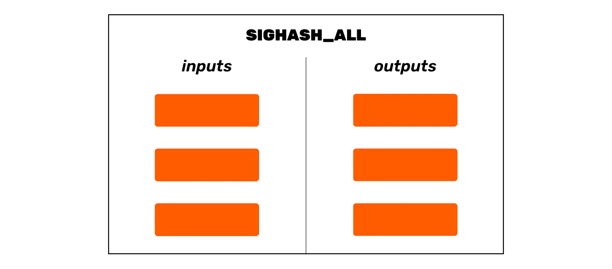


U svim dijagramima ovog poglavlja, narandžasta boja predstavlja Elements pokriven potpisom, dok crna boja označava one koji nisu.


- `SIGHASH_NONE` (`0x02`): Potpis pokriva sve ulaze, ali nijedan od izlaza, što omogućava modifikaciju izlaza nakon potpisivanja. U konkretnim terminima, ovo je slično blanko čeku. Potpisnik otključava UTXO-e u ulazima, ali ostavlja polje izlaza potpuno modifikabilnim. Svako ko zna za ovu transakciju može dodati izlaz po svom izboru, na primer, specificiranjem primaoca Address da prikupi sredstva potrošena ulazima, a zatim emitovati transakciju da povrati bitkoine. Potpis vlasnika ulaza neće biti poništen, jer pokriva samo ulaze.


- `SIGHASH_SINGLE` (`0x03`): Potpis pokriva sve ulaze kao i jedan izlaz, koji odgovara indeksu potpisanog ulaza. Na primer, ako potpis otključava _scriptPubKey_ ulaza #0, onda pokriva i izlaz #0. Potpis takođe štiti sve ostale ulaze, koji se više ne mogu menjati. Međutim, svako može dodati dodatni izlaz bez poništavanja potpisa, pod uslovom da izlaz #0, koji je jedini pokriven njime, nije izmenjen.


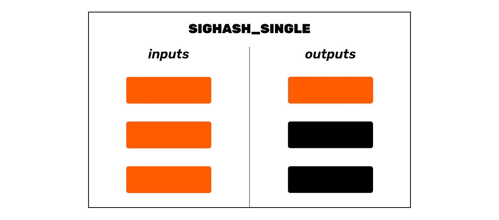


Pored ova tri sighash zastavice, postoji i modifikator `SIGHASH_ANYONECANPAY` (`0x80`). Ovaj modifikator se može kombinovati sa osnovnom sighash zastavicom kako bi se kreirale tri nove sighash zastavice:


- `SIGHASH_ALL | SIGHASH_ANYONECANPAY` (`0x81`): Potpis pokriva jedan ulaz dok uključuje sve izlaze transakcije. Ova kombinovana zastavica sighash omogućava, na primer, kreiranje transakcije za crowdfunding. Organizator priprema izlaz sa svojim Address i ciljnim iznosom, a svaki investitor može dodati ulaze kako bi finansirao ovaj izlaz. Kada se prikupe dovoljna sredstva u ulazima da zadovolje izlaz, transakcija se može emitovati.


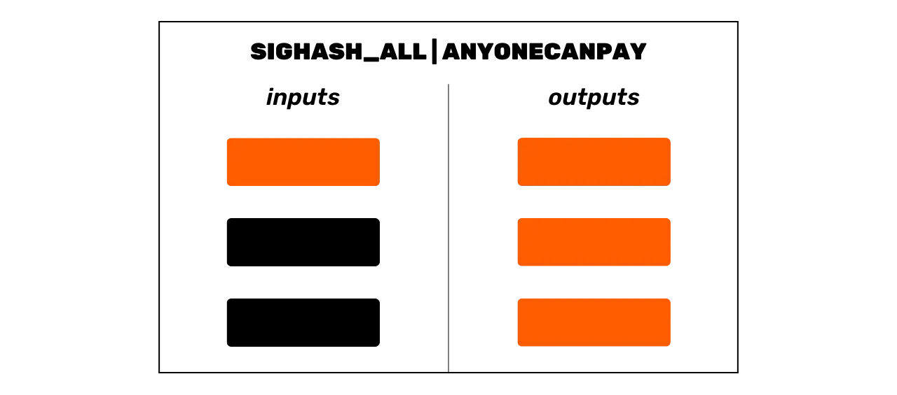


- `SIGHASH_NONE | SIGHASH_ANYONECANPAY` (`0x82`): Potpis pokriva jedan ulaz, bez obavezivanja na bilo koji izlaz;


- `SIGHASH_SINGLE | SIGHASH_ANYONECANPAY` (`0x83`): Potpis pokriva jedan ulaz kao i izlaz koji ima isti indeks kao ovaj ulaz. Na primer, ako potpis otključava _scriptPubKey_ ulaza #3, pokriće i izlaz #3. Ostatak transakcije ostaje promenljiv, kako u smislu drugih ulaza, tako i drugih izlaza.


### Projekti za dodavanje novih Sighash zastavica


Trenutno (2024), samo sighash zastavice predstavljene u prethodnom odeljku su upotrebljive u Bitcoin. Međutim, neki projekti razmatraju dodavanje novih sighash zastavica. Na primer, BIP118, koji su predložili Christian Decker i Anthony Towns, uvodi dve nove sighash zastavice: `SIGHASH_ANYPREVOUT` i `SIGHASH_ANYPREVOUTANYSCRIPT` (_AnyPrevOut = "Bilo koji prethodni izlaz"_).


Ove dve sighash zastavice bi ponudile dodatnu mogućnost u Bitcoin: kreiranje potpisa koji ne pokrivaju nijedan specifičan ulaz transakcije.


Ovu ideju su prvobitno formulisali Joseph Poon i Thaddeus Dryja u Lightning White Paper-u. Pre nego što je preimenovana, ova sighash zastavica se zvala `SIGHASH_NOINPUT`.

Ako se ova zastavica sighash integriše u Bitcoin, omogućiće korišćenje zaveta, ali je takođe obavezan preduslov za implementaciju Eltoo-a, opšteg protokola za druge slojeve koji definiše kako zajednički upravljati Ownership od UTXO. Eltoo je specifično dizajniran da reši probleme povezane sa mehanizmima za pregovaranje o stanju Lightning kanala, odnosno između otvaranja i zatvaranja.


Da biste produbili svoje znanje o Lightning Network, nakon kursa CYP201, toplo preporučujem kurs LNP201 od Fanisa Michalakisa, koji detaljno pokriva ovu temu:


https://planb.network/courses/34bd43ef-6683-4a5c-b239-7cb1e40a4aeb

U sledećem delu, predlažem da otkrijemo kako Mnemonic fraza u osnovi vašeg Bitcoin Wallet funkcioniše.


# Mnemonic fraza


<partId>4070af16-c8a2-58b5-9871-a22c86c07458</partId>


## Evolucija Bitcoin novčanika


<chapterId>9d9acd5d-a0e5-5dfd-b544-f043fae8840f</chapterId>


Sada kada smo istražili funkcionisanje Hash funkcija i digitalnih potpisa, možemo proučiti kako funkcionišu Bitcoin novčanici. Cilj će biti da opišemo kako je Wallet u Bitcoin konstruisan, kako se dekomponuje i za šta se koriste različiti delovi informacija koji ga čine. Ovo razumevanje mehanizama Wallet omogućiće vam da poboljšate korišćenje Bitcoin u smislu sigurnosti i privatnosti.


Pre nego što se upustimo u tehničke detalje, neophodno je razjasniti šta se podrazumeva pod "Bitcoin Wallet" i razumeti njegovu korisnost.


### Šta je Bitcoin Wallet?


Za razliku od tradicionalnih novčanika, koji vam omogućavaju da čuvate fizičke novčanice i kovanice, Bitcoin Wallet ne "sadrži" bitkoine per se. Naime, bitkoini ne postoje u fizičkom ili digitalnom obliku koji se može čuvati, već su predstavljeni jedinicama računa prikazanim u Bitcoin sistemu u obliku **UTXO-a** (_Unspent Transaction Outputs_).


UTXO-i tako predstavljaju fragmente bitkoina, različitih veličina, koji se mogu potrošiti pod uslovom da je njihov _scriptPubKey_ zadovoljen. Da bi potrošio svoje bitkoine, korisnik mora obezbediti _scriptSig_ koji otključava _scriptPubKey_ povezan sa njegovim UTXO. Ovaj dokaz se obično vrši putem digitalnog potpisa, generisanog iz privatnog ključa koji odgovara javnom ključu prisutnom u _scriptPubKey_. Dakle, ključni element koji korisnik mora obezbediti je privatni ključ.

Uloga Bitcoin Wallet je upravo da bezbedno upravlja ovim privatnim ključevima. U stvarnosti, njegova uloga je više slična ulozi priveska za ključeve nego Wallet u tradicionalnom smislu.


### JBOK Novčanici


Prvi novčanici korišćeni u Bitcoin bili su JBOK (_Just a Bunch Of Keys_) novčanici, koji su grupisali privatne ključeve generisane nezavisno i bez ikakve veze između njih. Ovi novčanici su radili na jednostavnom modelu gde je svaki privatni ključ mogao da otključa jedinstveni Bitcoin primajući Address.


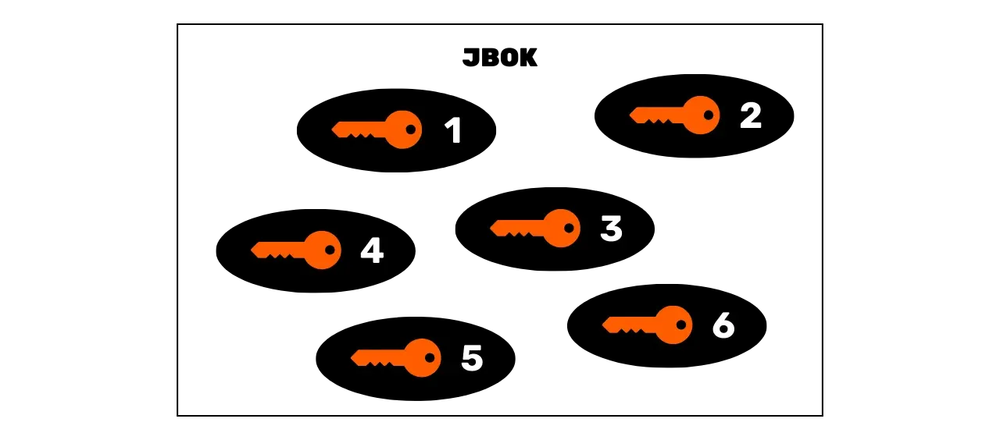


Ako neko želi da koristi više privatnih ključeva, bilo je potrebno napraviti onoliko rezervnih kopija koliko je potrebno da se obezbedi pristup sredstvima u slučaju problema sa uređajem koji hostuje Wallet. Ako se koristi jedan privatni ključ, ova struktura Wallet može biti dovoljna, jer je jedna rezervna kopija dovoljna. Međutim, ovo predstavlja problem: u Bitcoin se snažno savetuje protiv korišćenja uvek istog privatnog ključa. Naime, privatni ključ je povezan sa jedinstvenim Address, a Bitcoin adrese za primanje su obično dizajnirane za jednokratnu upotrebu. Svaki put kada primite sredstva, trebalo bi da generate novi prazan Address.


Ovo ograničenje proizlazi iz Bitcoin modela privatnosti. Ponovnim korišćenjem istog Address, spoljnim posmatračima se olakšava praćenje Bitcoin transakcija. Zato se ponovna upotreba prijemnog Address snažno obeshrabruje. Međutim, da bismo imali više adresa i javno odvojili naše transakcije, neophodno je upravljati sa više privatnih ključeva. U slučaju JBOK novčanika, to podrazumeva kreiranje onoliko rezervnih kopija koliko ima novih parova ključeva, zadatak koji može brzo postati složen i težak za održavanje korisnicima.


Da biste saznali više o modelu privatnosti Bitcoin i otkrili metode za zaštitu vaše privatnosti, takođe preporučujem da pratite moj kurs BTC204 na Plan ₿ Network:


https://planb.network/courses/65c138b0-4161-4958-bbe3-c12916bc959c

### HD Novčanici


Za Address ograničenje JBOK novčanika, naknadno je korišćena nova struktura Wallet. Godine 2012, Pieter Wuille je predložio poboljšanje sa BIP32, koje uvodi HD (Hijerarhijski Deterministički) novčanike. Princip HD Wallet je da izvede sve privatne ključeve iz jednog izvora informacija, nazvanog seed, na deterministički i hijerarhijski način. Ovaj seed se nasumično generiše kada se Wallet kreira i predstavlja jedinstvenu rezervnu kopiju koja omogućava rekreaciju svih privatnih ključeva Wallet. Tako korisnik može generate veoma veliki broj privatnih ključeva kako bi izbegao ponovnu upotrebu Address i sačuvao svoju privatnost, dok mu je potrebna samo jedna rezervna kopija svog Wallet putem seed.


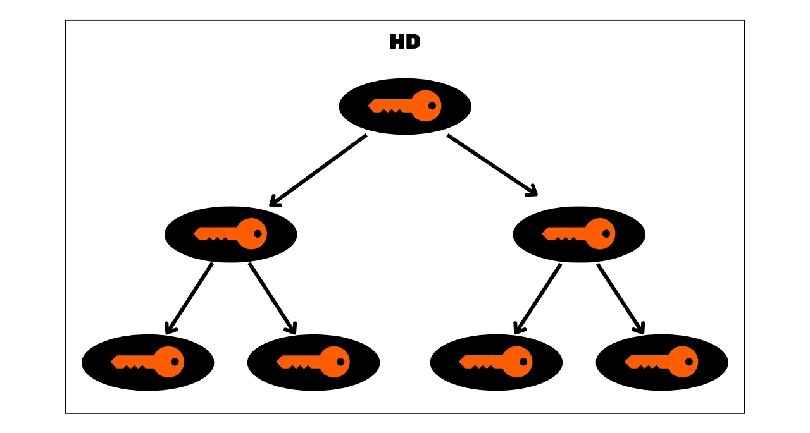


U HD novčanicima, derivacija ključeva se vrši prema hijerarhijskoj strukturi koja omogućava da ključevi budu organizovani u derivacione podprostore, pri čemu se svaki podprostor može dalje deliti, kako bi se olakšalo upravljanje sredstvima i interoperabilnost između različitih Wallet softvera. Danas, ovaj standard usvaja velika većina korisnika Bitcoin. Iz tog razloga, detaljno ćemo ga ispitati u narednim poglavljima.


### BIP39 Standard: Mnemonic Fraza


Pored BIP32, BIP39 standardizuje seed format kao Mnemonic frazu, kako bi olakšao bekap i čitljivost korisnicima. Mnemonic fraza, takođe nazvana fraza za oporavak ili fraza od 24 reči, je niz reči izvučenih iz unapred definisane liste koja sigurno kodira Wallet-ov seed.


Mnemonic fraza u velikoj meri pojednostavljuje bekap za korisnika. U slučaju gubitka, oštećenja ili krađe uređaja koji hostuje Wallet, jednostavno poznavanje ove Mnemonic fraze omogućava rekreaciju Wallet i povratak pristupa svim sredstvima koja su njome osigurana.


U narednim poglavljima istražićemo unutrašnje funkcionisanje HD novčanika, uključujući mehanizme derivacije ključeva i različite moguće hijerarhijske strukture. Ovo će vam omogućiti bolje razumevanje kriptografskih osnova na kojima se zasniva sigurnost sredstava u Bitcoin. I za početak, u sledećem poglavlju, predlažem da otkrijemo ulogu entropije u osnovi vašeg Wallet.


## Entropija i Slučajni Brojevi


<chapterId>b43c715d-affb-56d8-a697-ad5bc2fffd63</chapterId>

Moderni HD novčanici oslanjaju se na jedan početni deo informacija nazvan "entropija" kako bi deterministički generate čitav skup Wallet ključeva. Ova entropija je pseudo-slučajni broj koji delimično određuje sigurnost Wallet.


### Definicija entropije


Entropija, u kontekstu kriptografije i informacija, je kvantitativna mera nesigurnosti ili nepredvidljivosti povezane sa izvorom podataka ili slučajnim procesom. Ona igra važnu ulogu u bezbednosti kriptografskih sistema, posebno u generisanju ključeva i slučajnih brojeva. Visoka entropija osigurava da su generisani ključevi dovoljno nepredvidljivi i otporni na napade grube sile, gde napadač pokušava sve moguće kombinacije da pogodi ključ.


U kontekstu Bitcoin, entropija se koristi za generate seed. Kada se kreira HD Wallet, konstrukcija Mnemonic fraze se vrši iz slučajnog broja, koji je sam izveden iz izvora entropije. Fraza se zatim koristi za generate više privatnih ključeva, na deterministički i hijerarhijski način, kako bi se kreirali uslovi trošenja na UTXO-ima.


### Metode generisanja entropije


Početna entropija korišćena za HD Wallet je generalno 128 bita ili 256 bita, gde:


- 128 bita entropije** odgovara Mnemonic frazi od **12 reči**;
- 256 bita entropije** odgovara Mnemonic frazi od **24 reči**.


U većini slučajeva, ovaj nasumični broj automatski generiše Wallet softver koristeći PRNG (_Pseudo-Random Number Generator_). PRNG-ovi su kategorija algoritama koji se koriste za generate sekvence brojeva iz početnog stanja, koje imaju karakteristike približne onima nasumičnog broja, bez da su zaista nasumični. Dobar PRNG mora imati osobine kao što su uniformnost izlaza, nepredvidljivost i otpornost na prediktivne napade. Za razliku od pravih generatora nasumičnih brojeva (TRNG-ova), PRNG-ovi su deterministički i reproduktivni.


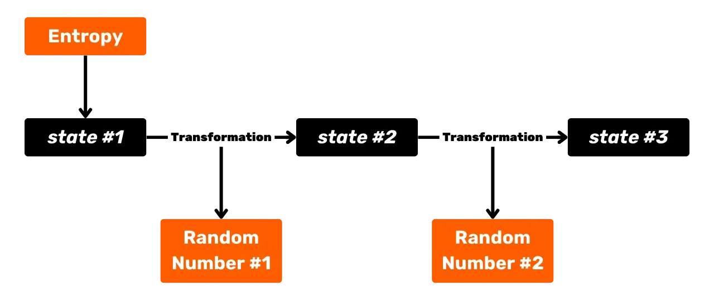


Alternativa je ručno generate entropiju, što nudi bolju kontrolu, ali je takođe mnogo rizičnije. Snažno savetujem protiv generisanja entropije za vaš HD Wallet sami.


U sledećem poglavlju, videćemo kako prelazimo sa nasumičnog broja na Mnemonic frazu od 12 ili 24 reči.


## Mnemonic Fraza


<chapterId>8f9340c1-e6dc-5557-a2f2-26c9669987d5</chapterId>

Fraza Mnemonic, takođe nazvana "fraza seed", "fraza za oporavak", "tajna fraza" ili "fraza od 24 reči", je sekvenca koja se obično sastoji od 12 ili 24 reči, a generiše se iz entropije. Koristi se za determinističko izvođenje svih ključeva HD Wallet. To znači da je iz ove fraze moguće deterministički generate i ponovo kreirati sve privatne i javne ključeve Bitcoin Wallet, i samim tim pristupiti sredstvima koja su njome zaštićena. Svrha fraze Mnemonic je da obezbedi način za bekap i oporavak bitkoina koji je i siguran i jednostavan za korišćenje. Uvedena je 2013. godine sa standardom BIP39.


Hajde da zajedno otkrijemo kako preći od entropije do fraze Mnemonic.


### Provera zbira


Da bi se entropija transformisala u Mnemonic frazu, prvo se mora dodati kontrolna suma (ili "checksum") na kraj entropije. Ova kontrolna suma je kratka sekvenca bitova koja osigurava integritet podataka proverom da nije došlo do slučajne izmene.


Da bi se izračunao kontrolni zbir, funkcija SHA256 Hash se primenjuje na entropiju (samo jednom; ovo je jedan od retkih slučajeva u Bitcoin gde se koristi jedan SHA256 Hash umesto dvostrukog Hash). Ova operacija proizvodi 256-bitni Hash. Kontrolni zbir se sastoji od prvih bitova ovog Hash, a njegova dužina zavisi od dužine entropije, prema sledećoj formuli:


$$
\text{CS} = \frac{\text{ENT}}{32}
$$


gde $\text{ENT}$ predstavlja dužinu entropije u bitovima, a $\text{CS}$ dužinu kontrolne sume u bitovima.


Na primer, za entropiju od 256 bita, prvih 8 bita Hash se uzima da formira kontrolni zbir:


$$
\text{CS} = \frac{256}{32} = 8 \text{ bits}
$$


Kada se kontrolni zbir izračuna, on se konkatenira sa entropijom kako bi se dobila proširena sekvenca bitova označena sa $\text{ENT} \Vert \text{CS}$ ("konkatenirati" znači staviti kraj uz kraj).


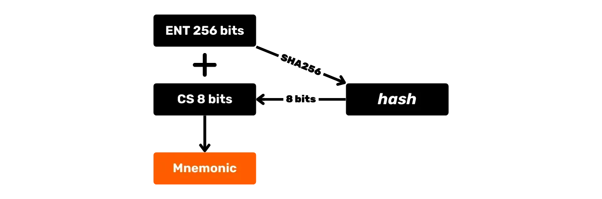


### Korelacija između Entropije i Mnemonic Fraze


Broj reči u frazi Mnemonic zavisi od veličine početne entropije, kao što je prikazano u sledećoj tabeli sa:


- $\text{ENT}$: veličina entropije u bitovima;
- $\text{CS}$: veličina u bitovima kontrolnog zbira;
- $w$: broj reči u konačnoj Mnemonic frazi.


$$
\begin{array}{|c|c|c|c|}
\hline
\text{ENT} & \text{CS} & \text{ENT} \Vert \text{CS} & w \\
\hline
128 & 4 & 132 & 12 \\
160 & 5 & 165 & 15 \\
192 & 6 & 198 & 18 \\
224 & 7 & 231 & 21 \\
256 & 8 & 264 & 24 \\
\hline
\end{array}
$$


Na primer, za entropiju od 256 bita, rezultat $\text{ENT} \Vert \text{CS}$ je 264 bita i daje Mnemonic frazu od 24 reči.


### Pretvaranje binarnog niza u Mnemonic frazu


Bit sekvenca $\text{ENT} \Vert \text{CS}$ se zatim deli na segmente od 11 bita. Svaki segment od 11 bita, kada se konvertuje u decimalni oblik, odgovara broju između 0 i 2047, što označava poziciju reči [u listi od 2048 reči standardizovanih od strane BIP39](https://github.com/Planb-Network/Bitcoin-educational-content/blob/dev/resources/bet/bip39-wordlist/assets/BIP39-WORDLIST.pdf).


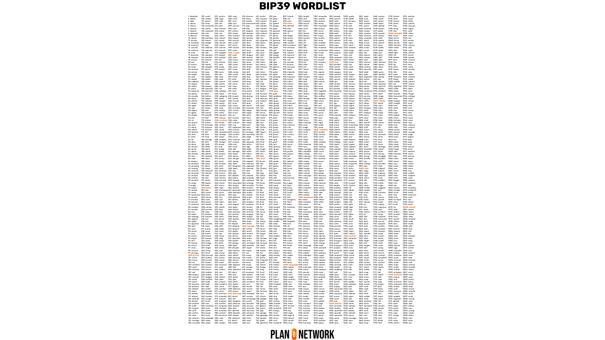


Na primer, za entropiju od 128 bita, kontrolni zbir je 4 bita, i tako ukupna sekvenca iznosi 132 bita. Ona je podeljena na 12 segmenata od po 11 bita (narandžasti bitovi označavaju kontrolni zbir):


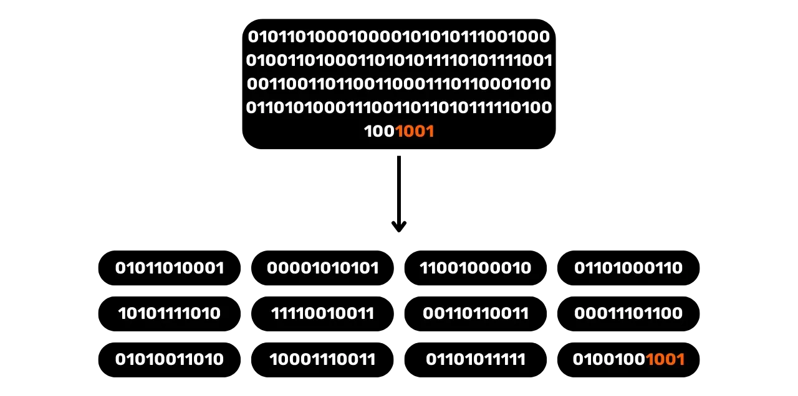


Svaki segment se zatim konvertuje u decimalni broj koji predstavlja reč na listi. Na primer, binarni segment `01011010001` je ekvivalentan decimalnom broju `721`. Dodavanjem 1 da bi se uskladilo sa indeksiranjem liste (koje počinje od 1, a ne od 0), ovo daje rang reči `722`, što je "_focus_" na listi.


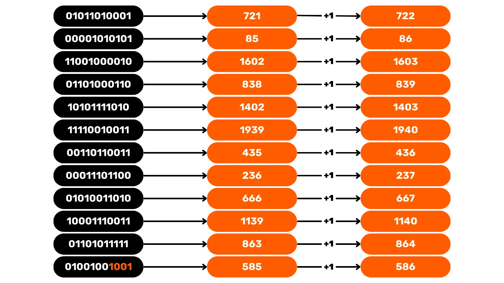


Ova prepiska se ponavlja za svaki od 12 segmenata, kako bi se dobila fraza od 12 reči.


### Karakteristike BIP39 liste reči


Jedinstvenost BIP39 liste reči je ta što nijedna reč ne deli iste prve četiri slova u istom redosledu sa drugom rečju. To znači da je zapisivanje samo prva četiri slova svake reči dovoljno za čuvanje Mnemonic fraze. Ovo može biti zanimljivo za uštedu prostora, posebno za one koji žele da je ugraviraju na metalnu podlogu.


Ova lista od 2048 reči postoji na nekoliko jezika. Ovo nisu jednostavni prevodi, već različite reči za svaki jezik. Međutim, snažno se preporučuje pridržavanje engleske verzije, jer verzije na drugim jezicima generalno nisu podržane od strane Wallet softvera.


### Koju dužinu odabrati za svoju Mnemonic frazu?


Da biste odredili optimalnu dužinu vaše Mnemonic fraze, potrebno je razmotriti stvarnu sigurnost koju pruža. Fraza od 12 reči obezbeđuje 128 bita sigurnosti, dok fraza od 24 reči nudi 256 bita.


Međutim, ova razlika u sigurnosti na nivou fraza ne poboljšava ukupnu sigurnost Bitcoin Wallet, jer privatni ključevi izvedeni iz ove fraze imaju korist samo od 128 bita sigurnosti. Zaista, kao što smo ranije videli, Bitcoin privatni ključevi se generišu iz slučajnih brojeva (ili izvedeni iz slučajnog izvora) u rasponu između $1$ i $n-1$, gde $n$ predstavlja red generator tačke $G$ krive secp256k1, broj nešto manji od $2^{256}$. Moglo bi se stoga pomisliti da ovi privatni ključevi nude 256 bita sigurnosti. Međutim, njihova sigurnost leži u težini pronalaženja privatnog ključa iz njegovog pridruženog javnog ključa, težini koju postavlja matematički problem diskretnog logaritma na eliptičkim krivama (_ECDLP_). Do danas, najpoznatiji algoritam za rešavanje ovog problema je Pollardov rho algoritam, koji smanjuje broj operacija potrebnih za razbijanje ključa na kvadratni koren njegove veličine.


Za ključeve od 256 bita, kao što su oni korišćeni u Bitcoin, Pollardov rho algoritam tako smanjuje složenost na $2^{128}$ operacija:


$$

O(\sqrt{2^{256}}) = O(2^{128})


$$


Stoga se smatra da privatni ključ korišćen u Bitcoin nudi 128 bita sigurnosti.


Kao rezultat toga, odabir fraze od 24 reči ne pruža dodatnu zaštitu za Wallet, jer 256 bita sigurnosti na frazi je besmisleno ako izvedeni ključevi nude samo 128 bita sigurnosti. Da ilustrujemo ovaj princip, to je kao da imate kuću sa dvoja vrata: stara drvena vrata i ojačana vrata. U slučaju provale, ojačana vrata ne bi bila od koristi, jer bi provalnik prošao kroz drvena vrata. Ovo je analogna situacija ovde.


Fraza od 12 reči, koja takođe nudi 128 bita sigurnosti, trenutno je dovoljna da zaštiti vaše bitkoine od bilo kakvog pokušaja krađe. Sve dok se algoritam digitalnog potpisa ne promeni da koristi veće ključeve ili da se oslanja na matematički problem drugačiji od ECDLP, fraza od 24 reči ostaje suvišna. Štaviše, duža fraza povećava rizik od gubitka tokom bekapa: bekap koji je duplo kraći uvek je lakši za upravljanje.


Da biste išli dalje i konkretno naučili kako ručno generate testirati Mnemonic frazu, savetujem vam da otkrijete ovaj vodič:


https://planb.network/tutorials/wallet/backup/generate-mnemonic-phrase-47507d90-e6af-4cac-b01b-01a14d7a8228

Pre nego što nastavim sa izvođenjem Wallet iz ove Mnemonic fraze, u sledećem poglavlju ću vas upoznati sa BIP39 passphrase, jer igra ulogu u procesu izvođenja i nalazi se na istom nivou kao i Mnemonic fraza.


## passphrase


<chapterId>6a51b397-f3b5-5084-b151-cef94bc9b93f</chapterId>


Kao što smo upravo videli, HD novčanici se generišu iz Mnemonic fraze koja obično sadrži 12 ili 24 reči. Ova fraza je veoma važna jer omogućava obnavljanje svih ključeva Wallet u slučaju da se njegov fizički uređaj (kao što je Hardware Wallet, na primer) izgubi. Međutim, ona predstavlja jedinstvenu tačku kvara, jer ako je kompromitovana, napadač bi mogao da ukrade sve bitkoine. Tu na scenu stupa BIP39 passphrase.


### Šta je BIP39 passphrase?


passphrase je opcionalna lozinka, koju možete slobodno izabrati, koja se dodaje Mnemonic frazi u procesu izvođenja ključa kako bi se poboljšala sigurnost Wallet.


Budite pažljivi, passphrase ne treba mešati sa PIN kodom vašeg Hardware Wallet ili lozinkom koja se koristi za otključavanje pristupa vašem Wallet na vašem računaru. Za razliku od svih ovih Elements, passphrase igra ulogu u derivaciji ključeva vašeg Wallet. **To znači da bez njega nikada nećete moći da povratite svoje bitkoine.**


passphrase radi u tandemu sa frazom Mnemonic, modifikujući seed iz koje se generišu ključevi. Dakle, čak i ako neko dobije vašu frazu od 12 ili 24 reči, bez passphrase, ne može pristupiti vašim sredstvima. Korišćenje passphrase u suštini stvara novi Wallet sa različitim ključevima. Modifikovanje (čak i minimalno) passphrase će generate drugačiji Wallet.


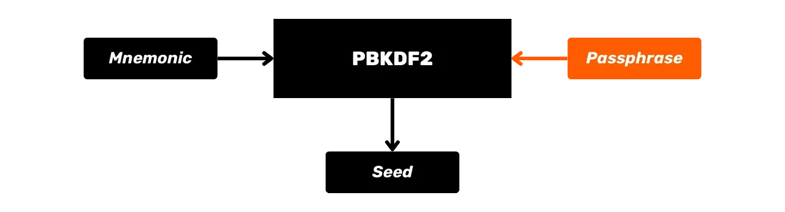


### Zašto bi trebalo da koristite passphrase?


passphrase je proizvoljan i može biti bilo koja kombinacija karaktera koju izabere korisnik. Korišćenje passphrase stoga nudi nekoliko prednosti. Pre svega, smanjuje sve rizike povezane sa kompromitovanjem Mnemonic fraze zahtevajući drugi faktor za pristup sredstvima (provala, pristup vašem domu, itd.).


Dalje, može se strateški koristiti za kreiranje lažnog Wallet, kako bi se suočili sa fizičkim ograničenjima krađe vaših sredstava kao što je ozloglašeni "_napad ključem od $5_". U ovom scenariju, ideja je imati Wallet bez passphrase koji sadrži samo malu količinu bitkoina, dovoljno da zadovolji potencijalnog napadača, dok je pravi Wallet skriven. Ovaj poslednji koristi istu Mnemonic frazu, ali je osiguran dodatnim passphrase.

Konačno, upotreba passphrase je zanimljiva kada neko želi da kontroliše nasumičnost generisanja seed od HD Wallet.


### Kako odabrati dobar passphrase?


Da bi passphrase bio efikasan, mora biti dovoljno dug i nasumičan. Kao i kod jakih lozinki, preporučujem odabir passphrase koji je što duži i nasumičniji, sa raznovrsnošću slova, brojeva i simbola kako bi bilo koji napad grubom silom bio nemoguć.


Takođe je važno pravilno sačuvati ovaj passphrase, na isti način kao i frazu Mnemonic. **Gubitak znači gubitak pristupa vašim bitcoinima**. Snažno savetujem protiv pamćenja samo napamet, jer to nerazumno povećava rizik od gubitka. Idealno je zapisati ga na fizički medijum (papir ili metal) odvojen od fraze Mnemonic. Ova rezervna kopija mora očigledno biti uskladištena na drugom mestu od mesta gde je vaša fraza Mnemonic uskladištena kako bi se sprečilo da obe budu istovremeno kompromitovane.


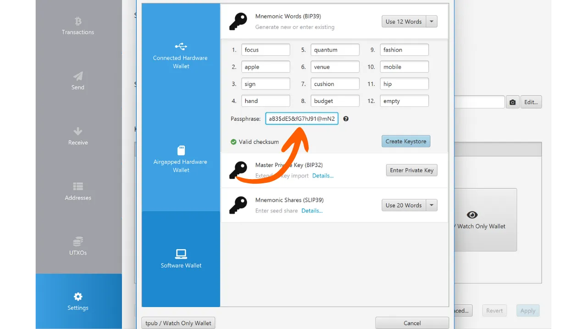


U sledećem odeljku, otkrićemo kako se ova dva Elements na bazi vašeg Wallet — Mnemonic fraza i passphrase — koriste za izvođenje parova ključeva korišćenih u _scriptPubKey_ koji zaključavaju vaše UTXO-e.


# Kreiranje Bitcoin novčanika


<partId>9c25e767-7eae-50b8-8c5f-679d8fc83bab</partId>


## Kreiranje seed i Glavnog Ključa


<chapterId>63093760-2010-5691-8d0e-9a04732ae557</chapterId>


Kada se generišu fraza Mnemonic i opcionalni passphrase, može početi proces derivacije Bitcoin HD Wallet. Fraza Mnemonic se prvo konvertuje u seed koji čini osnovu svih ključeva Wallet.


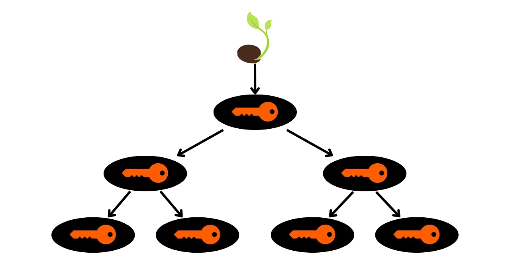


### seed od HD Wallet


BIP39 standard definiše seed kao 512-bitni niz, koji služi kao početna tačka za izvođenje svih ključeva HD Wallet. seed se izvodi iz Mnemonic fraze i mogućeg passphrase koristeći **PBKDF2** algoritam (_Password-Based Key Derivation Function 2_) koji smo već diskutovali u poglavlju 3.3. U ovoj funkciji izvođenja, koristićemo sledeće parametre:


- $m$ : Mnemonic fraza;
- $p$ : opcioni passphrase koji korisnik bira da poboljša sigurnost seed. Ako nema passphrase, ovo polje ostaje prazno;
- $\text{PBKDF2}$ : derivaciona funkcija sa $\text{HMAC-SHA512}$ i $2048$ iteracija;
- $s$: the 512-bit Wallet seed.

Bez obzira na izabranu dužinu fraze Mnemonic (132 bita ili 264 bita), funkcija PBKDF2 će uvek proizvesti izlaz od 512 bita, i seed će stoga uvek biti ove veličine.


### seed Šema izvođenja sa PBKDF2


Sledeća jednačina ilustruje izvođenje seed iz fraze Mnemonic i passphrase:


$$
s = \text{PBKDF2}_{\text{HMAC-SHA512}}(m, p, 2048)
$$


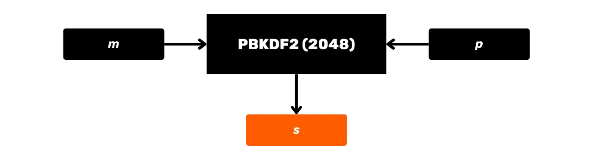


Vrednost seed je stoga pod uticajem vrednosti Mnemonic fraze i passphrase. Promenom passphrase, dobija se drugačiji seed. Međutim, sa istom Mnemonic frazom i passphrase, uvek se generiše isti seed, jer je PBKDF2 deterministička funkcija. Ovo osigurava da se isti parovi ključeva mogu povratiti putem naših rezervnih kopija.


**Napomena:** U običajnom jeziku, termin "seed" često se odnosi, zloupotrebom jezika, na frazu Mnemonic. Zaista, u odsustvu passphrase, jedno je jednostavno kodiranje drugog. Međutim, kao što smo videli, u tehničkoj stvarnosti novčanika, fraza seed i Mnemonic su zaista dva različita Elements.


Sada kada imamo naš seed, možemo nastaviti sa izvođenjem našeg Bitcoin Wallet.


### Master Key i Master Chain Code


Kada se seed dobije, sledeći korak u izvođenju HD Wallet uključuje izračunavanje glavnog privatnog ključa i glavnog lanca koda, koji će predstavljati dubinu 0 našeg Wallet.


Da bi se dobio glavni privatni ključ i glavni lančani kod, funkcija HMAC-SHA512 se primenjuje na seed, koristeći fiksni ključ "_Bitcoin Seed_" identičan za sve korisnike Bitcoin. Ova konstanta je izabrana kako bi se osiguralo da su izvedeni ključevi specifični za Bitcoin. Ovde su Elements:


- $\text{HMAC-SHA512}$: funkcija derivacije;
- $s$: the 512-bit Wallet seed;
- $\text{"Bitcoin seed"}$: zajednička konstanta derivacije za sve Bitcoin novčanike.


$$

\text{output} = \text{HMAC-SHA512}(\text{"Bitcoin Seed"}, s)


$$


Izlaz ove funkcije je stoga 512 bita. Zatim se deli na 2 dela:


- Levih 256 bita čine **glavni privatni ključ**;
- Desnih 256 bita čine **master chain code**.


Matematički, ove dve vrednosti mogu se napisati na sledeći način, pri čemu je $k_M$ glavni privatni ključ, a $C_M$ glavni lančani kod:


$$
k_M = \text{HMAC-SHA512}(\text{"Bitcoin Seed"}, s)_{[:256]}
$$


$$
C_M = \text{HMAC-SHA512}(\text{"Bitcoin Seed"}, s)_{[256:]}
$$


### Uloga glavnog ključa i lanca koda


Glavni privatni ključ se smatra roditeljskim ključem, iz kojeg će svi izvedeni privatni ključevi — deca, unuci, praunuci, itd. — biti generisani. On predstavlja nulti nivo u hijerarhiji derivacije.


S druge strane, glavni lančani kod uvodi dodatni izvor entropije u proces izvođenja ključeva za decu, kako bi se suprotstavio određenim potencijalnim napadima. Štaviše, u HD Wallet, svaki par ključeva ima jedinstveni lančani kod povezan s njim, koji se takođe koristi za izvođenje dečijih ključeva iz ovog para, ali o tome ćemo detaljnije raspravljati u narednim poglavljima.


Pre nego što nastavimo sa izvođenjem HD Wallet sa sledećim Elements, želim da vas u sledećem poglavlju upoznam sa proširenim ključevima, koji se često mešaju sa glavnim ključem. Videćemo kako su konstruisani i koju ulogu igraju u Bitcoin Wallet.


## Prošireni ključevi

<chapterId>8dcffce1-31bd-5e0b-965b-735f5f9e4602</chapterId>


Prošireni ključ je jednostavno konkatenacija ključa (bilo privatnog ili javnog) i njegovog pridruženog lanca koda. Ovaj lanac koda je ključan za izvođenje podključeva jer, bez njega, nije moguće izvesti podključeve iz roditeljskog ključa, ali ćemo ovaj proces preciznije istražiti u sledećem poglavlju. Ovi prošireni ključevi tako omogućavaju agregaciju svih potrebnih informacija za izvođenje podključeva, čime se pojednostavljuje upravljanje računima unutar HD Wallet.


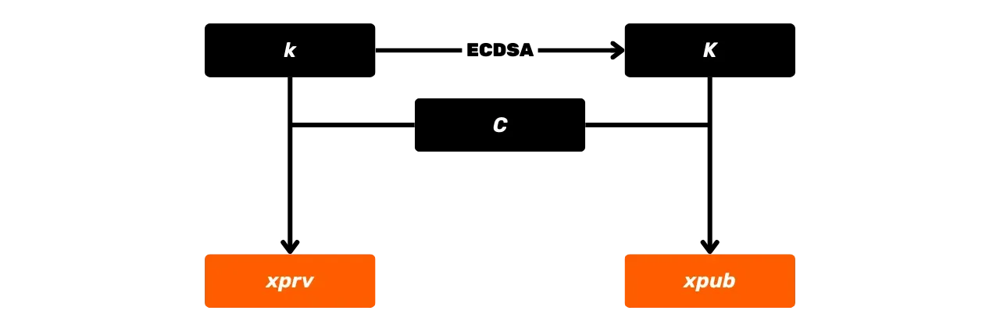


Prošireni ključ se sastoji iz dva dela:


- Nosač, koji sadrži privatni ili javni ključ kao i povezani lančani kod;
- Metapodaci, koji su različiti delovi informacija za olakšavanje interoperabilnosti između softvera i poboljšanje razumevanja za korisnika.


### Kako funkcionišu prošireni ključevi

Kada prošireni ključ sadrži privatni ključ, naziva se prošireni privatni ključ. Prepoznaje se po prefiksu koji sadrži identifikator `prv`. Pored privatnog ključa, prošireni privatni ključ takođe sadrži pridruženi lančani kod. Sa ovom vrstom proširenog ključa moguće je izvesti sve vrste privatnih ključeva potomaka. Dakle, dodavanjem i udvostručavanjem tačaka na eliptičkim krivama, takođe omogućava izvođenje javnih ključeva potomaka.


Kada prošireni ključ ne sadrži privatni ključ, već umesto toga javni ključ, naziva se prošireni javni ključ. Prepoznaje se po prefiksu koji sadrži identifikator `pub`. Očigledno, pored ključa, sadrži i pridruženi lančani kod. Za razliku od proširenog privatnog ključa, prošireni javni ključ omogućava izvođenje samo "normalnih" podređenih javnih ključeva (što znači da ne može izvesti "ojačane" podređene ključeve). U sledećem poglavlju ćemo videti šta znače ovi kvalifikatori "normalni" i "ojačani".


U svakom slučaju, prošireni javni ključ ne omogućava izvođenje privatnih ključeva potomaka. Dakle, čak i ako neko ima pristup `xpub`, neće moći trošiti povezana sredstva, jer neće imati pristup odgovarajućim privatnim ključevima. Oni mogu samo izvesti javne ključeve potomaka kako bi posmatrali povezane transakcije.


Za sledeće, usvojićemo sledeću notaciju:


- $K_{\text{PAR}}$: javni ključ roditelja;
- $k_{\text{PAR}}$: roditeljski privatni ključ;
- $C_{\text{PAR}}$: kod roditeljskog lanca;
- $C_{\text{CHD}}$: kod lanca deteta;
- $K_{\text{CHD}}^n$: normalan dečji javni ključ;
- $k_{\text{CHD}}^n$: normalni privatni ključ deteta;
- $K_{\text{CHD}}^h$: očvrsnuti javni ključ deteta;
- $k_{\text{CHD}}^h$: očvrsnuti privatni ključ deteta.


### Izgradnja produženog ključa


Prošireni ključ je strukturiran na sledeći način:


- Version**: Verzija koda za identifikaciju prirode ključa (`xprv`, `xpub`, `yprv`, `ypub`...). Videćemo na kraju ovog poglavlja na šta se odnose slova `x`, `y` i `z`.
- Dubina**: Hijerarhijski nivo u HD Wallet u odnosu na glavni ključ (0 za glavni ključ).
- Parent Fingerprint**: Prva 4 bajta HASH160 Hash roditeljskog javnog ključa korišćenog za izvođenje ključa prisutnog u korisnom teretu.
- Indeksni Broj**: Identifikator deteta među ključevima braće i sestara, to jest, među svim ključevima na istom nivou derivacije koji imaju iste roditeljske ključeve.
- Chain Code**: Jedinstveni 32-bajtni kod za izvođenje podređenih ključeva.
- Ključ**: Privatni ključ (prefiksiran sa 1 bajtom za veličinu) ili javni ključ.
- Checksum**: Kontrolni zbir izračunat pomoću HASH256 funkcije (dvostruki SHA256) se takođe dodaje, što omogućava verifikaciju integriteta proširenog ključa tokom njegovog prenosa ili skladištenja.


Potpuni format proširenog ključa je stoga 78 bajtova bez kontrolnog zbira, i 82 bajta sa kontrolnim zbirom. Zatim se konvertuje u Base58 kako bi se dobila reprezentacija koja je lako čitljiva korisnicima. Base58 format je isti kao onaj koji se koristi za *Legacy* adrese za primanje (pre *SegWit*).


| Element           | Description                                                                                                        | Size      |
| ----------------- | ------------------------------------------------------------------------------------------------------------------ | --------- |
| Version           | Indicates whether the key is public (`xpub`, `ypub`) or private (`xprv`, `zprv`), as well as the version of the extended key | 4 bytes   |
| Depth             | Level in the hierarchy relative to the master key                                                                  | 1 byte    |
| Parent Fingerprint| The first 4 bytes of HASH160 of the parent public key                                                              | 4 bytes   |
| Index Number      | Position of the key in the order of children                                                                       | 4 bytes   |
| Chain Code        | Used to derive child keys                                                                                          | 32 bytes  |
| Key               | The private key (with a 1-byte prefix) or the public key                                                          | 33 bytes  |
| Checksum          | Checksum to verify integrity                                                                                       | 4 bytes   |

Ako se jedan bajt doda samo privatnom ključu, to je zato što je kompresovani javni ključ duži od privatnog ključa za jedan bajt. Ovaj dodatni bajt, dodat na početku privatnog ključa kao `0x00`, izjednačava njihovu veličinu, osiguravajući da je sadržaj proširenog ključa iste dužine, bilo da je u pitanju javni ili privatni ključ.


### Prošireni prefiksi ključeva

Kao što smo upravo videli, prošireni ključevi uključuju prefiks koji označava i verziju proširenog ključa i njegovu prirodu. Oznaka `pub` označava da se odnosi na prošireni javni ključ, a oznaka `prv` označava prošireni privatni ključ. Dodatno slovo na bazi proširenog ključa pomaže da se naznači da li je standard koji se prati Legacy, SegWit v0, SegWit v1, itd.

Evo sažetka prefiksa koji se koriste i njihovih značenja:


| Base 58 Prefix  | Base 16 Prefix  | Network | Purpose             | Associated Scripts  | Derivation            | Key Type     |
| --------------- | --------------- | ------- | ------------------- | ------------------- | --------------------- | ------------ |
| `xpub`          | `0488b21e`      | Mainnet | Legacy and SegWit V1 | P2PK / P2PKH / P2TR | `m/44'/0'`, `m/86'/0'` | public       |
| `xprv`          | `0488ade4`      | Mainnet | Legacy and SegWit V1 | P2PK / P2PKH / P2TR | `m/44'/0'`, `m/86'/0'` | private      |
| `tpub`          | `043587cf`      | Testnet | Legacy and SegWit V1 | P2PK / P2PKH / P2TR | `m/44'/1'`, `m/86'/1'` | public       |
| `tprv`          | `04358394`      | Testnet | Legacy and SegWit V1 | P2PK / P2PKH / P2TR | `m/44'/1'`, `m/86'/1'` | private      |
| `ypub`          | `049d7cb2`      | Mainnet | Nested SegWit       | P2WPKH in P2SH      | `m/49'/0'`             | public       |
| `yprv`          | `049d7878`      | Mainnet | Nested SegWit       | P2WPKH in P2SH      | `m/49'/0'`             | private      |
| `upub`          | `049d7cb2`      | Testnet | Nested SegWit       | P2WPKH in P2SH      | `m/49'/1'`             | public       |
| `uprv`          | `044a4e28`      | Testnet | Nested SegWit       | P2WPKH in P2SH      | `m/49'/1'`             | private      |
| `zpub`          | `04b24746`      | Mainnet | SegWit V0           | P2WPKH              | `m/84'/0'`             | public       |
| `zprv`          | `04b2430c`      | Mainnet | SegWit V0           | P2WPKH              | `m/84'/0'`             | private      |
| `vpub`          | `045f1cf6`      | Testnet | SegWit V0           | P2WPKH              | `m/84'/1'`             | public       |
| `vprv`          | `045f18bc`      | Testnet | SegWit V0           | P2WPKH              | `m/84'/1'`             | private      |


### Detalji proširenog ključa Elements


Da bismo bolje razumeli unutrašnju strukturu proširenog ključa, uzmimo jedan kao primer i razložimo ga. Evo jednog proširenog ključa:


- U Bazi58**:


```text
xpub6CTNzMUkzpurBWaT4HQoYzLP4uBbGJuWY358Rj7rauiw4rMHCyq3Rfy9w4kyJXJzeFfyrKLUar2rUCukSiDQFa7roTwzjiAhyQAdPLEjqHT
```


- U heksadecimalnom**:


```text
0488B21E036D5601AD80000000C605DF9FBD77FD6965BD02B77831EC5C78646AD3ACA14DC3984186F72633A89303772CCB99F4EF346078D167065404EED8A58787DED31BFA479244824DF50658051F067C3A
```


Ovaj prošireni ključ se razlaže na nekoliko različitih Elements:


1.**Verzija**: `0488B21E`


Prva 4 bajta su verzija. Ovde, ona odgovara proširenom javnom ključu na Mainnet sa svrhom derivacije bilo *Legacy* ili *SegWit v1*.


2.**Dubina**: `03`


Ovo polje označava hijerarhijski nivo ključa unutar HD Wallet. U ovom slučaju, dubina od `03` znači da je ovaj ključ tri nivoa derivacije ispod glavnog ključa.


3.**Parent fingerprint**: `6D5601AD`


Ovo su prva 4 bajta HASH160 Hash nadređenog javnog ključa koji je korišćen za izvođenje ovog `xpub`.


4.**Indeks broj**: `80000000`


Ovaj indeks označava poziciju ključa među decom njegovog roditelja. Prefiks `0x80` označava da je ključ izveden na ojačan način, a pošto je ostatak ispunjen nulama, to označava da je ovaj ključ prvi među svojim mogućim srodnicima.


5.**Chain code**: `C605DF9FBD77FD6965BD02B77831EC5C78646AD3ACA14DC3984186F72633A893`


6.**Public Key**: `03772CCB99F4EF346078D167065404EED8A58787DED31BFA479244824DF5065805`


7.**Kontrolni zbir**: `1F067C3A`


Kontrolni zbir odgovara prva 4 bajta Hash (dupli SHA256) svega ostalog.


U ovom poglavlju smo otkrili da postoje dve različite vrste dečijih ključeva. Takođe smo naučili da za izvođenje ovih dečijih ključeva je potreban ključ (bilo privatni ili javni) i njegov lančani kod. U sledećem poglavlju ćemo detaljno ispitati prirodu ovih različitih vrsta ključeva i kako ih izvesti iz njihovog roditeljskog ključa i lančanog koda.


## Izvođenje dečijih parova ključeva

<chapterId>61c0807c-845b-5076-ad06-7f395b36adfd</chapterId>


Izvođenje parova ključeva za decu u Bitcoin HD novčanicima oslanja se na hijerarhijsku strukturu koja omogućava generisanje velikog broja ključeva, dok organizuje ove parove u različite grupe kroz grane. Svaki par ključeva izveden iz roditeljskog para može se koristiti ili direktno u *scriptPubKey* za zaključavanje bitkoina, ili kao početna tačka za generate više dečijih ključeva, i tako dalje, kako bi se stvorilo stablo ključeva.


Sve ove izvedenice počinju sa glavnim ključem i glavnim lancem kodova, koji su prvi roditelji na dubinskom nivou 0. Oni su, na neki način, Adam i Eva vaših Wallet ključeva, zajednički preci svih izvedenih ključeva.


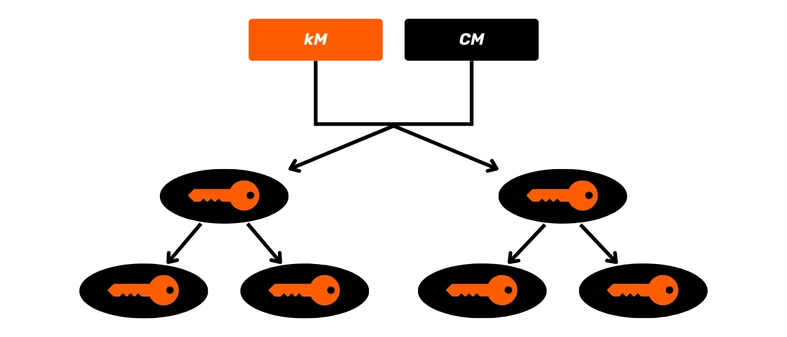


Hajde da istražimo kako ova deterministička derivacija funkcioniše.


### Različite vrste derivacija ključeva za decu


Kao što smo ukratko pomenuli u prethodnom poglavlju, ključevi za decu su podeljeni u dve glavne vrste.


- Normal child keys** ($k_{\text{CHD}}^n, K_{\text{CHD}}^n$): Ovi se izvode iz proširenog javnog ključa ($K_{\text{PAR}}$), ili proširenog privatnog ključa ($k_{\text{PAR}}$), tako što se prvo izvodi javni ključ.
- Očvrsli ključevi za decu** ($k_{\text{CHD}}^h, K_{\text{CHD}}^h$): Ovi ključevi se mogu izvesti samo iz proširenog privatnog ključa ($k_{\text{PAR}}$) i stoga su nevidljivi posmatračima koji imaju samo prošireni javni ključ.


Svaki par ključeva deteta identifikovan je 32-bitnim **indeksom** (nazvanim $i$ u našim proračunima). Indeksi za normalne ključeve kreću se od $0$ do $2^{31}-1$, dok se oni za ojačane ključeve kreću od $2^{31}$ do $2^{32}-1$. Ovi brojevi se koriste za razlikovanje parova ključeva braće i sestara tokom derivacije. Zaista, svaki roditeljski par ključeva mora biti sposoban da izvede više parova ključeva deteta. Ako bismo sistematski primenili isti proračun sa roditeljskih ključeva, svi dobijeni ključevi braće i sestara bi bili identični, što nije poželjno. Indeks tako uvodi varijablu koja modifikuje proračun derivacije, omogućavajući da se svaki par braće i sestara razlikuje. Osim za specifičnu upotrebu u određenim protokolima i standardima derivacije, generalno počinjemo derivaciju prvog ključa deteta sa indeksom `0`, drugog sa indeksom `1`, i tako dalje.


### Proces derivacije sa HMAC-SHA512


Izvođenje svakog ključa deteta zasniva se na HMAC-SHA512 funkciji, koju smo diskutovali u Odeljku 2 o Hash funkcijama. Ona uzima dva ulaza: roditeljski lančani kod $C_{\text{PAR}}$, i konkatenaciju roditeljskog ključa (bilo javnog ključa $K_{\text{PAR}}$ ili privatnog ključa $k_{\text{PAR}}$, u zavisnosti od tipa željenog ključa deteta) sa indeksom. Izlaz HMAC-SHA512 je 512-bitni niz, podeljen na dva dela:


- Prvih 32 bajta** (ili $h_1$) koriste se za izračunavanje novog para potomaka.
- Poslednjih 32 bajta** (ili $h_2$) služe kao novi lančani kod $C_{\text{CHD}}$ za par deteta.


U svim našim proračunima, označiću $\text{Hash}$ kao izlaz funkcije HMAC-SHA512.


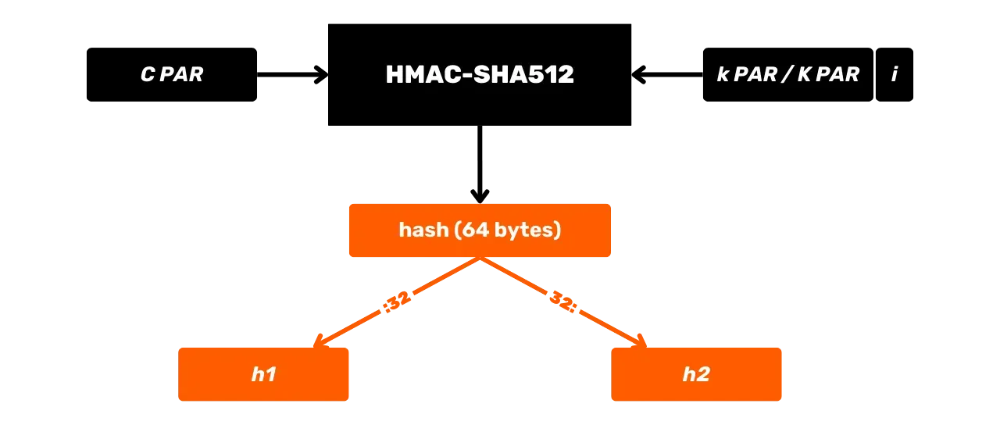


#### Izvođenje privatnog ključa deteta iz privatnog ključa roditelja


Da bi se izveo privatni ključ deteta $k_{\text{CHD}}$ iz roditeljskog privatnog ključa $k_{\text{PAR}}$, moguća su dva scenarija u zavisnosti od toga da li se želi ojačani ili normalni ključ.


Za **normalan ključ deteta** ($i < 2^{31}$), proračun $\text{Hash}$ je sledeći:


$$
\text{hash} = \text{HMAC-SHA512}(C_{\text{PAR}},  k_{\text{PAR}} \cdot G \Vert i)
$$


U ovom proračunu, primećujemo da naša HMAC funkcija uzima dva ulaza: prvo, roditeljski lančani kod, a zatim konkatenaciju indeksa sa javnim ključem povezanim sa roditeljskim privatnim ključem. Roditeljski javni ključ se ovde koristi jer želimo da izvedemo normalan dečiji ključ, a ne ojačani.

Sada imamo 64-bajtni $\text{Hash}$ koji ćemo podeliti na 2 dela od po 32 bajta, $h_1$ i $h_2$:


$$

\text{hash} = h_1 \Vert h_2

$$


$$
h_1 = \text{hash}_{[:32]} \quad, \quad h_2 = \text{hash}_{[32:]}
$$


Privatni ključ deteta $k_{\text{CHD}}^n$ se zatim izračunava na sledeći način:


$$
k_{\text{CHD}}^n = \text{parse256}(h_1) + k_{\text{PAR}} \mod n
$$


U ovom proračunu, operacija $\text{parse256}(h_1)$ sastoji se od interpretacije prvih 32 bajta $\text{Hash}$ kao 256-bitnog celog broja. Ovaj broj se zatim dodaje roditeljskom privatnom ključu, sve uzeto modulo $n$ da bi se ostalo unutar reda eliptičke krive, kao što smo videli u odeljku 3 o digitalnim potpisima. Dakle, da bi se izveo normalan dečiji privatni ključ, iako se roditeljski javni ključ koristi kao osnova za proračun u ulazima funkcije HMAC-SHA512, uvek je neophodno imati roditeljski privatni ključ da bi se završio proračun.


Iz ovog privatnog ključa deteta, moguće je izvesti odgovarajući javni ključ primenom ECDSA ili Schnorr. Na ovaj način, dobijamo kompletan par ključeva.


Zatim, drugi deo $\text{Hash}$ se jednostavno tumači kao lančani kod za par ključeva deteta koji smo upravo izveli:


$$
C_{\text{CHD}} = h_2
$$


Evo šematski prikaz celokupne izvedbe:


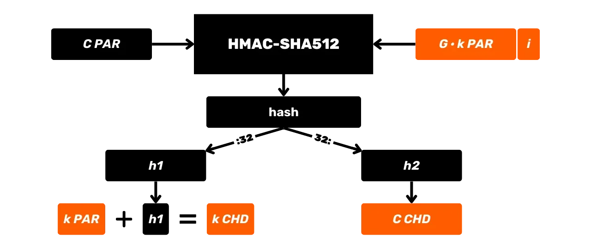


Za **ojačani dečiji ključ** ($i \geq 2^{31}$), proračun $\text{Hash}$ je sledeći:


$$
\text{hash} = \text{HMAC-SHA512}(C_{\text{PAR}}, 0x00 \Vert k_{\text{PAR}} \Vert i)
$$


U ovom proračunu, primećujemo da naša HMAC funkcija uzima dva ulaza: prvo, roditeljski lančani kod, a zatim konkatenaciju indeksa sa roditeljskim privatnim ključem. Roditeljski privatni ključ se ovde koristi jer želimo da izvedemo ojačani dečiji ključ. Štaviše, bajt jednak `0x00` se dodaje na početku ključa. Ova operacija izjednačava njegovu dužinu kako bi odgovarala dužini kompresovanog javnog ključa.

Dakle, sada imamo 64-bajtni $\text{Hash}$ koji ćemo podeliti na 2 dela od po 32 bajta, $h_1$ i $h_2$:

$$

\text{hash} = h_1 \Vert h_2

$$


$$
h_1 = \text{hash}[:32] \quad, \quad h_2 = \text{hash}[32:]
$$


Privatni ključ deteta $k_{\text{CHD}}^h$ se zatim izračunava na sledeći način:


$$
k_{\text{CHD}}^h = \text{parse256}(h_1) + k_{\text{PAR}} \mod n
$$


Dalje, jednostavno interpretiramo drugi deo $\text{Hash}$ kao lančani kod za par dečijih ključeva koje smo upravo izveli:


$$
C_{\text{CHD}} = h_2
$$


Evo šematski prikaz celokupne izvedbe:


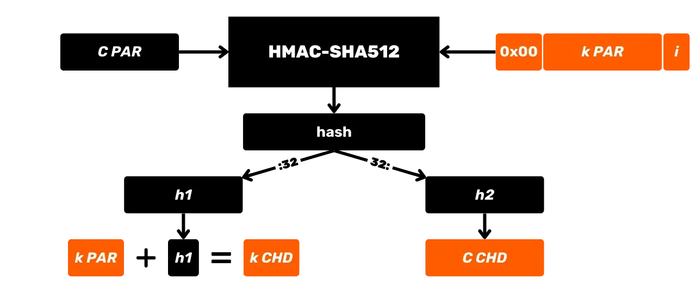


Možemo videti da normalna derivacija i ojačana derivacija funkcionišu na isti način, sa ovom razlikom: normalna derivacija koristi roditeljski javni ključ kao ulaz za HMAC funkciju, dok ojačana derivacija koristi roditeljski privatni ključ.


#### Izvođenje javnog ključa deteta iz javnog ključa roditelja


Ako znamo samo roditeljski javni ključ $K_{\text{PAR}}$ i pridruženi lančani kod $C_{\text{PAR}}$, tj. prošireni javni ključ, moguće je izvesti dečije javne ključeve $K_{\text{CHD}}^n$, ali samo za normalne (neojačane) dečije ključeve. Ovaj princip posebno omogućava praćenje kretanja računa u Bitcoin Wallet sa `xpub` (*samo za gledanje*).


Da bismo izvršili ovaj proračun, izračunaćemo $\text{Hash}$ sa indeksom $i < 2^{31}$ (normalna derivacija):


$$
\text{hash} = \text{HMAC-SHA512}(C_{\text{PAR}}, K_{\text{PAR}} \Vert i)
$$


U ovom proračunu, primećujemo da naša HMAC funkcija uzima dva ulaza: prvo roditeljski lančani kod, zatim konkatenaciju indeksa sa roditeljskim javnim ključem.


Dakle, sada imamo $\text{Hash}$ od 64 bajta koji ćemo podeliti na 2 dela od po 32 bajta, $h_1$ i $h_2$:


$$

\text{hash} = h_1 \Vert h_2

$$


$$

h_1 = \text{hash}[:32] \quad, \quad h_2 = \text{hash}[32:]

$$


Javni ključ deteta $K_{\text{CHD}}^n$ se zatim izračunava na sledeći način:


$$
K_{\text{CHD}}^n = \text{parse256}(h_1) \cdot G + K_{\text{PAR}}
$$


Ako je $\text{parse256}(h_1) \geq n$ (red eliptičke krive) ili ako je $K_{\text{CHD}}^n$ tačka u beskonačnosti, derivacija je nevažeća i mora se izabrati drugi indeks.


U ovom proračunu, operacija $\text{parse256}(h_1)$ uključuje interpretaciju prvih 32 bajta $\text{Hash}$ kao 256-bitnog celog broja. Ovaj broj se koristi za izračunavanje tačke na eliptičnoj krivoj kroz sabiranje i udvostručavanje od generatora tačke $G$. Ova tačka se zatim dodaje roditeljskom javnom ključu kako bi se dobio normalni dečiji javni ključ. Dakle, za izvođenje normalnog dečijeg javnog ključa, potrebni su samo roditeljski javni ključ i roditeljski lančani kod; roditeljski privatni ključ nikada ne ulazi u ovaj proces, za razliku od izračunavanja dečijeg privatnog ključa koji smo ranije videli.


Dalje, kod dečijeg lanca je jednostavno:


$$
C_{\text{CHD}} = h_2
$$


Evo šematskog prikaza celokupne izvedbe:


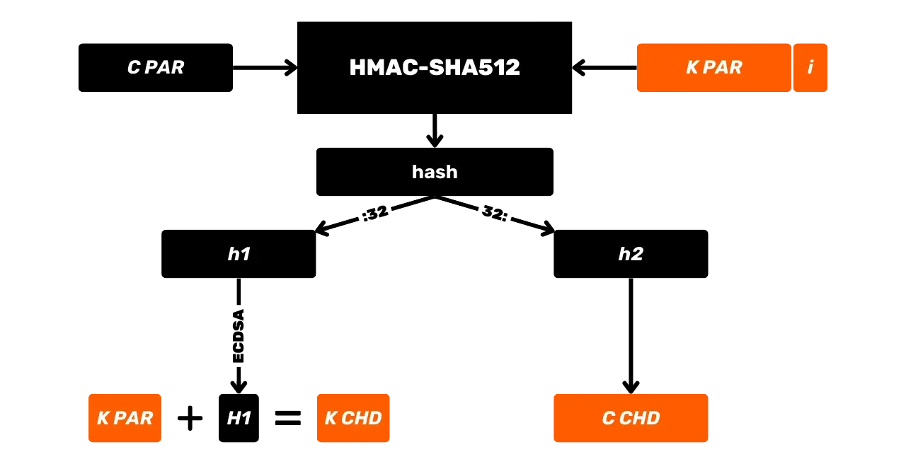


### Korespondencija između javnih i privatnih ključeva deteta


Pitanje koje se može postaviti je kako normalni javni ključ deteta izveden iz roditeljskog javnog ključa može odgovarati normalnom privatnom ključu deteta izvedenom iz odgovarajućeg roditeljskog privatnog ključa. Ova veza je precizno osigurana svojstvima eliptičkih krivih. Naime, da bi se izveo normalni javni ključ deteta, HMAC-SHA512 se primenjuje na isti način, ali se njegov izlaz koristi drugačije:


   - Normal child private key**: $k_{\text{CHD}}^n = \text{parse256}(h_1) + k_{\text{PAR}} \mod n$
   - Normal child public key**: $K_{\text{CHD}}^n = \text{parse256}(h_1) \cdot G + K_{\text{PAR}}$


Zahvaljujući operacijama sabiranja i udvostručavanja na eliptičnoj krivi, obe metode proizvode dosledne rezultate: javni ključ izveden iz privatnog ključa deteta je identičan javnom ključu deteta izvedenom direktno iz javnog ključa roditelja.


### Rezime tipova derivacija


Da rezimiramo, evo različitih mogućih tipova izvođenja:


$$
\begin{array}{|c|c|c|c|}
\hline
\rightarrow & \text{PAR} & \text{CHD} & \text{n/h} \\
\hline
k_{\text{PAR}} \rightarrow k_{\text{CHD}} & k_{\text{PAR}} & \{ k_{\text{CHD}}^n, k_{\text{CHD}}^h \} & \{ n, h \} \\
k_{\text{PAR}} \rightarrow K_{\text{CHD}} & k_{\text{PAR}} & \{ K_{\text{CHD}}^n, K_{\text{CHD}}^h \} & \{ n, h \} \\
K_{\text{PAR}} \rightarrow k_{\text{CHD}} & K_{\text{PAR}} & \times & \times \\
K_{\text{PAR}} \rightarrow K_{\text{CHD}} & K_{\text{PAR}} & K_{\text{CHD}}^n & n \\
\hline
\end{array}
$$


Do sada ste naučili kako da kreirate osnovni Elements od HD Wallet: Mnemonic frazu, seed, a zatim master ključ i master chain kod. Takođe ste otkrili kako da izvedete parove ključeva za decu u ovom poglavlju. U sledećem poglavlju, istražićemo kako su ove izvedenice organizovane u Bitcoin novčanicima i koju strukturu pratiti da biste konkretno dobili adrese za primanje, kao i parove ključeva korišćene u *scriptPubKey* i *scriptSig*.


## Wallet Struktura i Putanje Izvoda

<chapterId>34e1bbda-67de-5493-b268-1fded8d67689</chapterId>


Hijerarhijska struktura HD novčanika u Bitcoin omogućava organizaciju parova ključeva na različite načine. Ideja je da se iz glavnog privatnog ključa i glavnog lanca koda izvedu različiti nivoi dubine. Svaki dodati nivo odgovara derivaciji para ključeva deteta iz para ključeva roditelja.


Tokom vremena, različiti BIP-ovi su uveli standarde za ove putanje derivacije, sa ciljem standardizacije njihove upotrebe u različitim softverima. Dakle, u ovom poglavlju ćemo otkriti značenje svakog nivoa derivacije u HD novčanicima, prema ovim standardima.


### Dubine derivacije HD Wallet


Putanje derivacije su organizovane u slojeve dubine, počevši od dubine 0, koja predstavlja master ključ i master lančani kod, do slojeva podnivoa za izvođenje adresa koje se koriste za zaključavanje UTXO-a. BIP-ovi (*Bitcoin Improvement Proposals*) definišu standarde za svaki Layer, što pomaže u harmonizaciji praksi među različitim Wallet softverima za upravljanje.


Putanja derivacije, dakle, odnosi se na sekvencu indeksa korišćenih za izvođenje podključeva iz glavnog ključa.


**Dubina 0: Glavni ključ (BIP32)**


Ova dubina odgovara glavnom privatnom ključu i glavnom lancu koda Wallet. Predstavlja se notacijom $m/$.


**Dubina 1: Svrha (BIP43)**


Svrha određuje logičku strukturu izvođenja. Na primer, P2WPKH Address će imati $/84'/$ na dubini 1 (prema BIP84), dok će P2TR Address imati $/86'/$ (prema BIP86). Ovaj Layer olakšava kompatibilnost između novčanika ukazujući na brojeve indeksa koji odgovaraju BIP brojevima.


Drugim rečima, kada imate glavni ključ i glavni lančani kod, oni služe kao roditeljski par ključeva za izvođenje para dečijih ključeva. Indeks korišćen u ovoj izvedbi može biti, na primer, $/84'/$ ako je Wallet namenjen za korišćenje SegWit v0 tip skripti. Ovaj par ključeva je tada na dubini 1. Njegova uloga nije da zaključava bitkoine, već jednostavno da služi kao međutačka u hijerarhiji izvođenja.


**Dubina 2: Tip Valute (BIP44)**


Iz para ključeva na dubini 1, vrši se nova derivacija kako bi se dobio par ključeva na dubini 2. Ova dubina omogućava razlikovanje Bitcoin naloga od drugih kriptovaluta unutar istog Wallet.


Svaka valuta ima jedinstveni indeks kako bi se osigurala kompatibilnost u novčanicima sa više valuta. Na primer, za Bitcoin, indeks je $/0'/$ (ili `0x80000000` u heksadecimalnoj notaciji). Indeksi valuta se biraju u opsegu od $2^{31}$ do $2^{32}-1$ kako bi se osigurala ojačana derivacija.


Da bih vam dao druge primere, evo indeksa nekih valuta:


- $1'$ (`0x80000001`) za Testnet bitkoina;
- $2'$ (`0x80000002`) za Litecoin;
- $60'$ (`0x8000003c`) za Ethereum...


**Dubina 3: Račun (BIP32)**


Svaki Wallet može biti podeljen na nekoliko naloga, numerisanih od $2^{31}$, i predstavljenih na dubini 3 sa $/0'/$ za prvi nalog, $/1'/$ za drugi, i tako dalje. Generalno, kada se pominje prošireni ključ `xpub`, to se odnosi na ključeve na ovoj dubini derivacije.


Ova podela na različite naloge je opcionalna. Cilj joj je da pojednostavi organizaciju Wallet za korisnike. U praksi se često koristi samo jedan nalog, obično prvi po defaultu. Međutim, u nekim slučajevima, ako neko želi jasno da razlikuje parove ključeva za različite namene, ovo može biti korisno. Na primer, moguće je kreirati lični nalog i profesionalni nalog iz istog seed, sa potpuno različitim grupama ključeva od ove dubine derivacije.


**Dubina 4: Lanac (BIP32)**


Svaki nalog definisan na dubini 3 je zatim strukturisan u dva lanca:


- Eksterni lanac**: U ovom lancu se izvode takozvane "javne" adrese. Ove adrese za primanje su namenjene za zaključavanje UTXO-a koji dolaze iz eksternih transakcija (odnosno, koji potiču iz potrošnje UTXO-a koji ne pripadaju vama). Jednostavno rečeno, ovaj eksterni lanac se koristi kad god neko želi da primi bitkoine. Kada kliknete na "*primi*" u vašem Wallet softveru, uvek vam se nudi Address iz eksternog lanca. Ovaj lanac je predstavljen parom ključeva izvedenih sa indeksom $/0/$.
- Interni lanac (change)**: Ovaj lanac je rezervisan za primanje adresa koje zaključavaju bitkoine dolazeći od potrošnje UTXO-a koji pripadaju vama, drugim rečima, adrese za kusur. Identifikovan je indeksom $/1/$.


**Dubina 5: Address Indeks (BIP32)**


Konačno, dubina 5 predstavlja poslednji korak derivacije u Wallet. Iako je tehnički moguće nastaviti beskonačno, trenutni standardi se zaustavljaju ovde. Na ovoj konačnoj dubini, parovi ključeva koji će zapravo biti korišćeni za zaključavanje i otključavanje UTXO-a su izvedeni. Svaki indeks omogućava razlikovanje između parova ključeva braće i sestara: tako će prvi primajući Address koristiti indeks $/0/$, drugi indeks $/1/$, i tako dalje.


### Označavanje putanja derivacije


Putanja derivacije se piše odvajanjem svakog nivoa kosom crtom ($/$). Svaka kosa crta tako označava derivaciju roditeljskog para ključeva ($k_{\text{PAR}}$, $K_{\text{PAR}}$, $C_{\text{PAR}}$) do para ključeva deteta ($k_{\text{CHD}}$, $K_{\text{CHD}}$, $C_{\text{CHD}}$). Broj naveden na svakoj dubini odgovara indeksu koji se koristi za izvođenje ovog ključa iz njegovih roditelja. Apostrof ($'$) ponekad postavljen desno od indeksa označava ojačanu derivaciju ($k_{\text{CHD}}^h$, $K_{\text{CHD}}^h$). Ponekad se ovaj apostrof zamenjuje sa $h$. U odsustvu apostrofa ili $h$, to je stoga normalna derivacija ($k_{\text{CHD}}^n$, $K_{\text{CHD}}^n$).

Kao što smo videli u prethodnim poglavljima, indeksi očvrslih ključeva počinju od $2^{31}$, ili `0x80000000` u heksadecimalnom formatu. Stoga, kada indeks prati apostrof u putanji derivacije, $2^{31}$ mora biti dodato naznačenom broju da bi se dobila stvarna vrednost korišćena u HMAC-SHA512 funkciji. Na primer, ako putanja derivacije specificira $/44'/$, stvarni indeks će biti:

$$

i = 44 + 2^{31} = 2\,147\,483\,692

$$


U heksadecimalnom formatu, ovo je `0x8000002C`.


Sada kada smo razumeli glavne principe putanja derivacije, hajde da uzmemo primer! Evo putanje derivacije za Bitcoin koji prima Address:


$$

m / 84' / 0' / 1' / 0 / 7

$$


U ovom primeru:


- $84'$ označava standard P2WPKH (SegWit v0);
- $0'$ označava valutu Bitcoin na Mainnet;
- $1'$ odgovara drugom nalogu u Wallet;
- $0$ označava da je Address na spoljašnjem lancu;
- $7$ označava 8. eksterni Address ovog naloga.


### Rezime strukture izvođenja


| Depth | Description        | Standard Example                  |
| ----- | ------------------ | --------------------------------- |
| 0     | Master Key         | $m/$                              |
| 1     | Purpose            | $/86'/$ (P2TR)                    |
| 2     | Currency           | $/0'/$ (Bitcoin)                  |
| 3     | Account            | $/0'/$ (First account)            |
| 4     | Chain              | $/0/$ (external) or $/1/$ (change)|
| 5     | Address Index      | $/0/$ (first address)             |

U sledećem poglavlju, otkrićemo šta su "*output script descriptors*", nedavno uvedena inovacija u Bitcoin Core koja pojednostavljuje bekap Bitcoin Wallet.


## Izlazni opisi skripti

<chapterId>e4f1c2d3-9b8a-4d3e-8f2a-7b6c5d4e3f2a</chapterId>

Često vam se govori da je sama fraza Mnemonic dovoljna za povrat pristupa Wallet. U stvarnosti, stvari su malo složenije. U prethodnom poglavlju smo pogledali strukturu izvođenja HD Wallet, i možda ste primetili da je ovaj proces prilično složen. Putanje izvođenja govore softveru u kom pravcu da ide kako bi izveo korisničke ključeve. Međutim, prilikom oporavka Bitcoin Wallet, ako neko ne zna ove putanje, sama fraza Mnemonic nije dovoljna. Ona omogućava dobijanje glavnog ključa i glavnog lanca koda, ali je zatim potrebno znati indekse korišćene za dostizanje podređenih ključeva.


Teoretski, bilo bi neophodno sačuvati ne samo Mnemonic frazu našeg Wallet već i puteve do naloga koje koristimo. U praksi, često je moguće povratiti pristup ključevima bez ove informacije, pod uslovom da su standardi ispoštovani. Testiranjem svakog standarda jedan po jedan, generalno je moguće povratiti pristup bitkoinima. Međutim, ovo nije zagarantovano i posebno je komplikovano za početnike. Takođe, sa diverzifikacijom tipova skripti i pojavom složenijih konfiguracija, ova informacija može postati teška za ekstrapolaciju, čime se ovi podaci pretvaraju u privatne informacije koje je teško povratiti metodom grube sile. Zato je nedavno uvedena inovacija koja počinje da se integriše u vaš omiljeni Wallet softver: *output script descriptors*.


### Šta je "descriptor"?


"*output script descriptors*", ili jednostavno "*deskriptori*", su strukturirani izrazi koji u potpunosti opisuju izlazni skript (*scriptPubKey*) i pružaju sve neophodne informacije za praćenje transakcija povezanih sa određenim skriptom. Oni olakšavaju upravljanje ključevima u HD novčanicima nudeći standardizovan i potpun opis Wallet strukture i tipova adresa koje se koriste.


Glavna prednost deskriptora leži u njihovoj sposobnosti da enkapsuliraju sve bitne informacije za vraćanje Wallet u jedan string (pored fraze za oporavak). Čuvanjem deskriptora sa povezanim Mnemonic frazama, postaje moguće vratiti privatne ključeve preciznim poznavanjem njihove pozicije u hijerarhiji. Za Multisig novčanike, čija je sigurnosna kopija inicijalno bila složenija, deskriptor uključuje `xpub` svakog faktora, čime se osigurava mogućnost regenerisanja adresa u slučaju problema.


### Izgradnja deskriptora


Opis se sastoji od nekoliko Elements:


- Funkcije skripti kao što su `pk` (*Pay-to-PubKey*), `pkh` (*Pay-to-PubKey-Hash*), `wpkh` (*Pay-to-Witness-PubKey-Hash*), `sh` (*Pay-to-Script-Hash*), `wsh` (*Pay-to-Witness-Script-Hash*), `tr` (*Pay-to-Taproot*), `multi` (*Multisignature*), i `sortedmulti` (*Multisignature with sorted keys*);
- Putanje derivacije, na primer, `[d34db33f/44h/0h/0h]` što označava putanju izvedenog naloga i specifičan otisak prsta glavnog ključa;
- Ključevi u različitim formatima kao što su heksadecimalni javni ključevi ili prošireni javni ključevi (`xpub`);
- Kontrolni zbir, prethodi mu znak Hash, za proveru integriteta deskriptora.


Na primer, opis za P2WPKH (SegWit v0) Wallet mogao bi izgledati ovako:


```text
wpkh([cdeab12f/84h/0h/0h]xpub6CUGRUonZSQ4TWtTMmzXdrXDtyPWKiKbERr4d5qkSmh5h17C1TjvMt7DJ9Qve4dRxm91CDv6cNfKsq2mK1rMsJKhtRUPZz7MQtp3y6atC1U/<0;1>/*)#jy0l7nr4
```


U ovom opisu, funkcija derivacije `wpkh` označava tip skripta *Pay-to-Witness-Public-Key-Hash*. Sledi putanja derivacije koja sadrži:


- `cdeab12f`: otisak glavnog ključa;
- `84h`: što označava upotrebu BIP84 svrhe, namenjenu za SegWit v0 adrese;
- `0h`: što ukazuje da je to BTC valuta na Mainnet;
- `0h`: što se odnosi na specifičan broj računa korišćen u Wallet.


Opis takođe uključuje prošireni javni ključ korišćen u ovom Wallet:


```text
xpub6CUGRUonZSQ4TWtTMmzXdrXDtyPWKiKbERr4d5qkSmh5h17C1TjvMt7DJ9Qve4dRxm91CDv6cNfKsq2mK1rMsJKhtRUPZz7MQtp3y6atC1U
```


Dalje, oznaka `/<0;1>/*` specificira da deskriptor može generate adrese iz spoljašnjeg lanca (`0`) i unutrašnjeg lanca (`1`), sa džoker znakom (`*`) koji omogućava sekvencijalnu derivaciju više adresa na konfigurisani način, slično upravljanju "gap limitom" na tradicionalnom Wallet softveru.


Konačno, `#jy0l7nr4` predstavlja kontrolni zbir za verifikaciju integriteta deskriptora.


Sada znate sve o radu HD novčanika u Bitcoin i procesu izvođenja parova ključeva. Međutim, u poslednjim poglavljima smo se ograničili na generisanje privatnih i javnih ključeva, bez bavljenja konstrukcijom adresa za primanje. Upravo će to biti tema sledećeg poglavlja!


## Adrese za primanje

<chapterId>ca80a89d-f8da-4e09-8c35-43179b65bced</chapterId>


Adrese za primanje su delovi informacija ugrađeni u *scriptPubKey* kako bi zaključali novo kreirane UTXO-e. Jednostavno rečeno, Address služi za primanje bitkoina. Hajde da istražimo njihovo funkcionisanje u vezi sa onim što smo proučavali u prethodnim poglavljima.


### Uloga Bitcoin adresa u skriptama


Kao što je ranije objašnjeno, uloga transakcije je da prenese Ownership bitkoina sa ulaza na izlaze. Ovaj proces uključuje korišćenje UTXO-a kao ulaza dok se kreiraju novi UTXO-i kao izlazi. Ovi UTXO-i su osigurani skriptama, koje definišu neophodne uslove za otključavanje sredstava.


Kada korisnik primi bitkoine, pošiljalac kreira UTXO i zaključava ga sa *scriptPubKey*. Ovaj skript sadrži pravila za otključavanje UTXO, obično navodeći potpise i javne ključeve koji su potrebni. Da bi potrošio ovaj UTXO u novoj transakciji, korisnik mora obezbediti tražene informacije putem *scriptSig*. Izvršenje *scriptSig* u kombinaciji sa *scriptPubKey* mora vratiti "true" ili `1`. Ako je ovaj uslov ispunjen, UTXO se može potrošiti za kreiranje novog UTXO, koji je sam zaključan novim *scriptPubKey*, i tako dalje.


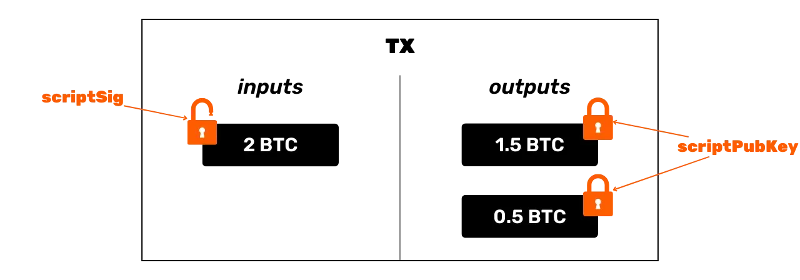


Upravo u *scriptPubKey* se nalaze adrese primatelja. Međutim, njihova upotreba varira u zavisnosti od usvojenog standarda skripte. Ovde je tabela sažetka informacija sadržanih u *scriptPubKey* prema korišćenom standardu, kao i informacija koje se očekuju u *scriptSig* za otključavanje *scriptPubKey*.


| Standard           | *scriptPubKey*                                              | *scriptSig*                     | *redeem script*     | *witness*                                |
| ------------------ | ----------------------------------------------------------- | ------------------------------- | ------------------- | ---------------------------------------- |
| P2PK               | `<pubkey> OP_CHECKSIG`                                      | `<signature>`                   |                     |                                          |
| P2PKH              | `OP_DUP OP_HASH160 <pubKeyHash> OP_EQUALVERIFY OP_CHECKSIG` | `<signature> <public key>`      |                     |                                          |
| P2SH               | `OP_HASH160 <scriptHash> OP_EQUAL`                          | `<data pushes> <redeem script>` | Arbitrary data     |                                          |
| P2WPKH             | `0 <pubKeyHash>`                                            |                                 |                     | `<signature> <public key>`               |
| P2WSH              | `0 <witnessScriptHash>`                                     |                                 |                     | `<data pushes> <witness script>`         |
| P2SH-P2WPKH        | `OP_HASH160 <redeemScriptHash> OP_EQUAL`                    | `<redeem script>`               | `0 <pubKeyHash>`    | `<signature> <public key>`               |
| P2SH-P2WSH         | `OP_HASH160 <redeemScriptHash> OP_EQUAL`                    | `<redeem script>`               | `0 <scriptHash>`    | `<data pushes> <witness script>`         |
| P2TR (key path)    | `1 <public key>`                                            |                                 |                     | `<signature>`                            |
| P2TR (script path) | `1 <public key>`                                            |                                 |                     | `<data pushes> <script> <control block>` |

*Izvor: Bitcoin Core PR review club, 7. jul 2021 - Gloria Zhao*


Opcodi korišćeni u skripti su dizajnirani za manipulaciju informacijama i, ako je potrebno, za poređenje ili testiranje iste. Uzmimo primer P2PKH skripte, koja je sledeća:


```text
OP_DUP OP_HASH160 OP_PUSHBYTES_20 <pubKeyHash> OP_EQUALVERIFY OP_CHECKSIG
```


Kao što ćemo videti u ovom poglavlju, `<pubKeyHash>` zapravo predstavlja sadržaj prijemnog Address korišćenog za zaključavanje UTXO. Da bi se otključao ovaj *scriptPubKey*, potrebno je obezbediti *scriptSig* koji sadrži:


```text
<signature> <public key>
```


U skript jeziku, stek je *LIFO* ("*Last In, First Out*") struktura podataka koja se koristi za privremeno skladištenje Elements tokom izvršavanja skripte. Svaka operacija skripte manipuliše ovim stekom, gde se Elements može dodati (*push*) ili ukloniti (*pop*). Skripte koriste stek za evaluaciju izraza, skladištenje privremenih varijabli i upravljanje uslovima.


Izvršenje skripte koju sam upravo dao kao primer sledi ovaj proces:


- Imamo *scriptSig*, *scriptPubKey* i stek:


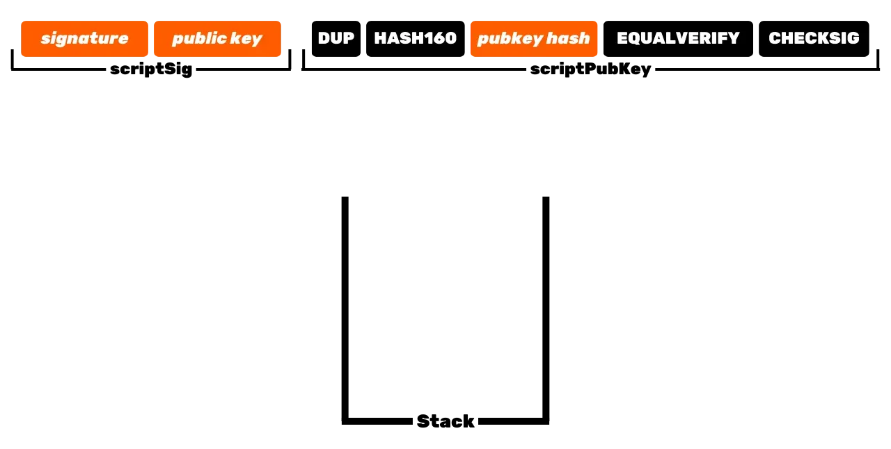


- *scriptSig* se gura na stek:


- `OP_DUP` duplicira javni ključ naveden u *scriptSig* na steku:


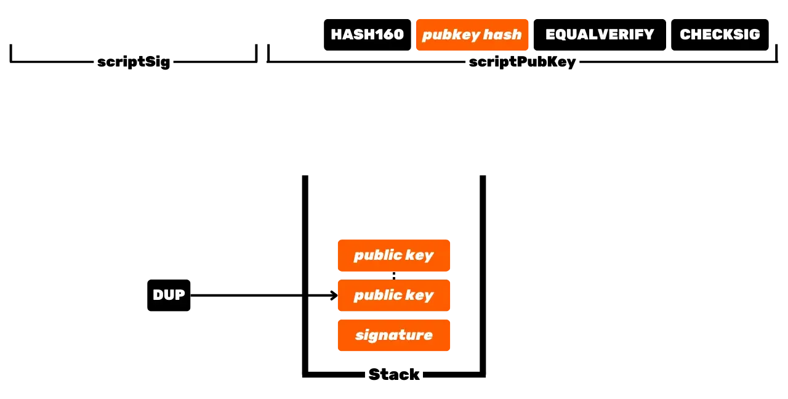


- `OP_HASH160` vraća Hash javnog ključa koji je upravo dupliciran:


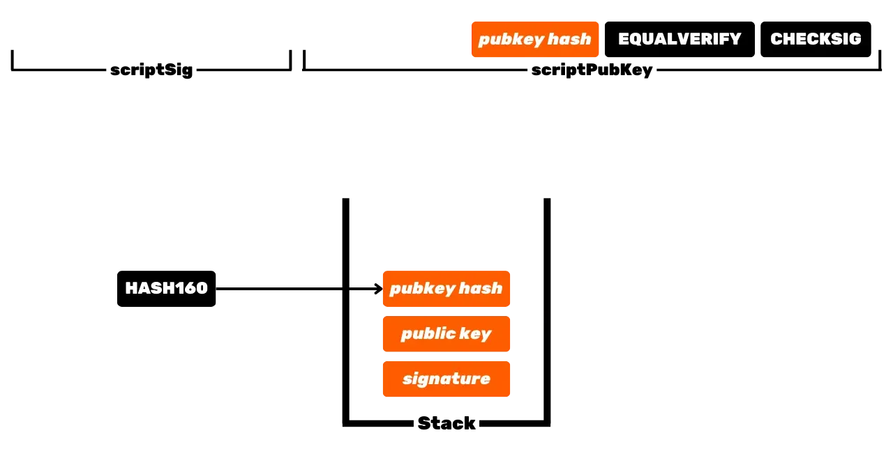


- `OP_PUSHBYTES_20 <pubKeyHash>` gura Bitcoin Address sadržan u *scriptPubKey* na stek:


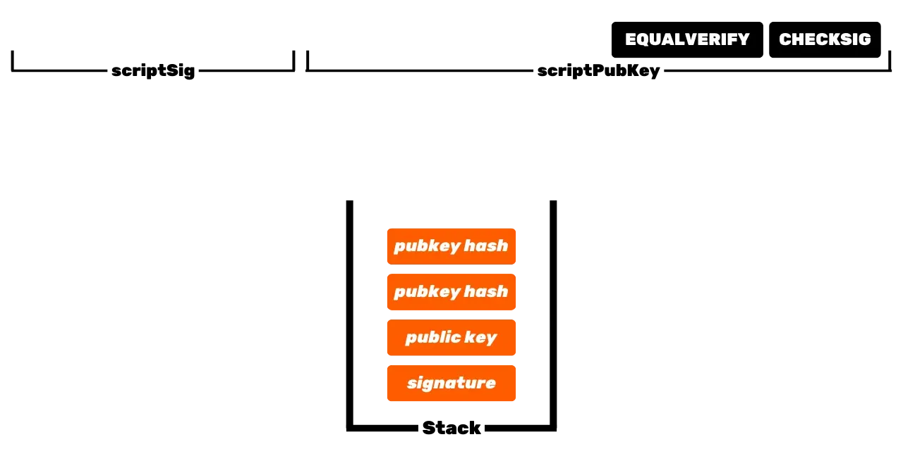


- `OP_EQUALVERIFY` verifikuje da heširani javni ključ odgovara datom primanju Address:


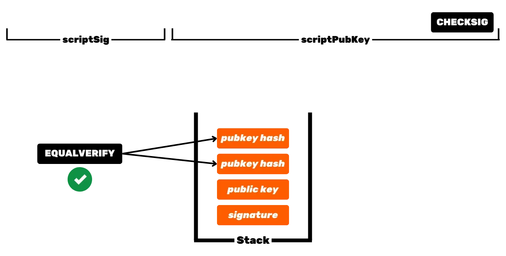


`OP_CHECKSIG` proverava potpis sadržan u *scriptSig* koristeći javni ključ. Ovaj opcode u suštini vrši proveru potpisa kao što smo opisali u delu 3 ove obuke:


- Ako `1` ostane na steku, onda je skripta važeća:


Stoga, da rezimiramo, ovaj skript omogućava verifikaciju, uz pomoć digitalnog potpisa, da korisnik koji tvrdi da je vlasnik Ownership ovog UTXO i želi da ga potroši zaista poseduje privatni ključ povezan sa prijemnim Address korišćenim tokom kreiranja ovog UTXO.


### Različite vrste Bitcoin adresa


Tokom evolucije Bitcoin, dodano je nekoliko standardnih modela skripti. Svaki od njih koristi različitu vrstu prijemnog Address. Ovde je pregled glavnih modela skripti dostupnih do danas:


**P2PK (*Pay-to-PubKey*)**:


Ovaj model skripte je uveden u prvoj verziji Bitcoin od strane Satoshi Nakamoto. P2PK skripta zaključava bitkoine direktno koristeći sirovi javni ključ (dakle, nijedan prijemni Address se ne koristi sa ovim modelom). Njegova struktura je jednostavna: sadrži javni ključ i zahteva odgovarajući digitalni potpis za otključavanje sredstava. Ova skripta je deo "*Legacy*" standarda.


**P2PKH (*Pay-to-PubKey-Hash*)**:


Kao P2PK, P2PKH skripta je uvedena pri lansiranju Bitcoin. Za razliku od svog prethodnika, ona zaključava bitkoine koristeći Hash javnog ključa, umesto da direktno koristi sirovi javni ključ. *scriptSig* tada mora da obezbedi javni ključ povezan sa primajućim Address, kao i važeći potpis. Adrese koje odgovaraju ovom modelu počinju sa `1` i kodirane su u *base58check*. Ova skripta takođe pripada "*Legacy*" standardu.


**P2SH (*Pay-to-Script-Hash*)**:


Uveden 2012. sa BIP16, model P2SH omogućava korišćenje Hash proizvoljnog skripta u *scriptPubKey*. Ovaj heširani skript, nazvan "*redeemscript*", sadrži uslove za otključavanje sredstava. Da bi se potrošio UTXO zaključan sa P2SH, potrebno je obezbediti *scriptSig* koji sadrži originalni *redeemscript* kao i potrebne podatke za njegovu validaciju. Ovaj model se posebno koristi za stare multisigove. Adrese povezane sa P2SH počinju sa `3` i kodirane su u *base58check*. Ovaj skript takođe pripada "*Legacy*" standardu.


**P2WPKH (*Pay-to-Witness-PubKey-Hash*)**:


Ovaj skript je sličan P2PKH, jer takođe zaključava bitkoine koristeći Hash javnog ključa. Međutim, za razliku od P2PKH, *scriptSig* je premešten u poseban deo nazvan "*Witness*". Ovo se ponekad naziva "*scriptWitness*" da označi skup koji čine potpis i javni ključ. Svaki SegWit ulaz ima svoj *scriptWitness*, a kolekcija *scriptWitnesses* čini *Witness* polje transakcije. Ovo premeštanje podataka o potpisu je inovacija uvedena SegWit ažuriranjem, usmerena posebno na sprečavanje promenljivosti transakcija zbog ECDSA potpisa.

P2WPKH koristi *bech32* kodiranje i uvek počinje sa `bc1q`. Ovaj tip skripte odgovara verziji 0 SegWit izlaza.


**P2WSH (*Pay-to-Witness-Script-Hash*)**:


Model P2WSH je takođe uveden sa ažuriranjem SegWit u avgustu 2017. Slično modelu P2SH, zaključava bitkoine koristeći Hash skripte. Glavna razlika leži u načinu na koji se potpisi i skripte uključuju u transakciju. Da bi se potrošili bitkoini zaključani ovim tipom skripte, primalac mora obezbediti originalnu skriptu, nazvanu *witnessScript* (ekvivalentno *redeemscript* u P2SH), zajedno sa potrebnim podacima za validaciju ove *witnessScript*. Ovaj mehanizam omogućava implementaciju složenijih uslova potrošnje, kao što su multisigs.


P2WSH adrese koriste *bech32* kodiranje i uvek počinju sa `bc1q`. Ovaj skript takođe odgovara verziji 0 SegWit izlaza.


**P2TR (*Pay-to-Taproot*)**:


Model P2TR je uveden sa implementacijom Taproot u novembru 2021. Baziran je na Schnorr protokolu za kriptografsku agregaciju ključeva, kao i na Merkle Tree za alternativne skripte, nazvane MAST (*Merkelized Alternative Script Tree*). Za razliku od drugih tipova skripti, gde su uslovi trošenja javno izloženi (bilo pri prijemu ili pri trošenju), P2TR omogućava skrivanje složenih skripti iza jednog, prividnog javnog ključa.


Tehnički, P2TR skripta zaključava bitkoine na jedinstveni Schnorr javni ključ, označen kao $Q$. Ovaj ključ $Q$ je zapravo agregat javnog ključa $P$ i javnog ključa $M$, pri čemu se potonji izračunava iz Merkle Root liste *scriptPubKey*. Bitkoini zaključani ovom vrstom skripte mogu se potrošiti na dva načina:


- Objavljivanjem potpisa za javni ključ $P$ (*putanja ključa*).
- Ispunjavanjem jednog od skripti sadržanih u Merkle Tree (*putanja skripte*).


P2TR tako nudi veliku fleksibilnost, jer omogućava zaključavanje bitkoina ili sa jedinstvenim javnim ključem, sa nekoliko skripti po izboru, ili oba istovremeno. Prednost ove Merkle Tree strukture je da se tokom transakcije otkriva samo skripta koja se koristi za trošenje, dok sve druge alternativne skripte ostaju tajne.


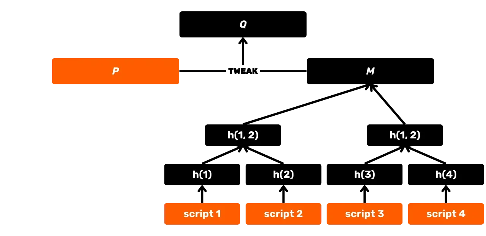


P2TR odgovara verziji 1 SegWit izlaza, što znači da su potpisi za P2TR ulaze pohranjeni u *Witness* sekciji transakcije, a ne u *scriptSig*. P2TR adrese koriste *bech32m* kodiranje i počinju sa `bc1p`, ali su prilično jedinstvene jer ne koriste Hash funkciju za svoju konstrukciju. Zapravo, one direktno predstavljaju javni ključ $Q$ koji je jednostavno formatiran sa metapodacima. Dakle, to je skript model blizak P2PK.


Sada kada smo pokrili teoriju, pređimo na praksu! U sledećem poglavlju, predlažem izvođenje i SegWit v0 Address i SegWit v1 Address iz para ključeva.


## Address Izvod

<chapterId>3ebdc750-4135-4881-b07e-08965941b93e</chapterId>


Hajde da zajedno istražimo kako da generate primanje Address iz para ključeva lociranih, na primer, na dubini 5 HD Wallet. Ovaj Address se zatim može koristiti u Wallet softveru za zaključavanje UTXO.


Pošto proces generisanja Address zavisi od usvojenog modela skripte, fokusirajmo se na dva specifična slučaja: generisanje SegWit v0 Address u P2WPKH i SegWit v1 Address u P2TR. Ove dve vrste adresa pokrivaju veliku većinu današnjih upotreba.


### Kompresija javnog ključa


Nakon što izvedemo sve korake derivacije od glavnog ključa do dubine 5 koristeći odgovarajuće indekse, dobijamo par ključeva ($k$, $K$) sa $K = k \cdot G$. Iako je moguće koristiti ovaj javni ključ kao takav za zaključavanje sredstava sa P2PK standardom, to nije naš cilj ovde. Umesto toga, cilj nam je da kreiramo Address u P2WPKH u prvom slučaju, a zatim u P2TR za drugi primer.


Prvi korak je kompresija javnog ključa $K$. Da bismo dobro razumeli ovaj proces, prvo se prisetimo nekih osnovnih pojmova obrađenih u delu 3.

Javni ključ u Bitcoin je tačka $K$ koja se nalazi na eliptičnoj krivi. Predstavljen je u obliku $(x, y)$, gde su $x$ i $y$ koordinate tačke. U svom nekomprimovanom obliku, ovaj javni ključ meri 520 bita: 8 bita za prefiks (početna vrednost `0x04`), 256 bita za $x$ koordinatu i 256 bita za $y$ koordinatu.

Međutim, eliptičke krive imaju svojstvo simetrije u odnosu na x-osu: za datu $x$ koordinatu, postoje samo dve moguće vrednosti za $y$: $y$ i $-y$. Ove dve tačke se nalaze sa obe strane x-ose. Drugim rečima, ako znamo $x$, dovoljno je navesti da li je $y$ paran ili neparan da bismo identifikovali tačnu tačku na krivi.


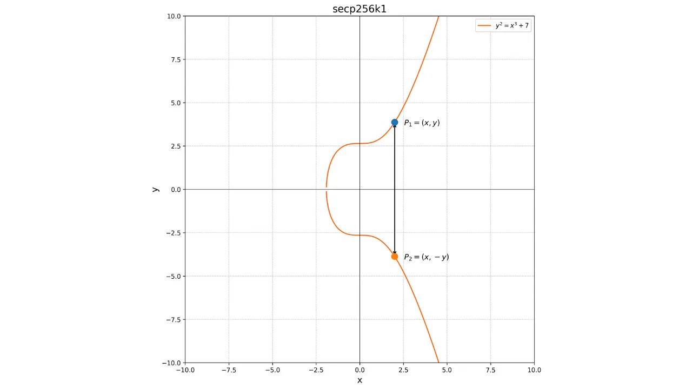


Da bi se komprimovao javni ključ, kodira se samo $x$, koji zauzima 256 bita, i dodaje se prefiks da bi se specificirala parnost $y$. Ova metoda smanjuje veličinu javnog ključa na 264 bita umesto početnih 520. Prefiks `0x02` označava da je $y$ paran, a prefiks `0x03` označava da je $y$ neparan.


Hajde da uzmemo primer da bismo bolje razumeli, sa sirovim javnim ključem u nekomprimovanoj reprezentaciji:


```text
K = 04678afdb0fe5548271967f1a67130b7105cd6a828e03909a67962e0ea1f61deb649f6bc3f4cef38c4f35504e51ec112de5c384df7ba0b8d578a4c702b6bf11d5f
```


Ako razložimo ovaj ključ, imamo:


   - Prefiks: `04`;
   - $x$: `678afdb0fe5548271967f1a67130b7105cd6a828e03909a67962e0ea1f61deb6`;
   - $y$: `49f6bc3f4cef38c4f35504e51ec112de5c384df7ba0b8d578a4c702b6bf11d5f`


Poslednji heksadecimalni karakter od $y$ je `f`. U bazi 10, `f = 15`, što odgovara neparnom broju. Dakle, $y$ je neparan, i prefiks će biti `0x03` da bi to označio.


Kompresovani javni ključ postaje:


```text
K = 03678afdb0fe5548271967f1a67130b7105cd6a828e03909a67962e0ea1f61deb6
```

Ova operacija se primenjuje na sve modele skripti zasnovane na ECDSA, to jest, sve osim P2TR koji koristi Schnorr. U slučaju Schnorr-a, kao što je objašnjeno u delu 3, zadržavamo samo vrednost $x$, bez dodavanja prefiksa za označavanje pariteta $y$, za razliku od ECDSA. Ovo je omogućeno činjenicom da je jedinstveni paritet proizvoljno izabran za sve ključeve. Ovo omogućava blago smanjenje prostora za skladištenje potrebnog za javne ključeve.

### Izvod SegWit v0 (bech32) Address


Sada kada smo dobili naš komprimovani javni ključ, možemo izvesti SegWit v0 primajući Address iz njega.


Prvi korak je primena HASH160 Hash funkcije na kompresovani javni ključ. HASH160 je sastav dve uzastopne Hash funkcije: SHA256, praćena sa RIPEMD160:


$$

\text{HASH160}(K) = \text{RIPEMD160}(\text{SHA256}(K))

$$


Prvo, propuštamo ključ kroz SHA256:


```text
SHA256(K) = C489EBD66E4103B3C4B5EAFF462B92F5847CA2DCE0825F4997C7CF57DF35BF3A
```


Zatim prolazimo rezultat kroz RIPEMD160:


```text
RIPEMD160(SHA256(K)) = 9F81322CC88622CA4CCB2A52A21E2888727AA535
```


Dobili smo 160-bitni Hash javnog ključa, koji čini ono što se naziva payload Address. Ovaj payload predstavlja centralni i najvažniji deo Address. Takođe se koristi u *scriptPubKey* za zaključavanje UTXO-a.


Međutim, da bi ovaj payload bio lakše upotrebljiv za ljude, dodaju mu se metapodaci. Sledeći korak uključuje kodiranje ovog Hash u grupe od 5 bita u decimalnom obliku. Ova decimalna transformacija će biti korisna za konverziju u *bech32*, koji se koristi za adrese posle SegWit. Binarnom Hash od 160 bita se tako deli na 32 grupe od po 5 bita:


$$

\begin{array}{|c|c|}
\hline
\text{5 bits} & \text{Decimal} \\
\hline
10011 & 19 \\
11110 & 30 \\
00000 & 0 \\
10011 & 19 \\
00100 & 4 \\
01011 & 11 \\
00110 & 6 \\
01000 & 8 \\
10000 & 16 \\
11000 & 24 \\
10001 & 17 \\
01100 & 12 \\
10100 & 20 \\
10011 & 19 \\
00110 & 6 \\
01011 & 11 \\
00101 & 5 \\
01001 & 9 \\
01001 & 9 \\
01010 & 10 \\
00100 & 4 \\
00111 & 7 \\
10001 & 17 \\
01000 & 8 \\
10001 & 17 \\
00001 & 1 \\
11001 & 25 \\
00111 & 7 \\
10101 & 21 \\
00101 & 5 \\
00101 & 5 \\
10101 & 21 \\
\hline
\end{array}

$$

Dakle, imamo:


```text
HASH = 19 30 00 19 04 11 06 08 16 24 17 12 20 19 06 11 05 09 09 10 04 07 17 08 17 01 25 07 21 09 09 21
```


Kada se Hash kodira u grupe od 5 bita, kontrolni zbir se dodaje na Address. Ovaj kontrolni zbir se koristi za verifikaciju da teret Address nije izmenjen tokom skladištenja ili prenosa. Na primer, omogućava Wallet softveru da osigura da niste napravili grešku prilikom unosa primajućeg Address. Bez ove verifikacije, mogli biste slučajno poslati bitkoine na pogrešan Address, što bi rezultiralo trajnim gubitkom sredstava, jer ne posedujete povezani javni ili privatni ključ. Stoga, kontrolni zbir je zaštita protiv ljudskih grešaka.


Za stare Bitcoin *Legacy* adrese, kontrolni zbir je jednostavno izračunat od početka Address Hash sa HASH256 funkcijom. Sa uvođenjem SegWit i *bech32* formata, sada se koriste BCH kodovi (*Bose, Ray-Chaudhuri, i Hocquenghem*). Ovi kodovi za ispravljanje grešaka koriste se za detekciju i ispravljanje grešaka u sekvencama podataka. Oni osiguravaju da prenesene informacije stignu netaknute na svoje odredište, čak i u slučaju manjih promena. BCH kodovi se koriste u mnogim oblastima, kao što su SSD-ovi, DVD-ovi i QR kodovi. Na primer, zahvaljujući ovim BCH kodovima, delimično zaklonjen QR kod i dalje može biti pročitan i dekodiran.


U kontekstu Bitcoin, BCH kodovi nude bolji kompromis između veličine i sposobnosti detekcije grešaka u poređenju sa jednostavnim Hash funkcijama korišćenim za *Legacy* adrese. Međutim, u Bitcoin, BCH kodovi se koriste samo za detekciju grešaka, ne i za ispravljanje. Dakle, Wallet softver će signalizirati netačan prijemni Address, ali ga neće automatski ispraviti. Ovo ograničenje je namerno: omogućavanje automatskog ispravljanja bi smanjilo sposobnost detekcije grešaka.


Da bismo izračunali kontrolni zbir sa BCH kodovima, potrebno je pripremiti nekoliko Elements.


- HRP (*Human Readable Part*)**: Za Bitcoin Mainnet, HRP je `bc`;


HRP mora biti proširen razdvajanjem svakog karaktera na dva dela:


- Uzimanje karaktera HRP u ASCII:
 - `b`: `01100010`
 - `c`: `01100011`
- Izdvajanje 3 najznačajnija bita i 5 najmanje značajnih bitova:
  - 3 najznačajnija bita: `011` (3 u decimalnom)
  - 3 najznačajnija bita: `011` (3 u decimalnom)
  - 5 najmanje značajnih bita: `00010` (2 u dekadnom sistemu)
  - 5 najmanje značajnih bita: `00011` (3 u dekadnom sistemu)


Sa separatorom `0` između dva karaktera, HRP ekstenzija je stoga:


```text
03 03 00 02 03
```


- Verzija svedoka**: Za SegWit verziju 0, to je `00`;


- Payload**: Decimalne vrednosti javnog ključa Hash;


- Rezervacija za kontrolni zbir**: Dodajemo 6 nula `[0, 0, 0, 0, 0, 0]` na kraj niza.


Svi podaci kombinovani za unos u program za izračunavanje kontrolnog zbira su sledeći:


```text
HRP = 03 03 00 02 03
SEGWIT v0 = 00
HASH = 19 30 00 19 04 11 06 08 16 24 17 12 20 19 06 11 05 09 09 10 04 07 17 08 17 01 25 07 21 09 09 21
CHECKSUM = 00 00 00 00 00 00

INPUT = 03 03 00 02 03 00 19 30 00 19 04 11 06 08 16 24 17 12 20 19 06 11 05 09 09 10 04 07 17 08 17 01 25 07 21 09 09 21 00 00 00 00 00 00
```


Izračun kontrolnog zbira je prilično složen. Uključuje aritmetiku polinoma u konačnom polju. Nećemo detaljisati ovaj izračun ovde i preći ćemo direktno na rezultat. U našem primeru, kontrolni zbir dobijen u decimalnom obliku je:


```text
10 16 11 04 13 18
```


Sada možemo konstruisati prijemni Address konkatenacijom sledećih Elements redosledom:


- SegWit verzija**: `00`
- Payload**: Javni ključ Hash
- Kontrolni zbir**: Vrednosti dobijene u prethodnom koraku (`10 16 11 04 13 18`)


Ovo nam daje u decimalnom:


```text
00 19 30 00 19 04 11 06 08 16 24 17 12 20 19 06 11 05 09 09 10 04 07 17 08 17 01 25 07 21 09 09 21 10 16 11 04 13 18
```


Zatim, svaka decimalna vrednost mora biti mapirana na svoj *bech32* karakter koristeći sledeću tabelu konverzije:


$$

\begin{array}{|c|c|c|c|c|c|c|c|c|}
\hline
& 0 & 1 & 2 & 3 & 4 & 5 & 6 & 7 \\
\hline
+0 & q & p & z & r & y & 9 & x & 8 \\
\hline
+8 & g & f & 2 & t & v & d & w & 0 \\
\hline
+16 & s & 3 & j & n & 5 & 4 & k & h \\
\hline
+24 & c & e & 6 & m & u & a & 7 & l \\
\hline
\end{array}

$$


Da biste konvertovali vrednost u _bech32_ karakter koristeći ovu tabelu, jednostavno pronađite vrednosti u prvoj koloni i prvom redu koje, kada se saberu, daju željeni rezultat. Zatim, preuzmite odgovarajući karakter. Na primer, decimalni broj `19` će biti konvertovan u slovo `n`, jer $19 = 16 + 3$.


Mapiranjem svih naših vrednosti, dobijamo sledeće Address:


```
qn7qnytxgsc3v5nxt9ff2y83g3pe84ff42stydj
```


Sve što preostaje je da dodate HRP `bc`, što označava da je to Address za Bitcoin Mainnet, kao i separator `1`, kako biste dobili kompletan prijemni Address:


```
bc1qn7qnytxgsc3v5nxt9ff2y83g3pe84ff42stydj
```


Posebnost ovog _bech32_ alfabeta je da uključuje sve alfanumeričke karaktere osim `1`, `b`, `i` i `o` kako bi se izbegla vizuelna konfuzija između sličnih karaktera, posebno tokom njihovog unosa ili čitanja od strane ljudi.


Da rezimiramo, evo procesa izvođenja:


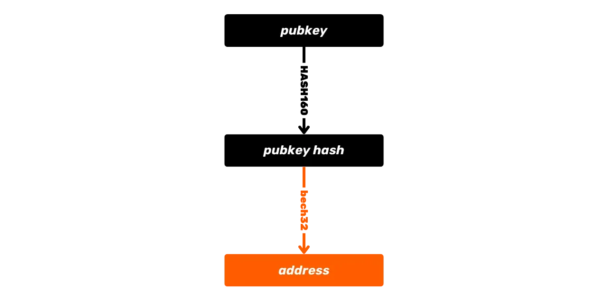


Ovo je način kako izvesti P2WPKH (SegWit v0) primajući Address iz para ključeva. Sada pređimo na P2TR (SegWit v1 / Taproot) adrese i otkrijmo njihov proces generisanja.


### Derivation of a SegWit v1 (bech32m) Address


Za Taproot adrese, proces generisanja se malo razlikuje. Hajde da pogledamo ovo zajedno!


Od koraka kompresije javnog ključa, pojavljuje se prva razlika u poređenju sa ECDSA: javni ključevi korišćeni za Schnorr u Bitcoin su predstavljeni samo njihovom apscisom ($x$). Dakle, nema prefiksa, a kompresovani ključ meri tačno 256 bita.

Kao što smo videli u prethodnom poglavlju, P2TR skripta zaključava bitkoine na jedinstvenom Schnorr javnom ključu, označenom sa $Q$. Ovaj ključ $Q$ je agregat dva javna ključa: $P$, glavnog internog javnog ključa, i $M$, javnog ključa izvedenog iz Merkle Root liste _scriptPubKey_. Bitkoini zaključani ovom vrstom skripte mogu se potrošiti na dva načina:


- Objavljivanjem potpisa za javni ključ $P$ (_key path_);
- Zadovoljavajući jedan od skripti uključenih u Merkle Tree (_putanja skripte_).


U stvarnosti, ova dva ključa nisu zaista "agregirana." Ključ $P$ je umesto toga prilagođen ključem $M$. U kriptografiji, "prilagoditi" javni ključ znači modifikovati ovaj ključ primenom aditivne vrednosti koja se zove "prilagodba." Ova operacija omogućava da modifikovani ključ ostane kompatibilan sa originalnim privatnim ključem i prilagodbom. Tehnički, prilagodba je skalarna vrednost $t$ koja se dodaje početnom javnom ključu. Ako je $P$ originalni javni ključ, prilagođeni ključ postaje:


$$

P' = P + t \cdot G

$$


Gde je $G$ generator korišćene eliptičke krive. Ova operacija proizvodi novi javni ključ izveden iz originalnog ključa, zadržavajući kriptografska svojstva koja omogućavaju njegovu upotrebu.


Ako ne treba da dodajete alternativne skripte (trošenje isključivo putem _ključ putanje_), možete generate Taproot Address uspostavljen isključivo na javnom ključu prisutnom na dubini 5 vašeg Wallet. U ovom slučaju, potrebno je kreirati skriptu koja se ne može potrošiti za _skript putanju_, kako bi se ispunili zahtevi strukture. Tweak $t$ se zatim izračunava primenom označene Hash funkcije, **`TapTweak`**, na interni javni ključ $P$:


$$

t = \text{H}_{\text{TapTweak}}(P)

$$


gde:


- $\text{H}_{\text{TapTweak}}$** je SHA256 Hash funkcija označena oznakom `TapTweak`. Ako niste upoznati sa time šta je označena Hash funkcija, pozivam vas da pogledate poglavlje 3.3;
- $P$ je interni javni ključ, predstavljen u komprimovanom 256-bitnom formatu, koristeći samo $x$ koordinatu.


Javni ključ Taproot $Q$ se zatim izračunava dodavanjem prilagođavanja $t$, pomnoženog sa generatorom eliptičke krive $G$, internom javnom ključu $P$:


$$

Q = P + t \cdot G

$$


Jednom kada se dobije javni ključ Taproot $Q$, možemo generate odgovarajući prijemni Address. Za razliku od drugih formata, Taproot adrese nisu uspostavljene na Hash javnog ključa. Stoga se ključ $Q$ ubacuje direktno u Address, u sirovom obliku.


Da bismo započeli, izdvajamo $x$ koordinatu tačke $Q$ kako bismo dobili komprimovani javni ključ. Na ovom payload-u, kontrolni zbir se izračunava koristeći BCH kodove, kao kod SegWit v0 adresa. Međutim, program korišćen za Taproot adrese se malo razlikuje. Naime, nakon uvođenja _bech32_ formata sa SegWit, otkriven je bug: kada je poslednji karakter Address `p`, umetanje ili uklanjanje `q` neposredno pre ovog `p` ne čini kontrolni zbir nevažećim. Iako ovaj bug nema posledice na SegWit v0 (zahvaljujući ograničenju veličine), mogao bi predstavljati problem u budućnosti. Ovaj bug je stoga ispravljen za Taproot adrese, a novi ispravljeni format se zove "_bech32m_".


Taproot Address se generiše enkodiranjem $x$ koordinate $Q$ u _bech32m_ formatu, sa sledećim Elements:


- HRP (_Human Readable Part_)**: `bc`, da označi glavnu Bitcoin mrežu;
- Verzija**: `1` da označi Taproot / SegWit v1;
- Kontrolni zbir**.


Konačni Address će stoga imati format:


```
bc1p[Qx][checksum]
```


S druge strane, ako želite da dodate alternativne skripte pored trošenja sa internim javnim ključem (_script path_), proračun primanja Address će biti malo drugačiji. Moraćete da uključite Hash alternativnih skripti u proračun prilagođavanja. U Taproot, svaka alternativna skripta, koja se nalazi na kraju Merkle Tree, naziva se "list".


Jednom kada su različiti alternativni skripti napisani, morate ih pojedinačno proći kroz označenu funkciju Hash `TapLeaf`, praćenu nekim metapodacima:


$$

\text{h}_{\text{leaf}} = \text{H}_{\text{TapLeaf}} (v \Vert sz \Vert S)

$$


Sa:


- $v$: verzija skripte (podrazumevano `0xC0` za Taproot);
- $sz$: veličina skripte kodirane u formatu _CompactSize_;
- $S$: skripta.


Različiti heševi skripti ($\text{h}_{\text{leaf}}$) prvo se sortiraju u leksikografskom redosledu. Zatim se konkateniraju u parovima i propuštaju kroz označenu Hash funkciju `TapBranch`. Ovaj proces se ponavlja iterativno kako bi se korak po korak izgradio Merkle Tree:

$$

\text{h}_{\text{branch}} = \text{H}_{\text{TapBranch}}(\text{h}_{\text{leaf1}} \Vert \text{h}_{\text{leaf2}})

$$


Zatim nastavljamo spajanjem rezultata dva po dva, propuštajući ih na svakom koraku kroz označenu funkciju Hash `TapBranch`, sve dok ne dobijemo Merkle Tree koren:


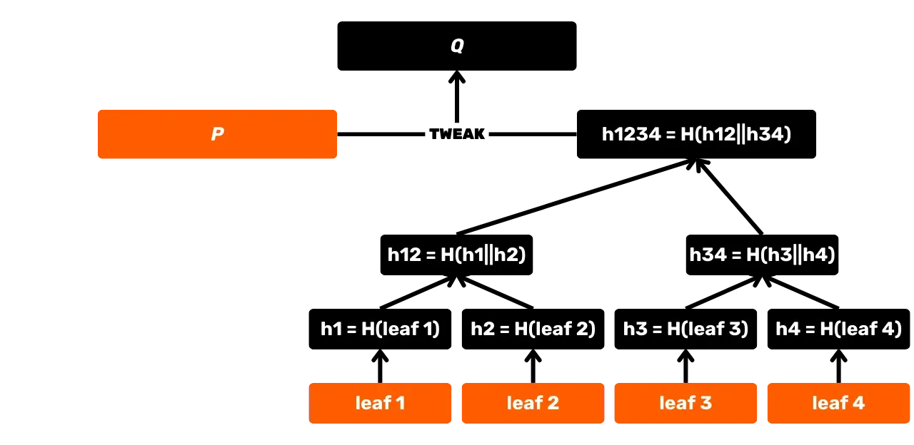


Jednom kada se izračuna Merkle Root $h_{\text{root}}$, možemo izračunati prilagođavanje. Za ovo, konkateniramo interni javni ključ Wallet $P$ sa korenom $h_{\text{root}}$, a zatim sve to propuštamo kroz označenu Hash funkciju `TapTweak`:


$$

t = \text{H}_{\text{TapTweak}}(P \Vert h_{\text{root}})

$$


Konačno, kao i ranije, javni ključ Taproot $Q$ se dobija dodavanjem internog javnog ključa $P$ proizvodu tweak-a $t$ sa generatorom tačke $G$:


$$

Q = P + t \cdot G

$$

Zatim, generisanje Address sledi istom procesu, koristeći sirovi javni ključ $Q$ kao sadržaj, uz dodatne metapodatke.


I eto ga! Stigli smo do kraja ovog kursa CYP201. Ako vam je ovaj kurs bio od pomoći, bio bih veoma zahvalan ako biste mogli odvojiti nekoliko trenutaka da mu date dobru ocenu u sledećem poglavlju za evaluaciju. Slobodno ga podelite i sa svojim voljenima ili na svojim društvenim mrežama. Na kraju, ako želite da dobijete diplomu za ovaj kurs, možete polagati završni ispit odmah nakon poglavlja za evaluaciju.

# Završni deo

<partId>58111408-b734-54db-9ea7-0d5b67f99f99</partId>


## Recenzije i Ocene

<chapterId>0cd71541-a7fd-53db-b66a-8611b6a28b04</chapterId>

<isCourseReview>true</isCourseReview>

## Završni Ispit

<chapterId>a53ea27d-0f84-56cd-b37c-a66210a4b31d</chapterId>

<isCourseExam>true</isCourseExam>

## Zaključak

<chapterId>d291428b-3cfa-5394-930e-4b514be82d5a</chapterId>

<isCourseConclusion>true</isCourseConclusion>