# Hloubkový pohled na kryptografii

Je obtížné najít mnoho materiálů, které by nabízely dobrý střední bod ve vzdělávání v oblasti kryptografie.

Na jedné straně jsou rozsáhlé, formální pojednání, která jsou skutečně přístupná pouze těm s pevným základem v matematice, logice nebo nějaké jiné formální disciplíně. Na druhé straně existují velmi vysokoúrovňové úvody, které skutečně skrývají příliš mnoho detailů pro každého, kdo je alespoň trochu zvědavý.

Tento úvod do kryptografie se snaží zachytit střední cestu. Ačkoli by to mělo být relativně náročné a podrobné pro každého, kdo je nový v kryptografii, není to králičí nora typického základního pojednání.

+++

# Úvod do kryptografie
<partId>bbed2f46-d64c-5fb5-b892-d726032f2494</partId>

## Krátký popis
<chapterId>bb8a8b73-7fb2-50da-bf4e-98996d79887b</chapterId>

Tato kniha nabízí hloubkový úvod do vědy a praxe kryptografie. Kde je to možné, zaměřuje se na konceptuální, spíše než formální výklad materiálu.

> Tento kurz je založen na [JWBurgers's repo](https://github.com/JWBurgers/An_Introduction_to_Cryptography). Všechna práva patří jemu. Obsah ještě není dokončen a je zde pouze pro ukázku, jak bychom ho mohli integrovat, pokud by JWburger souhlasil.

### Motivace a cíle

Je obtížné najít mnoho materiálů, které by nabízely dobrý střední bod ve vzdělávání v oblasti kryptografie.

Na jedné straně jsou rozsáhlé, formální pojednání, která jsou skutečně přístupná pouze těm s pevným základem v matematice, logice nebo nějaké jiné formální disciplíně. Na druhé straně existují velmi vysokoúrovňové úvody, které skutečně skrývají příliš mnoho detailů pro každého, kdo je alespoň trochu zvědavý.

Tento úvod do kryptografie se snaží zachytit střední cestu. Ačkoli by to mělo být relativně náročné a podrobné pro každého, kdo je nový v kryptografii, není to králičí nora typického základního pojednání.

### Cílová skupina

Od vývojářů po intelektuálně zvídavé, tato kniha je užitečná pro každého, kdo chce více než povrchní pochopení kryptografie. Pokud je vaším cílem ovládnout oblast kryptografie, pak je tato kniha také dobrým výchozím bodem.

### Doporučení k četbě

Kniha v současné době obsahuje sedm kapitol: "Co je kryptografie?" (Kapitola 1), "Matematické základy kryptografie I" (Kapitola 2), "Matematické základy kryptografie II" (Kapitola 3), "Symetrická kryptografie" (Kapitola 4), "RC4 a AES" (Kapitola 5), "Asymetrická kryptografie" (Kapitola 6) a "Kryptosystém RSA" (Kapitola 7). Poslední kapitola, "Kryptografie v praxi", bude ještě přidána. Zaměřuje se na různé kryptografické aplikace, včetně zabezpečení transportní vrstvy, onion routingu a systému výměny hodnot Bitcoinu.
Pokud nemáte silné zázemí v matematice, teorie čísel je pravděpodobně nejtěžším tématem v této knize. Přehled o ní nabízím v kapitole 3, a objevuje se také v exponátu AES v kapitole 5 a kryptosystému RSA v kapitole 7.
Pokud se opravdu potýkáte s formálními detaily v těchto částech knihy, doporučuji vám, abyste se při prvním čtení spokojili s vysokou úrovní čtení.

### Poděkování

Nejvíce vlivná kniha při tvorbě této byla _Úvod do moderní kryptografie_ od Jonathana Katze a Yehudy Lindella, CRC Press (Boca Raton, FL), 2015. Doprovodný kurz je dostupný na Coursera pod názvem "Kryptografie."

Hlavní další zdroje, které byly užitečné při vytváření přehledu v této knize, jsou Simon Singh, _Kniha kódů_, Fourth Estate (Londýn, 1999); Christof Paar a Jan Pelzl, _Porozumění kryptografii_, Springer (Heidelberg, 2010) a kurz založený na knize od Paara nazvaný “Úvod do kryptografie” (dostupný na https://www.youtube.com/channel/UC1usFRN4LCMcfIV7UjHNuQg); a Bruce Schneier, Aplikovaná kryptografie, 2. vydání, 2015 (Indianapolis, IN: John Wiley & Sons).

Budu citovat pouze velmi specifické informace a výsledky, které z těchto zdrojů čerpám, ale zde chci vyjádřit svůj obecný dluh vůči nim.

Pro ty čtenáře, kteří chtějí po tomto úvodu hledat pokročilejší znalosti o kryptografii, velmi doporučuji knihu Katze a Lindella. Katzův kurz na Coursera je poněkud přístupnější než kniha.

### Příspěvky

Prosím, podívejte se na soubor příspěvků v repozitáři pro nějaké pokyny, jak podpořit projekt.

# Co je kryptografie?
<partId>48e4d6d5-cd00-5c00-8adb-ae8477ff47c4</partId>

Pojďme zahájit naše zkoumání oblasti kryptografie jednou z jejích nejzajímavějších a nejzábavnějších epizod v historii: Bealeovy šifry.[1](#footnote1)

Příběh Bealeových šifer je podle mého názoru spíše fikcí než realitou. Ale údajně se to stalo takto.

## Bealeovy šifry
<chapterId>ae674346-4789-5ab1-9b6f-c8989d83be89</chapterId>

V zimě roku 1820 a poté znovu v roce 1822 se muž jménem Thomas J. Beale ubytoval v hostinci vlastněném Robertem Morrissem v Lynchburgu (Virginie). Na konci Bealeova druhého pobytu předal Morrissovi železnou skříňku s cennými papíry k bezpečnému uschování.

O několik měsíců později Morrissovi přišel dopis od Bealea datovaný 9. května 1822. Dopis zdůrazňoval velkou hodnotu obsahu železné skříňky a obsahoval některé instrukce pro Morrisse: pokud by Beale ani žádný z jeho společníků nikdy nepřišli skříňku si vyzvednout, měl by ji otevřít přesně deset let od data dopisu (tj. 9. května 1832). Některé papíry uvnitř by byly napsány běžným textem. Několik dalších by však bylo „nepřístupných bez pomoci klíče.“ Tento „klíč“ by pak měl být Morrissovi doručen nejmenovaným přítelem Bealea v červnu 1832.
Přes jasné instrukce Morriss neotevřel krabici v květnu roku 1832 a tajemný přítel Bealea se v červnu téhož roku neobjevil. Až do roku 1845 se hospodář rozhodl krabici otevřít. V ní Morriss našel poznámku, která vysvětlovala, jak Beale a jeho společníci objevili zlato a stříbro na západě a pohřbili je spolu s nějakými šperky pro jejich bezpečné uchování. Kromě toho krabice obsahovala tři **šifrované texty**: to znamená texty napsané v kódu, které vyžadují **kryptografický klíč**, neboli tajemství, a doprovodný algoritmus k jejich odemčení. Tento proces odemčení šifrovaného textu se nazývá **dešifrování**, zatímco proces zamykání se nazývá **šifrování**. (Jak je vysvětleno v kapitole 3, termín šifra může mít různé významy. V názvu "Bealeovy šifry" je zkratkou pro šifrované texty.)
Tři šifrované texty, které Morriss našel v železné krabici, se skládají z řady čísel oddělených čárkami. Podle Bealeovy poznámky tyto šifrované texty samostatně poskytují umístění pokladu, obsah pokladu a seznam jmen s právoplatnými dědici pokladu a jejich podíly (poslední informace jsou relevantní v případě, že by Beale a jeho společníci nikdy nepřišli pro krabici).

Morris se pokusil dešifrovat tři šifrované texty po dobu dvaceti let. To by bylo snadné s klíčem. Ale Morriss klíč neměl a nebyl úspěšný ve svých pokusech o obnovení původních textů, nebo **otevřených textů**, jak se obvykle nazývají v kryptografii.

Když se blížil ke konci svého života, Morriss předal krabici příteli v roce 1862. Tento přítel následně v roce 1885 publikoval pamflet pod pseudonymem J.B. Ward. Obsahoval popis (údajné) historie krabice, tři šifrované texty a řešení, které našel pro druhý šifrovaný text. (Zdá se, že existuje jeden klíč pro každý šifrovaný text, a ne jeden klíč, který by fungoval na všechny tři šifrované texty, jak Beale původně naznačil ve svém dopise Morriss).

Druhý šifrovaný text můžete vidět na *Obrázku 2* níže.[2](#footnote2) Klíčem k tomuto šifrovanému textu je Deklarace nezávislosti Spojených států. Procedura dešifrování spočívá v aplikaci následujících dvou pravidel:

* Pro jakékoli číslo n ve šifrovaném textu najděte n-té slovo v Deklaraci nezávislosti Spojených států
* Nahraďte číslo n prvním písmenem slova, které jste našli

*Obrázek 1: Bealeova šifra č. 2*

Například první číslo druhého šifrovaného textu je 115. 115. slovo Deklarace nezávislosti je „instituted“, takže první písmeno otevřeného textu je „i“. Šifrovaný text přímo neuvádí mezery mezi slovy a velká písmena. Ale po dešifrování prvních několika slov můžete logicky usoudit, že první slovo otevřeného textu bylo prostě „I.“ (Otevřený text začíná frází „I have deposited in the county of Bedford.“)
Po dešifrování druhá zpráva poskytuje podrobný obsah pokladu (zlato, stříbro a drahokamy) a naznačuje, že byl pohřben v železných hrncích a přikryt kameny v Bedford County (Virginie). Lidé mají rádi dobré záhady, takže bylo vynaloženo velké úsilí na dešifrování dalších dvou Bealeových šifer, zejména té, která popisuje polohu pokladu. Dokonce i různí prominentní kryptografové se jich pokusili rozluštit. Avšak dosud se nikomu nepodařilo dešifrovat další dva šifrované texty.

## Moderní kryptografie
<chapterId>d07d576f-8a4b-5890-b182-2e5763f550f4</chapterId>

Pestré příběhy, jako je ten o Bealeových šifrách, jsou to, co většina z nás spojuje s kryptografií. Přesto se moderní kryptografie liší alespoň ve čtyřech důležitých bodech od těchto typů historických příkladů.

Za prvé, historicky byla kryptografie zaměřena pouze na **tajnost** (nebo důvěrnost).[3](#footnote3) Šifrované texty byly vytvářeny tak, aby k informacím v otevřeném textu měly přístup pouze určité strany, jako v případě Bealeových šifer. Aby šifrovací schéma dobře sloužilo tomuto účelu, dešifrování šifrovaného textu by mělo být proveditelné pouze pokud máte klíč.

Moderní kryptografie se zabývá širším spektrem témat než jen tajnost. Tato témata zahrnují primárně (1) **integritu zprávy**—to znamená, zajištění, že zpráva nebyla změněna; (2) **autenticitu zprávy**—to znamená, zajištění, že zpráva skutečně pochází od konkrétního odesílatele; a (3) **neodvolatelnost**—to znamená, zajištění, že odesílatel nemůže později nepravdivě popřít, že zprávu odeslal.[4](#footnote4)

Důležité je mít na paměti rozlišení mezi **šifrovacím schématem** a **kryptografickým schématem**. Šifrovací schéma se týká pouze tajnosti. Zatímco šifrovací schéma je kryptografické schéma, opak není pravda. Kryptografické schéma může sloužit i dalším hlavním tématům kryptografie, včetně integrity, autenticity a neodvolatelnosti.

Témata integrity a autenticity jsou stejně důležitá jako tajnost. Naše moderní komunikační systémy by nemohly fungovat bez záruk ohledně integrity a autenticity komunikace. Neodvolatelnost je také důležitým hlediskem, například pro digitální smlouvy, ale v kryptografických aplikacích není potřeba tak všeobecně jako tajnost, integrita a autenticita.

Za druhé, klasická šifrovací schémata, jako jsou Bealeovy šifry, vždy zahrnovala jeden klíč, který byl sdílen mezi všemi příslušnými stranami. Mnoho moderních kryptografických schémat však zahrnuje ne jeden, ale dva klíče: **soukromý** a **veřejný klíč**. Zatímco první by měl zůstat soukromý v jakékoli aplikaci, druhý je typicky veřejně známý (odtud jejich názvy). V rámci šifrování lze veřejný klíč použít k zašifrování zprávy, zatímco soukromý klíč lze použít pro dešifrování.

Odvětví kryptografie, které se zabývá schématy, kde všechny strany sdílejí jeden klíč, je známé jako **symetrická kryptografie**. Jednotný klíč v takovém schématu se obvykle nazývá **soukromý klíč** (nebo tajný klíč). Odvětví kryptografie, které se zabývá schématy vyžadujícími pár soukromého a veřejného klíče, je známé jako **asymetrická kryptografie**. Tyto odvětví jsou někdy také označovány jako **kryptografie soukromého klíče** a **kryptografie veřejného klíče**, i když to může způsobit zmatek, protože schémata veřejného klíče také mají soukromé klíče.
Příchod asymetrické kryptografie na konci 70. let 20. století byl jednou z nejdůležitějších událostí v historii kryptografie. Bez ní by většina našich moderních komunikačních systémů, včetně Bitcoinu, nebyla možná, nebo by byla alespoň velmi nepraktická.
Důležité je, že moderní kryptografie není výhradně studiem symetrických a asymetrických kryptografických schémat (i když to pokrývá velkou část oboru). Například kryptografie se také zabývá hašovacími funkcemi a generátory pseudonáhodných čísel, a na těchto primitivních prvcích lze stavět aplikace, které nesouvisejí se symetrickou nebo asymetrickou kryptografií.

Za třetí, klasická šifrovací schémata, jako ta používaná v Bealeových šifrách, byla spíše uměním než vědou. Jejich vnímaná bezpečnost byla z velké části založena na intuicích týkajících se jejich složitosti. Typicky by byla opravena, když se objevil nový útok na ně, nebo zcela opuštěna, pokud byl útok zvláště vážný. Moderní kryptografie je však přísná věda s formálním, matematickým přístupem k vývoji i analýze kryptografických schémat.[5](#footnote5)

Konkrétně, moderní kryptografie se soustředí na formální **důkazy bezpečnosti**. Každý důkaz bezpečnosti pro kryptografické schéma probíhá ve třech krocích:

1.	Vyjádření **kryptografické definice bezpečnosti**, tj. sady bezpečnostních cílů a hrozby, kterou představuje útočník.
2.	Vyjádření jakýchkoli matematických předpokladů týkajících se výpočetní složitosti schématu. Například kryptografické schéma může obsahovat generátor pseudonáhodných čísel. I když nemůžeme dokázat, že tyto existují, můžeme předpokládat, že ano.
3.	Expozice matematického **důkazu bezpečnosti** schématu na základě formálního pojmu bezpečnosti a jakýchkoli matematických předpokladů.

Za čtvrté, zatímco historicky byla kryptografie primárně využívána v vojenských prostředích, v digitální době pronikla do našich každodenních aktivit. Ať už bankujete online, přispíváte na sociálních médiích, kupujete produkt na Amazonu pomocí vaší kreditní karty, nebo posíláte bitcoin příteli, kryptografie je sine qua non naší digitální doby.

Vzhledem k těmto čtyřem aspektům moderní kryptografie bychom mohli charakterizovat moderní **kryptografii** jako vědu zabývající se formálním vývojem a analýzou kryptografických schémat za účelem zabezpečení digitálních informací proti nepřátelským útokům.[6](#footnote6) Bezpečnost zde by měla být chápána široce jako prevence útoků, které poškozují tajnost, integritu, autentizaci a/nebo neodvolatelnost v komunikaci.

Kryptografie je nejlépe chápána jako subdisciplína **kybernetické bezpečnosti**, která se zabývá prevencí krádeže, poškození a zneužití počítačových systémů. Poznamenejme, že mnoho otázek kybernetické bezpečnosti má malou nebo pouze částečnou souvislost s kryptografií.

Například, pokud společnost uchovává drahé servery lokálně, může se zajímat o zabezpečení tohoto hardwaru proti krádeži a poškození. I když se jedná o otázku kybernetické bezpečnosti, má to málo společného s kryptografií.

Jako další příklad, **phishingové útoky** jsou běžným problémem v naší moderní době. Tyto útoky se snaží přesvědčit lidi prostřednictvím e-mailu nebo jiného komunikačního média, aby vydali citlivé informace, jako jsou hesla nebo čísla kreditních karet. Ačkoli kryptografie může pomoci řešit phishingové útoky do určité míry, komplexní přístup vyžaduje více než jen použití nějaké kryptografie.

## Otevřená komunikace
<chapterId>cb23d0a6-ba9a-5dc6-a55a-258405ae4117</chapterId>

Moderní kryptografie je navržena tak, aby poskytovala záruky bezpečnosti v prostředí **otevřené komunikace**. Pokud je náš komunikační kanál tak dobře chráněný, že odposlouchávači nemají šanci manipulovat s našimi zprávami nebo je dokonce jen pozorovat, pak je kryptografie zbytečná. Většina našich komunikačních kanálů však není takto dobře chráněna.
Základem komunikace v moderním světě je rozsáhlá síť optických kabelů. Telefonování, sledování televize a prohlížení webu v moderní domácnosti obvykle závisí na této síti optických kabelů (malé procento může spoléhat čistě na satelity). Je pravda, že ve vaší domácnosti můžete mít různé datové připojení, jako je koaxiální kabel, (asymetrická) digitální předplatitelská linka a optický kabel. Ale alespoň ve vyspělém světě se tyto různé datové média rychle spojují mimo váš dům s uzlem v rozsáhlé síti optických kabelů, která spojuje celý svět. Výjimkami jsou některé odlehlé oblasti vyspělého světa, jako jsou Spojené státy a Austrálie, kde může datový provoz stále cestovat na značné vzdálenosti po tradičních měděných telefonních drátech.

Bylo by nemožné zabránit potenciálním útočníkům ve fyzickém přístupu k této síti kabelů a její podpůrné infrastruktuře. Ve skutečnosti už víme, že většina našich dat je zachycována různými národními zpravodajskými agenturami na klíčových křižovatkách internetu.[7](#footnote7) To zahrnuje vše od zpráv na Facebooku po adresy webových stránek, které navštěvujete.

Zatímco sledování dat na masivním měřítku vyžaduje mocného nepřítele, jako je národní zpravodajská agentura, útočníci s málo zdroji mohou snadno pokusit o špehování na lokálnější úrovni. Ačkoli se to může stát na úrovni odposlechu kabelů, mnohem snazší je prostě zachytit bezdrátovou komunikaci.

Většina našich lokálních síťových dat – ať už jsme doma, v kanceláři nebo v kavárně – nyní cestuje prostřednictvím rádiových vln k bezdrátovým přístupovým bodům na všestranných routerech, spíše než fyzickými kabely. Takže útočník potřebuje málo zdrojů, aby zachytil jakýkoli váš lokální provoz. To je obzvláště znepokojivé, protože většina lidí dělá velmi málo pro ochranu dat, která cestují přes jejich lokální sítě. Kromě toho mohou potenciální útočníci cílit také na naše mobilní širokopásmové připojení, jako jsou 3G, 4G a 5G. Všechny tyto bezdrátové komunikace jsou snadným cílem pro útočníky.

Proto je myšlenka udržet komunikaci v tajnosti ochranou komunikačního kanálu pro většinu moderního světa beznadějně iluzorní aspirací. Vše, co víme, opravňuje k vážné paranoii: měli byste vždy předpokládat, že vás někdo poslouchá. A kryptografie je hlavním nástrojem, který máme k získání jakékoli formy bezpečnosti v tomto moderním prostředí.

### Poznámky
[^1]: Pro dobré shrnutí příběhu viz Simon Singh, *The Code Book*, Fourth Estate (Londýn, 1999), str. 82-99. Krátký film o příběhu byl natočen Andrewem Allenem v roce 2010. Film, „The Thomas Beale Cipher,“ najdete na jeho webových stránkách [^1].

[^2]: Tento obrázek je dostupný na Wikipedii na stránce o Bealeových šifrách [^2].

[^3]: Přesně řečeno, důležité aplikace kryptografických schémat byly zaměřeny na tajnost. Děti například často používají jednoduchá kryptografická schémata „pro zábavu“. V těchto případech tajnost opravdu není zájmem [^3].

[^4]: Bruce Schneier, *Applied Cryptography*, 2. vydání, 2015 (Indianapolis, IN: John Wiley & Sons), str. 2 [^4].

[^5]: Viz Jonathan Katz a Yehuda Lindell, *Introduction to Modern Cryptography*, CRC Press (Boca Raton, FL: 2015), zejména str. 16–23, pro dobrý popis [^5].

[^6]: Cf. Katz a Lindell, tamtéž, str. 3. Myslím, že jejich charakteristika má některé problémy, tak zde prezentuji mírně odlišnou verzi jejich tvrzení [^6].
[^7]: Viz například Olga Khazan, "The creepy, long-standing practice of undersea cable tapping", *The Atlantic*, 16. července 2013 (dostupné na [The Atlantic](https://www.theatlantic.com/international/archive/2013/07/the-creepy-long-standing-practice-of-undersea-cable-tapping/277855/)) [^7].

# Matematické základy kryptografie I
<partId>1bf9f0aa-0f68-5493-83fb-2167238ff9de</partId>

Kryptografie se opírá o matematiku. A pokud chcete mít více než povrchní porozumění kryptografii, musíte být s touto matematikou obeznámeni.

Tato kapitola představuje většinu základní matematiky, se kterou se setkáte při studiu kryptografie. Témata zahrnují náhodné proměnné, modulární operace, XOR operace a pseudonáhodnost. Materiál v těchto sekcích byste měli ovládnout pro jakékoli ne-povrchní porozumění kryptografii.

Další kapitola se zabývá teorií čísel, která je mnohem náročnější.

## Náhodné proměnné
<chapterId>b623a7d0-3dff-5803-bd4e-8257ff73dd69</chapterId>

Náhodná proměnná je typicky označována ne-tučným, velkým písmenem. Takže například můžeme mluvit o náhodné proměnné X, náhodné proměnné Y nebo náhodné proměnné Z. Toto označení budu používat i nadále.

**Náhodná proměnná** může nabývat dvou nebo více možných hodnot, každá s určitou kladnou pravděpodobností. Možné hodnoty jsou uvedeny v **souboru výsledků**.

Pokaždé, když **vzorkujete** náhodnou proměnnou, vyberete konkrétní hodnotu z jejího souboru výsledků podle definovaných pravděpodobností.

Pojďme se podívat na jednoduchý příklad. Předpokládejme proměnnou X, která je definována takto:

* X má soubor výsledků {1,2}
* Pr [X = 1] = 0.5
* Pr [X = 2] = 0.5

Je snadné vidět, že X je náhodná proměnná. Za prvé, existují dvě nebo více možných hodnot, které X může nabývat, konkrétně 1 a 2. Za druhé, každá možná hodnota má kladnou pravděpodobnost výskytu při vzorkování X, konkrétně 0.5.

Vše, co náhodná proměnná vyžaduje, je soubor výsledků s dvěma nebo více možnostmi, kde každá možnost má kladnou pravděpodobnost výskytu při vzorkování. V principu tedy může být náhodná proměnná definována abstraktně, bez jakéhokoli kontextu. V tomto případě byste mohli vzorkování chápat jako provádění nějakého přírodního experimentu k určení hodnoty náhodné proměnné.

Proměnná X výše byla definována abstraktně. Můžete tedy uvažovat o vzorkování proměnné X jako o házení spravedlivé mince a přiřazení "2" v případě hlavy a "1" v případě orel. Při každém vzorku X házíte mincí znovu.

Alternativně si můžete také představit vzorkování X jako házení spravedlivou kostkou a přiřazení "2" v případě, že kostka padne na 1, 3 nebo 4, a přiřazení "1" v případě, že kostka padne na 2, 5 nebo 6. Při každém vzorku X házíte kostkou znovu.

Ve skutečnosti si můžete představit jakýkoli přírodní experiment, který by vám umožnil definovat pravděpodobnosti možných hodnot X výše, vzhledem k výkresu.
Často však nejsou náhodné proměnné zaváděny pouze abstraktně. Místo toho má sada možných výsledků explicitní význam v reálném světě (namísto pouhých čísel). Kromě toho mohou být tyto výsledky definovány vzhledem k nějakému konkrétnímu typu experimentu (namísto jakéhokoli přirozeného experimentu s těmito hodnotami).
Pojďme nyní zvážit příklad proměnné X, která není definována abstraktně. X je definováno následovně, aby se určilo, který ze dvou týmů začne fotbalovou hru:

* X má sadu výsledků {červený začíná, modrý začíná}
* Hod mincí C: orel = "červený začíná"; panna = "modrý začíná"
* Pr [X = červený začíná] = 0.5
* Pr [X = modrý začíná] = 0.5

V tomto případě je sada výsledků X poskytnuta s konkrétním významem, konkrétně který tým začíná ve fotbalové hře. Kromě toho jsou možné výsledky a jejich přidružené pravděpodobnosti určeny konkrétním experimentem, konkrétně hodem mincí C.

V diskusích o kryptografii jsou náhodné proměnné obvykle zaváděny proti sadě výsledků s reálným významem. Může to být sada všech zpráv, které by mohly být zašifrovány, známá jako prostor zpráv, nebo sada všech klíčů, které mohou strany používající šifrování vybrat, známá jako prostor klíčů.

Náhodné proměnné v diskusích o kryptografii však obvykle nejsou definovány proti nějakému konkrétnímu přirozenému experimentu, ale proti jakémukoli experimentu, který by mohl poskytnout správné pravděpodobnostní rozdělení.

Náhodné proměnné mohou mít diskrétní nebo spojité pravděpodobnostní rozdělení. Náhodné proměnné s **diskrétním pravděpodobnostním rozdělením**—to znamená diskrétní náhodné proměnné—mají konečný počet možných výsledků. Náhodná proměnná X v obou dosud uvedených příkladech byla diskrétní.

**Spojité náhodné proměnné** mohou naopak nabývat hodnot v jednom nebo více intervalech. Můžete například říci, že náhodná proměnná při vzorkování nabude jakékoli skutečné hodnoty mezi 0 a 1 a že každé reálné číslo v tomto intervalu je stejně pravděpodobné. V tomto intervalu existuje nekonečně mnoho možných hodnot.

Pro diskuse o kryptografii budete potřebovat pouze pochopení diskrétních náhodných proměnných. Jakákoli diskuse o náhodných proměnných od tohoto okamžiku by proto měla být chápána jako odkazující na diskrétní náhodné proměnné, pokud není výslovně uvedeno jinak.

### Grafy náhodných proměnných

Možné hodnoty a přidružené pravděpodobnosti pro náhodnou proměnnou lze snadno vizualizovat pomocí grafu. Například zvažte náhodnou proměnnou X z předchozí sekce s sadou výsledků {1,2} a Pr [X = 1] = 0.5 a Pr [X = 2] = 0.5. Takovou náhodnou proměnnou bychom obvykle zobrazovali ve formě sloupcového grafu, jak je vidět na *Obrázku 1*.

*Obrázek 1: Náhodná proměnná X*

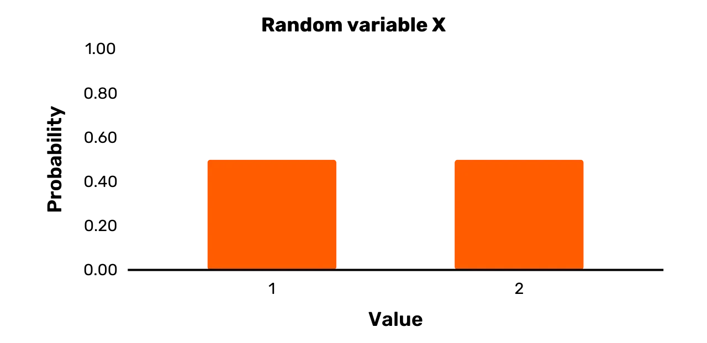

Široké sloupce na *Obrázku 1* samozřejmě neznamenají naznačit, že náhodná proměnná X je ve skutečnosti spojitá. Místo toho jsou sloupce široké, aby byly vizuálně atraktivnější (jen úzká čára nahoru poskytuje méně intuitivní vizualizaci).

### Rovnoměrné proměnné

Ve výrazu "náhodná proměnná" termín "náhodný" znamená jen "pravděpodobnostní". Jinými slovy, znamená to jen, že dvě nebo více možných výsledků proměnné nastane s určitými pravděpodobnostmi. Tyto výsledky však *nutně* nemusí být stejně pravděpodobné (i když termín "náhodný" může mít tento význam v jiných kontextech).
**Uniformní proměnná** je speciální případ náhodné proměnné. Může nabývat dvou nebo více hodnot, všechny se stejnou pravděpodobností. Náhodná proměnná X zobrazená na *Obrázku 1* je jasně uniformní proměnná, protože oba možné výsledky se vyskytují s pravděpodobností 0,5. Existuje však mnoho náhodných proměnných, které nejsou případy uniformních proměnných.
Vezměme například náhodnou proměnnou Y. Má množinu výsledků {1,2,3,8,10} a následující pravděpodobnostní rozdělení: Pr [Y = 1] = 0,25; Pr [Y = 2] = 0,35; Pr [Y = 3] = 0,1; Pr [Y = 8] = 0,25; Pr [Y = 10] = 0,05.

Ačkoli dva možné výsledky skutečně mají stejnou pravděpodobnost výskytu, konkrétně 1 a 8, Y může také nabývat určitých hodnot s různými pravděpodobnostmi než 0,25 při vzorkování. Tedy, ačkoli Y je skutečně náhodná proměnná, není to uniformní proměnná.

Grafické znázornění Y je poskytnuto na *Obrázku 2*.

*Obrázek 2: Náhodná proměnná Y*

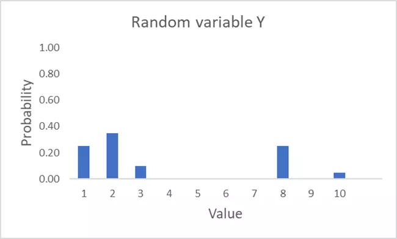

Jako poslední příklad uvažujme náhodnou proměnnou Z. Má množinu výsledků {1,3,7,11,12} a následující pravděpodobnostní rozdělení: Pr (2) = 0,2; Pr (3) = 0,2; Pr (9) = 0,2; Pr (11) = 0,2; Pr (12) = 0,2. Můžete ji vidět znázorněnou na Obrázku 3. Náhodná proměnná Z je, na rozdíl od Y, skutečně uniformní proměnná, protože všechny pravděpodobnosti pro možné hodnoty při vzorkování jsou stejné.

*Obrázek 3: Náhodná proměnná Z*

### Podmíněná pravděpodobnost

Předpokládejme, že Bob má v úmyslu rovnoměrně vybrat den z posledního kalendářního roku. Jaký bychom měli usoudit, že je pravděpodobnost, že vybraný den bude v létě?

Pokud si myslíme, že Bobův proces bude skutečně zcela rovnoměrný, měli bychom usoudit, že je 1/4 pravděpodobnost, že Bob vybere den v létě. To je **bezpodmínečná pravděpodobnost** náhodně vybraného dne být v létě.

Předpokládejme nyní, že místo rovnoměrného výběru kalendářního dne Bob vybírá pouze rovnoměrně z těch dnů, kdy byla teplota v poledne u Crystal Lake (New Jersey) 21 stupňů Celsia nebo vyšší. S ohledem na tuto dodatečnou informaci, jaký můžeme usoudit, že je pravděpodobnost, že Bob vybere den v létě?

Měli bychom skutečně dospět k jinému závěru než dříve, i bez jakýchkoli dalších konkrétních informací (např. teplota v poledne každý den posledního kalendářního roku).

Vědě, že Crystal Lake je v New Jersey, bychom rozhodně neočekávali, že teplota v poledne bude 21 stupňů Celsia nebo vyšší v zimě. Místo toho je mnohem pravděpodobnější, že to bude teplý den na jaře nebo na podzim, nebo den někdy v létě. Tedy, vědě, že teplota v poledne u Crystal Lake ve vybraný den byla 21 stupňů Celsia nebo vyšší, pravděpodobnost, že den vybraný Bobem bude v létě, se stává mnohem vyšší. To je **podmíněná pravděpodobnost** náhodně vybraného dne být v létě, s ohledem na to, že teplota v poledne u Crystal Lake byla 21 stupňů Celsia nebo vyšší.
Na rozdíl od předchozího příkladu mohou být pravděpodobnosti dvou událostí také zcela nesouvisející. V tom případě říkáme, že jsou **nezávislé**.
Představme si například, že určitá spravedlivá mince přistála na hlavě. Vzhledem k tomuto faktu, jaká je potom pravděpodobnost, že zítra bude pršet? Podmíněná pravděpodobnost v tomto případě by měla být stejná jako nepodmíněná pravděpodobnost, že zítra bude pršet, protože hod mincí obvykle nemá žádný vliv na počasí.

Pro zápis výroků o podmíněné pravděpodobnosti používáme symbol “|”. Například pravděpodobnost události A za předpokladu, že nastala událost B, lze zapsat takto: Pr[A|B]. Takže, když jsou dvě události, A a B, nezávislé, pak Pr[A|B] = Pr[A] a Pr[B|A] = Pr[B]. Podmínka pro nezávislost může být zjednodušena takto: Pr[A,B] = Pr[A]*Pr[B].

Klíčovým výsledkem v teorii pravděpodobnosti je známý jako **Bayesův teorém**. Základně říká, že Pr[A|B] lze přepsat následovně:

Pr[A|B] = (Pr[B|A] • Pr[A]) / Pr[B]

Místo používání podmíněných pravděpodobností se specifickými událostmi můžeme také podívat na podmíněné pravděpodobnosti spojené se dvěma nebo více náhodnými proměnnými v rámci sady možných událostí. Předpokládejme dvě náhodné proměnné, X a Y. Jakoukoli možnou hodnotu pro X můžeme označit x a jakoukoli možnou hodnotu pro Y y. Můžeme říci, že dvě náhodné proměnné jsou nezávislé, pokud platí následující tvrzení:

Pr[X = x,Y = y] = Pr[X = x] • Pr[Y = y] pro všechna x a y

Buďme trochu konkrétnější ohledně toho, co toto tvrzení znamená.

Předpokládejme, že sady výsledků pro X a Y jsou definovány takto: **X** = {x1,x2….,xi,….xn} a **Y** = {y1,y2….,yi,….ym}. (Je typické označovat sady hodnot tučnými, velkými písmeny.)

Nyní předpokládejme, že vzorkujete Y a pozorujete y1. Výše uvedené tvrzení nám říká, že pravděpodobnost nyní získat x1 vzorkováním X je přesně stejná, jako kdybychom nikdy nepozorovali y1. To platí pro jakékoli yi, které bychom mohli získat z našeho počátečního vzorkování Y. Nakonec to platí nejen pro x1. Pro jakékoli xi pravděpodobnost výskytu není ovlivněna výsledkem vzorkování Y. To vše také platí v případě, že X je vzorkováno jako první.

Ukončeme naši diskusi na mírně filozofičtějším bodu. V jakékoli reálné situaci je pravděpodobnost nějaké události vždy posuzována proti konkrétní sadě informací. V žádném přísném smyslu slova neexistuje "nepodmíněná pravděpodobnost".

Představte si například, že bych se vás zeptal na pravděpodobnost, že prasata budou létat do roku 2030. Ačkoliv vám nedám žádné další informace, vy jasně víte hodně o světě, což může ovlivnit váš úsudek. Nikdy jste neviděli létající prasata. Víte, že většina lidí od nich nebude očekávat, že budou létat. Víte, že nejsou skutečně stavěna k létání. A tak dále.
Tedy, když mluvíme o "bezpodmínečné pravděpodobnosti" nějaké události v reálném světě, tento termín může mít smysl pouze, pokud ho chápeme jako "pravděpodobnost bez jakýchkoli dalších explicitních informací". Jakékoli pochopení "podmíněné pravděpodobnosti" by pak mělo být vždy chápáno ve vztahu k nějakému konkrétnímu kusu informace.
Mohl bych vás například požádat o pravděpodobnost, že prasata budou létat do roku 2030, poté co vám dám důkaz, že některé kozy na Novém Zélandu se naučily létat po několika letech tréninku. V tomto případě pravděpodobně upravíte svůj úsudek o pravděpodobnosti, že prasata budou létat do roku 2030. Takže pravděpodobnost, že prasata budou létat do roku 2030, je podmíněna tímto důkazem o kozách na Novém Zélandu.

## Operace modulo
<chapterId>709b34e5-b155-53d2-abbd-97d67e56db00</chapterId>

Nejzákladnější vyjádření s **operací modulo** má následující formu: x mod y.

Proměnná x se nazývá dělenec a proměnná y dělitel. Pro provedení operace modulo s kladným dělencem a kladným dělitelem stačí určit zbytek po dělení.

Například, vezměme výraz 25 mod 4. Číslo 4 se vejde do čísla 25 celkem 6krát. Zbytek tohoto dělení je 1. Tedy, 25 mod 4 se rovná 1. Podobným způsobem můžeme vyhodnotit níže uvedené výrazy:

* 29 mod 30 = 29 (jelikož se 30 vejde do 29 celkem 0krát a zbytek je 29)
* 42 mod 2 = 0 (jelikož se 2 vejde do 42 celkem 21krát a zbytek je 0)
* 12 mod 5 = 2 (jelikož se 5 vejde do 12 celkem 2krát a zbytek je 2)
* 20 mod 8 = 4 (jelikož se 8 vejde do 20 celkem 2krát a zbytek je 4)

Když je dělenec nebo dělitel záporný, programovací jazyky mohou s operacemi modulo zacházet různě.

Určitě se setkáte s případy se záporným dělencem v kryptografii. V těchto případech je typický postup následující:

* Nejprve určete nejbližší hodnotu *nižší nebo rovnou* dělenci, do které se dělitel vejde s nulovým zbytkem. Tuto hodnotu nazvěme p.
* Pokud je dělenec x, pak výsledek operace modulo je hodnota x – p.

Například, předpokládejme, že dělenec je – 20 a dělitel 3. Nejbližší hodnota nižší nebo rovná – 20, do které se 3 vejde rovnoměrně, je – 21. Hodnota x – p v tomto případě je – 20 – (– 21). To se rovná 1 a tedy, – 20 mod 3 se rovná 1. Podobným způsobem můžeme vyhodnotit níže uvedené výrazy:

* – 8 mod 5 = 2
* – 19 mod 16 = 13
* – 14 mod 6 = 4

Pokud jde o notaci, obvykle uvidíte následující typy výrazů: x = [y mod z]. Kvůli závorkám se operace modulo v tomto případě vztahuje pouze na pravou stranu výrazu. Pokud y se rovná 25 a z se rovná 4, pak x se vyhodnotí na 1.
Bez závorek operace modulo působí na *obě strany* výrazu. Předpokládejme například následující výraz: x = y mod z. Pokud y je rovno 25 a z je rovno 4, pak vše, co víme, je, že x mod 4 se rovná 1. To je konzistentní s jakoukoliv hodnotou pro x ze sady {….– 7, – 3, 1, 5, 9….}.
Obor matematiky, který zahrnuje operace modulo s čísly a výrazy, se označuje jako **modulární aritmetika**. Tento obor si můžete představit jako aritmetiku pro případy, kdy číselná osa není nekonečně dlouhá. Ačkoliv se typicky setkáváme s operacemi modulo pro (kladná) celá čísla v kryptografii, můžete také provádět operace modulo s jakýmikoli reálnými čísly.

### Caesarova šifra

Operace modulo se často vyskytuje v kryptografii. Abychom to ilustrovali, pojďme zvážit jedno z nejslavnějších historických šifrovacích schémat: Caesarova šifra.

Nejprve ji definujme. Předpokládejme slovník *D*, který přiřazuje všechna písmena anglické abecedy, v pořadí, k sadě čísel {0,1,2…,25}. Předpokládejme prostor zpráv **M**. **Caesarova šifra** je poté šifrovací schéma definované následovně:

- Jednotně vyberte klíč k z prostoru klíčů **K**, kde **K** = {0,1,2,…,25}[1](#footnote1)
- Zašifrujte zprávu m є **M**, takto:
    - Rozdělte m na jednotlivá písmena m0, m1,….mi….,ml
    - Převeďte každé mi na číslo podle *D*
    - Pro každé mi, ci = [(mi + k) mod 26]
    - Převeďte každé ci na písmeno podle *D*
    - Poté spojte c0, c1,….,cl k získání šifrovaného textu c
- Dešifrujte šifrovaný text c takto:
    -- Převeďte každé ci na číslo podle *D*
    -- Pro každé ci, mi = [(ci – k) mod 26]
    -- Převeďte každé mi na písmeno podle *D*
    -- Poté spojte m0, m1,….,ml k získání původní zprávy m

Operátor modulo v Caesarově šifře zajišťuje, že písmena se "obalují", takže všechna písmena šifrovaného textu jsou definována. Abychom to ilustrovali, zvážme použití Caesarovy šifry na slovo “DOG”.

Předpokládejme, že jste jednotně vybrali klíč s hodnotou 17. Písmeno “O” se rovná 15. Bez operace modulo by součet tohoto čísla otevřeného textu s klíčem dosáhl čísla šifrovaného textu 32. Toto číslo šifrovaného textu by však nemohlo být převedeno na písmeno šifrovaného textu, protože anglická abeceda má pouze 26 písmen. Operace modulo zajišťuje, že číslo šifrovaného textu je ve skutečnosti 6 (výsledek 32 mod 26), což se rovná písmenu šifrovaného textu “G”.

Celé zašifrování slova “DOG” s hodnotou klíče 17 je následující:
* Zpráva = DOG = D,O,G = 3,15,6* c0 = [(3 + 17) Mod 26] = [(20) Mod 26] = 20 = U
* c1 = [(15 + 17) Mod 26] = [(32) Mod 26] = 6 = G
* c2 = [(6 + 17) Mod 26] = [(23) Mod 26] = 23 = X
* c = UGX

Každý může intuitivně pochopit, jak funguje posunovací šifra, a pravděpodobně ji sám použít. Pro rozšíření vašich znalostí o kryptografii je však důležité začít se cítit pohodlněji s formalizací, protože schémata budou mnohem složitější. Proto byly kroky pro posunovací šifru formalizovány.

## Operace XOR
<chapterId>22f185cc-c516-5b33-950b-0908f2f881fe</chapterId>

Veškerá počítačová data jsou zpracovávána, ukládána a přenášena v síti na úrovni bitů. Jakákoli kryptografická schémata aplikovaná na počítačová data také fungují na úrovni bitů.

Předpokládejme například, že jste napsali e-mail ve vaší e-mailové aplikaci. Jakékoli šifrování, které aplikujete, se neprovádí přímo na znacích ASCII vašeho e-mailu. Místo toho je aplikováno na bitovou reprezentaci písmen a dalších symbolů ve vašem e-mailu.

Klíčovou matematickou operací pro moderní kryptografii, kromě operace modulo, je **operace XOR**, neboli operace "exkluzivní nebo". Tato operace bere jako vstupy dva bity a výstupem je další bit. Operace XOR bude jednoduše označena jako "XOR". Vrací 0, pokud jsou oba bity stejné, a 1, pokud jsou různé. Níže můžete vidět čtyři možnosti.

* 0 XOR 0 = 0
* 0 XOR 1 = 1
* 1 XOR 0 = 1
* 1 XOR 1 = 0

Operaci XOR můžete provést na dvou zprávách delších než jeden bit tím, že zarovnáte bity těchto dvou zpráv a provedete operaci XOR na každém jednotlivém páru bitů.

Pro ilustraci předpokládejme, že máte zprávu m1 (01111001) a zprávu m2 (01011001). Operace XOR těchto dvou zpráv je uvedena níže.

* m1 XOR m2 = 01111001 XOR 01011001 = 00100000

Proces je přímočarý. Nejprve provedete XOR nejlevějších bitů m1 a m2. V tomto případě to je 0 XOR 0 = 0. Poté provedete XOR druhého páru bitů zleva. V tomto případě to je 1 XOR 1 = 0. Tento proces pokračujete, dokud nebudete mít provedenou operaci XOR na nejpravějších bitech.
Je snadné vidět, že operace XOR je komutativní, tedy že m1 XOR m2 = m2 XOR m1. Kromě toho je operace XOR také asociativní. To znamená, že (m1 XOR m2) XOR m3 = m1 XOR (m2 XOR m3).
Operace XOR na dvou řetězcích různých délek může mít různé interpretace v závislosti na kontextu. Zde se nebudeme zabývat žádnými operacemi XOR na řetězcích různých délek.

Operace XOR je ekvivalentní speciálnímu případu provádění modulové operace na součtu bitů, když je dělitel 2. Ekvivalenci můžete vidět v následujících výsledcích:

* (0 + 0) mod 2 = 0 XOR 0 = 0
* (1 + 0) mod 2 = 1 XOR 0 = 1
* (0 + 1) mod 2 = 0 XOR 1 = 1
* (1 + 1) mod 2 = 1 XOR 1 = 0

## Pseudonáhodnost
<chapterId>20463fc5-3e92-581f-a1b7-3151279bd95e</chapterId>

V naší diskusi o náhodných a rovnoměrných proměnných jsme učinili konkrétní rozlišení mezi "náhodným" a "rovnoměrným". Toto rozlišení se obvykle udržuje v praxi při popisu náhodných proměnných. Nicméně, v našem současném kontextu je třeba toto rozlišení opustit a "náhodný" a "rovnoměrný" se používají synonymně. Vysvětlím proč na konci této sekce.

Začneme tím, že binární řetězec délky n můžeme nazvat **náhodným** (nebo **rovnoměrným**), pokud byl výsledkem vzorkování rovnoměrné proměnné S, která dává každému binárnímu řetězci takové délky n stejnou pravděpodobnost výběru.

Předpokládejme například množinu všech binárních řetězců délky 8: {0000 0000, 0000 0001,…, 1111 1111}. (Je typické psát 8-bitový řetězec ve dvou čtveřicích, každá se nazývá **nibble**.) Nazvěme tuto množinu řetězců **S8**.

Podle výše uvedené definice můžeme pak konkrétní binární řetězec délky 8 nazvat náhodným (nebo rovnoměrným), pokud byl výsledkem vzorkování rovnoměrné proměnné S, která dává každému řetězci v **S8** stejnou pravděpodobnost výběru. Vzhledem k tomu, že množina **S8** zahrnuje 28 prvků, pravděpodobnost výběru při vzorkování by musela být 1/28 pro každý řetězec v množině.

Klíčovým aspektem náhodnosti binárního řetězce je, že je definován s odkazem na proces, kterým byl vybrán. Forma jakéhokoli konkrétního binárního řetězce sama o sobě tedy neodhaluje nic o jeho náhodnosti ve výběru.

Například mnoho lidí intuitivně má za to, že řetězec jako 1111 1111 nemohl být vybrán náhodně. Ale to je jasně nesprávné.
Definujeme uniformní proměnnou S nad všemi binárními řetězci délky 8, pravděpodobnost výběru 1111 1111 ze sady **S8** je stejná jako u řetězce typu 0111 01001. Tím pádem nemůžete nic říci o náhodnosti řetězce, pouze analýzou samotného řetězce.
Můžeme také mluvit o náhodných řetězcích, aniž bychom specificky mysleli binární řetězce. Mohli bychom například mluvit o náhodném hexadecimálním řetězci AF 02 82. V tomto případě by řetězec byl náhodně vybrán ze sady všech hexadecimálních řetězců délky 6. To je ekvivalentní s náhodným výběrem binárního řetězce délky 24, protože každá hexadecimální číslice reprezentuje 4 bity.

Typicky výraz „náhodný řetězec“, bez další specifikace, odkazuje na řetězec náhodně vybraný ze sady všech řetězců stejné délky. Takto jsem to výše popsal. Řetězec délky n může být samozřejmě také náhodně vybrán z jiné sady. Například z takové, která obsahuje pouze podmnožinu všech řetězců délky n, nebo možná sady, která zahrnuje řetězce různých délek. V těchto případech bychom ho však neoznačili jako „náhodný řetězec“, ale spíše „řetězec, který byl náhodně vybrán z nějaké sady **S**“.

Klíčovým konceptem v kryptografii je pseudonáhodnost. **Pseudonáhodný řetězec** délky n vypadá *jako by* byl výsledkem výběru z uniformní proměnné S, která dává každému řetězci v **Sn** stejnou pravděpodobnost výběru. Ve skutečnosti je však řetězec výsledkem výběru z uniformní proměnné S', která definuje pravděpodobnostní rozdělení – ne nutně s rovnými pravděpodobnostmi pro všechny možné výsledky – na podmnožině **Sn**. Klíčovým bodem zde je, že nikdo nemůže skutečně rozlišit mezi vzorky z S a S', i když jich vezmete mnoho.

Předpokládejme například náhodnou proměnnou S. Její množina výsledků je **S256**, což je sada všech binárních řetězců délky 256. Tato sada má 2256 prvků. Každý prvek má při výběru stejnou pravděpodobnost, 1/2256.

Předpokládejme také náhodnou proměnnou S'. Její množina výsledků zahrnuje pouze 2128 binárních řetězců délky 256. Má nad těmito řetězci nějaké pravděpodobnostní rozdělení, ale toto rozdělení není nutně uniformní.

Předpokládejme, že jsem nyní vzal 1000 vzorků z S a 1000 vzorků z S' a dal vám obě sady výsledků. Řeknu vám, která sada výsledků je spojena s kterou náhodnou proměnnou. Poté vezmu vzorek z jedné ze dvou náhodných proměnných. Ale tentokrát vám neřeknu, z které náhodné proměnné vzorek beru. Pokud by S' bylo pseudonáhodné, pak je myšlenka taková, že vaše pravděpodobnost správného uhodnutí, ze které náhodné proměnné jsem vzorek vzal, je prakticky nelepší než 1/2.

Typicky je pseudonáhodný řetězec délky n vyroben náhodným výběrem řetězce velikosti n – x, kde x je kladné celé číslo, a použitím ho jako vstup pro expanzní algoritmus. Tento náhodný řetězec velikosti n – x je známý jako **seed**.
Pseudonáhodné řetězce jsou klíčovým konceptem pro praktické využití kryptografie. Vezměme si například proudové šifry. U proudové šifry je náhodně vybraný klíč vložen do expanzního algoritmu, který produkuje mnohem delší pseudonáhodný řetězec. Tento pseudonáhodný řetězec je pak kombinován s otevřeným textem prostřednictvím operace XOR, čímž vznikne šifrovaný text.
Pokud bychom nebyli schopni produkovat tento typ pseudonáhodného řetězce pro proudovou šifru, pak bychom potřebovali klíč, který je stejně dlouhý jako zpráva pro její zabezpečení. To většinou není praktická možnost.

Pojem pseudonáhodnosti diskutovaný v této sekci může být definován formálněji. Rovněž se rozšiřuje do dalších kontextů. Ale nemusíme se do této diskuse zde dále nořit. Vše, co opravdu potřebujete intuitivně pochopit pro většinu kryptografie, je rozdíl mezi náhodným a pseudonáhodným řetězcem.[2](#footnote2)

Důvod, proč v naší diskusi opouštíme rozlišení mezi "náhodným" a "rovnoměrným", by nyní měl být také jasný. V praxi každý používá termín pseudonáhodný k označení řetězce, který vypadá **jako by** byl výsledkem vzorkování rovnoměrné proměnné S. Přesně řečeno, měli bychom takový řetězec nazvat "pseudo-rovnoměrný", přejímajíc naše jazykové vyjádření z dřívějška. Jelikož termín "pseudo-rovnoměrný" je nešikovný a nikdo ho nepoužívá, nebudeme ho zde zavádět pro jasnost. Místo toho prostě opustíme rozlišení mezi "náhodným" a "rovnoměrným" v současném kontextu.

## Poznámky
<chapterId>7cccd92c-15bc-5394-9024-af126988ecd7</chapterId>

[^1]: Toto tvrzení můžeme definovat přesně, používajíc terminologii z předchozí sekce. Nechť rovnoměrná proměnná K má **K** jako svou množinu možných výsledků. Takže Pr [K = 0] = 1/26, Pr [K = 1] = 1/26, a tak dále. Vzorkujte rovnoměrnou proměnnou K jednou, aby vznikl konkrétní klíč [^1].

[^2]: Pokud máte zájem o formálnější výklad těchto záležitostí, můžete konzultovat *Úvod do moderní kryptografie* od Katz a Lindella, zejména kapitolu 3 [^2].

# Matematické základy kryptografie II
<partId>d7245cc9-bb6d-5403-b3d5-9c703d9a2f81</partId>

Tato kapitola pokrývá pokročilejší téma matematických základů kryptografie: teorii čísel. Ačkoliv je teorie čísel důležitá pro symetrickou kryptografii (jako například u šifry Rijndael), je zvláště důležitá v kontextu kryptografie s veřejným klíčem.

Pokud se vám zdají detaily teorie čísel obtížné, doporučuji při prvním čtení zvolit vysokou úroveň. Vždy se k tomu můžete vrátit později.

## Co je teorie čísel?
<chapterId>c0051c34-fd5d-539c-93e2-5c6dfd4c3355</chapterId>

**Teorii čísel** byste mohli charakterizovat jako studium vlastností celých čísel a matematických funkcí, které pracují s celými čísly.

Vezměme si například, že jakákoli dvě čísla a a N jsou **vzájemně prvočísla** (nebo **relativní prvočísla**), pokud jejich největší společný dělitel je roven 1. Předpokládejme nyní konkrétní celé číslo N. Kolik celých čísel menších než N jsou vzájemně prvočísla s N? Můžeme dělat obecná tvrzení o odpovědích na tuto otázku? To jsou typické typy otázek, na které teorie čísel hledá odpovědi.
Moderní teorie čísel se opírá o nástroje abstraktní algebry. Obor **abstraktní algebra** je subdisciplínou matematiky, kde hlavními objekty analýzy jsou abstraktní objekty známé jako algebraické struktury. **Algebraická struktura** je soubor prvků spojených s jednou nebo více operacemi, které splňují určité axiomy. Prostřednictvím algebraických struktur mohou matematici získávat vhledy do konkrétních matematických problémů tím, že se odvzdálí od jejich detailů.
Obor abstraktní algebry je někdy také nazýván moderní algebra. Můžete se také setkat s pojmem **abstraktní matematika** (nebo **čistá matematika**). Tento poslední termín není odkazem na abstraktní algebru, ale spíše znamená studium matematiky pro její samotnou podstatu, a ne jen s ohledem na potenciální aplikace.

Sady z abstraktní algebry mohou zacházet s mnoha typy objektů, od transformací zachovávajících tvar na rovnostranném trojúhelníku po vzory na tapetách. Pro teorii čísel zvažujeme pouze sady prvků, které obsahují celá čísla nebo funkce pracující s celými čísly.

## Skupiny
<chapterId>3209b270-f9cd-5224-803e-0ed19fbf7826</chapterId>

Základním konceptem v matematice je sada prvků. Sada je obvykle označována závorkami s prvky oddělenými čárkami.

Například sada všech celých čísel je {…,-2,-1,0,1,2,…}. Tečky zde znamenají, že určitý vzor pokračuje v určitém směru. Takže sada všech celých čísel zahrnuje také 3,4,5,6 a tak dále, stejně jako -3,-4,-5,-6 a tak dále. Tato sada všech celých čísel je typicky označována ℤ.

Dalším příkladem sady je ℤ mod 11, neboli sada všech celých čísel modulo 11. Na rozdíl od celé sady ℤ tato sada obsahuje pouze konečný počet prvků, a to {0,1,…,9,10}.

Běžnou chybou je myslet si, že sada ℤ mod 11 je ve skutečnosti {-10,-9,….,0,….,9,10}. Ale to není pravda, vzhledem k tomu, jak jsme dříve definovali operaci modulo. Jakékoli záporné celé číslo redukované modulo 11 se promítne na {0,1,….,9,10}. Například výraz -2 mod 11 se promítne na 9, zatímco výraz -27 mod 11 se promítne na 5.

Dalším základním konceptem v matematice je binární operace. Jedná se o jakoukoli operaci, která bere dva prvky a produkuje třetí. Například ze základní aritmetiky a algebry byste byli obeznámeni se čtyřmi základními binárními operacemi: sčítání, odčítání, násobení a dělení.

Tyto dva základní matematické koncepty, sady a binární operace, se používají k definování pojmu skupina, nejzákladnější struktury v abstraktní algebře.

Konkrétně, předpokládejme nějakou binární operaci ◌. Dále předpokládejme nějakou sadu prvků **S** vybavenou touto operací. Vše, co „vybaveno“ zde znamená, je, že operace ◌ může být provedena mezi jakýmikoli dvěma prvky v sadě **S**.

Kombinace 〈**S**, ◌〉 je pak **skupina**, pokud splňuje čtyři konkrétní podmínky, známé jako axiomy skupiny.

1. Pro jakékoli a a b, které jsou prvky **S**, je a ◌ b také prvkem **S**. To je známé jako **podmínka uzavřenosti**.
2. Pro libovolné a, b a c, které jsou prvky **S**, platí, že (a ◌ b) ◌ c = a ◌ (b ◌ c). Toto se nazývá **podmínka asociativity**. 3. V **S** existuje jedinečný prvek e, takže pro každý prvek a v **S** platí následující rovnice: e ◌ a = a ◌ e = a. Jelikož existuje pouze jeden takový prvek e, nazývá se **neutrální prvek**. Tato podmínka je známá jako **podmínka identity**.
4. Pro každý prvek a v **S** existuje prvek b v **S**, takže platí následující rovnice: a ◌ b = b ◌ a = e, kde e je neutrální prvek. Prvek b je zde známý jako **inverzní prvek**, a běžně se označuje jako a-1. Tato podmínka je známá jako **podmínka inverze** nebo **podmínka invertibility**.

Pojďme se podívat blíže na grupy. Označme množinu všech celých čísel ℤ. Tato množina v kombinaci se standardním sčítáním, nebo 〈ℤ, +〉, jasně vyhovuje definici grupy, protože splňuje všechny čtyři výše uvedené axiomy.

1. Pro libovolné x a y, které jsou prvky ℤ, x + y je také prvkem ℤ. Takže 〈ℤ, +〉 splňuje podmínku uzavřenosti.
2. Pro libovolné x, y a z, které jsou prvky ℤ, (x + y) + z = x + (y + z). Takže 〈ℤ, +〉 splňuje podmínku asociativity.
3. V 〈ℤ, +〉 existuje neutrální prvek, konkrétně 0. Pro libovolné x v ℤ, platí, že: 0 + x = x + 0 = x. Takže 〈ℤ, +〉 splňuje podmínku identity.
4. Nakonec, pro každý prvek x v ℤ existuje y tak, že x + y = y + x = 0. Pokud by například x bylo 10, y by bylo – 10 (v případě, že x je 0, y je také 0). Takže 〈ℤ, +〉 splňuje podmínku inverze.

Je důležité si uvědomit, že to, že množina celých čísel se sčítáním tvoří grupu, neznamená, že by tvořila grupu s násobením. To můžete ověřit testováním 〈ℤ, •〉 proti čtyřem axiomům grupy (kde • znamená standardní násobení).

První dva axiomy jsou zřejmě splněny. Kromě toho, při násobení může prvek 1 sloužit jako neutrální prvek. Jakékoli celé číslo x vynásobené 1 dává výsledek x. Nicméně, 〈ℤ, •〉 nesplňuje podmínku inverze. To znamená, že neexistuje jedinečný prvek y v ℤ pro každé x v ℤ, tak, že x • y = 1.

Například, předpokládejme, že x = 22. Jaká hodnota y z množiny ℤ vynásobená s x by dala neutrální prvek 1? Hodnota 1/22 by fungovala, ale to není v množině ℤ. Ve skutečnosti se setkáte s tímto problémem pro jakékoli celé číslo x, kromě hodnot 1 a -1 (kde by y muselo být 1 a -1).
Pokud bychom do naší množiny povolili reálná čísla, pak by naše problémy z velké části zmizely. Pro jakýkoli prvek x v množině násobení 1/x vede k 1. Jelikož zlomky jsou zahrnuty do množiny reálných čísel, pro každé reálné číslo lze najít inverzi. Výjimkou je nula, protože jakékoli násobení s nulou nikdy nepovede k identitnímu prvku 1. Tedy množina nenulových reálných čísel vybavená násobením je skutečně grupou.

Některé grupy splňují pátou obecnou podmínku, známou jako **podmínka komutativity**. Tato podmínka je následující:

* Předpokládejme grupu G s množinou **S** a binárním operátorem ◌. Předpokládejme, že a a b jsou prvky **S**. Pokud platí, že a ◌ b = b ◌ a pro jakékoli dva prvky a a b v **S**, pak G splňuje podmínku komutativity.

Jakákoli grupa, která splňuje podmínku komutativity, je známá jako **komutativní grupa** nebo **Abelova grupa** (po Nielsu Henrikovi Abelovi). Je snadné ověřit, že jak množina reálných čísel přes sčítání, tak množina celých čísel přes sčítání jsou Abelovy grupy. Množina celých čísel přes násobení vůbec není grupou, a tedy nemůže být Abelovou grupou. Naopak množina nenulových reálných čísel přes násobení je také Abelovou grupou.

Měli byste dodržovat dvě důležité konvence v notaci. První, znaménka "+" nebo "x" budou často používána k symbolizaci operací grupy, i když prvky ve skutečnosti nejsou čísla. V těchto případech byste neměli tyto znaky interpretovat jako standardní aritmetické sčítání nebo násobení. Místo toho jsou to operace s pouze abstraktní podobností s těmito aritmetickými operacemi.

Pokud konkrétně neodkazujete na aritmetické sčítání nebo násobení, je jednodušší používat symboly jako ◌ a ◊ pro operace grupy, protože tyto nemají silně kulturně zakořeněné konotace.

Za druhé, z téhož důvodu, proč jsou "+" a "x" často používány pro označení ne-aritmetických operací, jsou identitní prvky grup často symbolizovány "0" a "1", i když prvky v těchto grupech nejsou čísla. Pokud neodkazujete na identitní prvek grupy s čísly, je jednodušší použít neutrálnější symbol jako "e" k označení identitního prvku.

Mnoho různých a velmi důležitých množin hodnot v matematice vybavených určitými binárními operacemi jsou grupy. Kryptografické aplikace však pracují pouze s množinami celých čísel nebo alespoň s prvky, které jsou popsány celými čísly, to znamená v rámci oboru teorie čísel. Proto množiny s reálnými čísly jinými než celá čísla nejsou v kryptografických aplikacích používány.

Ukončeme tím, že poskytneme příklad prvků, které mohou být "popisovány celými čísly", i když nejsou celými čísly. Dobrým příkladem jsou body eliptických křivek. Ačkoli jakýkoli bod na eliptické křivce zřejmě není celé číslo, takový bod je skutečně popsán dvěma celými čísly.

Eliptické křivky jsou například zásadní pro Bitcoin. Jakýkoli standardní soukromý a veřejný klíč Bitcoinu je vybrán z množiny bodů, která je definována následující eliptickou křivkou: x3 + 7 = y2 mod 2256 – 232 – 29 – 28 – 27 – 26 - 24 - 1 (největší prvočíslo menší než 2256). Souřadnice x je soukromý klíč a souřadnice y je váš veřejný klíč.
Transakce v Bitcoinu obvykle zahrnují uzamčení výstupů na jednom nebo více veřejných klíčích nějakým způsobem. Hodnotu z těchto transakcí lze poté odemknout pomocí digitálních podpisů s odpovídajícími soukromými klíči.

## Cyklické skupiny
<chapterId>bfa5c714-7952-5fef-88b1-ca5b07edd886</chapterId>

Hlavní rozdíl, který můžeme stanovit, je mezi **konečnou** a **nekonečnou skupinou**. První má konečný počet prvků, zatímco druhá má nekonečný počet prvků. Počet prvků v jakékoli konečné skupině je známý jako **řád skupiny**. Veškerá praktická kryptografie, která zahrnuje použití skupin, se spoléhá na konečné (číselně-teoretické) skupiny.

V rámci kryptografie s veřejným klíčem je určitá třída konečných Abelových skupin známá jako cyklické skupiny obzvláště důležitá. Abychom porozuměli cyklickým skupinám, musíme nejprve pochopit koncept exponentiace prvků skupiny.

Předpokládejme skupinu G s operací skupiny ◌, a že a je prvek G. Výraz an by pak měl být interpretován jako prvek a kombinovaný sám se sebou celkem n – 1 krát. Například, a2 znamená a ◌ a, a3 znamená a ◌ a ◌ a, a tak dále. (Poznamenejme, že exponentiace zde není nutně exponentiací ve standardním aritmetickém smyslu.)

Pojďme se podívat na příklad. Předpokládejme, že G = 〈ℤ mod 7,+〉, a že naše hodnota pro a je rovna 4. V tomto případě, a2 = [4 + 4 mod 7] = [8 mod 7] = 1 mod 7. Alternativně, a4 by reprezentovalo [4 + 4 + 4 + 4 mod 7] = [16 mod 7] = 2 mod 7.

Některé Abelovy skupiny mají jeden nebo více prvků, které mohou generovat všechny ostatní prvky skupiny prostřednictvím pokračující exponentiace. Tyto prvky se nazývají **generátory** nebo **primitivní prvky**.

Důležitou třídou takových skupin je 〈ℤ* mod N, •〉, kde N je prvočíslo. Notace ℤ* zde znamená, že skupina obsahuje všechna nenulová, kladná celá čísla menší než N. Taková skupina má tedy vždy N – 1 prvků.

Vezměme si například G = 〈ℤ* mod 11, •〉. Tato skupina má následující prvky: {1, 2, 3, 4, 5, 6, 7, 8, 9, 10}. Řád této skupiny je 10 (což je skutečně rovno 11 – 1).

Pojďme prozkoumat exponentiaci prvku 2 z této skupiny. Výpočty až do 212 jsou uvedeny níže. Všimněte si, že na levé straně rovnice exponent odkazuje na exponentiaci prvku skupiny. V našem konkrétním příkladu to skutečně zahrnuje aritmetickou exponentiaci na pravé straně rovnice (ale mohlo by to zahrnovat také například sčítání). Pro zřetelnost jsem vypsala opakovanou operaci, spíše než formu exponentu na pravé straně.

* 21 = 2 mod 11
* 22 = 2 · 2 mod 11 = 4 mod 11
* 23 = 2 · 2 · 2 mod 11 = 8 mod 11
* 24 = 2 · 2 · 2 · 2 mod 11 = 16 mod 11 = 5 mod 11
* 25 = 2 · 2 · 2 · 2 · 2 mod 11 = 32 mod 11 = 10 mod 11
* 26 = 2 · 2 · 2 · 2 · 2 · 2 mod 11 = 64 mod 11 = 9 mod 11
* 27 = 2 · 2 · 2 · 2 · 2 · 2 · 2 mod 11 = 128 mod 11 = 7 mod 11
* 28 = 2 · 2 · 2 · 2 · 2 · 2 · 2 · 2 mod 11 = 256 mod 11 = 3 mod 11
* 29 = 2 · 2 · 2 · 2 · 2 · 2 · 2 · 2 · 2 mod 11 = 512 mod 11 = 6 mod 11
* 210 = 2 · 2 · 2 · 2 · 2 · 2 · 2 · 2 · 2 · 2 mod 11 = 1024 mod 11 = 1 mod 11
* 211 = 2 · 2 · 2 · 2 · 2 · 2 · 2 · 2 · 2 · 2 · 2 mod 11 = 2048 mod 11 = 2 mod 11
* 212 = 2 · 2 · 2 · 2 · 2 · 2 · 2 · 2 · 2 · 2 · 2 · 2 mod 11 = 4096 mod 11 = 4 mod 11

Pokud se pozorně podíváte, můžete vidět, že provádění umocňování na prvku 2 prochází všemi prvky 〈ℤ* mod 11, •〉 v následujícím pořadí: 2, 4, 8, 5, 10, 9, 7, 3, 6, 1. Po 210 pokračuje umocňování prvku 2 opětovným procházením všech prvků a ve stejném pořadí. Prvek 2 je tedy generátorem v 〈ℤ* mod 11, •〉.

Ačkoli 〈ℤ* mod 11, •〉 má více generátorů, ne všechny prvky této skupiny jsou generátory. Vezměme si například prvek 3. Provedení prvních 10 umocnění, aniž bychom ukazovali zdlouhavé výpočty, dává následující výsledky:

* 31 = 3 mod 11
* 32 = 9 mod 11
* 33 = 5 mod 11
* 34 = 4 mod 11
* 35 = 1 mod 11
* 36 = 3 mod 11
* 37 = 9 mod 11
* 38 = 5 mod 11
* 39 = 4 mod 11
* 310 = 1 mod 11

Místo procházení všech hodnot v 〈ℤ* mod 11, •〉, umocňování prvku 3 vede pouze k podmnožině těchto hodnot: 3, 9, 5, 4 a 1. Po pátém umocnění se tyto hodnoty začnou opakovat.

Nyní můžeme definovat **cyklickou skupinu** jako jakoukoli skupinu s alespoň jedním generátorem. To znamená, že existuje alespoň jeden prvek skupiny, z něhož můžete prostřednictvím umocňování vyprodukovat všechny ostatní prvky skupiny.

Možná jste si v našem příkladu všimli, že jak 210, tak 310 se rovnají 1 mod 11. Ve skutečnosti, i když výpočty provádět nebudeme, umocnění jakéhokoli prvku ve skupině 〈ℤ* mod 11, •〉 deseti vždy vede k výsledku 1 mod 11. Proč tomu tak je?

To je důležitá otázka, ale její zodpovězení vyžaduje určitou práci.

Začněme s předpokladem dvou kladných celých čísel a a N. Důležitá věta v teorii čísel uvádí, že a má multiplikativní inverzi modulo N (to znamená celé číslo b tak, že a • b = 1 mod N) právě tehdy, když největší společný dělitel mezi a a N se rovná 1. To znamená, pokud jsou a a N nesoudělná.

Takže pro jakoukoli skupinu celých čísel vybavenou násobením modulo N jsou do sady zahrnuty pouze menší nesoudělná čísla s N. Tuto sadu můžeme označit ℤc mod N.

Předpokládejme například, že N je 10. Pouze celá čísla 1, 3, 7 a 9 jsou nesoudělná s 10. Takže sada ℤc mod 10 zahrnuje pouze {1, 3, 7, 9}. Nemůžete vytvořit skupinu s celočíselným násobením modulo 10 s použitím jakýchkoli jiných celých čísel mezi 1 a 10. Pro tuto konkrétní skupinu jsou inverzními páry 1 a 9, a 3 a 7.

V případě, kdy je N samo prvočíslem, jsou všechna celá čísla od 1 do N – 1 nesoudělná s N. Taková skupina má tedy řád N – 1. Používáme-li naše dřívější označení, ℤc mod N se rovná ℤ* mod N, když je N prvočíslo. Skupina, kterou jsme si pro náš dřívější příklad vybrali, 〈ℤ* mod 11, •〉, je konkrétním příkladem této třídy skupin.

Dále funkce φ(N) vypočítává počet nesoudělných čísel až do čísla N a je známá jako **Eulerova funkce φ**.[1](#footnote1) Podle **Eulerovy věty**, kdykoli jsou dvě celá čísla a a N nesoudělná, platí následující:

* aφ(N) mod N = 1 mod N
Toto má důležitý dopad pro třídu skupin 〈ℤ* mod N, •〉, kde N je prvočíslo. Pro tyto skupiny reprezentuje exponentiace prvků skupiny aritmetickou exponentiaci. To znamená, že aφ(N) mod N reprezentuje aritmetickou operaci aφ(N) mod N. Jelikož každý prvek a v těchto multiplikativních skupinách je nesoudělný s N, znamená to, že aφ(N) mod N = aN – 1 mod N = 1 mod N.
Eulerova věta je opravdu důležitý výsledek. Na začátek to znamená, že všechny prvky v 〈ℤ* mod N, •〉 mohou cyklovat pouze skrze určitý počet hodnot exponentiací, který se dělí N – 1. V případě 〈ℤ* mod 11, •〉 to znamená, že každý prvek může cyklovat pouze skrze 2, 5 nebo 10 prvků. Hodnoty skupiny, skrze které jakýkoliv prvek cykluje při exponentiaci, se nazývají **řád prvku**. Prvek s řádem ekvivalentním řádu skupiny je generátor.

Dále Eulerova věta naznačuje, že vždy můžeme znát výsledek aN – 1 mod N pro jakoukoliv skupinu 〈ℤ* mod N, •〉, kde N je prvočíslo. To platí bez ohledu na to, jak složité mohou být skutečné výpočty.

Například, předpokládejme, že naše skupina je ℤ* mod 160,481,182 (kde 160,481,182 je skutečně prvočíslo). Víme, že všechna celá čísla od 1 do 160,481,181 musí být prvky této skupiny a že φ(n) = 160,481,181. I když nemůžeme provést všechny kroky výpočtů, víme, že výrazy jako 514160,481,181, 2,005160,481,181 a 256,212160,481,181 musí všechny vyhodnotit na 1 mod 160,481,182.

## Fields
<chapterId>fad52d86-3a22-5c9f-979e-3bec9eaa008e</chapterId>

Skupina je základní algebraická struktura v abstraktní algebře, ale existuje jich mnohem více. Jedinou další algebraickou strukturou, se kterou potřebujete být obeznámeni, je struktura pole, konkrétně konečného pole. Tento typ algebraické struktury se často používá v kryptografii, jako je například v pokročilém šifrovacím standardu. Ten je hlavním symetrickým šifrovacím schématem, se kterým se v praxi setkáte.

Pole je odvozeno z pojmu skupiny. Konkrétně, **pole** je množina prvků **S** vybavená dvěma binárními operátory ◌ a ◊, které splňují následující podmínky:

1. Množina **S** vybavená ◌ je Abelova skupina.
2. Množina **S** vybavená ◊ je Abelova skupina pro "nenulové" prvky.
3. Množina **S** vybavená oběma operátory splňuje tzv. distributivní podmínku: Předpokládejme, že a, b a c jsou prvky **S**. Pak **S** vybavená oběma operátory splňuje distributivní vlastnost, když a ◌ (b ◊ c) = a ◌ b ◊ a ◌ c.
Všimněte si, že stejně jako u skupin, definice pole je velmi abstraktní. Nečiní žádná tvrzení o typech prvků v **S**, ani o operacích ◌ a ◊. Pouze uvádí, že pole je jakákoli množina prvků se dvěma operacemi, pro které platí tři výše uvedené podmínky. (Element "nula" ve druhé abelovské skupině lze abstraktně interpretovat.)
Tak co by mohl být příkladem pole? Dobrým příkladem je množina ℤ mod 7, nebo {0,1,…,7} definovaná nad standardním sčítáním (místo ◌ výše) a standardním násobením (místo ◊ výše).

Za prvé, ℤ mod 7 splňuje podmínku pro být abelovskou skupinou nad sčítáním, a splňuje podmínku pro být abelovskou skupinou nad násobením, pokud uvažujeme pouze nenulové prvky. Za druhé, kombinace množiny se dvěma operátory splňuje distributivní podmínku.

Je didakticky užitečné prozkoumat tyto tvrzení použitím některých konkrétních hodnot. Vezměme experimentální hodnoty 5, 2 a 3, některé náhodně vybrané prvky z množiny ℤ mod 7, abychom prozkoumali pole 〈ℤ mod 7, +, •〉. Tyto tři hodnoty použijeme v pořadí, jak je potřeba pro zkoumání konkrétních podmínek.

Pojďme nejprve prozkoumat, zda ℤ mod 7 vybavené sčítáním je abelovská skupina.

1. Podmínka uzávěru: Vezměme 5 a 2 jako naše hodnoty. V tom případě, [5 + 2] mod 7 = 7 mod 7 = 0. To je skutečně prvek ℤ mod 7, takže výsledek je v souladu s podmínkou uzávěru.
2. Podmínka asociativity: Vezměme 5, 2 a 3 jako naše hodnoty. V tom případě, [(5 + 2) + 3] mod 7 = [5 + (2 + 3)] mod 7 = 10 mod 7 = 3. To je v souladu s podmínkou asociativity.
3. Podmínka identity: Vezměme 5 jako naši hodnotu. V tom případě, [5 + 0] mod 7 = [0 + 5] mod 7 = 5. Takže 0 vypadá, že je identitním prvkem pro sčítání.
4. Podmínka inverze: Zvažme inverzi 5. Musí platit, že [5 + d] mod 7 = 0, pro nějakou hodnotu d. V tomto případě, jedinečná hodnota z ℤ mod 7, která splňuje tuto podmínku, je 2.
5. Podmínka komutativity: Vezměme 5 a 3 jako naše hodnoty. V tom případě, [5 + 3] mod 7 = [3 + 5] mod 7 = 1. To je v souladu s podmínkou komutativity.

Množina ℤ mod 7 vybavená sčítáním se jasně jeví jako abelovská skupina. Pojďme nyní prozkoumat, zda ℤ mod 7 vybavené násobením je abelovská skupina pro všechny nenulové prvky.

1. Podmínka uzávěru: Vezměme 5 a 2 jako naše hodnoty. V tom případě, [5 • 2] mod 7 = 10 mod 7 = 3. To je také prvek ℤ mod 7, takže výsledek je v souladu s podmínkou uzávěru.
2. Podmínka asociativity: Vezměme si hodnoty 5, 2 a 3. V tom případě [(5 • 2) • 3] mod 7 = [5 • (2 • 3)] mod 7 = 30 mod 7 = 2. To je v souladu s podmínkou asociativity.
3. Podmínka identity: Vezměme si hodnotu 5. V tom případě [5 • 1] mod 7 = [1 • 5] mod 7 = 5. Takže 1 se jeví jako neutrální prvek pro násobení.
4. Podmínka inverze: Zvažme inverzi čísla 5. Musí platit, že [5 • d] mod 7 = 1, pro nějakou hodnotu d. Jedinečná hodnota z ℤ mod 7, která splňuje tuto podmínku, je 3. To je v souladu s podmínkou inverze.
5. Podmínka komutativity: Vezměme si hodnoty 5 a 3. V tom případě [5 • 3] mod 7 = [3 • 5] mod 7 = 15 mod 7 = 1. To je v souladu s podmínkou komutativity.

Množina ℤ mod 7 zřejmě splňuje pravidla pro být abelovskou grupou, když je spojena buď sčítáním nebo násobením nad nenulovými prvky.

Nakonec se zdá, že tato množina kombinovaná s oběma operátory splňuje distributivní podmínku. Vezměme si hodnoty 5, 2 a 3. Vidíme, že [5 • (2 + 3)] mod 7 = [5 • 2 + 5 • 3] mod 7 = 25 mod 7 = 4.

Nyní jsme viděli, že ℤ mod 7 vybavené sčítáním a násobením splňuje axiomy pro konečné pole při testování s konkrétními hodnotami. Samozřejmě to můžeme ukázat i obecně, ale zde to nebudeme dělat.

Klíčovým rozlišením je mezi dvěma typy polí: konečná a nekonečná pole.

**Nekonečné pole** zahrnuje pole, kde množina **S** je nekonečně velká. Množina reálných čísel ℝ vybavená sčítáním a násobením je příkladem nekonečného pole. **Konečné pole**, známé také jako **Galoisovo pole**, je pole, kde množina **S** je konečná. Náš výše uvedený příklad 〈ℤ mod 7, +, •〉 je konečné pole.

V kryptografii máme primární zájem o konečná pole. Obecně lze ukázat, že konečné pole existuje pro nějakou množinu prvků **S** právě tehdy, pokud má pm prvků, kde p je prvočíslo a m kladné celé číslo větší nebo rovno jedné. Jinými slovy, pokud je řád nějaké množiny **S** prvočíslo (pm, kde m = 1) nebo nějaká mocnina prvočísla (pm, kde m > 1), pak můžete najít dva operátory ◌ a ◊ tak, že jsou splněny podmínky pro pole.

Pokud má nějaké konečné pole prvočíselný počet prvků, pak se nazývá **prvočíselné pole**. Pokud má počet prvků v konečném poli mocninu prvočísla, pak se pole nazývá **rozšířené pole**. V kryptografii máme zájem o oba typy polí, prvočíselná i rozšířená.[2](#footnote2)
Hlavními zájmovými oblastmi v kryptografii jsou ty, kde je množina všech celých čísel modulována nějakým prvočíslem a operátory jsou standardní sčítání a násobení. Tato třída konečných polí by zahrnovala ℤ mod 2, ℤ mod 3, ℤ mod 5, ℤ mod 7, ℤ mod 11, ℤ mod 13 a tak dále. Pro libovolné prvočíselné pole ℤ mod p je množina celých čísel pole následující: {0,1,….,p – 2, p – 1}.
V kryptografii máme zájem také o rozšířená pole, zejména o pole s 2m prvky, kde m > 1. Taková konečná pole se například používají v šifře Rijndael, která tvoří základ Standardu pokročilého šifrování. Zatímco prvočíselná pole jsou relativně intuitivní, tato rozšířená pole na bázi 2 pravděpodobně nebudou pro nikoho, kdo není obeznámen s abstraktní algebrou.

Na začátek, je skutečně pravda, že jakékoli množství celých čísel s 2m prvky lze přiřadit dvěma operátorům, které by jejich kombinaci učinily polem (pokud je m kladné celé číslo). Avšak jen proto, že pole existuje, to nutně neznamená, že je snadné jej objevit nebo že je zvláště praktické pro určité aplikace.

Ukazuje se, že zvláště aplikovatelná rozšířená pole 2m v kryptografii jsou ta, která jsou definována nad konkrétními množinami polynomických výrazů, spíše než nějakou množinou celých čísel.

Například, předpokládejme, že chceme rozšířené pole s 23 (tj. 8) prvky v množině. Ačkoli by mohlo existovat mnoho různých množin, které lze použít pro pole této velikosti, jedna taková množina zahrnuje všechny unikátní polynomy ve tvaru a2x2 + a1x + a0, kde každý koeficient ai je buď 0 nebo 1. Tedy, tato množina **S** zahrnuje následující prvky:

1. 0: Případ, kdy a2 = 0, a1 = 0 a a0 = 0.
2. 1: Případ, kdy a2 = 0, a1 = 0 a a0 = 1.
3. x: Případ, kdy a2 = 0, a1 = 1 a a0 = 0.
4. x + 1: Případ, kdy a2 = 0, a1 = 1 a a0 = 1.
5. x2: Případ, kdy a2= 1, a1 = 0 a a0 = 0.
6. x2 + 1: Případ, kdy a2 = 1, a1 = 0 a a0 = 1.
7. x2 + x: Případ, kdy a2 = 1, a1 = 1 a a0 = 0. 8. x2 + x + 1: Případ, kdy a2 = 1, a1 = 1 a a0 = 1.

Takže **S** by byla množina {0,1,x,x + 1, x2,x2 + 1, x2 + x, x2 + x + 1}. Jaké dvě operace mohou být definovány nad touto množinou prvků, aby jejich kombinace tvořila těleso?

První operace na množině S (◌) může být definována jako standardní sčítání polynomů modulo 2. Stačí sčítat polynomy, jak byste to obvykle dělali, a poté aplikovat modulo 2 na každý z koeficientů výsledného polynomu. Zde jsou některé příklady:

* [(x2) + (x2 + x + 1)] mod 2 = [2x2 + x + 1] mod 2 = x + 1
* [(x2 + x) + (x)] mod 2 = [x2 + 2x] mod 2 = x2
* [(x + 1) + (x2 + x + 1)] mod 2 = [x2 + 2x + 2] mod 2 = x2 + 1

Druhá operace na množině S (◌), která je potřebná pro vytvoření tělesa, je složitější. Jedná se o druh násobení, ale ne o standardní násobení z aritmetiky. Místo toho musíte každý prvek vidět jako vektor a operaci chápat jako násobení těchto dvou vektorů modulo neredukovatelný polynom.

Pojďme se nejprve obrátit k pojmu neredukovatelný polynom. **Neredukovatelný polynom** je takový, který nelze faktorizovat (stejně jako prvočíslo nelze faktorizovat na složky jiné než 1 a samotné prvočíslo). Pro naše účely máme zájem o polynomy, které jsou neredukovatelné vzhledem k množině všech celých čísel. (Poznamenejme, že určité polynomy můžete faktorizovat například pomocí reálných nebo komplexních čísel, i když je nemůžete faktorizovat pomocí celých čísel.)

Například zvažte polynom x2 - 3x + 2. Tento lze přepsat jako (x – 1)(x – 2). Tedy, tento není neredukovatelný. Nyní zvažte polynom x2 + 1. Používáme-li pouze celá čísla, není možné tento výraz dále faktorizovat. Tedy, toto je neredukovatelný polynom vzhledem k celým číslům.
Nyní se pojďme zaměřit na koncept násobení vektorů. Toto téma nebudeme prozkoumávat do hloubky, stačí, když pochopíte jedno základní pravidlo: Jakékoli dělení vektorů je možné, pokud má dělenec vyšší nebo alespoň stejný stupeň jako dělitel. Pokud má dělenec nižší stupeň než dělitel, pak dělenec již nemůže být dělitelům dělen.  
Například, zvažte výraz x6 + x + 1 mod x5 + x2. Tento se dále redukuje, protože stupeň dělence, 6, je vyšší než stupeň dělitele, 5. Nyní zvažte výraz x5 + x + 1 mod x5 + x2. Tento také redukuje, protože stupeň dělence, 5, a dělitele, 5, jsou stejné.

Nicméně, nyní zvažte výraz x4 + x + 1 mod x5 + x2. Tento se již dále neredukuje, protože stupeň dělence, 4, je nižší než stupeň dělitele, 5.

Na základě těchto informací jsme nyní připraveni najít naši druhou operaci pro množinu {0,1,x,x + 1,x2,x2 + 1,x2 + x,x2 + x + 1}.

Již jsem řekl, že druhá operace by měla být chápána jako vektorové násobení modulo nějaký neredukovatelný polynom. Tento neredukovatelný polynom by měl zajistit, že druhá operace definuje Abelovu grupu nad **S** a je v souladu s distributivním zákonem. Jaký by tedy měl být tento neredukovatelný polynom?

Vzhledem k tomu, že všechny vektory v množině mají stupeň 2 nebo nižší, měl by být neredukovatelný polynom stupně 3. Pokud jakékoli násobení dvou vektorů v množině vede k polynomu stupně 3 nebo vyššího, víme, že modulo polynom stupně 3 vždy vede k polynomu stupně 2 nebo nižšímu. To je proto, že jakýkoli polynom stupně 3 nebo vyššího je vždy dělitelný polynomem stupně 3. Kromě toho musí polynom, který funguje jako dělitel, být neredukovatelný.

Ukazuje se, že existuje několik neredukovatelných polynomů stupně 3, které bychom mohli použít jako náš dělitel. Každý z těchto polynomů definuje v kombinaci s naší množinou S a sčítáním modulo 2 různé pole. To znamená, že máte několik možností, když používáte rozšiřující pole 2m v kryptografii.

Pro náš příklad předpokládejme, že vybereme polynom x3 + x + 1. Tento je skutečně neredukovatelný, protože ho nelze faktorizovat pomocí celých čísel. Kromě toho zajistí, že jakékoli násobení dvou prvků vede k polynomu stupně 2 nebo nižšímu.
Pojďme si projít příklad druhé operace s použitím polynomu x3 + x + 1 jako dělitele, abychom ilustrovali, jak to funguje. Předpokládejme, že vynásobíte prvky x2 + 1 s x2 + x v naší množině **S**. Poté musíme vypočítat výraz [(x2 + 1) • (x2 + x)] mod x3 + x + 1. To lze zjednodušit následovně:
* [(x2 + 1) • (x2 + x)] mod x3 + x + 1 =
* [x2 • x2 + x2 • x + 1 • x2 + 1 • x] mod x3 + x + 1 = 
* [x4 + x3 + x2 + x] mod x3 + x + 1
    
Víme, že [x4 + x3 + x2 + x] mod x3 + x + 1 lze zredukovat, protože dělenec má vyšší stupeň (4) než dělitel (3).

Začneme tím, že vidíme, že výraz x3 + x + 1 jde do x4 + x3 + x2 + x celkem x krát. To můžete ověřit vynásobením x3 + x + 1 x, což je x4 + x2 + x. Jelikož poslední člen má stejný stupeň jako dělenec, tedy 4, víme, že to funguje. Zbytek této dělení x můžete vypočítat takto:

* [(x4 + x3 + x2 + x) – (x4 + x2 + x)] mod x3 + x + 1 = 
* [x3] mod x3 + x + 1 =
* x3

Takže po dělení x4 + x3 + x2 + x x3 + x + 1 celkem x krát máme zbytek x3. Lze to dále dělit x3 + x + 1?
Intuitivně by se mohlo zdát lákavé říci, že x3 již nelze dělit x3 + x + 1, protože posledně jmenovaný výraz se zdá být větší. Nicméně, vzpomeňte si na naši diskusi o dělení vektorů dříve. Pokud má dělenec stupeň větší nebo rovný děliteli, výraz lze dále redukovat. Konkrétně, výraz x3 + x + 1 může jít do x3 přesně 1krát. Zbytek se vypočítá následovně:
[(x3) – (x3 + x + 1)] mod x3 + x + 1 = 
[x + 1] mod x3 + x + 1 = 
x + 1

Možná se divíte, proč (x3) – (x3 + x + 1) vyhodnotí na x + 1 a ne na – x – 1. Pamatujte, že první operace našeho pole je definována modulo 2. Tedy odečítání dvou vektorů dává přesně stejný výsledek jako sčítání dvou vektorů.

Shrnuto, násobení x2 + 1 a x2 + x: Když tyto dva výrazy vynásobíte, dostanete polynom stupně 4, x4 + x3 + x2 + x, který je třeba redukovat modulo x3 + x + 1. Polynom stupně 4 je dělitelný x3 + x + 1 přesně x + 1 krát. Zbytek po dělení x4 + x3 + x2 + x x3 + x + 1 přesně x + 1 krát je x + 1. To je skutečně prvek v naší množině {0,1,x,x + 1,x2,x2 + 1,x2 + x,x2 + x + 1}.

Proč by mohla být rozšířená pole s bází 2 nad množinami polynomů, jako v příkladu výše, užitečná pro kryptografii? Důvodem je, že koeficienty v polynomech takových množin, buď 0 nebo 1, lze považovat za prvky binárních řetězců s určitou délkou. Množina **S** v našem příkladu výše by například mohla být místo toho považována za množinu S, která zahrnuje všechny binární řetězce délky 3 (000 až 111). Operace na **S** pak mohou být také použity k provádění operací na těchto binárních řetězcích a produkci binárního řetězce stejné délky.

## Abstraktní algebra v praxi
<chapterId>ed35b98d-18b4-5790-9911-1078e0f84f92</chapterId>
Přestože je diskuse formální a abstraktní, koncept skupiny by neměl být příliš těžké pochopit. Jedná se pouze o množinu prvků spolu s binární operací, kde výkon této binární operace na těchto prvcích splňuje čtyři obecné podmínky. Abelovská skupina má jen jednu další podmínku známou jako komutativita. Cyklická skupina je zase speciální druh abelovské skupiny, a to taková, která má generátor. Pole je pouze složitější konstrukt základního pojmu skupiny.
Ale pokud jste prakticky zaměřená osoba, můžete si v tomto okamžiku položit otázku: Kdo to zajímá? Má vědění, že nějaká množina prvků s operátorem je skupina, nebo dokonce abelovská nebo cyklická skupina, nějaký reálný význam? Má vědění, že něco je pole?

Aniž bychom se pouštěli do přílišných detailů, odpověď je „ano“. Skupiny byly poprvé vytvořeny ve 19. století francouzským matematikem Evaristem Galoisem. Použil je k vyvození závěrů o řešení polynomiálních rovnic stupně vyššího než pět.

Od té doby pomohl koncept skupiny osvětlit řadu problémů v matematice a jinde. Na jejich základě byl například fyzik Murray-Gellman schopen předpovědět existenci částice, než byla skutečně pozorována v experimentech.[3](#footnote3) Jako další příklad, chemici používají teorii skupin k klasifikaci tvarů molekul. Matematikové dokonce použili koncept skupiny k vyvození závěrů o něčem tak konkrétním jako tapeta!

Podstatně ukázat, že množina prvků s nějakým operátorem je skupina, znamená, že to, co popisujete, má určitou symetrii. Ne symetrii v běžném smyslu slova, ale v abstraktnější formě. A to může poskytnout podstatné vhledy do konkrétních systémů a problémů. Složitější pojmy z abstraktní algebry nám jen poskytují další informace.

Nejdůležitější je, že uvidíte význam číselně teoretických skupin a polí v praxi prostřednictvím jejich aplikace v kryptografii, zejména v kryptografii s veřejným klíčem. Již jsme viděli v naší diskusi o polích, například, jak jsou rozšiřující pole používána v šifře Rijndael. Tento příklad si probereme v *Kapitole 5*.

## Další prozkoumání

<chapterId>ab51038d-82bd-5c5d-a759-276cfbf7fbce</chapterId>

Pro další diskusi o abstraktní algebře bych doporučil vynikající video sérii o abstraktní algebře od Socratica.[4](#footnote4) Zvláště bych doporučil následující videa: “What is abstract algebra?”, “Group definition (expanded)”, “Ring definition (expanded)”, a “Field definition (expanded).” Tato čtyři videa vám poskytnou další vhled do mnoha diskutovaných témat. (Nediskutovali jsme o kruzích, ale pole je jen speciální typ kruhu.)

Pro další diskusi o moderní teorii čísel můžete konzultovat mnoho pokročilých diskusí o kryptografii. Jako návrhy bych nabídl Introduction to Modern Cryptography od Jonathana Katze a Yehudy Lindella nebo Understanding Cryptography od Christofa Paara a Jana Pelzla pro další diskusi.[5](#footnote5)

### Poznámky
[^1]: Funkce funguje následovně. Každé celé číslo N lze rozložit na součin prvočísel. Předpokládejme, že konkrétní N je rozloženo takto: p1e1 • p2e2 …. • pmem, kde všechna p jsou prvočísla a všechna e jsou celá čísla větší nebo rovna 1. Pak φ(N) = Sumi=1…m[piei – piei - 1] [^1].
[^2]: Rozšířená pole se stávají velmi protiintuitivní. Místo toho, aby měla prvky celých čísel, mají sady polynomů. Kromě toho se veškeré operace provádějí modulo nějaký neredukovatelný polynom [^2].

[^3]: Viz [YouTube Video](https://www.youtube.com/watch?v=NOMUnMuxDZY&feature=youtu.be) [^3].

[^4]: Socratica, [Abstraktní algebra](https://www.socratica.com/subject/abstract-algebra) [^4].

[^5]: Katz a Lindell, *Úvod do moderní kryptografie*, 2. vydání, 2015 (CRC Press: Boca Raton, FL). Paar a Pelzl, *Porozumění kryptografii*, 2010 (Springer-Verlag: Berlín) [^5].

# Symetrická kryptografie
<partId>ef768d0e-fe7b-510c-87d6-6febb3de1039</partId>

Jednou ze dvou hlavních větví kryptografie je symetrická kryptografie. Zahrnuje šifrovací schémata stejně jako schémata týkající se autentizace a integrity. Do 70. let 20. století by se veškerá kryptografie skládala ze symetrických šifrovacích schémat.

Hlavní diskuse začíná pohledem na symetrická šifrovací schémata a děláním zásadního rozlišení mezi proudovými šiframi a blokovými šiframi. Poté se obracíme na kódy pro autentizaci zpráv, které jsou schémata pro zajištění integrity a autentičnosti zpráv. Nakonec prozkoumáme, jak lze symetrická šifrovací schémata a kódy pro autentizaci zpráv kombinovat za účelem zajištění bezpečné komunikace.

Tato kapitola diskutuje různá symetrická kryptografická schémata z praxe mimochodem. Následující kapitola nabízí podrobný výklad šifrování s proudovou šifrou a blokovou šifrou z praxe, konkrétně RC4 a AES.

Před zahájením naší diskuse o symetrické kryptografii chci stručně podotknout několik poznámek k ilustracím Alice a Boba v této a následujících kapitolách.

## Alice a Bob
<chapterId>47345330-be2d-5faf-afd0-d289a8d21bf1</chapterId>

Při ilustraci principů kryptografie se často využívají příklady s Alicí a Bobem. Budu postupovat stejně.

Zvláště pokud jste v kryptografii noví, je důležité si uvědomit, že tyto příklady s Alicí a Bobem slouží pouze jako ilustrace kryptografických principů a konstrukcí v zjednodušeném prostředí. Principy a konstrukce jsou však aplikovatelné na mnohem širší škálu reálných kontextů.

Následují pět klíčových bodů, na které je třeba pamatovat při příkladech s Alicí a Bobem v kryptografii:

1. Lze je snadno přeložit do příkladů s jinými typy aktérů, jako jsou společnosti nebo vládní organizace.
2. Lze je snadno rozšířit, aby zahrnovaly tři nebo více aktérů.
3. V příkladech jsou Bob a Alice obvykle aktivními účastníky při vytváření každé zprávy a při aplikaci kryptografických schémat na tuto zprávu. Ve skutečnosti jsou ale elektronické komunikace většinou automatizované. Když například navštívíte webovou stránku používající zabezpečení transportní vrstvy, kryptografie je typicky zcela zpracovávána vaším počítačem a webovým serverem. 4. V kontextu elektronické komunikace jsou "zprávy", které jsou posílány přes komunikační kanál, obvykle pakety TCP/IP. Tyto mohou patřit k e-mailu, Facebookové zprávě, telefonnímu hovoru, přenosu souboru, webové stránce, nahrání softwaru a tak dále. Nejedná se o zprávy v tradičním smyslu. Přesto kryptografové často tuto realitu zjednodušují tvrzením, že zprávou je například e-mail.
5. Příklady se typicky zaměřují na elektronickou komunikaci, ale mohou být také rozšířeny na tradiční formy komunikace, jako jsou dopisy.

## Symetrické šifrovací schéma
<chapterId>41bfdbe1-6d41-5272-98bb-81f24b2fd6af</chapterId>

Symetrické šifrovací schéma můžeme volně definovat jako jakékoli kryptografické schéma se třemi algoritmy:

1. **Algoritmus generování klíče**, který generuje soukromý klíč.
2. **Šifrovací algoritmus**, který bere soukromý klíč a otevřený text jako vstupy a výstupem je šifrovaný text.
3. **Dešifrovací algoritmus**, který bere soukromý klíč a šifrovaný text jako vstupy a výstupem je původní otevřený text.

Typicky šifrovací schéma – ať už symetrické nebo asymetrické – nabízí šablonu pro šifrování založenou na základním algoritmu, spíše než přesnou specifikaci.

Například vezměme Salsa20, symetrické šifrovací schéma. Lze jej použít jak s 128bitovými, tak s 256bitovými délkami klíčů. Volba délky klíče ovlivňuje některé drobné detaily algoritmu (přesněji počet kol v algoritmu).

Ale neřekli bychom, že použití Salsa20 s 128bitovým klíčem je jiné šifrovací schéma než Salsa20 s 256bitovým klíčem. Základní algoritmus zůstává stejný. Pouze když se základní algoritmus změní, opravdu bychom mluvili o dvou různých šifrovacích schématech.

Symetrická šifrovací schémata jsou typicky užitečná ve dvou typech případů: (1) Ty, ve kterých dva nebo více agentů komunikuje na dálku a chtějí udržet obsah své komunikace v tajnosti; a (2) ty, ve kterých jeden agent chce udržet obsah zprávy v tajnosti v průběhu času.

Situaci (1) můžete vidět na *Obrázku 1* níže. Bob chce poslat zprávu M Alici na dálku, ale nechce, aby tuto zprávu mohli číst ostatní.

Bob nejprve zašifruje zprávu M soukromým klíčem K. Poté pošle šifrovaný text C Alici. Jakmile Alice šifrovaný text obdrží, může jej dešifrovat pomocí klíče K a přečíst otevřený text. S dobrým šifrovacím schématem by jakýkoli útočník, který šifrovaný text C zachytí, neměl být schopen se dozvědět nic významného o zprávě M.

Situaci (2) můžete vidět na *Obrázku 2* níže. Bob chce zabránit ostatním v prohlížení určitých informací. Typická situace by mohla být, že Bob je zaměstnanec ukládající citlivá data na svém počítači, která by neměli číst ani vnější osoby, ani jeho kolegové.
Bob zašifruje zprávu M v čase T0 klíčem K, čímž vytvoří šifrovaný text C. V čase T1 potřebuje zprávu znovu a dešifruje šifrovaný text C klíčem K. Jakýkoli útočník, který by se mezitím mohl dostat k šifrovanému textu C, by z něj neměl být schopen odvodit nic významného o M.

*Obrázek 1: Tajnost napříč prostorem*

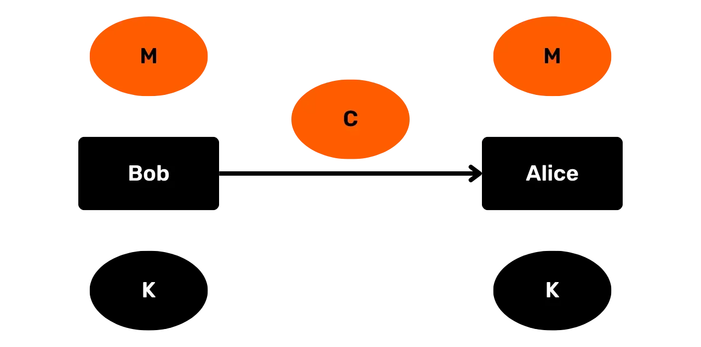

*Obrázek 2: Tajnost v průběhu času*

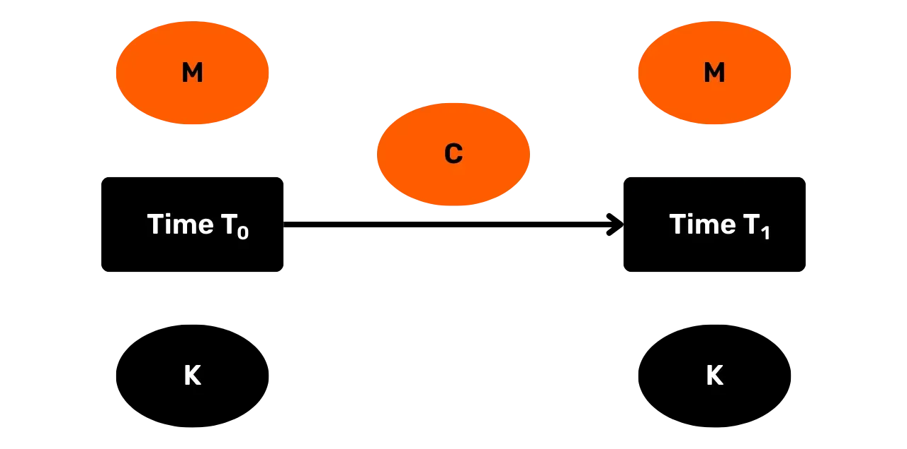

## Příklad: Caesarova šifra
<chapterId>7b179ae8-8d15-5e80-a43f-22c970d87b5e</chapterId>

V kapitole 2 jsme se setkali s Caesarovou šifrou, která je příkladem velmi jednoduchého symetrického šifrovacího schématu. Podívejme se na ni znovu zde.

Předpokládejme slovník *D*, který přiřazuje všechna písmena anglické abecedy, v pořadí, k sadě čísel {0,1,2…,25}. Předpokládejme sadu možných zpráv **M**. Caesarova šifra je potom šifrovací schéma definované následovně:

- Náhodně vyberte klíč k ze sady možných klíčů **K**, kde **K** = {0,1,2,…,25}
- Zašifrujte zprávu m є **M**, takto:
    - Rozdělte m na jednotlivá písmena m0, m1,….mi….,ml
    - Převeďte každé mi na číslo podle *D*
    - Pro každé mi, ci = [(mi + k) mod 26]
    - Převeďte každé ci zpět na písmeno podle *D*
    - Poté spojte c0, c1,….,cl k získání šifrovaného textu c
- Dešifrujte šifrovaný text c takto:
    - Převeďte každé ci na číslo podle *D*
    - Pro každé ci, mi = [(ci – k) mod 26]
    - Převeďte každé mi zpět na písmeno podle *D*
    - Poté spojte m0, m1,….,ml k získání původní zprávy m

To, co dělá Caesarovu šifru symetrickým šifrovacím schématem, je použití stejného klíče pro oba procesy, šifrování i dešifrování. Předpokládejme například, že chcete zašifrovat zprávu „DOG“ pomocí Caesarovy šifry a náhodně jste vybrali klíč "24". Zašifrování zprávy s tímto klíčem by vydalo „BME“. Jediný způsob, jak získat původní zprávu, je použití stejného klíče, "24", pro proces dešifrování.
Tento Shift cipher je příkladem **monoalfabetické substituční šifry**: šifrovacího schématu, kde je šifrovací abeceda pevná (tj. používá se pouze jedna abeceda). Předpokládáme-li, že dešifrovací algoritmus je deterministický, každý symbol v substitučním šifrovém textu může nejvýše odpovídat jednomu symbolu v otevřeném textu.
Do 1700 let se mnoho aplikací šifrování silně spoléhalo na monoalfabetické substituční šifry, ačkoli ty často byly mnohem složitější než Shift cipher. Mohli byste například náhodně vybrat písmeno z abecedy pro každé písmeno původního textu s omezením, že každé písmeno se v šifrovací abecedě vyskytuje pouze jednou. To znamená, že byste měli faktoriálně 26 možných soukromých klíčů, což bylo obrovské v době před počítači.

Všimněte si, že se v kryptografii setkáte s termínem **cipher** velmi často. Mějte na paměti, že tento termín má různé významy. Ve skutečnosti znám alespoň pět odlišných významů tohoto termínu v rámci kryptografie.

V některých případech se odkazuje na šifrovací schéma, jak je tomu u Shift cipher a monoalfabetické substituční šifry. Termín však může také specificky odkazovat na šifrovací algoritmus, soukromý klíč nebo pouze na šifrový text jakéhokoli takového šifrovacího schématu.

Nakonec termín cipher může také odkazovat na základní algoritmus, z něhož lze konstruovat kryptografická schémata. Mohou zahrnovat různé šifrovací algoritmy, ale také jiné typy kryptografických schémat. Tento smysl termínu se stává relevantním v kontextu blokových šifer (viz sekce „Blokové šifry“ níže).

Můžete se také setkat s termíny **encipher** nebo **decipher**. Tyto termíny jsou pouhými synonymy pro šifrování a dešifrování.

## Brute force útoky a Kerckhoffův princip
<chapterId>2d73ef97-26c5-5d11-8815-0ddbe89c8003</chapterId>

Shift cipher je velmi nezabezpečené symetrické šifrovací schéma, alespoň ve moderním světě.[1](#footnote1) Útočník by mohl jednoduše pokusit dešifrovat jakýkoli šifrový text se všemi 26 možnými klíči, aby zjistil, který výsledek dává smysl. Tento typ útoku, kdy útočník pouze prochází klíče, aby zjistil, co funguje, je známý jako **brute force útok** nebo **vyčerpávající hledání klíče**.

Aby jakékoliv šifrovací schéma splňovalo minimální pojem bezpečnosti, musí mít sadu možných klíčů, nebo **prostor klíčů**, který je tak velký, že brute force útoky jsou neuskutečnitelné. Všechna moderní šifrovací schémata splňují tento standard. Je známý jako **princip dostatečného prostoru klíčů**. Podobný princip se typicky uplatňuje v různých typech kryptografických schémat.

Abyste si udělali představu o obrovské velikosti prostoru klíčů v moderních šifrovacích schématech, předpokládejme, že soubor byl zašifrován pomocí 128-bitového klíče pomocí pokročilého šifrovacího standardu. To znamená, že útočník má sadu 2128 klíčů, kterými musí procházet pro brute force útok. Šance na úspěch s touto strategií by vyžadovala, aby útočník prošel přibližně 2,65 x 1036 klíčů.
Předpokládejme, že optimisticky předpokládáme, že útočník může pokusit 10 kvadrilionů klíčů za sekundu (tj. 1016 klíčů za sekundu). Aby otestoval 0,78 % všech klíčů v prostoru klíčů, její útok by musel trvat 2,65 x 1020 sekund. To je přibližně 8,4 bilionu let. Takže i útok hrubou silou od absurdně mocného protivníka není s moderním šifrovacím schématem o 128 bitech realistický. To je princip dostatečného prostoru klíčů v praxi.
Je šifra posunu bezpečnější, pokud útočník nezná šifrovací algoritmus? Možná, ale ne o mnoho.

V každém případě moderní kryptografie vždy předpokládá, že bezpečnost jakéhokoli symetrického šifrovacího schématu závisí pouze na udržení tajemství soukromého klíče. Předpokládá se, že útočník zná všechny ostatní detaily, včetně prostoru zpráv, prostoru klíčů, prostoru šifrovaného textu, algoritmu výběru klíče, šifrovacího algoritmu a dešifrovacího algoritmu.

Myšlenka, že bezpečnost symetrického šifrovacího schématu může záviset pouze na tajnosti soukromého klíče, je známá jako **Kerckhoffsův princip**.

Jak původně zamýšlel Kerckhoffs, princip se vztahuje pouze na symetrická šifrovací schémata. Obecnější verze principu se však vztahuje i na všechny ostatní moderní typy kryptografických schémat: Návrh jakéhokoli kryptografického schématu nesmí vyžadovat, aby byl tajný, aby byl bezpečný; tajemství může sahat pouze k některým řetězcům informací, typicky soukromému klíči.

Kerckhoffsův princip je pro moderní kryptografii klíčový ze čtyř důvodů.[2](#footnote2) Zaprvé, existuje pouze omezený počet kryptografických schémat pro konkrétní typy aplikací. Například většina moderních aplikací symetrického šifrování používá šifru Rijndael. Takže vaše tajemství ohledně návrhu schématu je jen velmi omezené. Existuje však mnohem větší flexibilita v udržování tajemství některého soukromého klíče pro šifru Rijndael.

Zadruhé, je snazší nahradit nějaký řetězec informací než celé kryptografické schéma. Předpokládejme, že všichni zaměstnanci společnosti mají stejný šifrovací software a každí dva zaměstnanci mají soukromý klíč pro důvěrnou komunikaci. Kompromisy klíčů jsou v tomto scénáři problém, ale alespoň by společnost mohla udržet software i s takovými bezpečnostními porušeními. Pokud by se společnost spoléhala na tajemství schématu, jakékoli porušení tohoto tajemství by vyžadovalo nahrazení veškerého softwaru.

Zatřetí, Kerckhoffsův princip umožňuje standardizaci a kompatibilitu mezi uživateli kryptografických schémat. To má obrovské výhody pro efektivitu. Například je těžké si představit, jak by miliony lidí mohly každý den bezpečně připojovat k webovým serverům Google, pokud by toto zabezpečení vyžadovalo udržování tajemství kryptografických schémat.

Začtvrté, Kerckhoffsův princip umožňuje veřejnou kontrolu kryptografických schémat. Tento typ kontroly je naprosto nezbytný pro dosažení bezpečných kryptografických schémat. Ilustrativně, hlavní jádrový algoritmus v symetrické kryptografii, šifra Rijndael, byl výsledkem soutěže organizované Národním institutem pro standardy a technologie mezi lety 1997 a 2000.

Jakýkoli systém, který se snaží dosáhnout **bezpečnosti skrze utajení**, je systém, který spoléhá na udržení tajemství detailů svého návrhu a/nebo implementace. V kryptografii by to byl konkrétně systém, který spoléhá na udržení tajemství návrhových detailů kryptografického schématu. Takže bezpečnost skrze utajení je v přímém kontrastu s Kerckhoffsův princip.
Schopnost otevřenosti podporovat kvalitu a bezpečnost se rozšiřuje i šířeji do digitálního světa než jen kryptografie. Svobodné a open source distribuce Linuxu, jako je například Debian, obecně nabízejí několik výhod oproti jejich protějškům Windows a MacOS z hlediska soukromí, stability, bezpečnosti a flexibilitě. Ačkoliv to může mít několik příčin, nejdůležitějším principem je pravděpodobně, jak to Eric Raymond vyjádřil ve svém slavném eseji "The Cathedral and the Bazaar," že "[k]dyž je dostatek očí, všechny chyby jsou povrchní."[3](#footnote3) Je to tento princip moudrosti davu, který dal Linuxu jeho nejvýznamnější úspěch.
Nikdy nelze jednoznačně prohlásit, že kryptografické schéma je "bezpečné" nebo "nebezpečné." Místo toho existují různé pojmy bezpečnosti pro kryptografická schémata. Každá **definice kryptografické bezpečnosti** musí specifikovat (1) cíle bezpečnosti, stejně jako (2) schopnosti útočníka. Analýza kryptografických schémat proti jedné nebo více konkrétním pojmem bezpečnosti poskytuje vhledy do jejich aplikací a omezení.

Ačkoliv se nebudeme zabývat všemi detaily různých pojmů kryptografické bezpečnosti, měli byste vědět, že dvě předpoklady jsou všudypřítomné pro všechny moderní pojmy kryptografické bezpečnosti týkající se symetrických a asymetrických schémat (a v nějaké formě i pro jiné kryptografické primitivy):

* Znalost útočníka o schématu odpovídá Kerckhoffs'ovu principu.
* Útočník nemůže provedit hrubou sílu útok na schéma. Konkrétně, modely hrozeb kryptografických pojmů bezpečnosti typicky ani nepřipouštějí útoky hrubou silou, protože předpokládají, že tyto nejsou relevantní úvahou.

## Proudové šifry
<chapterId>479aa6f4-45c4-59ca-8616-8cf8e61fc871</chapterId>

Symetrická šifrovací schémata jsou standardně rozdělena do dvou typů: proudové šifry a blokové šifry. Toto rozlišení je však poněkud problematické, jelikož lidé používají tyto termíny nekonzistentním způsobem. V následujících několika sekcích nastíním rozdíl tak, jak si myslím, že je nejlepší. Měli byste však vědět, že mnoho lidí bude používat tyto termíny poněkud odlišně, než jak je zde nastíním.

Pojďme se nejprve zaměřit na proudové šifry. **Proudová šifra** je symetrické šifrovací schéma, kde šifrování se skládá ze dvou kroků.

Nejprve je pomocí soukromého klíče vyprodukován řetězec o délce otevřeného textu. Tento řetězec se nazývá **klíčový proud**.

Dále je klíčový proud matematicky kombinován s otevřeným textem za účelem vytvoření šifrovaného textu. Tato kombinace je typicky operace XOR. Pro dešifrování můžete jen operaci obrátit. (Poznamenejme, že A XOR B = B XOR A, v případě, že A a B jsou bitové řetězce. Takže pořadí operace XOR v proudové šifře nemá význam pro výsledek. Tato vlastnost je známá jako komutativita.)

Typická XOR proudová šifra je znázorněna na *Obrázku 3*. Nejprve vezmete soukromý klíč K a použijete ho k generování klíčového proudu. Klíčový proud je poté kombinován s otevřeným textem pomocí operace XOR za účelem vytvoření šifrovaného textu. Jakýkoliv agent, který obdrží šifrovaný text, ho může snadno dešifrovat, pokud má klíč K. Vše, co potřebuje udělat, je vytvořit klíčový proud stejně dlouhý jako šifrovaný text podle specifikovaného postupu schématu a XORovat ho se šifrovaným textem.

*Obrázek 3: XOR proudová šifra*

Připomeňme si, že schéma šifrování je typicky šablona pro šifrování se stejným základním algoritmem, nikoli přesná specifikace. Rozšířeně, proudová šifra je typicky šablona pro šifrování, ve které můžete používat klíče různých délek. Ačkoliv délka klíče může ovlivnit některé drobné detaily schématu, neovlivní jeho zásadní formu.
Posunová šifra je příkladem velmi jednoduché a nezabezpečené proudové šifry. Použitím jediného písmene (soukromý klíč) můžete vyprodukovat řetězec písmen o délce zprávy (klíčový proud). Tento klíčový proud je poté kombinován s otevřeným textem prostřednictvím operace modulo k vytvoření šifrovaného textu. (Tato operace modulo může být zjednodušena na operaci XOR při reprezentaci písmen v bitech).

Dalším slavným příkladem proudové šifry je **Vigenèrova šifra**, pojmenovaná po Blaisi de Vigenère, který ji plně rozvinul na konci 16. století (ačkoliv jiní již předtím odvedli mnoho práce). Jedná se o příklad **polyalfabetické substituční šifry**: schéma šifrování, kde šifrovaná abeceda pro symbol otevřeného textu se mění v závislosti na jeho pozici v textu. Na rozdíl od monoalfabetické substituční šifry mohou být symboly šifrovaného textu spojeny s více než jedním symbolem otevřeného textu.

Jak šifrování získávalo na popularitě v renesanční Evropě, také **kryptoanalýza**—tedy prolomení šifrovaných textů—zejména pomocí **frekvenční analýzy**. Tato metoda využívá statistické pravidelnosti v našem jazyce k prolomení šifrovaných textů a byla objevena arabskými učenci již v devátém století. Je to technika, která funguje obzvláště dobře s delšími texty. A dokonce i nejsofistikovanější monoalfabetické substituční šifry již v 1700s v Evropě, zejména v vojenských a bezpečnostních nastaveních, nebyly dostatečné proti frekvenční analýze. Jelikož Vigenèrova šifra nabídla významný pokrok v bezpečnosti, stala se populární v tomto období a do konce 1700s byla rozšířená.

Neformálně řečeno, schéma šifrování funguje takto:

1. Vyberte vícepísmenné slovo jako soukromý klíč
2. Pro jakoukoliv zprávu aplikujte posunovou šifru na každé písmeno zprávy použitím odpovídajícího písmene ve klíčovém slově jako posun
3. Pokud jste prošli klíčovým slovem, ale stále jste celý otevřený text nezašifrovali, znovu aplikujte písmena klíčového slova jako posunovou šifru na odpovídající písmena v zbytku textu
4. Pokračujte v tomto procesu, dokud nebude celá zpráva zašifrována

Pro ilustraci, předpokládejme, že váš soukromý klíč je GOLD a chcete zašifrovat zprávu "CRYPTOGRAPHY". V tom případě byste postupovali podle Vigenèrovy šifry takto:

- c0 = [(2 + 6) Mod 26] = 8 = I
- c1 = [(17 + 14) Mod 26] = 5 = F
- c2 = [(24 + 11) Mod 26] = 9 = J
- c3 = [(15 + 3) Mod 26] = 18 = S
- c4 = [(19 + 6) Mod 26] = 25 = Z
- c5 = [(14 + 14) Mod 26] = 2 = C
- c6 = [(6 + 11) Mod 26] = 17 = R
- c7 = [(17 + 3) Mod 26] = 20 = U
- c8 = [(0 + 6) Mod 26] = 6 = G
- c9 = [(15 + 14) Mod 26] = 3 = D
- c10 = [(7 + 11) Mod 26] = 18 = S
- c11 = [(24 + 3) Mod 26] = 1 = B
- c = "IFJSZCRUGDSB"

Dalším slavným příkladem proudové šifry je **one-time pad**. U one-time pad jednoduše vytvoříte řetězec náhodných bitů stejně dlouhý jako zpráva v otevřeném textu a šifrovaný text vytvoříte pomocí operace XOR. Soukromý klíč a proudový klíč jsou u one-time pad ekvivalentní.

Zatímco šifra Shift a šifra Vigenère jsou v moderní době velmi nezabezpečené, one-time pad je velmi bezpečný, pokud je používán správně. Pravděpodobně nejslavnější aplikací one-time pad byla, alespoň do 80. let, pro **Washington-Moskevskou horkou linku**.[4](#footnote4)

Horká linka je přímé komunikační spojení mezi Washingtonem a Moskvou pro naléhavé záležitosti, které bylo nainstalováno po Kubánské raketové krizi. Technologie pro to se během let transformovala. V současnosti zahrnuje přímý optický kabel a také dva satelitní spoje (pro redundanci), které umožňují e-mail a textové zprávy. Linka končí na různých místech v USA. Pentagon, Bílý dům a Raven Rock Mountain jsou známé koncové body. Na rozdíl od populárního názoru, horká linka nikdy nezahrnovala telefony.

V podstatě schéma one-time pad fungovalo takto. Washington a Moskva by měly dvě sady náhodných čísel. Jedna sada náhodných čísel, vytvořená Rusy, se týkala šifrování a dešifrování jakýchkoli zpráv v ruštině. Jedna sada náhodných čísel, vytvořená Američany, se týkala šifrování a dešifrování jakýchkoli zpráv v angličtině. Čas od času by více náhodných čísel bylo doručeno na druhou stranu důvěryhodnými kurýry.

Washington a Moskva pak mohly komunikovat tajně pomocí těchto náhodných čísel pro vytváření one-time padů. Pokaždé, když jste potřebovali komunikovat, použili byste další část náhodných čísel pro vaši zprávu.

Přestože je one-time pad vysoce bezpečný, čelí významným praktickým omezením: klíč musí být stejně dlouhý jako zpráva a žádná část one-time padu nemůže být použita znovu. To znamená, že musíte sledovat, kde v one-time padu jste, uchovávat obrovské množství bitů a občas vyměňovat náhodné bity se svými protistranami. Jako důsledek one-time pad není často používán v praxi.

Namísto toho v praxi převažují **pseudonáhodné proudové šifry**. Salsa20 a úzce související varianta nazvaná ChaCha jsou příklady běžně používaných pseudonáhodných proudových šifer.

U těchto pseudonáhodných proudových šifer nejprve náhodně vyberete klíč K, který je kratší než délka otevřeného textu. Takový náhodný klíč K je obvykle vytvořen naším počítačem na základě nepředvídatelných dat, která sbírá v průběhu času, jako je čas mezi síťovými zprávami, pohyby myši a tak dále.
Tento náhodný klíč K je poté vložen do expanzního algoritmu, který vytváří pseudonáhodný klíčový proud stejně dlouhý jako zpráva. Můžete přesně specifikovat, jak dlouhý má klíčový proud být (např. 500 bitů, 1000 bitů, 1200 bitů, 29 117 bitů a tak dále).
Pseudonáhodný klíčový proud se jeví *jako by* byl vybrán zcela náhodně ze sady všech řetězců stejné délky. Proto šifrování s pseudonáhodným klíčovým proudem vypadá, jako by bylo provedeno s jednorázovým šifrovacím blokem. To ale samozřejmě není pravda.

Jelikož je náš soukromý klíč kratší než klíčový proud a náš expanzní algoritmus musí být deterministický, aby proces šifrování/dešifrování fungoval, ne každý klíčový proud této konkrétní délky mohl být výstupem z naší expanzní operace.

Předpokládejme například, že náš soukromý klíč má délku 128 bitů a že ho můžeme vložit do expanzního algoritmu, aby vytvořil mnohem delší klíčový proud, řekněme 2500 bitů. Jelikož náš expanzní algoritmus musí být deterministický, náš algoritmus může vybrat nejvýše 1/2128 řetězců s délkou 2500 bitů. Takový klíčový proud by tedy nikdy nemohl být vybrán zcela náhodně ze všech řetězců stejné délky.

Naše definice proudové šifry má dva aspekty: (1) klíčový proud stejně dlouhý jako otevřený text je generován s pomocí soukromého klíče; a (2) tento klíčový proud je kombinován s otevřeným textem, typicky prostřednictvím operace XOR, k vytvoření šifrovaného textu.

Někdy lidé definují podmínku (1) striktněji, tvrdícím, že klíčový proud musí být specificky pseudonáhodný. To znamená, že ani posunovací šifra, ani jednorázový šifrovací blok by nebyly považovány za proudové šifry.

Podle mého názoru širší definování podmínky (1) poskytuje snazší způsob, jak organizovat šifrovací schémata. Kromě toho to znamená, že nemusíme přestat nazývat konkrétní šifrovací schéma proudovou šifrou jen proto, že se dozvíme, že ve skutečnosti nespoléhá na pseudonáhodné klíčové proudy.

## Blokové šifry
<chapterId>2df52d51-943d-5df7-9d49-333e4c5d97b7</chapterId>

První způsob, jakým je **bloková šifra** obvykle chápána, je jako něco primitivnějšího než proudová šifra: Základní algoritmus, který provádí transformaci zachovávající délku na řetězci vhodné délky s pomocí klíče. Tento algoritmus lze použít pro vytváření šifrovacích schémat a možná i jiných typů kryptografických schémat.

Často může bloková šifra přijímat vstupní řetězce různých délek, jako jsou 64, 128 nebo 256 bitů, stejně jako klíče různých délek, jako jsou 128, 192 nebo 256 bitů. Přestože se některé detaily algoritmu mohou měnit v závislosti na těchto proměnných, základní algoritmus se nemění. Pokud by se měnil, mluvili bychom o dvou různých blokových šifrách. Poznamenejme, že použití terminologie základního algoritmu zde je stejné jako pro šifrovací schémata.

Znázornění fungování blokové šifry můžete vidět na *Obrázku 4* níže. Zpráva M o délce L a klíč K slouží jako vstupy do blokové šifry. Výstupem je zpráva M’ o délce L. Klíč nemusí nutně mít stejnou délku jako M a M’ u většiny blokových šifer.

*Obrázek 4: Bloková šifra*

Bloková šifra sama o sobě není šifrovací schéma. Ale bloková šifra může být použita s různými **režimy provozu** k vytvoření různých šifrovacích schémat. Režim provozu jednoduše přidává některé další operace mimo blokovou šifru.
Abychom ilustrovali, jak to funguje, předpokládejme blokovou šifru (BC), která vyžaduje 128bitový vstupní řetězec a 128bitový soukromý klíč. Obrázek 5 níže ukazuje, jak lze tuto blokovou šifru použít s **režimem elektronického kódového bloku** (**ECB režim**) k vytvoření šifrovacího schématu. (Tečky na pravé straně naznačují, že tento vzor můžete opakovat tak dlouho, jak je potřeba).

*Obrázek 5: Bloková šifra s ECB režimem*

Proces šifrování elektronického kódového bloku s blokovou šifrou je následující. Zkuste rozdělit vaši zprávu v otevřeném textu na 128bitové bloky. Pokud to není možné, přidejte k zprávě **doplňkové bity** (padding), aby výsledek mohl být rovnoměrně rozdělen podle velikosti bloku 128 bitů. To jsou vaše data použitá pro šifrovací proces.

Nyní rozdělte data na části 128bitových řetězců (M1, M2, M3 a tak dále). Každý 128bitový řetězec projděte blokovou šifrou s vaším 128bitovým klíčem, abyste vytvořili 128bitové části šifrovaného textu (C1, C2, C3 a tak dále). Tyto části, znovu spojené, tvoří celý šifrovaný text.

Dešifrování je jen opačný proces, ačkoliv příjemce potřebuje nějaký rozpoznatelný způsob, jak odstranit jakékoli doplňkové bity z dešifrovaných dat, aby získal původní zprávu v otevřeném textu.

Přestože je relativně přímočaré, bloková šifra s režimem elektronického kódového bloku má nedostatky v bezpečnosti. To je proto, že vede k **deterministickému šifrování**. Jakékoli dva identické 128bitové řetězce dat jsou šifrovány přesně stejným způsobem. Tyto informace mohou být zneužity.

Místo toho by jakékoli šifrovací schéma vytvořené z blokové šifry mělo být **pravděpodobnostní**: to znamená, že šifrování jakékoli zprávy M, nebo jakékoli konkrétní části M, by mělo obecně vždy vést k jinému výsledku.[5](#footnote5)

**Režim řetězení bloků šifer** (**CBC režim**) je pravděpodobně nejčastěji používaný režim s blokovou šifrou. Kombinace, pokud je provedena správně, produkuje pravděpodobnostní šifrovací schéma. Tento režim provozu můžete vidět na obrázku 6 níže.

*Obrázek 6: Bloková šifra s CBC režimem*

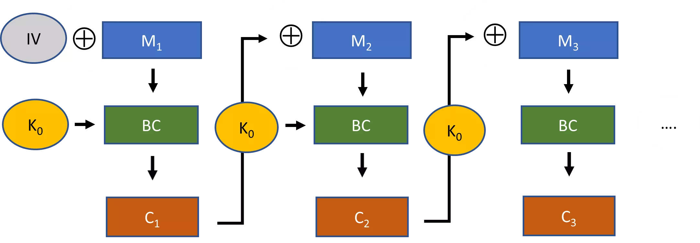

Předpokládejme, že velikost bloku je opět 128 bitů. Takže na začátku byste opět museli zajistit, že vaše původní zpráva v otevřeném textu obdrží potřebné doplňkové bity.

Poté XORujete první 128bitovou část vašeho otevřeného textu s **inicializačním vektorem** o velikosti 128 bitů. Výsledek je vložen do blokové šifry, aby se vyprodukoval šifrovaný text pro první blok. Pro druhý blok o velikosti 128 bitů nejprve XORujete otevřený text se šifrovaným textem z prvního bloku, než jej vložíte do blokové šifry. Tento proces pokračujete, dokud nezašifrujete celou vaši zprávu v otevřeném textu.

Po dokončení pošlete šifrovanou zprávu společně s nešifrovaným inicializačním vektorem příjemci. Příjemce musí znát inicializační vektor, jinak nemůže dešifrovat šifrovaný text.
Tato konstrukce je mnohem bezpečnější než režim elektronické kódové knihy, pokud je používána správně. Měli byste nejprve zajistit, že inicializační vektor je náhodný nebo pseudonáhodný řetězec. Kromě toho byste měli pokaždé, když používáte tento šifrovací schéma, použít jiný inicializační vektor.
Jinými slovy, váš inicializační vektor by měl být náhodný nebo pseudonáhodný nonce, kde **nonce** znamená "číslo, které se použije pouze jednou". Pokud se této praxe budete držet, pak režim CBC s blokovou šifrou zajistí, že jakékoli dva identické bloky otevřeného textu budou obvykle šifrovány pokaždé jinak.

Nakonec si věnujme pozornost **režimu zpětné vazby výstupu** (**OFB mode**). Tento režim můžete vidět na *Obrázku 7*.

*Obrázek 7: Bloková šifra s režimem OFB*

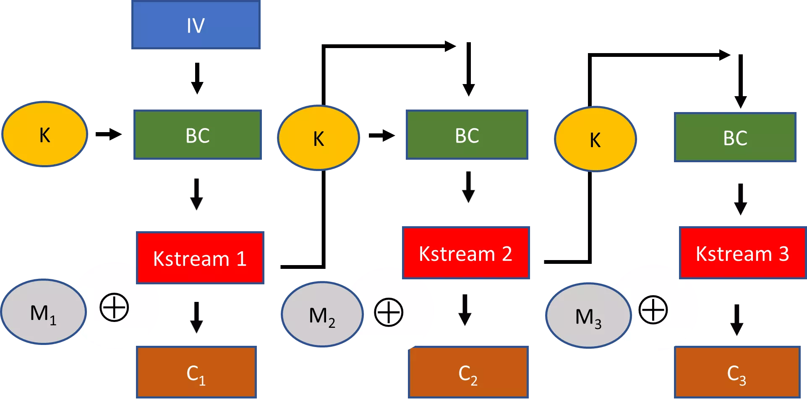

V režimu OFB také vybíráte inicializační vektor. Ale zde, pro první blok, je inicializační vektor přímo vložen do blokové šifry s vaším klíčem. Výsledných 128 bitů je poté považováno za klíčový proud. Tento klíčový proud je XORován s otevřeným textem, aby se vytvořil šifrový text pro blok. Pro následující bloky používáte klíčový proud z předchozího bloku jako vstup do blokové šifry a kroky opakujete.

Pokud se podíváte pozorně, co bylo zde vytvořeno z blokové šifry s režimem OFB, je proudová šifra. Generujete části klíčového proudu o velikosti 128 bitů, dokud nemáte délku otevřeného textu (zahazujete bity, které nepotřebujete z poslední 128-bitové části klíčového proudu). Poté XORujete klíčový proud s vaší zprávou otevřeného textu, abyste získali šifrový text.

V předchozí sekci o proudových šifrách jsem uvedl, že vytváříte klíčový proud s pomocí soukromého klíče. Přesněji řečeno, nemusí být vytvořen pouze se soukromým klíčem. Jak můžete vidět v režimu OFB, klíčový proud je vytvořen s podporou jak soukromého klíče, tak inicializačního vektoru.

Všimněte si, že stejně jako v režimu CBC, je důležité vybrat pseudonáhodný nebo náhodný nonce pro inicializační vektor pokaždé, když používáte blokovou šifru v režimu OFB. Jinak bude stejný 128-bitový řetězec zpráv šifrován stejným způsobem při různých komunikacích. To je jeden ze způsobů, jak vytvořit pravděpodobnostní šifrování s proudovou šifrou.

Některé proudové šifry používají pouze soukromý klíč k vytvoření klíčového proudu. U těchto proudových šifr je důležité, abyste pro každou instanci komunikace použili náhodný nonce k výběru soukromého klíče. Jinak budou výsledky šifrování s těmito proudovými šiframi také deterministické, což povede k bezpečnostním problémům.

Nejpopulárnější moderní blokovou šifrou je **šifra Rijndael**. Byla vítězným příspěvkem z patnácti přihlášek do soutěže pořádané Národním institutem pro standardy a technologie (NIST) mezi lety 1997 a 2000 s cílem nahradit starší standard šifrování, **standard šifrování dat** (**DES**).
Šifra Rijndael může být použita s různými specifikacemi pro délky klíčů a velikosti bloků, stejně jako v různých režimech provozu. Výbor pro soutěž NIST přijal omezenou verzi šifry Rijndael - konkrétně takovou, která vyžaduje 128bitové velikosti bloků a délky klíčů buď 128 bitů, 192 bitů nebo 256 bitů - jako součást **pokročilého standardu šifrování** (**AES**). To je skutečně hlavní standard pro aplikace symetrického šifrování. Je tak bezpečný, že dokonce i NSA je zjevně ochotna jej používat s 256bitovými klíči pro dokumenty s nejvyšším stupněm utajení.[6](#footnote6)
Bloková šifra AES bude podrobně vysvětlena v *Kapitole 5*.

## Vyjasnění zmatku
<chapterId>121c1858-27e3-5862-b0ce-4ff2f70f9f0f</chapterId>

Zmatek ohledně rozlišení mezi blokovými šiframi a proudovými šiframi vzniká, protože někdy lidé chápou termín bloková šifra jako odkaz konkrétně na *blokovou šifru s režimem šifrování bloků*.

Zvažte režimy ECB a CBC v předchozí sekci. Tyto konkrétně vyžadují, aby data pro šifrování byla dělitelná velikostí bloku (což znamená, že možná budete muset použít doplnění pro původní zprávu). Kromě toho jsou data v těchto režimech také přímo zpracovávána blokovou šifrou (a nejen kombinována s výsledkem operace blokové šifry jako v režimu OFB).

Takže alternativně můžete definovat **blokovou šifru** jako jakékoli šifrovací schéma, které operuje s pevně danými délkami bloků zprávy najednou (kde jakýkoli blok musí být delší než jeden bajt, jinak se to zhroutí do proudové šifry). Jak data pro šifrování, tak i šifrovaný text musí být rovnoměrně dělitelné touto velikostí bloku. Typicky je velikost bloku 64, 128, 192 nebo 256 bitů. Na rozdíl od toho může proudová šifra šifrovat jakékoli zprávy v kusech po jednom bitu nebo bajtu najednou.

S tímto specifičtějším pochopením blokové šifry můžete skutečně tvrdit, že moderní šifrovací schémata jsou buď proudové nebo blokové šifry. Odtud budu termín bloková šifra používat ve smyslu obecnějším, pokud není uvedeno jinak.

Diskuse o režimu OFB v předchozí sekci také vyvolává další zajímavý bod. Některé proudové šifry jsou postaveny z blokových šifer, jako je Rijndael s OFB. Některé, jako Salsa20 a ChaCha, nejsou vytvořeny z blokových šifer. Tyto byste mohli nazvat **primitivní proudové šifry**. (Ve skutečnosti neexistuje standardizovaný termín pro označení takových proudových šifer.)

Když lidé mluví o výhodách a nevýhodách proudových šifer a blokových šifer, obvykle porovnávají primitivní proudové šifry se šifrovacími schématy založenými na blokových šifrách.

Zatímco vždy můžete snadno sestavit proudovou šifru z blokové šifry, je obvykle velmi obtížné postavit nějaký typ konstrukce s režimem šifrování bloků (jako s režimem CBC) z primitivní proudové šifry.

Z této diskuse byste nyní měli rozumět *Obrázku 8*. Poskytuje přehled o symetrických šifrovacích schématech. Používáme tři druhy šifrovacích schémat: primitivní proudové šifry, proudové šifry z blokových šifer a blokové šifry v blokovém režimu (také nazývané „blokové šifry“ na diagramu).

*Obrázek 8: Přehled symetrických šifrovacích schémat*

## Kódy pro autentizaci zpráv
<chapterId>19fa7c00-db59-56a0-9654-5350a137939d</chapterId>
Šifrování se týká tajnosti. Ale kryptografie se také zabývá širšími tématy, jako je integrita zpráv, autentičnost a nedopadnutelnost. Takzvané **kódy pro ověření autentičnosti zpráv** (MACs) jsou symetrické kryptografické schématy, které podporují autentičnost a integritu v komunikaci.

Proč je v komunikaci potřeba něco víc než jen tajnost? Představme si, že Bob pošle Alici zprávu pomocí prakticky nelomitelného šifrování. Jakýkoli útočník, který tuto zprávu zachytí, nebude schopen získat žádné významné informace o jejím obsahu. Útočník má však stále k dispozici alespoň dva další vektory útoku:

1. Může zachytit šifrovaný text, změnit jeho obsah a poslat upravený šifrovaný text Alici.
2. Může Bobovu zprávu úplně zablokovat a poslat svůj vlastní vytvořený šifrovaný text.

V obou těchto případech nemusí útočník mít žádné informace o obsahu šifrovaných textů (1) a (2). Ale stále může tímto způsobem způsobit významné škody. Zde se stávají důležitými kódy pro ověření autentičnosti zpráv.

Kódy pro ověření autentičnosti zpráv jsou volně definovány jako symetrické kryptografické schématy se třemi algoritmy: algoritmus pro generování klíče, algoritmus pro generování tagu a algoritmus pro ověření. Bezpečný MAC zajišťuje, že tagy jsou **existenčně nezfalšovatelné** pro jakéhokoli útočníka - to znamená, že nemohou úspěšně vytvořit tag na zprávu, který by prošel ověřením, pokud nemají soukromý klíč.

Bob a Alice mohou bojovat proti manipulaci s konkrétní zprávou pomocí MAC. Představme si na chvíli, že jim nezáleží na tajnosti. Chtějí pouze zajistit, že zpráva přijatá Alicí byla skutečně od Boba a nebyla nijak změněna.

Proces je znázorněn na *Obrázku 9*. Aby mohli použít MAC, nejprve vygenerují soukromý klíč K, který je sdílen mezi oběma z nich. Bob vytvoří pro zprávu tag T pomocí soukromého klíče K. Poté pošle zprávu i s tagem zprávy Alici. Ona může poté ověřit, že tag skutečně vytvořil Bob, spuštěním soukromého klíče, zprávy a tagu prostřednictvím algoritmu pro ověření.

*Obrázek 9: Přehled schémat symetrického šifrování*

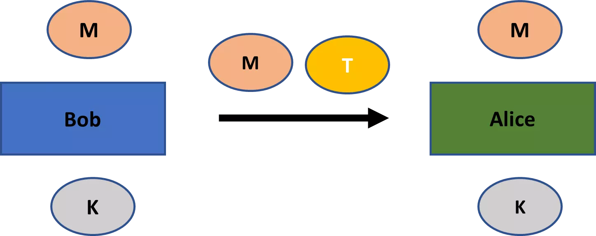

Díky existenční nezfalšovatelnosti nemůže útočník zprávu M nijak změnit ani vytvořit vlastní zprávu s platným tagem. To platí i v případě, že útočník pozoruje tagy mnoha zpráv mezi Bobem a Alicí, které používají stejný soukromý klíč. Nejvýše by útočník mohl zabránit Alici v přijetí zprávy M (problém, který kryptografie nemůže řešit).

MAC zaručuje, že zpráva byla skutečně vytvořena Bobem. Tato autentičnost automaticky znamená integritu zprávy - to znamená, pokud Bob vytvořil nějakou zprávu, pak byla ipso facto nijak změněna útočníkem. Od tohoto okamžiku by jakákoli starost o autentizaci měla být automaticky chápána jako starost o integritu.

Ačkoli jsem v mé diskusi rozlišil mezi autentičností a integritou zpráv, je také běžné používat tyto termíny jako synonyma. Odkazují pak na myšlenku zpráv, které byly vytvořeny konkrétním odesílatelem a nijak nezměněny. V tomto duchu jsou kódy pro ověření autentičnosti zpráv často také nazývány **kódy integrity zpráv**.

## Autentizované šifrování
<chapterId>33f2ec9b-9fb4-5c61-8fb4-50836270a144</chapterId>
Obvykle byste chtěli zaručit jak tajnost, tak pravost komunikace, a proto se obvykle používají společně šifrovací schémata a schémata MAC (Message Authentication Code - Kód pro ověření zprávy). 
**Schéma autentizovaného šifrování** je schéma, které kombinuje šifrování s MAC způsobem vysoce bezpečným. Konkrétně musí splňovat standardy pro existenční nezfalšovatelnost, stejně jako velmi silnou koncepci tajnosti, konkrétně takovou, která je odolná vůči **útokům zvoleného šifrotextu**.[7](#footnote7)

Aby bylo šifrovací schéma odolné vůči útokům zvoleného šifrotextu, musí splňovat standardy pro **nezměnitelnost**: to znamená, že jakákoli úprava šifrotextu útočníkem by měla vést buď k neplatnému šifrotextu nebo k šifrotextu, který po dešifrování dává text bez jakékoli souvislosti s původním.[8](#footnote8)

Jelikož schéma autentizovaného šifrování zajišťuje, že šifrotext vytvořený útočníkem je vždy neplatný (protože tag nebude ověřen), splňuje standardy pro odolnost vůči útokům zvoleného šifrotextu. Zajímavě, lze dokázat, že schéma autentizovaného šifrování lze vždy vytvořit kombinací existenčně nezfalšovatelného MAC a šifrovacího schématu, které splňuje méně silnou koncepci bezpečnosti, známou jako **bezpečnost vůči útokům zvoleného otevřeného textu**.

Nebudeme se zabývat všemi detaily konstrukce schémat autentizovaného šifrování. Ale je důležité znát dva detaily jejich konstrukce.

Za prvé, schéma autentizovaného šifrování nejprve zpracuje šifrování a poté vytvoří zprávu tag na šifrotextu. Ukázalo se, že jiné přístupy - jako je kombinace šifrotextu s tagem na otevřeném textu, nebo nejprve vytvoření tagu a poté šifrování jak otevřeného textu, tak tagu - jsou nebezpečné. Kromě toho, obě operace mají svůj vlastní náhodně vybraný soukromý klíč, jinak je vaše bezpečnost vážně ohrožena.

Výše uvedený princip platí obecněji: *vždy byste měli používat rozdílné klíče při kombinování základních kryptografických schémat*.

Schéma autentizovaného šifrování je znázorněno na *Obrázku 10*. Bob nejprve vytvoří šifrotext C ze zprávy M pomocí náhodně vybraného klíče KC. Poté vytvoří zprávu tag T spuštěním šifrotextu a jiného náhodně vybraného klíče KT prostřednictvím algoritmu generování tagu. Oba, šifrotext i zpráva tag, jsou poslány Alici.

Alice nyní nejprve zkontroluje, zda je tag platný vzhledem k šifrotextu C a klíči KT. Pokud je platný, může poté dešifrovat zprávu pomocí klíče KC. Nejenže je ujištěna o velmi silné koncepci tajnosti v jejich komunikaci, ale také ví, že zprávu vytvořil Bob.

*Obrázek 10: Schéma autentizovaného šifrování*

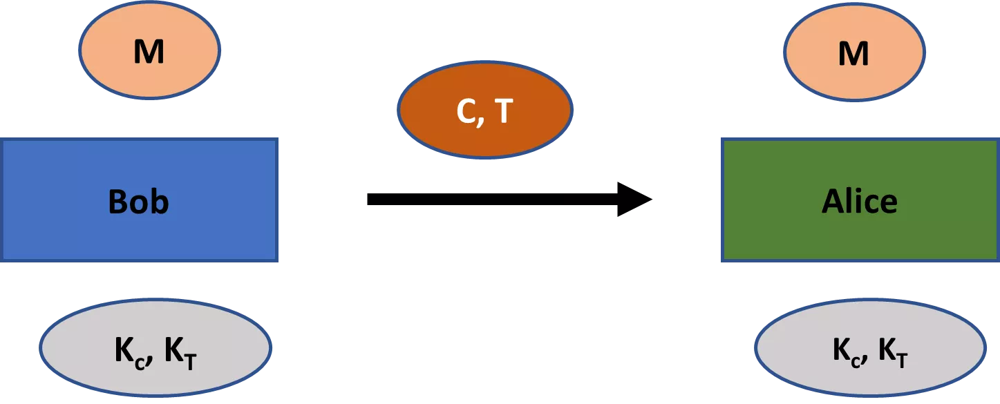

Jak jsou vytvářeny MACy? Ačkoliv lze MACy vytvořit několika metodami, běžným a efektivním způsobem jejich vytváření je prostřednictvím kryptografických hašovacích funkcí.

Kryptografické hašovací funkce podrobněji představíme v *Kapitole 6*. Prozatím stačí vědět, že **hašovací funkce** je efektivně vypočitatelná funkce, která přijímá vstupy libovolné velikosti a vrací výstupy pevné délky. Například populární hašovací funkce **SHA-256** (secure hash algorithm 256) vždy generuje 256bitový výstup bez ohledu na velikost vstupu. Některé hašovací funkce, jako je SHA-256, mají užitečné aplikace v kryptografii.
Nejběžnějším typem značky vytvořené pomocí kryptografické hašovací funkce je **hash-based message authentication code** (HMAC). Proces je znázorněn na *Obrázku 11*. Strana vytvoří z privátního klíče K dva odlišné klíče, vnitřní klíč K1 a vnější klíč K2. Otevřený text M nebo šifrovaný text C je poté zahašován společně s vnitřním klíčem. Výsledek T' je poté zahašován s vnějším klíčem, aby se vytvořila značka zprávy T.
Existuje paleta hašovacích funkcí, které lze použít k vytvoření HMAC. Nejčastěji používanou hašovací funkcí je SHA-256.

*Obrázek 11: HMAC*

## Bezpečné komunikační relace
<chapterId>c7f7dcd3-bbed-53ed-a43d-039da0f180c5</chapterId>

Předpokládejme, že dvě strany jsou v komunikační relaci, takže si posílají zprávy tam a zpět.

Schéma autentizovaného šifrování umožňuje příjemci zprávy ověřit, že byla vytvořena jejím partnerem v komunikační relaci (pokud neunikl privátní klíč). To funguje dostatečně dobře pro jednu zprávu. Typicky však dvě strany posílají zprávy tam a zpět v komunikační relaci. A v tomto nastavení obyčejné schéma autentizovaného šifrování, jak je popsáno v předchozí sekci, nedokáže zajistit bezpečnost.

Hlavním důvodem je, že schéma autentizovaného šifrování nezaručuje, že zprávu skutečně odeslal také agent, který ji vytvořil v rámci komunikační relace. Zvažte následující tři vektory útoku:

1. **Útok opakováním**: Útočník znovu pošle šifrovaný text a značku, kterou zachytil mezi dvěma stranami v dřívějším okamžiku.
2. **Útok změnou pořadí**: Útočník zachytí dvě zprávy v různých časech a pošle je příjemci v opačném pořadí.
3. **Reflexní útok**: Útočník pozoruje zprávu poslanou od A k B a také pošle tuto zprávu A.

I když útočník nemá znalost šifrovaného textu a nemůže vytvářet falešné šifrované texty, výše uvedené útoky mohou stále způsobit významné škody v komunikaci.

Představme si například, že konkrétní zpráva mezi dvěma stranami zahrnuje převod finančních prostředků. Útok opakováním by mohl způsobit druhý převod prostředků. Obyčejné schéma autentizovaného šifrování proti takovým útokům neobstojí.

Naštěstí lze tyto druhy útoků v komunikační relaci snadno zmírnit pomocí **identifikátorů** a **indikátorů relativního času**.

Identifikátory lze přidat do otevřeného textu zprávy před šifrováním. To by zabránilo jakýmkoli reflexním útokům. Indikátor relativního času může být například pořadové číslo v konkrétní komunikační relaci. Každá strana přidá k zprávě před šifrováním pořadové číslo, takže příjemce ví, v jakém pořadí byly zprávy odeslány. To eliminuje možnost útoků změnou pořadí. Také eliminuje útoky opakováním. Jakákoli zpráva, kterou útočník pošle později, bude mít staré pořadové číslo, a příjemce bude vědět, že zprávu nemá znovu zpracovávat.

Abychom ilustrovali, jak fungují bezpečné komunikační relace, představme si znovu Alici a Boba. Posílají si celkem čtyři zprávy tam a zpět. Jak by schéma autentizovaného šifrování s identifikátory a pořadovými čísly fungovalo, můžete vidět níže na *Obrázku 11*.
Komunikační sezení začíná tím, že Bob pošle Alici šifrovaný text C0,B s označením zprávy T0,B. Šifrovaný text obsahuje zprávu, stejně jako identifikátor (BOB) a pořadové číslo (0). Označení T0,B je vytvořeno pro celý šifrovaný text. V jejich následné komunikaci Alice a Bob tento protokol udržují, podle potřeby aktualizují pole.
*Obrázek 12: Bezpečné komunikační sezení*

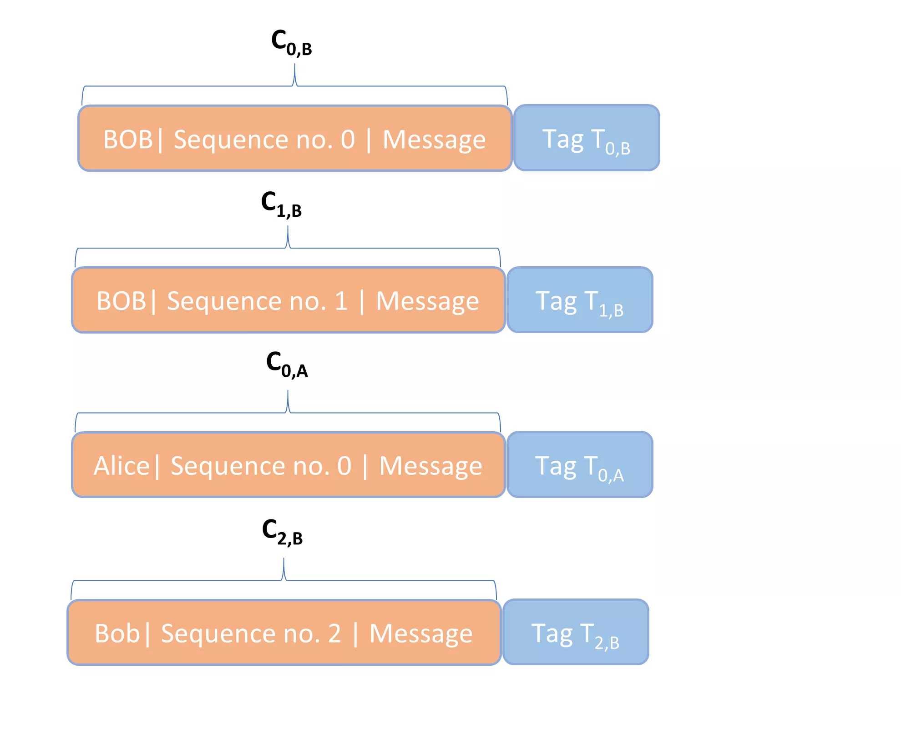

## Poznámky
<chapterId>b96d38dd-c9cb-56a7-8764-4af8526bc63f</chapterId>

[^1]: Podle Seutonia byl v Julius Caesarových vojenských komunikacích používán posunový šifrovací algoritmus s konstantní hodnotou klíče 3. Takže A by se vždy změnilo na D, B vždy na E, C vždy na F a tak dále. Tato konkrétní verze posunového šifrovacího algoritmu se tak stala známou jako **Caesarova šifra** (i když ve skutečnosti není šifrou v moderním smyslu slova, protože hodnota klíče je konstantní). Caesarova šifra mohla být v prvním století př. n. l. bezpečná, pokud byli nepřátelé Říma velmi neznalí v oblasti šifrování. Ale v moderní době by to jistě nebylo velmi bezpečné schéma [^1].

[^2]: Jonathan Katz a Yehuda Lindell, *Úvod do moderní kryptografie*, CRC Press (Boca Raton, FL: 2015), str. 7f [^2].

[^3]: Eric Raymond, “Katedrála a bazár,” přednáška byla prezentována na Linux Kongresu, Würzburg, Německo (27. května 1997). Existuje řada následujících verzí, stejně jako kniha. Moje citace jsou ze strany 30 v knize: Eric Raymond, *Katedrála a bazár: Úvahy o Linuxu a Open Source od náhodného revolucionáře*, revidované vydání. (2001), O’Reilly: Sebastopol, CA [^3].

[^4]: Crypto Museum, "Washingtonsko-moskevská horká linka," 2013, dostupné na [Crypto Museum](https://www.cryptomuseum.com/crypto/hotline/index.htm) [^4].

[^5]: Význam probabilistického šifrování poprvé zdůraznili Shafi Goldwasser a Silvio Micali, “Probabilistické šifrování,” *Journal of Co [^5].

# RC4 a AES
<partId>a48c4a7d-0a41-523f-a4ab-1305b4430324</partId>

V této kapitole budeme diskutovat o detailech šifrovacího schématu s moderním primitivním proudovým šifrem, RC4 (neboli "Rivestova šifra 4"), a moderním blokovým šifrem, AES. Ačkoliv šifra RC4 přišla o přízeň jako metoda šifrování, AES je standardem pro moderní symetrické šifrování. Tyto dva příklady by měly poskytnout lepší představu o tom, jak symetrické šifrování funguje "pod kapotou".
Abychom pochopili, jak fungují moderní pseudonáhodné proudové šifry, zaměřím se na proudovou šifru RC4. Jedná se o pseudonáhodnou proudovou šifru, která byla používána v bezpečnostních protokolech bezdrátových přístupových bodů WEP a WAP, stejně jako v TLS. Protože RC4 má mnoho prokázaných slabých míst, stala se neoblíbenou. Ve skutečnosti nyní Internet Engineering Task Force zakazuje používání sad RC4 klienty a serverovými aplikacemi ve všech instancích TLS.[3](#footnote3) Přesto dobře slouží jako příklad k ilustraci fungování primitivní proudové šifry.
Na začátek ukážu, jak zašifrovat otevřený textový vzkaz pomocí zjednodušené šifry RC4. Předpokládejme, že náš otevřený textový vzkaz je „SOUP“. Šifrování pomocí naší zjednodušené šifry RC4 pak probíhá ve čtyřech krocích.

### Krok 1

Nejprve definujeme pole S s S[0] = 0 až S[7] = 7. Pole zde jednoduše znamená proměnlivou kolekci hodnot organizovanou podle indexu, která se v některých programovacích jazycích nazývá také seznam (např. Python). V tomto případě index běží od 0 do 7 a hodnoty také běží od 0 do 7. Takže S vypadá takto:

- S = [0,1,2,3,4,5,6,7]

Hodnoty zde nejsou ASCII čísla, ale desítkové hodnotové reprezentace 1 bajtových řetězců. Takže hodnota 2 by odpovídala 0000 0011. Délka pole S je tedy 8 bajtů.

### Krok 2

Za druhé, definujeme klíčové pole K o délce 8 bajtů výběrem klíče mezi 1 a 8 bajty (bez možnosti zlomků bajtů). Jelikož každý bajt je 8 bitů, můžete pro každý bajt klíče vybrat libovolné číslo mezi 0 a 255.

Předpokládejme, že si vybereme náš klíč k jako [14,48,9], takže má délku 3 bajty. Každý index našeho klíčového pole je poté nastaven podle desítkové hodnoty pro daný prvek klíče, v pořadí. Pokud projdete celým klíčem, začněte znovu od začátku, dokud nezaplníte 8 slotů klíčového pole. Naše klíčové pole je tedy následující:

- K = [14,48,9,14,48,9,14,48]

### Krok 3

Za třetí, transformujeme pole S pomocí klíčového pole K v procesu známém jako plánování klíče. Proces je následující v pseudokódu:

- Vytvořte proměnné j a i
- Nastavte proměnnou j = 0
- Pro každé i od 0 do 7:
	- Nastavte j = j + S[i] + K[i] mod 8
	- Vyměňte S[i] a S[j]

Transformace pole S je zachycena v *Tabulce 1*.

Na začátku můžete vidět počáteční stav S jako [0,1,2,3,4,5,6,7] s počáteční hodnotou 0 pro j. To bude transformováno pomocí klíčového pole [14,48,9,14,48,9,14,48].
Cyklus for začíná s i = 0. Podle našeho pseudokódu výše se nová hodnota j stane 6 (j = j + S[0] + K[0] mod 8 = 0 + 0 + 14 mod 8 = 6 mod 8). Výměnou S[0] a S[6] se stav S po 1. kole stane [6,1,2,3,4,5,0,7].
V dalším řádku i = 1. Projitím cyklu for znovu, j získá hodnotu 7 (j = j + S[1] + K[1] mod 8 = 6 + 1 + 48 mod 8 = 55 mod 8 = 7 mod 8). Výměnou S[1] a S[7] z aktuálního stavu S, [6,1,2,3,4,5,0,7], dostaneme [6,7,2,3,4,5,0,1] po 2. kole.

Pokračujeme v tomto procesu, dokud nevytvoříme konečný řádek na spodku pro pole S, [6,4,1,0,3,7,5,2].

*Tabulka 1: Tabulka plánování klíčů*

### Krok 4

Jako čtvrtý krok vytvoříme klíčový proud. To je pseudonáhodný řetězec o délce rovnající se zprávě, kterou chceme poslat. To bude použito k zašifrování původní zprávy „SOUP.“ Jelikož musí být klíčový proud stejně dlouhý jako zpráva, potřebujeme jeden, který má 4 bajty.

Klíčový proud je vytvořen následujícím pseudokódem:

- Vytvořte proměnné j, i a t
- Nastavte j = 0
- Pro každé i z otevřeného textu, začínajíc s i = 1 a pokračující do i = 4, je každý bajt klíčového proudu vytvořen následovně:
    - j = j + S[i] mod 8
	- Vyměňte S[i] a S[j]
	- t = S[i] + S[j] mod 8
	- i-tý bajt klíčového proudu = S[t]

Výpočty můžete sledovat v *Tabulce 2*.

Počáteční stav S = S = [6,4,1,0,3,7,5,2]. Nastavením i = 1 se hodnota j stane 4 (j = j + S[i] mod 8 = 0 + 4 mod 8 = 4). Poté vyměníme S[1] a S[4] a vytvoříme transformaci S ve druhém řádku, [6,3,1,0,4,7,5,2]. Hodnota t je poté 7 (t = S[i] + S[j] mod 8 = 3 + 4 mod 8 = 7). Nakonec bajt pro klíčový proud je poté S[7], neboli 2.

Poté můžeme pokračovat ve vytváření dalších bajtů, dokud nemáme následující čtyři bajty: 2, 6, 3 a 7. Každý z těchto bajtů může být poté použit k zašifrování každého písmene otevřeného textu, "SOUP".
Na začátku, použitím ASCII tabulky, můžeme vidět, že "SOUP" zakódované pomocí desítkových hodnot podkladových bajtových řetězců je "83 79 85 80". Kombinace s klíčovým proudem "2 6 3 2" dává "85 85 88 82", což zůstává stejné i po operaci modulo 256. V ASCII, šifrový text "85 85 88 82" odpovídá "UUXR". 
Co se stane, pokud by slovo k zašifrování bylo delší než pole S? V tom případě se pole S jen transformuje tímto způsobem zobrazeným výše pro každý bajt i otevřeného textu, dokud nemáme počet bajtů v klíčovém proudu rovnající se počtu písmen v otevřeném textu.

*Tabulka 2: Generování klíčového proudu*

Příklad, který jsme právě probírali, je jen zjednodušená verze proudové šifry RC4. Skutečná proudová šifra RC4 má pole S o délce 256 bajtů, nikoli 8 bajtů, a klíč, který může být mezi 1 a 256 bajty, nikoli mezi 1 a 8 bajty. Pole klíče a klíčové proudy jsou poté všechny vytvořeny s ohledem na 256 bajtovou délku pole S. Tyto výpočty se stávají nesmírně složitějšími, ale principy zůstávají stejné. Použitím stejného klíče, [14,48,9], se standardní šifrou RC4, je otevřený text "SOUP" zašifrován jako 67 02 ed df ve formátu hexadecimální.

Proudová šifra, ve které se klíčový proud aktualizuje nezávisle na otevřeném textu nebo šifrovém textu, je **synchronní proudová šifra**. Klíčový proud závisí pouze na klíči. Zřejmě, RC4 je příkladem synchronní proudové šifry, protože klíčový proud nemá žádný vztah k otevřenému textu nebo šifrovému textu. Všechny naše primitivní proudové šifry zmíněné v předchozí kapitole, včetně posunové šifry, šifry Vigenere a jednorázového bloku, byly také synchronního typu.

Naopak, **asynchronní proudová šifra** má klíčový proud, který je produkován jak klíčem, tak předchozími prvky šifrového textu. Tento typ šifry je také nazýván **samo-synchronizující šifra**.

Důležitě, klíčový proud vyrobený s RC4 by měl být považován za jednorázový blok, a nemůžete vyrobit klíčový proud přesně stejným způsobem příště. Spíše než měnit klíč pokaždé, praktické řešení je kombinovat klíč s nonce k vytvoření bajtového proudu.

## AES s 128-bitovým klíčem
<chapterId>0b30886f-e620-5b8d-807b-9d84685ca8ff</chapterId>

Jak bylo zmíněno v předchozí kapitole, Národní institut pro standardy a technologie (NIST) mezi lety 1997 a 2000 pořádal soutěž, aby určil nový standard symetrického šifrování. Šifra Rijndael se ukázala být vítězným příspěvkem. Název je slovní hříčkou na jména belgických tvůrců, Vincenta Rijmena a Joana Daemena.

Šifra Rijndael je bloková šifra, což znamená, že existuje základní algoritmus, který lze použít s různými specifikacemi pro délky klíčů a velikosti bloků. Poté ji můžete použít s různými režimy provozu k vytvoření šifrovacích schémat.
Výbor pro soutěž NIST přijal omezenou verzi šifry Rijndael – konkrétně takovou, která vyžaduje velikosti bloků a délky klíčů 128 bitů, 192 bitů nebo 256 bitů – jako součást pokročilého standardu šifrování. Tato omezená verze šifry Rijndael může být také použita v několika režimech provozu. Specifikace pro standard je známá jako Advanced Encryption Standard (AES).

Abych ukázal, jak šifra Rijndael funguje, jádro AES, ilustruji proces šifrování s 128bitovým klíčem. Velikost klíče má vliv na počet kol probíhajících pro každý blok šifrování. Pro 128bitové klíče je vyžadováno 10 kol. Pro 192 bitů a 256 bitů by to bylo 12 a 14 kol.

Kromě toho předpokládám, že AES je použit v ECB režimu. To činí výklad mírně jednodušším a pro algoritmus Rijndael to není důležité. Jistě, režim ECB není v praxi bezpečný, protože vede k deterministickému šifrování. Nejčastěji používaným bezpečným režimem s AES je CBC.

Pojmenujme klíč K0. Konstrukce s výše uvedenými parametry pak vypadá jako na Obrázku 1, kde Mi značí část otevřeného textu o velikosti 128 bitů a Ci část šifrovaného textu o velikosti 128 bitů. K otevřenému textu je přidána výplň pro poslední blok, pokud nemůže být otevřený text rovnoměrně rozdělen podle velikosti bloku.

*Obrázek 1: AES-ECB s 128bitovým klíčem*

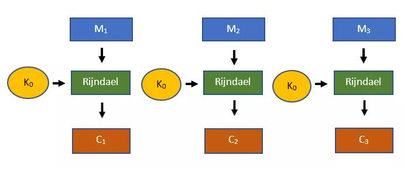

Každý 128bitový blok textu prochází v šifrovacím schématu Rijndael deseti koly. To vyžaduje samostatný kolo klíč pro každé kolo (K1 až K10). Tyto jsou vyrobeny pro každé kolo z původního 128bitového klíče K0 pomocí algoritmu rozšíření klíče. Tedy pro každý blok textu, který má být zašifrován, použijeme původní klíč K0 stejně jako deset samostatných kolo klíčů. Poznamenejme, že tyto stejné 11 klíčů je použito pro každý 128bitový blok otevřeného textu, který vyžaduje šifrování.

Algoritmus rozšíření klíče je dlouhý a složitý. Procházení tím má malé didaktické přínosy. Můžete si algoritmus rozšíření klíče prohlédnout sami, pokud chcete. Jakmile jsou kolo klíče vyrobeny, šifra Rijndael manipuluje s prvním 128bitovým blokem otevřeného textu, M1, jak je vidět na Obrázku 2. Nyní projdeme těmito kroky.

*Obrázek 2: Manipulace s M1 pomocí šifry Rijndael*

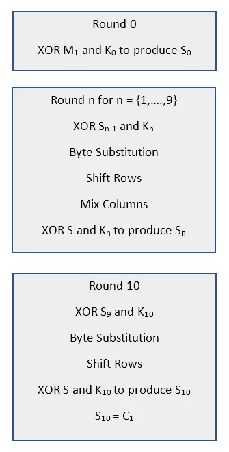

### Kolo 0

Kolo 0 šifry Rijndael je přímočaré. Pole S0 je vytvořeno operací XOR mezi 128bitovým otevřeným textem a soukromým klíčem. To znamená,

- S0 = M1 XOR K0
V prvním kole je pole S0 nejprve zkombinováno s klíčem kola K1 pomocí operace XOR. To vytvoří nový stav S.
Za druhé, je provedena operace substituce bajtů na aktuálním stavu S. Funguje tak, že vezme každý bajt z 16-bajtového pole S a nahradí ho bajtem z pole nazvaného **Rijndaelova S-box**. Každý bajt má unikátní transformaci a jako výsledek je vyprodukován nový stav S. Rijndaelův S-box je zobrazen na *Obrázku 3*.

*Obrázek 3: Rijndaelův S-Box*

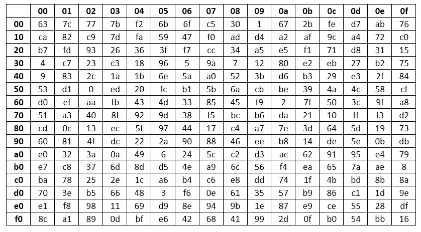

Tento S-Box je jedním z míst, kde se v šifře Rijndael uplatňuje abstraktní algebra, konkrétně Galoisovy pole.

Začneme definováním každého možného bajtového elementu 00 až FF jako 8-bitový vektor. Každý takový vektor je elementem Galoisova pole GF(28), kde ireducibilní polynom pro operaci modulo je x8 + x4 + x3 + x + 1. Galoisovo pole s těmito specifikacemi je také nazýváno Rijndaelovo konečné pole.

Dále, pro každý možný element v poli vytvoříme to, co se nazývá **Nybergův S-Box**. V tomto boxu je každý bajt zobrazen na svůj multiplikativní inverz (tj. tak, aby jejich součin byl roven 1). Poté zobrazíme tyto hodnoty z Nybergova S-boxu do Rijndaelova S-Boxu pomocí afinní transformace.

Třetí operace na poli S je operace posunu řádků. Bere stav S a vypíše všech šestnáct bajtů do matice. Naplnění matice začíná vlevo nahoře a pokračuje směrem dolů a poté, jakmile je sloupec naplněn, posune se o jeden sloupec doprava a nahoru.

Jakmile je matice S sestavena, čtyři řádky se posunou. První řádek zůstává stejný. Druhý řádek se posune o jeden doleva. Třetí se posune o dva doleva. Čtvrtý se posune o tři doleva. Příklad procesu je poskytnut na *Obrázku 4*. Původní stav S je zobrazen nahoře, výsledný stav po operaci posunu řádků je zobrazen níže.

*Obrázek 4: Operace posunu řádků*

Ve čtvrtém kroku se opět objevují Galoisova pole. Začneme tím, že každý sloupec matice S vynásobíme sloupcem 4 x 4 matice viděné na *Obrázku 5*. Ale místo běžného násobení matic jde o vektorové násobení modulo ireducibilní polynom, x8 + x4 + x3 + x + 1. Výsledné vektorové koeficienty reprezentují jednotlivé bity bajtu.

*Obrázek 5: Matice pro míchání sloupců*

Násobení prvního sloupce matice S s matice 4 x 4 výše vede k výsledku na *Obrázku 6*.
*Obrázek 6: Násobení prvního sloupce*
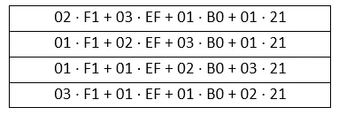

Jako další krok je nutné všechny členy v matici převést na polynomy. Například F1 reprezentuje 1 byte a stane se x7 + x6 + x5 + x4 + 1 a 03 reprezentuje 1 byte a stane se x + 1.

Všechny násobení se poté provádějí modulo x8 + x4 + x3 + x + 1. To vede k přičtení čtyř polynomů v každé ze čtyř buněk sloupce. Po provedení těchto sčítání modulo 2 získáte čtyři polynomy. Každý z těchto polynomů reprezentuje 8-bitový řetězec, nebo 1 byte, S. Tyto výpočty zde v matici na *Obrázku 6* nebudeme provádět, jelikož jsou rozsáhlé.

Jakmile byl první sloupec zpracován, ostatní tři sloupce matice S se zpracují stejným způsobem. Nakonec to vede k matici se šestnácti byty, která může být převedena na pole.

Jako poslední krok se pole S kombinuje znovu s klíčem kola pomocí operace XOR. To produkuje stav S1. To znamená,

- S1 = S XOR K0

### Kola 2 až 10

Kola 2 až 9 jsou pouze opakováním kola 1, *mutatis mutandis*. Poslední kolo vypadá velmi podobně jako předchozí kola, s výjimkou toho, že krok mixování sloupců je vynechán. To znamená, že kolo 10 je provedeno následovně:

- S9 XOR K10
- Substituce bytů
- Posun řádků
- S10 = S XOR K10

Stav S10 je nyní nastaven na C1, prvních 128 bitů šifrovaného textu. Pokračováním přes zbývající 128-bitové bloky otevřeného textu získáme celý šifrovaný text C.

### Operace šifry Rijndael

Jaké jsou důvody pro různé operace viděné u šifry Rijndael?

Bez vstupování do detailů jsou šifrovací schémata hodnocena na základě míry, do jaké vytvářejí zmatek a rozptýlení. Pokud má šifrovací schéma vysokou míru **zmatku**, znamená to, že šifrovaný text vypadá drasticky jinak než otevřený text. Pokud má šifrovací schéma vysokou míru **rozptýlení**, znamená to, že jakákoli malá změna v otevřeném textu produkuje drasticky odlišný šifrovaný text.

Důvodem pro operace za šifrou Rijndael je, že produkují vysokou míru zmatku a rozptýlení. Zmatek je produkován operací substituce bytů, zatímco rozptýlení je produkováno operacemi posunu řádků a mixování sloupců.

# Asymetrická kryptografie
<partId>868bd9dd-6e1c-5ea9-9ece-54affc13ba05</partId>

Stejně jako u symetrické kryptografie, asymetrická schémata mohou být použita k zajištění tajnosti a autentizace. Na rozdíl od toho však tato schémata využívají dvě klíče místo jednoho: soukromý a veřejný klíč.
Začínáme naše zkoumání s objevem asymetrické kryptografie, zejména s problémy, které ji podnítili. Dále diskutujeme, jak na vysoké úrovni fungují asymetrické schémata pro šifrování a autentizaci. Poté představíme hašovací funkce, které jsou klíčem k pochopení asymetrických autentizačních schémat a mají také význam v jiných kryptografických kontextech, jako jsou například hašovací kódy pro autentizaci zpráv, o kterých jsme diskutovali v kapitole 4.

## Problém distribuce a správy klíčů
<chapterId>1bb651ba-689a-5a89-a7d3-0b9cc3b694f7</chapterId>

Předpokládejme, že Bob chce koupit nový deštník od Jim’s Sporting Goods, online prodejce sportovního zboží s miliony zákazníků v Severní Americe. Bude to jeho první nákup od nich a chce použít svou kreditní kartu. Bob tedy nejprve musí vytvořit účet u Jim’s Sporting Goods, což vyžaduje poslání osobních údajů, jako je jeho adresa a informace o kreditní kartě. Poté může projít kroky potřebnými k nákupu deštníku.

Bob a Jim’s Sporting Goods budou chtít zajistit, aby jejich komunikace byla během tohoto procesu bezpečná, vzhledem k tomu, že Internet je otevřený komunikační systém. Budou chtít zajistit, například, aby žádný potenciální útočník nemohl zjistit Bobovy údaje o kreditní kartě a adrese a aby žádný potenciální útočník nemohl opakovat jeho nákupy nebo vytvářet falešné v jeho jménu.

Pokročilé schéma autentizovaného šifrování, o kterém jsme diskutovali v předchozí kapitole, by určitě mohlo zabezpečit komunikaci mezi Bobem a Jim’s Sporting Goods. Ale jsou zde jasně praktické překážky pro implementaci takového schématu.

Abychom ilustrovali tyto praktické překážky, představme si, že žijeme ve světě, ve kterém existují pouze nástroje symetrické kryptografie. Co by Jim’s Sporting Goods a Bob mohli poté udělat, aby zajistili bezpečnou komunikaci?

Za těchto okolností by čelili značným nákladům na bezpečnou komunikaci. Jelikož Internet je otevřený komunikační systém, nemohou si prostě vyměnit sadu klíčů přes něj. Proto by Bob a zástupce Jim’s Sporting Goods museli provést výměnu klíčů osobně.

Jednou z možností je, že Jim’s Sporting Goods vytvoří speciální místa pro výměnu klíčů, kde Bob a další noví zákazníci mohou získat sadu klíčů pro bezpečnou komunikaci. To by samozřejmě přineslo značné organizační náklady a výrazně by snížilo efektivitu, s jakou mohou noví zákazníci provádět nákupy.

Alternativně může Jim’s Sporting Goods poslat Bobovi pár klíčů prostřednictvím vysoce důvěryhodného kurýra. To je pravděpodobně efektivnější než organizování míst pro výměnu klíčů. Ale stále by to přineslo značné náklady, zejména pokud mnoho zákazníků provede pouze jeden nebo několik nákupů.

Dále, symetrické schéma pro autentizované šifrování také nutí Jim’s Sporting Goods uchovávat oddělené sady klíčů pro všechny jejich zákazníky. To by byla významná praktická výzva pro tisíce zákazníků, natož pro miliony.

Abychom pochopili tento poslední bod, představme si, že Jim’s Sporting Goods poskytuje každému zákazníkovi stejný pár klíčů. To by umožnilo každému zákazníkovi – nebo komukoli jinému, kdo by mohl tento pár klíčů získat – číst a dokonce manipulovat se všemi komunikacemi mezi Jim’s Sporting Goods a jejich zákazníky. Pak byste stejně dobře mohli v komunikaci vůbec nepoužívat kryptografii.

Opakování sady klíčů pro pouze některé zákazníky je hrozná bezpečnostní praxe. Jakýkoli potenciální útočník by se mohl pokusit využít této vlastnosti schématu (pamatujte, že se předpokládá, že útočníci vědí vše o schématu kromě klíčů, v souladu s Kerckhoffsův princip.)

Takže Jim’s Sporting Goods by musel uchovávat pár klíčů pro každého zákazníka, bez ohledu na to, jak jsou tyto páry klíčů distribuovány. To jasně představuje několik praktických problémů.

- Jim’s Sporting Goods by musel uchovávat miliony párů klíčů, jednu sadu pro každého zákazníka.
- Tyto klíče by musely být řádně zabezpečeny, jelikož by byly jistým cílem pro hackery. Jakékoli porušení bezpečnosti by vyžadovalo opakování nákladných výměn klíčů, buď na speciálních místech pro výměnu klíčů nebo kurýrem. - Každý zákazník Jim’s Sporting Goods by musel doma bezpečně uložit pár klíčů. Ztráty a krádeže by se staly, což by vyžadovalo opakování výměny klíčů. Zákazníci by také museli projít tímto procesem pro jakékoli další online obchody nebo jiné typy entit, se kterými chtějí komunikovat a provádět transakce přes internet.

Tyto dva hlavní problémy, které byly právě popsány, byly do konce 70. let velmi základními obavami. Byly známé jako **problém distribuce klíčů** a **problém správy klíčů**.

Tyto problémy samozřejmě vždy existovaly a často v minulosti způsobovaly bolesti hlavy. Například vojenské síly by musely neustále distribuovat knihy s klíči pro zabezpečenou komunikaci personálu v terénu za velkých rizik a nákladů. Ale tyto problémy se zhoršovaly, protože svět se stále více přesouval do éry dlouhovzdálené digitální komunikace, zejména pro nevládní subjekty.

Pokud by tyto problémy nebyly vyřešeny v 70. letech, efektivní a bezpečné nakupování v Jim’s Sporting Goods by pravděpodobně neexistovalo. Ve skutečnosti by většina našeho moderního světa s praktickým a bezpečným e-mailingem, online bankovnictvím a nakupováním pravděpodobně byla jen vzdálenou fantazií. Cokoli, co by i jen připomínalo Bitcoin, by vůbec nemohlo existovat.

Tak co se stalo v 70. letech? Jak je možné, že můžeme okamžitě provádět nákupy online a bezpečně procházet World Wide Web? Jak je možné, že můžeme okamžitě posílat Bitcoiny po celém světě z našich chytrých telefonů?

## Nové směry v kryptografii
<chapterId>7a9dd9a3-496e-5f9d-93e0-b5028a7dd0f1</chapterId>

V 70. letech problémy s distribucí a správou klíčů upoutaly pozornost skupiny amerických akademických kryptografů: Whitfielda Diffieho, Martina Hellmana a Ralpha Merkleho. Navzdory vážnému skepticismu většiny jejich kolegů se odhodlali najít řešení.

Alespoň jedním hlavním motivem jejich snažení byla předvídavost, že otevřená počítačová komunikace bude mít hluboký vliv na náš svět. Jak Diffie a Hellman poznamenávají v roce 1976,

> Rozvoj počítačem řízených komunikačních sítí slibuje snadný a levný kontakt mezi lidmi nebo počítači na opačných stranách světa, nahrazující většinu pošty a mnoho výletů telekomunikacemi. Pro mnoho aplikací musí být tyto kontakty zabezpečeny jak proti odposlechu, tak proti vkládání nelegitimních zpráv. V současné době však řešení bezpečnostních problémů zaostává daleko za jinými oblastmi komunikační technologie. *Současná kryptografie není schopna splnit požadavky, jelikož její použití by uživatelům systému uvalilo takové vážné nepříjemnosti, že by eliminovalo mnoho výhod teleprocesingu.*[1](#footnote1)

Vytrvalost Diffieho, Hellmana a Merkleho se vyplatila. První publikace jejich výsledků byla článek od Diffieho a Hellmana v roce 1976 s názvem „Nové směry v kryptografii.“ V něm představili dva originální způsoby, jak řešit problémy distribuce a správy klíčů.
Prvním řešením, které nabídli, byl protokol pro vzdálenou *výměnu klíčů*, tedy soubor pravidel pro výměnu jednoho nebo více symetrických klíčů přes nezabezpečený komunikační kanál. Tento protokol je nyní známý jako *Diffie-Hellmanova výměna klíčů* nebo *Diffie-Hellman-Merklova výměna klíčů*.[2](#footnote2)
Při Diffie-Hellmanově výměně klíčů nejprve dvě strany veřejně vymění nějaké informace přes nezabezpečený kanál, jako je internet. Na základě těchto informací poté nezávisle vytvoří symetrický klíč (nebo pár symetrických klíčů) pro zabezpečenou komunikaci. Ačkoli obě strany vytvářejí své klíče nezávisle, veřejně sdílené informace zajišťují, že tento proces tvorby klíčů přinese pro obě stejný výsledek.

Důležité je, že ačkoli může každý pozorovat informace, které jsou veřejně vyměňovány stranami přes nezabezpečený kanál, pouze dvě strany zapojené do výměny informací mohou z nich vytvořit symetrické klíče.

To samozřejmě zní naprosto protiintuitivně. Jak mohou dvě strany veřejně vyměňovat nějaké informace, které jim umožní vytvořit pouze z nich symetrické klíče? Proč by kdokoli jiný, kdo pozoruje výměnu informací, nemohl vytvořit stejné klíče?

Spoléhá se to samozřejmě na nějakou krásnou matematiku. Diffie-Hellmanova výměna klíčů funguje prostřednictvím jednosměrné funkce s pastí. Pojďme diskutovat význam těchto dvou termínů postupně.

Předpokládejme, že máte nějakou funkci f(x) a výsledek f(a) = y, kde a je konkrétní hodnota pro x. Říkáme, že f(x) je **jednosměrná funkce**, pokud je snadné vypočítat hodnotu y, když známe a a f(x), ale je výpočetně neuskutečnitelné vypočítat hodnotu a, když známe y a f(x). Název jednosměrná funkce, samozřejmě, pramení z faktu, že taková funkce je praktická k výpočtu pouze v jednom směru.

Některé jednosměrné funkce mají to, co se nazývá past. Zatímco je prakticky nemožné vypočítat a pouze z y a f(x), existuje určitý kus informace Z, který činí výpočet a z y výpočetně proveditelným. Tento kus informace Z je známý jako **past**. Jednosměrné funkce, které mají past, se nazývají **funkce s pastí**.

Do podrobností Diffie-Hellmanovy výměny klíčů se zde nebudeme pouštět. Ale v podstatě každý účastník vytvoří nějaké informace, z nichž část je veřejně sdílena a některé zůstávají tajné. Každá strana poté vezme svůj tajný kus informace a veřejně sdílené informace druhou stranou k vytvoření soukromého klíče. A poněkud zázračně, obě strany skončí se stejným soukromým klíčem.

Každá strana, která pozoruje pouze veřejně sdílené informace mezi dvěma stranami v Diffie-Hellmanově výměně klíčů, nemůže tyto výpočty replikovat. Potřebovali by soukromé informace od jedné ze dvou stran, aby to bylo možné.

Ačkoli základní verze Diffie-Hellmanovy výměny klíčů prezentovaná v roce 1976 není velmi bezpečná, sofistikovanější verze základního protokolu jsou dnes určitě stále používány. Nejdůležitější je, že každý protokol výměny klíčů v nejnovější verzi protokolu zabezpečení transportní vrstvy (verze 1.3) je v podstatě obohacenou verzí protokolu prezentovaného Diffiem a Hellmanem v roce 1976. Protokol zabezpečení transportní vrstvy je převažující protokol pro bezpečnou výměnu informací formátovaných podle protokolu přenosu hypertextu (http), standardu pro výměnu webového obsahu.
Důležité je, že výměna klíčů Diffie-Hellman není asymetrickým schématem. Přesněji řečeno, patří spíše do oblasti symetrické kryptografie. Nicméně, jelikož jak výměna klíčů Diffie-Hellman, tak asymetrická kryptografie spoléhají na jednosměrné číselně-teoretické funkce s pastmi (trapdoors), jsou obvykle diskutovány společně.
Druhý způsob, který Diffie a Hellman nabídli pro řešení problému distribuce a správy klíčů ve svém článku z roku 1976, byl, samozřejmě, prostřednictvím asymetrické kryptografie.

Na rozdíl od jejich prezentace výměny klíčů Diffie-Hellman, poskytli pouze obecné kontury, jak by mohly být asymetrické kryptografické schématy pravděpodobně konstruovány. Neposkytli žádnou konkrétní jednosměrnou funkci, která by mohla specificky splnit podmínky potřebné pro rozumnou bezpečnost v takových schématech.

Praktická implementace asymetrického schématu byla však nalezena o rok později třemi různými akademickými kryptografy a matematiky: Ronaldem Rivestem, Adi Shamirem a Leonardem Adlemanem.[3](#footnote3) Kryptosystém, který představili, se stal známým jako **RSA kryptosystém** (podle jejich příjmení).

Pastové funkce používané v asymetrické kryptografii (a výměně klíčů Diffie-Hellman) jsou všechny spojeny se dvěma hlavními **výpočetně náročnými problémy**: faktorizací prvočísel a výpočtem diskrétních logaritmů.

**Faktorizace prvočísel** vyžaduje, jak název napovídá, rozklad celého čísla na jeho prvočinitele. Problém RSA je zdaleka nejznámějším příkladem kryptosystému souvisejícího s faktorizací prvočísel.

**Problém diskrétního logaritmu** je problém, který se vyskytuje v cyklických skupinách. Při daném generátoru v konkrétní cyklické skupině vyžaduje výpočet unikátního exponentu potřebného k vyprodukování jiného prvku ve skupině z generátoru.

Schémata založená na diskrétním logaritmu spoléhají na dva hlavní typy cyklických skupin: multiplikativní skupiny celých čísel a skupiny, které zahrnují body na eliptických křivkách. Původní výměna klíčů Diffie-Hellman, jak byla prezentována v "New Directions in Cryptography", pracuje s cyklickou multiplikativní skupinou celých čísel. Digitální podpisový algoritmus Bitcoinu a nedávno představené schéma podpisu Schnorr (2021) jsou oba založeny na problému diskrétního logaritmu pro konkrétní skupinu cyklických eliptických křivek.

Dále se obrátíme na vysokoúrovňový přehled tajnosti a autentizace v asymetrickém nastavení. Předtím však musíme učinit krátkou historickou poznámku.

Nyní se zdá pravděpodobné, že skupina britských kryptografů a matematiků pracujících pro Government Communications Headquarters (GCHQ) učinila výše zmíněné objevy několik let dříve nezávisle na sobě. Tuto skupinu tvořili James Ellis, Clifford Cocks a Malcolm Williamson.

Podle jejich vlastních výpovědí a výpovědí GCHQ byl James Ellis ten, kdo poprvé vymyslel koncept veřejného klíče v roce 1969. Údajně poté Clifford Cocks objevil kryptografický systém RSA v roce 1973 a Malcolm Williamson koncept výměny klíčů Diffie-Hellman v roce 1974.[4](#footnote4) Jejich objevy však údajně nebyly odhaleny až do roku 1997, vzhledem k tajné povaze práce prováděné v GCHQ.

## Asymetrické šifrování a autentizace
<chapterId>2f6f0f03-3c3d-5025-90f0-5211139bc0cc</chapterId>

Přehled asymetrického šifrování s pomocí Boba a Alice je poskytnut na *Obrázku 1*.
Alice nejprve vytvoří pár klíčů, skládající se z jednoho veřejného klíče (KP) a jednoho soukromého klíče (KS), kde „P“ v KP znamená „public“ (veřejný) a „S“ v KS znamená „secret“ (tajný). Poté tento veřejný klíč volně distribuuje ostatním. K podrobnostem tohoto distribučního procesu se vrátíme o něco později. Ale prozatím předpokládejme, že kdokoli, včetně Boba, může bezpečně získat Alicin veřejný klíč KP.
V pozdějším okamžiku chce Bob napsat Alici zprávu M. Jelikož však obsahuje citlivé informace, chce, aby obsah zůstal tajný pro všechny kromě Alice. Bob tedy nejprve zašifruje svou zprávu M pomocí KP. Poté pošle výsledný šifrovaný text C Alici, která C dešifruje pomocí KS, čímž získá původní zprávu M.

*Obrázek 1: Asymetrické šifrování*

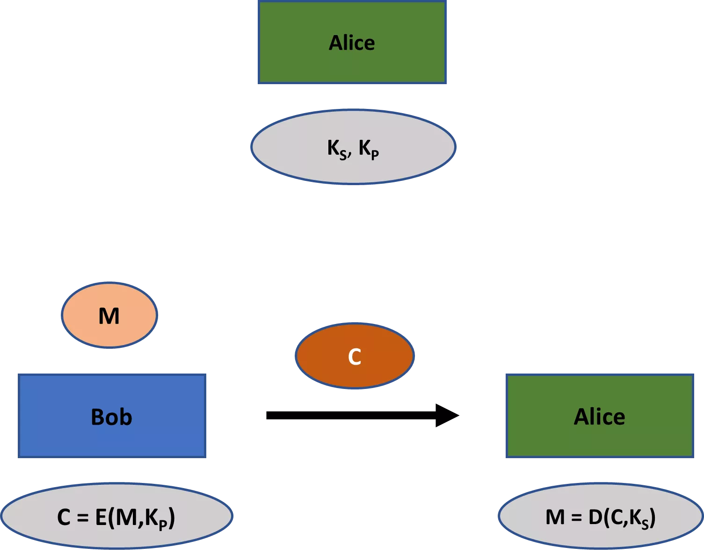

Jakýkoli protivník, který odposlouchává komunikaci mezi Bobem a Alicí, může pozorovat C. Také zná KP a šifrovací algoritmus E(·). Důležité však je, že tyto informace útočníkovi neumožňují proveditelně dešifrovat šifrovaný text C. K dešifrování je specificky vyžadován KS, který útočník nevlastní.

Symetrické šifrovací schéma obecně musí být bezpečné proti útočníkovi, který může platně šifrovat otevřené texty (bezpečnost známá jako odolnost vůči útoku s vybraným šifrovaným textem). Není však navrženo s výslovným účelem umožnit vytváření takových platných šifrovaných textů útočníkem nebo kdokoli jiným.

To je v příkrém kontrastu k asymetrickému šifrovacímu schématu, jehož celý účel je umožnit komukoli, včetně útočníků, vytvářet platné šifrované texty. Asymetrická šifrovací schémata lze tedy označit jako **šifry s více přístupy**.

Pro lepší pochopení toho, co se děje, si představte, že místo posílání zprávy elektronicky by Bob chtěl poslat Alici fyzický dopis v tajnosti. Jedním ze způsobů, jak zajistit tajnost, by bylo, kdyby Alice poslala Bobovi bezpečný zámek, ale klíč si ponechala. Po napsání dopisu by Bob mohl dopis vložit do krabice a zavřít ji Aliciným zámkem. Poté by mohl poslat zamčenou krabici s dopisem Alici, která má klíč k odemčení.

I když Bob může zámek zamknout, ani on ani žádná jiná osoba, která krabici zachytí, nemůže zámek odemknout, pokud je opravdu bezpečný. Pouze Alice ho může odemknout a vidět obsah Bobova dopisu, protože má klíč.

Asymetrické šifrovací schéma je, hrubě řečeno, digitální verzí tohoto procesu. Zámek se podobá veřejnému klíči a klíč od zámku soukromému klíči. Jelikož je zámek digitální, je pro Alici mnohem snazší a ne tak nákladné distribuovat ho komukoli, kdo by jí chtěl posílat tajné zprávy.

Pro autentizaci v asymetrickém nastavení používáme **digitální podpisy**. Ty mají tedy stejnou funkci jako kódy pro autentizaci zpráv v symetrickém nastavení. Přehled digitálních podpisů je poskytnut v *Obrázku 2*.
Bob nejprve vytvoří pár klíčů, skládající se z veřejného klíče (KP) a soukromého klíče (KS), a distribuuje svůj veřejný klíč. Když chce poslat ověřenou zprávu Alici, nejprve vezme svou zprávu M a svůj soukromý klíč, aby vytvořil digitální podpis D. Bob poté pošle Alici svou zprávu společně s digitálním podpisem. Alice vloží zprávu, veřejný klíč a digitální podpis do algoritmu pro ověření. Tento algoritmus produkuje buď true pro platný podpis, nebo false pro neplatný podpis.
Digitální podpis je, jak název jasně napovídá, digitální ekvivalent psaného podpisu na dopisech, smlouvách a tak dále. Ve skutečnosti je digitální podpis obvykle mnohem bezpečnější. S nějakým úsilím můžete falšovat psaný podpis; proces usnadněný tím, že psané podpisy nejsou často pečlivě ověřovány. Bezpečný digitální podpis je však, stejně jako bezpečný kód pro ověření zpráv, **existenčně nezfalšovatelný**: to znamená, že s bezpečným schématem digitálního podpisu nikdo nemůže uskutečnitelně vytvořit podpis pro zprávu, která projde procedurou ověření, pokud nemá soukromý klíč.

*Obrázek 2: Asymetrické ověřování*

Stejně jako u asymetrického šifrování vidíme zajímavý kontrast mezi digitálními podpisy a kódy pro ověření zpráv. U posledně jmenovaných může algoritmus pro ověření použít pouze jedna ze stran zasvěcených do bezpečné komunikace. To je proto, že vyžaduje soukromý klíč. V asymetrickém nastavení však může digitální podpis S vytvořený Bobem ověřit kdokoli.

To vše dělá digitální podpisy mimořádně mocným nástrojem. Tvoří například základ pro vytváření podpisů na smlouvách, které lze ověřit pro právní účely. Pokud by Bob výše uvedené vytvořil podpis na smlouvě, Alice může ukázat zprávu M, smlouvu a podpis S soudu. Soud poté může ověřit podpis pomocí Bobova veřejného klíče.[5](#footnote5)

Jako další příklad, digitální podpisy jsou důležitým aspektem zabezpečení softwaru a distribuce aktualizací softwaru. Tento typ veřejné ověřitelnosti by nikdy nebylo možné vytvořit pouze pomocí kódů pro ověření zpráv.

Jako poslední příklad síly digitálních podpisů vezměme Bitcoin. Jedním z nejčastějších nedorozumění o Bitcoinu, zejména v médiích, je, že transakce jsou šifrovány: nejsou. Místo toho Bitcoinové transakce pracují s digitálními podpisy pro zajištění bezpečnosti.

Bitcoiny existují v dávkách nazývaných nevyužité výstupní transakce (nebo UTXO). Předpokládejme, že na konkrétní Bitcoinové adrese obdržíte tři platby po 2 bitcoinech každá. Technicky na této adrese nyní nemáte 6 bitcoinů. Místo toho máte tři dávky po 2 bitcoinech, které jsou zamčeny kryptografickým problémem spojeným s touto adresou. Pro jakoukoli platbu, kterou provedete, můžete použít jednu, dvě nebo všechny tři tyto dávky, v závislosti na tom, kolik potřebujete pro transakci.

Důkaz vlastnictví nad nevyužitými výstupními transakcemi je obvykle ukázán prostřednictvím jednoho nebo více digitálních podpisů. Bitcoin funguje přesně proto, že platné digitální podpisy na nevyužitých výstupních transakcích jsou výpočetně nerealizovatelné, pokud nevlastníte tajné informace potřebné k jejich vytvoření.
V současné době transakce Bitcoinu transparentně zahrnují veškeré informace, které je potřeba ověřit účastníky sítě, jako jsou původy nepoužitých výstupů transakcí použitých v transakci. Ačkoliv je možné některé z těchto informací skrýt a stále umožnit ověření (jak to dělají některé alternativní kryptoměny jako Monero), vytváří to také specifická bezpečnostní rizika.
Někdy dochází k záměně mezi digitálními podpisy a písemnými podpisy digitalizovanými. V posledně jmenovaném případě zachytíte obraz svého písemného podpisu a vložíte ho do elektronického dokumentu, jako je pracovní smlouva. To však v kryptografickém smyslu není digitální podpis. Ten druhý je jen dlouhé číslo, které lze vyprodukovat pouze vlastnictvím soukromého klíče.

Stejně jako v případě symetrického klíče, můžete také používat asymetrické šifrování a autentizační schémata společně. Platí podobné zásady. Především byste měli používat různé páry soukromých veřejných klíčů pro šifrování a vytváření digitálních podpisů. Kromě toho byste měli nejprve zprávu zašifrovat a poté ji autentizovat.

Důležité je, že v mnoha aplikacích se asymetrická kryptografie nepoužívá po celý komunikační proces. Místo toho se obvykle používá pouze pro *výměnu symetrických klíčů* mezi stranami, které budou skutečně komunikovat.

To je případ, například, když nakupujete zboží online. Znáte-li veřejný klíč prodejce, může vám poslat digitálně podepsané zprávy, které můžete ověřit pro jejich autentičnost. Na tomto základě můžete následovat jeden z několika protokolů pro výměnu symetrických klíčů pro bezpečnou komunikaci.

Hlavním důvodem četnosti výše uvedeného přístupu je, že asymetrická kryptografie je mnohem méně efektivní než symetrická kryptografie při vytváření určité úrovně bezpečnosti. To je jeden z důvodů, proč stále potřebujeme symetrickou kryptografii vedle veřejné kryptografie. Kromě toho je symetrická kryptografie mnohem přirozenější v konkrétních aplikacích, jako je šifrování vlastních dat uživatelem počítače.

Tak jak přesně digitální podpisy a šifrování veřejným klíčem řeší problémy s distribucí a správou klíčů?

Zde není jedna odpověď. Asymetrická kryptografie je nástroj a neexistuje jediný způsob, jak tento nástroj použít. Ale pojďme vzít naše dřívější příklad od Jim’s Sporting Goods, abychom ukázali, jak by se tyto problémy obvykle řešily v tomto příkladu.

Začneme tím, že Jim’s Sporting Goods by pravděpodobně oslovilo **certifikační autoritu**, organizaci, která podporuje distribuci veřejných klíčů. Certifikační autorita by zaregistrovala některé údaje o Jim’s Sporting Goods a udělila mu veřejný klíč. Poté by Jim’s Sporting Goods poslala certifikát, známý jako **TLS/SSL certifikát**, s veřejným klíčem Jim’s Sporting Goods digitálně podepsaným pomocí vlastního veřejného klíče certifikační autority. Tímto způsobem certifikační autorita potvrzuje, že určitý veřejný klíč skutečně patří Jim’s Sporting Goods.

Klíčem k pochopení tohoto procesu s TLS/SSL certifikáty je, že i když obecně nebudete mít veřejný klíč Jim’s Sporting Goods uložený kdekoli ve vašem počítači, veřejné klíče uznávaných certifikačních autorit jsou skutečně uloženy ve vašem prohlížeči nebo v operačním systému. Tyto jsou uloženy v tom, co se nazývá **kořenové certifikáty**.

Takže, když vám Jim’s Sporting Goods poskytne svůj TLS/SSL certifikát, můžete ověřit digitální podpis certifikační autority prostřednictvím kořenového certifikátu ve vašem prohlížeči nebo operačním systému. Pokud je podpis platný, můžete být poměrně jisti, že veřejný klíč na certifikátu skutečně patří Jim’s Sporting Goods. Na tomto základě je snadné nastavit protokol pro bezpečnou komunikaci s Jim’s Sporting Goods.
Distribuce klíčů se pro Jim’s Sporting Goods nyní stala mnohem jednodušší. Není těžké vidět, že i správa klíčů se výrazně zjednodušila. Místo nutnosti uchovávat tisíce klíčů, Jim’s Sporting Goods potřebuje uchovávat pouze soukromý klíč, který mu umožňuje vytvářet podpisy pro veřejný klíč na jeho SSL certifikátu. Pokaždé, když zákazník přijde na stránky Jim’s Sporting Goods, mohou z tohoto veřejného klíče zahájit bezpečnou komunikační relaci. Zákazníci také nemusí uchovávat žádné informace (kromě veřejných klíčů uznávaných certifikačních autorit ve svém operačním systému a prohlížeči).

## Hashovací funkce
<chapterId>ea8327ab-b0e3-5635-941c-4b51f396a648</chapterId>

Hashovací funkce jsou všudypřítomné v kryptografii. Nejsou ani symetrické, ani asymetrické schéma, ale spadají do vlastní kryptografické kategorie.

Už jsme se setkali s hashovacími funkcemi v kapitole 4 při vytváření zpráv založených na hashi pro autentizaci. Jsou také důležité v kontextu digitálních podpisů, ačkoliv z mírně odlišného důvodu: Digitální podpisy jsou obvykle vytvářeny nad hash hodnotou nějaké (zašifrované) zprávy, spíše než nad samotnou (zašifrovanou) zprávou. V této sekci nabídnu podrobnější úvod do hashovacích funkcí.

Začněme s definicí hashovací funkce. **Hashovací funkce** je jakákoli efektivně vypočitatelná funkce, která přijímá vstupy libovolné velikosti a vrací výstupy pevné délky.

**Kryptografická hashovací funkce** je prostě hashovací funkce, která je užitečná pro aplikace v kryptografii. Výstup kryptografické hashovací funkce se obvykle nazývá **hash**, **hash-hodnota**, nebo **digest zprávy**.

V kontextu kryptografie se termínem „hashovací funkce“ obvykle myslí kryptografická hashovací funkce. Tuto praxi budu odteď dodržovat.

Příkladem populární hashovací funkce je **SHA-256** (secure hash algorithm 256). Bez ohledu na velikost vstupu (např. 15 bitů, 100 bitů nebo 10 000 bitů) tato funkce vrací 256bitovou hash hodnotu. Níže můžete vidět několik příkladů výstupů funkce SHA-256.

* „Hello“: 185f8db32271fe25f561a6fc938b2e264306ec304eda518007d1764826381969
* „52398“: a3b14d2bf378c1bd47e7f8eaec63b445150a3d7a80465af16dd9fd319454ba90
* „Kryptografie je zábava“: 3cee2a5c7d2cc1d62db4893564c34ae553cc88623992d994e114e344359b146c

Všechny výstupy jsou přesně 256 bitů zapsané v hexadecimálním formátu (každá hexadecimální číslice může být reprezentována čtyřmi binárními číslicemi). Takže i kdybyste do funkce SHA-256 vložili knihu *Pán prstenů* od Tolkiena, výstup by byl stále 256 bitů.

Hashovací funkce jako SHA-256 se používají k různým účelům v kryptografii. Jaké vlastnosti jsou od hashovací funkce vyžadovány, opravdu závisí na kontextu konkrétní aplikace. Existují dvě hlavní vlastnosti, které jsou obecně požadovány od hashovacích funkcí v kryptografii:[6](#footnote6)

1.	Odolnost proti kolizím
2.	Skrývání
Odolné hašovací funkce proti kolizím jsou důležité, například při ověřování softwaru. Představte si, že byste chtěli stáhnout Windows verzi Bitcoin Core 0.21.0 (serverovou aplikaci pro zpracování síťového provozu Bitcoinu). Hlavní kroky, které byste museli provést, aby jste ověřili legitimitu softwaru, jsou následující:
1. Nejprve musíte stáhnout a importovat veřejné klíče jednoho nebo více přispěvatelů Bitcoin Core do softwaru, který dokáže ověřit digitální podpisy (např. Kleopetra). Tyto veřejné klíče můžete najít [zde](https://github.com/bitcoin/bitcoin/blob/master/contrib/builder-keys/keys.txt). Doporučuje se ověřit software Bitcoin Core s veřejnými klíči od více přispěvatelů.
2. Dále musíte ověřit veřejné klíče, které jste importovali. Alespoň jeden krok, který byste měli provést, je ověřit, že veřejné klíče, které jste našli, jsou stejné jako ty, které jsou publikovány na různých místech. Můžete například konzultovat osobní webové stránky, Twitterové stránky nebo Githubové stránky lidí, jejichž veřejné klíče jste importovali. Obvykle se toto porovnání veřejných klíčů provádí porovnáním krátkého haše veřejného klíče známého jako otisk.
3. Dále musíte stáhnout spustitelný soubor pro Bitcoin Core z jejich [webové stránky](www.bitcoincore.org). Budou k dispozici balíčky pro operační systémy Linux, Windows a MAC.
4. Dále musíte najít dva soubory s vydáním. První obsahuje oficiální SHA-256 hash pro stažený spustitelný soubor spolu s hashy pro všechny ostatní vydané balíčky. Další soubor s vydáním bude obsahovat podpisy různých přispěvatelů nad souborem s vydáním s hashy balíčků. Obě tyto soubory s vydáním by měly být umístěny na webových stránkách Bitcoin Core.
5. Dále byste museli na svém počítači vypočítat SHA-256 hash spustitelného souboru, který jste stáhli z webových stránek Bitcoin Core. Poté tento výsledek porovnáte s oficiálním hashem balíčku pro spustitelný soubor. Měly by být stejné.
6. Nakonec byste museli ověřit, že jeden nebo více digitálních podpisů nad souborem s vydáním s oficiálními hashi balíčků skutečně odpovídá jednomu nebo více veřejným klíčům, které jste importovali (vydání Bitcoin Core nejsou vždy podepsána všemi). To můžete udělat s aplikací jako Kleopetra.

Tento proces ověřování softwaru má dvě hlavní výhody. Za prvé, zajistí, že při stahování z webových stránek Bitcoin Core nedošlo k žádným chybám v přenosu. Za druhé, zajistí, že vás žádný útočník nemohl přimět stáhnout si upravený, škodlivý kód, buď hacknutím webových stránek Bitcoin Core nebo zachycením provozu.

Jak přesně proces ověřování softwaru uvedený výše chrání proti těmto problémům?

Pokud jste pečlivě ověřili veřejné klíče, které jste importovali, pak můžete být poměrně jisti, že tyto klíče jsou skutečně jejich a nebyly kompromitovány. Vzhledem k tomu, že digitální podpisy mají existenciální nezfalšovatelnost, víte, že pouze tito přispěvatelé mohli vytvořit digitální podpis nad oficiálními hashi balíčků na souboru s vydáním.

Předpokládejme, že podpisy na staženém souboru s vydáním jsou v pořádku. Nyní můžete porovnat hodnotu hashe, kterou jste vypočítali lokálně pro spustitelný soubor Windows, který jste stáhli, s tou, která je zahrnuta v řádně podepsaném souboru s vydáním. Jak víte, hašovací funkce SHA-256 je odolná proti kolizím, shoda znamená, že váš spustitelný soubor je přesně stejný jako oficiální spustitelný soubor.

Nyní se podívejme na druhou běžnou vlastnost hašovacích funkcí: skrývání. Jakákoli hašovací funkce H se považuje za mající vlastnost skrývání, pokud pro libovolně vybrané x z velmi velkého rozsahu je nepraktické najít x, když je dáno pouze H(x).
Níže můžete vidět výstup SHA-256 zprávy, kterou jsem napsal. Abych zajistil dostatečnou náhodnost, zpráva na konci obsahovala náhodně generovaný řetězec znaků. Vzhledem k tomu, že SHA-256 má vlastnost skrývání, nikdo by tuto zprávu nemohl rozluštit.
* b194221b37fa4cd1cfce15aaef90351d70de17a98ee6225088b523b586c32ded

Ale nechci vás nechat v napětí, dokud SHA-256 neoslabí. Původní zpráva, kterou jsem napsal, byla následující:

* “Toto je velmi náhodná zpráva, nebo spíše tak nějak náhodná. Tato úvodní část není, ale skončím s několika relativně náhodnými znaky, abych zajistil velmi nepředvídatelnou zprávu. XLWz4dVG3BxUWm7zQ9qS”.

Běžným způsobem, jakým se hashovací funkce s vlastností skrývání používají, je správa hesel (také je důležitá odolnost proti kolizím). Jakákoli slušná online služba založená na účtech, jako je Facebook nebo Google, nebude přímo ukládat vaše hesla pro správu přístupu k vašemu účtu. Místo toho budou ukládat pouze hash tohoto hesla. Pokaždé, když na prohlížeči zadáte své heslo, je nejprve vypočítán hash. Pouze tento hash je odeslán na server poskytovatele služby a porovnán s hashem uloženým v databázi na serveru. Vlastnost skrývání může pomoci zajistit, že útočníci jej z hodnoty hash nedokážou získat.

Správa hesel pomocí hashů samozřejmě funguje pouze v případě, že uživatelé skutečně zvolí obtížná hesla. Vlastnost skrývání předpokládá, že x je náhodně vybráno z velmi velkého rozsahu. Výběr hesel jako „1234“, „mypassword“ nebo datum vašich narozenin neposkytne žádnou skutečnou bezpečnost. Existují dlouhé seznamy běžných hesel a jejich hashů, které mohou útočníci využít, pokud kdy získají hash vašeho hesla. Tyto typy útoků jsou známé jako **útoky slovníkové**. Pokud útočníci znají některé vaše osobní údaje, mohou také pokusit o informované odhady. Proto vždy potřebujete dlouhá, bezpečná hesla (ideálně dlouhé, náhodné řetězce z generátoru hesel).

Někdy může aplikace potřebovat hashovací funkci, která má jak odolnost proti kolizím, tak skrývání. Ale určitě ne vždy. Proces ověřování softwaru, o kterém jsme diskutovali, například vyžaduje pouze, aby hashovací funkce prokázala odolnost proti kolizím, skrývání není důležité.

Ačkoli jsou odolnost proti kolizím a skrývání hlavními vlastnostmi hledanými u hashovacích funkcí v kryptografii, v určitých aplikacích mohou být žádoucí i jiné typy vlastností.

### Poznámky
[^1]: Whitfield Diffie a Martin Hellman, “New directions in cryptography,” *IEEE Transactions on Information Theory* IT-22 (1976), str. 644–654, na str. 644 [^1].

[^2]: Ralph Merkle také diskutuje protokol výměny klíčů v “Secure communications over insecure channels”, *Communications of the Association for Computing Machinery*, 21 (1978), 294–99. Ačkoli Merkle předložil tento článek před článkem od Diffieho a Hellmana, byl publikován později. Merklovo řešení není exponenciálně bezpečné, na rozdíl od Diffie-Hellmanova [^2].

[^3]: Ron Rivest, Adi Shamir a Leonard Adleman, “A method for obtaining digital signatures and public-key cryptosystems”, *Communications of the Association for Computing Machinery*, 21 (1978), str. 120–26 [^3].

[^4]: Dobrý přehled těchto objevů poskytuje Simon Singh, *The Code Book*, Fourth Estate (Londýn, 1999), Kapitola 6 [^4].
[^5]: Jakékoli schémy, které se snaží dosáhnout nezpochybnitelnosti, další téma, o kterém jsme diskutovali v *Kapitole 1*, budou v základu potřebovat zapojení digitálních podpisů [^5].
[^6]: Terminologie "skrývání" není běžný jazyk, ale je převzata konkrétně od Arvinda Narayanana, Josepha Bonneau, Edwarda Feltena, Andrew Millera a Stevena Goldfedera, *Bitcoin a technologie kryptoměn*, Princeton University Press (Princeton, 2016), Kapitola 1 [^6].

# Kryptosystém RSA
<partId>864dca42-2a8d-530f-bb94-2e1f68b3f411</partId>

Zatímco symetrická kryptografie je obvykle pro většinu lidí poměrně intuitivní, obvykle to tak u asymetrické kryptografie není. I když jste pravděpodobně obeznámeni s vysokou úrovní popisu nabízeného v předchozích sekcích, možná se divíte, co přesně jsou jednosměrné funkce a jak přesně se používají k vytváření asymetrických schémat.

V této kapitole odhalím některá tajemství asymetrické kryptografie tím, že se podívám podrobněji na konkrétní příklad, a to na kryptosystém RSA. V první sekci představím problém faktorizace, na kterém je založen problém RSA. Poté se budu věnovat několika klíčovým výsledkům z teorie čísel. V poslední sekci tyto informace spojíme, abychom vysvětlili problém RSA a jak lze tento použít pro vytváření asymetrických kryptografických schémat.

Přidání této hloubky do naší diskuse není snadný úkol. Vyžaduje to představení celé řady teorémů a tvrzení z teorie čísel. Ale nenechte se matematikou odradit. Propracování této diskuse výrazně zlepší vaše porozumění tomu, co leží v základu asymetrické kryptografie, a je to investice, která stojí za to.

Pojďme se nyní nejprve obrátit k problému faktorizace.

## Problém faktorizace
<chapterId>a31a66e4-52ea-539c-9953-4769ad565d7e</chapterId>

Kdykoli vynásobíte dvě čísla, řekněme a a b, označujeme čísla a a b jako **faktory** a výsledek jako **součin**. Pokus o zápis čísla N jako násobení dvou nebo více faktorů se nazývá **faktorizace**.[1](#footnote1) Jakýkoli problém, který to vyžaduje, můžete nazvat **problémem faktorizace**.

Přibližně před 2 500 lety objevil řecký matematik Eukleides z Alexandrie klíčový teorém o faktorizaci celých čísel. Běžně se nazývá **teorém o jedinečné faktorizaci** a říká následující:

*Teorém 1*. Každé celé číslo N, které je větší než 1, je buď prvočíslo, nebo lze vyjádřit jako součin prvočíselných faktorů.

Všechna pozdější část tohoto tvrzení znamená, že můžete vzít jakékoli neceločíselné celé číslo N větší než 1 a zapsat ho jako násobení prvočísel. Níže jsou uvedeny několik příkladů neceločíselných celých čísel zapsaných jako součin prvočíselných faktorů.

* 18 = 2 • 3 • 3 = 2 • 32
* 84 = 2 • 2 • 3 • 7 = 22 • 3 • 7
* 144 = 2 • 2 • 2 • 2 • 3 • 3 = 24 • 32
Pro všechny tři celé čísla uvedené výše je výpočet jejich prvočíselných faktorů relativně snadný, i když máte k dispozici pouze N. Začnete nejmenším prvočíslem, tedy 2, a zjistíte, kolikrát je celé číslo N dělitelné dvěma. Poté přejdete na testování dělitelnosti N třemi, pěti, sedmi atd. Tento proces pokračujete, dokud není vaše celé číslo N zapsáno jako součin pouze prvočísel.
Vezměme například celé číslo 84. Níže můžete vidět proces určování jeho prvočíselných faktorů. Na každém kroku odebereme nejmenší zbývající prvočíselný faktor (vlevo) a určíme zbytek k faktorizaci. Pokračujeme, dokud není zbytek také prvočíslem. Na každém kroku je aktuální faktorizace 84 zobrazena na daleké pravé straně.

* Prvočíselný faktor = 2: zbytek = 42 	(84 = 2 • 42)
* Prvočíselný faktor = 2: zbytek = 21 	(84 = 2 • 2 • 21)
* Prvočíselný faktor = 3: zbytek = 7 		(84 = 2 • 2 • 3 • 7)
* Jelikož 7 je prvočíslo, výsledek je 2 • 2 • 3 • 7, nebo 22 • 3 • 7.

Předpokládejme nyní, že N je velmi velké. Jak obtížné by bylo rozložit N na jeho prvočíselné faktory?

To opravdu závisí na N. Předpokládejme například, že N je 50,450,400. I když toto číslo vypadá zastrašující, výpočty nejsou tak složité a dají se snadno provést ručně. Stejně jako výše, začnete s dvojkou a pokračujete dál. Níže můžete vidět výsledek tohoto procesu podobným způsobem jako výše.

* 2: 25,225,200 	(50,450,400 = 2 • 25,225,200)  
* 2: 12,612,600 	(50,450,400 = 22 • 12,612,600)  
* 2: 6,306,300 		(50,450,400 = 23 • 6,306,300)  
* 2: 3,153,150 		(50,450,400 = 24 • 3,153,150)  
* 2: 1,576,575 		(50,450,400 = 25 • 1,576,575)  
* 3: 525,525 		(50,450,400 = 25 • 3 • 525,525)
* 3: 175,175 		(50,450,400 = 25 • 32 • 175,175)
* 5: 35,035 		(50,450,400 = 25 • 32 • 5 • 35,035)
* 5: 7,007		    (50,450,400 = 25 • 32 • 52 • 7,007)
* 7: 1,001 (50,450,400 = 25 • 32 • 52 • 7 • 1,001) * 7: 143 (50,450,400 = 25 • 32 • 52 • 72 • 143)
* 11: 13 (50,450,400 = 25 • 32 • 52 • 72 • 11 • 13)
* Jelikož 13 je prvočíslo, výsledek je 25 • 32 • 52 • 72 • 11 • 13.

Ruční řešení tohoto problému zabere nějaký čas. Počítač by to samozřejmě dokázal za zlomek sekundy. Ve skutečnosti může počítač často dokonce faktorizovat extrémně velká celá čísla za zlomek sekundy.

Existují však určité výjimky. Předpokládejme, že nejprve náhodně vybereme dvě velmi velká prvočísla. Je běžné označovat tato prvočísla jako p a q, a toto označení zde převezmu.

Pro konkrétnost, řekněme, že p a q jsou obě 1024-bitová prvočísla, a že skutečně vyžadují alespoň 1024 bitů pro jejich reprezentaci (takže první bit musí být 1). Takže například 37 by nemohlo být jedno z prvočísel. Samozřejmě můžete reprezentovat 37 s 1024 bity. Ale jasně *nepotřebujete* tolik bitů k její reprezentaci. Můžete reprezentovat 37 jakýmkoli řetězcem, který má 6 nebo více bitů. (V 6 bitech by 37 bylo reprezentováno jako 100101).

Je důležité ocenit, jak velká jsou p a q, pokud jsou vybrána za výše uvedených podmínek. Jako příklad jsem vybral náhodné prvočíslo, které vyžaduje alespoň 1024 bitů pro reprezentaci níže.

* 14,752,173,874,503,595,484,930,006,383,670,759,559,764,562,721,397,166,747,289,220,945,457,932,666,751,048,198,854,920,097,085,690,793,755,254,946,188,163,753,506,778,089,706,699,671,722,089,715,624,760,049,594,106,189,662,669,156,149,028,900,805,928,183,585,427,782,974,951,355,515,394,807,209,836,870,484,558,332,897,443,152,653,214,483,870,992,618,171,825,921,582,253,023,974,514,209,142,520,026,807,636,589

Předpokládejme nyní, že po náhodném výběru prvočísel p a q je vynásobíme, abychom získali celé číslo N. Toto poslední celé číslo je tedy 2048bitové číslo, které vyžaduje alespoň 2048 bitů pro svou reprezentaci. Je mnohem, mnohem větší než buď p nebo q.
Předpokládejme, že počítači dáte pouze N a požádáte ho, aby našel dva 1024bitové prvočíselné faktory N. Pravděpodobnost, že počítač objeví p a q, je extrémně malá. Můžete říci, že je to pro všechny praktické účely nemožné. To platí, i kdybyste použili superpočítač nebo dokonce síť superpočítačů.
Začněme tím, že předpokládáme, že počítač se pokusí problém vyřešit procházením 1024bitových čísel, testováním v každém případě, zda jsou prvočísla a zda jsou faktory N. Množina prvočísel k testování je pak přibližně 1,265 • 10305.[2](#footnote2)

I kdybyste vzali všechny počítače na planetě a nechali je pokusit se najít a testovat 1024bitová prvočísla tímto způsobem, šance 1 ku miliardě na úspěšné nalezení prvočíselného faktoru N by vyžadovala období výpočtu mnohem delší než věk Vesmíru.

Nyní v praxi může počítač postupovat lépe než hrubý postup právě popsaný. Existuje několik algoritmů, které může počítač použít k rychlejšímu dosažení faktorizace. Pointa však je, že i při použití těchto efektivnějších algoritmů je úkol počítače stále výpočetně neuskutečnitelný.[3](#footnote3)

Důležité je, že obtížnost faktorizace za právě popsaných podmínek spočívá v předpokladu, že neexistují výpočetně efektivní algoritmy pro výpočet prvočíselných faktorů. Nemůžeme vlastně dokázat, že efektivní algoritmus neexistuje. Přesto je tento předpoklad velmi pravděpodobný: navzdory rozsáhlým snahám trvajícím stovky let jsme dosud nenašli takový výpočetně efektivní algoritmus.

Takže problém faktorizace lze za určitých okolností pravděpodobně považovat za těžký problém. Konkrétně, když p a q jsou velmi velká prvočísla, jejich součin N není těžké vypočítat; ale faktorizace pouze s daným N je prakticky nemožná.

## Výsledky teorie čísel
<chapterId>23cd2186-8d97-5709-a4a7-b984f1eb9999</chapterId>

Bohužel, problém faktorizace nelze přímo použít pro asymetrické kryptografické schéma. Můžeme však použít složitější, ale související problém k tomuto účelu: problém RSA.

Pro pochopení problému RSA budeme potřebovat pochopit několik vět a tvrzení z teorie čísel. Ty jsou v této sekci prezentovány ve třech pododdílech: (1) řád N, (2) invertibilita modulo N a (3) Eulerova věta.

Některý materiál v těchto třech pododdílech byl již představen v *Kapitole 3*. Zde však tento materiál pro pohodlí znovu uvedu.

### Řád N

Celé číslo a je **nesoudělné** nebo **relativně prvočíselné** s celým číslem N, pokud největší společný dělitel mezi nimi je 1. Ačkoli 1 není podle konvence prvočíslo, je nesoudělná s každým celým číslem (stejně jako – 1).

Například, vezměme případ, kdy a = 18 a N = 37. Tyto jsou jasně nesoudělné. Největší celé číslo, které dělí jak 18, tak 37, je 1. Naopak, vezměme případ, kdy a = 42 a N = 16. Tyto jasně nesoudělné nejsou. Oba čísla jsou dělitelná 2, což je větší než 1.
Nyní můžeme definovat řád N následovně. Předpokládejme, že N je celé číslo větší než 1. **Řád N** je potom počet všech čísel nesoudělných s N tak, že pro každé takové číslo a platí následující podmínka: 1 ≤ a < N.
Například, pokud N = 12, pak 1, 5, 7 a 11 jsou jediná čísla nesoudělná, která splňují výše uvedenou podmínku. Tedy řád 12 je roven 4.

Předpokládejme, že N je prvočíslo. Pak každé celé číslo menší než N, ale větší nebo rovno 1, je s ním nesoudělné. To zahrnuje všechny prvky v následující množině: {1,2,3….,N – 1}. Tedy, když je N prvočíslo, řád N je N – 1. To je uvedeno v tvrzení 1, kde φ(N) označuje řád N.

**Tvrzení 1**. φ(N) = N – 1, když N je prvočíslo

Předpokládejme, že N není prvočíslo. Potom můžete jeho řád vypočítat pomocí **Eulerovy funkce φ**. Ačkoliv výpočet řádu malého celého čísla je relativně jednoduchý, Eulerova funkce φ se stává zvláště důležitou pro větší celá čísla. Tvrzení Eulerovy funkce φ je uvedeno níže.

*Věta 2*. Nechť N rovná se p1e_1 • p2e_2 • … • pie_i • … • pne_n, kde množina {pi} obsahuje všechny různé prvočíselné dělitele N a každé e_i udává, kolikrát se prvočíselný dělitel pi vyskytuje pro N. Potom, φ(N) = p1e_1 - 1 • (p1 - 1) • p2e_2 - 1 • (p2 - 1) • … • pne_n - 1 • (pn - 1).

*Věta 2* ukazuje, že jakmile rozložíte jakékoli neprvočíselné N na jeho různé prvočíselné dělitele, je snadné vypočítat řád N.

Například, předpokládejme, že N = 270. To jasně není prvočíslo. Rozklad N na jeho prvočíselné dělitele dává výraz: 2 • 33 • 5. Podle Eulerovy funkce φ je potom řád N následující:

* φ(N) = 21 – 1 (2 – 1) + 33 – 1 (3 – 1) + 51 – 1 (5 – 1) = 1 (1) + 9 (2) + 1 (4) = 1 + 18 + 4 = 23
Předpokládejme dále, že N je součinem dvou prvočísel, p a q. *Věta 2* výše pak uvádí, že řád N je následující: p1 – 1 (p – 1) x q1 – 1 (q – 1) = (p – 1) x (q – 1). Toto je klíčový výsledek pro problém RSA, a je uveden v *Propozici 2* níže.
*Propozice 2*. Pokud je N součinem dvou prvočísel, p a q, řád N je součin (p – 1) x (q – 1).

Pro ilustraci předpokládejme, že N = 119. Toto celé číslo lze rozložit na dva prvočísla, konkrétně 7 a 17. Eulerova funkce Phi tedy naznačuje, že řád 119 je následující:

* φ(119) = (7 – 1) • (17 – 1) = 6 • 16 = 96.

Jinými slovy, celé číslo 119 má v rozsahu od 1 do 119 celkem 96 nesoudělných čísel. Ve skutečnosti tato množina zahrnuje všechna celá čísla od 1 do 119, která nejsou násobky ani 7 ani 17.

Odtud označme množinu nesoudělných čísel, která určuje řád N, jako **CN**. Pro náš příklad, kde N = 119, je množina **C119** příliš velká na to, aby byla uvedena úplně. Ale některé z prvků jsou následující: **C119** = {1,2,….6,8….13,15,16,18,….,33,35….,96}.

### Inverzibilita modulo N

Můžeme říci, že celé číslo a je **invertibilní modulo N**, pokud existuje alespoň jedno celé číslo b takové, že a x b modulo N = 1 modulo N. Jakékoli takové celé číslo b je označováno jako **inverze** (nebo **multiplikativní inverze**) daného čísla při redukci modulo N.

Předpokládejme například, že a = 5 a N = 11. Existuje mnoho celých čísel, kterými můžete vynásobit 5, takže 5 x b mod 11 = 1 mod 11. Zvažte například celá čísla 20 a 31. Je snadné vidět, že obě tato celá čísla jsou inverzemi 5 pro redukci modulo 11.

* 5 x 20 mod 11 = 100 mod 11 = 1 mod 11
* 5 x 31 mod 11 = 155 mod 11 = 1 mod 11

Zatímco 5 má mnoho inverzí redukce modulo 11, můžete ukázat, že existuje pouze jedna kladná inverze 5, která je menší než 11. Ve skutečnosti to není unikátní pro náš konkrétní příklad, ale obecný výsledek.

*Propozice 3*. Pokud je celé číslo a invertibilní modulo N, musí platit, že přesně jedna kladná inverze a je menší než N. (Takže tato jedinečná inverze a musí pocházet z množiny {1,…,N – 1}).
Pojďme označit jedinečný inverz a z Tvrzení 3 jako a-1. V případě, kdy a = 5 a N = 11, můžete vidět, že a-1 = 9, vzhledem k tomu, že 5 x 9 mod 11 = 45 mod 11 = 1 mod 11.
Všimněte si, že hodnotu 9 pro a-1 v našem příkladu můžete získat také jednoduše redukcí jakéhokoli jiného inverzu a modulo 11. Například, 20 mod 11 = 31 mod 11 = 9 mod 11. Takže kdykoli je celé číslo a > N inverzibilní modulo N, pak a mod N musí být také inverzibilní modulo N.

Není nutně pravda, že inverz a existuje pro redukci modulo N. Předpokládejme například, že a = 2 a N = 8. Neexistuje žádné b, nebo konkrétně žádné a-1, takové, že 2 x b mod 8 = 1 mod 8. To je proto, že jakákoli hodnota b vždy vyprodukuje násobek 2, takže žádné dělení 8 nikdy nemůže vyprodukovat zbytek, který by se rovnal 1.

Jak přesně víme, zda má nějaké celé číslo a inverz pro dané N? Jak jste si možná všimli v příkladu výše, největší společný dělitel mezi 2 a 8 je vyšší než 1, konkrétně 2. A to je vlastně ilustrativní pro následující obecný výsledek:

*Tvrzení 4*. Inverz celého čísla a existuje pro redukci modulo N, a konkrétně jedinečný kladný inverz menší než N, právě tehdy, když je největší společný dělitel mezi a a N 1 (to znamená, pokud jsou nesoudělní).

V případě, kdy a = 5 a N = 11, jsme dospěli k závěru, že a-1 = 9, vzhledem k tomu, že 5 x 9 mod 11 = 45 mod 11 = 1 mod 11. Je důležité si všimnout, že opak je také pravda. To znamená, když a = 9 a N = 11, je to tak, že a-1 = 5.

### Eulerova věta

Než přejdeme k problému RSA, potřebujeme pochopit ještě jednu klíčovou větu, a sice **Eulerovu větu**. Tato věta říká následující:

*Věta 3*. Předpokládejme, že dvě celá čísla a a N jsou nesoudělní. Pak aφ(N) mod N = 1 mod N.

To je pozoruhodný výsledek, ale na první pohled trochu matoucí. Pojďme se podívat na příklad, abychom to pochopili.

Předpokládejme, že a = 5 a N = 7. Tyto jsou skutečně nesoudělné, jak Eulerova věta vyžaduje. Víme, že řád 7 je roven 6, vzhledem k tomu, že 7 je prvočíslo (viz **Tvrzení 1**).

Co nyní Eulerova věta uvádí, je, že 56 mod 7 musí být rovno 1 mod 7. Níže jsou výpočty, které ukazují, že to skutečně platí.

* 56 mod 7 = 15,625 mod 7 = 1 mod N

Celé číslo 7 dělí 15,624 celkem 2,233krát. Tedy zbytek po dělení 16,625 sedmičkou je 1.

Dále, použitím Eulerovy funkce Phi, *Věta 2*, můžete odvodit *Tvrzení 5* níže.
*Tvrzení 5*. φ(a • b) = φ(a) • φ(b) pro libovolná kladná celá čísla a a b.
Nebudeme ukazovat, proč to tak je. Pouze poznamenáme, že jste již viděli důkaz tohoto tvrzení na základě faktu, že φ(p • q) = φ(p) • φ(q) = (p – 1) • (q – 1), když p a q jsou prvočísla, jak je uvedeno v *Tvrzení 2*.

Eulerova věta ve spojení s *Tvrzením 5* má důležité důsledky. Podívejte se, co se stane, například v následujících výrazech, kde a a N jsou nesoudělná.

* a2 • φ(N) mod N = aφ(N) • aφ(N) mod N = 1 • 1 mod N = 1 mod N
* aφ(N) + 1 mod N = aφ(N) • a1 mod N = 1 • a1 mod N = a mod N
* a8 • φ(N) + 3 mod N = a8 • φ(N) • a3  mod N = 1 • a3  mod N = a3  mod N

Tedy kombinace Eulerovy věty a *Tvrzení 5* nám umožňuje jednoduše vypočítat řadu výrazů. Obecně můžeme závěr shrnout jako v *Tvrzení 6*.

*Tvrzení 6*. ax mod N = ax mod φ(N)

Nyní musíme všechno spojit v posledním složitém kroku.

Stejně jako N má řád φ(N), který zahrnuje prvky množiny **CN**, víme, že celé číslo φ(N) musí mít zase svůj řád a množinu nesoudělných čísel. Nastavme φ(N) = R. Pak víme, že existuje také hodnota pro φ(R) a množina nesoudělných čísel **CR**.

Předpokládejme, že nyní vybereme celé číslo e z množiny **CR**. Víme z *Tvrzení 3*, že toto celé číslo e má pouze jednu jedinečnou kladnou inverzi menší než R. To znamená, že e má jedinečnou inverzi z množiny **CR**. Nazvěme tuto inverzi d. Na základě definice inverze to znamená, že e • d = 1 mod R.

Tento výsledek můžeme použít k formulaci tvrzení o našem původním celém čísle N. To je shrnuto v *Tvrzení 7*.

*Tvrzení 7*. Předpokládejme, že e • d mod φ(N) = 1 mod φ(N). Pak pro libovolný prvek a z množiny **CN** musí platit, že ae • d mod φ(N) = a1 mod φ(N) = a mod N.

Nyní máme všechny teoretické výsledky potřebné k jasnému formulování problému RSA.

## Kryptosystém RSA
<chapterId>0253c2f7-b8a4-5d0e-bd60-812ed6b6c7a9</chapterId>
Jsme nyní připraveni definovat problém RSA. Předpokládejme, že vytvoříte sadu proměnných obsahující p, q, N, φ(N), e, d a y. Tuto sadu nazvěme Π. Je vytvořena následovně:
1. Generujte dva náhodné prvočísla p a q stejné velikosti a vypočítejte jejich součin N.
2. Vypočítejte řád N, φ(N), následujícím součinem: (p – 1) • (q – 1).
3. Vyberte e > 2 tak, aby bylo menší a nesoudělné s φ(N).
4. Vypočítejte d tak, že e • d mod φ(N) = 1.
5. Vyberte náhodnou hodnotu y, která je menší a nesoudělná s N.

Problém RSA spočívá v nalezení x takového, že x^e = y, přičemž jsou dány pouze některé informace o Π, konkrétně proměnné N, e a y. Když jsou p a q velmi velká, obvykle se doporučuje, aby měla velikost 1024 bitů, problém RSA je považován za obtížný. Nyní můžete vidět, proč tomu tak je na základě předchozí diskuse.

Snadný způsob, jak vypočítat x, když x^e mod N = y mod N, je jednoduše vypočítat y^d mod N. Víme, že y^d mod N = x mod N na základě následujících výpočtů:

* y^d mod N = x^(e • d) mod N = x^(e • d mod φ(N)) mod N = x^(1 mod φ(N)) mod N = x mod N.

Problém je, že neznáme hodnotu d, protože v problému nebyla dána. Proto nemůžeme přímo vypočítat y^d mod N, aby vzniklo x mod N.

Mohli bychom však nepřímo vypočítat d z řádu N, φ(n), protože víme, že e • d mod φ(N) = 1 mod φ(N). Ale podle předpokladu problém také neposkytl hodnotu pro φ(N).

Nakonec by se řád mohl vypočítat nepřímo s prvočíselnými faktory p a q, takže bychom nakonec mohli vypočítat d. Ale podle předpokladu nám také nebyly poskytnuty hodnoty p a q.

Přísně vzato, i když je problém faktorizace v rámci problému RSA obtížný, nemůžeme dokázat, že je problém RSA také obtížný. Mohou totiž existovat jiné způsoby, jak problém RSA vyřešit, než prostřednictvím faktorizace. Nicméně je obecně přijímáno a předpokládáno, že pokud je problém faktorizace v rámci problému RSA obtížný, je také problém RSA obtížný.

Pokud je problém RSA skutečně obtížný, pak produkuje jednosměrnou funkci s pastí. Funkce zde je f(g) = g^e mod N. S vědomím f(g) může kdokoli snadno vypočítat hodnotu y pro konkrétní g = x. Nicméně je prakticky nemožné vypočítat konkrétní hodnotu x pouze ze znalosti hodnoty y a funkce f(g). Výjimkou je, když dostanete kus informace d, past. V tom případě můžete jednoduše vypočítat y^d, aby vzniklo x.

Pojďme si projít konkrétní příklad, který ilustruje problém RSA. Nemohu vybrat problém RSA, který by byl považován za obtížný za výše uvedených podmínek, protože čísla by byla nepraktická. Místo toho je tento příklad pouze ilustrací toho, jak problém RSA obecně funguje.
Na začátku si představte, že vyberete dvě náhodná prvočísla 13 a 31. Takže p = 13 a q = 31. Součin N těchto dvou prvočísel je 403. Snadno můžeme vypočítat řád 403. Je ekvivalentní (13 – 1) • (31 – 1) = 360.
Dále, jak je určeno krokem 3 problému RSA, potřebujeme vybrat číslo nesoudělné s 360, které je větší než 2 a menší než 360. Tuto hodnotu nemusíme vybírat náhodně. Předpokládejme, že vybereme 103. To je číslo nesoudělné s 360, protože jeho největší společný dělitel s 103 je 1.

Krok 4 nyní vyžaduje, abychom vypočítali hodnotu d tak, že 103 • d mod 360 = 1. To není snadný úkol ručně, když je hodnota N velká. Vyžaduje to použití procedury nazvané **rozšířený Euklidův algoritmus**.

Ačkoli zde proceduru neukazuji, při e = 103 vydá hodnotu 7. Můžete ověřit, že pár hodnot 103 a 7 skutečně splňuje obecnou podmínku e • d mod φ(n) = 1 prostřednictvím níže uvedených výpočtů.

* 103 • 7 mod 360 = 721 mod 360 = 1 mod 360

Důležité je, že na základě *Propozice 4* víme, že žádné jiné celé číslo mezi 1 a 360 pro d neprodukuje výsledek, že 103 • d = 1 mod 360. Navíc, propozice naznačuje, že výběr jiné hodnoty pro e, vyprodukuje jinou jedinečnou hodnotu pro d.

V kroku 5 problému RSA musíme vybrat nějaké kladné celé číslo y, které je menší nesoudělné s 403. Předpokládejme, že nastavíme y = 2103. Exponenciace 2 na 103 dává níže uvedený výsledek.

* 2103 mod 403 = 10,141,204,801,825,835,211,973,625,643,008 mod 403 = 349 mod 403

Problém RSA v tomto konkrétním příkladu je nyní následující: Jsou vám poskytnuty N = 403, e = 103 a y = 349 mod 403. Nyní musíte vypočítat x tak, aby x103 = 349 mod 403. To znamená, že musíte najít původní hodnotu před exponenciací 103, která byla 2.

Bylo by snadné (alespoň pro počítač) vypočítat x, pokud bychom věděli, že d = 7. V tom případě byste mohli jednoduše určit x jako níže.

* x = y7 mod 403 = 3497 mod 403 = 630,634,881,591,804,949 mod 403 = 2 mod 403

Problém je, že vám nebyly poskytnuty informace, že d = 7. Samozřejmě byste mohli vypočítat d z faktu, že 103 • d = 1 mod 360. Problém je, že vám také nebyly poskytnuty informace, že řád N = 360. Nakonec byste také mohli vypočítat řád 403 výpočtem následujícího součinu: (p – 1) • (q – 1). Ale také vám nebylo řečeno, že p = 13 a q = 31.
Samozřejmě, počítač by mohl problém RSA v tomto příkladu stále poměrně snadno vyřešit, protože zapojená prvočísla nejsou velká. Ale když prvočísla jsou velmi velká, čelí prakticky nemožnému úkolu.
Nyní jsme představili problém RSA, sadu podmínek, za kterých je obtížný, a základní matematiku. Jak nám toto vše pomáhá s asymetrickou kryptografií? Konkrétně, jak můžeme převést obtížnost problému RSA za určitých podmínek na šifrovací schéma nebo schéma digitálního podpisu?

Jedním z přístupů je vzít problém RSA a vytvořit schémata přímočaře. Předpokládejme například, že jste vygenerovali sadu proměnných Π, jak je popsáno v problému RSA, a zajistili, že p a q jsou dostatečně velká. Nastavíte svůj veřejný klíč roven (N, e) a sdílíte tyto informace se světem. Jak je popsáno výše, hodnoty pro p, q, φ(n) a d si necháte v tajnosti. Ve skutečnosti je d váš soukromý klíč.

Každý, kdo vám chce poslat zprávu m, která je prvkem **CN**, ji může jednoduše zašifrovat takto: c = me mod N. (Šifrovaný text c zde odpovídá hodnotě y v problému RSA.) Tuto zprávu můžete snadno dešifrovat jednoduše výpočtem cd mod N.

Můžete se pokusit vytvořit schéma digitálního podpisu stejným způsobem. Předpokládejme, že chcete někomu poslat zprávu m s digitálním podpisem S. Můžete jednoduše nastavit S = md mod N a poslat pár (m,S) příjemci. Každý může ověřit digitální podpis jednoduše kontrolou, zda Se mod N = m mod N. Jakýkoliv útočník by však měl opravdu těžký čas vytvořit platné S pro zprávu, vzhledem k tomu, že nevlastní d.

Bohužel, přeměna toho, co je samo o sobě těžký problém, problém RSA, na kryptografické schéma není takto přímočará. Pro přímočaré šifrovací schéma můžete jako své zprávy vybírat pouze nesoudělná čísla s N. To nám nezanechává mnoho možných zpráv, rozhodně ne dost pro standardní komunikaci. Kromě toho musí být tyto zprávy vybírány náhodně. To se zdá být poněkud nepraktické. Nakonec, jakákoli zpráva, která je vybrána dvakrát, vyprodukuje přesně stejný šifrovaný text. To je v jakémkoliv šifrovacím schématu extrémně nežádoucí a nesplňuje žádnou přísnou moderní normu bezpečnosti v šifrování.

Problémy se stávají ještě horšími pro naše přímočaré schéma digitálního podpisu. Jak to stojí, jakýkoliv útočník může snadno padělat digitální podpisy jednoduše tím, že nejprve vybere nesoudělné číslo s N jako podpis a poté vypočítá odpovídající původní zprávu. To jasně porušuje požadavek na existenční nezfalšovatelnost.

Přesto, s přidáním trochu chytré složitosti, lze problém RSA použít k vytvoření bezpečného schématu veřejného klíče pro šifrování i bezpečného schématu digitálního podpisu. Do detailů takových konstrukcí zde nebudeme vstupovat.[4](#footnote4) Důležité však je, že tato dodatečná složitost nemění základní podstatný problém RSA, na kterém jsou tyto schémata založena.

### Poznámky

[^1]: Faktorizace může být také důležitá pro práci s jinými typy matematických objektů než čísla. Například může být užitečné faktorizovat polynomiální výrazy jako x^2 – 2x + 1. V naší diskusi se budeme soustředit pouze na faktorizaci čísel, konkrétně celých čísel [^1].
[^2]: Podle věty o prvočíslech je počet prvočísel menších nebo rovných N přibližně N/ln(N). To znamená, že můžete aproximovat počet prvočísel o délce 1024 bitů jako 2^1024/ln(2^1024) - 2^1023/ln(2^1023), což se rovná přibližně 1.265 x 10^305 [^2].

# Příspěvky
<partId>4556aab1-4876-552a-b6db-df6837bbf27a</partId>

## O knize
<chapterId>ff08a57b-740f-5d7e-8cf2-81db0908166e</chapterId>

Jakékoli příspěvky jsou velmi vítány. Předtím, než tak učiníte, prosím, prohlédněte si níže uvedené informace o mých vlastních plánech na knihu, jakož i pokyny pro přispívání.

### Současné plány

Moje současné plány pro další vývoj knihy jsou následující:

- Vytvořit závěrečnou kapitolu, která se zabývá detaily praktických kryptografických aplikací, jako je zabezpečení transportní vrstvy, onion routing a výměna hodnot v Bitcoinu
- Vytvořit lepší a více obrázků a diagramů pro podporu psaného textu
- Použít LaTeX Math nebo nějakou jinou aplikaci pro sazbu pro formální notaci (namísto pouhého Markdown) 

### Pokyny pro příspěvky

Pokud máte drobné opravy nebo návrhy týkající se stávajícího textu, můžete vytvořit pull request nebo založit issue. Pokud vytvoříte pull request, prosím, dodržujte následující pokyny:

- Vytvořte commity na samostatné větvi ve vašem forku repozitáře
- Jasně označte commity
- Vytvořte samostatné commity pro logicky odlišné problémy, aby byl proces kontroly jednodušší

Pokud máte významnější návrhy týkající se knihy, prosím, založte issue nebo mě kontaktujte přímo na **jaburgers@protonmail.com**.

### Licence

Dílo v tomto repozitáři je licencováno pod licencí Creative Commons Attribution-NonCommercial-NoDerivatives 4.0 International License (CC BY-NC-ND 4.0).

Krátký popis licence najdete [zde](https://creativecommons.org/licenses/by-nc-nd/4.0/).

Úplnou verzi licence najdete [zde](https://creativecommons.org/licenses/by-nc-nd/4.0/legalcode).

## Notace
<chapterId>07250f8d-ad7c-5531-a70c-4417d6d1b865</chapterId>

### Klíčové pojmy

Klíčové pojmy v úvodních textech jsou zavedeny tak, že jsou tučně. Například, zavedení šifry Rijndael jako klíčového pojmu by vypadalo takto: **šifra Rijndael**.

Klíčové pojmy jsou explicitně definovány, pokud nejde o vlastní jména nebo jejich význam je zřejmý z diskuse.

Definice je obvykle dána při zavedení klíčového pojmu, i když někdy je vhodnější nechat definici na pozdější místo.

### Zvýrazněná slova a fráze

Slova a fráze jsou zvýrazněna kurzívou. Například fráze "Pamatujte si své heslo" by vypadala takto: *Pamatujte si své heslo*.

### Formální notace

Formální notace se týká hlavně proměnných, náhodných proměnných a množin.

* Proměnné: Ty jsou obvykle označeny pouze malým písmenem (např. "x" nebo "y"). Někdy jsou pro jasnost velká (např. "M" nebo "K").
* Náhodné proměnné: Ty jsou vždy označeny velkým písmenem (např. "X" nebo "Y")
* Množiny: Ty jsou vždy označeny tučným, velkým písmem (např., **S**)