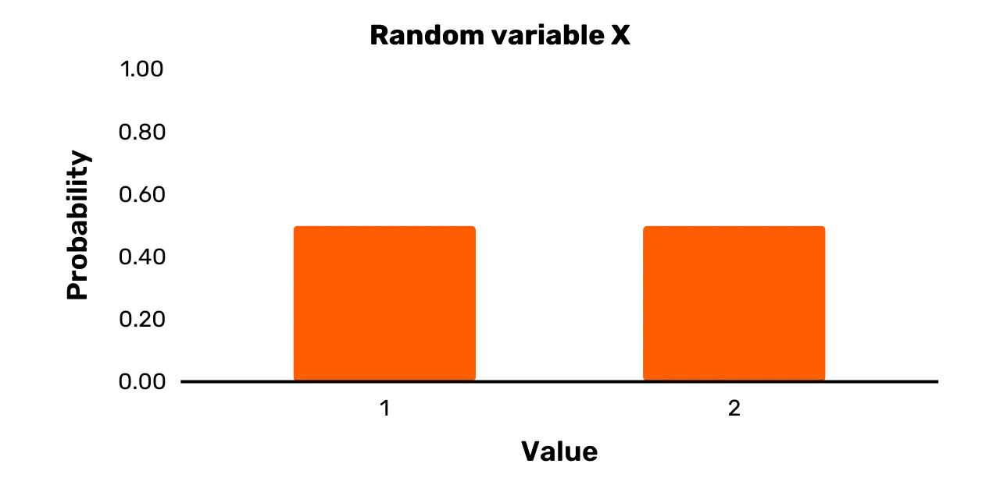
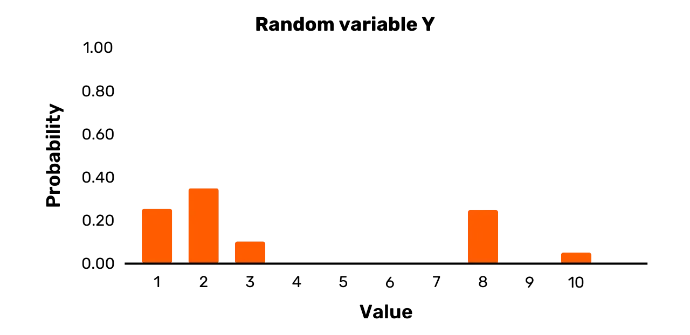

# Profundización en criptografía

Es difícil encontrar muchos materiales que ofrezcan un buen punto intermedio en la educación sobre criptografía.

Por un lado, hay tratados formales y extensos, realmente solo accesibles para aquellos con un fuerte trasfondo en matemáticas, lógica o alguna otra disciplina formal. Por otro lado, hay introducciones de muy alto nivel que realmente ocultan demasiados detalles para cualquiera que sea al menos un poco curioso.

Esta introducción a la criptografía busca capturar ese punto medio. Aunque debería ser relativamente desafiante y detallado para cualquiera nuevo en la criptografía, no es la madriguera del conejo de un tratado fundacional típico.

+++

# Una Introducción a la Criptografía
<partId>bbed2f46-d64c-5fb5-b892-d726032f2494</partId>

## Descripción breve
<chapterId>bb8a8b73-7fb2-50da-bf4e-98996d79887b</chapterId>

Este libro ofrece una introducción profunda a la ciencia y práctica de la criptografía. Donde sea posible, se enfoca en la exposición conceptual, en lugar de formal, del material.

> Este curso se basa en el repositorio de [JWBurgers](https://github.com/JWBurgers/An_Introduction_to_Cryptography). Todos los derechos a él. El contenido aún no está terminado y solo está aquí para mostrar cómo podríamos integrarlo si JWburger's está de acuerdo.

### Motivación y objetivos

Es difícil encontrar muchos materiales que ofrezcan un buen punto intermedio en la educación sobre criptografía.

Por un lado, hay tratados formales y extensos, realmente solo accesibles para aquellos con un fuerte trasfondo en matemáticas, lógica o alguna otra disciplina formal. Por otro lado, hay introducciones de muy alto nivel que realmente ocultan demasiados detalles para cualquiera que sea al menos un poco curioso.

Esta introducción a la criptografía busca capturar ese punto medio. Aunque debería ser relativamente desafiante y detallado para cualquiera nuevo en la criptografía, no es la madriguera del conejo de un tratado fundacional típico.

### Público objetivo

Desde desarrolladores hasta los intelectualmente curiosos, este libro es útil para cualquiera que desee más que un entendimiento superficial de la criptografía. Si tu objetivo es dominar el campo de la criptografía, entonces este libro también es un buen punto de partida.

### Guía de lectura

El libro actualmente contiene siete capítulos: "¿Qué es la Criptografía?" (Capítulo 1), "Fundamentos Matemáticos de la Criptografía I" (Capítulo 2), "Fundamentos Matemáticos de la Criptografía II" (Capítulo 3), "Criptografía Simétrica" (Capítulo 4), "RC4 y AES" (Capítulo 5), "Criptografía Asimétrica" (Capítulo 6), y "El criptosistema RSA" (Capítulo 7). Aún se añadirá un capítulo final, "Criptografía en la Práctica", que se enfoca en varias aplicaciones criptográficas, incluyendo la seguridad de la capa de transporte, el enrutamiento de cebolla y el sistema de intercambio de valor de Bitcoin.
A menos que tengas una sólida formación en matemáticas, la teoría de números es probablemente el tema más difícil de este libro. Ofrezco una visión general de ella en el Capítulo 3, y también aparece en la exposición de AES en el Capítulo 5 y el criptosistema RSA en el Capítulo 7.
Si realmente estás luchando con los detalles formales en estas partes del libro, te recomiendo que te conformes con una lectura de alto nivel de ellas la primera vez.

### Agradecimientos

El libro más influyente en la formación de este ha sido _Introduction to Modern Cryptography_ de Jonathan Katz y Yehuda Lindell, CRC Press (Boca Ratón, FL), 2015. Un curso acompañante está disponible en Coursera llamado "Cryptography".

Las principales fuentes adicionales que han sido útiles en la creación de la visión general en este libro son Simon Singh, _The Code Book_, Fourth Estate (Londres, 1999); Christof Paar y Jan Pelzl, _Understanding Cryptography_, Springer (Heidelberg, 2010) y un curso basado en el libro de Paar llamado “Introduction to Cryptography” (disponible en https://www.youtube.com/channel/UC1usFRN4LCMcfIV7UjHNuQg); y Bruce Schneier, _Applied Cryptography_, 2da ed., 2015 (Indianápolis, IN: John Wiley & Sons).

Solo citaré información y resultados muy específicos que tomo de estas fuentes, pero quiero reconocer aquí mi deuda general con ellas.

Para aquellos lectores que deseen buscar un conocimiento más avanzado sobre criptografía después de esta introducción, recomiendo encarecidamente el libro de Katz y Lindell. El curso de Katz en Coursera es algo más accesible que el libro.

### Contribuciones

Por favor, echa un vistazo al archivo de contribuciones en el repositorio para algunas pautas sobre cómo apoyar el proyecto.

# ¿Qué es la Criptografía?
<partId>48e4d6d5-cd00-5c00-8adb-ae8477ff47c4</partId>

Comencemos nuestra indagación en el campo de la criptografía con uno de los episodios más encantadores y entretenidos de su historia: el de los cifrados Beale.[1](#footnote1)

La historia de los cifrados Beale es, en mi opinión, más probable que sea ficción que realidad. Pero supuestamente transcurrió de la siguiente manera.

## Los cifrados Beale
<chapterId>ae674346-4789-5ab1-9b6f-c8989d83be89</chapterId>

Tanto en el invierno de 1820 como en 1822, un hombre llamado Thomas J. Beale se hospedó en una posada propiedad de Robert Morriss en Lynchburg (Virginia). Al final de la segunda estancia de Beale, entregó a Morriss una caja de hierro con papeles valiosos para su custodia.

Unos meses después, Morriss recibió una carta de Beale fechada el 9 de mayo de 1822. En ella se enfatizaba el gran valor del contenido de la caja de hierro y se relacionaban algunas instrucciones para Morriss: si ni Beale ni ninguno de sus asociados venían a reclamar la caja, debería abrirla precisamente diez años a partir de la fecha de la carta (es decir, el 9 de mayo de 1832). Algunos de los papeles dentro estarían escritos en texto regular. Varios otros, sin embargo, serían “ininteligibles sin la ayuda de una clave”. Esta “clave” sería, entonces, entregada a Morriss por un amigo sin nombre de Beale en junio de 1832.
A pesar de las claras instrucciones, Morriss no abrió la caja en mayo de 1832 y el misterioso amigo de Beale nunca apareció en junio de ese año. No fue hasta 1845 que el posadero finalmente decidió abrir la caja. En ella, Morriss encontró una nota explicando cómo Beale y sus asociados descubrieron oro y plata en el Oeste y lo enterraron, junto con algunas joyas, para su custodia. Además, la caja contenía tres **cifrados**: es decir, textos escritos en código que requieren una **clave criptográfica**, o un secreto, y un algoritmo acompañante para desbloquear. Este proceso de desbloquear un cifrado se conoce como **descifrado**, mientras que el proceso de bloqueo se conoce como **cifrado**. (Como se explica en el Capítulo 3, el término cifra puede tener varios significados. En el nombre "cifrados de Beale", se refiere a textos cifrados.)

Los tres cifrados que Morriss encontró en la caja de hierro consisten cada uno en una serie de números separados por comas. Según la nota de Beale, estos cifrados proporcionan por separado la ubicación del tesoro, el contenido del tesoro y una lista de nombres con los herederos legítimos del tesoro y sus partes (esta última información es relevante en caso de que Beale y sus asociados nunca vinieran a reclamar la caja).

Morris intentó descifrar los tres cifrados durante veinte años. Esto habría sido fácil con la clave. Pero Morriss no tenía la clave y no tuvo éxito en sus intentos de recuperar los textos originales, o **textos planos** como se les llama típicamente en criptografía.

Acercándose al final de su vida, Morriss pasó la caja a un amigo en 1862. Este amigo posteriormente publicó un folleto en 1885, bajo el seudónimo J.B. Ward. Incluía una descripción de la (presunta) historia de la caja, los tres cifrados y una solución que había encontrado para el segundo cifrado. (Aparentemente, hay una clave para cada cifrado, y no una clave que funcione en los tres cifrados como Beale parece haber sugerido originalmente en su carta a Morriss).

Puedes ver el segundo cifrado en la *Figura 2* abajo.[2](#footnote2) La clave para este cifrado es la Declaración de Independencia de los Estados Unidos. El procedimiento de descifrado se reduce a aplicar las siguientes dos reglas:

* Para cualquier número n en el cifrado, localiza la n-ésima palabra en la Declaración de Independencia de los Estados Unidos
* Reemplaza el número n con la primera letra de la palabra que encontraste

*Figura 1: Cifrado de Beale n.º 2*

Por ejemplo, el primer número del segundo cifrado es 115. La 115ª palabra de la Declaración de Independencia es “instituted”, así que la primera letra del texto plano es “i”. El cifrado no indica directamente los espacios entre palabras ni la capitalización. Pero después de descifrar las primeras palabras, puedes deducir lógicamente que la primera palabra del texto plano era simplemente “I”. (El texto plano comienza con la frase “I have deposited in the county of Bedford.”)
Después de su descifrado, el segundo mensaje proporciona los contenidos detallados del tesoro (oro, plata y joyas), y sugiere que fue enterrado en ollas de hierro y cubierto con rocas en el Condado de Bedford (Virginia). A la gente le encanta un buen misterio, por lo que se han realizado grandes esfuerzos para descifrar los otros dos códigos Beale, particularmente el que describe la ubicación del tesoro. Incluso varios criptógrafos prominentes han intentado resolverlos. Sin embargo, hasta ahora, nadie ha podido descifrar los otros dos textos cifrados.

## Criptografía moderna
<chapterId>d07d576f-8a4b-5890-b182-2e5763f550f4</chapterId>

Historias coloridas como la de los códigos Beale son lo que la mayoría de nosotros asocia con la criptografía. Sin embargo, la criptografía moderna difiere en al menos cuatro aspectos importantes de estos tipos de ejemplos históricos.

Primero, históricamente la criptografía solo se ha preocupado por la **secrecía** (o confidencialidad).[3](#footnote3) Se crearían textos cifrados para asegurar que solo ciertas partes pudieran estar al tanto de la información en los textos planos, como en el caso de los códigos Beale. Para que un esquema de cifrado sirva bien a este propósito, descifrar el texto cifrado solo debería ser factible si tienes la llave.

La criptografía moderna se preocupa por una gama más amplia de temas además de la mera secrecía. Estos temas incluyen principalmente (1) **integridad del mensaje**—es decir, asegurar que un mensaje no ha sido cambiado; (2) **autenticidad del mensaje**—es decir, asegurar que un mensaje realmente proviene de un remitente particular; y (3) **no repudio**—es decir, asegurar que un remitente no pueda negar falsamente más tarde que envió un mensaje.[4](#footnote4)

Una distinción importante a tener en cuenta es, por lo tanto, entre un **esquema de cifrado** y un **esquema criptográfico**. Un esquema de cifrado solo se preocupa por la secrecía. Mientras que un esquema de cifrado es un esquema criptográfico, lo contrario no es cierto. Un esquema criptográfico también puede servir a los otros temas principales de la criptografía, incluyendo integridad, autenticidad y no repudio.

Los temas de integridad y autenticidad son tan importantes como la secrecía. Nuestros sistemas modernos de comunicaciones no podrían funcionar sin garantías respecto a la integridad y autenticidad de las comunicaciones. El no repudio también es una preocupación importante, como para contratos digitales, pero menos necesitado de manera ubicua en aplicaciones criptográficas que la secrecía, integridad y autenticidad.

Segundo, los esquemas de cifrado clásicos como los códigos Beale siempre involucran una llave que se compartía entre todas las partes relevantes. Sin embargo, muchos esquemas criptográficos modernos involucran no solo una, sino dos llaves: una **privada** y una **pública**. Mientras que la primera debe permanecer privada en cualquier aplicación, la última es típicamente de conocimiento público (de ahí sus respectivos nombres). Dentro del ámbito del cifrado, la llave pública puede ser usada para cifrar el mensaje, mientras que la llave privada puede ser usada para descifrar.

La rama de la criptografía que trata con esquemas donde todas las partes comparten una llave se conoce como **criptografía simétrica**. La única llave en tal esquema usualmente se llama la **llave privada** (o llave secreta). La rama de la criptografía que trata con esquemas que requieren un par de llaves privada-pública se conoce como **criptografía asimétrica**. Estas ramas a veces también se refieren como **criptografía de llave privada** y **criptografía de llave pública**, respectivamente (aunque esto puede causar confusión, ya que los esquemas criptográficos de llave pública también tienen llaves privadas).
La llegada de la criptografía asimétrica a finales de los años 70 ha sido uno de los eventos más importantes en la historia de la criptografía. Sin ella, la mayoría de nuestros sistemas de comunicación modernos, incluyendo Bitcoin, no serían posibles, o al menos serían muy poco prácticos.
Es importante destacar que la criptografía moderna no es exclusivamente el estudio de esquemas criptográficos de clave simétrica y asimétrica (aunque eso cubre gran parte del campo). Por ejemplo, la criptografía también se ocupa de las funciones hash y los generadores de números pseudoaleatorios, y puedes construir aplicaciones sobre estos primitivos que no están relacionadas con la criptografía de clave simétrica o asimétrica.

En tercer lugar, los esquemas de cifrado clásicos, como los utilizados en los cifrados de Beale, eran más arte que ciencia. Su seguridad percibida se basaba en gran medida en intuiciones respecto a su complejidad. Típicamente se parcheaban cuando se aprendía un nuevo ataque contra ellos, o se abandonaban por completo si el ataque era particularmente severo. Sin embargo, la criptografía moderna es una ciencia rigurosa con un enfoque formal y matemático tanto para el desarrollo como para el análisis de esquemas criptográficos.[5](#footnote5)

Específicamente, la criptografía moderna se centra en **pruebas formales de seguridad**. Cualquier prueba de seguridad para un esquema criptográfico procede en tres pasos:

1. La declaración de una **definición criptográfica de seguridad**, es decir, un conjunto de objetivos de seguridad y la amenaza que representa el atacante.
2. La declaración de cualquier suposición matemática con respecto a la complejidad computacional del esquema. Por ejemplo, un esquema criptográfico puede contener un generador de números pseudoaleatorios. Aunque no podemos probar que existen, podemos asumir que sí.
3. La exposición de una **prueba matemática de seguridad** del esquema basada en la noción formal de seguridad y cualquier suposición matemática.

Cuarto, mientras que históricamente la criptografía se utilizaba principalmente en entornos militares, ha llegado a permear nuestras actividades diarias en la era digital. Ya sea que estés haciendo banca en línea, publicando en redes sociales, comprando un producto de Amazon con tu tarjeta de crédito, o dando una propina en bitcoin, la criptografía es el sine qua non de nuestra era digital.

Dado estos cuatro aspectos de la criptografía moderna, podríamos caracterizar la **criptografía** moderna como la ciencia preocupada por el desarrollo formal y análisis de esquemas criptográficos para asegurar la información digital contra ataques adversarios.[6](#footnote6) La seguridad aquí debe entenderse en un sentido amplio como la prevención de ataques que dañen la secrecía, integridad, autenticación y/o no repudio en las comunicaciones.

La criptografía se ve mejor como una subdisciplina de la **ciberseguridad**, que se ocupa de prevenir el robo, daño y mal uso de los sistemas informáticos. Cabe destacar que muchas preocupaciones de ciberseguridad tienen poco o solo una conexión parcial con la criptografía.

Por ejemplo, si una empresa alberga servidores costosos localmente, puede estar preocupada por asegurar este hardware contra el robo y daño. Aunque esto es una preocupación de ciberseguridad, tiene poco que ver con la criptografía.

Por otro ejemplo, los **ataques de phishing** son un problema común en nuestra era moderna. Estos ataques intentan engañar a las personas a través de un correo electrónico u otro medio de mensaje para que revelen información sensible como contraseñas o números de tarjetas de crédito. Aunque la criptografía puede ayudar a abordar los ataques de phishing hasta cierto punto, un enfoque integral requiere más que solo usar algo de criptografía.

## Comunicaciones abiertas
<chapterId>cb23d0a6-ba9a-5dc6-a55a-258405ae4117</chapterId>

La criptografía moderna está diseñada para proporcionar garantías de seguridad en un entorno de **comunicaciones abiertas**. Si nuestro canal de comunicación está tan bien protegido que los fisgones no tienen ninguna posibilidad de manipular o incluso solo observar nuestros mensajes, entonces la criptografía es superflua. Sin embargo, la mayoría de nuestros canales de comunicación están lejos de estar tan bien protegidos.
La columna vertebral de la comunicación en el mundo moderno es una vasta red de cables de fibra óptica. Hacer llamadas telefónicas, ver televisión y navegar por la web en un hogar moderno generalmente depende de esta red de cables de fibra óptica (un pequeño porcentaje puede depender puramente de satélites). Es cierto que podrías tener diferentes conexiones de datos en tu hogar, como cable coaxial, línea de suscriptor digital (asimétrica) y cable de fibra óptica. Pero, al menos en el mundo desarrollado, estos diferentes medios de datos rápidamente se unen fuera de tu casa a un nodo en una vasta red de cables de fibra óptica que conecta todo el globo. Las excepciones son algunas áreas remotas del mundo desarrollado, como en los Estados Unidos y Australia, donde el tráfico de datos todavía podría también viajar distancias sustanciales sobre los tradicionales cables de teléfono de cobre.

Sería imposible prevenir que atacantes potenciales accedan físicamente a esta red de cables y su infraestructura de soporte. De hecho, ya sabemos que la mayoría de nuestros datos son interceptados por varias agencias de inteligencia nacionales en intersecciones cruciales de Internet.[7](#footnote7) Esto incluye todo, desde mensajes de Facebook hasta las direcciones de sitios web que visitas.

Mientras que vigilar datos a gran escala requiere de un adversario poderoso, como una agencia de inteligencia nacional, atacantes con pocos recursos pueden fácilmente intentar husmear a una escala más local. Aunque esto puede suceder a nivel de interceptación de cables, es mucho más fácil simplemente interceptar comunicaciones inalámbricas.

La mayoría de nuestros datos de red local—ya sea en nuestros hogares, en la oficina o en un café—ahora viajan a través de ondas de radio hacia puntos de acceso inalámbricos en routers todo en uno, en lugar de a través de cables físicos. Así que un atacante necesita pocos recursos para interceptar cualquiera de tu tráfico local. Esto es particularmente preocupante ya que la mayoría de las personas hacen muy poco para proteger los datos que viajan a través de sus redes locales. Además, los atacantes potenciales también pueden apuntar a nuestras conexiones de banda ancha móvil, como 3G, 4G y 5G. Todas estas comunicaciones inalámbricas son un blanco fácil para los atacantes.

Por lo tanto, la idea de mantener las comunicaciones secretas protegiendo el canal de comunicación es una aspiración ilusoriamente delirante para gran parte del mundo moderno. Todo lo que sabemos justifica una paranoia severa: siempre deberías asumir que alguien está escuchando. Y la criptografía es la principal herramienta que tenemos para obtener cualquier tipo de seguridad en este entorno moderno.

### Notas
[^1]: Para un buen resumen de la historia, vea Simon Singh, *The Code Book*, Fourth Estate (Londres, 1999), pp. 82-99. Una película corta de la historia fue hecha por Andrew Allen en 2010. Puedes encontrar la película, “The Thomas Beale Cipher,” en su sitio web [^1].

[^2]: Esta imagen está disponible en la página de Wikipedia para los códigos Beale [^2].

[^3]: Para ser exactos, las aplicaciones importantes de los esquemas criptográficos han estado preocupadas por la secrecía. Los niños, por ejemplo, frecuentemente usan esquemas criptográficos simples por “diversión”. La secrecía no es realmente una preocupación en esos casos [^3].

[^4]: Bruce Schneier, *Applied Cryptography*, 2da ed., 2015 (Indianápolis, IN: John Wiley & Sons), p. 2 [^4].

[^5]: Vea Jonathan Katz y Yehuda Lindell, *Introduction to Modern Cryptography*, CRC Press (Boca Ratón, FL: 2015), esp. pp. 16–23, para una buena descripción [^5].

[^6]: Cf. Katz y Lindell, ibid., p. 3. Creo que su caracterización tiene algunos problemas, así que presento aquí una versión ligeramente diferente de su declaración [^6].
[^7]: Véase, por ejemplo, Olga Khazan, "La inquietante y larga práctica de interceptar cables submarinos", *The Atlantic*, 16 de julio de 2013 (disponible en [The Atlantic](https://www.theatlantic.com/international/archive/2013/07/the-creepy-long-standing-practice-of-undersea-cable-tapping/277855/)) [^7].

# Fundamentos Matemáticos de la Criptografía I
<partId>1bf9f0aa-0f68-5493-83fb-2167238ff9de</partId>

La criptografía se basa en las matemáticas. Y si quieres construir un entendimiento más que superficial de la criptografía, necesitas estar cómodo con esas matemáticas.

Este capítulo introduce la mayoría de las matemáticas básicas que encontrarás al aprender sobre criptografía. Los temas incluyen variables aleatorias, operaciones módulo, operaciones XOR y pseudorandomness. Deberías dominar el material en estas secciones para cualquier entendimiento no superficial de la criptografía.

El próximo capítulo trata sobre teoría de números, que es mucho más desafiante.

## Variables aleatorias
<chapterId>b623a7d0-3dff-5803-bd4e-8257ff73dd69</chapterId>

Una variable aleatoria se denota típicamente por una letra mayúscula no en negrita. Así, por ejemplo, podríamos hablar sobre una variable aleatoria X, una variable aleatoria Y, o una variable aleatoria Z. Esta es la notación que también emplearé de aquí en adelante.

Una **variable aleatoria** puede tomar dos o más valores posibles, cada uno con una cierta probabilidad positiva. Los valores posibles están listados en el **conjunto de resultados**.

Cada vez que **muestreas** una variable aleatoria, extraes un valor particular de su conjunto de resultados de acuerdo con las probabilidades definidas.

Pasemos a un ejemplo simple. Supongamos una variable X que se define de la siguiente manera:

* X tiene el conjunto de resultados {1,2}
* Pr [X = 1] = 0.5
* Pr [X = 2] = 0.5

Es fácil ver que X es una variable aleatoria. Primero, hay dos o más valores posibles que X puede tomar, a saber, 1 y 2. Segundo, cada valor posible tiene una probabilidad positiva de ocurrir cada vez que muestreas X, a saber, 0.5.

Todo lo que una variable aleatoria requiere es un conjunto de resultados con dos o más posibilidades, donde cada posibilidad tiene una probabilidad positiva de ocurrir al muestrear. En principio, entonces, una variable aleatoria puede definirse de manera abstracta, desprovista de cualquier contexto. En este caso, podrías pensar en "muestrear" como realizar algún experimento natural para determinar el valor de la variable aleatoria.

La variable X mencionada anteriormente fue definida de manera abstracta. Así, podrías pensar en muestrear la variable X anterior como lanzar una moneda justa y asignar “2” en caso de cara y “1” en caso de cruz. Para cada muestra de X, lanzas la moneda de nuevo.

Alternativamente, también podrías pensar en muestrear X, como lanzar un dado justo y asignar “2” en caso de que el dado caiga en 1, 3, o 4, y asignar “1” en caso de que el dado caiga en 2, 5, o 6. Cada vez que muestreas X, lanzas el dado de nuevo.

Realmente, cualquier experimento natural que te permita definir las probabilidades de los valores posibles de X anteriormente puede ser imaginado con respecto al sorteo.
Frecuentemente, sin embargo, las variables aleatorias no se introducen de manera abstracta. En cambio, el conjunto de posibles valores de resultado tiene un significado explícito en el mundo real (en lugar de ser solo números). Además, estos valores de resultado podrían estar definidos contra algún tipo de experimento específico (en lugar de cualquier experimento natural con esos valores).
Ahora consideremos un ejemplo de la variable X que no está definida de manera abstracta. X se define de la siguiente manera para determinar cuál de dos equipos inicia un partido de fútbol:

* X tiene el conjunto de resultados {inicia rojo, inicia azul}
* Lanzar una moneda particular C: cara = “inicia rojo”; sello = “inicia azul”
* Pr [X = inicia rojo] = 0.5
* Pr [X = inicia azul] = 0.5

En este caso, el conjunto de resultados de X se proporciona con un significado concreto, a saber, qué equipo comienza en un partido de fútbol. Además, los posibles resultados y sus probabilidades asociadas son determinados por un experimento concreto, a saber, lanzar una moneda particular C.

Dentro de las discusiones sobre criptografía, las variables aleatorias generalmente se introducen contra un conjunto de resultados con significado en el mundo real. Podría ser el conjunto de todos los mensajes que podrían ser encriptados, conocido como el espacio de mensajes, o el conjunto de todas las claves que las partes que usan la encriptación pueden elegir, conocido como el espacio de claves.

Sin embargo, las variables aleatorias en discusiones sobre criptografía generalmente no se definen contra algún experimento natural específico, sino contra cualquier experimento que pueda producir las distribuciones de probabilidad correctas.

Las variables aleatorias pueden tener distribuciones de probabilidad discretas o continuas. Las variables aleatorias con una **distribución de probabilidad discreta**—es decir, variables aleatorias discretas—tienen un número finito de posibles resultados. La variable aleatoria X en ambos ejemplos dados hasta ahora era discreta.

Las **variables aleatorias continuas** pueden tomar valores en uno o más intervalos. Podrías decir, por ejemplo, que una variable aleatoria, al muestrear, tomará cualquier valor real entre 0 y 1, y que cada número real en este intervalo es igualmente probable. Dentro de este intervalo, hay infinitamente posibles valores.

Para discusiones criptográficas, solo necesitarás entender las variables aleatorias discretas. Cualquier discusión de variables aleatorias de aquí en adelante debe, por lo tanto, entenderse como referente a variables aleatorias discretas, a menos que se indique específicamente lo contrario.

### Graficando variables aleatorias

Los posibles valores y probabilidades asociadas para una variable aleatoria pueden visualizarse fácilmente a través de un gráfico. Por ejemplo, considera la variable aleatoria X de la sección anterior con un conjunto de resultados de {1,2}, y Pr [X = 1] = 0.5 y Pr [X = 2] = 0.5. Típicamente mostraríamos tal variable aleatoria en forma de un gráfico de barras como en *Figura 1*.

*Figura 1: Variable aleatoria X*

Las barras anchas en *Figura 1* obviamente no pretenden sugerir que la variable aleatoria X es realmente continua. En cambio, las barras se hacen anchas para ser más visualmente atractivas (solo una línea recta hacia arriba proporciona una visualización menos intuitiva).

### Variables uniformes

En la expresión “variable aleatoria”, el término “aleatorio” simplemente significa “probabilístico”. En otras palabras, simplemente significa que dos o más posibles resultados de la variable ocurren con ciertas probabilidades. Sin embargo, estos resultados no necesariamente tienen que ser igualmente probables (aunque el término “aleatorio” puede tener ese significado en otros contextos).
Una **variable uniforme** es un caso especial de una variable aleatoria. Puede tomar dos o más valores, todos con igual probabilidad. La variable aleatoria X representada en la *Figura 1* es claramente una variable uniforme, ya que ambos resultados posibles ocurren con una probabilidad de 0.5. Sin embargo, hay muchas variables aleatorias que no son instancias de variables uniformes.
Considera, por ejemplo, la variable aleatoria Y. Tiene un conjunto de resultados {1,2,3,8,10} y la siguiente distribución de probabilidad: Pr [Y = 1] = 0.25; Pr [Y = 2] = 0.35; Pr [Y = 3] = 0.1; Pr [Y = 8] = 0.25; Pr [Y = 10] = 0.05.

Aunque dos resultados posibles tienen de hecho una probabilidad igual de ocurrir, a saber, 1 y 8, Y también puede tomar ciertos valores con diferentes probabilidades que 0.25 al muestrear. Por lo tanto, aunque Y es de hecho una variable aleatoria, no es una variable uniforme.

Se proporciona una representación gráfica de Y en la *Figura 2*.

*Figura 2: Variable aleatoria Y*

Para un último ejemplo, considera la variable aleatoria Z. Tiene el conjunto de resultados {1,3,7,11,12} y la siguiente distribución de probabilidad: Pr (2) = 0.2; Pr (3) = 0.2; Pr (9) = 0.2; Pr (11) = 0.2; Pr (12) = 0.2. Puedes verla representada en la Figura 3. La variable aleatoria Z es, en contraste con Y, de hecho una variable uniforme, ya que todas las probabilidades de los valores posibles al muestrear son iguales.

*Figura 3: Variable aleatoria Z*

### Probabilidad condicional

Supongamos que Bob tiene la intención de seleccionar uniformemente un día del último año calendario. ¿Qué deberíamos concluir que es la probabilidad de que el día seleccionado esté en Verano?

Mientras pensemos que el proceso de Bob será verdaderamente uniforme, deberíamos concluir que hay una probabilidad de 1/4 de que Bob seleccione un día en Verano. Esta es la **probabilidad incondicional** de que el día seleccionado aleatoriamente esté en Verano.

Supongamos ahora que, en lugar de extraer uniformemente un día del calendario, Bob solo selecciona uniformemente entre aquellos días en los que la temperatura al mediodía en Crystal Lake (Nueva Jersey) fue de 21 grados Celsius o más. Dada esta información adicional, ¿qué podemos concluir sobre la probabilidad de que Bob seleccione un día en Verano?

Realmente deberíamos llegar a una conclusión diferente que antes, incluso sin ninguna información específica adicional (por ejemplo, la temperatura al mediodía cada día del último año calendario).

Sabiendo que Crystal Lake está en Nueva Jersey, ciertamente no esperaríamos que la temperatura al mediodía fuera de 21 grados Celsius o más en Invierno. En cambio, es mucho más probable que sea un día cálido en Primavera u Otoño, o un día en algún momento del Verano. Por lo tanto, sabiendo que la temperatura al mediodía en Crystal Lake en el día seleccionado fue de 21 grados Celsius o más, la probabilidad de que el día seleccionado por Bob esté en Verano se vuelve mucho más alta. Esta es la **probabilidad condicional** de que el día seleccionado aleatoriamente esté en Verano, dado que la temperatura al mediodía en Crystal Lake fue de 21 grados Celsius o más.
A diferencia del ejemplo anterior, las probabilidades de dos eventos también pueden ser completamente no relacionadas. En ese caso, decimos que son **independientes**.
Supongamos, por ejemplo, que una cierta moneda justa ha caído en cara. Dado este hecho, ¿cuál es entonces la probabilidad de que llueva mañana? La probabilidad condicional en este caso debería ser la misma que la probabilidad incondicional de que llueva mañana, ya que un lanzamiento de moneda generalmente no tiene ningún impacto en el clima.

Usamos un símbolo “|” para escribir declaraciones de probabilidad condicional. Por ejemplo, la probabilidad del evento A dado que el evento B ha ocurrido se puede escribir de la siguiente manera: Pr[A|B]. Entonces, cuando dos eventos, A y B, son independientes, entonces Pr[A|B] = Pr[A] y Pr[B|A] = Pr[B]. La condición para la independencia se puede simplificar de la siguiente manera: Pr[A,B] = Pr[A]*Pr[B].

Un resultado clave en la teoría de probabilidad es conocido como **Teorema de Bayes**. Básicamente establece que Pr[A|B] se puede reescribir de la siguiente manera:

Pr[A|B] = (Pr[B|A] • Pr[A]) / Pr[B]

En lugar de usar probabilidades condicionales con eventos específicos, también podemos mirar las probabilidades condicionales involucradas con dos o más variables aleatorias sobre un conjunto de eventos posibles. Supongamos dos variables aleatorias, X e Y. Podemos denotar cualquier valor posible para X por x, y cualquier valor posible para Y por y. Podríamos decir, entonces, que dos variables aleatorias son independientes si se sostiene la siguiente declaración:

Pr[X = x,Y = y] = Pr[X = x] • Pr[Y = y] para todos los x y y

Seamos un poco más explícitos sobre lo que significa esta declaración.

Supongamos que los conjuntos de resultados para X e Y se definen de la siguiente manera: **X** = {x1,x2….,xi,….xn} y **Y** = {y1,y2….,yi,….ym}. (Es típico indicar conjuntos de valores con letras en negrita y mayúsculas.)

Ahora supongamos que muestreas Y y observas y1. La declaración anterior nos dice que la probabilidad de obtener ahora x1 al muestrear X es exactamente la misma que si nunca hubiéramos observado y1. Esto es cierto para cualquier yi que podríamos haber sacado de nuestro muestreo inicial de Y. Finalmente, esto se mantiene no solo para x1. Para cualquier xi, la probabilidad de ocurrir no está influenciada por el resultado de un muestreo de Y. Todo esto también se aplica al caso en que X se muestrea primero.

Terminemos nuestra discusión en un punto un poco más filosófico. En cualquier situación del mundo real, la probabilidad de algún evento siempre se evalúa contra un conjunto particular de información. No hay una "probabilidad incondicional" en ningún sentido muy estricto de la palabra.

Por ejemplo, supongamos que te pregunté por la probabilidad de que los cerdos vuelen para 2030. Aunque no te doy más información, claramente sabes mucho sobre el mundo que puede influir en tu juicio. Nunca has visto cerdos volar. Sabes que la mayoría de las personas no esperarán que vuelen. Sabes que realmente no están construidos para volar. Y así sucesivamente.
Por lo tanto, cuando hablamos de una "probabilidad incondicional" de algún evento en un contexto del mundo real, ese término realmente solo puede tener significado si lo interpretamos como "la probabilidad sin ninguna información explícita adicional". Cualquier entendimiento de una "probabilidad condicional" debería, entonces, siempre entenderse en relación con alguna pieza específica de información.
Por ejemplo, podría preguntarte la probabilidad de que los cerdos vuelen para el 2030, después de darte evidencia de que algunas cabras en Nueva Zelanda han aprendido a volar después de unos años de entrenamiento. En este caso, probablemente ajustarás tu juicio sobre la probabilidad de que los cerdos vuelen para el 2030. Así que la probabilidad de que los cerdos vuelen para el 2030 es condicional a esta evidencia sobre las cabras en Nueva Zelanda.

## La operación módulo
<chapterId>709b34e5-b155-53d2-abbd-97d67e56db00</chapterId>

La expresión más básica con la **operación módulo** es de la siguiente forma: x mod y.

La variable x se llama dividendo y la variable y el divisor. Para realizar una operación módulo con un dividendo positivo y un divisor positivo, simplemente determinas el resto de la división.

Por ejemplo, considera la expresión 25 mod 4. El número 4 entra en el número 25 un total de 6 veces. El resto de esa división es 1. Por lo tanto, 25 mod 4 es igual a 1. De manera similar, podemos evaluar las expresiones a continuación:

* 29 mod 30 = 29 (ya que 30 entra en 29 un total de 0 veces y el resto es 29)
* 42 mod 2 = 0 (ya que 2 entra en 42 un total de 21 veces y el resto es 0)
* 12 mod 5 = 2 (ya que 5 entra en 12 un total de 2 veces y el resto es 2)
* 20 mod 8 = 4 (ya que 8 entra en 20 un total de 2 veces y el resto es 4)

Cuando el dividendo o divisor es negativo, las operaciones módulo pueden ser manejadas de manera diferente por los lenguajes de programación.

Definitivamente te encontrarás con casos con un dividendo negativo en criptografía. En estos casos, el enfoque típico es el siguiente:

* Primero determina el valor más cercano *menor o igual* al dividendo en el cual el divisor divide con un resto de cero. Llama a ese valor p.
* Si el dividendo es x, entonces el resultado de la operación módulo es el valor de x – p.

Por ejemplo, supongamos que el dividendo es –20 y el divisor 3. El valor más cercano menor o igual a –20 en el cual 3 divide uniformemente es –21. El valor de x – p en este caso es –20 – (–21). Esto es igual a 1 y, por lo tanto, –20 mod 3 es igual a 1. De manera similar, podemos evaluar las expresiones a continuación:

* –8 mod 5 = 2
* –19 mod 16 = 13
* –14 mod 6 = 4

En cuanto a la notación, típicamente verás los siguientes tipos de expresiones: x = [y mod z]. Debido a los corchetes, la operación módulo en este caso solo se aplica al lado derecho de la expresión. Si y es igual a 25 y z es igual a 4, por ejemplo, entonces x se evalúa en 1.
Sin corchetes, la operación módulo actúa sobre *ambos lados* de una expresión. Supongamos, por ejemplo, la siguiente expresión: x = y mod z. Si y es igual a 25 y z es igual a 4, entonces todo lo que sabemos es que x mod 4 se evalúa en 1. Esto es consistente con cualquier valor para x del conjunto {….– 7, – 3, 1, 5, 9….}.
La rama de las matemáticas que involucra operaciones módulo en números y expresiones se refiere a **aritmética modular**. Puedes pensar en esta rama como aritmética para casos en los cuales la línea numérica no es infinitamente larga. Aunque típicamente nos encontramos con operaciones módulo para enteros (positivos) dentro de la criptografía, también puedes realizar operaciones módulo usando cualquier número real.

### El cifrado César

La operación módulo se encuentra frecuentemente dentro de la criptografía. Para ilustrar, consideremos uno de los esquemas de encriptación históricos más famosos: el cifrado César.

Primero definámoslo. Supongamos un diccionario *D* que equipara todas las letras del alfabeto inglés, en orden, con el conjunto de números {0,1,2…,25}. Asumamos un espacio de mensajes **M**. El **cifrado César** es, entonces, un esquema de encriptación definido de la siguiente manera:

- Selecciona uniformemente una clave k del espacio de claves **K**, donde **K** = {0,1,2,…,25}[1](#footnote1)
- Encripta un mensaje m є **M**, de la siguiente manera:
    - Separa m en sus letras individuales m0, m1,….mi….,ml
    - Convierte cada mi a un número de acuerdo a *D*
    - Para cada mi, ci = [(mi + k) mod 26]
    - Convierte cada ci a una letra de acuerdo a *D*
    - Luego combina c0, c1,….,cl para obtener el texto cifrado c
- Desencripta un texto cifrado c de la siguiente manera:
    - Convierte cada ci a un número de acuerdo a *D*
    - Para cada ci, mi = [(ci – k) mod 26]
    - Convierte cada mi a una letra de acuerdo a *D*
    - Luego combina m0, m1,….,ml para obtener el mensaje original m

El operador módulo en el cifrado César asegura que las letras se envuelvan, de modo que todas las letras del texto cifrado estén definidas. Para ilustrar, considera la aplicación del cifrado César en la palabra “DOG”.

Supongamos que seleccionaste uniformemente una clave con el valor de 17. La letra “O” equivale a 15. Sin la operación módulo, la adición de este número de texto plano con la clave resultaría en un número de texto cifrado de 32. Sin embargo, ese número de texto cifrado no puede convertirse en una letra de texto cifrado, ya que el alfabeto inglés solo tiene 26 letras. La operación módulo asegura que el número de texto cifrado sea en realidad 6 (el resultado de 32 mod 26), lo que equivale a la letra de texto cifrado “G”.

La encriptación completa de la palabra “DOG” con un valor de clave de 17 es como sigue:
* Mensaje = DOG = D,O,G = 3,15,6* c0 = [(3 + 17) Mod 26] = [(20) Mod 26] = 20 = U
* c1 = [(15 + 17) Mod 26] = [(32) Mod 26] = 6 = G
* c2 = [(6 + 17) Mod 26] = [(23) Mod 26] = 23 = X
* c = UGX

Todo el mundo puede entender intuitivamente cómo funciona el cifrado por desplazamiento y probablemente usarlo por sí mismos. Sin embargo, para avanzar en tu conocimiento de criptografía, es importante comenzar a sentirse más cómodo con la formalización, ya que los esquemas se volverán mucho más difíciles. Por eso, se formalizaron los pasos para el cifrado por desplazamiento.

## La operación XOR
<chapterId>22f185cc-c516-5b33-950b-0908f2f881fe</chapterId>

Todos los datos informáticos se procesan, almacenan y envían a través de redes al nivel de bits. Cualquier esquema criptográfico que se aplique a los datos informáticos también opera al nivel de bit.

Por ejemplo, supongamos que has escrito un correo electrónico en tu aplicación de correo electrónico. Cualquier cifrado que apliques no ocurre sobre los caracteres ASCII de tu correo electrónico directamente. En cambio, se aplica a la representación en bits de las letras y otros símbolos en tu correo electrónico.

Una operación matemática clave para entender en la criptografía moderna, además de la operación módulo, es la de la **operación XOR**, o operación de "o exclusivo". Esta operación toma como entradas dos bits y produce como salida otro bit. La operación XOR simplemente se denotará como "XOR". Produce 0 si los dos bits son iguales y 1 si los dos bits son diferentes. Puedes ver las cuatro posibilidades a continuación.

* 0 XOR 0 = 0
* 0 XOR 1 = 1
* 1 XOR 0 = 1
* 1 XOR 1 = 0

Puedes realizar una operación XOR en dos mensajes más largos que un solo bit alineando los bits de esos dos mensajes y realizando la operación XOR en cada par individual de bits.

Para ilustrar, supongamos que tienes un mensaje m1 (01111001) y un mensaje m2 (01011001). La operación XOR de estos dos mensajes se puede ver a continuación.

* m1 XOR m2 = 01111001 XOR 01011001 = 00100000

El proceso es sencillo. Primero realizas el XOR de los bits más a la izquierda de m1 y m2. En este caso eso es 0 XOR 0 = 0. Luego realizas el XOR del segundo par de bits desde la izquierda. En este caso eso es 1 XOR 1 = 0. Continúas este proceso hasta que hayas realizado la operación XOR en los bits más a la derecha.
Es fácil ver que la operación XOR es conmutativa, es decir, que m1 XOR m2 = m2 XOR m1. Además, la operación XOR también es asociativa. Es decir, (m1 XOR m2) XOR m3 = m1 XOR (m2 XOR m3).
Una operación XOR en dos cadenas de longitudes alternativas puede tener diferentes interpretaciones, dependiendo del contexto. Aquí no nos ocuparemos de ninguna operación XOR en cadenas de diferentes longitudes.

Una operación XOR es equivalente al caso especial de realizar una operación de módulo en la suma de bits cuando el divisor es 2. Puedes ver la equivalencia en los siguientes resultados:

* (0 + 0) mod 2 = 0 XOR 0 = 0
* (1 + 0) mod 2 = 1 XOR 0 = 1
* (0 + 1) mod 2 = 0 XOR 1 = 1
* (1 + 1) mod 2 = 1 XOR 1 = 0

## Pseudoaleatoriedad
<chapterId>20463fc5-3e92-581f-a1b7-3151279bd95e</chapterId>

En nuestra discusión sobre variables aleatorias y uniformes, hicimos una distinción específica entre "aleatorio" y "uniforme". Esa distinción se mantiene típicamente en la práctica al describir variables aleatorias. Sin embargo, en nuestro contexto actual, esta distinción debe ser eliminada y "aleatorio" y "uniforme" se usan sinónimamente. Explicaré por qué al final de la sección.

Para empezar, podemos llamar a una cadena binaria de longitud n **aleatoria** (o **uniforme**), si fue el resultado de muestrear una variable uniforme S que da a cada cadena binaria de tal longitud n una igual probabilidad de selección.

Supongamos, por ejemplo, el conjunto de todas las cadenas binarias con longitud 8: {0000 0000,0000 0001,….,1111 1111}. (Es típico escribir una cadena de 8 bits en dos cuartetos, cada uno llamado un **nibble**). Llamemos a este conjunto de cadenas **S8**.

Según la definición anterior, podemos, entonces, llamar a una cadena binaria particular de longitud 8 aleatoria (o uniforme), si fue el resultado de muestrear una variable uniforme S que da a cada cadena en **S8** una igual probabilidad de selección. Dado que el conjunto **S8** incluye 28 elementos, la probabilidad de selección al muestrear tendría que ser 1/28 para cada cadena en el conjunto.

Un aspecto clave de la aleatoriedad de una cadena binaria es que se define con referencia al proceso por el cual fue seleccionada. La forma de cualquier cadena binaria en particular, por lo tanto, no revela nada sobre su aleatoriedad en la selección.

Por ejemplo, muchas personas intuitivamente tienen la idea de que una cadena como 1111 1111 no podría haber sido seleccionada aleatoriamente. Pero esto es claramente falso.
Definiendo una variable uniforme S sobre todas las cadenas binarias de longitud 8, la probabilidad de seleccionar 1111 1111 del conjunto **S8** es la misma que la de una cadena como 0111 01001. Por lo tanto, no puedes decir nada sobre la aleatoriedad de una cadena, solo analizándola por sí misma.
También podemos hablar de cadenas aleatorias sin referirnos específicamente a cadenas binarias. Podríamos, por ejemplo, hablar de una cadena hexadecimal aleatoria AF 02 82. En este caso, la cadena habría sido seleccionada al azar del conjunto de todas las cadenas hexadecimales de longitud 6. Esto es equivalente a seleccionar al azar una cadena binaria de longitud 24, ya que cada dígito hexadecimal representa 4 bits.

Típicamente, la expresión “una cadena aleatoria”, sin calificación, se refiere a una cadena seleccionada al azar del conjunto de todas las cadenas con la misma longitud. Así es como lo he descrito arriba. Una cadena de longitud n puede, por supuesto, también ser seleccionada al azar de un conjunto diferente. Uno, por ejemplo, que solo constituye un subconjunto de todas las cadenas de longitud n, o quizás un conjunto que incluye cadenas de longitud variable. En esos casos, sin embargo, no nos referiríamos a ella como “una cadena aleatoria”, sino más bien “una cadena que es seleccionada al azar de algún conjunto **S**”.

Un concepto clave dentro de la criptografía es el de pseudorandomness. Una **cadena pseudorandom** de longitud n parece *como si* fuera el resultado de muestrear una variable uniforme S que da a cada cadena en **Sn** una probabilidad igual de selección. De hecho, sin embargo, la cadena es el resultado de muestrear una variable uniforme S' que solo define una distribución de probabilidad—no necesariamente una con probabilidades iguales para todos los resultados posibles—en un subconjunto de **Sn**. El punto crucial aquí es que nadie puede realmente distinguir entre muestras de S y S', incluso si tomas muchas de ellas.

Supongamos, por ejemplo, una variable aleatoria S. Su conjunto de resultados es **S256**, este es el conjunto de todas las cadenas binarias de longitud 256. Este conjunto tiene 2256 elementos. Cada elemento tiene una probabilidad igual de selección, 1/2256, al muestrear.

Además supongamos una variable aleatoria S’. Su conjunto de resultados solo incluye 2128 cadenas binarias de longitud 256. Tiene alguna distribución de probabilidad sobre esas cadenas, pero esta distribución no es necesariamente uniforme.

Supongamos que ahora tomé miles de muestras de S y miles de muestras de S' y te di los dos conjuntos de resultados. Te digo qué conjunto de resultados está asociado con qué variable aleatoria. A continuación, tomo una muestra de una de las dos variables aleatorias. Pero esta vez no te digo de qué variable aleatoria tomo la muestra. Si S' fuera pseudorandom, entonces la idea es que tu probabilidad de hacer la suposición correcta sobre qué variable aleatoria muestreé es prácticamente no mejor que 1/2.

Típicamente, una cadena pseudorandom de longitud n se produce seleccionando al azar una cadena de tamaño n – x, donde x es un entero positivo, y usándola como entrada para un algoritmo de expansión. Esta cadena aleatoria de tamaño n – x se conoce como la **semilla**.
Las cadenas pseudorandom son un concepto clave para hacer la criptografía práctica. Considera, por ejemplo, los cifrados de flujo. Con un cifrado de flujo, una clave seleccionada al azar se introduce en un algoritmo expansivo para producir una cadena pseudorandom mucho más grande. Esta cadena pseudorandom se combina luego con el texto plano mediante una operación XOR para producir un texto cifrado.
Si no pudiéramos producir este tipo de cadena pseudorandom para un cifrado de flujo, entonces necesitaríamos una clave que sea tan larga como el mensaje para su seguridad. Esta no es una opción muy práctica en la mayoría de los casos.

La noción de pseudorandomidad discutida en esta sección puede definirse de manera más formal. También se extiende a otros contextos. Pero no necesitamos profundizar en esa discusión aquí. Todo lo que realmente necesitas entender intuitivamente para gran parte de la criptografía es la diferencia entre una cadena random y una pseudorandom.[2](#footnote2)

La razón por la que eliminamos la distinción entre "random" y "uniforme" en nuestra discusión ahora también debería ser clara. En la práctica, todos usan el término pseudorandom para indicar una cadena que parece **como si** fuera el resultado de muestrear una variable uniforme S. Estrictamente hablando, deberíamos llamar a tal cadena "pseudo-uniforme", adoptando nuestro lenguaje de antes. Como el término "pseudo-uniforme" es tanto torpe como no utilizado por nadie, no lo introduciremos aquí por claridad. En su lugar, simplemente eliminamos la distinción entre "random" y "uniforme" en el contexto actual.

## Notas
<chapterId>7cccd92c-15bc-5394-9024-af126988ecd7</chapterId>

[^1]: Podemos definir esta declaración exactamente, usando la terminología de la sección anterior. Deje que una variable uniforme K tenga **K** como su conjunto de posibles resultados. Así Pr [K = 0] = 1/26, Pr [K = 1] = 1/26, y así sucesivamente. Muestree la variable uniforme K una vez para obtener una clave particular [^1].

[^2]: Si estás interesado en una exposición más formal sobre estos temas, puedes consultar *Introduction to Modern Cryptography* de Katz y Lindell, esp. capítulo 3 [^2].

# Fundamentos Matemáticos de la Criptografía II
<partId>d7245cc9-bb6d-5403-b3d5-9c703d9a2f81</partId>

Este capítulo cubre un tema más avanzado sobre los fundamentos matemáticos de la criptografía: teoría de números. Aunque la teoría de números es importante para la criptografía simétrica (como en el Cifrado Rijndael), es particularmente importante en el contexto de la criptografía de clave pública.

Si encuentras los detalles de la teoría de números engorrosos, recomendaría una lectura de alto nivel la primera vez. Siempre puedes volver a ella en un momento posterior.

## ¿Qué es la teoría de números?
<chapterId>c0051c34-fd5d-539c-93e2-5c6dfd4c3355</chapterId>

Podrías caracterizar la **teoría de números** como el estudio de las propiedades de los enteros y las funciones matemáticas que trabajan con enteros.

Considera, por ejemplo, que cualquier dos números a y N son **coprimos** (o **primos relativos**) si su máximo común divisor es igual a 1. Supongamos ahora un entero particular N. ¿Cuántos enteros menores que N son coprimos con N? ¿Podemos hacer declaraciones generales sobre las respuestas a esta pregunta? Estos son los tipos típicos de preguntas que busca responder la teoría de números.
La teoría moderna de números se basa en las herramientas del álgebra abstracta. El campo del **álgebra abstracta** es una subdisciplina de las matemáticas donde los principales objetos de análisis son objetos abstractos conocidos como estructuras algebraicas. Una **estructura algebraica** es un conjunto de elementos unidos con una o más operaciones, que cumplen ciertos axiomas. A través de las estructuras algebraicas, los matemáticos pueden obtener insights sobre problemas matemáticos específicos, abstrayéndose de sus detalles.
El campo del álgebra abstracta a veces también se llama álgebra moderna. También puedes encontrarte con el concepto de **matemáticas abstractas** (o **matemáticas puras**). Este último término no es una referencia al álgebra abstracta, sino que significa el estudio de las matemáticas por sí mismas, y no solo con un ojo en las aplicaciones potenciales.

Los conjuntos del álgebra abstracta pueden tratar con muchos tipos de objetos, desde las transformaciones que preservan la forma en un triángulo equilátero hasta los patrones de papel tapiz. Para la teoría de números, solo consideramos conjuntos de elementos que contienen enteros o funciones que trabajan con enteros.

## Grupos
<chapterId>3209b270-f9cd-5224-803e-0ed19fbf7826</chapterId>

Un concepto básico en matemáticas es el de un conjunto de elementos. Un conjunto se denota generalmente por signos de llaves con los elementos separados por comas.

Por ejemplo, el conjunto de todos los enteros es {…,-2,-1,0,1,2,…}. Las elipsis aquí significan que cierto patrón continúa en una dirección particular. Así, el conjunto de todos los enteros también incluye 3,4,5,6 y así sucesivamente, así como -3,-4,-5,-6 y así sucesivamente. Este conjunto de todos los enteros se denota típicamente por ℤ.

Otro ejemplo de un conjunto es ℤ mod 11, o el conjunto de todos los enteros módulo 11. A diferencia del conjunto entero ℤ, este conjunto solo contiene un número finito de elementos, a saber, {0,1,…,9,10}.

Un error común es pensar que el conjunto ℤ mod 11 en realidad es {-10,-9,…,0,…,9,10}. Pero este no es el caso, dada la forma en que definimos la operación módulo anteriormente. Cualquier entero negativo reducido por módulo 11 se envuelve a {0,1,…,9,10}. Por ejemplo, la expresión -2 mod 11 se envuelve a 9, mientras que la expresión -27 mod 11 se envuelve a 5.

Otro concepto básico en matemáticas es el de una operación binaria. Esta es cualquier operación que toma dos elementos para producir un tercero. Por ejemplo, de la aritmética y álgebra básicas, estarías familiarizado con cuatro operaciones binarias fundamentales: adición, sustracción, multiplicación y división.

Estos dos conceptos matemáticos básicos, conjuntos y operaciones binarias, se utilizan para definir la noción de un grupo, la estructura más esencial en el álgebra abstracta.

Específicamente, supongamos alguna operación binaria ◌. Además, supongamos algún conjunto de elementos **S** equipado con esa operación. Todo lo que “equipado” significa aquí es que la operación ◌ se puede realizar entre cualquier par de elementos en el conjunto **S**.

La combinación 〈**S**, ◌〉 es, entonces, un **grupo** si cumple con cuatro condiciones específicas, conocidas como los axiomas de grupo.

1. Para cualquier a y b que sean elementos de **S**, a ◌ b también es un elemento de **S**. Esto se conoce como la **condición de cierre**.
2. Para cualquier a, b y c que sean elementos de **S**, se cumple que (a ◌ b) ◌ c = a ◌ (b ◌ c). Esto se conoce como la **condición de asociatividad**. 3. Existe un elemento único e en **S**, tal que para cada elemento a en **S**, se sostiene la siguiente ecuación: e ◌ a = a ◌ e = a. Como solo hay un elemento e, se le llama el **elemento identidad**. Esta condición se conoce como la **condición de identidad**.
4. Para cada elemento a en **S**, existe un elemento b en **S**, tal que se sostiene la siguiente ecuación: a ◌ b = b ◌ a = e, donde e es el elemento identidad. El elemento b aquí se conoce como el **elemento inverso**, y comúnmente se denota como a-1. Esta condición se conoce como la **condición de inversión** o la **condición de invertibilidad**.

Explorando un poco más los grupos. Denotemos el conjunto de todos los enteros por ℤ. Este conjunto combinado con la adición estándar, o 〈ℤ, +〉, claramente se ajusta a la definición de un grupo, ya que cumple con los cuatro axiomas anteriores.

1. Para cualquier x e y que sean elementos de ℤ, x + y también es un elemento de ℤ. Así que 〈ℤ, +〉 cumple con la condición de cierre.
2. Para cualquier x, y y z que sean elementos de ℤ, (x + y) + z = x + (y + z). Así que 〈ℤ, +〉 cumple con la condición de asociatividad.
3. Hay un elemento identidad en 〈ℤ, +〉, a saber, 0. Para cualquier x en ℤ, se sostiene que: 0 + x = x + 0 = x. Así que 〈ℤ, +〉 cumple con la condición de identidad.
4. Finalmente, para cada elemento x en ℤ, hay un y tal que x + y = y + x = 0. Si x fuera 10, por ejemplo, y sería –10 (en el caso de que x sea 0, y también es 0). Así que 〈ℤ, +〉 cumple con la condición de inversión.

Importante, que el conjunto de enteros con adición constituya un grupo no significa que constituya un grupo con multiplicación. Puedes verificar esto probando 〈ℤ, •〉 contra los cuatro axiomas de grupo (donde • significa multiplicación estándar).

Los primeros dos axiomas obviamente se sostienen. Además, bajo la multiplicación, el elemento 1 puede servir como el elemento identidad. Cualquier entero x multiplicado por 1, da como resultado x. Sin embargo, 〈ℤ, •〉 no cumple con la condición de inversión. Es decir, no hay un elemento único y en ℤ para cada x en ℤ, tal que x • y = 1.

Por ejemplo, supongamos que x = 22. ¿Qué valor y del conjunto ℤ multiplicado con x produciría el elemento identidad 1? El valor de 1/22 funcionaría, pero esto no está en el conjunto ℤ. De hecho, te encuentras con este problema para cualquier entero x, aparte de los valores de 1 y -1 (donde y tendría que ser 1 y -1 respectivamente).
Si permitiéramos números reales para nuestro conjunto, entonces nuestros problemas en gran medida desaparecerían. Para cualquier elemento x en el conjunto, la multiplicación por 1/x produce 1. Como las fracciones están incluidas en el conjunto de números reales, se puede encontrar un inverso para cada número real. La excepción es cero, ya que cualquier multiplicación con cero nunca producirá el elemento identidad 1. Por lo tanto, el conjunto de números reales no cero equipado con la multiplicación es de hecho un grupo.

Algunos grupos cumplen con una quinta condición general, conocida como la **condición de conmutatividad**. Esta condición es la siguiente:

* Supongamos un grupo G con un conjunto **S** y un operador binario ◌. Supongamos que a y b son elementos de **S**. Si se da el caso de que a ◌ b = b ◌ a para cualquier par de elementos a y b en **S**, entonces G cumple con la condición de conmutatividad.

Cualquier grupo que cumpla con la condición de conmutatividad se conoce como un **grupo conmutativo**, o un **grupo Abeliano** (en honor a Niels Henrik Abel). Es fácil verificar que tanto el conjunto de números reales sobre la adición como el conjunto de enteros sobre la adición son grupos Abeliano. El conjunto de enteros sobre la multiplicación no es un grupo en absoluto, por lo tanto, de facto no puede ser un grupo Abeliano. El conjunto de números reales no cero sobre la multiplicación, por el contrario, también es un grupo Abeliano.

Debes prestar atención a dos convenciones importantes sobre la notación. Primero, los signos “+” o “x” se emplearán frecuentemente para simbolizar operaciones de grupo, incluso cuando los elementos no son, de hecho, números. En estos casos, no debes interpretar estos signos como la adición o multiplicación aritmética estándar. En su lugar, son operaciones con solo una similitud abstracta a estas operaciones aritméticas.

A menos que te estés refiriendo específicamente a la adición o multiplicación aritmética, es más fácil usar símbolos como ◌ y ◊ para operaciones de grupo, ya que estos no tienen connotaciones muy arraigadas culturalmente.

Segundo, por la misma razón que “+” y “x” se usan a menudo para indicar operaciones no aritméticas, los elementos identidad de los grupos se simbolizan frecuentemente por “0” y “1”, incluso cuando los elementos en estos grupos no son números. A menos que te estés refiriendo al elemento identidad de un grupo con números, es más fácil usar un símbolo más neutral como “e” para indicar el elemento identidad.

Muchos conjuntos diferentes y muy importantes de valores en matemáticas equipados con ciertas operaciones binarias son grupos. Sin embargo, las aplicaciones criptográficas solo trabajan con conjuntos de enteros o al menos elementos que son descritos por enteros, es decir, dentro del dominio de la teoría de números. Por lo tanto, los conjuntos con números reales distintos de los enteros no se emplean en aplicaciones criptográficas.

Terminemos proporcionando un ejemplo de elementos que pueden ser “descritos por enteros”, aunque no sean enteros. Un buen ejemplo son los puntos de las curvas elípticas. Aunque cualquier punto en una curva elíptica claramente no es un entero, tal punto es de hecho descrito por dos enteros.

Las curvas elípticas son, por ejemplo, cruciales para Bitcoin. Cualquier par de claves privadas y públicas estándar de Bitcoin se selecciona del conjunto de puntos que está definido por la siguiente curva elíptica: x3 + 7 = y2 mod 2256 – 232 – 29 – 28 – 27 – 26 - 24 - 1 (el número primo más grande menor que 2256). La coordenada x es la clave privada y la coordenada y es tu clave pública.
Las transacciones en Bitcoin típicamente involucran el bloqueo de salidas a una o más claves públicas de alguna manera. Luego, el valor de estas transacciones puede ser desbloqueado haciendo firmas digitales con las claves privadas correspondientes.

## Grupos cíclicos
<chapterId>bfa5c714-7952-5fef-88b1-ca5b07edd886</chapterId>

Una distinción importante que podemos hacer es entre un **grupo finito** y un **grupo infinito**. El primero tiene un número finito de elementos, mientras que el último tiene un número infinito de elementos. El número de elementos en cualquier grupo finito se conoce como el **orden del grupo**. Toda la criptografía práctica que involucra el uso de grupos se basa en grupos finitos (teóricos de números).

Dentro de la criptografía de clave pública, una cierta clase de grupos abelianos finitos conocidos como grupos cíclicos son particularmente importantes. Para entender los grupos cíclicos, primero necesitamos entender el concepto de exponenciación de elementos de grupo.

Supongamos un grupo G con una operación de grupo ◌, y que a es un elemento de G. La expresión an debe, entonces, interpretarse como el elemento a combinado consigo mismo un total de n – 1 veces. Por ejemplo, a2 significa a ◌ a, a3 significa a ◌ a ◌ a, y así sucesivamente. (Nota que la exponenciación aquí no es necesariamente exponenciación en el sentido aritmético estándar.)

Pasemos a un ejemplo. Supongamos que G = 〈ℤ mod 7,+〉, y que nuestro valor para a es igual a 4. En este caso, a2 = [4 + 4 mod 7] = [8 mod 7] = 1 mod 7. Alternativamente, a4 representaría [4 + 4 + 4 + 4 mod 7] = [16 mod 7] = 2 mod 7.

Algunos grupos abelianos tienen uno o más elementos, los cuales pueden generar todos los demás elementos del grupo a través de la exponenciación continua. Estos elementos se llaman **generadores** o **elementos primitivos**.

Una clase importante de tales grupos es 〈ℤ* mod N, •〉, donde N es un número primo. La notación ℤ* aquí significa que el grupo contiene todos los enteros positivos no cero menores que N. Tal grupo, por lo tanto, siempre tiene N – 1 elementos.

Consideremos, por ejemplo, G = 〈ℤ* mod 11, •〉. Este grupo tiene los siguientes elementos: {1, 2, 3, 4, 5, 6, 7, 8, 9, 10}. El orden de este grupo es 10 (que es, de hecho, igual a 11 – 1).

Exploramos la exponenciación del elemento 2 de este grupo. Los cálculos hasta 212 se muestran a continuación. Note que en el lado izquierdo de la ecuación, el exponente se refiere a la exponenciación de elementos de grupo. En nuestro ejemplo particular, esto de hecho involucra exponenciación aritmética en el lado derecho de la ecuación (pero también podría haber involucrado, por ejemplo, adición). Para aclarar, he escrito la operación repetida, en lugar de la forma de exponente en el lado derecho.

* 21 = 2 mod 11
* 22 = 2 · 2 mod 11 = 4 mod 11
* 23 = 2 · 2 · 2 mod 11 = 8 mod 11
* 24 = 2 · 2 · 2 · 2 mod 11 = 16 mod 11 = 5 mod 11
* 25 = 2 · 2 · 2 · 2 · 2 mod 11 = 32 mod 11 = 10 mod 11
* 26 = 2 · 2 · 2 · 2 · 2 · 2 mod 11 = 64 mod 11 = 9 mod 11
* 27 = 2 · 2 · 2 · 2 · 2 · 2 · 2 mod 11 = 128 mod 11 = 7 mod 11
* 28 = 2 · 2 · 2 · 2 · 2 · 2 · 2 · 2 mod 11 = 256 mod 11 = 3 mod 11
* 29 = 2 · 2 · 2 · 2 · 2 · 2 · 2 · 2 · 2 mod 11 = 512 mod 11 = 6 mod 11
* 210 = 2 · 2 · 2 · 2 · 2 · 2 · 2 · 2 · 2 · 2 mod 11 = 1024 mod 11 = 1 mod 11
* 211 = 2 · 2 · 2 · 2 · 2 · 2 · 2 · 2 · 2 · 2 · 2 mod 11 = 2048 mod 11 = 2 mod 11
* 212 = 2 · 2 · 2 · 2 · 2 · 2 · 2 · 2 · 2 · 2 · 2 · 2 mod 11 = 4096 mod 11 = 4 mod 11

Si observas cuidadosamente, puedes ver que realizar la exponenciación sobre el elemento 2 cicla a través de todos los elementos de 〈ℤ* mod 11, •〉 en el siguiente orden: 2, 4, 8, 5, 10, 9, 7, 3, 6, 1. Después de 210, la exponenciación continuada del elemento 2 cicla a través de todos los elementos nuevamente y en el mismo orden. Por lo tanto, el elemento 2 es un generador en 〈ℤ* mod 11, •〉.

Aunque 〈ℤ* mod 11, •〉 tiene múltiples generadores, no todos los elementos de este grupo son generadores. Considera, por ejemplo, el elemento 3. Pasando por las primeras 10 exponenciaciones, sin mostrar los cálculos engorrosos, se obtienen los siguientes resultados:

* 31 = 3 mod 11
* 32 = 9 mod 11
* 33 = 5 mod 11
* 34 = 4 mod 11
* 35 = 1 mod 11
* 36 = 3 mod 11
* 37 = 9 mod 11
* 38 = 5 mod 11
* 39 = 4 mod 11
* 310 = 1 mod 11

En lugar de recorrer todos los valores en 〈ℤ* mod 11, •〉, la exponenciación del elemento 3 solo conduce a un subconjunto de esos valores: 3, 9, 5, 4 y 1. Después de la quinta exponenciación, estos valores comienzan a repetirse.

Ahora podemos definir un **grupo cíclico** como cualquier grupo con al menos un generador. Es decir, hay al menos un elemento del grupo a partir del cual puedes producir todos los demás elementos del grupo mediante exponenciación.

Puede que hayas notado en nuestro ejemplo anterior que tanto 210 como 310 son iguales a 1 mod 11. De hecho, aunque no realizaremos los cálculos, la exponenciación por 10 de cualquier elemento en el grupo 〈ℤ* mod 11, •〉 resultará en 1 mod 11. ¿Por qué es esto?

Esta es una pregunta importante, pero se necesita algo de trabajo para responderla.

Para empezar, supongamos dos enteros positivos a y N. Un teorema importante en teoría de números establece que a tiene un inverso multiplicativo módulo N (es decir, un entero b tal que a • b = 1 mod N) si y solo si el máximo común divisor entre a y N es igual a 1. Es decir, si a y N son coprimos.

Entonces, para cualquier grupo de enteros equipado con multiplicación módulo N solo los coprimos menores con N están incluidos en el conjunto. Podemos denotar este conjunto por ℤc mod N.

Por ejemplo, supongamos que N es 10. Solo los enteros 1, 3, 7 y 9 son coprimos con 10. Así que el conjunto ℤc mod 10 solo incluye {1, 3, 7, 9}. No puedes crear un grupo con multiplicación entera módulo 10 usando cualquier otro entero entre 1 y 10. Para este grupo particular, los inversos son los pares 1 y 9, y 3 y 7.

En el caso de que N mismo sea primo, todos los enteros desde 1 hasta N – 1 son coprimos con N. Tal grupo, por lo tanto, tiene un orden de N – 1. Usando nuestra notación anterior, ℤc mod N es igual a ℤ* mod N cuando N es primo. El grupo que seleccionamos para nuestro ejemplo anterior, 〈ℤ* mod 11, •〉, es una instancia particular de esta clase de grupos.

A continuación, la función φ(N) calcula el número de coprimos hasta un número N, y es conocida como **la función Phi de Euler**.[1](#footnote1) Según **el Teorema de Euler**, siempre que dos enteros a y N sean coprimos, se cumple lo siguiente:

* aφ(N) mod N = 1 mod N
Esto tiene una implicación importante para la clase de grupos 〈ℤ* mod N, •〉 donde N es primo. Para estos grupos, la exponenciación de elementos del grupo representa la exponenciación aritmética. Es decir, aφ(N) mod N representa la operación aritmética aφ(N) mod N. Como cualquier elemento a en estos grupos multiplicativos es coprimo con N, significa que aφ(N) mod N = aN – 1 mod N = 1 mod N.
El teorema de Euler es un resultado realmente importante. Para empezar, implica que todos los elementos en 〈ℤ* mod N, •〉 solo pueden ciclar a través de un número de valores mediante exponenciación que se divide en N – 1. En el caso de 〈ℤ* mod 11, •〉, esto significa que cada elemento solo puede ciclar a través de 2, 5, o 10 elementos. Los valores del grupo por los cuales cualquier elemento cicla mediante exponenciación se conocen como el **orden del elemento**. Un elemento con un orden equivalente al orden de un grupo es un generador.

Además, el teorema de Euler implica que siempre podemos conocer el resultado de aN – 1 mod N para cualquier grupo 〈ℤ* mod N, •〉 donde N es primo. Esto es así independientemente de cuán complicados puedan ser los cálculos reales.

Por ejemplo, supongamos que nuestro grupo es ℤ* mod 160,481,182 (donde 160,481,182 es de hecho un número primo). Sabemos que todos los enteros del 1 al 160,481,181 deben ser elementos de este grupo, y que φ(n) = 160,481,181. Aunque no podemos realizar todos los pasos en los cálculos, sabemos que expresiones como 514160,481,181, 2,005160,481,181, y 256,212160,481,181 deben evaluar a 1 mod 160,481,182.

## Campos
<chapterId>fad52d86-3a22-5c9f-979e-3bec9eaa008e</chapterId>

Un grupo es la estructura algebraica básica en álgebra abstracta, pero hay muchas más. La única otra estructura algebraica con la que necesitas estar familiarizado es la de un campo, específicamente la de un campo finito. Este tipo de estructura algebraica se utiliza frecuentemente en criptografía, como en el Estándar de Encriptación Avanzada. Este último es el principal esquema de encriptación simétrica que encontrarás en la práctica.

Un campo se deriva de la noción de un grupo. Específicamente, un **campo** es un conjunto de elementos **S** equipado con dos operadores binarios ◌ y ◊, que cumple con las siguientes condiciones:

1. El conjunto **S** equipado con ◌ es un grupo Abelian.
2. El conjunto **S** equipado con ◊ es un grupo Abelian para los elementos "no cero".
3. El conjunto **S** equipado con los dos operadores cumple lo que se conoce como la condición distributiva: Supongamos que a, b, y c son elementos de **S**. Entonces **S** equipado con los dos operadores cumple la propiedad distributiva cuando a ◌ (b ◊ c) = a ◌ b ◊ a ◌ c.
Tenga en cuenta que, al igual que con los grupos, la definición de un campo es muy abstracta. No hace afirmaciones sobre los tipos de elementos en **S**, ni sobre las operaciones ◌ y ◊. Simplemente establece que un campo es cualquier conjunto de elementos con dos operaciones para las cuales se cumplen las tres condiciones anteriores. (El elemento "cero" en el segundo grupo abeliano puede interpretarse de manera abstracta).
Entonces, ¿cuál podría ser un ejemplo de un campo? Un buen ejemplo es el conjunto ℤ mod 7, o {0,1,…,7} definido sobre la adición estándar (en lugar de ◌ arriba) y la multiplicación estándar (en lugar de ◊ arriba).

Primero, ℤ mod 7 cumple con la condición de ser un grupo abeliano sobre la adición, y cumple con la condición de ser un grupo abeliano sobre la multiplicación si solo consideras los elementos no cero. Segundo, la combinación del conjunto con los dos operadores cumple con la condición distributiva.

Es didácticamente valioso explorar estas afirmaciones utilizando algunos valores particulares. Tomemos los valores experimentales 5, 2 y 3, algunos elementos seleccionados al azar del conjunto ℤ mod 7, para inspeccionar el campo 〈ℤ mod 7, +, •〉. Usaremos estos tres valores en orden, según sea necesario para explorar condiciones particulares.

Primero, exploremos si ℤ mod 7 equipado con adición es un grupo abeliano.

1. Condición de cierre: Tomemos 5 y 2 como nuestros valores. En ese caso, [5 + 2] mod 7 = 7 mod 7 = 0. Este es de hecho un elemento de ℤ mod 7, por lo que el resultado es consistente con la condición de cierre.
2. Condición de asociatividad: Tomemos 5, 2 y 3 como nuestros valores. En ese caso, [(5 + 2) + 3] mod 7 = [5 + (2 + 3)] mod 7 = 10 mod 7 = 3. Esto es consistente con la condición de asociatividad.
3. Condición de identidad: Tomemos 5 como nuestro valor. En ese caso, [5 + 0] mod 7 = [0 + 5] mod 7 = 5. Así que 0 parece ser el elemento de identidad para la adición.
4. Condición de inverso: Consideremos el inverso de 5. Necesita ser el caso que [5 + d] mod 7 = 0, para algún valor de d. En este caso, el valor único de ℤ mod 7 que cumple con esta condición es 2.
5. Condición de conmutatividad: Tomemos 5 y 3 como nuestros valores. En ese caso, [5 + 3] mod 7 = [3 + 5] mod 7 = 1. Esto es consistente con la condición de conmutatividad.

El conjunto ℤ mod 7 equipado con adición claramente parece ser un grupo abeliano. Ahora exploremos si ℤ mod 7 equipado con multiplicación es un grupo abeliano para todos los elementos no cero.

1. Condición de cierre: Tomemos 5 y 2 como nuestros valores. En ese caso, [5 • 2] mod 7 = 10 mod 7 = 3. Esto también es un elemento de ℤ mod 7, por lo que el resultado es consistente con la condición de cierre.
2. Condición de asociatividad: Tomemos 5, 2 y 3 como nuestros valores. En ese caso, [(5 • 2) • 3] mod 7 = [5 • (2 • 3)] mod 7 = 30 mod 7 = 2. Esto es consistente con la condición de asociatividad.
3. Condición de identidad: Tomemos 5 como nuestro valor. En ese caso, [5 • 1] mod 7 = [1 • 5] mod 7 = 5. Así que 1 parece ser el elemento de identidad para la multiplicación.
4. Condición de inverso: Consideremos el inverso de 5. Debe ser el caso que [5 • d] mod 7 = 1, para algún valor de d. El valor único de ℤ mod 7 que cumple esta condición es 3. Esto es consistente con la condición de inverso.
5. Condición de conmutatividad: Tomemos 5 y 3 como nuestros valores. En ese caso, [5 • 3] mod 7 = [3 • 5] mod 7 = 15 mod 7 = 1. Esto es consistente con la condición de conmutatividad.

El conjunto ℤ mod 7 claramente parece cumplir las reglas para ser un grupo abeliano cuando se conjuga con la adición o multiplicación sobre los elementos no cero.

Finalmente, este conjunto combinado con ambos operadores parece cumplir la condición distributiva. Tomemos 5, 2 y 3 como nuestros valores. Podemos ver que [5 • (2 + 3)] mod 7 = [5 • 2 + 5 • 3] mod 7 = 25 mod 7 = 4.

Ahora hemos visto que ℤ mod 7 equipado con adición y multiplicación cumple los axiomas para un campo finito al probar con valores particulares. Por supuesto, también podemos demostrarlo de manera general, pero no lo haremos aquí.

Una distinción clave es entre dos tipos de campos: campos finitos e infinitos.

Un **campo infinito** implica un campo donde el conjunto **S** es infinitamente grande. El conjunto de números reales ℝ equipado con adición y multiplicación es un ejemplo de un campo infinito. Un **campo finito**, también conocido como un **campo de Galois**, es un campo donde el conjunto **S** es finito. Nuestro ejemplo anterior de 〈ℤ mod 7, +, •〉 es un campo finito.

En criptografía, estamos principalmente interesados en campos finitos. Generalmente, se puede demostrar que existe un campo finito para algún conjunto de elementos **S** si y solo si tiene pm elementos, donde p es un número primo y m un entero positivo mayor o igual a uno. En otras palabras, si el orden de algún conjunto **S** es un número primo (pm donde m = 1) o alguna potencia prima (pm donde m > 1), entonces puedes encontrar dos operadores ◌ y ◊ tales que se satisfacen las condiciones para un campo.

Si algún campo finito tiene un número primo de elementos, entonces se llama **campo primo**. Si el número de elementos en el campo finito es una potencia prima, entonces el campo se llama un **campo de extensión**. En criptografía, estamos interesados en ambos campos primos y de extensión.[2](#footnote2)
Los principales campos de interés en criptografía son aquellos donde el conjunto de todos los enteros se modula por algún número primo, y los operadores son la suma y multiplicación estándar. Esta clase de campos finitos incluiría ℤ mod 2, ℤ mod 3, ℤ mod 5, ℤ mod 7, ℤ mod 11, ℤ mod 13, y así sucesivamente. Para cualquier campo primo ℤ mod p, el conjunto de enteros del campo es el siguiente: {0,1,…,p – 2, p – 1}.
En criptografía también estamos interesados en campos de extensión, particularmente en cualquier campo con 2m elementos donde m > 1. Estos campos finitos son, por ejemplo, utilizados en el Cifrado Rijndael, que forma la base del Estándar de Encriptación Avanzado. Mientras que los campos primos son relativamente intuitivos, estos campos de extensión base 2 probablemente no lo sean para alguien no familiarizado con el álgebra abstracta.

Para empezar, es cierto que cualquier conjunto de enteros con 2m elementos puede ser asignado a dos operadores que harían su combinación un campo (siempre y cuando m sea un entero positivo). Sin embargo, el hecho de que un campo exista no necesariamente significa que sea fácil de descubrir o particularmente práctico para ciertas aplicaciones.

Resulta que, particularmente aplicables campos de extensión de 2m en criptografía son aquellos definidos sobre conjuntos particulares de expresiones polinómicas, en lugar de algún conjunto de enteros.

Por ejemplo, supongamos que queríamos un campo de extensión con 23 (es decir, 8) elementos en el conjunto. Aunque podría haber muchos conjuntos diferentes que se pueden usar para campos de ese tamaño, un conjunto incluye todos los polinomios únicos de la forma de a2x2 + a1x + a0, donde cada coeficiente ai es 0 o 1. Por lo tanto, este conjunto **S** incluye los siguientes elementos:

1. 0: El caso donde a2 = 0, a1 = 0, y a0 = 0.
2. 1: El caso donde a2 = 0, a1 = 0, y a0 = 1.
3. x: El caso donde a2 = 0, a1 = 1, y a0 = 0.
4. x + 1: El caso donde a2 = 0, a1 = 1, y a0 = 1.
5. x2: El caso donde a2= 1, a1 = 0, y a0 = 0.
6. x2 + 1: El caso donde a2 = 1, a1 = 0, y a0 = 1.
7. x2 + x: El caso donde a2 = 1, a1 = 1 y a0 = 0. 8. x2 + x + 1: El caso donde a2 = 1, a1 = 1 y a0 = 1.

Entonces, **S** sería el conjunto {0,1,x,x + 1, x2,x2 + 1, x2 + x, x2 + x + 1}. ¿Qué dos operaciones se pueden definir sobre este conjunto de elementos para asegurar que su combinación sea un campo?

La primera operación en el conjunto S (◌) se puede definir como la adición estándar de polinomios módulo 2. Todo lo que tienes que hacer es sumar los polinomios como lo harías normalmente, y luego aplicar el módulo 2 a cada uno de los coeficientes del polinomio resultante. Aquí hay algunos ejemplos:

* [(x2) + (x2 + x + 1)] mod 2 = [2x2 + x + 1] mod 2 = x + 1
* [(x2 + x) + (x)] mod 2 = [x2 + 2x] mod 2 = x2
* [(x + 1) + (x2 + x + 1)] mod 2 = [x2 + 2x + 2] mod 2 = x2 + 1

La segunda operación en el conjunto S (◌) que se necesita para crear el campo es más complicada. Es un tipo de multiplicación, pero no la multiplicación estándar de la aritmética. En cambio, tienes que ver cada elemento como un vector y entender la operación como la multiplicación de esos dos vectores módulo un polinomio irreducible.

Primero, veamos la idea de un polinomio irreducible. Un **polinomio irreducible** es aquel que no puede ser factorizado (al igual que un número primo no puede ser factorizado en componentes distintos de 1 y el propio número primo). Para nuestros propósitos, estamos interesados en polinomios que son irreducibles con respecto al conjunto de todos los enteros. (Nota que podrías ser capaz de factorizar ciertos polinomios por, por ejemplo, los números reales o complejos, incluso si no puedes factorizarlos usando enteros).

Por ejemplo, considera el polinomio x2 - 3x + 2. Esto se puede reescribir como (x – 1)(x – 2). Por lo tanto, este no es irreducible. Ahora considera el polinomio x2 + 1. Usando solo enteros, no hay manera de factorizar más esta expresión. Por lo tanto, este es un polinomio irreducible con respecto a los enteros.
A continuación, vamos a abordar el concepto de multiplicación de vectores. No exploraremos este tema en profundidad, solo necesitas entender una regla básica: cualquier división de vectores puede llevarse a cabo siempre y cuando el dividendo tenga un grado mayor o igual al del divisor. Si el dividendo tiene un grado menor que el del divisor, entonces el dividendo ya no puede ser dividido por el divisor.
Por ejemplo, considera la expresión x6 + x + 1 mod x5 + x2. Esto claramente se reduce aún más ya que el grado del dividendo, 6, es mayor que el grado del divisor, 5. Ahora considera la expresión x5 + x + 1 mod x5 + x2. Esto también se reduce aún más, ya que el grado del dividendo, 5, y el del divisor, 5, son iguales.

Sin embargo, ahora considera la expresión x4 + x + 1 mod x5 + x2. Esto no se reduce más, ya que el grado del dividendo, 4, es menor que el grado del divisor, 5.

Con base en esta información, ahora estamos listos para encontrar nuestra segunda operación para el conjunto {0,1,x,x + 1,x2,x2 + 1,x2 + x,x2 + x + 1}.

Ya he dicho que la segunda operación debe entenderse como multiplicación de vectores módulo algún polinomio irreducible. Este polinomio irreducible debe asegurar que la segunda operación defina un grupo abeliano sobre **S** y sea consistente con la condición distributiva. Entonces, ¿cuál debería ser ese polinomio irreducible?

Como todos los vectores en el conjunto son de grado 2 o inferior, el polinomio irreducible debería ser de grado 3. Si cualquier multiplicación de dos vectores en el conjunto produce un polinomio de grado 3 o superior, sabemos que módulo un polinomio de grado 3 siempre produce un polinomio de grado 2 o inferior. Esto es así porque cualquier polinomio de grado 3 o superior siempre es divisible por un polinomio de grado 3. Además, el polinomio que funciona como divisor tiene que ser irreducible.

Resulta que hay varios polinomios irreducibles de grado 3 que podríamos usar como nuestro divisor. Cada uno de estos polinomios define un campo diferente en conjunto con nuestro conjunto S y la adición módulo 2. Esto significa que tienes múltiples opciones al usar campos de extensión 2m en criptografía.

Para nuestro ejemplo, supongamos que seleccionamos el polinomio x3 + x + 1. Este de hecho es irreducible, porque no puedes factorizarlo usando enteros. Además, asegurará que cualquier multiplicación de dos elementos producirá un polinomio de grado 2 o menos.
Trabajemos a través de un ejemplo de la segunda operación usando el polinomio x3 + x + 1 como divisor para ilustrar cómo funciona. Supongamos que multiplicas los elementos x2 + 1 con x2 + x en nuestro conjunto **S**. Entonces, necesitamos calcular la expresión [(x2 + 1) • (x2 + x)] mod x3 + x + 1. Esto se puede simplificar de la siguiente manera:
* [(x2 + 1) • (x2 + x)] mod x3 + x + 1 =
* [x2 • x2 + x2 • x + 1 • x2 + 1 • x] mod x3 + x + 1 = 
* [x4 + x3 + x2 + x] mod x3 + x + 1
    
Sabemos que [x4 + x3 + x2 + x] mod x3 + x + 1 se puede reducir ya que el dividendo tiene un grado mayor (4) que el divisor (3).

Para empezar, puedes ver que la expresión x3 + x + 1 entra en x4 + x3 + x2 + x un total de x veces. Puedes verificar esto multiplicando x3 + x + 1 por x, lo cual es x4 + x2 + x. Como el último término tiene el mismo grado que el dividendo, es decir, 4, sabemos que esto funciona. Puedes calcular el resto de esta división por x de la siguiente manera:

* [(x4 + x3 + x2 + x) – (x4 + x2 + x)] mod x3 + x + 1 = 
* [x3] mod x3 + x + 1 =
* x3

Así que después de dividir x4 + x3 + x2 + x por x3 + x + 1 un total de x veces, tenemos un resto de x3. ¿Se puede dividir aún más por x3 + x + 1?
Intuitivamente, podría parecer atractivo decir que x3 ya no puede ser dividido por x3 + x + 1, porque el último término parece ser mayor. Sin embargo, recuerda nuestra discusión anterior sobre la división de vectores. Mientras el dividendo tenga un grado igual o mayor al del divisor, la expresión puede ser reducida aún más. Específicamente, la expresión x3 + x + 1 puede entrar en x3 exactamente 1 vez. El resto se calcula de la siguiente manera:
[(x3) – (x3 + x + 1)] mod x3 + x + 1 = 
[x + 1] mod x3 + x + 1 = 
x + 1

Podrías estar preguntándote por qué (x3) – (x3 + x + 1) se evalúa como x + 1 y no como – x – 1. Recuerda que la primera operación de nuestro campo está definida módulo 2. Por lo tanto, la sustracción de dos vectores produce exactamente el mismo resultado que la adición de dos vectores.

Para resumir la multiplicación de x2 + 1 y x2 + x: Cuando multiplicas esos dos términos obtienes un polinomio de grado 4, x4 + x3 + x2 + x, el cual necesita ser reducido módulo x3 + x + 1. El polinomio de grado 4 es divisible por x3 + x + 1 exactamente x + 1 veces. El resto después de dividir x4 + x3 + x2 + x por x3 + x + 1 exactamente x + 1 veces es x + 1. Esto es, de hecho, un elemento en nuestro conjunto {0,1,x,x + 1,x2,x2 + 1,x2 + x,x2 + x + 1}.

¿Por qué serían útiles para la criptografía los campos de extensión con base 2 sobre conjuntos de polinomios, como en el ejemplo anterior? La razón es que puedes ver los coeficientes en los polinomios de tales conjuntos, ya sea 0 o 1, como elementos de cadenas binarias con una longitud particular. El conjunto **S** en nuestro ejemplo anterior, por ejemplo, podría ser visto en su lugar como un conjunto S que incluye todas las cadenas binarias de longitud 3 (000 hasta 111). Las operaciones en **S**, entonces, también pueden ser utilizadas para realizar operaciones en estas cadenas binarias y producir una cadena binaria de la misma longitud.

## Álgebra abstracta en la práctica
<chapterId>ed35b98d-18b4-5790-9911-1078e0f84f92</chapterId>
A pesar del lenguaje formal y la abstracción de la discusión, el concepto de un grupo no debería ser demasiado difícil de comprender. Es simplemente un conjunto de elementos junto con una operación binaria, donde la ejecución de esa operación binaria sobre esos elementos cumple con cuatro condiciones generales. Un grupo Abeliano simplemente tiene una condición extra conocida como conmutatividad. Un grupo cíclico, a su vez, es un tipo especial de grupo Abeliano, es decir, uno que tiene un generador. Un campo es simplemente una construcción más compleja a partir de la noción básica de grupo.

Pero si eres una persona prácticamente inclinada, podrías preguntarte en este punto: ¿A quién le importa? ¿Tiene alguna relevancia en el mundo real saber que un conjunto de elementos con un operador es un grupo, o incluso un grupo Abeliano o cíclico? ¿Saber que algo es un campo?

Sin entrar en demasiados detalles, la respuesta es "sí". Los grupos fueron creados por primera vez en el siglo XIX por el matemático francés Evariste Galois. Los usó para sacar conclusiones sobre la resolución de ecuaciones polinómicas de grado superior a cinco.

Desde entonces, el concepto de un grupo ha ayudado a arrojar luz sobre una serie de problemas en matemáticas y en otros campos. Por ejemplo, en base a ellos, el físico Murray-Gellman pudo predecir la existencia de una partícula antes de que fuera observada realmente en experimentos.[3](#footnote3) Por otro ejemplo, los químicos usan la teoría de grupos para clasificar las formas de las moléculas. ¡Los matemáticos incluso han usado el concepto de un grupo para sacar conclusiones sobre algo tan concreto como el papel tapiz!

Esencialmente, mostrar que un conjunto de elementos con algún operador es un grupo, significa que lo que estás describiendo tiene una simetría particular. No una simetría en el sentido común de la palabra, sino en una forma más abstracta. Y esto puede proporcionar percepciones sustanciales en sistemas y problemas particulares. Las nociones más complejas de álgebra abstracta simplemente nos dan información adicional.

Lo más importante es que verás la importancia de los grupos y campos teóricos de números en la práctica a través de su aplicación en criptografía, particularmente en criptografía de clave pública. Ya hemos visto en nuestra discusión sobre campos, por ejemplo, cómo se emplean los campos de extensión en el Cifrado Rijndael. Trabajaremos ese ejemplo en el *Capítulo 5*.

## Exploración adicional
<chapterId>ab51038d-82bd-5c5d-a759-276cfbf7fbce</chapterId>

Para una discusión más profunda sobre álgebra abstracta, recomendaría la excelente serie de videos sobre álgebra abstracta de Socratica.[4](#footnote4) Recomendaría particularmente los siguientes videos: “¿Qué es álgebra abstracta?”, “Definición de grupo (expandida)”, “Definición de anillo (expandida)”, y “Definición de campo (expandida)”. Estos cuatro videos te darán una visión adicional sobre gran parte de la discusión anterior. (No discutimos anillos, pero un campo es solo un tipo especial de anillo).

Para una discusión más profunda sobre teoría de números moderna, puedes consultar muchas discusiones avanzadas sobre criptografía. Ofrecería como sugerencias la Introducción a la Criptografía Moderna de Jonathan Katz y Yehuda Lindell o Entendiendo la Criptografía de Christof Paar y Jan Pelzl para una discusión más profunda.[5](#footnote5)

### Notas
[^1]: La función funciona de la siguiente manera. Cualquier entero N puede ser factorizado en un producto de primos. Supongamos que un N particular se factoriza de la siguiente manera: p1e1 • p2e2 …. • pmem donde todos los p son números primos y todos los e son enteros mayores o iguales a 1. Entonces, φ(N) = Sumi=1…m[piei – piei - 1] [^1].
[^2]: Los campos de extensión se vuelven muy contraintuitivos. En lugar de tener elementos de enteros, tienen conjuntos de polinomios. Además, cualquier operación se realiza módulo algún polinomio irreducible [^2].

[^3]: Ver [Video de YouTube](https://www.youtube.com/watch?v=NOMUnMuxDZY&feature=youtu.be) [^3].

[^4]: Socratica, [Álgebra Abstracta](https://www.socratica.com/subject/abstract-algebra) [^4].

[^5]: Katz y Lindell, *Introducción a la Criptografía Moderna*, 2da ed., 2015 (CRC Press: Boca Raton, FL). Paar y Pelzl, *Entendiendo la Criptografía*, 2010 (Springer-Verlag: Berlín) [^5].

# Criptografía Simétrica
<partId>ef768d0e-fe7b-510c-87d6-6febb3de1039</partId>

Una de las dos principales ramas de la criptografía es la criptografía simétrica. Incluye esquemas de cifrado así como esquemas relacionados con la autenticación e integridad. Hasta los años 70, toda la criptografía habría consistido en esquemas de cifrado simétrico.

La discusión principal comienza examinando los esquemas de cifrado simétrico y haciendo la distinción crucial entre cifrados de flujo y cifrados de bloque. Luego, pasamos a los códigos de autenticación de mensajes, que son esquemas para asegurar la integridad y autenticidad del mensaje. Finalmente, exploramos cómo los esquemas de cifrado simétrico y los códigos de autenticación de mensajes pueden combinarse para asegurar una comunicación segura.

Este capítulo discute varios esquemas criptográficos simétricos de la práctica de manera superficial. El próximo capítulo ofrece una exposición detallada del cifrado con un cifrado de flujo y un cifrado de bloque de la práctica, a saber, RC4 y AES respectivamente.

Antes de comenzar nuestra discusión sobre criptografía simétrica, quiero hacer brevemente algunos comentarios sobre las ilustraciones de Alice y Bob en este y los siguientes capítulos.

## Alice y Bob
<chapterId>47345330-be2d-5faf-afd0-d289a8d21bf1</chapterId>

Al ilustrar los principios de la criptografía, la gente a menudo se basa en ejemplos que involucran a Alice y Bob. Yo haré lo mismo.

Especialmente si eres nuevo en la criptografía, es importante darse cuenta de que estos ejemplos de Alice y Bob solo tienen como objetivo servir como ilustraciones de principios y construcciones criptográficas en un entorno simplificado. Sin embargo, los principios y construcciones son aplicables a una gama mucho más amplia de contextos de la vida real.

A continuación, se presentan cinco puntos clave a tener en cuenta sobre los ejemplos que involucran a Alice y Bob en criptografía:

1. Se pueden traducir fácilmente en ejemplos con otros tipos de actores como empresas u organizaciones gubernamentales.
2. Se pueden extender fácilmente para incluir tres o más actores.
3. En los ejemplos, Bob y Alice son típicamente participantes activos en la creación de cada mensaje y en la aplicación de esquemas criptográficos sobre ese mensaje. Pero en realidad, las comunicaciones electrónicas son en gran medida automatizadas. Cuando visitas un sitio web utilizando seguridad de la capa de transporte, por ejemplo, la criptografía es típicamente manejada por completo por tu computadora y el servidor web. 4. En el contexto de la comunicación electrónica, los "mensajes" que se envían a través de un canal de comunicación suelen ser paquetes TCP/IP. Estos pueden pertenecer a un correo electrónico, un mensaje de Facebook, una conversación telefónica, una transferencia de archivos, un sitio web, una carga de software, y así sucesivamente. No son mensajes en el sentido tradicional. Sin embargo, los criptógrafos a menudo simplifican esta realidad al afirmar que el mensaje es, por ejemplo, un correo electrónico.
5. Los ejemplos se centran típicamente en la comunicación electrónica, pero también pueden extenderse a formas tradicionales de comunicación como las cartas.

## Esquemas de cifrado simétrico
<chapterId>41bfdbe1-6d41-5272-98bb-81f24b2fd6af</chapterId>

Podemos definir de manera general un **esquema de cifrado simétrico** como cualquier esquema criptográfico con tres algoritmos:

1. Un **algoritmo de generación de clave**, que genera una clave privada.
2. Un **algoritmo de cifrado**, que toma la clave privada y un texto plano como entradas y produce un texto cifrado.
3. Un **algoritmo de descifrado**, que toma la clave privada y el texto cifrado como entradas y produce el texto plano original.

Típicamente, un esquema de cifrado—ya sea simétrico o asimétrico—ofrece una plantilla para el cifrado basada en un algoritmo central, en lugar de una especificación exacta.

Por ejemplo, considera Salsa20, un esquema de cifrado simétrico. Se puede usar tanto con longitudes de clave de 128 como de 256 bits. La elección respecto a la longitud de la clave afecta algunos detalles menores del algoritmo (el número de rondas en el algoritmo para ser exactos).

Pero uno no diría que usar Salsa20 con una clave de 128 bits es un esquema de cifrado diferente que Salsa20 con una clave de 256 bits. El algoritmo central permanece igual. Solo cuando el algoritmo central cambia realmente hablaríamos de dos esquemas de cifrado diferentes.

Los esquemas de cifrado simétrico son típicamente útiles en dos tipos de casos: (1) Aquellos en los que dos o más agentes están comunicándose a distancia y quieren mantener el contenido de sus comunicaciones en secreto; y (2) aquellos en los que un agente quiere mantener el contenido de un mensaje en secreto a lo largo del tiempo.

Puedes ver una representación de la situación (1) en la *Figura 1* a continuación. Bob quiere enviar un mensaje M a Alice a distancia, pero no quiere que otros puedan leer ese mensaje.

Bob primero cifra el mensaje M con la clave privada K. Luego, envía el texto cifrado C a Alice. Una vez que Alice ha recibido el texto cifrado, puede descifrarlo usando la clave K y leer el texto plano. Con un buen esquema de cifrado, cualquier atacante que intercepte el texto cifrado C no debería poder aprender nada de real significancia sobre el mensaje M.

Puedes ver una representación de la situación (2) en la *Figura 2* a continuación. Bob quiere evitar que otros vean cierta información. Una situación típica podría ser que Bob es un empleado almacenando datos sensibles en su computadora, los cuales no se supone que ni personas externas ni sus colegas lean.
Bob cifra el mensaje M en el momento T0 con la clave K para producir el texto cifrado C. En el momento T1 necesita el mensaje nuevamente y descifra el texto cifrado C con la clave K. Cualquier atacante que pudiera haber encontrado el texto cifrado C entretanto no debería haber podido deducir nada significativo sobre M a partir de él.
*Figura 1: Secreto a través del espacio*

*Figura 2: Secreto a través del tiempo*

## Un ejemplo: El cifrado César
<chapterId>7b179ae8-8d15-5e80-a43f-22c970d87b5e</chapterId>

En el Capítulo 2, nos encontramos con el cifrado César, que es un ejemplo de un esquema de cifrado simétrico muy simple. Veámoslo de nuevo aquí.

Supongamos un diccionario *D* que equipara todas las letras del alfabeto inglés, en orden, con el conjunto de números {0,1,2…,25}. Asumamos un conjunto de posibles mensajes **M**. El cifrado César es, entonces, un esquema de cifrado definido de la siguiente manera:

- Seleccionar aleatoriamente una clave k del conjunto de posibles claves **K**, donde **K** = {0,1,2,…,25}
- Cifrar un mensaje m є **M**, de la siguiente manera:
    - Separar m en sus letras individuales m0, m1,….mi….,ml
    - Convertir cada mi a un número según *D*
    - Para cada mi, ci = [(mi + k) mod 26]
    - Convertir cada ci a una letra según *D*
    - Luego combinar c0, c1,….,cl para obtener el texto cifrado c
- Descifrar un texto cifrado c de la siguiente manera:
    - Convertir cada ci a un número según *D*
    - Para cada ci, mi = [(ci – k) mod 26]
    - Convertir cada mi a una letra según *D*
    - Luego combinar m0, m1,….,ml para obtener el mensaje original m

Lo que hace al cifrado César un esquema de cifrado simétrico es que se utiliza la misma clave tanto para el proceso de cifrado como para el de descifrado. Por ejemplo, supongamos que quieres cifrar el mensaje “DOG” usando el cifrado César, y que has seleccionado aleatoriamente "24" como clave. Cifrar el mensaje con esta clave daría como resultado “BME”. La única manera de recuperar el mensaje original es utilizando la misma clave, "24", para el proceso de descifrado.
Este cifrado por desplazamiento es un ejemplo de un **cifrado de sustitución monoalfabético**: un esquema de encriptación donde el alfabeto del texto cifrado es fijo (es decir, se utiliza solo un alfabeto). Asumiendo que el algoritmo de descifrado es determinista, cada símbolo en el texto cifrado de sustitución puede, como máximo, pertenecer a un símbolo en el texto plano.
Hasta el siglo XVIII, muchas aplicaciones de encriptación dependían en gran medida de los cifrados de sustitución monoalfabéticos, aunque a menudo estos eran mucho más complejos que el cifrado por desplazamiento. Por ejemplo, podrías seleccionar aleatoriamente una letra del alfabeto para cada letra del texto original bajo la restricción de que cada letra ocurra solo una vez en el alfabeto del texto cifrado. Eso significa que tendrías factorial de 26 posibles claves privadas, lo cual era enorme en la era precomputacional.

Nota que te encontrarás mucho con el término **cifrado** en criptografía. Ten en cuenta que este término tiene varios significados. De hecho, conozco al menos cinco significados distintos del término dentro de la criptografía.

En algunos casos se refiere a un esquema de encriptación, como lo hace en el cifrado por desplazamiento y el cifrado de sustitución monoalfabético. Sin embargo, el término también puede referirse específicamente al algoritmo de encriptación, la clave privada, o simplemente al texto cifrado de cualquier esquema de encriptación.

Por último, el término cifrado también puede referirse a un algoritmo central a partir del cual puedes construir esquemas criptográficos. Estos pueden incluir varios algoritmos de encriptación, pero también otros tipos de esquemas criptográficos. Este sentido del término se vuelve relevante en el contexto de los cifrados por bloques (ver la sección "Cifrados por Bloques" a continuación).

También te puedes encontrar con los términos **cifrar** o **descifrar**. Estos términos son simplemente sinónimos de encriptación y desencriptación.

## Ataques de fuerza bruta y el principio de Kerckhoff
<chapterId>2d73ef97-26c5-5d11-8815-0ddbe89c8003</chapterId>

El cifrado por desplazamiento es un esquema de encriptación simétrica muy inseguro, al menos en el mundo moderno.[1](#footnote1) Un atacante podría simplemente intentar descifrar cualquier texto cifrado con las 26 posibles claves para ver cuál resultado tiene sentido. Este tipo de ataque, donde el atacante simplemente está probando claves para ver qué funciona, se conoce como un **ataque de fuerza bruta** o **búsqueda exhaustiva de clave**.

Para que cualquier esquema de encriptación cumpla con una noción mínima de seguridad, debe tener un conjunto de posibles claves, o **espacio de claves**, que sea tan grande que los ataques de fuerza bruta sean inviables. Todos los esquemas de encriptación modernos cumplen con este estándar. Se conoce como el **principio de espacio de claves suficiente**. Un principio similar típicamente se aplica en diferentes tipos de esquemas criptográficos.

Para tener una idea del tamaño masivo del espacio de claves en los esquemas de encriptación modernos, supongamos que un archivo ha sido encriptado con un estándar de encriptación avanzado de 128 bits. Esto significa que un atacante tiene un conjunto de 2128 claves por las que necesita pasar para un ataque de fuerza bruta. Una posibilidad de éxito del 0.78% con esta estrategia requeriría que el atacante pasara por aproximadamente 2.65 x 1036 claves.
Supongamos que asumimos optimistamente que un atacante puede intentar 10 cuatrillones de claves por segundo (es decir, 1016 claves por segundo). Para probar el 0.78% de todas las claves en el espacio de claves, su ataque tendría que durar 2.65 x 1020 segundos. Esto es aproximadamente 8.4 trillones de años. Así que incluso un ataque de fuerza bruta por parte de un adversario absurdamente poderoso no es realista con un esquema de cifrado moderno de 128 bits. Este es el principio del espacio de clave suficiente en juego.
¿Es el cifrado por desplazamiento más seguro si el atacante no conoce el algoritmo de cifrado? Quizás, pero no mucho.

En cualquier caso, la criptografía moderna siempre asume que la seguridad de cualquier esquema de cifrado simétrico solo depende de mantener en secreto la clave privada. Siempre se asume que el atacante conoce todos los demás detalles, incluyendo el espacio de mensajes, el espacio de claves, el espacio de texto cifrado, el algoritmo de selección de claves, el algoritmo de cifrado y el algoritmo de descifrado.

La idea de que la seguridad de un esquema de cifrado simétrico solo puede depender del secreto de la clave privada se conoce como **el principio de Kerckhoffs**.

Tal como lo planteó originalmente Kerckhoffs, el principio solo se aplica a los esquemas de cifrado simétrico. Sin embargo, una versión más general del principio también se aplica a todos los demás tipos de esquemas criptográficos modernos: El diseño de cualquier esquema criptográfico no debe requerir ser secreto para que sea seguro; el secreto solo puede extenderse a alguna(s) cadena(s) de información, típicamente una clave privada.

El principio de Kerckhoffs es central para la criptografía moderna por cuatro razones.[2](#footnote2) Primero, solo hay un número limitado de esquemas criptográficos para tipos particulares de aplicaciones. Por ejemplo, la mayoría de las aplicaciones modernas de cifrado simétrico utilizan el cifrado Rijndael. Así que tu secreto respecto al diseño de un esquema es muy limitado. Sin embargo, hay mucha más flexibilidad en mantener alguna clave privada para el cifrado Rijndael en secreto.

Segundo, es más fácil reemplazar alguna cadena de información que un esquema criptográfico entero. Supongamos que los empleados de una empresa tienen el mismo software de cifrado, y que cada dos empleados tienen una clave privada para comunicarse confidencialmente. Los compromisos de claves son un problema en este escenario, pero al menos la empresa podría mantener el software con tales brechas de seguridad. Si la empresa dependiera del secreto del esquema, entonces cualquier violación de ese secreto requeriría reemplazar todo el software.

Tercero, el principio de Kerckhoffs permite la estandarización y compatibilidad entre los usuarios de esquemas criptográficos. Esto tiene enormes beneficios para la eficiencia. Por ejemplo, es difícil imaginar cómo millones de personas podrían conectarse de manera segura a los servidores web de Google cada día, si esa seguridad requiriera mantener los esquemas criptográficos en secreto.

Cuarto, el principio de Kerckhoff permite el escrutinio público de los esquemas criptográficos. Este tipo de escrutinio es absolutamente necesario para lograr esquemas criptográficos seguros. Ilustrativamente, el algoritmo principal en la criptografía simétrica, el cifrado Rijndael, fue el resultado de una competencia organizada por el Instituto Nacional de Estándares y Tecnología entre 1997 y 2000.

Cualquier sistema que intente lograr **seguridad por oscuridad** es uno que depende de mantener los detalles de su diseño y/o implementación en secreto. En criptografía, esto sería específicamente un sistema que depende de mantener los detalles del diseño del esquema criptográfico en secreto. Así que la seguridad por oscuridad está en directo contraste con el principio de Kerckhoffs.
La capacidad de la apertura para reforzar la calidad y la seguridad también se extiende más ampliamente al mundo digital que solo a la criptografía. Las distribuciones de Linux de código abierto y gratuito, como Debian, por ejemplo, generalmente tienen varias ventajas sobre sus contrapartes de Windows y MacOS en términos de privacidad, estabilidad, seguridad y flexibilidad. Aunque esto puede tener múltiples causas, el principio más importante es probablemente, como lo formuló Eric Raymond en su famoso ensayo "La Catedral y el Bazar", que "[d]ado suficientes ojos, todos los errores son superficiales."[3](#footnote3) Es este principio de la sabiduría de las multitudes lo que le dio a Linux su éxito más significativo.
Nunca se puede afirmar de manera unívoca que un esquema criptográfico es "seguro" o "inseguro". En cambio, hay varias nociones de seguridad para los esquemas criptográficos. Cada **definición de seguridad criptográfica** debe especificar (1) los objetivos de seguridad, así como (2) las capacidades de un atacante. Analizar los esquemas criptográficos contra una o más nociones específicas de seguridad proporciona información sobre sus aplicaciones y limitaciones.

Aunque no profundizaremos en todos los detalles de las diversas nociones de seguridad criptográfica, debes saber que dos suposiciones son ubicuas para todas las nociones criptográficas modernas de seguridad relacionadas con esquemas simétricos y asimétricos (y en alguna forma a otros primitivos criptográficos):

* El conocimiento del atacante sobre el esquema se conforma al principio de Kerckhoffs.
* El atacante no puede realizar factiblemente un ataque de fuerza bruta contra el esquema. Específicamente, los modelos de amenaza de las nociones criptográficas de seguridad típicamente ni siquiera permiten ataques de fuerza bruta, ya que asumen que estos no son una consideración relevante.

## Cifrado de flujo
<chapterId>479aa6f4-45c4-59ca-8616-8cf8e61fc871</chapterId>

Los esquemas de cifrado simétrico se subdividen estándarmente en dos tipos: cifrados de flujo y cifrados de bloque. Esta distinción es algo problemática, sin embargo, ya que las personas usan estos términos de manera inconsistente. En las siguientes secciones, estableceré la distinción de la manera que creo que es mejor. Sin embargo, debes ser consciente de que muchas personas usarán estos términos de manera algo diferente a como los establezco.

Primero, veamos los cifrados de flujo. Un **cifrado de flujo** es un esquema de cifrado simétrico donde el cifrado consiste en dos pasos.

Primero, se produce una cadena del largo del texto plano mediante una clave privada. Esta cadena se llama **flujo de clave**.

Luego, el flujo de clave se combina matemáticamente con el texto plano para producir un texto cifrado. Esta combinación es típicamente una operación XOR. Para descifrar, puedes simplemente invertir la operación. (Nota que A XOR B = B XOR A, en el caso de que A y B sean cadenas de bits. Por lo tanto, el orden de una operación XOR en un cifrado de flujo no importa para el resultado. Esta propiedad se conoce como conmutatividad.)

Un cifrado de flujo XOR típico se muestra en la *Figura 3*. Primero tomas una clave privada K y la usas para generar un flujo de clave. El flujo de clave se combina, entonces, con el texto plano mediante una operación XOR para producir el texto cifrado. Cualquier agente que reciba el texto cifrado puede descifrarlo fácilmente si tiene la clave K. Todo lo que necesita hacer es crear un flujo de clave tan largo como el texto cifrado según el procedimiento especificado del esquema y hacerlo XOR con el texto cifrado.

*Figura 3: Un cifrado de flujo XOR*

Recuerda que un esquema de cifrado es típicamente una plantilla para el cifrado con el mismo algoritmo central, en lugar de una especificación exacta. Por extensión, un cifrado de flujo es típicamente una plantilla para el cifrado en la que puedes usar claves de diferentes longitudes. Aunque la longitud de la clave puede impactar algunos detalles menores del esquema, no afectará su forma esencial.
El cifrado César es un ejemplo de un cifrado de flujo muy simple e inseguro. Usando una sola letra (la clave privada), puedes producir una cadena de letras de la longitud del mensaje (el flujo de clave). Este flujo de clave se combina entonces con el texto plano mediante una operación módulo para producir un texto cifrado. (Esta operación módulo puede simplificarse a una operación XOR cuando se representan las letras en bits).

Otro ejemplo famoso de un cifrado de flujo es el **cifrado Vigenère**, en honor a Blaise de Vigenère quien lo desarrolló completamente a finales del siglo XVI (aunque otros habían realizado mucho trabajo previo). Es un ejemplo de un **cifrado de sustitución polialfabético**: un esquema de cifrado donde el alfabeto del texto cifrado para un símbolo de texto plano cambia dependiendo de su posición en el texto. A diferencia de un cifrado de sustitución monoalfabético, los símbolos del texto cifrado pueden estar asociados con más de un símbolo de texto plano.

A medida que el cifrado ganaba popularidad en la Europa del Renacimiento, también lo hacía la **criptoanálisis**—es decir, la ruptura de textos cifrados—particularmente, usando el **análisis de frecuencia**. Este último emplea regularidades estadísticas en nuestro lenguaje para romper textos cifrados, y fue descubierto por eruditos árabes ya en el siglo noveno. Es una técnica que funciona particularmente bien con textos más largos. E incluso los cifrados de sustitución monoalfabéticos más sofisticados ya no eran suficientes contra el análisis de frecuencia para los 1700 en Europa, particularmente en entornos militares y de seguridad. Como el cifrado Vigenère ofrecía un avance significativo en seguridad, se volvió popular en este período y estaba ampliamente difundido para finales de los 1700.

Hablando de manera informal, el esquema de cifrado funciona de la siguiente manera:

1.	Selecciona una palabra de varias letras como la clave privada
2.	Para cualquier mensaje, aplica el cifrado César a cada letra del mensaje usando la letra correspondiente en la palabra clave como el desplazamiento
3.	Si has recorrido la palabra clave pero aún no has cifrado completamente el texto plano, vuelve a aplicar las letras de la palabra clave como un cifrado César a las letras correspondientes en el resto del texto
4.	Continúa este proceso hasta que el mensaje entero haya sido cifrado

Para ilustrar, supongamos que tu clave privada es GOLD y quieres cifrar el mensaje "CRYPTOGRAPHY". En ese caso procederías de la siguiente manera según el cifrado Vigenère:

- c0 = [(2 + 6) Mod 26] = 8 = I
- c1 = [(17 + 14) Mod 26] = 5 = F
- c2 = [(24 + 11) Mod 26] = 9 = J
- c3 = [(15 + 3) Mod 26] = 18 = S
- c4 = [(19 + 6) Mod 26] = 25 = Z
- c5 = [(14 + 14) Mod 26] = 2 = C
- c6 = [(6 + 11) Mod 26] = 17 = R
- c7 = [(17 + 3) Mod 26] = 20 = U
- c8 = [(0 + 6) Mod 26] = 6 = G
- c9 = [(15 + 14) Mod 26] = 3 = D
- c10 = [(7 + 11) Mod 26] = 18 = S
- c11 = [(24 + 3) Mod 26] = 1 = B
- c = "IFJSZCRUGDSB"

Otro ejemplo famoso de un cifrado de flujo es el **one-time pad**. Con el one-time pad, simplemente creas una cadena de bits aleatorios tan larga como el mensaje en texto plano y produces el texto cifrado mediante la operación XOR. Por lo tanto, la clave privada y la secuencia de claves son equivalentes con un one-time pad.

Mientras que el cifrado de desplazamiento y los cifrados de Vigenère son muy inseguros en la era moderna, el one-time pad es muy seguro si se usa correctamente. Probablemente, la aplicación más famosa del one-time pad fue, al menos hasta la década de 1980, para la **línea directa Washington-Moscú**.[4](#footnote4)

La línea directa es un enlace de comunicaciones directo entre Washington y Moscú para asuntos urgentes que se instaló después de la Crisis de los Misiles de Cuba. La tecnología para la línea directa ha evolucionado a lo largo de los años. Actualmente, incluye un cable de fibra óptica directo así como dos enlaces satelitales (para redundancia), que permiten el correo electrónico y los mensajes de texto. El enlace termina en varios lugares de EE. UU. El Pentágono, la Casa Blanca y Raven Rock Mountain son puntos finales conocidos. Contrario a la opinión popular, la línea directa nunca ha involucrado teléfonos.

En esencia, el esquema del one-time pad funcionaba de la siguiente manera. Tanto Washington como Moscú tendrían dos conjuntos de números aleatorios. Un conjunto de números aleatorios, creado por los rusos, se refería al cifrado y descifrado de cualquier mensaje en ruso. Un conjunto de números aleatorios, creado por los estadounidenses, se refería al cifrado y descifrado de cualquier mensaje en inglés. De vez en cuando, se entregaban más números aleatorios al otro lado por mensajeros de confianza.

Washington y Moscú, entonces, podían comunicarse secretamente utilizando estos números aleatorios para crear one-time pads. Cada vez que necesitabas comunicarte, usarías la siguiente porción de números aleatorios para tu mensaje.

Aunque muy seguro, el one-time pad enfrenta limitaciones prácticas significativas: la clave necesita ser tan larga como el mensaje y ninguna parte de un one-time pad puede reutilizarse. Esto significa que necesitas llevar un registro de dónde estás en el one-time pad, almacenar una enorme cantidad de bits e intercambiar bits aleatorios con tus contrapartes de vez en cuando. Como consecuencia, el one-time pad no se utiliza frecuentemente en la práctica.

En cambio, los cifrados de flujo predominantes utilizados en la práctica son **cifrados de flujo pseudorandom**. Salsa20 y una variante estrechamente relacionada llamada ChaCha son ejemplos de cifrados de flujo pseudorandom comúnmente utilizados.

Con estos cifrados de flujo pseudorandom, primero seleccionas aleatoriamente una clave K que es más corta que la longitud del texto plano. Tal clave aleatoria K suele ser creada por nuestro ordenador en base a datos impredecibles que recoge con el tiempo, como el tiempo entre mensajes de red, movimientos del ratón, y así sucesivamente.
Esta clave aleatoria K se inserta entonces en un algoritmo de expansión que crea una secuencia de clave pseudoaleatoria tan larga como el mensaje. Puedes especificar con precisión cuánto necesita ser la secuencia de clave (por ejemplo, 500 bits, 1000 bits, 1200 bits, 29,117 bits, etc.). 
Una secuencia de clave pseudoaleatoria parece *como si* hubiera sido elegida completamente al azar del conjunto de todas las cadenas con la misma longitud. Por lo tanto, la encriptación con una secuencia de clave pseudoaleatoria parece como si se hubiera hecho con un cuaderno de un solo uso. Pero eso, por supuesto, no es el caso.

Como nuestra clave privada es más corta que la secuencia de clave y nuestro algoritmo de expansión necesita ser determinista para que el proceso de encriptación/desencriptación funcione, no todas las secuencias de clave de esa longitud particular podrían haber resultado como una salida de nuestra operación de expansión.

Supongamos, por ejemplo, que nuestra clave privada tiene una longitud de 128 bits y que podemos insertarla en un algoritmo de expansión para crear una secuencia de clave mucho más larga, digamos de 2,500 bits. Como nuestro algoritmo de expansión necesita ser determinista, nuestro algoritmo puede seleccionar como máximo 1/2128 cadenas con una longitud de 2,500 bits. Así que tal secuencia de clave nunca podría ser seleccionada completamente al azar de todas las cadenas de la misma longitud.

Nuestra definición de un cifrado de flujo tiene dos aspectos: (1) una secuencia de clave tan larga como el texto plano es generada con la ayuda de una clave privada; y (2) esta secuencia de clave se combina con el texto plano, típicamente a través de una operación XOR, para producir el texto cifrado.

A veces, la gente define la condición (1) de manera más estricta, afirmando que la secuencia de clave debe ser específicamente pseudoaleatoria. Esto significa que ni el cifrado por desplazamiento, ni el cuaderno de un solo uso serían considerados cifrados de flujo.

En mi opinión, definir la condición (1) de manera más amplia proporciona una forma más fácil de organizar los esquemas de encriptación. Además, significa que no tenemos que dejar de llamar a un esquema de encriptación particular un cifrado de flujo solo porque aprendemos que en realidad no se basa en secuencias de clave pseudoaleatorias.

## Cifrado de bloques
<chapterId>2df52d51-943d-5df7-9d49-333e4c5d97b7</chapterId>

La primera manera en que se entiende comúnmente un **cifrado de bloques** es como algo más primitivo que un cifrado de flujo: Un algoritmo central que realiza una transformación que preserva la longitud en una cadena de una longitud adecuada con la ayuda de una clave. Este algoritmo puede ser utilizado para crear esquemas de encriptación y quizás otros tipos de esquemas criptográficos.

Frecuentemente, un cifrado de bloques puede tomar cadenas de entrada de longitudes variables como 64, 128 o 256 bits, así como claves de longitudes variables como 128, 192 o 256 bits. Aunque algunos detalles del algoritmo pueden cambiar dependiendo de estas variables, el algoritmo central no cambia. Si lo hiciera, hablaríamos de dos cifrados de bloques diferentes. Note que el uso de la terminología de algoritmo central aquí es el mismo que para los esquemas de encriptación.

Una representación de cómo funciona un cifrado de bloques se puede ver en la *Figura 4* a continuación. Un mensaje M de longitud L y una clave K sirven como entradas al Cifrado de bloques. Produce un mensaje M’ de longitud L. La clave no necesariamente necesita ser de la misma longitud que M y M’ para la mayoría de los cifrados de bloques.

*Figura 4: Un cifrado de bloques*

Un cifrado de bloque por sí solo no es un esquema de cifrado. Pero un cifrado de bloque se puede utilizar con varios **modos de operación** para producir diferentes esquemas de cifrado. Un modo de operación simplemente añade algunas operaciones adicionales fuera del cifrado de bloque.
Para ilustrar cómo funciona esto, supongamos un cifrado de bloque (BC) que requiere una cadena de entrada de 128 bits y una clave privada de 128 bits. La Figura 5 a continuación muestra cómo ese cifrado de bloque se puede utilizar con el **modo de libro de códigos electrónicos** (**modo ECB**) para crear un esquema de cifrado. (Las elipsis a la derecha indican que puedes repetir este patrón tanto como sea necesario).

*Figura 5: Un cifrado de bloque con modo ECB*

El proceso para el cifrado de libro de códigos electrónicos con el cifrado de bloque es el siguiente. Ve si puedes dividir tu mensaje de texto plano en bloques de 128 bits. Si no, añade **relleno** al mensaje, de modo que el resultado se pueda dividir de manera uniforme por el tamaño de bloque de 128 bits. Estos son tus datos utilizados para el proceso de cifrado.

Ahora divide los datos en fragmentos de cadenas de 128 bits (M1, M2, M3, y así sucesivamente). Ejecuta cada cadena de 128 bits a través del cifrado de bloque con tu clave de 128 bits para producir fragmentos de 128 bits de texto cifrado (C1, C2, C3, y así sucesivamente). Estos fragmentos, una vez re-combinados, forman el texto cifrado completo.

El descifrado es simplemente el proceso inverso, aunque el destinatario necesita alguna manera reconocible de eliminar cualquier relleno de los datos descifrados para producir el mensaje de texto plano original.

Aunque relativamente sencillo, un cifrado de bloque con modo de libro de códigos electrónicos carece de seguridad. Esto se debe a que conduce a un **cifrado determinista**. Cualquier dos cadenas de datos de 128 bits idénticas se cifran exactamente de la misma manera. Esa información puede ser explotada.

En cambio, cualquier esquema de cifrado construido a partir de un cifrado de bloque debería ser **probabilístico**: es decir, el cifrado de cualquier mensaje M, o cualquier fragmento específico de M, generalmente debería producir un resultado diferente cada vez.[5](#footnote5)

El **modo de encadenamiento de bloques de cifrado** (**modo CBC**) es probablemente el modo más común utilizado con un cifrado de bloque. La combinación, si se hace correctamente, produce un esquema de cifrado probabilístico. Puedes ver una representación de este modo de operación en la Figura 6 a continuación.

*Figura 6: Un cifrado de bloque con modo CBC*

Supongamos que el tamaño del bloque es nuevamente de 128 bits. Entonces, para empezar, nuevamente necesitarías asegurarte de que tu mensaje de texto plano original reciba el relleno necesario.

Luego, haces un XOR de la primera porción de 128 bits de tu texto plano con un **vector de inicialización** de 128 bits. El resultado se coloca en el cifrado de bloque para producir un texto cifrado para el primer bloque. Para el segundo bloque de 128 bits, primero haces un XOR del texto plano con el texto cifrado del primer bloque, antes de insertarlo en el cifrado de bloque. Continúas este proceso hasta que hayas cifrado todo tu mensaje de texto plano.

Cuando termines, envías el mensaje cifrado junto con el vector de inicialización sin cifrar al destinatario. El destinatario necesita conocer el vector de inicialización, de lo contrario, no puede descifrar el texto cifrado.
Esta construcción es mucho más segura que el modo de libro de códigos electrónicos cuando se utiliza correctamente. Primero, debes asegurarte de que el vector de inicialización sea una cadena aleatoria o pseudoaleatoria. Además, debes usar un vector de inicialización diferente cada vez que utilices este esquema de cifrado.
En otras palabras, tu vector de inicialización debe ser un nonce aleatorio o pseudoaleatorio, donde un **nonce** significa "un número que solo se utiliza una vez". Si mantienes esta práctica, entonces el modo CBC con un cifrado de bloque asegura que cualquier par de bloques de texto plano idénticos generalmente se cifren de manera diferente cada vez.

Finalmente, dirijamos nuestra atención al **modo de retroalimentación de salida** (**modo OFB**). Puedes ver una representación de este modo en la *Figura 7*.

*Figura 7: Un cifrado de bloque con modo OFB*

Con el modo OFB también seleccionas un vector de inicialización. Pero aquí, para el primer bloque, el vector de inicialización se inserta directamente en el cifrado de bloque con tu clave. Los 128 bits resultantes, entonces, se tratan como un flujo de claves. Este flujo de claves se combina mediante XOR con el texto plano para producir el texto cifrado para el bloque. Para los bloques subsiguientes, usas el flujo de claves del bloque anterior como entrada en el cifrado de bloque y repites los pasos.

Si observas cuidadosamente, lo que realmente se ha creado aquí desde el cifrado de bloque con modo OFB es un cifrado de flujo. Generas porciones del flujo de claves de 128 bits hasta que tengas la longitud del texto plano (descartando los bits que no necesitas de la última porción del flujo de claves de 128 bits). Luego, combinas mediante XOR el flujo de claves con tu mensaje de texto plano para obtener el texto cifrado.

En la sección anterior sobre cifrados de flujo, mencioné que produces un flujo de claves con la ayuda de una clave privada. Para ser exactos, no solo tiene que ser creada con una clave privada. Como puedes ver en el modo OFB, el flujo de claves se produce con el apoyo tanto de una clave privada como de un vector de inicialización.

Nota que, al igual que con el modo CBC, es importante seleccionar un nonce pseudoaleatorio o aleatorio para el vector de inicialización cada vez que uses un cifrado de bloque en modo OFB. De lo contrario, la misma cadena de mensaje de 128 bits enviada en diferentes comunicaciones se cifrará de la misma manera. Esta es una forma de crear un cifrado probabilístico con un cifrado de flujo.

Algunos cifrados de flujo solo usan una clave privada para crear un flujo de claves. Para esos cifrados de flujo, es importante que uses un nonce aleatorio para seleccionar la clave privada para cada instancia de comunicación. De lo contrario, los resultados del cifrado con esos cifrados de flujo también serán deterministas, lo que lleva a problemas de seguridad.

El cifrado de bloque moderno más popular es el **cifrado Rijndael**. Fue la entrada ganadora de quince propuestas a un concurso realizado por el Instituto Nacional de Estándares y Tecnología (NIST) entre 1997 y 2000 para reemplazar un estándar de cifrado más antiguo, el **estándar de cifrado de datos** (**DES**).
El cifrado Rijndael puede utilizarse con diferentes especificaciones para longitudes de clave y tamaños de bloque, así como en diferentes modos de operación. El comité para la competencia del NIST adoptó una versión restringida del cifrado Rijndael, es decir, una que requiere tamaños de bloque de 128 bits y longitudes de clave de 128 bits, 192 bits o 256 bits, como parte del **estándar de cifrado avanzado** (**AES** por sus siglas en inglés). Este es realmente el estándar principal para aplicaciones de cifrado simétrico. Es tan seguro que incluso la NSA aparentemente está dispuesta a usarlo con claves de 256 bits para documentos ultrasecretos.[6](#footnote6)
El cifrado de bloque AES se explicará en detalle en el *Capítulo 5*.

## Aclarando la confusión
<chapterId>121c1858-27e3-5862-b0ce-4ff2f70f9f0f</chapterId>

La confusión sobre la distinción entre cifrados de bloque y cifrados de flujo surge porque a veces las personas entenderán el término cifrado de bloque como referente específicamente a un *cifrado de bloque con un modo de cifrado de bloque*.

Considera los modos ECB y CBC en la sección anterior. Estos específicamente requieren que los datos para el cifrado sean divisibles por el tamaño del bloque (lo que significa que podrías tener que usar relleno para el mensaje original). Además, los datos en estos modos también son operados directamente por el cifrado de bloque (y no solo combinados con el resultado de una operación de cifrado de bloque como en el modo OFB).

Por lo tanto, alternativamente, puedes definir un **cifrado de bloque** como cualquier esquema de cifrado que opera en bloques de longitud fija del mensaje a la vez (donde cualquier bloque debe ser más largo que un byte, de lo contrario se convierte en un cifrado de flujo). Tanto los datos para el cifrado como el texto cifrado deben dividirse uniformemente en este tamaño de bloque. Típicamente, el tamaño del bloque es de 64, 128, 192 o 256 bits de longitud. Por contraste, un cifrado de flujo puede cifrar mensajes en fragmentos de un bit o byte a la vez.

Con esta comprensión más específica del cifrado de bloque, puedes de hecho afirmar que los esquemas de cifrado modernos son o bien cifrados de flujo o cifrados de bloque. De aquí en adelante, me referiré al término cifrado de bloque en el sentido más general a menos que se especifique lo contrario.

La discusión sobre el modo OFB en la sección anterior también plantea otro punto interesante. Algunos cifrados de flujo se construyen a partir de cifrados de bloque, como Rijndael con OFB. Algunos como Salsa20 y ChaCha no se crean a partir de cifrados de bloque. Podrías llamar a estos últimos **cifrados de flujo primitivos**. (Realmente no hay un término estandarizado para referirse a tales cifrados de flujo).

Cuando las personas hablan sobre las ventajas y desventajas de los cifrados de flujo y los cifrados de bloque, típicamente están comparando cifrados de flujo primitivos con esquemas de cifrado basados en cifrados de bloque.

Mientras que siempre puedes construir fácilmente un cifrado de flujo a partir de un cifrado de bloque, típicamente es muy difícil construir algún tipo de constructo con un modo de cifrado de bloque (como con el modo CBC) a partir de un cifrado de flujo primitivo.

De esta discusión, ahora deberías entender la *Figura 8*. Proporciona una visión general sobre los esquemas de cifrado simétrico. Usamos tres tipos de esquemas de cifrado: cifrados de flujo primitivos, cifrados de flujo de cifrado de bloque y cifrados de bloque en un modo de bloque (también llamado “cifrados de bloque” en el diagrama).

*Figura 8: Visión general de los esquemas de cifrado simétrico*

## Códigos de autenticación de mensajes
<chapterId>19fa7c00-db59-56a0-9654-5350a137939d</chapterId>
La encriptación se ocupa de la secrecía. Pero la criptografía también se ocupa de temas más amplios, como la integridad del mensaje, autenticidad y no repudio. Los llamados **códigos de autenticación de mensajes** (MACs, por sus siglas en inglés) son esquemas criptográficos de clave simétrica que soportan la autenticidad e integridad en las comunicaciones.

¿Por qué se necesita algo más que secrecía en la comunicación? Supongamos que Bob envía a Alice un mensaje usando una encriptación prácticamente irrompible. Cualquier atacante que intercepte este mensaje no podrá obtener ningún conocimiento significativo sobre el contenido. Sin embargo, el atacante todavía tiene al menos dos otros vectores de ataque disponibles:

1. Podría interceptar el texto cifrado, alterar su contenido y enviar el texto cifrado alterado a Alice.
2. Podría bloquear completamente el mensaje de Bob y enviar su propio texto cifrado creado.

En ambos casos, el atacante podría no tener ningún conocimiento sobre los contenidos de los textos cifrados (1) y (2). Pero aún así podría causar un daño significativo de esta manera. Aquí es donde los códigos de autenticación de mensajes se vuelven importantes.

Los códigos de autenticación de mensajes se definen de manera general como esquemas criptográficos simétricos con tres algoritmos: un algoritmo de generación de clave, un algoritmo de generación de etiqueta y un algoritmo de verificación. Un MAC seguro asegura que las etiquetas sean **existencialmente infalsificables** para cualquier atacante, es decir, no pueden crear exitosamente una etiqueta en el mensaje que verifique, a menos que tengan la clave privada.

Bob y Alice pueden combatir la manipulación de un mensaje particular usando un MAC. Supongamos por un momento que no les importa la secrecía. Solo quieren asegurarse de que el mensaje recibido por Alice fue realmente de Bob y no fue cambiado de ninguna manera.

El proceso se muestra en la *Figura 9*. Para usar un MAC, primero generarían una clave privada K que es compartida entre los dos. Bob crea una etiqueta T para el mensaje usando la clave privada K. Luego, envía el mensaje así como la etiqueta del mensaje a Alice. Ella puede, entonces, verificar que Bob de hecho hizo la etiqueta, ejecutando la clave privada, el mensaje y la etiqueta a través de un algoritmo de verificación.

*Figura 9: Visión general de los esquemas de encriptación simétrica*

Debido a la infalsificabilidad existencial, un atacante no puede alterar el mensaje M de ninguna manera o crear un mensaje propio con una etiqueta válida. Esto es así, incluso si el atacante observa las etiquetas de muchos mensajes entre Bob y Alice que usan la misma clave privada. Como máximo, un atacante podría bloquear a Alice de recibir el mensaje M (un problema que la criptografía no puede abordar).

Un MAC garantiza que un mensaje fue realmente creado por Bob. Esta autenticidad, implica automáticamente integridad del mensaje, es decir, si Bob ha creado algún mensaje, entonces, ipso facto, no fue alterado de ninguna manera por un atacante. Así que de aquí en adelante, cualquier preocupación por la autenticación debería entenderse automáticamente como una preocupación por la integridad.

Aunque he hecho una distinción entre autenticidad e integridad del mensaje en mi discusión, también es común usar esos términos como sinónimos. Entonces, se refieren a la idea de mensajes que fueron creados por un remitente particular y no alterados de ninguna manera. En este espíritu, los códigos de autenticación de mensajes se llaman frecuentemente también **códigos de integridad de mensajes**.

## Cifrado autenticado
<chapterId>33f2ec9b-9fb4-5c61-8fb4-50836270a144</chapterId>
Típicamente, querrías garantizar tanto el secreto como la autenticidad en la comunicación y, por lo tanto, los esquemas de cifrado y los esquemas MAC se utilizan juntos habitualmente. Un **esquema de cifrado autenticado** es un esquema que combina el cifrado con un MAC de manera altamente segura. Específicamente, debe cumplir con los estándares para la infalsificabilidad existencial así como una noción muy fuerte de secreto, a saber, una que sea resistente a **ataques de texto cifrado elegido**.[7](#footnote7)

Para que un esquema de cifrado sea resistente a ataques de texto cifrado elegido, debe cumplir con los estándares de **no maleabilidad**: es decir, cualquier modificación de un texto cifrado por un atacante debe dar como resultado un texto cifrado inválido o uno que se descifre a un texto plano que no tenga relación con el original.[8](#footnote8)

Dado que un esquema de cifrado autenticado asegura que un texto cifrado creado por un atacante siempre sea inválido (ya que la etiqueta no será verificada), cumple con los estándares de resistencia a ataques de texto cifrado elegido. Curiosamente, puedes demostrar que siempre se puede crear un esquema de cifrado autenticado a partir de la combinación de un MAC infalsificable existencialmente y un esquema de cifrado que cumpla con una noción de seguridad menos fuerte, conocida como **seguridad ante ataques de texto plano elegido**.

No profundizaremos en todos los detalles de la construcción de esquemas de cifrado autenticados. Pero es importante conocer dos detalles de su construcción.

Primero, un esquema de cifrado autenticado primero maneja el cifrado y luego crea una etiqueta de mensaje en el texto cifrado. Resulta que otros enfoques, como combinar el texto cifrado con una etiqueta en el texto plano, o primero crear una etiqueta y luego cifrar tanto el texto plano como la etiqueta, son inseguros. Además, ambas operaciones tienen su propia clave privada seleccionada aleatoriamente, de lo contrario, tu seguridad se ve gravemente comprometida.

El principio mencionado se aplica más generalmente: *siempre debes usar claves distintas al combinar esquemas criptográficos básicos*.

Un esquema de cifrado autenticado se muestra en la *Figura 10*. Bob primero crea un texto cifrado C a partir del mensaje M usando una clave KC seleccionada aleatoriamente. Luego, crea una etiqueta de mensaje T ejecutando el texto cifrado y una clave diferente KT seleccionada aleatoriamente a través del algoritmo de generación de etiquetas. Tanto el texto cifrado como la etiqueta del mensaje se envían a Alice.

Alice ahora primero verifica si la etiqueta es válida dado el texto cifrado C y la clave KT. Si es válida, puede, entonces, descifrar el mensaje usando la clave KC. No solo se le asegura una noción muy fuerte de secreto en sus comunicaciones, sino que también sabe que el mensaje fue creado por Bob.

*Figura 10: Un esquema de cifrado autenticado*

¿Cómo se crean los MACs? Aunque los MACs pueden crearse mediante múltiples métodos, una manera común y eficiente de crearlos es a través de funciones hash criptográficas.

Introduciremos las funciones hash criptográficas más a fondo en el *Capítulo 6*. Por ahora, solo sabe que una **función hash** es una función computable de manera eficiente que toma entradas de tamaño arbitrario y produce salidas de longitud fija. Por ejemplo, la popular función hash **SHA-256** (algoritmo de hash seguro 256) siempre genera una salida de 256 bits independientemente del tamaño de la entrada. Algunas funciones hash, como SHA-256, tienen aplicaciones útiles en criptografía.
El tipo más común de etiqueta producida con una función de hash criptográfico es el **código de autenticación de mensaje basado en hash** (HMAC, por sus siglas en inglés). El proceso se muestra en la *Figura 11*. Una parte produce dos claves distintas a partir de una clave privada K, la clave interna K1 y la clave externa K2. El texto plano M o el texto cifrado C se hashea junto con la clave interna. El resultado T' se hashea, entonces, con la clave externa para producir la etiqueta del mensaje T.
Existe una paleta de funciones de hash que se pueden usar para crear un HMAC. La función de hash más comúnmente empleada es SHA-256.

*Figura 11: HMAC*

## Sesiones de comunicación segura
<chapterId>c7f7dcd3-bbed-53ed-a43d-039da0f180c5</chapterId>

Supongamos que dos partes están en una sesión de comunicación, por lo que envían múltiples mensajes de ida y vuelta.

Un esquema de cifrado autenticado permite que el receptor de un mensaje verifique que fue creado por su compañero en la sesión de comunicación (siempre y cuando la clave privada no se haya filtrado). Esto funciona lo suficientemente bien para un solo mensaje. Típicamente, sin embargo, dos partes están enviando mensajes de ida y vuelta en una sesión de comunicación. Y en ese contexto, un esquema de cifrado autenticado simple, como se describió en la sección anterior, se queda corto en proporcionar seguridad.

La razón principal es que un esquema de cifrado autenticado no proporciona ninguna garantía de que el mensaje fue realmente también enviado por el agente que lo creó dentro de una sesión de comunicación. Considera los siguientes tres vectores de ataque:

1. **Ataque de repetición**: Un atacante reenvía un texto cifrado y una etiqueta que interceptó entre dos partes en un momento anterior.
2. **Ataque de reordenamiento**: Un atacante intercepta dos mensajes en diferentes momentos y los envía al destinatario en el orden inverso.
3. **Ataque de reflexión**: Un atacante observa un mensaje enviado de A a B, y también envía ese mensaje a A.

Aunque el atacante no tiene conocimiento del texto cifrado y no puede crear textos cifrados falsos, los ataques mencionados anteriormente aún pueden causar daños significativos en las comunicaciones.

Supongamos, por ejemplo, que un mensaje particular entre las dos partes implica la transferencia de fondos financieros. Un ataque de repetición podría transferir los fondos una segunda vez. Un esquema de cifrado autenticado simple no tiene defensa contra tales ataques.

Afortunadamente, este tipo de ataques pueden mitigarse fácilmente en una sesión de comunicación usando **identificadores** e **indicadores de tiempo relativos**.

Los identificadores pueden agregarse al mensaje en texto plano antes del cifrado. Esto evitaría cualquier ataque de reflexión. Un indicador de tiempo relativo puede, por ejemplo, ser un número de secuencia en una sesión de comunicación particular. Cada parte agrega un número de secuencia a un mensaje antes del cifrado, para que el destinatario sepa en qué orden se enviaron los mensajes. Esto elimina la posibilidad de ataques de reordenamiento. También elimina los ataques de repetición. Cualquier mensaje que un atacante envíe más adelante tendrá un número de secuencia antiguo, y el destinatario sabrá que no debe procesar el mensaje nuevamente.

Para ilustrar cómo funcionan las sesiones de comunicación segura, supongamos nuevamente a Alice y Bob. Envían un total de cuatro mensajes de ida y vuelta. Puedes ver cómo un esquema de cifrado autenticado con identificadores y números de secuencia funcionaría a continuación en la *Figura 11*.
La sesión de comunicación comienza con Bob enviando un texto cifrado C0,B a Alice con una etiqueta de mensaje T0,B. El texto cifrado contiene el mensaje, así como un identificador (BOB) y un número de secuencia (0). La etiqueta T0,B se crea a partir del texto cifrado completo. En sus comunicaciones subsiguientes, Alice y Bob mantienen este protocolo, actualizando los campos según sea necesario.
*Figura 12: Una sesión de comunicación segura*

## Notas
<chapterId>b96d38dd-c9cb-56a7-8764-4af8526bc63f</chapterId>

[^1]: Según Seutonio, un cifrado de desplazamiento con un valor de clave constante de 3 fue utilizado por Julio César en sus comunicaciones militares. Así, A siempre se convertiría en D, B siempre en E, C siempre en F, y así sucesivamente. Esta versión particular del cifrado de desplazamiento ha llegado a ser conocida como el **Cifrado César** (aunque no es realmente un cifrado en el sentido moderno de la palabra, ya que el valor de la clave es constante). El cifrado César pudo haber sido seguro en el primer siglo a.C., si los enemigos de Roma eran muy desconocedores de la encriptación. Pero claramente no sería un esquema muy seguro en tiempos modernos [^1].

[^2]: Jonathan Katz y Yehuda Lindell, *Introducción a la Criptografía Moderna*, CRC Press (Boca Ratón, FL: 2015), p. 7f [^2].

[^3]: Eric Raymond, “La Catedral y el Bazar”, el artículo fue presentado en el Linux Kongress, Würzburg, Alemania (27 de mayo de 1997). Hay varias versiones posteriores disponibles, así como un libro. Mis citas son de la página 30 en el libro: Eric Raymond, *La Catedral y el Bazar: Reflexiones sobre Linux y el Código Abierto por un Revolucionario Accidental*, edición revisada. (2001), O’Reilly: Sebastopol, CA [^3].

[^4]: Crypto Museum, "Línea directa Washington-Moscú", 2013, disponible en [Crypto Museum](https://www.cryptomuseum.com/crypto/hotline/index.htm) [^4].

[^5]: La importancia de la encriptación probabilística fue enfatizada por primera vez por Shafi Goldwasser y Silvio Micali, “Encriptación probabilística”, *Journal of Co [^5].

# RC4 y AES
<partId>a48c4a7d-0a41-523f-a4ab-1305b4430324</partId>

En este capítulo, discutiremos los detalles de un esquema de encriptación con un cifrado de flujo primitivo moderno, RC4 (o "cifrado Rivest 4"), y un cifrado de bloque moderno, AES. Aunque el cifrado RC4 ha caído en desuso como método de encriptación, AES es el estándar para la encriptación simétrica moderna. Estos dos ejemplos deberían dar una mejor idea de cómo funciona la encriptación simétrica por dentro.

## El cifrado de flujo RC4
<chapterId>5caec5bd-5a77-56c9-b5e6-1e86f0d294aa</chapterId>
Para tener una idea de cómo funcionan los cifradores de flujo pseudorandom modernos, me centraré en el cifrador de flujo RC4. Es un cifrador de flujo pseudorandom que se utilizó en los protocolos de seguridad de puntos de acceso inalámbrico WEP y WAP, así como en TLS. Dado que RC4 tiene muchas debilidades probadas, ha caído en desuso. De hecho, el Internet Engineering Task Force ahora prohíbe el uso de suites RC4 por aplicaciones cliente y servidor en todas las instancias de TLS.[3](#footnote3) Sin embargo, funciona bien como ejemplo para ilustrar cómo funciona un cifrador de flujo primitivo.
Para comenzar, primero mostraré cómo cifrar un mensaje en texto plano con un cifrador RC4 básico. Supongamos que nuestro mensaje en texto plano es "SOUP". El cifrado con nuestro cifrador RC4 básico, entonces, procede en cuatro pasos.

### Paso 1

Primero, define un arreglo S con S[0] = 0 hasta S[7] = 7. Un arreglo aquí simplemente significa una colección mutable de valores organizados por un índice, también llamado lista en algunos lenguajes de programación (por ejemplo, Python). En este caso, el índice va de 0 a 7, y los valores también van de 0 a 7. Entonces, S es como sigue:

- S = [0,1,2,3,4,5,6,7]

Los valores aquí no son números ASCII, sino las representaciones de valor decimal de cadenas de 1 byte. Entonces, el valor 2 sería igual a 0000 0011. La longitud del arreglo S es, por lo tanto, de 8 bytes.

### Paso 2

Segundo, define un arreglo clave K de longitud de 8 bytes eligiendo una clave entre 1 y 8 bytes (sin fracciones de bytes permitidas). Como cada byte es de 8 bits, puedes seleccionar cualquier número entre 0 y 255 para cada byte de tu clave.

Supongamos que elegimos nuestra clave k como [14,48,9], de modo que tiene una longitud de 3 bytes. Cada índice de nuestro arreglo clave se establece, entonces, de acuerdo con el valor decimal para ese elemento particular de la clave, en orden. Si recorres toda la clave, comienza de nuevo al principio, hasta que hayas llenado los 8 espacios del arreglo clave. Por lo tanto, nuestro arreglo clave es como sigue:

- K = [14,48,9,14,48,9,14,48]

### Paso 3

Tercero, transformaremos el arreglo S usando el arreglo clave K, en un proceso conocido como programación de clave. El proceso es como sigue en pseudocódigo:

- Crear variables j e i
- Establecer la variable j = 0
- Para cada i de 0 a 7:
	- Establecer j = j + S[i] + K[i] mod 8
	- Intercambiar S[i] y S[j]

La transformación del arreglo S se captura en *Tabla 1*.

Para comenzar, puedes ver el estado inicial de S como [0,1,2,3,4,5,6,7] con un valor inicial de 0 para j. Esto se transformará usando el arreglo clave [14,48,9,14,48,9,14,48].
El bucle for comienza con i = 0. De acuerdo con nuestro pseudocódigo anterior, el nuevo valor de j se convierte en 6 (j = j + S[0] + K[0] mod 8 = 0 + 0 + 14 mod 8 = 6 mod 8). Intercambiando S[0] por S[6], el estado de S después de 1 ronda se convierte en [6,1,2,3,4,5,0,7]. 
En la siguiente fila, i = 1. Pasando por el bucle for nuevamente, j obtiene un valor de 7 (j = j + S[1] + K[1] mod 8 = 6 + 1 + 48 mod 8 = 55 mod 8 = 7 mod 8). Intercambiando S[1] por S[7] del estado actual de S, [6,1,2,3,4,5,0,7], se obtiene [6,7,2,3,4,5,0,1] después de la ronda 2.

Continuamos con este proceso hasta que producimos la fila final en la parte inferior para el arreglo S, [6,4,1,0,3,7,5,2].

*Tabla 1: Tabla de programación de claves*

### Paso 4

Como cuarto paso, producimos la secuencia de claves. Esta es la cadena pseudorandom de una longitud igual al mensaje que queremos enviar. Esto es lo que se utilizará para cifrar el mensaje original “SOUP”. Como la secuencia de claves necesita ser tan larga como el mensaje, necesitamos una que tenga 4 bytes.

La secuencia de claves se produce mediante el siguiente pseudocódigo:

- Crear las variables j, i y t
- Establecer j = 0
- Para cada i del texto plano, comenzando con i = 1 y continuando hasta i = 4, cada byte de la secuencia de claves se produce de la siguiente manera:
    - j = j + S[i] mod 8
	- Intercambiar S[i] por S[j]
	- t = S[i] + S[j] mod 8
	- El i-ésimo byte de la secuencia de claves = S[t]

Puedes seguir los cálculos en *Tabla 2*.

El estado inicial de S = S = [6,4,1,0,3,7,5,2]. Estableciendo i = 1, el valor j se convierte en 4 (j = j + S[i] mod 8 = 0 + 4 mod 8 = 4). Luego, intercambiamos S[1] por S[4] para producir la transformación de S en la segunda fila, [6,3,1,0,4,7,5,2]. El valor t es, entonces, 7 (t = S[i] + S[j] mod 8 = 3 + 4 mod 8 = 7). Finalmente, el byte para la secuencia de claves es, entonces, S[7], o 2.

Podemos, entonces, continuar para producir los otros bytes hasta que tengamos los siguientes cuatro bytes: 2, 6, 3 y 7. Cada uno de estos bytes puede, entonces, ser utilizado para cifrar cada letra del texto plano, "SOUP".
Para comenzar, utilizando una tabla ASCII, podemos ver que "SOUP" codificado por los valores decimales de las cadenas de bytes subyacentes es "83 79 85 80". La combinación con la secuencia de claves "2 6 3 2" produce "85 85 88 82", que permanece igual después de una operación módulo 256. En ASCII, el texto cifrado "85 85 88 82" es igual a "UUXR".
¿Qué sucede si la palabra a cifrar fuera más larga que el array S? En ese caso, el array S simplemente sigue transformándose de esta manera mostrada arriba para cada byte i del texto plano, hasta que tengamos un número de bytes en la secuencia de claves igual al número de letras en el texto plano.

*Tabla 2: Generación de la secuencia de claves*

El ejemplo que acabamos de discutir es solo una versión simplificada del cifrado de flujo RC4. El cifrado de flujo RC4 real tiene un array S de 256 bytes de longitud, no de 8 bytes, y una clave que puede estar entre 1 y 256 bytes, no entre 1 y 8 bytes. El array de clave y las secuencias de claves se producen, entonces, considerando la longitud de 256 bytes del array S. Eso hace que los cálculos se vuelvan inmensamente más complejos, pero los principios permanecen iguales. Usando la misma clave, [14,48,9], con el cifrado RC4 estándar, el mensaje de texto plano "SOUP" se cifra como 67 02 ed df en formato hexadecimal.

Un cifrado de flujo en el que la secuencia de claves se actualiza independientemente del mensaje de texto plano o del texto cifrado es un **cifrado de flujo síncrono**. La secuencia de claves solo depende de la clave. Claramente, RC4 es un ejemplo de un cifrado de flujo síncrono, ya que la secuencia de claves no tiene relación con el texto plano o el texto cifrado. Todos nuestros cifrados de flujo primitivos mencionados en el capítulo anterior, incluyendo el cifrado de desplazamiento, el cifrado Vigenere y el one-time pad, también eran de la variedad síncrona.

Por contraste, un **cifrado de flujo asíncrono** tiene una secuencia de claves que es producida tanto por la clave como por elementos anteriores del texto cifrado. Este tipo de cifrado también se llama **cifrado auto-sincronizante**.

Es importante que la secuencia de claves producida con RC4 se trate como un one-time pad, y no puedes producir la secuencia de claves de exactamente la misma manera la próxima vez. En lugar de cambiar la clave cada vez, la solución práctica es combinar la clave con un nonce para producir el flujo de bytes.

## AES con una clave de 128 bits
<chapterId>0b30886f-e620-5b8d-807b-9d84685ca8ff</chapterId>

Como se mencionó en el capítulo anterior, el Instituto Nacional de Estándares y Tecnología (NIST) llevó a cabo una competencia entre 1997 y 2000 para determinar un nuevo estándar de cifrado simétrico. El cifrado Rijndael resultó ser la entrada ganadora. El nombre es un juego de palabras con los nombres de los creadores belgas, Vincent Rijmen en Joan Daemen.

El cifrado Rijndael es un cifrado de bloque, lo que significa que hay un algoritmo central, que se puede usar con diferentes especificaciones para longitudes de clave y tamaños de bloque. Entonces, puedes usarlo con diferentes modos de operación para construir esquemas de cifrado.
El comité para la competencia del NIST adoptó una versión restringida del cifrado Rijndael, específicamente una que requiere tamaños de bloque de 128 bits y longitudes de clave de 128 bits, 192 bits o 256 bits, como parte del estándar de cifrado avanzado. Esta versión restringida del cifrado Rijndael también puede usarse bajo múltiples modos de operación. La especificación para el estándar es lo que se conoce como el Estándar de Cifrado Avanzado (AES, por sus siglas en inglés).

Para mostrar cómo funciona el cifrado Rijndael, el núcleo de AES, ilustraré el proceso de cifrado con una clave de 128 bits. El tamaño de la clave tiene un impacto en el número de rondas realizadas para cada bloque de cifrado. Para claves de 128 bits, se requieren 10 rondas. Con 192 bits y 256 bits, habrían sido 12 y 14 rondas respectivamente.

Además, asumiré que AES se usa en modo ECB. Esto hace la exposición un poco más fácil y no importa para el algoritmo de Rijndael. Para estar seguros, el modo ECB no es seguro en la práctica porque conduce a un cifrado determinista. El modo seguro más comúnmente usado con AES es CBC.

Llamemos a la clave K0. La construcción con los parámetros anteriores, entonces, se ve como en la Figura 1, donde Mi representa una parte del mensaje en texto plano de 128 bits y Ci una parte del texto cifrado de 128 bits. Se agrega relleno al texto plano para el último bloque, si el texto plano no puede dividirse uniformemente por el tamaño del bloque.

*Figura 1: AES-ECB con una clave de 128 bits*

Cada bloque de texto de 128 bits pasa por diez rondas en el esquema de cifrado Rijndael. Esto requiere una clave de ronda separada para cada ronda (K1 a K10). Estas se producen para cada ronda a partir de la clave original de 128 bits K0 utilizando un algoritmo de expansión de clave. Por lo tanto, para cada bloque de texto a cifrar, usaremos la clave original K0 así como diez claves de ronda separadas. Note que estas mismas 11 claves se usan para cada bloque de texto plano de 128 bits que requiere cifrado.

El algoritmo de expansión de clave es largo y complejo. Trabajar a través de él tiene pocos beneficios didácticos. Puedes revisar el algoritmo de expansión de clave por tu cuenta, si lo deseas. Una vez que se producen las claves de ronda, el cifrado Rijndael manipulará el primer bloque de texto plano de 128 bits, M1, como se ve en la Figura 2. Ahora pasaremos por estos pasos.

*Figura 2: La manipulación de M1 con el cifrado Rijndael*

### Ronda 0

La Ronda 0 del cifrado Rijndael es sencilla. Se produce un arreglo S0 mediante una operación XOR entre el texto plano de 128 bits y la clave privada. Es decir,

- S0 = M1 XOR K0
En la primera ronda, el arreglo S0 se combina primero con la clave de ronda K1 utilizando una operación XOR. Esto produce un nuevo estado de S.
En segundo lugar, se realiza la operación de sustitución de bytes en el estado actual de S. Funciona tomando cada byte del arreglo S de 16 bytes y sustituyéndolo por un byte de un arreglo llamado **Caja S de Rijndael**. Cada byte tiene una transformación única, y como resultado se produce un nuevo estado de S. La Caja S de Rijndael se muestra en la *Figura 3*.

*Figura 3: Caja S de Rijndael*

Esta Caja S es uno de los lugares donde el álgebra abstracta entra en juego en el cifrado de Rijndael, específicamente los campos de Galois.

Para empezar, defines cada posible elemento de byte desde 00 hasta FF como un vector de 8 bits. Cada uno de estos vectores es un elemento del campo de Galois GF(28) donde el polinomio irreducible para la operación módulo es x8 + x4 + x3 + x + 1. El campo de Galois con estas especificaciones también se llama Campo Finito de Rijndael.

A continuación, para cada posible elemento en el campo creamos lo que se llama la **Caja S de Nyberg**. En esta caja, cada byte se mapea a su inverso multiplicativo (es decir, de modo que su producto sea igual a 1). Luego, mapeamos esos valores de la Caja S de Nyberg a la Caja S de Rijndael usando la transformación afín.

La tercera operación en el arreglo S es la operación de desplazamiento de filas. Toma el estado de S y lista todos los dieciséis bytes en una matriz. El llenado de la matriz comienza en la parte superior izquierda y continúa de arriba hacia abajo y luego, cada vez que se llena una columna, se desplaza una columna hacia la derecha y hacia arriba.

Una vez que se ha construido la matriz de S, las cuatro filas se desplazan. La primera fila permanece igual. La segunda fila se mueve uno hacia la izquierda. La tercera se mueve dos hacia la izquierda. La cuarta se mueve tres hacia la izquierda. Un ejemplo del proceso se proporciona en la *Figura 4*. El estado original de S se muestra en la parte superior, el estado resultante después de la operación de desplazamiento de filas se muestra debajo de este.

*Figura 4: Operación de desplazamiento de filas*

En el cuarto paso, los campos de Galois aparecen de nuevo. Para empezar, cada columna de la matriz S se multiplica por la columna de la matriz de 4 x 4 vista en la *Figura 5*. Pero en lugar de ser una multiplicación de matrices regular, es una multiplicación de vectores módulo un polinomio irreducible, x8 + x4 + x3 + x + 1. Los coeficientes del vector resultante representan los bits individuales de un byte.

*Figura 5: Matriz de mezcla de columnas*

La multiplicación de la primera columna de la matriz S con la matriz de 4 x 4 anterior produce el resultado en la *Figura 6*.
*Figura 6: Multiplicación de la primera columna*

Como siguiente paso, todos los términos en la matriz tendrían que convertirse en polinomios. Por ejemplo, F1 representa 1 byte y se convertiría en x7 + x6 + x5 + x4 + 1 y 03 representa 1 byte y se convertiría en x + 1.

Todas las multiplicaciones se realizan, entonces, módulo x8 + x4 + x3 + x + 1. Esto resulta en la adición de cuatro polinomios en cada una de las cuatro celdas de la columna. Después de realizar esas adiciones módulo 2, terminarás con cuatro polinomios. Cada uno de estos polinomios representa una cadena de 8 bits, o 1 byte, de S. No realizaremos todos estos cálculos aquí en la matriz en la *Figura 6* ya que son extensos.

Una vez que la primera columna ha sido procesada, las otras tres columnas de la matriz S se procesan de la misma manera. Eventualmente, esto producirá una matriz con dieciséis bytes que se pueden transformar en un arreglo.

Como paso final, el arreglo S se combina de nuevo con la clave de ronda en una operación XOR. Esto produce el estado S1. Es decir,

- S1 = S XOR K0

### Rondas 2 a 10

Las rondas 2 a 9 son simplemente una repetición de la ronda 1, *mutatis mutandis*. La ronda final se parece mucho a las rondas anteriores, excepto que se elimina el paso de mezclar columnas. Es decir, la ronda 10 se ejecuta de la siguiente manera:

- S9 XOR K10
- Sustitución de Bytes
- Rotación de Filas
- S10 = S XOR K10

El estado S10 ahora se establece en C1, los primeros 128 bits del texto cifrado. Procediendo a través de los restantes bloques de texto plano de 128 bits se obtiene el texto cifrado completo C.

### Las operaciones del cifrado Rijndael

¿Cuál es el razonamiento detrás de las diferentes operaciones vistas en el cifrado Rijndael?

Sin entrar en detalles, los esquemas de cifrado se evalúan en base a la medida en que crean confusión y difusión. Si el esquema de cifrado tiene un alto grado de **confusión**, significa que el texto cifrado se ve drásticamente diferente al texto plano. Si el esquema de cifrado tiene un alto grado de **difusión**, significa que cualquier pequeño cambio en el texto plano produce un texto cifrado drásticamente diferente.

El razonamiento para las operaciones detrás del cifrado Rijndael es que producen tanto un alto grado de confusión como de difusión. La confusión es producida por la operación de sustitución de bytes, mientras que la difusión es producida por las operaciones de rotación de filas y mezcla de columnas.

# Criptografía Asimétrica
<partId>868bd9dd-6e1c-5ea9-9ece-54affc13ba05</partId>

Al igual que con la criptografía simétrica, los esquemas asimétricos se pueden utilizar para garantizar tanto el secreto como la autenticación. Sin embargo, a diferencia de estos, dichos esquemas emplean dos claves en lugar de una: una clave privada y una clave pública.
Iniciamos nuestra indagación con el descubrimiento de la criptografía asimétrica, particularmente los problemas que la impulsaron. A continuación, discutimos cómo funcionan los esquemas asimétricos para la encriptación y autenticación a un nivel alto. Luego, introducimos las funciones hash, que son clave para entender los esquemas de autenticación asimétrica, y también tienen relevancia en otros contextos criptográficos, como para los códigos de autenticación de mensajes basados en hash que discutimos en el Capítulo 4.

## El problema de distribución y gestión de claves
<chapterId>1bb651ba-689a-5a89-a7d3-0b9cc3b694f7</chapterId>

Supongamos que Bob quiere comprar un nuevo impermeable de Jim’s Sporting Goods, un minorista de artículos deportivos en línea con millones de clientes en Norteamérica. Esta será su primera compra en este sitio y quiere usar su tarjeta de crédito. Por lo tanto, Bob primero necesitará crear una cuenta en Jim’s Sporting Goods, lo que requiere enviar detalles personales como su dirección e información de tarjeta de crédito. Entonces, puede proceder con los pasos necesarios para comprar el impermeable.

Bob y Jim’s Sporting Goods querrán asegurarse de que sus comunicaciones sean seguras durante todo este proceso, considerando que Internet es un sistema de comunicaciones abierto. Querrán asegurarse, por ejemplo, de que ningún atacante potencial pueda obtener los detalles de la tarjeta de crédito y dirección de Bob, y que ningún atacante pueda repetir sus compras o crear falsas en su nombre.

Un esquema avanzado de encriptación autenticada como el discutido en el capítulo anterior ciertamente podría hacer seguras las comunicaciones entre Bob y Jim’s Sporting Goods. Pero claramente hay obstáculos prácticos para implementar tal esquema.

Para ilustrar estos obstáculos prácticos, supongamos que vivimos en un mundo en el que solo existieran las herramientas de criptografía simétrica. ¿Qué podrían hacer entonces Jim’s Sporting Goods y Bob para asegurar una comunicación segura?

Bajo esas circunstancias, enfrentarían costos sustanciales para comunicarse de manera segura. Como Internet es un sistema de comunicaciones abierto, no pueden simplemente intercambiar un conjunto de claves a través de él. Por lo tanto, Bob y un representante de Jim’s Sporting Goods necesitarían hacer un intercambio de claves en persona.

Una posibilidad es que Jim’s Sporting Goods cree ubicaciones especiales de intercambio de claves, donde Bob y otros nuevos clientes puedan obtener un conjunto de claves para una comunicación segura. Esto obviamente vendría con costos organizacionales sustanciales y reduciría enormemente la eficiencia con la que los nuevos clientes pueden hacer compras.

Alternativamente, Jim’s Sporting Goods puede enviar a Bob un par de claves con un mensajero altamente confiable. Esto probablemente sea más eficiente que organizar ubicaciones de intercambio de claves. Pero esto todavía vendría con costos sustanciales, particularmente si muchos clientes solo hacen una o unas pocas compras.

Además, un esquema simétrico para la encriptación autenticada también obliga a Jim’s Sporting Goods a almacenar conjuntos separados de claves para todos sus clientes. Esto sería un desafío práctico significativo para miles de clientes, y mucho menos para millones.

Para entender este último punto, supongamos que Jim’s Sporting Goods proporciona a cada cliente el mismo par de claves. Esto permitiría a cada cliente, o a cualquier otra persona que pudiera obtener este par de claves, leer e incluso manipular todas las comunicaciones entre Jim’s Sporting Goods y sus clientes. Entonces, podrías también no usar criptografía en absoluto en tus comunicaciones.

Incluso repetir un conjunto de claves solo para algunos clientes es una práctica de seguridad terrible. Cualquier atacante potencial podría intentar explotar esa característica del esquema (recuerda que se asume que los atacantes saben todo sobre un esquema excepto las claves, de acuerdo con el principio de Kerckhoffs).

Así que Jim’s Sporting Goods tendría que almacenar un par de claves para cada cliente, independientemente de cómo se distribuyan estas parejas de claves. Esto claramente presenta varios problemas prácticos.

- Jim’s Sporting Goods tendría que almacenar millones de pares de claves, un conjunto para cada cliente.
- Estas llaves tendrían que ser aseguradas adecuadamente, ya que serían un objetivo seguro para los hackers. Cualquier brecha de seguridad requeriría la repetición de costosos intercambios de llaves, ya sea en lugares especiales de intercambio de llaves o por mensajero. - Cualquier cliente de Jim’s Sporting Goods tendría que almacenar de forma segura un par de llaves en casa. Las pérdidas y robos ocurrirán, requiriendo una repetición de los intercambios de llaves. Los clientes también tendrían que pasar por este proceso para cualquier otra tienda en línea u otros tipos de entidades con las que deseen comunicarse y realizar transacciones a través de Internet.

Estos dos principales desafíos descritos eran preocupaciones muy fundamentales hasta finales de la década de 1970. Eran conocidos como el **problema de distribución de llaves** y el **problema de gestión de llaves**, respectivamente.

Estos problemas siempre habían existido, por supuesto, y a menudo creaban dolores de cabeza en el pasado. Las fuerzas militares, por ejemplo, tendrían que distribuir constantemente libros con llaves para la comunicación segura al personal en el campo con grandes riesgos y costos. Pero estos problemas se estaban agravando a medida que el mundo se movía cada vez más hacia una era de comunicación digital a larga distancia, particularmente para entidades no gubernamentales.

Si estos problemas no se hubieran resuelto en la década de 1970, es probable que las compras eficientes y seguras en Jim’s Sporting Goods no hubieran existido. De hecho, la mayor parte de nuestro mundo moderno con correo electrónico práctico y seguro, banca en línea y compras probablemente sería solo una fantasía lejana. Algo que siquiera se pareciera a Bitcoin no podría haber existido en absoluto.

Entonces, ¿qué sucedió en la década de 1970? ¿Cómo es posible que podamos hacer compras en línea al instante y navegar de manera segura por la World Wide Web? ¿Cómo es posible que podamos enviar Bitcoins instantáneamente por todo el mundo desde nuestros teléfonos inteligentes?

## Nuevas direcciones en criptografía
<chapterId>7a9dd9a3-496e-5f9d-93e0-b5028a7dd0f1</chapterId>

Para la década de 1970, los problemas de distribución de llaves y gestión de llaves habían captado la atención de un grupo de criptógrafos académicos estadounidenses: Whitfield Diffie, Martin Hellman y Ralph Merkle. Frente al severo escepticismo de la mayoría de sus colegas, se aventuraron a idear una solución.

Al menos una motivación principal para su empresa fue la previsión de que las comunicaciones informáticas abiertas afectarían profundamente nuestro mundo. Como Diffie y Hellman señalan en 1976,

> El desarrollo de redes de comunicación controladas por computadora promete un contacto sin esfuerzo y económico entre personas o computadoras en lados opuestos del mundo, reemplazando la mayoría del correo y muchas excursiones con telecomunicaciones. Para muchas aplicaciones, estos contactos deben ser asegurados tanto contra la interceptación como contra la inyección de mensajes ilegítimos. Sin embargo, en la actualidad, la solución de problemas de seguridad está muy por detrás de otras áreas de la tecnología de comunicaciones. *La criptografía contemporánea es incapaz de satisfacer los requisitos, en el sentido de que su uso impondría inconvenientes tan severos a los usuarios del sistema, como para eliminar muchos de los beneficios del teleprocesamiento.*[1](#footnote1)

La tenacidad de Diffie, Hellman y Merkle dio sus frutos. La primera publicación de sus resultados fue un artículo de Diffie y Hellman en 1976 titulado “Nuevas Direcciones en Criptografía”. En él, presentaron dos formas originales de abordar los problemas de distribución de llaves y de gestión de llaves.
La primera solución que ofrecieron fue un *protocolo de intercambio de claves remoto*, es decir, un conjunto de reglas para el intercambio de una o más claves simétricas a través de un canal de comunicación inseguro. Este protocolo es ahora conocido como *intercambio de claves Diffie-Hellman* o *intercambio de claves Diffie-Hellman-Merkle*.[2](#footnote2)
Con el intercambio de claves Diffie-Hellman, dos partes primero intercambian información públicamente en un canal inseguro como Internet. En base a esa información, luego, crean de manera independiente una clave simétrica (o un par de claves simétricas) para la comunicación segura. Aunque ambas partes crean sus claves de manera independiente, la información que compartieron públicamente asegura que este proceso de creación de claves produzca el mismo resultado para ambos.

Importante es que, aunque todos pueden observar la información que se intercambia públicamente por las partes sobre el canal inseguro, solo las dos partes que participan en el intercambio de información pueden crear claves simétricas a partir de ella.

Esto, por supuesto, suena completamente contraintuitivo. ¿Cómo podrían dos partes intercambiar información públicamente que solo les permitiría a ellos crear claves simétricas a partir de ella? ¿Por qué cualquier otra persona que observe el intercambio de información no podría crear las mismas claves?

Se basa en algunas matemáticas hermosas, por supuesto. El intercambio de claves Diffie-Hellman funciona a través de una función unidireccional con una trampilla. Discutamos el significado de estos dos términos por turnos.

Supongamos que se te da alguna función f(x) y el resultado f(a) = y, donde a es un valor particular para x. Decimos que f(x) es una **función unidireccional** si es fácil calcular el valor y cuando se da a y f(x), pero es computacionalmente inviable calcular el valor a cuando se da y y f(x). El nombre de función unidireccional, por supuesto, proviene del hecho de que tal función solo es práctica para calcular en una dirección.

Algunas funciones unidireccionales tienen lo que se conoce como una trampilla. Aunque es prácticamente imposible calcular a dado solo y y f(x), hay una cierta pieza de información Z que hace que calcular a partir de y sea computacionalmente factible. Esta pieza de información Z es conocida como la **trampilla**. Las funciones unidireccionales que tienen una trampilla se conocen como **funciones con trampilla**.

No entraremos en los detalles del intercambio de claves Diffie-Hellman aquí. Pero esencialmente cada participante crea cierta información, de la cual una parte se comparte públicamente y de la cual algo permanece secreto. Cada parte, entonces, toma su pieza de información secreta y la información pública compartida por la otra parte para crear una clave privada. Y de manera algo milagrosa, ambas partes terminarán con la misma clave privada.

Cualquier parte que observe solo la información compartida públicamente entre las dos partes en un intercambio de claves Diffie-Hellman es incapaz de replicar estos cálculos. Necesitarían la información privada de una de las dos partes para hacerlo.

Aunque la versión básica del intercambio de claves Diffie-Hellman presentada en el documento de 1976 no es muy segura, versiones sofisticadas del protocolo básico ciertamente todavía se utilizan hoy en día. Lo más importante es que cada protocolo de intercambio de claves en la última versión del protocolo de seguridad de la capa de transporte (versión 1.3) es esencialmente una versión enriquecida del protocolo presentado por Diffie y Hellman en 1976. El protocolo de seguridad de la capa de transporte es el protocolo predominante para intercambiar información de manera segura formateada según el protocolo de transferencia de hipertexto (http), el estándar para intercambiar contenido Web.
Es importante destacar que el intercambio de claves Diffie-Hellman no es un esquema asimétrico. Hablando estrictamente, podría argumentarse que pertenece al ámbito de la criptografía de clave simétrica. Pero como tanto el intercambio de claves Diffie-Hellman como la criptografía asimétrica dependen de funciones unidireccionales de teoría de números con trampas, típicamente se discuten juntos.
La segunda manera que Diffie y Hellman ofrecieron para abordar el problema de distribución y gestión de claves en su artículo de 1976 fue, por supuesto, a través de la criptografía asimétrica.

En contraste con su presentación del intercambio de claves Diffie-Hellman, solo proporcionaron los contornos generales de cómo podrían construirse plausiblemente esquemas criptográficos asimétricos. No ofrecieron ninguna función unidireccional que pudiera cumplir específicamente con las condiciones necesarias para una seguridad razonable en dichos esquemas.

Sin embargo, la implementación práctica de un esquema asimétrico fue encontrada un año después por tres criptógrafos y matemáticos académicos diferentes: Ronald Rivest, Adi Shamir y Leonard Adleman.[3](#footnote3) El criptosistema que introdujeron se conoció como el **criptosistema RSA** (por sus apellidos).

Las funciones trampa utilizadas en la criptografía asimétrica (y el intercambio de claves Diffie Helmann) están todas relacionadas con dos principales **problemas computacionalmente difíciles**: la factorización de números primos y el cálculo de logaritmos discretos.

La **factorización de números primos** requiere, como su nombre indica, descomponer un entero en sus factores primos. El problema RSA es, de lejos, el ejemplo más conocido de un criptosistema relacionado con la factorización de números primos.

El **problema del logaritmo discreto** es un problema que ocurre en grupos cíclicos. Dado un generador en un grupo cíclico particular, requiere el cálculo del exponente único necesario para producir otro elemento en el grupo a partir del generador.

Los esquemas basados en el logaritmo discreto dependen de dos tipos principales de grupos cíclicos: grupos multiplicativos de enteros y grupos que incluyen los puntos en curvas elípticas. El intercambio de claves Diffie Helmann original, como se presentó en "Nuevas Direcciones en Criptografía", trabaja con un grupo multiplicativo cíclico de enteros. El algoritmo de firma digital de Bitcoin y el recientemente introducido esquema de firma Schnorr (2021) se basan ambos en el problema del logaritmo discreto para un grupo cíclico de curva elíptica particular.

A continuación, pasaremos a una visión general de alto nivel sobre el secreto y la autenticación en el entorno asimétrico. Sin embargo, antes de hacerlo, necesitamos hacer una breve nota histórica.

Ahora parece plausible que un grupo de criptógrafos y matemáticos británicos trabajando para la Sede de Comunicaciones del Gobierno (GCHQ) hubieran hecho independientemente los descubrimientos mencionados unos años antes. Este grupo estaba compuesto por James Ellis, Clifford Cocks y Malcolm Williamson.

Según sus propias cuentas y la del GCHQ, fue James Ellis quien primero ideó el concepto de criptografía de clave pública en 1969. Supuestamente, Clifford Cocks luego descubrió el sistema criptográfico RSA en 1973, y Malcolm Williamson el concepto de intercambio de claves Diffie Helmann en 1974.[4](#footnote4) Sin embargo, sus descubrimientos supuestamente no se revelaron hasta 1997, dada la naturaleza secreta del trabajo realizado en GCHQ.

## Cifrado y autenticación asimétricos
<chapterId>2f6f0f03-3c3d-5025-90f0-5211139bc0cc</chapterId>

Se proporciona una visión general del cifrado asimétrico con la ayuda de Bob y Alice en la *Figura 1*.
Alice primero crea un par de claves, consistiendo en una clave pública (KP) y una clave privada (KS), donde la "P" en KP significa "pública" y la "S" en KS significa "secreta". Luego, distribuye esta clave pública libremente a otros. Volveremos a los detalles de este proceso de distribución un poco más tarde. Pero por ahora, asumamos que cualquiera, incluido Bob, puede obtener de manera segura la clave pública de Alice KP.
En un momento posterior, Bob quiere escribir un mensaje M a Alice. Como incluye información sensible, sin embargo, quiere que el contenido permanezca secreto para todos excepto para Alice. Entonces, Bob primero cifra su mensaje M usando KP. Luego envía el texto cifrado resultante C a Alice, quien descifra C con KS para producir el mensaje original M.

*Figura 1: Cifrado asimétrico*

Cualquier adversario que escuche la comunicación entre Bob y Alice puede observar C. Ella también conoce KP y el algoritmo de cifrado E(·). Importante, sin embargo, esta información no permite al atacante descifrar de manera factible el texto cifrado C. El descifrado requiere específicamente KS, la cual el atacante no posee.

Los esquemas de cifrado simétrico generalmente necesitan ser seguros contra un atacante que pueda cifrar válidamente mensajes en texto plano (conocido como seguridad contra ataques de texto cifrado elegido). Sin embargo, no está diseñado con el propósito explícito de permitir la creación de tales textos cifrados válidos por un atacante o cualquier otra persona.

Esto contrasta marcadamente con un esquema de cifrado asimétrico, cuyo propósito completo es permitir a cualquiera, incluidos los atacantes, producir textos cifrados válidos. Por lo tanto, los esquemas de cifrado asimétrico pueden ser etiquetados como **cifrados de acceso múltiple**.

Para entender mejor lo que está sucediendo, imagina que en lugar de enviar un mensaje electrónicamente, Bob quisiera enviar una carta física en secreto. Una forma de asegurar el secreto sería que Alice enviara un candado seguro a Bob, pero mantuviera la llave para desbloquearlo. Después de escribir su carta, Bob podría poner la carta en una caja y cerrarla con el candado de Alice. Luego, podría enviar la caja cerrada con el mensaje a Alice, quien tiene la llave para desbloquearla.

Mientras Bob es capaz de cerrar el candado, ni él ni ninguna otra persona que intercepte la caja pueden deshacer el candado si es que realmente es seguro. Solo Alice puede desbloquearlo y ver el contenido de la carta de Bob porque ella tiene la llave.

Un esquema de cifrado asimétrico es, en términos generales, una versión digital de este proceso. El candado es similar a la clave pública y la llave del candado es similar a la clave privada. Sin embargo, como el candado es digital, es mucho más fácil y no tan costoso para Alice distribuirlo a cualquiera que quiera enviar mensajes secretos a ella.

Para la autenticación en el entorno asimétrico, usamos **firmas digitales**. Estas, por lo tanto, tienen la misma función que los códigos de autenticación de mensajes en el entorno simétrico. Se proporciona una visión general de las firmas digitales en la *Figura 2*.
Bob primero crea un par de claves, consistiendo en la clave pública (KP) y la clave privada (KS), y distribuye su clave pública. Cuando quiere enviar un mensaje autenticado a Alice, primero toma su mensaje M y su clave privada para crear una firma digital D. Bob, entonces, envía a Alice su mensaje junto con la firma digital. Alice inserta el mensaje, la clave pública y la firma digital en un algoritmo de verificación. Este algoritmo produce verdadero para una firma válida, o falso para una firma inválida.
Una firma digital es, como su nombre claramente implica, el equivalente digital de una firma escrita en cartas, contratos, y así sucesivamente. De hecho, una firma digital suele ser mucho más segura. Con algún esfuerzo, puedes falsificar una firma escrita; un proceso facilitado por el hecho de que las firmas escritas frecuentemente no son verificadas de cerca. Sin embargo, una firma digital segura es, al igual que un código de autenticación de mensajes seguro, **existencialmente infalsificable**: es decir, con un esquema de firma digital segura, nadie puede crear factiblemente una firma para un mensaje que pase el procedimiento de verificación, a menos que tenga la clave privada.

*Figura 2: Autenticación asimétrica*

Al igual que con la encriptación asimétrica, vemos un contraste interesante entre las firmas digitales y los códigos de autenticación de mensajes. Para estos últimos, el algoritmo de verificación solo puede ser empleado por una de las partes privadas a la comunicación segura. Esto se debe a que requiere una clave privada. En el entorno asimétrico, sin embargo, cualquiera puede verificar una firma digital S hecha por Bob.

Todo esto hace que las firmas digitales sean una herramienta extremadamente poderosa. Forma la base, por ejemplo, de crear firmas en contratos que pueden ser verificados para propósitos legales. Si Bob hubiera hecho una firma en un contrato en el intercambio anterior, Alice puede mostrar el mensaje M, el contrato y la firma S a un tribunal de justicia. El tribunal de justicia puede, entonces, verificar la firma usando la clave pública de Bob.[5](#footnote5)

Por otro ejemplo, las firmas digitales son un aspecto importante para asegurar el software y la distribución de actualizaciones de software. Este tipo de verificabilidad pública nunca podría ser creado usando solo códigos de autenticación de mensajes.

Como último ejemplo del poder de las firmas digitales, considera Bitcoin. Uno de los malentendidos más comunes sobre Bitcoin, particularmente en los medios, es que las transacciones están encriptadas: no lo están. En cambio, las transacciones de Bitcoin trabajan con firmas digitales para asegurar la seguridad.

Los bitcoins existen en lotes llamados salidas de transacción no gastadas (o UTXO's, por sus siglas en inglés). Supongamos que recibes tres pagos en una dirección de Bitcoin particular por 2 bitcoins cada uno. Técnicamente no tienes ahora 6 bitcoins en esa dirección. En cambio, tienes tres lotes de 2 bitcoins que están bloqueados por un problema criptográfico asociado con esa dirección. Para cualquier pago que hagas, puedes usar uno, dos o los tres de estos lotes, dependiendo de cuánto necesites para la transacción.

La prueba de propiedad sobre las salidas de transacción no gastadas se muestra usualmente a través de una o más firmas digitales. Bitcoin funciona precisamente porque las firmas digitales válidas en salidas de transacción no gastadas son computacionalmente inviables de hacer, a menos que estés en posesión de la información secreta requerida para hacerlas.
Actualmente, las transacciones de Bitcoin incluyen de manera transparente toda la información que necesita ser verificada por los participantes en la red, como los orígenes de las salidas de transacción no gastadas utilizadas en la transacción. Aunque es posible ocultar parte de esa información y aún permitir su verificación (como hacen algunas criptomonedas alternativas como Monero), esto también crea riesgos de seguridad particulares.
A veces surge confusión entre las firmas digitales y las firmas escritas capturadas digitalmente. En el último caso, capturas una imagen de tu firma escrita y la pegas en un documento electrónico, como un contrato de trabajo. Sin embargo, esto no es una firma digital en el sentido criptográfico. La última es simplemente un número largo que solo puede ser producido estando en posesión de una clave privada.

Al igual que en el entorno de clave simétrica, también puedes usar esquemas de cifrado y autenticación asimétricos juntos. Se aplican principios similares. Primero que todo, deberías usar diferentes pares de claves privada-pública para el cifrado y para hacer firmas digitales. Además, deberías primero cifrar un mensaje y luego autenticarlo.

Importante, en muchas aplicaciones la criptografía asimétrica no se usa durante todo el proceso de comunicación. En su lugar, típicamente solo se usará para *intercambiar claves simétricas* entre las partes con las cuales realmente se comunicarán.

Este es el caso, por ejemplo, cuando compras bienes en línea. Conociendo la clave pública del vendedor, ella puede enviarte mensajes firmados digitalmente que tú puedes verificar por su autenticidad. Con base en esto, puedes seguir uno de múltiples protocolos para intercambiar claves simétricas para comunicarte de manera segura.

La principal razón de la frecuencia del enfoque mencionado es que la criptografía asimétrica es mucho menos eficiente que la criptografía simétrica en producir un nivel particular de seguridad. Esta es una razón por la que todavía necesitamos la criptografía de clave simétrica al lado de la criptografía pública. Además, la criptografía de clave simétrica es mucho más natural en aplicaciones particulares como un usuario de computadora cifrando sus propios datos.

Entonces, ¿cómo exactamente las firmas digitales y el cifrado de clave pública abordan los problemas de distribución y gestión de claves?

No hay una única respuesta aquí. La criptografía asimétrica es una herramienta y no hay una única manera de emplear esa herramienta. Pero tomemos nuestro ejemplo anterior de Jim’s Sporting Goods para mostrar cómo los problemas serían típicamente abordados en este ejemplo.

Para empezar, Jim’s Sporting Goods probablemente se acercaría a una **autoridad de certificación**, una organización que apoya en la distribución de clave pública. La autoridad de certificación registraría algunos detalles sobre Jim’s Sporting Goods y le otorgaría una clave pública. Luego, enviaría a Jim’s Sporting Goods un certificado, conocido como un **certificado TLS/SSL**, con la clave pública de Jim’s Sporting Goods firmada digitalmente usando la clave pública de la propia autoridad de certificación. De esta manera, la autoridad de certificación afirma que una clave pública particular de hecho pertenece a Jim’s Sporting Goods.

La clave para entender este proceso con certificados TLS/SSL es que, mientras generalmente no tendrás la clave pública de Jim’s Sporting Goods almacenada en ninguna parte en tu computadora, las claves públicas de autoridades de certificación reconocidas están de hecho almacenadas en tu navegador o en tu sistema operativo. Estas están almacenadas en lo que se llaman **certificados raíz**.

Por lo tanto, cuando Jim’s Sporting Goods te proporciona su certificado TLS/SSL, puedes verificar la firma digital de la autoridad de certificación a través de un certificado raíz en tu navegador o sistema operativo. Si la firma es válida, puedes estar relativamente seguro de que la clave pública en el certificado de hecho pertenece a Jim’s Sporting Goods. Con base en esto, es fácil establecer un protocolo para comunicación segura con Jim’s Sporting Goods.
La distribución de claves ahora se ha vuelto mucho más simple para Jim’s Sporting Goods. No es difícil ver que la gestión de claves también se ha simplificado enormemente. En lugar de tener que almacenar miles de llaves, Jim’s Sporting Goods solo necesita almacenar una llave privada que le permite hacer firmas para la llave pública en su certificado SSL. Cada vez que un cliente visita el sitio de Jim’s Sporting Goods, pueden establecer una sesión de comunicación segura a partir de esta llave pública. Los clientes tampoco necesitan almacenar ninguna información (aparte de las llaves públicas de las autoridades de certificación reconocidas en su sistema operativo y navegador).

## Funciones hash
<chapterId>ea8327ab-b0e3-5635-941c-4b51f396a648</chapterId>

Las funciones hash son ubicuas en criptografía. No son esquemas simétricos ni asimétricos, sino que caen en una categoría criptográfica propia.

Ya nos encontramos con funciones hash en el Capítulo 4 con la creación de mensajes de autenticación basados en hash. También son importantes en el contexto de las firmas digitales, aunque por una razón ligeramente diferente: las firmas digitales se hacen típicamente sobre el valor hash de algún mensaje (encriptado), en lugar del propio mensaje (encriptado). En esta sección, ofreceré una introducción más detallada de las funciones hash.

Comencemos definiendo una función hash. Una **función hash** es cualquier función computable eficientemente que toma entradas de tamaño arbitrario y produce salidas de longitud fija.

Una **función hash criptográfica** es simplemente una función hash que es útil para aplicaciones en criptografía. La salida de una función hash criptográfica se llama típicamente el **hash**, **valor hash**, o **resumen del mensaje**.

En el contexto de la criptografía, una "función hash" se refiere típicamente a una función hash criptográfica. Adoptaré esa práctica de aquí en adelante.

Un ejemplo de una función hash popular es **SHA-256** (algoritmo de hash seguro 256). Independientemente del tamaño de la entrada (por ejemplo, 15 bits, 100 bits o 10,000 bits), esta función producirá un valor hash de 256 bits. A continuación, puedes ver algunos ejemplos de salidas de la función SHA-256.

* “Hello”: 185f8db32271fe25f561a6fc938b2e264306ec304eda518007d1764826381969
* “52398”: a3b14d2bf378c1bd47e7f8eaec63b445150a3d7a80465af16dd9fd319454ba90
* “Cryptography is fun”: 3cee2a5c7d2cc1d62db4893564c34ae553cc88623992d994e114e344359b146c

Todas las salidas son exactamente de 256 bits escritas en formato hexadecimal (cada dígito hex puede ser representado por cuatro dígitos binarios). Así que incluso si hubieras insertado el libro *El Señor de los Anillos* de Tolkien en la función SHA-256, la salida seguiría siendo de 256 bits.

Las funciones hash como SHA-256 se emplean para diversos fines en criptografía. Las propiedades requeridas de una función hash realmente dependen del contexto de una aplicación particular. Hay dos propiedades principales generalmente deseadas de las funciones hash en criptografía:[6](#footnote6)

1.	Resistencia a colisiones
2.	Ocultamiento

Se dice que una función hash H es **resistente a colisiones** si es inviable encontrar dos valores, x e y, tales que x ≠ y, sin embargo, H(x) = H(y).
Las funciones hash resistentes a colisiones son importantes, por ejemplo, en la verificación de software. Supongamos que deseas descargar la versión de Windows de Bitcoin Core 0.21.0 (una aplicación de servidor para procesar el tráfico de la red Bitcoin). Los principales pasos que tendrías que seguir para verificar la legitimidad del software son los siguientes:
1. Primero necesitas descargar e importar las claves públicas de uno o más contribuyentes de Bitcoin Core en software que pueda verificar firmas digitales (por ejemplo, Kleopetra). Puedes encontrar estas claves públicas [aquí](https://github.com/bitcoin/bitcoin/blob/master/contrib/builder-keys/keys.txt). Se recomienda que verifiques el software de Bitcoin Core con las claves públicas de múltiples contribuyentes.
2. A continuación, necesitas verificar las claves públicas que importaste. Al menos un paso que debes tomar es verificar que las claves públicas que encontraste sean las mismas que se publicaron en varios otros lugares. Podrías, por ejemplo, consultar las páginas web personales, páginas de Twitter o páginas de Github de las personas cuyas claves públicas importaste. Típicamente, esta comparación de claves públicas se realiza comparando un hash corto de la clave pública conocido como huella digital.
3. A continuación, necesitas descargar el ejecutable de Bitcoin Core desde su [sitio web](www.bitcoincore.org). Habrá paquetes disponibles para los sistemas operativos Linux, Windows y MAC.
4. A continuación, tienes que localizar dos archivos de lanzamiento. El primero contiene el hash SHA-256 oficial para el ejecutable que descargaste junto con los hashes de todos los otros paquetes que se lanzaron. Otro archivo de lanzamiento contendrá las firmas de varios contribuyentes sobre el archivo de lanzamiento con los hashes del paquete. Ambos archivos de lanzamiento deben estar ubicados en el sitio web de Bitcoin Core.
5. A continuación, necesitarías calcular el hash SHA-256 del ejecutable que descargaste del sitio web de Bitcoin Core en tu propia computadora. Luego, comparas este resultado con el del hash oficial del paquete para el ejecutable. Deberían ser iguales.
6. Finalmente, tendrías que verificar que una o más de las firmas digitales sobre el archivo de lanzamiento con los hashes oficiales del paquete correspondan de hecho a una o más claves públicas que importaste (los lanzamientos de Bitcoin Core no siempre están firmados por todos). Puedes hacer esto con una aplicación como Kleopetra.

Este proceso de verificación de software tiene dos beneficios principales. Primero, asegura que no hubo errores en la transmisión al descargar desde el sitio web de Bitcoin Core. Segundo, asegura que ningún atacante podría haberte hecho descargar código modificado y malicioso, ya sea hackeando el sitio web de Bitcoin Core o interceptando el tráfico.

¿Cómo protege exactamente el proceso de verificación de software mencionado anteriormente contra estos problemas?

Si verificaste diligentemente las claves públicas que importaste, entonces puedes estar bastante seguro de que estas claves son realmente suyas y no han sido comprometidas. Dado que las firmas digitales tienen la propiedad de no falsificabilidad existencial, sabes que solo estos contribuyentes podrían haber hecho una firma digital sobre los hashes oficiales del paquete en el archivo de lanzamiento.

Supongamos que las firmas en el archivo de lanzamiento que descargaste son correctas. Ahora puedes comparar el valor del hash que calculaste localmente para el ejecutable de Windows que descargaste con el incluido en el archivo de lanzamiento debidamente firmado. Como sabes que la función hash SHA-256 es resistente a colisiones, una coincidencia significa que tu ejecutable es exactamente el mismo que el ejecutable oficial.

Ahora pasemos a la segunda propiedad común de las funciones hash: ocultamiento. Se dice que cualquier función hash H tiene la propiedad de ocultamiento, si, para cualquier x seleccionado aleatoriamente de un rango muy grande, es inviable encontrar x cuando solo se dispone de H(x).
A continuación, puedes ver la salida SHA-256 de un mensaje que escribí. Para asegurar suficiente aleatoriedad, el mensaje incluía una cadena de caracteres generada aleatoriamente al final. Dado que SHA-256 tiene la propiedad de ocultación, nadie podría descifrar este mensaje.
* b194221b37fa4cd1cfce15aaef90351d70de17a98ee6225088b523b586c32ded

Pero no te dejaré en suspenso hasta que SHA-256 se debilite. El mensaje original que escribí fue el siguiente:

* “Este es un mensaje muy aleatorio, o bueno, algo aleatorio. Esta parte inicial no lo es, pero terminaré con algunos caracteres relativamente aleatorios para asegurar un mensaje muy impredecible. XLWz4dVG3BxUWm7zQ9qS”.

Una forma común en la que se utilizan las funciones hash con la propiedad de ocultación es en la gestión de contraseñas (la resistencia a colisiones también es importante para esta aplicación). Cualquier servicio decente basado en cuentas en línea, como Facebook o Google, no almacenará tus contraseñas directamente para gestionar el acceso a tu cuenta. En su lugar, solo almacenarán un hash de esa contraseña. Cada vez que ingresas tu contraseña en un navegador, primero se calcula un hash. Solo ese hash se envía al servidor del proveedor de servicios y se compara con el hash almacenado en la base de datos del back-end. La propiedad de ocultación puede ayudar a asegurar que los atacantes no puedan recuperarla a partir del valor del hash.

La gestión de contraseñas mediante hashes, por supuesto, solo funciona si los usuarios realmente eligen contraseñas difíciles. La propiedad de ocultación asume que x se elige aleatoriamente de un rango muy grande. Seleccionar contraseñas como “1234”, “mypassword” o la fecha de tu cumpleaños no proporcionará ninguna seguridad real. Existen largas listas de contraseñas comunes y sus hashes que los atacantes pueden aprovechar si alguna vez obtienen el hash de tu contraseña. Estos tipos de ataques son conocidos como **ataques de diccionario**. Si los atacantes conocen algunos de tus detalles personales, también podrían intentar algunas suposiciones informadas. Por lo tanto, siempre necesitas contraseñas largas y seguras (preferiblemente cadenas aleatorias largas de un gestor de contraseñas).

A veces, una aplicación podría necesitar una función hash que tenga tanto resistencia a colisiones como ocultación. Pero ciertamente no siempre. El proceso de verificación de software que discutimos, por ejemplo, solo requiere que la función hash muestre resistencia a colisiones, la ocultación no es importante.

Mientras que la resistencia a colisiones y la ocultación son las principales propiedades buscadas de las funciones hash en criptografía, en ciertas aplicaciones también podrían ser deseables otros tipos de propiedades.

### Notas
[^1]: Whitfield Diffie y Martin Hellman, “Nuevas direcciones en criptografía,” *IEEE Transactions on Information Theory* IT-22 (1976), pp. 644–654, en p. 644 [^1].

[^2]: Ralph Merkle también discute un protocolo de intercambio de claves en “Comunicaciones seguras sobre canales inseguros”, *Communications of the Association for Computing Machinery*, 21 (1978), 294–99. Aunque Merkle presentó este artículo antes que el de Diffie y Hellman, se publicó más tarde. La solución de Merkle no es exponencialmente segura, a diferencia de la de Diffie-Hellman [^2].

[^3]: Ron Rivest, Adi Shamir y Leonard Adleman, “Un método para obtener firmas digitales y criptosistemas de clave pública”, *Communications of the Association for Computing Machinery*, 21 (1978), pp. 120–26 [^3].

[^4]: Una buena historia de estos descubrimientos es proporcionada por Simon Singh, *El Libro del Código*, Fourth Estate (Londres, 1999), Capítulo 6 [^4].
[^5]: Cualquier esquema que intente lograr la no repudiación, el otro tema que discutimos en el *Capítulo 1*, necesitará en su base involucrar firmas digitales [^5].
[^6]: La terminología de "ocultamiento" no es un lenguaje común, sino que se toma específicamente de Arvind Narayanan, Joseph Bonneau, Edward Felten, Andrew Miller y Steven Goldfeder, *Bitcoin and Cryptocurrency Technologies*, Princeton University Press (Princeton, 2016), Capítulo 1 [^6].

# El criptosistema RSA
<partId>864dca42-2a8d-530f-bb94-2e1f68b3f411</partId>

Mientras que la criptografía simétrica suele ser bastante intuitiva para la mayoría de las personas, típicamente no es el caso con la criptografía asimétrica. Aunque probablemente estés cómodo con la descripción de alto nivel ofrecida en las secciones anteriores, probablemente te estés preguntando qué son exactamente las funciones unidireccionales y cómo se utilizan exactamente para construir esquemas asimétricos.

En este capítulo, eliminaré algo del misterio que rodea a la criptografía asimétrica, mirando más profundamente en un ejemplo específico, a saber, el criptosistema RSA. En la primera sección, introduciré el problema de factorización en el que se basa el problema RSA. Luego, cubriré una serie de resultados clave de la teoría de números. En la última sección, juntaremos esta información para explicar el problema RSA, y cómo esto puede ser utilizado para crear esquemas criptográficos asimétricos.

Agregar esta profundidad a nuestra discusión no es una tarea fácil. Requiere introducir bastantes teoremas y proposiciones teórico-numéricos. Pero no dejes que las matemáticas te disuadan. Trabajar en esta discusión mejorará significativamente tu comprensión de lo que subyace a la criptografía asimétrica y es una inversión valiosa.

Ahora, primero abordemos el problema de factorización.

## El problema de factorización
<chapterId>a31a66e4-52ea-539c-9953-4769ad565d7e</chapterId>

Siempre que multiplicas dos números, digamos a y b, nos referimos a los números a y b como **factores**, y el resultado como el **producto**. Intentar escribir un número N como la multiplicación de dos o más factores se llama **factorización**.[1](#footnote1) Puedes llamar a cualquier problema que requiera esto un **problema de factorización**.

Hace unos 2,500 años, el matemático griego Euclides de Alejandría descubrió un teorema clave sobre la factorización de enteros. Comúnmente se llama el **teorema de factorización única** y establece lo siguiente:

*Teorema 1*. Cada entero N que es mayor que 1 es o bien un número primo, o puede ser expresado como un producto de factores primos.

Todo lo que significa la última parte de esta declaración es que puedes tomar cualquier entero no primo N mayor que 1, y escribirlo como una multiplicación de números primos. A continuación, se presentan varios ejemplos de enteros no primos escritos como el producto de factores primos.

* 18 = 2 • 3 • 3 = 2 • 32
* 84 = 2 • 2 • 3 • 7 = 22 • 3 • 7
* 144 = 2 • 2 • 2 • 2 • 3 • 3 = 24 • 32
Para los tres enteros mencionados anteriormente, calcular sus factores primos es relativamente fácil, incluso si solo se te proporciona N. Comienzas con el número primo más pequeño, es decir, 2, y ves cuántas veces el entero N es divisible por él. Luego, continúas probando la divisibilidad de N por 3, 5, 7, y así sucesivamente. Continúas este proceso hasta que tu entero N esté escrito como el producto de solo números primos.
Tomemos, por ejemplo, el entero 84. A continuación, puedes ver el proceso para determinar sus factores primos. En cada paso, tomamos el factor primo más pequeño restante (a la izquierda) y determinamos el término restante a ser factorizado. Continuamos hasta que el término restante también sea un número primo. En cada paso, la factorización actual de 84 se muestra en el extremo derecho.

* Factor primo = 2: término restante = 42 	(84 = 2 • 42)
* Factor primo = 2: término restante = 21 	(84 = 2 • 2 • 21)
* Factor primo = 3: término restante = 7 		(84 = 2 • 2 • 3 • 7)
* Como 7 es un número primo, el resultado es 2 • 2 • 3 • 7, o 22 • 3 • 7.

Supongamos ahora que N es muy grande. ¿Qué tan difícil sería reducir N a sus factores primos?

Eso realmente depende de N. Supongamos, por ejemplo, que N es 50,450,400. Aunque este número parece intimidante, los cálculos no son tan complicados y pueden hacerse fácilmente a mano. Como antes, simplemente comienzas con 2 y avanzas de ahí. A continuación, puedes ver el resultado de este proceso de manera similar a la anterior.

* 2: 25,225,200 	(50,450,400 = 2 • 25,225,200)
* 2: 12,612,600 	(50,450,400 = 22 • 12,612,600)
* 2: 6,306,300 		(50,450,400 = 23 • 6,306,300)
* 2: 3,153,150 		(50,450,400 = 24 • 3,153,150)
* 2: 1,576,575 		(50,450,400 = 25 • 1,576,575)
* 3: 525,525 		(50,450,400 = 25 • 3 • 525,525)
* 3: 175,175 		(50,450,400 = 25 • 32 • 175,175)
* 5: 35,035 		(50,450,400 = 25 • 32 • 5 • 35,035)
* 5: 7,007		    (50,450,400 = 25 • 32 • 52 • 7,007)
* 7: 1,001 (50,450,400 = 25 • 32 • 52 • 7 • 1,001) * 7: 143 (50,450,400 = 25 • 32 • 52 • 72 • 143)
* 11: 13 (50,450,400 = 25 • 32 • 52 • 72 • 11 • 13)
* Dado que 13 es un número primo, el resultado es 25 • 32 • 52 • 72 • 11 • 13.

Resolver este problema a mano lleva algo de tiempo. Por supuesto, una computadora podría hacer todo esto en una fracción de segundo. De hecho, una computadora frecuentemente puede incluso factorizar enteros extremadamente grandes en una fracción de segundo.

Sin embargo, hay ciertas excepciones. Supongamos que primero seleccionamos aleatoriamente dos números primos muy grandes. Es típico etiquetar estos como p y q, y adoptaré esa convención aquí.

Para ser concretos, digamos que p y q son ambos primos de 1024 bits, y que de hecho requieren al menos 1024 bits para ser representados (así que el primer bit debe ser 1). Así, por ejemplo, 37 no podría ser uno de los números primos. Ciertamente puedes representar 37 con 1024 bits. Pero claramente *no necesitas* tantos bits para representarlo. Puedes representar 37 con cualquier cadena que tenga 6 bits o más. (En 6 bits, 37 sería representado como 100101).

Es importante apreciar cuán grandes son p y q si se seleccionan bajo las condiciones anteriores. Como ejemplo, he seleccionado un número primo aleatorio que necesita al menos 1024 bits para su representación a continuación.

* 14,752,173,874,503,595,484,930,006,383,670,759,559,764,562,721,397,166,747,289,220,945,457,932,666,751,048,198,854,920,097,085,690,793,755,254,946,188,163,753,506,778,089,706,699,671,722,089,715,624,760,049,594,106,189,662,669,156,149,028,900,805,928,183,585,427,782,974,951,355,515,394,807,209,836,870,484,558,332,897,443,152,653,214,483,870,992,618,171,825,921,582,253,023,974,514,209,142,520,026,807,636,589

Supongamos ahora que después de seleccionar aleatoriamente los números primos p y q, los multiplicamos para obtener un entero N. Este último entero, por lo tanto, es un número de 2048 bits que requiere al menos 2048 bits para su representación. Es mucho, mucho más grande que cualquiera de p o q.
Supongamos que solo le das a una computadora un número N, y le pides que encuentre los dos factores primos de 1024 bits de N. La probabilidad de que la computadora descubra p y q es extremadamente pequeña. Puedes decir que es imposible para todos los propósitos prácticos. Esto es así, incluso si se empleara un superordenador o incluso una red de superordenadores.

Para empezar, supongamos que la computadora intenta resolver el problema recorriendo números de 1024 bits, probando en cada caso si son primos y si son factores de N. El conjunto de números primos a ser probados es entonces aproximadamente 1.265 • 10305.[2](#footnote2)

Incluso si tomas todas las computadoras del planeta y las haces intentar encontrar y probar números primos de 1024 bits de esta manera, una posibilidad entre mil millones de encontrar exitosamente un factor primo de N requeriría un período de cálculo mucho más largo que la edad del Universo.

Ahora, en la práctica, una computadora puede hacerlo mejor que el procedimiento aproximado recién descrito. Existen varios algoritmos que la computadora puede aplicar para llegar a una factorización más rápidamente. Sin embargo, el punto es que, incluso utilizando estos algoritmos más eficientes, la tarea de la computadora sigue siendo computacionalmente inviable.[3](#footnote3)

Importante, la dificultad de la factorización bajo las condiciones recién descritas se basa en la suposición de que no existen algoritmos computacionalmente eficientes para calcular factores primos. No podemos probar realmente que un algoritmo eficiente no exista. Sin embargo, esta suposición es muy plausible: a pesar de extensos esfuerzos que abarcan cientos de años, aún no hemos encontrado tal algoritmo computacionalmente eficiente.

Por lo tanto, el problema de la factorización, bajo ciertas circunstancias, puede asumirse plausiblemente como un problema difícil. Específicamente, cuando p y q son números primos muy grandes, su producto N no es difícil de calcular; pero la factorización dada solo N es prácticamente imposible.

## Resultados teóricos de números
<chapterId>23cd2186-8d97-5709-a4a7-b984f1eb9999</chapterId>

Desafortunadamente, el problema de factorización no se puede usar directamente para esquemas criptográficos asimétricos. Sin embargo, podemos usar un problema más complejo pero relacionado para este efecto: el problema RSA.

Para entender el problema RSA, necesitaremos entender una serie de teoremas y proposiciones de la teoría de números. Estos se presentan en esta sección en tres subsecciones: (1) el orden de N, (2) la invertibilidad módulo N, y (3) el teorema de Euler.

Algunos de los materiales en las tres subsecciones ya se han introducido en el *Capítulo 3*. Pero aquí reiteraré ese material por conveniencia.

### El orden de N

Un entero a es **coprimo** o un **primo relativo** con un entero N, si el mayor divisor común entre ellos es 1. Aunque 1 por convención no es un número primo, es un coprimo de cada entero (como lo es – 1).

Por ejemplo, considera el caso cuando a = 18 y N = 37. Estos son claramente coprimos. El mayor entero que se divide tanto en 18 como en 37 es 1. Por contraste, considera el caso cuando a = 42 y N = 16. Estos claramente no son coprimos. Ambos números son divisibles por 2, que es mayor que 1.
Ahora podemos definir el orden de N de la siguiente manera. Supongamos que N es un entero mayor que 1. El **orden de N** es, entonces, el número de todos los coprimos con N tal que para cada coprimo a, se cumple la siguiente condición: 1 ≤ a < N.
Por ejemplo, si N = 12, entonces 1, 5, 7 y 11 son los únicos coprimos que cumplen con el requisito anterior. Por lo tanto, el orden de 12 es igual a 4.

Supongamos que N es un número primo. Entonces cualquier entero menor que N pero mayor o igual a 1 es coprimo con él. Esto incluye todos los elementos en el siguiente conjunto: {1,2,3….,N – 1}. Por lo tanto, cuando N es primo, el orden de N es N – 1. Esto se afirma en la proposición 1, donde φ(N) denota el orden de N.

**Proposición 1**. φ(N) = N – 1 cuando N es primo

Supongamos que N no es primo. Entonces, puedes calcular su orden usando **la función Phi de Euler**. Aunque calcular el orden de un entero pequeño es relativamente sencillo, la función Phi de Euler se vuelve particularmente importante para enteros más grandes. La proposición de la función Phi de Euler se indica a continuación.

*Teorema 2*. Sea N igual a p1e_1 • p2e_2 • … • pie_i • … • pne_n, donde el conjunto {pi} consiste en todos los factores primos distintos de N y cada e_i indica cuántas veces el factor primo pi ocurre para N. Entonces, φ(N) = p1e_1 - 1 • (p1 - 1) • p2e_2 - 1 • (p2 - 1) • … • pne_n - 1 • (pn - 1).

El *Teorema 2* muestra que una vez que has descompuesto cualquier N no primo en sus factores primos distintos, es fácil calcular el orden de N.

Por ejemplo, supongamos que N = 270. Esto claramente no es un número primo. Descomponer N en sus factores primos da la expresión: 2 • 33 • 5. Según la función Phi de Euler, el orden de N es entonces como sigue:

* φ(N) = 21 – 1 (2 – 1) + 33 – 1 (3 – 1) + 51 – 1 (5 – 1) = 1 (1) + 9 (2) + 1 (4) = 1 + 18 + 4 = 23
Supongamos a continuación que N es un producto de dos primos, p y q. *Teorema 2* arriba, entonces, establece que el orden de N es como sigue: p1 – 1 (p – 1) x q1 – 1 (q – 1) = (p – 1) x (q – 1). Este es un resultado clave para el problema de RSA en particular, y se enuncia en la *Proposición 2* a continuación.
*Proposición 2*. Si N es el producto de dos primos, p y q, el orden de N es el producto (p – 1) x (q – 1).

Para ilustrar, supongamos que N = 119. Este entero puede ser factorizado en dos primos, a saber, 7 y 17. Por lo tanto, la función Phi de Euler sugiere que el orden de 119 es como sigue:

* φ(119) = (7 – 1) • (17 – 1) = 6 • 16 = 96.

En otras palabras, el entero 119 tiene 96 coprimos en el rango de 1 hasta 119. De hecho, este conjunto incluye todos los enteros de 1 hasta 119, que no son múltiplos de 7 o 17.

A partir de aquí, denominemos el conjunto de coprimos que determina el orden de N como **CN**. Para nuestro ejemplo donde N = 119, el conjunto **C119** es demasiado grande para listar completamente. Pero algunos de los elementos son los siguientes: **C119** = {1,2,…,6,8…,13,15,16,18,…,33,35…,96}.

### Invertibilidad módulo N

Podemos decir que un entero a es **invertible módulo N**, si existe al menos un entero b tal que a x b módulo N = 1 módulo N. Cualquier entero b de este tipo se refiere como un **inverso** (o **inverso multiplicativo**) de a dado una reducción por módulo N.

Supongamos, por ejemplo, que a = 5 y N = 11. Hay muchos enteros por los cuales puedes multiplicar 5, de modo que 5 x b mod 11 = 1 mod 11. Considera, por ejemplo, los enteros 20 y 31. Es fácil ver que ambos enteros son inversos de 5 para la reducción módulo 11.

* 5 x 20 mod 11 = 100 mod 11 = 1 mod 11
* 5 x 31 mod 11 = 155 mod 11 = 1 mod 11

Mientras que 5 tiene muchos inversos reducción módulo 11, puedes demostrar que solo existe un único inverso positivo de 5 que es menor que 11. De hecho, esto no es único para nuestro ejemplo particular, sino un resultado general.

*Proposición 3*. Si el entero a es invertible módulo N, debe ser el caso de que exactamente un inverso positivo de a es menor que N. (Entonces, este inverso único de a debe venir del conjunto {1,…,N – 1}).
Denotemos el inverso único de a de la *Proposition 3* como a-1. Para el caso cuando a = 5 y N = 11, puedes ver que a-1 = 9, dado que 5 x 9 mod 11 = 45 mod 11 = 1 mod 11.
Observa que también puedes obtener el valor 9 para a-1 en nuestro ejemplo simplemente reduciendo cualquier otro inverso de a por módulo 11. Por ejemplo, 20 mod 11 = 31 mod 11 = 9 mod 11. Así que siempre que un entero a > N sea invertible módulo N, entonces a mod N también debe ser invertible módulo N.

No es necesariamente el caso de que un inverso de a exista reducción módulo N. Supongamos, por ejemplo, que a = 2 y N = 8. No hay ningún b, o cualquier a-1 específicamente, tal que 2 x b mod 8 = 1 mod 8. Esto se debe a que cualquier valor de b siempre producirá un múltiplo de 2, así que ninguna división por 8 puede jamás producir un residuo que sea igual a 1.

¿Cómo sabemos exactamente si algún entero a tiene un inverso para un N dado? Como habrás notado en el ejemplo anterior, el máximo común divisor entre 2 y 8 es mayor que 1, a saber, 2. Y esto es en realidad ilustrativo del siguiente resultado general:

*Proposition 4*. Un inverso existe de un entero a dado reducción módulo N, y específicamente un único inverso positivo menor que N, si y solo si el máximo común divisor entre a y N es 1 (es decir, si son coprimos).

Para el caso cuando a = 5 y N = 11, concluimos que a-1 = 9, dado que 5 x 9 mod 11 = 45 mod 11 = 1 mod 11. Es importante notar que lo contrario también es cierto. Es decir, cuando a = 9 y N = 11, se da el caso de que a-1 = 5.

### Teorema de Euler

Antes de pasar al problema RSA, necesitamos entender un teorema crucial más, a saber, **el teorema de Euler**. Este establece lo siguiente:

*Theorem 3*. Supongamos que dos enteros a y N son coprimos. Entonces, aφ(N) mod N = 1 mod N.

Este es un resultado notable, pero un poco confuso al principio. Pasemos a un ejemplo para entenderlo.

Supongamos que a = 5 y N = 7. Estos son de hecho coprimos como requiere el teorema de Euler. Sabemos que el orden de 7 es igual a 6, dado que 7 es un número primo (ver **Proposition 1**).

Lo que el teorema de Euler ahora establece es que 56 mod 7 debe ser igual a 1 mod 7. A continuación, se muestran los cálculos para demostrar que esto es de hecho cierto.

* 56 mod 7 = 15,625 mod 7 = 1 mod N

El entero 7 se divide en 15,624 un total de 2,233 veces. Por lo tanto, el residuo de dividir 16,625 por 7 es 1.

A continuación, utilizando la función Phi de Euler, *Theorem 2*, puedes derivar la *Proposition 5* a continuación.
*Proposición 5*. φ(a • b) = φ(a) • φ(b) para cualquier par de enteros positivos a y b.
No mostraremos por qué esto es así. Pero simplemente notamos que ya has visto evidencia de esta proposición por el hecho de que φ(p • q) = φ(p) • φ(q) = (p – 1) • (q – 1) cuando p y q son primos, como se afirma en *Proposición 2*.

El teorema de Euler en conjunto con la *Proposición 5* tiene implicaciones importantes. Ve lo que sucede, por ejemplo, en las expresiones a continuación, donde a y N son coprimos.

* a2 • φ(N) mod N = aφ(N) • aφ(N) mod N = 1 • 1 mod N = 1 mod N
* aφ(N) + 1 mod N = aφ(N) • a1 mod N = 1 • a1 mod N = a mod N
* a8 • φ(N) + 3 mod N = a8 • φ(N) • a3 mod N = 1 • a3 mod N = a3 mod N

Por lo tanto, la combinación del teorema de Euler y la *Proposición 5* nos permite calcular de manera simple un número de expresiones. En general, podemos resumir la idea como en la *Proposición 6*.

*Proposición 6*. ax mod N = ax mod φ(N)

Ahora tenemos que juntar todo en un último paso complicado.

Así como N tiene un orden φ(N) que incluye los elementos del conjunto **CN**, sabemos que el entero φ(N) a su vez también debe tener un orden y un conjunto de coprimos. Establezcamos φ(N) = R. Entonces sabemos que también hay un valor para φ(R) y un conjunto de coprimos **CR**.

Supongamos que ahora seleccionamos un entero e del conjunto **CR**. Sabemos por la *Proposición 3* que este entero e solo tiene un único inverso positivo menor que R. Es decir, e tiene un único inverso del conjunto **CR**. Llamemos a este inverso d. Dada la definición de un inverso, esto significa que e • d = 1 mod R.

Podemos usar este resultado para hacer una declaración sobre nuestro entero original N. Esto se resume en la *Proposición 7*.

*Proposición 7*. Supongamos que e • d mod φ(N) = 1 mod φ(N). Entonces para cualquier elemento a del conjunto **CN** debe ser el caso que ae • d mod φ(N) = a1 mod φ(N) = a mod N.

Ahora tenemos todos los resultados teóricos de números necesarios para enunciar claramente el problema RSA.

## El criptosistema RSA
<chapterId>0253c2f7-b8a4-5d0e-bd60-812ed6b6c7a9</chapterId>
Ahora estamos listos para definir el problema RSA. Supongamos que creas un conjunto de variables que consiste en p, q, N, φ(N), e, d y y. Llama a este conjunto Π. Se crea de la siguiente manera:
1. Genera dos primos aleatorios p y q del mismo tamaño y calcula su producto N.
2. Calcula el orden de N, φ(N), mediante el siguiente producto: (p - 1) • (q - 1).
3. Selecciona un e > 2 tal que sea menor y coprimo con φ(N).
4. Calcula d estableciendo e • d mod φ(N) = 1.
5. Selecciona un valor aleatorio y que sea menor y coprimo con N.

El problema RSA consiste en encontrar un x tal que xe = y, mientras que solo se dispone de un subconjunto de información sobre Π, a saber, las variables N, e y y. Cuando p y q son muy grandes, típicamente se recomienda que sean de 1024 bits de tamaño, se considera que el problema RSA es difícil. Ahora puedes ver por qué es el caso dada la discusión anterior.

Una manera fácil de calcular x cuando xe mod N = y mod N es simplemente calculando yd mod N. Sabemos que yd mod N = x mod N por los siguientes cálculos:

* yd mod N = xe • d mod N = xe • d mod φ(N) mod N = x1 mod φ(N) mod N = x mod N.

El problema es que no conocemos el valor de d, ya que no se da en el problema. Por lo tanto, no podemos calcular directamente yd mod N para producir x mod N.

Sin embargo, podríamos ser capaces de calcular indirectamente d a partir del orden de N, φ(n), ya que sabemos que e • d mod φ(N) = 1 mod φ(N). Pero por suposición, el problema tampoco nos da un valor para φ(N).

Finalmente, el orden podría calcularse indirectamente con los factores primos p y q, de modo que eventualmente podríamos calcular d. Pero por suposición, los valores de p y q tampoco nos fueron proporcionados.

Estrictamente hablando, incluso si el problema de factorización dentro de un problema RSA es difícil, no podemos probar que el problema RSA también sea difícil. Puede haber, a saber, otras formas de resolver el problema RSA que no sean mediante la factorización. Sin embargo, generalmente se acepta y se asume que si el problema de factorización dentro del problema RSA es difícil, el problema RSA en sí también es difícil.

Si el problema RSA es efectivamente difícil, entonces produce una función unidireccional con una trampilla. La función aquí es f(g) = ge mod N. Con conocimiento de f(g), cualquiera podría calcular fácilmente un valor y para un g particular = x. Sin embargo, es prácticamente imposible calcular un valor particular x solo conociendo el valor y y la función f(g). La excepción es cuando se te da un pedazo de información d, la trampilla. En ese caso, simplemente puedes calcular yd para dar x.

Vamos a pasar por un ejemplo específico para ilustrar el problema RSA. No puedo seleccionar un problema RSA que se consideraría difícil bajo las condiciones anteriores, ya que los números serían inmanejables. En cambio, este ejemplo es solo para ilustrar cómo funciona generalmente el problema RSA.
Para comenzar, supongamos que seleccionas dos números primos al azar, 13 y 31. Entonces, p = 13 y q = 31. El producto N de estos dos primos es igual a 403. Podemos calcular fácilmente el orden de 403. Es equivalente a (13 - 1) • (31 - 1) = 360.
A continuación, como dicta el paso 3 del problema RSA, necesitamos seleccionar un coprimo para 360 que sea mayor que 2 y menor que 360. No tenemos que seleccionar este valor al azar. Supongamos que seleccionamos 103. Este es un coprimo de 360 ya que su máximo común divisor con 103 es 1.

El paso 4 ahora requiere que calculemos un valor d tal que 103 • d mod 360 = 1. Esta no es una tarea fácil a mano cuando el valor de N es grande. Requiere que usemos un procedimiento llamado **algoritmo euclidiano extendido**.

Aunque no muestro el procedimiento aquí, este arroja el valor 7 cuando e = 103. Puedes verificar que el par de valores 103 y 7 cumple de hecho con la condición general e • d mod φ(n) = 1 a través de los cálculos a continuación.

* 103 • 7 mod 360 = 721 mod 360 = 1 mod 360

Importante, dado la *Proposición 4*, sabemos que ningún otro entero entre 1 y 360 para d producirá el resultado de que 103 • d = 1 mod 360. Además, la proposición implica que seleccionar un valor diferente para e, producirá un valor único diferente para d.

En el paso 5 del problema RSA, tenemos que seleccionar algún entero positivo y que sea un coprimo menor de 403. Supongamos que establecemos y = 2103. La exponenciación de 2 por 103 produce el resultado a continuación.

* 2103 mod 403 = 10,141,204,801,825,835,211,973,625,643,008 mod 403 = 349 mod 403

El problema RSA en este ejemplo particular es ahora el siguiente: Se te proporciona N = 403, e = 103, y y = 349 mod 403. Ahora tienes que calcular x tal que x103 = 349 mod 403. Es decir, debes encontrar que el valor original antes de la exponenciación por 103 era 2.

Sería fácil (al menos para una computadora) calcular x si supiéramos que d = 7. En ese caso, podrías simplemente determinar x como a continuación.

* x = y7 mod 403 = 3497 mod 403 = 630,634,881,591,804,949 mod 403 = 2 mod 403

El problema es que no se te ha proporcionado la información de que d = 7. Por supuesto, podrías calcular d a partir del hecho de que 103 • d = 1 mod 360. El problema es que tampoco se te da la información de que el orden de N = 360. Finalmente, también podrías calcular el orden de 403 calculando el siguiente producto: (p - 1) • (q - 1). Pero tampoco se te informa que p = 13 y q = 31.
Por supuesto, una computadora aún podría resolver el problema RSA para este ejemplo relativamente fácil, porque los números primos involucrados no son grandes. Pero cuando los primos se vuelven muy grandes, se enfrenta a una tarea prácticamente imposible.
Ahora hemos presentado el problema RSA, un conjunto de condiciones bajo las cuales es difícil, y las matemáticas subyacentes. ¿Cómo ayuda todo esto con la criptografía asimétrica? Específicamente, ¿cómo podemos convertir la dificultad del problema RSA bajo ciertas condiciones en un esquema de cifrado o un esquema de firma digital?

Un enfoque es tomar el problema RSA y construir esquemas de una manera directa. Por ejemplo, supongamos que generaste un conjunto de variables Π como se describe en el problema RSA, y aseguras que p y q sean suficientemente grandes. Estableces tu clave pública igual a (N, e) y compartes esta información con el mundo. Como se describió anteriormente, mantienes los valores de p, q, φ(n) y d en secreto. De hecho, d es tu clave privada.

Cualquiera que quiera enviarte un mensaje m que es un elemento de **CN** podría simplemente cifrarlo de la siguiente manera: c = me mod N. (El texto cifrado c aquí es equivalente al valor y en el problema RSA.) Puedes descifrar fácilmente este mensaje simplemente calculando cd mod N.

Podrías intentar crear un esquema de firma digital de la misma manera. Supongamos que quieres enviarle a alguien un mensaje m con una firma digital S. Simplemente podrías establecer S = md mod N y enviar el par (m,S) al destinatario. Cualquiera puede verificar la firma digital simplemente comprobando si Se mod N = m mod N. Sin embargo, cualquier atacante tendría un tiempo realmente difícil creando un S válido para un mensaje, dado que no poseen d.

Desafortunadamente, convertir lo que por sí solo es un problema difícil, el problema RSA, en un esquema criptográfico no es tan directo. Para el esquema de cifrado directo solo puedes seleccionar coprimos de N como tus mensajes. Eso no nos deja con muchos mensajes posibles, ciertamente no suficientes para la comunicación estándar. Además, estos mensajes tienen que ser seleccionados aleatoriamente. Eso parece algo impráctico. Finalmente, cualquier mensaje que se seleccione dos veces producirá el mismo texto cifrado. Esto es extremadamente indeseable en cualquier esquema de cifrado, y no cumple con ninguna noción moderna rigurosa de seguridad en el cifrado.

Los problemas se vuelven aún peores para nuestro esquema de firma digital directa. Tal como está, cualquier atacante puede falsificar fácilmente firmas digitales simplemente seleccionando primero un coprimo de N como la firma y luego calculando el mensaje original correspondiente. Esto claramente rompe el requisito de infalsificabilidad existencial.

Sin embargo, añadiendo un poco de complejidad inteligente, el problema RSA puede usarse para crear un esquema de cifrado de clave pública seguro así como un esquema de firma digital seguro. No entraremos en los detalles de tales construcciones aquí.[4](#footnote4) Importante, sin embargo, esta complejidad adicional no cambia el problema RSA subyacente fundamental en el que se basan estos esquemas.

### Notas

[^1]: La factorización también puede ser importante para trabajar con otros tipos de objetos matemáticos que no sean números. Por ejemplo, puede ser útil factorizar expresiones polinomiales tales como x^2 – 2x + 1. En nuestra discusión, solo nos centraremos en la factorización de números, específicamente enteros [^1].
[^2]: Según el teorema del número primo, el número de primos menores o iguales a N se aproxima a N/ln(N). Esto significa que puedes aproximar el número de primos de longitud 1024 bits por 2^1024/ln(2^1024) - 2^1023/ln(2^1023) que es aproximadamente 1.265 x 10^305 [^2].

# Contribuciones
<partId>4556aab1-4876-552a-b6db-df6837bbf27a</partId>

## Acerca de
<chapterId>ff08a57b-740f-5d7e-8cf2-81db0908166e</chapterId>

Cualquier contribución es muy bienvenida. Antes de hacerlo, por favor revisa la información de fondo sobre mis propios planes para el libro así como las pautas para realizar contribuciones.

### Planes actuales

Mis planes actuales para el desarrollo adicional del libro son los siguientes:

- Crear un capítulo final que profundice en los detalles de aplicaciones criptográficas prácticas, como la seguridad de la capa de transporte, el enrutamiento cebolla y el intercambio de valor en Bitcoin.
- Crear mejores y más figuras y diagramas para apoyar la discusión escrita.
- Usar LaTeX Math o alguna otra aplicación de composición tipográfica para la notación formal (en lugar de solo Markdown).

### Pautas para contribuciones

Si tienes correcciones menores o sugerencias con respecto al texto existente, puedes crear un pull request o plantear un problema. Si creas un pull request, por favor ten en cuenta las siguientes pautas:

- Crea los commits en una rama separada en tu fork del repositorio.
- Etiqueta los commits claramente.
- Crea commits separados para problemas lógicamente distintos para facilitar el proceso de revisión.

Si tienes sugerencias más sustanciales con respecto al libro, por favor plantea un problema o contáctame directamente en **jaburgers@protonmail.com**.

### Licencia

El trabajo en este repositorio está licenciado bajo la Licencia Internacional Creative Commons Atribución-NoComercial-SinDerivadas 4.0 (CC BY-NC-ND 4.0).

Puedes encontrar una descripción corta de la licencia [aquí](https://creativecommons.org/licenses/by-nc-nd/4.0/).

Puedes encontrar una versión completa de la licencia [aquí](https://creativecommons.org/licenses/by-nc-nd/4.0/legalcode).

## Notación
<chapterId>07250f8d-ad7c-5531-a70c-4417d6d1b865</chapterId>

### Términos clave

Los términos clave en los primers se introducen haciéndolos negrita. Por ejemplo, la introducción del cifrado Rijndael como un término clave se vería así: **cifrado Rijndael**.

Los términos clave se definen explícitamente, a menos que sean nombres propios o su significado sea obvio a partir de la discusión.

Cualquier definición se da generalmente al introducir un término clave, aunque a veces es más conveniente dejar la definición hasta un punto posterior.

### Palabras y frases enfatizadas

Las palabras y frases se enfatizan mediante cursivas. Por ejemplo, la frase "Recuerda tu contraseña" se vería así: *Recuerda tu contraseña*.

### Notación formal

La notación formal concierne principalmente a variables, variables aleatorias y conjuntos.

* Variables: Estas usualmente se indican solo por una letra minúscula (por ejemplo, "x" o "y"). A veces se capitalizan para mayor claridad (por ejemplo, "M" o "K").
* Variables aleatorias: Estas siempre se indican por una letra mayúscula (por ejemplo, "X" o "Y").
* Conjuntos: Estos siempre se indican con letras en negrita y mayúsculas (por ejemplo, **S**)