# A Journey Into the World of Frédéric Bastiat

This course, led by Damien Theillier, invites you to dive into the world of Frédéric Bastiat, a French economist and philosopher whose ideas continue to influence contemporary economic thought. Through 21 videos, Damien Theillier explores Bastiat's life, his intellectual influences, his ideological opponents, as well as his economic theories.

The course begins with a detailed introduction to Bastiat's life and historical context, before examining the thinkers who marked his thought, such as Adam Smith, Jean-Baptiste Say, Antoine Destutt de Tracy, Charles Comte, Charles Dunoyer, and Richard Cobden. Then, the course looks at Bastiat's opponents, including Rousseau, classical education, protectionism, socialism, and Proudhon.

An important part of the course is dedicated to the economic sophisms denounced by Bastiat, such as "What is seen and what is not seen," "The petition of the candlemakers," plunder through taxation, and the distinction between the two economic morals. The course also addresses the economic harmonies advocated by Bastiat, including the miracle of the market, the power of responsibility, and true solidarity.

Finally, the course concludes with a reflection on "The Law," addressing key concepts like the right to property, legal plunder, and the role of the state. The conclusion of the course revisits the legacy of Frédéric Bastiat and his enduring influence on modern economics.

Join Damien Theillier in this enriching exploration of Frédéric Bastiat's thought and discover how his ideas can illuminate current economic and political debates.

+++

# Introduction

<partId>e4a0cf13-2fc5-5ced-a528-ace3f9029f22</partId>

## Course Overview
<chapterId>aa493f46-2d3a-4b76-ad79-ed44113a97f4</chapterId>

The goal of this course is to provide you with a deep understanding of the life, intellectual influences, ideological opponents, and economic theories of Frédéric Bastiat. Through this structured journey, you will discover how his ideas have shaped economic thought and continue to influence current debates.

**Section 1: Introduction**  
We will start with a general overview of Frédéric Bastiat, an underrated genius of economics. You will learn about his life, intellectual journey, and the historical context in which he developed his thinking. Understanding this context is essential to fully grasp the scope of his writings and theories.

**Section 2: Influences**  
We will proceed with analyzing the thinkers who shaped Frédéric Bastiat’s economic thought. You will learn how major figures such as Adam Smith, Jean-Baptiste Say, Antoine Destutt de Tracy, Charles Comte, Charles Dunoyer, and Richard Cobden contributed to his intellectual development, laying the foundations for his reflection on free trade and market economics.

**Section 3: Opponents**  
Next, we will explore Bastiat’s criticisms of his ideological opponents. Whether it be Rousseau, classical education, protectionism, socialism, or Proudhon, you will understand why Bastiat considered these doctrines as obstacles to economic and social progress, and how he responded to their arguments with sharp logic.

**Section 4: Economic Fallacies**  
This section is dedicated to the economic fallacies exposed by Bastiat, including the famous "*What Is Seen and What Is Not Seen*" and "*The Candlemakers' Petition*". We will examine how he skillfully demonstrated, through satire and rigorous analysis, the common economic errors of his time, which remain relevant today.

**Section 5: Economic Harmonies**  
Here, you will discover Bastiat’s positive vision of the economy. We will address concepts such as the miracle of the market, the power of individual responsibility, and the distinction between true and false solidarity. Bastiat viewed the economy as a coherent system where well-understood self-interest benefits the common good. We will explore why.

**Section 6: The Law**  
To conclude this course, we will delve into Bastiat’s major work, "*The Law*", where he presents his reflections on property rights, legal plunder, and the limited role of the state. You will understand why this essay is considered one of the most compelling manifestos in favor of individual freedom and market economy.

Ready to discover how Frédéric Bastiat’s ideas still resonate today? Join us on this intellectual journey that could challenge your understanding of economics!

## Bastiat: An Underrated Genius

<chapterId>7f21b617-9810-5484-ad1c-befc61432126</chapterId>

This course introduces **Frédéric Bastiat**, a remarkable yet underappreciated economist whose ideas still shine today. We’ll explore who he was and why his work remains relevant.

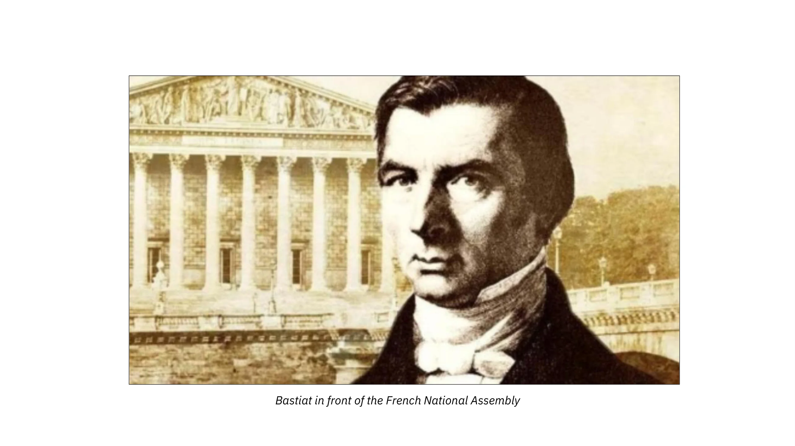

Born in 1801, Bastiat rose to prominence during the first half of the 19th century. For a time, his writings were widely read—but gradually he faded from public view. Today, few people recognize his name, even though his works have been translated into Italian, Russian, Spanish, English, and more.

After World War II, one of Bastiat’s slim volumes was published in the United States and quickly gained fame. So influential was it that **Ronald Reagan** declared it his favorite book. That little classic is called *The Law*. Thanks to its popularity, Bastiat stands alongside Alexis de Tocqueville as one of the two French writers best known in America.
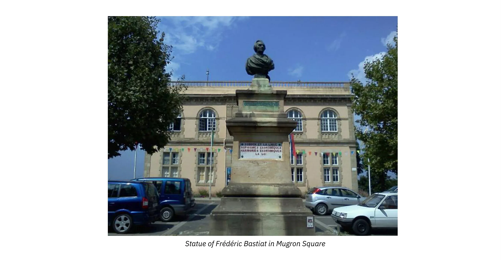
*Market place in Mugron in the Landes, the town of Bastiat*

Although often overlooked, Bastiat was truly a beacon for his age—and ours. Born in Bayonne, he spent his early years managing an inherited agricultural estate in the Landes, living the life of an entrepreneur. His curiosity soon turned to economics. A trip to England introduced him to **Richard Cobden**, a leading proponent of free trade. Inspired, Bastiat became convinced that opening markets would benefit France, and he devoted himself to spreading these ideas at home. His insightful articles earned him enough acclaim to move to Paris, where he edited the *Journal des économistes*.

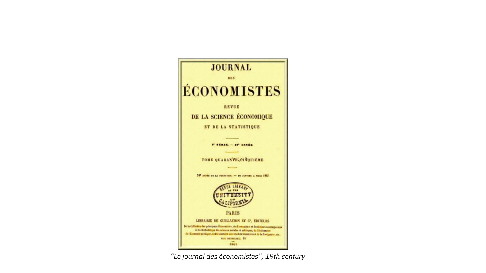

But Bastiat was more than an economist: he was a philosopher of society, justice, and law—a champion of individual rights. He examined the “political market” with the same rigor he applied to economic markets, keenly analyzing how laws and policies are shaped by competing interests.

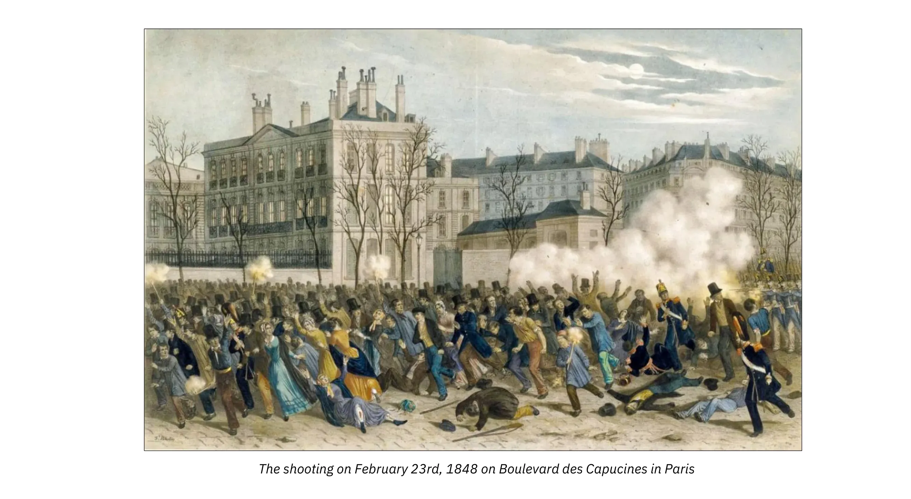

Elected deputy during France’s Second Republic, Bastiat witnessed a flood of new legislation covering everything from public services to social rights and taxes. He critiqued this “law inflation,” warning that unchecked political intervention often undermines both individual freedom and economic prosperity.

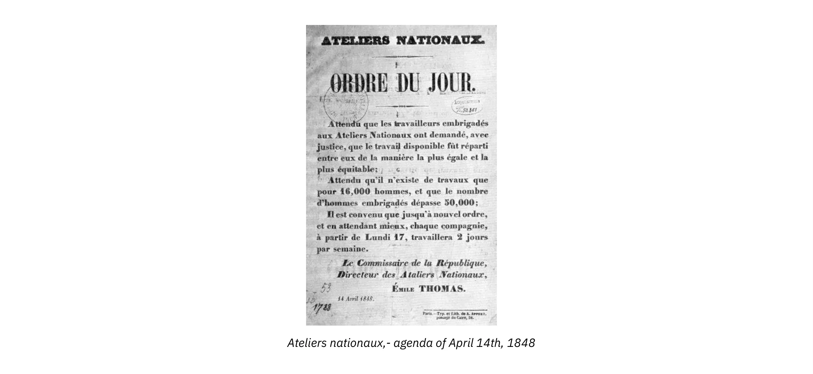

---

>**NATIONAL WORKSHOPS**  
>**AGENDA.**
>Whereas the workers enrolled in the National Workshops have justly requested that the available work be distributed among them as equally and fairly as possible;  
>Whereas work exists only for 16,000 men, and the number of enrolled men exceeds 50,000;  
>It is agreed that, until further notice and pending better arrangements, each company shall work two days per week starting Monday the 17th.  
>_The Commissioner of the Republic, Director of the National Workshops,_  
>**Émile THOMAS.**

---

He realized that, fundamentally, nothing had really changed: through voting and legislation, people continued to dispossess others of their property—a practice he called **legal plunder**. This idea stood at the core of his work, most notably in his final major text, *The Law*, where he contrasts legal plunder with the right to property. He argues that the true solution to society’s problems is freedom—specifically, the protection of private property and the right to the fruits of one’s labor.

In this course, we’ll journey through Frédéric Bastiat’s thought: first examining the early influences that shaped him, then exploring his *Economic Sophisms*, and finally studying *The Law*, which introduces his analysis of the political market and broader society.

## The Life and Historical Context

<chapterId>e9d92b63-83dd-552c-84e1-dd535608c109</chapterId>

In 1844, Frédéric Bastiat set out on a business trip to Spain. After stays in Madrid, Seville, Cádiz, and Lisbon, he embarked from Southampton to visit England. In London, he attended meetings of the Anti-Corn Law League—an organization he had followed from afar—and met its leaders, including Richard Cobden, who would become a close friend.

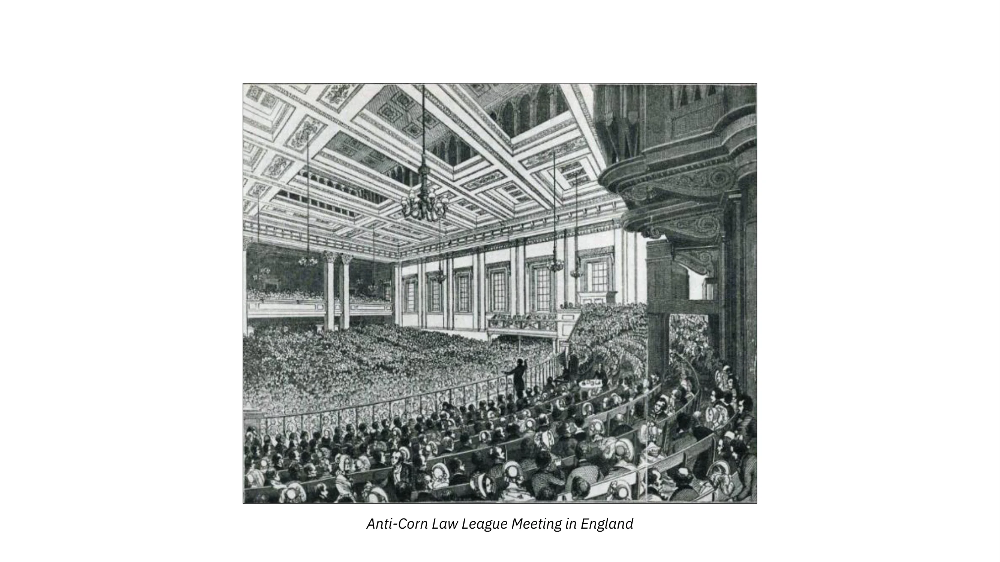

It was in England that his life took a decisive turn: Bastiat later recalled that his vocation as an economist was born in those meetings. Returning to France, he had one goal in mind—to make the French aware of the liberal movement flourishing in England.

Frédéric Bastiat was born in Bayonne on June 30, 1801. Orphaned at nine, he studied at the Catholic College of Sorèze, where he mastered English, Spanish, and even Basque. Lacking interest in formal exams, he forewent the Baccalauréat and instead joined his uncle’s import–export business in Bayonne.

In 1825, he inherited an agricultural estate from his grandfather, which he managed as a “gentleman-farmer.” There he encountered firsthand the problems created by unclear property rights. Determined to help, he became justice of the peace in Mugron (in the Landes), a key commercial and riverine crossroads between Bordeaux and Bayonne. He was later elected to the General Council of the Landes.
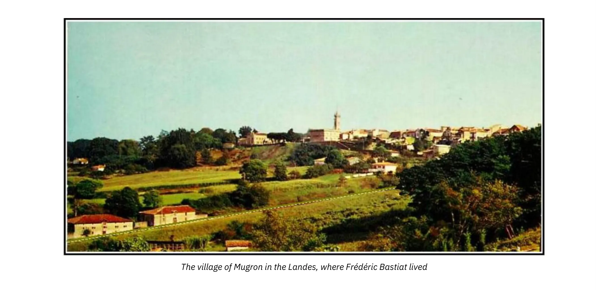

His passion for political economy deepened as he read Adam Smith, Jean-Baptiste Say, Destutt de Tracy, Charles Dunoyer, and Charles Comte. English newspapers introduced him to the Free-Trade League—a discovery that would shape his career.

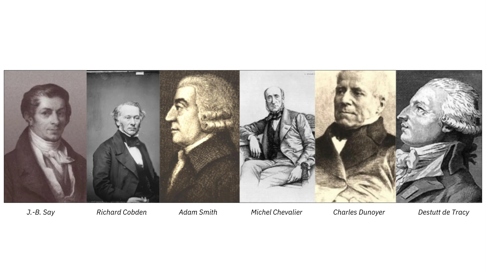
*(Say, Cobden, Smith, Chevalier, Dunoyer, Destutt de Tracy)*

Upon returning to France, Bastiat published “On the Influence of English and French Tariffs on the Future of the Two Peoples” in the *Journal des Économistes* (October 1844). It was a sensation: readers praised his powerful logic, incisive arguments, and elegant style.

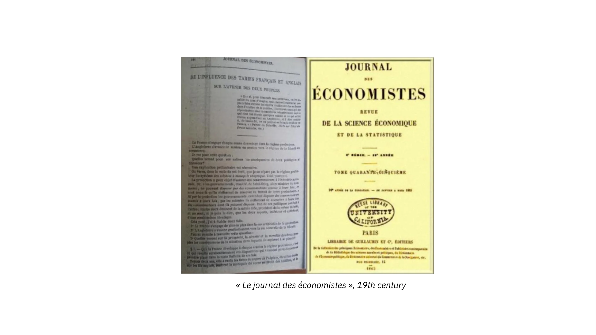

The *Journal des Économistes* commissioned further articles, and leading figures like Horace Say (son of Jean-Baptiste Say) and Professor Michel Chevalier congratulated him, urging him to continue spreading economic truths. This acclaim prompted his move to Paris.

There, he launched his *Economic Sophisms*, attacking protectionism with bold irony, and even taught political economy in a private salon attended by elite students.

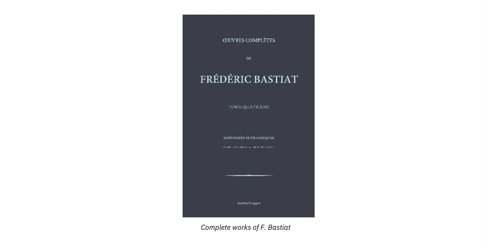

In 1845 he founded the French **Association for Free Trade**, fundraising, publishing a weekly review, and lecturing nationwide. The first meeting took place in Bordeaux on February 23, 1846, and soon chapters formed across France—in Marseille, Lyon, Le Havre, and Paris among deputies, industrialists, and merchants.

The February Revolution of 1848 toppled Louis-Philippe’s July Monarchy and ushered in the Second Republic. Bastiat was elected deputy for the Landes, sitting center-left alongside Alexis de Tocqueville. He defended civil liberties and opposed restrictive policies from any quarter, serving as vice-president of the Finance Committee. He reminded colleagues of this vital truth:

> One cannot give to some, by law, without being obliged to take from others by another law.

Nearly all of his major works were written in the last six years of his life (1844–1850). In 1850 he produced two classics: *The Law* and the pamphlet series *What Is Seen and What Is Not Seen*. *The Law* has since been translated into English, German, Spanish, Russian, Italian, and more.

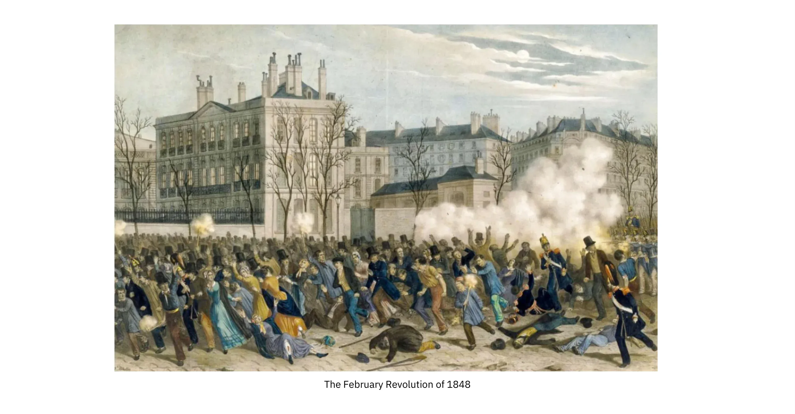

He died of tuberculosis in Rome in 1850 and is buried in the Church of Saint Louis of the French.`

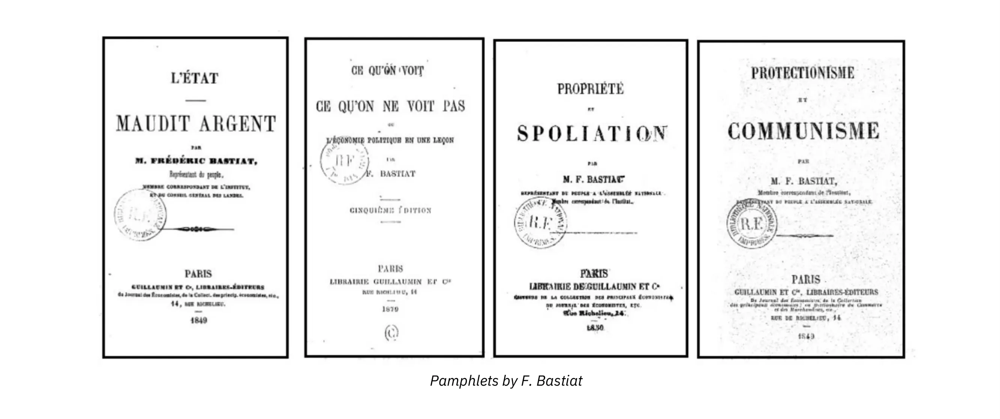

# Influences

<partId>4d312b17-5740-5d33-8309-015e2b59b6dd</partId>

## Adam Smith and Jean-Baptiste Say

<chapterId>bcc7a12a-6cc4-5061-85e3-0e31fb1f0a49</chapterId>

In economics, Bastiat always acknowledged his debt to Adam Smith and Jean-Baptiste Say. At twenty-six, he wrote to a friend:
“I have never read on these subjects but these four works—Smith, Say, Destutt, and the *Censeur*.”

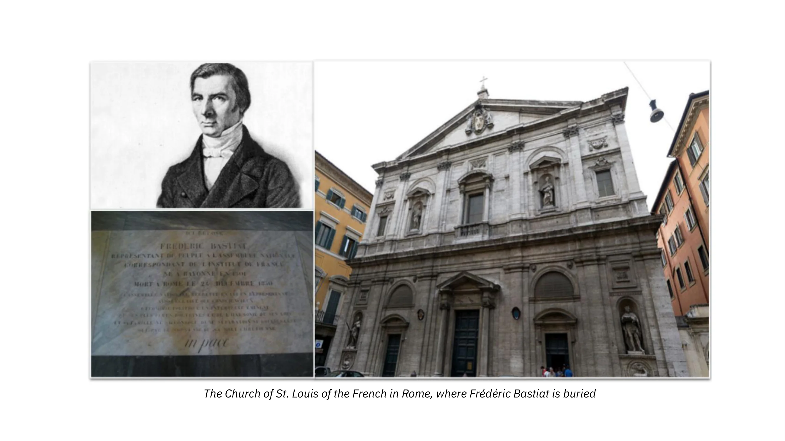
*(Jean-Baptiste Say and Adam Smith)*

Political economy, as conceived by Adam Smith and J.-B. Say, revolves around one core idea: **freedom**—freedom of trade, individual freedom, free initiative. The physiocrats (François Quesnay, Vincent de Gournay) first defended free trade; Adam Smith synthesized their insights with his own observations; and at the end of the 18th century, Jean-Baptiste Say refined Smith’s doctrine in his *Treatise on Political Economy*.

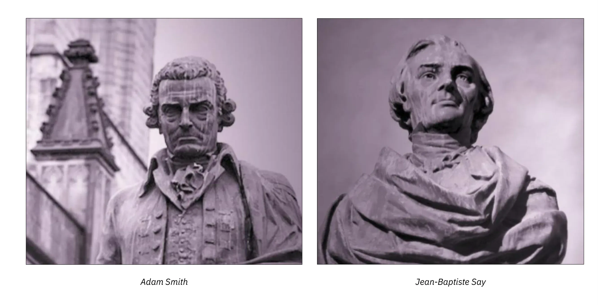
*(Say, Destutt de Tracy, Quesnay, de Gournay)*

Adam Smith saw prosperity not as an end in itself but as a means to moral improvement. “The wealth of nations consists of the wealth of individuals,” he wrote. A nation thrives when individuals act freely—expressing preferences and pursuing interests—because the market harnesses these pursuits to coordinate society.

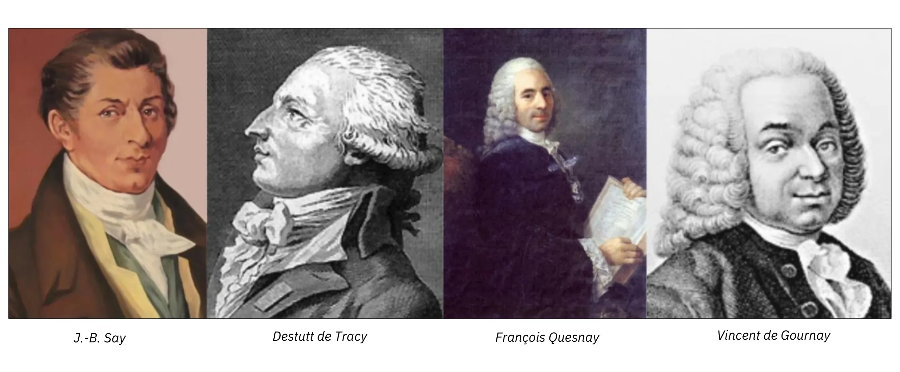

The great innovation of modern political economists was to focus on the individual, restoring each person’s capacity for action while acknowledging human passions and conflicts. People naturally seek to improve their lot—and that of their loved ones—through exchange.

Smith demonstrated that one serves one’s own interest only by serving others:

> “It is not from the benevolence of the butcher, the brewer, or the baker that we expect our dinner, but from their regard to their own interest.”

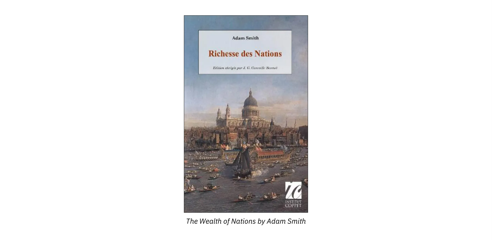

---

> “The natural effort of every individual to better his own condition... is so powerful, that it is alone, and without any assistance, not only capable of carrying on society to wealth and prosperity, but of surmounting a hundred impertinent obstructions with which the folly of human laws too often encumbers its operations.”
> *The Wealth of Nations*, Book IV, Chapter V

---

Exchange is a positive-sum game: both parties gain, unlike political redistribution, which always produces winners and losers. The English school—Smith, Ricardo, Locke (and later Marx)—linked value to labor. Bastiat, following Say, argued that **utility** is the true foundation of value. Labor alone does not create value, nor does scarcity—only utility does. No one pays for something they do not find useful.

Bastiat refined Say’s insight further: value lies not in the intrinsic utility of things but in their **relative** utility when exchanged. “Value is the ratio of two exchanged services,” he wrote. Thus value is subjective, revealed only through individuals’ behavior in a free market. The market, in turn, regulates society by aligning these preferences.

One fundamental principle—“Say’s Law”—states: “Products and services are exchanged for products and services.” Nations and individuals benefit from higher production because it creates more opportunities for mutually advantageous exchanges.

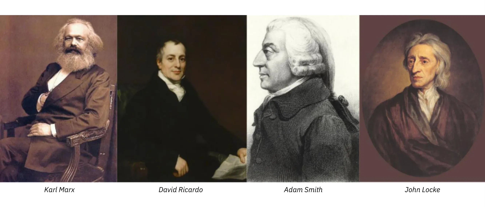

Indeed, purchases anticipate the services people expect—a record for listening, a ticket for a film. In every exchange, each party acts because what they gain outweighs what they give up. Money merely facilitates these exchanges as an intermediary commodity.

For Bastiat, this economy of freely offered and accepted services underpins peace and prosperity, harmonizing interests across society.

Yet Bastiat also inherited from Say the concept of **plunder**. 

> “There are only two ways to acquire the things necessary for life: production and plunder”

Producers rely on persuasion, negotiation, and contract; plunderers depend on force and deceit. The law’s role is to suppress plunder and protect labor and property. As Adam Smith had asserted, safeguarding citizens’ security is government’s primary duty—and the sole justification for taxation.

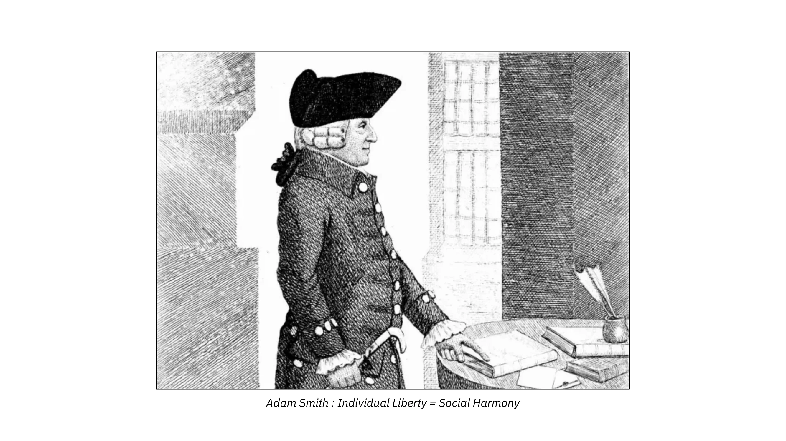

## Antoine Destutt de Tracy

<chapterId>ddf64e9f-2ce0-5651-8eb8-bae578eb0b9b</chapterId>

It is little known, but Destutt de Tracy decisively influenced the future U.S. President Thomas Jefferson during his ambassadorship in Paris in the 1780s.

> “For every man, his first country is his homeland, and the second is France.”
> “Tyranny is when the people fear their government; liberty is when the government fears the people.”
> —Thomas Jefferson

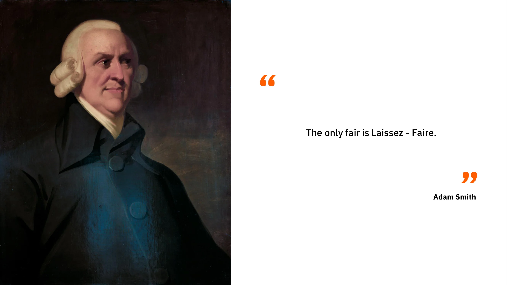

His *Treatise on Political Economy* condemned protectionism and Napoleonic expansion—and was banned in France by Bonaparte. Jefferson translated and published it in the United States, making it the first political-economy textbook at the University of Virginia. It did not appear in France until 1819!

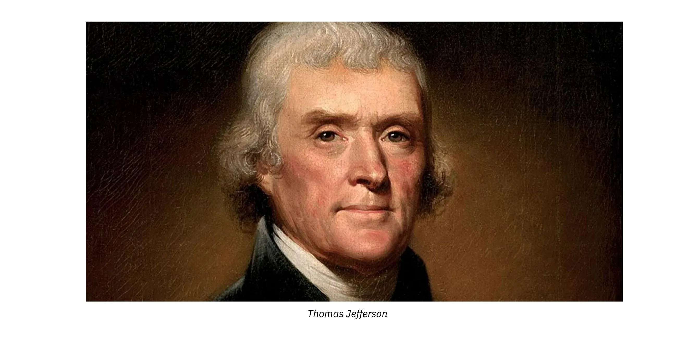

Destutt de Tracy, philosopher and economist, led the “Idéologues” school alongside Cabanis, Condorcet, Constant, Daunou, Say, and Germaine de Staël. They were direct heirs of the Physiocrats and disciples of Turgot.

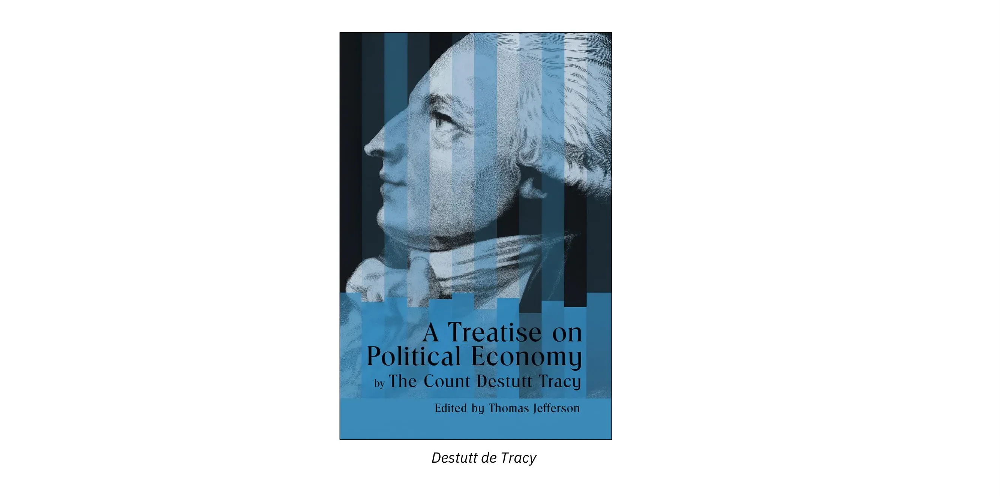

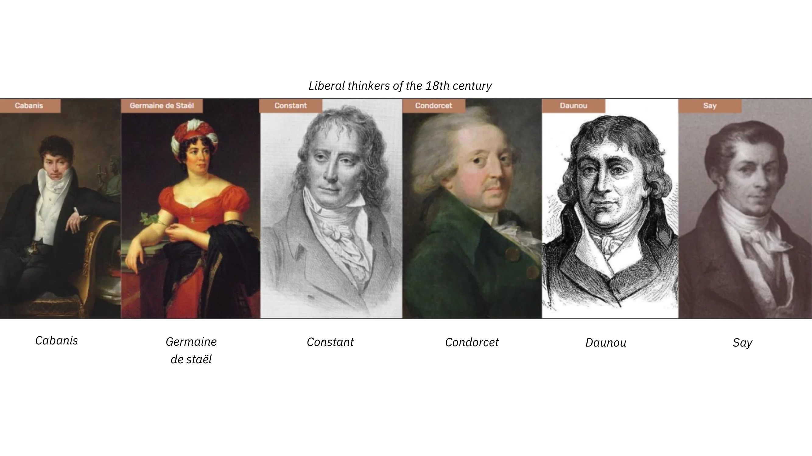

By “ideology,” Tracy meant the science of ideas—their origins, laws, and relationship with language (early epistemology). The term carried no pejorative sense until Marx later used it to discredit laissez-faire economists. Their journal, *La Décade philosophique et littéraire*, dominated the revolutionary era under Say’s direction.

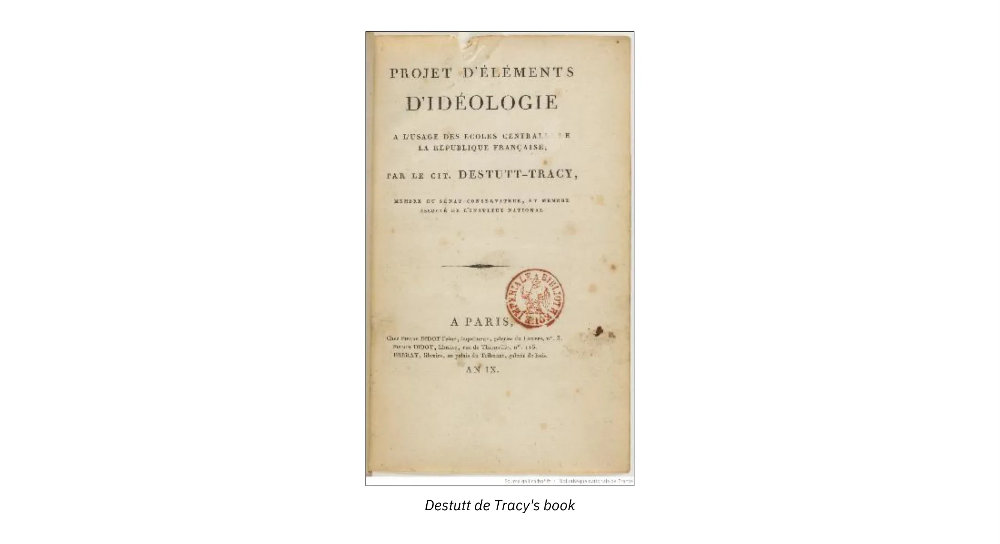

Tracy was elected to the French Academy (1808) and the Academy of Moral and Political Sciences (1832). His daughter’s 1802 marriage to Georges Washington de La Fayette (son of Lafayette) underscores strong Franco-American ties.

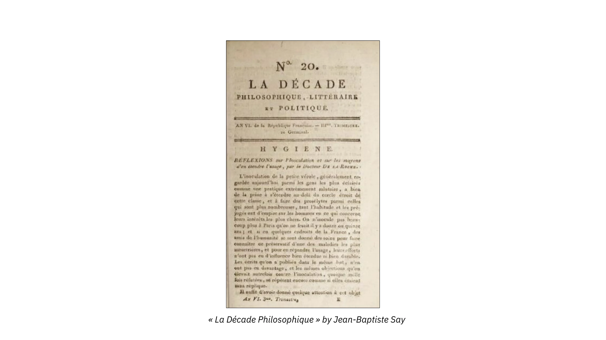

His *Treatise* aimed to “examine the best way to employ all our physical and intellectual faculties to satisfy our various needs.” He argued that trade is the civilizing, rationalizing, and pacifying force of humanity: “Trade is the whole of society, just as labor is the whole of wealth.” Society is “a continuous series of exchanges in which both contractors always gain,” making markets positive-sum rather than predatory.

Although Tracy stopped short of defining political economy as the science of exchange, Bastiat would later do so: selling is exchanging goods, renting is exchanging services, lending is deferred exchange—thus “the theory of exchange.”

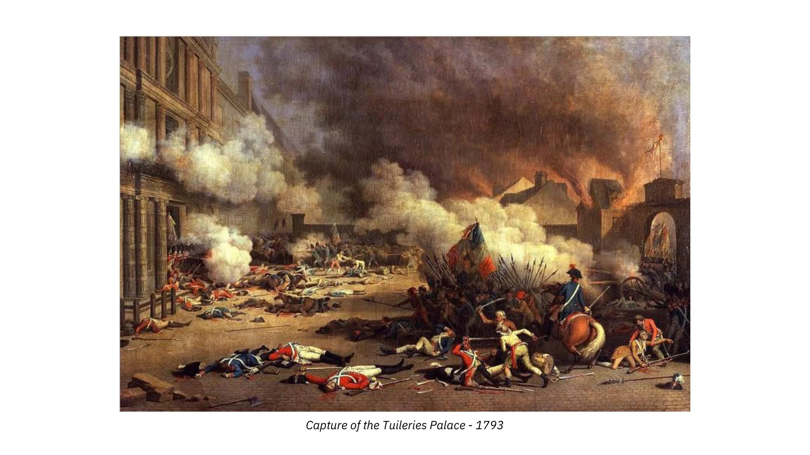

Tracy held that property springs from our nature and desires: without wants, there are no rights or duties. To meet needs, we employ means acquired through labor, and private property secures this process. Therefore, government’s sole purpose is to protect property and allow peaceful exchange.

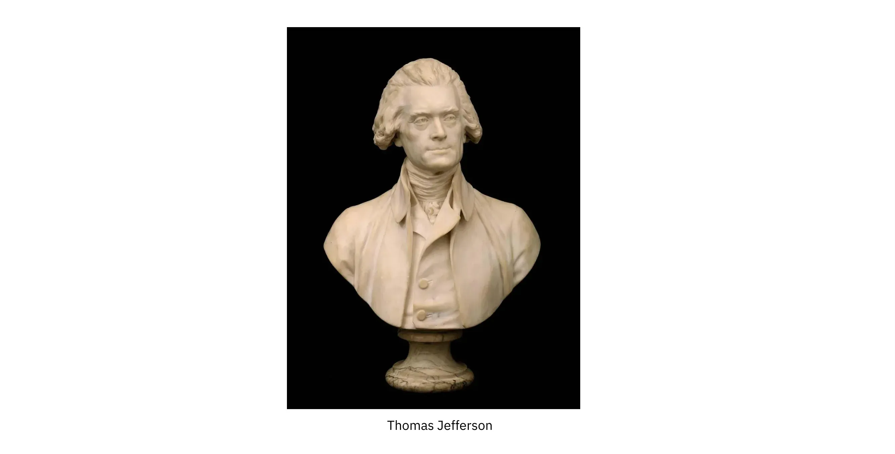

He advocated the most moderate taxes and minimal state spending, condemning government plunder via debt, taxes, monopolies, and waste. The law should protect freedom, never plunder. He concluded with a warning still pertinent today:

> “Let the government not incur debts that commit future generations and always lead states to their ruin.”

In sum, the Idéologues intuited that production and exchange solve political problems and prevent war—whether internal, as during the Revolution, or external, under ancient kings and Napoleon.

## Charles Comte and Charles Dunoyer

<chapterId>80bc5c4e-ac07-52c8-9dd7-e224ac291bda</chapterId>

The history of all civilizations is the story of the struggle between the plundering classes and the productive classes. This is the creed of the two authors we are going to discuss. They are the originators of a liberal theory of class struggle that inspired Frédéric Bastiat as much as Karl Marx, although the latter distorted it.

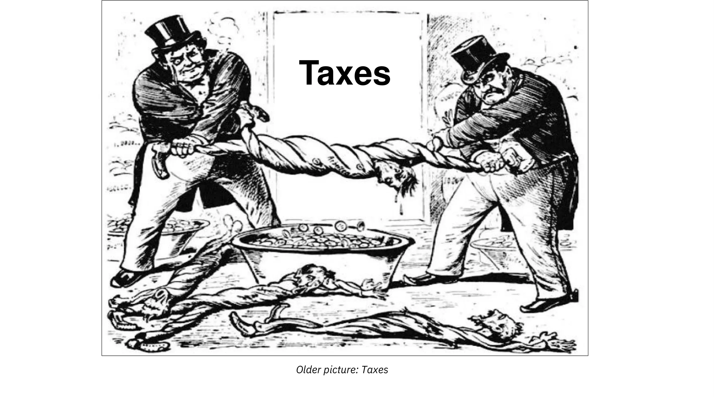

For Comte and Dunoyer, plunder, meaning all forms of violence exercised in society by the strong over the weak, is the great key to understanding human history. It is at the origin of all phenomena of exploitation of one class by another.

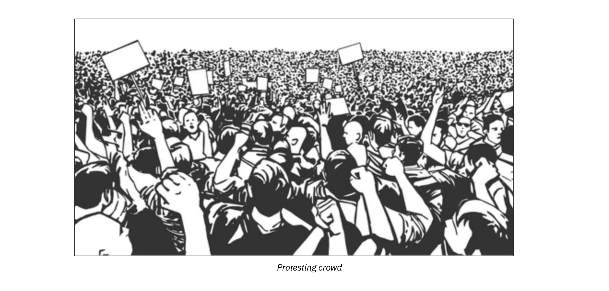

If Frédéric Bastiat owes his economic education to Smith, Destutt de Tracy, and Say, he owes his political education to the leaders of the journal Le Censeur, Charles Comte and Charles Dunoyer.

This review (1814-1819), renamed Le Censeur européen after the Hundred Days, disseminated the liberal ideas that triumphed in 1830 with the insurrection of the Three Glorious Days and the rise to power of the Duke of Orléans, Louis-Philippe I.

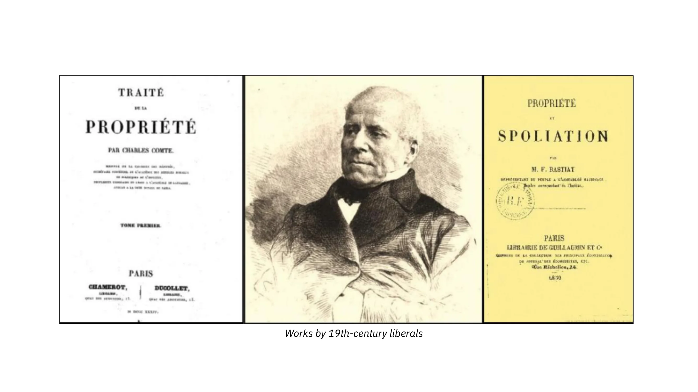

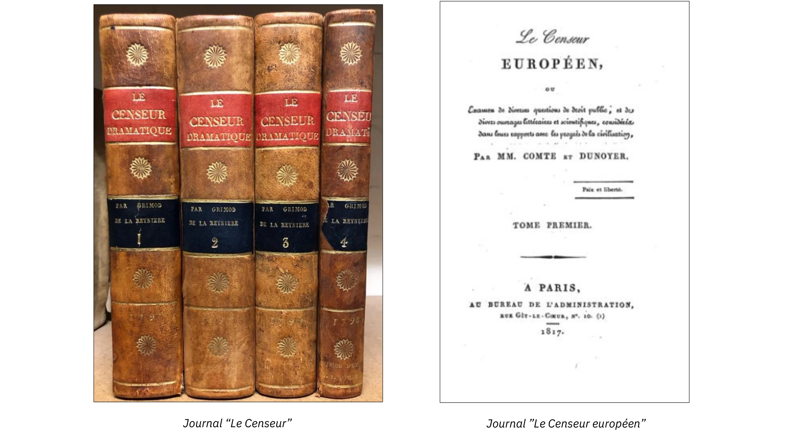

Charles Comte, cousin of Auguste Comte and son-in-law of Say, is the founder of the review. He was soon joined by Charles Dunoyer, a jurist like himself, and then by a young historian, Augustin Thierry, former secretary of Saint Simon. Their motto on the front page of each issue of the review was "Peace and Liberty".

What is the goal of the review? The title speaks for itself: to censor the government. To fight against the arbitrariness of power by enlightening public opinion, to defend the freedom of the press.

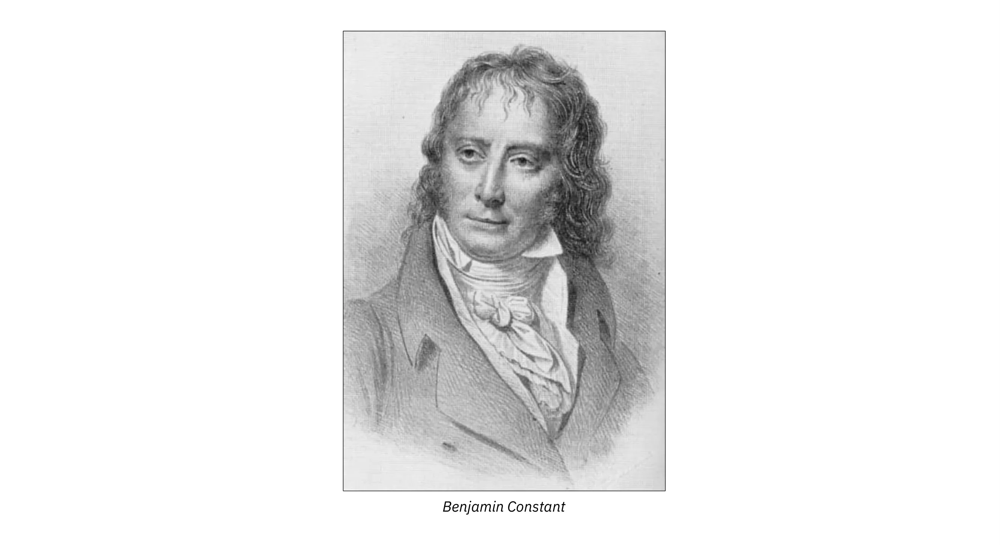
_(Benjamin Constant)_

They adopt from Benjamin Constant the distinction between the Ancients and the Moderns, characterized on one hand by war, and on the other by commerce and industry. But they add with Say that political economy provides the best explanation of social phenomena. They particularly understand that nations achieve peace and prosperity when property rights and free trade are respected. From now on, for them, political economy is the true and only foundation of politics. To philosophy, which confines itself to the abstract critique of forms of government, must be substituted a theory based on the knowledge of economic interests.

> Political economy, by demonstrating how peoples prosper and decline, has laid the true foundations of politics.  
>  
> Dunoyer  

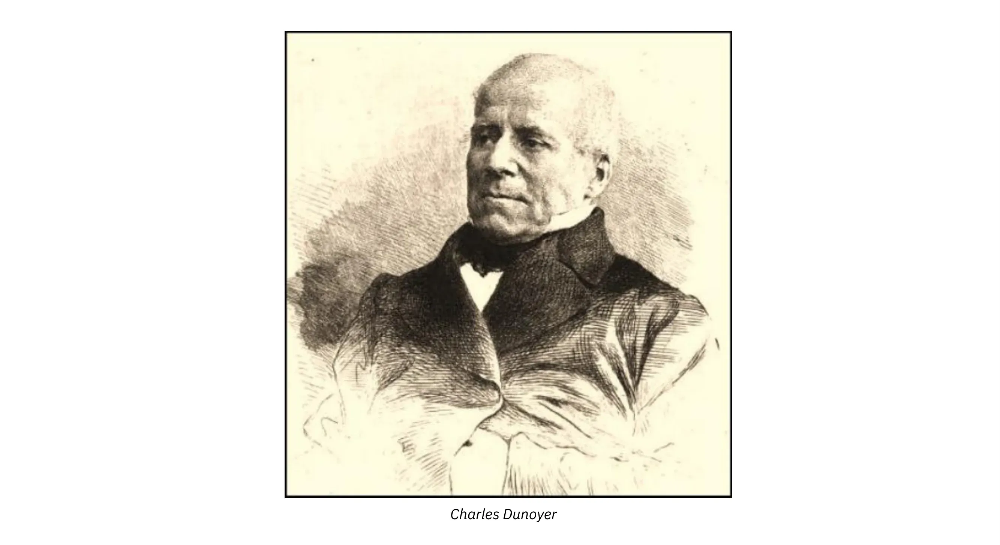

This new social theory contains one of the elements that would become the cornerstone of Marx and Engels' scientific socialism: class struggle. But what does the liberal theory of class struggle consist of, and how does it differ from Marxism?

It starts with the individual who acts to meet their needs and desires. From the moment one creates, that is, increases the utility of things, enhancing their value, one engages in industry. Here, an industrialist is not an industry owner, as current language might suggest, but a producer, regardless of the field in which they work. That's why their theory is called industrialism. It posits that the goal of society is the creation of utility in the broad sense, that is, goods and services useful to humans.

On this point, individuals face two fundamental alternatives: they can plunder the wealth produced by others, or they can work to produce wealth themselves. In any society, one can clearly distinguish those who live off plunder from those who live off production. Under the Ancien Régime, the nobility directly attacked the most industrious to live off a new form of tribute: tax. The rapacious nobility was succeeded by hordes of bureaucrats, no less rapacious.

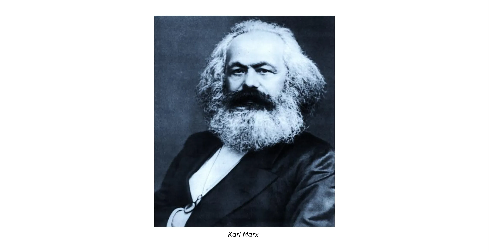

While for Marx, class antagonism is situated within the productive activity itself, between employees and employers, for Comte and Dunoyer, the conflicting classes are, on one side, the society's producers, who pay taxes (including capitalists, workers, peasants, scholars, etc.) and on the other, the non-producers, who live off rents financed by taxes, "the idle and devouring class" (bureaucrats, officials, politicians, beneficiaries of subsidies or protections).

Then, unlike Marx, the authors of the Censeur Européen do not advocate for class warfare. Instead, they campaign for social peace. And this, according to them, can only be achieved through the depoliticization of society. To this end, it is important to first reduce the prestige and benefits of public offices. It is then important to give influence in the political body to the producers.

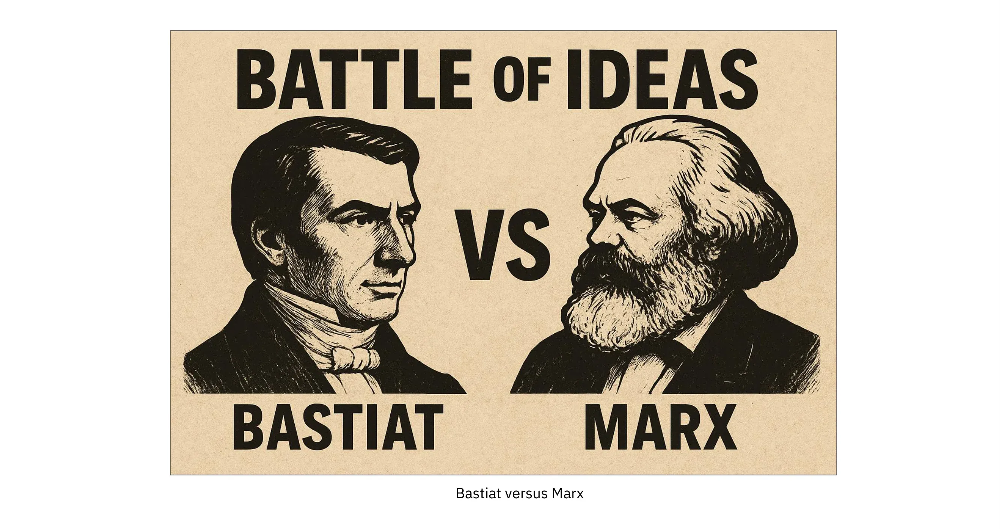
Finally, the only way to rid the world of the exploitation of one class by another is to destroy the very mechanism that makes this exploitation possible: the power of the State to distribute and control property and the allocation of benefits related to it (the "positions").

Their ideas, profoundly innovative, would forever mark Frédéric Bastiat, who would himself become a deep thinker on political crises.

## Cobden and the League

<chapterId>7181435c-5eae-56e4-8e55-02a24273fdd6</chapterId>

It is 1838, in Manchester, a small number of men, little known until then, gathered to find a way to overthrow the monopoly of the wheat landowners through legal means and to accomplish, as Bastiat would later recount,

> Without bloodshed, by the sole power of opinion, a revolution as profound, perhaps more profound than that which our fathers carried out in 1789.  

From this meeting would emerge the League against the corn laws, or the grain laws, as Bastiat would call them. But very quickly, this goal would become that of the total and unilateral abolition of protectionism.

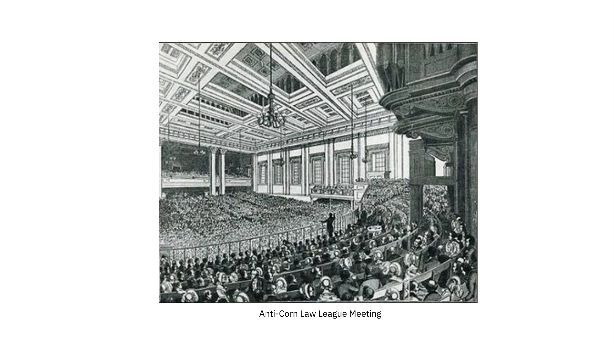

This economic battle for free trade would occupy all of England until 1846. In France, outside of a small number of initiates, the existence of this vast movement was completely unknown. It was by reading an English newspaper, to which he had subscribed by chance, that Frédéric Bastiat learned of the League's existence in 1843. Enthused, he translated the speeches of Cobden, Fox, and Bright. Then he corresponded with Cobden and finally, in 1845, he went to London to attend the League's gigantic meetings.

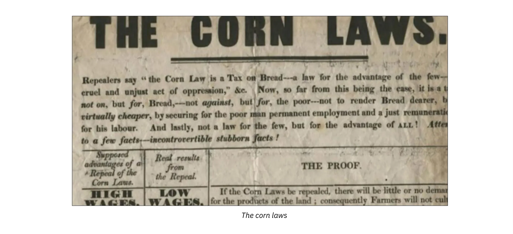

It was this campaign for free trade—spanning the entire kingdom and backed by tens of thousands of members—that ignited Bastiat’s passion and permanently changed the course of his life.

The League functioned like a traveling university, teaching economic principles to audiences across the country: common people, industrialists, farmers, and cultivators—all suffering under the grain laws. Richard Cobden was the heart of the movement and a brilliant organizer.

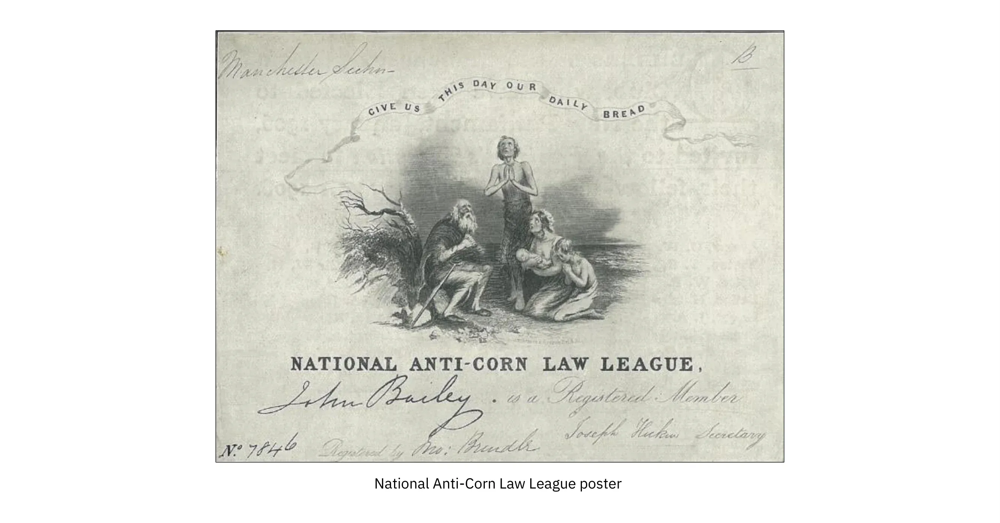

A captivating and powerful speaker, he had a remarkable talent for crafting sharp, memorable phrases—far removed from the abstract language of most economists.

> “What is the bread monopoly?” he exclaimed. “It’s the scarcity of bread. You may be surprised to learn that the legislation of this country exists for no other purpose than to create the greatest possible scarcity of bread. And yet that is exactly what it does. The law can achieve its aim only through scarcity.”

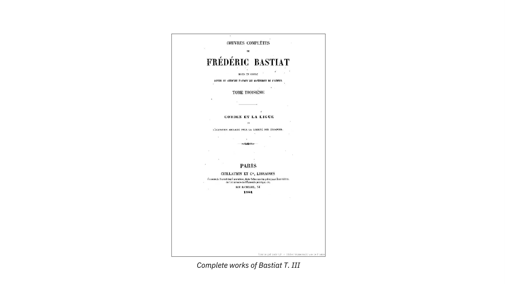

In 1845, Bastiat published *Cobden and the League* in Paris, offering translations of speeches accompanied by his commentary. The book began with an introduction describing England’s economic situation and the history and progress of the League. Since 1815, protectionism had been firmly entrenched in England, with laws restricting grain imports. These laws had severe consequences for ordinary people because wheat was essential for bread, a staple food. The system also enriched the aristocracy—large landowners who profited from high grain prices.

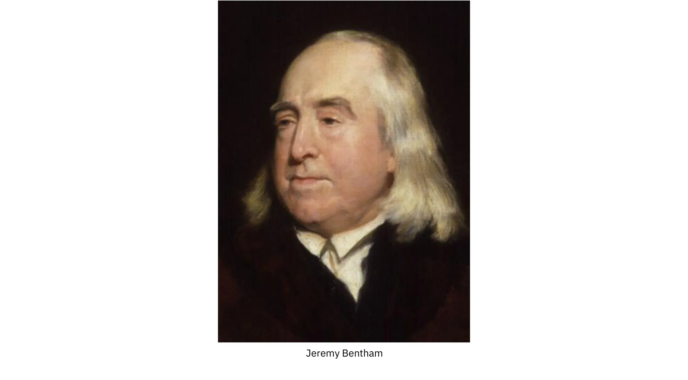

> What coexists in England, Bastiat wrote, is a small number of plunderers and a large number of plundered, and one does not need to be a great economist to conclude the opulence of the former and the misery of the latter.  

The goal of the League was to mobilize public opinion to pressure parliament to repeal the grain law. In the long term, Cobden and his friends hoped to:

- Increase industrial outlets
- Increase employment
- Reduce the price of bread
- Make agriculture and industry more efficient through competition
- Promote peace among nations

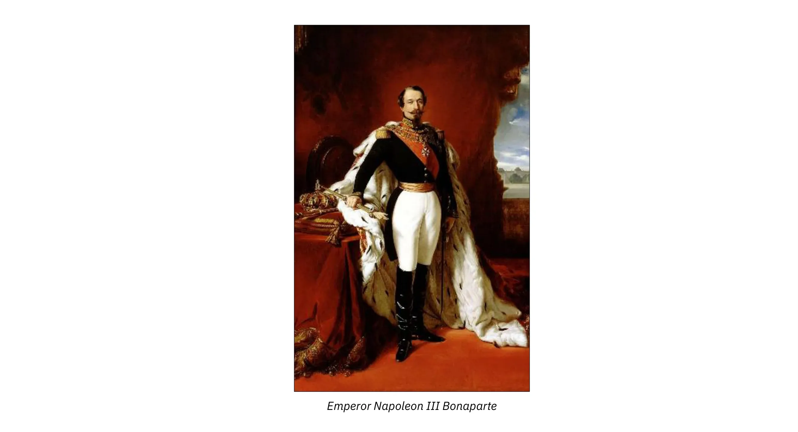
_(Jeremy Bentham)_

A disciple of Bentham’s utilitarianism, Cobden believed that the freedom of labor and trade directly served the interests of the largest, poorest, and most oppressed segments of society. In contrast, tariffs and trade barriers—tools of arbitrary privilege—benefited only a few powerful industries.

In the 1841 elections, five members of the League, including Cobden, won seats in Parliament. On May 26, 1846, unilateral free trade became the law of the land. From that moment, the United Kingdom entered a remarkable era of freedom and prosperity.

Bastiat was deeply inspired by the League. He adopted its methods, absorbed its language, and adapted its ideas to the French context. *Cobden and the League* quickly became a success, marking Bastiat’s sensational debut in economic circles. He founded a free-trade association in Bordeaux, later moved it to Paris, and was eventually offered leadership of the *Journal des Économistes*. The movement flourished until 1848.

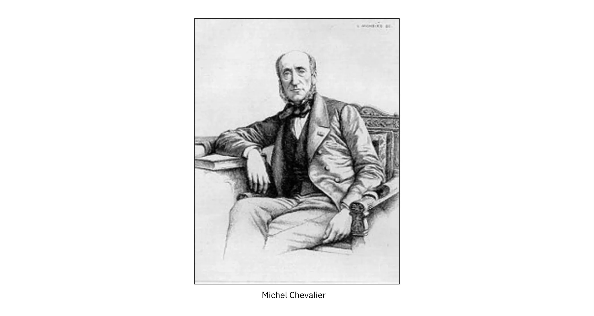

It was only after Bastiat’s death, in 1866, that Napoleon III signed a free-trade treaty with England—a posthumous victory for the man who devoted the final six years of his short life to this great cause.

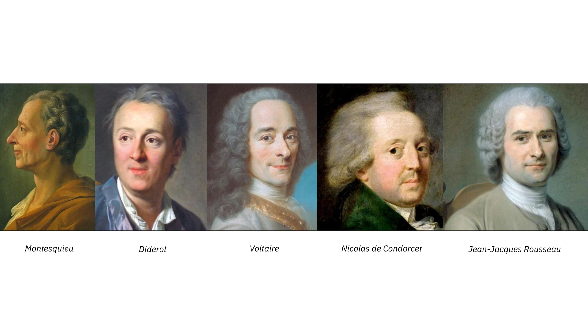
_(Michel Chevalier)_

The question of free trade remains as relevant today as ever. School geography textbooks often claim that globalization is to blame for global inequality and that poor countries depend on Western aid for survival. Yet in reality, extreme poverty has been cut in half over the past 20 years.

By embracing openness, countries like India, China, and Taiwan have lifted millions out of poverty, while closed economies like North Korea and Venezuela remain stagnant. According to the UN, 36% of the world’s population lived in extreme poverty in 1990; by 2010, that number had fallen to just 18%.

Extreme poverty remains a serious challenge—but it is steadily declining.

# The Opponents

<partId>f902ed30-269e-5e44-a76d-8efd1a4e4085</partId>

## Rousseau

<chapterId>c3926110-e0b2-503c-96d9-5d3a6a661484</chapterId>

Frédéric Bastiat, writing in the 1840s, was the intellectual heir of Enlightenment philosophers who fought censorship and championed freedom of expression—think of Montesquieu, Diderot, Voltaire, Condorcet, and Rousseau.

For these thinkers, the principle was simple: the freer the exchange of ideas, the faster truth advances and the more easily errors are exposed. Science progresses in exactly this way.

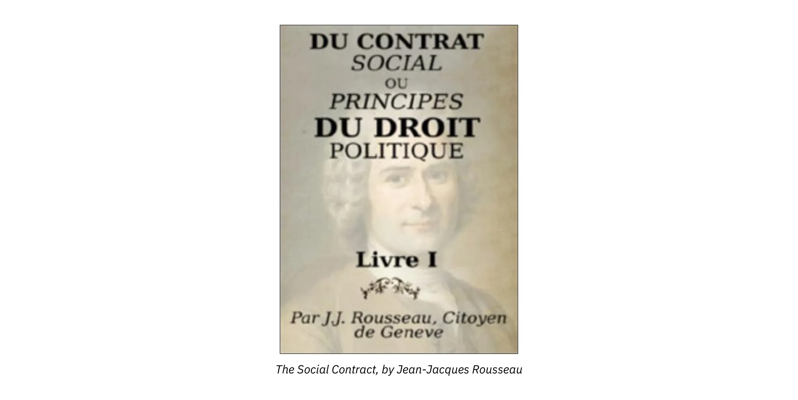
_(Montesquieu, Diderot, Voltaire, Condorcet, Rousseau)_

Yet few recognized that the same principle applies to goods and services. Free trade has two virtues: it is efficient and leads to fairer distribution. Rousseau, however, opposed this freedom, invoking a mistaken view of law and rights. Bastiat argued that Rousseau’s belief—that the entire social order must be built on law—became one of the main roots of socialism.

Indeed, Bastiat considered Rousseau the true precursor of socialism and collectivism. A line from *The Social Contract* captures Rousseau’s philosophy well: “We only begin to become men after having been citizens.”

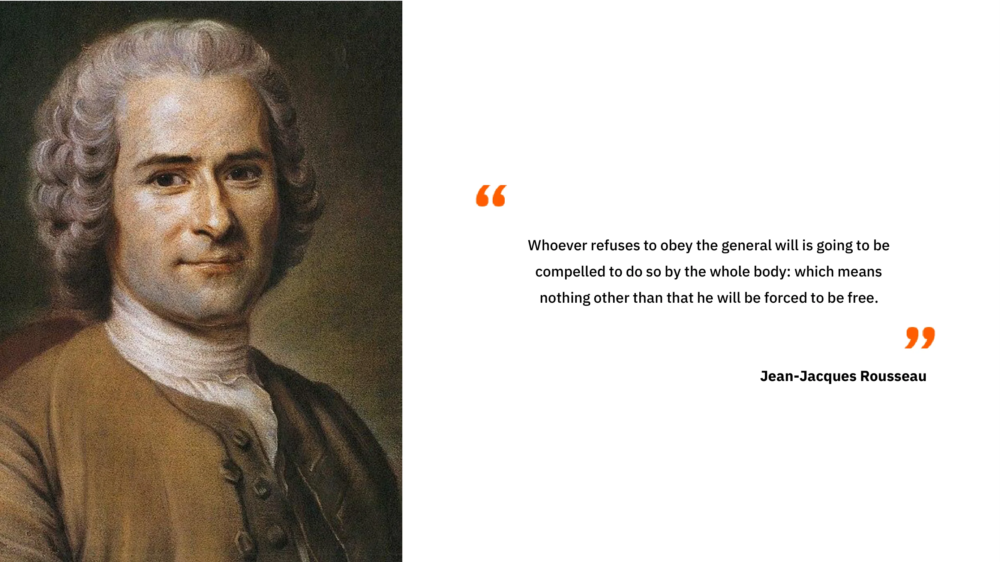

At first, man is simply a bourgeois. The bourgeois is calculating; he seeks immediate pleasure, driven by his senses, desires, and self-interest. In short, he is not rational—and therefore not free. He must be educated to recognize that his true interest lies in the general interest. This is why Rousseau wrote in *The Social Contract*:

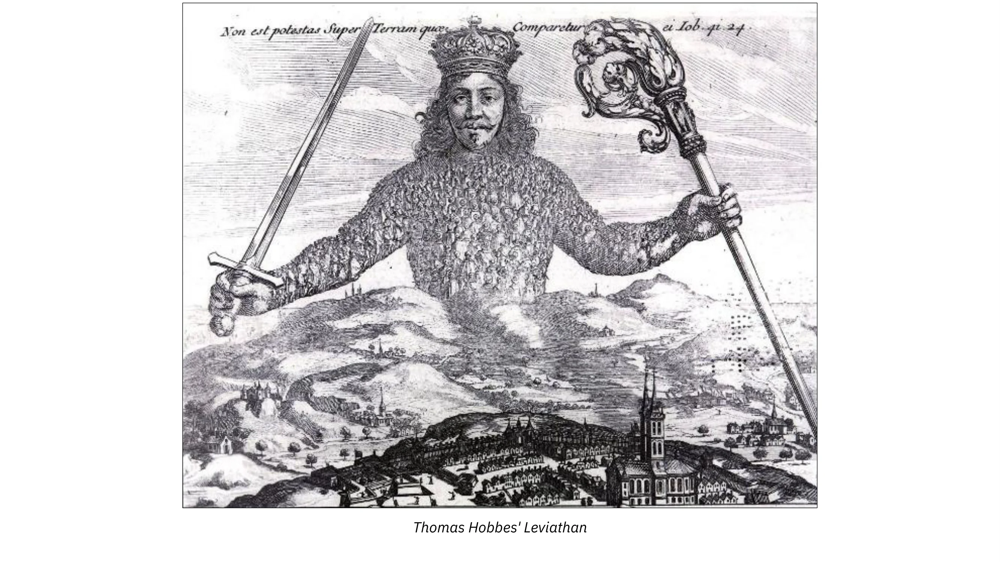

---

>Whoever refuses to obey the general will shall be compelled to do so by the entire body: which means nothing else than that he will be forced to be free.  
>(Jean-Jacques Rousseau)

---

According to Rousseau’s doctrine, man harbors two wills: one driven by personal interest—the bourgeois will—and another directed toward the general interest—the citizen’s will. To lead men, even by force, toward the rational goal of the general interest is, in Rousseau’s view, to lead them to freedom. For what they truly desire, even if unknowingly, is this rational end.

Thus, Rousseau argued, it is entirely legitimate to compel people in the name of goals that, if they were enlightened, they would willingly choose themselves. Society exists to force individuals to do what they would spontaneously want if they were free of ignorance, blindness, or corruption. By doing so, Rousseau claimed, one does not commit violence against them; rather, one leads them to be “free,” that is, to make the right choices—the ones aligned with their true selves.

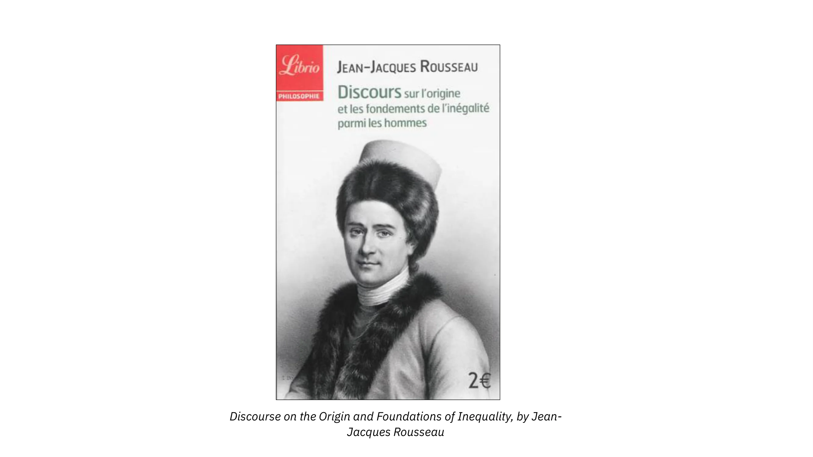

Convinced that a good society is the product of law, Rousseau grants unlimited power to the legislator. It is the legislator’s role to transform individuals into fully realized human beings—into citizens.

Moreover, Rousseau claims that even property itself depends on the legislator. Property, he argues, is legitimate only if regulated by law. Inequality and servitude both arise from property; it is the invention of the strong, leading to domination and the corruption of society. In his *Discourse on the Origin and Foundations of Inequality*, Rousseau famously writes:

> The first person who, having fenced in a piece of land, said: This is mine, and found people simple enough to believe him, was the true founder of civil society. How many crimes, wars, murders, how much misery and horror would have been spared the human race by the one who, pulling up the stakes or filling in the ditch, had cried out to his fellows: "Beware of listening to this impostor; you are lost if you forget that the fruits belong to all and the earth belongs to no one!"  

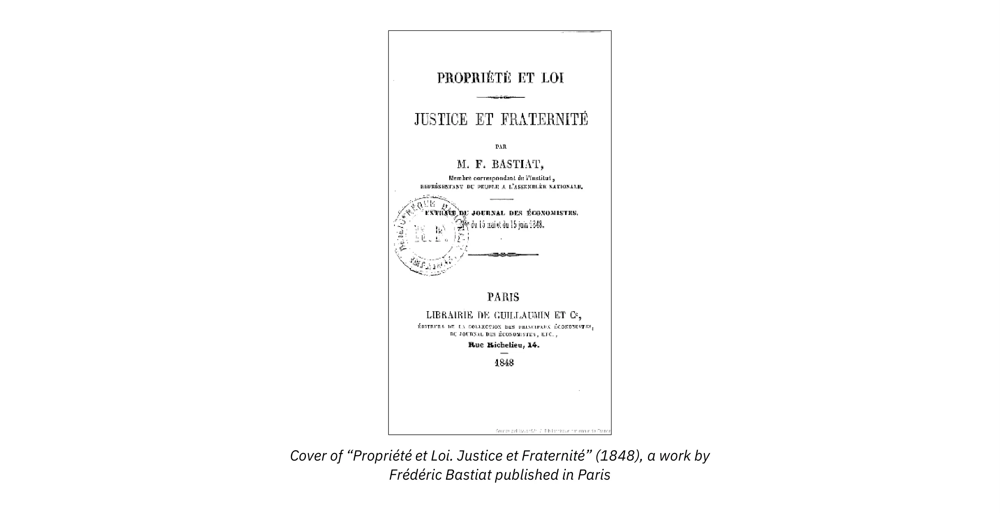

Therefore, Rousseau concludes that natural property is the source of society’s ills—a point Marx, an avid reader of Rousseau, would later adopt. How can this evil be overcome? Through the **social contract**, Rousseau answers. The good society, he argues, emerges from a contract in which the individual surrenders all rights to the community, and it is then the community, through the law, that grants rights back to individuals.

Frédéric Bastiat, however, takes the opposite view: “Man is born a property owner,” he writes. For Bastiat, property flows naturally from human existence. “Man is born a property owner,” he says, “because he is born with needs whose satisfaction is indispensable to life, with organs and faculties whose exercise is indispensable to the satisfaction of these needs.” Our faculties are simply an extension of ourselves, and property is the extension of those faculties. In other words, by applying our abilities through work, we legitimize property.

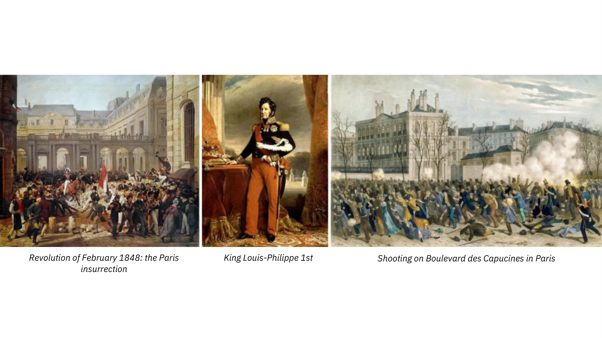

Bastiat argues that **society, individuals, and property predate law**, not the other way around. As he famously put it: “It is not because there are laws that there are properties, but because there are properties that there are laws.”

For this reason, the law must be **negative**: its role is to prevent violations against persons and their property. Property gives rise to law—not the other way around.

## Classical Education

<chapterId>87d9a8c9-2352-5cb2-8b93-678118a8145c</chapterId>
On February 24, 1848, after three days of rioting in Paris, King Louis-Philippe I abdicated the throne, marking the birth of the **Second Republic**.

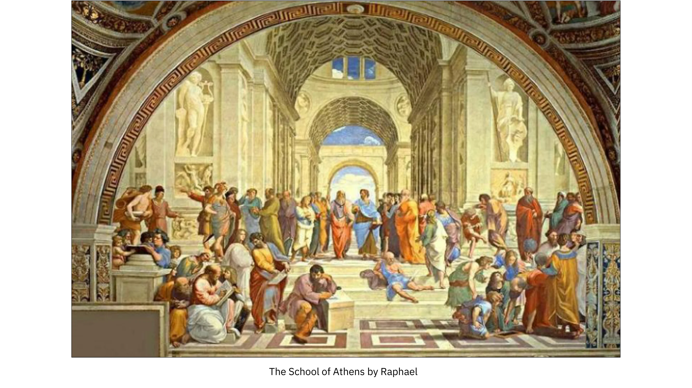

Bastiat was in Paris, witnessing the events firsthand. He later wrote:

> “On February 24, I, like many others, feared that the nation was not prepared to govern itself. I must admit, I dreaded the influence of Greek and Roman ideas that are imposed on us all by the academic monopoly.”

This passage is striking. What do Greek and Roman antiquity have to do with it?

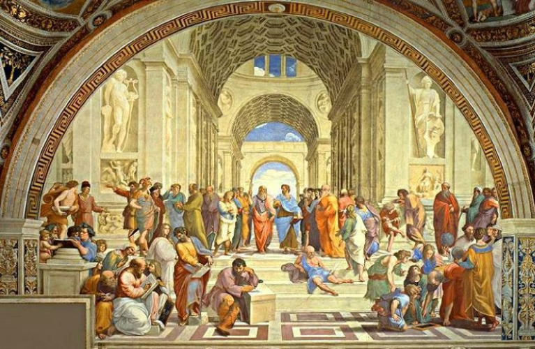

Bastiat was referring to **Plato’s Republic** and its theory of the philosopher-king, to Sparta, which Rousseau so admired, and to the Roman Empire, whose glory Napoleon longed to revive. According to Bastiat, these Greek and Roman traditions share a dangerous idea: the belief in the *omnipotence of the legislator* and the *absolute sovereignty of the law*.

Open almost any book on philosophy, politics, or history, Bastiat notes, and you will find this notion: that humanity is passive, needing political power to give it life, organization, morality, and prosperity. Left to itself, it would collapse into anarchy—rescued only by the mysterious, all-powerful hand of the Legislator.

For Bastiat, this idea persisted because centuries of classical education had cultivated and entrenched it in our culture.

Bastiat explains that the Romans viewed property as purely conventional—an artificial creation of written law. Why? Because their society depended on slavery and plunder. For them, all property originated in spoliation. As a result, they could not acknowledge labor as the foundation of legitimate property without undermining the very basis of their civilization.

The Romans defined property empirically as *jus utendi et abutendi*—the right to use and abuse—but this definition concerned only its effects, not its causes or ethical foundations. To truly ground property, one must look to human nature itself and grasp the inherent connection between needs, faculties, labor, and property. Could a slave-owning people ever embrace the principle that *every man owns himself, and therefore his labor, and thus the product of his labor*? Bastiat doubts it, concluding: 

> “Let us not be surprised to see the Roman idea that property is a conventional fact reappear in the eighteenth century: that, far from law being a corollary of property, it is property that is a corollary of law.”

Indeed, Rousseau inherits this legal tradition, grounding property in law itself. He grants the law—and by extension, the people—absolute power over individuals and their property. In this conception, which shaped republican thought after the French Revolution, the legislator becomes a kind of **social architect**, a mechanic designing a machine from inert matter, or a potter molding clay. Placing himself above humanity, he claims the right to arrange society at will, following the designs of his “enlightened” intelligence.

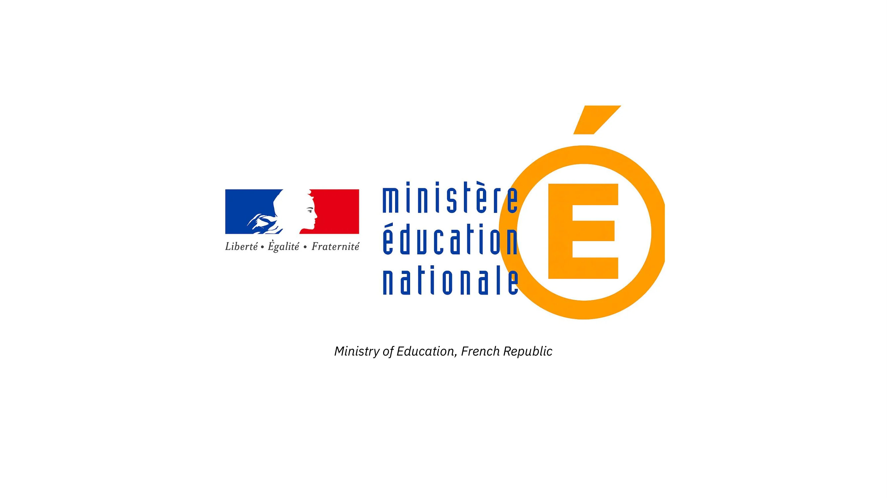

On the contrary, Bastiat argues, the **right to property precedes the law**. This is what he calls the *principle of economists*, in opposition to the *principle of jurists*. As Bastiat puts it,

> “The principle of jurists virtually contains slavery; that of economists contains freedom.”

And what is freedom? It is *property*—the right to enjoy the fruits of one’s labor, to work, to develop, to use one’s faculties as one chooses, with the State intervening only to protect, never to control.

It is unfortunate, Bastiat laments, that social and political thought has remained trapped in the belief that solutions to all problems must come from above—from the law, from the State. Yet this is understandable, he adds, because such ideas are ingrained in the minds of the young through state-controlled education and the academic monopoly.

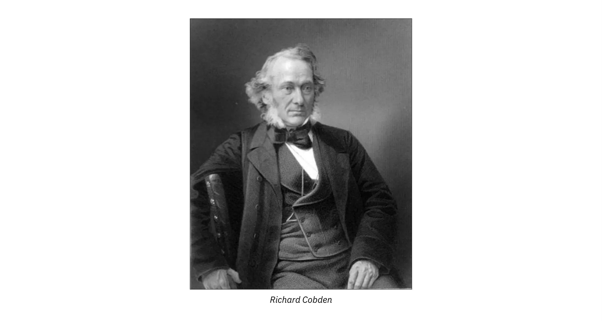
_an example of such a monopolistic agent could be a government institution_

However, as Bastiat reminds us, monopoly excludes progress.

## Protectionism and Socialism

<chapterId>ce6cb8a8-7dc9-5ef7-939d-9a559b4d2c74</chapterId>

_(Richard Cobden)_

As we have seen, it was above all Cobden’s fight against protectionism—led by the English League for the abolition of the Corn Laws—that inspired Bastiat to begin writing articles and later books.

Protectionism, Bastiat explains, is simply a form of economic nationalism. It seeks to eliminate foreign competition under the pretense of “defending national interests.” Advocates present a series of purely demagogic falsehoods as if they were noble causes: protecting jobs, ensuring competitiveness, and so on. Naturally, politicians give in to pressure from producers because it offers them a golden opportunity to strengthen their political base and expand their power.

The argument for protecting jobs, Bastiat says, is nothing more than a fallacy. In reality, protectionism acts like a tax: it raises prices for consumers.

Bastiat illustrates this with a simple example:

Imagine an English knife selling for €2, while the same knife made in France costs €3. If consumers are free to choose, they will buy the English knife and save €1—money they can then spend elsewhere, perhaps on a book or a pencil.

But if the English knife is banned, the consumer is forced to pay €3 for the French knife. Protectionism benefits one national industry but causes **two losses**: one for another industry (the book or pencil seller) and one for the consumer who pays more. Free trade, by contrast, creates **two winners**: the consumer and the industries where the savings are spent.

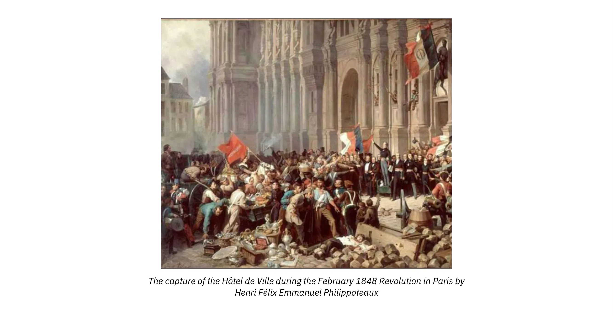

Protectionism, Bastiat argues, is also a form of class struggle. It rests on the selfishness and greed of producers. Farmers and industrialists, seeking higher profits, demand taxes and trade barriers to shut out foreign competition—forcing consumers to pay more for their products.

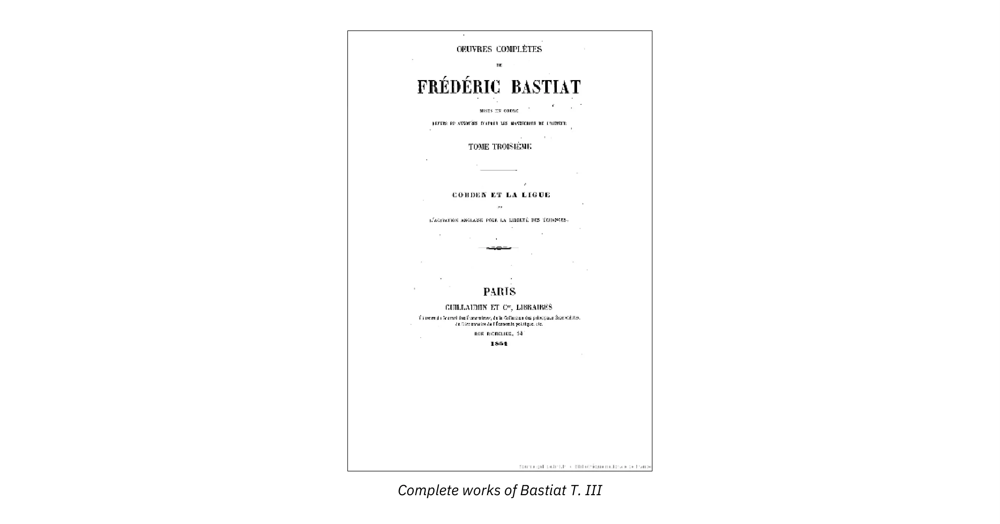

Bastiat firmly sides with **consumers**. Against class interests, he defends the *general interest*—the interest of the consumer, which is ultimately the interest of everyone. The State, he insists, must always act from the consumer’s point of view.

After the February 1848 Revolution and its barricades, an enemy even more dangerous than protectionism emerged—one sharing many of its traits: **socialism**.

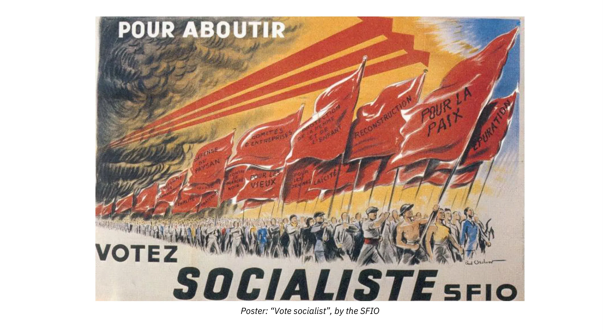

What was socialism? It was a political movement calling for the **organization of labor by law**, the **nationalization of industries and banks**, and the **redistribution of wealth through taxation**. Bastiat would dedicate his remaining energy, talent, and writings to opposing this doctrine, convinced it would only expand state power and perpetuate class struggle.

From the first days of the Revolution, he contributed to a short-lived newspaper, *La République Française*, soon labeled “counter-revolutionary.” During this time, he wrote his famous pamphlets on property, the state, plunder, and the law.

On June 27, 1848, the day after a bloody insurrection in Paris, Bastiat wrote a long letter to Richard Cobden analyzing the causes behind these events:

1. **Economic ignorance** – This, he argued, made people receptive to socialist utopias and false republican ideals. (We discussed this earlier regarding classical and state-controlled education.)
2. **The belief that fraternity could be legislated** – The nation fell in love with the idea that the State could directly create happiness for its citizens. Bastiat saw in this the first signs of the modern welfare state.

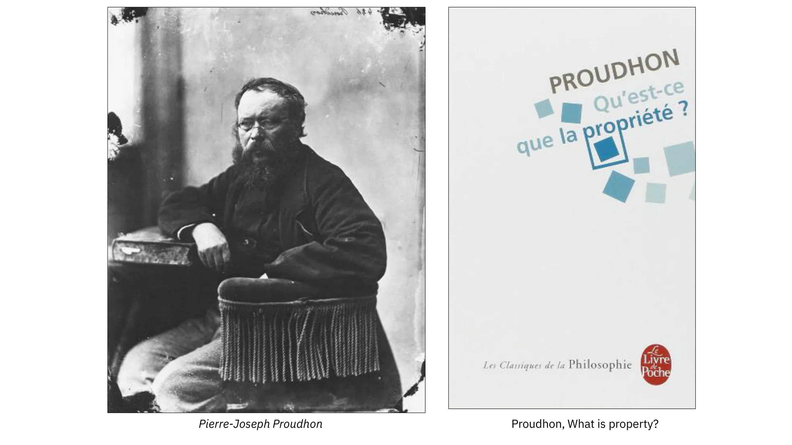

Bastiat continued to analyze these perverse effects in his letter to Cobden. He wrote:

> “By virtue of the natural inclinations of the human heart, everyone began to demand from the state, for themselves, a greater share of well-being. That is, the state or the public treasury was put to plunder. All classes demanded from the state, as if by right, the means of existence. The efforts made in this direction by the state only led to taxes and obstacles, and to the increase of misery.”

He then added a third point:

3. **Protectionism was the first sign of this disorder.** Capitalists were the first to demand the law’s intervention to enlarge their share of wealth. Inevitably, workers followed suit, asking for the same privileges.

---

>TO SUCCEED  
>VOTE SOCIALIST SFIO

---

To conclude, Bastiat argues that **protectionists and socialists share the same fundamental flaw**: they do not seek laws that guarantee everyone the free use of their faculties or the fair reward for their labor. Instead, they demand laws that enable one class of citizens to exploit another.

Under protectionism, the **minority exploits the majority**; under socialism, the **majority exploits the minority**. In both cases, justice is undermined, and the general interest is sacrificed. Bastiat places the two doctrines in opposition but condemns them both for violating liberty and fairness.

> The state is the great fiction through which everyone endeavors to live at the expense of everyone else.  

## Proudhon

<chapterId>96902abd-6915-5b25-a187-a4790162b86c</chapterId>

Pierre-Joseph Proudhon was one of the leading figures of French socialism in the mid-19th century. He is best known for his provocative claim in his 1840 work *What Is Property?*:

> “Property is theft.”

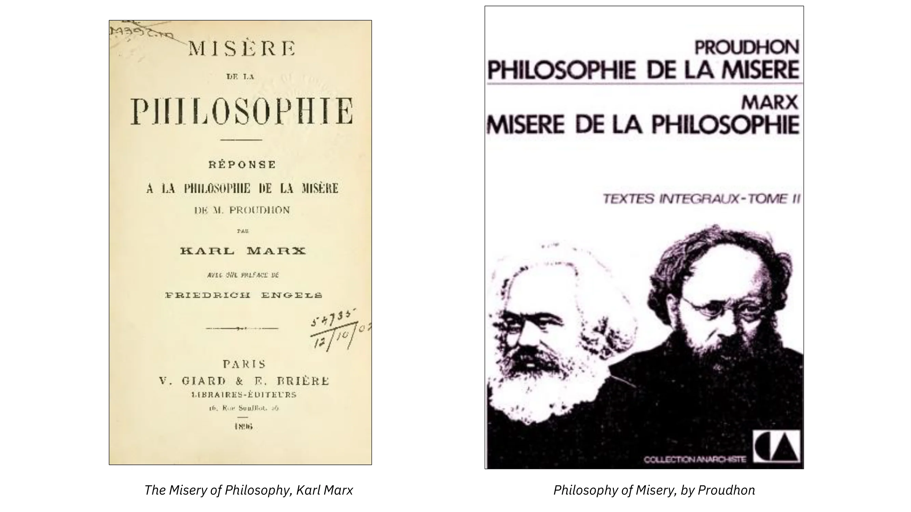
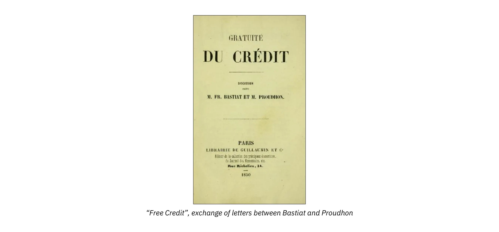

There is a logical flaw in Proudhon’s claim. If no property were legitimately acquired, then the concept of theft itself would make no sense. Proudhon later clarified that he was criticizing the existing distribution of property, not the institution of property itself. In fact, he described property as a revolutionary force and a foundation for anarchist society.

Proudhon was an individualist anarchist. He rejected both the proletariat and the state as legitimate sources of power. He fiercely criticized communism and advocated for worker mutualism—a system of voluntary cooperation where resources were pooled for mutual aid.

Bastiat, though critical of socialism, was not opposed to this idea in principle. He simply feared that the state might turn it into a monopolistic public service—something history later confirmed.

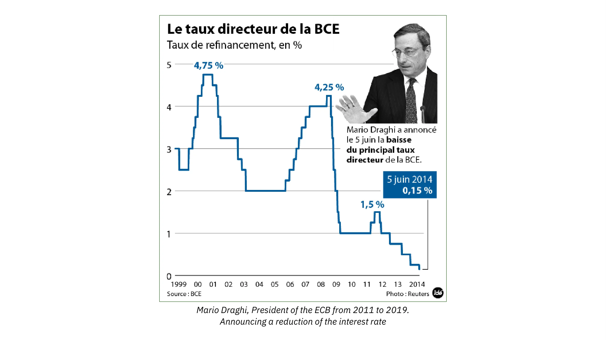

Marx, on the other hand, launched a harsh attack on Proudhon’s ideas in *The Poverty of Philosophy*, dismissing his socialism as “utopian” and contrasting it with what Marx called “scientific socialism.”

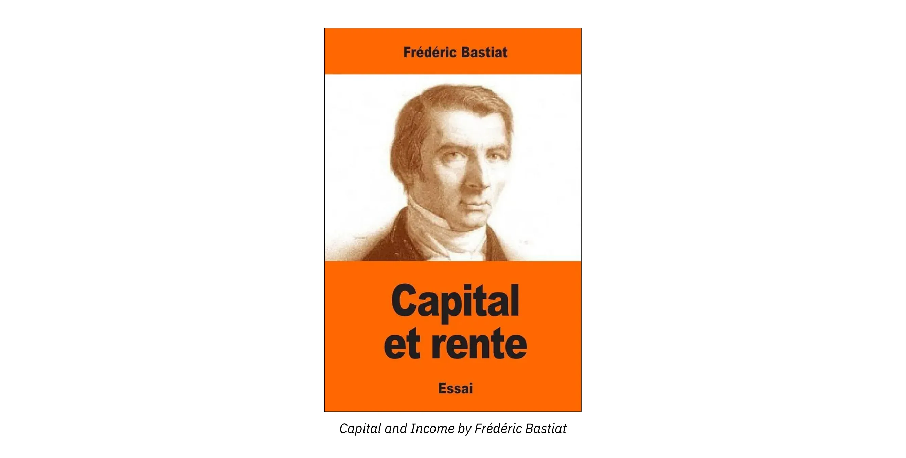

In June 1848, Proudhon was elected to the National Assembly alongside Bastiat. The two respected each other personally, but in 1849 they engaged in a major public debate through fourteen letters published in *La Voix du Peuple*. The controversy centered on one key issue: free credit or freedom of credit?

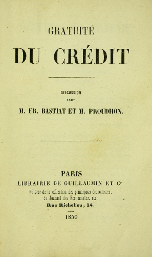

Proudhon saw interest on capital as the main cause of poverty and inequality. He argued for unlimited monetary creation by a state-run Exchange Bank or People’s Bank and believed that “free credit” was the solution to social problems. Bastiat, by contrast, supported the freedom of banks: open access to banking as a profession, competition among institutions, and full responsibility for one’s own funds.

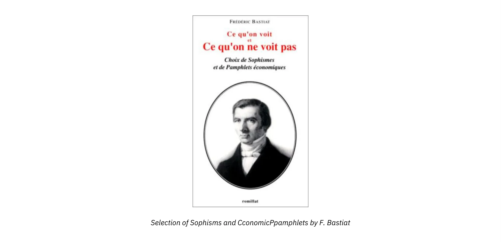

Bastiat countered Proudhon’s ideas in several steps. First, he examined the harmful effects of free credit and unlimited money creation. Such a system, he argued, would only encourage reckless speculation by banks and private actors, since they would be shielded by the state—meaning by taxpayers. As he put it:

> “It is a serious matter to place all men in a situation where they say: Let’s try our luck with someone else’s property; if I succeed, so much the better for me; if I fail, too bad for others.”

A remarkably prescient warning, as it applies even to our own era.

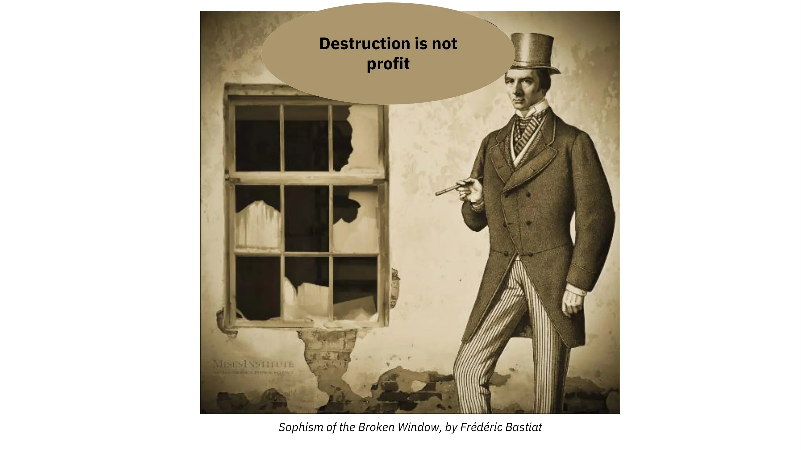

Bastiat noted that low interest rate policies by central banks also create money artificially, leading to repeated financial crises and massive public debt throughout the last century.

He argued that improving workers’ purchasing power was indeed possible—but through fairer, more effective means. Lower interest rates should come from the **liberation and accumulation of capital**, not from abolishing interest altogether through schemes like free credit.

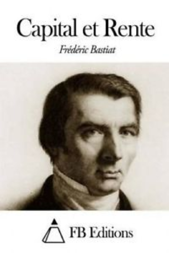

According to Bastiat, human progress goes hand in hand with the accumulation of capital. In his pamphlet *Capital and Rent*, he illustrates this with the example of Robinson Crusoe on his island.

Without accumulated capital or tools, Robinson would be doomed. Bastiat explains that capital benefits workers in two main ways:

- It boosts production, lowering the price of goods;
- This, in turn, raises wages.

In modern society, capital acts as an equalizing force. As Bastiat puts it:

> “When capital increases, it competes with itself; its remuneration decreases, or, in other words, the interest rate falls.”

In the end, both Proudhon and Bastiat recognized the importance of capital accumulation and the risk of exploitation. But their conclusions diverged sharply. Proudhon, like Marx, predicted growing poverty among the masses in capitalist societies. Bastiat believed capitalism would bring unprecedented prosperity to all classes and foster the rise of a strong middle class.

History, Bastiat noted, proved him right.

# Economic Sophisms

<partId>59686d1d-58c6-59a8-9fc4-74a10d24cdbe</partId>

## What is Seen and What is Not Seen

<chapterId>25fb02a9-5d68-5c58-bd0f-d4b8e1fd91f9</chapterId>

In this chapter, I shall introduce a groundbreaking technology: a pair of bionic glasses equipped with an ultra-powerful mini-camera on the front. This device allows the wearer to see details invisible to the naked eye. 

The first prototype of these glasses, at least in a metaphorical sense, was invented by Frédéric Bastiat in 1850 in his famous pamphlet *Ce qu’on voit et ce qu’on ne voit pas* (*What Is Seen and What Is Not Seen*). These were the **economist’s glasses**. They allow us to see the consequences of government decisions—especially the hidden ones—on our lives. They reveal what is often invisible: the damage caused by political favoritism and false economic theories. The victims, the beneficiaries, and the true effects of policies often remain hidden behind official rhetoric, what Bastiat called “Economic Sophisms.”

A good economist, Bastiat argued, must examine the effects of political decisions on society as a whole. They must look beyond the immediate impact on a single group and focus on the long-term consequences for everyone. Who suffers? Who benefits? What are the hidden costs? What would taxpayers have done with the money if the government hadn’t taken it?

Bastiat illustrated this point in *Public Works*:

> “The State opens a road, builds a palace, straightens a street, digs a canal; by this, it gives work to certain workers—that’s what is seen; but it deprives work from certain others—that’s what is not seen.”

One of his most famous examples is the **broken window fallacy**. Some argue that breaking a window benefits the economy because it gives work to the glazier. Bastiat shows this is false: destruction does not create wealth—it costs more than it brings in. When a young boy breaks a neighbor’s window, his friends console him:

> “Every cloud has a silver lining. Such accidents keep the industry going. Everyone needs to live. What would become of glaziers if windows were never broken?”

Later, Keynes would claim that such destruction, by forcing spending, could stimulate the economy through a “multiplier effect,” boosting production and employment.

But this is only *what is seen*.

What is *not* seen is what the homeowner would have done with that money if the window had never been broken. Perhaps he would have bought shoes, books, or furniture—supporting other industries and creating wealth without any destruction. Instead, the money must go toward replacing what already existed, leaving society poorer overall.

Breaking the window does not “stimulate” the economy—it simply creates a net loss equal to the value of the window itself.

The first lesson, Bastiat teaches, is that a “good” decision or policy is one that costs society less than alternative uses of the same resources. A policy should be evaluated not only by its effects but also by what could have been achieved if those resources had been used differently. This is the idea of *opportunity cost*, central to Bastiat’s thinking.

The second lesson is that destruction does not stimulate the economy, despite what Keynesians claim. Destroying material goods makes society poorer, not richer. As Bastiat concludes in *What Is Seen and What Is Not Seen*:

> “Society loses the value of the objects unnecessarily destroyed.”

Take a modern example: when the car industry struggles, governments often launch scrappage programs to “revive” it. What we see is rising sales for manufacturers like Renault and Peugeot. What we do not see is the loss for other sectors—and the waste from destroying perfectly good cars.

Policymakers often argue that public works or government investment in certain industries create growth and jobs. But Bastiat asks: **where does the money come from?** Higher taxes or more public debt—both invisible but very real costs that weigh on growth.

The government itself produces nothing. It only diverts resources from private uses to public ones. What we do not see are all the goods and services that could have been created if this capital had remained in the private sector.

Nearly a century before Keynes, Bastiat had already dismantled the illusion that public spending and government debt automatically stimulate the economy.

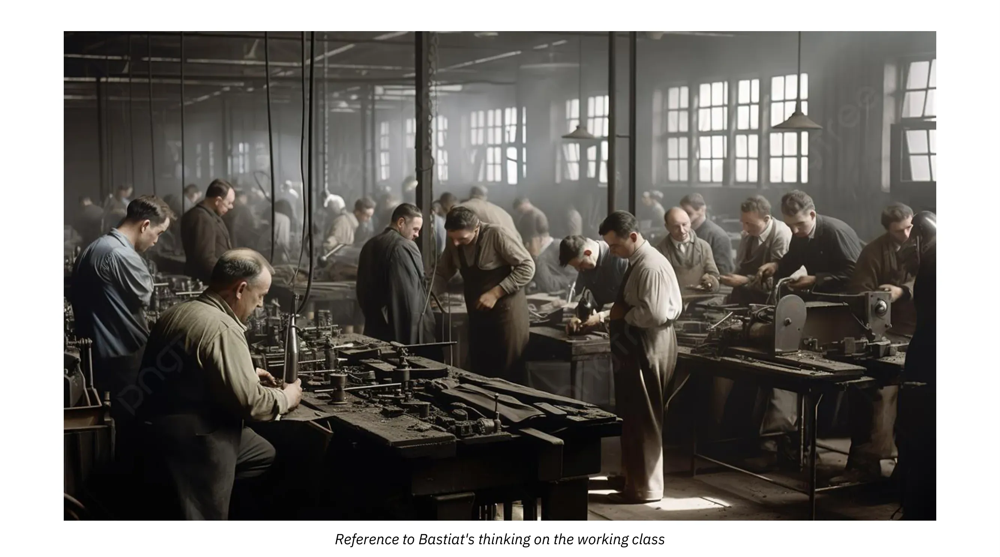

The key lesson from these texts is that state intervention often produces hidden, unintended consequences. Only a good economist can anticipate them.
**Politics shows us what is seen.**
**Economics reveals what is not seen.**

## The Petition of the Candle Makers

<chapterId>f4e759ed-1cb2-55c7-885e-0a60244758a4</chapterId>

In 1840, the Chamber of Deputies passed a law raising import taxes to “protect” French industry—a form of economic patriotism that still appears today.

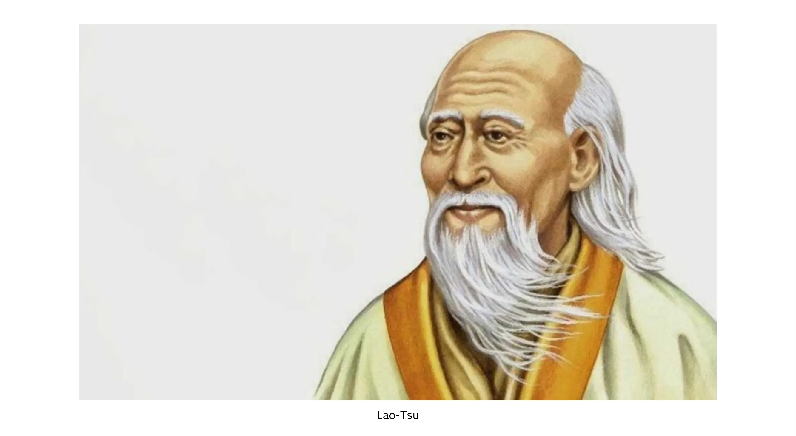
*above: Marine Le Pen, a French politician*

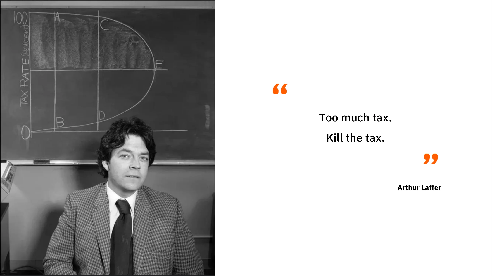

In response, Bastiat wrote a satirical piece that became one of his most famous works: *The Petition of the Candle Makers*. It exposes how well-organized producer groups secure unfair privileges from the state at the expense of ordinary citizens, while highlighting the absurd and destructive logic behind protectionist laws.

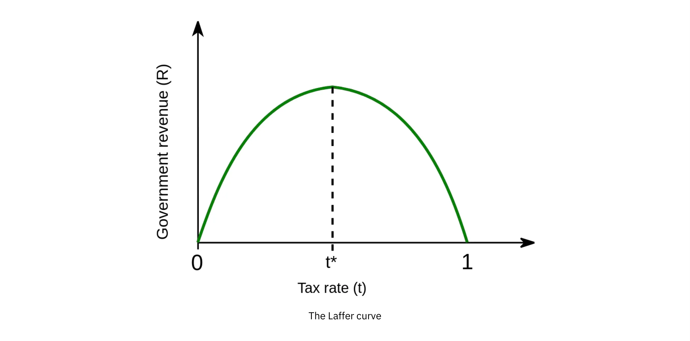

---

>PROTECT OUR CANDLES!

---

In this petition, the candle makers plead with the deputies for legal protection against a dangerous rival:

> “We suffer from the intolerable competition of a foreign rival who, it seems, is in such superior conditions for producing light that he floods our national market at a fabulously reduced price.”

And who is this unfair foreign competitor? None other than **the sun**.

The candle makers argue that the government should “reserve the national market for national labor” by passing a law to close “all windows, skylights, shades, shutters, blinds, curtains, fanlights—in a word, all openings, holes, slits, and cracks through which the sunlight enters houses.”

Their point was simple: if lawmakers truly wished to protect producers from competition, then logically they should block out the sun, the most powerful competitor of all, since it provides light for free.

Two centuries later, Bastiat’s satire remains just as relevant. Consider taxi drivers demanding laws to block Uber or bookstores seeking bans on Amazon. The logic is the same—and just as absurd.

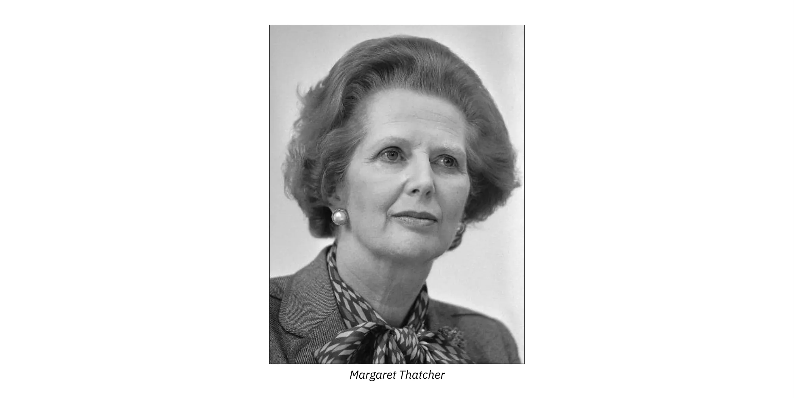

Bastiat’s real target in this satire is **political and electoral protectionism**, driven by the greed of producers and the naivety of consumers. He exposes the collusion between the self-serving capitalist and the state. Instead of innovating or adapting to market demands, the “bad” capitalist seeks political favors through protectionism—always at the expense of consumers. For Bastiat, this is nothing less than legalized spoliation.

Ultimately, protectionism is a policy favoring producers over consumers. Yet Bastiat insists the true representatives of the general interest are consumers—because we are all consumers.

Protectionism also rests on a hidden syllogism that turns out to be false:

* The more we work, the richer we are;
* The more difficulties we have to overcome, the more we work;
* Therefore, the more difficulties we have to overcome, the richer we are.

To highlight the absurdity, Bastiat offers several satirical examples. In Chapter III of the *Economic Sophisms* (second series), he imagines a carpenter petitioning the minister:

> “Make a law stipulating that no one may use anything but beams and joists produced with blunt axes.”

With sharp axes banned, three times as many blows would be needed to complete the same job. Carpenters would be busier—and better paid.

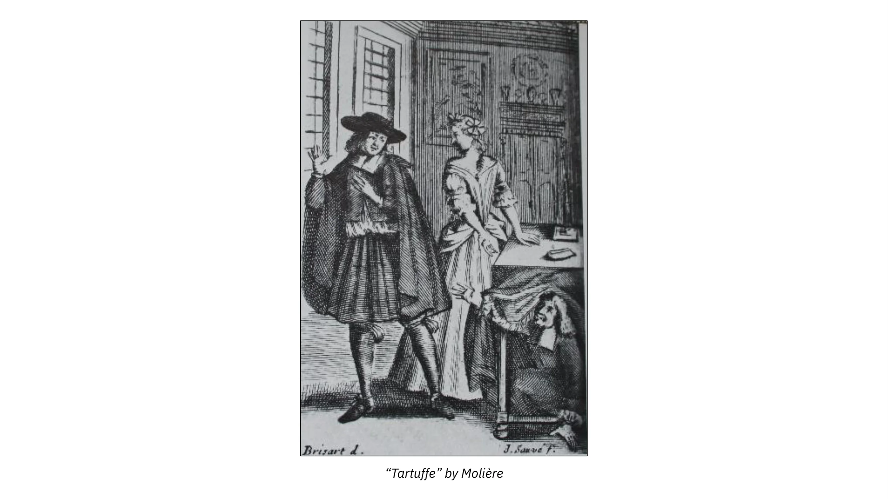

In Chapter XVI, *The Right Hand and the Left Hand*, a royal envoy even suggests cutting off—or at least tying up—the right hands of workers. Production would become far more difficult, requiring more laborers, driving up wages, and supposedly eliminating poverty.

By this logic, why not replace trucks with wheelbarrows or shovels with teaspoons?

All these sophisms share the same error: **they confuse the means with the end**. For Bastiat, the goal of the economy is not to preserve jobs but to satisfy needs and create real utility. Work should be judged by its results, not by the effort or time it takes.

This confusion also underlies the claim that “money is wealth.” Governments often inflate the money supply so banks can lend more and states can repay debts more easily. That is *what is seen*.

What is *not* seen is the inflation and the erosion of savings caused by money creation without any corresponding increase in real wealth.

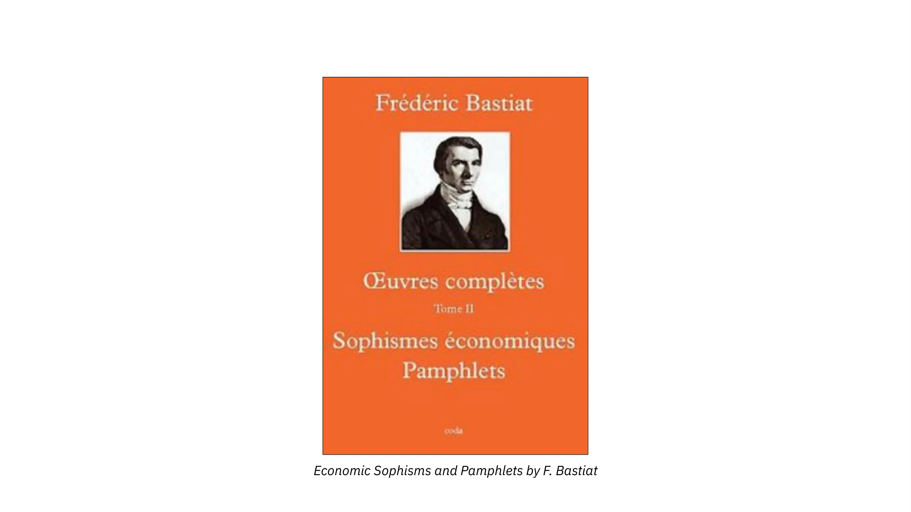

According to Bastiat, true wealth consists of the useful goods and services produced through work to meet human needs. Money, by contrast, is merely a tool—a common medium of exchange that serves only as an intermediary, not as wealth itself.

## Plunder Through Taxation

<chapterId>551fc499-2119-5a52-9114-412d29434c22</chapterId>

> “When the rich lose weight, the poor die.”

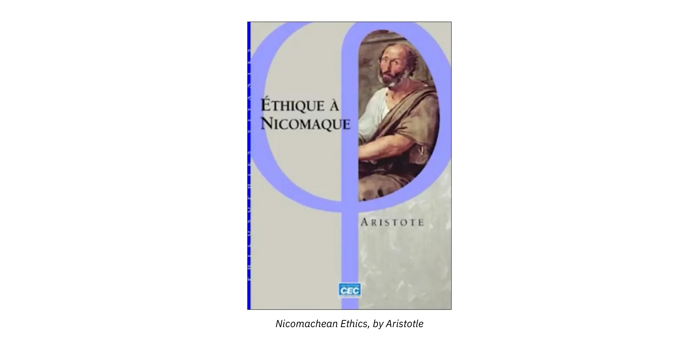

This saying, attributed to Lao-Tzu, captures the danger of a tax system aimed at heavily targeting the rich.

And yet, people still claim:

> “Taxation is the best investment: it’s a fertilizing dew! See how many families it supports, and imagine its ripple effects across industry: it’s infinite, it’s life.”

In France, where public spending is often seen as a public good, taxes are higher than in many other countries. But Bastiat warns:

> “In every public expenditure, behind the apparent good, there is a hidden evil.”

What does he mean?

Economics, Bastiat says, must look beyond the immediate effects of political decisions on certain groups to their long-term consequences for society as a whole.

> “What we see is the labor and profit generated by public spending.
> What we do not see are the jobs and wealth that would have been created if those funds had remained with the taxpayers.”
>
> — Frédéric Bastiat

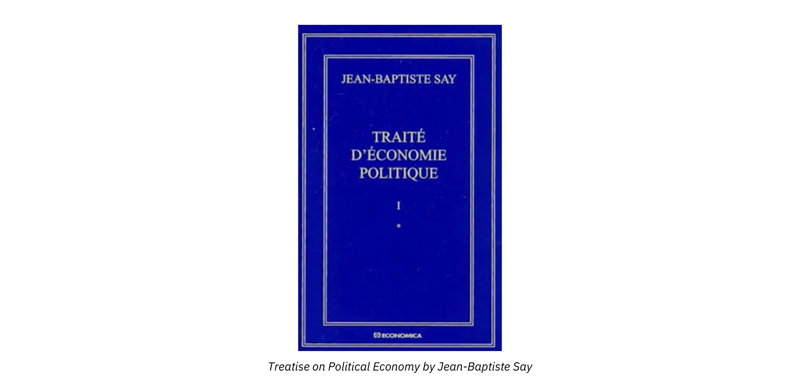

Bastiat thus refutes the still-common claim that government spending funded by taxes creates wealth. In reality, the state produces nothing on its own; every euro it spends comes directly from taxpayers.

Worse, the state is often far more wasteful than individuals. Vast sums confiscated from citizens escape the careful responsibility of private owners and end up in the hands of bureaucrats, who are easily influenced by political pressures and special interests.

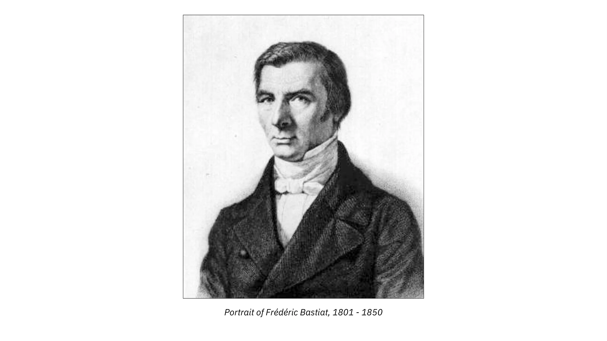

Of course, taxation is perfectly legitimate when it pays for genuine public services in return. But in France, the state gradually assigned taxes several new roles.

Initially, taxes were meant to cover common expenses. Then they were used to regulate the economy, giving politicians and bureaucrats nearly unlimited power to shape industries—favoring some, punishing others—based on political motives rather than economic logic.

Finally, taxes were assigned a social role: they became instruments of so-called “social justice.” The idea was that taxes should be redistributive, taking from those “who have more” to give to those “who have less.”

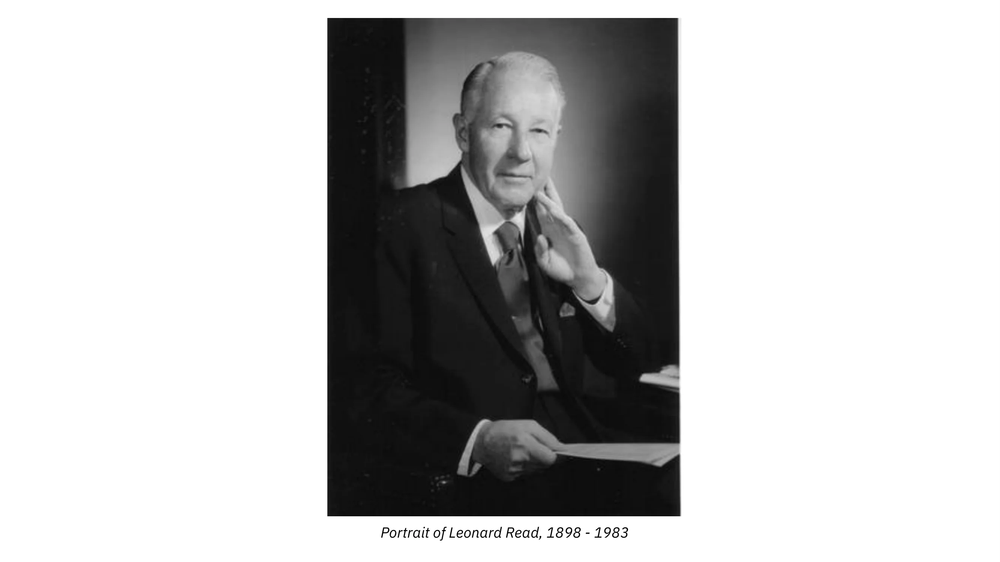

The problem, Bastiat warned, is that taxation in practice always reflects the interests of those in power. Certain groups are favored, others punished, depending on where politicians expect votes or influence. Progressive taxation in particular often yields little revenue but allows the majority to expropriate a minority—eventually becoming outright confiscatory.

Bastiat had, in essence, anticipated the **Laffer Curve**—formulated more than a century later by American economist Arthur Laffer in 1974—which shows that beyond a certain point, raising tax rates actually reduces total revenue. Excessive taxation destroys the very wealth it seeks to capture.

> Too much tax kills the tax.  
>  
> Arthur Laffer  

Politicians often assume there is a simple, fixed link between tax rates and tax revenues. They believe doubling the tax rate will double the revenue. But as Laffer pointed out, this view ignores how taxpayers change their behavior when faced with higher taxes.

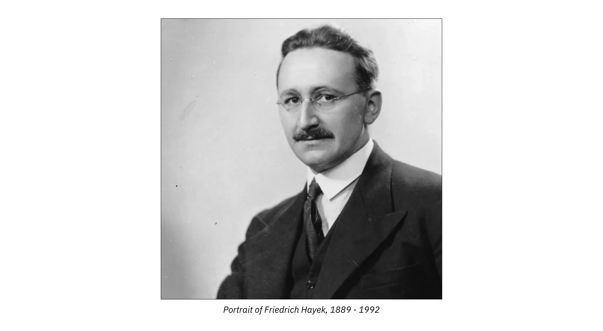

The **Laffer Curve** shows that at a 100% tax rate, the government collects no revenue—since no one would work if all income were taken away. Conversely, lowering tax rates can stimulate economic activity, investment, and innovation, potentially increasing total tax revenue by expanding the tax base.

Bastiat would likely add that reducing **government spending** is just as important as lowering taxes. Or, as Margaret Thatcher—herself a disciple of Bastiat—famously put it:

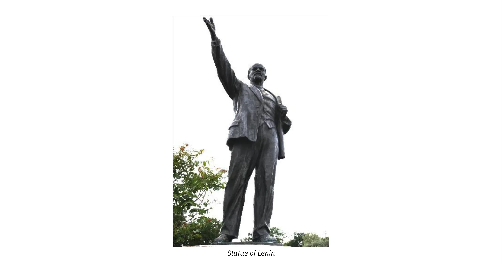

> The goal is not to make the rich poor, but to make the poor rich.

And she said this while addressing socialists.  

## The Two Moralities

<chapterId>c518e449-f638-553c-9a49-15da48023d41</chapterId>

Bastiat explains that there are two complementary ways to educate citizens’ judgment in a chapter from the second series of *Economic Sophisms* titled *The Two Moralities*.

* First, there is a *philosophical or religious morality* that works by purifying and guiding human actions (man as an agent).
* Then, there is an *economic morality* that works by showing people “the necessary consequences of their acts” (man as a recipient).

Bastiat sees these as two perfectly complementary moral frameworks.

1. The first speaks to the heart. It encourages individuals to do good and avoid evil. This is the religious or philosophical morality—the noblest one. It instills in people a sense of duty and calls them to:

> “Improve yourself; purify yourself; stop doing evil; do good; tame your passions; sacrifice your interests; do not oppress your neighbor, whom you must love and help; be just first, and charitable afterward.”

This morality teaches virtue and selflessness. Bastiat calls it the most beautiful and moving morality because it reflects the best of human nature.

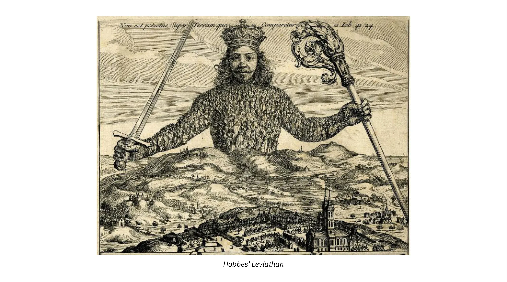

2. The second morality exposes and combats evil by revealing its consequences. This is the *economic morality*. It speaks to the intellect rather than the heart, enlightening victims about the harm caused by certain behaviors. It strengthens the lessons of experience, spreading knowledge and common sense so that oppression becomes harder to impose.

This economic morality seeks the same goal as the religious one but approaches it through the lens of cause and effect. It teaches people to resist harmful or unjust actions and to defend those that are beneficial and just.

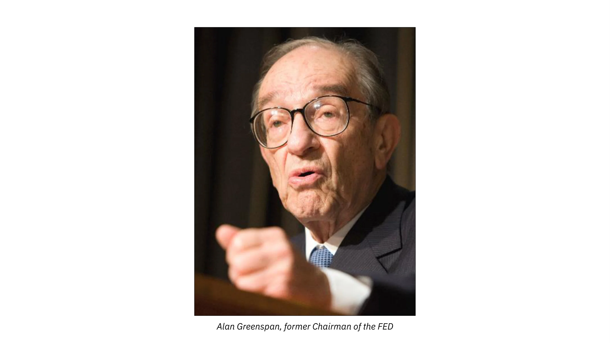

Bastiat highlights the essential role of science—especially economic science—in combating spoliation. While its approach differs from traditional morality, it is no less important.

Morality attacks vice at its source: the will and the intention behind human actions. Science, by contrast, exposes vice through its consequences, helping truth and virtue to prevail.

For Bastiat, economic science serves as a form of *defensive morality*. Its goal is to dismantle economic sophisms, discredit false arguments, and deprive the plundering class of any justification for its power.

Political economy, therefore, has a clear practical purpose: to uncover hidden costs, expose obstacles to competition, and challenge every form of protectionism.

Bastiat notes that political economy is not a universal science. It does not exclude philosophical or religious approaches, nor does it claim to replace them. “Who,” he asks, “has ever made such an exorbitant claim in its name?”

What is certain, he argues, is that politics cannot perfect humanity or change the course of history for the better. Its role should be strictly limited to ensuring safety and protecting rights. Real moral and social progress comes instead through culture, family, religion, associations, education, and civil society—the realms where responsibility and solidarity truly grow.

# Economic Harmonies

<partId>db04dfa4-a53e-5d3e-a307-a68ebc36dc4f</partId>

## The Miracle of the Market

<chapterId>895ccd1d-7b52-5a8b-8b2c-6ec0056cf632</chapterId>

Can a harmonious society exist without written laws, rules, or repressive measures? If people are left free, won’t this lead to disorder, anarchy, and disorganization? How can we avoid ending up with nothing more than a collection of individuals acting without coordination unless we rely on laws and centralized political authority?

This is the usual argument made by those who call for state regulation of markets and insist that only the state can coordinate individuals into a coherent, harmonious whole.

Bastiat disagrees. He argues that the social mechanism—like the movement of the planets or the functioning of the human body—already follows natural laws. It is, by itself, a harmoniously organized whole. And its engine, he insists, is the free market.

The miracle of the free market, Bastiat explains, is that it draws on knowledge no single individual could ever possess and produces outcomes far superior to anything an artificial organization could design.

To illustrate this, Bastiat asks us to consider a village carpenter and observe all the services he receives and provides:

> “Every morning, when he gets dressed, he has made none of his clothes himself. Yet, to provide him with those clothes, vast amounts of labor, skill, transportation, and ingenious invention had to be coordinated worldwide.
>
> Then he eats breakfast. For the bread on his table to be there, lands had to be cleared and plowed; iron, steel, wood, and stone transformed into tools—all requiring immense amounts of labor across space and time.
>
> He sends his son to school, where he receives an education built on years of prior study and research.
>
> He walks outside on paved, well-lit streets.
>
> If his property is contested, lawyers, judges, and officers of justice stand ready to defend his rights—services that, again, require knowledge, learning, and resources accumulated over centuries.”

The market, Bastiat concludes, is a vast, decentralized system of cooperation. Through the price mechanism, it spreads information about needs, resources, and skills, connecting people who want to collaborate to improve each other’s lives.

What is most striking, Bastiat notes, is the enormous gap between all the goods and services this man consumes in a single day and what he could produce on his own if he relied solely on his own resources.

In 1958, American writer Leonard Read of the Foundation for Economic Education published a short essay in *The Freeman* magazine, written in Bastiat’s spirit, that became world-famous: *I, Pencil*. The essay begins:

> “I am a lead pencil, an ordinary wooden pencil familiar to all boys and girls and adults who can read and write. It is one of the simplest objects in human civilization. And yet not a single person on this earth knows how to produce me.”

The story captures Bastiat’s idea of invisible cooperation among millions of people who do not know each other but collectively produce even the simplest of objects. No single person knows how to make a pencil on their own. Yet millions of individuals, pursuing their own interests, unknowingly work together through voluntary exchange and the price system—without any central authority directing them. This, Read shows, benefits society far more than any centralized plan could.

The 1976 Nobel laureate Milton Friedman later used the pencil story in his television series *Free to Choose*. He broke down the pencil’s components—wood, graphite, rubber, metal—and showed how people from different continents, faiths, and customs, without ever meeting, coordinate to produce this simple object. He concluded that the free market is essential not only for prosperity but also for harmony and peace.

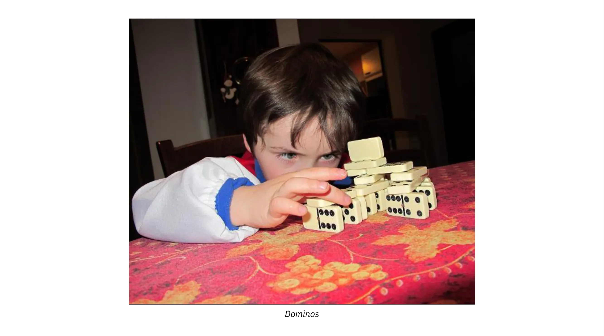

Similarly, Friedrich Hayek, in his 1945 essay *The Use of Knowledge in Society*, explained why decentralization and the price system are indispensable for prosperity. No central planner or bureaucrat can ever possess the vast, dispersed knowledge required to guide all economic decisions. Only the free market, through prices, allows millions of individuals to allocate resources efficiently.

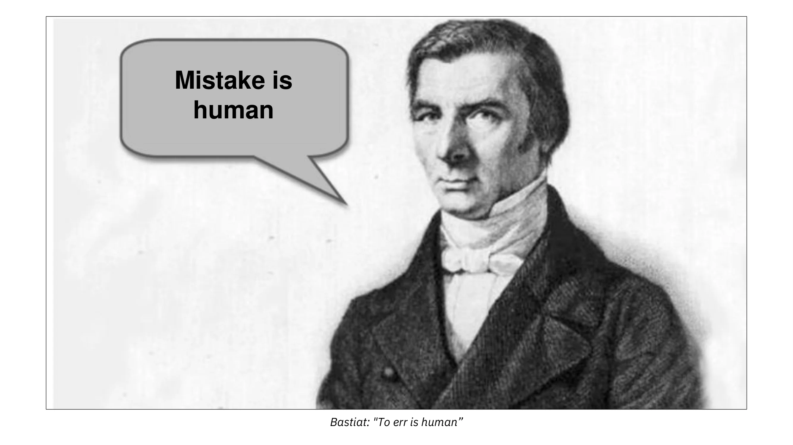

Economic planning that claims to outperform the market inevitably leads to waste, misallocation of resources, and, ultimately, domination by one class over another. That is why, Hayek argued, socialism is not only an intellectual error but also a path to profound injustice.

## Freedom and Responsibility are the Key to the Social Problem

<chapterId>78baa7ef-2c80-5fc7-8881-c1be4662b96f</chapterId>

In a letter to Alphonse de Lamartine in 1845, Bastiat wrote that his entire philosophy rested on a single principle:

> “Freedom is the best form of social organization.”

But he immediately added a crucial condition:

> “The law should not eliminate the consequences, positive or negative, of everyone’s actions.”

This is what he called the *principle of responsibility*.

For Bastiat, freedom and responsibility are inseparable. Liberalism differs from socialism precisely because it recognizes that freedom cannot exist without personal responsibility.

Freedom, he explained, is defined negatively: to be free means acting without external coercion in exercising one’s own rights. But this does not mean the absence of all constraints. Freedom requires reciprocity: it obliges us to respect the rights and property of others and, when necessary, to repair any harm we cause. This is the essence of responsibility.

Responsibility, then, is the positive side of freedom: if one acts freely, one must bear the consequences of one’s actions, whether good or bad. It is also a powerful source of creativity as well as a strong incentive for prudence and foresight.

When people spend their own money, they are careful: they avoid excessive debt, check product quality, and verify supplier reliability—because mistakes cost them directly. This is the power of responsibility. Combined with freedom, it becomes the true engine of social progress.

But where does irresponsibility—or what Bastiat calls *desponsibilization*—come from? He gives a clear political answer:

> “The intervention of the State takes away the governance of ourselves.”

Indeed, statism steadily reduces private initiative and free choice. It does for people what they could do themselves—often better. By removing individuals from the consequences of their own actions, it destroys responsibility.

For Bastiat, the hypertrophy of laws and the constant expansion of state power inevitably lead to privilege-seeking, plunder, monopolies, wars, and all the obstacles to civilization’s progress. The more we rely on bureaucratic control, the more we drown under constraints, discouraging initiative and suppressing the very creativity and innovation that drive advancement.

He illustrates this point with contemporary examples, starting with the 2008 financial crisis.

*(Alan Greenspan, Chairman of the Federal Reserve, 1987–2006)*

For years, monetary policymakers made it clear: when times are good, profits are privatized; when times are bad, losses are socialized through bailouts, rescue plans, interest rate manipulation, and money printing. This created *moral hazard*, encouraged reckless risk-taking, and led directly to the financial crisis.

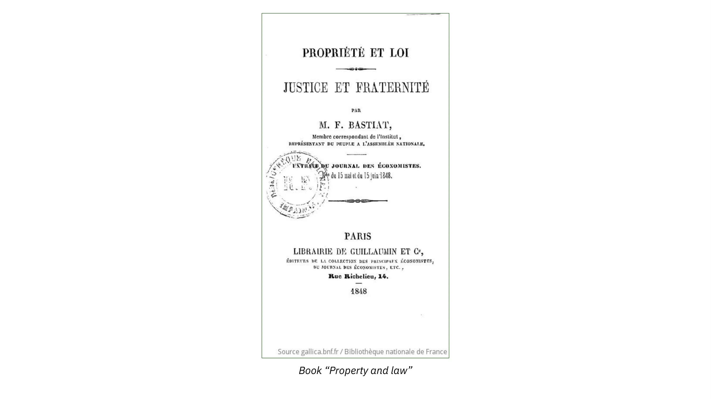

And this phenomenon, Bastiat warns, will continue indefinitely as long as banks remain under the control of central authorities that claim to protect them while stripping them of all autonomy in decision-making and operation.

Another example he gives is public services:

Each public service imposes the preferences of a bureaucratic elite at the expense of individual free choice. This leads to two main consequences, according to Bastiat:

* Citizens “stop exercising free control over their own satisfactions, and, no longer having the responsibility, naturally they cease to have the intelligence.”

The reason is simple: every law is coercive and uniform. It takes no account of individual needs, preferences, or circumstances.

Moreover, public services breed stagnation. When private services become public, they escape competition. As Bastiat put it:

> “The official is devoid of that stimulus which pushes toward progress.”

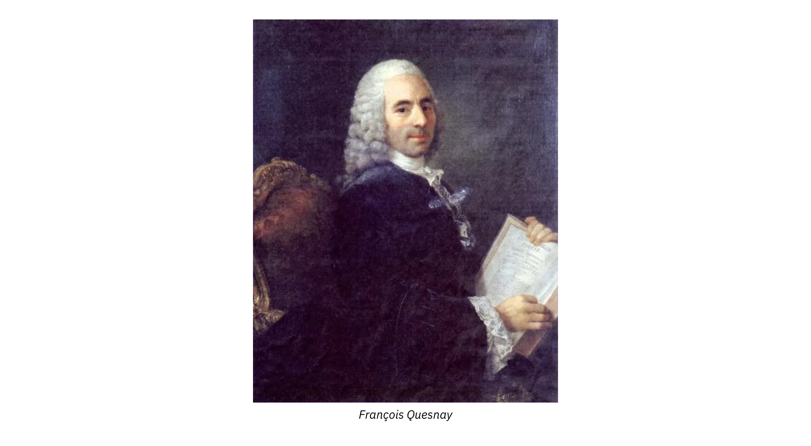

Look, for example, at the public education system. Bastiat observes that it relieves most parents of their responsibility to educate their children, turning school into little more than a daycare. Teachers, bound by rigid programs designed by bureaucrats, have little incentive to innovate or adapt to individual needs.

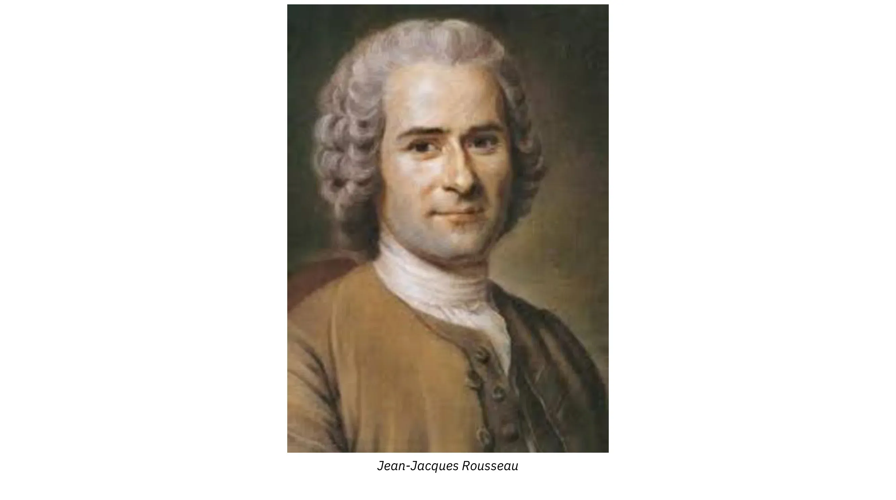

As we will see in another course, Bastiat argued that the only legitimate public services of the state are the military, the police, and the judiciary.

To conclude on responsibility: the core problem with state intervention is that those who make decisions do not bear the consequences. Collective decisions often impose risks and costs on others while shielding the decision-makers themselves—a system Bastiat regarded as both disastrous and immoral.

## The Power of Responsibility

<chapterId>0c078806-6c58-53f9-a720-5fb62386e56b</chapterId>

In the previous chapter, we saw why freedom and responsibility are essential to solving the social problem. Now, we will look more closely at how Frédéric Bastiat views the evils that afflict societies and the solutions he proposes.

Liberals are sometimes accused of ignoring evil and imagining a utopia of perfect freedom in an ideal world. Bastiat proves this criticism unfounded.

No one can deny the presence of evil throughout human history: injustices, wars, and suffering. We would like to eliminate these evils entirely. Modern philosophers from Rousseau to Hegel, Marx, and even Heidegger have all tried to do so in theory.

But Bastiat argues that evil not only exists—it also plays a role in history and human action. It can be reduced but never fully eradicated because doing so would mean destroying freedom and responsibility themselves.

So where does evil come from? What role does it play? And how can we prevent it?

To answer these questions, Bastiat analyzes human action, which can lead to both good and evil outcomes.

Evil, he explains, first stems from our imperfection. To choose freely is to risk making bad choices. People can be wrong about their needs, interests, or the consequences of their actions. Human beings are fallible, often misunderstanding or even misusing economic laws.

Therefore, it is the imperfection of reason—not freedom or free trade—that causes suffering. And since evil stems from human weakness, the solution is not to suppress freedom but to embrace responsibility, because responsibility is the source of all learning and experience.

As Bastiat puts it:

> Every man who acts receives the reward or punishment of his actions.

Through this natural consequence, people learn, correct mistakes, and make progress. Responsibility, therefore, becomes the foundation of human improvement and social advancement.

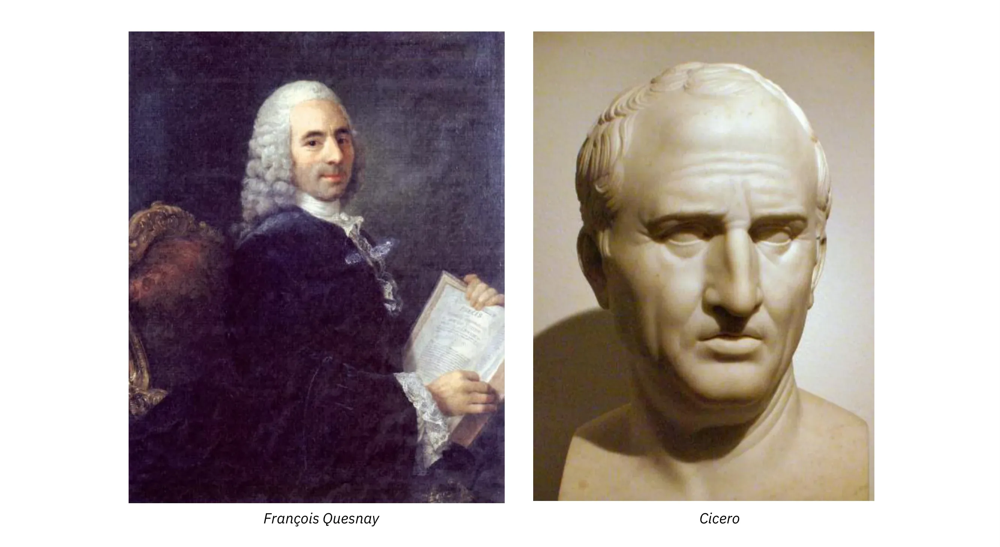

If a man bears the consequences—good or bad—of his decisions, he will naturally learn from experience and improve over time. For Bastiat, this is why individual responsibility is the greatest educator of humanity and the fundamental principle guiding behavior and society. It must be allowed to operate freely.

Evil leads to suffering, and suffering teaches us to recognize our mistakes, guiding us back to the right path. It is through confronting the effects of error that we make progress.

Because man risks making mistakes and enduring their consequences, he is motivated to act responsibly. He learns to anticipate potential dangers and protect himself against them.

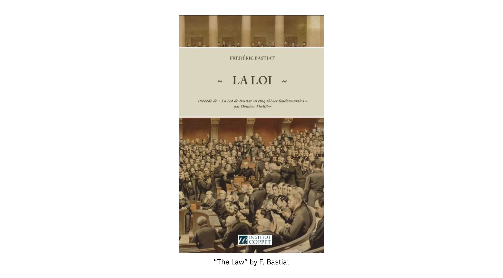

---

>To err is human.

---

Thus, it is clear that Bastiat is far from naïve. He does not deny the existence of evil. Man is weak, prone to error and fault. Nowhere does Bastiat claim that individual freedom comes without the possibility of mistakes, poor judgment, or irrational choices.

He simply argues that if the absence of freedom creates the conditions for evil, the remedy lies in freedom itself—more precisely, in the full and consistent exercise of personal responsibility.

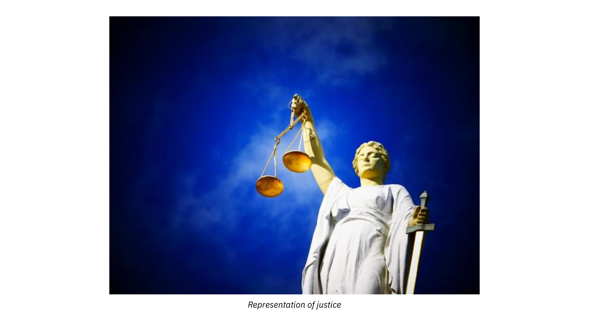

If the misuse of freedom gives rise to our woes, its proper use provides the cure. That cure is the responsible exercise of individual liberty, rooted in the right to property. Social order, therefore, depends on responsibility rather than on state intervention in all areas, which Bastiat sees as one of the main sources of plunder and social ills.

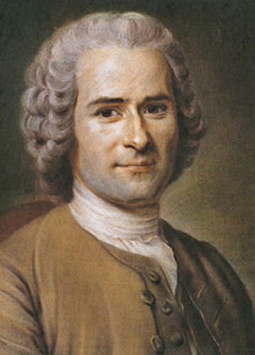

Contrary to Rousseau, who seeks to eradicate evil through collective institutions, Bastiat defends the necessity of freedom and the possibility of error. Without them, there is no responsibility, no discovery, and no progress. Only through this process of trial and error can societies reduce injustice and suffering over time.

However, this progress is neither automatic nor inevitable. It is not, as in Hegel or Marx, the result of some historical or metaphysical determinism leading inevitably to harmony. For Bastiat, it is a gradual, ongoing effort—capable of reducing evil but never fully eradicating it.

## True and False Solidarity

<chapterId>fa2172e9-22fa-5c01-a3c8-1e8316c064a4</chapterId>

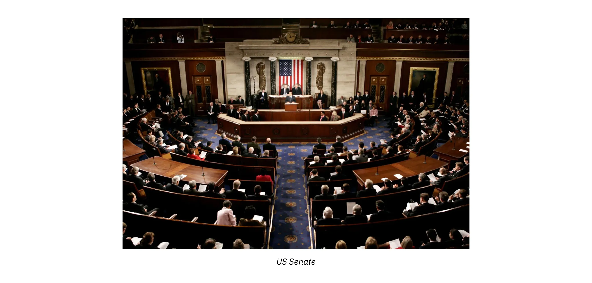

Frédéric Bastiat, in his famous pamphlet *The Law,* denounces the perversion of law that consists of legalizing, under the name of "solidarity," what is in fact plunder. He points out the contradiction in trying to impose fraternity through law—what we might today call "social justice" or "solidarity."

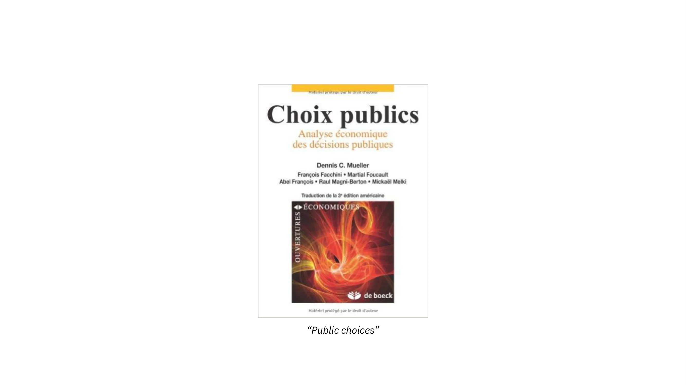

Morality, Bastiat argues, is defined by voluntary action. When someone is forced to give what they do not wish to give, they become the victim of legalized theft.

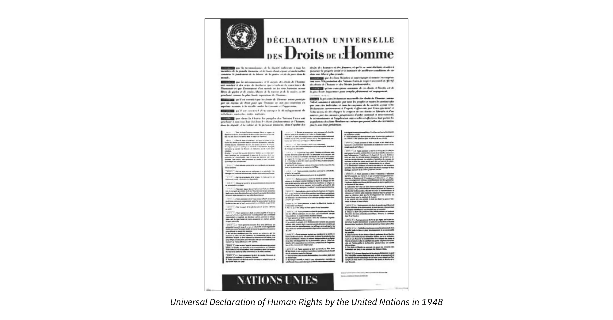

Once a donation is made compulsory by law, it ceases to be a moral act. The virtue of giving is replaced by a supposed "right" to live at the expense of others. This is what Bastiat calls *the sophism of legal fraternity.* As he writes:

> Fraternity is spontaneous, or it is not. To decree it is to destroy it.

And again:

> Governments only ever exercise an action that is sanctioned by Force. Now, it is permissible to force someone to be just, not to force them to be charitable. The Law, when it seeks to do by force what morality achieves through persuasion, far from rising to the realm of Charity, falls into the domain of Plunder.  
> Yet this perversion of law has a name, it is socialism, that is, the ideology of forced redistribution of wealth by the State. Socialism, according to Bastiat, is characterized by the ideology of legal plunder. But the cunning of this ideology is that it masks its violence under a misuse of language: the call to solidarity or fraternity.  

---

>Mutual Aid  
>Society of GUISY  
>1899

---

However, Bastiat saw an alternative to compulsory state-run solidarity: *mutual aid societies*—the voluntary, spontaneous cooperation of individuals to support one another. Yet he also warned that the State would eventually absorb these societies, turning them into a centralized system marked by waste and excessive spending.

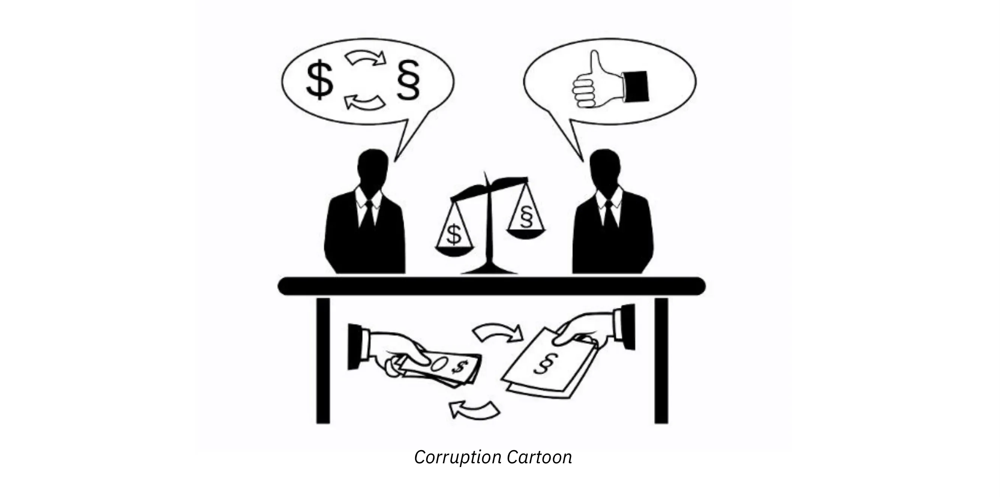

In his pamphlet *Justice and Fraternity,* Bastiat also proposed a simplified and fair tax system to fund essential public services—police, justice, and the military. His idea was that all incomes and profits should be taxed at a single, proportional rate. Today, we know this as the *Flat Tax.*

---

>Foundations –  
>**added value**  
>for **society**  
>
>SwissFoundations

---

Indeed, intra-family solidarity, local support networks, and organized philanthropy thrive in countries with low taxes and high economic freedom—such as Switzerland and the United States—while in countries where the state has replaced individual responsibility, like France or Germany, such solidarity is largely stifled.

It is often claimed that "selfishness" dominates liberal societies. In reality, the opposite is true. When heavy taxation strips individuals of their property, they are not inspired to give—they retreat into themselves.

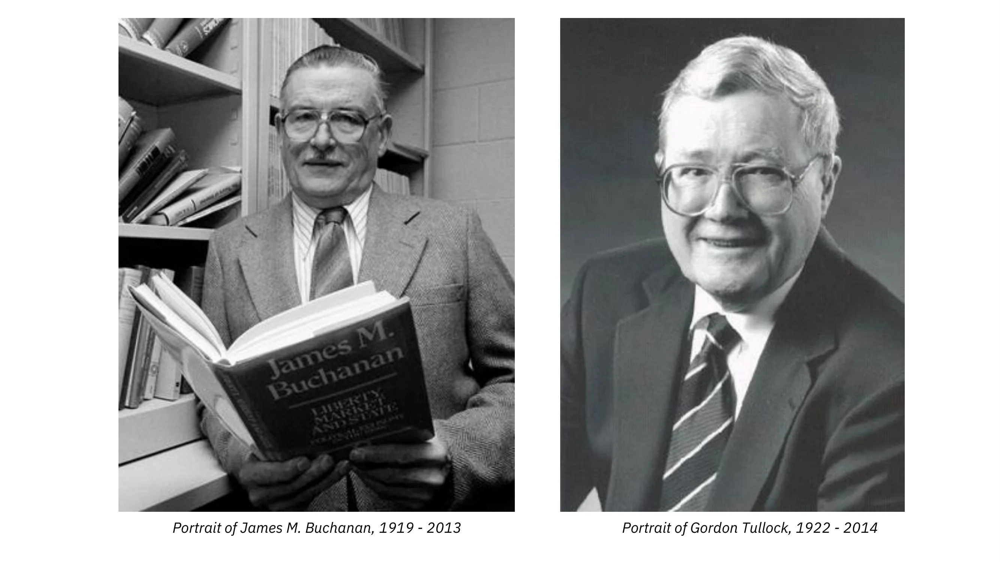

A free civil society does not run on selfishness. The market economy rests on service and reciprocity: one serves their own interests only by serving the interests of others, through mutually beneficial exchange. True solidarity arises from voluntary cooperation, not forced redistribution.

Compulsory redistribution has nothing in common with authentic human solidarity, which is private, voluntary, and often rooted in families or associations.

On this point, Bastiat directly challenges the socialists. He writes that law can compel justice, but it cannot compel devotion. Forced solidarity replaces generosity with state coercion—and for Bastiat, this paves the way toward totalitarianism.

# The Law

<partId>653cbe58-60e1-5401-8f91-4d9843ac6045</partId>

## The Right to Property

<chapterId>a48a0616-2105-5520-8312-e21a0b6489c7</chapterId>

Here, property does not simply mean land. It means *the right of a worker over the value created by their labor.* Bastiat clarifies:

> I consider that the right to property consists in the freedom to first dispose of one's own person, then of one's labor, and finally, of the products of one's labor—which proves, moreover, that, from a certain point of view, freedom and the right to property cannot be distinguished from one another.

To establish the moral foundation of property, Bastiat starts with a simple anthropological principle: from the beginning, man has had to work to live, and the fruit of his labor is an extension of his faculties—indeed, of his very person.

> Personality, Freedom, Property—that is man. It is of these three things that one can say, without any demagogic subtlety, that they are prior to and superior to any human legislation.

Understood in this sense, the right to property does not come from positive law but instead precedes it and is its very reason for existence. As Bastiat writes:

> The law is the collective organization of the individual right of legitimate defense.

The law's mission is to defend the person and their property.

_(François Quesnay, leader of the Physiocrats)_

Therefore, right and law are not the same. Right is not defined by the word of the sovereign, nor does it depend solely on his legitimacy. It comes from a legal and moral order prior to and above the law itself—an order that binds the legislator just as much as ordinary citizens.

Right “is not created.” It is not invented from abstract theories about how society should be organized. It is discovered in human nature and in the traditions and customs shaped by experience over centuries.

Individuals have natural rights that exist before the law: Property, Liberty, and Personality. The role of law is to protect these rights. As a result, Bastiat argues, the power of the state must be limited. Today, we would call this the idea of the *minimal state.*

This contrasts sharply with Rousseau’s system, discussed earlier, where the legislator’s mission is to organize, reshape, or even abolish property if considered necessary. For Rousseau, property is not natural but conventional—just like society itself. This view comes directly from Roman law, with which Rousseau was very familiar.

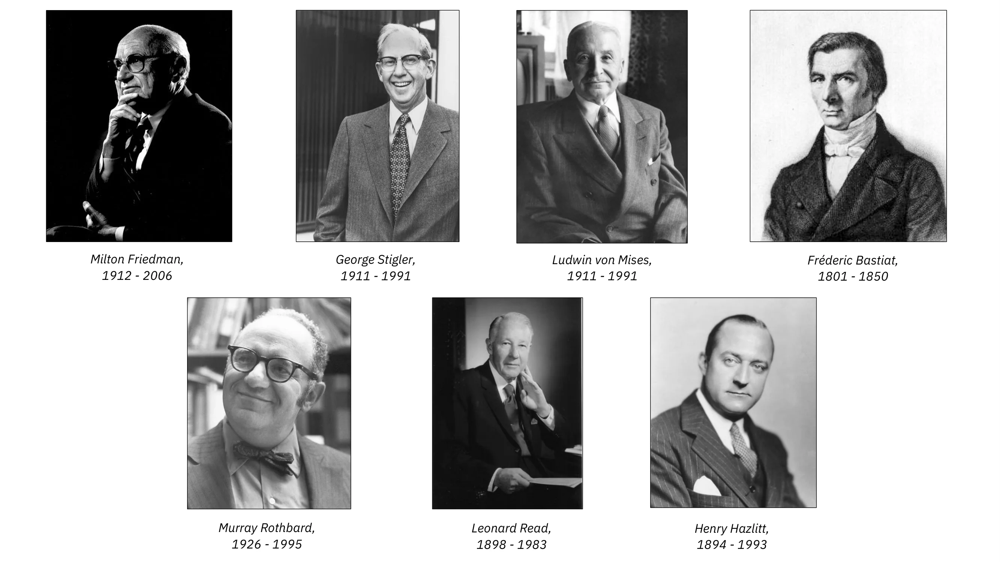

Robespierre even asserted that “Property is the right of every citizen to enjoy and dispose of the portion of goods guaranteed to him by law.”

For Rousseau, property does not precede law; it is a convention established by the general will and limited by it. But separating property rights from natural law opens the door to so-called “rights” that only exist by violating the rights of others—such as the right to work or the right to housing.

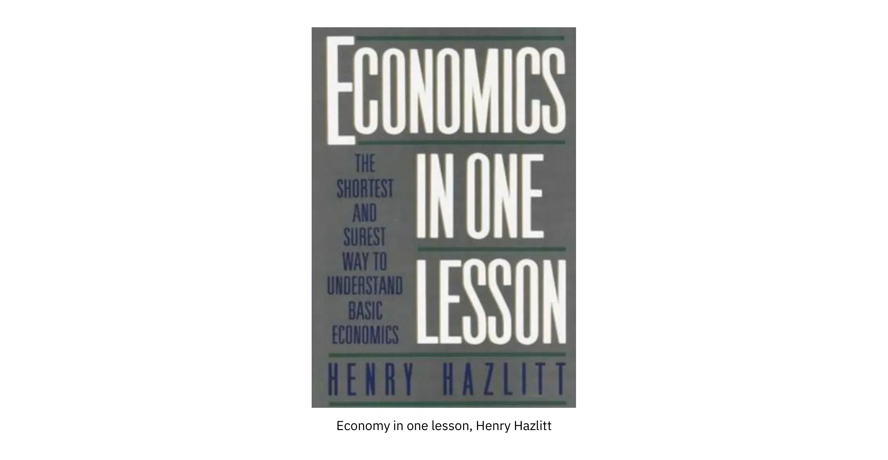

For me to acquire something for free, someone else must pay for it. And if the State provides it, since the State produces no wealth of its own, it can only do so by taking someone’s property—or its equivalent—to give it to me.

This idea that property rights are created by law, Bastiat argues, opens the door for utopians who want to reshape society according to their own designs.

In the system of natural freedom, there exists a natural law, independent of legislators’ whims. It applies to all people and predates any political organization. The government’s duty is to protect these natural rights for every individual. A just society is one where property rights are fully respected and shielded from interference by others.

Here, Bastiat draws on the legacy of the Physiocrats and, more broadly, on the legal philosophy of Cicero and Aristotle. The law does not create rights; its mission is to defend them—defending both the property of the person and the property that comes from one’s labor.

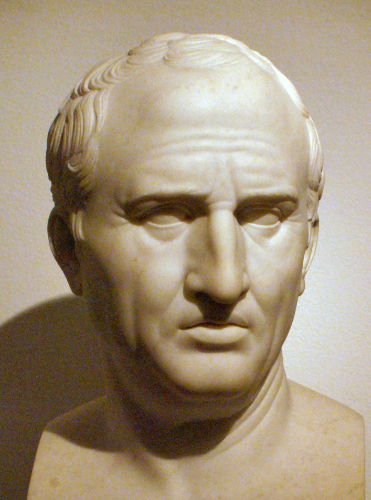
_(Cicero)_

## Legal Plunder: A Perversion of the Law

<chapterId>b4122847-e477-578e-ba34-d35844ac4715</chapterId>

The central idea of Bastiat’s *The Law* (1850) is to explain why and how the law has been transformed into a tool of plunder—a source of privileges, rents, and fiscal arbitrariness.

Bastiat begins by asking: what is the true nature of the law?

He grounds the law in three natural rights: life, liberty, and property.

In the institutional system of natural freedom, society, individuals, and property exist before laws. As Bastiat puts it:

> It is not because there are laws that there are properties, but because there are properties that there are laws.

Every person has the right to defend their life and use their faculties. The law, therefore, is simply the collective organization of this legitimate defense. It protects justice—not a positive justice that organizes fraternity or solidarity, but a negative justice that prevents anyone’s rights from being violated by others.

However, once the law stops being negative and becomes positive—trying to organize society and redistribute wealth—it fuels resentment, inequality, and conflict. Expanding the scope of government endlessly, Bastiat warns, opens the door to “an endless series of complaints, hatreds, disturbances, and revolts.”

One major cause of this perversion of the law, Bastiat says, is false philanthropy: the idea that some people, claiming superior wisdom, should make choices on behalf of everyone else.

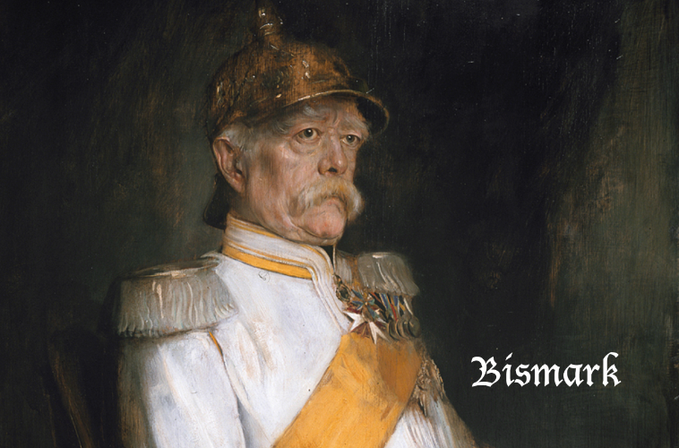

They believe they know what is best for others and impose their vision of the good on everyone—these are the "philanthropists." They have created what Bastiat calls "false rights," now commonly referred to as "social rights." These include "rights" over the labor or property of others: the "right" to housing, health care, education, work, a minimum wage, and so on.

What is plunder? Bastiat explains that it is the exact opposite of property. The word comes from the Latin *spoliare*, meaning “to strip.” Man can live only by appropriating things through his labor. But he can also appropriate the products of others’ labor—that is, he can plunder.

The entire purpose of law, for Bastiat, is to prevent this extra-legal plunder—to defend property and liberty, which are inseparable.

But once it is accepted that law may violate property instead of protecting it, society inevitably falls into class conflict—some seeking to defend themselves against plunder, others trying to organize it to their own advantage.

The law then ceases to defend natural rights and becomes a tool to protect special interests. It is transformed into an instrument of legal plunder, serving the classes and groups who make the laws and their political allies. In this way, Bastiat anticipates the 20th-century public choice school, which views lawmaking as a “political market” where organized groups seek to benefit themselves at the expense of others.

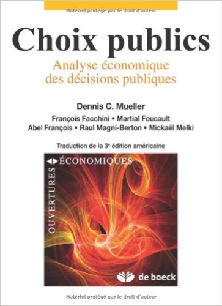

To Bastiat, the sole purpose of the law must be to “put an end to all plunder.” When the State refrains from intervening in private life, individuals remain true owners of their lives and fully responsible for their choices. They pursue their own happiness and bear the good or bad consequences of their actions.

With secure property rights, people can make long-term plans, confident that what they own will not be taken from them.

> Absence of Plunder — it is the principle of justice, peace, order, stability, conciliation, and common sense that I will proclaim with all the force, alas! insufficient, of my lungs, until my last breath.

Bastiat wrote this line in *The Law* shortly before his death.

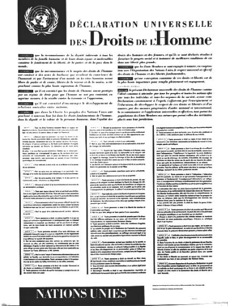

Yet a century later, legal plunder reappears in the *Universal Declaration of Human Rights* (1948), particularly in articles such as:

* Article 22: “Everyone has the right to social security.”
* Article 23: “Everyone has the right to work.”
* Article 24: “Everyone has the right to rest and leisure.”
* Article 25: “Everyone has the right to a standard of living adequate for health and well-being.”
* Article 26: “Everyone has the right to education.”

## The Role of Law and the State

<chapterId>52258229-7c7c-592b-aa27-203b03aa41c9</chapterId>

In 1848, while serving as a deputy and vice-president of the finance commission, Bastiat was in a prime position to address a fundamental question: What is the State? People often turn to the State for their well-being, but Bastiat reminds us that the State cannot give anything to citizens without first taking it from them.

He challenges the widely accepted belief that the State sustains the nation. In reality, the State produces no wealth—it merely redistributes what already exists. It is citizens, through their work and wealth creation, who sustain the State, not the other way around.

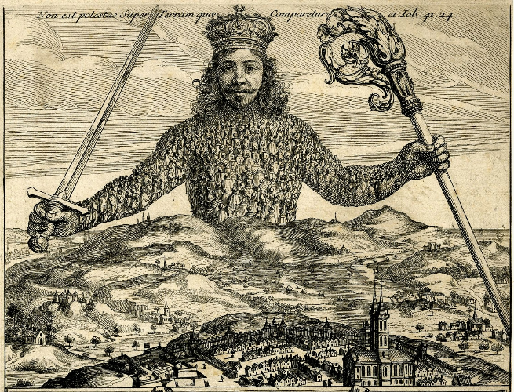

Moreover, the State itself is nothing abstract; it consists only of the men who govern, administer, and live off it directly or indirectly. Like all men, they pursue their personal interests.

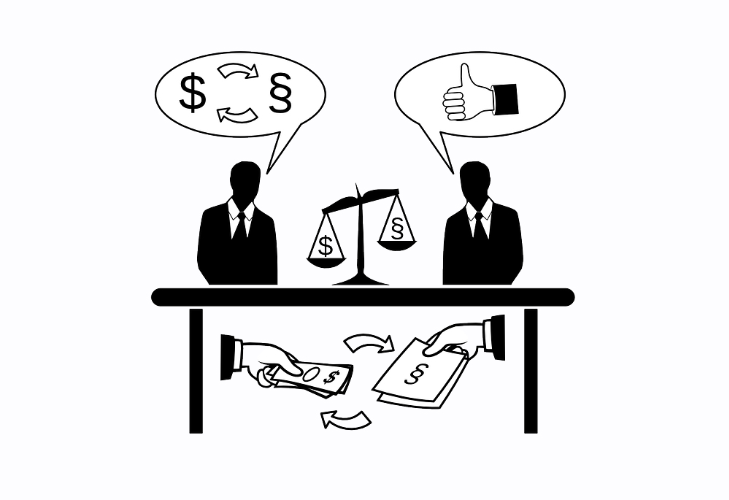

Because the State’s action is purely redistributive, it is highly vulnerable to pressure from special interest groups. Many of these groups realize it is easier to enrich themselves through political influence than through productive work. They exploit the State to seize others’ wealth while burdening the economy with laws, taxes, and regulations that stifle production.

In this way, the State serves clientelist interests rather than the general interest. Any benefit for one group comes at the expense of others, creating not a zero-sum game but a negative-sum game.

Here, Bastiat anticipates by a century the insights of the Public Choice school of James Buchanan and Gordon Tullock, who in the late 1950s analyzed politics as a “market” where actors pursue their own interests rather than the common good.
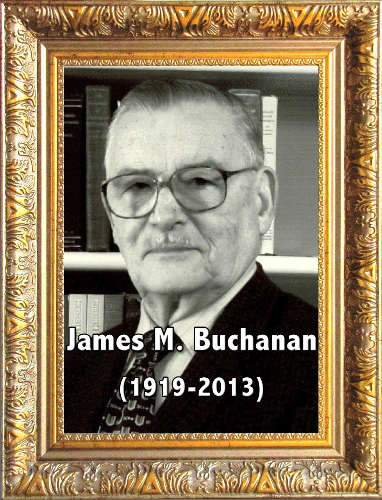
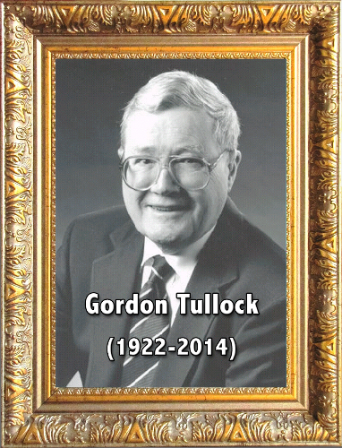

Moreover, Bastiat argues that the State possesses no rights that do not first exist in the individual. Why does the State have the right to protect each person’s property, even by force if necessary? Simply because this right already belongs to the individual. No one can deny individuals the right to self-defense—the right to repel attacks against their person, faculties, or property. This natural right of self-defense, inherent in every citizen, can take collective form and legitimize common force.

Therefore, to determine whether the State is legitimately vested with a right, one must first ask whether this right exists naturally in the individual, even in the absence of government.

For this reason, the State must never violate natural rights; rather, it must protect them.

The State ensures security, both internal and external, and justice. Within this role, it can be strong and effective. But the law must never go beyond this strict mission; otherwise, it becomes a tool of plunder for the benefit of some at the expense of others. When the law is perverted, it becomes an instrument of injustice. Bastiat emphasizes that such perversion inevitably leads to plunder—it is immediate, automatic, and certain. When the law oversteps its bounds, it infringes upon natural rights. Civil society then loses its vitality—its natural institutions, contracts, exchanges, and associations—handed over instead to state control, with its technocratic and bureaucratic management.

For Bastiat, the only legitimate public services of the State are threefold: the military, the police, and the judiciary. In other words, the State must ensure internal security, external defense, individual liberty, and the protection of property. It is therefore normal for everyone to contribute to this protection. But beyond these essential functions, any additional state service must be viewed critically. Outside this narrow scope, Bastiat writes:

> Religion, education, association, labor, exchanges, everything belongs to the domain of private activity, under the eye of public authority, which should only have a mission of surveillance and repression.

Regarding public services, Bastiat states a simple principle:
If you want to create a government function, prove its utility. Show that the services provided are worth their cost. From this, he concludes that the public sector should only handle what the private sector is truly incapable of doing.

In short, when a government exceeds its mission of protecting people and property, it opens the door for interest groups to demand privileges and manipulate power for benefits at the expense of taxpayers and consumers.

> The State is the great fiction through which everyone endeavors to live at the expense of everyone else.

This is how Frédéric Bastiat summarized it in his short pamphlet *The State*.

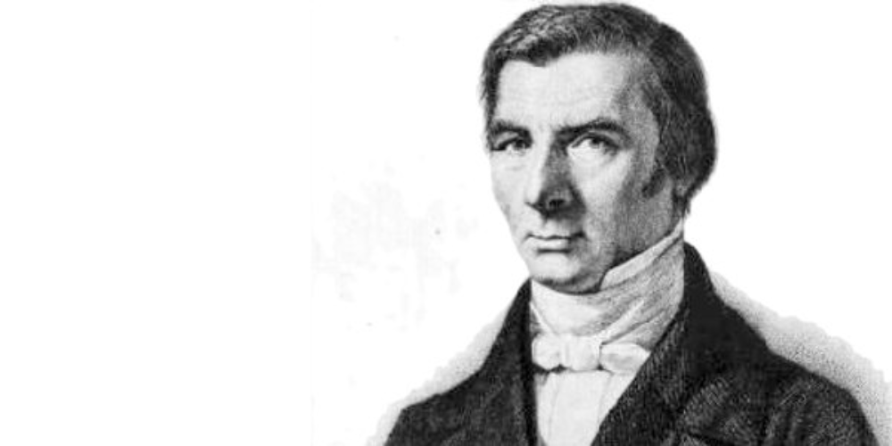

## The Legacy of Frédéric Bastiat

<chapterId>2a2a181a-e477-5be1-ba1f-af59490c364e</chapterId>

Bastiat's influence began to wane toward the end of the 19th century with the rise of socialism, and especially Marxism, in universities and research institutes funded by public money.

By the 20th century, Bastiat had all but disappeared from economics textbooks. His ideas were largely forgotten until the end of World War II, when interest in freedom—so badly neglected during Roosevelt’s era and by Europe’s totalitarian regimes—began to reemerge.

One of the leading figures in this revival was Austrian economist Ludwig von Mises, who fled Europe via Spain and Portugal before settling in New York in 1943. There, Mises organized seminars that drew some of the brightest minds of the time, including future Nobel laureates George Stigler and Milton Friedman, as well as Murray Rothbard, then a student at Columbia. It was in these seminars that Mises first introduced Bastiat as one of the great thinkers of classical liberalism.

He presented Bastiat’s pamphlets *The Law* and *The State,* which at the time had not yet been translated into English. In 1953, seminar participant Leonard Read arranged for *The Law* to be translated into English and distributed nationwide through his Foundation for Economic Education.

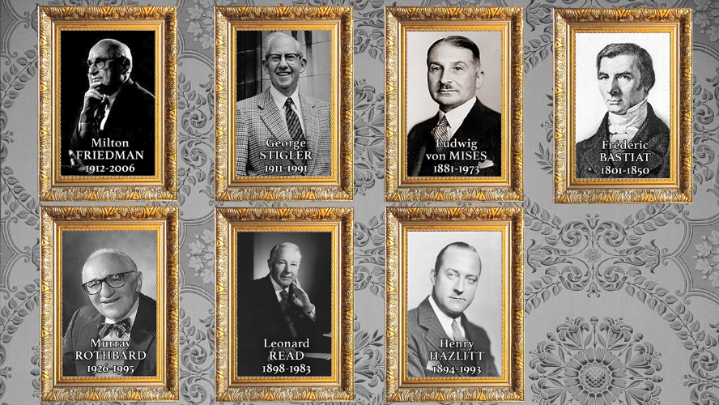
But the one who would also popularize the theses of Frédéric Bastiat was an economic columnist for the New York Times, Henry Hazlitt, in a small book named: *Economics in One Lesson,* published in 1946. Explicitly drawing from Bastiat's ideas, he aimed to demonstrate that the problem with statist economic solutions is their failure to consider their disastrous long-term consequences.
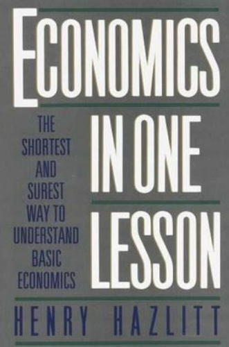

Hazlitt begins his book by recounting Bastiat's story of the broken window. He summarizes the story in a simple and singular lesson:

> The art of economics consists in looking not merely at the immediate but also at the longer effects of any act or policy; it consists in tracing the consequences of that policy not merely for one group but for all groups.  

Hazlitt then applies this lesson to a wide variety of economic problems: rent control, minimum wage laws, the presumed benefits of war, public works and the budget deficit, monetary inflation, tariffs, and finally savings.

Bastiat was one of Ronald Reagan's favorite economists, long before Reagan became president. Less well known is that for eight years, Reagan worked for General Electric as the host of its television show on CBS and as the person in charge of staff training. His training program focused on introductory texts about the market economy. Among the authors selected were two Austrians, Hayek and Mises, two Englishmen, Cobden and Bright, and one Frenchman, Frédéric Bastiat.

The lesson Reagan taught his employees, following Bastiat, was that no myth is greater than the belief that public spending stimulates growth and employment.

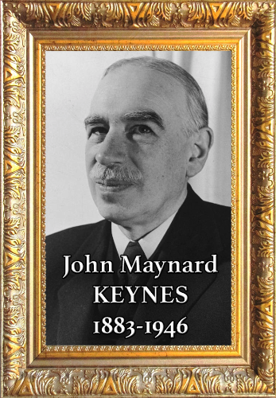

It was John Maynard Keynes who argued that public spending boosts production through a multiplier effect: if the government builds a bridge, the workers who build it will buy bread, the baker will buy shoes, and so on. If private industry is in decline, public works can supposedly fix it. If there is unemployment, the State can supposedly create public jobs.

But as Bastiat clearly demonstrated, state intervention has unseen and harmful effects. Only a good economist can anticipate them. For example, believing that the government can "create jobs" is an illusion. Every public job created comes at the cost of a job destroyed in the private sector because public jobs are paid for with taxes. Public jobs are not truly created; they are transferred. Every penny the State spends must first be taken from taxpayers or borrowed as debt.

If we look at things from this perspective, Reagan explained to GE employees, the so-called miracles of state spending take on a very different meaning. Taxes discourage production, and the wealth generated by public spending never fully compensates for the wealth that could have been created if those taxes had remained in the private sector.

In essence, Reagan drew from Bastiat several core elements of a liberal vision of society and the individual: the primacy of civil society over the State, the value of choice and personal responsibility, the central role of entrepreneurs in wealth creation, the need for a minimal and flexible legal framework that fosters trust and contract enforcement, the principle that wealth must be created before it can be distributed, and the goal of giving everyone a fair chance in competitive markets.

# Final Section

<partId>3b62de5c-5d4a-5182-ab14-f7ef13c97e28</partId>

## Reviews & Ratings

<chapterId>db20170d-ceb6-56cd-b4e5-c690942f8b29</chapterId>
<isCourseReview>true</isCourseReview>

## Final exam

<chapterId>7e2285c9-d7f4-4e30-a1f5-f78aae06b7b3</chapterId>
<isCourseExam>true</isCourseExam>

## Conclusion

<chapterId>a3e98f2f-a072-4696-9553-5d24c6d236c9</chapterId>
<isCourseConclusion>true</isCourseConclusion>
