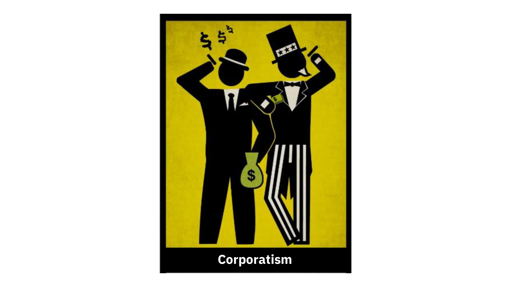
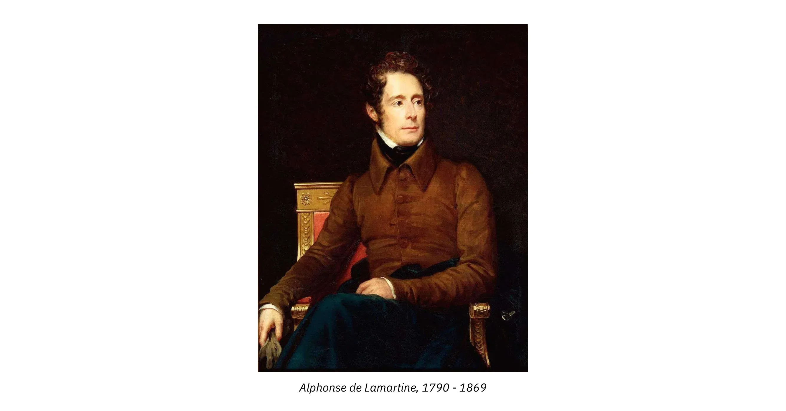

# A Journey Into the World of Frédéric Bastiat

This course, led by Damien Theillier, invites you to dive into the world of Frédéric Bastiat, a French economist and philosopher whose ideas continue to influence contemporary economic thought. Through 21 videos, Damien Theillier explores Bastiat's life, his intellectual influences, his ideological opponents, as well as his economic theories.

The course begins with a detailed introduction to Bastiat's life and historical context, before examining the thinkers who marked his thought, such as Adam Smith, Jean-Baptiste Say, Antoine Destutt de Tracy, Charles Comte, Charles Dunoyer, and Richard Cobden. Then, the course looks at Bastiat's opponents, including Rousseau, classical education, protectionism, socialism, and Proudhon.

An important part of the course is dedicated to the economic sophisms denounced by Bastiat, such as "What is seen and what is not seen," "The petition of the candlemakers," plunder through taxation, and the distinction between the two economic morals. The course also addresses the economic harmonies advocated by Bastiat, including the miracle of the market, the power of responsibility, and true solidarity.

Finally, the course concludes with a reflection on "The Law," addressing key concepts like the right to property, legal plunder, and the role of the state. The conclusion of the course revisits the legacy of Frédéric Bastiat and his enduring influence on modern economics.

Join Damien Theillier in this enriching exploration of Frédéric Bastiat's thought and discover how his ideas can illuminate current economic and political debates.

+++

# Introduction

<partId>e4a0cf13-2fc5-5ced-a528-ace3f9029f22</partId>

## Course Overview
<chapterId>aa493f46-2d3a-4b76-ad79-ed44113a97f4</chapterId>

The goal of this course is to provide you with a deep understanding of the life, intellectual influences, ideological opponents, and economic theories of Frédéric Bastiat. Through this structured journey, you will discover how his ideas have shaped economic thought and continue to influence current debates.

**Section 1: Introduction**  
We will start with a general overview of Frédéric Bastiat, an underrated genius of economics. You will learn about his life, intellectual journey, and the historical context in which he developed his thinking. Understanding this context is essential to fully grasp the scope of his writings and theories.

**Section 2: Influences**  
We will proceed with analyzing the thinkers who shaped Frédéric Bastiat’s economic thought. You will learn how major figures such as Adam Smith, Jean-Baptiste Say, Antoine Destutt de Tracy, Charles Comte, Charles Dunoyer, and Richard Cobden contributed to his intellectual development, laying the foundations for his reflection on free trade and market economics.

**Section 3: Opponents**  
Next, we will explore Bastiat’s criticisms of his ideological opponents. Whether it be Rousseau, classical education, protectionism, socialism, or Proudhon, you will understand why Bastiat considered these doctrines as obstacles to economic and social progress, and how he responded to their arguments with sharp logic.

**Section 4: Economic Fallacies**  
This section is dedicated to the economic fallacies exposed by Bastiat, including the famous "*What Is Seen and What Is Not Seen*" and "*The Candlemakers' Petition*". We will examine how he skillfully demonstrated, through satire and rigorous analysis, the common economic errors of his time, which remain relevant today.

**Section 5: Economic Harmonies**  
Here, you will discover Bastiat’s positive vision of the economy. We will address concepts such as the miracle of the market, the power of individual responsibility, and the distinction between true and false solidarity. Bastiat viewed the economy as a coherent system where well-understood self-interest benefits the common good. We will explore why.

**Section 6: The Law**  
To conclude this course, we will delve into Bastiat’s major work, "*The Law*", where he presents his reflections on property rights, legal plunder, and the limited role of the state. You will understand why this essay is considered one of the most compelling manifestos in favor of individual freedom and market economy.

Ready to discover how Frédéric Bastiat’s ideas still resonate today? Join us on this intellectual journey that could challenge your understanding of economics!

## Bastiat: An Underrated Genius

<chapterId>7f21b617-9810-5484-ad1c-befc61432126</chapterId>

This course introduces **Frédéric Bastiat**, a remarkable yet underappreciated economist whose ideas still shine today. We’ll explore who he was and why his work remains relevant.

Born in 1801, Bastiat rose to prominence during the first half of the 19th century. For a time, his writings were widely read—but gradually he faded from public view. Today, few people recognize his name, even though his works have been translated into Italian, Russian, Spanish, English, and more.

After World War II, one of Bastiat’s slim volumes was published in the United States and quickly gained fame. So influential was it that **Ronald Reagan** declared it his favorite book. That little classic is called *The Law*. Thanks to its popularity, Bastiat stands alongside Alexis de Tocqueville as one of the two French writers best known in America.

*Market place in Mugron in the Landes, the town of Bastiat*

Although often overlooked, Bastiat was truly a beacon for his age—and ours. Born in Bayonne, he spent his early years managing an inherited agricultural estate in the Landes, living the life of an entrepreneur. His curiosity soon turned to economics. A trip to England introduced him to **Richard Cobden**, a leading proponent of free trade. Inspired, Bastiat became convinced that opening markets would benefit France, and he devoted himself to spreading these ideas at home. His insightful articles earned him enough acclaim to move to Paris, where he edited the *Journal des économistes*.

But Bastiat was more than an economist: he was a philosopher of society, justice, and law—a champion of individual rights. He examined the “political market” with the same rigor he applied to economic markets, keenly analyzing how laws and policies are shaped by competing interests.

Elected deputy during France’s Second Republic, Bastiat witnessed a flood of new legislation covering everything from public services to social rights and taxes. He critiqued this “law inflation,” warning that unchecked political intervention often undermines both individual freedom and economic prosperity.

---

>**NATIONAL WORKSHOPS**  
>**AGENDA.**
>Whereas the workers enrolled in the National Workshops have justly requested that the available work be distributed among them as equally and fairly as possible;  
>Whereas work exists only for 16,000 men, and the number of enrolled men exceeds 50,000;  
>It is agreed that, until further notice and pending better arrangements, each company shall work two days per week starting Monday the 17th.  
>_The Commissioner of the Republic, Director of the National Workshops,_  
>**Émile THOMAS.**

---

He realized that, fundamentally, nothing had really changed: through voting and legislation, people continued to dispossess others of their property—a practice he called **legal plunder**. This idea stood at the core of his work, most notably in his final major text, *The Law*, where he contrasts legal plunder with the right to property. He argues that the true solution to society’s problems is freedom—specifically, the protection of private property and the right to the fruits of one’s labor.

In this course, we’ll journey through Frédéric Bastiat’s thought: first examining the early influences that shaped him, then exploring his *Economic Sophisms*, and finally studying *The Law*, which introduces his analysis of the political market and broader society.

## The Life and Historical Context

<chapterId>e9d92b63-83dd-552c-84e1-dd535608c109</chapterId>

In 1844, Frédéric Bastiat set out on a business trip to Spain. After stays in Madrid, Seville, Cádiz, and Lisbon, he embarked from Southampton to visit England. In London, he attended meetings of the Anti-Corn Law League—an organization he had followed from afar—and met its leaders, including Richard Cobden, who would become a close friend.

It was in England that his life took a decisive turn: Bastiat later recalled that his vocation as an economist was born in those meetings. Returning to France, he had one goal in mind—to make the French aware of the liberal movement flourishing in England.

Frédéric Bastiat was born in Bayonne on June 30, 1801. Orphaned at nine, he studied at the Catholic College of Sorèze, where he mastered English, Spanish, and even Basque. Lacking interest in formal exams, he forewent the Baccalauréat and instead joined his uncle’s import–export business in Bayonne.

In 1825, he inherited an agricultural estate from his grandfather, which he managed as a “gentleman-farmer.” There he encountered firsthand the problems created by unclear property rights. Determined to help, he became justice of the peace in Mugron (in the Landes), a key commercial and riverine crossroads between Bordeaux and Bayonne. He was later elected to the General Council of the Landes.

His passion for political economy deepened as he read Adam Smith, Jean-Baptiste Say, Destutt de Tracy, Charles Dunoyer, and Charles Comte. English newspapers introduced him to the Free-Trade League—a discovery that would shape his career.

*(Say, Cobden, Smith, Chevalier, Dunoyer, Destutt de Tracy)*

Upon returning to France, Bastiat published “On the Influence of English and French Tariffs on the Future of the Two Peoples” in the *Journal des Économistes* (October 1844). It was a sensation: readers praised his powerful logic, incisive arguments, and elegant style.

The *Journal des Économistes* commissioned further articles, and leading figures like Horace Say (son of Jean-Baptiste Say) and Professor Michel Chevalier congratulated him, urging him to continue spreading economic truths. This acclaim prompted his move to Paris.

There, he launched his *Economic Sophisms*, attacking protectionism with bold irony, and even taught political economy in a private salon attended by elite students.

In 1845 he founded the French **Association for Free Trade**, fundraising, publishing a weekly review, and lecturing nationwide. The first meeting took place in Bordeaux on February 23, 1846, and soon chapters formed across France—in Marseille, Lyon, Le Havre, and Paris among deputies, industrialists, and merchants.

The February Revolution of 1848 toppled Louis-Philippe’s July Monarchy and ushered in the Second Republic. Bastiat was elected deputy for the Landes, sitting center-left alongside Alexis de Tocqueville. He defended civil liberties and opposed restrictive policies from any quarter, serving as vice-president of the Finance Committee. He reminded colleagues of this vital truth:

> One cannot give to some, by law, without being obliged to take from others by another law.

Nearly all of his major works were written in the last six years of his life (1844–1850). In 1850 he produced two classics: *The Law* and the pamphlet series *What Is Seen and What Is Not Seen*. *The Law* has since been translated into English, German, Spanish, Russian, Italian, and more.

He died of tuberculosis in Rome in 1850 and is buried in the Church of Saint Louis of the French.`

# Influences

<partId>4d312b17-5740-5d33-8309-015e2b59b6dd</partId>

## Adam Smith and Jean-Baptiste Say

<chapterId>bcc7a12a-6cc4-5061-85e3-0e31fb1f0a49</chapterId>

In economics, Bastiat always acknowledged his debt to Adam Smith and Jean-Baptiste Say. At twenty-six, he wrote to a friend:
“I have never read on these subjects but these four works—Smith, Say, Destutt, and the *Censeur*.”

*(Jean-Baptiste Say and Adam Smith)*

Political economy, as conceived by Adam Smith and J.-B. Say, revolves around one core idea: **freedom**—freedom of trade, individual freedom, free initiative. The physiocrats (François Quesnay, Vincent de Gournay) first defended free trade; Adam Smith synthesized their insights with his own observations; and at the end of the 18th century, Jean-Baptiste Say refined Smith’s doctrine in his *Treatise on Political Economy*.

*(Say, Destutt de Tracy, Quesnay, de Gournay)*

Adam Smith saw prosperity not as an end in itself but as a means to moral improvement. “The wealth of nations consists of the wealth of individuals,” he wrote. A nation thrives when individuals act freely—expressing preferences and pursuing interests—because the market harnesses these pursuits to coordinate society.

The great innovation of modern political economists was to focus on the individual, restoring each person’s capacity for action while acknowledging human passions and conflicts. People naturally seek to improve their lot—and that of their loved ones—through exchange.

Smith demonstrated that one serves one’s own interest only by serving others:

> “It is not from the benevolence of the butcher, the brewer, or the baker that we expect our dinner, but from their regard to their own interest.”

---

> “The natural effort of every individual to better his own condition... is so powerful, that it is alone, and without any assistance, not only capable of carrying on society to wealth and prosperity, but of surmounting a hundred impertinent obstructions with which the folly of human laws too often encumbers its operations.”
> *The Wealth of Nations*, Book IV, Chapter V

---

Exchange is a positive-sum game: both parties gain, unlike political redistribution, which always produces winners and losers. The English school—Smith, Ricardo, Locke (and later Marx)—linked value to labor. Bastiat, following Say, argued that **utility** is the true foundation of value. Labor alone does not create value, nor does scarcity—only utility does. No one pays for something they do not find useful.

Bastiat refined Say’s insight further: value lies not in the intrinsic utility of things but in their **relative** utility when exchanged. “Value is the ratio of two exchanged services,” he wrote. Thus value is subjective, revealed only through individuals’ behavior in a free market. The market, in turn, regulates society by aligning these preferences.

One fundamental principle—“Say’s Law”—states: “Products and services are exchanged for products and services.” Nations and individuals benefit from higher production because it creates more opportunities for mutually advantageous exchanges.

Indeed, purchases anticipate the services people expect—a record for listening, a ticket for a film. In every exchange, each party acts because what they gain outweighs what they give up. Money merely facilitates these exchanges as an intermediary commodity.

For Bastiat, this economy of freely offered and accepted services underpins peace and prosperity, harmonizing interests across society.

Yet Bastiat also inherited from Say the concept of **plunder**. 

> “There are only two ways to acquire the things necessary for life: production and plunder”

Producers rely on persuasion, negotiation, and contract; plunderers depend on force and deceit. The law’s role is to suppress plunder and protect labor and property. As Adam Smith had asserted, safeguarding citizens’ security is government’s primary duty—and the sole justification for taxation.

## Antoine Destutt de Tracy

<chapterId>ddf64e9f-2ce0-5651-8eb8-bae578eb0b9b</chapterId>

It is little known, but Destutt de Tracy decisively influenced the future U.S. President Thomas Jefferson during his ambassadorship in Paris in the 1780s.

> “For every man, his first country is his homeland, and the second is France.”
> “Tyranny is when the people fear their government; liberty is when the government fears the people.”
> —Thomas Jefferson

His *Treatise on Political Economy* condemned protectionism and Napoleonic expansion—and was banned in France by Bonaparte. Jefferson translated and published it in the United States, making it the first political-economy textbook at the University of Virginia. It did not appear in France until 1819!

Destutt de Tracy, philosopher and economist, led the “Idéologues” school alongside Cabanis, Condorcet, Constant, Daunou, Say, and Germaine de Staël. They were direct heirs of the Physiocrats and disciples of Turgot.

By “ideology,” Tracy meant the science of ideas—their origins, laws, and relationship with language (early epistemology). The term carried no pejorative sense until Marx later used it to discredit laissez-faire economists. Their journal, *La Décade philosophique et littéraire*, dominated the revolutionary era under Say’s direction.

Tracy was elected to the French Academy (1808) and the Academy of Moral and Political Sciences (1832). His daughter’s 1802 marriage to Georges Washington de La Fayette (son of Lafayette) underscores strong Franco-American ties.

His *Treatise* aimed to “examine the best way to employ all our physical and intellectual faculties to satisfy our various needs.” He argued that trade is the civilizing, rationalizing, and pacifying force of humanity: “Trade is the whole of society, just as labor is the whole of wealth.” Society is “a continuous series of exchanges in which both contractors always gain,” making markets positive-sum rather than predatory.

Although Tracy stopped short of defining political economy as the science of exchange, Bastiat would later do so: selling is exchanging goods, renting is exchanging services, lending is deferred exchange—thus “the theory of exchange.”

Tracy held that property springs from our nature and desires: without wants, there are no rights or duties. To meet needs, we employ means acquired through labor, and private property secures this process. Therefore, government’s sole purpose is to protect property and allow peaceful exchange.

He advocated the most moderate taxes and minimal state spending, condemning government plunder via debt, taxes, monopolies, and waste. The law should protect freedom, never plunder. He concluded with a warning still pertinent today:

> “Let the government not incur debts that commit future generations and always lead states to their ruin.”

In sum, the Idéologues intuited that production and exchange solve political problems and prevent war—whether internal, as during the Revolution, or external, under ancient kings and Napoleon.

## Charles Comte and Charles Dunoyer

<chapterId>80bc5c4e-ac07-52c8-9dd7-e224ac291bda</chapterId>

The history of all civilizations is the story of the struggle between the plundering classes and the productive classes. This is the creed of the two authors we are going to discuss. They are the originators of a liberal theory of class struggle that inspired Frédéric Bastiat as much as Karl Marx, although the latter distorted it.

For Comte and Dunoyer, plunder, meaning all forms of violence exercised in society by the strong over the weak, is the great key to understanding human history. It is at the origin of all phenomena of exploitation of one class by another.

If Frédéric Bastiat owes his economic education to Smith, Destutt de Tracy, and Say, he owes his political education to the leaders of the journal Le Censeur, Charles Comte and Charles Dunoyer.

This review (1814-1819), renamed Le Censeur européen after the Hundred Days, disseminated the liberal ideas that triumphed in 1830 with the insurrection of the Three Glorious Days and the rise to power of the Duke of Orléans, Louis-Philippe I.

Charles Comte, cousin of Auguste Comte and son-in-law of Say, is the founder of the review. He was soon joined by Charles Dunoyer, a jurist like himself, and then by a young historian, Augustin Thierry, former secretary of Saint Simon. Their motto on the front page of each issue of the review was "Peace and Liberty".

What is the goal of the review? The title speaks for itself: to censor the government. To fight against the arbitrariness of power by enlightening public opinion, to defend the freedom of the press.

_(Benjamin Constant)_

They adopt from Benjamin Constant the distinction between the Ancients and the Moderns, characterized on one hand by war, and on the other by commerce and industry. But they add with Say that political economy provides the best explanation of social phenomena. They particularly understand that nations achieve peace and prosperity when property rights and free trade are respected. From now on, for them, political economy is the true and only foundation of politics. To philosophy, which confines itself to the abstract critique of forms of government, must be substituted a theory based on the knowledge of economic interests.

> Political economy, by demonstrating how peoples prosper and decline, has laid the true foundations of politics.  
>  
> Dunoyer  

This new social theory contains one of the elements that would become the cornerstone of Marx and Engels' scientific socialism: class struggle. But what does the liberal theory of class struggle consist of, and how does it differ from Marxism?

It starts with the individual who acts to meet their needs and desires. From the moment one creates, that is, increases the utility of things, enhancing their value, one engages in industry. Here, an industrialist is not an industry owner, as current language might suggest, but a producer, regardless of the field in which they work. That's why their theory is called industrialism. It posits that the goal of society is the creation of utility in the broad sense, that is, goods and services useful to humans.

On this point, individuals face two fundamental alternatives: they can plunder the wealth produced by others, or they can work to produce wealth themselves. In any society, one can clearly distinguish those who live off plunder from those who live off production. Under the Ancien Régime, the nobility directly attacked the most industrious to live off a new form of tribute: tax. The rapacious nobility was succeeded by hordes of bureaucrats, no less rapacious.

While for Marx, class antagonism is situated within the productive activity itself, between employees and employers, for Comte and Dunoyer, the conflicting classes are, on one side, the society's producers, who pay taxes (including capitalists, workers, peasants, scholars, etc.) and on the other, the non-producers, who live off rents financed by taxes, "the idle and devouring class" (bureaucrats, officials, politicians, beneficiaries of subsidies or protections).

Then, unlike Marx, the authors of the Censeur Européen do not advocate for class warfare. Instead, they campaign for social peace. And this, according to them, can only be achieved through the depoliticization of society. To this end, it is important to first reduce the prestige and benefits of public offices. It is then important to give influence in the political body to the producers.

Finally, the only way to rid the world of the exploitation of one class by another is to destroy the very mechanism that makes this exploitation possible: the power of the State to distribute and control property and the allocation of benefits related to it (the "positions").

Their ideas, profoundly innovative, would forever mark Frédéric Bastiat, who would himself become a deep thinker on political crises.

## Cobden and the League

<chapterId>7181435c-5eae-56e4-8e55-02a24273fdd6</chapterId>

It is 1838, in Manchester, a small number of men, little known until then, gather to find a way to overthrow the monopoly of the wheat landowners through legal means and to accomplish, as Bastiat would later recount,

> Without bloodshed, by the sole power of opinion, a revolution as profound, perhaps more profound than that which our fathers carried out in 1789.  

From this meeting would emerge the League against the corn laws, or the grain laws, as Bastiat would call them. But very quickly, this goal would become that of the total and unilateral abolition of protectionism.

This economic battle for free trade would occupy all of England until 1846. In France, outside of a small number of initiates, the existence of this vast movement was completely unknown. It was by reading an English newspaper, to which he had subscribed by chance, that Frédéric Bastiat learned of the League's existence in 1843. Enthused, he translated the speeches of Cobden, Fox, and Bright. Then he corresponded with Cobden and finally, in 1845, he went to London to attend the League's gigantic meetings.

It was this campaign of agitation for free trade, throughout the kingdom, with tens of thousands of members, that set Bastiat's pen on fire and radically and definitively changed the course of his life.

The League can be compared to a traveling university, educating economically those who attended its meetings across the country—common folk, industrialists, cultivators, and farmers, all of whom the League had taken under its wing and whose interests the grain laws oppressed. Richard Cobden was the soul of the movement and an outstanding agitator.

A fascinating and formidable speaker, he had a prodigious gift for inventing striking and concise phrases, far from the abstract discourses of economists.

> What is the bread monopoly? he exclaimed. It's the scarcity of bread. You are surprised to learn that the legislation of this country, on this matter, has no other purpose than to produce the greatest possible scarcity of bread. And yet it is nothing else. The legislation can only achieve its goal through scarcity.  

In 1845, Bastiat published in Paris his book Cobden and the League, with his translations accompanied by comments. The book opens with an introduction on the economic situation of England, on the history of the origin and progress of the League. Since 1815, protectionism was very developed in England. There were, in particular, laws limiting grain imports which had very harsh consequences for the people. Indeed, wheat was necessary for making bread, a vital commodity at the time. Moreover, this system favored the aristocracy, that is, the large landowners, who derived rents from it.

> What coexists in England, Bastiat wrote, is a small number of plunderers and a large number of plundered, and one does not need to be a great economist to conclude the opulence of the former and the misery of the latter.  

The goal of the League was to mobilize public opinion to pressure parliament to repeal the grain law. In the long term, Cobden and his friends hoped to:

- Increase industrial outlets
- Increase employment
- Reduce the price of bread
- Make agriculture and industry more efficient through competition
- Promote peace among nations

_(Jeremy Bentham)_

A disciple of Bentham's utilitarianism, Cobden's conviction was that the freedom of labor and trade directly served the interest of the most numerous, poorest, and most suffering masses of society. On the contrary, customs as an instrument of arbitrary prohibitions and privileges could only benefit certain most powerful industries.

In the 1841 elections, five members of the league, including Cobden, were elected to parliament. On May 26, 1846, unilateral free trade became the law of the kingdom. From then on, the United Kingdom would experience a brilliant period of freedom and prosperity.
What's interesting is that Bastiat appropriated a part of their method; he assimilated their language and transposed it into the French context. The book on Cobden and the League quickly became a success, and Bastiat made a sensational entry into the world of economists. He founded an association in Bordeaux in favor of free trade and then moved it to Paris. He was offered the leadership of the Journal des Économistes. The movement was born, and it continued until 1848.

It was only after Bastiat's death, in 1866, that Napoleon III would sign a free trade treaty with England, a sort of posthumous victory for the man who had dedicated the last six years of his short life to this great idea.

_(Michel Chevalier)_

The question of free trade continues to be relevant today. Geography textbooks in schools claim that globalization is to blame and that poor countries need Western aid to get by. Yet, extreme poverty has been halved in 20 years. By choosing openness, countries like India, China, or Taiwan have been able to escape poverty, while stagnation characterizes closed countries like North Korea or Venezuela. According to the UN, 36% of humanity lived in total destitution in 1990. They are now "only" 18% in 2010. Extreme poverty remains a major challenge, but it is receding.

# The Opponents

<partId>f902ed30-269e-5e44-a76d-8efd1a4e4085</partId>

## Rousseau

<chapterId>c3926110-e0b2-503c-96d9-5d3a6a661484</chapterId>

Frédéric Bastiat, who expressed himself in the 1840s, is the heir to a generation of Enlightenment philosophers who fought against censorship and for the freedom to debate. Think of Montesquieu, Diderot, Voltaire, Condorcet, but also Rousseau.

For them, the idea was simple: the more ideas are allowed to be expressed, the more truth progresses and the more easily errors are refuted. Science always progresses in this way.

_(Montesquieu, Diderot, Voltaire, Condorcet, Rousseau)_

On the contrary, few have understood that what was true for ideas was also true for goods and services. The freedom to trade with others indeed has two virtues: being efficient and leading to a fairer distribution. Not only did Rousseau not understand this, but he also fought against this freedom in the name of a false idea of law and right. One of the major sources of socialism, Bastiat notes, is Rousseau's opinion that the entire social order stems from the law.

Bastiat indeed considers Rousseau to be the true precursor of socialism and collectivism. In the author of The Social Contract, there's a phrase that quite well summarizes his philosophy: "we only begin to become men after having been citizens."

Initially, man is merely a bourgeois. But the bourgeois is a calculator; he wants his immediate pleasure, he is enslaved to his senses, to his desires, to his particular interest. In short, he is not rational, therefore he is not free. He needs to be educated, to understand that his true interest is the general interest. This is why Rousseau wrote in The Social Contract:

---

>Whoever refuses to obey the general will shall be compelled to do so by the entire body: which means nothing else than that he will be forced to be free.  
>(Jean-Jacques Rousseau)

---

According to this doctrine, man has two wills within him: a will that tends towards personal interest, that of the bourgeois, and a will that tends towards the general interest, that of the citizen. Leading men, even by force, to want a rational end, the general interest, is leading men to become free. What they truly want is a rational end, even if they do not know it.

It is therefore perfectly legitimate, according to Rousseau, to constrain men in the name of an end that they themselves, had they been more enlightened, would have pursued, but which they do not pursue because they are blind, ignorant, or corrupt. Society is founded to force them to do what they should spontaneously desire if they were enlightened. And by doing so, one does not do violence to them since one leads them to be "free," that is, to make the right choices, choices that are in line with their true self.

Convinced that the good society is a creation of the law, Rousseau thus grants unlimited power to the legislator. It is up to him to transform individuals into accomplished men, into citizens.
But, it is also up to the law to make property exist. According to Rousseau, property can only be legitimate if it is regulated by the legislator. Indeed, the evil lies in inequality and servitude, both of which stem from property. It is an invention of the strong that has led to bad society, to bourgeois society, to relations of domination. In his Discourse on the Origin and Foundations of Inequality, he writes this famous passage:

> The first person who, having fenced in a piece of land, said: This is mine, and found people simple enough to believe him, was the true founder of civil society. How many crimes, wars, murders, how much misery and horror would have been spared the human race by the one who, pulling up the stakes or filling in the ditch, had cried out to his fellows: "Beware of listening to this impostor; you are lost if you forget that the fruits belong to all and the earth belongs to no one!"  

Therefore, natural property is the source of evil. And Marx, a great reader of Rousseau, would remember this. How to combat this evil? Through the social contract, Rousseau replies. Indeed, the good society is one that results from a contract that stipulates the alienation of the individual with all his rights to the community. From then on, it is up to the community to grant rights to the individual through the law.

Contrary to Rousseau, Frédéric Bastiat says that "man is born a property owner." For him, property is a necessary consequence of the nature of man, of his constitution. He writes that "man is born a property owner, because he is born with needs whose satisfaction is indispensable to life, with organs and faculties whose exercise is indispensable to the satisfaction of these needs". But faculties are only the extension of the person, and property is only the extension of the faculties. In other words, it is the use of our faculties in work that legitimizes property.

According to Bastiat, society, people, and properties exist before laws, and he has this famous phrase: "It is not because there are laws that there are properties, but because there are properties that there are laws". That is why the law must be negative: it must prevent encroachment on people and their goods. Property is the _raison d'être_ of the law and not the other way around.

## Classical Education

<chapterId>87d9a8c9-2352-5cb2-8b93-678118a8145c</chapterId>
On February 24, 1848, after three days of riots in Paris, King Louis-Philippe I abdicated his power. This marked the birth of the Second Republic.

Bastiat was in Paris, witnessing the events firsthand. Later, he would write:

> On February 24, I, like many others, feared that the nation was not prepared to govern itself. I must admit, I dreaded the influence of Greek and Roman ideas that are imposed on us all by the academic monopoly.  

This passage is surprising. What do Greek and Roman antiquity have to do with it?

Bastiat refers to Plato's Republic and his theory of the philosopher-king, but also to Sparta, which Rousseau so admired, to the Roman Empire, for which Napoleon was so nostalgic. Unfortunately, according to Bastiat, these Greek and Roman ideas are based on a false premise: the idea of the omnipotence of the legislator, of the absolute sovereignty of the law.

It's enough to open almost any book on philosophy, politics, or history at random to find this idea, rooted in our culture, that humanity is an inert matter receiving life, organization, morality, and prosperity from political power. Left to its own devices, humanity would tend towards anarchy and would only be saved from this disaster by the mysterious and omnipotent hand of the Legislator. However, Bastiat says, this idea has been long matured and prepared by centuries of classical education.

Firstly, he says, the Romans regarded property as a purely conventional fact, as an artificial creation of written law. Why? Simply, Bastiat explains, because they lived off slavery and plunder. For them, all properties were the fruit of spoilation. Therefore, they could not introduce into legislation the idea that the foundation of legitimate property was labor without destroying the foundations of their society.
They indeed had an empirical definition of property, "jus utendi et abutendi" (the right to use and abuse). However, this definition only concerned the effects and not the causes, in other words, the ethical origins of property. To properly establish property, one must go back to the very constitution of man, and understand the relationship and necessary linkage that exist between needs, faculties, labor, and property. The Romans, who were slave owners, could they conceive the idea that "every man owns himself, and therefore his labor, and, consequently, the product of his labor"? Bastiat wonders.

> Therefore, let us not be surprised, Bastiat concludes, to see the Roman idea that property is a conventional fact and of legal institution reemerge in the eighteenth century; that, far from the Law being a corollary of Property, it is Property that is a corollary of the Law.  

Indeed, Rousseau shares this common legal idea of basing property on the law. Rousseau attributes to the law, and consequently to the people, absolute power over individuals and properties. And in this conception, which constitutes the very idea of the republic since the French Revolution, the legislator must organize society, like a social architect, like a mechanic who invents a machine from inert matter, or like a potter who shapes clay. The legislator thus places himself outside of humanity, above it, to arrange it at will, according to plans conceived by his luminous intelligence.

On the contrary, for Bastiat, the right of property is prior to the law. This is what he calls the principle of economists, as opposed to the principle of jurists. While "the principle of jurists virtually contains slavery, says Bastiat, that of economists contains freedom.

What then is freedom? It is property, the right to enjoy the fruits of one's labor, the right to work, to develop, to exercise one's faculties, as one sees fit, without the State intervening otherwise than by its protective action.

It is sad to think that our social and political philosophy has remained stuck on the idea that the solution to all our problems had to come from above, from the law, from the State. But this is explainable. These ideas are instilled every day in the youth in schools and universities, through the monopoly of education.

_an example of such a monopolistic agent could be a government institution_

However, as Bastiat reminds us, monopoly excludes progress.

## Protectionism and Socialism

<chapterId>ce6cb8a8-7dc9-5ef7-939d-9a559b4d2c74</chapterId>

_(Richard Cobden)_

As we have already seen, it was first and foremost Cobden's fight against protectionism with the English league for the abolition of the Corn Laws that led Bastiat to write articles and then books.

Protectionism is, in reality, a form of economic nationalism. It aims to eliminate foreign competition while pretending to "defend national interests." They then try to get the public authorities to accept a set of purely demagogic untruths, presented as virtuous: the defense of jobs, competitiveness, etc. Of course, elected officials yield to the pressure of producers, because it is for them a golden opportunity to consolidate their clientele and expand their power.

_an example of promotional advertising of a blender produced in France_

---

>Our meeting with Arnaud Montebourg  
>Made in France,  
>he believes in it, we tested it

---

The argument for job protection is what Bastiat calls a fallacy. Because in reality, it is equivalent to a tax. It has the effect of making products more expensive. Let's take the example given by Bastiat himself.

Imagine an English knife that sells in our country for 2 euros, and a knife made in France costs € 3. If we let the consumer freely buy the knife he wants, he saves 1 euro, which he can invest elsewhere (in a book, or a pencil).

If we ban the English product, the consumer will pay one more unit for his knife. Protectionism thus results in a profit for a national industry and two losses, one for another industry (that of pencils) and the other for the consumer. On the contrary, free trade makes two happy winners.

Protectionism is also a form of class struggle. According to Bastiat, it is a system based on the selfishness and greed of producers. To increase their remuneration, farmers or industrialists demand taxes to close the market to foreign products, thus forcing consumers to pay more for their products.

Bastiat firmly sides with consumers. Against class interest, he posits the general interest, which is the interest of the consumer, that is, the interest of everyone. It is always from the consumer's point of view that the State should position itself when acting.

With the February 1848 revolution and its barricades, a more formidable enemy than protectionism would emerge, one with which it shares many affinities: socialism.

What is it? It's a political movement that demands the organization of labor by law, the nationalization of industries and banks, and the redistribution of wealth through taxation. Bastiat would now devote all his energy, talent, and writings against this new doctrine, which could only lead to the exponential growth of power and perpetual class struggle. Thus, from the first days of the revolution, he contributed to a short-lived newspaper named "La République Française," which quickly became known as a counter-revolutionary journal. This was the time when he wrote his pamphlets on property, the state, plunder, and the law.

On June 27, 1848, the day after a bloody new insurrection in Paris, in a lengthy letter to Richard Cobden, he dwelled on the causes that could have led to these events.

- 1° The first of these causes is economic ignorance. It is this that prepares minds to embrace the utopias of socialism and false republicanism. I refer to the previous video on the tendencies of classical and university education on this point.

- 2° The nation became enamored with the idea that fraternity and solidarity could be introduced into law. That is, it demanded that the state directly create happiness for its citizens. Here Bastiat sees the beginnings of the welfare state.

And he would continue to analyze its perverse effects thereafter. Here is one example, cited in the letter to Cobden:

> By virtue of the natural inclinations of the human heart, everyone began to demand from the state, for themselves, a greater share of well-being. That is, the state or the public treasury was put to plunder. All classes demanded from the state, as if by right, the means of existence. The efforts made in this direction by the state only led to taxes and obstacles, and to the increase of misery.  

- 3° Bastiat adds that in his view, protectionism was the first manifestation of this disorder. The capitalists began by asking for the law's intervention to increase their share of wealth. Inevitably, the workers wanted to do the same.

---

>TO SUCCEED  
>VOTE SOCIALIST SFIO

---

To conclude, protectionists and socialists share a common point, according to Bastiat: what they seek from the law is not to ensure everyone the free exercise of their faculties and the fair reward for their efforts, but rather to favor the more or less complete exploitation of one class of citizens by another. With protectionism, it is the minority that exploits the majority. With socialism, it is the majority that exploits the minority. In both cases, justice is violated and the general interest is compromised. Bastiat sets them against each other.

> The state is the great fiction through which everyone endeavors to live at the expense of everyone else.  

## Proudhon

<chapterId>96902abd-6915-5b25-a187-a4790162b86c</chapterId>

Pierre-Joseph Proudhon is one of the major representatives of French socialism in the mid-19th century. He is especially famous for this statement: "Property is theft" in "What is Property?" in 1840.

There is something logically absurd in this assertion. For if there were no legitimately acquired property, logically there could not be an act such as theft. That's why Proudhon would later clarify that it is the actual distribution of property he considers theft, not property itself, which he describes as a revolutionary force foundational to anarchist society.

But Proudhon is an individualist anarchist. He does not see the proletariat, nor the state, as legitimate sources of power. He harshly criticizes communism and advocates for worker mutualism, a form of structured cooperative solidarity, which would rely on the voluntary pooling of resources for mutual aid. It is less known but Bastiat was not at all opposed to this idea in principle. He simply feared that the state would turn it into a de facto monopolistic public service. History would prove him right.

On the other hand, it is well known that in "The Poverty of Philosophy," Marx would violently attack Proudhon and his socialism, which he called "utopian," in favor of a so-called "scientific" socialism.

In June 1848, Proudhon was elected to the National Assembly, alongside Bastiat. They were acquaintances and held each other in high regard. However, in 1849, in a resounding controversy, Bastiat exchanged fourteen letters with him in the columns of La Voix du Peuple. In this vigorous exchange, he clarified his stance on monetary and banking issues. The dispute boiled down to the following alternative: free credit or freedom of credit?

Proudhon saw the interest on capital as the initial cause of pauperism and inequality of conditions. He advocated for unlimited monetary creation by a state bank (the Exchange Bank or People's Bank), and saw in the "free credit" the solution to the social problem. On the other hand, Bastiat was a proponent of the freedom of banks, meaning the regulation of monetary circulation through the freedom of access to the profession, coupled with a necessary responsibility over one's own funds, and the freedom of competition.

Bastiat refuted his opponent in several stages. First, he analyzed the perverse effects of free credit and monetary creation. Such a system could only encourage the riskiest and most reckless actions by banks and private actors because they know they are covered by the state, that is, by taxpayer money: "It is a serious matter to place all men in a situation where they say: Let's try our luck with someone else's property; if I succeed, so much the better for me; if I fail, too bad for others." A prescient statement as it could apply to our era.

The policy of low interest rates practiced by central banks is a way to artificially create money. And the successive crises of the financial system over the last century, with the indebtedness of states, are its direct consequences.

Then Bastiat shows that it is possible to improve the purchasing power of the working classes, but by other means, more just and more effective. For him, the reduction of interest rates is also the goal of a liberal policy. But it is through the liberation and accumulation of capital that this is achieved, not by the abolition of interest, that is, free credit.

Indeed, according to Bastiat, the progress of humanity coincides with the formation of capital. In his pamphlet titled Capital and Rent, Bastiat makes us understand this with Robinson Crusoe on his island.

Without accumulated capital or materials, Robinson would be doomed to death. He then explains that capital enriches the worker in two ways:

- It increases production, thus decreasing the price of goods for consumption;
- which has the effect of increasing wages.

In modern society, capital acts as an equalizing force. Indeed, Bastiat says:

> When capital increases, it competes with itself; its remuneration decreases, or, in other words, the interest rate falls.  

In conclusion, both Proudhon and Bastiat recognized the importance of capital accumulation and the tendency of some men to exploit others. However, they did not draw the same conclusions. Proudhon, like Marx, anticipated an increasing impoverishment of the masses in capitalist countries. Bastiat believed that capitalism would lead to unprecedented prosperity across all classes, and the development of an increasingly significant middle class. This is indeed what happened.

# Economic Sophisms

<partId>59686d1d-58c6-59a8-9fc4-74a10d24cdbe</partId>

## What is Seen and What is Not Seen

<chapterId>25fb02a9-5d68-5c58-bd0f-d4b8e1fd91f9</chapterId>

In this chapter, I will unveil a brand-new technology, a revolutionary technology. A researcher has developed a pair of bionic glasses with an ultra-powerful mini-camera embedded in the front. This technology allows seeing details impossible to see with the naked eye. In the arms, there is an electronic chip that transmits images directly to the cloud via my smartphone.

The inventor of the first prototype of these glasses was Frédéric Bastiat in 1850 in a famous pamphlet: _Ce qu’on voit et ce qu’on ne voit pas_. These glasses are those of the economist. They allow measuring the consequences of decisions made by the authorities on our lives. They are the glasses that "allow us to see what we do not see": the destruction caused by clientelist policies and false economic theories. Often we do not see their victims, nor their beneficiaries, in short, their real effects as opposed to the claims made in official speeches, what Bastiat calls "Economic Sophisms."
The good economist, according to Bastiat, must describe the effects of political decisions on society. However, they must be attentive, not to their short-term effects on a particular group, but rather to their long-term consequences for society as a whole. Who are the victims and who are the beneficiaries of these policies? What are the hidden costs of a certain law or political decision? What would taxpayers have done instead of the government with the money that was taken from them in taxes? These are the questions posed by the good economist according to Bastiat.

Thus, in Public Works, Bastiat writes:

> The State opens a road, builds a palace, straightens a street, digs a canal; by this, it gives work to certain workers, that's what is seen; but it deprives work from certain others, that's what is not seen.  

One of the most well-known sophisms is the broken window fallacy. Some claim that the breaking of a window in a house does not harm the economy since it benefits the glazier. But Bastiat will show that destruction is not in our interest because it does not create wealth. It costs more than it yields. The young boy who breaks a neighbor's window gives work to the glazier. But here is how his friends console him:

> Every cloud has a silver lining. Such accidents keep the industry going. Everyone needs to live. What would become of glaziers if windows were never broken?  

Thus, according to Keynes, the destruction of property, by forcing expenditure, would stimulate the economy and have a "multiplier effect" invigorating on production and employment. This is only what is seen.

But what is not seen is what the owner would have bought with that money, but which he now has to do without, with what he has to spend to repair his window. What is not seen is the lost opportunity of the owner of the broken window. He could have allocated the sum given to the glazier to something else. If he had not had to spend to repair the window, he could have spent the money for his own consumption, thus employing people for production.

Thus, there will be no more "stimulation" of the economy with the breaking of the window than without. However, there will have been a net loss in the first case: the value of the window.

The first lesson to learn is that a "good" decision or a "good" policy is one that costs society less than what another allocation of resources could have cost. The effectiveness of a policy should be judged not only based on its effects but also on the basis of the alternatives that could have occurred. This is the concept of "opportunity cost," dear to Bastiat.

The second lesson is that destruction does not stimulate the economy as Keynesians think but leads to impoverishment. The destruction of material goods does not have a positive effect on the economy, contrary to popular belief. To use the concluding words of Frédéric Bastiat's text: "society loses the value of the objects unnecessarily destroyed."

Let's take a current example. As soon as the automotive industry is struggling, policymakers imagine scrappage schemes to "relaunch" it. What we see is the increase in sales of Renault and Peugeot. What we do not see is the loss for other economic sectors and that cars in perfect working order are destroyed.

But there are other ways to boost the economy. If the State engages in major projects or invests funds in certain industrial sectors to support employment, isn't that good news for growth? Not any more, Bastiat would answer. Because by what would public spending be financed? By raising taxes or by debt, that is, by invisible but very real costs, which will impact growth. Moreover, the government produces nothing; it simply diverts resources from their private use. And what we do not see are the many things that could have been produced if the capital had not been withdrawn from the private sector to finance government programs.

Finally, nearly a century before Keynes, we can say that Bastiat refuted the Keynesian sophisms that claim that state indebtedness encourages the economy and that public spending produces growth.

The great lesson from this series of texts is that state intervention has perverse effects that are not seen. Only a good economist is capable of foreseeing them. Politics is what we see. The economy is what we do not see.

## The Petition of the Candle Makers

<chapterId>f4e759ed-1cb2-55c7-885e-0a60244758a4</chapterId>

In 1840, the Chamber of Deputies voted for a law increasing import taxes to protect the French industry. This is the famous economic patriotism, which we still encounter today.

_above: Marine Le Pen, a French politician_

Bastiat then composed a satirical text that later became one of his most famous works: "the petition of the candle makers". It illustrates how certain well-organized pressure groups of producers obtain undue privileges from the state, to the detriment of the citizens. At the same time, it demonstrates the absurd and destructive nature of protectionist legislation.

---

>PROTECT OUR CANDLES!

---

In this petition, the candle makers ask the deputies for legal protection against a dangerous rival:

> We suffer from the intolerable competition of a foreign rival who, it seems, is in such superior conditions for producing light that he floods our national market at a fabulously reduced price.  

So, who is this unfair foreign competitor? It is none other than the sun. The producers then highlight the opportunity there would be in reserving "the national market for national labor", by ordering through a law to close "all windows, skylights, shades, shutters, blinds, curtains, fanlights, in a word all openings, holes, slits, and cracks through which the sunlight is accustomed to enter houses".

In other words, the candle makers attempt to demonstrate the harmful effects of a "foreign competitor" (the sun) on the economy of France. Because not only can the sun provide the same "product" as candles, but it does so for free. Two hundred years later, this story remains incredibly relevant. Consider the taxi drivers who ask for the law to ban VTCs and Uber. Think of the bookstores that want to ban Amazon.

Bastiat's real adversary in this fiction is political and electoral protectionism, one that relies solely on the greed of producers and the naivety of consumers. He unveils the collusion between the bad capitalist of the time and the State. Instead of innovating and adapting to the market, the bad capitalist is the one who seeks to gain a political advantage through protectionism. This always results in spoliation for the consumer, that is, an injustice.
In short, protectionism is a deliberate policy in favor of producers against consumers. However, according to Bastiat, the true representatives of the general interest are the consumers, because we are all consumers.

Protectionism is also based on a hidden syllogism that turns out to be a fallacy:

- The more we work, the richer we are;
- The more difficulties we have to overcome, the more we work;
- Therefore, the more difficulties we have to overcome, the richer we are.

Let's illustrate this absurdity with a few short stories told by Bastiat. In Chapter III of the second series of Economic Sophisms, he imagines a carpenter who writes to the minister a petition asking for protectionist legislation. The carpenter thus formulates his request: Mr. Minister, make a law that stipulates that "No one will be able to use anything but beams and joists produced from blunt axes." In other words, make a law that prohibits the use of sharp axes in France. Thus, where one normally gives 100 axe blows, it will be necessary to give 300. Carpenters will be in high demand and therefore better paid.

In Chapter XVI, there is another very ironic text, titled: The Right Hand and the Left Hand. Following an investigation, a royal envoy drafts a report in which he proposes to the king to cut off, or at least tie up, all the right hands of the workers. Thus, he continues, work and consequently wealth will increase. Production will become much more difficult, which will necessitate the massive hiring of additional labor and an increase in wages. Pauperism will disappear from the country.

Following this logic of creating jobs at all costs, why not also replace trucks with wheelbarrows and shovels with teaspoons? All these sophisms have one thing in common: they confuse the means with the end. For Bastiat, the goal of the economy is not the preservation of jobs. We should not judge the utility of work by its duration and intensity but by its results: the satisfaction of needs, utility.

This confusion of means and end is found in the slogan "money is wealth."
This is the axiom that governs the monetary policy of most states. Indeed, the artificial increase in the quantity of money allows banks to lend money to individuals and states to easily repay their debt, this is "what we see". But "what we do not see" is that this creation of money, not based on any real wealth creation, will lead to inflation and the ruin of savers.

True wealth, according to Bastiat, is therefore the set of useful things that we produce through work to satisfy our needs. Money is thus only a commonly used means of exchange, it only plays the role of an intermediary.

## Plunder Through Taxation

<chapterId>551fc499-2119-5a52-9114-412d29434c22</chapterId>

> When the rich lose weight, the poor die.  

This quote, attributed to Lao-Tzu, describes the inevitable consequence of a taxation system that aims to hit the rich harder than others.

Yet, have you ever heard it said:

> Taxation is the best investment: it's a fertilizing dew! See how many families it supports, and follow, in thought, its ricochets on industry: it's infinite, it's life.  

In France, where public spending is considered a benefit, taxes are higher than in other countries. But Bastiat warns us right away: "In every public expenditure, behind the apparent good there is a more difficult to discern evil."

What is it about?

The economy describes the good or bad effects of political decisions on our lives. However, according to Bastiat, the economist must be attentive, not only to their short-term effects on a particular group but rather to their long-term consequences for society as a whole.

> What we see is the labor and profit allowed by social contribution. What we do not see are the works that would be generated by this same contribution if it were left to the taxpayers. What we see is the labor and profit allowed by social contribution. What we do not see are the works that would be generated by this same contribution if it were left to the taxpayers.  
>  
> F.Bastiat  

From the outset, he refutes the still prevalent argument that public spending funded by taxes creates jobs. Indeed, taxes create nothing since what is spent by the state is no longer spent by taxpayers.

Moreover, the state is more wasteful than individuals. Indeed, he reminds us, the state owns nothing; it produces no wealth. Public spending is often a source of waste because the immense sums confiscated from individuals escape the responsibility of their owners and are spent in their stead by bureaucrats, subject to pressure groups.

Of course, as payment for an equivalent public service received in exchange, taxation is entirely defensible. But in France, the state has assigned several roles to taxes.

Initially, it was supposed to cover common expenses. Then, taxes were also given a role in regulating the economy. In this case, politicians and bureaucrats have power that is only limited by their goodwill. Engrossed in their artificial constructs, they shape the economy by taxing and regulating sectors more or less according to their whims to favor or disfavor them.

Finally, a social role was assigned to taxes. They were made an instrument of social justice. Thus, taxes should not hit everyone in the same way. Taxes must be redistributive, from those "who have more" to those "who have less."

The problem is that taxes, as conceived, are subject to the arbitrariness of those in power. They favor or disfavor certain social categories depending on whether the power expects votes from them or not. Moreover, progressive rates yield little to the public treasury. However, they allow the majority to expropriate a minority and naturally become confiscatory.

That's why Bastiat had already understood the Laffer curve. Arthur Laffer is an American economist known for his famous "curve" (an ellipse), published in 1974, which shows that the yield from taxes increases with the lowering of the tax rate. This is the theory of the diminishing return of excessive taxation.

> Too much tax kills the tax.  
>  
> Arthur Laffer  

Politicians naively assume there is an automatic and fixed relationship between tax rates and tax revenues. They think they can double tax revenues by doubling the tax rate. According to Laffer, such an approach overlooks the fact that taxpayers may change their behavior in response to new incentives.

The Laffer curve shows that the government collects no revenue when tax rates are at 100%. Conversely, any reduction in taxes serves to stimulate economic activity and thus state revenues. Indeed, reducing marginal tax rates stimulates investment, work, creativity, and thus promotes economic growth. A sufficient reduction could produce enough economic stimulus to increase public revenues by significantly broadening the tax base.

Bastiat might add that as much importance should be placed on reducing state expenditures as on reducing taxes. Nonetheless, as Margaret Thatcher, a disciple of Frédéric Bastiat, so aptly put it:

> The goal is not to make the rich poor, but to make the poor rich.

And she said this while addressing socialists.  

## The Two Moralities

<chapterId>c518e449-f638-553c-9a49-15da48023d41</chapterId>

Many people know "Tartuffe or the Impostor", the comedy by Molière in which a cunning devotee attempts to seduce Elmire and swindle her husband Orgon. How can one protect oneself against the deceptions of such a hypocrite who pretends to do you good while plotting against you?

Bastiat notes that there are two ways to put an end to this kind of imposture: correct Tartuffe or enlighten Orgon. Of course, there will always be Tartuffes, but their power to harm would be much reduced if there were fewer Orgons to listen to them.

The weakness of human reason is at the root of the misuse of freedom. It is the main limitation of humans and the cause of many evils. Therefore, it is necessary to enlighten consciences about the useful or harmful, and thus just or unjust, nature of human acts, whether individual or collective.

However, there are two complementary ways to enlighten the judgment of citizens, as Bastiat outlines in a chapter of the second series of Economic Sophisms titled "The Two Moralities".

- First, there is a "philosophical or religious morality" that acts by purifying and correcting human action (the man as an agent);
- then, there is an "economic morality", which acts by showing man "the necessary consequences of his acts" (the man as a patient).

In fact, these are two perfectly complementary moral frameworks.

1. The first addresses the heart and encourages individuals to do good; it is the religious or philosophical morality. It is the most noble. It roots in the heart of man the consciousness of his duty. It tells him:

> Improve yourself; purify yourself; stop doing evil; do good, tame your passions; sacrifice your interests; do not oppress your neighbor whom it is your duty to love and relieve; be just first and charitable afterwards.  

In short, it teaches virtue, the selfless act. This morality, Bastiat says, will eternally be the most beautiful and touching, for it shows what is best in man.

2. The other helps to denounce and combat evil through the knowledge of its effects, it is the economic morality. It addresses the intellect and not the heart, aiming to enlighten the victim about the negative effects of a behavior. It reinforces the lessons of experience. It strives to spread common sense, knowledge, and mistrust to the oppressed masses, making oppression more difficult.

This economic morality aspires to the same result as the religious morality, but starting from the effects of human actions. It teaches us to react against unjust or harmful actions and to defend those that are just or useful.

Bastiat here highlights the role of science, and in particular of economic science. Although different from that of traditional morality, its role is nonetheless necessary to combat spoliation in all its forms. Morality attacks vice in its intention, it educates the will. On the other hand, science attacks vice by understanding its effects, thus facilitating the triumph of virtue.

Concretely, economic science, described by Bastiat as defensive morality, consists of refuting economic sophisms in order to completely discredit them, and thus strip the plundering class of its justification and power.

Political Economy, therefore, has an obvious practical utility. It reveals spoliation in hidden costs, obstacles to competition, and all forms of protectionism.

Once again, there would be fewer Tartuffes if there were fewer Orgons to listen to them. Here is what Bastiat has to say on this matter:

> Let religious morality therefore touch the hearts of Tartuffes if it can. The task of political economy is to enlighten their dupes. Of these two approaches, which one works most effectively for social progress? Must it be said? I believe it is the second. I fear that humanity cannot escape the necessity of first learning defensive morality.  

Of course, political economy is not the universal science; it does not exclude philosophical and religious approaches. "But who has ever displayed such an exorbitant claim in its name?" Bastiat wonders.

One thing is certain, it is not the politics which can change the course of things and perfect man. On the contrary, it is necessary to limit the politics and confine to its strict role, which is safety. It is rather in the cultural, familial, religious, and associative fields, through work on ideas, through education and instruction, in short, through civil society, that responsibility and solidarity can be strengthened.

# Economic Harmonies

<partId>db04dfa4-a53e-5d3e-a307-a68ebc36dc4f</partId>

## The Miracle of the Market

<chapterId>895ccd1d-7b52-5a8b-8b2c-6ec0056cf632</chapterId>

Can a harmonious society do without written laws, rules, repressive measures? If men are left free, won't we witness disorder, anarchy, disorganization? How to avoid creating a mere juxtaposition of individuals acting outside of any concert, if not through laws and a centralized political organization?

This is the argument often invoked by those who demand market regulation or society alone capable of coordinating individuals into a coherent and harmonious whole.

This is not Bastiat's view. According to him, the social mechanism, like the celestial mechanism or the mechanism of the human body, obeys general laws. In other words, it is already a harmoniously organized whole. And the engine of this organization is the free market.

The miracle of the free market, he tells us, is that it uses knowledge that no one person can possess alone and that it provides satisfactions far superior to anything an artificial organization could do.

Bastiat gives a few examples to illustrate the benefits of this market. We have become so accustomed to this phenomenon that we no longer pay attention to it.
Let's consider a carpenter in a village, he says, and observe all the services he provides to society and all those he receives:

> Every day, upon waking up, he dresses, and he personally made none of his clothes. Yet, for these clothes to be available to him, an enormous amount of work, industry, transportation, and ingenious inventions had to be accomplished worldwide.  
>  
> Then he has breakfast. For the bread he eats to arrive on his table every morning, lands had to be cleared, plowed; iron, steel, wood, stone had to be converted into work tools; all things that each, taken separately, assume an incalculable mass of work put into play, not only in space but in time.  
>  
> This man will send his son to school, to receive an education that presupposes research, many years of prior study.  
> He goes outside: he finds a paved and lit street.  
>  
> His property is contested: he will find lawyers to defend his rights, judges to maintain them, justice officers to execute the sentence; all things that still presuppose acquired knowledge, hence enlightenment and means of existence.  

Bastiat describes the market as a decentralized and invisible tool of cooperation. Through the price system, it transmits information about everyone's needs and skills, it connects people who want to cooperate to improve their existence.

What is striking, Bastiat concludes, is the immense disproportion that exists between the benefits this man draws from society and those he would provide to himself if he were reduced to his own resources. In a single day, he consumes goods that he could not produce himself.

In 1958, American writer Leonard Read (Foundation for Economic Education) published a short essay in The Freeman magazine, written in the manner of Bastiat, which became very famous: "I, Pencil". This text is a metaphor for what a free market is. It begins like this:

> I am a lead pencil, an ordinary wooden pencil familiar to all boys and girls and adults who can read and write. It is one of the simplest objects in human civilization. And yet not a single person on this earth knows how to produce me.  

It revisits Bastiat's idea of an invisible cooperation among millions of individuals who do not know each other, leading to the construction of something as mundane as a pencil. No one knows how to make a pencil on their own. Yet, millions of human beings unknowingly participate in the creation of this simple pencil, exchanging and coordinating their knowledge and skills within a price system without any superior authority dictating their conduct. This story demonstrates that free individuals working in pursuit of their legitimate interest act more for the benefit of society than any planned and centralized economic strategy.

The 1976 Nobel Prize in Economics, Milton Friedman, also revisited this pencil story to explain to the general public how the market economy works.

In an episode of his television series Free to Choose, he analyzes the various components of something as mundane and simple as a pencil and highlights the miracle of spontaneous order, generated by thousands of economic interactions across the world. People who do not know each other, who do not share the same religion or customs, still manage to coordinate to produce this object. He concludes that the free market is essential to ensure not only prosperity but also harmony and peace.

Friedrich Hayek, in his essay "The Use of Knowledge in Society" in 1945, already explained why the market economy and the decentralization of decisions are vital for prosperity. According to Hayek, no central planner or bureaucrat could ever have sufficient knowledge to successfully guide the entirety of economic actions. Only the price system in a free market allows millions of independent actors to decide for themselves how to efficiently allocate resources.

Economic planning, which claims to do better than the market, leads not only to a poor allocation of resources but also to the hegemony of one class over another. That is why socialism is not only an intellectual mistake but a mistake that ultimately generates immense injustice.

## Freedom and Responsibility are the Key to the Social Problem

<chapterId>78baa7ef-2c80-5fc7-8881-c1be4662b96f</chapterId>

In a letter to Alphonse de Lamartine in 1845, Bastiat wrote that his entire philosophy is contained in a single principle:

> Freedom is the best form of social organization.  

However, he adds a condition:

> That the law should not eliminate the consequences, positive or negative, of everyone's actions. This is the corollary principle of responsibility.  

In other words, freedom and responsibility cannot be separated; they are inseparable. For him, liberalism is distinguished from socialism by the belief that freedom cannot exist without responsibility. But what realities do the words freedom and responsibility exactly cover?

Freedom is essentially defined in a negative way: to be free is to act without external coercion in the exercise of one's own rights. However, this does not mean the absence of all constraints. Because freedom calls for reciprocity: it also imposes on us to act without infringing on the property of others and thus to repair any harm done, if necessary. This is responsibility.

Therefore, responsibility represents, in a way, the positive aspect of freedom: insofar as one acts freely, one must bear the consequences of one's own actions, good or bad.

Individual responsibility is both a major vector of creativity and an incentive for caution and foresight.

When one spends their own money, one is careful not to get too indebted, to check the quality of products, the reliability of suppliers, at the risk of being heavily penalized. Such is the power of responsibility, allied with freedom it is the true engine of social progress.

But where does the phenomenon of irresponsibility or desponsibilization come from? Frédéric Bastiat gives us an answer to this question, a political answer. He says, I quote:

> The intervention of the State takes away the governance of ourselves.  

Indeed, statism continuously reduces private initiative and the free choice of people. It does for them what they could do themselves and better. It thus subtracts individuals from the consequences of their acts. It destroys responsibility.

According to Bastiat, the hypertrophy of laws and the excessive intervention of the State have the consequence of engendering the struggle for power, spoliation, privileges, monopolies, wars, in short, everything that obstructs the progress of civilization.
The risk of overly favoring the path of law or bureaucratic control is that it discourages all motivation by imposing a deluge of constraints, thus depriving us of the multiple advancements that private initiative and free choice allow.

Let's illustrate this issue with a few major current topics. First example, the 2008 crisis.

_(Alan Greenspan, Chairman of the FED, the American central bank, from 1987 to 2006)_

For years, monetary policy leaders explained that if profits are privatized when everything goes well, losses will be mutualized in case of bankruptcy (bailouts, rescue plans, interest rate manipulation, printing money, etc.). In doing so, they created a moral hazard, they facilitated unreasonable risk-taking, and they encouraged the financial world to behave irresponsibly. They thus precipitated finance into the crisis we experienced.

And the phenomenon will repeat indefinitely as long as banks remain under the domination of central authorities supposed to protect them by removing all autonomy of decision and operation.

Another example: public services

Each public service imposes the preferences of a bureaucratic elite, to the detriment of individual free choice. This leads to two consequences according to Bastiat: The citizen "stops exercising free control over his own satisfactions, and, no longer having the responsibility, naturally he ceases to have the intelligence." The reason is simple: every written law is coercive and it is the same for everyone, it takes no account of the particular situations, needs, and preferences of the citizens.

Finally, the public service is a cause of immobility. Indeed, when private services become public, they escape competition. Consequently, says Bastiat, I quote: "the official is devoid of that stimulus which pushes towards progress."

When we observe the public service of national education, we understand what Bastiat means. It relieves the vast majority of parents of the burden of educating their children, reducing school to a daycare. It does not encourage teachers to innovate and take risks because in such a system they are merely executors of a program designed without them, by bureaucrats. Finally, it ignores the reality of the particular needs of each individual.

We will see in another course, according to Bastiat, the only legitimate public services of a state are threefold: the military, the police, and the judiciary. But to conclude on responsibility, the problem with state intervention is that those who make decisions are not the ones who suffer the consequences.
In other words, collective choices are not responsible choices since, on one hand, they entail no risk-taking for the decision-makers, and on the other hand, they force others to suffer certain consequences, which is as disastrous as it is immoral.

## The Power of Responsibility

<chapterId>0c078806-6c58-53f9-a720-5fb62386e56b</chapterId>

In the previous course, we saw why freedom and responsibility are key to the social problem. We will now delve deeper into this point by showing how Frédéric Bastiat views the evils that afflict societies and their solution.

Liberals have sometimes been criticized for ignoring evil and constructing the utopia of pure and perfect freedom in an ideal world. This criticism is absolutely unfounded regarding our author.

No one can ignore the evil that reigns in the history of human societies: injustices, wars, and suffering. We would like to be able to eliminate these evils. This is, moreover, the object of a large part of modern philosophies, from Rousseau to Heidegger, through Hegel and Marx.

Evil is not only a definitive reality but it also has a role to play in history and in human action, says Frédéric Bastiat. It can be reduced but certainly not completely eradicated because that would mean killing freedom and responsibility. So where does evil come from, what is its role, and how can it be prevented?

To answer these questions, Bastiat will proceed to analyze human action. This, indeed, can lead to both good and evil.

Evil first stems from our imperfection. To choose freely is to run the risk of making a bad choice, says Bastiat. Indeed, we can be deceived in many ways, even about our own needs and interests. Man is fallible, he is prone to err in understanding the play of economic laws or to divert them from their end.

Therefore, it is the imperfection of reason that is the main limit of men and which remains at the origin of our sufferings.
If evil stems from human weakness and not from freedom itself, nor from free trade, the remedy is not in the suppression of freedom or exchange but in responsibility itself, since it is the source of all experience. This principle of responsibility is as follows, I quote Bastiat:

> Every man who acts receives the reward or punishment of his actions.  

Through this natural sanction, man learns, discovers, corrects himself, progresses, and improves. In other words, responsibility is a principle of perfectibility and progress as we have seen in the previous course.

If a man bears the consequences, good or bad, of his decisions, he will tend to improve by learning from experience. Therefore, individual responsibility, which is the great educator of peoples according to Bastiat, the fundamental principle of all regulation of behaviors and societies, must be allowed to act.

Evil generates suffering, and suffering makes us understand the fault or error, it brings us back to the right path. It is through the knowledge of evil that we progress.

It is because man risks making mistakes or acting wrongly and suffering the consequences, that he is encouraged to be responsible. He will then strive to anticipate the hazards that could strike him in order to protect himself.

---

>To err is human.

---

Thus, it is clear that Bastiat is far from being blind. He does not deny the existence of evil. Man is weak, prone to error and fault. Nowhere will one see Bastiat deny the fact that the exercise of individual freedom is associated with the possibility of error, the possibility of an unreasonable or senseless choice.

He simply asserts that if the source of evil lies in the absence of freedom, the remedy is in freedom itself, and more specifically in the full and entire exercise of personal responsibility.

But if the misuse of freedom is at the origin of our woes, its proper use is the remedy, that is, the full and entire exercise of personal responsibility, based on the right of property. Social regulation, therefore, passes through responsibility, not through the intervention of the State in all areas, which is one of the great sources of spoliation and thus of evils.

Contrary to Rousseau, who seeks to eradicate evil through collective institutions, Frédéric Bastiat defends the possibility of evil and error, without which there is no freedom or individual responsibility. For it is this that alone allows, through a process of discovery, to progress and reduce social evils.
It must be clarified that this development of progress through responsibility is by no means automatic. It is not at all, as with Hegel or Marx, a sort of natural or historical determinism, which would miraculously or mechanically lead to harmony and progress. It is about a gradual and indefinite reduction of evil and never about its definitive elimination.

## True and False Solidarity

<chapterId>fa2172e9-22fa-5c01-a3c8-1e8316c064a4</chapterId>

Frédéric Bastiat, in his famous pamphlet "The Law," denounces the perversion of law that consists in legalizing, under the name of "solidarity," what must indeed be called plunder. Indeed, there is a contradiction in wanting to impose fraternity through law, what we would call today "social justice" or solidarity.

For morality is defined as voluntary behavior. When an individual is forced to give something they do not want to give, they are always the victim of theft.

Indeed, when a donation is made mandatory by law, it is no longer a moral attitude. The moral attitude of giving is replaced by the claim "to rights," which are claims on the labor of others. False solidarity is the call to live at the expense of others.

This is what Bastiat calls "the sophism of legal fraternity." Let's quote him on this point:

> Fraternity is spontaneous, or it is not. To decree it is to destroy it.  

And again:

> Governments only ever exercise an action that is sanctioned by Force. Now, it is permissible to force someone to be just, not to force them to be charitable. The Law, when it seeks to do by force what morality achieves through persuasion, far from rising to the realm of Charity, falls into the domain of Plunder.  
> Yet this perversion of law has a name, it is socialism, that is, the ideology of forced redistribution of wealth by the State. Socialism, according to Bastiat, is characterized by the ideology of legal plunder. But the cunning of this ideology is that it masks its violence under a misuse of language: the call to solidarity or fraternity.  

---

>Mutual Aid  
>Society of GUISY  
>1899

---

However, according to Bastiat, there is an alternative to mandatory state solidarity: "mutual aid society", the mutual and spontaneous assistance of men among themselves thanks to mutual aid societies. But he also foresaw that the State would eventually seize these mutuals to make them a unique and centralized body, encouraging spending and waste.

In a pamphlet named "Justice and Fraternity", Bastiat also explores the idea of a simplified and fair tax system for financing collective needs (police, justice, army): incomes and profits would be subject to a single and proportional tax rate. This is what is known today as the "Flat Tax".

---

>Foundations –  
>**added value**  
>for **society**  
>
>SwissFoundations

---

Indeed, intra-family solidarity, local solidarity, or organized philanthropy are much more developed in countries that have a light tax system and a relatively high degree of economic freedom, such as Switzerland and the United States, whereas it is largely stifled in countries where the State has largely replaced individual responsibility, like France or Germany.

It is often fashionable to lament the "selfishness" that would prevail in liberal societies. But the exact opposite is true. When a society is burdened with taxes and individuals no longer own their property, they are not encouraged to give but rather to withdraw into themselves.

In reality, a free civil society does not rest on selfishness: the market economy operates on the basis of service to one's neighbor and reciprocity. One can only serve one's own interest by serving the interest of another, by offering the other a counterpart that leads to a mutually beneficial exchange. In other words, it is voluntary exchange that creates true solidarity.

Forced redistribution has nothing to do with authentic human solidarity, which is of a private or voluntary nature and which is seen within families, or between members of an association.

It is thus on the role of the law that Bastiat here opposes the socialists. He writes:
Law can compel a man to be just, but it cannot force him to be devoted. The false solidarity of socialists eliminates devotion in favor of pure state coercion, which forms the basis of totalitarianism.

# The Law

<partId>653cbe58-60e1-5401-8f91-4d9843ac6045</partId>

## The Right to Property

<chapterId>a48a0616-2105-5520-8312-e21a0b6489c7</chapterId>

By property, we should not understand land here. It means "the right of a worker over the value he has created through his labor." Bastiat specifies:

> I consider that the right to property consists in the freedom to first dispose of one's own person, then of one's labor, and finally, of the products of one's labor - which proves, moreover, that, from a certain point of view, freedom and the right to property cannot be distinguished from one another.  

Having established this point, to understand the moral foundation of property, Bastiat starts from a simple anthropological principle that from the beginning, man must work to live and that the fruit of his labor is an extension of his faculties, that is, of his person.

> Personality, Freedom, Property, — that is man. It is of these three things that one can say, without any demagogic subtlety, that they are prior to and superior to any human legislation.  

Understood in this sense, the right to Property is among those rights that do not derive from positive law but precede it and are its raison d'être. Indeed,

> The law is the collective organization of the individual right of legitimate defense.  
> The Law  

Its mission is to defend the person and his property.

_(François Quesnay, leader of the Physiocrats)_

Therefore, the right is not the same thing as the law. The right is not identified with the sovereign's word, nor does it depend exclusively on his legitimacy. It is the product of a tradition, a legal order prior to and superior to the law, which imposes itself on the legislator as much as on any of the ordinary citizens.

The right "is not created". It is not invented from an ideal vision of what the laws of society should be; it is discovered in the nature of man and in the rules of civility, transmitted by the wisdom of customs.
Individuals have natural rights that preexist the law: Property, Liberty, Personality. The role of the Law should be to preserve these natural rights of the individual. Consequently, the State must be limited. Today, we would say that Bastiat is an advocate of the minimal state.

In Rousseau's system, which we discussed in a previous course, the legislator's mission is to organize, modify, even abolish property if deemed appropriate. For Rousseau, property is not natural but conventional, just like society itself. This idea stems from Roman law, with which Rousseau was deeply familiar.

Robespierre, in turn, posits the principle that "Property is the right of every citizen to enjoy and dispose of the portion of goods guaranteed to him by law."

For Rousseau, property is not prior to law; it is merely a convention established by the general will and within the limits it decides. As a result, there is no freedom or right independently of society and the goodwill of the legislators. But if one dissociates the right to property, it easily justifies false rights, which are only acquired by violating the rights of others.

For example: the right to work or the right to housing.

For me to acquire something for free, someone must pay on my behalf. And if it’s the State that pays, since it does not produce wealth, it can only do so by taking a home from someone, or its equivalent, to give it to me.

This idea that the right to property is a creation of the law thus leads, according to Bastiat, to opening an unlimited field to utopians who wish to model society according to their plans.

In the system of natural freedom, there exists a natural law, independent of the whims of legislators. It is valid for all men and predates any society. And it is the government's duty to ensure the natural rights of each individual. A just society is one in which property rights are fully respected, meaning protected against any interference from others.

Here, Bastiat aligns himself with the legacy of the Physiocrats, and beyond that, with the tradition of the philosophy of law of Cicero and Aristotle. The law does not create rights. Its mission is to defend them and thus to defend property, both the property of oneself, the integrity of the person, and the property of the fruits of one's labor.

_(Cicero)_

## Legal Plunder: A Perversion of the Law

<chapterId>b4122847-e477-578e-ba34-d35844ac4715</chapterId>

The main idea of Bastiat in "The Law", his famous pamphlet dated 1850, is to show why and how the law has become plundering, that is, a source of privileges, situational rents, and fiscal arbitrariness.

What is the true nature of the law?

Bastiat begins by laying the natural anthropological foundations of the law: life, liberty, and property.

The institutional system of natural freedom is the one for which society, individuals, and properties exist prior to laws. In this system, Bastiat adds:

> It is not because there are laws that there are properties, but because there are properties that there are laws.  
> Property and Law  

Every man is allowed to defend his life and to use his faculties. And the law is the collective organization of this legitimate defense. The law defends justice. Not a positive justice that would organize fraternity and solidarity, but a negative justice that limits itself to preventing one person's rights from usurping another's.

However, when the law ceases to be negative and becomes positive, the feeling of inequality increases in society and generates conflicts. If we indefinitely expand the domain of the Law, that is, the responsibility of the government, we open the door to "an endless series of complaints, hatreds, disturbances, and revolts," he writes.

False philanthropy, Bastiat says, is one of the major causes of the perversion of the law. Some men consider themselves above the rest of humanity and capable of making better choices than others.

They know better what is good for others and will impose their conception of good on everyone; these are the philanthropists. They have created false rights that are today called social rights. Social rights are nothing more than rights over the labor of others, rights to dispose of one's property, the fruit of one's labor: the right to housing, the right to health, to education, to work, to minimum wage, etc.

What is plunder? It is the exact opposite of property, Bastiat tells us. To plunder comes from the Latin _spoliare_, which means to strip. We have seen that man can only live by appropriating things, by applying his faculties to things, that is, by working. Alas, he can also appropriate the product of the faculties of his fellow man, that is, to plunder him.

The entire mission of the law is to prevent this extra-legal plunder, that is, to defend property and freedom, two inseparable things.

As soon as it is admitted in principle that the law can be diverted from its true mission, that it can violate properties instead of guaranteeing them, it necessarily follows a class struggle, either to defend against plunder or to organize it also to one's advantage.

Instead of defending natural rights, the law transforms into protection of corporate and categorical interests. Plunder is organized by the law, for the benefit of the classes that make it and their friends or clients. Bastiat thus anticipates the public choice school in the 20th century for which the law is the result of a "political market" by which groups of individuals seek to satisfy their interests at the expense of others.

For him, the purpose of the Law must simply be to "put an end to all plunders." If the State does not intervene in private life, individuals are effectively owners and responsible for their lives. They make their own happiness. They bear the good or bad consequences of their actions.

They are certain that their natural rights are guaranteed and untouchable. Secure property rights give people the ability to make long-term plans because they know their assets are safe from plunder.

> Absence of Plunder, — it is the principle of justice, peace, order, stability, conciliation, common sense that I will proclaim with all the force, alas! insufficient, of my lungs, until my last breath

Bastiat wrote the above sentence in The Law, some time before he died.

A century after the death of Frédéric Bastiat, legal plunder is clearly evident in the Universal Declaration of Human Rights of 1948, notably in its articles 22 ("everyone has the right to social security"), 23 ("everyone has the right to work"), 24 ("everyone has the right to rest and leisure"), 25 ("everyone has the right to a standard of living adequate for the health and well-being"), 26 ("everyone has the right to education").

## The Role of Law and the State

<chapterId>52258229-7c7c-592b-aa27-203b03aa41c9</chapterId>

In 1848, Bastiat was a deputy. He was appointed vice-president of the finance commission. He was, therefore, particularly well-placed to answer this question: what is the State? We turn to the State to ensure our well-being. But Bastiat reminds us that the State cannot give anything to the citizens that it hasn't first taken from them.

Bastiat begins by overturning a commonly accepted equation: it’s the State that sustains the nation. However, the State cannot sustain the citizens because it does not produce wealth; it merely moves it around, redistributes it. On the contrary, it is the citizens who sustain the State through the creation of wealth.

Furthermore, the State in itself does not exist; there are only men who constitute the State, who govern, administer, who live off the State directly or indirectly. Therefore, the men who administer the State are like others; they seek to satisfy their personal interests.

And since the action of the State is purely redistributive, it is subject to the pressure of special interest groups. Indeed, certain special interest groups have understood that it was easier to make money through political engagement than through productive behaviors. They seek to steal the money of others under the guise of the State, undermining the market's production capacity through the multiplication of laws, taxes, and bureaucratic constraints.

In other words, the State only pursues clientelist objectives, and the notion of the general interest is devoid of meaning. Any gain obtained by some is at the expense of others: it is not a zero-sum game but a negative-sum game.
Bastiat thus anticipates, a century in advance, the analyses of the political market's functioning that would emerge at the end of the 1950s with the so-called Public Choice school of James Buchanan, Nobel Prize in Economics, and his colleague Gordon Tullock.

Moreover, Bastiat asserts, the State has no rights that do not first preexist in the individual. Why does the State have the right to guarantee, even by force, the property of each individual? Simply because this right preexists in the individual. One cannot deny individuals the right to self-defense, the right to use force if necessary to repel attacks against their persons, their faculties, and their properties. This natural right of self-defense, which resides in all citizens, can take a collective form and legitimize common force.

Therefore, to know if the State is legitimately vested with a right, one must ask if this right resides in the individual by virtue of their organization and in the absence of any government.

That is why the State cannot in any case infringe upon natural rights; it must, on the contrary, guarantee them.

It ensures Security, both internal and external, and Justice. It can be strong and effective in its domain. But the law cannot step outside this very strict role because it then becomes an instrument of plunder from some for the benefit of others. When the Law is perverted, it acts as an instrument of injustice. The perversion of the law always leads to plunder, as we have seen in the previous course. It is immediate, automatic, inevitable, and certain. Taking the law out of its domain can only infringe upon natural rights. Civil society is then stripped of its power (natural institutions, contracts, exchanges, associations) in favor of state management, that is, technocratic and bureaucratic.

As a result, the only legitimate public services of a State according to Bastiat are three in number: the military, the police, and the judiciary. In other words, the State must ensure the internal and external protection of individuals, their freedom, and their property. It is therefore normal that everyone contributes to this protection. However, beyond these legitimate functions, any other contribution to another service provided by the State is subject to scrutiny. Outside of this circle, Bastiat writes:

> Religion, education, association, labor, exchanges, everything belongs to the domain of private activity, under the eye of public authority, which should only have a mission of surveillance and repression.

Regarding public services, he states a simple principle:
If you want to create a function, prove its utility. Demonstrate that it is worth the services it provides, equivalent to what it costs. Hence, he concludes, it is reasonable to entrust to the public sector only what the private sector absolutely cannot accomplish.

In summary, when a government oversteps its mission of defending people and property, it encourages interest groups to seek privileges and influence power to obtain benefits at the expense of taxpayers and consumers.

> The State is the great fiction through which everyone endeavors to live at the expense of everyone else.  

Wrote Frédéric Bastiat in a short pamphlet titled The State.

## The Legacy of Frédéric Bastiat

<chapterId>2a2a181a-e477-5be1-ba1f-af59490c364e</chapterId>

Bastiat's influence began to decline towards the end of the 19th century, with the rise of socialism and particularly Marxism within universities and research institutes, funded by public money.

With the 20th century, the knowledge and popularity of Bastiat disappeared. He was no longer mentioned in economics textbooks. It would not be until the end of World War II that a renewed interest in the ideas of freedom, so evidently forgotten with Roosevelt and the totalitarian regimes in Europe, would emerge. One of the architects of this revival was the Austrian economist Ludwig von Mises, one of the many European intellectuals who fled Europe through Spain and Portugal to reach America.

Settled in New York in 1943, Mises organized seminars that attracted remarkable minds: George Stigler, Milton Friedman, both future Nobel Prize winners, and Murray Rothbard, then a student at Columbia. It was during these seminars that he spoke of Bastiat for the first time as one of the major references of classical liberalism. He presented to his listeners Bastiat's pamphlets, The Law, and The State, not yet translated into English. In 1953, one of the seminar participants, Leonard Read, would have "The Law" by Bastiat translated into English and would take on the task of distributing the book throughout the country through his foundation: the Foundation for Economic Education.

But the one who would also popularize the theses of Frédéric Bastiat was an economic columnist for the New York Times, Henry Hazlitt, in a small book named: "Economics in One Lesson," published in 1946. Explicitly drawing from Bastiat's ideas, he aims to demonstrate that the problem with statist economic solutions is their failure to consider their disastrous long-term consequences.

Hazlitt begins his book by recounting Bastiat's story of the broken window. He summarizes the story in a simple and singular lesson:

> The art of economics consists in looking not merely at the immediate but also at the longer effects of any act or policy; it consists in tracing the consequences of that policy not merely for one group but for all groups.  

Hazlitt then applies this lesson to a wide variety of economic problems: rent control, minimum wage laws, the presumed benefits of war, public works and the budget deficit, monetary inflation, tariffs, and finally savings.

Bastiat was one of Ronald Reagan's favorite economists, long before he was elected president. It is less known, but for eight years, Reagan worked for the General Electric company as the host of its television show on CBS, and as responsible for the company's staff training. His training program was built around introductory texts to the market economy. The chosen works were those of two Austrians, Hayek and Mises, two Englishmen, Cobden and Bright, and one Frenchman, Frédéric Bastiat.

The lesson that Reagan taught his employees, following Bastiat, is that there is no greater myth than that of stimulating growth and employment through public spending.

It was notably John Maynard Keynes who suggested that public spending increased production due to a multiplier: if the government builds a bridge, the workers of that bridge will be able to buy bread, then the baker can buy shoes, and so on. If private industry is in decline, it can be remedied by major works. If there is unemployment, the State can create public jobs.

But as Bastiat aptly demonstrated, state intervention has perverse effects that are not seen. Only a good economist is capable of foreseeing them. Let's take an example: It is an illusion to believe that the government can "create jobs" because for every public job created, it destroys a job in the market. Indeed, public jobs are paid for by taxes. Public jobs are not created; they are perceived. Every penny spent by the State must necessarily be obtained through a penny of tax or debt.

If we look at things from this angle, Reagan explained to GE employees, the so-called miracles of state spending appear in a completely different light. Because taxes discourage production, and the wealth created by public spending cannot fully compensate for those that were prevented from being born by the taxes levied to pay for these expenses.

In essence, Reagan took from Bastiat several key elements of a liberal vision of society and man: the primacy of civil society over the State, the value of choice and individual responsibility, the importance of the entrepreneur in wealth creation, the importance of a flexible and minimal legal framework, which allows for trust and respect for contracts, the fundamental law that wealth must be created before it can be distributed, the desire to give everyone a chance in competitive markets…

# Final Section

<partId>3b62de5c-5d4a-5182-ab14-f7ef13c97e28</partId>

## Reviews & Ratings

<chapterId>db20170d-ceb6-56cd-b4e5-c690942f8b29</chapterId>
<isCourseReview>true</isCourseReview>

## Final exam

<chapterId>7e2285c9-d7f4-4e30-a1f5-f78aae06b7b3</chapterId>
<isCourseExam>true</isCourseExam>

## Conclusion

<chapterId>a3e98f2f-a072-4696-9553-5d24c6d236c9</chapterId>
<isCourseConclusion>true</isCourseConclusion>
