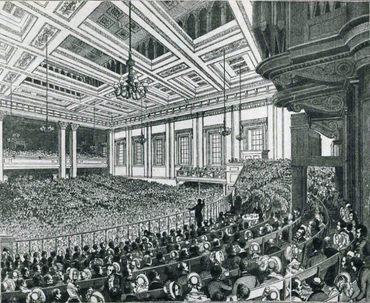
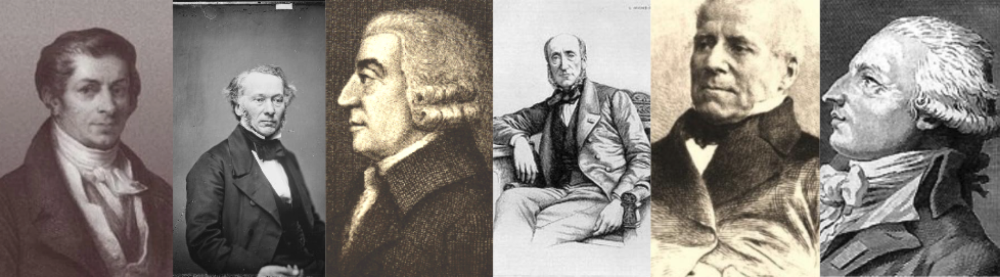
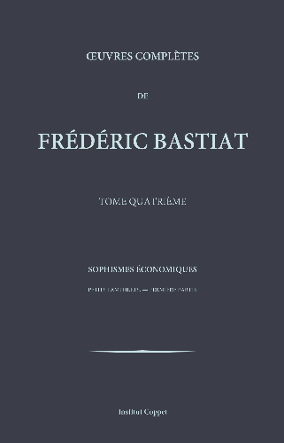
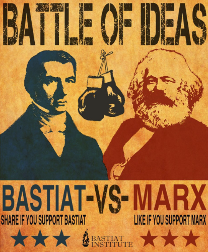
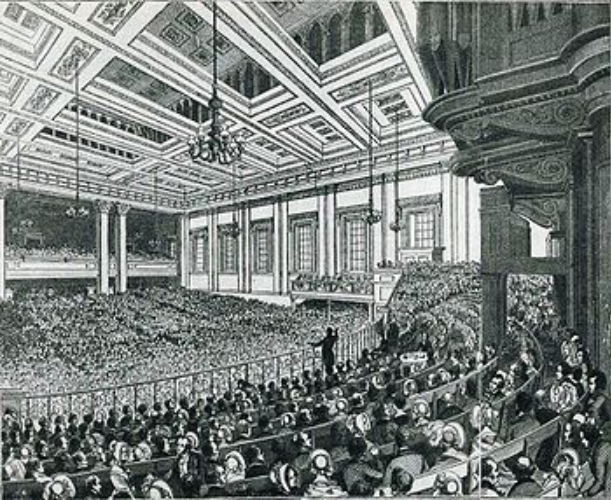
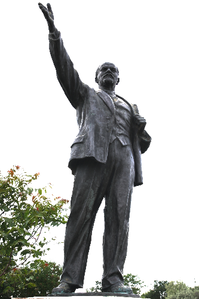
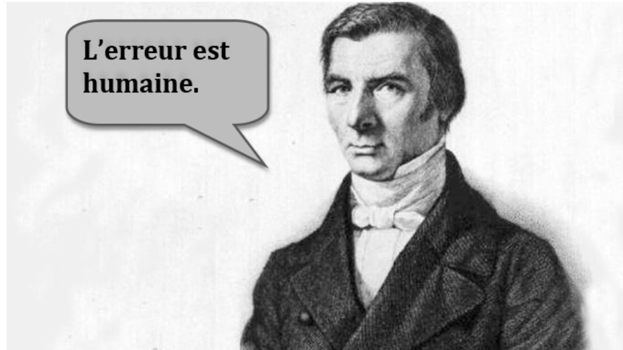
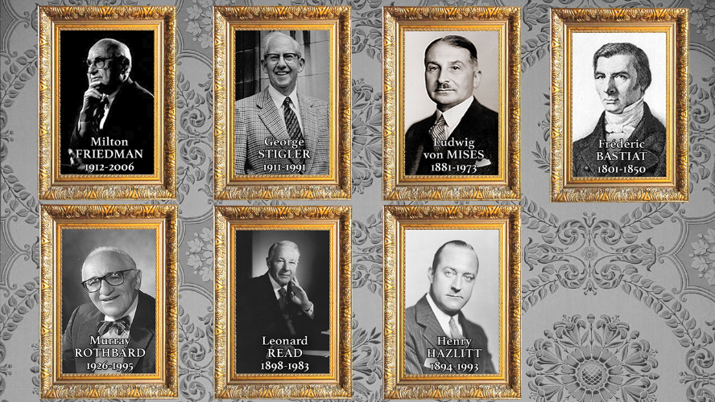
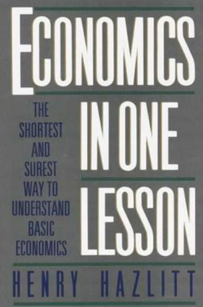
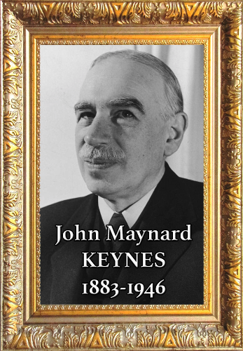

# Matka Frédéric Bastiat'n maailmaan

Tämän kurssin, jonka vetäjänä toimii Damien Theillier, tarkoituksena on sukeltaa Frédéric Bastiat'n, ranskalaisen taloustieteilijän ja filosofin, maailmaan, jonka ideat jatkavat vaikuttamista nykyiseen taloudelliseen ajatteluun. Kaksikymmentäyksi videon kautta Damien Theillier tutkii Bastiat'n elämää, hänen intellektuelleja vaikutteitaan, ideologisia vastustajiaan sekä hänen talousteorioitaan.

Kurssi alkaa yksityiskohtaisella johdannolla Bastiat'n elämään ja historialliseen kontekstiin, ennen kuin se tarkastelee ajattelijoita, jotka merkitsivät hänen ajatteluaan, kuten Adam Smith, Jean-Baptiste Say, Antoine Destutt de Tracy, Charles Comte, Charles Dunoyer ja Richard Cobden. Sen jälkeen kurssi käsittelee Bastiat'n vastustajia, mukaan lukien Rousseau, klassinen koulutus, protektionismi, sosialismi ja Proudhon.

Kurssin tärkeä osa on omistettu taloudellisille sofismeille, joita Bastiat tuomitsi, kuten "Mikä nähdään ja mikä ei nähdä", "Kynttiläntekijöiden anomus", ryöstö verotuksen kautta ja kahden taloudellisen moraalin ero. Kurssi käsittelee myös taloudellisia harmonioita, joita Bastiat kannatti, mukaan lukien markkinoiden ihme, vastuun voima ja todellinen solidaarisuus.

Lopuksi kurssi päättyy pohdintaan "Laista", käsitellen keskeisiä käsitteitä kuten omaisuuden oikeus, laillinen ryöstö ja valtion rooli. Kurssin päätteeksi tarkastellaan uudelleen Frédéric Bastiat'n perintöä ja hänen kestävää vaikutustaan nykyaikaiseen taloustieteeseen.

Liity Damien Theillierin mukaan tähän rikastavaan tutkimusmatkaan Frédéric Bastiat'n ajatteluun ja löydä, miten hänen ideansa voivat valaista nykyisiä taloudellisia ja poliittisia keskusteluja.

+++

# Johdanto

<partId>e4a0cf13-2fc5-5ced-a528-ace3f9029f22</partId>

## Kurssin esittely

<chapterId>7f21b617-9810-5484-ad1c-befc61432126</chapterId>

Tämä kurssi on johdanto Frédéric Bastiat'hin, tunnustamattomaan neroon ja aikamme majakkaan. Tässä lyhyessä johdannossa yritän auttaa sinua löytämään, kuka Frédéric Bastiat oli ja mitkä ovat tärkeimmät teemat, joita käsittelemme tässä sarjassa.

Todellakin, Frédéric Bastiat, joka syntyi vuonna 1801 ja eli 1800-luvun ensimmäisellä puoliskolla, pysyi jonkin aikaa tärkeänä kirjoittajana. Ja sitten, vähitellen, hän katosi ja tänään, kukaan ei kuule hänestä, kukaan ei tiedä kuka hän on. Kuitenkin paradoksaalisesti, tämä kirjoittaja on käännetty monille kielille, mukaan lukien italia, venäjä, espanja ja englanti.

Kävi ilmi, että toisen maailmansodan jälkeen yksi hänen kirjoistaan julkaistiin Yhdysvalloissa. Se tuli erittäin kuuluisaksi, siinä määrin, että Ronald Reagan itse sanoi sen olevan hänen lempikirjansa, ja tämä pieni kirja on nimeltään "Laki." Bastiat on siis yksi kahdesta kuuluisimmasta ranskalaisesta kirjailijasta Yhdysvalloissa, toinen tunnettu myös Ranskassa, Alexis de Tocqueville.

_(Markkinapaikka Mugronissa Landesissa, Bastiatin kaupunki)_

Niinpä, tunnustamaton nero mutta myös valonlähde aikalaisillemme. Todellakin, Frédéric Bastiat, joka syntyi Bayonnessa, vietti ensin osan elämästään Landesissa, missä hän hoiti perimäänsä maatilaa ja eli lopulta yrittäjän elämää. Ja sitten, hyvin varhain, hän kiinnostui taloustieteestä, matkusti Englantiin, tapasi Richard Cobdenin, joka oli vapaakaupan liikkeen johtaja. Bastiat oli lumoutunut tästä liikkeestä, hän oli vakuuttunut siitä, että vapaakauppa oli ratkaisu Ranskalle ja päätti sen jälkeen yrittää levittää ideoitaan Ranskassa. Hän kirjoitti artikkeleita, jotka olivat erittäin menestyksekkäitä ja muutti Pariisiin johtamaan tuolloin Journal des économistes -nimistä sanomalehteä.

Hän oli myös filosofi ja yhteiskunnan, sosiaalisen järjestyksen, oikeudenmukaisuuden, lain, oikeuksien ajattelija. Tässä mielessä voimme sanoa, että Bastiat on valonlähde aikalaisillemme. Ja haluaisin päättää tähän. Hän on henkilö, joka yritti ymmärtää poliittisen markkinan toimintaa. Tietysti hän on myös markkinatalouden puolustaja, jolle lopulta markkinatalous on paras tapa luoda vaurautta. Mutta sen lisäksi, ja tässä hän on tunnustamaton, hän ymmärsi poliittisen markkinan mekanismit.
Kun hänet valittiin kansanedustajaksi, se oli Toisen tasavallan aikana, ja siitä lähtien lait tekivät ihmiset. Tuolloin Bastiat todisti eräänlaista lakien inflaatiota kaikkiin suuntiin, mukaan lukien julkisten palvelujen, sosiaalioikeuksien, verojen jne. luominen.

Ja hän tajusi, että perustavanlaatuisesti mikään ei ollut todella muuttunut. Ihmiset määräsivät toisten omaisuudesta äänestämällä ja lailla, mitä hän kutsui lailliseksi ryöstöksi. Tämä laillisen ryöstön ilmiö oli hänen työnsä keskiössä, erityisesti tässä lyhyessä tekstissä, jonka hän kirjoitti elämänsä loppupuolella, "Laki", jossa hän vertaa laillista ryöstöä omaisuuteen, omaisuusoikeuteen. Hän osoittaa, että perustavanlaatuisesti todellinen ratkaisu sosiaaliseen ongelmaan on vapaus, eli omaisuus, kontrolli itsestään ja oman työn hedelmistä.

Tällä kurssilla matkaamme yhdessä Frédéric Bastiatin ajattelun läpi, alkaen vaikuttajista, jotka muovasivat häntä jo varhain nuoruudessaan, sitten tutkimme hänen taloudellisia sofismejaan, ja lopuksi päädymme tähän suureen tekstiin, "Laki", joka johdattaa meidät poliittisen markkinan analyysiin, yhteiskunnan analyysiin.

## Elämä ja historiallinen konteksti

<chapterId>e9d92b63-83dd-552c-84e1-dd535608c109</chapterId>

Vuonna 1844 Frédéric Bastiat teki liikematkan Espanjaan. Vietettyään aikaa Madridissa, Sevillassa, Cadizissa ja Lissabonissa, hän päätti lähteä Southamptoniin ja vierailla Englannissa. Lontoossa hänellä oli mahdollisuus osallistua Anti-Corn Law League -järjestön kokouksiin, jonka työtä hän oli seurannut etäältä. Hän tapasi tämän yhdistyksen pääjohtajia, mukaan lukien Richard Cobdenin, josta tulisi hänen ystävänsä.

Juuri siellä hänen elämänsä suunta muuttuisi radikaalisti. Hän itse kertoo, että juuri tuolloin hänen kutsumuksensa taloustieteilijäksi vahvistui. Palattuaan Ranskaan hänellä oli vain yksi ajatus mielessään: saada Ranska tietoiseksi Englannissa kuohuvasta liberaalista liikkeestä.
Frédéric Bastiat syntyi Bayonnessa 30. kesäkuuta 1801. Orvoksi jäätyään yhdeksänvuotiaana hän jatkoi opintojaan Sorèzen katolisessa koulussa. Hän oli lahjakas kielissä, oppien englantia, espanjaa ja jopa baskia. Hän ei kuitenkaan ollut motivoitunut opiskeluihinsa ja päätti olla suorittamatta ylioppilastutkintoa, valiten sen sijaan työskentelyn setänsä tuonti-vientiyrityksessä Bayonnessa.

Vuonna 1825 hän peri maatilan isoisältään, jonka hän hoiti "gentleman-farmerina", omien sanojensa mukaan. Juuri silloin hän kohtasi ensi kertaa ongelmia, jotka johtuivat omaisuusoikeuksien määritelmän puutteesta. Hän päätti ryhtyä oikeudenpalvelijaksi Mugronin kaupungissaan, Landesin sydämessä, kaupallisen ja jokiliikenteen solmukohdassa Bordeaux'n ja Bayonnen satamien välillä. Myöhemmin hänet valittiin Landesin yleisneuvoston jäseneksi.

Hän kehitti nopeasti intohimon poliittiseen taloustieteeseen ja opiskeli Adam Smithin, Jean-Baptiste Sayn, Destutt de Tracyn, Charles Dunoyerin ja Charles Comten teoksia. Hän luki englantilaisia sanomalehtiä, ja juuri siellä hän sai tietää vapaakauppaa ajavan englantilaisen liigan olemassaolosta.

_(Say, Cobden, Smith, Chevalier, Dunoyer, Destutt de Tracy)_

Palattuaan Englannista hän kirjoitti artikkelin otsikolla: "Englantilaisten ja ranskalaisten tullien vaikutuksesta kahden kansan tulevaisuuteen", jonka hän lähetti Journal des Économistes -lehteen Pariisissa. Artikkeli ilmestyi lokakuun 1844 numerossa, ja se oli täydellinen menestys. Kaikki ihaillivat hänen voimakasta ja terävää argumentointiaan, hänen hillittyä ja tyylikästä tyylitaitoaan.

Tämän jälkeen Journal des Économistes pyysi häneltä lisää artikkeleita, ja useat Poliittisen Taloustieteen Seuran jäsenet, erityisesti Horace Say, Jean-Baptiste Sayn poika, ja Michel Chevalier, tunnettu professori, onnittelivat häntä ja rohkaisivat jatkamaan heidän kanssaan taloudellisten totuuksien levittämistyössä. Tämä merkitsi uuden elämän alkua Pariisissa.

Hän julkaisi ensimmäisen sarjan Taloudellisia Sofismeja, joissa hän hyökkäsi rohkeasti ja ironisesti protektionistien kimppuun. Pariisissa hän jopa aloitti poliittisen taloustieteen kurssin yksityisessä tilassa, jota opiskelijaeliitti innokkaasti seurasi.

Seuraavana vuonna hän perusti "Vapaakaupan Yhdistyksen" Ranskassa ja heittäytyi taisteluun protektionismia vastaan Ranskassa. Hän keräsi varoja, perusti viikoittaisen katsauksen ja piti luentoja ympäri maata.
Ensimmäinen kokous pidettiin Bordeaux'ssa 23. helmikuuta 1846, jonka aikana perustettiin Bordeaux'n Vapaakauppayhdistys. Pian liike levisi koko Ranskaan. Pariisissa muodostui alkuperäinen ydin taloustieteilijöiden seuran jäsenistä, johon liittyivät myös kansanedustajat, teollisuudenharjoittajat ja kauppiaat. Merkittäviä ryhmiä muodostui myös Marseille'ssa, Lyonissa ja Le Havressa. 

Helmikuun vallankumous vuonna 1848 kaatoi Louis-Philippen monarkian, joka tunnetaan Heinäkuun monarkiana (1830-1848), ja näki Toisen tasavallan syntyvän. Bastiat valittiin tuolloin Landesin edustajaksi lainsäädäntökokoukseen. Hän istui keskivasemmalla, Alexis de Tocquevillen kanssa, monarkistien ja sosialistien välissä. Siellä hän pyrki puolustamaan yksilön vapauksia, kuten kansalaisoikeuksia, ja vastusti kaikkia rajoittavia politiikkoja, tulivatpa ne oikealta tai vasemmalta. Hän valittiin rahoituskomitean varapuheenjohtajaksi ja pyrki jatkuvasti muistuttamaan kollegoitaan tästä yksinkertaisesta totuudesta, joka usein unohdetaan parlamenteissa:

> Ei voi antaa joillekin lailla, olematta velvollinen ottamaan toisilta toisella lailla.

Lähes kaikki hänen kirjansa ja esseensä kirjoitettiin hänen elämänsä viimeisen kuuden vuoden aikana, vuosina 1844–1850. Vuonna 1850 Bastiat kirjoitti kaksi kuuluisimmista teoksistaan: Lain ja sarjan pamfletteja nimeltä Mitä nähdään ja mitä ei nähdä. Laki on käännetty monille vieraille kielille, mukaan lukien englanti, saksa, espanja, venäjä ja italia.

Hän kuoli Roomassa vuonna 1850, tuberkuloosiin. Hän on haudattu Saint Louis des Français -kirkkoon Roomassa.

# Vaikutukset

<partId>4d312b17-5740-5d33-8309-015e2b59b6dd</partId>

## Adam Smith ja Jean-Baptiste Say

<chapterId>bcc7a12a-6cc4-5061-85e3-0e31fb1f0a49</chapterId>

Taloustieteessä Bastiat tunnusti aina velkansa Adam Smithille ja Jean-Baptiste Saylle. 26-vuotiaana hän kirjoitti yhdelle ystävistään: "En ole koskaan lukenut näistä aiheista muuta kuin nämä neljä teosta, Smith, Say, Destutt ja Censor."

_(Jean-Baptiste Say ja Adam Smith)_
Politiikka taloustiede, kuten Adam Smith ja J.-B. Say sen käsittivät, tiivistyy yhteen sanaan: vapaus. Kaupankäynnin vapaus, yksilön vapaus, vapaakauppa ja vapaa aloite. Vapaakauppaa puolustivat ensimmäisinä fysiokraatit, kuten François Quesnay ja Vincent de Gournay, ja sitten Adam Smith, joka yhdisti heidän ideansa omiin havaintoihinsa. Lopulta 1700-luvun lopussa Jean-Baptiste Say selvensi ja korjasi joitakin mestarinsa Adam Smithin opetuksen kohtia mestarillisessa Poliittisen taloustieteen tutkielmassaan.

_(Say, Destutt de Tracy, Quesnay, de Gournay)_
Adam Smith oli kiinnostunut vauraudesta, ei sinänsä päämääränä, vaan keinona yksilöiden moraalisen tason nostamiseksi. Hänen mukaansa kansakuntien vauraus koostuu yksilöiden vauraudesta. Jos haluat vauraan kansakunnan, sanoo Adam Smith, anna yksilöiden toimia vapaasti. Ja markkinat toimivat, koska ne sallivat jokaisen ilmaista mieltymyksensä ja tavoitella omaa etuaan.

Modernien taloustieteilijöiden suuri uutuus 1700-luvun alussa on, että he ovat kiinnostuneita jokaisesta yksilöstä, pyrkien palauttamaan heidän toimintakykynsä samalla miettien, kuinka hillitä intohimoja ja konflikteja. Ihminen luonnostaan haluaa parantaa omaa ja läheistensä asemaa tavaroiden ja palveluiden vaihdon kautta.

Mitä Adam Smith osoittaa, on että voi palvella omaa etuaan vain palvelemalla muiden etua.

> Anna minulle mitä tarvitsen, ja saat minulta mitä itse tarvitsette. (...) Emme odota illallistamme teurastajan, panimomestarin tai leipurin hyväntahtoisuudesta, vaan heidän oman etunsa vuoksi.

Vaihto on positiivinen summapeli. Mitä toinen voittaa, toinenkin voittaa. Se eroaa näin poliittisesta uudelleenjaosta, jossa on aina voittaja ja häviäjä. Jos tarkastelemme englantilaista koulukuntaa, Smithille, Ricardolle ja heitä ennen Lockelle, arvo liittyy työhön. Marxille se on sama.

_(Marx, Ricardo, Smith, Locke)_

Toisaalta Bastiat myöntää Jean-Baptiste Sayn kanssa, että hyöty on arvon todellinen perusta. Työ ei luo arvoa. Ei myöskään harvinaisuus. Kaikki juontuu hyödystä. Todellakin, kukaan ei suostu maksamaan palveluksesta, ellei pidä sitä hyödyllisenä. Tuotetaan aina vain hyötyä.
Mutta Bastiat myös tarkensi Sayn näkemystä tässä asiassa. Kyse ei ole asioiden sisältämästä hyödystä, vaan palveluiden suhteellisesta hyödystä. "Arvo on kahden vaihdetun palveluksen suhde," hänen omien sanojensa mukaan. Siksi arvo on subjektiivinen, ja ainoa tapa ymmärtää yksilöiden mieltymyksiä on tarkkailla heidän käyttäytymistään vapailla markkinoilla. Markkinat paljastavat yksilöiden mieltymykset ja ovat suuren yhteiskunnan säätelijä vaihdon kautta.

Talous noudattaa joukkoa yksinkertaisia lakeja, jotka juontuvat ihmiskäyttäytymisestä. Yksi niistä, kutsuttu "Sayn laki", kuuluu seuraavasti: "Tuotteet ja palvelut vaihdetaan tuotteisiin ja palveluihin." Hänen ideansa on, että kansakunnat ja yksilöt hyötyvät tuotannon tason kasvusta, koska se tarjoaa lisääntyneitä mahdollisuuksia molemminpuolisesti hyödyllisiin vaihtoihin.

Todellakin, tuotteita ostetaan vain odotuksessa palveluista, joita ostaja odottaa: Ostan levyn kuunnellakseni sen musiikkia, ostan elokuvalipun nähdäkseni elokuvan. Ja vaihdossa kumpikin osapuoli päättää, koska se katsoo, että se voi saada enemmän palveluksia siitä, mitä se hankkii, kuin mitä se luopuu. Tässä kontekstissa raha on vain välituote, se korvaa suoritetun palveluksen ja avaa muita palveluksia.

Bastiatille vaihtotalous, eli keskinäiset palvelukset, jotka tarjotaan ja hyväksytään vapaasti, on se, mikä tukee rauhaa ja vaurautta, mahdollistaen etujen harmonian.

Mutta Jean-Baptiste Saylta, Frédéric Bastiat perii myös keskeisen käsitteen, ryöstön. Sillä, hän sanoo, kaikuessaan Sayn sanoja:

> On vain kaksi tapaa hankkia elämän säilyttämiseen, kaunistamiseen ja parantamiseen tarvittavia asioita: tuotanto ja ryöstö.
Tuottajat turvautuvat vakuutteluun, neuvotteluun ja sopimuksiin, kun taas ryöstäjät turvautuvat voimaan ja petokseen. Siksi lain tehtävänä on estää ryöstely ja turvata työ sekä omaisuus. Kuten Adam Smith jo totesi, kansalaisten turvallisuuden takaaminen on julkisen vallan päätehtävä, ja juuri tämä oikeuttaa verojen keräämisen.

## Antoine Destutt de Tracy

<chapterId>ddf64e9f-2ce0-5651-8eb8-bae578eb0b9b</chapterId>

Vähemmän tunnettua on, että Destutt de Tracyllä oli ratkaiseva vaikutus Yhdysvaltain tulevaan presidenttiin, Thomas Jeffersoniin, kun tämä oli lähettiläänä Pariisissa 1780-luvulla.
> "Jokaiselle miehelle hänen ensimmäinen kotimaansa on hänen synnyinmaansa, ja toinen on Ranska" & "Tyrannia on silloin, kun kansa pelkää hallitustaan; vapaus on silloin, kun hallitus pelkää kansaa."
>
> Thomas Jefferson

Todellakin, hänen Poliittisen talouden tutkielmansa tuomitsi protektionismin ja Napoleonin laajentumisen. Siksi Bonaparte kielsi sen julkaisun Ranskassa. Kuitenkin se käännettiin englanniksi ja julkaistiin Yhdysvalloissa Jeffersonin itsensä toimesta. Hän teki tästä tekstistä Virginian yliopiston ensimmäisen poliittisen talouden oppikirjan, jonka hän oli juuri perustanut Charlottesvilleen. Tutkielmaa ei julkaistu Ranskassa ennen vuotta 1819!

Destutt de Tracy, filosofi ja taloustieteilijä, oli niin kutsutun "Ideologien" koulukunnan johtaja, johon kuuluivat henkilöt kuten Cabanis, Condorcet, Constant, Daunou, Say ja Germaine de Staël. He ovat Fysiokraattien perillisiä ja Turgot'n suoria oppilaita.

Ideologialla Tracy tarkoitti yksinkertaisesti tiedettä, joka käsittelee ideoiden tutkimista, niiden alkuperää, niiden lakeja, niiden suhdetta kieleen, eli nykyaikaisemmin sanottuna, epistemologiaa. Termillä "ideologia" ei ollut vielä Marxin myöhemmin antamaa halventavaa konnotaatiota, jolla hän halusi diskreditoida "laissez-faire" -taloustieteilijöitä. Ideologien liikkeen lehti oli nimeltään La Décade philosophique et littéraire.

Se dominoi vallankumouksellista aikakautta ja sitä johti Jean-Baptiste Say. Destutt de Tracy valittiin Ranskan Akatemian jäseneksi vuonna 1808 ja Moraali- ja Poliittisten Tieteiden Akatemian jäseneksi vuonna 1832. Hänen tyttärensä meni naimisiin Georges Washington de La Fayetten (Yhdysvaltain ensimmäisen presidentin pojan) kanssa vuonna 1802, mikä osoittaa edelleen olemassa olevan läheisen yhteyden Ranskan ja nuoren Amerikan välillä tuohon aikaan.

Hänen Poliittisen taloustieteen tutkielmansa tarkoitus on "tutkia parasta tapaa käyttää kaikkia fyysisiä ja henkisiä kykyjämme tyydyttääksemme erilaiset tarpeemme." Hänen ajatuksensa on, että kauppa on kaiken inhimillisen hyvän lähde; se on sivistävä, rationalisoiva ja rauhoittava voima maailmassa. Poliittisen taloustieteen suuri periaate on hänen muotoilemana seuraava: "kauppa on koko yhteiskunta, aivan kuten työ on koko vauraus." Todellakin, hän näkee yhteiskunnan "jatkuvana vaihtojen sarjana, jossa molemmat sopimuspuolet aina hyötyvät." Siksi markkinat ovat riiston vastakohta. Se rikastuttaa joitakin ilman, että se köyhdyttää muita. Kuten myöhemmin sanotaan, se ei ole "nollasummapeli", vaan positiivinen-summapeli.
Kirjoittajamme ei mene niin pitkälle, että määrittelisi poliittisen taloustieteen vaihtojen tieteeksi. Mutta sama päättely otetaan ja viedään läpi Bastiatin toimesta. Myyminen on esineiden vaihtoa, vuokraaminen on palveluiden vaihtoa ja lainaaminen on vain viivästetty vaihto. Poliittinen taloustiede tulee näin Bastiatille "vaihdon teoriaksi."

Destutt de Tracyn mukaan omaisuus johtuu välttämättä luonnostamme, halujemme kyvystä. Jos ihminen ei haluaisi mitään, hänellä ei olisi oikeuksia eikä velvollisuuksia. Tarpeidensa tyydyttämiseksi ja velvollisuuksiensa täyttämiseksi ihmisen on käytettävä keinoja, jotka hän hankkii työllään. Ja yhteiskunnallisen järjestelyn muoto, joka vastaa tätä tarkoitusta, on yksityisomaisuus. Siksi hallituksen ainoa tehtävä on suojella omaisuutta ja sallia rauhanomainen vaihto.

Hänestä parhaat verot ovat maltillisimpia, ja hän toivoo, että valtion menot olisivat mahdollisimman rajoitetut. Hän tuomitsee yhteiskunnan varallisuuden ryöstämisen hallituksen toimesta julkisen velan, verojen, pankkimonopolien ja menojen muodossa. Jälleen kerran, lain tulisi ainoastaan palvella vapauden suojelua; sen ei tulisi koskaan ryöstää.

Lopuksi hän lisää tämän suosituksen, joka ei ole menettänyt merkitystään:

> Älköön hallitus tehkö eikä pystykö tekemään velkoja, jotka sitouttavat tulevia sukupolvia ja johtavat aina valtiot tuhoon.

Yhteenvetona voidaan sanoa, että Ideologeilla oli syvä oivallus, nimittäin että tuotanto ja vaihdot ovat todellinen ratkaisu poliittisiin ongelmiin ja todellinen vaihtoehto sodille. Sodat ovat aina ryöstöretkiä, olivatpa ne sisäisiä, kuten vallankumouksen aikana, tai ulkoisia, kuten muinaisten kuninkaiden ja Napoleonin käymiä sotia.

## Charles Comte ja Charles Dunoyer

<chapterId>80bc5c4e-ac07-52c8-9dd7-e224ac291bda</chapterId>

Kaikkien sivilisaatioiden historia on tarina ryöstävien luokkien ja tuottavien luokkien välisestä taistelusta. Tämä on kahden keskustelemamme kirjoittajan uskomus. He ovat liberaalin luokkataistelun teorian alkuperäiset luojat, jotka inspiroivat yhtä lailla Frédéric Bastiatia kuin Karl Marxia, vaikkakin jälkimmäinen vääristi sitä.

Comten ja Dunoyerin mukaan ryöstö, kaikenlainen yhteiskunnassa vahvojen toimesta heikkojen yli harjoitettu väkivalta, on suuri avain ihmishistorian ymmärtämiseen. Se on kaikkien ilmiöiden, joissa yhtä luokkaa hyväksikäytetään toisen toimesta, alkuperä. 

Jos Frédéric Bastiat on velkaa talousopillisen koulutuksensa Smithille, Destutt de Tracyn ja Saylle, hän on velkaa poliittisen koulutuksensa Le Censeur -lehden johtajille, Charles Comtelle ja Charles Dunoyerille.
Tämä arvostelu (1814-1819), joka nimettiin uudelleen Le Censeur européeniksi sadan päivän jälkeen, levitti liberaaleja ideoita, jotka voittivat vuonna 1830 Kolmen Kunnian Päivän kapinassa ja Orléansin herttuan, Louis-Philippe I:n, nousussa valtaan.

Charles Comte, Auguste Comten serkku ja Sayn vävy, on arvostelun perustaja. Häneen liittyi pian Charles Dunoyer, juristi kuten hänkin, ja sitten nuori historioitsija, Augustin Thierry, entinen Saint Simonin sihteeri. Heidän mottonsa jokaisen lehden etusivulla oli "Rauha ja Vapaus".

Mikä on arvostelun tavoite? Otsikko puhuu puolestaan: hallituksen sensurointi. Taistella vallan mielivaltaisuutta vastaan valistamalla yleistä mielipidettä, puolustaa lehdistönvapautta.

_(Benjamin Constant)_

He omaksuvat Benjamin Constantilta muinaisten ja modernien erottelun, joka toisaalta karakterisoitiin sodalla ja toisaalta kaupalla ja teollisuudella. Mutta he lisäävät Sayn kanssa, että poliittinen taloustiede tarjoaa parhaan selityksen sosiaalisille ilmiöille. He ymmärtävät erityisesti, että kansakunnat saavuttavat rauhan ja vaurauden, kun omaisuusoikeudet ja vapaakauppa kunnioitetaan. Tästä lähtien heille poliittinen taloustiede on politiikan todellinen ja ainoa perusta. Filosofialle, joka rajoittuu hallitusmuotojen abstraktiin kritiikkiin, on korvattava teoria, joka perustuu taloudellisten etujen tuntemukseen.
Poliittinen taloustiede, osoittamalla miten kansat kukoistavat ja taantuvat, on luonut politiikan todelliset perusteet.
> Dunoyer

Tämä uusi sosiaaliteoria sisältää yhden elementin, josta tulisi Marxin ja Engelsin tieteellisen sosialismin kulmakivi: luokkataistelu. Mutta mistä liberaalin luokkataistelun teoriassa on kyse, ja miten se eroaa marxilaisuudesta?

Se alkaa yksilöstä, joka toimii täyttääkseen tarpeensa ja toiveensa. Siitä hetkestä, kun joku luo, eli lisää asioiden hyödyllisyyttä, parantaen niiden arvoa, hän osallistuu teollisuuteen. Tässä yhteydessä teollisuusmies ei ole teollisuuden omistaja, kuten nykykieli saattaisi ehdottaa, vaan tuottaja, riippumatta siitä, millä alalla hän työskentelee. Siksi heidän teoriaansa kutsutaan teollisuusismiksi. Se olettaa, että yhteiskunnan tavoite on hyödyllisyyden luominen laajassa mielessä, eli ihmisille hyödylliset tavarat ja palvelut.

Tässä kohdassa yksilöt kohtaavat kaksi perustavanlaatuista vaihtoehtoa: he voivat ryöstää muiden tuottaman vaurauden, tai he voivat työskennellä tuottaakseen vaurautta itse. Missä tahansa yhteiskunnassa voi selvästi erottaa ne, jotka elävät ryöstöstä, niistä, jotka elävät tuotannosta. Vanhan hallituskauden aikana aatelisto hyökkäsi suoraan ahkerimpien kimppuun elääkseen uudenlaisesta tribuutista: verosta. Ahne aatelisto korvattiin byrokraattien laumoilla, jotka eivät olleet yhtään vähemmän ahneita.

Vaikka Marxille luokkaristiriita sijoittuu tuotannolliseen toimintaan itsessään, työntekijöiden ja työnantajien välille, Comtelle ja Dunoyerille ristiriidassa olevat luokat ovat toisaalta yhteiskunnan tuottajia, jotka maksavat veroja (mukaan lukien kapitalistit, työntekijät, talonpojat, tutkijat jne.) ja toisaalta ei-tuottajia, jotka elävät veroilla rahoitetuista vuokratuloista, "joutilas ja kuluttava luokka" (byrokraatit, virkamiehet, poliitikot, tukien tai suojelujen saajat).
Toisin kuin Marx, Censeur Européenin kirjoittajat eivät aja luokkasodan asiaa. Sen sijaan he kampanjoivat sosiaalisen rauhan puolesta. Heidän mukaansa tämä on mahdollista vain yhteiskunnan depolitisoimisen kautta. Tätä varten on ensin tärkeää vähentää julkisten virkojen arvostusta ja etuja. Sen jälkeen on tärkeää antaa vaikutusvaltaa poliittisessa elimessä tuottajille.

Lopulta ainoa tapa päästä eroon yhden luokan hyväksikäytöstä toisen toimesta on tuhota mekanismi, joka tekee tämän hyväksikäytön mahdolliseksi: valtion valta jakaa ja kontrolloida omaisuutta sekä siihen liittyvien etujen jakautumista ("asemat").

Heidän ideansa, syvästi innovatiiviset, jättäisivät pysyvän jäljen Frédéric Bastiatiin, josta tulisi itse syvällinen poliittisten kriisien pohdiskelija.

## Cobden ja liiga

<chapterId>7181435c-5eae-56e4-8e55-02a24273fdd6</chapterId>

Vuonna 1838 Manchesterissa pieni joukko tähän asti melko tuntemattomia miehiä kokoontuu löytääkseen keinon kaataa vehnämaanomistajien monopoli laillisin keinoin ja saavuttaakseen, kuten Bastiat myöhemmin kertoisi,

> Ilman verenvuodatusta, pelkän mielipiteen voimalla, vallankumous yhtä syvällinen, ehkä syvällisempi kuin se, jonka isämme toteuttivat vuonna 1789.

Tästä kokouksesta syntyisi Liiga viljalakien vastustamiseksi, tai kuten Bastiat kutsuisi niitä, viljalait. Mutta hyvin nopeasti tämä tavoite muuttuisi suojelun täydellisen ja yksipuolisen lakkauttamisen tavoitteeksi.

Tämä taloudellinen taistelu vapaakaupan puolesta valtaisi koko Englannin vuoteen 1846 asti. Ranskassa, lukuun ottamatta pientä joukkoa perehtyneitä, tämän laajan liikkeen olemassaolo oli täysin tuntematonta. Frédéric Bastiat sai tietää Liigan olemassaolosta vuonna 1843 sattumalta tilaamansa englantilaisen sanomalehden kautta. Innostuneena hän käänsi Cobdenin, Foxin ja Brightin puheet. Sitten hän kirjeenvaihtoi Cobdenin kanssa ja lopulta, vuonna 1845, hän matkusti Lontooseen osallistuakseen Liigan valtaviin kokouksiin.

Juuri tämä vapaakaupan puolesta käyty agitaatiokampanja koko kuningaskunnassa, kymmenientuhansien jäsenten voimin, sytytti Bastiatin kynän tuleen ja muutti radikaalisti ja lopullisesti hänen elämänsä suunnan.

Liigaa voidaan verrata kiertävään yliopistoon, joka taloudellisesti koulutti kokouksiinsa osallistuneita ympäri maata – tavallisia ihmisiä, teollisuudenharjoittajia, viljelijöitä ja maanviljelijöitä, jotka kaikki Liiga oli ottanut siipiensä suojaan ja joiden etuja viljalait sortivat. Richard Cobden oli liikkeen sielu ja erinomainen agitaattori.
Hän oli kiehtova ja mahtipontinen puhuja, jolla oli poikkeuksellinen kyky keksiä iskeviä ja ytimekkäitä ilmaisuja, kaukana taloustieteilijöiden abstrakteista puheenvuoroista.
> Mikä on leivän monopoli? hän huudahti. Se on leivän niukkuus. Teitä yllättää kuulla, että tämän maan lainsäädännöllä, tässä asiassa, ei ole muuta tarkoitusta kuin tuottaa mahdollisimman suuri leivän niukkuus. Ja kuitenkin se on juuri niin. Lainsäädäntö voi saavuttaa tavoitteensa vain niukkuuden kautta.

Vuonna 1845 Bastiat julkaisi Pariisissa kirjansa Cobden ja liiga, johon hän liitti omia käännöksiään kommenttien kera. Kirja alkaa johdannolla Englannin taloudellisesta tilanteesta, liigan alkuperän ja kehityksen historiasta. Vuodesta 1815 lähtien protektionismi oli hyvin kehittynyttä Englannissa. Erityisesti oli olemassa lakeja, jotka rajoittivat viljan tuontia ja joilla oli hyvin kovia seurauksia kansalle. Todellakin, vehnä oli välttämätön leivän valmistukseen, joka oli tuolloin elintärkeä hyödyke. Lisäksi tämä järjestelmä suosi aristokratiaa, eli suurtilallisia, jotka saivat siitä vuokratuloja.

> Mitä Englannissa rinnakkain elää, Bastiat kirjoitti, on pieni joukko ryöstäjiä ja suuri joukko ryöstettyjä, eikä tarvitse olla suuri taloustieteilijä päätelläkseen edellisten vaurauden ja jälkimmäisten kurjuuden.

Liigan tavoitteena oli mobilisoida yleistä mielipidettä painostamaan parlamenttia kumoamaan viljalaki. Pitkällä aikavälillä Cobden ja hänen ystävänsä toivoivat:

- Teollisuuden ulostulojen lisäämistä
- Työllisyyden kasvua
- Leivän hinnan alentamista
- Maatalouden ja teollisuuden tehokkuuden lisäämistä kilpailun kautta
- Rauhan edistämistä kansakuntien välillä

_(Jeremy Bentham)_

Benthamin utilitarismin oppilaana Cobdenin vakaumus oli, että työn ja kaupan vapaus palveli suoraan yhteiskunnan lukuisimpien, köyhimpien ja eniten kärsivien massojen etua. Päinvastoin, tullit välineenä mielivaltaisille kielloille ja etuoikeuksille saattoivat hyödyttää vain tiettyjä voimakkaimpia teollisuuksia.

Vuoden 1841 vaaleissa liigan viisi jäsentä, mukaan lukien Cobden, valittiin parlamenttiin. 26. toukokuuta 1846 yksipuolinen vapaakauppa tuli kuningaskunnan laiksi. Siitä lähtien Yhdistynyt kuningaskunta kokeisi loistokauden vapauden ja vaurauden saralla.
Mielenkiintoista on, että Bastiat omaksui osan heidän menetelmästään; hän omaksui heidän kielensä ja siirsi sen ranskalaiseen kontekstiin. Kirja Cobdenista ja liigasta tuli nopeasti menestys, ja Bastiat teki sensaatiomaisen sisääntulon taloustieteilijöiden maailmaan. Hän perusti Bordeaux'ssa yhdistyksen vapaakaupan puolesta ja siirsi sen sitten Pariisiin. Hänelle tarjottiin Journal des Économistes -lehden johtajuutta. Liike oli syntynyt, ja se jatkui vuoteen 1848 asti.

Vasta Bastiatin kuoleman jälkeen, vuonna 1866, Napoleon III allekirjoittaisi vapaakauppasopimuksen Englannin kanssa, eräänlaisen jälkivoiton miehelle, joka oli omistanut elämänsä viimeiset kuusi vuotta tälle suurelle ajatukselle.

_(Michel Chevalier)_
Vapaakaupan kysymys on edelleen ajankohtainen tänään. Kouluissa käytettävät maantieteen oppikirjat väittävät, että globalisaatio on syyllinen ja että köyhät maat tarvitsevat länsimaiden apua selviytyäkseen. Kuitenkin äärimmäinen köyhyys on puolittunut 20 vuodessa. Avautumisen valitsemalla maat kuten Intia, Kiina tai Taiwan ovat päässeet eroon köyhyydestä, kun taas pysähtyneisyys luonnehtii suljettuja maita kuten Pohjois-Koreaa tai Venezuela. YK:n mukaan 36% ihmiskunnasta eli täydellisessä kurjuudessa vuonna 1990. Nyt vuonna 2010 heitä on "vain" 18%. Äärimmäinen köyhyys on edelleen merkittävä haaste, mutta se on väistymässä.

# Vastustajat

<partId>f902ed30-269e-5e44-a76d-8efd1a4e4085</partId>

## Rousseau

<chapterId>c3926110-e0b2-503c-96d9-5d3a6a661484</chapterId>

Frédéric Bastiat, joka ilmaisi itseään 1840-luvulla, on valistusfilosofien sukupolven perillinen, joka taisteli sensuuria vastaan ja keskustelunvapauden puolesta. Ajattele Montesquieuta, Diderot'ta, Voltairea, Condorcet'ta, mutta myös Rousseauta.

Heille ajatus oli yksinkertainen: mitä enemmän ideoita saa ilmaista, sitä enemmän totuus etenee ja sitä helpommin virheet kumotaan. Tiede etenee aina tällä tavalla.

_(Montesquieu, Diderot, Voltaire, Condorcet, Rousseau)_
Päinvastoin, harvat ovat ymmärtäneet, että mikä oli totta ideoille, oli myös totta tavaroille ja palveluille. Vapaus käydä kauppaa muiden kanssa on todellakin kahden hyveen omaava: se on tehokasta ja johtaa oikeudenmukaisempaan jakautumiseen. Rousseau ei ainoastaan ymmärtänyt tätä väärin, vaan hän myös taisteli tätä vapautta vastaan väärän lain ja oikeuden idean nimissä. Yksi sosialismin merkittävistä lähteistä, Bastiat huomauttaa, on Rousseau'n näkemys, että koko yhteiskuntajärjestys juontaa juurensa laista.

Bastiat pitää todellakin Rousseauta sosialismin ja kollektivismin todellisena edelläkävijänä. Sosiaalisopimuksen kirjoittajan teoksessa on lause, joka tiivistää hänen filosofiansa melko hyvin: "meistä tulee ihmisiä vasta sen jälkeen, kun olemme olleet kansalaisia."

Alun perin ihminen on vain porvari. Mutta porvari on laskelmoija; hän haluaa välittömän nautintonsa, hän on orjuutettu aisteilleen, toiveilleen, omalle erityiselle edulleen. Lyhyesti sanottuna, hän ei ole rationaalinen, siksi hän ei ole vapaa. Hänen täytyy oppia ymmärtämään, että hänen todellinen etunsa on yleinen etu. Tämän vuoksi Rousseau kirjoitti Sosiaalisopimuksessa:

> Kuka tahansa, joka kieltäytyy tottelemasta yleistä tahtoa, pakotetaan koko yhteisön toimesta: tämä tarkoittaa muuta kuin että heidät pakotetaan olemaan vapaita.

Tämän opin mukaan ihmisellä on sisällään kaksi tahtoa: tahto, joka pyrkii henkilökohtaiseen etuun, porvarin tahto, ja tahto, joka pyrkii yleiseen etuun, kansalaisen tahto. Johtamaan ihmisiä, vaikka väkisin, haluamaan rationaalista päämäärää, yleistä etua, on johtamista ihmisiä tulemaan vapaiksi. Mitä he todella haluavat, on rationaalinen päämäärä, vaikka he eivät sitä tiedä.
Rousseau'n mukaan on siis täysin oikeutettua pakottaa ihmisiä nimissä päämäärän, jonka he itse, jos olisivat olleet valistuneempia, olisivat tavoitelleet, mutta jota he eivät tavoittele, koska ovat sokeita, tietämättömiä tai korruptoituneita. Yhteiskunta on perustettu pakottamaan heidät tekemään sen, mitä heidän spontaanisti pitäisi haluta, jos he olisivat valistuneita. Ja näin tehdessään ei tehdä heille väkivaltaa, koska johdatetaan heidät olemaan "vapaita", eli tekemään oikeita valintoja, valintoja, jotka ovat linjassa heidän todellisen minänsä kanssa.

Vakuuttuneena siitä, että hyvä yhteiskunta on lain luomus, Rousseau myöntää näin lainsäätäjälle rajattomat valtuudet. Hänen tehtävänään on muuttaa yksilöt täydellisiksi miehiksi, kansalaisiksi.
Mutta, lain tehtävänä on myös saada omaisuus olemassaolevaksi. Rousseau'n mukaan omaisuus voi olla legitiimiä vain, jos se on lainsäätäjän säätelemää. Todellakin, paha piilee epätasa-arvossa ja orjuudessa, jotka molemmat juontuvat omaisuudesta. Se on vahvojen keksintö, joka on johtanut huonoon yhteiskuntaan, porvarilliseen yhteiskuntaan, dominoinnin suhteisiin. Hänen teoksessaan "Puhe epätasa-arvon alkuperästä ja perusteista" hän kirjoittaa tämän kuuluisan kohdan:

> Ensimmäinen henkilö, joka aidasi maapalan ja sanoi: Tämä on minun, ja löysi ihmisiä yksinkertaisia tarpeeksi uskomaan häntä, oli todellinen sivistyneen yhteiskunnan perustaja. Kuinka monta rikosta, sotaa, murhaa, kuinka paljon kurjuutta ja kauhua olisi säästynyt ihmiskunnalta sillä, joka olisi vetänyt aidat pois tai täyttänyt ojan ja huutanut tovereilleen: "Varokaa kuuntelemasta tätä huijaria; olette hukassa, jos unohdatte, että hedelmät kuuluvat kaikille ja maa kuuluu kenellekään!"

Näin ollen, luonnollinen omaisuus on pahan lähde. Ja Marx, joka oli suuri Rousseau'n lukija, muistaisi tämän. Kuinka taistella tätä pahaa vastaan? Sosiaalisen sopimuksen kautta, Rousseau vastaa. Todellakin, hyvä yhteiskunta on sellainen, joka seuraa sopimuksesta, joka määrää yksilön alieneerauksen kaikkine oikeuksineen yhteisölle. Siitä lähtien yhteisön tehtävänä on myöntää oikeuksia yksilölle lain kautta.

Toisin kuin Rousseau, Frédéric Bastiat sanoo, että "ihminen syntyy omaisuuden omistajaksi." Hänen mukaansa omaisuus on välttämätön seuraus ihmisen luonteesta, hänen rakenteestaan. Hän kirjoittaa, että "ihminen syntyy omaisuuden omistajaksi, koska hän syntyy tarpeiden kanssa, joiden tyydyttäminen on välttämätöntä elämälle, elimillä ja kyvyillä, joiden harjoittaminen on välttämätöntä näiden tarpeiden tyydyttämiseksi". Mutta kyvyt ovat vain henkilön jatke, ja omaisuus on vain kykyjen jatke. Toisin sanoen, kykyjemme käyttö työssä legitimoi omaisuuden.

Bastiat'n mukaan yhteiskunta, ihmiset ja omaisuudet ovat olemassa ennen lakeja, ja hänellä on tämä kuuluisa lause: "Ei ole niin, että lait ovat olemassa, koska on omaisuutta, vaan koska on omaisuutta, on olemassa lakeja". Siksi laki täytyy olla negatiivinen: sen täytyy estää loukkaukset ihmisiä ja heidän hyödykkeitään vastaan. Omaisuus on lain olemassaolon syy, ei päinvastoin.

## Klassinen koulutus

<chapterId>87d9a8c9-2352-5cb2-8b93-678118a8145c</chapterId>

24. helmikuuta 1848, kolmen päivän mellakoiden jälkeen Pariisissa, kuningas Louis-Philippe I luopui vallastaan. Tämä merkitsi Toisen tasavallan syntymää.

Bastiat oli Pariisissa todistamassa tapahtumia ensikäden kokemuksena. Myöhemmin hän kirjoittaisi:

> Helmikuun 24. päivänä minä, kuten monet muutkin, pelkäsin, että kansakunta ei ollut valmis hallitsemaan itseään. Minun on myönnettävä, että pelkäsin kreikkalaisten ja roomalaisten ideoiden vaikutusta, jotka meille kaikille tyrkytetään akateemisen monopolin kautta.

Tämä kohta on yllättävä. Mitä tekemistä kreikkalaisella ja roomalaisella antiikilla on asian kanssa?

Bastiat viittaa Platonin Valtioon ja hänen filosofi-kuninkaansa teoriaan, mutta myös Spartaan, jota Rousseau niin ihailee, Rooman valtakuntaan, josta Napoleon oli niin nostalginen. Valitettavasti Bastiatin mukaan nämä kreikkalaiset ja roomalaiset ideat perustuvat väärään oletukseen: lainsäätäjän kaikkivoipaisuuden ideaan, lain absoluuttisen suvereniteetin ideaan.

Riittää, kun avaa melkein minkä tahansa filosofian, politiikan tai historian kirjan sattumanvaraisesti löytääkseen tämän idean, joka on juurtunut kulttuuriimme, että ihmiskunta on inertti aine, joka saa elämän, järjestön, moraalin ja vaurauden poliittiselta vallalta. Jätettynä omilleen ihmiskunta kääntyisi anarkiaan ja pelastuisi tästä katastrofista vain lainsäätäjän mystisen ja kaikkivoipaisen käden kautta. Bastiat kuitenkin sanoo, että tämä idea on kypsynyt ja valmisteltu vuosisatojen klassisen koulutuksen aikana.

Ensinnäkin hän sanoo, roomalaiset pitivät omaisuutta puhtaasti konventionaalisena tosiasiana, kirjoitetun lain keinotekoisena luomuksena. Miksi? Yksinkertaisesti, Bastiat selittää, koska he elivät orjuudesta ja ryöstelystä. Heille kaikki omaisuudet olivat ryöstelyn hedelmiä. Siksi he eivät voineet tuoda lainsäädäntöön ajatusta, että legitiimin omaisuuden perusta oli työ, tuhoamatta yhteiskuntansa perusteita.
Heillä todellakin oli omaisuudesta empiirinen määritelmä, "jus utendi et abutendi" (oikeus käyttää ja väärinkäyttää). Tämä määritelmä kuitenkin koski vain seurauksia eikä syitä, toisin sanoen omaisuuden eettisiä alkuperiä. Jotta omaisuus voitaisiin perustaa asianmukaisesti, on palattava itse ihmisen perustuslakiin ja ymmärrettävä tarpeiden, kykyjen, työn ja omaisuuden välillä oleva suhde ja välttämätön yhteys. Roomalaiset, jotka olivat orjanomistajia, voisivatko he käsittää ajatuksen, että "jokainen ihminen omistaa itsensä, ja siksi hänen työnsä, ja seurauksena, hänen työnsä tuotteen"? Bastiat ihmettelee.

> Siksi, Bastiat päättelee, älkäämme olko yllättyneitä, kun näemme roomalaisen ajatuksen, että omaisuus on konventionaalinen tosiasia ja laillinen instituutio, nousevan uudelleen kahdeksannentoista vuosisadan aikana; että, kaukana siitä, että Laki olisi Omaisuuden korollaari, on Omaisuus, joka on Lain korollaari.

Todellakin, Rousseau jakaa tämän yleisen laillisen ajatuksen perustaa omaisuuden lakiin. Rousseau antaa laille, ja seurauksena kansalle, absoluuttisen vallan yksilöiden ja omaisuuksien yli.

Ja tässä käsityksessä, joka muodostaa itse tasavallan idean Ranskan vallankumouksesta lähtien, lainsäätäjän on järjestettävä yhteiskunta, kuten sosiaalinen arkkitehti, kuten mekaanikko, joka keksii koneen inertistä aineesta, tai kuten posliiniseppä, joka muovaa savea. Lainsäätäjä asettaa itsensä siten ihmiskunnan ulkopuolelle, sen yläpuolelle, järjestääkseen sen mielensä mukaan, suunnitelmien mukaan, jotka on käsitetty hänen valistuneesta älystään.

Päinvastoin, Bastiat'n mukaan omaisuuden oikeus on ennen lakia. Tätä hän kutsuu taloustieteilijöiden periaatteeksi, juristien periaatteen vastakohtana. Siinä missä "juristien periaate käytännössä sisältää orjuuden, sanoo Bastiat, taloustieteilijöiden periaate sisältää vapauden.
Mikä sitten on vapaus? Se on omaisuutta, oikeutta nauttia työnsä hedelmistä, oikeutta työskennellä, kehittyä, käyttää kykyjään, kuten itse näkee sopivaksi, ilman että valtio puuttuu asiaan muuten kuin suojelevalla toiminnallaan.

On surullista ajatella, että sosiaalinen ja poliittinen filosofiamme on jämähtänyt ajatukseen, että kaikkien ongelmiemme ratkaisun tulisi tulla ylhäältä, laista, valtiolta. Mutta tämä on selitettävissä. Nämä ideat istutetaan joka päivä nuorison mieliin kouluissa ja yliopistoissa, koulutuksen monopolin kautta.

Kuitenkin, kuten Bastiat muistuttaa, monopoli sulkee pois edistyksen.

## Protektionismi ja sosialismi
<chapterId>ce6cb8a8-7dc9-5ef7-939d-9a559b4d2c74</chapterId>

_(Richard Cobden)_

Kuten olemme jo nähneet, se oli ensisijaisesti Cobdenin taistelu protektionismia vastaan Englannin viljalakien kumoamiseksi perustetun liigan kanssa, joka sai Bastiat'n kirjoittamaan artikkeleita ja sitten kirjoja.

Protektionismi on todellisuudessa taloudellisen nationalismin muoto. Sen tavoitteena on eliminoida ulkomainen kilpailu samalla teeskennellen "puolustavansa kansallisia etuja". He yrittävät sitten saada julkiset viranomaiset hyväksymään joukon puhtaasti demagogisia valheita, esitettyinä hyveellisinä: työpaikkojen puolustaminen, kilpailukyky jne. Tietenkin valitut virkamiehet taipuvat tuottajien painostuksen alla, koska se on heille kultainen tilaisuus vahvistaa asiakaskuntaansa ja laajentaa valtaansa.

Työpaikkojen suojelun argumentti on se, mitä Bastiat kutsuu harhakuvitelmaksi. Koska todellisuudessa se vastaa veroa. Sen seurauksena tuotteet kallistuvat. Otetaan esimerkki, jonka Bastiat itse antaa.

Kuvitellaan englantilainen veitsi, joka myydään maassamme 2 eurolla, ja Ranskassa valmistettu veitsi maksaa 3. Jos annamme kuluttajan vapaasti ostaa haluamansa veitsen, hän säästää frangin, jonka hän voi investoida muualle (kirjaan tai kynään).

Jos kiellämme englantilaisen tuotteen, kuluttaja maksaa veitsestään yhden frangin enemmän. Protektionismi johtaa siis kansallisen teollisuuden voittoon ja kahteen tappioon, toinen toiselle teollisuudelle (kynien) ja toinen kuluttajalle. Päinvastoin, vapaakauppa tekee kahdesta onnellista voittajaa.

Protektionismi on myös luokkataistelun muoto. Bastiat'n mukaan se on järjestelmä, joka perustuu tuottajien itsekkyyteen ja ahneuteen. Lisätäkseen korvaustaan maanviljelijät tai teollisuudenharjoittajat vaativat veroja sulkeakseen markkinat ulkomaisilta tuotteilta, pakottaen siten kuluttajat maksamaan enemmän tuotteistaan.

Bastiat asettuu jyrkästi kuluttajien puolelle. Luokkaedun vastapainoksi hän asettaa yleisen edun, joka on kuluttajan etu, toisin sanoen kaikkien etu. Valtion tulisi aina toimia kuluttajan näkökulmasta.
Helmikuun 1848 vallankumouksen ja sen barrikadien myötä esiin nousi protektionismia vaarallisempi vihollinen, jolla oli monia yhtäläisyyksiä: sosialismi. Mikä se on? Se on poliittinen liike, joka vaatii työn järjestämistä lailla, teollisuuden ja pankkien kansallistamista sekä varallisuuden uudelleenjakoa verotuksen kautta. Bastiat omistaisi nyt kaiken energiansa, lahjakkuutensa ja kirjoituksensa tämän uuden opin vastustamiseen, mikä voisi johtaa vain vallan eksponentiaaliseen kasvuun ja ikuiseen luokkataisteluun. Näin ollen vallankumouksen ensimmäisistä päivistä lähtien hän osallistui lyhytikäisen sanomalehden "La République Française" toimintaan, joka nopeasti tunnettiin vastavallankumouksellisena julkaisuna. Tämä oli aika, jolloin hän kirjoitti pamflettejaan omaisuudesta, valtiosta, ryöstöstä ja laista.
27. kesäkuuta 1848, päivä verisen uuden kapinan jälkeen Pariisissa, hän pohti pitkässä kirjeessä Richard Cobdenille syitä, jotka olisivat voineet johtaa näihin tapahtumiin.

- 1° Ensimmäinen näistä syistä on taloudellinen tietämättömyys. Juuri se valmistaa mieliä omaksumaan sosialismin utopiat ja väärän tasavallan. Viittaan aiempaan videoon klassisen ja yliopistokoulutuksen suuntauksista tässä asiassa.

- 2° Kansakunta ihastui ajatukseen, että veljeys ja solidaarisuus voitaisiin tuoda lakiin. Toisin sanoen, se vaati, että valtio loisi suoraan onnellisuutta kansalaisilleen. Tässä Bastiat näkee hyvinvointivaltion alut.

Ja hän jatkaisi sen jälkeen sen perverssien vaikutusten analysointia. Tässä on yksi esimerkki, mainittu kirjeessä Cobdenille:

> Ihmisen sydämen luonnollisten taipumusten nojalla jokainen alkoi vaatia valtiolta itselleen suurempaa hyvinvointia. Toisin sanoen, valtio tai julkinen kassa ryöstettiin. Kaikki luokat vaativat valtiolta, ikään kuin oikeutena, olemassaolon keinoja. Valtion tässä suunnassa tekemät ponnistelut johtivat vain veroihin ja esteisiin sekä kurjuuden lisääntymiseen.

- 3° Bastiat lisää, että hänen näkemyksensä mukaan protektionismi oli tämän häiriön ensimmäinen ilmentymä. Kapitalistit alkoivat pyytää lain väliintuloa lisätäkseen omaa varallisuutensa osuutta. Väistämättä työläiset halusivat tehdä samoin.

Yhteenvetona, protektionistit ja sosialistit jakavat yhteisen näkökohdan Bastiatin mukaan: mitä he hakevat laista, ei ole varmistaa jokaiselle vapaan toiminnan mahdollisuus ja oikeudenmukainen palkkio heidän ponnisteluistaan, vaan pikemminkin suosia toisen kansalaisluokan enemmän tai vähemmän täydellistä hyväksikäyttöä toisen toimesta. Protektionismissa on vähemmistö, joka hyväksikäyttää enemmistöä. Sosialismissa on enemmistö, joka hyväksikäyttää vähemmistöä. Molemmissa tapauksissa oikeudenmukaisuus loukataan ja yleinen etu vaarantuu. Bastiat asettaa ne vastakkain.

## Proudhon

<chapterId>96902abd-6915-5b25-a187-a4790162b86c</chapterId>

Pierre-Joseph Proudhon on yksi 1800-luvun puolivälin ranskalaisen sosialismin merkittävimmistä edustajista. Hän on erityisen kuuluisa lausunnostaan: "Omaisuus on varkautta" teoksessa "Mikä on omaisuus?" vuonna 1840.

Tässä väitteessä on jotakin loogisesti absurdi. Sillä jos laillisesti hankittua omaisuutta ei olisi, loogisesti ei voisi olla sellaista tekoa kuin varkaus. Siksi Proudhon myöhemmin selvensi, että hän pitää omaisuuden nykyistä jakautumista varkautena, ei omaisuutta itsessään, jota hän kuvailee vallankumoukselliseksi voimaksi, joka on perustavaa laatua anarkistiselle yhteiskunnalle.

Mutta Proudhon on individualistinen anarkisti. Hän ei pidä proletariaattia eikä valtiota legitiimeinä vallan lähteinä. Hän arvostelee ankarasti kommunismia ja kannattaa työläisten keskinäisyyttä, rakenteellisen yhteistyön muotoa, joka perustuisi vapaaehtoiseen resurssien yhdistämiseen keskinäisen avun nimissä. Vähemmän tunnettua on, että Bastiat ei periaatteessa vastustanut tätä ideaa. Hän pelkäsi vain, että valtio muuttaisi sen de facto monopolistiseksi julkiseksi palveluksi. Historia osoittaisi hänet oikeaksi.

Toisaalta on tunnettua, että teoksessaan "Filosofian köyhyys" Marx hyökkäsi väkivaltaisesti Proudhonia ja hänen sosialismiaan vastaan, jota hän kutsui "utopistiseksi", suosien niin kutsuttua "tieteellistä" sosialismia.

Kesäkuussa 1848 Proudhon valittiin Kansalliskokoukseen, Bastiat'n rinnalle. He olivat tuttavia ja pitivät toisiaan suuressa arvossa. Kuitenkin vuonna 1849, kohua herättäneessä väittelyssä, Bastiat vaihtoi hänen kanssaan neljätoista kirjettä La Voix du Peuple -lehden palstoilla. Tässä voimakkaassa vaihdossa hän selvensi kantaansa raha- ja pankkiasioissa. Kiista kiteytyi seuraavaan vaihtoehtoon: vapaa luotto vai luoton vapaus?

Proudhon näki pääoman koron alkusyynä köyhyydelle ja eriarvoisuudelle. Hän kannatti rajoittamatonta rahan luontia valtion pankin (Vaihtopankki tai Kansanpankki) toimesta ja näki "vapaassa luotossa" ratkaisun sosiaaliseen ongelmaan. Toisaalta Bastiat oli pankkien vapauden kannattaja, tarkoittaen rahan kiertonopeuden säätelyä ammattiin pääsyn vapauden kautta, yhdistettynä välttämättömään vastuuseen omista varoista ja kilpailun vapaudesta.

Bastiat kumosi vastustajansa useassa vaiheessa. Ensiksi hän analysoi vapaan luoton ja rahan luonnin perverssejä vaikutuksia. Tällainen järjestelmä voisi vain rohkaista pankkeja ja yksityisiä toimijoita riskialttiimpiin ja holtittomampiin toimiin, koska he tietävät olevansa valtion, eli veronmaksajien rahojen, suojassa: "On vakava asia asettaa kaikki ihmiset tilanteeseen, jossa he sanovat: Kokeillaanpa onneamme jonkun toisen omaisuudella; jos onnistun, sitä parempi minulle; jos epäonnistun, liian paha muille." Ennakoiva lausunto, sillä se voisi päteä myös meidän aikaamme.

Keskuspankkien harjoittama matalien korkotasojen politiikka on keino keinotekoisesti luoda rahaa. Ja viime vuosisadan aikana toistuneet rahoitusjärjestelmän kriisit valtioiden velkaantumisen myötä ovat sen suoria seurauksia.

Sitten Bastiat osoittaa, että työväenluokan ostovoimaa on mahdollista parantaa, mutta muilla keinoilla, jotka ovat oikeudenmukaisempia ja tehokkaampia. Hänen mukaansa korkotasojen alentaminen on myös liberaalin politiikan tavoite. Mutta se saavutetaan vapauttamalla ja kumuloimalla pääomaa, ei korkojen poistamisella, eli vapaalla luotolla.

Todellakin, Bastiat'n mukaan ihmiskunnan edistyminen kulkee käsi kädessä pääoman muodostumisen kanssa. Hänen pamfletissaan nimeltä Pääoma ja Vuokra, Bastiat saa meidät ymmärtämään tämän Robinson Crusoen esimerkin kautta hänen saarellaan.

Ilman kertynyttä pääomaa tai materiaaleja, Robinson olisi tuomittu kuolemaan. Hän selittää sitten, että pääoma rikastuttaa työntekijää kahdella tavalla:
- Se lisää tuotantoa, mikä vähentää kulutustavaroiden hintaa
- Mikä vaikuttaa palkkojen nousuun.

Nyky-yhteiskunnassa pääoma toimii tasa-arvoistavana voimana. Todellakin, Bastiat sanoo:

> "kun pääoma lisääntyy, se kilpailee itsensä kanssa; sen korvaus vähenee, tai toisin sanoen, korkotaso laskee."

Yhteenvetona sekä Proudhon että Bastiat tunnistivat pääoman kertymisen tärkeyden ja joidenkin ihmisten taipumuksen hyväksikäyttää muita. He eivät kuitenkaan tehneet samoja johtopäätöksiä. Proudhon, kuten Marx, ennakoi massojen kasvavaa köyhtymistä kapitalistisissa maissa. Bastiat uskoi, että kapitalismi johtaisi ennenäkemättömään vaurauden kasvuun kaikissa luokissa ja yhä merkittävämmän keskiluokan kehittymiseen. Tämä on todellakin tapahtunut.

# Taloudelliset Harhaluulot

<partId>59686d1d-58c6-59a8-9fc4-74a10d24cdbe</partId>

## Mitä Nähdään ja Mitä Ei Nähdä

<chapterId>25fb02a9-5d68-5c58-bd0f-d4b8e1fd91f9</chapterId>

Tässä luvussa paljastan upouuden teknologian, vallankumouksellisen teknologian. Tutkija on kehittänyt parin bionisia laseja, joihin on upotettu erittäin tehokas mini-kamera etuosaan. Tämä teknologia mahdollistaa yksityiskohtien näkemisen, joita ei paljaalla silmällä voi nähdä. Sangan sisällä on elektroninen piiri, joka lähettää kuvat suoraan pilveen älypuhelimeni kautta.

Ensimmäisen näiden lasien prototyypin keksijä oli Frédéric Bastiat vuonna 1850 kuuluisassa pamfletissaan: Mitä Nähdään ja Mitä Ei Nähdä. Nämä lasit ovat taloustieteilijän lasit. Ne mahdollistavat viranomaisten päätösten seurausten mittaamisen elämässämme. Ne ovat lasit, jotka "mahdollistavat meidän nähdä sen, mitä emme näe": asiakaspalvelupolitiikkojen ja väärien talousteorioiden aiheuttaman tuhon. Usein emme näe heidän uhrejaan, eikä heidän hyötyjiään, lyhyesti sanottuna heidän todellisia vaikutuksiaan verrattuna virallisissa puheissa esitettyihin väitteisiin, mitä Bastiat kutsuu "Taloudellisiksi Harhaluuloiksi."
Hyvän taloustieteilijän, Bastiat'n mukaan, tulee kuvailla poliittisten päätösten vaikutuksia yhteiskuntaan. Heidän on kuitenkin oltava tarkkaavaisia, ei niinkään lyhyen aikavälin vaikutuksista tiettyyn ryhmään, vaan pikemminkin niiden pitkäaikaisten seurausten suhteen koko yhteiskunnalle. Ketkä ovat näiden politiikkojen uhrit ja hyötyjät? Mitkä ovat tietyn lain tai poliittisen päätöksen piilotetut kustannukset? Mitä veronmaksajat olisivat tehneet toisin kuin hallitus rahoilla, jotka heiltä otettiin veroissa? Nämä ovat kysymyksiä, joita hyvä taloustieteilijä Bastiat'n mukaan esittää.

Näin ollen Julkisissa Töissä Bastiat kirjoittaa:

> Valtio avaa tien, rakentaa palatsin, suoristaa kadun, kaivaa kanavan; tämän myötä se antaa työtä tietyille työntekijöille, se on mitä nähdään; mutta se riistää työn tietyiltä toisilta, se on mitä ei nähdä.

Yksi tunnetuimmista sofismeista on rikkinäisen ikkunan harhaluulo. Jotkut väittävät, että talon ikkunan rikkominen ei vahingoita taloutta, koska se hyödyttää lasimestaria. Mutta Bastiat osoittaa, että tuhoaminen ei ole meidän etujemme mukaista, koska se ei luo vaurautta. Se maksaa enemmän kuin tuottaa. Nuori poika, joka rikkoo naapurin ikkunan, antaa työtä lasimestarille. Mutta tässä on, miten hänen ystävänsä lohduttavat häntä:
> "Jokaisella pilvellä on hopeareunus. Tällaiset onnettomuudet pitävät teollisuuden käynnissä. Kaikkien täytyy elää. Mitä lasimestareista tulisi, jos ikkunoita ei koskaan rikottaisi?"

Näin ollen Keynesin mukaan omaisuuden tuhoaminen, pakottamalla kulutukseen, stimuloisi taloutta ja sillä olisi "kerrannaisvaikutus" tuotannon ja työllisyyden elvyttämiseen. Tämä on vain se, mitä nähdään.

Mutta sitä, mitä ei nähdä, on se, mitä omistaja olisi ostanut sillä rahalla, mutta josta hänen nyt täytyy luopua, sillä hänellä on kulutettava rahaa ikkunansa korjaamiseen. Sitä, mitä ei nähdä, on rikkinäisen ikkunan omistajan menetetty mahdollisuus. Hän olisi voinut kohdentaa summan, jonka antoi lasimestarille, johonkin muuhun. Jos hän ei olisi joutunut kuluttamaan rahaa ikkunan korjaamiseen, hän olisi voinut käyttää rahat omaan kulutukseensa, näin ollen työllistäen ihmisiä tuotantoon.

Näin ollen talouden "stimulointi" rikkomalla ikkuna ei ole sen suurempaa kuin ilman sitä. Kuitenkin ensimmäisessä tapauksessa on ollut nettotappio: ikkunan arvo.

Ensimmäinen opittava läksy on, että "hyvä" päätös tai "hyvä" politiikka on sellainen, joka maksaa yhteiskunnalle vähemmän kuin mitä toinen resurssien allokaatio olisi voinut maksaa. Politiikan tehokkuutta tulisi arvioida ei vain sen vaikutusten perusteella, vaan myös sen perusteella, mitä vaihtoehtoja olisi voinut tapahtua. Tämä on "mahdollisuuskustannuksen" käsite, joka on Bastiatille rakas.

Toinen läksy on, että tuhoaminen ei stimuloi taloutta, kuten keynesiläiset ajattelevat, vaan johtaa köyhtymiseen. Materiaalisten hyödykkeiden tuhoaminen ei ole taloudelle positiivinen asia, toisin kuin yleisesti uskotaan. Käyttääksemme Frédéric Bastiatin tekstin lopetuslauseita: "yhteiskunta menettää tarpeettomasti tuhottujen esineiden arvon."

Otetaanpa nykyinen esimerkki. Heti kun autoteollisuus kamppailee, poliitikot kuvittelevat romutuspalkkio-ohjelmia "käynnistääkseen" sen uudelleen. Mitä näemme, on Renault'n ja Peugeot'n myynnin kasvu. Mitä emme näe, on tappio muille talouden sektoreille ja se, että täysin toimivat autot tuhotaan.

Mutta on muitakin tapoja elvyttää taloutta. Jos valtio ryhtyy suuriin hankkeisiin tai sijoittaa varoja tiettyihin teollisuudenaloihin työllisyyden tukemiseksi, eikö se ole hyviä uutisia kasvulle? Ei enempää, Bastiat vastaisi. Sillä millä julkiset menot rahoitettaisiin? Veronkorotuksilla tai velalla, eli näkymättömillä mutta hyvin todellisilla kustannuksilla, jotka vaikuttavat kasvuun. Lisäksi hallitus ei tuota mitään; se vain ohjaa resursseja pois niiden yksityisestä käytöstä. Ja mitä emme näe, ovat monet asiat, jotka olisi voitu tuottaa, jos pääomaa ei olisi vedetty pois yksityiseltä sektorilta rahoittamaan hallituksen ohjelmia.

Lopuksi, lähes vuosisata ennen Keynesia, voimme sanoa, että Bastiat kumosi keynesiläiset sofismit, jotka väittävät, että valtion velkaantuminen kannustaa taloutta ja että julkinen kulutus tuottaa kasvua.

Tämän tekstisarjan suuri opetus on, että valtion interventiolla on perverssejä vaikutuksia, joita ei nähdä. Vain hyvä taloustieteilijä kykenee ennakoimaan ne. Politiikka on sitä, mitä näemme. Talous on sitä, mitä emme näe.
## Kynttiläntekijöiden vetoomus
<chapterId>f4e759ed-1cb2-55c7-885e-0a60244758a4</chapterId>

Vuonna 1840 edustajainhuone äänesti lain puolesta, joka kasvatti tuontiveroja ranskalaisen teollisuuden suojelemiseksi. Tämä on kuuluisa taloudellinen patriotismi, jota kohtaamme vielä tänäkin päivänä.

Bastiat kirjoitti tuolloin satiirisen tekstin, josta myöhemmin tuli yksi hänen tunnetuimmista teoksistaan: "kynttiläntekijöiden vetoomus". Se havainnollistaa, kuinka tietyt hyvin järjestäytyneet tuottajien painostusryhmät saavat valtiolta kohtuuttomia etuoikeuksia kansalaisten kustannuksella. Samalla se osoittaa protektionistisen lainsäädännön absurdiuden ja tuhoisuuden.

Tässä vetoomuksessa kynttiläntekijät pyytävät edustajilta laillista suojelua vaarallista kilpailijaa vastaan:

> Kärsimme sietämättömästä kilpailusta ulkomaisen kilpailijan kanssa, joka näyttää olevan niin ylivoimaisissa tuotanto-olosuhteissa, että hän tulvii kansallisen markkinamme hämmästyttävän alhaisin hinnoin.

Kuka siis on tämä epäreilu ulkomainen kilpailija? Se on ei kukaan muu kuin aurinko. Tuottajat sitten korostavat mahdollisuutta varata "kansallinen markkina kansalliselle työlle" vaatimalla lailla sulkevaksi "kaikki ikkunat, kattoluukut, sälekaihtimet, luukut, kaihtimet, verhot, valokupolit, sanalla sanoen kaikki aukot, reiät, raot ja halkeamat, joiden kautta auringonvalo on tottunut tulemaan taloihin".

Toisin sanoen, kynttiläntekijät yrittävät osoittaa "ulkomaisen kilpailijan" (aurinko) haitalliset vaikutukset Ranskan talouteen. Koska aurinko ei ainoastaan voi tarjota samaa "tuotetta" kuin kynttilät, mutta tekee sen ilmaiseksi. Kaksisataa vuotta myöhemmin tämä tarina on uskomattoman ajankohtainen. Ajattele taksiyrittäjiä, jotka pyytävät lakia kieltämään VTC:t ja Uberin. Mieti kirjakauppoja, jotka haluavat kieltää Amazonin.

Bastiatin todellinen vastustaja tässä fiktiivisessä tarinassa on poliittinen ja vaaliprotektionismi, joka perustuu yksinomaan tuottajien ahneuteen ja kuluttajien naiiviuteen. Hän paljastaa aikansa huonon kapitalistin ja valtion välisen yhteistyön. Huonon kapitalistin sijaan, että innovoisi ja sopeutuisi markkinoihin, hän pyrkii saavuttamaan poliittisen edun protektionismin kautta. Tämä johtaa aina kuluttajan ryöstöön, toisin sanoen epäoikeudenmukaisuuteen.
Lyhyesti sanottuna, protektionismi on tietoinen politiikka tuottajien hyväksi kuluttajia vastaan. Bastiatin mukaan todelliset yleisen edun edustajat ovat kuitenkin kuluttajat, koska me kaikki olemme kuluttajia. Lisäksi talouden tarkoitus on tyydyttää tarpeemme, ei työskennellä.
Protektionismi perustuu myös piilotettuun syllogismiin, joka osoittautuu virhepäätelmäksi:

- Mitä enemmän työskentelemme, sitä rikkaampia olemme;
- Mitä enemmän vaikeuksia meidän on voitettava, sitä enemmän työskentelemme;
- Siksi, mitä enemmän vaikeuksia meidän on voitettava, sitä rikkaampia olemme.
Kuvitellaanpa tämä absurdius muutaman lyhyen tarinan avulla, joita Bastiat kertoo. Taloudellisten harhaluulojen toisen sarjan luvussa III hän kuvittelee puusepän, joka kirjoittaa ministerille anomuksen suojelulainsäädännön puolesta. Puuseppä muotoilee pyyntönsä seuraavasti: Herra ministeri, säätäkää laki, joka määrää, että "Kukaan ei saa käyttää tylsillä kirveillä tuotettuja palkkeja ja kattotuoleja." Toisin sanoen, säätäkää laki, joka kieltää terävien kirvesten käytön Ranskassa. Näin ollen, missä normaalisti annetaan 100 kirveeniskua, on tarpeen antaa 300. Puusepät olisivat kysyttyjä ja siten paremmin palkattuja.

Luvussa XVI on toinen hyvin ironinen teksti, otsikolla: Oikea käsi ja vasen käsi. Tutkimuksen jälkeen kuninkaallinen lähettiläs laatii raportin, jossa hän ehdottaa kuninkaalle, että kaikkien työntekijöiden oikeat kädet katkaistaisiin tai ainakin sidottaisiin. Näin hän jatkaa, työ ja siten myös vauraus lisääntyisivät. Tuotanto muuttuisi paljon vaikeammaksi, mikä edellyttäisi lisätyövoiman massiivista palkkaamista ja palkkojen nousua. Köyhyys katoaisi maasta.

Seuraten tätä logiikkaa työpaikkojen luomisesta hinnalla millä hyvänsä, miksi emme myös korvaisi kuorma-autoja kottikärryillä ja lapioita teelusikoilla? Kaikilla näillä harhaluuloilla on yksi yhteinen piirre: ne sekoittavat keinot ja päämäärän. Bastiat'n mukaan talouden tavoite ei ole työpaikkojen säilyttäminen. Emme saisi arvioida työn hyödyllisyyttä sen keston ja intensiteetin perusteella, vaan sen tulosten perusteella: tarpeiden tyydyttäminen, hyöty.

Tämä keinojen ja päämäärän sekaannus löytyy iskulauseesta "raha on vaurautta".
Tämä on aksiooma, joka ohjaa useimpien valtioiden rahapolitiikkaa. Todellakin, rahan määrän keinotekoinen lisääminen mahdollistaa pankkien lainata rahaa yksilöille ja valtioille helposti maksaa velkansa, tämä on "mitä me näemme". Mutta "mitä emme näe" on, että tämä rahan luominen, joka ei perustu mihinkään todelliseen vaurauden luomiseen, johtaa inflaatioon ja säästäjien tuhoon.

Todellinen vauraus, Bastiat'n mukaan, on siis joukko hyödyllisiä asioita, joita tuotamme työn kautta tyydyttääksemme tarpeitamme. Raha on näin ollen vain yleisesti käytetty vaihdon väline, se toimii vain välittäjän roolissa.

## Ryöstö verotuksen kautta

<chapterId>551fc499-2119-5a52-9114-412d29434c22</chapterId>

> Kun rikkaat laihtuvat, köyhät kuolevat.

Tämä lainaus, joka on omistettu Lao-Tzulle, kuvailee väistämätöntä seurausta verotusjärjestelmästä, jonka tavoitteena on iskeä kovemmin rikkaisiin kuin muihin.

Oletko kuitenkaan koskaan kuullut sanottavan:

> Verotus on paras sijoitus: se on hedelmöittävä kaste! Katso, kuinka monia perheitä se elättää, ja seuraa ajatuksissasi sen vaikutuksia teollisuuteen: se on loputon, se on elämää.

Ranskassa, missä julkiset menot katsotaan hyödyksi, verot ovat korkeampia kuin muissa maissa. Mutta Bastiat varoittaa meitä heti: "Jokaisen julkisen menon takana, näennäisen hyvän takana, on vaikeammin havaittava paha."

Mistä on kyse?
Talous kuvaa poliittisten päätösten hyviä tai huonoja vaikutuksia elämäämme. Bastiat'n mukaan taloustieteilijän tulee kuitenkin olla tarkkaavainen, ei ainoastaan lyhyen aikavälin vaikutusten suhteen tiettyyn ryhmään, vaan pikemminkin niiden pitkäaikaisten seurausten suhteen yhteiskunnalle kokonaisuutena.
> "Näemme työn ja voiton, jonka sosiaalinen panostus mahdollistaa. Emme näe niitä töitä, jotka tämä sama panostus voisi luoda, jos se jätettäisiin veronmaksajille. Näemme työn ja voiton, jonka sosiaalinen panostus mahdollistaa. Emme näe niitä töitä, jotka tämä sama panostus voisi luoda, jos se jätettäisiin veronmaksajille."
>
> F.Bastiat

Alusta alkaen hän kumosi yhä vallalla olevan argumentin, jonka mukaan verorahoitteinen julkinen meno luo työpaikkoja. Todellisuudessa verot eivät luo mitään, sillä valtion käyttämä raha ei ole enää veronmaksajien käytettävissä.

Lisäksi valtio on tuhlaavaisempi kuin yksilöt. Hän muistuttaa meitä, että valtio ei omista mitään; se ei tuota vaurautta. Julkinen meno on usein tuhlausta, koska valtavat yksilöiltä konfiskoidut summat karkaavat omistajiensa vastuulta ja kulutetaan heidän puolestaan byrokraattien toimesta, jotka ovat painostusryhmien alaisia.

Tietenkin, vastineeksi saadusta julkisesta palvelusta, verotus on täysin puolustettavissa. Mutta Ranskassa valtio on antanut veroille useita rooleja.

Alun perin sen oli tarkoitus kattaa yhteiset menot. Sitten veroille annettiin myös rooli talouden säätelyssä. Tässä tapauksessa poliitikoilla ja byrokraateilla on valtaa, joka on rajoitettu vain heidän hyväntahtoisuutensa mukaan. Syventyneinä keinotekoisissa rakennelmissaan he muovaavat taloutta verottamalla ja säätelemällä sektoreita enemmän tai vähemmän oikkujensa mukaan suosien tai suosimatta niitä.

Lopulta veroille annettiin sosiaalinen rooli. Ne tehtiin sosiaalisen oikeudenmukaisuuden välineeksi. Näin ollen verot eivät saisi osua kaikkiin samalla tavalla. Verotusten tulee olla uudelleenjakavia, niiltä "joilla on enemmän" niille "joilla on vähemmän".

Ongelmana on, että verot, sellaisina kuin ne on käsitetty, ovat vallanpitäjien mielivallan alaisia. Ne suosivat tai syrjivät tiettyjä sosiaalisia kategorioita riippuen siitä, odottaako valta ääniä niiltä vai ei. Lisäksi progressiiviset verokannat tuottavat vähän julkiseen kassaan. Kuitenkin ne mahdollistavat enemmistön vähemmistön omaisuuden pakkolunastuksen ja muuttuvat luonnollisesti konfiskatorisiksi.

Siksi Bastiat oli jo ymmärtänyt Lafferin käyrän. Arthur Laffer on amerikkalainen taloustieteilijä, joka on tunnettu kuuluisasta "käyrästään" (ellipsi), julkaistu vuonna 1974, joka osoittaa, että verojen tuotto kasvaa verokannan alentuessa. Tämä on liiallisen verotuksen vähenevän tuoton teoria.

Poliitikot olettavat naiivisti, että verokantojen ja verotulojen välillä on automaattinen ja kiinteä suhde. He ajattelevat voivansa kaksinkertaistaa verotulot kaksinkertaistamalla verokannan. Lafferin mukaan tällainen lähestymistapa ei ota huomioon sitä tosiasiaa, että veronmaksajat saattavat muuttaa käyttäytymistään vastauksena uusiin kannustimiin.
Lafferin käyrä osoittaa, että hallitus ei kerää tuloja, kun verokannat ovat 100 %. Päinvastoin, veronalennukset palvelevat taloudellisen toiminnan stimulointia ja siten valtion tuloja. Todellakin, marginaalisten verokantojen alentaminen stimuloi investointeja, työtä, luovuutta ja siten edistää talouskasvua. Riittävän suuri alennus voisi tuottaa tarpeeksi taloudellista stimulaatiota laajentamaan veropohjaa merkittävästi ja lisäämään julkisia tuloja.

Bastiat saattaisi lisätä, että valtion menojen vähentämiseen tulisi kiinnittää yhtä paljon huomiota kuin verojen alentamiseen. Siitä huolimatta, kuten Margaret Thatcher, Frédéric Bastiat'n oppilas, niin osuvasti totesi:
> "Tavoitteena ei ole tehdä rikkaita köyhiksi, vaan tehdä köyhistä rikkaita." Ja hän sanoi tämän puhuessaan sosialisteille.

## Kaksi moraalia

<chapterId>c518e449-f638-553c-9a49-15da48023d41</chapterId>

Kaikki tuntevat Tartuffen eli Tekopyhän, Molièren komedian, jossa ovela hurskastelija yrittää vietellä Elmiiren ja huijata hänen aviomiestään Orgonia. Kuinka voi suojautua tällaisen tekopyhän petoksilta, joka teeskentelee tekevänsä sinulle hyvää samalla kun juonittelee sinua vastaan?

Bastiat huomauttaa, että tällaisen huijauksen lopettamiseksi on kaksi tapaa: oikaista Tartuffe tai valaista Orgon. Tartuffeja tulee aina olemaan, mutta heidän vahingollinen voimansa vähenisi huomattavasti, jos Orgoneja olisi vähemmän kuuntelemassa heitä.

Ihmisen järjen heikkous on vapauden väärinkäytön juurisyy. Se on ihmisen suurin rajoitus ja monien pahojen syy. Siksi on tarpeen valaista omiatuntoja siitä, ovatko ihmisen teot, olivatpa ne yksilöllisiä tai kollektiivisia, hyödyllisiä tai haitallisia, ja siten oikeudenmukaisia tai epäoikeudenmukaisia.

Kuitenkin on kaksi täydentävää tapaa valaista kansalaisten tuomiota, kuten Bastiat hahmottelee toisen sarjan Taloudelliset harhaluulot -teoksensa luvussa "Kaksi moraalia".

- Ensinnäkin on "filosofinen tai uskonnollinen moraali", joka toimii puhdistamalla ja korjaamalla ihmisen toimintaa (ihminen toimijana)
- Sitten on "taloudellinen moraali", joka toimii näyttämällä ihmiselle "hänen tekojensa välttämättömät seuraukset" (ihminen kärsijänä)
Itse asiassa nämä ovat kaksi täydellisesti täydentävää moraalikehystä.

1. Ensimmäinen käsittelee sydäntä ja kannustaa yksilöitä tekemään hyvää; se on uskonnollinen tai filosofinen moraali. Se on jaloin. Se juurruttaa ihmisen sydämeen tietoisuuden hänen velvollisuudestaan. Se sanoo hänelle:

> Paranna itseäsi; puhdistaudu; lopeta pahan tekeminen; tee hyvää, kesytä intohimosi; uhraa etusi; älä sorra lähimmäistäsi, jonka velvollisuutesi on rakastaa ja auttaa; ole ensin oikeudenmukainen ja sitten armelias.

Lyhyesti sanottuna, se opettaa hyveitä, itsekkäätöntä toimintaa. Tämä moraali, Bastiat sanoo, tulee ikuisesti olemaan kaunein ja koskettavin, sillä se näyttää ihmisen parhaat puolet.

2. Toinen auttaa paljastamaan ja torjumaan pahaa sen vaikutusten tuntemisen kautta, se on taloudellinen moraali. Se kohdistuu älyyn eikä sydämeen, pyrkien valaisemaan uhria käyttäytymisen kielteisistä vaikutuksista. Se vahvistaa kokemuksen opetuksia. Se pyrkii levittämään maalaisjärkeä, tietoa ja epäluuloa sorrettujen massojen keskuuteen, tehden sortamisen vaikeammaksi.

Tämä taloudellinen moraali pyrkii samaan tulokseen kuin uskonnollinen moraali, mutta lähtien ihmisen tekojen vaikutuksista. Se opettaa meitä reagoimaan epäoikeudenmukaisiin tai haitallisiin tekoihin ja puolustamaan niitä, jotka ovat oikeudenmukaisia tai hyödyllisiä.

Bastiat korostaa tässä tieteen, erityisesti taloustieteen, roolia. Vaikka se eroaa perinteisestä moraalista, sen rooli on silti välttämätön kaikenlaisen ryöstelyn torjumisessa. Moraali hyökkää paheen kimppuun sen aikomuksessa, se kasvattaa tahtoa. Toisaalta tiede hyökkää paheen kimppuun ymmärtämällä sen vaikutuksia, helpottaen näin hyveen voittoa.

Konkreettisesti taloustiede, jonka Bastiat kuvailee puolustavaksi moraaliksi, koostuu taloudellisten harhaluulojen kumoamisesta täysin diskreditoimalla ne ja näin riisumalla ryöstävältä luokalta sen oikeutuksen ja voiman.
Politiikkaekonomialla on siis ilmeinen käytännön hyöty. Se paljastaa piilotetut kustannukset, kilpailun esteet ja kaikenlaiset protektionismin muodot.
Jälleen kerran, Tartuffeja olisi vähemmän, jos Orgoneja olisi vähemmän kuuntelemassa heitä. Tässä on, mitä Bastiat sanoo tästä asiasta:

Anna siis uskonnollisen moraalin koskettaa Tartuffien sydämiä, jos se voi. Politiikkaekonomian tehtävä on valaista heidän huijattujaan. Näistä kahdesta lähestymistavasta, kumpi toimii tehokkaimmin sosiaalisessa edistyksessä? Onko se sanottava? Uskon, että se on jälkimmäinen. Pelkään, että ihmiskunta ei voi välttää tarvetta ensin oppia puolustavaa moraalia.

Tietenkin politiikkaekonomia ei ole universaali tiede; se ei sulje pois filosofisia ja uskonnollisia lähestymistapoja. "Mutta kuka on koskaan esittänyt niin liioiteltua vaatimusta sen nimissä?" Bastiat ihmettelee.

Yksi asia on varma, poliitikko ei voi muuttaa asioiden kulkua ja täydellistää ihmistä. Päinvastoin, on tarpeen rajoittaa poliitikkoa ja rajata hänet tiukkaan rooliinsa, joka on turvallisuus. Pikemminkin kulttuurisella, perheellisellä, uskonnollisella ja yhdistyksellisellä alalla, ideoiden työstämisen, koulutuksen ja opetuksen kautta, lyhyesti sanottuna siviiliyhteiskunnassa, vastuullisuutta ja solidaarisuutta voidaan vahvistaa.

# Taloudelliset Harmoniat

<partId>db04dfa4-a53e-5d3e-a307-a68ebc36dc4f</partId>

## Markkinoiden Ihme

<chapterId>895ccd1d-7b52-5a8b-8b2c-6ec0056cf632</chapterId>

Voiko harmoninen yhteiskunta toimia ilman kirjoitettuja lakeja, sääntöjä, rangaistustoimenpiteitä? Jos ihmiset jätetään vapaiksi, emmekö todista kaaosta, anarkiaa, järjestäytymättömyyttä? Kuinka välttää pelkkä yksilöiden rinnakkaiselo, jotka toimivat ilman minkäänlaista yhteistyötä, ellei lakien ja keskitetyn poliittisen organisaation kautta?

Tämä on argumentti, jota usein käytetään vaadittaessa markkinoiden sääntelyä tai yhteiskuntaa yksin kykenevänä koordinoimaan yksilöitä koherentiksi ja harmoniseksi kokonaisuudeksi.

Tämä ei ole Bastiat'n näkemys. Hänen mukaansa sosiaalinen mekanismi, kuten taivaallinen mekanismi tai ihmiskehon mekanismi, noudattaa yleisiä lakeja. Toisin sanoen, se on jo harmonisesti järjestetty kokonaisuus. Ja tämän organisaation moottori on vapaa markkinat.

Vapaan markkinan ihme, hän kertoo meille, on se, että se käyttää tietoa, jota yksikään henkilö ei voi yksin omistaa ja että se tarjoaa tyydytyksiä, jotka ovat kaukana ylivoimaisempia kuin mitä keinotekoinen organisaatio voisi tehdä.

Bastiat antaa muutamia esimerkkejä markkinoiden eduista. Olemme tottuneet tähän ilmiöön niin, että emme enää kiinnitä siihen huomiota.
Katsotaanpa kylän puuseppää, hän sanoo, ja tarkkaillaan kaikkia palveluita, joita hän tarjoaa yhteiskunnalle ja kaikkia niitä, joita hän saa:
> Joka päivä herätessään hän pukeutuu, eikä hän itse ole valmistanut yhtäkään vaatteistaan. Kuitenkin, jotta nämä vaatteet olisivat hänelle saatavilla, maailmanlaajuisesti piti suorittaa valtava määrä työtä, teollisuutta, kuljetusta ja nerokkaita keksintöjä.
Sitten hän syö aamiaisen. Jotta leipä, jonka hän syö, saapuu hänen pöydälleen joka aamu, maata on raivattu, kyntetty; rautaa, terästä, puuta, kiveä on muunnettava työkaluiksi; kaikki asiat, jotka kukin erikseen otettuna, olettavat mittaamattoman suuren työmäärän peliinpanon, ei vain tilassa vaan myös ajassa.

Tämä mies lähettää poikansa kouluun saamaan koulutusta, joka edellyttää tutkimusta, monia vuosia aiempaa opiskelua.
Hän menee ulos: hän löytää päällystetyn ja valaistun kadun.

Hänen omaisuuttaan kyseenalaistetaan: hän löytää lakimiehiä puolustamaan oikeuksiaan, tuomareita ylläpitämään niitä, oikeusvirkamiehiä panemaan tuomion täytäntöön; kaikki asiat, jotka edelleen olettavat hankittua tietoa, siis valaistumista ja olemassaolon keinoja.

Bastiat kuvailee markkinoita hajautettuna ja näkymättömänä yhteistyön välineenä. Hinnan kautta se välittää tietoa kaikkien tarpeista ja taidoista, se yhdistää ihmisiä, jotka haluavat tehdä yhteistyötä parantaakseen olemassaoloaan.

Mikä on hätkähdyttävää, Bastiat päättelee, on valtava epäsuhta, joka vallitsee hyötyjen välillä, joita tämä mies saa yhteiskunnalta ja niiden välillä, jotka hän toimittaisi itselleen, jos hän olisi rajoitettu omiin resursseihinsa. Yhden päivän aikana hän kuluttaa hyödykkeitä, joita hän ei voisi itse tuottaa.

Vuonna 1958 amerikkalainen kirjailija Leonard Read (Foundation for Economic Education) julkaisi lyhyen esseensä The Freeman -lehdessä, kirjoitettuna Bastiat'n tapaan, josta tuli hyvin kuuluisa: "Minä, Kynä". Tämä teksti on metafora vapaasta markkinasta. Se alkaa näin:

> Olen lyijykynä, tavallinen puinen kynä, tuttu kaikille pojille ja tytöille sekä aikuisille, jotka osaavat lukea ja kirjoittaa. Se on yksi ihmiskunnan sivilisaation yksinkertaisimmista esineistä. Ja kuitenkaan yksikään ihminen tällä maapallolla ei tiedä, miten minut tuotetaan.

Se palaa Bastiat'n ajatukseen näkymättömästä yhteistyöstä miljoonien toisilleen tuntemattomien ihmisten välillä, mikä johtaa niinkin arkipäiväisen asian kuin kynän rakentamiseen. Kukaan ei tiedä, miten tehdä kynä yksin. Silti miljoonat ihmiset osallistuvat tietämättään tämän yksinkertaisen kynän luomiseen, vaihtaen ja koordinoiden tietojaan ja taitojaan hintajärjestelmän sisällä ilman, että mikään ylempi auktoriteetti määrää heidän toimintaansa. Tämä tarina osoittaa, että vapaat yksilöt, jotka toimivat oman laillisen etunsa tavoittelussa, toimivat yhteiskunnan hyväksi enemmän kuin mikään suunniteltu ja keskitetty talousstrategia.

Nobelin taloustieteen palkinnon saaja vuonna 1976, Milton Friedman, tarkasteli myös tätä kynätarinaa selittääkseen suurelle yleisölle, miten markkinatalous toimii.

Vapaasti Valittavissa -televisiosarjansa jaksossa hän analysoi jotakin niin arkipäiväistä ja yksinkertaista kuin kynä ja korostaa spontaanin järjestyksen ihmettä, joka syntyy tuhansista taloudellisista vuorovaikutuksista ympäri maailmaa. Ihmiset, jotka eivät tunne toisiaan, jotka eivät jaa samaa uskontoa tai tapoja, onnistuvat silti koordinoimaan tämän esineen tuottamiseksi. Hän päättelee, että vapaa markkinatalous on välttämätön varmistamaan ei vain vaurauden, vaan myös harmonian ja rauhan.

Friedrich Hayek selitti jo vuonna 1945 esseessään "Tiedon käyttö yhteiskunnassa", miksi markkinatalous ja päätöksenteon hajauttaminen ovat elintärkeitä vauraudelle. Hayekin mukaan mikään keskusjohtaja tai byrokraatti ei voisi koskaan omata tarpeeksi tietoa ohjatakseen onnistuneesti talouden kaikkia toimintoja. Vain hintajärjestelmä vapailla markkinoilla mahdollistaa miljoonien itsenäisten toimijoiden päättää itse, miten resursseja allokoitaisiin tehokkaasti.

Taloudellinen suunnittelu, joka väittää pärjäävänsä markkinoita paremmin, johtaa paitsi resurssien huonoon allokointiin myös yhden luokan hegemoniaan toisen yli. Siksi sosialismi ei ole vain intellektuaalinen virhe, vaan virhe, joka lopulta synnyttää valtavaa epäoikeudenmukaisuutta.

## Vapaus ja vastuu ovat avain sosiaaliseen ongelmaan

<chapterId>78baa7ef-2c80-5fc7-8881-c1be4662b96f</chapterId>

Kirjeessään Alphonse de Lamartinelle vuonna 1845 Bastiat kirjoitti, että hänen koko filosofiansa sisältyy yhteen periaatteeseen:

> Vapaus on paras sosiaalisen järjestelyn muoto.

Hän kuitenkin lisää ehdollisuuden

> "Lain ei tulisi poistaa kenenkään tekojen, positiivisten tai negatiivisten, seurauksia. Tämä on vastuun korollaarinen periaate.": "Lain ei tulisi poistaa kenenkään tekojen, positiivisten tai negatiivisten, seurauksia. Tämä on vastuun korollaarinen periaate."

Toisin sanoen vapaus ja vastuu eivät voi olla erillään; ne ovat erottamattomia. Hänen mielestään liberalismi eroaa sosialismista uskomuksella, että vapaus ei voi olla olemassa ilman vastuuta. Mutta mitä todellisuuksia sanat vapaus ja vastuu tarkallein ottaen kattavat?

Vapaus määritellään pääasiassa negatiivisesti: olla vapaa tarkoittaa toimia ilman ulkoista pakkoa omien oikeuksien harjoittamisessa. Tämä ei kuitenkaan tarkoita kaikkien rajoitteiden puuttumista. Koska vapaus vaatii vastavuoroisuutta: se myös velvoittaa meitä toimimaan loukkaamatta toisten omaisuutta ja tarvittaessa korjaamaan aiheutetun vahingon. Tämä on vastuuta.

Vastuu edustaa siis tavallaan vapauden positiivista puolta: siinä määrin kuin toimii vapaasti, on kannettava omien tekojensa seuraukset, hyvät tai huonot.

Yksilön vastuu on sekä merkittävä luovuuden vektori että varovaisuuden ja ennakoinnin kannustin.

Kun käyttää omaa rahaansa, on varovainen, ettei velkaannu liikaa, tarkistaa tuotteiden laadun, toimittajien luotettavuuden, riskinä raskaat seuraamukset. Tällainen on vastuun voima, yhdessä vapauden kanssa se on todellinen sosiaalisen edistyksen moottori.

Mutta mistä vastuuttomuuden tai vastuunpakoilun ilmiö tulee? Frédéric Bastiat antaa meille vastauksen tähän kysymykseen, poliittisen vastauksen. Hän sanoo, lainaan:

> "Valtion puuttuminen vie meiltä itsemääräämisoikeuden."

Todellakin, valtiojohtoisuus vähentää jatkuvasti yksityistä aloitteellisuutta ja ihmisten vapaata valintaa. Se tekee heidän puolestaan sen, mitä he itse voisivat tehdä paremmin. Se näin ollen vähentää yksilöitä heidän tekojensa seurauksista. Se tuhoaa vastuun.

Bastiatin mukaan lakien hypertrofia ja valtion liiallinen puuttuminen ovat seurauksena vallan kamppailusta, ryöstelystä, etuoikeuksista, monopoleista, sodista, lyhyesti sanottuna kaikesta, mikä estää sivilisaation edistymisen.
Liiallisen lain tai byrokraattisen kontrollin polun suosimisen riski on, että se lannistaa kaiken motivaation asettamalla tulvan rajoituksia, jättäen meidät vaille niitä monia edistysaskeleita, joita yksityinen aloitteellisuus ja vapaa valinta mahdollistavat.

Kuvataan tätä ongelmaa muutaman ajankohtaisen aiheen avulla. Ensimmäinen esimerkki, vuoden 2008 kriisi.

_(Alan Greenspan, FEDin, Yhdysvaltain keskuspankin, puheenjohtaja vuosina 1987-2006)_
Vuodet läpeensä rahapolitiikan johtajat selittivät, että jos voitot yksityistetään kun kaikki sujuu hyvin, tappiot mutualisoidaan konkurssitapauksessa (pelastuspaketit, pelastussuunnitelmat, korkotason manipulointi, rahan painaminen jne.). Näin tehdessään he loivat moraalisen vaaran, he helpottivat kohtuuttoman riskin ottamista, ja he rohkaisivat finanssimaailmaa käyttäytymään vastuuttomasti. He siten nopeuttivat rahoitusmaailman ajautumista kokemaamme kriisiin.

Ja ilmiö toistuu loputtomiin niin kauan kuin pankit pysyvät keskusviranomaisten hallinnassa, joiden oletetaan suojelevan niitä poistamalla kaiken päätös- ja toimintavapauden.

Toinen esimerkki: julkiset palvelut

Jokainen julkinen palvelu asettaa byrokraattisen eliitin mieltymykset yksilön vapaan valinnan kustannuksella. Tämä johtaa kahteen seuraukseen Bastiat'n mukaan: Kansalainen "lopettaa vapaan kontrollin harjoittamisen omista tyydytyksistään, ja, koska hänellä ei enää ole vastuuta, luonnollisesti hän menettää myös älykkyyden." Syy on yksinkertainen: jokainen kirjoitettu laki on pakottava ja se on sama kaikille, se ei ota huomioon kansalaisten erityistilanteita, tarpeita ja mieltymyksiä.

Lopulta julkinen palvelu on liikkumattomuuden syy. Todellakin, kun yksityiset palvelut muuttuvat julkisiksi, ne pääsevät kilpailun ulkopuolelle. Tämän seurauksena Bastiat sanoo, lainaan: "viranhaltija on vailla sitä kannustinta, joka työntää kohti edistystä."

Kun tarkastelemme kansallisen koulutuksen julkista palvelua, ymmärrämme mitä Bastiat tarkoittaa. Se vapauttaa suurimman osan vanhemmista lastensa kouluttamisen taakasta, muuttaen koulun päivähoitopaikaksi. Se ei rohkaise opettajia innovoimaan ja ottamaan riskejä, koska tällaisessa järjestelmässä he ovat vain ohjelman toimeenpanijoita, jonka ovat suunnitelleet heidät ulkopuolelle jättäneet byrokraatit. Lopulta se sivuuttaa yksilöiden erityistarpeiden todellisuuden.

Toisella kurssilla näemme Bastiat'n mukaan, että valtion ainoat legitiimit julkiset palvelut ovat kolminkertaiset: armeija, poliisi ja oikeuslaitos. Mutta vastuusta puhuttaessa valtion interventio-ongelma on siinä, että päätöksiä tekevät eivät ole niitä, jotka kärsivät seurauksista.
Toisin sanoen, kollektiiviset valinnat eivät ole vastuullisia valintoja, koska toisaalta ne eivät sisällä riskinottoa päätöksentekijöille, ja toisaalta ne pakottavat toiset kärsimään tietyistä seurauksista, mikä on yhtä katastrofaalista kuin se on moraalitonta.

## Vastuun Voima

<chapterId>0c078806-6c58-53f9-a720-5fb62386e56b</chapterId>

Edellisellä kurssilla näimme, miksi vapaus ja vastuu ovat avainasemassa sosiaalisessa ongelmassa. Nyt syvennymme tähän kohtaan näyttämällä, miten Frédéric Bastiat näkee yhteiskuntia vaivaavat pahat ja niiden ratkaisun.

Liberaleja on joskus kritisoitu pahan olemassaolon sivuuttamisesta ja puhtaan ja täydellisen vapauden utopian rakentamisesta ideaalimaailmaan. Tämä kritiikki on täysin perusteeton kirjoittajamme kohdalla.

Kukaan ei voi sivuuttaa pahaa, joka vallitsee ihmisyhteiskuntien historiassa: epäoikeudenmukaisuudet, sodat ja kärsimykset. Haluaisimme pystyä poistamaan nämä pahat. Tämä on muuten suuren osan modernien filosofioiden tavoite, Rousseaulta Heideggeriin, Hegelin ja Marxin kautta.
Paha ei ole ainoastaan määritelty todellisuus, vaan sillä on myös rooli historiassa ja ihmisen toiminnassa, sanoo Frédéric Bastiat. Sitä voidaan vähentää, mutta ei varmasti täysin hävittää, sillä se tarkoittaisi vapauden ja vastuun tappamista. Mistä paha siis tulee, mikä on sen rooli, ja miten sitä voidaan estää?
Vastatakseen näihin kysymyksiin Bastiat aikoo analysoida ihmisen toimintaa. Tämä voi todellakin johtaa sekä hyvään että pahaan.

Paha juontaa juurensa ensisijaisesti meidän epätäydellisyydestämme. Vapaasti valitseminen on riski tehdä huono valinta, sanoo Bastiat. Todellakin, meitä voidaan pettää monin tavoin, jopa omien tarpeidemme ja etujemme suhteen. Ihminen on erehtyväinen, hän on altis tekemään virheitä talouslakien ymmärtämisessä tai kääntämään ne pois niiden päämäärästä.

Siksi järjen epätäydellisyys on ihmisen päärajoite ja pysyy kärsimystemme alkuperänä.
Jos paha juontaa juurensa ihmisen heikkoudesta eikä vapaudesta itsessään eikä vapaakaupasta, ratkaisu ei ole vapauden tai vaihdon poistamisessa vaan vastuussa itsessään, koska se on kaiken kokemuksen lähde. Tämä vastuun periaate on seuraava, lainaan Bastiatia:

> Jokainen toimiva ihminen saa toimiensa palkinnon tai rangaistuksen.

Tämän luonnollisen sanktion kautta ihminen oppii, löytää, korjaa itseään, edistyy ja parantuu. Toisin sanoen, vastuu on täydellisyyden ja edistyksen periaate, kuten olemme nähneet edellisellä kurssilla.

Jos ihminen kantaa päätöstensä, hyvien tai huonojen, seuraukset, hän pyrkii parantamaan oppimalla kokemuksesta. Siksi yksilöllinen vastuu, joka Bastiatin mukaan on kansojen suuri kasvattaja, kaikkien käyttäytymisen ja yhteiskuntien sääntelyn perusperiaate, on annettava toimia.

Paha synnyttää kärsimystä, ja kärsimys saa meidät ymmärtämään virheen tai erehdyksen, se tuo meidät takaisin oikealle tielle. Pahan tuntemisen kautta me edistymme.

Se, että ihminen riskeeraa tekevänsä virheitä tai toimivansa väärin ja kärsivänsä seurauksista, kannustaa häntä olemaan vastuullinen. Hän pyrkii sitten ennakoimaan vaaroja, jotka voisivat kohdata häntä suojellakseen itseään.

Näin on selvää, että Bastiat ei ole sokea. Hän ei kiellä pahan olemassaoloa. Ihminen on heikko, altis virheille ja vioille. Missään ei näe Bastiatin kieltävän sitä tosiasiaa, että yksilön vapauden harjoittaminen liittyy virheen mahdollisuuteen, järjettömän tai mielettömän valinnan mahdollisuuteen.

Hän yksinkertaisesti väittää, että jos pahan lähde on vapauden puutteessa, ratkaisu on vapaudessa itsessään, ja tarkemmin sanottuna henkilökohtaisen vastuun täydessä ja kokonaisvaltaisessa harjoittamisessa.

Mutta jos vapauden väärinkäyttö on ongelmamme alkuperä, sen oikea käyttö on ratkaisu, eli henkilökohtaisen vastuun täysi ja kokonainen harjoittaminen, joka perustuu omaisuuden oikeuteen. Sosiaalinen sääntely, siis, kulkee vastuun kautta, ei valtion intervention kautta kaikilla alueilla, mikä on yksi suurista ryöstelyn lähteistä ja siten pahoista.

Toisin kuin Rousseau, joka pyrkii hävittämään pahan kollektiivisten instituutioiden kautta, Frédéric Bastiat puolustaa pahan ja virheen mahdollisuutta, ilman joita ei ole vapautta eikä yksilöllistä vastuuta. Sillä juuri tämä mahdollistaa, löytöprosessin kautta, edistymisen ja sosiaalisten pahojen vähentämisen.
On tärkeää selventää, että tämä edistyksen kehitys vastuun kautta ei ole millään tavalla automaattista. Se ei ole lainkaan, kuten Hegelin tai Marxin kohdalla, jonkinlainen luonnollinen tai historiallinen determinismi, joka ihmeen tai mekaanisesti johtaisi harmoniaan ja edistykseen. Kyse on pahan asteittaisesta ja määrittelemättömästä vähentämisestä, ei koskaan sen lopullisesta poistamisesta.

## Aito ja väärä solidaarisuus

<chapterId>fa2172e9-22fa-5c01-a3c8-1e8316c064a4</chapterId>

Frédéric Bastiat, kuuluisassa pamfletissaan "Laki", tuomitsee lain vääristymän, joka koostuu siitä, että laillistetaan, "solidaarisuuden" nimissä, mitä todellisuudessa täytyy kutsua ryöstöksi. Todellakin, on ristiriitaista haluta määrätä veljeys lailla, mitä me tänään kutsuisimme "sosiaaliseksi oikeudenmukaisuudeksi" tai solidaarisuudeksi.

Sillä moraali määritellään vapaaehtoiseksi käytökseksi. Kun yksilöä pakotetaan antamaan jotakin, mitä hän ei halua antaa, hän on aina varkauden uhri.

Todellakin, kun lahjoitus tehdään lailla pakolliseksi, se ei ole enää moraalinen asenne. Antamisen moraalinen asenne korvataan vaatimuksella "oikeuksiin", jotka ovat vaatimuksia toisten työstä. Väärä solidaarisuus on kehotus elää toisten kustannuksella.

Tätä Bastiat kutsuu "laillisen veljeyden sofismiksi". Lainataan häntä tässä kohtaa:

> Veljeys on spontaania, tai sitä ei ole. Sen määrääminen on sen tuhoamista.

Ja jälleen:

> Hallitukset harjoittavat vain toimintaa, joka on voiman hyväksymää. Nyt on sallittua pakottaa joku olemaan oikeudenmukainen, ei pakottaa heitä olemaan hyväntekeväisiä. Laki, kun se pyrkii tekemään voimalla sen, mitä moraali saavuttaa suostuttelun kautta, ei nouse Hyväntekeväisyyden alueelle, vaan putoaa Ryöstön alueelle.
Kuitenkin tämä lain vääristymä on nimeltään sosialismi, eli valtion pakottaman varallisuuden uudelleenjaon ideologia. Sosialismin mukaan Bastiat, on tunnusomaista laillisen ryöstön ideologia. Mutta tämän ideologian oveluus on, että se naamioi väkivaltansa kielen väärinkäytön alle: kehotus solidaarisuuteen tai veljeyteen.

Bastiatin mukaan on kuitenkin vaihtoehto valtion pakolliselle solidaarisuudelle: "keskinäinen avunantoyhteisö"

miesten keskinäinen ja spontaani avunanto keskenään kiitos keskinäisen avun yhteisöjen. Mutta hän ennusti myös, että valtio lopulta kaappaisi nämä keskinäiset yhteisöt tehdäkseen niistä yksittäisen ja keskitetyn elimen, kannustaen kulutukseen ja tuhlaukseen.

Pamfletissa nimeltä "Oikeus ja Veljeys", Bastiat tutkii myös yksinkertaistetun ja oikeudenmukaisen verotusjärjestelmän ideaa kollektiivisten tarpeiden (poliisi, oikeuslaitos, armeija) rahoittamiseksi: tulot ja voitot olisivat alaisia yhdelle ja suhteelliselle verokannalle. Tätä kutsutaan nykyään "Flat Tax" -veroksi.

Todellakin, perheen sisäinen solidaarisuus, paikallinen solidaarisuus tai järjestäytynyt filantropia ovat paljon kehittyneempiä maissa, joilla on kevyt verotusjärjestelmä ja suhteellisen korkea taloudellisen vapauden aste, kuten Sveitsissä ja Yhdysvalloissa, kun taas se on suurelta osin tukahdutettu maissa, joissa valtio on suurelta osin korvannut yksilön vastuun, kuten Ranskassa tai Saksassa.
Usein on muodikasta valittaa "itsekkyydestä", joka vallitsee liberaaleissa yhteiskunnissa. Mutta todellisuudessa asia on täysin päinvastainen. Kun yhteiskuntaa rasittavat verot ja yksilöt eivät enää omista omaisuuttaan, heitä ei kannusteta antamaan, vaan pikemminkin vetäytymään itseensä.

Todellisuudessa vapaa kansalaisyhteiskunta ei perustu itsekkyyteen: markkinatalous toimii naapurin palvelemisen ja vastavuoroisuuden perusteella. Voi palvella omaa etuaan vain palvelemalla toisen etua tarjoamalla toiselle vastikkeen, joka johtaa molempia hyödyttävään vaihtoon. Toisin sanoen, vapaaehtoinen vaihto luo todellista solidaarisuutta.

Pakotettu uudelleenjako ei liity aitoon inhimilliseen solidaarisuuteen, joka on yksityistä tai vapaaehtoista ja jota nähdään perheiden sisällä tai yhdistyksen jäsenten välillä.

Näin ollen Bastiat asettuu tässä sosialisteja vastaan lain roolin osalta. Hän kirjoittaa:
Laki voi pakottaa ihmisen olemaan oikeudenmukainen, mutta se ei voi pakottaa häntä olemaan omistautunut. Sosialistien väärä solidaarisuus poistaa omistautumisen puhtaan valtion pakon hyväksi, joka muodostaa totalitarismin perustan.

# Laki

<partId>653cbe58-60e1-5401-8f91-4d9843ac6045</partId>

## Oikeus Omaisuuteen

<chapterId>a48a0616-2105-5520-8312-e21a0b6489c7</chapterId>

Omaisuudella ei tässä yhteydessä tule ymmärtää maata. Se tarkoittaa "työntekijän oikeutta arvoon, jonka hän on luonut työllään." Bastiat täsmentää:

> Katselen, että omaisuuden oikeus koostuu vapaudessa ensin määrätä omasta itsestään, sitten työstään ja lopulta työnsä tuotteista - mikä osoittaa, muuten, että tietyssä mielessä vapaus ja omaisuuden oikeus eivät ole toisistaan erotettavissa.

Tämän kohdan vahvistettuaan, ymmärtääkseen omaisuuden moraalisen perustan, Bastiat lähtee yksinkertaisesta antropologisesta periaatteesta, että alusta alkaen ihmisen on täytynyt työskennellä elääkseen ja että hänen työnsä hedelmä on hänen kykyjensä, toisin sanoen hänen persoonansa, jatke.

> Persoonallisuus, Vapaus, Omaisuus, — siinä on ihminen. Näistä kolmesta asiasta voi sanoa, ilman mitään demagogista hienovaraisuutta, että ne ovat ennen ja ylempiä kuin mikään ihmisen lainsäädäntö.

Tässä mielessä ymmärrettynä, oikeus Omaisuuteen kuuluu niihin oikeuksiin, jotka eivät johda positiivisesta laista, vaan edeltävät sitä ja ovat sen olemassaolon syy. Todellakin,

> Laki on yksilön oikeuden legitiimiin puolustukseen kollektiivinen järjestäytyminen.
> Laki

Sen tehtävänä on puolustaa henkilöä ja hänen omaisuuttaan.

_(François Quesnay, fysiokraattien johtaja)_

Siispä oikeus ei ole sama asia kuin laki. Oikeus ei ole samaistettavissa suvereenin sanaan, eikä se riipu yksinomaan hänen legitiimiydestään. Se on perinteen, oikeudellisen järjestyksen tuote, joka on ennen lakia ja ylempi kuin laki, ja joka asettaa itsensä sekä lainsäätäjän että tavallisten kansalaisten edelle.

Oikeus "ei ole luotu". Sitä ei keksitä ihanteellisesta näkemyksestä siitä, mitä yhteiskunnan lait pitäisi olla; se löydetään ihmisen luonnosta ja sivistyksen säännöistä, jotka on välitetty tapojen viisauden kautta.
Ihmisillä on luonnollisia oikeuksia, jotka ovat olemassa ennen lakia: Omaisuus, Vapaus, Persoonallisuus. Lain tehtävänä tulisi olla näiden yksilön luonnollisten oikeuksien säilyttäminen. Tämän seurauksena Valtion on oltava rajallinen. Nykyään sanoisimme, että Bastiat on minimaalisen valtion kannattaja.

Rousseau'n järjestelmässä, josta keskustelimme aiemmassa kurssissa, lainsäätäjän tehtävänä on järjestää, muokata, jopa poistaa omaisuus, jos se katsotaan sopivaksi. Rousseaulle omaisuus ei ole luonnollinen vaan konventionaalinen, aivan kuten yhteiskuntakin. Tämä ajatus juontaa juurensa Rooman lakiin, johon Rousseau oli syvästi perehtynyt.

Robespierre puolestaan esittää periaatteen, että "Omaisuus on jokaisen kansalaisen oikeus nauttia ja hallita lain hänelle takaamaa omaisuuden osaa."

Rousseaulle omaisuus ei ole ennen lakia; se on vain yleisen tahdon perustama konventio ja sen asettamien rajojen sisällä. Tuloksena ei ole vapautta tai oikeutta riippumatta yhteiskunnasta ja lainsäätäjien hyväntahtoisuudesta. Mutta jos omaisuusoikeudesta erottaa, se helposti perustelee vääriä oikeuksia, jotka saadaan vain loukkaamalla toisten oikeuksia.

Esimerkiksi: oikeus työhön tai oikeus asuntoon.

Jotta minä voisin saada jotain ilmaiseksi, jonkun on maksettava puolestani. Ja jos se on Valtio, joka maksaa, koska se ei tuota vaurautta, se voi tehdä niin vain ottamalla kodin joltakulta, tai sen vastineen, antaakseen sen minulle.

Tämä ajatus, että omaisuusoikeus on lain luomus, johtaa Bastiatin mukaan rajoittamattoman kentän avaamiseen utopisteille, jotka haluavat muokata yhteiskuntaa suunnitelmiensa mukaisesti.

Luonnollisen vapauden järjestelmässä on olemassa luonnollinen laki, joka on riippumaton lainsäätäjien oikuista. Se on voimassa kaikille ihmisille ja edeltää mitä tahansa yhteiskuntaa. Ja hallituksen tehtävänä on varmistaa jokaisen yksilön luonnolliset oikeudet. Oikeudenmukainen yhteiskunta on sellainen, jossa omaisuusoikeuksia kunnioitetaan täysin, mikä tarkoittaa suojelua muiden sekaantumiselta.

Tässä Bastiat asettuu Fysiokraattien perinnön ja sitä laajemmin, Ciceron ja Aristoteleen oikeusfilosofian perinteen rinnalle. Laki ei luo oikeuksia. Sen tehtävänä on puolustaa niitä ja siten puolustaa omaisuutta, sekä itseään, henkilön koskemattomuutta että työnsä hedelmien omaisuutta.

_(Cicero)_

## Lain Ryöstö: Lain Perversio

<chapterId>b4122847-e477-578e-ba34-d35844ac4715</chapterId>

Bastiatin pääidea "Laissa", hänen kuuluisassa pamfletissaan vuodelta 1850, on näyttää miksi ja miten laki on muuttunut ryöstämiseksi, eli etuoikeuksien, tilanteellisten vuokrien ja verotuksellisen mielivallan lähteeksi.

Mikä on lain todellinen luonne?

Bastiat aloittaa asettamalla lain luonnolliset antropologiset perustat: elämä, vapaus ja omaisuus.

Luonnollisen vapauden institutionaalinen järjestelmä on se, jossa yhteiskunta, yksilöt ja omaisuudet ovat olemassa ennen lakeja. Tässä järjestelmässä Bastiat lisää:
Ei ole niin, että lait ovat olemassa, koska on omaisuutta, vaan koska on omaisuutta, on olemassa lait.> Omaisuus ja Laki

Jokaisella ihmisellä on oikeus puolustaa elämäänsä ja käyttää kykyjään. Ja laki on tämän legitiimin puolustuksen kollektiivinen järjestäytyminen. Laki puolustaa oikeudenmukaisuutta. Ei positiivista oikeudenmukaisuutta, joka järjestäisi veljeyttä ja solidaarisuutta, vaan negatiivista oikeudenmukaisuutta, joka rajoittuu estämään yhden henkilön oikeuksia riistämästä toisen oikeuksia.

Kuitenkin, kun laki lakkaa olemasta negatiivinen ja muuttuu positiiviseksi, yhteiskunnassa olevan epätasa-arvon tunne kasvaa ja synnyttää konflikteja. Jos laajennamme lakien aluetta loputtomiin, eli hallituksen vastuuta, avaamme oven "loputtomalle valitusten, vihan, häiriöiden ja kapinoiden sarjalle", hän kirjoittaa.

Väärä filantropia, Bastiat sanoo, on yksi lain vääristymisen suurista syistä. Jotkut ihmiset pitävät itseään muiden ihmisten yläpuolella ja kykenevinä tekemään parempia valintoja kuin muut.

He tietävät paremmin, mikä on hyväksi muille ja pakottavat käsityksensä hyvästä kaikille; nämä ovat filantrooppeja. He ovat luoneet vääriä oikeuksia, joita kutsutaan nykyään sosiaalisiksi oikeuksiksi. Sosiaaliset oikeudet eivät ole muuta kuin oikeuksia toisten työhön, oikeuksia määrätä toisen omaisuudesta, hänen työnsä hedelmistä: oikeus asuntoon, terveydenhoitoon, koulutukseen, työhön, minimipalkkaan jne.

Mikä on ryöstö? Se on täsmälleen vastakohta omaisuudelle, Bastiat kertoo meille. Ryöstää tulee latinan sanasta spoliare, joka tarkoittaa riisua. Olemme nähneet, että ihminen voi elää vain omimalla asioita, soveltamalla kykyjään asioihin, toisin sanoen työskentelemällä. Voi, hän voi myös omia toisen ihmisen kykyjen tuotteen, toisin sanoen ryöstää hänet.

Lain koko tehtävä on estää tämä lain ulkopuolinen ryöstö, toisin sanoen puolustaa omaisuutta ja vapautta, kaksi erottamatonta asiaa.

Kun periaatteessa myönnetään, että laki voidaan kääntää pois sen todellisesta tehtävästään, että se voi loukata omaisuuksia sen sijaan, että se takaisi ne, seuraa vääjäämättä luokkataistelu, joko puolustautuakseen ryöstöltä tai järjestääkseen sen myös omaksi edukseen.

Sen sijaan, että puolustaisi luonnollisia oikeuksia, laki muuttuu yritysten ja kategoristen etujen suojeluksi. Ryöstö järjestetään lain avulla, niiden luokkien hyväksi, jotka tekevät sen ja heidän ystäviensä tai asiakkaidensa hyväksi. Bastiat ennakoi näin 20. vuosisadan julkisen valinnan koulukuntaa, jonka mukaan laki on "poliittisen markkinan" tulos, jonka kautta ryhmät yksilöitä pyrkivät tyydyttämään omia etujaan muiden kustannuksella.

Hänelle lain tarkoituksen tulee yksinkertaisesti olla "lopettaa kaikki ryöstöt." Jos valtio ei puutu yksityiselämään, yksilöt ovat tehokkaasti omistajia ja vastuussa omasta elämästään. He tekevät oman onnensa. He kantavat hyvät tai huonot seuraukset omista toimistaan.

He ovat varmoja, että heidän luonnolliset oikeutensa ovat taatut ja koskemattomat. Turvatut omaisuusoikeudet antavat ihmisille mahdollisuuden tehdä pitkän aikavälin suunnitelmia, koska he tietävät, että heidän omaisuutensa on turvassa ryöstöltä.

> Ryöstön Puuttuminen, — se on oikeudenmukaisuuden, rauhan, järjestyksen, vakauden, sovinnon, terveen järjen periaate, jonka julistan kaikella voimalla, voi! riittämättömällä, keuhkojeni voimalla, kunnes viimeiseen hengenvetooni
Bastiat kirjoitti Teoksessaan Laki hieman ennen kuolemaansa. Vuosisata Frédéric Bastiatin kuoleman jälkeen, oikeudellinen ryöstö on selvästi havaittavissa Ihmisoikeuksien yleismaailmallisessa julistuksessa vuodelta 1948, erityisesti sen artikloissa 22 ("jokaisella on oikeus sosiaaliturvaan"), 23 ("jokaisella on oikeus työhön"), 24 ("jokaisella on oikeus lepoon ja vapaa-aikaan"), 25 ("jokaisella on oikeus terveydelle ja hyvinvoinnille riittävään elintasoon"), 26 ("jokaisella on oikeus koulutukseen").

## Lain ja valtion rooli

<chapterId>52258229-7c7c-592b-aa27-203b03aa41c9</chapterId>

Vuonna 1848 Bastiat oli kansanedustaja. Hänet nimitettiin valtiovarainvaliokunnan varapuheenjohtajaksi. Hän oli siis erityisen hyvin sijoittunut vastaamaan tähän kysymykseen: mikä on valtio? Käännymme valtion puoleen varmistaaksemme hyvinvointimme. Mutta Bastiat muistuttaa meitä siitä, että valtio ei voi antaa kansalaisille mitään, mitä se ei ole ensin ottanut heiltä.

Bastiat aloittaa kumoamalla yleisesti hyväksytyn yhtälön: se on valtio, joka ylläpitää kansakuntaa. Kuitenkaan valtio ei voi ylläpitää kansalaisia, koska se ei tuota vaurautta; se vain siirtää sitä ympäriinsä, uudelleenjakaa sitä. Päinvastoin, kansalaiset ylläpitävät valtiota luomalla vaurautta.

Lisäksi valtio itsessään ei ole olemassa; on vain ihmisiä, jotka muodostavat valtion, jotka hallitsevat, hallinnoivat, jotka elävät valtiosta suoraan tai välillisesti. Siksi valtiota hallinnoivat miehet ovat kuin muutkin; he pyrkivät tyydyttämään omia henkilökohtaisia etujaan.

Ja koska valtion toiminta on puhtaasti uudelleenjakavaa, se on erityisten eturyhmien paineen alaisena. Itse asiassa tietyt erityiset eturyhmät ovat ymmärtäneet, että rahan tekeminen poliittisen sitoutumisen kautta oli helpompaa kuin tuottavien käyttäytymismallien kautta. Ne pyrkivät varastamaan toisten rahaa valtion varjolla, heikentäen markkinoiden tuotantokapasiteettia lakien, verojen ja byrokraattisten rajoitusten lisääntymisen kautta.

Toisin sanoen, valtio tavoittelee vain klientelistisia tavoitteita, ja yleisen edun käsite on merkityksetön. Mikä tahansa toisten saama hyöty on toisten kustannuksella: kyse ei ole nollasummapelistä vaan negatiivisesta summapelistä.
Bastiat ennakoi siis vuosisadan etukäteen poliittisen markkinan toiminnan analyysit, jotka tulisivat esiin 1950-luvun lopulla niin kutsutun Public Choice -koulukunnan myötä, johon kuuluivat talouden Nobel-palkinnon saaja James Buchanan ja hänen kollegansa Gordon Tullock.

Lisäksi Bastiat väittää, että valtiolla ei ole oikeuksia, jotka eivät ensin ole olemassa yksilössä. Miksi valtiolla on oikeus taata, jopa voimakeinoin, kunkin yksilön omaisuus? Yksinkertaisesti siksi, että tämä oikeus on olemassa yksilössä ennen kaikkea. Yksilöiltä ei voida kieltää itsepuolustusoikeutta, oikeutta käyttää tarvittaessa voimaa torjuakseen hyökkäyksiä heidän henkilöitä, kykyjä ja omaisuuttaan vastaan. Tämä luonnollinen itsepuolustusoikeus, joka asuu kaikissa kansalaisissa, voi saada kollektiivisen muodon ja legitimoida yhteisen voiman.
Siksi, jotta voidaan tietää, onko valtiolla legitiimisti oikeus, on kysyttävä, asuuko tämä oikeus yksilössä heidän organisaationsa ansiosta ja hallituksen puuttuessa.
Tästä syystä valtio ei missään tapauksessa saa loukata luonnollisia oikeuksia; sen on päinvastoin taattava ne.

Se takaa turvallisuuden, sekä sisäisen että ulkoisen, ja oikeudenmukaisuuden. Se voi olla vahva ja tehokas omalla alueellaan. Mutta laki ei voi astua ulos tästä hyvin tiukasta roolista, koska silloin se muuttuu ryöstövälineeksi joiltakin toisten hyödyksi. Kun laki on vääristynyt, se toimii epäoikeudenmukaisuuden välineenä. Lain vääristyminen johtaa aina ryöstöön, kuten olemme nähneet edellisellä kurssilla. Se on välitön, automaattinen, väistämätön ja varma. Lain vieminen sen alueen ulkopuolelle voi vain loukata luonnollisia oikeuksia. Siviiliyhteiskunta menettää silloin voimansa (luonnolliset instituutiot, sopimukset, vaihdot, yhdistykset) valtion hallinnan hyväksi, eli teknokraattisen ja byrokraattisen.

Tuloksena on, että ainoat legitiimit julkiset palvelut valtiolla Bastiatin mukaan ovat kolme: armeija, poliisi ja oikeuslaitos. Toisin sanoen, valtion on taattava yksilöiden sisäinen ja ulkoinen suoja, heidän vapautensa ja omaisuutensa. Siksi on normaalia, että jokainen osallistuu tähän suojeluun. Kuitenkin, näiden legitiimien toimintojen ulkopuolella, mikä tahansa muu panostus toiseen valtion tarjoamaan palveluun on tarkasteltava.

> Tämän piirin ulkopuolella Bastiat kirjoittaa, uskonto, koulutus, yhdistyminen, työ, vaihdot, kaikki kuuluu yksityisen toiminnan alueelle, julkisen vallan silmän alla, jonka tehtävänä tulisi olla vain valvonnan ja rangaistuksen suorittaminen.

Julkisia palveluita koskien hän esittää yksinkertaisen periaatteen:
Jos haluat luoda toiminnon, todista sen hyödyllisyys. Osoita, että se on palvelujensa arvoinen, vastaava sille, mitä se maksaa. Tästä hän päättelee, että julkiselle sektorille on järkevää uskoa vain se, mitä yksityinen sektori ei ehdottomasti voi saavuttaa.

Yhteenvetona, kun hallitus ylittää tehtävänsä ihmisten ja omaisuuden puolustamisessa, se rohkaisee eturyhmiä etsimään etuoikeuksia ja vaikuttamaan valtaan saadakseen hyötyjä veronmaksajien ja kuluttajien kustannuksella.

> Valtio on suuri fiktio, jonka kautta jokainen pyrkii elämään muiden kustannuksella.

Kirjoitti Frédéric Bastiat lyhyessä pamfletissa nimeltä Valtio.

# Johtopäätös

<partId>3b62de5c-5d4a-5182-ab14-f7ef13c97e28</partId>

## Arvioi kurssi
<chapterId>db20170d-ceb6-56cd-b4e5-c690942f8b29</chapterId>
<isCourseReview>true</isCourseReview>

## Frédéric Bastiatin perintö

<chapterId>2a2a181a-e477-5be1-ba1f-af59490c364e</chapterId>

Bastiatin vaikutus alkoi hiipua 1800-luvun lopulla, kun sosialismi ja erityisesti marxilaisuus nousivat yliopistoissa ja tutkimuslaitoksissa, joita rahoitettiin julkisilla varoilla.

20. vuosisadalla Bastiatin tuntemus ja suosio katosivat. Häntä ei enää mainittu taloustieteen oppikirjoissa. Vasta toisen maailmansodan jälkeen uudelleen heräisi kiinnostus vapauden ideoihin, jotka olivat niin ilmeisesti unohtuneet Rooseveltin ja Euroopan totalitaaristen hallintojen aikana. Yksi tämän elpymisen arkkitehdeista oli itävaltalainen taloustieteilijä Ludwig von Mises, yksi monista eurooppalaisista intellektuelleista, jotka pakenivat Euroopasta Espanjan ja Portugalin kautta Amerikkaan.
Muuttautuessaan New Yorkiin vuonna 1943, Mises järjesti seminaareja, jotka houkuttelivat huomattavia mieliä: George Stigler, Milton Friedman, molemmat tulevia Nobel-palkinnon voittajia, ja Murray Rothbard, tuolloin opiskelija Columbiassa. Juuri näissä seminaareissa hän puhui ensimmäistä kertaa Bastiat'sta yhtenä klassisen liberalismin pääviitteistä. Hän esitteli kuulijoilleen Bastiat'n pamfletteja, Laki ja Valtio, jotka eivät vielä olleet käännetty englanniksi. Vuonna 1953 yksi seminaarin osallistujista, Leonard Read, saisi Bastiat'n "Laki" käännettyä englanniksi ja ottaisi tehtäväkseen levittää kirjaa ympäri maata säätiönsä kautta: Taloudellisen Koulutuksen Säätiö (Foundation for Economic Education).

Mutta henkilö, joka myös popularisoi Frédéric Bastiat'n teesejä, oli New York Timesin taloustoimittaja, Henry Hazlitt, pienessä kirjassa nimeltä: "Taloustiede yhdessä oppitunnissa," julkaistu vuonna 1946. Nimenomaisesti Bastiat'n ideoista ammentaen hän pyrkii osoittamaan, että valtiollisten talousratkaisujen ongelma on niiden kyvyttömyys ottaa huomioon niiden tuhoisat pitkän aikavälin seuraukset.

Hazlitt aloittaa kirjansa kertomalla Bastiat'n rikotun ikkunan tarinan. Hän tiivistää tarinan yksinkertaiseen ja ainutlaatuiseen oppituntiin:

> Taloustieteen taito koostuu siinä, että ei katso ainoastaan välittömiä vaan myös pidemmän aikavälin vaikutuksia minkä tahansa teon tai politiikan suhteen; se koostuu siinä, että jäljitetään kyseisen politiikan seuraukset ei ainoastaan yhdelle ryhmälle vaan kaikille ryhmille.

Hazlitt soveltaa tätä oppituntia laajaan valikoimaan taloudellisia ongelmia: vuokrasääntely, minimipalkkalait, sodan oletetut hyödyt, julkiset työt ja budjettivaje, rahapoliittinen inflaatio, tullit ja lopulta säästöt.

Bastiat oli yksi Ronald Reaganin suosikkitaloustieteilijöistä, kauan ennen kuin hänet valittiin presidentiksi. Tämä on vähemmän tunnettua, mutta kahdeksan vuoden ajan Reagan työskenteli General Electric -yhtiössä isännöiden sen televisio-ohjelmaa CBS:llä ja vastaten yhtiön henkilöstökoulutuksesta. Hänen koulutusohjelmansa rakentui markkinatalouden johdantotekstien ympärille. Valitut teokset olivat kahden itävaltalaisen, Hayekin ja Misesin, kahden englantilaisen, Cobdenin ja Brightin, ja yhden ranskalaisen, Frédéric Bastiat'n, teoksia.

Oppitunti, jonka Reagan opetti työntekijöilleen, seuraten Bastiat'ta, on, että ei ole suurempaa myyttiä kuin kasvun ja työllisyyden stimulointi julkisilla menoilla.

Erityisesti John Maynard Keynes ehdotti, että julkinen meno lisää tuotantoa kertoimen kautta: jos hallitus rakentaa sillan, kyseisen sillan työntekijät voivat ostaa leipää, sitten leipuri voi ostaa kengät, ja niin edelleen. Jos yksityinen teollisuus on laskussa, sitä voidaan korjata suurilla töillä. Jos on työttömyyttä, valtio voi luoda julkisia työpaikkoja.
Mutta kuten Bastiat osuvasti osoitti, valtion interventiolla on perverssejä vaikutuksia, joita ei nähdä. Vain hyvä taloustieteilijä kykenee ennakoimaan ne. Otetaan esimerkki: On harhaluulo uskoa, että hallitus voi "luoda työpaikkoja", sillä jokainen julkinen työpaikka tuhoaa työpaikan markkinoilla. Todellisuudessa julkiset työpaikat maksetaan veroilla. Julkisia työpaikkoja ei luoda; ne koetaan. Jokainen valtion käyttämä penni on välttämättä saatava veron tai velan pennistä.

Jos tarkastelemme asioita tästä näkökulmasta, Reagan selitti GE:n työntekijöille, niin kutsutut valtion menojen ihmeet näyttäytyvät täysin eri valossa. Koska verotus vähentää tuotantoa, ja julkisen menon luoma vauraus ei voi täysin korvata niitä, jotka estettiin syntymästä veroilla, jotka kerättiin näiden kulujen kattamiseksi.

Ytimessään Reagan otti Bastiatilta useita avainelementtejä liberaalin yhteiskunta- ja ihmiskuvan osalta: siviiliyhteiskunnan ensisijaisuus valtioon nähden, valinnan ja yksilöllisen vastuun arvo, yrittäjän merkitys vaurauden luomisessa, joustavan ja minimaalisen lainsäädännön tärkeys, mikä mahdollistaa luottamuksen ja sopimusten kunnioittamisen, peruslaki, jonka mukaan vauraus on luotava ennen kuin sitä voidaan jakaa, halu antaa jokaiselle mahdollisuus kilpailullisilla markkinoilla…
