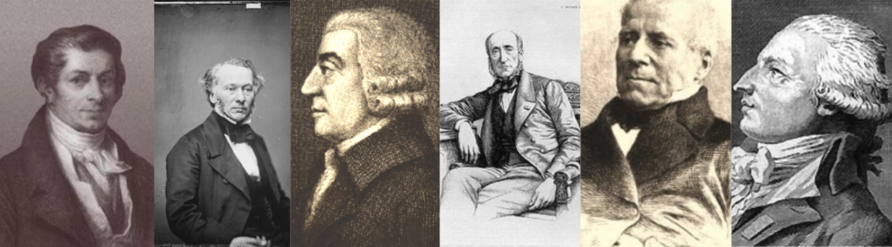

# Sebuah Perjalanan ke Dunia Frédéric Bastiat

Kursus ini, yang dipimpin oleh Damien Theillier, mengajak Anda untuk menyelami dunia Frédéric Bastiat, seorang ekonom dan filsuf Prancis yang ide-idenya terus mempengaruhi pemikiran ekonomi kontemporer. Melalui 21 video, Damien Theillier mengeksplorasi kehidupan Bastiat, pengaruh intelektualnya, lawan ideologinya, serta teori ekonominya.

Kursus dimulai dengan pengenalan terperinci tentang kehidupan dan konteks historis Bastiat, sebelum meneliti pemikir-pemikir yang menandai pemikirannya, seperti Adam Smith, Jean-Baptiste Say, Antoine Destutt de Tracy, Charles Comte, Charles Dunoyer, dan Richard Cobden. Kemudian, kursus melihat pada lawan-lawan Bastiat, termasuk Rousseau, pendidikan klasik, proteksionisme, sosialisme, dan Proudhon.

Bagian penting dari kursus ini didedikasikan untuk sofisma ekonomi yang dikritik oleh Bastiat, seperti "Apa yang terlihat dan apa yang tidak terlihat," "Petisi para pembuat lilin," penjarahan melalui pajak, dan perbedaan antara dua moral ekonomi. Kursus juga membahas tentang harmoni ekonomi yang didukung oleh Bastiat, termasuk keajaiban pasar, kekuatan tanggung jawab, dan solidaritas sejati.

Akhirnya, kursus diakhiri dengan refleksi tentang "Hukum," menangani konsep-konsep kunci seperti hak atas properti, penjarahan legal, dan peran negara. Kesimpulan dari kursus ini merevisi warisan Frédéric Bastiat dan pengaruh abadinya terhadap ekonomi modern.

Bergabunglah dengan Damien Theillier dalam eksplorasi memperkaya pemikiran Frédéric Bastiat ini dan temukan bagaimana ide-idenya dapat menerangi debat ekonomi dan politik saat ini.

+++

# Pengantar

<partId>e4a0cf13-2fc5-5ced-a528-ace3f9029f22</partId>

## Pengantar Kursus

<chapterId>7f21b617-9810-5484-ad1c-befc61432126</chapterId>

Kursus ini merupakan pengantar kepada Frédéric Bastiat, seorang jenius yang tidak diakui dan mercusuar bagi zaman kita. Dalam pengantar singkat ini, saya akan mencoba membantu Anda menemukan siapa Frédéric Bastiat dan apa saja tema utama yang akan kita bahas selama seri ini.

Memang, Frédéric Bastiat, yang lahir pada tahun 1801 dan hidup selama paruh pertama abad ke-19, untuk beberapa waktu tetap menjadi penulis penting. Dan kemudian, secara bertahap, dia menghilang dan hari ini, tidak ada yang mendengar tentangnya, tidak ada yang tahu siapa dia. Namun, paradoksnya, penulis ini telah diterjemahkan ke dalam banyak bahasa, termasuk Italia, Rusia, Spanyol, dan Inggris.

Ternyata, setelah Perang Dunia II, salah satu bukunya diterbitkan di Amerika Serikat. Buku tersebut menjadi sangat terkenal, sampai-sampai Ronald Reagan sendiri mengatakan itu adalah buku favoritnya, dan buku kecil ini disebut "The Law." Bastiat menjadi salah satu dari dua penulis Prancis paling terkenal di Amerika Serikat, yang lainnya juga terkenal di Prancis, yaitu Alexis de Tocqueville.

_(Pasar di Mugron di Landes, kota Bastiat)_

Jadi, seorang jenius yang tidak diakui tapi juga menjadi cahaya bagi zaman kita. Memang, Frédéric Bastiat, yang lahir di Bayonne, pertama kali menjalani sebagian hidupnya di Landes di mana dia mengelola sebuah perkebunan pertanian yang dia warisi dan dia menjalani hidup pada akhirnya sebagai seorang pengusaha. Dan kemudian, sangat awal, dia tertarik pada ekonomi, dia bepergian ke Inggris, dia bertemu dengan Richard Cobden yang merupakan pemimpin gerakan perdagangan bebas. Bastiat terpesona oleh gerakan ini, dia yakin bahwa perdagangan bebas adalah solusi untuk Prancis dan dia memutuskan setelah itu untuk mencoba menyebarkan ide-idenya di Prancis. Dia menulis artikel-artikel yang sangat sukses dan dia pindah ke Paris untuk menjalankan sebuah surat kabar yang pada waktu itu disebut Journal des économistes.

Dia juga seorang filsuf dan pemikir tentang masyarakat, tatanan sosial, keadilan, hukum, pemikir tentang hak. Dan dalam hal ini, kita dapat mengatakan bahwa Bastiat adalah cahaya bagi zaman kita. Dan saya ingin menyimpulkan dengan itu. Dia adalah seseorang yang mencoba memahami cara kerja pasar politik. Tentu saja, dia juga pembela ekonomi pasar, bagi siapa pada akhirnya ekonomi pasar adalah cara terbaik untuk menciptakan kekayaan. Tapi selain itu, dan inilah di mana dia tidak diakui, dia memahami mekanisme pasar politik.
Ketika dia terpilih sebagai seorang deputi, itu adalah selama Republik Kedua, dan dari titik itu ke depan, itu adalah rakyat yang membuat hukum. Pada waktu itu, Bastiat menyaksikan semacam inflasi hukum ke segala arah, termasuk penciptaan layanan publik, hak-hak sosial, pajak, dll.

Dan dia menyadari bahwa pada dasarnya, tidak ada yang benar-benar berubah. Orang-orang mendisposisikan properti orang lain melalui pemungutan suara dan hukum, apa yang dia sebut sebagai penjarahan legal. Fenomena penjarahan legal ini berada di pusat karyanya, terutama dalam teks pendek yang dia tulis menjelang akhir hidupnya, "The Law," di mana dia membandingkan penjarahan legal dengan properti, hak atas properti. Dia menunjukkan bahwa, pada dasarnya, solusi sebenarnya untuk masalah sosial adalah kebebasan, yaitu, properti, kontrol atas diri sendiri dan buah dari pekerjaan seseorang.

Dalam kursus ini, kita akan bersama-sama menjelajahi pemikiran Frédéric Bastiat, dimulai dari pengaruh para penulis yang membentuknya sejak sangat awal di masa mudanya, kemudian kita akan melihat ke dalam sofisme ekonominya, dan akhirnya, kita akan menyimpulkan dengan teks besar ini, "The Law," yang akan memperkenalkan kita kepada analisis pasar politik, kepada analisis masyarakat.

## Kehidupan dan Konteks Sejarah

<chapterId>e9d92b63-83dd-552c-84e1-dd535608c109</chapterId>

Pada tahun 1844, Frédéric Bastiat melakukan perjalanan bisnis ke Spanyol. Setelah menginap di Madrid, Sevilla, Cadiz, dan Lisabon, ia memutuskan untuk berangkat ke Southampton, dan mengunjungi Inggris. Di London, ia memiliki kesempatan untuk menghadiri pertemuan Liga Anti-Corn Law, yang pekerjaannya telah ia ikuti dari jarak jauh. Ia bertemu dengan para pemimpin utama Asosiasi ini, termasuk Richard Cobden, yang kemudian menjadi temannya.

Di sana, jalannya hidupnya berubah secara radikal. Ia sendiri menceritakan bahwa panggilannya sebagai seorang ekonom ditentukan pada saat itu. Setelah kembali ke Prancis, ia hanya memiliki satu ide dalam pikiran: membuat Prancis sadar akan gerakan liberal yang mengguncang Inggris.
Frédéric Bastiat lahir di Bayonne pada tanggal 30 Juni 1801. Yatim piatu pada usia 9 tahun, ia melanjutkan studinya di kolese Katolik Sorèze. Ia berbakat dalam bahasa, belajar bahasa Inggris, Spanyol, dan bahkan Basque. Namun, ia tidak termotivasi oleh studinya dan memutuskan untuk tidak mengambil Baccalaureate, memilih untuk bekerja di bisnis impor-ekspor pamannya di Bayonne.

Pada tahun 1825, ia mewarisi sebuah perkebunan pertanian dari kakeknya, yang ia kelola sebagai "petani-tuan tanah," menurut kata-katanya sendiri. Saat itulah ia menghadapi langsung masalah yang disebabkan oleh kurangnya definisi yang jelas tentang hak milik. Ia memutuskan untuk menjadi hakim perdamaian di kotanya Mugron, di jantung Landes, sebuah persimpangan komersial dan fluvial antara pelabuhan Bordeaux dan Bayonne. Kemudian, ia terpilih sebagai anggota Dewan Umum Landes.

Ia cepat mengembangkan hasrat untuk ekonomi politik dan mempelajari karya-karya Adam Smith, Jean-Baptiste Say, Destutt de Tracy, Charles Dunoyer, dan Charles Comte. Ia membaca surat kabar Inggris, dan di sana ia mengetahui tentang keberadaan liga Inggris untuk perdagangan bebas.

_(Say, Cobden, Smith, Chevalier, Dunoyer, Destutt de Tracy)_

Setelah kembali dari Inggris, ia menulis sebuah artikel berjudul: "Tentang Pengaruh Tarif Inggris dan Prancis terhadap Masa Depan Kedua Bangsa," yang ia kirimkan ke Journal des Économistes di Paris. Artikel tersebut muncul dalam edisi Oktober 1844, dan itu adalah sukses besar. Semua orang mengagumi argumentasinya yang kuat dan tajam, gayanya yang sederhana dan elegan.

Kemudian Journal des Économistes memintanya untuk lebih banyak artikel, dan beberapa anggota Masyarakat Ekonomi Politik, terutama Horace Say, putra Jean-Baptiste Say, dan Michel Chevalier, seorang profesor terkenal, memuji dia, mendorongnya untuk melanjutkan bersama mereka dalam pekerjaan menyebarkan kebenaran ekonomi. Ini menandai awal kehidupan baru di Paris.

Ia pertama kali menerbitkan seri awal dari Sophisme Ekonomi, di mana ia menyerang para proteksionis dengan keberanian dan ironi. Di Paris, ia bahkan memulai kursus tentang ekonomi politik di sebuah ruangan pribadi, yang dihadiri dengan antusias oleh elit mahasiswa.

Tahun berikutnya, ia mendirikan "Asosiasi untuk Perdagangan Bebas" di Prancis dan terjun ke dalam perjuangan melawan proteksionisme di Prancis. Ia mengumpulkan dana, membuat tinjauan mingguan, dan memberikan ceramah di seluruh negeri.
Pertemuan pertama berlangsung di Bordeaux pada tanggal 23 Februari 1846, di mana Asosiasi Bordeaux untuk Perdagangan Bebas didirikan. Tak lama, gerakan tersebut menyebar ke seluruh Prancis. Di Paris, sebuah inti awal terbentuk di antara anggota Masyarakat Ekonom, yang kemudian bergabung dengan para deputi, industrialis, dan pedagang. Grup-grup signifikan juga terbentuk di Marseille, Lyon, dan Le Havre. 

Revolusi Februari 1848 menggulingkan monarki Louis-Philippe, yang dikenal sebagai Monarki Juli (1830-1848), dan menyaksikan kedatangan Republik Kedua. Bastiat kemudian terpilih sebagai anggota majelis legislatif sebagai deputi untuk Landes. Ia duduk di tengah-kiri, bersama Alexis de Tocqueville, di antara para monarkis dan sosialis. Di sana, ia berusaha untuk mempertahankan kebebasan individu seperti hak-hak sipil dan menentang semua kebijakan pembatasan, baik yang datang dari kanan maupun kiri. Ia terpilih sebagai wakil presiden Komite Keuangan dan terus berusaha mengingatkan rekan-rekan deputinya tentang kebenaran sederhana ini, yang sering terlupakan di parlemen:

> Seseorang tidak dapat memberikan kepada beberapa orang, melalui undang-undang, tanpa diwajibkan untuk mengambil dari orang lain melalui undang-undang lain.

Hampir semua buku dan esainya ditulis selama enam tahun terakhir hidupnya, dari 1844 hingga 1850. Pada tahun 1850, Bastiat menulis dua karya terkenalnya: The Law dan serangkaian pamflet berjudul What is Seen and What is Not Seen. The Law telah diterjemahkan ke dalam banyak bahasa asing, termasuk Inggris, Jerman, Spanyol, Rusia, dan Italia.

Ia meninggal di Roma pada tahun 1850, karena tuberkulosis. Ia dimakamkan di Gereja Saint Louis des Français di Roma.

# Pengaruh

<partId>4d312b17-5740-5d33-8309-015e2b59b6dd</partId>

## Adam Smith dan Jean-Baptiste Say

<chapterId>bcc7a12a-6cc4-5061-85e3-0e31fb1f0a49</chapterId>

Dalam ekonomi, Bastiat selalu mengakui hutangnya kepada Adam Smith dan Jean-Baptiste Say. Pada usia 26, ia menulis kepada salah satu temannya, "Saya tidak pernah membaca tentang subjek-subjek ini kecuali empat karya ini, Smith, Say, Destutt, dan Censor."

_(Jean-Baptiste Say dan Adam Smith)_
Ekonomi politik, sebagaimana dipahami oleh Adam Smith dan J.-B. Say, terangkum dalam satu kata: kebebasan. Kebebasan perdagangan, kebebasan individu, perdagangan bebas, dan inisiatif bebas. Perdagangan bebas pertama kali dibela oleh para fisiokrat, seperti François Quesnay dan Vincent de Gournay, dan kemudian oleh Adam Smith yang mensintesis ide-ide mereka dengan pengamatannya sendiri. Akhirnya, pada akhir abad ke-18, Jean-Baptiste Say menjernihkan dan memperbaiki beberapa poin doktrin gurunya Adam Smith dalam karyanya yang mengagumkan, Treatise on Political Economy.

_(Say, Destutt de Tracy, Quesnay, de Gournay)_
Adam Smith tertarik pada kemakmuran, bukan sebagai tujuan akhir tetapi sebagai sarana untuk meningkatkan moral individu. Baginya, kekayaan suatu bangsa terdiri dari kekayaan individu-individu. Jika Anda ingin sebuah bangsa yang makmur, kata Adam Smith, biarkan individu bertindak secara bebas. Dan pasar berfungsi karena memungkinkan semua orang untuk mengungkapkan preferensi mereka dan mengejar kepentingan mereka.

Kebaruan besar dari ekonom modern di awal abad ke-18 adalah bahwa mereka tertarik pada setiap individu dengan keinginan untuk mengembalikan kapasitas mereka untuk bertindak sambil memikirkan cara untuk menahan gairah dan konflik. Manusia secara alami ingin meningkatkan keadaannya dan keadaan orang-orang yang dicintainya melalui pertukaran barang dan jasa.

Apa yang ditunjukkan oleh Adam Smith adalah bahwa seseorang hanya dapat melayani kepentingan diri sendiri dengan melayani kepentingan orang lain.

> Berikan saya apa yang saya butuhkan, dan Anda akan mendapatkan dari saya apa yang Anda butuhkan. (...) Bukan dari kebaikan hati tukang daging, pembuat bir, atau tukang roti yang kita harapkan makan malam kita, tetapi dari perhatian mereka terhadap kepentingan mereka sendiri.

Pertukaran adalah permainan yang menguntungkan kedua belah pihak. Apa yang satu pihak dapatkan, pihak lain juga mendapatkannya. Hal ini berbeda dari redistribusi politik di mana selalu ada pemenang dan pecundang. Jika kita mempertimbangkan sekolah Inggris, bagi Smith, bagi Ricardo, dan bagi Locke sebelum mereka, nilai terkait dengan tenaga kerja. Bagi Marx, hal itu sama.

_(Marx, Ricardo, Smith, Locke)_

Di sisi lain, Bastiat akan mengakui bersama Jean-Baptiste Say bahwa utilitas adalah dasar sebenarnya dari nilai. Tenaga kerja tidak menciptakan nilai. Kelangkaan juga tidak. Semuanya berasal dari utilitas. Memang, tidak ada yang setuju untuk membayar suatu layanan kecuali mereka menganggapnya berguna. Seseorang hanya pernah menghasilkan utilitas.
Tetapi Bastiat juga menambahkan nuansa pada Say dalam hal ini. Ini bukan tentang utilitas yang ada dalam benda, ini tentang utilitas relatif dari layanan. "Nilai adalah rasio dari dua layanan yang ditukar," menurut kata-katanya sendiri. Oleh karena itu, nilai bersifat subjektif, dan satu-satunya cara untuk memahami preferensi individu adalah dengan mengamati perilaku mereka di pasar bebas. Pasar mengungkapkan preferensi individu dan merupakan regulator besar masyarakat melalui pertukaran.

Ekonomi mematuhi sejumlah hukum sederhana yang berasal dari perilaku manusia. Salah satunya, yang disebut "Hukum Say," adalah sebagai berikut: "Produk dan layanan ditukar dengan produk dan layanan." Ideanya adalah bahwa bangsa dan individu mendapat manfaat dari peningkatan tingkat produksi karena menawarkan peluang yang lebih besar untuk pertukaran yang saling menguntungkan.

Memang, produk hanya dibeli dengan antisipasi layanan yang diharapkan pembeli: Saya membeli disk untuk musik yang akan saya dengarkan, saya membeli tiket film untuk film yang akan saya tonton. Dan dalam pertukaran, setiap pihak memutuskan karena menilai bahwa ia dapat memperoleh lebih banyak layanan dari apa yang diperolehnya daripada apa yang ia berikan. Dalam konteks ini, uang hanyalah komoditas perantara, ia menggantikan layanan yang diberikan dan membuka layanan lain.

Bagi Bastiat, ekonomi pertukaran, yaitu layanan timbal balik yang ditawarkan dan diterima secara bebas, adalah yang mendasari perdamaian dan kemakmuran, memungkinkan untuk harmoni kepentingan.

Tetapi dari Jean-Baptiste Say, Frédéric Bastiat juga mewarisi konsep kunci, yaitu tentang penjarahan. Karena, katanya, menggemakan kata-kata Say:

> Hanya ada dua cara untuk memperoleh hal-hal yang diperlukan untuk pelestarian, penghiasan, dan peningkatan kehidupan: produksi dan penjarahan.
Para produsen menggunakan persuasi, negosiasi, dan kontrak, sementara para perampas menggunakan kekuatan dan tipu daya. Oleh karena itu, tugas hukum adalah untuk menekan perampasan dan untuk mengamankan tenaga kerja serta properti. Seperti yang telah dinyatakan oleh Adam Smith, memastikan keamanan warga negara adalah misi utama otoritas publik, dan inilah yang memberi legitimasi pada pemungutan pajak.

## Antoine Destutt de Tracy

<chapterId>ddf64e9f-2ce0-5651-8eb8-bae578eb0b9b</chapterId>

Mungkin belum banyak yang tahu, tetapi Destutt de Tracy memiliki pengaruh yang menentukan terhadap Presiden masa depan Amerika Serikat, Thomas Jefferson, saat ia menjadi duta besar di Paris pada tahun 1780-an.
> "Bagi setiap orang, negara pertamanya adalah tanah airnya, dan yang kedua adalah Prancis" & "Tirani adalah ketika rakyat takut pada pemerintahnya; kebebasan adalah ketika pemerintah takut pada rakyatnya."
>
> Thomas Jefferson

Memang, Traktat Ekonomi Politiknya mengutuk proteksionisme dan ekspansi Napoleon. Oleh karena itu, publikasinya dilarang di Prancis oleh Bonaparte. Namun, teks tersebut diterjemahkan ke dalam bahasa Inggris dan diterbitkan di Amerika Serikat oleh Jefferson sendiri. Dia menjadikan teks ini sebagai buku teks ekonomi politik pertama Universitas Virginia, yang baru saja ia dirikan di Charlottesville. Traktat tersebut tidak diterbitkan di Prancis sampai tahun 1819!

Destutt de Tracy, seorang filsuf dan ekonom, adalah pemimpin dari sekolah yang disebut "Ideologues", yang mencakup orang-orang seperti Cabanis, Condorcet, Constant, Daunou, Say, dan Germaine de Staël. Mereka adalah pewaris dari Fisiokrat dan murid langsung dari Turgot.

Dengan ideologi, Tracy hanya bermaksud ilmu yang berurusan dengan studi tentang ide, asal-usulnya, hukum-hukumnya, hubungannya dengan bahasa, yaitu, dalam istilah yang lebih kontemporer, epistemologi. Istilah "ideologi" tidak memiliki konotasi peyoratif yang kemudian diberikan oleh Marx untuk mendiskreditkan ekonom "laissez-faire". Jurnal dari gerakan ideologue disebut La Décade philosophique et littéraire.

Gerakan ini mendominasi periode revolusioner dan dipimpin oleh Jean-Baptiste Say. Destutt de Tracy terpilih sebagai anggota Akademi Prancis pada tahun 1808 dan Akademi Ilmu Moral dan Politik pada tahun 1832. Putrinya menikah dengan Georges Washington de La Fayette (putra dari presiden Amerika pertama) pada tahun 1802, yang menunjukkan kedekatan yang masih ada antara Prancis dan Amerika muda pada saat itu.

Tujuan dari Traktatnya tentang Ekonomi Politik adalah untuk "mengkaji cara terbaik untuk memanfaatkan semua kemampuan fisik dan intelektual kita untuk memenuhi berbagai kebutuhan kita." Ideanya adalah bahwa perdagangan adalah sumber dari semua kebaikan manusia; itu adalah kekuatan yang beradab, merasionalisasi, dan mendamaikan dunia. Maksim besar ekonomi politik dirumuskannya sebagai berikut: "perdagangan adalah seluruh masyarakat, sama seperti pekerjaan adalah seluruh kekayaan." Memang, ia melihat masyarakat sebagai "serangkaian pertukaran terus-menerus di mana kedua kontraktor selalu mendapat keuntungan." Oleh karena itu, pasar adalah kebalikan dari pemangsaan. Ini memperkaya beberapa tanpa memiskinkan yang lain. Seperti yang akan dikatakan nanti, ini bukan "permainan nol-sum," tetapi permainan sum positif.

Penulis kita tidak sampai pada titik mendefinisikan ekonomi politik sebagai ilmu pertukaran. Namun, penalaran yang sama akan diambil dan dilanjutkan oleh Bastiat. Menjual adalah pertukaran objek, menyewa adalah pertukaran jasa, dan meminjam hanyalah pertukaran tertunda. Ekonomi politik dengan demikian menjadi bagi Bastiat "teori pertukaran."

Menurut Destutt de Tracy, properti secara alami berasal dari sifat kita, dari kemampuan kita untuk menginginkan. Jika manusia tidak menginginkan apa-apa, dia tidak akan memiliki hak atau kewajiban. Untuk memenuhi kebutuhannya dan memenuhi kewajibannya, manusia harus menggunakan sarana yang dia peroleh melalui pekerjaannya. Dan bentuk organisasi sosial yang sesuai dengan tujuan ini adalah properti pribadi. Itulah mengapa satu-satunya objek pemerintah adalah untuk melindungi properti dan memungkinkan pertukaran yang damai.

Baginya, pajak terbaik adalah yang paling moderat, dan dia berharap pengeluaran negara sebatas mungkin. Dia mengutuk penjarahan kekayaan masyarakat oleh pemerintah dalam bentuk utang publik, pajak, monopoli perbankan, dan pengeluaran. Sekali lagi, hukum hanya harus berfungsi untuk melindungi kebebasan; itu seharusnya tidak pernah merampok.

Akhirnya, dia menambahkan rekomendasi ini, yang tidak kehilangan relevansinya:

> Jangan biarkan pemerintah membuat dan tidak bisa membuat utang yang mengikat generasi mendatang dan selalu membawa negara ke kehancurannya.

Kesimpulannya, Ideolog memiliki intuisi yang mendalam, yaitu bahwa produksi dan pertukaran adalah solusi nyata untuk masalah politik dan alternatif sejati untuk perang. Perang selalu bersifat pemangsaan, baik itu internal, seperti selama Revolusi, atau eksternal, seperti yang dilakukan oleh raja-raja kuno dan oleh Napoleon.

## Charles Comte dan Charles Dunoyer

<chapterId>80bc5c4e-ac07-52c8-9dd7-e224ac291bda</chapterId>

Sejarah semua peradaban adalah cerita tentang perjuangan antara kelas perampas dan kelas produktif. Ini adalah keyakinan dari dua penulis yang akan kita bahas. Mereka adalah pencetus teori liberal tentang perjuangan kelas yang menginspirasi Frédéric Bastiat sebanyak Karl Marx, meskipun yang terakhir mendistorsinya.

Bagi Comte dan Dunoyer, perampasan, yang berarti semua bentuk kekerasan yang dilakukan dalam masyarakat oleh yang kuat terhadap yang lemah, adalah kunci utama untuk memahami sejarah manusia. Ini adalah asal dari semua fenomena eksploitasi satu kelas oleh kelas lain.

Jika Frédéric Bastiat mendapatkan pendidikan ekonominya dari Smith, Destutt de Tracy, dan Say, ia mendapatkan pendidikan politiknya dari para pemimpin jurnal Le Censeur, Charles Comte dan Charles Dunoyer.
Ulasan ini (1814-1819), yang berganti nama menjadi Le Censeur européen setelah Seratus Hari, menyebarkan ide-ide liberal yang meraih kemenangan pada tahun 1830 dengan pemberontakan Tiga Hari yang Mulia dan naiknya kekuasaan Duke of Orléans, Louis-Philippe I.

Charles Comte, sepupu dari Auguste Comte dan menantu dari Say, adalah pendiri ulasan tersebut. Ia segera bergabung dengan Charles Dunoyer, seorang yuris seperti dirinya, dan kemudian oleh seorang sejarawan muda, Augustin Thierry, mantan sekretaris Saint Simon. Moto mereka di halaman depan setiap edisi ulasan adalah "Damai dan Kebebasan".

Apa tujuan dari ulasan tersebut? Judulnya sudah menjelaskan: untuk mengkritik pemerintah. Untuk melawan sewenang-wenang kekuasaan dengan mencerahkan opini publik, untuk membela kebebasan pers.

_(Benjamin Constant)_

Mereka mengadopsi dari Benjamin Constant perbedaan antara Orang Kuno dan Orang Modern, yang ditandai di satu sisi oleh perang, dan di sisi lain oleh perdagangan dan industri. Namun, mereka menambahkan dengan Say bahwa ekonomi politik memberikan penjelasan terbaik tentang fenomena sosial. Mereka khususnya memahami bahwa bangsa-bangsa mencapai perdamaian dan kemakmuran ketika hak milik dan perdagangan bebas dihormati. Mulai saat ini, bagi mereka, ekonomi politik adalah dasar sejati dan satu-satunya dari politik. Kepada filsafat, yang membatasi dirinya pada kritik abstrak terhadap bentuk-bentuk pemerintahan, harus digantikan teori yang didasarkan pada pengetahuan tentang kepentingan ekonomi.
Ekonomi politik, dengan menunjukkan bagaimana bangsa-bangsa makmur dan menurun, telah meletakkan dasar sejati dari politik.
> Dunoyer

Teori sosial baru ini mengandung salah satu elemen yang akan menjadi batu penjuru dari sosialisme ilmiah Marx dan Engels: perjuangan kelas. Tapi, apa itu teori liberal tentang perjuangan kelas, dan bagaimana ia berbeda dari Marxisme?

Ini dimulai dengan individu yang bertindak untuk memenuhi kebutuhan dan keinginan mereka. Saat seseorang mencipta, yaitu meningkatkan utilitas barang, meningkatkan nilai mereka, seseorang terlibat dalam industri. Di sini, seorang industrialis bukanlah pemilik industri, seperti yang mungkin disarankan bahasa saat ini, tetapi seorang produsen, terlepas dari bidang di mana mereka bekerja. Itulah mengapa teori mereka disebut industrialisme. Teori ini mengemukakan bahwa tujuan masyarakat adalah penciptaan utilitas dalam arti luas, yaitu barang dan jasa yang berguna bagi manusia.

Pada titik ini, individu menghadapi dua alternatif fundamental: mereka dapat merampas kekayaan yang diproduksi oleh orang lain, atau mereka dapat bekerja untuk memproduksi kekayaan sendiri. Dalam setiap masyarakat, seseorang dapat dengan jelas membedakan mereka yang hidup dari perampasan dari mereka yang hidup dari produksi. Di bawah Ancien Régime, kaum bangsawan secara langsung menyerang yang paling industri untuk hidup dari bentuk penghormatan baru: pajak. Kaum bangsawan yang rakus digantikan oleh gerombolan birokrat, tidak kalah rakusnya.

Sementara bagi Marx, antagonisme kelas terletak dalam aktivitas produktif itu sendiri, antara karyawan dan majikan, bagi Comte dan Dunoyer, kelas yang bertentangan adalah, di satu sisi, produsen masyarakat, yang membayar pajak (termasuk kapitalis, pekerja, petani, cendekiawan, dll.) dan di sisi lain, non-produsen, yang hidup dari sewa yang dibiayai oleh pajak, "kelas yang malas dan menghambur-hamburkan" (birokrat, pejabat, politisi, penerima subsidi atau perlindungan).

Kemudian, tidak seperti Marx, para penulis Censeur Européen tidak menganjurkan perang kelas. Sebaliknya, mereka berkampanye untuk perdamaian sosial. Dan ini, menurut mereka, hanya dapat dicapai melalui depolitisasi masyarakat. Untuk tujuan ini, penting untuk pertama-tama mengurangi prestise dan manfaat dari jabatan publik. Kemudian penting untuk memberikan pengaruh dalam tubuh politik kepada para produsen.

Akhirnya, satu-satunya cara untuk membebaskan dunia dari eksploitasi satu kelas oleh kelas lain adalah dengan menghancurkan mekanisme yang membuat eksploitasi ini mungkin: kekuatan Negara untuk mendistribusikan dan mengontrol properti dan alokasi manfaat yang terkait dengannya (posisi).

Ide-ide mereka, yang sangat inovatif, akan selamanya menandai Frédéric Bastiat, yang akan menjadi pemikir mendalam tentang krisis politik.

## Cobden dan Liga

<chapterId>7181435c-5eae-56e4-8e55-02a24273fdd6</chapterId>

Ini adalah tahun 1838, di Manchester, sejumlah kecil pria, yang hingga saat itu kurang dikenal, berkumpul untuk menemukan cara menggulingkan monopoli pemilik tanah gandum melalui sarana hukum dan untuk mencapai, seperti yang akan Bastiat kemudian ceritakan,

> Tanpa pertumpahan darah, dengan kekuatan opini saja, revolusi yang seprofundal, mungkin lebih dalam dari yang dilakukan para leluhur kita pada tahun 1789.

Dari pertemuan ini akan muncul Liga melawan undang-undang jagung, atau undang-undang biji-bijian, seperti yang akan Bastiat sebut. Tetapi sangat cepat, tujuan ini akan menjadi abolisi unilateral dan total dari proteksionisme.

Pertarungan ekonomi untuk perdagangan bebas ini akan menduduki seluruh Inggris hingga 1846. Di Prancis, di luar sejumlah kecil inisiator, keberadaan gerakan luas ini sama sekali tidak diketahui. Dengan membaca sebuah koran Inggris, yang kebetulan dia langganan, Frédéric Bastiat mengetahui keberadaan Liga pada tahun 1843. Bersemangat, dia menerjemahkan pidato-pidato Cobden, Fox, dan Bright. Kemudian dia berkomunikasi dengan Cobden dan akhirnya, pada tahun 1845, dia pergi ke London untuk menghadiri pertemuan-pertemuan besar Liga.

Kampanye agitasi untuk perdagangan bebas ini, di seluruh kerajaan, dengan puluhan ribu anggota, yang membuat pena Bastiat terbakar dan secara radikal dan definitif mengubah jalannya hidupnya.

Liga dapat dibandingkan dengan sebuah universitas keliling, mendidik secara ekonomi mereka yang menghadiri pertemuannya di seluruh negeri—rakyat jelata, industrialis, penggarap, dan petani, yang semuanya diambil Liga di bawah sayapnya dan yang kepentingannya tertindas oleh undang-undang biji-bijian. Richard Cobden adalah jiwa dari gerakan tersebut dan seorang agitator yang luar biasa.
Seorang pembicara yang menarik dan tangguh, dia memiliki bakat luar biasa dalam menciptakan frasa yang mencolok dan ringkas, jauh dari diskursus abstrak para ekonom.
> Apa itu monopoli roti? dia berseru. Itu adalah kelangkaan roti. Anda akan terkejut mengetahui bahwa legislasi negara ini, dalam hal ini, tidak memiliki tujuan lain selain untuk menghasilkan kelangkaan roti sebesar-besarnya. Dan namun, itu tidak lain. Legislasi hanya dapat mencapai tujuannya melalui kelangkaan.

Pada tahun 1845, Bastiat menerbitkan di Paris bukunya Cobden dan Liga, dengan terjemahannya disertai komentar. Buku ini dibuka dengan pengantar tentang situasi ekonomi Inggris, tentang sejarah asal mula dan kemajuan Liga. Sejak 1815, proteksionisme sangat berkembang di Inggris. Ada, khususnya, undang-undang yang membatasi impor gandum yang memiliki konsekuensi sangat keras bagi rakyat. Memang, gandum diperlukan untuk membuat roti, komoditas vital saat itu. Selain itu, sistem ini mendukung aristokrasi, yaitu, pemilik tanah besar, yang mendapatkan sewa darinya.

> Apa yang koeksistensi di Inggris, tulis Bastiat, adalah sejumlah kecil perampok dan sejumlah besar yang dirampok, dan seseorang tidak perlu menjadi ekonom hebat untuk menyimpulkan kemakmuran yang pertama dan kesengsaraan yang terakhir.

Tujuan Liga adalah untuk memobilisasi opini publik untuk menekan parlemen agar mencabut undang-undang gandum. Dalam jangka panjang, Cobden dan teman-temannya berharap untuk:

- Meningkatkan outlet industri
- Meningkatkan kesempatan kerja
- Mengurangi harga roti
- Membuat pertanian dan industri lebih efisien melalui kompetisi
- Mendorong perdamaian antar bangsa

_(Jeremy Bentham)_

Sebagai murid dari utilitarianisme Bentham, keyakinan Cobden adalah bahwa kebebasan tenaga kerja dan perdagangan langsung melayani kepentingan massa yang paling banyak, paling miskin, dan paling menderita di masyarakat. Sebaliknya, bea cukai sebagai instrumen larangan dan hak istimewa sewenang-wenang hanya dapat menguntungkan industri-industri tertentu yang paling kuat.

Dalam pemilihan tahun 1841, lima anggota liga, termasuk Cobden, terpilih ke parlemen. Pada 26 Mei 1846, perdagangan bebas unilateral menjadi undang-undang kerajaan. Sejak saat itu, Kerajaan Inggris akan mengalami periode kebebasan dan kemakmuran yang cemerlang.
Yang menarik adalah Bastiat mengambil sebagian dari metode mereka; dia menyerap bahasa mereka dan mentransposisikannya ke dalam konteks Prancis. Buku tentang Cobden dan Liga dengan cepat menjadi sukses, dan Bastiat membuat entri sensasional ke dunia ekonom. Dia mendirikan sebuah asosiasi di Bordeaux untuk mendukung perdagangan bebas dan kemudian memindahkannya ke Paris. Dia ditawari kepemimpinan Journal des Économistes. Gerakan itu lahir, dan terus berlanjut hingga 1848.

Hanya setelah kematian Bastiat, pada tahun 1866, Napoleon III akan menandatangani perjanjian perdagangan bebas dengan Inggris, semacam kemenangan pasca kematian bagi orang yang telah mengabdikan enam tahun terakhir dari hidupnya yang singkat untuk ide besar ini.

_(Michel Chevalier)_
Pertanyaan tentang perdagangan bebas terus relevan hingga hari ini. Buku teks geografi di sekolah-sekolah menyatakan bahwa globalisasi adalah penyebabnya dan bahwa negara-negara miskin membutuhkan bantuan dari Barat untuk bertahan. Namun, kemiskinan ekstrem telah berkurang menjadi setengahnya dalam 20 tahun. Dengan memilih keterbukaan, negara-negara seperti India, China, atau Taiwan telah berhasil keluar dari kemiskinan, sementara stagnasi menggambarkan negara-negara tertutup seperti Korea Utara atau Venezuela. Menurut PBB, 36% umat manusia hidup dalam kemiskinan total pada tahun 1990. Kini, mereka "hanya" 18% pada tahun 2010. Kemiskinan ekstrem tetap menjadi tantangan besar, namun kondisinya semakin membaik.

# Para Penentang

<partId>f902ed30-269e-5e44-a76d-8efd1a4e4085</partId>

## Rousseau

<chapterId>c3926110-e0b2-503c-96d9-5d3a6a661484</chapterId>

Frédéric Bastiat, yang menyatakan pendapatnya pada tahun 1840-an, adalah pewaris generasi filsuf Pencerahan yang berjuang melawan sensor dan demi kebebasan berdebat. Pikirkan tentang Montesquieu, Diderot, Voltaire, Condorcet, tapi juga Rousseau.

Bagi mereka, ideanya sederhana: semakin banyak ide yang diizinkan untuk diungkapkan, semakin maju kebenaran dan semakin mudah kesalahan dibantah. Ilmu pengetahuan selalu berkembang dengan cara ini.

_(Montesquieu, Diderot, Voltaire, Condorcet, Rousseau)_
Sebaliknya, sedikit yang mengerti bahwa apa yang benar untuk ide juga benar untuk barang dan jasa. Kebebasan untuk berdagang dengan orang lain memang memiliki dua kebajikan: menjadi efisien dan mengarah pada distribusi yang lebih adil. Tidak hanya Rousseau yang tidak mengerti ini, tetapi dia juga berjuang melawan kebebasan ini atas nama ide hukum dan hak yang salah. Salah satu sumber utama sosialisme, menurut Bastiat, adalah pendapat Rousseau bahwa seluruh tatanan sosial berasal dari hukum.

Bastiat memang menganggap Rousseau sebagai pendahulu sejati sosialisme dan kolektivisme. Dalam penulis The Social Contract, ada sebuah frase yang cukup baik merangkum filosofinya: "kita hanya mulai menjadi manusia setelah menjadi warga negara."

Pada awalnya, manusia hanyalah seorang borjuis. Namun, borjuis adalah seorang penghitung; dia menginginkan kesenangan segera, dia diperbudak oleh indranya, oleh keinginannya, oleh kepentingan khususnya. Singkatnya, dia tidak rasional, oleh karena itu dia tidak bebas. Dia perlu dididik, untuk memahami bahwa kepentingan sejatinya adalah kepentingan umum. Inilah mengapa Rousseau menulis dalam The Social Contract:

> Siapa pun yang menolak untuk mematuhi kehendak umum harus dipaksa oleh seluruh tubuh: ini tidak berarti apa-apa selain mereka akan dipaksa untuk bebas.

Menurut doktrin ini, manusia memiliki dua kehendak di dalam dirinya: kehendak yang cenderung ke arah kepentingan pribadi, itu dari borjuis, dan kehendak yang cenderung ke arah kepentingan umum, itu dari warga negara. Memimpin manusia, bahkan dengan paksa, untuk menginginkan tujuan rasional, kepentingan umum, adalah memimpin manusia menjadi bebas. Apa yang mereka inginkan sebenarnya adalah tujuan rasional, meskipun mereka tidak mengetahuinya.
Oleh karena itu, menurut Rousseau, sangat sah untuk memaksa manusia demi tujuan yang seharusnya mereka kejar sendiri, jika mereka lebih tercerahkan, tetapi yang tidak mereka kejar karena mereka buta, tidak tahu, atau korup. Masyarakat didirikan untuk memaksa mereka melakukan apa yang seharusnya mereka inginkan secara spontan jika mereka tercerahkan. Dan dengan melakukan itu, seseorang tidak melakukan kekerasan kepada mereka karena seseorang membimbing mereka untuk menjadi "bebas," yaitu, membuat pilihan yang tepat, pilihan yang sesuai dengan diri mereka yang sejati.

Yakin bahwa masyarakat yang baik adalah ciptaan hukum, Rousseau dengan demikian memberikan kekuasaan tak terbatas kepada pembuat undang-undang. Terserah padanya untuk mengubah individu menjadi manusia yang sempurna, menjadi warga negara.
Namun, juga terserah pada hukum untuk membuat properti itu ada. Menurut Rousseau, properti hanya bisa sah jika diatur oleh pembuat undang-undang. Memang, kejahatan terletak pada ketidaksetaraan dan perbudakan, yang keduanya berasal dari properti. Ini adalah penemuan orang kuat yang telah mengarah pada masyarakat yang buruk, ke masyarakat borjuis, ke hubungan dominasi. Dalam Diskursus tentang Asal dan Dasar-dasar Ketidaksetaraan, ia menulis bagian terkenal ini:

> Orang pertama yang, setelah memagari sebidang tanah, berkata: Ini milikku, dan menemukan orang-orang cukup sederhana untuk mempercayainya, adalah pendiri sejati masyarakat sipil. Berapa banyak kejahatan, perang, pembunuhan, berapa banyak kesengsaraan dan horor yang akan dihindari umat manusia oleh orang yang, mencabut patok atau mengisi parit, telah berteriak kepada sesamanya: "Hati-hati mendengarkan penipu ini; kalian hilang jika kalian lupa bahwa buah-buahan milik semua orang dan bumi tidak milik siapa-siapa!"

Oleh karena itu, properti alami adalah sumber kejahatan. Dan Marx, pembaca besar Rousseau, akan mengingat ini. Bagaimana cara memerangi kejahatan ini? Melalui kontrak sosial, jawab Rousseau. Memang, masyarakat yang baik adalah yang merupakan hasil dari kontrak yang menetapkan pengasingan individu dengan semua haknya kepada komunitas. Dari saat itu, terserah pada komunitas untuk memberikan hak kepada individu melalui hukum.

Berbeda dengan Rousseau, Frédéric Bastiat mengatakan bahwa "manusia dilahirkan sebagai pemilik properti." Baginya, properti adalah konsekuensi yang diperlukan dari sifat manusia, dari konstitusinya. Ia menulis bahwa "manusia dilahirkan sebagai pemilik properti, karena ia dilahirkan dengan kebutuhan yang kepuasannya sangat penting untuk hidup, dengan organ dan fakultas yang latihannya sangat penting untuk memuaskan kebutuhan-kebutuhan ini". Namun, fakultas hanyalah perpanjangan dari orang, dan properti hanyalah perpanjangan dari fakultas. Dengan kata lain, penggunaan fakultas kita dalam pekerjaan yang melegitimasi properti.

Menurut Bastiat, masyarakat, orang, dan properti ada sebelum hukum, dan ia memiliki frasa terkenal ini: "Bukan karena ada hukum yang ada properti, tetapi karena ada properti yang ada hukum". Itulah mengapa hukum harus negatif: itu harus mencegah pelanggaran terhadap orang dan barang mereka. Properti adalah raison d'être dari hukum dan bukan sebaliknya.

## Pendidikan Klasik

<chapterId>87d9a8c9-2352-5cb2-8b93-678118a8145c</chapterId>

Pada tanggal 24 Februari 1848, setelah tiga hari kerusuhan di Paris, Raja Louis-Philippe I mengundurkan diri dari kekuasaannya. Ini menandai kelahiran Republik Kedua.

Bastiat berada di Paris, menyaksikan peristiwa tersebut secara langsung. Kemudian, ia akan menulis:

> Pada tanggal 24 Februari, saya, seperti banyak orang lain, khawatir bahwa bangsa ini tidak siap untuk mengatur dirinya sendiri. Saya harus mengakui, saya takut akan pengaruh ide-ide Yunani dan Romawi yang dipaksakan kepada kita semua oleh monopoli akademik.

Bagian ini mengejutkan. Apa hubungannya antikuitas Yunani dan Romawi dengan ini?

Bastiat merujuk pada Republik Plato dan teorinya tentang raja-filsuf, tetapi juga kepada Sparta, yang sangat dikagumi oleh Rousseau, ke Kekaisaran Romawi, yang sangat dirindukan oleh Napoleon. Sayangnya, menurut Bastiat, ide-ide Yunani dan Romawi ini didasarkan pada premis yang salah: ide tentang kekuasaan mutlak legislator, tentang kedaulatan absolut hukum.

Cukup membuka hampir setiap buku tentang filsafat, politik, atau sejarah secara acak untuk menemukan ide ini, yang berakar dalam budaya kita, bahwa kemanusiaan adalah materi iners yang menerima kehidupan, organisasi, moralitas, dan kemakmuran dari kekuatan politik. Dibiarkan dengan perangkatnya sendiri, kemanusiaan akan cenderung menuju anarki dan hanya akan diselamatkan dari bencana ini oleh tangan misterius dan mahakuasa dari Legislator. Namun, Bastiat mengatakan, ide ini telah lama matang dan dipersiapkan oleh berabad-abad pendidikan klasik.

Pertama-tama, ia mengatakan, orang Romawi menganggap properti sebagai fakta konvensional, sebagai ciptaan buatan hukum tertulis. Mengapa? Sederhana, Bastiat menjelaskan, karena mereka hidup dari perbudakan dan penjarahan. Bagi mereka, semua properti adalah buah dari penjarahan. Oleh karena itu, mereka tidak dapat memperkenalkan ke dalam legislasi ide bahwa dasar properti yang sah adalah tenaga kerja tanpa menghancurkan dasar-dasar masyarakat mereka.
Mereka memang memiliki definisi empiris tentang properti, "jus utendi et abutendi" (hak untuk menggunakan dan menyalahgunakan). Namun, definisi ini hanya menyangkut efek dan bukan penyebab, dengan kata lain, asal-usul etis dari properti. Untuk benar-benar menetapkan properti, seseorang harus kembali ke konstitusi manusia itu sendiri, dan memahami hubungan dan keterkaitan yang diperlukan antara kebutuhan, kemampuan, tenaga kerja, dan properti. Orang Romawi, yang merupakan pemilik budak, dapatkah mereka memahami ide bahwa "setiap manusia memiliki dirinya sendiri, dan oleh karena itu tenaga kerjanya, dan, akibatnya, produk dari tenaga kerjanya"? Bastiat bertanya-tanya.

> Oleh karena itu, jangan heran, Bastiat menyimpulkan, untuk melihat ide Romawi bahwa properti adalah fakta konvensional dan institusi hukum muncul kembali pada abad kedelapan belas; bahwa, jauh dari Hukum menjadi korolari dari Properti, adalah Properti yang merupakan korolari dari Hukum.

Memang, Rousseau membagikan ide hukum umum ini tentang dasar properti pada hukum. Rousseau mengatributkan kepada hukum, dan akibatnya kepada rakyat, kekuasaan absolut atas individu dan properti.

Dan dalam konsepsi ini, yang merupakan ide sangat dari republik sejak Revolusi Prancis, legislator harus mengatur masyarakat, seperti seorang arsitek sosial, seperti mekanik yang menciptakan mesin dari materi iners, atau seperti seorang pembuat tembikar yang membentuk tanah liat. Legislator dengan demikian menempatkan dirinya di luar kemanusiaan, di atasnya, untuk mengaturnya sesuka hati, menurut rencana yang dibayangkan oleh kecerdasannya yang cemerlang.

Sebaliknya, bagi Bastiat, hak atas properti adalah prioritas sebelum hukum. Inilah yang ia sebut sebagai prinsip ekonom, berlawanan dengan prinsip jurist. Sementara "prinsip jurist secara virtual mengandung perbudakan," kata Bastiat, "prinsip ekonom mengandung kebebasan.
Lantas, apa itu kebebasan? Itu adalah properti, hak untuk menikmati buah dari kerja keras seseorang, hak untuk bekerja, untuk berkembang, untuk menggunakan fakultas seseorang, sesuai keinginan, tanpa intervensi Negara selain dari tindakan protektifnya.

Sangat menyedihkan berpikir bahwa filosofi sosial dan politik kita masih terjebak pada ide bahwa solusi untuk semua masalah kita harus datang dari atas, dari hukum, dari Negara. Namun, ini dapat dijelaskan. Ide-ide ini disuntikkan setiap hari kepada pemuda di sekolah dan universitas, melalui monopoli pendidikan.

Namun, seperti yang diingatkan Bastiat, monopoli mengecualikan kemajuan.

## Proteksionisme dan Sosialisme
<chapterId>ce6cb8a8-7dc9-5ef7-939d-9a559b4d2c74</chapterId>

_(Richard Cobden)_

Seperti yang telah kita lihat, pertama-tama dan terutama perjuangan Cobden melawan proteksionisme dengan liga Inggris untuk penghapusan Corn Laws yang mendorong Bastiat untuk menulis artikel dan kemudian buku.

Proteksionisme, pada kenyataannya, adalah bentuk nasionalisme ekonomi. Tujuannya adalah untuk mengeliminasi kompetisi asing sambil berpura-pura "membela kepentingan nasional." Mereka kemudian mencoba membuat otoritas publik menerima serangkaian kebohongan demagogis, yang disajikan sebagai virtuous: pertahanan pekerjaan, daya saing, dll. Tentu saja, pejabat terpilih menyerah pada tekanan produsen, karena bagi mereka ini adalah kesempatan emas untuk mengkonsolidasikan klien mereka dan memperluas kekuasaan mereka.

Argumen untuk perlindungan pekerjaan adalah apa yang Bastiat sebut sebagai kesalahan berpikir. Karena pada kenyataannya, itu setara dengan pajak. Ini berdampak pada mahalnya produk. Mari kita ambil contoh yang diberikan oleh Bastiat sendiri.

Bayangkan sebuah pisau Inggris yang dijual di negara kita seharga 2 euro, dan pisau buatan Prancis berharga 3. Jika kita membiarkan konsumen bebas membeli pisau yang dia inginkan, dia menghemat satu franc, yang bisa dia investasikan di tempat lain (dalam buku, atau pensil).

Jika kita melarang produk Inggris, konsumen akan membayar satu franc lebih untuk pisau nya. Proteksionisme dengan demikian menghasilkan keuntungan untuk industri nasional dan dua kerugian, satu untuk industri lain (itu dari pensil) dan yang lainnya untuk konsumen. Sebaliknya, perdagangan bebas membuat dua pemenang bahagia.

Proteksionisme juga merupakan bentuk perjuangan kelas. Menurut Bastiat, ini adalah sistem yang didasarkan pada keegoisan dan keserakahan produsen. Untuk meningkatkan remunerasi mereka, petani atau industrialis menuntut pajak untuk menutup pasar terhadap produk asing, sehingga memaksa konsumen membayar lebih untuk produk mereka.

Bastiat dengan tegas berpihak pada konsumen. Melawan kepentingan kelas, dia menempatkan kepentingan umum, yang merupakan kepentingan konsumen, yaitu, kepentingan semua orang. Selalu dari sudut pandang konsumen Negara harus memposisikan dirinya saat bertindak.
Dengan revolusi Februari 1848 dan barikade-barikadenya, musuh yang lebih menakutkan daripada proteksionisme akan muncul, satu yang memiliki banyak kesamaan dengan proteksionisme: sosialisme. Apa itu? Ini adalah gerakan politik yang menuntut organisasi tenaga kerja oleh hukum, nasionalisasi industri dan bank, serta redistribusi kekayaan melalui perpajakan. Bastiat kini akan mengabdikan seluruh energi, bakat, dan tulisannya melawan doktrin baru ini, yang hanya bisa mengarah pada pertumbuhan kekuasaan yang eksponensial dan perjuangan kelas yang abadi. Jadi, sejak hari-hari pertama revolusi, ia berkontribusi pada sebuah surat kabar singkat bernama "La République Française," yang cepat dikenal sebagai jurnal kontra-revolusioner. Ini adalah waktu ketika ia menulis pamfletnya tentang properti, negara, penjarahan, dan hukum.
Pada 27 Juni 1848, sehari setelah insurreksi baru yang berdarah di Paris, dalam sebuah surat panjang kepada Richard Cobden, ia merenungkan penyebab yang mungkin telah menyebabkan peristiwa-peristiwa ini.

- 1° Penyebab pertama adalah ketidaktahuan ekonomi. Inilah yang mempersiapkan pikiran untuk merangkul utopia sosialisme dan republikanisme palsu. Saya merujuk ke video sebelumnya tentang kecenderungan pendidikan klasik dan universitas pada poin ini.

- 2° Bangsa menjadi terpesona dengan ide bahwa persaudaraan dan solidaritas bisa diperkenalkan ke dalam hukum. Artinya, negara diminta untuk secara langsung menciptakan kebahagiaan bagi warganya. Di sini Bastiat melihat awal dari negara kesejahteraan.

Dan ia akan terus menganalisis efek perversnya setelah itu. Berikut adalah satu contoh, yang dikutip dalam surat kepada Cobden:

> Berdasarkan kecenderungan alami hati manusia, setiap orang mulai menuntut dari negara, untuk diri mereka sendiri, bagian kesejahteraan yang lebih besar. Artinya, negara atau kas negara diletakkan untuk dijarah. Semua kelas menuntut dari negara, seolah-olah dengan hak, sarana keberadaan. Upaya yang dilakukan dalam arah ini oleh negara hanya mengarah pada pajak dan hambatan, dan pada peningkatan kemiskinan.

- 3° Bastiat menambahkan bahwa menurutnya, proteksionisme adalah manifestasi pertama dari gangguan ini. Para kapitalis mulai meminta intervensi hukum untuk meningkatkan bagian kekayaan mereka. Tak terelakkan, para pekerja ingin melakukan hal yang sama.

Untuk menyimpulkan, proteksionis dan sosialis memiliki satu titik persamaan, menurut Bastiat: apa yang mereka cari dari hukum bukan untuk memastikan setiap orang bebas menjalankan fakultas mereka dan imbalan yang adil untuk usaha mereka, melainkan untuk mendukung eksploitasi yang lebih atau kurang lengkap satu kelas warga oleh yang lain. Dengan proteksionisme, adalah minoritas yang mengeksploitasi mayoritas. Dengan sosialisme, adalah mayoritas yang mengeksploitasi minoritas. Dalam kedua kasus, keadilan dilanggar dan kepentingan umum terkompromi. Bastiat menentang mereka satu sama lain.

## Proudhon

<chapterId>96902abd-6915-5b25-a187-a4790162b86c</chapterId>

Pierre-Joseph Proudhon adalah salah satu perwakilan utama sosialisme Prancis pada pertengahan abad ke-19. Ia terutama terkenal karena pernyataannya: "Properti adalah pencurian" dalam "Apa itu Properti?" pada tahun 1840.

Ada sesuatu yang secara logika absurd dalam pernyataan ini. Sebab, jika tidak ada properti yang diperoleh secara sah, secara logika tidak mungkin ada tindakan seperti pencurian. Itulah mengapa Proudhon kemudian menjelaskan bahwa yang ia anggap sebagai pencurian adalah distribusi properti saat ini, bukan properti itu sendiri, yang ia deskripsikan sebagai kekuatan revolusioner yang mendasari masyarakat anarkis.

Namun, Proudhon adalah seorang anarkis individualis. Ia tidak melihat proletariat, maupun negara, sebagai sumber kekuatan yang sah. Ia secara keras mengkritik komunisme dan mendukung mutualisme pekerja, sebuah bentuk solidaritas koperasi terstruktur, yang akan bergantung pada pengumpulan sumber daya secara sukarela untuk bantuan timbal balik. Kurang diketahui bahwa Bastiat sama sekali tidak menentang ide ini secara prinsip. Ia hanya khawatir bahwa negara akan mengubahnya menjadi layanan publik monopoli de facto. Sejarah akan membuktikan dia benar.

Di sisi lain, diketahui luas bahwa dalam "The Poverty of Philosophy," Marx akan menyerang Proudhon dan sosialismenya, yang ia sebut "utopis," mendukung sosialisme "ilmiah" yang disebutnya.

Pada Juni 1848, Proudhon terpilih menjadi anggota Majelis Nasional, bersama dengan Bastiat. Mereka adalah kenalan dan saling menghargai satu sama lain. Namun, pada tahun 1849, dalam kontroversi yang menggemparkan, Bastiat bertukar empat belas surat dengannya dalam kolom La Voix du Peuple. Dalam pertukaran yang energik ini, ia menjelaskan sikapnya tentang masalah moneter dan perbankan. Perselisihan itu pada dasarnya adalah alternatif berikut: kredit gratis atau kebebasan kredit?

Proudhon melihat bunga atas modal sebagai penyebab awal kemiskinan dan ketidaksetaraan kondisi. Ia mendukung penciptaan uang tanpa batas oleh bank negara (Bank Pertukaran atau Bank Rakyat), dan melihat dalam "kredit gratis" solusi untuk masalah sosial. Di sisi lain, Bastiat adalah pendukung kebebasan bank, yang berarti regulasi sirkulasi moneter melalui kebebasan akses ke profesi, dipasangkan dengan tanggung jawab yang diperlukan atas dana sendiri, dan kebebasan kompetisi.

Bastiat membantah lawannya dalam beberapa tahap. Pertama, ia menganalisis efek buruk dari kredit gratis dan penciptaan uang. Sistem seperti itu hanya dapat mendorong tindakan paling berisiko dan paling ceroboh oleh bank dan aktor swasta karena mereka tahu mereka ditutupi oleh negara, yaitu, oleh uang pajak: "Ini adalah masalah serius untuk menempatkan semua orang dalam situasi di mana mereka berkata: Mari kita coba keberuntungan dengan properti orang lain; jika saya berhasil, bagus untuk saya; jika saya gagal, terlalu buruk untuk orang lain." Sebuah pernyataan yang tepat waktu karena dapat diterapkan pada era kita.

Kebijakan suku bunga rendah yang dipraktikkan oleh bank sentral adalah cara untuk menciptakan uang secara artifisial. Dan krisis berturut-turut dari sistem keuangan selama abad terakhir, dengan utang negara, adalah konsekuensi langsungnya.

Kemudian Bastiat menunjukkan bahwa memungkinkan untuk meningkatkan daya beli kelas pekerja, tetapi dengan cara lain, yang lebih adil dan lebih efektif. Baginya, pengurangan suku bunga juga merupakan tujuan dari kebijakan liberal. Namun, ini dicapai melalui pembebasan dan akumulasi modal, bukan dengan penghapusan bunga, yaitu, kredit gratis.

Memang, menurut Bastiat, kemajuan umat manusia beriringan dengan pembentukan modal. Dalam pamfletnya yang berjudul Kapital dan Sewa, Bastiat membuat kita memahami hal ini dengan Robinson Crusoe di pulau miliknya.

Tanpa modal atau material yang terakumulasi, Robinson akan terancam kematian. Kemudian dia menjelaskan bahwa modal memperkaya pekerja dengan dua cara:
- Ini meningkatkan produksi, sehingga menurunkan harga barang untuk konsumsi
- Yang berdampak pada peningkatan upah.

Dalam masyarakat modern, modal bertindak sebagai kekuatan pemerata. Memang, Bastiat berkata:

> "ketika modal meningkat, ia bersaing dengan dirinya sendiri; imbalannya menurun, atau, dengan kata lain, suku bunga turun."

Kesimpulannya, baik Proudhon maupun Bastiat mengakui pentingnya akumulasi modal dan kecenderungan beberapa orang untuk mengeksploitasi orang lain. Namun, mereka tidak menarik kesimpulan yang sama. Proudhon, seperti Marx, mengantisipasi peningkatan kemiskinan massal di negara-negara kapitalis. Bastiat percaya bahwa kapitalisme akan membawa kemakmuran yang belum pernah terjadi sebelumnya di semua kelas, dan pengembangan kelas menengah yang semakin signifikan. Ini memang yang terjadi.

# Sofisma Ekonomi

<partId>59686d1d-58c6-59a8-9fc4-74a10d24cdbe</partId>

## Yang Terlihat dan Yang Tidak Terlihat

<chapterId>25fb02a9-5d68-5c58-bd0f-d4b8e1fd91f9</chapterId>

Dalam bab ini, saya akan mengungkapkan sebuah teknologi baru, sebuah teknologi revolusioner. Seorang peneliti telah mengembangkan sepasang kacamata bionik dengan mini-kamera ultra-kuat yang tertanam di bagian depan. Teknologi ini memungkinkan melihat detail yang tidak mungkin dilihat dengan mata telanjang. Di lengan, ada chip elektronik yang mentransmisikan gambar langsung ke cloud melalui smartphone saya.

Penemu prototipe pertama dari kacamata ini adalah Frédéric Bastiat pada tahun 1850 dalam pamflet terkenal: Yang Terlihat dan Yang Tidak Terlihat. Kacamata ini adalah kacamata ekonom. Mereka memungkinkan mengukur konsekuensi dari keputusan yang dibuat oleh otoritas terhadap kehidupan kita. Mereka adalah kacamata yang "memungkinkan kita melihat apa yang tidak kita lihat": kehancuran yang disebabkan oleh kebijakan klien dan teori ekonomi palsu. Seringkali kita tidak melihat korban mereka, atau penerima manfaat mereka, singkatnya, efek nyata mereka dibandingkan dengan klaim yang dibuat dalam pidato resmi, yang Bastiat sebut "Sofisma Ekonomi."
Ekonom yang baik, menurut Bastiat, harus mendeskripsikan efek dari keputusan politik terhadap masyarakat. Namun, mereka harus berhati-hati, tidak pada efek jangka pendek mereka terhadap kelompok tertentu, melainkan pada konsekuensi jangka panjang mereka bagi masyarakat secara keseluruhan. Siapa korban dan siapa penerima manfaat dari kebijakan ini? Apa biaya tersembunyi dari undang-undang atau keputusan politik tertentu? Apa yang akan dilakukan wajib pajak alih-alih pemerintah dengan uang yang diambil dari mereka dalam bentuk pajak? Ini adalah pertanyaan yang diajukan oleh ekonom yang baik menurut Bastiat.

Dengan demikian, dalam Pekerjaan Umum, Bastiat menulis:

> Negara membuka jalan, membangun istana, meluruskan jalan, menggali kanal; dengan ini, ia memberikan pekerjaan kepada pekerja tertentu, itulah yang terlihat; tetapi ia menghilangkan pekerjaan dari pekerja lain, itulah yang tidak terlihat.

Salah satu sofisma paling terkenal adalah kesalahan pemikiran jendela pecah. Beberapa orang mengklaim bahwa pecahnya sebuah jendela di sebuah rumah tidak merugikan ekonomi karena hal itu menguntungkan tukang kaca. Namun, Bastiat akan menunjukkan bahwa kehancuran bukanlah kepentingan kita karena hal itu tidak menciptakan kekayaan. Biayanya lebih besar daripada hasilnya. Anak muda yang memecahkan jendela tetangganya memberikan pekerjaan kepada tukang kaca. Namun, beginilah cara teman-temannya menghiburnya:
> "Setiap awan memiliki lapisan perak. Kecelakaan seperti itu menjaga industri tetap berjalan. Setiap orang perlu hidup. Bagaimana nasib tukang kaca jika jendela tidak pernah pecah?"

Dengan demikian, menurut Keynes, penghancuran properti, dengan memaksa pengeluaran, akan merangsang ekonomi dan memiliki "efek pengganda" yang merangsang produksi dan pekerjaan. Ini hanya apa yang terlihat.

Namun, yang tidak terlihat adalah apa yang akan dibeli pemilik dengan uang tersebut, tetapi yang sekarang harus ia lakukan tanpa, dengan apa yang harus ia keluarkan untuk memperbaiki jendelanya. Yang tidak terlihat adalah kesempatan yang hilang dari pemilik jendela yang pecah. Ia bisa saja mengalokasikan jumlah yang diberikan kepada tukang kaca untuk sesuatu yang lain. Jika ia tidak harus mengeluarkan uang untuk memperbaiki jendela, ia bisa saja menghabiskan uang tersebut untuk konsumsi pribadinya, sehingga mempekerjakan orang untuk produksi.

Dengan demikian, tidak akan ada "stimulasi" ekonomi dengan pecahnya jendela lebih dari tanpa. Namun, akan ada kerugian bersih dalam kasus pertama: nilai dari jendela.

Pelajaran pertama yang harus dipelajari adalah bahwa keputusan atau kebijakan "baik" adalah yang biayanya bagi masyarakat lebih rendah dari apa yang bisa saja biaya alokasi sumber daya lain. Efektivitas sebuah kebijakan harus dinilai tidak hanya berdasarkan efeknya tetapi juga berdasarkan alternatif yang bisa saja terjadi. Ini adalah konsep "biaya kesempatan," yang sangat dihargai oleh Bastiat.

Pelajaran kedua adalah bahwa kehancuran tidak merangsang ekonomi seperti yang dipikirkan Keynesian tetapi mengarah pada kemiskinan. Penghancuran barang-barang material tidak memiliki efek positif terhadap ekonomi, bertentangan dengan kepercayaan populer. Untuk menggunakan kata-kata penutup dari teks Frédéric Bastiat: "masyarakat kehilangan nilai dari objek yang tidak perlu dihancurkan."

Mari kita ambil contoh saat ini. Secepat industri otomotif mengalami kesulitan, pembuat kebijakan membayangkan skema pemusnahan untuk "meluncurkan" kembali. Yang kita lihat adalah peningkatan penjualan Renault dan Peugeot. Yang tidak kita lihat adalah kerugian bagi sektor ekonomi lain dan bahwa mobil dalam kondisi sempurna bekerja dihancurkan.

Namun, ada cara lain untuk merangsang ekonomi. Jika Negara terlibat dalam proyek besar atau menginvestasikan dana di sektor industri tertentu untuk mendukung pekerjaan, bukankah itu kabar baik untuk pertumbuhan? Tidak lagi, Bastiat akan menjawab. Karena dengan apa pengeluaran publik akan dibiayai? Dengan menaikkan pajak atau dengan utang, yaitu, dengan biaya yang tidak terlihat tetapi sangat nyata, yang akan mempengaruhi pertumbuhan. Lebih lagi, pemerintah tidak menghasilkan apa-apa; ia hanya mengalihkan sumber daya dari penggunaan pribadinya. Dan yang tidak kita lihat adalah banyak hal yang bisa telah diproduksi jika modal tidak ditarik dari sektor swasta untuk membiayai program pemerintah.

Akhirnya, hampir satu abad sebelum Keynes, kita dapat mengatakan bahwa Bastiat membantah sofisma Keynesian yang mengklaim bahwa utang negara mendorong ekonomi dan bahwa pengeluaran publik menghasilkan pertumbuhan.

Pelajaran besar dari seri teks ini adalah bahwa intervensi negara memiliki efek pervers yang tidak terlihat. Hanya ekonom yang baik yang mampu memprediksinya. Politik adalah apa yang kita lihat. Ekonomi adalah apa yang tidak kita lihat.
## Petisi Para Pembuat Lilin
<chapterId>f4e759ed-1cb2-55c7-885e-0a60244758a4</chapterId>

Pada tahun 1840, Majelis Deputi memilih untuk sebuah undang-undang yang meningkatkan pajak impor untuk melindungi industri Prancis. Inilah patriotisme ekonomi terkenal, yang kita masih temui hingga hari ini.

Bastiat kemudian menyusun sebuah teks satir yang kemudian menjadi salah satu karya paling terkenalnya: "petisi para pembuat lilin". Ini menggambarkan bagaimana kelompok tekanan produsen yang terorganisir dengan baik mendapatkan hak istimewa yang tidak semestinya dari negara, merugikan warga negara. Pada saat yang sama, ini menunjukkan sifat absurd dan merusak dari legislasi proteksionis.

Dalam petisi ini, para pembuat lilin meminta para deputi untuk perlindungan hukum terhadap saingan yang berbahaya:

> Kami menderita karena kompetisi yang tidak tertahankan dari saingan asing yang, tampaknya, berada dalam kondisi yang sangat superior untuk memproduksi cahaya sehingga ia membanjiri pasar nasional kita dengan harga yang sangat murah.

Jadi, siapakah kompetitor asing yang tidak adil ini? Tidak lain adalah matahari. Para produsen kemudian menyoroti peluang yang akan ada dalam "memperuntukkan pasar nasional untuk tenaga kerja nasional", dengan memerintahkan melalui undang-undang untuk menutup "semua jendela, atap kaca, tirai, penutup jendela, tirai, gorden, lampu atap, dalam satu kata semua bukaan, lubang, celah, dan retakan yang biasa digunakan matahari untuk masuk ke rumah".

Dengan kata lain, para pembuat lilin mencoba menunjukkan efek merugikan dari "kompetitor asing" (matahari) terhadap ekonomi Prancis. Karena tidak hanya matahari dapat menyediakan "produk" yang sama seperti lilin, tetapi ia melakukannya secara gratis. Dua ratus tahun kemudian, cerita ini tetap sangat relevan. Pertimbangkan para sopir taksi yang meminta undang-undang untuk melarang VTC dan Uber. Pikirkan tentang toko buku yang ingin melarang Amazon.

Musuh sebenarnya Bastiat dalam fiksi ini adalah proteksionisme politik dan elektoral, yang hanya mengandalkan keserakahan produsen dan kepolosan konsumen. Ia mengungkap kolusi antara kapitalis buruk pada masanya dan Negara. Alih-alih berinovasi dan menyesuaikan diri dengan pasar, kapitalis buruk adalah orang yang berusaha mendapatkan keuntungan politik melalui proteksionisme. Ini selalu menghasilkan penjarahan bagi konsumen, yaitu, sebuah ketidakadilan.
Singkatnya, proteksionisme adalah kebijakan yang disengaja untuk mendukung produsen dibandingkan konsumen. Namun, menurut Bastiat, perwakilan sejati dari kepentingan umum adalah konsumen, karena kita semua adalah konsumen. Lebih lanjut, tujuan ekonomi adalah untuk memenuhi kebutuhan kita, bukan untuk bekerja.
Proteksionisme juga mengandalkan sebuah silogisme tersembunyi yang ternyata adalah sebuah kesesatan:

- Semakin kita bekerja, semakin kaya kita;
- Semakin banyak kesulitan yang harus kita atasi, semakin banyak kita bekerja;
- Oleh karena itu, semakin banyak kesulitan yang harus kita atasi, semakin kaya kita.
Mari kita ilustrasikan keabsurdan ini dengan beberapa cerita pendek yang diceritakan oleh Bastiat. Dalam Bab III dari seri kedua Economic Sophisms, ia membayangkan seorang tukang kayu yang menulis petisi kepada menteri meminta undang-undang proteksionis. Tukang kayu tersebut merumuskan permintaannya sebagai berikut: Pak Menteri, buatlah undang-undang yang menyatakan bahwa "Tidak ada yang boleh menggunakan balok dan kaso yang diproduksi dari kapak tumpul." Dengan kata lain, buatlah undang-undang yang melarang penggunaan kapak tajam di Prancis. Dengan demikian, di mana biasanya cukup dengan 100 pukulan kapak, akan diperlukan 300 pukulan. Tukang kayu akan sangat dibutuhkan dan oleh karena itu dibayar lebih baik.

Dalam Bab XVI, ada teks yang sangat ironis lainnya, berjudul: Tangan Kanan dan Tangan Kiri. Menyusul sebuah investigasi, seorang utusan kerajaan membuat laporan di mana ia mengusulkan kepada raja untuk memotong, atau setidaknya mengikat, semua tangan kanan para pekerja. Dengan demikian, lanjutnya, pekerjaan dan karenanya kekayaan akan meningkat. Produksi akan menjadi jauh lebih sulit, yang akan memerlukan perekrutan tenaga kerja tambahan secara masif dan peningkatan upah. Kemiskinan akan hilang dari negara tersebut.

Mengikuti logika ini untuk menciptakan pekerjaan dengan segala cara, mengapa tidak juga mengganti truk dengan gerobak dorong dan sekop dengan sendok teh? Semua sofisme ini memiliki satu kesamaan: mereka mengacaukan sarana dengan tujuan. Bagi Bastiat, tujuan ekonomi bukanlah pelestarian pekerjaan. Kita tidak seharusnya menilai kegunaan pekerjaan berdasarkan durasi dan intensitasnya tetapi berdasarkan hasilnya: kepuasan kebutuhan, utilitas.

Kekeliruan antara sarana dan tujuan ini ditemukan dalam slogan "uang adalah kekayaan."
Ini adalah aksioma yang mengatur kebijakan moneter sebagian besar negara. Memang, peningkatan buatan dalam jumlah uang memungkinkan bank untuk meminjamkan uang kepada individu dan negara untuk dengan mudah melunasi utang mereka, ini adalah "apa yang kita lihat". Tetapi "apa yang tidak kita lihat" adalah bahwa penciptaan uang ini, yang tidak didasarkan pada penciptaan kekayaan nyata, akan menyebabkan inflasi dan kehancuran para penabung.

Kekayaan sejati, menurut Bastiat, oleh karena itu adalah kumpulan hal-hal berguna yang kita produksi melalui pekerjaan untuk memenuhi kebutuhan kita. Uang dengan demikian hanya merupakan sarana pertukaran yang umum digunakan, ia hanya memainkan peran sebagai perantara.

## Perampasan melalui Pajak

<chapterId>551fc499-2119-5a52-9114-412d29434c22</chapterId>

> Ketika orang kaya kehilangan berat badan, orang miskin mati.

Kutipan ini, yang diatributkan kepada Lao-Tzu, menggambarkan konsekuensi tak terelakkan dari sistem perpajakan yang bertujuan untuk mengenai orang kaya lebih keras daripada yang lain.

Namun, pernahkah Anda mendengar dikatakan:

> Pajak adalah investasi terbaik: itu adalah embun yang memupuk! Lihat berapa banyak keluarga yang didukungnya, dan ikuti, dalam pikiran, pantulannya pada industri: itu tak terbatas, itu adalah kehidupan.

Di Prancis, di mana pengeluaran publik dianggap sebagai manfaat, pajak lebih tinggi daripada di negara lain. Tetapi Bastiat langsung memperingatkan kita: "Dalam setiap pengeluaran publik, di balik kebaikan yang tampak ada kejahatan yang lebih sulit untuk dilihat."

Apa itu?
Ekonomi menggambarkan efek baik atau buruk dari keputusan politik terhadap kehidupan kita. Namun, menurut Bastiat, ekonom harus waspada, tidak hanya terhadap efek jangka pendeknya terhadap kelompok tertentu, tetapi lebih kepada konsekuensi jangka panjangnya bagi masyarakat secara keseluruhan.
> "Yang kita lihat adalah tenaga kerja dan keuntungan yang diizinkan oleh kontribusi sosial. Yang tidak kita lihat adalah pekerjaan yang akan dihasilkan oleh kontribusi yang sama jika itu dibiarkan kepada para pembayar pajak. Yang kita lihat adalah tenaga kerja dan keuntungan yang diizinkan oleh kontribusi sosial. Yang tidak kita lihat adalah pekerjaan yang akan dihasilkan oleh kontribusi yang sama jika itu dibiarkan kepada para pembayar pajak."
>
> F.Bastiat

Sejak awal, ia membantah argumen yang masih berlaku bahwa pengeluaran publik yang dibiayai oleh pajak menciptakan pekerjaan. Memang, pajak tidak menciptakan apa-apa karena apa yang dihabiskan oleh negara tidak lagi dihabiskan oleh pembayar pajak.

Lebih lanjut, negara lebih boros daripada individu. Memang, ia mengingatkan kita, negara tidak memiliki apa-apa; itu tidak menghasilkan kekayaan. Pengeluaran publik seringkali merupakan sumber pemborosan karena jumlah besar yang disita dari individu lepas dari tanggung jawab pemiliknya dan dihabiskan atas nama mereka oleh birokrat, yang tunduk pada kelompok tekanan.

Tentu saja, sebagai pembayaran untuk layanan publik yang setara yang diterima sebagai tukarannya, perpajakan sepenuhnya dapat dibela. Namun di Prancis, negara telah menetapkan beberapa peran untuk pajak.

Awalnya, itu seharusnya menutupi pengeluaran bersama. Kemudian, pajak juga diberi peran dalam mengatur ekonomi. Dalam hal ini, politisi dan birokrat memiliki kekuatan yang hanya dibatasi oleh niat baik mereka. Terpaku pada konstruksi buatan mereka, mereka membentuk ekonomi dengan memajaki dan mengatur sektor lebih atau kurang sesuai dengan keinginan mereka untuk mendukung atau merugikan mereka.

Akhirnya, peran sosial ditugaskan kepada pajak. Mereka dijadikan instrumen keadilan sosial. Dengan demikian, pajak tidak boleh mengenai semua orang dengan cara yang sama. Pajak harus redistributif, dari mereka yang "memiliki lebih" ke mereka yang "memiliki kurang."

Masalahnya adalah bahwa pajak, sebagaimana yang dirancang, tunduk pada sewenang-wenang mereka yang berkuasa. Mereka mendukung atau merugikan kategori sosial tertentu tergantung pada apakah kekuasaan mengharapkan suara dari mereka atau tidak. Selain itu, tarif progresif memberikan sedikit kepada perbendaharaan publik. Namun, mereka memungkinkan mayoritas untuk mengeksploitasi minoritas dan secara alami menjadi konfiskatori.

Itulah mengapa Bastiat sudah memahami kurva Laffer. Arthur Laffer adalah seorang ekonom Amerika yang dikenal dengan "kurva" terkenalnya (sebuah elips), yang diterbitkan pada tahun 1974, yang menunjukkan bahwa hasil dari pajak meningkat dengan penurunan tarif pajak. Ini adalah teori tentang pengembalian menurun dari perpajakan berlebihan.

Para politisi dengan naif menganggap ada hubungan otomatis dan tetap antara tarif pajak dan pendapatan pajak. Mereka berpikir mereka dapat menggandakan pendapatan pajak dengan menggandakan tarif pajak. Menurut Laffer, pendekatan seperti itu mengabaikan fakta bahwa pembayar pajak mungkin mengubah perilaku mereka sebagai respons terhadap insentif baru.
Kurva Laffer menunjukkan bahwa pemerintah tidak mengumpulkan pendapatan apa pun ketika tarif pajak berada pada 100%. Sebaliknya, setiap pengurangan pajak berfungsi untuk merangsang aktivitas ekonomi dan dengan demikian pendapatan negara. Memang, mengurangi tarif pajak marginal merangsang investasi, pekerjaan, kreativitas, dan dengan demikian mendorong pertumbuhan ekonomi. Pengurangan yang cukup bisa menghasilkan stimulus ekonomi yang cukup untuk meningkatkan pendapatan publik dengan memperluas basis pajak secara signifikan.

Bastiat mungkin menambahkan bahwa pentingnya mengurangi pengeluaran negara seharusnya setara dengan mengurangi pajak. Namun, seperti yang dikatakan Margaret Thatcher, seorang murid dari Frédéric Bastiat, dengan tepat:
Tujuan bukan untuk membuat orang kaya menjadi miskin, tetapi untuk membuat orang miskin menjadi kaya." Dan dia mengatakan ini saat berbicara kepada para sosialis.
## Dua Moralitas

<chapterId>c518e449-f638-553c-9a49-15da48023d41</chapterId>

Semua orang tahu Tartuffe atau Sang Penipu, komedi karya Molière di mana seorang pemuja yang licik mencoba untuk merayu Elmire dan menipu suaminya, Orgon. Bagaimana cara melindungi diri dari tipu daya seorang munafik yang berpura-pura berbuat baik sambil merencanakan kejahatan terhadap Anda?

Bastiat mencatat bahwa ada dua cara untuk mengakhiri jenis penipuan ini: memperbaiki Tartuffe atau mencerahkan Orgon. Tentu saja, akan selalu ada Tartuffe, tetapi kekuatan mereka untuk berbuat jahat akan sangat berkurang jika ada lebih sedikit Orgon yang mendengarkan mereka.

Kelemahan akal manusia adalah akar dari penyalahgunaan kebebasan. Ini adalah keterbatasan utama manusia dan penyebab banyak kejahatan. Oleh karena itu, perlu untuk mencerahkan hati nurani tentang sifat berguna atau merugikan, dan dengan demikian adil atau tidak adil, dari tindakan manusia, baik individu maupun kolektif.

Namun, ada dua cara komplementer untuk mencerahkan penilaian warga negara, seperti yang diuraikan Bastiat dalam sebuah bab dari seri kedua Sofisma Ekonomi berjudul "Dua Moralitas".

- Pertama, ada "moralitas filosofis atau religius" yang bertindak dengan membersihkan dan memperbaiki tindakan manusia (manusia sebagai agen)
- Kemudian, ada "moralitas ekonomi", yang bertindak dengan menunjukkan kepada manusia "konsekuensi yang diperlukan dari tindakannya" (manusia sebagai pasien)
Sebenarnya, ini adalah dua kerangka moral yang sempurna saling melengkapi.

1. Yang pertama menargetkan hati dan mendorong individu untuk berbuat baik; itu adalah moralitas religius atau filosofis. Ini adalah yang paling mulia. Ini menanamkan dalam hati manusia kesadaran akan kewajibannya. Ini mengatakan kepadanya:

> Perbaikilah dirimu; bersihkanlah dirimu; berhentilah berbuat jahat; lakukanlah kebaikan, kendalikanlah nafsumu; korbankanlah kepentinganmu; janganlah menindas tetanggamu yang merupakan kewajibanmu untuk mencintai dan meringankan beban mereka; jadilah adil terlebih dahulu dan kemudian berbuatlah amal.

Singkatnya, itu mengajarkan kebajikan, tindakan tanpa pamrih. Moralitas ini, kata Bastiat, akan selamanya menjadi yang paling indah dan menyentuh, karena itu menunjukkan apa yang terbaik dalam manusia.

2. Yang lain membantu untuk mengecam dan memerangi kejahatan melalui pengetahuan tentang efeknya, itu adalah moralitas ekonomi. Ini menargetkan intelek dan bukan hati, bertujuan untuk mencerahkan korban tentang efek negatif dari perilaku. Ini memperkuat pelajaran dari pengalaman. Ini berusaha untuk menyebarkan akal sehat, pengetahuan, dan ketidakpercayaan kepada massa yang tertindas, membuat penindasan menjadi lebih sulit.

Moralitas ekonomi ini bercita-cita untuk hasil yang sama dengan moralitas religius, tetapi dimulai dari efek tindakan manusia. Ini mengajarkan kita untuk bereaksi terhadap tindakan yang tidak adil atau merugikan dan untuk membela tindakan yang adil atau berguna.

Bastiat di sini menyoroti peran ilmu pengetahuan, dan khususnya ilmu ekonomi. Meskipun berbeda dari moralitas tradisional, perannya tetap diperlukan untuk memerangi penjarahan dalam segala bentuknya. Moralitas menyerang kejahatan dalam niatnya, ia mendidik kehendak. Di sisi lain, ilmu pengetahuan menyerang kejahatan dengan memahami efeknya, sehingga memudahkan kemenangan kebajikan.

Secara konkret, ilmu ekonomi, yang digambarkan oleh Bastiat sebagai moralitas defensif, terdiri dari menyangkal sofisma ekonomi untuk sepenuhnya mendiskreditkannya, dan dengan demikian mencabut pembenaran dan kekuatan kelas perampok.
Ekonomi Politik, oleh karena itu, memiliki kegunaan praktis yang jelas. Ini mengungkapkan penjarahan dalam biaya tersembunyi, hambatan terhadap persaingan, dan semua bentuk proteksionisme.
Sekali lagi, akan ada lebih sedikit Tartuffe jika ada lebih sedikit Orgon yang mendengarkan mereka. Inilah yang dikatakan Bastiat tentang hal ini:

Maka, biarlah moralitas agama menyentuh hati Tartuffe jika bisa. Tugas ekonomi politik adalah untuk menerangi orang-orang yang tertipu oleh mereka. Dari kedua pendekatan ini, mana yang paling efektif untuk kemajuan sosial? Haruskah itu dikatakan? Saya percaya itu yang kedua. Saya khawatir bahwa umat manusia tidak bisa menghindari kebutuhan untuk pertama-tama belajar moralitas defensif.

Tentu saja, ekonomi politik bukanlah ilmu universal; ini tidak mengecualikan pendekatan filosofis dan religius. "Tapi siapa yang pernah menunjukkan klaim yang berlebihan atas namanya?" Bastiat bertanya-tanya.

Satu hal yang pasti, bukanlah politisi yang dapat mengubah arah perkara dan menyempurnakan manusia. Sebaliknya, perlu untuk membatasi politisi dan membatasinya pada perannya yang ketat, yaitu keselamatan. Justru di bidang budaya, keluarga, agama, dan asosiasi, melalui pekerjaan pada ide-ide, melalui pendidikan dan instruksi, singkatnya, melalui masyarakat sipil, tanggung jawab dan solidaritas dapat diperkuat.

# Harmoni Ekonomi

<partId>db04dfa4-a53e-5d3e-a307-a68ebc36dc4f</partId>

## Keajaiban Pasar

<chapterId>895ccd1d-7b52-5a8b-8b2c-6ec0056cf632</chapterId>

Dapatkah masyarakat yang harmonis berfungsi tanpa undang-undang tertulis, aturan, tindakan represif? Jika manusia dibiarkan bebas, bukankah kita akan menyaksikan kekacauan, anarki, disorganisasi? Bagaimana cara menghindari penciptaan sekedar yuxtaposisi individu yang bertindak di luar konser, jika bukan melalui undang-undang dan organisasi politik yang terpusat?

Ini adalah argumen yang sering diinvokasi oleh mereka yang menuntut regulasi pasar atau masyarakat sendiri yang mampu mengkoordinasikan individu menjadi keseluruhan yang koheren dan harmonis.

Ini bukan pandangan Bastiat. Menurut dia, mekanisme sosial, seperti mekanisme langit atau mekanisme tubuh manusia, tunduk pada hukum umum. Dengan kata lain, itu sudah merupakan keseluruhan yang terorganisir secara harmonis. Dan mesin dari organisasi ini adalah pasar bebas.

Keajaiban pasar bebas, katanya, adalah bahwa itu menggunakan pengetahuan yang tidak bisa dimiliki oleh satu orang saja dan itu memberikan kepuasan yang jauh lebih unggul daripada apa pun yang bisa dilakukan oleh organisasi buatan.

Bastiat memberikan beberapa contoh untuk mengilustrasikan manfaat dari pasar ini. Kita telah menjadi begitu terbiasa dengan fenomena ini sehingga kita tidak lagi memperhatikannya.
Mari kita pertimbangkan seorang tukang kayu di sebuah desa, katanya, dan amati semua layanan yang dia berikan kepada masyarakat dan semua yang dia terima:
> Setiap hari, saat bangun, dia berpakaian, dan dia tidak membuat sendiri pakaian-pakaian itu. Namun, agar pakaian-pakaian itu tersedia baginya, sejumlah besar pekerjaan, industri, transportasi, dan penemuan cerdas harus dilakukan di seluruh dunia.
Kemudian dia sarapan. Untuk roti yang dia makan sampai ke meja setiap pagi, lahan harus dibersihkan, dibajak; besi, baja, kayu, batu harus diubah menjadi alat kerja; semua hal yang masing-masing, jika diambil secara terpisah, mengasumsikan massa pekerjaan yang tak terhitung yang dimainkan, tidak hanya dalam ruang tapi juga dalam waktu.

Pria ini akan mengirim anaknya ke sekolah, untuk menerima pendidikan yang mengandaikan penelitian, bertahun-tahun studi sebelumnya. Dia keluar rumah: dia menemukan jalan yang sudah dipaving dan diterangi.

Hak miliknya dipertentangkan: dia akan menemukan pengacara untuk membela haknya, hakim untuk mempertahankannya, petugas keadilan untuk menjalankan hukuman; semua hal yang masih mengandaikan pengetahuan yang diperoleh, oleh karena itu pencerahan dan sarana keberadaan.

Bastiat menggambarkan pasar sebagai alat kerjasama yang terdesentralisasi dan tak terlihat. Melalui sistem harga, pasar ini menyampaikan informasi tentang kebutuhan dan keterampilan semua orang, menghubungkan orang-orang yang ingin bekerja sama untuk meningkatkan keberadaan mereka.

Yang mengejutkan, Bastiat menyimpulkan, adalah ketidakseimbangan yang sangat besar antara manfaat yang ditarik pria ini dari masyarakat dan manfaat yang akan dia sediakan untuk dirinya sendiri jika dia hanya mengandalkan sumber dayanya sendiri. Dalam satu hari, dia mengonsumsi barang yang tidak bisa dia produksi sendiri.

Pada tahun 1958, penulis Amerika Leonard Read (Foundation for Economic Education) menerbitkan esai pendek di majalah The Freeman, ditulis dengan cara Bastiat, yang menjadi sangat terkenal: "I, Pencil". Teks ini adalah metafora dari apa itu pasar bebas. Ini dimulai seperti ini:

> Saya adalah pensil timbal, pensil kayu biasa yang dikenal oleh semua anak laki-laki dan perempuan serta orang dewasa yang bisa membaca dan menulis. Ini adalah salah satu objek paling sederhana dalam peradaban manusia. Dan belum ada satu pun orang di bumi ini yang tahu cara memproduksi saya.

Ini mengunjungi kembali ide Bastiat tentang kerjasama tak terlihat di antara jutaan individu yang tidak saling mengenal, yang mengarah pada pembuatan sesuatu yang sepele seperti pensil. Tidak ada yang tahu cara membuat pensil sendirian. Namun, jutaan manusia tanpa sadar berpartisipasi dalam penciptaan pensil sederhana ini, bertukar dan mengoordinasikan pengetahuan dan keterampilan mereka dalam sistem harga tanpa ada otoritas yang lebih tinggi yang mengatur tindakan mereka. Cerita ini menunjukkan bahwa individu bebas yang bekerja dalam mengejar kepentingan sah mereka bertindak lebih untuk kepentingan masyarakat daripada strategi ekonomi yang direncanakan dan terpusat.

Pemenang Hadiah Nobel Ekonomi tahun 1976, Milton Friedman, juga mengunjungi kembali cerita pensil ini untuk menjelaskan kepada masyarakat umum bagaimana cara kerja ekonomi pasar.

Dalam sebuah episode dari seri televisinya Free to Choose, dia menganalisis berbagai komponen dari sesuatu yang sepele dan sederhana seperti pensil dan menyoroti keajaiban tatanan spontan, yang dihasilkan oleh ribuan interaksi ekonomi di seluruh dunia. Orang-orang yang tidak saling mengenal, yang tidak membagikan agama atau adat yang sama, masih berhasil berkoordinasi untuk memproduksi objek ini. Dia menyimpulkan bahwa pasar bebas sangat penting untuk memastikan tidak hanya kemakmuran tetapi juga harmoni dan perdamaian.

Friedrich Hayek, dalam esainya "The Use of Knowledge in Society" pada tahun 1945, sudah menjelaskan mengapa ekonomi pasar dan desentralisasi keputusan sangat vital untuk kemakmuran. Menurut Hayek, tidak ada perencana pusat atau birokrat yang bisa memiliki pengetahuan yang cukup untuk berhasil memandu keseluruhan tindakan ekonomi. Hanya sistem harga dalam pasar bebas yang memungkinkan jutaan aktor independen untuk memutuskan sendiri bagaimana mengalokasikan sumber daya secara efisien.
Perencanaan ekonomi, yang mengklaim dapat melakukan lebih baik daripada pasar, tidak hanya mengarah pada alokasi sumber daya yang buruk tetapi juga pada hegemoni satu kelas atas kelas lainnya. Itulah mengapa sosialisme bukan hanya kesalahan intelektual tetapi kesalahan yang pada akhirnya menghasilkan ketidakadilan yang besar.

## Kebebasan dan tanggung jawab adalah kunci untuk masalah sosial

<chapterId>78baa7ef-2c80-5fc7-8881-c1be4662b96f</chapterId>

Dalam sebuah surat kepada Alphonse de Lamartine pada tahun 1845, Bastiat menulis bahwa seluruh filosofinya terkandung dalam satu prinsip:

> Kebebasan adalah bentuk organisasi sosial yang terbaik.

Namun, ia menambahkan sebuah syarat

> "Hukum tidak seharusnya menghilangkan konsekuensi, positif atau negatif, dari tindakan setiap orang. Ini adalah prinsip korolar dari tanggung jawab."

Dengan kata lain, kebebasan dan tanggung jawab tidak dapat dipisahkan; mereka tidak terpisahkan. Baginya, liberalisme dibedakan dari sosialisme oleh keyakinan bahwa kebebasan tidak dapat ada tanpa tanggung jawab. Tapi apa sebenarnya realitas dari kata kebebasan dan tanggung jawab?

Kebebasan pada dasarnya didefinisikan secara negatif: bebas adalah bertindak tanpa paksaan eksternal dalam menjalankan hak-hak sendiri. Namun, ini tidak berarti ketiadaan semua batasan. Karena kebebasan memanggil timbal balik: ini juga mengharuskan kita untuk bertindak tanpa melanggar hak milik orang lain dan dengan demikian untuk memperbaiki setiap kerusakan yang dilakukan, jika perlu. Ini adalah tanggung jawab.

Oleh karena itu, tanggung jawab mewakili, dalam suatu cara, aspek positif dari kebebasan: sejauh seseorang bertindak bebas, seseorang harus menanggung konsekuensi dari tindakan sendiri, baik atau buruk.

Tanggung jawab individu adalah baik vektor utama kreativitas dan insentif untuk kehati-hatian dan perencanaan.

Ketika seseorang menghabiskan uang sendiri, seseorang berhati-hati untuk tidak terlalu berhutang, untuk memeriksa kualitas produk, keandalan pemasok, dengan risiko dikenakan sanksi berat. Itulah kekuatan tanggung jawab, bersekutu dengan kebebasan itu adalah mesin sejati kemajuan sosial.

Tapi dari mana fenomena ketidakbertanggungjawaban atau desponsibilisasi berasal? Frédéric Bastiat memberi kita jawaban atas pertanyaan ini, sebuah jawaban politik. Dia berkata, saya kutip:

> "Intervensi Negara mengambil alih pemerintahan diri kita sendiri."

Memang, statisme terus-menerus mengurangi inisiatif pribadi dan pilihan bebas orang. Ini melakukan untuk mereka apa yang bisa mereka lakukan sendiri dan lebih baik. Dengan demikian, ini mengurangi individu dari konsekuensi dari tindakan mereka. Ini menghancurkan tanggung jawab.

Menurut Bastiat, hipertrofi hukum dan intervensi berlebihan dari Negara memiliki konsekuensi dari memunculkan perjuangan untuk kekuasaan, penjarahan, hak istimewa, monopoli, perang, singkatnya, segala sesuatu yang menghalangi kemajuan peradaban.
Risiko terlalu memfavoritkan jalur hukum atau kontrol birokrasi adalah bahwa itu menghilangkan semua motivasi dengan mengimposisi banjir batasan, dengan demikian merampas kita dari kemajuan beragam yang inisiatif pribadi dan pilihan bebas izinkan.

Mari kita ilustrasikan masalah ini dengan beberapa topik utama saat ini. Contoh pertama, krisis 2008.

_(Alan Greenspan, Ketua FED, bank sentral Amerika, dari 1987 hingga 2006)_
Selama bertahun-tahun, para pemimpin kebijakan moneter menjelaskan bahwa jika keuntungan diprivatisasi saat segalanya berjalan baik, kerugian akan dimutualisasikan dalam kasus kebangkrutan (bailout, rencana penyelamatan, manipulasi suku bunga, pencetakan uang, dll.). Dengan melakukan itu, mereka menciptakan bahaya moral, mereka memfasilitasi pengambilan risiko yang tidak masuk akal, dan mereka mendorong dunia keuangan untuk bertindak tidak bertanggung jawab. Mereka dengan demikian mempercepat keuangan masuk ke dalam krisis yang kita alami.

Dan fenomena ini akan berulang terus menerus selama bank-bank tetap berada di bawah dominasi otoritas sentral yang seharusnya melindungi mereka dengan menghilangkan semua otonomi keputusan dan operasi.

Contoh lain: layanan publik

Setiap layanan publik memaksakan preferensi dari elit birokrasi, merugikan pilihan bebas individu. Ini mengarah pada dua konsekuensi menurut Bastiat: Warga negara "berhenti melakukan kontrol bebas atas kepuasannya sendiri, dan, tidak lagi memiliki tanggung jawab, secara alami ia berhenti memiliki kecerdasan." Alasannya sederhana: setiap undang-undang tertulis bersifat paksa dan sama untuk semua orang, tidak memperhitungkan situasi, kebutuhan, dan preferensi khusus warga negara.

Akhirnya, layanan publik adalah penyebab ketidakbergerakan. Memang, ketika layanan privat menjadi publik, mereka lepas dari kompetisi. Akibatnya, kata Bastiat, saya kutip: "pejabat tersebut kehilangan stimulus yang mendorong menuju kemajuan."

Ketika kita mengamati layanan publik pendidikan nasional, kita mengerti apa yang dimaksud Bastiat. Ini meringankan beban sebagian besar orang tua dari tanggung jawab mendidik anak-anak mereka, mengurangi sekolah menjadi penitipan anak. Ini tidak mendorong guru untuk berinovasi dan mengambil risiko karena dalam sistem seperti itu mereka hanyalah pelaksana program yang dirancang tanpa mereka, oleh birokrat. Akhirnya, itu mengabaikan realitas kebutuhan khusus setiap individu.

Kita akan melihat dalam kursus lain, menurut Bastiat, layanan publik yang sah satu-satunya dari sebuah negara adalah tiga: militer, polisi, dan peradilan. Namun untuk menyimpulkan tentang tanggung jawab, masalah dengan intervensi negara adalah mereka yang membuat keputusan bukanlah mereka yang menderita konsekuensinya.
Dengan kata lain, pilihan kolektif bukanlah pilihan yang bertanggung jawab karena, di satu sisi, mereka tidak menimbulkan risiko bagi pengambil keputusan, dan di sisi lain, mereka memaksa orang lain untuk menderita konsekuensi tertentu, yang sama buruknya dengan tidak bermoral.

## Kekuatan Tanggung Jawab

<chapterId>0c078806-6c58-53f9-a720-5fb62386e56b</chapterId>

Dalam kursus sebelumnya, kita melihat mengapa kebebasan dan tanggung jawab adalah kunci untuk masalah sosial. Sekarang kita akan lebih mendalam ke poin ini dengan menunjukkan bagaimana Frédéric Bastiat melihat kejahatan yang menimpa masyarakat dan solusinya.

Liberal terkadang dikritik karena mengabaikan kejahatan dan membangun utopia kebebasan murni dan sempurna dalam dunia ideal. Kritik ini sama sekali tidak berdasar mengenai penulis kita.

Tidak ada yang bisa mengabaikan kejahatan yang berkuasa dalam sejarah masyarakat manusia: ketidakadilan, perang, dan penderitaan. Kita ingin dapat menghilangkan kejahatan-kejahatan ini. Ini, lebih lanjut, adalah objek dari sebagian besar filosofi modern, dari Rousseau hingga Heidegger, melalui Hegel dan Marx.
Kejahatan bukan hanya sebuah realitas yang pasti, tetapi juga memiliki peran dalam sejarah dan dalam tindakan manusia, kata Frédéric Bastiat. Kejahatan dapat dikurangi tetapi tentu saja tidak bisa sepenuhnya dihilangkan karena itu berarti membunuh kebebasan dan tanggung jawab. Jadi, darimana asal kejahatan, apa perannya, dan bagaimana cara mencegahnya?
Untuk menjawab pertanyaan-pertanyaan ini, Bastiat akan melanjutkan untuk menganalisis tindakan manusia. Ini, memang, dapat mengarah pada baik dan kejahatan.

Kejahatan pertama kali berasal dari ketidaksempurnaan kita. Memilih secara bebas berarti berisiko membuat pilihan yang buruk, kata Bastiat. Memang, kita bisa tertipu dalam banyak hal, bahkan tentang kebutuhan dan kepentingan kita sendiri. Manusia itu dapat salah, ia cenderung salah dalam memahami permainan hukum ekonomi atau untuk menyimpangkannya dari tujuannya.

Oleh karena itu, ketidaksempurnaan akal adalah batasan utama manusia dan yang tetap menjadi asal usul penderitaan kita.
Jika kejahatan berasal dari kelemahan manusia dan bukan dari kebebasan itu sendiri, atau dari perdagangan bebas, obatnya bukan dalam penghapusan kebebasan atau pertukaran tetapi dalam tanggung jawab itu sendiri, karena itu adalah sumber dari semua pengalaman. Prinsip tanggung jawab ini adalah sebagai berikut, saya kutip Bastiat:

> Setiap orang yang bertindak menerima hadiah atau hukuman dari tindakannya.

Melalui sanksi alami ini, manusia belajar, menemukan, memperbaiki diri, maju, dan memperbaiki. Dengan kata lain, tanggung jawab adalah prinsip kesempurnaan dan kemajuan seperti yang telah kita lihat dalam kursus sebelumnya.

Jika seseorang menanggung konsekuensi, baik atau buruk, dari keputusannya, ia akan cenderung memperbaiki diri dengan belajar dari pengalaman. Oleh karena itu, tanggung jawab individu, yang merupakan pendidik besar bagi bangsa-bangsa menurut Bastiat, prinsip dasar dari semua regulasi perilaku dan masyarakat, harus diizinkan untuk bertindak.

Kejahatan menghasilkan penderitaan, dan penderitaan membuat kita memahami kesalahan atau kesalahan, itu membawa kita kembali ke jalan yang benar. Melalui pengetahuan tentang kejahatan kita maju.

Ini karena manusia berisiko membuat kesalahan atau bertindak salah dan menderita konsekuensinya, bahwa ia didorong untuk bertanggung jawab. Dia kemudian akan berusaha untuk mengantisipasi bahaya yang bisa menimpanya untuk melindungi dirinya sendiri.

Dengan demikian, jelas bahwa Bastiat jauh dari buta. Dia tidak menyangkal keberadaan kejahatan. Manusia itu lemah, cenderung salah dan bersalah. Tidak ada tempat akan seseorang melihat Bastiat menyangkal fakta bahwa pelaksanaan kebebasan individu dikaitkan dengan kemungkinan kesalahan, kemungkinan pilihan yang tidak masuk akal atau tidak masuk akal.

Dia hanya menegaskan bahwa jika sumber kejahatan terletak pada ketiadaan kebebasan, obatnya ada dalam kebebasan itu sendiri, dan lebih spesifik dalam pelaksanaan penuh dan utuh tanggung jawab pribadi.

Tetapi jika penyalahgunaan kebebasan adalah asal usul penderitaan kita, penggunaannya yang tepat adalah obatnya, yaitu, pelaksanaan penuh dan utuh tanggung jawab pribadi, berdasarkan hak milik. Regulasi sosial, oleh karena itu, melewati tanggung jawab, bukan melalui intervensi Negara di semua bidang, yang merupakan salah satu sumber besar perampasan dan dengan demikian dari kejahatan.

Berbeda dengan Rousseau, yang berusaha untuk memberantas kejahatan melalui institusi kolektif, Frédéric Bastiat membela kemungkinan kejahatan dan kesalahan, tanpa itu tidak ada kebebasan atau tanggung jawab individu. Karena itulah yang sendirian memungkinkan, melalui proses penemuan, untuk maju dan mengurangi kejahatan sosial.
Harus dijelaskan bahwa pengembangan kemajuan melalui tanggung jawab sama sekali bukanlah sesuatu yang otomatis. Ini sama sekali tidak seperti pada Hegel atau Marx, sebuah semacam determinisme alamiah atau historis, yang akan secara ajaib atau mekanis mengarah pada harmoni dan kemajuan. Ini adalah tentang pengurangan kejahatan yang bertahap dan tidak terbatas dan tidak pernah tentang penghapusan kejahatan secara definitif.

## Solidaritas yang Sejati dan Palsu

<chapterId>fa2172e9-22fa-5c01-a3c8-1e8316c064a4</chapterId>

Frédéric Bastiat, dalam pamflet terkenalnya "The Law," mengecam penyimpangan hukum yang terdiri dalam melegalisasi, di bawah nama "solidaritas," apa yang sebenarnya harus disebut sebagai penjarahan. Memang, ada kontradiksi dalam ingin memaksakan persaudaraan melalui hukum, apa yang kita sebut hari ini sebagai "keadilan sosial" atau solidaritas.

Karena moralitas didefinisikan sebagai perilaku sukarela. Ketika seseorang dipaksa untuk memberikan sesuatu yang tidak mereka inginkan, mereka selalu menjadi korban pencurian.

Memang, ketika donasi dibuat wajib oleh hukum, itu bukan lagi sikap moral. Sikap moral memberi digantikan oleh klaim "kepada hak," yang merupakan klaim atas tenaga kerja orang lain. Solidaritas palsu adalah seruan untuk hidup atas biaya orang lain.

Inilah yang Bastiat sebut sebagai "sofisma persaudaraan hukum." Mari kita kutip dia pada poin ini:

> Persaudaraan adalah spontan, atau tidak sama sekali. Mendekretnya adalah menghancurkannya.

Dan lagi:

> Pemerintah hanya pernah melakukan tindakan yang disanksi oleh Kekuatan. Sekarang, memaksa seseorang untuk adil diperbolehkan, tetapi tidak untuk memaksa mereka untuk menjadi dermawan. Hukum, ketika berusaha melakukan dengan paksa apa yang moralitas capai melalui persuasi, jauh dari naik ke ranah Amal, jatuh ke dalam domain Penjarahan.

Namun, penyimpangan hukum ini memiliki nama, yaitu sosialisme, yaitu ideologi redistribusi kekayaan yang dipaksakan oleh Negara. Sosialisme, menurut Bastiat, dicirikan oleh ideologi penjarahan hukum. Tetapi kecerdikan ideologi ini adalah bahwa ia menyembunyikan kekerasannya di bawah penyalahgunaan bahasa: seruan kepada solidaritas atau persaudaraan.

Namun, menurut Bastiat, ada alternatif untuk solidaritas negara yang wajib: "masyarakat bantuan timbal balik"

bantuan timbal balik dan spontan antar manusia berkat masyarakat bantuan timbal balik. Tetapi dia juga memprediksi bahwa Negara pada akhirnya akan merebut mutual ini untuk menjadikannya sebuah badan unik dan terpusat, mendorong pengeluaran dan pemborosan.

Dalam sebuah pamflet bernama "Justice and Fraternity", Bastiat juga mengeksplorasi ide sistem pajak yang disederhanakan dan adil untuk pembiayaan kebutuhan kolektif (polisi, keadilan, tentara): pendapatan dan keuntungan akan dikenakan tarif pajak tunggal dan proporsional. Inilah yang dikenal saat ini sebagai "Pajak Flat".

Memang, solidaritas intra-keluarga, solidaritas lokal, atau filantropi terorganisir jauh lebih berkembang di negara-negara yang memiliki sistem pajak ringan dan tingkat kebebasan ekonomi yang relatif tinggi, seperti Swiss dan Amerika Serikat, sedangkan itu sebagian besar terhambat di negara-negara di mana Negara telah sebagian besar menggantikan tanggung jawab individu, seperti Prancis atau Jerman.
Sering kali menjadi tren untuk mengeluhkan "keegoisan" yang akan mendominasi di masyarakat liberal. Namun, kenyataannya justru sebaliknya. Ketika masyarakat dibebani dengan pajak dan individu tidak lagi memiliki properti mereka, mereka tidak didorong untuk memberi tetapi lebih cenderung untuk menarik diri ke dalam diri mereka sendiri.

Pada kenyataannya, masyarakat sipil yang bebas tidak didasarkan pada keegoisan: ekonomi pasar beroperasi berdasarkan pelayanan kepada sesama dan timbal balik. Seseorang hanya dapat melayani kepentingan diri sendiri dengan melayani kepentingan orang lain, dengan menawarkan pihak lain sebuah kesetaraan yang mengarah pada pertukaran yang saling menguntungkan. Dengan kata lain, pertukaran sukarela yang menciptakan solidaritas sejati.

Redistribusi paksa tidak ada hubungannya dengan solidaritas manusia yang autentik, yang bersifat pribadi atau sukarela dan yang terlihat dalam keluarga, atau antar anggota sebuah asosiasi.

Dengan demikian, Bastiat di sini menentang sosialis berdasarkan peran hukum. Dia menulis:
Hukum dapat memaksa seseorang untuk bersikap adil, tetapi tidak dapat memaksanya untuk berdedikasi. Solidaritas palsu dari sosialis menghilangkan dedikasi demi paksaan negara murni, yang merupakan dasar dari totalitarisme.

# The Law

<partId>653cbe58-60e1-5401-8f91-4d9843ac6045</partId>

## The Right to Property

<chapterId>a48a0616-2105-5520-8312-e21a0b6489c7</chapterId>

Dengan properti, kita tidak harus memahami tanah di sini. Ini berarti "hak pekerja atas nilai yang telah dia ciptakan melalui tenaga kerjanya." Bastiat menjelaskan:

> Saya menganggap bahwa hak atas properti terdiri dari kebebasan untuk pertama-tama memutuskan tentang diri sendiri, kemudian tentang tenaga kerjanya, dan akhirnya, tentang produk dari tenaga kerjanya - yang membuktikan, selain itu, bahwa, dari sudut pandang tertentu, kebebasan dan hak atas properti tidak dapat dibedakan satu sama lain.

Setelah menetapkan poin ini, untuk memahami dasar moral dari properti, Bastiat memulai dari prinsip antropologis sederhana bahwa dari awal, manusia harus bekerja untuk hidup dan bahwa buah dari tenaga kerjanya adalah perluasan dari fakultasnya, yaitu, dari pribadinya.

> Kepribadian, Kebebasan, Properti, — itulah manusia. Ini adalah tiga hal yang dapat dikatakan, tanpa subtleti demagogis apa pun, bahwa mereka mendahului dan lebih unggul dari segala legislasi manusia.

Dipahami dalam pengertian ini, hak atas Properti adalah di antara hak-hak yang tidak berasal dari hukum positif tetapi mendahuluinya dan merupakan raison d'être-nya. Memang,

> Hukum adalah organisasi kolektif dari hak individu untuk pembelaan yang sah.
> The Law

Misi hukum adalah untuk mempertahankan orang dan propertinya.

_(François Quesnay, pemimpin Fisiokrat)_

Oleh karena itu, hak tidak sama dengan hukum. Hak tidak diidentifikasi dengan kata-kata penguasa, juga tidak sepenuhnya bergantung pada legitimasinya. Hak adalah produk dari tradisi, tatanan hukum yang mendahului dan lebih unggul dari hukum, yang mengikat legislator sebanyak pada warga negara biasa.

Hak "tidak diciptakan". Hak tidak ditemukan dari visi ideal tentang apa yang seharusnya menjadi hukum masyarakat; hak ditemukan dalam sifat manusia dan dalam aturan kesopanan, yang ditransmisikan oleh kebijaksanaan adat.
Individu memiliki hak alami yang ada sebelum hukum: Properti, Kebebasan, Kepribadian. Peran Hukum seharusnya adalah untuk melestarikan hak alami individu tersebut. Akibatnya, Negara harus dibatasi. Hari ini, kita akan mengatakan bahwa Bastiat adalah pendukung negara minimal.

Dalam sistem Rousseau, yang telah kita bahas dalam kursus sebelumnya, misi legislator adalah untuk mengatur, memodifikasi, bahkan menghapuskan properti jika dianggap tepat. Bagi Rousseau, properti bukanlah sesuatu yang alami tetapi konvensional, sama seperti masyarakat itu sendiri. Ide ini berasal dari hukum Romawi, yang sangat dikenal oleh Rousseau.

Robespierre, pada gilirannya, menetapkan prinsip bahwa "Properti adalah hak setiap warga negara untuk menikmati dan mendisposisikan bagian dari barang yang dijamin kepadanya oleh hukum."

Bagi Rousseau, properti tidak ada sebelum hukum; itu hanyalah sebuah konvensi yang didirikan oleh kehendak umum dan dalam batas-batas yang ditentukannya. Akibatnya, tidak ada kebebasan atau hak yang independen dari masyarakat dan kehendak baik para legislator. Tetapi jika seseorang memisahkan hak atas properti, hal itu dengan mudah membenarkan hak-hak palsu, yang hanya diperoleh dengan melanggar hak orang lain.

Contohnya: hak untuk bekerja atau hak atas perumahan.

Untuk saya mendapatkan sesuatu secara gratis, seseorang harus membayar atas nama saya. Dan jika Negara yang membayar, karena tidak menghasilkan kekayaan, itu hanya bisa dilakukan dengan mengambil rumah dari seseorang, atau setara dengan itu, untuk memberikannya kepada saya.

Ide bahwa hak atas properti adalah ciptaan hukum ini, menurut Bastiat, membuka lapangan tak terbatas bagi utopian yang ingin memodelkan masyarakat sesuai dengan rencana mereka.

Dalam sistem kebebasan alami, ada hukum alam, independen dari keinginan para legislator. Ini berlaku untuk semua orang dan mendahului masyarakat mana pun. Dan tugas pemerintah adalah untuk memastikan hak alami setiap individu. Masyarakat yang adil adalah masyarakat di mana hak atas properti sepenuhnya dihormati, artinya dilindungi dari gangguan orang lain.

Di sini, Bastiat sejalan dengan warisan Fisiokrat, dan melampaui itu, dengan tradisi filsafat hukum Cicero dan Aristoteles. Hukum tidak menciptakan hak. Misi hukum adalah untuk mempertahankannya dan dengan demikian untuk mempertahankan properti, baik properti diri sendiri, integritas orang tersebut, dan properti dari hasil kerja seseorang.

_(Cicero)_

## Perampasan Hukum: Sebuah Perversion dari Hukum

<chapterId>b4122847-e477-578e-ba34-d35844ac4715</chapterId>

Ide utama Bastiat dalam "The Law", pamflet terkenalnya yang bertanggal 1850, adalah untuk menunjukkan mengapa dan bagaimana hukum telah menjadi perampasan, yaitu, sumber hak istimewa, sewa situasional, dan arbitrariness fiskal.

Apa sifat sejati dari hukum?

Bastiat memulai dengan meletakkan dasar antropologis alami dari hukum: kehidupan, kebebasan, dan properti.

Sistem institusional kebebasan alami adalah sistem di mana masyarakat, individu, dan properti ada sebelum hukum. Dalam sistem ini, Bastiat menambahkan:
Bukan karena ada hukum maka ada properti, tetapi karena ada properti maka ada hukum.> Properti dan Hukum

Setiap orang diizinkan untuk mempertahankan hidupnya dan menggunakan fakultasnya. Dan hukum adalah organisasi kolektif dari pertahanan sah ini. Hukum membela keadilan. Bukan keadilan positif yang akan mengatur persaudaraan dan solidaritas, tetapi keadilan negatif yang membatasi dirinya untuk mencegah hak seseorang mengambil alih hak orang lain.

Namun, ketika hukum berhenti menjadi negatif dan menjadi positif, perasaan ketidaksetaraan meningkat dalam masyarakat dan menghasilkan konflik. Jika kita terus menerus memperluas domain Hukum, yaitu, tanggung jawab pemerintah, kita membuka pintu ke "serangkaian keluhan, kebencian, gangguan, dan pemberontakan yang tak berujung," tulisnya.

Filantropi palsu, kata Bastiat, adalah salah satu penyebab utama perubahan hukum. Beberapa orang menganggap diri mereka lebih tinggi dari umat manusia lainnya dan mampu membuat pilihan yang lebih baik daripada orang lain.

Mereka tahu lebih baik apa yang baik untuk orang lain dan akan memaksakan konsepsi kebaikan mereka pada semua orang; inilah para filantropis. Mereka telah menciptakan hak-hak palsu yang saat ini disebut hak-hak sosial. Hak-hak sosial tidak lebih dari hak atas tenaga kerja orang lain, hak untuk mendisposisikan properti seseorang, buah dari tenaga kerja seseorang: hak atas perumahan, hak atas kesehatan, pendidikan, pekerjaan, upah minimum, dll.

Apa itu penjarahan? Ini adalah kebalikan dari properti, kata Bastiat kepada kita. Untuk menjarah berasal dari kata Latin spoliare, yang berarti untuk merampas. Kita telah melihat bahwa manusia hanya bisa hidup dengan mengambil barang, dengan menerapkan fakultasnya pada barang, yaitu, dengan bekerja. Sayangnya, dia juga bisa mengambil produk dari fakultas sesama manusia, yaitu, untuk menjarahnya.

Seluruh misi hukum adalah untuk mencegah penjarahan ekstra-legal ini, yaitu, untuk mempertahankan properti dan kebebasan, dua hal yang tidak dapat dipisahkan.

Segera setelah diakui secara prinsip bahwa hukum dapat dialihkan dari misi sejatinya, bahwa itu dapat melanggar properti alih-alih menjaminnya, maka secara alami mengikuti perjuangan kelas, baik untuk membela diri dari penjarahan atau untuk mengorganisirkannya juga untuk keuntungan sendiri.

Alih-alih membela hak-hak alami, hukum berubah menjadi perlindungan kepentingan korporat dan kategoris. Penjarahan diorganisir oleh hukum, untuk keuntungan kelas yang membuatnya dan teman-teman atau klien mereka. Bastiat dengan demikian mengantisipasi sekolah pilihan publik pada abad ke-20 yang bagi hukum adalah hasil dari "pasar politik" di mana kelompok individu berusaha memuaskan kepentingan mereka sendiri dengan mengorbankan orang lain.

Baginya, tujuan Hukum harus hanya untuk "mengakhiri semua penjarahan." Jika Negara tidak campur tangan dalam kehidupan pribadi, individu secara efektif adalah pemilik dan bertanggung jawab atas hidup mereka. Mereka menciptakan kebahagiaan mereka sendiri. Mereka menanggung konsekuensi baik atau buruk dari tindakan mereka.

Mereka yakin bahwa hak-hak alami mereka dijamin dan tidak dapat disentuh. Hak properti yang aman memberi orang kemampuan untuk membuat rencana jangka panjang karena mereka tahu aset mereka aman dari penjarahan.

> Ketidakhadiran Penjarahan, — itu adalah prinsip keadilan, perdamaian, ketertiban, stabilitas, rekonsiliasi, akal sehat yang akan saya proklamasikan dengan semua kekuatan, sayangnya! tidak cukup, dari paru-paru saya, sampai nafas terakhir saya.
Bastiat menulis dalam The Law, beberapa waktu sebelum dia meninggal. Seabad setelah kematian Frédéric Bastiat, perampasan hukum secara jelas terlihat dalam Deklarasi Universal Hak Asasi Manusia tahun 1948, terutama dalam artikel-artikelnya 22 ("setiap orang berhak atas jaminan sosial"), 23 ("setiap orang berhak atas pekerjaan"), 24 ("setiap orang berhak atas istirahat dan waktu luang"), 25 ("setiap orang berhak atas standar hidup yang layak untuk kesehatan dan kesejahteraan"), 26 ("setiap orang berhak atas pendidikan").

## Peran Hukum dan Negara

<chapterId>52258229-7c7c-592b-aa27-203b03aa41c9</chapterId>

Pada tahun 1848, Bastiat adalah seorang deputi. Dia ditunjuk sebagai wakil presiden komisi keuangan. Oleh karena itu, dia sangat tepat untuk menjawab pertanyaan ini: apa itu Negara? Kita berpaling ke Negara untuk memastikan kesejahteraan kita. Namun, Bastiat mengingatkan kita bahwa Negara tidak dapat memberikan apa pun kepada warga negara yang tidak terlebih dahulu diambil dari mereka.

Bastiat memulai dengan membalikkan persamaan yang umum diterima: Negara yang menopang bangsa. Namun, Negara tidak dapat menopang warga negara karena tidak menghasilkan kekayaan; hanya memindahkannya, mendistribusikannya. Sebaliknya, warga negara yang menopang Negara melalui penciptaan kekayaan.

Lebih lanjut, Negara itu sendiri sebenarnya tidak ada; hanya ada manusia yang membentuk Negara, yang memerintah, mengelola, yang hidup dari Negara secara langsung atau tidak langsung. Oleh karena itu, manusia yang mengelola Negara sama seperti yang lain; mereka berusaha memenuhi kepentingan pribadi mereka.

Dan karena tindakan Negara adalah murni redistributif, ia tunduk pada tekanan kelompok kepentingan khusus. Memang, beberapa kelompok kepentingan khusus telah memahami bahwa lebih mudah menghasilkan uang melalui keterlibatan politik daripada melalui perilaku produktif. Mereka berusaha mencuri uang orang lain di bawah kedok Negara, mengurangi kapasitas produksi pasar melalui penggandaan undang-undang, pajak, dan kendala birokrasi.

Dengan kata lain, Negara hanya mengejar tujuan klien, dan gagasan tentang kepentingan umum tidak memiliki makna. Setiap keuntungan yang diperoleh oleh beberapa orang adalah pada kerugian orang lain: ini bukan permainan sum nol tetapi permainan sum negatif.
Bastiat dengan demikian mengantisipasi, satu abad sebelumnya, analisis tentang fungsi pasar politik yang akan muncul pada akhir tahun 1950-an dengan sekolah Pilihan Publik yang disebut James Buchanan, Pemenang Hadiah Nobel dalam Ekonomi, dan koleganya Gordon Tullock.

Selain itu, Bastiat menegaskan, Negara tidak memiliki hak yang tidak terlebih dahulu ada pada individu. Mengapa Negara memiliki hak untuk menjamin, bahkan dengan kekuatan, properti setiap individu? Hanya karena hak ini sudah ada pada individu. Tidak dapat dipungkiri individu memiliki hak untuk membela diri, hak untuk menggunakan kekuatan jika perlu untuk menangkis serangan terhadap orang mereka, kemampuan mereka, dan properti mereka. Hak alami pembelaan diri ini, yang berada pada semua warga negara, dapat mengambil bentuk kolektif dan melegitimasi kekuatan bersama.
Oleh karena itu, untuk mengetahui apakah Negara secara sah memiliki hak, seseorang harus bertanya apakah hak ini ada pada individu berdasarkan organisasi mereka dan dalam ketiabsen pemerintahan.
Itulah mengapa Negara tidak dapat dalam kasus apa pun melanggar hak alamiah; sebaliknya, Negara harus menjaminnya.

Negara menjamin Keamanan, baik internal maupun eksternal, dan Keadilan. Negara dapat kuat dan efektif dalam domainnya. Namun, hukum tidak dapat melangkah keluar dari peran ketat ini karena kemudian menjadi alat penjarahan dari beberapa orang untuk keuntungan orang lain. Ketika Hukum diperversion, itu bertindak sebagai alat ketidakadilan. Perversion hukum selalu mengarah pada penjarahan, seperti yang telah kita lihat di kursus sebelumnya. Ini adalah langsung, otomatis, tak terhindarkan, dan pasti. Mengambil hukum keluar dari domainnya hanya dapat melanggar hak alamiah. Masyarakat sipil kemudian dicabut kekuatannya (institusi alamiah, kontrak, pertukaran, asosiasi) demi pengelolaan negara, yaitu, teknokratik dan birokratis.

Akibatnya, satu-satunya layanan publik yang sah dari Negara menurut Bastiat adalah tiga jumlahnya: militer, polisi, dan peradilan. Dengan kata lain, Negara harus menjamin perlindungan internal dan eksternal individu, kebebasan mereka, dan properti mereka. Oleh karena itu, wajar bahwa setiap orang berkontribusi pada perlindungan ini. Namun, di luar fungsi-fungsi sah ini, kontribusi lain terhadap layanan lain yang disediakan oleh Negara tunduk pada pengawasan.

> Di luar lingkaran ini, Bastiat menulis, agama, pendidikan, asosiasi, tenaga kerja, pertukaran, semuanya termasuk dalam domain aktivitas pribadi, di bawah pengawasan otoritas publik, yang hanya seharusnya memiliki misi pengawasan dan penindasan.

Mengenai layanan publik, dia menyatakan prinsip sederhana:
Jika Anda ingin menciptakan sebuah fungsi, buktikan kegunaannya. Tunjukkan bahwa itu sepadan dengan layanan yang disediakannya, setara dengan apa yang biayanya. Oleh karena itu, dia menyimpulkan, wajar untuk mempercayakan ke sektor publik hanya apa yang tidak bisa sama sekali dicapai oleh sektor swasta.

Secara ringkas, ketika pemerintah melampaui misinya dalam mempertahankan orang dan properti, itu mendorong kelompok kepentingan untuk mencari hak istimewa dan mempengaruhi kekuasaan untuk mendapatkan manfaat atas biaya pembayar pajak dan konsumen.

> Negara adalah fiksi besar di mana setiap orang berusaha hidup atas biaya orang lain.

Ditulis Frédéric Bastiat dalam pamflet pendek berjudul The State.

# Kesimpulan

<partId>3b62de5c-5d4a-5182-ab14-f7ef13c97e28</partId>

## Warisan Frédéric Bastiat

<chapterId>2a2a181a-e477-5be1-ba1f-af59490c364e</chapterId>

Pengaruh Bastiat mulai menurun menjelang akhir abad ke-19, dengan munculnya sosialisme dan khususnya Marxisme di dalam universitas dan lembaga penelitian, yang didanai oleh uang publik.

Dengan abad ke-20, pengetahuan dan popularitas Bastiat menghilang. Dia tidak lagi disebutkan dalam buku teks ekonomi. Baru setelah Perang Dunia II, minat baru pada ide-ide kebebasan, yang jelas terlupakan dengan Roosevelt dan rezim totaliter di Eropa, akan muncul. Salah satu arsitek kebangkitan ini adalah ekonom Austria Ludwig von Mises, salah satu dari banyak intelektual Eropa yang melarikan diri dari Eropa melalui Spanyol dan Portugal untuk mencapai Amerika.
Menetap di New York pada tahun 1943, Mises mengorganisir seminar yang menarik pikiran-pikiran luar biasa: George Stigler, Milton Friedman, keduanya pemenang Hadiah Nobel di masa depan, dan Murray Rothbard, saat itu seorang mahasiswa di Columbia. Itu adalah selama seminar-seminar ini dia berbicara tentang Bastiat untuk pertama kalinya sebagai salah satu referensi utama liberalisme klasik. Dia memperkenalkan kepada pendengarnya pamflet-pamflet Bastiat, The Law, dan The State, yang belum diterjemahkan ke dalam bahasa Inggris. Pada tahun 1953, salah satu peserta seminar, Leonard Read, akan menerjemahkan "The Law" oleh Bastiat ke dalam bahasa Inggris dan akan mengambil tugas mendistribusikan buku tersebut ke seluruh negara melalui yayasan miliknya: Foundation for Economic Education.

Tetapi orang yang juga akan mempopulerkan tesis-tesis Frédéric Bastiat adalah seorang kolumnis ekonomi untuk New York Times, Henry Hazlitt, dalam sebuah buku kecil bernama: "Economics in One Lesson," yang diterbitkan pada tahun 1946. Secara eksplisit mengambil dari ide-ide Bastiat, dia bertujuan untuk menunjukkan bahwa masalah dengan solusi ekonomi statistik adalah kegagalan mereka untuk mempertimbangkan konsekuensi jangka panjang yang bencana.

Hazlitt memulai bukunya dengan menceritakan kisah jendela pecah Bastiat. Dia merangkum cerita tersebut dalam satu pelajaran sederhana dan unik:

> Seni ekonomi terdiri dalam melihat tidak hanya pada efek segera tetapi juga pada efek jangka panjang dari setiap tindakan atau kebijakan; itu terdiri dalam menelusuri konsekuensi dari kebijakan tersebut tidak hanya untuk satu kelompok tetapi untuk semua kelompok.

Hazlitt kemudian menerapkan pelajaran ini pada berbagai masalah ekonomi: kontrol sewa, undang-undang upah minimum, manfaat yang diduga dari perang, pekerjaan umum dan defisit anggaran, inflasi moneter, tarif, dan akhirnya tabungan.

Bastiat adalah salah satu ekonom favorit Ronald Reagan, jauh sebelum dia terpilih menjadi presiden. Ini kurang diketahui, tetapi selama delapan tahun, Reagan bekerja untuk perusahaan General Electric sebagai pembawa acara televisinya di CBS, dan sebagai penanggung jawab pelatihan staf perusahaan. Program pelatihannya dibangun di sekitar teks-teks pengantar ke ekonomi pasar. Karya-karya yang dipilih adalah dari dua orang Austria, Hayek dan Mises, dua orang Inggris, Cobden dan Bright, dan satu orang Prancis, Frédéric Bastiat.

Pelajaran yang Reagan ajarkan kepada karyawannya, mengikuti Bastiat, adalah tidak ada mitos yang lebih besar daripada itu merangsang pertumbuhan dan pekerjaan melalui pengeluaran publik.

Secara khusus, John Maynard Keynes yang menyarankan bahwa pengeluaran publik meningkatkan produksi karena pengganda: jika pemerintah membangun jembatan, pekerja jembatan tersebut akan dapat membeli roti, kemudian tukang roti dapat membeli sepatu, dan seterusnya. Jika industri swasta sedang menurun, itu dapat diatasi dengan pekerjaan besar. Jika ada pengangguran, Negara dapat menciptakan pekerjaan publik.
Tetapi seperti yang dengan tepat ditunjukkan Bastiat, intervensi negara memiliki efek pervers yang tidak terlihat. Hanya ekonom yang baik yang mampu meramalkannya. Mari kita ambil contoh: Ini adalah ilusi untuk percaya bahwa pemerintah dapat "menciptakan pekerjaan" karena untuk setiap pekerjaan publik yang diciptakan, itu menghancurkan pekerjaan di pasar. Memang, pekerjaan publik dibayar dengan pajak. Pekerjaan publik tidak diciptakan; mereka dirasakan. Setiap sen yang dihabiskan oleh Negara harus necessarily diperoleh melalui sen pajak atau utang.

Jika kita melihat dari sudut pandang ini, Reagan menjelaskan kepada karyawan GE, apa yang disebut sebagai keajaiban dari pengeluaran negara tampak dalam cahaya yang berbeda. Karena pajak menghambat produksi, dan kekayaan yang diciptakan oleh pengeluaran publik tidak dapat sepenuhnya mengkompensasi bagi mereka yang dicegah untuk lahir oleh pajak yang dikenakan untuk membayar pengeluaran tersebut.

Pada intinya, Reagan mengambil dari Bastiat beberapa elemen kunci dari visi liberal tentang masyarakat dan manusia: keutamaan masyarakat sipil atas Negara, nilai dari pilihan dan tanggung jawab individu, pentingnya pengusaha dalam penciptaan kekayaan, pentingnya kerangka hukum yang fleksibel dan minimal, yang memungkinkan kepercayaan dan penghormatan terhadap kontrak, hukum dasar bahwa kekayaan harus diciptakan sebelum dapat didistribusikan, keinginan untuk memberikan kesempatan kepada semua orang di pasar yang kompetitif…