# Hành trình khám phá thế giới của Frédéric Bastiat

Khóa học này, do Damien Theillier dẫn dắt, mời bạn khám phá thế giới của Frédéric Bastiat, một nhà kinh tế và triết gia người Pháp, người có những tư tưởng vẫn tiếp tục ảnh hưởng tới tư tưởng kinh tế đương đại. Qua 21 video, Damien Theillier khám phá cuộc đời của Bastiat, những ảnh hưởng về mặt trí tuệ, những đối thủ về tư tưởng, cũng như lý thuyết kinh tế của ông.

Khóa học bắt đầu với bài giới thiệu chi tiết về cuộc đời và bối cảnh lịch sử của Bastiat, trước khi xem xét những nhà tư tưởng đã định hình nên suy nghĩ của ông, như Adam Smith, Jean-Baptiste Say, Antoine Destutt de Tracy, Charles Comte, Charles Dunoyer, và Richard Cobden. Sau đó, khóa học sẽ tìm hiểu về  những đối thủ của Bastiat, bao gồm Rousseau, giáo dục cổ điển, chủ nghĩa bảo hộ, chủ nghĩa xã hội, và Proudhon.

Một phần quan trọng của khóa học được dành riêng để phê phán các nguỵ biện về kinh tế mà Bastiat đã chỉ trích, như "Những gì được thấy và những gì không được thấy," "Bản kiến nghị của những người làm nến," sự cướp bóc thông qua thuế, và sự phân biệt giữa hai loại đạo đức kinh tế. Khóa học cũng đề cập đến những sự hoà hợp kinh tế mà Bastiat ủng hộ, bao gồm phép màu của thị trường, sức mạnh của trách nhiệm, và tình đoàn kết thực sự.

Cuối cùng, khóa học kết thúc với sự suy ngẫm về "Luật Pháp - The Law," đề cập đến các khái niệm chính như quyền sở hữu, sự cướp bóc hợp pháp, và vai trò của nhà nước. Kết luận của khóa học tái khám phá di sản của Frédéric Bastiat và ảnh hưởng lâu dài của ông đối với kinh tế hiện đại.

Tham gia cùng Damien Theillier trong cuộc khám phá thú vị này về tư duy của Frédéric Bastiat và khám phá cách các ý tưởng của ông có thể chiếu sáng các cuộc tranh luận kinh tế và chính trị hiện nay.

+++

# Giới thiệu

<partId>e4a0cf13-2fc5-5ced-a528-ace3f9029f22</partId>

## Giới thiệu khoá học

<chapterId>7f21b617-9810-5484-ad1c-befc61432126</chapterId>

Đây là phần giới thiệu về Frédéric Bastiat, một thiên tài không được công nhận và một ngọn hải đăng cho thời đại chúng ta. Trong bài giới thiệu ngắn gọn này, tôi sẽ cố gắng giúp bạn khám phá Frédéric Bastiat là ai và những chủ đề chính mà chúng ta sẽ có trong loạt bài này.

Thực vậy, Frédéric Bastiat, sinh năm 1801 và sống trong nửa đầu thế kỷ 19, đã từng là một tác giả quan trọng. Và sau đó, dần dần, ông biến mất và ngày nay, không ai nghe nói về ông, không ai biết ông là ai. Tuy nhiên, một cách nghịch lý, các tác phẩm của ông đã được dịch ra nhiều ngôn ngữ, bao gồm tiếng Ý, tiếng Nga, tiếng Tây Ban Nha và tiếng Anh.

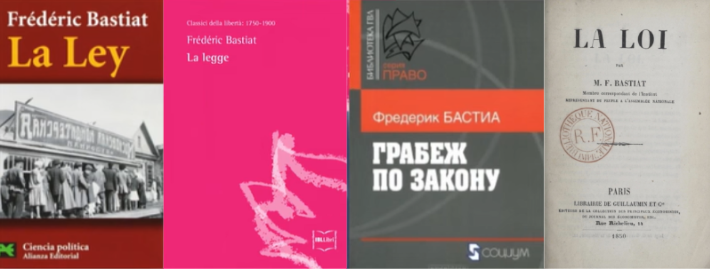
Hóa ra, sau Thế chiến thứ II, một trong những cuốn sách của ông đã được xuất bản tại Hoa Kỳ. Nó trở nên rất nổi tiếng, đến mức bản thân Ronald Reagan đã nói đó là cuốn sách yêu thích của mình, và cuốn sách nhỏ này có tên là "Luật pháp - The Law." Do đó, Bastiat trở thành một trong hai tác giả Pháp nổi tiếng nhất tại Hoa Kỳ, người kia cũng rất nổi tiếng ở Pháp, Alexis de Tocqueville.

_(Quảng trường thị trấn Mugron ở Landes, quê hương của Bastiat)_

Ông là một thiên tài không được công nhận nhưng cũng là một ngọn đèn cho thời đại của chúng ta. Thực vậy, Frédéric Bastiat, người sinh ra ở Bayonne, đầu tiên đã sống một phần cuộc đời mình ở Landes nơi ông quản lý một trang trại nông nghiệp mà ông được thừa kế và cuộc sống của ông được định hướng như một doanh nhân. Và rất sơm sau đó, ông bắt đầu quan tâm đến kinh tế, ông đã đi đến Anh, gặp gỡ Richard Cobden, người là một lãnh đạo của phong trào tự do thương mại. Bastiat bị cuốn hút bởi phong trào này, ông tin rằng tự do thương mại là giải pháp cho Pháp và sau đó ông quyết định nỗ lực lan truyền ý tưởng của mình ở Pháp. Ông đã viết các bài báo rất thành công và chuyển đến Paris để điều hành một tờ báo có tên là Journal des économistes.

Ông cũng là một triết gia và một nhà tư tưởng về xã hội, trật tự xã hội, công lý, luật pháp, một nhà tư tưởng về quyền. Và trong phạm vi đó, chúng ta có thể nói rằng Bastiat là một ngọn đèn cho thời đại của chúng ta. Và tôi muốn kết thúc với điều đó. Ông là một người đã cố gắng hiểu cơ chế hoạt động của thị trường chính trị. Tất nhiên, ông cũng là một người bảo vệ nền kinh tế thị trường, cho rằng cuối cùng thì nền kinh tế thị trường là cách tốt nhất để tạo ra sự giàu có. Nhưng bên cạnh đó, ông đã hiểu được cơ chế của thị trường chính trị, và đây lại là nơi mà ông không được công nhận.
Khi ông được bầu làm hạ nghị sĩ, đó là trong thời kỳ Cộng hòa Thứ hai, và từ thời điểm đó trở đi, chính những người dân đã tạo ra các luật pháp. Tại thời điểm đó, Bastiat đã chứng kiến hiện tượng lạm phát của luật pháp ở mọi hướng, bao gồm cả việc tạo ra các dịch vụ công, quyền xã hội, thuế, v.v.

Và ông nhận ra rằng, về cơ bản, không có gì thực sự thay đổi. Mọi người chiếm đoạt tài sản của người khác thông qua việc bỏ phiếu và luật pháp, điều mà ông gọi là cướp bóc hợp pháp. Hiện tượng cướp bóc hợp pháp này là trung tâm trong các công trình của ông, đặc biệt trong văn bản ngắn mà ông viết vào cuối đời, "The Law," nơi ông đặt cướp bóc hợp pháp đối lập với tài sản, quyền sở hữu tài sản. Ông chỉ ra rằng, về cơ bản, giải pháp thực sự cho vấn đề xã hội là tự do, đó là tự do về tài sản, tự do kiểm soát bản thân và tự do thụ hưởng thành quả lao động của mình.

Trong khóa học này, chúng ta sẽ cùng nhau khám phá tư tưởng của Frédéric Bastiat, bắt đầu từ ảnh hưởng của các tác giả đã định hình nên ông từ khi còn trẻ, sau đó chúng ta sẽ tìm hiểu về những nguỵ biện kinh tế của ông, và cuối cùng, chúng ta sẽ kết thúc với văn bản vĩ đại này, "The Law," thứ sẽ đưa chúng ta đến với phân tích về thị trường chính trị, để phân tích về xã hội.

## Cuộc đời và bối cảnh lịch sử

<chapterId>e9d92b63-83dd-552c-84e1-dd535608c109</chapterId>

Vào năm 1844, Frédéric Bastiat đã thực hiện một chuyến công tác đến Tây Ban Nha. Sau khi ở lại Madrid, Seville, Cadiz và Lisbon, ông quyết định lên đường đến Southampton và thăm Anh. Tại London, ông đã có cơ hội tham dự các cuộc họp của Liên đoàn Luật Chống Ngũ Cốc (Anti-Corn Law League), một tổ chức mà ông đã theo dõi công việc của họ từ xa. Ông gặp gỡ các nhà lãnh đạo chính của Hiệp hội này, bao gồm Richard Cobden, người sau này trở thành bạn của ông.

Chính tại đây, cuộc đời ông đã thay đổi một cách hoàn toàn. Chính ông kể lại rằng sự nghiệp làm kinh tế gia của mình đã được quyết định vào thời điểm đó. Khi trở về Pháp, ông chỉ có một ý tưởng trong đầu: làm cho nước Pháp nhận thức được về phong trào tự do đang nổi lên ở Anh.

Frédéric Bastiat sinh ngày 30 tháng 6 năm 1801 tại Bayonne. Mồ côi cha mẹ từ khi 9 tuổi, ông theo học tại trường Cao đẳng Công giáo Sorèze. Ông có năng khiếu về ngôn ngữ, học được tiếng Anh, tiếng Tây Ban Nha và cả tiếng Basque. Tuy nhiên, ông không hứng thú với việc học và quyết định không thi tú tài, thay vào đó là làm việc trong doanh nghiệp nhập khẩu-xuất khẩu của chú mình ở Bayonne.

Năm 1825, ông thừa kế một trang trại nông nghiệp từ ông nội, nơi mà ông quản lý như một "nông dân quý tộc," theo lời ông. Chính lúc đó, ông đã trực tiếp đối mặt với những vấn đề do thiếu một định nghĩa rõ ràng về quyền sở hữu. Ông quyết định trở thành một thẩm phán hòa bình tại thị trấn Mugron của mình, nằm ở trung tâm Landes, một điểm giao thương thương mại và sông nước giữa các cảng Bordeaux và Bayonne. Sau đó, ông được bầu làm thành viên Đại hội đồng của Landes.

Ông nhanh chóng phát triển niềm đam mê với kinh tế chính trị và nghiên cứu các tác phẩm của Adam Smith, Jean-Baptiste Say, Destutt de Tracy, Charles Dunoyer và Charles Comte. Ông đọc báo tiếng Anh, và chính tại đây, ông biết đến sự tồn tại của một liên đoàn ở Anh về thương mại tự do.

_(Say, Cobden, Smith, Chevalier, Dunoyer, Destutt de Tracy)_

Khi trở về từ Anh, ông đã viết một bài báo với tiêu đề: "Về ảnh hưởng của hàng rào thuế quan Anh và Pháp đối với tương lai của hai dân tộc - De l'influence des tarifs anglais et français sur l'avenir des deux peuples," mà ông gửi đến Journal des Économistes ở Paris. Bài báo xuất hiện trong số ra tháng 10 năm 1844, và nó là một thành công lớn. Mọi người ngưỡng mộ lập luận mạnh mẽ và sắc bén, phong cách trang nhã và thanh lịch của ông trong bài báo.

Journal des Économistes sau đó đã yêu cầu ông viết thêm nhiều bài báo, và một số thành viên của hiệp hội Kinh tế Chính trị (la Société d'économie politique) , đặc biệt là Horace Say, con trai của Jean-Baptiste Say, và Michel Chevalier, một giáo sư nổi tiếng, đã chúc mừng ông, khích lệ ông tiếp tục cùng họ trong công việc lan tỏa những chân lý kinh tế. Điều này đánh dấu bước ngoặt về một cuộc sống mới tại Paris của ông.

Đầu tiên, ông xuất bản loạt bài Những sai lầm về mặt kinh tế, trong đó ông dũng cảm tấn công chủ nghĩa bảo hộ với sự châm biếm. Tại Paris, ông thậm chí bắt đầu một khóa học về kinh tế chính trị trong một phòng riêng, được các sinh viên ưu tú tham dự nhiệt tình.

Năm sau, ông thành lập "Hiệp hội Thương mại Tự do" tại Pháp và lao vào cuộc chiến chống lại chủ nghĩa bảo hộ ở Pháp. Ông gây quỹ, tạo ra một tạp chí phát hành hàng tuần và tổ chức các bài giảng trên khắp đất nước.
Cuộc họp đầu tiên diễn ra tại Bordeaux vào ngày 23 tháng 2 năm 1846, ở đó Hội đồng Thương mại Tự do Bordeaux đã được thành lập. Rất nhanh sau đó, phong trào này lan rộng khắp nước Pháp. Tại Paris, một nhóm cốt lõi ban đầu đã được hình thành giữa các thành viên của Hiệp hội Kinh tế học, mà sau này các đại biểu, các nhà công nghiệp và thương nhân đã tham gia. Các nhóm có quy mô cũng được hình thành tại Marseille, Lyon và Le Havre.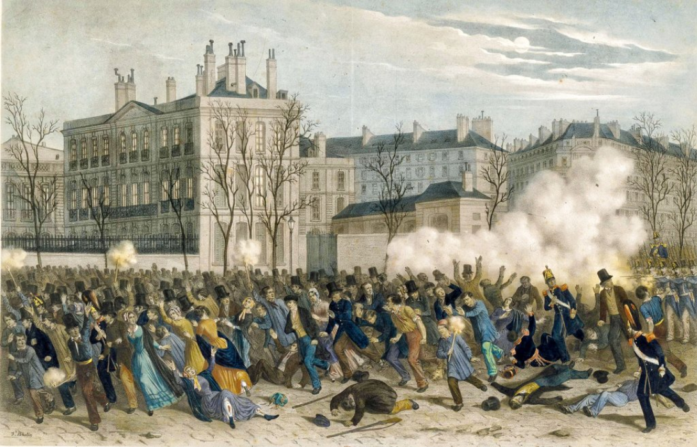

Cách mạng tháng Hai năm 1848 đã lật đổ chế độ quân chủ của Louis-Philippe, được biết đến với tên gọi Nền quân chủ tháng Bảy (1830-1848), và chứng kiến sự ra đời của Cộng hòa Thứ hai. Bastiat sau đó được bầu làm thành viên của hội đồng lập pháp với tư cách là đại biểu cho Landes. Ông ngồi ở trung tả, cùng với Alexis de Tocqueville, giữa các phe quân chủ và xã hội chủ nghĩa. Tại đây, ông đã nỗ lực bảo vệ các quyền tự do cá nhân như quyền tự do dân sự và phản đối mọi chính sách hạn chế, dù chúng đến từ cảnh hữu hay cánh tả. Ông được bầu làm phó chủ tịch Ủy ban Tài chính và không ngừng nhắc nhở các nghị sĩ đồng nghiệp về một sự thật đơn giản thường bị quên lãng trong quốc hội:

> Người ta không thể cho một số người một cái gì đó, bằng luật, mà không bắt buộc phải cướp nó từ người khác bằng một luật khác.

Hầu hết các sách và bài luận của ông đều được viết trong sáu năm cuối đời, từ 1844 đến 1850. Năm 1850, Bastiat đã viết hai trong số những tác phẩm nổi tiếng nhất của mình: "Luật Pháp - The Law" và một loạt các sách sách nhỏ với tựa đề "Những gì Được Thấy và Những gì Không được Thấy - What is Seen and What is Not Seen". Tác phẩm The Law đã được dịch ra nhiều ngôn ngữ nước ngoài, bao gồm tiếng Anh, Đức, Tây Ban Nha, Nga và Ý.

Ông qua đời tại Rome vào năm 1850, vì bệnh lao. Ông được chôn cất tại Nhà thờ Saint Louis des Français ở Rome.

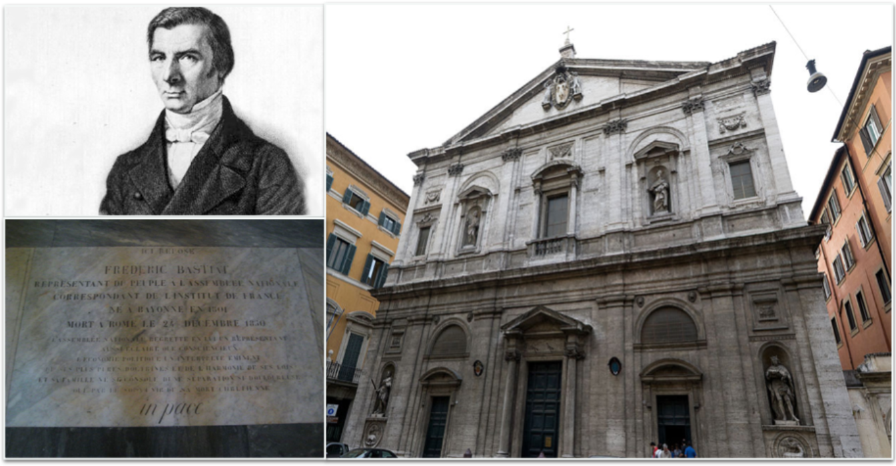

# Ảnh hưởng

<partId>4d312b17-5740-5d33-8309-015e2b59b6dd</partId>

## Adam Smith và Jean-Baptiste Say

<chapterId>bcc7a12a-6cc4-5061-85e3-0e31fb1f0a49</chapterId>

Trong lĩnh vực kinh tế, Bastiat luôn thừa nhận mình có món nợ với Adam Smith và Jean-Baptiste Say. Khi 26 tuổi, ông viết cho một người bạn của mình, "Tôi chưa bao giờ đọc về những chủ đề này ngoài bốn tác phẩm này, Smith, Say, Destutt và Censor."

_(Jean-Baptiste Say và Adam Smith)_
Kinh tế chính trị, như được Adam Smith và J.-B. Say vẽ ra, được tóm gọn trong một từ: tự do. Tự do thương mại, tự do cá nhân và tự do khởi xướng. Tự do thương mại lần đầu tiên được bảo vệ bởi các nhà kinh tế học, như François Quesnay và Vincent de Gournay, và sau đó bởi Adam Smith, người đã tổng hợp ý tưởng của họ với những quan sát của bản thân. Cuối cùng, vào cuối thế kỷ 18, Jean-Baptiste Say đã làm rõ và sửa đổi một số điểm trong học thuyết của thầy mình, Adam Smith, trong tác phẩm xuất sắc của mình về Kinh tế Chính trị.

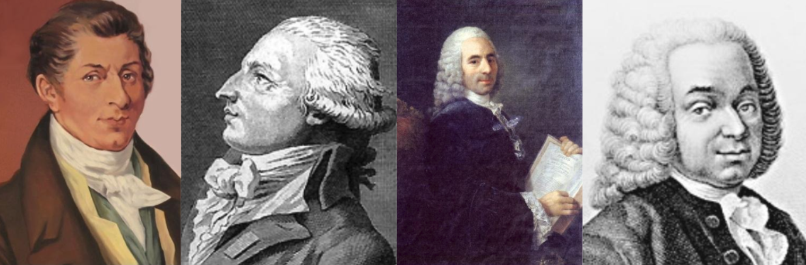

_(Say, Destutt de Tracy, Quesnay, de Gournay)_
Adam Smith quan tâm đến sự thịnh vượng, không phải là mục tiêu cuối cùng mà là phương tiện để nâng cao đạo đức của cá nhân. Đối với ông, sự giàu có của các quốc gia bao gồm sự giàu có của các cá nhân. Nếu bạn muốn một quốc gia thịnh vượng, Adam Smith nói, hãy để các cá nhân được tự do hành động. Và thị trường hoạt động vì nó cho phép mọi người thể hiện sự ưa thích và theo đuổi lợi ích của mình.

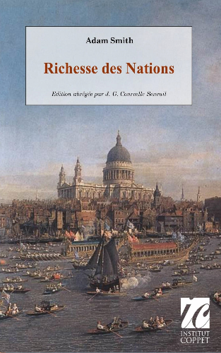

Tư tưởng mới mẻ lớn lao của các nhà kinh tế học hiện đại vào bình minh của thế kỷ 18 là họ quan tâm đến từng cá nhân với ý định trao trả lại khả năng hành động của họ trong khi suy nghĩ về cách kiềm chế đam mê và xung đột. Con người tự nhiên muốn cải thiện cuộc sống của mình và người thân thông qua việc trao đổi hàng hóa và dịch vụ.

Những gì Adam Smith chỉ ra là một người chỉ có thể phục vụ lợi ích của mình bằng cách phục vụ lợi ích của người khác.

> Hãy cho tôi những gì tôi cần, và bạn sẽ nhận được từ tôi những gì bạn cần. (...) Chúng ta không mong đợi bữa tối từ lòng tốt của người bán thịt, người nấu bia, hay người bán bánh mà từ sự quan tâm đến lợi ích của chính họ.

Trao đổi là một trò chơi có tổng dương. Những gì một người thu được, người kia cũng thu được. Do đó, nó khác biệt với tái phân phối bằng con đường chính trị nơi luôn có người thắng và người thua. Nếu chúng ta xem xét trường phái Kinh tế học Anh, đối với Smith, đối với Ricardo, và đối với Locke trước họ, giá trị gắn với lao động. Đối với Marx, cũng vậy.

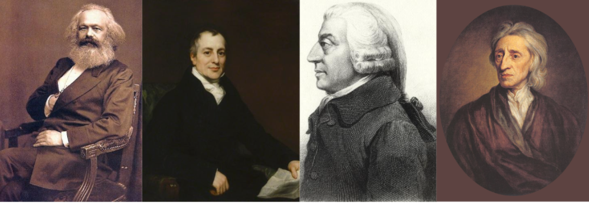

_(Marx, Ricardo, Smith, Locke)_

Mặt khác, Bastiat cùng với Jean-Baptiste Say thừa nhận rằng tiện ích là nền tảng thực sự của giá trị. Lao động không tạo ra giá trị. Sự khan hiếm cũng không. Mọi thứ đều xuất phát từ tiện ích. Thực vậy, không ai đồng ý trả tiền cho một dịch vụ trừ khi họ thấy nó hữu ích. Người ta chỉ sản xuất ra tiện ích.
Nhưng Bastiat cũng làm cho Say mềm mỏng hơn về điểm này. Đó không phải là tiện ích có trong vật thể, mà đó là tiện ích tương đối của các dịch vụ. "Giá trị là tỷ lệ của hai dịch vụ được trao đổi," theo lời của ông. Do đó, giá trị có tính chủ quan, và cách duy nhất để nắm bắt được sự ưa thích của một cá nhân là quan sát hành vi của họ trong một thị trường tự do. Thị trường tiết lộ sự ưa thích cá nhân và là kẻ điều phối vĩ đại của xã hội thông qua hoạt động mua bán, trao đổi.

Nền kinh tế tuân theo một số quy luật đơn giản xuất phát từ hành vi con người. Một trong số đó, được gọi là "Luật Say," như sau: "Các sản phẩm và dịch vụ được trao đổi cho các sản phẩm và dịch vụ." Ý tưởng của ông là các quốc gia và cá nhân được hưởng lợi từ việc tăng cấp độ sản xuất vì nó gia tăng cơ hội cho các giao dịch có lợi cho cả hai bên.

Thực vậy, sản phẩm chỉ được mua với kỳ vọng vào dịch vụ mà người mua mong đợi: Tôi mua một đĩa vì nhạc mà tôi sẽ nghe, tôi mua một vé xem phim vì bộ phim mà tôi sẽ xem. Và trong một giao dịch, mỗi bên quyết định xem liệu thứ mình nhận được có đáng giá hơn so với thứ mình định từ bỏ hay không. Trong bối cảnh này, tiền chỉ là một hàng hóa trung gian, nó bù đắp cho một dịch vụ đã được cung cấp và mở ra các dịch vụ khác.

Đối với Bastiat, nền kinh tế của các giao dịch, nơi các dịch vụ phục vụ lẫn nhau được tự do cung cấp và chấp nhận, là nền tảng cho hòa bình và thịnh vượng, cho phép sự hài hòa của lợi ích.

Nhưng từ Jean-Baptiste Say, Frédéric Bastiat cũng thừa hưởng một khái niệm chính, đó là của cải. Bởi, ông nói, nhắc lại lời của Say:

> Chỉ có hai cách để có được những thứ cần thiết cho việc bảo tồn, tô điểm, và cải thiện cuộc sống, đó là: sản xuất và cướp bóc.
Các nhà sản xuất thường sử dụng thuyết phục, đàm phán và hợp đồng, trong khi những kẻ cướp bóc lại sử dụng vũ lực và lừa dối. Do đó, nhiệm vụ của pháp luật là ngăn chặn việc cướp bóc và bảo vệ lao động cũng như tài sản. Như Adam Smith đã từng nói, việc đảm bảo an toàn cho công dân là sứ mệnh chính của cơ quan công quyền, và chính điều này biện minh cho việc thu thuế.

## Antoine Destutt de Tracy

<chapterId>ddf64e9f-2ce0-5651-8eb8-bae578eb0b9b</chapterId>

Ít người biết rằng, Destutt de Tracy đã có ảnh hưởng quyết định đến Tổng thống tương lai của Hoa Kỳ, Thomas Jefferson, khi ông làm đại sứ tại Paris vào những năm 1780.

> "Đối với mỗi người đàn ông, quê hương đầu tiên của anh ta là tổ quốc, và quê hương thứ hai là Pháp" & "Sự chuyên quyền bạo ngược ra đời khi người dân sợ chính phủ của họ; tự do có được là khi chính phủ sợ người dân."
>
> Thomas Jefferson

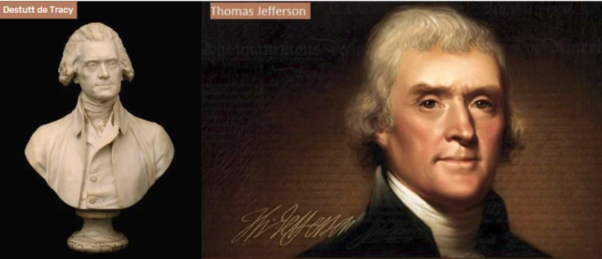

Thực sự, cuốn "Treatise on Political Economy - Chuyên luận về Kinh tế Chính trị" của ông đã lên án chủ nghĩa bảo hộ và sự mở rộng của Napoleon. Do đó, nó đã bị cấm xuất bản ở Pháp bởi Bonaparte. Tuy nhiên, nó đã được dịch sang tiếng Anh và xuất bản tại Hoa Kỳ bởi chính Jefferson. Ông đã biến công trình này thành sách giáo khoa kinh tế chính trị đầu tiên của Đại học Virginia, mà ông mới thành lập tại Charlottesville. Cuốn Treatise không được xuất bản ở Pháp mãi cho đến năm 1819!

Destutt de Tracy, một triết gia và nhà kinh tế học, là người đứng đầu trường phái "Ideologues", bao gồm những người như Cabanis, Condorcet, Constant, Daunou, Say và Germaine de Staël. Họ là người kế thừa của các Physiocrats và là đệ tử trực tiếp của Turgot.

Theo Tracy, ý thức hệ đơn giản là khoa học nghiên cứu về các ý tưởng, nguồn gốc của chúng, các quy luật của chúng, mối quan hệ của chúng với ngôn ngữ, tức là, theo thuật ngữ hiện đại hơn, là nhận thức luận. Thuật ngữ "ideology" không có ý nghĩa tiêu cực mà Marx sau này đã dùng để phê phán các nhà kinh tế của "laissez-faire". Tạp chí của phong trào ideologue được gọi là "La Décade philosophique et littéraire".

Tờ báo này đã chiếm ưu thế trong thời kỳ cách mạng và được điều hành bởi Jean-Baptiste Say. Destutt de Tracy được bầu làm thành viên của Học viện Pháp vào năm 1808 và của Học viện Khoa học Đạo đức và Chính trị vào năm 1832. Con gái ông đã kết hôn với Georges Washington de La Fayette (con trai của tổng thống Mỹ đầu tiên) vào năm 1802, điều này cho thấy mối quan hệ gần gũi vẫn còn tồn tại giữa Pháp và nước Mỹ trẻ trung vào thời điểm đó.

Mục đích của tác phẩm Chuyên luận về Kinh tế Chính trị của ông là "đánh giá cách tốt nhất để sử dụng tất cả các khả năng vật chất và trí tuệ của chúng ta để thỏa mãn các nhu cầu đa dạng của mình." Ý tưởng của ông là thương mại là nguồn gốc của mọi điều tốt lành cho con người; đó là lực lượng văn minh hóa, lý trí hóa, và hòa bình hóa của thế giới. Nguyên tắc lớn nhất của kinh tế chính trị được ông đề ra như sau: "thương mại là toàn bộ xã hội, cũng như lao động là toàn bộ của cải." Thực sự, ông coi xã hội như "một chuỗi liên tục của các giao dịch mà trong đó cả hai bên đều luôn có lợi." Do đó, thị trường là thứ ngược lại với việc cướp bóc. Nó làm giàu cho một số người mà không làm nghèo đi người khác. Như sẽ được nói sau, đó không phải là một "trò chơi tổng bằng không," mà là một trò chơi tổng dương.

Tác giả của chúng ta không đi xa đến mức định nghĩa kinh tế chính trị là khoa học về giao dịch. Nhưng lý lẽ này sẽ được Bastiat tiếp nhận và phát triển. Bán hàng là một sự trao đổi vật phẩm, cho thuê là một sự trao đổi dịch vụ, và cho vay chỉ đơn giản là một sự trao đổi được hoãn lại. Do đó, đối với Bastiat, kinh tế chính trị do đó trở thành "lý thuyết về giao dịch."

Theo Destutt de Tracy, tài sản chắc chắn phát sinh từ bản chất của chúng ta, từ mong muốn của chúng ta. Nếu con người không muốn bất cứ điều gì, anh ta sẽ không có quyền hay nghĩa vụ nào cả. Để đáp ứng nhu cầu và thực hiện nghĩa vụ của mình, con người phải sử dụng các phương tiện mà anh ta có được thông qua lao động của mình. Và hình thức tổ chức xã hội phù hợp với mục tiêu này là tư hữu. Đó là lý do tại sao mục tiêu duy nhất của chính phủ là bảo vệ quyền tài sản và cho phép trao đổi chúng một cách hòa bình.

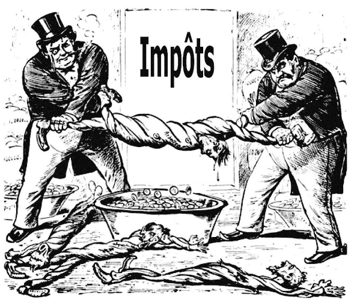

Đối với ông, thuế tốt nhất là thuế vừa phải nhất, và ông mong muốn chi tiêu của nhà nước được hạn chế nhất có thể. Ông lên án việc chính phủ cướp bóc tài sản của xã hội dưới hình thức nợ công, thuế, độc quyền ngân hàng, và chi tiêu. Một lần nữa, luật pháp chỉ nên phục vụ để bảo vệ tự do; nó không bao giờ nên được dùng để cướp bóc.

Cuối cùng, ông thêm vào khuyến nghị này, mà không mất đi tính hợp lý của nó:

> Hãy để chính phủ không tạo ra và không thể tạo ra nợ, vì nó phá huỷ các các thế hệ tương lai và luôn dẫn các quốc gia đến sự suy tàn.

Kết luận, Ideologues đã có một trực giác sâu sắc, đó là sản xuất và giao dịch là giải pháp thực sự cho các vấn đề chính trị và là lựa chọn thực sự thay thế cho chiến tranh. Chiến tranh luôn là hành động cướp bóc, dù là nội bộ, như trong Cách mạng, hay bên ngoài, như những cuộc chiến do các ông vua cổ đại và Napoleon tiến hành.

## Charles Comte và Charles Dunoyer

<chapterId>80bc5c4e-ac07-52c8-9dd7-e224ac291bda</chapterId>

Lịch sử của tất cả các nền văn minh là câu chuyện về cuộc đấu tranh giữa các tầng lớp cướp bóc và các tầng lớp sản xuất. Đây là tín điều của hai tác giả mà chúng ta sẽ thảo luận. Họ là người sáng lập một lý thuyết tự do về đấu tranh giai cấp đã truyền cảm hứng cho Frédéric Bastiat cũng như Karl Marx, mặc dù người sau đã bóp méo nó.

Đối với Comte và Dunoyer, cướp bóc, nghĩa là tất cả các hình thức bạo lực được thực hiện trong xã hội bởi kẻ mạnh lên người yếu, là chìa khóa lớn để hiểu lịch sử loài người. Đó là nguồn gốc của tất cả các hiện tượng bóc lột một giai cấp bởi một giai cấp khác.

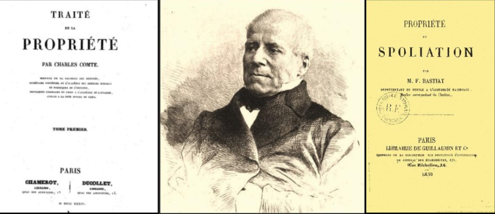
Nếu Frédéric Bastiat nhận được giáo dục về kinh tế từ Smith, Destutt de Tracy và Say, thì ông nhận được giáo dục về chính trị từ các lãnh đạo của tạp chí Le Censeur, Charles Comte và Charles Dunoyer.
Tạp chí này (1814-1819), được đổi tên thành Le Censeur européen sau sự kiện Cent Jours - Hundred Days, đã phổ biến các ý tưởng tự do, những ý tưởng đã dành chiến thắng vào năm 1830 với cuộc nổi dậy của "3 Glorieuses - Three Glorious Days - Ba ngày vẻ vang" và sự lên nắm quyền của Công tước Orléans, Louis-Philippe I.

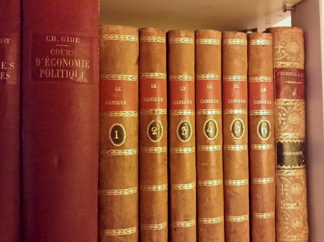

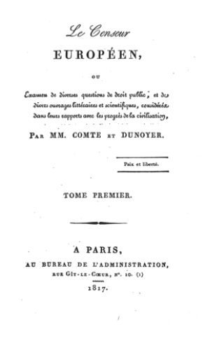

Charles Comte, họ hàng của Auguste Comte và là con rể của Say, là người sáng lập tạp chí. Ông sớm được Charles Dunoyer, một luật sư như ông, và sau đó là một nhà sử học trẻ, Augustin Thierry, cựu thư ký của Saint Simon, gia nhập. Phương châm của họ được ghi trên trang đầu của mỗi số tạp chí là "Hòa bình và Tự do".

Mục tiêu của tạp chí là gì? Tiêu đề đã nói lên tất cả: để kiểm duyệt chính phủ. Để chống lại sự chuyên quyền của quyền lực bằng cách soi sáng dư luận, bảo vệ tự do báo chí.

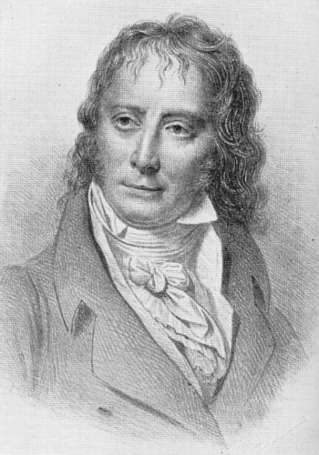

_(Benjamin Constant)_

Họ kế thừa từ Benjamin Constant sự phân biệt giữa Người cổ đại và Người hiện đại, được đặc trưng một mặt bởi chiến tranh, và mặt khác bởi thương mại và công nghiệp. Nhưng họ thêm vào so với Say rằng kinh tế học chính trị mang đến sự giải thích tốt nhất về các hiện tượng xã hội. Họ đặc biệt hiểu rằng các quốc gia đạt được hòa bình và thịnh vượng khi quyền sở hữu và tự do thương mại được tôn trọng. Từ đây, đối với họ, kinh tế học chính trị là nền tảng thực sự và duy nhất của chính trị. Triết học, chỉ giới hạn trong việc phê bình trừu tượng các hình thức chính phủ, phải được thay thế bằng một lý thuyết dựa trên kiến thức về lợi ích kinh tế.
Kinh tế học chính trị, bằng cách chứng minh cách thức các dân tộc phồn thịnh và suy tàn, đã đặt nền móng thực sự cho chính trị.

> Dunoyer

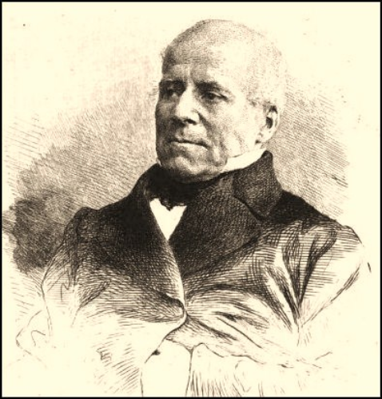

Lý thuyết xã hội mới này chứa đựng một trong những yếu tố sẽ trở thành nền tảng của chủ nghĩa xã hội khoa học của Marx và Engels: cuộc đấu tranh giai cấp. Nhưng lý thuyết tự do về cuộc đấu tranh giai cấp bao gồm những gì, và nó khác biệt với chủ nghĩa Marx như thế nào?

Nó bắt đầu với cá nhân, người hành động để đáp ứng nhu cầu và mong muốn của mình. Từ thời điểm một người tạo ra, tức là tăng tính hữu ích của vật phẩm, nâng cao giá trị của chúng, người đó tham gia vào ngành công nghiệp. Tại đây, một nhà công nghiệp không phải là chủ sở hữu của một ngành công nghiệp, như ngôn ngữ hiện tại có thể gợi ý, mà là một nhà sản xuất, bất kể lĩnh vực họ làm việc. Đó là lý do tại sao lý thuyết của họ được gọi là chủ nghĩa công nghiệp. Nó cho rằng, theo nghĩa rộng, mục tiêu của xã hội là sự tạo ra tính hữu ích, tức là hàng hóa và dịch vụ hữu ích cho con người.

Tại điểm này, các cá nhân đối mặt với hai lựa chọn cơ bản: họ có thể cướp bóc của cải do người khác sản xuất, hoặc họ có thể làm việc để tự sản xuất ra của cải cho chính mình. Trong bất kỳ xã hội nào, người ta có thể phân biệt rõ ràng những người sống bằng cách cướp bóc từ những người sống bằng cách sản xuất. Dưới chế độ Ancien Régime, quý tộc trực tiếp tấn công những người siêng năng nhất để sống nhờ vào một hình thức cống nạp mới: thuế. Quý tộc háu ăn được kế thừa bởi đám quan liêu, không kém phần háu ăn.

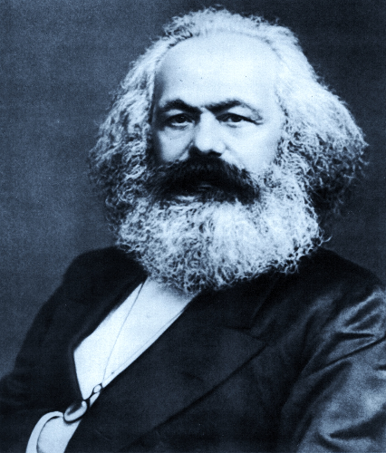
Trong khi đối với Marx, mâu thuẫn giai cấp nằm ngay trong hoạt động sản xuất, giữa người lao động và chủ nhân, thì đối với Comte và Dunoyer, các giai cấp xung đột, một bên là những người sản xuất của xã hội, những người đóng thuế (bao gồm các nhà tư bản, công nhân, nông dân, học giả, v.v.) và mặt khác, những người không sản xuất, sống nhờ vào thu nhập từ thuế, "lớp người nhàn rỗi và tiêu thụ" (các quan chức, viên chức, chính trị gia, người hưởng trợ cấp hoặc bảo hộ).

Sau đó, không giống như Marx, các tác giả của Censeur Européen không ủng hộ chiến tranh giai cấp. Thay vào đó, họ vận động cho hòa bình xã hội. Và theo họ, điều này chỉ có thể đạt được thông qua việc phi chính trị hóa xã hội. Để làm được điều này, điều quan trọng đầu tiên là giảm bớt uy tín và lợi ích của các công chức. Sau đó, điều quan trọng là phải trao quyền để những người sản xuất có tiếng nói ảnh hưởng trong thể chế chính trị.

Cuối cùng, cách duy nhất để loại bỏ sự bóc lột của một giai cấp bởi giai cấp khác là phá hủy chính cơ chế làm cho sự bóc lột này trở nên khả thi: quyền lực của Nhà nước trong việc phân phối và kiểm soát tài sản và việc phân bổ các lợi ích liên quan đến nó ("các vị trí chức vụ").

Những ý tưởng của họ, cực kỳ đổi mới, sẽ mãi mãi ảnh hưởng tới Frédéric Bastiat, người sau này sẽ trở thành một nhà tư tưởng sâu sắc về các khủng hoảng chính trị.

## Cobden và Liên đoàn của ông

<chapterId>7181435c-5eae-56e4-8e55-02a24273fdd6</chapterId>

Năm 1838, tại Manchester, một nhóm nhỏ những người đàn ông, ít được biết đến cho đến thời điểm đó, tập hợp lại để tìm cách lật đổ sự độc quyền của các chủ đất lúa mì thông qua phương tiện pháp lý để đạt được, như Bastiat sau này kể lại,

> Không cần đến máu, chỉ bằng sức mạnh của quan điểm, một cuộc cách mạng sâu sắc, có lẽ còn sâu sắc hơn cuộc cách mạng mà cha ông chúng ta đã thực hiện vào năm 1789.

Từ cuộc họp này Liên đoàn chống lại luật ngũ cốc đã nổi lên, hoặc luật lúa mì, như Bastiat gọi chúng. Nhưng rất nhanh, mục tiêu này đã trở thành mục tiêu của việc bãi bỏ một cách toàn diện và đơn phương chủ nghĩa bảo hộ.

Cuộc chiến kinh tế cho thương mại tự do đã chiếm lĩnh toàn bộ nước Anh cho đến năm 1846. Tại Pháp, ngoại trừ một số ít, sự tồn tại của phong trào lớn này hoàn toàn không được biết đến. Chính bằng cách đọc một tờ báo tiếng Anh tình cờ đăng ký, Frédéric Bastiat đã biết về sự tồn tại của Liên đoàn vào năm 1843. Đầy hứng khởi, ông đã dịch các bài phát biểu của Cobden, Fox và Bright. Sau đó ông đã liên lạc với Cobden và cuối cùng, vào năm 1845, ông đã đến London để tham dự các mít tinh khổng lồ của Liên đoàn.

Đó là chiến dịch khuấy động cho thương mại tự do, trải dài khắp vương quốc, với hàng chục nghìn thành viên, đã làm cho ngòi bút của Bastiat bùng cháy và thay đổi hoàn toàn và mãi mãi con đường cuộc đời của ông.

Liên đoàn có thể được so sánh với một trường đại học lưu động, giáo dục về kinh tế cho những người tham dự các cuộc mít tinh của mình trên khắp đất nước - những người dân thường, các nhà công nghiệp, người trồng trọt và nông dân, tất cả những người mà Liên minh đã đưa vào dưới sự bảo trợ của mình và những người bị luật ngũ cốc áp bức. Richard Cobden là linh hồn của phong trào và là một nhà khuấy động quần chúng xuất sắc.
Một diễn giả hấp dẫn và đáng gờm, ông có một khả năng phi thường trong việc sáng tạo ra những cụm từ độc đáo và súc tích, xa rời những bài diễn thuyết trừu tượng của các nhà kinh tế học.

> "Độc quyền bánh mì là gì?" ông thốt lên. "Đó chính là sự khan hiếm của bánh mì. Bạn sẽ ngạc nhiên khi biết rằng, pháp luật của đất nước này không có mục đích nào khác ngoài việc tạo ra sự khan hiếm nhất có thể đối với bánh mì. Và không phải là thứ gì khác. Pháp luật chỉ có thể đạt được mục tiêu của mình thông qua sự khan hiếm."

Vào năm 1845, Bastiat đã xuất bản cuốn sách "Cobden và Liên đoàn" tại Paris, với những bản dịch kèm theo nhận xét của mình. Cuốn sách mở đầu với một lời giới thiệu về tình hình kinh tế của Anh, về lịch sử nguồn gốc và tiến trình phát triển của Liên đoàn. Kể từ năm 1815, chủ nghĩa bảo hộ đã phát triển mạnh mẽ ở Anh. Cụ thể là, có những luật lệ hạn chế nhập khẩu ngũ cốc đã gây ra những hậu quả nghiêm trọng cho người dân. Thực sự, lúa mì là cần thiết cho việc làm bánh mì, một mặt hàng thiết yếu vào thời điểm đó. Hơn nữa, hệ thống này đã ưu ái cho tầng lớp quý tộc, tức là những chủ đất lớn, những người thu được tiền thuê từ đó.

> "Điều gì đàng đồng tồn tại ở Anh," Bastiat viết, "đó là một số lượng nhỏ những kẻ cướp bóc và một số lượng lớn những người bị cướp bóc, và không cần phải là một nhà kinh tế học vĩ đại để biết được sự giàu có của nhóm trước và sự khốn khổ của nhóm sau."

Mục tiêu của Liên đoàn là vận động dư luận để gây áp lực lên quốc hội nhằm bãi bỏ luật ngũ cốc. Về lâu dài, Cobden và các bạn của mình hy vọng sẽ:

- Tăng cường các ngành công nghiệp
- Tăng cường việc làm
- Giảm giá bánh mì
- Làm cho nông nghiệp và công nghiệp hiệu quả hơn thông qua cạnh tranh
- Thúc đẩy hòa bình giữa các quốc gia

_(Jeremy Bentham)_

Là một môn đồ của thuyết vị lợi của Bentham, niềm tin của Cobden là tự do lao động và thương mại trực tiếp phục vụ lợi ích của số đông, những người nghèo nhất và đau khổ nhất trong xã hội. Ngược lại, thuế quan như một công cụ của các lệnh cấm và đặc quyền tùy tiện chỉ có thể mang lại lợi ích cho một số ngành công nghiệp mạnh mẽ nhất.

Trong cuộc bầu cử năm 1841, năm thành viên của Liên đoàn, bao gồm Cobden, đã được bầu vào quốc hội. Vào ngày 26 tháng 5 năm 1846, tự do thương mại trở thành luật của vương quốc. Từ đó, Vương quốc Anh đã trải qua một thời kỳ tự do và thịnh vượng rực rỡ.
Điều thú vị là Bastiat đã tiếp thu một phần phương pháp của họ; ông đã tiếp thu ngôn ngữ của họ và chuyển đổi nó vào bối cảnh nước Pháp. Cuốn sách về Cobden và Liên đoàn nhanh chóng trở thành một thành công, và Bastiat đã tạo ra một bước ngoặt ngoạn mục vào thế giới của các nhà kinh tế học. Ông đã thành lập một hiệp hội ủng hộ tự do thương mại tại Bordeaux sau đó chuyển nó đến Paris. Ông được mời làm lãnh đạo của Journal des Économistes. Phong trào ủng hộ tự do thương mại đã được sinh ra, và nó tiếp tục cho đến năm 1848.
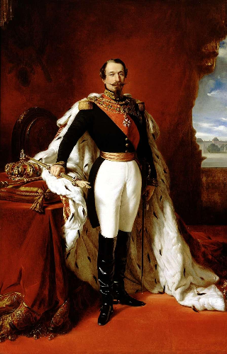

Chỉ sau cái chết của Bastiat, vào năm 1866, Napoleon III mới ký kết một hiệp định tự do thương mại với Anh, một loại chiến thắng "muộn màng" (chỉ đạt được khá lâu sau khi ông đã qua đời) cho người đã dành sáu năm cuối cùng của cuộc đời ngắn ngủi cho ý tưởng vĩ đại này.

_(Michel Chevalier)_
Ngày nay, vấn đề về tự do thương mại vẫn tiếp tục là một chủ đề có liên quan. Sách giáo khoa địa lý ở các trường học cho rằng toàn cầu hóa là nguyên nhân gây ra sự nghèo đói và các quốc gia nghèo cần có sự giúp đỡ từ phương Tây để tồn tại. Tuy nhiên, tình trạng cực kỳ nghèo đói đã giảm một nửa trong 20 năm. Bằng cách chọn mở cửa, các quốc gia như Ấn Độ, Trung Quốc, hay Đài Loan đã có thể thoát khỏi nghèo đói, trong khi sự trì trệ đặc trưng cho các quốc gia đóng cửa như Bắc Triều Tiên hay Venezuela. Theo Liên hợp quốc, 36% nhân loại sống trong cảnh cùng cực vào năm 1990. Con số này giờ đây chỉ còn "chỉ" 18% vào năm 2010. Tình trạng cực kỳ nghèo đói vẫn là một thách thức lớn, nhưng nó đang thuyên giảm.

# Những tư tưởng đối lập

<partId>f902ed30-269e-5e44-a76d-8efd1a4e4085</partId>

## Rousseau

<chapterId>c3926110-e0b2-503c-96d9-5d3a6a661484</chapterId>

Frédéric Bastiat, người đã bày tỏ quan điểm vào những năm 1840, là người kế thừa một thế hệ các triết gia của Thời kỳ Khai sáng đã chiến đấu chống lại kiểm duyệt và vì tự do ngôn luận. Hãy nghĩ về Montesquieu, Diderot, Voltaire, Condorcet, nhưng cũng không thể không nhắc đến Rousseau.

Đối với họ, ý tưởng rất đơn giản: càng nhiều ý tưởng được phép bày tỏ, sự thật càng tiến bộ và lỗi lầm càng dễ bị bác bỏ. Khoa học luôn tiến bộ theo cách này.

_(Montesquieu, Diderot, Voltaire, Condorcet, Rousseau)_
Ngược lại, ít người hiểu rằng điều đúng với ý tưởng cũng đúng với hàng hóa và dịch vụ. Tự do buôn bán với người khác thực sự có hai đức tính: hiệu quả và dẫn đến sự phân phối công bằng. Không chỉ Rousseau không hiểu điều này, mà ông còn chiến đấu chống lại tự do này với một ý niệm sai lầm về luật pháp và quyền. Một trong những nguồn gốc chính của chủ nghĩa xã hội, Bastiat lưu ý, là quan điểm của Rousseau rằng toàn bộ trật tự xã hội bắt nguồn từ luật pháp.

Bastiat thực sự coi Rousseau là tiền thân thực sự của chủ nghĩa xã hội và chủ nghĩa tập thể. Trong tác giả của "Khế ước xã hội", có một câu nói tóm tắt khá tốt triết lý của ông: "chúng ta chỉ bắt đầu trở thành con người sau khi đã trở thành công dân."

Ban đầu, một người đàn ông chỉ là một người thuộc giai cấp tư sản. Nhưng ông ấy là một người tính toán; ông ta muốn niềm vui tức thì, ông ta bị nô lệ bởi giác quan, bởi dục vọng, bởi lợi ích cá nhân. Nói ngắn gọn, ông ta không hợp lý, do đó ông ta không tự do. Ông ta cần được giáo dục, để hiểu rằng lợi ích thực sự của mình là lợi ích chung. Đó là lý do tại sao Rousseau đã viết trong "Khế ước xã hội":

> Bất kỳ ai từ chối tuân theo ý chí chung sẽ bị cưỡng bách bởi toàn bộ: điều này không có nghĩa là gì khác ngoài việc họ sẽ được buộc phải tự do.

Theo học thuyết này, con người có hai ý chí bên trong mình: một ý chí hướng về lợi ích cá nhân, đó là của người thuộc giai cấp tư sản, và một ý chí hướng về lợi ích chung, đó là của công dân. Dẫn dắt con người, thậm chí bằng vũ lực, để muốn một mục tiêu hợp lý, lợi ích chung, là dẫn dắt họ trở nên tự do. Điều họ thực sự muốn là một mục tiêu hợp lý, ngay cả khi họ không biết điều đó.
Vì vậy, theo Rousseau, hoàn toàn hợp lý khi hạn chế con người vì một mục tiêu mà chính họ, nếu được khai sáng hơn, sẽ theo đuổi, nhưng họ không theo đuổi vì họ mù quáng, ngu dốt, hoặc tham nhũng. Xã hội được thành lập để buộc họ làm những gì họ nên tự nguyện mong muốn nếu họ được khai sáng. Và bằng cách làm như vậy, người ta không hành động bạo lực với họ vì người ta dẫn dắt họ trở nên "tự do," tức là, làm những lựa chọn đúng đắn, những lựa chọn phù hợp với bản thân thực sự của họ.

Tin rằng xã hội tốt được tạo ra bởi luật pháp, Rousseau do đó trao quyền lực không giới hạn cho người lập pháp. Nhiệm vụ của họ là biến các cá nhân thành con người hoàn thiện, thành công dân.
Nhưng, cũng là nhiệm vụ của luật pháp để tạo ra sự tồn tại của tài sản. Theo Rousseau, tài sản chỉ có thể hợp pháp nếu nó được người làm luật quy định. Thực vậy, cái ác nằm ở sự bất bình đẳng và nô lệ, cả hai đều bắt nguồn từ tài sản. Đó là phát minh của những người mạnh mẽ đã dẫn đến xã hội xấu, xã hội tư bản, đến các mối quan hệ thống trị. Trong "Bài nói về nguồn gốc và nền tảng của sự bất bình đẳng," ông viết đoạn nổi tiếng này:

> Người đầu tiên, sau khi đã rào một mảnh đất, nói: Đây là của tôi, và tìm thấy những người đủ ngây thơ để tin ông ta, chính là người sáng lập ra xã hội dân sự thực sự. Biết bao tội ác, chiến tranh, giết chóc, bao nhiêu đau khổ và kinh hoàng sẽ được nhân loại tránh khỏi nếu người đó, đã nhổ bỏ cọc hoặc lấp đầy hào, và hét lên với đồng loại: "Cẩn thận khi nghe lời kẻ lừa đảo này; bạn sẽ lạc lối nếu quên rằng trái cây thuộc về tất cả mọi người và trái đất không thuộc về ai!"

Vì vậy, tài sản tự nhiên là nguồn gốc của cái ác. Và Marx, một người đọc kỹ lưỡng Rousseau, sẽ nhớ điều này. Làm thế nào để chống lại cái ác này? Thông qua khế ước xã hội, Rousseau trả lời. Thực sự, xã hội tốt là một xã hội được hình thành từ một khế ước quy định sự tự nguyện từ bỏ cá nhân với tất cả quyền của mình cho cộng đồng. Từ đó, cộng đồng có trách nhiệm trao quyền cho cá nhân thông qua luật pháp.

Trái ngược với Rousseau, Frédéric Bastiat nói rằng "con người sinh ra đã là chủ nhân của tài sản." Đối với ông, tài sản là hậu quả cần thiết của bản chất con người, của sự hình thành nên họ. Ông viết rằng "con người sinh ra là chủ nhân của tài sản, bởi vì anh ta sinh ra với những nhu cầu mà việc thỏa mãn chúng là không thể thiếu cho cuộc sống, với các cơ quan thuộc thân thể và năng lực của mình mà việc sử dụng chúng là không thể thiếu để thỏa mãn những nhu cầu đó". Nhưng năng lực chỉ là sự mở rộng của con người, và tài sản chỉ là sự mở rộng của năng lực. Nói cách khác, việc sử dụng năng lực của chúng ta trong công việc sẽ chính đáng hóa tài sản.

Theo Bastiat, xã hội, con người, và tài sản tồn tại trước luật pháp, và ông có câu nổi tiếng: "Không phải vì có luật pháp mà có tài sản, mà vì có tài sản nên mới có luật pháp". Đó là lý do tại sao luật pháp phải mang tính tiêu cực: nó phải ngăn chặn sự xâm phạm đối với con người và tài sản của họ. Tài sản là lý do tồn tại của luật pháp và không phải ngược lại.

## Giáo dục cổ điển

<chapterId>87d9a8c9-2352-5cb2-8b93-678118a8145c</chapterId>

Vào ngày 24 tháng 2 năm 1848, sau ba ngày bạo loạn ở Paris, Vua Louis-Philippe I đã thoái vị. Điều này đánh dấu sự ra đời của nền Cộng hòa Thứ hai.
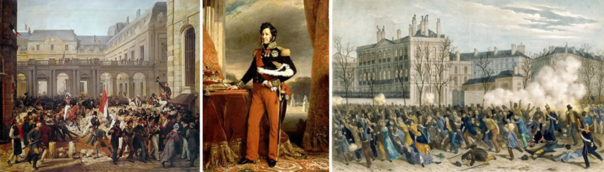

Bastiat đã ở Paris, chứng kiến các sự kiện diễn ra trước mắt. Sau này, ông sẽ viết:

> Vào ngày 24 tháng 2, tôi, giống như nhiều người khác, lo sợ rằng quốc gia chưa sẵn sàng để tự quản lý mình. Tôi phải thừa nhận, tôi e ngại sự ảnh hưởng của các ý tưởng Hy Lạp và La Mã được áp đặt lên chúng ta bởi độc quyền học thuật.

Đoạn văn này gây ngạc nhiên. Các nền văn minh Hy Lạp và La Mã có liên quan gì đến nó?

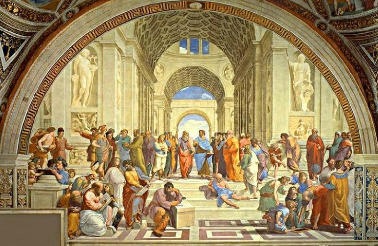

Bastiat đề cập đến "Cộng hòa" của Plato và lý thuyết của "vị vua triết học", nhưng cũng đề cập đến Sparta, nơi mà Rousseau rất ngưỡng mộ, đến Đế chế La Mã, nơi mà Napoleon rất lưu luyến. Thật không may, theo Bastiat, những ý tưởng Hy Lạp và La Mã này dựa trên một tiền đề sai lầm: ý tưởng về sự toàn năng của người làm luật, về chủ quyền tuyệt đối của luật pháp.

Chỉ cần mở ngẫu nhiên bất kỳ cuốn sách nào về triết học, chính trị, hoặc lịch sử để thấy rằng ý tưởng này đã ăn sâu vào văn hóa của chúng ta, rằng nhân loại là một vật chất trơ nhận sự sống, tổ chức, đạo đức, và thịnh vượng từ quyền lực chính trị. Để mặc nó, nhân loại sẽ hướng tới sự hỗn loạn và chỉ được cứu khỏi thảm họa này bởi bàn tay bí ẩn và toàn năng của Nhà lập pháp. Tuy nhiên, Bastiat nói, ý tưởng này đã được ươm mầm và chuẩn bị qua hàng thế kỷ của giáo dục cổ điển.

Đầu tiên, ông nói, người La Mã coi tài sản là một sự thực theo quy ước thuần tuý, là một sáng tạo mang tính nhân tạo của luật thành văn. Tại sao? Đơn giản, Bastiat giải thích, vì họ sống nhờ vào nô lệ và cướp bóc. Đối với họ, tất cả tài sản đều là kết quả của việc cướp bóc. Do đó, họ không thể đưa vào hoạt động lập pháp ý tưởng rằng nền tảng của tài sản hợp pháp là lao động mà không phá hủy nền tảng xã hội của họ, một xã hội dựa trên cướp bóc.
Họ thực sự có một định nghĩa thực nghiệm về tài sản, "jus utendi et abutendi" (quyền sử dụng và lạm dụng). Tuy nhiên, định nghĩa này chỉ liên quan đến hậu quả và không phải nguyên nhân, nói cách khác, nguồn gốc đạo đức của tài sản. Để thiết lập đúng đắn tài sản, người ta phải quay trở lại với chính sự hình thành và cấu trúc của con người, và hiểu mối quan hệ và liên kết cần thiết tồn tại giữa nhu cầu, năng lực, lao động, và tài sản. Người La Mã, những người chủ nô lệ, liệu họ có thể hình dung ra ý tưởng rằng "mỗi người tự sở hữu bản thân mình, và do đó là lao động của mình, và, do đó, sản phẩm từ lao động của mình"? Bastiat tự hỏi.

> Do đó, chúng ta đừng ngạc nhiên, Bastiat kết luận, khi thấy ý tưởng từ thời La Mã rằng tài sản là một sự thực theo quy ước và do cơ quan lập pháp quy định tái xuất hiện trong thế kỷ 18; rằng, đi trật khỏi ý tưởng luật pháp là hệ quả của tài sản, và rằng chính tài sản mới là hệ quả của luật pháp.

Thực sự, Rousseau chia sẻ ý tưởng pháp lý chung này về việc dựa tài sản vào luật pháp. Rousseau gán cho luật pháp, và do đó cho nhân dân, quyền lực tuyệt đối đối với các cá nhân và tài sản.

Và theo quan điểm này, điều làm nên chính ý tưởng của cộng hòa kể từ Cách mạng Pháp, người lập pháp phải tổ chức xã hội, như một kiến trúc sư xã hội, như một kỹ sư chế tạo máy móc từ vật chất trơ, hoặc như một người làm gốm nặn hình đất sét. Như vậy, người lập pháp đặt mình ngoài lề nhân loại, ở phía trên, cao hơn, để sắp xếp nó theo ý muốn, theo các kế hoạch được tưởng tượng bởi trí tuệ sáng chói của mình.

Ngược lại, đối với Bastiat, quyền sở hữu là thứ có trước luật pháp. Đây là điều ông gọi là nguyên tắc của các nhà kinh tế học, trái ngược với nguyên tắc của các nhà luật học. Trong khi "nguyên tắc của nhà luật học thực chất chứa đựng tư tưởng nô lệ", Bastiat nói, "thì nguyên tắc của nhà kinh tế học chứa đựng tư tưởng tự do.

Vậy tự do là gì? Đó là quyền sở hữu, quyền được hưởng thành quả của công sức lao động, quyền được làm việc, phát triển, sử dụng khả năng của bản thân theo cách mình muốn, mà không có sự can thiệp nào của Nhà nước ngoài hành động bảo vệ những quyền đó.

Thật buồn khi nghĩ rằng triết lý xã hội và chính trị của chúng ta vẫn bị mắc kẹt ở ý tưởng rằng giải pháp cho tất cả các vấn đề của chúng ta phải đến từ trên cao, từ luật pháp, từ Nhà nước. Nhưng điều này có thể giải thích được. Những ý tưởng này được tiêm nhiễm hàng ngày vào thanh niên trong các trường học và đại học, thông qua độc quyền giáo dục.

Tuy nhiên, như Bastiat nhắc nhở chúng ta, độc quyền ngăn chặn tiến bộ.

## Chủ nghĩa bảo hộ và Chủ nghĩa xã hội

<chapterId>ce6cb8a8-7dc9-5ef7-939d-9a559b4d2c74</chapterId>

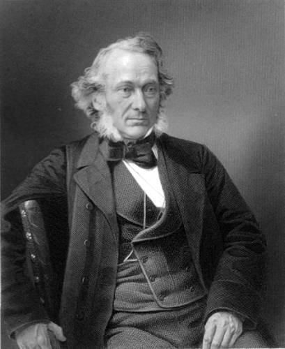

_(Richard Cobden)_

Như chúng ta đã thấy, trước hết và quan trọng nhất, cuộc chiến chống lại chủ nghĩa bảo hộ của Cobden với Liên đoàn Anh về việc bãi bỏ Luật Ngũ Cốc đã dẫn dắt Bastiat viết bài và sau đó là sách.

Chủ nghĩa bảo hộ, thực tế, là một hình thức của chủ nghĩa dân tộc về kinh tế. Nó nhằm loại bỏ sự cạnh tranh từ nước ngoài trong khi giả vờ "bảo vệ lợi ích quốc gia." Họ sau đó cố gắng thuyết phục các cơ quan công quyền chấp nhận một loạt những điều giả dối hoàn toàn mị dân, được trình bày như là đức hạnh: bảo vệ việc làm, năng lực cạnh tranh, v.v. Dĩ nhiên, các quan chức được bầu chọn nhượng bộ trước áp lực của các nhà sản xuất, bởi vì đó là cơ hội vàng để họ củng cố "khách hàng" và mở rộng quyền lực của mình.

Lập luận về bảo vệ việc làm là điều Bastiat gọi là một quan điểm sai lầm. Bởi vì thực tế, nó tương đương với một loại thuế. Nó có tác dụng làm cho sản phẩm trở nên đắt đỏ hơn. Hãy lấy ví dụ do chính Bastiat đưa ra.

Hãy tưởng tượng một con dao của Anh bán ở nước ta với giá 2 franc, và một con dao sản xuất tại Pháp có giá 3 franc. Nếu chúng ta để người tiêu dùng tự do mua con dao mà họ muốn, họ tiết kiệm được một franc, mà họ có thể đầu tư vào nơi khác (một cuốn sách, hoặc một cây bút chì).

Nếu chúng ta cấm sản phẩm của Anh, người tiêu dùng sẽ phải trả thêm một franc cho con dao của mình. Bằng cách đó, chủ nghĩa bảo hộ tạo lợi nhuận cho một ngành công nghiệp quốc gia và hai tổn thất, một cho một ngành công nghiệp khác (ngành bút chì) và người tiêu dùng. Ngược lại, tự do thương mại tạo ra hai người chiến thắng hạnh phúc (người tiêu dùng và ngành bút chì).

Bảo hộ cũng là một hình thức của một cuộc đấu tranh giai cấp. Theo Bastiat, đó là một hệ thống dựa trên lòng ích kỷ và tham lam của các nhà sản xuất. Để tăng tiền công của mình, nông dân hoặc các nhà công nghiệp yêu cầu đánh thuế để đóng cửa thị trường với sản phẩm nước ngoài, do đó buộc người tiêu dùng phải trả nhiều hơn cho sản phẩm của họ.

Bastiat mạnh mẽ đứng về phía người tiêu dùng. Đối lập với lợi ích giai cấp, ông đặt ra lợi ích chung, đó là lợi ích của người tiêu dùng, tức là lợi ích của mọi người. Luôn luôn từ quan điểm của người tiêu dùng mà Nhà nước nên đặt mình vào đó khi hành động.
Với cuộc cách mạng tháng 2 năm 1848 và những rào cản của nó, một kẻ thù đáng gờm hơn so với chủ nghĩa bảo hộ đã xuất hiện, một kẻ thù mà nó chia sẻ nhiều điểm tương đồng: chủ nghĩa xã hội. Đó là gì? Đó là một phong trào chính trị yêu cầu tổ chức lao động bằng luật pháp, quốc hữu hóa các ngành công nghiệp và ngân hàng, và phân phối lại của cải thông qua thuế vụ. Bastiat giờ đây sẽ dành toàn bộ năng lượng, tài năng, và các tác phẩm viết của mình chống lại học thuyết mới này, thứ mà chỉ có thể dẫn đến sự tăng trưởng theo cấp số mũ của quyền lực và cuộc đấu tranh giai cấp tồn tại mãi mãi. Do đó, ngay từ những ngày đầu của cuộc cách mạng, ông đã đóng góp cho một tờ báo ngắn hạn tên là "La République Française," nhanh chóng được biết đến như một tờ báo phản cách mạng. Đây là thời điểm ông viết các cuốn sách nhỏ về tài sản, nhà nước, cướp bóc, và luật pháp.
Vào ngày 27 tháng 6 năm 1848, một ngày sau một cuộc nổi dậy đẫm máu mới ở Paris, trong một bức thư dài gửi cho Richard Cobden, ông đã suy ngẫm về những nguyên nhân có thể đã dẫn đến sự kiện này.

1) Nguyên nhân đầu tiên là sự thiếu hiểu biết về kinh tế. Đó là thứ đã chuẩn bị tâm trí cho việc chấp nhận các ảo tưởng của chủ nghĩa xã hội và chủ nghĩa cộng hòa giả mạo. Tôi nhắc đến video trước về xu hướng của giáo dục cổ điển và đại học về điểm này.
2) Quốc gia trở nên mê mẩn với ý tưởng rằng tình anh em và tình đoàn kết có thể được đưa vào luật pháp. Nghĩa là, nó yêu cầu nhà nước trực tiếp tạo ra hạnh phúc cho công dân của mình. Tại đây Bastiat thấy sự bắt đầu của nhà nước phúc lợi.

Và ông sẽ tiếp tục phân tích những tác động xấu xa của nó sau này. Dưới đây là một ví dụ, được trích dẫn trong bức thư gửi cho Cobden:

> Bằng bản năng tự nhiên của trái tim con người, mọi người bắt đầu đòi hỏi từ nhà nước, cho bản thân họ, một cảm giác thịnh vượng và tốt đẹp chung. Nghĩa là, nhà nước hoặc kho bạc công đã bị cướp bóc. Tất cả các tầng lớp đòi hỏi từ nhà nước, như thể đó là quyền, các phương tiện để tồn tại. Những nỗ lực được thực hiện theo hướng này bởi nhà nước chỉ dẫn đến mở rộng thuế má và các trở ngại, và sự gia tăng nghèo đói.

3) Bastiat thêm rằng, theo quan điểm của mình, chủ nghĩa bảo hộ là biểu hiện đầu tiên của sự rối loạn này. Các nhà tư bản khởi xướng điều này bằng cách yêu cầu sự can thiệp của luật pháp để tăng cường phần thưởng của họ. Tất yếu, công nhân cũng muốn làm điều tương tự.

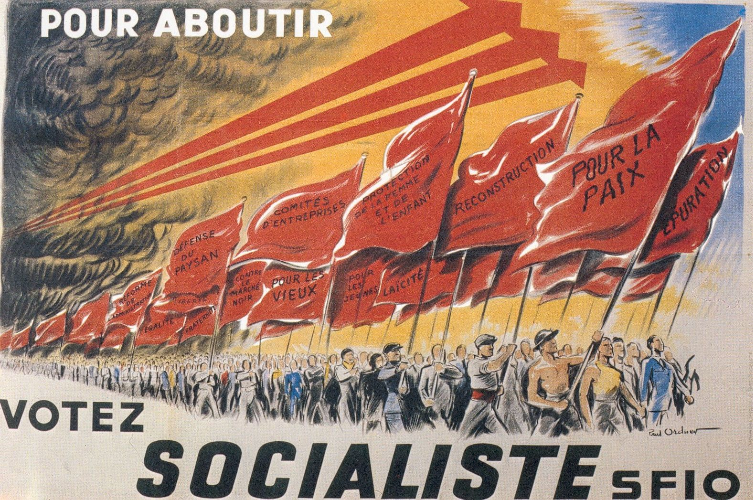
Kết luận, theo Bastiat: chủ nghĩa bảo hộ và chủ nghĩa xã hội có một điểm chung, đó là những gì họ tìm kiếm từ luật pháp không phải để đảm bảo cho mọi người được tự do thực hiện năng lực của mình và hưởng phần thưởng công bằng cho nỗ lực của họ, mà thay vào đó là để ưu ái việc bóc lột ít hay nhiều một tầng lớp công dân bởi một tầng lớp khác. Với chủ nghĩa bảo hộ, đó là thiểu số bóc lột đa số. Với chủ nghĩa xã hội, đó là đa số bóc lột thiểu số. Trong cả hai trường hợp, công lý bị vi phạm và lợi ích chung bị tổn hại. Bastiat đặt họ vào vị trí đối lập với nhau.

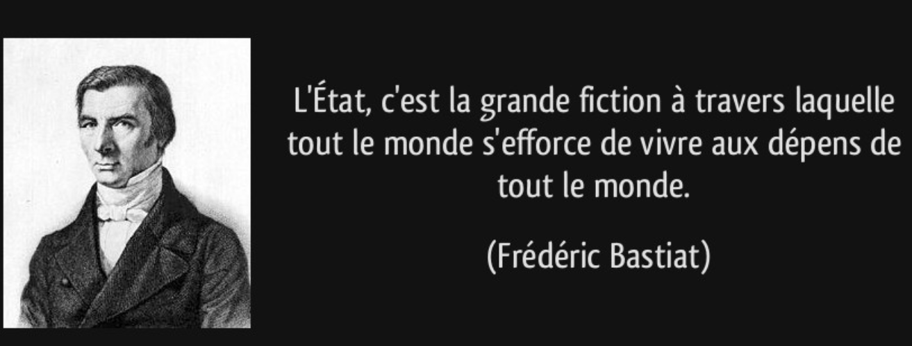

## Proudhon

<chapterId>96902abd-6915-5b25-a187-a4790162b86c</chapterId>

Pierre-Joseph Proudhon là một trong những đại diện chính của chủ nghĩa xã hội Pháp giữa thế kỷ 19. Ông đặc biệt nổi tiếng với phát biểu này: "Tài sản là trộm cắp" trong "Tài sản là gì? - What is Property" vào năm 1840.

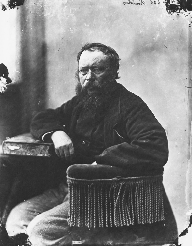

Có một điều vô lý trong lời khẳng định này. Bởi vì theo logic, nếu không có tài sản được mua bán hợp pháp, sẽ không thể có hành động như trộm cắp. Đó là lý do tại sao Proudhon sau này đã làm rõ rằng, ông coi việc phân phối tài sản trong thực tế là hành vi trộm cắp, chứ không phải chính tài sản, mà ông mô tả là một lực lượng cách mạng cơ bản cho xã hội chủ nghĩa vô chính phủ.

Nhưng Proudhon là một nhà chủ nghĩa vô chính phủ cá nhân. Ông không coi giai cấp vô sản hay nhà nước là nguồn gốc quyền lực hợp pháp. Ông chỉ trích gay gắt chủ nghĩa cộng sản và ủng hộ thuyết hỗ sinh công nhân, một hình thức đoàn kết hợp tác có cấu trúc, dựa trên việc tự nguyện gộp nguồn lực để giúp đỡ lẫn nhau. Ít người biết rằng Bastiat không hề phản đối nguyên tắc này. Ông chỉ sợ rằng nhà nước sẽ biến nó thành một dịch vụ công độc quyền. Lịch sử đã chứng minh ông đúng.

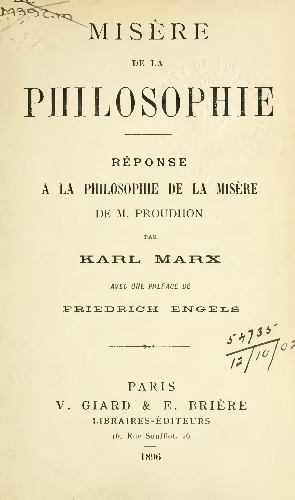

Mặt khác, trong "Sự nghèo đói của Triết học - The Poverty of Philosophy", Marx đã tấn công dữ dội Proudhon và chủ nghĩa xã hội của ông, điều mà Marx gọi là "không tưởng - utopian", và ông ấy ủng hộ một thứ được cho là chủ nghĩa xã hội "khoa học".

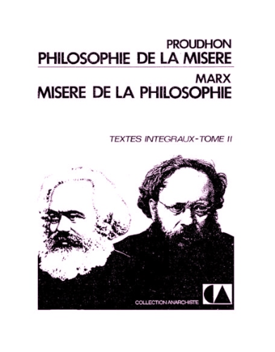
Vào tháng 6 năm 1848, Proudhon đã được bầu vào Quốc hội, cùng với Bastiat. Họ là những người quen biết và rất trân trọng nhau. Tuy nhiên, vào năm 1849, trong một cuộc tranh cãi nổi tiếng, Bastiat đã trao đổi mười bốn bức thư với ông trên các chuyên mục của La Voix du Peuple. Trong cuộc trao đổi sôi nổi này, ông đã làm rõ quan điểm của mình về vấn đề tiền tệ và ngân hàng. Cuộc tranh luận cuối cùng dẫn đến sự lựa chọn một trong hai: tín dụng tự do hay tự do tín dụng?

Proudhon coi lãi suất vốn là nguyên nhân ban đầu của sự nghèo đói và bất bình đẳng về điều kiện. Ông ủng hộ việc tạo ra tiền tệ không giới hạn bởi một ngân hàng nhà nước (Ngân hàng Trao đổi hoặc Ngân hàng Nhân dân), và thấy trong "tín dụng tự do" giải pháp cho vấn đề của xã hội. Mặt khác, Bastiat là người ủng hộ tự do của các ngân hàng, nghĩa là quy định lưu thông tiền tệ thông qua tự do tiếp cận nghề nghiệp, kết hợp với trách nhiệm cần thiết đối với tiền của chính mình, và tự do cạnh tranh.

Bastiat đã bác bỏ đối thủ của mình qua nhiều giai đoạn. Đầu tiên, ông phân tích những tác động xấu của tín dụng tự do và việc tạo ra tiền tệ. Một hệ thống như vậy chỉ có thể khuyến khích những hành động mạo hiểm và liều lĩnh nhất của các ngân hàng và các nhà hoạt động tư nhân vì họ biết rằng họ được nhà nước, tức là tiền của người nộp thuế, bao bọc: "Đó là một vấn đề nghiêm trọng khi đặt tất cả mọi người vào tình huống mà họ nói: Hãy thử vận may với tài sản của người khác; nếu tôi thành công, tốt cho tôi; nếu tôi thất bại, xấu cho người khác." Một phát biểu mang tính tiên tri vì đó là những gì đang xảy ra trong thời đại của chúng ta.

Chính sách lãi suất thấp được các ngân hàng trung ương áp dụng là một cách nhân tạo để tạo ra tiền tệ. Và các cuộc khủng hoảng liên tiếp của hệ thống tài chính trong thế kỷ qua, với việc sa vào nợ nần của các quốc gia, là hậu quả trực tiếp của nó.

Sau đó, Bastiat chỉ ra rằng có thể cải thiện sức mua của các tầng lớp lao động, nhưng bằng các phương tiện khác, công bằng và hiệu quả hơn. Đối với ông, việc giảm lãi suất cũng là mục tiêu của một chính sách tự do. Nhưng điều này được thực hiện thông qua việc giải phóng và tích lũy vốn, chứ không phải bằng cách bãi bỏ lãi suất, tức là tín dụng tự do.

Quả thực, theo Bastiat, sự tiến bộ của nhân loại diễn ra đồng thời với sự hình thành của vốn. Trong cuốn sách nhỏ của mình có tựa đề "Vốn và sự thuê mướn - Capital and Rent", Bastiat đã giúp chúng ta hiểu điều này thông qua ví dụ về Robinson Crusoe trên hòn đảo của mình.

Không có vốn tích lũy hay vật chất, Robinson sẽ chết. Sau đó, ông giải thích rằng vốn làm giàu cho người lao động theo hai cách:

- Nó gia tăng sản xuất, do đó giảm giá của hàng hóa tiêu dùng
- Điều này có tác dụng làm tăng lương.

Trong xã hội hiện đại, vốn đóng vai trò như một lực cân bằng. Quả thực, Bastiat nói:

> "khi vốn tăng lên, nó cạnh tranh với chính mình; mức thù lao của nó giảm, hay nói cách khác, lãi suất giảm."

Kết luận, cả Proudhon và Bastiat đều nhận ra tầm quan trọng của việc tích lũy vốn và xu hướng của một số người trong việc khai thác, bóc lột người khác. Tuy nhiên, họ không rút ra cùng một kết luận. Proudhon, giống như Marx, dự đoán sự nghèo đói ngày càng tăng của quần chúng trong các quốc gia tư bản. Bastiat tin rằng chủ nghĩa tư bản sẽ dẫn đến sự thịnh vượng chưa từng có cho tất cả các tầng lớp, và sự phát triển của một tầng lớp trung lưu ngày càng đáng kể. Điều này quả thực đã xảy ra.

# Những ảo tưởng kinh tế

<partId>59686d1d-58c6-59a8-9fc4-74a10d24cdbe</partId>

## Những gì được nhìn thấy và những gì không được nhìn thấy

<chapterId>25fb02a9-5d68-5c58-bd0f-d4b8e1fd91f9</chapterId>

Trong chương này, tôi sẽ tiết lộ một công nghệ mới hoàn toàn, một công nghệ cách mạng. Một nhà nghiên cứu đã phát triển một cặp kính sinh học với một camera nhỏ cực kỳ mạnh mẽ được gắn ở phía trước. Công nghệ này cho phép nhìn thấy những chi tiết không thể thấy bằng mắt thường. Trên gọng kính, có một chip điện tử truyền hình ảnh trực tiếp lên đám mây qua điện thoại thông minh của tôi.

Người phát minh ra nguyên mẫu đầu tiên của những chiếc kính này là Frédéric Bastiat vào năm 1850 trong một cuốn sách nhỏ nổi tiếng: Những gì được nhìn thấy và những gì không được nhìn thấy - What is Seen and What is Not Seen. Những chiếc kính này là của nhà kinh tế học. Chúng cho phép đo lường hậu quả của các quyết định do các cơ quan quản lý đưa ra đối với cuộc sống của chúng ta. Đó là những chiếc kính giúp "chúng ta thấy được những gì chúng ta không thấy": sự phá hủy do các chính sách ưu đãi và các lý thuyết kinh tế sai lầm gây ra. Thường chúng ta không thấy được nạn nhân, cũng như những người hưởng lợi, nói cách khác, những tác động thực sự so với những tuyên bố được đưa ra trong các bài phát biểu chính thức, điều mà Bastiat gọi là "Những ảo tưởng kinh tế - Economic Sophisms."
Nhà kinh tế học giỏi, theo Bastiat, phải mô tả được tác động của các quyết định chính trị đối với xã hội. Tuy nhiên, họ phải chú ý, không phải đến tác động ngắn hạn đối với một nhóm cụ thể, mà là chú ý đến hậu quả lâu dài đối với toàn bộ xã hội. Ai là nạn nhân và ai là người hưởng lợi từ những chính sách này? Chi phí ẩn của một đạo luật hay quyết định chính trị cụ thể là gì? Người đóng thuế sẽ làm gì thay vì chính phủ với số tiền đã bị lấy thông qua thuế? Theo Bastiat, đây là những câu hỏi mà một nhà kinh tế học giỏi sẽ đặt ra.

Vì thế, trong Public Works, Bastiat viết:

> Nhà nước mở một con đường, xây một cung điện, chỉnh trang một con phố, đào một kênh; qua đó, nó tạo ra công ăn việc làm cho một số công nhân, đó là điều được nhìn thấy; nhưng nó cũng tước đi công việc từ một số người khác, đó là điều không được nhìn thấy.

Một trong những sophism nổi tiếng nhất là nguỵ biện về chiếc cửa sổ vỡ. Một số người cho rằng việc vỡ một cái cửa sổ ở nhà không gây hại cho nền kinh tế vì nó mang lại lợi ích cho người thợ làm kính. Nhưng Bastiat sẽ chứng minh rằng sự phá hủy không phải là lợi ích của chúng ta bởi vì nó không tạo ra của cải. Nó gây tốn kém hơn là lợi ích nó mang lại. Cậu bé phá vỡ cửa sổ nhà hàng xóm đã tạo công việc cho người thợ làm kính. Nhưng đây là cách bạn bè của cậu ta an ủi:

> "Trong cái rủi có cái may. Những tai nạn như vậy giữ cho ngành công nghiệp làm kính tiếp tục hoạt động. Mọi người đều cần phải sống. Nếu cửa sổ không bao giờ bị vỡ thì người thợ làm kính sẽ ra sao?"

Như vậy, theo Keynes, việc phá hủy tài sản, bằng cách buộc phải chi tiêu, sẽ kích thích nền kinh tế và tạo ra "hiệu ứng hệ số nhân" làm tăng cường sản xuất và việc làm. Điều này chỉ là những gì được nhìn thấy.

Nhưng những gì không được nhìn thấy là những gì chủ nhân sẽ mua với số tiền đó, nhưng giờ đây anh ta phải dùng số đố để sửa chữa cho cửa sổ nhà mình. Những gì không được nhìn thấy là cơ hội bị mất đi của chủ nhân cái cửa sổ bị vỡ. Anh ta có thể đã phân bổ số tiền đó cho một việc khác. Nếu anh ta không phải chi tiêu để sửa chữa cửa sổ, anh ta có thể đã chi tiêu số tiền đó cho việc tiêu dùng của bản thân, từ đó tạo việc làm cho người sản xuất.

Như vậy, chiếc cửa sổ vỡ sẽ không "kích thích" nền kinh tế hơn là không vỡ. Ngược lại, sẽ có một tổn thất ròng trong trường hợp đầu tiên: giá trị của cửa sổ.

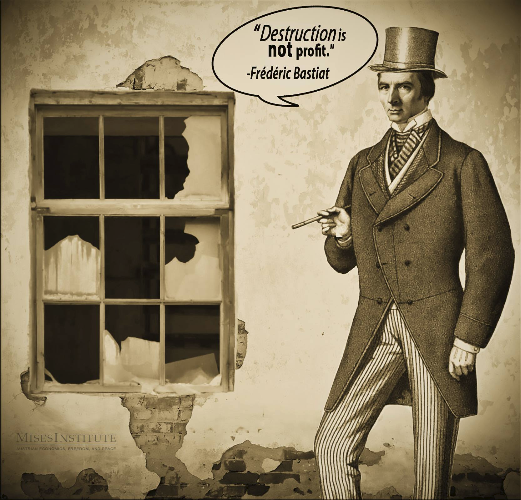
Bài học đầu tiên cần rút ra là một quyết định "tốt" hay một chính sách "tốt" là một quyết định hoặc chính sách mà xã hội phải chịu chi phí ít hơn so với một sự phân bổ nguồn lực khác có thể đã dẫn đến chi phí tốn kém. Hiệu quả của một chính sách nên được đánh giá không chỉ dựa trên các tác động của nó mà còn dựa trên cơ sở của các lựa chọn thay thế có thể đã xảy ra. Đây là khái niệm "chi phí cơ hội", một khái niệm quý giá của Bastiat.

Bài học thứ hai là sự phá hủy không kích thích nền kinh tế như những nhà kinh tế theo trường phái Keynesians nghĩ mà dẫn đến sự nghèo đói. Sự phá hủy của hàng hóa vật chất không có tác động tích cực đến nền kinh tế, trái với quan điểm phổ biến. Để sử dụng lời kết trong tác phẩm của Frédéric Bastiat: "xã hội mất đi giá trị của các vật thể bị phá hủy một cách không cần thiết."

Hãy lấy một ví dụ của hiện tại. Ngay khi ngành công nghiệp ô tô gặp khó khăn, các nhà hoạch định chính sách tưởng tượng ra các chương trình thu hồi xe để "khởi động" lại nó. Những gì chúng ta nhìn thấy được là sự tăng doanh số bán hàng của Renault và Peugeot. Những gì chúng ta không nhìn thấy được là tổn thất cho các ngành kinh tế khác và rằng những chiếc xe hoạt động hoàn hảo bị phá hủy.

Nhưng có những cách khác để thúc đẩy nền kinh tế. Nếu nhà nước tham gia vào các dự án lớn hoặc đầu tư vốn vào một số ngành công nghiệp nhất định để hỗ trợ việc làm, đó có phải là tin tốt cho tăng trưởng không? Không hề, Bastiat sẽ trả lời như vậy. Bởi vì chi tiêu công sẽ được tài trợ bằng cách nào? Bằng cách tăng thuế hoặc nợ, tức là, bằng những chi phí vô hình nhưng rất thực, sẽ ảnh hưởng đến tăng trưởng. Hơn nữa, chính phủ không sản xuất ra gì cả; nó chỉ chuyển hướng nguồn lực ra khỏi lĩnh vực tư nhân. Và những gì chúng ta không thấy được là rất nhiều thứ có thể đã được sản xuất nếu vốn không bị rút khỏi khu vực tư nhân để tài trợ cho các chương trình của chính phủ.

Cuối cùng, gần một thế kỷ trước khi Keynes có mặt, chúng ta có thể nói rằng Bastiat đã bác bỏ các sophism của Keynesian cho rằng nợ công khuyến khích nền kinh tế và chi tiêu công tạo ra tăng trưởng.

Bài học lớn từ loạt tác phẩm này là sự can thiệp của nhà nước có những tác động xấu không được nhìn thấy. Chỉ một nhà kinh tế học giỏi mới có khả năng dự đoán chúng. Chính trị là những gì chúng ta nhìn thấy được. Kinh tế là những gì chúng ta không nhìn thấy được.

## Kiến nghị của các nhà sản xuất nến

<chapterId>f4e759ed-1cb2-55c7-885e-0a60244758a4</chapterId>

Vào năm 1840, Hạ viện đã bỏ phiếu thông qua một đạo luật tăng thuế nhập khẩu để bảo vệ ngành công nghiệp Pháp. Đây là biểu hiện của chủ nghĩa yêu nước kinh tế, mà chúng ta vẫn gặp phải ngày nay.

Sau đó, Bastiat đã soạn một văn bản châm biếm, sau này trở thành một trong những tác phẩm nổi tiếng nhất của ông: "Kiến nghị của các nhà sản xuất nến - The petition of the candle makers". Nó minh họa cách thức mà một số nhóm lợi ích của các nhà sản xuất được tổ chức tốt có được những đặc quyền không xứng đáng từ nhà nước, gây thiệt hại cho người dân. Đồng thời, nó cũng chứng minh bản chất vô lý và phá hoại của luật lệ bảo hộ.

Trong kiến nghị này, các nhà sản xuất nến yêu cầu các nghị sĩ dùng pháp lý để bảo vệ chống lại một đối thủ nguy hiểm:

> Chúng ta đang vấp phải sự cạnh tranh không thể vực dậy được từ một đối thủ nước ngoài, người mà, có vẻ như, ở trong điều kiện thuận lợi vượt trội để sản xuất ra ánh sáng đến mức sản phẩm của ông ta tràn ngập thị trường quốc gia của chúng ta với một giá cả giảm mạnh một cách kỳ diệu.

Vậy, đối thủ nước ngoài không công bằng này là ai? Không ai khác ngoài mặt trời. Các nhà sản xuất sau đó nhấn mạnh cơ hội sẽ có được nếu "thị trường quốc gia dành riêng cho lao động của quốc gia - the national market for national labor", bằng cách thông qua một đạo luật để đóng cửa "tất cả cửa sổ, cửa sổ trên mái, bức bình phong, cửa chớp, rèm cửa, cửa sổ trên cửa, nói chung là tất cả các lỗ mở, lỗ hổng, khe hở, và vết nứt mà ánh sáng mặt trời thường xuyên đi vào nhà".

Nói cách khác, các nhà sản xuất nến cố gắng chứng minh tác động có hại của một "đối thủ nước ngoài" (mặt trời) đối với nền kinh tế của Pháp. Bởi không chỉ mặt trời cung cấp cùng một "sản phẩm" như nến, mà còn làm vậy miễn phí. Hai trăm năm sau, câu chuyện này vẫn cực kỳ hợp thời. Hãy xem xét các tài xế taxi yêu cầu luật cấm VTC và Uber. Nghĩ về các hiệu sách muốn cấm Amazon.

Đối thủ thực sự của Bastiat trong tác phẩm hư cấu này là chủ nghĩa bảo hộ chính trị và bầu cử, một chủ nghĩa dựa hoàn toàn vào lòng tham của các nhà sản xuất và sự ngây thơ của người tiêu dùng. Ông bóc trần sự thông đồng giữa các nhà tư bản xấu của thời đại và Nhà nước. Thay vì đổi mới và thích nghi với thị trường, các nhà tư bản xấu là người tìm cách đạt được lợi thế chính trị thông qua chủ nghĩa bảo hộ. Điều này luôn dẫn đến việc cướp bóc người tiêu dùng, tức là một sự bất công.
Nói ngắn gọn, chủ nghĩa bảo hộ là một chính sách cố ý ủng hộ nhà sản xuất chống lại người tiêu dùng. Tuy nhiên, theo Bastiat, đại diện thực sự của lợi ích chung là người tiêu dùng, bởi vì chúng ta đều là người tiêu dùng. Hơn nữa, mục đích của nền kinh tế là để đáp ứng nhu cầu của chúng ta, không phải để làm việc.
Chủ nghĩa bảo hộ cũng dựa trên một tam đoạn luận ẩn giấu mà hóa ra là một quan điểm sai lầm:

- Chúng ta càng làm việc, chúng ta càng giàu có;
- Khó khăn mà chúng ta phải vượt qua càng lớn, chúng ta càng phải làm việc nhiều;
- Do đó, khó khăn mà chúng ta cần phải vượt qua càng lớn, chúng ta càng giàu có.
  Hãy minh họa sự vô lý này qua một vài câu chuyện ngắn được kể bởi Bastiat. Trong Chương III của loạt bài thứ hai về Những ảo tưởng kinh tế - Economic Sophimsms, ông tưởng tượng một người thợ mộc viết thư cho bộ trưởng đề nghị ban hành luật bảo hộ. Người thợ mộc đưa ra yêu cầu của mình như sau: Ông Bộ trưởng, hãy làm một luật quy định rằng "Không ai được phép sử dụng cái gì khác ngoài các dầm và xà ngang được sản xuất từ những cái rìu cùn." Nói cách khác, hãy làm một luật cấm sử dụng những chiếc rìu sắc bén ở Pháp. Như vậy, với những việc mà người ta thường phải chém 100 nhát rìu, giờ đây sẽ phải chém 300 nhát. Các thợ mộc sẽ được săn đón và do đó được trả lương cao hơn.

Trong Chương XVI, có một đoạn văn khác rất mỉa mai, với tiêu đề: Bàn tay phải và bàn tay trái. Sau một cuộc điều tra, một sứ giả hoàng gia soạn thảo một báo cáo trong đó ông đề xuất với vua cắt bỏ, hoặc ít nhất là trói tất cả các bàn tay phải của người lao động. Như vậy, ông tiếp tục, công việc và do đó là sự giàu có sẽ tăng lên. Việc sản xuất sẽ trở nên khó khăn hơn nhiều, điều này sẽ cần đến việc thuê thêm nhiều lao động và tăng lương. Sự nghèo đói sẽ biến mất khỏi đất nước.

Theo logic tạo ra việc làm bằng mọi giá này, tại sao không thay thế xe tải bằng xe cút kít và xẻng bằng thìa cà phê? Tất cả những ảo tưởng này có một điểm chung: chúng nhầm lẫn giữa phương tiện và mục đích. Đối với Bastiat, mục tiêu của nền kinh tế không phải là bảo toàn việc làm. Chúng ta không nên đánh giá tính hữu ích của công việc qua thời gian và cường độ của nó mà bằng kết quả: sự thỏa mãn nhu cầu, tính hữu dụng.

Sự nhầm lẫn giữa phương tiện và mục đích này được tìm thấy trong khẩu hiệu "tiền là sự giàu có."
Đây là nguyên tắc điều khiển chính sách tiền tệ của hầu hết các quốc gia. Thực vậy, việc tăng số lượng tiền một cách nhân tạo cho phép các ngân hàng cho các cá nhân vay tiền và cho phép các quốc gia dễ dàng trả nợ, đây là "những gì chúng ta nhìn thấy được". Nhưng "những gì chúng ta không nhìn thấy được" là việc tạo ra tiền, không dựa trên bất kỳ sự tạo ra giá trị thực sự nào, sẽ dẫn đến lạm phát và sự tàn phá đối với những người tiết kiệm.

Sự giàu có thực sự, theo Bastiat, do đó là tập hợp các vật dụng hữu ích mà chúng ta sản xuất thông qua lao động để thỏa mãn nhu cầu của mình. Tiền chỉ là phương tiện trao đổi được sử dụng phổ biến, nó chỉ đóng vai trò là một trung gian.

## Cướp bóc thông qua thuế má

<chapterId>551fc499-2119-5a52-9114-412d29434c22</chapterId>

> Khi người giàu giảm cân, người nghèo chết.

Câu nói này, được cho là của Lão Tử, mô tả hậu quả không thể tránh khỏi của một hệ thống đánh thuế nhắm vào người giàu hơn người khác.

Tuy nhiên, bạn đã bao giờ nghe nói:

> Thuế là khoản đầu tư tốt nhất: đó là những hạt sương màu mỡ! Hãy xem cách nó nuôi sống bao nhiêu gia đình, và theo đó, bằng tâm trí, sự tác động của nó lên ngành công nghiệp: đó là vô tận, đó là sự sống.

Ở Pháp, nơi chi tiêu công được coi là một lợi ích, thuế cao hơn so với các quốc gia khác. Nhưng Bastiat ngay lập tức cảnh báo chúng ta: "Trong mọi chi tiêu công, đằng sau cái tốt hiển hiện là một cái xấu khó nhận biết hơn."
Nền kinh tế mô tả những ảnh hưởng tốt hoặc xấu của các quyết định chính trị đối với cuộc sống của chúng ta. Tuy nhiên, theo Bastiat, nhà kinh tế học phải chú ý, không chỉ đến những ảnh hưởng ngắn hạn đối với một nhóm cụ thể mà còn phải chú ý đến hậu quả lâu dài đối với xã hội nói chung.

> "Những gì chúng ta nhìn thấy được là việc làm và lợi nhuận có được nhờ đóng góp xã hội. Những gì chúng ta không nhìn thấy được là những công việc sẽ được tạo ra bởi cùng một sự đóng góp này nếu nó được để lại cho người nộp thuế."
>
> F.Bastiat

Ngay từ đầu, ông đã bác bỏ luận điểm vẫn còn phổ biến rằng chi tiêu công được tài trợ bởi thuế sẽ tạo ra việc làm. Thực tế, thuế không tạo ra bất cứ thứ gì vì những gì được chi tiêu bởi nhà nước không còn được chi tiêu bởi người nộp thuế.

Hơn nữa, nhà nước lãng phí hơn cá nhân. Thực vậy, ông nhắc nhở chúng ta, nhà nước không sở hữu gì; nó không sản xuất ra tài sản. Chi tiêu công thường là ngọn nguồn của sự lãng phí vì những khoản tiền khổng lồ bị tịch thu từ cá nhân bị tách khỏi trách nhiệm của chủ sở hữu và thay vào đó được chi tiêu bởi các quan chức, chịu sức ép từ các nhóm lợi ích.

Tất nhiên, như một khoản thanh toán để nhận được một dịch vụ công tương đương, việc đánh thuế hoàn toàn có thể bào chữa. Nhưng ở Pháp, nhà nước đã giao nhiều vai trò cho thuế.

Ban đầu, nó được cho là để chi trả cho các chi phí chung. Sau đó, thuế cũng được giao một vai trò trong việc điều tiết nền kinh tế. Trong trường hợp này, các chính trị gia và quan chức có quyền lực chỉ bị giới hạn bởi thiện ý của họ. Đắm chìm trong những kết cấu nhân tạo của mình, họ định hình nền kinh tế bằng cách đánh thuế và điều tiết các ngành nghề ít nhiều theo ý thích của họ để ưu ái hoặc phản đối chúng.

Cuối cùng, một vai trò xã hội đã được giao cho thuế. Chúng được biến thành một công cụ của công bằng xã hội. Do đó, thuế không nên đánh vào tất cả mọi người theo cùng một cách. Thuế phải có tính tái phân phối, từ những người "có nhiều hơn" cho những người "có ít hơn."

Vấn đề là thuế, như được hình dung, chịu sự tùy tiện của những người nắm quyền. Họ ưu ái hoặc phản đối một số nhóm xã hội tùy thuộc vào việc họ mong đợi phiếu bầu từ họ hay không. Hơn nữa, các mức thuế luỹ tiến mang lại ít lợi ích cho kho bạc nhà nước. Tuy nhiên, chúng cho phép đa số tước đoạt tài sản của một thiểu số một cách tự nhiên.

Đó là lý do tại sao Bastiat đã hiểu về đường cong Laffer. Arthur Laffer là một nhà kinh tế học người Mỹ nổi tiếng với "đường cong" của mình (một hình elip), được công bố vào năm 1974, cho thấy rằng thu nhập từ thuế tăng lên khi giảm mức thuế suất. Đây là lý thuyết về sự giảm sút lợi nhuận của việc đánh thuế quá mức.

Các chính trị gia một cách ngây thơ giả định rằng có một mối quan hệ tự động và cố định giữa mức thuế suất và thu nhập thuế. Họ nghĩ rằng họ có thể tăng gấp đôi thu nhập thuế bằng cách tăng gấp đôi mức thuế suất. Theo Laffer, cách tiếp cận như vậy không tính đến việc người nộp thuế có thể thay đổi hành vi của họ để phản ứng với các động lực mới.
Đường cong Laffer cho thấy chính phủ không thu được đồng thu nhập nào khi mức thuế suất ở mức 100%. Ngược lại, bất kỳ sự giảm thuế nào đều kích thích hoạt động kinh tế và do đó là thu nhập của nhà nước. Thực vậy, giảm mức thuế suất biên sẽ kích thích đầu tư, lao động, sáng tạo, và do đó thúc đẩy tăng trưởng kinh tế. Một sự giảm đủ lớn có thể tạo ra đủ kích thích kinh tế để tăng thu nhập công nhờ mở rộng cơ sở đánh thuế.

Bastiat có thể thêm rằng cần phải đặt trọng tâm vào việc giảm chi tiêu của nhà nước cũng như giảm thuế. Tuy nhiên, như Margaret Thatcher, một học trò của Frédéric Bastiat, đã nói một cách đúng đắn:
> Mục tiêu không phải là làm cho người giàu trở nên nghèo, mà là làm cho người nghèo trở nên giàu có." Và bà đã nói điều này khi đang phát biểu trước những người xã hội chủ nghĩa.

## Hai loại đạo đức

<chapterId>c518e449-f638-553c-9a49-15da48023d41</chapterId>

Ai cũng biết Tartuffe hay kẻ lừa đảo, vở hài kịch của Molière nói về một kẻ mộ đạo ranh mãnh cố gắng quyến rũ Elmire và lừa gạt chồng cô, Orgon. Làm thế nào để bảo vệ bản thân khỏi sự lừa dối của những kẻ đạo đức giả như vậy, những người vờ vịt làm lợi cho bạn trong khi âm mưu chống lại bạn?

Bastiat lưu ý rằng có hai cách để chấm dứt loại trò lừa bịp này: trừng phạt Tartuffe hoặc khai sáng Orgon. Tất nhiên, luôn luôn sẽ có những Tartuffe, nhưng quyền lực gây hại của họ sẽ giảm đi nhiều nếu có ít Orgon hơn lắng nghe chúng.

Sự yếu kém của lý trí con người là nguyên nhân gốc rễ của việc lạm dụng tự do. Đó là hạn chế chính của con người và nguyên nhân của nhiều điều xấu xa. Do đó, cần thiết phải khai sáng lương tâm về bản chất có ích hay có hại, và do đó công bằng hay bất công, bản chất của các hành động của con người, dù là cá nhân hay tập thể.

Tuy nhiên, có hai cách bổ sung để khai sáng phán đoán của công dân, như Bastiat đã trình bày trong một chương của loạt bài "Những ảo tưởng kinh tế" lần thứ hai có tựa đề "Hai loại đạo đức - The Two Moralities".

- Đầu tiên, có một "đạo đức triết học hoặc tôn giáo" hoạt động bằng cách làm sạch và sửa chữa hành động con người (con người như một tác nhân)
- Sau đó, có một "đạo đức kinh tế", hoạt động bằng cách chỉ ra cho con người "hậu quả tất yếu của các hành động của mình" (con người với tư cách là đối tượng chịu ảnh hưởng)
  Thực tế, đây là hai khung đạo đức bổ sung hoàn hảo cho nhau.

1. Cái đầu tiên hướng về trái tim và khuyến khích cá nhân làm điều tốt; đó là đạo đức tôn giáo hoặc triết học. Đó là cái cao quý nhất. Nó gieo vào trái tim con người ý thức về bổn phận của mình. Nó nói với họ:

> Hãy cải thiện bản thân; làm sạch bản thân; ngừng làm điều xấu; làm điều tốt, kiềm chế dục vọng của bạn; hy sinh lợi ích của bạn; đừng áp bức hàng xóm của bạn mà bạn có bổn phận phải yêu thương và giúp đỡ họ; đầu tiên, hãy công bằng rồi sau đó là khoan dung.

Nói tóm lại, nó dạy về đức hạnh, hành động vị tha. Đạo đức này, Bastiat nói, mãi mãi sẽ là cái đẹp và cảm động nhất, vì nó cho thấy điều tốt nhất trong con người.

2. Cái khác giúp tố cáo và chống lại cái xấu thông qua việc hiểu biết về hậu quả của nó, đó là đạo đức kinh tế. Nó hướng đến trí óc chứ không phải trái tim, nhằm mục đích khai sáng cho nạn nhân về những hậu quả tiêu cực của một hành vi. Nó củng cố những bài học từ kinh nghiệm. Nó cố gắng lan truyền lẽ thường, kiến thức, và sự nghi ngờ đến những tầng lớp bị áp bức, làm cho việc áp bức trở nên khó khăn hơn.

Đạo đức kinh tế này hướng tới cùng một kết quả như đạo đức tôn giáo, nhưng bắt đầu từ hậu quả tất yếu của các hành động con người. Nó dạy chúng ta phản ứng lại với các hành động bất công hoặc có hại và bảo vệ những hành động công bằng hoặc có ích.

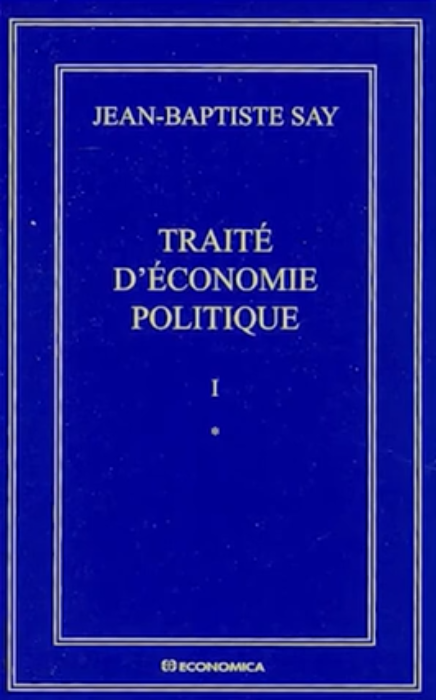

Ở đây, Bastiat nhấn mạnh vai trò của khoa học, và đặc biệt là khoa học về kinh tế. Mặc dù khác biệt so với đạo đức truyền thống, vai trò của nó không kém phần thiết yếu để chống lại sự cướp bóc dưới mọi hình thức. Đạo đức tấn công tội lỗi trong ý định của nó, nó giáo dục ý chí. Mặt khác, khoa học tấn công tội lỗi bằng cách hiểu biết về hậu quả của nó, do đó tạo điều kiện cho sự thắng lợi của đức hạnh.

Cụ thể, khoa học kinh tế, được mô tả bởi Bastiat như là đạo đức phòng thủ, bao gồm việc bác bỏ các ảo tưởng kinh tế để hoàn toàn phủ nhận chúng, và do đó tước bỏ lớp lớp những biện minh và quyền lực của tầng lớp cướp bóc.
Kinh tế Chính trị, do đó, có một ích lợi thực tiễn rõ ràng. Nó tiết lộ sự cướp bóc trong các chi phí ẩn, các trở lực đối với cạnh tranh tự do, và tất cả các hình thức bảo hộ.
Một lần nữa, sẽ có ít Tartuffe hơn nếu có ít Orgon nghe họ hơn. Đây là những gì Bastiat đã nói về vấn đề này:

> Do đó, hãy để đạo đức tôn giáo chạm đến trái tim của Tartuffes nếu có thể. Nhiệm vụ của kinh tế chính trị là soi sáng cho những kẻ bị lừa dối. Trong hai cách tiếp cận này, cái nào hoạt động hiệu quả nhất cho tiến bộ xã hội? Phải nói sao? Tôi tin rằng đó là cách thứ hai. Tôi lo rằng nhân loại không thể tránh khỏi sự cần thiết phải học đạo đức phòng vệ trước tiên.

Dĩ nhiên, kinh tế chính trị không phải là một một khoa học phổ quát; nó không loại trừ các cách tiếp cận triết học và tôn giáo. "Nhưng ai đã từng thể hiện một yêu sách quá mức như vậy với tên của nó?" Bastiat tự hỏi.

Một điều chắc chắn, không phải là chính trị có thể thay đổi dòng chảy của mọi thứ và hoàn thiện con người. Ngược lại, cần phải hạn chế chính trị và giới hạn nó trong vai trò của chính nó, đó là bảo đảm an ninh. Thay vào đó, trong các lĩnh vực văn hóa, gia đình, tôn giáo, và hội nhập, thông qua công việc về ý tưởng, qua giáo dục và giảng dạy, nói chung, qua xã hội dân sự, chúng ta có thể cải thiện trách nhiệm và tình đoàn kết.

# Sự hoà hợp kinh tế

<partId>db04dfa4-a53e-5d3e-a307-a68ebc36dc4f</partId>

## Phép mà của thị trường

<chapterId>895ccd1d-7b52-5a8b-8b2c-6ec0056cf632</chapterId>

Liệu một xã hội hài hòa có thể tồn tại mà không cần đến luật lệ viết, quy tắc, biện pháp trừng phạt? Nếu con người được tự do, chúng ta có chứng kiến sự hỗn loạn, vô chính phủ, vô tổ chức không? Làm thế nào để tránh việc chỉ đơn thuần đặt các cá nhân ở cận kề nhau và hành động tự phát, không có sự phối hợp nào cả, nếu không thông qua luật pháp và một tổ chức chính trị tập trung?

Đây là luận điểm thường được đưa ra bởi những người đỏi hòi phải quản lý thị trường hoặc xã hội, vì theo họ đó là cách duy nhất để phối hợp các cá nhân thành một tổng thể nhất quán và hài hòa.

Đây không phải là quan điểm của Bastiat. Theo ông, cơ chế xã hội, giống như cơ chế thiên văn hay cơ chế của cơ thể con người, tuân theo các quy luật chung. Nói cách khác, nó đã là một tổng thể được tổ chức hài hòa. Và động cơ để vận hành tổ chức này là thị trường tự do.

Phép màu của thị trường tự do, ông nói với chúng ta, là nó sử dụng thứ hiểu biết mà không một người nào có thể sở hữu một mình và nó cung cấp những sự thỏa mãn xa xỉ hơn bất cứ điều gì một tổ chức nhân tạo có thể làm.

Bastiat đưa ra một vài ví dụ để minh họa lợi ích của thị trường tự do. Chúng ta đã quen với hiện tượng này đến mức không còn chú ý đến nó nữa.
Hãy xem xét một thợ mộc trong một ngôi làng, ông ấy nói, và quan sát tất cả các dịch vụ mà anh ta cung cấp cho xã hội và tất cả những gì anh ta nhận được:

> Mỗi ngày, khi thức dậy, anh ấy mặc quần áo, và anh ấy không tự làm bất kỳ bộ quần áo nào của mình. Tuy nhiên, để những bộ quần áo này có sẵn cho anh ấy, một lượng khổng lồ các công việc, ngành công nghiệp, vận chuyển, và phát minh sáng tạo đã phải được thực hiện trên toàn thế giới.
> Sau đây, anh ta ăn sáng. Để có được miếng bánh mì trên bàn mỗi sáng, cần phải có những cánh đồng được khai hoang, cày cấy; cần phải có sắt, thép, gỗ, đá được chế tác thành các công cụ lao động; tất cả những điều này, mỗi thứ riêng lẻ, đều đòi hỏi một khối lượng công việc không thể tính toán được, không chỉ về không gian mà còn về thời gian.

> Người này sẽ gửi con trai mình đến trường, để nhận một nền giáo dục đòi hỏi phải có những nghiên cứu và nhiều năm học tập trước đó.

> Anh ta ra ngoài và thấy một con đường được lát gạch và chiếu sáng.

> Tài sản của anh ta bị tranh chấp: anh ta sẽ tìm đến luật sư để bảo vệ quyền lợi của mình, tìm đến quan tòa để gìn giữ chúng, tìm đến cán bộ tư pháp để thi hành bản án; tất cả những điều này đòi hỏi những kiến thức đã được tích lũy, do đó là sự khai sáng và phương tiện sinh sống.

Bastiat mô tả thị trường như một công cụ hợp tác phi tập trung và vô hình. Thông qua hệ thống giá cả, nó truyền đạt thông tin về nhu cầu và kỹ năng của mọi người, nó kết nối những người muốn hợp tác để cải thiện cuộc sống của bản thân.

Điều đáng chú ý, Bastiat kết luận, là sự chênh lệch khổng lồ giữa lợi ích mà người này nhận được từ xã hội và những gì anh ta có thể tự cung cấp cho mình nếu chỉ dựa vào nguồn lực của bản thân. Trong một ngày, anh ta tiêu thụ nhiều hàng hóa mà bản thân không thể sản xuất ra.

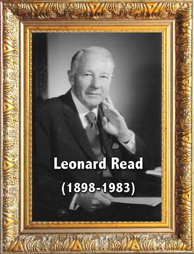

Năm 1958, nhà văn người Mỹ Leonard Read (Quỹ Giáo dục Kinh tế - Foundation for Economic Education) đã xuất bản một bài luận ngắn trên tạp chí The Freeman, viết theo phong cách của Bastiat, trở nên rất nổi tiếng: "Tôi, cây bút chì - I, Pencil". Bài viết này là một ẩn dụ về thị trường tự do. Nó bắt đầu như thế này:

> Tôi là một cây bút chì chì, một cây bút chì gỗ bình thường quen thuộc với tất cả các bé trai, bé gái và người lớn biết đọc và viết. Đây là một trong những vật thể đơn giản nhất trong nền văn minh nhân loại. Tuy nhiên, không một người nào trên trái đất này biết cách sản xuất ra tôi.

Nó tái hiện ý tưởng của Bastiat về sự hợp tác vô hình giữa hàng triệu cá nhân không biết nhau, dẫn đến việc tạo ra một thứ bình thường như cây bút chì. Không ai biết cách làm một cây bút chì một mình. Tuy nhiên, hàng triệu con người không hề biết đến nhau vẫn tham gia vào việc tạo ra cây bút chì đơn giản này, trao đổi và phối hợp kiến thức và kỹ năng của họ trong một hệ thống giá cả mà không có bất kỳ cơ quan quản lý nào chỉ đạo hành vi của họ. Câu chuyện này chứng minh rằng những cá nhân tự do làm việc nhằm theo đuổi lợi ích hợp pháp của mình sẽ hành động và mang lại nhiều lợi ích cho xã hội hơn bất kỳ chiến lược kinh tế kế hoạch hóa và tập trung nào.

Giải Nobel Kinh tế năm 1976, Milton Friedman, cũng đã tái hiện câu chuyện về cây bút chì này để giải thích cho công chúng cách nền kinh tế thị trường hoạt động.

Trong một tập của sê-ri truyền hình "Free to Choose" của mình, ông phân tích các thành phần khác nhau của một thứ đơn giản và bình thường như cây bút chì và nhấn mạnh điều kỳ diệu của trật tự tự phát, được tạo ra bởi hàng nghìn tương tác kinh tế trên khắp thế giới. Những người không biết nhau, không chia sẻ cùng tôn giáo hay phong tục, vẫn có thể phối hợp để sản xuất ra vật thể này. Ông kết luận rằng thị trường tự do là cần thiết để đảm bảo không chỉ cho sự thịnh vượng mà còn cho cả hòa bình và hòa hợp.

Friedrich Hayek, trong bài luận "The Use of Knowledge in Society - Sử dụng kiến thức trong xã hội" năm 1945, đã giải thích tại sao nền kinh tế thị trường và sự phi tập trung của các quyết định là cốt yếu cho sự thịnh vượng. Theo Hayek, không có một nhà kế hoạch hoá tập trung hay một quan chức nào có đủ kiến thức để thành công trong việc hướng dẫn toàn bộ các hành vi kinh tế. Chỉ có hệ thống giá cả trong một thị trường tự do mới cho phép hàng triệu thành phần tham gia độc lập đưa ra quyết định cho bản thân về cách phân bổ hiệu quả các nguồn lực.
Kế hoạch hoá kinh tế, vốn tự tuyên bố là sẽ làm tốt hơn thị trường, không chỉ dẫn đến việc phân bổ nguồn lực kém hiệu quả mà còn dẫn đến sự thống trị của một tầng lớp lên các tầng lớp khác. Đó là lý do tại sao chủ nghĩa xã hội không chỉ là một sai lầm về mặt trí tuệ mà còn là một sai lầm mà cuối cùng sẽ tạo ra sự bất công to lớn.

## Tự do và trách nhiệm là chìa khóa cho vấn đề xã hội

<chapterId>78baa7ef-2c80-5fc7-8881-c1be4662b96f</chapterId>

Trong một bức thư gửi Alphonse de Lamartine vào năm 1845, Bastiat viết rằng toàn bộ triết lý của ông được chứa đựng trong một nguyên tắc duy nhất:

> Tự do là hình thức tổ chức xã hội tốt nhất.

Tuy nhiên, ông thêm một điều kiện:

> "Luật pháp không nên loại bỏ các hậu quả, dù là tích cực hay tiêu cực, từ hành động của mỗi người. Đây là nguyên tắc hệ quả tất yếu của trách nhiệm."

Nói cách khác, tự do và trách nhiệm không thể tách rời, chúng không thể phân chia. Đối với ông, chủ nghĩa tự do khác biệt với chủ nghĩa xã hội ở niềm tin rằng tự do không thể tồn tại mà không có trách nhiệm. Nhưng trong thực tế, các từ "tự do" và "trách nhiệm" thực sự bao hàm những gì?

Tự do cơ bản được định nghĩa theo cách tiêu cực: tự do là hành động mà không bị áp đặt bởi sự cưỡng ép bên ngoài trong việc thực hiện quyền của bản thân. Tuy nhiên, điều đó không có nghĩa là không có bất kỳ ràng buộc nào cả. Bởi vì tự do đòi hỏi sự đối ứng: nó cũng buộc chúng ta hành động mà không xâm phạm đến quyền sở hữu của người khác và do đó, nếu cần, phải bồi thường cho bất kỳ thiệt hại nào gây ra. Đây là trách nhiệm.

Do đó, trách nhiệm đại diện, theo một cách nào đó, cho khía cạnh tích cực của tự do: trong phạm vi một người hành động tự do, người đó phải chịu những hậu quả từ các hành động của mình, dù tốt hay xấu.

Trách nhiệm cá nhân là một yếu tố quan trọng của sự sáng tạo và là một động lực cho sự thận trọng và tiên liệu.

Khi một người tiêu tiền của mình, người đó sẽ cẩn thận không vay nợ quá mức, kiểm tra chất lượng sản phẩm, độ tin cậy của nhà cung cấp, với nguy cơ bị trừng phạt nặng nề. Đó là sức mạnh của trách nhiệm, kết hợp với tự do nó là động lực thực sự cho tiến bộ xã hội.

Nhưng hiện tượng vô trách nhiệm hoặc suy giảm trách nhiệm đến từ đâu? Frédéric Bastiat đã cho chúng ta câu trả lời cho câu hỏi này, một câu trả lời chính trị. Ông nói, tôi trích dẫn:

> "Sự can thiệp của Nhà nước tước quyền tự quản của chúng ta."

Thực vậy, chủ nghĩa nhà nước không ngừng thu hẹp sáng kiến cá nhân và quyền tự do lựa chọn của mọi người. Nó làm thay cho họ những gì họ có thể tự làm và làm tốt hơn nhiều. Bằng cách đó, nó loại trừ cá nhân ra khỏi những hậu quả từ các hành động của họ. Nó phá hủy trách nhiệm.

Theo Bastiat, sự phình to của luật pháp và sự can thiệp quá mức của Nhà nước dẫn đến hậu quả là tạo ra các cuộc đấu tranh cho quyền lực, sự cướp bóc, đặc quyền, độc quyền, chiến tranh, nói chung, gây ra tất cả những gì cản trở sự tiến bộ của nền văn minh.
Rủi ro của việc quá mức ưu tiên con đường của luật pháp hoặc kiểm soát quan liêu là nó làm giảm mọi động lực bằng cách áp đặt hàng loạt các ràng buộc, do đó tước đi những tiến bộ đa dạng mà sáng kiến cá nhân và quyền tự do lựa chọn mang lại.

Hãy minh họa vấn đề này bằng một vài chủ đề lớn hiện nay. Ví dụ đầu tiên, cuộc khủng hoảng năm 2008.

_(Alan Greenspan, Chủ tịch của FED, ngân hàng trung ương Mỹ, từ 1987 đến 2006)_
Trong nhiều năm, các nhà lãnh đạo chính sách tiền tệ đã giải thích rằng nếu lợi nhuận được tư nhân hóa khi mọi thứ diễn ra tốt đẹp, thì thua lỗ sẽ được chia sẻ khi phá sản (cứu trợ, kế hoạch giải cứu, thao túng lãi suất, in tiền, v.v.). Làm như vậy, họ đã tạo ra một rủi ro đạo đức, họ đã tạo điều kiện cho việc chấp nhận rủi ro không hợp lý, và họ đã khuyến khích thế giới tài chính hành xử một cách vô trách nhiệm. Họ do đó đã đẩy nhanh quá trình rơi vào cuộc khủng hoảng mà chúng ta đang trải qua của thế giới tài chính. 

Và hiện tượng này sẽ lặp đi lặp lại mãi mãi miễn là các ngân hàng vẫn nằm dưới sự thống trị của các cơ quan quyền lực tập trung được cho là bảo vệ các ngân hàng bằng cách loại bỏ mọi quyền tự chủ về quyết định và vận hành.

Một ví dụ khác: các dịch vụ công

Mỗi dịch vụ công đều áp đặt các ưu tiên của một tầng lớp tinh hoa quan liêu, gây tổn hại đến quyền tự do lựa chọn của cá nhân. Điều này dẫn đến hai hậu quả theo Bastiat: Công dân "ngừng việc tự do kiểm soát đối với các nhu cầu của bản thân, và, khi không còn trách nhiệm, tự nhiên anh ta cũng mất đi hiểu biết về chúng." Lý do rất đơn giản: mọi luật lệ viết ra đều mang tính cưỡng chế và nó giống nhau đối với mọi người, không tính đến các tình huống cụ thể, nhu cầu và sở thích của công dân.

Cuối cùng, dịch vụ công là nguyên nhân của sự trì trệ. Thực vậy, khi các dịch vụ tư nhân trở thành dịch vụ công, chúng thoát khỏi sự cạnh tranh. Do đó, như Bastiat nói, tôi trích dẫn: "công chức thiếu đi động lực thúc đẩy sự tiến bộ."

Khi chúng ta quan sát dịch vụ công của giáo dục quốc gia, chúng ta hiểu ý nghĩa của Bastiat. Nó giảm bớt gánh nặng giáo dục con cái cho đại đa số phụ huynh, biến trường học thành một nơi trông trẻ. Nó không khuyến khích giáo viên đổi mới và mạo hiểm vì trong một hệ thống như vậy họ chỉ là những người thi hành một chương trình được thiết kế không có sự tham gia của họ, mà bởi các công chức quan liêu. Cuối cùng, nó phớt lờ thực tế về nhu cầu cụ thể của mỗi cá nhân.

Chúng ta sẽ thấy trong một khóa học khác, theo Bastiat, ba dịch vụ công hợp pháp duy nhất của một quốc gia là: quân đội, cảnh sát và tư pháp. Nhưng để kết luận về trách nhiệm, vấn đề đối với sự can thiệp của nhà nước là những người đưa ra quyết định không phải là những người chịu hậu quả từ những quyết định đó.
Nói cách khác, các lựa chọn tập thể không phải là các lựa chọn có trách nhiệm vì, một mặt, chúng không đòi hỏi bất kỳ rủi ro nào cho người ra quyết định, và mặt khác, chúng buộc những người khác phải gánh chịu một số hậu quả, điều này vừa thảm hại vừa vô đạo đức.

## Quyền lực của trách nhiệm

<chapterId>0c078806-6c58-53f9-a720-5fb62386e56b</chapterId>

Trong phần trước, chúng ta đã thấy tại sao tự do và trách nhiệm là chìa khóa cho vấn đề xã hội. Bây giờ chúng ta sẽ đi sâu hơn vào điểm này bằng cách chỉ ra cách Frédéric Bastiat nhìn nhận về những tai hoạ mà xã hội phải chịu đựng và giải pháp của chúng.

Các nhà tự do thường bị chỉ trích vì cho rằng họ đã phớt lờ cái xấu và xây dựng một ảo tưởng về tự do hoàn hảo trong một thế giới lý tưởng. Đối với tác giả của chúng ta, Bastiat, sự chỉ trích này hoàn toàn không có cơ sở.

Không ai có thể phớt lờ những cái xấu, cái ác đã và đang hoành hành trong lịch sử của xã hội loài người: bất công, chiến tranh, và đau khổ. Chúng ta ước gì có thể loại bỏ được những tai hoạ này. Đây cũng chính là mục tiêu của phần lớn các triết gia hiện đại, từ Rousseau đến Heidegger, qua Hegel và Marx.
Frédéric Bastiat cho rằng, cái ác không chỉ là một thực tế cụ thể mà còn có vai trò trong lịch sử và trong hành động của con người. Cái ác có thể được giảm bớt nhưng chắc chắn không thể bị loại bỏ hoàn toàn bởi điều đó đồng nghĩa với việc giết chết tự do và trách nhiệm. Vậy cái ác đến từ đâu, nó có vai trò gì và làm thế nào để phòng ngừa, ngăn chặn nó?

Để trả lời những câu hỏi này, Bastiat sẽ tiến hành phân tích hành động của con người. Quả thực, hành động của con người có thể dẫn đến cả điều tốt và điều xấu.

Cái ác đầu tiên xuất phát từ sự không hoàn hảo của chúng ta. Tự do lựa chọn có nghĩa là chấp nhận rủi ro đưa ra quyết định sai lầm, Bastiat nói. Thực vậy, chúng ta có thể bị lừa dối theo nhiều cách, ngay cả về nhu cầu và lợi ích của bản thân. Con người là sinh vật có thể phạm sai lầm, họ dễ mắc lỗi trong việc nhận thức về các quy luật kinh tế hoặc làm lệch hướng chúng khỏi mục đích của chúng.

Do đó, sự không hoàn hảo của lý trí là giới hạn chính của con người và vẫn là nguồn gốc của những đau khổ của chúng ta.
Nếu cái ác xuất phát từ sự yếu đuối của con người và không phải từ bản thân của sự tự do, cũng không phải từ tự do thương mại, thì giải pháp không nằm ở việc loại bỏ tự do hay thương mại mà nằm ở chính trách nhiệm, bởi đó là nguồn gốc của mọi kinh nghiệm. Nguyên tắc trách nhiệm này được Bastiat trích dẫn như sau:

> Mỗi người hành động nhận được phần thưởng hoặc hình phạt cho hành động của mình.

Thông qua hình phạt tự nhiên này, con người học hỏi, khám phá, tự sửa chữa, tiến bộ và cải thiện. Nói cách khác, trách nhiệm là nguyên tắc của sự hoàn thiện và tiến bộ như chúng ta đã thấy trong phần trước.

Nếu một người chịu hậu quả, dù tốt hay xấu, từ quyết định của mình, anh ta sẽ cố gắng cải thiện bằng cách học hỏi từ kinh nghiệm. Do đó, trách nhiệm cá nhân phải có hiệu lực, vì theo Bastiat, nó là người thầy vĩ đại của các dân tộc, theo Bastiat, là nguyên tắc cơ bản của mọi quy định về hành vi và xã hội.

Cái ác tạo ra đau khổ, và đau khổ giúp chúng ta nhận ra lỗi lầm hoặc sai sót, nó đưa chúng ta trở lại con đường đúng đắn. Chính thông qua việc nhận thức về cái ác mà chúng ta tiến bộ.

Chính vì con người có nguy cơ mắc sai lầm hoặc hành động sai trái và chịu hậu quả, mà anh ta được khuyến khích phải chịu trách nhiệm. Sau đó, anh ta sẽ cố gắng tiên liệu những rủi ro có thể ảnh hưởng đến mình để bảo vệ bản thân.

Như vậy, rõ ràng Bastiat không hề mù quáng. Ông không phủ nhận sự tồn tại của cái ác. Con người yếu đuối, dễ mắc lỗi và phạm tội. Không thể thấy ở bất kỳ chỗ nào mà Bastiat phủ nhận thực tế rằng việc thực hiện tự do cá nhân luôn đi kèm với khả năng mắc lỗi, khả năng lựa chọn không hợp lý hoặc vô nghĩa.

Ông chỉ đơn giản khẳng định rằng nếu nguồn gốc của cái ác nằm ở sự vắng mặt của tự do, thì giải pháp nằm ở chính tự do, và cụ thể hơn là trong việc thực hiện trách nhiệm cá nhân một cách đầy đủ và toàn diện.

Nhưng nếu việc lạm dụng tự do là nguồn gốc của những nỗi khổ mà chúng ta đang chịu đựng, thì việc sử dụng đúng đắn tự do chính là giải pháp, tức là thực hiện trách nhiệm cá nhân một cách đầy đủ và toàn diện, dựa trên quyền sở hữu. Do đó, quản lý xã hội thông qua trách nhiệm, không phải thông qua sự can thiệp của Nhà nước trong mọi lĩnh vực, đó là một trong những nguồn gốc chính yếu của sự cướp bóc và do đó là của cái ác.

Trái ngược với Rousseau, người tìm cách loại bỏ cái ác thông qua các tổ chức tập thể, Frédéric Bastiat bảo vệ khả năng tồn tại của cái ác và sai lầm, mà không có chúng thì không có tự do hay trách nhiệm cá nhân. Bởi chính điều này mới tạo ra sự tiến bộ và giảm bớt các tệ nạn xã hội, thông qua quá trình khám phá
Cần phải làm rõ rằng sự phát triển tiến bộ thông qua trách nhiệm không phải là tự động. Điều này hoàn toàn khác với quan điểm của Hegel hay Marx, nơi có một dạng thuyết định mệnh tự nhiên hay lịch sử, có thể đạt được hoà bình và tiến bộ một cách kỳ diệu hoặc cơ học. Đây là một quá trình giảm dần và không ngừng của cái ác và không bao giờ là một sự loại bỏ hoàn toàn nó.

## Đoàn kết thật và đoàn kết giả

<chapterId>fa2172e9-22fa-5c01-a3c8-1e8316c064a4</chapterId>

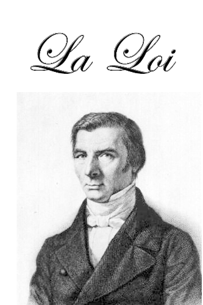

Frédéric Bastiat, trong cuốn sách nổi tiếng của mình "The Law," đã lên án sự biến chất của luật pháp, đó là việc hợp pháp hóa những gì thực sự phải được gọi là cướp bóc dưới danh nghĩa "đoàn kết" . Thật vậy, có một mâu thuẫn trong việc muốn áp đặt tình anh em thông qua luật pháp, điều mà chúng ta ngày nay gọi là "công bằng xã hội" hoặc "sự đoàn kết".

Bởi vì đạo đức được định nghĩa là hành vi tự nguyện. Khi một cá nhân bị buộc phải cho đi thứ họ không muốn, họ luôn là nạn nhân của hành vi trộm cắp.

Thật vậy, khi một sự quyên góp trở nên bắt buộc theo luật, nó không còn là một thái độ đạo đức. Thái độ đạo đức của việc cho đi được thay thế bằng yêu sách "tới quyền," là những yêu sách trên công sức lao động của người khác. Sự đoàn kết giả mạo là lời kêu gọi để sống nhờ vào người khác.

Đây là điều mà Bastiat gọi là "sự ngụy biện của tình anh em pháp lý - the sophism of legal fraternity". Hãy trích dẫn ông ở điểm này:

> Tình anh em là tự phát, hoặc là có tình anh em, hoặc là không. Việc áp đặt nó chính là phá hủy nó.

Và một lần nữa:

> Nhà nước không bao giờ thực hiện được hành động nào khác ngoài việc sử dụng sức mạnh. Tuy nhiên, người ta có thể buộc ai đó phải công bằng, chứ không thể buộc ai đó phải có lòng nhân ái cả. Một khi luật pháp cố gắng sử dụng sức mạnh để làm những điều mà đạo đức làm được thông qua thuyết phục, nó không chỉ làm cho con người rời xa lòng nhân ai mà còn rơi vào khu vực của sự cướp bóc.
> Sự biến chất của luật pháp này có một tên gọi, đó là chủ nghĩa xã hội, tức là ý thức hệ của việc tái phân phối tài sản bằng vũ lực của Nhà nước. Chủ nghĩa xã hội, theo Bastiat, được đặc trưng bởi ý thức hệ của việc cướp bóc hợp pháp. Nhưng sự xảo quyệt của ý thức hệ này là nó che giấu bạo lực của mình dưới sự lạm dụng ngôn từ: lời kêu gọi đoàn kết hoặc tình anh em.

Tuy nhiên, theo Bastiat, có một lựa chọn khác cho sự đoàn kết bắt buộc của nhà nước: "xã hội hỗ trợ lẫn nhau"

Sự hỗ trợ lẫn nhau và tự phát của con người với nhau nhờ vào các xã hội hỗ trợ lẫn nhau. Nhưng ông cũng dự đoán rằng Nhà nước cuối cùng sẽ chiếm đoạt những tổ chức này để biến chúng thành một cơ quan duy nhất và tập trung, khuyến khích chi tiêu và lãng phí.

Trong một cuốn sách có tên "Công lý và Tình anh em - Justice and Fraternity", Bastiat cũng khám phá ý tưởng về một hệ thống thuế đơn giản và công bằng để tài trợ cho nhu cầu tập thể (cảnh sát, tư pháp, quân đội): thu nhập và lợi nhuận sẽ chịu một mức thuế duy nhất và tỷ lệ cố định. Điều này ngày nay được biết đến là "Thuế suất đồng đều - Flat Tax".

Thật vậy, sự đoàn kết trong gia đình, sự đoàn kết địa phương, hoặc hoạt động phúc thiện có tổ chức được phát triển nhiều hơn ở các quốc gia có hệ thống thuế nhẹ và mức độ tự do kinh tế tương đối cao, như Thụy Sĩ và Hoa Kỳ, trong khi bị bóp nghẹt đáng kể ở các quốc gia nơi mà Nhà nước đã thay thế phần lớn trách nhiệm cá nhân, như Pháp hoặc Đức.
Thường thì người ta hay phê phán "sự ích kỷ" đang tồn tại phổ biến trong các xã hội tự do. Nhưng thực tế lại hoàn toàn ngược lại. Khi một xã hội bị gánh nặng bởi thuế và các cá nhân không còn làm chủ tài sản của mình, họ không được khuyến khích đóng góp mà thay vào đó là thu mình lại.

Trên thực tế, một xã hội dân sự tự do không dựa trên sự ích kỷ: nền kinh tế thị trường hoạt động dựa trên cơ sở phục vụ lẫn nhau và sự đối ứng. Người ta chỉ có thể phục vụ lợi ích của bản thân bằng cách phục vụ lợi ích của người khác, bằng cách cung cấp cho người khác một sự đối ứng dẫn đến một sự trao đổi có lợi cho cả hai bên. Nói cách khác, chính sự tự nguyện trao đổi tạo ra sự đoàn kết thực sự.

Tái phân phối bắt buộc không liên quan gì đến tình đoàn kết nhân văn chân chính, điều vốn có bản chất riêng tư hoặc tự nguyện và được thấy trong gia đình, hoặc giữa các thành viên của một tổ chức.

Vì vậy, Bastiat phản đối các nhà xã hội chủ nghĩa về vai trò của luật pháp. Ông viết:
> Luật có thể buộc một người phải công bằng, nhưng không thể buộc anh ta phải tận tụy. Sự đoàn kết giả mạo của các nhà xã hội chủ nghĩa loại bỏ sự tận tụy để thay thế bằng sự cưỡng chế thuần túy của nhà nước, điều này tạo ra nền tảng cho chủ nghĩa toàn trị.

# Luật pháp - The Law

<partId>653cbe58-60e1-5401-8f91-4d9843ac6045</partId>

## Quyền sở hữu

<chapterId>a48a0616-2105-5520-8312-e21a0b6489c7</chapterId>

Ở đây khi nói đến quyền sở hữu - property, chúng ta không nên hiểu là quyền sở hữu đất đai. Nó có nghĩa là "quyền của người lao động đối với giá trị mà anh ta đã tạo ra thông qua công sức lao động của mình." Bastiat chỉ rõ:

> Tôi cho rằng quyền sở hữu hàm chứa tự do, trước hết là tự do về bản thân mình, sau đó là tự do về lao động của mình, và cuối cùng, tự do về thành quả của lao động - điều này chứng tỏ, từ một góc độ nào đó, tự do và quyền sở hữu không thể phân biệt với nhau.

Sau khi thiết lập điểm này, để hiểu về nền tảng đạo đức của quyền sở hữu, Bastiat bắt đầu từ một nguyên tắc nhân học đơn giản rằng từ ban đầu, con người phải làm việc để sống và rằng thành quả của công sức lao động là sự mở rộng của các năng lực, tức là, của bản thân mình.

> Tính cách, Tự do, Sở hữu, — đó là con người. Đó là ba thứ mà người ta có thể nói, mà không cần bất kỳ sự mị dân nào, rằng chúng tồn tại trước và cao cả hơn bất kỳ luật pháp nào do con người đặt ra.

Hiểu theo nghĩa này, quyền sở hữu là một trong những quyền không phát sinh từ luật pháp tích cực mà tồn tại trước nó và là lý do tồn tại của nó. Thực vậy,

> Luật pháp là tổ chức tập thể của quyền tự vệ hợp pháp của cá nhân
> Luật Pháp

Nhiệm vụ của nó là bảo vệ con người và tài sản của họ.

_(François Quesnay, lãnh đạo của các Physiocrats)_

Do đó, quyền không giống như luật pháp. Quyền không đồng nhất với mệnh lệnh của nhà cầm quyền, cũng không phụ thuộc hoàn toàn vào tính hợp pháp của chính nó. Quyền là sản phẩm của một truyền thống, một trật tự pháp lý tồn tại trước và cao cả hơn luật pháp, áp đặt lên người lập pháp cũng như lên bất kỳ công dân bình thường nào.

Quyền "không được tạo ra". Nó không được phát minh từ một tầm nhìn lý tưởng về những gì mà các luật lệ của xã hội nên là, mà nó được khám phá trong bản chất của con người và trong các quy tắc của sự văn minh, được truyền lại bởi sự khôn ngoan của phong tục.
Cá nhân có những quyền tự nhiên tồn tại trước pháp luật: Tài sản, Tự do, Nhân cách. Vai trò của pháp luật nên là bảo vệ những quyền tự nhiên này của các cá nhân và mỗi cá nhân. Do đó, Nhà nước phải được giới hạn. Ngày nay, chúng ta có thể nói rằng Bastiat ủng hộ quan điểm về một nhà nước tối thiểu.

Trong hệ thống của Rousseau, mà chúng ta đã thảo luận trong phần trước, nhiệm vụ của nhà lập pháp là tổ chức, sửa đổi, thậm chí là bãi bỏ quyền sở hữu nếu được coi là thích hợp. Đối với Rousseau, quyền sở hữu không phải là tự nhiên mà là quy ước, giống như xã hội nói chung. Ý tưởng này bắt nguồn từ luật La Mã, mà Rousseau rất quen thuộc.

Robespierre, ngược lại, đặt ra nguyên tắc rằng "Quyền sở hữu là quyền của mỗi công dân được hưởng và định đoạt phần tài sản được pháp luật đảm bảo cho mình."

Đối với Rousseau, quyền sở hữu không tồn tại trước quyền, mà chỉ là một quy ước được thiết lập bởi ý chí chung và trong những giới hạn mà nó quyết định. Kết quả là, không có tự do hay quyền nào độc lập với xã hội và ý chí tốt của các nhà lập pháp. Nhưng nếu tách quyền sở hữu ra khỏi quyền, điều này dễ dàng biện minh cho những quyền giả mạo, chỉ được giành được bằng cách vi phạm quyền của người khác.

Ví dụ: quyền làm việc hoặc quyền có nhà ở.

Để có được thứ gì đó miễn phí, phải có ai đó trả tiền thay cho tôi. Và nếu Nhà nước trả tiền, vì nó không tạo ra của cải, nó chỉ có thể làm như vậy bằng cách lấy tài sản của một người nào đó, hoặc tương đương, để cho tôi.

Do đó, theo Bastiat, ý tưởng rằng quyền sở hữu là một sáng tạo của pháp luật dẫn đến việc mở ra một lĩnh vực không giới hạn cho những người không tưởng muốn mô hình hóa xã hội theo kế hoạch của họ.

Trong hệ thống tự do tự nhiên, tồn tại một luật tự nhiên, độc lập với sự thay đổi của các nhà lập pháp. Nó có giá trị cho tất cả mọi người và tồn tại trước bất kỳ xã hội nào. Và nhiệm vụ của chính phủ là đảm bảo quyền tự nhiên của mỗi cá nhân. Một xã hội công bằng là xã hội mà ở đó quyền sở hữu được tôn trọng hoàn toàn, tức là được bảo vệ khỏi bất kỳ sự can thiệp nào từ người khác.

Ở đây, Bastiat đồng nhất mình với di sản của các nhà tư tưởng theo trường phái trọng nông (Physiocrats), và hơn thế nữa, với truyền thống triết học pháp luật của Cicero và Aristotle. Pháp luật không tạo ra quyền. Sứ mệnh của nó là bảo vệ chúng và do đó bảo vệ quyền sở hữu, bao gồm cả sở hữu chính bản thân, sự toàn vẹn của cá nhân, cũng như quyền sở hữu thành quả lao động của mình.

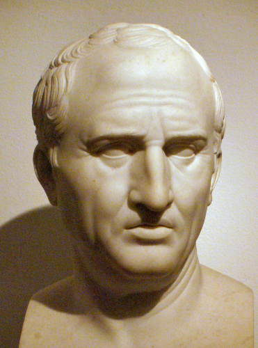
_(Cicero)_

## Sự tước đoạt hợp pháp: Sự đồi truỵ của pháp luật

<chapterId>b4122847-e477-578e-ba34-d35844ac4715</chapterId>

Ý tưởng chính của Bastiat trong "The Law", cuốn sách nổi tiếng của ông được xuất bản năm 1850, là để chỉ ra lý do và cách thức mà pháp luật đã trở thành công cụ tước đoạt, tức là nguồn gốc của đặc quyền, của lợi ích, và sự tùy tiện về thuế.

Bản chất thực sự của pháp luật là gì?

Bastiat bắt đầu bằng cách thiết lập các nền tảng nhân học tự nhiên của pháp luật: sự sống, tự do và quyền sở hữu.

Hệ thống tự do tự nhiên là hệ thống mà xã hội, cá nhân và quyền sở hữu tồn tại trước khi tồn tại pháp luật. Trong hệ thống này, Bastiat thêm vào:
> Không phải vì có luật mà có quyền sở hữu, mà vì có quyền sở hữu nên mới có luật.

Mỗi người đều được phép bảo vệ cuộc sống của mình và sử dụng các năng lực của mình. Và pháp luật là tổ chức tập thể của sự phòng vệ hợp pháp này. Pháp luật bảo vệ công lý. Không phải là công lý tích cực, thứ tổ chức nên tình anh em và tình đoàn kết, mà là công lý tiêu cực, nhằm ngăn chặn quyền của một người xâm phạm quyền của người khác.

Tuy nhiên, khi luật không còn là tiêu cực mà trở nên tích cực, cảm giác bất bình đẳng trong xã hội tăng lên và tạo ra xung đột. Nếu chúng ta mở rộng vô hạn phạm vi của pháp luật, tức là trách nhiệm của chính phủ, chúng ta mở ra "một chuỗi không kết thúc của những lời than phiền, hận thù, rối loạn và nổi dậy," ông viết.

Lòng nhân ái giả tạo, Bastiat nói, là một trong những nguyên nhân chính dẫn đến sự biến chất của pháp luật. Một số người tự coi mình cao hơn phần còn lại của nhân loại và có khả năng đưa ra lựa chọn tốt hơn người khác.

Họ biết rõ hơn điều gì tốt cho người khác và sẽ áp đặt quan điểm của họ về cái thiện lên tất cả mọi người, đó là những nhà nhân ái. Họ đã tạo ra những quyền giả mạo mà ngày nay được gọi là quyền xã hội. Quyền xã hội không gì khác hơn là quyền trên lao động của người khác, quyền sử dụng tài sản của một người, thành quả lao động của một người: quyền về nhà ở, quyền về sức khỏe, giáo dục, làm việc, lương tối thiểu, v.v.

Cướp bóc là gì? Đó là điều hoàn toàn ngược lại với quyền sở hữu, Bastiat cho chúng ta biết. Cướp bóc xuất phát từ "spoliare", đến từ Latinh, nghĩa là lột trần. Chúng ta đã thấy rằng con người chỉ có thể sống bằng cách chiếm hữu các vật phẩm, bằng cách áp dụng năng lực của mình lên các vật phẩm, tức là bằng cách làm việc. Thật không may, anh ta cũng có thể chiếm đoạt thành quả từ năng lực làm việc của đồng loại, tức là cướp bóc họ.

Toàn bộ sứ mệnh của pháp luật là ngăn chặn cướp bóc ngoài phạm vi pháp luật, tức là bảo vệ quyền sở hữu và tự do, hai thứ không thể tách rời.

Ngay khi chúng ta chấp nhận nguyên tắc rằng pháp luật có thể bị trệch khỏi sứ mệnh thực sự của mình, rằng nó có thể vi phạm quyền sở hữu thay vì bảo đảm chúng, một cuộc đấu tranh giai cấp là điều tất yếu, hoặc là để bảo vệ chống lại sự cướp bóc hoặc để tổ chức nó cũng vì lợi ích của mình.

Thay vì bảo vệ quyền tự nhiên, pháp luật biến thành bảo vệ lợi ích của tập thể và các nhóm. Cướp bóc được tổ chức bởi pháp luật, vì lợi ích của các lớp người tạo ra nó và bạn bè hoặc khách hàng của họ. Bastiat như vậy dự đoán trường phái lựa chọn công cộng trong thế kỷ 20, cho rằng pháp luật là kết quả của một "thị trường chính trị" mà qua đó các nhóm người tìm cách thỏa mãn lợi ích của mình trên sự tổn thất của người khác.

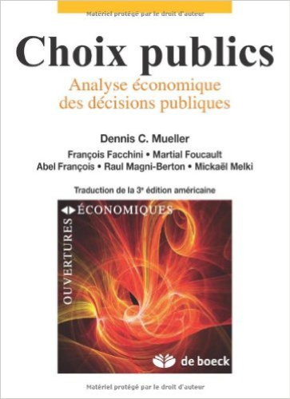

Đối với ông, mục đích của Luật chỉ đơn giản là "chấm dứt mọi hình thức cướp bóc." Nếu Nhà nước không can thiệp vào đời sống tư nhân, cá nhân thực sự là chủ sở hữu và chịu trách nhiệm về cuộc sống của họ. Họ tự tạo ra hạnh phúc của mình. Họ chịu hậu quả, dù tốt hay xấu, từ hành động của mình.

Họ chắc chắn rằng quyền tự nhiên của họ được bảo đảm và không thể bị xâm phạm. Quyền sở hữu an toàn cho phép mọi người lập kế hoạch dài hạn vì họ biết tài sản của họ được bảo vệ khỏi việc bị tước đoạt.

> Vắng bóng cướp bóc, — đó là nguyên tắc của công lý, hòa bình, trật tự, ổn định, hòa giải, và lẽ thường mà tôi sẽ tuyên bố với tất cả sức lực, thật không may! quá ít ỏi, của phổi tôi, cho đến hơi thở cuối cùng của mình.
> Bastiat đã viết trong "The Law", một thời gian trước khi ông qua đời.
Một thế kỷ sau cái chết của Frédéric Bastiat, việc cướp bóc bằng pháp luật rõ ràng được thể hiện trong Tuyên ngôn Quyền con người Toàn cầu năm 1948, đặc biệt là trong các điều khoản 22 ("mọi người đều có quyền được an sinh xã hội"), 23 ("mọi người đều có quyền làm việc"), 24 ("mọi người đều có quyền nghỉ ngơi và giải trí"), 25 ("mọi người đều có quyền có một mức sống đủ đảm bảo sức khỏe và hạnh phúc"), 26 ("mọi người đều có quyền được giáo dục").

## Vai trò của pháp luật và Nhà nước

<chapterId>52258229-7c7c-592b-aa27-203b03aa41c9</chapterId>

Năm 1848, Bastiat là một nghị sĩ. Ông được bổ nhiệm làm phó chủ tịch ủy ban tài chính. Do đó, ông đặc biệt có vị trí tốt để trả lời câu hỏi này: Nhà nước là gì? Chúng ta cần Nhà nước đảm bạo sự thịnh vượng của mình. Nhưng Bastiat nhắc nhở chúng ta rằng Nhà nước không thể cho công dân bất cứ thứ gì mà nó không trước tiên lấy từ họ.

Bastiat bắt đầu bằng cách lật ngược một phương trình được chấp nhận phổ biến: đó là Nhà nước nuôi dưỡng đất nước. Tuy nhiên, Nhà nước không thể nuôi dưỡng công dân vì nó không sản xuất ra của cải; nó chỉ di chuyển, phân phối lại của cải. Ngược lại, chính công dân nuôi dưỡng Nhà nước thông qua việc tạo ra của cải.

Hơn nữa, về bản chất Nhà nước không tồn tại; chỉ có những con người tạo nên Nhà nước, những người quản lý, điều hành, sống trực tiếp hoặc gián tiếp từ Nhà nước. Do đó, những người quản lý Nhà nước cũng giống như những người khác; họ tìm cách thỏa mãn lợi ích cá nhân của mình.

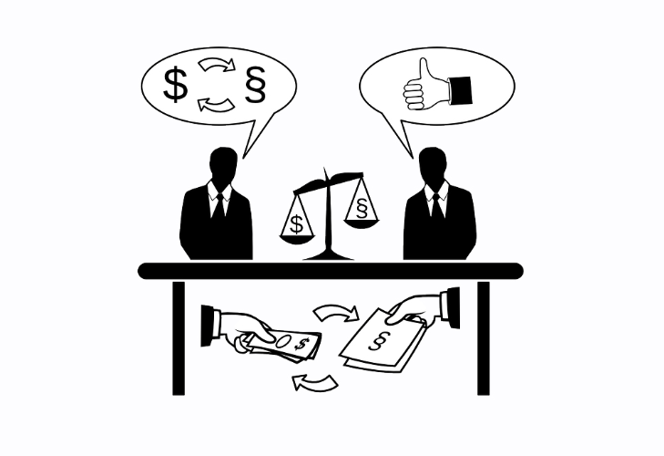

Và vì hành động của Nhà nước hoàn toàn là tái phân phối, nó chịu sức ép từ các nhóm lợi ích đặc biệt. Thực vậy, một số nhóm lợi ích đặc biệt đã nhận ra rằng kiếm tiền thông qua hoạt động chính trị dễ dàng hơn là thông qua các hoạt động sản xuất. Họ tìm cách cướp tiền của người khác dưới danh nghĩa Nhà nước, làm suy yếu khả năng sản xuất của thị trường thông qua việc gia tăng luật pháp, thuế và các ràng buộc hành chính.

Nói cách khác, Nhà nước chỉ theo đuổi mục tiêu thiên lệch của các nhóm "khách hàng" khác nhau, và khái niệm về lợi ích chung không có ý nghĩa. Bất kỳ lợi ích nào mà một số người đạt được đều có được từ chi phí của người khác phải chịu: đây không phải là trò chơi có tổng bằng 0, mà là trò chơi có tổng âm.

Bastiat đã dự đoán trước một thế kỷ trước về các phân tích về hoạt động của thị trường chính trị sẽ xuất hiện vào cuối những năm 1950 với trường phái lựa chọn công cộng (Public Choice School) của James Buchanan, người đoạt giải Nobel Kinh tế, và đồng nghiệp của ông, Gordon Tullock.

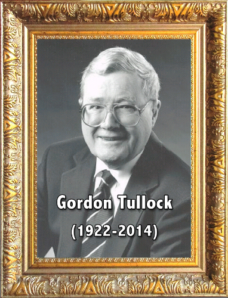

Hơn nữa, Bastiat khẳng định, Nhà nước không có quyền nào mà trước đó không tồn tại ở dạng quyền cá nhân. Tại sao Nhà nước có quyền đảm bảo, ngay cả bằng vũ lực, quyền sở hữu của mỗi cá nhân? Đơn giản là vì quyền này tồn tại trước trong mỗi cá nhân. Không thể phủ nhận quyền tự vệ chính đáng của các cá nhân, quyền sử dụng vũ lực nếu cần thiết để chống lại các cuộc tấn công nhằm vào con người, khả năng của họ và tài sản của họ. Quyền tự vệ tự nhiên này, tồn tại ở tất cả công dân, có thể có một hình thức tập thể và hợp pháp hóa sức mạnh chung.
Vì vậy, để biết liệu Nhà nước có được trao quyền một cách hợp pháp hay không, người ta phải hỏi liệu quyền này có tồn tại ở cá nhân theo cách tổ chức của họ và trong trường hợp không có chính phủ hay không.
Đó là lý do tại sao Nhà nước không thể trong bất kỳ trường hợp nào xâm phạm quyền tự nhiên; ngược lại, nó phải đảm bảo chúng.

Nó đảm bảo An ninh, cả nội bộ và bên ngoài, và công lý. Nó có thể mạnh mẽ và hiệu quả trong lĩnh vực của mình. Nhưng luật pháp không thể bước ra ngoài vai trò hết sức nghiêm ngặt này vì khi đó nó trở thành công cụ của việc cướp bóc từ người này để phục vụ cho lợi ích của người khác. Khi luật pháp bị bóp méo và vượt ra ngoài phạm vi vai trò rất chặt chẽ nêu trên, nó sẽ trở thành công cụ của bất công. Sự bóp méo của luật pháp luôn dẫn đến sự cướp bóc, như chúng ta đã thấy trong phần học trước. Điều này là tức thì, tự động, không thể tránh khỏi, và chắc chắn. Việc đưa luật pháp ra khỏi lĩnh vực của mình chỉ làm tổn hại đến quyền tự nhiên. Xã hội dân sự sau đó bị tước bỏ quyền lực của mình (các tổ chức tự nhiên, hợp đồng, giao dịch, hiệp hội) để ưu tiên cho quản lý nhà nước, tức là quản lý kỹ trị và quan liêu.

Kết quả là, theo Bastiat, chỉ có ba dịch vụ công hợp pháp của Nhà nước là: quân đội, cảnh sát và tư pháp. Nói cách khác, Nhà nước phải đảm bảo bảo vệ nội bộ và bên ngoài cho cá nhân, tự do và tài sản của họ. Vì vậy, là điều bình thường khi mọi người đóng góp vào sự bảo vệ này. Tuy nhiên, ngoài những chức năng hợp pháp này, bất kỳ sự đóng góp nào khác cho dịch vụ khác do Nhà nước cung cấp đều phải được xem xét kỹ lưỡng.

> Ngoài vòng tròn này, Bastiat viết, tôn giáo, giáo dục, hiệp hội, lao động, thương mại, tất cả thuộc về lĩnh vực hoạt động tư nhân, dưới sự giám sát của cơ quan công quyền, ở đó họ chỉ nên có nhiệm vụ giám sát và trừng phạt.

Về các dịch vụ công, ông đưa ra một nguyên tắc đơn giản:
Nếu bạn muốn tạo ra một chức năng, hãy chứng minh tính hữu ích của nó. Chứng minh rằng nó xứng đáng với các dịch vụ mà nó cung cấp, tương đương với chi phí của nó. Do đó, ông kết luận, hợp lý khi chỉ giao cho khu vực công những gì khu vực tư nhân hoàn toàn không thể thực hiện được.

Tóm lại, khi một chính phủ vượt quá sứ mệnh bảo vệ người dân và tài sản, nó khuyến khích các nhóm lợi ích tìm kiếm đặc quyền và ảnh hưởng đến quyền lực để nhận được lợi ích từ người nộp thuế và người tiêu dùng.

> Nhà nước là sự ảo tưởng lớn lớn, qua đó mọi người cố gắng sống dựa trên chi phí mà người khác phải trả.

Frédéric Bastiat đã viết trong một cuốn sách nhỏ có tựa đề "Nhà nước - The State".

# Kết luận

<partId>3b62de5c-5d4a-5182-ab14-f7ef13c97e28</partId>

## Cho chúng tôi biết phản hồi của bạn về khóa học này
<chapterId>db20170d-ceb6-56cd-b4e5-c690942f8b29</chapterId>
<isCourseReview>true</isCourseReview>

## Di sản của Frédéric Bastiat

<chapterId>2a2a181a-e477-5be1-ba1f-af59490c364e</chapterId>

Ảnh hưởng của Bastiat bắt đầu suy giảm vào cuối thế kỷ 19, với sự trỗi dậy của chủ nghĩa xã hội và đặc biệt là chủ nghĩa Marx trong các trường đại học và viện nghiên cứu, được tài trợ bằng tiền công.

Bước sang thế kỷ 20, kiến thức và sự nổi tiếng của Bastiat biến mất. Ông không còn được nhắc đến trong sách giáo khoa về kinh tế. Phải đến sau Thế chiến II, sự quan tâm mới đối với ý tưởng về tự do, vốn đã bị lãng quên dưới thời Roosevelt và các chế độ toàn trị ở Châu Âu, mới xuất hiện trở lại. Một trong những kiến trúc sư của sự hồi sinh này là nhà kinh tế học người Áo Ludwig von Mises, một trong nhiều trí thức châu Âu đã chạy trốn khỏi châu Âu qua Tây Ban Nha và Bồ Đào Nha để đến Mỹ.
Định cư tại New York vào năm 1943, Mises đã tổ chức các hội thảo thu hút những bộ óc kiệt xuất: George Stigler, Milton Friedman, cả hai sau này đều là những người đoạt giải Nobel, và Murray Rothbard, khi đó là sinh viên tại Columbia. Chính trong những hội thảo này, ông lần đầu tiên nhắc đến Bastiat như một trong những nguồn tham khảo chính của chủ nghĩa tự do cổ điển. Ông đã giới thiệu cho người nghe các cuốn sách nhỏ của Bastiat, "The Law" và "The State", khi đó chưa được dịch sang tiếng Anh. Vào năm 1953, một trong những người tham gia hội thảo, Leonard Read, đã cho dịch "The Law" của Bastiat sang tiếng Anh và đảm nhận nhiệm vụ phân phối cuốn sách khắp đất nước thông qua quỹ của mình: Quỹ giáo dục kinh tế - Foundation for Economic Education.

Nhưng một người khác cũng đãcphổ biến các luận điểm của Frédéric Bastiat là một nhà bình luận kinh tế cho New York Times, Henry Hazlitt, trong một cuốn sách nhỏ có tên: "Economics in One Lesson," xuất bản năm 1946. Rõ ràng là Hazlitt đã rút ra từ ý tưởng của Bastiat, nhằm chứng minh rằng vấn đề với các giải pháp kinh tế của nhà nước là họ thất bại trong việc xem xét những hậu quả tai hại lâu dài của chúng.

Hazlitt bắt đầu cuốn sách của mình bằng cách kể lại câu chuyện về cửa sổ bị vỡ của Bastiat. Ông tóm tắt câu chuyện trong một bài học đơn giản và độc đáo:

> Nghệ thuật của kinh tế học bao gồm việc nhìn không chỉ vào hiệu ứng trước mắt mà còn ở những tác động lâu dài của bất kỳ hành động hoặc chính sách nào; nó bao gồm việc theo dõi hậu quả của chính sách đó không chỉ cho một nhóm mà cho tất cả các nhóm.

Sau đó, Hazlitt áp dụng bài học này vào một loạt các vấn đề kinh tế: kiểm soát giá thuê nhà, luật lương tối thiểu, lợi ích giả định của chiến tranh, công trình công cộng và thâm hụt ngân sách, lạm phát tiền tệ, thuế quan và cuối cùng là tiết kiệm.

Bastiat là một trong những nhà kinh tế học yêu thích của Ronald Reagan, từ rất lâu trước khi ông được bầu làm tổng thống. Điều này ít được biết đến, nhưng trong tám năm, Reagan đã làm việc cho công ty General Electric với tư cách là người dẫn chương trình truyền hình của họ trên CBS, và là người chịu trách nhiệm về chương trình đào tạo nhân viên của công ty. Chương trình đào tạo của ông được xây dựng quanh các văn bản giới thiệu về nền kinh tế thị trường. Các tác phẩm được chọn là của hai người Áo, Hayek và Mises, hai người Anh, Cobden và Bright, và một người Pháp, Frédéric Bastiat.

Bài học mà Reagan dạy cho nhân viên của mình, theo Bastiat, là không có ảo tưởng nào lớn hơn việc kích thích tăng trưởng và việc làm thông qua chi tiêu công.

Đặc biệt, John Maynard Keynes đã đề xuất rằng chi tiêu công làm gia tăng sản lượng theo hệ số nhân: nếu chính phủ xây một cây cầu, những người lao động của cây cầu đó sẽ có thể mua bánh mì, sau đó người bán bánh mì có thể mua giày, và cứ thế tiếp tục. Nếu ngành công nghiệp tư nhân đang suy giảm, nó có thể được khắc phục bằng các công trình lớn. Nếu có thất nghiệp, Nhà nước có thể tạo ra việc làm trong khu vực công.
Nhưng như Bastiat đã minh họa một cách đúng đắn, sự can thiệp của nhà nước có những tác động xấu không được nhìn thấy. Chỉ một nhà kinh tế học giỏi mới có thể dự đoán chúng. Hãy lấy một ví dụ: Đó là ảo tưởng khi tin rằng chính phủ có thể "tạo ra việc làm" bởi vì cho mỗi công việc thuộc khu vực công được tạo ra, nó phá hủy một công việc trong thị trường. Thực tế, công việc công được trả lương bằng thuế. Công việc công không được tạo ra; chúng được nhận thức. Mỗi đồng xu được chi tiêu bởi Nhà nước đều phải được thu thông qua một đồng xu thuế hoặc nợ.
Nếu nhìn nhận vấn đề từ góc độ này, Reagan giải thích với các nhân viên của GE, những điều được gọi là phép màu của chi tiêu nhà nước xuất hiện dưới một ánh sáng hoàn toàn khác. Bởi vì thuế làm giảm sản xuất, và tài sản được tạo ra bởi chi tiêu công không thể hoàn toàn bù đắp cho những gì bị ngăn chặn bởi các khoản thuế được thu để tài trợ cho các khoản chi tiêu này.

Về bản chất, Reagan đã lấy từ Bastiat một số yếu tố then chốt của một tầm nhìn tự do về xã hội và con người: ưu tiên hơn vai trò của xã hội dân sự so với Nhà nước, giá trị của sự lựa chọn và trách nhiệm cá nhân, tầm quan trọng của doanh nhân trong việc tạo ra của cải, vật chất, tầm quan trọng của một khung pháp lý linh hoạt và tối thiểu, để tạo niềm tin và sự tôn trọng đối với các hợp đồng, quy luật cơ bản rằng của cải phải được tạo ra trước khi nó có thể được phân phối, mong muốn mang lại cho mọi người một cơ hội trong thị trường cạnh tranh...

