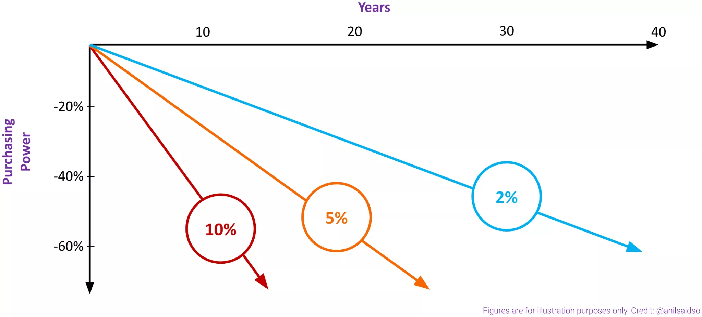

Bạn đã bao giờ tự hỏi:

Tại sao chi phí sinh hoạt của tôi lại tăng lên không ngừng?
Lạm phát có thực sự có lợi cho tôi không?
Những lựa chọn nào đang sẵn có để giúp tôi bảo vệ bản thân khỏi lạm phát?
Bitcoin hoặc các đồng stablecoin phù hợp như thế nào trong tất cả những điều này?

Nếu bạn trả lời có cho bất kỳ câu hỏi nào trên, chúc mừng bạn đã đến đúng nơi.

Chào mừng bạn đến với "Lựa Chọn Thay Đổi - Opting In To Change," nơi chúng ta sẽ đi sâu xuống phía dưới bề mặt của hệ thống tiền tệ hiện tại trong khi xem xét một số công cụ đang sẵn có để tạo ra sự thay đổi tích cực. Do thế giới của chúng ta đang đối mặt với những mối đe dọa ngày càng tăng đối với quyền tự do và việc vi phạm quyền con người leo thang, khóa học này cố gắng mang lại một ngọn hải đăng - một hệ thống thay thế nhằm trả lại chủ quyền kiểm soát cho mỗi cá nhân.

Nếu những gì bạn vừa đọc đã làm bạn quan tâm, chúng tôi hy vọng bạn sẽ tham gia cùng chúng tôi trên hành trình giáo dục này.

Bạn nên mong đợi điều gì từ khoá học này:

Thân thiện với người mới bắt đầu
Khoảng 3 giờ nội dung tự học
Các bài kiểm tra tương tác để kiểm tra kiến thức của bạn
Được viết bởi các chuyên gia trong ngành
Các ví dụ từ khắp nơi trên thế giới và từ mọi tầng lớp của cuộc sống

Yêu cầu: Một niềm đam mê học hỏi

Khóa học này được tài trợ bởi TETHER

+++

# Giới thiệu
<partId>d44d9f32-c72e-58a4-9855-12e29f3e763c</partId>

## Giới thiệu
<chapterId>2eaf5947-8180-540e-9418-c40bf04e07ce</chapterId>

### Chúng ta sống trong một thế giới mà:

● Chỉ có [20%](https://freedomhouse.org/sites/default/files/2022-02/FIW_2022_PDF_Booklet_Digital_Final_Web.pdf) người dân được sống trong các xã hội được coi là "tự do dân chủ." Tuy nhiên, ngay cả trong phần nhỏ có đặc quyền này, sự vi phạm quyền con người ngày càng trở nên phổ biến - từ việc đóng băng tài khoản ngân hàng đến kiểm duyệt. 80% còn lại đang bị mắc kẹt bởi sự xâm phạm của các chế độ chuyên quyền. Chỉ mới hai thập kỷ trước thôi, gần một nửa dân số thế giới được hưởng những quyền tự do cơ bản nhất.

● [1.4](https://www.worldbank.org/en/news/feature/2022/07/21/covid-19-boosted-the-adoption-of-digital-financial-services#:~:text=Globally%2C%20some%201.4%20billion%20adults,go%2C%20much%20more%20is%20needed.) tỷ người trưởng thành trên toàn thế giới vẫn không có tài khoản ngân hàng, trong khi một lượng lớn những người khác chỉ có thể tiếp cận với các dịch vụ ngân hàng rất hạn chế.

● Đến cuối năm [2022](https://elements.visualcapitalist.com/mapped-countries-with-highest-inflation-rate/), gần một nửa thế giới phải đối mặt với tỷ lệ lạm phát hai con số, làm mất giá trị của đồng tiền vất vả kiếm được. Đễ thấy rõ sức tàn phá của lạm phát, hãy tính toán, với tỷ lệ lạm phát 10% trong một thập kỷ, sức mua đồng tiền trong tay của bạn sẽ bị mất đi 65% giá trị.

● Và ngay cả khi không có những giai đoạn lạm phát kéo dài như vậy, USD, có lẽ là đồng tiền mạnh nhất toàn cầu, đã chứng kiến sự sụt giảm [96%](https://www.visualcapitalist.com/purchasing-power-of-the-u-s-dollar-over-time/) sức mua của nó trong thế kỷ qua.
Đây là một số sự thật khắc nghiệt về môi trường kinh tế toàn cầu của chúng ta. Hệ thống tài chính của chúng ta thiếu khả năng đáp ứng nhu cầu của đại đa số người dân. Những hệ thống này duy trì sự bất bình đẳng, loại trừ nhiều người, và làm suy yếu quyền lực của hàng tỷ người trên toàn cầu.

Nếu bạn cảm thấy mình bị áp lực bởi sự leo thang không ngừng của giá cả hoặc sự thiếu hụt về sự bao trùm tài chính trong hệ thống hiện tại của chúng ta, hãy biết rằng bạn không đơn độc. Đây là những phụ phẩm của hệ thống tiền tệ hiện nay của chúng ta.

Mặc dù triển vọng của chúng ta có vẻ ảm đạm, mục tiêu của khóa học này không phải là tập trung vào những thách thức của hoàn cảnh hiện tại. Thay vào đó, chúng tôi muốn chuyển hướng sự chú ý của mình vào việc đạt được sự tự do và chủ quyền về mặt tài chính.

Điều đó nói lên, khóa học này không chỉ dành cho những người đang đối mặt với lạm phát tràn lan hoặc bị hạn chế quyền truy cập vào cơ sở hạ tầng tài chính hoặc dịch vụ ngân hàng hiện tại. Dù bạn đã quen thuộc với những vấn đề này một chút hay chỉ đơn giản là muốn mở rộng kiến thức của mình, khóa học này được thiết kế để mang lại lợi ích cho bất kỳ ai muốn nâng cao hiểu biết và có được các công cụ cần thiết để vượt qua những rào cản này và lấy lại quyền tự chủ tài chính cho bản thân.

Với ý nghĩ này, sứ mệnh của chúng tôi là đưa bạn lên tiền tuyến của sự thay đổi cho lĩnh vực tài chính hiện tại của chúng ta, thách thức các quy chuẩn hiện hữu và đề xuất các giải pháp thay thế. Thông qua việc khám phá lịch sử phát triển của tiền tệ, làm sáng tỏ bản chất của Bitcoin, và khám phá Tether và thế giới của các đồng stablecoin, chúng tôi mong muốn truyền cảm hứng cho mọi cá nhân để họ làm mới lại tương lai tài chính của bản thân.

### Điều bạn có thể mong đợi:

**Mô-đun 1: Cái giá của sự tiến bộ - Một cái nhìn chi tiết hơn về hệ thống tài chính của chúng ta**
Chúng ta bắt đầu khám phá của mình bằng cách nhìn vào phía sau bức màn của hệ thống tài chính hiện tại, nơi kiểm duyệt tài chính, bất bình đẳng về tài sản và lạm phát đang huỷ hoại cuộc sống hàng ngày của chúng ta. Thông qua một lịch sử ngắn gọn về sự phát triển của tiền tệ, chúng ta sẽ xem xét cách xác định vị trí hiện tại của mình, làm sáng tỏ một số điểm đau chính yếu mà chúng ta đều đang trải qua.

**Mô-đun 2: Giải phóng sự tự do về tài chính - Giới thiệu về Bitcoin**
Mô-đun này sẽ làm sáng tỏ Bitcoin, chinh phục các thuật ngữ để giúp bạn hiểu được điều gì làm cho Bitcoin khác biệt so với các đồng tiền truyền thống. Từ cách nó hoạt động đến cách sử dụng nó, chúng tôi sẽ hướng dẫn bạn thông qua chức năng và cách tương tác với Bitcoin.

**Mô-đun 3: Ổn định giữa sự hỗn loại - Giới thiệu về Tether và thế giới của Stablecoin**
Trong mô-đun này, chúng ta sẽ nhìn sâu vào bên trong đồng stablecoin hàng đầu, Tether, khám phá cách đồng tiền kỹ thuật số này duy trì giá trị của mình và có khả năng mang lại tự do cho những người đang đối mặt với các chính phủ độc đoán, sự thiếu vắng các dịch vụ tài chính hoặc lạm phát không kiểm soát.

**Mô-đun 4: Vượt qua sự hoài nghi - Phản biện để bác bỏ những hiểu lầm phổ biến và các trường hợp ứng dụng thực tế**
Cuối cùng, chúng ta sẽ thách thức những hiểu lầm phổ biến về Bitcoin cũng như stablecoin và cung cấp các ví dụ về các trường hợp sử dụng thực tế của các cá nhân đã chấp nhận và đang hưởng lợi từ những công nghệ này.

Khi kết thúc khóa học này, không chỉ có được kiến thức mạnh mẽ và công cụ vô giá để tìm hướng đi cho bản thân trong hệ thống tài chính phức tạp mà chúng ta đang có, mà bạn cũng sẽ hiểu rõ hơn về cách Bitcoin và các đồng stablecoin, như Tether, trao quyền cho người dùng bằng cách cho phép họ lựa chọn một hệ thống tiền tệ thay thế - một hệ thống đặt sự ưu tiên vào các cá nhân, mang lại cho bất kỳ ai quyền kiểm soát tốt hơn về tình hình tài chính của họ. Với sự hiểu biết này, bạn sẽ được trang bị tốt hơn để theo đuổi tự do tài chính, quyền lực cá nhân và giải phóng bản thân khỏi những xiềng xích.

Chúng tôi rất vui mừng chào đón bạn tham gia cùng chúng tôi trong hành trình này để cùng nhau khám phá hệ thống tiền tệ của chúng ta.

# Cái giá của sự tiến bộ - MMột cái nhìn chi tiết hơn về hệ thống tài chính của chúng ta
<partId>25ed8242-1b5a-5b53-b833-824b0dd80bcc</partId>

## Giới thiệu về tiền
<chapterId>927ad49a-d8d6-5dd3-9250-cdcadcbf425e</chapterId>
Tiền là một phần hấp dẫn và thiết yếu trong cuộc sống hàng ngày của chúng ta. Hàng ngày chúng ta sử dụng tiền để mua thực phẩm, thanh toán hóa đơn và thực hiện vô số giao dịch khác. Nhưng thực sự tiền là gì? Về cơ bản, tiền chỉ là một phương tiện trung gian thanh toán, một công cụ cho phép chúng ta trao đổi hàng hóa và dịch vụ với nhau. Đó là một khái niệm trừu tượng mà chúng ta đều coi là điều hiển nhiên, nhưng lại cực kỳ cơ bản đối với hệ thống kinh tế của chúng ta.

Nhưng không phải tất cả các loại tiền đều được tạo ra đều giống nhau. Một số loại tiền tệ tốt hơn những loại khác, tùy thuộc vào khả năng của chúng trong việc thực hiện vai trò như một kho lưu trữ giá trị, phương tiện trung gian thanh toán và đơn vị kế toán. Vàng, chẳng hạn, đã được đánh giá cao hàng ngàn năm vì độ bền và sự khan hiếm của nó. Ngược lại, tiền giấy chỉ có giá trị bằng niềm tin mà chúng ta đặt vào các tổ chức phát hành ra nó.

Trong mô-đun này, chúng ta sẽ khám phá các chức năng và đặc điểm khác nhau của tiền và điều gì tạo nên một đồng tiền tốt (hay đúng hơn là một dạng tiền tệ tốt). Dù bạn là người bình thường, chủ doanh nghiệp, nhà đầu tư, hay chỉ đơn giản là tò mò về thế giới tài chính, mục tiêu của chúng tôi là giúp bạn có được hiểu biết sâu sắc hơn về khái niệm trừu tượng nhưng cực kỳ thiết yếu này, thứ ảnh hưởng đến cuộc sống của tất cả chúng ta. Hãy cùng nhau khám phá…

### Tiền là gì?

Ở hình thái đơn giản nhất, tiền có thể được hiểu là phương tiện mà hai bên đồng ý sử dụng để dàn xếp và thực hiện việc trao đổi một sản phẩm, hàng hóa hoặc dịch vụ.

Tiền cho phép chúng ta trao đổi nguồn lực hoặc dịch vụ của mình lấy một kho lưu trữ giá trị, bất kể chúng ta có nhu cầu sử dụng ngay giá trị lưu trữ này hay không. Điều này đã cho phép nền văn minh của chúng ta mở rộng và phát triển hiệu quả hơn nhiều so với thời kỳ mà chúng ta vẫn dựa vào các phương thức như đổi hàng đổi hàng.

Đối với người bình thường, tiền giữ giá trị của nó vì chỉ có hai cách để có được tiền:

1. Chúng ta phải dành thời gian và năng lượng để đổi lấy tiền (tức là làm việc, lao động, làm dịch vụ).
2. Chúng ta phải trao đổi hàng hóa hoặc nguồn lực để lấy tiền.

Quan trọng là phải lưu ý rằng, trong điểm thứ hai ở trên, để có được những hàng hóa và nguồn lực này để trao đổi, ai đó ở một giai đoạn nào đó đã phải dành thời gian và năng lượng để tạo ra chúng. Do đó, chúng ta có thể suy luận rằng chúng ta phải dành thời gian và năng lượng để có được tiền. Vì vậy:

Tiền = Thời Gian + Năng Lượng

Khi coi tiền như một kho lưu trữ thời gian và năng lượng, nói một cách ẩn dụ, chúng ta có thể hiểu rõ hơn rằng tiền cơ bản là một viên pin - một kho lưu trữ năng lượng có thể được sử dụng vào một thời điểm nào đó sau này. Với phép ẩn dụ này trong tâm trí, sự tiến hóa của tiền, theo lý thuyết, là công cuộc liên tục tìm kiếm viên pin hiệu quả nhất để lưu trữ thời gian và năng lượng.

### Điều gì tạo nên một đồng tiền tốt?

Khi bạn đọc phần giới thiệu, bạn có thể đã nhận thấy ba thuật ngữ quan trọng: kho lưu trữ giá trị, phương tiện trung gian thanh toán, và đơn vị kế toán. Đừng lo lắng nếu bạn không quen thuộc với các thuật ngữ này. Đây là ba chức năng thiết yếu để tiền mang lại giá trị cho người sở hữu và thường được gọi là các chức năng của tiền.

Hãy cùng xem xét từng chức năng:

1. **Kho lưu trữ giá trị - Store of Value:** Tiền đóng vai trò như một phương tiện lưu trữ giá trị để có thể sử dụng trong tương lai, nó cho phép người sở hữu bảo toàn sức mua của mình theo thời gian. Làm như vậy, nó mang đến cho người sở hữu khả năng tiết kiệm và lập kế hoạch cho tương lai. Vàng được coi là ví dụ điển hình của kho lưu trữ giá trị, vì trong nhiều thế kỷ, chúng ta có khả năng mua một bộ vest đẹp chỉ với một ounce vàng.
2. **Phương tiện trung gian thanh toán - Medium of Exchange:** Để tiền được sử dụng như một phương tiện trung gian thanh toán khả thi cho hàng hóa và dịch vụ, nó phải dễ dàng được trao đổi. Mặc dù bất kỳ tài sản nào cũng có thể được sử dụng làm tiền, nhưng sẽ là không thực tế khi sử dụng các tài sản lớn và không di chuyển được như nhà cửa làm phương tiện trung gian thanh toán.
3. **Đơn vị tính toán - Unit of Account:** Cuối cùng, tiền tệ phải đóng vai trò như một đơn vị đo lường chuẩn cho giá của hàng hóa và dịch vụ. Điều này có nghĩa là các mặt hàng được định giá và đánh giá theo đơn vị tiền tệ này, điều này cho phép chúng ta dễ dàng so sánh giá trị tương đối của các sản phẩm và dịch vụ khác nhau.

Khi ba chức năng thiết yếu kể trên được đáp ứng đầy đủ, đồng tiền đó có khả năng đáp ứng được những yêu cầu khắt khe của hoạt động thương mại. Không có những chức năng này, một đồng tiền sẽ trở nên ít được tin cậy, dẫn đến sự không an toàn và bất ổn trong hoạt động thương mại, điều này có thể gây ra hậu quả xấu đối với cả cá nhân và quốc gia.

Với điều này trong tâm trí, khi đồng tiền mà chúng ta sử dụng là một phương tiện đáng tin cậy để lưu trữ giá trị, một phương pháp hiệu quả để thực hiện các giao dịch, và một đơn vị đo lường giá trị chung, nó sẽ cho phép chúng ta có thể tiết kiệm và xây dựng của cải, tự tin mua bán và trao đổi một cách dễ dàng. Những chức năng này cùng nhau không chỉ hỗ trợ chúng ta trong khả năng giao dịch và tiết kiệm mà còn đặt nền móng cho một hệ thống kinh tế ổn định và hiệu quả, thúc đẩy sự tăng trưởng kinh tế lớn hơn và sự thịnh vượng cho mỗi cá nhân và toàn xã hội.

Bạn có thể đang nghĩ, "Ok, tôi hiểu rằng để một đồng tiền mang lại giá trị, nó phải đáp ứng các chức năng của tiền tệ được nêu trên, nhưng nó làm điều đó như thế nào?"

Đó là một câu hỏi thú vị...

Khái niệm về một đồng tiền tốt có thể có vẻ phức tạp, nhưng về cơ bản, nó được thể hiện bởi một số đặc điểm thiết yếu cho phép nó hoạt động như một phương tiện lưu trữ giá trị , một phương tiện trung gian thanh toán và đơn vị tính toán đáng tin cậy và hiệu quả. Những yếu tố này được gọi chung là các đặc điểm của một đồng tiền. Bằng cách hiểu được mối liên kết giữa các đặc điểm của một đồng tiền và chức năng của nó, chúng ta có thể phát triển một hiểu biết sâu sắc hơn về lý do tại sao một số đồng tiền được ưa thích hơn những đồng tiền khác.

### Các đặc điểm của một đồng tiền

#### Lưu trữ giá trị

Để một đồng tiền duy trì được sức mua theo thời gian, nó phải:

**Bền vững - Durable:** Khi nói về đồng tiền bền vững, chúng ta đang đề cập đến khả năng chống lại sự mài mòn của thời gian và  quá trình sử dụng của nó. Một phương tiện lưu trữ giá trị bền vững có nghĩa là đồng tiền sẽ giữ được giá trị theo thời gian, mặc cho bất kỳ yếu tố vật lý hay môi trường nào có thể làm cho nó bị hao mòn. Ví dụ, nếu bạn lưu trữ tiền của mình bằng vàng, nó sẽ giữ được giá trị và độ sáng bóng ngay cả khi các đồng xu bằng vàng đã trở nên lỗi thời (không còn được sử dụng như đồng tiền chi tiêu hàng ngày nữa). Độ bền của một đồng tiền rất quan trọng vì nó cho phép chúng ta tiết kiệm của cải theo thời gian mà không sợ mất giá trị.

**Khan hiếm - Scarce:** Khi một đồng tiền có sự khan hiếm, chúng ta biết rằng nguồn cung của nó có hạn. Điều này rất quan trọng cho một phương tiện lưu trữ giá trị vì nếu có quá nhiều tiền trên lưu thông, nó có thể bị giảm giá trị. Một đồng tiền khan hiếm có khả năng giữ giá trị theo thời gian, làm cho nó trở thành một phương tiện lưu trữ của cải đáng tin cậy. Hãy nghĩ về nó như một mặt hàng phiên bản giới hạn - nếu chỉ có một vài cái, chúng có giá trị và được săn đón hơn là nếu nó có một nguồn cung không giới hạn. Tương tự, một đồng tiền khan hiếm có khả năng giữ giá trị và duy trì sức mua của mình, làm cho nó trở thành một lựa chọn tốt hơn để lưu trữ của cải.

**Bất biến - Immutable:** Để một đồng tiền có được sự bất biến, nó nên không thể bị đảo ngược hoặc thay đổi sau khi một giao dịch đã được thực hiện. Đây là một đặc điểm quan trọng của một phương tiện lưu trữ giá trị đáng tin cậy vì nó đảm bảo rằng giá trị của đồng tiền không bị ảnh hưởng bởi những thay đổi hoặc thao túng tùy ý. Ví dụ, nếu bạn mua một thứ gì đó bằng tiền mặt, bạn không thể sau đó thay đổi ý định và đảo ngược giao dịch. Tương tự, với các loại tiền điện tử như Bitcoin, một khi giao dịch đã được ghi lại trên blockchain, nó không thể được thay đổi hoặc đảo ngược. Sự bất biến này cung cấp một cảm giác an toàn và đáng tin cậy cho cả người mua và người bán trong các giao dịch tài chính.

#### Phương trung gian thanh toán

Để đồng tiền nào đó là một trung gian hiệu quả cho việc mua bán hàng hóa và dịch vụ, nó phải:
**Di động - Portable:** Khi nói đồng tiền có tính "di động" hay dễ dịch chuyển, chúng ta đang hàm ý rằng đồng tiền đó có thể dễ dàng được mang từ nơi này tới nơi khác. Đây là một đặc tính quan trọng của phương tiện trung gian thanh toán vì nó cho phép chúng ta sử dụng đồng tiền đó để mua / bán hàng hóa và dịch vụ ở các địa điểm khác nhau. Ví dụ, nếu bạn muốn mua một ly cà phê từ quán cà phê, bạn có thể sử dụng đồng tiền dễ dịch chuyển của mình (như tiền mặt hoặc thẻ tín dụng) để thanh toán, bất kể bạn đang ở đâu. Ngược lại, nếu bạn phải mang theo những vật thể cồng kềnh, nặng nề để làm phương tiện trung gian thanh toán, việc sử dụng chúng trong các giao dịch sẽ khó khăn hơn nhiều.

**Dễ chia nhỏ - Divisible:** Đây là một đặc tính quan trọng của một phương tiện trung gian thanh toán tốt, ám chỉ khả năng một đồng tiền được chia nhỏ thành các đơn vị nhỏ hơn để thuận tiện cho các giao dịch có kích thước khác nhau. Ví dụ, việc mua sắm những món hàng nhỏ sẽ trở nên khó khăn nếu chúng ta chỉ có những tờ tiền mệnh giá lớn. Khả năng dễ chia nhỏ cho phép chúng ta thực hiện các khoản thanh toán chính xác, không phụ thuộc vào kích thước của giao dịch, làm cho đồng tiền trở nên hữu ích và thực tế hơn trong cuộc sống hàng ngày. Về cơ bản, càng dễ chia nhỏ, một đồng tiền càng trở nên thuận tiện hơn cho người sử dụng và giao dịch.

**Được chấp nhận rộng rãi - Accepted:** Khi thảo luận về đặc điểm được chấp nhận rộng rãi, chúng ta đang nói đến việc liệu đồng tiền đó có được chấp nhận sử dụng một các rộng rãi hay không. Điều này có nghĩa là mọi người sẵn lòng chấp nhận và sử dụng đồng tiền này như một phương tiện trung gian để trao đổi hàng hóa và dịch vụ. Nếu một đồng tiền được chấp nhận rộng rãi, nó sẽ giúp quá trình tham gia vào hoạt động thương mại dễ dàng hơn đối với mọi người vì chúng ta có một đồng tiền chung để mua / bán hàng hóa và dịch vụ. Đồng tiền càng được chấp nhận rộng rãi, nó càng trở nên có giá trị, vì có nhiều người sẵn lòng sử dụng nó. Ngược lại, nếu một đồng tiền không được chấp nhận rộng rãi, nó sẽ mất giá trị, vì mọi người sẽ do dự và không chấp nhận nó như một phương tiện trung gian thanh toán.

#### Đơn vị tính toán

Để một đồng tiền được sử dụng như một đơn vị đo lường chung về giá trị của hàng hóa và dịch vụ, nó phải:

**Có khả năng đổi lẫn:** Khi một đồng tiền có khả năng đổi lẫn, mỗi đơn vị của đồng tiền đó là tương đương nhau và có thể đổi lẫn với đơn vị cùng giá trị khác. Nói một cách đơn giản, điều này có nghĩa là các đồng tiền có đơn vị giống nhau thì đồng nhất và giống hệt nhau, không phụ thuộc vào nó đến từ đâu hoặc ai đang sở hữu nó. Ví dụ, nếu bạn nợ ai đó 10 đô la và bạn đưa họ một tờ 10 đô la, không quan trọng tờ tiền đó đến từ ví của bạn hay ví của người khác, miễn rằng đó là một tờ 10 đô la thật, nó được coi là có giá trị ngang bằng. Khái niệm về khả năng đổi lẫn quan trọng vì nó cho phép một đồng tiền hoạt động hiệu quả như một đơn vị đo lường chung, làm cho các giao dịch trở nên đơn giản và hiệu quả hơn.

Kết luận

Tiền tệ là một phần quan trọng và thú vị trong cuộc sống hàng ngày của chúng ta. Nó đóng vai trò như một trung gian, cho phép chúng ta trao đổi hàng hóa và dịch vụ với nhau. Tuy nhiên, không phải tất cả các loại tiền được tạo ra đều có chất lượng như nhau. Một số hình thái tiền tệ thể hiện phẩm chất tốt hơn khi đảm nhận vai trò kho lưu trữ giá trị, như đồng tiền vàng, trong khi những hình thái khác có thể hiệu quả hơn khi làm một phương tiện trung gian thanh toán, ví dụ đô la Mỹ. Tuy nhiên, khi những chức năng này được đáp ứng đầy đủ, nó cho phép chúng ta giao dịch một cách tự tin và dễ dàng, không chỉ giúp ích cho chúng ta ở góc độ cá nhân mà nó còn thúc đẩy sự tăng trưởng và sự thịnh vượng chung của nền kinh tế.

Trong các mô-đun tiếp theo, chúng ta sẽ khám phá hai hình thức tiền tệ "nổi tiếng" hiện nay: Bitcoin và stablecoin. Bằng cách xem xét chúng qua các tiêu chí đã thảo luận trong phần này, chúng ta sẽ khám phá ra cách chúng đang thực hiện các chức năng tiền tệ của mình và cách mà chúng có thể mang lại lợi ích lớn lao cho xã hội.

Từ hình thức hàng đổi hàng cho đến sự phát minh ra tiền xu và tiền giấy, tiền tệ đã trải qua một loạt các biến đổi để thích nghi với nhu cầu thay đổi liên tục của xã hội. Đến với chương tiếp theo, chúng ta sẽ hướng sự chú ý của mình đến sự tiến hóa của tiền tệ.

## Cách chúng ta đến với hiện trạng lúc này
<chapterId>4c8ebb36-a6d5-5637-93ca-9a4a222a1c58</chapterId>

Từ những ngày còn dùng hàng đổi hàng cho đến kỷ nguyên tiền kỹ thuật số hiện đại, tiền tệ đã trải qua một quá trình phát triển thú vị. Tổ tiên chúng ta đã sử dụng vỏ sò, hạt cườm, và thậm chí là gia súc như một phương tiện trung gian thanh toán. Ngày nay, chúng ta có ví ảo và thanh toán không tiếp xúc. Đó là một hành trình đặc biệt với vô số lần lặp lại, thỏa hiệp, và thích nghi để đáp ứng nhu cầu không ngừng thay đổi của xã hội.

Nhưng đồng tiền chúng ta sử dụng đã phát triển ngày nay để trở thành một phần không thể thiếu trong cuộc sống như thế nào? Trong phần này, chúng ta sẽ khám phá sự phát triển của tiền tệ, từ những hình thức đầu tiên đến các loại tiền kỹ thuật số hiện đại mà chúng ta sử dụng ngày nay. Chúng ta sẽ đi sâu vào từng vòng lặp tiến hoá quan trọng của tiền tệ, xem xét cách chúng đã giúp hình thành xã hội hiện đại ngày nay.

_**Lưu ý nhanh:** Quan trọng là phải nhấn mạnh rằng phần này không nhất thiết là một bản ghi theo đúng thứ tự thời gian về sự phát triển của tiền tệ. Thay vào đó, đây là một hành trình khám phá về sự lên ngôi và suy tàn của các hình thức tiền tệ khác nhau. Nhiều loại phương tiện trung gian thanh toán đã tồn tại đồng thời, và một số vẫn còn tồn tại cho tới ngày nay theo một cách nào đó._

Sau khi đọc phần giới thiệu này, bạn có thể tự hỏi: **Tại sao tiền tệ cần phải phát triển và thay đổi theo thời gian?**

Câu trả lời rất đơn giản: nhu cầu và mong muốn của chúng ta thay đổi khi xã hội và công nghệ phát triển. Và khi nhu cầu và mong muốn của chúng ta thay đổi, cách chúng ta sử dụng và đánh giá tiền tệ cũng thay đổi. Ví dụ, trong thời cổ đại, mọi người dựa vào việc dùng hàng đổi hàng để trao đổi hàng hóa và dịch vụ, nhưng khi xã hội trở nên phức tạp hơn, rõ ràng là cần có một hình thức tiền tệ tiêu chuẩn và dễ dàng mang theo. Điều này dẫn đến sự phát triển của tiền xu, sau đó là tiền giấy và gần đây hơn là tiền kỹ thuật số. Mỗi vòng lặp tiến hoá của tiền tệ có ưu và nhược điểm của chính nó, khi công nghệ và xã hội tiếp tục phát triển, có thể chúng ta sẽ thấy càng nhiều thay đổi hơn nữa trong cách chúng ta sử dụng và đánh giá tiền tệ.

Việc hiểu được khía cạnh này về sự tiến hoá của tiền tệ là quan trọng bởi vì nó giúp chúng ta nhìn thấy cách tiền tệ đã thay đổi theo thời gian và cách nó sẽ thay đổi, tiến hoá trong tương lai.

Với tâm trí này, hãy xem xét các hình thức trao đổi chính hoặc là đang được sử dụng ngày nay hoặc là đã từng được sử dụng trong quá khứ:

1. **Hàng đổi hàng - Bartering:** Dùng hàng hóa hoặc dịch vụ để trao đổi trực tiếp với nhau mà không sử dụng tiền tệ.
2. **Tiền hàng hóa - Commodity Money:** Dùng một loại hàng hoá được đồng ý - chấp nhận vai trò như là tiền để làm phương tiện trung gian thanh toán, như muối hoặc vỏ sò.
3. **Tiền xu - Coin:** Sử dụng kim loại quý, như vàng hoặc bạc, dưới dạng tiền xu làm phương tiện trung gian thanh toán.
4. **Tiền giấy được hỗ trợ bởi kim loại quý:** Tiền giấy được hỗ trợ bởi một hàng hóa vật lý, như vàng hoặc bạc.
5. **Tiền pháp định - Fiat Money:** Đồng tiền không được hỗ trợ bởi một hàng hóa vật lý nhưng có giá trị vì một chính phủ tuyên bố nó là tiền tệ hợp pháp.
6. **Tiền điện tử - Cryptocurrencies:** Các token kỹ thuật số hoặc ảo sử dụng mật mã học để bảo mật giao dịch và kiểm soát việc tạo ra các đơn vị tiền tệ mới.

Bây giờ, hãy cùng xem xét từng cái một để có cái nhìn tổng thể hơn về cách nhân loại đã đi đến được vị trí của ngày hôm nay trên nấc thang tiến hoá tiền tệ.

### Hàng đổi hàng

Hàng đổi hàng! Đó là một khái niệm đơn giản: bạn trao đổi thứ bạn có để lấy thứ bạn muốn hoặc cần.

Nhưng liệu nó có thực tế?
Vấn đề với hình thức hàng đổi hàng là rất khó để tìm được một người muốn những gì bạn có và có những gì bạn muốn. Ví dụ, hãy tưởng tượng bạn là một nông dân trồng lúa mì và cần một chiếc áo mới. Bạn có thể phải tìm kiếm khắp nơi để tìm một người làm áo sẵn lòng trao đổi chiếc áo lấy lúa mì của bạn. Nhưng nếu người làm áo không muốn lấy lúa mì của bạn thì sao? Điều này được biết đến với tên gọi là vấn đề sự trùng khớp kép về nhu cầu - *The double coincidence of wants*. Để một giao dịch thành công cần có sự trùng khớp kép về nhu cầu, nghĩa là cả hai bên đều phải có thứ mà bên kia muốn trao đổi.

Một vấn đề khác của hình thức hàng đổi hàng là nó gần như không thực tế đối với một số mặt hàng. Bạn sẽ chia nhỏ một con bò đang sống ra sao để đổi lấy một đôi giày? Và không có một đơn vị tiêu chuẩn để tính toán, việc so sánh giá trị của hàng hóa và dịch vụ trở nên khó khăn. Một con bò có giá trị hơn hay ít hơn mười bao lúa mì hay hai cuộn vải?

Thêm vào đó, nhiều loại hàng hóa và dịch vụ có thể bị hỏng và mất giá trị theo thời gian. Vì vậy, nếu bạn dựa vào việc dùng hàng đổi hàng như một phương tiện giao dịch, bạn phải liên tục trao đổi, tiêu thụ hàng hóa và dịch vụ của mình để tránh việc chúng bị mất giá trị.

Mặc dù gặp phải những thách thức này, hình thức hàng đổi hàng vẫn được sử dụng trong một số tình huống. Bạn sẽ thường thấy hình thức này được sử dụng trong các giao dịch trên thị trường trực tuyến, hoặc ở các quốc gia nơi tiền tệ không thực hiện được chức năng làm kho lưu trữ giá trị nữa, khi đó người ta tìm cách lưu trữ giá trị trong hàng hóa. Tuy nhiên, nó không được chấp nhận rộng rãi.

Tóm lại, hình thức hàng đổi hàng có khả năng đã là một phương pháp hiệu quả và được sử dụng rộng rãi trong nền kinh tế thời cổ đại, nhưng nó có một khuyết điểm lớn: "sự trùng khớp kép về nhu cầu." Nói cách khác, để một giao dịch trao đổi hàng hóa thành công, hai bên phải có thứ mà bên kia muốn. Đây là một vấn đề hóc búa thực sự và dẫn đến nhiều cuộc trao đổi không thành công. May mắn thay, chúng ta đã tiến hoá vượt qua hình thức hàng đổi hàng và đã phát triển những phương thức tốt hơn để trao đổi hàng hóa và dịch vụ.

### Tiền hàng hoá - Commodity Money

Khi hình thức hàng đổi hàng bắt đầu cho thấy sự yếu kém trong hoạt động thương mại, các cá nhân và nền kinh tế đều rất cần một phương án thay thế. May mắn thay, với sự nổi lên của hình thức tiền hàng hóa như một phương tiện trung gian thanh toán, nhu cầu của chúng ta đã được thỏa mãn... một cách tạm thời. Bằng cách định trước một loại hàng hóa mà mọi người đều công nhận là có giá trị, chúng ta đã có hình thức tiền tệ đầu tiên hoạt động như một trung gian để giảm thiểu ma sát trong hoạt động thương mại.

Khi chọn một phương tiện trung gian thanh toán đã được định trước, điều tuyệt vời là cộng đồng có thể chọn một thứ gì đó có tính khan hiếm và độ bền, giúp cho nó trở thành một kho lưu trữ giá trị bền vững hơn. Những thứ như hạt thủy tinh, muối và vỏ sò nhanh chóng được săn đón vì chúng có thể được đếm, khá bền và dễ dàng mang theo. Muối, cụ thể, rất phổ biến vì nó hữu dụng - chẳng hạn như ướp thịt, và nhiều thứ khác.

Tuy nhiên, khi việc đi lại trở nên dễ dàng hơn, thế giới bắt đầu mở cửa, và mọi người nhận ra rằng có những tài nguyên khan hiếm ở một khu vực này nhưng lại dồi dào ở những nơi khác. Điều này dẫn đến việc khai thác, làm loãng nguồn cung và thậm chí dẫn đến mở đường cho hoạt động buôn bán nô lệ. Ví dụ, những người châu Âu khám phá châu Phi thấy rằng cộng đồng địa phương đang sử dụng hạt thủy tinh như một hình thức tiền tệ. Do việc sản xuất thủy tinh ở châu Âu dễ dàng, những người châu Âu sẽ mang một lượng lớn hạt thủy tinh đến châu Phi, làm giảm giá trị của chúng. Một số người thậm chí còn cho rằng sự làm loãng này là một trong những nguyên nhân dẫn đến hoạt động [buôn bán nô lệ](https://breedlove22.medium.com/masters-and-slaves-of-money-255ecc93404f), góp phần gây ra sự sụp đổ của nền kinh tế châu Phi.

Nhìn chung, tiền hàng hóa đã đóng một vai trò thiết yếu trong sự phát triển của hoạt động giao thương, vì nó mang đến một phương tiện trung gian thanh toán tiêu chuẩn được chấp nhận rộng rãi. Tuy nhiên, khi xã hội trở nên tiến bộ hơn, các hình thức tiền tệ thuận tiện và có thể chia nhỏ hơn bắt đầu xuất hiện.
Để giải quyết những vấn đề này, loài người bắt đầu tìm kiếm những hàng hóa có sự khan hiếm được công nhận trên toàn cầu, điều này dẫn đến việc sử dụng kim loại quý như một phương tiện trung gian thanh toán.
### Tiền xu

Mặc dù về mặt kỹ thuật vân là tiền hàng hóa, khi loài người tiếp tục cuộc tìm kiếm hình thái tiền tệ tốt hơn, họ đã tình cờ phát hiện ra một người hùng: kim loại quý. Không chỉ vì những kim loại này đẹp và được săn đón để sử dụng trong trang sức, mà chúng còn đáp ứng nhiều tiêu chí của một loại tiền tệ xuất sắc. Sự khan hiếm toàn cầu trong tự nhiên và khoản đầu tư lớn cần thiết để khai thác, tinh chế và lưu trữ những kim loại này đã tạo ra một giá trị phụ trội so với các hình thức tiền tệ trước đó.

Hơn nữa, các kim loại như vàng là một trong những nguyên tố trơ nhất trong bảng tuần hoàn, làm cho chúng cực kỳ bền và chống ăn mòn.

Khi công nghệ tiến bộ, vàng và bạc đã trải qua quá trình biến đổi, được nấu chảy, tạo hình và đóng dấu thành tiền xu, làm tăng sự thuận tiện, dễ dàng trong giao dịch. Giá trị và dấu hiệu chuẩn hóa trên những đồng tiền này đã giảm đáng kể các chi phí liên quan đến việc xác minh trọng lượng và độ tinh khiết của kim loại quý. Nhưng, như với hầu hết những điều tốt đẹp khác, luôn có người tìm cách lợi dụng. Việc cắt xén tiền xu trở nên phổ biến, từ cả các cá nhân và từ cả các chính phủ, họ đã cắt bớt một phần của các đồng tiền xu để giảm trọng lượng kim loại quý trong khi cố gắng giữ giá trị bề mặt (giá trị danh nghĩa) của chúng. Đây là hình thức phá giá tiền tệ đầu tiên, điều này gây ra lạm phát.

Tệ hơn, khi thế giới trở nên toàn cầu hơn, vàng và bạc trở nên cồng kềnh để vận chuyển và giao dịch, đặc biệt là đối với những người đi biển.

### Tiền giấy được đảm bảo bằng kim loại quý

Tiền giấy được đảm bảo bằng kim loại là một giải pháp cho vấn đề chi phí vận chuyển lớn và rủi ro mất mát liên quan đến kim loại quý. Nhưng, như chúng ta sẽ thấy, giải pháp này cũng có những thách thức cần vượt qua của riêng mình.

Chúng ta đã đi một chặng đường dài từ những ngày của hình thức hàng đổi hàng. Với sự ra đời của tiền kim loại, cuối cùng chúng ta đã có một kho lưu trữ giá trị ổn định có thể được sử dụng một cách phổ quát. Nhưng chính sự ra đời của tiền giấy được đảm bảo bằng kim loại quý đã thực sự cách mạng hóa cách chúng ta giao dịch.

Hãy nghĩ về điều này: không còn phải vác theo những túi vàng nặng nề hoặc lo lắng về việc bị mất trộm. Thay vào đó, các cá nhân có thể gửi vàng của họ tại một kho vàng và nhận một tờ giấy chứng nhận mà họ có thể dùng nó để giao dịch giống như vàng vật lý. Điều này tăng cường khả năng chia nhỏ, tính đổi lẫn và tính dễ di chuyển của tiền tệ, làm cho thương mại toàn cầu trở nên dễ dàng hơn rất nhiều. Những tờ giấy này sau đó có thể được vận chuyển dễ dàng qua những khoảng cách dài, làm cho việc thực hiện thương mại quốc tế không phải chịu chi phí vận chuyển cao nữa. Mặc dù cũng mất một thời gian để tiền giấy được đảm bảo bằng kim loại trở thành một hình thức tiền tệ phổ biến, với sự mở rộng của Đế quốc Anh, nó nhanh chóng trở thành chuẩn mực.

Nhưng giống như bất kỳ công nghệ mới nào, vấn đề bắt đầu xuất hiện.

Đầu tiên, các kho vàng, nhận ra rằng khách hàng của họ hiếm khi quay lại để rút vàng, bắt đầu phát hành thêm nhiều tờ giấy chứng nhận không không được đảm bảo bằng vàng, dẫn đến việc tạo ra hệ thống ngân hàng dự trữ một phần đầu tiên, một cách bí mật (các ngân hàng chỉ giữ một phần của tiền gửi của khách hàng dưới dạng dự trữ và cho vay phần còn lại). Và ngay cả khi các quốc gia cố gắng dùng vàng để đảm bảo cho tiền tệ của mình, họ thường lạm dụng hệ thống, dẫn đến những rối loạn kinh tế.

Thứ hai, tiền giấy được đảm bảo bằng kim loại không miễn nhiễm với việc làm giả. Ngay cả với các tính năng bảo mật tiên tiến (chất lượng giấy, mực in, hoạ tiết, công nghệ in...), kẻ làm giả vẫn có thể tạo ra những tờ tiền giả khó bị phát hiện.

Mặc dù tiền giấy được đảm bảo bằng kim loại có vấn đề của riêng mình, khả năng dễ chia nhỏ, khả năng dễ đổi lẫn và tính dễ di chuyển của nó đã tạo ra sự tiện lợi của tiền pháp định mà chúng ta sử dụng ngày nay, nơi tính thực tiễn thường chiến thắng trước sự khan hiếm.

### Tiền pháp định - Fiat
Các đồng tiền pháp định đã là nền tảng của hệ thống tiền tệ của chúng ta trong nhiều thập kỷ. Thuật ngữ "fiat" có nguồn gốc Latin, nghĩa là "let it be done" và ám chỉ quyền lực của nhà nước trong việc tuyên bố một loại tiền tệ là đồng tiền hợp pháp. Khác với các loại tiền tệ từng được bảo đảm bằng vàng hoặc các giá trị khác, giá trị của tiền pháp định đến từ lời hứa của chính phủ rằng sẽ có người chấp nhận nó trong việc trao đổi hàng hóa và dịch vụ.

Các đồng tiền pháp định xuất hiện khi các quốc gia cảm thấy bất mãn với tiền giấy được bảo đảm bằng kim loại - chính phủ sẽ phải thu thập thêm vàng để in thêm tiền giấy. Điều này là một trở ngại, vì vậy mỗi khi một quốc gia cần thêm tiền, họ sẽ tạm thời bỏ qua việc này và mở rộng nguồn cung tiền tệ của mình (bản chất là in thêm tiền). Đồng tiền mới này không được bảo đảm bởi bất cứ thứ gì ngoài niềm tin vào chính phủ do nó là đồng tiền hợp pháp. Không chỉ vậy, đồng tiền mới này làm giảm giá trị của những đồng tiền trong lưu thông bằng cách làm tăng nguồn cung tiền, và với nhiều đô la hơn được dùng để mua cùng một lượng hàng hóa, giá cả sẽ tăng lên.

Sự kết thúc của tiền giấy được bảo đảm bằng kim loại bắt đầu vào cuối Thế chiến thứ II. Với niềm tin lớn vào Mỹ, các nhà lãnh đạo toàn cầu đã gặp nhau tại Bretton Woods, New Hampshire, và quyết định rằng Mỹ sẽ gắn đồng đô la của họ với vàng và phần còn lại của thế giới sẽ gắn đồng tiền của họ với đô la. Điều này có nghĩa là phần lớn vàng của thế giới đã chảy vào Mỹ để bảo quản, làm cạn kiệt kho dự trữ vàng của nhiều quốc gia.

Đi nhanh tới cuối những năm 60 và đầu những năm 70, Mỹ, cảm thấy bị hạn chế bởi việc đồng đô la phải gắn với vàng, bắt đầu mở rộng nguồn tiền tệ của mình để tài trợ cho cuộc chiến tranh ở Việt Nam. Pháp không hài lòng về điều này và yêu cầu Mỹ trả lại vàng trở lại kho của họ. Điều này đã gây ra một cuộc đổ xô đi rút vàng, và khi Mỹ đã in nhiều đô la hơn so với lượng vàng mà họ có sẵn, họ nhanh chóng loại bỏ hoàn toàn liên kết giữa đồng đô la và vàng. Sự kiện này, được biết đến như là Nixon Shock - cú sốc mang tên Nixon, có nghĩa là các cá nhân và các quốc gia không còn có thể đổi đô la của họ để lấy lại vàng. Từ ngày này trở đi, chúng ta đã chứng kiến sự phát triển mạnh mẽ của các đồng tiền pháp định - một loại tiền tệ chỉ được bảo đảm bởi nợ và niềm tin vào chính phủ.

Tuy nhiên, sự tiến hóa của tiền tệ không dừng lại ở đó. Với sự tiến bộ trong công nghệ, tiền pháp định đã tiếp tục phát triển. Ngày nay, giao dịch điện tử đã trở nên phổ biến hơn, với ngân hàng trực tuyến và các hệ thống thanh toán điện tử như Visa, Mastercard, Paypal, Square và Venmo trở thành tiêu chuẩn.

Trong những năm gần đây, chúng ta đã chứng kiến sự gia tăng các thảo luận liên quan đến các đồng tiền ký thuật số của ngân hàng trung ương (CBDC), phiên bản mới nhất của tiền pháp định, cung cấp một phiên bản hoàn toàn tập trung và có thể lập trình của các đồng tiền pháp định truyền thống.

CBDC khác với các đồng tiền pháp định mà chúng ta đã quen thuộc vì chúng cho phép người phát hành có toàn quyền nhìn thấy tất cả các giao dịch và quyết định ai có thể và không thể sử dụng tiền tệ. Các chính phủ và các ngân hàng trung ương đã lên tiếng về tham vọng của mình trong việc giới thiệu CBDC, trích dẫn các lợi ích như kiểm soát tập trung, hiệu quả giao dịch được cải thiện, và khả năng nhanh chóng gửi các khoản tiền kích cầu, cứu trợ.

Mặc dù CBDC mang lại nhiều lợi ích, chúng cũng đi kèm với một số hạn chế tiềm ẩn nghiêm trọng. Ví dụ, chính phủ có thể tự do đóng băng tài khoản ngân hàng, đặt giới hạn thời gian cho tiền mặt của chúng ta để thúc đẩy tiêu dùng và hạn chế việc chúng ta có thể và không thể giao dịch với ai.

Hơn nữa, khả năng chuyển đổi sang danh tính số đang trở nên phổ biến hơn, như đã thấy ở Trung Quốc với CBDC của họ và việc giới thiệu điểm tín dụng xã hội, đã ảnh hưởng đến tự do trên khắp đất nước bằng cách ngăn chặn quyền truy cập vào nhà ở, các tổ chức tài chính và quyền di chuyển cơ bản.

Vì CBDC phần lớn chưa được thử nghiệm, chúng ta không thể chắc chắn về những ưu và nhược điểm sẽ là gì. Tuy nhiên, chúng ta có thể chắc chắn rằng CBDC mang lại cho chính phủ và các ngân hàng quyền kiểm soát rất mạnh đối với hệ thống tiền tệ của chúng ta.
Các đồng tiền pháp định chắc chắn đã trải qua những thay đổi lớn trong thời gian gần đây, phần lớn là do sự phát triển của nền kinh tế số. Để đáp ứng nhu cầu ngày càng thay đổi của người tiêu dùng, các đồng tiền pháp định đã được điều chỉnh cho phù hợp. Tuy nhiên, với sự xuất hiện của CBDC, chúng ta phải cẩn trọng với những khiếm khuyết tiềm ẩn của chúng bất chấp lợi ích về mặt tốc độ và hiệu quả.

Hiểu được điều này, những người đã chứng kiến sự sụt giảm sức mua và sự tăng cường kiểm soát của chính phủ cùng với sự phát triển của tiền tệ pháp định đã bắt đầu tìm kiếm các lựa chọn thay thế.

### Tiền mã hóa - Cryptocurrency

Hãy tưởng tượng một thế giới nơi tiền của bạn có thể được lưu trữ và trao đổi theo con đường kỹ thuật số mà không cần đến bất kỳ trung gian hay bên thứ ba đáng tin cậy nào. Một thế giới nơi nguồn cung tiền được bảo vệ, khan hiếm và nằm trong tay cộng đồng thay vì chính phủ hay ngân hàng. Đây chính là thế giới mà đồng tiền mã hóa hàng đầu, Bitcoin, đã tạo ra kể từ khi nó ra đời vào năm 2009.

Bitcoin được sinh ra từ nỗ lực của một (hoặc có thể là một nhóm) nhà mật mã học nhằm tạo ra một phiên bản mới và cải tiến của các đồng tiền kim loại mà chúng ta yêu quý. Họ đang tìm kiếm vàng số, một tài sản tiền tệ có thể lưu trữ giá trị, đảm bảo độ bền và được sử dụng cho các giao dịch số. Và thế là, Bitcoin là sự nổi lên thành công đầu tiên của một loại tài sản tiền tệ hoàn toàn kỹ thuật số và khan hiếm.

Điều làm cho Bitcoin thực sự độc đáo là nó là một phương tiện kỹ thuật số có thể được mang theo - digital bearer instrument, có nghĩa là không cần đến trung gian hay bên thứ ba đáng tin cậy. Chính sách tiền tệ được kiểm soát bởi những người tham gia vào hệ sinh thái, làm cho việc pha loãng hay can thiệp vào nó trở nên không thể như những hình thức tiền tệ trước đây. Và khi Bitcoin tồn tại ngoài sự kiểm soát của chính phủ và ngân hàng trung ương, nó nhanh chóng trở nên phổ biến như một hệ thống tiền tệ thay thế vì không thể bị thao túng.

Kể từ khi ra đời, Bitcoin đã tiếp tục phát triển về khía cạnh được chấp nhận và áp dụng ngày càng rộng rãi như một hàng hóa tiền tệ. Thực tế, nó hiện đang phát triển với tốc độ [137%](https://www.benzinga.com/markets/cryptocurrency/22/03/26114752/raoul-pal-declares-crypto-is-growing-far-faster-than-the-internet-says-bitcoin-could-reach) mỗi năm, so với tốc độ 76% cho sự phát triển của internet ở cùng độ tuổi. Và trong khi các loại tiền mã hóa khác đã được giới thiệu trong những năm gần đây, không có loại nào thách thức được vị thế của Bitcoin như một hàng hóa tiền tệ vượt trội.

Một số người phản đối cho rằng Bitcoin chậm, phí giao dịch cao và gây lãng phí năng lượng, nhưng chúng ta đừng vội vàng phán xét. Điều gì sẽ xảy ra nếu chúng ta nói rằng Bitcoin đại diện cho một sự thay đổi về tư duy trong cách chúng ta suy nghĩ về tiền tệ và giá trị?

Trong các mô-đun tiếp theo, chúng ta sẽ khám phá Bitcoin qua một lăng kính khác, một lăng kính của sự khách quan và tạo được hứng thú. Vì vậy, hãy kiên nhẫn với chúng tôi.

Trong khi đó, mặc dù các loại tiền kỹ thuật số của ngân hàng trung ương có thể được xem là đối thủ trực tiếp của Bitcoin, nhiều người cho rằng chúng không khác gì so với bất kỳ loại tiền pháp định kỹ thuật số nào khác ngoại trừ những hậu quả chính trị và xã hội đáng sợ.

Khi chúng ta tiếp tục hướng tới một thế giới của các đồng tiền có thể lập trình, Bitcoin vẫn ở một đẳng cấp riêng biệt. Nguồn cung của nó không thể bị pha loãng hay mở rộng, nó có hiệu ứng mạng mạnh mẽ nhất với cơ sở người dùng lớn nhất, và giá trị cũng như độ an toàn của nó sẽ tiếp tục được củng cố khi mạng lưới phát triển. Và mặc dù nó có thể không phải là đồng tiền kỹ thuật số mới nhất, nó cung cấp một thứ giá trị xa xỉ hơn nhiều: quyền tự chủ thực sự đối với tiền của mình.

Điều đó nói lên rằng, mặc dù các loại tiền kỹ thuật số đại diện cho một biên giới mới trong sự tiến hóa của tiền tệ, mang lại mức độ an toàn, riêng tư và tiện lợi cao, chúng cũng đi kèm với những rủi ro và thách thức của riêng mình, cần được cân nhắc kỹ lưỡng trước khi áp dụng chúng như một hình thức tiền tệ.

Sau khi xem xét các hình thức tiền tệ khác nhau qua lịch sử, điều này đặt ra một câu hỏi đáng suy ngẫm:

### Liệu chúng ta có đang đi đúng hướng?
Trong suốt hành trình này, chúng ta đã khám phá sự tiến hóa thú vị của tiền tệ, theo dõi sự phát triển của nó từ hình thức hàng đổi hàng đến kỷ nguyên số hóa hiện tại. Chúng ta đã chứng kiến sự thăng trầm của nhiều loại tiền tệ, từ vỏ sò và hạt cườm đến kim loại quý và tiền giấy.

Tuy nhiên, như chúng ta đã thấy, con đường tiến hóa của tiền tệ không tránh khỏi những thách thức. Sự nổi lên của hành động cắt xén đồng xu và thao túng tiền tệ, sự chuyển dịch về hướng tập trung hoá và rời xa phương tiện trung gian thanh toán được chấp nhận rộng rãi (như vàng) chỉ là một vài ví dụ về những trở ngại mà chúng ta đã phải đối mặt trên con đường này.

Khi chúng ta tiến bước vào tương lai, chúng ta phải tự hỏi, **thao túng tiền tệ sẽ tiếp tục ảnh hưởng đến sự ổn định tài chính của chúng ta như thế nào?**

Và, mặc dù rõ ràng chúng ta đã ưu tiên sự tiện lợi khi chuyển đổi từ hàng đổi hàng sang tiền hàng hoá rồi đến tiền kỹ thuật số, **liệu chúng ta có nên suy nghĩ lại về những đặc tính mà chúng ta coi trọng nhất của một hình thái tiền tệ lý tưởng?**

Đây là những câu hỏi phức tạp đòi hỏi sự cân nhắc và suy ngẫm cẩn thận. Tuy nhiên, có một điều rõ ràng - tương lai của tiền tệ nằm trong tay chúng ta. Chúng ta có quyền để định hình nên đồng tiền của mình, đảm bảo rằng nó phục vụ nhu cầu của xã hội chứ không chỉ là người phát hành hoặc các chính phủ.

Khi chúng ta tiếp tục khám phá thế giới của tiền tệ, điều quan trọng là phải nhận thức được những thay đổi đáng kể đã diễn ra kể từ khi tiền giấy trở nên phổ biến. Mặc dù những loại tiền này đã mang lại một mức độ tiện lợi và ổn định, chúng cũng đặt ra những thách thức mới, như lạm phát, mức nợ tăng cao, và bất bình đẳng về tài sản. Trong phần tiếp theo, chúng ta sẽ đi sâu hơn vào những vấn đề này, và trong các mô-đun tiếp theo, chúng ta sẽ khám phá các giải pháp tiềm năng cho những vấn đề này.

## Nhìn vào vị trí hiện tại và xem chúng ta có thể kỳ vọng gì ở tương lai
<chapterId>0c38e8fd-c973-57a5-a673-abec706f6054</chapterId>

Như chúng ta đã thảo luận trong chương trước, theo lịch sử, tiền tệ thường được bảo đảm bằng một hàng hóa như vàng. Lợi ích của điều này không thể phủ nhận. Việc này không chỉ đồng nghĩa với việc giá trị của loại tiền đó được trực tiếp gắn liền với giá trị của một loại hàng hóa (vàng), mà nó còn có nghĩa là người phát hành tiền tệ, thường là chính phủ, bị hạn chế về số lượng tiền có thể in ra vì họ cần phải có thêm vàng.

Tuy nhiên, khi chúng ta chuyển dịch ra khỏi tiêu chuẩn vàng, trong 100 năm qua, tiền tệ ngày càng trở nên bị tập trung hoá hơn, với sự kiểm soát ngày càng tăng của các ngân hàng trung ương như Cục Dự trữ Liên bang đối với hướng đi của tiền tệ.

Ngày nay, các ngân hàng trung ương, cùng với bộ tài chính, cơ bản có toàn quyền về hướng đi của tiền tệ và hệ thống tiền tệ. Họ có khả năng tăng nguồn cung tiền tệ bất cứ khi nào họ thấy cần thiết, cũng như điều chỉnh lãi suất để thúc đẩy tăng trưởng kinh tế, và thậm chí cung cấp cứu trợ cho các ngân hàng và doanh nghiệp thất bại.

…nhưng như mọi hình thức can thiệp, không có bữa trưa miễn phí.

Khi các ngân hàng trung ương quyết định can thiệp, mặc dù họ có thể in tiền từ hư không, họ không thể tạo ra giá trị. Để số tiền mới in này có giá trị, giá trị đó phải đến từ những người nắm giữ loại tiền này trước đó.

**Điều đó có nghĩa là gì?** Hãy tưởng tượng nguồn cung tiền tệ như một chiếc pizza, và hãy tưởng tượng nó được cắt thành bốn miếng. Việc tăng gấp đôi nguồn cung tiền tệ không tương đương với việc tăng gấp đôi lượng pizza. Thay vào đó, điều đó tương đương với việc cắt những miếng pizza đó làm đôi để tạo ra tám miếng. Chúng ta không có thêm pizza. Chúng ta chỉ có nhiều miếng hơn thôi, và mỗi miếng sẽ nhỏ hơn.

Khi chúng ta in thêm tiền, chúng ta làm giảm giá trị của số tiền đang hiện hữu.

Để cứu trợ một lĩnh vực của nền kinh tế, các ngân hàng trung ương phải lấy từ lĩnh vực khác. Do đó, không có bữa trưa miễn phí.
Và khi tiền tệ không còn được gắn với một hàng hóa như vàng, chính phủ có ít ràng buộc hơn để tuân theo, điều này mang lại cho họ quyền lực lớn hơn để can thiệp bất cứ khi nào họ cảm thấy cần thiết. Ví dụ, trong những thời kỳ suy thoái kinh tế như chúng ta đã đối mặt vào các năm 2000, 2008 và 2020, các ngân hàng trung ương đã có thể can thiệp ở mức độ chưa từng thấy trước đây. Họ đã bơm hàng nghìn tỷ đô la mới vào nền kinh tế nhằm ổn định thị trường tài chính.

Sự can thiệp này đi kèm với sự trả giá rất lớn của các doanh nghiệp nhỏ, người lao động và sự ổn định lâu dài của nền kinh tế, vì sự can thiệp tăng lên đã dẫn đến nợ quốc gia tăng vọt và lạm phát tăng cao. Điều này, như bạn có thể đoán, đã dẫn đến chi phí sinh hoạt bị tăng vọt, làm cho việc chi trả cho các nhu cầu cơ bản trở nên khó khăn hơn đối với các cá nhân và gia đình.

Tổng thể, bản chất tập trung của tiền pháp định ngày nay đã mang lại cho các ngân hàng trung ương một quyền lực chưa từng có để can thiệp vào nền kinh tế. Mặc dù điều này có vẻ có lợi trong thời kỳ khó khăn kinh tế, nó cũng có thể dẫn đến những hậu quả rất lớn như nợ tăng và lạm phát. Khi hiểu được điều này, hãy cùng xem xét sâu hơn những thuật ngữ có vẻ vô hại này, nợ và lạm phát và đánh giá một số sản phẩm phụ của chúng.

Trước khi đi sâu vào, bạn có thể nhận thấy chúng tôi tham chiếu đến Hoa Kỳ khi bạn đọc phần sau này. Xét đến việc đô la Mỹ là đồng tiền dự trữ toàn cầu, những gì xảy ra với đô la sẽ có ảnh hưởng xuôi dòng đến tất cả các nền kinh tế và hệ thống tiền tệ toàn cầu. Do đó, chúng tôi nêu bật một số vấn đề trong hệ thống của Hoa Kỳ để minh họa cho những thách thức toàn cầu mà chúng ta đang đối mặt. Thường thì, nếu bạn đánh giá tình trạng cục bộ ở đất nước của mình, bạn có thể thấy rằng tình hình ở đó có thể còn tồi tệ hơn.

### Lạm Phát

Lạm phát là sự tăng giá tiêu dùng hoặc sự giảm sức mua của tiền tệ do sự mở rộng nguồn cung tiền tệ. Và nó có thể được hiểu một cách tốt hơn là quá nhiều đô la được dùng để mua một lượng quá ít hàng hóa, khiến giá cả tăng lên.

Như đã đề cập trước đó, một phép ẩn dụ hữu ích cho nguồn cung tiền tệ là một chiếc pizza. Khi các ngân hàng trung ương bơm tiền mới in vào nền kinh tế, họ không tạo ra thêm pizza. Thay vào đó, họ đang chia pizza thành những miếng nhỏ hơn. Điều này dẫn đến việc đồng tiền bị mất giá, nghĩa là giá trị của mỗi miếng—hay mỗi đô la—giảm theo thời gian. Khi càng nhiều tiền được bơm vào nền kinh tế, lạm phát tăng lên, và sức mua của đô la giảm, dẫn đến giá cả hàng hóa và dịch vụ tăng cao.

Để giúp bạn hình dung được về quy mô in tiền mà chúng ta đang nói đến, chỉ riêng trong thập kỷ qua, lượng đô la Mỹ được in ra đã vượt qua tổng số đô la Mỹ được in ra trong toàn bộ lịch sử của đồng tiền này. Đúng vậy - nhiều tiền hơn đã được in ra trong mười năm qua so với hai thế kỷ trước cộng lại! Không lạ gì mà chứng kiến giá trị đồng tiền của chúng ta dường như đang bốc hơi nhanh hơn một giọt nước trong sa mạc.

Điều này có thể khó hình dung, vì vậy hãy cùng xem xét một ví dụ giả định.

Giả sử chúng ta kiếm được một mức lương là $30,000 mỗi năm, và chúng ta đang dự định mua một chiếc xe mới giá $15,000. Sau khi tính toán một chút, chúng ta tính ra rằng bạn có thể tiết kiệm được $5,000 mỗi năm. Điều đó có nghĩa, với lạm phát bằng không, chúng ta sẽ mất ba năm để tiết kiệm đủ tiền mua xe. Nghe có vẻ hợp lý…

Tuy nhiên, trong kịch bản trên, chúng ta đã không tính đến lạm phát. Khi bao gồm lạm phát vào kịch bản trên, chúng ta đối mặt với một câu chuyện rất khác.
Giả sử thu nhập và khả năng tiết kiệm của chúng ta giữ nguyên, sau ba năm với lạm phát 10%, chiếc xe giờ đây sẽ có giá $19,965. Chúng ta thiếu $4,965, và đến khi chúng ta tiết kiệm thêm một năm và cuối cùng để có $19,965, giá của nó giờ đây là $21,961. Chiếc xe ngày càng trở nên xa vời hơn.

Tóm lại, nếu không có lạm phát, chúng ta sẽ mất ba năm để tiết kiệm cho một chiếc xe $15,000 khi chúng ta có thể tiết kiệm \$5,000 mỗi năm. Tuy nhiên, với lạm phát 10%, giờ đây chúng ta phải tiết kiệm trong 4.5 năm. Đó là khoảng thời gian nhiều hơn 50%! 1.5 năm cuộc đời chúng ta không thể lấy lại.

Nếu mức lương của chúng ta không tăng theo lạm phát, chúng ta đang kiếm ít tiền hơn theo thời gian. Điều này là bởi vì chi phí sinh hoạt đang tăng, nhưng mức lương của chúng ta giữ nguyên. Điều này dẫn đến việc giảm sức mua, khiến cho việc duy trì cùng một tiêu chuẩn sống như trước trở nên khó khăn hơn.

### Nợ

Trong lịch sử, các chính phủ bị hạn chế trong khả năng thúc đẩy tăng trưởng kinh tế vì họ phải thu thêm vàng để có vốn kích thích nền kinh tế. Điều này hạn chế khả năng tăng trưởng và mở rộng vô hạn của họ, vì họ phải tuân theo các quy tắc vật lý.

Tuy nhiên, sau sự kiện cú sốc Nixon, khi Mỹ từ bỏ tiêu chuẩn vàng, các chính phủ và ngân hàng trung ương trên toàn thế giới đã có khả năng mở rộng nguồn cung tiền tệ theo ý muốn, không giới hạn, vì tiền tệ không còn được bảo đảm bởi tài sản vật lý là vàng nữa. Sự chuyển đổi này ban đầu cho phép ngân hàng trung ương Mỹ dễ dàng kích thích nền kinh tế hơn trong các giai đoạn căng thẳng kinh tế. Tuy nhiên, biện pháp thúc đẩy tăng trưởng kinh tế bằng sự kích thích nhân tạo đã bắt đầu trở thành chuẩn mức.

Theo thời gian, Mỹ và các chính phủ khác phát triển một sự ham muốn không lành mạnh với nợ, dẫn đến tình hình hiện tại của chúng ta. 20 trong 21 năm qua, Mỹ đã chi tiêu nhiều hơn số tiền kiếm được qua thuế và các nguồn thu nhập khác. Nếu áp dụng mô hình chi tiêu này vào tài chính cá nhân, chúng ta biết nó sẽ nhanh chóng dẫn đến những thách thức tài chính.

Ngân hàng trung ương giờ đây đứng trước một tình thế khó khăn. Với gánh nặng nợ, họ có ít lựa chọn hơn ngoài việc hạ thấp lãi suất một cách nhân tạo trong nỗ lực giảm bớt gánh nặng nợ - Nếu lãi suất thấp hơn, thì các khoản thanh toán lãi cũng giảm. Nếu lãi suất tăng, nhiều lĩnh vực của nền kinh tế có thể sẽ không thể thanh toán lãi suất, nhanh chóng dẫn đến vỡ nợ.

Tuy nhiên, việc hạ thấp lãi suất này đi kèm với một cái giá: Nó làm cho vốn trở nên dễ tiếp cận hơn. Kết quả là, các cá nhân, doanh nghiệp, và chính phủ có xu hướng vay nợ thêm, do đó làm tăng gánh nặng nợ chung. Điều này tạo ra một thách thức cho hoạt động động cân đối của ngân hàng trung ương, phải giữ lãi suất đủ thấp để quản lý nợ hiện tại đồng thời ngăn chặn việc tích lũy nợ mới có thể gây hại cho nền kinh tế về lâu dài.

Hoạt động cân đối này không diễn ra như kế hoạch...

Hình [Nợ so với GDP](https://www.longtermtrends.net/us-debt-to-gdp/)

Khi chúng ta cộng lại nợ liên bang, doanh nghiệp, và hộ gia đình, con số thu được là một con số đáng kinh ngạc $63.14 nghìn tỷ, so với Tổng sản phẩm quốc nội (GDP) của Hoa Kỳ là $26.13 nghìn tỷ. Điều này có nghĩa là Hoa Kỳ có tỷ lệ nợ so với GDP là 241%. Nói cách khác, cho mỗi $1 GDP được tạo ra, có $2.41 nợ.

$63.14t / $26.13t = 241%

Giả sử một cách thận trọng rằng lãi suất trung bình trên nợ này là 3%.

3% * 241% = 7.23%
Quy mô của gánh nặng nợ của Hoa Kỳ lớn đến mức mà chỉ mỗi việc trả lãi cho khoản nợ đó đã đòi hỏi một tỷ lệ tăng trưởng hàng năm là 7.23% - một tỷ lệ đáng kể cao hơn so với tỷ lệ tăng trưởng GDP trung bình [3.13%](https://tradingeconomics.com/united-states/gdp-growth-annual) trong 70 năm qua.
7.23% - 3.13% = 4.1%

Ngay cả trong trường hợp tốt nhất khi Hoa Kỳ ngừng thâm hụt và cân đối được sổ sách, khoản nợ vẫn sẽ tăng 4.1% mỗi năm. Điều này là bởi vì tăng trưởng GDP của đất nước không hoàn toàn đủ để trang trải lãi suất của khoản nợ.

Bạn có thể thấy điều này đang dẫn đến đâu. Để giải quyết gánh nặng nợ, những người có quyền lực buộc phải can thiệp bằng cách bơm thêm tiền vào nền kinh tế, làm giảm giá trị của đồng tiền và dẫn đến lạm phát cao hơn. Chúng ta đang trong một vòng xoáy nợ mà không có một lối thoát rõ ràng.

Mặc dù cách tiếp cận này (in thêm tiền) mang lại sự giảm nhẹ tạm thời, cuối cùng, chúng ta chỉ làm trầm trọng thêm vấn đề phía dưới của nợ quá mức. Tìm kiếm một giải pháp lâu dài để giảm nợ sẽ đòi hỏi những lựa chọn khó khăn và sẵn lòng đưa ra quyết định khắc nghiệt trong ngắn hạn. Nhưng đó là chủ đề của một khóa học khác. Trong phần tới, hãy xem xét tại sao nợ và lạm phát không ảnh hưởng đồng đều đến mọi người. Nó ảnh hưởng không cân xứng đến người lao động.

### Bất bình đẳng về sự giàu có

Khi tiền được bơm vào nền kinh tế, nó có xu hướng tập trung vào một số khu vực: Các loại tài sản!

Tại sao? Bạn có thể hỏi. Khi các ngân hàng trung ương tăng nguồn tiền bằng cách in tiền mới, giá trị của từng đơn vị tiền tệ giảm. Điều này có nghĩa là giá cả hàng hóa và dịch vụ có xu hướng tăng theo thời gian, dẫn đến chi phí cao hơn cho các nhu cầu cơ bản như thực phẩm, nhà ở và chăm sóc sức khỏe. Áp lực lạm phát làm giảm sức mua của những người dựa vào lương và tiền công cho thu nhập của họ.

Khi hiểu được điều này, bạn có nên giữ tiết kiệm giá trị mà mình đổ mồ hôi sôi nước mắt mới kiếm được bằng cách giữ tiền không? Tất nhiên là không. Nếu bạn có khả năng, bạn sẽ ra ngoài và mua tài sản. Do nhu cầu nhân tạo đối với tài sản, giá trị của chúng tăng lên. Do đó, những người nắm giữ tài sản như cổ phiếu, trái phiếu và bất động sản, đến một mức độ nào đó, được hưởng lợi từ lạm phát vì giá trị của những tài sản này có xu hướng tăng theo lạm phát. Kết quả là, lạm phát làm trầm trọng thêm sự bất bình đẳng về sự giàu có bằng cách tạo ra sự chia rẽ giữa những người nắm giữ tài sản và những người dựa vào lương và tiền công, dẫn đến sự tập trung sự giàu có trong tay của tầng lớp thượng lưu.

Hãy sử dụng hiểu biết mới có được của chúng ta để phân tích bất động sản.

Với sự liên tục của mạng xã hội và tin tức, bạn có thể đã nhận thấy vấn đề về sự bất ổn xã hội và sự chênh lệch giàu nghèo trên quy mô toàn cầu. Một trong những nguyên nhân cơ bản của sự bất ổn này là càng ngày, người bình thường càng khó có thể mua được nhà, như được chứng minh bởi việc tỷ lệ giá nhà so với lương đã tăng từ chỉ hơn 4 trong những năm 1980 lên trên 7 ở hiện tại. Nói cách khác, người bình thường giờ đây phải dùng bảy lần thu nhập hàng năm của họ để mua được một ngôi nhà giá trung bình.

**Tại sao việc mua nhà lại khó khăn hơn nhiều?** Việc mua bất động sản trở nên khó khăn hơn nhiều vì hai lý do.

1. Lạm phát đang làm giảm sức mua đồng tiền của chúng ta. Với một đồng tiền đang suy yếu, mọi người không còn được khuyến khích tiết kiệm. Điều này buộc những người có tài sản hướng nguồn lực của họ vào tài sản tài chính trong khi những người không có tài sản hướng vào tiêu dùng. Do hoạt động tiêu dùng hướng tiền chảy vào các công ty do người giàu sở hữu, và những "đồng tiền thông minh" chảy vào tài sản, và chúng ta giá tài sản tăng lên do nhu cầu tăng. Điều này xảy ra trong khi lạm phát đang tàn phá sức mua của đồng tiền.
2. Do gánh nặng nợ quá lớn, các chính phủ được khuyến khích hạ thấp lãi suất. Khi làm như vậy, việc vay nợ trở nên hấp dẫn hơn, đặc biệt là đối với những người có tài sản. Khi chi phí vốn rẻ đến mức như vậy, mọi người vay mượn vượt quá khả năng của mình, đưa nhiều vốn hơn chảy vào tài sản và đẩy giá lên. Điều này tốt cho những người nắm giữ tài sản; tuy nhiên, giá cả trở nên ngày càng khó tiếp cận đối với những người đang cố gắng bước chân vào thị trường bất động sản hoặc thử sức với thị trường tài chính. Một quy tắc đơn giản là khi lãi suất giảm, giá tài sản tăng lên vì vốn trở nên dễ tiếp cận hơn.

**Lạm phát làm gia tăng khoảng cách giàu nghèo như thế nào?** Xét rằng tầng lớp thượng lưu nắm giữ tài sản và tầng lớp dưới thường nắm giữ tiền, điều xảy ra là khoảng cách giàu nghèo ngày càng tăng lên khi sức mua của tiền tệ giảm và giá của tài sản liên tục tăng lên, khiến chúng trở nên ngày càng khó tiếp cận. Điều này có thể thấy trong "Hình X" dưới đây. Bạn sẽ nhận thấy sự khác biệt đáng kể trong việc tăng giá của tài sản so với tiền lương.

**Hiệu Suất Theo Loại Tài Sản**

| Loại Tài Sản        | Tổng Tăng Trưởng (Tháng 1 2010 - Tháng 1 2021) | Tăng Trưởng Hàng Năm (Tháng 1 2010 - Tháng 1 2021) |
| ------------------- | --------------------------------------------- | ------------------------------------------------- |
| Thị Trường Chứng Khoán | 236.84%                                       | 11.67%                                            |
| Bất Động Sản        | 66.38%                                        | 4.74%                                             |
| Vàng                | 73.10%                                        | 5.11%                                             |
| Tiền Lương Hàng Giờ | 33.37%                                        | 2.65%                                             |

Hình: Hiệu Suất Theo Loại Tài Sản ([Chứng Khoán](https://finance.yahoo.com/quote/%5EGSPC/history/), [Bất Động Sản](https://dqydj.com/historical-home-prices/), [Vàng](https://goldprice.org/), [Tiền Lương](https://tradingeconomics.com/united-states/wages.))

Với sự chậm chạp của tiền lương so với giá tài sản, chúng ta đã chứng kiến một trong những sự chuyển giao tài sản lớn nhất từ tầng lớp dưới lên tầng lớp thượng lưu trong lịch sử gần đây.

Hình: Phần trăm của tổng [tài sản ròng](https://fred.stlouisfed.org/series/WFRBSN40188#0.)

### Chu kỳ bùng nổ và sụp đổ

Theo tự nhiên, một chu kỳ kinh tế trong thị trường tự do, sự mở rộng và thu hẹp ám chỉ các mô hình lặp đi lặp lại của sự tăng trưởng và suy giảm trong nền kinh tế do các lực lượng thị trường tạo ra. Trong giai đoạn mở rộng, các doanh nghiệp trải qua sự tăng trưởng, chi tiêu của người tiêu dùng tăng lên, và hoạt động kinh tế tổng thể được mở rộng. Giai đoạn này thường được đặc trưng bởi việc tăng đầu tư, tỷ lệ việc làm tăng lên, và lợi nhuận cao hơn.

Tuy nhiên, sự mở rộng kinh tế cũng chứa đựng những yếu tố dẫn đến sự thu hẹp của chính nó. Các yếu tố như việc đầu tư quá mức, mức nợ tăng lên, hoặc sự thay đổi trong tâm lý thị trường có thể dẫn đến sự chậm lại trong hoạt động kinh tế. Giai đoạn thu hẹp này, thường được gọi là suy thoái kinh tế hoặc suy giảm kinh tế, được đánh dấu bởi việc giảm chi tiêu của người tiêu dùng, lợi nhuận doanh nghiệp thấp hơn, và nguy cơ bị mất việc làm.

Mặc dù là một thách thức, sự thu hẹp kinh tế đóng vai trò là quá trình làm sạch cần thiết, những hành vi kinh tế kém trách nhiệm và những người ngập trong nợ sẽ bị thanh lọc. Chúng tạo ra áp lực tài chính khuyến khích cá nhân và doanh nghiệp sửa đổi hành vi của mình hoặc đối mặt với hậu quả. Sự thăng trầm tự nhiên này của sự mở rộng và thu hẹp thị trường thúc đẩy đổi mới và tăng trưởng trong giai đoạn mở rộng và loại bỏ sự bất cẩn về tài chính trong giai đoạn thu hẹp.

Tuy nhiên, quá trình này chỉ có thể diễn ra hiệu quả khi lãi suất được phép tự do điều chỉnh dựa trên cung và cầu. Tại sao, bạn có thể tự hỏi? Lãi suất phục vụ như một thước đo về rủi ro của nền kinh tế, tăng lên khi nhu cầu về nợ vượt quá vốn có sẵn và giảm xuống khi vốn dồi dào nhưng nhu cầu thấp.
Thật đáng tiếc, hệ thống hiện tại của chúng ta đã lệch khỏi lý tưởng này. Các can thiệp của ngân hàng trung ương nhằm ổn định nền kinh tế thường xuyên mang lại hậu quả không mong muốn. Việc điều chỉnh lãi suất làm xáo trộn các tín hiệu tự nhiên của thị trường, làm méo mó chức năng của các chu kỳ này. Lãi suất bị ép thấp một cách nhân tạo khuyến khích việc vay mượn quá mức và các bong bóng đầu cơ, trong khi việc tăng lãi suất đột ngột để kiểm soát lạm phát dẫn đến sự bất ổn tài chính và suy thoái kinh tế.

Kết quả của việc điều chỉnh lãi suất là các giai đoạn mở rộng kinh tế có xu hướng kéo dài, dẫn đến mức nợ tăng cao và sự vô trách nhiệm về tài chính. Ngược lại, các giai đoạn suy thoái kinh tế trở nên nghiêm trọng hơn, làm tăng thêm sự bất ổn và khó khăn cho những người ở tầng lớp thấp nhất trong xã hội.

### **Kết luận**

Cách thức can thiệp tiền tệ hiện tại của chúng ta không bền vững. Gánh nặng nợ ngày càng tăng, cùng với lạm phát và chi phí sinh hoạt tăng cao, đang dẫn đến sự bất bình đẳng về tài sản và bất ổn xã hội ngày càng lớn. Chúng ta chỉ có thể mong đợi những vấn đề này sẽ trở nên tồi tệ hơn nếu chúng ta tiếp tục đi theo con đường này.

May mắn thay, chúng ta có những lựa chọn khả dụng. Với sự xuất hiện của Bitcoin, chúng ta giờ đây có khả năng lựa chọn không tham gia vào hệ thống tiền tệ pháp định truyền thống và chuyển sang một hệ thống thay thế đặt quyền kiểm soát trở lại vào tay cộng đồng. Bản chất phi tập trung và minh bạch của Bitcoin mang đến một hệ thống tài chính công bằng và an toàn hơn, không bị kiểm soát bởi các ngân hàng trung ương và chính phủ. Điều này cho phép các cá nhân và cộng đồng giao dịch với sự tự do và sự tự tin hơn mà không phải chịu đựng áp lực lạm phát và sự bất bình đẳng về tài sản do chính sách tiền tệ truyền thống tạo ra. Và với các đồng stablecoin, những người sống dưới các chế độ có áp lực tiền tệ lớn hơn có thể dễ dàng thoát khỏi tiền tệ địa phương của họ và chuyển sang một thứ ổn định hơn, tức là USD.

Khi học đến phần tiếp theo, chúng tôi khuyến khích bạn tiếp cận công nghệ mới này với một tâm trí cởi mở và một cái nhìn phản biện, khám phá cách nó có thể mang lại một lựa chọn thay thế cho hệ thống tài chính hiện nay của chúng ta. Làm như vậy, chúng ta có khả năng giải quyết các vấn đề về sự gia tăng bất bình đẳng và bất ổn xã hội trong khi xây dựng một tương lai kinh tế bền vững và công bằng hơn.

## Bài tập
<chapterId>f25c229f-2af0-5324-bc40-e90f7668985a</chapterId>

Bây giờ bạn đã đi qua Mô-đun "Cái giá của sự tiến bộ", bạn sẽ phải kiểm tra kiến thức mới được học của mình để đảm bảo bản thân đã hiểu các phần. Chúng ta sẽ bắt đầu với một số câu hỏi mở rộng và sau đó là một bài kiểm tra nhỏ.

1. Xem xét sự nổi lên của Bitcoin và stablecoin như là các hệ thống thay thế cho tiền pháp định truyền thống. Bạn nhận thấy một số lợi ích và bất lợi tiềm năng nào, và chúng có thể đóng góp như thế nào vào một tương lai kinh tế công bằng hơn?
2. Bạn có thể thu thập được thông tin gì từ tỷ lệ nợ so với GDP của Hoa Kỳ? Tỷ lệ nợ so với GDP của quốc gia bạn là bao nhiêu?
3. Việc kìm hãm lãi suất ảnh hưởng như thế nào đến tổng thể gánh nặng nợ nần?
4. Hệ thống tiền tệ hiện tại làm gia tăng bất bình đẳng giàu nghèo như thế nào?
5. Với những thông tin được cung cấp liên quan tới nợ và lạm phát, bạn có ý kiến gì về sự bền vững của hệ thống tiền tệ hiện tại? Bạn nghĩ hệ thống hiện tại sẽ mang lại lợi ích hay bất lợi cho chúng ta trong dài hạn?

# Giải phóng sự tự do về tài chính - Giới thiệu về Bitcoin
<partId>c00843b2-bde3-57bb-ae2e-8ecad6631d71</partId>

## Những người tiên phong, nhà đổi mới và nền tảng của Bitcoin
<chapterId>37d779ce-46b5-56d1-91d8-d04442236e35</chapterId>

Chào mừng đến với Mô-đun số 2, nơi chúng ta sẽ khám phá thế giới hấp dẫn của Bitcoin. Dựa trên sự hiểu biết của chúng ta về lịch sử tiền tệ, mô-đun này sẽ bao gồm các chủ đề sau:

- Câu chuyện về sự ra đời của Bitcoin và người sáng lập ra nó
- Lợi ích của đồng tiền kỹ thuật số mang tên Bitcoin
- Sự khác biệt giữa đồng tiền bitcoin và mạng lưới Bitcoin
- Cách tương tác với Bitcoin và các lớp của nó
Đến cuối mô-đun này, bạn sẽ có được hiểu biết vững chắc về nguồn gốc, tính năng và ứng dụng tiềm năng của Bitcoin. Nhưng trước khi chúng ta khám phá sâu vào những khía cạnh phức tạp của Bitcoin, hãy cùng tìm hiểu về lịch sử của tiền tệ số thứ đã mở đường cho loại công nghệ sẽ thay đổi cách chúng ta suy nghĩ về tiền bạc này.

### Bitcoin là cái gì?

Bitcoin là một loại tiền tệ số phi tập trung, không cần tin cậy và không cần phép. Điều đó nghe có vẻ khó hiểu, vì vậy chúng ta hãy giải thích. Vì không có chính phủ hay tổ chức nào kiểm soát Bitcoin, bạn không cần phải tin tưởng bất kỳ bên thứ ba nào hoặc cần sự cho phép của bất kỳ ai để có thể sử dụng nó. Thay vào đó, nó được duy trì bởi một mạng lưới người dùng trên toàn thế giới, những người xác nhận và xử lý các giao dịch trên cái được gọi là blockchain.

Hãy nghĩ về blockchain như một cuốn sổ cái (ledger) khổng lồ hoặc một bảng tính kỹ thuật số lưu trữ bản ghi của mọi giao dịch được thực hiện thông qua mạng lưới Bitcoin. Vì bất kỳ ai trên toàn cầu có kết nối internet đều có thể theo dõi, xác nhận hoặc xử lý giao dịch, điều đó đảm bảo rằng loại tiền tệ này an toàn và không thể làm giả.

Bitcoin cũng độc đáo ở chỗ nó có nguồn cung hạn chế. Sẽ chỉ có (xấp xỉ) 21 triệu bitcoin được tạo ra, điều này tạo ra sự khan hiếm, giống như vàng và các kim loại quý khác. Sự khan hiếm này là một phần của những gì tạo nên giá trị cho bitcoin.

Cuối cùng, và có lẽ quan trọng nhất, vì nó hoạt động độc lập với chính phủ hoặc ngân hàng, Bitcoin cho phép mọi người trao đổi giá trị với nhau trực tiếp, giống như các giao dịch tiền mặt. Tuy nhiên, không giống như tiền mặt, bitcoin có thể được sử dụng để mua hàng hóa và dịch vụ trực tuyến, mà không cần dựa vào các phương thức thanh toán truyền thống. Điều này có nghĩa là, với bản chất kỹ thuật số và phi tập trung của nó, Bitcoin loại bỏ nhu cầu về trung gian, tiền giấy và đồng xu, làm cho các giao dịch dễ dàng, nhanh chóng và an toàn hơn.

Lần đầu tiên sau một thời gian dài, Bitcoin đại diện cho một lối suy nghĩ mới về tiền bạc và giá trị. Đây là lý do tại sao chúng tôi hào hứng dẫn bạn đi xuống chiếc hang thỏ không đáy mang tên Bitcoin - *The Bitcoin rabbit hole* - cùng chúng tôi.

### Những người tiên phong trong lĩnh vực tiền kỹ thuật số

Trước khi Bitcoin được tạo ra, một số người tiên phong đã đặt nền móng cho nó khi họ tưởng tượng ra một thế giới nơi tiền bạc có thể được chuyển giao điện tử mà không cần thông qua trung gian. Những cá nhân này đã đóng một vai trò then chốt trong sự ra đời của Bitcoin, vì không có những đóng góp của họ vào mật mã học, Bitcoin sẽ không tồn tại ngày nay. Trong số đó, những người tiên phong nổi bật nhất là:

#### Các Cypherpunks

Các Cypherpunks là một nhóm những người yêu công nghệ nổi loạn đã tập hợp cùng nhau vào những năm 70 để đấu tranh cho tự do cá nhân và quyền tự do dân sự bằng một công cụ mạnh mẽ: mật mã học. Họ tin rằng khả năng mã hóa thông tin sẽ cho mọi người lấy lại được quyền kiểm soát từ các cơ quan quyền lực tập trung. Hãy tưởng tượng bạn có thể giữ thông tin liên lạc trực tuyến của mình riêng tư và an toàn khỏi những ánh mắt tò mò - đó là điều họ đang đấu tranh cho!

Một trong những kết quả đáng chú ý nhất của các Cypherpunks là danh sách gửi thư Cypherpunks (Cypherpunks mailing list), được thành lập vào năm 1992. Thông qua danh sách này, các cá nhân có thể chia sẻ ý tưởng và thảo luận về công nghệ mật mã, khái niệm tiền tệ số và các sáng kiến tập trung vào quyền riêng tư. Điều này dẫn đến sự hình thành của một cộng đồng những người có cùng chí hướng, bao gồm các nhà phát triển - lập trình viên, nhà hoạt động và nhà nghiên cứu.

Ngày nay, những ý tưởng tiên phong của các Cypherpunks tiếp tục định hình sự phát triển mảng kỹ thuật số của chúng ta, trao quyền cho cá nhân với sự kiểm soát lớn hơn đối với dữ liệu và thông tin liên lạc của họ. Một trong những di sản quan trọng nhất của họ là Bitcoin, vì nó kế thừa rất nhiều từ Hashcash— một công nghệ được phát triển bởi Adam Back, một cypherpunk, vào năm 1997 để chống lại thư rác.

Những Cypherpunks đáng chú ý khác bao gồm:

- **Timothy May:** Thành viên sáng lập của Cypherpunks mailing list và đã viết rất nhiều về mật mã học và quyền riêng tư trong suốt những năm 90 và đầu những năm 2000. Các bài viết của ông đã đặt nền móng cho các cuộc thảo luận về quyền riêng tư số và hệ thống tiền mặt điện tử.
- **Eric Huges:** Một thành viên sáng lập của nhóm Cypherpunks và đồng tác giả của "Bản Tuyên Ngôn Cypherpunk," nhấn mạnh tầm quan trọng của sự riêng tư và ẩn danh trong kỷ nguyên số.
- **Whitfield Diffie và Martin Hellman:** Phát triển khái niệm về mật mã hóa khóa công khai, cách mạng hóa hoạt động giao tiếp an toàn trên internet.
- **Julian Assange:** Người sáng lập WikiLeaks, nơi công bố thông tin mật và nhạy cảm để thúc đẩy sự minh bạch và trách nhiệm giải trình.
- **Bram Cohen:** Tạo ra BitTorrent, một giao thức chia sẻ tệp ngang hàng giúp phân phối nội dung phi tập trung và tăng tốc độ tải xuống.
- **John Gilmore:** Một doanh nhân theo chủ nghĩa tự do, đồng sáng lập Quỹ tiền phương điện tử (Elecotronic Frontier Foundation - EFF) và ủng hộ quyền kỹ thuật số và quyền riêng tư trực tuyến.

...và danh sách còn tiếp tục.

#### David Chaum (Cha đẻ của tiền kỹ thuật số)

Vào đầu những năm 1980, David Chaum cách mạng hóa thế giới tiền kỹ thuật số với công trình nghiên cứu tiên phong về "chữ ký mù." Điều này cho phép ký mã hoá một thông điệp mà không cần biết nội dung của nó, đảm bảo sự riêng tư và an toàn trong giao dịch số. Năm 1982, David Chaum đã đưa ra ý tưởng về Ecash, một hệ thống tiền mặt điện tử ẩn danh sử dụng mật mã học, sau đó được triển khai thông qua công ty Digicash của ông.

Mặc dù Digicash đã được sử dụng như một hệ thống thanh toán vi mô tại một ngân hàng ở Mỹ từ năm 1995 đến 1998, Chaum cuối cùng đã phải nộp đơn xin phá sản. Tuy nhiên, những ý tưởng đổi mới của ông đã truyền cảm hứng cho người khác khám phá về tiền kỹ thuật số, mở đường cho sự phát triển của các loại tiền tệ mã hóa hiện đại, như Bitcoin.

#### E-gold

Theo bước chân của Chaum, vào năm 1996, hai nhà đổi mới, Douglas Jackson và Barry Downey, đã giới thiệu E-gold, loại tiền tệ số được sử dụng rộng rãi đầu tiên, cho phép người dùng chuyển giao quyền sở hữu vàng điện tử. Khái niệm này nhanh chóng thu hút hàng triệu người dùng, những người nhìn thấy tiềm năng của hình thức tiền tệ độc đáo này. Với E-gold, mọi người có thể dễ dàng và nhanh chóng chuyển tiền qua biên giới mà không phải đối mặt với hệ thống ngân hàng truyền thống chậm chạp và cồng kềnh.

Tuy nhiên, như mọi công nghệ mới, E-gold đã phải đối mặt với thách thức về quy định pháp luật và vấn đề với các hoạt động bất hợp pháp như rửa tiền và gian lận. Kết quả là, công ty đã buộc phải đóng cửa hoạt động, đánh dấu một bước lùi đáng kể trong sự phát triển sớm của tiền kỹ thuật số.

Mặc dù cuối cùng không thành công, E-gold là một bước tiến quan trọng trong sự tiến hóa của tiền kỹ thuật số. Những bài học rút ra từ kinh nghiệm của E-gold đã cung cấp một bản đồ cho các nhà đổi mới tương lai nhằm giải quyết các thách thức về quy định pháp luật và mối quan tâm về bảo mật an toàn.

Với sự tăng trưởng vũ bão của Bitcoin, nhiều người lầm tưởng rằng đó là loại tiền kỹ thuật số đầu tiên từng tồn tại. Tuy nhiên, như bạn có thể thấy, giả định này hoàn toàn không đúng sự thật. Sự xuất hiện của Bitcoin là kết quả của hàng thập kỷ nghiên cứu và thử nghiệm bởi những người tiên phong trong lĩnh vực mật mã học. Không có những đóng góp của các cá nhân trên và nhiều người khác, Bitcoin có thể đã không bao giờ được tạo ra. Mặc dù những loại tiền kỹ thuật số sớm này cuối cùng đã thất bại, Bitcoin đã học hỏi từ những sai lầm của họ, cuối cùng trở thành loại tiền kỹ thuật số mà chúng ta biết đến ngày nay.

Và cũng phải nói rằng, nếu không có một cá nhân... hoặc nhóm (chúng ta không chắc chắn), Bitcoin sẽ không tồn tại. Đó chính là Satoshi Nakamoto. Người sáng tạo bí ẩn.

#### Satoshi Nakamoto

Mặc dù Bitcoin đã thu hút sự chú ý của hàng triệu người với tiềm năng làm phá huỷ trật tự cũ và công nghệ độc đáo của mình, bất chấp sự phổ biến của nó, nguồn gốc bí ẩn của nó vẫn tiếp tục làm mê hoặc và làm bối rối mọi người. Satoshi Nakamoto, người tạo ra Bitcoin, vẫn chưa được biết đến cho đến ngày nay, mặc dù đã có nhiều nỗ lực để khám phá danh tính thực sự của ông. Mặc dù đã hơn một thập kỷ kể từ khi Bitcoin xuất hiện, chúng ta vẫn không tiến gần hơn tới câu trả lời của: Satoshi Nakamoto là ai? Tuy nhiên, với bản chất phi tập trung của Bitcoin, liệu điều đó có thực sự quan trọng?

Dù sao đi nữa, hãy cùng khám phá câu chuyện huyền thoại này.
Satoshi Nakamoto xuất hiện trên internet vào năm 2008 với một ý tưởng cách mạng: tiền mặt điện tử ngang hàng. Ông đã chia sẻ tầm nhìn của mình trong một [bài báo dài chín trang](https://bitcoin.org/bitcoin.pdf) có tiêu đề "Bitcoin: Hệ thống tiền mặt điện tử ngang hàng" với và gửi vào Cypherpunk mailing list. Mặc dù ban đầu hầu hết các thành viên trong danh sách gửi thư không quan tâm, ý tưởng đã kích thích sự tò mò của một thành viên, Hal Finney, người sau này đã liên hệ với Satoshi. Sự tham gia của Hal vào việc phát triển Bitcoin đã được xem là một bước ngoặt, dẫn đến việc nhiều người khác cung cấp sự hỗ trợ của họ.
Tuy nhiên, sau hai năm làm việc trên dự án, Satoshi biến mất không để lại dấu vết, với [lần liên lạc đáng tin cậy cuối cùng của ông](https://plan99.net/~mike/satoshi-emails/thread5.html) vào ngày 23 tháng 4 năm 2011, nơi ông tuyên bố rằng ông đã "chuyển sang làm những việc khác."

Sự biến mất bí ẩn của Satoshi Nakamoto đã dẫn đến nhiều lý thuyết về nơi ông đã đi. Một số người suy đoán rằng ông cảm thấy mình đã hoàn thành những gì ông đặt ra để làm, trong khi những người khác tin rằng ông trở nên không thoải mái với sự chú ý mà Bitcoin đang thu hút. Vào tháng 12 [2010](https://www.forbes.com/sites/andygreenberg/2010/12/07/visa-mastercard-move-to-choke-wikileaks/?sh=614d78052cad), khi WikiLeaks bị cấm sử dụng các phương thức thanh toán truyền thống, họ đã chuyển sang sử dụng Bitcoin để nhận tài trợ. Mối quan tâm của Satoshi về sự chú ý ngày càng tăng đối với Bitcoin và các hậu quả pháp lý tiềm ẩn của việc tạo ra một loại tiền tệ được sử dụng để can thiệp vào các lợi ích địa chính trị của Mỹ có thể đã thúc đẩy ông lùi lại. Hoặc có thể, ông đã chuyển sự tập trung của mình sang các dự án khác, có thể vẫn đang đóng góp cho Bitcoin dưới các tên khác, hoặc thậm chí đã qua đời.

Mặc dù chúng ta có thể không biết Satoshi là ai, chúng ta có một bức tranh rõ ràng hơn về ý định của ông đằng sau Bitcoin. Ông đã tạo ra Bitcoin như là cách để phản ứng lại với Cuộc khủng hoảng tài chính toàn cầu năm 2008 và sự mất lòng tin vào hệ thống ngân hàng truyền thống và tiền tệ do chính phủ kiểm soát.

Trong các giao tiếp trực tuyến của mình, ông đã bày tỏ sự hoài nghi đối với bản chất tập trung của tiền tệ và ngân hàng, làm nổi bật sự nguy hiểm của việc tin rằng các ngân hàng trung ương sẽ không làm mất giá tiền tệ của họ. Thông điệp được gắn vào khối Bitcoin đầu tiên - Bitcoin Genesis Block, là:

"The Times 03/Jan/2009 Thủ tướng chuẩn bị đưa ra gói cứu trợ thứ hai cho các ngân hàng."

Đây là tham chiếu đến một bài báo của tờ Times [article](https://www.thetimes.co.uk/article/chancellor-alistair-darling-on-brink-of-second-bailout-for-banks-n9l382mn62h), phản ánh mối quan tâm của ông rằng các ngân hàng đang tham gia vào hành vi rủi ro, với ít hậu quả đối với chính họ, và rằng những tổn thất sẽ được chia sẻ giữa những người nắm giữ tiền tệ.
Hơn nữa, chúng ta biết từ các thông điệp gần đây hơn của Satoshi rằng ông không đồng ý với cách hệ thống tiền tệ hiện tại hoạt động:

"Vấn đề cốt lõi với tiền tệ thông thường là tất cả sự tin tưởng cần thiết để nó có thể hoạt động. Ngân hàng trung ương phải được tin tưởng là không làm mất giá tiền tệ, nhưng lịch sử của các loại tiền tệ pháp định thì đầy rẫy những lần vi phạm sự tin tưởng đó."

Mặc dù bí ẩn của Satoshi làm gia tăng sự hấp dẫn cho lịch sử của Bitcoin, có một điều chúng ta không thể tranh cãi: Quyết định của Satoshi về việc giữ ẩn danh nhấn mạnh các nguyên tắc cốt lõi về phi tập trung và tự do cá nhân, những nền tảng cho thiết kế của Bitcoin. Sự ẩn danh của Satoshi đảm bảo rằng sự chú ý nên được tập trung vào công nghệ và tác động tiềm năng của nó hơn là vào người sáng lập.

**Kết luận**

Tóm lại, Bitcoin đã cách mạng hóa cách chúng ta tư duy về tiền tệ và giá trị. Lần đầu tiên trong lịch sử, chúng ta có một loại tiền kỹ thuật số là:

- **Ngang hàng:** Bitcoin cho phép các cá nhân gửi và nhận thanh toán trực tiếp mà không cần qua trung gian, như ngân hàng hay công ty xử lý thanh toán.
- **Phi tập trung:** Bitcoin hoạt động trên một mạng lưới phi tập trung, nghĩa là không có một cơ quan hay quyền lực tập trung nào kiểm soát đồng tiền này.
- **An toàn:** Các giao dịch Bitcoin được bảo mật bằng cách sử dụng mã hóa, rất khó để làm giả hoặc lặp chi đồng tiền này.
- **Nguồn cung hạn chế & Có thể chia nhỏ:** Nguồn cung bitcoin là có hạn—chỉ với xấp xỉ 21 triệu đồng tiền sẽ tồn tại—đồng thời, nó có thể được chia nhỏ đến tám chữ số thập phân, cho phép thực hiện giao dịch chỉ với một phần nhỏ của một cent. Sự khan hiếm này được thiết kế để tạo giá trị cho đồng tiền và ngăn chặn lạm phát.
- **Bán ẩn danh:** Mặc dù các giao dịch Bitcoin không hoàn toàn ẩn danh, chúng cung cấp một mức độ riêng tư và ẩn danh mà các phương thức thanh toán truyền thống không có.

Những điểm này kết hợp lại có nghĩa là Bitcoin mang đến cho bất kỳ ai sự riêng tư về tài chính, an toàn và khả năng thực hiện giao dịch toàn cầu với chi phí thấp và ít trở ngại. Cuối cùng, Bitcoin là một công cụ mạnh mẽ cho những người tìm kiếm sự tự do tự chủ cao hơn về mặt kinh tế. Đây là thứ làm thay đổi cuộc chơi cho những người tìm kiếm một phương tiện tiết kiệm an toàn, chưa kể đến những người sống dưới các chế độ độc đoán, trải qua lạm phát cao, chạy trốn khỏi các quốc gia bị chiến tranh tàn phá, hoặc gửi tiền về cho người thân ở nước ngoài. Vì Bitcoin cung cấp một lựa chọn thay thế rẻ hơn so với các phương thức chuyển tiền truyền thống, điều này giúp nhiều tiền hơn ở lại trong tay những người cần nó nhất. Với Bitcoin, bất kỳ ai cũng có thể trở thành ngân hàng của chính mình và kiểm soát tương lai tài chính của bản thân.

Cuối cùng, bất kể Satoshi Nakamoto là ai, không thể phủ nhận rằng sự phát minh của Bitcoin đã khơi dậy một cách tư duy mới về việc chuyển giao giá trị.

## Bitcoin hoạt động như thế nào? Cơ chế bên trọng của đồng tiền "ma thuật" này
<chapterId>b0f736fc-ed4d-5887-b22e-d958db9144d1</chapterId>

Bitcoin thường được gọi là đồng tiền internet "ma thuật"... và có lý do chính đáng cho điều đó. Hãy nghĩ về điều này – với Bitcoin, bạn có thể gửi giá trị cho bất kỳ ai, ở bất kỳ đâu trên thế giới, mà không cần thông qua trung gian như một ngân hàng hay chính phủ. Nó giống như việc bạn kiểm soát ngân hàng cá nhân của mình, có quyền chuyển tiền qua biên giới chỉ với vài cú nhấp chuột.

Với vô số lợi ích mà Bitcoin mang lại, từ việc cung cấp một cách thức giao dịch nhanh chóng, an toàn và tiết kiệm chi phí, cho phép cá nhân kiểm soát tương lai tài chính của mình mà không cần đến một cơ quan quyền lực tập trung, cùng với những thách thức mã hóa phức tạp mà nó đã phải giải quyết để biến ý tưởng tiền kỹ thuật số ngang hàng thành hiện thực, tự nhiên bạn sẽ cảm thấy như thể chức năng của nó chỉ có thể được hiểu bởi một số ít người. Bạn thậm chí có thể cảm thấy hơi e ngại trước ý tưởng về một đồng tiền kỹ thuật số phi tập trung. Nhưng sự thật là Bitcoin thực ra khá đơn giản một khi bạn hiểu được cơ chế hoạt động bên trong của nó.

Trong phần này, chúng ta sẽ xem xét kỹ lưỡng các thành phần tham gia chính trong hệ sinh thái Bitcoin và cách họ làm việc cùng nhau để làm cho đồng tiền internet ma thuật này hoạt động.

Hãy bắt đầu!

Như đã thảo luận trong phần giới thiệu của mô-đun này, Bitcoin độc đáo ở chỗ đây là lần đầu tiên trong lịch sử chúng ta có một đồng tiền kỹ thuật số ngang hàng phi tập trung thực sự hoạt động và được sử dụng rộng rãi. Điều này có nghĩa là thay vì dựa vào một thực thể tập trung như ngân hàng hay chính phủ để quản lý giao dịch, nó được quản lý bởi một mạng lưới các bên tham gia làm việc cùng nhau. Cách tiếp cận đổi mới này cho phép chúng ta giao dịch với nhau mà không cần đến các bên trung gian.

Khi so sánh với các hệ thống ngân hàng truyền thống, mặc dù Bitcoin hoạt động khác biệt về mặt chức năng, nhưng các vai trò mà nó phải thực hiện không khác biệt. Ví dụ, cả ngân hàng và Bitcoin đều phải:

1. Xác thực và xử lý giao dịch,
2. Giám sát giao dịch để đảm bảo không có gian lận hay hành vi xấu,
3. Đảm bảo mọi thứ được cập nhật, hoạt động mượt mà và an toàn.
Trong khi các ngân hàng thực hiện những chức năng này một cách nội bộ, giúp họ kiểm soát hoàn toàn quy trình, Bitcoin lại yêu cầu sự hợp tác của cộng đồng để thực hiện những chức năng này. Nói cách khác, để Bitcoin có thể tái tạo những quy trình này trong một hệ thống phi tập trung, Bitcoin phải giao khoán việc thực hiện từng nhiệm vụ này để đảm bảo rằng không có cá nhân hay thực thể tập trung nào kiểm soát quá mức hệ thống.

Để đạt được thành tựu cách mạng này, Bitcoin đã chia những nhiệm vụ này thành ba vai trò chính: các nốt (nodes), thợ đào (miners) và các nhà phát triển (developers). Ở đó, các nốt xác minh giao dịch, thiết lập và thực thi các quy tắc, thợ đào sắp xếp và xác nhận giao dịch, và các nhà phát triển giữ cho mạng lưới được cập nhật và đề xuất các nâng cấp. Bằng cách phân phối những nhiệm vụ này cho những thành phần tham gia chính, Bitcoin đã tạo ra một hệ thống an toàn, minh bạch và có trách nhiệm với tất cả người dùng.

Vì vậy, hãy cùng xem xét từng vai trò này…

### Các thành phần tham gia vào mạng lưới Bitcoin

#### Các nốt - Node

Các nốt là thành phần thiết yếu đối với tính toàn vẹn và an toàn của mạng lưới Bitcoin. Chúng đóng vai trò là những người canh giữ cánh cổng của hệ thống, đảm bảo rằng các giao dịch được xử lý chính xác và theo các quy tắc đồng thuận đặt trước. Mỗi nốt tải xuống và xác minh một bản sao đầy đủ của blockchain ở máy tính của mình, đó chính là một sổ cái số ghi lại mọi giao dịch từng được thực hiện trên mạng lưới Bitcoin. Thông qua sự đồng thuận, các nốt đồng ý về tính hợp lệ của từng giao dịch và đảm bảo rằng các quy tắc đang được tuân thủ. Điều này có nghĩa là nếu ai đó cố gắng gian lận hệ thống, ví dụ như gửi nhiều bitcoin hơn số họ thực sự có hoặc cố gắng chi tiêu cùng một bitcoin hai lần - lặp chi, các nốt sẽ từ chối giao dịch đó.

Để làm rõ hơn về ý tưởng này của sự đồng thuận, khi những nhà phát triển đề xuất các thay đổi hoặc nâng cấp cho Bitcoin, các nốt đóng vai trò trong việc chấp nhận hoặc từ chối những thay đổi này. Họ làm điều này bằng cách nâng cấp phần mềm của mình lên phiên bản mới hoặc tiếp tục chạy phiên bản cũ. Quá trình này thường liên quan đến các cuộc thảo luận và tranh luận trong cộng đồng Bitcoin để đạt được sự đồng thuận. Tuy nhiên, sự đồng thuận của Bitcoin không đen trắng như một máy bỏ phiếu. Đa số không nhất thiết là người chiến thắng. Nếu một số cá nhân không đồng ý với sự thay đổi, họ có thể khởi xướng một đồng tiền mới được phái sinh từ Bitcoin. Bây giờ, Bitcoin gốc tồn tại mà không có sự thay đổi và một cái mới ra đời với sự thay đổi. Thông qua việc mua và bán, cộng đồng quyết định phiên bản nào họ coi là có giá trị hơn. Cơ chế đồng thuận này đảm bảo rằng bất kỳ thay đổi nào được thực hiện đối với giao thức Bitcoin đều được cả cộng đồng đồng ý, việc bất kỳ cá nhân hoặc nhóm nào thao túng hệ thống cho lợi ích của riêng họ là rất khó xảy ra.

Cũng quan trọng là phải lưu ý rằng một nốt chỉ đơn giản là một phần mềm mà bất kỳ ai cũng có thể chạy trên máy tính tại nhà của họ. Yêu cầu duy nhất là kết nối internet và, tùy thuộc vào dung lượng blockchain bạn muốn lưu trữ, từ 5 đến 500GB không gian trống.

#### Thợ đào

Ngược lại, thợ đào Bitcoin đóng một vai trò quan trọng trong việc ghi chép, vì họ chịu trách nhiệm sắp xếp và xác nhận các giao dịch. Để làm điều này, thợ đào sử dụng máy tính chuyên dụng để thực hiện một chức năng gọi là băm (hashing). Không đi sâu vào chi tiết kỹ thuật của việc băm, hãy tập trung vào việc thợ đào cạnh tranh với nhau để thêm các giao dịch mới vào blockchain, sổ cái công khai của các giao dịch. Đổi lại, thợ đào được thưởng bằng bitcoin mới tạo và phí giao dịch cho bất kỳ giao dịch nào được xử lý. Quy trình đào coin được thiết kế để có độ khó, sự cạnh tranh và tính ngẫu nhiên, với chỉ một số lượng hạn chế bitcoin mới được phát hành mỗi năm, đảm bảo rằng nguồn cung bitcoin được hạn chế và giá trị của chúng được duy trì. Không có thợ đào, các giao dịch sẽ không được xử lý.
Xét rằng các thợ đào phải cạnh tranh với nhau để xử lý giao dịch và được thưởng cho việc làm này, sự cạnh tranh này giảm thiểu khả năng một thợ đào đơn lẻ hoặc một thực thể nào đó có thể kiểm soát mạng lưới và khuyến khích các thợ đào hành động một cách trung thực và tuân theo các quy tắc. Nếu một thợ đào cố gắng gian lận hoặc phá vỡ các quy tắc, họ sẽ đối mặt với nguy cơ mất phần thưởng của mình, vì vậy có một động lực mạnh mẽ để họ tuân theo các quy tắc.

#### Nhà phát triển

Nhà phát triển là những thành viên có kỹ năng cao và được tôn trọng trong cộng đồng Bitcoin, họ làm việc cùng nhau để đảm bảo mạng lưới luôn an toàn, đáng tin cậy và được cập nhật. Họ đóng một vai trò quan trọng trong hệ sinh thái Bitcoin bằng cách duy trì và cải thiện phần mềm điều khiển mạng lưới. Họ chịu trách nhiệm đề xuất và thực hiện các thay đổi đối với mã nguồn Bitcoin, sửa lỗi, cải thiện hiệu suất và khả năng bảo mật.

Không có các nhà phát triển, mạng lưới Bitcoin sẽ không thể phát triển và thích nghi với những thay đổi. Họ chịu trách nhiệm đảm bảo khả năng tồn tại lâu dài của mạng lưới và đảm bảo nó vẫn là một hệ thống thanh toán đáng tin cậy và phi tập trung trong nhiều năm tới. Nói ngắn gọn, các nhà phát triển là trụ cột của hệ sinh thái Bitcoin, luôn làm việc để cải thiện công nghệ cốt lõi bên dưới của mạng lưới và đảm bảo nó tiếp tục hoạt động và gặt hái được thành công.

Cuối cùng, có một vai trò nữa mà chúng tôi muốn nhấn mạnh: cộng đồng, đó là thứ mang lại giá trị cho bitcoin. Cộng đồng bao gồm tất cả mọi người sử dụng mạng lưới, thực hiện giao dịch qua lại, và khuyến khích các nốt, thợ đào, và nhà phát triển tiếp tục làm việc trên Bitcoin. Khi cộng đồng phát triển, giá trị của mạng lưới Bitcoin cũng tăng lên.

_**Ghi chú bên lề:** Quan trọng là phải nhấn mạnh rằng bản chất phi tập trung của Bitcoin cho phép bất kỳ ai, bất kể lý lịch hay địa vị của họ, tham gia vào mạng lưới và đảm nhận bất kỳ vai trò nào cần thiết cho sự hoạt động của nó. Điều này Bitcoin trở nên khác biệt với các loại tiền tệ truyền thống, thường bị kiểm soát bởi các ngân hàng trung ương hoặc chính phủ. Nói cách khác, Bitcoin trao quyền lại cho mọi người bằng cách cho phép họ được trở thành những người tham gia tích cực, chủ động vào trong mạng lưới thay vì là những "khách hàng" bị động của một hệ thống tập trung._

### Hiểu về một giao dịch trên mạng lưới Bitcoin từ a tới z

Để hiểu cách tất cả những người chơi này làm việc cùng nhau, hãy tưởng tượng một giao dịch Bitcoin đơn giản giữa hai người, Alice và Bob. Alice muốn gửi cho Bob một phần nghìn của một bitcoin, khoảng $29 vào thời điểm viết bài này.

#### Khởi tạo giao dịch

Mọi giao dịch Bitcoin bắt đầu với việc khởi tạo, khi người gửi, trong trường hợp này là Alice, tạo ra một giao dịch và chỉ định người nhận, Bob, và số lượng, 0.00100000 bitcoin. Nốt liên kết với ví của Alice sau đó truyền phát giao dịch đến mạng lưới, nơi các nốt xác nhận tính hợp lệ của nó, và nó được gửi đến các thợ đào để xác nhận.

Tại thời điểm này, giao dịch được nhập vào cái gọi là mempool, cơ bản là phòng chờ cho các giao dịch sẵn sàng được thêm vào blockchain. Hãy nghĩ đến nó như là một danh sách các giao dịch đang chờ được xử lý, giống như những giao dịch bạn thấy trên bảng sao kê thẻ tín dụng của mình, đã được khởi xướng nhưng đang chờ được xử lý. Một khi giao dịch đã được khởi xướng và đang ở trong mempool, nó giờ đây nằm trong tay của các thợ đào.

#### Xác nhận giao dịch

Các thợ đào bây giờ lấy những giao dịch đang chờ xác thực này, gói chúng vào một khối mới, và cạnh tranh với nhau để thực hiện một nhiệm vụ nhất định được đặt ra bởi phần mềm Bitcoin. Người chiến thắng cuộc cạnh tranh sẽ đó thêm khối của họ và các giao dịch bên trong đó vào blockchain, hoàn thiện việc xử lý các giao dịch này. Người chiến thắng cũng được thưởng bằng bitcoin được phát hành mới và phí liên quan đến các giao dịch đã xử lý, khuyến khích họ tiếp tục xử lý giao dịch.

### Xác minh giao dịch
Một khi giao dịch được xác nhận, Bob giờ đây nên có thể thấy 0.00100000 bitcoin trong ví của mình. Nhưng không dừng lại ở đó. Các nốt mạng sau đó xác minh rằng thợ đào đã thực hiện công việc của mình một cách chính xác và rằng các giao dịch được đặt trong trong khối mới này tuân thủ các quy tắc đã được các nốt đồng ý. Nếu không vượt qua được việc xác minh này, khối mới sẽ bị từ chối, và thợ đào sẽ mất phần thưởng đào của mình.

_**Sự Thật Thú Vị:** Ngay cả sau khi một giao dịch Bitcoin được xác nhận, khả năng đảo ngược vẫn tồn tại nếu các nốt từ chối các khối. Tuy nhiên, với mỗi khối mới được thêm vào blockchain sau giao dịch, khả năng đảo ngược giảm đi theo cấp số mũ. Để tăng cường an toàn, các sàn giao dịch và ví thường giữ bitcoin của bạn cho đến khi vài khối tiếp theo được thêm vào— thường là ba đến sáu. Điều này bảo vệ tài sản và đảm bảo sự yên tâm trong giao dịch._

**Kết Luận**

Như đã giải thích trong phần này, mặc dù Bitcoin nổi lên như một hệ thống mã hóa phức tạp, nó chỉ đơn giản là một nỗ lực hợp tác giữa ba thành phần tham gia thiết yếu và cộng đồng.

- Các nốt, thông qua việc xác thực giao dịch, đảm bảo tính toàn vẹn và bảo mật của mạng lưới bằng cách đóng vai trò là người gác cổng của hệ thống.
- Các thợ đào chịu trách nhiệm sắp xếp và xác nhận các giao dịch.
- Các nhà phát triển là những thành viên có kỹ năng cao trong cộng đồng Bitcoin, họ cùng nhau làm việc để duy trì và cải thiện phần mềm vận hành mạng lưới.
- Cộng đồng mang lại giá trị cho Bitcoin thông qua việc sử dụng nó.

Mỗi thành phần này đều thiết yếu cho sự hoạt động và thành công của Bitcoin như một đồng tiền kỹ thuật số. Bằng cách giao phó những nhiệm vụ quan trọng này cho các nhân tố chính, Bitcoin có thể hoạt động như một phương tiện trung gian thanh toán an toàn, minh bạch và có trách nhiệm với tất cả người dùng, biến nó trở thành một thành tựu, một nấc thang quan trọng trong lịch sử phát triển của tiền tệ.

## Điều gì làm cho Bitcoin khác biệt so với tiền pháp định?
<chapterId>5ef55778-cbcf-5c7e-960d-a2fcdf1a4006</chapterId>

Trong phần trước, chúng ta đã khám phá tính năng độc đáo của Bitcoin làm cho nó khác biệt so với các đồng tiền truyền thống và làm thế nào Bitcoin đạt được danh hiệu quý giá là đồng tiền phi tập trung. Bây giờ, hãy chuyển sự chú ý của chúng ta khám phá các mà Bitcoin trở nên khác biệt với tiền tệ truyền thống theo hướng nghiên cứu những đặc điểm làm cho một đồng tiền trở nên lý tưởng. Chỉ bằng cách xem xét những đặc điểm chính này, chúng ta mới có thể hiểu sâu hơn lý do tại sao Bitcoin là độc nhất khi nhắc tới tiền tệ.

Nếu bạn nhớ từ Mô-đun 1, chúng ta đã xem xét cả chức năng và các đặc điểm của tiền tệ, bao gồm:

**Kho lưu trữ giá trị:** Duy trì được sức mua qua thời gian.

- _Bền vững - Durable:_ Chống lại sự mài mòn và hỏng hóc.
- _Khan hiếm - Scarce:_ Hạn chế về nguồn cung.
- _Bất biến - Immutable:_ Không thể thay đổi hoặc thay thế.

**Phương tiện trung gian thanh toán:** Được sử dụng như một phương tiện để trao đổi hàng hóa và dịch vụ.

- _Di động - Portable:_ Dễ dàng mang theo hoặc vận chuyển.
- _Dễ chia nhỏ - Divisible:_ Có thể chia thành các đơn vị nhỏ hơn.
- _Được chấp nhận rộng rãi - Accepted:_ Được công nhận và chấp nhận rộng rãi như một hình thức thanh toán.

**Đơn vị kế toán:** Được sử dụng để đo lường giá trị.

- _Dễ đổi lẫn - Fungible:_ Có thể đổi lẫn với các đồng tiền cùng loại

Hãy phân tích tiền pháp định và Bitcoin qua lăng kính của những chức năng và đặc điểm này để hiểu rõ hơn về sự khác biệt của chúng.

#### Kho lưu trữ giá trị

Trong khi các đồng tiền pháp định dễ bị lạm phát và đã thể hiện lịch sử mất giá trị theo thời gian do chính sách của các chính phủ, nguồn cung cấp hạn chế và bản chất phi tập trung của bitcoin làm cho nó trở thành một kho lưu trữ giá trị mạnh mẽ không bị ảnh hưởng bởi bất kỳ cơ quan quyền lực tập trung nào. Điều khiến cho bitcoin trở thành một kho lưu trữ giá trị mạnh mẽ bao gồm:

- **Bền vững - Durable:** Bitcoin là tồn tại ở dạng kỹ thuật số và do đó không chịu ảnh hưởng của hư hại vật lý hay hao mòn như tiền giấy hoặc tiền kim loại. Ngoài ra, bản chất phi tập trung của nó đảm bảo rằng nó không có điểm nghẽn tập trung dễ để bị tấn công.
- **Khan hiếm - Scarce:** Nguồn cung bitcoin được giới hạn chặt chẽ chỉ (xấp xỉ) 21 triệu đồng, khiến nó trở nên vô cùng khan hiếm so với các đồng tiền pháp định, loại tiền mà chính phủ có thể in thêm không giới hạn. Sự giới hạn này có nghĩa là giá trị của bitcoin không chịu áp lực lạm phát giống như tiền pháp định.

- **Bất biến - Immutable:** Công nghệ blockchain của Bitcoin đảm bảo rằng một khi giao dịch được ghi lại trên mạng, nó không thể được thay đổi hoặc làm giả. Mức độ bất biến này không thể có được với tiền pháp định, nơi mà gian lận, làm giả hoặc đảo ngược giao dịch thường xuyên xảy ra.

#### Phương tiện trung gian thanh toán

Mặc dù bitcoin chưa được chấp nhận rộng rãi như tiền pháp định, nhưng bản chất ngang hàng, thời gian giao dịch nhanh và phí thấp làm cho nó ngày càng trở thành một phương tiện trung gian thanh toán hấp dẫn, đặc biệt là cho các giao dịch xuyên biên giới. Điều này có được là nhờ:

- **Di động - Portable:** Bitcoin, với tính chất kỹ thuật số của mình, có khả năng dịch chuyển xuyên biên giới và không cần thông qua trung gian bởi các cá nhân, làm cho nó trở thành một phương tiện trung gian thanh toán thuận tiện và dễ tiếp cận. Mặc dù một số đồng tiền pháp định cũng cung cấp giải pháp kỹ thuật số, nhưng những người ở các quốc gia đang phát triển hoặc bị chiến tranh có thể gặp khó khăn trong việc tiếp cận các dịch vụ ngân hàng đáp ứng nhu cầu này. Bản chất phi tập trung của Bitcoin làm cho nó có thể tiếp cận bởi bất kỳ ai có kết nối internet, cung cấp một lựa chọn thay thế khả thi cho các hệ thống ngân hàng truyền thống ở những khu vực có sự hạn chế về tiếp cận dịch vụ tài chính.
- **Dễ chia nhỏ - Divisible:** Khả năng dễ chia nhỏ tốt của bitcoin là một trong những ưu điểm chính của nó để trở thành tiền tệ. Mỗi bitcoin có thể chia nhỏ đến 8 chữ số thập phân, đơn vị nhỏ nhất, một Satoshi, chỉ đáng giá một phần nhỏ của một cent. Tùy thuộc vào phương thức giao dịch, tức là lớp cơ sở hoặc lớp thứ hai, điều này làm cho bitcoin rất linh hoạt để thích ứng với các giao dịch ở mọi kích cỡ, từ những mua sắm nhỏ đến các khoản đầu tư lớn.
- **Được chấp nhận rộng rãi - Accepted:** Mặc dù sự chấp nhận bitcoin chưa phải là phổ biến, nhưng việc ngày càng được nhiều thương nhân, tổ chức và cá nhân trên toàn thế giới áp dụng cho thấy rằng nó đang trở nên được chấp nhận rộng rãi hơn như một hình thức thanh toán hợp lệ.

### Đơn vị kế toán

Khi bitcoin đã được công nhận như một phương tiện trung gian thanh toán, nó nhanh chóng leo lên hàng ngũ như một đơn vị kế toán đáng tin cậy cho hàng hóa và dịch vụ, giống như tiền pháp định ở hiện tại. Tuy nhiên, điều làm cho Bitcoin khác biệt so với tiền pháp định là khả năng cung cấp một phương thức giao dịch an toàn, minh bạch và phi tập trung. Điều làm cho Bitcoin ngày càng được chấp nhận rộng rãi như một đơn vị kế toán là là:

- **Tính đổi lẫn - Fungible:** Mỗi bitcoin không thể phân biệt với bất kỳ bitcoin nào khác, làm cho nó dễ dàng trao đổi, điều này không phải lúc nào cũng đúng với các đồng tiền vật lý vì chúng có thể có các đặc điểm nhận dạng độc nhất hoặc có chất lượng khác nhau. Ngoài ra, tính đổi lẫn của tiền pháp định còn bị hạn chế ở chỗ, có quá nhiều đồng tiền pháp định khác nhau: đô la, yên, bảng, VND...

### Bitcoin - mạng lưới vs bitcoin - tài sản

Bạn có thể đã nhận thấy ở trên rằng bitcoin không chỉ đơn thuần là một tài sản mạnh mẽ để lưu trữ giá trị, nhưng những đặc tính độc đáo của nó cũng làm cho nó trở thành một mạng lưới giao dịch an toàn và hiệu quả. Điều này có thể nghe có vẻ hơi rối, vậy chúng tôi sẽ giải thích. Bitcoin, giống như hệ thống tiền pháp định, được tạo thành từ hai thành phần:

**Tài sản (được gọi là bitcoin với chữ “b” viết thường)** – Đây là thứ chúng ta sở hữu và có thể truy cập từ ví của mình. Khi được lưu trữ bên ngoài các sàn giao dịch hoặc ví tập trung, chúng ta giảm thiểu sự phụ thuộc vào các bên được tín nhiệm, và chủ yếu tập trung vào bảo mật phần cứng của chúng ta. Ngay cả khi đó, chúng ta có thể giảm thiểu sự tin tưởng này bằng cách sao lưu cụm từ hạt giống của mình một cách an toàn hoặc sử dụng các lựa chọn lưu ký đa chữ ký. Hơn nữa, xét thấy rằng bất kỳ quyết định nào nhằm sửa đổi các thuộc tính cơ bản của Bitcoin, như tổng cung của nó, được xác định và duy trì bởi cộng đồng, có một biện pháp bảo vệ mạnh mẽ chống lại việc thực hiện các thay đổi có thể gây hại cho người dùng, tức là sự giảm giá trị tiền tệ thông qua việc mở rộng cung.
**Mạng lưới (được gọi là Bitcoin với chữ “B” viết hoa)** – Đây là các đường ray giúp thực hiện các giao dịch dịch chuyển bitcoin - tài sản. Mạng lưới cho phép bất kỳ ai gửi, xác minh hoặc xác nhận các giao dịch. Bản chất phi tập trung của Bitcoin, được hỗ trợ bởi các nốt, thợ đào và nhà phát triển, đảm bảo một cấu trúc phân tán nơi không có thực thể đơn lẻ nào chiếm ưu thế hơn thực thể khác. Điều này mang lại cảm giác an tâm về sự an toàn và đáng tin cậy khi thực hiện giao dịch, loại bỏ mối lo ngại về khả năng đảo ngược, từ chối, đóng băng, hoặc các gián đoạn khác.

Khi chúng ta xem xét các đồng tiền pháp định từ góc độ "tài sản" và "mạng lưới", rõ ràng là chúng ta phải đặt niềm tin và sự phụ thuộc nhiều hơn vào các bên thứ ba và trung gian. Ví dụ:

#### **Tài Sản** - _Các đồng tiền pháp định mà chúng ta sử dụng như một phương tiện lưu trữ giá trị (Ví dụ: đô la Mỹ, euro, yen, franc, bảng Anh, v.v.)._

**Ngân hàng Trung ương thực thi chính sách tiền tệ** – Chính sách tiền tệ là các biện pháp do ngân hàng trung ương thực hiện để quản lý lãi suất và tổng lượng tiền lưu thông. Khi ngân hàng trung ương giảm lãi suất hoặc tăng lượng tiền lưu thông, nó bơm tiền mới vào nền kinh tế, từ đó làm giảm giá trị của đồng tiền đang lưu thông. Điều này dẫn đến việc giảm sức mua của đồng tiền, tạo ra lạm phát.

**Chính phủ thực thi chính sách tài khoá** – Chính sách tài khoá liên quan đến các hoạt động của chính phủ như thuế và chi tiêu của chính phủ. Ví dụ, nếu chính phủ quyết định kích thích nền kinh tế bằng cách giảm thuế và cung cấp các gói kích thích, nó tăng thu nhập cho người dân, dẫn đến chi tiêu cao hơn. Chi tiêu tăng lên có thể đẩy giá lên, dẫn đến lạm phát và làm giảm sức mua của chúng ta theo thời gian.

Là công dân, chúng ta phải tuân theo các quyết định được đưa ra bởi những người phụ trách chính sách tiền tệ và tài chính, và chúng ta phải dựa vào sự phán đoán của họ. Chúng ta giao phó cho chính phủ và những quan chức ngân hàng không thông qua bầu cử hành động vì lợi ích tốt nhất của chúng ta, nhưng các lựa chọn của họ có thể ảnh hưởng đáng kể đến sức mua đồng tiền của chúng ta và do đó, đến mức sống của chúng ta. Và lịch sử đã chứng minh rằng, trong nhiều trường hợp rằng niềm tin này đã bị vi phạm, dẫn đến việc đồng tiền bị mất giá.

#### **Mạng lưới** - _Các đường ray cho phép chúng ta giao dịch với nhau._

**Khi chúng ta mua một ly cà phê bằng thẻ tín dụng của mình, có bốn hoặc nhiều trung gian khác nhau tham gia vào** - Đầu tiên là ngân hàng mà cửa hàng cà phê sử dụng. Thứ hai, là các mạng lưới truyền thông giúp các ngân hàng chuyển tiền cho nhau. Tiếp theo, là bên xử lý giao dịch, như Visa, Mastercard, hoặc Discover. Và cuối cùng, là ngân hàng của chúng ta, xác minh và ghi lại giao dịch.

**Khi thực hiện chuyển khoản, chúng ta tiếp xúc với bốn hoặc nhiều bên thứ ba** - Để khởi tạo một khoản chuyển khoản, chúng ta cần cung cấp cho ngân hàng của mình thông tin ngân hàng của người nhận. Vì ngân hàng của chúng ta có thể không trực tiếp kết nối với ngân hàng của người nhận, thông tin giao dịch được gửi qua mạng lưới SWIFT (Society for Worldwide Interbank Financial Telecommunications) sử dụng một ngân hàng đại lý hoặc ngân hàng trung gian. Các ngân hàng này sau đó liên hệ với ngân hàng của người nhận để hoàn thành việc chuyển khoản.

**Các cơ quan quản lý giám sát các nhánh của mạng lưới tài chính mà chúng ta sử dụng hàng ngày** - Nếu quan điểm chính trị của chúng ta xung đột với các cơ quan, thực thể quản trị các mạng lưới tiền tệ hoặc bất kỳ phần nào của quá trình trung gian, giao dịch của chúng ta có thể gặp nguy cơ bị chặn, và tài sản của chúng ta có thể bị tịch thu. Trong trường hợp cực đoan, chúng ta thậm chí có thể đối mặt với khả năng bị loại bỏ hoàn toàn khỏi hệ thống tài chính.
Điều này có nghe có vẻ đáng sợ hoặc khó tin với bạn không? Đầu năm 2022, trong cuộc biểu tình của các tài xế xe tải ở Canada, một số người đã quyên góp để ủng hộ các tài xế. Thủ tướng Trudeau đã ra lệnh đóng băng tài khoản ngân hàng của một số cá nhân. Bất kể quan điểm của mỗi người về vấn đề này ra sao, việc tài sản của mọi người bị tịch thu vì quan điểm khác biệt của họ nên được coi là một dấu hiệu cảnh báo.

Hiểu được những điều này, chúng ta có được lợi ích to lớn khi không những có quyền truy cập vào một tài sản quý hiếm và giá trị, mà còn là được sử dụng một mạng lưới an toàn, hiệu quả, không cần tin cậy, toàn cầu và có phí thấp để trao đổi giá trị. Và đây là nơi mà Bitcoin tỏa sáng. Như đã được thảo luận kỹ lưỡng, bản chất phi tập trung và kỹ thuật số của Bitcoin tạo nên một mạng lưới không có đối thủ cho các giao dịch nhanh chóng, an toàn và tiết kiệm chi phí mà không cần đến trung gian hay bên thứ ba. Dưới đây là một số ví dụ về những người được hưởng lợi từ tài sản và mạng lưới không có đối thủ của Bitcoin:

#### Hoạt động thương mại

Bitcoin mang lại cho các nhà bán lẻ quyền kiểm soát chưa từng có về giao dịch của họ, cho phép họ bỏ qua các trung gian tài chính truyền thống như ngân hàng và công ty thẻ tín dụng. Điều này có nghĩa là nhiều tiền hơn ở lại trong tay của nhà bán lẻ thay vì bị rút ra bởi các khoản phí giao dịch đắt đỏ và các khoản phí khác. Với Bitcoin, các nhà bán lẻ cũng có thể chọn chấp nhận thanh toán từ bất kỳ nơi nào trên thế giới mà không cần đến việc chuyển đổi tiền tệ hay các trung gian khác, giảm chi phí và tăng lợi nhuận. Bằng cách mang lại cho các nhà bán lẻ quyền kiểm soát lớn hơn đối với giao dịch của họ, Bitcoin đang thay đổi cách chúng ta nghĩ về thương mại, trao quyền cho các doanh nghiệp ở mọi quy mô để cạnh tranh trong nền kinh tế ngày càng toàn cầu hoá.

#### Lạm phát

Tính đến cuối năm 2022, gần [một nửa thế giới](https://elements.visualcapitalist.com/mapped-countries-with-highest-inflation-rate/#:~:text=Inflation%20is%20surging%20nearly%20everywhere,digit%20inflation%20rates%20or%20higher.) đang đối mặt với lạm phát hai con số, làm cho nó trở thành một vấn đề cấp bách. Nếu tỷ lệ lạm phát duy trì ở mức này trong thập kỷ tới, nó sẽ làm cho đồng tiền bị mất 65% sức mua. Tuy nhiên, bitcoin mang lại cho mọi người một lối thoát. Là một tài sản thực sự khan hiếm, giá trị của nó không thể bị xói mòn thông qua việc mở rộng nguồn cung, mang lại cho chúng ta một lối thoát khỏi những tác động tiêu cực của sự mất giá đồng tiền.

#### Chạy trốn khỏi các quốc gia bị chiến tranh tàn phá hoặc bất ổn

Bitcoin cung cấp một lựa chọn khả thi để di chuyển giá trị cho những người chạy trốn khỏi các quốc gia bị chiến tranh tàn phá hoặc bất ổn. Trong nhiều trường hợp, các cá nhân trong những tình huống này không thể tiếp cận với các dịch vụ ngân hàng truyền thống do thiếu cơ sở hạ tầng hoặc sự kiểm soát của chính phủ đối với hệ thống tài chính. Bitcoin cho phép các cá nhân này lưu trữ giá trị một cách phi tập trung và an toàn mà không cần đến các bên trung gian hay tài sản vật lý có thể bị đánh cắp hoặc tịch thu dễ dàng. Với bitcoin, các cá nhân có thể mang theo tài sản của mình trong đầu, qua biên giới mà không sợ mất mát tài sản do bất kỳ biến động vật lý hay chính trị nào. Điều này mang lại một mức độ tự do và độc lập tài chính vượt trội, không tương xứng với hệ thống tài chính truyền thống.

#### Chuyển tiền

Chúng ta sẽ thảo luận điều này chi tiết hơn trong mô-đun tiếp theo, nhưng bây giờ, chúng tôi muốn nhắc đến rằng Bitcoin cung cấp cho cá nhân một cách hiệu quả và tiết kiệm chi phí để gửi tiền về cho người thân ở nước ngoài. Không giống như các phương thức chuyển tiền truyền thống, thường liên quan đến phí giao dịch cao và thời gian xử lý lâu, giao dịch Bitcoin có thể được hoàn tất nhanh chóng và với phí rất thấp.
Trong bối cảnh này, mặc dù bitcoin, tài sản, có thể mang lại nhiều lợi ích cho những người muốn tránh lạm phát hoặc lưu trữ giá trị trong một đồng tiền an toàn hơn, chúng tôi nhận ra rằng nhiều cá nhân có thể không thể tận dụng được tài sản này, tức là sự biến động của bitcoin như một tài sản, có thể không phù hợp cho việc lưu trữ giá trị ngắn hạn hoặc những người có tiết kiệm hạn chế. May mắn thay, mạng lưới Bitcoin sẽ đóng một vai trò quan trọng ở đây, đặc biệt là đối với những cá nhân không có quyền truy cập vào các ngân hàng hoặc các tài sản tài chính, nhờ mạng lưới thanh toán của Bitcoin cho phép các giao dịch tài chính được diễn ra qua con đường kỹ thuật số cho bất kỳ ai có điện thoại di động và kết nối internet.

Bitcoin cũng đang nhanh chóng trở thành giao thức dịch chuyển giá trị cơ cơ sở của internet. Nhờ khả năng giao dịch với chi phí thấp, các dịch vụ như value-streaming đang bắt đầu phát triển, kết nối trực tiếp các nhà sáng tạo nội dung với khán giả của họ. Tương tự, khả năng dịch chuyển giá trị với chi phí thấp này đang chứng kiến những đột phá trong các dịch vụ trả phí như đo lường năng lượng, nơi người dùng có thể trả tiền cho nhu cầu tức thì, chuyển bitcoin tương ứng với phần dịch vụ mình sử dụng. Các dịch vụ thanh toán ngang hàng không "ma sát" đang cách mạng hóa cách mọi người tương tác với hàng hóa và dịch vụ trong thời đại kỹ thuật số.

**Kết luận**

Những đặc tính độc đáo của Bitcoin khi đóng vai trò là một phương tiện lưu trữ giá trị, phương tiện trung gian thanh toán, và đơn vị kế toán khiến nó trở thành một loại tiền tệ độc nhất vô nhị. Sự phi tập trung, khan hiếm, bền vững, không thể thay đổi, tính di động, sự chấp nhận, tính dễ chia nhỏ, và tính dễ đổi lẫn kết hợp với nhau tạo nên một mạng lưới mạnh mẽ và hiệu quả có thể được sử dụng cho các giao dịch an toàn, hiệu quả, chi phí thấp và là tất toán (finality).

Hơn nữa, những đặc tính kết hợp này không chỉ đặt Bitcoin vào vị trí là một công cụ mạnh mẽ để lưu trữ và xây dựng tài sản lâu dài (bitcoin tài sản) mà còn mang lại nhiều lợi ích cho những người muốn sử dụng Bitcoin như một phương tiện trung gian trong giao dịch (mạng lưới Bitcoin). Điều này tạo nên sự tương phản rõ rệt với các đồng tiền pháp định, đòi hỏi phải có sự tin tưởng và các bên trung gian trong cả hai trường hợp. Điều này khiến Bitcoin trở thành một đồng tiền hấp dẫn cho cả cá nhân và doanh nghiệp, bất kể nó được sử dụng để tiết kiệm hay giao dịch.

## Tương tác với Bitcoin
<chapterId>050a95af-e9c2-5ec3-b9c8-55ec174d309c</chapterId>

Bitcoin đã tạo nên một cơn bão trong hệ thống tiền tệ, thu hút sự chú ý của các quốc gia đang phát triển, những người am hiểu công nghệ và nhà đầu tư. Tuy nhiên, với sự phát triển nhanh chóng, nhiều người tự hỏi làm thế nào tài sản số này có thể cạnh tranh với các phương thức thanh toán truyền thống như Visa và Mastercard. Ngoài ra, mọi người cũng tò mò về cách cá nhân họ có thể tương tác với Bitcoin.

Trong phần này, chúng ta sẽ khám phá các lớp giao dịch, dù là bằng tiền pháp định hay Bitcoin. Chúng ta cũng sẽ tìm hiểu một số thực hành tốt nhất để giữ an toàn cho bitcoin của bạn, bao gồm tầm quan trọng của việc chọn ví phù hợp.

### Các lớp của Bitcoin

Blockchain của Bitcoin được cấu thành từ các khối, như tên gọi của nó. Những khối này có kích thước tối đa theo lý thuyết là 4 megabyte. _Tuy nhiên, kích thước khối trung bình tại thời điểm viết bài là khoảng 1.5mb._ Do giới hạn này, chỉ có một số lượng hạn chế các giao dịch mà Bitcoin có thể xử lý mỗi giây, là từ bảy đến mười giao dịch mỗi giây (tps).

Vì vậy, bạn có thể tự hỏi: Làm thế nào mà blockchain của Bitcoin có thể cạnh tranh với các mạng lưới như Visa hay Mastercard, vốn có thể xử lý các giao dịch ở mức [1,700 tps](https://towardsdatascience.com/the-blockchain-scalability-problem-the-race-for-visa-like-transaction-speed-5cce48f9d44)?

Câu trả lời đơn giản. Nó không cạnh tranh với các mạng lưới đó.
So sánh blockchain của Bitcoin với Visa hoặc Mastercard giống như so sánh một con tàu công-te-nơ (container) quốc tế với quầy thanh toán tại một cửa hàng vật lý ở địa phương. Con tàu container được thiết kế cho các giao dịch kích thước lớn không thường xuyên, trong khi quầy thanh toán được dựng nên để xử lý các giao dịch nhỏ với tần suất cao. Mặc dù cả hai đều di chuyển hàng hóa, việc so sánh chúng giống như so sánh táo với cam.

Với suy nghĩ này, Bitcoin mang lại các giao dịch không cần tin cậy, không cần phép và là những giao dịch được tất toán, trong khi Visa và Mastercard cung cấp sự tiện lợi và dễ sử dụng. Tuy nhiên, điều đó không có nghĩa là blockchain của Bitcoin không cung cấp những điều này. Nó chỉ không cố gắng đạt được chúng trên chuỗi cơ sở hay lớp cơ sở như thường được biết đến.

Điều này có nghĩa là gì...

Khi quan sát bất kỳ hệ thống tiền tệ nào, chúng thường có nhiều phương thức, hoặc lớp, kiểu giao dịch, với mỗi phương thức mang đến các lợi ích khác nhau cho người dùng. Các lớp giao dịch trong hệ thống tiền tệ hiện tại của chúng ta bao gồm:

**Lớp một:** Các giao dịch này thường liên quan đến số tiền lớn nhưng có khả năng xử lý thấp, nghĩa là chỉ có thể xử lý một số lượng hạn chế giao dịch mỗi giây. Ví dụ về giao dịch lớp một trong hệ thống tiền tệ truyền thống bao gồm chuyển khoản ngân hàng và chuyển khoản liên ngân hàng Fed Wire. Các giao dịch này được sử dụng cho các giao dịch có giá trị cao, nhưng chúng thường chậm và tốn kém, với phí chuyển khoản dao động từ 10 đến 50 đô la và thời gian xử lý có thể mất vài ngày. Mặc dù giao dịch lớp một là an toàn và đáng tin cậy, chúng có thể không phải là lựa chọn tốt nhất cho người tiêu dùng cần thực hiện các giao dịch nhỏ nhanh chóng và tiết kiệm chi phí.

**Lớp hai:** Lớp này thường bao gồm các giao dịch giá trị nhỏ với tần suất cao, cho phép xử lý nhiều giao dịch mỗi giây. Nó có khả năng xử lý giao dịch nhanh chóng và rẻ hơn, với phí thường khoảng 1-3% giá trị giao dịch. Các ví dụ phổ biến về giao dịch lớp hai trong hệ thống tiền tệ truyền thống là thanh toán thẻ tín dụng và thẻ ghi nợ, dịch vụ thanh toán trực tuyến và giao dịch thẻ quà tặng.

**Blockchain của Bitcoin phù hợp như thế nào với các giao dịch lớp một và lớp hai?**

Blockchain của Bitcoin là một lựa chọn tuyệt vời cho giao dịch lớp một. Mặc dù nó có thể không đạt được tốc độ nhứ một giao dịch trên lớp hai như Visa, nhưng nó có khả năng xử lý các giao dịch có giá trị cao với tốc độ nhanh hơn và chi phí chỉ bằng một phần nhỏ so với các phương pháp lớp một truyền thống. Hơn nữa, Bitcoin hoạt động theo cách không cần sự cấp phép và không cần sự tin cậy, nghĩa là giao dịch có thể được thực hiện mà không cần thông qua trung gian.

Tuy nhiên, mặc dù có lợi thế như một giải pháp lớp một, Bitcoin cũng có thể cạnh tranh với các phương pháp giao dịch lớp hai. Có các công nghệ được xây dựng trên mạng Bitcoin, như Lightning Network, cho phép người dùng thực hiện giao dịch gần như tức thì và chỉ với một mức phí rất nhỏ, một phần nhỏ của 1 cent. Các công nghệ này có thể được coi là các giải pháp lớp hai cho mạng Bitcoin. Giống như hệ thống tiền tệ truyền thống của chúng ta có giao dịch lớp một và hai, Bitcoin cũng vậy.

Nếu bạn đang muốn gửi một lượng tiền lớn một cách khá nhanh chóng (nhưng không tức thì), tiết kiệm chi phí và an toàn, thì Bitcoin lớp một là lựa chọn tốt nhất của bạn. Ngược lại, nếu bạn muốn thực hiện giao dịch gần như tức thì và chỉ với một mức phí phần nhỏ của một cent, bạn sẽ muốn chú ý đến một số công nghệ được xây dựng trên Bitcoin, bao gồm các đổi mới như [Lightning Network](https://lightning.network/).

Lightning Network là một giải pháp mở rộng lớp hai được xây dựng trên Bitcoin lớp một. Nó cho phép thực hiện giao dịch gần như tức thì với phí rất thấp, làm cho các giao dịch vi mô và mua hàng nhỏ trở nên khả thi.
Kể từ khi El Salvador chấp nhận bitcoin làm phương tiện thanh toán hợp pháp, nhiều người đã sử dụng Lightning Network để giao dịch Bitcoin thay vì sử dụng lớp cơ bản (lớp một) thông thường do những lợi ích mà nó mang lại. Với Lightning Network, người dùng có thể trả một phần nhỏ của một cent làm phí cho các giao dịch gần như tức thì, điều này làm cho nó trở thành lựa chọn hoàn hảo đối với các nhà bán lẻ muốn chấp nhận thanh toán bằng Bitcoin mà không phải chịu phí cao và thời gian giao dịch chậm của các giao dịch lớp một trên blockchain Bitcoin. Điều này đã làm cho việc sử dụng bitcoin cho các giao dịch hàng ngày trở nên đơn giản và dễ tiếp cận hơn đối với người dân El Salvador, tăng tiềm năng của việc Bitcoin được chấp nhận như một đồng tiền toàn cầu.

Bây giờ, chúng ta chuyển đến nghiên cứu những gì bạn nên làm sau khi đã sở hữu một số bitcoin hoặc quyết định thực hiện một giao dịch.

### Bảo vệ an toàn cho bitcoin của bạn

Điều làm cho Bitcoin trở thành một cuộc cách mạng là lần đầu tiên trong lịch sử, chúng ta có thể tự quản lý tài sản kỹ thuật số. Điều này không phải là sự nhấn mạnh quá mức! Giống như cách chúng ta có thể cất giữ tiền mặt dưới gối, chúng ta cũng có thể làm điều tương tự với bitcoin, nhưng bằng cách kỹ thuật số. Tuy nhiên, mức độ kiểm soát mới này cũng đi kèm với những trách nhiệm mới cho chúng ta. Để giữ an toàn cho bitcoin của mình, chúng ta phải học cách bảo mật nó một cách đúng đắn. Điều này có nghĩa là phải thực hiện các bước để bảo vệ chống sự mất mát, trộm cắp và các nỗ lực hack.

#### Lưu trữ bitcoin của bạn ở đâu

Bước đầu tiên trong việc bảo mật bitcoin là chọn ví phù hợp. Không đi sâu vào chi tiết, chủ yếu có hai loại ví: ví lưu ký - giữ hộ và ví không lưu ký - không giữ hộ hay còn gọi là ví tự quản.

**Ví lưu ký - Ví giữ hộ**
Đây là những ví mà, mặc dù bạn có thể truy cập ví và di chuyển tiền, một bên thứ ba lưu trữ và bảo mật cho bitcoin của bạn.

Một ví dụ phổ biến của ví lưu ký là tài khoản trên sàn giao dịch. Khi bạn mua bitcoin thông qua một sàn giao dịch và để bitcoin của bạn trên sàn, bạn đang sử dụng một ví lưu ký. Sàn giao dịch có quyền giữ hộ bitcoin của bạn, chịu trách nhiệm lưu trữ và bảo mật tài sản cho bạn.

Ngoài ra, có có vô số giải pháp ví lưu ký khác dành cho thiết bị di động giúp bạn dễ dàng truy cập vào bitcoin của mình. Những ví này thường thân thiện với người dùng và mang đến một phương pháp đơn giản để bạn quản lý bitcoin của mình, nhưng chúng vẫn giữ chìa khóa của bitcoin của bạn.

**Ví không lưu ký - Ví không giữ hộ - Ví tự quản**
Ví tự quản là loại ví Bitcoin mà bạn là người duy nhất quản lý tài sản của mình, nghĩa là bạn có toàn quyền kiểm soát các khóa riêng tư của mình. Khóa riêng tư giống như mật khẩu của ví và được sử dụng để ký và khởi tạo giao dịch. Không có chúng, bạn không thể truy cập hoặc chuyển bitcoin của mình.

Ví tự quản mang lại một mức độ bảo mật và riêng tư cao hơn so với ví giữ hộ vì bạn là người duy nhất chịu trách nhiệm về sự an toàn cho tài sản của mình. Ví dụ về ví tự quản bao gồm ví cứng như [Coldcard](https://store.coinkite.com/store/coldcard) và [Trezor](https://trezor.io/), là các thiết bị vật lý lưu trữ khóa riêng tư của bạn ngoại tuyến và cung cấp một lớp bảo mật bổ sung. Các ví tự quản phổ biến khác là ví phần mềm như [Sparrow](https://sparrowwallet.com/), [Electrum](https://electrum.org/#home), và [Blockstream Green](https://blockstream.com/green/), có thể được tải xuống và cài đặt trên máy tính hoặc thiết bị di động của bạn.

Mặc dù không thể khuyến nghị một ví cụ thể ở khoá học này, chúng tôi rất khuyến khích bạn kiểm soát bitcoin của mình thông qua giải pháp tự quản lý hoặc quản lý hợp tác, bao gồm việc chọn một ví phù hợp với nhu cầu và sở thích của bạn. Việc nghiên cứu kỹ lưỡng trước khi quyết định lựa chọn một ví nào đó là rất quan trọng để đảm bảo rằng nó phù hợp với yêu cầu về bảo mật và khả năng sử dụng của bạn._
Mặc dù ví giữ hộ có vẻ tiện lợi, nhưng chúng đi kèm với những rủi ro đáng kể. Bằng cách giao quyền kiểm soát chìa khóa riêng tư của mình cho một bên thứ ba, bạn thực sự đang trao quyền kiểm soát số tiền của mình cho họ. Nếu người giữ quyền kiểm soát mất khả năng thanh toán, bị hack, hoặc đóng cửa, bạn có thể mất quyền truy cập vào bitcoin của mình. Và điều này đã xảy ra không ít lần, với những ví dụ nổi bật như vụ hack Mt. Gox và QuadrigaCX dẫn đến mất tiền của khách hàng, hoặc FTX, Voyager, BlockFi, và Celsius đã sụp đổ thảm khốc, dẫn đến việc mất tiền của khách hàng. Đặc biệt đối với việc tiết kiệm, việc tự quản lý ví và chịu trách nhiệm bảo vệ bitcoin của bản thân là rất quan trọng.

#### Các mẹo an toàn

Sau khi bạn đã lựa chọn được một ví, cuộc vui chưa kết thúc. Bây giờ là lúc để giảm thiểu rủi ro mất mát. Để bảo vệ bitcoin của mình, hãy xem xét những bước sau sau khi chọn ví của mình:

1. Đầu tiên và quan trọng nhất, sao lưu ví của bạn khi tự quản lý. Ví phần cứng đi kèm với một cụm từ khôi phục (recovery seed phrase), một tập hợp các từ có thể được sử dụng để khôi phục chìa khóa riêng tư của bạn trong trường hợp thiết bị bị mất hoặc hỏng. Tạo một bản sao vật lý, như một tấm lưu trữ hạt giống bằng kim loại, của cụm từ khôi phục này và lưu trữ nó ở một nơi an toàn. Việc giữ cụm từ khôi phục này an toàn là rất quan trọng. KHÔNG BAO GIỜ chia sẻ nó với bất kỳ ai.
2. Khi bảo vệ một lượng lớn bitcoin vượt quá ngưỡng bạn không muốn mất, việc tìm hiểu các lựa chọn lập kế hoạch di sản cho những sự kiện không lường trước được như việc bạn qua đời là rất quan trọng. Điều này đảm bảo rằng gia đình và người thân của bạn có thể truy cập và quản lý bitcoin của bạn một cách hiệu quả.
3. Hãy cảnh giác với các nỗ lực lừa đảo và các trò bịp bợm khác. Kẻ lừa đảo thường cố gắng lừa bạn cung cấp quyền truy cập vào bitcoin của mình bằng cách giả mạo là một công ty hoặc cá nhân đáng tin cậy. Không có công ty uy tín nào mà lại đi yêu cầu bạn cung cấp chìa khóa riêng tư của mình cả, vì vậy đừng bao giờ chia sẻ chìa khóa riêng tư của bạn với bất kỳ ai và luôn xác minh tính xác thực của bất kỳ trang web hoặc cá nhân nào trước khi gửi bitcoin.

Mặc dù tự quản lý là phương pháp chúng tôi khuyến nghị, chúng tôi hiểu rằng nó có thể không phù hợp với tất cả mọi người. Dưới đây là một số hướng dẫn chung để giúp giảm thiểu rủi ro:

- Sử dụng các sàn giao dịch để mua bitcoin, ví trên thiết bị di động cho các giao dịch hàng ngày, và ví phần cứng để lưu trữ bitcoin tiết kiệm dài hạn của bạn.
- Coi sàn giao dịch hoặc ví trên thiết bị di động như ví tiền của bạn, chỉ giữ một lượng bitcoin mà bạn sẽ mang theo trong ví hàng ngày.
- Coi ví phần cứng của bạn như tài khoản tiết kiệm của bạn. Nó dành cho việc truy cập không thường xuyên và đặt ưu tiên cho an toàn và bảo mật lâu dài.

Và nếu bạn đang sử dụng một sàn giao dịch:

1. Tạo một mật khẩu mạnh, độc nhất. Tránh sử dụng các cụm từ phổ biến hoặc mật khẩu dễ đoán. Cân nhắc sử dụng một trình quản lý mật khẩu.
2. Bật xác thực hai yếu tố (2FA) bất cứ khi nào có thể. Điều này thêm một lớp bảo mật bằng cách yêu cầu một mã từ điện thoại hoặc thiết bị phần cứng của bạn ngoài mật khẩu.

Nếu bạn vẫn còn băn khoăn, chúng tôi rất khuyến khích bạn xem video này Ben từ [BTCsessions](https://www.youtube.com/c/BTCSessions) trên YouTube.

Nhớ rằng, quyền kiểm soát cao đi kèm với trách nhiệm lớn, và dành thời gian để bảo vệ bitcoin của bạn một cách đúng đắn là điều thiết yếu để bảo vệ tương lai tài chính của bạn.

Trước khi kết thúc mô-đun này, tôi muốn để lại cho bạn một suy nghĩ cuối cùng...

### Khám phá sâu hơn

Nếu bạn quan tâm đến việc khám phá thêm về thế giới Bitcoin, có nhiều lựa chọn sẵn có. Như:
1. **Nốt - Node:** Việc chạy một mốt là cách tuyệt vời cho những người tò mò về Bitcoin ngoài việc giao dịch cơ bản bình thường. Nó cho phép bạn không chỉ đóng góp vào mạng lưới Bitcoin bằng cách xác minh blockchain và ảnh hưởng đến các cập nhật hoặc thay đổi mới mà còn giảm thiểu sự tin tưởng và mang đến quyền riêng tư tăng cường bằng cách cho phép bạn tự xác minh các giao dịch và số dư của mình. Bằng cách chạy một node, bạn trở thành một phần của mạng lưới phi tập trung và góp một tay vào việc đảm bảo an ninh và tính toàn vẹn của nó.
2. **Đào bitcoin:** Đào coin là một cách khác để đóng góp vào mạng lưới Bitcoin và có tiềm năng kiếm được bitcoin. Mặc dù nó đòi hỏi nhiều nguồn lực hơn so với việc chạy một node và không còn lợi nhuận cao như trước đây, đào coin là một hoạt động đáng giá cho những người quan tâm đến các khía cạnh kỹ thuật của mạng lưới.
3. **Trở thành nhà phát triển trên Bitcoin:** Nếu bạn có kinh nghiệm trong phát triển phần mềm và quan tâm đến việc đóng góp vào sự phát triển của Bitcoin, một điểm khởi đầu tuyệt vời là trang [GitHub](https://github.com/bitcoin/bitcoin) của Bitcoin.

Dù bạn quan tâm đến lĩnh vực nào, rất nhiều nguồn lực sẵn có để giúp bạn tìm hiểu thêm về Bitcoin và tham gia vào đó.

### **Kết luận**

Mặc dù chúng ta thường nghe nói rằng Bitcoin không bao giờ có thể cạnh tranh với Visa hoặc Mastercard, hy vọng rằng phần này đã chứng minh rằng quan niệm này không đúng. Thay vì cạnh tranh trực tiếp với những công ty này, lớp cơ sở của Bitcoin được thiết kế để xử lý các giao dịch có giá trị cao một cách hiệu quả hơn so với các phương pháp truyền thống. Điều này làm cho nó trở thành một lựa chọn thay thế tuyệt vời cho các giải pháp lớp một truyền thống. Hơn nữa, các công nghệ lớp hai như Lightning Network, được xây dựng trên lớp một của Bitcoin, cho phép giao dịch gần như tức thì chỉ với mức phí bằng một phần nhỏ của một cent. Do đó, Bitcoin vẫn có thể cạnh tranh với Visa và Mastercard, cung cấp giải pháp cho cả các doanh nghiệp và các cá nhân.

Lợi thế lớn nhất của Bitcoin là nó cho phép chúng ta tự quản lý tài sản số của mình, điều này là bất khả thi trước đây. Nếu bạn cảm thấy choáng ngợp sau khi đi qua phần này, đừng lo lắng. Việc kiểm soát bitcoin của riêng bạn là một bước đi mạnh mẽ hướng tới tự do tài chính, nhưng nó cũng đi kèm với những trách nhiệm mới. Tuy nhiên, với một chút nghiên cứu và thận trọng, những trách nhiệm mới này sẽ nhanh chóng trở nên quen thuộc với bạn, và bạn sẽ cảm thấy thoải mái khi đảm nhận nhiệm vụ bảo mật bitcoin cho chính mình một cách an toàn.

## Bài tập
<chapterId>1c7b8165-d67b-5f7c-a1cb-b83db58b77c7</chapterId>

Bây giờ bạn đã đi qua Mô-đun "Giải phóng sự tự do về tài chính - Giới thiệu về Bitcoin", bạn sẽ phải kiểm tra kiến thức mới học được của mình để đảm bảo rằng bạn đã hiểu chúng. Chúng ta sẽ bắt đầu với một số câu hỏi mở rộng và sau đó là một bài kiểm tra nhỏ.

1. Bạn nghĩ gì về ý tưởng một loại tiền kỹ thuật số phi tập trung, không cần tin tưởng và không cần phép như Bitcoin? Bạn nghĩ gì khi so sánh nó với những hình thái tiền tệ khác?
2. Bạn có tin rằng nguồn cung hạn chế của bitcoin, với chỉ 21 triệu đồng, tạo ra giá trị và làm cho nó trở nên được khao khát hơn không? Tại sao có hoặc tại sao không?
3. Dựa trên thông tin được cung cấp về Satoshi Nakamoto, bạn nghĩ rằng việc biết danh tính thực sự của người tạo ra Bitcoin có quan trọng không? Tại sao có hoặc tại sao không?
4. Bạn có đồng ý với những lo ngại của Satoshi Nakamoto về hệ thống ngân hàng tập trung và sự tin tưởng cần thiết trong các loại tiền tệ thông thường không? Tại sao có hoặc tại sao không?
5. Hãy tưởng tượng bạn sống trong một quốc gia đang trải qua lạm phát cao. Bằng cách nào bitcoin có thể mang lại một giải pháp để bạn bảo toàn sức mua của mình?
6. Một tình huống giả định là bạn cần gửi tiền cho một thành viên trong gia đình ở một quốc gia khác. Tính chất ngang hàng và phí thấp của Bitcoin có thể mang lại lợi ích gì cho bạn trong tình huống này?

# Ổn định giữa sự hỗn loại - Giới thiệu về Tether và thế giới của Stablecoin
<partId>60b1f3c4-e161-53fe-84ca-88d8cd62aa75</partId>
## Giới thiệu về Tether và thế giới của các đồng Stablecoin
<chapterId>427a72b5-8af7-503e-bc45-bb8b95483993</chapterId>

Như đã được thảo luận trước đó, tiền tệ đã là một phần thiết yếu của loài người trong hàng ngàn năm. Nó đã giúp chúng ta mua sắm hàng hóa và dịch vụ, tạo điều kiện cho hoạt động giao thương và hỗ trợ chúng ta trong việc lưu trữ của cải.

Nhưng khi xã hội phát triển, mối quan hệ của chúng ta với tiền tệ cũng thay đổi. Từ tiền xu đến tiền giấy và từ tài khoản ngân hàng số đến Bitcoin, tiền tệ của chúng ta đã phải thích nghi theo thời gian.

Trong những thập kỷ gần đây, internet đã cách mạng hóa cách chúng ta tương tác với nhau, và tiền tệ của chúng ta cũng phải phát triển cùng với nó. Cryptocurrencies - các đồng tiền mã hoá, như Bitcoin, đã nổi lên, và trong khi thu hút sự chú ý và mang lại hi vọng cho những người đang thất vọng với hệ thống tiền tệ hiện tại, chúng cũng đã làm nổi bật những hạn chế của hệ thống ngân hàng truyền thống.

Với bản chất kỹ thuật số của Bitcoin, nó luôn mở cửa, hoạt động 24 giờ một ngày, 365 ngày một năm, với việc mua và bán diễn ra mỗi giây mỗi ngày. Trong khi đó, có vô số cá nhân trên toàn thế giới không thể tiếp cận dịch vụ ngân hàng. Đó là chưa kể, ngay cả khi may mắn được "ngân hàng hóa", ngân hàng trung bình chỉ hoạt động trong một khoảng thời gian nhỏ trong ngày, khiến chúng ta phần lớn phụ thuộc vào giờ làm việc của họ.

Thật dễ dàng để bỏ qua những sự thật này cho đến khi bạn bắt đầu tính toán.

Đầu tiên, [một phần tư](https://www.worldbank.org/en/publication/globalfindex) dân số toàn cầu được coi là không có tài khoản ngân hàng. Điều đó có nghĩa là có hơn một tỷ người không thể thực hiện giao dịch kỹ thuật số, chưa nói đến việc tiết kiệm một cách an toàn.

Và thứ hai, xét rằng có 8760 giờ trong một năm và ngân hàng trung bình chỉ hoạt động từ 10 giờ sáng đến 5 giờ chiều từ thứ Hai đến thứ Bảy, đóng cửa vào Chủ nhật và các ngày lễ công cộng, ngân hàng trung bình chỉ mở cửa 2100 giờ một năm. Đó chỉ là 24% thời gian!

Vì vậy, ngoài hàng tỷ người không thể tiếp cận dịch vụ ngân hàng và dịch vụ ngân hàng trực tuyến mà hệ thống này không cần hỗ trợ, việc tiếp cận tiền một cách hiệu quả và kịp thời vẫn là một thách thức đối với nhiều người.

Để tình hình trở nên tồi tệ hơn, trừ khi chúng ta chuyển sang sử dụng tiền mặt, tất cả nguồn tiền của chúng ta đều phụ thuộc vào những hạn chế của ngân hàng truyền thống. Điều này đặt ra một rủi ro đáng kể nếu chính phủ của chúng ta áp đặt cải cách ngân hàng gắt gao, như đã thấy trong cuộc khủng hoảng của chính phủ Hy Lạp năm 2015.

Trong cuộc khủng hoảng này, các ngân hàng đã đóng cửa, việc rút tiền từ ATM bị giới hạn chỉ còn 67 đô la mỗi ngày, và sau tất cả, chính phủ vẫn rút một [phần](https://cointelegraph.com/news/greek-banks-plan-for-bail-in-withdrawals-from-consumer-deposits) đáng kể tiền gửi của cá nhân để tài trợ cho sự thiếu trách nhiệm trong chính sách tài khoá của họ.

Trong khi tiền mặt có thể cung cấp một giải pháp cho cuộc khủng hoảng như vậy, việc dựa vào tiền tệ vật lý trong một thế giới nơi mà giao dịch kỹ thuật số là một nhu cầu thiết yếu không phải là một giải pháp lâu dài khả thi.

Điều này đặt ra câu hỏi: ma sát (friction) của dịch vụ ngân hàng truyền thống và việc biến động ngắn hạn của bitcoin có thể được coi là trở ngại đối với những người có số tiền tiết kiệm tối thiểu, làm thế nào chúng ta có thể thực hiện giao dịch một cách an toàn trong kỷ nguyên số mà không phải đối mặt với những rủi ro và hạn chế này?

Chúng ta cần một loại tiền tệ kỹ thuật số, có giá trị tương đối ổn định và có thể được tiếp cận ở bất kỳ nơi đâu cần tới bất kể thời gian nào trong ngày hay trong tuần.

Và đây là nơi Tether xuất hiện.

#### Tether là ai?
Trong bối cảnh luôn thay đổi của các đồng tiền pháp định, Tether đã nổi lên như một "tay chơi" quan trọng, được thúc đẩy bởi tầm nhìn nhằm đáp ứng nhu cầu tài chính của thế giới hiện đại. Khi các đồng tiền truyền thống liên tục gặp khó khăn trong việc theo kịp nhu cầu của nền kinh tế toàn cầu đang thay đổi nhanh chóng, và sự biến động ngắn hạn của Bitcoin khiến những người thiếu khả năng tiết kiệm gặp thách thức, các nhà sáng lập của Tether đã nhận ra cơ hội để làm cầu nối cho hai thế giới này.

Tether được mô tả là "một sự đổi mới phá vỡ đối với hệ thống tài chính truyền thống và tiên phong trong việc sử dụng số hóa các đồng tiền truyền thống." Mục đích chính của họ là tăng cường việc áp dụng Bitcoin bằng cách kết nối thế giới tài chính truyền thống với thế giới kỹ thuật số của Bitcoin. Họ đạt được điều này thông qua việc cung cấp một loạt các token kỹ thuật số, thường được gọi là “stablecoins,” có giá trị do sự liên kết với các tài sản trong thế giới thực. Tether cũng đầu tư vào việc đào Bitcoin, giáo dục về Bitcoin, xây dựng cơ sở hạ tầng thanh toán dựa trên Bitcoin, và nghiên cứu và phát triển Bitcoin.

#### Stablecoin là gì?

Như đã đề cập ở trên, stablecoin là các token số được thiết kế để duy trì một giá trị ổn định so với những thứ mà thị trường hiện tại công nhận là có giá trị, như vàng hoặc các đồng tiền pháp định phổ biến như đô la Mỹ. Chúng cung cấp sự kết hợp của cả hai thế giới - tính năng tự quản lý số hóa của Bitcoin, ít nhất là một phần, với sự ổn định giá trị ngắn hạn tương đối của các đồng tiền truyền thống.

Stablecoins của Tether, như USDt, được hỗ trợ bởi đô la Mỹ, hoặc XAUt, được hỗ trợ bởi vàng, mang lại lợi thế rõ ràng so với các đồng tiền truyền thống ở chỗ chúng hoạt động độc lập, ngoài các ràng buộc về giờ làm việc của ngân hàng truyền thống và các hạn chế khác. Kết quả là, chúng có thể được truy cập 24/7, mang lại cho các cá nhân nhiều quyền kiểm soát và linh hoạt hơn đối với tiền của họ.

Nhờ đó, mọi người có thể giao dịch theo điều kiện của riêng họ, bất kể ngân hàng của họ có mở cửa hay không, và họ có quyền truy cập vào một mức độ bảo mật mà các hệ thống ngân hàng truyền thống không thể so sánh. Trong trường hợp cải cách ngân hàng do chính phủ áp đặt, như trường hợp ở Hy Lạp vào năm 2015, các đồng stablecoin có thể mang lại một giải pháp để tránh rủi ro liên quan đến việc giữ tiền của bạn trong hệ thống ngân hàng truyền thống. Với stablecoin, các cá nhân có thể duy trì quyền kiểm soát đối với tiền của mình, ngay cả trong thời kỳ không chắc chắn.

#### Stablecoin của Tether mang lại điều gì khác biệt so với Bitcoin hoặc các đồng tiền pháp định?

Không giống như Bitcoin, giá trị của nó, có lợi hoặc bất lợi cho người nắm giữ, có thể biến động mạnh mẽ trong ngắn hạn, các stablecoin của Tether, như tên gọi, cố gắng cung cấp sự ổn định giá trị ngắn hạn. Điều này làm cho chúng trở thành lựa chọn hoàn hảo để kết nối thế giới truyền thống của các đồng tiền pháp định với thế giới Bitcoin đang phát triển không ngừng bằng cách cho phép người dùng chuyển đổi vào và ra khỏi Bitcoin mà không cần quay trở lại hệ thống ngân hàng truyền thống, trước khi có Tether, điều này là không thể.

Để đạt được sự ổn định này, Tether đảm bảo mỗi token số được hỗ trợ bằng tài sản đảm bảo (cùng với uy tín của họ), và giao dịch có thể được thực hiện qua các hệ thống ngang hàng, bao gồm cả blockchain của các loại tiền mã hóa khác. Điều này tăng cường tính minh bạch và loại bỏ sự cần thiết của các trung gian như ngân hàng. Điều này không chỉ mang lại cho những người có kết nối internet quyền truy cập vào dịch vụ ngân hàng mà còn dẫn đến các giao dịch nhanh chóng, chi phí thấp có thể được hoàn thành 24/7, 365 ngày một năm, bất kể giờ làm việc ngân hàng truyền thống hay ngày nghỉ lễ.
Dù vậy, các stablecoin do Tether cung cấp, như USDt, cũng khác biệt so với các đồng tiền tệ truyền thống. Mặc dù chúng duy trì một mức giá cố định với giá trị của các tài sản như USD, chúng không phải là tiền tệ do chính phủ phát hành và không thuộc về bất kỳ quốc gia nào. Đặc điểm này mang lại cho chúng một lợi thế độc đáo, đặc biệt là ở các quốc gia đang phải đối mặt với lạm phát, nơi việc tiếp cận các đồng tiền ổn định hơn như USD có thể gặp khó khăn. Khác với tiền mặt vật lý, việc có được USDt hoặc các stablecoin khác thông qua một sàn giao dịch trực tuyến chỉ cần một kết nối internet, đảm bảo khả năng tiếp cận bất kể vị trí địa lý của bạn. Do đó, sự khác biệt chính giữa tiền pháp định và các stablecoin khác nhau của Tether nằm ở sự không phụ thuộc vào quyền lực tài phán: nó hoạt động mượt mà xuyên biên giới, cho phép tiếp cận toàn cầu đến một đồng tiền kỹ thuật số ổn định. Hơn nữa, stablecoin mang lại các lợi ích như giảm phí giao dịch, giao dịch xuyên biên giới nhanh chóng và tăng cường khả năng tiếp cận tài chính, làm cho chúng trở thành một lựa chọn hấp dẫn so với các đồng tiền pháp định truyền thống.

#### Có bao nhiêu loại stablecoin khác nhau?

Sau sự ra đời của Tether, nhiều công ty và sáng kiến khác đã ra mắt các sản phẩm stablecoin tương tự. Những nỗ lực này có thể được phân loại rộng rãi thành ba loại chính: stablecoin được bảo chứng bằng tiền pháp định, stablecoin được bảo chứng bằng hàng hóa, và stablecoin thuật toán.

- **Stablecoin được bảo chứng bằng tiền pháp định**, như USDt của Tether, được bảo chứng bởi các đồng tiền pháp định truyền thống như đô la Mỹ hoặc Euro, và giá trị của chúng được liên kết trực tiếp với giá trị của đồng tiền cơ bản.
- **Stablecoin được bảo chứng bằng hàng hóa** được bảo chứng bởi các hàng hóa như vàng hoặc dầu, ví dụ, stablecoin vàng của Tether, XAUt,
- **Stablecoin thuật toán** dựa vào một bộ quy tắc hoặc thuật toán để duy trì giá trị của mình. Tuy nhiên, chúng ta vẫn chưa thấy một stablecoin thuần thuật toán nào thành công trên thị trường.

Kết luận, khi xã hội của chúng ta tiếp tục phát triển và công nghệ tiến bộ, mối quan hệ của chúng ta với tiền tệ cũng thay đổi. Từ tiền xu đến tiền kỹ thuật số, chúng ta đã chứng kiến sự chuyển đổi trong cách chúng ta tương tác và giao dịch bằng tiền. Trong khi các hệ thống ngân hàng truyền thống có những hạn chế của mình, Tether, thông qua lựa chọn stablecoin của mình, cung cấp một giải pháp tiềm năng cho những thách thức này. Bằng cách cung cấp sự ổn định tương đối ngắn hạn của các đồng tiền pháp định truyền thống với sự linh hoạt và khả năng tiếp cận của các đồng tiền thuần kỹ thuật số, stablecoin của họ mang lại cho người dùng quyền kiểm soát lớn hơn đối với tiền của họ. Dù bạn không thể tiếp cận dịch vụ ngân hàng, đối mặt với sự can thiệp của chính phủ hay đơn giản là cần giao dịch ngoài giờ làm việc của ngân hàng truyền thống, stablecoin như USDt có thể là một lựa chọn đáng tin cậy. Kết quả là, chúng - những đồng stablecoin đang nhanh chóng trở thành một phần không thể thiếu của hệ thống tài chính của chúng ta.

_**Lưu ý bên lề:** Đừng lo lắng nếu một số thuật ngữ không hoàn toàn có ý nghĩa với bạn ở hiện tại. Chúng ta sẽ khám phá từng chủ đề một cách chi tiết hơn trong suốt mô-đun này._

## Lịch sử của Stablecoin
<chapterId>174e2cab-ef14-5e14-99c8-8457b6fc5fee</chapterId>

Stablecoin đã trở thành một chủ đề phổ biến trong thế giới tiền mã hóa, cung cấp một lựa chọn ít biến động hơn trong ngắn hạn so với các loại tiền mã hóa như Bitcoin. Như đã được trình bày trong phần giới thiệu của mô-đun này, stablecoin là các tài sản kỹ thuật số được gắn với một tài sản ổn định như tiền tệ hoặc kim loại quý, được thiết kế để duy trì một giá trị ổn định. Bây giờ, hãy cùng khám phá lịch sử của stablecoin và xem xét kỹ lưỡng một số stablecoin thuở ban đầu, bao gồm USDt của Tether, stablecoin được biết đến rộng rãi và sử dụng nhiều nhất.

_**Sự thật thú vị:** Tại thời điểm viết bài, USDt của Tether có khối lượng giao dịch hàng ngày trung bình là 20 tỷ đô la. Điều này vượt qua khối lượng giao dịch hàng ngày gần đây của bitcoin là 15 tỷ đô la. Hơn nữa, USDt đang đứng ở vị trí thứ ba về mức vốn hóa thị trường sau Bitcoin và Ethereum._
Ý tưởng về stablecoin bắt nguồn từ những ngày đầu của tiền mã hóa, với khái niệm về một loại tiền mã hóa ổn định được đề xuất vào năm 2012 bởi dự án Mastercoin. Tuy nhiên, phải đến vài năm sau, stablecoin mới bắt đầu nhận được sự chú ý, với các dự án như Bitshares và NuBits được ra mắt vào năm 2014.

Bitshares đã giới thiệu stablecoin đầu tiên có tên là “bitUSD,” được thiết kế để được neo giá với đô la Mỹ, với giá trị của một bitUSD luôn bằng một đô la Mỹ. Điều này có nghĩa là bitUSD được bảo đảm bằng đô la Mỹ được giữ dự trữ, đảm bảo giá trị của nó ổn định trong thời gian biến động của thị trường. Mặt khác, NuBits sử dụng cơ chế cung và cầu để duy trì mức neo giá với đô la Mỹ. Nhưng chúng ta sẽ nói thêm về điều này trong chương tiếp theo.

Mặc dù có những nỗ lực ban đầu, nhưng phải đến khi USDt của Tether được ra mắt vào năm 2014, stablecoin mới thực sự nhận được sự chú ý của đại chúng. USDt, giống như bitUSD, là một stablecoin được thiết kế để neo giá với đô la Mỹ, với giá trị của một USDt bằng một đô la Mỹ. USDt được tạo ra bởi một công ty có tên là Tether Limited, công ty có công ty mẹ cũng sở hữu sàn giao dịch tiền mã hóa Bitfinex.

Ban đầu, Tether chủ yếu được các trader sử dụng để chuyển tiền giữa các sàn giao dịch mà không cần phải chuyển đổi sang tiền pháp định. Tuy nhiên, khi ngày càng nhiều người bắt đầu sử dụng Tether, nó đã có đà và trở nên phổ biến. Ngày nay, Tether là stablecoin được sử dụng rộng rãi nhất trên toàn cầu, xử lý hơn 30 tỷ đô la mỗi ngày. Để đặt con số này vào vào bối cảnh, [MasterCard](https://www.cardrates.com/advice/number-of-credit-card-transactions-per-day-year/#:~:text=4%20billion%20transactions%20were%20processed,a%20Japanese%20credit%20card%20company)) và [Visa](https://blog.unibulmerchantservices.com/processing-24000-visa-transactions-per-second-how-its-done/#:~:text=VisaNet%2C%20the%20card%20network's%20payment,24%2C000%20Visa%20transactions%20per%20second.) xử lý, trung bình, 8.1 tỷ đô la và 12 tỷ đô la mỗi ngày, tương ứng. Cơ bản là, số đô la Mỹ được giao dịch hàng ngày trên USDt nhiều hơn 50% so với Visa và Mastercard cộng lại.

Mặc dù được sử dụng rộng rãi, Tether không tránh khỏi những tranh cãi. Vào năm 2017, Tether và BitFinex, cả hai đều thuộc sở hữu của iFinex Inc, đã bị cáo buộc thổi giá bitcoin một cách nhân tạo. Những cáo buộc này liên quan đến việc Tether và BitFinex phát hành các token USDt mới mà không có số lượng đô la Mỹ tương ứng để bảo đảm. Điều này sẽ làm tăng nguồn cung của USDt, từ đó được cho là đã được sử dụng để làm thổi giá bitcoin một cách nhân tạo.

Tether luôn phủ nhận những cáo buộc như vậy. Thực tế, một cuộc kiểm toán độc lập được tiến hành vào năm 2017 không tìm thấy bằng chứng nào về nỗ lực thao túng giá cả. Hơn nữa, xem xét điều này: nếu Bitfinex có ý định tạo ra USD từ hư không để tăng giá trị của bitcoin một cách nhân tạo và làm thổi giá trị của chính mình, liệu họ sẽ chọn cách làm điều đó một cách riêng tư và có thể phủ nhận trong các tài khoản USD nội bộ của mình, làm cho việc phát hiện trở nên khó khăn hơn hay chọn thực hiện những hành động như vậy trên một sổ cái công khai như USDt?
Tuy nhiên, các nhà phê bình vẫn đặt câu hỏi liệu Tether có đủ đô la Mỹ để bảo chứng cho tất cả USDt đang lưu hành hay không. Để giải quyết những lo ngại này và tăng cường sự minh bạch, Tether hiện đang công bố các báo cáo dự trữ hàng quý được thực hiện bởi công ty kế toán quốc tế BDO. Những báo cáo này cung cấp thông tin chi tiết về dự trữ của Tether. Mặc dù một số người vẫn còn nghi ngờ về các phương pháp dự trữ của Tether, nhưng nỗ lực cải thiện sự minh bạch của công ty đã giúp xây dựng niềm tin với người dùng và cộng đồng tiền mã hóa.

Dù vậy, trước những tranh cãi và câu hỏi về dự trữ của mình, USDt đã duy trì được sự ổn định giá từ khi ra đời. Kết quả, nó vẫn là stablecoin phổ biến nhất trên thị trường, ngay cả khi nhiều stablecoin khác đã xuất hiện và cạnh tranh về thị phần. Hiện nay, có rất nhiều stablecoin khác nhau, mỗi loại có cơ chế duy trì bình ổn giá của riêng mình.

Hơn nữa, khi thị trường stablecoin phát triển, Tether đã mở rộng để đáp ứng nhu cầu đó. Ban đầu, Tether chỉ cung cấp USDt trên blockchain Bitcoin thông qua "metaprotocol" Omni, nhưng khi thị trường phát triển và các vấn đề về khả năng mở rộng trên chuỗi trở nên rõ ràng hơn, họ bắt đầu [cung cấp](https://tether.to/en/transparency/) token USDt trên các blockchain của các đồng tiền mã hóa khác, bao gồm Ethereum, Tron, Algorand,.... Hiện nay, đang có dự án nghiên cứu và phát triển để một lần nữa đưa stablecoin của Tether về lại trên Bitcoin, thông qua [RGB](https://www.rgbfaq.com/faq/what-is-rgb) và [Pear Credit](https://tether.to/en/tether-holepunch-and-synonym-launch-pear-credit-a-p2p-credit-system/). Tether cũng đã ra mắt các sản phẩm stablecoin mới được gắn với các đồng tiền pháp định khác như euro, yen, và nhân dân tệ Trung Quốc.

Kết luận, stablecoin đã đi một chặng đường dài kể từ khi ra đời. Từ những ngày đầu của bitUSD và NuBits đến sự phổ biến rộng rãi các sản phẩm Tether và sự xuất hiện của các stablecoin khác, thị trường stablecoin đã phát triển nhanh chóng. Mặc dù những tranh cãi xung quanh Tether đã làm dấy lên lo ngại về sự minh bạch và trách nhiệm giải trình của các nhà phát hành stablecoin, thị trường stablecoin vẫn tiếp tục phát triển, cung cấp một liên kết toàn cầu và linh hoạt đến Bitcoin. Tuy nhiên, sự tiện lợi này đi kèm với cái giá của sự tập trung tăng lên và sự phụ thuộc vào lòng tin.

## Đặc điểm của các đồng stablecoin
<chapterId>21765df7-53fd-58af-9df6-7208027a0c3a</chapterId>

Như đã rõ ràng cho đến nay, stablecoin là một loại token kỹ thuật số được thiết kế để duy trì một mức giá trị ổn định dựa trên tài sản mà nó liên kết. Những tài sản này có thể bao gồm tiền pháp định, kim loại quý, hàng hóa, hoặc sự kết hợp của những thứ này (ví dụ, một rổ các đồng tiền pháp định).

Mục đích của stablecoin, như USDt, là cung cấp một phương tiện lưu trữ giá trị kỹ thuật số tương đối ổn định so với sự biến động mà không chỉ các đồng tiền mã hóa khác mà cả các đồng tiền pháp định như peso Argentina, đã mất [97%](https://www.statista.com/statistics/316750/inflation-rate-in-argentina/) sức mua của nó từ năm 2012 đến 2022.

Cơ bản, stablecoin hoạt động như một cây cầu giữa tài sản truyền thống và Bitcoin, cho phép người dùng giao dịch với sự tự tin và có khả năng dự liệu cao hơn.

Về cách họ duy trì sự ổn định giá này, hãy cùng xem xét…

Phần lớn stablecoin thường chọn sử dụng một đồng tiền pháp định làm điểm neo của mình, với đô la Mỹ là một trong những đồng tiền pháp định phổ biến hơn để neo. Chính vì lý do này, đầu tiên, chúng ta sẽ khám phá stablecoin được neo với tiền pháp định. Tuy nhiên, có nhiều loại stablecoin khác nhau, như được gắn với hàng hóa và thuật toán, mà chúng ta cũng sẽ khám phá ở phía sau.
### Stablecoin được bảo chứng bằng tiền pháp định
Stablecoin được thiết kế để duy trì một giá trị ổn định so với loại tài sản được neo. Đối với stablecoin được bảo chứng bằng tiền tệ pháp định, như USDt, cách đơn giản nhất để token duy trì giá trị của mình là nhà phát hành token giữ đồng tiền pháp định mà token được neo vào theo tỷ lệ 1:1.

Nghe có vẻ hơi rối? Đừng lo. Dưới đây là một ví dụ:

Giả sử bạn có 50 đô la Mỹ và muốn gửi số tiền này cho bạn bè và gia đình của mình bằng USDt. Để bắt đầu quá trình này, bạn đăng nhập vào sàn giao dịch trực tuyến và đổi 50 đô la Mỹ của mình lấy 50 USDt. Tuy nhiên, sàn giao dịch này không chỉ đơn giản tạo ra 50 đô la giá trị USDt mới. Thay vào đó, định kỳ, khi dự trữ USDt của sàn giao dịch giảm xuống, nhà phát hành, trong trường hợp này là Tether, tạo ra USDt mới cho sàn giao dịch đổi lấy USD. Đồng USD bảo chứng cho những token USDt mới được tạo ra. Điều này đảm bảo rằng mỗi 1 đô la USDt lưu hành được bảo chứng bằng tiền mặt hoặc tương đương tiền mặt.

Do đó, khi bạn mua USDt, không phải là USDt mới được tạo ra. Thay vào đó, tại một thời điểm trước đó, sàn giao dịch đã đổi USD lấy USDt, mà bây giờ bạn đang mua từ sàn giao dịch. Theo thời gian trôi qua và nhiều người dùng mua USDt hơn, dự trữ của sàn giao dịch cạn kiệt trong khi sở hữu USD của họ tăng lên. Điều này thúc đẩy sàn giao dịch một lần nữa liên lạc với Tether để tạo thêm USDt đổi lấy USD.

Hệ thống "hỗ trợ" stablecoin bằng một loại tài sản dự trữ được thiết kế để mang lại sự ổn định và niềm tin cho người dùng, vì nó đảm bảo rằng giá trị của stablecoin được gắn với một tài sản hữu hình. Trong trường hợp mọi người đang giữ USDt quyết định đổi token của họ lấy đô la Mỹ, dự trữ được giữ bởi Tether cần phải đủ để đáp ứng nhu cầu và ngăn chặn sự mất giá của USDt.

Bây giờ, điều cần lưu ý là không phải tất cả stablecoin đều được tạo ra như nhau. Một số, từ quan điểm chức năng, hoạt động khác biệt, trong khi những đồng khác có thể có mức độ thế chấp hoặc phi tập trung khác nhau, có thể ảnh hưởng đến sự ổn định và độ tin cậy của chúng như một phương tiện lưu trữ giá trị. Dù sao, tất cả đều cố gắng đạt được cùng một kết quả: một mức giá ổn định.

Mặc dù hầu hết các tổ chức này đều được quản lý chặt chẽ và kiểm toán để đảm bảo rằng họ đáng tin cậy, nhưng cách tiếp cận tập trung này vẫn tiềm ẩn những rủi ro.

Ví dụ, vì những stablecoin này dựa vào không chỉ một nhà phát hành tập trung mà còn cả các tổ chức tài chính để quản lý tiền tệ được giữ trong dự trữ, nếu bất kỳ tổ chức nào trong số này thất bại, có khả năng giá trị của stablecoin sẽ giảm và mất niềm tin của công chúng vào nhà phát hành.

Xem xét USDC, stablecoin phổ biến thứ hai sau USDt. Khi Ngân hàng Silicon Valley Bank [sụp đổ](https://www.circle.com/blog/an-update-on-usdc-and-silicon-valley-bank) vào tháng 3 năm 2023, USDC tạm thời mất đi mức neo 1:1 với USD và được giao dịch thấp tới [0.88 đô la](https://www.coingecko.com/en/coins/usd-coin). Đó là sự suy giảm sức mua 12% qua một đêm, điều này đáng lo ngại cho thứ xem là ổn định về giá.
Lý do đằng sau sự sụt giảm này là bởi Circle, công ty phát hành USDC, đã giữ một phần dự trữ của mình tại Silicon Vally Bank. Kết quả là, khi mọi người nhận ra, họ bắt đầu bán số USDC của mình vì lo sợ rằng Circle sẽ không thể đáp ứng tất cả các yêu cầu rút tiền. May mắn cho Circle, Cục Dự trữ Liên bang và Cơ quan Bảo hiểm Tiền gửi Liên bang (FDIC) đã can thiệp và đảm bảo cho tất cả các khoản tiền gửi tại ngân hàng. Điều này có nghĩa là Circle sẽ không mất khoản dự trữ của mình tại đây, và USDC nhanh chóng phục hồi về 1 đô la. Tuy nhiên, mọi chuyện có thể đã diễn ra theo một hướng khác, biến USDC thành một di tích của quá khứ. Do đó, việc nghiên cứu các loại stablecoin khác nhau trước khi quyết định đầu tư hoặc giao dịch là rất quan trọng.
Mặc dù có những hạn chế, đa số các stablecoin đáng tin cậy đều được hỗ trợ bằng tiền tệ pháp định. Token như USDt của Tether sử dụng phương pháp hỗ trợ này và hàng ngày, thường có 5 tỷ đô la hoặc nhiều hơn được di chuyển.

Bây giờ, hãy cùng xem xét loại stablecoin tiếp theo...

### Stablecoin được bảo chứng bằng hàng hoá

Giống như stablecoin được bảo chứng bằng tiền pháp định, stablecoin được bảo chứng bằng hàng hóa cho phép các tài sản hữu hình có giá trị trong thế giới thực bước vào thế giới số.

Tuy nhiên, không giống như stablecoin được bảo chứng bằng tiền pháp định, dựa vào đồng tiền do chính phủ phát hành làm tài sản đảm bảo, stablecoin được bảo chứng bằng hàng hóa sử dụng các tài sản như kim loại quý, cổ phiếu, hoặc thậm chí là bất động sản.

Trong trường hợp của một stablecoin được bảo chứng bằng hàng hóa, người phát hành, thường là phối hợp với một tổ chức tài chính, sẽ mua các tài sản vật lý, giữ chúng dưới dạng dự trữ trong khi phát hành stablecoin tương đương với giá trị của các tài sản này. Chủ sở hữu stablecoin sau đó có thể giao dịch token của mình mà không cần phải xử lý tài sản vật lý cơ sở hoặc, trong một số trường hợp, đổi token của họ lấy hàng hóa vật lý nếu cần.

[Tether Gold](https://gold.tether.to/) (XAUt) là một ví dụ về stablecoin được bảo chứng bằng hàng hóa, nơi Tether giữ một ounce vàng nguyên chất cho mỗi token được phát hành. Điều này đảm bảo giá của nó di chuyển đồng bộ với giá của hàng hóa cơ sở, trong trường hợp này là vàng.

Điều thú vị cần lưu ý về XAUt là chủ sở hữu token có thể theo dõi số lượng vàng của công ty để đảm bảo tính minh bạch, giảm thiểu bất kỳ hành vi sai trái nào. Hơn nữa, họ có thể đổi token của mình lấy vàng bất cứ lúc nào, mang lại sự an toàn và linh hoạt.

Trong trường hợp này, chấp nhận rủi ro đối tác tăng lên, XAUt mang đến một số lợi ích khi so với vàng vật lý.

Đầu tiên, XAUt mang lại sự thuận tiện và dễ tiếp cận hơn để mọi người đầu tư vào vàng, vì nó là kỹ thuật số và có thể dễ dàng được giao dịch và lưu trữ trong ví kỹ thuật số. Điều này loại bỏ nhu cầu về lưu trữ và chi phí vận chuyển liên quan đến vàng vật lý.

Thứ hai, nó cho phép sở hữu từng phần nhỏ, làm cho việc mua số lượng vàng nhỏ hơn trở nên dễ dàng hơn.

**Tại sao lại có người muốn điều này?** Trong thế giới thực, việc mua một ounce vàng với giá 1900 đô la sẽ nằm ngoài tầm với của nhiều người. Nhưng bây giờ, họ có thể mua 1/1000 ounce vàng thông qua việc phân chia token. Trong thế giới ký thuật số, việc sở hữu một phần nhỏ bụi vàng trở nên khả thi - đây là điều không khả thi trong thế giới vật lý.

Cuối cùng, XAUt thường có tính thanh khoản cao hơn vàng vật lý, có nghĩa là nó có thể dễ dàng được chuyển đổi thành tiền pháp định hoặc bitcoin, cho phép nhà đầu tư nhanh chóng thanh lý tài sản của mình nếu cần.

Tuy nhiên, giống như stablecoin được bảo chứng bằng tiền pháp định, stablecoin được bảo chứng bằng hàng hóa phụ thuộc vào một tổ chức tập trung cho hoạt động của mình, điều này khiến chúng dễ bị tổn thương trước cùng một điểm yếu. Ngoài ra, những đồng stablecoin này phải tính đến chi phí lưu trữ vì hàng hóa vật lý như vàng và bất động sản chiếm không gian. Do đó, bạn sẽ phải chấp nhận trả một khoản phí nhỏ cho dịch vụ.

Bây giờ, hãy xem xét hình thức thứ ba của stablecoin...

### Stablecoin thuật toán
Một stablecoin thuật toán là loại stablecoin cuối cùng mà chúng ta sẽ thảo luận và, giống như các loại khác, được thiết kế để duy trì một mức giá ổn định.

Khác với các stablecoin khác được bảo chứng bởi tài sản vật lý, stablecoin thuật toán sử dụng công thức toán học hoặc thuật toán — thường kết hợp với một số tài sản — để điều chỉnh nguồn cung của chúng so với nhu cầu nhằm duy trì sự ổn định giá cả.

Đối với những ai không quen thuộc với thuật ngữ thuật toán, bạn có thể hiểu thuật toán đơn giản là một tập hợp các quy tắc cần được tuân theo. Điều này có thể nghe có vẻ rối rắm, vì vậy hãy xem xét một cơ chế ổn định bằng thuật toán, được gọi là phương pháp rebase, làm ví dụ.

Giả sử chúng ta phát hành một stablecoin thuật toán mới có tên là AlgoCoin sử dụng phương pháp rebase để neo vào mức giá $1. Trong tình huống như vậy, AlgoCoin sẽ tự động điều chỉnh nguồn cung của token để duy trì một mức giá ổn định. Điều này sẽ được thực hiện bằng cách tăng hoặc giảm nguồn cung của token dựa trên sự thay đổi giá của token.

Nếu giá của AlgoCoin cao hơn $1, thuật toán sẽ tăng nguồn cung của token nhằm làm giảm giá của mỗi token. Ngược lại, nếu giá của AlgoCoin thấp hơn $1, giao thức có thể giảm nguồn cung token để tăng giá mỗi token.

Phương pháp này sẽ đảm bảo rằng giá của AlgoCoin duy trì ổn định theo thời gian cho dù có sự biến động trong nhu cầu thị trường.

Bây giờ, điều quan trọng cần lưu ý là việc giảm nguồn cung của một token không hề đơn giản như chúng ta thấy, ví dụ, bằng cách tự động mua nó với giá thị trường hoặc bằng cách hủy bỏ một số nguồn cung với phí hoặc chi phí lưu trữ, mà không làm tổn hại đến tính hữu ích và do đó là nhu cầu của nó. Do stablecoin thuật toán dựa vào các bộ quy tắc phức tạp để duy trì sự ổn định giá của chúng, nên điều này làm cho chúng dễ bị tổn thương về mặt kỹ thuật và tài chính. Nếu bạn theo dõi lĩnh vực này, bạn sẽ thấy điều này thường xuyên bị lợi dụng.

Vào tháng 5 năm 2022, một số nhà giao dịch đã khai thác một lỗ hổng trong TerraUSD (UST), một trong những stablecoin thuật toán lớn. Kết quả là, giá trị vốn hoá thị trường của UST đã giảm từ 18.7 đô la tỷ xuống dưới 100 triệu đô la trong vòng một tháng, tương đương sự sụt giảm [99.5%](https://www.coingecko.com/en/coins/terraclassicusd).

Do đó, mặc dù stablecoin thuật toán đã thu hút sự chú ý về khả năng của chúng trong việc cách mạng hóa cách chúng ta suy nghĩ về giá trị ổn định trong thế giới kỹ thuật số số, quan trọng là phải lưu ý rằng chúng vẫn là một khái niệm tương đối mới và dễ bị lỗi và tấn công. Vì chúng chỉ được bảo chứng một phần, hoặc đôi khi không được bảo chứng bởi tài sản vật lý và phụ thuộc nhiều vào các nhà phát triển và mã hóa, cũng như vào các nỗ lực về kỹ thuật tài chính, chúng tôi khuyến nghị thận trọng và nghiên cứu kỹ lưỡng trước khi sử dụng bất kỳ đồng stablecoin thuật toán nào.

Kết luận, stablecoin cung cấp một cầu nối giữa thế giới truyền thống và Bitcoin, cho phép những sự đánh đổi khác nhau giữa chủ quyền và tính thực tiễn. Mặc dù có ba loại stablecoin chính — những loại được bảo chứng bởi tiền pháp định, kim loại quý, hoặc thuật toán — stablecoin được bảo chứng bởi tiền pháp định là phổ biến nhất.

Mặc dù stablecoin thường được coi là an toàn do bản chất “ổn định” của chúng, quan trọng là phải nhớ rằng chúng không hoàn toàn miễn nhiễm rủi ro. Do stablecoin phụ thuộc vào các nhà phát hành tập trung, ví dụ như Tether, và các tổ chức tài chính, nên sẽ có rủi ro tiềm năng bị tổn thất. Để giảm thiểu những rủi ro này, việc nghiên cứu kỹ lưỡng các stablecoin khác nhau trước khi đầu tư là rất quan trọng. Làm như vậy, bạn có thể đưa ra quyết định sáng suốt và giảm thiểu rủi ro gặp phải tổn thất không mong muốn.

## Lợi ích mà đồng stablecoin của Tether mang lại
<chapterId>a6806b45-b92e-5791-8f5f-804098a522b2</chapterId>
Gặp Adanna, một phụ nữ trẻ sống ở một làng quê châu Phi, nơi đồng Franc CFA, đã mất sức mua ở mức đáng kinh ngạc [99,5%](https://bitcoinmagazine.com/culture/bitcoin-a-currency-of-decolonization) trong 70 năm qua, là đồng tiền duy nhất có sẵn - khiến việc tiết kiệm trở nên không khả thi.
Adanna luôn bị cuốn hút bởi ý tưởng kiểm soát tiền của mình, nhưng đó đã là một giấc mơ không tưởng cho đến gần đây. Đồng tiền cô sử dụng được giám sát bởi những người đã chứng minh là đặt lợi ích tốt nhất của người dân lên hàng đầu, và vị trí sinh sống thuộc vùng quê đã hạn chế quyền truy cập vào dịch vụ ngân hàng của cô. Do đó, Adanna không có lựa chọn nào khác ngoài phụ thuộc vào tiền mặt, khiến cô dễ bị mất mát và trộm cắp, bên cạnh việc mất giá và giảm sức mua.

Nhưng mọi thứ sẽ thay đổi.

Một ngày nào đó, một người bạn giới thiệu cô với Bitcoin và USDt, những đồng tiền kỹ thuật số mới, hoạt động độc lập với hệ thống ngân hàng truyền thống. Mặc dù Adanna nhận ra những ưu điểm của Bitcoin, sự biến động của nó lại là một trở ngại. Với số tiết kiệm khiêm tốn và những thách thức tài chính ngay lập tức, hiện tại nó không phải là một lựa chọn khả thi đối với cô. Tuy nhiên, với USDt, cô ấy học được rằng mình không chỉ có thể giao dịch bằng đô la Mỹ, một đồng tiền ổn định hơn nhiều, mà còn có thể tự quản lý tiền của mình và, với một kết nối internet cơ bản, có thể giao dịch với bất kỳ ai ở bất cứ đâu mà không bao giờ cần phải đến chi nhánh ngân hàng.

Đây là một bước ngoặt lớn đối với Adanna. Với khả năng lưu trữ và truy cập tiền của mình một cách an toàn, cô không còn phải lo lắng về những rủi ro liên quan đến việc mang theo tiền mặt hoặc việc đồng tiền mất giá quá mức. Và quan trọng hơn, cô giờ đây có thể mua sắm trực tuyến và gửi tiền cho các thành viên trong gia đình ở các phần khác nhau của châu Phi mà không phải đối mặt với những rắc rối của ngân hàng truyền thống.

Khi cô tiếp tục khám phá những khả năng của USDt, Adanna nhận ra rằng công nghệ này có thể biến đổi cuộc sống của những người đang ở trong tình huống tương tự. Với USDt, mọi người đều có quyền truy cập vào tự do và an ninh tài chính, điều không khả thi với rất nhiều người trước đây.

Đây chỉ là hai trong số nhiều lợi ích liên quan đến stablecoin, như USDt:

1. **Lựa chọn tài chính:** Stablecoin cung cấp cơ hội thay đổi cuộc sống cho những cá nhân như Adanna, những người sống ở các khu vực nông thôn với quyền truy cập hạn chế vào các dịch vụ ngân hàng đáng tin cậy. Với một kết nối internet cơ bản, các cá nhân có thể sử dụng stablecoin để truy cập vào các đồng tiền mà họ lựa chọn, như đô la Mỹ, và thoát khỏi những đồng tiền bị mất giá nhanh chóng của địa phương mình. Điều này có nghĩa là họ có thể kiểm soát tiền của mình mà không bao giờ phải lo lắng về sự không ổn định của tiền tệ.
2. **Banking the Unbanked - Cung cấp dịch vụ ngân hàng cho những người chưa được dùng ngân hàng:** Stablecoin cung cấp một giải pháp cần thiết cho những người không có tài khoản ngân hàng, bao gồm những người sống ở các khu vực xa xôi hoặc gặp khó khăn trong việc mở tài khoản ngân hàng truyền thống. Bằng cách cho phép họ truy cập vào các đồng tiền kỹ thuật số, stablecoin mang lại sự thuận tiện và hiệu quả để mọi người có thể thực hiện các giao dịch kỹ thuật số và toàn cầu, trao quyền cho những cá nhân trước đây thiếu cơ hội như vậy.
   Vì vậy, hãy xem xét một số cơ hội khác được trao cho chúng ta kể từ khi các đồng stablecoin của Tether xuất hiện.

#### Kiều hối

Hãy tưởng tượng bạn sinh ra và lớn lên ở Tonga. Dù bạn yêu quê hương của mình đến mấy, từ khi còn nhỏ, bạn nhận ra rằng có rất ít cơ hội việc làm trong cộng đồng địa phương của mình. Vì vậy, ngay khi bạn lớn lên, bạn quyết định rời Tonga và chuyển đến một quốc gia với nhiều cơ hội việc làm hơn. Nhờ đó, bạn giờ đây có thể hỗ trợ gia đình mình tốt hơn khi gửi một phần tiền lương về nhà.
Đây có vẻ như là một tình huống ở đâu đó xa lạ, thực tế, nó là hiện thực đối với hàng tỷ người trên thế giới, đặc biệt là những người ở Tonga. Tính đến năm 2021, kiều hối - hoạt động gửi tiền về cho người thân để hỗ trợ - chiếm một tỷ lệ đáng kinh ngạc [45.5%](https://www.theglobaleconomy.com/Tonga/remittances_percent_GDP/#:~:text=Remittances%20as%20percent%20of%20GDP&text=The%20average%20value%20for%20Tonga,171%20countries%20is%205.66%20percent.) tổng sản phẩm quốc nội (GDP) của Tonga.
Bạn có thể tự hỏi: Vấn đề ở đây là gì?

Gửi tiền về nước qua dịch vụ chuyển tiền như Western Union không hề miễn phí. Nó tốn phí, và không chỉ một ít, mà là một khoản tiền đáng kể.

Gửi 100 đô la Mỹ về Tonga phải chịu một khoản phí [12.61 đô la](https://www.westernunion.com/content/dam/wu/EU/EN/feeTableRetailEN-ES.PDF) cộng thêm mất 8.60 đô la do tỷ giá hối đoái bất lợi. Điều này có nghĩa là hơn 21% tổng số tiền gửi đi vào túi của Western Union, một tập đoàn đa quốc gia. Kết quả là, một khoản tiền đáng kể xứng đáng thuộc về các gia đình Tonga lại chảy vào túi của nhà cung cấp dịch vụ chuyển tiền.
Bạn có thể tưởng tượng được lợi ích khi có thêm 21% thu nhập không?

Hơn nữa, xét đến việc GDP của Tonga là [469 triệu đô la](https://tradingeconomics.com/tonga/gdp) vào năm 2021, và 45.5% trong số đó đến từ kiều hối, phí chuyển tiền cao ngất ngưởng có nghĩa là Tonga đang mất thêm 45.2 triệu đô la. Số tiền này sẽ tăng GDP của đất nước thêm 9.6% nếu không mất đi vì trả phí chuyển kiều hối.

Và nếu bạn nghĩ Tonga là trường hợp duy nhất, hãy nghĩ lại.

Dưới đây là một số ví dụ về số tiền mà Western Union [tính phí](https://www.westernunion.com/content/dam/wu/EU/EN/feeTableRetailEN-ES.PDF) khi gửi 100 đô la Mỹ đến một số quốc gia khác:

- **Trung Quốc:** phí 21.21 đô la + mất 2.60 đô la do tỷ giá (mất 23.81%)
- **Canada, Mỹ, Mexico:** phí 16.86 đô la + mất 1.20 đô la do tỷ giá (mất 18.06%)
- **Vương quốc Anh, Albania, Bosnia, Serbia, Slovenia:** phí 17.92 đô la + mất 3.10 đô la do tỷ giá (mất 21.02%)
- **Châu Đại Dương và Đông Nam Á:** phí 12.61 đô la + mất 8.60 đô la do tỷ giá (mất 21.21%)
  Đây là một khoản tiền lớn, và giờ đây nó nằm trong tay các tập đoàn lớn của Mỹ. Và đây là nơi USDt xuất hiện, khi nó mang lại một giải pháp để giải quyết vấn đề phí chuyển kiều hối quá cao.

Khác với các dịch vụ chuyển tiền truyền thống, USDt là một loại tiền kỹ thuật số di chuyển trên nền tảng blockchain. Do không yêu cầu trung gian như ngân hàng hay dịch vụ chuyển tiền, phí được giảm đáng kể. Hơn nữa, vì giao dịch được thực hiện trên một blockchain công khai, điều này đảm bảo tính minh bạch cao hơn cũng như giữ được sự riêng tư. Điều này có nghĩa là các cá nhân có thể gửi tiền cho người thân ở các quốc gia khác gần như ngay lập tức, an toàn và với chi phí thấp hơn nhiều.
Ví dụ, USDt, hoạt động chủ yếu trên các blockchain Ethereum và Tron, có mức phí giao dịch trung bình tương ứng là [1.02 đô la](https://ycharts.com/indicators/ethereum_average_transaction_fee#:~:text=Ethereum%20Average%20Transaction%20Fee%20is,20.90%25%20from%20one%20year%20ago.) và [0.000005 đô la](https://bitpowr.com/blog/how-to-send-fee-less-tron-transactions), trong năm qua, bất kể số tiền gửi là bao nhiêu— phí giao dịch vẫn giữ nguyên cho dù bạn gửi 5 đô la hay 10,000 đô la. Và hiện tại, các nhà phát triển đang làm việc trên các đồng [stablecoin](https://www.coindesk.com/tech/2022/09/28/lightning-labs-releases-software-to-allow-bitcoin-developers-to-mint-and-transfer-assets-on-the-blockchain/) được xây dựng trên mạng lưới Lightning của Bitcoin, điều này sẽ khiến phí giao dịch khoảng [0.0003 đô la](https://www.nasdaq.com/articles/the-state-of-lightning-network-adoption).
Với USDt, người dân Tonga, cũng như tất cả những người dân ở nơi khác gửi tiền về cho gia đình của họ, có thể nhận được nhiều hơn số kiều hối gửi về, điều này có thể cải thiện đáng kể chất lượng cuộc sống của họ và đóng góp vào sự phát triển kinh tế của đất nước họ.

Hãy xem cách các dịch vụ stablecoin của Tether cung cấp sự ổn định cho những người đang sống trong những nơi có tình trạng bất ổn

#### Sự ổn định

Như câu chuyện của Adanna đã minh họa, lạm phát là một thực tế đau đớn đối với vô số cá nhân trên toàn thế giới, đặc biệt là những người sống trong các quốc gia có nền kinh tế không ổn định. Tuy nhiên, trước đây, lạm phát cao chỉ là vấn đề ở các quốc gia đang phát triển, trong hai năm qua, tỷ lệ lạm phát đã tăng gấp đôi ở [37 trong số 44](https://www.weforum.org/agenda/2022/06/inflation-stats-usa-and-world/) nền kinh tế tiên tiến. Điều đó có nghĩa là, tính đến tháng 10 năm 2022, có tới [81](https://www.visualcapitalist.com/mapped-which-countries-have-the-highest-inflation/) quốc gia được báo cáo là có lạm phát ở mức hai con số. Đó là gần một nửa số quốc gia được báo cáo về lạm phát!

Để minh họa tác động của lạm phát hai con số, hãy cùng xem xét, với tỷ lệ lạm phát 10%, như trải nghiệm của châu Âu vào tháng 10 năm 2022, điều này có nghĩa là đồng tiền sẽ bị mất 61.5% sức mua sau mười năm.

_**Hình:** Ảnh hưởng của Lạm Phát đối với [Sức mua của đồng tiền](https://anilsaidso.gumroad.com/)_

Lạm phát không chỉ khiến hàng triệu người phải vật lộn để theo kịp với chi phí ngày càng tăng của hàng hóa và dịch vụ, mà còn làm xói mòn sức mua đồng tiền của họ, khiến việc tiết kiệm tiền cho tương lai trở nên ngày càng khó khăn. Hơn nữa, lạm phát thường ảnh hưởng nặng nề nhất đến những người dễ bị tổn thương nhất, bao gồm các gia đình thu nhập thấp, người già sống bằng lương hưu cố định và những cá nhân bị hạn chế về các dịch vụ tài chính.

Một lần nữa, đây là nơi mà các dịch vụ stablecoin của Tether có thể tạo ra sự khác biệt đáng kể.

Vì stablecoin của họ được gắn với giá trị của một tài sản cơ sở, như đô la Mỹ hoặc vàng, giá của chúng tương đối ổn định so với các loại tiền tệ khác đang trải qua lạm phát cao. Do đó, chúng mang lại một lựa chọn khả thi cho những người sống ở các quốc gia có đồng tiền không ổn định. Chúng cung cấp cho các cá nhân này một cách để chuyển tiền của họ sang một loại tiền tệ không bị ảnh hưởng bởi tỷ lệ lạm phát giống như đồng tiền địa phương của họ đang chịu. Điều này có thể giúp họ duy trì giá trị của khoản tiết kiệm và bảo vệ bản thân khỏi sự xói mòn của sức mua do lạm phát gây ra.

Tuy nhiên, điều này đặt ra một câu hỏi: Điều gì sẽ xảy ra khi các đồng tiền như đô la Mỹ trải qua lạm phát cao?
Ngoài việc USDt được neo giá với USD, Tether còn có XAUt— được bảo chứng bằng vàng— mang lại một lựa chọn thay thế còn vững chắc hơn cho những người muốn tránh lạm phát cao.

Vàng đã được coi là một khoản đầu tư giữ giá tin cậy hàng thế kỷ, nhờ vào sự khan hiếm và sự ổn định giá của nó. Tuy nhiên, cho đến gần đây, việc sử dụng vàng như một phương tiện thanh toán kỹ thuật số là điều bất khả thi. XAUt, được bảo chứng bằng vàng, giải quyết vấn đề này bằng cách mang đến một phương thức giao dịch bằng vàng mà không cần sở hữu vàng vật lý. Kết quả là, mọi người có thể bảo vệ sức mua của mình bất kể là đồng tiền địa phương của họ hay USD đang trải qua lạm phát cao.

Bạn có thể thắc mắc: Nhưng còn e-gold trong những năm 90 thì sao?

Đầu tiên, cấu trúc hoạt động và dự trữ của eGold rất tập trung và thiếu đi sự minh bạch của các stablecoin hiện đại như XAUt. Do đó, đã xuất hiện nghi ngờ xung quanh vấn đề bảo chứng vàng để hỗ trợ cho các token eGold.

Thứ hai, eGold ra mắt trong một thời kỳ thị trường tiền mã hóa còn chưa phát triển. Do đó, nó gặp khó khăn trong việc đạt được sự công nhận rộng rãi. Những thách thức này đã dẫn đến việc eGold gặp phải những trở ngại và rắc rối pháp lý lớn, cuối cùng dẫn đến sự sụp đổ của nó.

Ngược lại, các sản phẩm như XAUt đã vượt qua những trở ngại này, hưởng lợi từ các khung pháp lý quản lý tiền mã hóa được cải thiện, kinh nghiệm rút ra từ những thất bại trước đó, và cam kết về sự minh bạch cao hơn.

Điều này làm cho các stablecoin được bảo chứng bằng vàng trở thành một lựa chọn an toàn và đáng tin cậy cho những người muốn bảo vệ tài sản của mình khỏi lạm phát hoặc trong những thời kỳ kinh tế không chắc chắn.

Cuối cùng, stablecoin mang đến một giải pháp hấp dẫn cho những người sống ở các quốc gia có sự bất ổn hoặc lạm phát cao. Bằng cách mang lại quyền truy cập vào các đồng tiền ổn định hơn hoặc cho phép giao dịch bằng vàng, stablecoin đem lại một giải pháp cho mọi người bảo vệ giá trị tiết kiệm của mình và thoát khỏi những tác động tiêu cực của lạm phát. Khi ngày càng nhiều người nhận thức được lợi ích của stablecoin, sự phổ biến của chúng sẽ tiếp tục tăng lên như một phương tiện cung cấp sự ổn định tài chính trong một thế giới bất định.

#### Sự tiện dụng đã được cải thiện

Với mọi thứ chúng ta đã đề cập cho đến nay, tôi có cảm giác bạn bắt đầu hiểu cách stablecoin mang lại sự tiện dụng cao hơn so với các đồng tiền truyền thống. Nhưng để chắc chắn, hãy cùng tìm hiểu thêm một chút nữa.
Các giải pháp stablecoin của Tether đã cách mạng hóa thế giới tài chính bằng cách cung cấp một mức độ tiện dụng mà các đồng tiền pháp định truyền thống không thể sánh kịp.

Khi nói về tính tiện dụng được cải thiện, ý của tôi là gì? Hãy cùng khám phá một số lợi ích chính và tìm hiểu tại sao việc sử dụng stablecoin đang gia tăng nhanh chóng.

Đầu tiên, **tự quản lý - self-custody** cho phép chúng ta sở hữu tiền của mình mà không cần phụ thuộc vào các dịch vụ ngân hàng tập trung. Điều này có nghĩa là chúng ta có toàn quyền kiểm soát về tài chính của mình và có thể truy cập chúng bất cứ khi nào cần đến, mà không cần thông qua các bên trung gian. Không còn phải chờ đợi ngân hàng xử lý giao dịch hoặc lo lắng về việc tài khoản bị đóng băng không lý do - với stablecoin, chúng ta tự quản lý. Tuy nhiên, chúng ta chưa hoàn toàn loại bỏ sự giám sát tập trung bằng cách tự quản lý. Hầu hết stablecoin, bao gồm cả của Tether, được phát hành bởi các công ty tập trung dựa trên các blockchain tập trung như Ethereum và Tron. Do đó, chúng ta đặt một mức độ tin tưởng nhất định vào những công ty và hệ thống này.

Thứ hai, vì stablecoin, như USDt và XAUt, có **bản chất kỹ thuật số**, chúng ta có thể thực hiện giao dịch trên không gian số, 24/7. Không còn phải lo lắng về giờ mở cửa của ngân hàng hay những trễ nãi do múi giờ khác nhau, với stablecoin, chúng ta có thể giao dịch bất cứ khi nào phù hợp với mình, từ bất kỳ nơi nào trên thế giới.
Phí giảm, như đã thảo luận ở trên, là một lợi ích lớn khác của stablecoin. Khác với các đồng tiền pháp định truyền thống, USDt cũng như bất kỳ sản phẩm nào khác của họ, có ít trung gian tham gia vào mỗi giao dịch, điều này có nghĩa là chúng ta giữ được nhiều hơn sức mua của mình - với stablecoin, chúng ta được giữ lại nhiều hơn những gì chúng ta kiếm được.
Cuối cùng, stablecoin cung cấp lợi ích **ít sự giám sát hơn**, điều này có nghĩa là chúng ta có tự do lớn hơn trong việc sử dụng tiền của mình theo ý muốn. Khác với các đồng tiền pháp định truyền thống, chịu sự điều chỉnh và hạn chế của nhiều loại quy định, stablecoin giống như tiền mặt, có nghĩa là ít trung gian tham gia vào một giao dịch. Điều này mang lại cho chúng ta tự do lớn hơn trong việc di chuyển tiền của mình một cách dễ dàng mà không phải lo lắng về sự giám sát của chính phủ hay các rào cản hành chính.

Tổng quát lại, các stablecoin của Tether cung cấp một mức độ linh hoạt và tự do mà các đồng tiền pháp định truyền thống đơn giản không thể so sánh được. Với tự quản lý, giao dịch số, phí giảm và ít sự giám sát hơn, không có gì ngạc nhiên khi ngày càng có nhiều người chuyển sang sử dụng stablecoin như một phương thức giao dịch và lưu trữ tài sản an toàn và tin cậy hơn.

#### Thúc đẩy sự chấp nhận Bitcoin

Cuối cùng nhưng không kém phần quan trọng, Tether đang đóng một vai trò quan trọng trong việc thúc đẩy sự chấp nhận Bitcoin bằng cách đóng vai trò như một cây cầu giữa ngân hàng truyền thống và thế giới phi tập trung, không cần sự tin tưởng và không cần phép của Bitcoin.

Trước khi stablecoin như USDt xuất hiện, việc giao dịch vào và ra khỏi bitcoin là một quá trình phức tạp và rủi ro. Chúng ta phải tìm một người sẵn lòng đổi bitcoin lấy tiền của mình hoặc tìm một ngân hàng hoặc sàn giao dịch thân thiện với Bitcoin. Điều này khiến việc mua và bán bitcoin trở nên khó khăn, đặc biệt nếu chúng ta sống trong một khu vực không ủng hộ "đồng tiền internet ma thuật" này. Và ngay cả khi chúng ta tìm được cách giao dịch vào và ra, chúng ta phải phụ thuộc nhiều vào ngành ngân hàng truyền thống và tin tưởng rằng họ sẽ không đóng băng tài khoản của mình hoặc cản trở hoạt động mua hoặc bán bitcoin của chúng ta.

Với sự nổi lên của các stablecoin, trong đó đại diện tiêu biểu là stablecoin của Tether, tình hình đã thay đổi. USDt và XAUt giờ đây mang đến một phương tiện trung gian thanh toán số đáng tin cậy kết nối các hệ thống ngân hàng truyền thống với hệ thống phi tập trung và không cần sự tin tưởng của Bitcoin. Bằng cách sử dụng các stablecoin này, các cá nhân giờ đây có thể giao dịch vào và ra khỏi bitcoin một cách dễ dàng mà không cần phải quay trở lại với ngân hàng truyền thống. Điều này đã giúp gia tăng sự chấp nhận Bitcoin, khi mọi người giờ đây có thể giao dịch vào và ra mà không lo lắng về các rào cản do hệ thống tài chính truyền thống đặt ra.

Ví dụ, nếu một người dùng muốn mua bitcoin, họ có thể đơn giản mua USDt trên một sàn giao dịch và sau đó sử dụng stablecoin để mua bitcoin trực tiếp, loại bỏ nhu cầu phải chuyển tiền qua ngân hàng. Ngược lại, nếu họ cần bán bitcoin, họ có thể đổi nó lấy USDt mà không cần phải chuyển đổi trở lại đồng tiền địa phương của họ.

Do đó, stablecoin đang thay đổi cách chúng ta giao dịch với các tài sản chủ quyền, như bitcoin, bằng cách cung cấp một cây cầu liền mạch và dễ sử dụng giữa ngân hàng truyền thống và thế giới số phi tập trung. Khi sự chấp nhận của stablecoin tiếp tục tăng lên, chúng ta có thể mong đợi sự chấp nhận Bitcoin càng trở nên rộng rãi khi mọi người nhận ra không cần phải quay trở lại thế giới ngân hàng truyền thống, nhờ vào tính tiện dụng và số hóa của stablecoin.

Kết luận, các sản phẩm stablecoin của Tether thúc đẩy và hỗ trợ tự do và an ninh tài chính không chỉ cho các nhu cầu cá nhân hàng ngày mà còn cho những người sống trong các khu vực xa xôi hoặc không ổn định với quyền truy cập hạn chế vào dịch vụ ngân hàng đáng tin cậy.
Lấy ví dụ về câu chuyện của Adanna, minh họa cách USDt có thể giúp những người như cô thoát khỏi đồng tiền mất giá nhanh chóng của địa phương và có được nhiều quyền kiểm soát hơn đối với tiền của mình mà không bao giờ phải lo lắng về sự bất ổn của tiền tệ hay việc USDt cung cấp một giải pháp thiết thực cho những người dân không có tài khoản ngân hàng, cho phép họ tiếp cận với một đồng tiền kỹ thuật số, từ đó trao quyền cho những cá nhân không có những cơ hội như vậy trước đây.
Và nếu như điều đó chưa đủ, những stablecoin này không chỉ tăng cường khả năng sử dụng của đồng tiền truyền thống, chúng còn giúp giảm chi phí liên quan đến việc chuyển kiều hối, cho phép cá nhân gửi tiền về cho người thân yêu mà không phải chịu phí cao.

Tổng quát lại, stablecoin, như USDt và XAUt, có khả năng biến đổi cuộc sống của hàng tỷ người bằng việc mang lại cho họ quyền truy cập vào các dịch vụ tài chính toàn diện và thiết yếu.

## Câu hỏi kiểm tra
<chapterId>1294d874-6edb-5feb-b070-0ead1836bd0b</chapterId>

Sau khi bạn đã trải qua Mô-đun "Sự ổn định giữa sự hỗn loại", bạn sẽ phải kiểm tra kiến thức mới học được để đảm bảo rằng bạn đã hiểu chúng. Chúng ta sẽ bắt đầu với một số Câu hỏi mở rộng và sau đó là một bài trắc nghiệm nhỏ.

1. Những ưu và nhược điểm của việc sử dụng stablecoin được bảo chứng bằng tiền pháp định so với các đồng tiền pháp định truyền thống như đô la Mỹ là gì?
2. Theo bạn, những lợi ích tiềm năng của USDt đối với những cá nhân không có quyền truy cập vào dịch vụ ngân hàng là gì?
3. Theo bạn, stablecoin đóng vai trò quan trọng như thế nào trong việc bảo vệ các cá nhân khỏi những tác động tiêu cực của lạm phát? Stablecoin có thực sự cung cấp sự ổn định tài chính trong một thế giới bất định không?
4. Bạn nghĩ stablecoin có thể đóng góp như thế nào vào việc hội nhập tài chính và phát triển kinh tế ở các quốc gia đang phát triển?
5. Theo bạn, các nhà phát hành nên thực hiện những biện pháp gì để đảm bảo sự ổn định và đáng tin cậy cho đồng stablecoin của họ? Việc nhà phát hành minh bạch hoá về các phương pháp dự trữ của họ và cung cấp báo cáo định kỳ quan trọng như thế nào?

# Vượt qua sự hoài nghi - Phản biện để bác bỏ những hiểu lầm phổ biến và các trường hợp ứng dụng thực tế
<partId>246a7dc0-a203-5b2e-ae13-9c8f08e6bfad</partId>

## Những hiểu lầm phổ biến
<chapterId>4da9319d-6306-500f-adbb-5fa31c673cd2</chapterId>

Bitcoin đã bị chỉ trích, phản đối và hiểu lầm kể từ khi ra đời vào năm 2009. Mặc dù sự phổ biến và sự chấp nhận của nó đã tăng lên, nhiều người vẫn coi đó là một bong bóng sắp vỡ. Theo cùng một dòng suy nghĩ, stablecoin cũng thu hút sự chú ý và hoài nghi tương tự. Ý tưởng về một đồng tiền được bảo chứng bởi một tài sản ổn định nghe có vẻ hứa hẹn, nhưng nhiều người hiểu lầm về cách thức hoạt động của stablecoin và tác động tiềm năng của chúng đối với hệ thống tài chính.

Trong phần này, chúng ta sẽ khám phá một số hiểu lầm phổ biến nhất về Bitcoin và stablecoin. Chúng ta sẽ đi sâu vào sự thật đằng sau những hiểu lầm này và làm sáng tỏ những điều đã gây ra nhiều nhầm lẫn và hoài nghi nhất. Từ niềm tin rằng bitcoin quá biến động để có thể là một đồng tiền khả thi cho đến lo ngại về việc tiêu thụ năng lượng của nó, chúng ta sẽ xem xét từng vấn đề để bạn có thể hình thành ý kiến của riêng mình. Đến cuối chương này, bạn sẽ có hiểu biết sâu sắc hơn về các công nghệ này và liệu có sự hợp lý nào đằng sau những phản đối này hay không.
Những hiểu lầm về Bitcoin
Mặc dù có nhiều hiểu lầm xung quanh Bitcoin, hãy tập trung vào những hiểu lầm nổi bật nhất:

1. Bitcoin là một bong bóng sắp vỡ
2. Bitcoin quá biến động để có bất kỳ giá trị nào
3. Bitcoin không có giá trị vì nó không được bảo chứng bởi bất cứ thứ gì
4. Công nghệ của Bitcoin đã lỗi thời
5. Bitcoin quá chậm và đắt để trở thành một phương tiện trung gian thanh toán hiệu quả
6. Bitcoin chủ yếu được sử dụng cho các hoạt động tội phạm
7. Bất kỳ ai cũng có thể sao chép mã nguồn của Bitcoin, làm cho nó mất giá trị
8. Cơ chế đồng thuận của Bitcoin tiêu thụ quá nhiều năng lượng
Hãy cùng khám phá...

### Hiểu lầm thứ nhất: Bitcoin là một bong bóng sắp vỡ
Kể từ khi ra đời, Bitcoin đã được truyền thông chính thống tuyên bố là "đã chết" [473](https://99bitcoins.com/bitcoin-obituaries/) lần (Tính đến tháng 3 năm 2023), nhưng nó vẫn tiếp tục hoạt động một cách mượt mà.

Điều này đặt ra câu hỏi: Điều gì về Bitcoin khiến mọi người có cảm giác rằng nó là một bong bóng sắp vỡ?
Trong lịch sử, khi một thứ gì đó trải qua một sự tăng giá đột biến, nó sẽ có xu hướng gặp phải một sự sụp đổ thảm khốc, vì sự tăng giá này không bền vững và thường được thúc đẩy bởi sự đầu cơ và lòng tham của con người. Vậy, điều gì làm cho Bitcoin khác biệt?

Đầu tiên, bitcoin có nguồn cung cấp hạn chế là (xấp xỉ) 21 triệu đồng, điều này có nghĩa là, không giống như các đồng tiền pháp định truyền thống, nó không thể bị mất giá trị do sự mở rộng nguồn cung tiền. Sự khan hiếm này, kết hợp với việc Bitcoin ngày càng được chấp nhận rộng rãi trên toàn cầu, đã dẫn đến sự tăng giá đi lên nhưng với biến động cao theo thời gian. Điều này không giống như bất kỳ loại tài sản nào khác, nơi mà khi giá tăng, nguồn cung cũng tăng theo. Điều này có nghĩa là nguồn cung sẽ vượt qua cầu vào một thời điểm nào đó, và giá cả sẽ phải sụp đổ.

Thứ hai, Bitcoin được xây dựng đi kèm với một sự kiện được gọi là halving. Khoảng mỗi bốn năm một lần, sự kiện này cắt giảm phần trợ cấp khối đi một nửa (trợ cấp khối chính là lượng bitcoin mới được sinh ra tương ứng với một khối mới của blockchain Bitcoin), ảnh hưởng đến doanh thu danh nghĩa của các thợ đào. Trừ khi giá của bitcoin tăng gấp đôi, các thợ đào sẽ phải chịu sự sụt giảm lớn trong thu nhập của mình. Khía cạnh này đã dẫn đến việc Bitcoin được mô tả là công nghệ "number go up - NGU", vì tính năng này tạo áp lực tăng giá sau mỗi bốn năm để đảm bảo các thợ đào được "trả lương" đủ cho việc bảo mật blockchain. Do đó, chúng ta chứng kiến những chu kỳ biến động giá bitcoin mỗi bốn năm một lần.

_**Ghi chú bên lề:** Nếu bạn đã nghiên cứu về tài chính, bạn có thể đã nghe về "lý thuyết thị trường hiệu quả", được xây dựng xung quanh ý tưởng rằng thị trường hoàn toàn hiệu quả bởi hành vi có lý trí. Do đó, nó cho rằng giá cả của tài sản trên thị trường tài chính phản ánh tất cả các thông tin có sẵn, làm cho việc đạt được lợi nhuận trên mức trung bình một cách nhất quán bằng cách phân tích dữ liệu lịch sử hoặc thông tin thị trường khác trở nên không thể._

_Tuy nhiên, lý thuyết này quên mất rằng thị trường được tạo thành từ các cá nhân, và bản chất con người vốn không hoàn toàn lý trí và bị ảnh hưởng bởi cảm xúc. Sự thiếu lý trí này dẫn đến định kiến, hành vi bầy đàn, và lỗi nhận thức, gây ra việc giá cả lệch khỏi giá trị thực của chúng. Ví dụ, trong bối cảnh của các sự kiện halving của Bitcoin, thị trường hợp lý nên dự đoán và phản ánh nguồn cung giảm trong tương lai trong giá hiện tại của bitcoin. Tuy nhiên, những đợt tăng giá định kỳ cho thấy rằng các bên tham gia chưa tính đến thông tin như vậy. Sự thiếu lý trí này được chứng minh là đã mang lại phần thưởng tài chính lớn cho những người kiên nhẫn nắm giữ lâu dài._

Thứ ba, Bitcoin có khả năng cách mạng hóa giao dịch toàn cầu. Lần đầu tiên trong lịch sử, chúng ta có một phương thức giao dịch phi tập trung, không cần đến sự tin tưởng và không cần được cấp phép. Như đã thảo luận trước đây trong khóa học này, điều này là chưa từng có, và do đó, mang lại lợi ích to lớn cho cả các quốc gia phát triển và đang phát triển.

Cuối cùng, tổng giá trị vốn hoá thị trường của bitcoin hiện chỉ dưới 550 tỷ đô la Mỹ (ở thời điểm viết bài này). Có vẻ như đây là một số tiền khổng lồ cho đến khi bạn nhận ra rằng vàng, tùy thuộc vào cách tính của một người, đang có vốn hoá thị trường đâu đó từ 10 nghìn tỷ đến 20 nghìn tỷ đô la. Điều này có nghĩa là mặc dù Bitcoin mang lại nhiều lợi ích giống như vàng, nó được giao dịch với 1/40 giá trị khi đem so với vốn hoá vàng. Và khi chúng ta nhìn vào các tài sản khác, sự chênh lệch còn lớn hơn.

- Thị trường chứng khoán toàn cầu: [124,4 nghìn tỷ đô la](https://www.sifma.org/resources/research/fact-book/)
- Thị trường trái phiếu/tín dụng toàn cầu: 126,9 nghìn tỷ đô la
- Thị trường bất động sản toàn cầu: [326,5 nghìn tỷ đô la](https://www.savills.com/impacts/market-trends/the-total-value-of-global-real-estate.html)
- Thị trường phái sinh toàn cầu: Ước tính hơn [1 triệu tỷ đô la](https://www.investopedia.com/ask/answers/052715/how-big-derivatives-market.asp)

Tóm lại, khi mọi người gọi bitcoin là một bong bóng, hoặc là:

1. Họ chưa thực hiện nghiên cứu để hiểu rõ các lợi ích và ứng dụng của nó.
2. Hoặc họ hiểu nhầm về chức năng của Bitcoin và tổng giá trị được lưu trữ trong các tài sản trên, mà Bitcoin có khả năng sẽ cắn dần một phần trong đó.

#### Hiểu lầm thứ hai: Bitcoin quá biến động để có giá trị

Các nhà phê bình thường chỉ ra rằng sự biến động của bitcoin khiến nó trở thành một lựa chọn đầu tư kém, nhưng luận điểm này bỏ qua một số sự thật quan trọng về lý do tại sao bitcoin lại trải qua sự biến động như vậy.

Đầu tiên, sự biến động của bitcoin là một chủ đề nóng của cuộc tranh luận và đã khiến một số người chỉ trích tài sản này vì những biến động giá mạnh. Chúng tôi tin rằng đây là một cái nhìn hẹp về sự biến động vì sự biến động đo lường sự chuyển động giá của một tài sản, không chỉ là sự giảm giá. Những người có khả năng giữ bitcoin qua những biến động đã nhận được phần thưởng lớn. Lấy ví dụ về tài sản A và B, ví dụ. Tài sản A tăng trung bình 10% mỗi năm với độ lệch (deviation) 15%, trong khi tài sản B di chuyển 5% mỗi năm với độ lệch 10%. Mặc dù tài sản B có sự biến động thấp hơn so với tài sản A, nhưng tài sản A vượt trội hơn tài sản B về lâu dài. Bạn phải sẵn lòng chấp nhận sự biến động để thu được phần thưởng từ những chuyển động giá của bitcoin. Hơn nữa, USD có thể ít biến động từng ngày. Tuy nhiên, nếu bạn giữ đồng tiền này trong 100 năm qua, bạn đã mất [96%](https://www.visualcapitalist.com/purchasing-power-of-the-u-s-dollar-over-time/) sức mua của mình.

Thứ hai, sự biến động là một hiện tượng tự nhiên khi nói đến việc áp dụng một công nghệ mới. Khi một công nghệ mới được giới thiệu, sẽ luôn có có sự không chắc chắn đi kèm và hoạt động đầu cơ về tiềm năng của nó, dẫn đến sự biến động giá. Trí tuệ nhân tạo (AI) là một ví dụ điển hình của một lĩnh vực có sự biến động cao. Từ [2021 đến 2022](https://www.precedenceresearch.com/artificial-intelligence-market#:~:text=The%20global%20artificial%20intelligence%20(AI,USD%2051%20billion%20in%202021.), tổng giá trị của AI đã tăng từ 51 tỷ đô la lên 119 tỷ đô la. Tuy nhiên, bất chấp sự biến động, lợi ích của việc đầu tư vào AI không thể bị bỏ qua. Từ xe tự lái đến chăm sóc sức khỏe cá nhân, tiềm năng ứng dụng của AI là rất lớn. Vì vậy, nếu bạn quan tâm đến AI, bạn sẽ không muốn bỏ lỡ cơ hội mà nó mang lại chỉ vì sự biến động của nó.

Hơn nữa, sự biến động của bitcoin không phải là duy nhất. Các thị trường tài chính truyền thống cũng trải qua sự biến động trong giá cả tài sản, như thị trường chứng khoán, thị trường hàng hóa và thậm chí là tiền tệ. Thực tế, sự biến động của bitcoin có thể được cho là ít nghiêm trọng hơn nhiều so với các tài sản khác.
Cuối cùng, luận điểm cho rằng bitcoin quá biến động không xem xét một khía cạnh quan trọng: hiện nay, nó đang được định giá bởi tiền pháp định. Sự biến động trong giá trị của bitcoin chủ yếu do sự không ổn định bản chất của đơn vị đo lường cơ bản, như đô la hoặc các loại tiền tệ khác. Như Lawrence White đã chỉ ra một cách đúng đắn trong cuốn sách [Better Money](https://amzn.to/3NZnCTm) của mình, những biến động giá này chủ yếu là kết quả của việc mọi người tìm kiếm một phương tiện để bảo vệ khỏi lạm phát. Nói cách khác, trong hệ thống dự trữ một phần được điều hành bởi các ngân hàng trung ương, những người có quyền lực có khả năng thay đổi lượng tiền lưu thông. Kết quả là, khi họ thực hiện chính sách tiền tệ, như nới lỏng định lượng, giá tài sản tăng lên, và khi họ thắt chặt, giá giảm. Hiệu ứng răng cưa này là sản phẩm phụ của hệ thống tiền tệ tập trung, tạo ra sự không chắc chắn và bất ổn trong thị trường tài chính. Do đó, việc đánh giá sự biến động của bitcoin dựa trên hành vi của nó theo thước đo tiền pháp định là sai lầm. Bản chất, nó chỉ làm nổi bật sự biến động cố hữu của tiền pháp định.

Ngược lại, Bitcoin hoạt động trên một mạng lưới phi tập trung, nơi nguồn cung được cố định và không thể bị thao túng bởi một thực thể tập trung. Mặc dù điều này có nghĩa là có thể có sự biến động ngắn hạn, nhưng sự khan hiếm và tính dự đoán được của nguồn cung bitcoin sẽ có khả năng giảm biến động và tăng cường ổn định trong dài hạn.

Để minh họa điều này:

1. Năm 2018, hai nghiên cứu độc lập do Charles Schwab và Grayscale Investments thực hiện đã tiết lộ rằng sự biến động của bitcoin đã giảm đáng kể từ năm 2011 đến 2013.
2. Một báo cáo của Bitwise Asset Management vào năm 2019 phát hiện ra rằng sự biến động của bitcoin đã giảm đáng kể kể từ năm 2014 và bắt đầu tương đương với các tài sản truyền thống khác như cổ phiếu.
3. Một nghiên cứu được công bố bởi Coin Metrics vào năm 2020 tìm thấy rằng sự biến động của bitcoin đã giảm đáng kể trong vòng hai năm trước đó.

Do đó, quan trọng là phải xem xét sự biến động của bitcoin trong bối cảnh của hệ thống kinh tế rộng lớn hơn và đừng đơn giản xem nó là một lỗi. Tiềm năng của bitcoin như một phương tiện lưu trữ giá trị và phương tiện trung gian thanh toán không nên bị phớt lờ chỉ vì những biến động giá ngắn hạn.

#### Hiểu lầm thứ ba: Bitcoin không có giá trị vì nó không được bảo đảm bởi bất cứ thứ gì

Bitcoin thường bị bác bỏ vì không được bảo chứng bởi bất cứ thứ gì có giá trị, như vàng hoặc tiền pháp định của chính phủ. Vì bitcoin không được bảo chứng bởi bất cứ thứ gì hữu hình, nó phải là vô giá trị, đây là một quan điểm sai lầm.

Giá trị là chủ quan và nằm trong mắt người nhìn. Một thứ có giá trị vì mọi người tin rằng nó có giá trị.
Lấy ví dụ về nghệ thuật. Một bức tranh chỉ là vải và sơn, nhưng một số tác phẩm có giá trị hàng triệu đô la. Tại sao? Bởi vì có đủ số người đánh giá cao chúng đến mức đó. Bất kể người khác nghĩ gì, những bức tranh mang lại giá trị cho chủ sở hữu, đó là lý do họ mua chúng.

Tương tự đối với bitcoin. Mọi người đánh giá cao nó vì đó là một đồng tiền phi tập trung không bị kiểm soát bởi bất kỳ chính phủ hoặc ngân hàng nào. Nó khan hiếm, với nguồn cung hạn chế, và an toàn nhờ công nghệ đằng sau nó. Một số người có thể không nhận thấy rằng những đặc điểm này mang lại giá trị, và điều đó là bình thường. Nhưng điều đó không có nghĩa là nó không có giá trị.

Giá là sự phản ánh về những gì mọi người sẵn lòng trả cho một thứ. Nếu bitcoin thực sự vô giá trị, vì nó không được bảo chứng bởi bất cứ thứ gì, thì nó sẽ được giao dịch với giá bằng 0, vì không ai sẵn lòng trao đổi đồng tiền mà họ khó nhọc kiếm được để lấy bitcoin cả.
Hơn nữa, ý tưởng cho rằng tiền tệ phải được bảo chứng bởi một thứ có giá trị là không chính xác. Các đồng tiền pháp định, như đô la Mỹ, không được bảo chứng bởi vàng hoặc bất cứ thứ gì hữu hình. Thay vào đó, giá trị của chúng dựa trên niềm tin vào chính phủ phát hành chúng và niềm tin rằng chúng có thể được trao đổi để lấy hàng hóa và dịch vụ. Trong trường hợp của bitcoin, giá trị của nó dựa trên niềm tin vào công nghệ nền tảng của nó và niềm tin rằng nó có thể được sử dụng để lưu trữ giá trị hoặc trao đổi hàng hóa và dịch vụ.

Cuối cùng, ý tưởng cho rằng một thứ phải được bảo chứng bởi một thứ khác có giá trị để có giá trị là một sự hiểu lầm. Giá trị là chủ quan và dựa trên trải nghiệm và niềm tin của mọi người. Chỉ vì một người coi một thứ là vô giá trị không có nghĩa là mọi người đều nghĩ vậy, và ngược lại.

#### Hiểu lầm thứ tư: Công nghệ của Bitcoin đã lỗi thời

Bây giờ, hãy đi sâu vào luận điểm lặp đi lặp lại rằng Bitcoin đã lỗi thời, phân tích tại sao điều này hoàn toàn không đúng sự thật.

Đầu tiên, trong thế giới của tiền mã hóa, có một ý tưởng được gọi là tiến thoái tam nan của blockchain. Cơ bản, có ba đặc điểm chính mà các loại tiền mã hóa thường tập trung vào:

1. Khả năng mở rộng
2. An ninh - Bảo mật
3. Phi tập trung

Không đi sâu vào chi tiết, trong lĩnh vực tiền mã hóa, bài toán tiến thoái tam nan xuất hiện khi một loại tiền mã hóa phải xác định hướng đi và giá trị của mình. Một đồng tiền mã hóa chỉ có thể ưu tiên hai trong ba đặc điểm nêu trên, buộc phải đưa ra các quyết định và đánh đổi, không thể nào cùng lúc tối ưu được cả 3 khía cạnh trên.

Bitcoin chọn ưu tiên phi tập trung và an ninh - bảo mật hơn là khả năng mở rộng. Tuy nhiên, khả năng mở rộng vẫn được đạt được. Chỉa là nó đạt được khả năng mở rộng thông qua các phương tiện thay thế (Được thảo luận trong hiểu lầm tiếp theo). Các loại tiền mã hóa khác, tuy nhiên, thường ưu tiên khả năng mở rộng, nhưng khi làm như vậy, họ hy sinh sự phi tập trung, làm cho chúng dễ bị tấn công hoặc không khác gì so với tiền pháp định hoặc một loại chứng khoán.

Thứ hai, Bitcoin được xây dựng dựa trên sự đồng thuận, có nghĩa là không quan trọng bạn là ai hoặc bạn sống ở đâu trên thế giới, bằng cách chạy một phần mềm, bạn có thể có tiếng nói trong hướng đi của Bitcoin. Điều này có nghĩa là khi thế giới tiến bộ, Bitcoin có thể thích nghi với môi trường thay đổi của nó. Điều này được minh họa bởi nhiều nâng cấp đã được thực hiện cho Bitcoin qua các năm, như SegWit nhằm cải thiện khả năng mở rộng của nó, và Lightning Network nhằm cho phép giao dịch nhanh chóng và rẻ hơn.

Cuối cùng, mặc dù có hàng ngàn loại tiền mã hóa khác cung cấp các lợi ích khác nhau, Bitcoin không cố gắng làm mọi thứ cho tất cả mọi người. Thay vào đó, nó cố gắng để thực hiện tốt vượt trội chức năng: trở thành một đồng tiền phi tập trung, không cần sự tin tưởng, và không cần sự cấp phép. Và... nó làm điều này tốt hơn bất kỳ ai khác, như được chứng minh bởi giá trị vốn hóa thị trường của nó, gấp nhiều lần bất kỳ loại tiền mã hóa nào khác.
Tuy nhiên, cần lưu ý rằng bối cảnh của "tiền mã hóa" thường chứa đầy các từ ngữ chuyên ngành, nhiều trong số đó bắt nguồn từ các ý tưởng được đề xuất, thử nghiệm và sau đó bị bỏ qua bởi các nhà mật mã học gạo cội và các nhà phát triển Bitcoin. Một loạt ví dụ nổi bật về xu hướng này bao gồm: Công nghệ zero-knowledge (ZK) hiện được quảng cáo rộng rãi có nguồn gốc từ các cuộc thảo luận của chính Satoshi vào năm 2010 và Gregory Maxwell vào năm 2013. Các khái niệm như giao dịch bảo mật (CT - Confidential Transactions) và bulletproof, nay là một phần không thể thiếu của Monero và Grin, được tạo ra và ứng dụng trên hai sidechain của Bitcoin, Elements và Liquid. Khái niệm "braiding" - việc kết nối nhiều chuỗi blockchain lại với nhau để đạt được một số lợi ích hoặc chức năng nhất định - ban đầu được các nhà phát triển Bitcoin đề xuất như một giải pháp tiềm năng cho một số thách thức về khả năng mở rộng và tương tác, và nay được sử dụng bởi Kaspa, Byteball, Nano và Hedera. Nguồn gốc của NFT là từ những nỗ lực của những người tiên phong trong cộng đồng Bitcoin vào các năm 2013/14/15. Thậm chí "Proof of Stake" đang được quảng cáo rộng rãi, và nổi lên từ các dự án Peercoin, Bitshares, NXT và Ethereum, là một khái niệm được hồi sinh từ giao thức b-money phiên bản thứ hai của Wei Dai, được đưa ra lần đầu năm 1998 - tuy nhiên Satoshi cuối cùng đã gạt bỏ nó, ưu tiên Proof of Work. Mặc dù không cần phải đi sâu vào từng chi tiết, rõ ràng là những "đổi mới" đứng sau nhiều đồng tiền mã hóa khác ngoài bitcoin - altcoin có nguồn gốc từ sự phát triển của Bitcoin.

Do đó, một lần nữa, lập luận cho rằng Bitcoin đã lỗi thời là không có cơ sở. Nó có thể không hoàn hảo cho mọi người, nhưng nó tiếp tục phát triển và cải thiện.

#### Hiểu lầm thứ năm: Bitcoin quá chậm và tốn kém để trở thành phương tiện trung gian thanh toán hiệu quả

Nếu bạn nhớ từ Phần bốn của Mô-đun thứ hai, blockchain của Bitcoin được tạo thành từ các khối, mỗi khối có kích thước tối đa khoảng 1mb. Do kích thước khối hạn chế, lớp cơ sở của Bitcoin có giới hạn về khả năng xử lý, với chỉ khoảng bảy giao dịch mỗi giây (tps), thấp hơn nhiều so với các mạng khác như Visa hoặc Mastercard, có khả năng giao dịch ở mức 1,700 tps. Do đó, Bitcoin thường được cho là quá chậm và không bao giờ có thể trở thành một phương tiện trung gian thanh toán khả thi.

Tuy nhiên, điều quan trọng cần chỉ ra là Bitcoin không cố gắng cạnh tranh với Visa hoặc Mastercard. Thay vào đó, nó giống hơn với lớp một, có khả năng xử lý các giao dịch giá trị cao nhưng với tốc độ cao hơn và chỉ một phần phí so với các phương thức lớp một truyền thống trong khi không cần tự tin tưởng, không cần sự cấp phép và và xử lý các giao dịch đạt được trạng thái tất toán.

Nhưng Bitcoin cũng cạnh tranh với các phương thức giao dịch lớp hai, với các công nghệ như Lightning Network được xây dựng phía bên trên lớp một. Lightning Network cho phép giao dịch gần như tức thì với chi phí tối thiểu, làm cho các giao dịch nhỏ và mua hàng kích thước nhỏ trở nên khả thi. Kể từ khi El Salvador chấp nhận Bitcoin làm tiền tệ hợp pháp, người dân nói chung đã sử dụng Lightning Network để giao dịch bằng Bitcoin do những lợi ích không thể so sánh của nó, chẳng hạn như thời gian giao dịch gần như tức thì và chi phí chỉ bằng một phần nhỏ của một cent. Điều này làm cho Bitcoin trở nên rất phù hợp với các nhà bán lẻ nhỏ và cá nhân.

#### Hiểu lầm thứ sáu: Bitcoin chủ yếu được sử dụng cho các hoạt động bất hợp pháp

Mặc dù đã có nhiều nghiên cứu bác bỏ các tuyên bố sai lầm này, Bitcoin vẫn thường xuyên bị chỉ trích là chủ yếu chỉ được sử dụng cho hoạt động bất hợp pháp. Một lần nữa, điều này rất xa rời với thực tế.
Một [nghiên cứu](https://cryptoforinnovation.org/resources/Analysis_of_Bitcoin_in_Illicit_Finance.pdf) do cựu phó giám đốc CIA thực hiện đã phát hiện ra rằng "những phát biểu chung chung về việc sử dụng Bitcoin trong các hoạt động tài chính phi pháp được phóng đại đáng kể." Thực tế, kể từ năm 2016, ít hơn 1% tổng khối lượng giao dịch của Bitcoin được sử dụng cho các hoạt động phi pháp. Đối chiếu lại, "một số người ước tính nền kinh tế ngầm chiếm 11% đến 12% [tổng sản phẩm quốc nội](https://www.investopedia.com/articles/markets/032916/how-big-underground-economy-america.asp) của Mỹ," phần lớn được thực hiện qua đồng đô la Mỹ.
Và theo một báo cáo của Chainalysis vào năm 2020, hoạt động phi pháp chỉ chiếm khoảng [0.34%](https://www.europol.europa.eu/cms/sites/default/files/documents/Europol Spotlight - Cryptocurrencies - Tracing the evolution of criminal finances.pdf) tổng số giao dịch Bitcoin.

Tuy nhiên, ngay cả với những bằng chứng này, những phát biểu sai lệch vẫn tiếp tục được những người có quyền lực đưa ra, như Bộ trưởng Tài chính Mỹ Janet Yellen [tuyên bố](https://home.treasury.gov/news/press-releases/jy0023), "Tiền mã hóa đã được sử dụng để rửa tiền lợi nhuận từ hoạt động buôn bán ma túy trực tuyến; chúng đã trở thành công cụ tài trợ cho khủng bố."

Mặc dù có vô số nghiên cứu bác bỏ những tuyên bố sai lầm như vậy, rõ ràng là một số cá nhân có một chương trình nghị sự và quyết tâm xây dựng những câu chuyện tiêu cực và không dựa trên sự thật về Bitcoin. Thực tế là Bitcoin có khả năng mang lại những thay đổi tích cực đáng kể cho thế giới, từ việc cung cấp quyền truy cập vào dịch vụ tài chính cho những người không có tài khoản ngân hàng đến việc giảm chi phí giao dịch và tăng tự do tài chính.

Trong bối cảnh này, mặc dù không thể phủ nhận rằng hoạt động phi pháp vẫn xảy ra trong thế giới của Bitcoin, những bằng chứng đã chỉ ra rằng sẽ là sai lầm khi cho rằng các hoạt động phi pháp là trường hợp sử dụng chính của Bitcoin. Thực tế, tỷ lệ giao dịch Bitcoin được sử dụng cho mục đích phi pháp thấp hơn đáng kể so với tài chính truyền thống.

Tuy nhiên, quan trọng là không nên đánh đồng mọi hành vi phi pháp với nhau. Các hoạt động được coi là "phi pháp" ở một quốc gia có thể được xem là quyền cơ bản ở quốc gia khác. Ví dụ:

- Việc thực hành các tôn giáo không phải là Hồi giáo ở Ả Rập Saudi,
- Hôn nhân đồng giới ở các quốc gia như Nga và Iran,
- Hoặc quyền tiếp cận giáo dục cho các cô gái ở Pakistan

...được coi là bất hợp pháp trong các lãnh thổ tương ứng. Điều này nhấn mạnh rằng những gì được coi là bất hợp pháp không phải là một phạm trù đen trắng. Có một mối quan hệ phức tạp giữa các định nghĩa pháp lý và các giá trị đa dạng được duy trì ở các khu vực pháp lý khác nhau.

#### Hiểu lầm thứ bảy: Bất kỳ ai cũng có thể sao chép mã nguồn của Bitcoin, làm cho nó trở nên vô giá trị

Lập luận rằng mã nguồn của Bitcoin có thể dễ dàng được sao chép và do đó, trở nên vô giá trị bỏ qua một khía cạnh quan trọng của những gì tạo ra giá trị cho bitcoin. Mặc dù mã nguồn mở của Bitcoin có thể được sao chép, giá trị của bitcoin không chỉ đến từ tiện ích mà nó mang lại.

Một trong những khía cạnh quan trọng nhất của Bitcoin là mạng lưới của nó. Bitcoin đã tồn tại từ năm 2009 và đã xây dựng được một cơ sở người dùng lớn theo thời gian. Cơ sở người dùng này bao gồm các cá nhân, doanh nghiệp và quốc gia đã đầu tư vào bitcoin và sử dụng nó như một phương tiện lưu trữ giá trị hoặc phương tiện trung gian thanh toán.

Mạng lưới này tạo ra một động lực mạnh mẽ để mọi người tiếp tục sử dụng Bitcoin. Ngay cả khi một token mới được tạo ra với cùng chức năng như bitcoin, nó sẽ không có cùng mức độ tin cậy và sự chấp nhận. Điều này là do nó thiếu một mạng lưới người dùng và lịch sử giao dịch đủ lớn.
Nói một cách đơn giản, giống như bạn không thể tạo ra một Facebook mới vào ngày mai và mong đợi nó có giá trị như Facebook gốc, một token mới không thể sao chép mạng lưới của Bitcoin qua đêm một cách dễ dàng. Giá trị của bitcoin không chỉ nằm ở mã nguồn mà còn ở niềm tin và sự chấp nhận mà nó đã xây dựng được theo thời gian.

Tóm lại, mặc dù mã nguồn của Bitcoin là mã nguồn mở và có thể được sao chép, giá trị của nó được tạo ra từ mạng lưới người dùng và niềm tin cũng như sự chấp nhận mà nó đã xây dựng được theo thời gian. Một token mới với chức năng giống như Bitcoin sẽ không có cùng mức độ tin cậy và chấp nhận và do đó, sẽ không phải là một sự thay thế khả thi cho Bitcoin.

#### Hiểu lầm thứ tám: Bitcoin tiêu thụ quá nhiều năng lượng

Bitcoin thường xuyên trở thành mục tiêu của các chiến dịch bôi nhọ, cáo buộc rằng nó tiêu thụ nhiều năng lượng hơn các quốc gia nhỏ hoặc sẽ làm sôi cả đại dương. Tuy nhiên, những người chỉ trích này đã bỏ qua các ví dụ so sánh về các hoạt động tiêu thụ năng lượng khác để có sự tham chiếu.

Cũng đáng chú ý là những chỉ trích về việc sử dụng năng lượng của Bitcoin thường xuất phát từ những cá nhân trong các xã hội phát triển và có đặc quyền. Những cá nhân này thường có quyền truy cập vào các dịch vụ ngân hàng, sử dụng máy sấy quần áo, dựa vào máy điều hòa để sưởi ấm hoặc làm mát, trang trí nhà cửa với đèn Giáng sinh, và thường xuyên tham gia vào các kỳ nghỉ ở nước ngoài hoặc đi xa. Tất cả những nỗ lực này đều tiêu thụ năng lượng.
Do đó, chúng tôi muốn thảo luận ba điểm:

1. **Tính chủ quan của giá trị:** Tại sao không có cái gọi là "tiêu thụ quá nhiều" năng lượng. Lượng năng lượng tiêu thụ bởi một hoạt động hoặc ngành công nghiệp phản ánh giá trị mà mọi người gán cho nó. Nếu một thứ đòi hỏi năng lượng để hoạt động, điều đó cho thấy có nhu cầu và lợi ích liên quan đến nó.
2. **Trực tiếp tiền tệ hoá năng lượng:** Lần đầu tiên trong lịch sử, chúng ta có một phương pháp để trực tiếp tiền tệ hóa năng lượng.
3. **So sánh công bằng:** Bằng cách so sánh việc sử dụng năng lượng của Bitcoin với các ngành khác, chúng ta có thể có cái nhìn cân đối hơn và đánh giá tính hợp lệ của các tuyên bố chống lại nó.

Nhưng trước hết, hãy trả lời câu hỏi rõ ràng: **Tại sao Bitcoin tiêu thụ năng lượng?**

Tương tự như việc tiêu thụ năng lượng trong khai thác vàng vật lý, các thợ đào Bitcoin tiêu thụ năng lượng nhằm kiếm được bitcoin. Yêu cầu về năng lượng thực này là cách để neo một loại tài sản kỹ thuật số vô hình như bitcoin vào với thế giới vật lý. Hơn nữa, với mạng lưới rộng lớn các thợ đào trên toàn cầu tiêu thụ năng lượng để bảo vệ mạng lưới Bitcoin, việc tiêu thụ năng lượng để thu được bitcoin hoạt động như là một cơ chế phòng thủ mạnh mẽ chống lại sự tập trung và sự can thiệp không đúng mực. Vì lý do này, việc các thực thể tập trung giám sát mạng lưới hoặc thao túng các quy tắc theo lợi ích của họ trở nên cực kỳ khó khăn, vì họ sẽ phải cạnh tranh với vô số thợ đào phân tán trên toàn cầu.

Hãy xem xét ba điểm thảo luận ở trên.

#### Tính chủ quan của giá trị

Có thể bạn đã từng nghe lập luận như bitcoin không có giá trị nội tại, dẫn đến câu hỏi tại sao nó lại được phép tiêu thụ năng lượng.

Như đã thảo luận trong hiểu lầm thứ ba, giá trị nội tại là chủ quan và phụ thuộc vào hoàn cảnh và nhu cầu của mỗi cá nhân. Ví dụ, hãy tưởng tượng bạn đang ở trong một sa mạc nóng bức, và ai đó đề nghị bạn một chiếc áo khoác dày. Nó sẽ vô dụng. Bây giờ, hãy tưởng tượng bạn đang ở trong sự lạnh giá của Bắc Cực. Bỗng nhiên, chiếc áo khoác trở nên vô cùng quý giá. Điều này minh họa rằng giá trị không phải là đặc điểm nội tại của một vật thể mà được xác định bởi bối cảnh cụ thể, điều kiện và tiện ích mà vật thể đó mang lại cho một cá nhân trong việc đáp ứng nhu cầu của họ. Tuy nhiên, tính chủ quan không chỉ mở rộng đến giá trị. Nó cũng mở rộng đến việc tiêu thụ năng lượng. Nếu một thứ đòi hỏi năng lượng để hoạt động, điều đó rõ ràng chỉ ra rằng mọi người thấy giá trị trong nó, vì họ sẵn lòng dành thời gian, nguồn lực và năng lượng của mình cho nó.
Hàng ngày, chúng ta chứng kiến vô số ví dụ về việc tiêu thụ năng lượng xuất phát từ giá trị mà các cá nhân cảm nhận được từ các hoạt động hoặc ngành công nghiệp nhất định. Việc tiêu thụ năng lượng gắn liền với việc tạo ra giá trị, từ việc sử dụng các thiết bị trong nhà của chúng ta đến việc đào Bitcoin cho đến năng lượng cần thiết để vận hành cơ sở hạ tầng rộng lớn thúc đẩy nền kinh tế của chúng ta.
Hãy xem xét những tiến bộ trong công nghệ, giao vận tải và giải trí đã xuất hiện theo thời gian. Những đổi mới này thường đòi hỏi một lượng lớn năng lượng, nhưng chúng đã cơ bản thay đổi cuộc sống của chúng ta và mang lại giá trị to lớn. Bitcoin cũng không ngoại lệ. Dù là sự tiện lợi của phương tiện giao thông hiện đại, một loại tiền kỹ thuật số ngang hàng, hay niềm vui có được từ các hình thức giải trí khác nhau, những trải nghiệm và lợi ích này đều khả thi là nhờ tiêu thụ năng lượng.

Do đó, điều quan trọng là phải nhận ra rằng quan điểm về giá trị thay đổi giữa các cá nhân và cộng đồng. Vùng là một hoạt động tiêu dùng năng lượng nhưng một người thì coi là nó đáng giá, người khác có thể xem là tiêu tốn quá mức hoặc không cần thiết. Tuy nhiên, tính chủ quan này không nên làm giảm sự thật là việc tiêu thụ năng lượng gắn liền với giá trị mà mọi người gán cho các hoạt động đó.

Ví dụ, nhiều người coi Bitcoin là trường hợp sử dụng năng lượng đáng giá do nó mang đến một phương tiện giao dịch phi tập trung, không cần tin tường và không cần sự cấp phép, mà lại không cần qua trung gian. Trong khi một số người ở các quốc gia phát triển có thể không hoàn toàn đánh giá cao những giá trị này, nó có ý nghĩa to lớn đối với những người sống ở các quốc gia có sự kiểm soát hà khắc của chính phủ và lạm phát cao. Trong những hoàn cảnh như vậy, một loại tiền tệ như Bitcoin mang lại giá trị to lớn, dẫn đến việc mọi người trong những tình huống này sẵn lòng dành năng lượng và nguồn lực của họ để hỗ trợ hoạt động của nó.

#### Trực tiếp tiền tệ hoá năng lượng

Trong quá khứ, các nhà máy điện, trang trại năng lượng mặt trời, đập thủy điện và các thực thể tương tự phụ thuộc vào việc bán năng lượng của họ cho lưới điện, cá nhân hoặc doanh nghiệp để tạo ra doanh thu. Tuy nhiên, sự phụ thuộc vào người mua địa phương thường dẫn đến việc lãng phí năng lượng không sử dụng khi không có đủ người mua. Do đó, tình huống này tạo ra điều mà thường được gọi là năng lượng bị bỏ phí, nơi năng lượng được sản xuất nhưng không có mục đích sử dụng hoặc người mua thay thế và cuối cùng bị lãng phí. Có thể đưa ra giải pháp lưu trữ năng lượng dư thừa trong pin, nhưng rất tiếc, hạn chế của công nghệ pin làm cho giải pháp này không khả thi.

Và đây là nơi Bitcoin xuất hiện. Lần đầu tiên trong lịch sử, Bitcoin cho phép chúng ta tiền tệ hoá năng lượng một cách trực tiếp.

Các nhà sản xuất năng lượng giờ đây có thể chuyển hướng năng lượng bị bỏ phí sang việc đào Bitcoin, cho phép họ kiếm được Bitcoin từ năng lượng không sử dụng. Cách tiếp cận sáng tạo này không chỉ giảm đáng kể năng lượng bị lãng phí mà còn mở ra một dòng doanh thu bổ sung, điều là bất khả thi trước đây. Ngược lại, nguồn doanh thu mới này giúp giảm chi phí năng lượng chung cho mọi người khác, vì trong thị trường năng lượng truyền thống, giá năng lượng có bao gồm chi phí cho năng lượng bị bỏ rơi. Tại sao? Bằng cách sử dụng việc đào Bitcoin để tiền tệ hóa năng lượng, các nhà sản xuất năng lượng có thể bù đắp chi phí của mình và chuyển lợi ích cho người tiêu dùng, giảm giá năng lượng.

Mở rộng về khái niệm này, lưới điện của chúng ta được thiết kế để hoạt động với công suất dư thừa, thường chỉ sử dụng 40-60% năng lượng mà nó có thể sản xuất tại bất kỳ thời điểm nào. Biện pháp phòng ngừa này cho phép lưới điện nhanh chóng đáp ứng các đợt tăng đột ngột về nhu cầu năng lượng trong các sự kiện như điều kiện thời tiết cực đoan, như các đợt nắng nóng hoặc lạnh giá, khi mọi người tăng cường sử dụng hệ thống điều hòa hoặc hệ thống sưởi. Vì các nhà sản xuất năng lượng không thể tăng ngay lập tức sản lượng của họ để phù hợp với sự tăng lên đột ngột về nhu cầu, việc tạo ra một lượng dư thừa năng lượng trở nên cần thiết, dẫn tới gia tăng chi phí vốn và gây lãng phí năng lượng.
Có vẻ như tình trạng lãng phí này sẽ không thể sớm được cải thiện trong thời gian sắp tới. Khi sức mạnh của gió thay đổi, và cường độ ánh sáng mặt trời giảm bớt với sự che phủ của mây, năng lượng gió chỉ đạt hiệu suất tối đa khoảng [15-30%](http://anemoiservices.com/industry-news/how-much-electricity-does-a-wind-turbine-produce/#:~:text=When%20there%20are%20slow%20wind,at%20about%2015%E2%80%9330%25.) , trong khi năng lượng mặt trời có hiệu suất tối đa khoảng [16-24%](https://www.cleanenergyreviews.info/blog/most-efficient-solar-panels). với kế hoạch chuyển đổi hoàn toàn sang sử dụng nguồn năng lượng tái tạo, việc tạo ra công suất năng lượng ít nhất gấp ba lần nhu cầu tối đa của lưới điện trở nên cần thiết. Công suất dư thừa này là cần thiết để đảm bảo rằng lưới điện vẫn ổn định trong trường hợp gián đoạn nguồn cung, giảm thiểu nguy cơ mất điện. Tuy nhiên, điều đó cũng có nghĩa là một phần lớn sản lượng năng lượng của chúng ta sẽ bị bỏ không vào lúc nào đó! Năng lượng này không có công dụng khác. Không có ai sẵn lòng mua nó.

Tuy nhiên, bây giờ các nhà sản xuất năng lượng đã tìm ra cách tận dụng năng lượng dư thừa này mà nếu không sẽ bị lãng phí. Bằng cách chuyển đổi năng lượng dư thừa thành tiền thông qua việc đào Bitcoin, các nhà sản xuất năng lượng có thể tối ưu hóa hoạt động của mình, hưởng lợi về mặt tài chính, và cuối cùng giảm chi phí cho mọi người trên lưới điện.

Cuối cùng, các thợ đào Bitcoin được khuyến khích tìm kiếm nguồn năng lượng giá rẻ vì lợi nhuận của họ phụ thuộc vào chi phí năng lượng. Do đó, họ tích cực tìm kiếm các nguồn năng lượng dư thừa hoặc các hình thức năng lượng khác mà nếu không dùng để đào Bitcoin thì sẽ không được sử dụng. Một ví dụ đáng chú ý là khí đốt thải ra từ hoạt động khai thác dầu - khí đốt đuốc - flare gas. Khí này là sản phẩm phụ của quá trình khai thác dầu và thường được đốt cháy do chi phí liên quan đến việc thu gom nó cao. Hoạt động đốt này được biết đến với tên gọi đốt đuốc, không chỉ gây lãng phí năng lượng mà còn thải ra metan và các loại khí khác vào bầu khí quyển.

_**Hình:** Khí [Flare Gas](https://arstechnica.com/science/2022/09/oil-industry-flaring-less-effective-than-thought-study/)_

Tuy nhiên, với Bitcoin, các kỹ sư đã nghĩ ra cách sử dụng khí đốt tự nhiên này, mà nếu không sẽ bị lãng phí, bằng cách chuyển đổi nó thành năng lượng để cung cấp cho máy đào Bitcoin. Bước đột phá này không chỉ cung cấp một nguồn thu nhập phụ cho các công ty dầu mỏ này mà còn mang lại lợi ích đáng kể cho môi trường. Bằng cách sử dụng khí đốt đuốc để phát điện dùng cho việc khai thác Bitcoin, các công ty này có thể [giảm phát thải](https://batcoinz.com/quantifying-the-impact-of-using-stranded-methane-on-the-bitcoin-network/) mà nếu không sẽ gây ô nhiễm không khí chúng ta hít thở. Về cơ bản, Bitcoin là âm carbon trong kịch bản này bằng cách cung cấp phương tiện để giảm phát thải và sử dụng có ích các nguồn năng lượng trước đây bị bỏ đi.

Tóm lại, vì các thợ đào Bitcoin được khuyến khích tìm kiếm nguồn năng lượng có giá cả phải chăng, thường ưu tiên năng lượng tái tạo, Bitcoin tự hào có một trong những hỗn hợp năng lượng [bền vững nhất](https://bitcoinminingcouncil.com/wp-content/uploads/2021/07/2021.07.01-BMC-Q2-2021-Materials.pdf) so với các ngành công nghiệp và thậm chí các quốc gia. Vì vậy, lần sau khi ai đó nêu lên mối lo ngại về tác động tới môi trường của Bitcoin, bạn có thể tự tin phản bác với thực tế rằng Bitcoin đang ở tuyến đầu của các hoạt động sử dụng năng lượng bền vững.

Và cuối cùng…

#### So sánh công bằng

Chúng tôi muốn bắt đầu bằng cách nói: **Mọi thứ tiêu thụ năng lượng**, dù chúng ta có nhận ra điều đó hay không. Ngay cả một hành động đơn giản, như chạy bộ cùng chú chó của bạn, cũng đòi hỏi phải cung cấp năng lượng cho cả bạn và người bạn lông bông của mình. Cả bạn và chú chó của bạn đều tiêu thụ năng lượng.
Mục tiêu của chúng tôi không phải là chỉ trích các ngành công nghiệp khác về việc tiêu thụ năng lượng của họ bởi vì, như đã thảo luận ở trên, việc sử dụng năng lượng thể hiện giá trị mà mọi người tìm thấy trong các dịch vụ hoặc sản phẩm được cung cấp. Tuy nhiên, điều cần thiết là đặt việc sử dụng năng lượng của Bitcoin vào một bối cảnh so sánh hợp lý. Xem xét các [so sánh](https://bitcoinmagazine.com/business/bitcoin-energy-use-compare-industry) sau đây:
- Máy giặt tiêu thụ năng lượng nhiều hơn [18%](https://energypedia.info/wiki/The_Overall_Worldwide_Saving_Potential_from_Domestic_Washing_Machines#:~:text=Today%2C%20840%20million%20domestic%20washing,about%2019%20km3%20of%20water.) so với Bitcoin.
- Khai thác vàng và sản xuất trang sức tiêu thụ năng lượng gấp mười lần so với Bitcoin.
- Vận tải biển tiêu thụ năng lượng nhiều hơn 51 lần so với Bitcoin.
- Ngành tài chính và bảo hiểm tiêu thụ một lượng năng lượng đáng kinh ngạc cao gấp 62 lần so với Bitcoin.
- Và đáng chú ý, ngành xây dựng tiêu thụ gấp 457 lần năng lượng so với Bitcoin.

Bằng cách xem xét những ví dụ so sánh này, rõ ràng là trước khi đưa ra phán quyết về việc tiêu thụ năng lượng của Bitcoin, chúng ta phải xem xét việc sử dụng năng lượng của các ngành công nghiệp khác. Cách nhìn này mang lại một sự hiểu biết toàn diện về bức tranh năng lượng rộng lớn hơn.

Hơn nữa, khi chúng ta xem xét những lợi ích rộng lớn mà Bitcoin mang lại, bao gồm:

- Tiếp cận ngân hàng cho nhóm dân số không có tài khoản ngân hàng
- Giao dịch ngang hàng toàn cầu mà không cần trung gian
- Các lựa chọn chuyển tiền hiệu quả về chi phí cho cá nhân gửi kiều hối cho gia đình
- Một hệ thống tiền kỹ thuật số số không cần sự tin tưởng và không cần sự cho phép
- Một phương tiện cho những người sống dưới các chế độ độc tài để lưu trữ và dịch chuyển giá trị một cách an toàn
- Tiền hóa trực tiếp phần năng lượng bị bỏ phí

Chúng ta đã có được hiểu biết sâu sắc hơn về lý do tại sao mọi người không chỉ tìm thấy giá trị to lớn trong Bitcoin mà còn sẵn lòng hướng năng lượng của họ vào hoạt động của nó.

Cuối cùng, chúng tôi hy vọng những hiểu lầm về Bitcoin này đã mang lại cho bạn cái nhìn sâu sắc hơn về Bitcoin ngoài những chỉ trích bề nổi mà nó thường gặp phải. Khi xem xét kỹ lưỡng hơn, chúng ta nên nhận thấy rõ ràng rằng nhiều trong số những chỉ trích này hóa ra là không có cơ sở. Do đó, đã đến lúc chuyển sự chú ý khỏi những nhận định sai lệch về Bitcoin và hướng tới một sự hiểu biết toàn diện hơn về hệ thống tài chính rộng lớn. Làm như vậy, chúng ta cùng hướng tới kiến tạo ra một hệ thống công bằng và bình đẳng hơn, mang lại lợi ích cho mọi người, không chỉ những người có quyền lực.

Bây giờ, hãy chú ý đến những hiểu lầm phổ biến về stablecoin…

### Hiểu Lầm về Stablecoin

1. Hầu hết stablecoin không được bảo chứng hoàn toàn bởi tài sản dự trữ
2. Ngay cả những stablecoin ổn định nhất cũng mất giá
3. Do hầu hết stablecoin tập trung, người phát hành có thể đóng băng tiền của bạn
4. Bạn sẽ mất tiền nếu blockchain cơ sở gặp sự cố
5. Cả Bitcoin và stablecoin đều mang lại lợi ích cho người giàu ở các nước đang phát triển

#### Hiểu lầm một: Hầu hết stablecoin không được bảo chứng hoàn toàn bởi tài sản dự trữ

Khi hiểu về stablecoin, điều cần thiết là nhận ra rằng mỗi stablecoin hoạt động dựa trên các nguyên tắc và khung sườn độc đáo khác nhau. Một số dự án stablecoin thể hiện sự cẩn trọng và minh bạch cao bằng cách cung cấp thông tin chi tiết về dự trữ của họ và thường xuyên phát hành các bản chứng thực để xác minh chúng.

Ví dụ, Tether mạnh mẽ ủng hộ sự minh bạch, có thể thấy qua các bản chứng thực của họ, có thể truy cập để hiểu rõ hơn về dự trữ của họ tại đây. Những bản chứng thực này là minh chứng cho cam kết đặt khách hàng lên hàng đầu của họ.

Tuy nhiên, điều này không đúng với tất cả các stablecoin, nhiều đồng stablecoin không cung cấp mức độ minh bạch tương tự. Do đó, chúng tôi nhấn mạnh tầm quan trọng của việc tiến hành nghiên cứu kỹ lưỡng trước khi giao phó tài sản lớn cho bất kỳ stablecoin cụ thể nào. Hơn nữa, luôn có một mức độ tin tưởng mà người dùng phải đặt vào người phát hành stablecoin, bất kể mức độ minh bạch.
Một lời chỉ trích phổ biến khác là stablecoin thường không được bảo chứng hoàn toàn bằng tiền mặt mà thay vào đó là "tiền mặt và các tương đương tiền mặt". _Đây là thuật ngữ kỹ thuật cho tiền mặt và các khoản dự trữ giống như tiền mặt có thể dễ dàng chuyển đổi thành tiền mặt_. Tuy nhiên, quan trọng là phải xem xét hai điểm:
Đầu tiên, các nhà phát hành stablecoin thường đầu tư vào các sản phẩm tương đương tiền mặt thay vì giữ tiền mặt, vì tiền mặt có thể ảnh hưởng đáng kể đến bảng cân đối kế toán của nhà phát hành stablecoin. Với các quy định ngân hàng hiện tại, bất kỳ tài sản nào trên bảng cân đối kế toán, như tiền mặt, đều có nguy cơ mất mát trong trường hợp phá sản, và Cơ quan Bảo hiểm Tiền gửi Liên bang (FDIC) chỉ cung cấp bảo hiểm cho tới 250,000 USD, số tiền vượt quá giới hạn này có nguy cơ bị mất. Để giảm thiểu rủi ro này, nhằm bảo vệ người dùng khỏi các sự kiện không lường trước các nhà phát hành stablecoin thường đầu tư vào các trái phiếu kho bạc do chính phủ phát hành. Bằng cách đầu tư vào các tài sản như trái phiếu kho bạc, không chỉ tạo ra lợi nhuận cho họ, những tài sản này có thể được coi là chứng khoán ngoài bảng cân đối kế toán. Kết quả là, các nhà phát hành stablecoin có thể bảo vệ tiền của mình trong trường hợp ngân hàng phá sản, vì những chứng khoán này có thể được trả lại cho khách hàng. Một ví dụ điển hình về điều này đã xảy ra vào tháng 2 / tháng 3 năm 2023, liên quan đến Ngân hàng Thung lũng Silicon (SVB) và Circle, công ty đứng sau stablecoin USDC. Tại thời điểm đó, Circle có một khoản tiền mặt lớn [\$3.3 tỷ](https://www.coindesk.com/business/2023/03/11/circle-confirms-33b-of-usdcs-cash-reserves-stuck-at-failed-silicon-valley-bank/#:~:text=Stablecoin%20issuer%20Circle%20said%20late,reserves%20backing%20Circle's%20stablecoin%20USDC.) gửi tại SVB. Và sau đó, SVB đã phá sản. Để ngăn chặn một thảm họa tài chính, FDIC đã can thiệp để cứu Circle và các công ty khác bị ảnh hưởng bằng cách bảo lãnh cho số tiền mất. Tuy nhiên, đây không phải là cách xử lý tiêu chuẩn. Sự kiện chưa từng có này đánh dấu lần đầu tiên trong lịch sử một tình huống như vậy đã diễn ra. Nếu không có sự can thiệp của FDIC, Circle có thể đã phải đối mặt với phá sản.

Thứ hai, chúng ta thường chỉ trích các nhà phát hành stablecoin vì đầu tư vào tài sản không phải tiền mặt, nhưng hệ thống ngân hàng hiện tại của chúng ta hoạt động trên cơ sở dự trữ một phần. Nói một cách đơn giản, các ngân hàng không giữ đủ dự trữ để đáp ứng nhu cầu rút tiền của khách hàng. Nếu một phần lớn dân số của quốc gia rút tiền gửi của họ, ngành ngân hàng sẽ nhanh chóng sụp đổ. Thực tế, kể từ năm 2020, yêu cầu dự trữ tại Hoa Kỳ đã được đặt ở mức [không](https://www.federalreserve.gov/monetarypolicy/reservereq.htm), có nghĩa là các ngân hàng không bắt buộc phải giữ **BẤT KỲ** đồng tiền gửi nào của khách hàng cả.

Chúng tôi muốn làm rõ. Quan sát này không có nghĩa là chúng ta nên bỏ qua mối lo ngại về việc stablecoin thay thế dự trữ tiền mặt bằng tài sản có thể mất giá, có khả năng làm mất sự ổn định của stablecoin. Thay vào đó, chúng ta nên nhận ra việc họ đang áp dụng tiêu chuẩn kép giữa tài chính truyền thống và tài chính mã hóa hiện đại.

Tóm lại, mặc dù những hiểu lầm về stablecoin tồn tại, và đúng là trong nhiều trường hợp, điều quan trọng là phải nhận ra rằng mỗi stablecoin hoạt động một cách độc đáo, với các mức độ minh bạch và cẩn thận khác nhau. Bằng cách tiến hành nghiên cứu kỹ lưỡng về bất kỳ đồng stablecoin nào mà bạn quyết định sẽ lưu trữ giá trị ở đó, bạn có thể giảm thiểu nhiều rủi ro phổ biến liên quan đến tiền mã hóa.

#### Hiểu lầm thứ hai: Ngay cả những stablecoin ổn định nhất cũng mất giá

Khi nói đến hiểu lầm rằng ngay cả những stablecoin ổn định nhất cũng mất giá, điều quan trọng là phải phân biệt giữa thị trường sơ cấp và thị trường thứ cấp.
Thị trường sơ cấp tồn tại giữa nhà phát hành stablecoin, tức là Tether, và các sàn giao dịch sơ cấp có khả năng đổi lại tài sản cơ sở có giá trị, như USD, hoặc phát hành stablecoin để duy trì ổn định giá. Các giao dịch thị trường sơ cấp này đảm bảo rằng stablecoin luôn gắn chặt với giá trị dự định của nó.

Ngược lại, thị trường thứ cấp là giữa khách hàng và các sàn giao dịch. Đây là nơi các cá nhân có thể mua và bán stablecoin, cho dù là giao dịch, đầu tư hay bất cứ điều gì khác mà họ mong muốn.

Một sự cố trượt khỏi giá neo (depeg) xảy ra khi stablecoin không còn đủ dự trữ để đáp ứng nhu cầu rút tiền của người nắm giữ hoặc trong trường hợp bị hack làm ảnh hưởng đến stablecoin. Tuy nhiên, điều quan trọng cần lưu ý là hầu hết sự biến động giá ngắn hạn mà stablecoin trải qua không phải là dấu hiệu của depeg. Thay vào đó, thường là kết quả của vấn đề về thanh khoản.

Để chúng tôi giải thích rõ hơn. Giả sử một sàn giao dịch nhỏ không có khả năng đổi lại tài sản cơ sở có giá trị, và có áp lực bán mạnh từ những người muốn rút tài sản cơ bản có giá trị đứng sau stablecoin. Trong trường hợp đó, giá của stablecoin có thể tạm thời giảm xuống dưới giá neo lý tưởng của nó. Sự lệch giá tạm thời này là một sự kiện ngắn hạn và nên trở lại bình thường một khi sàn giao dịch có được tài sản cơ sở cần thiết để đáp ứng nhu cầu của khách hàng. Sự biến động giá tạm thời này không nhất thiết chỉ ra rằng stablecoin đã thất bại và đang sụp đổ. Thay vào đó, nó phản ánh mức độ thanh khoản thấp ảnh hưởng đến khả năng rút tiền nhanh chóng của người dùng.

Mặt khác, cũng có thể quan sát thấy stablecoin giao dịch cao hơn giá neo của nó. Tình huống này xảy ra khi nhu cầu về stablecoin vượt qua khả năng đáp ứng của sàn giao dịch. Thông thường, hiện tượng này xảy ra trên các sàn giao dịch nhỏ không có liên kết trực tiếp với stablecoin và khi tài sản cơ sở có giá trị cao khiến cá nhân sẵn lòng trả một khoản phí cao để có được nó. Ví dụ, xem xét một tình huống nơi cá nhân sống trong một quốc gia độc tài đang trải qua lạm phát cao tìm kiếm sự an toàn trong stablecoin như USDt. Trong những trường hợp như vậy, mọi người có thể sẵn lòng trả một khoản phí cao để có được đô la dưới dạng USDt. Sự sẵn lòng này xuất phát từ việc hiểu rằng không làm như vậy sẽ khiến họ phải đối mặt với sự giảm sút lớn hơn về sức mua do môi trường lạm phát.

Do đó, sự biến động giá nằm ngoài tầm tay của những người phát hành stablecoin, như Tether, vì họ không trực tiếp giao tiếp với khách hàng. Thay vào đó, khách hàng có được USDt thông qua các sàn giao dịch. Do đó, họ phụ thuộc vào sàn giao dịch để duy trì đủ thanh khoản stablecoin/tài sản cơ sở để đáp ứng nhu cầu của khách hàng.

Tóm lại, lần sau khi một stablecoin giao dịch cao hơn hoặc thấp hơn giá dự định của nó, hãy nhận thức được sự khác biệt giữa sự biến động giá ngắn hạn do vấn đề thanh khoản và một sự kiện mất giá neo thực sự.

#### Hiểu lầm lầm thứ ba: Vì hầu hết stablecoin đều tập trung, nhà phát hành có thể đóng băng tiền của bạn

Để giải quyết quan niệm sai lầm này, điều quan trọng cần nhấn mạnh là sự khác biệt giữa các thực thể tập trung và phi tập trung, mỗi loại có những ưu và nhược điểm riêng. Mặc dù chúng tôi mạnh mẽ ủng hộ các tài sản phi tập trung như Bitcoin, điều này không có nghĩa là stablecoin tập trung thiếu giá trị hay không mang lại lợi ích.
Một trong những lợi ích chính của việc tập trung hóa là khả năng can thiệp khi điều đó mang lại lợi ích tốt nhất cho người dùng và sự ổn định tổng thể của hệ thống. Dù đúng là các nhà phát hành stablecoin có khả năng đóng băng tài sản, nhưng hầu hết các trường hợp, điều này không được sử dụng như một cuộc tấn công ác ý đối với người giữ stablecoin. Thay vào đó, việc này được thực hiện cùng với cơ quan thực thi pháp luật để bảo vệ người dùng. Một ví dụ đáng chú ý là trường hợp sụp đổ của sàn giao dịch FTX. Phối hợp với cơ quan thực thi pháp luật, Tether đã đóng băng [46 triệu đô la](https://www.coindesk.com/business/2022/11/10/tether-freezes-46m-of-usdt-following-law-enforcement-request/) giá trị USDt để bảo vệ tài sản của người dùng.

Một trường hợp khác minh họa lợi ích của sự can thiệp tập trung xảy ra sau vụ hack [KuCoin](https://cointelegraph.com/news/tether-freezes-150-million-in-usdt) vào tháng 9 năm 2020. Tether đã đóng băng khoảng 35 triệu đô la giá trị USDt để ngăn chặn hacker thu lợi từ các hoạt động phi pháp. Những ví dụ này nêu bật cách thức các stablecoin tập trung, trong một số tình huống, có thể nhanh chóng phản ứng với các tác nhân xấu và bảo vệ lợi ích của người dùng.

Do đó, trong khi chúng tôi ưa thích dùng bitcoin để tiết kiệm dài hạn do không có sự can thiệp của các bên trung gian hoặc cá nhân có thể chiếm đoạt mạng lưới, stablecoin tập trung vẫn giữ một số lợi ích, tức là mặc dù bản chất tập trung của stablecoin có tạo ra rủi ro về việc đóng băng tài sản, đặc điểm này có thể là một công cụ quý giá trong việc chống lại các hoạt động bất hợp pháp và bảo vệ người dùng.

#### Hiểu lầm thứ tư: Bạn sẽ mất tài sản nếu blockchain cơ sở bị sập

Một trong những hiểu lầm phổ biến về stablecoin là bạn sẽ mất tài sản nếu chuỗi cơ sở của stablecoin đó bị sập. Do đó, chúng tôi cảm thấy việc làm rõ cách thức hoạt động của stablecoin trên lớp vận chuyển của chúng, như TRON, Ethereum và Algorand,... là rất quan trọng. Ban đầu, trông có vẻ rất đáng lo ngại khi mất quyền truy cập vào stablecoin của bạn khi chuỗi cơ sở gặp sự cố, bạn sẽ vui mừng khi biết có các biện pháp được đặt ra để bảo vệ tài sản của bạn.

Lấy ví dụ, USDt. Nhiều người rơi vào bẫy nghĩ rằng USD đảm bảo cho USDt nằm trên lớp vận chuyển. Trên thực tế, USD được giữ trong dự trữ bởi Tether và không liên quan tới blockchain cơ sở. Do đó, nếu chuỗi mà bạn giữ USDt gặp sự cố, điều này không có nghĩa là dự trữ USD cơ sở bị mất. Thay vào đó, một trong hai kịch bản sau có khả năng xảy ra:

1. Trong hầu hết các trường hợp, sự gián đoạn trên blockchain cơ sở là những sự cố tạm thời, và chuỗi sẽ sớm hoạt động trở lại. Những gián đoạn này thường được giải quyết, cho phép người dùng truy cập lại vào stablecoin của họ.
2. Trong các trường hợp nghiêm trọng hơn, như một vụ hack lớn hoặc sự cố chuỗi, Tether có thể thực hiện các biện pháp khắc phục. Họ có thể thiết lập một trang web tạm thời cho những người giữ USDt trên các blockchain không hoạt động. Thông qua trang web này, người dùng có thể chứng minh quyền sở hữu của họ đối với token USDt bằng cách sử dụng khóa riêng của họ. Một khi quyền sở hữu được xác nhận, Tether có thể tiêu hủy token USDt không hoạt động được giữ bởi người dùng và phát hành lại chúng trên một chuỗi hoạt động. Những token USDt được phát hành lại sau đó được gửi đến người dùng, đảm bảo sự liên tục cho tài sản của họ.

Do đó, có các biện pháp được đặt ra để ngay cả khi blockchain cơ sở của một stablecoin gặp khó khăn, các nhà phát hành stablecoin có các bước xử lý để bạn có thể khôi phục tài sản của mình.

Tóm lại, lo ngại về việc mất quyền truy cập vào tài sản của bạn nếu blockchain cơ sở của một stablecoin bị sập là điều tự nhiên và hợp lý, quan trọng là bạn cần phải biết các kế hoạch dự phòng và quy trình được thiết lập bởi các nhà phát hành stablecoin để ứng phó với trường hợp này.
Trước khi tiếp tục, chúng tôi muốn nhấn mạnh một lần nữa rằng mỗi stablecoin có phương thức hoạt động khác nhau. Do đó, việc bạn nghiên cứu kỹ bất kỳ đồng stablecoin nào mà bạn dự định sử dụng để làm quen với các biện pháp an toàn được thực hiện để bảo vệ quỹ của khách hàng là vô cùng quan trọng.
**Kết luận**

Để kết thúc... Hãy nhớ lại, Bitcoin và stablecoin vốn thách thức cấu trúc quyền lực và quyền hành của chính phủ, điều này sẽ gây ra sự phản đối một cách tự nhiên. Phần lớn sự phản đối thường xuất phát từ nỗi sợ làm xáo trộn hệ thống tài chính hiện tại và đặt nghi vấn về quyền kiểm soát tiền tệ và chính sách tiền tệ của chính phủ. Tuy nhiên, không phải tất cả sự phản đối này đều dựa trên sự thật. Do đó, việc tiếp cận những chỉ trích này với một tư duy phản biện là vô cùng quan trọng.

Bằng cách đánh giá khách quan bất kỳ sự phản đối nào mà bạn gặp phải, bạn có thể vượt qua biển trời những lời chỉ trích vô căn cứ một cách dễ dàng. Hãy chủ động tìm hiểu sâu về Bitcoin và stablecoin, đào sâu vào công nghệ cơ sở của chúng, và khám phá thêm về tiềm năng của chúng trong đổi mới và trao quyền lực về tài chính.

Cuối cùng, tương lai của tài chính phi tập trung nằm ở những người sẵn lòng vượt ra ngoài giới hạn của quy ước, thách thức những quan niệm đã được thiết lập, và đánh giá thông tin một cách khách quan. Hãy cố gắng đưa ra quyết định thông minh về Bitcoin và stablecoin dựa trên kiến thức chính xác và một nền hiểu biết cân bằng về khả năng cũng như hạn chế của chúng.

## Roya Mahboob
<chapterId>0b6f7ce6-69be-5735-b34c-b1822ff23356</chapterId>

Trong thế giới toàn cầu hóa ngày nay, việc tiếp cận dịch vụ tài chính là một yếu tố quan trọng để tham gia và đạt được sự độc lập về kinh tế. Mặc dù vậy, quá nhiều cá nhân vẫn bị loại trừ khỏi hệ thống ngân hàng truyền thống, và phụ nữ thường chịu đựng nhiều nhất từ sự loại trừ này. Đáng chú ý, [một phần tư](https://www.worldbank.org/en/publication/globalfindex) dân số toàn cầu vẫn không có tài khoản ngân hàng, ở các quốc gia như Ả Rập Saudi, [36.5%](https://content.11fs.com/article/financial-exclusion-and-the-gender-gap-in-the-middle-east#:~:text=In%20the%20last%20few%20years,63.5%25%20%2D%20a%20huge%20shift.) phụ nữ thiếu quyền tiếp cận các dịch vụ ngân hàng cơ bản, ngăn cản họ tham gia đầy đủ vào nền kinh tế và xã hội của đất nước mình.

Dưới đây là chỉ một vài ví dụ về những điều kiện mà phụ nữ trên thế giới vẫn phải chịu đựng ngày nay:

1. Hạn chế về việc mở tài khoản ngân hàng: Ở [72](https://www3.weforum.org/docs/WEF_GGGR_2020.pdf) quốc gia trên toàn thế giới, phụ nữ không được phép mở tài khoản ngân hàng bằng tên của mình. Điều này có nghĩa là họ không thể tiếp cận dịch vụ tài chính, tiết kiệm tiền, hoặc kiểm soát đời sống tài chính của bản thân.
2. Phụ thuộc vào người thân nam giới: Trong nhiều xã hội gia trưởng, phụ nữ phụ thuộc vào người thân nam giới để được hỗ trợ tài chính. Điều này có nghĩa là họ không thể tự mình đưa ra quyết định tài chính và thường phải phụ thuộc vào người thân nam giới. Ví dụ, ở Afghanistan, phụ nữ thường phải dựa vào thành viên nam trong gia đình để được hỗ trợ tài chính, và họ có thể không được tiếp cận dịch vụ tài chính mà không có sự cho phép của một người giám hộ nam giới.
3. Hạn chế về việc làm: Ở một số quốc gia, phụ nữ không được phép làm việc ngoài nhà, điều này khiến họ khó có thể đạt được độc lập tài chính. Ví dụ, ở Syria, Iraq, Afghanistan, Algeria, Palestine, Jordan và Iran, phụ nữ chỉ chiếm từ [15 - 18%](https://www.worldatlas.com/articles/countries-where-women-are-least-likely-to-join-the-labor-force.html) lực lượng lao động.
4. Thiếu quyền sở hữu tài sản: Hiện vẫn có [75](https://blogs.worldbank.org/opendata/where-world-do-women-still-face-legal-barriers-own-and-administer-assets) quốc gia trên toàn thế giới nơi phụ nữ không có quyền sở hữu tài sản, điều này có nghĩa là họ bị hạn chế khả năng sở hữu đất đai hoặc các tài sản khác. Điều này khiến họ khó khăn trong việc bắt đầu kinh doanh hoặc tiếp cận với tín dụng, vì họ không có tài sản nào để thế chấp. Ví dụ, ở một số khu vực của Ấn Độ, phụ nữ không được phép sở hữu tài sản, và họ có thể không được tiếp cận với tín dụng mà không có sự cho phép của một người thân nam giới.

Đây chỉ là một vài ví dụ về các trở ngại mà phụ nữ trong nhiều xã hội ngày nay vẫn phải đối mặt khi tiếp cận với dịch vụ tài chính và tìm kiếm sự độc lập về tài chính.

Thiếu quyền tiếp cận với các dịch vụ cơ bản khiến những phụ nữ này gặp khó khăn không thể tưởng tượng được trong việc đạt được độc lập kinh tế và kiểm soát cuộc sống tài chính của mình. Tuy nhiên, có hy vọng ở phía trước. Kể từ khi Bitcoin xuất hiện, những phụ nữ này giờ đây đã có một giải pháp cho vấn đề này. Thông qua một kết nối internet đơn giản, họ giờ đây có quyền truy cập vào một phương tiện trung gian thanh toán không cần sự tin tưởng, không cần sự cho phép và phi tập trung mà ngành ngân hàng truyền thống đã không cung cấp được. Bitcoin đang trao quyền cho những phụ nữ đã bị hệ thống tài chính truyền thống bỏ lại phía sau.

Hãy xem một ví dụ về cách Bitcoin đã biến đổi cuộc sống của phụ nữ...

Afghanistan là một quốc gia đã bị xung đột tàn phá trong hàng thập kỷ, và tình hình của phụ nữ ở quốc gia này đặc biệt nghiêm trọng. Chế độ độc tài của Taliban, cai trị từ năm 1996 đến 2001, đã tước đi quyền cơ bản của phụ nữ, bao gồm quyền được giáo dục và quyền đi làm. Ngay cả sau khi Taliban sụp đổ, phụ nữ ở Afghanistan vẫn tiếp tục đối mặt với những thách thức đáng kể, bao gồm việc bị hạn chế tiếp cận với giáo dục và cơ hội việc làm cũng như thiếu độc lập tài chính.

Tuy nhiên, trong những năm gần đây, Bitcoin đã nổi lên như một công cụ mạnh mẽ để trao quyền tài chính, đặc biệt là cho phụ nữ, những người thường bị đẩy ra rìa. Một cá nhân đã tận dụng tiềm năng của Bitcoin là [Roya Mahboob](https://twitter.com/royamahboob), một doanh nhân người Afghanistan đã sử dụng đồng tiền kỹ thuật số này để giúp phụ nữ ở quốc gia của mình tiếp cận với dịch vụ tài chính và lấy lại phẩm giá của mình.

Trong lúc thế giới đang theo dõi với sự kinh hoàng khi Taliban giành quyền kiểm soát Afghanistan vào năm [1996](https://bitcoinmagazine.com/culture/bitcoin-financial-freedom-in-afghanistan#:~:text=She%20and%20the%20women%20liked,privacy%20and%20peace%20of%20mind.%E2%80%9D), cô gái trẻ Roya đang sống giữa lòng cuộc xung đột. Chỉ mới bảy tuổi, cô đã phải đối mặt với sự hỗn loạn và bất ổn của chiến tranh khi quê hương của mình bị Taliban xâm lược và chiếm đóng. Mặc dù phải đối mặt với nguy hiểm và khó khăn, trên hết là việc cô không thể đến trường, Roya đã không chịu khuất phục. Thay vào đó, cô đã chuyển hướng sang giáo dục như một cách để vượt qua những hạn chế do hoàn cảnh của mình đặt ra.

\***Hình ảnh:** [Roya Mahboob](https://www.forbes.com/sites/emilydrewry/2017/08/31/seat-of-power-episode-4-roya-mahboob-on-using-bitcoin-to-empower-women/?sh=df9cbbb59724)
Roya Mahboob là một người tiên phong trong lĩnh vực công nghệ và khởi nghiệp tại Afghanistan. Không chỉ được [bình chọn](https://www.wto.org/english/thewto_e/acc_e/01_b_roya_mahboob_bio.pdf) là một trong 100 Người Có Ảnh Hưởng Nhất Thế Giới của TIME Magazine năm 2013 sau khi "xây dựng các lớp học internet tại các trường trung học ở Afghanistan." Bà còn sáng lập Công ty Phần mềm Citadel Afghanistan vào năm 2010, với mục tiêu "tạo việc làm cho các sinh viên mới tốt nghiệp - đặc biệt là phụ nữ." Và nếu như điều đó là chưa đủ, bà tiếp tục thành lập Quỹ Công dân Số. Tổ chức phi lợi nhuận này làm việc để trao quyền cho phụ nữ và trẻ em ở các nước đang phát triển thông qua công nghệ.
Tuy nhiên, trong suốt hành trình này, Roya không hề đơn độc. Bitcoin đã chứng minh là một công cụ vô giá trong sứ mệnh trao quyền cho phụ nữ của bà. Mặc dù đối mặt với nhiều trở ngại, bao gồm cả các rào cản pháp lý ngăn cản phụ nữ làm việc và mở tài khoản ngân hàng, Roya đã quyết tâm tìm ra cách để trả lương cho những phụ nữ đang làm việc với mình.

Đây là lúc Bitcoin xuất hiện… Bởi vì việc sở hữu bitcoin không yêu cầu chủ sở hữu phải có một tài khoản ngân hàng truyền thống, bất kỳ ai có kết nối internet cũng có thể sử dụng nó. Điều này có nghĩa là phụ nữ ở Afghanistan, những người có thể không có quyền truy cập vào dịch vụ ngân hàng truyền thống, vẫn có thể tiếp cận dịch vụ tài chính thông qua Bitcoin.

Do đó, với các đặc tính không cần tin tưởng, không cần sự cho phép và phi tập trung của nó, Bitcoin đã là một phao cứu sinh cho những phụ nữ trước đây đã bị loại bỏ khỏi hệ thống tài chính truyền thống.

Roya Mahboob nhận ra tiềm năng này từ sớm và bắt đầu tích hợp nó vào công việc của mình với Quỹ Công dân Số. Bà thấy rằng Bitcoin có thể mang đến giải pháp để giúp phụ nữ ở Afghanistan tiếp cận dịch vụ tài chính và kiểm soát đời sống tài chính của họ.

Một trong những cách mà Roya Mahboob đã sử dụng Bitcoin là thông qua một chương trình gọi là Quỹ Women's Annex. Quỹ Women's Annex là một nền tảng cung cấp cơ hội giáo dục và việc làm cho phụ nữ ở Afghanistan. Nó cho phép phụ nữ tạo ra nội dung như blog, video và bài đăng trên mạng xã hội. Nội dung này sau đó được chia sẻ trên nền tảng Women's Annex, cho phép họ kết nối với khán giả toàn cầu và kiếm tiền dưới dạng bitcoin. Đây là điều không khả thi trước khi Bitcoin xuất hiện.
Kể từ khi thành lập, Quỹ Women's Annex đã tạo thành công lớn, giúp vô số phụ nữ ở Afghanistan đạt được độc lập tài chính và kiểm soát đời sống tài chính của họ. Bằng cách kiếm được bitcoin, những phụ nữ này có thể vượt qua các tổ chức tài chính truyền thống và tiếp cận dịch vụ tài chính mà nếu không có Bitcoin, họ sẽ không thể tiếp cận được.

Ngoài việc cung cấp độc lập tài chính, Bitcoin còn giúp phụ nữ ở Afghanistan lấy lại phẩm giá của mình. Bởi vì Bitcoin là phi tập trung, nó đã cho phép phụ nữ kiểm soát đời sống tài chính của mình mà không cần đến người giám hộ nam giới. Đây là một bước tiến quan trọng trong một quốc gia mà phụ nữ thường được coi là công dân hạng hai.

Hơn nữa, với sự giúp đỡ của Mahboob và Bitcoin, những phụ nữ ở Afghanistan giờ đây có thể kết nối với khán giả toàn cầu. Hy vọng, trong những năm tới, những phụ nữ này sẽ tiếp tục chia sẻ câu chuyện và quan điểm của mình với thế giới, giúp phá vỡ các rào cản tồn tại giữa các nền văn hóa và cộng đồng khác nhau.

Tóm lại, Bitcoin đã là một công cụ mạnh mẽ để trao quyền tài chính cho phụ nữ.

## Mercedes

<chapterId>dfa10b75-19f6-578a-9d14-a0a541806076</chapterId>
Sinh ra ở Mexico vào năm 1949 trong hoàn cảnh nghèo khó, Mercedes đã từng trải qua những bất bình đẳng gay gắt trong xã hội từ khi còn nhỏ. Suốt thời thơ ấu, cô đối mặt với nhiều thách thức, bao gồm sự đàn áp của chính phủ đối với các phong trào sinh viên và những khó khăn đặc biệt mà phụ nữ sống trong cảnh nghèo đói phải trải qua. Hơn nữa, khoảng cách giàu nghèo lớn, kết hợp hạn chế trong việc tiếp cận nền giáo dục chất lượng, đã khiến gia đình cô và hàng triệu người khác mắc kẹt trong cảnh nghèo đói. Bị thúc đẩy bởi những bất công này, Mercedes đã hướng về Chủ nghĩa Marx (Cộng sản), ủng hộ sự thay đổi xã hội và cải cách kinh tế.

Mặc dù giữ vững niềm tin vào Chủ nghĩa Marx, Mercedes cuối cùng đã nhận ra những hạn chế vốn có của những hệ thống truyền thống này khi nói đến phân phối quyền lực và tài sản. Nhận thức này đã thúc đẩy cô tìm kiếm một hướng đi khác, đó là khi cô phát hiện ra Bitcoin và khả năng thách thức chính những hệ thống tài chính mà cô đã lâu nay chỉ trích. Được thúc đẩy bởi triển vọng về việc thúc đẩy sự tự do tài chính và quyền lực, Mercedes đã chuyển hướng năng lượng của mình để ủng hộ tiềm năng biến đổi của Bitcoin.

Tại quê hương Mexico của mình, nơi bạo lực liên quan đến ma túy và sự bất ổn kinh tế ảnh hưởng không cân xứng đến phụ nữ, Mercedes không ngừng nỗ lực để cung cấp cho những người này quyền tiếp cận với bitcoin như một phương tiện quản lý tài chính an toàn và thay thế. Bằng cách dạy họ cách thiết lập và sử dụng ví điện tử, cô giúp họ có nhiều quyền kiểm soát hơn đối với tiền của mình và thoát ra khỏi vòng luẩn quẩn nghèo đói và tội phạm truyền thống.

Mercedes tin rằng việc trao quyền cho phụ nữ là chìa khóa để khai thác hết tiềm năng của Bitcoin. Bằng cách cung cấp cho phụ nữ trên toàn thế giới quyền tiếp cận với bitcoin và các công cụ cần thiết để hiểu và sử dụng nó, cô hy vọng sẽ giúp họ thoát khỏi cảnh nghèo đói và áp bức, tạo ra một tương lai tươi sáng hơn cho bản thân và gia đình họ.

Những trải nghiệm của cô ở các quốc gia như Mozambique, Mexico, Venezuela và Argentina chứng minh sự cam kết không ngừng của cô trong việc trao quyền cho phụ nữ thông qua Bitcoin. Ở Mozambique, nơi quyền tiếp cận dịch vụ tài chính bị hạn chế đối với phụ nữ ở khu vực nông thôn, Mercedes tích cực giúp những phụ nữ này tìm hiểu về Bitcoin và cách nó có thể được sử dụng cho các giao dịch, tiết kiệm an toàn và tăng cường tự chủ tài chính.

Tại cả Venezuela và Argentina, các quốc gia bị ảnh hưởng bởi sự bất ổn kinh tế và tỷ lệ lạm phát cao, Mercedes đã tích cực tham gia vào việc thúc đẩy việc áp dụng Bitcoin. Cô chống lại lạm phát cực đoan ở Venezuela đã khiến hàng triệu phụ nữ khó khăn trong việc nuôi sống gia đình bằng cách giới thiệu Bitcoin như một đồng tiền ổn định hơn, giúp họ bảo vệ tiền tiết kiệm khó khăn mới kiếm được của mình và đảm bảo quyền tiếp cận hàng hóa và dịch vụ thiết yếu. Trong khi đó, tại Argentina, Mercedes tập trung vào việc hướng dẫn các nữ doanh nhân trong quá trình thiết lập doanh nghiệp của họ để chấp nhận thanh toán bằng Bitcoin, mở ra cơ hội mới cho sự phát triển và độc lập tài chính trong bối cảnh kinh tế khó khăn.

Sự cam kết không nao núng của Mercedes đối với những khó khăn đặc biệt mà những người sống trong cảnh nghèo đói phải chịu, cùng với những nỗ lực tiên phong của cô trong việc kết nối công nghệ với ảnh hưởng thực tế, là minh chứng cho ảnh hưởng biến đổi sâu sắc của Bitcoin và tinh thần nhân văn. Khi kể về hành trình từ Chủ nghĩa Marx đến người hâm mộ Bitcoin, cô nhận ra rằng tiền bạc và quyền lực không quan trọng bằng mối liên kết, lòng trắc ẩn và tác động tích cực khi nói đến quan hệ con người và ý nghĩa thực sự của cuộc sống.

Đầy hy vọng và hứng khởi, Mercedes thấy tiềm năng của Bitcoin trong việc thay đổi thế giới theo hướng tốt đẹp hơn, miễn là nó nằm trong tay những cá nhân đam mê, và cam kết. Với phụ nữ ở vị trí tiên phong của sự thay đổi này, cô tin rằng không có giới hạn nào cho những gì họ có thể đạt được cùng nhau.

Cuộc đời của Mercedes là một hành trình đáng kinh ngạc, và ảnh hưởng của Bitcoin đối với cuộc sống của cô thực sự đáng chú ý. Câu chuyện của cô là ngọn hải đăng hy vọng cho việc Bitcoin mang lại sự thay đổi ý nghĩa và trao quyền cho mọi cá nhân từ mọi tầng lớp xã hội. Là một người ủng hộ bình đẳng tài chính, cô tận dụng kiến thức sâu rộng và kinh nghiệm du lịch của mình để giáo dục và nâng đỡ những người bị gạt ra ngoài lề bởi hệ thống tài chính truyền thống. Những nỗ lực không ngừng của cô là ví dụ về cách đam mê và quyết tâm của một người có thể truyền cảm hứng cho sự thay đổi tích cực trong cộng đồng trên toàn thế giới.

## Những câu chuyện về stablecoin
<chapterId>7b6d8d57-905d-5168-9be6-3df7c938de2a</chapterId>

Khi chúng ta tiến gần đến cuối khóa học này, chúng tôi muốn giới thiệu một bộ sưu tập các câu chuyện truyền cảm hứng về stablecoin. Những lời chứng thực này trình bày những trải nghiệm thực tế từ cá nhân, chủ doanh nghiệp và các công ty đã tận dụng sức mạnh của stablecoin để nâng cao cuộc sống của họ.

Trong những ví dụ sau, bạn sẽ nghe thấy những câu chuyện thất về cách stablecoin đã giúp nhóm người đa dạng này vượt qua sự phức tạp của bối cảnh tài chính hiện đại một cách dễ dàng và hiệu quả hơn. Từ giao dịch quốc tế mượt mà và mở rộng cơ hội kinh doanh đến tăng cường tính bao trùm tài chính và một kho lưu trữ giá trị ổn định hơn, mỗi câu chuyện đều nêu bật ảnh hưởng của stablecoin đối với hành trình của họ.

Loc
Chủ sở hữu một quán cà phê, Việt Nam

“Tại quán cà phê của tôi ở quận Bình Thạnh, chúng tôi phục vụ khách hàng trẻ tuổi và khách du lịch ngẫu nhiên, cung cấp đa dạng các loại đồ uống bao gồm cà phê, nước ngọt và cocktail. Tether đã trở thành giải pháp chính của chúng tôi để xử lý thanh toán từ khách hàng nước ngoài không có đồng tiền địa phương hoặc tài khoản ngân hàng. Mặc dù doanh số bán hàng qua Tether hiện tại có thể nhỏ, nhưng nó giúp chúng tôi thu hẹp khoảng cách tiền tệ và đáp ứng nhu cầu của khách hàng quốc tế một cách thuận tiện. Khách hàng thường ngạc nhiên bởi sự cởi mở của chúng tôi trong việc chấp nhận thanh toán bằng tiền mã hóa, để lại ấn tượng lâu dài về trải nghiệm của họ."

Parvinee Ratchaphokhinpiti
Người đã nghỉ hưu, Thái Lan

“USDt đã cách mạng hóa việc chuyển tiền quốc tế của tôi. Là một người đã nghỉ hưu, tôi từng phụ thuộc vào các giao dịch chuyển khoản ngân hàng chậm chạp. Nhờ có USDt, giờ đây tôi có thể gửi tiền một cách dễ dàng thông qua một sàn giao dịch tài sản số. Trong vòng 30 phút, chị gái tôi đã nhận được tiền. Lợi ích của việc tiết kiệm thời gian là vô giá, đảm bảo các giao dịch nhanh chóng và không rắc rối.”

Jamie Tran
Giáo viên dạy piano, Việt Nam

"Việc gửi tiền cho người thân ở nước ngoài đã trở thành một nhu cầu thường xuyên, nhưng quá trình chuyển đổi tiền tệ tại các sàn giao dịch địa phương lại vừa tốn thời gian vừa tốn kém. Để giải quyết những thách thức này, tôi đã giới thiệu USDt cho người thân của mình. Sự thay đổi đơn giản này đã giúp gia đình chúng tôi tiết kiệm đáng kể thời gian và tiền bạc trong các giao dịch tài chính. Với USDt, chúng tôi giờ đây tận hưởng việc chuyển tiền quốc tế một cách mạch lạc, đảm bảo hỗ trợ hiệu quả và tiết kiệm chi phí cho người thân yêu của mình."

Roman
Người Nga sống tại Việt Nam

“Sống tại Việt Nam, tôi thường xuyên gửi Tether cho người thân và họ hàng ở Nga. Chuyển tiền ra nước ngoài bằng Tether không gặp rắc rối như sử dụng các phương pháp ngân hàng truyền thống. Không cần đến ngân hàng, không cần giấy tờ công chứng hay giải thích. Không có giới hạn gửi, phí thấp và giao dịch nhanh chóng, tiền được chuyển trong vài phút.”

Luis Graterol
Ngành Âm thanh và Hình ảnh, Venezuela

“Tên tôi là Luis Graterol, và Tether đã giúp tôi bảo vệ tiền tiết kiệm của mình theo một cách khác. Ở Venezuela, chúng tôi đang phải chịu đựng lạm phát cao, và Tether đã giúp ích rất nhiều. Việc sử dụng nó rất đơn giản, và trong nhiều trường hợp, bạn có thể thực hiện giao dịch mà không mất phí. USDt làm cho cuộc sống của tôi dễ dàng hơn! Nó cũng giúp tôi giáo dục và khuyến khích việc sử dụng nó trong ngành truyền thông âm thanh và hình ảnh; kể từ khi tôi phát hiện ra sự tiện lợi của nó, tôi nhận thanh toán bằng USDt và tôi tránh được sự phiền toái của tiền tệ địa phương, thứ đã ảnh hưởng đến nhiều người trong chúng ta!”

Dubraska Villanloga
CEO Tu Cachapa Caricuao, Caracas, Venezuela
Tôi đến từ Venezuela và điều hành một doanh nghiệp giao bữa sáng nhỏ. Tether USDt đã là giải pháp khả thi cho vấn đề tiền mặt vật lý đối với tôi. USDt cũng đã giúp tôi tiết kiệm bởi vì nếu tôi giữ các tài khoản kinh doanh của mình bằng Bolivar Venezuela, tôi không thể lên kế hoạch trước cho việc mua nguồn thực phẩm do sự mất giá liên tục.

Marcela Romero
Quản lý Marketing và PR, Guanacaste, Costa Rica

Vài năm trước, tôi chuyển đến đất nước của chồng tôi. Do đại dịch, tôi gặp phải một tình trạng di trú độc đáo, dẫn đến việc phải chờ đợi cư trú hoặc quốc tịch trong thời gian dài. Trong gần ba năm, tôi không có quyền truy cập vào tài khoản ngân hàng và không thể làm việc hợp pháp trong nước. Tuy nhiên, tận dụng khả năng làm việc trực tuyến của mình và nhận lương bằng USDt, tôi tiếp tục sự nghiệp của mình từ xa với các công ty quốc tế. Với Tether, tôi có thể gửi tiền về nhà ngay lập tức mà không phải chịu phí cao hoặc chậm trễ. Tether đã giúp tôi theo đuổi mục tiêu nghề nghiệp và duy trì độc lập tài chính bất chấp các hạn chế của chính phủ.

Simoneth Gomez
Kỹ sư QA, Venezuela, sống tại Argentina

"Xin chào, tên tôi là Simoneth Gomez. Tôi đến từ Venezuela, nhưng hiện tại tôi đang sống ở Buenos Aires, nơi tôi làm việc như một nhà phân tích chất lượng phần mềm. Khi tôi đến Argentina, tôi phải di chuyển quãng đường 12 km từ nơi làm việc đến chỗ đổi tiền để gửi về cho gia đình ở Venezuela. Vì vậy, tôi được giới thiệu về USDt và bắt đầu sử dụng nó. Giờ đây thay vì phải đi quãng đường đó mất 5 hoặc 10 đô la trên xe buýt, tôi có thể giải quyết nó ngay từ bàn làm việc của mình trong hai phút".

Carlos Caballero
Nhà tâm lý học, Argentina

"Tether đã là giải pháp cho phép tôi tiếp tục làm việc trong nghề nghiệp của mình trong những năm của đại dịch. Việc là một đồng tiền được neo vào đô la cho phép nó có một giá trị tham chiếu quốc tế. Sự ổn định và an toàn của nó so với sự biến động của các loại tiền mã hóa khác là lý do chính khiến tôi chọn nó."

Heloisa Passos
CEO Sp4ce Games, Brazil

"Tôi đã làm việc từ xa cho các công ty quốc tế khoảng năm năm nay, và phần lớn thời gian đó, tôi phải chịu mức phí cao từ các ngân hàng quốc gia, những ngân hàng này tính một tỷ lệ phần trăm lớn cho mỗi lần chuyển tiền quốc tế, ngoài thời gian chờ để thanh toán được xử lý qua hệ thống Swift (khoảng 24 giờ). Khi bắt đầu nhận lương bằng Tether, tôi nhận ra mình đã tiết kiệm được bao nhiêu thời gian và tiền bạc chỉ bằng cách được trả lương bằng USDt."

Samuel
Công ty Thương mại, Nigeria

“Sử dụng USDt đã tiết kiệm cho doanh nghiệp của chúng tôi rất nhiều thời gian vì, là một doanh nghiệp Nigeria, việc có được USD đòi hỏi phải đến ngân hàng của chúng tôi trong khi mất thời gian quý báu để điền vào các biểu mẫu và xếp hàng hàng giờ để rút tiền hoặc chuyển khoản. Tuy nhiên, với USDt, chúng tôi có thể đổi nó lấy tiền tệ địa phương trong ít hơn 5 phút và thực hiện bất kỳ giao dịch nào mà chúng tôi có thể có.”

Joshua
Sinh viên, Nigeria

“Tether đã giúp tôi theo nhiều cách. Kiếm được thu nhập bằng Tether đã giúp tôi vượt qua căng thẳng của lạm phát tăng cao trong nước, và nó cũng giúp tôi giảm bớt chi tiêu phung phí. Ngoài ra, nó giúp khoản tiết kiệm của tôi giữ được giá trị vì tôi không bị ảnh hưởng nặng nề bởi sự mất giá của đồng Naira.”

Esther
Cơ quan Nhân sự, Nigeria
Trong ngành nhân sự, chúng tôi có rất nhiều người để trả lương ở các quốc gia khác nhau. Và chúng tôi đơn giản không thể trả lương cho mọi người bằng tiền tệ quốc gia của họ. Với Tether USDt, chúng tôi có thể trả lương cho mọi người bất kể quốc tịch của họ và nơi họ làm việc từ đâu, và họ có thể tự đổi USDt thành tiền tệ của mình bất cứ khi nào họ muốn.

### **Kết Luận**

Chúng tôi hy vọng bạn đã tìm thấy cảm hứng từ những câu chuyện này. Điều đó nói lên rằng, stablecoin, như USDt, đóng vai trò quan trọng trong việc giúp các cá nhân tiếp cận với các giao dịch quốc tế nhanh chóng và hiệu quả, tạo hóa đơn và thanh toán bằng USD, trả lượng theo USD và, quan trọng nhất, một khoản tiết kiệm tương đối ổn định so với vô số những đồng tiền pháp định biện động. Không có stablecoin, nhiều cá nhân sẽ đối mặt với những rào cản đáng kể khi tham gia vào thị trường toàn cầu, kết nối với các thành viên gia đình toàn cầu, hoặc tiếp cận với khách hàng không thể tiếp cận được. Stablecoin đã đóng vai trò quan trọng không thể chối cãi được trong việc cải thiện khả năng kết nối tài chính của họ và cung cấp một công cụ quý giá để họ chiến thắng những phức tạp của nền kinh tế toàn cầu của chúng ta.

## Câu hỏi kiểm tra
<chapterId>3b23b0ae-41a7-53b0-bc48-7343a64f28bc</chapterId>

Bây giờ bạn đã trải qua Mô-đun "Vượt qua sự hoài nghi", bạn sẽ phải kiểm tra kiến thức mới học được của mình để đảm bảo rằng bạn đã hiểu chúng. Chúng tôi sẽ bắt đầu với một số câu hỏi mở rộng và sau đó là một bài kiểm tra nhỏ.

1. Bạn nghĩ gì về khái niệm giá trị liên quan đến bitcoin? Bạn có nghĩ rằng một loại tiền tệ cần được bảo chứng bởi một thứ gì đó hữu hình để có giá trị không?
2. Nói về công việc của Roya Mahboob với Quỹ Công Dân Số và Quỹ Women's Annex, bạn nghĩ những lợi ích chính của việc kết hợp công nghệ và Bitcoin vào các sáng kiến nhằm trao quyền cho phụ nữ ở các quốc gia đang phát triển là gì?
3. Độc lập tài chính quan trọng như thế nào đối với việc trao quyền cho phụ nữ, đặc biệt là ở các quốc gia nơi họ đối mặt với các hình thức phân biệt đối xử và bị hạn chế cơ hội? Bạn nghĩ về những cách khác ngoài Bitcoin có thể giúp phụ nữ đạt được độc lập tài chính trong những bối cảnh như vậy không?
4. Với khả năng của Bitcoin trong việc cung cấp cho các nhà sản xuất năng lượng khả năng chuyển đổi năng lượng trực tiếp thành tiền, bạn có nghĩ điều này mang lại lợi ích đáng kể cho các nhà sản xuất năng lượng và thị trường năng lượng một cách tổng thể không?
5. Nói về việc so sánh giữa việc tiêu thụ năng lượng của Bitcoin và các ngành công nghiệp khác, liệu có công bằng khi chỉ trích Bitcoin về việc sử dụng năng lượng của nó? Tại sao có hoặc tại sao không?

# Lời Kết
<partId>204d7367-ae08-5348-98c8-8b74c6c1b261</partId>

## Cho chúng tôi biết phản hồi của bạn về khóa học này
<chapterId>86e358bb-88f4-5d20-af53-93f0f3524590</chapterId>
<isCourseReview>true</isCourseReview>
## Lời Kết
<chapterId>2b27b4dd-10e1-56a7-978e-1e5085f9aaff</chapterId>

Xin chúc mừng bạn đã hoàn thành khóa học! Bạn đã đi được một chặng đường dài. Trong suốt hành trình này, chúng ta đã khám phá một loạt các chủ đề, bao gồm:

- Lịch sử phát triển đầy thú vị của tiền tệ
- Phát minh mang tính cách mạng là Bitcoin.
- Thế giới của Tether và các sản phẩm stablecoin khác nhau của nó.
- Phân biệt sự thật và những quan niệm sai lầm liên quan đến Bitcoin và Stablecoins.
- Các ví dụ thực tế khác nhau cho thấy công nghệ này được sử dụng như thế nào trong thế giới luôn thay đổi của chúng ta.

Nói như vậy, nếu có một điều quan trọng nhất cần rút ra từ khóa học này, đó sẽ là hiểu được sự khác biệt giữa Bitcoin và stablecoin bằng cách nhận biết được giá trị độc đáo mà mỗi công nghệ này mang lại.
Các stablecoin của Tether cung cấp một giải pháp quý giá cho những cá nhân đối mặt với các thách thức về kinh tế, sống dưới chế độ độc tài, hoặc thiếu quyền truy cập vào các đồng tiền ổn định hoặc hệ thống ngân hàng truyền thống. Chúng mang lại cho mọi người phương tiện để tiếp cận với các đồng tiền ổn định hơn, tạo điều kiện cho việc thanh toán kỹ thuật số và mang đến khả năng di chuyển tài sản xuyên biên giới. Tuy nhiên, điều quan trọng là phải nhận ra rằng stablecoin không phải là không có rủi ro. Không chỉ các đồng tiền pháp định đã chứng minh là mất giá trong dài hạn, mà hầu hết stablecoin đều dựa vào các bên phát hành thứ ba, đòi hỏi sự tin tưởng cố hữu. Điều này không nên được coi nhẹ. Do đó, việc tiến hành nghiên cứu kỹ lưỡng trước khi lưu trữ tài sản trong stablecoin là điều vô cùng quan trọng.

Mặt khác, Bitcoin cung cấp một giải pháp cho các vấn đề lịch sử liên quan đến hầu hết các hình thức tiền tệ — tập trung và dễ bị phá giá — bằng cách mang lại đồng tièn có tiềm năng tăng sức mua trong lâu dài thông qua một lớp cơ sở số hóa phi tập trung được xây dựng dựa trên sự khan hiếm nguồn cung, đặt quyền lực vào tay người dùng. Mặc dù sự biến động ngắn hạn của bitcoin có thể là rào cản đối với những người có vốn hạn chế, nhưng đối với những ai có khả năng nhìn xa trông rộng, khả năng biến đổi cuộc sống thông qua việc tích lũy lâu dài loại tài sản này là điều đáng chú ý và không bị tranh cãi.

Trong suốt hành trình cùng nhau, mục tiêu của chúng tôi bao gồm: cung cấp cho bạn hiểu biết sâu sắc hơn về cách tiền tệ có khả năng định hình nên tương lai và quan trọng hơn, trao quyền cho bạn với kiến thức cần thiết để đưa ra quyết định thông minh hơn và tham gia với sự tự tin cao hơn trong thế giới số hóa toàn cầu. Hy vọng chúng tôi đã đạt được những mục tiêu này.

Khi chúng ta kết thúc khóa học này, chúng tôi hy vọng bạn sẽ áp dụng kiến thức đã học được ở đây vào mục tiêu cá nhân hoặc nghề nghiệp của mình. Dù bạn đang đối mặt với thách thức tài chính, được thúc đẩy bởi sự tò mò, mong muốn đầu tư, hay muốn khai thác những công nghệ này cho mục đích kinh doanh, chúng tôi hy vọng những hiểu biết quý báu thu được từ khóa học này sẽ trở nên vô giá trong hành trình của bạn.

Hy vọng rằng sự hiểu biết mới mẻ này sẽ trao quyền cho bạn để khám phá thế giới tài chính đang phát triển với sự tự tin và có mục đích. Chúc bạn may mắn trên con đường khám phá và phát triển của bản thân!

Tương lai tươi sáng!

