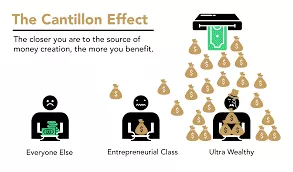
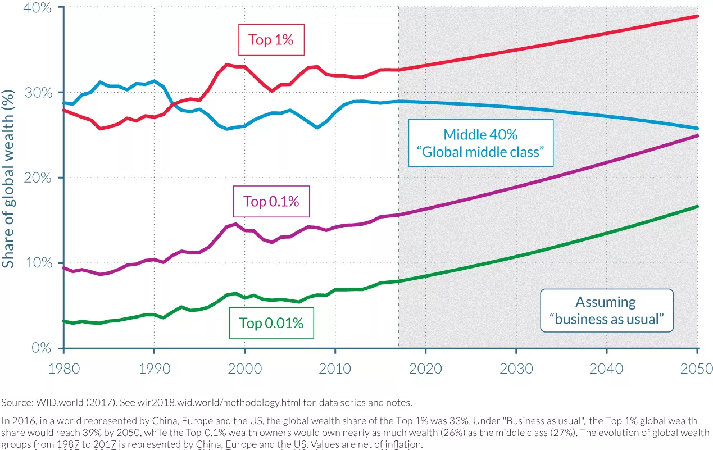
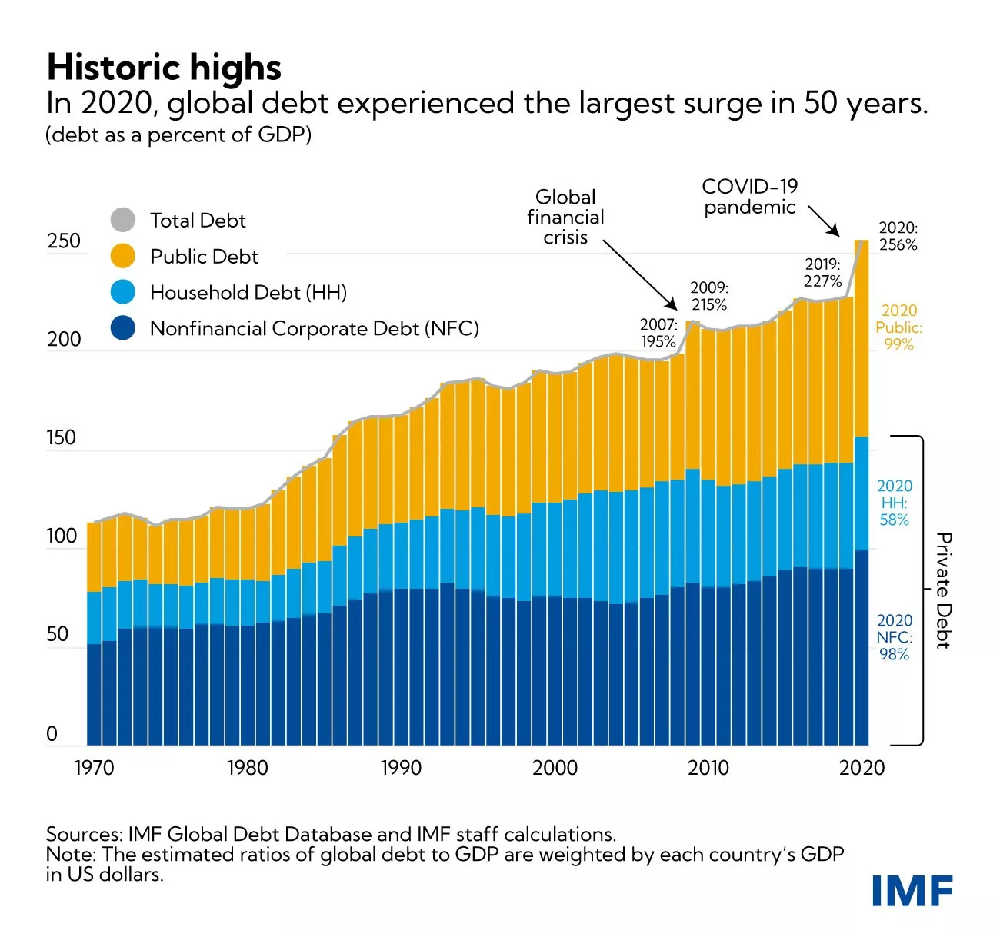
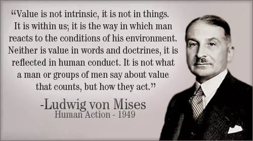
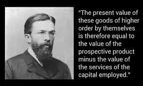
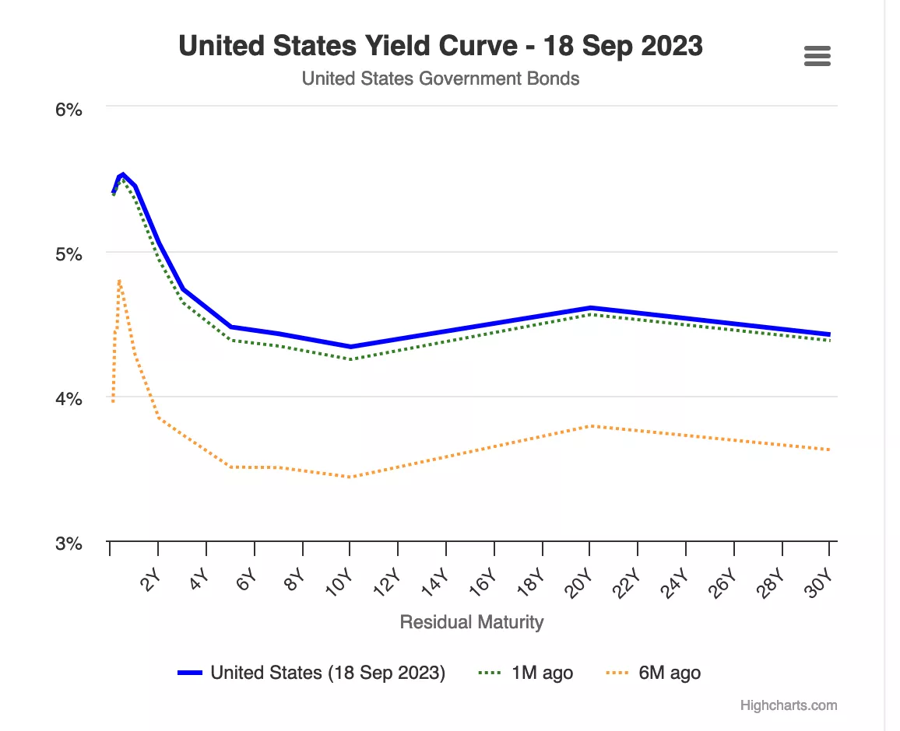
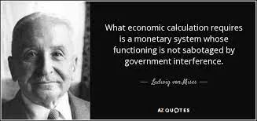

# Matka taloustieteeseen

Tervetuloa Théo Mogenetin kurssille! Taloustieteestä, historiasta, kirjallisuudesta, politiikantieteestä ja teknologiasta intohimoisesti kiinnostunut Théo on päättänyt jakaa tietonsa itävaltalaisesta taloustieteestä kanssasi. Tämä taloustieteen haara, joka on vähemmän tunnettu, perustuu ihmisen rationaalisuuteen ja vapaan toimijan käyttäytymiseen. Matematiikkaa vähemmän korostava lähestymistapa on ennen kaikkea looginen ja sosiaalinen tutkimus.

Tällä ajattelukoulukunnalla on jo useita vuosisatoja takanaan, ja sen taustalla on kokonainen panorama kirjoittajia, ajatuksia ja taloustieteilijöitä. Suuret taloustieteen nimet kuten Hayek, Rothbard, Mises, Bastiat ja Menger ovat pitkään puolustaneet tätä liikettä. Nykypäivän kaikkialla läsnä olevan keynesiläisyyden vastakohtana itävaltalainen koulu asettaa yksilön jälleen yhtälön keskipisteeseen liberaalimmalla, kapitalistisemmalla ja jopa anarkistisemmalla lähestymistavalla.

+++

# Johdatus ECONiin
<partId>265aa8b0-dd89-5456-b72a-656e988013d5</partId>

## Johdanto
<chapterId>eae3de7b-cce6-516d-83d9-28fbd582c0ca</chapterId>

Hei kaikki ja tervetuloa Econ 201: Johdatus itävaltalaiseen taloustieteeseen.

Tällä Théo Mogenetin tarjoamalla kurssilla tutustut taloustieteen haaraan, joka eroaa suuresti keynesiläisestä oppisuunnasta. Tähän asti saatat olla oppinut, että rahan tuotanto ja hallinta ovat keskuspankkien vastuulla, ajatuksella, että rahan painaminen ja kuluttaminen edistävät kasvua. Kuitenkin on olemassa toinen taloustieteen koulukunta: itävaltalainen taloustiede. Yli 200 vuoden tutkimuksen ja kehityksen, filosofisten pohdintojen ja tunnettujen kirjoittajien teosten myötä tämä lähestymistapa korostaa kasvun ja ihmisen rationaalisuuden maltillisempaa näkemystä taloudessamme.

Todellisuudessa taloustiede on erittäin sosiaalinen ja monimutkainen ala, joka koostuu lukemattomista toisiinsa kytkeytyvistä pienistä toimijoista, jotka yhdessä muodostavat johdonmukaisen kokonaisuuden. Emme lähesty tätä tieteenalaa matemaattisten yhtälöiden kautta, vaan meidän on ymmärrettävä se ihmisen logiikan ja sosiologian näkökulmasta. Tällä kurssilla tutkimme itävaltalaisen taloustieteen peruskäsitteitä. Kouluttajasi, Théo Mogenet, on intohimoinen ja pätevä itävaltalaisen taloustieteen professori.

Aloitamme tarjoamalla sinulle bonuksena videon, joka selittää nykyisen rahoitusjärjestelmämme toimintaa. Saat selville, miten kaupalliset pankit ja keskuspankit vuorovaikuttavat ja ajavat taloutta eteenpäin. Käsittelemme talousmaailmamme merkittäviä toimijoita ja sitä, miten tiettyjen talousinstituutioiden keskittynyt valta voi johtaa väärinkäytöksiin ja talouskriiseihin.

Kurssin toisessa osassa tarkastelemme keynesiläisyyden ja itävaltalaisen taloustieteen eroja, tutkimme niiden vastaavia koulukuntia, pohdintatapoja ja työkaluja, joita ne käyttävät taloudellisen totuuden perustamiseen. Tutkimme myös talouskriisien muodostumista. Johtuuko se ihmisen epäpätevyydestä, markkinamanipulaatiosta vai ihmisten kollektiivisesta euporiasta? Tutkimme, miten kasvun, laskun, taantuman ja kulta-ajan syklit luodaan ihmisten tunteiden kautta.

Tämä kurssi on yhdistelmä taloustiedettä ja filosofiaa, avoimena keskusteluna Théon ja minun välillä. Jos sinulla on kysyttävää tämän kurssin aikana, älä epäröi kysyä niitä Discordissamme, jonka linkin löydät kuvauksesta.
Lämpimät kiitokset Théolle tämän kurssin tuottamisesta, ja toivon, että hänestä tulee erinomainen opettaja sinulle. Meillä oli paljon hauskaa luodessamme tätä sisältöä. Tämä kurssi on kaikkien saavutettavissa ja uskon, että se on olennainen seurataksesi tulevia syvällisempiä kurssejamme taloustieteestä. Tämä kurssi luo tarvittavat perustukset tiettyjen talousteorioiden tarkempaan tutkimiseen, joita tässä vain sivuamme.

Jos olet valmis lähtemään tälle seikkailulle, kutsun sinut klikkaamaan seuraavaa videota ja aloittamaan bonusvideolla nykyisestä rahoitusjärjestelmästämme. Annan nyt puheenvuoron Théolle. Kiitos hänelle yhteistyöstä Descoupes Bitcoinin kanssa tämän videon toteuttamisessa. Nähdään hyvin pian. Näkemiin!

## Raha, Luotto, Pankit ja Keskuspankit
<chapterId>29faebd9-9326-52de-8161-e4bb33033cd6</chapterId>

> “Perusongelma perinteisessä valuutassa on kaikki luottamus, joka sen toimimiseen vaaditaan. Keskuspankkiin on luotettava, ettei se devalvoi valuuttaa, mutta fiat-valuuttojen historia on täynnä tuon luottamuksen pettämisiä. Pankkeihin on luotettava, että ne pitävät rahamme ja siirtävät sitä sähköisesti, mutta ne lainaavat sitä luottokuplien aalloissa vain murto-osalla varantona. Meidän on luotettava heihin yksityisyytemme kanssa, luotettava etteivät he anna henkilöllisyysvarkaiden tyhjentää tilejämme.”
>
> Satoshi Nakamoto, Bitcoinin salanimellä esiintynyt keksijä

### Miten rahaa luodaan

Nykyisessä rahajärjestelmässämme raha luodaan pääasiassa pankkikäytännön kautta, jota kutsutaan "osittaisvarantopankkitoiminnaksi". Tämä termi tarkoittaa käytännössä sitä, että pankeilta ei vaadita yhtä suuria varantoja kuin mitä ne saavat talletuksina. Tämän seurauksena ne voivat luoda uutta ostovoimaa myöntäessään lainoja ja vastaavasti vähentää ostovoimaa, kun asiakkaat maksavat lainojaan takaisin.

Esimerkiksi, jos lähestyisit paikallista pankkiasi hankkiaksesi asuntolainan talon ostoa varten, pankin sinulle lainaama raha syntyisi kirjanpidollisena merkintänä. Kirjanpidossa yksilön nettovarallisuutta yleensä esitetään taseella, jolla on kaksi puolta: varapuoli, johon kuuluu kaikki omaisuus, rahoitussopimukset, varasto tai muut varallisuuden muodot, ja velkapuoli, joka näyttää varojen lähteen, joilla pääoman varapuolella listattu omaisuus on luotu. Varojen ja velkojen välistä eroa kutsutaan "omaksi pääomaksi", ja sitä voidaan pitää yksikön nettovarallisuutena.

Kun rahoituslaitoksella on pankkilisenssi, se käytännössä tarkoittaa, että "asiakastalletuksina" kirjatut velat katsotaan viralliseksi rahaksi tietyssä maassa tai rahavyöhykkeessä. Siksi, kun haet lainaa talon ostoon pankista, pankkiiri ei lainaa toisen asiakkaan tallettamia varoja. Sen sijaan pankki hyvittää lainatun summan tilillesi ja kirjaa samanaikaisesti lainasopimuksesi pankin varaksi. Kun maksat lainaasi takaisin, raha käytännössä katoaa ja vastaavan lainasopimuksen arvo vähenee, pankin säilyttäessä vain lainan koron.

Ostaessasi talon annat pankkiirillesi ohjeet siirtää rahat myyjän tilille. Jos myyjän tili on eri pankissa, pankkiirisi ilmoittaa vastaavalle pankkiirille toisessa laitoksessa varmistaakseen, että myyjän tili hyvitetään asianmukaisesti samalla kun tililtäsi veloitetaan vastaava summa.

Kuva 1: Rahaluonti kirjanpidollisina merkintöinä

> “On hyvä, että kansamme ihmiset eivät ymmärrä pankki- ja rahajärjestelmäämme, sillä jos he ymmärtäisivät, uskon, että vallankumous olisi ennen huomisaamua”
> 
> Henry Ford
Tämä prosessi mahdollistaa pankkien kirjata kaikki tapahtumat, mukaan lukien tilisiirrot, luottokorttiostokset ja shekit, tietyn ajanjakson aikana (yleensä viikon tai kuukauden). Sen jälkeen ne selvittävät nämä tapahtumat keskenään käyttäen pankkireservejä, jotka ovat toinen julkisesti käyttämätön fiat-valuutan muoto. Pankkireservit pidetään keskuspankissa erityistilillä, joka on vain lisensoitujen pankkien ja rahoituslaitosten käytettävissä.

### Osittaisvarantopankkitoiminnan epävakaus ja viimekätinen lainanantaja

Pääongelma tässä osittaisvarantojärjestelmässä on, että merkittävät nostot tietyltä pankilta voivat mahdollisesti johtaa sen konkurssiin. Koska pankkien on täytettävä asiakkaiden käteisvaatimukset pitäen samalla vain rajallisen puskurin pankkireservejä, monien asiakkaiden samanaikainen rynnäkkö nostamaan varoja voi tehdä pankista kyvyttömän tyydyttämään näitä vaatimuksia, mikä johtaa konkurssiin. Ottaen huomioon, että monet yksilöt, yritykset ja laitokset ovat tallettaneet varojaan pankkeihin, pankin salliminen kaatua voisi aiheuttaa vakavia taloudellisia seurauksia, kuten taantuman tai jopa laman.

Tämä pulma johti nykyaikaisten keskuspankkien syntyyn. 1800-luvulla Englannissa toistuvat pankkikriisit uhkasivat rahoitusvakautta, mikä johti Englannin pankin perustamiseen "viimekätisenä lainanantajana". Englannin pankki sai tehtäväkseen lainata varoja kriisissä oleville pankeille estääkseen dominovaikutuksen, joka voisi halvaannuttaa koko rahoitusjärjestelmän. Tämä keskuspankkien konsepti viimekätisinä lainanantajina on levinnyt maailmanlaajuisesti ja muuttunut yleiseksi käytännöksi.

Keskuspankkien vastuulla on lisäksi rahoitusvakauden ylläpitäminen sekä keskeisten politiikkakorkojen asettaminen. Nämä korot määrittävät kustannukset, joilla lisensoitut pankit voivat lainata varoja keskuspankilta, määritellen käytännössä likviditeetin kustannuksen rahoituslaitoksille, jotka ovat keskeisessä roolissa lainanannossa talouksissamme. Siksi nämä korot toimivat koko rahoitusjärjestelmän vertailukohtana. Yksilönä, korko, jonka maksat asuntolainastasi, voidaan jakaa politiikkakorkoon ja pankin marginaaliin.

Kuva2: Lehman Brothersin konkurssi (15.09.2008)

Vuoden 2008 suuren rahoituskriisin aikana Lehman Brothers, suuri investointipankki, julisti konkurssin kärsittyään merkittäviä tappioita asuntolainapapereidensa pidossa ja kohdattuaan massiivisia nostoja huolestuneilta asiakkailta. Vastauksena tähän ennennäkemättömään rahoitushäiriöön keskuspankkiirit ympäri maailman ruiskuttivat suuria määriä likviditeettiä rahoitusmarkkinoille, yhdistivät kamppailevia investointipankkeja kaupallisille pankeille ja laskivat politiikkakorkoja lähes nollaan pyrkien estämään systeemisen romahduksen.

Vaikka nämä toimenpiteet estivät konkurssien kaskadiaallon, ne tekivät vähän lievittääkseen seuraavaa taloudellista hidastumista. Miljoonat menettivät työpaikkansa ja kotinsa, kulutusmenot romahtivat, yritykset menivät konkurssiin ja pankit kärsivät merkittäviä tappioita. Historiallisesti matalista koroista huolimatta harvat olivat halukkaita lainaamaan, mikä johti noidankehään, jossa alkuperäinen kulutuksen ja investointien väheneminen vahvisti itseään. Seurauksena keskuspankkiirit ottivat lisäaskeleita toteuttamalla kvantitatiivisen keventämisen (QE) ohjelmia. Nämä ohjelmat sisälsivät keskuspankkien ostavan valtion velkakirjoja ja asuntolainoihin sidottuja arvopapereita kaupallisilta pankeilta keskuspankin reserveillä.

Kuva3: Korkotasot suurissa talouksissa / Lähde: EKP

Monien odotusten vastaisesti QE-ohjelmat eivät merkittävästi elvyttäneet talouskasvua, mutta ne paisuttivat rahoitusvaroja historiallisille tasoille. Tämä hyödytti pääasiassa varakkaita ja rahoituslaitoksia, koska he jo omistivat merkittäviä määriä tällaisia varoja, mikä laajensi varallisuuseroja. Ottaen huomioon aiemmin selitetyn pankkijärjestelmän rakenteen, tämä tulos ei pitäisi tulla yllätyksenä. Koska pankkireservit eivät helposti virtaa todelliseen talouteen, QE-ohjelmat pääasiassa nostivat omaisuuserien hintoja parantamatta tehokkaasti keskivertojen yksilöiden taloudellista tilannetta.

### Cantillonin vaikutus
Tästä episodista voidaan kuitenkin vetää olennainen taloudellinen periaate: kun uutta rahaa luodaan, se hyödyttää aluksi niitä, jotka ovat lähimpänä rahan lähdettä, muiden kustannuksella. Tämä taloudellinen oivallus juontaa juurensa 1700-luvulle, kun Richard Cantillon hahmotteli sen teoksessaan "Essee yleisen kaupan luonteesta". Nykyään sitä kutsutaan usein "Cantillonin efektiksi".

Kuva 4: Cantillonin efekti pähkinänkuoressa / Lähde: River Financial

Tässä tapauksessa pankkiirit, pankin johtajat, osake- ja obligaationomistajat, kiinteistökehittäjät, kiinteistölainanantajat ja kaikki, jotka pitivät hallussaan rahoitusvaroja tai kiinteistöjä, saivat taloudellisen tuulahduksen, kun taas taakka lankesi kaikkien muiden niskoille. Tämä tilanne jatkui vuosia ja selittää pitkälti kasvavan varallisuuseron, ahkerien yksilöiden tunteman syrjäytymisen ja omaisuuserien hinnan näennäisesti pysäyttämättömän nousun hitaasta BKT:n kasvusta huolimatta.

Käytännössä järjestelmä on vinoutunut. Pankit ovat luonnostaan epävakaita, mutta niiden kaatuminen voi vaarantaa koko talouden. Tämä moraalikato kannustaa pankin johtajia ottamaan liiallisia riskejä maksimoidakseen pankkinsa tulot, tietäen, että keskuspankki lopulta pelastaa ne, siirtäen kustannukset veronmaksajille. Tällaisissa skenaarioissa keskuspankkiirit luovat olosuhteet massiiviselle ostovoiman siirrolle ahkerilta yksilöiltä ja säästäjiltä omaisuuden omistajille ja rahoitusjärjestelmään liitetyille, irrottaen näin varallisuuden luomisen prosessin varallisuuden kertymisestä.

Kuva 5: Varallisuuden jakautuminen Kiinassa + Euroopassa + Yhdysvalloissa / Lähde: OECD

### Nollakorkopolitiikan seuraukset

Pitkittyneiden nollakorkopolitiikoiden (ZIRP) aikana pankeilla on rajalliset mahdollisuudet rakentaa omaa pääomaansa uudelleen, koska niiden marginaalit hupenevat. Pankit tyypillisesti ansaitsevat rahaa lainaamalla lyhytaikaisilla koroilla ja lainaamalla pidemmän aikavälin koroilla. Kuitenkin, kun keskuspankit ostavat suuria määriä obligaatioita ja asettavat korot nollaan, pankeilla on vähän kannustinta lainata, erityisesti yrittäjille ja muille riskinottajille. Sen sijaan ne kohdentavat resurssinsa olemassa olevan pääoman arvopaperistamiseen tai tarjoavat lainoja vakuuksia vastaan vastatakseen niiden kysyntään, jotka hyötyvät Cantillonin efektistä.

Toinen ZIRP:n tahaton seuraus on, että se kannustaa hallituksia laajamittaiseen menojen kasvattamiseen. Koska hallitukset eivät kohtaa lainanottokustannuksia ja voivat luottaa keskuspankkeihin ostamaan heidän obligaatioitaan QE-ohjelmien kautta, niillä on luonnollinen kannustin kuluttaa mahdollisimman paljon, erityisesti demokraattisissa yhteyksissä, joissa menot voivat hankkia ääniä. Tämä taipumus usein sivuuttaa tällaisen finanssipolitiikan pitkän aikavälin seuraukset, johtaen merkittävään julkisen velan tason nousuun kehittyneissä talouksissa Globaalin Finanssikriisin (GFC) jälkeen.

Kuva 6: Julkinen & yksityinen velka % BKT:sta (Maailma, painotettu BKT:lla maittain) / Lähde IMF

Inflaation noustessa merkittävästi rahan luomisen seurauksena COVID-aiheisten lockdownien vastauksena, keskuspankkiirit nostavat nyt politiikkakorkoja inflaation hillitsemiseksi. Tämä kuitenkin asettaa merkittävän haasteen koko järjestelmälle. Pankit ovat enemmän velkaantuneita kuin koskaan, hallitukset kantavat historiallisesti korkeita velkatasoja, talouskasvu on hidasta, alijäämät kasvavat ja kuluttajat, jotka kamppailevat välttämättömien hyödykkeiden nousevien hintojen kanssa, ovat vaikeuksissa tulla toimeen. Inflaation hallitseminen vaatisi korkojen nostamista tasolle, joka voisi ajaa hallitukset konkurssiin, samalla kun pankit riskoivat menettävänsä tallettajia, kun yksilöt käyttävät säästöjään yhä kalliimpiin välttämättömyyksiin tai etsivät suojaa kovissa varoissa ja rahamarkkinarahastoissa inflaatiota vastaan.

### Johtopäätös

> "Tällä tavoin (osittaisvarantopankkitoiminta), hallitukset voivat salaa ja huomaamatta, takavarikoida ihmisten varallisuuden, eikä miljoonasta miehestä yksikään huomaisi varkautta"
John Maynard Keynes
Olemukseltaan järjestelmämme kohtaa merkittäviä haasteita, ja Bitcoin nousee ainoaksi uskottavaksi vaihtoehdoksi. Bitcoin yksinään ei kuitenkaan pysty ratkaisemaan rahajärjestelmämme ongelmia. Ennen kaikkea tarvitsemme henkilöitä, jotka ymmärtävät perustaloustieteen periaatteita Bitcoin-harrastajien joukossa, mahdollistaen laajemman tietoisuuden ja talousjärjen ohjaamaan meitä pois hauraan taloudellisen perustan rakentamisesta sivilisaatiollemme. Tämän kurssin päätavoite on kouluttaa uusia Bitcoin-harrastajia vankkoihin taloustieteen periaatteisiin.

Tavoitteen saavuttamiseksi selitämme "Itävaltalaisen taloustieteen" perusperiaatteet, taloustieteellisen koulukunnan, jolla on metodologinen perinne, joka ulottuu 1500-luvulle saakka, tarjoten näkemyksiä ihmisen toiminnasta taloudellisten rajoitteiden alaisena. Tämän johdannon myötä ymmärrät nyt rahanluonnin perusteet ja nykyisen talous- ja rahajärjestelmämme tilan.

Tulevassa luvussa syvennymme minkä tahansa taloustieteellisen koulukunnan peruskiveen: arvoteoriaan. Seuraavat luvut tutkivat rahaa sosiaalisena instituutiona, pääoman ja liiketoimintasyklin teoriaa, taloudellisen laskennan haastetta sekä lyhyen katsauksen Itävaltalaisen taloustieteen koulukunnan historiaan ja metodologiaan.

# Teoreettiset Perustat
<partId>86012c1b-cdf2-586f-8fe7-263f8287e950</partId>
## Subjektiivinen arvoteoria
<chapterId>eb1608d4-5d36-56a0-bcfc-ed8c03dfa906</chapterId>

> “Arvo olemassa ainoastaan ihmistietoisuudessa”
>
> Carl Menger, Poliittisen talouden periaatteet

### Marginaalivallankumous

Taloudellisen pohdinnan juurella on arvon kysymys. Miten määritämme jonkin asian arvon? Onko arvo asioiden sisäänrakennettu ominaisuus? Vai onko se päinvastoin subjektiivinen ilmiö? Miten vertaamme kahden asian arvoa? Mistä arvo syntyy?

Tällaiset kysymykset ovat kiinnostaneet taloustieteilijöitä ja filosofeja monien vuosisatojen ajan ja saaneet lukuisia erilaisia vastauksia. Monin tavoin taloustieteen epistemologinen kehitys on merkitty arvoteorioiden kehityksellä.

Fysiokraattien maan arvon teorian, joka oletti kaiken arvon tulevan maasta, kumottua klassiset taloustieteilijät esittivät työn arvoteorian, jonka mukaan hyödykkeen arvo juontuu siihen käytetystä työmäärästä, oli marginaalisen arvoteorian vuoro syrjäyttää edellinen. 1870-luvulla, Marxin, viimeisen klassisen taloustieteilijän, jälkeen, kolme uutta taloustieteellistä koulukuntaa nousi lähes samanaikaisesti esille marginaalisen arvoteorian ympärille: Lausannen koulu Léon Walrasin johdolla, moderni tai uusklassinen koulu William Stanley Jevonsin johdolla, ja Itävaltalainen koulu Carl Mengerin johdolla. Tämä arvoteorian vallankumous merkitsi merkittävää taloustieteen ajattelun uudistusta.

Vasemmalta oikealle: William Stanley Jevons, Carl Menger, Léon Walras

Marginaalisen arvoteorian mukaan taloudellinen arvo vastaa sitä, mitä taloudellinen toimija on valmis maksamaan seuraavasta hyödykkeen tai palvelun yksiköstä. Koska tämä teoria korostaa, että hinnat muodostuvat marginaalilla, eli seuraavasta tietyn hyödykkeen yksiköstä, sitä kutsuttiin "marginalismiksi".
On yleistä esittää näiden kolmen koulukunnan marginalismi samankaltaisena. Todellisuudessa Walras ja Jevons ovat hyvin yhteensopivia, mutta Mengerin teoretisointi poikkeaa merkittävästi muista. Hänen työssään, joka nyt katsotaan Itävaltalaisen talousteorian perustaksi, nimeltään "Grundsätze des Volkswirtschaftlehre" (Kansantaloustieteen periaatteet), julkaistu vuonna 1874, Menger tarjoaa marginaalisen, mutta ensisijaisesti subjektiivisen, arvon selityksen, toisin kuin Walras ja Jevons, jotka pitävät arvoa objektiivisena ja mitattavana ilmiönä.

### Subjektiivinen Arvo

Itävaltalainen taloustieteilijä kumoaa Adam Smithin seuraajien käsityksen ja hylkää ajatuksen, että hyödykkeen arvo tulee sen tuotannossa käytetystä työmäärästä, suosien käsitystä, että sen arvo määräytyy yksilön toimesta, joka kussakin kontekstissa suorittaa henkisen arvostustoimenpiteen tietyn määrän hyödykkeestä tai palvelusta. Mengerin tekemä älyllinen loikka haastaa arvon objektiivisuuden: hänen mukaansa arvo ei ole hyödykkeiden objektiivinen ominaisuus; se on vain yksilön suhteen tulosta kyseiseen asiaan: "arvoa ei ole olemassa ihmistietoisuuden ulkopuolella."

Toisin sanoen, Menger kehottaa meitä harkitsemaan, että arvo on olemassa vain subjektiivisena psykologisena ilmiönä yksilön sisällä, että arvo ei ole hyödykkeiden sisäänrakennettu ominaisuus, vaan se kumpuaa yksilön mielipiteestä siitä hyödystä, jonka he voivat saada näistä hyödykkeistä.

Tämän näkemyksen mukaan litralla juomavettä ei ole objektiivista arvoa. Henkilö, jolla on pääsy moderniin juomavesijärjestelmään eikä ole tällä hetkellä janoissaan, todennäköisesti antaisi tuolle lisälitralliselle vettä hyvin vähän arvoa, kun taas henkilö, joka on janoissaan keskellä autiomaata ja näkee sen elämän ja kuoleman erona, olisi varmasti valmis antamaan lähes äärettömän arvon tuolle litralle vettä.

Yhteenvetona, Menger huomasi, että taloudellisen hyödykkeen arvo on vain yksilön kyseiselle lisäyksikölle hyödykkeestä tai palvelusta antama subjektiivinen arvostus.

### Vapaaehtoinen Vaihto: Positiivinen-Summa Peli

Tästä lähtökohdasta Menger päättelee, että vapaaehtoinen vaihto kahden yksilön välillä tapahtuu, koska kumpikin osapuoli uskoo sen lisäävän heidän subjektiivista hyötyään. Hänen mukaansa vaihto ei edellytä arvon vastaavuutta, toisin kuin klassiset taloustieteilijät uskoivat. Itävaltalaisen ajattelijan mukaan, jos vaihdettavilla hyödykkeillä olisi hyödyn vastaavuus, osapuolilla ei olisi syytä vaivautua vaihtamaan alun perin. Jos vaihto tapahtuu, se johtuu siitä, että kumpikin osapuoli katsoo sen olevan heidän (subjektiivisen) etunsa mukaista, ja näin ollen jokainen vapaaehtoinen vaihto tuottaa sosiaalisen hyödyn.

### Arvostus Ihmisen Halujen Järjestämisen Ilmiönä

Kuitenkin tällainen sosiaalinen hyöty, tai hyödykkeelle annettu subjektiivinen arvo, ei ole mitattavissa. Mengerille arvo on kognitiivinen ilmiö vertailusta (ordinaalinen) pikemminkin kuin mittauksesta (kardinaalinen). Se ei ole, kuten uusklassiset taloustieteilijät ovat ajatelleet Walrasin ja Jevonsin jälkeen, yksilön hyödykkeelle antama numeerinen arvo, joka heijastaa siitä saatuja hyötyjä, vaan pikemminkin ihmisen halujen järjestämisen toiminta, jonka kautta yksilö ilmaisee haluavansa tietyn määrän hyödykettä A intensiivisemmin kuin tietyn määrän hyödykettä B.
Kuka tahansa voi sanoa, pitävätkö he enemmän kahdesta banaanista kuin taloustieteen kurssista, mutta kukaan ei voi järkevästi sanoa arvostavansa kahta banaania 3,1416 utilissa, samalla kun arvostaa taloustieteen kurssia 3 utilissa, ja siksi he haluavat mieluummin banaanit. Tällainen ihmisten mieltymysten kuvaus, joka perustuu jatkuviin reaalifunktioihin, ei vastaa sitä kognitiivisten prosessien todellisuutta, jonka koemme päivittäisessä elämässämme. Yksilö ei koskaan arvioi heille esitettyjä hyödykkeitä vertaamalla niitä abstraktiin hyödyn mittapuuhun. Sen sijaan hän vertaa subjektiivisesti erilaisia toimintavaihtoehtoja, joita hän ei voi arvioida absoluuttisesti, mutta voi silti järjestää niitä niiden suhteellisen haluttavuuden perusteella.

Tämä subjektiivinen arvon käsite, jota ymmärretään psykologisena suhteena, jonka yksilö pitää tavoitteidensa ja niiden saavuttamiseen tarvittavien keinojen kanssa, mahdollistaa myös itävaltalaisten taloustieteilijöiden selittää työnjaon ilmiön.

### Työnjako

Vierailu naulatehtaalla, Léonard Defrance (18. vuosisata)

Jokainen on ainutlaatuinen ja omaa erityisen henkilökohtaisen tilanteensa. Siksi jokaisella on parempi kyky suorittaa tiettyjä tehtäviä kuin hänen vertaisillaan (absoluuttinen etu) tai parempi kyky suorittaa tiettyjä tehtäviä kuin toiset (suhteellinen etu). Toisin ei voi olla; tämän perustavanlaatuisen tosiasian kieltäminen olisi väittää, että kaikki ihmiset ovat kaikilta osin samanarvoisia.

Tapauksessa, jossa yksilöllä on parempi kyky verrattuna vertaisiinsa tuottaa tietty hyödyke (absoluuttinen etu), hänellä on etu erikoistua kyseisen hyödykkeen tuotantoon ja sen jälkeen vaihtaa saatu ylijäämä haluamiinsa hyödykkeisiin. Näin tehdessään hän tyydyttää subjektiivista hyötyään taloudellisemmin kuin jos hän ryhtyisi tuottamaan kaikkia haluamiaan hyödykkeitä.

Mutta voi myös olla, että yksilöllä ei ole absoluuttista etua minkään hyödykkeen tuotannossa. Tässä tapauksessa on silti tuotannon tyyppejä, joissa yksilö on parempi kuin toisissa (suhteellinen etu), ja tästä syystä hänellä on silti etu erikoistua.

On varmasti yksilöitä, jotka voisivat tuottaa kyseisen hyödykkeen tuottavammin kuin hän, mutta koska nämä yksilöt ovat todennäköisesti tuottavampia toisessa tehtävässä kuin tässä, ja koska he eivät voi suorittaa molempia tehtäviä samanaikaisesti, heille on tuottamatonta työskennellä tässä tehtävässä toisen sijaan, jossa he ovat tuottavampia. Erikoistumalla tehtävään, jossa he ovat tuottavimpia, he saavat suuremman ylijäämän kuin jos he eivät olisi erikoistuneet, ja siksi vaihdon kautta he voivat saada lisääntyneen määrän muita hyödykkeitä, vaikka hyödykkeet olisi tuotettu tehokkaammin itse kuin tuottajilta, joilta he saivat ne.

Ota esimerkiksi lääkäri. Hän saattaa olla parempi kirjoittamaan sähköposteja ja järjestämään tapaamisia kuin hänen sihteerinsä (suhteellinen etu). Mutta kaikki aika, jonka hän käyttää näihin tehtäviin, on aikaa, jota hän ei käytä potilaiden parantamiseen. Siksi, koska hän on tuottavampi parantaessa ihmisiä, on hänen etunsa delegoida hallinnolliset tehtävät toiselle henkilölle, vaikka hän olisikin parempi kyseisessä tehtävässä kuin hänen apulaisensa, koska se mahdollistaa hänen maksimoida muiden luomaa arvoa, ja siten omaa varallisuuttaan.

Yhteenvetona, erikoistumisesta on hyötyä jopa yksilöille, joilla ei ole absoluuttisia etuja, koska aika on niukka ja kilpaileva resurssi: jokainen yksikkö aikaa, joka käytetään toimintaan muualla kuin siinä, missä yksilö on tuottavin, merkitsee kustannusta luopumalla tuotannosta, josta he luopuivat (vaihtoehtoiskustannus).
Kun henkilö on erikoistunut tiettyyn tuotantoon, hän voi sen jälkeen varata itselleen tarpeelliseksi katsomansa määrän tuotteita henkilökohtaiseen kulutukseen ja vaihtaa ylijäämän muihin haluamiinsa hyödykkeisiin. Näin tehdessään he tyydyttävät halunsa itse tuottamiinsa hyödykkeisiin, mikä tarkoittaa, että heidän tuotantonsa jäljellä olevilla yksiköillä on heille vähäinen arvo. Tämä on sitä, mitä taloustieteilijät kutsuvat laskevaksi rajahyödyksi: jokainen lisäyksikkö hyödykettä halutaan vähemmän kuin edellistä. Niille, joilla tällaisia hyödykkeitä ei ole, tilanne on toinen: samasta syystä he haluavat intensiivisemmin niitä hyödykkeitä, joita he eivät itse tuota. Tämä johtaa tilanteeseen, jossa yksilöiden subjektiivisten arvostusten välillä on vahva epäsymmetria, mikä on erittäin suotuisaa vaihdoille: kummallakin osapuolella on etu vaihtaa ylijäämätuotantoaan, koska he siten lisäävät subjektiivista hyötyään.

Edellä olevan analyysin tulos on, että yksilöt ovat aina paremmassa asemassa, kun he erikoistuvat työhönsä ja osallistuvat vaihtoihin. Siksi itävaltalaiset taloustieteilijät, erityisesti Ludwig Von Mises, päättelevät, että työnjaon tuottavuusetu on sosiaalisen yhteistyön prosessin taustalla oleva voima. Tässä voi olla hyödyllistä lainata häntä suoraan:

"Perustotuudet, jotka saivat aikaan yhteistyön, yhteiskunnan ja sivilisaation ja muuttivat eläimen ihmiseksi, ovat totuudet, että työnjaon alaisena suoritettu työ on tuottavampaa kuin eristyksissä tehty työ ja että ihmisen järki kykenee tunnistamaan tämän totuuden. […] Ihmiset eivät tee yhteistyötä työnjaon alaisena, koska he rakastavat tai heidän pitäisi rakastaa toisiaan. He tekevät yhteistyötä, koska se palvelee parhaiten heidän omia etujaan."

### Johtopäätös

> "Jos mies näkee, että hän voi elää mukavammin hirttäytyneenä kuin istuen pöydässä, hän olisi typerys, jos ei hirttäytyisi."
>
> Baruch Spinoza

Vuodet 1871-1874 ovat modernin taloustieteen ihmeellisiä vuosia: tänä aikana nähtiin kolmen itsenäisen ajattelijan työt, jotka ovat perustavanlaatuisia modernille taloustieteelle. Korostaessaan subjektiivista järjestysarvoa itävaltalaiset taloustieteilijät kehittävät kokonaisen taloustieteellisen ajattelun rungon, joka erottaa heidät kollegoistaan. Itävaltalaisten taloustieteilijöiden pohdinta ihmisen toiminnasta niukkuuden kontekstissa tulee aina erottumaan jyrkästi Jevonsin ja Walrasin aloittamista talousteorioista, jotka nojaavat voimakkaasti matematiikkaan ja ajatukseen, että arvo voidaan objektiivisesti mitata ja johtaa jatkuvana funktiona.

Rakentaen subjektiivisen järjestysarvon oivalluksille Menger selitti työnjaon ja vapaaehtoisen vaihdon syntyä. Kuten kuitenkin näemme seuraavassa luvussa, suora vaihto on huono strategia taloudellisille toimijoille, jotka pyrkivät maksimoimaan subjektiivisen hyötynsä. Itävaltalaisen koulukunnan isä on siis kehittänyt pohdintaansa selittääkseen, miksi raha syntyi sosiaalisena instituutiona.

Seuraavat luvut on omistettu rahan syntymiselle sosiaalisena ilmiönä, pääoman ja koron teorialle, jotka toimivat perustana liiketoimintasyklin teorialle, ja viimeisenä hintojen roolille taloudellisessa laskennassa.

## Rahan syntyminen sosiaalisena ilmiönä
<chapterId>14ded794-0578-5478-ba5b-b2106c74f3ef</chapterId>

Vaikka yksilöillä on yhteinen etu erikoistua ja maksimoida työnjako, on silti koordinaatio-ongelmia, jotka rajoittavat tämän laajentumista.

Ensinnäkin on tärkeää huomata, että koska tuotantoprosessit ovat luonteeltaan aikasidonnaisia ja usein asynkronisia (ei-samanaikaisia), yksilön alkuperäisen panoksen ja vastikkeen saamisen välillä on yleensä aikaväli. Sitoutuminen tiettyyn tehtävään nyt ilman aiempaa varmuutta siitä, että muut täyttävät tarpeemme tulevaisuudessa, voi olla riskialtista.
Työnjaossa jokainen osapuoli hyötyy yhteistyöstä, mutta yksilötasolla saattaa houkutella nauttia toisten työn tuloksista vastaamatta itse samalla mitalla, sillä näin he saavat arvokasta hyötyä ilman kustannuksia. Tällaiset tilanteet, joissa molemminpuolinen yhteistyö johtaa yksilöille suboptimaalisiin hyötyihin mutta maksimaalisiin hyötyihin ryhmälle, kuvataan peliteoriassa "vankien dilemmana".

### Vankien dilemma

Alun perin vankien dilemma muotoiltiin seuraavasti: Kaksi epäiltyä, Alice ja Bob, jotka eivät voi kommunikoida keskenään, kohtaavat vangitsemisen riskin, mahdollisine seuraamuksineen:

- Jos Alice syyttää Bobia ja Bob pysyy hiljaa, Alice vapautuu ja Bob saa 3 vuotta vankeutta.
- Jos sekä Alice että Bob syyttävät toisiaan, kumpikin saa 2 vuotta vankeutta.
- Jos molemmat pysyvät hiljaa, kumpikin saa 1 vuoden vankeusrangaistuksen.

Nämä lopputulokset voidaan esittää matriisissa (numeeriset tulokset ilmaisevat vankeusvuosien määrää):

| Alice / Bob       | Syyttää      | Pysyy Hiljaa |
| ----------------- | ----------- | ------------- |
| **Syyttää**        | 2, 2        | 0, 3         |
| **Pysyy Hiljaa** | 3, 0        | 1, 1         |

Tässä pelissä ei ole mahdollisuutta koordinointiin (kommunikointi on mahdotonta) saavuttaakseen parhaan lopputuloksen molemmille osapuolille. Tämän seurauksena Alicella ja Bobilla on yksilöllinen kannustin syyttää toisiaan, vaikka se ei johdakaan ryhmän kannalta optimaaliseen lopputulokseen. Optimaalinen strategia molemmille on pysyä hiljaa, kumpikin saaden 1 vuoden vankeusrangaistuksen.

Tämä peli havainnollistaa ongelmaa, joka kohdataan usein todellisessa elämässä: koordinointimekanismien puuttuessa yksilöt pyrkivät valitsemaan strategioita, jotka maksimoivat heidän yksilöllisen hyötynsä, riippumatta muiden valitsemista strategioista (varastaminen, huijaaminen, petos, väkivalta jne.), vaikka toivottavampi tasapaino koordinoinnin/yhteistyön kautta olisi mahdollinen.

### Rahat koordinointiongelmien ratkaisemiseksi

Tällä ongelma on vähemmän vaikutusta pienissä yhteisöissä (esim. perhe, ystäväpiirit), sillä tällaisissa tapauksissa kaikki tuntevat toisensa suoraan, mikä mahdollistaa toistensa panosten muistamisen. Olettaen, että yhteisöstä lähteminen (aavikkoituminen) aiheuttaa kustannuksia, maineeseen perustuva järjestelmä yksilöiden muistin perusteella on yleensä riittävä välttämään vankien dilemman aiheuttamat ongelmat.

Kuitenkin, kun käsitellään suurempia yhteisöjä, jotka hyötyvät merkittävästi työnjaosta, koordinointiongelmat nousevat jälleen esiin. Tämä johtuu kahdesta pääsyytä:

Ensinnäkin, ihmiset ovat rajallisia kognitiivisissa kapasiteeteissaan. On mahdotonta ylläpitää ja muistaa vakaita sosiaalisia suhteita enemmän kuin 150 henkilön kanssa, mikä tekee maineeseen perustuvasta järjestelmästä riittämättömän voittamaan vankien dilemman laajassa mittakaavassa.

Toiseksi, yhteisesti hyväksytty panosten arvon mittaaminen vaihdossa (vertailukelpoisuus) ei ole triviaali ongelma. Esimerkiksi, jos yksilö tarjoaa metsästyslihaa ja pyytää vastineeksi materiaaleja suojan rakentamiseen, kuinka metsästyslihan määrää voidaan arvioida termeissä, jotka ovat vertailukelpoisia pyydettyjen materiaalien kanssa? Sama pätee laatuun – onko hirvenliha arvokkaampaa tai vähemmän arvokasta kuin puu?
Vaikka olisikin mahdollista vahvistaa tyydyttävä vaihtokurssi jokaiselle tavaraparille, tämän tiedon ylläpitäminen muuttuu nopeasti epäkäytännölliseksi. Suorassa vaihtojärjestelmässä, joka käsittää N tavaraa, on muistettava N(N-1)/2 vaihtokurssia. 50 tavaran taloudessa tämä tarkoittaa 50*49/2, eli 1225 vaihtokurssin muistamista, verrattuna vain 50:een epäsuorissa vaihdoissa. 100 tavaran taloudessa tämä luku nousee 4950:een. Tällainen neliöllinen suhde asettaa lisärajoituksen suoran vaihdon (vaihtokauppa) skaalautuvuudelle.

Lisäksi, koska nämä vaihdot eivät tapahdu välittömästi vaan ovat ajan myötä eriytyneitä, panosten arvioiminen ajan kuluessa monimutkaistaa entisestään panosten suhteellista arviointia. Kahden nykyisen tavaran vaihtosuhteen arvioinnin lisäksi tulee tarpeelliseksi arvioida menneen panoksen arvoa suhteessa tulevaan vastineeseen.

Nykyään, huolimatta tällaisen järjestelmän epäkäytännöllisyydestä, voisimme käyttää kirjoitusta tai digitaalista datan tallennusta muistaaksemme kaiken tämän tiedon ja perustaaksemme luottojärjestelmän (menneiden panosten, mukaan lukien niiden vaihtokurssien, seuranta on käytännössä luottojärjestelmän perustamista).

Esivilisaation aikoina näitä teknologioita ei ollut olemassa. Siksi esi-isämme joutuivat löytämään muita ratkaisuja nauttiakseen työnjaon eduista ilman, että he altistuivat vankiladilemman negatiivisille seurauksille. Tämän suoran vaihdon ongelman ratkaisu oli epäsuora vaihto, jota rahat mahdollistivat.

### Kahden Sattuman Yhteensattuma ja Kelpoisuus

Rahaa voidaan pitää ratkaisuna, jonka esi-isämme löysivät taloustieteilijöiden niin kutsuttuun "kahden sattuman yhteensattuma" -ongelmaan. Tällä ongelma on kolme ulottuvuutta: spatiaalinen, ajallinen ja henkilöiden välinen.

Suorassa vaihdossa (vaihtokauppa) Ailin ja Bobin välillä, molempien on omistettava jotakin, mitä toinen haluaa samaan aikaan ja paikkaan. Käyttämällä epäsuoraa vaihtoa, eli rahaa, Aili voi ostaa Bobilta, ja Bob voi käyttää kyseistä rahayksikköä muualla, toisena aikana ja jonkun toisen kanssa (edellyttäen, että toinen henkilö hyväksyy kyseisen rahan muodon).

Jotta hyödyke toimisi rahana, sen on oltava korkeasti kelpoista, mikä tarkoittaa, että mahdollisimman monen ihmisen tulisi haluta sitä suurimman osan ajasta. Käyttämällä korkeasti kelpoista hyödykettä, kahden sattuman yhteensattuman ongelma ratkeaa spatiaalisen ja henkilöiden välisen ulottuvuuden osalta: jos käyttämäni raha on haluttua kaikkialla ja useimpien ihmisten toimesta, voin helposti erottaa myynnin oston hetkestä paikan ja sosiaalisen vuorovaikutuksen suhteen.

Kuitenkin kelpoisuuden ongelma ajan suhteen on vaikeampi ratkaista kahdesta syystä:

Ensinnäkin, entropia (yleisesti tunnettu "ajan vaikutuksena") muuttaa vähitellen useimpien suoran hyödyn tarjoavien hyödykkeiden ominaisuuksia. Siksi hyödykkeen kelpoisuuden säilyttäminen ajan myötä edellyttää, että se on erittäin kestävä tai vastustuskykyinen entropialle.

Toiseksi, hyödykkeen suhteellinen harvinaisuus ajankohtana "t" ei takaa sen suhteellista harvinaisuutta tulevaisuudessa. Ihmiset voivat lisätä minkä tahansa hyödykkeen tarjontaa omistamalla tarpeeksi resursseja tiettyyn tuotantoalueeseen. Ainoa rajoitus hyödykkeen tuotannon lisäämiselle on siihen liittyvä vaihtoehtoiskustannus. Siksi hyödykkeen nykyinen suhteellinen harvinaisuus ei voi taata sen tulevaa suhteellista harvinaisuutta. Vain hyödykkeet, joiden marginaalinen tuotanto voidaan lisätä erittäin korkein kustannuksin, voivat olla johdonmukaisesti harvinaisia, mikä on syy, miksi tämä on ominaisuus vapaasti syntyneille rahahyödykkeille ihmiskunnan historiassa.
Ennen sivilisaation aikaa erilaiset hyödykkeet, kuten simpukankuoret, käsityönä valmistetut korut, kaulakorut tai helmet toimivat rahana. Nämä hyödykkeet olivat helposti kuljetettavissa, niillä ei ollut suoraa käyttöarvoa koristeellisen arvonsa lisäksi, ne kestivät entropiaa (eli ne eivät heikentyneet ajan myötä), olivat luonnostaan harvinaisia ja/tai niiden tuottaminen vaati merkittävän määrän erikoistunutta työvoimaa. Koska työnjako oli tuolloin vähäistä, ja näin ollen koriste-esineiden tuottamiseen liittyvä vaihtoehtoiskustannus oli korkea, näitä esineitä ei voitu tuottaa suurissa määrissä. Näin ollen niitä käyttävät henkilöt voivat olla varmoja niiden tulevasta suhteellisesta harvinaisuudesta.

Se, että metsästäjä-keräilijä-esi-isämme ryhtyivät näihin resurssi-intensiivisiin tehtäviin, vaikka ne eivät tuottaneet suoraan hyödyllisiä tavaroita, osoittaa merkittävät hyödyt, joita he odottivat saavansa vaihdon avaruudellisen, sosiaalisen ja ajallisen ulottuvuuden laajentamisesta. Jos näin ei olisi, ja olisi ollut hyödyllisempää käyttää näitä resursseja suojan rakentamiseen, metsästykseen tai muihin toimintoihin, eikä rahallisten hyödykkeiden tuottamiseen, emme todennäköisesti löytäisi yhtä paljon arkeologisia todisteita näistä käsityöläistoiminnoista. Muut ryhmät, jotka käyttivät resurssejaan tehokkaammin, olisivat nauttineet paremmasta kehityksestä ja suuremmasta vauraudesta, ja nämä käsityöläistoiminnot olisivat nopeasti hävinneet hyödyllisempien toimintojen tieltä.

Tässä mielessä rahallisten hyödykkeiden tuotanto, edistämällä työnjaon laajentumista, edusti resurssien kannattavampaa käyttöä (yksilöiden subjektiivisen hyödyn kannalta) kuin kaikki muut vaihtoehdot (metsästyksen, kalastuksen, keräilyn, puuntuotannon, talonrakennuksen, lisää metsästys- ja kalastusvälineiden tuottaminen jne.).

### Epävarmuus

Rahalaitoksen analyysimme päätteeksi meidän on käsiteltävä taloudellisen toiminnan kysymystä väistämättömän tulevaisuuden epävarmuuden kontekstissa.

Kuten itävaltalaiset taloustieteilijät ovat huomauttaneet, ihmisen toiminta on aikaan sidottua ja aina suuntautunutta tulevaisuuteen. Kun yksilö toimii, hän muuttaa nykyistä tilaansa toivoen saavuttavansa tulevaisuudessa tyydytystä. Tämä henkinen projisointi voi olla suunnattu lähitulevaisuuteen tai kaukaiseen tulevaisuuteen, mutta jotta yksilö voi suunnitella pitkälle tulevaisuuteen, hänen on ensin turvattava lyhyen aikavälin toimeentulonsa, koska hänen tilansa lähitulevaisuudessa vaikuttaa suoraan hänen tilaansa kaukaisessa tulevaisuudessa.

Tämä johtuu suoraan ihmisen rationaalisuudesta; kukaan ei voi sivuuttaa aikailmiöiden järjestyksellä ja siitä seuraavasta kronologisesta riippuvuudesta, koska se on yksi ihmisen elämän olennaisista rajoitteista. Siksi, koska tulevaisuus on aina epävarma ihmisille, he pyrkivät turvaamaan pitkän aikavälin selviytymisensä vasta kun heidän lyhyen aikavälin selviytymisensä on varmistettu.

Tässä mielessä raha, mahdollistamalla arvon säilyttämisen nykyhetkessä ja sen siirtämisen tulevalle itselle, näyttelee ratkaisevaa roolia ihmisen toiminnan aikavälin koordinoinnissa. Säästämällä rahaa, eli säästämällä, yksilöt suojelevat itseään tulevaisuuden epävarmuudelta ja mahdollistavat näin itselleen toiminnan suuntaamisen pidemmille aikaväleille. He voivat kuitenkin saavuttaa tämän vain, jos käytetty raha toimii arvon säilyttäjänä, mikä tarkoittaa, että sillä on myytävyys ajan myötä, mikä, kuten aiemmin mainittiin, on kestävien ja suhteellisen harvinaisten hyödykkeiden ominaisuus.

Seuraavassa luvussa syvennymme aikapreferenssin käsitteeseen ja selitämme itävaltalaisen näkökulman korkoon ja pääomaan, jotka toimivat perustana seuraavalle luvulle Liiketoimintasyklin Teoriasta.

## Aikapreferenssi, Korko ja Pääoma
<chapterId>37732a5c-4f66-5e2d-bc2c-cc8d29693af7</chapterId>

### Aikapreferenssi
Viimeisessä luvussa päätimme selittämällä, miten taloudelliset toimijat käyttävät kaikkein vaihdettavinta hyödykettä, eli rahaa, torjuakseen tulevaisuuden epävarmuutta. Selitimme myös, että aikailmiöiden peräkkäinen luonne johtaa meidät taistelemaan epävarmuutta vastaan asteittain: vasta kun tiedämme, että toimeentulomme on turvattu seuraavalle viikolle, voimme keskittyä tavoitteisiin, jotka ovat kauempana tulevaisuudessa.
Tai toisin sanoen: ihmisenä alennamme tulevaisuuden hyödykkeiden arvoa.

Tämä tulevaisuuden hyödykkeiden arvon subjektiivinen arviointi verrattuna nykyisiin hyödykkeisiin tunnetaan aikapreferenssinä. Kaikki muu ollessa samanlaista, nykyiset hyödykkeet ovat luonnostaan suositumpia kuin tulevaisuuden hyödykkeet. Koska olemme kuolevaisia ja tulevaisuus on aina epävarma, luonnollisesti haluamme pääsyn hyödykkeeseen nyt ennemmin kuin myöhemmin. Vaikka aikapreferenssi voi vaihdella yksilöiden välillä monien tekijöiden, kuten kulttuurin, varallisuuden, koulutuksen, fysiologian jne. vuoksi, aikapreferenssit ovat aina positiivisia, mikä tarkoittaa, että kaikki muu ollessa samanlaista, arvostamme aina nykyisiä hyödykkeitä enemmän kuin tulevaisuuden hyödykkeitä.

Tämä tulevaisuuden hyödykkeiden suhteellisen arvostuksen käsite nykyisiin hyödykkeisiin verrattuna on korkoilmiön juurella. Todellakin, taloudessa, jossa pääomamarkkinoita ei manipuloida, viitekorkotasot (joita pidetään oletusarvoisesti luottotappioriskittöminä) määräytyvät pääoman tarjonnan ja kysynnän leikkauspisteessä. Siksi nämä korot edustavat koko talouden aikapreferenssin tilaa: korkotason nousu johtuu suhteellisesta kysynnän kasvusta pääomaan verrattuna tarjontaan, mikä osoittaa korkeampia aikapreferenssejä. Päinvastoin, korkotason lasku tapahtuu säästöjen lisääntyessä, mikä on pääoman tarjonnan kasvu, osoittaen aikapreferenssien vähentymistä.

Taloudessa, jossa keskuspankki ei manipuloi korkotasoa, havaitsemme yleensä nousevan tuottokäyrän: mitä pidempi velan erääntymisaika, sitä korkeampi korkotaso. Vastaista tilannetta ei voi tapahtua, koska se merkitsisi, että tulevaisuus on varmempi kuin nykyisyys, mikä on looginen mahdottomuus.

Aikapreferenssin käsite ja se, miten ilmaisemme oman aikapreferenssimme kulutuksen ja säästämisen kautta, on olennainen pääoman allokoinnin ja tuotannon prosesseille. Käännymme Mengerin oppilaan, Eugen von Böhm-Bawerkin, ja hänen pääomateoriansa puoleen ymmärtääksemme tarkalleen, miten aikapreferenssi vaikuttaa tuotannon järjestämiseen.

### Pääomateoria

Kurssin alussa näimme, että Carl Mengerin mukaan hyödykkeitä pidetään taloudellisina hyödykkeinä (arvostettuina) vain siksi, että ne toimivat keinoja yksilöiden valitsemiin ja arvostamiin päämääriin. Tämän näkemyksen mukaan kaikki taloudellinen analyysi pyörii kulutuksen ympärillä, koska se on lopulta kaiken taloudellisen toiminnan taustalla oleva motivaatio. Siksi Mengerille taloudellisen analyysin lähtökohta on kulutushyödykkeet tai lopputuotteet, koska ne edustavat taloudellisen toiminnan lopullista tarkoitusta. Kaikki muut talouden hyödykkeet, joita voimme kutsua "välituotteiksi", saavat arvonsa vain siksi, että ne mahdollistavat yksilöiden pääsyn näihin kulutushyödykkeisiin: ne ovat hyödykkeitä, joita käytetään muiden hyödykkeiden tuottamiseen.

Kulutushyödykkeiden tuottamiseksi yrittäjät yhdistävät näitä erilaisia välituotteita alkuperäisten tuotannontekijöiden (työvoima, maa ja pääoma) kanssa mallin mukaisesti, joka maksimoi tuloksena olevan tuotannon. Tämän järjestelyn, jonka yrittäjät tekevät, tai tuotantorakenteen, sisältää eri vaiheet, joiden aikana välituotteet käyvät läpi muutoksia, kunnes ne lopulta muuttuvat kulutushyödykkeiksi.
Näin ollen, kuten Menger, voimme määritellä kulutustavarat ensimmäisen asteen hyödykkeiksi, edellisessä vaiheessa mukana olevat hyödykkeet toisen asteen hyödykkeiksi, sitä edeltävässä vaiheessa olevat kolmannen asteen hyödykkeiksi, ja niin edelleen, kunnes saavutamme alkuperäiset tekijät (maa, työvoima, pääoma). Vaiheiden määrä, joita harkitsemme, riippuu perustavanlaatuisesti yrittäjien omaksumasta tuotantorakenteesta eikä sitä tulisi pitää tuotantorakenteen objektiivisena ominaisuutena. Päinvastoin, tuotantovaiheet ja välituotteet olemassaolevat vain teleologisessa kontekstissa: toimija hahmottelee toimintasarjan, jonka kautta he saavuttavat haluamansa tavoitteen, ja he jakavat henkisesti toimintansa peräkkäisiin vaiheisiin.
Tämä toiminnan henkinen projektio sekventiaalisena kaavana johtuu ihmistoiminnan ajallisesta luonteesta. Jokainen ihmisen suorittama toiminta vie aikaa; välitön toiminta on mahdotonta. Siksi toimijalla on aina valinta toimintamallien välillä, jotka vievät enemmän tai vähemmän aikaa.

Tästä lähtien, koska yksilöillä on välttämättä positiiviset aikamieltymykset, tarkoittaen, että he arvostavat nykyisiä hyödykkeitä tulevaisuuden hyödykkeitä enemmän, he valitsevat pidemmän polun vain, jos saavutettu tulos on heille suurempaa subjektiivista arvoa kuin mitä he olisivat saavuttaneet valitsemalla suoran polun. Muussa tapauksessa kukaan ei valitsisi aikaa vievämpiä menetelmiä: samanlaisilla tuloksilla lyhin polku pysyy suosittuna valintana.

Ihmistoiminnan sekventiaalisen luonteen vuoksi näillä aikavälin valinnoilla on aina seurauksia toimintasarjalle. Toisin sanoen, lyhyen aikavälin toimet, joita teen, ovat alisteisia pitkän aikavälin tavoitteilleni, ja lyhyen aikavälin toimeni vaikuttavat siihen, mitä voin tehdä tulevaisuudessa. Tämän ilmeisen seikan merkitys tuotantotoiminnassa on, että mikä tahansa tuotannon kiertotie, eli tuotantorakenteen pidentäminen, edellyttää aiempaa säästämistä. Jos päätän kohdentaa enemmän resursseja nykyhetkessä saavuttaakseni tulevaisuuden tavoitteen, minun on ensin sivuutettava se, mikä ylläpitää minua sijoitukseni aikana.

Havainnollistaaksemme tätä seikkaa, palatkaamme esimerkkiin, jonka Böhm-Bawerk esitti teoksessaan "Pääoma ja korko":

Eugen von Böhm-Bawerk (1851-1914)

### Robinson Crusoe ja Tuotannon Kiertotie:

Robinson Crusoe purkaa varastoja haaksirikosta, John Alexander Gilfillan (1793-1864)

Kirjassaan itävaltalainen taloustieteilijä kutsuu meidät harkitsemaan tuotannon kiertoteiden sisältämiä aikavälin vaihtoehtoja ajatuskokeen kautta, joka perustuu Robinson Crusoehen yksin hänen saarellaan.

Robinson, kuten alkukantainen ihminen, on riippuvainen keräilystä ja metsästyksestä elantonsa saamiseksi. Kuvitellaan, että Robinson voi kerätä tarpeeksi marjoja ruokkiakseen itsensä koko päiväksi kahdeksassa tunnissa. Tällaisissa olosuhteissa hänellä on vähän aikaa muihin toimiin. Kuitenkin, Robinson uskoo, että tekemällä puukepin, hän voisi helposti pudottaa marjat ja saada päivittäisen ruokansa vain neljässä työtunnissa. Lisäksi hän arvioi, että kepin tekemiseen kuluu viisi päivää, kaksi tuntia kullakin päivällä. Siksi hän päättelee, että hänen on säästettävä 1/5 hänen marjatuotannostaan viiden päivän ajan, tai vaihtoehtoisesti käytettävä kaksi tuntia päivässä keräilyyn viiden päivän ajan, säästääkseen tarpeeksi marjoja ylläpitääkseen itsensä aikana, jonka hän käyttää kepin tekemiseen.

Jos hän ei tee tätä aiempaa säästöä, Robinson ei pysty valmistamaan keppiään ja saattaa sillä välin kuolla.
Joten viiden päivän ajan hän uhraa kaksi tuntia lepoajastaan kerätäkseen enemmän marjoja. Tämän jakson lopussa hänellä on tarpeeksi marjoja ja hän alkaa valmistaa puista seivästä, työskennellen kaksi tuntia päivässä viiden päivän ajan. Kun hänen työnsä on valmis, hän voi saada tarpeeksi marjoja päivittäiseen osuuteensa neljässä tunnissa kahdeksan sijaan, mikä mahdollistaa hänelle jäljellä olevan neljän tunnin käyttämisen päivässä muihin toimiin.
Toimimalla näin Robinson tekee tuotannon kiertotien: sen sijaan, että keräisi marjat suoraan, hän investoi vaivaa pääomahyödykkeen tuottamiseen, joka tekee hänestä tuottavamman tulevaisuudessa. Hänen on kuitenkin tehtävä lyhyen aikavälin uhraus, eli säästettävä, tämän saavuttaakseen. Jos hän ei tekisi niin, hän ei kykenisi valmistamaan pääomahyödykettään. Tämä lyhyen aikavälin uhraus tarjoaa kuitenkin hänelle merkittävän edun, sillä varustautuneena seipäällään hän saa neljä tuntia päivässä (kunnes seiväs muuttuu vanhentuneeksi). Nämä neljä ylimääräistä tuntia päivässä mahdollistavat hänelle lisää pääomahyödykkeiden, kuten metsästysvälineiden tai kalastusverkkojen, luomisen, parantaen vähitellen hänen tilannettaan.

### Johtopäätös

Toisin sanoen Robinson Crusoen yhden henkilön taloudessa nykyisen tyytyväisyyden uhraaminen säästämisen kautta on se, mikä kerryttää pääomaa, joka lisää tuottavuutta. Tässä kontekstissa säästäminen, eli nykyisen tyytyväisyyden lykkääminen, on hinta, joka on maksettava lisääntyneestä tulevaisuuden tyytyväisyydestä. Tämä tarkoittaa, että tässä kontekstissa säästäminen on taloudellisen kehityksen edellytys ja välttämätön ehto.

Tämä on kiehtova, vaikkakin yksinkertainen, konsepti: tuotantorakenteen laajentaminen edellyttää aina aiempia säästöjä (koska tarvittavat hyödykkeet eivät putoa taivaalta), ja näin ollen, mitä enemmän säästämme, sitä enemmän pääomaa voimme kerryttää, mikä puolestaan johtaa tuottavuuden kasvuun tuottaen enemmän hyödykkeitä. Näin ollen itävaltalaiset taloustieteilijät pitävät aikapreferenssien alentamista virtuoosisen säästökierron –> enemmän pääomahyödykkeitä  enemmän tuottavuutta  enemmän hyödykkeitä = korkeampi elintaso –> alhaisempi aikapreferenssi aloituspisteenä.

Kuten ensimmäisessä luvussa vihjattiin, korkotasot ovat olleet vuosikymmeniä keskuspankkien manipuloimia samalla kun kaupalliset pankit ovat myöntäneet luottoa ilman aiempia varauksia, mikä tarkoittaa, että korkotasot eivät edusta aikapreferenssiamme ja antavat illuusion runsaista säästöistä.

Tämä on täydellisesti havainnollistettu alla olevassa kaaviossa: pitkän aikavälin korot ovat matalampia kuin lyhyen aikavälin korot. Ensinnäkin, tämä ei tee mitään järkeä, koska se tarkoittaisi, että tulevaisuus olisi varmempi kuin nykyisyys. Toiseksi, se herättää kysymyksiä pääoman allokaation seurauksista: jos kaikkia kannustetaan toimimaan kuin säästöjä olisi runsaasti, vaikka säästäjiä ei löydykään, koska heitä ei palkita säästämisestä, mitä seurauksia tämä voisi aiheuttaa taloudelle?

Tämä on se, mitä selvitämme seuraavassa luvussa, joka on omistettu Itävallan liiketoimintasyklin teorialle!

# Itävaltalaiset talousnäkökulmat
<partId>ad0fce42-2556-56b8-a093-5b4fcacc7cf3</partId>

## Itävallan liiketoimintasyklin teoria
<chapterId>718afaa8-ce78-58aa-9477-073eef0bd137</chapterId>

> “Mitä pidempään inflaation aiheuttaman pankkiluoton nousukausi jatkuu, sitä laajempi on pääomahyödykkeiden väärininvestointien ala, ja sitä suurempi on tarve näiden epäterveiden investointien likvidoinnille. Kun luoton laajentuminen pysähtyy, kääntyy tai hidastuu merkittävästi, väärininvestoinnit paljastuvat”
>
> Ludwig von Mises
Ludwig Von Mises, joka oli Böhm-Bawerkin lahjakkain oppilas ja ehkä merkittävin itävaltalainen taloustieteilijä 20. vuosisadalla, käytti Böhm-Bawerkin pääoman pohdintoja selittääkseen taloussyklien syyt ja dynamiikan. Friedrich A. Hayek, Misesin suojatti, myöhemmin laajensi tätä pohdintaa sen loogisiin päätelmiin teoksissa, joista hänelle myönnettiin taloustieteen Nobel-palkinto vuonna 1974.
Mises ja Hayek aloittivat analyysinsa säästöjen lisääntymisestä lähtökohtana. Kuten olemme nähneet edellisissä luvuissa, mikä tahansa säästöjen lisääntyminen edellyttää välttämättä vastaavaa kulutuksen vähenemistä ja siten kuluttajahyödykkeiden suhteellisten hintojen laskua. Tämä johtaa kahteen vaikutukseen: ensinnäkin kasvavaan kysyntään pääomahyödykkeille, joka johtuu todellisten palkkojen noususta kuluttajahyödykkeiden suhteellisten hintojen laskun seurauksena; ja toiseksi, yrittäjien voittojen kasvuun tuotannon kulutuksesta kaukaisimmissa vaiheissa (alempi järjestys). Kun todelliset palkat nousevat, yrittäjiä kannustetaan säästämään työvoimaa käyttämällä enemmän pääomahyödykkeitä, mikä luo vahvemman kysynnän pääomahyödykkeille ja suuremmat voitot näitä alempia järjestyshyödykkeitä tuottaville yrittäjille. Näin ollen lisääntyneiden säästöjen kontekstissa, eli aikapreferenssien vähenemisessä, korkotasot laskevat, edistäen lisävaiheiden kehittämistä tuotannossa ja tuottavuuden kasvua. Tämä on klassinen Böhm-Bawerkilainen tuotannon kiertotie, ja se on erittäin toivottava lopputulos.

Kuitenkin, nämä kaksi itävaltalaista taloustieteilijää pohtivat, mitä tapahtuisi, jos korkotason lasku, joka toimii tämän tuotannon kiertotien lähtökohtana, ei johtuisikaan säästöjen lisääntymisestä vaan luoton laajentumisesta.

Osittaisvarantapankkitoiminnan kontekstissa luoton laajentuminen ei vaadi vastaavaa säästöjen lisääntymistä. Siksi yrittäjät voivat kerätä enemmän pääomaa ja ryhtyä tuotannon kiertoteihin, vaikka aikapreferenssit pysyvät muuttumattomina, eli ilman kulutuksen vähenemistä. Hayekille ja Misesille tällainen tilanne johtaisi välttämättä merkittäviin koordinaatio-ongelmiin taloudellisten toimijoiden kesken. Vapaan markkinan korkotasojen puuttuessa nämä ongelmat eivät ehkä ole välittömästi ilmeisiä, mutta pitkällä aikavälillä syntyvät pääoman väärinkäytökset tuottaisivat konkreettisia seurauksia: taantuman.

Kuvaillaksemme tätä aikamääreen koordinaatio-ongelmaa ja sen seurauksia mahdollisimman selkeästi, tukeudumme tuotantorakenteen malliin ja tarkkailemme, miten se vaikuttaa, ensin korkotason laskuun säästöjen lisääntymisen seurauksena, ja sitten korkotason laskuun luoton laajentumisen seurauksena.

### Korkotason Lasku Säästöjen Lisääntymisen Seurauksena:

Selityksemme helpottamiseksi palaamme Mengerin hyödykkeiden luokitteluun ja esitämme tuotantorakenteen diagrammissa, joka koostuu mielivaltaisesta määrästä vaiheita:

Yllä olevassa diagrammissa alkuperäiset resurssit kulkevat läpi eri tuotantovaiheiden, käyden läpi muutoksia, jotka tuovat ne lähemmäksi lopullisten kuluttajahyödykkeiden tilaa (vuorovaikutuksessa alkuperäisten tuotantotekijöiden kanssa: aika, maa, työvoima). Oikean puolen korkeus kaaviossa esittää schematically BKT:ta, koska se merkitsee kaikkien tietyn ajanjakson aikana myytyjen kuluttajahyödykkeiden summaa. Jokaisen palkin välinen ero vastaa arvonlisäystä (rahan termeissä), joka syntyy kussakin prosessin vaiheessa. Tämä ero voidaan myös nähdä kunkin vaiheen tulona (tulot - kulut).

Jos taloudelliset toimijat kokonaisuutena lisäävät säästöjään, lopullisten hyödykkeiden kulutettu määrä vähenee - kaikki muu pysyessä ennallaan, säästäminen edellyttää välttämättä osan kulutuksen lykkäämistä myöhempään ajankohtaan. Seurauksena korkotasot laskevat - koska pääoman tarjonta kasvaa, mikä mahdollistaa yrittäjien käyttää tätä pääoman lisäystä luodakseen uusia investointihyödykkeitä ja näin pidentääkseen tuotantorakennetta.
Sitten saamme laajennetun tuotantorakenteen, muutoksen, joka voidaan kvalitatiivisesti esittää seuraavassa kaaviossa:

Tässä kulutustavaroiden rahallisen arvon kysyntä on vähentynyt, vapauttaen resursseja lisävaiheen tuotantoon. Tässä skenaariossa, jossa korkotason lasku on seurausta kulutuksen vähenemisestä, eli säästöjen lisääntymisestä, kolmion ala, joka edustaa kierrossa olevan rahan määrää, pysyy muuttumattomana. Tuotantorakenteen muutos (pidentyminen) johtuu yksinkertaisesti ostovoiman siirrosta rakenteen yhdestä osasta toiseen.

On myös huomionarvoista, että kulutustavaroiden kysynnän vähentyminen aiheuttaa keskipitkällä aikavälillä kuluttajahintojen laskun pikemminkin kuin lopputuotteiden tarjotun määrän vähenemisen. Tämä johtuu siitä, että tuotantorakenteen loppuosa ei välittömästi sopeudu kulutustavaroiden kysynnän laskun jälkeen; yrittäjät tarvitsevat aikaa suunnitelmiensa ja investointiensa muuttamiseen. Koska he pitävät varastoja, kysynnän lasku pakottaa heidät myymään nämä varastot alennuksella, ja näin ollen säästöjen ylijäämä johtaa aluksi kulutustavaroiden hintojen laskuun (eli reaalipalkkojen nousuun).

Päinvastoin, investointihyödykkeiden hinnat nousevat, koska ostovoiman siirto yrittäjille mahdollistaa heidän investointimenojensa lisäämisen. Kun tämä säästäjiltä yrittäjille siirretty säästö on kulutettu, korkotasot alkavat taas nousta (pääoman tarjonnan vähenemisen vuoksi), mikä puolestaan johtaa investointihyödykkeiden hintojen laskuun. Itse asiassa tämän tuotannon kiertotien lopussa suhteelliset hinnat pysyvät suunnilleen samoina kuin ennen. Mutta taloudelliset toimijat hyötyvät kokonaisuudessaan: tuotantorakenteen pidentymisestä johtuva tuottavuuden kasvu tarjoaa kuluttajille enemmän tuotteita alhaisemmin yksikköhinnoin; säästäjien ostovoima kasvaa osittain korkotulojen ja osittain alhaisempien kuluttajahintojen kautta; sillä välin yrittäjät kokonaisuudessaan eivät koe voittoja eivätkä tappioita. Toimintaan lähimpänä kulutusta olevat menettävät tuloja, kun taas uusien tuotantovaiheiden luomiseen osallistuvat hyötyvät suhteellisesti. Tällaisessa tilanteessa ei luoda uutta rahatuloa; tuotanto kasvaa, ja siten tulojen todellinen arvo nousee.

### Korkotason lasku luoton lisääntymisen seurauksena (Ei säästöjen lisääntymistä):

Nyt, jos tarkastelemme korkotason laskua, joka johtuu pankkien tarjoaman luoton laajentumisesta, saamme hyvin erilaisen kuvan tuotantorakenteesta.

Alhaisempien korkotasojen myötä yrittäjät voivat lainata enemmän resursseja ja siten luoda korkeamman järjestyksen tuotantovaiheita. Tässä tapauksessa tuotantorakenteen laajentuminen ei johda kulutuksen vähenemiseen, koska nykyhetken kulutuksen lykkäämistä ei ole tapahtunut. Toisin sanoen BKT kasvaa. Seurauksena kolmiomme pidentyy säilyttäen saman korkeuden, mikä tarkoittaa sen alan kasvua.

Huomaa, että tämä on täysin looginen seuraus luoton laajentumisesta. Koska pankit tuottavat luottovälineitä myöntämällä lainoja, voi luonnollisesti odottaa, että kokonaisostovoima kasvaa.

Kun luotto tulee talouteen lainoina yrittäjille, meidän tulisi havaita voittojen kasvu tuotantosektoreilla, jotka ovat kaukana kulutuksesta, ja suhteellisten voittojen lasku sektoreilla, jotka ovat lähempänä kulutusta. Tämä korkeampi kannattavuus tukee sitten pääoman uudelleenallokointia näihin uusiin, pääomavaltaisempiin vaiheisiin (laivanrakennus, autoteollisuus, rakentaminen, edistyneet teknologiat jne.) ja investointien vähenemistä kulutukseen lähemmissä sektoreissa.
Nyt yrittäjät, jotka ovat mukana näissä tuotannon korkeammissa vaiheissa, ansaitsevat suurempia rahatuloja ja, koska aikapreferenssi pysyi samana, meidän pitäisi myös nähdä lisääntynyt kysyntä kulutustuotteille. Mutta koska tämän nousukauden aikana sijoitetun pääoman suhteellinen kannattavuus on ollut korkeampi sektoreilla, jotka ovat kaukana kulutuksesta, on tapahtunut resurssien siirto toiminnasta, joka on lähellä kulutusta, kaukaisempiin toimintoihin. Tämän seurauksena yrittäjät tuotannon alemmissa vaiheissa kärsivät resurssien puutteesta vastatakseen lisääntyneeseen kysyntään. Tämä luo jännitettä näiden kahden tuotantorakenteen osan välille: kumpikin yrittää hankkia pääomaa toisen kustannuksella, ja koska kulutuksen kysyntä edustaa kiireellisempiä tarpeita, jossain vaiheessa kulutuksesta kaukana oleviin toimintoihin sitoutuneet yrittäjät kärsivät resurssien puutteesta sijoitustensa viimeistelyyn. Näiden sektoreiden voittomarginaali alkaa sitten laskea, yritykset menevät konkurssiin, ja kuluttajahintojen suhteellinen nousu motivoi pääoman nopeaa uudelleenallokointia alemman järjestyksen hyödykkeiden tuotantoon. Kun tämä äkillinen resurssien uudelleenallokointi ilmenee, talous ajautuu taantumaan: varallisuuserien hinnat laskevat, reaalipalkat laskevat, kuluttajahinnat laskevat ja varastot kasautuvat.
Friedrich Hayekille ja Ludwig von Misesille taantuma on pääoman väärinkäytön ilmentymä laajennusvaiheesta. Koska säästöjen ja pääoman hinnat manipuloitiin, yrittäjät kehittivät projekteja, joita ei voitu saattaa päätökseen resurssien puutteen vuoksi, ja/tai rakensivat tuotantokapasiteettia suunnitellen tulevaisuuden kulutustasoa, jota ei voitu ylläpitää säästöjen puutteen vuoksi.

Vain deflaation kautta, eli varallisuuserien hintojen ja palkkahintojen laskun, korkeampien korkojen ja keskeneräisten projektien likvidoinnin kautta talous voi säätää uudelleen ja kehittyä kohti kestävää polkua. Joten taantuma on tämän vaurauden illuusion hälvenemisen aiheuttama väkivaltainen säätöprosessi.

Yleisesti ottaen taantuman laukaisee itse pankkisektori. Niin kauan kuin luotto kasvaa kiihtyvällä vauhdilla, hinnat jatkavat nousuaan, ja yrittäjät kilpailevat tuotantoresursseista. Kuitenkin, kuten Hyman Minsky on huomauttanut, tulee piste, jossa pankkisektori päättää vähentää riskiään, ja sen seurauksena vähentää luoton virtausta. Lama johtaa siis moniin konkurssiin, luoton kiristymiseen, käytettävissä olevan ostovoiman vähenemiseen ja taloudellisiin romahduksiin.

Tällaista säätöä voidaan pitää aikana, jolloin alikulutusta ja alisijoitusta pakotetaan rakentamaan puuttuvat säästöt uudelleen. Hayekin mukaan tämä masennusvaihe, vaikka kivulias, on erittäin tarpeellinen, koska se mahdollistaa taloudellisen toiminnan elpymisen perustuen suhteellisten hintojen rakenteeseen, joka heijastaa tuotannontekijöiden todellista niukkuutta. Jos tämä masennus keskeytetään, talous ei voi palata toivottavalle polulle, koska taloudellisten toimijoiden päätösten rationalisointia mahdollistavan informaatiojärjestelmän puuttuessa resurssien väärinkäyttö vain jatkuu.

Valitettavasti tätä masennusmekanismia usein keskeyttävät poliittinen valta ja keskuspankit, jotka pyrkivät "elvyttämään" taloutta velkarahoituksen ja helpon rahapolitiikan kautta.

Monetaristien ja keynesiläisten mukaan laman syy on riittämätön kokonaiskysyntä, joten kumpikaan ei kiinnitä huomiota suhteellisten hintojen kehitykseen, joka, kuten olemme nähneet, on ongelman ydin. Niinpä he uskovat, että luoton laajentamisen kannustaminen (korkojen alentaminen) ja valtion alijäämäkapasiteetin käyttäminen kysynnän lisäämiseen käynnistää elpymisen. Lyhyellä aikavälillä tällaiset toimenpiteet saattavat vaikuttaa tuottavan halutut vaikutukset: alijäämä tukee kulutusta, kun taas korkojen lasku johtaa korkeampiin varallisuuserien hintoihin, mikä puolestaan rohkaisee varallisuudenhaltijoita lisäämään kulutustaan. Kuitenkin tällainen elvytys hiipuu lopulta, kun taas rakenteellinen ongelma pysyy, tai jopa pahenee, koska pääoman väärinkäyttö jatkuu keinotekoisen alhaisten korkojen ansiosta.
Nykyajassa keskuspankit ja hallitukset ovat olleet niin innokkaita estämään tämän sopeutumisprosessin ilmenemisen, että päädyimme massiiviseen rakenteelliseen työttömyyteen ja jatkuvaan velkaantumiseen. Japani toimii esimerkkinä tässä suhteessa. Kun omaisuuskupla puhkesi vuosina 1989-90, Japanin keskuspankki (BoJ) ja eri hallitukset käyttivät kaikkia tässä kuvattuja menetelmiä yrittäessään "käynnistää uudelleen Japanin talouden". Lyhyitä nousuja seuranneiden kulutusohjelmien ja korkoleikkausten jälkeen Japani on pysynyt 30 vuoden ajan neurasteenisen kasvun ja ylivelkaantumisen tilassa.

### Johtopäätös liiketoimintasyklin teoriasta:

Korostaessaan ihmisen toiminnan sekventiaalista luonnetta ja kiinnittäessään erityistä huomiota korkotason vaihteluiden vaikutukseen taloudellisten toimijoiden aikavälisten koordinaatioiden suhteen, Ludwig Von Mises ja Friedrich Hayek selittivät taloudelliset syklit osittaisvarantopankkijärjestelmän endogeenisina dynamiikkoina. Itävaltalaisen analyysin ja monetaristien sekä keynesiläisten analyysin ero suurelta osin perustuu siihen, että edellä mainittu kiinnittää erityistä huomiota tuotannon eri vaiheisiin ja suhteellisten hintojen rakenteeseen, kun taas jälkimmäinen pysähtyy aggregoituihin muuttujiin, kuten työllisyystasoihin, BKT:hen tai kuluttajahintaindeksiin. Todellakin, koska heiltä puuttuu pääomateoria, valtavirran taloustieteilijät taipuvat attribuoimaan taantuman syitä "eläimellisiin vaistoihin" tai "ulkopuolisiin tapahtumiin".

Enemmän kuin mikään muu taloustieteen koulukunta, Itävallan koulu korostaa suhteellisten hintojen tärkeyttä taloudellisten toimijoiden koordinoinnissa. Itävallan koulukunnan jäsenet ovat olleet mukana keskusteluissa asiasta yli vuosisadan ajan, erityisesti sen jälkeen kun Mises julkaisi työnsä taloudellisen laskennan mahdottomuudesta sosialistisissa talouksissa vuonna 1919.

Tämä on seuraavan ja viimeisen kurssin luvun aihe.

## Taloudellisen laskennan mahdottomuus sosialismissa
<chapterId>2578a9d8-90e9-58dd-a8c5-6366948564c7</chapterId>

> “Kun tuotannontekijöille ei ole markkinahintoja, koska niitä ei osteta eikä myydä, on mahdotonta turvautua laskentaan suunniteltaessa tulevaa toimintaa ja määritettäessä menneen toiminnan tulosta. Sosialistinen tuotannonhallinta ei yksinkertaisesti tiedä, onko se, mitä se suunnittelee ja toteuttaa, sopivin keino saavuttaa tavoitellut päämäärät. Se toimisi pimeässä, niin sanoakseni. Se tuhlaisi niukkoja tuotannontekijöitä, sekä materiaalisia että inhimillisiä (työvoimaa). Väistämättä seurauksena olisi kaaos ja köyhyys kaikille”
>
> Ludwig von Mises, Suunniteltu kaaos

### Taloudellisen laskennan mahdottomuus sosialismissa

Marxilaisten hallintojen toistuvista epäonnistumisista viime vuosisadan aikana huolimatta taloudellisen laskennan keskustelu pysyy ajankohtaisena kahdesta merkittävästä syystä:

1. Vertailukelpoisia ideoita kannattavat edelleen progressiiviset ja muut interventionistit.
2. Hintojen määrääminen, olipa kyseessä sitten pääomamarkkinat keskuspankkien toimien kautta tai muut markkinat valtion omistamien yritysten, asetusten ja sääntelykomiteoiden puuttumisen kautta, on edelleen yleistä.

### Taloudellisen laskennan keskustelu

Tämä keskustelu syttyi alun perin yhdestä 20. vuosisadan vaikutusvaltaisimmasta taloustieteellisestä paperista, "Taloudellinen laskenta sosialistisessa yhteiskunnassa", jonka kirjoitti Ludwig von Mises ja joka julkaistiin vuonna 1920. Tuona aikakautena sosialismi oli nousussa, bolševikit ottivat vallan Venäjällä, sosialistit tulivat valtaan Weimarin tasavallassa (Saksa), ja sosialistiset sekä kommunistiset puolueet saivat merkittävää jalansijaa ympäri Eurooppaa.
Ennen Misesin artikkelia sosialismia ja kapitalismia koskevat keskustelut pyörivät pääasiassa moraalisten argumenttien ja kannustinongelman ympärillä. Vaikka oletettaisiin, että yhteiskunta, joka on järjestetty marxilaisen periaatteen "jokaiselta kykyjensä mukaan, jokaiselle tarpeidensa mukaan" mukaisesti, olisi moraalisesti ylempiarvoinen, käytännön kysymys "kuka vie roskat ulos" oli silti ratkaistava. Yleinen vastaus oli, että sosialismi tuottaisi kapitalistisista vaistoista vapaita yksilöitä, jotka palvelisivat mielellään vertaisiaan jopa ilman rahallisia kannustimia.

Artikkelillaan Mises toi keskusteluun uuden ulottuvuuden. Jättäen utopistiset käsitykset poliittisen talouden kyvystä luoda "uusi ihminen" sivuun, itävaltalainen taloustieteilijä osoitti, että rationaalinen taloudellinen järjestäminen oli mahdotonta ilman tuotannontekijöiden välisiä hintoja. Vielä tänäkin päivänä hänen argumenttinsa on huonosti ymmärretty hänen kriitikoidensa ja jopa joidenkin liberaalien taloustieteilijöiden keskuudessa. Siksi on syytä selittää sitä tarkemmin.

### Taloudellisen laskennan mahdottomuuden selittäminen

Suurin osa väärinkäsityksistä Misesin argumenteista johtuu väärinkäsityksestä, joka koskee johtajien ja yrittäjien luokkien rooleja kapitalistisessa taloudessa. Mises ei koskaan vähätellyt johtajien kykyä kehittää tehokkaita tuotantosuunnitelmia omien toimiensa sisällä. Sen sijaan hän korosti yrittäjien ja osakkeenomistajien merkitystä, jotka tuotannontekijöiden omistajina allokoivat pääomaa eri teollisuudenaloille, muodostaen siten hintoja, jotka toimivat syötteinä johtajien taloudellisissa laskelmissa.

Ilman pääoma- ja rahamarkkinoita on mahdotonta rationalisoida resurssien käyttöä eri teollisuudenaloilla. Tämä tarkoittaa, että vaikka jokaisessa yrityksessä tai talouden osassa olisi täydellinen järjestys, koko talous ei voi tehokkaasti sopeutua muutoksiin resurssien saatavuudessa, tuotanto-olosuhteissa ja kuluttajien mieltymyksissä. Misesin sanoin:

> "[...] markkinasosialismin ehdotusten keskeinen harhaluulo on, että ne tarkastelevat taloudellista ongelmaa alaisen virkamiehen näkökulmasta, jonka älyllinen horisontti ei ulotu alaisten tehtävien ulkopuolelle. Ne pitävät teollisen tuotannon rakennetta ja pääoman allokaatiota eri aloille ja tuotantoaggregaatteihin jäykkänä eivätkä ota huomioon tarvetta muuttaa tätä rakennetta sopeuttaakseen sen olosuhteiden muutoksiin.... Ne eivät ymmärrä, että yritysjohtajien toiminta koostuu vain heille esimiestensä, osakkeenomistajien, uskomista tehtävistä.... Johtajien ostojen ja myyntien toiminnot ovat vain pieni osa markkinatoimintojen kokonaisuudesta. Kapitalistisen yhteiskunnan markkinat suorittavat myös ne toiminnot, jotka allokoivat pääomahyödykkeet eri teollisuudenaloille. Yrittäjät ja kapitalistit perustavat yhtiöitä ja muita yrityksiä, laajentavat tai supistavat niiden kokoa, lakkauttavat ne tai yhdistävät ne muiden yritysten kanssa; he ostavat ja myyvät jo olemassa olevien ja uusien yhtiöiden osakkeita ja obligaatioita; he myöntävät, peruuttavat ja perivät luottoja; lyhyesti sanottuna, he suorittavat kaikki ne toimet, joiden kokonaisuutta kutsutaan pääoma- ja rahamarkkinoiksi. Juuri nämä edistäjien ja spekulaattoreiden rahoitustoimet ohjaavat tuotannon niihin kanaviin, joissa se tyydyttää kuluttajien kiireellisimmät tarpeet mahdollisimman hyvin."
>
> Mises, Human Action, s. 703-04

Ytimessään Mises väittää, että omaisuusoikeudet, jotka asettavat pääoman omistajat voittojen ja tappioiden kontekstiin, motivoivat heitä allokoimaan resurssinsa teollisuudenaloihin, jotka tällä hetkellä tarvitsevat eniten resursseja kuluttajien kysynnän tyydyttämiseen. Kun he onnistuvat, he saavat voittoa, mutta kun he epäonnistuvat, he kärsivät taloudellisia tappioita. Heidän "nahkansa pelissä" kannustaa heitä spekuloimaan pääoman parhaasta allokaatiosta nykyisen talouden tilassa. Tämä luo markkinavetoisen dynamiikan, jossa heidän toimiensa kollektiiviset tulokset tuottavat olennaista tietoa resurssien tehokkaimmasta käytöstä.
Aiemmissa luvuissa on selitetty, että arvot ovat subjektiivisia, taloudelliset toimet paljastavat vaihtoehtoiskustannukset ja kuluttajahinnat ilmaisevat kuluttajien halujen järjestysasteikon. Yrittäjät kilpailevat tuotannontekijöistä rakentaakseen tuotantorakenteita, jotka maksimoivat tulot kustannusten yli, tyydyttäen kuluttajien toiveita tehokkaammin kuin vaihtoehtoiset vaihtoehdot. Siksi tuotannontekijöiden hinnat johdetaan kuluttajahinnoista: jos tuotannontekijä voi tuottaa suuremman rahallisen tulon (tyydyttäen kuluttajien haluja paremmin) toisella toimialalla tai eri suunnitelman alla, yrittäjät tarjoavat sen nykyisen omistajan yli, nostamalla sen hinnan sen rajatuottavuuteen. Tämä kilpailu yrittäjien kesken tuotannontekijöistä, määrittäen niiden korkeimman rajatuoton, on prosessi, joka tuottaa olennaista tietoa resurssien allokaatiosta.

Tämä prosessi on ratkaisevan tärkeä, koska se vahvistaa tai kumoaa erilaisten toimintojen tehokkuuden, varmistaen, että tuotannontekijät kohdennetaan niiden tuottavimpiin käyttötarkoituksiin. Markkinat suorittavat tämän toiminnon jatkuvana prosessina. Jatkuvasti muuttuvassa maailmassa—jossa kuluttajien mieltymykset, tuotanto-olosuhteet, teknologia, säädökset, demografiat ja muut ovat jatkuvassa muutoksessa—välituotannontekijöiden hinnat muuttuvat jatkuvasti yrittäjien ja kapitalistien toimien kautta, jotka sopeutuvat muuttuviin olosuhteisiin. Koska nämä muutokset ovat paikallisia, tieto on levitettävä taloudellisille toimijoille, jotka eivät voi omata täydellistä tietoa koko maailmasta. Tämä on markkinoiden rooli: se mahdollistaa yrittäjien toimia paikallisen, usein laadullisen ja monimutkaisen tiedon perusteella ehdottamalla taloudellisia tuotantorakenteita, jotka sitten vahvistetaan tai kumotaan markkinoilla. Näin olennainen tieto, joka on tuotettu tässä bottom-up -prosessissa, tiivistetään ja jaetaan koko talouden läpi hintajärjestelmän kautta. Tämän tiedon tuotannon ja jakelun prosessi on olennainen resurssien allokaatiolle, koska se mahdollistaa taloudellisten toimijoiden, joilla on rajallinen tieto maailmasta, taloudellisten laskelmien tekemisen ja johdonmukaisten taloudellisten suunnitelmien laatimisen nojautuen hintoihin.

Tästä näkökulmasta keskitetysti suunniteltu talous kokee väistämättä pääoman väärinkäytön. Lyhyellä ja keskipitkällä aikavälillä tällaiset väärinkäytöt saattavat jäädä huomaamatta, koska markkinahintoja tai konkurssia ei ole paljastamassa niitä. Kuitenkin palautteen (hinnat) ja uudelleenallokaation mekanismien (konkurssit) puuttuessa virheet kasaantuvat, kunnes tuhlaavaisuus tulee ilmeiseksi merkittävän elinolojen heikkenemisen kautta.

### Itävaltalainen näkökulma ja muiden taloustieteiden koulukuntien epäonnistumiset

Voisi väittää, että tällaisen panoraman maalaaminen jälkikäteen on helppoa. Loppujen lopuksi me kaikki tiedämme tyhjistä hyllyistä Neuvostoliitossa, Venezuelan vaikeuksista ja humanitaarisesta katastrofista Kambodžassa. Mutta Mises ennusti nämä tapahtumat jo vuonna 1920. Kuitenkin, kunnes Neuvostoliitto romahti vuonna 1989, monet taloustieteilijät, mukaan lukien lukuisat Nobelin palkinnon saajat, ylistivät Neuvostoliiton talousihmettä ja ennustivat, että Neuvostoliiton talous pian ohittaisi Yhdysvaltojen.

Huolimatta tästä vaikuttavasta ennustamisesta ja lukuisista empiirisistä todisteista sosialismin alla taloudellisen laskennan mahdottomuudesta, poliittiset johtajat ympäri maailmaa ovat innokkaampia kuin koskaan asettamaan hintoja, kansallistamaan kokonaisia teollisuudenaloja ja ehdottamaan viisivuotissuunnitelmia, joita usein aplodeerataan taloudellisesti tietämättömien väestönosien toimesta. Tällaisen interventionismin seuraukset tuntuvat voimakkaasti ihmisissä entisissä vauraissa länsimaissa, jotka hitaasti todistavat elintasonsa laskua.

### Itävaltalainen liiketoimintasyklin teoria erityistapauksena taloudellisen laskennan mahdottomuudesta sosialismissa
Edellisessä luvussa selvensimme yli-investointien ja pääoman väärinkäytön dynamiikkaa, joka johtuu keskuspankkien korkotason manipuloinnista. Käytännössä selitimme ilmiötä, jota voidaan pitää erityistapauksena taloudellisen laskennan mahdottomuudesta sosialismissa, sovellettuna rahamarkkinoiden alueelle. Kun hinnat määritetään markkina-arvojensa ulkopuolella, yrittäjät ja pääoman allokaattorit kannustetaan tekemään investointeja, joita ei voida ylläpitää pitkällä aikavälillä säästöjen puutteen vuoksi. Hinta-järjestelmään puuttumalla keskussuunnittelijat (tässä tapauksessa keskuspankkiirit) luovat koordinaatio-ongelmia taloudellisten toimijoiden välille. Tässä tapauksessa aikavälinen koordinaatio-ongelma johtaa yli-investointiin korkeamman järjestyksen investointihyödykkeisiin ja alainvestointiin matalamman järjestyksen investointihyödykkeisiin, mikä edustaa erityistä pääoman väärinkäytön ilmentymää eri toimialoilla.

Tällaisen väärinkäytön seuraukset sisältävät taloudellisia ja talouskriisejä, taloudellisen toiminnan vähenemistä ja velkainflaatiota. Nämä makrotaloudelliset vaikutukset johtuvat säästöjen ja investointien välisestä epätasapainosta, joka johtuu luoton laajentumisesta. Neuvostoliitossa ja muissa kommunistisissa järjestelmissä hintojen kiinnittäminen johti samankaltaiseen koordinaatio-ongelmaan, mikä johti joidenkin hyödykkeiden puutteeseen ja toisten ylituotantoon. Molemmissa tapauksissa hinnat eivät heijasta kuluttajien todellisia mieltymyksiä, olipa kyseessä sitten aikamieltymykset tai kulutusmieltymykset, mikä johtaa yrittäjiin tai keskussuunnittelijoihin, jotka ovat vastuussa resurssien allokaatiosta, investoimaan pääomaa "vääriin toimialoihin".

Nykyään taloudellisen laskennan keskustelu nousee esiin pääasiassa keskusteluissa energiasta, missä vihreän agendan ajamat väärät investoinnit ovat yhä ilmeisempiä. Se nousee esiin myös rahamarkkinakeskusteluissa, joissa itävaltalaiset taloustieteilijät osoittavat, että vuoden 2008 kriisi, jonka valtavirtaistaloustieteilijät eivät ennustaneet, oli klassinen nousu- ja laskusuhdanne, joka oli luonnehdittu yli-investoinnilla asuntomarkkinoille pitkien matalien korkotason kausien vuoksi. Lisäksi neo-marxilaiset ja muut sosialistiset ryhmät levittävät käsitystä, että tekoälyn esiinmarssi voisi ratkaista taloudellisen laskennan ongelman. Tämä näkökulma kuitenkin perustuu virheelliseen ymmärrykseen ongelmasta; taloudellisen laskennan ongelma ei ole laskentatehon kysymys, vaan pikemminkin tuotantoon ja resurssien allokaatioon liittyvän tiedon tuottamisen ja jakamisen kysymys. Tämä tieto voidaan tuottaa vain paikallisesti toimijoilla, joilla on erikoistunutta tietämystä ja suora intressi lopputulokseen. Tekoäly ei voi korvata tätä alhaalta ylöspäin suuntautuvaa prosessia ja siksi ei voi auttaa keskussuunnittelijoita ratkaisemaan resurssien allokaatio-ongelmaa. Valitettavasti vuosisadan väärinkäsityksen vuoksi odotamme väitteiden, että tekoäly toisi uuden taloudellisen vaurauden aikakauden valistuneiden keskussuunnittelijoiden johdolla, jotka tekoälyn avulla voivat korjata vapaamarkkinoiden epäonnistumiset, lisääntyvän.

Konkreettiseksi sovellukseksi taloudellisen laskennan ongelmasta nykyaikaisessa tilanteessa, voit viitata tähän artikkeliin, joka käsittelee resurssien allokaation ongelmaa nyky-Kiinassa.

>   The Road to Financial Repression: China the Paper Tiger, Theo Mogenet, https://open.substack.com/pub/theomogenet/p/the-road-to-financial-repression-181?r=ccpx8&utm_campaign=post&utm_medium=web 

### Johtopäätös

Tässä viimeisessä luvussa olemme tutkineet taloudellisen laskennan mahdottomuutta sosialismissa, joka on itävaltalaisen taloustieteen koulukunnan keskeinen periaate. Kurssilla esitetty itävaltalainen näkökulma huipentuu tähän johtopäätökseen ja tarjoaa vahvan perusteen ei-interventionistisille politiikoille. Itävaltalaisen ajattelun ytimessä on hintojen merkitys taloudellisessa koordinaatiossa. Korostamalla vaihtoehtoiskustannusten ja taloudellisen laskennan merkitystä rationaalisessa resurssien käytössä, itävaltalaiset taloustieteilijät osoittavat ihmistoiminnan monimutkaisuuden ja hienovaraisuuden jatkuvasti muuttuvassa maailmassa.

Valtavirtaistaloustieteilijät ja keskussuunnittelijat usein eivät pidä itävaltalaisista taloustieteilijöistä, koska he korostavat tulevaisuuden epävarmuutta, kvantitatiivisen taloudellisen ennustamisen harhaluuloa ja taloudellisen intervention haitallisia vaikutuksia. Lyhyesti sanottuna, itävaltalainen taloustiede korostaa interventionististen toimien tehottomuutta ja haitallisia seurauksia.
Itävaltalainen perinne ilmentää nöyrää lähestymistapaa ihmisen toimintaan, vetäen syvällisiä johtopäätöksiä subjektiivisen arvon, epävarmuuden, vapaan tahdon ja monimutkaisuuden käsitteistä. Se selittää, kuinka markkinajärjestys, vaikka se ei olekaan ihmisen suunnittelema tuote, on keskeinen instituutio kehityksellemme ja vauraudellemme. Jos kurssista on yksi keskeinen oivallus, se on, että kapitalismi tuli vallitsevaksi talousjärjestelmäksi sen kyvyn ansiosta sopeutua muutokseen dynaamisessa ja epävarmassa maailmassa, jossa elää vapaita yksilöitä.

## Itävaltalainen metodologia
<chapterId>419129c1-82ba-54e3-b385-95d4d89a447e</chapterId>

Itävaltalainen taloustiede erottuu muista koulukunnista aksiooma-deduktiivisella metodologiallaan, joka eroaa usein sosiaalitieteissä käytetystä positivistisesta lähestymistavasta. Positivistinen lähestymistapa perustuu empiirisistä tiedoista perustettuihin lakeihin, omaksuen menetelmän, joka on samankaltainen kuin luonnontieteissä. Se muodostaa hypoteeseja havainnoista, jotka sitten vahvistetaan tai kumotaan väliaikaisilla kokeilla. Tieteellinen menetelmä koostuu hypoteesin säilyttämisestä, joka parhaiten selittää tiedot ja jatkaa sen tutkimista, kunnes tarkempi hypoteesi löydetään.

Kuitenkin sosiaalitieteissä on vaikeaa eristää muuttujia kuten fysiikassa, koska jokainen hetki historiassa on ainutlaatuinen ja monia tekijöitä tulee peliin. Taloudellisia kokeita ei voida toistaa laboratoriossa, ja on tärkeää huomata, että kahden muuttujan välisen korrelaation havaitseminen ei todista niiden välillä kausaalista suhdetta. Itävaltalaiset, erityisesti Ludwig von Mises, ehdottivat vaihtoehtoista menetelmää kutsuttuna a priori tai aksiooma-deduktiivinen menetelmä sosiaalitieteiden tutkimiseen. Tämä lähestymistapa perustuu peruspropositioihin, joita kutsutaan aksioomiksi, samankaltaisiksi kuin ne, joita käytetään matematiikassa. Esimerkiksi euklidinen geometria on esimerkki aksiooma-deduktiivisesta menetelmästä matematiikan alalla.

Itävaltalaisessa taloustieteessä perusaksioomat sisältävät positiiviset aikamieltymykset, jotka perustuvat yksilöiden valintoihin tavaroiden tai palveluiden suhteen tänään eikä huomenna, epävarmuuden vuoksi tulevaisuudesta. Näitä aksioomia ei kyseenalaisteta, sillä ne katsotaan itsestäänselviksi ja johdonmukaisiksi arkielämän kanssa. Käyttäen näitä perusaksioomia, itävaltalaiset taloustieteilijät käyttävät logiikan sääntöjä johdannaisten lausumien tekemiseen, jotka tarjoavat tietoa taloudellisten ilmiöiden toiminnasta. Esimerkiksi he selittävät, että talouskriisit johtuvat säästämisen ja investointien välisestä epätasapainosta, mikä johtaa korkotason keinotekoiseen manipulointiin. Positiiviset aikamieltymykset omaavat yksilöt vaativat positiivista korkotasoa korvaukseksi lainaamisen riskistä. Itävaltalaiset väittävät, että arvostussuhteet ovat subjektiivisia, joten korkotasot voivat vaihdella yksilöiden ja olosuhteiden mukaan.

Hinnat ovat keskeisessä roolissa yksilöiden rationaalisessa järjestämisessä osittaisen tiedon kanssa. Korkotaso tasapainottaa pääoman tarjonnan ja kysynnän markkinoilla, edistäen taloutta. Itävaltalaiset taloustieteilijät korostavat, että korkotason mielivaltainen asettaminen voi johtaa talouskriiseihin ja tehdä laskennan mahdottomaksi sosialistisessa järjestelmässä.

### Itävaltalaiset taloustieteilijät ja metodologiset erot

Itävaltalaiset taloustieteilijät kohtaavat usein vaikeuksia keskustellessaan muiden ajatuskoulukuntien kanssa, koska he eivät käytä samoja analyysimenetelmiä. Kun itävaltalaiset perustelevat perusaksioomista, kuten arvon subjektiivisuudesta, johdettujen loogisten seurausten avulla, keynesiläiset tai monetaristiset taloustieteilijät luottavat usein empiirisiin tietoihin yleisten talouslakien vahvistamiseksi.

Esimerkki metodologisesta erosta on Modernin rahateorian (MMT) kannattajien kanta, jotka ovat ajaneet rahan painamista poliittisten tavoitteiden saavuttamiseksi, käyttäen inflaation puuttumista välillä 2008 ja 2019 argumenttina. Itävaltalaiset taloustieteilijät ja MMT:n kannattajat eivät puhu samaa kieltä eivätkä ole yhtä mieltä kriteereistä talouslain pätevyyden määrittämiseksi. Tämä tekee eri koulukuntien välisistä keskusteluista vaikeita ja usein tuottamattomia.
On tärkeää huomata, että kirsikanpoiminta, joka sisältää tietojen valikoivan valitsemisen muuttujien välisen suhteen perustamiseksi, on epätieteellinen ja epäjohdonmukainen menetelmä taloustieteessä. Esimerkiksi rahan luominen ei välttämättä aiheuta inflaatiota, ja monimutkaisten taloudellisten mekanismien ymmärtämiseksi tarvitaan hienovaraisempi lähestymistapa. Aksioomat ovat keskeisessä roolissa Itävaltalaisessa taloudellisessa päättelyssä. Ne ovat peruselementtejä, joista loogisia päätelmiä voidaan tehdä. On kuitenkin tärkeää tunnistaa, että talouden tulevaisuuden tarkan ennustamisen on usein vaikeaa taloudellisten ilmiöiden monimutkaisuuden ja sisäsyntyisen epävarmuuden vuoksi.
Metodologia on olennainen osa taloustieteessä ja yhteiskuntatieteissä yleensä. Se vaikuttaa siihen, miten kysymyksiä esitetään, hypoteeseja muotoillaan ja tietoja tulkitaan. Taloustieteen koulukuntien metodologisten erojen ymmärtäminen voi auttaa meitä arvostamaan erilaisia näkökulmia ja kehittämään omia mielipiteitämme aiemmissa jaksoissa käsitellyistä aiheista.

# Johtopäätös
<partId>ae828713-d133-559f-93c2-101cb5245fca</partId>

## Arvioi kurssi
<chapterId>29d4323c-e34e-5834-bf03-2f3ed10d751b</chapterId>
<isCourseReview>true</isCourseReview>

## Loppukoe
<chapterId>d58d188f-81fb-572a-a898-8b6f8aceba7a</chapterId>
<isCourseExam>true</isCourseExam>

## Jatkotutkimukset
<chapterId>64faaed4-84b9-5b8c-9736-a959e8e6cd9d</chapterId>

Onnittelut ECON 201 -kurssin suorittamisesta! Toivon vilpittömästi, että nautit siitä ja avasit itsellesi uusia ovia. Bitcoinin löytöretkesi on vasta alussa, ja kutsun sinut tutkimaan kaikkia yliopistolla tarjolla olevia muita kursseja.

### Lisälukemista

Taloudellisten ja yhteiskunnallisten ilmiöiden, erityisesti Itävaltalaisen taloustieteen, ymmärtämisen syventämiseksi tässä on joitakin kirjasuosituksia:

- "The Austrian School" kirjoittanut Ressus Huerta de Soto: Tämä edullinen kirja tarjoaa kattavan johdatuksen Itävaltalaisen taloustieteellisen ajattelun kehitykseen, kattaen keskeiset käsitteet ja teoriat.
- "Human Action" kirjoittanut Ludwig von Mises: Tätä teosta pidetään Itävaltalaisen koulukunnan magnum opuksena, ja se tutkii syvällisesti ihmisen toiminnan ja taloustieteen teoreettisia perusteita.
- "The Use of Knowledge in Society" kirjoittanut Friedrich Hayek: Tämä lyhyt teksti tutkii, miten yhteiskunnassa hajallaan olevaa tietoa käytetään taloudellisten päätösten ohjaamiseen, korostaen hintojen ja kilpailun merkitystä.
- Joseph Schumpeterin Nobel-palkinnon vastaanottopuhe vuonna 1974: Tämä puhe tarjoaa yleiskatsauksen Schumpeterin näkemyksestä yrittäjyyteen, innovaatioon ja kapitalismiin.
- "Capitalism, Socialism and Democracy" tai "The Theory of Economic Development" kirjoittanut Joseph Schumpeter: Nämä ikoniset kirjat Schumpeterilta tutkivat kapitalismin, innovaation ja taloudellisten syklien dynamiikkaa.

Näiden lukemisten lisäksi voit löytää tietoa Itävaltalaisesta taloustieteestä tutkimalla online-resursseja. Mises Instituutti, joka sijaitsee Yhdysvaltain kaakkoisosassa, tarjoaa artikkeleita ja videoita tunnetuilta taloustieteilijöiltä. Savedin Amoos Academy tarjoaa interaktiivisia seminaareja erottuvien vieraiden kanssa, vaikkakin tämä vaihtoehto on maksullinen. Ranskassa henkilöt kuten Yorick de Montbin, Fergan Aziri ja Richard Hamelin jakavat usein analyyseja ja keskusteluja Itävaltalaisesta taloustieteestä eri YouTube-kanavilla. Lopuksi, Bitcoin Instituutti voi myös olla tietolähde Bitcoinin taloudellisiin aspekteihin liittyen.

Näitä teoksia lukemalla ja näitä online-resursseja tutkimalla voit kehittää syvällisemmän ymmärryksen Itävaltalaisen taloustieteen keskeisistä periaatteista ja ideoista.

### Tue meitä

Tämä kurssi, kuten kaikki tämän yliopiston sisältö, on tarjottu sinulle ilmaiseksi yhteisömme toimesta. Voit tukea meitä jakamalla sen muiden kanssa, liittymällä yliopiston jäseneksi ja jopa osallistumalla sen kehittämiseen GitHubin kautta. Koko tiimin puolesta, kiitos!

### Arvioi kurssi (tulossa pian)
Kurssille tulee pian integroitumaan arvostelujärjestelmä tähän uuteen E-oppimisalustaan! Siihen asti, suurkiitokset kurssin suorittamisesta, ja jos pidit siitä, harkitse sen jakamista muiden kanssa. (tulossa pian)
Jos haluat syventyä edelleen Itävallan taloustieteen aiheeseen, suosittelen useita haastatteluja Théo Mogenetin kanssa:

- [Miten valmistautua seuraavaan talouskriisiin?](https://youtu.be/GJT8t1TEd7Q)
- [Miten euron tuho voidaan artikuloida?](https://youtu.be/eK3ONo11HN8)
- [Hyper-bitcoinisaatio: voimmeko toimia BTC-standardilla?](https://youtu.be/nkN2twZ-lJY)
  Jos haluat vielä lisää, voit katsoa näitä keskusteluja makrotaloudellisesta tilanteesta ja muista aiheista:
- [Miten tuhota Bitcoin?](https://youtu.be/gHKvj4eeiDg)
- [Onko Bitcoin oikeistolainen, vasemmistolainen vai anarkistinen?](https://youtu.be/4fXGxzLtIIw)
- [Pelastaaksesi planeetan, hylkää dollari ja euro](https://youtu.be/iHagDlH4bf8)
- [Miksi korkojen nousu on mahdotonta?](https://youtu.be/iHagDlH4bf8)
Muussa tapauksessa, jatka oppimistasi muiden koulutusten ja opastusten parissa yliopistolta!
