# Voyage vers l'économie autrichienne

Vous êtes-vous déjà demandé pourquoi certains économistes pensent différemment les marchés, la liberté et le comportement humain ? 
L'économie autrichienne offre une perspective rafraîchissante qui vous place au cœur de la pensée économique. Au lieu de mathématiques complexes et de modèles abstraits, cette approche se concentre sur la logique, le choix humain et la façon dont les gens réels prennent des décisions dans leur vie quotidienne. C'est l'économie à travers le prisme de la liberté, de la rationalité et de l'action personnelle.

Cette école de pensée a façonné les débats pendant des siècles, grâce à des penseurs influents comme Hayek, Mises et Bastiat. Alors que l'économie keynésienne dominante domine les discussions politiques d'aujourd'hui, la tradition autrichienne pose des questions différentes : Que se passe t-il lorsque nous priorisons la liberté individuelle ? Comment les marchés libres fonctionnent-ils réellement lorsque les gens sont libres de choisir ? 
Si vous êtes curieux de connaître des façons alternatives de penser les marchés, la société et la liberté, c'est votre chance d'explorer des idées que vous ne trouverez pas dans les manuels standards.
+++
# Introduction

<partId>265aa8b0-dd89-5456-b72a-656e988013d5</partId>

## Aperçu du cours

<chapterId>eae3de7b-cce6-516d-83d9-28fbd582c0ca</chapterId>

Bienvenue dans la formation ECO201

Dans ce cours proposé par Théo Mogenet, vous découvrirez une école de pensée économique qui se distingue fondamentalement de la doctrine keynésienne prédominante. Jusqu'à présent, on vous a peut-être enseigné que la gestion de la monnaie et la politique économique sont principalement du ressort des banques centrales, avec l'idée que l'impression monétaire et les dépenses publiques stimulent la croissance économique. Pourtant, il existe une approche alternative plus cohérente : l'économie autrichienne.

Forte de plus de deux siècles de recherche, de réflexions philosophiques et d'écrits d'auteurs de renom tels que Carl Menger, Ludwig von Mises ou encore Friedrich Hayek, cette école de pensée adopte une perspective différente, privilégiant une vision décentralisée de l'économie, fondée sur l'individu et la rationalité humaine.

L'économie est, en réalité, un domaine profondément social et complexe, composé d'une multitude d'acteurs indépendants qui interagissent librement pour former un ensemble cohérent. Pour comprendre ce système dynamique, l'économie autrichienne privilégie l'analyse qualitative, fondée sur la logique humaine, la sociologie, et l'étude des processus de marché, plutôt que sur des équations mathématiques rigides.

Dans ce cours, vous explorerez les principes fondamentaux de cette école de pensée. Théo Mogenet, votre instructeur, est un passionné de cette approche économique et vous guidera avec pédagogie à travers les concepts clés de l'économie autrichienne, en vous montrant comment ces idées s'appliquent particulièrement bien au monde de Bitcoin.

**Section 1 : Introduction à ECON**  
Nous débuterons par une introduction générale à l'économie autrichienne, en explorant ses origines historiques et les fondements de sa pensée. Cette section couvre également des notions essentielles telles que l'argent, le crédit, les banques et les banques centrales. Vous comprendrez pourquoi ces institutions jouent un rôle central dans la pensée autrichienne, en particulier dans leur critique des interventions monétaires.

**Section 2 : Fondements théoriques**  
Cette section approfondira les concepts fondamentaux de l'économie autrichienne, comme la théorie subjective de la valeur, qui explique pourquoi la valeur d'un bien n'est pas objective mais dépend de l'utilité perçue par chaque individu. Vous découvrirez également comment l'argent émerge naturellement en tant que phénomène social, ainsi que les concepts de préférence temporelle, d'intérêt et de capital qui sont au cœur de la théorie autrichienne du marché libre.

**Section 3 : Perspectives économiques autrichiennes**  
Ici, nous explorerons les applications pratiques de la théorie autrichienne. Vous apprendrez en détail la théorie autrichienne du cycle économique, qui explique comment les manipulations monétaires provoquent des booms artificiels suivis de récessions. Nous verrons également pourquoi le calcul économique est impossible sous un système socialiste et en quoi la méthodologie autrichienne, basée sur la praxéologie (l'étude de l'action humaine), constitue une approche unique et cohérente pour comprendre les phénomènes économiques.

Ce cours est une fusion entre économie et philosophie, animé par une discussion ouverte entre Théo et moi (Rogzy). Je tiens à remercier chaleureusement Théo Mogenet pour la création de ce cours. Nous avons pris beaucoup de plaisir à développer ce contenu, qui est conçu pour être accessible à tous. Ce cours constitue une introduction essentielle et posera les bases pour nos futurs modules plus avancés sur l'économie.

Et si la clé pour comprendre l'économie actuelle résidait dans une théorie vieille de plusieurs siècles ? Découvrons-la ensemble !

## L'argent, le crédit, les banques et les banques centrales

<chapterId>29faebd9-9326-52de-8161-e4bb33033cd6</chapterId>

:::video id=d29b87ef-78fe-451d-afb4-be3b57096afb:::

> "Le problème fondamental de la monnaie conventionnelle réside dans la quantité de confiance nécessaire à son fonctionnement. La banque centrale doit être digne de confiance pour ne pas dévaluer la monnaie, mais l’histoire des devises fiduciaires est marquée par de nombreuses violations de cette confiance.
Les banques doivent également être fiables pour conserver notre argent et effectuer les transferts électroniques ; pourtant, elles prêtent bien au-delà de leurs réserves, alimentant des vagues de bulles de crédit.
Nous devons leur faire confiance pour protéger notre vie privée et éviter que des voleurs d’identité ne vident nos comptes."
>
> Satoshi Nakamoto, inventeur pseudonyme du Bitcoin

### Comment l'argent est créé

Dans notre système monétaire actuel, l’argent est principalement créé grâce à une pratique bancaire appelée « banque à réserves fractionnaires ». Ce terme signifie que les banques ne sont pas tenues de détenir en réserve l’intégralité des dépôts qu’elles reçoivent. Elles peuvent ainsi créer de nouveaux pouvoirs d’achat lorsqu’elles accordent des prêts et, inversement, réduire ce pouvoir d’achat lorsque les clients remboursent leurs emprunts.

Par exemple, si vous sollicitez un prêt hypothécaire auprès de votre banque pour acheter une maison, l’argent prêté est créé sous la forme d’une simple écriture comptable. En comptabilité, la richesse nette d’un individu ou d’une entité est généralement représentée par un bilan comportant deux volets : l’actif, qui regroupe tous les biens, contrats financiers, stocks ou autres formes de richesse détenus ; le passif, qui indique l’origine des fonds ayant permis de constituer ces actifs. La différence entre les actifs et les passifs constitue les « capitaux propres », assimilables à la richesse nette de l’entité.

Lorsqu’une institution financière possède une licence bancaire, cela signifie que les passifs enregistrés sous forme de « dépôts des clients » sont reconnus comme de la monnaie officielle dans un pays ou une zone monétaire donnée. Ainsi, lorsque vous demandez un prêt pour acheter une maison, le banquier ne prête pas l’argent déposé par un autre client. Au contraire, la banque crédite votre compte du montant emprunté et inscrit simultanément votre contrat de prêt à son actif. Lorsque vous remboursez l’emprunt, l’argent ainsi créé est détruit et la valeur du contrat de prêt correspondant diminue ; la banque ne conserve que les intérêts perçus.

Lors de l’achat du bien immobilier, vous demandez ensuite à votre banque de transférer les fonds vers le compte du vendeur. Si celui-ci est domicilié dans une autre banque, votre banquier contacte l’établissement concerné afin que le compte du vendeur soit crédité du montant prévu, tandis que le vôtre est débité en conséquence.

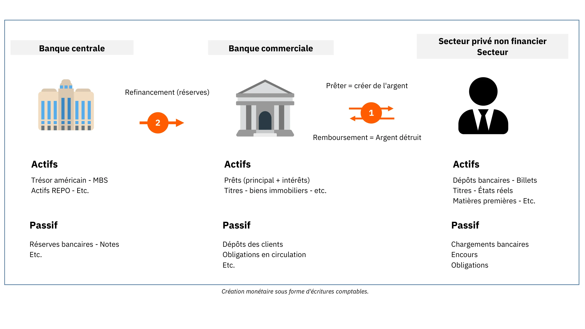

Figure 1 : Création monétaire sous forme d’écritures comptables

> "Il est bien suffisant que les gens de notre nation ne comprennent pas notre système bancaire et monétaire, car s'ils le faisaient, je crois qu'il y aurait une révolution avant demain matin."
>
> Henry Ford

Ce processus permet aux banques d’enregistrer toutes les transactions, qu’il s’agisse de virements bancaires, de paiements par carte de crédit ou de chèques, sur une période donnée (généralement une semaine ou un mois). Elles régularisent ensuite ces transactions entre elles en utilisant des réserves bancaires, une forme de monnaie fiduciaire qui n’est jamais directement accessible au public. Ces réserves sont conservées à la banque centrale, sur un compte spécial réservé aux banques et aux institutions financières agréées.

### Instabilité de la banque à réserves fractionnaires et rôle de prêteur en dernier ressort

Le principal problème du système à réserves fractionnaires réside dans le fait que des retraits massifs dans une banque peuvent potentiellement provoquer sa faillite. Comme les banques doivent répondre aux demandes de liquidités des clients tout en ne disposant que d’une réserve limitée, une ruée simultanée de nombreux déposants peut les rendre incapables de satisfaire ces demandes, entraînant ainsi leur effondrement. Étant donné que de nombreuses personnes, entreprises et institutions déposent leurs fonds dans ces banques, laisser une faillite se produire pourrait avoir de graves conséquences économiques, telles qu’une récession, voire une dépression.

Ce risque a conduit à la création des banques centrales modernes. Au XIXᵉ siècle en Angleterre, les retraits massifs menaçaient la stabilité financière, ce qui a entraîné la création de la Banque d’Angleterre en tant que prêteur en dernier ressort. Sa mission consistait à fournir des fonds aux banques en difficulté lors de crises, afin d’éviter un effet domino pouvant paralyser l’ensemble du système financier. Ce concept s’est depuis généralisé et constitue aujourd’hui une fonction essentielle des banques centrales dans le monde entier.

Outre le maintien de la stabilité financière, les banques centrales sont responsables de la fixation des taux d’intérêt directeurs. Ces taux déterminent le coût auquel les banques agréées peuvent emprunter auprès de la banque centrale, définissant ainsi le prix de la liquidité pour les institutions financières qui jouent un rôle clé dans le financement de l’économie. Par conséquent, ces taux servent de référence pour l’ensemble du système financier. Pour un particulier, les taux d’intérêt appliqués à un prêt hypothécaire peuvent être décomposés en taux de politique monétaire et marge bancaire.

Figure2: Faillite de Lehman Brothers (15/09/2008)

Lors de la crise financière majeure de 2008, Lehman Brothers, une grande banque d'investissement, a déclaré faillite après avoir subi d'importantes pertes sur ses titres hypothécaires et avoir connu des retraits massifs de clients inquiets. En réponse à cette crise financière sans précédent, les banquiers centraux du monde entier ont injecté d'importantes quantités de liquidités sur les marchés financiers, fusionné des banques d'investissement en difficulté avec des banques commerciales et abaissé les taux d'intérêt (créant ainsi une politique monétaire à taux zéro) dans le but d'éviter un effondrement systémique.

Bien que ces mesures aient empêché une vague de faillites en cascade, elles n'ont guère atténué le ralentissement économique qui a suivi. Des millions de personnes ont perdu leur emploi et leur logement, les dépenses des consommateurs ont chuté, les entreprises ont fait faillite et les banques ont subi d'importantes pertes. Malgré des taux d'intérêt historiquement bas, peu de personnes étaient disposées à emprunter, ce qui a entraîné un cercle vicieux où la diminution initiale des dépenses et des investissements se renforçait. Par conséquent, les banquiers centraux ont pris des mesures supplémentaires en mettant en œuvre des programmes d'assouplissement quantitatif (Quantitative Easing). Ces programmes impliquaient que les banques centrales achètent des obligations gouvernementales et des titres adossés à des créances hypothécaires auprès des banques commerciales avec des réserves de banque centrale.

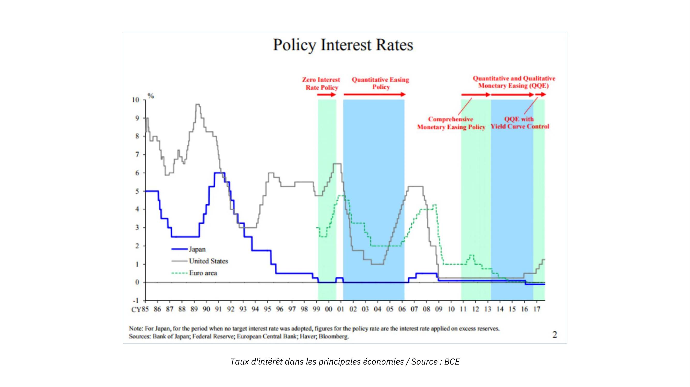

Figure3: Taux d'intérêt dans les principales économies / Source: BCE

Contrairement à ce que l’on pourrait attendre, les programmes d’assouplissement quantitatif n’ont pas stimulé de manière significative la croissance économique, mais ont fait grimper les prix des actifs financiers à des niveaux historiques. Ces hausses ont principalement profité aux riches et aux institutions financières, déjà détentrices d’importantes quantités d’actifs, creusant ainsi les inégalités de richesse. Au regard de la structure du système bancaire décrite précédemment, ce résultat n’est pas surprenant : comme les réserves bancaires circulent difficilement dans l’économie réelle, les programmes d’assouplissement quantitatif ont surtout fait monter les prix des actifs, sans améliorer de manière notable la situation financière de l’individu moyen.

### L'effet Cantillon

Un principe économique essentiel ressort néanmoins de cet épisode : lorsque de la monnaie nouvelle est créée, elle profite d’abord à ceux qui sont les plus proches de sa source, au détriment de ceux qui en sont plus éloignés. Ce concept, présenté pour la première fois au XVIIIᵉ siècle par Richard Cantillon dans son Essai sur la nature du commerce en général, est aujourd’hui connu sous le nom d’« effet Cantillon ».

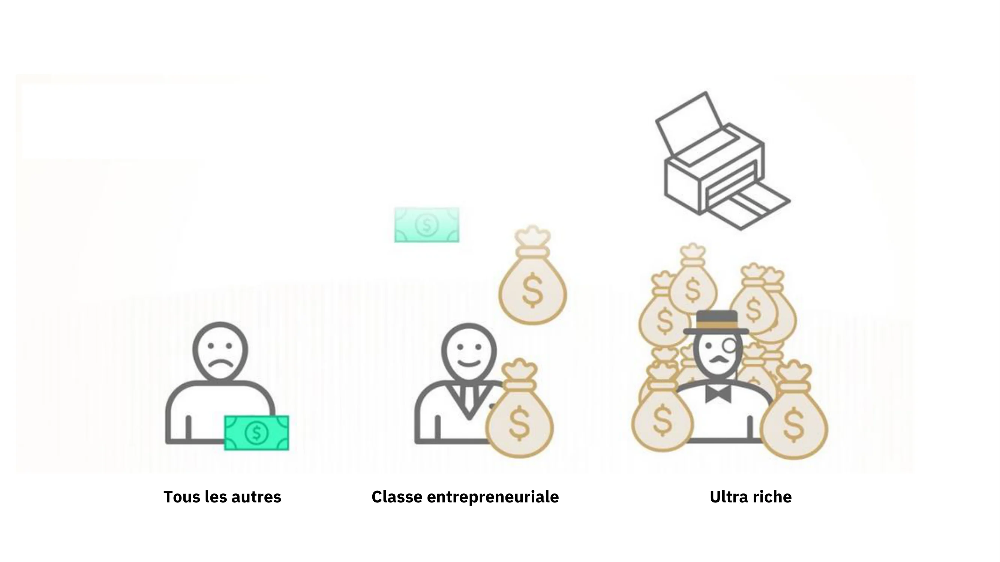

Figure4: L'effet Cantillon en un coup d'œil / Source: River Financial

Dans ce contexte, les banquiers, dirigeants d’établissement, actionnaires, détenteurs d’obligations, promoteurs et prêteurs immobiliers, ainsi que toute personne possédant des actifs financiers ou immobiliers, ont bénéficié d’une véritable manne financière, tandis que le fardeau est retombé sur le reste de la population. Cette situation a perduré pendant des années et explique en grande partie l’accroissement des inégalités de richesse, le sentiment de marginalisation des travailleurs et la hausse continue des prix des actifs malgré une croissance économique faible.

En substance, le système est biaisé. Les banques sont intrinsèquement instables, mais leur faillite pourrait menacer l’ensemble de l’économie. Ce risque moral incite les dirigeants bancaires à prendre des risques excessifs pour maximiser les revenus de leur établissement, sachant que la banque centrale interviendra en dernier ressort, transférant ainsi le coût aux contribuables. Dans ce type de scénario, les banques centrales créent les conditions d’un transfert massif du pouvoir d’achat des travailleurs et des épargnants vers les propriétaires d’actifs et les acteurs du système financier, dissociant le processus de création de richesse de l’accumulation effective de richesse.

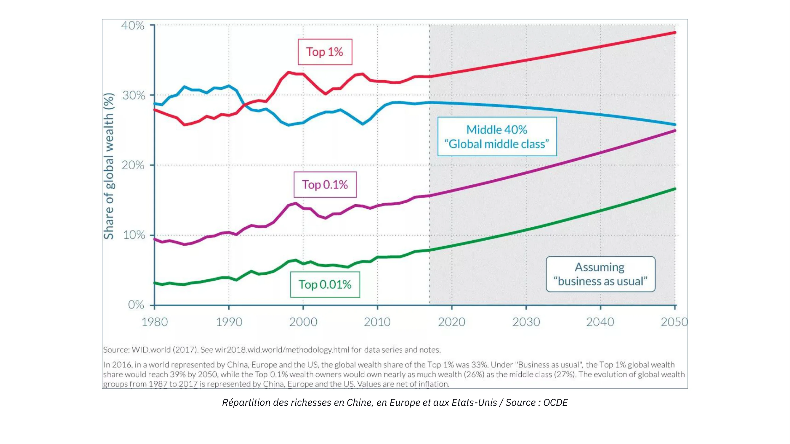

Figure 5 : Répartition de la richesse en Chine + Europe + États-Unis / Source : OCDE

### Conséquences des politiques de taux d'intérêt nuls

Pendant de longues périodes de politique de taux d’intérêt nul (Zero Interest-Rate Policy, ZIRP), les banques disposent de peu d’opportunités pour reconstituer leurs fonds propres, car leurs marges se trouvent fortement comprimées. Elles réalisent généralement des profits en empruntant à court terme et en prêtant à long terme. Cependant, lorsque les banques centrales achètent d’importantes quantités d’obligations et maintiennent les taux proches de zéro, les banques ont peu d’incitation à prêter, notamment aux entrepreneurs et autres preneurs de risques. Elles préfèrent alors allouer leurs ressources à la titrisation du capital existant ou à l’octroi de prêts garantis pour répondre à la demande des bénéficiaires de l’effet Cantillon.

Une autre conséquence involontaire de la ZIRP est qu’elle encourage les gouvernements à engager des dépenses importantes. Comme ils ne supportent pratiquement aucun coût d’emprunt et peuvent compter sur les banques centrales pour acheter leurs obligations via les programmes d’assouplissement quantitatif, les gouvernements ont une incitation naturelle à dépenser autant que possible, surtout dans les systèmes démocratiques où ces dépenses peuvent se traduire par un gain électoral. Cette tendance néglige souvent les conséquences à long terme, entraînant une augmentation significative du niveau de la dette publique dans les économies développées depuis la crise financière mondiale (Global Financial Crisis).

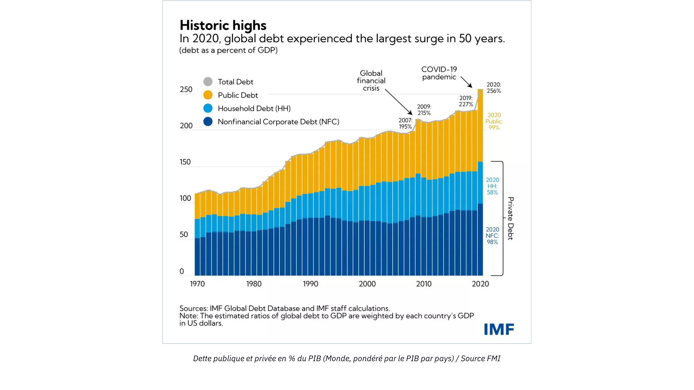

Figure 6 : Dette publique et privée en % du PIB (monde, pondéré par le PIB par pays) / Source : FMI

Avec la hausse de l'inflation en raison de la création monétaire importante en réponse aux confinements liés à la COVID, les banquiers centraux relèvent maintenant les taux d'intérêt dans le but de freiner l'inflation. Cependant, cela pose un défi important pour l'ensemble du système. Les banques sont plus endettées que jamais, les gouvernements portent des niveaux de dette historiquement élevés, la croissance économique est faible, les déficits s'accumulent et les consommateurs, confrontés à la hausse des prix des biens essentiels, ont du mal à joindre les deux bouts. Contrôler l'inflation nécessiterait de relever les taux à un niveau qui pourrait mettre les gouvernements en faillite, tandis que les banques risquent de perdre des déposants alors que les particuliers dépensent leurs économies pour des biens de première nécessité de plus en plus chers ou cherchent refuge dans des actifs tangibles et des fonds du marché monétaire pour se protéger contre l'inflation.

### Conclusion

> "Par ce moyen (la banque à réserves fractionnaires), les gouvernements peuvent confisquer en secret la richesse du peuple, et pas un individu sur un million ne remarquerait ce vol."
>
> John Maynard Keynes

En essence, notre système fait face à d’importants défis, et Bitcoin apparaît comme la seule alternative véritablement crédible. Toutefois, Bitcoin seul ne peut résoudre l’ensemble des problèmes de notre système monétaire. Il est d’abord nécessaire que les enthousiastes du Bitcoin comprennent les principes économiques fondamentaux, afin de favoriser une prise de conscience plus large et une meilleure rationalité économique. L’objectif principal de ce cours est donc de transmettre aux nouveaux passionnés de Bitcoin des fondations économiques solides.

Pour y parvenir, nous présenterons les principes essentiels de l’économie autrichienne, une école de pensée dont les racines méthodologiques remontent au XVIᵉ siècle et qui offre une analyse approfondie de l’action humaine dans un cadre de contraintes économiques. Avec cette introduction, vous disposez désormais des bases nécessaires pour comprendre la création monétaire ainsi que l’état actuel de notre système financier et monétaire.

Dans le prochain chapitre, nous aborderons la pierre angulaire de toute école économique : la théorie de la valeur. Les chapitres suivants exploreront l’argent en tant qu’institution sociale, la théorie du capital et du cycle économique, le problème du calcul économique, ainsi qu’un bref aperçu de l’histoire et de la méthodologie de l’école autrichienne d’économie.

# Fondements théoriques

<partId>86012c1b-cdf2-586f-8fe7-263f8287e950</partId>

## La théorie subjective de la valeur

<chapterId>eb1608d4-5d36-56a0-bcfc-ed8c03dfa906</chapterId>

> "La valeur n'existe que dans la conscience humaine"
>
> Carl Menger, Principes d'économie politique

:::video id=0bda55c3-4c47-4559-b429-f01ea43f8c0d:::

### La révolution marginale

Au cœur du raisonnement économique se trouve la question de la valeur. Comment déterminons-nous la valeur d’une chose ? La valeur est-elle une propriété intrinsèque des objets, ou bien un phénomène purement subjectif ? Comment comparer la valeur de deux biens ? D’où la valeur provient-elle réellement ?

Ces interrogations ont occupé économistes et philosophes pendant des siècles et ont donné lieu à des réponses variées. L’évolution épistémologique de la discipline économique est, à bien des égards, jalonnée par l’évolution des théories de la valeur.

Après que la théorie de la valeur foncière des physiocrates qui postulait que toute valeur provient de la terre a été réfutée, elle a été remplacée par la théorie de la valeur travail des économistes classiques, selon laquelle la valeur d’un bien découle de la quantité de travail nécessaire à sa production. Cette approche fut elle-même supplantée par la théorie marginale de la valeur. Dans les années 1870, à la suite de Marx, considéré comme le dernier grand représentant de l’économie classique, trois nouvelles écoles de pensée économique émergèrent presque simultanément autour de ce concept marginaliste : l’école de Lausanne avec Léon Walras, l’école néoclassique moderne avec William Stanley Jevons, et l’école autrichienne avec Carl Menger. Cette révolution dans la théorie de la valeur a marqué un tournant majeur dans l’histoire de la pensée économique.

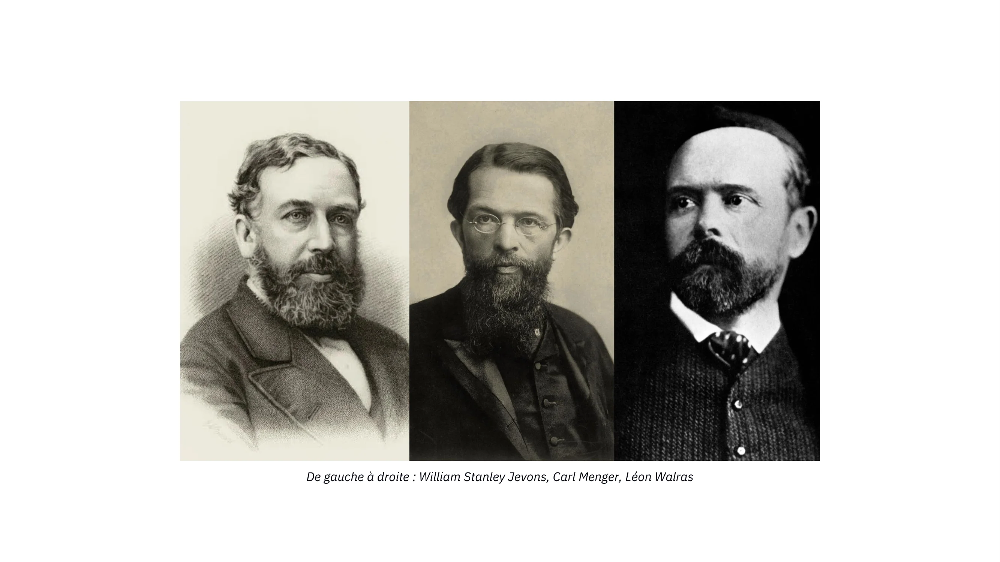

De gauche à droite : William Stanley Jevons, Carl Menger, Léon Walras

La théorie marginale de la valeur soutient que la valeur économique correspond à ce qu'un agent est prêt à payer volontairement pour la prochaine unité d'un bien ou d'un service. Comme cette théorie met l'accent sur le fait que les prix se forment à la marge, c'est-à-dire pour la prochaine unité d'un bien donné, elle a été appelée "marginalisme".

Il est courant de présenter le marginalisme de ces trois écoles comme similaire. En effet, Walras et Jevons sont très compatibles, mais la théorisation de Menger diverge profondément des autres. Dans son œuvre, considérée comme fondatrice de la théorie économique autrichienne, intitulée "Grundsätze des Volkswirtschaftlehre" (Principes d'économie politique), publiée en 1874, Menger propose une explication marginale, mais principalement subjective, de la valeur, contrairement à Walras et Jevons, qui considèrent la valeur comme un phénomène objectif et mesurable.

### Valeur subjective

L'économiste autrichien réfute la conception des successeurs d'Adam Smith et abandonne l'idée que la valeur d'un bien provient de la quantité de travail utilisée dans sa production, au profit de l'idée que sa valeur est déterminée par l'individu, qui, dans chaque contexte, effectue un acte mental d'évaluation concernant une quantité spécifique d'un bien ou d'un service. Ce saut intellectuel fait par Menger remet en question l'objectivité de la valeur : pour lui, la valeur n'est pas une propriété objective des biens ; elle est simplement le résultat de la relation que l'individu entretient avec cette chose : "la valeur n'existe pas en dehors de la conscience humaine".

En d’autres termes, Menger nous invite à considérer que la valeur n’existe que comme un phénomène psychologique subjectif propre à l’individu : elle n’est pas une propriété inhérente aux biens, mais résulte de l’opinion qu’un individu se fait de l’utilité qu’il peut tirer de ces biens.

Selon cette perspective, un litre d’eau potable n’a pas de valeur objective. Une personne disposant d’un accès moderne à l’eau potable et n’ayant pas soif attribuera probablement très peu de valeur à un litre d’eau supplémentaire. À l’inverse, un individu assoiffé au milieu du désert pour qui ce litre représente la différence entre la vie et la mort — serait prêt à lui attribuer une valeur presque infinie.

En résumé, Menger observe que la valeur d’un bien économique n’est rien d’autre que l’évaluation subjective qu’un individu accorde à une unité supplémentaire de ce bien ou service.

### Échange volontaire : un jeu à somme positive

À partir de ce point, Menger déduit que l'échange volontaire entre deux individus a lieu parce que chaque partie croit qu'il augmentera leur utilité subjective. Pour lui, l'échange ne présuppose aucune équivalence de valeur, contrairement à ce que croyaient les économistes classiques. Selon le penseur autrichien, s'il y avait une équivalence d'utilité entre les biens échangés, il n'y aurait aucune raison pour les parties de se donner la peine d'échanger en premier lieu. S'il y a un échange, c'est parce que chaque partie le trouve dans son intérêt (subjectif), et par conséquent, chaque échange volontaire produit un bénéfice social.

### L'évaluation en tant que phénomène d'ordonnancement des désirs humains

Cependant, un tel bénéfice social ou la valeur subjective attribuée à un bien ne peut pas être mesuré. Pour Menger, la valeur est un phénomène cognitif d’ordre (ordinal) plutôt que de mesure (cardinal). Contrairement à l’idée défendue par les économistes néoclassiques depuis Walras et Jevons, elle ne consiste pas en l’attribution d’une valeur numérique reflétant l’utilité d’un bien, mais dans un acte d’ordonnancement des préférences, par lequel un individu exprime qu’il désire une quantité du bien A plus intensément qu’une quantité du bien B.

N’importe quel agent peut dire s’il préfère deux bananes à un cours d’économie, mais personne ne peut raisonnablement affirmer qu’il valorise deux bananes à 3,1416 utils, tandis qu’un cours d’économie vaudrait 3 utils, ce qui expliquerait sa préférence pour les bananes. Une telle représentation des préférences humaines fondée sur des fonctions continues à valeurs réelles ne correspond pas à la réalité des processus cognitifs que nous vivons au quotidien. Un individu n’évalue jamais les biens qui s’offrent à lui en les comparant à une norme abstraite d’utilité. Il compare plutôt différentes actions possibles, qu’il ne peut juger en termes absolus, mais qu’il peut néanmoins classer selon leur désirabilité relative.

Cette conception subjective de la valeur, envisagée comme une relation psychologique entre un individu, ses objectifs et les moyens pertinents pour les atteindre, permet également aux économistes autrichiens d’expliquer le phénomène de la division du travail.

### La division du travail

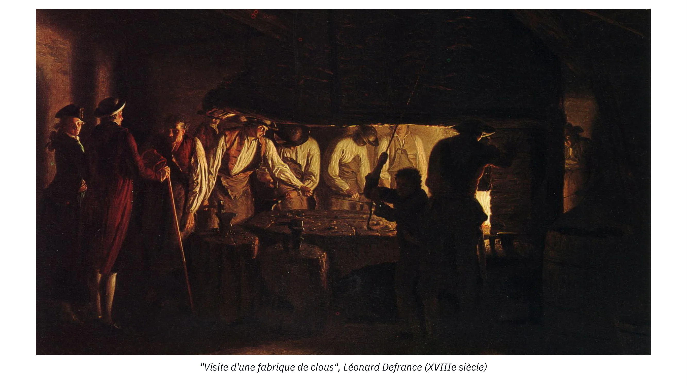

Dans Visite d'une fabrique de clous de Léonard Defrance (XVIIIᵉ siècle), on perçoit déjà intuitivement une idée essentielle : chaque individu est unique et possède une situation personnelle particulière. Cela implique que chacun dispose d’une capacité supérieure à accomplir certaines tâches plutôt que d’autres. Parfois, cette supériorité est générale (avantage absolu), parfois elle n’existe qu’en comparaison avec ses autres tâches possibles (avantage comparatif). Il ne peut en être autrement ; nier ce fait reviendrait à affirmer que tous les êtres humains sont identiques en tout point.

Lorsqu’un individu possède un avantage absolu dans la production d’un bien donné, il a tout intérêt à se spécialiser dans cette production puis à échanger son excédent pour obtenir les autres biens qu’il désire. Il maximise ainsi son utilité subjective en évitant de disperser son temps et ses efforts dans des productions où il est moins performant.

Mais même lorsqu’un individu ne possède aucun avantage absolu, la spécialisation reste optimale. En effet, il existe toujours une activité pour laquelle il est relativement meilleur qu’une autre (avantage comparatif). D’autres personnes pourraient produire ce bien plus efficacement que lui, mais comme elles sont encore plus productives dans d’autres tâches, il serait inefficace qu’elles consacrent leur temps à cette production secondaire. En se spécialisant dans ce pour quoi ils excellent le plus, tous les individus génèrent davantage d’excédent, ce qui augmente la quantité totale de biens disponibles pour l’échange.

L’exemple classique est celui du médecin : il pourrait être plus compétent que sa secrétaire pour rédiger des e-mails ou planifier des rendez-vous. Pourtant, chaque heure consacrée à ces tâches administratives est une heure qu’il ne consacre pas à soigner des patients, activité où sa productivité est incomparablement plus élevée. Il est donc rationnel qu'il délègue, même lorsqu’il est « meilleur » que son adjoint : cela maximise la valeur collective créée — et, par ricochet, sa propre richesse.

La spécialisation repose sur un principe simple mais puissant : le temps est une ressource rare et rivale. Toute unité de temps utilisée pour autre chose que l’activité la plus productive d’un individu représente un coût d’opportunité.

Une fois spécialisé, l’individu conserve pour lui la quantité de biens qu’il juge nécessaire, et échange son excédent. Comme chaque unité supplémentaire du bien qu’il produit lui apporte moins d’utilité que la précédente (utilité marginale décroissante), cet excédent vaut relativement peu pour lui mais peut être fortement désiré par d’autres. Cette asymétrie d’évaluation subjective crée les conditions idéales pour l’échange : chaque partie y gagne en utilité.

Ainsi, spécialisation et échange permettent toujours aux individus d’améliorer leur situation. C’est pourquoi les économistes autrichiens en particulier Ludwig von Mises affirment que l’avantage productif induit par la division du travail est le moteur fondamental de la coopération sociale. Pour reprendre ses mots :

« Les faits fondamentaux qui ont engendré la coopération, la société et la civilisation sont les suivants : le travail effectué dans le cadre de la division du travail est plus productif que le travail isolé, et la raison de l’homme est capable de reconnaître cette vérité.Les gens ne coopèrent pas parce qu’ils s’aiment ; ils coopèrent parce que cela sert leurs propres intérêts.»

### Conclusion

> "Si un homme voit qu'il peut vivre plus confortablement en se pendant au gibet qu'en s'asseyant à table, il serait fou de ne pas se pendre."
>
> Baruch Spinoza

Les années 1871-1874 sont les merveilleuses années de l'économie moderne : cette période a été marquée par les travaux de trois penseurs indépendants qui ont jeté les bases de l'économie moderne. Avec leur accent sur la valeur ordinale subjective, les économistes autrichiens développeront un ensemble complet de pensée économique qui les distingue de leurs homologues. Le travail des économistes autrichiens, qui raisonnent sur l'action humaine dans le contexte de la rareté, se distingue à jamais des doctrines économiques initiées par Jevons et Walras, qui reposent fortement sur les mathématiques et sur l'idée que la valeur peut être mesurée objectivement et dérivée comme une fonction continue.

S'appuyant sur les idées de la valeur ordinale subjective, Menger a expliqué l'émergence de la division du travail et de l'échange volontaire. Cependant, comme nous le verrons dans le prochain chapitre, l'échange direct est une stratégie peu efficace pour les agents économiques cherchant à maximiser leur utilité subjective. Le père de l'école autrichienne a donc développé davantage son raisonnement pour expliquer pourquoi l'argent est apparu en tant qu'institution sociale.

Les chapitres suivants seront consacrés à l'émergence de l'argent en tant que phénomène social, à la théorie du capital et de l'intérêt, qui servira de base à la théorie du cycle économique, et enfin au rôle des prix dans le calcul économique.

## L'émergence de l'argent en tant que phénomène social

<chapterId>14ded794-0578-5478-ba5b-b2106c74f3ef</chapterId>

:::video id=914b78a2-3b88-43cb-8acb-93cd76e90d26:::

Bien que les individus aient un intérêt commun à se spécialiser et à étendre la division du travail, des problèmes de coordination persistent et limitent cette expansion.

D’abord, les processus de production sont par nature étalés dans le temps et souvent asynchrones. Cela crée un décalage entre l’effort initial fourni par un individu et la contrepartie qu’il recevra plus tard. Se consacrer à une tâche spécifique aujourd’hui sans garantie que les autres combleront nos besoins demain représente donc un risque réel.

Ensuite, dans un système fondé sur la division du travail, chacun bénéficie globalement de la coopération. Cependant, à l’échelle individuelle, il existe toujours la tentation de profiter du travail des autres sans offrir de réciprocité obtenir un bénéfice sans en assumer le coût. Ce type de situation, où la coopération génère un résultat optimal pour le groupe mais où l’intérêt individuel pousse parfois au comportement opportuniste, est bien connu en théorie des jeux : il s’agit du dilemme du prisonnier.

### Le dilemme du prisonnier

À l'origine, le dilemme du prisonnier était formulé comme suit : Deux suspects, Alice et Bob, incapables de communiquer, sont confrontés au risque d'emprisonnement, avec des peines potentielles comme suit :

- Si Alice accuse Bob et que Bob reste silencieux, Alice est libérée et Bob est condamné à 3 ans.
- Si Alice et Bob s'accusent mutuellement, ils écopent chacun de 2 ans.
- Si les deux restent silencieux, ils écopent chacun d'un an.

Ces résultats peuvent être représentés dans une matrice (les résultats numériques indiquent le nombre d'années d'emprisonnement) :

| Alice / Bob           | Accuser | Rester silencieux |
| --------------------- | ------- | ----------------- |
| **Accuser**           | 2, 2    | 0, 3              |
| **Rester silencieux** | 3, 0    | 1, 1              |

Dans ce jeu, il n'y a pas d'opportunité de coordination (la communication est impossible) pour atteindre le meilleur résultat pour les deux parties. Par conséquent, Alice et Bob ont un incitatif individuel à s'accuser mutuellement, même si cela ne mène pas au résultat optimal pour le groupe. La stratégie optimale pour les deux est de rester silencieux, chacun recevant une peine d'un an.
Ce jeu illustre un problème fréquemment rencontré dans la vie réelle : en l'absence de mécanismes de coordination, les individus ont tendance à choisir des stratégies qui maximisent leur gain individuel, indépendamment des stratégies choisies par les autres (vol, tricherie, trahison, violence, etc.), même lorsque l'équilibre souhaitable par la coordination ou la collaboration est possible.

### L’argent comme solution aux problèmes de coordination

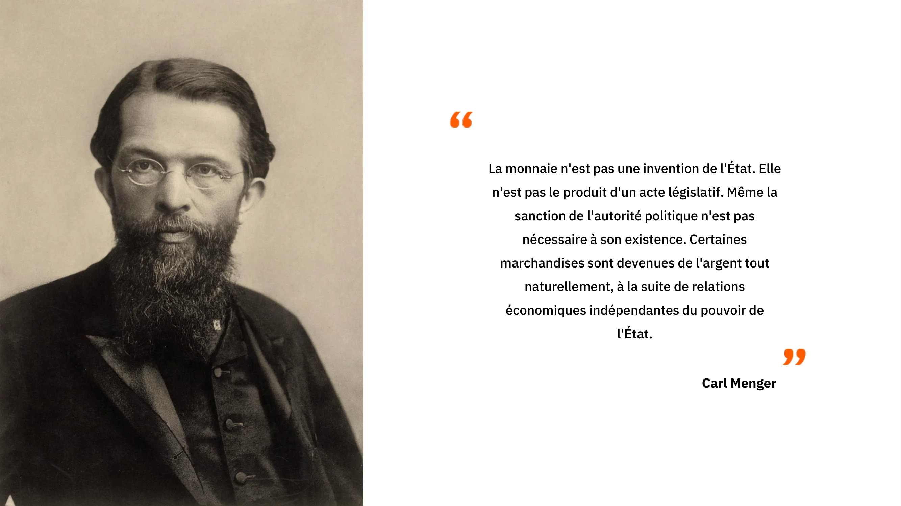

Dans les petites communautés comme la famille ou un cercle restreint d’amis les problèmes de coordination sont moins graves. Chacun connaît les autres personnellement, ce qui permet de se souvenir des contributions passées de chacun. Tant que quitter le groupe implique un coût important, un simple système de réputation basé sur la mémoire suffit à décourager les comportements opportunistes du dilemme du prisonnier.

Mais dès que la communauté s’agrandit et que la division du travail devient plus poussée, ces mécanismes ne fonctionnent plus. Deux limites majeures apparaissent.

La première est cognitive : un être humain ne peut maintenir des relations sociales stables qu’avec environ 150 personnes. Au-delà de ce seuil, il devient impossible de suivre mentalement les contributions, dettes et engagements de chacun. Un système de réputation n’est donc plus suffisant.

La seconde limite est celle de la commensurabilité des valeurs. Même si deux individus souhaitent échanger, ils doivent pouvoir comparer la valeur de ce qu’ils offrent. Comment déterminer la quantité de viande équivalente à des matériaux pour construire un abri ? Comment prendre en compte la qualité ? Et comment établir un ratio pour chaque paire de biens existant dans la communauté ?

Ce problème devient rapidement insoluble. Dans un système de troc avec N biens, il faut connaître N(N-1)/2 taux d’échange. Une économie de seulement 50 biens nécessite déjà la mémorisation de 1225 ratios. À 100 biens, ce nombre grimpe à 4950. Une explosion combinatoire qui rend l’échange direct totalement impraticable dès que l’économie se complexifie.

À cela s’ajoute une difficulté supplémentaire : les échanges ne sont pas tous simultanés. Pour coopérer efficacement, il faudrait mémoriser non seulement les taux d’échange présents, mais aussi la valeur relative des contributions passées et futures. Cela revient à instaurer un système de crédit rudimentaire, ce qui est impossible sans écriture ni outils d’enregistrement.

Nos ancêtres n’avaient ni carnets de comptes, ni registres numériques, ni tableurs pour conserver ces milliers de relations d’échange. Pourtant, ils avaient besoin des gains énormes offerts par la division du travail. Ils ont donc trouvé un mécanisme permettant de dépasser les limites du troc : l’échange indirect, rendu possible par l’apparition de l’argent.

### La double coïncidence des désirs et la monétisation

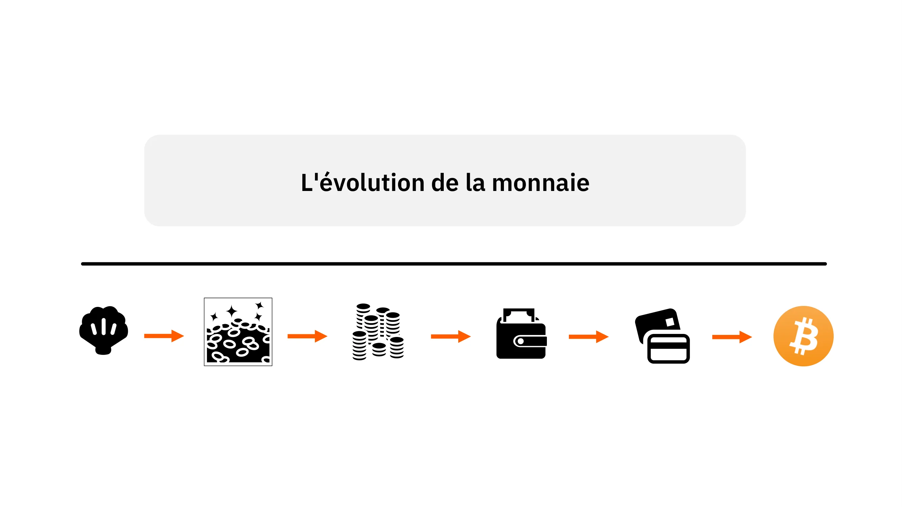

L’argent peut être compris comme la solution ingénieuse trouvée par nos ancêtres pour surmonter ce que les économistes appellent le problème de la « double coïncidence des désirs ». Ce problème existe sous trois dimensions : spatiale, temporelle et interpersonnelle.

Dans un échange direct par exemple, un troc entre Alice et Bob les deux individus doivent être réunis au même endroit, au même moment, tout en possédant chacun quelque chose que l’autre désire. L’échange indirect, rendu possible par l’usage de l’argent, libère ces contraintes. Alice peut vendre à Bob contre une unité monétaire, et Bob pourra utiliser cette monnaie ailleurs, plus tard, avec quelqu’un d’autre, tant que ce tiers accepte la même forme d’argent.

Pour qu’un bien remplisse efficacement cette fonction, il doit être hautement liquide, c’est-à-dire désiré par le plus grand nombre possible, dans la majorité des contextes. Grâce à l’utilisation d’un bien très liquide comme intermédiaire des échanges, les dimensions spatiales et interpersonnelles du problème de la double coïncidence disparaissent : si la monnaie est acceptée partout par presque tous, l’acte de vendre peut être complètement séparé de l’acte d’acheter.

La liquidité dans le temps, cependant, est plus difficile à préserver. Deux obstacles principaux se présentent.

D’abord, l’entropie autrement dit, l’effet du temps dégrade progressivement la plupart des biens ayant une utilité directe. Pour qu’un bien conserve sa liquidité au fil des années, il doit être durable, résistant à la détérioration et stable dans sa qualité.

Ensuite, la rareté relative d’un bien aujourd’hui ne garantit pas qu’il sera encore rare demain. Les humains peuvent toujours accroître la production d’un bien tant que le coût d’opportunité le rend rentable. Ainsi, seule une catégorie de biens peut rester durablement rare : ceux dont l’augmentation de l’offre nécessite un coût marginal très élevé. C’est pourquoi, partout dans l’histoire, les biens qui deviennent monnaie émergent naturellement parmi les artefacts les plus difficiles à produire ou à imiter.

Dans les sociétés pré-civilisationnelles, divers objets coquillages rares, bijoux artisanaux, colliers, perles — ont servi de monnaie. Ils étaient facilement transportables, ne se dégradaient pas, avaient une utilité directe minimale (essentiellement ornementale), et étaient naturellement rares. Mieux encore, la production de ces objets demandait un travail spécialisé dans une société où la division du travail était encore limitée. Le coût d’opportunité associé était donc très élevé, ce qui empêchait leur production massive et préservait leur rareté future.

Le fait que nos ancêtres chasseurs-cueilleurs aient consacré autant d’énergie et de ressources à produire ces objets non utilitaires est révélateur. Cela démontre l’énorme valeur qu’ils attribuaient à l’élargissement des possibilités d’échange, dans l’espace, dans le temps et entre individus. Si ces objets n’avaient pas accru leur capacité à coopérer et à prospérer grâce à la division du travail, les groupes qui investissaient dans ces productions auraient été désavantagés. Ils auraient été dominés par d’autres groupes utilisant leurs ressources de manière plus directement productive — chasse, abris, outils, nourriture.

Au contraire, la persistance universelle et millénaire de ces pratiques indique que la production de biens monétaires était, pour eux, l’usage le plus rentable de leurs ressources. En facilitant l’échange et en permettant une division du travail plus fine, ces objets contribuaient davantage à leur bien-être subjectif que n’importe quelle autre activité productive disponible.

### Incertitude

Pour conclure notre analyse de l'institution monétaire, nous devons aborder la question de l'action économique dans le contexte de l'incertitude inévitable concernant l'avenir.

Comme l'ont souligné les économistes autrichiens, l'action humaine est limitée dans le temps et toujours orientée vers l'avenir. Lorsqu'un individu agit, il modifie sa condition présente dans l'espoir d'obtenir une satisfaction future. Cette projection mentale peut être orientée vers un avenir proche ou lointain, mais pour qu'un individu puisse se projeter à long terme, il doit d'abord assurer sa subsistance à court terme car sa condition dans un avenir proche affecte directement sa condition dans un avenir lointain.

Cela découle directement de la rationalité humaine ; personne ne peut ignorer la nature séquentielle des phénomènes temporels et la dépendance chronologique qui en résulte, car c'est l'une des contraintes essentielles de la vie humaine. Par conséquent, puisque l'avenir reste toujours incertain pour les humains, ils chercheront à assurer leur survie à long terme uniquement une fois que leur survie à court terme est assurée.

À cet égard, l'argent, en permettant le stockage de valeur dans le présent et son transfert vers son futur soi-même, joue un rôle crucial dans la coordination intertemporelle de l'action humaine. En stockant de l'argent, c'est-à-dire en épargnant, les individus se prémunissent contre l'incertitude future et leur permettent ainsi d'orienter leurs actions vers des horizons temporels plus longs. Cependant, ils ne peuvent y parvenir que si l'argent utilisé constitue une réserve de valeur, c'est-à-dire s'il a une valeur dans le temps, ce qui, comme mentionné précédemment, est une caractéristique des biens durables et relativement rares.

Dans le prochain chapitre, nous approfondirons le concept de préférence temporelle et expliquerons la perspective autrichienne sur l'intérêt et le capital, qui servira de base pour le chapitre suivant sur la théorie du cycle économique.

## Préférence Temporelle, Intérêt et Capital

<chapterId>37732a5c-4f66-5e2d-bc2c-cc8d29693af7</chapterId>

### Préférence Temporelle

Nous avons conclu le dernier chapitre en expliquant comment les agents économiques utilisent le bien le plus vendable, c'est-à-dire l'argent, pour lutter contre l'incertitude future. Nous avons également expliqué que la nature séquentielle des phénomènes temporels nous amène à lutter contre l'incertitude progressivement : seulement lorsque nous savons que notre subsistance sera assurée pour la semaine prochaine, nous pouvons nous concentrer sur des objectifs plus éloignés dans le futur.

Pour le dire autrement : en tant qu'être humain, nous déprécions la valeur des biens futurs.

Cette évaluation subjective de la valeur des biens futurs par rapport aux biens présents est appelée préférence temporelle. Tout le reste étant égal, les biens présents sont intrinsèquement préférés aux biens futurs. Étant donné que nous sommes mortels et que l'avenir est toujours incertain, nous préférons naturellement avoir accès à un bien maintenant plutôt que plus tard. Bien que la préférence temporelle puisse varier d'un individu à l'autre en raison de nombreux facteurs tels que la culture, la richesse, l'éducation, la physiologie, etc., les préférences temporelles sont toujours positives, ce qui signifie que tout étant égal, nous valorisons toujours plus les biens présents que les biens futurs.

Ce concept de valorisation relative des biens futurs par rapport aux biens présents est à la base du phénomène de l'intérêt. En effet, dans une économie avec des marchés du capital non manipulés, les taux d'intérêt de référence (considérés comme sans risque de défaut) sont déterminés à l'intersection de l'offre et de la demande de capital. Par conséquent, ces taux représentent l'état des préférences temporelles pour l'ensemble de l'économie : une augmentation du taux d'intérêt résulte d'une augmentation relative de la demande de capital par rapport à l'offre, indiquant des préférences temporelles plus élevées. À l'inverse, une baisse des taux d'intérêt se produit en raison d'une augmentation de l'épargne, c'est-à-dire une augmentation de l'offre de capital, indiquant une réduction des préférences temporelles.

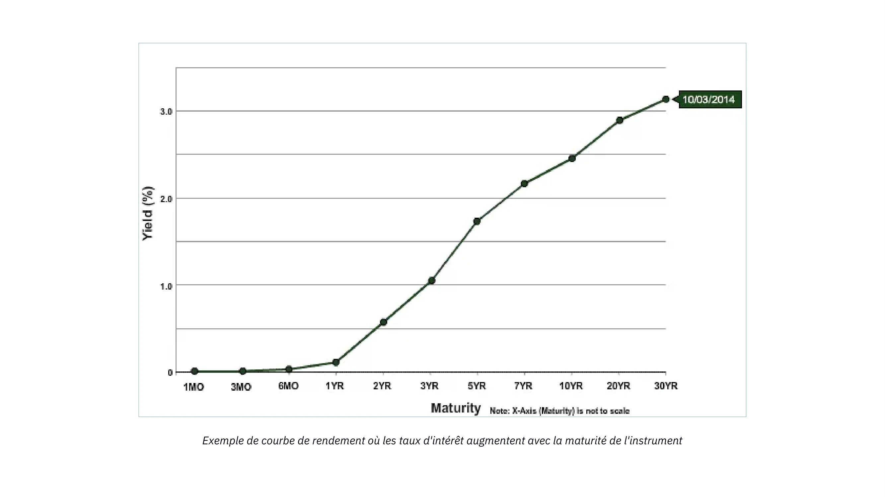

Dans une économie où les taux d'intérêt ne sont pas manipulés par la banque centrale, nous avons tendance à observer une courbe des rendements croissante : plus la maturité de la dette est longue, plus le taux d'intérêt est élevé. La situation inverse ne peut pas se produire car cela impliquerait que l'avenir est plus certain que le présent, ce qui est une impossibilité logique.

Le concept de préférence temporelle et la façon dont nous exprimons notre propre préférence temporelle par des actes de consommation et d'épargne sont fondamentaux pour les processus d'allocation du capital et de production. Tournons-nous vers l'élève de Menger, Eugen von Böhm-Bawerk, et sa théorie du capital pour comprendre exactement comment la préférence temporelle affecte l'organisation de la production.

### Théorie du Capital

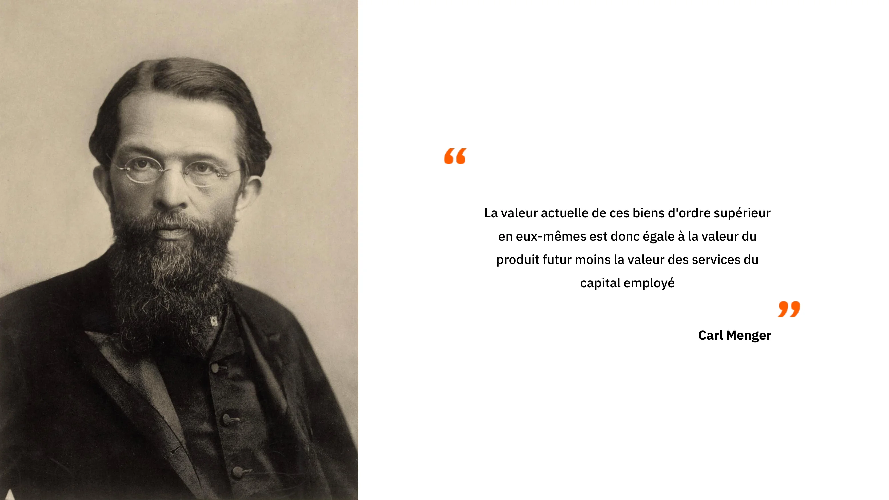

Au début de ce cours, nous avons vu qu’aux yeux de Carl Menger, un objet n’est considéré comme un bien économique que parce qu’il sert de moyen pour atteindre une fin valorisée par un individu. Toute l’analyse économique repose donc, en dernière instance, sur la consommation : c’est elle qui constitue la motivation fondamentale derrière toute activité productive. C’est pourquoi, dans la vision mengérienne, le point de départ naturel de l’économie est constitué par les biens de consommation, c’est-à-dire les biens finaux qui satisfont directement les besoins.

Tous les autres biens présents dans l’économie, que Menger appelle « biens d’ordres supérieurs » et que nous pouvons désigner comme des biens intermédiaires, ne tirent leur valeur que de leur capacité à contribuer à la production de ces biens finaux. Ce sont des moyens de production : des biens utilisés dans la création d’autres biens.

Pour produire des biens de consommation, les entrepreneurs combinent ces biens intermédiaires avec les facteurs de production originels travail, terre et capital selon une organisation qui maximise le résultat final. Cette organisation, que Menger nomme la « structure de production », comprend plusieurs étapes successives dans lesquelles les biens intermédiaires sont transformés jusqu’à devenir, finalement, des biens de consommation.

Menger classe ces biens selon leur distance temporelle par rapport à la consommation :

les biens de premier ordre sont les biens de consommation ;

ceux qui servent à les produire sont de deuxième ordre ;

les biens encore plus éloignés de la consommation finale sont de troisième ordre, etc.,
jusqu’à remonter aux facteurs originaux.

Il est crucial de comprendre que ces « ordres » ne sont pas des propriétés objectives des biens. Ils n’existent que dans le cadre téléologique de l’action humaine : l’individu imagine mentalement une séquence d’actions permettant d’atteindre son objectif, et il découpe cette séquence en étapes successives. Les ordres de biens reflètent donc la structure délibérée du plan d’action, non une caractéristique matérielle des objets.

Cette manière de concevoir la production découle directement de la nature temporelle de l’action humaine. Toute action prend du temps : on ne peut obtenir instantanément un résultat. L’individu doit donc choisir entre différents plans d’action, qui reviennent à choisir entre des méthodes plus ou moins longues.

Or, comme tout individu possède une préférence temporelle positive il préfère un bien présent à un bien identique dans le futur il n’acceptera une méthode plus longue que si elle lui promet un résultat subjectivement supérieur. Sinon, la voie la plus courte serait toujours préférée.

Cette temporalité implique une relation d’interdépendance entre les actions présentes et les objectifs futurs. Mes actions actuelles déterminent les possibilités de demain, et mes objectifs futur orientent mes choix immédiats. Appliqué à la production, ce fait fondamental implique que tout « détour de production », c’est-à-dire tout allongement de la structure productive, nécessite de l’épargne préalable. Pour entreprendre des méthodes productives plus longues et plus efficaces, il faut d’abord mettre de côté les ressources qui permettront de survivre et de continuer à produire durant ce temps prolongé.

Pour clarifier cette idée essentielle, Böhm-Bawerk propose dans Capital and Interest un exemple devenu classique :

Eugen von Böhm-Bawerk (1851-1914)

### Robinson Crusoe et le détour de production :

Dans son ouvrage, l’économiste autrichien Böhm-Bawerk illustre les compromis intertemporels inhérents aux détours de production à travers une expérience de pensée basée sur Robinson Crusoé, seul sur son île.

Robinson, comme tout être humain primitif, dépend de la cueillette et de la chasse pour se nourrir. Supposons qu’il puisse récolter suffisamment de baies pour se nourrir pendant une journée en travaillant huit heures. Dans ce cas, il a très peu de temps pour d’autres activités.

Cependant, Robinson se rend compte que s’il fabrique un bâton en bois, il pourrait faire tomber les baies plus facilement et obtenir sa ration quotidienne en seulement quatre heures de travail. La fabrication du bâton lui prendrait cinq jours, en travaillant deux heures par jour. Pour réussir, Robinson doit donc économiser une fraction de sa production quotidienne de baies pendant ces cinq jours, ou bien travailler deux heures supplémentaires par jour pour accumuler suffisamment de provisions afin de survivre pendant qu’il fabrique son bâton.

Sans cette économie préalable, Robinson ne pourrait pas terminer son bâton et risquerait de manquer de nourriture entre-temps.

Ainsi, pendant cinq jours, il sacrifie deux heures de repos pour récolter plus de baies. Une fois ce délai écoulé, il commence à fabriquer le bâton, travaillant deux heures par jour. À la fin de la période de production, il dispose de son outil : grâce au bâton, il peut désormais obtenir sa ration quotidienne de baies en seulement quatre heures, libérant les quatre heures restantes pour d’autres activités.

En procédant ainsi, Robinson emprunte un détour de production : au lieu de récolter directement les baies, il investit des efforts dans un bien capital qui accroît sa productivité future. Ce détournement exige un sacrifice à court terme l’épargne de baies ou l’effort supplémentaire  mais il procure un gain durable : quatre heures de travail quotidiennes supplémentaires qu’il peut consacrer à créer d’autres biens capitaux, comme des outils de chasse ou des filets de pêche, améliorant progressivement sa situation et sa productivité.

### Conclusion

En d'autres termes, dans l'économie d'une seule personne de Robinson Crusoé, l'épargne par le sacrifice de la satisfaction présente est ce qui permet l'accumulation de capital qui augmente la productivité. Dans ce contexte, l'épargne, c'est-à-dire le report de la satisfaction présente, est le prix à payer pour une satisfaction future accrue. Cela signifie que, dans ce contexte, l'épargne est la condition préalable et nécessaire à tout développement économique.

C'est un concept tentant, bien que simple : toute extension de la structure de production nécessite des économies préalables (car les biens nécessaires à une telle production ne tombent pas du ciel), et donc, plus nous épargnons, plus nous pourrons accumuler de capital, ce qui se traduira à son tour par des gains de productivité générant plus de biens. Ainsi, les économistes autrichiens considèrent que la réduction des préférences temporelles est le point de départ d'un cercle vertueux d'épargne -> plus de biens capitaux -> plus de productivité -> plus de biens = niveau de vie plus élevé -> préférence temporelle plus faible.

Maintenant, comme mentionné dans le premier chapitre, les taux d'intérêt ont été manipulés pendant des décennies par les banques centrales, tandis que les banques commerciales accordaient des crédits sans réserves préalables, ce qui signifie que les taux d'intérêt ne représentent pas notre préférence temporelle et donnent une illusion d'épargne abondante.
Cela est parfaitement illustré par le graphique ci-dessous : les taux longs sont inférieurs aux taux courts. Tout d'abord, cela n'a absolument aucun sens, car cela impliquerait que l'avenir est plus certain que le présent. 

Deuxièmement, cela suscite une interrogation sur les conséquences pour l'allocation des capitaux : si tout le monde est incité à agir comme si l'épargne était abondante, alors que les épargnants sont introuvables car ils ne sont pas récompensés pour leur épargne, quelles conséquences cela pourrait-il avoir sur l'économie ?

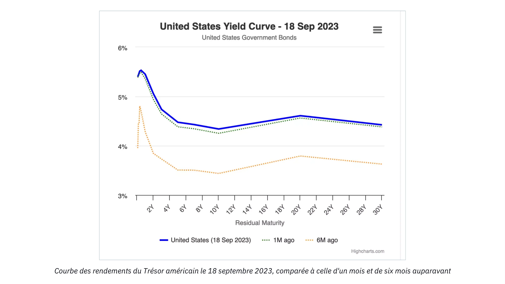

C'est ce que nous découvrirons dans le prochain chapitre consacré à la théorie autrichienne du cycle économique !

# Perspectives économiques autrichiennes

<partId>ad0fce42-2556-56b8-a093-5b4fcacc7cf3</partId>

## La théorie autrichienne du cycle économique

<chapterId>718afaa8-ce78-58aa-9477-073eef0bd137</chapterId>

:::video id=40e2807d-4418-4a24-898e-ece159654bda:::

> "Plus le boom du crédit bancaire inflationniste dure longtemps, plus les investissements non rentables dans les biens d'équipement sont nombreux et plus la nécessité de liquider ces investissements insensés est grande. Lorsque l'expansion du crédit s'arrête, se retourne, ou même ralentit significativement, les investissements non rentables sont révélés."
>
> Ludwig von Mises

C'est Ludwig Von Mises, l'étudiant le plus accompli de Böhm-Bawerk et sans doute l'économiste autrichien le plus important du XXe siècle, qui a utilisé le raisonnement capitaliste de Böhm-Bawerk pour expliquer les causes et la dynamique des cycles économiques. Friedrich A. Hayek, le protégé de Mises, a ensuite étendu ce raisonnement à ses conclusions logiques dans des travaux pour lesquels il a été récompensé du prix Nobel d'économie en 1974.

Mises et Hayek ont commencé leur analyse par une augmentation de l'épargne comme point de départ. Comme nous l'avons vu dans les chapitres précédents, toute augmentation de l'épargne entraîne nécessairement une diminution correspondante de la consommation et donc des prix relatifs plus bas des biens de consommation. Cela entraîne deux effets : premièrement, une demande accrue de biens d'équipement causée par la hausse des salaires réels résultant de la diminution relative des prix des biens de consommation ; et deuxièmement, une augmentation des bénéfices entrepreneuriaux aux stades de production les plus éloignés de la consommation (ordre inférieur). À mesure que les salaires réels augmentent, les entrepreneurs sont incités à économiser la main-d'œuvre en utilisant davantage de biens d'équipement, ce qui crée une demande plus forte de biens d'équipement et des bénéfices plus élevés pour les entrepreneurs produisant ces biens d'ordre inférieur. Ainsi, dans le contexte d'une augmentation de l'épargne, c'est-à-dire d'une diminution des préférences temporelles, les taux d'intérêt baissent, favorisant le développement de stades de production supplémentaires et une productivité accrue. Il s'agit d'un détournement de production classique selon Böhm-Bawerk, et c'est un résultat très souhaitable.

Cependant, les deux économistes autrichiens se sont demandé ce qui se passerait si la baisse du taux d'intérêt, qui sert de point de départ à ce détournement de production, ne résultait pas d'une augmentation de l'épargne, mais plutôt d'une expansion du crédit.

Dans le contexte de la banque de réserve fractionnaire, l'expansion du crédit ne nécessite pas une augmentation correspondante de l'épargne. Par conséquent, les entrepreneurs peuvent lever plus de capitaux et s'engager dans des détours de production même si les préférences temporelles restent inchangées, c'est-à-dire sans aucune diminution de la consommation. Pour Hayek et Mises, une telle situation devrait nécessairement entraîner d'importants problèmes de coordination entre les agents économiques. En raison de l'absence de taux d'intérêt fixés par le marché libre, ces problèmes peuvent ne pas être immédiatement évidents, mais à long terme, les mauvais investissements de capital qui en résultent devraient produire des conséquences tangibles : une récession.

Pour décrire ce phénomène de désynchronisation temporelle et ses conséquences aussi clairement que possible, nous nous appuierons sur un modèle de la structure de production et observerons comment il est affecté, d'abord par une baisse des taux d'intérêt résultant d'une augmentation de l'épargne, puis par une baisse des taux d'intérêt causée par une expansion du crédit.

### Baisse des taux d'intérêt due à une augmentation de l'épargne :

Pour faciliter notre explication, nous reviendrons à la classification des biens de Menger et représenterons la structure productive sur un diagramme composé d'un nombre arbitraire d'étapes:

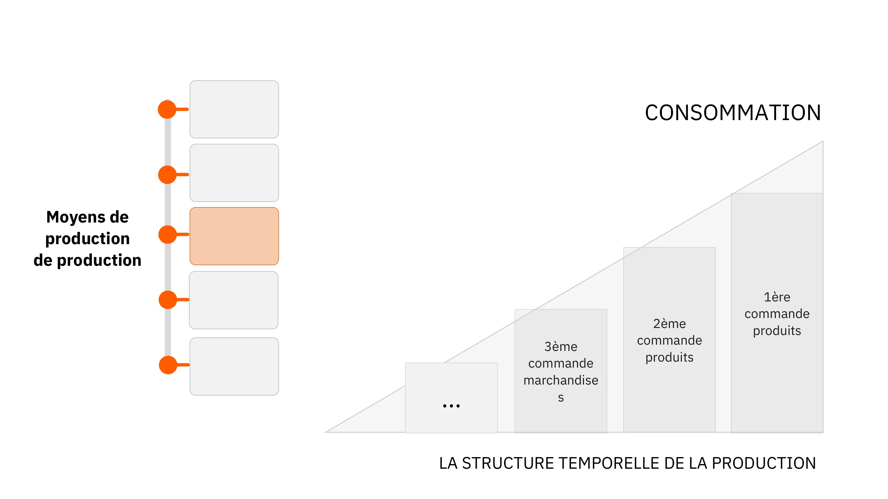

Dans le diagramme ci-dessus, les ressources initiales traversent successivement différentes étapes de production, chacune ajoutant une transformation supplémentaire qui rapproche ces ressources de l’état final des biens de consommation. Ces transformations résultent de l’interaction avec les facteurs de production originels : le temps, la terre et le travail.

La hauteur du côté droit du triangle représente schématiquement le PIB, puisqu’elle indique la quantité totale de biens de consommation vendus au cours d’une période donnée. L’écart entre chaque barre correspond à la valeur ajoutée générée à chaque étape du processus productif. Cet écart peut aussi être interprété comme le revenu associé à chaque stade (revenus moins coûts).

Si, à l’échelle agrégée, les individus augmentent leur épargne, la quantité de biens finaux consommés diminue nécessairement : épargner revient toujours à reporter une partie de sa consommation dans le futur. Cette baisse de la consommation libère des ressources, ce qui fait baisser les taux d’intérêt, puisque l’offre de capital augmente.

Avec un taux d’intérêt plus faible reflétant une préférence temporelle réduite les entrepreneurs sont incités à entreprendre des projets plus longs et plus intensifs en biens d’équipement. Ils utilisent alors ce capital additionnel pour développer de nouveaux biens d’investissement et allonger la structure de production.

Nous obtenons alors une structure productive plus longue, plus capitalistique, un changement qui peut être représenté qualitativement par le diagramme suivant :

Dans ce scénario, la valeur monétaire des biens de consommation demandés diminue, ce qui libère des ressources permettant l’ajout d’une étape supplémentaire dans la structure de production. Lorsque la baisse du taux d’intérêt provient d’une diminution volontaire de la consommation autrement dit, d’une augmentation de l’épargne la surface totale du triangle, qui représente la quantité d’argent en circulation, demeure inchangée. L’allongement de la structure de production ne résulte pas d’une création monétaire, mais simplement d’un transfert du pouvoir d’achat d’une partie de la structure productive vers une autre.

Il est également crucial de noter que la baisse de la demande de biens de consommation entraînera, à moyen terme, une diminution de leurs prix plutôt qu’une réduction de la quantité produite. En effet, la partie finale de la structure de production ne s’adapte pas instantanément à la baisse de la demande : les entrepreneurs ont besoin de temps pour réviser leurs plans et réallouer leurs ressources. Comme ils disposent de stocks, la chute de la demande les pousse à écouler ces stocks à prix réduit. L’excédent d’épargne se traduit donc d’abord par une baisse des prix à la consommation, donc par une hausse des salaires réels.

Inversement, les prix des biens d’investissement augmentent, car le pouvoir d’achat transféré aux entrepreneurs accroît leurs dépenses d’investissement. Une fois que cette épargne  transférée des épargnants vers les entrepreneurs a été entièrement dépensée, l’offre de capital diminue de nouveau, ce qui fait remonter les taux d’intérêt. Cette remontée entraîne à son tour une baisse des prix des biens d’investissement. À la fin de ce détour de production, les prix relatifs reviennent globalement à leur niveau initial.

Cependant, l’économie dans son ensemble en ressort gagnante.

L’allongement de la structure de production rend les processus plus productifs, ce qui offre aux consommateurs une plus grande quantité de biens à un coût unitaire plus faible.

Les épargnants voient leur pouvoir d’achat augmenter, à la fois grâce aux intérêts perçus et à la baisse des prix à la consommation.

Les entrepreneurs, considérés collectivement, ne réalisent ni gains ni pertes. Certains, proches du stade final de la consommation, voient leurs revenus diminuer, tandis que ceux engagés dans les nouvelles étapes de production voient les leurs augmenter dans les mêmes proportions.

Dans ce cadre, aucun revenu monétaire supplémentaire n’est créé : c’est la production réelle qui s’accroît. Et cette augmentation de la production est précisément ce qui améliore la valeur réelle des revenus dans l’ensemble de l'économie.

### Baisse des taux d'intérêt due à une augmentation du crédit (sans augmentation de l'épargne) :

Maintenant, si nous considérons une baisse des taux d'intérêt résultant d'une expansion du crédit offert par les banques, nous obtenons une image très différente de la structure de production.
Avec des taux d'intérêt plus bas, les entrepreneurs peuvent emprunter davantage de ressources et ainsi créer des étapes de production de plus haut niveau. Dans ce cas, une telle extension de la structure de production ne se traduira pas par une diminution de la consommation car il n'y a pas eu de report de la consommation actuelle par les consommateurs. En d'autres termes, le PIB augmente. Par conséquent, notre triangle s'allongera tout en conservant une hauteur similaire, ce qui signifie que sa surface augmentera.

Notez que c'est une conséquence logique de l'expansion du crédit. Dans la mesure où les banques produisent des médias fiduciaires en accordant des prêts, on peut naturellement s'attendre à ce que le pouvoir d'achat global augmente.

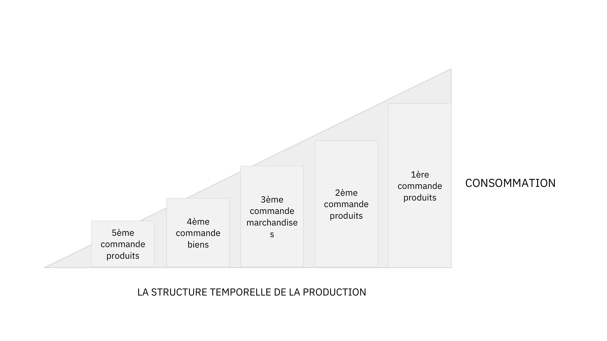

Lorsque le crédit pénètre dans l’économie par le biais de prêts aux entrepreneurs, on observe initialement une augmentation des profits dans les secteurs de production éloignés de la consommation (construction navale, automobile, technologies avancées, etc.), tandis que les profits dans les secteurs plus proches de la consommation diminuent proportionnellement. Cette rentabilité accrue pousse les entrepreneurs à réallouer le capital vers ces nouvelles étapes plus intensives en capital, au détriment des secteurs plus proches de la consommation.

Les entrepreneurs des étapes de production supérieures perçoivent alors des revenus monétaires plus élevés. Or, comme les préférences temporelles restent inchangées, la demande de produits de consommation augmente. Cependant, la rentabilité relative du capital a été artificiellement plus élevée dans les secteurs éloignés de la consommation, ce qui entraîne un transfert de ressources des secteurs de consommation vers les secteurs d’investissement. Les entrepreneurs des étapes de production inférieures manquent alors des ressources nécessaires pour répondre à la demande accrue, créant une tension structurelle : chaque partie de la structure de production cherche à capter davantage de capital, mais les besoins immédiats de consommation limitent la capacité à soutenir les investissements de long terme.

À mesure que les ressources viennent à manquer dans les secteurs éloignés de la consommation, le taux de profit diminue, certaines entreprises font faillite, et l’augmentation relative des prix à la consommation incite à une réallocation rapide du capital vers les biens de moindre ordre. Cette réallocation soudaine déclenche une récession : les prix des actifs chutent, les salaires réels diminuent, les prix à la consommation baissent et les stocks s’accumulent.

Pour Friedrich Hayek et Ludwig von Mises, la récession reflète la mauvaise allocation du capital survenue lors de la phase d’expansion. Comme les prix de l’épargne et du capital ont été manipulés, les entrepreneurs ont engagé des projets impossibles à terminer faute de ressources, ou ont construit une capacité productive fondée sur un niveau de consommation future insoutenable.

La correction intervient uniquement à travers la déflation, c’est-à-dire une baisse générale et durable des prix des actifs et des salaires, une hausse des taux d’intérêt et la liquidation des projets inachevés. Ce processus permet à l’économie de se réajuster et de se diriger vers une trajectoire soutenible et fondée sur la rareté réelle des facteurs de production. La récession est donc la dissipation de l’illusion de prospérité créée par l’expansion artificielle du crédit, déclenchant un réajustement nécessaire, bien que douloureux.

En pratique, la récession est souvent déclenchée par le secteur bancaire lui-même. Tant que le crédit continue de croître à un rythme rapide, les prix augmentent et les entrepreneurs se disputent les ressources. Mais lorsque les banques réduisent leur exposition et limitent le flux de crédit comme l’a souligné Hyman Minsky la dépression s’installe : faillites multiples, resserrement du crédit, baisse du pouvoir d’achat et effondrements financiers.

Cette phase de correction impose sous-consommation et sous-investissement pour reconstituer l’épargne manquante. Pour Hayek, bien que douloureuse, cette période est indispensable : elle permet à l’économie de repartir sur des bases solides, avec des prix relatifs reflétant correctement la rareté des ressources.

Malheureusement, ce mécanisme de régulation est souvent interrompu par le pouvoir politique et les banques centrales, qui tentent de stimuler artificiellement l’économie par des dépenses déficitaires et une politique monétaire accommodante, perpétuant ainsi les cycles de boom et de récession.

Pour les monétaristes et les keynésiens, la cause de la dépression est un manque de demande globale, ils ne prêtent donc pas attention à l'évolution des prix relatifs, qui est pourtant au cœur du problème. Ainsi, ils croient que stimuler l'expansion du crédit (en abaissant les taux d'intérêt) et utiliser la capacité de déficit de l'État pour stimuler la demande relancera l'économie. À court terme, de telles mesures peuvent sembler produire les effets souhaités : le déficit soutient les dépenses, tandis que la baisse des taux d'intérêt entraîne une hausse des prix des actifs, ce qui encourage à son tour les détenteurs d'actifs à augmenter leurs dépenses. Cependant, cet effet de stimulation finit par s'estomper, tandis que le problème structurel persiste, voire s'aggrave, car l'attribution erronée des capitaux se poursuit grâce à des taux d'intérêt artificiellement bas.

À l'ère moderne, les banques centrales et les gouvernements ont été si zélés pour empêcher la manifestation de ce processus d'ajustement que nous nous retrouvons avec un chômage structurel de masse et une accumulation perpétuelle de dettes. Le Japon en est un exemple à cet égard. Après l'éclatement d'une bulle immobilière en 1989-90, la Banque du Japon (Bank Of Japan) et les différents gouvernements en place ont utilisé toutes les méthodes décrites ici pour essayer de "relancer l'économie japonaise". Mis à part de brèves poussées suite à des programmes de dépenses et des baisses de taux d'intérêt, le Japon est resté dans un état de croissance neurasthénique et de surendettement pendant 30 ans.

### Conclusion sur la théorie des cycles économiques 

En mettant l’accent sur la nature séquentielle de l’action humaine et en analysant l’impact des fluctuations des taux d’intérêt sur la coordination intertemporelle des agents économiques, Ludwig von Mises et Friedrich Hayek ont expliqué les cycles économiques comme des dynamiques endogènes liées au système bancaire à réserves fractionnaires.

La spécificité de l’approche autrichienne réside dans son attention portée aux différentes étapes de la production et à la structure des prix relatifs, contrairement aux analyses monétaristes ou keynésiennes qui se limitent souvent à des variables agrégées comme le PIB, l’emploi ou l’indice des prix à la consommation. Faute d’une théorie du capital, les économistes mainstream tendent à attribuer les récessions à des « esprits animaux » ou à des événements externes, sans saisir les désajustements internes de la structure de production.

Plus que toute autre école, l’école autrichienne insiste sur le rôle crucial des prix relatifs pour coordonner les décisions des agents économiques. Cette préoccupation a nourri plus d’un siècle de débats parmi ses membres, surtout depuis que Mises a démontré en 1919 l’impossibilité du calcul économique dans les économies socialistes, soulignant la centralité des signaux de prix dans une économie de marché.

Ce sera le thème du prochain et dernier chapitre de ce cours, qui conclura notre exploration des fondements économiques et monétaires de la pensée autrichienne.

## L'impossibilité du calcul économique sous le socialisme

<chapterId>2578a9d8-90e9-58dd-a8c5-6366948564c7</chapterId>

:::video id=d891caed-0ffa-4f0c-a32b-940e207a20bc:::

> "Lorsqu’il n’existe pas de prix du marché pour les facteurs de production, c’est-à-dire lorsqu’ils ne sont ni achetés ni vendus, il devient impossible d’effectuer un calcul économique permettant de planifier l’action future ou d’évaluer le résultat de l’action passée. Dans un système de gestion socialiste de la production, il est tout simplement impossible de savoir si les moyens employés sont les plus appropriés pour atteindre les fins souhaitées.

Sans ces signaux de prix, la planification se fait à l’aveugle. Les facteurs de production rares, qu’ils soient matériels ou humains, sont gaspillés, et le résultat inévitable est un désordre économique généralisé et une pauvreté pour tous."
>
> Ludwig von Mises, Chaos planifié

### L'impossibilité du calcul économique sous le socialisme

Malgré les échecs répétés des régimes marxistes au cours du siècle dernier, le débat sur le calcul économique reste pertinent pour deux raisons importantes :

1. Des idées comparables sont encore défendues par les progressistes et d'autres interventionnistes.
2. La fixation des prix, que ce soit sur les marchés financiers par les actions des banquiers centraux ou sur d'autres marchés par le biais d'entreprises publiques, de décrets et de l'intervention de comités de régulation, continue d'être répandue.

### Le débat sur le calcul économique

Ce débat a été initialement déclenché par l’un des articles économiques les plus influents du XXᵉ siècle, « Le calcul économique dans une communauté socialiste », rédigé par Ludwig von Mises et publié en 1920. À cette époque, le socialisme connaissait un essor considérable : la prise de pouvoir des bolcheviks en Russie, l’arrivée au pouvoir des socialistes dans la République de Weimar en Allemagne, et la montée en puissance des partis socialistes et communistes à travers l’Europe.

Avant l’article de Mises, les discussions sur le socialisme et le capitalisme étaient principalement centrées sur des arguments moraux et le problème des incitations. Même si l’on supposait qu’une société organisée selon le principe marxiste « de chacun selon ses capacités, à chacun selon ses besoins » pouvait être moralement supérieure, restait la question pratique : « Qui fera le travail nécessaire mais peu valorisé, comme sortir les poubelles ? » La réponse habituelle était que le socialisme produirait des individus prêts à servir leurs pairs même sans incitations monétaires, grâce à un supposé instinct collectif ou moral.

Avec son article, Mises a apporté une nouvelle perspective. En mettant de côté les notions utopiques sur la possibilité de créer un « nouvel homme » par l’économie politique, il a démontré que l’organisation économique rationnelle est impossible sans prix pour les facteurs intermédiaires de production. Même aujourd’hui, cet argument reste mal compris, non seulement par certains socialistes, mais aussi par plusieurs économistes libéraux, ce qui rend utile une explication détaillée de sa logique.

### Explication de l'Impossibilité du Calcul Économique

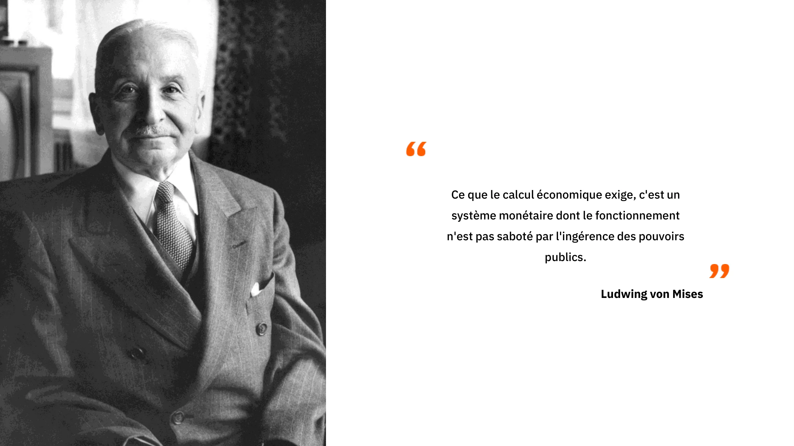

La plupart des malentendus autour des arguments de Mises proviennent d’une mauvaise compréhension des rôles respectifs des gestionnaires et des entrepreneurs dans une économie capitaliste. Mises n’a jamais remis en cause la capacité des gestionnaires à planifier efficacement au sein de leurs entreprises ; au contraire, il a souligné le rôle des entrepreneurs et des actionnaires, propriétaires des moyens de production, dans l’allocation du capital et la formation des prix servant de base aux calculs des gestionnaires.

Sans marchés pour le capital et l’argent, il devient impossible de rationnaliser l’utilisation des ressources entre les secteurs. Même si chaque entreprise est parfaitement organisée, l’économie dans son ensemble ne peut s’ajuster efficacement aux changements de disponibilité des ressources, aux conditions de production ou aux préférences des consommateurs. Comme le note Mises :

« L’erreur fondamentale des propositions socialistes de marché est de considérer le problème économique du point de vue du subalterne, ignorant la nécessité d’adapter la structure de la production aux changements des conditions. Les opérations des gestionnaires ne représentent qu’une petite partie du marché du capital et de l’argent, qui, par les actions des entrepreneurs et capitalistes, dirige la production vers les usages les plus efficaces pour satisfaire les besoins des consommateurs. »

Autrement dit, les droits de propriété et le mécanisme des profits et pertes incitent les entrepreneurs à allouer le capital là où il est le plus demandé. En réussissant, ils font des bénéfices ; en échouant, ils subissent des pertes. Ce processus produit une information essentielle sur l’utilisation efficace des ressources.

Les prix des facteurs de production sont dérivés des prix des consommateurs : si un facteur peut générer un revenu plus élevé ailleurs, les entrepreneurs offriront plus pour l’obtenir, ce qui ajuste son prix à sa productivité marginale. La concurrence entre entrepreneurs pour ces facteurs fournit un signal continu sur l’efficacité des différentes activités et assure que les ressources sont utilisées de manière optimale.

Dans un monde en constante évolution, les prix des facteurs intermédiaires changent en permanence grâce aux actions des entrepreneurs et des capitalistes, reflétant les informations localisées et souvent qualitatives sur les préférences des consommateurs, les technologies et les conditions de production. Le marché agit comme un mécanisme de diffusion de l’information : il condense et distribue ces signaux à travers l’économie, permettant aux agents de concevoir des plans cohérents même avec une connaissance limitée.

En l’absence d’un tel mécanisme dans une économie centralisée, les erreurs d’allocation de capital s’accumulent, car il n’existe ni prix pour signaler l’efficacité relative des usages ni faillites pour réallouer les ressources. À terme, ces erreurs se traduisent par un gaspillage massif et une baisse significative du niveau de vie.
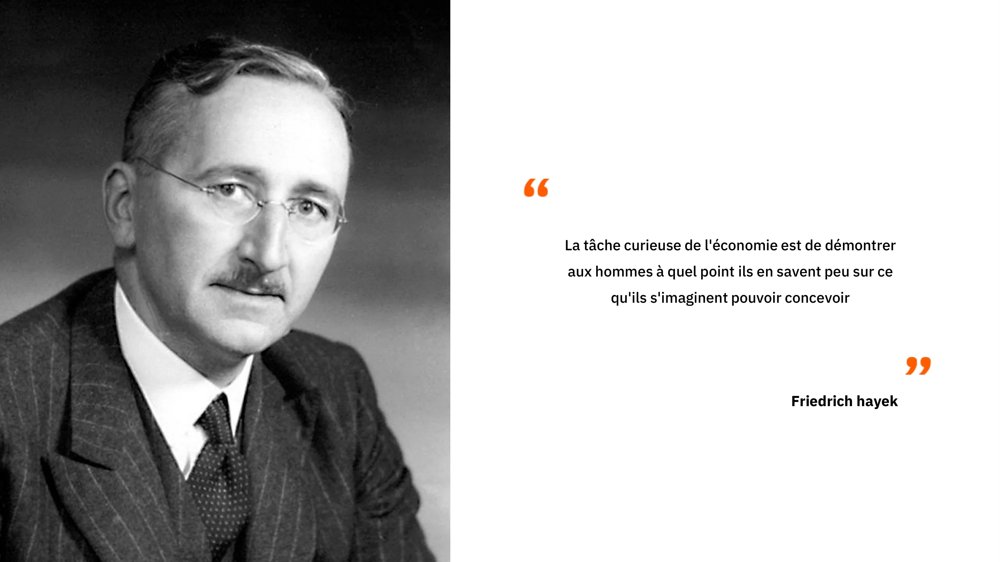

### La perspective autrichienne et les échecs des autres écoles d'économie

La plupart des malentendus autour des arguments de Mises proviennent d’une mauvaise compréhension des rôles respectifs des gestionnaires et des entrepreneurs dans une économie capitaliste. Mises n’a jamais remis en cause la capacité des gestionnaires à planifier efficacement au sein de leurs entreprises ; au contraire, il a souligné le rôle des entrepreneurs et des actionnaires, propriétaires des moyens de production, dans l’allocation du capital et la formation des prix servant de base aux calculs des gestionnaires.

Sans marchés pour le capital et l’argent, il devient impossible de rationnaliser l’utilisation des ressources entre les secteurs. Même si chaque entreprise est parfaitement organisée, l’économie dans son ensemble ne peut s’ajuster efficacement aux changements de disponibilité des ressources, aux conditions de production ou aux préférences des consommateurs. Comme le note Mises :

« L’erreur fondamentale des propositions socialistes de marché est de considérer le problème économique du point de vue du subalterne, ignorant la nécessité d’adapter la structure de la production aux changements des conditions. Les opérations des gestionnaires ne représentent qu’une petite partie du marché du capital et de l’argent, qui, par les actions des entrepreneurs et capitalistes, dirige la production vers les usages les plus efficaces pour satisfaire les besoins des consommateurs. »

Autrement dit, les droits de propriété et le mécanisme des profits et pertes incitent les entrepreneurs à allouer le capital là où il est le plus demandé. En réussissant, ils font des bénéfices ; en échouant, ils subissent des pertes. Ce processus produit une information essentielle sur l’utilisation efficace des ressources.

Les prix des facteurs de production sont dérivés des prix des consommateurs : si un facteur peut générer un revenu plus élevé ailleurs, les entrepreneurs offriront plus pour l’obtenir, ce qui ajuste son prix à sa productivité marginale. La concurrence entre entrepreneurs pour ces facteurs fournit un signal continu sur l’efficacité des différentes activités et assure que les ressources sont utilisées de manière optimale.

Dans un monde en constante évolution, les prix des facteurs intermédiaires changent en permanence grâce aux actions des entrepreneurs et des capitalistes, reflétant les informations localisées et souvent qualitatives sur les préférences des consommateurs, les technologies et les conditions de production. Le marché agit comme un mécanisme de diffusion de l’information : il condense et distribue ces signaux à travers l’économie, permettant aux agents de concevoir des plans cohérents même avec une connaissance limitée.

En l’absence d’un tel mécanisme dans une économie centralisée, les erreurs d’allocation de capital s’accumulent, car il n’existe ni prix pour signaler l’efficacité relative des usages ni faillites pour réallouer les ressources. À terme, ces erreurs se traduisent par un gaspillage massif et une baisse significative du niveau de vie.

### La Théorie autrichienne du cycle économique en tant que cas spécifique de l'impossibilité du calcul économique sous le socialisme

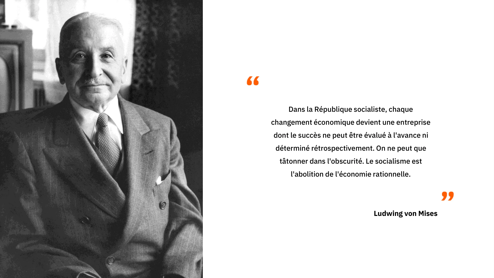

Dans un chapitre précédent, nous avons analysé la dynamique du surinvestissement et de la mauvaise allocation du capital résultant de la manipulation des taux d’intérêt par les banques centrales. Fondamentalement, ce phénomène peut être vu comme un cas particulier de l’impossibilité du calcul économique sous le socialisme, appliqué aux marchés monétaires. Lorsque les prix sont fixés en dehors de leurs valeurs de marché, les entrepreneurs et allocataires de capital sont incités à engager des investissements insoutenables à long terme en raison d’un manque d’épargne. En perturbant le système des prix, les planificateurs centraux ici, les banques centrales créent une mauvaise coordination intertemporelle entre les agents économiques, entraînant un surinvestissement dans les biens d’équipement de rang supérieur et un sous-investissement dans les biens de rang inférieur.

Les conséquences sont bien connues : crises financières, ralentissement de l’activité économique et déflation de la dette. De manière analogue, dans l’URSS et d’autres régimes communistes, la fixation des prix a provoqué des pénuries et des surproductions simultanées, car les prix ne reflétaient pas les véritables préférences des consommateurs, ni temporelles ni structurelles. Dans les deux cas, les responsables de l’allocation des ressources investissent dans les mauvaises industries.

Aujourd’hui, le débat sur le calcul économique réapparaît dans plusieurs domaines contemporains. On l’observe dans les politiques énergétiques, où des investissements mal orientés, motivés par des programmes écologiques, deviennent évidents, et dans les marchés monétaires, où la crise de 2008 illustre un cycle classique de boom et de krach : surinvestissement immobilier lié à des périodes prolongées de taux d’intérêt artificiellement bas. Par ailleurs, certains néo-marxistes et partisans du socialisme avancent que l’intelligence artificielle pourrait résoudre le problème du calcul économique. Cette idée est erronée : le problème ne réside pas dans la puissance de calcul, mais dans la génération et la diffusion d’informations localisées sur la production et l’allocation des ressources, qui ne peuvent être produites que par des agents connaissant les conditions réelles et ayant un intérêt direct dans les résultats. L’IA ne peut pas remplacer ce processus ascendant et ne saurait permettre aux planificateurs centraux de corriger les échecs du marché.

Pour illustrer concrètement ce problème dans le contexte contemporain, on peut se référer à des études sur l’allocation des ressources en Chine moderne, qui montrent comment la centralisation et l’intervention des planificateurs créent des distorsions similaires à celles décrites par Mises il y a plus d’un siècle.

> The Road to Financial Repression: China the Paper Tiger, Theo Mogenet, https://open.substack.com/pub/theomogenet/p/the-road-to-financial-repression-181?r=ccpx8&utm_campaign=post&utm_medium=web

### Conclusion

Dans ce dernier chapitre, nous avons exploré l'impossibilité du calcul économique sous le socialisme, un principe central de l'école autrichienne d'économie. La perspective autrichienne présentée dans ce cours aboutit à cette conclusion et fournit un solide argumentaire en faveur de politiques non interventionnistes. Au cœur de toute la pensée autrichienne se trouve l'importance des prix dans la coordination économique. En mettant l'accent sur l'importance des coûts d'opportunité et du calcul économique pour une utilisation rationnelle des ressources, les économistes autrichiens démontrent la complexité et la subtilité de l'action humaine dans un monde en constante évolution.

Les économistes mainstream et les planificateurs centraux n'apprécient souvent pas les économistes autrichiens car ils mettent en évidence l'incertitude de l'avenir, l'illusion de la prédiction économique quantitative et les effets néfastes de l'intervention économique. En bref, l'économie autrichienne souligne l'inefficacité et les conséquences néfastes des actions interventionnistes.

La tradition autrichienne incarne une approche humble de l'action humaine, tirant des implications profondes des concepts de valeur subjective, d'incertitude, de libre arbitre et de complexité. Elle explique comment l'ordre du marché, bien qu'il ne soit pas le produit d'une conception humaine, est l'institution centrale de notre développement et de notre prospérité. Si vous ne deviez retenir qu'une seule chose de ce cours, c'est que le capitalisme est devenu le système économique dominant en raison de sa capacité à s'adapter aux changements dans un monde dynamique et incertain peuplé d'individus libres.

## La Méthodologie Autrichienne

<chapterId>419129c1-82ba-54e3-b385-95d4d89a447e</chapterId>

:::video id=bd52d8e9-b8ca-4451-bf20-8fb210a3e7a5:::

L’école autrichienne d’économie se distingue des autres courants par sa méthodologie axiomatique-déductive, qui s’oppose à l’approche positiviste classique des sciences sociales. Contrairement à la méthode positiviste, qui s’appuie sur des données empiriques et cherche des corrélations observables pour formuler des lois, la méthode autrichienne part de vérités évidentes ou axiomes et déduit logiquement les conséquences économiques. Cette approche est similaire à celle des mathématiques ou de la géométrie euclidienne, où des principes fondamentaux permettent de construire un raisonnement cohérent et universel.

En économie autrichienne, les axiomes fondamentaux incluent, par exemple, les préférences temporelles positives : les individus préfèrent consommer un bien aujourd’hui plutôt que demain en raison de l’incertitude sur l’avenir. Ces axiomes servent de point de départ pour expliquer des phénomènes complexes, tels que la formation des prix, l’épargne, l’investissement ou encore les cycles économiques. Par déduction logique, les économistes autrichiens montrent que les crises économiques sont souvent causées par des déséquilibres artificiels entre épargne et investissement, notamment lorsque les taux d’intérêt sont manipulés.

Dans ce cadre, les prix jouent un rôle central : ils transmettent l’information nécessaire aux agents économiques pour coordonner leurs décisions dans un monde où chacun dispose d’une connaissance limitée. Le taux d’intérêt, en particulier, équilibre l’offre et la demande de capital, guidant l’allocation des ressources à travers la structure de production. Lorsque ce mécanisme est perturbé, que ce soit par la planification centrale ou par une manipulation monétaire, des erreurs de coordination apparaissent, entraînant des surinvestissements, des sous-investissements et des crises.

Enfin, la méthode autrichienne met en évidence que la valeur est subjective et que les choix économiques doivent être analysés en fonction des préférences et informations individuelles. Cela permet de comprendre pourquoi les interventions arbitraires sur les prix ou les taux d’intérêt peuvent rendre impossible le calcul économique et créer des distorsions dans l’allocation des ressources, tant dans les économies socialistes que dans les systèmes bancaires modernes.

### Les économistes autrichiens et les différences méthodologiques

Les économistes autrichiens rencontrent souvent des difficultés dans les débats avec d’autres écoles de pensée, car leurs méthodes diffèrent fondamentalement. Alors que les Autrichiens raisonnent à partir d’axiomes fondamentaux( par exemple la subjectivité de la valeur  pour en déduire des conséquences logiques, les économistes keynésiens, monétaristes ou adeptes de la Modern Monetary Theory (MMT) s’appuient principalement sur des données empiriques pour établir des relations entre variables économiques.

Cette divergence se manifeste dans des débats contemporains, comme celui sur l’impression monétaire. La MMT a souvent avancé que l’augmentation de la masse monétaire entre 2008 et 2019 n’avait pas provoqué d’inflation, utilisant cette observation comme preuve que la création monétaire est inoffensive. Pour les Autrichiens, cette approche est problématique : la sélection des données à l’appui d’une hypothèse, sans tenir compte de l’ensemble des mécanismes économiques et de la structure des prix relatifs, n’est pas scientifique.

Pour l’école autrichienne, les axiomes jouent un rôle central. Ils constituent des vérités évidentes sur le comportement humain et servent de base pour des déductions logiques sur la manière dont fonctionnent les marchés, les cycles économiques ou l’allocation des ressources. Toutefois, cela ne signifie pas que l’économie peut prédire l’avenir avec certitude. La complexité des interactions humaines et l’incertitude inhérente aux décisions économiques rendent les prévisions précises difficiles.

La méthodologie adoptée influence profondément la manière dont les questions économiques sont posées, les hypothèses formulées et les données interprétées. Comprendre ces différences entre écoles permet d’apprécier la diversité des perspectives, de mieux analyser les politiques économiques et de développer une pensée critique éclairée sur les enjeux économiques contemporains.

# Section finale

<partId>ae828713-d133-559f-93c2-101cb5245fca</partId>

## Avis & Notes

<chapterId>29d4323c-e34e-5834-bf03-2f3ed10d751b</chapterId>
<isCourseReview>true</isCourseReview>

## Examen final

<chapterId>d58d188f-81fb-572a-a898-8b6f8aceba7a</chapterId>
<isCourseExam>true</isCourseExam>

## Conclusion

<chapterId>d668fdf6-fb4c-4bbf-82e1-afcb95c122e0</chapterId>
<isCourseConclusion>true</isCourseConclusion>
