„b”
# Podróż w głąb ekonomii

Witamy na kursie Théo Mogeneta! Pasjonat ekonomii, historii, literatury, nauk politycznych i technologii, postanowił podzielić się z wami swoją wiedzą na temat austriackiej szkoły ekonomii. Ta gałąź, mniej znana w ekonomii, opiera się na ludzkiej racjonalności i zachowaniu wolnych jednostek. Mniej skupiona na matematyce, jest zainteresowana przede wszystkim logiką i badaniami społecznymi.

Ta szkoła myślenia ma już za sobą kilka stuleci i reprezentuje ją szeroka gama autorów, myślicieli i ekonomistów. Wielkie nazwiska ekonomii, takie jak Hayek, Rothbard, Mises, Bastiat czy Menger od dawna bronią tego nurtu. W przeciwieństwie do wszechobecnego keynesizmu naszych czasów, szkoła austriacka stawia jednostkę z powrotem w centrum równania z podejściem bardziej liberalnym, kapitalistycznym, a nawet anarchistycznym.

+++

# Wprowadzenie

<partId>265aa8b0-dd89-5456-b72a-656e988013d5</partId>

## Przegląd kursu

<chapterId>eae3de7b-cce6-516d-83d9-28fbd582c0ca</chapterId>

Witamy na kursie ECO201!

W tym kursie oferowanym przez Théo Mogeneta odkryjesz szkołę myśli ekonomicznej, która zasadniczo różni się od dominującej doktryny keynesowskiej. Do tej pory uczono nas, że zarządzanie pieniędzmi i polityka gospodarcza są przede wszystkim domeną banków centralnych, a dodruk pieniądza i wydatki publiczne stymulują wzrost gospodarczy. Istnieje jednak bardziej spójne alternatywne podejście: **Austriacka Szkoła Ekonomii**.

Dzięki ponad dwustuletnim badaniom, refleksji filozoficznej i pismom znanych autorów, takich jak Carl Menger, Ludwig von Mises i Friedrich Hayek, ta szkoła myślenia przyjmuje inną perspektywę, faworyzując zdecentralizowany pogląd na gospodarkę oparty na jednostce i ludzkiej racjonalności.

Ekonomia jest w rzeczywistości głęboko społeczną i złożoną dziedziną, składającą się z wielu niezależnych podmiotów, które swobodnie oddziałują na siebie, tworząc spójną całość. Aby zrozumieć ten dynamiczny system, austriacka szkoła ekonomii preferuje analizę jakościową, opartą na ludzkiej logice, socjologii i badaniu procesów rynkowych, a nie na sztywnych równaniach matematycznych.

Na tym kursie poznasz podstawowe zasady tej szkoły myślenia. Théo Mogenet, twój instruktor, jest zagorzałym zwolennikiem tego podejścia ekonomicznego i poprowadzi cię przez kluczowe koncepcje austriackiej szkoły ekonomii pokazując, w jaki sposób te idee w szczególny sposób odnoszą się do świata Bitcoina.

**Sekcja 1: Wprowadzenie do ekonomii**

Zaczniemy od ogólnego wprowadzenia do austriackiej szkoły ekonomii, badając jej początki historyczne i podstawy jej myśli. Ta sekcja obejmuje również podstawowe pojęcia, takie jak pieniądz, kredyt, banki i banki centralne. Zrozumiesz, dlaczego instytucje te odgrywają kluczową rolę w myśli austriackiej, szczególnie w krytyce interwencji monetarnych.

**Sekcja 2: Podstawy teoretyczne**

W tej sekcji zagłębimy się w podstawowe koncepcje austriackiej szkoły ekonomii, takie jak subiektywna teoria wartości, która wyjaśnia, dlaczego wartość dobra nie jest obiektywna, ale zależy od jego użyteczności postrzeganej przez każdą osobę. Dowiesz się również, w jaki sposób pieniądz naturalnie wyłania się jako zjawisko społeczne oraz zapoznasz sie z koncepcjami preferencji czasowej, odsetek i kapitału, które są sercem austriackiej teorii wolnego rynku.

**Sekcja 3: Austriackie perspektywy ekonomiczne**

Tutaj zbadamy praktyczne zastosowania teorii austriackiej. Dowiesz się szczegółów na temat austriackiej teorii cyklu koniunkturalnego, która wyjaśnia, w jaki sposób manipulacje monetarne tworzą sztuczne bańki, po których następują recesje. Zobaczymy również, dlaczego kalkulacja ekonomiczna jest niemożliwa w systemie socjalistycznym i jak austriacka metodologia, oparta na prakseologii (badaniu ludzkiego działania), zapewnia unikalne i spójne podejście do zrozumienia zjawisk gospodarczych.

Kurs ten jest mieszanką ekonomii i filozofii, prowadzoną przez otwartą dyskusję między Théo i mną (Rogzy). Chciałbym serdecznie podziękować Théo Mogenetowi za stworzenie tego kursu. Bardzo podobało nam się opracowywanie tej treści, zaprojektowaliśmy ją tak, aby była przystępna dla wszystkich. Kurs ten służy jako wprowadzenie i położy podwaliny pod nasze przyszłe, bardziej zaawansowane moduły ekonomiczne.

A co, jeśli klucz do zrozumienia dzisiejszej gospodarki leży w teorii sprzed kilku wieków? Odkryjmy to razem!

## Pieniądz, kredyt, banki i banki centralne

<chapterId>29faebd9-9326-52de-8161-e4bb33033cd6</chapterId>

> „Podstawowym problemem związanym z konwencjonalną walutą jest zaufanie, które jest wymagane do jej funkcjonowania. Bankowi centralnemu należy ufać, że nie zdeprecjonuje waluty, ale historia walut fiducjarnych jest pełna naruszeń tego zaufania. Bankom należy ufać, że będą przechowywać nasze pieniądze i przesyłać je elektronicznie, ale pożyczają je w falach baniek kredytowych z ledwie ułamkiem w rezerwie. Musimy zaufać im w kwestii naszej prywatności, zaufać im, że nie pozwolą złodziejom tożsamości opróżnić naszych kont”
>

> Satoshi Nakamoto, pseudonimowy wynalazca Bitcoina

### Jak powstają pieniądze

W naszym obecnym systemie monetarnym pieniądz jest tworzony głównie poprzez praktykę bankową znaną jako „bankowość rezerw cząstkowych” Termin ten zasadniczo oznacza, że banki nie są zobowiązane do utrzymywania tylu rezerw, ile otrzymują w depozytach. W rezultacie mogą one tworzyć nową siłę nabywczą podczas udzielania pożyczek i odwrotnie - zmniejszać siłę nabywczą, gdy klienci spłacają swoje pożyczki.

Na przykład, gdybyś zwrócił się do lokalnego banku w celu zabezpieczenia kredytu hipotecznego na zakup domu, pieniądze pożyczone ci przez bank zostałyby zapisane w księgach rachunkowych. W księgowości zazwyczaj przedstawiamy majątek netto danej osoby za pomocą bilansu, który ma dwie strony: stronę aktywów, w tym wszelkie nieruchomości, kontrakty finansowe, majątek ruchomy lub inne formy posiadanego bogactwa, oraz stronę pasywów, pokazującą źródło funduszy wykorzystanych do stworzenia kapitału wymienionego po stronie aktywów. Różnica między aktywami a pasywami jest określana jako „kapitał własny”, który możemy rozumieć jako majątek netto jednostki.

Gdy instytucja finansowa posiada licencję bankową, zasadniczo oznacza to, że jej pasywa zarejestrowane jako „depozyty klientów” stają się oficjalnymi pieniędzmi danego kraju lub strefy monetarnej. Dlatego też, gdy ubiegasz się o pożyczkę na zakup domu w banku, bankier nie pożycza środków zdeponowanych przez innego klienta. Zamiast tego bank zapisuje pożyczoną kwotę na twoim koncie klienta i jednocześnie rejestruje pożyczkę jako aktywo banku. Gdy spłacasz pożyczkę, pieniądze są wygaszane, wartość danej pożyczki maleje, a bank zatrzymuje tylko odsetki od udzielonego kredytu.

Kiedy kupisz dom, zlecasz swojemu bankierowi przelanie pieniędzy na konto sprzedawcy. Jeśli konto sprzedającego znajduje się w innym banku, twój bankier powiadamia odpowiedniego bankiera w innej instytucji, aby upewnić się, że konto sprzedającego zostanie odpowiednio zasilone, jednocześnie obciążając twoje konto odpowiednią kwotą.

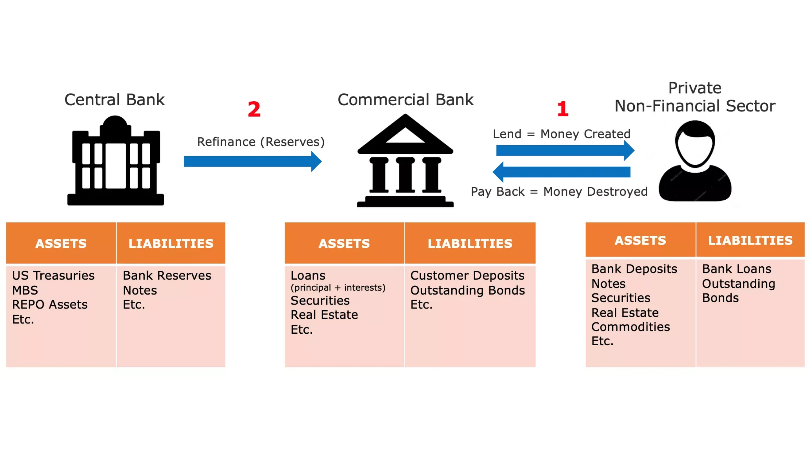

Rysunek 1: Tworzenie pieniądza przez zapis w księdze rachunkowej

> „To dobrze, że ludzie w naszym narodzie nie rozumieją naszego systemu bankowego i monetarnego, bo gdyby tak było, jestem pewien, że rewolucja wybuchłaby jeszcze przed jutrzejszym porankiem”
>

> Henry Ford

Proces ten pozwala bankom rejestrować wszystkie transakcje, w tym przelewy bankowe, zakupy kartą kredytową i czeki, w określonym okresie (zwykle tydzień lub miesiąc). Następnie rozliczają te transakcje między sobą za pomocą rezerw bankowych, które są inną formą waluty fiducjarnej nigdy nie używanej przez społeczeństwo. Rezerwy bankowe są przechowywane w banku centralnym na specjalnym koncie dostępnym tylko dla licencjonowanych banków i instytucji finansowych.

### Niestabilność bankowości opartej na rezerwach cząstkowych i pożyczkodawcach ostatniej instancji (bankach centralnych)

Głównym problemem związanym z systemem rezerw cząstkowych jest to, że znaczne wypłaty z danego banku mogą potencjalnie doprowadzić do jego bankructwa. Ponieważ banki muszą zaspokajać zapotrzebowanie klientów na gotówkę, posiadając jedynie ograniczony bufor rezerw bankowych, jednoczesna chęć wypłaty środków przez wielu klientów może sprawić, że bank nie będzie w stanie zaspokoić tych żądań, co doprowadzi do jego bankructwa. Biorąc pod uwagę, że wiele osób, firm i instytucji deponuje swoje środki w bankach, dopuszczenie do upadłości banku może mieć poważne konsekwencje gospodarcze, takie jak recesja, a nawet depresja.

Ta komplikacja dała początek nowoczesnym bankom centralnym. W XIX wieku w Anglii powtarzające się upadki banków zagrażały stabilności finansowej, co doprowadziło do ustanowienia Banku Anglii jako „pożyczkodawcy ostatniej instancji”. Bank Anglii miał za zadanie pożyczać fundusze bankom znajdującym się w trudnej sytuacji podczas kryzysów, aby zapobiec efektowi domina, który mógłby sparaliżować cały system finansowy. Koncepcja banków centralnych jako pożyczkodawców ostatniej instancji rozprzestrzeniła się na cały świat i stała się powszechna.

Oprócz utrzymywania stabilności finansowej, banki centralne są odpowiedzialne za ustalanie kluczowych stóp procentowych. Stopy te określają koszt, po jakim licencjonowane banki mogą pożyczać środki od banku centralnego, zasadniczo definiując koszt płynności dla instytucji finansowych, które odgrywają kluczową rolę w udzielaniu pożyczek w naszych gospodarkach. Dlatego też stopy te służą jako punkt odniesienia dla całego systemu finansowego. Dla osoby fizycznej, oprocentowanie kredytu hipotecznego można podzielić na stopę procentową i marżę banku.

Rysunek 2: Upadłość Lehman Brothers (15/09/2008)

Podczas poważnego kryzysu finansowego w 2008 r. Lehman Brothers, duży bank inwestycyjny, ogłosił upadłość po poniesieniu znacznych strat na posiadanych papierach wartościowych zabezpieczonych hipoteką i masowych wypłatach zaniepokojonych klientów. W odpowiedzi na to bezprecedensowe zamieszanie finansowe, bankierzy centralni na całym świecie wstrzyknęli duże ilości płynności na rynki finansowe, połączyli borykające się z trudnościami banki inwestycyjne z bankami komercyjnymi i obniżyli stopy procentowe do poziomu bliskiego zeru, starając się zapobiec załamaniu systemu.

Chociaż środki te zapobiegły kaskadowej fali bankructw, w niewielkim stopniu złagodziły późniejsze spowolnienie gospodarcze. Miliony ludzi straciło pracę i domy, wydatki konsumentów gwałtownie spadły, firmy upadły, a banki poniosły znaczne straty. Pomimo historycznie niskich stóp procentowych, niewielu było chętnych do zaciągania pożyczek, co doprowadziło do błędnego koła, w którym początkowy spadek wydatków i inwestycji sam się wzmocnił. W związku z tym bankierzy centralni podjęli dalsze kroki, wdrażając programy luzowania ilościowego (QE). W ramach tych programów banki centralne kupowały obligacje rządowe i papiery wartościowe zabezpieczone hipoteką od banków komercyjnych za pomocą rezerw banku centralnego.

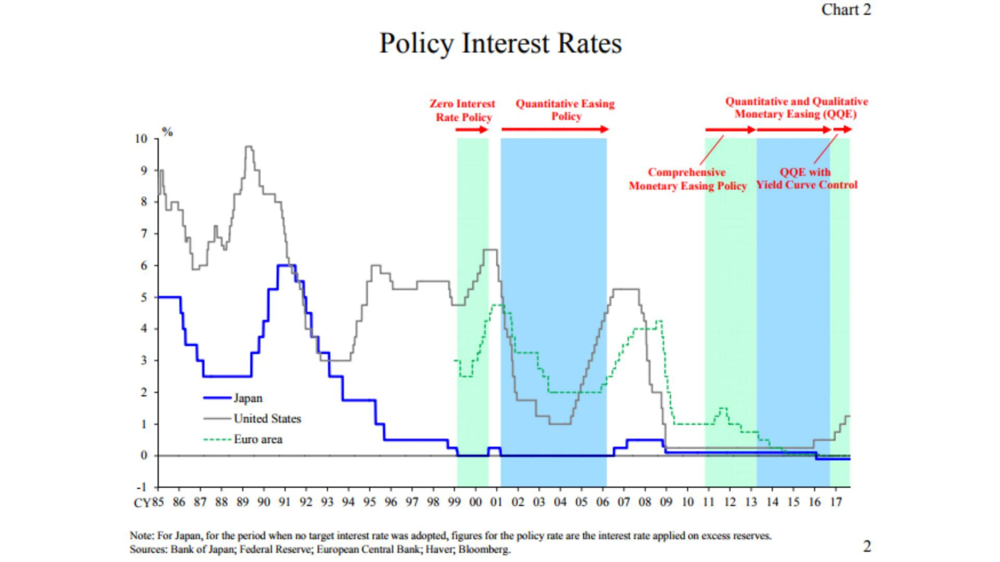

Wykres 3: Stopy procentowe w głównych gospodarkach / Źródło: EBC

W przeciwieństwie do wielu oczekiwań, programy QE nie ożywiły znacząco wzrostu gospodarczego, ale spowodowały wzrost wartości aktywów finansowych do historycznych poziomów. Skorzystały na tym przede wszystkim osoby zamożne i instytucje finansowe, ponieważ posiadały one już znaczne ilości takich aktywów, zwiększając tym samym dysproporcje majątkowe. Biorąc pod uwagę wyjaśnioną wcześniej strukturę systemu bankowego, wynik ten nie powinien być zaskoczeniem. Ponieważ rezerwy bankowe nie mogą łatwo wpłynąć do realnej gospodarki, programy QE przede wszystkim podniosły ceny aktywów bez skutecznej poprawy sytuacji finansowej przeciętnych osób.

### Efekt Cantillona

Niemniej jednak z tego epizodu można wyciągnąć podstawową zasadę ekonomiczną: kiedy tworzony jest nowy pieniądz, początkowo przynosi on korzyści tym, którzy znajdują się najbliżej źródła pieniądza, kosztem tych, którzy znajdują się dalej. To spostrzeżenie ekonomiczne pochodzi z XVIII wieku, kiedy Richard Cantillon przedstawił je w swoim „Eseju o naturze handlu w ogóle”. Jest on obecnie potocznie nazywany „efektem Cantillona”.

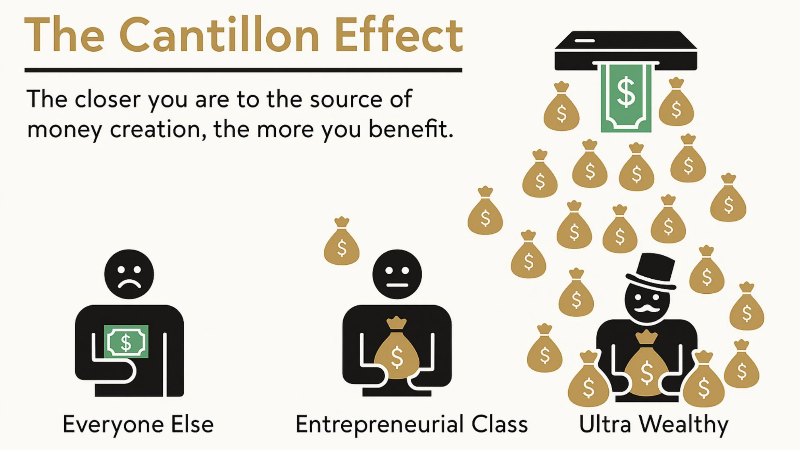

Rysunek 4: Efekt Cantillona w pigułce / Źródło: River Financial

W tym przypadku bankierzy, dyrektorzy banków, właściciele akcji i obligacji, deweloperzy nieruchomości, wynajmujący nieruchomości i wszyscy posiadający aktywa finansowe lub nieruchomości otrzymali gratkę finansową, podczas gdy ciężar spadł na resztę społeczeństwa. Sytuacja ta utrzymywała się przez lata i w dużej mierze wyjaśnia rosnące nierówności majątkowe i poczucie pozbawienia praw wśród ciężko pracujących osób oraz pozornie niepowstrzymany wzrost cen aktywów pomimo powolnego wzrostu PKB.

Mówiąc krótko, system jest wadliwy. Banki są z natury niestabilne, ale dopuszczenie do ich upadku może zagrozić całej gospodarce. Pokusa nadużyć stanowi zachętę dla dyrektorów banków do podejmowania nadmiernego ryzyka w celu maksymalizacji przychodów banku ponieważ wiedzą, że bank centralny ostatecznie ich uratuje, przenosząc koszty na podatników. W takich scenariuszach bankierzy centralni tworzą warunki do masowego transferu siły nabywczej od ciężko pracujących osób i oszczędzających do właścicieli aktywów i osób powiązanych z systemem finansowym, odłączając w ten sposób proces tworzenia bogactwa od jego akumulacji.

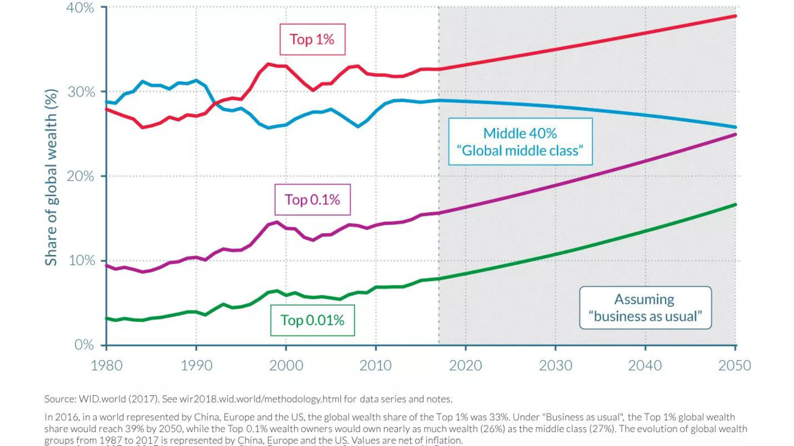

Rysunek 5: Dystrybucja bogactwa w Chinach + Europie + USA / Źródło: OECD

### Konsekwencje polityki zerowych stóp procentowych

W dłuższych okresach polityki zerowych stóp procentowych (ZIRP) banki mają ograniczone możliwości odbudowy kapitału własnego, ponieważ ich marże są ograniczane. Banki zazwyczaj zarabiają pieniądze zaciągając pożyczki krótkoterminowe i udzielając pożyczek długoterminowych. Jednakże gdy banki centralne skupują duże ilości obligacji i ustalają stopy procentowe na poziomie zerowym, banki mają niewielką motywację do udzielania pożyczek, zwłaszcza przedsiębiorcom i innym osobom podejmującym ryzyko. Zamiast tego przeznaczają swoje zasoby na zabezpieczanie istniejącego kapitału lub udzielają pożyczek pod zastaw, aby zaspokoić popyt osób korzystających z efektu Cantillona.

Inną niezamierzoną konsekwencją ZIRP jest zachęcanie rządów do angażowania się w szeroko zakrojone wydatki. Ponieważ rządy nie ponoszą kosztów zaciągania pożyczek i mogą polegać na bankach centralnych, które skupują ich obligacje w ramach programów QE, mają one naturalną motywację do wydawania jak największej ilości pieniędzy, szczególnie w kontekstach demokratycznych, w których wydatki mogą przyciągnąć głosy. Rząd często lekceważy długoterminowe konsekwencje takiej rozrzutności, prowadząc do znacznego wzrostu poziomu długu publicznego w gospodarkach rozwiniętych od czasu Globalnego Kryzysu Finansowego (ang. GFC).

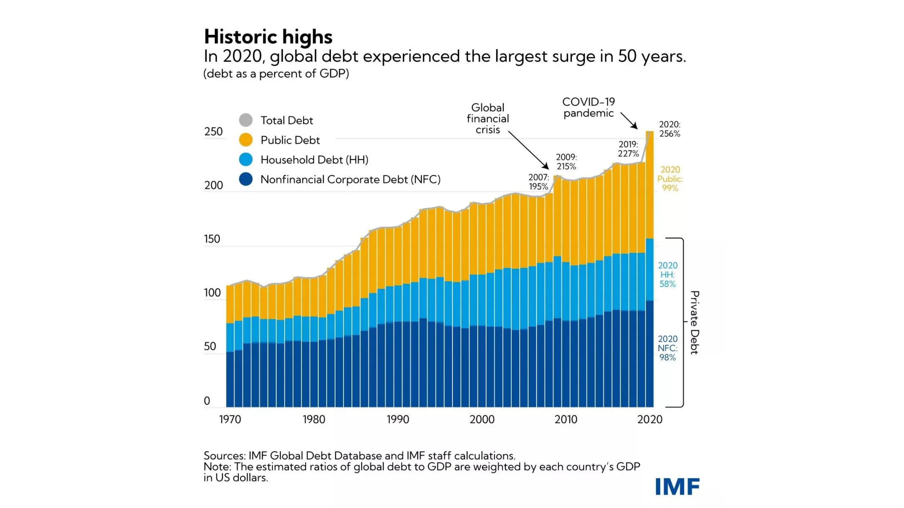

Wykres 6: Dług publiczny i prywatny jako % PKB (świat, ważone według PKB każdego kraju) / Źródło MFW

Z powodu rosnącej inflacji spowodowanej dużą produkcją pieniądza w odpowiedzi na lockdown'y podczas pandemii COVID, bankierzy centralni podnoszą obecnie stopy procentowe, próbując ograniczyć inflację. Stanowi to jednak poważne wyzwanie dla całego systemu. Banki są bardziej zadłużone niż kiedykolwiek wcześniej, rządy mają historycznie wysoki poziom zadłużenia, wzrost gospodarczy jest powolny, deficyty rosną, a konsumenci, zmagający się z rosnącymi cenami podstawowych towarów, z trudem wiążą koniec z końcem. Kontrolowanie inflacji wymagałoby podniesienia stóp procentowych do poziomu, który mógłby doprowadzić rządy do bankructwa, podczas gdy banki ryzykują utratę deponentów, ponieważ osoby fizyczne wydają swoje oszczędności na coraz droższe artykuły pierwszej potrzeby lub szukają schronienia w twardych aktywach i funduszach rynku pieniężnego, aby zabezpieczyć się przed inflacją.

### Wnioski

> „W ten sposób (bankowość rezerw cząstkowych) rządy mogą potajemnie i niezauważenie konfiskować bogactwo ludzi, a nawet jeden człowiek na milion nie wykryje kradzieży”
>

> John Maynard Keynes

Mówiąc krótko, nasz system stoi w obliczu poważnych wyzwań, a Bitcoin wyłania się jako jedyna wiarygodna alternatywa. Jednak sam Bitcoin nie jest w stanie rozwiązać problemów naszego systemu monetarnego. Przede wszystkim wśród entuzjastów Bitcoina potrzebujemy osób, które rozumieją podstawowe zasady ekonomii i sprawią, że wieksza świadomość i zdrowy rozsądek w sprawach ekonomii uchroni nas od budowy kolejnego kruchego fundamentu finansowego naszej cywilizacji. Głównym celem tego kursu jest edukacja nowych entuzjastów Bitcoina w zakresie zdrowych zasad ekonomicznych.

Aby osiągnąć ten cel, wyjaśnimy podstawowe zasady „austriackiej szkoły ekonomii”, szkoły myśli ekonomicznej o tradycji metodologicznej sięgającej XVI wieku, zapewniającej wgląd w ludzkie działania w warunkach ograniczeń ekonomicznych. Dzięki temu wprowadzeniu rozumiesz teraz podstawy kreacji pieniądza i obecny stan naszego systemu finansowego i monetarnego.

W następnym rozdziale zagłębimy się w fundamentalny kamień węgielny każdej ekonomicznej szkoły myślenia: teorię wartości. W kolejnych rozdziałach zajmiemy się pieniądzem jako instytucją społeczną, teorią kapitału i cyklem koniunkturalnym, wyzwaniem kalkulacji ekonomicznej oraz krótkim przeglądem historii i metodologii austriackiej szkoły ekonomii.

# Podstawy teoretyczne

<partId>86012c1b-cdf2-586f-8fe7-263f8287e950</partId>

## Subiektywna teoria wartości

<chapterId>eb1608d4-5d36-56a0-bcfc-ed8c03dfa906</chapterId>

> „Wartość istnieje tylko w ludzkiej świadomości”
>

> Carl Menger, Zasady ekonomii politycznej

### Marginalna rewolucja

U podstaw rozumowania ekonomicznego leży kwestia wartości. Jak określamy wartość czegoś? Czy wartość jest nieodłączną właściwością rzeczy? Czy wręcz przeciwnie, jest to zjawisko subiektywne? Jak porównać wartość dwóch rzeczy? Skąd bierze się wartość?

Takie pytania nurtowały ekonomistów i filozofów przez wiele stuleci i doczekały się wielu różnych odpowiedzi. Pod wieloma względami epistemologiczna ewolucja ekonomii przeplata się z ewolucją teorii wartości.

Po tym jak teoria wartości autorstwa fizjokratów zakładająca, że cała wartość pochodzi z ziemi, została obalona przez ekonomistów klasycznych i ich teorię wartości pracy postulującą, że wartość dobra wynika z ilości pracy włożonej w jego produkcję, przyszła kolej na marginalną teorię wartości. W latach siedemdziesiątych XIX wieku po Marksie, ostatnim z klasycznych ekonomistów, wokół marginalnej teorii wartości niemal jednocześnie pojawiły się trzy nowe szkoły myśli ekonomicznej: szkoła lozańska z Leonem Walrasem, szkoła nowoczesna lub neoklasyczna z Williamem Stanleyem Jevonsem oraz szkoła austriacka z Carlem Mengerem. Ta rewolucja w teorii wartości w istotny sposób zmieniła myśl ekonomiczną.

Od lewej do prawej: William Stanley Jevons, Carl Menger, Léon Walras

Marginalna teoria wartości utrzymuje, że wartość ekonomiczna odpowiada temu, co podmiot gospodarczy chętnie zapłaci za kolejną jednostkę dobra lub usługi. Ponieważ teoria ta podkreśla fakt, że ceny kształtują się na marginesie, tj. dla następnej jednostki danego dobra, została ona nazwana "marginalizmem".

Powszechnie przedstawia się marginalizm tych trzech szkół jako podobny. Rzeczywiście, Walras i Jevons są bardzo kompatybilni, ale teoretyzacja Mengera znacząco różni się od innych. W swojej pracy, obecnie uważanej za fundament austriackiej teorii ekonomicznej, zatytułowanej "Grundsätze des Volkswirtschaftlehre" (Zasady ekonomii politycznej), opublikowanej w 1874 roku, Menger oferuje marginalne, ale przede wszystkim subiektywne wyjaśnienie wartości, w przeciwieństwie do Walrasa i Jevonsa, którzy uważają wartość za zjawisko obiektywne i mierzalne.

### Wartość subiektywna

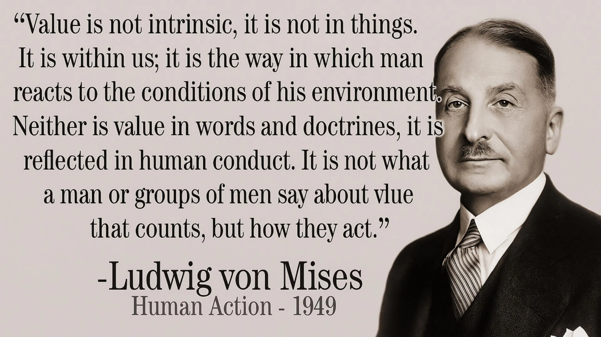

Austriacki ekonomista odrzuca koncepcję następców Adama Smitha i porzuca ideę, że wartość dobra wynika z ilości pracy wykonanej przy jego produkcji, na rzecz poglądu, że jego wartość jest określana przez jednostkę, która w każdym kontekście dokonuje mentalnego aktu wyceny w odniesieniu do określonej ilości dobra lub usługi. Ten intelektualny skok dokonany przez Mengera podważa obiektywność wartości: dla niego wartość nie jest obiektywną właściwością dóbr; jest jedynie wynikiem relacji, jaką jednostka ma z tą rzeczą: „wartość nie istnieje poza ludzką świadomością”

Innymi słowy, Menger zachęca nas do rozumienia wartości jako istniejącej tylko jako subiektywne zjawisko psychologiczne, nie jest nieodłączną właściwością dóbr, ale wynika raczej z opinii jednostki na temat użyteczności, jaką może czerpać z tych dóbr.

Zgodnie z tym poglądem litr wody pitnej nie ma obiektywnej wartości. Ktoś, kto ma dostęp do nowoczesnego systemu wody pitnej i nie jest obecnie spragniony, prawdopodobnie przypisałby bardzo niewielką wartość dodatkowemu litrowi wody, podczas gdy osoba, która jest spragniona i znajduje się na środku pustyni, dla której ten litr wody oznacza różnicę między życiem a śmiercią, z pewnością byłaby skłonna przypisać mu niemal nieskończoną wartość.

Podsumowując, Menger zauważył, że wartość dobra ekonomicznego to nic innego jak subiektywna wycena, jaką dana osoba przypisuje dodatkowej jednostce tego dobra lub usługi.

### Dobrowolna wymiana: gra o sumie dodatniej

Z tego punktu Menger wywnioskował, że dobrowolna wymiana między dwiema osobami ma miejsce, ponieważ każda ze stron wierzy, że zwiększy to ich subiektywną użyteczność. Dla niego wymiana nie zakłada żadnej równoważności wartości, w przeciwieństwie do tego, w co wierzyli ekonomiści klasyczni. Według austriackiego myśliciela, gdyby istniała równoważność użyteczności między wymienianymi towarami, nie byłoby powodu, aby strony w ogóle zawracały sobie głowę wymianą. Jeśli istnieje wymiana to dlatego, że każda ze stron uważa, że leży to w jej (subiektywnym) interesie, a co za tym idzie, każda dobrowolna wymiana przynosi korzyść społeczną.

### Wycena jako zjawisko porządkowania ludzkich pragnień

Jednak takiej korzyści społecznej lub subiektywnej wartości przypisywanej dobru nie można zmierzyć. Dla Mengera wartość jest zjawiskiem poznawczym polegającym na porównywaniu (porządkowym), a nie mierzeniu (kardynalnym). Nie jest to, jak uważali ekonomiści neoklasyczni od czasów Walrasa i Jevonsa, przypisanie przez jednostkę wartości liczbowej, która odzwierciedla użyteczność, jaką czerpie z wymiany, ale raczej akt porządkowania ludzkich pragnień, poprzez który jednostka wyraża, że pragnie ilości dobra A bardziej intensywnie niż ilości dobra B.

Każda osoba może powiedzieć, czy woli 2 banany od kursu ekonomii, ale nikt nie może rozsądnie powiedzieć, że wycenia 2 banany na 3,1416 utils, podczas gdy kurs ekonomii na 3 utils, a zatem woli banany. Taki opis ludzkich preferencji oparty na ciągłych funkcjach rzeczywistych nie odpowiada rzeczywistości procesów poznawczych, których doświadczamy w naszym codziennym życiu. Człowiek nigdy nie ocenia prezentowanych mu dóbr poprzez porównanie ich z abstrakcyjnym standardem użyteczności. Zamiast tego subiektywnie porównuje różne kierunki działania, których nie może ocenić w kategoriach bezwzględnych, ale mimo to może je uszeregować na podstawie ich względnej pożądalności.

Ta subiektywna koncepcja wartości, rozumiana jako psychologiczny związek jednostki z jej celami i środkami odpowiednimi do ich osiągnięcia, pozwala ekonomistom szkoły austriackiej wyjaśnić także zjawisko podziału pracy.

### Podział pracy

Zwiedzanie fabryki gwoździ, Léonard Defrance (XVIII w.)

Każdy jest wyjątkowy i ma szczególną sytuację osobistą. Dlatego też każdy posiada lepszą zdolność do wykonywania pewnych zadań niż jego rówieśnicy (przewaga absolutna) lub lepszą zdolność do wykonywania pewnych zadań niż inni (przewaga komparatywna). Nie może być inaczej; zaprzeczenie temu elementarnemu faktowi oznaczałoby twierdzenie, że wszyscy ludzie są równi pod każdym względem.

W przypadku gdy dana osoba ma większe zdolności w porównaniu do swoich rówieśników w zakresie produkcji danego dobra (przewaga absolutna), jest ona zainteresowana specjalizacją w produkcji tego dobra, a następnie wymianą uzyskanej nadwyżki na dobra, których pragnie. W ten sposób zaspokaja swoją subiektywną użyteczność bardziej ekonomicznie, niż gdyby miała zaangażować się w produkcję wszystkich pożądanych dóbr.

Może się jednak zdarzyć, że jednostka nie ma absolutnej przewagi w produkcji jakiegokolwiek dobra. W takim przypadku nadal będą istnieć rodzaje produkcji, w których jednostka jest lepsza niż w innych (przewaga komparatywna) i z tego powodu nadal będzie zainteresowana specjalizacją.

Z pewnością istnieją osoby, które mogłyby wyprodukować dane dobro bardziej produktywnie, ale ponieważ osoby te są prawdopodobnie bardziej produktywne w innym zadaniu niż w tym, a nie mogą wykonywać obu zadań jednocześnie, nieproduktywne jest dla nich pracowanie nad tym zadaniem, a nie nad innym, w którym są bardziej produktywne. Specjalizując się w zadaniu, w którym są najbardziej produktywne, uzyskają nadwyżkę większą niż gdyby się nie wyspecjalizowały, a zatem dzięki wymianie mogłyby uzyskać zwiększoną ilość tych innych dóbr, nawet jeśli uzyskane dobra zostałyby wyprodukowane bardziej efektywnie przez nich samych niż przez producentów, od których je uzyskały.

Weźmy za przykład lekarza. Może on być lepszy w pisaniu e-maili i planowaniu spotkań niż jego sekretarka (względna przewaga). Ale czas spędzony na wykonywaniu tych zadań to czas, którego nie poświęca na leczenie pacjentów. W związku z tym, ponieważ jest bardziej produktywny w leczeniu ludzi, w jego interesie jest delegowanie obowiązków administracyjnych innej osobie, nawet jeśli jest lepszy w takich zadaniach niż jego zastępca, ponieważ pozwala mu to zmaksymalizować wartość generowaną dla innych, a tym samym jego własny majątek.

Zasadniczo specjalizacja jest korzystna, nawet dla osób, które nie mają absolutnej przewagi, ponieważ czas jest ograniczonym zasobem wymagającym dokonywania wyborów: każda jednostka czasu poświęcona na aktywność inną niż ta, w której dana osoba jest najbardziej produktywna, pociąga za sobą koszt reprezentowany przez utraconą produkcję, z której zrezygnowała (koszt alternatywny).

Gdy dana osoba wyspecjalizuje się w określonej produkcji, może zarezerwować ilość produktów, które uważa za niezbędne do osobistej konsumpcji, a nadwyżkę przeznaczyć na inne pożądane dobra. W ten sposób zaspokaja swoje pragnienie dóbr, które sama produkuje, co oznacza, że pozostałe jednostki jej produkcji mają dla niej niewielką wartość. Jest to coś, co ekonomiści nazywają malejącą użytecznością marginalną: każda dodatkowa jednostka dobra jest mniej pożądana niż poprzednia. Dla innych, którym brakuje takich dóbr, to inna historia: z tych samych powodów mają tendencję do pożądania dóbr, których nie produkują, bardziej niż tych, które produkują. Prowadzi to do sytuacji, w której istnieje silna asymetria między różnymi subiektywnymi wycenami jednostek, co bardzo sprzyja wymianie: każda ze stron jest zainteresowana wymianą swojej nadwyżki produkcji, ponieważ w ten sposób zwiększa swoją subiektywną użyteczność.

Rezultatem poprzedniej analizy jest to, że jednostki są zawsze w lepszej sytuacji, gdy specjalizują się w swojej pracy i angażują się w wymianę. Dlatego też ekonomiści szkoły austriackiej, zwłaszcza Ludwig Von Mises, twierdzą, że przewaga produkcyjna wynikająca z podziału pracy jest siłą napędową procesu współpracy społecznej. W tym miejscu warto zacytować go bezpośrednio:

„Podstawowymi faktami, które doprowadziły do współpracy, społeczeństwa i cywilizacji oraz przekształciły człowieka zwierzęcego w istotę ludzką, są fakty, że praca wykonywana w ramach podziału pracy jest bardziej produktywna niż praca w izolacji i że rozum człowieka jest w stanie rozpoznać tę prawdę. [...] Ludzie nie współpracują w ramach podziału pracy, ponieważ kochają lub powinni kochać się nawzajem. Współpracują, ponieważ najlepiej służy to ich własnym interesom”

### Wnioski

> „Jeśli człowiek widzi, że może żyć bardziej komfortowo wisząc na szubienicy niż siedząc przy stole, zachowywałby się jak głupiec, gdyby się nie powiesił”
>

> Baruch Spinoza

Lata 1871-1874 to wspaniałe lata dla nowoczesnej ekonomii: okres ten był świadkiem prac trzech niezależnych myślicieli, którzy stali się fundamentem nowoczesnej ekonomii. Kładąc nacisk na subiektywną wartość porządkową, austriaccy ekonomiści rozwinęli całą myśl ekonomiczną, odróżniając ją od swoich homologów. Prace austriackich ekonomistów nad rozumowaniem ludzkiego działania w kontekście niedoboru na zawsze staną w wyraźnym kontraście z doktrynami ekonomicznymi zapoczątkowanymi przez Jevonsa i Walrasa, silnie opierającymi się na matematyce stojącej za ideą, że wartość można obiektywnie zmierzyć i wyprowadzić jako funkcję ciągłą.

Opierając się na spostrzeżeniach dotyczących subiektywnej wartości porządkowej, Menger wyjaśnił pojawienie się podziału pracy i dobrowolnej wymiany. Jak jednak zobaczymy w następnym rozdziale, wymiana bezpośrednia jest kiepską strategią dla podmiotów gospodarczych dążących do maksymalizacji swojej subiektywnej użyteczności. W ten sposób ojciec szkoły austriackiej rozwinął swoje rozumowanie, aby wyjaśnić, dlaczego pieniądz pojawił się jako instytucja społeczna.

Kolejne rozdziały będą poświęcone pojawieniu się pieniądza jako instytucji społecznej, teorii kapitału i odsetek, która posłuży jako podstawa teorii cyklu koniunkturalnego, i wreszcie roli cen w obliczeniach ekonomicznych.

## Pojawienie się pieniądza jako zjawiska społecznego

<chapterId>14ded794-0578-5478-ba5b-b2106c74f3ef</chapterId>

Podczas gdy jednostki mają wspólny interes w specjalizacji i maksymalizacji podziału pracy, nadal istnieją problemy z koordynacją, które ograniczają tę ekspansję.

Po pierwsze należy zauważyć, że ponieważ procesy produkcyjne są z natury ograniczone czasowo i często asynchroniczne (niejednoczesne), zwykle występuje luka czasowa między początkowym wkładem pracy danej osoby a otrzymaniem innego dobra w zamian. Zobowiązanie się do wykonania określonego zadania teraz bez wcześniejszego upewnienia się, że inni spełnią nasze potrzeby w przyszłości, może być ryzykowne.

Podział pracy i współpraca przynoszą korzysci każdej ze stron, ale na poziomie jednostki można ulec pokusie korzystania z pracy innych bez odwzajemniania się, ponieważ w ten sposób zyskuje się coś cennego bez ponoszenia żadnych kosztów. Takie sytuacje, w których wzajemna współpraca skutkuje nieoptymalnymi zyskami dla jednostek, ale maksymalnymi dla grupy, są opisywane w teorii gier jako „dylemat więźnia”

### Dylemat więźnia

Pierwotnie dylemat więźnia został sformułowany w następujący sposób: Dwoje podejrzanych, Alice i Bob, nie mogąc się porozumieć, staje w obliczu ryzyka uwięzienia, przy czym potencjalne wyroki wyglądają następująco:

- Jeśli Alice oskarży Boba, a Bob będzie milczał, Alice wyjdzie na wolność, a Bob dostanie 3 lata.
- Jeśli zarówno Alice, jak i Bob oskarżą się nawzajem, otrzymają po 2 lata.
- Jeśli oboje zachowają milczenie, każdy z nich otrzyma 1 rok.

Wyniki te można przedstawić w postaci tabeli (wyniki liczbowe wskazują liczbę lat pozbawienia wolności):

| Alice / Bob       | Accuse | Remain Silent |
| ----------------- | ------ | ------------- |
| **Accuse**        | 2, 2   | 0, 3          |
| **Remain Silent** | 3, 0   | 1, 1          |

W tej grze nie ma możliwości koordynacji (komunikacja jest niemożliwa), aby osiągnąć najlepszy wynik dla obu stron. W związku z tym Alice i Bob mają indywidualną motywację do wzajemnego oskarżania się, nawet jeśli nie prowadzi to do optymalnego wyniku dla grupy. Optymalną strategią dla obojga jest zachowanie milczenia, a każde z nich otrzyma wyrok 1 roku pozbawienia wolności.

Ta gra ilustruje problem często spotykany w prawdziwym życiu: przy braku mechanizmów koordynacji, jednostki mają tendencję do wybierania strategii, które maksymalizują ich indywidualny zysk, niezależnie od strategii wybranych przez innych (kradzież, oszustwo, zdrada, przemoc, itp.), nawet jeśli bardziej pożądana równowaga poprzez koordynację/współpracę jest możliwa.

### Pieniądze na rozwiązanie problemów z koordynacją

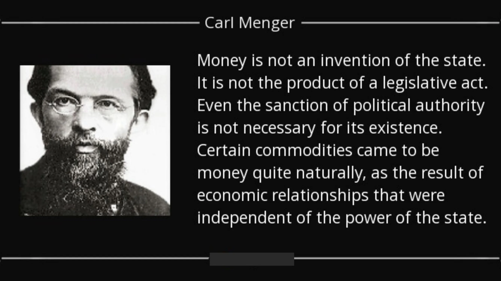

Problem ten ma mniejszy wpływ na małe społeczności (np. rodziny, kręgi przyjaciół), ponieważ w takich przypadkach wszyscy znają się bezpośrednio, co umożliwia wzajemne zapamiętywanie swojego wkładu pracy. Zakładając, że opuszczenie społeczności (dezercja) wiąże się z kosztami, system reputacji oparty na pamięci poszczególnych jednostek jest zwykle wystarczający, aby uniknąć pułapek związanych z dylematem więźnia.

Jednakże, gdy mamy do czynienia z większymi społecznościami, które czerpią znaczne korzyści z podziału pracy, ponownie pojawiają się problemy z koordynacją. Wynika to z dwóch głównych powodów:

Po pierwsze, ludzie są ograniczeni przez swoje zdolności poznawcze. Niemożliwe jest, aby jedna osoba utrzymywała i zapamiętywała stabilne relacje społeczne z ponad 150 osobami, co sprawia, że system bezujący na reputacji jest niewystarczający do przezwyciężenia dylematu więźnia na dużą skalę.

Po drugie, społecznie akceptowany pomiar wartości wkładów w wymianie (współmierność) jest niebagatelnym problemem. Na przykład, jeśli dana osoba dostarcza mięso z polowania i oczekuje w zamian materiałów do budowy schronienia, jak można ocenić ilość oferowanego mięsa w kategoriach równoważnych z potrzebnymi materiałami budowlanymi? To samo dotyczy jakości - czy mięso jelenia jest warte więcej czy mniej niż drewno?

Nawet gdyby możliwe było ustalenie satysfakcjonującego wskaźnika wymiany dla każdej pary towarów, przechowywanie tych informacji szybko stałoby się niepraktyczne. W bezpośrednim systemie wymiany obejmującym N towarów, istnieje N(N-1)/2 stawek wymiany do zapamiętania. Dla gospodarki składającej się z 50 towarów oznacza to konieczność zapamiętania 50\*49/2, czyli 1225 stawek wymiany, w przeciwieństwie do zaledwie 50 w przypadku wymiany pośredniej. Dla gospodarki składającej się ze 100 towarów liczba ta wzrasta do 4950. Zależność w postaci równiania kwadratowego nakłada dodatkowy limit na skalowalność wymiany bezpośredniej (barteru).

Co więcej, ponieważ wymiany te nie następują natychmiast, ale są rozłożone w czasie, ocena wkładów pracy w czasie dodatkowo komplikuje ich względną ocenę. Oprócz oceny stosunku wymiany między dwoma obecnymi dobrami, konieczne staje się oszacowanie wartości przeszłego wkładu pracy w stosunku do dobra otrzymanego w przyszłości.

Dziś, pomimo niepraktyczności takiego systemu, moglibyśmy użyć pisma odręcznego lub cyfrowego przechowywania danych, aby zapamiętać wszystkie te informacje i ustanowić system kredytowy (śledzenie przeszłych składek, w tym wskaźnika wymiany tych składek, jest zasadniczo ustanowieniem systemu kredytowego).

W czasach przedcywilizacyjnych technologie te nie istniały. Dlatego nasi przodkowie musieli znaleźć inne rozwiązania, aby cieszyć się korzyściami płynącymi z podziału pracy bez narażania się na negatywne konsekwencje dylematu więźnia. Rozwiązaniem problemu bezpośredniej wymiany była wymiana pośrednia ułatwiona przez pieniądze.

### Zbieżność potrzeb i zbywalność

Pieniądze mogą być postrzegane jako rozwiązanie odkryte przez naszych przodków w celu rozwiązania problemu, który ekonomiści nazywają problemem „zbieżności potrzeb”. Problem ten ma trzy wymiary: przestrzenny, czasowy i interpersonalny.

W wymianie bezpośredniej (barterze) pomiędzy Alicją i Bobem, oboje muszą posiadać coś, czego druga osoba pragnie w tym samym czasie i miejscu. Korzystając z wymiany pośredniej, tj. za pośrednictwem pieniądza, Alicja może kupić od Boba, a Bob może użyć tej jednostki monetarnej gdzie indziej, w innym czasie i z kimś innym (pod warunkiem, że druga osoba akceptuje tę formę pieniądza).

Aby dobro mogło służyć jako pieniądz, musi mieć wysoką zbywalność, co oznacza, że powinno być pożądane przez jak największą liczbę osób przez większość czasu. Używając dobra o wysokiej zbywalności, problem zbieżności potrzeb zostaje rozwiązany w wymiarze przestrzennym i interpersonalnym: jeśli dobro, którego używam jako pieniądza, jest pożądane wszędzie i przez większość ludzi, mogę łatwo oddzielić akt sprzedaży od aktu kupna pod względem lokalizacji i interakcji społecznych.

Jednak problem zbywalności w czasie jest trudniejszy do rozwiązania z dwóch powodów:

Po pierwsze entropia (powszechnie znana jako "efekt czasu") stopniowo zmienia cechy większości dóbr o bezpośredniej użyteczności. Dlatego też zachowanie zbywalności towaru w czasie wymaga, aby był on wysoce trwały lub odporny na entropię.

Po drugie, względny niedobór danego dobra w czasie „t” nie gwarantuje jego względnego niedoboru w przyszłości. Poświęcając wystarczającą ilość zasobów na określony obszar produkcji, ludzie mogą zwiększyć podaż dowolnego dobra. Jedynym ograniczeniem dla zwiększenia produkcji danego dobra jest związany z tym koszt alternatywny. W związku z tym obecny względny niedobór danego dobra nie może zagwarantować jego względnego niedoboru w przyszłości. Tylko dobra, których krańcowa produkcja może być zwiększona przy bardzo wysokich kosztach, mogą być stale rzadkie, dlatego była to cecha charakterystyczna spontanicznie pojawiających się dóbr pieniężnych w całej historii ludzkości.

W czasach przedcywilizacyjnych różne towary, takie jak muszle, biżuteria rzemieślnicza, naszyjniki lub koraliki służyły jako pieniądze. Towary te były łatwe w transporcie, nie miały bezpośredniej użyteczności poza ich wartością ozdobną, były odporne na entropię (tj. nie psuły się z upływem czasu), były naturalnie rzadkie i / lub wymagały znacznej ilości wyspecjalizowanej pracy do ich wyprodukowania. Ponieważ poziom podziału pracy był wówczas niski, a zatem koszt alternatywny związany z produkcją ozdobnych artefaktów był wysoki, przedmioty te nie mogły być produkowane w dużych ilościach. Tak więc ci, którzy używali tych przedmiotów jako pieniędzy, mogli być pewni ich przyszłego względnego niedoboru.

Fakt, że nasi przodkowie łowcy-zbieracze angażowali się w takie zadania wymagające dużej ilości zasobów, nawet jeśli nie generowały one żadnych dóbr o bezpośredniej użyteczności, pokazuje znaczące korzyści, jakich oczekiwali od rozszerzenia przestrzennego, społecznego i czasowego zakresu wymiany. Gdyby tak nie było i bardziej przydatne byłoby dla nich wykorzystanie tych zasobów do budowy schronień, polowania lub innych działań, a nie do produkcji dóbr pieniężnych, prawdopodobnie nie znaleźlibyśmy tak wielu archeologicznych dowodów na te działania rzemieślnicze. Inne grupy wykorzystujące swoje zasoby bardziej efektywnie cieszyłyby się lepszym rozwojem i większym dobrobytem, a te zajęcia rzemieślnicze szybko zniknęłyby na rzecz działań wytwarzających dobra o bezpośredniej użyteczności.

W tym sensie produkcja dóbr pieniężnych, poprzez promowanie ekspansji podziału pracy, stanowiła bardziej opłacalne wykorzystanie zasobów (pod względem subiektywnej użyteczności dla jednostek) niż wszystkie inne alternatywy (zwiększenie działań w zakresie łowiectwa, rybołówstwa, zbieractwa, produkcji drewna, budowy domów, produkcji większej liczby narzędzi łowieckich i rybackich itp.)

### Niepewność

Aby zakończyć naszą analizę instytucji monetarnej, musimy omówić kwestię działań gospodarczych w kontekście nieuniknionej niepewności co do przyszłości.

Jak zauważyli ekonomiści austriaccy, ludzkie działanie jest ograniczone w czasie i zawsze zorientowane na przyszłość. Kiedy jednostka działa, zmienia swój obecny stan w nadziei na uzyskanie przyszłej satysfakcji. Ta projekcja mentalna może być zorientowana na bliską lub daleką przyszłość, ale aby jednostka mogła działać na dłuższą metę, musi najpierw zapewnić sobie utrzymanie krótkoterminowe, ponieważ jej stan w najbliższej przyszłości bezpośrednio wpływa na jej stan w odległej przyszłości.

Wynika to bezpośrednio z ludzkiej racjonalności - nikt nie może ignorować sekwencyjnej natury zjawisk czasowych i wynikającej z niej zależności chronologicznej, ponieważ jest to jedno z podstawowych ograniczeń ludzkiego życia. Dlatego też, ponieważ przyszłość zawsze jest dla ludzi niepewna, będą oni dążyć do zapewnienia sobie długoterminowego przetrwania dopiero wtedy, gdy ich krótkoterminowe przetrwanie zostanie zabezpieczone.

W tym względzie pieniądz, umożliwiając przechowywanie wartości w teraźniejszości i jej transfer do przyszłego „ja”, odgrywa kluczową rolę w międzyokresowej koordynacji ludzkich działań. Przechowując pieniądze, tj. oszczędzając, jednostki chronią się przed przyszłą niepewnością, a tym samym umożliwiają sobie ukierunkowanie swoich działań na dłuższe horyzonty czasowe. Mogą to jednak zrobić tylko wtedy, gdy używane przez nich pieniądze funkcjonuja jako magazyn wartości, co oznacza, że są zbywalne w czasie co, jak wspomniano wcześniej, jest cechą trwałych i stosunkowo rzadkich towarów.

W następnym rozdziale zagłębimy się w koncepcję preferencji czasowej i wyjaśnimy austriackie spojrzenie na odsetki i kapitał, które posłuży jako podstawa do kolejnego rozdziału poświęconego teorii cyklu koniunkturalnego.

## Preferencja czasowa, odsetki i kapitał

<chapterId>37732a5c-4f66-5e2d-bc2c-cc8d29693af7</chapterId>

### Preferencja czasowa

Ostatni rozdział zakończyliśmy wyjaśnieniem, w jaki sposób podmioty gospodarcze wykorzystują najbardziej zbywalne dobro, tj. pieniądze, aby odeprzeć przyszłą niepewność. Wyjaśniliśmy również, że sekwencyjna natura zjawisk czasowych prowadzi nas do stopniowego zwalczania niepewności: tylko wtedy, gdy wiemy, że nasze utrzymanie będzie zapewnione przez następny tydzień, możemy skoncentrować się na celach w dalszej przyszłości.

Albo inaczej: jako istoty ludzkie dyskontujemy wartość przyszłych dóbr.

Ta subiektywna ocena wartości dóbr przyszłych w porównaniu z dobrami teraźniejszymi określana jest mianem preferencji czasowej. Przy założeniu, że wszystko inne jest równe, dobra teraźniejsze są z natury preferowane w stosunku do dóbr przyszłych. Ponieważ jesteśmy śmiertelni, a przyszłość jest zawsze niepewna, naturalnie wolimy mieć dostęp do danego dobra teraz niż później. Chociaż preferencje czasowe mogą różnić się między poszczególnymi osobami ze względu na niezliczone czynniki, takie jak kultura, zamożność, wykształcenie, fizjologia itp., preferencje czasowe są zawsze dodatnie, co oznacza, że wszystkie rzeczy są równe, zawsze cenimy dobra teraźniejsze bardziej niż przyszłe.

Ta koncepcja względnej wyceny dóbr przyszłych w stosunku do dóbr teraźniejszych leży u podstaw zjawiska odsetek. Rzeczywiście, w gospodarce z niezmanipulowanymi rynkami kapitałowymi referencyjne stopy procentowe (uważane za wolne od ryzyka niewypłacalności) są określane na przecięciu kapitału Supply i popytu. W związku z tym stopy te reprezentują stan preferencji czasowych dla całej gospodarki: wzrost stopy procentowej wynika ze względnego wzrostu popytu na kapitał w porównaniu do Supply, co wskazuje na wyższe preferencje czasowe. I odwrotnie, spadek stóp procentowych wynika ze wzrostu oszczędności, co oznacza wzrost Supply kapitału, wskazując na zmniejszenie preferencji czasowych.

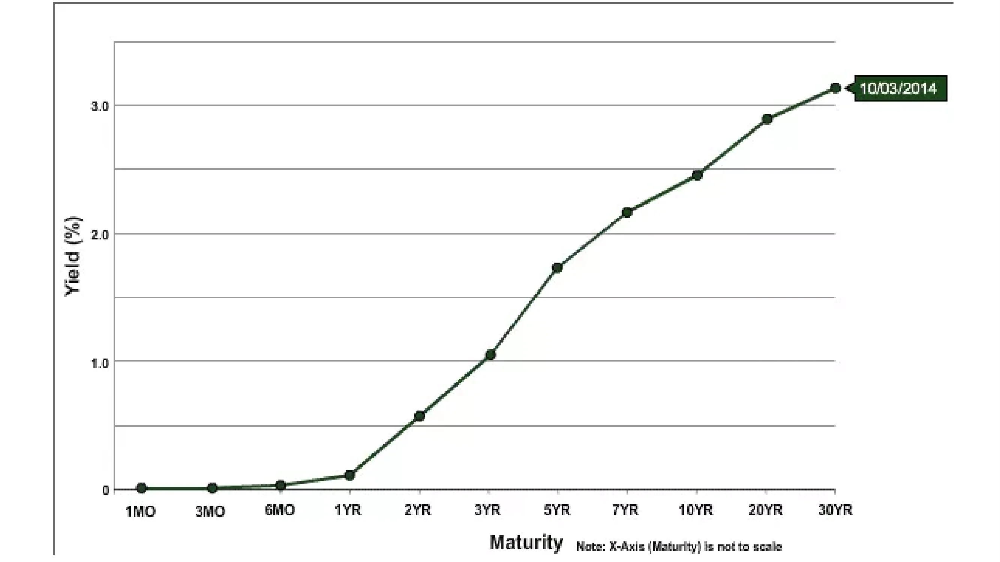

W gospodarce, w której stopy procentowe nie są manipulowane przez bank centralny, mamy tendencję do obserwowania krzywej dochodowości nachylonej w górę: im dłuższy termin zapadalności długu, tym wyższa stopa procentowa. Odwrotna sytuacja nie może mieć miejsca, ponieważ oznaczałoby to, że przyszłość jest bardziej pewna niż teraźniejszość, co jest logiczną niemożliwością.

Koncepcja preferencji czasowej i sposób, w jaki wyrażamy własne preferencje czasowe poprzez konsumpcję i oszczędzanie, ma fundamentalne znaczenie dla procesów alokacji kapitału i produkcji. Zwróćmy się do ucznia Mengera, Eugena von Böhm-Bawerka, i jego teorii kapitału, aby dokładnie zrozumieć, w jaki sposób preferencje czasowe wpływają na organizację produkcji.

### Teoria kapitału

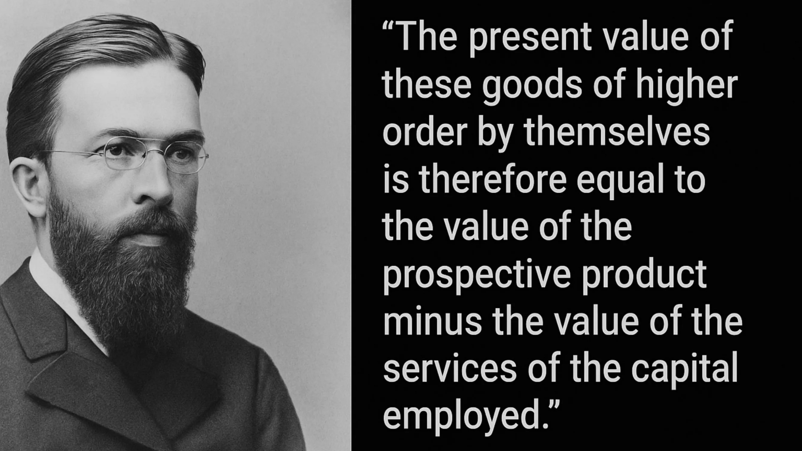

Na początku tego kursu zobaczyliśmy, że dla Carla Mengera dobra są uważane za dobra ekonomiczne (cenione) tylko dlatego, że służą jako środki do celów wybranych i cenionych przez jednostki. Zgodnie z tym poglądem, cała analiza ekonomiczna obraca się wokół konsumpcji, ponieważ jest ona ostatecznie motywującym celem całej działalności gospodarczej. Dlatego dla Mengera punktem wyjścia analizy ekonomicznej są dobra konsumpcyjne lub dobra finalne, ponieważ reprezentują one ostateczny cel działalności gospodarczej. Wszystkie inne dobra w gospodarce, które możemy nazwać "dobrami pośrednimi", mają wartość tylko dlatego, że umożliwiają jednostkom uzyskanie tych dóbr konsumpcyjnych: są to dobra wykorzystywane do produkcji innych dóbr.

Aby wyprodukować dobra konsumpcyjne, przedsiębiorcy łączą te różne dobra pośrednie z pierwotnymi czynnikami produkcji (pracą, ziemią i kapitałem) zgodnie ze schematem, który maksymalizuje wynikową produkcję. Ten układ, stworzony przez przedsiębiorców lub struktura produkcji, obejmuje różne etapy, podczas których dobra pośrednie przechodzą transformacje, aż w końcu stają się dobrami konsumpcyjnymi.

Tak więc, podobnie jak Menger, możemy zdefiniować dobra konsumpcyjne jako dobra pierwszego rzędu, dobra zaangażowane na poprzednim etapie jako dobra drugiego rzędu, te na etapie wcześniejszym jako dobra trzeciego rzędu i tak dalej, aż dojdziemy do czynników pierwotnych (ziemia, praca, kapitał). Liczba etapów, które rozważamy, zasadniczo zależy od struktury produkcji przyjętej przez przedsiębiorców i nie powinna być postrzegana jako obiektywna cecha struktury produkcji. Wręcz przeciwnie, etapy produkcji i dobra pośrednie istnieją tylko w kontekście teleologicznym: podmiot przewiduje sekwencję działań, dzięki którym osiągnie pożądany cel, i mentalnie dzieli swoje działania na kolejne etapy.

Ta cecha mentalnej projekcji działania w sekwencyjnym wzorcu jest narzucona przez czasową naturę ludzkiego działania. Każde działanie podejmowane przez ludzi wymaga czasu; natychmiastowe działanie jest niemożliwe. Dlatego aktor zawsze ma wybór między wzorcami działania, które zajmują więcej lub mniej czasu.

Odtąd, ponieważ jednostki z konieczności mają dodatnie preferencje czasowe, co oznacza, że wolą dobra teraźniejsze od dóbr przyszłych, wybiorą dłuższą ścieżkę tylko wtedy, gdy uzyskany wynik ma dla nich większą subiektywną wartość niż to, co osiągnęliby, wybierając bezpośrednią ścieżkę. W przeciwnym razie nikt nie zastosowałby bardziej czasochłonnych metod: przy równoważnych wynikach najkrótsza ścieżka pozostaje preferowanym wyborem.

Ze względu na sekwencyjny charakter ludzkiego działania, te międzyokresowe wybory zawsze mają wpływ na sekwencję działań. Innymi słowy, podejmowane przeze mnie działania krótkoterminowe są podporządkowane wyznaczonym przeze mnie celom długoterminowym, a moje działania krótkoterminowe wpłyną na to, co będę mógł zrobić w przyszłości. Implikacją tego oczywistego punktu dotyczącego działalności produkcyjnej jest to, że każdy objazd produkcyjny, tj. każde wydłużenie struktury produkcji, wymaga wcześniejszych oszczędności. Jeśli zdecyduję się przydzielić więcej zasobów w teraźniejszości, aby osiągnąć przyszły cel, muszę najpierw odłożyć to, co pozwoli mi utrzymać się przez czas trwania inwestycji.

Aby zilustrować ten punkt, powróćmy do przykładu podanego przez Böhm-Bawerka w jego pracy "Kapitał i odsetki":

Eugen von Böhm-Bawerk (1851-1914)

### Robinson Crusoe i Production Detour/Roundabout:

Sklep Robinson Crusoe wyładowany z wraku, John Alexander Gilfillan (1793-1864)

W swojej książce austriacki ekonomista zachęca nas do rozważenia międzyokresowych kompromisów nieodłącznie związanych z objazdami produkcyjnymi poprzez eksperyment myślowy oparty na Robinsonie Crusoe samotnie przebywającym na swojej wyspie.

Robinson, podobnie jak prymitywny człowiek, polega na żerowaniu i polowaniu. Wyobraźmy sobie, że Robinson może zebrać wystarczającą ilość jagód, aby wyżywić się przez cały dzień w ciągu ośmiu godzin. W takich warunkach ma niewiele czasu na inne zajęcia. Robinson uważa jednak, że wykonując drewnianą tyczkę, mógłby z łatwością strącać jagody i zdobywać codzienne pożywienie w ciągu zaledwie czterech godzin pracy. Co więcej, szacuje, że wykonanie tyczki zajmie mu pięć dni, pracując po dwie godziny dziennie. W związku z tym dochodzi do wniosku, że musi zaoszczędzić 1/5 swojej produkcji jagód przez pięć dni lub alternatywnie spędzić dodatkowe 2 godziny dziennie na zbieraniu przez 5 dni, aby zaoszczędzić wystarczającą ilość jagód, aby utrzymać się przez czas, który spędza na robieniu słupa.

Jeśli Robinson nie dokona wcześniejszych oszczędności, nie będzie w stanie ukończyć bieguna i może w międzyczasie umrzeć.

Tak więc przez pięć dni poświęca dwie godziny odpoczynku, aby zebrać więcej jagód. Pod koniec tego okresu ma wystarczającą ilość jagód i zaczyna wytwarzać drewniany słup, pracując dwie godziny dziennie przez pięć dni. Po zakończeniu pracy może zebrać wystarczającą ilość jagód na swoją dzienną porcję w ciągu 4 godzin zamiast 8, co pozwala mu wykorzystać pozostałe 4 godziny dziennie na inne czynności.

Działając w ten sposób, Robinson obiera objazd produkcyjny: zamiast bezpośrednio zbierać jagody, inwestuje wysiłek w produkcję dobra kapitałowego, które uczyni go bardziej produktywnym w przyszłości. Aby to osiągnąć, musi jednak dokonać krótkoterminowego poświęcenia, tj. zaoszczędzić. Gdyby tego nie zrobił, nie byłby w stanie ukończyć swojego dobra kapitałowego. To krótkoterminowe poświęcenie zapewnia mu jednak znaczną przewagę, ponieważ po wyposażeniu w tyczkę zyskuje 4 godziny dziennie (dopóki tyczka nie stanie się przestarzała). Te 4 dodatkowe godziny dziennie pozwalają mu tworzyć więcej dóbr kapitałowych, takich jak narzędzia myśliwskie lub sieci rybackie, stopniowo poprawiając jego sytuację.

### Wnioski

Innymi słowy, w jednoosobowej gospodarce Robinsona Crusoe oszczędzanie poprzez poświęcanie obecnej satysfakcji jest tym, co akumuluje kapitał zwiększający produktywność. W tym kontekście oszczędzanie, tj. odraczanie obecnej satysfakcji, jest ceną za zwiększoną przyszłą satysfakcję. Oznacza to, że w tym kontekście oszczędzanie jest warunkiem wstępnym i koniecznym dla jakiegokolwiek rozwoju gospodarczego.

Jest to kusząca, aczkolwiek prosta koncepcja: każde rozszerzenie struktury produkcji wymaga wcześniejszego oszczędzania (jako że dobra potrzebne do takiej produkcji nie spadną z nieba), a zatem im więcej oszczędzamy, tym więcej kapitału będziemy w stanie zgromadzić, co z kolei przełoży się na wzrost produktywności przynoszący więcej dóbr. Ekonomiści austriaccy uważają więc, że obniżenie preferencji czasowej jest punktem wyjścia dla pozytywnego cyklu: oszczędności -> więcej dóbr kapitałowych  większa produktywność  więcej dóbr = wyższy standard życia -> niższa preferencja czasowa.

Jak wspomniano w pierwszym rozdziale, stopy procentowe były manipulowane przez dziesięciolecia przez banki centralne, podczas gdy banki komercyjne udzielały kredytów bez wcześniejszych rezerw, co oznacza, że stopy procentowe nie odzwierciedlają naszej preferencji czasowej i dają złudzenie obfitych oszczędności.

Doskonale ilustruje to poniższy wykres: stopy długoterminowe są niższe niż stopy krótkoterminowe. Po pierwsze, nie ma to absolutnie żadnego sensu, ponieważ oznaczałoby to, że przyszłość jest bardziej pewna niż teraźniejszość. Po drugie, uzasadnia to pytanie o konsekwencje dla alokacji kapitału: jeśli wszyscy są zachęcani do działania tak, jakby oszczędności były obfite, podczas gdy oszczędzających nigdzie nie można znaleźć, ponieważ nie są nagradzani za oszczędzanie, jakie konsekwencje może to mieć dla gospodarki?

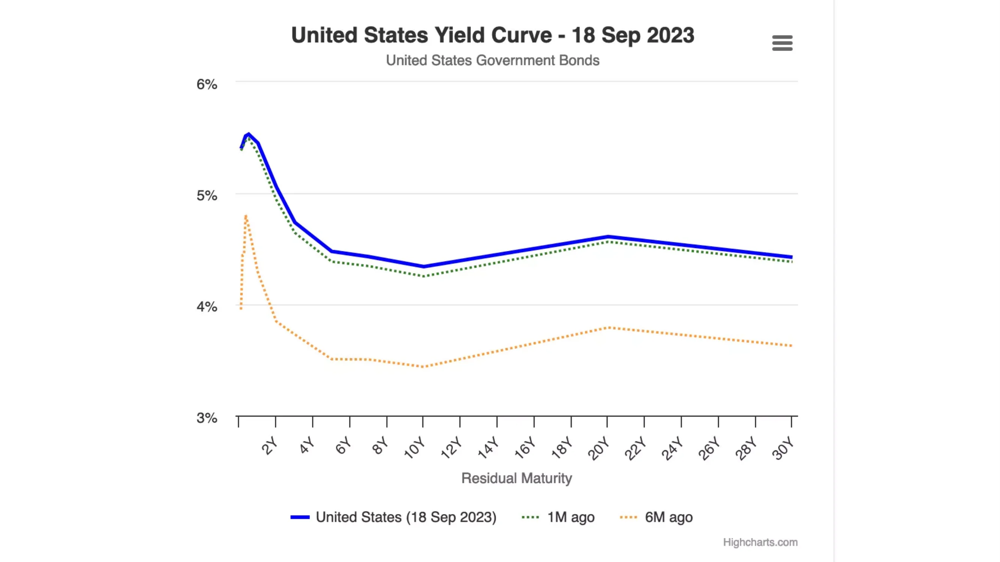

Tego dowiemy się w kolejnym rozdziale poświęconym austriackiej teorii cyklu koniunkturalnego!

# Austriackie perspektywy ekonomiczne

<partId>ad0fce42-2556-56b8-a093-5b4fcacc7cf3</partId>

## Austriacka teoria cyklu koniunkturalnego

<chapterId>718afaa8-ce78-58aa-9477-073eef0bd137</chapterId>

> "Im dłużej trwa boom inflacyjnego kredytu bankowego, tym większy jest zakres złych inwestycji w dobra kapitałowe i tym większa potrzeba likwidacji tych nieuzasadnionych inwestycji. Kiedy ekspansja kredytowa zatrzymuje się, odwraca lub nawet znacznie spowalnia, złe inwestycje zostają ujawnione"
>

> Ludwig von Mises

To Ludwig Von Mises, najwybitniejszy uczeń Böhm-Bawerka i prawdopodobnie najważniejszy austriacki ekonomista XX wieku, wykorzystał rozumowanie kapitałowe Böhm-Bawerka do wyjaśnienia przyczyn i dynamiki cykli gospodarczych. Friedrich A. Hayek, protegowany Misesa, później rozszerzył to rozumowanie do jego logicznych wniosków w pracach, za które otrzymał Nagrodę Nobla w dziedzinie ekonomii w 1974 roku.

Mises i Hayek rozpoczęli swoją analizę od wzrostu oszczędności jako punktu wyjścia. Jak widzieliśmy w poprzednich rozdziałach, każdy wzrost oszczędności z konieczności pociąga za sobą odpowiedni spadek konsumpcji, a tym samym niższe względne ceny dóbr konsumpcyjnych. Prowadzi to do dwóch efektów: po pierwsze, zwiększonego popytu na dobra kapitałowe spowodowanego rosnącymi płacami realnymi wynikającymi z relatywnego spadku cen dóbr konsumpcyjnych; a po drugie, wzrostu zysków przedsiębiorców na etapach produkcji najbardziej oddalonych od konsumpcji (niższego rzędu). Wraz ze wzrostem płac realnych, przedsiębiorcy są zachęcani do oszczędzania pracy poprzez wykorzystywanie większej ilości dóbr kapitałowych, co tworzy silniejszy popyt na dobra kapitałowe i wyższe zyski dla przedsiębiorców produkujących dobra niższego rzędu. Tak więc, w kontekście zwiększonych oszczędności, tj. spadku preferencji czasowej, stopy procentowe spadają, promując rozwój dodatkowych etapów produkcji i zwiększoną produktywność. Jest to klasyczny objazd produkcyjny Böhm-Bawerkiana i jest to bardzo pożądany rezultat.

Dwaj austriaccy ekonomiści zastanawiali się jednak, co by się stało, gdyby spadek stopy procentowej, który służy jako punkt wyjścia dla tego objazdu produkcyjnego, nie wynikał ze wzrostu oszczędności, ale z ekspansji kredytowej.

W kontekście bankowości opartej na rezerwie cząstkowej ekspansja kredytowa nie wymaga odpowiedniego wzrostu oszczędności. W związku z tym przedsiębiorcy mogą gromadzić więcej kapitału i angażować się w objazdy produkcyjne, nawet jeśli preferencje czasowe pozostają niezmienione, tj. bez jakiegokolwiek spadku konsumpcji. Dla Hayeka i Misesa taka sytuacja powinna prowadzić do poważnych problemów z koordynacją działań podmiotów gospodarczych. Ze względu na brak wolnorynkowych stóp procentowych problemy te mogą nie być od razu widoczne, ale w dłuższej perspektywie wynikająca z nich błędna alokacja kapitału powinna przynieść wymierne konsekwencje: recesję.

Aby opisać to zjawisko czasowej błędnej koordynacji i jego konsekwencje tak jasno, jak to możliwe, oprzemy się na modelu struktury produkcji i zaobserwujemy, jak wpływa na nią najpierw spadek stóp procentowych wynikający ze wzrostu oszczędności, a następnie spadek stóp procentowych spowodowany ekspansją kredytu.

### Spadek stóp procentowych spowodowany wzrostem oszczędności:

Aby ułatwić nasze wyjaśnienie, powrócimy do klasyfikacji dóbr Mengera i przedstawimy strukturę produkcyjną na diagramie składającym się z dowolnej liczby etapów:

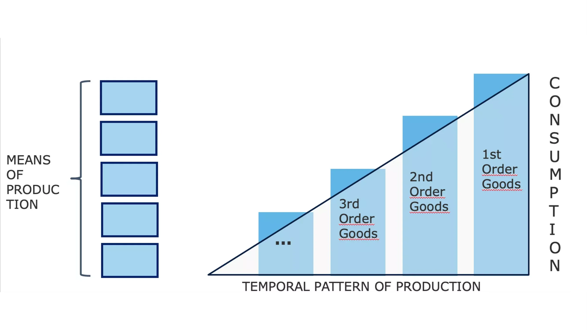

Na powyższym diagramie zasoby początkowe przechodzą przez różne etapy produkcji, ulegając transformacjom, które przybliżają je do stanu końcowych dóbr konsumpcyjnych (poprzez interakcję z pierwotnymi czynnikami produkcji: czasem, ziemią, pracą). Wysokość prawego boku trójkąta schematycznie reprezentuje PKB, ponieważ oznacza sumę wszystkich dóbr konsumpcyjnych sprzedanych w danym okresie. Różnica między poszczególnymi słupkami odpowiada wartości dodanej (w ujęciu pieniężnym) wygenerowanej na każdym etapie procesu. Różnica ta może być również postrzegana jako dochód związany z każdym etapem (przychody - koszty).

Jeśli na poziomie zagregowanym podmioty gospodarcze zwiększą swoje oszczędności, ilość konsumowanych dóbr finalnych zmniejszy się - wszystkie inne czynniki są równe, oszczędzanie z konieczności wiąże się z odłożeniem części konsumpcji na później. W rezultacie stopy procentowe spadną - ponieważ Supply kapitału rośnie, umożliwiając przedsiębiorcom wykorzystanie tego napływu kapitału do tworzenia nowych dóbr inwestycyjnych, a tym samym wydłużenia struktury produkcji.

Otrzymamy wówczas rozszerzoną strukturę produkcji, zmianę, którą można jakościowo przedstawić na poniższym diagramie:

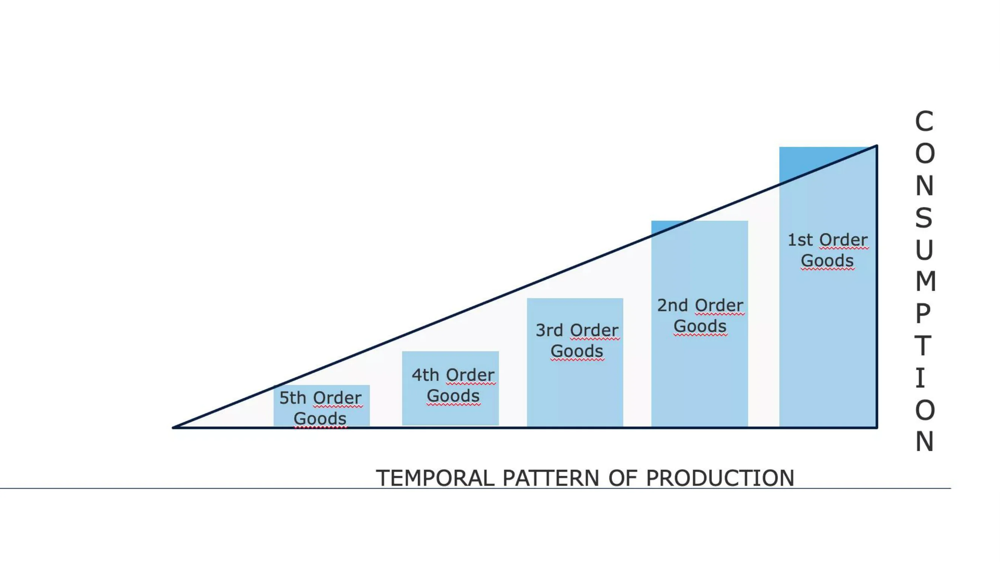

W tym przypadku wartość pieniężna pożądanych dóbr konsumpcyjnych spadła, uwalniając zasoby do stworzenia dodatkowego etapu produkcji. W tym scenariuszu, w którym spadek stóp procentowych jest konsekwencją zmniejszonej konsumpcji, tj. zwiększonych oszczędności, pole trójkąta, reprezentujące ilość pieniądza w obiegu, pozostaje niezmienione. Przekształcenie struktury produkcji (wydłużenie) wynika po prostu z przeniesienia siły nabywczej z jednej części struktury do drugiej.

Warto również zauważyć, że zmniejszenie popytu na dobra konsumpcyjne spowoduje w średnim okresie spadek cen konsumpcyjnych, a nie spadek ilości oferowanych dóbr finalnych. Wynika to z faktu, że końcowa część struktury produkcji nie dostosuje się natychmiast po spadku popytu na dobra konsumpcyjne; przedsiębiorcy będą potrzebować trochę czasu, aby zmienić swoje plany i inwestycje. Ponieważ utrzymują zapasy, spadek popytu zmusi ich do sprzedaży tych zapasów z dyskontem, a w konsekwencji nadwyżka oszczędności początkowo spowoduje niższe ceny dóbr konsumpcyjnych (tj. wzrost płac realnych).

I odwrotnie, ceny dóbr inwestycyjnych wzrosną, ponieważ transfer siły nabywczej do przedsiębiorców umożliwi im zwiększenie wydatków inwestycyjnych. Gdy oszczędności, przekazane przez oszczędzających przedsiębiorcom, zostaną przez nich wydane, stopy procentowe ponownie wzrosną (z powodu zmniejszonego Supply kapitału), co z kolei doprowadzi do obniżenia cen dóbr inwestycyjnych. W rzeczywistości, pod koniec tego objazdu produkcyjnego, względne ceny pozostaną mniej więcej takie same jak wcześniej. Jednak podmioty gospodarcze ogólnie odniosły korzyści: zwiększona produktywność wynikająca z wydłużenia struktury produkcji zaoferuje konsumentom więcej produktów po niższych cenach jednostkowych; siła nabywcza oszczędzających wzrośnie, częściowo dzięki zyskom z odsetek, a częściowo dzięki niższym cenom konsumpcyjnym; tymczasem przedsiębiorcy, traktowani jako całość, nie odczują ani zysków, ani strat. Ci zaangażowani w działania najbliższe konsumpcji stracą dochód, podczas gdy ci zaangażowani w tworzenie nowych etapów produkcji proporcjonalnie zyskają. W takiej sytuacji nie powstaje żaden nowy dochód pieniężny; to produkcja wzrasta, a tym samym rośnie realna wartość dochodów.

### Spadek stóp procentowych z powodu wzrostu kredytów (bez wzrostu oszczędności):

Teraz, jeśli weźmiemy pod uwagę spadek stóp procentowych wynikający z ekspansji kredytów oferowanych przez banki, otrzymamy zupełnie inny obraz struktury produkcji.

Przy niższych stopach procentowych przedsiębiorcy mogą pożyczać więcej zasobów, a tym samym tworzyć etapy produkcji wyższego rzędu. W tym przypadku takie rozszerzenie struktury produkcji nie spowoduje spadku konsumpcji, ponieważ nie nastąpiło odroczenie obecnej konsumpcji przez konsumentów. Innymi słowy, PKB rośnie. W rezultacie nasz trójkąt wydłuży się, zachowując podobną wysokość, co oznacza, że jego powierzchnia wzrośnie.

Należy zauważyć, że jest to całkowicie logiczna konsekwencja ekspansji kredytowej. W zakresie, w jakim banki wytwarzają media powiernicze poprzez udzielanie pożyczek, należy naturalnie oczekiwać wzrostu ogólnej siły nabywczej.

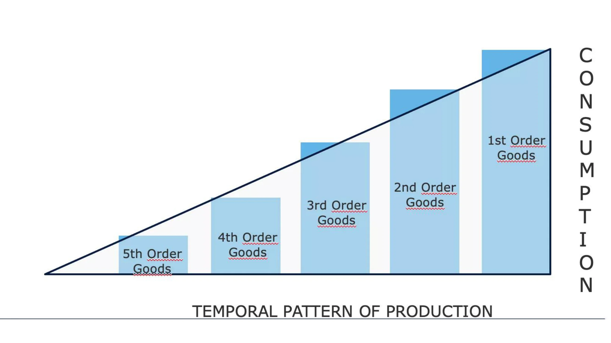

W miarę napływu kredytów do gospodarki poprzez pożyczki dla przedsiębiorców, powinniśmy zaobserwować wzrost zysków w sektorach produkcyjnych oddalonych od konsumpcji i spadek względnych zysków w sektorach bliższych konsumpcji. Ta wyższa rentowność wspiera następnie realokację kapitału w kierunku tych nowych, bardziej kapitałochłonnych etapów (przemysł stoczniowy, motoryzacyjny, budownictwo, zaawansowane technologie itp.) oraz spadek inwestycji w sektorach bliższych konsumpcji.

Teraz przedsiębiorcy zaangażowani w te wyższe etapy produkcji uzyskują wyższe dochody pieniężne, a ponieważ preferencja czasowa pozostała taka sama, powinniśmy również zaobserwować zwiększony popyt na produkty konsumpcyjne. Ponieważ jednak podczas tego boomu względna rentowność zainwestowanego kapitału była wyższa w sektorach dalekich od konsumpcji, nastąpił transfer zasobów z działalności bliskiej konsumpcji do działalności bardziej odległej. W rezultacie przedsiębiorcom na niższych etapach produkcji brakuje zasobów, aby zaspokoić zwiększony popyt. Tworzy to napięcie pomiędzy tymi dwoma częściami struktury produkcji: każda z nich stara się pozyskać kapitał kosztem drugiej, a ponieważ popyt na konsumpcję reprezentuje pilniejsze potrzeby, w pewnym momencie przedsiębiorcom zaangażowanym w działalność odległą od konsumpcji zabraknie zasobów potrzebnych do ukończenia inwestycji. Stopa zysku w tych sektorach zaczyna wówczas spadać, firmy bankrutują, a względny wzrost cen konsumpcyjnych motywuje do szybkiej realokacji kapitału w kierunku produkcji dóbr niższego rzędu. Kiedy pojawia się ta nagła realokacja zasobów, gospodarka wchodzi w recesję: ceny aktywów spadają, płace realne spadają, ceny konsumpcyjne spadają, a zapasy gromadzą się.

Dla Friedricha Hayeka i Ludwiga von Misesa recesja jest przejawem błędnej alokacji kapitału z fazy ekspansji. Ponieważ manipulowano cenami oszczędności i kapitału, przedsiębiorcy rozwijali projekty, które nie mogły zostać ukończone z powodu braku zasobów, i/lub budowali moce produkcyjne planując przyszły poziom konsumpcji, który nie mógł zostać utrzymany z powodu braku oszczędności.

Tylko poprzez deflację, tj. spadek cen aktywów i płac, wyższe stopy procentowe i likwidację niedokończonych projektów, gospodarka może się dostosować i rozwijać w kierunku zrównoważonej ścieżki. Tak więc recesja jest rozproszeniem tej iluzji dobrobytu, wyzwalając gwałtowny proces dostosowawczy.

Ogólnie rzecz biorąc, recesja jest wywoływana przez sam sektor bankowy. Dopóki kredyt rośnie w coraz szybszym tempie, ceny nadal rosną, a przedsiębiorcy konkurują o zasoby produkcyjne. Jednak, jak zauważył Hyman Minsky, nadchodzi moment, w którym sektor bankowy decyduje się na ograniczenie ryzyka, a tym samym zmniejsza przepływ kredytów. Depresja skutkuje zatem wieloma bankructwami, zacieśnieniem akcji kredytowej, spadkiem dostępnej siły nabywczej i krachami finansowymi.

Takie dostosowanie można postrzegać jako okres, w którym niedostateczna konsumpcja i niedoinwestowanie są wymuszane w celu odbudowania brakujących oszczędności. Dla Hayeka ten etap depresji, choć bolesny, jest bardzo potrzebny, ponieważ pozwala na ożywienie działalności gospodarczej w oparciu o strukturę cen względnych odzwierciedlającą rzeczywisty niedobór czynników produkcji. Jeśli ta depresja zostanie przerwana, gospodarka nie może powrócić na pożądaną ścieżkę, ponieważ przy braku systemu informacyjnego umożliwiającego podmiotom gospodarczym racjonalizację ich decyzji, błędna alokacja zasobów będzie kontynuowana.

Niestety, ten depresyjny mechanizm jest często zakłócany przez władzę polityczną i banki centralne starające się "pobudzić" gospodarkę poprzez wydatki deficytowe i łatwą politykę pieniężną.

Zarówno monetaryści, jak i keynesiści uważają, że przyczyną depresji jest niewystarczający zagregowany popyt, więc nie zwracają uwagi na ewolucję cen względnych, która, jak widzieliśmy, stanowi sedno problemu. W związku z tym uważają oni, że zapewnienie zachęty do ekspansji kredytowej (obniżenie stóp procentowych) i wykorzystanie zdolności deficytowej państwa do pobudzenia popytu zapoczątkuje ożywienie. W krótkim okresie takie działania mogą wydawać się przynosić pożądane efekty: deficyt wspiera wydatki, podczas gdy obniżenie stóp procentowych prowadzi do wyższych cen aktywów, co z kolei zachęca ich posiadaczy do zwiększenia wydatków. Jednak taki impuls w końcu zanika, podczas gdy problem strukturalny pozostaje, a nawet pogarsza się, ponieważ błędna alokacja kapitału utrzymuje się dzięki sztucznie niskim stopom procentowym.

We współczesnej erze banki centralne i rządy były tak gorliwe w zapobieganiu przejawom tego procesu dostosowawczego, że skończyliśmy z masowym bezrobociem strukturalnym i ciągłą akumulacją długu. Japonia służy jako przykład w tym względzie. Po pęknięciu bańki na rynku aktywów w latach 1989-90, Bank Japonii (BoJ) i różne rządy wykorzystały wszystkie opisane tutaj metody, aby spróbować "ponownie uruchomić japońską gospodarkę" Oprócz krótkich skoków w następstwie programów wydatków i obniżek stóp procentowych, Japonia pozostawała w stanie neurastenicznego wzrostu i nadmiernego zadłużenia przez 30 lat.

### Wnioski dotyczące teorii cyklu koniunkturalnego:

Podkreślając sekwencyjny charakter ludzkiego działania i zwracając szczególną uwagę na wpływ wahań stóp procentowych na międzyokresową koordynację podmiotów gospodarczych, Ludwig Von Mises i Friedrich Hayek wyjaśnili cykle gospodarcze jako endogeniczną dynamikę systemu bankowego opartego na rezerwie cząstkowej. Różnica między austriacką analizą a analizą monetarystów i keynesistów polega głównie na tym, że ci pierwsi zwracają szczególną uwagę na różne etapy produkcji i strukturę cen względnych, podczas gdy ci drudzy zatrzymują się na zagregowanych zmiennych, takich jak poziom zatrudnienia, PKB lub indeks cen konsumpcyjnych. Rzeczywiście, ponieważ brakuje im teorii kapitału, ekonomiści głównego nurtu mają tendencję do przypisywania przyczyn recesji "duchom zwierząt" lub "wydarzeniom zewnętrznym".

Bardziej niż jakakolwiek inna szkoła ekonomiczna, Szkoła Austriacka kładzie nacisk na znaczenie cen względnych dla koordynacji podmiotów gospodarczych. Członkowie Szkoły Austriackiej byli wciągani w debaty na ten temat przez ponad sto lat, zwłaszcza od czasu, gdy Mises opublikował swoją pracę na temat niemożliwości kalkulacji ekonomicznej w gospodarkach socjalistycznych w 1919 roku.

Będzie to tematem następnego i ostatniego rozdziału tego kursu.

## Niemożliwość kalkulacji ekonomicznej w socjalizmie

<chapterId>2578a9d8-90e9-58dd-a8c5-6366948564c7</chapterId>

> "Tam, gdzie nie ma cen rynkowych dla czynników produkcji, ponieważ nie są one ani kupowane, ani sprzedawane, niemożliwe jest uciekanie się do kalkulacji w planowaniu przyszłych działań i określaniu rezultatów przeszłych działań. Socjalistyczne zarządzanie produkcją po prostu nie wiedziałoby, czy to, co planuje i wykonuje, jest najbardziej odpowiednim środkiem do osiągnięcia zamierzonych celów. Będzie działać niejako po omacku. Roztrwoni ograniczone czynniki produkcji, zarówno materialne, jak i ludzkie (pracę). Nieuchronnie doprowadzi to do chaosu i ubóstwa dla wszystkich"
>

> Ludwig von Mises, Planowany chaos

### Niemożliwość kalkulacji ekonomicznej w socjalizmie

Pomimo powtarzających się niepowodzeń reżimów marksistowskich w ciągu ostatniego stulecia, debata na temat kalkulacji ekonomicznej pozostaje aktualna z dwóch istotnych powodów:

1. Podobne idee są nadal popierane przez postępowców i innych interwencjonistów.

2. Ustalanie cen, czy to na rynkach kapitałowych poprzez działania bankierów centralnych, czy na innych rynkach poprzez przedsiębiorstwa państwowe, dekrety i interwencje komitetów regulacyjnych, jest nadal powszechne.

### Debata na temat kalkulacji ekonomicznych

Debata ta została początkowo zapoczątkowana przez jeden z najbardziej wpływowych dokumentów ekonomicznych XX wieku, "Economic Calculation in a Socialist Commonwealth", autorstwa Ludwiga von Misesa, opublikowany w 1920 roku. W tym czasie socjalizm zyskiwał na popularności, bolszewicy przejęli władzę w Rosji, socjaliści objęli urząd w Republice Weimarskiej (Niemcy), a partie socjalistyczne i komunistyczne zyskały na znaczeniu w całej Europie.

Przed artykułem Misesa debaty na temat socjalizmu i kapitalizmu toczyły się głównie wokół argumentów moralnych i problemu zachęt. Nawet jeśli ktoś zakładał, że społeczeństwo zorganizowane wokół marksistowskiej zasady "od każdego według jego zdolności, każdemu według jego potrzeb" jest moralnie lepsze, to nadal należało odpowiedzieć na praktyczne pytanie "kto będzie wynosił śmieci". Powszechną odpowiedzią było to, że socjalizm wytworzy jednostki pozbawione kapitalistycznych instynktów, chętnie służące swoim rówieśnikom nawet przy braku zachęt pieniężnych.

Swoim artykułem Mises wprowadził do debaty nowy wymiar. Odkładając na bok utopijne wyobrażenia o zdolności ekonomii politycznej do stworzenia "nowego człowieka", austriacki ekonomista wskazał, że racjonalna organizacja gospodarcza jest niemożliwa bez cen pośrednich czynników produkcji. Nawet dzisiaj jego argument pozostaje słabo zrozumiany przez jego krytyków, a nawet przez niektórych liberalnych ekonomistów. Dlatego warto wyjaśnić go bardziej szczegółowo.

### Wyjaśnienie niemożności kalkulacji ekonomicznej

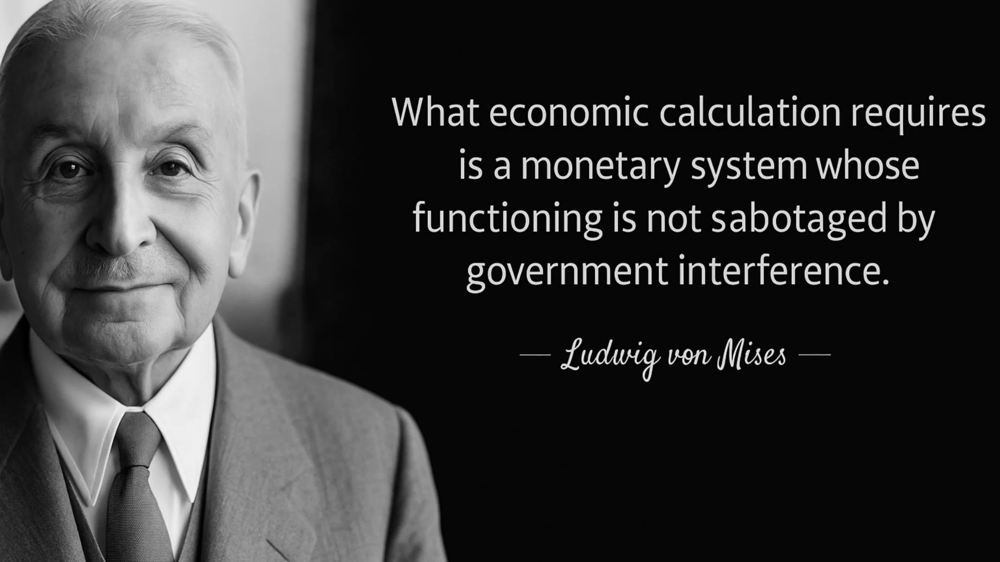

Większość błędnych przekonań na temat argumentów Misesa wynika z niezrozumienia roli odgrywanej przez klasę menedżerów i przedsiębiorców w gospodarce kapitalistycznej. Mises nigdy nie odrzucał zdolności menedżerów do opracowywania wydajnych planów produkcji w ramach ich własnych operacji. Zamiast tego podkreślał znaczenie przedsiębiorców i akcjonariuszy, którzy jako właściciele środków produkcji alokują kapitał w różnych branżach, tworząc w ten sposób ceny, które służą jako dane wejściowe w obliczeniach ekonomicznych menedżerów.

Bez rynków kapitału i pieniądza racjonalizacja wykorzystania zasobów w różnych branżach staje się niemożliwa. Oznacza to, że nawet jeśli w każdej firmie lub części gospodarki istnieje doskonała organizacja, cała gospodarka nie może skutecznie dostosować się do zmian w dostępności zasobów, warunkach produkcji i preferencjach konsumentów. Mówiąc słowami Misesa:

> "[...] kardynalny błąd implikowany w propozycjach [rynkowych socjalistów] polega na tym, że patrzą oni na problem ekonomiczny z perspektywy podrzędnego urzędnika, którego horyzont intelektualny nie wykracza poza podrzędne zadania. Uważają strukturę produkcji przemysłowej i alokację kapitału do różnych gałęzi i agregatów produkcyjnych za sztywne i nie biorą pod uwagę konieczności zmiany tej struktury w celu dostosowania jej do zmian warunków..... Nie zdają sobie sprawy, że działania urzędników korporacyjnych polegają jedynie na lojalnym wykonywaniu zadań powierzonych im przez ich szefów, akcjonariuszy.... Operacje menedżerów, ich kupowanie i sprzedawanie, są tylko niewielkim segmentem całości operacji rynkowych. Rynek społeczeństwa kapitalistycznego wykonuje również te operacje, które przydzielają dobra kapitałowe do różnych gałęzi przemysłu. Przedsiębiorcy i kapitaliści zakładają korporacje i inne firmy, powiększają lub zmniejszają ich rozmiar, rozwiązują je lub łączą z innymi przedsiębiorstwami; kupują i sprzedają akcje i obligacje już istniejących i nowych korporacji; udzielają, wycofują i odzyskują kredyty; krótko mówiąc, wykonują wszystkie te czynności, których całość nazywana jest rynkiem kapitałowym i pieniężnym. To właśnie te transakcje finansowe promotorów i spekulantów kierują produkcję do tych kanałów, w których zaspokaja ona najpilniejsze potrzeby konsumentów w najlepszy możliwy sposób"
>

> Mises, Ludzkie działanie, s. 703-04

Zasadniczo Mises argumentuje, że prawa własności, które umieszczają właścicieli kapitału w kontekście zysków i strat, motywują ich do alokowania swoich zasobów do branż, które obecnie najbardziej potrzebują zasobów, aby zaspokoić potrzeby konsumentów. Kiedy odnoszą sukces, zyskują, ale kiedy ponoszą porażkę, ponoszą straty finansowe. Ich "skóra w grze" zachęca ich do spekulacji na temat najlepszej alokacji kapitału dla obecnego stanu gospodarki. Tworzy to dynamikę rynkową, w której zbiorowe wyniki ich działań dostarczają istotnych informacji na temat najbardziej efektywnego wykorzystania zasobów.

W poprzednich rozdziałach wyjaśniono, że wartości są subiektywne, działania gospodarcze ujawniają koszty alternatywne, a ceny konsumpcyjne wyrażają hierarchię potrzeb konsumentów. Przedsiębiorcy konkurują o czynniki produkcji w celu stworzenia struktur produkcyjnych, które maksymalizują przychody w stosunku do kosztów, zaspokajając pragnienia konsumentów bardziej efektywnie niż alternatywne opcje. Dlatego też ceny czynników produkcji są pochodną cen konsumpcyjnych: jeśli czynnik produkcji może generate większy przychód pieniężny (lepiej zaspokajając potrzeby konsumentów) w innej branży lub w ramach innego planu, przedsiębiorcy przebiją jego obecnego właściciela, podnosząc jego cenę do krańcowej produktywności. Ta konkurencja między przedsiębiorcami o czynniki produkcji, określająca ich najwyższą krańcową wydajność, jest procesem, który generuje istotne informacje na temat alokacji zasobów.

Proces ten ma kluczowe znaczenie, ponieważ weryfikuje lub unieważnia efektywność różnych działań, zapewniając, że czynniki produkcji są przydzielane do ich najbardziej produktywnych zastosowań. Rynek pełni tę funkcję jako proces ciągły. W nieustannie zmieniającym się świecie - gdzie preferencje konsumentów, warunki produkcji, technologia, regulacje, demografia i wiele innych podlegają zmianom - ceny pośrednich czynników produkcji nieustannie zmieniają się w wyniku działań przedsiębiorców i kapitalistów dostosowujących się do zmieniających się warunków. Ponieważ zmiany te są zlokalizowane, informacje muszą być rozpowszechniane wśród podmiotów gospodarczych, które nie mogą posiadać pełnej wiedzy o całym świecie. Taka jest rola rynku: pozwala on przedsiębiorcom działać w oparciu o zlokalizowane, często jakościowe i złożone informacje, proponując struktury produkcji gospodarczej, które są następnie zatwierdzane lub unieważniane przez rynek. W ten sposób istotne informacje generowane przez ten oddolny proces są kondensowane i dystrybuowane w całej gospodarce za pośrednictwem systemu cenowego. Ten proces produkcji i dystrybucji informacji jest niezbędny do alokacji zasobów, ponieważ umożliwia podmiotom gospodarczym, które mają ograniczoną wiedzę o świecie, dokonywanie obliczeń ekonomicznych i opracowywanie spójnych planów gospodarczych w oparciu o ceny.

Z tej perspektywy gospodarka centralnie planowana nieuchronnie doświadczy błędnej alokacji kapitału. W krótkim i średnim okresie takie błędne alokacje mogą pozostać niezauważone, ponieważ nie ma cen rynkowych ani bankructw, które mogłyby je ujawnić. Jednak ze względu na brak sprzężenia zwrotnego (ceny) i mechanizmów realokacji (bankructwa), błędy będą się kumulować, aż marnotrawstwo stanie się widoczne poprzez znaczny spadek warunków życia.

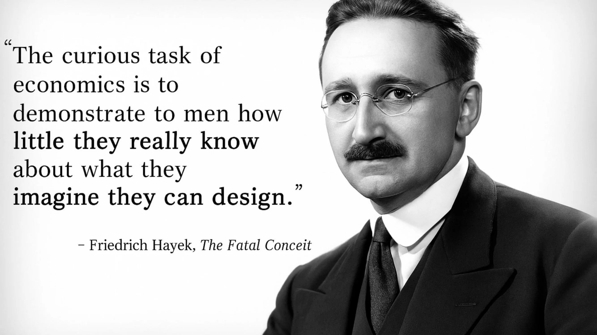

### Perspektywa austriacka i porażki innych szkół ekonomicznych

Można by argumentować, że malowanie takiej panoramy z perspektywy czasu jest łatwe. W końcu wszyscy zdajemy sobie sprawę z pustych półek w ZSRR, trudności Wenezueli i katastrofy humanitarnej w Kambodży. Ale Mises przewidział te wydarzenia już w 1920 roku. Jednak aż do upadku ZSRR w 1989 r. wielu ekonomistów, w tym wielu laureatów Nagrody Nobla, wychwalało radziecki cud gospodarczy i przewidywało, że radziecka gospodarka wkrótce przewyższy gospodarkę USA.

Pomimo tych imponujących prognoz i licznych empirycznych dowodów na niemożność kalkulacji ekonomicznej w socjalizmie, przywódcy polityczni na całym świecie są bardziej niż kiedykolwiek chętni do ustalania cen, nacjonalizacji całych gałęzi przemysłu i proponowania planów pięcioletnich, często oklaskiwanych przez niedoinformowane ekonomicznie społeczeństwa. Konsekwencje takiego interwencjonizmu są dotkliwie odczuwane przez ludzi w niegdyś zamożnych krajach zachodnich, którzy powoli obserwują spadek poziomu życia.

### Austriacka teoria cyklu koniunkturalnego jako szczególny przypadek niemożliwości kalkulacji ekonomicznej w socjalizmie

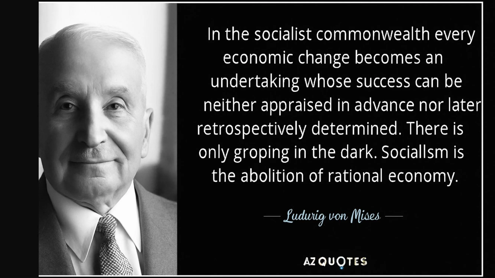

W poprzednim rozdziale wyjaśniliśmy dynamikę przeinwestowania i błędnej alokacji kapitału wynikającej z manipulacji stopami procentowymi przez banki centralne. Zasadniczo to, co wyjaśniliśmy, można postrzegać jako szczególny przypadek niemożności kalkulacji ekonomicznej w socjalizmie, zastosowany do sfery rynków pieniężnych. Kiedy ceny są ustalane poza ich wartościami rynkowymi, przedsiębiorcy i alokatorzy kapitału są zachęcani do angażowania się w inwestycje, których nie można utrzymać w dłuższej perspektywie z powodu braku oszczędności. Ingerując w system cen, centralni planiści (w tym przypadku bankierzy centralni) tworzą błędną koordynację między podmiotami gospodarczymi. W tym przypadku błędna koordynacja międzyokresowa pociąga za sobą przeinwestowanie w dobra inwestycyjne wyższego rzędu i niedoinwestowanie w dobra inwestycyjne niższego rzędu, co stanowi szczególny przejaw błędnej alokacji kapitału w różnych branżach.

Konsekwencje takiej błędnej alokacji obejmują kryzysy finansowe i gospodarcze, zmniejszoną aktywność gospodarczą i deflację zadłużenia. Te skutki makroekonomiczne wynikają z braku równowagi między oszczędnościami a inwestycjami wynikającymi z ekspansji kredytowej. W ZSRR i innych reżimach komunistycznych ustalanie cen prowadziło do podobnej błędnej koordynacji, skutkując niedoborami niektórych towarów i nadprodukcją innych. W obu przypadkach ceny nie odzwierciedlają prawdziwych preferencji konsumentów, czy to pod względem preferencji czasowych, czy preferencji konsumpcyjnych, co prowadzi przedsiębiorców lub centralnych planistów odpowiedzialnych za alokację zasobów do inwestowania kapitału w "niewłaściwe branże"

Dziś debata na temat kalkulacji ekonomicznej powraca przede wszystkim w dyskusjach na temat energii, gdzie złe inwestycje napędzane programem Green stają się coraz bardziej widoczne. Pojawia się również w dyskusjach na temat rynków pieniężnych, gdzie austriaccy ekonomiści wskazują, że kryzys z 2008 r., którego ekonomiści głównego nurtu nie przewidzieli, był klasycznym cyklem boomu i załamania, charakteryzującym się przeinwestowaniem na rynku mieszkaniowym z powodu przedłużających się okresów niskich stóp procentowych. Co więcej, neomarksiści i inne frakcje socjalistyczne propagują pogląd, że pojawienie się sztucznej inteligencji może rozwiązać problem kalkulacji ekonomicznej. Perspektywa ta wynika jednak z błędnego zrozumienia tej kwestii; problem obliczeń ekonomicznych nie jest kwestią mocy obliczeniowej, ale raczej kwestią generowania i dystrybucji informacji związanych z produkcją i alokacją zasobów. Informacje te mogą być generowane tylko lokalnie przez podmioty posiadające specjalistyczną wiedzę i żywotnie zainteresowane wynikiem. Sztuczna inteligencja nie może zastąpić tego oddolnego procesu, a zatem nie może pomóc centralnym planistom Address w rozwiązaniu problemu alokacji zasobów. Niestety, ze względu na trwające od stulecia nieporozumienia, spodziewamy się mnożenia się twierdzeń, że sztuczna inteligencja zapoczątkuje nową erę dobrobytu gospodarczego, kierowaną przez oświeconych centralnych planistów, którzy z pomocą sztucznej inteligencji mogą naprawić niepowodzenia wolnych rynków.

Konkretne zastosowanie problemu kalkulacji ekonomicznej we współczesnej sytuacji można znaleźć w tym artykule poświęconym problemowi alokacji zasobów we współczesnych Chinach.

> Droga do represji finansowych: Chiny papierowym tygrysem, Theo Mogenet, https://open.substack.com/pub/theomogenet/p/the-road-to-financial-repression-181?r=ccpx8&utm_campaign=post&utm_medium=web

### Wnioski

W tym ostatnim rozdziale zbadaliśmy niemożność kalkulacji ekonomicznej w socjalizmie, co jest głównym założeniem austriackiej szkoły ekonomii. Austriacka perspektywa przedstawiona w tym kursie kończy się tym wnioskiem i stanowi silny argument za nieinterwencjonistyczną polityką. U podstaw całego austriackiego myślenia leży znaczenie cen w koordynacji gospodarczej. Podkreślając znaczenie kosztów alternatywnych i kalkulacji ekonomicznej dla racjonalnego wykorzystania zasobów, austriaccy ekonomiści pokazują złożoność i subtelność ludzkich działań w ciągle zmieniającym się świecie.

Ekonomiści głównego nurtu i centralni planiści często nie lubią austriackich ekonomistów, ponieważ podkreślają oni niepewność przyszłości, błędność ilościowych prognoz ekonomicznych i szkodliwe skutki interwencji gospodarczych. Krótko mówiąc, ekonomia austriacka podkreśla nieskuteczność i szkodliwe konsekwencje działań interwencjonistycznych.

Tradycja austriacka ucieleśnia pokorne podejście do ludzkiego działania, wyciągając głębokie implikacje z koncepcji subiektywnej wartości, niepewności, wolnej woli i złożoności. Wyjaśnia, w jaki sposób porządek rynkowy, mimo że nie jest wytworem ludzkiego projektu, stanowi centralną instytucję dla naszego rozwoju i dobrobytu. Jeśli istnieje jeden kluczowy wniosek z tego kursu, to jest nim to, że kapitalizm stał się dominującym systemem gospodarczym ze względu na jego zdolność do dostosowywania się do zmian w dynamicznym i niepewnym świecie zaludnionym przez wolne jednostki.

## Metodologia austriacka

<chapterId>419129c1-82ba-54e3-b385-95d4d89a447e</chapterId>

Austriacka szkoła ekonomii odróżnia się od innych szkół swoją metodologią aksjomatyczno-dedukcyjną, która różni się od podejścia pozytywistycznego często stosowanego w naukach społecznych. Podejście pozytywistyczne opiera się na prawach ustalonych na podstawie danych empirycznych, przyjmując metodę podobną do tej stosowanej w naukach fizycznych. Formułuje hipotezy na podstawie obserwacji, które są następnie potwierdzane lub obalane przez tymczasowe eksperymenty. Metoda naukowa polega na utrzymaniu hipotezy, która najlepiej wyjaśnia dane i kontynuowaniu jej badania, aż do znalezienia bardziej precyzyjnej hipotezy.

Jednak w naukach społecznych trudno jest wyizolować zmienne, tak jak w fizyce, ponieważ każdy moment w historii jest wyjątkowy i w grę wchodzi wiele czynników. Eksperymentów ekonomicznych nie da się odtworzyć w laboratorium i należy pamiętać, że zaobserwowanie korelacji między dwiema zmiennymi nie dowodzi związku przyczynowo-skutkowego między nimi. Austriacy, w szczególności Ludwig von Mises, zaproponowali alternatywną metodę zwaną metodą a priori lub aksjomatyczno-dedukcyjną do badania nauk społecznych. Podejście to opiera się na fundamentalnych propozycjach zwanych aksjomatami, podobnych do tych stosowanych w matematyce. Na przykład geometria euklidesowa jest przykładem metody aksjomatyczno-dedukcyjnej w dziedzinie matematyki.

W ekonomii austriackiej podstawowe aksjomaty obejmują pozytywne preferencje czasowe, które opierają się na indywidualnych wyborach towarów lub usług dzisiaj, a nie jutro, ze względu na niepewność co do przyszłości. Aksjomaty te nie są kwestionowane, ponieważ są uważane za oczywiste i zgodne z codziennym życiem. Korzystając z tych podstawowych aksjomatów, austriaccy ekonomiści wykorzystują zasady logiki do wyprowadzania twierdzeń, które dostarczają informacji o funkcjonowaniu zjawisk gospodarczych. Na przykład wyjaśniają, że kryzysy gospodarcze są spowodowane brakiem równowagi między oszczędnościami a inwestycjami, co prowadzi do sztucznej manipulacji stopami procentowymi. Osoby z dodatnią preferencją czasową żądają dodatniej stopy procentowej, aby zrekompensować ryzyko związane z udzielaniem pożyczek. Austriacy twierdzą, że relacje wyceny są subiektywne, więc stopy procentowe mogą się różnić w zależności od osób i okoliczności.

Ceny odgrywają kluczową rolę w racjonalnej organizacji jednostek posiadających częściowe informacje. Stopa procentowa równoważy Supply i popyt na kapitał na rynku, promując w ten sposób gospodarkę. Austriaccy ekonomiści podkreślają, że arbitralne ustalanie stopy procentowej może prowadzić do kryzysów gospodarczych i uniemożliwić kalkulację w reżimie socjalistycznym.

### Austriaccy ekonomiści i różnice metodologiczne

Austriaccy ekonomiści często napotykają trudności podczas debaty z innymi szkołami myślenia, ponieważ nie używają tych samych metod analizy. Podczas gdy austriacy opierają się na fundamentalnych aksjomatach, takich jak subiektywność wartości, aby wydedukować logiczne konsekwencje, ekonomiści keynesowscy lub monetarni mają tendencję do polegania na danych empirycznych w celu ustalenia ogólnych praw ekonomicznych.

Przykładem różnic metodologicznych jest stanowisko zwolenników nowoczesnej teorii monetarnej (MMT), którzy opowiadali się za drukowaniem pieniędzy w celu osiągnięcia celów politycznych, wykorzystując brak inflacji w latach 2008-2019 jako argument. Austriaccy ekonomiści i zwolennicy MMT nie mówią tym samym językiem i nie zgadzają się co do kryteriów określania ważności prawa gospodarczego. To sprawia, że debaty między tymi różnymi szkołami są trudne i często bezproduktywne.

Ważne jest, aby pamiętać, że cherry-picking, który obejmuje selektywny wybór danych w celu ustalenia relacji między zmiennymi, jest nienaukową i nierygorystyczną metodą w ekonomii. Na przykład kreacja pieniądza niekoniecznie powoduje inflację, a bardziej zniuansowane podejście jest niezbędne do zrozumienia złożonych mechanizmów ekonomicznych. Aksjomaty odgrywają kluczową rolę w austriackim rozumowaniu ekonomicznym. Są to fundamentalne Elements, z których można wyciągać logiczne wnioski. Ważne jest jednak, aby zdać sobie sprawę, że precyzyjne prognozowanie przyszłości w ekonomii jest często trudne ze względu na złożoność zjawisk gospodarczych i nieodłączną niepewność.

Metodologia jest istotnym aspektem w ekonomii i ogólnie w naukach społecznych. Wpływa ona na sposób zadawania pytań, formułowania hipotez i interpretowania danych. Zrozumienie różnic metodologicznych między ekonomicznymi szkołami myślenia może pomóc nam docenić różne perspektywy i rozwinąć własne opinie na tematy omówione w poprzednich odcinkach.

# Sekcja końcowa

<partId>ae828713-d133-559f-93c2-101cb5245fca</partId>

## Recenzje i oceny

<chapterId>29d4323c-e34e-5834-bf03-2f3ed10d751b</chapterId>

<isCourseReview>true</isCourseReview>

## Egzamin końcowy

<chapterId>d58d188f-81fb-572a-a898-8b6f8aceba7a</chapterId>

<isCourseExam>true</isCourseExam>

## Wnioski

<chapterId>d668fdf6-fb4c-4bbf-82e1-afcb95c122e0</chapterId>

<isCourseConclusion>true</isCourseConclusion>
