# Un viaggio verso l'economia

Questo programma mira a offrire una comprensione approfondita dell'emergere delle iperinflazioni in un mondo dominato dalla moneta Fiat e ad esaminarne le considerevoli conseguenze. I partecipanti esploreranno in dettaglio i cicli iperinflazionistici, analizzando le cause, i fattori scatenanti e gli esempi storici e contemporanei. Esamineranno anche l'impatto tangibile delle iperinflazioni sull'economia e sulla vita quotidiana, studiando le ripercussioni sul valore della moneta, il potere d'acquisto e il risparmio individuale e collettivo.

Qui metteremo in luce le tendenze e i modelli comuni negli episodi di iperinflazione nel corso della storia, fornendo al contempo strategie efficaci e concrete per proteggersi durante un periodo di iperinflazione. I partecipanti avranno l'opportunità di esplorare diverse opzioni di investimento e meccanismi di difesa finanziaria, acquisendo strumenti pratici e conoscenze essenziali per navigare serenamente in un clima economico instabile.

+++

# Introduzione
<partId>6fe4d15d-f6e6-54be-9e04-0a75ac98df8b</partId>

## Introduzione
<chapterId>9d1aba8d-0485-5020-9863-5de37e6db8e0</chapterId>

Questo programma mira a offrire una comprensione approfondita dell'emergere delle iperinflazioni in un mondo dominato dalla moneta Fiat e ad esaminarne le considerevoli conseguenze. I partecipanti esploreranno in dettaglio i cicli iperinflazionistici, analizzando le cause, i fattori scatenanti e gli esempi storici e contemporanei. Esamineranno anche l'impatto tangibile delle iperinflazioni sull'economia e sulla vita quotidiana, studiando le ripercussioni sul valore della moneta, il potere d'acquisto e il risparmio individuale e collettivo.

Qui metteremo in luce le tendenze e i modelli comuni negli episodi di iperinflazione nel corso della storia, fornendo al contempo strategie efficaci e concrete per proteggersi durante un periodo di iperinflazione. I partecipanti avranno l'opportunità di esplorare diverse opzioni di investimento e meccanismi di difesa finanziaria, acquisendo strumenti pratici e conoscenze essenziali per navigare serenamente in un clima economico instabile.

### Curriculum

Sezione 1 - Introduzione

- 1.1 - Introduzione al corso da Rogzy & David

Sezione 2 - Cos'è l'inflazione?

- 2.1 - Un fenomeno monetario
- 2.2 - I tipi di inflazione
- 2.3 - La deflazione
  Sezione 3 - Cos'è l'iperinflazione?
- 3.1 - Le definizioni
- 3.2 - Similitudini tra Weimar e Zimbabwe
- 3.3 - Differenze e parallelismi contemporanei tra Weimar e Zimbabwe
- 3.4 - Le riconversioni in America Latina
- 3.5 - Come uscire dall'iperinflazione
- 3.6 - Presentazione della collezione di banconote di iperinflazione

Sezione 4 - Come siamo arrivati a questo punto?

- 4.1 - L'emergere del secondo strato della moneta e delle banche centrali
- 4.2 - Libri e risorse

Buona fortuna!

# Cos'è l'inflazione?
<partId>2b4f456c-3649-5cf9-b9b0-a5bffe92d962</partId>

## Un fenomeno monetario
<chapterId>b2cbc915-c4ec-52b5-860c-0958f58c91e4</chapterId>

### Le definizioni dell'inflazione

L'inflazione è un concetto spesso frainteso a causa delle molteplici definizioni ad esso associate. La percezione dell'inflazione varia tra diversi gruppi come i bitcoiners e gli economisti tradizionali. Prima di affrontare l'iperinflazione, chiariremo prima le definizioni:

- Definizione del Robert: L'inflazione è un aumento eccessivo degli strumenti di pagamento (banconote, capitali) che provoca un aumento dei prezzi e una svalutazione della moneta.

- Definizione del Larousse: L'inflazione è un fenomeno caratterizzato da un aumento generalizzato e continuo del livello dei prezzi. Qui, la parola "generalizzato" è cruciale.

Alla luce di queste definizioni, è essenziale comprendere che, secondo il Robert, l'inflazione riguarda principalmente l'aumento della massa monetaria. D'altra parte, il Larousse si concentra sulle conseguenze di questa espansione, ovvero l'aumento generalizzato dei prezzi.

Nel corso del nostro studio sull'iperinflazione, adotteremo la seconda definizione, quella dell'aumento generalizzato dei prezzi, poiché è più pertinente e chiara per il nostro argomento. Tuttavia, è cruciale ricordare che questo aumento dei prezzi è generalmente il risultato dell'espansione della massa monetaria.
L'economista rinomato Milton Friedman ha famosamente dichiarato:

> "L'inflazione è sempre e ovunque un fenomeno monetario."

Quest'affermazione sottolinea la relazione intrinseca tra l'espansione monetaria e l'inflazione. Nelle prossime sezioni, esploreremo le interazioni tra l'inflazione e la crescita economica, basandoci su queste definizioni fondamentali.

### Comprendere il Fenomeno Monetario

Quando si parla di fenomeno monetario, si fa riferimento al modo in cui la massa monetaria di un'economia viene influenzata. Milton Friedman lo considerava principalmente un aumento di questa massa. Storicamente, ci sono state due principali metodi per aumentare la massa monetaria:

1. Emissione Monetaria:
   Nei sistemi monetari tradizionali, l'aumento della massa monetaria veniva realizzato stampando fisicamente nuove banconote. Sebbene oggi, con la predominanza della moneta digitale, questa stampa sia principalmente elettronica (attraverso i database delle banche centrali e altre istituzioni finanziarie), la storia ci mostra periodi in cui la stampa letterale di banconote ha portato all'iperinflazione.

2. Riduzione del contenuto metallico:
   Un altro metodo consisteva nel ridurre la quantità di metallo prezioso nelle valute basate su metalli come l'argento o l'oro. Un esempio significativo si trova nell'Impero romano, dove il denario, inizialmente composto quasi interamente d'argento, ha visto drasticamente ridotto il suo contenuto d'argento nel corso del tempo. Questo equivaleva a una forma di inflazione, ma non necessariamente a un'iperinflazione.

È cruciale sottolineare che è possibile osservare l'iperinflazione principalmente con valute fiduciarie slegate dai loro attivi sottostanti, come i metalli preziosi. Storicamente, quando una valuta era basata su tali attivi, c'erano episodi di inflazione (ad esempio, attraverso la svalutazione del contenuto metallico), ma questi episodi non raggiungevano mai livelli estremi di iperinflazione. Nelle sezioni seguenti, studieremo in dettaglio le epoche di valutazione monetaria e le implicazioni di questi diversi sistemi monetari sull'inflazione.

### Studio delle Epoche di Svalutazione Monetaria

Nel corso della storia, varie civiltà hanno vissuto periodi di svalutazione monetaria. Alcuni di questi periodi coincidono con eventi importanti o guerre che hanno esercitato pressione sull'economia.

#### 1. Guerra del Peloponneso e Seconda Guerra Punica:

La guerre del Peloponneso, un conflitto tra Atene e Sparta, e la Seconda guerra punica, che oppose la Repubblica romana a Cartagine, sono i primi esempi di svalutazione monetaria che si trovano negli archivi. Per finanziare queste guerre, queste civiltà hanno svalutato le loro monete in metalli preziosi. Hanno preso monete composte principalmente d'argento e vi hanno incorporato altri metalli per ridurne la quantità d'argento, aumentando al contempo il numero di monete prodotte.

Incisione raffigurante il massacro degli Ateniesi sulle rive dell'Assinaro.

#### 2. L'antica Roma durante l'Impero:

Dopo l'era della Repubblica romana, durante l'Impero, il III e IV secolo hanno conosciuto una notevole svalutazione monetaria. Questo è illustrato dalla diminuzione della quantità d'argento nelle monete, come abbiamo visto nel grafico precedente. Uno studio mostra che il prezzo del grano in Egitto, misurato in dracme, è aumentato di un fattore di un milione in un periodo di circa 400 anni, passando da 40 a.C. a 360 d.C. In questo periodo, ciò rappresenta un'inflazione annuale media di circa il 4,4%. Tuttavia, questa inflazione non era distribuita uniformemente. È iniziata veramente intorno al 238 d.C. Dal 250 al 293 d.C., il tasso d'inflazione era di circa il 3,65%, ed è salito al 22,28% tra il 293 e il 301 d.C.

Sebbene questi periodi abbiano conosciuto un'inflazione significativa, non hanno raggiunto i livelli di iperinflazione che possiamo osservare in alcune situazioni moderne. La ragione è che, anche se la moneta era svalutata, era comunque basata su metalli preziosi. Questa base solida ha offerto una certa protezione contro livelli estremi d'inflazione. Nelle sezioni seguenti, esploreremo più in dettaglio la natura e le conseguenze dell'iperinflazione.

- Il denario di Marco Aurelio (160 d.C.):
  Una delle monete più emblematiche dell'antica Roma è il denario, una moneta d'argento. Possiedo una moneta specifica di Marco Aurelio datata 160 d.C., prima della grande svalutazione. Anche se la fotocamera potrebbe avere difficoltà a catturare i dettagli fini, a occhio nudo si può vedere che è una bella moneta d'argento, che riflette una quantità d'argento relativamente alta.

- L'antoniniano (fine del III secolo d.C.):
  Con la svalutazione monetaria, è emersa una nuova moneta, l'Antoniniano. Questa moneta doveva valere due denari, ma conteneva molto meno argento. La mia moneta di Antoniniano mostra chiaramente che la quantità di argento è stata notevolmente ridotta. È ornata da una corona, tipica delle monete romane di quel periodo, chiamate "radiate". Confrontando il colore e la qualità, si può vedere che l'Antoniniano è molto lontano dall'essere una moneta d'argento puro.
  Confrontando le due monete fianco a fianco, la differenza è evidente. Il denario del 160 d.C. ha un aspetto argentato distintivo, mentre l'Antoniniano della fine del III secolo d.C. è molto più opaco, indicando una significativa diminuzione della quantità di argento. Questo confronto visivo offre un chiaro esempio della svalutazione monetaria subita dall'antica Roma nel corso di alcuni secoli.

Per completare questa dimostrazione, sarebbe ideale avere un grafico che illustra la svalutazione di queste monete nel corso del tempo. Sebbene sia difficile visualizzarlo attraverso questa piattaforma, immaginate un grafico che mostra il valore del denario, poi il suo declino alla fine del II secolo, sostituito dall'Antoniniano che si supponeva valesse due denari ma con una quantità di argento molto inferiore. Questi artefatti sono testimoni silenziosi delle fluttuazioni economiche delle civiltà passate.

#### 3. Il Maravedì Spagnolo: Testimone di una Svalutazione Mirata

Il Maravedì, come moneta di rame, occupa un posto particolare nella storia della moneta spagnola. Come accennato in precedenza, il dollaro spagnolo era originariamente lo standard internazionale, una valuta di riserva essenziale per la Spagna. Tuttavia, di fronte a alcune sfide economiche, la Spagna ha dovuto ricorrere a strategie monetarie astute.

La svalutazione monetaria è uno strumento spesso utilizzato dagli Stati per finanziare le proprie spese o stimolare l'economia. Tuttavia, la Spagna si trovava in una situazione delicata. Diluire il dollaro spagnolo avrebbe compromesso la sua posizione nel commercio internazionale. Per superare questo dilemma, la Spagna si è rivolta al Maravedì.

A differenza del prezioso dollaro spagnolo d'argento, il Maravédis era una moneta di rame utilizzata principalmente dalla popolazione locale. Questa moneta era soggetta a svalutazione. Quando una moneta di Maravédis aveva inizialmente un valore di due maravedises, lo Stato la ritirava, la contrassegnava con un nuovo valore, ad esempio "quattro", e restituiva al proprietario solo una moneta. La moneta contrassegnata con il timbro "otto" è una testimonianza di questo processo, avendo subito diversi cicli di svalutazione.

Questa strategia ha permesso allo Stato di svalutare efficacemente una moneta, creando inflazione e finanziandosi indirettamente, preservando al contempo l'integrità del dollaro spagnolo sulla scena internazionale. Tuttavia, questa svalutazione mirata ha avuto conseguenze per la popolazione locale, che ha visto il valore della propria moneta diluirsi.

Il caso del Maravédis illustra come uno Stato possa svalutare selettivamente una moneta locale per rispondere alle proprie esigenze economiche interne, preservando al contempo il valore di una moneta di riserva sulla scena mondiale. È un esempio significativo della complessità e della sottigliezza della politica monetaria nella storia.

Più informazioni qui -> [link](https://docs.google.com/document/d/1aZa7gvz1nt8ZHDCoWKQdS9RGGjBHdipH1ApC8dW1xpM/edit?usp=sharing)

#### 4. Rivoluzione dei prezzi dal XV al XVII secolo

Tra il XV e il XVII secolo, l'Europa ha assistito a un notevole fenomeno economico, spesso descritto come la "rivoluzione dei prezzi". Questo periodo di inflazione è stato in gran parte causato da un massiccio afflusso di metalli preziosi, in particolare oro e argento, provenienti dalle Americhe. Con un'economia europea ampiamente basata sullo standard metallico, questo ulteriore apporto di metalli ha aumentato la massa monetaria. Di conseguenza, si è manifestata un'inflazione di circa l'1-2% all'anno. A prima vista, questa inflazione potrebbe sembrare modesta. Tuttavia, in quel periodo, una tale fluttuazione dei prezzi era abbastanza insolita da essere considerata una "rivoluzione". Ciò evidenzia quanto i cambiamenti nelle riserve monetarie possano influenzare l'intero sistema economico.

#### 5. John Law e gli assignats

Nel XVIII secolo, la storia economica francese è stata segnata da due eventi significativi legati alla moneta. In primo luogo, John Law, un economista e finanziere scozzese, ha persuaso il governo francese ad adottare un sistema monetario basato sulla carta moneta. Sebbene inizialmente considerata una soluzione innovativa ai problemi finanziari del paese, questa iniziativa ha rapidamente portato a un'iperinflazione galoppante. Poi, poco dopo, durante i tumulti della Rivoluzione francese, il governo ha introdotto gli "assignats".

Gli assignats del 1793 sono un vivido testimone del primo grande periodo di iperinflazione della storia. Inizialmente concepiti come risposta alle successive crisi finanziarie, gli assignats sono rapidamente diventati un simbolo dell'instabilità monetaria. Il governo, facendo eccessivo ricorso a questa carta moneta per finanziare le sue spese, ha generato una crisi economica senza precedenti e ha creato un lungo periodo di iperinflazione in Francia dopo la rivoluzione.

#### 6. L'Ordine esecutivo 6102 e la svalutazione del dollaro

Negli Stati Uniti, all'inizio degli anni '30, si è verificata una grande evoluzione nella politica monetaria. Ecco una panoramica dettagliata di questa trasformazione:

- La banconota da 20 dollari del 1928

Nel 1928, una banconota da 20 dollari americani riportava la dicitura "riscattabile in oro su richiesta". Ciò significava che ogni banconota era letteralmente convertibile in oro. Più precisamente, una banconota da 20,67 dollari corrispondeva a un'oncia d'oro.

- L'Ordine esecutivo 6102

Nel 1933, si è verificato un grande sconvolgimento con l'emissione dell'Ordine esecutivo 6102. Questo decreto ha reso illegale il possesso di oro da parte dei cittadini, che si trattasse di lingotti, monete o certificati.

Il Certificato d'Oro è un buon esempio. Era marcato come "in monete d'oro pagabili al portatore su richiesta". Possedere un tale certificato è diventato illegale e lo è rimasto fino al 1964.

- L'Introduzione delle Nuove Banconote

A seguito del sequestro dell'oro, nel 1934 è stata messa in circolazione una nuova serie di banconote.
L'ultimo esempio per la strada: la cena svizzera
Lo Swiss Dinar illustra un'altra affascinante sfaccettatura della svalutazione monetaria, questa volta ancorata al contesto iracheno pre-Golfo. Chiamata così in riferimento alla notevole qualità dei suoi biglietti, questa valuta era emessa dalla Banca Centrale Irachena e godeva di una reputazione di stabilità nella regione del Medio Oriente. Questa fiducia era dovuta principalmente alla qualità di stampa dei biglietti, effettuata in Inghilterra, che suggeriva una certa robustezza di fronte alla svalutazione.

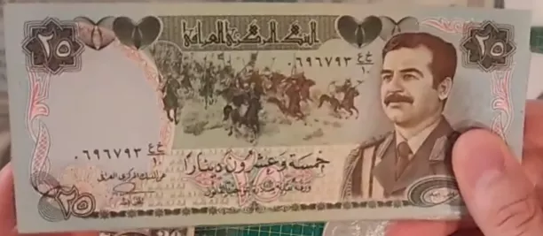

Tuttavia, le guerre del Golfo segnarono una svolta nella storia dello Swiss Dinar. L'Iraq, non potendo più fare affidamento sul suo fornitore inglese per la stampa dei suoi biglietti, si rivolse alla Cina. Questa transizione comportò una netta differenza nella qualità dei biglietti, con la versione cinese percepita come inferiore. Questa percezione non era infondata; i biglietti cinesi erano più facilmente falsificabili e suscettibili di sovrastampa da parte del governo, minacciando così il loro valore.

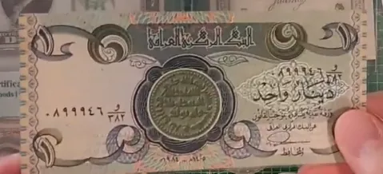

Un fenomeno distintivo emerse nell'economia irachena post-Golfo: il sistema dei prezzi doppi. I commercianti proponevano prezzi diversi a seconda del tipo di biglietto utilizzato per il pagamento, favorendo lo Swiss Dinar originale a discapito del biglietto cinese. Questo sistema rifletteva la fiducia mantenuta nei confronti dei biglietti di migliore qualità, meno suscettibili alla svalutazione, anche in un contesto in cui il valore era principalmente imposto dallo Stato. Questo episodio dimostra l'importanza delle caratteristiche intrinseche della valuta e come, anche in un regime di moneta fiat, la qualità percepita di una valuta possa influenzare il suo valore relativo e, di conseguenza, la fiducia degli attori economici.

#### Sì, le monete sono state effettivamente pesate!

La percezione comune associa spesso la moneta a una creazione statale, con la sua emissione e il suo valore regolati dallo Stato. Questo concetto trova le sue radici nelle antiche civiltà come Roma, dove le monete erano standardizzate e marchiate dall'Impero, conferendo così un valore ufficiale alle monete. Tuttavia, un'indagine più approfondita rivela che il valore intrinseco della moneta era principalmente derivato dal suo contenuto di metallo prezioso.

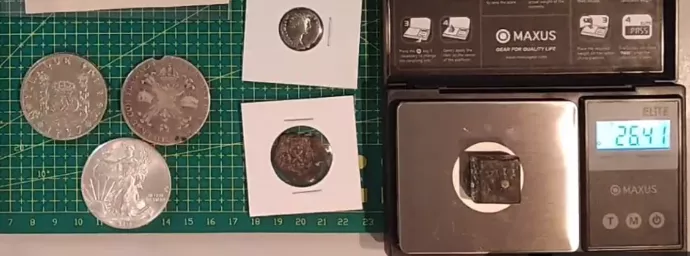

Un esempio concreto è illustrato attraverso l'esame di un peso monetario equivalente a otto reali spagnoli, o un dollaro spagnolo. Questo peso, contrassegnato da un numero romano che indica il suo valore, veniva utilizzato dai cambiavalute per valutare il valore delle monete in base al loro peso e non solo alla loro coniazione. Pesando le monete, i cambiavalute potevano determinare se fossero state alterate o danneggiate, il che avrebbe potuto ridurne il valore. Questa pratica mette in luce il fatto che, sebbene la coniazione standardizzata dello Stato conferisse un certo valore nominale alla moneta, il vero valore risiedeva nel peso del metallo prezioso contenuto.

Questa analisi dimostra che la fiducia nella moneta, e di conseguenza il suo valore, era ancorata alla sua sostanza tangibile piuttosto che alla semplice affermazione dello Stato. Sottolinea la dualità tra il valore nominale imposto dallo Stato e il valore intrinseco dettato dal contenuto di metallo prezioso. Pertanto, la moneta va oltre essere un semplice strumento statale, il suo valore fondamentale è intrinsecamente legato a elementi tangibili e misurabili.

#### Conclusioni

Concludendo, questo studio sulla svalutazione monetaria apre la porta a una comprensione approfondita dei meccanismi dell'inflazione, che saranno esplorati nei video successivi. Discuteremo dei diversi tipi di inflazione e della soglia in cui si trasformano in inflazione alta o iperinflazione. Questa solida base ci permetterà di affrontare le complessità dell'inflazione nelle prossime sessioni. Grazie per l'attenzione e ci vediamo nel prossimo video per continuare questa esplorazione delle dinamiche monetarie.

## I tipi di inflazione
<chapterId>b438fe09-375e-5bb2-9196-7dd687b9f98c</chapterId>

### L'inflazione non è un fenomeno multifattoriale

In questa sezione, esploreremo le diverse dimensioni dell'inflazione, un fenomeno spesso mal compreso. Sebbene l'inflazione sia spesso percepita come un fenomeno multifattoriale nei media e nelle discussioni comuni, è fondamentale ricordare che è, in fondo, un fenomeno monetario.

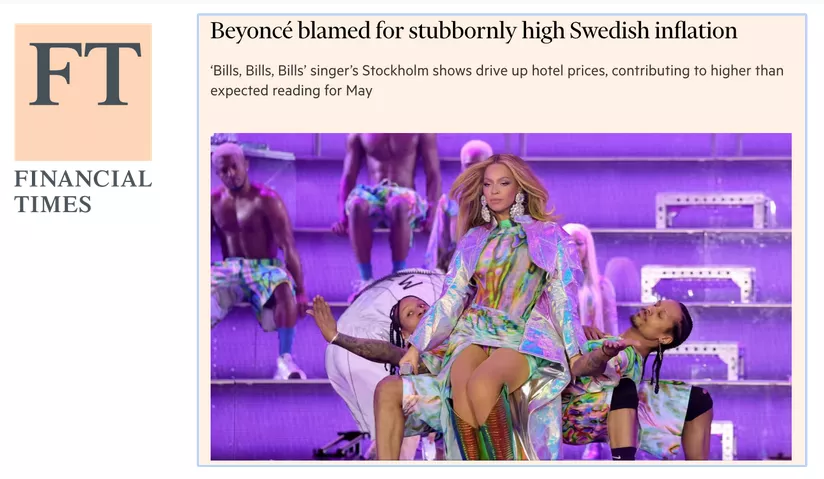

Ecco una scomposizione dell'argomento in diversi punti chiave:

- Differenza tra Aumento dei Prezzi e Inflazione:

  Un aumento dei prezzi può essere settoriale e causato da vari fattori come una diminuzione della produzione dell'OPEC per il petrolio o condizioni climatiche sfavorevoli per il grano.
  L'inflazione, d'altra parte, è definita da un aumento generalizzato dei prezzi su una gamma di beni e servizi, non solo in un settore specifico.

- L'Essenza Monetaria dell'Inflazione:
  Con una massa monetaria fissa, un aumento dei prezzi in un settore comporterebbe una diminuzione dei prezzi in altri settori, poiché la quantità di denaro disponibile per spendere altrove sarebbe ridotta. L'inflazione è strettamente legata a un aumento della massa monetaria che consente un aumento dei prezzi in tutti i settori contemporaneamente.

- Impatto della Massa Monetaria sull'Inflazione e sulla Deflazione:

  In un sistema a massa monetaria fissa, un aumento della produzione teoricamente dovrebbe portare a una deflazione, cioè una diminuzione dei prezzi, poiché ci sarebbero più beni e servizi disponibili.
  Nel sistema monetario fiat attuale, l'aumento della massa monetaria annulla la deflazione potenzialmente indotta dall'aumento della produzione.

- Effetti Perversi dell'Adattamento della Massa Monetaria:

  L'aumento della massa monetaria, senza un aumento corrispondente della produzione, porta all'inflazione, poiché c'è più denaro in circolazione per lo stesso numero di beni e servizi.
  Mentre l'aumento della produzione avrebbe dovuto portare a una deflazione, l'aumento simultaneo della massa monetaria ha annullato questo effetto, generando invece un'inflazione.

- Inflazione, Deflazione e Massa Monetaria: Vasi Comunicanti:

  L'inflazione e la deflazione sono come vasi comunicanti in un'economia. L'aumento della produzione può portare alla deflazione, ma se contemporaneamente viene aumentata la massa monetaria, l'effetto della deflazione viene annullato, generando inflazione.

Questa discussione sottolinea l'importanza di comprendere i meccanismi sottostanti l'inflazione e la deflazione e come la manipolazione della massa monetaria possa avere profonde ripercussioni sull'economia. Probabilmente torneremo su questi concetti in seguito per una comprensione più approfondita della loro interconnessione e del loro impatto sull'economia globale.

### Perché la stampa di denaro non sempre causa inflazione?

#### Inflazione ≠ IPC

L'inflazione, sebbene spesso associata all'aumento della massa monetaria, non presenta sempre una correlazione diretta con la stampa di denaro, come illustrato dal periodo successivo alla crisi finanziaria del 2008. Nonostante una significativa stampa di denaro per salvare le banche, il decennio successivo non ha registrato un'alta inflazione, situandosi in media tra lo 0 e il 2% all'anno. Questa situazione pone la question: perché la massiccia stampa di denaro non ha causato un'inflazione proporzionale? La risposta risiede in diverse sfumature legate alla misurazione dell'inflazione e all'indice dei prezzi al consumo (IPC o CPI in inglese).

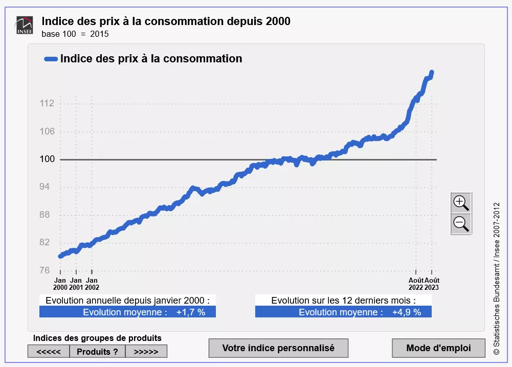

La prima spiegazione risiede nel modo in cui l'inflazione viene misurata. L'indice dei prezzi al consumo, utilizzato come principale indicatore dell'inflazione, presenta alcune lacune. Ad esempio, non tiene conto in modo esaustivo dell'evoluzione dei prezzi immobiliari. Sebbene l'IPC includa una componente legata agli affitti, l'apprezzamento sostanziale dei prezzi delle case non viene pienamente riflessa. Pertanto, aumenti significativi dei costi dell'alloggio possono verificarsi senza essere completamente catturati dall'IPC, potenzialmente sottostimando l'inflazione reale.

Inoltre, il calcolo dell'IPC include alcune metodologie che possono compensare o mascherare effettivi aumenti dei prezzi. Ad esempio, miglioramenti qualitativi dei prodotti possono essere utilizzati per adeguare l'indice. Se il prezzo di un prodotto aumenta, ma anche la sua qualità o le sue caratteristiche migliorano, l'IPC può considerare che il valore reale per il consumatore non sia cambiato e quindi non riflettere l'inflazione. Un caso illustrativo è quello in cui, nonostante l'aumento dei prezzi della carne bovina e dei computer a causa dell'iniezione di denaro, il miglioramento delle prestazioni dei computer viene utilizzato per compensare questo aumento. Se un computer costa il doppio ma è quattro volte più potente, l'IPC può interpretarlo come una diminuzione dei prezzi, mascherando così l'aumento del prezzo della carne bovina.

Queste sfumature nella misurazione dell'inflazione tramite l'IPC mettono in luce la complessità della relazione tra la stampa di denaro e l'inflazione. Suggeriscono anche che l'inflazione reale potrebbe essere più alta di quella riportata se si tenesse conto in modo più esaustivo di tutti gli aumenti dei prezzi, in particolare nei settori chiave come l'immobiliare. Questa analisi evidenzia l'importanza di comprendere i meccanismi sottostanti dell'inflazione e le limitazioni degli indici convenzionali utilizzati per misurarla, al fine di comprendere meglio l'impatto economico delle politiche monetarie.

#### Gli argomenti della MMT

La Modern Monetary Theory (MMT) propone una prospettiva distinta sulla creazione di denaro e sull'inflazione. Secondo la MMT, il denaro proviene principalmente dal governo che può stampare ingenti quantità per finanziare le proprie esigenze, senza causare inflazione fintanto che i settori mirati da questi fondi non sono saturi. Si tratta di un approccio che si discosta dalle teorie monetarie tradizionali e che sottolinea l'importanza delle capacità di assorbimento settoriali nella dinamica inflazionistica.

Un esempio illustrativo della MMT è il complesso militaro-industriale americano. Secondo la MMT, centinaia di miliardi di dollari possono essere destinati a questo settore senza causare inflazione, grazie alla sua capacità di assorbimento. Al contrario, se fondi consistenti vengono investiti nella costruzione di strade negli Stati Uniti, dove esiste un numero limitato di imprese e manodopera, potrebbe verificarsi un'inflazione a causa della scarsità delle risorse e dell'aumento dei costi richiesti dai fornitori.
Il caso del Giappone è spesso citato dai sostenitori della MMT come un altro esempio dell'assenza di inflazione nonostante una significativa creazione di moneta. Tuttavia, la situazione in Giappone evidenzia anche i limiti delle misure tradizionali dell'inflazione come l'Indice dei Prezzi al Consumo (IPC). In Giappone, gran parte del denaro stampato viene risparmiato o investito nell'immobiliare o nei mercati azionari, anziché essere speso nell'economia di consumo ordinaria. L'IPC, non catturando appieno queste dinamiche, può sottovalutare l'inflazione reale.

L'analisi del Giappone (https://ideas.repec.org/p/ces/ceswps/_9821.html) mette anche in luce come il comportamento degli agenti economici, come il risparmio o l'investimento in attività non incluse nell'IPC, possa mascherare l'impatto inflazionistico della creazione di moneta. Inoltre, la capacità dei diversi settori di assorbire la liquidità iniettata svolge un ruolo cruciale nella manifestazione o meno dell'inflazione.

#### Il bilancio delle banche e della banca centrale

Un terzo esempio del perché la creazione di moneta non causerebbe inflazione è che la relazione tra la creazione di moneta e l'inflazione è modulata dal modo in cui il denaro appena creato viene introdotto nell'economia. Se questo denaro rimane nel bilancio delle banche private senza essere prestato agli attori economici, non avrà un impatto diretto sull'economia reale e, di conseguenza, non causerà inflazione.

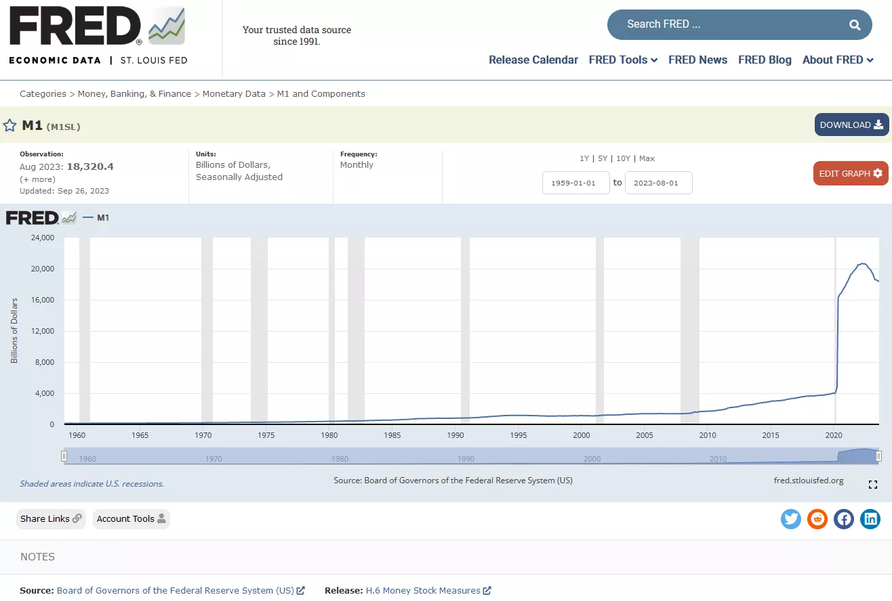

La creazione di moneta può essere considerata come una spada di Damocle sospesa sull'economia. Il denaro creato può rimanere latente per un certo periodo di tempo, senza effetti inflazionistici visibili, finché non viene iniettato nell'economia attraverso prestiti bancari o altri meccanismi. Tuttavia, quando questo denaro latente viene infine messo in circolazione, gli effetti inflazionistici possono manifestarsi. Questo è ciò che è stato osservato negli anni 2020, dove il denaro creato in precedenza ha trovato la sua strada nell'economia, portando a un'inflazione.
Questo scenario sottolinea l'importanza dei meccanismi di trasmissione monetaria nella determinazione dell'impatto inflazionistico dell'impressione di moneta. La creazione di moneta da parte della banca centrale è solo un elemento del puzzle. Il comportamento delle banche private, che decidono il volume dei prestiti da concedere, e il comportamento dei mutuatari, che decidono come spenderanno i soldi presi in prestito, sono anche elementi cruciali in questa dinamica.

#### L'inflazione è sociale!

L'esempio della Repubblica di Weimar illustra un altro aspetto cruciale della relazione tra l'impressione di moneta e l'inflazione: il ruolo delle aspettative e del comportamento degli agenti economici. Quando la Banca centrale della Repubblica di Weimar ha iniziato a stampare una grande quantità di moneta, l'incertezza economica ha portato le persone a accumulare denaro, cioè a conservarlo anziché spenderlo. Questa reazione ha temporaneamente ritardato gli effetti inflazionistici dell'impressione di moneta.

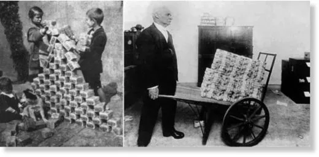

Tuttavia, quando la situazione economica ha iniziato a migliorare leggermente, la fiducia è stata gradualmente ripristinata. Le persone hanno quindi ritirato i loro risparmi dai nascondigli e hanno iniziato a spendere massicciamente nell'economia. Questo improvviso cambiamento di comportamento, combinato con una già elevata massa monetaria esistente, ha portato a un'esplosione della domanda. Con più denaro in circolazione e una domanda crescente, i prezzi hanno iniziato a salire rapidamente, portando a un'inflazione significativa.

Questo esempio mette in luce l'importanza del tempismo e dei comportamenti degli agenti nella manifestazione dell'inflazione. L'inflazione non si manifesta solo in risposta all'aumento della massa monetaria, ma anche in base al modo e al momento in cui questa moneta viene spesa nell'economia. Le incertezze economiche e le aspettative degli agenti economici giocano un ruolo cruciale in questa dinamica e possono accelerare o ritardare gli effetti inflazionistici dell'impressione di moneta.

#### Riepilogo:

- Indice dei Prezzi al Consumo (IPC): L'IPC è strutturato in modo da sottovalutare l'inflazione, il che può dare un'immagine distorta della realtà inflazionistica.

- Assorbimento Settoriale: L'iniezione di moneta in settori capaci di assorbirla non sempre porta all'inflazione. L'esempio principale è il complesso militare-industriale americano che può assorbire ingenti somme di denaro senza provocare inflazione.

- Caso del Giappone: Nonostante una significativa impressione di moneta, l'inflazione rimane bassa in Giappone perché i fondi vengono spesso risparmiati, investiti nell'immobiliare o nei mercati azionari. Questi settori assorbono la moneta stampata e l'IPC non riflette necessariamente gli aumenti dei prezzi in questi settori.
- Correlazione tra l'Impressione Monetaria e i Mercati: Si osserva che le curve dell'immobiliare e dei mercati azionari seguono spesso l'impressione monetaria, indicando dove viene indirizzato il denaro stampato.
- Riserva Monetaria delle Banche: Quando il denaro stampato rimane nei bilanci delle banche e non circola nell'economia, non causa inflazione. Questo è illustrato dall'esempio del 2008, in cui il denaro stampato è rimasto principalmente nei bilanci delle banche, ritardando l'impatto inflazionistico.

- Repubblica di Weimar: Questo periodo storico mostra come l'incertezza economica abbia portato all'accumulo di denaro, ritardando l'inflazione. Tuttavia, una volta ripristinata la fiducia e speso il denaro, l'inflazione è esplosa.

Questi esempi possono essere utilizzati nelle discussioni per spiegare perché l'inflazione non è sempre una conseguenza immediata dell'impressione monetaria e come i contesti economici e i comportamenti degli agenti influenzano l'inflazione.

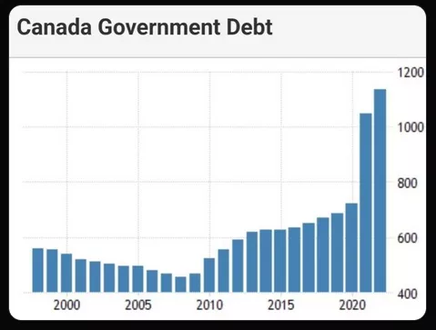

Perché, come dimostra bene questo [thread](https://twitter.com/saifedean/status/1673639779433590786): L'inflazione è tutto, tranne che colpa delle banche centrali.

- Economisti che attribuiscono l'inflazione al cambiamento climatico

- Esempio della Svezia che attribuisce l'inflazione a Beyoncé per un mese specifico.

- Banca centrale in Polonia che attribuisce l'inflazione all'aggressione russa in Ucraina e alla pandemia

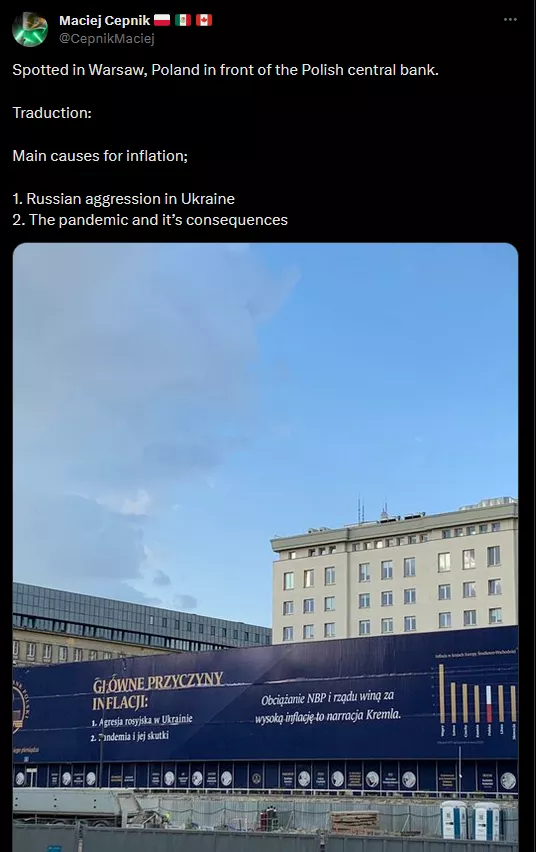

- Brexit incolpata per l'inflazione nel Regno Unito.

- Uscita del gioco Zelda associata a uno shock inflazionistico.

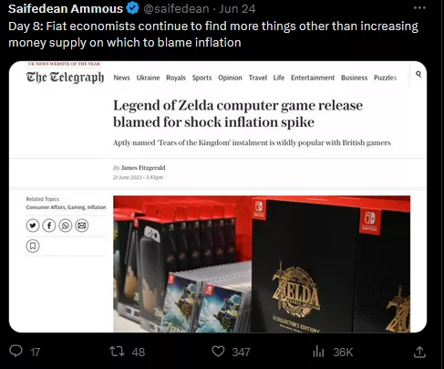

- Taylor Swift presumibilmente causa dell'inflazione.

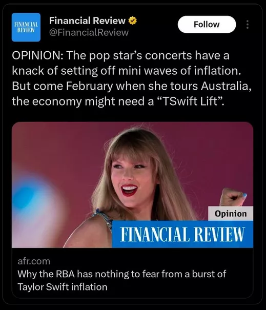

Come potrebbero Beyoncé o Taylor Swift spiegare un aumento generalizzato dei prezzi? Vedete che non ha senso. In sostanza:

### Esplorazione dei Tipi di Inflazione

È fondamentale comprendere la distinzione tra i diversi tipi di inflazione, una comprensione che ci consente di affrontare le varie manifestazioni di questo fenomeno economico. Ecco una chiarificazione su questi diversi tipi:

- Inflazione Rampante (Creeping Inflation): Questo è il tipo di inflazione che le banche centrali mirano generalmente a raggiungere, fissata a circa il 2% annuale. Questo obiettivo è stato adottato dagli anni '90 e mira a mantenere una crescita economica stabile senza surriscaldamento o deflazione.
- Inflazione Moderata (Inflazione camminante): Questa forma di inflazione si manifesta quando l'inflazione supera il target del 2%. È spesso associata a un'economia surriscaldata, uno stato in cui l'eccessiva offerta di moneta stimola un aumento generale dei prezzi. Questo scenario mette in evidenza i limiti delle politiche monetarie e talvolta rivela le contraddizioni nei discorsi economici.
- Inflazione Galoppante: L'inflazione galoppante, spesso definita inflazione a due cifre, si verifica quando il tasso di inflazione annuale supera il 10%. Segna un significativo aumento dei prezzi che può compromettere la stabilità economica.

- Iperinflazione: L'iperinflazione è un fenomeno estremo in cui il tasso di inflazione supera il 50% al mese, il che, a causa della natura esponenziale dell'inflazione, equivale a un'inflazione annuale superiore al 13.000%. Questo livello di inflazione destabilizza gravemente l'economia, rendendo la valuta quasi senza valore e causando una perdita di fiducia nel sistema monetario.

Nell'esplorazione dei tipi di inflazione, è comune incontrare termini come "Demand Pull" e "Cost Push" nelle risorse educative. Questi concetti, sebbene validi, tendono a spiegare gli aumenti dei prezzi piuttosto che l'inflazione come fenomeno monetario. Ecco un'analisi più approfondita:

- Demand Pull:
  L'inflazione di tipo Demand Pull è spesso spiegata come una situazione in cui la domanda nell'economia supera la produzione disponibile. Tuttavia, senza un aumento corrispondente della massa monetaria, questa situazione porterà semplicemente a una ridistribuzione delle spese. I consumatori potrebbero spendere di più per beni essenziali e meno per altri, neutralizzando così l'effetto inflazionistico complessivo.

- Cost Push:
  D'altra parte, l'inflazione di tipo Cost Push è attribuita all'aumento dei costi di produzione, come quelli delle risorse naturali o della manodopera. Ancora una volta, senza un aumento della massa monetaria, gli aumenti dei costi in un settore potrebbero semplicemente ridurre le spese in altri settori, senza causare un'inflazione diffusa.

Spiegazioni tradizionali spesso associano gli aumenti dei prezzi all'inflazione, il che può portare a confusione. In realtà, affinché si verifichi un'inflazione generalizzata, è necessario un aumento della massa monetaria. In questo contesto, i concetti di Demand Pull e Cost Push possono spiegare le variazioni dei prezzi settoriali, ma non catturano la natura monetaria dell'inflazione. Ciò sottolinea l'importanza di distinguere tra gli aumenti dei prezzi settoriali e l'inflazione generalizzata, e ribadisce la necessità di un aumento della massa monetaria affinché l'inflazione si manifesti nell'economia. Questa analisi offre una prospettiva più sfumata e precisa sulle vere cause dell'inflazione e smitizza le interpretazioni comuni che possono nascondere la dinamica monetaria sottostante.

### Classificazione dell'inflazione secondo Bernholz

Bernholz propone una classificazione semplificata ma precisa dell'inflazione in tre categorie, che permette di comprendere meglio questo complesso fenomeno monetario:

- Inflazione moderata:
  L'inflazione moderata si manifesta quando il livello della massa monetaria è superiore alla norma, ma lo Stato non ricorre a ampi deficit finanziati dalla creazione monetaria. Sebbene il termine "moderata" possa sembrare insignificante, questa forma di inflazione può causare problemi significativi, anche se non è classificata come alta inflazione.

- Alta inflazione:
  L'alta inflazione si verifica quando il valore reale della massa monetaria diminuisce nonostante un aumento in termini nominali. Questa situazione paradossale deriva dalla sostituzione monetaria, in cui le persone perdono fiducia nella valuta nazionale e cercano di scambiarla con beni, servizi o valute estere. Questo processo riduce ulteriormente il valore reale della moneta, aggravando così l'inflazione.

- Iperinflazione:
  L'iperinflazione è un'estensione dell'alta inflazione, caratterizzata da ampi deficit di bilancio finanziati dalla creazione monetaria. Storicamente, non è stato osservato nessun caso di iperinflazione senza un sostanziale finanziamento deficitario tramite la stampa di moneta. L'iperinflazione genera un circolo vizioso: l'inflazione erode così rapidamente il valore della moneta che le entrate fiscali si deprezzano prima ancora che lo Stato possa riscuoterle, costringendo così lo Stato a stampare ancora più moneta per finanziarsi. Questo ciclo auto-rinforzante porta a tassi di inflazione astronomici, spesso superiori al 50% al mese.

Questa classificazione di Bernholz mette in luce la pericolosa progressione dall'inflazione moderata all'iperinflazione e sottolinea l'importanza cruciale del controllo monetario e di bilancio per prevenire le spirali inflazionistiche distruttive. Dimostra anche che le conseguenze negative sul finanziamento statale possono verificarsi molto prima di raggiungere lo stadio dell'iperinflazione, offrendo così una prospettiva sfumata sulle implicazioni dell'inflazione a diversi livelli.

### Conclusioni: Sintesi sui Tipi di Inflazione

In conclusione, abbiamo esplorato una vasta gamma di tipi di inflazione, iniziando con termini spesso sentiti come "inflazione strisciante", "inflazione camminante" e "inflazione galoppante", ognuno dei quali indica diversi livelli percentuali di inflazione all'interno di un'economia. Tuttavia, per il nostro studio approfondito sull'iperinflazione, le categorie di inflazione moderata, alta inflazione e iperinflazione, come descritte da Bernholz, si rivelano essere punti di riferimento cruciali.

- Inflazione Moderata:
  Segnala un livello di massa monetaria superiore alla norma, anche se questo livello può essere mantenuto senza un significativo finanziamento deficitario da parte dello Stato.

- Alta Inflazione:
  Si verifica quando il valore reale della massa monetaria diminuisce, spesso a causa della sostituzione monetaria, in cui le persone cercano di scambiare la propria valuta con beni, servizi o altre valute.

- Iperinflazione:
  Rappresenta una versione estrema dell'alta inflazione, in cui una creazione eccessiva di moneta per finanziare ampi deficit di bilancio provoca un rapido deterioramento del valore reale della valuta.

Ciò che emerge dalla nostra esplorazione è che l'iperinflazione è un fenomeno complesso e controintuitivo. Sebbene si possa supporre che l'iperinflazione sia il risultato di un aumento massiccio della massa monetaria, in realtà deriva da una diminuzione del valore reale di questa massa monetaria. Questa sfumatura è cruciale per capire perché alcuni paesi faticano a uscire dall'iperinflazione, anche con il sostegno di istituzioni internazionali come la Banca Mondiale o il FMI. Una cattiva caratterizzazione del tipo di inflazione può portare all'applicazione di rimedi inappropriati, aggravando i problemi economici anziché risolverli.

Nelle nostre future discussioni, approfondiremo ulteriormente l'iperinflazione, esplorando le sue definizioni e manifestazioni in vari contesti economici. Il nostro obiettivo sarà quello di svelare i meccanismi sottostanti dell'iperinflazione e di esplorare le possibili soluzioni per affrontarla. Questa comprensione sfumata ci permetterà di affrontare meglio le sfide associate e di proporre strategie informate per la gestione dell'inflazione.
Grazie per la vostra attenzione, la prossima sessione sarà interamente dedicata a definire e svelare l'iperinflazione, tenendo conto delle diverse prospettive accademiche e pratiche. Siamo entusiasti di continuare questa esplorazione con voi nel nostro prossimo incontro.

# Cos'è l'iperinflazione?
<partId>3f541663-1e2f-5410-8ee0-f61c5d009fa5</partId>

## Le definizioni di iperinflazione
<chapterId>d2a71a2e-5f36-58d9-993c-d431f4aa07fd</chapterId>

### Le definizioni di iperinflazione

In questa sezione, esploreremo le diverse definizioni di iperinflazione, un termine cruciale nello studio dei fenomeni monetari estremi. La definizione più riconosciuta proviene da Philip Cagan, che nel suo lavoro del 1956, "The Monetary Dynamics of Hyperinflation", propone una comprensione quantitativa dell'iperinflazione. Secondo Cagan:

- Inizio e fine dell'iperinflazione:
  - L'iperinflazione inizia quando l'inflazione mensile supera il 50%.
  - Termina quando il tasso di inflazione scende al di sotto del 50% al mese per almeno un anno.

Per illustrare, se l'inflazione scende al 40% a luglio e non risale sopra il 50% fino a luglio dell'anno successivo, allora il periodo di iperinflazione è considerato terminato a luglio dell'anno precedente. Questa definizione consente una caratterizzazione precisa degli episodi di iperinflazione, consentendo un'analisi strutturata.

Questa definizione è stata adottata nella tabella Hanke-Krus, che documenta 56 episodi di iperinflazione. Tuttavia, la tabella non copre tutti gli episodi, come quello del Venezuela nel 2016, portando il totale a 57.

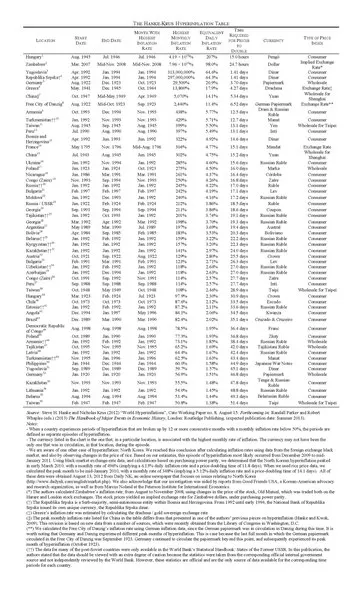

È importante notare che questa definizione, sebbene precisa, potrebbe escludere alcuni episodi di iperinflazione a causa della rigidità della soglia del 50%. Esiste la possibilità di ampliare questa definizione per includere altri episodi che, sebbene non rispondano strettamente al criterio di Cagan, rappresentano comunque periodi di inflazione estremamente elevata. Questa osservazione apre la porta a una più ampia esplorazione dei fenomeni dell'iperinflazione, consentendo una comprensione più sfumata delle sue cause e dei suoi effetti. Nelle discussioni successive, prenderemo in considerazione la possibilità di rivedere questa definizione ed esaminare episodi di iperinflazione non coperti dal rigido criterio di Cagan.

### La Definizione dell'Iperinflazione secondo Cagan

Philip Cagan, nel definire l'iperinflazione, potrebbe aver stabilito un punto di riferimento arbitrario con la soglia del 50% di inflazione mensile. Ammette egli stesso che questa definizione è arbitraria e serviva principalmente alla sua analisi basata su sette episodi di iperinflazione. L'esame dei dati di Cagan rivela che i tre episodi di iperinflazione con i tassi di inflazione mensili più bassi erano intorno al 47%, 46% e 57%. Sembra che la soglia del 50% sia stata scelta per includere questi casi nel suo studio.

- Contesto Storico:
  La definizione di Cagan risale al 1956 e si basa su un numero limitato di episodi di iperinflazione disponibili in quel periodo.

- Osservazioni di Cagan:
  Secondo Cagan, nessun episodio ha raggiunto questa soglia di circa il 50% senza evolvere verso un'iperinflazione più grave, il che potrebbe giustificare la scelta di questa soglia.

- Critica alla Definizione di Cagan:
  Altri economisti, come Bernholz, autore di Monetary Regime and Inflation, hanno anche definito la soglia del 50% arbitraria.
  Bernholz osserva che ci sono episodi di alta inflazione che presentano le stesse caratteristiche qualitative degli episodi di iperinflazione, senza raggiungere la soglia del 50%.

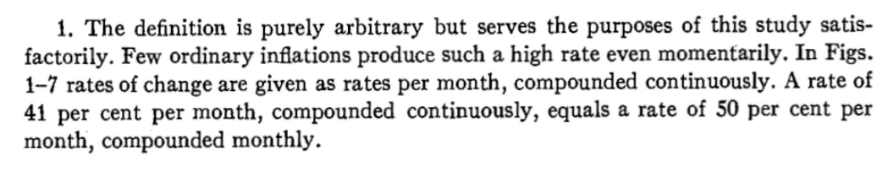

Questa riflessione ci porta a interrogare la rigidità della tradizionale definizione di iperinflazione e sottolinea la necessità di forse rivedere questa soglia integrando più episodi e dati storici. La definizione di iperinflazione potrebbe richiedere flessibilità per includere diverse manifestazioni di inflazione estrema in contesti economici e storici diversi.

### La Definizione dell'Iperinflazione secondo l'International Accounting Standards Board (IASB)

Quindi, quanti casi di iperinflazione ci sono in totale?

Le definizioni comuni di iperinflazione, come quella avanzata da Kagan che stabilisce un'inflazione mensile del 50%, possono talvolta essere confuse o riduttive. Ad esempio, due paesi con tassi di inflazione annuale rispettivamente del 1.000% e del 3.000% possono essere percepiti in modo diverso a seconda della distribuzione mensile di questa inflazione. Se nessun mese supera la soglia del 50%, secondo la definizione di Kagan, questi paesi non sarebbero in uno stato di iperinflazione. Questo approccio può quindi portare ad anomalie nella classificazione dell'iperinflazione, soprattutto quando si confrontano inflazioni cumulative nell'arco dell'anno.

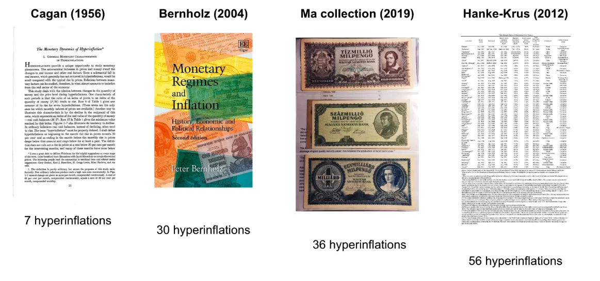

- Il libro di Kagan, "Monetary Dynamics of Hyperinflation", che fornisce un'analisi fondamentale dell'iperinflazione.
- Il libro di Bernold che studia 30 periodi di iperinflazione distinti, ampliando così lo spettro di analisi.
- La collezione personale di banconote di David provenienti da 36 periodi di iperinflazione, consentendo una comprensione tangibile e storica.
- La tabella Hanky Cross (versione 2012, aggiornata nel 2016 con il Venezuela), che elenca 57 periodi di iperinflazione basati sulla definizione di Kagan.

È importante notare che alcuni periodi storici di alta inflazione non sono inclusi nelle tabelle classiche dell'iperinflazione, spesso a causa dei criteri rigorosi di classificazione. Ad esempio, durante la guerra d'indipendenza degli Stati Uniti nel novembre 1779 e durante la guerra civile americana nel marzo 1864, i tassi di inflazione mensile erano rispettivamente del 47,4% e del 40%. Questi tassi, sebbene elevati, non superano la soglia del 50% stabilita da Kagan, escludendo così questi periodi dai casi classificati come iperinflazione. Questa omissione illustra i limiti delle definizioni rigide e sottolinea la necessità di un approccio più sfumato per comprendere l'iperinflazione nella sua complessità.

## Similitudini tra Weimar e Zimbabwe
<chapterId>11eef458-aab8-5c63-8523-264d0ba69f5d</chapterId>

### Due epoche, due catastrofi

In questo capitolo esploreremo gli impatti dell'iperinflazione, concentrandoci sui casi dello Zimbabwe e della Repubblica di Weimar. Nel corso delle mie ricerche, ho privilegiato l'esplorazione di testimonianze dirette di individui che hanno vissuto questi periodi di iperinflazione, in opposizione a un approccio puramente economico o statistico.

Alcuni libri sono stati particolarmente istruttivi:

- "When Money Dies" di Adam Ferguson, ripercorre l'iperinflazione post-Prima Guerra Mondiale in Germania, così come in Austria e Ungheria.
- Two books on hyperinflation in Zimbabwe: "Zimbabwe Warm Heart Ugly Face" and "Hard Boiled Egg Index" by Jérôme Gardner and Kudzai Joseph Gou Min-Yu respectively, offer poignant testimonies from a CEO of a clothing store chain and an agricultural banker on their experiences during this tumultuous period.

As I consolidated my notes, I discerned a multitude of similarities between the experiences of hyperinflation in Zimbabwe and the Weimar Republic, despite the 90-year gap between them. I identified about 17 similarities, of which 13 illustrated a sort of progression towards the economic disaster depicted in these testimonies. These fascinating parallels demonstrate the repetitive and devastating nature of hyperinflation across time and borders. Today, we will examine these similarities and how they depict a worrisome trajectory during periods of hyperinflation.

### Comparative Analysis: Zimbabwe and the Weimar Republic

The game of 14 differences!

1. Currency shortage

When currency depreciates at a dizzying speed, even the most ambitious attempts to flood the market with new banknotes can prove insufficient. The incessant demand for tangible currency can far surpass the capacity of central banks to produce banknotes, creating unprecedented liquidity crises.

> Weimar: "During this month, it will be increased to almost 4 billion paper marks, a figure with which it is hoped that the currency shortage will be definitively overcome."

> Zimbabwe: "From 2002 to January 2009, there were several critical liquidity shortages. There simply weren't enough banknotes printed or in circulation to keep up with the galloping inflation."

2. "And it's manure!"

The speed at which currency can lose its value in certain economic situations is staggering. Astronomical amounts of banknotes can be issued in record time, almost instantly turning once considerable sums into something as insignificant as manure.

> Weimar: "The current total issue amounts to 63,000 billion. In a few days, we will therefore be able to issue two-thirds of the total circulation in one day."

> Zimbabwe: "On September 17, 2006, the governor of the RBZ, Gideon Gono, declared: '10 trillion is still out there and it has become manure.'"

3. Banknotes worth less than the paper they are printed on
   In alcune circostanze economiche, il valore intrinseco di una banconota può diventare inferiore al valore della carta su cui è stampata. Questa drastica svalutazione trasforma le banconote, normalmente simboli di valore e potere d'acquisto, in semplici pezzi di carta senza valore di mercato.
   > Weimar: "Interi tagli di banconote in marchi erano senza valore quasi appena usciti dalla stampa."

> Zimbabwe: "La Banca centrale aveva sprecato denaro stampando una banconota che non valeva nemmeno la carta su cui era stampata. In altre parole, il suo valore era inferiore a quello della carta igienica. Per quanto assurdo possa sembrare, era più conveniente utilizzare la banconota da ZWD 100 trilioni come carta igienica anziché acquistare la vera carta igienica."

4. Conteggio del denaro

Quando la valuta perde rapidamente valore, anche le transazioni più semplici possono diventare complesse. Calcolare il prezzo di un articolo o semplicemente contare le banconote necessarie per un pagamento può richiedere diversi minuti, aggiungendo un livello di complessità alle interazioni quotidiane.

> Weimar: "L'acquisto più comune in un negozio richiedeva tre o quattro minuti di calcoli, e una volta determinato il prezzo, di solito erano necessari altri minuti per contare le banconote."

> Zimbabwe: "Ai responsabili dei negozi era anche consentito assumere un lavoratore occasionale per sostituire il membro del personale che contava denaro tutto il giorno. Naturalmente, contare il denaro in negozio per l'amministrazione e il deposito in banca era una cosa, ma l'intero processo doveva essere ripetuto in banca al momento del deposito."

Tecnica di conteggio del denaro dall'Uzbekistan

5. Pagamenti con assegno

In economie turbate, i metodi di pagamento tradizionali, come gli assegni, possono rapidamente perdere efficacia. Le banche, sopraffatte dalla crescente domanda di denaro dovuta all'iperinflazione, possono razionare o ritardare l'incasso degli assegni, riducendone così il valore effettivo. Questa instabilità porta spesso a una gerarchia dei metodi di pagamento, in cui i prezzi possono variare a seconda del modo scelto per pagare.

> Weimar: "L'aumento dei prezzi ha intensificato la domanda di denaro, sia da parte dello Stato che da parte di altri datori di lavoro. Le banche private non potevano soddisfare affatto la domanda e dovevano razionare l'incasso degli assegni, in modo che gli assegni non incassati rimanessero bloccati mentre il loro potere d'acquisto si esauriva."
> Weimar: “Les banques du monde”
> Weimar: "Le loro transazioni venivano effettuate principalmente attraverso i cosiddetti Winkelbankiers, gli operatori di strada che erano emersi con l'inflazione e che, prosperando in un'economia malata, vivevano interamente sfruttando la differenza tra i prezzi di acquisto e di vendita delle valute estere."
> Zimbabwe: "Erano anche cambiavalute. Operavano impunemente tra la Seconda e la Sesta Avenue e Fort Street a Bulawayo, grazie alle loro abili pratiche commerciali che coinvolgevano la corruzione e altre pratiche. Questa zona della città era conosciuta come 'Banca Mondiale'."

> Argentina: "Quindi sono andato dove vanno tutti gli argentini: le cuevas, le 'grotte', che si trovano nel quartiere di Florida nel cuore di Buenos Aires." - TheBigWhale

9. Il cambio di valuta era illegale

I governi, nel tentativo di stabilizzare la propria valuta e controllare il flusso di capitali, possono rendere illegali queste transazioni in valuta estera. Queste misure repressive, sebbene destinate a proteggere l'economia nazionale, possono spesso avere l'effetto opposto, aumentando la diffidenza del pubblico e incoraggiando il mercato nero.

> Weimar: "Le persone iniziarono a fare affari tramite il baratto e si rivolsero gradualmente alle valute estere come unico mezzo di scambio affidabile. Furono introdotti nuovi decreti riguardanti l'acquisto di cambiali estere e l'uso di valute estere per i pagamenti interni. Oltre alla reclusione, potevano essere inflitte multe fino a dieci volte l'importo di una transazione illegale."

> Zimbabwe: "Raid nelle aziende hanno portato all'arresto di diversi uomini d'affari di Bulawayo per il fine settimana e a multe pari al doppio dell'importo delle valute recuperate, poi questa audacia si è attenuata."

10. Controllo dei capitali

Quando un paese si trova di fronte a una crisi monetaria o economica, una delle risposte comuni dei governi è esercitare un controllo rigoroso sui movimenti e le forme di capitale. Che sia attraverso ordinanze che impongono l'accettazione di valute nazionali svalutate o attraverso severe sanzioni contro coloro che rifiutano determinati metodi di pagamento, queste misure spesso mirano a contenere il panico e ripristinare la fiducia. Tuttavia, l'efficacia varia e a volte queste misure possono rivelarsi controproducenti o distanti dalla realtà vissuta dai cittadini.
Weimar: "I commercianti erano recentemente stati costretti da un nuovo editto ad accettare le banconote dello Stato; ma poiché consentiva anche l'uso continuo di valute straniere per tutti gli acquisti, i commercianti trovavano di solito scuse per accettare quasi nulla di diverso."

Zimbabwe: "Il governo ha introdotto il SI 175/2008 il 12 dicembre 2008 riguardante il pagamento con assegni. Stabiliva: 'La pena per aver rifiutato un pagamento con assegno/carta di credito o un altro metodo di pagamento elettronico mediato da una banca sarà una multa di livello 8 o una pena detentiva di sei mesi o entrambe'. Ovviamente, abbiamo ignorato il SI perché era completamente fuori dalla realtà."

11. Obbligati a tenere aperti i loro negozi

Quando l'economia collassa e la moneta perde valore, i governi possono adottare misure drastiche per mantenere un'apparenza di normalità.

Weimar: "I commercianti che continuavano la loro attività erano soggetti a un nuovo decreto, emanato il 22 ottobre, che li obbligava a tenere aperti i loro negozi e a offrire merci in cambio di marchi di carta."

Zimbabwe: "C'erano solo scaffali di acciaio vuoti e frigoriferi, refrigeratori e congelatori vuoti. La tragedia era che il negozio era ancora aperto, perché non osavano chiudere a causa delle tensioni politiche e della paura che i leader fossero arrestati dalla forza di controllo dei prezzi del governo. Anche i lavoratori non venivano licenziati, perché tutti pensavano che ci sarebbe stata una soluzione rapida."

12. Tutti sono criminali

Di fronte a un'economia in rovina e a regolamentazioni onnipresenti, il confine tra sopravvivenza e criminalità diventa sfocato.

Weimar: "Tutti i crimini contro lo Stato, ognuno di essi, in varie misure, diventavano una questione di sopravvivenza per gli individui."

Zimbabwe: "Ogni residente in Zimbabwe era un criminale. Per quanto duro possa sembrare, era vero. Con la miriade di piccole leggi che regolavano ogni aspetto della vita, era inevitabile che ognuno violasse una legge ogni giorno. Possedere valute straniere era illegale, secondo un SI pubblicato nel 2004. Avere più conti bancari per aggirare il limite giornaliero di prelievo era illegale. Non avere le giuste targhe sulla tua auto, o non avere una licenza radio per l'auto o non avere un permesso per il generatore, erano tutte leggi che qualcuno, da qualche parte, stava violando."

13. Acquistare valuta estera a qualsiasi prezzo

L'acquisto frenetico di valuta estera spesso ha segnato una svolta critica nella svalutazione monetaria, aggravando la caduta del valore intrinseco.

> Weimar: "Mannheimer, su istruzione del suo capo, uscì nell'agosto 1921 e iniziò ad acquistare valuta estera a qualsiasi prezzo - 'perché la Germania aveva una quantità infinita di marchi di carta ma non di valuta estera.' Questo fu il primo segno del crollo assoluto del valore del marco."

> Zimbabwe: Si è sostenuto che venivano loro dati obiettivi giornalieri da raggiungere, poiché alcune delle richieste di valuta estera erano urgenti e avrebbero comprato a qualsiasi tasso per accumulare valuta estera per rispettare la scadenza. Questa presunta pratica è stata accusata di alimentare il fuoco della svalutazione mentre il valore del dollaro zimbabwese continuava a precipitare."

### Riassunto dello sviluppo

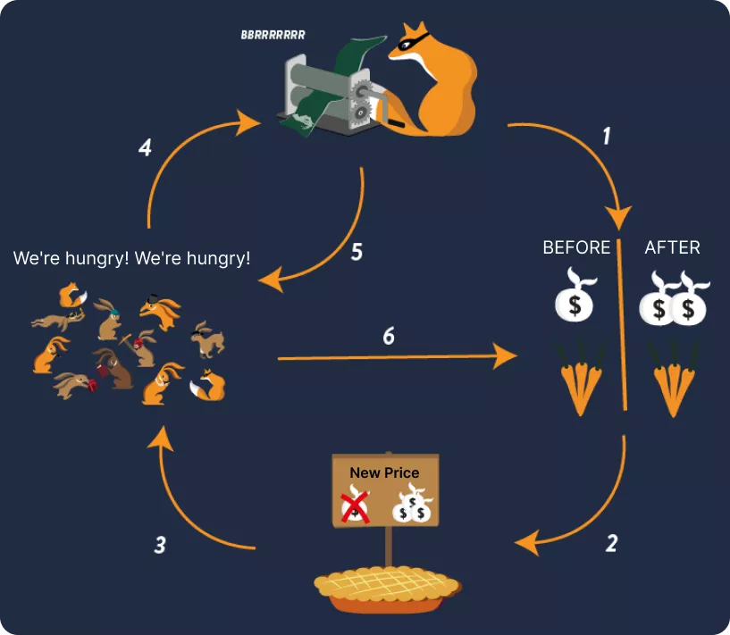

Nell'analisi del percorso economico, è evidente che quando si raggiunge un'alta inflazione, il valore della massa monetaria si degrada. Questa svalutazione porta a diverse complicazioni, tra cui la scarsità di banconote. In questo contesto, si manifestano opportunità di arbitraggio, in particolare con le fluttuazioni dei tassi di cambio. Di conseguenza, molte persone si rivolgono a questo arbitraggio, investendo massicciamente in asset tangibili, nell'anticipazione di una futura svalutazione monetaria che consentirebbe loro di ripagare i debiti con una moneta indebolita. Questo ambiente economico danneggia l'attrattiva dei lavori tradizionali e, di conseguenza, erode la coesione sociale.

Di fronte a questa situazione, lo Stato impone regolamentazioni draconiane, tra cui i controlli sui capitali. Impone anche ai commercianti di accettare la valuta nazionale e i controlli. Man mano, vengono promulgate nuove leggi che ampliano la definizione di comportamenti criminali. Alla fine, il tasso di cambio sale in modo esponenziale, poiché lo Stato è disposto a scambiare la sua valuta, stampata a basso costo, con valute estere più robuste.

### 4 Somiglianze nelle conseguenze dell'iperinflazione

1. Petrolio e metalli

In Germania durante il periodo di Weimar, il furto di materiali preziosi era tale che il piombo dai tetti veniva frequentemente rubato. In Zimbabwe, la disperazione ha spinto alcuni a interrompere la rete elettrica per estrarre olio dai trasformatori e usarlo nei loro veicoli.
Nel contesto di un'economia in deterioramento e scarsità di risorse, i governi possono implementare sistemi di razionamento per controllare la distribuzione di beni essenziali. Questo include l'uso di buoni o voucher per regolare l'acquisto di benzina o carburante.

> Weimar: "A Berlino, a causa della scarsità di benzina, è stato implementato un sistema di buoni per regolare la sua distribuzione. Ogni cittadino riceveva una quantità specifica di buoni che gli permetteva di acquistare una quantità limitata di carburante."

> Zimbabwe: "Durante la crisi del carburante, il governo ha introdotto un sistema di buoni per gestire la distribuzione della benzina. Ogni individuo riceveva un numero determinato di buoni che potevano essere scambiati per una certa quantità di carburante."
> Le popolazioni cercano alternative stabili per le transazioni. A Weimar, prodotti come l'ottone e il carburante servivano come mezzi di scambio a causa del loro costante valore intrinseco. In Zimbabwe, di fronte alla rapida svalutazione del dollaro zimbabwese, i buoni benzina, che rappresentavano una quantità fissa di un prodotto essenziale, diventavano una valuta de facto. Queste situazioni evidenziano come le società si adattino a condizioni economiche estreme, trovando soluzioni innovative per mantenere il commercio e l'economia in movimento.

Weimar: "Il baratto era già una forma comune di scambio; ma ora, beni come l'ottone e il carburante diventavano la valuta comune per acquisti e pagamenti."

Zimbabwe: "Ora usavamo questi voucher per pagare l'affitto ai proprietari di immobili, le tasse comunali, le bollette telefoniche, infatti, quasi tutto, poiché tutti avevano smesso di accettare pagamenti in dollari zimbabwesi e assegni."

#### Conclusione

Questo conclude questo video sulle somiglianze delle esperienze durante i periodi di iperinflazione in Zimbabwe e nella Repubblica di Weimar. Nel prossimo video, discuteremo le differenze e i paralleli contemporanei. Grazie.

## Weimar vs Zimbabwe: Differenze e Paralleli Contemporanei
<chapterId>643f279c-d89f-5600-a2e2-b1bbbba0ab69</chapterId>

In questo capitolo, esploreremo le differenze e i paralleli contemporanei tra i periodi passati e presenti di iperinflazione, con aneddoti e confronti pertinenti per oggi.

### Differenze tra la Repubblica di Weimar e lo Zimbabwe

1. È colpa del dollaro!

In Germania, era comune che la popolazione attribuisse l'inflazione all'ascesa del dollaro piuttosto che alla svalutazione intrinseca della propria moneta. Molti credevano che il fenomeno osservato fosse dovuto a un apprezzamento del dollaro. Questa percezione negava qualsiasi riconoscimento del legame tra le loro difficoltà economiche e la svalutazione monetaria, principalmente indotta dalla creazione eccessiva di denaro. Il libro "When Money Dies" illustra chiaramente questa mancanza di comprensione tra la popolazione tedesca. Al contrario, in Zimbabwe, la situazione era diversa: i cittadini erano pienamente consapevoli della causa sottostante dell'iperinflazione che stavano vivendo.

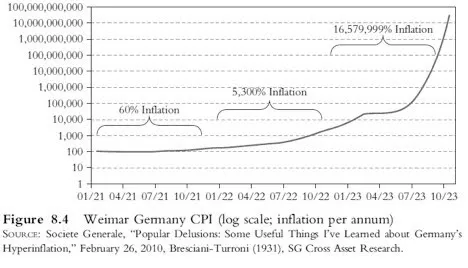

2. Moneta di necessità (Notgeld)

Di fronte alla crisi monetaria ed economica, la Germania ricorreva al "Notgeld" (denaro d'emergenza). Queste banconote, stampate da città o alcune aziende, erano progettate per affrontare la carenza di moneta comune.
Curiosamente, anche la Francia ha fatto ricorso al Notgeld, in particolare negli anni '20. Questa iniziativa non fu solo una diretta conseguenza dell'iperinflazione, ma aveva anche radici nelle perturbazioni causate dalla Prima Guerra Mondiale. La guerra non solo destabilizzò l'economia, ma aumentò anche il costo dei metalli. Di conseguenza, il valore intrinseco delle monete metalliche spesso superava il loro valore nominale, spingendo le persone a tesaurizzarle. In assenza di monete, alcune istituzioni, come la Camera di Commercio di Lione, stamparono il loro proprio Notgeld.

> "Quello che deve essere fatto, deve essere fatto." - un detto locale

Tra i Notgeld, spicca una particolare banconota. Presenta un'illustrazione toccante: al centro, un individuo è raffigurato mentre defeca una Mark. Sul retro, una tabella dei prezzi dal 1913 al 1921 illustra l'ascesa dell'inflazione in quel periodo.

L'artista dietro questo Notgeld sembra fare una critica ironica alle autorità responsabili della crisi dell'iperinflazione. La banconota porta l'iscrizione "La necessità non conosce legge". Un'altra espressione specifica della località di origine del Notgeld afferma: "Quello che deve essere fatto, deve essere fatto".

> "la necessità non conosce legge"

> La prima Shitcoin: Aneddoticamente, guardando l'illustrazione centrale della banconota, dove la valuta è letteralmente svalutata dall'azione dell'individuo, potrebbe essere chiamata la prima "shitcoin".

3. Obbligazioni e Mutui

A Weimar, alcuni debiti sono stati rivalutati per compensare l'impatto dell'inflazione. Questa misura non è stata adottata in Zimbabwe.

> Weimar: "Una decisione di rivalutare i prestiti governativi è diventata legge nel 1925, risultando in azionisti che ricevevano il 2,5 percento del loro investimento iniziale a condizione che tutte le riparazioni fossero state pagate."

> Zimbabwe: "Nel luglio 2007 (tre anni dopo), potevo estrarre dalla mia tasca una banconota svalutata di ZDW 500.000, ora valutata $1.67 al tasso di mercato parallelo, e ripagare il mutuo ipotecario, che doveva essere estinto in vent'anni. Inoltre, questa nota rappresentava solo lo 0,49 percento del mio stipendio mensile per lo stesso mese."

Per saperne di più sulla gestione della crisi tedesca, questo libro è altresì essenziale.

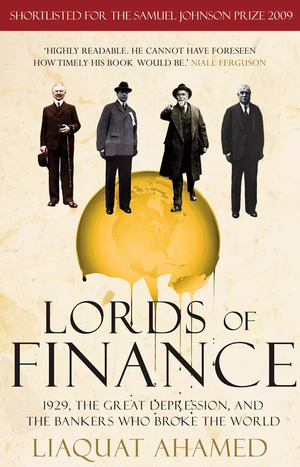

### Paralleli contemporanei

1. Manipolazione della politica monetaria per controllare l'economia.
   Nella storia della Repubblica di Weimar, è evidente che gli industriali erano restii all'apprezzamento del Marco. La loro capacità di prendere in prestito e rimborsare i loro debiti con una valuta fortemente svalutata offriva loro un vantaggio considerevole. Questo meccanismo ha facilitato la costruzione di enormi complessi industriali a costi quasi nulli. Questi industriali temevano un'apprezzamento del Marco perché ostacolava le loro attività. Alcuni vedevano addirittura di buon occhio l'inflazione galoppante, ritenendo che garantisse l'occupazione alla popolazione. Tuttavia, non misuravano l'impatto negativo di questa inflazione sul risparmio e sull'economia in generale. Per questi attori economici, la stampa di moneta era una manna dal cielo.

> Weimar: "È per questa ragione che un'apprezzamento del Marco era fortemente temuto, e anche le poche settimane di 'stabilità' dopo Genova hanno causato una stagnazione degli affari."

> Weimar: "Gli ambienti industriali erano confrontati al pericolo che il denaro contante diventasse più prezioso delle merci, e a un crollo quando tutti avrebbero cercato di convertire i loro beni in denaro."

Un parallelo contemporaneo può essere tracciato con le dichiarazioni di Christine Lagarde, suggerendo che i cittadini dovrebbero privilegiare la prospettiva di un impiego piuttosto che la protezione dei loro risparmi. Proprio come gli industriali di Weimar, sembra che lei preconizzi la stampa di moneta come uno strumento per stimolare l'occupazione, a discapito del valore del risparmio.

> Christine Lagarde: "Dovremmo essere più felici di avere un lavoro piuttosto che vedere i nostri risparmi protetti."

2. Proprietà privata in tempi di conflitto

La storia della Repubblica di Weimar rivela che, durante questo periodo, gli averi e i capitali detenuti all'estero furono confiscati. Questa misura richiama eventi più recenti in Russia, soprattutto all'inizio di un conflitto. Queste situazioni mettono in evidenza una realtà preoccupante: in periodi di crisi, il rispetto della proprietà privata può essere compromesso. È un parallelo storico e contemporaneo che sottolinea le potenziali ripercussioni delle crisi sui diritti individuali.

> Weimar: "Tutti i capitali tedeschi detenuti all'estero erano stati confiscati."

> [20minutes.fr](https://www.20minutes.fr/monde/3286947-20220513-guerre-ukraine-geler-avoirs-russes-vol-non-redistribuer-kiev-poserait-lourdes-questions) : "Circa 300 miliardi di dollari delle riserve russe detenute all'estero sono stati congelati nell'ambito delle sanzioni occidentali, su un totale di 640 miliardi di dollari di riserve detenute dalla Banca centrale russa."

3. Il concetto di prezzo di mercato
   > Weimar : "Les entreprises zombies"

> Compagnies zombies : Les entreprises qui sont en faillite ou qui sont incapables de rembourser leurs dettes, mais qui continuent d'exister grâce à des prêts ou des subventions gouvernementales.
> Weimar: "La stabilizzazione aveva posto fine al periodo in cui gli imprenditori potevano prendere in prestito quanto desideravano a spese di tutti gli altri. Un gran numero di aziende, create o sviluppate durante l'abbondanza monetaria, sono diventate rapidamente non produttive quando il capitale è diventato scarso."
> Una compagnia zombie è un'azienda che, in condizioni di mercato normali, sarebbe insolvente o vicina al fallimento, ma che continua a funzionare principalmente grazie a prestiti a basso costo. Queste aziende guadagnano appena abbastanza soldi per coprire i loro debiti, ma sono incapaci di crescere in modo significativo.

Questo concetto di compagnia zombie non è nuovo. Infatti, era presente nella Repubblica di Weimar. In quel periodo, molte aziende sembravano prosperare, beneficiando ampiamente dell'accesso al credito gratuito. Prendevano in prestito somme considerevoli, con la prospettiva di restituire successivamente con una valuta svalutata a causa dell'inflazione galoppante. Tuttavia, quando l'inflazione si è fermata e il marco tedesco ha ripreso valore, queste aziende, che non erano veramente sostenibili in termini operativi e finanziari, sono diventate non redditizie e hanno dovuto chiudere.

Il fenomeno delle compagnie zombie non si limita alla storia della Germania del dopoguerra. Oggi ancora molte grandi aziende sopravvivono grazie all'accesso privilegiato a crediti a tassi di interesse molto bassi. Se dovessero prendere in prestito a tassi più convenzionali, molte di loro smetterebbero di essere redditizie. Questo è particolarmente rilevante nel 2023, dopo un lungo periodo di tassi di interesse vicini allo zero, che hanno iniziato ad aumentare. Questa recente evoluzione del panorama finanziario sarà senza dubbio una prova decisiva per queste aziende un tempo definite "zombie".

5. Arricchirsi velocemente!

Nella storia, si osservano momenti in cui le persone cercano di arricchirsi rapidamente, come è stato il caso a Weimar e in Zimbabwe attraverso l'arbitraggio. Oggi, si nota una tendenza simile con l'emergere di alcune criptovalute. Le persone sono tentate da guadagni rapidi, prendendo rischi nella speranza di una crescita esponenziale del loro investimento. Questo approccio può ricordare quello osservato durante periodi di iperinflazione, in cui l'arbitraggio viene utilizzato per ottenere guadagni rapidi, spesso a discapito degli altri.

6. Il risparmio, il rimedio contro l'incertezza

> l'influenza invasiva e distruttiva dell'erosione costante del valore del capitale e dei redditi, così come l'incertezza sul futuro.
> È interessante sottolineare una citazione che mette in evidenza l'effetto distruttivo dell'erosione del valore del capitale sulla coesione sociale, così come l'incertezza che essa genera. Questa dice: "l'influenza invasiva e distruttiva dell'erosione costante del valore del capitale e dei redditi, così come l'incertezza per il futuro".
> Immagina uno scenario in cui hai una famiglia o delle persone care che desideri proteggere. Lavori duramente, risparmi, per anticipare le incertezze future. Se tutto fosse prevedibile, il risparmio sarebbe inutile. Ma di fronte all'imprevisto, come un'auto che si guasta, il risparmio diventa un salvagente. Riduce l'incertezza del mondo. Tuttavia, in periodi di iperinflazione, risparmiare diventa una sfida. Il denaro perde rapidamente valore, rendendo difficile la pianificazione a lungo termine. Questa instabilità finanziaria può generare stress e ansia.

Oggi, di fronte alla diminuzione del potere d'acquisto, gli investimenti prendono il sopravvento. Tuttavia, questo approccio comporta i suoi rischi. Il risparmio è sempre stato un rimedio contro l'incertezza. Avere riserve finanziarie per gestire situazioni impreviste contribuisce a una serenità mentale e rafforza la coesione sociale. In conclusione, la protezione del nostro potere d'acquisto è essenziale per mantenere la stabilità sociale e individuale.

## Le riforme valutarie in America Latina
<chapterId>918eafd7-409d-5205-ad52-a52e63b23a64</chapterId>

Guarderemo insieme diverse fasi di riforme valutarie in paesi dell'America Latina.

### Spiegazione dei grafici

Nella diapositiva, a sinistra, sono indicate le annate delle riforme valutarie, il nome della nuova valuta e il tasso di cambio con la vecchia valuta. Prendendo ad esempio l'Argentina, il peso moneda nacional è stato convertito al tasso di 25 a 1 rispetto alla valuta precedente, il peso real. In questo contesto, esamineremo l'evoluzione della valuta argentina nel corso del tempo. Inoltre, indicheremo le denominazioni iniziali e finali delle banconote per ogni periodo.

A destra della diapositiva, c'è un grafico dell'inflazione. Le frecce rosse rappresentano gli anni di iperinflazione, definiti secondo il criterio di Kagan come un'inflazione del 50% al mese. Questo criterio può talvolta portare a interpretazioni ambigue, con anni che presentano tassi di inflazione elevati ma che non soddisfano la definizione rigorosa di iperinflazione.
È importante notare che la ridenominazione, durante periodi di inflazione, è una misura comune adottata dai governi. Tuttavia, ciò non risolve il problema sottostante dell'inflazione o dell'iperinflazione. È solo un modo per rinominare la valuta e rimuovere gli zeri, senza affrontare veramente la causa profonda dell'iperinflazione: l'espansione della massa monetaria. In un video successivo, discuteremo delle vere soluzioni per affrontare e risolvere il problema dell'iperinflazione. In questa serie, metteremo in evidenza le conseguenze di una semplice ridenominazione senza riforme adeguate: l'inflazione persiste.
Dopo l'Argentina, il nostro studio coprirà il Brasile, la Bolivia, il Perù, il Nicaragua e il Venezuela. Esamineremo le ridenominazioni che hanno avuto luogo in questi paesi.

### Argentina

Prima del 1826, l'Argentina utilizzava il dollaro spagnolo. Dopo la sua indipendenza nel 1816, ha introdotto la propria valuta basata sul real spagnolo, portando alla creazione di una valuta simile. La tabella inizia nel 1881, anno dell'introduzione del "peso moneda nacional" con banconote fino a 10.000. Questo è stato seguito dal "peso ley", scambiato al tasso di 100 per 1 e con banconote fino a un milione. Successivamente è arrivato l'"argentine peso" con un tasso di cambio di 10.000 per 1 (equivalente alla rimozione di quattro zeri), e banconote fino a 10.000. Nel 1985 è stato introdotto l'"australes" scambiato al tasso di 1000 per 1, con banconote fino a 500.000. Nel 1992 è stato istituito l'attuale "peso ley" con un tasso di 10.000 per 1, rimuovendo ancora una volta quattro zeri. Solo gli anni 1989 e 1990 hanno conosciuto l'iperinflazione.

### Brasile

Il Brasile è un caso emblematico di ridenominazione monetaria, come illustrato dalla sua storia ricca di cambiamenti di valuta. Prima della sua indipendenza, il Brasile utilizzava il real portoghese. Tuttavia, già nel 1747, il paese ha iniziato a utilizzare il proprio "real brasiliano", molto prima della sua dichiarazione di indipendenza nel 1822. La tabella inizia nel 1818, segnando l'inizio dell'emissione delle banconote brasiliane, prima di allora la valuta era principalmente sotto forma di monete. Queste banconote raggiungeranno valori fino a un milione di real.
A partir dal 1942, il Brasile ha iniziato una serie di ridenominazioni. Nella maggior parte dei casi (1942, 1967, 1986, 1989, 1993), il tasso di conversione era di 1.000 per 1. Nel 1990, è avvenuto un cambio di nome senza conversione. La sequenza di queste valute è la seguente:

- Réals (vecchia versione) fino al 1942.
- Cruzeiros nel 1942.
- Cruzeiros (nuova versione) nel 1967.
- Cruzados nel 1986.
- Cruzados Novo nel 1989.
- Ritorno ai Cruzeiros nel 1990.
- Cruzeiros Reais nel 1993.
- Infine, il Real Brasiliano nel 1994.

La banconota più alta ha raggiunto i 500.000, e l'ultima ridenominazione nel 1994 è stata effettuata al tasso di 2.750 per 1. Gli anni 1989 e 1990 sono stati segnati da iperinflazione, mentre il periodo 1993-1994 ha visto alti tassi di inflazione senza raggiungere la soglia dell'iperinflazione (50% al mese). Dopo questo periodo tumultuoso, il Brasile ha nuovamente ridenominato la sua valuta eliminando diversi zeri.

### Bolivia

La Bolivia è un altro esempio di paese che ha attraversato periodi di inflazione acuta, richiedendo ridenominazioni monetarie. Ecco un riassunto della sua storia monetaria:

Prima della sua indipendenza nel 1825, la Bolivia utilizzava il dollaro spagnolo come valuta. Dopo l'indipendenza, il paese ha introdotto il Bolivian Sol tra il 1827 e il 1864, sostituendo così il dollaro spagnolo. Tuttavia, va notato che le prime banconote in Bolivia sono apparse solo nel 1864.

Nel 1864, è stato introdotto il primo "Boliviano", con un tasso di cambio di 1.000 per 1 rispetto al Bolivian Sol. Questa valuta è rimasta in circolazione fino a quando non ha raggiunto una denominazione di 10.000 Bolivianos.
Successivamente, la Bolivia ha cambiato la sua valuta in "Peso Boliviano", che ha subito un'iperinflazione così grave da raggiungere infine denominazioni fino a 10 milioni. Questo episodio di inflazione ha raggiunto il culmine negli anni 1984-1985, con tassi di inflazione mensili che spesso si avvicinavano alla soglia di iperinflazione del 50%. Per dare una prospettiva, un'iperinflazione costante del 50% al mese per un intero anno si traduce in un'iperinflazione annuale di circa il 12.800%. Nel 1985, il tasso di inflazione annuale della Bolivia ha raggiunto l'11.749%, il che indica che quasi ogni mese l'inflazione era vicina o superava la soglia del 50%.

Di fronte a questa crisi monetaria, nel 1987 la Bolivia ha introdotto una nuova valuta, chiamata semplicemente "Boliviano", con un tasso di cambio di 1 milione di Pesos Bolivianos per 1 Boliviano. Questa versione del Boliviano è ancora in circolazione oggi.

Ecco una panoramica della tumultuosa storia monetaria della Bolivia, segnata da periodi di iperinflazione e riconversioni.

### Perù

Il Perù presenta un caso interessante per quanto riguarda gli effetti della regola arbitraria del 50%. Per iniziare con la sua storia monetaria, il Perù utilizzava l'oro spagnolo fino al XIX secolo e ha dichiarato la sua indipendenza nel 1821. Il dollaro peruviano era in uso dal 1822 al 1863. Nel 1863, il reale peruviano è stato sostituito dal soldi oro, con un tasso di cambio di 10 a 1, raggiungendo un valore massimo di 50.000. Nel 1985, è stata introdotta la valuta "Inti" con un tasso di conversione di 1000 a 1, raggiungendo un massimo di 5 milioni. Nel 1991 è stato lanciato il "SOL" con un tasso di 1 milione a 1, con banconote da 10 a 200.

Esaminando i periodi di riconversione, il 1988 è considerato un anno di iperinflazione, in particolare nel mese di settembre. Anche luglio-agosto 1990 ha visto un periodo di iperinflazione. Nel 1988, l'inflazione annuale era del 667%, con un picco del 50% a settembre. Al contrario, nel 1989 l'inflazione è stata del 3000% senza che nessun mese superasse il 50%, quindi non è stata classificata come iperinflazione. Nel 1990, l'inflazione ha raggiunto il 7481%. È evidente che la regola del 50% può essere arbitraria, poiché il 1988 è stato considerato un anno di iperinflazione, a differenza del 1989. Se questa regola fosse rivalutata, potrebbe essere opportuno abbassare la soglia per includere periodi come quello vissuto dal Perù nel 1989.

> Capire cosa sta succedendo
>
> L'essenziale da capire sulle riconversioni monetarie è che quando il valore della valuta raggiunge cifre astronomiche, come 5 o 10 milioni, viene riconvertita. Questo processo può ripetersi più volte, comportando un cambio di valuta. Il risultato è che i risparmi delle persone possono essere gravemente colpiti, anche in assenza di iperinflazione. Ad esempio, se qualcuno risparmia 1.000 dollari in un anno e riesce a mettere da parte 100 dollari, l'anno successivo la banconota di valore più basso potrebbe essere di 1.000 dollari, rendendo senza valore i 100 dollari risparmiati in precedenza. Un tale erodimento dei risparmi non richiede una manifesta iperinflazione. Anche se una persona ha risparmiato 10.000 dollari negli ultimi dieci anni, quella somma potrebbe finire per avere il valore di una quantità trascurabile, incapace di acquistare una semplice bottiglia d'acqua. Questa realtà si manifesta in molti paesi che hanno subito riconversioni, anche se solo alcuni mesi sono stati classificati come iperinflazionistici. Al contrario, alcuni paesi, come il Nicaragua, hanno subito molti anni consecutivi di iperinflazione.

### Il Nicaragua

Il Nicaragua, un tempo sotto il dominio spagnolo, inizialmente utilizzava il dollaro spagnolo, così come molti altri paesi colonizzati dalla Spagna. Dopo essere stato integrato nell'Impero spagnolo, nell'Impero messicano e nella Repubblica federale dell'America centrale, il Nicaragua proclamò la sua indipendenza. A partire dal 1878, il peso divenne la valuta ufficiale del paese, con valori che oscillavano tra 1 e 100. Nel 1912, il paese introdusse il primo Cordoba, seguito dal secondo nel 1988 e dal terzo nel 1991, che è ancora in uso oggi. Il primo Cordoba raggiunse un valore di 1 milione, il secondo 10 milioni. La riconversione del 1991 seguì diversi anni di iperinflazione.

### Venezuela

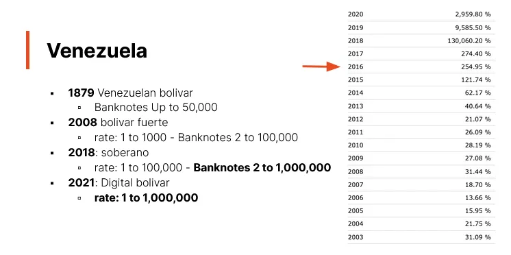

Il Venezuela è l'ultimo paese menzionato in questo video. Nel corso del tempo, il paese ha subito quattro riconversioni monetarie. All'inizio, il Venezuela utilizzava il dollaro spagnolo prima di dichiarare la sua indipendenza nel 1811. Nel 1879, introdusse il bolivar come valuta ufficiale, che rimase in vigore fino al 1983, anno in cui il governo optò per un dollaro a tasso fluttuante.

Un fatto degno di nota riguardante il Venezuela è la sua adesione all'Unione monetaria latina. Questa unione comprendeva monete come le 5 pesetas della Spagna, le 5 dracme della Grecia, i 5 bolivar del Venezuela, le 5 lire dell'Italia, i 5 franchi belgi e i 5 franchi francesi.

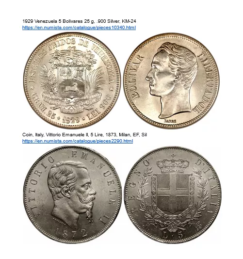

Durante questo periodo, la moneta da 5 bolivar del Venezuela aveva lo stesso peso di quelle dei paesi membri dell'Unione, come l'Italia, la Spagna, il Belgio e la Francia. Questi bolivar erano composti d'argento, con una moneta specifica del 1929 che pesava 25 grammi e aveva una purezza del 900, ovvero il 90% di argento puro. Con il corrente prezzo dell'argento, questa moneta vale approssimativamente 17-18 dollari statunitensi.

Dopo l'adozione di un tasso di cambio fluttuante nel 1983, sono state seguite diverse riconversioni:

- Nel 2008: è stato introdotto il bolivar fuerte, o "bolivar forte", che arrivava fino a 100.000 prima di una riconversione di mille a uno.
- Nel 2018: il Soberano fu introdotto con banconote che raggiungevano 1 milione. Nel 2021, è stato sostituito dal bolivar digitale che ha raggiunto anche 1 milione, prima di una nuova ridenominazione di un milione a uno. Oggi, la banconota da 10 o 20 equivale a 10 milioni o 20 milioni in Soberano.
  Le banconote di questo periodo, risalenti al 2018, sono distribuite durante diverse conferenze Bitcoin a Biarritz, Toronto e Miami. Queste banconote Soberano hanno raggiunto un valore massimo di 1 milione. Successivamente è avvenuta una ridenominazione, riducendo il valore del milione a circa 3 centesimi. Attualmente, 10 banconote da 1 milione corrispondono a una banconota da 10. Dal 2016, il Venezuela è in iperinflazione, rappresentando il 57° periodo di una tabella specifica.

Nel prossimo video verrà presentata una collezione di banconote iperinflazionate, con un focus sul Venezuela e altri paesi elencati. Questa collezione contiene quasi tutte le banconote venezuelane. Lo studio si concentrerà sulle diverse ridenominazioni per ogni paese menzionato. Inoltre, ci sarà un'indagine sulle ridenominazioni in Zimbabwe, un argomento di notevole interesse.

### Conclusioni

Abbiamo quindi visto che l'iperinflazione non è l'unico indicatore di una situazione economica catastrofica. Ridenominare più volte, eliminare zeri o cambiare il nome della valuta ha ripercussioni dirette sulla popolazione, che vanno dalla perdita di aiuti ai problemi alimentari. Sebbene l'iperinflazione sia preoccupante, il numero di ridenominazioni, come quelle osservate in Brasile, mostra una realtà più complessa.

Basandosi sul criterio del 50% di inflazione al mese, diverse periodi avrebbero potuto essere classificati come iperinflazione. Questo è particolarmente vero quando si considerano i criteri dell'organismo internazionale di contabilità, che includono caratteristiche come l'abbandono rapido della valuta da parte della popolazione, l'indicizzazione dei salari e prestiti con tassi di interesse elevati per compensare l'inflazione.

In conclusione, l'iperinflazione è solo un aspetto delle sfide economiche. L'alta inflazione, da sola, può essere altrettanto dannosa. La prossima sezione esplorerà le possibili soluzioni per uscire dall'iperinflazione.

## Come uscire dall'iperinflazione
<chapterId>e3484a31-a851-5f92-8af5-00eddae67db1</chapterId>

### Come porre fine all'inflazione moderata e all'alta inflazione

Le conclusioni menzionate sono tratte dal libro "Monetary Regime and Inflation" di Bernold. Secondo quest'ultimo, l'unico metodo per porre fine all'inflazione è attuare una riforma monetaria e imporre restrizioni al governo. Queste restrizioni implicano l'istituzione di un'istituzione, come una banca centrale, che opera in modo indipendente dalle decisioni politiche del governo. L'alta e l'iperinflazione sono spesso il risultato del finanziamento dei deficit di bilancio tramite la creazione di moneta. Per risolvere l'inflazione moderata, è essenziale ridurre la crescita della massa monetaria. Bernold suggerisce anche che questa crescita monetaria sia relativa ai paesi vicini. Un punto sorprendente è che, durante periodi di alta o iperinflazione, il valore totale della massa monetaria può effettivamente diminuire. Un esempio significativo di questa situazione è quello dello Zimbabwe.

### Soluzioni controintuitive

Nello studio dello Zimbabwe, è stato osservato che 10 trilioni di massa monetaria hanno perso tutto il loro valore. A Weimar, era possibile stampare i due terzi del totale nominale di 65 miliardi di massa monetaria in un solo giorno. Questo mostra quanto la massa monetaria possa essere svalutata. Per rimediare a questa situazione, è necessario aumentare significativamente la massa monetaria affinché raggiunga un livello appropriato. Successivamente, è indispensabile una riforma monetaria. In situazioni di alta inflazione, questa riforma è inevitabile, ma deve assicurarsi che ci sia abbastanza denaro in circolazione. Dopo questa fase, possono essere imposte restrizioni al governo.

Secondo le osservazioni di Bernold, quando si tratta di risolvere problemi di inflazione, istituzioni come il FMI e la Banca Mondiale non adottano sempre la strategia corretta. In alcuni casi, mentre un paese ha bisogno di aumentare la sua massa monetaria, queste istituzioni cercano di ridurla. L'importante è raggiungere un livello monetario adeguato, quindi imporre limiti alla sua crescita, evitando così di finanziare le spese governative tramite la creazione di moneta.

Un aspetto interessante sollevato da Bernold è che il successo di una riforma monetaria dipende non solo dalla sua pertinenza tecnica, ma anche dalla fiducia che la popolazione le accorda. Alcune riforme ben concepite possono fallire perché il pubblico non ha fiducia in esse, mentre altre, mal concepite, possono avere successo perché la popolazione ha fiducia in esse. La percezione e la fiducia della popolazione sono quindi elementi essenziali per il successo o il fallimento di una riforma monetaria.

- In Zimbabwe, la soluzione adottata per contrastare l'inflazione è stata la dollarizzazione, il che significa che hanno adottato il dollaro americano o altre valute dei paesi vicini. Questo approccio impedisce al governo di stampare moneta a piacimento.
- In Germania, la soluzione è stata quella di creare una nuova valuta, il Rentenmark. Questa valuta era garantita dagli asset territoriali del Reich, e questa strategia si è rivelata efficace.

### Il caso dello Zimbabwe

Lo Zimbabwe ha ottenuto l'indipendenza nel 1980 e ha introdotto il dollaro dello Zimbabwe. Inizialmente, due dollari dello Zimbabwe valevano circa 1,60 dollari americani. Tuttavia, nel 1997, a seguito di misure sociali a favore dei veterani della guerra d'indipendenza, la valuta si è svalutata del 72% in un giorno durante il Black Friday. Successivamente, all'inizio degli anni 2000, il paese ha avviato un programma di redistribuzione delle terre, togliendo le terre ai proprietari bianchi per darle alla popolazione locale. Questa decisione ha danneggiato le esportazioni poiché i nuovi proprietari spesso non avevano le competenze necessarie per gestire grandi aziende agricole. Di conseguenza, mentre lo Zimbabwe era un esportatore netto nel 1999, è diventato un importatore netto nel 2003.

Nel 2006, il paese ha introdotto una nuova versione della sua valuta, lo ZWN, con un tasso di cambio di 1 a 1.000. Nel 2008, è stata introdotta un'altra denominazione, lo ZWR, con un tasso di cambio di 1 a 10 miliardi. Ciò ha portato alla creazione delle famose banconote da 100 trilioni.

#### La dollarizzazione e l'uscita dalla crisi

Quindi, dopo il 2009, di fronte alla persistente crisi monetaria e all'iperinflazione galoppante, lo Zimbabwe ha abbandonato la sua valuta nazionale e ha autorizzato l'uso di valute straniere, principalmente il dollaro americano. Questa decisione, sebbene radicale, ha posto fine all'iperinflazione. Una lezione chiave da imparare è che l'arresto dell'emissione monetaria e la fine del finanziamento del deficit di bilancio da parte della banca centrale possono porre fine all'iperinflazione.

Tuttavia, la dollarizzazione non è una soluzione miracolosa. Sebbene possa porre fine all'iperinflazione, presenta altre sfide economiche. Una delle conseguenze è la perdita di una politica monetaria autonoma. Senza una propria valuta, un paese non può regolare la propria politica monetaria per far fronte agli shock economici interni.

Nel 2007, il tasso di inflazione in Zimbabwe aveva raggiunto il livello del 50% al mese, segnando ufficialmente il paese come in iperinflazione. Dopo la dollarizzazione nel 2009, l'iperinflazione è cessata, ma il paese ha affrontato altre sfide economiche.
È preoccupante notare che lo Zimbabwe ha cercato di reintrodurre la propria valuta e segni di alta inflazione sono riemersi. Secondo alcune organizzazioni internazionali, il paese potrebbe già soddisfare nuovamente i criteri per l'iperinflazione, anche se non ha ancora raggiunto la soglia ufficiale del 50% al mese. Questo serve come promemoria sui pericoli della creazione eccessiva di moneta e del finanziamento del deficit da parte della banca centrale.

## Conclusioni
<chapterId>31864b6e-8848-5e74-81fa-4e88e1a59ae3</chapterId>

Nel mio libro intitolato "Tutto su Bitcoin", ho dedicato un intero capitolo all'iperinflazione in Zimbabwe. Descrivo gli eventi salienti, fornendo vari esempi che illustrano come il paese abbia alla fine messo fine all'iperinflazione.

Per coloro che sono curiosi sull'esperienza tedesca dopo la Prima Guerra Mondiale, consiglio vivamente il fumetto "Il banchiere del Reich". Racconta come la Germania sia riuscita a superare l'iperinflazione, in particolare grazie alla creazione del Rentenmark.

Nel mio libro intitolato "Tutto su Bitcoin", ho dedicato un intero capitolo all'iperinflazione in Zimbabwe. Descrivo gli eventi salienti, fornendo vari esempi che illustrano come il paese abbia alla fine messo fine all'iperinflazione. Per coloro che sono curiosi sull'esperienza tedesca dopo la Prima Guerra Mondiale, consiglio vivamente il fumetto "Il banchiere del Reich". Racconta come la Germania sia riuscita a superare l'iperinflazione, in particolare grazie alla creazione del Rentenmark.

La cosa più importante da ricordare è che ci sono diverse strategie per uscire dall'iperinflazione. Si può optare per la dolarizzazione o introdurre una nuova valuta. Queste soluzioni funzioneranno solo se la popolazione ha fiducia in esse. È fondamentale imporre restrizioni rigorose. Una banca centrale veramente indipendente è essenziale. Non deve aumentare la massa monetaria per coprire i deficit governativi. In caso di inflazione lieve, limitare la crescita della massa monetaria dovrebbe essere sufficiente. Tuttavia, quando si affronta un'iperinflazione, è fondamentale prima avere una massa monetaria adeguata alla dimensione dell'economia in questione. Inoltre, è imperativo imporre restrizioni severe al governo per stabilizzare la situazione.

## Presentazione della collezione di banconote iperinflazionate
<chapterId>f3ffbb47-3aeb-54bd-80a9-adccb0f419e2</chapterId>

Il link alla collezione digitalizzata è disponibile nel Bitcoin Educational Toolkit, accessibile dalla sezione Risorse della piattaforma.

# Come siamo arrivati qui?
<partId>f66ca17e-be9e-5d30-a098-f7affd8962a1</partId>

## L'emergere del secondo strato della moneta e delle banche centrali
<chapterId>0455ffe3-9d45-5a67-ac96-3f815dc507a1</chapterId>

L'emergere del secondo strato della moneta e delle prime banche centrali è un argomento affascinante. Questo tema è ampiamente trattato nel libro "Layered Money" di Nick Battia. Lo consiglio vivamente a coloro che sono interessati all'evoluzione e alle sfumature dei nostri sistemi monetari. L'obiettivo di questa sezione è comprendere l'origine della creazione monetaria e come ciò abbia potuto portare all'iperinflazione.

### Moneta piramide e banche centrali

#### Il fiorino

La storia della moneta risale all'Italia del XIII secolo, più precisamente a Firenze. In quel periodo, il fiorino e le lettere di cambio erano comuni. Un esempio notevole è il fiorino, ornato con l'immagine di San Giovanni Battista.

Sebbene possedere un vero fiorino sia costoso oggi, sono disponibili delle riproduzioni. Ci sono anche altre monete dell'epoca, come il soldo degli Stati italiani del XVII secolo, che presenta un'immagine di Cristo.

#### Le lettere di cambio (13° secolo)

La pratica comune all'epoca era la seguente: gli orefici emettevano lettere di cambio in cambio dei fiorini depositati presso di loro. Questi fiorini venivano custoditi con cura nelle loro casseforti. Così, l'oro vero, rappresentato dal fiorino, costituiva il primo strato della moneta, mentre le lettere di cambio costituivano un secondo strato. Tuttavia, la liquidità di questo sistema era limitata. Se qualcuno voleva recuperare il proprio oro in cambio della propria lettera, la transazione era semplice. Ma scambiare queste lettere tra individui non era comune.

#### La borsa di Anversa (16° secolo)

La borsa di Anversa segnò una tappa fondamentale nell'evoluzione della moneta cartacea. È qui che fu introdotta la pratica dello sconto delle cambiali. Queste cambiali erano strumenti cartacei che rappresentavano un valore monetario, ma la loro particolarità era che riportavano nomi e scadenze. Ciò li rendeva difficili da scambiare prima della data di scadenza.
La création de la Banque d'Angleterre en 1694 a été un autre événement marquant dans l'histoire monétaire. La banque a été créée pour financer la guerre contre la France et a été autorisée à émettre des billets de banque. Ces billets étaient soutenus par les réserves d'or de la banque et pouvaient être échangés contre de l'or à tout moment. Cela a permis à la banque de financer la guerre en émettant des billets de banque plutôt qu'en utilisant des pièces d'or physiques. Cette innovation a également permis à la banque de contrôler la quantité de monnaie en circulation et d'influencer l'économie. La Banque d'Angleterre est devenue un modèle pour les autres banques centrales du monde.

La creazione della Banca d'Inghilterra fu motivata dalla necessità di finanziare la guerra alla fine del XVII secolo. Come la Banca d'Amsterdam, impose i depositi per decreto. La particolarità della Banca d'Inghilterra fu quella di relegare le banche private a una posizione secondaria nel sistema monetario, creando così quella che potremmo chiamare un "terzo strato" di moneta.

Inizialmente, il primo strato di moneta era rappresentato dall'oro. I depositi effettuati presso le banche private costituivano il secondo strato. Tuttavia, quando questi depositi non potevano più essere convertiti in oro, apparve un terzo strato di moneta. Da quel momento, le banconote emesse dalle banche private non erano più convertibili in oro, ma in moneta cartacea della Banca d'Inghilterra, che a sua volta era convertibile in oro. Questa evoluzione ha portato a una complessificazione del sistema monetario con l'aggiunta di strati aggiuntivi.

#### Il panico del 1796

Panico bancario presso la banca Seamen's Savings durante il panico del 1857.

A seguito del panico bancario del 1796, si verificò un fenomeno in cui tutti cercavano di risalire la "piramide della moneta". Le persone volevano scambiare la loro moneta del terzo strato con quella del secondo strato e infine con la moneta del primo strato, l'oro. Di fronte a questo afflusso massiccio, la Banca d'Inghilterra fu costretta ad agire per stabilizzare la situazione. Per evitare una possibile deflazione delle riserve d'oro, decise di sospendere la convertibilità delle sue banconote in oro. Questa sospensione, inizialmente concepita come una misura temporanea, durò per un periodo di due decenni.

### conclusione:

Le banche centrali sono evolute per diventare prestatori di ultima istanza, sospendendo la convertibilità della loro moneta in oro. Sebbene questa azione fosse inizialmente concepita come una soluzione temporanea, è diventata infine permanente, segnando così l'avvento del concetto di prestatore di ultima istanza. Questa trasformazione ha plasmato le banche centrali come le conosciamo oggi. Tuttavia, in economie più fragili, questa capacità di stampare moneta a volontà può comportare conseguenze indesiderate, come l'iperinflazione, se utilizzata in modo irresponsabile.

## Valuta il corso
<chapterId>1a37317e-372a-5241-b478-8316d44f9283</chapterId>
<isCourseReview>true</isCourseReview>

## Esame Finale
<chapterId>d01831c3-6c4d-59e3-95bc-03e97a05c142</chapterId>
<isCourseExam>true</isCourseExam>

## Libri e risorse
<chapterId>c44e4519-0741-527b-b3b0-3f513e87147d</chapterId>

L'iperinflazione è un argomento affascinante che è stato studiato attraverso vari eventi storici. Se desideri approfondire questo argomento, ecco un elenco di 10 risorse essenziali da leggere e studiare:

- "Quando il denaro muore: l'incubo della spesa in deficit, svalutazione e iperinflazione nella Germania di Weimar" di Adam Fergusson. Questo libro dettaglia la crisi iperinflazionistica della Germania dopo la Prima Guerra Mondiale.

- "L'economia dell'inflazione - Uno studio sulla svalutazione della valuta nella Germania post-bellica" di Costantino Bresciani-Turroni. Un'analisi approfondita dell'iperinflazione tedesca negli anni '20.

- "Questa volta è diverso: otto secoli di follia finanziaria" di Carmen M. Reinhart e Kenneth S. Rogoff. Sebbene il libro copra molti tipi di crisi finanziarie, tratta in dettaglio le iperinflazioni nella storia.

- "Iperinflazione in Zimbabwe, analisi e lezioni apprese" di Steve Hanke. Uno studio sul caso dell'iperinflazione in Zimbabwe all'inizio degli anni 2000.

- "Regimi monetari e inflazione: storia, relazioni economiche e politiche" di Peter Bernholz. Il libro esamina i casi di iperinflazione nella storia e cerca di comprendere i fattori sottostanti.

- "La guida alla sopravvivenza dell'iperinflazione: strategie per le imprese americane" di Gerald Swanson. Una guida pratica su come le imprese possono navigare in un ambiente iperinflazionistico.

- "Morendo di denaro: lezioni delle grandi inflazioni tedesche e americane" di Jens O. Parsson. Un'analisi comparativa delle crisi inflazionistiche in Germania e negli Stati Uniti.

- "La caduta del denaro: l'iperinflazione in Germania e la distruzione della classe media" di Frederick Taylor. Un'esplorazione narrativa dell'impatto sociale ed economico dell'iperinflazione sulla società tedesca.

- "Consigli per le casse di emissione per i paesi in via di sviluppo: una guida" di Steve Hanke e Kurt Schuler. Sebbene il focus sia sulle casse di emissione, questo libro offre una prospettiva su come evitare situazioni di iperinflazione.
