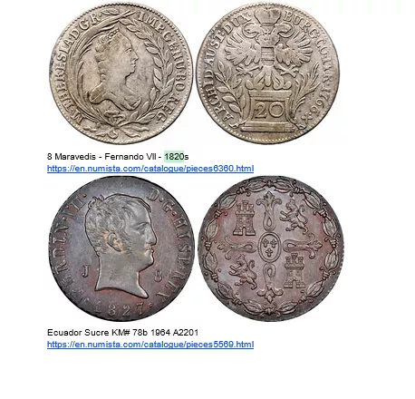
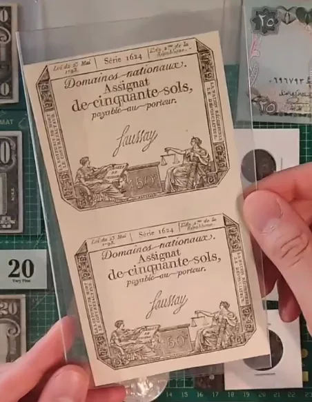
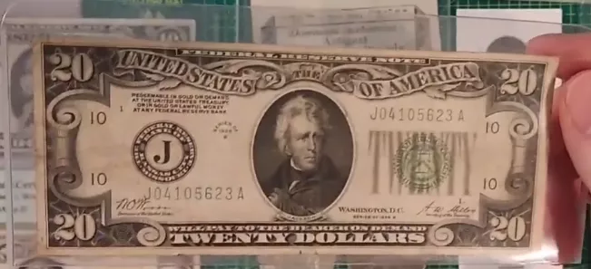
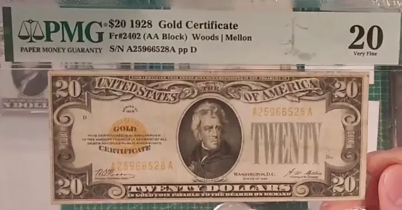
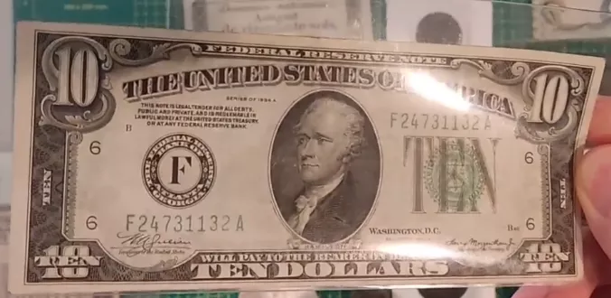
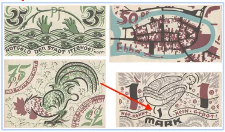
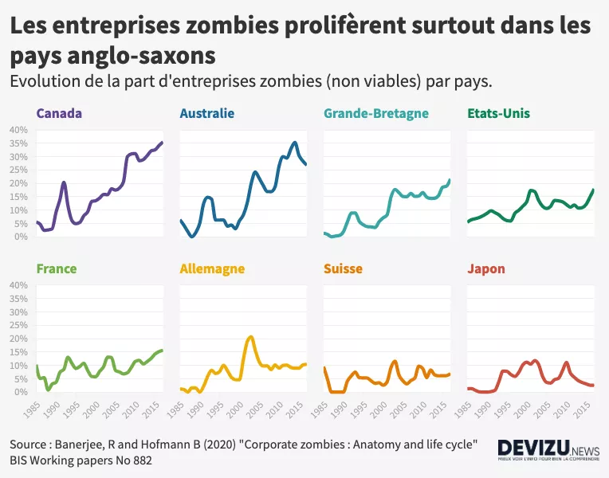

# Uma jornada pela economia

Este programa tem como objetivo oferecer uma compreensão profunda da emergência das hiperinflações em um mundo dominado pela moeda Fiat e examinar suas consequências consideráveis. Os participantes explorarão em detalhes os ciclos hiperinflacionários, analisando as causas, os gatilhos e os exemplos históricos e contemporâneos. Eles também examinarão o impacto tangível das hiperinflações na economia e na vida cotidiana, estudando as repercussões sobre o valor da moeda, o poder de compra e a poupança individual e coletiva.

Aqui, destacaremos as tendências e padrões comuns nos episódios de hiperinflação ao longo da história, ao mesmo tempo em que fornecemos estratégias eficazes e concretas para se proteger durante períodos de hiperinflação. Os participantes terão a oportunidade de explorar diversas opções de investimento e mecanismos de defesa financeira, adquirindo assim ferramentas práticas e conhecimentos essenciais para navegar tranquilamente em um ambiente econômico instável.

+++

# Introdução
<partId>6fe4d15d-f6e6-54be-9e04-0a75ac98df8b</partId>

## Introdução
<chapterId>9d1aba8d-0485-5020-9863-5de37e6db8e0</chapterId>

Este programa tem como objetivo oferecer uma compreensão profunda da emergência das hiperinflações em um mundo dominado pela moeda Fiat e examinar suas consequências consideráveis. Os participantes explorarão em detalhes os ciclos hiperinflacionários, analisando as causas, os gatilhos e os exemplos históricos e contemporâneos. Eles também examinarão o impacto tangível das hiperinflações na economia e na vida cotidiana, estudando as repercussões sobre o valor da moeda, o poder de compra e a poupança individual e coletiva.

Aqui, destacaremos as tendências e padrões comuns nos episódios de hiperinflação ao longo da história, ao mesmo tempo em que fornecemos estratégias eficazes e concretas para se proteger durante períodos de hiperinflação. Os participantes terão a oportunidade de explorar diversas opções de investimento e mecanismos de defesa financeira, adquirindo assim ferramentas práticas e conhecimentos essenciais para navegar tranquilamente em um ambiente econômico instável.

### Currículo

Seção 1 - Introdução

- 1.1 - Introdução ao curso por Rogzy & David

Seção 2 - O que é inflação?

- 2.1 - Um fenômeno monetário
- 2.2 - Os tipos de inflação

Seção 3 - O que é hiperinflação?

- 3.1 - As definições
- 3.2 - Weimar vs Zimbábue semelhanças
- 3.3 - Weimar vs Zimbábue diferenças e paralelos contemporâneos
- 3.4 - As redenominações na América Latina
- 3.5 - Como sair da hiperinflação
- 3.6 - Apresentação da coleção de notas de hiperinflação

Seção 4 - Como chegamos aqui?

- 4.1 - A emergência da segunda camada do dinheiro e dos bancos centrais
- 4.2 - Livros e recursos

Boa sorte!

# O que é inflação?
<partId>2b4f456c-3649-5cf9-b9b0-a5bffe92d962</partId>

## Um fenômeno monetário
<chapterId>b2cbc915-c4ec-52b5-860c-0958f58c91e4</chapterId>

### Definições de inflação

A inflação é um conceito frequentemente mal interpretado devido às múltiplas definições associadas a ela. A percepção da inflação varia entre diferentes grupos, como os bitcoiners e os economistas tradicionais. Vamos esclarecer primeiro as definições antes de abordarmos a hiperinflação:

- Definição do Robert: A inflação é um aumento excessivo dos instrumentos de pagamento (notas de banco, capitais) que provoca um aumento nos preços e uma desvalorização da moeda.

- Definição do Larousse: A inflação é um fenômeno caracterizado por um aumento generalizado e contínuo do nível de preços. Aqui, a palavra "generalizado" é crucial.

À luz dessas definições, é essencial entender que, para o Robert, a inflação se refere principalmente ao aumento da oferta monetária. Por outro lado, o Larousse se concentra nas consequências dessa expansão, ou seja, o aumento generalizado dos preços.

Durante nosso estudo sobre hiperinflação, adotaremos a segunda definição, a do aumento generalizado dos preços, pois ela é mais relevante e clara para o nosso assunto. No entanto, é crucial lembrar que esse aumento de preços geralmente é resultado da expansão da oferta monetária.
O renomado economista Milton Friedman afirmou famosamente:

> "A inflação é sempre e em todos os lugares um fenômeno monetário."

Essa afirmação destaca a relação intrínseca entre a expansão monetária e a inflação. Nas próximas seções, exploraremos as interações entre inflação e crescimento econômico, com base nessas definições fundamentais.

### Compreendendo o Fenômeno Monetário

Quando se fala em fenômeno monetário, refere-se à forma como a oferta monetária de uma economia é influenciada. Milton Friedman via principalmente um aumento nessa oferta. Historicamente, existem duas principais maneiras de aumentar a oferta monetária:

1. Impressão de dinheiro:
   Nos sistemas monetários tradicionais, o aumento da oferta monetária era feito imprimindo fisicamente novas notas. Embora hoje em dia, com a predominância do dinheiro digital, essa impressão seja principalmente eletrônica (por meio de bancos centrais e outras instituições financeiras), a história nos mostra períodos em que a impressão literal de notas resultou em hiperinflação.

2. Redução do conteúdo metálico:
   Outro método consistia em reduzir a quantidade de metal precioso nas moedas baseadas em metais como prata ou ouro. Um exemplo marcante é o Império Romano, onde o denário, inicialmente composto quase inteiramente de prata, teve seu teor de prata drasticamente reduzido ao longo do tempo. Isso equivalia a uma forma de inflação, mas não necessariamente a uma hiperinflação.

É crucial ressaltar que é possível observar hiperinflação principalmente em moedas fiduciárias desconectadas de seus ativos subjacentes, como metais preciosos. Historicamente, quando uma moeda era baseada em tais ativos, havia episódios de inflação (por exemplo, por desvalorização do conteúdo metálico), mas esses episódios nunca atingiam os níveis extremos de hiperinflação. Nas seções seguintes, estudaremos detalhadamente os períodos de desvalorização monetária e as implicações desses diferentes sistemas monetários na inflação.

### Estudo dos Períodos de Desvalorização Monetária

Ao longo da história, várias civilizações passaram por períodos de desvalorização monetária. Alguns desses períodos coincidem com eventos importantes ou guerras que exerceram pressão sobre a economia.

#### 1. Guerra do Peloponeso e Segunda Guerra Púnica:

A guerra do Peloponeso, um conflito entre Atenas e Esparta, e a Segunda Guerra Púnica, que opôs a República Romana a Cartago, são os primeiros exemplos de desvalorização monetária encontrados nos registros. Para financiar essas guerras, essas civilizações desvalorizaram suas moedas em metais preciosos. Elas pegaram moedas compostas principalmente de prata e incorporaram outros metais para reduzir o teor de prata, ao mesmo tempo em que aumentavam o número de moedas produzidas.

Gravura representando o massacre dos atenienses nas margens do Assinaros.

#### 2. Roma Antiga durante o Império:

Após a era da República Romana, durante o Império, os séculos III e IV experimentaram uma notável desvalorização monetária. Isso é ilustrado pela diminuição do teor de prata das moedas, como vimos no gráfico anterior. Um estudo mostra que o preço do trigo no Egito, medido em dracmas, aumentou em um fator de um milhão ao longo de um período de cerca de 400 anos, indo de 40 a.C. a 360 d.C. Durante esse período, isso representa uma inflação anual média de cerca de 4,4%. No entanto, essa inflação não foi distribuída uniformemente. Ela realmente começou por volta de 238 d.C. De 250 a 293 d.C., a taxa de inflação foi de cerca de 3,65%, e aumentou para 22,28% entre 293 e 301 d.C.

Embora esses períodos tenham experimentado uma inflação significativa, eles não atingiram os níveis de hiperinflação que podemos observar em algumas situações modernas. A razão para isso é que, mesmo que a moeda tenha sido desvalorizada, ela ainda era baseada em metais preciosos. Essa base sólida ofereceu alguma proteção contra níveis extremos de inflação. Nas seções a seguir, exploraremos mais detalhadamente a natureza e as consequências da hiperinflação.

- O Denário de Marco Aurélio (160 d.C.):
  Uma das moedas mais emblemáticas da Roma Antiga é o denário, uma moeda de prata. Eu possuo uma moeda específica de Marco Aurélio datada de 160 d.C., antes da grande desvalorização. Embora a câmera possa ter dificuldade em capturar os detalhes finos, a olho nu, pode-se ver que é uma bela moeda de prata, refletindo um teor de prata relativamente alto.

- O Antoniniano (final do século III d.C.):
  Com a desvalorização monetária, uma nova moeda, o Antoniniano, surgiu. Essa moeda deveria valer dois denários, mas continha muito menos prata. Minha moeda de Antoniniano mostra claramente que o teor de prata foi consideravelmente reduzido. Ela é adornada com uma coroa, típica das moedas romanas da época, chamada "radiates". Ao comparar a cor e a qualidade, vemos que o Antoniniano está longe de ser uma moeda de prata pura.
  Ao comparar as duas moedas lado a lado, a diferença é flagrante. O denário de 160 d.C. tem uma aparência prateada distinta, enquanto o Antoniniano do final do século III d.C. é muito mais opaco, indicando uma diminuição significativa no teor de prata. Essa comparação visual oferece uma ilustração clara da desvalorização monetária que a Roma antiga sofreu ao longo de alguns séculos.

Para complementar essa demonstração, um gráfico ilustrando a desvalorização dessas moedas ao longo do tempo seria ideal. Embora seja difícil visualizar através desta plataforma, imagine um gráfico mostrando o valor do denário e, em seguida, sua queda no final do século II, substituído pelo Antoniniano, que supostamente valia dois denários, mas com um teor de prata muito menor. Esses artefatos são testemunhas silenciosas das flutuações econômicas de civilizações passadas.

#### 3. O Maravedi Espanhol: Testemunho de uma Desvalorização Direcionada

O Maravedi, como moeda de cobre, ocupa um lugar especial na história da moeda espanhola. Como mencionado anteriormente, o dólar espanhol era originalmente o padrão internacional, uma moeda de reserva essencial para a Espanha. No entanto, diante de alguns desafios econômicos, a Espanha teve que recorrer a estratégias monetárias inteligentes.

A desvalorização monetária é uma ferramenta frequentemente usada pelos Estados para financiar seus gastos ou estimular a economia. No entanto, a Espanha estava em uma situação delicada. Diluir o dólar espanhol comprometeria sua posição no comércio internacional. Para superar esse dilema, a Espanha recorreu ao Maravedi.

Ao contrário do valioso dólar espanhol de prata, o Maravédis era uma moeda de cobre usada principalmente pela população local. Essa moeda foi alvo de desvalorização. Quando uma moeda de Maravédis inicialmente valia dois maravedis, o Estado a recolhia, carimbava com um novo valor, por exemplo, "quatro", e devolvia apenas uma moeda ao proprietário. A moeda mencionada com o carimbo "oito" é um testemunho desse processo, tendo passado por vários ciclos de desvalorização.

Essa estratégia permitiu ao Estado desvalorizar efetivamente uma moeda, criando inflação e se financiando indiretamente, ao mesmo tempo em que preservava a integridade do dólar espanhol no cenário internacional. No entanto, essa desvalorização direcionada teve consequências para a população local, que viu o valor de sua moeda corrente diluído.

O caso do Maravédis ilustra como um Estado pode desvalorizar seletivamente uma moeda local para atender às suas necessidades econômicas internas, ao mesmo tempo em que preserva o valor de uma moeda de reserva no cenário mundial. É um exemplo marcante da complexidade e sutileza da política monetária na história.

Mais informações em: [link](https://docs.google.com/document/d/1aZa7gvz1nt8ZHDCoWKQdS9RGGjBHdipH1ApC8dW1xpM/edit?usp=sharing)

#### 4. Revolução de preços do século XV ao XVII

Entre os séculos XV e XVII, a Europa testemunhou um fenômeno econômico notável, frequentemente descrito como a "revolução de preços". Esse período de inflação foi em grande parte desencadeado por um influxo maciço de metais preciosos, como ouro e prata, provenientes das Américas. Com uma economia europeia amplamente baseada no padrão metálico, essa entrada adicional de metais aumentou a oferta monetária. Como resultado, uma inflação de cerca de 1 a 2% ao ano se manifestou. À primeira vista, essa inflação pode parecer modesta. No entanto, naquela época, tal flutuação de preços era suficientemente incomum para ser considerada uma "revolução". Isso destaca o quanto as mudanças nas reservas monetárias podem influenciar o sistema econômico como um todo.

#### 5. John Law e os assignats

No século XVIII, a história econômica francesa foi marcada por dois eventos significativos relacionados à moeda. Primeiro, John Law, um economista e financista escocês, convenceu o governo francês a adotar um sistema monetário baseado em papel-moeda. Embora inicialmente considerada uma solução inovadora para os problemas financeiros do país, essa iniciativa rapidamente levou a uma inflação galopante. Em seguida, pouco tempo depois, durante os tumultos da Revolução Francesa, o governo introduziu os "assignats".

Assignats de 1793

Essas notas são um testemunho vivo do primeiro grande período de hiperinflação da história. Inicialmente concebidos como uma resposta às crises financeiras sucessivas, os assignats rapidamente se tornaram um símbolo de instabilidade monetária. O governo, ao depender excessivamente dessa moeda de papel para financiar seus gastos, gerou uma crise econômica sem precedentes e criou um grande período de hiperinflação na França após a revolução.

#### 6. A Ordem Executiva 6102 e a Desvalorização do Dólar

A Ordem Executiva 6102 e a Desvalorização do Dólar

Nos Estados Unidos, o início da década de 1930 testemunhou uma grande mudança na política monetária. Aqui está uma visão detalhada dessa transformação:

- A Nota de 20 dólares de 1928

Em 1928, uma nota de 20 dólares dos Estados Unidos trazia a inscrição: "resgatável em ouro sob demanda". Isso significa que cada nota era literalmente conversível em ouro. Mais especificamente, uma nota de 20,67 dólares equivalia a uma onça de ouro.

- A Ordem Executiva 6102

Em 1933, ocorreu uma grande perturbação com a emissão da Ordem Executiva 6102. Este decreto tornou ilegal a posse de ouro pelos cidadãos, seja em barras, moedas ou certificados.

O Certificado de Ouro é um bom exemplo. Ele era marcado como "em moedas de ouro pagáveis ao portador sob demanda". Possuir um certificado desse tipo se tornou ilegal e permaneceu assim até 1964.

- A Introdução das Novas Notas

Após a apreensão do ouro, em 1934, uma nova série de notas foi colocada em circulação.

A menção indicando sua conversibilidade em ouro foi removida e substituída por "This note is legal tender for all debt" (Esta nota é moeda legal para todas as dívidas).

- Reavaliação do Ouro

O que é fascinante nessa transição é a estratégia do governo. Em 1934, o preço do ouro foi reavaliado para 35 dólares a onça, em vez de 20,67 dólares. Essencialmente, o governo desvalorizou o dólar que as pessoas possuíam. Ao comprar ouro da população a 20,67 dólares a onça em 1933 e, em seguida, reavaliar o preço do ouro em 1934, o governo obteve um lucro substancial, ao mesmo tempo em que desvalorizava as economias de seus cidadãos.

Resumindo, em um ano, o governo efetivamente confiscou o ouro dos cidadãos e mudou as regras do jogo, reavaliando o valor do ouro para beneficiar o tesouro público e prejudicar aqueles que inicialmente trocaram seu ouro por notas.

### Os EUA mudam a história.

Os Estados Unidos marcaram uma virada histórica ao se tornarem os primeiros a desvalorizar a moeda de reserva mundial, o dólar americano, ao contrário das práticas anteriores observadas em pequenas nações comerciantes.

Anteriormente, durante o Renascimento, o florim italiano emitido por Florença no século XIII era a moeda de reserva internacional, e nenhuma desvalorização foi registrada durante seu período de uso, refletindo a importância da estabilidade monetária para o comércio internacional.

No mesmo espírito, Espanha e Holanda, como detentoras da moeda de reserva mundial devido ao seu próspero comércio internacional, mantinham a integridade de sua moeda para preservar a confiança e o status quo nas trocas internacionais. A Holanda até foi palco da criação do primeiro banco central, um marco crucial na evolução monetária global.

No entanto, a situação mudou com a ascensão dos Estados Unidos como potência econômica dominante. Eles optaram por desvalorizar sua moeda de reserva, aproveitando a inflação a seu favor. Essa decisão é frequentemente atribuída à dinâmica alterada, onde a escolha da moeda de reserva não era mais tão livre como antes. A hegemonia americana estabeleceu o dólar como a moeda de reserva mundial, permitindo assim a manipulação de seu valor. Essa mudança de rumo revela o impacto potencial das políticas monetárias no comércio internacional em uma economia globalizada, marcando uma transição significativa na gestão das moedas de reserva mundiais.

### Último exemplo para a estrada: o Swiss Dinner

O Swiss Dinar ilustra outra faceta fascinante da desvalorização monetária, desta vez ancorada no contexto iraquiano pré-Guerra do Golfo. Chamada assim em referência à notável qualidade de suas notas, essa moeda era emitida pelo Banco Central do Iraque e desfrutava de uma reputação de estabilidade na região do Oriente Médio. Essa confiança era devida, em particular, à qualidade de impressão das notas, feita na Inglaterra, insinuando uma certa robustez diante da desvalorização.

No entanto, as Guerras do Golfo marcaram uma virada na história do Swiss Dinar. O Iraque, incapaz de contar mais com seu fornecedor inglês para a impressão de suas notas, voltou-se para a China. Essa transição resultou em uma clara diferença na qualidade das notas, sendo a versão chinesa percebida como inferior. Essa percepção não era infundada; as notas chinesas eram mais facilmente falsificáveis e suscetíveis a serem sobreimpressas pelo governo, ameaçando assim seu valor.

Um fenômeno distintivo surgiu na economia iraquiana pós-Guerra do Golfo: o sistema de preços duplos. Os comerciantes ofereciam preços diferentes dependendo do tipo de nota usado para o pagamento, favorecendo o Swiss Dinar original em detrimento da nota chinesa. Esse sistema refletia a confiança mantida nas notas de melhor qualidade, menos suscetíveis à desvalorização, mesmo em um contexto em que o valor era principalmente imposto pelo Estado. Esse episódio demonstra a importância das características intrínsecas da moeda e como, mesmo em um regime de moeda fiduciária, a qualidade percebida de uma moeda pode influenciar seu valor relativo e, por extensão, a confiança dos agentes econômicos.

#### Sim, as moedas eram realmente pesadas!

A percepção comum muitas vezes associa a moeda à criação estatal, sendo sua emissão e valor regulados pelo Estado. Esse conceito tem suas raízes em civilizações antigas como Roma, onde as moedas eram padronizadas e estampadas pelo Império, conferindo assim um valor oficial às moedas. No entanto, uma exploração mais aprofundada revela que o valor intrínseco da moeda era principalmente derivado de seu conteúdo de metal precioso.

Um exemplo concreto é ilustrado através do exame de um peso monetário equivalente a oito reales espanhóis, ou um dólar espanhol. Esse peso, marcado com um numeral romano indicando seu valor, era usado pelos cambistas para avaliar o valor das moedas com base em seu peso, e não apenas em sua estampagem. Ao pesar as moedas, os cambistas podiam determinar se elas haviam sido adulteradas ou danificadas, o que poderia reduzir seu valor. Essa prática destaca que, embora a estampagem padronizada pelo Estado conferisse um certo valor nominal à moeda, o verdadeiro valor residia no peso do metal precioso que ela continha.

Essa análise demonstra que a confiança na moeda, e por extensão seu valor, estava ancorada em sua substância tangível, e não apenas na afirmação do Estado. Ela destaca a dualidade entre o valor nominal imposto pelo Estado e o valor intrínseco ditado pelo conteúdo de metal precioso. Assim, a moeda vai além de um simples instrumento estatal, seu valor fundamental está intrinsecamente ligado a elementos tangíveis e mensuráveis.

#### Conclusão

Ao concluir, este estudo sobre a desvalorização monetária abre caminho para uma compreensão aprofundada dos mecanismos da inflação, que serão explorados nos próximos vídeos. Discutiremos os diferentes tipos de inflação e o limiar em que eles se transformam em inflação alta ou hiperinflação. Essa base sólida nos permitirá abordar as complexidades da inflação nas próximas sessões. Obrigado pela atenção e nos vemos no próximo vídeo para continuar essa exploração das dinâmicas monetárias.

## Os tipos de inflação
<chapterId>b438fe09-375e-5bb2-9196-7dd687b9f98c</chapterId>

### A inflação não é um fenômeno multifatorial

Nesta seção, vamos explorar as diferentes dimensões da inflação, um fenômeno frequentemente mal compreendido. Embora a inflação seja frequentemente percebida como um fenômeno multifatorial na mídia e em discussões comuns, é crucial lembrar que ela é, essencialmente, um fenômeno monetário.

Aqui está uma desconstrução do assunto em vários pontos-chave:

- Distinção entre Aumento de Preços e Inflação:

  Um aumento de preços pode ser setorial e induzido por vários fatores, como uma queda na produção da OPEP para o petróleo ou condições climáticas desfavoráveis para o trigo.
  A inflação, por outro lado, é definida por um aumento generalizado dos preços em uma variedade de bens e serviços, não apenas em um setor específico.

- A Essência Monetária da Inflação:
  Com uma oferta monetária fixa, um aumento de preços em um setor resultaria em uma queda de preços em outros setores, pois a quantidade de dinheiro disponível para gastar em outros lugares seria reduzida. A inflação está intimamente ligada a um aumento na oferta monetária que permite um aumento de preços em todos os setores simultaneamente.

- Impacto da Oferta Monetária na Inflação e Deflação:

Em um sistema de oferta monetária fixa, um aumento na produção teoricamente resultaria em deflação, ou seja, uma queda nos preços, pois haveria mais bens e serviços disponíveis.
No sistema monetário fiat atual, o aumento da oferta monetária anula a deflação potencialmente induzida pelo aumento da produção.

- Efeitos Perversos do Ajuste da Oferta Monetária:

O aumento da oferta monetária, sem um aumento correspondente na produção, resulta em inflação, pois há mais dinheiro em circulação para o mesmo número de bens e serviços.
Enquanto o aumento da produção deveria ter levado à deflação, o aumento simultâneo da oferta monetária anulou esse efeito, resultando em inflação.

- Inflação, Deflação e Oferta Monetária: Vasos Comunicantes:

A inflação e a deflação são como vasos comunicantes em uma economia. O aumento da produção pode levar à deflação, mas se a oferta monetária for aumentada simultaneamente, o efeito da deflação é anulado, resultando em inflação.

Esta discussão destaca a importância de entender os mecanismos subjacentes da inflação e deflação, e como a manipulação da oferta monetária pode ter impactos profundos na economia. Provavelmente revisitaremos esses conceitos mais tarde para uma compreensão mais aprofundada de sua interconexão e impacto na economia global.

### Por que a impressão monetária nem sempre causa inflação?

#### Inflação ≠ IPC

A inflação, embora frequentemente associada ao aumento da oferta monetária, nem sempre apresenta uma correlação direta com a impressão monetária, como ilustrado pelo período após a crise financeira de 2008. Apesar de uma impressão monetária significativa para salvar os bancos, a década seguinte não experimentou uma inflação alta, situando-se em média entre 0 e 2% ao ano. Isso levanta a questão: por que a impressão monetária em larga escala não resultou em uma inflação proporcional? A resposta reside em várias nuances relacionadas à medição da inflação e ao índice de preços ao consumidor (IPC).
A primeira explicação reside na forma como a inflação é medida. O índice de preços ao consumidor, usado como indicador principal da inflação, apresenta algumas lacunas. Por exemplo, ele não leva em consideração de forma abrangente a evolução dos preços imobiliários. Embora o IPC inclua um componente relacionado aos aluguéis, a apreciação substancial dos preços das casas não é totalmente refletida. Assim, aumentos significativos nos custos de moradia podem ocorrer sem serem totalmente capturados pelo IPC, potencialmente subestimando a inflação real.

Além disso, o cálculo do IPC inclui algumas metodologias que podem compensar ou mascarar aumentos reais de preços. Por exemplo, melhorias qualitativas nos produtos podem ser usadas para ajustar o índice. Se o preço de um produto aumenta, mas sua qualidade ou características também melhoram, o IPC pode considerar que o valor real para o consumidor não mudou e, portanto, não refletir inflação. Um caso ilustrativo é quando, apesar do aumento nos preços da carne bovina e dos computadores devido à injeção monetária, a melhoria no desempenho dos computadores é usada para compensar esse aumento. Se um computador custa o dobro, mas é quatro vezes mais poderoso, o IPC pode interpretar isso como uma queda nos preços, mascarando assim o aumento do preço da carne bovina.

Essas nuances na medição da inflação pelo IPC destacam a complexidade da relação entre a impressão monetária e a inflação. Elas também sugerem que a inflação real pode ser maior do que a relatada se todas as aumentos de preços forem considerados de forma mais abrangente, especialmente em setores-chave como o imobiliário. Essa análise destaca a importância de entender os mecanismos subjacentes da inflação e as limitações dos índices convencionais usados para medi-la, a fim de compreender melhor o impacto econômico das políticas monetárias.

#### Os argumentos da MMT

A Teoria Monetária Moderna (MMT) propõe uma perspectiva distinta sobre a criação monetária e a inflação. De acordo com a MMT, o dinheiro emana principalmente do governo, que pode imprimir quantias substanciais para financiar suas necessidades, sem causar inflação, desde que os setores alvo desses fundos não estejam saturados. Essa é uma abordagem que se afasta das teorias monetárias tradicionais e enfatiza a importância das capacidades de absorção setorial na dinâmica inflacionária.

Um exemplo ilustrativo da MMT é o complexo militar-industrial americano. De acordo com a MMT, centenas de bilhões de dólares podem ser alocados para esse setor sem causar inflação, devido à sua capacidade de absorção. Em contraste, se fundos substanciais forem injetados na construção de estradas nos Estados Unidos, onde há um número limitado de empresas e mão de obra, pode ocorrer inflação devido à escassez de recursos e ao aumento dos custos exigidos pelos fornecedores.

O caso do Japão é frequentemente citado pelos defensores da MMT como outro exemplo da ausência de inflação apesar de uma impressão monetária significativa. No entanto, a situação no Japão também destaca as limitações das medidas tradicionais de inflação, como o Índice de Preços ao Consumidor (IPC). No Japão, grande parte do dinheiro impresso é poupada ou investida em imóveis ou mercados de ações, e não gasta na economia de consumo comum. O IPC, ao não capturar totalmente essas dinâmicas, pode subestimar a inflação real.

A análise do Japão (https://ideas.repec.org/p/ces/ceswps/_9821.html) também destaca que o comportamento dos agentes econômicos, como poupança ou investimento em ativos não incluídos no IPC, pode mascarar o impacto inflacionário da impressão monetária. Além disso, a capacidade dos diferentes setores de absorver a liquidez injetada desempenha um papel crucial na manifestação ou não da inflação.

#### O balanço dos bancos e do banco central

Um terceiro exemplo de por que a impressão monetária não causaria inflação é que a relação entre a impressão monetária e a inflação é modulada pela forma como o dinheiro recém-criado é introduzido na economia. Se esse dinheiro permanecer no balanço dos bancos privados sem ser emprestado aos agentes econômicos, não afetará diretamente a economia real e, portanto, não causará inflação.

A impressão monetária pode ser vista como uma espada de Dâmocles suspensa sobre a economia. O dinheiro criado pode permanecer latente por um certo tempo, sem efeito inflacionário visível, desde que não seja injetado na economia por meio de empréstimos bancários ou outros mecanismos. No entanto, quando esse dinheiro latente é finalmente colocado em circulação, os efeitos inflacionários podem se manifestar. Isso foi observado ao longo dos anos 2020, quando o dinheiro criado anteriormente encontrou seu caminho na economia, levando à inflação.

Este cenário destaca a importância dos mecanismos de transmissão monetária na determinação do impacto inflacionário da impressão de dinheiro. A criação de dinheiro pelo banco central é apenas uma peça do quebra-cabeça. O comportamento dos bancos privados, que decidem o volume de empréstimos a conceder, e o comportamento dos mutuários, que decidem como gastarão o dinheiro emprestado, também são elementos cruciais nessa dinâmica.

#### A inflação é social!

O exemplo da República de Weimar ilustra outro aspecto crucial da relação entre a impressão de dinheiro e a inflação: o papel das expectativas e do comportamento dos agentes econômicos. Quando o Banco Central da República de Weimar começou a imprimir uma grande quantidade de dinheiro, a incerteza econômica levou as pessoas a acumularem dinheiro, ou seja, a guardá-lo em vez de gastá-lo. Essa reação temporariamente retardou os efeitos inflacionários da impressão de dinheiro.

No entanto, quando a situação econômica começou a melhorar ligeiramente, a confiança foi gradualmente restaurada. As pessoas então retiraram suas economias de seus esconderijos e começaram a gastar massivamente na economia. Essa mudança repentina de comportamento, combinada com uma alta quantidade de dinheiro já em circulação, levou a uma explosão na demanda. Com mais dinheiro em circulação e uma demanda aumentada, os preços começaram a subir rapidamente, levando a uma inflação significativa.

Esse exemplo destaca a importância do timing e do comportamento dos agentes na manifestação da inflação. A inflação não ocorre apenas em resposta ao aumento da quantidade de dinheiro, mas também depende de como e quando esse dinheiro é gasto na economia. As incertezas econômicas e as expectativas dos agentes econômicos desempenham um papel crucial nessa dinâmica e podem acelerar ou retardar os efeitos inflacionários da impressão de dinheiro.

#### Resumo:

- Índice de Preços ao Consumidor (IPC): O IPC é estruturado de forma a subestimar a inflação, o que pode fornecer uma imagem distorcida da realidade inflacionária.

- Absorção Setorial: A injeção monetária em setores capazes de absorvê-la nem sempre resulta em inflação. O principal exemplo é o complexo militar-industrial americano, que pode absorver grandes quantias de dinheiro sem causar inflação.

- Caso do Japão: Apesar de uma impressão significativa de dinheiro, a inflação permanece baixa no Japão, pois os fundos são frequentemente poupados, investidos em imóveis ou no mercado de ações. Esses setores absorvem o dinheiro impresso, e o IPC não reflete necessariamente os aumentos de preços nessas áreas.
- Correlação entre Impressão Monetária e Mercados: Observa-se que as curvas do mercado imobiliário e de ações frequentemente seguem a impressão monetária, indicando para onde o dinheiro impresso está sendo direcionado.
- Reserva Monetária dos Bancos: Quando o dinheiro impresso permanece nos balanços dos bancos e não circula na economia, ele não causa inflação. Isso é ilustrado pelo exemplo de 2008, onde o dinheiro impresso permaneceu amplamente nos balanços dos bancos, retardando o impacto inflacionário.

- República de Weimar: Este período histórico mostra como a incerteza econômica levou ao acúmulo de dinheiro, retardando a inflação. No entanto, uma vez que a confiança foi restaurada e o dinheiro foi gasto, a inflação explodiu.

Esses exemplos podem ser usados em discussões para explicar por que a inflação nem sempre é uma consequência imediata da impressão monetária e como os contextos econômicos e comportamentos dos agentes influenciam a inflação.

Porque, como bem demonstra esse [thread](https://twitter.com/saifedean/status/1673639779433590786): A inflação é tudo, exceto culpa dos bancos centrais.

- Economistas culpando a inflação pelas mudanças climáticas

- Exemplo da Suécia culpando Beyoncé pela inflação durante um mês específico.

- Banco central da Polônia atribuindo a inflação à agressão russa na Ucrânia e à pandemia

- Brexit culpado pela inflação no Reino Unido.

- Lançamento do jogo Zelda associado a um choque inflacionário.

- Taylor Swift supostamente causando inflação.

Como Beyoncé ou Taylor Swift, me diga, poderiam explicar um aumento generalizado nos preços? Você vê que isso não faz sentido algum. Em resumo:

### Explorando os Tipos de Inflação

É crucial entender a distinção entre os diferentes tipos de inflação, um entendimento que nos permite compreender as diversas manifestações desse fenômeno econômico. Aqui está uma explicação sobre esses diferentes tipos:

- Inflação Rastejante (Creeping Inflation): Este é o tipo de inflação que os bancos centrais geralmente visam, estabelecido em cerca de 2% anualmente. Esse objetivo foi adotado desde os anos 90 e visa manter um crescimento econômico estável sem superaquecimento ou deflação.
- Inflação Moderada (Inflação Caminhante): Esta forma de inflação ocorre quando a inflação ultrapassa a meta de 2%. Geralmente está associada a uma economia superaquecida, onde a oferta monetária excessiva estimula um aumento geral nos preços. Esse cenário expõe os limites das políticas monetárias e às vezes revela contradições nos discursos econômicos.
- Inflação Galopante: A inflação galopante, frequentemente chamada de inflação de dois dígitos, ocorre quando a taxa de inflação anual excede 10%. Isso marca um aumento significativo nos preços que pode comprometer a estabilidade econômica.

- Hiperinflação: A hiperinflação é um fenômeno extremo em que a taxa de inflação ultrapassa 50% ao mês, o que, devido à natureza exponencial da inflação, equivale a uma inflação anual de mais de 13.000%. Esse nível de inflação desestabiliza gravemente a economia, tornando a moeda quase sem valor e causando uma perda de confiança no sistema monetário.

Ao explorar os tipos de inflação, é comum encontrar termos como "Demand Pull" e "Cost Push" em recursos educacionais. Esses conceitos, embora válidos, tendem a explicar os aumentos de preços em vez da inflação como um fenômeno monetário. Aqui está uma análise mais aprofundada:

- Demand Pull:
  A inflação do tipo Demand Pull é frequentemente explicada como uma situação em que a demanda na economia supera a produção disponível. No entanto, sem um aumento correspondente na oferta monetária, essa situação apenas levará a uma redistribuição dos gastos. Os consumidores podem gastar mais em bens essenciais e menos em outros, neutralizando assim o efeito inflacionário global.

- Cost Push:
  Por outro lado, a inflação do tipo Cost Push é atribuída ao aumento dos custos de produção, como os de recursos naturais ou mão de obra. Novamente, sem um aumento na oferta monetária, os aumentos de custos em um setor podem simplesmente reduzir os gastos em outros, sem causar uma inflação generalizada.

Essas explicações tradicionais frequentemente associam aumentos de preços à inflação, o que pode causar confusão. Na realidade, para que ocorra uma inflação generalizada, é necessário um aumento na oferta monetária. Nesse contexto, os conceitos de Demand Pull e Cost Push podem explicar as variações de preços setoriais, mas não capturam a natureza monetária da inflação. Isso destaca a importância de distinguir entre aumentos de preços setoriais e inflação generalizada, e reafirma a necessidade de um aumento na oferta monetária para que a inflação se manifeste na economia. Essa análise oferece uma perspectiva mais sutil e precisa sobre as verdadeiras causas da inflação e desmistifica interpretações comuns que podem obscurecer a dinâmica monetária subjacente.

### Classificação da Inflação segundo Bernholz

Bernholz propõe uma classificação simplificada, mas precisa, da inflação em três categorias, permitindo uma melhor compreensão desse fenômeno monetário complexo:

- Inflação Moderada:
  A inflação moderada ocorre quando o nível da oferta monetária está acima do normal, mas sem que o Estado recorra a grandes déficits financiados pela criação monetária. Embora o termo "moderada" possa parecer insignificante, essa forma de inflação pode causar problemas substanciais, embora não seja classificada como alta inflação.

- Alta Inflação:
  A alta inflação ocorre quando o valor real da oferta monetária diminui, apesar de um aumento em termos nominais. Essa situação paradoxal decorre da substituição monetária, onde os indivíduos perdem a confiança na moeda nacional e buscam trocá-la por bens, serviços ou moedas estrangeiras. Esse processo reduz ainda mais o valor real da moeda, exacerbando a inflação.

- Hiperinflação:
  A hiperinflação é uma extensão da alta inflação, caracterizada por grandes déficits orçamentários financiados pela criação monetária. Historicamente, nenhum caso de hiperinflação foi observado sem um financiamento deficitário substancial por meio da impressão de dinheiro. A hiperinflação gera um ciclo vicioso: a inflação erode o valor da moeda tão rapidamente que as receitas fiscais se desvalorizam antes mesmo de o Estado poder coletá-las, forçando assim o Estado a imprimir ainda mais dinheiro para se financiar. Esse ciclo auto-reforçador leva a taxas de inflação astronômicas, muitas vezes superando 50% ao mês.

Esta classificação de Bernholz destaca a perigosa progressão da inflação moderada para a hiperinflação e enfatiza a importância crucial do controle monetário e orçamentário para prevenir espirais inflacionárias destrutivas. Também demonstra que as consequências prejudiciais para o financiamento estatal podem ocorrer muito antes de atingir o estágio de hiperinflação, oferecendo assim uma perspectiva equilibrada sobre as implicações da inflação em diferentes graus.

### Conclusão: Síntese sobre os Tipos de Inflação

Para concluir, exploramos uma variedade de tipos de inflação, começando com termos frequentemente ouvidos como "inflação rastejante", "inflação caminhante" e "inflação galopante", cada um denotando diferentes níveis de percentagens de inflação dentro de uma economia. No entanto, para nosso estudo aprofundado sobre a hiperinflação, as categorias de inflação moderada, alta inflação e hiperinflação, conforme descritas por Bernholz, se revelam marcos cruciais.

- Inflação Moderada:
  Sinaliza um nível de oferta monetária acima do normal, embora esse nível possa ser mantido sem um financiamento deficitário significativo pelo Estado.

- Alta Inflação:
  Ocorre quando o valor real da oferta monetária diminui, muitas vezes devido à substituição monetária, onde as pessoas procuram trocar sua moeda por bens, serviços ou outras moedas.

- Hiperinflação:
  Representa uma versão extrema da alta inflação, onde a criação excessiva de moeda para financiar grandes déficits orçamentários provoca uma rápida erosão do valor real da moeda.

O que emerge de nossa exploração é que a hiperinflação é um fenômeno complexo e contra-intuitivo. Embora se possa supor que a hiperinflação seja o resultado de um aumento maciço na oferta monetária, na realidade, ela decorre de uma diminuição do valor real dessa oferta monetária. Essa nuance é crucial para entender por que alguns países têm dificuldade em sair da hiperinflação, mesmo com o apoio de instituições internacionais como o Banco Mundial ou o FMI. Uma caracterização inadequada do tipo de inflação pode levar à aplicação de remédios inadequados, exacerbando os problemas econômicos em vez de resolvê-los.

Em nossas futuras discussões, mergulharemos mais profundamente na hiperinflação, explorando suas definições e manifestações em diversos contextos econômicos. Nosso objetivo será revelar os mecanismos subjacentes da hiperinflação e explorar soluções potenciais para lidar com ela. Essa compreensão equilibrada nos permitirá entender melhor os desafios associados e propor estratégias informadas para a gestão da inflação.
Obrigado pela sua atenção. A próxima sessão será totalmente dedicada a definir e desmistificar a hiperinflação, levando em consideração diferentes perspectivas acadêmicas e práticas. Estamos ansiosos para continuar essa exploração com você em nosso próximo encontro.

# O que é hiperinflação?
<partId>3f541663-1e2f-5410-8ee0-f61c5d009fa5</partId>

## Definições de hiperinflação
<chapterId>d2a71a2e-5f36-58d9-993c-d431f4aa07fd</chapterId>

### Definições de hiperinflação

Nesta seção, exploramos as várias definições de hiperinflação, um termo crucial no estudo de fenômenos monetários extremos. A definição mais reconhecida vem de Philip Cagan, que em seu trabalho de 1956, "The Monetary Dynamics of Hyperinflation", propõe uma compreensão quantitativa da hiperinflação. De acordo com Cagan:

- Início e fim da hiperinflação:
  - A hiperinflação começa quando a inflação mensal excede 50%.
  - Ela termina quando a taxa de inflação cai abaixo de 50% por mês por pelo menos um ano.

Para ilustrar, se a inflação cair para 40% em julho e não subir acima de 50% até julho do ano seguinte, então o período de hiperinflação é considerado encerrado em julho do ano anterior. Essa definição permite uma caracterização precisa dos episódios de hiperinflação, possibilitando uma análise estruturada.

Essa definição foi adotada na tabela Hanke-Krus, que documenta 56 episódios de hiperinflação. No entanto, a tabela não cobre todos os episódios, como o da Venezuela em 2016, elevando o total para 57.

É importante observar que essa definição, embora precisa, pode possivelmente excluir alguns episódios de hiperinflação devido ao rigor do limite de 50%. Existe a possibilidade de ampliar essa definição para incluir outros episódios que, embora não atendam estritamente ao critério de Cagan, ainda representam períodos de inflação extremamente alta. Essa observação abre caminho para uma exploração mais ampla dos fenômenos de hiperinflação, permitindo uma compreensão mais detalhada de suas causas e efeitos. Nas discussões futuras, consideraremos revisitar essa definição e examinar episódios de hiperinflação não abrangidos pelo critério estrito de Cagan.

### A Definição de Hiperinflação por Cagan

Philip Cagan, ao definir a hiperinflação, pode ter estabelecido um marco arbitrário com o limite de 50% de inflação mensal. Ele admite que essa definição é arbitrária e serviu principalmente para sua análise baseada em sete episódios de hiperinflação. A análise dos dados de Cagan revela que os três episódios de hiperinflação com as taxas de inflação mensais mais baixas foram em torno de 47%, 46% e 57%. Parece que o limite de 50% foi escolhido para abranger esses casos em seu estudo.

- Contexto Histórico:
  A definição de Cagan é de 1956 e baseia-se em um número limitado de episódios de hiperinflação disponíveis na época.

- Observações de Cagan:
  Segundo Cagan, nenhum episódio atingiu esse limite de cerca de 50% sem evoluir para uma hiperinflação mais grave, o que poderia justificar a escolha desse limite.

- Crítica à Definição de Cagan:
  Outros economistas, como Bernholz, autor de "Monetary Regime and Inflation", também consideraram o limite de 50% arbitrário.
  Bernholz observa que existem episódios de alta inflação com as mesmas características qualitativas dos episódios de hiperinflação, sem atingir o limite de 50%.

Essa reflexão nos leva a questionar a rigidez da definição tradicional de hiperinflação e destaca a necessidade de talvez revisitar esse limite, incorporando mais episódios e dados históricos. A definição de hiperinflação pode exigir flexibilidade para abranger diversas manifestações de inflação extrema em diferentes contextos econômicos e históricos.

### A Definição de Hiperinflação de acordo com o International Accounting Standards Board (IASB)

Quantos casos de hiperinflação existem atualmente?

Definições comuns de hiperinflação, como a proposta por Kagan, que estabelece uma inflação mensal de 50%, podem às vezes ser confusas ou simplistas. Por exemplo, dois países com taxas de inflação anual de 1.000% e 3.000%, respectivamente, podem ser percebidos de maneira diferente dependendo da distribuição mensal dessa inflação. Se nenhum mês ultrapassar o limite de 50%, de acordo com a definição de Kagan, esses países não estariam em estado de hiperinflação. Essa abordagem pode levar a anomalias na classificação da hiperinflação, especialmente ao comparar inflações acumuladas ao longo do ano.

- O trabalho de Kagan, "Monetary Dynamics of Hyperinflation", que estabelece uma análise fundamental da hiperinflação.
- O livro de Bernold, que estuda 30 períodos distintos de hiperinflação, ampliando assim o espectro de análise.
- A coleção pessoal de notas de David de 36 períodos de hiperinflação, permitindo uma compreensão tangível e histórica.
- A tabela Hanky Cross (versão 2012, atualizada em 2016 com a Venezuela), listando 57 períodos de hiperinflação com base na definição de Kagan.

É importante observar que alguns períodos históricos de alta inflação não estão presentes nas tabelas clássicas de hiperinflação, muitas vezes devido aos critérios rigorosos de classificação. Por exemplo, durante a Guerra de Independência dos Estados Unidos em novembro de 1779 e durante a Guerra Civil Americana em março de 1864, as taxas de inflação mensal eram de 47,4% e 40%, respectivamente. Essas taxas, embora altas, não ultrapassam o limite de 50% estipulado por Kagan, excluindo assim esses períodos dos casos classificados como hiperinflação. Essa omissão ilustra as limitações das definições rígidas e destaca a necessidade de uma abordagem mais sutil para compreender a hiperinflação em toda a sua complexidade.

## Semelhanças entre Weimar e Zimbabwe
<chapterId>11eef458-aab8-5c63-8523-264d0ba69f5d</chapterId>

### Duas épocas, duas catástrofes

Neste capítulo, exploraremos os impactos da hiperinflação, concentrando-nos nos casos do Zimbabwe e da República de Weimar. Ao longo de minhas pesquisas, priorizei a exploração de testemunhos diretos de pessoas que viveram esses períodos de hiperinflação, em oposição a uma abordagem puramente econômica ou estatística.

Vários livros foram particularmente instrutivos:

- "When Money Dies" por Adam Ferguson, retrata a hiperinflação pós-Primeira Guerra Mundial na Alemanha, Áustria e Hungria.
- Two books on hyperinflation in Zimbabwe, "Zimbabwe Warm Heart Ugly Face" and "Hard Boiled Egg Index" by Jérôme Gardner and Kudzai Joseph Gou Min-Yu respectively, offer poignant testimonies from a CEO of a clothing store chain and an agricultural banker on their experiences during this tumultuous period.
  

As I consolidated my notes, I discerned a multitude of similarities between the experiences of hyperinflation in Zimbabwe and the Weimar Republic, despite the 90-year gap between them. I identified about 17 similarities, 13 of which illustrated a sort of progression towards the economic disaster depicted in these testimonies. These fascinating parallels demonstrate the repetitive and devastating nature of hyperinflation across time and borders. Today, we will examine these similarities and how they depict a worrisome trajectory during periods of hyperinflation.

### Comparative Analysis: Zimbabwe and the Weimar Republic

The game of 14 differences!

1. Currency shortage

When currency depreciates at a dizzying speed, even the most ambitious attempts to flood the market with new banknotes can prove insufficient. The incessant demand for tangible currency can far surpass the central banks' capacity to produce banknotes, creating unprecedented liquidity crises.

> Weimar: "During this month, it will be increased to almost 4 billion paper marks, a figure with which it is hoped that the currency shortage will be definitively overcome."

> Zimbabwe: "From 2002 to January 2009, there were several critical liquidity shortages. There simply weren't enough banknotes printed or in circulation to keep up with the galloping inflation."

2. "And it's manure!"

The speed at which currency can lose its value in certain economic situations is astonishing. Astronomical amounts of banknotes can be issued in record time, instantly transforming once considerable sums into something as insignificant as manure.

> Weimar: "The current total issue amounts to 63,000 billion. In a few days, we will therefore be able to issue two-thirds of the total circulation in one day."

> Zimbabwe: "On September 17, 2006, the governor of the RBZ, Gideon Gono, declared: '10 trillion is still out there and it has become manure.'"

3. Banknotes worth less than the paper they are printed on
   Em certas circunstâncias econômicas, o valor intrínseco de uma nota pode se tornar inferior ao valor do papel em que ela é impressa. Essa desvalorização drástica transforma as notas de dinheiro, normalmente símbolos de valor e poder de compra, em simples pedaços de papel sem valor de mercado.
   > Weimar: "Denominações inteiras de notas em marcos não tinham valor quase imediatamente após saírem da impressora."

> Zimbábue: "O banco central desperdiçou dinheiro imprimindo uma nota que não valia o papel em que estava impressa. Em outras palavras, seu valor era inferior ao do papel higiênico. Por mais absurdo que possa parecer, era mais barato usar a nota de ZWD 100 trilhões como papel higiênico do que comprar papel higiênico de verdade."

4. Contagem de dinheiro

Quando a moeda perde rapidamente seu valor, até mesmo as transações mais simples podem se tornar tarefas trabalhosas. Calcular o preço de um item ou simplesmente contar as notas necessárias para um pagamento pode levar vários minutos, adicionando uma camada de complexidade às interações diárias.

> Weimar: "A compra mais comum em uma loja exigia três ou quatro minutos de cálculos, e uma vez determinado o preço, geralmente eram necessários vários minutos adicionais para contar as notas."

> Zimbábue: "Os funcionários da loja também eram autorizados a contratar um trabalhador temporário para substituir o membro da equipe que ficava contando dinheiro o dia todo. Claro, contar o dinheiro na loja para fins administrativos e para depósito no banco era uma coisa, mas todo o processo precisava ser repetido no banco durante o depósito."

Técnica de contagem de dinheiro do Uzbequistão

5. Pagamentos com cheque

Em economias perturbadas, os métodos de pagamento tradicionais, como cheques, podem rapidamente perder sua eficácia. Os bancos, sobrecarregados pela crescente demanda por dinheiro devido à hiperinflação, podem racionar ou atrasar o depósito de cheques, reduzindo assim seu valor real. Essa instabilidade muitas vezes leva a uma hierarquização dos métodos de pagamento, onde os preços podem variar dependendo de como se escolhe pagar.

> Weimar: "O aumento dos preços intensificou a demanda por dinheiro, tanto pelo Estado quanto por outros empregadores. Os bancos privados não conseguiam atender à demanda e precisavam racionar o depósito de cheques, de modo que os cheques não depositados permaneciam congelados enquanto seu poder de compra se esgotava."

Zimbábue: "O valor temporal do dinheiro criou três preços para bens e serviços; a saber, um preço em dinheiro, um preço em pagamento bruto em tempo real e um preço por cheque. No final, ninguém aceitava cheques, que levavam cinco dias para serem descontados."

6. Os "Burner-preneurs"

À medida que o valor da moeda se deteriora, surgem novas oportunidades econômicas, explorando distorções de mercado. Esses empreendedores, frequentemente chamados de forma inventiva de "Burner-preneurs", podem prosperar ao tomar empréstimos em moeda desvalorizada para investir em bens tangíveis e, em seguida, pagar suas dívidas com uma moeda ainda mais desvalorizada.

Weimar: "A especulação sobre a inflação consistia em pegar empréstimos em marcos de papel, convertê-los em bens e fábricas e, em seguida, pagar os credores com papel desvalorizado."

Zimbábue: Os "Burner-preneurs"

7. Honestidade e trabalho árduo perdem seu apelo

Em contextos econômicos instáveis, os valores tradicionais de trabalho árduo, economia e integridade podem ser eclipsados pelo apelo da riqueza rápida. A especulação e o comércio de moedas frequentemente oferecem recompensas muito maiores do que o trabalho regular, causando uma mudança nas prioridades sociais.

Weimar: "Enquanto as antigas virtudes de economia, honestidade e trabalho árduo perdiam seu apelo, todos buscavam enriquecer rapidamente, especialmente porque a especulação monetária ou de ações aparentemente poderia render muito mais do que o trabalho."

Zimbábue: "Essas práticas, embora tenham enriquecido algumas pessoas, empobreceram a classe trabalhadora urbana e a população rural. A educação perdeu seu valor, pois esse comércio era impulsionado por pessoas que não precisavam de educação ou trabalho árduo para justificá-lo. Tudo o que eles precisavam eram conexões e capital inicial para iniciar seu negócio de dinheiro fácil."

8. Os "bancos do mundo"

Em situações de hiperinflação ou crise monetária, os mercados paralelos e não regulamentados de moedas estrangeiras tendem a proliferar. Esses "bancos" informais, frequentemente chamados de forma humorística de "bancos do mundo" ou por outros nomes locais, oferecem refúgio para aqueles que buscam proteger seus ativos da desvalorização. Embora esses mercados possam fornecer um salva-vidas econômico necessário, muitas vezes destacam a desconfiança generalizada em relação às instituições financeiras oficiais e às políticas governamentais.

Weimar: "Suas transações eram feitas principalmente através dos chamados Winkelbankiers, os operadores de becos que surgiram com a inflação e que, prosperando em uma economia doente, viviam inteiramente aproveitando a diferença entre os preços de compra e venda de moedas estrangeiras."
Zimbabwe: "Eles também eram cambistas. Eles operavam impunemente entre a 2ª e a 6ª Avenida e a Rua Fort em Bulawayo, graças às suas habilidades comerciais astutas envolvendo corrupção e outras práticas. Essa área da cidade era conhecida como 'Banco Mundial'."

Argentina: "Então eu fui onde todos os argentinos vão: as cuevas, as 'cavernas', que são encontradas no bairro de Florida, no coração de Buenos Aires." - TheBigWhale

9. A troca de moeda era ilegal

Os governos, em um esforço para estabilizar sua própria moeda e controlar o fluxo de capital, podem tornar essas transações em moeda estrangeira ilegais. Essas medidas repressivas, embora destinadas a proteger a economia nacional, muitas vezes podem ter o efeito oposto, exacerbando a desconfiança do público e incentivando o mercado negro.

Weimar: "As pessoas passaram a fazer comércio por meio de trocas e gradualmente se voltaram para moedas estrangeiras como única forma confiável de troca. Novos decretos foram introduzidos em relação à compra de letras estrangeiras e ao uso de moedas estrangeiras para pagamentos internos. Além da prisão, multas agora poderiam ser impostas até dez vezes o valor de uma transação ilegal."

Zimbabwe: "Invasões em empresas levaram à prisão de vários empresários de Bulawayo durante o fim de semana e a multas equivalentes ao dobro do valor em moeda estrangeira recuperada, essa coragem então diminuiu."

10. Controle de capitais

Quando um país enfrenta uma crise monetária ou econômica, uma das respostas comuns dos governos é exercer um controle rigoroso sobre os movimentos e formas de capital. Seja por meio de ordens que forçam a aceitação de moedas nacionais desvalorizadas ou por meio de sanções severas contra aqueles que rejeitam certos métodos de pagamento, essas medidas geralmente visam conter o pânico e restaurar a confiança. No entanto, a eficácia varia e, às vezes, essas medidas podem se mostrar contraproducentes ou desconectadas da realidade vivida pelos cidadãos.

Weimar: "Os comerciantes recentemente foram obrigados por um novo decreto a aceitar notas bancárias do Estado; no entanto, como também permitia o uso contínuo de moedas estrangeiras para todas as compras, os comerciantes geralmente encontravam desculpas para aceitar quase nada além disso."

Zimbabwe: "O governo introduziu o SI 175/2008 em 12 de dezembro de 2008, referente ao pagamento com cheques. Ele estipulava: 'A penalidade por recusar um pagamento com cheque/cartão de crédito ou qualquer outro método de pagamento eletrônico intermediado por um banco será uma multa de nível 8 ou uma pena de prisão de seis meses, ou ambos.' Obviamente, ignoramos o SI, pois estava completamente desconectado da realidade."

11. Obrigados a manter suas lojas abertas

Quando a economia entra em colapso e a moeda perde seu valor, os governos podem recorrer a medidas drásticas para manter uma aparência de normalidade.

Weimar: "Os comerciantes que continuavam suas atividades estavam sujeitos a uma nova ordem, promulgada em 22 de outubro, que os obrigava a manter suas lojas abertas e oferecer mercadorias em troca de marcos em papel."

Zimbabwe: "Restavam apenas prateleiras de aço vazias e geladeiras, refrigeradores e freezers vazios. A tragédia era que a loja ainda estava aberta, pois eles não ousavam fechar devido às tensões políticas e ao medo de serem presos pela força de controle de preços do governo. Nem mesmo os trabalhadores eram demitidos, pois todos pensavam que haveria uma solução rápida."

12. Todo mundo é um criminoso

Diante de uma economia em colapso e regulamentações onipresentes, a fronteira entre sobrevivência e criminalidade se torna turva.

Weimar: "Todos os crimes contra o Estado, cada um deles, em diferentes graus, se tornavam uma questão de sobrevivência para os indivíduos."

Zimbabwe: "Cada residente no Zimbábue era um criminoso. Por mais difícil que possa parecer, era verdade. Com a miríade de pequenas leis que regiam cada aspecto da vida, era inevitável que cada um infringisse uma lei todos os dias. Possuir moedas estrangeiras era ilegal, de acordo com um SI publicado em 2004. Ter várias contas bancárias para contornar o limite diário de saque era ilegal. Não ter as placas de identificação corretas em seu carro, ou não ter uma licença de rádio para o carro ou uma licença para o gerador, eram tantas leis que alguém, em algum lugar, estava infringindo."

13. Compra de moeda estrangeira a qualquer preço

A compra frenética de moeda estrangeira muitas vezes marcou uma virada crítica na desvalorização monetária, exacerbando a queda do valor intrínseco.

> Weimar: "Mannheimer, por instrução de seu chefe, saiu em agosto de 1921 e começou a comprar moeda estrangeira a qualquer preço - 'porque a Alemanha tinha uma quantidade infinita de marcos em papel, mas não tinha moeda estrangeira.' Foi o primeiro sinal do colapso absoluto do valor do marco."

> Zimbábue: Alegou-se que eles tinham metas diárias a cumprir, pois algumas das exigências em forex eram urgentes e eles comprariam a qualquer taxa para acumular forex a fim de cumprir o prazo. Essa suposta prática foi acusada de alimentar o fogo da desvalorização, enquanto o valor do dólar zimbabuano continuava a cair vertiginosamente."

### Resumo do processo

Ao analisar a trajetória econômica, fica evidente que quando a alta inflação é alcançada, o valor da massa monetária se deprecia. Essa desvalorização gera várias complicações, incluindo a escassez de notas. Nesse contexto, surgem oportunidades de arbitragem, especialmente com as flutuações das taxas de câmbio. Portanto, muitas pessoas recorrem a essa arbitragem, investindo maciçamente em ativos tangíveis, antecipando uma futura desvalorização monetária que lhes permitiria pagar suas dívidas com uma moeda enfraquecida. Esse ambiente econômico prejudica o apelo dos empregos tradicionais e, consequentemente, erode a coesão social.

Diante dessa situação, o Estado impõe regulamentações draconianas, incluindo controles de capital. Ele também exige que os comerciantes aceitem a moeda nacional e cheques. À medida que novas leis são promulgadas, ampliando a definição de comportamentos criminosos. Em última análise, a taxa de câmbio sobe de forma exponencial, pois o Estado está disposto a trocar sua moeda, impressa a baixo custo, por moedas estrangeiras mais robustas.

### 4 Semelhanças nas consequências da hiperinflação

1. Petróleo e metais

Na Alemanha durante o período de Weimar, o roubo de materiais preciosos era tão comum que o chumbo dos telhados era frequentemente roubado. No Zimbábue, o desespero levou algumas pessoas a interromper a rede elétrica para extrair óleo dos transformadores e usá-lo em seus veículos.
No contexto de escassez de recursos e dificuldades econômicas, os cupons de gasolina foram introduzidos como uma forma de racionar o combustível disponível. Isso permitia que as pessoas obtivessem uma quantidade limitada de gasolina para uso pessoal ou profissional.

> Weimar: "À Berlin, des coupons d'essence ont été introduits pour limiter l'utilisation de carburant par les citoyens. Chaque personne avait droit à un certain nombre de coupons par mois, en fonction de ses besoins et de sa situation professionnelle."

> Zimbabwe: "En raison de la pénurie de carburant, des coupons d'essence ont été introduits pour rationner l'approvisionnement en carburant. Chaque personne recevait un certain nombre de coupons par mois, en fonction de ses besoins et de sa profession."
> As populações estão procurando alternativas estáveis para transações. Em Weimar, produtos como latão e combustível foram usados como meio de troca devido ao seu valor intrínseco constante. No Zimbábue, diante da rápida desvalorização do dólar zimbabuano, os cupons de gasolina, que representavam uma quantidade fixa de um produto essencial, se tornaram uma moeda de fato. Essas situações destacam como as sociedades se adaptam a condições econômicas extremas, encontrando soluções inovadoras para manter o comércio e a economia em movimento.
> Weimar: "A troca já era uma forma comum de comércio; mas agora, produtos como latão e combustível se tornaram a moeda comum de compra e pagamento."

Zimbábue: "Esses vales, agora os usamos para pagar aluguéis aos proprietários, impostos municipais, contas de telefone, na verdade, quase tudo, porque todos pararam de aceitar pagamentos em dólares zimbabuanos e cheques."

#### Conclusão

Isso conclui este vídeo sobre as semelhanças das experiências vividas durante os períodos de hiperinflação no Zimbábue e na República de Weimar. No próximo vídeo, falaremos sobre as diferenças e paralelos contemporâneos. Obrigado.

## Diferenças entre Weimar e Zimbábue e paralelos contemporâneos
<chapterId>643f279c-d89f-5600-a2e2-b1bbbba0ab69</chapterId>

Neste capítulo, exploraremos as diferenças e paralelos entre os períodos de hiperinflação passados e contemporâneos, com histórias e comparações relevantes para os dias de hoje.

### As diferenças entre a República de Weimar e o Zimbábue

1. A culpa é do dólar!

Na Alemanha, era comum a população atribuir a inflação ao aumento do dólar, em vez da desvalorização intrínseca de sua própria moeda. Muitos acreditavam que o fenômeno observado era devido à valorização do dólar. Essa percepção descartava qualquer reconhecimento da ligação entre suas dificuldades econômicas e a desvalorização monetária, principalmente induzida pela criação excessiva de moeda. O livro "When Money Dies" ilustra claramente essa falta de conhecimento entre a população alemã. Por outro lado, no Zimbábue, a situação era diferente: os cidadãos estavam plenamente conscientes da causa subjacente da hiperinflação que estavam enfrentando.

2. Moeda de necessidade (Notgeld)

Diante da crise monetária e econômica, a Alemanha recorreu ao "Notgeld" (moeda de necessidade). Essas notas, impressas pelas cidades ou por algumas empresas, foram projetadas para remediar a escassez de moeda corrente.
De forma interessante, a França também recorreu ao Notgeld, especialmente na década de 1920. Essa iniciativa não foi apenas uma consequência direta da hiperinflação, mas também teve raízes nas perturbações causadas pela Primeira Guerra Mundial. A guerra não apenas desestabilizou a economia, mas também aumentou o custo dos metais. Portanto, o valor intrínseco das moedas de metal muitas vezes excedia seu valor nominal, o que levava as pessoas a guardá-las. Na ausência de moedas, algumas instituições, como a Câmara de Comércio de Lyon, imprimiram seu próprio Notgeld.

> "O que precisa ser feito, precisa ser feito." - um ditado local

Entre os Notgeld, uma nota em particular chama a atenção. Ela apresenta uma ilustração impactante: no centro, uma pessoa está representada defecando um Mark. No verso, uma tabela de preços de 1913 a 1921 ilustra a escalada da inflação durante esse período.

O artista por trás desse Notgeld parece fazer uma crítica irônica às autoridades responsáveis pela crise de hiperinflação. A nota traz a inscrição "Necessity knows no law", que significa "A necessidade não conhece lei". Outra expressão específica da localidade de origem do Notgeld diz: "O que precisa ser feito, precisa ser feito".

> "necessity knows no law"

> A primeira Shitcoin: De forma anedótica, ao olhar para a ilustração central da nota, onde a moeda é literalmente desvalorizada pela ação da pessoa, ela poderia ser chamada de primeira "shitcoin".

3. Debêntures e hipotecas

Em Weimar, algumas dívidas foram reavaliadas para compensar o impacto da inflação. Essa medida não foi adotada no Zimbábue.

> Weimar: "Uma decisão de reavaliar os empréstimos do governo foi transformada em lei em 1925, resultando em os acionistas receberem 2,5% do seu investimento inicial, desde que todas as reparações tenham sido pagas."

> Zimbábue: "Em julho de 2007 (três anos depois), eu poderia tirar do meu bolso uma nota desvalorizada de ZDW 500.000 (bt "000"), agora com um valor de 1,67 dólares na taxa de câmbio paralela, e pagar a hipoteca, que deveria ser paga em vinte anos. Além disso, essa nota representava apenas 0,49% do meu salário mensal do mesmo mês."

Para saber mais sobre a gestão da crise alemã, este livro também é fundamental.

### Paralelos contemporâneos

1. Manipulação da política monetária para controlar a economia.
   Na história da República de Weimar, é evidente que os industriais eram relutantes em relação à valorização do Marco. Sua capacidade de tomar empréstimos e pagar suas dívidas com uma moeda fortemente desvalorizada lhes proporcionou uma vantagem considerável. Esse mecanismo facilitou a construção de enormes complexos industriais a custos quase nulos. Esses industriais temiam a valorização do Marco, pois isso prejudicava suas atividades. Alguns até viam a inflação galopante com bons olhos, acreditando que ela garantia emprego para a população. No entanto, eles não percebiam o impacto negativo dessa inflação na poupança e na economia em geral. Para esses atores econômicos, a impressão de dinheiro era uma bênção.

> Weimar: "É por essa razão que a valorização do marco era grandemente temida, e mesmo as poucas semanas de 'estabilidade' após Gênova causaram uma estagnação nos negócios."

> Weimar: "Os setores industriais enfrentavam o perigo de o dinheiro em espécie se tornar mais valioso do que as mercadorias, e de um colapso quando todos tentassem converter seus ativos em dinheiro."

Um paralelo contemporâneo pode ser traçado com as declarações de Christine Lagarde, sugerindo que os cidadãos devem priorizar a perspectiva de emprego em vez de proteger suas economias. Assim como os industriais de Weimar, ela parece defender a impressão de dinheiro como uma ferramenta para estimular o emprego, em detrimento do valor da poupança.

> Christine Lagarde: "Devemos ficar mais felizes por ter um emprego do que ver nossas economias protegidas."

2. Propriedade privada em tempos de conflito

A história da República de Weimar revela que, durante esse período, os ativos e capitais detidos no exterior foram confiscados. Essa medida lembra eventos mais recentes na Rússia, especialmente no início de um conflito. Essas situações destacam uma realidade preocupante: em tempos de crise, o respeito à propriedade privada pode ser comprometido. Isso é um paralelo histórico e contemporâneo que destaca as potenciais repercussões das crises nos direitos individuais.

> Weimar: "Todos os capitais alemães detidos no exterior foram confiscados."

> [20minutes.fr](https://www.20minutes.fr/monde/3286947-20220513-guerre-ukraine-geler-avoirs-russes-vol-non-redistribuer-kiev-poserait-lourdes-questions): "Aproximadamente 300 bilhões de dólares das reservas russas mantidas no exterior foram congelados no âmbito das sanções ocidentais, de um total de 640 bilhões de dólares em reservas do Banco Central Russo."

3. O conceito de preço de mercado

> Weimar : "Les entreprises zombies"

sont des entreprises qui sont en faillite mais qui continuent d'exister grâce à des prêts bancaires ou à des subventions gouvernementales. Ces entreprises ne sont pas viables économiquement et ne contribuent pas à la croissance économique. Elles occupent des ressources et des capitaux qui pourraient être utilisés de manière plus productive ailleurs. La persistance de ces entreprises zombies peut être un signe de distorsions dans l'économie et peut entraver la reprise économique. Il est important de prendre des mesures pour identifier et éliminer ces entreprises afin de favoriser un environnement économique sain et dynamique.

Weimar: "A estabilização pôs fim ao período em que os empresários podiam tomar empréstimos à vontade às custas de todos os outros. Um grande número de empresas, criadas ou desenvolvidas durante a abundância monetária, rapidamente se tornaram improdutivas quando o capital se tornou escasso."
Uma empresa zumbi é uma empresa que, em condições normais de mercado, seria insolvente ou à beira da falência, mas que continua a operar, principalmente devido a empréstimos de baixo custo. Essas empresas ganham apenas dinheiro suficiente para cobrir suas dívidas, mas são incapazes de crescer significativamente.

Essa noção de empresa zumbi não é nova. Na verdade, ela estava presente na República de Weimar. Naquela época, muitas empresas pareciam prósperas, aproveitando amplamente o acesso ao crédito gratuito. Elas tomavam empréstimos consideráveis, com a perspectiva de pagar posteriormente com uma moeda desvalorizada devido à inflação galopante. No entanto, quando a inflação parou e o marco alemão voltou a ter valor, essas empresas, que não eram verdadeiramente viáveis em termos operacionais e financeiros, se tornaram não lucrativas e tiveram que fechar suas portas.

O fenômeno das empresas zumbis não se limita à história da Alemanha pós-guerra. Até hoje, muitas grandes empresas sobrevivem graças ao acesso privilegiado a créditos com juros muito baixos. Se tivessem que tomar empréstimos com taxas mais convencionais, muitas delas deixariam de ser lucrativas. Isso é ainda mais relevante em 2023, após um longo período de taxas de juros próximas de zero, que começaram a aumentar. Essa evolução recente do cenário financeiro certamente será um teste decisivo para essas empresas anteriormente chamadas de "zumbis".

5. Ficar rico rápido!

Na história, observamos momentos em que as pessoas buscam enriquecer rapidamente, como foi o caso em Weimar e no Zimbábue por meio de arbitragem. Hoje, observamos uma tendência semelhante com o surgimento de certas criptomoedas. As pessoas são tentadas por ganhos rápidos, assumindo riscos na esperança de multiplicar exponencialmente seu investimento. Essa abordagem pode lembrar a observada em períodos de hiperinflação, onde a arbitragem é usada para obter ganhos rápidos, muitas vezes em detrimento de outros.

6. Poupança, o remédio contra a incerteza

> a influência invasiva e destrutiva da constante erosão do valor do capital e da renda, bem como a incerteza em relação ao futuro.
> É interessante destacar uma citação que destaca o efeito destrutivo da erosão do valor do capital na coesão social, bem como a incerteza que ela gera. Ela diz: "a influência invasiva e destrutiva da erosão constante do valor do capital e da renda, bem como a incerteza em relação ao futuro."
> Imagine um cenário em que você tem uma família ou entes queridos que você deseja proteger. Você trabalha duro, economiza, para antecipar as incertezas futuras. Se tudo fosse previsível, a poupança seria inútil. Mas diante do imprevisto, como um carro quebrado, a poupança se torna um salva-vidas. Ela reduz a incerteza do mundo. No entanto, em períodos de hiperinflação, poupar se torna um desafio. O dinheiro perde rapidamente seu valor, tornando difícil o planejamento a longo prazo. Essa instabilidade financeira pode causar estresse e ansiedade.

Hoje, diante da queda do poder de compra, o investimento assume o controle. No entanto, essa abordagem tem seus próprios riscos. A poupança sempre foi um remédio contra a incerteza. Ter reservas financeiras para lidar com situações imprevistas contribui para a paz de espírito e fortalece a coesão social. Em conclusão, a proteção do nosso poder de compra é essencial para manter a estabilidade social e individual.

## As redenominações na América Latina
<chapterId>918eafd7-409d-5205-ad52-a52e63b23a64</chapterId>

Vamos analisar juntos diferentes períodos de redenominação em países da América Latina.

### Explicação dos gráficos

No slide, à esquerda, estão os anos de redenominação, o nome da nova moeda e a taxa de câmbio em relação à moeda antiga. Tomando o exemplo da Argentina, o peso moneda nacional foi convertido na taxa de 25 para 1 da moeda anterior, o peso real. Nesse contexto, examinaremos a evolução da moeda argentina ao longo do tempo. Além disso, indicaremos as denominações iniciais e finais das notas de banco para cada período.

À direita do slide, há um gráfico da inflação. As setas vermelhas representam os anos de hiperinflação, definidos pelo critério de Kagan como uma inflação de 50% ao mês. Esse critério às vezes pode levar a interpretações ambíguas, com anos apresentando altas taxas de inflação, mas não atendendo à definição estrita de hiperinflação.
É importante notar que a redenominação, durante períodos de inflação, é uma medida comum adotada pelos governos. No entanto, isso não resolve o problema subjacente da inflação ou hiperinflação. É apenas uma forma de renomear a moeda e remover zeros, sem realmente lidar com a causa raiz da hiperinflação: a expansão da base monetária. Em um vídeo posterior, discutiremos as soluções reais para abordar e resolver o problema da hiperinflação. Nesta série, destacaremos as consequências de uma simples redenominação sem reformas adequadas: a inflação persiste.
Após a Argentina, nosso estudo abrangerá o Brasil, Bolívia, Peru, Nicarágua e Venezuela. Examinaremos as redenominações que ocorreram nesses países.

### Argentina

Antes de 1826, a Argentina utilizava o dólar espanhol. Após sua independência em 1816, introduziu sua própria moeda baseada no real espanhol, resultando na criação de uma moeda similar. A tabela começa em 1881, ano da introdução do "peso moneda nacional" com notas de até 10.000. Isso foi seguido pelo "peso ley", trocado na taxa de 100 para 1 e com notas de até um milhão. Em seguida, veio o "peso argentino" com uma taxa de câmbio de 10.000 para 1 (equivalente à remoção de quatro zeros), e notas de até 10.000. Em 1985, o "australes" foi introduzido e trocado na taxa de 1.000 para 1, com notas de até 500.000. Em 1992, o atual "peso ley" foi estabelecido com uma taxa de 10.000 para 1, removendo novamente quatro zeros. Apenas os anos de 1989 e 1990 experimentaram hiperinflação.

### Brasil

O Brasil é um caso emblemático de redenominação monetária, como ilustrado por sua história rica em mudanças de moeda. Antes de sua independência, o Brasil utilizava o real português. No entanto, a partir de 1747, o país começou a usar seu próprio "real brasileiro", muito antes de sua declaração de independência em 1822. A tabela começa em 1818, marcando o início da emissão de notas de banco brasileiras, antes disso, a moeda era principalmente em forma de moedas. Essas notas atingirão valores de até um milhão de réis.
A partir de 1942, o Brasil iniciou uma série de redenominações. Na maioria dos casos (1942, 1967, 1986, 1989, 1993), a taxa de conversão era de 1.000 para 1. Em 1990, ocorreu uma mudança de nome sem conversão. A sequência dessas moedas é a seguinte:

- Réis (versão antiga) até 1942.
- Cruzeiros em 1942.
- Cruzeiros (nova versão) em 1967.
- Cruzados em 1986.
- Cruzados Novos em 1989.
- Retorno aos Cruzeiros em 1990.
- Cruzeiros Reais em 1993.
- Finalmente, o Real Brasileiro em 1994.

A nota mais alta atingiu 500.000, e a última redenominação em 1994 foi feita a uma taxa de 2.750 para 1. Os anos de 1989 e 1990 foram marcados por hiperinflação, enquanto 1993-1994 viram altas taxas de inflação sem atingir o limiar da hiperinflação (50% ao mês). Após esse período tumultuado, o Brasil mais uma vez redenominou sua moeda, removendo vários zeros.

### Bolívia

A Bolívia é outro exemplo de país que passou por períodos de inflação aguda, exigindo redenominações monetárias. Aqui está um resumo de sua história monetária:

Antes de sua independência em 1825, a Bolívia usava o dólar espanhol como moeda. Após sua independência, o país introduziu o Boliviano Sol entre 1827 e 1864, substituindo o dólar espanhol. No entanto, é importante notar que as primeiras notas de banco na Bolívia só surgiram em 1864.

Em 1864, o primeiro "Boliviano" foi introduzido, com uma taxa de câmbio de 1.000 para 1 em relação ao Boliviano Sol. Essa moeda permaneceu em circulação até atingir uma denominação de 10.000 Bolivianos.
Em seguida, a Bolívia mudou sua moeda para o "Peso Boliviano", que sofreu uma hiperinflação tão severa que acabou atingindo denominações de até 10 milhões. Esse episódio de inflação atingiu seu auge nos anos de 1984-1985, com taxas de inflação mensais frequentemente se aproximando do limiar de hiperinflação de 50%. Para dar uma perspectiva, uma inflação constante de 50% ao mês ao longo de um ano resulta em uma inflação anual de cerca de 12.800%. Em 1985, a taxa de inflação anual da Bolívia atingiu 11.749%, o que indica que quase todos os meses a inflação estava próxima ou ultrapassava o limiar de 50%.

Diante dessa crise monetária, em 1987, a Bolívia introduziu uma nova moeda, simplesmente chamada de "Boliviano", com uma taxa de câmbio de 1 milhão de Pesos Bolivianos para 1 Boliviano. Essa versão do Boliviano ainda está em circulação hoje.

Aqui está uma visão geral da tumultuada história monetária da Bolívia, marcada por períodos de hiperinflação e redenominações.

### Peru

O Peru apresenta um caso interessante em relação aos efeitos da regra arbitrária de 50%. Começando por sua história monetária, o Peru usava o ouro espanhol até o século XIX e declarou sua independência em 1821. O dólar peruano estava em uso de 1822 a 1863. Em 1863, o real peruano foi substituído pelo soldi oro, com uma taxa de 10 para 1, atingindo um valor máximo de 50.000. Em 1985, a moeda "Inti" foi introduzida com uma taxa de conversão de 1000 para 1, atingindo 5 milhões. Em 1991, o "SOL" foi lançado com uma taxa de 1 milhão para 1, com notas variando de 10 a 200.

Ao examinar os períodos de redenominação, 1988 é considerado um ano de hiperinflação, especialmente em setembro. Julho-agosto de 1990 também viu um período de hiperinflação. Em 1988, a inflação anual foi de 667%, com um pico de 50% em setembro. Por outro lado, em 1989, houve uma inflação de 3000% sem nenhum mês ultrapassando 50%, portanto, não foi classificado como hiperinflação. Em 1990, a inflação atingiu 7481%. É claro que a regra dos 50% pode ser arbitrária, pois 1988 foi considerado um ano de hiperinflação, ao contrário de 1989. Se essa regra fosse reconsiderada, talvez fosse prudente reduzir o limite para incluir períodos como o vivido pelo Peru em 1989.

> Entendendo o que está acontecendo
>
> O ponto principal a ser entendido sobre as redenominações monetárias é que quando o valor da moeda atinge números astronômicos, como 5 ou 10 milhões, ela é redenominada. Esse processo pode se repetir várias vezes, envolvendo uma mudança de moeda. O resultado é que as economias das pessoas podem ser gravemente afetadas, mesmo na ausência de hiperinflação. Por exemplo, se alguém economiza 1.000 dólares em um ano e consegue economizar 100 dólares, no ano seguinte, a menor nota pode ser de 1.000 dólares, tornando os 100 dólares economizados anteriormente sem valor. Essa erosão das economias não requer uma hiperinflação evidente. Mesmo que alguém tenha economizado 10.000 dólares nos últimos dez anos, essa quantia pode acabar valendo uma quantia insignificante, incapaz de comprar uma simples garrafa de água. Essa realidade se manifesta em muitos países que passaram por redenominações, mesmo que apenas alguns meses tenham sido classificados como hiperinflacionários. Em contraste, alguns países, como a Nicarágua, passaram por muitos anos consecutivos de hiperinflação.

### A Nicarágua

O Nicarágua, anteriormente sob domínio espanhol, inicialmente usava o dólar espanhol, assim como muitos outros países colonizados pela Espanha. Depois de ser integrado ao Império Espanhol, ao Império Mexicano e à República Federal da América Central, a Nicarágua proclamou sua independência. A partir de 1878, o peso se tornou a moeda oficial do país, com valores variando entre 1 e 100. Em 1912, o país introduziu o primeiro Córdoba, seguido do segundo em 1988 e do terceiro em 1991, que ainda está em uso hoje. O primeiro Córdoba atingiu um valor de 1 milhão, o segundo 10 milhões. A redenominação em 1991 seguiu vários anos de hiperinflação.

### Venezuela

A Venezuela é o último país mencionado neste vídeo. O país passou por quatro redenominações monetárias ao longo do tempo. No início, a Venezuela usava o dólar espanhol antes de declarar sua independência em 1811. Em 1879, introduziu o bolívar como moeda oficial, que permaneceu em vigor até 1983, quando o governo optou por um dólar flutuante.

Um fato notável sobre a Venezuela é sua adesão à União Monetária Latina. Esta união incluía moedas como as 5 pesetas da Espanha, as 5 dracmas da Grécia, os 5 bolívares da Venezuela, as 5 liras da Itália, os 5 francos belgas e os 5 francos franceses.

Durante esse período, a moeda de 5 bolívares da Venezuela tinha o mesmo peso das moedas dos países membros da União, como Itália, Espanha, Bélgica e França. Esses bolívares eram compostos de prata, com uma moeda específica de 1929 pesando 25 gramas e tendo uma pureza de 900, ou seja, 90% de prata pura. Com o preço atual da prata, essa moeda vale aproximadamente 17 a 18 dólares americanos.

Após a adoção de uma taxa de câmbio flutuante em 1983, várias redenominações ocorreram:

- Em 2008: o bolívar fuerte, ou "bolívar forte", foi introduzido, chegando a 100.000 antes de uma redenominação de mil para um.
- Em 2018: o Soberano foi introduzido com notas de até 1 milhão. Em 2021, foi substituído pelo bolívar digital, que também atingiu 1 milhão, antes de uma nova redenominação para um milhão para um. Hoje, a nota de 10 ou 20 equivale a 10 milhões ou 20 milhões em Soberano.
  Notas dessa época, datadas de 2018, são distribuídas em várias conferências Bitcoin em Biarritz, Toronto e Miami. Essas notas Soberano atingiram um valor máximo de 1 milhão. Em seguida, ocorreu uma redenominação, reduzindo o valor de um milhão para cerca de 3 centavos. Atualmente, 10 notas de 1 milhão correspondem a uma nota de 10. Desde 2016, a Venezuela está em hiperinflação, representando o 57º período em uma tabela específica.

No próximo vídeo, será apresentada uma coleção de notas de hiperinflação, com foco na Venezuela e em outros países listados. Essa coleção contém quase todas as notas venezuelanas. O estudo abordará as diferentes redenominações para cada país mencionado. Além disso, haverá uma exploração das redenominações no Zimbábue, um assunto de interesse notável.

### Conclusão

Portanto, vimos que a hiperinflação não é o único indicador de uma situação econômica catastrófica. Redenominar várias vezes, remover zeros ou mudar o nome da moeda tem repercussões diretas na população, desde a perda de assistência até problemas de alimentação. Embora a hiperinflação seja preocupante, o número de redenominações, como as observadas no Brasil, mostra uma realidade mais complexa.

Com base no critério de 50% de inflação por mês, várias épocas poderiam ter sido classificadas como hiperinflação. Isso é especialmente verdadeiro ao examinar os critérios do organismo internacional de contabilidade, que considera características como o rápido abandono da moeda pela população, indexação de salários e empréstimos com altas taxas de juros para compensar a inflação.

Em conclusão, a hiperinflação é apenas um aspecto dos desafios econômicos. A alta inflação, por si só, pode ser igualmente prejudicial. A próxima seção explorará possíveis soluções para sair da hiperinflação.

## Como sair da hiperinflação
<chapterId>e3484a31-a851-5f92-8af5-00eddae67db1</chapterId>

### Como acabar com a inflação moderada e a alta inflação

As conclusões mencionadas são retiradas do livro "Monetary Regime and Inflation" de Bernold. De acordo com o autor, o único método para acabar com a inflação é realizar uma reforma monetária e impor restrições ao governo. Essas restrições envolvem a criação de uma instituição, como um banco central, que opera de forma independente das decisões políticas do governo. A hiperinflação é frequentemente o resultado do financiamento de déficits orçamentários por meio da criação de moeda. Para controlar a inflação moderada, é essencial reduzir o crescimento da oferta monetária. Bernold também sugere que esse crescimento monetário seja relativo aos países vizinhos. Um ponto surpreendente é que, durante períodos de alta ou hiperinflação, o valor total da oferta monetária pode realmente diminuir. Um exemplo marcante dessa situação é o do Zimbábue.

### Soluções contra-intuitivas

Ao estudar o caso do Zimbábue, foi observado que 10 trilhões de unidades monetárias perderam todo o seu valor. Em Weimar, era possível imprimir dois terços do total nominal de 65 bilhões de unidades monetárias em um único dia. Isso mostra o quanto a oferta monetária pode ser desvalorizada. Para remediar essa situação, é necessário aumentar significativamente a oferta monetária para que ela atinja um nível apropriado. Em seguida, uma reforma monetária é indispensável. Em situações de alta inflação, essa reforma é inevitável, mas ela deve garantir que haja dinheiro suficiente em circulação. Após essa etapa, restrições podem ser impostas ao governo.

De acordo com as observações de Bernold, quando se trata de resolver problemas de inflação, instituições como o FMI e o Banco Mundial nem sempre adotam a estratégia correta. Em alguns casos, quando um país precisa aumentar sua oferta monetária, essas instituições buscam reduzi-la. O essencial é atingir um nível adequado de oferta monetária e impor limites ao seu crescimento, evitando assim o financiamento dos gastos governamentais por meio da criação de moeda.

Um aspecto interessante levantado por Bernold é que o sucesso de uma reforma monetária não depende apenas de sua relevância técnica, mas também da confiança que a população deposita nela. Algumas reformas bem concebidas podem falhar porque o público não confia nelas, enquanto outras, mal concebidas, podem ter sucesso porque a população confia nelas. A percepção e a confiança da população são, portanto, elementos essenciais para o sucesso ou fracasso de uma reforma monetária.

- No Zimbábue, a solução adotada para combater a inflação foi a dolarização, o que significa que eles adotaram o dólar americano ou outras moedas de países vizinhos. Essa abordagem impede o governo de imprimir moeda à vontade.
- Na Alemanha, a solução foi criar uma nova moeda, o Rentenmark. Essa moeda estava lastreada nos ativos territoriais do Reich, e essa estratégia se mostrou eficaz.

### O caso do Zimbábue

O Zimbábue conquistou sua independência em 1980 e introduziu o dólar zimbabuano. Inicialmente, dois dólares zimbabuanos valiam cerca de 1,60 dólar americano. No entanto, em 1997, devido a medidas sociais em favor dos veteranos da guerra de independência, a moeda desvalorizou 72% em um único dia, na chamada Black Friday. Em seguida, no início dos anos 2000, o país lançou um programa de redistribuição de terras, retirando terras dos proprietários brancos e entregando-as à população local. Essa decisão prejudicou as exportações, pois os novos proprietários muitas vezes não tinham a expertise necessária para administrar grandes propriedades agrícolas. Como resultado, enquanto o Zimbábue era um exportador líquido em 1999, tornou-se um importador líquido em 2003.

Em 2006, o país introduziu uma nova versão de sua moeda, o ZWN, com uma taxa de câmbio de 1 para 1.000. Em 2008, outra denominação, o ZWR, foi introduzida com uma taxa de câmbio de 1 para 10 bilhões. Isso levou à criação das emblemáticas notas de 100 trilhões.

#### Dolarização e saída da crise

Assim, após 2009, diante da persistente crise monetária e da hiperinflação galopante, o Zimbábue abandonou sua moeda nacional e permitiu o uso de moedas estrangeiras, principalmente o dólar americano. Essa decisão, embora radical, pôs fim à hiperinflação. Uma lição importante a ser aprendida é que o fim da emissão monetária excessiva e do financiamento do déficit orçamentário pelo banco central pode acabar com a hiperinflação.

No entanto, a dolarização não é uma solução milagrosa. Embora possa acabar com a hiperinflação, ela apresenta outros desafios econômicos. Uma das consequências é a perda da política monetária autônoma. Sem uma moeda própria, um país não pode ajustar sua política monetária para lidar com choques econômicos internos.

Em 2007, a taxa de inflação no Zimbábue atingiu o patamar de 50% ao mês, oficialmente marcando o país como estando em hiperinflação. Após a dolarização em 2009, a hiperinflação cessou, mas o país enfrentou outros desafios econômicos.
É preocupante notar que o Zimbábue tentou reintroduzir sua própria moeda e sinais de alta inflação surgiram novamente. De acordo com algumas organizações internacionais, o país já pode estar preenchendo novamente os critérios de hiperinflação, mesmo que ainda não tenha atingido o limite oficial de 50% ao mês. Isso serve como um lembrete dos perigos da emissão excessiva de moeda e do financiamento do déficit pelo banco central.

## Conclusão
<chapterId>31864b6e-8848-5e74-81fa-4e88e1a59ae3</chapterId>

No meu livro intitulado "Tudo sobre o Bitcoin", dediquei um capítulo inteiro à hiperinflação no Zimbábue. Nele, detalho os eventos marcantes, fornecendo diversos exemplos que ilustram como o país finalmente conseguiu acabar com a hiperinflação.

Para aqueles que estão curiosos sobre a experiência alemã após a Primeira Guerra Mundial, eu recomendo fortemente a história em quadrinhos "O banqueiro do Reich". Ela narra como a Alemanha conseguiu superar a hiperinflação, principalmente através da criação do Rentenmark.

No meu livro intitulado "Tudo sobre o Bitcoin", dediquei um capítulo inteiro à hiperinflação no Zimbábue. Nele, detalho os eventos marcantes, fornecendo diversos exemplos que ilustram como o país finalmente conseguiu acabar com a hiperinflação. Para aqueles que estão curiosos sobre a experiência alemã após a Primeira Guerra Mundial, eu recomendo fortemente a história em quadrinhos "O banqueiro do Reich". Ela narra como a Alemanha conseguiu superar a hiperinflação, principalmente através da criação do Rentenmark.

A principal coisa a se lembrar é que existem várias estratégias para sair da hiperinflação. Pode-se optar pela dolarização ou pela introdução de uma nova moeda. Essas soluções só funcionarão se a população confiar nelas. É crucial impor restrições rigorosas. Um banco central verdadeiramente independente é essencial. Ele não deve aumentar a oferta monetária para cobrir os déficits do governo. Em caso de inflação leve, limitar o crescimento da oferta monetária deve ser suficiente. No entanto, quando se enfrenta uma hiperinflação, é primordial, primeiro, ter uma oferta monetária adequada ao tamanho da economia em questão. Em seguida, é imperativo impor restrições rigorosas ao governo para estabilizar a situação.

## Apresentação da coleção de notas de hiperinflação
<chapterId>f3ffbb47-3aeb-54bd-80a9-adccb0f419e2</chapterId>

O link para a coleção digitalizada está disponível no Bitcoin Educational Toolkit, acessível na seção Recursos da plataforma.

# Como chegamos até aqui?
<partId>f66ca17e-be9e-5d30-a098-f7affd8962a1</partId>

## O surgimento da segunda camada monetária e dos bancos centrais
<chapterId>0455ffe3-9d45-5a67-ac96-3f815dc507a1</chapterId>

O surgimento da segunda camada monetária e dos primeiros bancos centrais é um assunto fascinante. Esse tema é amplamente abordado no livro "Layered Money" de Nick Battia. Eu o recomendo fortemente para aqueles que estão interessados na evolução e nas sutilezas dos nossos sistemas monetários. O objetivo desta seção é entender a origem da criação monetária e como isso pode levar à hiperinflação.

### Moeda em camadas e bancos centrais

#### O florim

A história da moeda remonta à Itália do século XIII, mais especificamente a Florença. Naquela época, o florim e as letras de câmbio eram comuns. Um exemplo notável é o florim, adornado com a figura de São João Batista.

Embora possuir um florim verdadeiro seja caro hoje em dia, existem reproduções disponíveis. Há também outras moedas da época, como o soldo dos Estados italianos do século XVII, que apresenta uma imagem de Cristo.

#### As letras de câmbio (século XIII)

A prática comum na época era a seguinte: os ourives emitiam letras de câmbio em troca dos florins depositados com eles. Esses florins eram cuidadosamente guardados em seus cofres. Assim, o ouro real, representado pelo florim, constituía a primeira camada de moeda, enquanto as letras de câmbio formavam uma segunda camada. No entanto, a liquidez desse sistema era limitada. Se alguém quisesse resgatar seu ouro em troca de sua letra, a transação era simples. Mas trocar essas letras entre indivíduos não era comum.

#### A bolsa de Antuérpia (século XVI)

A bolsa de Antuérpia marcou um marco importante na evolução do dinheiro em papel. Foi lá que foi introduzida a prática de desconto de notas promissórias. Essas notas eram instrumentos de papel representando um valor monetário, mas sua peculiaridade era que elas traziam nomes e datas de vencimento. Isso as tornava difíceis de serem negociadas antes da data de vencimento.
A criação do Banco da Inglaterra para financiar a guerra

Durante o século XVII, a Inglaterra estava envolvida em várias guerras e precisava de financiamento para sustentar seus esforços militares. Em 1694, o Parlamento inglês aprovou a criação do Banco da Inglaterra, que se tornou o primeiro banco central do país. O objetivo principal do banco era fornecer empréstimos ao governo para financiar a guerra contra a França. Em troca, o banco recebeu o direito exclusivo de emitir notas bancárias.

Essas notas bancárias eram inicialmente lastreadas por depósitos de ouro e prata no banco. No entanto, à medida que o banco emitia mais notas do que tinha em reservas, a confiança nas notas começou a diminuir. Para resolver esse problema, o Banco da Inglaterra adotou uma política de "emissão fiduciária", em que as notas eram lastreadas apenas pela confiança do público no banco.

Essa mudança foi fundamental para o desenvolvimento do sistema bancário moderno. O Banco da Inglaterra se tornou o modelo para outros bancos centrais ao redor do mundo, e o sistema de emissão fiduciária se tornou a base para a criação de moeda fiduciária.

A criação do Banco da Inglaterra foi motivada pela necessidade de financiar a guerra no final do século XVII. Assim como o Banco de Amsterdã, ele impôs depósitos por decreto. A peculiaridade do Banco da Inglaterra foi relegar os bancos privados a uma posição secundária no sistema monetário, criando assim o que poderíamos chamar de uma "terceira camada" de moeda.
Inicialmente, a primeira camada de moeda era representada pelo ouro. Os depósitos feitos nos bancos privados formavam a segunda camada. No entanto, quando esses depósitos não podiam mais ser convertidos em ouro, uma terceira camada de moeda surgiu. Agora, as notas emitidas pelos bancos privados não eram mais conversíveis em ouro, mas em papel-moeda do Banco da Inglaterra, que por sua vez era conversível em ouro. Essa evolução levou a uma complexificação do sistema monetário com a adição de camadas adicionais.

#### O pânico de 1796

Pânico bancário no banco Seamen's Savings durante o pânico de 1857.

Após o pânico bancário de 1796, ocorreu um fenômeno em que todos buscavam subir a "pirâmide da moeda". As pessoas queriam trocar sua moeda de terceira camada pela da segunda camada e, finalmente, pela moeda de primeira camada, o ouro. Diante dessa corrida em massa, o Banco da Inglaterra foi obrigado a agir para estabilizar a situação. Para evitar uma possível deflação das reservas de ouro, ele decidiu suspender a conversibilidade de suas notas bancárias em ouro. Essa suspensão, inicialmente concebida como uma medida temporária, durou duas décadas.

### Conclusão:

Os bancos centrais evoluíram para se tornarem emprestadores de última instância, suspendendo a conversibilidade de sua moeda em ouro. Embora essa ação tenha sido inicialmente concebida como uma solução temporária, acabou se tornando permanente, marcando assim o surgimento do conceito de emprestador de última instância. Essa transformação moldou os bancos centrais como os conhecemos hoje. No entanto, em economias mais frágeis, essa capacidade de imprimir dinheiro à vontade pode ter consequências indesejáveis, como a hiperinflação, se for usada de forma irresponsável.

## Avalie o curso
<chapterId>1a37317e-372a-5241-b478-8316d44f9283</chapterId>
<isCourseReview>true</isCourseReview>

## Exame Final
<chapterId>d01831c3-6c4d-59e3-95bc-03e97a05c142</chapterId>
<isCourseExam>true</isCourseExam>

## Livros e recursos
<chapterId>c44e4519-0741-527b-b3b0-3f513e87147d</chapterId>

A hiperinflação é um assunto fascinante que foi estudado por meio de diversos eventos históricos. Se você deseja aprofundar esse assunto, aqui está uma lista de 10 recursos essenciais para ler e estudar:

- "Quando o Dinheiro Morre: O Pesadelo do Gasto Deficitário, Desvalorização e Hiperinflação na Alemanha de Weimar" por Adam Fergusson. Este livro detalha a crise hiperinflacionária da Alemanha após a Primeira Guerra Mundial.

- "A Economia da Inflação - Um Estudo sobre a Depreciação da Moeda na Alemanha Pós-Guerra" por Costantino Bresciani-Turroni. Uma análise aprofundada da hiperinflação alemã nos anos 1920.

- "Desta Vez é Diferente: Oito Séculos de Loucura Financeira" por Carmen M. Reinhart e Kenneth S. Rogoff. Embora o livro cubra muitos tipos de crises financeiras, ele trata detalhadamente das hiperinflações ao longo da história.

- "Hiperinflação no Zimbábue, Análise e Lições Aprendidas" por Steve Hanke. Um estudo de caso da hiperinflação no Zimbábue no início dos anos 2000.

- "Regimes Monetários e Inflação: História, Relações Econômicas e Políticas" por Peter Bernholz. O livro examina casos de hiperinflação ao longo da história e busca entender os fatores subjacentes.

- "O Guia de Sobrevivência à Hiperinflação: Estratégias para Empresas Americanas" por Gerald Swanson. Um guia prático sobre como as empresas podem navegar em um ambiente de hiperinflação.

- "Morrendo de Dinheiro: Lições das Grandes Inflações Alemã e Americana" por Jens O. Parsson. Uma análise comparativa das crises inflacionárias na Alemanha e nos Estados Unidos.

- "A Queda do Dinheiro: Hiperinflação na Alemanha e a Destruição da Classe Média" por Frederick Taylor. Uma exploração narrativa do impacto social e econômico da hiperinflação na sociedade alemã.

- "Caixas de Moeda para Países em Desenvolvimento: Um Manual" por Steve Hanke e Kurt Schuler. Embora o foco seja nas caixas de moeda, este livro oferece uma perspectiva sobre como evitar situações de hiperinflação.
