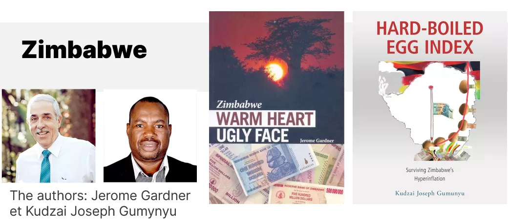
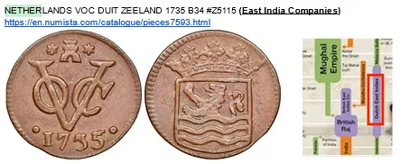

# Путешествие в мир экономики

Эта программа направлена на глубокое понимание возникновения гиперинфляций в мире, доминируемом фиатными валютами, и изучение их значительных последствий. Участники подробно исследуют циклы гиперинфляции, анализируя причины, триггеры, исторические и современные примеры. Они также рассмотрят ощутимое воздействие гиперинфляций на экономику и повседневную жизнь, изучая последствия для стоимости валюты, покупательной способности, индивидуальных и коллективных сбережений.

Здесь мы выделим тенденции и общие закономерности в эпизодах гиперинфляции на протяжении истории, предоставляя эффективные и конкретные стратегии защиты в периоды гиперинфляции. Участники получат возможность изучить различные варианты инвестиций и механизмы финансовой защиты, приобретая практические инструменты и необходимые знания, чтобы комфортного ориентироваться в нестабильной экономической обстановке.

+++

# Введение

<partId>6fe4d15d-f6e6-54be-9e04-0a75ac98df8b</partId>

## Введение

<chapterId>9d1aba8d-0485-5020-9863-5de37e6db8e0</chapterId>

Эта программа направлена на глубокое понимание возникновения гиперинфляций в мире, доминируемом фиатными валютами, и изучение их значительных последствий. Участники подробно исследуют циклы гиперинфляции, анализируя причины, триггеры, исторические и современные примеры. Они также рассмотрят ощутимое воздействие гиперинфляций на экономику и повседневную жизнь, изучая последствия для стоимости валюты, покупательной способности, индивидуальных и коллективных сбережений.

Здесь мы выделим тенденции и общие закономерности в эпизодах гиперинфляции на протяжении истории, предоставляя эффективные и конкретные стратегии защиты в периоды гиперинфляции. Участники получат возможность изучить различные варианты инвестиций и механизмы финансовой защиты, приобретая практические инструменты и необходимые знания, чтобы комфортного ориентироваться в нестабильной экономической обстановке.

### Учебная программа

Раздел 1 - Введение

- 1.1 - Введение в курс от Rogzy & David

Раздел 2 - Что такое инфляция?

- 2.1 - Денежное явление
- 2.2 - Типы инфляции
- 2.3 - Дефляция

Раздел 3 - Что такое гиперинфляция?

- 3.1 - Определения
- 3.2 - Сходства между Веймаром и Зимбабве
- 3.3 - Различия между Веймаром и Зимбабве и современные параллели
- 3.4 - Реденоминации в Латинской Америке
- 3.5 - Как выйти из гиперинфляции
- 3.6 - Презентация коллекции банкнот времен гиперинфляции

Раздел 4 - Как мы сюда попали?

- 4.1 - Появление второго уровня денег и центральных банков
- 4.2 - Книги и ресурсы

Удачи!

# Что такое инфляция?

<partId>2b4f456c-3649-5cf9-b9b0-a5bffe92d962</partId>

## Денежное явление

<chapterId>b2cbc915-c4ec-52b5-860c-0958f58c91e4</chapterId>

### Определения инфляции

Инфляция - это концепция, которая часто неправильно понимается из-за множества связанных с ней определений. Восприятие инфляции различается среди разных групп, таких как сторонники Биткойна и традиционные экономисты. Давайте сначала проясним определения, прежде чем обсуждать гиперинфляцию:

- Определение от Роберта: Инфляция - это чрезмерное увеличение платежных инструментов (банкнот, капитала), вызывающее рост цен и обесценение валюты.

- Определение от Ларусса: Инфляция - это явление, характеризующееся обобщенным и непрерывным ростом уровня цен. Здесь слово "обобщенный" имеет ключевое значение.

В свете этих определений важно понимать, что для Роберта инфляция в основном касается увеличения денежной массы. С другой стороны, Ларусс сосредотачивается на последствиях этого расширения, а именно на обобщенном росте цен.

В нашем исследовании гиперинфляции мы будем придерживаться второго определения, то есть обобщенного роста цен, так как оно более актуально и ясно для нашей темы. Однако крайне важно помнить, что этот рост цен, как правило, является результатом расширения денежной массы.
Известный экономист Милтон Фридман сказал:

> "Инфляция всегда и везде является денежным явлением."

Это утверждение подчеркивает внутреннюю связь между расширением денежной массы и инфляцией. В следующих разделах мы исследуем взаимодействие между инфляцией и экономическим ростом, исходя из этих фундаментальных определений.

### Понимание денежного явления

Говоря о денежном явлении, мы имеем в виду изменение объема денежной массы в экономике. Милтон Фридман в основном видел это как увеличение этой массы. Исторически существовало два основных метода увеличения денежной массы:

1. Печать денег:
   В традиционных денежных системах увеличение денежной массы достигалось путем физической печати новых банкнот. Хотя в настоящее время, с преобладанием цифровой валюты, эта печать в основном электронная (через базы данных центральных банков и других финансовых институтов), история показывает нам периоды, когда буквально печать банкнот приводила к гиперинфляции.

2. Снижение содержания металла:
   Другой метод заключался в снижении количества драгоценного металла в валютах, основанных на металлах, таких как серебро или золото. Ярким примером может служить Римская империя, где денарий, первоначально состоявший почти полностью из серебра, со временем видел драматическое снижение содержания серебра. Это привело к форме инфляции, но не обязательно к гиперинфляции.

Крайне важно подчеркнуть, что гиперинфляция в основном наблюдается с фиатными валютами, отсоединенными от их базовых активов, таких как драгоценные металлы. Исторически, когда валюта была основана на таких активах, были эпизоды инфляции (например, через девальвацию содержания металла), но эти эпизоды никогда не достигали крайних уровней гиперинфляции. В следующих разделах мы подробно изучим периоды денежной девальвации и последствия этих различных денежных систем для инфляции.

### Изучение периодов денежной девальвации

На протяжении истории различные цивилизации переживали периоды денежной девальвации. Некоторые из этих периодов совпадают с крупными событиями или войнами, которые оказывали давление на экономику.

#### 1. Пелопоннесская война и Вторая Пуническая война:

Пелопоннесская война, конфликт между Афинами и Спартой, и Вторая Пуническая война, между Римской Республикой и Карфагеном, являются самыми ранними примерами девальвации валюты, найденными в архивах. Чтобы финансировать эти войны, эти цивилизации девальвировали свои валюты, снижая содержание серебра и включая другие металлы, при этом увеличивая количество производимых монет.

Гравюра, изображающая массовое убийство афинян на берегах Ассинароса.

#### 2. Древний Рим во времена Империи:

После эпохи Римской Республики, во времена Империи, 3-й и 4-й века испытали значительную девальвацию валюты. Это иллюстрируется снижением содержания серебра в монетах, как видно на предыдущем графике. Исследование показывает, что цена на пшеницу в Египте, измеряемая в драхмах, увеличилась в миллион раз за период около 400 лет, с 40 г. до н.э. до 360 г. н.э. За этот период это представляет собой среднегодовую инфляцию около 4,4%. Однако эта инфляция была неравномерной. Она действительно началась около 238 г. н.э. С 250 по 293 г. н.э. уровень инфляции составлял около 3,65%, и он увеличился до 22,28% между 293 и 301 г. н.э.

Хотя эти периоды испытали значительную инфляцию, они не достигли уровней гиперинфляции, которые мы можем наблюдать в некоторых современных ситуациях. Причина этого заключается в том, что, несмотря на девальвацию валюты, она все еще была основана на драгоценных металлах. Это твердое основание обеспечивало некоторую защиту от экстремальных уровней инфляции. В следующих разделах мы более подробно исследуем природу и последствия гиперинфляции.

- Денарий Марка Аврелия (160 г. н.э.):
  Одной из самых знаковых монет древнего Рима является денарий, серебряная валюта. У меня есть конкретная монета от Марка Аврелия, датируемая 160 годом до начала крупной девальвации. Хотя камера может испытывать трудности с передачей мелких деталей, невооруженным глазом можно увидеть, что это красивая серебряная монета с относительно высоким содержанием серебра.

- Антониниан (конец 3-го века н.э.):
  С девальвацией валюты появилась новая валюта, антониниан. Эта валюта должна была стоить два денария, но содержала гораздо меньше серебра. Моя монета антониниана ясно показывает, что содержание серебра было значительно снижено. Она украшена короной, типичной для римских монет этого периода, называемых "радиатами". Сравнивая цвет и качество, можно увидеть, что антониниан далек от чистой серебряной монеты.
  Сравнивая две монеты рядом, разница бросается в глаза. Денарий 160 года имеет отчетливый серебряный вид, в то время как антониниан конца 3-го века н.э. гораздо тусклее, что указывает на значительное снижение содержания серебра. Это визуальное сравнение ясно иллюстрирует девальвацию валюты, которую пережил древний Рим за несколько веков.

Для завершения этой демонстрации идеально подошел бы график, иллюстрирующий девальвацию этих монет со временем. Хотя через эту платформу это сложно визуализировать, представьте себе график, показывающий стоимость денария, затем его снижение к концу 2-го века, замененного антонинианом, который должен был стоить два денария, но с гораздо меньшим содержанием серебра. Эти артефакты являются немыми свидетелями экономических колебаний прошлых цивилизаций.

#### 3. Испанский мараведи: свидетельство целенаправленной девальвации

Мараведи, как медная валюта, занимает особое место в истории испанской валюты. Как было упомянуто ранее, испанский доллар изначально был международным стандартом, важной резервной валютой для Испании. Однако, столкнувшись с определенными экономическими трудностями, Испании пришлось прибегнуть к изощренным денежным стратегиям.

Девальвация валюты - это инструмент, который часто используют государства для финансирования своих расходов или стимулирования экономики. Однако Испания оказалась в деликатной ситуации. Ухудшение качества монет испанского доллара могло бы подорвать его позиции в международной торговле. Чтобы преодолеть этот дилемму, Испания обратилась к мараведи.

В отличие от ценного испанского серебряного доллара, мараведи был медной валютой, в основном используемой внутри местного населения. Эта валюта была предназначена для девальвации. Когда монета мараведи изначально стоила два мараведи, государство изымало ее, перечеканивало с новым номиналом, например "четыре", и возвращало владельцу только одну монету. Монета с отметкой "восемь" является свидетельством этого процесса, пережившего несколько циклов девальвации.

Эта стратегия позволила государству эффективно девальвировать валюту, создавая инфляцию и косвенно финансируя себя, при этом сохраняя ценность испанского доллара на международной арене. Однако эта целенаправленная девальвация имела последствия для местного населения, которое видело обесценивание своей общей валюты.

Случай с мараведи иллюстрирует, как государство может избирательно девальвировать местную валюту, чтобы удовлетворить свои внутренние экономические потребности, сохраняя при этом стоимость резервной валюты на глобальной арене. Это яркий пример сложности и изысканности денежной политики в истории.

Подробнее о чем? -> [Ссылка](https://docs.google.com/document/d/1aZa7gvz1nt8ZHDCoWKQdS9RGGjBHdipH1ApC8dW1xpM/edit?usp=sharing)

#### 4. Ценовая революция с 15-го по 17-й век

Между 15-м и 17-м веками Европа стала свидетелем замечательного экономического явления, часто называемого "ценовой революцией". Этот период инфляции был во многом вызван массовым притоком драгоценных металлов, особенно золота и серебра, из Америки. Поскольку европейская экономика в то время в значительной степени базировалась на металлическом стандарте, это дополнительное предложение металлов увеличило денежную массу. В результате возникла инфляция на уровне около 1-2% в год. На первый взгляд, такая инфляция может показаться скромной. Однако в то время такие колебания цен были достаточно необычными, чтобы их считали "революцией". Это подчеркивает, как изменения в денежных резервах могут влиять на всю экономическую систему.

#### 5. Джон Ло и ассигнаты

В 18-м веке французская экономическая история была отмечена двумя значительными событиями, связанными с валютой. Во-первых, Джон Ло, шотландский экономист и финансист, убедил французское правительство принять денежную систему, основанную на бумажных деньгах. Хотя изначально это считалось инновационным решением финансовых проблем страны, эта инициатива быстро привела к бурной инфляции. Затем, вскоре после этого, во время бурь Французской революции, правительство ввело "ассигнаты".

Ассигнаты 1793 года

Эти банкноты являются живым свидетельством первого крупного периода гиперинфляции в истории. Изначально разработанные как ответ на последовательные финансовые кризисы, ассигнаты быстро стали символом монетарной нестабильности. Правительство, чрезмерно полагаясь на эту бумажную валюту для финансирования своих расходов, вызвало беспрецедентный экономический кризис и создало крупный период гиперинфляции во Франции после революции.

#### 6. Исполнительный приказ 6102 и обесценение доллара

Исполнительный приказ 6102 и обесценение доллара

В Соединенных Штатах начало 1930-х годов стало свидетелем крупного изменения в денежно-кредитной политике. Вот подробный обзор этого преобразования:

- Банкнота в 20 долларов 1928 года

В 1928 году на банкноте в 20 долларов США говорилось: "обмениваемая на золото по требованию". Это означало, что каждая купюра была буквально конвертируема в золото. В частности, банкнота в 20,67 доллара была эквивалентна одной унции золота.

- Исполнительный приказ 6102

В 1933 году произошло крупное потрясение с изданием Исполнительного приказа 6102. Этот декрет сделал незаконным владение золотом гражданами, будь то в виде слитков, монет или сертификатов.

Хорошим примером является Золотой сертификат. На нем было написано: "В золотой монете, выплачиваемой держателю по требованию". Владение таким сертификатом стало незаконным и оставалось таковым до 1964 года.

- Введение новых банкнот

После изъятия золота в 1934 году в обращение была введена новая серия банкнот.

Упоминание об их конвертируемости в золото было убрано и заменено на "Эта банкнота является законным средством платежа по всем долгам".

- Переоценка золота

Что удивительно в этом переходе, так это стратегия правительства. В 1934 году цена золота была пересмотрена и установлена в 35 долларов за унцию вместо 20,67 доллара. По сути, правительство обесценило доллары, которыми владели люди. Покупая золото у населения по цене 20,67 доллара за унцию в 1933 году, а затем переоценивая цену золота в 1934 году, правительство получило значительную прибыль, обесценивая сбережения граждан.

В итоге, за год, правительство фактически изъяло золото у граждан, затем изменило правила игры, переоценив стоимость золота в свою пользу и в ущерб тем, кто изначально обменял свое золото на банкноты.

### США меняют историю.

Соединенные Штаты совершили исторический поворот, став первыми, кто обесценил мировую резервную валюту, доллар США, вопреки предыдущим практикам, наблюдавшимся в малых торговых нациях.

Ранее, во времена Возрождения, итальянский флорин, выпущенный Флоренцией в 13 веке, был международной резервной валютой, и в течение его использования не было зафиксировано никакой девальвации, что отражает важность монетарной стабильности для международной торговли.

В том же духе Испания и Нидерланды, как держатели мировой резервной валюты благодаря их процветающей международной торговле, поддерживали целостность своей валюты, чтобы сохранить доверие и статус-кво в международных обменах. Нидерланды даже стали свидетелями создания первого центрального банка, ключевого этапа в глобальной эволюции денежной системы.

Однако ситуация изменилась с возникновением Соединенных Штатов как доминирующей экономической державы. Они решили обесценить свою резервную валюту, таким образом используя инфляцию в своих интересах. Это решение часто приписывают изменению динамики, когда выбор резервной валюты уже не был таким свободным, как раньше. Американская гегемония установила доллар как мировую резервную валюту, позволяя манипулировать его стоимостью. Этот сдвиг показывает потенциальное влияние монетарной политики на международную торговлю в глобализированной экономике, отмечая значительный переход в управлении глобальными резервными валютами.

### Последний пример на дорожку: Швейцарский динар

Швейцарский динар иллюстрирует еще один удивительный аспект девальвации валюты, на этот раз в контексте предвоенного Ирака в период до войны в Персидском заливе. Он был назван так из-за замечательного качества своих банкнот. Эту валюту выпускал Центральный банк Ирака, и она пользовалась репутацией стабильности в регионе Ближнего Востока. Это доверие было в основном связано с качеством печати банкнот, которое осуществлялось в Англии, что подразумевало определенную устойчивость к девальвации.

Однако войны в Персидском заливе стали переломным моментом в истории Швейцарского динара. Ирак, не имея возможности полагаться на своего английского поставщика для печати банкнот, обратился к Китаю. Этот переход привел к явному различию в качестве банкнот, при этом китайская версия воспринималась как низкопробная. Это восприятие не было безосновательным; китайские банкноты были более подвержены подделке и подвергались чрезмерной печати правительством, что угрожало их стоимости.

В поствоенной экономике Ирака возникло отличительное явление: система двойного ценообразования. Торговцы предлагали разные цены в зависимости от типа банкноты, используемой для оплаты, отдавая предпочтение оригинальному Швейцарскому динару перед китайской банкнотой. Эта система отражала сохранение доверия к банкнотам высшего качества, которые были менее подвержены девальвации, даже в контексте, где стоимость в основном навязывалась государством. Этот эпизод демонстрирует важность внутренних характеристик валюты и то, как, даже в режиме фиатной валюты, воспринимаемое качество валюты может влиять на ее относительную стоимость и, как следствие, на доверие экономических участников.

#### Да, мы действительно взвешивали монеты!

Распространенное восприятие часто ассоциирует валюту с созданием государства, где ее выпуск и стоимость регулируются государством. Эта концепция имеет корни в древних цивилизациях, таких как Рим, где монеты стандартизировались и клеймились Империей, тем самым придавая официальную стоимость валютам. Однако более глубокое исследование показывает, что внутренняя стоимость валюты в основном происходила от содержания в ней драгоценного металла.

Пример иллюстрируется через рассмотрение монетного веса, эквивалентного восьми испанским реалам или одному испанскому доллару. Этот вес, помеченный римским числом, указывающим его стоимость, использовался обменниками валют для оценки стоимости монет на основе их веса, а не только клейма. Взвешивая монеты, обменники могли определить, были ли они изменены или повреждены, что могло снизить их стоимость. Эта практика подчеркивает, что, хотя стандартизированное клеймо государства придавало валюте определенную номинальную стоимость, истинная стоимость заключалась в весе содержащегося в ней драгоценного металла.
Этот анализ показывает, что доверие к валюте, а следовательно, и ее ценность, были обусловлены не столько заявлениями государства, сколько ее материальной сущностью. Это подчеркивает двойственность между номинальной стоимостью, установленной государством, и внутренней ценностью, диктуемой содержанием драгоценного металла. Таким образом, валюта выходит за рамки простого государственного инструмента, ее основная ценность неразрывно связана с осязаемыми и измеримыми элементами.

#### Заключение

В заключение, это исследование девальвации денег открывает дверь к глубокому пониманию механизмов инфляции, которые будут исследованы в следующих видео. Мы обсудим различные типы инфляции и порог, при котором они переходят в высокую или гиперинфляцию. Эта прочная основа позволит нам рассмотреть сложности инфляции в предстоящих сессиях. Спасибо за ваше внимание, и до встречи в следующем видео, где мы продолжим нше исследование денежной динамики.

## Типы инфляции

<chapterId>b438fe09-375e-5bb2-9196-7dd687b9f98c</chapterId>

### Инфляция не является многофакторным явлением

В этом разделе мы рассмотрим различные аспекты инфляции, явление, которое часто неправильно понимается. Хотя инфляция часто воспринимается как многофакторное явление в СМИ и повседневных обсуждениях, важно помнить, что по сути это денежное явление.

Вот разбивка темы на несколько ключевых пунктов:

- Различие между ростом цен и инфляцией:

  Рост цен может быть специфичен для отдельного сектора и вызван различными факторами, такими как сокращение производства ОПЕК для нефти или неблагоприятные погодные условия для пшеницы.
  Инфляция, с другой стороны, определяется как общее увеличение цен на широкий спектр товаров и услуг, а не только в конкретном секторе.

- Денежная сущность инфляции:
  При фиксированном объеме денежной массы увеличение цен в одном секторе приведет к снижению цен в других секторах, поскольку количество денег, доступных для расходов в другом месте, будет уменьшено. Инфляция тесно связана с увеличением денежной массы, что позволяет одновременно повышать цены во всех секторах.

- Влияние денежной массы на инфляцию и дефляцию:

  В системе с фиксированной денежной массой увеличение производства теоретически должно привести к дефляции, то есть к снижению цен, поскольку становится доступно больше товаров и услуг.
  В текущей системе фиатных денег увеличение денежной массы нивелирует потенциальную дефляцию, вызванную увеличением производства.

- Отрицательные эффекты корректировки денежной массы:

  Увеличение денежной массы без соответствующего увеличения производства приводит к инфляции, так как в обращении находится больше денег на то же количество товаров и услуг.
  Хотя увеличение производства должно было привести к дефляции, одновременное увеличение денежной массы аннулировало этот эффект, в результате чего возникла инфляция.

- Инфляция, дефляция и денежная масса: Сообщающиеся сосуды:

  Инфляция и дефляция подобны сообщающимся сосудам в экономике. Увеличение производства может привести к дефляции, но если одновременно увеличивается денежная масса, дефляционный эффект нивелируется, что приводит к инфляции.

Это обсуждение подчеркивает важность понимания основных механизмов инфляции и дефляции, а также то, как манипулирование денежной массой может иметь глубокие последствия для экономики. Вероятно, мы вернемся к этим концепциям позже для более глубокого понимания их взаимосвязи и влияния на мировую экономику.

### Почему печать денег не всегда вызывает инфляцию?

#### Инфляция ≠ ИПЦ (индекс потребительских цен)

Инфляция, хотя часто ассоциируется с увеличением денежной массы, не всегда имеет прямую корреляцию с печатанием денег, как это было показано в период после финансового кризиса 2008 года. Несмотря на значительное печатание денег для спасения банков, следующее десятилетие не испытало высокой инфляции, средний показатель которой составлял от 0 до 2% в год (в США). Эта ситуация поднимает вопрос: почему массовая печать денег не привела к пропорциональной инфляции? Ответ кроется в нескольких нюансах, связанных с измерением инфляции и Индексом Потребительских Цен (ИПЦ).

Первое объяснение заключается в способе измерения инфляции. Индекс Потребительских Цен (ИПЦ), используемый как основной показатель инфляции, имеет определенные ограничения. Например, он не учитывает в полной мере эволюцию цен на недвижимость. Хотя ИПЦ включает компонент, связанный с арендной платой, значительная прибавка в стоимости домов не отражается полностью. В результате значительные увеличения стоимости жилья могут происходить без полного отражения в ИПЦ, потенциально недооценивая фактическую инфляцию.

Кроме того, в расчет ИПЦ включены определенные методологии, которые могут компенсировать или маскировать фактическое увеличение цен. Например, качественные улучшения продуктов могут использоваться для корректировки индекса. Если цена продукта увеличивается, но его качество или характеристики также улучшаются, ИПЦ может считать, что реальная стоимость для потребителя не изменилась, и, следовательно, не отражать инфляцию. Показательный пример - несмотря на увеличение цен на говядину и компьютеры из-за монетарной инъекции, улучшение производительности компьютеров используется для компенсации этого увеличения. Если компьютер стоит в два раза дороже, но в четыре раза мощнее, ИПЦ может интерпретировать это как снижение цен, таким образом маскируя увеличение цен на говядину.

Эти нюансы в измерении инфляции с помощью ИПЦ  подчеркивают сложность отношений между печатью денег и инфляцией. Они также предполагают, что фактическая инфляция может быть выше, чем сообщается, если все увеличения цен, особенно в ключевых секторах, таких как недвижимость, были бы более полно учтены. Этот анализ подчеркивает важность понимания основных механизмов инфляции и ограничений традиционных индексов, используемых для ее измерения, чтобы лучше понимать экономическое воздействие монетарной политики.

#### Аргументы Современной Денежной Теории (CДТ)

Современная Денежная Теория (СДТ) предлагает отличную от традиционных теорий перспективу на создание денег и инфляцию. Согласно СДТ, деньги в первую очередь происходят от государства, которое может печатать значительные суммы для финансирования своих потребностей без вызова инфляции, пока сектора, на которые направлены эти средства, не насыщены. Это подход, отклоняющийся от традиционных монетарных теорий и подчеркивающий важность вместимости секторов в инфляционной динамике.

Показательным примером СДТ является американский военно-промышленный комплекс. Согласно СДТ, сотни миллиардов долларов могут быть выделены этому сектору без вызова инфляции благодаря его абсорбционной способности. В контрасте, если значительные средства будут вложены в строительство дорог в Соединенных Штатах, где количество компаний и рабочей силы ограничено, инфляция может возникнуть из-за дефицита ресурсов и увеличения стоимости, требуемой поставщиками.
Япония часто упоминается сторонниками СДТ как другой пример отсутствия инфляции несмотря на значительную печать денег. Однако, ситуация в Японии также подчеркивает ограничения традиционных мер инфляции, таких как Индекс Потребительских Цен (ИПЦ). В Японии большая часть напечатанных денег либо сберегается, либо инвестируется в недвижимость или фондовые рынки, а не тратится в текущей потребительской экономике. ИПЦ, не полностью улавливая эти динамики, может недооценивать фактическую инфляцию.

Анализ Японии (https://ideas.repec.org/p/ces/ceswps/_9821.html) также подчеркивает, что поведение экономических агентов, таких как сбережение или инвестирование в активы, не включенные в ИПЦ, может скрывать инфляционное воздействие печатания денег. Кроме того, способность различных секторов абсорбировать введенную ликвидность играет ключевую роль в том, произойдет ли инфляция или нет.

#### Балансовые отчеты банков и Центрального банка

Третий пример того, почему печатание денег не приведет к инфляции, заключается в том, что связь между печатанием денег и инфляцией модулируется тем, как вновь созданные деньги вводятся в экономику. Если эти деньги остаются на балансах частных банков без кредитования экономическим агентам, они не будут напрямую влиять на реальную экономику и, следовательно, не приведут к инфляции.

Печатание денег можно рассматривать как меч Дамокла, нависший над экономикой. Созданные деньги могут оставаться латентными в течение определенного периода времени без какого-либо видимого инфляционного эффекта, до тех пор пока они не будут введены в экономику через банковские кредиты или другие механизмы. Однако, когда эти латентные деньги наконец попадают в оборот, инфляционные эффекты могут затем проявиться. Это было наблюдаемо в 2020-х годах, когда ранее созданные деньги нашли свой путь в экономику, приведя к инфляции.
Этот сценарий подчеркивает важность механизмов монетарной передачи в определении инфляционного воздействия печатания денег. Создание денег центральным банком является лишь одной частью головоломки. Поведение частных банков, которые решают объем кредитования, и поведение заемщиков, которые решают, как они будут тратить взятые в долг деньги, также являются ключевыми элементами в этой динамике.

#### Инфляция - это социальное явление!

Пример Веймарской Республики иллюстрирует еще один критически важный аспект связи между печатанием денег и инфляцией: роль ожиданий и поведение экономических агентов. Когда Центральный банк Веймарской Республики начал печатать большое количество денег, экономическая неопределенность заставила людей складировать, то есть хранить деньги, а не тратить их. Эта реакция временно задержала инфляционные эффекты печатания денег.

Однако, когда экономическая ситуация начала немного улучшаться, доверие постепенно восстанавливалось. Люди затем извлекали свои сбережения из укрытий и начинали массово тратить в экономике. Это внезапное изменение поведения, в сочетании с уже высоким объемом денежной массы, привело к взрыву спроса. С большим количеством денег в обороте и увеличенным спросом цены начали быстро расти, что привело к заметной инфляции.

Этот пример подчеркивает важность времени и поведения агентов в проявлении инфляции. Инфляция происходит не только в ответ на увеличение денежной массы, но и в зависимости от того, как и когда эти деньги тратятся в экономике. Экономические неопределенности и ожидания экономических агентов играют важную роль в этой динамике и могут либо ускорить, либо задержать инфляционные эффекты печатания денег.

#### Итоги:

- Индекс потребительских цен (ИПЦ): ИПЦ структурирован таким образом, что недооценивает инфляцию, что может дать искаженное представление о инфляционной реальности.

- Секторальное поглощение: Монетарное вливание в сектора, способные его абсорбировать, не всегда приводит к инфляции. Основным примером является военно-промышленный комплекс США, который может абсорбировать большие суммы денег без вызова инфляции.

- Случай Японии: Несмотря на значительное печатание денег, инфляция остается низкой в Японии, потому что средства часто сберегаются или инвестируются в недвижимость или фондовые рынки. Эти сектора абсорбируют напечатанные деньги, и ИПЦ не обязательно отражает рост цен в этих областях.

- Корреляция между печатью денег и рынками: Наблюдается, что кривые рынка недвижимости и акций часто следуют за печатью денег, указывая куда направляются напечатанные деньги.
  
- Резервы банков: Когда напечатанные деньги остаются на балансах банков и не циркулируют в экономике, это не вызывает инфляции. Это иллюстрируется на примере 2008 года, когда напечатанные деньги в основном оставались на балансах банков, задерживая инфляционный эффект.

- Веймарская республика: Этот исторический период показывает, как экономическая неопределенность привела к накоплению денег, задерживая инфляцию. Однако, как только было восстановлено доверие и деньги были потрачены, инфляция взлетела.

Эти примеры можно использовать в дискуссиях, чтобы объяснить, почему инфляция не всегда является немедленным следствием печати денег, и как экономические контексты и поведение агентов влияют на инфляцию.

Потому что, как показывает этот [тред](https://twitter.com/saifedean/status/1673639779433590786): Инфляция - это все, кроме вины центральных банков.

- Экономисты обвиняют в инфляции изменение климата 

- Пример, когда Швеция обвиняла Бейонсе в инфляции в течение определенного месяца.

- Центральный банк Польши приписывает инфляцию российской агрессии в Украине и пандемии

- Brexit обвиняется в инфляции в Великобритании.

- Выпуск игры Zelda ассоциируется с инфляционным шоком.

- Утверждается, что Тейлор Свифт вызывает инфляцию.

Как могут Бейонсе или Тейлор Свифт, скажите мне, объяснить общий рост цен? Вы видите, это не имеет смысла. Вкратце:

### Исследование типов инфляции

Крайне важно понимать различие между разными типами инфляции, понимание, которое позволяет нам охватить различные проявления этого экономического явления. Далее мы приводим объяснение различных типов инфляции:

- Ползучая инфляция: Это тип инфляции, за который обычно стремятся центральные банки, устанавливая его на уровне около 2% в год (в США). Эта цель была принята с 1990-х годов и направлена на поддержание стабильного экономического роста без перегрева или дефляции.
  
- Умеренная инфляция: Этот вид инфляции возникает, когда инфляция превышает цель в 2%. Часто это ассоциируется с перегретой экономикой, состоянием, когда избыточное предложение денег стимулирует общее увеличение цен. Этот сценарий показывает пределы монетарной политики и иногда выявляет противоречия в экономическом дискурсе.
  
- Галопирующая инфляция: Галопирующая инфляция, часто называемая инфляцией с двузначными показателями, возникает, когда годовая инфляция превышает 10%. Это отмечает значительный скачок цен, который может подорвать экономическую стабильность.

- Гиперинфляция: Гиперинфляция - это экстремальное явление, когда инфляционный показатель превышает 50% в месяц, что, учитывая экспоненциальный характер инфляции, эквивалентно годовой инфляции более 13 000%. Этот уровень инфляции серьезно дестабилизирует экономику, делая валюту почти бесполезной и вызывая потерю доверия к денежной системе.

При изучении типов инфляции часто встречаются термины, такие как "Инфляция от спроса" и "Инфляция от издержек" в образовательных ресурсах. Хотя эти концепции валидны, они склонны объяснять увеличение цен, а не инфляцию как денежное явление. Вот более глубокий анализ:

- Инфляция от спроса:
  Инфляция от спроса часто объясняется как ситуация, когда спрос в экономике превышает доступное производство. Однако, без соответствующего увеличения денежной массы, эта ситуация просто приведет к перераспределению расходов. Потребители могут тратить больше на основные товары и меньше на другие, тем самым нейтрализуя общий инфляционный эффект.

- Инфляция от издержек:
  С другой стороны, инфляция от издержек приписывается увеличению производственных затрат, таких как стоимость природных ресурсов или труда. Опять же, без увеличения денежной массы, увеличение затрат в одном секторе может просто сократить расходы в других, не вызывая широкомасштабной инфляции.
  Эти традиционные объяснения часто ассоциируют увеличение цен с инфляцией, что вызывает путаницу. На самом деле, для возникновения широкомасштабной инфляции необходимо увеличение денежной массы. В этом контексте, концепции Инфляции от спроса и Инфляции от издержек могут объяснять секторальные колебания цен, но они не отражают денежную природу инфляции. Это подчеркивает важность различия между секторальным увеличением цен и широкомасштабной инфляцией, и подтверждает необходимость увеличения денежной массы для проявления инфляции во всей экономике. Этот анализ предлагает более тонкое и точное представление о реальных причинах инфляции и развенчивает общие интерпретации, которые могут скрывать основные денежные динамики.

### Классификация инфляции по Бернхольцу

Бернхольц предлагает упрощенную, но точную классификацию инфляции на три категории, позволяющую лучше понять этот сложный денежный феномен:

- Умеренная инфляция:
  Умеренная инфляция происходит, когда уровень денежной массы выше нормы, но без прибегания государства к большим дефицитам, финансируемым созданием денег. Хотя термин "умеренная" может показаться незначительным, эта форма инфляции может вызвать существенные проблемы, хотя она и не классифицируется как высокая инфляция.

- Высокая инфляция:
  Высокая инфляция происходит, когда реальная стоимость денежной массы уменьшается, несмотря на увеличение в номинальных терминах. Эта парадоксальная ситуация возникает из-за монетарной субституции, когда люди теряют доверие к национальной валюте и стремятся обменять ее на товары, услуги или иностранную валюту. Этот процесс дальше снижает реальную стоимость валюты, усугубляя инфляцию.

- Гиперинфляция:
  Гиперинфляция является расширением высокой инфляции, характеризующейся большими бюджетными дефицитами, финансируемыми созданием денег. Исторически, ни один случай гиперинфляции не наблюдался без значительного финансирования дефицита за счет печатания денег. Гиперинфляция создает зловещий цикл: инфляция так быстро разъедает стоимость валюты, что налоговые доходы обесцениваются до того, как государство успеет их собрать, заставляя государство печатать еще больше денег для самофинансирования. Этот самоподдерживающийся цикл приводит к астрономическим темпам инфляции, часто превышающим 50% в месяц.
  Эта классификация по Бернхольцу подчеркивает опасное развитие от умеренной инфляции к гиперинфляции, акцентируя внимание на критической важности контроля за денежной массой и бюджетом для предотвращения разрушительных инфляционных спиралей. Она также демонстрирует, что вредные последствия для государственного финансирования могут наступить задолго до достижения стадии гиперинфляции, предоставляя тонкое понимание последствий инфляции на различных степенях.

### Заключение: Сводка типов инфляции

В заключение мы рассмотрели ряд типов инфляции, начиная с общеизвестных терминов, таких как "ползучая инфляция", "ходовая инфляция" и "галопирующая инфляция", каждый из которых обозначает различные уровни процентов инфляции в экономике. Однако для нашего подробного изучения гиперинфляции категории умеренной инфляции, высокой инфляции и гиперинфляции, как описано Бернхольцем, оказываются критически важными ориентирами.

- Умеренная инфляция:
  Она указывает на уровень предложения денег выше нормы, хотя этот уровень может поддерживаться без значительного финансирования дефицита государством.

- Высокая инфляция:
  Она возникает, когда реальная стоимость денежной массы уменьшается, часто из-за монетарной субституции, когда люди стремятся обменять свою валюту на товары, услуги или другие валюты.

- Гиперинфляция:
  Она представляет собой крайнюю форму высокой инфляции, где чрезмерное создание денег для финансирования больших бюджетных дефицитов приводит к быстрому снижению реальной стоимости валюты.

Из нашего исследования выясняется, что гиперинфляция - это сложное и контринтуитивное явление. Хотя можно предположить, что гиперинфляция является результатом массового увеличения денежной массы, на самом деле она проистекает из снижения реальной стоимости этой денежной массы. Этот нюанс критически важен для понимания, почему некоторые страны испытывают трудности с выходом из гиперинфляции, даже при поддержке международных институтов, таких как Всемирный банк или МВФ. Неправильная характеристика типа инфляции может привести к применению неподходящих средств решения, усугубляя экономические проблемы вместо их разрешения.

В наших будущих обсуждениях мы более глубоко погрузимся в тему гиперинфляции, исследуя ее определения и проявления в различных экономических контекстах. Наша цель будет заключаться в том, чтобы раскрыть основные механизмы гиперинфляции и исследовать потенциальные решения для ее устранения. Это глубокое понимание позволит нам лучше осознать связанные с ней вызовы и предложить обоснованные стратегии управления инфляцией.
Спасибо за ваше внимание. Следующая сессия будет полностью посвящена определению и разъяснению гиперинфляции с учетом различных академических и практических точек зрения. Мы с нетерпением ждем возможности продолжить это исследование с вами на нашей следующей встрече.

# Что такое гиперинфляция?

<partId>3f541663-1e2f-5410-8ee0-f61c5d009fa5</partId>

## Определения гиперинфляции

<chapterId>d2a71a2e-5f36-58d9-993c-d431f4aa07fd</chapterId>

### Определения гиперинфляции

В этом разделе мы исследуем различные определения гиперинфляции, ключевой термин в изучении экстремальных денежных явлений. Наиболее известное определение предложил Филип Каган в своей работе 1956 года "Денежная динамика гиперинфляции", предлагая количественное понимание гиперинфляции. Согласно Кагану:

- Начало и конец гиперинфляции:
  - Гиперинфляция начинается, когда месячная инфляция превышает 50%.
  - Она заканчивается, когда инфляция падает ниже 50% в месяц как минимум на один год.

Например, если инфляция снижается до 40% в июле и не поднимается выше 50% до июля следующего года, то период гиперинфляции считается завершенным в июле предыдущего года. Это определение позволяет точно характеризовать эпизоды гиперинфляции, обеспечивая структурированный анализ.

Это определение было принято в таблице Ханке-Круса, которая документирует 56 эпизодов гиперинфляции. Однако таблица не охватывает все эпизоды, такие как тот, что произошел в Венесуэле в 2016 году, увеличивая общее число до 57.

увеличить

Следует отметить, что это определение, хотя и точное, может исключать некоторые эпизоды гиперинфляции из-за строгости порога в 50%. Существует возможность расширения этого определения для включения других эпизодов, которые, хотя и не строго соответствуют критериям Кагана, тем не менее представляют периоды чрезвычайно высокой инфляции. Это наблюдение открывает дверь к более широкому изучению явлений гиперинфляции, позволяя получить более тонкое понимание её причин и последствий. В последующих обсуждениях мы рассмотрим возможность пересмотра этого определения и изучения эпизодов гиперинфляции, не покрытых строгими критериями Кагана.

### Определение гиперинфляции по Кагану

Филип Каган, возможно, установил произвольный рубеж с порогом месячной инфляции в 50% при определении гиперинфляции. Сам он признает, что это определение произвольно и в первую очередь служило его анализу на основе семи эпизодов гиперинфляции. Изучение данных Кагана показывает, что три эпизода гиперинфляции с самыми низкими месячными темпами инфляции были около 47%, 46% и 57%. Похоже, что порог в 50% был выбран для охвата этих случаев в его исследовании.

- Исторический контекст:
  Определение Кагана датируется 1956 годом и основано на ограниченном количестве эпизодов гиперинфляции, доступных в то время.

- Наблюдения Кагана:
  Согласно Кагану, ни один эпизод не достиг этого порога около 50% без перехода к более серьезной гиперинфляции, что могло бы оправдать выбор этого порога.

- Критика определения Кагана:
  Другие экономисты, такие как Бернхольц, автор книги "Monetary Regime and Inflation", также описывают порог в 50% как произвольный.
  Бернхольц отмечает, что есть эпизоды высокой инфляции с теми же качественными характеристиками, что и эпизоды гиперинфляции, без достижения порога в 50%.

Это размышление заставляет нас задуматься о жесткости традиционного определения гиперинфляции и подчеркивает необходимость, возможно, пересмотреть этот порог, включив больше эпизодов и исторических данных. Определение гиперинфляции может требовать гибкости для охвата различных проявлений экстремальной инфляции в разных экономических и исторических контекстах.

### Определение гиперинфляции согласно Международному совету по стандартам бухгалтерского учета (IASB)

Итак, сколько всего случаев гиперинфляции?
Общие определения гиперинфляции, такие как предложенное Каганом, утверждающее месячный инфляционный темп в 50%, иногда могут быть сбивающими с толку или упрощенными. Например, две страны, испытывающие соответственно годовые темпы инфляции в 1000% и 3000%, могут восприниматься по-разному в зависимости от месячного распределения этой инфляции. Если ни один месяц не превышает порог в 50%, согласно определению Кагана, эти страны не будут находиться в состоянии гиперинфляции. Такой подход, следовательно, может привести к аномалиям в классификации гиперинфляции, особенно при сравнении накопленной инфляции за год.

- Работа Кагана "Monetary Dynamics of Hyperinflation", которая предоставляет фундаментальный анализ гиперинфляции.
- Книга Бернольда, изучающая 30 отдельных периодов гиперинфляции, тем самым расширяя область анализа.
- Личная коллекция банкнот Дэвида из 36 периодов гиперинфляции, позволяющая получить осязаемое и историческое понимание.
- Таблица Гиперинфляции Хэнки (версия 2012 года, обновленная в 2016 году с добавлением Венесуэлы), перечисляющая 57 периодов гиперинфляции на основе определения Кагана.
  Следует отметить, что некоторые исторические периоды высокой инфляции не включены в классические таблицы гиперинфляции, часто из-за строгих критериев классификации. Например, во время Войны за независимость США в ноябре 1779 года и во время Гражданской войны в США в марте 1864 года месячные темпы инфляции составляли 47.4% и 40% соответственно. Эти показатели, хотя и высокие, не превышают порог в 50%, установленный Каганом, исключая таким образом эти периоды из классификации как случаи гиперинфляции. Это упущение иллюстрирует ограничения жестких определений и подчеркивает необходимость более тонкого подхода к пониманию гиперинфляции во всей ее сложности.

## Сходства Веймара и Зимбабве

<chapterId>11eef458-aab8-5c63-8523-264d0ba69f5d</chapterId>

### Две эпохи, две катастрофы

В этой главе мы исследуем последствия гиперинфляции, сосредотачиваясь на случаях Зимбабве и Веймарской республики. В ходе моих исследований я отдавал предпочтение изучению прямых свидетельств людей, переживших эти периоды гиперинфляции, в отличие от чисто экономического или статистического подхода.

Несколько книг были особенно информативны:

- "Когда деньги умирают" Адама Фергюсона, прослеживает гиперинфляцию после Первой мировой войны в Германии, а также в Австрии и Венгрии.
- Две книги о гиперинфляции в Зимбабве, "Зимбабве: теплое сердце, уродливое лицо" и "Индекс вареного яйца" Джерома Гарднера и Кудзая Джозефа Гоу Мин-Ю соответственно, предлагают проницательные свидетельства от генерального директора сети магазинов одежды и аграрного банкира о их переживаниях в этот бурный период.
  

Обобщая мои заметки, я заметил многочисленные сходства между переживаниями гиперинфляции в Зимбабве и Веймарской республике, несмотря на 90-летний разрыв между ними. Я выявил около 17 сходств, и 13 из них, иллюстрирующих движение в сторону экономической катастрофы, изображенной в этих свидетельствах. Эти удивительные параллели демонстрируют повторяющийся и разрушительный характер гиперинфляции через время и границы. Сегодня мы рассмотрим эти сходства и то, как они изображают тревожную траекторию в периоды гиперинфляции.

### Сравнительный анализ: Зимбабве и Веймарская республика

Игра в 14 различий!

1. Нехватка валюты

Когда валюта обесценивается с головокружительной скоростью, даже самые амбициозные попытки засыпать рынок новыми банкнотами могут оказаться недостаточными. Непрекращающийся спрос на наличные деньги может значительно превысить способность центральных банков производить банкноты, создавая беспрецедентные кризисы ликвидности.

> Веймар: "В течение этого месяца она будет увеличена до почти 4 миллиардов бумажных марок, цифра, с которой, как надеются, недостаток валюты будет окончательно преодолен."

> Зимбабве: "С 2002 по январь 2009 года было несколько критических нехваток ликвидности. Просто не хватало напечатанных или находящихся в обращении банкнот, чтобы поспевать за стремительной инфляцией."

2. "И это навоз!"

Скорость, с которой валюта может терять свою ценность в определенных экономических ситуациях, поражает. Астрономические суммы банкнот могут быть выпущены в рекордные сроки, мгновенно превращая когда-то значительные суммы в нечто такое же незначительное, как навоз. 

>Веймар: "Текущий общий выпуск составляет 63,000 миллиарда. Через несколько дней мы сможем выпустить две трети общего оборота за один день."

>Зимбабве: "17 сентября 2006 года губернатор РБЗ, Гидеон Гоно, заявил: '10 триллионов все еще в обороте, и они превратились в навоз.'"

3. Банкноты, стоимость которых ниже стоимости бумаги, на которой они напечатаны.
   
В определенных экономических условиях внутренняя стоимость банкноты может стать ниже стоимости бумаги, на которой она напечатана. Эта катастрофическая девальвация превращает банкноты, которые обычно являются символами стоимости и покупательной способности, в просто бесполезные куски бумаги.

> Веймар: "Целые номиналы марок становились почти бесполезными, как только они выходили из печатного станка."

> Зимбабве: "Центральный банк тратил деньги, печатая банкноту, которая не стоила даже бумаги, на которой она была напечатана. Другими словами, ее стоимость была ниже, чем у туалетной бумаги. Как абсурдно это ни звучит, использовать банкноту в 100 триллионов ZWD в качестве туалетной бумаги было дешевле, чем купить настоящую туалетную бумагу."

4. Счет денег

Когда валюта быстро теряет свою стоимость, даже самые простые транзакции могут стать трудоемкими задачами. Расчет стоимости товара или просто подсчет купюр, необходимых для оплаты, может занять несколько минут, добавляя слой сложности к повседневным взаимодействиям.

> Веймар: "Самая обычная покупка в магазине требовала трех-четырех минут на расчеты, и после определения цены обычно требовалось еще несколько минут, чтобы пересчитать банкноты."

> Зимбабве: "Управляющим магазинов также разрешалось нанимать временного работника взамен сотрудника, который весь день считал деньги. Конечно, подсчет денег в магазине для администрирования и банковского депозита - это одно, но весь процесс приходилось повторять в банке во время депозита."

Техника счета денег из Узбекистана

5. Платежи чеками

В условиях нарушенной экономики традиционные методы платежа, такие как чеки, могут быстро потерять свою эффективность. Банки, перегруженные возрастающим спросом на валюту из-за гиперинфляции, могут выдавать частями или задерживать обналичивание чеков, тем самым снижая их реальную стоимость. Эта нестабильность часто приводит к приоритизации методов платежа, где цены могут варьироваться в зависимости от выбранного способа оплаты.

> Веймар: "Рост цен усиливал спрос на деньги, как со стороны государства, так и других работодателей. Частные банки вообще не могли удовлетворить спрос и были вынуждены обналичивать чеки частями, так что необналиченные чеки оставались замороженными, пока их покупательная способность уменьшалась."

> Зимбабве: "Временная стоимость денег создала три цены на товары и услуги; а именно, цену за наличные, цену в реальном времени гросс-расчетов и цену по чеку. В конечном итоге никто не принимал чеки, на обналичивание которых уходило пять дней."

6. "Предприниматели-сжигатели"

По мере обесценения валюты появляются новые экономические возможности, использующие искажения рынка. Эти предприниматели, часто получающие изобретательные названия, такие как "Предприниматели-сжигатели", могут процветать, занимая обесцененную валюту для инвестирования в материальные активы, а затем возвращая свои долги еще более обесцененной валютой.

>Веймар: "Спекуляции на инфляции включали займы бумажных марок, их конвертацию в товары и фабрики, а затем возврат кредиторам обесцененной бумагой."

>Зимбабве: "Предприниматели-сжигатели"

7. Честность и тяжелый труд теряют свою привлекательность
   В нестабильных экономических контекстах традиционные ценности трудолюбия, бережливости и честности могут быть затмеваемы привлекательностью быстрого обогащения. Спекуляции и торговля валютой часто предлагают гораздо более высокие вознаграждения, чем регулярная работа, вызывая нарушение в общественных приоритетах.
   
 > Веймар: "Как старые добродетели бережливости, честности и трудолюбия теряли свою привлекательность, каждый стремился быстро разбогатеть, особенно поскольку спекуляции на валюте или акциях, по-видимому, могли принести гораздо больше, чем работа."

> Зимбабве: "Эти практики, обогащая немногих индивидов, обедняли городской рабочий класс и сельское население. Образование потеряло свою ценность, поскольку этой торговлей занимались люди, которым не требовалось образование или трудолюбие для ее выполнения. Все, что им было нужно, это связи и начальный капитал для начала бизнеса легких денег."

8. "Мировые банки"

В ситуациях гиперинфляции или валютного кризиса часто распространяются параллельные и нерегулируемые рынки иностранных валют. Эти неформальные "банки", часто шутливо называемые "мировыми банками" или другими местными названиями, предоставляют убежище тем, кто стремится защитить свои активы от обесценения. Хотя эти рынки могут предоставлять необходимую экономически жизнеспособную линию, они часто подчеркивают широко распространенное недоверие к официальным финансовым институтам и государственной политике.

>Веймар: "Их операции в основном проводились так называемыми Winkelbankiers, уличными операторами, которые появились с инфляцией и которые, процветая в больной экономике, жили исключительно за счет использования разницы между ценой на покупку и ценой на продажу иностранных валют."

>Зимбабве: "Это были также обменники валют. Они действовали безнаказанно между 2-й и 6-й авеню и Форт-стрит в Булавайо, благодаря своим хитрым бизнес-навыкам, включающим коррупцию и другие практики. Эта часть города была известна как 'Мировой банк'."

>Аргентина: "Так я пошел туда, куда идут все аргентинцы: в cuevas, 'пещеры', которые находятся в районе Флорида в самом сердце Буэнос-Айреса." - TheBigWhale

9. Обмен валюты был незаконен

Правительства, в попытке стабилизировать собственную валюту и контролировать поток капитала, могут объявить эти операции с иностранной валютой незаконными. Эти репрессивные меры, хотя и предназначены для защиты национальной экономики, часто могут иметь противоположный эффект, усиливая общественное недоверие и поощряя черный рынок.

>Веймар: "Люди прибегали к бартеру и постепенно переходили на иностранные валюты как на единственное надежное средство обмена. Были введены новые указы касательно покупки иностранных векселей и использования иностранных валют для внутренних платежей. Помимо тюремного заключения, теперь могли быть наложены штрафы в размере до десяти раз суммы незаконной операции."

>Зимбабве: "Рейды на предприятия привели к тому, что несколько бизнесменов из Булавайо были заключены под стражу на выходные и оштрафованы на сумму, эквивалентную вдвое превышающей сумму изъятой иностранной валюты, после этого их отвага утихла."

10. Контроль за капиталом

Когда страна сталкивается с валютным или экономическим кризисом, одной из общих реакций правительств является строгий контроль над движением и формами капитала. Будь то приказы, обязывающие принимать обесцененные национальные валюты, или через серьезные санкции против тех, кто отказывается принимать определенные способы платежа, эти меры часто направлены на сдерживание паники и восстановление доверия. Однако их эффективность варьируется, и иногда эти меры могут оказаться контрпродуктивными или несвязанными с реальностью, испытываемой гражданами.

>Веймар: "Торговцы недавно были вынуждены новым указом принимать государственные банкноты; но поскольку он также позволял продолжать использование иностранных валют для всех покупок, торговцы обычно находили предлоги не принимать ничего другого, кроме иностранных валют."

>Зимбабве: "Правительство ввело SI 175/2008 12 декабря 2008 года, касающееся оплаты чеками. В нем говорилось: 'Штраф за отказ от оплаты чеком/банковской картой или любым другим банковским электронным способом оплаты будет равен штрафу 8 уровня или тюремному заключению на срок до шести месяцев, или обоим наказаниям одновременно.' Очевидно, мы игнорировали SI, поскольку он был полностью оторван реальности."

11. Вынужденные держать свои магазины открытыми

Когда экономика рушится и валюта теряет свою ценность, правительства могут прибегать к радикальным мерам, чтобы поддерживать видимость нормальности.

>Веймар: "Торговцы, которые продолжали свою деятельность, подпадали под новое постановление, принятое 22 октября, требующее от них держать свои магазины открытыми и предлагать товары в обмен на бумажные марки."

>Зимбабве: "Остались только пустые стальные полки и холодильники, охладители и морозильники. Трагедия заключалась в том, что магазин все еще был открыт, потому что они не осмеливались закрыться из-за политической напряженности и страха перед арестом руководителей силами контроля цен правительства. Даже работников не увольняли, потому что все думали, что скоро найдется решение."

12. Все становятся преступниками

На фоне рушащейся экономики и всепроникающего регулирования граница между выживанием и преступностью становится размытой.

>Веймар: "Все преступления против государства, каждое из них, в той или иной степени, становились вопросом выживания для отдельных лиц."

>Зимбабве: "Каждый житель Зимбабве был преступником. Хотя это и звучит жестко, это было правдой. С множеством мелких законов, регулирующих каждый аспект жизни, было неизбежно, что каждый нарушит какой-нибудь закон ежедневно. Владение иностранной валютой было незаконным, согласно SI, опубликованному в 2004 году. Владение несколькими банковскими счетами для обхода дневного лимита снятия было незаконным. Наличие неправильных номерных знаков на вашем автомобиле, или отсутствие лицензии на автомобильное радио или отсутствие разрешения на генератор - это были те  законамы, которые нарушались ежедневно."

13. Покупка иностранных валют по любой цене
    Лихорадочная покупка иностранных валют часто является критическим поворотным моментом в обесценивании национальной валюты, усугубляя падение ее внутренней стоимости.

> Веймар: "Маннгеймер, по указанию своего начальника, вышел в августе 1921 года и начал покупать иностранные валюты по любой цене - 'потому что у Германии было бесконечное количество бумажных марок, но не было иностранных валют.' Это был первый признак абсолютного обесценивания марки."

> Зимбабве: Утверждается, что им устанавливались ежедневные цели, которые они должны были выполнять, поскольку некоторые потребности в иностранной валюте были срочными, то они покупали ее по любой цене, чтобы накопить валюту и уложиться в срок. Эта предполагаемая практика обвинялась в подливании масла в огонь девальвации, поскольку стоимость доллара Зимбабве продолжала стремительно падать."

### Сводка процесса

При анализе экономической траектории очевидно, что при достижении высокой инфляции стоимость денежной массы снижается. Это обесценивание приводит к ряду трудностей, включая нехватку банкнот. В этом контексте возникают возможности для арбитража, особенно с колебаниями обменного курса. В результате многие люди обращаются к этому арбитражу, инвестируя значительные средства в материальные активы в ожидании будущего обесценивания валюты, которое позволит им погасить свои долги ослабленной валютой. Эта экономическая среда подрывает привлекательность традиционных видов занятости и, как следствие, разрушает социальную связь.

В ответ на эту ситуацию, правительство вводит жесткие регуляционные меря, включая контроль за капиталом. Также оно обязывает торговцев принимать национальную валюту и чеки. Со временем принимаются новые законы, расширяющие определение преступного поведения. В итоге, обменный курс растет экспоненциально, поскольку правительство готово обменивать свою валюту, напечатанную по более низкой стоимости, на более стабильные иностранные валюты.

### 4 Сходства в последствиях гиперинфляции

1. Нефть и металлы

В Германии в период Веймарской республики кража ценных материалов была настолько распространена, что свинец с крыш часто крали. В Зимбабве отчаяние заставило некоторых обрывать электроснабжение, чтобы извлечь топливо из трансформаторов и заправлять им свои автомобили.
В контексте ухудшения экономики и нехватки ресурсов правительства могут внедрять системы нормирования для контроля распределения основных товаров. Это включает использование купонов или ваучеров для регулирования покупки бензина или топлива.

> Веймар: "В Берлине из-за нехватки бензина была введена система купонов для регулирования его распределения. Каждому гражданину выделялось определенное количество купонов, которое позволяло им купить ограниченное количество топлива."

> Зимбабве: "Во время кризиса с топливом правительство ввело систему купонов для управления распределением бензина. Каждому человеку выдавалось определенное количество купонов, которые можно было обменять на определенное количество топлива."

Население ищет стабильные альтернативы для транзакций. В Веймаре продукты, такие как латунь и топливо, служили средством обмена из-за их постоянной внутренней стоимости. В Зимбабве, сталкиваясь с быстрой девальвацией местного доллара, купоны на бензин, которые представляли собой фиксированное количество необходимого продукта, стали де-факто валютой. Эти ситуации подчеркивают, как общества адаптируются к экстремальным экономическим условиям, находя инновационные решения для поддержания торговли и экономики.

>Веймар: "Бартер уже был распространенной формой обмена; но теперь товары, такие как латунь и топливо, стали общепринятой валютой для покупки и оплаты."

>Зимбабве: "Теперь мы использовали эти ваучеры для оплаты аренды жилья, муниципальных налогов, телефонных счетов, фактически, почти всего, так как все перестали принимать платежи долларами Зимбабве и чеками."

#### Заключение

Это завершает видео о сходствах опыта периодов гиперинфляции в Зимбабве и Веймарской республике. В следующем видео мы обсудим различия и современные параллели. Спасибо.

## Веймар против Зимбабве: Различия и современные параллели

<chapterId>643f279c-d89f-5600-a2e2-b1bbbba0ab69</chapterId>

В этой главе мы рассмотрим различия и современные параллели между прошлыми и настоящими периодами гиперинфляции, с анекдотами и актуальными сравнениями на сегодняшний день.

### Различия между Веймарской республикой и Зимбабве

1. Это вина доллара!

В Германии было распространено мнение, что инфляция связана с ростом доллара, а не с внутренней девальвацией их собственной валюты. Многие считали, что наблюдаемое явление было связано с укреплением доллара. Это восприятие отрицало любое признание связи между их экономическими трудностями и денежной девальвацией, в основном вызванной чрезмерным созданием денег. Книга "Когда деньги умирают" ясно иллюстрирует это непонимание среди немецкого населения. В отличие от этого, в Зимбабве ситуация была иной: граждане полностью осознавали основную причину гиперинфляции, которую они испытывали.

2. Валюта необходимости (Notgeld)
   Сталкиваясь с денежным и экономическим кризисом, Германия прибегла к использованию "Notgeld" (аварийные деньги). Эти банкноты, печатавшиеся городами или определенными компаниями, были предназначены для решения проблемы нехватки обычной валюты. Интересно, что к Notgeld также прибегла Франция, особенно в 1920-х годах. Эта инициатива была не только прямым следствием гиперинфляции, но и имела корни в нарушениях, вызванных Первой мировой войной. Война не только дестабилизировала экономику, но и увеличила стоимость металлов. В результате внутренняя стоимость металлических монет часто превышала их номинальную стоимость, что побуждало людей их копить. В отсутствие монет некоторые учреждения, такие как Лионская торговая палата, печатали свои собственные Notgeld.
   

> "Что нужно сделать, то нужно сделать." - местная поговорка

Среди Notgeld выделяется одна особенная банкнота. На ней изображена мучительная иллюстрация: в центре изображен человек, испражняющийся марками. На обратной стороне таблица цен с 1913 по 1921 год иллюстрирует рост инфляции за этот период.

Художник, стоящий за этим Notgeld, кажется, делает ироническую критику в адрес властей, ответственных за кризис гиперинфляции. На банкноте есть надпись "Необходимость не знает законов". Еще одно выражение, специфичное для места происхождения Notgeld, гласит: "Что нужно сделать, то нужно сделать".

> "необходимость не знает законов"

> Первый Shitcoin: Анекдотически, глядя на центральную иллюстрацию банкноты, где валюта буквально обесценивается действием человека, ее можно было бы назвать первым "shitcoin".

3. Облигации и ипотеки

В Веймаре некоторые долги были переоценены для компенсации влияния инфляции. Эта мера не была принята в Зимбабве.

> Веймар: "Решение о переоценке государственных займов стало законом в 1925 году, в результате чего акционеры получали 2,5 процента от своего первоначального вложения, при условии, что все репарации были выплачены."

> Зимбабве: "В июле 2007 года (спустя три года) я мог достать из кармана обесцененную банкноту ZDW 500 000 (bt "000"), теперь стоившую $1.67 по параллельному курсу, и погасить ипотечный кредит, который должен был быть выплачен в течение двадцати лет. Более того, эта банкнота составляла только 0,49 процента от моей месячной зарплаты за тот же месяц."

Чтобы узнать больше об управлении кризисом в Германии, следующая книга будет очень полезна.

### Современные параллели

1. Манипуляции с денежно-кредитной политикой для контроля над экономикой.
   Из истории Веймарской республики очевидно, что промышленники не хотели видеть укрепления марки. Их возможность занимать и возвращать долги сильно обесцененной валютой давала им значительное преимущество. Этот механизм облегчал строительство огромных промышленных комплексов почти без затрат. Эти промышленники опасались укрепления марки, поскольку это мешало их деятельности. Некоторые даже считали бурную инфляцию хорошим явлением, полагая, что это гарантирует занятость населения. Однако они не осознавали вредного воздействия этой инфляции на сбережения и экономику в целом. Для этих экономических участников печать денег была благословением.
   
> Веймар: "Именно поэтому боялись повышения стоимости марки, и даже несколько недель 'стабильности' после Генуи привели к застою в бизнесе."

> Веймар: "Промышленные круги столкнулись с опасностью, что наличные деньги станут ценнее товаров, и крах наступит, когда все попытаются превратить свои активы в наличные."

Современный параллель можно провести с заявлениями Кристин Лагард, предполагающими, что гражданам следует отдавать предпочтение перспективе трудоустройства перед защитой своих сбережений. Точно так же, как и промышленники Веймара, она, кажется, выступает за печать денег как инструмент стимулирования занятости, ценой стоимости сбережений.

> Кристин Лагард: "Мы должны быть счастливее иметь работу, чем видеть, как защищены наши сбережения."

2. Частная собственность во времена конфликтов.

История Веймарской республики показывает, что в этот период активы и капитал, находящиеся за границей, были конфискованы. Эта мера напоминает о недавних событиях в России, особенно в начале конфликта. Эти ситуации подчеркивают тревожную реальность: во времена кризиса уважение к частной собственности может быть нарушено. Эта историческая и современная параллель, которая подчеркивает потенциальные последствия кризисов для индивидуальных прав.

> Веймар: "Весь немецкий капитал, находившийся за границей, был конфискован."

> [20minutes.fr](https://www.20minutes.fr/monde/3286947-20220513-guerre-ukraine-geler-avoirs-russes-vol-non-redistribuer-kiev-poserait-lourdes-questions): "Примерно 300 миллиардов долларов российских резервов, находящихся за границей, действительно были заморожены в рамках западных санкций из 640 миллиардов долларов резервов, находящихся в Российском Центральном Банке."

3. Концепция рыночных цен.

> Веймар: "Зомби-компании"

> Современность: "Зомби-компании"

> Веймар: "Стабилизация положила конец периоду, когда предприниматели могли занимать столько, сколько хотели за счет всех остальных. Большое количество компаний, созданных или развитых во время денежного изобилия, быстро стали непродуктивными, когда капитал стал дефицитным."

> Зомби-компания - это компания, которая при нормальных рыночных условиях была бы неплатежеспособной или на грани банкротства, но продолжает функционировать в основном за счет дешевого заема. Эти компании зарабатывают достаточно денег, чтобы тольео покрыть свои долги, но не могут значительно расти.

Концепция зомби-компаний не нова. Фактически, она присутствовала в Веймарской республике. В то время многие компании казались процветающими, значительно выигрывая от доступа к бесплатному кредиту. Они занимали значительные суммы с перспективой погашения позже с обесценившейся валютой из-за галопирующей инфляции. Однако, когда инфляция остановилась и немецкая марка вновь приобрела ценность, эти компании, которые на самом деле не были жизнеспособными в операционном и финансовом отношении, стали убыточными и должны были закрыть свои двери.

Явление зомби-компаний не ограничивается послевоенной историей Германии. Даже сегодня многие крупные компании выживают благодаря привилегированному доступу к очень низкопроцентному кредиту. Если бы им пришлось занимать по более традиционным ставкам, многие из них перестали бы быть прибыльными. Это особенно актуально, поскольку мы находимся в 2023 году, и после длительного периода почти нулевых процентных ставок они начали расти. Это недавнее развитие в финансовом ландшафте, несомненно, станет решающим испытанием для этих компаний, которые когда-то назывались "зомби".

5. Быстро разбогатеть!
   
   На протяжении истории были моменты, когда люди стремились быстро разбогатеть, как это было в Веймаре и Зимбабве через арбитраж. Сегодня мы видим аналогичную тенденцию с появлением некоторых криптовалют. Людей соблазняют быстрые прибыли, они рискуют в надежде на экспоненциальное увеличение своих инвестиций. Этот подход может напоминать то, что наблюдается в периоды гиперинфляции, когда арбитраж используется для получения быстрых прибылей, часто за счет других.

6. Сбережения, лекарство от неопределенности

> инвазивное и разрушительное влияние постоянной эрозии стоимости капитала и дохода, а также неопределенность относительно будущего.

> Интересно выделить цитату, подчеркивающую разрушительный эффект эрозии стоимости капитала на социальное согласие, а также неопределенность, которую это вызывает. Она гласит: "инвазивное и разрушительное влияние постоянной эрозии стоимости капитала и дохода, а также неопределенность относительно будущего."

Представьте сценарий, когда у вас есть семья или близкие, которых вы хотите защитить. Вы усердно работаете, копите деньги, чтобы предвидеть будущие неопределенности. Если бы все было предсказуемо, сбережения были бы бесполезны. Но перед лицом неожиданностей, как поломка автомобиля, сбережения становятся спасательным кругом. Они уменьшают неопределенность мира. Однако в период гиперинфляции сбережение становится вызовом. Деньги быстро теряют свою стоимость, что делает долгосрочное планирование сложным. Эта финансовая нестабильность может вызывать стресс и тревогу.

Сегодня, на фоне снижения покупательной способности, на первый план выходит инвестирование. Однако этот подход сопряжен со своими рисками. Сбережения всегда были средством против неопределенности. Наличие финансовых резервов для управления непредвиденными ситуациями способствует душевному спокойствию и укрепляет социальное согласие. В заключение, защита нашей покупательной способности существенна для поддержания социальной и индивидуальной стабильности.

## Деноминации в Латинской Америке

<chapterId>918eafd7-409d-5205-ad52-a52e63b23a64</chapterId>

Теперь мы рассмотрим различные периоды деноминации в странах Латинской Америки.

### Объяснение графиков

На слайде слева указаны годы деноминации, название новой валюты и обменный курс по отношению к старой валюте. Взяв в пример Аргентину, песо монеда националь было конвертировано по курсу 25 к 1 от предыдущей валюты, песо реал. В этом контексте мы рассмотрим эволюцию аргентинской валюты со временем. Кроме того, мы укажем начальные и конечные номиналы банкнот за каждый период.

На правой стороне слайда находится график инфляции. Красные стрелки обозначают годы гиперинфляции, определенные по критерию Кагана как инфляционная ставка 50% в месяц. Этот критерий иногда может приводить к двусмысленным толкованиям, с годами, имеющими высокие инфляционные ставки, но не соответствующими строгому определению гиперинфляции.
Следует отметить, что деноминация в периоды инфляции является обычной мерой, принимаемой правительствами. Однако это не решает основной проблемы инфляции или гиперинфляции. Это лишь способ переименовать валюту и убрать нули, не решая коренную причину гиперинфляции: расширение денежной массы. В последующем видео мы обсудим реальные подходы для решения и устранения проблемы гиперинфляции. В этой серии мы подчеркнем последствия простой деноминации без адекватных реформ: инфляция сохраняется.
После Аргентины наше исследование охватит Бразилию, Боливию, Перу, Никарагуа и Венесуэлу. Мы рассмотрим деноминации, которые произошли в этих странах.

### Аргентина

До 1826 года Аргентина использовала испанский доллар. После получения независимости в 1816 году она ввела собственную валюту на основе испанского реала, что привело к созданию аналогичной валюты. Таблица начинается с 1881 года, когда был введен "песо монеда насьональ" с банкнотами до 10 000. За ним последовал "песо лей", обмен которого производился по курсу 100 к 1 и с банкнотами до одного миллиона. Затем появился "аргентинский песо" с обменным курсом 10 000 к 1 (что эквивалентно удалению четырех нулей), и банкнотами до 10 000. В 1985 году был введен "аустрал" с обменным курсом 1 000 к 1 и банкнотами до 500 000. В 1992 году был установлен текущий "песо лей" по курсу 10 000 к 1, снова удалив четыре нуля. Только 1989 и 1990 годы были отмечены гиперинфляцией.

### Бразилия

Бразилия является символичным случаем деноминации валюты, как это иллюстрируется ее историей изменения валюты. До своей независимости Бразилия использовала португальский реал. Однако уже в 1747 году страна начала использовать собственный "бразильский реал", задолго до объявления независимости в 1822 году. Таблица начинается с 1818 года, отмечая начало выпуска бразильских банкнот. До этого валюта была в основном в форме монет. Эти банкноты достигали номиналов до одного миллиона реалов.
Начиная с 1942 года, Бразилия начала серию деноминаций. В большинстве случаев (1942, 1967, 1986, 1989, 1993) курс конверсии составлял 1 000 к 1. В 1990 году произошла смена названия без конверсии. Последовательность этих валют следующая:

- Реалы (старая версия) до 1942 года.
- Крузейро в 1942 году.
- Крузейро (новая версия) в 1967 году.
- Крузадо в 1986 году.
- Крузадо Ново в 1989 году.
- Возвращение к Крузейро в 1990 году.
- Крузейро Реал в 1993 году.
- Наконец, Бразильский Реал в 1994 году.

Самая высокая номинальная купюра достигала 500 000, и последняя деноминация в 1994 году была выполнена по курсу 2 750 к 1. Годы 1989 и 1990 были отмечены гиперинфляцией, в то время как 1993-1994 годы испытали высокие темпы инфляции, не достигнув порога гиперинфляции (50% в месяц). После этого бурного периода Бразилия вновь провела деноминацию своей валюты, удалив несколько нулей.

### Боливия

Боливия - еще один пример страны, пережившей периоды острой инфляции, требующие деноминации валюты. Вот краткое изложение ее денежной истории:
До своей независимости в 1825 году Боливия использовала испанский доллар в качестве своей валюты. После получения независимости страна ввела Боливийский Соль между 1827 и 1864 годами, заменив испанский доллар. Однако следует отметить, что первые банкноты в Боливии появились только в 1864 году.
В 1864 году был введен первый "Боливиано" с обменным курсом 1000 к 1 по сравнению с Боливийским Солем. Эта валюта оставалась в обращении до тех пор, пока не достигла номинала в 10 000 Боливиано.
Впоследствии Боливия изменила свою валюту на "Боливийский Песо", который испытал настолько сильную гиперинфляцию, что в конечном итоге достиг номиналов до 10 миллионов. Этот период инфляции достиг своего пика в 1984-1985 годах, когда месячные темпы инфляции часто приближались к порогу гиперинфляции в 50%. Для наглядности, постоянный темп инфляции в 50% в месяц на протяжении всего года приводит к годовому уровню инфляции примерно в 12 800%. В 1985 году годовой уровень инфляции Боливии достиг 11 749%, что указывает на то, что почти каждый месяц инфляция была близка к порогу в 50% или превышала его.

В ответ на этот денежный кризис, в 1987 году, Боливия ввела новую валюту, просто названную "Боливиано", с обменным курсом 1 миллион Боливийских Песо за 1 Боливиано. Эта версия Боливиано до сих пор находится в обращении.

Это обзор бурной денежной истории Боливии, отмеченной периодами гиперинфляции и деноминаций.

### Перу

Перу представляет интересный случай в отношении эффектов произвольного правила 50%. Начиная с денежной истории, Перу использовало испанское золото до 19 века и объявило о своей независимости в 1821 году. Перуанский доллар использовался с 1822 по 1863 год. В 1863 году перуанский реал был заменен на сольди оро, с курсом 10 к 1, достигнув максимальной стоимости 50 000. В 1985 году была введена валюта "Инти" с конверсионным курсом 1000 к 1, достигнув пика в 5 миллионов. В 1991 году был запущен "СОЛ" с обменным курсом 1 миллион к 1, с банкнотами от 10 до 200.
Рассматривая периоды деноминации, 1988 год считается годом гиперинфляции, особенно в сентябре. Июль-август 1990 года также видели период гиперинфляции. В 1988 году годовой уровень инфляции составил 667%, с пиком в 50% в сентябре. В отличие от этого, 1989 год испытал уровень инфляции в 3000% без какого-либо месяца, превышающего 50%, поэтому он не был классифицирован как гиперинфляция. В 1990 году инфляция достигла пика в 7481%. Ясно, что правило 50% может быть произвольным, поскольку 1988 год был признан годом гиперинфляции, в отличие от 1989 года. Если бы это правило было пересмотрено, возможно, было бы разумно понизить порог, чтобы включить периоды, подобные тому, который испытал Перу в 1989 году.

> Понимание происходящего
> 
> Главное, что нужно понимать о деноминации валюты, это то, что когда стоимость валюты достигает астрономических цифр, таких как 5 или 10 миллионов, происходит ее деноминация. Этот процесс может повторяться несколько раз, включая изменение валюты. В результате сбережения людей могут серьезно пострадать, даже при отсутствии гиперинфляции. Например, если кто-то накопил 1000 долларов за один год и смог отложить 100 долларов на следующий год, самая маленькая купюра может стать 1000 долларов, делая ранее накопленные 100 долларов бесполезными. Такое уменьшение сбережений не требует очевидной гиперинфляции. Даже если человек накопил 10 000 долларов за последние десять лет, эта сумма может оказаться стоящей ничтожно мало, не способной купить даже простую бутылку воды. Эта реальность очевидна во многих странах, переживших деноминации, даже если только несколько месяцев классифицировались как гиперинфляционные. В отличие от этого, некоторые страны, как Никарагуа, пережили подряд несколько лет гиперинфляции.

### Никарагуа

Никарагуа, первоначально находившаяся под испанским владычеством, изначально использовала испанский доллар, как и многие другие страны, колонизированные Испанией. После вхождения в состав Испанской империи, Мексиканской империи и затем Федеративной Республики Центральной Америки, Никарагуа объявила о своей независимости. Начиная с 1878 года, песо стало официальной валютой страны с колебаниями стоимости от 1 до 100. В 1912 году страна ввела первый кордоба, за ним последовал второй в 1988 году и третий в 1991 году, который используется и по сегодняшний день. Первый кордоба достиг стоимости в 1 миллион, а второй - 10 миллионов. Деноминация в 1991 году последовала за несколькими годами гиперинфляции.

### Венесуэла

Венесуэла - последняя упомянутая в этом видео страна. Страна пережила четыре деноминации валюты. В свои первые дни Венесуэла использовала испанский доллар до объявления независимости в 1811 году. В 1879 году она ввела боливар в качестве официальной валюты, который оставался в обращении до 1983 года, когда правительство выбрало плавающий обменный курс доллара.

Заметным фактом о Венесуэле является ее членство в Латинском валютном союзе. В этот союз входили монеты, такие как 5 песет из Испании, 5 драхм из Греции, 5 боливаров из Венесуэлы, 5 лир из Италии, 5 бельгийских франков и 5 французских франков.

В этот период 5 боливаровая монета из Венесуэлы имела такой же вес, как и монеты стран-участниц союза, включая Италию, Испанию, Бельгию и Францию. Эти боливары были сделаны из серебра, с конкретной монетой 1929 года весом 25 грамм и чистотой 900, или 90% чистого серебра. С учетом текущей цены на серебро, эта монета стоит примерно 17 до 18 долларов США.

После принятия плавающего обменного курса в 1983 году последовали несколько деноминаций:

- В 2008 году был введен боливар фуэрте, или "сильный боливар", достигший до 100 000 перед деноминацией тысяча к одному.
- В 2018 году был введен Соберано с купюрами достигающими 1 миллион. В 2021 году он был заменен на цифровой боливар, который также достиг одного миллиона, перед новой деноминацией один миллион к одному. Сегодня купюра в 10 или 20 эквивалентна 10 миллионам или 20 миллионам в Соберано.
  Купюры из этого периода, начиная с 2018 года, распространяются на различных конференциях по Биткойну в Биаррице, Торонто и Майами. Эти купюры Соберано достигли максимальной стоимости в 1 миллион. Затем произошла деноминация, снизившая стоимость одного миллиона до примерно 3 центов. В настоящее время 10 купюр по 1 миллиону соответствуют одной купюре в 10. С 2016 года Венесуэла переживает гиперинфляцию, представляющую 57-й период в определенной таблице.

В следующем видео будет представлена коллекция купюр времен гиперинфляции, сосредоточенная на Венесуэле и других указанных странах. Эта коллекция содержит почти все венесуэльские купюры. Исследование будет сосредоточено на различных деноминациях для каждой упомянутой страны. Кроме того, будет проведен анализ деноминаций в Зимбабве, тема, представляющая особый интерес.

### Заключение

Мы видим, что гиперинфляция - это не единственный показатель экономической катастрофы. Многократные деноминации, убирание нулей или изменение названия валюты имеют прямые последствия для населения, варьирующиеся от потери финансовой помощи до проблем с питанием. Хотя гиперинфляция вызывает беспокойство, количество деноминаций, как наблюдалось в Бразилии, показывает более сложную реальность.

Исходя из критерия 50% инфляции в месяц, несколько периодов могли бы быть классифицированы как гиперинфляция. Это особенно верно при рассмотрении критериев международной бухгалтерской организации, которая учитывает такие характеристики, как быстрый отказ населения от валюты, индексация заработной платы и кредиты с высокими процентными ставками для компенсации инфляции.

В заключение, гиперинфляция - это лишь один из аспектов экономических вызовов. Высокая инфляция сама по себе может быть также разрушительной. В следующем разделе будут исследованы возможные решения для преодоления гиперинфляции.

## Как преодолеть гиперинфляцию

<chapterId>e3484a31-a851-5f92-8af5-00eddae67db1</chapterId>

### Как положить конец умеренной и высокой инфляции

Выводы, упомянутые выше, основаны на книге "Монетарный режим и инфляция" Бернольда. Согласно Бернольду, единственный способ положить конец инфляции - это провести монетарную реформу и наложить ограничения на правительство. Эти ограничения включают в себя создание института, такого как центральный банк, который действует независимо от политических решений правительства. Высокая и гиперинфляция часто являются результатом финансирования бюджетного дефицита за счет создания денег. Для решения проблемы умеренной инфляции необходимо сократить рост денежной массы. Бернольд также предлагает, чтобы этот рост денежной массы был относительным по сравнению с соседними странами. Удивительным моментом является то, что в периоды высокой или гиперинфляции общая стоимость денежной массы на самом деле может уменьшаться. Ярким примером такой ситуации является Зимбабве.

### Противоинтуитивные решения

При изучении Зимбабве было замечено, что 10 триллионов единиц денежной массы потеряли всякую ценность. В Веймаре было возможно напечатать две трети от общего номинального значения 65 миллиардов единиц денежной массы за один день. Это показывает, как может обесцениться денежная масса. Чтобы исправить эту ситуацию, необходимо значительно увеличить денежную массу, чтобы достичь подходящего уровня. Затем необходима монетарная реформа. В ситуации высокой инфляции эта реформа неизбежна, но она должна обеспечить достаточное количество денег в обращении. После этого шага можно наложить ограничения на правительство.

Согласно наблюдениям Бернольда, когда речь идет о решении проблем с инфляцией, институты вроде МВФ и Всемирного банка не всегда принимают правильную стратегию. В некоторых случаях, когда стране необходимо увеличить свою денежную массу, эти институты стремятся ее сократить. Ключевым является достижение адекватного уровня денежной массы, а затем наложение ограничений на ее рост, тем самым избегая финансирование государственных расходов за счет создания денег.

Интересный аспект, поднятый Бернольдом, заключается в том, что успех монетарной реформы зависит не только от ее технической актуальности, но и от доверия, которое население вкладывает в нее. Некоторые хорошо спланированные реформы могут потерпеть неудачу, потому что общественность не доверяет им, в то время как другие, плохо спланированные, могут преуспеть, потому что население доверяет им. Таким образом, восприятие и общественное доверие являются существенными элементами в успехе или неудаче монетарной реформы.

- В Зимбабве принятое решение по борьбе с инфляцией было долларизация, что означает, что они приняли доллар США или другие валюты соседних стран. Этот подход не позволяет правительству печатать деньги по своему усмотрению.
- В Германии решением стало создание новой валюты, Рентенмарк. Эта валюта была обеспечена территориальными активами Рейха, и эта стратегия оказалась эффективной.

### Случай Зимбабве

Зимбабве получило независимость в 1980 году и ввело доллар Зимбабве. Изначально два доллара Зимбабве стоили около 1.60 доллара США. Однако в 1997 году, после социальных мер в пользу ветеранов войны, валюта обесценилась на 72% за один день во время Черной пятницы. Затем, в начале 2000-х, страна запустила программу перераспределения земель, забирая землю у белых владельцев и передавая ее местному населению. Это решение негативно сказалось на экспорте, поскольку новые владельцы часто не имели необходимого опыта для управления крупными фермами. В результате, хотя Зимбабве было чистым экспортером в 1999 году, оно стало чистым импортером в 2003 году.

В 2006 году страна ввела новую версию своей валюты, ZWN, с обменным курсом 1 к 1,000. В 2008 году была введена другая номинация, ZWR, с обменным курсом 1 к 10 миллиардов. Это привело к созданию знаковых банкнот в 100 триллионов.

#### Долларизация и решение кризиса

Таким образом, после 2009 года, столкнувшись с постоянным денежным кризисом и буйной гиперинфляцией, Зимбабве отказалось от своей национальной валюты и разрешило использование иностранных валют, в основном доллара США. Это решение, хотя и радикальное, положило конец гиперинфляции. Важный урок, который следует извлечь, заключается в том, что прекращение чрезмерной эмиссии денег и окончание финансирования дефицита бюджета центральным банком могут положить конец гиперинфляции.

Однако долларизация не является чудодейственным решением. Хотя она может положить конец гиперинфляции, она представляет другие экономические вызовы. Одним из последствий является потеря автономной денежно-кредитной политики. Без собственной валюты страна не может корректировать свою денежно-кредитную политику для реагирования на внутренние экономические шоки.

В 2007 году уровень инфляции в Зимбабве достиг порога в 50% в месяц, официально отметив страну как находящуюся в состоянии гиперинфляции. После долларизации в 2009 году гиперинфляция прекратилась, но страна столкнулась с другими экономическими вызовами. Беспокоит то, что Зимбабве с тех пор пыталась вновь ввести собственную валюту, и признаки высокой инфляции снова появились. Согласно некоторым международным организациям, страна уже может соответствовать критериям гиперинфляции, даже если она еще не достигла официального порога в 50% в месяц. Это служит напоминанием об опасностях чрезмерной эмиссии денег и финансирования дефицита центральным банком.

## Заключение

<chapterId>31864b6e-8848-5e74-81fa-4e88e1a59ae3</chapterId>

В моей книге под названием "Все о Биткойне" я посвятил целую главу гиперинфляции в Зимбабве. Я подробно описываю значимые события, предоставляя различные примеры, иллюстрирующие, как стране в конечном итоге удалось положить конец гиперинфляции.

Тем, кто интересуется немецким опытом после Первой мировой войны, я настоятельно рекомендую комикс "Банкир Рейха". В нем рассказывается, как Германия смогла преодолеть гиперинфляцию, в частности, благодаря созданию Рентенмарка.

Основной вывод заключается в том, что существует несколько стратегий преодоления гиперинфляции. Можно выбрать долларизацию или ввести новую валюту. Эти решения будут работать только в том случае, если население будет им доверять. Крайне важно наложить строгие ограничения. Необходим независимый центральный банк. Он не должен увеличивать денежную массу для покрытия государственного дефицита. В случае умеренной инфляции достаточно ограничить рост денежной массы. Однако при столкновении с гиперинфляцией крайне важно сначала иметь соответствующий объем денежной массы для размера данной экономики. Затем необходимо наложить строгие ограничения на правительство для стабилизации ситуации.

## Презентация коллекции банкнот гиперинфляции

<chapterId>f3ffbb47-3aeb-54bd-80a9-adccb0f419e2</chapterId>

Ссылка на отсканированную коллекцию доступна в Образовательном наборе по Биткойну, доступном в разделе Ресурсы платформы.

# Как мы сюда попали?

<partId>f66ca17e-be9e-5d30-a098-f7affd8962a1</partId>

## Появление второго уровня денег и центральных банков

<chapterId>0455ffe3-9d45-5a67-ac96-3f815dc507a1</chapterId>

Транскрипт:

Появление второго уровня денег и первых центральных банков - увлекательная тема. Эта тема подробно обсуждается в книге "Слоистые деньги" Ника Баттиа. Я настоятельно рекомендую ее тем, кто интересуется эволюцией и тонкостями наших денежных систем. Цель этого раздела - понять происхождение создания денег и как это может привести к гиперинфляции.

### Пирамида денег и центральные банки

#### Флорин

История денег уходит корнями в 13 век Италии, а именно во Флоренцию. В то время флорины и векселя были обычным явлением. Заметным примером является флорин, украшенный изображением Святого Иоанна Крестителя.

Хотя в настоящее время приобрести подлинный флорин дорого, доступны репродукции. Также существуют другие валюты того времени, например, сольдо из итальянских государств 17 века, на котором изображен Христос.

#### Векселя (13 век)

Обычной практикой в то время было следующее: золотых дел мастера делали векселя в обмен на флорины отданные на хранение. Эти флорины тщательно хранились в их хранилищах. Таким образом, реальное золото, представленное флорином, формировало первый слой денег, в то время как векселя формировали второй слой. Однако ликвидность этой системы была ограничена. Если кто-то хотел обменять свой золотой флорин на вексель, транзакция была простой. Но обмен этих векселей между людьми не был распространен.

#### Антверпенская фондовая биржа (16 век)

Антверпенская фондовая биржа отметила ключевой этап в эволюции бумажных денег. Именно там была введена практика дисконтирования векселей. Эти векселя были бумажными инструментами, представляющими денежную стоимость, но их уникальность заключалась в том, что они носили имена и даты погашения. Это делало их труднообменяемыми до даты погашения.
Революция, принесенная Антверпенской фондовой биржей, заключалась в возможности дисконтирования этих векселей до их даты погашения. Например, если вексель должен был быть погашен через месяц, его можно было приобрести по сниженной цене, учитывая время до даты погашения. Это нововведение не только сделало бумажные деньги более ликвидными, но и ввело концепцию временной стоимости денег.

Эта концепция, хотя и ассоциируется с Ником Беллом через его псевдоним в Twitter "временная стоимость BTC", не является его изобретением. Тем не менее, он подробно обсуждает ее в своих работах. Основная идея заключается в том, что время имеет значение. Таким образом, если кто-то решает оплатить вексель стоимостью 100 долларов за месяц до срока, он может получить его, например, за 98 долларов и получить 100 долларов в день погашения. Это денежное нововведение возникло на Антверпенской фондовой бирже.

#### ВОК и Амстердамская фондовая биржа (17 век)

После Антверпенской фондовой биржи важным этапом стало основание ВОК, Голландской Ост-Индской компании. Эта компания, базирующаяся в Нидерландах, даже выпускала свою собственную валюту. После создания ВОК была установлена первая фондовая биржа в Амстердаме, ставшая первой фондовой биржей для этой компании. Интересно отметить, как голландцам удалось положить конец господству Антверпена как международного экономического центра. Они просто заблокировали доступ к реке Шельда. Эта стратегия была частью большего исторического движения, восстания бедняков. Ключевое событие в европейской истории.

#### Вмешательство Банка Амстердама

После создания ВОК (Восточно-Индийской компании), другим значительным элементом в истории денег стало введение золотых монет Банком Амстердама. Эти монеты, датируемые 1722 годом, были сделаны из серебра. Однако то, что действительно революционизировало финансы в то время, было не столько самой монетой, сколько счетами, связанными с этой валютой в Банке Амстердама. Эти счета стали основным средством международного обмена. Транзакции просто записывались в регистрационные книги или гроссбухи. Благодаря этой системе Амстердам стал глобальным экономическим центром. Со временем Банк Амстердама решил наложить обязательное использование этих счетов. Независимым обменникам требовалось ежедневно обменивать свои монеты на депозиты в банке.

#### Создание Банка Англии для финансирования войны

Создание Банка Англии было мотивировано необходимостью финансирования войны в конце 17-го века. Подобно Банку Амстердама, он навязал депозиты посредством декрета. Особенностью Банка Англии было то, что он отодвинул частные банки на второй план в денежной системе, тем самым создав то, что можно было бы назвать "третьим уровнем" валюты.
Изначально первый уровень валюты представлял золото. Депозиты, сделанные в частных банках, формировали второй уровень. Однако, когда эти депозиты больше не могли быть конвертированы в золото, появился третий уровень валюты. С этого момента банкноты, выпущенные частными банками, больше не могли быть обменены на золото, а только на бумажную валюту Банка Англии, которая, в свою очередь, была конвертируема в золото. Это развитие привело к усложнению денежной системы за счет добавления дополнительных уровней.

#### Паника 1796 года

Банковская паника в Seamen's Savings Bank во время паники 1857 года.

Вслед за банковской паникой 1796 года произошло явление, когда все пытались подняться по "денежной пирамиде". Люди хотели обменять свою валюту третьего уровня на валюту второго уровня, а в конечном итоге на валюту первого уровня, золото. Столкнувшись с этим массовым наплывом, Банк Англии был вынужден предпринять действия для стабилизации ситуации. Чтобы предотвратить потенциальную дефляцию золотых резервов, он решил приостановить конвертируемость своих банкнот в золото. Эта приостановка, изначально предполагавшаяся как временная мера, затянулась на два десятилетия.

### Заключение:

Центральные банки эволюционировали до статуса кредиторов последней инстанции, приостанавливая конвертируемость своей валюты в золото. Хотя это действие изначально предполагалось как временное решение, оно в конечном итоге стало постоянным, отметив появление концепции кредитора последней инстанции. Это преобразование сформировало центральные банки такими, какими мы их знаем сегодня. Однако в более нестабильных экономиках возможность печатать деньги по желанию может привести к нежелательным последствиям, таким как гиперинфляция, если пользоваться ей безответственно.

## Оцените курс
<chapterId>1a37317e-372a-5241-b478-8316d44f9283</chapterId>
<isCourseReview>true</isCourseReview>

## Выпускной экзамен
<chapterId>d01831c3-6c4d-59e3-95bc-03e97a05c142</chapterId>
<isCourseExam>true</isCourseExam>

## Книги и ресурсы

<chapterId>c44e4519-0741-527b-b3b0-3f513e87147d</chapterId>

Гиперинфляция - увлекательная тема, которая была изучена через различные исторические события. Если вы хотите глубже погрузиться в эту тему, вот список из 10 основных ресурсов для чтения и изучения:

- "Когда деньги умирают: Кошмар дефицитного финансирования, девальвации и гиперинфляции в Веймарской Германии" Адама Фергюссона. Эта книга подробно описывает кризис гиперинфляции в Германии после Первой мировой войны.
("When Money Dies: The Nightmare of Deficit Spending, Devaluation, and Hyperinflation in Weimar Germany" by Adam Fergusson)

- "Экономика инфляции - Исследование обесценивания валюты в послевоенной Германии" Костантино Бресчиани-Туррони. Глубокий анализ гиперинфляции в Германии 1920-х годов.
("The Economics of Inflation - A Study of Currency Depreciation in Post-War Germany" by Costantino Bresciani-Turroni)
  
- "Это Время Отличается: Восемь Веков Финансовых Глупостей" Кармен М. Рейнхарт и Кеннет С. Рогофф. Хотя книга охватывает множество типов финансовых кризисов, она подробно обсуждает гиперинфляцию на протяжении истории.
("This Time Is Different: Eight Centuries of Financial Folly" by Carmen M. Reinhart and Kenneth S. Rogoff)

- "Гиперинфляция в Зимбабве, Анализ и Уроки" Стив Хэнке. Исследование гиперинфляции в Зимбабве в начале 2000-х.
("Zimbabwe's Hyperinflation, Analysis and Lessons Learned" by Steve Hanke)

- "Денежные Режимы и Инфляция: История, Экономические и Политические Взаимосвязи" Питер Бернхольц. Книга рассматривает случаи гиперинфляции на протяжении истории и стремится понять лежащие в основе факторы.
("Monetary Regimes and Inflation: History, Economic and Political Relationships" by Peter Bernholz)

- "Руководство по Выживанию при Гиперинфляции: Стратегии для Американских Бизнесов" Джеральд Свонсон. Практическое руководство о том, как бизнесы могут ориетироваться в условиях гиперинфляционной среды.
("The Hyperinflation Survival Guide: Strategies for American Businesses" by Gerald Swanson)

- "Умирание от Денег: Уроки Великих Немецкой и Американской Инфляций" Йенс О. Парссон. Сравнительный анализ кризисов инфляции в Германии и Соединенных Штатах.
("Dying of Money: Lessons of the Great German and American Inflations" by Jens O. Parsson)

- "Падение Денег: Гиперинфляция в Германии и Разрушение Среднего Класса" Фредерик Тейлор. Повествовательное исследование социального и экономического воздействия гиперинфляции на немецкое общество.
( "The Downfall of Money: Germany’s Hyperinflation and the Destruction of the Middle Class" by Frederick Taylor)

- "Валютные Советы для Развивающихся Стран: Руководство" Стив Хэнке и Курт Шулер. Хотя акцент делается на валютных советах, эта книга предлагает перспективу о том, как избежать ситуаций гиперинфляции.
("Currency Boards for Developing Countries: A Handbook" by Steve Hanke and Kurt Schuler)

