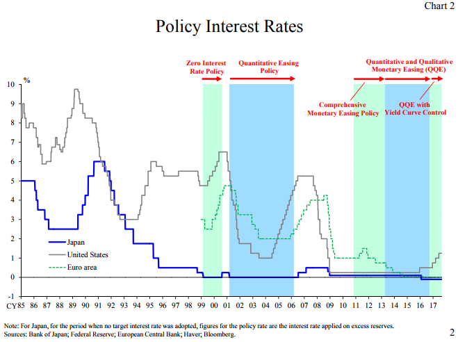
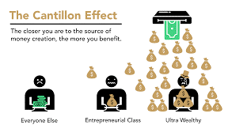
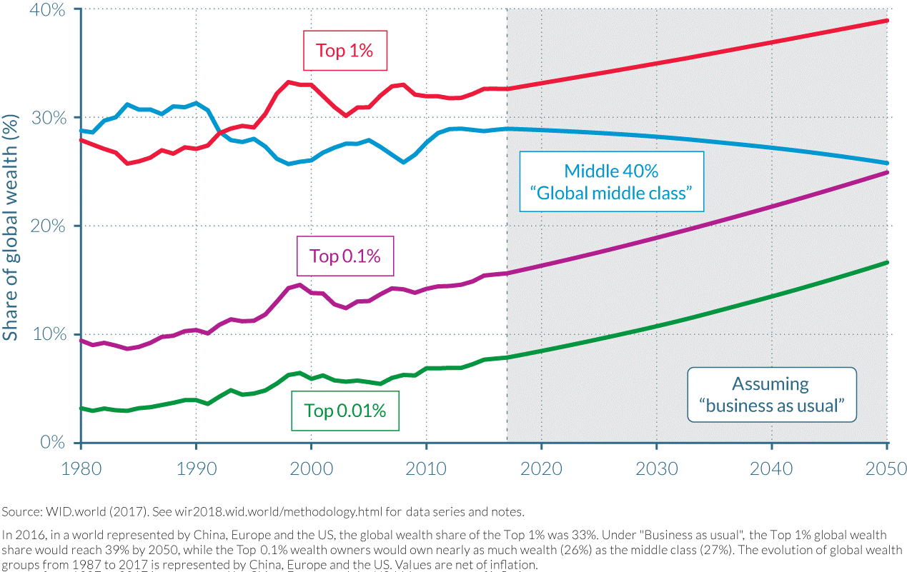
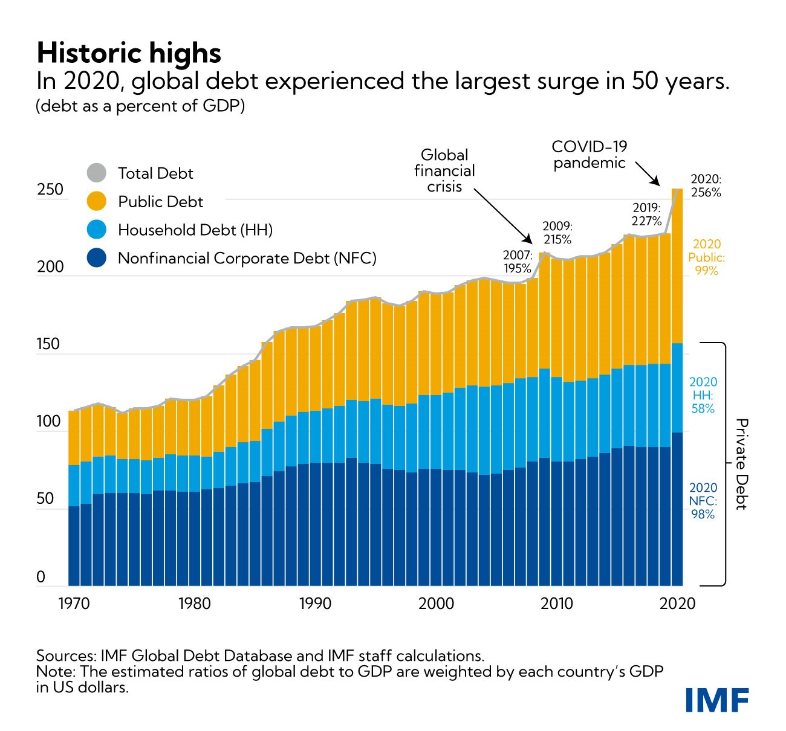
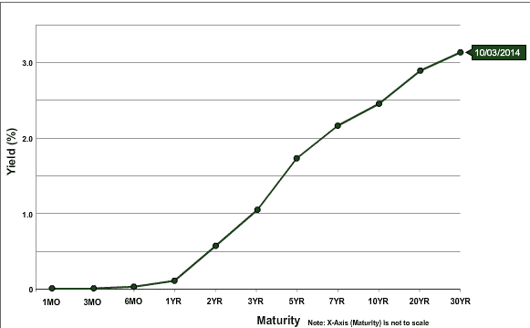
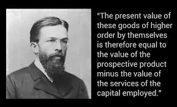
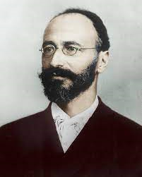
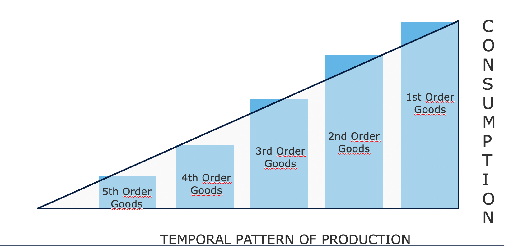
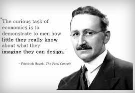

# 'n Reis in die ekonomie

Welkom by Théo Mogenet se kursus! Hy is passievol oor ekonomie, geskiedenis, literatuur, politieke wetenskap en tegnologie, en het besluit om sy kennis van Oostenrykse ekonomie met jou te deel. Hierdie tak van ekonomie, wat minder bekend is, is gebaseer op menslike rasionaliteit en vrye handelingsgedrag. Dit is minder wiskundig intensief en fokus veral op logika en sosiale studie.

Hierdie denkskool het reeds verskeie eeue agter die rug en het 'n hele panorama van outeurs, denkbeelde en ekonome agter hom. Groot name in die ekonomie soos Hayek, Rothbard, Mises, Bastiat en Menger het hierdie beweging lankal verdedig. In teenstelling met die alomteenwoordige Keynesianisme van ons dag, plaas die Oostenrykse skool die individu weer in die middelpunt van die vergelyking met 'n meer liberale, kapitalistiese en selfs anarchistiese benadering.

+++

# Inleiding tot EKON

## Inleiding

Hallo almal en welkom by Ekonomie 201: Inleiding tot Oostenrykse Ekonomie.

In hierdie kursus wat deur Théo Mogenet aangebied word, sal jy hierdie tak van ekonomie ontdek wat sterk verskil van die Keynesiaanse leerstelling. Tot dusver het jy dalk geleer dat die produksie en bestuur van geld die verantwoordelikheid van sentrale banke is, met die idee dat geld druk en besteding groei bevorder. Daar is egter 'n ander skool van ekonomiese denke: Oostenrykse ekonomie. Met meer as 200 jaar navorsing en ontwikkeling, filosofiese besinning en geskrifte deur bekende outeurs, beklemtoon hierdie benadering 'n meer gematigde visie op groei en menslike rasionaliteit in ons ekonomie.

In werklikheid is ekonomie 'n uiters sosiale en komplekse veld, saamgestel uit 'n menigte onderling verbonde klein rolspelers wat saamwerk om 'n samehangende geheel te vorm. In plaas daarvan om hierdie dissipline deur wiskundige vergelykings te benader, moet ons dit verstaan vanuit die perspektief van menslike logika en sosiologie. In hierdie kursus sal ons die fundamentele konsepte van Oostenrykse ekonomie verken. Jou dosent, Théomo Jeunet, is 'n passievolle en bekwame professor in Oostenrykse ekonomie.

Om te begin, bied ons jou 'n bonusvideo aan wat sal verduidelik hoe ons huidige finansiële stelsel werk. Jy sal ontdek hoe kommersiële banke en sentrale banke met mekaar interaksie het en die ekonomie dryf. Ons sal die belangrike rolspelers in ons finansiële wêreld aanspreek en hoe hierdie sentralisering van mag by sekere ekonomiese instellings tot misbruik en finansiële krisisse kan lei.

In die tweede deel van hierdie kursus sal ons die verskil tussen Keynesianisme en Oostenrykse ekonomie ondersoek, deur hul onderskeie denkskole, refleksiemetodes en hul gebruik van instrumente om ekonomiese waarheid te bepaal, te verken. Ons sal ook die ontstaan van ekonomiese krisisse bestudeer. Is dit te wyte aan menslike onbevoegdheid, markmanipulasie of die kollektiewe euforie van mense? Ons sal ondersoek hoe ons siklusse van groei, agteruitgang, resessie en goudeneeu deur menslike emosies geskep word.

Hierdie kursus sal 'n kombinasie van ekonomie en filosofie wees, met 'n oop bespreking tussen Théo en myself. As jy enige vrae gedurende hierdie kursus het, moet jy nie huiwer om dit in ons Discord te vra nie, waar jy die skakel na in die beskrywing sal vind.

Ek bedank Théo hartlik vir die produsering van hierdie kursus, en ek hoop hy sal 'n uitstekende onderwyser vir jou wees. Ons het baie pret gehad om hierdie inhoud te skep. Hierdie kursus is toeganklik vir almal en sal, dink ek, noodsaaklik wees om ons toekomstige meer diepgaande kursusse oor ekonomie te volg. Hierdie kursus sal die nodige grondslag lê om sekere ekonomiese teorieë in meer detail te verken wat ons hier slegs vlugtig sal aanraak.
As jy gereed is om aan hierdie avontuur te begin, nooi ek jou uit om op die volgende video te klik en te begin met die bonus video oor ons huidige finansiële stelsel. Ek gee nou die woord aan Théo. Baie dankie aan hom vir die samewerking met Descoupes Bitcoin vir die totstandkoming van hierdie video. Ek sien jou baie binnekort. Totsiens!
## Geld, Krediet, Banke en Sentrale Banke

> "Die kernprobleem met konvensionele geldeenheid is al die vertroue wat nodig is om dit te laat werk. Die sentrale bank moet vertrou word om die geldeenheid nie te ontwaard nie, maar die geskiedenis van fiat geldeenhede is vol oortredings van daardie vertroue. Banke moet vertrou word om ons geld te hou en dit elektronies oor te dra, maar hulle leen dit uit in golwe van kredietbubbels met skaars 'n fraksie in reserwe. Ons moet hulle vertrou met ons privaatheid, vertrou hulle om nie identiteitsdiewe toe te laat om ons rekeninge leeg te maak nie."
>
> Satoshi Nakamoto, skuilnaam van die uitvinder van Bitcoin

### Hoe Geld Geskep Word

In ons huidige monetêre stelsel word geld hoofsaaklik geskep deur 'n bankpraktyk wat bekend staan as "fraksionele reserwebankwese." Hierdie term beteken in wese dat banke nie verplig is om soveel reserwes te hou as wat hulle in deposito's ontvang nie. Gevolglik kan hulle nuwe koopkrag skep wanneer hulle lenings toestaan en, omgekeerd, koopkrag verminder wanneer kliënte hul lenings terugbetaal.

Byvoorbeeld, as jy na jou plaaslike bank gaan om 'n verband vir 'n huisaankoop te verkry, sal die geld wat deur die bank aan jou uitgeleen word, ontstaan as 'n boekhoudkundige inskrywing. In rekeningkunde verteenwoordig ons tipies 'n individu se nettovermoë met 'n balansstaat, wat twee kante het: die batekant, wat enige eiendom, finansiële kontrakte, voorraad of ander vorme van besit, en die aanspreeklikheidskant, wat die bron van fondse toon wat gebruik is om die kapitaal op die batekant te skep. Die verskil tussen bates en aanspreeklikhede word as "ekwiteit" verwys en kan beskou word as die nettovermoë van die entiteit.

Wanneer 'n finansiële instelling 'n banklisensie het, beteken dit in wese dat die aanspreeklikhede wat as "klantedeposito's" aangeteken word, as amptelike geld binne 'n spesifieke land of monetêre sone beskou word. Daarom, wanneer jy 'n lening soek om 'n huis van die bank te koop, leen die bankier nie fondse uit wat deur 'n ander kliënt gedeponeer is nie. In plaas daarvan krediteer die bank die geleende bedrag aan jou rekening en neem terselfdertyd jou leningskontrak as 'n bate van die bank op. Wanneer jy jou lening terugbetaal, word geld effektief uitgewis en verminder die waarde van die ooreenstemmende leningskontrak, met die bank wat slegs die rente op die lening behou.

Nadat jy die huis gekoop het, gee jy jou bankier opdrag om geld na die verkoper se rekening oor te plaas. As die verkoper se rekening by 'n ander bank is, stel jou bankier die ooreenstemmende bankier by die ander instelling in kennis om te verseker dat die verkoper se rekening dienooreenkomstig gekrediteer word, terwyl jou rekening met die ooreenstemmende bedrag gedebiteer word.

Figuur 1: Geldskepping as Boekhoudkundige Inskrywings

> "Dit is goed genoeg dat mense van ons nasie ons bank- en monetêre stelsel nie verstaan nie, want as hulle dit wel sou doen, glo ek daar sou 'n rewolusie wees voor môreoggend."
> 
> Henry Ford

Hierdie proses stel banke in staat om alle transaksies, insluitend oorplasings, kredietkaartaankope en tjeks, oor 'n bepaalde tydperk (gewoonlik 'n week of 'n maand) aan te teken. Hulle vereffen dan hierdie transaksies met mekaar deur gebruik te maak van bankreserwes, wat 'n ander vorm van fiat geldeenheid is wat nooit deur die publiek gebruik word nie. Bankreserwes word by die sentrale bank aangehou in 'n spesiale rekening wat slegs toeganklik is vir gelisensieerde banke en finansiële instellings.

### Onstabiliteit van Fraksionele Reserwebankwese en Uitleeninstansie van Laaste Uitweg
Die hoofprobleem met hierdie fraksionele reserwesisteem is dat beduidende onttrekkings uit 'n spesifieke bank potensieel tot sy bankrotskap kan lei. Aangesien banke aan kliënte se kontantvereistes moet voldoen terwyl hulle slegs 'n beperkte buffer van bankreserwes aanhou, kan 'n gelyktydige stormloop deur baie kliënte om fondse te onttrek, die bank onvermoë laat om aan hierdie vereistes te voldoen, wat tot bankrotskap kan lei. Aangesien baie individue, maatskappye en instellings hul fondse in banke gedeponeer het, kan die toelaat dat 'n bank misluk ernstige ekonomiese gevolge hê, soos 'n resessie of selfs 'n depressie.

Hierdie dilemma het aanleiding gegee tot die moderne sentrale banke. In die 19de eeu in Engeland het herhaalde bankloop die finansiële stabiliteit bedreig, wat gelei het tot die stigting van die Bank van Engeland as die "laaste redmiddel-lener". Die Bank van Engeland is belas met die lening van fondse aan benarde banke tydens krisisse om 'n dominostelsel wat die hele finansiële stelsel kan verlam, te voorkom. Hierdie konsep van sentrale banke as laaste redmiddel-leners het sedertdien wêreldwyd versprei en algemeen geword.

Naas die handhawing van finansiële stabiliteit is sentrale banke verantwoordelik vir die vasstelling van sleutelbeleidskoerse. Hierdie koerse bepaal die koste waarteen gelisensieerde banke fondse van die sentrale bank kan leen, en definieer dus die koste van likiditeit vir die finansiële instellings wat 'n kritieke rol speel in die uitleen in ons ekonomieë. Hierdie koerse dien dus as 'n maatstaf vir die hele finansiële stelsel. As individu kan die rentekoerse wat jy op jou verband betaal, opgebreek word in die beleidskoers en die bank se marge.

Figuur 2: Bankrotskap van Lehman Brothers (15/09/2008)

Tydens die groot finansiële krisis van 2008 het Lehman Brothers, 'n groot beleggingsbank, bankrotskap aangekondig nadat dit aansienlike verliese op sy hypotheeksekuriteite gehad het en massiewe onttrekkings deur bekommerde kliënte ervaar het. In reaksie op hierdie ongekende finansiële onrus het sentrale banke regoor die wêreld groot hoeveelhede likiditeit in finansiële markte ingespuit, sukkelende beleggingsbanke met kommersiële banke saamgesmelt, en beleidskoerse na bykans nul verlaag in 'n poging om 'n sistemiese ineenstorting te voorkom.

Hoewel hierdie maatreëls 'n kaskade van bankrotskappe voorkom het, het dit min gedoen om die daaropvolgende ekonomiese vertraging te verlig. Miljoene het hul werk en huise verloor, verbruikersbesteding het skerp gedaal, besighede het ondergegaan, en banke het aansienlike verliese gely. Ten spyte van histories lae rentekoerse was min bereid om te leen, wat gelei het tot 'n vernietigende siklus waarin die aanvanklike afname in besteding en belegging homself versterk het. Gevolglik het sentrale banke verdere stappe geneem deur Kwantitatiewe Verligting (QE) programme te implementeer. Hierdie programme behels dat sentrale banke regeringsobligasies en met hypotheek gedekte sekuriteite van kommersiële banke koop met sentrale bankreserwes.

Figuur 3: Rentekoerse in Belangrike Ekonomieë / Bron: ECB

In teenstelling met baie verwagtinge het QE-programme nie ekonomiese groei betekenisvol herstel nie, maar het wel finansiële bates tot historiese vlakke opgeblaas. Dit het hoofsaaklik die ryk en finansiële instellings bevoordeel, aangesien hulle reeds aansienlike hoeveelhede van sulke bates besit het, en sodoende die welvaartsongelykhede verbreed. Gegewe die struktuur van die bankstelsel wat vroeër verduidelik is, behoort hierdie uitkoms nie as 'n verrassing te kom nie. Aangesien bankreserwes nie maklik na die werklike ekonomie kan vloei nie, het QE-programme hoofsaaklik batepryse gestimuleer sonder om die finansiële situasies van gewone individue doeltreffend te verbeter.

### Die Cantillon Effek

Nogtans kan 'n essensiële ekonomiese beginsel uit hierdie gebeurtenis afgelei word: wanneer nuwe geld geskep word, bevoordeel dit aanvanklik dié wat die naaste aan die bron van die geld is, ten koste van dié wat verder weg is. Hierdie ekonomiese insig dateer uit die 18de eeu toe Richard Cantillon dit in sy "Essay on the Nature of Commerce in General" uiteengesit het. Dit staan nou bekend as die "Cantillon Effek". 

Figuur 4: Die Cantillon Effek in 'n notedop / Bron: River Financial
In hierdie geval het banke, bank uitvoerende beamptes, aandele- en obligasie-eienaars, eiendomsontwikkelaars, eiendomsleners en enige persoon wat finansiële bates of eiendom besit, 'n finansiële windfall ontvang, terwyl die las op almal anders geval het. Hierdie situasie het vir jare aangehou en verklaar grootliks die groeiende ongelykheid in rykdom, die gevoel van onteiening onder hardwerkende individue, en die ogieskynlik onstuitbare styging in batepryse ten spyte van traagende BBP-groei.

In wese is die stelsel uit balans. Banke is inherente onstabiel, maar hul mislukking kan die hele ekonomie in gevaar stel. Hierdie morele gevaar motiveer bank uitvoerende beamptes om buitensporige risiko's te neem om hul bank se inkomste te maksimeer, wetende dat die sentrale bank hulle uiteindelik sal red, en die koste na belastingbetalers sal skuif. In sulke scenario's skep sentrale banke voorwaardes vir 'n massiewe oordrag van koopkrag van hardwerkende individue en spaarders na bate-eienaars en diegene wat verbind is aan die finansiële stelsel, en skei sodoende die proses van rykdomskepping van rykdomsopbou.

Figuur 5: Rykdomsverdeling in China + Europa + die VSA / Bron: OECD

### Gevolge van Nul Rentekoersbeleid

Tydens langdurige periodes van Nul Rentekoersbeleid (ZIRP) het banke beperkte geleenthede om hul eie vermogen te herbou omdat hul marges uitgewis word. Banke verdien tipies geld deur teen korttermynkoerse te leen en teen langtermynkoerse te uitleen. Wanneer sentrale banke egter groot hoeveelhede obligasies koop en koerse op nul stel, het banke min insentief om te leen, veral aan entrepreneurs en ander risiko-aanvaarders. In plaas daarvan wys hulle hul hulpbronne toe om bestaande kapitaal te sekuritiseer of lenings teen borg te voorsien om aan die vraag van diegene wat voordeel trek uit die Cantillon-effek, te voldoen.

'n Ander onbedoelde gevolg van ZIRP is dat dit regerings aanmoedig om uitgebreide uitgawes aan te gaan. Aangesien regerings geen leenkoste het nie en kan staatmaak op sentrale banke om hul obligasies deur QE-programme te koop, het hulle 'n natuurlike insentief om soveel as moontlik te spandeer, veral in demokratiese kontekste waar spandeerstemme kan werf. Hierdie neiging ignoreer dikwels die langtermyngevolge van sulke fiscale roekeloosheid, wat lei tot 'n aansienlike toename in openbare skuldvlakke regoor ontwikkelde ekonomieë sedert die Globale Finansiële Krisis (GFC).

Figuur 6: Openbare & Privaat Skuld as % van BBP (Wêreld, geweeg volgens BBP per land) / Bron: IMF

Met inflasie wat toeneem as gevolg van aansienlike geldskepping as reaksie op COVID-verwante inperkings, verhoog sentrale banke nou beleidskoerse in 'n poging om inflasie te beperk. Dit skep egter 'n aansienlike uitdaging vir die hele stelsel. Banke is meer gehef as ooit tevore, regerings dra histories hoë vlakke van skuld, ekonomiese groei is traag, tekorte neem toe, en verbruikers, wat sukkel met stygende pryse vir noodsaaklike goedere, sukkel om die toue aan mekaar te knoop. Die beheer van inflasie sou vereis dat koerse tot 'n vlak verhoog word wat regerings bankrot kan maak, terwyl banke die risiko loop om depositoors te verloor aangesien individue hul spaargeld aan steeds duurder noodsaaklikhede bestee of toevlug neem tot harde bates en geldmarkfondse om hulself teen inflasie te beskerm.

### Gevolgtrekking

> "Op hierdie manier (fraksionele reserwebankwese) kan regerings die rykdom van die mense heimlik en onopgemerkte onteien, en nie een mens in 'n miljoen sou die diefstal opspoor nie."
>
> John Maynard Keynes

In wese staar ons stelsel aansienlike uitdagings in die gesig, en Bitcoin tree na vore as die enig geloofwaardige alternatief. Tog kan Bitcoin alleen nie die probleme binne ons monetêre stelsel aanspreek nie. Bo alles het ons individue nodig wat basiese ekonomiese beginsels onder Bitcoin-entoesiaste verstaan, wat 'n breër bewustheid en ekonomiese gesonde verstand moontlik maak om ons weg te lei van die konstruksie van nog 'n brose finansiële grondslag vir ons beskawing. Die primêre doel van hierdie kursus is om nuwe Bitcoin-entoesiaste op te lei in gesonde ekonomiese beginsels.
Om hierdie doel te bereik, sal ons die fundamentele beginsels van "Oostenrykse Ekonomie" verduidelik, 'n ekonomiese denkskool met 'n metodologiese tradisie wat teruggaan na die 16de eeu en insigte bied in menslike optrede onder ekonomiese beperkings. Met hierdie inleiding verstaan jy nou die essensie van geldskepping en die huidige stand van ons finansiële en monetêre stelsel.

In die volgende hoofstuk sal ons die fundamentele hoeksteen van enige ekonomiese denkskool ondersoek: die teorie van waarde. Daaropvolgende hoofstukke sal geld as 'n sosiale instelling, die teorie van kapitaal en die besigheidssiklus, die uitdaging van ekonomiese berekening, en 'n kort oorsig van die geskiedenis en metodologie van die Oostenrykse Ekonomiese Skool verken.

# Teoretiese Grondslae
## Die Subjektiewe Teorie van Waarde

> "Waarde bestaan slegs binne menslike bewussyn"
>
> Carl Menger, Beginsels van Politieke Ekonomie

### Die Marginale Revolusie

Aan die wortel van ekonomiese redenering lê die vraag van waarde. Hoe bepaal ons die waarde van iets? Is waarde 'n inherente eienskap van dinge? Of is dit, integendeel, 'n subjektiewe verskynsel? Hoe vergelyk ons die waarde van twee dinge? Waar kom waarde vandaan?

Sulke vrae het ekonome en filosowe vir baie eeue besig gehou en het verskeie verskillende antwoorde ontvang. Op baie maniere is die epistemologiese evolusie van ekonomie gekenmerk deur die evolusie van teorieë van waarde.

Nadat die fisiokrate se teorie van grondwaarde, wat stel dat alle waarde van grond afkomstig is, deur die klassieke ekonome se arbeidsteorie van waarde, wat stel dat die waarde van 'n goed voortspruit uit die hoeveelheid arbeid wat daarin gaan, weerlê is, was dit die beurt van die marginale teorie van waarde om laasgenoemde te vervang. In die 1870's, na Marx, die laaste van die klassieke ekonome, het drie nuwe skole van ekonomiese denke amper gelyktydig ontstaan rondom 'n marginale teorie van waarde: die Lausanne-skool met Léon Walras, die moderne of neoklassieke skool met William Stanley Jevons, en die Oostenrykse skool met Carl Menger. Hierdie revolusie in die teorie van waarde het 'n beduidende vernuwing van ekonomiese denke uitgemaak.

Van Links na Regs: William Stanley Jevons, Carl Menger, Léon Walras

Die marginale teorie van waarde stel dat ekonomiese waarde ooreenstem met wat 'n ekonomiese agent gewillig betaal vir die volgende eenheid van 'n goed of diens. Omdat hierdie teorie beklemtoon dat pryse aan die marge gevorm word, d.w.s. vir die volgende eenheid van 'n gegewe goed, is dit "marginale teorie" genoem.

Dit is algemeen om die marginalisme van hierdie drie skole as soortgelyk voor te stel. Walras en Jevons is inderdaad hoogs verenigbaar, maar Menger se teoretisering wyk op diep vlakke af van die ander. In sy werk, wat nou as fundamenteel tot die Oostenrykse ekonomiese teorie beskou word, getiteld "Grundsätze des Volkswirtschaftlehre" (Beginsels van Politieke Ekonomie), gepubliseer in 1874, bied Menger 'n marginale, maar hoofsaaklik subjektiewe, verklaring van waarde, in teenstelling met Walras en Jevons, wat waarde beskou as 'n objektiewe en meetbare verskynsel.

### Subjektiewe Waarde

Die Oostenrykse ekonoom weerlê die opvatting van Adam Smith se opvolgers en verlaat die idee dat die waarde van 'n goed afkomstig is van die hoeveelheid arbeid wat in sy produksie gebruik word, ten gunste van die opvatting dat sy waarde bepaal word deur die individu wat in elke konteks 'n geestelike waarderingshandeling uitvoer met betrekking tot 'n spesifieke hoeveelheid van 'n goed of diens. Hierdie intellektuele sprong wat deur Menger gemaak is, daag die objektiwiteit van waarde uit: vir hom is waarde nie 'n objektiewe eienskap van goedere nie; dit is bloot die resultaat van die verhouding wat die individu met daardie ding het: "waarde bestaan nie buite menslike bewussyn nie."

Met ander woorde, Menger nooi ons uit om te oorweeg dat waarde slegs bestaan as 'n subjektiewe sielkundige verskynsel binne die individu, dat waarde nie 'n inherente eienskap van goedere is nie, maar eerder voortspruit uit die individu se mening oor die nut wat hulle uit daardie goedere kan verkry.

Volgens hierdie siening het 'n liter drinkwater geen objektiewe waarde nie. Iemand wat toegang het tot 'n moderne stelsel van drinkwater en tans nie dors is nie, sal waarskynlik baie min waarde aan daardie ekstra liter water toeken, terwyl 'n individu wat dors is in die middel van die woestyn, dit as die verskil tussen lewe en dood sal beskou en beslis bykans oneindige waarde aan daardie liter water sal toeken.

Kortom, Menger het opgemerk dat die waarde van 'n ekonomiese goed niks meer is as die subjektiewe waardering wat 'n individu toeken aan 'n addisionele eenheid van daardie goed of diens nie.

### Vrywillige Ruil: 'n Positiewe-Som Speletjie

Vanuit hierdie punt maak Menger afleidings dat vrywillige ruil tussen twee individue plaasvind omdat elke party glo dat dit hul subjektiewe nut sal verhoog. Vir hom vereis ruil nie enige gelykwaardigheid van waarde nie, teenstrydig met wat die klassieke ekonome geglo het. Volgens die Oostenrykse denker, as daar gelykwaardigheid van nut was tussen die geruilde goedere, sou daar geen rede wees vir die partye om die moeite van ruil te doen nie. As daar 'n ruil is, is dit omdat elke party dit in hul (subjektiewe) belang vind, en gevolglik produseer elke vrywillige ruil 'n sosiale voordeel.

### Waardering as 'n Verskynsel van Ordening van Menslike Begeertes

Hierdie sosiale voordeel, of die subjektiewe waarde wat aan 'n goed toegeskryf word, kan egter nie gemeet word nie. Vir Menger is waarde 'n kognitiewe verskynsel van vergelyking (ordinaal) eerder as meting (kardinale). Dit is nie, soos die neoklassieke ekonome sedert Walras en Jevons gedink het nie, die toekenning deur die individu van 'n numeriese waarde wat die nut wat hulle daaruit trek, weerspieël nie, maar eerder 'n handeling van ordening van menslike begeertes waardeur 'n individu uitdruk dat hulle 'n hoeveelheid goed A intenser begeer as 'n hoeveelheid goed B.

Enige agent kan sê of hulle verkies om 2 piesangs te hê as 'n ekonomie kursus, maar niemand kan redelik sê dat hulle 2 piesangs teen 3.1416 nuttelose waarde waardeer, terwyl hulle 'n ekonomie kursus teen 3 nuttelose waarde waardeer, en gevolglik verkies om die piesangs te hê. So 'n beskrywing van menslike voorkeure, gebaseer op kontinue reële funksies, stem nie ooreen met die werklikheid van die kognitiewe prosesse wat ons in ons daaglikse lewens ervaar nie. 'n Individu evalueer nooit goedere wat aan hom voorgelê word deur dit te vergelyk met 'n abstrakte maatstaf van nut nie. In plaas daarvan vergelyk hy subjektief verskillende optrede, wat hy nie in absolute terme kan beoordeel nie, maar nogtans kan rangskik op grond van hul relatiewe begeerlikheid.

Hierdie subjektiewe opvatting van waarde, verstaan as 'n sielkundige verhouding wat die individu met sy doelwitte en die relevante middels om dit te bereik, onderhou, stel Oostenrykse ekonome ook in staat om die verskynsel van arbeidsverdeling te verklaar.

### Die Arbeidsverdeling

Besoek aan 'n Spykervervaardigingsfabriek, Léonard Defrance (18de eeu)
Almal is uniek en het 'n spesifieke persoonlike situasie. Daarom besit elkeen 'n uitsonderlike vermoë om sekere take beter uit te voer as sy eweknieë (absoluut voordeel) of 'n uitsonderlike vermoë om sekere take beter uit te voer as ander (vergelykende voordeel). Dit kan nie anders wees nie; om hierdie elementêre feit te ontken, sou beteken dat alle mense gelyk is in alle opsigte.

In die geval waar 'n individu 'n uitsonderlike vermoë het in vergelyking met hul eweknieë in die produksie van 'n gegewe goed (absoluut voordeel), het hulle 'n belangstelling om te spesialiseer in die produksie van daardie goed en dan die oortollige goedere te ruil vir die goedere wat hulle begeer. Deur dit te doen, bevredig hulle hul subjektiewe nut ekonomieser as wanneer hulle betrokke sou raak by die produksie van al die goedere wat hulle begeer.

Maar dit kan ook die geval wees dat die individu nie 'n absoluut voordeel het in die produksie van enige goed nie. In hierdie geval sal daar steeds tipes produksie wees waarin die individu beter is as in ander (vergelykende voordeel), en om hierdie rede het hulle steeds 'n belangstelling om te spesialiseer.

Daar is beslis individue wat daardie gegewe goed meer produktief kan produseer as hy, maar aangesien hierdie individue waarskynlik meer produktief is in 'n ander taak as in hierdie een, en aangesien hulle nie beide take gelyktydig kan uitvoer nie, is dit onproduktief vir hulle om aan hierdie taak te werk eerder as 'n ander waarin hulle meer produktief is. Deur te spesialiseer in die taak waarin hulle die meeste produktief is, sal hulle 'n oortollige verkry wat groter is as wanneer hulle nie gespesialiseer het nie, en daarom kan hulle deur ruil 'n verhoogde hoeveelheid van daardie ander goedere verkry, selfs al sou die goedere wat verkry is, deur hulself meer doeltreffend geproduseer gewees het as deur die vervaardigers van wie hulle dit verkry het.

Neem byvoorbeeld 'n dokter. Hy mag beter wees om e-posse te skryf en afsprake te skeduleer as sy sekretaresse (relatiewe voordeel). Maar enige tyd wat hy spandeer aan hierdie take, is tyd wat hy nie gebruik om pasiënte te genees nie. Daarom, aangesien hy meer produktief is in die genesing van mense, is dit in sy belang om administratiewe pligte aan 'n ander persoon te delegeer, selfs al is hy beter in sulke take as sy ondergeskikte, omdat dit hom in staat stel om die waarde wat vir ander gegenereer word, te maksimeer, en dus sy eie rykdom.

In wese is daar 'n voordeel aan spesialisasie, selfs vir individue wat nie absoluut voordele het nie, omdat tyd 'n skaars en mededingende hulpbron is: elke eenheid tyd wat spandeer word aan 'n aktiwiteit anders as dié waarin 'n individu die meeste produktief is, impliseer 'n koste wat verteenwoordig word deur die opgeofferde produksie (opportunity cost).

Sodra die individu gespesialiseer is in 'n spesifieke produksie, kan hulle dan die hoeveelheid produkte wat hulle nodig ag vir hul persoonlike verbruik reserweer en die oortollige ruil vir ander begeerde goedere. Deur dit te doen, bevredig hulle hul begeerte na die goedere wat hulle self produseer, wat beteken dat die oorblywende eenhede van hul produksie min waarde vir hulle het. Dit is wat ekonome noem afnemende marginale nut: elke addisionele eenheid van 'n goed word minder begeerlik as die vorige. Vir ander wat sulke goedere nie het nie, is dit 'n ander storie: om dieselfde redes, neig hulle daartoe om die goedere wat hulle nie produseer nie, intenser te begeer as dié wat hulle wel produseer. Dit lei tot 'n situasie waar daar 'n sterk asimmetrie is tussen die verskillende subjektiewe waarderings van individue, wat hoogs bevorderlik is vir ruil: elke party het 'n belang om hul oortollige produksie te ruil omdat hulle daardeur hul subjektiewe nut verhoog.

Die resultaat van die voorafgaande analise is dat individue altyd beter af is wanneer hulle spesialiseer in hul werk en betrokke is by ruil. Daarom kom Oostenrykse ekonome, veral Ludwig Von Mises, tot die gevolgtrekking dat die produktiewe voordeel wat voortspruit uit die arbeidsverdeling die dryfkrag is agter die proses van sosiale samewerking. Hier kan dit nuttig wees om hom direk te kwoteer:
"Die fundamentele feite wat samewerking, gemeenskap en beskawing tot stand gebring het en die dierlike mens in 'n menslike wese verander het, is die feite dat werk wat onder die arbeidsverdeling verrig word, produktiewer is as geïsoleerde werk en dat die mens se rede in staat is om hierdie waarheid te erken. [...] Mense werk nie saam onder die arbeidsverdeling omdat hulle mekaar liefhet of moet liefhê nie. Hulle werk saam omdat dit hul eie belange die beste dien."

### Gevolgtrekking

> "As 'n mens sien dat hy gemakliker kan leef deur aan die galg te hang as om aan die tafel te sit, sou hy soos 'n dwaas optree om homself nie op te hang nie."
>
> Baruch Spinoza

1871-1874 is die wonderlike jare van moderne ekonomie: gedurende hierdie tydperk het die werke van drie onafhanklike denkers wat die grondslag van moderne ekonomie gelê het, verskyn. Met hul klem op subjektiewe ordinale waarde sal Oostenrykse ekonome 'n hele liggaam van ekonomiese denke ontwikkel wat hulle onderskei van hul eweknieë. Die werk van Oostenrykse ekonome wat redeneer oor menslike optrede in die konteks van skaarste, sal vir altyd in skerp kontras staan met die ekonomiese leerstellings wat deur Jevons en Walras geïnisieer is en swaar leun op wiskunde wat gebaseer is op die idee dat waarde objektief gemeet en afgelei kan word as 'n kontinue funksie.

Deur voort te bou op die insigte van subjektiewe ordinale waarde, het Menger die ontstaan van die arbeidsverdeling en vrywillige ruil verklaar. Tog, soos ons in die volgende hoofstuk sal sien, is direkte ruil 'n swak strategie vir ekonomiese agente wat hul subjektiewe nut wil maksimeer. Die vader van die Oostenrykse Skool het dus sy redenasie verder ontwikkel om te verklaar waarom geld as 'n sosiale instelling ontstaan het.

Die volgende hoofstukke sal gewy word aan die ontstaan van geld as 'n sosiale verskynsel, die teorie van kapitaal en rente, wat as die basis vir die Teorie van die Ekonomiese Siklus sal dien, en laastens die rol van pryse vir ekonomiese berekening.

## Die Ontstaan van Geld as 'n Sosiale Verskynsel

Terwyl individue 'n gemeenskaplike belang het in spesialisasie en die maksimering van die arbeidsverdeling, is daar steeds koördinasieprobleme wat hierdie uitbreiding beperk.

Eerstens is dit belangrik om daarop te let dat produksieprosesse inherent tydgebonden is en dikwels asinkronies (nie-gelyktydig) is. Daar sal dus gewoonlik 'n tydsgaping wees tussen 'n individu se aanvanklike bydrae en die ontvangs van die teenprestasie. Om nou tot 'n spesifieke taak te verbind sonder die voorafversekering dat ander in die toekoms aan ons behoeftes sal voldoen, kan riskant wees.

In die arbeidsverdeling het elke party voordeel by samewerking, maar individueel mag 'n mens geneig wees om te geniet van die werk van ander sonder om te vergoed, aangesien hulle op hierdie manier iets waardevols verkry sonder om enige koste te dra. Sulke situasies, waar wederkerige samewerking lei tot suboptimale wins vir individue, maar maksimale wins vir die groep, word in spelteorie beskryf as die "gevangene se dilemma."

### Die Gevangene se Dilemma

Oorspronklik is die gevangene se dilemma as volg geformuleer: Twee verdagtes, Alice en Bob, wat nie kan kommunikeer nie, staar die risiko van gevangenisstraf in die gesig, met moontlike vonnisse soos volg:

- As Alice Bob beskuldig en Bob stil bly, gaan Alice vry, en Bob kry 3 jaar.
- As Alice en Bob mekaar beskuldig, kry hulle elk 2 jaar.
- As hulle albei stil bly, kry hulle elk 1 jaar.

Hierdie uitkomste kan in 'n matriks verteenwoordig word (numeriese resultate dui die aantal jare van gevangenisstraf aan):

| Alice / Bob       | Beskuldig   | Stil Bly     |
| ----------------- | ----------- | ------------- |
| **Beskuldig**     | 2, 2        | 0, 3         |
| **Stil Bly**      | 3, 0        | 1, 1         |
In hierdie spel is daar geen geleentheid vir koördinasie nie (kommunikasie is onmoontlik) om die beste uitkoms vir beide partye te bereik. Gevolglik het Alice en Bob 'n individuele insentief om mekaar te beskuldig, selfs al lei dit nie tot die optimale uitkoms vir die groep nie. Die optimale strategie vir beide is om stil te bly en elk 'n 1-jaar vonnis te ontvang.

Hierdie spel illustreer 'n probleem wat gereeld in die werklike lewe ondervind word: in die afwesigheid van koördinasie-meganismes, neig individue daartoe om strategieë te kies wat hul individuele wins maksimeer, ongeag die strategieë wat deur ander gekies word (diefstal, bedrog, verraad, geweld, ens.), selfs wanneer 'n meer wenslike ewewig deur koördinasie/samewerking moontlik is.

### Geld om Koördinasieprobleme op te Los

Hierdie probleem het minder impak in klein gemeenskappe (bv. familie, vriendekringe) omdat, in sulke gevalle, almal mekaar direk ken en dit moontlik maak om mekaar se bydraes te onthou. As ons aanneem dat die gemeenskap verlaat (desertie) 'n koste meebring, is 'n reputasiestelsel gebaseer op die individuele agent se geheue gewoonlik voldoende om die struikelblokke wat deur die gevangene se dilemma gestel word, te vermy.

Maar wanneer ons te doen het met groter gemeenskappe wat aansienlik voordeel trek uit die arbeidsverdeling, herontstaan koördinasieprobleme. Dit is te wyte aan twee hoofredes:

Eerstens is mense beperk deur hul kognitiewe vermoëns. Dit is onmoontlik vir 'n persoon om stabiele sosiale verhoudings met meer as 150 individue te handhaaf en te onthou, wat beteken dat 'n reputasiestelsel ontoereikend is om die gevangene se dilemma op groot skaal te oorkom.

Tweedens is die sosiaal aanvaarde meting van die waarde van bydraes in ruil (vergelykbaarheid) 'n nie-triviale probleem. Byvoorbeeld, as 'n individu vleis van die jag verskaf en materiaal vir skuiling in ruil daarvoor vra, hoe kan die hoeveelheid vleis wat aangebied word, geëvalueer word in terme van die gevraagde materiaal? Dieselfde geld vir kwaliteit - is wildsvleis meer of minder werd as hout?

Selfs al sou dit moontlik wees om 'n bevredigende ruilkoers vir elke paar goedere te bepaal, word dit vinnig onprakties om hierdie inligting te behou. In 'n direkte ruilsisteem wat N goedere betrek, is daar N(N-1)/2 ruilkoerse om te onthou. Vir 'n ekonomie van 50 goedere beteken dit dat daar 50*49/2, of 1225 ruilkoerse onthou moet word, teenoor net 50 in indirekte ruil. Vir 'n ekonomie van 100 goedere neem hierdie getal toe na 4950. So 'n kwadratiese verhouding plaas 'n addisionele beperking op die skaalbaarheid van direkte ruil (ruilhandel).

Verder, aangesien hierdie ruil nie onmiddellik plaasvind nie, maar oor tyd versprei is, maak die evaluering van bydraes oor tyd die relatiewe beoordeling van bydraes verder ingewikkeld. Behalwe vir die beoordeling van die ruilverhouding tussen twee huidige goedere, word dit nodig om die waarde van 'n vorige bydrae te evalueer in verhouding tot 'n toekomstige eweknie.

Vandag, ten spyte van die onpraktiesheid van so 'n stelsel, kan ons skryfwerk of digitale data-opberging gebruik om al hierdie inligting te onthou en 'n kredietstelsel te vestig (om die verlede bydraes, insluitend die ruilkoers van daardie bydraes, te onthou, is essensieel om 'n kredietstelsel op te stel).

In die tydperk voor beskawing het hierdie tegnologieë nie bestaan nie. Dus moes ons voorouers ander oplossings vind om die voordele van die arbeidsverdeling te geniet sonder om hulself bloot te stel aan die negatiewe gevolge van die gevangene se dilemma. Die oplossing vir hierdie probleem van direkte ruil was indirekte ruil wat deur geld gefasiliteer is.

### Dubbele Toevalligheid van Begeertes en Verkoopbaarheid

Geld kan beskou word as die oplossing wat deur ons voorouers ontdek is om die probleem wat ekonome die "dubbele toevalligheid van begeertes" noem, aan te spreek. Hierdie probleem het drie dimensies: ruimtelik, tydelik en interpersoonlik.
In 'n direkte ruil (bartering) tussen Alice en Bob moet hulle albei iets besit wat die ander op dieselfde tyd en plek begeer. Deur gebruik te maak van 'n indirekte ruil, d.w.s. deur middel van geld, kan Alice van Bob koop, en Bob kan daardie monetêre eenheid elders gebruik, op 'n ander tyd en met iemand anders (op voorwaarde dat die ander persoon daardie vorm van geld aanvaar).

Om as geld te dien, moet 'n goed 'n hoë verhandelbaarheid hê, wat beteken dat dit deur soveel moontlik mense, meestal, begeer moet word. Deur 'n hoogs verhandelbare goed te gebruik, word die probleem van dubbele toevalligheid van begeertes opgelos in terme van ruimtelike en interpersoonlike dimensies: as die goed wat ek as geld gebruik, oral en deur die meeste mense begeer word, kan ek maklik die handeling van verkoop skei van die handeling van koop in terme van ligging en sosiale interaksie.

Die verhandelbaarheidsprobleem oor tyd is egter moeiliker om op te los om twee redes:

Eerstens verander entropie (algemeen bekend as die "effek van tyd") geleidelik die eienskappe van die meeste goedere met direkte nut. Daarom vereis die behoud van die verhandelbaarheid van 'n goed oor tyd dat dit hoogs duursaam of bestand teen entropie moet wees.

Tweedens waarborg die relatiewe skaarsheid van 'n goed op tydstip "t" nie sy relatiewe skaarsheid in die toekoms nie. Deur genoeg hulpbronne aan 'n spesifieke produksiegebied toe te wy, kan mense die aanbod van enige goed verhoog. Die enigste beperking tot die verhoging van die produksie van 'n goed is die gepaardgaande geleentheidskoste. Gevolglik kan die huidige relatiewe skaarsheid van 'n goed nie sy toekomstige relatiewe skaarsheid waarborg nie. Slegs goedere waarvan die marginale produksie teen baie hoë koste verhoog kan word, kan konsekwent skaars wees, en dit is waarom dit 'n kenmerk is van vrylik ontstaande monetêre goedere deur die menslike geskiedenis.

In pre-beskawings tye het 'n verskeidenheid goedere soos seeskulpe, handgemaakte juweliersware, kettings of krale as geld gedien. Hierdie goedere was maklik vervoerbaar, het geen direkte nut buite hul ornamentale waarde gehad nie, het entropie weerstaan (d.w.s. dit het nie oor tyd agteruitgegaan nie), was natuurlik skaars en/of het 'n aansienlike hoeveelheid gespesialiseerde arbeid vereis om te produseer. Aangesien die vlak van arbeidsverdeling destyds laag was, en dus die geleentheidskoste wat gepaard gaan met die produksie van ornamentale artefakte hoog was, kon hierdie items nie in groot hoeveelhede geproduseer word nie. Dus kon diegene wat hierdie items as geld gebruik het, verseker wees van hul toekomstige relatiewe skaarsheid.

Die feit dat ons jagter-versamelaar voorouers betrokke was by hierdie hulpbron-intensiewe take, selfs al het hulle geen goedere met direkte nut gegenereer nie, toon die aansienlike wins wat hulle verwag het van die uitbreiding van die ruimtelike, sosiale en tydelike omvang van ruil. As dit nie die geval was nie, en dit nuttiger vir hulle was om hierdie hulpbronne in skuilplek-bou, jag of ander aktiwiteite te gebruik, eerder as die produksie van monetêre goedere, sou ons waarskynlik nie soveel argeologiese bewyse van hierdie kunstenaarsaktiwiteite vind nie. Ander groepe wat hul hulpbronne doeltreffender gebruik het, sou beter ontwikkeling en groter voorspoed geniet het, en hierdie kunstenaarsaktiwiteite sou vinnig verdwyn het ten gunste van aktiwiteite wat goedere met direkte nut produseer.

In hierdie sin het die produksie van monetêre goedere, deur die uitbreiding van die arbeidsverdeling te bevorder, 'n winsgewender gebruik van hulpbronne verteenwoordig (in terme van subjektiewe nut vir individue) as alle ander alternatiewe (verhoogde jag, visvang, versameling, houtproduksie, huisbou, die produksie van meer jag- en visvanggereedskap, ens.).

### Onsekerheid

Om ons analise van die monetêre instelling af te sluit, moet ons die kwessie van ekonomiese optrede in die konteks van die onvermydelike onsekerheid oor die toekoms aanspreek.
Soos Oostenrykse ekonome aangedui het, is menslike optrede tydgebonde en altyd gerig op die toekoms. Wanneer 'n individu optree, verander hulle huidige toestand in die hoop om toekomstige bevrediging te verkry. Hierdie geestelike projeksie kan gerig wees op die nabye of verre toekoms, maar om in die lang termyn te projekteer, moet hulle eers hul korttermynonderhoud verseker, omdat hul toestand in die nabye toekoms direk hul toestand in die verre toekoms beïnvloed.

Dit spruit direk voort uit menslike rasionaliteit; niemand kan die opeenvolgende aard van tydelike verskynsels en die chronologiese afhanklikheid wat daaruit voortspruit, ignoreer nie, omdat dit een van die essensiële beperkings van menslike lewe is. Daarom, aangesien die toekoms altyd onseker bly vir mense, sal hulle poog om hul langtermyn-oorlewing te verseker slegs nadat hul korttermyn-oorlewing verseker is.

In hierdie verband speel geld 'n belangrike rol in die intertemporale koördinasie van menslike optrede deur die berging van waarde in die hede en die oordrag daarvan na 'n persoon se toekomstige self. Deur geld te berg, d.w.s. om te spaar, beskerm individue hulself teen toekomstige onsekerheid en stel hulself dus in staat om hul optrede op langer tydhorisonne te rig. Hulle kan egter slegs hierin slaag as die gebruikte geld 'n waardebergingsmiddel is, wat beteken dat dit oor tyd verhandelbaar is, wat, soos voorheen genoem, 'n kenmerk is van duursame en relatief skaars goedere.

In die volgende hoofstuk sal ons die konsep van tydvoorkeur ondersoek en die Oostenrykse perspektief op rente en kapitaal verduidelik, wat as basis sal dien vir die volgende hoofstuk oor die Teorie van die Sakesiklus.

## Tydvoorkeur, Rente en Kapitaal

### Tydvoorkeur

Ons het die vorige hoofstuk afgesluit deur te verduidelik hoe ekonomiese agentia die mees verhandelbare goed, d.w.s. geld, gebruik om toekomstige onsekerheid te beveg. Ons het ook verduidelik dat die opeenvolgende aard van tydelike verskynsels ons lei om onsekerheid geleidelik te beveg: slegs wanneer ons weet dat ons bestaansmiddels vir die volgende week verseker sal wees, kan ons ons op doelwitte wat verder in die toekoms lê, konsentreer.

Met ander woorde: as menslike wesens diskonteer ons die waarde van toekomstige goedere.

Hierdie subjektiewe evaluering van die waarde van toekomstige goedere in vergelyking met huidige goedere word tydvoorkeur genoem. Alles anders gelyk, word huidige goedere inherent verkies bo toekomstige goedere. Aangesien ons sterflik is en die toekoms altyd onseker is, verkies ons natuurlik om nou toegang tot 'n goed te hê eerder as later. Alhoewel tydvoorkeur kan verskil tussen individue as gevolg van 'n verskeidenheid faktore soos kultuur, rykdom, opvoeding, fisiologie, ens., is tydvoorkeure altyd positief, wat beteken dat alles gelyk, ons altyd huidige goedere meer waardeer as toekomstige goedere.

Hierdie konsep van relatiewe waardasie van toekomstige goedere oor huidige goedere is die grondslag van die verskynsel van rente. Inderdaad, in 'n ekonomie met ongemanipuleerde kapitaalmarkte, word verwysingsrentekoerse (beskou as risikovry van wanbetaling) bepaal by die kruising van kapitaalaanbod en -vraag. Hierdie koerse verteenwoordig dus die toestand van tydvoorkeure vir die hele ekonomie: 'n toename in die rentekoers spruit voort uit 'n relatiewe toename in die vraag na kapitaal in vergelyking met die aanbod, wat hoër tydvoorkeure aandui. Omgekeerd vind 'n afname in rentekoerse plaas as gevolg van 'n toename in spaargeld, wat 'n toename in die aanbod van kapitaal is en 'n vermindering in tydvoorkeure aandui.

In 'n ekonomie waar rentekoerse nie deur die sentrale bank gemanipuleer word nie, neig ons om 'n opwaarts hellende opbrengskromme waar te neem: hoe langer die vervaldatum van die skuld, hoe hoër die rentekoers. Die teenoorgestelde situasie kan nie gebeur nie, omdat dit sou beteken dat die toekoms sekerder is as die hede, wat 'n logiese onmoontlikheid is.
Die konsep van tydvoorkeur en hoe ons ons eie tydvoorkeur uitdruk deur middel van verbruik en spaar is fundamenteel vir die prosesse van kapitaaltoewysing en produksie. Laat ons kyk na Menger se student, Eugen von Böhm-Bawerk, en sy kapitaalteorie om presies te verstaan hoe tydvoorkeur die organisasie van produksie beïnvloed.
### Kapitaalteorie 

Aan die begin van hierdie kursus het ons gesien dat, vir Carl Menger, goedere slegs as ekonomiese goedere (gewaardeer) beskou word omdat hulle as middel tot doelwitte dien wat deur individue gekies en gewaardeer word. Volgens hierdie siening draai alle ekonomiese analise om verbruik omdat dit uiteindelik die motiverende doelwit agter alle ekonomiese aktiwiteit is. Daarom is die beginpunt van ekonomiese analise vir Menger verbruikersgoedere, of finale goedere, omdat hulle die uiteindelike doel van ekonomiese aktiwiteit verteenwoordig. Alle ander goedere in die ekonomie, wat ons "tussengoeie" kan noem, het slegs waarde omdat hulle individue in staat stel om hierdie verbruikersgoedere te verkry: dit is goedere wat gebruik word in die produksie van ander goedere. 

Om verbruikersgoedere te produseer, kombineer entrepreneurs hierdie verskillende tussengoeie met oorspronklike produksiefaktore (arbeid, grond en kapitaal) volgens 'n patroon wat die resulterende produksie maksimeer. Hierdie rangskikking, wat deur entrepreneurs gemaak word, of die produksiestruktuur, sluit verskeie fases in waarin tussengoeie transformasies ondergaan totdat dit uiteindelik verbruikersgoedere word.

Sodoende kan ons, soos Menger, verbruikersgoedere definieer as eerstegoeie, goedere wat betrokke is by die vorige fase as tweedegoeie, die fase daarvoor as derdegoeie, en so aan, totdat ons die oorspronklike faktore (grond, arbeid, kapitaal) bereik. Die aantal fases wat ons beskou, hang fundamenteel af van die produksiestruktuur wat deur entrepreneurs aanvaar word en moet nie gesien word as 'n objektiewe kenmerk van die produksiestruktuur nie. Inteendeel, produksiefases en tussengoeie bestaan slegs binne 'n teleologiese konteks: die akteur beskou 'n reeks aksies waarmee hy sy gewenste doelwit sal bereik, en hy verdeel sy aksie geestelik in opeenvolgende fases. 

Hierdie kenmerk van geestelike projeksie van aksie in 'n opeenvolgende patroon word opgelê deur die tydelike aard van menslike aksie. Elke aksie wat deur mense onderneem word, neem tyd in beslag; onmiddellike aksie is onmoontlik. Daarom het die akteur altyd 'n keuse tussen aksiepatrone wat meer of minder tyd neem. 

Vanweë die feit dat individue noodwendig positiewe tydvoorkeure het, wat beteken dat hulle huidige goedere verkies bo toekomstige goedere, sal hulle slegs 'n langer pad kies as die resultaat wat hulle verkry, groter subjektiewe waarde vir hulle het as wat hulle deur die direkte pad sou bereik het. Andersins sal niemand meer tydrowende metodes aanneem nie: onder gelyke resultate bly die kortste pad die verkose keuse.

As gevolg van die opeenvolgende aard van menslike aksie het hierdie intertemporale keuses altyd implikasies vir die aksievolgorde. Met ander woorde, die korttermynaksies wat ek onderneem, is ondergeskik aan die langtermyn-doelwitte wat ek stel, en my korttermynaksies sal beïnvloed wat ek in die toekoms kan doen. Die implikasie van hierdie voor die hand liggende punt met betrekking tot produksie-aktiwiteite is dat enige produksie-omweg, dit wil sê enige verlenging van die produksiestruktuur, voorafgaande spaar vereis. As ek besluit om meer hulpbronne in die hede toe te ken om 'n toekomstige doel te bereik, moet ek eers opsy sit wat my gedurende die tyd wat my belegging neem, sal onderhou. 

Om hierdie punt te illustreer, laat ons die voorbeeld wat deur Böhm-Bawerk gegee is, in sy werk "Kapitaal en Rente," hersien:

Eugen von Böhm-Bawerk (1851-1914)

### Robinson Crusoe en Produksie-omweg:

Robinson Crusoe Landingswinkels van die Wrak, John Alexander Gilfillan (1793-1864)
In sy boek nooi die Oostenrykse ekonoom ons uit om die intertemporale afwegings wat inherent is aan produksie-omweë te oorweeg deur middel van 'n denkproses gebaseer op Robinson Crusoe wat alleen op sy eiland is.

Robinson, soos 'n primitiewe mens, is afhanklik van soek en jag vir sy voedselvoorsiening. Laat ons veronderstel dat Robinson genoeg bessies kan versamel om homself vir 'n hele dag in agt uur te voed. Onder sulke omstandighede het hy min tyd vir ander aktiwiteite. Tog glo Robinson dat hy deur 'n houtpaal te maak, die bessies maklik kan afskud en sy daaglikse kos in net vier uur se werk kan verkry. Verder skat hy dat dit hom vyf dae sal neem, waarin hy elke dag twee uur werk, om die paal te maak. Daarom kom hy tot die gevolgtrekking dat hy 1/5de van sy bessieproduksie vir vyf dae moet spaar, of alternatiewelik 'n ekstra 2 uur per dag moet spandeer aan versameling vir 5 dae, om genoeg bessies te spaar om homself tydens die tyd wat hy aan die maak van die paal bestee, te onderhou.

As hy nie hierdie voorafgaande spaar nie, sal Robinson nie in staat wees om sy paal te voltooi en mag in die tussentyd sterf.

Dus, vir vyf dae, offer hy twee uur van sy rus op om meer bessies te versamel. Aan die einde van hierdie tydperk het hy genoeg bessies en begin hy die houtpaal maak, waarin hy twee uur per dag vir vyf dae werk. Sodra sy werk klaar is, kan hy genoeg bessies vir sy daaglikse porsie in 4 uur verkry in plaas van 8, wat hom in staat stel om die oorblywende 4 uur per dag vir ander aktiwiteite te gebruik.

Deur op hierdie manier op te tree, neem Robinson 'n produksie-omweg: in plaas van die bessies direk te versamel, belê hy moeite in die vervaardiging van 'n kapitaalgoed wat hom in die toekoms produktiewer sal maak. Hy moet egter 'n korttermynopoffering maak, naamlik spaar, om dit te bereik. As hy dit nie doen nie, sal hy nie in staat wees om sy kapitaalgoed te voltooi nie. Hierdie korttermynopoffering bied hom egter 'n aansienlike voordeel, aangesien hy, sodra hy toegerus is met sy paal, 4 uur per dag ekstra kry (totdat die paal verouderd raak). Hierdie 4 ekstra uur per dag stel hom in staat om meer kapitaalgoedere te skep, soos jaggereedskap of visvangnete, wat sy situasie geleidelik verbeter.

### Gevolgtrekking

Met ander woorde, in Robinson Crusoe se eenpersoonsekonoomie is spaar deur middel van die opoffering van huidige bevrediging wat die kapitaal akkumuleer wat produktiwiteit verhoog. In hierdie konteks is spaar, naamlik die uitstel van huidige bevrediging, die prys wat betaal moet word vir verhoogde toekomstige bevrediging. Dit beteken dat spaar in hierdie konteks die voorvereiste en noodsaaklike voorwaarde is vir enige ekonomiese ontwikkeling.

Dit is 'n verleidelike, alhoewel eenvoudige, konsep: enige uitbreiding van die produksiestruktuur vereis voorafgaande spaar (aangesien die goedere wat vir sulke produksie benodig word nie uit die lug sal val nie), en dus, hoe meer ons spaar, hoe meer kapitaal ons kan akkumuleer, wat op sy beurt sal omskakel na produktiwiteitswins wat meer goedere lewer. Dus beskou Oostenrykse ekonome die verlaging van tydvoorkeure as die beginpunt vir 'n deugsame siklus van spaar -> meer kapitaalgoedere -> meer produktiwiteit -> meer goedere = hoër lewensstandaard -> laer tydvoorkeur.

Nou, soos in die eerste hoofstuk aangedui, is rentekoerse vir dekades deur sentrale banke gemanipuleer terwyl kommersiële banke krediet uitgebrei het sonder voorafgaande reserwes, wat beteken dat rentekoerse nie ons tydvoorkeur verteenwoordig nie en 'n illusie van oorvloedige spaargeld gee.
Dit word perfek geïllustreer deur die grafiek hieronder: langtermynkoerse is laer as korttermynkoerse. Eerstens maak dit absoluut geen sin nie, omdat dit sou beteken dat die toekoms sekerder is as die hede. Tweedens regverdig dit 'n ondersoek na die gevolge vir kapitaaltoewysing: as almal aangemoedig word om op te tree asof spaargeld oorvloedig is, terwyl spaarders nêrens te vinde is omdat hulle nie beloon word vir spaar nie, watter gevolge kan dit hê vir die ekonomie?

Dit is wat ons sal uitvind in die volgende hoofstuk wat gewy is aan die Oostenrykse Teorie van die Sakesiklus!

# Oostenrykse Ekonomiese Perspektiewe
## Die Oostenrykse Teorie van die Sakesiklus

> "Hoe langer die boom van inflatoriese bankkrediet voortduur, hoe groter die omvang van verkeerde beleggings in kapitaalgoedere, en hoe groter die behoefte aan likwidasie van hierdie ongesonde beleggings. Wanneer die kredietuitbreiding stop, omkeer, of selfs aansienlik vertraag, word die verkeerde beleggings blootgestel."
>
> Ludwig von Mises

Dit was Ludwig Von Mises, die mees bekwame student van Böhm-Bawerk en argitek van die Oostenrykse ekonomie van die 20ste eeu, wat Böhm-Bawerk se kapitaalredenasie gebruik het om die oorsake en dinamika van ekonomiese siklusse te verklaar. Friedrich A. Hayek, Mises se protégé, het hierdie redenasie later tot sy logiese gevolgtrekkings uitgebrei in werke waarvoor hy in 1974 die Nobelprys vir Ekonomie ontvang het.

Mises en Hayek het hul analise begin met 'n toename in spaargeld as die vertrekpunt. Soos ons in die vorige hoofstukke gesien het, gaan enige toename in spaargeld noodwendig gepaard met 'n ooreenstemmende afname in verbruik en dus laer relatiewe pryse van verbruikersgoedere. Dit lei tot twee effekte: eerstens 'n toename in die vraag na kapitaalgoedere as gevolg van stygende reële lonings wat voortspruit uit die relatiewe afname in die pryse van verbruikersgoedere; en tweedens 'n toename in ondernemingswins by die produksiestadiums wat die verst van verbruik af is (laer orde). Namate reële lonings styg, word entrepreneurs aangemoedig om arbeid te bespaar deur meer kapitaalgoedere te gebruik, wat 'n sterker vraag na kapitaalgoedere skep en hoër wins vir entrepreneurs wat hierdie laer orde goed produseer. Dus, in die konteks van toegenome spaargeld, d.w.s. 'n afname in tydvoorkeure, daal rentekoerse, wat die ontwikkeling van addisionele produksiestadiums en verhoogde produktiwiteit bevorder. Dit is 'n klassieke Böhm-Bawerkiaanse produksie-omweg, en dit is 'n hoogs begeerlike uitkoms.

Tog het die twee Oostenrykse ekonome oorweeg wat sou gebeur as die afname in rentekoers, wat as die vertrekpunt vir hierdie produksie-omweg dien, nie voortspruit uit 'n toename in spaargeld nie, maar eerder uit kredietuitbreiding.

In die konteks van fraksionele reserwebankwese vereis kredietuitbreiding nie 'n ooreenstemmende toename in spaargeld nie. Daarom kan entrepreneurs meer kapitaal bekom en betrokke raak by produksie-omweë selfs al bly tydvoorkeure onveranderd, d.w.s. sonder enige afname in verbruik. Vir Hayek en Mises behoort so 'n situasie noodwendig tot aansienlike koördinasieprobleme tussen ekonomiese agentne te lei. As gevolg van die gebrek aan vrymark-rentekoerse mag hierdie probleme nie onmiddellik duidelik wees nie, maar op die lang termyn behoort die gevolglike verkeerde toewysings van kapitaal tasbare gevolge te hê: 'n resessie.

Om hierdie verskynsel van tydelike miskoördinasie en die gevolge daarvan so duidelik moontlik te beskryf, sal ons staatmaak op 'n model van die produksiestruktuur en waarnemings hoe dit beïnvloed word, eerstens deur 'n afname in rentekoerse as gevolg van 'n toename in spaargeld, en dan deur 'n afname in rentekoerse as gevolg van 'n uitbreiding van krediet.

### Afname in Rentekoerse as Gevolg van 'n Toename in Spaargeld:
Om ons verduideliking te vergemaklik, sal ons terugkeer na Menger se klassifikasie van goedere en die produktiewe struktuur voorstel op 'n diagram wat bestaan uit 'n willekeurige aantal fases:

In die bogenoemde diagram gaan aanvanklike hulpbronne deur verskeie produksiefases, waarin hulle transformasies ondergaan wat hulle nader bring aan die toestand van finale verbruikersgoedere (deur interaksie met oorspronklike produksiefaktore: tyd, grond, arbeid). Die hoogte van die regterkant van die driehoek verteenwoordig skematies die BBP, aangesien dit die som van alle verbruikersgoedere wat gedurende 'n tydperk verkoop word, aandui. Die gaping tussen elke staaf stem ooreen met die toegevoegde waarde (in monetêre terme) wat deur elke fase van die proses gegenereer word. Hierdie verskil kan ook beskou word as die inkomste wat verband hou met elke fase (inkomste - koste).

Indien ekonomiese agentte op die aggregaatvlak hul besparings verhoog, sal die hoeveelheid finale goedere wat verbruik word, afneem - alles anders gelyk, behels besparing noodwendig om 'n deel van een se verbruik na 'n latere datum uit te stel. As gevolg hiervan sal rentekoerse daal - omdat die aanbod van kapitaal toeneem, wat entrepreneurs in staat stel om hierdie toevloei van kapitaal te gebruik om nuwe beleggingsgoedere te skep en sodoende die produksiestruktuur te verleng.

Ons sal dan 'n uitgebreide produksiestruktuur verkry, 'n verandering wat kwalitatief voorgestel kan word deur die volgende diagram:

Hier het die monetêre waarde van die gevraagde verbruikersgoedere afgeneem, wat hulpbronne vrymaak vir die skepping van 'n addisionele produksiefase. In hierdie scenario, waar die afname in rentekoerse 'n gevolg is van verminderde verbruik, d.w.s. verhoogde besparings, bly die oppervlakte van die driehoek, wat die hoeveelheid geld in omloop verteenwoordig, onveranderd. Die transformasie van die produksiestruktuur (verlenging) spruit eenvoudig voort uit 'n oordrag van koopkrag van die een deel van die struktuur na die ander.

Dit is ook opmerklik dat die afname in die vraag na verbruikersgoedere op middellange termyn sal lei tot 'n afname in verbruikerspryse eerder as 'n afname in die hoeveelheid finale goedere wat aangebied word. Dit is omdat die finale deel van die produksiestruktuur nie onmiddellik na die daling in die vraag na verbruikersgoedere aangepas sal word nie; entrepreneurs sal tyd neem om hul planne en beleggings te verander. Aangesien hulle voorraad hou, sal die afname in die vraag hulle dwing om hierdie voorraad teen 'n afslag te verkoop, en gevolglik sal die oorskot van besparings aanvanklik lei tot laer pryse vir verbruikersgoedere (d.w.s. 'n toename in reële lone).

Daarenteen sal die pryse van beleggingsgoedere styg omdat die oordrag van koopkrag na entrepreneurs hulle in staat stel om hul beleggingsuitgawes te verhoog. Sodra hierdie besparings, oorgedra deur bespaarders na entrepreneurs, deur laasgenoemde bestee word, sal rentekoerse weer geneig wees om te styg (as gevolg van 'n verminderde aanbod van kapitaal), wat op sy beurt sal lei tot laer pryse vir beleggingsgoedere. In werklikheid sal relatiewe pryse aan die einde van hierdie produksie-omweg min of meer dieselfde bly as voorheen. Maar ekonomiese agentte as geheel sal baat vind: verhoogde produktiwiteit as gevolg van die verlenging van die produksiestruktuur sal verbruikers meer produkte teen laer eenheidspryse bied; die koopkrag van bespaarders sal toeneem, deels as gevolg van rente-inkomste en deels as gevolg van laer verbruikerspryse; intussen sal entrepreneurs, as geheel beskou, nie wins of verliese ervaar nie. Diegene wat betrokke is by aktiwiteite wat die naaste aan verbruik is, sal inkomste verloor, terwyl diegene wat betrokke is by die skepping van nuwe produksiefases proporsioneel sal wins maak. In so 'n situasie word geen nuwe monetêre inkomste geskep nie; dit is produksie wat toeneem, en dus styg die werklike waarde van inkomste.

### Afname in Rentekoerse as Gevolg van 'n Toename in Krediet (Geen Toename in Besparings):

As ons nou 'n afname in rentekoerse oorweeg wat voortspruit uit 'n uitbreiding van krediet wat deur banke aangebied word, verkry ons 'n baie ander prentjie van die produksiestruktuur.
Met laer rentekoerse kan entrepreneurs meer hulpbronne leen en sodoende hoër orde produksiestadia skep. In hierdie geval sal so 'n uitbreiding van die produksiestruktuur nie lei tot verminderde verbruik nie, omdat daar geen verbruikersuitstel van huidige verbruik was nie. Met ander woorde, die BBP groei. Gevolglik sal ons driehoek langer word terwyl dit 'n soortgelyke hoogte handhaaf, wat beteken dat die oppervlakte sal toeneem.
Let daarop dat dit 'n volkome logiese gevolg is van die kredietuitbreiding. Vir sover as banke fidusie media produseer deur lenings toe te staan, kan mens natuurlik verwag dat die algehele koopkrag sal toeneem.

Met die intrede van krediet in die ekonomie deur lenings aan entrepreneurs, behoort ons 'n toename in wins in die produksiesektore wat ver van verbruik af is, waar te neem, en 'n afname in relatiewe wins in sektore wat nader aan verbruik is. Hierdie hoër winsgewendheid ondersteun dan 'n herverdeling van kapitaal na hierdie nuwe, meer kapitaalintensiewe stadia (skeepsbou, motorvervaardiging, konstruksie, gevorderde tegnologieë, ens.) en 'n afname in beleggings in sektore wat nader aan verbruik is.

Nou verdien die entrepreneurs wat betrokke is by hierdie hoër produksiestadia hoër monetêre inkomste, en, aangesien tydvoorkeur dieselfde gebly het, behoort ons ook 'n toename in die vraag na verbruikersprodukte te sien. Maar aangesien, gedurende hierdie boem, die relatiewe winsgewendheid van belegde kapitaal hoër was in sektore ver van verbruik af, was daar 'n oordrag van hulpbronne van aktiwiteite naby aan verbruik na meer afgeleë aktiwiteite. Gevolglik het die entrepreneurs in laer produksiestadia nie die hulpbronne om aan die toegenome vraag te voldoen nie. Dit skep spanning tussen hierdie twee dele van die produksiestruktuur: elkeen probeer kapitaal verkry ten koste van die ander, en aangesien die vraag na verbruik dringender behoeftes verteenwoordig, sal entrepreneurs wat betrokke is by aktiwiteite ver van verbruik af op 'n stadium 'n tekort aan die hulpbronne wat nodig is om hul beleggings te voltooi, ervaar. Die winskoers in hierdie sektore begin dan daal, besighede gaan bankrot, en die relatiewe toename in verbruikerspryse motiveer 'n vinnige herverdeling van kapitaal na die produksie van laer-orde goedere. Wanneer hierdie skielike herverdeling van hulpbronne sigbaar word, betree die ekonomie 'n resessie: batepryse daal, werklike lone daal, verbruikerspryse daal, en voorraad hou op.

Vir Friedrich Hayek en Ludwig von Mises is die resessie die manifestasie van die verkeerde toewysing van kapitaal tydens die uitbreidingsfase. Aangesien pryse vir spaargeld en kapitaal gemanipuleer is, het entrepreneurs projekte ontwikkel wat nie voltooi kon word weens 'n gebrek aan hulpbronne nie, en/of produktiewe kapasiteit opgebou vir 'n toekomstige vlak van verbruik wat nie volgehou kon word as gevolg van 'n gebrek aan spaargeld nie.

Slegs deur deflasie, d.w.s. 'n afname in batepryse en loonpryse, hoër rentekoerse, en die likwidasie van onvoltooide projekte, kan die ekonomie herstel en ontwikkel na 'n volhoubare koers. Die resessie is dus die verdwyning van hierdie illusie van voorspoed wat 'n gewelddadige aanpassingsproses teweegbring.

In die algemeen word die resessie deur die banksektor self geaktiveer. Solank krediet teen 'n versnellende tempo toeneem, bly pryse styg en entrepreneurs meeding vir produktiewe hulpbronne. Tog kom daar 'n punt waar die banksektor besluit om sy risiko te verminder en dus die vloei van krediet te verminder. Die depressie lei dus tot baie bankrotskappe, kredietverskraling, 'n afname in beskikbare koopkrag, en finansiële ineenstortings.

So 'n aanpassing kan beskou word as 'n tydperk waarin onderverbruik en onderbelegging afgedwing word om die ontbrekende spaargeld te herstel. Vir Hayek is hierdie depressiewe stadium, alhoewel pynlik, hoogs noodsaaklik omdat dit 'n herstel van ekonomiese aktiwiteit moontlik maak op grond van 'n struktuur van relatiewe pryse wat die werklike skaarste van produksiefaktore weerspieël. As hierdie depressie onderbreek word, kan die ekonomie nie na 'n wenslike koers terugkeer nie, want sonder 'n inligtingstelsel wat ekonomiese agentia in staat stel om hul besluite te rasionaliseer, sal die verkeerde toewysing van hulpbronne net voortduur.
Ongelukkig word hierdie depressiewe meganisme dikwels onderbreek deur politieke mag en sentrale banke wat probeer om die ekonomie deur tekortbesteding en maklike monetêre beleid te "stimuleer".

Vir monetariste en Keynesiane is die oorsaak van die depressie onvoldoende aggregaatvraag, so beide gee nie aandag aan die evolusie van relatiewe pryse nie, wat, soos ons gesien het, die kern van die probleem is. Hulle glo dus dat die voorsiening van 'n aansporing vir kredietuitbreiding (verlaging van rentekoerse) en die gebruik van die staat se tekortkapasiteit om vraag te stimuleer, 'n herstel sal begin. Op kort termyn mag sulke maatreëls die gewenste effekte blyk te hê: die tekort ondersteun besteding, terwyl die verlaging van rentekoerse lei tot hoër batepryse, wat op sy beurt batehouers aanmoedig om hul besteding te verhoog. Sulke stimulasie vervaag egter uiteindelik, terwyl die strukturele probleem bly voortduur, of selfs vererger, aangesien kapitaalmisallokasie voortduur as gevolg van kunsmatig lae rentekoerse.

In die moderne era was sentrale banke en regerings so ywerig om die manifestasie van hierdie aanpassingsproses te voorkom dat ons eindig met massiewe strukturele werkloosheid en voortdurende skuldopbou. Japan dien as 'n voorbeeld in hierdie verband. Na die bars van 'n batebubbel in 1989-90 het die Bank van Japan (BoJ) en die verskillende regerings in werking al die metodes wat hier beskryf word, gebruik om te probeer om "die Japannese ekonomie te herbegin." Afgesien van kortstondige pieke na bestedingsprogramme en rentekoerssnye, het Japan vir 30 jaar in 'n toestand van neurastheniese groei en oorverskuldigheid gebly.

### Gevolgtrekking oor die Sakesiklus Teorie:

Deur die opeenvolgende aard van menslike optrede te beklemtoon en besondere aandag te skenk aan die impak van rentekoersfluktuasies op die intertemporale koördinasie van ekonomiese agente, het Ludwig Von Mises en Friedrich Hayek ekonomiese siklusse verklaar as endogene dinamika van die fraksionele reserwebankstelsel. Die verskil tussen die Oostenrykse analise en dié van monetariste en Keynesiane lê grootliks daarin dat die eerste besondere aandag skenk aan die verskillende produksiestadia en die struktuur van relatiewe pryse, terwyl die laasgenoemde stop by geaggregeerde veranderlikes soos indiensneming, BBP of die verbruikersprysindeks. Inderdaad, aangesien hulle 'n kapitaalteorie ontbreek, neig hoofstroom ekonome daartoe om die oorsake van die resessie toe te skryf aan "dierlike geeste" of "eksterne gebeure".

Meer as enige ander skool van ekonomie, beklemtoon die Oostenrykse Skool die belangrikheid van relatiewe pryse om ekonomiese agente te koördineer. Lede van die Oostenrykse Skool is al vir meer as 'n eeu in debatte oor die saak betrek, veral sedert Mises sy werk oor die onmoontlikheid van ekonomiese berekening in sosialistiese ekonomieë in 1919 gepubliseer het.

Dit sal die onderwerp wees van die volgende en laaste hoofstuk van hierdie kursus.

## Die Onmoontlikheid van Ekonomiese Berekening onder Sosialisme

> "Waar daar geen markpryse vir die faktore van produksie is nie omdat hulle nie gekoop of verkoop word nie, is dit onmoontlik om te bereken in die beplanning van toekomstige optrede en om die resultaat van vorige optrede te bepaal. 'n Sosialistiese bestuur van produksie sal eenvoudig nie weet of dit wat dit beplan en uitvoer die mees toepaslike middel is om die nagestreefde doelwitte te bereik nie. Dit sal in die donker werk, as dit ware. Dit sal die skaars faktore van produksie, beide materieel en menslik (arbeid), mors. Chaos en armoede vir almal sal onvermydelik volg."
>
> Ludwig von Mises, Beplande Chaos

### Die Onmoontlikheid van Ekonomiese Berekening onder Sosialisme

Ten spyte van die herhaalde mislukkings van Marxistiese stelsels oor die afgelope eeu, bly die ekonomiese berekeningsdebat relevant om twee belangrike redes:

1. Vergelykbare idees word steeds voorgestaan deur progressiewes en ander interveniënte.
2. Prysafsprake, hetsy in kapitaalmarkte deur die optrede van sentrale banke of in ander markte deur staatsbesit-ondernemings, dekrete en die ingryping van reguleringkomitees, bly aanhoudend.

### Die Ekonomiese Berekeningsdebat

Hierdie debat is aanvanklik aangewakker deur een van die invloedrykste ekonomiese artikels van die 20ste eeu, "Ekonomiese Berekening in 'n Sosialistiese Gemeenskap," geskryf deur Ludwig von Mises en gepubliseer in 1920. Gedurende daardie era was sosialisme in opgang, met die Bolsjewiste wat mag in Rusland gryp, sosialiste wat in die Weimar Republiek (Duitsland) aan bewind kom, en sosialistiese en kommunistiese partye wat prominensie verwerf regoor Europa.

Voor Mises se artikel het debatte oor sosialisme en kapitalisme hoofsaaklik gedraai om morele argumente en die insentiefprobleem. Selfs as mens aanvaar het dat 'n samelewing wat georganiseer is rondom die Marxistiese beginsel van "elkeen volgens sy vermoë, aan elkeen volgens sy behoeftes" moreel beter was, moes die praktiese vraag van "wie gaan die vullis uithaal" steeds aangespreek word. Die algemene reaksie was dat sosialisme individue sou produseer sonder kapitalistiese instinkte, wat gewillig hul eweknieë sou dien selfs in die afwesigheid van monetêre insentiewe.

Met sy artikel het Mises 'n nuwe dimensie tot die debat gebring. Deur utopiese idees oor die vermoë van 'n politieke ekonomie om 'n "nuwe mens" te skep ter syde te stel, het die Oostenrykse ekonoom daarop gewys dat rasionele ekonomiese organisasie onmoontlik was sonder pryse vir die tussenliggende faktore van produksie. Selfs vandag word sy argument sleg verstaan deur sy kritici, en selfs deur sommige liberale ekonome. Dit is dus die moeite werd om dit in meer detail te verduidelik.

### Die Onmoontlikheid van Ekonomiese Berekening Verduidelik

Die meeste wanopvattings oor Mises se argumente spruit voort uit 'n misverstand oor die rolle wat bestuurders en entrepreneurs speel in 'n kapitalistiese ekonomie. Mises het nooit die vermoë van bestuurders om doeltreffende produksieplanne binne hul eie bedrywighede te bedink, verwerp nie. Hy het eerder die belangrikheid beklemtoon van entrepreneurs en aandeelhouers, wat as eienaars van die produksiemiddels kapitaal toewys oor verskillende bedrywe en sodoende pryse vorm wat as insette dien in die ekonomiese berekeninge van bestuurders.

Sonder markte vir kapitaal en geld word dit onmoontlik om die gebruik van hulpbronne oor bedrywe te rasionaliseer. Dit beteken dat selfs al is daar perfekte organisasie binne elke maatskappy of deel van die ekonomie, die hele ekonomie nie doeltreffend kan aanpas by veranderinge in die beskikbaarheid van hulpbronne, produksievoorwaardes en verbruikersvoorkeure nie. In Mises se woorde:

> "[...] die kardinale dwaling wat in [mark-sosialistiese] voorstelle ingesluit is, is dat hulle na die ekonomiese probleem kyk vanuit die perspektief van die ondergeskikte klerk wie se intellektuele horison nie verder strek as ondergeskikte take nie. Hulle beskou die struktuur van industriële produksie en die toewysing van kapitaal aan die verskillende bedrywe en produksie-aggregate as rigied en hou nie rekening met die noodsaaklikheid om hierdie struktuur te verander om dit aan te pas by veranderende omstandighede nie.... Hulle besef nie dat die optrede van korporatiewe beamptes slegs bestaan uit die lojale uitvoering van die take wat aan hulle toevertrou is deur hul baas, die aandeelhouers.... Die optrede van bestuurders, hul koop en verkoop, is slegs 'n klein segment van die totaliteit van markoptrede. Die mark van die kapitalistiese samelewing voer ook daardie optrede uit wat die kapitaalgoedere toewys aan die verskillende bedrywe. Die entrepreneurs en kapitaliste stig korporasies en ander maatskappye, vergroot of verklein hul grootte, ontbind hulle, of voeg hulle saam met ander ondernemings; hulle koop en verkoop die aandele en obligasies van reeds bestaande en nuwe korporasies; hulle verleen, trek terug, en herwin krediete; kortom, hulle voer al daardie handelinge uit wat die totaliteit daarvan die kapitaal- en geldmark noem. Dit is hierdie finansiële transaksies van bevorderaars en spekulante wat produksie in daardie kanale rig waar dit die mees dringende behoeftes van die verbruikers op die beste moontlike manier bevredig."
Mises, Human Action, bl. 703-04

In wese argumenteer Mises dat eiendomsregte, wat kapitaleienaars in 'n konteks van wins en verlies plaas, hulle motiveer om hul hulpbronne toe te ken aan industrieë wat tans die meeste behoefte het aan hulpbronne om aan verbruikersvereistes te voldoen. Wanneer hulle slaag, maak hulle wins, maar wanneer hulle misluk, ervaar hulle finansiële verliese. Hul "belang" moedig hulle aan om te spekuleer oor die beste toekenning van kapitaal vir die huidige toestand van die ekonomie. Dit skep 'n markgedrewe dinamika waar die gesamentlike uitkomste van hul optrede belangrike inligting produseer oor die mees doeltreffende gebruik van hulpbronne.

Vorige hoofstukke het verduidelik dat waardes subjektief is, ekonomiese optrede geleentheidskoste onthul, en verbruikerspryse 'n rangorde van verbruikersbegeertes uitdruk. Entrepreneurs kompeteer vir produksiefaktore om produksiestrukture te bou wat inkomste oor koste maksimeer, verbruikersbegeertes doeltreffender bevredig as alternatiewe opsies. Daarom word pryse van produksiefaktore afgelei van verbruikerspryse: as 'n produksiefaktor groter monetêre inkomste kan genereer (verbruikersbegeertes beter bevredig) in 'n ander bedryf of onder 'n ander plan, sal entrepreneurs sy huidige eienaar oorbied, sy prys verhoog tot sy marginale produktiwiteit. Hierdie kompetisie tussen entrepreneurs vir produksiefaktore, wat hul hoogste marginale opbrengs bepaal, is 'n proses wat relevante inligting oor hulpbronverdeling genereer.

Hierdie proses is van kritieke belang omdat dit die doeltreffendheid van verskillende aktiwiteite geldig of ongeldig maak, en verseker dat produksiefaktore toegewys word aan hul mees produktiewe gebruik. Die mark voer hierdie funksie as 'n deurlopende proses uit. In 'n voortdurend veranderende wêreld - waar verbruikersvoorkeure, produksie-omstandighede, tegnologie, regulasies, demografieë, en meer in beweging is - verander pryse vir intermediêre produksiefaktore voortdurend deur die optrede van entrepreneurs en kapitaliste wat aanpas by veranderende omstandighede. Aangesien hierdie veranderinge gelokaliseerd is, moet inligting versprei word na ekonomiese agente wat nie volledige kennis van die hele wêreld kan hê nie. Dit is die rol van die mark: dit stel entrepreneurs in staat om op gelokaliseerde, dikwels kwalitatiewe en komplekse inligting te reageer deur ekonomiese produksiestrukture voor te stel wat dan deur die mark geldig of ongeldig gemaak word. Op hierdie manier word pertinente inligting wat deur hierdie bottom-up proses gegenereer word, gekondenseer en versprei deur die hele ekonomie deur middel van die prysstelsel. Hierdie proses van inligtingproduksie en -verspreiding is essensieel vir hulpbronverdeling omdat dit ekonomiese agente, wat beperkte kennis van die wêreld het, in staat stel om ekonomiese berekeninge te maak en samehangende ekonomiese planne te ontwerp deur op pryse te staatmaak.

Vanuit hierdie perspektief sal 'n sentraal beplande ekonomie noodwendig kapitaalverkeerde toewysing ervaar. Op kort tot medium termyn mag sulke verkeerde toewysings onopgemerk bly omdat daar geen markpryse of bankrotskappe is om dit te openbaar nie. Tog, as gevolg van die afwesigheid van terugvoer (pryse) en herverdelingsmeganismes (bankrotskappe), sal foute opbou totdat die morsigheid duidelik word deur 'n aansienlike afname in lewensomstandighede.

### Die Oostenrykse Perspektief en die Mislukkings van Ander Skole van Ekonomie

'n Mens kan argumenteer dat dit maklik is om so 'n panorama agterna te skilder. Immers, ons is ons almal bewus van die leë rakke in die USSR, die ontberings in Venezuela, en die humanitêre katastrofe in Kamboja. Maar Mises het hierdie gebeure reeds so vroeg as 1920 voorsien. Tog het baie ekonome, insluitend menige Nobelpryswenner, die Sowjet-ekonomiese wonderwerk geprys en voorspel dat die Sowjet-ekonomie binnekort dié van die VSA sal oortref, tot die ineenstorting van die USSR in 1989.

Ten spyte van hierdie indrukwekkende voorspellings en menige empiriese demonstrasies van die onmoontlikheid van ekonomiese berekening onder sosialisme, is politieke leiers wêreldwyd meer gretig as ooit om pryse te bepaal, hele industrieë te nasionaliseer, en vyfjaarplanne voor te stel, dikwels toegejuig deur ekonomies oningeligte bevolkings. Die gevolge van sulke intervensionisme word skerp gevoel deur mense in voorheen welvarende westerse lande wat stadig maar seker die agteruitgang van hul lewensstandaarde aanskou.
### Die Oostenrykse Sake-siklus Teorie as 'n Spesifieke Geval van die Onmoontlikheid van Ekonomiese Berekening onder Sosialisme

In 'n vorige hoofstuk het ons die dinamika van oorbelegging en kapitaalverkeerde toewysing as gevolg van rentekoersmanipulasie deur sentrale banke verduidelik. Wesentlik kan dit beskou word as 'n spesifieke geval van die onmoontlikheid van ekonomiese berekening onder sosialisme, toegepas op die gebied van geldmarkte. Wanneer pryse buite hul markwaardes vasgestel word, word entrepreneurs en kapitaaltoewysers aangemoedig om te belê in projekte wat nie op die lang termyn volhoubaar is nie as gevolg van 'n gebrek aan besparings. Deur in te meng met die prysstelsel, skep sentrale beplanners (in hierdie geval, sentrale banke) 'n wanbalans tussen ekonomiese agente. In hierdie geval behels die intertemporale wanbalans oorbelegging in hoër-orde beleggingsgoedere en onderbelegging in laer-orde beleggingsgoedere, wat 'n spesifieke manifestasie van kapitaalverkeerde toewysing oor industrieë verteenwoordig.

Die gevolge van sulke verkeerde toewysing sluit finansiële en ekonomiese krisisse, verminderde ekonomiese aktiwiteit en skulddeflasie in. Hierdie makro-ekonomiese effekte spruit voort uit 'n wanbalans tussen besparings en beleggings as gevolg van kredietuitbreiding. In die USSR en ander kommunistiese stelsels het prysvasstelling tot soortgelyke wanbalans gelei, wat gevolg het in tekorte aan sommige goedere en oorproduksie van ander. In beide gevalle weerspieël pryse nie die ware voorkeure van verbruikers nie, hetsy in terme van tydvoorkeure of verbruikersvoorkeure, wat daartoe lei dat entrepreneurs of sentrale beplanners verantwoordelik vir hulpbrontoewysing kapitaal belê in die "verkeerde industrieë."

Vandag kom die ekonomiese berekeningsdebat hoofsaaklik na vore in besprekings oor energie, waar verkeerde beleggings gedryf deur 'n groen agenda toenemend duidelik word. Dit kom ook na vore in besprekings oor geldmarkte, waar Oostenrykse ekonome daarop wys dat die 2008-krisis, wat deur hoofstroom ekonome misluk is om te voorspel, 'n klassieke boom-en-krak-siklus was wat gekenmerk is deur oorbelegging in die huisvestingsmark as gevolg van langdurige periodes van lae rentekoerse. Verder propageer neo-Marxiste en ander sosialistiese fraksies die opvatting dat die opkoms van AI die ekonomiese berekeningsprobleem kan oplos. Hierdie perspektief spruit egter voort uit 'n gebrekkige begrip van die probleem; die ekonomiese berekeningsprobleem is nie 'n kwessie van rekenkundige krag nie, maar eerder 'n kwessie van die opwekking en verspreiding van inligting wat verband hou met produksie en hulpbrontoewysing. Hierdie inligting kan slegs plaaslik gegenereer word deur agente met gespesialiseerde kennis en 'n belange in die uitkoms. AI kan hierdie bottom-up proses nie vervang nie en kan dus nie help om die hulpbrontoewysingsprobleem vir sentrale beplanners aan te spreek nie. Ongelukkig, as gevolg van 'n eeu van misverstand, verwag ons 'n toename in bewerings dat AI 'n nuwe era van ekonomiese voorspoed sal inlei wat deur verligte sentrale beplanners gelei word wat, met die hulp van AI, die foute van vrye markte kan regstel.

Vir 'n konkrete toepassing van die ekonomiese berekeningsprobleem op 'n hedendaagse situasie, kan jy na hierdie artikel verwys wat die probleem van hulpbrontoewysing in die moderne China aanspreek.

>   Die Pad na Finansiële Onderdrukking: China die Papier Tier, Theo Mogenet, https://open.substack.com/pub/theomogenet/p/the-road-to-financial-repression-181?r=ccpx8&utm_campaign=post&utm_medium=web 

### Gevolgtrekking

In hierdie finale hoofstuk het ons die onmoontlikheid van ekonomiese berekening onder sosialisme, 'n kernbeginsel van die Oostenrykse skool van ekonomie, ondersoek. Die Oostenrykse perspektief wat in hierdie kursus aangebied word, bereik 'n hoogtepunt in hierdie gevolgtrekking en bied 'n sterk argument vir nie-intervensionistiese beleid. In die kern draai alle Oostenrykse denke om die belangrikheid van pryse in ekonomiese koördinasie. Deur die belangrikheid van geleentheidskoste en ekonomiese berekening vir rasionele hulpbronbenutting te beklemtoon, demonstreer Oostenrykse ekonome die kompleksiteit en subtiliteit van menslike optrede in 'n voortdurend veranderende wêreld.
Hoofstroom ekonome en sentrale beplanners hou dikwels nie van Oostenrykse ekonome nie omdat hulle die onsekerheid van die toekoms, die dwaling van kwantitatiewe ekonomiese voorspelling en die nadelige gevolge van ekonomiese ingryping beklemtoon. Kortom, Oostenrykse ekonomie beklemtoon die ondoeltreffendheid en skadelike gevolge van intervensie-aksies.

Die Oostenrykse tradisie beliggaam 'n nederige benadering tot menslike optrede en trek diepgaande gevolgtrekkings uit die konsepte van subjektiewe waarde, onsekerheid, vrye wil en kompleksiteit. Dit verduidelik hoe die markorde, alhoewel dit nie 'n produk van menslike ontwerp is nie, as die sentrale instelling vir ons ontwikkeling en welvaart staan. As daar een belangrike les is wat uit hierdie kursus geleer kan word, is dit dat kapitalisme die dominante ekonomiese stelsel geword het as gevolg van sy vermoë om aan te pas by verandering in 'n dinamiese en onseker wêreld wat deur vrye individue bewoon word.

## Die Oostenrykse Metodologie

Die Oostenrykse skool van ekonomie onderskei homself van ander skole deur sy aksiomaties-deduktiewe metodologie, wat verskil van die positivistiese benadering wat dikwels in sosiale wetenskappe gebruik word. Die positivistiese benadering is gebaseer op wette wat uit empiriese data afgelei is en neem 'n metode aan wat soortgelyk is aan dié van fisiese wetenskappe. Dit formuleer hipoteses uit waarnemings, wat dan deur tydelike eksperimente bevestig of weerlê word. Die wetenskaplike metode behels die behoud van die hipotese wat die beste die data verklaar en voortgaan om dit te ondersoek totdat 'n meer presiese hipotese gevind word.

In sosiale wetenskappe is dit egter moeilik om veranderlikes te isoleer soos in fisika, omdat elke oomblik in die geskiedenis uniek is en 'n menigte faktore in die spel kom. Ekonomiese eksperimente kan nie in 'n laboratorium herhaal word nie, en dit is belangrik om daarop te let dat die waarneming van 'n korrelasie tussen twee veranderlikes nie 'n oorsaaklike verhouding tussen hulle bewys nie. Die Oostenrykers, veral Ludwig von Mises, het 'n alternatiewe metode voorgestel wat die a priori- of aksiomaties-deduktiewe metode genoem word om sosiale wetenskappe te bestudeer. Hierdie benadering is gebaseer op fundamentele stellings genaamd aksiomas, soortgelyk aan dié wat in wiskunde gebruik word. Byvoorbeeld, Euklidiese meetkunde is 'n voorbeeld van 'n aksiomaties-deduktiewe metode in die veld van wiskunde.

In Oostenrykse ekonomie sluit fundamentele aksiomas positiewe tydvoorkeure in, wat gebaseer is op individuele keuses van goedere of dienste vandag eerder as môre, as gevolg van onsekerheid oor die toekoms. Hierdie aksiomas word nie bevraagteken nie, aangesien dit as duidelik en konsekwent met die alledaagse lewe beskou word. Deur hierdie basiese aksiomas te gebruik, gebruik Oostenrykse ekonome die reëls van logika om stellings af te lei wat inligting verskaf oor die werking van ekonomiese verskynsels. Byvoorbeeld, hulle verduidelik dat ekonomiese krisisse veroorsaak word deur 'n wanbalans tussen spaargeld en belegging, wat lei tot kunsmatige manipulasie van rentekoerse. Individue met positiewe tydvoorkeure vra 'n positiewe rentekoers om vir die risiko van lening te vergoed. Oostenrykers voer aan dat waarderingsverhoudings subjektief is, sodat rentekoerse kan wissel afhangende van individue en omstandighede.

Pryse speel 'n belangrike rol in die rasionele organisasie van individue met gedeeltelike inligting. Die rentekoers balanseer die aanbod en vraag na kapitaal op die mark en bevorder sodoende die ekonomie. Oostenrykse ekonome beklemtoon dat die arbitrêre vasstelling van die rentekoers kan lei tot ekonomiese krisisse en berekening onmoontlik kan maak in 'n sosialistiese stelsel.

### Oostenrykse Ekonome en Metodologiese Verskille

Oostenrykse ekonome ondervind dikwels probleme wanneer hulle debatteer met ander denkskole, omdat hulle nie dieselfde analisemetodes gebruik nie. Terwyl Oostenrykers redeneer vanuit fundamentele aksiomas, soos die subjektiwiteit van waarde, om logiese gevolgtrekkings af te lei, steun Keynesiaanse of monetaristiese ekonome dikwels op empiriese data om algemene ekonomiese wette te vestig.
'n Voorbeeld van metodologiese verskil is die posisie van Modern Monetary Theory (MMT) voorstanders wat voorgestel het dat gelddruk gebruik kan word om politieke doelwitte te bereik, deur die afwesigheid van inflasie tussen 2008 en 2019 as 'n argument te gebruik. Oostenrykse ekonome en MMT voorstanders praat nie dieselfde taal nie en stem nie oor die kriteria vir die bepaling van die geldigheid van 'n ekonomiese wet ooreen nie. Dit maak debatte tussen hierdie verskillende skole moeilik en dikwels onproduktief.

Dit is belangrik om daarop te let dat die selektiewe keuse van data om verhoudings tussen veranderlikes te vestig, 'n onwetenskaplike en onnoukeurige metode in ekonomie is. Monetêre skepping veroorsaak byvoorbeeld nie noodwendig inflasie nie, en 'n meer genuanseerde benadering is nodig om komplekse ekonomiese meganismes te verstaan. Aksiome speel 'n belangrike rol in Oostenrykse ekonomiese redenasie. Dit is fundamentele elemente waaruit logiese afleidings gemaak kan word. Dit is egter belangrik om te erken dat die presiese voorspelling van die toekoms in ekonomie dikwels moeilik is as gevolg van die kompleksiteit van ekonomiese verskynsels en inherente onsekerheid.

Metodologie is 'n essensiële aspek in ekonomie en in sosiale wetenskappe in die algemeen. Dit beïnvloed hoe vrae gestel word, hipoteses geformuleer word, en data geïnterpreteer word. Om die metodologiese verskille tussen ekonomiese denkskole te verstaan, kan ons help om diverse perspektiewe te waardeer en ons eie opinies oor die onderwerpe wat in vorige episodes bespreek is, te ontwikkel.

# Gevolgtrekking
## Verdere studies

Geluk met die voltooiing van hierdie ECON 201-kursus! Ek hoop opreg dat jy dit geniet het en deure vir jouself oopgemaak het. Jou ontdekking van Bitcoin begin nou eers, en ek nooi jou uit om al die ander kursusse wat by die universiteit beskikbaar is, te verken.

### Verdere leeswerk

Om jou begrip van ekonomiese en sosiale verskynsels, veral met betrekking tot Oostenrykse ekonomie, te verdiep, is hier 'n paar boekaanbevelings:

- "The Austrian School" deur Ressus Huerta de Soto: Hierdie bekostigbare boek bied 'n omvattende inleiding tot die evolusie van Oostenrykse ekonomiese denke, wat sleutelkonsepte en teorieë dek.
- "Human Action" deur Ludwig von Mises: Hierdie werk, wat beskou word as die magnum opus van die Oostenrykse skool, ondersoek die teoretiese grondslae van menslike optrede en ekonomie in diepte.
- "The Use of Knowledge in Society" deur Friedrich Hayek: Hierdie kort teks ondersoek hoe verspreide kennis in die samelewing gebruik word om ekonomiese besluite te rig, en beklemtoon die belangrikheid van pryse en mededinging.
- Joseph Schumpeter se Nobelprys-aanvaardingstoespraak in 1974: Hierdie toespraak bied 'n oorsig van Schumpeter se visie op entrepreneurskap, innovasie en kapitalisme.
- "Capitalism, Socialism and Democracy" of "The Theory of Economic Development" deur Joseph Schumpeter: Hierdie ikoniese boeke deur Schumpeter ondersoek die dinamika van kapitalisme, innovasie en ekonomiese siklusse.

Naas hierdie leeswerk kan jy ook inligting oor Oostenrykse ekonomie vind deur aanlynbronne te verken. Die Mises Institute, gebaseer in die suidooste van die Verenigde State, bied artikels en videos deur bekende ekonome. Die Savedin Amoos Academy bied interaktiewe seminare met vooraanstaande gaste, alhoewel hierdie opsie teen betaling is. In Frankryk deel mense soos Yorick de Montbin, Fergan Aziri en Richard Hamelin dikwels analises en besprekings oor Oostenrykse ekonomie op verskillende YouTube-kanale. Uiteindelik kan die Bitcoin Institute ook 'n bron van inligting wees oor die ekonomiese aspekte wat verband hou met Bitcoin.

Deur hierdie werke te lees en hierdie aanlynbronne te verken, kan jy 'n dieper begrip ontwikkel van die sleutelbeginsels en idees van die Oostenrykse skool van ekonomie.

### Ondersteun ons

Hierdie kursus, sowel as al die inhoud op hierdie universiteit, is gratis aan jou aangebied deur ons gemeenskap. Om ons te ondersteun, kan jy dit deel met ander, 'n lid van die universiteit word, en selfs bydra tot die ontwikkeling daarvan via GitHub. Namens die hele span, baie dankie!

### Beoordeel die kursus (binnekort beskikbaar)
'n Graderingstelsel vir die kursus sal binnekort in hierdie nuwe E-leerplatform geïntegreer word! Intussen baie dankie dat jy die kursus gevolg het, en as jy dit geniet het, oorweeg asseblief om dit met ander te deel. (kom binnekort)
As jy verder wil in die onderwerp van Oostenrykse ekonomie wil indelf, stel ek verskeie onderhoude met Théo Mogenet voor:

- [Hoe om voor te berei vir die volgende ekonomiese krisis?](https://youtu.be/GJT8t1TEd7Q)
- [Hoe kan die vernietiging van die euro geartikuleer word?](https://youtu.be/eK3ONo11HN8)
- [Hyper-bitcoinization: kan ons op 'n BTC standaard loop?](https://youtu.be/nkN2twZ-lJY)
As jy nog meer wil hê, kan jy na hierdie besprekings oor die makro-ekonomiese situasie en ander verskeie onderwerpe kyk:
- [Hoe om Bitcoin te vernietig?](https://youtu.be/gHKvj4eeiDg)
- [Is Bitcoin regsvleuel, links-vleuel, of anarchisties?](https://youtu.be/4fXGxzLtIIw)
- [Om die planeet te red, verlaat die dollar en die euro](https://youtu.be/iHagDlH4bf8)
- [Hoekom is 'n styging in rentekoerse onmoontlik?](https://youtu.be/iHagDlH4bf8)

Andersins, gaan voort met jou leer met ander opleiding en tutoriale van die universiteit!