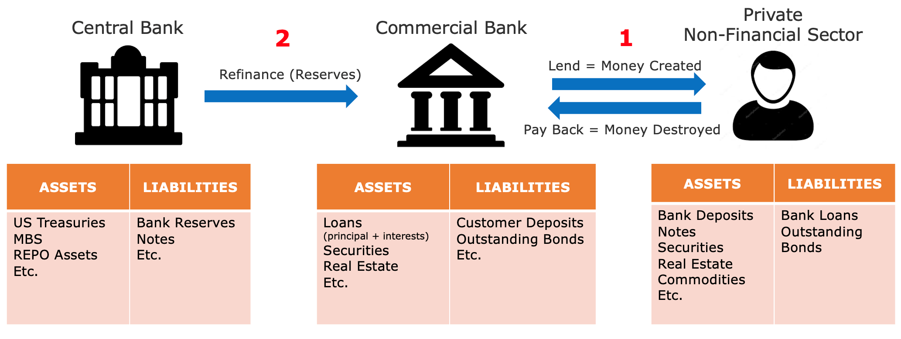
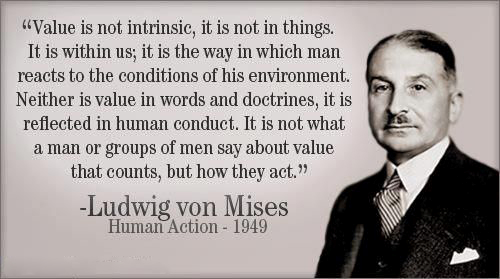
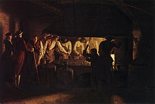
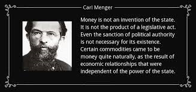
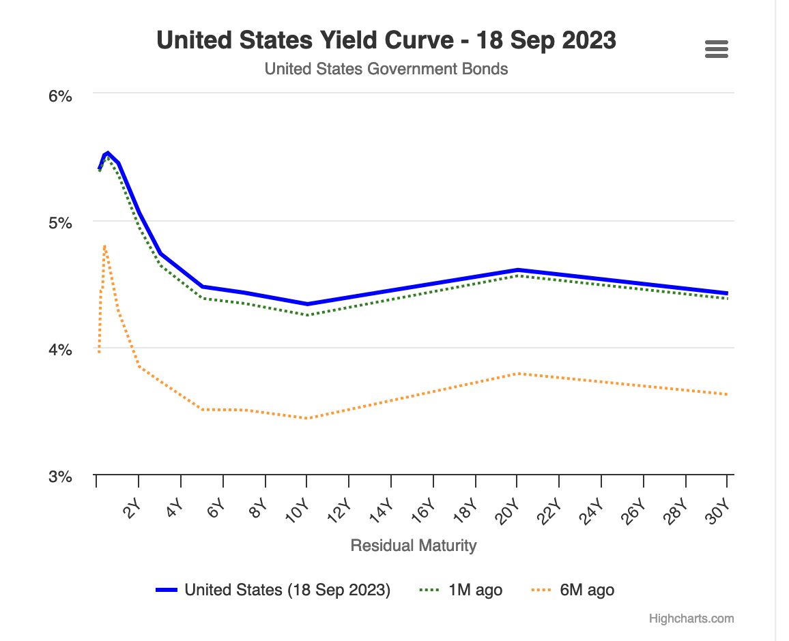
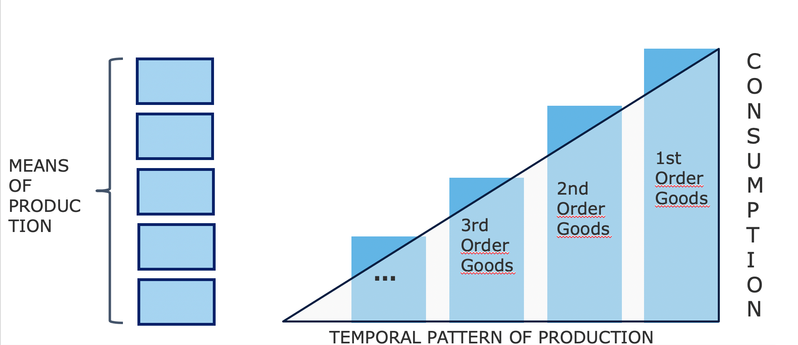
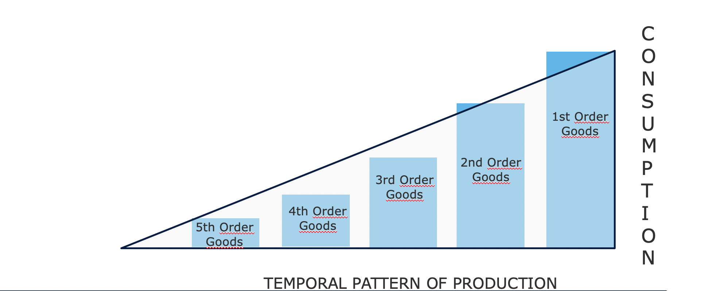
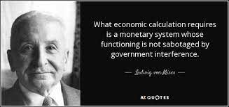

# رحلة في عالم الاقتصاد

مرحبًا بكم في دورة ثيو موجنيه! متحمس للاقتصاد والتاريخ والأدب وعلم السياسة والتكنولوجيا، قرر مشاركة معرفته في الاقتصاد النمساوي معكم. تستند هذه الفرعية، التي هي أقل شهرة في الاقتصاد، على العقلانية البشرية وسلوك الفاعل الحر. وبدلاً من التركيز على الرياضيات، يتعلق الأمر بالمنطق والدراسة الاجتماعية قبل كل شيء.

لقد شهدت هذه المدرسة منذ قرون عدة ولديها مجموعة كبيرة من الكتاب والأفكار والاقتصاديين وراءها. لقد دافع أسماء كبيرة في الاقتصاد مثل هايك وروثبارد وميسيس وباستيات ومينجر عن هذا الحركة لفترة طويلة. على عكس الكينزيانية المهيمنة في أيامنا، تضع المدرسة النمساوية الفرد في مركز المعادلة بنهج أكثر تحررًا ورأسماليًا وحتى متمردًا.

+++

# مقدمة في الاقتصاد

## مقدمة

مرحبًا بالجميع ومرحبًا بكم في اقتصاد 201: مقدمة في الاقتصاد النمساوي.

في هذه الدورة التي يقدمها ثيو موجنيه، ستكتشفون هذا الفرع من الاقتصاد الذي يختلف كثيرًا عن المذهب الكينزي. حتى الآن، قد تكون قد تعلمتم أن إنتاج وإدارة النقود كانت مسؤولية المصارف المركزية، مع فكرة أن طباعة النقود والإنفاق تعزز النمو. ومع ذلك، هناك مدرسة أخرى للفكر الاقتصادي: الاقتصاد النمساوي. مع أكثر من 200 عام من البحث والتطوير والتأمل الفلسفي والكتابات من قبل كتاب مشهورين، تؤكد هذه النهج رؤية أكثر اعتدالًا للنمو والعقلانية البشرية في اقتصادنا.

في الواقع، الاقتصاد هو مجال اجتماعي ومعقد للغاية، يتألف من مجموعة من الفاعلين الصغار المترابطين الذين يساهمون معًا في تشكيل كل شيء بشكل منسق. بدلاً من النظر إلى هذا التخصص من خلال المعادلات الرياضية، يجب أن نفهمه من منظور المنطق البشري وعلم الاجتماع. في هذه الدورة، سنستكشف المفاهيم الأساسية للاقتصاد النمساوي. محاضركم، ثيومو جونيه، هو أستاذ متحمس وكفء في الاقتصاد النمساوي.

للبدء، نقدم لكم فيديو إضافي سيشرح كيف يعمل نظامنا المالي الحالي. ستكتشف كيف يتفاعل البنوك التجارية والمصارف المركزية ويقودون الاقتصاد. سنتناول اللاعبين الرئيسيين في عالمنا المالي وكيف يمكن أن يؤدي هذا التركيز للسلطة بين بعض المؤسسات الاقتصادية إلى الاستغلال والأزمات المالية.

في الجزء الثاني من هذه الدورة، سندرس الفرق بين الكينزيانية والاقتصاد النمساوي، ونستكشف مدارس الفكر المتباينة وطرق التفكير والأدوات التي يستخدمونها لتأسيس الحقيقة الاقتصادية. سندرس أيضًا تكوين الأزمات الاقتصادية. هل يرجع ذلك إلى عدم الكفاءة البشرية، أم تلاعب السوق، أم هل هو نتيجة لهلوسة جماعية للناس؟ سنستكشف كيف يتم إنشاء دوراتنا من النمو والانحدار والركود والعصر الذهبي بواسطة العواطف البشرية.

ستكون هذه الدورة مزيجًا من الاقتصاد والفلسفة، مع مناقشة مفتوحة بين ثيو ونفسي. إذا كان لديكم أي أسئلة خلال هذه الدورة، لا تترددوا في طرحها في خادمنا على ديسكورد، والذي ستجدون رابطه في الوصف.

أشكر ثيو بحرارة على إنتاج هذه الدورة، وآمل أن يكون معلمًا ممتازًا بالنسبة لكم. لقد استمتعنا كثيرًا في إنشاء هذا المحتوى. هذه الدورة متاحة للجميع وستكون، أعتقد، ضرورية لمتابعة دوراتنا المستقبلية الأعمق في الاقتصاد. ستضع هذه الدورة الأساسات اللازمة لاستكشاف بعض النظريات الاقتصادية بمزيد من التفصيل التي سنلمسها فقط هنا بشكل موجز.
إذا كنت مستعدًا للشروع في هذه المغامرة، أدعوك للنقر على الفيديو التالي والبدء بمشاهدة الفيديو الإضافي حول نظامنا المالي الحالي. أعطي الآن الكلمة لثيو. شكرًا له على التعاون مع ديسكوبس بيتكوين في إنتاج هذا الفيديو. سأراكم قريبًا جدًا. وداعًا!

## المال والائتمان والبنوك والبنوك المركزية

> "المشكلة الجذرية في العملة التقليدية هي الثقة التي يتطلبها عملها. يجب أن يكون بإمكاننا الثقة في البنك المركزي بألا يقوم بتخفيض قيمة العملة، ولكن تاريخ العملات الورقية يمتلئ بانتهاكات لهذه الثقة. يجب أن نثق في البنوك بأنها ستحتفظ بأموالنا وتحويلها إلكترونيًا، ولكنها تقوم بإقراضها في موجات من فقاعات الائتمان مع عدم وجود احتياطي يذكر. يجب أن نثق فيهم بخصوص خصوصيتنا، وأن لا يسمحوا للمحتالين بسحب أموالنا."
>
> ساتوشي ناكاموتو، المخترع المجهول لبيتكوين

### كيف يتم إنشاء المال

في نظامنا النقدي الحالي، يتم إنشاء المال أساسًا من خلال ممارسة مصرفية تعرف بـ "الاحتياطي المركزي الجزئي". هذا المصطلح يعني في الأساس أنه ليس من الضروري على البنوك أن تحتفظ بنفس الكمية من الاحتياطيات التي تتلقاها كودائع. وبالتالي، يمكنها إنشاء قوة شرائية جديدة عند منح القروض و، على العكس من ذلك، تقليل القوة الشرائية عندما يقوم العملاء بسداد قروضهم.

على سبيل المثال، إذا توجهت إلى البنك المحلي للحصول على قرض لشراء منزل، فإن المال الذي يُقرضه لك البنك سيظهر كإدخال في السجلات المحاسبية. في المحاسبة، نمثل ثروة الفرد عادةً بورقة ميزانية، والتي تحتوي على جانبين: الجانب الأصول، بما في ذلك أي ممتلكات مثل العقارات والعقود المالية والمخزون أو أي أشكال أخرى من الثروة المملوكة، والجانب المطلوب، الذي يُظهر مصدر الأموال المستخدمة لإنشاء الرأس المدرج في الجانب الأصول. الفرق بين الأصول والمطلوب يُشار إليه بـ "حقوق الملكية" ويمكن اعتبارها صافي ثروة الكيان.

عندما يحمل مؤسسة مالية ترخيصًا مصرفيًا، فإن ذلك يعني في الأساس أن الالتزامات المسجلة باسم "ودائع العملاء" تُعتبر أموالًا رسمية داخل بلد معين أو منطقة نقدية محددة. وبالتالي، عندما تطلب قرضًا لشراء منزل من البنك، لا يقوم المصرفي بإقراض أموال أودعها عميل آخر. بدلاً من ذلك، يقوم البنك بتحويل المبلغ المستدان إلى حسابك وفي نفس الوقت يسجل عقد القرض الخاص بك كأصل للبنك. عندما تسدد قرضك، يتم إلغاء المال بشكل فعال، ويقل قيمة عقد القرض المقابل، مع البنك الذي يحتفظ فقط بالفائدة على القرض.

عند شراء المنزل، توجه بنكك لتحويل المال إلى حساب البائع. إذا كان حساب البائع في بنك آخر، يُخطر بنكك المقابل في المؤسسة الأخرى للتأكد من تحويل المبلغ المناسب إلى حساب البائع، مع خصم المبلغ المقابل من حسابك.

الشكل 1: إنشاء المال كإدخالات المحاسبة

> "من الجيد جدًا أن شعبنا لا يفهم نظامنا المصرفي والنقدي، لأنه إذا فعلوا ذلك، أعتقد أنه سيكون هناك ثورة قبل صباح الغد"
>
> هنري فورد

يتيح هذا العملية للبنوك تسجيل جميع المعاملات، بما في ذلك التحويلات السلكية، ومشتريات بطاقات الائتمان، والشيكات، على مدار فترة محددة (عادة أسبوع أو شهر). ثم يتم تسوية هذه المعاملات بين البنوك باستخدام الاحتياطيات المصرفية، وهي نوع آخر من العملة الورقية التي لا يستخدمها الجمهور. تُحتفظ الاحتياطيات المصرفية في البنك المركزي في حساب خاص يمكن الوصول إليه فقط من قبل البنوك المرخصة والمؤسسات المالية.

### عدم استقرار الاحتياطي المركزي الجزئي والمقرض الأخير

المشكلة الرئيسية في هذا النظام المصرفي المتعدد الاحتياطي هي أن سحبًا كبيرًا من بنك معين يمكن أن يؤدي إلى إفلاسه. نظرًا لأن البنوك يجب أن تلبي طلبات العملاء على النقدية مع الاحتفاظ بمخزون محدود من الاحتياطيات المصرفية، يمكن أن يؤدي الاندفاع المتزامن للعديد من العملاء لسحب الأموال إلى عدم قدرة البنك على تلبية هذه الطلبات، مما يؤدي إلى الإفلاس. وبما أن العديد من الأفراد والشركات والمؤسسات لديهم أموالهم مودعة في البنوك، فإن السماح للبنك بالفشل يمكن أن يكون له عواقب اقتصادية خطيرة، مثل الركود أو حتى الكساد.

أدى هذا اللغز إلى ظهور البنوك المركزية الحديثة. في القرن التاسع عشر في إنجلترا، تهدد الهروبات المتكررة من البنوك الاستقرار المالي، مما أدى إلى إنشاء بنك إنجلترا كـ "مقرض اللجوء الأخير". تم تكليف بنك إنجلترا بتقديم قروض للبنوك المتعثرة خلال الأزمات لمنع حدوث تأثير دومينو يمكن أن يعطل النظام المالي بأكمله. منذ ذلك الحين، انتشرت هذه الفكرة بأن البنوك المركزية تعمل كمقرضي اللجوء الأخير في جميع أنحاء العالم وأصبحت شائعة.

بالإضافة إلى الحفاظ على الاستقرار المالي، تتحمل البنوك المركزية مسؤولية تحديد معدلات السياسات الرئيسية. تحدد هذه المعدلات تكلفة الاقتراض للبنوك المرخصة من البنك المركزي، وتحدد بشكل أساسي تكلفة السيولة للمؤسسات المالية التي تلعب دورًا حاسمًا في الإقراض في اقتصاداتنا. وبالتالي، تعمل هذه المعدلات كمعيار للنظام المالي بأكمله. كفرد، يمكن تقسيم الفائدة التي تدفعها على قرضك العقاري إلى معدل السياسة وهامش البنك.

خلال أزمة الأزمة المالية الكبرى في عام 2008، أعلن بنك ليمان براذرز، وهو بنك استثمار كبير، إفلاسه بعد تكبده خسائر كبيرة على حيازاته من الأوراق المالية الرهن العقاري وتعرضه لسحب كبيرة من العملاء المهتمين. ردًا على هذا الاضطراب المالي الغير مسبوق، حقن البنوك المركزية حول العالم كميات كبيرة من السيولة في الأسواق المالية، ودمج البنوك الاستثمارية المتعثرة مع البنوك التجارية، وخفض معدلات السياسات إلى قرب الصفر في محاولة لمنع انهيار النظام.

على الرغم من أن هذه التدابير منعت موجة متسلسلة من الإفلاسات، إلا أنها لم تساهم كثيرًا في تخفيف التباطؤ الاقتصادي اللاحق. فقد فقد الملايين وظائفهم ومنازلهم، وتراجع الإنفاق الاستهلاكي، وأغلقت الشركات، وتكبدت البنوك خسائر كبيرة. على الرغم من انخفاض أسعار الفائدة بشكل تاريخي، كان قليلون من يرغبون في الاقتراض، مما أدى إلى دورة مفرغة حيث تعززت الانخفاض الأول في الإنفاق والاستثمار نفسه. وبالتالي، اتخذ المصرفيون المركزيون خطوات إضافية من خلال تنفيذ برامج التيسير الكمي. تشمل هذه البرامج شراء البنوك المركزية للسندات الحكومية والأوراق المالية المدعومة بالرهن العقاري من البنوك التجارية باستخدام احتياطيات البنك المركزي.

على عكس توقعات كثيرة، لم تعيد برامج التيسير الكمي إحياء النمو الاقتصادي بشكل كبير ولكنها زادت من قيمة الأصول المالية إلى مستويات تاريخية. استفاد من ذلك بشكل رئيسي الأثرياء والمؤسسات المالية، حيث كانوا بالفعل يمتلكون كميات كبيرة من مثل هذه الأصول، مما زاد من اختلافات الثروة. نظرًا لهيكل النظام المصرفي المشروح سابقًا، يجب ألا يأتي هذا النتيجة على شكل مفاجأة. نظرًا لأن الاحتياطيات المصرفية لا يمكن أن تتدفق بسهولة إلى الاقتصاد الحقيقي، فإن برامج التيسير الكمي زادت بشكل رئيسي من أسعار الأصول دون تحسين الوضع المالي للأفراد العاديين.

### تأثير كانتيلون

ومع ذلك، يمكن استخلاص مبدأ اقتصادي أساسي من هذه الحادثة: عندما يتم إنشاء النقود الجديدة، فإنها في البداية تعود بالفائدة على أولئك الأقرب إلى مصدر المال، على حساب أولئك الأبعد. يعود هذا الاكتشاف الاقتصادي إلى القرن الثامن عشر عندما عرض ريتشارد كانتيلون ذلك في "مقالة عن طبيعة التجارة بشكل عام". يشار إليه الآن بشكل شائع باسم "تأثير كانتيلون".

في هذه الحالة، تلقى المصرفيون والمسؤولون التنفيذيون في البنوك وأصحاب الأسهم والسندات ومطورو العقارات والمقرضون في قطاع العقارات وأي شخص يمتلك أصولًا مالية أو عقارية فائدة مالية كبيرة، بينما تحمل العبء على عاتق الجميع الآخر. استمرت هذه الحالة لسنوات وتفسر إلى حد كبير التفاوت المتزايد في الثروة، والشعور بالتهميش بين الأفراد العاملين بجد، والارتفاع الذي يبدو لا يمكن إيقافه في أسعار الأصول على الرغم من النمو الاقتصادي البطيء.

في الجوهر، النظام مشوه. البنوك غير مستقرة بطبيعتها، ومع ذلك يمكن أن يهدد فشلها الاقتصاد بأكمله. تحفز هذه المخاطرة الأخلاقية المسؤولين في البنوك على اتخاذ مخاطر مفرطة لتعظيم إيرادات بنكهم، على علم بأن البنك المركزي سينقذهم في النهاية، محولًا التكلفة إلى المكلفين. في مثل هذه السيناريوهات، يخلق البنك المركزي ظروفًا لنقل ضخم للقوة الشرائية من الأفراد العاملين بجد والمدخرين إلى أصحاب الأصول وأولئك المرتبطين بالنظام المالي، مما يفصل عملية إنشاء الثروة عن تراكم الثروة.

### آثار سياسات سعر الفائدة الصفرية

خلال فترات طويلة من سياسات سعر الفائدة الصفرية، تكون لدى البنوك فرص محدودة لإعادة بناء حقوقها الملكية لأن هوامشها تتآكل. عادةً ما تكسب البنوك المال عن طريق الاقتراض بأسعار قصيرة الأجل وإقراضها بأسعار طويلة الأجل. ومع ذلك، عندما يقوم البنك المركزي بشراء كميات كبيرة من السندات وتحديد الأسعار عند الصفر، فإن البنوك لديها قليل من الحافز للإقراض، خاصة لرجال الأعمال وغيرهم من المخاطرين. بدلاً من ذلك، يخصصون مواردهم لتأمين رأس المال الموجود أو توفير قروض ضد الضمانات لتلبية طلب الأشخاص الذين يستفيدون من تأثير كانتيلون.

آثار أخرى غير مقصودة لسياسة سعر الفائدة الصفرية هي أنها تشجع الحكومات على الانخراط في إنفاق واسع النطاق. نظرًا لعدم وجود تكاليف اقتراض للحكومات وإمكانية الاعتماد على البنوك المركزية لشراء سنداتها من خلال برامج التيسير الكمي، فإن لديها حافز طبيعي للإنفاق بقدر الإمكان، خاصة في السياقات الديمقراطية حيث يمكن أن يكسب الإنفاق الأصوات. غالبًا ما يتجاهل هذا الاتجاه العواقب على المدى الطويل لهذا الإسراف المالي، مما يؤدي إلى زيادة كبيرة في مستويات الديون العامة في الاقتصادات المتقدمة منذ أزمة الاقتصاد العالمي.

مع ارتفاع التضخم بسبب إنشاء الأموال الكبيرة ردًا على إغلاقات مرتبطة بفيروس كوفيد، يقوم البنك المركزي الآن برفع أسعار الفائدة السياسية في محاولة للحد من التضخم. ومع ذلك، يشكل ذلك تحديًا كبيرًا للنظام بأكمله. البنوك مرتبطة بالرهن أكثر من أي وقت مضى، وتحمل الحكومات مستويات ديون تاريخية مرتفعة، والنمو الاقتصادي بطيء، والعجز يتزايد، والمستهلكون، الذين يكافحون مع ارتفاع أسعار السلع الأساسية، يكافحون لتلبية احتياجاتهم. يتطلب السيطرة على التضخم رفع أسعار الفائدة إلى مستوى يمكن أن يفلس الحكومات، بينما تخاطر البنوك بفقدان المودعين حيث ينفق الأفراد مدخراتهم على الضروريات المتزايدة في السعر أو يلجئون إلى الأصول الثابتة وصناديق السوق النقدية للتحوط ضد التضخم.

### الاستنتاج

> "بهذه الطريقة (الاحتياطي المئوي المصرفي)، يمكن للحكومات أن تصادر ثروة الشعوب بسرية وبدون أن يكتشف أحد في مليون السرقة"
>
> جون ماينارد كينز

في الجوهر، يواجه نظامنا تحديات كبيرة، ويظهر بيتكوين كالبديل الموثوق الوحيد. ومع ذلك، لا يمكن لبيتكوين وحده أن يعالج المشاكل داخل نظامنا النقدي. قبل كل شيء، نحتاج إلى أفراد يفهمون المبادئ الاقتصادية الأساسية بين هواة بيتكوين، مما يمكن من توعية أوسع ومنطق اقتصادي يرشدنا بعيدًا عن بناء أساس مالي هش آخر لحضارتنا. الهدف الرئيسي لهذه الدورة هو تثقيف هواة بيتكوين الجدد في المبادئ الاقتصادية السليمة.
لتحقيق هذا الهدف، سنشرح المبادئ الأساسية لـ "الاقتصاد النمساوي"، وهو مدرسة اقتصادية تعود تقاليدها المنهجية إلى القرن السادس عشر، وتقدم رؤى حول العمل البشري تحت القيود الاقتصادية. من خلال هذا المقدمة، يمكنك الآن فهم أساسيات إنشاء النقود والحالة الحالية لنظامنا المالي والنقدي.
في الفصل القادم، سنتعمق في الركن الأساسي لأي مدرسة اقتصادية: نظرية القيمة. ستستكشف الفصول التالية المال كمؤسسة اجتماعية، ونظرية رأس المال ودورة الأعمال، وتحدي الحساب الاقتصادي، ونظرة عامة موجزة على تاريخ ومنهجية المدرسة النمساوية للاقتصاد.

# الأسس النظرية

## نظرية القيمة الذاتية

> "القيمة موجودة فقط في الوعي البشري"
>
> كارل مينجر، مبادئ الاقتصاد السياسي

### الثورة الحدية

في جذور التفكير الاقتصادي يكمن سؤال القيمة. كيف نحدد قيمة شيء ما؟ هل القيمة خاصية ذاتية للأشياء؟ أم أنها، على العكس من ذلك، ظاهرة ذاتية؟ كيف نقارن قيمة شيئين؟ من أين تأتي القيمة؟

لقد احتلت مثل هذه الأسئلة اهتمام الاقتصاديين والفلاسفة لعدة قرون وتلقت إجابات مختلفة. ومن العديد من النواحي، كان التطور المعرفي للاقتصاد متقطعًا بتطور نظريات القيمة.

بعد أن تم تدحرج نظرية الفسيوقراطيين لقيمة الأرض، التي تفترض أن كل القيمة تأتي من الأرض، بواسطة نظرية الكلاسيكيين لقيمة العمل، التي تفترض أن قيمة سلعة تنبع من كمية العمل المستخدمة في إنتاجها، كانت نظرية القيمة الحدية هي الأخرى تحل محل الأخيرة. في السبعينات من القرن التاسع عشر، بعد ماركس، ظهرت ثلاث مدارس جديدة للفكر الاقتصادي تقريبًا في نفس الوقت حول نظرية القيمة الحدية: مدرسة لوزان مع ليون والراس، والمدرسة الحديثة أو النيوكلاسيكية مع ويليام ستانلي جيفونز، والمدرسة النمساوية مع كارل مينجر. هذه الثورة في نظرية القيمة كانت تجديدًا كبيرًا للفكر الاقتصادي.

من اليسار إلى اليمين: ويليام ستانلي جيفونز، كارل مينجر، ليون والراس

تقول نظرية القيمة الحدية إن القيمة الاقتصادية تتوافق مع ما يدفعه العامل الاقتصادي بحرية مقابل الوحدة التالية من سلعة أو خدمة. نظرًا لأن هذه النظرية تؤكد على حقيقة أن الأسعار تتشكل على الحافة، أي للوحدة التالية من سلعة معينة، فقد تم تسميتها "الحدية".

من المعتاد تقديم الحدية في هذه المدارس الثلاث على أنها متشابهة. في الواقع، يتوافق والراس وجيفونز تمامًا، ولكن تفاوتت تأريخية مينجر عن الآخرين بطرق عميقة. في عمله، الذي يعتبر الآن أساسيًا للنظرية الاقتصادية النمساوية، المعنون "Grundsätze des Volkswirtschaftlehre" (مبادئ الاقتصاد السياسي)، الذي نشر في عام 1874، يقدم مينجر تفسيرًا حدوديًا، ولكن في المقام الأول ذاتيًا، للقيمة، على عكس والراس وجيفونز، اللذين يعتبرون القيمة ظاهرة موضوعية وقابلة للقياس.

### القيمة الذاتية

ينفي الاقتصادي النمساوي مفهوم خلفاء آدم سميث ويتخلى عن فكرة أن قيمة السلعة تأتي من كمية العمل المستخدمة في إنتاجها، لصالح فكرة أن قيمتها تحددها الفرد الذي يقوم، في كل سياق، بأداء فعل عقلي للتقييم بشأن كمية محددة من السلعة أو الخدمة. هذا القفزة الفكرية التي قام بها مينجر تتحدى الواقعية في القيمة: بالنسبة له، القيمة ليست خاصية موضوعية للسلع؛ إنها مجرد نتيجة للعلاقة التي يمتلكها الفرد مع تلك الشيء: "القيمة لا توجد خارج الوعي البشري".

بعبارة أخرى، يدعونا مينجر إلى النظر في أن القيمة موجودة فقط كظاهرة نفسية ذاتية داخل الفرد، وأن القيمة ليست خاصية ثابتة للسلع، بل تنبع من رأي الفرد حول الفائدة التي يمكن أن يستمدها من تلك السلع.

ووفقًا لهذه النظرة، لا تمتلك لتر من ماء الشرب قيمة موضوعية. ربما سيعطي شخص لديه وصول إلى نظام حديث للمياه الصالحة للشرب ولا يشعر بالعطش حاليًا قيمة ضئيلة جدًا لتلك اللتر الإضافي من الماء، في حين أن الشخص العطشان في وسط الصحراء، يرى فيه الفرق بين الحياة والموت، بالتأكيد سيكون على استعداد لإسناد قيمة تقريبًا لا نهائية لتلك اللتر من الماء.

في الخلاصة، لاحظ مينجر أن قيمة السلعة الاقتصادية ليست سوى التقدير الذي يسنده الفرد لوحدة إضافية من تلك السلعة أو الخدمة.

### التبادل الطوعي: لعبة ذات مجموع إيجابي

من هذه النقطة، يستنتج مينجر أن التبادل الطوعي بين شخصين يحدث لأن كل طرف يعتقد أنه سيزيد من فائدته الذاتية. بالنسبة له، لا يفترض التبادل أي تكافؤ للقيمة، على عكس ما يعتقد الاقتصاديون الكلاسيكيون. ووفقًا لفكر الفيلسوف النمساوي، إذا كان هناك تكافؤ للفائدة بين السلع المتبادلة، فلن يكون هناك سبب للأطراف للتعب في التبادل في المقام الأول. إذا كان هناك تبادل، فهو لأن كل طرف يجده في مصلحته (الذاتية)، وبالتالي، ينتج كل تبادل طوعي فائدة اجتماعية.

### التقدير كظاهرة لترتيب رغبات الإنسان

ومع ذلك، لا يمكن قياس هذه الفائدة الاجتماعية، أو القيمة النسبية المسندة للسلعة. بالنسبة لمينجر، القيمة هي ظاهرة معرفية للمقارنة (ترتيبية) بدلاً من القياس (كاردينال). إنها ليست، كما اعتقد الاقتصاديون الجديدون منذ والراس وجيفونز، تسند من قبل الفرد قيمة عددية تعكس الفائدة التي يستمدها منها، بل هي بدلاً من ذلك فعل لترتيب رغبات الإنسان حيث يعبر الفرد عن رغبته في كمية من السلعة أكثر بشدة من كمية من السلعة الأخرى.

يمكن لأي وكيل أن يقول ما إذا كان يفضل 2 موزات على دورة اقتصادية، ولكن لا يمكن لأحد أن يقول بشكل معقول أنه يقدر 2 موزات بقيمة 3.1416 وحدة، في حين يقدر دورة اقتصادية بقيمة 3 وحدات، وبالتالي، يفضل أن يكون لديه الموزات. مثل هذا الوصف لتفضيلات الإنسان، استنادًا إلى وظائف حقيقية مستمرة، لا يتوافق مع واقع العمليات المعرفية التي نواجهها في حياتنا اليومية. الفرد لا يقيم السلع المقدمة له من خلال مقارنتها بمعيار مجرد للفائدة. بدلاً من ذلك، يقارن بشكل ذاتي بين مختلف سيناريوهات العمل، التي لا يمكنه تقييمها بمفردها ولكنه يمكنه ترتيبها على أساس رغبته النسبية.

هذا المفهوم الذاتي للقيمة، المفهومة كعلاقة نفسية يرتبط بها الفرد بأهدافه والوسائل المتعلقة بتحقيقها، يسمح أيضًا للاقتصاديين النمساويين بشرح ظاهرة تقسيم العمل.

### تقسيم العمل

زيارة مصنع للمسامير، ليونارد ديفرانس (القرن الثامن عشر)
كل شخص فريد ولديه حالة شخصية معينة. لذلك، يمتلك كل شخص قدرة فائقة على أداء بعض المهام بشكل أفضل من نظرائه (الميزة المطلقة) أو قدرة فائقة على أداء بعض المهام بشكل أفضل من غيره (الميزة النسبية). لا يمكن أن يكون الأمر على خلاف ذلك؛ إن إنكار هذه الحقيقة الأساسية سيعني الادعاء بأن جميع البشر متساوون في جميع الجوانب.

في حالة وجود قدرة فائقة للفرد مقارنة بنظرائه في إنتاج سلعة معينة (الميزة المطلقة)، فإن لديه مصلحة في التخصص في إنتاج تلك السلعة ومن ثم تبادل الفائض المحصل مقابل السلع التي يرغب فيها. من خلال ذلك، يُشبع الفرد منفعته الشخصية بشكل أكثر اقتصادية مما لو قام بإنتاج جميع السلع التي يرغب فيها.

ولكن قد يكون الأمر أيضًا أن الفرد ليس لديه ميزة مطلقة في إنتاج أي سلعة. في هذه الحالة، ستظل هناك أنواع من الإنتاج التي يكون الفرد أفضل فيها من غيره (الميزة النسبية)، ولهذا السبب لا يزال لديه مصلحة في التخصص.

بالتأكيد، هناك أشخاص يمكنهم إنتاج تلك السلعة بشكل أكثر إنتاجية منه، ولكن نظرًا لأن هؤلاء الأشخاص على الأرجح أكثر إنتاجية في مهمة أخرى من هذه المهمة، ونظرًا لأنهم لا يستطيعون أداء كلتا المهمتين في نفس الوقت، فإن العمل على هذه المهمة بدلاً من غيرها الأكثر إنتاجية ليس منتجًا. من خلال التخصص في المهمة التي يكونون فيها الأكثر إنتاجية، سيحصلون على فائض أكبر مما لو لم يتخصصوا، وبالتالي، يمكنهم الحصول على كمية متزايدة من تلك السلع الأخرى من خلال التبادل، حتى لو كانت السلع التي حصلوا عليها قد تم إنتاجها بشكل أكثر كفاءة بواسطتهم بدلاً من المنتجين الذين حصلوا منهم عليها.

لنأخذ مثالًا للطبيب. قد يكون أفضل في كتابة الرسائل الإلكترونية وجدولة المواعيد من سكرتيرته (الميزة النسبية). ولكن أي وقت يقضيه في أداء تلك المهام هو وقت لا يستخدمه في علاج المرضى. وبالتالي، نظرًا لأنه أكثر إنتاجية في علاج الناس، فإنه في مصلحته تفويض الواجبات الإدارية لشخص آخر حتى لو كان أفضل في مثل هذه المهمة من نائبه، لأنه يسمح له بتحقيق الحد الأقصى للقيمة التي يتم توليدها للآخرين، وبالتالي ثروته الخاصة.

بشكل أساسي، هناك فائدة للتخصص، حتى بالنسبة للأفراد الذين ليس لديهم ميزة مطلقة، لأن الوقت هو مورد نادر ومتنافس: كل وحدة من الوقت المستغرقة في نشاط غير تلك التي يكون الفرد فيها الأكثر إنتاجية تعني تكلفة تتمثل في الإنتاج المتخلف الذي تخلفوا عنه (تكلفة الفرصة).

بمجرد أن يتخصص الفرد في إنتاج معين، يمكنه بعد ذلك الاحتفاظ بكمية المنتجات التي يعتبرها ضرورية لاستهلاكه الشخصي وتبادل الفائض مقابل السلع المرغوبة الأخرى. وبذلك، يُشبع رغبته في السلع التي ينتجها بنفسه، مما يعني أن الوحدات المتبقية من إنتاجه ليست له قيمة كبيرة. إنه ما يسمى بالفائدة الهامشية الانخفاضية: كل وحدة إضافية من سلعة أقل مرغوبة من السابقة. بالنسبة للآخرين الذين يفتقرون لمثل تلك السلع، الأمر مختلف: لنفس الأسباب، فإنهم يميلون إلى رغبة السلع التي لا ينتجونها بشكل أكثر شدة من تلك التي ينتجونها. وهذا يؤدي إلى وجود تفاوت قوي بين التقديرات الذاتية المختلفة للأفراد، وهو مشجع للغاية للتبادلات: كل طرف لديه مصلحة في تبادل إنتاجه الفائض لأنه بذلك يزيد من فائدته الشخصية.

نتيجة التحليل السابق هي أن الأفراد دائمًا في أفضل حالة عندما يتخصصون في عملهم ويشاركون في التبادلات. لذلك، يخلص الاقتصاديون النمساويون، وخاصة لودفيغ فون ميزس، إلى أن الميزة الإنتاجية الناشئة عن تقسيم العمل هي القوة الدافعة وراء عملية التعاون الاجتماعي. هنا، قد يكون من المفيد أن نقتبسه مباشرة:
"الحقائق الأساسية التي أدت إلى التعاون والمجتمع والحضارة وحولت الإنسان الحيواني إلى إنسان هي حقيقة أن العمل الذي يتم تنفيذه تحت تقسيم العمل أكثر إنتاجية من العمل المعزول وأن عقل الإنسان قادر على التعرف على هذه الحقيقة. [...] لا يتعاون الناس تحت تقسيم العمل لأنهم يحبون بعضهم البعض أو يجب أن يحبوا بعضهم البعض. إنهم يتعاونون لأن هذا يخدم مصالحهم الخاصة."

### الاستنتاج

> "إذا رأى الإنسان أنه يمكنه أن يعيش بشكل أكثر راحة وهو معلق على الشنق من أن يجلس على الطاولة، فإنه سيكون يتصرف كالأحمق إذا لم يشنق نفسه."
>
> باروخ سبينوزا

عامي 1871-1874 هما السنوات الرائعة للاقتصاد الحديث: شهدت هذه الفترة أعمال ثلاثة مفكرين مستقلين أساسيين للاقتصاد الحديث. باعتبارهما يركزان على القيمة الترتيبية النسبية الشخصية، سيقوم اقتصاديون نمساويون بتطوير جسم كامل من الفكر الاقتصادي يفصلهم عن نظرائهم. ستظل أعمال اقتصاديين نمساويين يستدلون فيها عن العمل البشري في سياق الندرة في تناقض صارخ مع المذاهب الاقتصادية التي بدأها جيفونز ووالراس والتي تعتمد بشكل كبير على الرياضيات وتقوم على فكرة أن القيمة يمكن قياسها واستنتاجها بشكل موضوعي كدالة مستمرة.

بناءً على رؤى القيمة الترتيبية النسبية الشخصية، شرح مينجر ظهور تقسيم العمل والتبادل الطوعي. ومع ذلك، كما سنرى في الفصل التالي، يعتبر التبادل المباشر استراتيجية ضعيفة للوكلاء الاقتصاديين الذين يسعون لتحقيق أقصى فائدة شخصية. لذا، قام والد المدرسة النمساوية بتطوير تفكيره لشرح سبب ظهور النقود كمؤسسة اجتماعية.

سيكون الفصول التالية مخصصة لظهور النقود كظاهرة اجتماعية، ونظرية رأس المال والفائدة، التي ستكون أساسًا لنظرية دورة الأعمال، وأخيرًا دور الأسعار في الحساب الاقتصادي.

## ظهور النقود كظاهرة اجتماعية

بينما يكون للأفراد مصلحة مشتركة في التخصص وتعظيم تقسيم العمل، إلا أن هناك مشاكل تنسيق تحد من هذا التوسع.

أولاً، من المهم أن نلاحظ أنه نظرًا لأن عمليات الإنتاج تكون مقيدة بالزمن وغالبًا ما تكون غير متزامنة (غير متزامنة)، فإنه عادة ما يكون هناك فجوة زمنية بين المساهمة الأولية للفرد واستلام المقابل. الالتزام بمهمة محددة الآن دون وجود ضمانات سابقة بأن الآخرين سيفيون بحاجاتنا في المستقبل يمكن أن يكون محفوفًا بالمخاطر.

في تقسيم العمل، يستفيد كل طرف من التعاون، ولكن بشكل فردي، قد يكون المرء مغرورًا بالاستمتاع بعمل الآخرين دون التراجع، حيث يحصلون على شيء قيم دون تكبد أي تكلفة. تُصف مثل هذه الحالات، حيث يؤدي التعاون المتبادل إلى مكاسب غير مثلى للأفراد ولكن مكاسب قصوى للمجموعة، في نظرية الألعاب بمصطلح "معضلة السجين".

### معضلة السجين

في الأصل، صيغت معضلة السجين على النحو التالي: يواجه اثنان من المشتبه بهم، أليس وبوب، الذين لا يستطيعون التواصل، خطر السجن، مع جملة حكم محتملة على النحو التالي:

- إذا اتهمت أليس بوب وظل بوب صامتًا، فإن أليس تخرج حرة، ويحصل بوب على 3 سنوات في السجن.
- إذا اتهمت كل من أليس وبوب بعضهما البعض، فإن كل منهما يحصل على 2 سنة في السجن.
- إذا ظل كل منهما صامتًا، فإن كل منهما يحصل على سنة واحدة في السجن.

يمكن تمثيل هذه النتائج في مصفوفة (النتائج العددية تشير إلى عدد سنوات السجن):

| أليس / بوب       | اتهام      | الصمت |
| ----------------- | ----------- | ------------- |
| **اتهام**        | 2، 2        | 0، 3         |
| **الصمت** | 3، 0        | 1، 1         |

في هذه اللعبة، لا يوجد فرصة للتنسيق (التواصل مستحيل) لتحقيق أفضل نتيجة لكلا الطرفين. وبالتالي، لديه كل من أليس وبوب حافز فردي لاتهام بعضهما البعض، على الرغم من أن ذلك لا يؤدي إلى النتيجة الأمثل للمجموعة. الاستراتيجية الأمثل لكلاهما هي البقاء صامتين، حيث يتلقى كل منهما عقوبة سنة واحدة.
توضح هذه اللعبة مشكلة يواجهها الناس في الحياة الحقيقية بشكل متكرر: في غياب آليات التنسيق، يميل الأفراد إلى اختيار استراتيجيات تزيد من مكاسبهم الفردية، بغض النظر عن الاستراتيجيات التي يختارها الآخرون (السرقة، الغش، الخيانة، العنف، إلخ)، حتى عندما يكون التوازن المطلوب من خلال التنسيق والتعاون ممكنًا.

### المال لحل مشكلات التنسيق

تكون لهذه المشكلة تأثير أقل في المجتمعات الصغيرة (مثل العائلة ودوائر الأصدقاء) لأنه في مثل هذه الحالات، يعرف الجميع بعضهم البعض مباشرة، مما يجعل من الممكن تذكر مساهمات بعضهم البعض. بفرض أن مغادرة المجتمع (الهروب) تترتب عليها تكلفة، فإن نظام السمعة القائم على ذاكرة الوكلاء الفردية عادة ما يكون كافيًا لتجنب المشاكل التي يطرحها لعبة السجين.

ومع ذلك، عند التعامل مع مجتمعات أكبر تستفيد بشكل كبير من تقسيم العمل، تعود مشكلات التنسيق للظهور. يعود ذلك إلى سببين رئيسيين:

أولاً، يقتصر البشر على قدراتهم الإدراكية. من المستحيل على شخص أن يحافظ على علاقات اجتماعية ثابتة ويتذكرها مع أكثر من 150 فردًا، مما يجعل نظام السمعة غير كافٍ للتغلب على لعبة السجين على نطاق واسع.

ثانيًا، قياس القيمة المقبولة اجتماعيًا للمساهمات في التبادل (القابلية للقياس) هو مشكلة غير تافهة. على سبيل المثال، إذا قدم فرد لحمًا من الصيد وطلب مواد للمأوى مقابله، كيف يمكن تقييم كمية اللحم المقدمة بالمعادلة للمواد المطلوبة؟ الأمر نفسه ينطبق على الجودة - هل يستحق لحم الغزال أكثر أو أقل من الخشب؟

حتى لو كان من الممكن تحديد سعر تبادل مرضٍ لكل زوج من السلع، فإن الحفاظ على هذه المعلومات يصبح سرعان ما يصبح غير عملي. في نظام التبادل المباشر الذي يشمل N سلعة، هناك N(N-1)/2 سعر تبادل يجب تذكرها. في اقتصاد يتضمن 50 سلعة، يعني ذلك تذكر 50*49/2، أو 1225 سعر تبادل، بدلاً من 50 فقط في التبادلات غير المباشرة. في اقتصاد يتضمن 100 سلعة، يزداد هذا العدد إلى 4950. تضع هذه العلاقة التربيعية قيودًا إضافية على قابلية التوسع للتبادل المباشر (التبادل بالتبادل).

علاوة على ذلك، نظرًا لأن هذه التبادلات لا تحدث فورًا ولكنها تتباعد على مر الزمن، فإن تقييم المساهمات على مر الزمن يعقد المقارنة النسبية للمساهمات. بالإضافة إلى تقييم نسبة التبادل بين سلعتين حاليتين، يصبح من الضروري تقييم قيمة المساهمة السابقة مقارنة بنظيرها المستقبلي.

اليوم، على الرغم من عدم عملية مثل هذا النظام، يمكننا استخدام الكتابة أو تخزين البيانات الرقمية لتذكر كل هذه المعلومات وإقامة نظام ائتمان (تتبع المساهمات السابقة، بما في ذلك سعر الصرف لتلك المساهمات، يعد بالأساس إقامة نظام ائتمان).

في العصور قبل الحضارة، لم تكن هذه التكنولوجيات موجودة. وبالتالي، كان على أسلافنا أن يجدوا حلولًا أخرى للاستمتاع بفوائد تقسيم العمل دون تعريض أنفسهم للعواقب السلبية للعبة السجين. وكان الحل لهذه المشكلة في التبادل المباشر هو التبادل غير المباشر الذي يسهله المال.

### تطابق مزدوج للرغبات والقابلية للبيع

يمكن اعتبار المال حلاً اكتشفه أسلافنا لمعالجة ما يسمونه الاقتصاديون بمشكلة "تطابق مزدوج للرغبات". تتمثل هذه المشكلة في ثلاثة أبعاد: المكانية والزمانية والشخصية.
في التبادل المباشر (المقايضة) بين أليس وبوب، يجب أن يكون لديهما كل منهما شيء يرغب الآخر فيه في نفس الوقت والمكان. من خلال استخدام التبادل غير المباشر، أي من خلال النقود، يمكن لأليس شراء من بوب، ويمكن لبوب استخدام تلك الوحدة النقدية في مكان آخر وزمن آخر ومع شخص آخر (بشرط أن يقبل الشخص الآخر تلك النوعية من النقود).

لكي يكون السلعة مالًا، يجب أن تكون لها قابلية بيع عالية، وهذا يعني أنها يجب أن تكون مرغوبة من قبل أكبر عدد ممكن من الأشخاص في معظم الأوقات. من خلال استخدام سلعة قابلة للبيع بشكل كبير، يتم حل مشكلة تطابق الرغبات المزدوجة من حيث الأبعاد المكانية والشخصية: إذا كانت السلعة التي أستخدمها كمال مرغوبة في كل مكان ومن قبل معظم الناس، يمكنني بسهولة فصل عملية البيع عن عملية الشراء من حيث الموقع والتفاعل الاجتماعي.

ومع ذلك، فإن مشكلة القابلية للبيع على مر الزمن أكثر تحديًا للحل لسببين:

أولاً، يؤدي الانحلالية (المعروفة أيضًا بـ "تأثير الزمن") تدريجيًا إلى تغيير صفات معظم السلع ذات الفائدة المباشرة. لذا، يتطلب الحفاظ على قابلية البيع للسلعة على مر الزمن أن تكون متينة بشكل كبير أو مقاومة للانحلالية.

ثانيًا، لا يضمن الندرة النسبية للسلعة في الوقت "ت" ندرتها النسبية في المستقبل. من خلال تخصيص موارد كافية لمجال إنتاج محدد، يمكن للبشر زيادة إمدادات أي سلعة. القيود الوحيدة على زيادة إنتاج سلعة هي التكلفة الفرصية المرتبطة بها. وبالتالي، لا يمكن أن تضمن الندرة النسبية الحالية للسلعة ندرتها النسبية في المستقبل. فقط السلع التي يمكن زيادة إنتاجها بتكلفة عالية جدًا يمكن أن تكون نادرة بشكل مستمر، وهذا هو السبب في أن هذا هو سمة السلع النقدية التي ظهرت بحرية على مر التاريخ البشري.

في العصور قبل الحضارة، كانت مجموعة متنوعة من السلع مثل صدف البحر والمجوهرات المصنوعة والقلائد أو الخرز تستخدم كنقود. كانت هذه السلع قابلة للنقل بسهولة، ولم تكن لها فائدة مباشرة بخلاف قيمتها الزخرفية، وكانت نادرة بشكل طبيعي و/أو تتطلب كمية كبيرة من العمل المتخصص لإنتاجها. نظرًا لأن مستوى تقسيم العمل كان منخفضًا في ذلك الوقت، وبالتالي، كانت التكلفة الفرصية المرتبطة بإنتاج القطع الزخرفية عالية، لم يمكن إنتاج هذه العناصر بكميات كبيرة. وبالتالي، يمكن لأولئك الذين يستخدمون هذه العناصر كنقود أن يضمنوا ندرتها في المستقبل.

حقيقة أن أسلافنا الصيادين والجامعين شاركوا في هذه المهام المكثفة للموارد، على الرغم من أنهم لم ينتجوا سلعًا ذات فائدة مباشرة، يدل على الفوائد الكبيرة التي كانوا يتوقعونها من توسيع نطاق التبادل المكاني والاجتماعي والزمني. إذا لم يكن الأمر كذلك، وكان من المفيد بالنسبة لهم استخدام هذه الموارد في بناء المأوى أو الصيد أو أنشطة أخرى، بدلاً من إنتاج السلع النقدية، فربما لن نجد الكثير من الأدلة الأثرية على هذه الأنشطة الحرفية. كانت المجموعات الأخرى التي تستخدم مواردها بكفاءة أكبر ستتمتع بتطور أفضل وازدهار أكبر، وسرعان ما ستختفي هذه الأنشطة الحرفية لصالح الأنشطة التي تنتج سلعًا ذات فائدة مباشرة.

من هذا المنطلق، يمثل إنتاج السلع النقدية، من خلال تعزيز توسيع تقسيم العمل، استخدامًا أكثر ربحية للموارد (من حيث الفائدة الذاتية للأفراد) من جميع البدائل الأخرى (زيادة الصيد والصيد والجمع وإنتاج الخشب وبناء المنازل وإنتاج المزيد من أدوات الصيد والصيد، إلخ).

### عدم اليقين

لإنهاء تحليلنا للمؤسسة النقدية، يجب أن نتناول مسألة العمل الاقتصادي في سياق العدم المفاجئ حول المستقبل.
كما أشار الاقتصاديون النمساويون، فإن العمل البشري مقيد بالزمن وموجه دائمًا نحو المستقبل. عندما يقوم الفرد بالتصرف، فإنه يغير حالته الحالية على أمل الحصول على رضا في المستقبل. يمكن أن تكون هذه الإسقاطات العقلية موجهة نحو المستقبل القريب أو البعيد، ولكن لكي يتمكن الفرد من التوجه نحو المدى الطويل، يجب أن يؤمن أولاً معيشته القصيرة الأجل لأن حالته في المستقبل القريب تؤثر مباشرة على حالته في المستقبل البعيد.

وينبع هذا مباشرة من العقلانية البشرية؛ فلا أحد يستطيع تجاهل الطبيعة المتسلسلة للظواهر الزمنية والتبعية الزمنية التي تنتج عنها لأنها واحدة من القيود الأساسية للحياة البشرية. ولذلك، نظرًا لأن المستقبل يظل غير مؤكد دائمًا بالنسبة للبشر، فإنهم سيسعون لضمان بقائهم على المدى الطويل فقط عندما يتم ضمان بقائهم على المدى القصير.

وفي هذا الصدد، يلعب المال، من خلال السماح بتخزين القيمة في الحاضر ونقلها إلى الذات المستقبلية، دورًا حاسمًا في التنسيق الزمني بين أفعال البشر. من خلال تخزين المال، أي الادخار، يحمي الأفراد أنفسهم من عدم اليقين المستقبلي وبالتالي يمكنهم توجيه أفعالهم نحو المدى الزمني الأطول. ومع ذلك، يمكنهم تحقيق ذلك فقط إذا كان المال المستخدم يشكل متجرًا للقيمة، مما يعني أنه لديه قابلية للبيع على مر الزمن، وهو ما ذكرناه سابقًا وهو سمة للسلع المتينة والنادرة نسبيًا.

في الفصل القادم سنتعمق في مفهوم تفضيل الزمن ونشرح الرؤية النمساوية للفائدة ورأس المال، والتي ستكون أساسًا للفصل التالي حول نظرية دورة الأعمال.

## تفضيل الزمن والفائدة ورأس المال

### تفضيل الزمن

انتهينا من الفصل السابق بشرح كيف يستخدم الوكلاء الاقتصاديون أفضل سلعة قابلة للبيع، أي المال، للتصدي لعدم اليقين المستقبلي. وشرحنا أيضًا أن الطبيعة المتسلسلة للظواهر الزمنية تدفعنا لمحاربة عدم اليقين تدريجيًا: فقط عندما نعلم أن سبل العيش ستكون مضمونة للأسبوع القادم يمكننا التركيز على الأهداف في المستقبل الأبعد.

أو، لنقول بشكل مختلف: كبشر نقوم بتخفيض قيمة السلع المستقبلية.

تسمى هذه التقديرات الذاتية لقيمة السلع المستقبلية مقارنةً بالسلع الحالية بتفضيل الزمن. كلما كانت الظروف متساوية، فإن السلع الحالية تفضل بشكل طبيعي على السلع المستقبلية. نظرًا لأننا مميتون، والمستقبل غير مؤكد دائمًا، فإننا نفضل بشكل طبيعي أن نحصل على سلعة الآن بدلاً من الحصول عليها في وقت لاحق. على الرغم من أن تفضيل الزمن يمكن أن يختلف بين الأفراد، بسبب مجموعة متنوعة من العوامل مثل الثقافة والثروة والتعليم والفسيولوجيا، إلا أن تفضيل الزمن يكون دائمًا إيجابيًا، مما يعني أننا نقدر دائمًا السلع الحالية أكثر من السلع المستقبلية.

هذا المفهوم للتقدير النسبي للسلع المستقبلية على السلع الحالية هو جذر ظاهرة الفائدة. في الواقع، في اقتصاد يتم فيه تداول أسواق رأس المال بدون تلاعب، يتم تحديد معدلات الفائدة المرجعية (التي تعتبر خالية من المخاطرة من التخلف) عند تقاطع عرض رأس المال والطلب عليه. وبالتالي، تمثل هذه المعدلات حالة تفضيل الزمن للنظام الاقتصادي بأكمله: يحدث زيادة في معدل الفائدة نتيجة لزيادة نسبية في الطلب على رأس المال مقارنة بالعرض، مما يشير إلى زيادة في تفضيل الزمن. وعلى العكس، يحدث انخفاض في أسعار الفائدة بسبب زيادة في الادخار، وهو زيادة في عرض رأس المال، مما يشير إلى تقليل في تفضيل الزمن.

في اقتصاد حيث لا يتم تلاعب بأسعار الفائدة من قبل البنك المركزي، نميل إلى ملاحظة منحنى العائد المائل للأعلى: كلما زادت مدة استحقاق الدين، زاد معدل الفائدة. لا يمكن أن يحدث الوضع المعاكس لأنه سيعني أن المستقبل أكثر تأكيدًا من الحاضر، وهو أمر مستحيل منطقيًا.
مفهوم تفضيل الوقت وكيف نعبر عن تفضيلنا الشخصي للوقت من خلال الاستهلاك والادخار أمر أساسي في عمليات توزيع رأس المال والإنتاج. دعونا نلقي نظرة على نظرية رأس المال لطالب مينجر، يوجين فون بوهم-باورك، لفهم كيف يؤثر تفضيل الوقت بالضبط على تنظيم الإنتاج.

### نظرية رأس المال

في بداية هذه الدورة، رأينا أنه بالنسبة لكارل مينجر، يعتبر السلع الاقتصادية (التي تحظى بقيمة) فقط لأنها تعمل كوسائل لتحقيق أغراض يختارها ويقدرها الأفراد. ووفقًا لهذا الرأي، تدور جميع التحليلات الاقتصادية حول الاستهلاك لأنه في النهاية هو الهدف المحرك وراء جميع الأنشطة الاقتصادية. لذلك، بالنسبة لمينجر، يعتبر نقطة البداية للتحليل الاقتصادي هي السلع الاستهلاكية، أو السلع النهائية، حيث تمثل الغرض النهائي للأنشطة الاقتصادية. وتحظى جميع السلع الأخرى في الاقتصاد، والتي يمكننا أن نسميها "السلع الوسيطة"، بقيمة لأنها تمكن الأفراد من الحصول على هذه السلع الاستهلاكية: إنها السلع المستخدمة في إنتاج السلع الأخرى.

لإنتاج السلع الاستهلاكية، يقوم رواد الأعمال بدمج هذه السلع الوسيطة المختلفة مع العوامل الأصلية للإنتاج (العمل والأرض ورأس المال) وفقًا لنمط يعظم الإنتاج الناتج. يشمل هذا الترتيب، الذي يتم بواسطة رواد الأعمال، أطوارًا مختلفة يمر بها السلع الوسيطة حتى تصبح في النهاية سلع استهلاكية.

وبالتالي، مثلما فعل مينجر، يمكننا تعريف السلع الاستهلاكية بأنها السلع من الدرجة الأولى، السلع المشاركة في المرحلة السابقة من الدرجة الثانية، وتلك في المرحلة قبل ذلك من الدرجة الثالثة، وهكذا، حتى نصل إلى العوامل الأصلية (الأرض والعمل ورأس المال). يعتمد عدد المراحل التي نأخذها أساسًا على الهيكل الإنتاجي الذي يتبناه رواد الأعمال ولا ينبغي اعتباره سمة موضوعية للهيكل الإنتاجي. على العكس من ذلك، توجد مراحل الإنتاج والسلع الوسيطة فقط في سياق تليولوجي: يتصور الفاعل سلسلة من الإجراءات التي سيتخذها لتحقيق هدفه المرغوب فيه، ويقسم عمله عقليًا إلى مراحل متتالية.

تفرض هذه الخاصية للتصور العقلي للعمل في نمط متتابع بسبب الطبيعة الزمنية للعمل البشري. يستغرق كل إجراء يقوم به البشر وقتًا؛ فالعمل الفوري مستحيل. لذلك، يتاح للفاعل دائمًا خيار بين أنماط العمل التي تستغرق وقتًا أكثر أو أقل.

وبالتالي، نظرًا لأن الأفراد لديهم تفضيلات زمنية إيجابية بالضرورة، وهذا يعني أنهم يفضلون السلع الحالية على السلع المستقبلية، فإنهم سيختارون فقط مسارًا أطول إذا كانت النتيجة التي يحصلون عليها لها قيمة ذات طابع شخصي أكبر بالنسبة لهم مما كانوا سيحققونه من خلال اتخاذ المسار المباشر. وإلا، لن يقوم أحد بتبني طرق تستغرق وقتًا أكثر: في حالة النتائج المتساوية، يظل المسار الأقصر هو الخيار المفضل.

نظرًا للطبيعة المتتابعة للعمل البشري، فإن هذه الاختيارات الزمنية بين الفترات دائمًا لها آثار على سلسلة الإجراءات. وبعبارة أخرى، تكون الإجراءات القصيرة الأجل التي أتخذها تابعة للأهداف الطويلة الأجل التي وضعتها، وسوف تؤثر إجراءاتي القصيرة الأجل في ما يمكنني القيام به في المستقبل. وتعني هذه النقطة الواضحة المتعلقة بالأنشطة الإنتاجية أن أي انحراف إنتاجي، أي طول للهيكل الإنتاجي، يتطلب ادخارًا مسبقًا. إذا قررت تخصيص المزيد من الموارد في الحاضر لتحقيق هدف مستقبلي، يجب علي أن أضع جانبًا ما سيساعدني خلال الوقت الذي يستغرقه استثماري.

لتوضيح هذه النقطة، دعونا نعيد زيارة المثال الذي قدمه بوهم-باورك في عمله "رأس المال والفائدة":

روبنسون كروزو والانحراف الإنتاجي/المسار الطويل:

روبنسون كروزو ينقذ البضائع من الحطام، جون ألكساندر جيلفيلان (1793-1864)

في كتابه، يدعونا الاقتصادي النمساوي إلى النظر في التضحيات الزمنية المترتبة على المنعطفات الإنتاجية من خلال تجربة فكرية مستندة إلى روبنسون كروزو وحيدًا على جزيرته.

روبنسون، مثل الإنسان البدائي، يعتمد على البحث عن الطعام والصيد للحصول على قوته اليومية. دعونا نتخيل أن روبنسون يمكنه جمع ما يكفي من التوت لإطعام نفسه طوال اليوم في ثماني ساعات. في مثل هذه الظروف، ليس لديه الكثير من الوقت لأنشطة أخرى. ومع ذلك، يعتقد روبنسون أنه من خلال صنع قطب خشبي، يمكنه بسهولة إسقاط التوت والحصول على طعامه اليومي في أربع ساعات فقط من العمل. علاوة على ذلك، يقدر أنه سيستغرق منه خمسة أيام، يعمل فيها ساعتين في كل يوم، لصنع القطب. لذلك، يستنتج أنه يحتاج إلى حفظ 1/5 من إنتاجه من التوت لمدة خمسة أيام، أو بدلاً من ذلك يقضي ساعتين إضافيتين يوميًا في الجمع لمدة خمسة أيام، لحفظ ما يكفي من التوت للحفاظ على نفسه أثناء قضاء الوقت في صنع القطب.

إذا لم يقم بالتوفير المسبق، فإن روبنسون لن يتمكن من إكمال قطبه وقد يموت في الوقت نفسه.

لذا، لمدة خمسة أيام، يضحي بساعتين من راحته لجمع المزيد من التوت. في نهاية هذه الفترة، يمتلك ما يكفي من التوت ويبدأ في صنع القطب الخشبي، يعمل ساعتين في اليوم لمدة خمسة أيام. بمجرد الانتهاء من عمله، يمكنه الحصول على ما يكفي من التوت لحصته اليومية في 4 ساعات بدلاً من 8، مما يتيح له استخدام الـ 4 ساعات المتبقية في اليوم لأنشطة أخرى.

من خلال التصرف بهذه الطريقة، يأخذ روبنسون منعطفًا في الإنتاج: بدلاً من جمع التوت مباشرةً، يستثمر الجهد في إنتاج سلعة رأسمالية ستجعله أكثر إنتاجية في المستقبل. ومع ذلك، يجب عليه أن يقدم تضحية قصيرة الأجل، أي التوفير، لتحقيق ذلك. إذا لم يفعل ذلك، فلن يتمكن من إكمال سلعته الرأسمالية. ومع ذلك، يوفر له هذا التضحية القصيرة الأجل ميزة كبيرة حيث يكتسب 4 ساعات في اليوم (حتى يصبح القطب قديمًا). تلك الـ 4 ساعات الإضافية في اليوم تمكنه من إنشاء المزيد من السلع الرأسمالية، مثل أدوات الصيد أو شباك الصيد، مما يحسن تدريجياً وضعه.

### الاستنتاج

بعبارة أخرى، في اقتصاد روبنسون كروزو الفردي، يعتبر التوفير من خلال التضحية بالرضا الحالي هو ما يتراكم به رأس المال الذي يزيد من الإنتاجية. في هذا السياق، يعتبر التوفير، أي تأجيل الرضا الحالي، هو الثمن الذي يتعين دفعه من أجل زيادة الرضا المستقبلي. وهذا يعني أن التوفير هو الشرط الأساسي والضروري لأي تطور اقتصادي.

إنه مفهوم مغرٍ ولكنه بسيط: يتطلب أي توسع في هيكل الإنتاج توفيرًا مسبقًا (نظرًا لأن السلع اللازمة لمثل هذا الإنتاج لن تسقط من السماء)، وبالتالي، كلما قمنا بالتوفير بشكل أكبر، زادت الرأسمال التي سنتمكن من تراكمها، والتي بدورها ستترجم في زيادة الإنتاجية وإنتاج المزيد من السلع. وبالتالي، يعتبر الاقتصاديون النمساويون أن تخفيض الرغبات الزمنية هو نقطة البداية لدورة حسنة من التوفير -> المزيد من السلع الرأسمالية -> المزيد من الإنتاجية -> المزيد من السلع = مستوى معيشة أعلى -> رغبة زمنية أقل.

الآن، كما ألمح في الفصل الأول، تم تلاعب أسعار الفائدة لعقود من قبل البنوك المركزية في حين قامت البنوك التجارية بتمديد الائتمان دون احتياطيات مسبقة، مما يعني أن أسعار الفائدة لا تمثل رغبتنا الزمنية وتعطي وهمًا بالتوفر الوفير.
يتم توضيح ذلك تمامًا من خلال الرسم البياني أدناه: تكون أسعار الفائدة الطويلة أقل من أسعار الفائدة القصيرة. أولاً ، هذا لا يمت له بصلة على الإطلاق ، لأنه سيتطلب أن المستقبل أكثر تأكيدًا من الحاضر. ثانيًا ، يستدعي ذلك التحقيق في العواقب على توزيع رأس المال: إذا كان الجميع محفزين للتصرف كما لو كانت التوفيرات وفيرة ، في حين أن المدخرين غير موجودين لأنهم لا يتم مكافأتهم على التوفير ، فما هي العواقب التي يمكن أن تنتجها هذه الحالة على الاقتصاد؟

هذا ما سنكتشفه في الفصل التالي المخصص لنظرية الدورة الاقتصادية النمساوية!

# النظريات الاقتصادية النمساوية

## نظرية الدورة الاقتصادية النمساوية

> "كلما استمرت زيادة الائتمان المصرفي التضخمي ، زادت فرص الاستثمارات السيئة في السلع الرأسمالية ، وزادت حاجة التصفية لهذه الاستثمارات غير الصحيحة. عندما يتوقف التوسع الائتماني ، أو يعكس ، أو حتى يتباطأ بشكل كبير ، يتم الكشف عن الاستثمارات السيئة "
>
> لودفيغ فون ميزيس

كان لودفيغ فون ميزيس ، أكثر طلاب بوهم باورك المتميزين وربما أهم الاقتصاديين النمساويين في القرن العشرين ، هو من استخدم الاستدلال الرأسمالي لبوهم باورك لشرح أسباب وديناميات الدورات الاقتصادية. فيما بعد ، قام فريدريش أ. هايك ، الذي كان تلميذًا لميزيس ، بتوسيع هذا الاستدلال إلى استنتاجاته المنطقية في أعمال حصل عنها على جائزة نوبل في الاقتصاد عام 1974.

بدأ ميزيس وهايك تحليلهم بزيادة في التوفير كنقطة انطلاق. كما رأينا في الفصول السابقة ، فإن أي زيادة في التوفير يترتب عليها بالضرورة انخفاض مقابل في الاستهلاك وبالتالي انخفاض الأسعار النسبية للسلع الاستهلاكية. يؤدي ذلك إلى تأثيرين: أولاً ، زيادة في الطلب على السلع الرأسمالية نتيجة لارتفاع الأجور الحقيقية الناجمة عن الانخفاض النسبي في أسعار السلع الاستهلاكية ؛ وثانيًا ، زيادة في الأرباح الريادية في مراحل الإنتاج الأبعد عن الاستهلاك (الأمر الأدنى). مع ارتفاع الأجور الحقيقية ، يتم تحفيز رواد الأعمال على توفير العمل من خلال استخدام المزيد من السلع الرأسمالية ، مما يخلق طلبًا أقوى على السلع الرأسمالية وأرباحًا أعلى لرواد الأعمال الذين ينتجون هذه السلع ذات الأمر الأدنى. وبالتالي ، في سياق زيادة التوفير ، أي انخفاض في تفضيلات الوقت ، أي انخفاض في أسعار الفائدة ، يعزز تطوير مراحل إنتاج إضافية وزيادة الإنتاجية. هذا هو انحراف الإنتاج الكلاسيكي لبوهم باورك ، وهو نتيجة مرغوب فيها للغاية.

ومع ذلك ، تساءل الاقتصاديان النمساويان ماذا سيحدث إذا لم يكن انخفاض سعر الفائدة ، الذي يعتبر نقطة البداية لهذا الانحراف الإنتاجي ، ناتجًا عن زيادة في التوفير ولكن بدلاً من ذلك ناتجًا عن توسع الائتمان.

في سياق البنوك ذات الاحتياطي الجزئي ، لا يتطلب توسع الائتمان زيادة مقابلة في التوفير. لذلك ، يمكن لرواد الأعمال جمع المزيد من رأس المال والمشاركة في الانحراف الإنتاجي حتى وإن بقيت تفضيلات الوقت ثابتة ، أي بدون أي انخفاض في الاستهلاك. بالنسبة لهايك وميزيس ، يجب أن تؤدي مثل هذه الحالة بالضرورة إلى مشكلات تنسيق كبيرة بين الوكلاء الاقتصاديين. نظرًا لعدم وجود أسعار فائدة في السوق الحرة ، قد لا تكون هذه المشكلات واضحة على الفور ، ولكن في المدى الطويل ، يجب أن تنتج التخصيصات السيئة لرأس المال عواقب ملموسة: ركود.

لوصف هذه الظاهرة من عدم التنسيق الزمني وعواقبها بأوضح شكل ممكن ، سنعتمد على نموذج لهيكل الإنتاج ونراقب كيف يتأثر ، أولاً بانخفاض أسعار الفائدة نتيجة لزيادة في التوفير ، ومن ثم بانخفاض أسعار الفائدة الناجم عن توسع الائتمان.

### انخفاض أسعار الفائدة نتيجة لزيادة في التوفير:

لتسهيل شرحنا، سنعود إلى تصنيف السلع لمينجر ونمثل الهيكل الإنتاجي على شكل رسم بياني يتكون من عدد تعسفي من المراحل:

في الرسم البياني أعلاه، تمر الموارد الأولية من خلال مراحل إنتاج مختلفة، تخضع لتحولات تقربها من حالة السلع النهائية للمستهلك (من خلال التفاعل مع العوامل الأصلية للإنتاج: الوقت والأرض والعمل). يمثل ارتفاع الجانب الأيمن من المثلث الناتج الإجمالي المحلي (GDP) بشكل تخطيطي لأنه يشير إلى مجموع جميع السلع المستهلكة التي تم بيعها في فترة زمنية. يتوافق الفجوة بين كل شريط مع القيمة المضافة (بالقيمة النقدية) التي تولدها كل مرحلة من عملية الإنتاج. يمكن رؤية هذا الاختلاف أيضًا كالدخل المرتبط بكل مرحلة (الإيرادات - التكاليف).

إذا زاد العملاء الاقتصاديون مدخراتهم على المستوى الشامل، فإن كمية السلع النهائية المستهلكة ستقل - بشرط أن يكون كل شيء آخر متساويًا، فإن التوفير ينطوي بالضرورة على تأجيل جزء من الاستهلاك إلى وقت لاحق. نتيجة لذلك، ستنخفض أسعار الفائدة - لأن إمدادات رأس المال تزداد، مما يتيح لرجال الأعمال استخدام هذا التدفق من رأس المال لإنشاء سلع استثمار جديدة وبالتالي تمديد الهيكل الإنتاجي.

سنحصل بعد ذلك على هيكل إنتاج موسع، وهذا التغيير يمكن تمثيله نوعيًا بالرسم البياني التالي:

هنا، قلت القيمة النقدية للسلع المستهلكة المطلوبة، مما يفسح المجال لإنشاء مرحلة إنتاج إضافية. في هذ scen هذا السيناريو حيث يكون انخفاض أسعار الفائدة نتيجة لانخفاض الاستهلاك، أي زيادة التوفير، يظل مساحة المثلث التي تمثل كمية النقود في التداول ثابتة. ينتج التحول في الهيكل الإنتاجي (التمديد) ببساطة من نقل القوة الشرائية من جزء من الهيكل إلى آخر.

من الجدير بالذكر أيضًا أن تقليل الطلب على السلع المستهلكة سيتسبب، في المدى المتوسط، في انخفاض أسعار المستهلك بدلاً من انخفاض كمية السلع النهائية المعروضة. يحدث ذلك لأن الجزء النهائي من الهيكل الإنتاجي لن يتكيف على الفور بعد حدوث انخفاض في الطلب على السلع المستهلكة؛ سيستغرق رجال الأعمال بعض الوقت لتغيير خططهم واستثماراتهم. نظرًا لأنهم يحتفظون بالمخزونات، فإن انخفاض الطلب سيجبرهم على بيع هذه المخزونات بخصم، وبالتالي، سيؤدي فائض التوفير في البداية إلى انخفاض أسعار السلع المستهلكة (أي زيادة في الأجور الحقيقية).

على الجانب المقابل، سترتفع أسعار السلع الاستثمارية لأن نقل القوة الشرائية إلى رجال الأعمال يمكنهم زيادة النفقات الاستثمارية. بمجرد أن ينفق رجال الأعمال هذا التوفير الذي يتم تحويله من المدخرين إلى رجال الأعمال، فإن أسعار الفائدة ستميل إلى الارتفاع مرة أخرى (بسبب تقليل إمدادات رأس المال)، مما يؤدي بدوره إلى انخفاض أسعار السلع الاستثمارية. في الواقع، في نهاية هذا الانحراف الإنتاجي، ستظل الأسعار النسبية تقريبًا كما كانت عليه قبل ذلك. ولكن العملاء الاقتصاديون بشكل عام استفادوا: زيادة الإنتاجية الناتجة عن تمديد الهيكل الإنتاجي ستوفر للمستهلكين المزيد من المنتجات بأسعار وحدة أقل؛ ستزيد قوة شراء المدخرين، جزئيًا من خلال الفوائد الفائدة وجزئيًا بسبب انخفاض أسعار المستهلك؛ في هذه الأثناء، لن يحقق رجال الأعمال، بشكل عام، أرباحًا أو خسائر. سيفقد أولئك الذين يعملون في الأنشطة الأقرب إلى الاستهلاك دخلاً، بينما سيكتسب أولئك الذين يشاركون في إنشاء مراحل إنتاج جديدة نسبيًا. في مثل هذا الوضع، لا يتم إنشاء دخل نقدي جديد؛ بل يزداد الإنتاج، وبالتالي يرتفع القيمة الحقيقية للأرباح.

### انخفاض أسعار الفائدة نتيجة لزيادة الائتمان (دون زيادة في التوفير):

الآن، إذا اعتبرنا انخفاض أسعار الفائدة نتيجة لتوسع الائتمان المقدم من البنوك، فإننا نحصل على صورة مختلفة تمامًا للهيكل الإنتاجي.
مع انخفاض أسعار الفائدة، يمكن لرجال الأعمال استدانة المزيد من الموارد وبالتالي إنشاء مراحل إنتاج أعلى. في هذه الحالة، لن يؤدي توسيع هيكل الإنتاج إلى تقليل الاستهلاك لأنه لم يكن هناك تأجيل للاستهلاك الحالي من قبل المستهلكين. بعبارة أخرى، ينمو الناتج المحلي الإجمالي. وبالتالي، ستطول المثلث لدينا مع الحفاظ على ارتفاع مماثل، مما يعني زيادة مساحته.

لاحظ أن هذا هو نتيجة منطقية تمامًا لتوسع الائتمان. بقدر ما تنتج البنوك وسائط مالية مرتكبة عن طريق منح القروض، يجب أن نتوقع بطبيعة الحال زيادة القوة الشرائية العامة.

عندما يدخل الائتمان إلى الاقتصاد من خلال القروض لرجال الأعمال، يجب أن نلاحظ زيادة في الأرباح في قطاعات الإنتاج البعيدة عن الاستهلاك، وانخفاضًا في الأرباح النسبية في القطاعات الأقرب إلى الاستهلاك. تدعم هذه الربحية الأعلى إعادة توزيع رأس المال نحو هذه المراحل الجديدة والأكثر استثمارًا لرأس المال (بناء السفن، السيارات، البناء، التكنولوجيا المتقدمة، إلخ)، وانخفاض الاستثمارات في القطاعات الأقرب إلى الاستهلاك.

الآن، يكسب رجال الأعمال المشاركون في هذه المراحل الأعلى من الإنتاج دخلاً نقديًا أعلى، وبما أن الرغبة في الوقت ظلت كما هي، يجب أن نرى أيضًا زيادة الطلب على المنتجات الاستهلاكية. ولكن نظرًا لأن الربحية النسبية لرأس المال المستثمر كانت أعلى في القطاعات البعيدة عن الاستهلاك، فقد تم نقل الموارد من الأنشطة القريبة من الاستهلاك إلى الأنشطة الأبعد. وبالتالي، يفتقر رجال الأعمال في المراحل الأدنى من الإنتاج إلى الموارد اللازمة لتلبية الطلب المتزايد. وهذا يخلق توترًا بين هاتين الجزئيتين من هيكل الإنتاج: يحاول كل منهما الحصول على رأس المال على حساب الآخر، ونظرًا لأن الطلب على الاستهلاك يمثل احتياجات أكثر ضرورة، في نقطة ما، سينفد رجال الأعمال المشاركون في الأنشطة البعيدة عن الاستهلاك من الموارد اللازمة لإكمال استثماراتهم. ثم يبدأ معدل الربح في هذه القطاعات في الانخفاض، وتفلس الأعمال، وتحفز الزيادة النسبية في أسعار المستهلكين إعادة توزيع سريعة لرأس المال نحو إنتاج السلع ذات الأمر الأدنى. عندما يتجسد هذا إعادة توزيع الموارد المفاجئة، يدخل الاقتصاد في ركود: تنخفض أسعار الأصول، وتنخفض الأجور الحقيقية، وتنخفض أسعار المستهلكين، وتتراكم المخزونات.

بالنسبة لفريدريش هايك ولودفيغ فون ميزيس، يعد الركود تجسيدًا لتشويه توزيع رأس المال من مرحلة التوسع. نظرًا لأن أسعار التوفير ورأس المال تم التلاعب بها، فقد طور رجال الأعمال مشاريع لا يمكن إنهائها بسبب نقص الموارد، و/أو بناء قدرة إنتاجية تخطط لمستوى استهلاك مستقبلي لا يمكن الاستمرار فيه بسبب نقص التوفير.

فقط من خلال التضخم، أي انخفاض في أسعار الأصول وأسعار الأجور، وارتفاع أسعار الفائدة، وتصفية المشاريع غير المكتملة يمكن للاقتصاد أن يعيد التوازن ويتطور نحو مسار مستدام. لذا، يعد الركود تبديدًا لهذا وهم الازدهار الذي يشكل عملية توازن عنيفة.

بشكل عام، يتم تحفيز الركود من قبل قطاع البنوك نفسه. طالما أن الائتمان يزداد بوتيرة متسارعة، فإن الأسعار مستمرة في الارتفاع، ويتنافس رجال الأعمال على الموارد الإنتاجية. ومع ذلك، كما لاحظ هايمان مينسكي، يأتي الوقت الذي يقرر فيه قطاع البنوك تقليل المخاطر، وبالتالي يقلل من تدفق الائتمان. يؤدي الكساد، بالتالي، إلى العديد من التفليسات، وشدة الائتمان، وانخفاض القوة الشرائية المتاحة، وانهيارات مالية.

يمكن اعتبار مثل هذا التوازن كفترة يفرض فيها الاستهلاك الضعيف والاستثمار الضعيف إعادة بناء التوفير المفقود. بالنسبة لهايك، هذه المرحلة الكئيبة، على الرغم من ألمها، ضرورية للغاية حيث تسمح بانتعاش النشاط الاقتصادي بناءً على هيكل من الأسعار النسبية التي تعكس ندرة العوامل الإنتاجية الفعلية. إذا تم انقطاع هذا الركود، فإن الاقتصاد لا يمكن أن يعود إلى مسار مرغوب فيه لأنه في غياب نظام معلومات يسمح للوكلاء الاقتصاديين بترشيد قراراتهم، ستستمر التوزيع السيئ للموارد فقط.
عندما يتعلق الأمر بآلية الاكتئاب، فإنها غالبًا ما تتعرض للتدخل من قبل السلطة السياسية والبنوك المركزية التي تسعى لـ "تعزيز" الاقتصاد من خلال الإنفاق العجزي والسياسة النقدية السهلة.

بالنسبة لكل من المتحملين والكينزيين، فإن سبب الاكتئاب هو الطلب الكلي غير الكافي، لذلك لا يولي أي منهما اهتمامًا لتطور الأسعار النسبية، والتي كما رأينا، هي جوهر المشكلة. وبالتالي، يعتقدون أن توفير حافز لتوسيع الائتمان (خفض أسعار الفائدة) واستخدام قدرة العجز للدولة لتعزيز الطلب سيبدأ في إحداث تعافٍ. في المدى القصير، قد تبدو هذه التدابير كما لو أنها تنتج التأثيرات المرغوب فيها: العجز يدعم الإنفاق، في حين يؤدي تخفيض أسعار الفائدة إلى زيادة أسعار الأصول، والتي بدورها تشجع أصحاب الأصول على زيادة إنفاقهم. ومع ذلك، يتلاشى هذا التعزيز في نهاية المطاف، في حين يظل المشكلة الهيكلية قائمة، أو حتى تزداد سوءًا مع استمرار تسييس الرأسمالية بفضل أسعار الفائدة المنخفضة بشكل اصطناعي.

في العصر الحديث، كانت البنوك المركزية والحكومات متحمسة جدًا في منع ظهور هذه العملية التكيفية، مما أدى في النهاية إلى البطالة الهيكلية الجماعية وتراكم الديون المستمر. يعتبر اليابان مثالًا في هذا الصدد. بعد انفجار فقاعة الأصول في عام 1989-1990، استخدم بنك اليابان المركزي (BoJ) والحكومات المختلفة في المنصب جميع الأساليب المذكورة هنا لمحاولة "إعادة تشغيل الاقتصاد الياباني". بصرف النظر عن الارتفاعات القصيرة الأجل التي تلت برامج الإنفاق وتخفيض أسعار الفائدة، ظلت اليابان في حالة نمو عصبي وتراكم ديون لأكثر من 30 عامًا.

### استنتاج حول نظرية دورة الأعمال:

من خلال التركيز على الطبيعة التسلسلية للعمل البشري وإيلاء اهتمام خاص لتأثير تقلبات أسعار الفائدة على التنسيق الزمني بين الوكلاء الاقتصاديين، شرح لودفيغ فون ميزس وفريدريش هايك دورات الاقتصادية كديناميكيات داخلية لنظام الاحتياطي الجزئي للبنوك. تكمن الفرق بين التحليل النمساوي وتحليل المتحملين والكينزيين بشكل كبير في أن الأول يولي اهتمامًا خاصًا لمراحل الإنتاج المختلفة وهيكل الأسعار النسبية، بينما يتوقف الأخير عند المتغيرات المجمعة مثل مستويات التوظيف والناتج المحلي الإجمالي أو مؤشر أسعار المستهلك. في الواقع، نظرًا لعدم وجود نظرية رأس المال، يميل الاقتصاديون الرئيسيون إلى نسب الأسباب الكامنة وراء الركود إلى "روح الحيوان" أو "الأحداث الخارجية".

أكثر من أي مدرسة اقتصادية أخرى، تصر المدرسة النمساوية على أهمية الأسعار النسبية لتنسيق الوكلاء الاقتصاديين. تم سحب أعضاء المدرسة النمساوية إلى النقاشات حول هذه المسألة لأكثر من قرن، وخاصة منذ نشر ميزس لعمله حول استحالة الحساب الاقتصادي في الاقتصادات الاشتراكية في عام 1919.

سيكون هذا موضوع الفصل القادم والأخير من هذه الدورة.

## استحالة الحساب الاقتصادي في الاقتصاد الاشتراكي

> "عندما لا تكون هناك أسعار سوق لعوامل الإنتاج لأنها لا تشترى ولا تباع، فمن المستحيل اللجوء إلى الحساب في تخطيط العمل المستقبلي وتحديد نتيجة العمل الماضي. لن يعرف إدارة الاشتراكية للإنتاج ما إذا كان ما يخطط وينفذ هو الوسيلة الأكثر ملاءمة لتحقيق الأهداف المطلوبة. ستعمل في الظلام، على سبيل القول. ستهدر عوامل الإنتاج النادرة سواء كانت مادية أو بشرية (عمل). ستنتج الفوضى والفقر للجميع بشكل لا يمكن تجنبه"
>
> لودفيغ فون ميزس، الفوضى المخططة

### استحالة الحساب الاقتصادي في الاقتصاد الاشتراكي

على الرغم من الفشل المتكرر للأنظمة الماركسية على مدى القرن الماضي، فإن النقاش حول الحساب الاقتصادي لا يزال ذا صلة لسببين هامين:

1. لا يزال هناك أفكار مماثلة تدافع عنها الجماعيون والتدخليون الآخرون.
2. يستمر تحديد الأسعار، سواء في الأسواق المالية من خلال تصرفات المصرفيين المركزيين أو في الأسواق الأخرى من خلال المؤسسات الحكومية، المراسيم، وتدخل لجان التنظيم.

### مناقشة الحساب الاقتصادي

أشعلت هذه المناقشة في البداية بواسطة واحدة من أكثر الأوراق الاقتصادية تأثيرًا في القرن العشرين، "الحساب الاقتصادي في الجمهورية الاشتراكية"، التي كتبها لودفيغ فون ميزس ونشرت في عام 1920. في تلك الحقبة، كان الاشتراكية في ازدياد، مع استيلاء البلاشفة على السلطة في روسيا، وتولي الاشتراكيين المناصب في جمهورية فايمار (ألمانيا)، وارتفاع شهرة الأحزاب الاشتراكية والشيوعية في جميع أنحاء أوروبا.

قبل مقال ميزس، كانت المناقشات حول الاشتراكية والرأسمالية تدور في المقام الأول حول الحجج المعنوية ومشكلة الحوافز. حتى لو افترض المرء أن المجتمع المنظم حول مبدأ ماركس "من كل واحد حسب قدرته، لكل واحد حسب احتياجاته" كان أفضل أخلاقيًا، فإن السؤال العملي "من سيقوم بإخراج القمامة" لا يزال يحتاج إلى إجابة. كان الرد الشائع هو أن الاشتراكية ستنتج أفرادًا يفتقرون إلى غرائز رأس المال، ويخدمون زملائهم بكل طيبة حتى في غياب الحوافز المالية.

مع مقاله، قدم ميزس بعدًا جديدًا للمناقشة. تجاهل الأفكار الأوتوبية حول قدرة الاقتصاد السياسي على خلق "إنسان جديد"، أشار الاقتصادي النمساوي إلى أن التنظيم الاقتصادي العقلاني كان مستحيلاً بدون وجود أسعار لعوامل الإنتاج الوسيطة. حتى اليوم، لا يزال حججه غير مفهوم بشكل سيء من قبل نقاده، وحتى بعض الاقتصاديين الليبراليين. لذا، يستحق شرحه بمزيد من التفصيل.

### شرح استحالة الحساب الاقتصادي

تنشأ معظم الأفكار الخاطئة حول حجج ميزس من سوء فهم للأدوار التي تلعبها الطبقات الإدارية والريادية في الاقتصاد الرأسمالي. لم يتجاهل ميزس قدرة المديرين على وضع خطط إنتاج فعالة داخل عملياتهم الخاصة. بدلاً من ذلك، أكد على أهمية رواد الأعمال والمساهمين، الذين يقومون بتوزيع رأس المال عبر الصناعات المختلفة، وبالتالي تشكيل الأسعار التي تعمل كمدخلات في الحسابات الاقتصادية للمديرين.

بدون أسواق لرأس المال والنقود، يصبح من المستحيل تنظيم استخدام الموارد عبر الصناعات. هذا يعني أنه حتى لو كان هناك تنظيم مثالي داخل كل شركة أو جزء فرعي من الاقتصاد، فإن الاقتصاد بأكمله لا يمكن أن يتكيف بكفاءة مع التغيرات في توافر الموارد وظروف الإنتاج وتفضيلات المستهلكين. بعبارة ميزس:

> "[...] الخطأ الأساسي المتضمن في المقترحات [الاشتراكية السوقية] هو أنها تنظر إلى المشكلة الاقتصادية من منظور الكاتب الفرعي الذي لا يتجاوز مهامه الفرعية. إنهم ينظرون إلى هيكل الإنتاج الصناعي وتوزيع رأس المال على الفروع المختلفة والمجاميع الإنتاجية على أنها صلبة ولا يأخذون في الاعتبار ضرورة تغيير هذا الهيكل لتكييفه مع التغيرات في الظروف.... إنهم لا يدركون أن عمليات ضباط الشركات تتمثل فقط في تنفيذ المهام الموكلة إليهم من قبل رؤسائهم، المساهمين.... عمليات المديرين، شراءهم وبيعهم، ليست سوى جزء صغير من إجمالي عمليات السوق. يقوم سوق المجتمع الرأسمالي أيضًا بتلك العمليات التي تخصص السلع الرأسمالية للفروع المختلفة للصناعة. يقوم رواد الأعمال ورأس المال بإنشاء الشركات والشركات الأخرى، وتوسيع حجمها أو تقليصه، وحلها، أو دمجها مع مؤسسات أخرى؛ يشترون ويبيعون أسهم وسندات الشركات القائمة والجديدة؛ يمنحون ويسحبون ويستردون الائتمانات؛ باختصار، يقومون بجميع تلك الأعمال، والتي يُطلق عليها اسم سوق رأس المال والنقود. إن هذه المعاملات المالية للمروجين والمضاربين هي التي توجه الإنتاج إلى تلك القنوات التي تلبي أكثر الرغبات العاجلة للمستهلكين بأفضل طريقة ممكنة."

في الأساس، يقول ميزيس أن حقوق الملكية، التي تضع أصحاب رأس المال في سياق الأرباح والخسائر، تحفزهم على تخصيص مواردهم للصناعات التي تحتاج حاليًا إلى الموارد لتلبية طلبات المستهلكين. عندما ينجحون، يحققون ربحًا، ولكن عندما يفشلون، يتكبدون خسائر مالية. يشجعهم "المخاطرة" على التكهن بأفضل توزيع لرأس المال للحالة الحالية للاقتصاد. هذا يخلق ديناميكية مدفوعة بالسوق حيث تنتج نتائج أعمالهم معلومات حيوية حول الاستخدام الأكثر كفاءة للموارد.

شرحت الفصول السابقة أن القيم هي ذات طابع ذاتي، وأن الأعمال الاقتصادية تكشف عن تكلفة الفرصة، وأن أسعار المستهلك تعبر عن تسلسل ترتيبي لرغبات المستهلك. يتنافس رواد الأعمال على عوامل الإنتاج لبناء هياكل إنتاج تعظم الإيرادات على النفقات، وتلبي رغبات المستهلك بشكل أكثر فعالية من الخيارات البديلة. لذلك، تستمد أسعار عوامل الإنتاج من أسعار المستهلك: إذا كانت عامل إنتاج يمكن أن يولد إيرادات نقدية أكبر (يلبي رغبات المستهلك بشكل أفضل) في صناعة أخرى أو بمخطط مختلف، فإن رواد الأعمال سيتجاوزون مالكه الحالي، مما يرفع سعره إلى إنتاجيته الحدية. يعتبر هذا التنافس بين رواد الأعمال على عوامل الإنتاج، وتحديد أعلى عائد لها، عملية تولد معلومات ذات صلة حول توزيع الموارد.

تعتبر هذه العملية حاسمة لأنها تؤكد أو تبطل كفاءة الأنشطة المختلفة، مضمنة بذلك تخصيص عوامل الإنتاج لأغراضها الأكثر إنتاجية. تؤدي السوق هذه الوظيفة كعملية مستمرة. في عالم متغير باستمرار - حيث تتغير تفضيلات المستهلكين وظروف الإنتاج والتكنولوجيا والتنظيمات والديموغرافيا وأكثر من ذلك - تتغير أسعار عوامل الإنتاج المتوسطة من خلال تصرفات رواد الأعمال ورأس المال المتكيفة مع التغيرات. نظرًا لأن هذه التغييرات محلية، يجب نشر المعلومات للوكلاء الاقتصاديين الذين لا يمكنهم الحصول على معرفة كاملة عن العالم بأكمله. هذا هو دور السوق: يتيح لرواد الأعمال التصرف بناءً على معلومات محلية، غالبًا ما تكون نوعية ومعقدة، من خلال اقتراح هياكل إنتاج اقتصادية يتم بعدها التحقق منها أو إبطالها من قبل السوق. بهذه الطريقة، يتم تكثيف المعلومات ذات الصلة التي تولدها هذه العملية الأسفلتية وتوزيعها في جميع أنحاء الاقتصاد بواسطة نظام الأسعار. هذه العملية لإنتاج وتوزيع المعلومات ضرورية لتوزيع الموارد لأنها تمكن الوكلاء الاقتصاديين، الذين لديهم معرفة محدودة بالعالم، من إجراء حسابات اقتصادية ووضع خطط اقتصادية متسقة عن طريق الاعتماد على الأسعار.

من هذا المنظور، ستواجه الاقتصاد المخطط مرجحًا تخصيص رأس المال بشكل غير صحيح. في المدى القصير إلى المتوسط، قد لا يتم اكتشاف مثل هذه التخصيصات الخاطئة لأنه لا توجد أسعار سوق أو إفلاسات لكشفها. ومع ذلك، نظرًا لعدم وجود ردود فعل (أسعار) وآليات إعادة التوزيع (إفلاسات)، ستتراكم الأخطاء حتى يصبح الهدر واضحًا من خلال انخفاض كبير في ظروف المعيشة.

### النظرة النمساوية وفشل مدارس الاقتصاد الأخرى

يمكن للشخص أن يجادل في أن رسم مثل هذا المنظر في مرحلة ما بعد الحدث أمر سهل. بعد كل شيء، نحن جميعًا على علم بالرفوف الفارغة في الاتحاد السوفيتي، والصعوبات التي تواجهها فنزويلا، والكارثة الإنسانية في كمبوديا. ومع ذلك، تنبأ ميزيس بهذه الأحداث في وقت مبكر جدًا، بالفعل في عام 1920. ومع ذلك، حتى انهيار الاتحاد السوفيتي في عام 1989، كان العديد من الاقتصاديين، بما في ذلك العديد من الحائزين على جائزة نوبل، يشيدون بمعجزة الاقتصاد السوفيتي ويتوقعون أن يتجاوز الاقتصاد السوفيتي قريبًا اقتصاد الولايات المتحدة.

على الرغم من هذا التنبؤ المثير للإعجاب والعديد من الأدلة التجريبية على استحالة الحساب الاقتصادي تحت الاشتراكية، فإن القادة السياسيين في جميع أنحاء العالم أكثر رغبة من أي وقت مضى في تحديد الأسعار وتأميم صناعات بأكملها واقتراح خطط خمسية، وغالبًا ما يتم تصفيقها من قبل السكان غير المطلعين اقتصاديًا. يشعر الناس في البلدان الغربية السابقة الازدهار بعواقب هذا التدخلية بشكل حاد، حيث يشهدون ببطء تراجع مستويات معيشتهم.

### نظرية الدورة الاقتصادية النمساوية كحالة محددة لعدم إمكانية الحساب الاقتصادي في ظل الاشتراكية

في الفصل السابق، قمنا بتوضيح ديناميات الاستثمار الزائد وتخصيص رأس المال الناجمة عن تلاعب البنوك المركزية بسعر الفائدة. يمكن أن يُنظر في الأساس إلى ما شرحناه كحالة محددة لعدم إمكانية الحساب الاقتصادي في ظل الاشتراكية، تُطبق على مجال أسواق النقود. عندما يتم تحديد الأسعار خارج قيمها السوقية، يتم تحفيز رواد الأعمال وموزعي رأس المال على الاستثمار في مشاريع لا يمكن الاستمرار فيها على المدى الطويل بسبب نقص في التوفير. من خلال التدخل في نظام الأسعار، يخلق المخططون المركزيون (في هذه الحالة، المصرفيون المركزيون) عدم تنسيق بين الوكلاء الاقتصاديين. في هذه الحالة، يتضمن عدم التنسيق الزمني الاستثمار الزائد في السلع الاستثمارية ذات الطلب العالي والاستثمار الناقص في السلع الاستثمارية ذات الطلب الأدنى، مما يمثل تجسيدًا محددًا لتخصيص رأس المال غير السليم عبر الصناعات.

تشمل نتائج مثل هذا التخصيص آثارًا ماكرواقتصادية تتمثل في الأزمات المالية والاقتصادية وتضييق النشاط الاقتصادي وتضخم الديون. تنبع هذه التأثيرات الماكرواقتصادية من عدم التوازن بين التوفير والاستثمار نتيجة لتوسع الائتمان. في الاتحاد السوفيتي والأنظمة الشيوعية الأخرى، أدت تحديد الأسعار إلى تخصيص غير سليم مماثل، مما أدى إلى نقص في بعض السلع وزيادة إنتاج البعض الآخر. في كلا الحالتين، تفشل الأسعار في تعكس التفضيلات الحقيقية للمستهلكين، سواء من حيث التفضيلات الزمنية أو التفضيلات الاستهلاكية، مما يؤدي إلى استثمار رأس المال في "الصناعات الخاطئة" من قبل رواد الأعمال أو المخططين المركزيين المسؤولين عن تخصيص الموارد.

اليوم، تعود مناقشة الحساب الاقتصادي بشكل أساسي في مناقشات حول الطاقة، حيث يصبح واضحًا بشكل متزايد الاستثمار الزائد الناجم عن الأجندة الخضراء. كما تطرح في مناقشات حول أسواق النقود، حيث يشير الاقتصاديون النمساويون إلى أن أزمة عام 2008، التي فشل الاقتصاديون الرئيسيون في توقعها، كانت دورة اقتصادية كلاسيكية تتميز بالاستثمار الزائد في سوق الإسكان بسبب فترات طويلة من أسعار الفائدة المنخفضة. علاوة على ذلك، يروج الماركسيون الجدد والفصائل الاشتراكية الأخرى لفكرة أن ظهور الذكاء الاصطناعي يمكن أن يحل مشكلة الحساب الاقتصادي. ومع ذلك، ينبع هذا المنظور من فهم مشوه للمسألة؛ فإن مشكلة الحساب الاقتصادي ليست مسألة قوة الحساب ولكنها مسألة توليد وتوزيع المعلومات المتعلقة بالإنتاج وتخصيص الموارد. يمكن توليد هذه المعلومات فقط محليًا من قبل الوكلاء ذوي المعرفة المتخصصة والمصلحة المباشرة في النتيجة. لا يمكن للذكاء الاصطناعي أن يحل محل هذه العملية الأساسية وبالتالي لا يمكن أن يساعد المخططين المركزيين في معالجة مشكلة تخصيص الموارد. للأسف، نتيجة لقرن من السوء فهم، نتوقع انتشار المزاعم بأن الذكاء الاصطناعي سيشهد عصرًا جديدًا من الازدهار الاقتصادي بقيادة مخططين مركزيين مستنيرين يمكنهم، بمساعدة الذكاء الاصطناعي، تصحيح أخطاء الأسواق الحرة.

للحصول على تطبيق ملموس لمشكلة الحساب الاقتصادي في حالة معاصرة، يمكنك الرجوع إلى هذه المقالة التي تناقش مشكلة تخصيص الموارد في الصين الحديثة.

>   The Road to Financial Repression: China the Paper Tiger, Theo Mogenet, https://open.substack.com/pub/theomogenet/p/the-road-to-financial-repression-181?r=ccpx8&utm_campaign=post&utm_medium=web 

### الاستنتاج

في هذا الفصل النهائي، استكشفنا عدم إمكانية الحساب الاقتصادي في ظل الاشتراكية، وهو مبدأ أساسي في المدرسة النمساوية للاقتصاد. تتوج النظرة النمساوية المقدمة في هذه الدورة التدريبية بهذا الاستنتاج وتقدم حجة قوية للسياسات غير التدخلية. في جوهرها، تدور جميع التفكيرات النمساوية حول أهمية الأسعار في التنسيق الاقتصادي. من خلال التأكيد على أهمية التكلفة البديلة والحساب الاقتصادي لاستخدام الموارد بشكل منطقي، يظهر الاقتصاديون النمساويون تعقيد ودقة العمل البشري في عالم متغير باستمرار.
الاقتصاديون الرئيسيون والمخططون المركزيون غالبًا ما يكرهون الاقتصاديين النمساويين لأنهم يسلطون الضوء على عدم اليقين في المستقبل وخطأ التنبؤ الاقتصادي الكمي والآثار الضارة للتدخل الاقتصادي. بإيجاز، يؤكد الاقتصاد النمساوي على عدم الفعالية والنتائج الضارة للإجراءات التدخلية.
تتجسد التقليد النمساوي في نهج متواضع للعمل البشري، حيث يستخلص آثارًا عميقة من مفاهيم القيمة الذاتية وعدم اليقين والإرادة الحرة والتعقيد. يشرح كيف أن النظام السوقي، على الرغم من عدم كونه منتجًا لتصميم بشري، يقف كمؤسسة مركزية لتطورنا وازدهارنا. إذا كان هناك درس واحد رئيسي يمكن استخلاصه من هذه الدورة، فهو أن الرأسمالية أصبحت النظام الاقتصادي السائد بسبب قدرتها على التكيف مع التغيير في عالم ديناميكي وغير مؤكد يضم أفرادًا حرة.

## المنهجية النمساوية

تميز المدرسة النمساوية للاقتصاد بمنهجيتها المحورية-استنتاجية، والتي تختلف عن النهج الإيجابي الذي يستخدم في العلوم الاجتماعية. يستند النهج الإيجابي إلى قوانين مستندة إلى البيانات التجريبية، ويعتمد على طريقة مشابهة لتلك المستخدمة في العلوم الطبيعية. يصيغ فرضيات من الملاحظات، ثم يتم تأكيدها أو نفيها من خلال تجارب مؤقتة. تتكون الطريقة العلمية من الاحتفاظ بالفرضية التي تفسر البيانات بشكل أفضل والاستمرار في استكشافها حتى يتم العثور على فرضية أكثر دقة.

ومع ذلك، في العلوم الاجتماعية، من الصعب عزل المتغيرات كما هو الحال في الفيزياء، لأن كل لحظة في التاريخ فريدة وتدخل مجموعة متعددة من العوامل. لا يمكن إعادة إنتاج التجارب الاقتصادية في المختبر، ومن المهم أن نلاحظ أن مراقبة الترابط بين متغيرين لا يثبت العلاقة السببية بينهما. اقترح النمساويون، وعلى رأسهم لودفيغ فون ميزيس، طريقة بديلة تسمى الطريقة المسبقة أو المحورية-استنتاجية لدراسة العلوم الاجتماعية. يستند هذا النهج إلى مقترحات أساسية تسمى بالمبادئ المحورية، مشابهة لتلك المستخدمة في الرياضيات. على سبيل المثال، الهندسة اليوكليدية هي مثال على الطريقة المحورية-استنتاجية في مجال الرياضيات.

في الاقتصاد النمساوي، تشمل المبادئ المحورية الأساسية تفضيلات الوقت الإيجابية، والتي تستند إلى اختيارات الأفراد للسلع أو الخدمات اليوم بدلاً من الغد، بسبب عدم اليقين حول المستقبل. لا يتم تساؤل هذه المبادئ، حيث يعتبرون واضحة ومتسقة مع الحياة اليومية. باستخدام هذه المبادئ الأساسية، يستخدم الاقتصاديون النمساويون قواعد المنطق لاستنتاج عبارات تقدم معلومات حول وظيفة الظواهر الاقتصادية. على سبيل المثال، يشرحون أن الأزمات الاقتصادية تحدث بسبب عدم التوازن بين التوفير والاستثمار، مما يؤدي إلى التلاعب الاصطناعي بأسعار الفائدة. يطالب الأفراد ذوو التفضيلات الإيجابية للوقت بمعدل فائدة إيجابي لتعويض مخاطر الإقراض. يؤكد النمساويون أن العلاقات التقديرية هي شخصية، لذا يمكن أن تختلف أسعار الفائدة اعتمادًا على الأفراد والظروف.

تلعب الأسعار دورًا حاسمًا في التنظيم العقلاني للأفراد ذوي المعلومات الجزئية. يوازن سعر الفائدة بين العرض والطلب على رأس المال في السوق، وبالتالي يعزز الاقتصاد. يؤكد الاقتصاديون النمساويون أن تحديد سعر الفائدة بشكل تعسفي يمكن أن يؤدي إلى أزمات اقتصادية وجعل الحسابات غير ممكنة في نظام اشتراكي.

### الاقتصاديون النمساويون والاختلافات المنهجية

غالبًا ما يواجه الاقتصاديون النمساويون صعوبات عند المناقشة مع المدارس الأخرى من الفكر، حيث لا يستخدمون نفس أساليب التحليل. في حين يستدل النمساويون من المبادئ المحورية، مثل ذوبانية القيمة، لاستنتاج النتائج المنطقية، يعتمد الاقتصاديون الكينزيين أو المونتاريين على البيانات التجريبية لإقامة قوانين اقتصادية عامة.
مثال على الاختلاف المنهجي هو موقف مؤيدي نظرية النقد الحديثة (MMT) الذين دعوا إلى طباعة النقود لتحقيق الأهداف السياسية، باستخدام غياب التضخم بين عامي 2008 و 2019 كحجة. لا يتحدث الاقتصاديون النمساويون ومؤيدو نظرية النقد الحديثة بنفس اللغة ولا يتفقون على المعايير لتحديد صحة قانون اقتصادي. هذا يجعل النقاشات بين هذه المدارس المختلفة صعبة وغالبًا غير مثمرة.

من المهم أن نلاحظ أن اختيار البيانات بشكل انتقائي لإقامة علاقات بين المتغيرات هو طريقة غير علمية وغير دقيقة في الاقتصاد. فعلى سبيل المثال، لا يتسبب إنشاء النقود بالضرورة في التضخم، ويتطلب نهجًا أكثر تعقيدًا لفهم الآليات الاقتصادية المعقدة. تلعب المبادئ الأساسية دورًا حاسمًا في الاستدلال الاقتصادي النمساوي. فهي عناصر أساسية يمكن من خلالها إجراء استنتاجات منطقية. ومع ذلك، من المهم أن ندرك أن التنبؤ الدقيق بالمستقبل في الاقتصاد غالبًا ما يكون صعبًا بسبب تعقيد الظواهر الاقتصادية وعدم اليقين الأساسي.

المنهجية هي جانب أساسي في الاقتصاد والعلوم الاجتماعية بشكل عام. إنها تؤثر في كيفية طرح الأسئلة وصياغة الفرضيات وتفسير البيانات. فهم الاختلافات المنهجية بين المدارس الاقتصادية المختلفة يمكن أن يساعدنا على تقدير وجهات النظر المتنوعة وتطوير آراءنا الخاصة حول المواضيع المطروحة في الحلقات السابقة.

# الاستنتاج

## دراسات إضافية

تهانينا على اكتمال دورة ECON 201 هذه! آمل بصدق أنك استمتعت بها وفتحت أبوابًا لنفسك. اكتشافك للبيتكوين لا يزال في بدايته، وأدعوك لاستكشاف جميع الدورات الأخرى المتاحة في الجامعة.

### قراءة إضافية

لتعميق فهمك للظواهر الاقتصادية والاجتماعية، ولا سيما فيما يتعلق بالاقتصاد النمساوي، إليك بعض التوصيات الكتابية:

- "The Austrian School" لـ Ressus Huerta de Soto: يقدم هذا الكتاب بأسعار معقولة مقدمة شاملة لتطور الفكر الاقتصادي النمساوي، ويغطي المفاهيم والنظريات الرئيسية.
- "Human Action" لـ Ludwig von Mises: يعتبر هذا العمل العملاق للمدرسة النمساوية، ويستكشف بعمق الأسس النظرية للعمل البشري والاقتصاد.
- "The Use of Knowledge in Society" لـ Friedrich Hayek: يفحص هذا النص القصير كيفية استخدام المعرفة المنتشرة في المجتمع لتوجيه القرارات الاقتصادية، مشيرًا إلى أهمية الأسعار والمنافسة.
- خطاب قبول جائزة نوبل لجوزيف شمبيتر في عام 1974: يقدم هذا الخطاب نظرة عامة على رؤية شمبيتر لريادة الأعمال والابتكار والرأسمالية.
- "Capitalism, Socialism and Democracy" أو "The Theory of Economic Development" لجوزيف شمبيتر: تستكشف هذه الكتب الأيقونية لشمبيتر ديناميات الرأسمالية والابتكار والدورات الاقتصادية.

بالإضافة إلى هذه القراءات، يمكنك أيضًا العثور على معلومات حول الاقتصاد النمساوي من خلال استكشاف الموارد عبر الإنترنت. يقدم معهد ميسيس، الذي يتخذ من جنوب شرق الولايات المتحدة مقرًا له، مقالات ومقاطع فيديو لاقتصاديين مشهورين. يقدم Savedin Amoos Academy ندوات تفاعلية مع ضيوف مميزين، على الرغم من أن هذا الخيار مدفوع. في فرنسا، يشارك الأشخاص مثل Yorick de Montbin و Fergan Aziri و Richard Hamelin تحليلات ومناقشات حول الاقتصاد النمساوي على قنوات يوتيوب مختلفة. أخيرًا، يمكن أن يكون معهد البيتكوين أيضًا مصدرًا للمعلومات حول الجوانب الاقتصادية المتعلقة بالبيتكوين.

من خلال قراءة هذه الأعمال واستكشاف هذه الموارد عبر الإنترنت، يمكنك تطوير فهمًا أعمق للمبادئ والأفكار الرئيسية للمدرسة النمساوية للاقتصاد.

### ادعمنا

تم تقديم هذه الدورة، وكذلك جميع المحتوى على هذه الجامعة، لك مجانًا من قبل مجتمعنا. لدعمنا، يمكنك مشاركتها مع الآخرين، وأن تصبح عضوًا في الجامعة، وحتى المساهمة في تطويرها عبر GitHub. نيابة عن الفريق بأكمله، شكرًا لك!

### قيم الدورة (قريبًا)
سيتم قريبًا دمج نظام تقييم للدورة في هذه المنصة التعليمية الجديدة! في الوقت الحالي، شكرًا جزيلاً لك على اتخاذ الدورة، وإذا كنت استمتعت بها، يرجى التفكير في مشاركتها مع الآخرين. (قريبًا)
إذا كنت ترغب في مواصلة استكشاف موضوع الاقتصاد النمساوي، أقترح عليك عدة مقابلات مع ثيو موجنيه:

- [كيفية التحضير للأزمة الاقتصادية التالية؟](https://youtu.be/GJT8t1TEd7Q)
- [كيف يمكن تنظيم تدمير اليورو؟](https://youtu.be/eK3ONo11HN8)
- [هل يمكن أن نعتمد على معيار البيتكوين الفائق؟](https://youtu.be/nkN2twZ-lJY)
  إذا كنت ترغب في المزيد، يمكنك مشاهدة هذه المناقشات حول الوضع الاقتصادي العام ومواضيع متنوعة أخرى:
- [كيفية تدمير البيتكوين؟](https://youtu.be/gHKvj4eeiDg)
- [هل البيتكوين ينتمي إلى اليمين أو اليسار أو الأناركية؟](https://youtu.be/4fXGxzLtIIw)
- [لإنقاذ الكوكب، اترك الدولار واليورو](https://youtu.be/iHagDlH4bf8)
- [لماذا من المستحيل رفع أسعار الفائدة؟](https://youtu.be/iHagDlH4bf8)

وإلا، استمر في تعلمك مع تدريبات ودروس أخرى من الجامعة!