# Un voyage vers l’économie

Ce programme vise à offrir une compréhension profonde de l’émergence des hyperinflations dans un monde dominé par la monnaie Fiat et d’examiner leurs conséquences considérables. Les participants exploreront en détail les cycles hyperinflationnistes, en analysant les causes, les déclencheurs et les exemples historiques et contemporains. Ils se pencheront également sur l'impact tangible des hyperinflations sur l'économie et la vie quotidienne, étudiant les répercussions sur la valeur de la monnaie, le pouvoir d'achat, et l'épargne individuelle et collective.

Ici nous mettrons en lumière les tendances et les motifs communs dans les épisodes d’hyperinflation à travers l'histoire, tout en fournissant des stratégies efficaces et concrètes pour se protéger en période d’hyperinflation. Les participants auront l'opportunité d'explorer diverses options d’investissement et mécanismes de défense financière, acquérant ainsi des outils pratiques et des connaissances essentielles pour naviguer sereinement dans un climat économique instable.

+++

# Section 1 - Introduction

## Introduction

### Curriculum

Section 1 - Introduction

- 1.1 - Introduction du cours pas Rogzy & David

Section 2 - Qu’est-ce que l’inflation ?

- 2.1 - Un phénomène monétaire
- 2.2 - Les types d’inflation
- 2.3 - La déflation

Section 3 - Qu’est-ce que l’hyperinflation ?

- 3.1 - Les définitions
- 3.2 - Weimar vs Zimbabwe similitudes
- 3.3 - Weimar vs Zimbabwe différences et parallèle contemporains
- 3.4 - Les redénominations en Amérique Latine
- 3.5 - Comment sortir de l’hyperinflation
- 3.6 - Présentation de la collection de billets d’hyperinflation

Section 4 - Comment en sommes nous arrivés là ?

- 4.1 - L’émergence de la deuxième couche de la monnaie et des banques centrales
- 4.2 - Centralisation du pouvoir à traver les crises (Rogzy)
- 4.3 - Too big too fail & le pouvoir du législateur (Rogzy)

Section 5 - L’hyperinflation aujourd’hui (Rogzy)

USD (pétrodollar)
Euro vs CAD
Les petits pays (monnaies faibles, pays dollarisés)
Quel serait l’impact pour la Canada et la France (illustrer la différence entres les pays face à l’hyperinflation) (Theo)

Section 6 - Comment se protéger de l’hyperinflation (Rogzy)

- Or, BTC, choisir un travail, s'éduquer, être mobile et flexible
  Livres et ressources
- Bonus: Témoignages de personnes qui vivent de l’hyperinflation (Rogzy)

# Section 2 - Qu’est-ce que l’inflation ?

## 2.1 - Un phénomène monétaire

### Les définitions de l’inflation

L'inflation est un concept souvent mal interprété en raison des multiples définitions qui lui sont associées. La perception de l'inflation varie entre différents groupes comme les bitcoiners et les économistes traditionnels. Clarifions d'abord les définitions avant d'aborder l'hyperinflation :

- Définition du Robert : L'inflation est un accroissement excessif des instruments de paiement (billets de banque, capitaux) provoquant une hausse des prix et une dépréciation de la monnaie.

- Définition du Larousse : L'inflation est un phénomène caractérisé par une hausse généralisée et continue du niveau des prix. Ici, le mot "généralisée" est crucial.

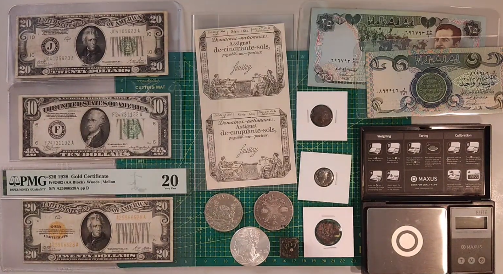

À la lumière de ces définitions, il est essentiel de comprendre que, pour le Robert, l'inflation concerne principalement l'augmentation de la masse monétaire. En revanche, le Larousse se concentre sur les conséquences de cette expansion, à savoir la hausse généralisée des prix.

Au cours de notre étude sur l'hyperinflation, nous adopterons la seconde définition, celle de la hausse généralisée des prix, car elle est plus pertinente et claire pour notre sujet. Toutefois, il est crucial de se rappeler que cette hausse des prix est généralement le résultat de l'expansion de la masse monétaire.

L'économiste renommé Milton Friedman a célèbrement déclaré :

> "L'inflation est toujours et partout un phénomène monétaire."

Cette affirmation souligne la relation intrinsèque entre l'expansion monétaire et l'inflation. Dans les prochaines sections, nous explorerons les interactions entre l'inflation et la croissance économique, en nous appuyant sur ces définitions fondamentales.

### Comprendre le Phénomène Monétaire

Quand on évoque le phénomène monétaire, on fait référence à la manière dont la masse monétaire d'une économie est influencée. Milton Friedman y voyait essentiellement un accroissement de cette masse. Il y a historiquement deux principales méthodes pour augmenter la masse monétaire :

1. Impression Monétaire:
   Dans les systèmes monétaires traditionnels, l'accroissement de la masse monétaire était réalisé en imprimant physiquement de nouveaux billets. Bien que de nos jours, avec la prédominance de la monnaie numérique, cette impression soit principalement électronique (à travers les bases de données des banques centrales et autres institutions financières), l'histoire nous montre des périodes où la littérale impression de billets a engendré de l'hyperinflation.

2. Réduction du contenu métallique:
   Une autre méthode consistait à réduire la quantité de métal précieux dans les monnaies basées sur des métaux tels que l'argent ou l'or. Un exemple frappant se trouve dans l'Empire romain, où le denarius, initialement composé presque entièrement d'argent, a vu sa teneur en argent drastiquement diminuée au fil du temps. Cela équivalait à une forme d'inflation, mais pas nécessairement à une hyperinflation.

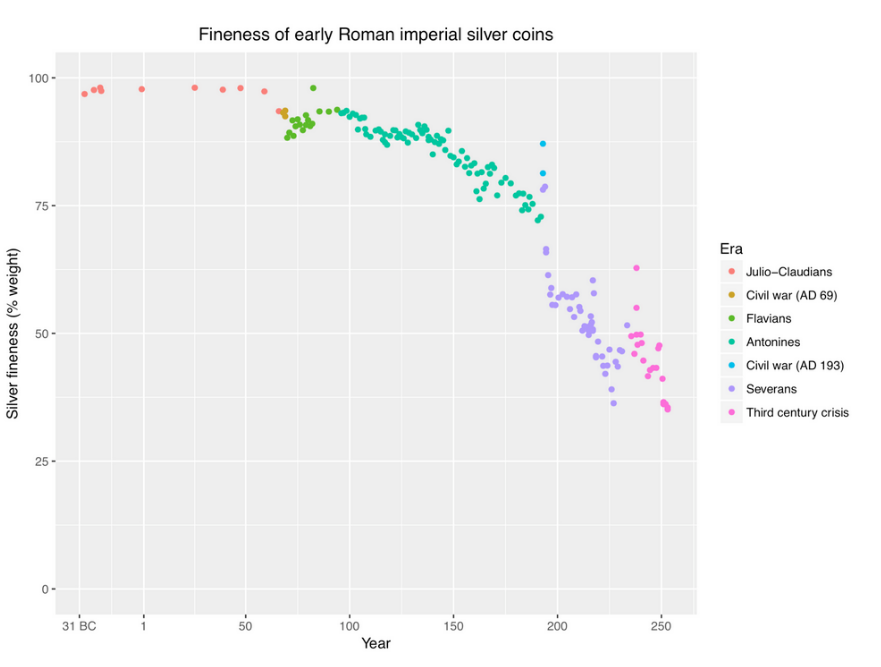

Il est crucial de souligner qu'il est possible d'observer de l'hyperinflation principalement avec des monnaies fiduciaires déconnectées de leurs actifs sous-jacents, comme les métaux précieux. Historiquement, lorsqu'une monnaie était basée sur de tels actifs, il y avait des épisodes d'inflation (par exemple, par dévaluation du contenu métallique), mais ces épisodes n'atteignaient jamais les niveaux extrêmes d'hyperinflation. Dans les sections suivantes, nous étudierons en détail les périodes d'évaluation monétaire et les implications de ces différents systèmes monétaires sur l'inflation.

### Étude des Époques de Dévaluation Monétaire

Au fil de l'histoire, diverses civilisations ont connu des périodes de dévaluation monétaire. Certaines de ces périodes coïncident avec des événements majeurs ou des guerres qui ont exercé une pression sur l'économie.

#### 1. Guerre du Péloponnèse et Deuxième Guerre Punique:

La guerre du Péloponnèse, un conflit entre Athènes et Sparte, et la Deuxième Guerre Punique, opposant la République romaine à Carthage, sont les premiers exemples de dévaluation monétaire que l'on retrouve dans les archives. Pour financer ces guerres, ces civilisations ont dévalué leurs monnaies en métaux précieux. Elles ont pris des pièces composées majoritairement d'argent et y ont incorporé d'autres métaux pour réduire la teneur en argent, tout en augmentant le nombre de pièces produites.

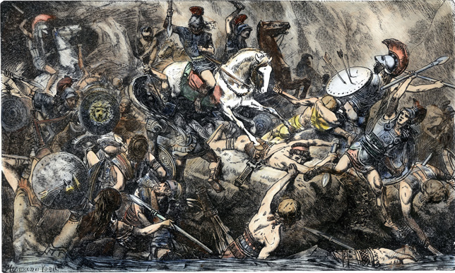

Gravure représentant le massacre des Athéniens sur les rives de l'Assinaros.

#### 2. Rome Antique durant l'Empire:

Après l'ère de la République Romaine, durant l'Empire, les 3e et 4e siècles ont connu une dévaluation monétaire notable. C'est illustré par la diminution de la teneur en argent des pièces, comme nous l'avons vu dans le graphique précédent. Une étude montre que le prix du blé en Égypte, mesuré en drachma, a grimpé d'un facteur d'un million sur une période d'environ 400 ans, allant de 40 avant Jésus-Christ à 360 après Jésus-Christ. Sur cette durée, cela représente une inflation annuelle moyenne d'environ 4,4%. Cependant, cette inflation n'était pas répartie uniformément. Elle a véritablement débuté autour de 238 après Jésus-Christ. De 250 à 293 après Jésus-Christ, le taux d'inflation était d'environ 3,65%, et il est passé à 22,28% entre 293 et 301 après Jésus-Christ.

Bien que ces périodes aient connu une inflation significative, elles n'ont pas atteint les niveaux d'hyperinflation que nous pouvons observer dans certaines situations modernes. La raison en est que, même si la monnaie était dévaluée, elle était toujours basée sur des métaux précieux. Cette base solide a offert une certaine protection contre les niveaux extrêmes d'inflation. Dans les sections suivantes, nous explorerons plus en détail la nature et les conséquences de l'hyperinflation.

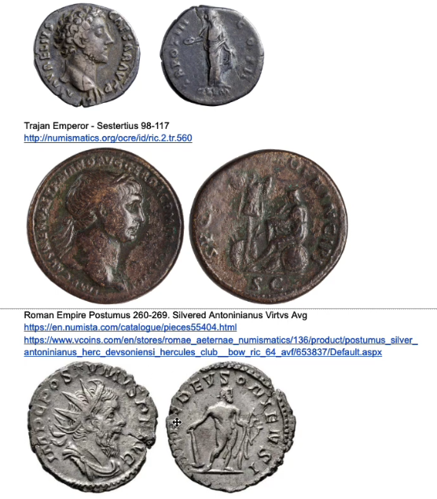

- Le Denarius de Marque Aurel (160 après Jésus-Christ):
  L'une des pièces les plus emblématiques de la Rome antique est le denarius, une monnaie en argent. Je possède une pièce spécifique de Marque Aurel datant de 160 après Jésus-Christ, avant la majeure dévaluation. Bien que la caméra puisse avoir du mal à saisir les détails fins, à l'œil nu, on peut voir que c'est une belle pièce en argent, reflétant une teneur en argent relativement élevée.

- L'Antononianus (fin du 3e siècle après Jésus-Christ):
  Avec la dévaluation monétaire, une nouvelle monnaie, l'Antononianus, a fait son apparition. Cette monnaie était censée valoir deux deniers, mais contenait beaucoup moins d'argent. Ma pièce d'Antononianus montre clairement que la teneur en argent a été considérablement réduite. Elle est ornée d'une couronne, typique des monnaies romaines de cette époque, appelée "radiates". En comparant la couleur et la qualité, on voit que l'Antononianus est loin d'être une pièce en argent pur.

En comparant les deux pièces côte à côte, la différence est flagrante. Le denarius de 160 après Jésus-Christ a une apparence argentée distincte, alors que l'Antononianus de la fin du 3e siècle après Jésus-Christ est bien plus terne, indiquant une diminution significative de la teneur en argent. Cette comparaison visuelle offre une illustration claire de la dévaluation monétaire que la Rome antique a subie en quelques siècles.

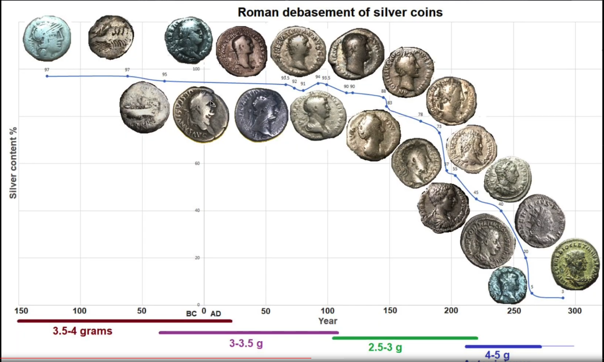

Pour compléter cette démonstration, un graphique illustrant la dévaluation de ces pièces au fil du temps serait idéal. Bien que difficile à visualiser à travers cette plateforme, imaginez un graphique montrant la valeur du denarius, puis sa chute vers la fin du 2e siècle, remplacé par l'Antononianus supposé valoir deux deniers mais avec une teneur en argent bien moindre. Ces artefacts sont des témoins silencieux des fluctuations économiques de civilisations passées.

#### 3. Le Maravédis Espagnol : Témoin d'une Dévaluation Ciblée

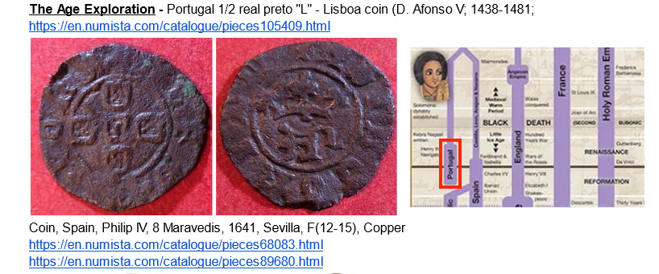

Le Maravédis, en tant que monnaie de cuivre, occupe une place particulière dans l'histoire de la monnaie espagnole. Comme évoqué précédemment, le dollar espagnol était à l'origine le standard international, une monnaie de réserve essentielle pour l'Espagne. Toutefois, face à certains défis économiques, l'Espagne a dû recourir à des stratégies monétaires astucieuses.

La dévaluation monétaire est un outil souvent utilisé par les États pour financer leurs dépenses ou stimuler l'économie. Cependant, l'Espagne se trouvait dans une situation délicate. Diluer le dollar espagnol aurait compromis sa position dans le commerce international. Pour surmonter ce dilemme, l'Espagne s'est tournée vers le Maravédis.

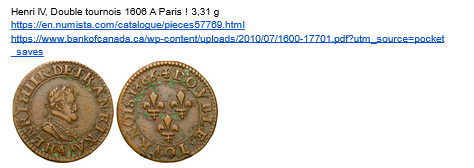

Contrairement au précieux dollar espagnol en argent, le Maravédis était une monnaie de cuivre utilisée principalement au sein de la population locale. Cette monnaie a été ciblée pour la dévaluation. Lorsqu'une pièce de Maravédis était initialement valable pour deux maravedises, l'État la récupérait, la retamponnait avec une nouvelle valeur, par exemple "quatre", et ne retournait qu'une seule pièce au propriétaire. La pièce mentionnée avec le tampon "huit" est un témoignage de ce processus, ayant subi plusieurs cycles de dévaluation.

Cette stratégie a permis à l'État de dévaluer efficacement une monnaie, créant ainsi de l'inflation et se finançant indirectement, tout en préservant l'intégrité du dollar espagnol sur la scène internationale. Cependant, cette dévaluation ciblée a eu des conséquences pour la population locale, qui a vu la valeur de leur monnaie courante diluée.

Le cas du Maravédis illustre comment un État peut dévaluer sélectivement une monnaie locale pour répondre à ses besoins économiques internes, tout en préservant la valeur d'une monnaie de réserve sur la scène mondiale. C'est un exemple frappant de la complexité et de la finesse de la politique monétaire dans l'histoire.

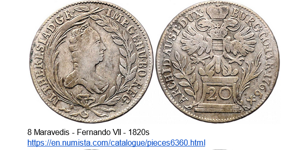

Plus de quoi ? -> https://docs.google.com/document/d/1aZa7gvz1nt8ZHDCoWKQdS9RGGjBHdipH1ApC8dW1xpM/edit?usp=sharing

#### 4. Révolution des prix du 15e au 17e siècle

Entre le 15e et le 17e siècle, l'Europe a été témoin d'un phénomène économique remarquable, souvent décrit comme la "révolution des prix". Cette période d'inflation a été en grande partie déclenchée par un afflux massif de métaux précieux, notamment l'or et l'argent, provenant des Amériques. Avec une économie européenne alors largement basée sur l'étalon métallique, cet apport supplémentaire de métaux a augmenté la masse monétaire. En conséquence, une inflation d'environ 1 à 2 % par an s'est manifestée. À première vue, cette inflation pourrait sembler modeste. Toutefois, à cette époque, une telle fluctuation des prix était suffisamment inhabituelle pour être considérée comme une "révolution". Cela met en évidence à quel point des changements dans les réserves monétaires peuvent influencer le système économique dans son ensemble.

#### 5. John Law et les assignats

Au 18e siècle, l'histoire économique française a été marquée par deux événements significatifs liés à la monnaie. Tout d'abord, John Law, un économiste et financier écossais, a persuadé le gouvernement français d'adopter un système monétaire basé sur la monnaie papier. Bien qu'initialement considérée comme une solution innovante aux problèmes financiers du pays, cette initiative a rapidement conduit à une inflation galopante. Puis, peu de temps après, lors des tumultes de la Révolution française, le gouvernement a introduit les "assignats".

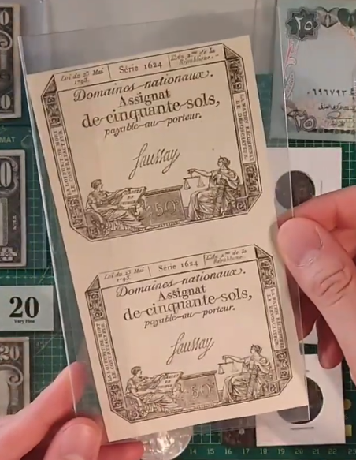

Assignats de 1793

Ces billets sont un témoignage vivant de la première grande période d'hyperinflation de l'histoire. Initialement conçus comme une réponse aux crises financières successives, les assignats sont rapidement devenus un symbole de l'instabilité monétaire. Le gouvernement, en s'appuyant excessivement sur cette monnaie papier pour financer ses dépenses, a engendré une crise économique sans précédent et a a créé une grande période d'hyperinflation en France après la révolution.

#### 6. L'Ordre exécutif 6102 et la Dévaluation du Dollar

L'Ordre exécutif 6102 et la Dévaluation du Dollar

Aux États-Unis, le début des années 1930 a été témoin d'une évolution majeure dans la politique monétaire. Voici un aperçu détaillé de cette transformation:

- Le Billet de 20 dollars de 1928

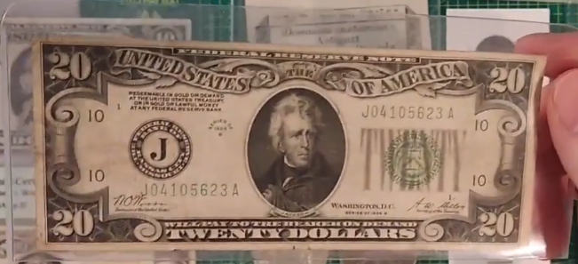

En 1928, un billet de 20dollars américains portait la mention : « redeemable in gold on demand » (échangeable en or à la demande). Cela signifie que chaque billet était littéralement convertible en or. Plus précisément, un billet de 20,67dollars équivalait à une once d'or.

- L'Ordre exécutif 6102

En 1933, un bouleversement majeur a eu lieu avec l'émission de l'ordre exécutif 6102. Ce décret a rendu illégal la possession d'or pour les citoyens, qu'il s'agisse de lingots, de pièces ou de certificats.

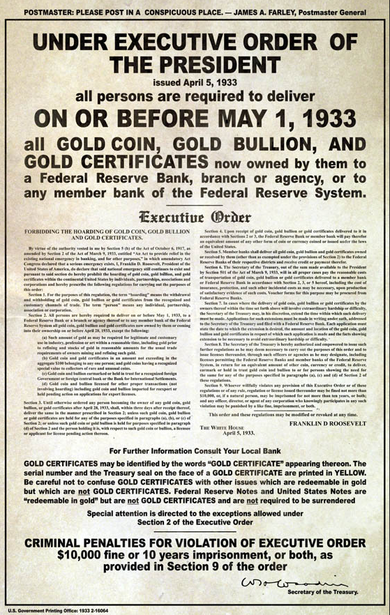

Le Gold Certificate (Certificat d'Or) est un bon exemple. Il était marqué : « In gold coin payable to the bearer on demand » (en pièces d'or payables au porteur sur demande). Posséder un tel certificat est devenu illégal et est resté ainsi jusqu'en 1964.

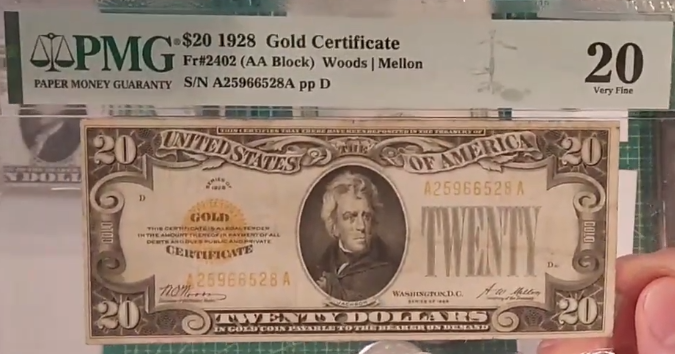

- L'Introduction des Nouveaux Billets

Suite à la saisie de l'or, en 1934, une nouvelle série de billets a été mise en circulation.

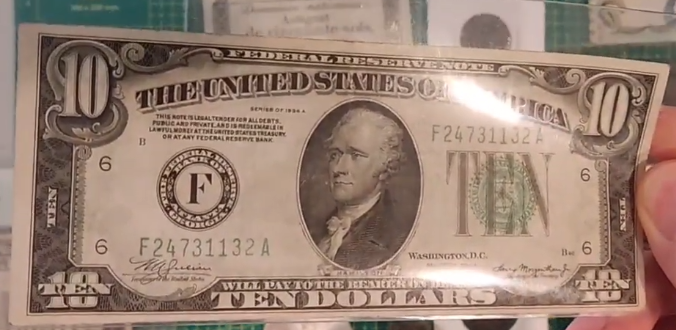

La mention indiquant leur convertibilité en or a été supprimée et remplacée par « This note is legal tender for all debt » (Ce billet est une monnaie légale pour toutes dettes).

- Réévaluation de l'Or

Ce qui est fascinant dans cette transition, c'est la stratégie du gouvernement. En 1934, le prix de l'or a été réévalué à 35 dollars l'once, au lieu de 20,67 dollars. En essence, le gouvernement a dévalué le dollar que les gens possédaient. En achetant l'or de la population à 20,67 dollars l'once en 1933, puis en revalorisant le prix de l'or en 1934, le gouvernement a réalisé un profit substantiel, tout en dévaluant les économies de ses citoyens.

En résumé, en l'espace d'une année, le gouvernement a effectivement saisi l'or des citoyens, puis a changé les règles du jeu, réévaluant la valeur de l'or pour profiter au trésor public et désavantager ceux qui avaient initialement échangé leur or contre des billets.

### Les US changent l'histoire.

Les États-Unis ont marqué un tournant historique en devenant les premiers à dévaluer la monnaie de réserve mondiale, le dollar américain, contrairement aux pratiques antérieures observées chez les petites nations commerçantes.

Auparavant, durant la Renaissance, le florin italien émis par Florence au XIIIe siècle était la monnaie de réserve internationale, et aucune dévaluation n'avait été enregistrée durant sa période d'usage, reflétant l'importance de la stabilité monétaire pour le commerce international.

Dans le même esprit, l'Espagne et les Pays-Bas, en tant que détenteurs de la monnaie de réserve mondiale grâce à leur commerce international florissant, maintenaient l'intégrité de leur monnaie pour préserver la confiance et le statu quo dans les échanges internationaux. Les Pays-Bas ont même été le théâtre de la création de la première banque centrale, un jalon crucial dans l'évolution monétaire globale.

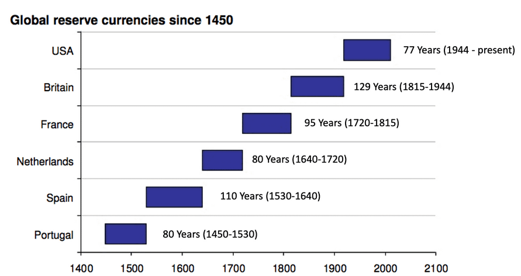

Cependant, la situation a évolué avec l'ascension des États-Unis en tant que puissance économique dominante. Ils ont choisi de dévaluer leur monnaie de réserve, exploitant ainsi l'inflation à leur avantage. Cette décision est souvent attribuée à la dynamique changée, où le choix de la monnaie de réserve n'était plus aussi libre qu'auparavant. L'hégémonie américaine a établi le dollar comme la monnaie de réserve mondiale, permettant ainsi une manipulation de sa valeur. Ce changement de cap révèle l'impact potentiel des politiques monétaires sur le commerce international dans une économie mondialisée, marquant une transition significative dans la gestion des monnaies de réserve mondiales.

### Dernier exemple pour la route: le Swiss Dinner

Le Swiss Dinar illustre une autre facette fascinante de la dévaluation monétaire, ancrée cette fois dans le contexte irakien pré-guerres du Golfe. Appelée ainsi en référence à la qualité notable de ses billets, cette monnaie était émise par la Banque centrale irakienne et jouissait d'une réputation de stabilité dans la région du Moyen-Orient. Cette confiance était notamment due à la qualité d'impression des billets, effectuée en Angleterre, insinuant une certaine robustesse face à la dévaluation.

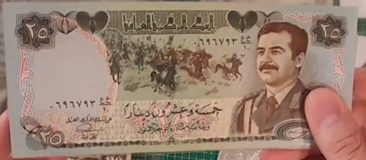

Cependant, les guerres du Golfe marquèrent un tournant dans l'histoire du Swiss Dinar. L'Irak, ne pouvant plus faire appel à son fournisseur anglais pour l'impression de ses billets, se tourna vers la Chine. Cette transition entraîna une nette différence dans la qualité des billets, la version chinoise étant perçue comme inférieure. Cette perception n'était pas sans fondement ; les billets chinois étaient plus facilement falsifiables et susceptibles d'être surimprimés par le gouvernement, menaçant ainsi leur valeur.

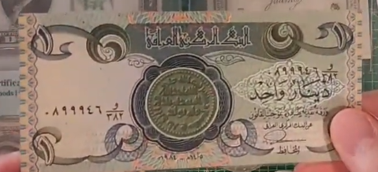

Un phénomène distinctif émergea dans l'économie irakienne post-guerre du Golfe : le système de double prix. Les commerçants proposaient des prix différents selon le type de billet utilisé pour le paiement, favorisant le Swiss Dinar original au détriment du billet chinois. Ce système reflétait la confiance maintenue envers les billets de meilleure qualité, moins susceptibles de dévaluation, même dans un contexte où la valeur était principalement imposée par l'État. Cet épisode démontre l'importance des caractéristiques intrinsèques de la monnaie, et comment, même dans un régime de monnaie fiat, la qualité perçue d'une monnaie peut influencer sa valeur relative et, par extension, la confiance des acteurs économiques.

#### Oui, on pesé vraiment les pieces !

La perception commune associe souvent la monnaie à une création étatique, son émission et sa valeur étant régulées par l'État. Ce concept trouve ses racines dans des civilisations antiques telles que Rome, où les pièces étaient standardisées et estampillées par l'Empire, conférant ainsi une valeur officielle aux monnaies. Cependant, une exploration plus approfondie révèle que la valeur intrinsèque de la monnaie était principalement dérivée de son contenu en métal précieux.

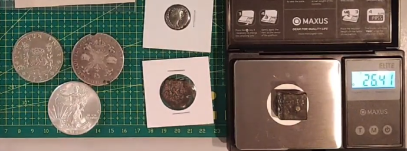

Un exemple concret est illustré à travers l'examen d'un poids monétaire équivalent à huit reales espagnoles, ou un dollar espagnol. Ce poids, marqué d'un chiffre romain indiquant sa valeur, servait aux changeurs de monnaie pour évaluer la valeur des pièces en fonction de leur poids, et non simplement de leur estampillage. En pesant les pièces, les changeurs pouvaient déterminer si elles avaient été altérées ou endommagées, ce qui aurait pu réduire leur valeur. Cette pratique met en lumière que, bien que l'estampillage standardisé par l'État conférait une certaine valeur nominale à la monnaie, la véritable valeur résidait dans le poids du métal précieux qu'elle contenait.

Cette analyse démontre que la confiance en la monnaie, et par extension sa valeur, était ancrée dans sa substance tangible plutôt que dans la simple affirmation de l'État. Elle souligne la dualité entre la valeur nominale imposée par l'État et la valeur intrinsèque dictée par le contenu en métal précieux. Ainsi, la monnaie va bien au-delà d'un simple instrument étatique, sa valeur fondamentale étant intrinsèquement liée à des éléments tangibles et mesurables.

#### Conclusion

En concluant, cette étude sur la dévaluation monétaire ouvre la porte à une compréhension approfondie des mécanismes d'inflation, qui seront explorés dans les vidéos suivantes. Nous discuterons des différents types d'inflation et du seuil où ils basculent vers une haute ou hyperinflation. Cette base solide nous permettra d'aborder les complexités de l'inflation dans les sessions à venir. Merci pour votre attention, et rendez-vous dans la prochaine vidéo pour poursuivre cette exploration des dynamiques monétaires.

## 2.2 - Les types d’inflation 🎦

### L’inflation n’est pas un phénomène multifactoriel

Dans cette section, nous allons explorer les différentes dimensions de l'inflation, un phénomène souvent mal compris. Bien que l'inflation soit fréquemment perçue comme un phénomène multifactoriel dans les médias et discussions courantes, il est crucial de rappeler qu'elle est, au fond, un phénomène monétaire.

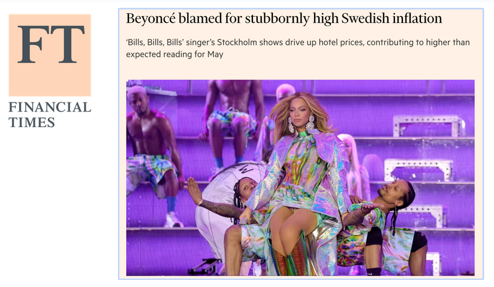

Voici une déconstruction du sujet en plusieurs points clés :

- Distinction entre Hausse de Prix et Inflation :

  Une hausse de prix peut être sectorielle et induite par divers facteurs comme une baisse de production de l'OPEP pour le pétrole ou des conditions climatiques défavorables pour le blé.
  L'inflation, en revanche, se définit par une hausse généralisée des prix sur un éventail de biens et services, pas seulement dans un secteur spécifique.

- L'Essence Monétaire de l'Inflation :

  Avec une masse monétaire fixe, une hausse de prix dans un secteur engendrerait une baisse des prix dans d'autres secteurs, car la quantité d'argent disponible pour dépenser ailleurs serait réduite.
  L'inflation est intimement liée à une augmentation de la masse monétaire qui permet une hausse de prix dans tous les secteurs simultanément.

- Impact de la Masse Monétaire sur l'Inflation et la Déflation :

  Dans un système de masse monétaire fixe, une augmentation de la production devrait théoriquement entraîner une déflation, c'est-à-dire une baisse des prix, car il y aurait plus de biens et services disponibles.
  Dans le système monétaire fiat actuel, l'augmentation de la masse monétaire annule la déflation potentiellement induite par l'augmentation de la production.

- Effets Pervers de l'Ajustement de la Masse Monétaire :

  L'augmentation de la masse monétaire, sans une augmentation correspondante de la production, entraîne une inflation, car il y a plus d'argent en circulation pour le même nombre de biens et services.
  Alors que l'accroissement de la production aurait dû mener à une déflation, l'augmentation simultanée de la masse monétaire a annulé cet effet, engendrant plutôt une inflation.

- Inflation, Déflation et Masse Monétaire : Des Vases Communicants :

  L'inflation et la déflation sont comme des vases communicants dans une économie. L'accroissement de la production peut mener à la déflation, mais si la masse monétaire est augmentée simultanément, l'effet de déflation est annulé, engendrant de l'inflation.

Cette discussion souligne l'importance de comprendre les mécanismes sous-jacents de l'inflation et de la déflation, et comment la manipulation de la masse monétaire peut avoir des impacts profonds sur l'économie. Nous revisiterons probablement ces concepts plus tard pour une compréhension plus approfondie de leur interconnexion et de leur impact sur l'économie globale.

### Pourquoi l’impression monétaire ne cause pas toujours de l’inflation ?

#### Inflation ≠ IPC

L'inflation, bien que souvent associée à l'augmentation de la masse monétaire, ne présente pas toujours une corrélation directe avec l'impression monétaire, comme illustré par la période suivant la crise financière de 2008. Malgré une impression monétaire significative pour sauver les banques, la décennie qui a suivi n'a pas connu une inflation élevée, se situant en moyenne entre 0 et 2% par an. Cette situation pose la question : pourquoi l'impression monétaire massive n'a-t-elle pas entraîné une inflation proportionnelle ? La réponse réside dans plusieurs nuances liées à la mesure de l'inflation et à l'indice des prix à la consommation (IPC ou CPI en anglais).

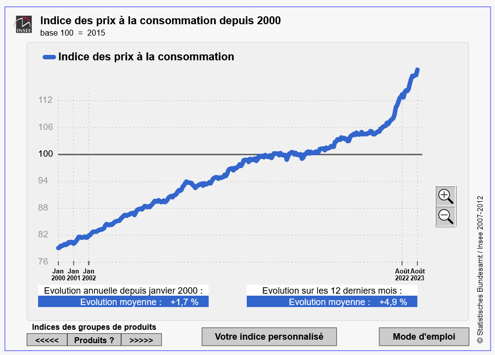

La première explication réside dans la manière dont l'inflation est mesurée. L'indice des prix à la consommation, utilisé comme indicateur principal de l'inflation, présente certaines lacunes. Par exemple, il ne prend pas en compte de manière exhaustive l'évolution des prix de l'immobilier. Bien que l'IPC intègre une composante liée aux loyers, l'appréciation substantielle des prix des maisons n'est pas pleinement reflétée. Ainsi, des augmentations significatives des coûts du logement peuvent se produire sans être entièrement capturées par l'IPC, sous-estimant potentiellement l'inflation réelle.

En outre, le calcul de l'IPC inclut certaines méthodologies qui peuvent compenser ou masquer les augmentations de prix réelles. Par exemple, des améliorations qualitatives des produits peuvent être utilisées pour ajuster l'indice. Si le prix d'un produit augmente, mais que sa qualité ou ses caractéristiques s'améliorent également, l'IPC peut considérer que la valeur réelle pour le consommateur n'a pas changé, et donc ne pas refléter d'inflation. Un cas illustratif est celui où, malgré une hausse des prix du bœuf et des ordinateurs due à l'injection monétaire, l'amélioration de la performance des ordinateurs est utilisée pour compenser cette hausse. Si un ordinateur coûte deux fois plus cher mais est quatre fois plus puissant, l'IPC peut interpréter cela comme une baisse des prix, masquant ainsi l'augmentation du prix du bœuf.

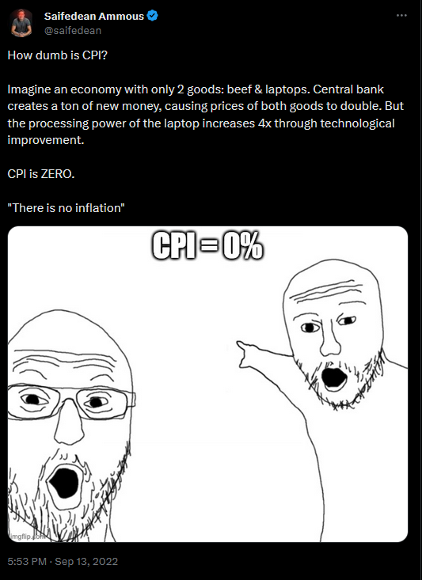

Ces nuances dans la mesure de l'inflation par l'IPC mettent en lumière la complexité de la relation entre l'impression monétaire et l'inflation. Ils suggèrent également que l'inflation réelle peut être plus élevée que celle rapportée si l'on tenait compte de manière plus exhaustive de toutes les augmentations de prix, notamment dans des secteurs clés comme l'immobilier. Cette analyse met en exergue l'importance de comprendre les mécanismes sous-jacents de l'inflation et les limitations des indices conventionnels utilisés pour la mesurer, afin de mieux appréhender l'impact économique des politiques monétaires.

#### Les arguments de la MMT

La Théorie Monétaire Moderne (MMT) propose une perspective distincte sur la création monétaire et l'inflation. Selon la MMT, l'argent émane principalement du gouvernement qui peut imprimer des montants substantiels pour financer ses besoins, sans provoquer d'inflation tant que les secteurs ciblés par ces fonds ne sont pas saturés. C'est une approche qui s'écarte des théories monétaires traditionnelles et qui souligne l'importance des capacités d'absorption sectorielles dans la dynamique inflationniste.

Un exemple illustratif de la MMT est le complexe militaro-industriel américain. Selon la MMT, des centaines de milliards de dollars peuvent être alloués à ce secteur sans provoquer d'inflation, grâce à sa capacité d'absorption. En contraste, si des fonds substantiels sont injectés dans la construction de routes aux États-Unis, où il existe un nombre limité d'entreprises et de main-d'œuvre, une inflation pourrait survenir en raison de la rareté des ressources et de la hausse des coûts demandés par les fournisseurs.

Le cas du Japon est souvent cité par les défenseurs de la MMT comme un autre exemple de l'absence d'inflation malgré une impression monétaire importante. Toutefois, la situation au Japon souligne aussi les limites des mesures traditionnelles de l'inflation comme l'Indice des Prix à la Consommation (IPC). Au Japon, une grande partie de l'argent imprimé est soit épargnée, soit investie dans l'immobilier ou les marchés d'actions, et non dépensée dans l'économie de consommation courante. L'IPC, en ne capturant pas entièrement ces dynamiques, peut sous-estimer l'inflation réelle.

L'analyse du Japon (https://ideas.repec.org/p/ces/ceswps/_9821.html) met également en lumière que le comportement des agents économiques, comme l'épargne ou l'investissement dans des actifs non inclus dans l'IPC, peut masquer l'impact inflationniste de l'impression monétaire. De plus, la capacité des différents secteurs à absorber les liquidités injectées joue un rôle crucial dans la manifestation ou non de l'inflation.

#### Le bilan des banques et de la banque centrale

Troisième exemple de pourquoi l'impression monétaire ne causerait pas d'inflation, c'est que la relation entre l'impression monétaire et l'inflation est modulée par la manière dont l'argent nouvellement créé est introduit dans l'économie. Si cet argent reste dans le bilan des banques privées sans être prêté aux acteurs économiques, il n'impactera pas directement l'économie réelle et, par conséquent, n'entraînera pas d'inflation.

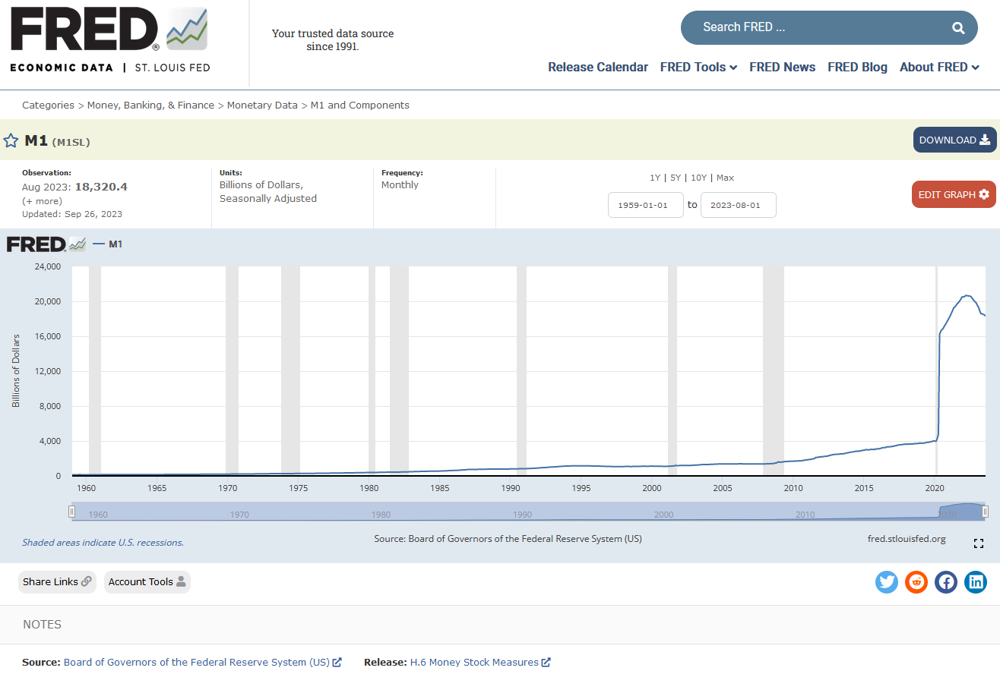

L'impression monétaire peut être envisagée comme une épée de Damoclès suspendue au-dessus de l'économie. L'argent créé peut demeurer latent pendant un certain temps, sans effet inflationniste visible, tant qu'il n'est pas injecté dans l'économie via des prêts bancaires ou d'autres mécanismes. Cependant, lorsque cet argent latent est finalement mis en circulation, les effets inflationnistes peuvent alors se manifester. C'est ce qui a été observé au cours des années 2020, où l'argent créé précédemment a trouvé son chemin dans l'économie, conduisant à une inflation.

Ce scénario souligne l'importance des mécanismes de transmission monétaire dans la détermination de l'impact inflationniste de l'impression monétaire. La création monétaire par la banque centrale n'est qu'un élément du puzzle. Le comportement des banques privées, qui décident du volume de prêts à accorder, et le comportement des emprunteurs, qui décident de la manière dont ils dépenseront l'argent emprunté, sont également des éléments cruciaux dans cette dynamique.

#### L'inflation est sociale!

L'exemple de la République de Weimar illustre un autre aspect crucial de la relation entre l'impression monétaire et l'inflation : le rôle des anticipations et du comportement des agents économiques. Lorsque la Banque centrale de la République de Weimar a commencé à imprimer une grande quantité de monnaie, l'incertitude économique a conduit les individus à thésauriser, c'est-à-dire à stocker l'argent plutôt qu'à le dépenser. Cette réaction a temporairement retardé les effets inflationnistes de l'impression monétaire.

Cependant, lorsque la situation économique a commencé à s'améliorer légèrement, la confiance a progressivement été restaurée. Les individus ont alors retiré leur épargne de leurs cachettes et ont commencé à dépenser massivement dans l'économie. Ce changement soudain de comportement, combiné à une masse monétaire élevée déjà existante, a conduit à une explosion de la demande. Avec plus d'argent en circulation et une demande accrue, les prix ont commencé à monter rapidement, conduisant à une inflation notable.

Cet exemple met en lumière l'importance du timing et des comportements des agents dans la manifestation de l'inflation. L'inflation ne se manifeste pas uniquement en réponse à l'augmentation de la masse monétaire, mais aussi en fonction de la manière et du moment où cette monnaie est dépensée dans l'économie. Les incertitudes économiques et les anticipations des agents économiques jouent un rôle crucial dans cette dynamique, et peuvent soit accélérer, soit retarder les effets inflationnistes de l'impression monétaire.

#### Récapitulatif :

- Indice des Prix à la Consommation (IPC) : L'IPC est structuré de manière à sous-estimer l'inflation, ce qui peut donner une image distordue de la réalité inflationniste.

- Absorption Sectorielle : L'injection monétaire dans des secteurs capables de l'absorber n'entraîne pas toujours de l'inflation. L'exemple principal est le complexe militaro-industriel américain qui peut absorber d'importantes sommes d'argent sans provoquer d'inflation.

- Cas du Japon : Malgré une impression monétaire significative, l'inflation reste faible au Japon car les fonds sont souvent épargnés, investis dans l'immobilier ou les marchés d'actions. Ces secteurs absorbent l'argent imprimé, et l'IPC ne reflète pas nécessairement les augmentations de prix dans ces domaines.

- Corrélation entre l'Impression Monétaire et les Marchés : Il est observé que les courbes de l'immobilier et des marchés d'actions suivent souvent l'impression monétaire, indiquant où l'argent imprimé est dirigé.

- Réserve Monétaire des Banques : Lorsque l'argent imprimé reste dans les bilans des banques et ne circule pas dans l'économie, il ne cause pas d'inflation. Cela est illustré par l'exemple de 2008, où l'argent imprimé est resté largement dans les bilans des banques, retardant l'impact inflationniste.

- République de Weimar : Cette période historique montre comment l'incertitude économique a conduit à la thésaurisation de l'argent, retardant l'inflation. Cependant, une fois la confiance restaurée et l'argent dépensé, l'inflation a explosé.

Ces exemples peuvent être utilisés dans des discussions pour expliquer pourquoi l'inflation n'est pas toujours une conséquence immédiate de l'impression monétaire, et comment les contextes économiques et comportements des agents influencent l'inflation.

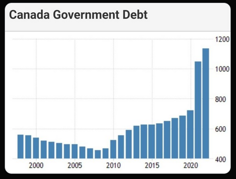

Par ce que comme lemontre bien ce [thread](https://twitter.com/saifedean/status/1673639779433590786): L'inflation c'est tous, sauf la fautes des banques centrale.

- Économistes blâmant l'inflation sur le changement climatique

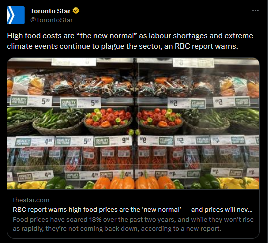

- Exemple de la Suède blâmant Beyoncé pour l'inflation durant un mois spécifique.

- Banque centrale en Pologne attribuant l'inflation à l'agression russe en Ukraine et à la pandémie

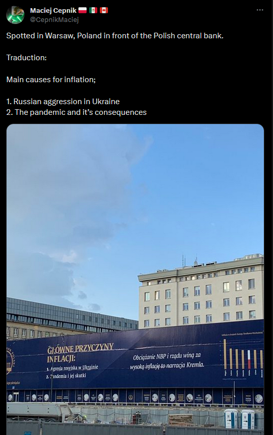

- Brexit blâmé pour l'inflation au Royaume-Uni.

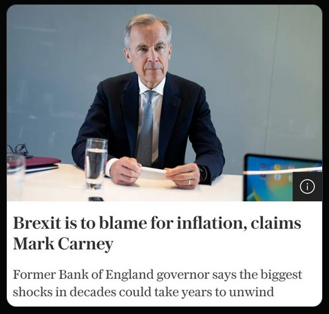

- Sortie du jeu Zelda associée à un choc inflationniste.

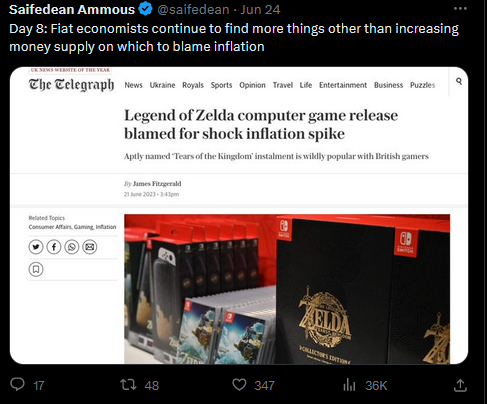

- Taylor Swift prétendument causant de l'inflation.

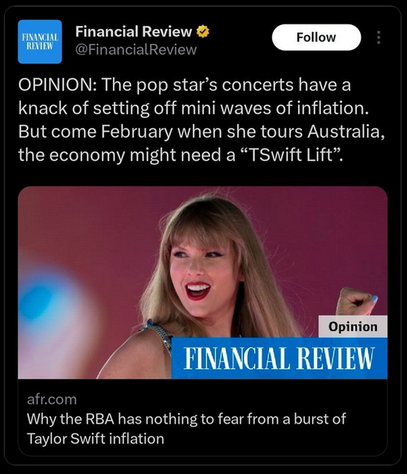

Comment Beyoncé ou Taylor Swift, dites-moi, pourrait expliquer une hausse généralisée des prix? Vous voyez que ça ne fait aucun sens. En gros:

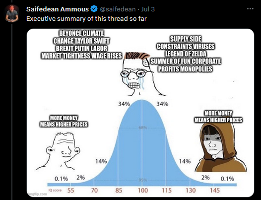

### Exploration des Types d'Inflation

Il est primordial de saisir la distinction entre les différents types d'inflation, une compréhension qui nous permet d'appréhender les manifestations variées de ce phénomène économique. Voici un éclaircissement sur ces différents types :

- Inflation Rampante (Creeping Inflation) : C'est le type d'inflation que les banques centrales visent généralement, établi à environ 2% annuellement. Cette cible a été adoptée depuis les années 90 et vise à maintenir une croissance économique stable sans surchauffe ni déflation.

- Inflation Modérée (Walking Inflation) : Cette forme d'inflation se manifeste quand l'inflation dépasse la cible de 2%. Elle est souvent associée à une économie en surchauffe, un état où l'offre monétaire excessive stimule une augmentation des prix générale. Ce scénario expose les limites des politiques monétaires et révèle parfois les contradictions dans les discours économiques.

- Inflation Galopante (Galloping Inflation) : L'inflation galopante, souvent qualifiée d'inflation à deux chiffres, survient lorsque le taux d'inflation annuel excède 10%. Elle marque un dérapage significatif des prix qui peut compromettre la stabilité économique.

- Hyperinflation : L'hyperinflation est un phénomène extrême où le taux d'inflation dépasse 50% par mois, ce qui, en raison de la nature exponentielle de l'inflation, équivaut à une inflation annuelle de plus de 13,000%. Ce niveau d'inflation déstabilise gravement l'économie, rendant la monnaie presque sans valeur et provoquant une perte de confiance dans le système monétaire.

Dans l'exploration des types d'inflation, il est courant de rencontrer des termes comme "Demand Pull" et "Cost Push" dans les ressources éducatives. Ces concepts, bien que valides, tendent à expliquer les hausses de prix plutôt que l'inflation en tant que phénomène monétaire. Voici une analyse plus approfondie :

- Demand Pull :
  L'inflation de type Demand Pull est souvent expliquée comme une situation où la demande dans l'économie surpasse la production disponible. Cependant, sans une augmentation correspondante de la masse monétaire, cette situation conduira simplement à une redistribution des dépenses. Les consommateurs pourraient dépenser plus sur les biens essentiels et moins sur d'autres, neutralisant ainsi l'effet inflationniste global.

- Cost Push :
  D'autre part, l'inflation de type Cost Push est attribuée à l'augmentation des coûts de production, comme ceux des ressources naturelles ou de la main-d'œuvre. Encore une fois, sans augmentation de la masse monétaire, les augmentations de coûts dans un secteur pourraient simplement réduire les dépenses dans d'autres, sans provoquer d'inflation généralisée.

Ces explications traditionnelles associent souvent les hausses de prix à l'inflation, ce qui peut prêter à confusion. En réalité, pour qu'une inflation généralisée se produise, une augmentation de la masse monétaire est nécessaire. Dans ce contexte, les concepts de Demand Pull et Cost Push peuvent expliquer les variations de prix sectorielles, mais ils ne capturent pas la nature monétaire de l'inflation. Cela souligne l'importance de distinguer entre les hausses de prix sectorielles et l'inflation généralisée, et réaffirme la nécessité d'une augmentation de la masse monétaire pour que l'inflation se manifeste à travers l'économie. Cette analyse offre une perspective plus nuancée et précise sur les causes réelles de l'inflation et démystifie les interprétations courantes qui peuvent masquer la dynamique monétaire sous-jacente.

### Classification de l'Inflation selon Bernholz

Bernholz propose une classification simplifiée mais précise de l'inflation en trois catégories, permettant de mieux appréhender ce phénomène monétaire complexe :

- Inflation Modérée :
  L'inflation modérée se manifeste lorsque le niveau de masse monétaire est supérieur à la normale, mais sans que l'État ne recoure à de larges déficits financés par la création monétaire. Bien que le terme "modérée" puisse sembler insignifiant, cette forme d'inflation peut engendrer des problèmes substantiels, bien que n'étant pas classée comme haute inflation.

- Haute Inflation :
  La haute inflation se produit quand la valeur réelle de la masse monétaire diminue malgré une augmentation en nombre nominal. Cette situation paradoxale découle de la substitution monétaire, où les individus perdent confiance dans la monnaie nationale et cherchent à échanger celle-ci contre des biens, des services ou des devises étrangères. Ce processus réduit encore plus la valeur réelle de la monnaie, exacerbant ainsi l'inflation.

- Hyperinflation :
  L'hyperinflation est une extension de la haute inflation, caractérisée par de larges déficits budgétaires financés par la création monétaire. Historiquement, aucun cas d'hyperinflation n'a été observé sans un financement déficitaire substantiel par l'impression monétaire. L'hyperinflation engendre un cercle vicieux : l'inflation érode la valeur de la monnaie si rapidement que les recettes fiscales se déprécient avant même que l'État ne puisse les collecter, forçant ainsi l'État à imprimer encore plus de monnaie pour se financer. Ce cycle auto-renforçant conduit à des taux d'inflation astronomiques, surpassant souvent 50% par mois.

Cette classification de Bernholz met en lumière la progression dangereuse de l'inflation modérée à l'hyperinflation, et souligne l'importance cruciale du contrôle monétaire et budgétaire pour prévenir les spirales inflationnistes destructrices. Elle démontre également que les conséquences néfastes sur le financement étatique peuvent survenir bien avant d'atteindre le stade d'hyperinflation, offrant ainsi une perspective nuancée sur les implications de l'inflation à divers degrés.

### Conclusion : Synthèse sur les Types d'Inflation

Pour conclure, nous avons exploré une gamme variée de types d'inflation, en commençant par des termes souvent entendus comme « creeping inflation », « walking inflation », et « galloping inflation », chacun dénotant des niveaux différents de pourcentages d'inflation au sein d'une économie. Cependant, pour notre étude approfondie sur l'hyperinflation, les catégories d'inflation modérée, haute inflation et hyperinflation, telles que décrites par Bernholz, se révèlent être des repères cruciaux.

- Inflation Modérée :
  Elle signale un niveau de masse monétaire supérieur à la normale, bien que ce niveau puisse se maintenir sans un financement déficitaire important par l'État.

- Haute Inflation :
  Elle survient lorsque la valeur réelle de la masse monétaire diminue, souvent en raison de la substitution monétaire, où les individus cherchent à échanger leur monnaie contre des biens, des services ou d'autres devises.

- Hyperinflation :
  Elle représente une version extrême de la haute inflation, où une création monétaire excessive pour financer de larges déficits budgétaires provoque une érosion rapide de la valeur réelle de la monnaie.

Ce qui ressort de notre exploration est que l'hyperinflation est un phénomène complexe et contre-intuitif. Bien que l'on puisse supposer que l'hyperinflation est le résultat d'une augmentation massive de la masse monétaire, en réalité, elle découle d'une diminution de la valeur réelle de cette masse monétaire. Cette nuance est cruciale pour comprendre pourquoi certains pays peinent à sortir de l'hyperinflation, même avec le soutien d'institutions internationales telles que la Banque Mondiale ou le FMI. Une mauvaise caractérisation du type d'inflation peut conduire à l'application de remèdes inappropriés, exacerbant ainsi les problèmes économiques au lieu de les résoudre.

Dans nos discussions futures, nous plongerons plus profondément dans l'hyperinflation, en explorant ses définitions et ses manifestations dans divers contextes économiques. Notre objectif sera de dévoiler les mécanismes sous-jacents de l'hyperinflation et d'explorer les solutions potentielles pour y remédier. Cette compréhension nuancée nous permettra de mieux appréhender les défis associés et de proposer des stratégies informées pour la gestion de l'inflation.

Merci pour votre attention la prochaine session sera entièrement dédiée à définir et à démystifier l'hyperinflation, en tenant compte des différentes perspectives académiques et pratiques. Nous nous réjouissons de poursuivre cette exploration avec vous lors de notre prochaine rencontre.

## 2.3 - La déflation

Soon to be created by DAVID

### Les types de déflation

### La déflation des années 30 (credit bubble burst) (Jeff Booth)

### Growth deflation de 1865 à 1896 (Dr. Philip Bagus)

### Ajustement des salaires (Keynes vs Dr. Philip Bagus)

### Si le prix d’achat baisse plus vite que le prix de vente c’est OK

### MSM et économistes fiat parlent toujours de la déflation Fiat

# Section 3 - Qu’est-ce que l’hyperinflation ?

## 3.1 - Les définitions

### Les définitions de l’hyperinflation

Dans cette section, nous explorons les diverses définitions de l'hyperinflation, un terme crucial dans l'étude des phénomènes monétaires extrêmes. La définition la plus reconnue nous vient de Philip Cagan, qui dans son ouvrage de 1956, The Monetary Dynamics of Hyperinflation, propose une compréhension quantitative de l'hyperinflation. Selon Cagan :

- Début et Fin de l'Hyperinflation :
  - L'hyperinflation commence lorsque l'inflation mensuelle excède 50%.
  - Elle se termine quand le taux d'inflation descend en dessous de 50% par mois pour une durée d'au moins un an.

Pour illustrer, si l'inflation chute à 40% en juillet et ne remonte pas au-dessus de 50% jusqu'au juillet de l'année suivante, alors la période d'hyperinflation est considérée comme terminée en juillet de l'année précédente. Cette définition permet une caractérisation précise des épisodes d'hyperinflation, permettant une analyse structurée.

Cette définition a été adoptée dans le tableau Hanke-Krus, qui documente 56 épisodes d'hyperinflation. Toutefois, le tableau ne couvre pas tous les épisodes, comme celui du Venezuela en 2016, portant le total à 57.

zoom

Il est à noter que cette définition, bien que précise, pourrait possiblement exclure certains épisodes d'hyperinflation en raison de la rigueur du seuil de 50%. Il existe une possibilité d'élargissement de cette définition pour inclure d'autres épisodes qui, bien que ne répondant pas strictement au critère de Cagan, représentent néanmoins des périodes d'inflation extrêmement élevée. Cette observation ouvre la porte à une exploration plus large des phénomènes d'hyperinflation, permettant une compréhension plus nuancée de ses causes et de ses effets. Dans les discussions ultérieures, nous envisagerons de revisiter cette définition et d'examiner des épisodes d'hyperinflation non couverts par le critère strict de Cagan.

### la Définition de l'Hyperinflation par Kagan

Philip Cagan, en définissant l'hyperinflation, a peut-être posé un jalon arbitraire avec le seuil de 50% d'inflation mensuelle. Il admet lui-même que cette définition est arbitraire et servait principalement son analyse basée sur sept épisodes d'hyperinflation. L'examen des données de Cagan révèle que les trois épisodes d'hyperinflation avec les taux d'inflation mensuels les plus bas étaient autour de 47%, 46% et 57%. Il semble que le seuil de 50% a été choisi pour englober ces cas dans son étude.

- Contexte Historique :
  La définition de Cagan date de 1956, et se base sur un nombre limité d'épisodes d'hyperinflation disponibles à cette époque.

- Observations de Kagan :
  Selon Kagan, aucun épisode n'a atteint ce seuil d'environ 50% sans évoluer vers une hyperinflation plus grave, ce qui pourrait justifier le choix de ce seuil.

- Critique de la Définition de Kagan :
  D'autres économistes, comme Bernholz, l'auteur de Monetary Regime and Inflation, ont également qualifié le seuil de 50% d'arbitraire.
  Bernholz note qu'il existe des épisodes de haute inflation ayant les mêmes caractéristiques qualitatives que les épisodes d'hyperinflation, sans atteindre le seuil de 50%.

Cette réflexion nous conduit à questionner la rigidité de la définition traditionnelle de l'hyperinflation, et souligne la nécessité de peut-être revisiter ce seuil en intégrant plus d'épisodes et de données historiques. La définition de l'hyperinflation pourrait nécessiter une flexibilité pour englober diverses manifestations d'inflation extrême dans différents contextes économiques et historiques.

### La Définition de l'Hyperinflation Selon L'International Accounting Standards Board (IASB)

L'IASB propose une perspective unique sur l'hyperinflation, axée sur les pratiques comptables en période d'hyperinflation. Cette approche est cruciale pour les comptables et les entreprises opérant dans des environnements d'hyperinflation, où la valeur monétaire fluctue rapidement. Les lignes directrices de l'IASB identifient divers indicateurs d'hyperinflation :

- Préférence pour les Biens Non Monétaires :
  Les individus préfèrent conserver la valeur en biens plutôt qu'en monnaie, en raison de la dépréciation rapide de la valeur monétaire.

- Évaluation des Biens et Services :
  Les habitants ne calculent pas la valeur des biens et services en monnaie locale, reflétant une perte de confiance dans la monnaie locale.

- Compensation pour la Perte de Valeur Monétaire :
  Les prix intègrent une compensation pour la perte de valeur monétaire lors des achats à crédit, illustrant l'impact de l'inflation sur les transactions quotidiennes.

- Indexation des Prix, Salaires et Intérêts :
  Les prix, salaires et intérêts sont ajustés en fonction d'un index pour compenser l'inflation.

- Inflation Cumulative sur Trois Ans :
  L'inflation cumulative sur trois ans approchant 100% (soit environ 24% par an), contrastant avec la définition de Kagan de 50% d'inflation mensuelle.

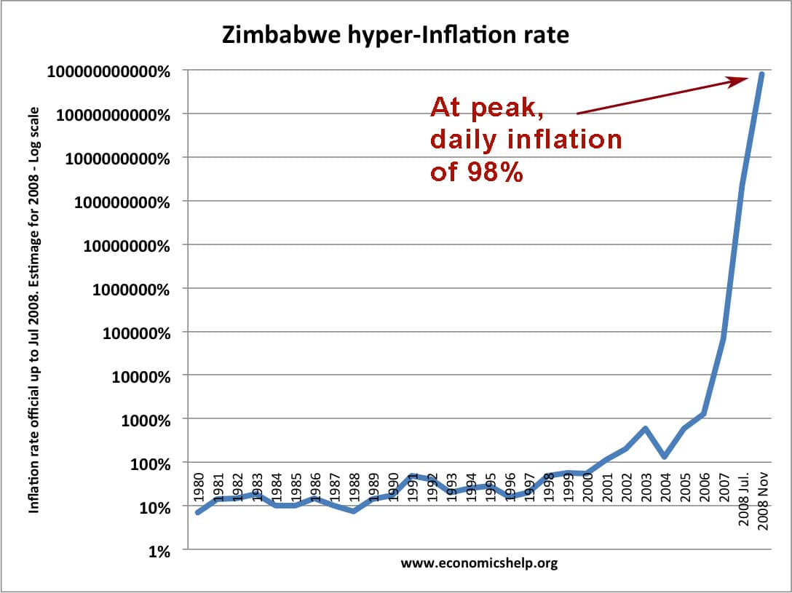

Selon les critères de l'IASB, plusieurs pays, dont l'Argentine, l'Éthiopie, Haïti, l'Iran, le Liban, le Soudan, le Soudan du Sud, Suriname, la Syrie, la Turquie, le Venezuela, le Yémen et le Zimbabwe, sont actuellement en période d'hyperinflation.

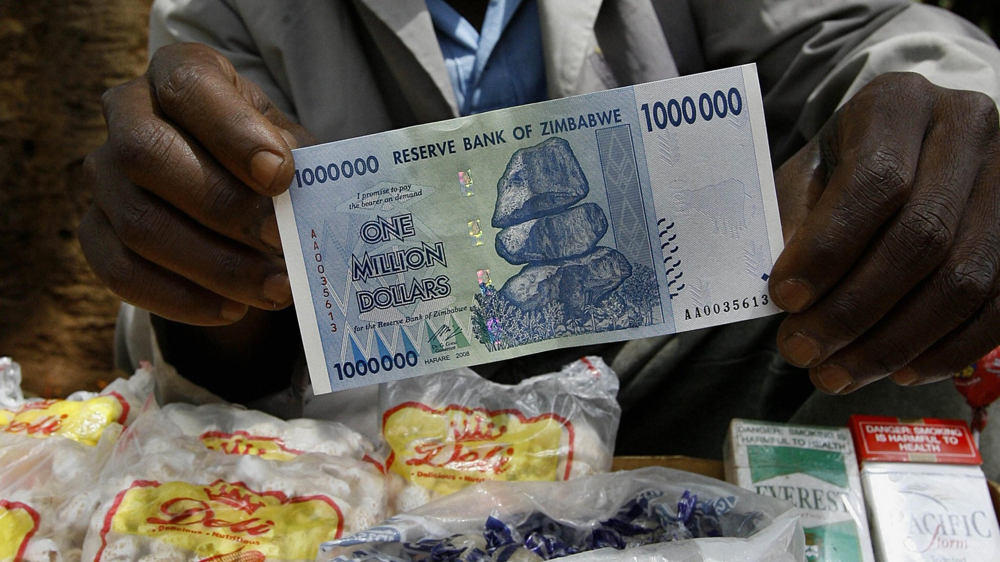

Cette définition fournie par l'IASB s'éloigne du seuil quantitatif strict proposé par Kagan, en intégrant une analyse qualitative des comportements économiques et des ajustements pratiques face à l'hyperinflation. Elle démontre que l'hyperinflation est un phénomène complexe qui nécessite une compréhension multidimensionnelle pour en saisir les implications réelles, en particulier dans le domaine de la comptabilité qui est crucial pour la stabilité et la transparence financière des entreprises et des marchés.

### Du coup, combien d'hyperinflation en tous ?

Les définitions courantes d'hyperinflation, comme celle avancée par Kagan stipulant une inflation mensuelle de 50%, peuvent parfois prêter à confusion ou être réductrices. Par exemple, deux pays connaissant des taux d'inflation annuelle respectifs de 1 000% et 3 000% peuvent être perçus différemment en fonction de la répartition mensuelle de cette inflation. Si aucun mois ne dépasse le seuil de 50%, selon la définition de Kagan, ces pays ne seraient pas en état d'hyperinflation. Cette approche peut donc conduire à des anomalies dans la classification de l'hyperinflation, surtout quand on compare des inflations cumulées sur l'année.

- L'ouvrage de Kagan, "Monetary Dynamics of Hyperinflation", qui établit une analyse fondamentale de l'hyperinflation.
- Le livre de Bernold qui étudie 30 périodes d'hyperinflation distinctes, élargissant ainsi le spectre d'analyse.
- La collection personnelle de billets de David issus de 36 périodes d'hyperinflation, permettant une compréhension tangible et historique.
- Le tableau Hanky Cross (version 2012, mise à jour en 2016 avec le Venezuela), recensant 57 périodes d'hyperinflation basées sur la définition de Kagan.

Il est à noter que certaines périodes historiques d'inflation élevée ne figurent pas dans les tableaux classiques d'hyperinflation, souvent en raison des critères stricts de classification. Par exemple, pendant la guerre d'indépendance des États-Unis en novembre 1779, et durant la guerre civile américaine en mars 1864, les taux d'inflation mensuels étaient respectivement de 47,4% et 40%. Ces taux, bien que élevés, ne dépassent pas le seuil de 50% stipulé par Kagan, excluant ainsi ces périodes des cas classés comme hyperinflation. Cette omission illustre les limites des définitions rigides et souligne la nécessité d'une approche plus nuancée pour appréhender l'hyperinflation dans toute sa complexité.

## 3.2 - Weimar vs Zimbabwe similitudes

### Deux époques, deux catastrophes

Danc ce chapitre, nous explorerons les impacts de l'hyperinflation, en nous concentrant sur les cas du Zimbabwe et de la République de Weimar. Au fil de mes recherches, j'ai privilégié l'exploration de témoignages directs des individus ayant vécu ces périodes d'hyperinflation, en opposition à une approche purement économique ou statistique.

Plusieurs ouvrages ont été particulièrement instructifs :

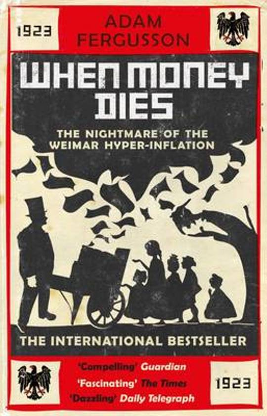

- "When Money Dies" par Adam Ferguson, retrace l'hyperinflation post-Première Guerre mondiale en Allemagne, ainsi qu'en Autriche et en Hongrie.

- Deux livres sur l'hyperinflation au Zimbabwe : "Zimbabwe Warm Heart Ugly Face" et "Hard Boiled Egg Index" par Jérôme Gardner et Kudzai Joseph Gou Min-Yu respectivement, offrent des témoignages poignants d'un PDG d'une chaîne de magasins de vêtements et d'un banquier agricole sur leurs expériences durant cette période tumultueuse.

En consolidant mes notes, j'ai discerné une multitude de similitudes entre les expériences d'hyperinflation au Zimbabwe et dans la République de Weimar, malgré le fossé de 90 ans les séparant. J'ai identifié environ 17 similitudes, dont 13 illustraient une sorte de progression vers le désastre économique dépeint dans ces témoignages. Ces parallèles fascinants démontrent la nature répétitive et dévastatrice de l'hyperinflation à travers les époques et les frontières. Nous examinerons aujourd'hui ces similitudes et la façon dont elles dépeignent une trajectoire inquiétante durant les périodes d'hyperinflation.

### Analyse Comparative : Zimbabwe et République de Weimar

Le jeu des 14 differences !

1. Pénurie de monnaie

Lorsque la monnaie se déprécie à une vitesse vertigineuse, même les tentatives les plus ambitieuses pour inonder le marché avec de nouveaux billets peuvent se révéler insuffisantes. La demande incessante pour la monnaie tangibles peut surpasser de loin la capacité des banques centrales à produire des billets, créant des crises de liquidités sans précédent.

> Weimar: “Au cours de ce mois-ci, elle sera augmentée à presque 4 milliards de marks papier, chiffre avec lequel on espère que la pénurie de monnaie sera définitivement surmontée.”

> Zimbabwe: “De 2002 à janvier 2009, il y a eu plusieurs pénuries critiques de liquidités. Il n'y avait tout simplement pas assez de billets imprimés ou en circulation pour suivre le rythme de l'inflation galopante.”

2. "Et c'est du fumier!"

La rapidité avec laquelle la monnaie peut perdre de sa valeur dans certaines situations économiques est stupéfiante. Des quantités astronomiques de billets peuvent être émises en un temps record, transformant presque instantanément des sommes jadis considérables en quelque chose d'aussi insignifiant que du fumier.

> Weimar: “L'émission totale actuelle s'élève à 63 000 milliards. Dans quelques jours, nous serons donc en mesure d'émettre en une journée les deux tiers de la circulation totale.”

> Zimbabwe: “Le 17 septembre 2006, le gouverneur de la RBZ, Gideon Gono, a déclaré : "10 trillions sont toujours là-bas et c'est devenu du fumier."

3. Les billets valent moins que le papier sur lequel ils sont imprimés

Dans certaines circonstances économiques, la valeur intrinsèque d'un billet peut devenir inférieure à la valeur du papier sur lequel il est imprimé. Cette dépréciation drastique transforme les billets de banque, normalement symboles de valeur et de pouvoir d'achat, en simples morceaux de papier sans valeur marchande.

> Weimar: “Des dénominations entières de billets en marks étaient sans valeur presque dès leur sortie de l'imprimerie.”

> Zimbabwe: “La Banque centrale avait gaspillé de l'argent en imprimant un billet qui ne valait pas le papier sur lequel il était imprimé. En d'autres termes, sa valeur était inférieure à celle du papier toilette. Aussi absurde que cela puisse paraître, il était alors moins cher d'utiliser le billet de ZWD 100 trillions comme papier toilette que d'acheter le véritable papier toilette.”

4. Comptage de l'argent

Lorsque la monnaie perd rapidement de sa valeur, même les transactions les plus simples peuvent devenir des tâches laborieuses. Le calcul du prix d'un article ou le simple fait de compter les billets nécessaires à un paiement peut s'étirer sur plusieurs minutes, ajoutant une couche de complexité aux interactions quotidiennes.

> Weimar: “L'achat le plus ordinaire dans un magasin nécessitait trois ou quatre minutes de calcul, et une fois le prix déterminé, plusieurs autres minutes étaient généralement nécessaires pour compter les billets.”

> Zimbabwe: “Les responsables de magasin étaient également autorisés à employer un travailleur occasionnel pour remplacer le membre du personnel qui comptait de l'argent toute la journée. Bien sûr, compter l'argent en magasin pour l'administration et le dépôt en banque était une chose, mais tout le processus devait être répété à la banque lors du dépôt.”

Money counting technique from Uzbekistan

5. Les paiements par chèque

Dans des économies perturbées, les modes de paiement traditionnels, comme les chèques, peuvent rapidement perdre leur efficacité. Les banques, débordées par la demande croissante de monnaie due à l'hyperinflation, peuvent rationner ou retarder l'encaissement des chèques, réduisant ainsi leur valeur réelle. Cette instabilité conduit souvent à une hiérarchisation des méthodes de paiement, où les prix peuvent varier en fonction de la manière dont on choisit de payer.

> Weimar: “L'augmentation des prix a intensifié la demande de monnaie, à la fois par l'État et par d'autres employeurs. Les banques privées ne pouvaient pas du tout répondre à la demande et devaient rationner l'encaissement des chèques, de sorte que les chèques non encaissés restaient gelés pendant que leur pouvoir d'achat s'épuisait.”

> Zimbabwe: “La valeur temporelle de l'argent a créé trois prix pour les biens et services; à savoir, un prix en espèces, un prix en règlement brut en temps réel, et un prix par chèque. Finalement, personne n'acceptait les chèques, qui mettaient cinq jours à être encaissés.”

6. Les "Burner-preneurs"

À mesure que la valeur de la monnaie s'érode, de nouvelles opportunités économiques émergent, exploitant les distorsions du marché. Ces entrepreneurs, souvent baptisés de noms inventifs comme "Burner-preneurs", peuvent prospérer en empruntant de la monnaie dévaluée pour investir dans des biens tangibles, puis en remboursant leurs dettes avec une monnaie encore plus dévaluée.

> Weimar: “La spéculation sur l'inflation consistait à emprunter des marks papier, à les convertir en biens et usines, puis à rembourser les prêteurs avec du papier déprécié.”

> Zimbabwe: Les “Burner-preneurs”

7. L'honnêteté et le travail acharné perdent leur attrait

Dans des contextes économiques instables, les valeurs traditionnelles de travail acharné, d'économie et d'intégrité peuvent être éclipsées par l'attrait de la richesse rapide. La spéculation et le commerce de devises offrent souvent des récompenses bien supérieures à celles du travail régulier, provoquant un bouleversement des priorités sociétales.

> Weimar: “Alors que les anciennes vertus d'économie, d'honnêteté et de travail acharné perdaient de leur attrait, tout le monde cherchait à s'enrichir rapidement, d'autant plus que la spéculation sur la monnaie ou les actions pouvait manifestement rapporter bien plus que le travail.”

> Zimbabwe: “Ces pratiques, si elles ont enrichi quelques personnes, ont appauvri la classe ouvrière urbaine ainsi que la population rurale. L'éducation avait perdu de sa valeur, car ce commerce était animé par des personnes n'ayant besoin ni d'éducation ni de travail acharné pour le justifier. Tout ce dont ils avaient besoin, c'étaient des relations et un capital initial pour démarrer leur affaire d'argent facile.”

8. Les "banques du monde"

Dans des situations d'hyperinflation ou de crise monétaire, les marchés parallèles et non réglementés de devises étrangères tendent à proliférer. Ces "banques" informelles, souvent appelées de manière humoristique "banques du monde" ou par d'autres noms locaux, offrent un refuge pour ceux qui cherchent à protéger leurs actifs de la dévaluation. Bien que ces marchés puissent fournir une bouée de sauvetage économique nécessaire, ils soulignent souvent la méfiance généralisée envers les institutions financières officielles et les politiques gouvernementales.

> Weimar: “Leurs transactions se faisaient principalement par l'intermédiaire des soi-disant Winkelbankiers, les opérateurs de ruelles qui avaient émergé avec l'inflation et qui, prospérant dans une économie malade, vivaient entièrement en profitant de la différence entre les prix d'achat et de vente des devises étrangères.”

> Zimbabwe: “Ils étaient aussi les changeurs de monnaie. Ils opéraient en toute impunité entre la 2ème et la 6ème Avenue et Fort Street à Bulawayo, grâce à leurs compétences commerciales astucieuses impliquant la corruption et d'autres pratiques. Cette zone de la ville était connue sous le nom de “Banque Mondiale”.

> Argentine: “Je suis donc allé là où vont tous les Argentins : les cuevas, les “grottes”, que l’on trouve dans le quartier de Florida au cœur de Buenos Aires.” - TheBigWhale

9. Le change de monnaie était illégal

 les gouvernements, dans un effort pour stabiliser leur propre monnaie et contrôler le flux de capitaux, peuvent rendre illégales ces transactions en devises étrangères. Ces mesures répressives, bien que destinées à protéger l'économie nationale, peuvent souvent avoir l'effet inverse, exacerbant la méfiance du public et encourageant le marché noir.

> Weimar: “Les gens en venaient à commercer par le troc et se tournaient progressivement vers les devises étrangères comme seul moyen d'échange fiable. De nouveaux décrets ont été introduits concernant l'achat de traites étrangères et l'utilisation de devises étrangères pour régler les paiements intérieurs. En plus de l'emprisonnement, des amendes pouvaient désormais être imposées jusqu'à dix fois le montant d'une transaction illégale.”

> Zimbabwe: “Des descentes dans les entreprises ont conduit à l'emprisonnement de plusieurs hommes d'affaires de Bulawayo pour le week-end et à des amendes équivalant au double du montant en devises récupéré, cette bravoure s'est ensuite atténuée.”

10. Contrôle des capitaux

Lorsqu'un pays est confronté à une crise monétaire ou économique, l'une des réponses courantes des gouvernements est d'exercer un contrôle strict sur les mouvements et les formes de capital. Que ce soit par des ordonnances forçant l'acceptation de monnaies nationales dévaluées ou par des sanctions sévères contre ceux qui rejettent certaines méthodes de paiement, ces mesures visent souvent à contenir la panique et à restaurer la confiance. Cependant, l'efficacité varie, et parfois, ces mesures peuvent s'avérer contre-productives ou déconnectées de la réalité vécue par les citoyens.

> Weimar: “Les commerçants avaient récemment été contraints par un nouvel édit d'accepter les billets de banque de l'État ; mais puisqu'il permettait également l'utilisation continue de devises étrangères pour tous les achats, les commerçants trouvaient généralement des excuses pour n'accepter presque rien d'autre.”

> Zimbabwe: “le gouvernement a introduit le SI 175/2008 le 12 décembre 2008 concernant le paiement par chèques. Il stipulait, ‘La pénalité pour avoir refusé un paiement par un chèque/carte bancaire ou une autre méthode de paiement électronique médiée par une banque, sera une amende de niveau 8 ou une peine d'emprisonnement d'une durée de six mois ou les deux.’ Évidemment, nous avons ignoré le SI car il était totalement en décalage avec la réalité.”

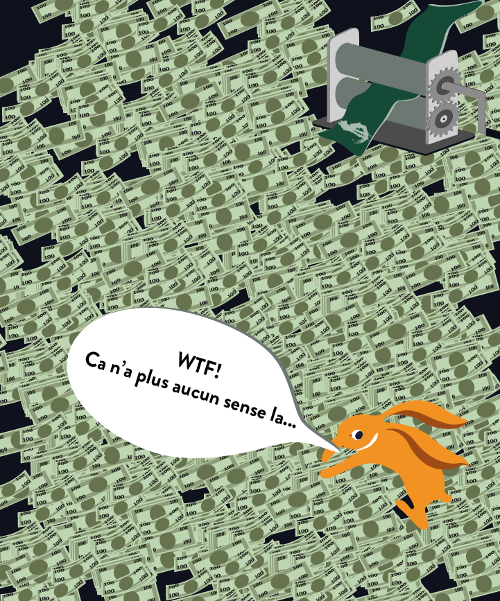

11. Contraints de garder leurs boutiques ouvertes

Lorsque l'économie s'effondre et la monnaie perd sa valeur, les gouvernements peuvent recourir à des mesures draconiennes pour maintenir une apparence de normalité.

> Weimar : “Les commerçants qui continuaient leurs activités étaient soumis à une nouvelle ordonnance, promulguée le 22 octobre, les obligeant à garder leurs boutiques ouvertes et à proposer des marchandises en échange de marks papier.”

> Zimbabwe : “Il ne restait que des étagères en acier vides et des réfrigérateurs, des refroidisseurs et des congélateurs vides. La tragédie était que le magasin était toujours ouvert, car ils n'osaient pas fermer en raison des tensions politiques et de la crainte des dirigeants d'être arrêtés par la force de contrôle des prix du gouvernement. Même les travailleurs n'étaient pas licenciés, car tout le monde pensait qu'il y aurait une solution rapide.”

12. Tout le monde est un criminel

Face à une économie en déroute et à des réglementations omniprésentes, la frontière entre la survie et la criminalité devient floue.

> Weimar : “Tous les crimes contre l'État, chacun d'entre eux, à des degrés divers, devenaient pour les individus une question de survie.”

> Zimbabwe : “Chaque résident au Zimbabwe était un criminel. Aussi dur que cela puisse paraître, c'était vrai. Avec la myriade de petites lois régissant chaque aspect de la vie, il était inévitable que chacun enfreigne une loi chaque jour. Posséder des devises étrangères était illégal, selon un SI publié en 2004. Avoir plusieurs comptes bancaires pour contourner la limite quotidienne de retrait était illégal. Ne pas avoir les bonnes plaques d'immatriculation sur votre voiture, ou pas de licence de radio de voiture ou pas de permis de générateur, étaient autant de lois que quelqu'un, quelque part, enfreignait.”

13. Acheter des devises étrangères à n'importe quel prix

L'achat frénétique de devises étrangères a souvent marqué un tournant critique dans la dévaluation monétaire, exacerbant la chute de la valeur intrinsèque.

> Weimar: "Mannheimer, sur instruction de son chef, est sorti en août 1921 et a commencé à acheter des devises étrangères à n'importe quel prix — 'car l'Allemagne avait une quantité infinie de marks en papier mais pas de devises étrangères.' C'était le premier signe de l'effondrement absolu de la valeur du mark."

> Zimbabwe : Il a été allégué qu'on leur donnait des objectifs quotidiens à atteindre, car certaines des exigences en forex étaient urgentes et ils achèteraient à n'importe quel taux pour accumuler le forex afin de respecter le délai. Cette prétendue pratique a été accusée d'alimenter le feu de la dévaluation alors que la valeur du dollar zimbabwéen poursuivait sa chute vertigineuse."

### Récap du déroulement

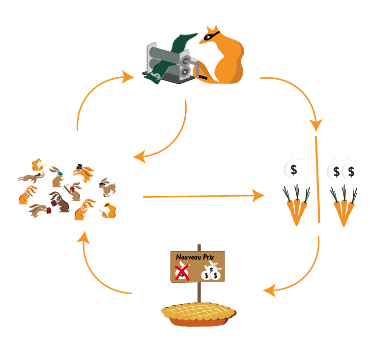

Lors de l'analyse de la trajectoire économique, il est apparent que lorsqu'une haute inflation est atteinte, la valeur de la masse monétaire se dégrade. Cette dévaluation engendre plusieurs complications, notamment la pénurie de billets. Dans ce contexte, les opportunités d'arbitrage se manifestent, en particulier avec les fluctuations des taux de change. De ce fait, nombre d'individus se tournent vers cet arbitrage, investissant massivement dans des actifs tangibles, dans l'anticipation d'une dévaluation monétaire future qui leur permettrait de rembourser leurs dettes avec une monnaie affaiblie. Cet environnement économique nuit à l'attrait des emplois traditionnels, et par conséquent, érode la cohésion sociale.

Face à cette situation, l'État impose des régulations draconiennes, dont des contrôles des capitaux. Il mandate également les commerçants à accepter la monnaie nationale et les chèques. Au fur et à mesure, de nouvelles lois sont promulguées, élargissant la définition de comportements criminels. In fine, le taux de change grimpe de manière exponentielle, car l'État est disposé à échanger sa monnaie, imprimée à moindre coût, contre des devises étrangères plus robustes.

### 4 Similitudes des conséquences de l'hyperinflation

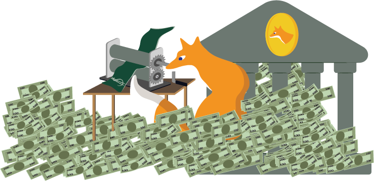

1. Oil and metals

En Allemagne pendant la période de Weimar, le vol de matériaux précieux était tel que le plomb des toits était fréquemment dérobé. Au Zimbabwe, la désespération a poussé certains à interrompre le réseau électrique pour extraire l'huile des transformateurs et l'utiliser dans leurs véhicules.

Weimar : « Les plaques métalliques des monuments nationaux devaient être retirées pour être mises en sécurité. Les plaques de sonnette en laiton ont été volées sur les portes de l'ambassade britannique à Berlin. »

Zimbabwe : « Pour aggraver les choses, en raison du manque de devises étrangères, il y avait une pénurie d'huile de lubrification pour les voitures, et les transformateurs étaient une cible facile pour les voleurs qui siphonnaient l'huile de refroidissement pendant les coupures d'électricité. »

2. Trains

La dévalorisation de la monnaie peut pousser les citoyens à un comportement de survie basé sur le vandalisme. Face à une économie en déroute, des infrastructures publiques coûteuses comme les systèmes de transport peuvent être compromises, conduisant à des conséquences sociétales désastreuses.

> Weimar: "À Berlin, le système de tramway a cessé de fonctionner faute de moyens."

> Zimbabwe: "L'un des scénarios les plus troublants et tristes fut lorsque presque toute la ligne de cuivre électrique reliant Harare à Dabuka (plus de 280 kilomètres) a été volée. À son achèvement, elle avait été la fierté du Zimbabwe, avec des trains électriques rapides de passagers et de marchandises empruntant cette route."

3. “Mealie Meal”

Dans le contexte de salaires dérisoires et d'une économie instable, les entreprises ont été contraintes d'offrir de la nourriture à leurs employés pour les maintenir productifs et opérationnels. Cette initiative était non seulement un moyen de pallier la pénurie et les coûts élevés de la nourriture, mais aussi une stratégie pour retenir le personnel dans un environnement économique difficile.

> Weimar: "À Berlin, les employés de bureau, qui constituaient une classe très importante dans la capitale, avaient des salaires totalement inadéquats allant de 12 000 à 20 000 par mois (soit entre 12 et 19 livres par an), se réduisant constamment; mais la plupart pouvaient encore obtenir leurs déjeuners pour une somme symbolique, fournis par leurs bureaux, de sorte que le corps et l'âme pouvaient tout juste être maintenus ensemble."

> Zimbabwe: "À ce stade, nous fournissions à tout notre personnel un déjeuner gratuit. La farine de maïs était essentielle au fonctionnement continu de notre entreprise, car dans de nombreux cas, c'était le seul repas que notre personnel recevait chaque jour."

4. Coupon d'essence
 
Les populations à chercher des alternatives stables pour les transactions. À Weimar, les produits tels que le laiton et le carburant ont servi de moyens d'échange en raison de leur valeur intrinsèque constante. Au Zimbabwe, face à la dévaluation rapide du dollar zimbabwéen, les coupons d'essence, qui représentaient une quantité fixe d'un produit essentiel, sont devenus une monnaie de facto. Ces situations soulignent la manière dont les sociétés s'adaptent à des conditions économiques extrêmes, trouvant des solutions innovantes pour maintenir le commerce et l'économie en mouvement.

Weimar : "Le troc était déjà une forme habituelle d'échange ; mais maintenant, des marchandises comme le laiton et le carburant devenaient la monnaie courante d'achat et de paiement."

Zimbabwe : "Ces bons, nous les utilisions désormais pour payer les loyers aux propriétaires, les taxes municipales, les factures de téléphone, en fait presque tout, car tout le monde avait cessé d'accepter les paiements en dollars zimbabwéens et les chèques."

#### Conclusion

C'est ce qui complète cette vidéo au sujet des similitudes des expériences vécues durant les périodes d'hyperinflation du Zimbabwe et de la République de Weimar. Dans la prochaine vidéo, on va parler des différences et des parallèles contemporains. Merci.

## 3.3 - Weimar vs Zimbabwe différences et parallèle contemporains

Transcripte:

Dans ce chapitre, nous explorerons les différences et parallèles entre les périodes d'hyperinflation passées et contemporaines, agrémentés d'anecdotes et de comparaisons pertinentes pour aujourd'hui.

### les différences entre la République de Weimar et le Zimbabwe

1. C'est la faute du dollar!

En Allemagne, il était courant que la population attribue l'inflation à la montée du dollar plutôt qu'à la dévaluation intrinsèque de leur propre monnaie. Beaucoup étaient persuadés que le phénomène observé était dû à une appréciation du dollar. Cette perception écartait toute reconnaissance du lien entre leur difficulté économique et la dévaluation monétaire, principalement induite par la création excessive de monnaie. Le livre "When Money Dies" illustre clairement cette méconnaissance parmi la population allemande. En revanche, au 

Zimbabwe, la situation était distincte : les citoyens étaient pleinement conscients de la cause sous-jacente de l'hyperinflation qu'ils subissaient.

2. La monnaie de nécessité (Notgeld)

Face à la crise monétaire et économique, l'Allemagne a eu recours aux "Notgeld" (monnaie de nécessité). Ces billets, imprimés par les villes ou certaines entreprises, ont été conçus pour remédier à une pénurie de monnaie courante.

De manière intéressante, la France a également eu recours aux Notgeld, notamment dans les années 1920. Cette initiative n'était pas seulement une conséquence directe de l'hyperinflation, mais avait également des racines dans les perturbations causées par la Première Guerre mondiale. La guerre a non seulement déstabilisé l'économie, mais elle a également augmenté le coût des métaux. Par conséquent, la valeur intrinsèque des pièces de monnaie en métal dépassait souvent leur valeur nominale, ce qui poussait les gens à les stocker. En l'absence de pièces de monnaie, certaines institutions, comme la Chambre de commerce de Lyon, ont imprimé leurs propres Notgeld.

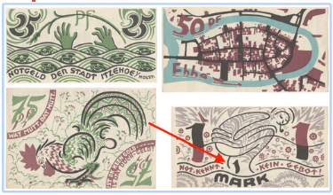

> “What has to be done, has to be done.” - a local saying

Parmi les Notgeld, un billet particulier attire l'attention. Il présente une illustration poignante : au centre, un individu est représenté en train de déféquer un Mark. Au verso, une table des prix de 1913 à 1921 illustre la montée de l'inflation durant cette période.

L'artiste derrière ce Notgeld semble adresser une critique ironique envers les autorités, responsables de la crise d'hyperinflation. Le billet porte l'inscription "Necessity knows no law", signifiant "La nécessité ne connaît pas de loi". Une autre expression, spécifique à la localité d'origine du Notgeld, énonce : "Ce qui doit être fait doit être fait".

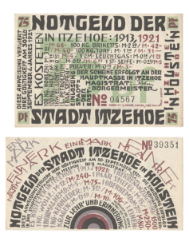
> “necessity knows no law”

> Le premier Shitcoin: De manière anecdotique, en regardant l'illustration centrale du billet, où la monnaie est littéralement dévaluée par l'action de l'individu, il pourrait être qualifié de premier "shitcoin".

3. Les débentures et hypothèques

À Weimar, certaines dettes ont été réévaluées pour compenser l'impact de l'inflation. Cette mesure n'a pas été adoptée au Zimbabwe.

> Weimar: "Une décision visant à réévaluer les emprunts propres du gouvernement est devenue loi en 1925, ce qui a abouti à ce que les actionnaires reçoivent 2,5 pour cent de leur investissement initial sous réserve que toutes les réparations aient été payées."

> Zimbabwe: "En juillet 2007 (trois ans plus tard), je pouvais sortir de ma poche un billet dévalué de ZDW 500 000 (bt "000"), maintenant d'une valeur de 1,67 dollars au taux du marché parallèle, et rembourser le prêt hypothécaire, qui était censé être remboursé en vingt ans. De plus, ce billet ne représentait que 0,49 pour cent de mon salaire mensuel du même mois."

Pour en apprendre plus sur la gestion de la crise allemande ce livre est également fondamental.

 

### Les parallèles contemporains

1. Manipulation de la politique monétaire pour contrôler l'économie.

Dans l'histoire de la République de Weimar, il est manifeste que les industriels étaient réticents à l'appréciation du Mark. Leur capacité à emprunter et à rembourser leurs dettes avec une monnaie fortement dépréciée leur a offert un avantage considérable. Ce mécanisme a facilité la construction d'énormes complexes industriels à des coûts presque nuls. Ces industriels craignaient une appréciation du Mark car elle entravait leurs activités. Certains voyaient même l'inflation galopante d'un bon œil, estimant qu'elle garantissait l'emploi à la population. Toutefois, ils ne mesuraient pas l'impact néfaste de cette inflation sur l'épargne et l'économie en général. Pour ces acteurs économiques, l'impression monétaire était une aubaine.

> Weimar : "C'est pour cette raison qu'une appréciation du mark était grandement redoutée, et même les quelques semaines de 'stabilité' après Gênes ont provoqué une stagnation des affaires."

> Weimar : "Les milieux industriels étaient confrontés au danger que l'argent liquide devienne plus précieux que les marchandises, et à un effondrement lorsque tout le monde tenterait de reconvertir leurs actifs en argent."

Un parallèle contemporain peut être tracé avec les propos de Christine Lagarde, suggérant que les citoyens devraient privilégier la perspective d'un emploi plutôt que la protection de leurs épargnes. Tout comme les industriels de Weimar, elle semble préconiser l'impression monétaire comme un outil pour stimuler l'emploi, au détriment de la valeur de l'épargne.

> Christine Lagarde: “Nous devrions être plus heureux d'avoir un emploi que de voir nos économies protégées.”

2. Propriété privée en temps de conflits

L'histoire de la République de Weimar révèle que, pendant cette période, les avoirs et capitaux détenus à l'étranger furent confisqués. Cette mesure rappelle des événements plus récents en Russie, notamment au début d'un conflit. Ces situations mettent en évidence une réalité préoccupante : en période de crise, le respect de la propriété privée peut être compromis. C'est un parallèle historique et contemporain qui souligne les répercussions potentielles des crises sur les droits individuels.

> Weimar: "Tous les capitaux allemands détenus à l'étranger avaient été confisqués."

> [20minutes.fr](https://www.20minutes.fr/monde/3286947-20220513-guerre-ukraine-geler-avoirs-russes-vol-non-redistribuer-kiev-poserait-lourdes-questions
) : "Environ 300 milliards de dollars des réserves russes détenues à l’étranger ont bien été gelés dans le cadre des sanctions occidentales, sur les 640 milliards de dollars de réserves que compte la Banque centrale russe."

3. La notion de prix du marché

Durant la République de Weimar, les agriculteurs exprimaient leur mécontentement face à l'"Umlage", qui les obligeait à fournir les deux premiers millions de tonnes de blé produites chaque année. Cette réglementation avait pour conséquence de mettre la moitié de l'approvisionnement total de pain sur le marché à des prix subventionnés. À partir du mois d'août, ces agriculteurs étaient censés être rémunérés au prix mondial, car bien qu'ils aient été contraints de céder leur blé à des prix réduits, ils devaient acquérir des engrais au tarif mondial.

Cette situation soulève une problématique centrale liée à la notion de prix de marché pendant une hyperinflation. Dans le contexte allemand de l'époque, les fermiers se voyaient contraints de vendre leur blé à des prix inférieurs à sa valeur, tout en devant s'approvisionner en engrais à des coûts mondiaux. Une telle discordance économique met en évidence les défis que représentent les prix des denrées alimentaires aujourd'hui. Les producteurs agricoles, confrontés à l'augmentation des coûts des intrants en raison de l'inflation, répercutent ces coûts sur les produits finaux. Les critiquer pour cette augmentation revient à ignorer la dynamique du prix du marché et les pressions économiques auxquelles ils sont confrontés. Vendre à des prix artificiellement bas tout en subissant des coûts élevés est insoutenable pour toute entreprise.

> Weimar : "Les intérêts agricoles étaient mécontents de l' 'Umlage', la livraison forcée des deux premiers millions de tonnes de blé produites chaque année, ce qui permettait de vendre la moitié de l'approvisionnement total de pain à bas prix. À partir d'août, les agriculteurs devaient être payés au prix mondial car, lorsqu'ils étaient obligés de vendre du blé à bas prix, ils devaient toujours payer le prix mondial pour les engrais."

4. Le déni du lien entre la masse monétaire et l'inflation.

> Weimar : « Il restait fermement attaché à son point de vue selon lequel l'offre de monnaie n'était liée ni aux niveaux de prix ni aux taux de change ; »"

De manière contemporaine, cette tendance persiste avec l'exemple le chapitre précédent d'une liste d'explications avancées par divers économistes et instituts économiques pour justifier l'inflation
Ces raisons varient, allant d'événements culturels et de célébrités tels que Taylor Swift, Zelda ou Beyoncé, à des facteurs globaux comme la guerre et la pandémie. Toutes ces raisons, bien que potentiellement contributrices à des fluctuations économiques à court terme, détournent l'attention de la véritable cause sous-jacente, à savoir l'expansion de la masse monétaire

5. Les compagnies zombies

> Weimar : "La stabilisation avait mis fin à la période où les entrepreneurs pouvaient emprunter autant qu'ils le souhaitaient aux dépens de tous les autres. Un très grand nombre d'entreprises, créées ou développées pendant l'abondance monétaire, sont rapidement devenues non productives lorsque le capital est devenu rare."

Une compagnie zombie est une entreprise qui, en conditions de marché normales, serait insolvable ou proche de la faillite, mais qui continue de fonctionner, principalement grâce à des emprunts à faible coût. Ces entreprises gagnent juste assez d'argent pour couvrir leurs dettes, mais sont incapables de croître de manière significative.

Cette notion de compagnie zombie n'est pas nouvelle. En effet, elle était présente dans la République de Weimar. À cette époque, bon nombre de compagnies étaient florissantes en apparence, profitant largement de l'accès au crédit gratuit. Elles empruntaient des sommes considérables, avec la perspective de rembourser ultérieurement avec une monnaie dépréciée en raison de l'inflation galopante. Cependant, lorsque l'inflation a cessé et que la marque allemande a repris de la valeur, ces entreprises, qui n'étaient pas véritablement viables en termes opérationnels et financiers, sont devenues non rentables et ont dû fermer leurs portes.

Le phénomène des compagnies zombies ne se limite pas à l'histoire de l'Allemagne d'après-guerre. Aujourd'hui encore, de nombreuses grandes entreprises subsistent grâce à un accès privilégié à des crédits à taux d'intérêt très bas. Si elles devaient emprunter à des taux plus conventionnels, nombre d'entre elles cesseraient d'être rentables. C'est d'autant plus pertinent que nous sommes en 2023, et après une longue période de taux d'intérêt proches de zéro, ceux-ci ont commencé à augmenter. Cette évolution récente du paysage financier sera sans doute un test décisif pour ces compagnies autrefois qualifiées de "zombies".

5. Get rich quick!

Dans l'histoire, on observe des moments où les individus cherchent à s'enrichir rapidement, comme ce fut le cas à Weimar et au Zimbabwe à travers l'arbitrage. Aujourd'hui, on note une tendance similaire avec l'émergence de certaines cryptomonnaies. Les gens sont tentés par des gains rapides, prenant des risques en espérant une multiplication exponentielle de leur investissement. Cette approche peut rappeler celle observée en période d'hyperinflation, où l'arbitrage est utilisé pour obtenir des gains rapides, souvent au détriment d'autres.

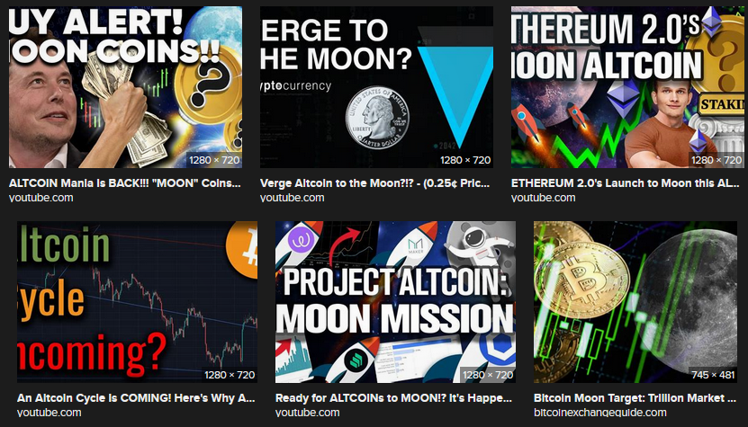

6. L'épargne, le remède cnotre l'incertitude

> l'influence envahissante et destructrice de l'érosion constante de la valeur du capital et des revenus ainsi que l'incertitude face à l'avenir.

Il est intéressant de souligner une citation qui met en avant l'effet destructeur de l'érosion de la valeur du capital sur la cohésion sociale, ainsi que l'incertitude qu'elle engendre. Celle-ci dit : "l'influence envahissante et destructif de l'érosion constante de la valeur du capital et des revenus, ainsi que l'incertitude face à l'avenir."

Imaginez un scénario où vous avez une famille ou des proches que vous souhaitez protéger. Vous travaillez dur, épargnez, pour anticiper les incertitudes futures. Si tout était prévisible, l'épargne serait inutile. Mais face à l'imprévu, comme une voiture en panne, l'épargne devient une bouée de sauvetage. Elle réduit l'incertitude du monde. Cependant, en période d'hyperinflation, épargner devient un défi. L'argent perd rapidement sa valeur, rendant difficile la planification à long terme. Cette instabilité financière peut engendrer stress et angoisse.

Aujourd'hui, face à la baisse du pouvoir d'épargne, l'investissement prend le relais. Cependant, cette approche comporte ses propres risques. L'épargne a toujours été un remède contre l'incertitude. Avoir des réserves financières pour gérer des situations imprévues contribue à une sérénité d'esprit et renforce la cohésion sociale. En conclusion, la protection de notre pouvoir d'épargne est essentielle pour maintenir la stabilité sociale et individuelle.

## 3.4 - Les redénominations en Amérique Latine

nous allons regarder ensemble différentes périodes de rédénomination dans des pays d'Amérique latine.

### Explication des graphe

Sur la diapositive, à gauche, figurent les années de rédénomination, le nom de la nouvelle monnaie, et le taux d'échange avec l'ancienne monnaie. Prenant l'exemple de l'Argentine, le peso moneda nacional a été converti au taux de 25 pour 1 de la monnaie précédente, le peso real. Dans ce contexte, nous examinerons l'évolution de la monnaie argentine au fil du temps. De plus, nous indiquerons les dénominations initiales et finales des billets de banque pour chaque période.

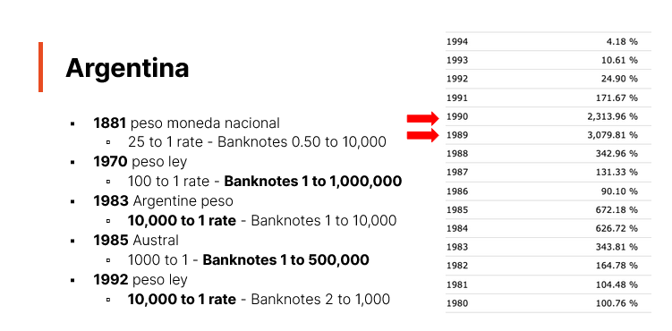

À droite de la diapositive, il y a un graphique de l'inflation. Les flèches rouges représentent les années d'hyperinflation, définies selon le critère de Kagan comme étant une inflation de 50 % par mois. Ce critère peut parfois conduire à des interprétations ambiguës, avec des années présentant des taux d'inflation élevés mais ne répondant pas à la définition stricte d'hyperinflation.

Il est à noter que la rédénomination, en période d'inflation, est une mesure courante prise par les gouvernements. Cependant, cela ne résout pas le problème sous-jacent de l'inflation ou de l'hyperinflation. Ce n'est qu'une manière de renommer la monnaie et de supprimer des zéros, sans véritablement s'attaquer à la cause profonde de l'hyperinflation : l'expansion de la masse monétaire. Dans une vidéo ultérieure, nous discuterons des véritables solutions pour aborder et résoudre le problème de l'hyperinflation. Dans cette série, nous mettrons en lumière les conséquences d'une simple rédénomination sans réformes adéquates : l'inflation persiste.

Après l'Argentine, notre étude couvrira le Brésil, la Bolivie, le Pérou, le Nicaragua, et le Venezuela. Nous examinerons les rédénominations qui ont eu lieu dans ces pays.

### Argentine

Avant 1826, l'Argentine utilisait le dollar espagnol. Après son indépendance en 1816, elle a introduit sa propre monnaie basée sur le réal espagnol, aboutissant à la création d'une monnaie similaire. Le tableau commence en 1881, année de l'introduction du "peso moneda nacional" avec des billets allant jusqu'à 10 000. Ce dernier a été suivi par le "peso ley", échangé à un taux de 100 pour 1 et avec des billets montant jusqu'à un million. Ensuite, l'"argentine peso" est arrivé avec un taux d'échange de 10 000 pour 1 (équivalent à la suppression de quatre zéros), et des billets jusqu'à 10 000. En 1985, l'"australes" a été introduit et échangé à 1000 pour 1, avec des billets allant jusqu'à 500 000. En 1992, l'actuel "peso ley" a été instauré avec un taux de 10 000 pour 1, supprimant encore une fois quatre zéros. Seules les années 1989 et 1990 ont connu de l'hyperinflation. 

### Brazil 

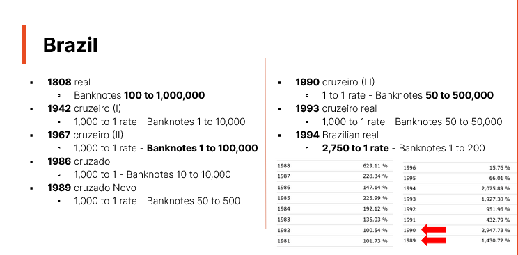

Le Brésil est un cas emblématique en matière de redénomination monétaire, comme illustré par son histoire riche en changements de monnaie. Avant son indépendance, le Brésil utilisait le réal portugais. Toutefois, dès 1747, le pays a commencé à utiliser son propre "réal brésilien", bien avant sa déclaration d'indépendance en 1822. Le tableau débute en 1818, marquant le début de l'émission des billets de banque brésiliens, avant cela, la monnaie était principalement sous forme de pièces. Ces billets atteindront des valeurs allant jusqu'à un million de réals.

À partir de 1942, le Brésil a entamé une série de redénominations. Dans la plupart des cas (1942, 1967, 1986, 1989, 1993), le taux de conversion était de 1 000 pour 1. En 1990, un changement de nom sans conversion a eu lieu. La séquence de ces monnaies se présente comme suit :

* Réals (ancienne version) jusqu'en 1942.
* Cruzeiros en 1942.
* Cruzeiros (nouvelle version) en 1967.
* Cruzados en 1986.
* Cruzados Novo en 1989.
* Retour aux Cruzeiros en 1990.
* Cruzeiros Reais en 1993.
* Enfin, le Réal Brésilien en 1994.

Le billet le plus élevé a atteint 500 000, et la dernière redénomination en 1994 a été effectuée à un taux de 2 750 pour 1. Les années 1989 et 1990 ont été marquées par de l'hyperinflation, tandis que 1993-1994 ont vu des taux d'inflation élevés sans atteindre le seuil de l'hyperinflation (50% par mois). Après cette période tumultueuse, le Brésil a une fois de plus redénominé sa monnaie en supprimant plusieurs zéros. 

### Bolivie

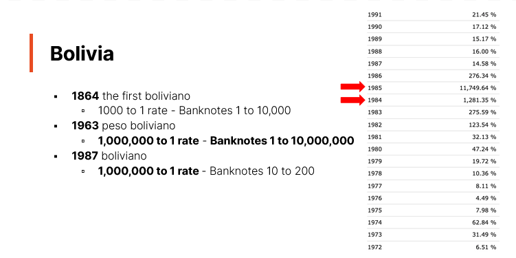

a Bolivie est un autre exemple de pays ayant traversé des périodes d'inflation aiguë, nécessitant des redénominations monétaires. Voici un résumé de son histoire monétaire :

Avant son indépendance en 1825, la Bolivie utilisait le dollar espagnol comme devise. Suite à son indépendance, le pays a introduit le Bolivian Sol entre 1827 et 1864, remplaçant ainsi le dollar espagnol. Cependant, il faut noter que les premiers billets de banque en Bolivie n'ont fait leur apparition qu'en 1864.

En 1864, le premier "Boliviano" est introduit, avec un taux d'échange de 1000 pour 1 par rapport au Bolivian Sol. Cette monnaie est restée en circulation jusqu'à ce qu'elle atteigne une dénomination de 10 000 Bolivianos.

Par la suite, la Bolivie a changé sa monnaie pour le "Peso Boliviano", qui a connu une hyperinflation si sévère qu'elle a finalement atteint des dénominations allant jusqu'à 10 millions. Cet épisode d'inflation a culminé dans les années 1984-1985, avec des taux d'inflation mensuels approchant souvent le seuil d'hyperinflation de 50 %. Pour donner une perspective, une inflation constante de 50 % par mois sur une année complète se traduit par une inflation annuelle d'environ 12 800 %. En 1985, le taux d'inflation annuel de la Bolivie a atteint 11 749 %, ce qui indique que presque chaque mois, l'inflation était proche ou dépassait le seuil de 50 %.

Face à cette crise monétaire, en 1987, la Bolivie a introduit une nouvelle monnaie, simplement appelée "Boliviano", avec un taux d'échange de 1 million de Pesos Bolivianos pour 1 Boliviano. Cette version du Boliviano est toujours en circulation aujourd'hui.

Voilà un aperçu de la tumultueuse histoire monétaire de la Bolivie, marquée par des périodes d'hyperinflation et des redénominations.

### Peru

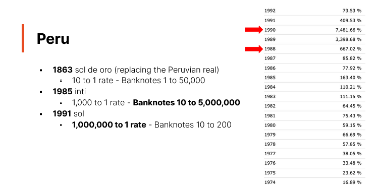

Le Pérou présente un cas intéressant en ce qui concerne les effets de la règle arbitraire des 50 %. Pour commencer par son histoire monétaire, le Pérou utilisait l'or espagnol jusqu'au 19e siècle et a déclaré son indépendance en 1821. Le dollar péruvien était en usage de 1822 à 1863. En 1863, le réel péruvien a été remplacé par le soldi oro, avec un taux de 10 pour 1, atteignant une valeur maximale de 50 000. En 1985, la monnaie "Inti" a été introduite avec un taux de conversion de 1000 pour 1, culminant à 5 millions. En 1991, le "SOL" a été lancé avec un taux de 1 million pour 1, avec des billets allant de 10 à 200.

En examinant les périodes de redénomination, 1988 est considéré comme une année d'hyperinflation, en particulier en septembre. Juillet-août 1990 a également vu une période d'hyperinflation. En 1988, l'inflation annuelle était de 667%, avec un pic de 50% en septembre. En revanche, 1989 a connu une inflation de 3000% sans mois dépassant 50%, donc elle n'a pas été classée comme hyperinflation. En 1990, l'inflation a culminé à 7481%. Il est clair que la règle des 50% peut être arbitraire, car 1988 a été considéré comme une année d'hyperinflation, contrairement à 1989. Si cette règle était reconsidérée, il serait peut-être judicieux de baisser le seuil pour inclure des périodes comme celle vécue par le Pérou en 1989.

> Comprendre ce qui se passe 
>
> L'essentiel à comprendre à propos des redénominations monétaires est que lorsque la valeur de la monnaie atteint des chiffres astronomiques, comme 5 ou 10 millions, elle est redénominée. Ce processus peut se répéter plusieurs fois, impliquant un changement de monnaie. Le résultat est que les épargnes des individus peuvent être gravement affectées, même en l'absence d'hyperinflation. Par exemple, si quelqu'un économise 1 000 dollars une année et parvient à mettre de côté 100 dollars, l'année suivante, le billet le plus bas pourrait être de 1 000 dollars, rendant les 100 dollars économisés précédemment sans valeur. Une telle érosion des économies ne nécessite pas une hyperinflation manifeste. Même si une personne a économisé 10 000 dollars au cours des dix dernières années, cette somme pourrait finir par avoir la valeur d'un montant négligeable, incapable d'acheter une simple bouteille d'eau. Cette réalité se manifeste dans de nombreux pays qui ont connu des redénominations, même si seulement quelques mois ont été classés comme hyperinflationnistes. En contraste, certains pays, comme le Nicaragua, ont connu de nombreuses années consécutives d'hyperinflation.

### Le Nicaragua 

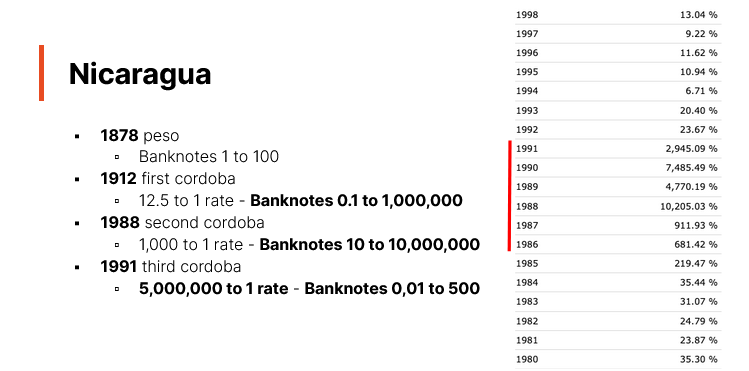

Le Nicaragua, autrefois sous la domination espagnole, utilisait initialement le dollar espagnol, tout comme de nombreux autres pays colonisés par l'Espagne. Après avoir été intégré à l'Empire espagnol, l'Empire mexicain, puis la République fédérale de l'Amérique centrale, le Nicaragua a proclamé son indépendance. À partir de 1878, le peso est devenu la monnaie officielle du pays, avec des valeurs fluctuant entre 1 et 100. En 1912, le pays a introduit le premier Cordoba, suivi du deuxième en 1988 et du troisième en 1991, qui est toujours en usage aujourd'hui. Le premier Cordoba a atteint une valeur de 1 million, le deuxième 10 millions. La redénomination en 1991 a suivi plusieurs années d'hyperinflation.

### Venezuela

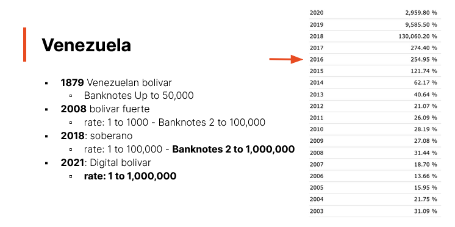

Le Venezuela est le dernier pays évoqué dans cette vidéo. Le pays a subi quatre redénominations monétaires au fil du temps. À ses débuts, le Venezuela utilisait le dollar espagnol avant de déclarer son indépendance en 1811. En 1879, il introduisit le bolivar comme monnaie officielle, qui resta en vigueur jusqu'en 1983, année où le gouvernement opta pour un dollar à taux flottant.

Un fait notable concernant le Venezuela est son adhésion à l'Union monétaire latine. Cette union comprenait des pièces telles que les 5 pesetas de l'Espagne, les 5 drachmas de la Grèce, les 5 bolivars du Venezuela, les 5 lire de l'Italie, les 5 francs belges et les 5 francs français.

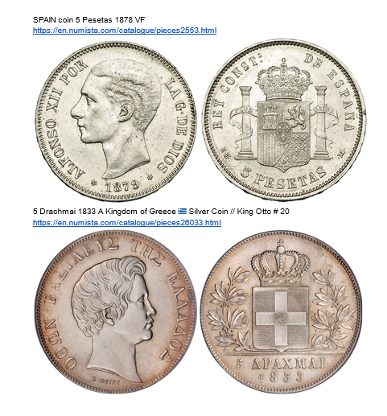

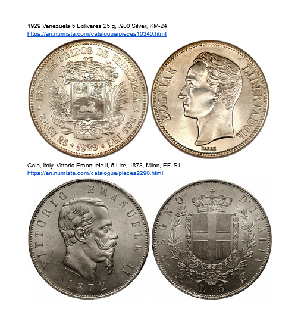

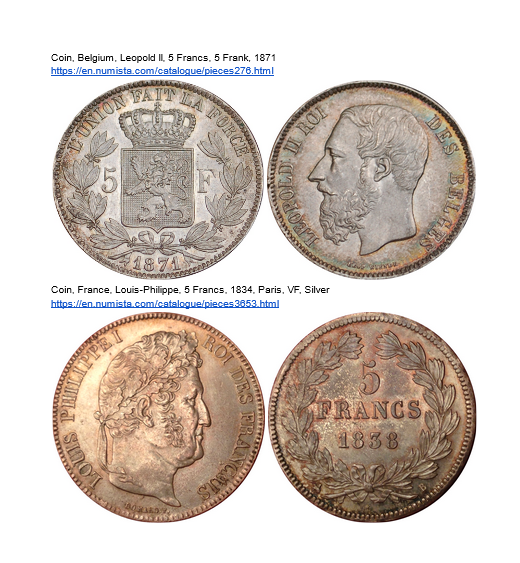

Durant cette période, la pièce de 5 bolivars du Venezuela avait le même poids que celles des pays membres de l'Union, notamment l'Italie, l'Espagne, la Belgique et la France. Ces bolivars étaient composés d'argent, avec une pièce spécifique de 1929 pesant 25 grammes et ayant une pureté de 900, soit 90 % d'argent pur. Avec le cours actuel de l'argent, cette pièce vaut approximativement 17 à 18 dollars US.

Suite à l'adoption d'un taux de change flottant en 1983, plusieurs redénominations ont suivi :

* En 2008 : le bolivar fuerte, ou "bolivar fort", fut introduit, allant jusqu'à 100 000 avant une redénomination de mille pour un.

* En 2018 : le Soberano fut introduit avec des billets atteignant 1 million. En 2021, il fut remplacé par le digital bolivar qui atteignit également un million, avant une nouvelle redénomination d'un million pour un. Aujourd'hui, le billet de 10 ou de 20 équivaut à 10 millions ou 20 millions en Soberano. 

Des billets de cette période, datant de 2018, sont distribués lors de différentes conférences Bitcoin à Biarritz, Toronto et Miami. Ces billets Soberano ont atteint une valeur maximale d'1 million. Une redénomination a ensuite eu lieu, ramenant la valeur du million à environ 3 cents. Actuellement, 10 billets d'1 million correspondent à un billet de 10. Depuis 2016, le Venezuela est en hyperinflation, représentant la 57e période d'un tableau spécifique. 

Dans la prochaine vidéo, une collection de billets d'hyperinflation sera présentée, mettant l'accent sur le Venezuela et d'autres pays listés. Cette collection contient presque tous les billets vénézuéliens. L'étude portera sur les différentes redénominations pour chaque pays mentionné. De plus, il y aura une exploration sur les redénominations au Zimbabwe, un sujet d'intérêt notable.

### Conclusion

On a donc vue que l'hyperinflation n'est pas le seul indicateur d'une situation économique catastrophique. Redénominer plusieurs fois, supprimer des zéros ou changer le nom de la monnaie a des répercussions directes sur la population, allant de la perte d'aides à des problèmes d'alimentation. Bien que l'hyperinflation soit préoccupante, le nombre de redénominations, comme celles observées au Brésil, montre une réalité plus complexe.

En se basant sur le critère du 50% d'inflation par mois, plusieurs périodes auraient pu être classifiées comme de l'hyperinflation. Cela est particulièrement vrai lorsqu'on examine les critères de l'organisme international de comptabilité, qui considère entre autres des caractéristiques comme l'abandon rapide de la monnaie par la population, l'indexation des salaires et les prêts assortis de taux d'intérêt élevés pour compenser l'inflation.

En conclusion, l'hyperinflation n'est qu'un aspect des défis économiques. La haute inflation, à elle seule, peut être tout aussi dommageable. La prochaine section explorera les solutions possibles pour sortir de l'hyperinflation.

## 3.5 - Comment sortir de l’hyperinflation

### Comment mettre fin à l’inflation modérée et la haute inflation

Les conclusions évoquées sont tirées du livre "Monetary Regime and Inflation" de Bernold. Selon ce dernier, la seule méthode pour mettre fin à l'inflation consiste à réaliser une réforme monétaire et à imposer des restrictions au gouvernement. Ces restrictions impliquent la mise en place d'une institution, telle qu'une banque centrale, qui opère de manière indépendante des décisions politiques du gouvernement. La haute et l'hyperinflation sont souvent le résultat du financement des déficits budgétaires par la création monétaire. Pour régler l'inflation modérée, il est essentiel de diminuer la croissance de la masse monétaire. Bernold suggère également que cette croissance monétaire soit relative aux pays voisins. Un point surprenant est que, durant des périodes de haute ou d'hyperinflation, la valeur totale de la masse monétaire peut en réalité diminuer. Un exemple marquant de cette situation est celui du Zimbabwe.

### Des solution contre intuitive

Lors de l'étude du Zimbabwe, il a été remarqué que 10 trillions de masse monétaire avaient perdu toute leur valeur. À Weimar, il était possible d'imprimer les deux tiers du total nominal de 65 milliards de masse monétaire en une seule journée. Ceci montre combien la masse monétaire peut être dévaluée. Pour remédier à cette situation, il est nécessaire d'augmenter significativement la masse monétaire pour qu'elle atteigne un niveau approprié. Ensuite, une réforme monétaire est indispensable. En situation de haute inflation, cette réforme est incontournable, mais elle doit s'assurer qu'il y a suffisamment d'argent en circulation. Après cette étape, des restrictions peuvent être imposées au gouvernement.

Selon les observations de Bernold, lorsqu'il s'agit de résoudre des problèmes d'inflation, les institutions comme le FMI et la Banque mondiale n'adoptent pas toujours la bonne stratégie. Dans certains cas, alors qu'un pays a besoin d'augmenter sa masse monétaire, ces institutions cherchent à la réduire. L'essentiel est d'atteindre un niveau monétaire adéquat, puis d'imposer des limites à sa croissance, évitant ainsi de financer les dépenses gouvernementales par la création monétaire.

Un aspect intéressant soulevé par Bernold est que la réussite d'une réforme monétaire ne dépend pas uniquement de sa pertinence technique, mais aussi de la confiance que la population lui accorde. Certaines réformes bien conçues peuvent échouer parce que le public ne leur fait pas confiance, tandis que d'autres, mal conçues, peuvent réussir parce que la population leur accorde sa confiance. La perception et la confiance de la population sont donc des éléments essentiels dans le succès ou l'échec d'une réforme monétaire.

* Au Zimbabwe, la solution adoptée pour contrecarrer l'inflation a été la dollarisation, ce qui signifie qu'ils ont adopté le dollar américain ou d'autres monnaies de pays voisins. Cette approche empêche le gouvernement d'imprimer de la monnaie à sa guise. 

* En Allemagne, la solution a été de créer une nouvelle monnaie, le Rentenmark. Cette monnaie était adossée aux actifs territoriaux du Reich, et cette stratégie s'est avérée efficace.
 

### Le cas du Zimbabwe

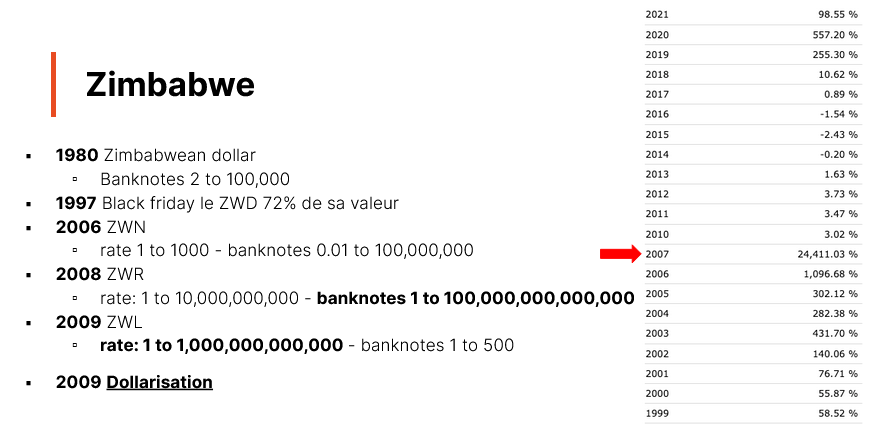
 
Le Zimbabwe a accédé à l'indépendance en 1980 et a introduit le dollar zimbabwéen. Initialement, deux dollars zimbabwéens valaient environ 1,60 dollar américain. Cependant, en 1997, suite à des mesures sociales en faveur des vétérans de la guerre d'indépendance, la monnaie a dévalué de 72% en une journée lors du Black Friday. Puis, au début des années 2000, le pays a lancé un programme de redistribution des terres, retirant les terres des propriétaires blancs pour les remettre à la population locale. Cette décision a nui à l'exportation car les nouveaux propriétaires n'avaient souvent pas l'expertise nécessaire pour gérer d'importantes exploitations agricoles. De fait, alors que le Zimbabwe était un exportateur net en 1999, il est devenu importateur net en 2003.

En 2006, le pays a introduit une nouvelle version de sa monnaie, le ZWN, avec un taux d'échange de 1 pour 1 000. En 2008, une autre dénomination, le ZWR, a été introduite avec un taux d'échange de 1 pour 10 milliards. Cela a conduit à la création des billets emblématiques de 100 trillions. 

#### La dollarisation & sortie de crise
 
Et donc apres 2009, face à la crise monétaire persistante et à l'hyperinflation galopante, le Zimbabwe a abandonné sa monnaie nationale et a autorisé l'utilisation de monnaies étrangères, principalement le dollar américain. Cette décision, bien que radicale, a mis fin à l'hyperinflation. Une leçon clé à retenir est que l'arrêt de l'émission monétaire excessive et la fin du financement du déficit budgétaire par la banque centrale peuvent mettre fin à l'hyperinflation.

Cependant, la dollarisation n'est pas une solution miracle. Bien qu'elle puisse mettre fin à l'hyperinflation, elle présente d'autres défis économiques. L'une des conséquences est la perte de la politique monétaire autonome. Sans monnaie propre, un pays ne peut pas ajuster sa politique monétaire pour répondre aux chocs économiques internes.

En 2007, le taux d'inflation au Zimbabwe avait atteint le seuil de 50 % par mois, marquant officiellement le pays comme étant en hyperinflation. Après la dollarisation en 2009, l'hyperinflation a cessé, mais le pays a été confronté à d'autres défis économiques.

C'est inquiétant de noter que le Zimbabwe a depuis tenté de réintroduire sa propre monnaie, et des signes d'inflation élevée sont à nouveau apparus. Selon certaines organisations internationales, le pays pourrait déjà remplir à nouveau les critères d'hyperinflation, même s'il n'a pas encore atteint le seuil officiel de 50 % par mois. Cela sert de rappel sur les dangers de l'émission monétaire excessive et du financement du déficit par la banque centrale.

## Conclusion

Dans mon ouvrage intitulé "Tout sur Bitcoin", j'ai consacré un chapitre entier à l'hyperinflation au Zimbabwe. J'y détaille les événements marquants, en fournissant divers exemples illustrant comment le pays a finalement mis fin à l'hyperinflation.

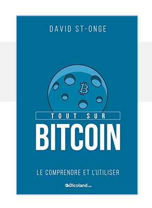

Pour ceux qui sont curieux de l'expérience allemande après la Première Guerre mondiale, je recommande vivement la bande dessinée "Le banquier du Reich". Elle narre comment l'Allemagne a réussi à surmonter l'hyperinflation, notamment grâce à la création du Rentenmark.

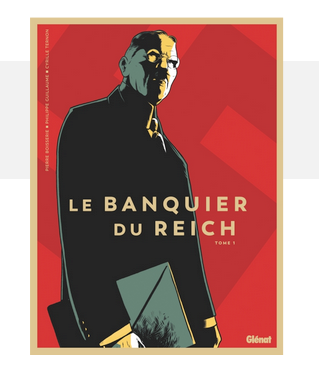

Dans mon ouvrage intitulé "Tout sur Bitcoin", j'ai consacré un chapitre entier à l'hyperinflation au Zimbabwe. J'y détaille les événements marquants, en fournissant divers exemples illustrant comment le pays a finalement mis fin à l'hyperinflation. Pour ceux qui sont curieux de l'expérience allemande après la Première Guerre mondiale, je recommande vivement la bande dessinée "Le banquier du Reich". Elle narre comment l'Allemagne a réussi à surmonter l'hyperinflation, notamment grâce à la création du Rentenmark.

L'essentiel à retenir est que pour sortir de l'hyperinflation, il existe plusieurs stratégies. On peut opter pour la dollarisation ou introduire une nouvelle monnaie. Ces solutions ne fonctionneront que si la population a confiance en elles. Il est crucial d'imposer des contraintes rigoureuses. Une banque centrale véritablement indépendante est essentielle. Elle ne doit pas gonfler la masse monétaire pour combler les déficits gouvernementaux. En cas d'inflation légère, limiter la croissance de la masse monétaire devrait suffire. Toutefois, lorsqu'on est confronté à une hyperinflation, il est primordial d'abord d'avoir une masse monétaire appropriée à la taille de l'économie en question. Ensuite, il est impératif d'imposer des contraintes strictes au gouvernement pour stabiliser la situation.

## 3.6 - Présentation de la collection de billets d’hyperinflation

Le lien vers la collection scannée est disponible dans le Bitcoin Educational Toolkit, accessible depuis la section Ressources de la plateforme.

# Section 4 - Comment en sommes nous arrivés là ?

## 4.1 - L’émergence de la deuxième couche de la monnaie et des banques centrales

Transcripte:

L'émergence de la deuxième couche monétaire et des premières banques centrales est un sujet fascinant. Ce thème est largement abordé dans le livre "Layered Money" de Nick Battia. Je le recommande vivement à ceux qui s'intéressent à l'évolution et aux subtilités de nos systèmes monétaires. L'objectif de cette section est de comprendre l'origine de la création monétaire et comment cela a pu conduire à l'hyperinflation. 

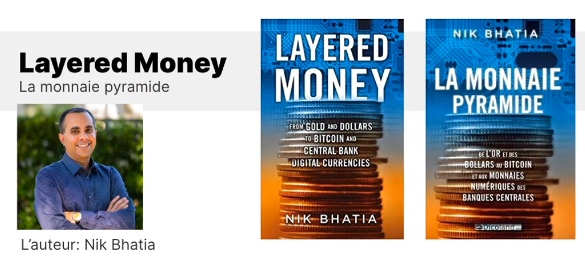

### Monnaie pyramide et banques centrales

#### Le florin 

L'histoire de la monnaie remonte à l'Italie du XIIIe siècle, plus précisément à Florence. À cette époque, le florin et les lettres de change étaient courants. Un exemple notable est le florin, orné de la figure de Saint-Jean-Baptiste.

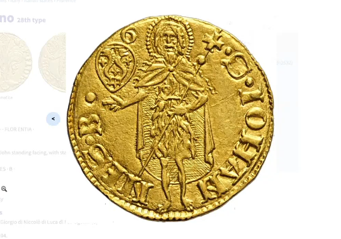

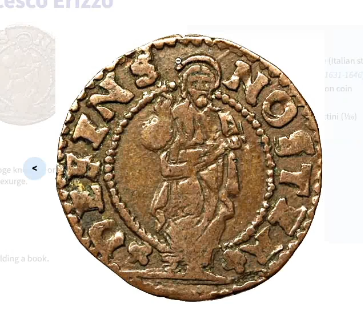

Bien que posséder un vrai florin soit coûteux aujourd'hui, il existe des reproductions disponibles. Il y a également d'autres monnaies de l'époque, comme le soldo des États italiens du XVIIe siècle, qui arbore une image du Christ.

#### Les lettres de change ( 13e)

La pratique courante était alors la suivante : les orfèvres émettaient des lettres de change en retour des florins déposés chez eux. Ces florins étaient soigneusement gardés dans leurs voûtes. Ainsi, l'or véritable, représenté par le florin, constituait la première couche de monnaie, tandis que les lettres de change formaient une seconde couche. Cependant, la liquidité de ce système était limitée. Si quelqu'un voulait récupérer son or en échange de sa lettre, la transaction était simple. Mais échanger ces lettres entre individus n'était pas courant.

#### La bourse d'Anvers (16e)

La bourse d'Anvers a marqué une étape clé dans l'évolution de la monnaie papier. C'est là qu'a été introduite la pratique de l'escompte des billets à ordre. Ces billets étaient des instruments papier représentant une valeur monétaire, mais leur particularité était qu'ils portaient des noms et des dates de maturité. Cela les rendait difficiles à échanger avant la date d'échéance.

La révolution apportée par la bourse d'Anvers résidait dans la possibilité d'escompter ces billets avant leur date d'échéance. Par exemple, si un billet à ordre était dû dans un mois, il était possible de l'acheter à un prix réduit pour tenir compte du délai avant l'échéance. Cette innovation a non seulement rendu la monnaie papier plus liquide, mais a également introduit la notion de valeur temporelle de l'argent ("time value of money").

Ce concept, bien qu'associé à Nick Bell via son pseudonyme Twitter "time value of BTC", n'est pas de son invention. Néanmoins, il en parle en détail dans son ouvrage. L'idée principale est que le temps a une valeur. Ainsi, si quelqu'un décide de payer un billet à ordre d'une valeur de 100 dollars un mois à l'avance, il peut l'obtenir pour, par exemple, 98 dollars et recevra les 100 dollars à la date d'échéance. Cette innovation monétaire a vu le jour à la bourse d'Anvers.

#### la VOC et lemarché d'action à Amsterdam (17e)

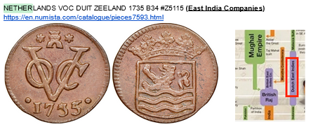

Après la bourse d'Anvers, une étape majeure a été la fondation de la VOC, la Compagnie des Indes orientales. Cette compagnie, basée aux Pays-Bas, a même émis sa propre monnaie. Suite à la création de la VOC, la première bourse a vu le jour à Amsterdam, devenant le premier marché d'actions pour cette entreprise. Ce qu'il est intéressant de souligner, c'est la manière dont les Néerlandais ont réussi à mettre fin à la suprématie d'Anvers en tant que centre économique international. Ils ont simplement bloqué l'accès au fleuve Escaut. Cette stratégie faisait partie d'un plus grand mouvement historique, la révolte des gueux. Un événement crucial dans l'histoire européenne.

#### La banque d'amsterdam intervient

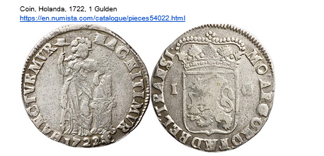

Après la création de la VOC, un autre élément marquant de l'histoire monétaire a été l'introduction des golden par la Banque d'Amsterdam. Ces pièces, datant notamment de 1722, étaient en argent. Toutefois, ce qui a véritablement révolutionné la finance à cette époque n'était pas tant la pièce elle-même, mais les comptes associés à cette monnaie à la Banque d'Amsterdam. Ces comptes sont devenus le principal moyen d'échange international. Les transactions étaient simplement inscrites dans des registres, ou "ledgers" en anglais. Grâce à ce système, Amsterdam est devenue le centre économique mondial. Avec le temps, la Banque d'Amsterdam a décidé d'imposer l'utilisation de ces comptes. Les changeurs indépendants étaient contraints d'échanger leurs pièces contre des dépôts à la banque tous les jours.

#### Création de la Banque d'Angleterre pour financer la guerre

La création de la Banque d'Angleterre fut motivée par le besoin de financer la guerre à la fin du 17e siècle. À l'instar de la Banque d'Amsterdam, elle a imposé les dépôts par décret. La particularité de la Banque d'Angleterre fut de reléguer les banques privées à une position secondaire dans le système monétaire, créant ainsi ce qu'on pourrait appeler une "troisième couche" de monnaie.

Initialement, la première couche de monnaie était représentée par l'or. Les dépôts effectués auprès des banques privées formaient la seconde couche. Cependant, lorsque ces dépôts ne pouvaient plus être convertis en or, une troisième couche de monnaie est apparue. Désormais, les billets émis par les banques privées n'étaient plus convertibles en or mais en monnaie papier de la Banque d'Angleterre, qui elle-même était convertible en or. Cette évolution a engendré une complexification du système monétaire avec l'ajout de couches supplémentaires.

 #### La panique de 1796

Panique bancaire à la banque Seamen's Savings durant la panique de 1857.

Suite à la panique bancaire de 1796, un phénomène s'est produit où tout le monde cherchait à remonter la "pyramide de la monnaie". Les gens voulaient échanger leur monnaie de troisième couche contre celle de la deuxième couche, puis, finalement, contre la monnaie de première couche, l'or. Face à cette ruée massive, la Banque d'Angleterre a été contrainte d'agir pour stabiliser la situation. Pour éviter une éventuelle déflation des réserves d'or, elle a décidé de suspendre la convertibilité de ses billets de banque en or. Cette suspension, initialement envisagée comme une mesure temporaire, s'est prolongée sur une période de deux décennies.

### conclusion:

Les banques centrales ont évolué pour devenir des prêteurs de dernier recours, suspendant la convertibilité de leur monnaie en or. Bien que cette action ait été initialement conçue comme une solution temporaire, elle est finalement devenue permanente, marquant ainsi l'avènement du concept du prêteur de dernier recours. Cette transformation a façonné les banques centrales telles que nous les connaissons aujourd'hui. Cependant, dans des économies plus fragiles, cette capacité à imprimer de la monnaie à volonté peut entraîner des conséquences indésirables, comme l'hyperinflation, si elle est utilisée de manière irresponsable.

## Livres et ressources

L'hyperinflation est un sujet fascinant qui a été étudié à travers divers événements historiques. Si vous souhaitez approfondir ce sujet, voici une liste de 10 ressources essentielles à lire et à étudier :

* "When Money Dies: The Nightmare of Deficit Spending, Devaluation, and Hyperinflation in Weimar Germany" par Adam Fergusson
        Ce livre détaille la crise hyperinflationniste de l'Allemagne après la Première Guerre mondiale.

* "The Economics of Inflation - A Study of Currency Depreciation in Post-War Germany" par Costantino Bresciani-Turroni
        Une analyse approfondie de l'hyperinflation allemande dans les années 1920.

* "This Time Is Different: Eight Centuries of Financial Folly" par Carmen M. Reinhart et Kenneth S. Rogoff
        Bien que le livre couvre de nombreux types de crises financières, il traite en détail des hyperinflations à travers l'histoire.

*  "Zimbabwe's Hyperinflation, Analysis and Lessons Learned" par Steve Hanke
        Une étude du cas de l'hyperinflation zimbabwéenne au début des années 2000.

* "Monetary Regimes and Inflation: History, Economic and Political Relationships" par Peter Bernholz
        Le livre examine les cas d'hyperinflation à travers l'histoire et cherche à comprendre les facteurs sous-jacents.

* "The Hyperinflation Survival Guide: Strategies for American Businesses" par Gerald Swanson
        Un guide pratique sur la manière dont les entreprises peuvent naviguer dans un environnement hyperinflationniste.

* "Dying of Money: Lessons of the Great German and American Inflations" par Jens O. Parsson
        Une analyse comparative des crises inflationnistes en Allemagne et aux États-Unis.

* "The Downfall of Money: Germany’s Hyperinflation and the Destruction of the Middle Class" par Frederick Taylor
        Une exploration narrative de l'impact social et économique de l'hyperinflation sur la société allemande.

* "Currency Boards for Developing Countries: A Handbook" par Steve Hanke et Kurt Schuler
        Bien que le focus soit sur les caisses d'émission, ce livre offre une perspective sur comment éviter des situations d'hyperinflation.
