# 経済への旅

このプログラムは、フィアット通貨が支配する世界におけるハイパーインフレーションの発生とその重大な影響を深く理解することを目指しています。参加者はハイパーインフレーションのサイクルを詳細に探求し、原因、引き金、歴史的および現代の事例を分析します。また、経済や日常生活におけるハイパーインフレーションの具体的な影響を調査し、通貨価値、購買力、個人および集団の貯蓄への影響を研究します。

ここでは、歴史を通じてハイパーインフレーションのエピソードにおける傾向と共通のパターンを強調し、ハイパーインフレーション期間中に自己を守るための効果的で具体的な戦略を提供します。参加者は、さまざまな投資オプションや金融防衛メカニズムを探求する機会を持ち、不安定な経済状況で冷静に航行するための実用的なツールと必要な知識を習得します。

+++

# 序章
<partId>6fe4d15d-f6e6-54be-9e04-0a75ac98df8b</partId>

## 序章
<chapterId>9d1aba8d-0485-5020-9863-5de37e6db8e0</chapterId>

このプログラムは、フィアット通貨が支配する世界におけるハイパーインフレーションの発生とその重大な影響を深く理解することを目指しています。参加者はハイパーインフレーションのサイクルを詳細に探求し、原因、引き金、歴史的および現代の事例を分析します。また、経済や日常生活におけるハイパーインフレーションの具体的な影響を調査し、通貨価値、購買力、個人および集団の貯蓄への影響を研究します。

ここでは、歴史を通じてハイパーインフレーションのエピソードにおける傾向と共通のパターンを強調し、ハイパーインフレーション期間中に自己を守るための効果的で具体的な戦略を提供します。参加者は、さまざまな投資オプションや金融防衛メカニズムを探求する機会を持ち、不安定な経済状況で冷静に航行するための実用的なツールと必要な知識を習得します。

### カリキュラム

セクション 1 - 序章

- 1.1 - コース序章 by Rogzy & David

セクション 2 - インフレとは何か？

- 2.1 - 金融現象
- 2.2 - インフレの種類
- 2.3 - デフレーション

セクション 3 - ハイパーインフレとは何か？

- 3.1 - 定義
- 3.2 - ワイマールとジンバブエの類似点
- 3.3 - ワイマールとジンバブエの違いと現代の類似点
- 3.4 - ラテンアメリカの通貨再編
- 3.5 - ハイパーインフレからの脱却方法
- 3.6 - ハイパーインフレ紙幣コレクションの紹介

セクション 4 - どうしてここに至ったのか？

- 4.1 - 第二層のお金と中央銀行の出現
- 4.2 - 参考書籍とリソース

頑張ってください！

# インフレとは何か？
<partId>2b4f456c-3649-5cf9-b9b0-a5bffe92d962</partId>

## 金融現象
<chapterId>b2cbc915-c4ec-52b5-860c-0958f58c91e4</chapterId>

### インフレの定義

インフレは、それに関連する複数の定義があるため、しばしば誤解される概念です。ビットコイナーや伝統的な経済学者など、異なるグループ間でのインフレの認識は異なります。ハイパーインフレについて議論する前に、まず定義を明確にしましょう：

- Robertの定義：インフレは、支払い手段（紙幣、資本）の過剰な増加によって価格が上昇し、通貨が減価する現象です。

- Larousseの定義：インフレは、価格水準の一般的かつ持続的な上昇を特徴とする現象です。ここで、「一般的」という言葉が重要です。

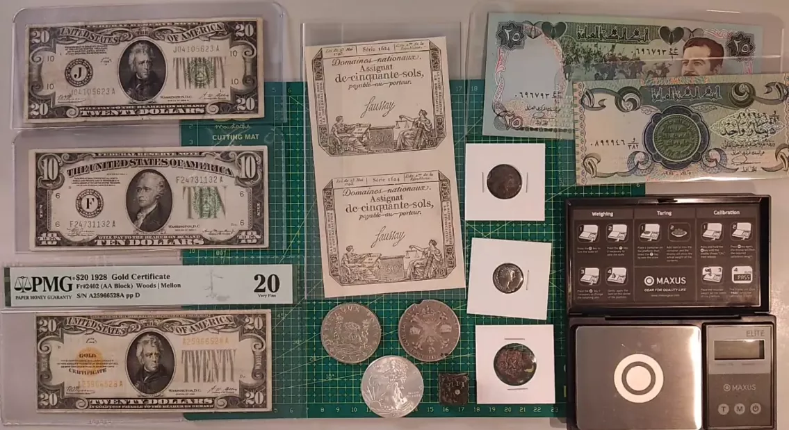
これらの定義を踏まえると、ロバートにとってインフレは主に貨幣供給の増加に関連していることを理解することが重要です。一方、ラルースはこの拡大の結果、すなわち物価の一般的な上昇に焦点を当てています。
私たちのハイパーインフレに関する研究では、より関連性が高く明確であるため、物価の一般的な上昇という第二の定義を採用します。しかし、この物価の上昇は一般的に貨幣供給の拡大の結果であることを覚えておくことが重要です。
著名な経済学者ミルトン・フリードマンは有名に述べています：

> "インフレは常に、そしてどこでも貨幣現象である。"

この声明は、貨幣拡大とインフレの間の本質的な関係を強調しています。以下のセクションでは、これらの基本的な定義に基づいて、インフレと経済成長の相互作用を探求します。

### 貨幣現象の理解

貨幣現象に言及する際、私たちは経済の貨幣供給がどのように影響を受けるかを指します。ミルトン・フリードマンは、主にこの供給の増加としてそれを見ていました。歴史的には、貨幣供給を増やす主な方法は二つありました：

1. 貨幣印刷：
   伝統的な貨幣システムでは、新しい紙幣を物理的に印刷することによって貨幣供給が増加しました。しかし現在では、デジタル通貨の優勢により、この印刷は主に電子的に行われます（中央銀行や他の金融機関のデータベースを通じて）。歴史は、文字通りの紙幣印刷がハイパーインフレを引き起こした時期を示しています。

2. 金属含有量の削減：
   もう一つの方法は、銀や金などの金属に基づく通貨の貴重な金属の量を減らすことでした。ローマ帝国でのデナリウスがその顕著な例です。デナリウスは当初ほぼ完全に銀で構成されていましたが、その銀含有量は時間とともに大幅に削減されました。これはインフレの一形態でしたが、必ずしもハイパーインフレではありませんでした。

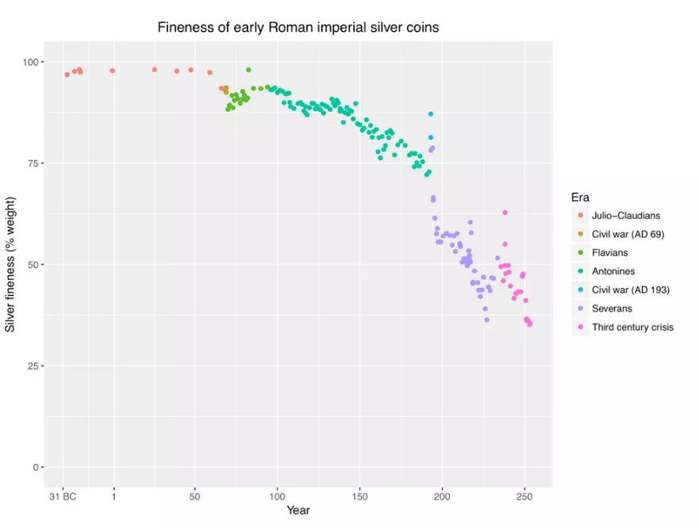

ハイパーインフレは主に、貴重な金属などの基礎資産から切り離された法定通貨で観察されることを強調することが重要です。歴史的に、通貨がそのような資産に基づいていた場合、インフレのエピソード（例えば、金属含有量の評価を通じて）がありましたが、これらのエピソードは決してハイパーインフレの極端なレベルには達しませんでした。次のセクションでは、通貨の評価の時期とこれらの異なる貨幣システムがインフレに与える影響について詳細に研究します。

### 通貨評価の時期の研究

歴史を通じて、さまざまな文明は通貨評価の時期を経験しました。これらの時期のいくつかは、経済に圧力をかけた主要な出来事や戦争と一致しています。

#### 1. ペロポネソス戦争と第二次ポエニ戦争：

ペロポネソス戦争はアテネとスパルタの間の紛争であり、第二次ポエニ戦争はローマ共和国とカルタゴの間の戦争です。これらの戦争を資金調達するために、これらの文明は銀の含有量を減らし、他の金属を混入させ、生成されるコインの数を増やすことによって通貨を評価しました。
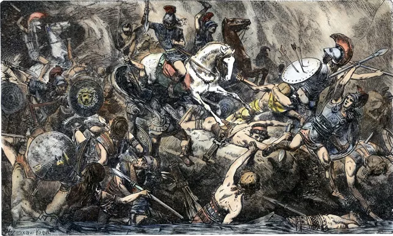

アッシナロスのほとりでのアテネ人の虐殺を描いた版画。

#### 2. 帝政時代の古代ローマ：
ローマ共和国の時代の後、帝国時代に入ると、3世紀と4世紀には顕著な通貨価値の下落が経験されました。これは、前のグラフで見られる通り、硬貨の銀含有量の減少によって示されています。ある研究によると、紀元前40年から紀元360年の約400年間で、エジプトでの小麦の価格はドラクマで計測され、100万倍に増加しました。この期間における平均年間インフレ率は約4.4%です。しかし、このインフレは均等に分布していませんでした。実際のインフレは紀元238年頃から始まりました。紀元250年から293年の間のインフレ率は約3.65%であり、293年から301年の間には22.28%に増加しました。

これらの期間に顕著なインフレが経験されたにもかかわらず、現代のいくつかの状況で観察できるハイパーインフレーションのレベルには達していませんでした。その理由は、通貨が価値を下げたとしても、依然として貴金属に基づいていたためです。この堅固な基盤が極端なインフレーションレベルに対するある程度の保護を提供しました。以下のセクションでは、ハイパーインフレーションの性質と結果についてさらに詳しく探求します。

- マルクス・アウレリウスのデナリウス（紀元160年）：
  古代ローマの最も象徴的な硬貨の一つであるデナリウスは、銀貨です。私はマルクス・アウレリウスの紀元160年の特定の硬貨を所有しており、大きな価値下げが行われる前のものです。カメラが細部を捉えるのに苦労するかもしれませんが、肉眼で見ると、比較的高い銀含有量を反映した美しい銀貨であることがわかります。

- アントニニアヌス（3世紀後半）：
  通貨の価値下げとともに、新しい通貨であるアントニニアヌスが登場しました。この通貨は2デナリウスの価値があるとされていましたが、含まれる銀はずっと少なかったです。私のアントニニアヌス硬貨は、銀含有量が大幅に減少していることを明確に示しています。この時期のローマ硬貨に典型的な「放射冠」を戴いた硬貨です。色と品質を比較すると、アントニニアヌスが純銀貨からはほど遠いことがわかります。この視覚的比較は、数世紀にわたる古代ローマの通貨価値の下落を明確に示しています。

これらの硬貨の価値の下落を示すグラフがあれば、このデモンストレーションを完璧にすることができます。このプラットフォームを通じて視覚化するのは難しいですが、デナリウスの価値のグラフ、その後の2世紀の終わりに向けての下降、そしてはるかに低い銀含有量を持つとされるアントニニアヌスに置き換えられる様子を想像してください。これらの遺物は過去の文明の経済変動を静かに物語っています。

#### 3. スペインのマラベディ：ターゲットされた価値下げの証人

マラベディは銅貨として、スペイン通貨の歴史において特別な位置を占めています。先に述べたように、スペインドルはもともと国際基準であり、スペインにとって不可欠な準備通貨でした。しかし、特定の経済的課題に直面したスペインは、巧妙な通貨戦略に訴える必要がありました。
通貨切り下げは、国家が費用を賄うためや経済を刺激するためによく使用される手段です。しかし、スペインは微妙な状況に陥っていました。スペインドルの価値を下げることは、国際貿易におけるその地位を損なう可能性がありました。このジレンマを克服するため、スペインはマラベディに目を向けました。
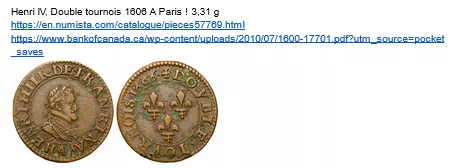
貴重なスペイン銀ドルとは異なり、マラベディは主に地元の人々の間で使用されていた銅貨でした。この通貨が切り下げの対象とされました。当初マラベディ貨が二マラベディの価値があった場合、国家はそれを回収し、新しい価値「四」として再スタンプし、所有者には一枚のコインのみを返却しました。スタンプ「八」が押されたコインは、このプロセスを何度も経ている証拠です。

この戦略により、国家は通貨を効果的に切り下げることができ、インフレを引き起こし間接的に自己資金を調達しつつ、国際舞台でのスペインドルの整合性を保持しました。しかし、このターゲットとした切り下げは、一般通貨の価値が薄れることで地元の人々に影響を及ぼしました。

マラベディの事例は、国家が内部経済ニーズを満たすために地元通貨を選択的に切り下げる一方で、グローバルステージでの準備通貨の価値を保持する方法を示しています。これは歴史における通貨政策の複雑さと洗練を示す顕著な例です。

詳細についてはこちら -> [Link](https://docs.google.com/document/d/1aZa7gvz1nt8ZHDCoWKQdS9RGGjBHdipH1ApC8dW1xpM/edit?usp=sharing)

#### 4. 15世紀から17世紀の価格革命

15世紀から17世紀にかけて、ヨーロッパは「価格革命」としばしば言及される顕著な経済現象を目撃しました。このインフレーションの時期は、主にアメリカからの貴金属、特に金と銀の大量流入によって引き起こされました。当時のヨーロッパ経済が金属基準に大きく依存していたため、金属の追加供給は通貨供給を増加させました。その結果、年間約1〜2%のインフレ率が現れました。一見するとこのインフレは控えめに見えますが、当時はそのような価格変動が珍しく、「革命」と考えられていました。これは、通貨準備の変化が経済システム全体にどのように影響を与えるかを示しています。

#### 5. ジョン・ローとアッシニア

18世紀のフランス経済史は、通貨に関連する二つの重要な出来事で特徴づけられます。まず、スコットランドの経済学者兼金融家であるジョン・ローが、フランス政府に紙幣に基づく通貨システムの採用を説得しました。当初は国の財政問題に対する革新的な解決策と考えられていましたが、この取り組みはすぐに暴走インフレを引き起こしました。その後まもなく、フランス革命の混乱の中で、政府は「アッシニア」を導入しました。

1793年のアッシニア

これらの紙幣は、歴史上初の大規模なハイパーインフレーションの時期の生きた証拠です。連続する財政危機に対する対応として当初設計されたアッシニアは、すぐに通貨不安の象徴となりました。政府はこの紙幣に過度に依存して費用を賄うことで、前例のない経済危機を引き起こし、革命後のフランスで大規模なハイパーインフレーションを生み出しました。

#### 6. 大統領令6102号とドルの切り下げ

大統領令6102号とドルの切り下げ
アメリカ合衆国では、1930年代初頭に金融政策に大きな変化が見られました。以下はこの変革の詳細な概要です：
- 1928年の20ドル紙幣

1928年、アメリカの20ドル紙幣には「要求に応じて金で償還可能」と記されていました。これは、各紙幣が文字通り金に換えられることを意味しています。具体的には、20.67ドルの紙幣が1オンスの金に相当しました。

- 大統領令6102号

1933年、大統領令6102号の発令により、大きな動揺が起こりました。この法令により、市民が金（金塊、硬貨、証書の形で）を所有することが違法とされました。

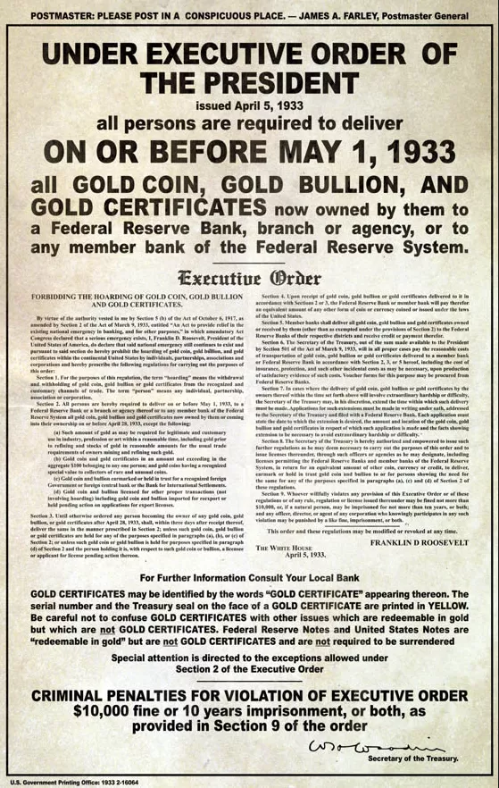

金証書は良い例です。それには「要求に応じて金貨で支払い可能」と記されていました。このような証書を持つことは違法とされ、1964年までその状態が続きました。

- 新紙幣の導入

1934年に金が押収された後、新しいシリーズの紙幣が流通しました。

金への換金可能性を示す記述が削除され、「この紙幣はすべての債務に対する法定通貨である」と置き換えられました。

- 金の再評価

この移行において興味深いのは政府の戦略です。1934年に金の価格はオンスあたり35ドルに再評価され、20.67ドルから変更されました。基本的に、政府は市民が所有するドルを切り下げました。1933年に市民からオンスあたり20.67ドルで金を購入し、1934年に金の価格を再評価することで、政府は大きな利益を上げつつ市民の貯蓄を切り下げました。

要約すると、1年以内に、政府は市民の金を効果的に押収し、金の価値を再評価することで遊戯のルールを変更し、財務省に利益をもたらし、当初金と交換した紙幣を持っていた人々に不利益を与えました。

### アメリカの歴史的変化

アメリカ合衆国は、世界の準備通貨である米ドルの価値を切り下げることで、小規模な貿易国で観察された以前の慣行に反して、歴史的な転換点を迎えました。

以前には、ルネサンス時代にフィレンツェが13世紀に発行したイタリアのフローリンが国際準備通貨であり、その使用期間中には切り下げが記録されていないことが、国際貿易における通貨安定の重要性を反映しています。

同じ精神で、国際貿易が盛んだったスペインとオランダは、国際取引における信頼と現状維持を保つために、世界の準備通貨としての通貨の完全性を維持しました。オランダではさらに、世界の金融進化における重要なマイルストーンである最初の中央銀行の創設が見られました。

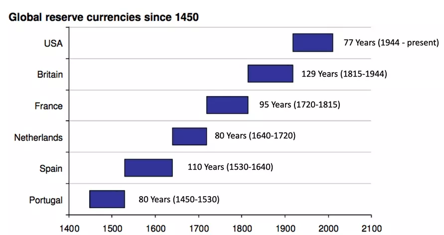

しかし、アメリカ合衆国が主要な経済大国として台頭するにつれて、状況は変わりました。彼らは自国の準備通貨の価値を切り下げることを選び、インフレを利用して自国の利益を追求しました。この決定は、準備通貨の選択が以前ほど自由ではなくなったという変化したダイナミクスにしばしば帰されます。アメリカの覇権がドルを世界の準備通貨として確立し、その価値を操作することを可能にしました。このシフトは、グローバル化された経済における国際貿易に対する金融政策の潜在的な影響を明らかにし、グローバルな準備通貨の管理における重要な移行を示しています。

### 最後の例：スイスのディナー
スイス・ディナールは、通貨切り下げのもう一つの魅力的な側面を示しており、今回は湾岸戦争前のイラクの文脈に根ざしています。この通貨は、その銀行券の顕著な品質にちなんで名付けられ、中東地域で安定性の高い評判を享受していました。この信頼は主に、イングランドで行われた銀行券の印刷品質によるもので、通貨切り下げに対するある種の堅牢性を示唆していました。

しかし、湾岸戦争はスイス・ディナールの歴史において転換点となりました。イラクはもはや英国の供給業者に頼ることができず、中国に転向しました。この移行は銀行券の品質に明確な違いをもたらし、中国製のバージョンは劣っていると感じられました。この認識は根拠のないものではありませんでした。中国の銀行券はより簡単に偽造され、政府による過剰印刷の影響を受けやすく、その価値を脅かしました。

湾岸戦争後のイラク経済において、特異な現象が現れました：二重価格制度です。商人は支払いに使用される銀行券の種類に応じて異なる価格を提示し、元のスイス・ディナールを中国の銀行券よりも好んでいました。この制度は、価値が主に国家によって課される文脈であっても、通貨切り下げに対して抵抗力のある高品質の銀行券への信頼が維持されていることを反映しています。このエピソードは、通貨の固有の特性の重要性と、信用通貨制度でさえ、通貨の知覚される品質がその相対的な価値と、それに伴う経済行動者の信頼に影響を与えることを示しています。

#### 実際にコインを量りました！

一般的な認識は、通貨を国家創造と関連付け、その発行と価値は国家によって規制されると考えます。この概念は、ローマのような古代文明にその起源を持ち、帝国によって標準化され、公式の価値が通貨に与えられたコインがありました。しかし、さらに深く探求すると、通貨の固有の価値は主にその貴金属の内容に由来していたことがわかります。

この例は、8スペイン・レアルまたは1スペイン・ドルに相当する通貨重量を通じて示されます。この重量は、その価値を示すローマ数字でマークされ、通貨交換業者がコインの重さに基づいてその価値を評価するために使用されました。コインを量ることによって、交換業者はコインが変更されたり損傷したりして価値が低下したかどうかを判断することができました。この実践は、国家による標準化されたスタンピングが通貨にある程度の公称価値を与えたとしても、真の価値は含まれる貴金属の重量にあることを強調しています。

この分析は、通貨への信頼、そしてその延長としてその価値が、国家の単なる主張ではなく、その有形の実体に根ざしていることを示しています。これは、通貨が単なる国家の道具を超え、その基本的な価値が有形で測定可能な要素に内在的に関連していることを強調しています。

#### 結論

この通貨切り下げに関する研究は、インフレメカニズムの深い理解への扉を開き、次のビデオで探求されることになります。私たちは、インフレの異なるタイプと、それらが高インフレまたはハイパーインフレに移行する閾値について議論します。このしっかりとした基盤は、今後のセッションでインフレの複雑さに取り組むための準備を整えます。ご注目いただきありがとうございます。次のビデオでこの通貨ダイナミクスの探求を続けるためにお会いしましょう。

## インフレのタイプ
<chapterId>b438fe09-375e-5bb2-9196-7dd687b9f98c</chapterId>

### インフレは多因子現象ではありません
このセクションでは、しばしば誤解される現象であるインフレーションの異なる側面を探ります。インフレーションはメディアや日常の議論で多因子現象として頻繁に捉えられがちですが、根本的には通貨現象であることを覚えておくことが重要です。

以下は、トピックをいくつかの重要なポイントに分けたものです：

- 価格上昇とインフレーションの区別：

  価格上昇は、石油のOPEC生産の減少や小麦の不利な天候条件など、さまざまな要因によって特定のセクターで誘発されることがあります。
  一方、インフレーションは、特定のセクターだけでなく、さまざまな商品やサービスにわたる価格の一般的な上昇によって定義されます。

- インフレーションの通貨本質：
  固定通貨供給のもとでは、あるセクターの価格上昇は他のセクターの価格低下を引き起こす可能性があります。なぜなら、他の場所で使えるお金の量が減少するからです。インフレーションは通貨供給の増加と密接に関連しており、すべてのセクターで価格が同時に上昇することを可能にします。

- 通貨供給がインフレーションとデフレーションに与える影響：

  固定通貨供給システムでは、生産の増加は理論的にはデフレーション、つまり価格の低下を引き起こすべきです。なぜなら、より多くの商品やサービスが利用可能になるからです。
  現在のフィアット通貨システムでは、通貨供給の増加が生産の増加によって引き起こされる可能性のあるデフレーションを打ち消します。

- 通貨供給調整の負の効果：

  生産の増加に対応することなく通貨供給を増やすと、同じ量の商品やサービスに対して流通しているお金が増えるため、インフレーションが引き起こされます。
  生産の増加はデフレーションをもたらすはずでしたが、同時に通貨供給が増加したため、この効果は無効になり、代わりにインフレーションが発生しました。

- インフレーション、デフレーション、通貨供給：連通する容器：

  インフレーションとデフレーションは経済の中で連通する容器のようなものです。生産の増加はデフレーションを引き起こす可能性がありますが、同時に通貨供給が増加すると、デフレーション効果が打ち消され、結果としてインフレーションが発生します。

この議論は、インフレーションとデフレーションの基本的なメカニズムを理解することの重要性、および通貨供給を操作することが経済に深刻な影響を与える可能性があることを強調しています。これらの概念の相互関連性とグローバル経済への影響について、後でさらに深く理解するために再訪する可能性があります。

### なぜ通貨印刷が常にインフレーションを引き起こさないのか？

#### インフレーション ≠ CPI

インフレーションはしばしば通貨供給の増加と関連付けられますが、2008年の金融危機後の期間に示されるように、通貨印刷と直接的な相関関係が常にあるわけではありません。銀行を救うための大規模な通貨印刷にもかかわらず、その後の10年間で高インフレは経験されず、年間0〜2％の間で平均しました。この状況は、大規模な通貨印刷がなぜ比例したインフレーションを引き起こさなかったのかという疑問を提起します。答えは、インフレーションの測定と消費者価格指数（CPI）に関連するいくつかのニュアンスにあります。
インフレーションの測定方法に最初の説明があります。インフレーションの主要な指標として使用される消費者価格指数（CPI）にはいくつかの制限があります。たとえば、不動産価格の進化を包括的に考慮していません。CPIには家賃に関連するコンポーネントが含まれていますが、住宅価格の大幅な評価は完全に反映されていません。その結果、住宅コストの大幅な増加が発生しても、CPIによって完全に捉えられず、実際のインフレーションが過小評価される可能性があります。
さらに、CPIの計算には、実際の価格上昇を相殺または隠蔽する可能性のある特定の方法論が含まれています。たとえば、製品の質的改善を利用して指数を調整することができます。製品の価格が上がった場合でも、その品質や機能が向上していれば、CPIは消費者にとっての実質的な価値が変わっていないとみなし、したがってインフレを反映しない可能性があります。例として、金融注入により牛肉とコンピュータの価格が上昇したにもかかわらず、コンピュータの性能向上がこの増加を相殺するケースがあります。コンピュータの価格が2倍になっても性能が4倍に向上した場合、CPIはこれを価格の低下と解釈し、牛肉の価格上昇を隠蔽するかもしれません。

これらのCPIによるインフレ測定のニュアンスは、金融印刷とインフレの関係の複雑さを浮き彫りにします。また、不動産などの主要セクターの価格上昇がより包括的に考慮された場合、実際のインフレが報告されたものよりも高い可能性があることを示唆しています。この分析は、インフレの基本的なメカニズムと、それを測定するために使用される従来の指標の限界を理解することの重要性を強調しています。これにより、金融政策の経済的影響をよりよく理解することができます。

#### MMTの主張

現代貨幣理論（MMT）は、貨幣創造とインフレについて独自の視点を提供します。MMTによれば、貨幣は主に政府から発生し、政府はその資金を大量に印刷して自身のニーズを賄うことができ、これらの資金が注入されるセクターが飽和していない限り、インフレを引き起こすことはありません。これは従来の貨幣理論から逸脱したアプローチであり、インフレ動態におけるセクターの吸収能力の重要性を強調しています。

MMTの例として挙げられるのは、アメリカの軍産複合体です。MMTによると、このセクターに何百億ドルもの資金を割り当てることができ、その吸収能力のおかげでインフレを引き起こすことはありません。対照的に、アメリカで道路建設に多額の資金が注入された場合、企業や労働力の数が限られているため、資源の不足と供給業者によるコストの増加がインフレを引き起こす可能性があります。
日本も、MMTの支持者によって、大量の金融印刷にもかかわらずインフレが発生していない例としてしばしば引用されます。しかし、日本の状況は、消費者物価指数（CPI）などの従来のインフレ測定方法の限界も浮き彫りにしています。日本では、印刷された大部分のお金が貯蓄されたり、不動産や株式市場に投資されたりしており、現在の消費経済には使われていません。CPIはこれらのダイナミクスを完全に捉えることができず、実際のインフレを過小評価する可能性があります。

日本の分析（https://ideas.repec.org/p/ces/ceswps/_9821.html）はまた、CPIに含まれない資産への貯蓄や投資など、経済主体の行動が金融印刷のインフレ影響を隠蔽する可能性があることを強調しています。さらに、異なるセクターが注入された流動性を吸収する能力が、インフレが発生するかどうかに重要な役割を果たします。

#### 銀行と中央銀行のバランスシート

金融印刷がインフレを引き起こさない理由の第三の例は、新たに創造されたお金が経済にどのように導入されるかによって、金融印刷とインフレの関係が調整されることです。このお金が民間銀行のバランスシート上に留まり、経済アクターに貸し出されない場合、それは直接的に実体経済に影響を与えず、したがってインフレを引き起こすことはありません。
通貨発行は経済にとってダモクレスの剣と見なされることがあります。創造されたお金は、銀行ローンやその他のメカニズムを通じて経済に注入されない限り、一定期間潜在的な状態で留まり、目に見えるインフレ効果は現れません。しかし、この潜在的なお金が最終的に流通に乗せられると、インフレ効果が現れることがあります。これは2020年代に観察された現象で、以前に創造されたお金が経済に流入し、インフレを引き起こしました。このシナリオは、通貨発行のインフレ影響を決定する際の通貨伝達メカニズムの重要性を浮き彫りにします。中央銀行による通貨創造はパズルの一部に過ぎません。ローンの量を決定する民間銀行の行動や、借りたお金をどのように使うかを決定する借り手の行動も、このダイナミクスにおいて重要な要素です。

#### インフレは社会的です！

ヴァイマル共和国の例は、通貨発行とインフレの関係におけるもう一つの重要な側面、すなわち期待と経済主体の行動の役割を示しています。ヴァイマル共和国の中央銀行が大量のお金を印刷し始めたとき、経済の不確実性が個人を貯蓄、つまりお金を貯めることに導きました。この反応は一時的に通貨発行のインフレ効果を遅らせました。

しかし、経済状況が少し改善し始めると、信頼が徐々に回復しました。その後、個人は隠していた貯金を引き出し、経済に大量に支出し始めました。この行動の急激な変化と、すでに高い通貨供給量が組み合わさり、需要が爆発的に増加しました。流通するお金が増え、需要が増加すると、価格が急速に上昇し、目に見えるインフレが発生しました。

この例は、インフレの発生においてタイミングと主体の行動がいかに重要かを強調しています。インフレは通貨供給の増加に対する反応だけで起こるのではなく、そのお金が経済にどのように、そしていつ使われるかにも依存します。経済の不確実性と経済主体の期待はこのダイナミクスにおいて重要な役割を果たし、通貨発行のインフレ効果を加速したり遅らせたりすることがあります。

#### まとめ：

- 消費者物価指数（CPI）：CPIはインフレを過小評価する構造を持っており、インフレの現実を歪めた画像を提供することがあります。

- セクター吸収：通貨を吸収可能なセクターへの注入は必ずしもインフレを引き起こすわけではありません。主な例は、大量のお金を吸収してもインフレを引き起こさない米国の軍産複合体です。

- 日本の場合：大量の通貨発行にもかかわらず、日本ではインフレが低いままです。これは、しばしば資金が貯蓄されたり、不動産や株式市場に投資されたりするためです。これらのセクターが印刷されたお金を吸収し、CPIは必ずしもこれらの領域の価格上昇を反映していません。
- 通貨発行と市場との相関：不動産市場と株式市場のカーブがしばしば通貨発行に従うことが観察され、印刷されたお金がどこに向かっているかを示しています。
- 銀行の通貨準備：印刷されたお金が銀行の貸借対照表に留まり、経済に流通しない場合、インフレを引き起こしません。これは2008年の例で示されており、印刷されたお金が主に銀行の貸借対照表に留まり、インフレ影響が遅れました。

- ヴァイマル共和国：この歴史的な時期は、経済の不確実性がお金の貯蓄を引き起こし、インフレを遅らせたことを示しています。しかし、一度信頼が回復され、お金が使われると、インフレは爆発的に発生しました。

これらの例は、インフレが通貨発行の直接的な結果ではないこと、そして経済の文脈と主体の行動がインフレにどのように影響を与えるかを説明する議論に使用することができます。
この[スレッド](https://twitter.com/saifedean/status/1673639779433590786)が示すように、インフレーションは中央銀行のせいではないということ以外のすべてです。
- 経済学者が気候変動のせいにするインフレーション

- 特定の月にスウェーデンがビヨンセをインフレの原因として非難した例。

- ポーランドの中央銀行がウクライナにおけるロシアの侵略とパンデミックをインフレの原因として挙げる

- イギリスにおけるインフレの原因としてブレグジットが非難される。

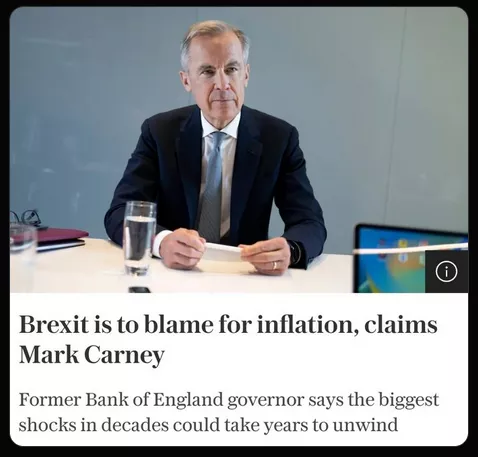

- ゼルダのゲームのリリースがインフレーションショックと関連付けられる。

- テイラー・スウィフトがインフレを引き起こしたとされる。

ビヨンセやテイラー・スウィフトがどうやって広範囲にわたる価格上昇を説明できると思いますか？全く意味がありません。要するに：

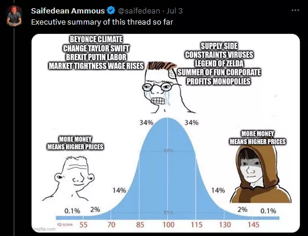

### インフレーションの種類の探求

異なるタイプのインフレーションを区別することは、この経済現象の様々な表れを理解する上で重要です。以下にこれらの異なるタイプを説明します：

- 徐々に進行するインフレーション：これは中央銀行が一般的に目指すインフレーションのタイプで、年間約2%に設定されています。この目標は1990年代から採用されており、経済成長を安定させつつ過熱やデフレを防ぐことを目指しています。
- 中程度のインフレーション：この形式のインフレーションは、インフレ率が2%の目標を超えた場合に発生します。これはしばしば経済の過熱状態と関連しており、過剰なマネーサプライが一般的な価格上昇を刺激します。このシナリオは金融政策の限界を露呈し、経済論議における矛盾を時に明らかにします。
- 急激なインフレーション：しばしば二桁のインフレーションと呼ばれる急激なインフレーションは、年間インフレ率が10%を超える場合に発生します。これは顕著な価格上昇を示し、経済の安定を損なう可能性があります。

- ハイパーインフレーション：ハイパーインフレーションは、インフレ率が月50%を超える極端な現象であり、インフレの指数関数的な性質により、年間インフレ率が13,000%を超えることに相当します。このレベルのインフレは経済を深刻に不安定にし、通貨をほぼ無価値にし、通貨システムへの信頼を失わせます。

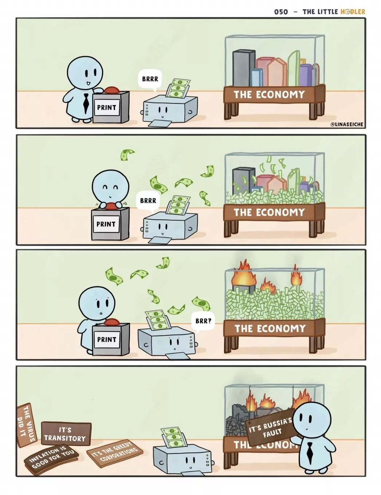

インフレーションの種類を探る際には、「需要引き起こし」と「コスト押し上げ」などの用語が教育資料でよく見られます。これらの概念は有効ですが、インフレーションを価格上昇の説明としてではなく、金融現象として解説します。こちらがより詳細な分析です：

- 需要引き起こし：
  需要引き起こしインフレーションは、経済内の需要が利用可能な生産を超える状況としてしばしば説明されます。しかし、マネーサプライの対応する増加がなければ、この状況は単に支出の再分配につながるだけです。消費者は必需品により多くのお金を使い、他のものには少なくなるため、全体的なインフレーション効果は中和されます。

- コスト押し上げ：
  一方、コスト押し上げインフレーションは、天然資源や労働などの生産コストの増加に起因するとされます。再び、マネーサプライの増加がなければ、あるセクターのコスト増加は単に他のセクターの支出を減少させるだけで、広範囲にわたるインフレを引き起こすことはありません。
これらの伝統的な説明は、しばしば価格上昇をインフレーションと結びつけますが、これは混乱を招くことがあります。実際には、広範なインフレーションが発生するためには、通貨供給の増加が必要です。この文脈では、需要引き起こしとコスト押し上げの概念が部門別の価格変動を説明することができますが、インフレーションの通貨的性質を捉えることはできません。これは、部門別の価格上昇と広範なインフレーションを区別する重要性を強調し、経済全体にインフレーションが現れるためには通貨供給の増加が必要であることを再確認します。この分析は、インフレーションの実際の原因についてより繊細で正確な視点を提供し、基礎となる通貨ダイナミクスを隠す可能性のある一般的な解釈を解明します。

### インフレーションの分類：Bernholzによる

Bernholzは、この複雑な通貨現象をより理解しやすくするために、インフレーションを三つのカテゴリーに分類する簡略だが正確な方法を提案しています：

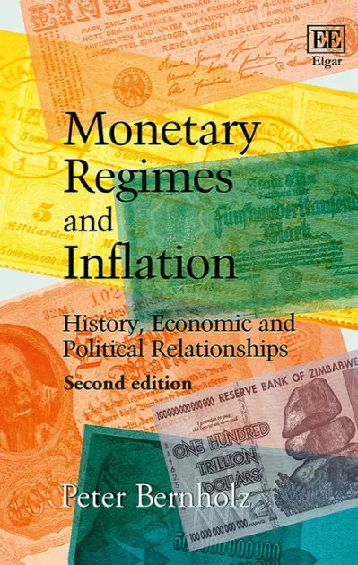

- 中程度のインフレーション：
  中程度のインフレーションは、通貨供給が通常よりも高い状態で発生しますが、国家が大規模な赤字を通貨創造によって賄うことはありません。"中程度"という用語は些細なものに思えるかもしれませんが、この形態のインフレーションは大きな問題を引き起こす可能性がありますが、高インフレーションとは分類されません。

- 高インフレーション：
  高インフレーションは、名目上の増加にもかかわらず、通貨供給の実質価値が減少する場合に発生します。この逆説的な状況は、通貨置換から生じ、個人が国内通貨に対する信頼を失い、商品、サービス、または外貨と交換しようとします。このプロセスは通貨の実質価値をさらに低下させ、インフレーションを悪化させます。

- ハイパーインフレーション：
  ハイパーインフレーションは高インフレーションの拡大形態であり、大規模な赤字を通貨創造によって賄うことが特徴です。歴史上、ハイパーインフレーションのケースは、通貨印刷による大規模な赤字資金調達なしには観察されていません。ハイパーインフレーションは悪循環を生み出します：インフレーションは通貨の価値を急速に侵食し、国家が税収を徴収する前に価値が減少してしまうため、さらに多くの通貨を印刷して自己資金を調達する必要があります。この自己強化サイクルは、月に50％を超える天文学的なインフレ率につながることがあります。
  Bernholzによるこの分類は、中程度のインフレーションからハイパーインフレーションへの危険な進行を強調し、破壊的なインフレーションの渦を防ぐためには通貨および予算管理が極めて重要であることを示しています。また、ハイパーインフレーションの段階に達する前に、国家の資金調達に悪影響が出ることも示しており、インフレーションがさまざまな程度で持つ意味について洗練された視点を提供しています。

### 結論：インフレーションのタイプの要約

結論として、私たちは「這うインフレーション」、「歩くインフレーション」、「走るインフレーション」といった一般的に聞かれる用語から始まり、経済内の異なるインフレーションのパーセンテージを示す各用語を探求しました。しかし、ハイパーインフレーションに関する私たちの詳細な研究では、Bernholzによって説明された中程度のインフレーション、高インフレーション、ハイパーインフレーションのカテゴリーが重要なベンチマークであることが証明されました。

- 中程度のインフレーション：
  これは通常よりも高い通貨供給レベルを示しますが、このレベルは国家による重大な赤字資金調達なしに維持することができます。

- 高インフレーション：
  これは、個人が自国通貨を商品、サービス、または他の通貨と交換しようとする通貨置換が原因で、通貨供給の実質価値が減少する場合に発生します。

- ハイパーインフレーション：
  これは高インフレーションの極端なバージョンであり、大規模な赤字を賄うための過剰な通貨創造によって通貨の実質価値が急速に侵食されます。
私たちの探求から浮かび上がるのは、ハイパーインフレーションが複雑で直感に反する現象であるということです。多くの人がハイパーインフレーションは通貨供給量の大幅な増加が原因だと考えがちですが、実際にはその通貨供給の実質的価値の減少に起因しています。このニュアンスは、なぜ一部の国々が世界銀行やIMFなどの国際機関の支援を受けてもハイパーインフレーションから抜け出すのが困難なのかを理解する上で重要です。インフレーションの種類を誤って特徴づけることは、不適切な対策を適用し、経済問題を悪化させる可能性があります。

今後の議論では、ハイパーインフレーションについてさらに深く掘り下げ、さまざまな経済状況での定義と現れ方を探求します。私たちの目標は、ハイパーインフレーションの根底にあるメカニズムを明らかにし、それに対処するための潜在的な解決策を探ることです。この洗練された理解により、関連する課題をよりよく把握し、インフレーション管理のための情報に基づいた戦略を提案することができます。
ご清聴ありがとうございました。次回のセッションは、ハイパーインフレーションを定義し、解明することに完全に捧げられます。異なる学術的および実践的視点を考慮に入れて行います。次回の会議でこの探求を続けることを楽しみにしています。

# ハイパーインフレーションとは何か？
<partId>3f541663-1e2f-5410-8ee0-f61c5d009fa5</partId>

## ハイパーインフレーションの定義
<chapterId>d2a71a2e-5f36-58d9-993c-d431f4aa07fd</chapterId>

### ハイパーインフレーションの定義

このセクションでは、極端な通貨現象の研究において重要な用語であるハイパーインフレーションのさまざまな定義を探ります。最も認知されている定義は、フィリップ・ケーガンが1956年の著作『ハイパーインフレーションの通貨ダイナミクス』で提案した定量的理解です。ケーガンによると：

- ハイパーインフレーションの始まりと終わり：
  - ハイパーインフレーションは、月間インフレ率が50%を超えたときに始まります。
  - インフレ率が少なくとも1年間月50%以下に落ち込むと終了します。

例えば、7月にインフレ率が40%に下がり、翌年の7月まで50%を超えなければ、ハイパーインフレーションの期間は前年の7月に終了したと考えられます。この定義により、ハイパーインフレーションのエピソードを正確に特徴づけ、構造的な分析を可能にします。

この定義は、ハイパーインフレーションの56エピソードを記録したハンケ・クルス表で採用されています。ただし、この表は2016年のベネズエラのようなすべてのエピソードをカバーしているわけではなく、合計で57になります。

ズーム

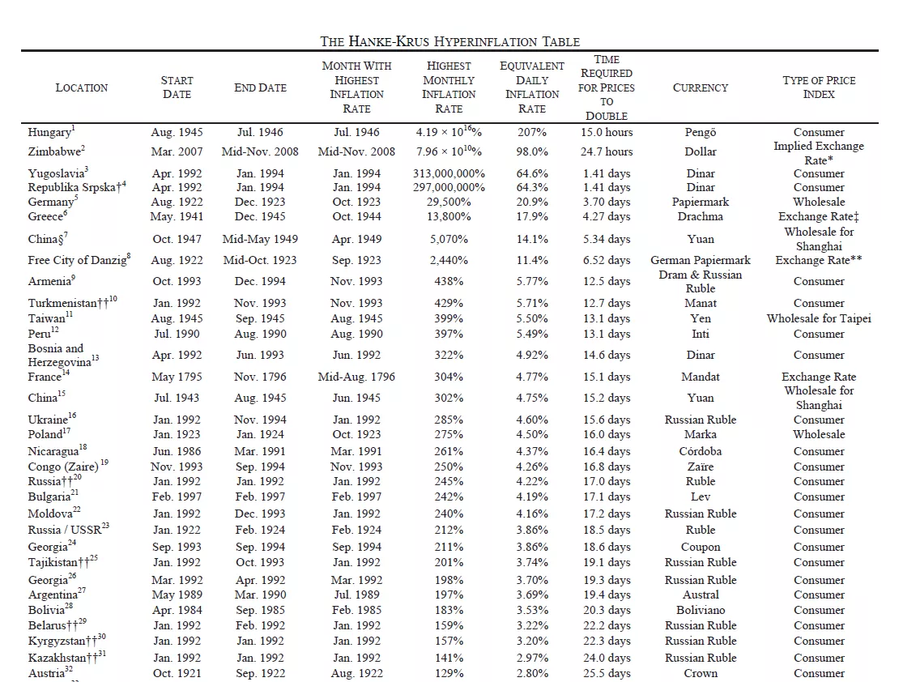
この定義は正確ではありますが、50%の厳格な閾値のために特定のハイパーインフレーションのエピソードを除外する可能性があります。ケーガンの基準を厳密に満たしていないものの、極端に高いインフレーションの期間を表す他のエピソードを含めるためにこの定義を拡張する可能性があります。この観察は、ハイパーインフレーション現象のより広範な探求の扉を開き、その原因と影響のより洗練された理解を可能にします。次の議論では、この定義を見直し、ケーガンの厳格な基準によってカバーされていないハイパーインフレーションのエピソードを検討することを検討します。

### ケーガンによるハイパーインフレーションの定義

フィリップ・ケーガンは、ハイパーインフレーションを定義する際に月間50%のインフレ率という任意のマイルストーンを設定したかもしれません。彼自身がこの定義は任意であり、主に彼の分析に基づいていると認めています。ケーガンのデータを調べると、最も低い月間インフレ率を持つハイパーインフレーションの3つのエピソードは、それぞれ約47%、46%、および57%でした。この50%の閾値は、彼の研究でこれらのケースを包含するために選ばれたようです。

- 歴史的背景：
カーガンの定義は1956年にさかのぼり、当時利用可能だった限られたハイパーインフレーションのエピソードに基づいています。
- カーガンの観察：
  カーガンによると、約50％の閾値に達したエピソードは、さらに深刻なハイパーインフレーションに進行せずにはいられなかったため、この閾値の選択が正当化されるとされています。

- カーガンの定義への批判：
  「Monetary Regime and Inflation」の著者であるベルンホルツなど他の経済学者も、50％の閾値を恣意的であると述べています。
  ベルンホルツは、50％の閾値に達しないハイパーインフレーションのエピソードと同じ質的特徴を持つ高インフレーションのエピソードが存在することを指摘しています。

この考察は、伝統的なハイパーインフレーションの定義の硬直性に疑問を投げかけ、さらに多くのエピソードや歴史的データを取り入れてこの閾値を見直す必要があることを浮き彫りにします。ハイパーインフレーションの定義は、異なる経済的および歴史的文脈での極端なインフレーションのさまざまな表現を包含するための柔軟性が求められるかもしれません。

### 国際会計基準審議会（IASB）によるハイパーインフレーションの定義

では、ハイパーインフレーションのケースは合計でいくつあるのでしょうか？
カーガンが提唱する月間インフレ率50％というハイパーインフレーションの一般的な定義は、時に混乱を招くか過度に単純化されることがあります。例えば、それぞれ年間インフレ率が1,000％と3,000％の二国が、このインフレの月間分布によって異なって捉えられる場合があります。カーガンの定義によれば、50％の閾値を超える月がなければ、これらの国はハイパーインフレーションの状態にはなりません。このアプローチは、年間を通じた累積インフレを比較する際に、ハイパーインフレーションの分類において異常を引き起こす可能性があります。

- カーガンの著作「Monetary Dynamics of Hyperinflation」は、ハイパーインフレーションの基本的な分析を提供しています。
- ベルノルドの著書は、ハイパーインフレーションの30の異なる期間を研究し、分析の範囲を拡大しています。
- デイビッドの個人的なコレクションには、ハイパーインフレーションの36の期間の紙幣が含まれており、具体的かつ歴史的な理解を可能にします。
- ハンキー・クロス表（2012年版、2016年にベネズエラを加えて更新）は、カーガンの定義に基づいて57のハイパーインフレーションの期間をリストアップしています。

特定の歴史的な高インフレの期間が、厳格な分類基準のために、古典的なハイパーインフレーションの表に含まれていないことがあります。例えば、1779年11月のアメリカ独立戦争中や、1864年3月の南北戦争中の月間インフレ率はそれぞれ47.4％と40％でした。これらの率は高いものの、カーガンによって定められた50％の閾値を超えていないため、これらの期間はハイパーインフレーションとして分類されることはありません。この省略は、厳格な定義の限界を示し、ハイパーインフレーションをその複雑さの中で理解するためのより繊細なアプローチが必要であることを強調しています。

## ヴァイマール共和国とジンバブエの類似点
<chapterId>11eef458-aab8-5c63-8523-264d0ba69f5d</chapterId>

### 二つの時代、二つの災害

この章では、ハイパーインフレーションの影響に焦点を当て、特にジンバブエとヴァイマール共和国のケースを探求します。私の研究では、純粋に経済的または統計的なアプローチではなく、これらのハイパーインフレーションの期間を生き抜いた個人からの直接的な証言の探求を優先しています。

いくつかの書籍が特に有益でした：

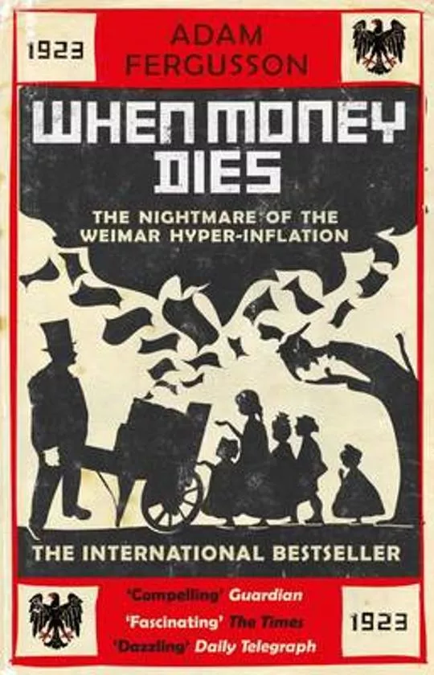
- 「When Money Dies」はアダム・ファーガソンによる著作で、第一次世界大戦後のドイツ、オーストリア、ハンガリーにおけるハイパーインフレーションを追跡しています。
- ジンバブエのハイパーインフレーションに関する2冊の本、「Zimbabwe Warm Heart Ugly Face」と「Hard Boiled Egg Index」は、それぞれジェローム・ガードナーとクズアイ・ジョセフ・ゴウ・ミンユによって書かれ、衣料品店チェーンのCEOと農業銀行家がこの激動の時期に経験したことについての感動的な証言を提供しています。
  

ノートをまとめる中で、ジンバブエとワイマール共和国のハイパーインフレーションの経験には多くの類似点があることに気づきました。これらの類似点は、90年の時を超えても、経済的な災害への進行を示す13の例を含む約17の類似点を特定しました。これらの興味深い類似点は、時間と国境を超えたハイパーインフレーションの繰り返しと破壊的な性質を示しています。今日は、これらの類似点と、ハイパーインフレーションの期間中に示される懸念すべき軌跡を検討します。

### 比較分析：ジンバブエとワイマール共和国

14の違いのゲーム！

1. 通貨不足

通貨が目まぐるしい速度で減価すると、新しい紙幣を市場に大量に投入するという野心的な試みでさえ不十分になることがあります。具体的な通貨に対する絶え間ない需要は、中央銀行が紙幣を生産する能力をはるかに超えることがあり、前例のない流動性危機を引き起こします。

> ワイマール:「今月中には、ほぼ40億紙幣マークに増加する予定で、これにより通貨不足が確実に克服されることを期待しています。」

> ジンバブエ:「2002年から2009年1月まで、いくつかの重大な流動性不足がありました。インフレーションが急上昇する中で、印刷された紙幣や流通している紙幣が十分ではありませんでした。」

2. 「そしてそれは肥料だ！」

特定の経済状況で通貨が価値を失う速度は驚くべきものです。記録的な時間で天文学的な量の紙幣が発行され、かつてはかなりの額だったものが肥料のような無価値なものに一瞬で変わることがあります。

> ワイマール:「現在の総発行額は63,000億に達しています。数日以内に、総流通の三分の二を一日で発行することができるでしょう。」

> ジンバブエ:「2006年9月17日、RBZのゴヴァナー、ギデオン・ゴノは次のように宣言しました。「まだ10兆が外に出ており、それは肥料になっています。」」

3. 紙の価値を下回る紙幣
   特定の経済状況では、紙幣の本来の価値がそれを印刷した紙の価値を下回ることがあります。この劇的な減価は、通常は価値と購買力の象徴である紙幣を、単なる価値のない紙切れに変えてしまいます。
   > ワイマール:「マーク紙幣の全面額が印刷された瞬間にほとんど価値がなくなりました。」

> ジンバブエ:「中央銀行は、印刷された紙幣が紙の価値を下回るほど無駄なお金を浪費しました。つまり、その価値はトイレットペーパーよりも低かったのです。馬鹿げているように聞こえるかもしれませんが、ZWD 100兆紙幣をトイレットペーパーとして使用する方が、実際のトイレットペーパーを購入するよりも安かったのです。」

4. お金の数え方

通貨が急速に価値を失うと、最も単純な取引でさえ手間のかかる作業になることがあります。商品の価格を計算するだけでなく、支払いに必要な紙幣を数えるのに数分かかることがあり、日常のやり取りに複雑さを加えます。
ヴァイマール: 「店でのごく普通の購入には、計算に3、4分かかり、価格が決まると、通常、紙幣を数えるのにさらに数分を要しました。」

ジンバブエ: 「店のマネージャーは、一日中お金を数えるスタッフの代わりに、臨時の従業員を雇うことも許可されていました。もちろん、店内でのお金の計算や銀行への預金は一つのことですが、その全プロセスは銀行での預金時に再び繰り返されなければなりませんでした。」

ウズベキスタンのお金数え技術

5. 小切手による支払い

経済が混乱している場合、小切手のような伝統的な支払い方法はすぐに効力を失うことがあります。ハイパーインフレーションによる通貨需要の増加に圧倒された銀行は、小切手の現金化を制限または遅延させることがあり、その実質的な価値を減少させます。この不安定さはしばしば支払い方法の優先順位を変え、支払い方法によって価格が変動することがあります。

ヴァイマール: 「価格の上昇は、国家や他の雇用主による通貨の需要を強化しました。私立銀行はその需要に全く応えることができず、小切手の現金化を制限しなければならず、現金化されない小切手は凍結されたままで、その購買力は減少し続けました。」

ジンバブエ: 「時間価値のお金は、商品やサービスに三つの価格を生み出しました。すなわち、現金価格、リアルタイムグロス決済価格、そして小切手価格です。最終的には、小切手を受け入れる者は誰もいなくなり、クリアには5日かかりました。」 6. 「バーナー起業家」

通貨の価値が低下するにつれて、市場の歪みを利用する新たな経済的機会が現れます。これらの起業家は、しばしば「バーナー起業家」という創造的な名前で呼ばれ、価値の低下した通貨を借りて有形資産に投資し、さらに価値の低下した通貨で借金を返済することで繁栄します。

ヴァイマール: 「インフレに対する投機は、紙幣を借りて商品や工場に変え、その後、価値が下がった紙幣で貸し手に返済することを含んでいました。」

ジンバブエ: 「バーナー起業家」

7. 誠実さと勤勉さが魅力を失う

経済的に不安定な状況では、勤勉、倹約、誠実といった伝統的な価値観が、急速に富を築く魅力によって影を潜めることがあります。投機や通貨取引は、通常の仕事よりもはるかに高い報酬を提供することが多く、社会の優先順位に混乱をもたらします。

ヴァイマール: 「倹約、誠実さ、そして勤勉といった古い美徳が魅力を失い、誰もが特に通貨や株の投機が明らかに仕事よりもはるかに多くをもたらす可能性があるため、急速に富を築こうとしました。」

ジンバブエ: 「これらの慣行は、少数の個人を豊かにする一方で、都市の労働者階級や農村部の人々を貧困化させました。教育は価値を失いました。この取引は、教育や勤勉さを正当化する必要のない人々によって推進されました。彼らに必要だったのは、簡単なお金のビジネスを始めるためのコネと初期資本だけでした。」

8. 「世界銀行」

ハイパーインフレや通貨危機の状況では、外国通貨の並行および非規制市場がしばしば広がります。これらの非公式の「銀行」は、しばしば「世界銀行」とか他の地元の名前でユーモラスに参照され、資産の価値低下から逃れようとする人々にとっての避難所を提供します。これらの市場は必要な経済的支援を提供することができますが、公式の金融機関や政府の政策に対する広範な不信を強調することもあります。
ヴァイマール: 「彼らの取引は主に、インフレと共に現れたいわゆるWinkelbankiers、通りのオペレーターを通じて行われ、病んだ経済で繁栄し、外国通貨の買いと売りの価格差を利用して生計を立てていました。」
ジンバブエ：「彼らは通貨交換業者でもありました。彼らはブラワヨの2番街と6番街、フォートストリート間で、汚職やその他の手段を駆使した巧妙なビジネススキルのおかげで、罰せられることなく活動していました。この地域は「ワールドバンク」として知られていました。」

アルゼンチン：「だから私は全てのアルゼンチン人が行く場所、フロリダ地区のブエノスアイレスの中心にある「cuevas」、つまり「洞窟」へ行きました。」 - TheBigWhale

9. 通貨交換の違法化

政府は自国の通貨を安定させ、資本の流れをコントロールするために、これらの外国通貨取引を違法にすることがあります。これらの抑圧的な措置は、国民経済を保護する意図があるものの、しばしば逆効果を生じ、公衆の不信を悪化させ、ブラックマーケットを助長することがあります。

ヴァイマール：「人々は物々交換に頼り、次第に唯一信頼できる交換手段として外国通貨に頼るようになりました。外国為替の購入や国内支払いに外国通貨を使用することに関する新しい法令が導入されました。違法取引の金額の最大10倍の罰金が科されることもありました。」

ジンバブエ：「ビジネスへの襲撃が行われ、ブラワヨの複数のビジネスマンが週末に投獄され、回収された外国通貨の2倍に相当する罰金が科されました。その後、この勇気は衰えました。」

10. 資本規制

国が通貨危機や経済危機に直面した場合、政府がとる一般的な対応の一つは、資本の動きや形態に厳格な制御を加えることです。価値が下がった国内通貨の受け入れを強制する命令や、特定の支払い方法を拒否する者に対する厳しい制裁を通じて、これらの措置はしばしばパニックを抑え、信頼を回復することを目指します。しかし、その効果はまちまちであり、時にはこれらの措置が逆効果になったり、市民が経験する現実から乖離していることがあります。

ヴァイマール：「商人たちは最近、新しい法令により国家銀行紙幣を受け入れることを強制されましたが、外国通貨をすべての購入に引き続き使用できるようにもされていたため、商人たちはほとんど他のものを受け入れない理由を見つけました。」

ジンバブエ：「政府は2008年12月12日にSI 175/2008を導入し、小切手による支払いに関して述べています。それには、「小切手/銀行カードまたはその他の銀行仲介の電子支払い方法を拒否した場合の罰則は、レベル8の罰金または6ヶ月の懲役、あるいはその両方とする」と記されています。明らかに、私たちはSIを無視しました。それは現実と完全にかけ離れていたからです。」

11. 店を開け続けることを強制される

経済が崩壊し、通貨が価値を失うと、政府は正常性の外観を維持するために極端な措置に訴えることがあります。

ヴァイマール：「活動を続ける商人たちは、10月22日に制定された新しい条例により、店を開け続け、紙幣と引き換えに商品を提供することが求められました。」

ジンバブエ：「空の鋼の棚と冷蔵庫、クーラー、フリーザーだけが残されました。その悲劇は、政治的緊張と政府の価格管理部隊によるリーダーの逮捕の恐れから、店を閉めることができなかったため、店がまだ開いていたことでした。速やかな解決があると思っていたため、従業員も解雇されませんでした。」

12. すべての人が犯罪者

経済が崩壊し、規制が蔓延する中で、生存と犯罪の境界線は曖昧になります。

ヴァイマール：「国家に対するすべての犯罪は、個々の生存のための問題となり、それぞれが異なる程度で発生しました。」
ジンバブエ：「ジンバブエのすべての住民は犯罪者でした。厳しい言い方かもしれませんが、それが真実です。生活のあらゆる側面を規制する無数の小さな法律があったため、誰もが毎日法律を破ることは避けられませんでした。2004年に公表されたSIによると、外国通貨を所有することは違法でした。日々の引き出し限度を回避するために複数の銀行口座を持つことも違法でした。車のナンバープレートが正しくない、またはカーラジオのライセンスや発電機の許可がないことも、どこかの誰かが破っていた法律でした。」13. どんな価格でも外国通貨を購入する外国通貨の熱狂的な購入は、通常、通貨価値の下落を悪化させ、本質的価値の低下を加速させる通貨切り下げの重要な転換点となります。

ヴァイマール：「マンハイマーは、上司の指示で1921年8月に外国通貨をどんな価格でも購入し始めました - "ドイツには無限の紙幣があったが、外国通貨はなかった"という理由からです。これはマルクの価値が完全に崩壊する最初の兆候でした。」

ジンバブエ：彼らには日々の目標が課されていたとされています。一部の外国為替要件は緊急であり、期限までに外国為替を蓄積するためにどんなレートでも購入していました。この疑わしい実践は、ジンバブエドルの価値が急激に下落し続ける中で、通貨切り下げの火に油を注ぐと非難されました。」

### プロセスの要約

経済軌道を分析すると、高インフレが達成されると、通貨量の価値が劣化することが明らかです。この切り下げは、銀行券の不足を含むいくつかの問題を引き起こします。この文脈では、特に為替レートの変動により、アービトラージの機会が生じます。その結果、多くの個人が将来の通貨切り下げによって弱体化した通貨で借金を返済できるように、有形資産への投資を重ねます。この経済環境は、伝統的な職業の魅力を損ない、結果として社会的結束を侵食します。

この状況に対応して、政府は厳格な規制を課し、資本規制を含む法律を施行します。また、商人に国内通貨と小切手の受け入れを義務付けます。時間が経つにつれて、犯罪行為の定義を拡大する新しい法律が制定されます。最終的には、政府はより堅牢な外国通貨と交換するために、低コストで印刷された自国通貨の為替レートを指数関数的に上昇させます。

### ハイパーインフレの結果の類似点

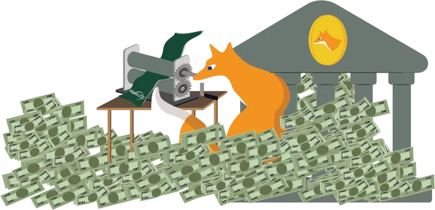

1. 石油と金属

ヴァイマール時代のドイツでは、貴重な素材の盗難が頻繁に発生し、屋根の鉛がしばしば盗まれました。ジンバブエでは、絶望が一部の人々を動かし、変圧器から油を抽出して車に使用するために電力網を中断させました。
資源の不足と経済の悪化の文脈では、政府は必需品の配布を制御するために配給制度を実施する場合があります。これには、ガソリンや燃料の購入を規制するためのクーポンやバウチャーの使用が含まれます。

> ヴァイマール：「ベルリンでは、ガソリンの不足のために、その配布を規制するクーポン制度が導入されました。各市民には特定の量のクーポンが割り当てられ、限られた量の燃料を購入することができました。」

> ジンバブエ：「燃料危機の間、政府はガソリンの配布を管理するためにクーポン制度を導入しました。各個人には特定の数のクーポンが与えられ、それを一定量の燃料と交換することができました。」
人々は取引のための安定した代替手段を求めています。ヴァイマールでは、その一定の固有価値のために、真鍮や燃料が交換手段として使用されました。ジンバブエでは、ジンバブエドルの急速な価値下落に直面し、必需品の一定量を表すガソリンクーポンが事実上の通貨となりました。これらの状況は、極端な経済状況に適応し、貿易と経済を維持するための革新的な解決策を見つける社会の様子を浮き彫りにします。
ヴァイマール: 「物々交換はすでに一般的な交換形態でしたが、今では真鍮や燃料が購入や支払いの一般的な通貨となりました。」

ジンバブエ: 「私たちはこれらのバウチャーを使用して家賃を大家に支払い、市の税金、電話料金、実際にはほとんどすべての支払いに使用しました。なぜなら、誰もがジンバブエドルや小切手での支払いを受け付けなくなったからです。」

#### 結論

これにて、ジンバブエとヴァイマール共和国のハイパーインフレーション期間中の経験の類似点に関するこのビデオを終了します。次のビデオでは、違いと現代の類似点について議論します。ありがとうございました。

## ヴァイマール対ジンバブエ：違いと現代の類似点
<chapterId>643f279c-d89f-5600-a2e2-b1bbbba0ab69</chapterId>

トランスクリプト:

この章では、過去と現在のハイパーインフレーション期間の違いと現代の類似点を、逸話と今日に関連する比較を交えて探求します。

### ヴァイマール共和国とジンバブエの違い

1. ドルのせいだ！

ドイツでは、インフレーションをドルの上昇のせいにするのが一般的でしたが、自国通貨の固有の価値下落を認めることはありませんでした。多くの人々は、観察された現象がドルの評価上昇によるものだと信じていました。この認識は、経済困難と通貨価値の下落との関連を認めないものでしたが、主に過剰な通貨発行によって引き起こされました。「When Money Dies」という本は、ドイツの人々の理解不足を明確に示しています。対照的に、ジンバブエでは状況が異なり、市民は自らが経験しているハイパーインフレーションの根本原因を十分に認識していました。

2. 必要通貨（Notgeld）

金融および経済危機に直面して、ドイツは「Notgeld」（緊急通貨）に訴えました。これらの紙幣は、一般的な通貨の不足に対処するために、都市や特定の企業によって印刷されました。
興味深いことに、フランスも特に1920年代にNotgeldに訴えました。この取り組みは、ハイパーインフレーションの直接的な結果だけでなく、第一次世界大戦による混乱にも根ざしていました。戦争は経済を不安定にするだけでなく、金属のコストを増加させました。その結果、金属コインの固有価値はしばしば額面を上回り、人々はそれらを貯蓄するようになりました。コインが不足したため、リヨン商工会議所などの一部の機関は自らのNotgeldを印刷しました。

> 「やるべきことはやらなければならない。」 - 地元のことわざ

特に注目すべきNotgeldの一つに、心を打つイラストが特徴の紙幣があります。中央には、マルクを排泄している個人が描かれています。裏面には、1913年から1921年までのインフレーションの上昇を示す価格表があります。

このNotgeldの背後にいるアーティストは、ハイパーインフレーション危機に対する当局の責任を皮肉った批評を行っているようです。紙幣には「必要は法を知らない」という言葉が記されています。Notgeldの発祥地に特有のもう一つの表現は、「やるべきことはやらなければならない」と述べています。

> 「必要は法を知らない」
最初のシットコイン：逸話的には、銀行券の中央のイラストを見ると、個人の行動によって通貨が文字通り価値を下げられているため、これを最初の「シットコイン」と呼ぶことができるでしょう。

### 債券と抵当

ヴァイマールでは、インフレの影響を補償するために一部の債務が再評価されました。この措置はジンバブエでは採用されませんでした。

> ヴァイマール：「1925年に政府所有のローンの再評価を決定する法律が成立し、すべての賠償が支払われた場合、株主は初期投資の2.5パーセントを受け取ることになりました。」

> ジンバブエ：「2007年7月（3年後）、私はポケットから価値が下がったZDW 500,000（bt "000"）の紙幣を取り出すことができ、その時の並行市場レートで1.67ドルの価値がありました。この紙幣で、本来20年かけて返済するはずだった抵当ローンを返済することができました。さらに、この紙幣は同月の私の月給の0.49パーセントにしか相当しませんでした。」

ドイツの危機管理についてさらに学ぶために、この本も必須です。

### 現代の類似点

1. 経済を制御するための金融政策の操作。
   ヴァイマール共和国の歴史では、産業家たちがマルクの価値上昇を望まなかったことが明らかです。彼らは大幅に価値が下がった通貨で借金をして、それを返済することで、ほとんど無償で巨大な産業施設を建設することができました。これらの産業家はマルクの価値上昇を恐れ、それが彼らの活動を妨げると考えました。一部の人々は、激しいインフレが雇用を保証するものと信じていましたが、このインフレが貯蓄や経済全体に与える悪影響には気づいていませんでした。これらの経済アクターにとって、通貨発行は祝福でした。

> ヴァイマール：「これがマルクの価値上昇が非常に恐れられた理由であり、ジェノア後の数週間の『安定』でさえビジネスの停滞を引き起こしました。」

> ヴァイマール：「産業界は、現金が商品よりも価値があるという危険に直面し、誰もが資産を現金に変えようとすると崩壊が起こることになりました。」

クリスティーヌ・ラガルドの発言との現代的な類似性が描かれています。彼女は市民が貯蓄の保護よりも雇用の見込みを優先すべきだと提案しています。ヴァイマールの産業家たちのように、彼女も雇用を刺激するツールとしての通貨発行を支持しているようですが、それは貯蓄の価値を犠牲にしています。

> クリスティーヌ・ラガルド：「私たちは、貯蓄が保護されることを見るよりも、仕事を持っていることを嬉しく思うべきです。」

2. 紛争時の私有財産。

ヴァイマール共和国の歴史は、この時期に海外に保持されていた資産や資本が没収されたことを明らかにしています。この措置は、特に紛争の始まりにおいて、ロシアでの最近の出来事を思い起こさせます。これらの状況は、危機の時には私有財産の尊重が妥協される可能性があるという懸念すべき現実を浮き彫りにします。これは、危機が個人の権利に及ぼす可能性のある影響を強調する歴史的および現代的な類似点です。

> ヴァイマール：「海外に保持されていたすべてのドイツ資本が没収されました。」

> [20minutes.fr](https://www.20minutes.fr/monde/3286947-20220513-guerre-ukraine-geler-avoirs-russes-vol-non-redistribuer-kiev-poserait-lourdes-questions)：「西側の制裁の一環として、ロシア中央銀行が保持していた6400億ドルのうち、約3000億ドルのロシアの準備金が実際に凍結されました。」

3. 市場価格の概念。
   > ヴァイマール：「ゾンビ企業」
現代：「ゾンビ企業」> ワイマール：「安定化は、起業家が他人の費用で好きなだけ借り入れることができた時代に終止符を打ちました。通貨の豊富な時期に作られたり発展したりした多くの企業が、資本が不足するとすぐに生産性を失いました。」

ゾンビ企業とは、通常の市場状況下では支払い不能または破産寸前であるにもかかわらず、低コストの借入によって主に運営を続ける企業のことです。これらの企業は、債務をカバーするだけの収益を上げることができますが、大きく成長することはできません。

ゾンビ企業の概念は新しいものではありません。実際、それはワイマール共和国の時代にも存在していました。当時、多くの企業が繁栄しているように見え、無料のクレジットへのアクセスから大いに恩恵を受けました。彼らは大量の資金を借り入れ、後にインフレによって通貨が減価することを見込んで返済する予定でした。しかし、インフレが止まり、ドイツマルクが価値を回復すると、これらの企業は実際には運営上および財務上で実行可能ではなく、利益を出すことができず、閉鎖せざるを得なくなりました。

ゾンビ企業の現象は、ドイツの戦後史に限定されるものではありません。今日でも、多くの大企業が非常に低い利息のクレジットへの特権的なアクセスのおかげで生き残っています。もし彼らがより一般的な利率で借り入れなければならなかったら、多くの企業は利益を出すことができなくなるでしょう。これは特に2023年において関連があります。長期にわたるほぼゼロの利率の時期の後、利率が上昇し始めました。この金融風景の最近の変化は、かつて「ゾンビ」と呼ばれたこれらの企業にとって決定的な試練となることでしょう。

5. 速攻で金持ちになる！

歴史を通じて、ワイマールやジンバブエでのアービトラージのように、個人が速攻で金持ちになろうとする瞬間がありました。今日、私たちは特定の暗号通貨の出現とともに同様の傾向を見ています。人々は急激な利益を求めてリスクを冒し、投資の指数関数的な増加を期待しています。このアプローチは、ハイパーインフレの時期にアービトラージが使用され、しばしば他人の費用で速やかな利益を得ることが観察されるのと似ています。

6. 不確実性に対する治療法としての貯蓄

> 資本と収入の価値の絶え間ない浸食と、将来に対する不確実性の侵略的で破壊的な影響。
> 資本の価値の浸食が社会的結束に及ぼす破壊的な効果と、それが生み出す不確実性を強調する引用を紹介するのは興味深いです。それは次のように述べています：「資本と収入の価値の絶え間ない浸食と、将来に対する不確実性の侵略的で破壊的な影響。」

家族や大切な人を守りたいと考えるシナリオを想像してください。あなたは一生懸命働き、未来の不確実性に備えてお金を貯めます。もし全てが予測可能であれば、貯蓄は無意味です。しかし、予期せぬことが起こると、例えば車が故障した場合、貯蓄は命綱となります。それは世界の不確実性を減らします。しかし、ハイパーインフレの時期には、貯蓄は挑戦となります。お金はすぐに価値を失い、長期計画を立てることが困難になります。この財政的不安定はストレスや不安を引き起こす可能性があります。

今日、購買力の低下に直面して、投資が主流となっています。しかし、このアプローチには独自のリスクが伴います。貯蓄は常に不確実性に対する治療法でした。予期せぬ状況を管理するための財政的な予備を持つことは、心の平穏に寄与し、社会的結束を強化します。結論として、私たちの購買力を守ることは、社会的および個人的な安定を維持するために不可欠です。

## ラテンアメリカの通貨再建
<chapterId>918eafd7-409d-5205-ad52-a52e63b23a64</chapterId>

さまざまな時期のラテンアメリカ諸国の通貨再建について見ていきましょう。

### グラフの説明
スライドの左側には、通貨再建の年、新しい通貨の名前、および旧通貨との交換レートが記載されています。アルゼンチンの例を取ると、以前の通貨であるペソ・レアルからペソ・モネダ・ナシオナルに25対1のレートで変換されました。この文脈で、我々はアルゼンチンの通貨の時間経過に伴う進化を検討します。さらに、各期間の紙幣の初期および最終面額を示します。
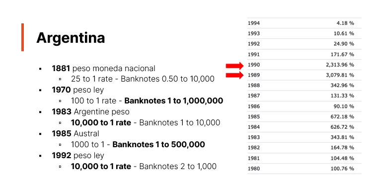

スライドの右側には、インフレーションのグラフがあります。赤い矢印は、カガンの基準によると月50％のインフレーション率で定義されるハイパーインフレーションの年を表しています。この基準は時に曖昧な解釈を招くことがあり、厳格なハイパーインフレーションの定義を満たさない高インフレーション率の年があります。
インフレーション期間中の通貨再建は、政府によってよく取られる措置であることに注意すべきです。しかし、これはインフレーションやハイパーインフレーションの根本的な問題を解決するものではありません。これは単に通貨の名前を変更し、ゼロを取り除く方法に過ぎず、ハイパーインフレーションの根本原因である貨幣供給の拡大には真に対処していません。後のビデオで、ハイパーインフレーションの問題を解決するための実際の解決策について議論します。このシリーズでは、適切な改革なしに単純な通貨再建の結果としてインフレーションが持続することを強調します。
アルゼンチンに続いて、我々の研究はブラジル、ボリビア、ペルー、ニカラグア、ベネズエラをカバーします。これらの国々で行われた通貨再建を検討します。

### アルゼンチン

1826年以前、アルゼンチンはスペインドルを使用していました。1816年の独立後、スペインのレアルに基づいた独自の通貨を導入し、類似の通貨が作られました。表は1881年、最大10,000の紙幣を持つ「ペソ・モネダ・ナシオナル」の導入年から始まります。これに続いて「ペソ・レイ」が導入され、100対1のレートで交換され、最大100万の紙幣がありました。その後、「アルゼンチン・ペソ」が登場し、10,000対1の交換レート（4つのゼロを取り除くことに相当）で、最大10,000の紙幣がありました。1985年には「アウストラレス」が導入され、1,000対1の交換レートで、最大500,000の紙幣がありました。1992年には現在の「ペソ・レイ」が10,000対1のレートで確立され、再び4つのゼロが取り除かれました。1989年と1990年だけがハイパーインフレーションを経験しました。

### ブラジル

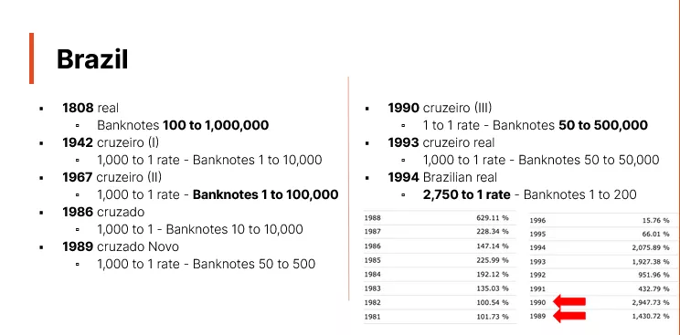

ブラジルは通貨再建の象徴的なケースであり、その通貨変更の歴史によって示されています。独立前、ブラジルはポルトガル・レアルを使用していました。しかし、1747年から早くも独自の「ブラジル・レアル」を使用し始め、1822年の独立宣言よりも前です。表は1818年から始まり、ブラジル紙幣の発行が始まった年を示しています。それ以前は、通貨は主に硬貨の形でした。これらの紙幣は最大100万レアルに達しました。
1942年から、ブラジルは一連の通貨再編を開始しました。ほとんどの場合（1942年、1967年、1986年、1989年、1993年）での交換レートは1,000対1でした。1990年には、交換なしで名称変更が行われました。これらの通貨の順序は以下の通りです：
- 1942年までのレアル（旧バージョン）。
- 1942年のクルゼイロ。
- 1967年のクルゼイロ（新バージョン）。
- 1986年のクルザード。
- 1989年のクルザード・ノーボ。
- 1990年にクルゼイロへ戻る。
- 1993年のクルゼイロ・レアル。
- 最終的に、1994年のブラジル・レアル。

最高額紙幣は500,000に達し、1994年の最後の再編は2,750対1のレートで行われました。1989年と1990年はハイパーインフレーションが特徴で、1993年から1994年にかけてはハイパーインフレーションの閾値（月50％）に達することなく高インフレーションが見られました。この激動の期間の後、ブラジルは再びいくつかのゼロを取り除くことで通貨を再編しました。

### ボリビア

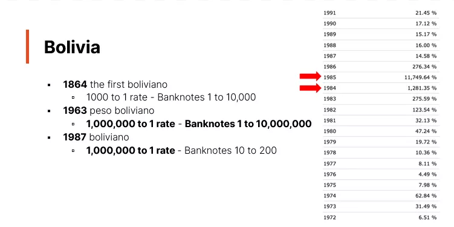

ボリビアも、激しいインフレーションの時期を経験し、通貨再編が必要とされた国の一例です。以下はその通貨史の概要です：

1825年の独立前、ボリビアはスペインドルを通貨として使用していました。独立後、国は1827年から1864年にかけてスペインドルに代わるボリビアン・ソルを導入しました。ただし、ボリビアで最初の紙幣が登場したのは1864年であることに注意が必要です。

1864年には、ボリビアン・ソルに対して1,000対1の交換レートで最初の「ボリビアーノ」が導入されました。この通貨は10,000ボリビアーノの額面に達するまで流通しました。
その後、ボリビアは「ボリビアン・ペソ」に通貨を変更しましたが、この通貨は激しいハイパーインフレーションを経験し、最終的には最大1,000万の額面に達しました。このインフレーションのピークは1984年から1985年にかけてで、月間インフレ率はしばしばハイパーインフレーションの閾値である50％に近づいたり、それを超えたりしました。一年間にわたって月50％のインフレ率が続くと、年間インフレ率は約12,800％になります。1985年には、ボリビアの年間インフレ率は11,749％に達し、ほぼ毎月、インフレ率が50％の閾値に近づいたり、それを超えたりしていました。

この通貨危機に対応して、1987年にボリビアは新しい通貨「ボリビアーノ」を導入しました。この通貨は1,000,000ボリビアン・ペソに対して1ボリビアーノの交換レートで、今日でも流通しています。

これがボリビアの激動の通貨史の概要であり、ハイパーインフレーションと通貨再編の時期が特徴です。

### ペルー

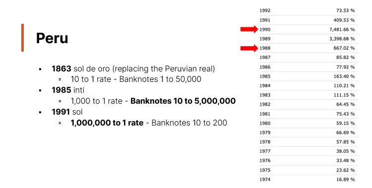
ペルーは、恣意的な50％ルールの影響について興味深い事例を提示しています。ペルーの通貨史を振り返ると、19世紀までスペインの金貨を使用しており、1821年に独立を宣言しました。ペルー・ドルは1822年から1863年まで使用されていました。1863年には、ペルー・レアルがソルディ・オロに置き換えられ、交換比率は10対1で、最大値は50,000に達しました。1985年には、通貨「インティ」が導入され、交換比率は1000対1で、ピーク時には500万に達しました。1991年には、「ソル」が導入され、交換比率は100万対1で、紙幣は10から200の範囲でした。通貨再評価の期間を見ると、1988年は特に9月に超インフレの年とされています。1990年の7月から8月も超インフレの期間でした。1988年の年間インフレ率は667％で、9月にはピークの50％に達しました。対照的に、1989年は3000％のインフレ率を経験しましたが、どの月も50％を超えなかったため、超インフレとは分類されませんでした。1990年には、インフレ率が7481％に達しました。50％ルールが恣意的であることは明らかで、1988年は超インフレの年とされましたが、1989年はそうではありませんでした。このルールを再考する場合、1989年のペルーが経験したような期間を含めるために、閾値を下げることが賢明かもしれません。

> 理解することが重要です
>
> 通貨再評価について理解すべき重要なことは、通貨の価値が500万や1000万などの天文学的な数字に達すると、再評価されるということです。このプロセスは複数回繰り返され、通貨の変更が伴います。その結果、個人の貯蓄は、超インフレがなくても大きく影響を受ける可能性があります。たとえば、ある人が1年で1000ドルを貯め、100ドルを別に貯めたとしても、翌年には最低紙幣が1000ドルになり、以前に貯めた100ドルが無価値になる可能性があります。このような貯蓄の浸食は、明らかな超インフレがなくても発生します。過去10年間に1万ドルを貯めたとしても、その金額がほとんど価値のないものになり、単純なボトルの水を買うことさえできなくなるかもしれません。この現実は、数ヶ月だけが超インフレと分類されたとしても、再評価を経験した多くの国々で明らかです。一方、ニカラグアのような国々は、連続した年にわたって超インフレを経験しています。

### ニカラグア

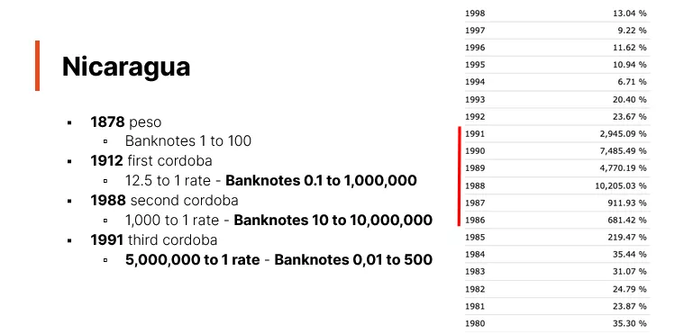
ニカラグアは、スペインの支配下にあった初期には、スペインによって植民地化された他の多くの国々と同様にスペインドルを使用していました。スペイン帝国、その後メキシコ帝国、そして中央アメリカ連邦共和国に組み込まれた後、ニカラグアは独立を宣言しました。1878年から、ペソが国の公式通貨となり、価値は1から100の間で変動しました。1912年には最初のコルドバが導入され、1988年には第二のコルドバ、1991年には現在も使用されている第三のコルドバが導入されました。最初のコルドバは100万の価値に達し、第二のコルドバは1000万に達しました。1991年の再評価は、数年にわたる超インフレの後に行われました。

### ベネズエラ

ベネズエラはこのビデオで最後に言及された国です。この国は時間をかけて4回の通貨再評価を経験しています。初期の頃、ベネズエラは1811年の独立宣言前にスペインドルを使用していました。1879年には、公式通貨としてボリバルを導入し、1983年に政府が変動為替レート制を採用するまでそのままでした。

ベネズエラについての注目すべき事実は、ラテン通貨同盟への加盟です。この同盟には、スペインの5ペセタ、ギリシャの5ドラクマ、ベネズエラの5ボリバル、イタリアの5リラ、ベルギーの5フラン、フランスの5フランなどの硬貨が含まれていました。

この期間中、ベネズエラの5ボリバル硬貨は、イタリア、スペイン、ベルギー、フランスなどの同盟国の硬貨と同じ重さでした。これらのボリバルは銀で作られており、1929年の特定の硬貨は25グラムで、純度は900、つまり90％の純銀でした。現在の銀の価格で、この硬貨は約17から18米ドルの価値があります。

1983年に変動為替レート制を採用した後、いくつかの再評価が行われました：

- 2008年：「強いボリバル」と呼ばれるボリバル・フエルテが導入され、100,000に達する前に千分の一の再評価が行われました。
- 2018年：ソベラノが導入され、紙幣は100万に達しました。2021年にはデジタルボリバルに置き換えられ、これも100万に達し、その後新たな100万分の1の再評価が行われました。今日では、10または20の紙幣がソベラノで1000万または2000万に相当します。
  この期間の紙幣は、2018年以降、ビアリッツ、トロント、マイアミの各ビットコイン会議で配布されています。これらのソベラノ紙幣は最大100万の価値に達しました。その後、100万の価値が約3セントに減少する再評価が行われました。現在、100万の10枚の紙幣は10の紙幣に相当します。2016年以降、ベネズエラはハイパーインフレを経験しており、特定の表で57番目の期間になります。

次のビデオでは、ベネズエラや他のリストアップされた国々に焦点を当てたハイパーインフレ紙幣のコレクションが紹介されます。このコレクションには、ほぼすべてのベネズエラの紙幣が含まれています。研究は、各国で言及された異なる再評価に焦点を当てます。さらに、ジンバブエの再評価についても探求される予定で、これは注目に値する話題です。

### 結論

ハイパーインフレが経済的な災害の唯一の指標ではないことがわかりました。何度も再評価を行い、ゼロを取り除いたり、通貨の名前を変更したりすることは、援助の喪失から食糧問題に至るまで、人々に直接的な影響を与えます。ハイパーインフレは懸念されるものの、ブラジルで観察された再評価の数は、より複雑な現実を示しています。
月間50%のインフレ率を基準にすると、いくつかの期間がハイパーインフレとして分類される可能性がありました。これは、国際会計組織の基準を調べるときに特に当てはまります。この組織は、通貨の急速な放棄、賃金のインデックス化、インフレを補償するための高利率のローンなどの特徴を考慮しています。
結論として、ハイパーインフレは経済的課題の一側面に過ぎません。高インフレだけでも同様に損害を与える可能性があります。次のセクションでは、ハイパーインフレを克服するための可能な解決策を探求します。

## ハイパーインフレを克服する方法
<chapterId>e3484a31-a851-5f92-8af5-00eddae67db1</chapterId>

### 中程度および高インフレを終わらせる方法

上記の結論は、Bernoldの著書「Monetary Regime and Inflation」から引用されています。Bernoldによると、インフレを終わらせる唯一の方法は、通貨改革を実施し、政府に制限を課すことです。これらの制限には、政府の政治的決定から独立して運営される機関、例えば中央銀行の設立が含まれます。高インフレおよびハイパーインフレは、しばしば財政赤字を通貨創造によって賄う結果として発生します。中程度のインフレに対処するためには、通貨供給の増加を減少させることが不可欠です。Bernoldはまた、この通貨増加は隣国と相対的であるべきだと提案しています。驚くべき点は、高インフレまたはハイパーインフレの期間中に、通貨供給の総価値が実際に減少することがあるということです。この状況の顕著な例はジンバブエです。

### 直感に反する解決策

ジンバブエを研究すると、通貨供給の10兆単位がすべて価値を失っていることがわかりました。ワイマールでは、通貨供給の総名目価値の65億単位のうち三分の二を一日で印刷することが可能でした。これは通貨供給がどのように価値を失うかを示しています。この状況を改善するためには、適切なレベルに達するまで通貨供給を大幅に増やす必要があります。その後、通貨改革が不可欠です。高インフレの状況では、この改革は避けられませんが、流通しているお金が十分であることを確認する必要があります。このステップの後、政府に制限を課すことができます。

Bernoldの観察によると、インフレ問題を解決する際、IMFや世界銀行のような機関が常に正しい戦略を採用しているわけではありません。国が通貨供給を増やす必要がある場合、これらの機関はそれを減らそうとすることがあります。重要なのは、適切な通貨レベルに達した後、その成長に制限を課し、政府の支出を通貨創造によって賄うことを避けることです。

Bernoldが指摘する興味深い側面は、通貨改革の成功がその技術的な妥当性だけでなく、人々がそれに対して置く信頼にも依存しているということです。よく設計された改革が公衆の信頼がないために失敗することがありますが、設計が不十分なものでも、人々が信頼しているために成功することがあります。したがって、認識と公衆の信頼は通貨改革の成功または失敗において重要な要素です。

- ジンバブエでは、インフレに対抗するために採用された解決策はドル化であり、これは彼らが米ドルまたは隣国の他の通貨を採用したことを意味します。このアプローチは政府が意のままにお金を印刷することを防ぎます。
- ドイツでは、新しい通貨、Rentenmarkを作成することが解決策でした。この通貨はライヒの領土資産に裏打ちされており、この戦略は効果的であることが証明されました。

### ジンバブエのケース

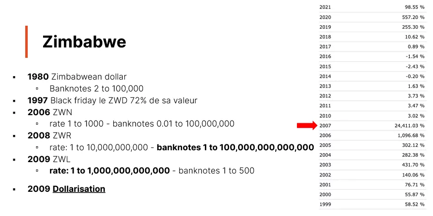
ジンバブエは1980年に独立を果たし、ジンバブエドルを導入しました。初期には、2ジンバブエドルが約1.60米ドルの価値がありました。しかし1997年、戦争退役軍人への社会的措置を受けて、通貨は「ブラックフライデー」の間に一日で72%も価値が下落しました。その後、2000年代初頭には、白人所有者から土地を取り上げ、地元の住民に分配する土地再分配プログラムを開始しました。この決定は、新しい所有者が大規模農場を管理するための必要な専門知識をしばしば欠いていたため、輸出に悪影響を与えました。その結果、1999年には純輸出国であったジンバブエは、2003年には純輸入国となりました。

2006年には、新しい通貨ZWNが導入され、交換レートは1対1000でした。2008年にはさらに別の通貨ZWRが導入され、交換レートは1対100億となりました。これにより、象徴的な100兆ドル紙幣が生まれました。

#### ドル化と危機解決

そのため、2009年以降、持続的な通貨危機と激しいハイパーインフレに直面したジンバブエは、国の通貨を放棄し、主に米ドルを含む外国通貨の使用を許可しました。この決断は、急進的ではありましたが、ハイパーインフレに終止符を打ちました。重要な教訓として、過剰な貨幣発行の停止と中央銀行による予算赤字の資金調達の終了が、ハイパーインフレに終止符を打つことができるということが挙げられます。

しかし、ドル化は万能の解決策ではありません。ハイパーインフレを終わらせることはできますが、他の経済的課題を引き起こします。その一つの結果として、自主的な金融政策の喪失があります。自国の通貨がなければ、国は内部の経済ショックに対応するために金融政策を調整することができません。

2007年には、ジンバブエのインフレ率が月50%の閾値に達し、公式にハイパーインフレ国と認定されました。2009年のドル化後、ハイパーインフレは停止しましたが、国は他の経済的課題に直面しました。
ジンバブエが再び自国の通貨を導入しようと試みており、高インフレの兆候が再び現れていることが懸念されます。一部の国際機関によると、ジンバブエはすでに再びハイパーインフレの基準を満たしている可能性がありますが、まだ公式の月50%の閾値には達していません。これは、過剰な貨幣発行と中央銀行の赤字資金調達の危険性を思い出させるものです。

## 結論
<chapterId>31864b6e-8848-5e74-81fa-4e88e1a59ae3</chapterId>

私の著書「ビットコインについてのすべて」では、ジンバブエのハイパーインフレについての章を全体にわたって捧げています。重要な出来事を詳述し、さまざまな例を挙げて、国が最終的にハイパーインフレにどのように終止符を打ったかを説明しています。

第一次世界大戦後のドイツの経験に興味がある方には、「ライヒスバンカー」というコミックブックを強くお勧めします。これは、レンテンマルクの創設を通じて、ドイツがハイパーインフレをどのように克服したかを語っています。
主なポイントは、ハイパーインフレーションを克服するためのいくつかの戦略が存在するということです。ドル化を選択するか、新しい通貨を導入することができます。これらの解決策は、人々がそれらを信頼している場合にのみ機能します。厳格な制約を課すことが重要です。真に独立した中央銀行が不可欠です。政府の赤字をカバーするために貨幣供給を増加させてはなりません。軽度のインフレの場合、貨幣供給の成長を制限するだけで十分です。しかし、ハイパーインフレに直面した場合、まず問題の経済の規模に適した貨幣供給を持つことが重要です。その後、状況を安定させるために政府に厳格な制約を課すことが必要です。

## ハイパーインフレ紙幣コレクションの紹介
<chapterId>f3ffbb47-3aeb-54bd-80a9-adccb0f419e2</chapterId>

スキャンされたコレクションへのリンクは、プラットフォームのリソースセクションからアクセス可能なBitcoin Educational Toolkitにあります。

# どうしてこうなったのか？
<partId>f66ca17e-be9e-5d30-a098-f7affd8962a1</partId>

## お金と中央銀行の第二層の出現
<chapterId>0455ffe3-9d45-5a67-ac96-3f815dc507a1</chapterId>

トランスクリプト：

お金と最初の中央銀行の第二層の出現は魅力的なテーマです。このテーマは、Nick Battiaの著書「Layered Money」で広範囲にわたって議論されています。私は、私たちの金融システムの進化と複雑さに興味がある人にこの本を強くお勧めします。このセクションの目的は、貨幣創造の起源とそれがハイパーインフレにつながる可能性を理解することです。

### ピラミッドマネーと中央銀行

#### フローリン

お金の歴史は13世紀のイタリア、特にフィレンツェにさかのぼります。当時、フローリンや手形が一般的でした。特筆すべき例は、聖ヨハネ・バプティストの像が飾られたフローリンです。

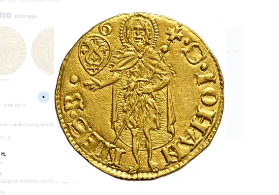

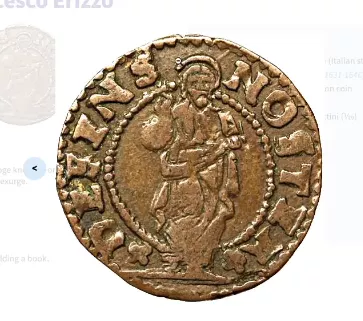

現在、本物のフローリンを所有することは高価ですが、複製品が入手可能です。また、17世紀のイタリア諸州のソルドなど、当時の他の通貨もあり、これにはキリストの画像が特徴です。

#### 手形（13世紀）

当時の一般的な慣習は次のようでした：金細工師は預けられたフローリンと引き換えに手形を発行しました。これらのフローリンは彼らの金庫に慎重に保管されました。したがって、フローリンによって表される実際の金がお金の第一層を形成し、手形が第二層を形成しました。しかし、このシステムの流動性は限られていました。誰かが自分の手形と引き換えに金を引き出したい場合、取引は単純でした。しかし、これらの手形を個人間で交換することは一般的ではありませんでした。

#### アントワープ証券取引所（16世紀）

アントワープ証券取引所は紙幣の進化における重要なマイルストーンを示しました。そこでは約束手形の割引の慣習が導入されました。これらの手形は金銭的価値を表す紙の手段でしたが、名前と満期日を記載していることが特徴でした。これにより、満期日前に交換することが困難でした。アントワープ証券取引所によってもたらされた革命は、これらの手形を満期日前に割引で購入する可能性にありました。例えば、約束手形が1ヶ月後に期限が切れる場合、期限前の時間を考慮して割引価格で購入することが可能でした。この革新は、紙幣をより流動的にするだけでなく、時間の価値という概念を導入しました。
この概念は、Nick BellがTwitterの偽名「time value of BTC」で関連付けられていますが、彼の発明ではありません。それにもかかわらず、彼は自身の著作で詳細にこの話題を扱っています。主な考え方は、時間には価値があるということです。したがって、誰かが1ヶ月前に100ドルの約束手形を支払うことを決めた場合、例えば98ドルでそれを手に入れ、期日に100ドルを受け取ることができます。この金融革新はアントワープ証券取引所で始まりました。

#### VOCおよびアムステルダム証券市場（17世紀）

アントワープ証券取引所の後、重要なマイルストーンはVOC、オランダ東インド会社の設立でした。この会社はオランダに拠点を置き、独自の通貨を発行しました。VOCの創設に続いて、アムステルダムに最初の株式市場が設立され、この会社のための最初の株式市場となりました。注目すべき点は、オランダがどのようにしてアントワープの国際経済センターとしての覇権を終わらせたかです。彼らは単にシェルデ川へのアクセスを遮断しました。この戦略は、乞食の反乱というより大きな歴史的動きの一部でした。ヨーロッパ史における重要な出来事です。

#### アムステルダム銀行の介入

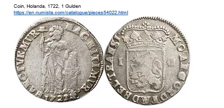

VOCの創設後、金融史におけるもう一つの重要な要素は、アムステルダム銀行による金貨の導入でした。これらの貨幣は1722年に銀で作られました。しかし、当時の金融を真に革命的にしたのは貨幣自体ではなく、アムステルダム銀行でこの通貨に関連付けられた口座でした。これらの口座は国際取引の主要手段となりました。取引は単に登録簿や元帳に記録されました。このシステムのおかげで、アムステルダムは世界の経済中心地となりました。時間が経つにつれて、アムステルダム銀行はこれらの口座の使用を義務付けることにしました。独立した両替商は、毎日銀行で自分のコインを預金に交換する必要がありました。

#### 戦争資金調達のためのイングランド銀行の創設

イングランド銀行の創設は、17世紀末の戦争を資金調達する必要から動機付けられました。アムステルダム銀行と同様に、イングランド銀行は法令によって預金を義務付けました。イングランド銀行の特徴は、私立銀行を金融システムの二次的な位置に追いやり、いわゆる「第三層」の通貨を創出したことでした。最初に、第一層の通貨は金によって表されました。私立銀行での預金が第二層を形成しました。しかし、これらの預金が金に変換できなくなったとき、第三層の通貨が現れました。それ以降、私立銀行が発行する紙幣は金にではなく、金に変換可能なイングランド銀行の紙幣に変換可能となりました。この進化は、追加の層を加えることで金融システムの複雑化をもたらしました。

#### 1796年のパニック

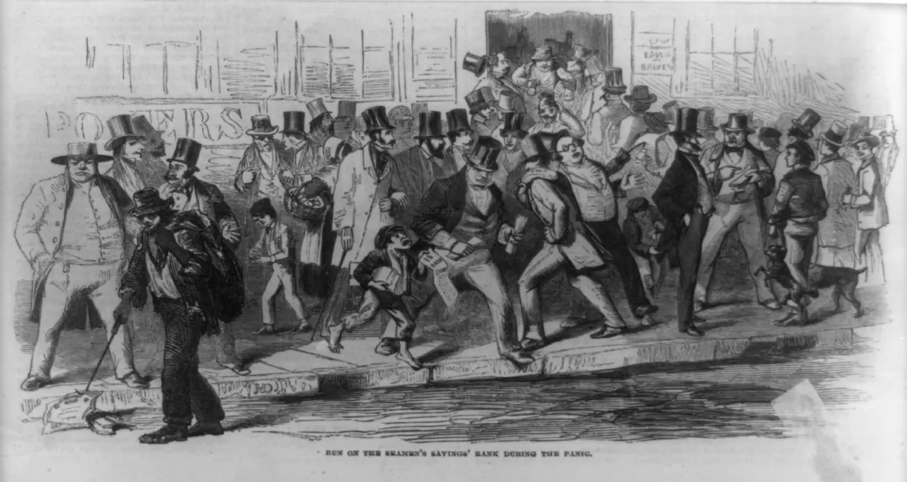
1857年の船員貯蓄銀行での銀行パニック。

1796年の銀行パニックの後、誰もが「金融ピラミッド」を上に移動しようとする現象が発生しました。人々は第三層の通貨を第二層の通貨に、そして究極的には第一層の通貨、金に交換したいと望みました。この大規模なラッシュに直面して、イングランド銀行は状況を安定させるために行動を起こす必要がありました。金準備の潜在的なデフレを防ぐため、同行はその銀行券の金への兌換を一時的な措置として停止することを決定しました。この停止は当初一時的なものと意図されていましたが、二十年間続きました。

### 結論：
中央銀行は最後の貸し手として進化し、自国通貨の金への兌換性を停止しました。この行動は当初、一時的な解決策として意図されていましたが、最終的には恒久的なものとなり、最後の貸し手という概念の出現を示しました。この変革は、今日私たちが知る中央銀行を形成しています。しかし、より脆弱な経済では、この無制限にお金を印刷する能力が、無責任に使用された場合、ハイパーインフレーションなどの望ましくない結果を招くことがあります。

## 書籍とリソース
<chapterId>c44e4519-0741-527b-b3b0-3f513e87147d</chapterId>

ハイパーインフレーションは、さまざまな歴史的な出来事を通じて研究されてきた魅力的な主題です。このトピックについてさらに深く掘り下げたい場合は、以下に読んで研究するための10の重要なリソースのリストを示します：

- 『When Money Dies: The Nightmare of Deficit Spending, Devaluation, and Hyperinflation in Weimar Germany』アダム・ファーガソン著。この本は第一次世界大戦後のドイツのハイパーインフレーション危機について詳述しています。

- 『The Economics of Inflation - A Study of Currency Depreciation in Post-War Germany』コスタンティーノ・ブレシアーニ＝トゥローニ著。1920年代のドイツのハイパーインフレーションについての詳細な分析です。

- 『This Time Is Different: Eight Centuries of Financial Folly』カーメン・M・ラインハートとケネス・S・ロゴフ著。この本は多くの種類の金融危機をカバーしていますが、歴史を通じてのハイパーインフレーションについて広範に議論しています。

- 『Zimbabwe's Hyperinflation, Analysis and Lessons Learned』スティーブ・ハンケ著。2000年代初頭のジンバブエのハイパーインフレーションについての研究です。

- 『Monetary Regimes and Inflation: History, Economic and Political Relationships』ピーター・バーンホルツ著。歴史を通じてのハイパーインフレーションの事例を調査し、その背後にある要因を理解しようとしています。

- 『The Hyperinflation Survival Guide: Strategies for American Businesses』ジェラルド・スワンソン著。ハイパーインフレーション環境をナビゲートする方法についての実用的なガイドです。

- 『Dying of Money: Lessons of the Great German and American Inflations』ジェンス・O・パーソン著。ドイツとアメリカのインフレーション危機の比較分析です。

- 『The Downfall of Money: Germany’s Hyperinflation and the Destruction of the Middle Class』フレデリック・テイラー著。ハイパーインフレーションがドイツ社会の社会的および経済的影響についての物語性のある探求です。

- 『Currency Boards for Developing Countries: A Handbook』スティーブ・ハンケとカート・シューラー著。この本は通貨委員会に焦点を当てていますが、ハイパーインフレーションの状況を避ける方法についての視点を提供しています。
