# Hành trình vào nền kinh tế

Chương trình này nhằm cung cấp một hiểu biết sâu sắc về sự xuất hiện của lạm phát cao trong một thế giới được thống trị bởi tiền tệ Fiat và xem xét những hậu quả đáng kể của nó. Người tham gia sẽ khám phá chi tiết các chu kỳ lạm phát cao, phân tích nguyên nhân, yếu tố kích hoạt và các ví dụ lịch sử và đương đại. Họ cũng sẽ xem xét tác động cụ thể của lạm phát cao đối với nền kinh tế và cuộc sống hàng ngày, nghiên cứu những hậu quả đối với giá trị tiền tệ, sức mua và tiết kiệm cá nhân và tập thể.

Tại đây, chúng tôi sẽ nêu bật xu hướng và mô hình chung trong các đợt lạm phát cao trong lịch sử, đồng thời cung cấp các chiến lược hiệu quả và cụ thể để bảo vệ bản thân trong thời kỳ lạm phát cao. Người tham gia sẽ có cơ hội khám phá các lựa chọn đầu tư và cơ chế phòng thủ tài chính khác nhau, thu thập công cụ thực tế và kiến thức thiết yếu để điều hướng một cách bình tĩnh trong một bối cảnh kinh tế không ổn định.

+++

# Giới thiệu

## Giới thiệu

Chương trình này nhằm cung cấp một hiểu biết sâu sắc về sự xuất hiện của lạm phát cao trong một thế giới được thống trị bởi tiền tệ Fiat và xem xét những hậu quả đáng kể của nó. Người tham gia sẽ khám phá chi tiết các chu kỳ lạm phát cao, phân tích nguyên nhân, yếu tố kích hoạt và các ví dụ lịch sử và đương đại. Họ cũng sẽ xem xét tác động cụ thể của lạm phát cao đối với nền kinh tế và cuộc sống hàng ngày, nghiên cứu những hậu quả đối với giá trị tiền tệ, sức mua và tiết kiệm cá nhân và tập thể.

Tại đây, chúng tôi sẽ nêu bật xu hướng và mô hình chung trong các đợt lạm phát cao trong lịch sử, đồng thời cung cấp các chiến lược hiệu quả và cụ thể để bảo vệ bản thân trong thời kỳ lạm phát cao. Người tham gia sẽ có cơ hội khám phá các lựa chọn đầu tư và cơ chế phòng thủ tài chính khác nhau, thu thập công cụ thực tế và kiến thức thiết yếu để điều hướng một cách bình tĩnh trong một bối cảnh kinh tế không ổn định.

### Chương trình học

Phần 1 - Giới thiệu

- 1.1 - Giới thiệu khóa học bởi Rogzy & David

Phần 2 - Lạm phát là gì?

- 2.1 - Một hiện tượng tiền tệ
- 2.2 - Các loại lạm phát
- 2.3 - Lạm phát giảm

Phần 3 - Lạm phát cao là gì?

- 3.1 - Định nghĩa
- 3.2 - Sự tương đồng giữa Weimar và Zimbabwe
- 3.3 - Sự khác biệt giữa Weimar và Zimbabwe và song song đương đại
- 3.4 - Các đợt đổi tiền ở Mỹ Latinh
- 3.5 - Cách thoát khỏi lạm phát cao
- 3.6 - Trình bày bộ sưu tập tiền lạm phát cao

Phần 4 - Chúng ta đã đến đây như thế nào?

- 4.1 - Sự xuất hiện của lớp tiền tệ thứ hai và ngân hàng trung ương
- 4.2 - Sách và nguồn tài liệu

Chúc may mắn!

# Lạm phát là gì?

## Một hiện tượng tiền tệ

### Định nghĩa về lạm phát

Lạm phát là một khái niệm thường bị hiểu nhầm do có nhiều định nghĩa liên quan đến nó. Cách nhìn nhận về lạm phát khác nhau giữa các nhóm như người ủng hộ bitcoin và các nhà kinh tế học truyền thống. Hãy làm rõ các định nghĩa trước khi thảo luận về lạm phát cao:

- Định nghĩa từ Robert: Lạm phát là sự tăng quá mức của các công cụ thanh toán (tiền giấy, vốn) gây ra sự tăng giá và mất giá của tiền tệ.

- Định nghĩa từ Larousse: Lạm phát là hiện tượng được đặc trưng bởi sự tăng liên tục và chung của mức giá. Ở đây, từ "chung" là rất quan trọng.

Trong bối cảnh của những định nghĩa này, điều cần thiết là phải hiểu rằng, đối với Robert, lạm phát chủ yếu liên quan đến sự tăng lên của nguồn tiền. Mặt khác, Larousse tập trung vào hậu quả của sự mở rộng này, cụ thể là sự tăng giá chung chung.
Trong nghiên cứu của chúng tôi về siêu lạm phát, chúng tôi sẽ chấp nhận định nghĩa thứ hai, đó là sự tăng giá chung chung, vì nó phù hợp và rõ ràng hơn cho chủ đề của chúng tôi. Tuy nhiên, điều quan trọng là phải nhớ rằng sự tăng giá này nói chung là kết quả của sự mở rộng nguồn tiền.
Nhà kinh tế học nổi tiếng Milton Friedman từng nói:

> "Lạm phát luôn và ở mọi nơi là một hiện tượng tiền tệ."

Phát biểu này nhấn mạnh mối quan hệ nội tại giữa sự mở rộng tiền tệ và lạm phát. Trong các phần tiếp theo, chúng tôi sẽ khám phá các tương tác giữa lạm phát và tăng trưởng kinh tế, dựa trên những định nghĩa cơ bản này.

### Hiểu về Hiện tượng Tiền tệ

Khi đề cập đến hiện tượng tiền tệ, chúng ta đang nói về cách nguồn tiền của một nền kinh tế được ảnh hưởng. Milton Friedman cơ bản coi đó là sự tăng lên của nguồn cung này. Lịch sử đã chứng kiến hai phương pháp chính để tăng nguồn tiền:

1. In Tiền:
   Trong hệ thống tiền tệ truyền thống, việc tăng nguồn tiền được thực hiện bằng cách in mới các tờ tiền giấy. Mặc dù ngày nay, với sự thống trị của tiền tệ số, việc in này chủ yếu là điện tử (thông qua cơ sở dữ liệu của các ngân hàng trung ương và các tổ chức tài chính khác), lịch sử cho thấy chúng ta những thời kỳ mà việc in tiền giấy trực tiếp dẫn đến siêu lạm phát.

2. Giảm Hàm Lượng Kim Loại:
   Một phương pháp khác là giảm lượng kim loại quý trong các đồng tiền dựa trên kim loại như bạc hoặc vàng. Một ví dụ nổi bật có thể được tìm thấy trong Đế chế La Mã, nơi đồng denarius, ban đầu gần như hoàn toàn được làm từ bạc, đã thấy hàm lượng bạc của mình giảm mạnh theo thời gian. Điều này tương đương với một hình thức lạm phát, nhưng không nhất thiết là siêu lạm phát.

Điều quan trọng cần nhấn mạnh là siêu lạm phát chủ yếu được quan sát với các đồng tiền fiat không liên kết với tài sản cơ bản của chúng, như kim loại quý. Lịch sử cho thấy, khi một đồng tiền dựa trên những tài sản như vậy, đã có các đợt lạm phát (ví dụ, thông qua việc phá giá hàm lượng kim loại), nhưng những đợt này không bao giờ đạt đến mức độ siêu lạm phát. Trong các phần tiếp theo, chúng tôi sẽ nghiên cứu chi tiết các thời kỳ phá giá tiền tệ và hậu quả của các hệ thống tiền tệ khác nhau đối với lạm phát.

### Nghiên cứu về các Thời kỳ Phá giá Tiền tệ

Trong suốt lịch sử, các nền văn minh khác nhau đã trải qua các thời kỳ phá giá tiền tệ. Một số thời kỳ này trùng với các sự kiện lớn hoặc các cuộc chiến đã gây áp lực lên nền kinh tế.

#### 1. Chiến tranh Peloponnesian và Chiến tranh Punic thứ hai:

Chiến tranh Peloponnesian, một cuộc xung đột giữa Athens và Sparta, và Chiến tranh Punic thứ hai, giữa Cộng hòa La Mã và Carthage, là những ví dụ sớm nhất về việc phá giá tiền tệ được tìm thấy trong các hồ sơ. Để tài trợ cho những cuộc chiến này, những nền văn minh này đã phá giá đồng tiền của mình bằng cách giảm hàm lượng bạc và kết hợp các kim loại khác, trong khi tăng số lượng đồng tiền được sản xuất.

Khắc họa vụ thảm sát người Athens trên bờ sông Assinaros.

#### 2. La Mã cổ đại trong thời kỳ Đế chế:
Sau thời kỳ của Cộng hòa La Mã, trong thời kỳ Đế quốc, các thế kỷ thứ 3 và thứ 4 đã chứng kiến sự mất giá tiền tệ đáng kể. Điều này được minh họa qua việc giảm lượng bạc trong đồng tiền, như đã thấy trong biểu đồ trước đó. Một nghiên cứu cho thấy giá lúa mì ở Ai Cập, tính bằng drachma, đã tăng lên một triệu lần trong khoảng thời gian khoảng 400 năm, từ 40 TCN đến 360 SCN. Trong khoảng thời gian này, nó đại diện cho mức lạm phát hàng năm trung bình khoảng 4.4%. Tuy nhiên, lạm phát này không được phân bố đều. Nó thực sự bắt đầu vào khoảng năm 238 SCN. Từ 250 đến 293 SCN, tỷ lệ lạm phát là khoảng 3.65%, và nó tăng lên 22.28% giữa 293 và 301 SCN.

Mặc dù những thời kỳ này đã trải qua lạm phát đáng kể, nhưng chúng không đạt đến mức của siêu lạm phát mà chúng ta có thể quan sát trong một số tình huống hiện đại. Lý do cho điều này là, mặc dù tiền tệ đã bị mất giá, nhưng nó vẫn dựa trên kim loại quý. Nền tảng vững chắc này đã cung cấp một số bảo vệ chống lại mức độ lạm phát cực đoan. Trong các phần tiếp theo, chúng ta sẽ khám phá chi tiết hơn về bản chất và hậu quả của siêu lạm phát.

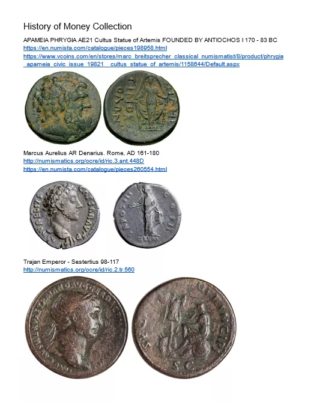

- Đồng Denarius của Marcus Aurelius (160 SCN):
  Một trong những đồng tiền biểu tượng nhất của La Mã cổ đại là đồng denarius, một loại tiền bạc. Tôi sở hữu một đồng tiền cụ thể từ Marcus Aurelius có niên đại từ năm 160 SCN, trước khi xảy ra sự mất giá lớn. Mặc dù máy ảnh có thể gặp khó khăn trong việc ghi lại những chi tiết tinh tế, nhưng bằng mắt thường, có thể thấy đó là một đồng tiền bạc đẹp, phản ánh một lượng bạc tương đối cao.

- Đồng Antoninianus (cuối thế kỷ 3 SCN):
  Với sự mất giá tiền tệ, một loại tiền mới, đồng Antoninianus, đã xuất hiện. Loại tiền này được cho là có giá trị bằng hai đồng denarii, nhưng chứa ít bạc hơn nhiều. Đồng Antoninianus của tôi rõ ràng cho thấy lượng bạc đã được giảm đáng kể. Nó được trang trí bằng một chiếc vương miện, điển hình cho các đồng tiền La Mã của thời kỳ này, được gọi là "radiates". Khi so sánh màu sắc và chất lượng, có thể thấy rằng đồng Antoninianus xa cách so với một đồng tiền bạc nguyên chất.
  Khi so sánh hai đồng tiền cạnh nhau, sự khác biệt là rõ ràng. Đồng denarius từ năm 160 SCN có vẻ ngoài bạc đặc trưng, trong khi đồng Antoninianus từ cuối thế kỷ 3 SCN nhiều mờ hơn, chỉ ra sự giảm đáng kể về lượng bạc. Sự so sánh hình ảnh này cung cấp một minh họa rõ ràng về sự mất giá tiền tệ mà La Mã cổ đại đã trải qua trong vài thế kỷ.

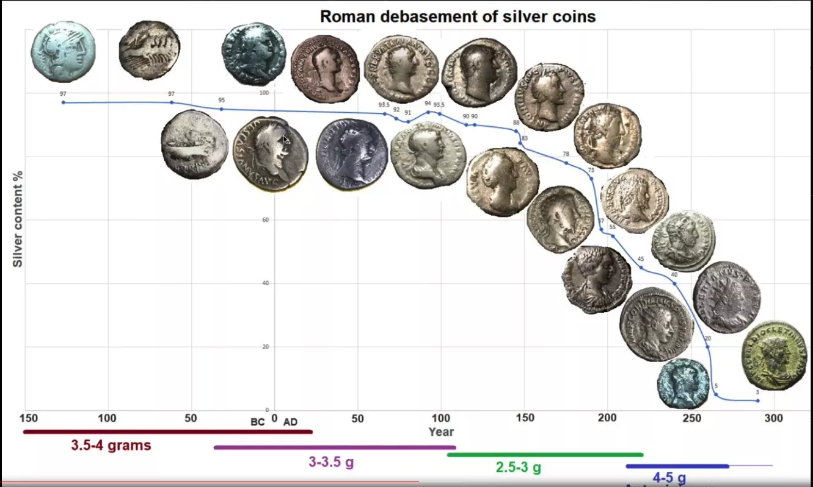

Để hoàn thiện bài trình bày này, một biểu đồ minh họa sự mất giá của những đồng tiền này theo thời gian sẽ là lý tưởng. Mặc dù khó để hình dung qua nền tảng này, hãy tưởng tượng một biểu đồ cho thấy giá trị của đồng denarius, sau đó là sự suy giảm của nó về cuối thế kỷ 2, được thay thế bằng đồng Antoninianus được cho là có giá trị bằng hai đồng denarii nhưng với lượng bạc ít hơn nhiều. Những hiện vật này là nhân chứng im lặng cho những biến động kinh tế của các nền văn minh trong quá khứ.

#### 3. Đồng Maravedi của Tây Ban Nha: Nhân chứng của việc mất giá có mục tiêu

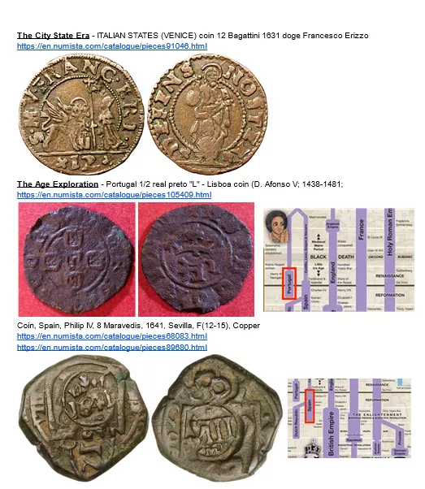

Đồng Maravedi, như một loại tiền đồng, chiếm một vị trí đặc biệt trong lịch sử tiền tệ của Tây Ban Nha. Như đã đề cập trước đó, đồng đô la Tây Ban Nha ban đầu là tiêu chuẩn quốc tế, một loại tiền tệ dự trữ thiết yếu cho Tây Ban Nha. Tuy nhiên, đối mặt với một số thách thức kinh tế, Tây Ban Nha đã phải sử dụng những chiến lược tiền tệ khéo léo.
Sự phá giá tiền tệ là một công cụ thường được các quốc gia sử dụng để tài trợ cho chi tiêu của mình hoặc kích thích nền kinh tế. Tuy nhiên, Tây Ban Nha đã rơi vào một tình huống t delicate. Việc pha loãng đồng đô la Tây Ban Nha sẽ làm ảnh hưởng đến vị thế của nó trên trường quốc tế. Để vượt qua tình thế này, Tây Ban Nha đã chuyển sang sử dụng Maravedi.

Khác với đồng đô la bạc Tây Ban Nha quý giá, Maravedis là một loại tiền đồng chủ yếu được sử dụng trong dân chúng địa phương. Đồng tiền này được nhắm mục tiêu để phá giá. Khi một đồng Maravedis ban đầu có giá trị hai maravedises, nhà nước sẽ thu hồi nó, đóng dấu lại với một giá trị mới, ví dụ "bốn", và chỉ trả lại một đồng cho chủ sở hữu. Đồng tiền được đề cập với dấu "tám" là bằng chứng của quá trình này, đã trải qua nhiều chu kỳ phá giá.

Chiến lược này cho phép nhà nước hiệu quả phá giá một loại tiền tệ, tạo ra lạm phát và gián tiếp tự tài trợ, trong khi vẫn bảo toàn được tính toàn vẹn của đồng đô la Tây Ban Nha trên sân khấu quốc tế. Tuy nhiên, việc phá giá mục tiêu này đã có hậu quả đối với dân chúng địa phương, những người thấy giá trị của đồng tiền phổ thông của họ bị pha loãng.

Trường hợp của Maravedis minh họa cách một quốc gia có thể chọn lọc phá giá một đồng tiền địa phương để đáp ứng nhu cầu kinh tế nội bộ của mình, trong khi vẫn bảo toàn giá trị của một đồng tiền dự trữ trên sân khấu toàn cầu. Đây là một ví dụ nổi bật về sự phức tạp và tinh tế của chính sách tiền tệ trong lịch sử.

Thêm thông tin? -> [Link](https://docs.google.com/document/d/1aZa7gvz1nt8ZHDCoWKQdS9RGGjBHdipH1ApC8dW1xpM/edit?usp=sharing)

#### 4. Cuộc Cách Mạng Giá Cả từ Thế Kỷ 15 đến Thế Kỷ 17

Giữa thế kỷ 15 và 17, Châu Âu chứng kiến một hiện tượng kinh tế đáng chú ý, thường được gọi là "cuộc cách mạng giá cả." Kỳ này của lạm phát chủ yếu được kích hoạt bởi một lượng lớn kim loại quý, đặc biệt là vàng và bạc, từ châu Mỹ chảy vào. Với nền kinh tế Châu Âu chủ yếu dựa trên tiêu chuẩn kim loại vào thời điểm đó, nguồn cung kim loại bổ sung này đã làm tăng lượng tiền lưu thông. Kết quả là, một tỷ lệ lạm phát khoảng 1 đến 2% mỗi năm xuất hiện. Trên bề ngoài, tỷ lệ lạm phát này có vẻ khiêm tốn. Tuy nhiên, vào thời điểm đó, những biến động giá như vậy đủ lạ để được coi là một "cuộc cách mạng." Điều này nêu bật cách thay đổi trong dự trữ tiền tệ có thể ảnh hưởng đến toàn bộ hệ thống kinh tế.

#### 5. John Law và Assignats

Trong thế kỷ 18, lịch sử kinh tế Pháp được đánh dấu bởi hai sự kiện đáng chú ý liên quan đến tiền tệ. Đầu tiên, John Law, một nhà kinh tế và tài chính người Scotland, đã thuyết phục chính phủ Pháp áp dụng một hệ thống tiền tệ dựa trên tiền giấy. Mặc dù ban đầu được coi là một giải pháp sáng tạo cho các vấn đề tài chính của đất nước, sáng kiến này nhanh chóng dẫn đến lạm phát tràn lan. Sau đó, ngay sau đó, trong bối cảnh hỗn loạn của Cách mạng Pháp, chính phủ đã giới thiệu "assignats".

Assignats từ năm 1793

Những tờ tiền giấy này là bằng chứng sống động của giai đoạn lạm phát cực đoan đầu tiên trong lịch sử. Ban đầu được thiết kế như một phản ứng đối với các cuộc khủng hoảng tài chính liên tiếp, assignats nhanh chóng trở thành biểu tượng của sự bất ổn tiền tệ. Chính phủ, dựa quá mức vào loại tiền giấy này để tài trợ cho chi tiêu của mình, đã gây ra một cuộc khủng hoảng kinh tế chưa từng có và tạo ra một giai đoạn lạm phát cực đoan lớn ở Pháp sau cách mạng.

#### 6. Sắc Lệnh 6102 và Sự Phá Giá của Đô La
Tại Hoa Kỳ, đầu những năm 1930 chứng kiến một sự chuyển biến lớn trong chính sách tiền tệ. Dưới đây là một cái nhìn chi tiết về sự biến đổi này:
- Tờ 20 đô la năm 1928

Năm 1928, một tờ 20 đô la ở Hoa Kỳ ghi rằng: "có thể đổi thành vàng theo yêu cầu." Điều này có nghĩa là mỗi tờ tiền có thể được chuyển đổi trực tiếp thành vàng. Cụ thể, một tờ 20.67 đô la tương đương với một ounce vàng.

- Sắc lệnh 6102

Năm 1933, một biến động lớn xảy ra với việc ban hành Sắc lệnh 6102. Sắc lệnh này làm cho việc sở hữu vàng trở nên bất hợp pháp, dù là dưới dạng thanh, đồng xu, hay giấy chứng nhận.

Giấy chứng nhận vàng là một ví dụ điển hình. Nó được đánh dấu: "Trả bằng vàng xu cho người mang theo yêu cầu." Việc sở hữu loại giấy chứng nhận này trở nên bất hợp pháp và vẫn như vậy cho đến năm 1964.

- Giới thiệu Tiền giấy mới

Sau việc thu giữ vàng vào năm 1934, một loạt tiền giấy mới được đưa vào lưu thông.

Cụm từ chỉ ra khả năng chuyển đổi thành vàng đã được loại bỏ và thay thế bằng "Tờ tiền này là pháp tiền hợp lệ cho mọi nợ" (Ce billet est une monnaie légale pour toutes dettes).

- Định giá lại Vàng

Điều thú vị về sự chuyển đổi này là chiến lược của chính phủ. Năm 1934, giá vàng được định giá lại thành 35 đô la mỗi ounce, thay vì 20.67 đô la. Cơ bản, chính phủ đã làm giảm giá trị đô la mà người dân sở hữu. Bằng cách mua vàng từ dân chúng với giá 20.67 đô la mỗi ounce vào năm 1933, và sau đó định giá lại giá vàng vào năm 1934, chính phủ đã thu lợi nhuận đáng kể trong khi làm giảm giá trị tiết kiệm của công dân.

Tóm lại, chỉ trong một năm, chính phủ đã hiệu quả thu giữ vàng của công dân, sau đó thay đổi quy tắc trò chơi bằng cách định giá lại giá trị vàng để lợi ích cho kho bạc và bất lợi cho những người ban đầu đã đổi vàng lấy tiền giấy.

### Hoa Kỳ thay đổi lịch sử.

Hoa Kỳ đã tạo ra một bước ngoặt lịch sử bằng cách trở thành quốc gia đầu tiên làm giảm giá trị đồng tiền dự trữ thế giới, đô la Mỹ, trái với các thực hành trước đó được quan sát ở các quốc gia thương mại nhỏ.

Trước đó, trong thời kỳ Phục Hưng, đồng florin của Ý do Florence phát hành vào thế kỷ 13 là đồng tiền dự trữ quốc tế, và không có sự giảm giá trị nào được ghi nhận trong thời gian sử dụng của nó, phản ánh tầm quan trọng của sự ổn định tiền tệ đối với thương mại quốc tế.

Cùng tinh thần đó, Tây Ban Nha và Hà Lan, với tư cách là những quốc gia giữ đồng tiền dự trữ thế giới do thương mại quốc tế phát triển, đã duy trì tính toàn vẹn của đồng tiền của họ để bảo tồn lòng tin và trạng thái hiện hành trong giao dịch quốc tế. Hà Lan thậm chí còn chứng kiến sự ra đời của ngân hàng trung ương đầu tiên, một cột mốc quan trọng trong sự phát triển tiền tệ toàn cầu.

Tuy nhiên, tình hình thay đổi với sự trỗi dậy của Hoa Kỳ như một cường quốc kinh tế thống trị. Họ đã chọn giảm giá trị đồng tiền dự trữ của mình, do đó khai thác lợi ích từ lạm phát. Quyết định này thường được cho là do động lực thay đổi, nơi lựa chọn đồng tiền dự trữ không còn tự do như trước. Sự thống trị của Mỹ đã thiết lập đô la là đồng tiền dự trữ thế giới, cho phép thao túng giá trị của nó. Sự chuyển đổi này tiết lộ tiềm năng ảnh hưởng của chính sách tiền tệ đối với thương mại quốc tế trong một nền kinh tế toàn cầu hóa, đánh dấu một sự chuyển đổi đáng kể trong quản lý các đồng tiền dự trữ toàn cầu.

### Ví dụ cuối cùng cho chuyến đi: bữa tối Thụy Sĩ
Đồng Dinar Thụy Sĩ minh họa một khía cạnh thú vị khác của việc mất giá tiền tệ, lần này được gắn liền với bối cảnh Iraq trước Chiến tranh Vùng Vịnh. Được đặt tên theo chất lượng nổi bật của tờ tiền, đồng tiền này được Ngân hàng Trung ương Iraq phát hành và đã được đánh giá cao về sự ổn định trong khu vực Trung Đông. Sự tin tưởng này chủ yếu là do chất lượng in tờ tiền, được thực hiện ở Anh, ngụ ý một sự kiên cố nhất định chống lại sự mất giá.

Tuy nhiên, các cuộc Chiến tranh Vùng Vịnh đã đánh dấu một bước ngoặt trong lịch sử của Đồng Dinar Thụy Sĩ. Iraq, không còn có thể dựa vào nhà cung cấp Anh của mình cho việc in tờ tiền, đã chuyển sang Trung Quốc. Sự chuyển đổi này đã dẫn đến một sự khác biệt rõ ràng về chất lượng của tờ tiền, với phiên bản Trung Quốc được coi là kém hơn. Sự nhận thức này không phải là không có cơ sở; tờ tiền Trung Quốc dễ bị làm giả hơn và dễ bị chính phủ in thêm, do đó đe dọa giá trị của chúng.

Một hiện tượng đặc biệt đã xuất hiện trong nền kinh tế Iraq sau Chiến tranh Vùng Vịnh: hệ thống giá cả kép. Các thương nhân đã đưa ra các mức giá khác nhau tùy thuộc vào loại tờ tiền được sử dụng để thanh toán, ưu tiên Đồng Dinar Thụy Sĩ gốc hơn là tờ tiền Trung Quốc. Hệ thống này phản ánh sự tin tưởng được duy trì trong tờ tiền chất lượng cao hơn, ít có khả năng bị mất giá, ngay cả trong bối cảnh giá trị chủ yếu được áp đặt bởi nhà nước. Tập hợp này chứng minh tầm quan trọng của các đặc tính nội tại của tiền tệ và làm thế nào, ngay cả trong một chế độ tiền tệ fiat, chất lượng được cảm nhận của một đồng tiền có thể ảnh hưởng đến giá trị tương đối của nó và, qua đó, sự tin tưởng của các nhà kinh tế.

#### Vâng, chúng tôi thực sự đã cân những đồng xu!

Quan niệm phổ biến thường liên kết tiền tệ với sự tạo ra của nhà nước, nơi việc phát hành và giá trị của nó được nhà nước quy định. Khái niệm này có nguồn gốc từ các nền văn minh cổ đại như Rome, nơi các đồng xu được chuẩn hóa và đóng dấu bởi Đế chế, do đó trao giá trị chính thức cho các đồng tiền. Tuy nhiên, một sự khám phá sâu hơn tiết lộ rằng giá trị nội tại của tiền tệ chủ yếu được rút ra từ nội dung kim loại quý của nó.

Một ví dụ được minh họa qua việc kiểm tra một trọng lượng tiền tệ tương đương với tám đồng real Tây Ban Nha, hoặc một đô la Tây Ban Nha. Trọng lượng này, được đánh dấu bằng một số La Mã chỉ giá trị của nó, được các nhà đổi tiền sử dụng để đánh giá giá trị của các đồng xu dựa trên trọng lượng của chúng, thay vì chỉ dựa vào dấu đóng của chúng. Bằng cách cân các đồng xu, các nhà đổi tiền có thể xác định xem chúng có bị thay đổi hay hỏng, có thể đã làm giảm giá trị của chúng. Thực hành này nhấn mạnh rằng, mặc dù việc đóng dấu chuẩn hóa bởi nhà nước đã trao một giá trị danh nghĩa nhất định cho tiền tệ, giá trị thực sự nằm ở trọng lượng của kim loại quý mà nó chứa đựng.

Phân tích này chứng minh rằng sự tin tưởng vào tiền tệ, và qua đó là giá trị của nó, được neo giữ trong chất liệu hữu hình của nó chứ không phải chỉ là sự khẳng định của nhà nước. Nó nhấn mạnh sự phân biệt giữa giá trị danh nghĩa được nhà nước áp đặt và giá trị nội tại được quy định bởi nội dung kim loại quý. Do đó, tiền tệ vượt ra ngoài việc chỉ là một công cụ của nhà nước, với giá trị cơ bản của nó được liên kết một cách nội tại với các yếu tố hữu hình và có thể đo lường được.

#### Kết luận

Kết luận, nghiên cứu này về việc mất giá tiền tệ mở ra cánh cửa để hiểu sâu hơn về các cơ chế lạm phát, sẽ được khám phá trong các video tiếp theo. Chúng tôi sẽ thảo luận về các loại lạm phát và ngưỡng mà tại đó chúng chuyển sang lạm phát cao hoặc siêu lạm phát. Nền tảng vững chắc này sẽ cho phép chúng tôi đối mặt với sự phức tạp của lạm phát trong các phiên bản sắp tới. Cảm ơn sự chú ý của bạn, và hẹn gặp lại trong video tiếp theo để tiếp tục cuộc khám phá này về động lực tiền tệ.

## Các Loại Lạm Phát

### Lạm phát không phải là một hiện tượng đa yếu tố
Trong phần này, chúng ta sẽ khám phá các khía cạnh khác nhau của lạm phát, một hiện tượng thường bị hiểu lầm. Mặc dù lạm phát thường được nhìn nhận như một hiện tượng đa yếu tố trong truyền thông và các cuộc thảo luận hàng ngày, điều quan trọng cần nhớ là nó cơ bản là một hiện tượng tiền tệ.

Dưới đây là một bản tóm tắt về chủ đề qua một số điểm chính:

- Phân biệt giữa Tăng Giá và Lạm Phát:

  Một sự tăng giá có thể chỉ cụ thể trong một ngành và được gây ra bởi nhiều yếu tố như sự giảm sản xuất của OPEC đối với dầu mỏ hoặc điều kiện thời tiết không thuận lợi cho lúa mì.
  Ngược lại, lạm phát được định nghĩa bởi sự tăng giá chung trên một loạt hàng hóa và dịch vụ, không chỉ trong một ngành cụ thể.

- Bản chất Tiền tệ của Lạm Phát:
  Với một lượng tiền cố định, sự tăng giá trong một ngành sẽ dẫn đến sự giảm giá trong các ngành khác, vì lượng tiền có sẵn để chi tiêu ở nơi khác sẽ bị giảm. Lạm phát có mối liên hệ chặt chẽ với sự tăng lượng tiền lưu thông, cho phép sự tăng giá đồng thời trong tất cả các ngành.

- Ảnh hưởng của Lượng Tiền Lưu thông đến Lạm Phát và Phát Lạm:

  Trong một hệ thống lượng tiền cố định, sự tăng sản xuất lý thuyết sẽ dẫn đến phát lạm, tức là sự giảm giá, vì sẽ có nhiều hàng hóa và dịch vụ hơn.
  Trong hệ thống tiền tệ fiat hiện tại, sự tăng lượng tiền lưu thông loại bỏ khả năng phát lạm do tăng sản xuất gây ra.

- Tác động Tiêu Cực của Việc Điều Chỉnh Lượng Tiền Lưu thông:

  Sự tăng lượng tiền lưu thông, mà không có sự tăng tương ứng trong sản xuất, dẫn đến lạm phát, vì có nhiều tiền hơn lưu thông cho cùng một lượng hàng hóa và dịch vụ.
  Trong khi sự tăng sản xuất nên đã dẫn đến phát lạm, sự tăng đồng thời lượng tiền lưu thông đã làm mất hiệu ứng này, dẫn đến lạm phát thay vì.

- Lạm Phát, Phát Lạm, và Lượng Tiền Lưu thông: Các Bình Giao Tiếp:

  Lạm phát và phát lạm giống như các bình giao tiếp trong một nền kinh tế. Sự tăng sản xuất có thể dẫn đến phát lạm, nhưng nếu lượng tiền lưu thông được tăng lên đồng thời, hiệu ứng phát lạm sẽ bị loại bỏ, dẫn đến lạm phát.

Cuộc thảo luận này nhấn mạnh tầm quan trọng của việc hiểu các cơ chế cơ bản của lạm phát và phát lạm, và cách thức điều chỉnh lượng tiền lưu thông có thể có những ảnh hưởng sâu rộng đến nền kinh tế. Chúng ta sẽ có khả năng quay lại những khái niệm này sau để hiểu sâu hơn về sự liên kết và ảnh hưởng của chúng đối với nền kinh tế toàn cầu.

### Tại sao việc in tiền không luôn gây ra lạm phát?

#### Lạm Phát ≠ CPI

Lạm phát, mặc dù thường được liên kết với sự tăng lượng tiền lưu thông, không luôn có mối quan hệ trực tiếp với việc in tiền, như được minh họa bởi giai đoạn sau cuộc khủng hoảng tài chính năm 2008. Mặc dù đã in tiền đáng kể để cứu các ngân hàng, thập kỷ tiếp theo không trải qua lạm phát cao, với mức trung bình từ 0 đến 2% mỗi năm. Tình huống này đặt ra câu hỏi: tại sao việc in tiền lớn không dẫn đến lạm phát tương xứng? Câu trả lời nằm ở một số điểm tinh tế liên quan đến việc đo lường lạm phát và Chỉ số Giá Tiêu Dùng (CPI).
Giải thích đầu tiên nằm ở cách lạm phát được đo lường. Chỉ số Giá Tiêu Dùng (CPI), được sử dụng như chỉ số chính của lạm phát, có những hạn chế nhất định. Ví dụ, nó không toàn diện tính đến sự phát triển của giá bất động sản. Mặc dù CPI bao gồm một thành phần liên quan đến tiền thuê nhà, sự tăng giá đáng kể của giá nhà không được phản ánh đầy đủ. Do đó, sự tăng đáng kể trong chi phí nhà ở có thể xảy ra mà không được CPI ghi nhận đầy đủ, có thể đánh giá thấp lạm phát thực tế.
Ngoài ra, việc tính toán Chỉ số Giá tiêu dùng (CPI) bao gồm một số phương pháp có thể bù đắp hoặc che giấu sự tăng giá thực tế. Ví dụ, việc cải thiện chất lượng của sản phẩm có thể được sử dụng để điều chỉnh chỉ số. Nếu giá của một sản phẩm tăng, nhưng chất lượng hoặc tính năng của nó cũng được cải thiện, CPI có thể xem xét rằng giá trị thực sự cho người tiêu dùng không thay đổi, và do đó không phản ánh lạm phát. Một trường hợp minh họa là khi, mặc dù giá thịt bò và máy tính tăng do in tiền, việc cải thiện hiệu suất của máy tính được sử dụng để bù đắp cho sự tăng này. Nếu một máy tính có giá gấp đôi nhưng mạnh gấp bốn lần, CPI có thể giải thích điều này như là một sự giảm giá, do đó che giấu sự tăng giá của thịt bò.

Những sắc thái trong việc đo lường lạm phát bằng CPI làm nổi bật sự phức tạp của mối quan hệ giữa việc in tiền và lạm phát. Chúng cũng gợi ý rằng lạm phát thực tế có thể cao hơn được báo cáo nếu tất cả các sự tăng giá, đặc biệt là trong các ngành chủ chốt như bất động sản, được tính toán một cách toàn diện hơn. Phân tích này nhấn mạnh tầm quan trọng của việc hiểu các cơ chế cơ bản của lạm phát và những hạn chế của các chỉ số thông thường được sử dụng để đo lường nó, nhằm hiểu rõ hơn về tác động kinh tế của các chính sách tiền tệ.

#### Lập luận của MMT

Lý thuyết Tiền tệ Hiện đại (MMT) đưa ra một góc nhìn khác biệt về việc tạo ra tiền và lạm phát. Theo MMT, tiền chủ yếu bắt nguồn từ chính phủ, có thể in ra số lượng lớn tiền để tài trợ cho nhu cầu của mình mà không gây ra lạm phát miễn là các ngành được nhắm đến bởi những quỹ này không bão hòa. Đây là một cách tiếp cận lệch khỏi các lý thuyết tiền tệ truyền thống và nhấn mạnh tầm quan trọng của khả năng hấp thụ của các ngành trong động lực lạm phát.

Một ví dụ minh họa của MMT là phức hợp quân sự-công nghiệp của Mỹ. Theo MMT, hàng trăm tỷ đô la có thể được phân bổ cho ngành này mà không gây ra lạm phát, nhờ vào khả năng hấp thụ của nó. Ngược lại, nếu một lượng lớn quỹ được bơm vào xây dựng đường sá ở Hoa Kỳ, nơi có một số lượng hạn chế các công ty và lao động, lạm phát có thể xảy ra do thiếu hụt nguồn lực và chi phí tăng cao được yêu cầu bởi các nhà cung cấp.
Nhật Bản thường được các nhà ủng hộ MMT trích dẫn là một ví dụ khác về sự vắng mặt của lạm phát bất chấp việc in tiền đáng kể. Tuy nhiên, tình hình ở Nhật Bản cũng làm nổi bật những hạn chế của các biện pháp đo lường lạm phát truyền thống như Chỉ số Giá tiêu dùng (CPI). Ở Nhật Bản, một phần lớn tiền in ra hoặc được tiết kiệm hoặc đầu tư vào bất động sản hoặc thị trường chứng khoán, thay vì chi tiêu trong nền kinh tế tiêu dùng hiện tại. CPI, bằng cách không hoàn toàn nắm bắt những động lực này, có thể đánh giá thấp lạm phát thực tế.

Phân tích về Nhật Bản (https://ideas.repec.org/p/ces/ceswps/_9821.html) cũng làm nổi bật rằng hành vi của các chủ thể kinh tế, như tiết kiệm hoặc đầu tư vào tài sản không được bao gồm trong CPI, có thể che giấu tác động lạm phát của việc in tiền. Hơn nữa, khả năng của các ngành khác nhau trong việc hấp thụ lượng tiền được bơm vào đóng một vai trò quan trọng trong việc liệu có xảy ra lạm phát hay không.

#### Bảng cân đối kế toán của Ngân hàng và Ngân hàng Trung ương

Một ví dụ thứ ba về lý do tại sao việc in tiền không gây ra lạm phát là mối quan hệ giữa việc in tiền và lạm phát được điều chỉnh bởi cách thức tiền mới được tạo ra được đưa vào nền kinh tế. Nếu số tiền này vẫn nằm trên bảng cân đối kế toán của các ngân hàng tư nhân mà không được cho vay cho các chủ thể kinh tế, nó sẽ không trực tiếp ảnh hưởng đến nền kinh tế thực và do đó, sẽ không dẫn đến lạm phát.
Việc in tiền có thể được coi như thanh gươm của Damocles treo lơ lửng trên nền kinh tế. Số tiền được tạo ra có thể ẩn náu trong một khoảng thời gian nhất định, không gây ra bất kỳ tác động lạm phát nào một cách rõ ràng, miễn là nó không được bơm vào nền kinh tế thông qua các khoản vay ngân hàng hoặc các cơ chế khác. Tuy nhiên, khi số tiền ẩn này cuối cùng được đưa vào lưu thông, hiệu ứng lạm phát có thể bắt đầu biểu hiện. Điều này đã được quan sát trong những năm 2020, khi số tiền trước đó được tạo ra đã tìm đường vào nền kinh tế, dẫn đến lạm phát. Kịch bản này nhấn mạnh tầm quan trọng của cơ chế truyền dẫn tiền tệ trong việc xác định ảnh hưởng lạm phát của việc in tiền. Việc tạo ra tiền của ngân hàng trung ương chỉ là một phần của bức tranh. Hành vi của các ngân hàng tư nhân, những người quyết định khối lượng các khoản vay được cấp, và hành vi của người vay, những người quyết định họ sẽ chi tiêu số tiền vay như thế nào, cũng là những yếu tố quan trọng trong động thái này.

#### Lạm phát là xã hội!

Ví dụ về Cộng hòa Weimar minh họa một khía cạnh quan trọng khác của mối quan hệ giữa việc in tiền và lạm phát: vai trò của kỳ vọng và hành vi của các chủ thể kinh tế. Khi Ngân hàng Trung ương Cộng hòa Weimar bắt đầu in một lượng lớn tiền, sự không chắc chắn kinh tế đã dẫn đến việc cá nhân tích trữ, tức là, giữ tiền thay vì chi tiêu. Phản ứng này tạm thời trì hoãn hiệu ứng lạm phát của việc in tiền.

Tuy nhiên, khi tình hình kinh tế bắt đầu cải thiện một chút, lòng tin dần được phục hồi. Cá nhân sau đó rút tiền tiết kiệm của họ từ nơi ẩn náu và bắt đầu chi tiêu mạnh mẽ trong nền kinh tế. Sự thay đổi đột ngột trong hành vi, kết hợp với nguồn tiền đã cao, đã dẫn đến một sự bùng nổ trong nhu cầu. Với nhiều tiền hơn lưu thông và nhu cầu tăng lên, giá cả bắt đầu tăng nhanh chóng, dẫn đến lạm phát đáng chú ý.

Ví dụ này nhấn mạnh tầm quan trọng của thời điểm và hành vi của các chủ thể trong việc biểu hiện của lạm phát. Lạm phát không chỉ xảy ra đáp ứng với sự tăng lên của nguồn tiền, mà còn tùy thuộc vào cách và thời điểm số tiền đó được chi tiêu trong nền kinh tế. Sự không chắc chắn kinh tế và kỳ vọng của các chủ thể kinh tế đóng một vai trò quan trọng trong động thái này và có thể tăng tốc hoặc trì hoãn hiệu ứng lạm phát của việc in tiền.

#### Tóm tắt:

- Chỉ số Giá Tiêu Dùng (CPI): CPI được cấu trúc theo cách mà nó đánh giá thấp lạm phát, có thể đưa ra một bức tranh méo mó về thực tế lạm phát.

- Hấp thụ Ngành: Việc bơm tiền vào các ngành có khả năng hấp thụ nó không luôn dẫn đến lạm phát. Ví dụ chính là phức hợp quân sự-công nghiệp của Mỹ, có thể hấp thụ một lượng lớn tiền mà không gây ra lạm phát.

- Trường hợp của Nhật Bản: Mặc dù in tiền đáng kể, lạm phát vẫn thấp ở Nhật Bản vì các quỹ thường được tiết kiệm hoặc đầu tư vào bất động sản hoặc thị trường chứng khoán. Những ngành này hấp thụ số tiền in ra, và CPI không nhất thiết phản ánh sự tăng giá trong những lĩnh vực này.
- Mối quan hệ giữa Việc In Tiền và Thị Trường: Được quan sát thấy rằng các đường cong của thị trường bất động sản và chứng khoán thường theo sau việc in tiền, chỉ ra nơi tiền in được hướng đến.
- Dự trữ Tiền tệ của Ngân hàng: Khi tiền in ở lại trên bảng cân đối kế toán của ngân hàng và không lưu thông trong nền kinh tế, nó không gây ra lạm phát. Điều này được minh họa bởi ví dụ năm 2008, nơi tiền in chủ yếu ở lại trên bảng cân đối kế toán của ngân hàng, trì hoãn tác động lạm phát.

- Cộng hòa Weimar: Giai đoạn lịch sử này cho thấy làm thế nào sự không chắc chắn kinh tế dẫn đến việc tích trữ tiền, trì hoãn lạm phát. Tuy nhiên, một khi lòng tin được phục hồi và tiền được chi tiêu, lạm phát đã bùng nổ.

Những ví dụ này có thể được sử dụng trong các cuộc thảo luận để giải thích tại sao lạm phát không phải lúc nào cũng là hậu quả tức thì của việc in tiền, và làm thế nào các bối cảnh kinh tế và hành vi của các chủ thể ảnh hưởng đến lạm phát.

Bởi vì, như [chuỗi tweet này](https://twitter.com/saifedean/status/1673639779433590786) cho thấy: Lạm phát là mọi thứ trừ lỗi của các ngân hàng trung ương.
- Các nhà kinh tế đổ lỗi cho lạm phát lên biến đổi khí hậu

- Ví dụ về việc Thụy Điển đổ lỗi cho Beyoncé về lạm phát trong một tháng cụ thể.

- Ngân hàng trung ương ở Ba Lan quy lạm phát cho sự xâm lược của Nga vào Ukraine và đại dịch

- Brexit bị đổ lỗi cho lạm phát ở Vương quốc Anh.

- Việc phát hành trò chơi Zelda được liên kết với một cú sốc lạm phát.

- Taylor Swift bị cáo buộc gây ra lạm phát.

Làm sao Beyoncé hoặc Taylor Swift, bạn nói cho tôi, giải thích được sự tăng giá rộng rãi? Bạn thấy đấy, nó không hợp lý chút nào. Tóm lại:

### Khám phá các loại lạm phát

Việc hiểu biệt sự khác biệt giữa các loại lạm phát là rất quan trọng, một sự hiểu biết cho phép chúng ta nắm bắt được các biểu hiện đa dạng của hiện tượng kinh tế này. Dưới đây là giải thích về các loại khác nhau:

- Lạm phát bò: Đây là loại lạm phát mà các ngân hàng trung ương thường nhắm tới, được đặt ở mức khoảng 2% hàng năm. Mục tiêu này đã được áp dụng từ những năm 1990 và nhằm duy trì sự tăng trưởng kinh tế ổn định mà không gây ra tình trạng quá nóng hoặc giảm phát.
- Lạm phát vừa phải: Dạng lạm phát này xảy ra khi lạm phát vượt quá mục tiêu 2%. Nó thường liên quan đến một nền kinh tế quá nóng, một trạng thái mà nguồn cung tiền tệ quá mức kích thích một sự tăng giá chung. Kịch bản này phơi bày giới hạn của các chính sách tiền tệ và đôi khi tiết lộ những mâu thuẫn trong luận điệu kinh tế.
- Lạm phát phi mã: Lạm phát phi mã, thường được gọi là lạm phát hai chữ số, xảy ra khi tỷ lệ lạm phát hàng năm vượt quá 10%. Nó đánh dấu một sự tăng giá đáng kể có thể làm ảnh hưởng đến sự ổn định kinh tế.

- Siêu lạm phát: Siêu lạm phát là một hiện tượng cực đoan khi tỷ lệ lạm phát vượt quá 50% mỗi tháng, điều này, do bản chất mũ của lạm phát, tương đương với tỷ lệ lạm phát hàng năm hơn 13,000%. Mức lạm phát này làm cho nền kinh tế cực kỳ bất ổn, làm cho tiền tệ gần như mất giá trị và gây mất lòng tin vào hệ thống tiền tệ.

Khi khám phá các loại lạm phát, thường gặp các thuật ngữ như "Demand Pull" và "Cost Push" trong các tài liệu giáo dục. Những khái niệm này, mặc dù hợp lệ, thường giải thích sự tăng giá hơn là lạm phát như một hiện tượng tiền tệ. Dưới đây là một phân tích sâu hơn:

- Demand Pull:
  Lạm phát Demand Pull thường được giải thích là tình huống nơi nhu cầu trong nền kinh tế vượt quá sản lượng có sẵn. Tuy nhiên, nếu không có sự tăng tương ứng trong nguồn cung tiền tệ, tình huống này chỉ đơn giản dẫn đến việc phân bổ lại chi tiêu. Người tiêu dùng có thể chi tiêu nhiều hơn vào hàng hóa thiết yếu và ít hơn vào các mặt hàng khác, do đó trung hòa tác động lạm phát tổng thể.

- Cost Push:
  Ngược lại, lạm phát Cost Push được quy cho sự tăng chi phí sản xuất, như chi phí nguồn tài nguyên tự nhiên hoặc lao động. Một lần nữa, nếu không có sự tăng trong nguồn cung tiền tệ, sự tăng chi phí trong một lĩnh vực có thể chỉ đơn giản làm giảm chi tiêu ở các lĩnh vực khác, mà không gây ra lạm phát rộng rãi.
Những giải thích truyền thống thường liên kết sự tăng giá với lạm phát, điều này có thể gây nhầm lẫn. Trên thực tế, để lạm phát diễn ra trên diện rộng, sự tăng lượng tiền tệ là cần thiết. Trong bối cảnh này, các khái niệm về Demand Pull và Cost Push có thể giải thích sự biến động giá cả theo ngành, nhưng chúng không nắm bắt được bản chất tiền tệ của lạm phát. Điều này nhấn mạnh tầm quan trọng của việc phân biệt giữa sự tăng giá cả theo ngành và lạm phát trên diện rộng, và tái khẳng định nhu cầu tăng lượng tiền tệ để lạm phát biểu hiện khắp nền kinh tế. Phân tích này cung cấp một cái nhìn tinh tế và chính xác hơn về nguyên nhân thực sự của lạm phát và làm sáng tỏ các giải thích phổ biến có thể che giấu các động lực tiền tệ cơ bản.

### Phân loại Lạm phát theo Bernholz

Bernholz đề xuất một phân loại đơn giản nhưng chính xác của lạm phát thành ba loại, cho phép hiểu rõ hơn về hiện tượng tiền tệ phức tạp này:

- Lạm phát Ôn hòa:
  Lạm phát ôn hòa xảy ra khi lượng tiền tệ cao hơn bình thường, nhưng không có sự can thiệp của nhà nước thông qua việc tài trợ cho các khoản thâm hụt lớn bằng cách in tiền. Mặc dù thuật ngữ "ôn hòa" có vẻ không đáng kể, dạng lạm phát này có thể gây ra những vấn đề đáng kể, mặc dù nó không được phân loại là lạm phát cao.

- Lạm phát Cao:
  Lạm phát cao xảy ra khi giá trị thực của lượng tiền tệ giảm mặc dù có sự tăng trong các thuật ngữ danh nghĩa. Tình huống nghịch lý này xuất phát từ sự thay thế tiền tệ, nơi mà cá nhân mất niềm tin vào đồng tiền quốc gia và tìm cách đổi chúng lấy hàng hóa, dịch vụ, hoặc ngoại tệ. Quá trình này làm giảm thêm giá trị thực của đồng tiền, làm trầm trọng thêm lạm phát.

- Siêu lạm phát:
  Siêu lạm phát là sự mở rộng của lạm phát cao, được đặc trưng bởi các khoản thâm hụt ngân sách lớn được tài trợ bằng việc in tiền. Lịch sử chưa từng chứng kiến trường hợp siêu lạm phát nào mà không có sự tài trợ thâm hụt đáng kể thông qua việc in tiền. Siêu lạm phát tạo ra một vòng luẩn quẩn: lạm phát làm giảm giá trị của đồng tiền nhanh chóng đến mức thuế thu nhập giảm giá trị trước khi nhà nước kịp thu thuế, do đó buộc nhà nước phải in thêm tiền để tự tài trợ. Chu kỳ tự củng cố này dẫn đến các tỷ lệ lạm phát chóng mặt, thường vượt quá 50% mỗi tháng.
  Phân loại của Bernholz nhấn mạnh sự tiến triển nguy hiểm từ lạm phát ôn hòa đến siêu lạm phát, nhấn mạnh tầm quan trọng quan trọng của việc kiểm soát tiền tệ và ngân sách trong việc ngăn chặn các vòng xoáy lạm phát phá hủy. Nó cũng cho thấy rằng các hậu quả có hại đối với tài chính nhà nước có thể xảy ra trước khi đạt đến giai đoạn siêu lạm phát, cung cấp một cái nhìn tinh tế về hậu quả của lạm phát ở các mức độ khác nhau.

### Kết luận: Tóm tắt các Loại Lạm phát

Kết luận, chúng ta đã khám phá một loạt các loại lạm phát, bắt đầu với các thuật ngữ thường nghe như "lạm phát bò", "lạm phát đi bộ", và "lạm phát phi nước đại", mỗi thuật ngữ đề cập đến các mức độ phần trăm lạm phát khác nhau trong một nền kinh tế. Tuy nhiên, đối với nghiên cứu sâu rộng của chúng tôi về siêu lạm phát, các loại lạm phát ôn hòa, lạm phát cao, và siêu lạm phát, như được mô tả bởi Bernholz, chứng tỏ là những tiêu chuẩn quan trọng.

- Lạm phát Ôn hòa:
  Nó chỉ ra một mức lượng tiền tệ cao hơn bình thường, mặc dù mức này có thể được duy trì mà không cần tài trợ thâm hụt đáng kể từ phía nhà nước.

- Lạm phát Cao:
  Nó xảy ra khi giá trị thực của lượng tiền tệ giảm, thường do sự thay thế tiền tệ, nơi mà cá nhân tìm cách đổi đồng tiền của họ lấy hàng hóa, dịch vụ, hoặc các đồng tiền khác.

- Siêu lạm phát:
  Nó đại diện cho phiên bản cực đoan của lạm phát cao, nơi mà việc tạo ra tiền tệ quá mức để tài trợ cho các khoản thâm hụt ngân sách lớn dẫn đến sự suy giảm nhanh chóng của giá trị thực của đồng tiền.
Từ những gì chúng ta khám phá, lạm phát cực kỳ cao là một hiện tượng phức tạp và trái ngược với trực giác. Mặc dù có thể cho rằng lạm phát cực kỳ cao là kết quả của việc tăng lượng tiền lưu thông một cách đáng kể, nhưng trên thực tế, nó bắt nguồn từ việc giảm giá trị thực của lượng tiền lưu thông đó. Sự tinh tế này rất quan trọng để hiểu tại sao một số quốc gia gặp khó khăn trong việc thoát khỏi lạm phát cực kỳ cao, ngay cả với sự hỗ trợ của các tổ chức quốc tế như Ngân hàng Thế giới hoặc Quỹ Tiền tệ Quốc tế. Việc hiểu lầm về loại lạm phát có thể dẫn đến việc áp dụng các biện pháp khắc phục không phù hợp, làm trầm trọng thêm các vấn đề kinh tế thay vì giải quyết chúng.

Trong các cuộc thảo luận tương lai của chúng tôi, chúng tôi sẽ đi sâu hơn vào lạm phát cực kỳ cao, khám phá các định nghĩa và biểu hiện của nó trong các bối cảnh kinh tế khác nhau. Mục tiêu của chúng tôi sẽ là khám phá các cơ chế cơ bản của lạm phát cực kỳ cao và tìm kiếm các giải pháp tiềm năng để giải quyết nó. Sự hiểu biết tinh tế này sẽ giúp chúng tôi nắm bắt tốt hơn các thách thức liên quan và đề xuất các chiến lược quản lý lạm phát có thông tin.

Cảm ơn quý vị đã chú ý. Phiên tiếp theo sẽ hoàn toàn dành riêng để định nghĩa và làm sáng tỏ lạm phát cực kỳ cao, xem xét các quan điểm học thuật và thực tiễn khác nhau. Chúng tôi mong được tiếp tục cuộc khám phá này với quý vị trong cuộc họp tiếp theo.

# Lạm phát cực kỳ cao là gì?

## Định nghĩa về lạm phát cực kỳ cao

### Định nghĩa về lạm phát cực kỳ cao

Trong phần này, chúng ta khám phá các định nghĩa khác nhau về lạm phát cực kỳ cao, một thuật ngữ quan trọng trong nghiên cứu về hiện tượng tiền tệ cực đoan. Định nghĩa được công nhận rộng rãi nhất đến từ Philip Cagan, người, trong công trình năm 1956 của mình, "The Monetary Dynamics of Hyperinflation," đề xuất một hiểu biết định lượng về lạm phát cực kỳ cao. Theo Cagan:

- Bắt đầu và Kết thúc của Lạm phát cực kỳ cao:
  - Lạm phát cực kỳ cao bắt đầu khi lạm phát hàng tháng vượt quá 50%.
  - Nó kết thúc khi tỷ lệ lạm phát giảm xuống dưới 50% mỗi tháng trong ít nhất một năm.

Ví dụ, nếu lạm phát giảm xuống 40% vào tháng Bảy và không tăng lên trên 50% cho đến tháng Bảy của năm sau, thì giai đoạn lạm phát cực kỳ cao được coi là đã kết thúc vào tháng Bảy của năm trước. Định nghĩa này cho phép một cách mô tả chính xác các đợt lạm phát cực kỳ cao, cho phép phân tích có cấu trúc.

Định nghĩa này đã được áp dụng trong bảng Hanke-Krus, tài liệu 56 đợt lạm phát cực kỳ cao. Tuy nhiên, bảng không bao gồm tất cả các đợt, như đợt ở Venezuela vào năm 2016, nâng tổng số lên 57.

zoom

Cần lưu ý rằng định nghĩa này, mặc dù chính xác, có thể loại trừ một số đợt lạm phát cực kỳ cao do tính chặt chẽ của ngưỡng 50%. Có khả năng mở rộng định nghĩa này để bao gồm các đợt khác mà, mặc dù không hoàn toàn đáp ứng tiêu chí của Cagan, vẫn đại diện cho các giai đoạn lạm phát cực kỳ cao. Quan sát này mở ra cánh cửa cho việc khám phá rộng rãi hơn về hiện tượng lạm phát cực kỳ cao, cho phép hiểu biết tinh tế hơn về nguyên nhân và hậu quả của nó. Trong các cuộc thảo luận tiếp theo, chúng tôi sẽ xem xét việc xem lại định nghĩa này và xem xét các đợt lạm phát cực kỳ cao không được bao gồm bởi tiêu chí chặt chẽ của Cagan.

### Định nghĩa về Lạm phát cực kỳ cao của Cagan

Philip Cagan có thể đã đặt một cột mốc tùy ý với ngưỡng lạm phát hàng tháng 50% khi định nghĩa lạm phát cực kỳ cao. Chính ông thừa nhận rằng định nghĩa này là tùy ý và chủ yếu phục vụ cho phân tích của mình dựa trên bảy đợt lạm phát cực kỳ cao. Việc xem xét dữ liệu của Cagan cho thấy ba đợt lạm phát cực kỳ cao với tỷ lệ lạm phát hàng tháng thấp nhất là khoảng 47%, 46%, và 57%. Có vẻ như ngưỡng 50% đã được chọn để bao gồm các trường hợp này trong nghiên cứu của ông.

- Bối cảnh Lịch sử:
Định nghĩa của Cagan có từ năm 1956 và dựa trên một số lượng hạn chế các trường hợp lạm phát cực đoan có sẵn vào thời điểm đó.
- Quan sát của Cagan:
  Theo Cagan, không có trường hợp nào đạt ngưỡng khoảng 50% mà không tiến triển đến một trạng thái lạm phát cực đoan nghiêm trọng hơn, điều này có thể biện minh cho việc chọn ngưỡng này.

- Phê bình về Định nghĩa của Cagan:
  Các nhà kinh tế khác, như Bernholz, tác giả của "Monetary Regime and Inflation", cũng mô tả ngưỡng 50% là tùy tiện.
  Bernholz lưu ý rằng có các trường hợp lạm phát cao với các đặc điểm chất lượng giống như các trường hợp lạm phát cực đoan, mà không đạt ngưỡng 50%.

Sự suy ngẫm này dẫn chúng ta đặt câu hỏi về tính cứng nhắc của định nghĩa truyền thống về lạm phát cực đoan và nêu bật nhu cầu có thể cần xem xét lại ngưỡng này bằng cách kết hợp thêm các trường hợp và dữ liệu lịch sử. Định nghĩa về lạm phát cực đoan có thể cần sự linh hoạt để bao gồm các biểu hiện khác nhau của lạm phát cực đoan trong các bối cảnh kinh tế và lịch sử khác nhau.

### Định nghĩa về Lạm phát cực đoan theo Hội đồng Tiêu chuẩn Kế toán Quốc tế (IASB)

Vậy, tổng cộng có bao nhiêu trường hợp lạm phát cực đoan?
Các định nghĩa phổ biến về lạm phát cực đoan, như định nghĩa được đưa ra bởi Kagan về tỷ lệ lạm phát hàng tháng là 50%, đôi khi có thể gây nhầm lẫn hoặc quá đơn giản. Ví dụ, hai quốc gia trải qua tỷ lệ lạm phát hàng năm lần lượt là 1,000% và 3,000% có thể được nhìn nhận khác nhau tùy thuộc vào sự phân bổ hàng tháng của lạm phát này. Nếu không có tháng nào vượt qua ngưỡng 50%, theo định nghĩa của Kagan, những quốc gia này sẽ không được coi là trong trạng thái lạm phát cực đoan. Cách tiếp cận này do đó có thể dẫn đến những bất thường trong việc phân loại lạm phát cực đoan, đặc biệt khi so sánh lạm phát tích lũy trong năm.

- Công trình "Monetary Dynamics of Hyperinflation" của Kagan, cung cấp một phân tích cơ bản về lạm phát cực đoan.
- Cuốn sách của Bernold, nghiên cứu 30 giai đoạn lạm phát cực đoan riêng biệt, do đó mở rộng phạm vi phân tích.
- Bộ sưu tập tiền giấy cá nhân từ 36 giai đoạn lạm phát cực đoan của David, cho phép hiểu biết cụ thể và lịch sử.
- Bảng Hanky Cross (phiên bản 2012, cập nhật năm 2016 với Venezuela), liệt kê 57 giai đoạn lạm phát cực đoan dựa trên định nghĩa của Kagan.

Cần lưu ý rằng một số giai đoạn lịch sử của lạm phát cao không được bao gồm trong các bảng lạm phát cực đoan cổ điển, thường do tiêu chí phân loại nghiêm ngặt. Ví dụ, trong Chiến tranh Độc lập của Mỹ vào tháng 11 năm 1779, và trong Nội chiến Mỹ vào tháng 3 năm 1864, tỷ lệ lạm phát hàng tháng lần lượt là 47.4% và 40%. Những tỷ lệ này, mặc dù cao, không vượt qua ngưỡng 50% do Kagan đề ra, do đó loại trừ những giai đoạn này khỏi việc được phân loại là các trường hợp lạm phát cực đoan. Sự bỏ sót này minh họa những hạn chế của định nghĩa cứng nhắc và nêu bật nhu cầu cho một cách tiếp cận tinh tế hơn trong việc hiểu lạm phát cực đoan trong tất cả sự phức tạp của nó.

## So sánh giữa Weimar và Zimbabwe

### Hai kỷ nguyên, hai thảm họa

Trong chương này, chúng ta sẽ khám phá ảnh hưởng của lạm phát cực đoan, tập trung vào các trường hợp của Zimbabwe và Cộng hòa Weimar. Trong quá trình nghiên cứu của mình, tôi đã ưu tiên khám phá các lời chứng thực trực tiếp từ những người đã sống qua những giai đoạn lạm phát cực đoan này, thay vì một cách tiếp cận thuần túy kinh tế hoặc thống kê.

Một số cuốn sách đã đặc biệt thông tin:

- "Khi Tiền Tệ Chết" của Adam Ferguson, truy tìm quá trình lạm phát cực độ sau Chiến tranh thế giới thứ nhất ở Đức, cũng như ở Áo và Hungary. - Hai cuốn sách về lạm phát cực độ ở Zimbabwe, "Zimbabwe Trái Tim Ấm Áp Khuôn Mặt Xấu Xí" và "Chỉ Số Trứng Luộc Cứng" của Jérôme Gardner và Kudzai Joseph Gou Min-Yu tương ứng, cung cấp những lời chứng thực đầy xúc động từ một CEO của chuỗi cửa hàng quần áo và một ngân hàng viên nông nghiệp về trải nghiệm của họ trong giai đoạn hỗn loạn này.
  

Trong khi tổng hợp ghi chú của mình, tôi nhận thấy nhiều điểm tương đồng giữa trải nghiệm lạm phát cực độ ở Zimbabwe và Cộng hòa Weimar, mặc dù có khoảng cách 90 năm giữa chúng. Tôi đã xác định khoảng 17 điểm tương đồng, với 13 điểm minh họa một loại tiến trình hướng tới thảm họa kinh tế được mô tả trong những lời chứng thực này. Những điểm tương đồng thú vị này chứng minh bản chất lặp đi lặp lại và tàn phá của lạm phát cực độ qua thời gian và biên giới. Hôm nay, chúng ta sẽ xem xét những điểm tương đồng này và cách chúng mô tả một quỹ đạo đáng lo ngại trong các giai đoạn lạm phát cực độ.

### Phân Tích So Sánh: Zimbabwe và Cộng hòa Weimar

Trò chơi 14 điểm khác biệt!

1. Thiếu Hụt Tiền Tệ

Khi tiền tệ mất giá với tốc độ chóng mặt, ngay cả những nỗ lực tham vọng nhất để bơm thêm tiền mới vào thị trường cũng có thể chứng minh là không đủ. Nhu cầu không ngừng về tiền mặt có thể vượt xa khả năng sản xuất tiền giấy của ngân hàng trung ương, tạo ra khủng hoảng thanh khoản chưa từng có.

> Weimar: "Trong tháng này, nó sẽ được tăng lên gần 4 tỷ tiền giấy, một con số mà người ta hy vọng rằng sự thiếu hụt tiền tệ sẽ được giải quyết một cách dứt điểm."

> Zimbabwe: "Từ năm 2002 đến tháng 1 năm 2009, đã có một số cuộc khủng hoảng thanh khoản nghiêm trọng. Đơn giản là không có đủ tiền giấy được in hoặc lưu hành để theo kịp với lạm phát tăng vọt."

2. "Và nó trở thành phân bón!"

Tốc độ mà tiền tệ có thể mất giá trị trong một số tình huống kinh tế là đáng kinh ngạc. Số lượng tiền giấy khổng lồ có thể được phát hành trong thời gian kỷ lục, biến những số tiền từng được coi là đáng kể thành thứ vô giá trị như phân bón.

> Weimar: "Tổng số tiền phát hành hiện tại lên tới 63,000 tỷ. Trong vài ngày nữa, chúng ta sẽ có thể phát hành hai phần ba tổng lượng lưu hành trong một ngày."

> Zimbabwe: "Vào ngày 17 tháng 9 năm 2006, thống đốc RBZ, Gideon Gono, tuyên bố: '10 nghìn tỷ vẫn còn đó, và nó đã trở thành phân bón.'"

3. Tiền giấy ít giá trị hơn giấy in
   Trong một số hoàn cảnh kinh tế, giá trị nội tại của một tờ tiền giấy có thể trở nên thấp hơn giá trị của giấy in. Sự mất giá trị nghiêm trọng này biến tiền giấy, thường là biểu tượng của giá trị và quyền mua, thành những mảnh giấy vô giá trị.
   > Weimar: "Toàn bộ các mệnh giá tiền giấy marks gần như không có giá trị ngay khi chúng ra khỏi máy in."

> Zimbabwe: "Ngân hàng trung ương đã lãng phí tiền bằng cách in một tờ tiền giấy không đáng giá bằng giấy in. Nói cách khác, giá trị của nó thấp hơn giấy vệ sinh. Dù nghe có vẻ vô lý, nhưng việc sử dụng tờ tiền ZWD 100 nghìn tỷ làm giấy vệ sinh rẻ hơn là mua giấy vệ sinh thực sự."

4. Đếm Tiền

Khi tiền tệ nhanh chóng mất giá trị, ngay cả những giao dịch đơn giản nhất cũng có thể trở nên phức tạp. Việc tính giá của một mặt hàng hoặc đơn giản là đếm số tiền cần thanh toán có thể mất vài phút, thêm một tầng phức tạp vào các tương tác hàng ngày.
Weimar: "Việc mua sắm bình thường nhất tại cửa hàng cũng đòi hỏi ba hoặc bốn phút để tính toán, và sau khi giá cả được xác định, thường cần thêm vài phút nữa để đếm tiền giấy."

Zimbabwe: "Các quản lý cửa hàng cũng được phép thuê một nhân viên tạm thời để thay thế nhân viên đếm tiền suốt cả ngày. Tất nhiên, việc đếm tiền trong cửa hàng cho việc quản lý và gửi tiền vào ngân hàng là một chuyện, nhưng toàn bộ quy trình phải được lặp lại tại ngân hàng khi gửi tiền."

Kỹ thuật đếm tiền từ Uzbekistan

5. Kiểm Tra Thanh Toán

Trong những nền kinh tế bị gián đoạn, các phương thức thanh toán truyền thống như séc có thể nhanh chóng mất hiệu quả. Các ngân hàng, bị quá tải bởi nhu cầu tiền tệ tăng cao do lạm phát phi mã, có thể hạn chế hoặc trì hoãn việc đổi séc thành tiền mặt, từ đó giảm giá trị thực của chúng. Sự bất ổn này thường dẫn đến việc ưu tiên các phương thức thanh toán, nơi giá cả có thể thay đổi tùy thuộc vào cách một người chọn để thanh toán.

Weimar: "Sự tăng giá đã tăng cường nhu cầu về tiền, cả từ phía nhà nước và các nhà tuyển dụng khác. Các ngân hàng tư nhân không thể đáp ứng được nhu cầu và phải hạn chế việc đổi séc, vì vậy những séc chưa đổi tiếp tục bị đóng băng trong khi sức mua của chúng giảm sút."
Zimbabwe: "Giá trị thời gian của tiền đã tạo ra ba mức giá cho hàng hóa và dịch vụ; cụ thể là giá tiền mặt, giá thanh toán tổng hợp thời gian thực, và giá séc. Cuối cùng, không ai chấp nhận séc, mất năm ngày để xử lý." 6. Các "Burner-preneurs"

Khi giá trị của tiền tệ suy giảm, các cơ hội kinh tế mới xuất hiện, khai thác các méo mó trên thị trường. Những doanh nhân này, thường được gọi bằng những cái tên sáng tạo như "Burner-preneurs," có thể phát triển bằng cách vay tiền tệ bị mất giá để đầu tư vào tài sản hữu hình, và sau đó trả nợ bằng tiền còn mất giá hơn.

Weimar: "Sự đầu cơ lạm phát bao gồm việc vay tiền giấy, chuyển đổi chúng thành hàng hóa và nhà máy, và sau đó trả nợ cho người cho vay bằng tiền giấy đã mất giá."

Zimbabwe: Các "Burner-preneurs"

7. Sự trung thực và làm việc chăm chỉ mất đi sự hấp dẫn

Trong bối cảnh kinh tế không ổn định, các giá trị truyền thống về làm việc chăm chỉ, tiết kiệm và trung thực có thể bị lu mờ bởi sự hấp dẫn của việc giàu có nhanh chóng. Đầu cơ và giao dịch tiền tệ thường mang lại phần thưởng cao hơn nhiều so với công việc bình thường, gây ra sự xáo trộn trong các ưu tiên xã hội.

Weimar: "Khi những đức tính cũ về tiết kiệm, trung thực và làm việc chăm chỉ mất đi sự hấp dẫn, mọi người đều tìm cách giàu có nhanh chóng, đặc biệt là vì đầu cơ tiền tệ hoặc cổ phiếu có vẻ như mang lại nhiều hơn nhiều so với công việc."

Zimbabwe: "Những thực hành này, mặc dù làm giàu cho một số cá nhân, nhưng đã làm nghèo đi tầng lớp lao động đô thị và dân số nông thôn. Giáo dục mất giá trị, vì thương mại này được thúc đẩy bởi những người không cần giáo dục hay làm việc chăm chỉ để biện minh cho nó. Tất cả những gì họ cần là các mối quan hệ và vốn ban đầu để bắt đầu kinh doanh tiền dễ dàng của họ."

8. Các "ngân hàng thế giới"

Trong tình huống lạm phát phi mã hoặc khủng hoảng tiền tệ, thị trường song song và không được quản lý cho các đồng tiền nước ngoài có xu hướng phát triển mạnh. Những "ngân hàng" không chính thức này, thường được gọi một cách hài hước là "ngân hàng thế giới" hoặc bằng các tên địa phương khác, cung cấp một nơi trú ẩn cho những người tìm cách bảo vệ tài sản của họ khỏi sự mất giá. Mặc dù những thị trường này có thể cung cấp một phao cứu sinh kinh tế cần thiết, chúng thường làm nổi bật sự thiếu tin tưởng rộng rãi vào các tổ chức tài chính chính thức và chính sách của chính phủ.
Weimar: "Giao dịch của họ chủ yếu được thực hiện thông qua các Winkelbankiers, những người hoạt động trên đường phố đã xuất hiện với lạm phát và sống hoàn toàn bằng cách tận dụng sự chênh lệch giữa giá mua và bán của các đồng tiền nước ngoài."
Zimbabwe: "Họ cũng là những người đổi tiền. Họ hoạt động một cách trắng trợn giữa Đại lộ 2 và Đại lộ 6 cùng Đường Fort ở Bulawayo, nhờ vào kỹ năng kinh doanh láu cá của họ liên quan đến tham nhũng và các hành vi khác. Khu vực này của thành phố được biết đến như là 'Ngân hàng Thế giới'."

Argentina: "Vì vậy, tôi đã đến nơi mà tất cả người Argentina đều đến: các cuevas, 'hang động', được tìm thấy ở khu vực Florida trong trái tim của Buenos Aires." - TheBigWhale

9. Việc đổi tiền là bất hợp pháp

Chính phủ, trong nỗ lực ổn định đồng tiền của chính họ và kiểm soát dòng vốn, có thể làm cho các giao dịch tiền tệ nước ngoài trở nên bất hợp pháp. Những biện pháp đàn áp này, mặc dù được dự định để bảo vệ nền kinh tế quốc gia, thường có thể có tác dụng ngược lại, làm tăng sự mất lòng tin của công chúng và khuyến khích thị trường chợ đen.

Weimar: "Mọi người chuyển sang trao đổi hàng hóa và dần dần chuyển sang sử dụng tiền tệ nước ngoài như là phương tiện trao đổi duy nhất đáng tin cậy. Các sắc lệnh mới được giới thiệu liên quan đến việc mua bản nháp nước ngoài và sử dụng tiền tệ nước ngoài cho các khoản thanh toán trong nước. Ngoài việc bị tù, giờ đây có thể bị phạt lên đến mười lần số tiền của một giao dịch bất hợp pháp."

Zimbabwe: "Những cuộc đột kích vào doanh nghiệp đã dẫn đến việc giam giữ nhiều doanh nhân từ Bulawayo cho cuối tuần và phạt tương đương với gấp đôi số tiền ngoại tệ thu hồi, sự can đảm này sau đó đã giảm bớt."

10. Kiểm soát vốn

Khi một quốc gia đối mặt với một cuộc khủng hoảng tiền tệ hoặc kinh tế, một phản ứng phổ biến của chính phủ là thực hiện kiểm soát chặt chẽ đối với việc di chuyển và hình thức của vốn. Cho dù thông qua các lệnh buộc phải chấp nhận đồng tiền quốc gia bị mất giá hoặc thông qua các biện pháp trừng phạt nghiêm ngặt đối với những người từ chối một số phương thức thanh toán nhất định, những biện pháp này thường nhằm mục đích kiềm chế hoảng loạn và phục hồi niềm tin. Tuy nhiên, hiệu quả của chúng thay đổi, và đôi khi những biện pháp này có thể phản tác dụng hoặc không liên quan đến thực tế mà công dân trải qua.

Weimar: "Các thương nhân gần đây đã bị buộc bởi một sắc lệnh mới phải chấp nhận tiền giấy của ngân hàng nhà nước; nhưng vì nó cũng cho phép tiếp tục sử dụng tiền tệ nước ngoài cho tất cả các giao dịch mua bán, các thương nhân nói chung tìm cớ để chấp nhận gần như chỉ có tiền tệ nước ngoài."

Zimbabwe: "Chính phủ đã giới thiệu SI 175/2008 vào ngày 12 tháng 12 năm 2008, liên quan đến việc thanh toán bằng séc. Nó nêu rõ, 'Hình phạt cho việc từ chối thanh toán bằng séc/thẻ ngân hàng hoặc bất kỳ phương thức thanh toán điện tử qua ngân hàng nào khác sẽ là một khoản phạt cấp độ 8 hoặc án tù sáu tháng hoặc cả hai.' Rõ ràng, chúng tôi đã bỏ qua SI vì nó hoàn toàn xa rời thực tế."

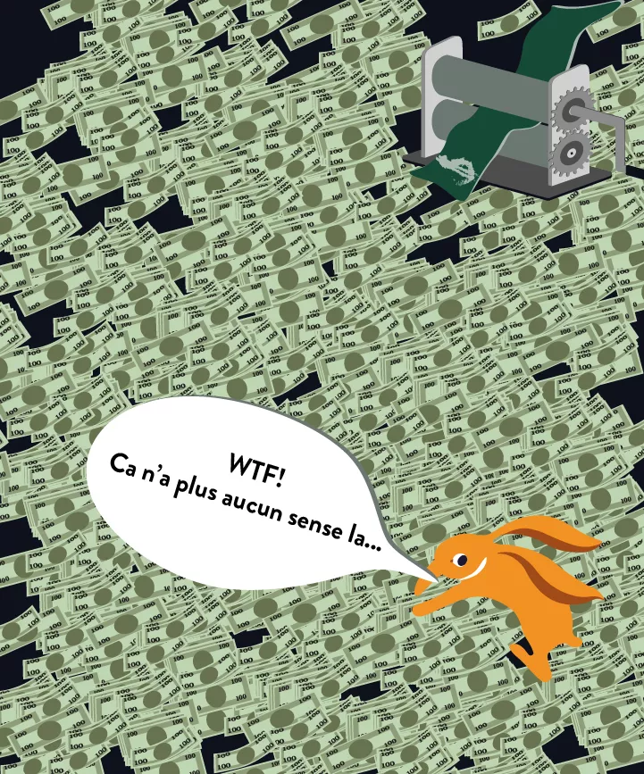

11. Buộc phải giữ cửa hàng mở cửa

Khi nền kinh tế sụp đổ và đồng tiền mất giá trị, chính phủ có thể sử dụng các biện pháp mạnh mẽ để duy trì vẻ ngoài của sự bình thường.

Weimar: "Các thương nhân tiếp tục hoạt động của họ đã phải tuân theo một pháp lệnh mới, được ban hành vào ngày 22 tháng 10, yêu cầu họ phải giữ cửa hàng mở và cung cấp hàng hóa đổi lấy tiền giấy."

Zimbabwe: "Chỉ còn lại những kệ thép trống rỗng và tủ lạnh, máy làm mát, và tủ đông. Thảm kịch là cửa hàng vẫn mở cửa vì họ không dám đóng cửa do căng thẳng chính trị và sợ hãi bị chính phủ bắt giữ do lực lượng kiểm soát giá. Ngay cả nhân viên cũng không bị sa thải vì mọi người đều nghĩ sẽ có một giải pháp nhanh chóng."

12. Mọi người đều là tội phạm

Trước một nền kinh tế sụp đổ và các quy định lan rộng, ranh giới giữa sự sống còn và tội phạm trở nên mờ nhạt.

Weimar: "Tất cả các tội phạm chống lại nhà nước, mỗi một tội phạm, ở các mức độ khác nhau, trở thành vấn đề sống còn cho cá nhân."
Zimbabwe: "Mỗi cư dân ở Zimbabwe đều là tội phạm. Dù nghe có vẻ khắc nghiệt, nhưng đó là sự thật. Với vô số luật lệ nhỏ lẻ điều chỉnh mọi khía cạnh của cuộc sống, việc mỗi người vi phạm một luật nào đó hàng ngày là điều không thể tránh khỏi. Việc sở hữu ngoại tệ là bất hợp pháp, theo một SI được công bố vào năm 2004. Việc có nhiều tài khoản ngân hàng để vượt qua giới hạn rút tiền hàng ngày là bất hợp pháp. Không có biển số xe đúng quy định, hoặc không có giấy phép radio xe hơi hoặc giấy phép máy phát điện, đều là những luật lệ mà ai đó, ở đâu đó, đang vi phạm." Mua ngoại tệ với bất kỳ giá nào việc mua cắm ngoại tệ một cách điên cuồng thường đánh dấu một bước ngoặt quan trọng trong việc mất giá tiền tệ, làm trầm trọng thêm sự sụt giảm giá trị nội tại.

> Weimar: "Mannheimer, theo chỉ đạo của sếp mình, đã ra ngoài vào tháng 8 năm 1921 và bắt đầu mua ngoại tệ với bất kỳ giá nào - 'vì Đức có vô số tiền giấy nhưng không có ngoại tệ.' Đây là dấu hiệu đầu tiên của sự sụp đổ hoàn toàn trong giá trị của đồng mark."

> Zimbabwe: Người ta cáo buộc rằng họ được giao mục tiêu hàng ngày để đáp ứng, vì một số nhu cầu forex là cấp bách và họ sẽ mua với bất kỳ tỷ giá nào để tích lũy forex nhằm đáp ứng hạn chót. Thực hành này được cáo buộc là đã thúc đẩy ngọn lửa mất giá khi giá trị của đồng đô la Zimbabwe tiếp tục giảm mạnh."

### Tóm tắt quá trình

Khi phân tích quỹ đạo kinh tế, rõ ràng là khi lạm phát cao được đạt tới, giá trị của khối lượng tiền tệ bị suy giảm. Sự mất giá này dẫn đến nhiều biến chứng, bao gồm cả tình trạng thiếu hụt tiền mặt. Trong bối cảnh này, cơ hội đầu cơ xuất hiện, đặc biệt là với sự biến động của tỷ giá hối đoái. Kết quả là, nhiều cá nhân chuyển hướng sang đầu cơ này, đầu tư mạnh vào tài sản hữu hình với hy vọng về một sự mất giá tiền tệ trong tương lai sẽ cho phép họ trả nợ bằng một đồng tiền yếu hơn. Môi trường kinh tế này làm giảm sức hấp dẫn của các công việc truyền thống và do đó, làm suy yếu sự gắn kết xã hội.

Để đối phó với tình hình này, chính phủ áp đặt các quy định nghiêm ngặt, bao gồm kiểm soát vốn. Nó cũng yêu cầu các thương nhân chấp nhận tiền tệ quốc gia và séc. Theo thời gian, các luật mới được ban hành, mở rộng định nghĩa về hành vi phạm tội. Cuối cùng, tỷ giá tăng vọt khi chính phủ sẵn lòng trao đổi tiền tệ của mình, được in với chi phí thấp hơn, để đổi lấy ngoại tệ mạnh mẽ hơn.

### 4 Điểm tương đồng trong hậu quả của lạm phát cao

1. Dầu và kim loại

Ở Đức trong thời kỳ Weimar, việc trộm cắp vật liệu quý như chì từ mái nhà diễn ra thường xuyên. Ở Zimbabwe, sự tuyệt vọng đã khiến một số người ngắt lưới điện để lấy dầu từ máy biến áp và sử dụng cho xe cộ của họ.
Trong bối cảnh kinh tế suy thoái và khan hiếm tài nguyên, chính phủ có thể thực hiện các hệ thống phân phối để kiểm soát việc phân phối hàng hóa thiết yếu. Điều này bao gồm việc sử dụng phiếu hoặc voucher để điều chỉnh việc mua xăng dầu.

> Weimar: "Ở Berlin, do tình trạng khan hiếm xăng dầu, một hệ thống phiếu đã được triển khai để điều chỉnh việc phân phối. Mỗi công dân được phân bổ một số lượng phiếu nhất định cho phép họ mua một lượng nhiên liệu hạn chế."

> Zimbabwe: "Trong cuộc khủng hoảng nhiên liệu, chính phủ đã giới thiệu một hệ thống phiếu để quản lý việc phân phối xăng dầu. Mỗi cá nhân được cấp một số lượng phiếu nhất định có thể đổi lấy một lượng nhiên liệu nhất định."
Các quốc gia đang tìm kiếm những phương thức giao dịch ổn định thay thế. Tại Weimar, các sản phẩm như đồng và nhiên liệu đã được sử dụng như phương tiện trao đổi do giá trị nội tại ổn định của chúng. Tại Zimbabwe, đối mặt với sự mất giá nhanh chóng của đồng đô la Zimbabwe, phiếu giảm giá xăng dầu, biểu thị một lượng sản phẩm thiết yếu cố định, đã trở thành tiền tệ de facto. Những tình huống này nêu bật cách mà các xã hội thích nghi với điều kiện kinh tế cực đoan, tìm ra các giải pháp sáng tạo để duy trì thương mại và nền kinh tế.

Weimar: "Việc trao đổi hàng hóa đã trở nên phổ biến; nhưng bây giờ, các mặt hàng như đồng và nhiên liệu trở thành tiền tệ phổ biến cho mua bán và thanh toán."

Zimbabwe: "Chúng tôi giờ đây sử dụng những phiếu giảm giá này để trả tiền thuê nhà cho chủ nhà, thuế thành phố, hóa đơn điện thoại, thực tế là gần như mọi thứ, vì mọi người đã ngừng chấp nhận thanh toán bằng đồng đô la Zimbabwe và séc."

#### Kết luận

Điều này kết thúc video này về những điểm tương đồng trong các giai đoạn lạm phát cao ở Zimbabwe và Cộng hòa Weimar. Trong video tiếp theo, chúng ta sẽ thảo luận về những điểm khác biệt và các song song đương đại. Cảm ơn bạn.

## Weimar vs Zimbabwe: Những Điểm Khác Biệt và Song Song Đương Đại

Bản ghi:

Trong chương này, chúng ta sẽ khám phá những điểm khác biệt và song song đương đại giữa các giai đoạn lạm phát cao trong quá khứ và hiện tại, với những giai thoại và so sánh liên quan cho ngày nay.

### Những Điểm Khác Biệt giữa Cộng hòa Weimar và Zimbabwe

1. Lỗi của đô la!

Ở Đức, người dân thường quy lỗi cho sự lạm phát là do sự tăng giá của đô la chứ không phải do sự mất giá nội tại của đồng tiền của họ. Nhiều người tin rằng hiện tượng quan sát được là do sự đánh giá cao của đô la. Quan điểm này không nhận ra mối liên kết giữa khó khăn kinh tế của họ và sự mất giá tiền tệ, chủ yếu do việc tạo ra quá nhiều tiền. Cuốn sách "Khi Tiền Tệ Chết" minh họa rõ ràng sự thiếu hiểu biết này trong số dân chúng Đức. Ngược lại, tại Zimbabwe, tình hình khác biệt: công dân hoàn toàn nhận thức được nguyên nhân cơ bản của lạm phát cao mà họ đang trải qua.

2. Tiền tệ khẩn cấp (Notgeld)

Đối mặt với khủng hoảng tiền tệ và kinh tế, Đức đã sử dụng "Notgeld" (tiền khẩn cấp). Những tờ tiền này, được in bởi các thành phố hoặc một số công ty, được thiết kế để giải quyết tình trạng thiếu hụt tiền tệ thông thường.
Thú vị là, Pháp cũng đã sử dụng Notgeld, đặc biệt là vào những năm 1920. Sáng kiến này không chỉ là hậu quả trực tiếp của lạm phát cao mà còn có nguồn gốc từ những gián đoạn do Thế chiến I gây ra. Cuộc chiến không chỉ làm mất ổn định nền kinh tế mà còn làm tăng chi phí của kim loại. Kết quả là, giá trị nội tại của đồng tiền kim loại thường vượt quá giá trị mệnh giá, khiến mọi người tích trữ chúng. Trong tình trạng thiếu hụt đồng xu, một số tổ chức, như Phòng Thương mại Lyon, đã in ra Notgeld của riêng mình.

> "Việc gì phải làm, thì phải làm." - một câu nói địa phương

Trong số các Notgeld, một tờ tiền đặc biệt nổi bật. Nó có một hình minh họa đầy ý nghĩa: ở trung tâm, một cá nhân được miêu tả đang đại tiện một Mark. Mặt sau, một bảng giá từ năm 1913 đến 1921 minh họa sự tăng giá của lạm phát trong giai đoạn này.

Nghệ sĩ đứng sau Notgeld này dường như đang thực hiện một lời chỉ trích mỉa mai đối với các cơ quan chức năng chịu trách nhiệm về cuộc khủng hoảng lạm phát cao. Tờ tiền ghi dòng chữ "Necessity knows no law". Một biểu hiện khác cụ thể cho địa phương xuất xứ của Notgeld nói: "Việc gì phải làm, thì phải làm".

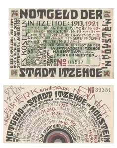

> "necessity knows no law"
Đồng tiền Shitcoin đầu tiên: Theo giai thoại, nhìn vào hình minh họa trung tâm của tờ tiền, nơi giá trị của đồng tiền bị giảm sút trực tiếp bởi hành động của cá nhân, nó có thể được gọi là "shitcoin" đầu tiên.

3. Trái phiếu và Thế chấp

Ở Weimar, một số khoản nợ được định giá lại để bù đắp cho ảnh hưởng của lạm phát. Biện pháp này không được áp dụng ở Zimbabwe.

> Weimar: "Quyết định định giá lại các khoản vay thuộc sở hữu của chính phủ trở thành luật vào năm 1925, dẫn đến việc các cổ đông nhận được 2.5 phần trăm của khoản đầu tư ban đầu của họ, miễn là tất cả các khoản bồi thường đã được thanh toán."

> Zimbabwe: "Vào tháng 7 năm 2007 (ba năm sau), tôi có thể lấy ra một tờ tiền ZDW 500,000 đã mất giá (bt "000") từ túi của mình, giờ đây trị giá 1.67 đô la theo tỷ giá thị trường song song, và trả hết khoản vay thế chấp, mà ban đầu phải trả trong hai mươi năm. Hơn nữa, tờ tiền này chỉ đại diện cho 0.49 phần trăm của mức lương hàng tháng của tôi cho cùng một tháng."

Để tìm hiểu thêm về cách quản lý cuộc khủng hoảng của Đức, cuốn sách này cũng là điều cần thiết.

### Song song Hiện đại

1. Thao túng chính sách tiền tệ để kiểm soát nền kinh tế.
   Trong lịch sử của Cộng hòa Weimar, rõ ràng là các nhà công nghiệp không muốn thấy đồng Mark tăng giá. Khả năng vay mượn và trả nợ bằng một đồng tiền bị phá giá nặng nề đã mang lại cho họ một lợi thế đáng kể. Cơ chế này đã tạo điều kiện cho việc xây dựng các khu công nghiệp lớn với chi phí gần như bằng không. Những nhà công nghiệp này lo sợ việc đồng Mark tăng giá vì nó cản trở hoạt động của họ. Một số thậm chí coi lạm phát mạnh mẽ là điều tốt, tin rằng nó đảm bảo việc làm cho dân chúng. Tuy nhiên, họ không nhận ra tác động tiêu cực của lạm phát này đối với tiết kiệm và nền kinh tế nói chung. Đối với những người chơi kinh tế này, việc in tiền là một phước lành.

> Weimar: "Đó là lý do tại sao việc đồng mark tăng giá được sợ hãi mạnh mẽ, và ngay cả những tuần lễ 'ổn định' sau Genoa cũng gây ra sự đình trệ của kinh doanh."

> Weimar: "Các vòng tròn công nghiệp đối mặt với nguy cơ tiền mặt sẽ trở nên quý giá hơn hàng hóa, và một sự sụp đổ sẽ xảy ra khi mọi người cố gắng chuyển đổi tài sản của họ thành tiền mặt."

Một song song hiện đại có thể được rút ra từ các phát biểu của Christine Lagarde, gợi ý rằng công dân nên ưu tiên triển vọng việc làm hơn là bảo vệ tiết kiệm của họ. Giống như các nhà công nghiệp của Weimar, bà dường như ủng hộ việc in tiền như một công cụ để kích thích việc làm, bất chấp giá trị của tiết kiệm.

> Christine Lagarde: "Chúng ta nên hạnh phúc hơn khi có việc làm hơn là thấy tiết kiệm của mình được bảo vệ."

2. Tài sản tư nhân trong thời kỳ xung đột.

Lịch sử của Cộng hòa Weimar tiết lộ rằng trong giai đoạn này, tài sản và vốn được giữ ở nước ngoài đã bị tịch thu. Biện pháp này nhắc nhở về các sự kiện gần đây hơn ở Nga, đặc biệt là vào đầu một cuộc xung đột. Những tình huống này làm nổi bật một thực tế đáng lo ngại: trong thời kỳ khủng hoảng, sự tôn trọng đối với tài sản tư nhân có thể bị xâm phạm. Đây là một song song lịch sử và hiện đại nhấn mạnh về những hậu quả tiềm ẩn của các cuộc khủng hoảng đối với quyền lợi cá nhân.

> Weimar: "Tất cả vốn Đức được giữ ở nước ngoài đã bị tịch thu."

> [20minutes.fr](https://www.20minutes.fr/monde/3286947-20220513-guerre-ukraine-geler-avoirs-russes-vol-non-redistribuer-kiev-poserait-lourdes-questions): "Khoảng 300 tỷ đô la dự trữ của Nga được giữ ở nước ngoài thực sự đã bị đóng băng như một phần của các biện pháp trừng phạt của phương Tây, trong số 640 tỷ đô la dự trữ được Ngân hàng Trung ương Nga giữ."

3. Khái niệm về giá cả thị trường.
   > Weimar: "Les entreprises zombies"
Hiện đại: "Các doanh nghiệp zombie"> Weimar: "Việc ổn định đã chấm dứt giai đoạn khi các doanh nhân có thể vay mượn bao nhiêu tùy thích mà không phải chịu trách nhiệm với bất kỳ ai khác. Một số lượng lớn công ty, được tạo ra hoặc phát triển trong thời kỳ dồi dào tiền tệ, nhanh chóng trở nên không sản xuất khi vốn trở nên khan hiếm."

Một công ty zombie là công ty mà, dưới điều kiện thị trường bình thường, sẽ không còn khả năng thanh toán hoặc gần như phá sản, nhưng vẫn tiếp tục hoạt động chủ yếu thông qua việc vay vốn với chi phí thấp. Những công ty này kiếm đủ tiền để trang trải nợ nhưng không thể phát triển đáng kể.

Khái niệm về các công ty zombie không phải là mới. Thực tế, nó đã tồn tại trong Cộng hòa Weimar. Tại thời điểm đó, nhiều công ty dường như đang phát triển mạnh mẽ, hưởng lợi lớn từ việc tiếp cận với tín dụng miễn phí. Họ vay mượn một số tiền lớn, với triển vọng trả lại sau này bằng một đồng tiền mất giá do lạm phát. Tuy nhiên, khi lạm phát dừng lại và đồng mark Đức lấy lại giá trị, những công ty này, không thực sự khả thi về mặt hoạt động và tài chính, trở nên không lợi nhuận và phải đóng cửa.

Hiện tượng của các công ty zombie không chỉ giới hạn trong lịch sử hậu chiến của Đức. Ngay cả ngày nay, nhiều công ty lớn vẫn tồn tại nhờ quyền truy cập đặc quyền vào tín dụng với lãi suất rất thấp. Nếu họ phải vay với lãi suất thông thường, nhiều trong số họ sẽ không còn lợi nhuận. Điều này đặc biệt liên quan khi chúng ta đang ở năm 2023, và sau một thời gian dài của lãi suất gần như bằng không, chúng đã bắt đầu tăng. Sự phát triển gần đây trong bối cảnh tài chính chắc chắn sẽ là một bài kiểm tra quyết định cho những công ty từng được gọi là "zombie".

5. Làm giàu nhanh chóng!

Trong lịch sử, đã có những thời điểm mà cá nhân tìm cách làm giàu nhanh chóng, như đã xảy ra ở Weimar và Zimbabwe thông qua việc đầu cơ. Ngày nay, chúng ta thấy một xu hướng tương tự với sự xuất hiện của một số loại tiền điện tử. Mọi người bị cám dỗ bởi lợi nhuận nhanh chóng, chấp nhận rủi ro với hy vọng nhân lên đầu tư của mình một cách nhanh chóng. Cách tiếp cận này có thể nhớ lại những gì được quan sát trong các giai đoạn của lạm phát cao, nơi đầu cơ được sử dụng để thu được lợi nhuận nhanh chóng, thường là vào chi phí của người khác.

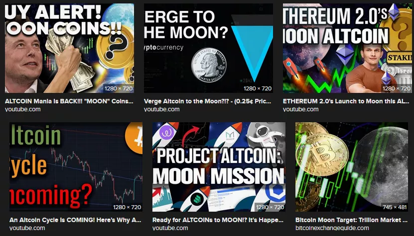

6. Tiết kiệm, phương thuốc chống lại sự không chắc chắn

> ảnh hưởng xâm lấn và phá hủy của việc giảm giá trị liên tục của vốn và thu nhập, cũng như sự không chắc chắn về tương lai.
> Thật thú vị khi nhấn mạnh một trích dẫn nhấn mạnh tác động phá hủy của việc giảm giá trị vốn đối với sự gắn kết xã hội, cũng như sự không chắc chắn mà nó tạo ra. Nó nói: "ảnh hưởng xâm lấn và phá hủy của việc giảm giá trị liên tục của vốn và thu nhập, cũng như sự không chắc chắn về tương lai."

Hãy tưởng tượng một kịch bản bạn có gia đình hoặc người thân mà bạn muốn bảo vệ. Bạn làm việc chăm chỉ, tiết kiệm tiền, để dự đoán những không chắc chắn trong tương lai. Nếu mọi thứ đều có thể dự đoán, việc tiết kiệm sẽ vô ích. Nhưng trước những điều bất ngờ, như một chiếc xe hỏng, tiết kiệm trở thành phao cứu sinh. Nó giảm bớt sự không chắc chắn của thế giới. Tuy nhiên, trong một thời kỳ lạm phát cao, việc tiết kiệm trở thành một thách thức. Tiền nhanh chóng mất giá, khiến việc lập kế hoạch dài hạn trở nên khó khăn. Sự bất ổn tài chính này có thể gây ra căng thẳng và lo lắng.

Ngày nay, trước sự giảm sức mua, đầu tư lên ngôi. Tuy nhiên, cách tiếp cận này đi kèm với những rủi ro riêng của nó. Tiết kiệm luôn là phương thuốc chống lại sự không chắc chắn. Có dự trữ tài chính để quản lý các tình huống không lường trước được góp phần vào sự yên tâm và tăng cường sự gắn kết xã hội. Kết luận, việc bảo vệ sức mua của chúng ta là cần thiết để duy trì sự ổn định xã hội và cá nhân.

## Đổi tiền ở Mỹ Latinh

Bây giờ, chúng ta sẽ xem xét các giai đoạn đổi tiền khác nhau ở các quốc gia Mỹ Latinh.

### Giải thích các biểu đồ
Trên slide, bên trái, là các năm của việc đổi tiền mới, tên của đồng tiền mới, và tỷ giá hối đoái với đồng tiền cũ. Lấy ví dụ về Argentina, peso moneda nacional được chuyển đổi với tỷ lệ 25 đối 1 từ đồng tiền trước đó, peso real. Trong bối cảnh này, chúng ta sẽ xem xét sự phát triển của đồng tiền Argentina theo thời gian. Ngoài ra, chúng ta sẽ chỉ ra mệnh giá ban đầu và cuối cùng của các tờ tiền bạc cho mỗi giai đoạn.

Ở phía bên phải của slide, có một biểu đồ về lạm phát. Các mũi tên màu đỏ đại diện cho các năm của siêu lạm phát, được định nghĩa theo tiêu chí của Kagan là tỷ lệ lạm phát 50% mỗi tháng. Tiêu chí này đôi khi có thể dẫn đến những giải thích mơ hồ, với những năm có tỷ lệ lạm phát cao nhưng không đáp ứng định nghĩa chặt chẽ của siêu lạm phát.
Cần lưu ý rằng, việc đổi tiền mới, trong các giai đoạn lạm phát, là một biện pháp phổ biến được các chính phủ áp dụng. Tuy nhiên, điều này không giải quyết được vấn đề cơ bản của lạm phát hoặc siêu lạm phát. Đó chỉ là cách để đổi tên đồng tiền và loại bỏ các số không, mà không thực sự giải quyết nguyên nhân gốc rễ của siêu lạm phát: sự mở rộng của nguồn cung tiền tệ. Trong một video sau, chúng ta sẽ thảo luận về các giải pháp thực sự để giải quyết và khắc phục vấn đề siêu lạm phát. Trong loạt bài này, chúng ta sẽ nêu bật hậu quả của việc đổi tiền mới đơn giản mà không có các cải cách thích hợp: lạm phát vẫn tiếp diễn.
Sau Argentina, nghiên cứu của chúng ta sẽ bao gồm Brazil, Bolivia, Peru, Nicaragua, và Venezuela. Chúng ta sẽ xem xét các việc đổi tiền mới đã diễn ra ở các quốc gia này.

### Argentina

Trước năm 1826, Argentina sử dụng đồng đô la Tây Ban Nha. Sau khi độc lập vào năm 1816, nước này đã giới thiệu đồng tiền của riêng mình dựa trên đồng real Tây Ban Nha, dẫn đến việc tạo ra một đồng tiền tương tự. Bảng bắt đầu từ năm 1881, năm giới thiệu "peso moneda nacional" với các tờ tiền bạc lên đến 10,000. Tiếp theo là "peso ley," được chuyển đổi với tỷ lệ 100 đối 1 và có các tờ tiền bạc lên đến một triệu. Sau đó, "argentine peso" xuất hiện với tỷ lệ chuyển đổi 10,000 đối 1 (tương đương với việc loại bỏ bốn số không), và các tờ tiền bạc lên đến 10,000. Năm 1985, "australes" được giới thiệu và chuyển đổi với tỷ lệ 1,000 đối 1, có các tờ tiền bạc lên đến 500,000. Năm 1992, "peso ley" hiện tại được thiết lập với tỷ lệ 10,000 đối 1, một lần nữa loại bỏ bốn số không. Chỉ có các năm 1989 và 1990 trải qua siêu lạm phát.

### Brazil

Brazil là một trường hợp điển hình về việc đổi tiền mới, như được minh họa bởi lịch sử thay đổi tiền tệ của nước này. Trước khi độc lập, Brazil sử dụng đồng real Bồ Đào Nha. Tuy nhiên, ngay từ năm 1747, đất nước này bắt đầu sử dụng "Brazilian real" của riêng mình, trước lâu so với tuyên bố độc lập vào năm 1822. Bảng bắt đầu từ năm 1818, đánh dấu sự bắt đầu của việc phát hành tiền giấy Brazil. Trước đó, tiền tệ chủ yếu ở dạng tiền xu. Những tờ tiền giấy này đạt giá trị lên đến một triệu reals.
Bắt đầu từ năm 1942, Brazil đã bắt đầu một loạt các đợt đổi tiền mới. Trong hầu hết các trường hợp (1942, 1967, 1986, 1989, 1993), tỷ lệ chuyển đổi là 1.000 thành 1. Năm 1990, một sự thay đổi tên gọi mà không chuyển đổi đã diễn ra. Chuỗi các loại tiền tệ này như sau:
- Réals (phiên bản cũ) cho đến năm 1942.
- Cruzeiros vào năm 1942.
- Cruzeiros (phiên bản mới) vào năm 1967.
- Cruzados vào năm 1986.
- Cruzados Novo vào năm 1989.
- Quay trở lại Cruzeiros vào năm 1990.
- Cruzeiros Reais vào năm 1993.
- Cuối cùng, Brazilian Real vào năm 1994.

Mệnh giá cao nhất đạt 500.000, và lần đổi tiền cuối cùng vào năm 1994 được thực hiện với tỷ lệ 2.750 thành 1. Các năm 1989 và 1990 được đánh dấu bởi lạm phát phi mã, trong khi 1993-1994 chứng kiến tỷ lệ lạm phát cao mà không đạt ngưỡng của lạm phát phi mã (50% mỗi tháng). Sau giai đoạn hỗn loạn này, Brazil một lần nữa đổi mới tiền tệ của mình bằng cách loại bỏ một số số không.

### Bolivia

Bolivia là một ví dụ khác về một quốc gia đã trải qua các giai đoạn lạm phát cực kỳ cao, yêu cầu phải đổi mới tiền tệ. Dưới đây là một bản tóm tắt về lịch sử tiền tệ của nó:

Trước khi giành được độc lập vào năm 1825, Bolivia sử dụng đồng đô la Tây Ban Nha làm tiền tệ. Sau khi giành được độc lập, quốc gia này đã giới thiệu Bolivian Sol từ năm 1827 đến 1864, thay thế đồng đô la Tây Ban Nha. Tuy nhiên, cần lưu ý rằng những tờ tiền giấy đầu tiên ở Bolivia chỉ xuất hiện vào năm 1864.

Năm 1864, "Boliviano" đầu tiên được giới thiệu, với tỷ lệ chuyển đổi 1.000 thành 1 so với Bolivian Sol. Đồng tiền này vẫn lưu hành cho đến khi đạt mệnh giá 10.000 Bolivianos.
Sau đó, Bolivia đã thay đổi tiền tệ của mình sang "Bolivian Peso," đã trải qua lạm phát phi mã nghiêm trọng đến mức cuối cùng đạt mệnh giá lên đến 10 triệu. Giai đoạn lạm phát này đạt đỉnh vào các năm 1984-1985, với tỷ lệ lạm phát hàng tháng thường xuyên tiếp cận ngưỡng lạm phát phi mã là 50%. Để có một cái nhìn tổng quan, một tỷ lệ lạm phát ổn định 50% mỗi tháng trong suốt một năm đầy đủ dẫn đến tỷ lệ lạm phát hàng năm khoảng 12.800%. Năm 1985, tỷ lệ lạm phát hàng năm của Bolivia đạt 11.749%, cho thấy rằng gần như mỗi tháng, lạm phát đều tiếp cận hoặc vượt qua ngưỡng 50%.

Để đối phó với cuộc khủng hoảng tiền tệ này, vào năm 1987, Bolivia đã giới thiệu một đồng tiền mới, đơn giản gọi là "Boliviano," với tỷ lệ chuyển đổi 1 triệu Bolivian Pesos cho 1 Boliviano. Phiên bản này của Boliviano vẫn đang lưu hành ngày nay.

Đó là một cái nhìn tổng quan về lịch sử tiền tệ đầy biến động của Bolivia, được đánh dấu bởi các giai đoạn lạm phát phi mã và đổi mới tiền tệ.

### Peru

Peru là một trường hợp thú vị liên quan đến tác động của quy tắc 50% tùy ý. Bắt đầu với lịch sử tiền tệ, Peru sử dụng vàng Tây Ban Nha cho đến thế kỷ 19 và tuyên bố độc lập vào năm 1821. Đồng đô la Peru được sử dụng từ năm 1822 đến 1863. Năm 1863, đồng real Peru được thay thế bằng soldi oro, với tỷ lệ 10 đến 1, đạt giá trị tối đa 50,000. Năm 1985, đồng tiền "Inti" được giới thiệu với tỷ lệ chuyển đổi 1000 đến 1, đạt đỉnh 5 triệu. Năm 1991, "SOL" được ra mắt với tỷ giá 1 triệu đến 1, với các tờ tiền giấy có mệnh giá từ 10 đến 200. Xem xét các giai đoạn tái định giá, năm 1988 được coi là một năm của lạm phát cực kỳ, đặc biệt là vào tháng 9. Tháng 7-8 năm 1990 cũng chứng kiến một giai đoạn lạm phát cực kỳ. Năm 1988, tỷ lệ lạm phát hàng năm là 667%, với đỉnh điểm 50% vào tháng 9. Ngược lại, năm 1989 trải qua tỷ lệ lạm phát 3000% mà không có tháng nào vượt quá 50%, do đó không được phân loại là lạm phát cực kỳ. Năm 1990, lạm phát đạt đỉnh 7481%. Rõ ràng là quy tắc 50% có thể là tùy ý, vì năm 1988 được coi là một năm của lạm phát cực kỳ, không giống như năm 1989. Nếu quy tắc này được xem xét lại, có lẽ sẽ khôn ngoan khi hạ thấp ngưỡng để bao gồm các giai đoạn như Peru đã trải qua vào năm 1989.

> Hiểu những gì đang xảy ra
>
> Điều quan trọng cần hiểu về tái định giá tiền tệ là khi giá trị của tiền tệ đạt đến những con số khổng lồ, như 5 hoặc 10 triệu, nó sẽ được tái định giá. Quá trình này có thể được lặp lại nhiều lần, liên quan đến việc thay đổi tiền tệ. Kết quả là tiết kiệm của cá nhân có thể bị ảnh hưởng nghiêm trọng, ngay cả khi không có lạm phát cực kỳ. Ví dụ, nếu ai đó tiết kiệm được 1.000 đô la trong một năm và quản lý để dành ra 100 đô la, năm sau tờ tiền mệnh giá thấp nhất có thể là 1.000 đô la, khiến 100 đô la đã tiết kiệm trước đó trở nên vô giá trị. Sự xói mòn của tiết kiệm không yêu cầu lạm phát cực kỳ rõ ràng. Ngay cả khi một người đã tiết kiệm được 10.000 đô la trong mười năm qua, số tiền đó có thể cuối cùng chỉ đáng giá một lượng nhỏ, không đủ mua một chai nước đơn giản. Thực tế này rõ ràng ở nhiều quốc gia đã trải qua tái định giá, ngay cả khi chỉ có vài tháng được phân loại là lạm phát cực kỳ. Ngược lại, một số quốc gia, như Nicaragua, đã trải qua nhiều năm lạm phát cực kỳ liên tiếp.

### Nicaragua

Nicaragua, trước đây dưới sự cai trị của Tây Ban Nha, ban đầu sử dụng đồng đô la Tây Ban Nha, giống như nhiều quốc gia khác bị Tây Ban Nha thuộc địa hóa. Sau khi được hợp nhất vào Đế quốc Tây Ban Nha, Đế quốc Mexico, và sau đó là Cộng hòa Liên bang Trung Mỹ, Nicaragua tuyên bố độc lập. Bắt đầu từ năm 1878, peso trở thành đồng tiền chính thức của đất nước, với giá trị dao động từ 1 đến 100. Năm 1912, đất nước giới thiệu Cordoba đầu tiên, tiếp theo là Cordoba thứ hai vào năm 1988 và Cordoba thứ ba vào năm 1991, vẫn đang được sử dụng cho đến ngày nay. Cordoba đầu tiên đạt giá trị 1 triệu, và Cordoba thứ hai 10 triệu. Việc tái định giá vào năm 1991 diễn ra sau nhiều năm lạm phát cực kỳ.

### Venezuela

Venezuela là quốc gia cuối cùng được nhắc đến trong video này. Quốc gia này đã trải qua bốn lần đổi tiền trong thời gian qua. Trong những ngày đầu, Venezuela sử dụng đồng đô la Tây Ban Nha trước khi tuyên bố độc lập vào năm 1811. Năm 1879, nó giới thiệu bolivar là đồng tiền chính thức, và đồng tiền này vẫn được sử dụng cho đến năm 1983, khi chính phủ chọn lựa chế độ tỷ giá hối đoái nổi.

Một sự thật đáng chú ý về Venezuela là sự tham gia của nó vào Liên minh Tiền tệ Latin. Liên minh này bao gồm các đồng tiền như 5 pesetas của Tây Ban Nha, 5 drachmas của Hy Lạp, 5 bolivars của Venezuela, 5 lire của Ý, 5 francs của Bỉ, và 5 francs của Pháp.

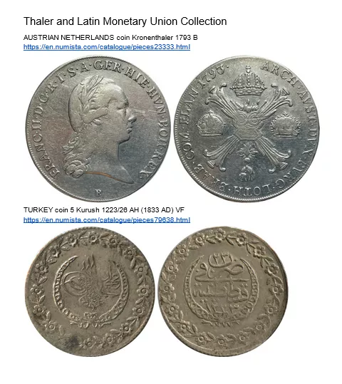

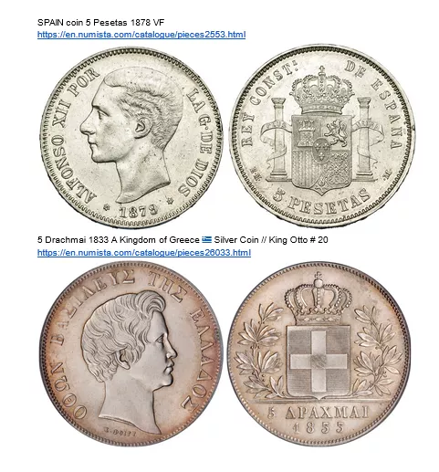

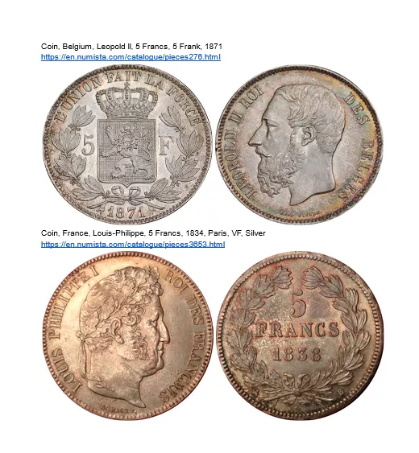

Trong giai đoạn này, đồng 5 bolivar của Venezuela có trọng lượng tương đương với các đồng tiền của các quốc gia thành viên trong Liên minh, bao gồm Ý, Tây Ban Nha, Bỉ, và Pháp. Những đồng bolivar này được làm từ bạc, với một đồng tiền cụ thể từ năm 1929 nặng 25 gram và có độ tinh khiết 900, hay 90% bạc nguyên chất. Với giá bạc hiện tại, đồng tiền này có giá khoảng 17 đến 18 đô la Mỹ.

Sau khi áp dụng tỷ giá hối đoái nổi vào năm 1983, một số lần đổi tiền đã diễn ra:

- Năm 2008: bolivar fuerte, hay "bolivar mạnh," được giới thiệu, đạt tới 100,000 trước một lần đổi tiền từ một nghìn thành một.
- Năm 2018: Soberano được giới thiệu với các tờ tiền đạt 1 triệu. Năm 2021, nó được thay thế bằng bolivar số, cũng đạt một triệu, trước một lần đổi tiền mới từ một triệu thành một. Ngày nay, tờ 10 hoặc 20 tương đương với 10 triệu hoặc 20 triệu Soberano.
  Các tờ tiền từ giai đoạn này, có từ năm 2018, được phân phối tại các hội nghị Bitcoin ở Biarritz, Toronto, và Miami. Những tờ tiền Soberano này đạt giá trị tối đa 1 triệu. Một lần đổi tiền sau đó đã diễn ra, giảm giá trị của một triệu xuống khoảng 3 xu. Hiện tại, 10 tờ tiền 1 triệu tương đương với một tờ 10. Kể từ năm 2016, Venezuela đã trải qua lạm phát phi mã, đại diện cho giai đoạn thứ 57 trong một bảng cụ thể.

Trong video tiếp theo, một bộ sưu tập các tờ tiền lạm phát phi mã sẽ được trình bày, tập trung vào Venezuela và các quốc gia khác được liệt kê. Bộ sưu tập này chứa gần như tất cả các tờ tiền của Venezuela. Nghiên cứu sẽ tập trung vào các lần đổi tiền khác nhau cho mỗi quốc gia được nhắc đến. Ngoài ra, sẽ có một cuộc khám phá về việc đổi tiền ở Zimbabwe, một chủ đề đáng chú ý.

### Kết luận

Chúng ta đã thấy rằng lạm phát phi mã không phải là chỉ số duy nhất của một thảm họa kinh tế. Việc đổi tiền nhiều lần, loại bỏ các số không, hoặc thay đổi tên của đồng tiền có những hậu quả trực tiếp đối với dân số, từ việc mất đi sự hỗ trợ đến các vấn đề về thực phẩm. Mặc dù lạm phát phi mã là đáng lo ngại, số lần đổi tiền, như quan sát ở Brazil, cho thấy một thực tế phức tạp hơn.
Dựa trên tiêu chí về lạm phát 50% mỗi tháng, một số giai đoạn có thể được phân loại là siêu lạm phát. Điều này đặc biệt đúng khi xem xét các tiêu chí của tổ chức kế toán quốc tế, mà xem xét các đặc điểm như việc từ bỏ nhanh chóng đồng tiền bởi dân chúng, việc lập chỉ số cho tiền lương, và các khoản vay với lãi suất cao để bù đắp cho lạm phát.
Kết luận, siêu lạm phát chỉ là một khía cạnh của các thách thức kinh tế. Lạm phát cao một mình cũng có thể gây hại không kém. Phần tiếp theo sẽ khám phá các giải pháp có thể để vượt qua siêu lạm phát.

## Cách vượt qua siêu lạm phát

### Cách chấm dứt lạm phát vừa phải và cao

Những kết luận được đề cập được rút ra từ cuốn sách "Chế độ Tiền tệ và Lạm phát" của Bernold. Theo Bernold, phương pháp duy nhất để chấm dứt lạm phát là thực hiện một cải cách tiền tệ và áp đặt các hạn chế đối với chính phủ. Những hạn chế này bao gồm việc thành lập một cơ quan, như một ngân hàng trung ương, hoạt động độc lập với các quyết định chính trị của chính phủ. Lạm phát cao và siêu lạm phát thường là kết quả của việc tài trợ cho thâm hụt ngân sách thông qua việc tạo ra tiền tệ. Để giải quyết lạm phát vừa phải, điều cần thiết là giảm tốc độ tăng trưởng của nguồn cung tiền. Bernold cũng đề xuất rằng sự tăng trưởng tiền tệ này nên tương đối với các quốc gia lân cận. Một điểm đáng ngạc nhiên là, trong các giai đoạn của lạm phát cao hoặc siêu lạm phát, tổng giá trị của nguồn cung tiền thực sự có thể giảm. Một ví dụ nổi bật về tình huống này là Zimbabwe.

### Giải pháp Phản Trực Giác

Khi nghiên cứu về Zimbabwe, người ta nhận thấy rằng 10 nghìn tỷ đơn vị nguồn cung tiền đã mất hết giá trị của mình. Ở Weimar, có thể in được hai phần ba tổng giá trị danh nghĩa của 65 tỷ đơn vị nguồn cung tiền trong một ngày. Điều này cho thấy nguồn cung tiền có thể bị mất giá. Để khắc phục tình hình này, cần phải tăng đáng kể nguồn cung tiền để đạt được một mức độ phù hợp. Sau đó, một cải cách tiền tệ là không thể tránh khỏi. Trong tình huống của lạm phát cao, cải cách này là không thể tránh khỏi, nhưng nó phải đảm bảo rằng có đủ tiền lưu thông. Sau bước này, có thể áp đặt các hạn chế đối với chính phủ.

Theo quan sát của Bernold, khi giải quyết các vấn đề lạm phát, các tổ chức như IMF và Ngân hàng Thế giới không phải lúc nào cũng áp dụng đúng chiến lược. Trong một số trường hợp, khi một quốc gia cần tăng nguồn cung tiền của mình, những tổ chức này lại tìm cách giảm nó. Chìa khóa là đạt được một mức độ tiền tệ phù hợp và sau đó áp đặt giới hạn cho sự tăng trưởng của nó, như vậy tránh được việc tài trợ cho chi tiêu của chính phủ thông qua việc tạo ra tiền tệ.

Một khía cạnh thú vị được Bernold nêu lên là thành công của một cải cách tiền tệ không chỉ phụ thuộc vào tính chính xác kỹ thuật của nó mà còn vào sự tin tưởng mà dân chúng đặt vào nó. Một số cải cách được thiết kế tốt có thể thất bại vì công chúng không tin tưởng vào chúng, trong khi những cải cách được thiết kế kém có thể thành công vì dân chúng tin tưởng vào chúng. Nhận thức và sự tin tưởng của công chúng do đó là những yếu tố thiết yếu trong sự thành công hoặc thất bại của một cải cách tiền tệ.

- Ở Zimbabwe, giải pháp được áp dụng để chống lại lạm phát là đô la hóa, có nghĩa là họ đã chấp nhận đồng đô la Mỹ hoặc các đồng tiền khác từ các quốc gia lân cận. Cách tiếp cận này ngăn chặn chính phủ in tiền tùy ý.
- Ở Đức, giải pháp là tạo ra một đồng tiền mới, Rentenmark. Đồng tiền này được bảo đảm bằng tài sản lãnh thổ của Reich, và chiến lược này đã chứng minh là hiệu quả.

### Trường hợp của Zimbabwe

Zimbabwe giành được độc lập vào năm 1980 và giới thiệu đồng đô la Zimbabwe. Ban đầu, hai đồng đô la Zimbabwe có giá trị khoảng 1.60 đô la Mỹ. Tuy nhiên, vào năm 1997, sau các biện pháp xã hội ủng hộ các cựu chiến binh, đồng tiền này đã mất giá 72% trong một ngày trong sự kiện Black Friday. Sau đó, vào đầu những năm 2000, đất nước này đã triển khai chương trình phân phối lại đất đai, lấy đất từ các chủ sở hữu da trắng và trao cho dân địa phương. Quyết định này đã làm hại đến xuất khẩu vì những chủ mới thường thiếu kinh nghiệm quản lý các trang trại quy mô lớn. Kết quả là, trong khi Zimbabwe là một quốc gia xuất khẩu ròng vào năm 1999, nó đã trở thành một quốc gia nhập khẩu ròng vào năm 2003.

Vào năm 2006, đất nước này đã giới thiệu phiên bản mới của đồng tiền của mình, ZWN, với tỷ giá hối đoái 1 đổi 1,000. Vào năm 2008, một đơn vị tiền tệ khác, ZWR, được giới thiệu với tỷ giá hối đoái 1 đổi 10 tỷ. Điều này dẫn đến việc tạo ra tờ tiền 100 nghìn tỷ đồng biểu tượng.

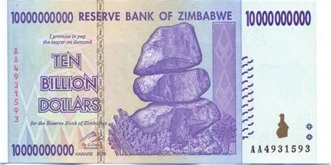

#### Đô la hóa & Giải quyết Khủng hoảng

Do đó, sau năm 2009, đối mặt với khủng hoảng tiền tệ dai dẳng và lạm phát cực kỳ cao, Zimbabwe đã từ bỏ đồng tiền quốc gia của mình và cho phép sử dụng các đồng tiền nước ngoài, chủ yếu là đô la Mỹ. Quyết định này, mặc dù cực kỳ quyết liệt, đã chấm dứt lạm phát. Một bài học quan trọng cần rút ra là việc dừng việc phát hành tiền mặt quá mức và chấm dứt việc tài trợ ngân sách bằng ngân hàng trung ương có thể chấm dứt lạm phát.

Tuy nhiên, đô la hóa không phải là giải pháp kỳ diệu. Mặc dù nó có thể chấm dứt lạm phát, nhưng nó đặt ra những thách thức kinh tế khác. Một trong những hậu quả là mất đi chính sách tiền tệ tự chủ. Không có đồng tiền riêng, một quốc gia không thể điều chỉnh chính sách tiền tệ của mình để đáp ứng với các cú sốc kinh tế nội bộ.

Vào năm 2007, tỷ lệ lạm phát của Zimbabwe đã đạt ngưỡng 50% mỗi tháng, chính thức đánh dấu quốc gia này đang trong tình trạng lạm phát. Sau khi đô la hóa vào năm 2009, lạm phát đã chấm dứt, nhưng đất nước đối mặt với những thách thức kinh tế khác.
Điều đáng lo ngại là Zimbabwe đã cố gắng tái giới thiệu đồng tiền của riêng mình, và dấu hiệu của lạm phát cao đã xuất hiện trở lại. Theo một số tổ chức quốc tế, đất nước này có thể đã đáp ứng các tiêu chí cho lạm phát cao trở lại, ngay cả khi nó chưa đạt ngưỡng chính thức là 50% mỗi tháng. Điều này nhắc nhở về nguy cơ của việc phát hành tiền mặt quá mức và tài trợ thâm hụt của ngân hàng trung ương.

## Kết luận

Trong cuốn sách của tôi có tựa đề "Tất cả về Bitcoin," tôi đã dành một chương để nói về lạm phát ở Zimbabwe. Tôi chi tiết các sự kiện quan trọng, cung cấp nhiều ví dụ minh họa cách quốc gia này cuối cùng đã chấm dứt lạm phát.

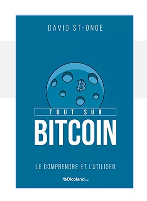

Đối với những ai tò mò về trải nghiệm của Đức sau Thế chiến I, tôi rất khuyến khích cuốn truyện tranh "Ngân hàng của Đế chế." Nó kể về cách Đức đã vượt qua lạm phát, đặc biệt qua việc tạo ra Rentenmark.

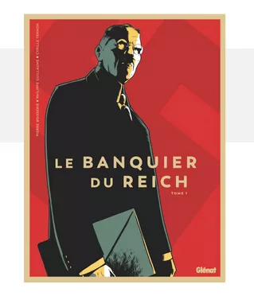

Trong cuốn sách của tôi có tựa đề "Tất cả về Bitcoin," tôi đã dành một chương để nói về lạm phát ở Zimbabwe. Tôi chi tiết các sự kiện quan trọng, cung cấp nhiều ví dụ minh họa cách quốc gia này cuối cùng đã chấm dứt lạm phát. Đối với những ai tò mò về trải nghiệm của Đức sau Thế chiến I, tôi rất khuyến khích cuốn truyện tranh "Ngân hàng của Đế chế." Nó kể về cách Đức đã vượt qua lạm phát, đặc biệt qua việc tạo ra Rentenmark.
Thông điệp chính là có nhiều chiến lược để vượt qua lạm phát cao. Người ta có thể chọn đô la hóa hoặc giới thiệu một đồng tiền mới. Những giải pháp này chỉ hiệu quả nếu dân chúng tin tưởng vào chúng. Việc áp đặt các hạn chế nghiêm ngặt là rất quan trọng. Một ngân hàng trung ương thực sự độc lập là cần thiết. Nó không được phép bơm tiền vào lưu thông để bù đắp cho thâm hụt ngân sách của chính phủ. Trong trường hợp lạm phát nhẹ, việc hạn chế sự tăng trưởng của nguồn cung tiền là đủ. Tuy nhiên, khi đối mặt với lạm phát cao, điều quan trọng là phải đầu tiên có một nguồn cung tiền phù hợp với kích thước của nền kinh tế đang xét. Sau đó, việc áp đặt các hạn chế nghiêm ngặt đối với chính phủ để ổn định tình hình là bắt buộc.

## Trình bày bộ sưu tập tiền giấy lạm phát cao

Liên kết đến bộ sưu tập đã quét có sẵn trong Bitcoin Educational Toolkit, có thể truy cập từ phần Resources của nền tảng.

# Chúng ta đã đến đây như thế nào?

## Sự Xuất Hiện của Lớp Tiền Thứ Hai và Ngân Hàng Trung Ương

Bản ghi:

Sự xuất hiện của lớp tiền thứ hai và các ngân hàng trung ương đầu tiên là một chủ đề hấp dẫn. Chủ đề này được thảo luận rộng rãi trong cuốn sách "Layered Money" của Nick Battia. Tôi rất khuyến khích những ai quan tâm đến sự phát triển và phức tạp của hệ thống tiền tệ của chúng ta nên đọc. Mục tiêu của phần này là hiểu về nguồn gốc của việc tạo ra tiền và làm thế nào nó có thể dẫn đến lạm phát cao.

### Tiền Pyramid và Ngân Hàng Trung Ương

#### Đồng Florin

Lịch sử của tiền tệ bắt đầu từ thế kỷ 13 ở Ý, cụ thể là Florence. Tại thời điểm đó, đồng florin và hối phiếu được sử dụng phổ biến. Một ví dụ nổi bật là đồng florin, được trang trí với hình ảnh của Thánh John the Baptist.

Mặc dù sở hữu một đồng florin thật sự là đắt đỏ ngày nay, nhưng các bản sao lại có sẵn. Cũng có các loại tiền tệ khác từ thời đó, như đồng soldo từ các quốc gia Ý của thế kỷ 17, có hình ảnh của Chúa Kitô.

#### Hối Phiếu (thế kỷ 13)

Thực hành phổ biến vào thời điểm đó như sau: các thợ kim hoàn phát hành hối phiếu đổi lấy florin được gửi gắm. Những florin này được giữ cẩn thận trong các két sắt của họ. Như vậy, vàng thật, được đại diện bởi đồng florin, tạo thành lớp tiền tệ đầu tiên, trong khi hối phiếu tạo thành lớp thứ hai. Tuy nhiên, tính thanh khoản của hệ thống này bị hạn chế. Nếu ai đó muốn đổi vàng của họ lấy hối phiếu, giao dịch là đơn giản. Nhưng việc trao đổi những hối phiếu này giữa các cá nhân không phổ biến.

#### Sở Giao Dịch Chứng Khoán Antwerp (thế kỷ 16)

Sở Giao Dịch Chứng Khoán Antwerp đánh dấu một cột mốc quan trọng trong sự phát triển của tiền giấy. Chính tại đây, thực hành giảm giá các giấy tờ hứa thanh toán được giới thiệu. Những giấy tờ này là các công cụ giấy biểu thị giá trị tiền tệ, nhưng điều đặc biệt là chúng ghi tên và ngày đáo hạn. Điều này khiến chúng khó trao đổi trước ngày đáo hạn.
Cuộc cách mạng do Sở Giao Dịch Chứng Khoán Antwerp mang lại nằm ở khả năng giảm giá những giấy tờ này trước ngày đáo hạn. Ví dụ, nếu một giấy tờ hứa thanh toán đáo hạn trong một tháng, có thể mua nó với giá giảm để tính đến thời gian trước ngày đáo hạn. Sự đổi mới này không chỉ làm cho tiền giấy trở nên dễ lưu thông hơn mà còn giới thiệu khái niệm về giá trị thời gian của tiền.
Khái niệm này, mặc dù được liên kết với Nick Bell thông qua bí danh trên Twitter của ông là "time value of BTC," không phải là phát minh của ông. Tuy nhiên, ông đã thảo luận chi tiết về nó trong công trình của mình. Ý tưởng chính là thời gian có giá trị. Do đó, nếu ai đó quyết định trả một tờ hứa phiếu trị giá $100 trước một tháng, họ có thể mua nó với giá, ví dụ, $98 và nhận lại $100 vào ngày đáo hạn. Sự đổi mới về tiền tệ này bắt nguồn từ Sở Giao dịch Chứng khoán Antwerp.

#### VOC và Thị trường Chứng khoán Amsterdam (thế kỷ 17)

Sau Sở Giao dịch Chứng khoán Antwerp, một cột mốc quan trọng khác là sự thành lập của VOC, Công ty Đông Ấn Hà Lan. Công ty này, có trụ sở tại Hà Lan, thậm chí đã phát hành tiền tệ riêng của mình. Sau khi VOC được thành lập, thị trường chứng khoán đầu tiên đã được thiết lập tại Amsterdam, trở thành thị trường chứng khoán đầu tiên cho công ty này. Điều thú vị cần lưu ý là cách người Hà Lan quản lý để chấm dứt sự thống trị của Antwerp như một trung tâm kinh tế quốc tế. Họ đơn giản là chặn quyền truy cập vào sông Scheldt. Chiến lược này là một phần của một phong trào lịch sử lớn hơn, cuộc nổi dậy của những kẻ ăn mày. Một sự kiện quan trọng trong lịch sử châu Âu.

#### Sự can thiệp của Ngân hàng Amsterdam

Sau khi VOC được thành lập, một yếu tố quan trọng khác trong lịch sử tiền tệ là việc giới thiệu đồng tiền vàng bởi Ngân hàng Amsterdam. Những đồng tiền này, có từ năm 1722, được làm từ bạc. Tuy nhiên, điều thực sự làm cách mạng hóa tài chính vào thời điểm đó không phải là chính đồng tiền, mà là các tài khoản liên quan đến tiền tệ này tại Ngân hàng Amsterdam. Những tài khoản này trở thành phương tiện chính của giao dịch quốc tế. Các giao dịch chỉ đơn giản được ghi chép trong sổ cái. Nhờ hệ thống này, Amsterdam trở thành trung tâm kinh tế toàn cầu. Theo thời gian, Ngân hàng Amsterdam quyết định áp đặt việc sử dụng những tài khoản này. Các nhà đổi tiền độc lập được yêu cầu hàng ngày phải đổi tiền xu của họ lấy tiền gửi tại ngân hàng.

#### Sự thành lập Ngân hàng Anh để tài trợ cho chiến tranh

Sự thành lập Ngân hàng Anh được thúc đẩy bởi nhu cầu tài trợ cho chiến tranh vào cuối thế kỷ 17. Giống như Ngân hàng Amsterdam, nó áp đặt tiền gửi bằng sắc lệnh. Điều đặc biệt của Ngân hàng Anh là đẩy các ngân hàng tư nhân xuống một vị trí thứ yếu trong hệ thống tiền tệ, từ đó tạo ra cái gọi là "lớp tiền tệ thứ ba".
Ban đầu, lớp tiền tệ đầu tiên được đại diện bởi vàng. Tiền gửi tại các ngân hàng tư nhân tạo thành lớp thứ hai. Tuy nhiên, khi những tiền gửi này không thể được chuyển đổi thành vàng, một lớp tiền tệ thứ ba xuất hiện. Từ đó, các tờ tiền do các ngân hàng tư nhân phát hành không còn được chuyển đổi thành vàng mà thành tiền giấy từ Ngân hàng Anh, chính nó có thể được chuyển đổi thành vàng. Sự phát triển này dẫn đến sự phức tạp hóa của hệ thống tiền tệ với việc thêm vào các lớp bổ sung.

#### Cơn hoảng loạn năm 1796

Cảnh hoảng loạn tại Ngân hàng Tiết kiệm Seamen's trong Cơn hoảng loạn năm 1857.

Theo sau cơn hoảng loạn ngân hàng năm 1796, một hiện tượng xảy ra khi mọi người cố gắng chuyển lên "kim tự tháp tiền tệ". Mọi người muốn đổi tiền tệ lớp ba của họ lấy tiền tệ lớp hai, và cuối cùng là tiền tệ lớp đầu tiên, vàng. Đối mặt với làn sóng dồn dập này, Ngân hàng Anh buộc phải hành động để ổn định tình hình. Để ngăn chặn sự giảm phát tiềm năng của dự trữ vàng, nó quyết định tạm thời ngừng chuyển đổi tiền giấy của mình thành vàng. Sự tạm ngừng này, ban đầu được dự định là một biện pháp tạm thời, kéo dài trong một thời gian hai thập kỷ.

### Kết luận:
Các ngân hàng trung ương đã phát triển để trở thành người cho vay cuối cùng, tạm ngừng khả năng chuyển đổi tiền tệ của họ thành vàng. Mặc dù hành động này ban đầu được dự định là một giải pháp tạm thời, nhưng cuối cùng nó đã trở nên vĩnh viễn, đánh dấu sự ra đời của khái niệm về người cho vay cuối cùng. Sự chuyển đổi này đã hình thành các ngân hàng trung ương như chúng ta biết ngày nay. Tuy nhiên, trong các nền kinh tế mong manh hơn, khả năng in tiền tùy ý này có thể dẫn đến những hậu quả không mong muốn, như lạm phát cực kỳ cao, nếu sử dụng không có trách nhiệm.

## Sách và Tài Nguyên

Lạm phát cực kỳ cao là một chủ đề thú vị đã được nghiên cứu qua các sự kiện lịch sử khác nhau. Nếu bạn muốn tìm hiểu sâu hơn về chủ đề này, đây là danh sách 10 nguồn tài nguyên cần đọc và nghiên cứu:

- "When Money Dies: The Nightmare of Deficit Spending, Devaluation, and Hyperinflation in Weimar Germany" của Adam Fergusson. Cuốn sách này chi tiết về cuộc khủng hoảng lạm phát cực kỳ cao ở Đức sau Thế chiến I.

- "The Economics of Inflation - A Study of Currency Depreciation in Post-War Germany" của Costantino Bresciani-Turroni. Một phân tích sâu rộng về lạm phát cực kỳ cao ở Đức trong những năm 1920.

- "This Time Is Different: Eight Centuries of Financial Folly" của Carmen M. Reinhart và Kenneth S. Rogoff. Mặc dù cuốn sách bao gồm nhiều loại khủng hoảng tài chính, nhưng nó thảo luận rộng rãi về lạm phát cực kỳ cao trong lịch sử.

- "Zimbabwe's Hyperinflation, Analysis and Lessons Learned" của Steve Hanke. Một nghiên cứu về lạm phát cực kỳ cao ở Zimbabwe vào đầu những năm 2000.

- "Monetary Regimes and Inflation: History, Economic and Political Relationships" của Peter Bernholz. Cuốn sách này xem xét các trường hợp lạm phát cực kỳ cao trong lịch sử và tìm hiểu các yếu tố cơ bản.

- "The Hyperinflation Survival Guide: Strategies for American Businesses" của Gerald Swanson. Một hướng dẫn thực tế về cách các doanh nghiệp có thể điều hướng môi trường lạm phát cực kỳ cao.

- "Dying of Money: Lessons of the Great German and American Inflations" của Jens O. Parsson. Một phân tích so sánh về các cuộc khủng hoảng lạm phát ở Đức và Hoa Kỳ.

- "The Downfall of Money: Germany’s Hyperinflation and the Destruction of the Middle Class" của Frederick Taylor. Một khám phá dưới dạng kể chuyện về ảnh hưởng xã hội và kinh tế của lạm phát cực kỳ cao đối với xã hội Đức.

- "Currency Boards for Developing Countries: A Handbook" của Steve Hanke và Kurt Schuler. Mặc dù tập trung vào các bảng tiền tệ, cuốn sách này cung cấp một góc nhìn về cách tránh tình trạng lạm phát cực kỳ cao.