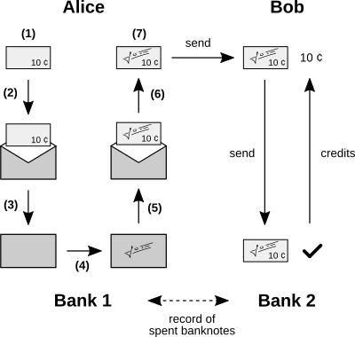

# A Dive into the History of Bitcoin's Creation

Welcome to this course dedicated to the history of Bitcoin's creation! As a user, you might have wondered where the tool you are using comes from. Moreover, you may not understand the references sometimes made to the people and events that have marked the short history of cryptocurrency. Finally, studying this history will allow you to better understand Bitcoin itself, by exposing the context that shaped its slow formation.

In this course, you will discover the journey of its design, launch, and initial economic construction. In the first part, we will look at the technical context in which the concept of Bitcoin emerged. In the second part, we will focus on its birth and bootstrapping. In the third part, we will study how Bitcoin gained magnitude in terms of economic use, mining production, and software development. In the fourth part, we will simply follow how Satoshi Nakamoto, the creator of Bitcoin, gradually disappeared and how the community took over, making cryptocurrency a truly collective project.

This course is, of course, centered on the figure of Satoshi Nakamoto, whose words and actions you will discover, but it also involves other characters who participated in the development of Bitcoin during its first years of existence. You will thus get to know individuals like Hal Finney, Martti Malmi, Laszlo Hanyecz, Gavin Andresen, Jeff Garzik, or Amir Taaki, who were essential pioneers in this growth. We hope that this dive into the history of Bitcoin's beginnings will be beneficial to you!

+++

# Introduction
<partId>41dc2815-c63a-4ce1-9b88-e7b3825e958e</partId>

## Introduction to the History of Bitcoin's Creation
<chapterId>85290407-1aa3-4cb4-890a-aed23441afb7</chapterId>
This course aims to tell you the story of the creation of Bitcoin in a way you've never read before. It is often overlooked, despite being filled with fascinating details. We will endeavor to describe it in all its complexity, from its conception by Satoshi Nakamoto to his early disappearance and the handover to the community.

### Brief Overview

Bitcoin was designed by an individual (or a group) using the pseudonym Satoshi Nakamoto. On October 31, 2008, he shared a white paper describing his model via an obscure email mailing list on the Internet. On January 8, 2008, he implemented his concept by publishing the software's source code and launching the network by mining the first blocks of the chain. Eager to attract a critical number of users, he promoted his creation across various communication channels.

After a difficult start, the system's bootstrapping finally took place in October 2009, when the unit of account – also called bitcoin – gained a price. The first merchant services began to appear at the beginning of 2010, starting with exchange services that bridged to the dollar. It was also around this time that mining with a graphics card, more efficient, was initially implemented, and the first exchange for a physical good, specifically a pizza, took place, following the initiative of Laszlo Hanyecz.

The project really took off during the summer of 2010, following the publication of an article on the very popular site Slashdot. The exchange with the dollar, Bitcoin mining, and the software development significantly improved during this period. From the fall, Satoshi Nakamoto gradually began to withdraw, stopping public writing and gradually delegating his tasks. He eventually disappeared completely in the spring of 2011, after handing over his access to his right-hand men, Martti Malmi and Gavin Andresen. The community finally took over and managed to carry the project to what it is today.

Besides this narrative, Bitcoin also has a prehistory. Indeed, it is not an object that came out of nowhere. Its creation is part of a specific context: the search for a way to transcribe the properties of cash into cyberspace. In particular, the technical elements that compose it are the result of decades of research and experimentation that preceded it. Bitcoin is based on:

- Digital signature, stemming from asymmetric cryptography born in 1976;
- Distributed consensus, developed in the 1980s following the early developments of the Internet;
- Document timestamping, invented in the early 90s with the emergence of the first strong hash functions;
- Proof of work, described and implemented during the 90s.

In designing Bitcoin, Satoshi Nakamoto was greatly inspired by the eCash model, a concept proposed by cryptographer David Chaum in 1982 and implemented through his company DigiCash in the 90s. This model, which relied on the blind signature process, allowed users to make exchanges in a relatively confidential manner. However, it was based on a centralized network of banks that intervened to prevent double spending. Therefore, when DigiCash went bankrupt, the system collapsed. Bitcoin corrected this problem by eliminating the need for a trusted third party.

Bitcoin emerged in a particular context: the closure by the U.S. federal government of private currency systems, such as the digital gold currency e-gold in 2008 and the Liberty Reserve system in 2013. By relying on a model that distributed risk among its participants, similar to peer-to-peer sharing systems like BitTorrent, Satoshi Nakamoto created a robust model of digital currency that could withstand direct assaults from the state.

The creation of Bitcoin was also in the context of the state closure of private currency systems such as e-gold and Liberty Reserve. It constituted a robust model of digital currency that could resist direct assaults from the U.S. federal government. By distributing risk among its participants, similar to peer-to-peer sharing systems like BitTorrent, it ensured its own survival.

Finally, the Bitcoin project is the heir to the ethos of the cypherpunk movement, a movement of rebel cryptographers from the 90s, who sought to preserve the privacy and freedom of people on the Internet through the proactive use of cryptography. Bitcoin is in line with projects like b-money, bit gold, or RPOW imagined by these individuals at the end of the 90s and the beginning of the 2000s. Satoshi Nakamoto mentioned them, although he was not aware of them before designing Bitcoin and probably was not part of the original movement.

### Course Outline

This course is divided into four parts, which respectively focus on the origins of Bitcoin (3 chapters), its slow emergence (3 chapters), its initial rise (3 chapters), and the formation of its community (4 chapters). In total, it includes 12 chapters which are as follows (the concerned period is also specified):

- eCash: Chaumian electronic cash (1976–1998)
- Private Digital Currencies (1996–2013)
- Decentralized Models Before Nakamoto (1982–2012)
- The Birth of Bitcoin (August 2008–Jan. 2009)
- Presentation to the World (Jan. 2009–Oct. 2009)
- The Bootstrapping of Cryptocurrency (Oct. 2009–Apr. 2010)
- Graphics Cards, Pizzas, and Free Bitcoins (Apr. 2010–June 2010)
- The Great Slashdotting (June 2010–July 2010)
- The First Technical Troubles (July 2010–Sept. 2010)
- The Digital Gold Rush (Sept. 2010–Oct. 2010)
- The Blossoming of the Ecosystem (Oct. 2010–Dec. 2010)
- The Disappearance of Satoshi (Dec. 2010–Apr. 2011)
- The Community Takes Over (Apr. 2011–Sept. 2011)

### Details

All dates and times are given according to the UTC time zone (corresponding to the Greenwich Meridian) and may thus differ from American dates. It is likely that Satoshi Nakamoto was in the United States when working on his project. However, Bitcoin is an international project, which notably included contributions from Finnish developer Martti Malmi (Eastern European Time, UTC+2 / UTC+3), and we will therefore refer to the universal time zone. Thus, we say that the effective launch of the main network took place on January 9 at 2:54 AM, rather than January 8 at 6:54 PM, which corresponds to the East Coast time zone (Pacific Time, UTC-8 / UTC-7).

The content is partially adapted from the French book [*L'Élégance de Bitcoin*](https://bitcoinbook.shop/products/lelegance-de-bitcoin) (2024), written by the author of this course. In addition to direct sources archived on the Internet, we rely on a number of reference works. Here are the main ones:

- [*The Genesis Book*](https://store.bitcoinmagazine.com/products/the-genesis-book) by Aaron van Wirdum, published in 2024;
- [*Digital Gold*](https://www.amazon.com/Digital-Gold-Bitcoin-Millionaires-Reinvent/dp/006236250X) by Nathaniel Popper, published in 2014;
- [*The Book of Satoshi*](https://www.bookofsatoshi.com/) by Phil Champagne, published in 2014;
- [*Digital Cash*](https://press.princeton.edu/books/hardcover/9780691179490/digital-cash) by Finn Brunton, published in 2019;
- [*This Machine Kills Secrets*](https://penguinrandomhouselibrary.com/book/?isbn=9780142180495) by Andy Greenberg, published in 2012.

Note that for non-English version of this course, most quotes come from American English and have been translated for the occasion. The term *coin* is generally translated as "unit" (and not "piece") when it refers to the unit of account.

# The Origins of Bitcoin
<partId>25a75ed6-f34b-4c9a-8224-e099a3e774dc</partId>

## eCash: Chaumian Digital Cash
<chapterId>e443d2ab-68ce-45c0-aec7-30b88d3acdc8</chapterId>

Before delving into the actual story of Bitcoin's creation by Satoshi Nakamoto, it is appropriate to discuss what preceded it. We will address the topic in three stages: first, we will introduce the concept of Chaumian digital cash commonly called *eCash*; then, we will talk about private currencies based on centralized systems such as e-gold; finally, we will describe the technical models that were imagined before the implementation of the robust distributed system that is Bitcoin.

Let's start with the first concept, eCash. eCash stems from the work of David Chaum, an American computer scientist and cryptographer born in 1955, considered a pioneer in the field of anonymous communications and a forerunner of the cypherpunks. He made a major contribution to the development of cryptography in the 1980s. He developed his model of digital cash (known as "Chaumian") at the same time and attempted to implement it in the 1990s through his company DigiCash.

David Chaum's action followed a conceptual revolution: the unveiling of asymmetric cryptography in 1976 by Whitfield Diffie and Martin Hellman. The idea of digital currency also emerged from this seminal discovery. Besides concealing the information contained in a message, asymmetric cryptography allowed the establishment of signature processes. It thus became possible for a person to mathematically prove that they were the owner of a certain amount of digital account units.

In this chapter, we will study what asymmetric cryptography has contributed, how David Chaum used it to design eCash, and how his concept was subsequently implemented.

### The Emergence of Modern Cryptography

Cryptography is the discipline aimed at securing communication in the presence of malicious third parties by ensuring the confidentiality, authenticity, and integrity of the transmitted information.
For centuries, the sole method of concealing the content of a message involved a type of encryption that relied on a unique key for both encrypting and decrypting the message. This is known as *symmetric* cryptography. The [Caesar cipher](https://fr.wikipedia.org/wiki/Chiffrement_par_décalage), which involves replacing each letter in a text with another letter a fixed distance away in the alphabet, is the most well-known example (the chosen distance then becomes the key). With the development of telecommunications and the construction of the first calculating machines and computers during the 20th century, encryption algorithms have become significantly more complex. However, even though this type of cryptography works very well, it has one major drawback: the need to exchange the key in a secure manner before communication can take place.

To solve this problem, *asymmetric* cryptography, also known as public key cryptography, was developed. It relies on two distinct keys: a private key, which is supposed to remain secret, and a public key, which is derived from the private key. Theoretically, the private key cannot be easily found from the public key, which means the latter can be shared with everyone without concern.

This type of cryptography allows for the implementation of both encryption algorithms and signature processes. Asymmetric encryption involves using the public key as an encryption key and the private key as a decryption key. The user generates a pair of keys, keeps the private key, and shares the public key with their correspondents so they can send messages. This type of encryption is analogous to a mailbox that the recipient uses to receive letters and of which only they possess the key.


Digital signatures, on the other hand, rely on using the private key as a signature key and the public key as a verification key. The user generates a pair of keys, signs a message with the private key, and sends it to their correspondents, who can verify its authenticity using the public key. Thus, they never need to know the private key.


Asymmetric cryptography was independently discovered by several researchers during the 1970s. However, the first to present what they had found were Whitfield Diffie and Martin Hellman, two cryptographers from Stanford University. In November 1976, they published a paper titled "[New Directions in Cryptography](https://ee.stanford.edu/~hellman/publications/24.pdf)" in the journal *IEEE Transactions on Information Theory*, which described a key exchange algorithm (intended for the transmission of secret keys for symmetric encryption) as well as a digital signature process. In the introduction of this paper, they wrote:
> "We stand today on the brink of a revolution in cryptography. The development of cheap digital hardware has freed it from the design limitations of mechanical computing and brought the cost of high-grade cryptographic devices down to where they can be used in commercial applications such as remote cash dispensers and computer terminals. In turn, such applications create a need for new types of cryptographic systems which minimize the necessity of secure key distribution channels and supply the equivalent of a written signature. At the same time, theoretical developments in information theory and computer science show promise of providing provably secure cryptosystems, changing this ancient art into a science."

Here is a photograph from 1977, taken by Chuck Painter for the Stanford News Service, where you can see Whitfield Diffie (on the right) and Martin Hellman (in the center). The person on the left is the cryptographer Ralph Merkle, who was on the verge of making the same discovery.


The article by Diffie and Hellman paved the way for a multitude of innovations. One of these was the [RSA cryptosystem](https://people.csail.mit.edu/rivest/Rsapaper.pdf), which was designed in 1977 by cryptographers Ronald Rivest, Adi Shamir, and Leonard Adleman (who gave it their names) and patented by MIT in 1983. This system allows both the encryption and signing of messages, thanks to the interchange of the roles of the keys. RSA was publicly presented for the first time in an [article by Martin Gardner](https://simson.net/ref/1977/Gardner_RSA.pdf) published in the magazine *Scientific American* in August 1977, which was titled "Mathematical Games: A new kind of cipher that would take millions of years to break."

The discovery of asymmetric cryptography also motivated the creation of one-way functions, characterized by making the calculation of an image (forward direction) very easy and obtaining a pre-image (reverse direction) very difficult. In particular, it led to the development of the first cryptographic hash functions, which transformed a variable-size message into a fixed-size digest. Between 1989 and 1991, several hashing algorithms (MD2, MD4, and MD5) were thus designed by Ronald Rivest for MIT.

The basic cryptographic elements of Bitcoin stem from this research. The ECDSA signature scheme, allowing the authorization of spending a traditional transaction, was created in 1992 for NIST. The SHA-256 hash function, used in multiple places in the protocol, was published in 2001 as part of the SHA-2 algorithm suite made public by the NSA. For more information on this topic, you can refer to the course [Crypto 301](../crypto301/fr.md) presented by Loïc Morel.

### Blind Signatures and Electronic Cash

This revolution in the field of cryptography also inspired the young David Chaum, a computer scientist from the West Coast and then a doctoral student at the University of Berkeley. He quickly became passionate about privacy protection. He was indeed very concerned about the future of freedom and confidentiality in a society that was becoming increasingly computerized.


David Chaum in the 90s (source: [Elixxir](https://www.youtube.com/watch?v=X45NmCBpYUw))

In his [foundational article](https://www.cs.ru.nl/~jhh/pub/secsem/chaum1985bigbrother.pdf), "Security Without Identification: Transaction Systems to Make Big Brother Obsolete" published in 1985 in *Communications of the ACM*, he wrote:
> "The foundation is being laid for a dossier society, in which computers could be used to infer individuals' life-styles, habits, whereabouts, and associations from data collected in ordinary consumer transactions. Uncertainty about whether data will remain secure against abuse by those maintaining or tapping it can have a 'chilling effect,' causing people to alter their observable activities. As computerization becomes more pervasive, the potential for these problems will grow dramatically."

This obsession with privacy protection explains his interest in the field of cryptography, to which he contributed as early as 1979. In 1981, he described the foundations of anonymous communication through mix networks, which would notably serve email relay services (Mixmaster) and the Tor anonymous network. In 1982, he participated in the founding of the International Association for Cryptologic Research (IACR) at the annual CRYPTO '82 conference. That same year (and this is what interests us here), in an [article](https://sceweb.sce.uhcl.edu/yang/teaching/csci5234WebSecurityFall2011/Chaum-blind-signatures.PDF) titled "Blind Signature for Untraceable Payments" he published the blind signature process, which is at the heart of his privacy-respecting digital currency model: eCash.

As David Chaum [explained](https://chaum.com/wp-content/uploads/2022/01/05-07-96-DigiCash_s-Ecash%E2%84%A2-to-be-Issued-by-Deutsche-Bank.pdf) in a press release in 1996:

> "Ecash is a digital form of cash that works on the Internet where paper cash can't. Like cash, it offers consumers true privacy in what they buy."

The eCash model is a digital currency concept that allows customers to make payments that are relatively confidential. It is a form of cash, in the sense that users can hold digital notes directly, rather than in an account managed by a trusted third party. However, the system relies on servers, called banks or mints, which issue and replace users' notes with each transaction. When a note is transferred, the recipient sends it to their bank, which is responsible for verifying it and giving them one or more others in return. The banks each maintain a register of spent notes to prevent double spending. Each eCash system is overseen by a central authority that issues authorizations.

Digital notes can be issued without guarantee or can be backed. In the first case, they form a base currency that must acquire value in itself. In the second case, they are backed by another currency (typically the dollar), and the user can return their notes to their bank at any time to recover the corresponding amount.

In its technical operation, the eCash model is based on the blind signature process, which allows a signer to sign something without seeing what they are signing. Each note is generated by a user, then signed by a bank to ensure its authenticity, without the bank being able to identify the note. Each note represents a specific amount of monetary units (denomination), and each bank in the system has a private key to sign each type of denomination. The mathematical procedure involved (which we will not describe here) is analogous to the signing of a physical note on [carbon paper](https://fr.wikipedia.org/wiki/Papier_carbone) placed in a sealed envelope.

Here is an illustration of the different steps involved in the creation and replacement of a Chaumian note (from *L'Élégance de Bitcoin*):



The actions (each corresponding to a mathematical operation or an information transmission) are as follows:

1. A user named Alice creates a carbon paper note;
2. She places it in a sealed envelope;
3. Alice sends the envelope containing her note to the bank and communicates the desired denomination;
4. The bank signs the envelope indicating the quantity of units the note represents, which has the effect of signing the carbon paper note inside;
5. The bank returns the envelope to Alice;
6. Alice opens the envelope to retrieve her signed note.
7. It verifies that the bank's signature is authentic.
The transfer of the signed note is done by giving it to another user of the system whom we will call Bob. The steps are as follows:

- Alice sends the note to Bob;
- Bob verifies that it has indeed been signed by Alice's bank;
- He immediately sends the received note to his bank;
- Bob's bank checks that the note has not already been used and, if so, signs a new note or credits Bob's account (if there is backing).

All this implies that no bank in the system can link the payment to Alice's identity, which explains why we talk about customer confidentiality. The merchant (here, Bob) is, however, obliged to go through a bank to confirm the payment, and his bank can therefore be aware of the amounts received. Moreover, the system depends on a trusted third party – the central authority that designates the participating banks – which makes it fragile by design.

### Implementations of eCash

In 1990, David Chaum founded his own company, DigiCash B.V., to implement his idea of electronic cash. This company was based in Amsterdam, the Netherlands, and held the patents for his invention. At that time, the Internet was still in its infancy (the Web was still under development) and e-commerce did not exist; thus, the eCash model constituted a formidable opportunity.


However, it was not David Chaum's company that first tested the model: it was the cypherpunks who implemented it without regard for the patents and who did not ask for permission to do so. Thus, a protocol named Magic Money was [proposed](https://cypherpunks.venona.com/date/1994/02/msg00247.html) on the cypherpunks mailing list on February 4, 1994, by an anonymous developer going by the name Pr0duct Cypher. This protocol allowed for the creation of one's own currency by operating an email server that served as an eCash mint. The cypherpunks had fun with it, creating all sorts of units of account like Tacky Tokens, GhostMarks, DigiFrancs, and NexusBucks. However, the utility of these tokens was minimal, and exchanges were very rare.
On the side of DigiCash, after a few years of development, a prototype was [presented](https://chaum.com/wp-content/uploads/2022/01/05-27-94-World_s-first-electronic-cash-payment-over-computer-networks.pdf) in May 1994 at the first international conference on the World Wide Web at CERN in Geneva. The company then conducted a trial that began on October 19 of that year, with the issuance of units called "CyberBucks" which were not backed by any other currency. Various merchants accepted CyberBucks as part of this experiment. The cypherpunks also took to it, using it to conduct real exchanges. Thus, CyberBucks acquired value on the market. However, this value collapsed when eCash was deployed in the traditional banking system.


Photo (blurry) of the DigiCash team in 1995: David Chaum is on the far left (source: [Chaum.com](https://chaum.com/ecash/))

The introduction of eCash into the banking system began in October 1995 with the start of DigiCash's partnership with Mark Twain Bank, a small bank in Missouri. Unlike the case of CyberBucks whose exchange rate was floating, the unit of account was backed by the US dollar. Between 1996 and 1998, six banks followed Mark Twain Bank: Merita Bank in Finland, Deutsche Bank in Germany, Advance Bank in Australia, Bank Austria in Austria, Den norske Bank in Norway, and Credit Suisse in Switzerland. The press then promised a bright future for this system.

Nevertheless, things did not go as planned. Due to his stubborn and suspicious nature, David Chaum wanted to keep control over his company and refused partnerships with major financial players like ING and ABN AMRO, Visa, Netscape, and Microsoft. He left his position in 1997, and the same year the company moved its headquarters to California. During 1998, the partner banks announced they were abandoning eCash. DigiCash eventually went bankrupt in November 1998, ending this implementation of Chaumian electronic cash.

### The Legacy of David Chaum's Model

The development of the eCash model, however, was not fruitless. It laid the groundwork for multiple initiatives.
During the 1990s, other technical solutions for making payments on the Internet took advantage of the trend started by eCash: this was the case with CyberCash, First Virtual, or Open Market, which benefited from the disadvantages of credit card payments, which were impractical, costly, and insecure at the time. Micropayment systems also emerged, such as CyberCoin (managed by CyberCash), NetBill, and MilliCent. These systems never really took off, but they paved the way for the development of PayPal starting in 1999, a case that we will discuss in the following chapter.
Other alternative centralized systems also appeared in parallel, such as e-gold and Liberty Reserve. These managed private digital currencies and benefited from the legal ambiguity that could exist in cyberspace. We will also talk about this in the next chapter.

Then, eCash inspired the cypherpunks who developed their own models such as b-money, bit gold, and RPOW. They added proof of work and other elements, which were later found in Bitcoin. We will study these concepts in Chapter 3.

Finally, David Chaum's model significantly influenced Satoshi Nakamoto when he developed his concept of currency. This is evidenced by the multiple references in the [white paper](assets/pdf/bitcoin-20090324.pdf) (the title, the description of the problem in section 2, the name of the PDF [sent](https://gwern.net/doc/bitcoin/2008-nakamoto) to Wei Dai in August 2008), as well as his private and public interventions. In this sense, eCash is the main predecessor of Bitcoin, even if it is not the only one.

With Bitcoin, Satoshi Nakamoto created a robust and confidential digital currency, real electronic cash. In doing so, he realized the [prediction](https://www.youtube.com/watch?v=mlwxdyLnMXM&t=872s) of Milton Friedman, Nobel Prize in Economics and founder of the Chicago School, who said in an interview with the National Taxpayers Union Foundation in 1999:

> "I think that the Internet is going to be one of the major forces for reducing the role of government. The one thing that's missing, but that will soon be developed, is a reliable e-cash, a method whereby on the internet you can transfer funds from A to B without A knowing B or B knowing A."

## Private Digital Currencies
<chapterId>43035fa3-2805-4331-a6fb-070931d749cf</chapterId>

In the previous chapter, we explored the first form of electronic cash that emerged from the advent of the Internet and modern cryptography: David Chaum's eCash model. This model significantly influenced Satoshi Nakamoto and was a key milestone on the path that led to Bitcoin. However, the story of cryptocurrency's origins doesn't end with eCash; it also includes the experiments with private currencies operating on the Internet, developed from the late 1990s.

In this chapter, we will look at what was done in the realm of private currencies in the United States. We will first discuss the case of the Liberty Dollar. Then, we will examine centralized systems like e-gold and Liberty Reserve. Finally, we will talk about PayPal, whose approach is different, but nonetheless serves as an illuminating example of the model based on a trusted third party.

In all cases, these systems were eventually shut down by authorities or had to comply with financial regulations. This is why Satoshi Nakamoto, who had a good understanding of these systems, deeply understood the need for an alternative system not to rely on a central authority.

### Monetary Freedom in the United States and the Liberty Dollar

The history of the United States was characterized by a great monetary plurality from its beginnings. From the 17th century to the mid-19th century, the English colony turned independent republic indeed allowed the free circulation of foreign currencies (the US dollar was not officially created until 1792), as well as the [private minting](https://fee.org/articles/private-coinage-in-america/) of gold and silver coins. A relative [banking freedom](https://iea.org.uk/wp-content/uploads/2023/12/Dowd-Free-Banking-Interactive.pdf) also prevailed between 1837 and 1863.

However, things changed with the Civil War, won by the Union, in a process of centralizing power. Thus, a law from Congress on June 8, 1864, prohibited the private minting of coins. This law, which has become section 486 of title 18 of the United States Code (*18 U.S. Code § 486*), [stated](https://www.law.cornell.edu/uscode/text/18/486):
"Anyone, except as authorized by law, who manufactures, circulates, or attempts to circulate or pass, coins of gold, silver, or other metals, or metal alloys, intended to be used as current currency, whether they resemble coins of the United States or foreign countries, or are of original design, shall be fined under this title or imprisoned for no more than five years, or both."

To enforce these restrictions, a government agency was founded in 1865 by Abraham Lincoln: the Secret Service. The initial mission of the Secret Service was to combat counterfeiting and financial fraud in general. Indirectly, it served to strengthen the federal state's seigniorage by entrusting the monopoly on currency production to the United States Mint.

The situation became even more restricted afterward. The central bank, called the Federal Reserve of the United States, was created in 1913, following the banking panic of 1907. Then, the classic gold standard was abandoned in 1933 as part of F.D. Roosevelt's New Deal, with [Executive Order 6102](https://fr.wikipedia.org/wiki/Executive_Order_6102) which prohibited individuals and companies located in the United States from holding gold. The reference to gold in the monetary system was finally abandoned in 1971 when Richard Nixon announced the end of the dollar's convertibility into gold internationally.
With the repeal of the gold possession ban and the development of the Internet starting in the 1970s, the idea of deploying private currencies re-emerged. This was the case with Bernard von NotHaus, who launched the Liberty Dollar in 1998, a currency based on gold and silver that could be found in the form of silver coins and representative notes. The system was managed by a non-profit organization called NORFED (acronym for National Organization for the Repeal of the Federal Reserve and Internal Revenue Code). Starting in 2003, the Liberty Dollar was also available in digital form, through an account system similar to e-gold (see the following section). The system experienced a certain level of success. Besides the circulating coins, NORFED's vaults contained about 8 million dollars in precious metals to ensure the currency's convertibility, including 6 million to back the digital unit.


Liberty Dollar (10 dollars) in silver from 2003 (source: [Numista](https://en.numista.com/catalogue/exonumia242820.html))

In September 2006, the U.S. Mint issued a [press release](https://www.usmint.gov/news/press-releases/20060914-liberty-dollars-not-legal-tender-united-states-mint-warns-consumers), written jointly with the Department of Justice, in which it concluded that the use of NORFED's coins violated section 486 of title 18 of the United States Code and constituted "a federal crime." Consequently, after an FBI raid on NORFED's premises in 2007, the violations were held against NotHaus and his associates, who were arrested in 2009 and tried in March 2011. In 2014, Bernard von NotHaus was sentenced on appeal to six months of house arrest and three years of probation.

### e-gold: Gold on the Web
An emblematic example of private electronic currency is the e-gold system. It was what is known as a "digital gold currency," meaning a currency electronically transferred and fully backed by an equivalent amount of gold stored securely. It was co-founded by Douglas Jackson and Barry Downey in 1996. Douglas Jackson was an American oncologist living in Florida, who was a follower of the Austrian economist Friedrich von Hayek and wanted to create a "[better money](https://blog.bettermoney.com/)" with e-gold.
The principle was that each unit of e-gold could be converted into real gold. The gold reserves were managed by a company located in the United States called Gold & Silver Reserve Inc. (G&SR). The computer system was managed by a second company, e-gold Ltd., registered in Saint Kitts and Nevis in the Caribbean. Gold was not the only metal involved: users could also hold and exchange e-silver, e-platinum, and e-palladium, built on the same model.

The e-gold system took advantage of the nascent Web, and in particular the very recent Netscape browser. Each client could access their account from the website, rather than having to operate dedicated software. For the time, the platform was very high-performing, utilizing a real-time gross settlement system inspired by interbank transfer. Here is what sending e-gold looked like in 2005 (image from a [tutorial](https://www.geocities.ws/rizuan_mahrol/setpbystep.html) of the time):


The e-gold system met with great success: at its peak in 2006, it [guaranteed](https://web.archive.org/web/20060907024202if_/http://www.e-gold.com:80/examiner.html) 3.6 tons of gold, worth more than 80 million dollars, [processed](https://web.archive.org/web/20060208044937/http://www.e-gold.com/stats.html) 75,000 transactions per day, for an annualized volume of 3 billion dollars, and managed more than 2.7 million accounts.
This success was abruptly halted following the intervention of the State. After an investigation conducted by the Secret Service, Douglas Jackson, his two companies, and his associates were [indicted](https://www.justice.gov/archive/opa/pr/2007/April/07_crm_301.html) on April 27, 2007, by the Department of Justice for facilitating money laundering and operating a money transfer business without a license. In November 2008, Douglas Jackson was found guilty and was sentenced to 3 years of probation, including 6 months of house arrest under electronic surveillance. After an unsuccessful attempt to obtain a license, e-gold was forced to permanently shut down in November 2009.

Other systems were created following the same model. We can mention GoldMoney, founded by James Turk and his son in February 2001, which has today adapted to financial regulations. e-Bullion, the system founded by James Fayed in July 2001, closed its doors in 2008. Finally, one of the last digital gold currencies was Pecunix, which was founded in Panama by Simon Davis in 2002 and ceased operations in 2015, as part of an exit scam.

### Liberty Reserve, the Alternative to the Federal Reserve

Another example of a centralized private currency system is Liberty Reserve, which allowed its users to hold and transfer electronic currencies pegged to the US dollar, the euro, or gold. This system was created by Arthur Budovsky, an American of Ukrainian origin, and Vladimir Kats, a Russian immigrant from Saint Petersburg. In 2006, Arthur Budovsky expatriated to Costa Rica, then considered a tax haven, where he registered his company, Liberty Reserve S.A.


Liberty Reserve logo in 2009 (source: [Wikimedia](https://commons.wikimedia.org/wiki/File:LR_Logo-1-.webp))

The system was quite similar to e-gold, except that the funds (primarily in dollars) were held in offshore bank accounts, rather than in private vaults. Liberty Reserve greatly benefited from the shutdown of e-gold in April 2007 following the indictment of Douglas Jackson and his associates. In May 2013, [according to the U.S. Department of Justice](https://www.justice.gov/sites/default/files/usao-sdny/legacy/2015/03/25/Liberty%20Reserve%2C%20et%20al.%20Indictment%20-%20Redacted_0.pdf), the platform had over one million users worldwide, including more than 200,000 in the United States, and processed 12 million financial transactions annually, for a combined volume of more than $1.4 billion. The use was primarily for criminal activities, but [was not limited to](https://web.archive.org/web/20150422023243/https://www.theatlantic.com/magazine/archive/2015/05/bank-of-the-underworld/389555/) these: Liberty Reserve was also used by Forex traders or for overseas transfers.

However, the system eventually met the same fate as e-gold. In 2009, the Costa Rican *Superintendencia General de Entidades Financieras* took an interest in Liberty Reserve, asking it to obtain a license (which the company failed to do). Then, in November 2011, the U.S. FinCEN issued a [notice](https://www.justice.gov/sites/default/files/usao-sdny/legacy/2015/03/25/Liberty%20Reserve%2C%20et%20al.%20Indictment%20-%20Redacted_0.pdf#page=12) stating that the system was "used by criminals to conduct anonymous transactions to move money globally." Finally, Liberty Reserve was shut down at the end of an international operation: on May 24, 2013, Arthur Budovsky and his main associates were indicted and arrested in different jurisdictions (Spain, United States, Costa Rica) and the main site was seized by the Department of Justice. In 2016, after being extradited to the United States, Arthur Budovsky was sentenced to 20 years in prison for money laundering.

This example thus shows that jurisdictional arbitrage is not enough to protect currency from state intervention.

### PayPal and Peter Thiel's Vision
Finally, we must discuss the case of PayPal. Although its creators did not intend to make it a currency independent of the existing system, they nonetheless envisioned that this product would have an effect on society, in line with the disruptive ideology of Silicon Valley. The PayPal product was developed by Confinity Inc., co-founded in December 1998 in San Francisco by Max Levchin and Peter Thiel, who had met a few months earlier at Stanford University. The company, initially called FieldLink, aimed to develop secure payment systems on PalmPilot handheld computers.

PayPal was created in October 1999 by an engineer of the company. It allowed for easy and fee-free payments between email addresses and was intended for the transfer of simple payments between individuals ("pay pal"). Its business model was based on earning interest from the funds of clients held in banks, which covered operating costs and rewarded shareholders. Thus, it was a service built on top of the banking system, similar to Liberty Reserve.

As the Internet bubble was at its peak, the product experienced rapid growth from the first months, notably thanks to its referral system. This success caught the attention of competitors, who had much more capital, copied the idea, and launched their own version of the service, to the detriment of Confinity. This is why the company had to merge with one of them, the online bank X.com owned by Elon Musk, to become PayPal Inc. in March 2000.

The original vision of PayPal was revolutionary, in line with Peter Thiel's libertarian vision. Here is what he said in the fall of 1999, as reported by Eric Jackson in 2012 in *The PayPal Wars*:

> "Of course, what we're calling 'convenient' for American users will be revolutionary for the developing world. Many of these countries' governments play fast and loose with their currencies. They use inflation and sometimes wholesale currency devaluations, like we saw in Russia and several Southeast Asian countries last year, to take wealth away from their citizens. Most of the ordinary people there never have an opportunity to open an offshore account or to get their hands on more than a few bills of a stable currency like U.S. dollars. Eventually, PayPal will be able to change this. In the future, when we make our service available outside the U.S. and as Internet penetration continues to expand to all economic tiers of people, PayPal will give citizens worldwide more direct control over their currencies than they ever had before. It will be nearly impossible for corrupt governments to steal wealth from their people through their old means because if they try, the people will switch to dollars, Pounds, or Yen, in effect dumping the worthless local currency for something more secure."


Peter Thiel on October 20, 1999, during his speech in Oakland, California for the Independent Institute (source: [Youtube](https://www.youtube.com/watch?v=e-X8D1gOU1E))

However, things did not evolve in the desired direction, and PayPal had to comply with all sorts of financial regulations, to the point that the service is now famous for its payment censorship and account freezes all around the world. It was naive to believe that such a system could challenge the established power.

### Centralized Alternatives and Bitcoin
Thus, we observe that attempts to create centralized services as alternatives to the existing system have all eventually been halted, in one way or another. The disadvantage of these models is that they rely on a trusted third party, which can go bankrupt, abscond with the funds, or be controlled by the authorities. In the latter case, the service in question faces a dilemma: adapt by complying with financial regulations, as GoldMoney and PayPal did, or perish by refusing to comply, a fate suffered by e-gold, Liberty Reserve, and the Liberty Dollar.
The closure of these systems was contemporary with the creation and early days of Bitcoin. Consequently, Satoshi Nakamoto and the early users of Bitcoin were well aware of them. As for Satoshi, he [was aware](https://www.metzdowd.com/pipermail/cryptography/2009-January/015041.html) of the model used by e-gold and [mentioned](https://bitcointalk.org/index.php?topic=87.msg807#msg807) Pecunix and Liberty Reserve several times in his public and private interventions.

It is because of this fragility of centralized systems that proponents of freedom – including notably the cypherpunks – sought to create a *decentralized* currency. It was necessary to find a way to avoid placing the entire system's infrastructure on a single point. That's why several "trust-minimizing" models emerged in the late 1990s and early 2000s, before the discovery of Bitcoin. The next chapter will be dedicated to these models.

## Decentralized Models Before Nakamoto
<chapterId>a104f23c-e9c3-4457-a194-d87cc5f35f13</chapterId>

Bitcoin represents a decentralized model of digital currency. In doing so, it avoids the need for a trusted third party, which would constitute a single point of failure in the system. As shown by the examples of eCash, digital gold currencies, and Liberty Reserve, the centralization of a system intending to be an alternative to the existing system inevitably leads to its closure, in one way or another.
Bitcoin, however, was not the first concept of decentralized currency to have been proposed. Since the late 1990s, such models had been described by the cypherpunks, who were obsessed with freedom and privacy of individuals on the Internet, and who believed (like David Chaum) that monitored systems led to a dystopian future. They [called](https://cypherpunks.venona.com/date/1993/03/msg00392.html) for "writing code" and considered "electronic money" as an essential element to their ideal. (*original: "Cypherpunks write code. (...) We are defending our privacy with cryptography, with anonymous mail forwarding systems, with digital signatures, and with electronic money."*)

In this chapter, we will study the emergence of various foundational technical elements that were later used in Bitcoin: distributed consensus, timestamping, and proof of work. Then, we will talk about b-money, bit gold, and RPOW, respectively designed by cypherpunks Wei Dai, Nick Szabo, and Hal Finney. Finally, we will discuss the case of Ripple, whose model is slightly different, but which has its place in the history of Bitcoin's creation.

### Distributed Consensus

With the emergence of computers in the 1950s, the possibility of connecting them to each other appeared. This is how the first computer networks were formed, leading to the development of the Internet, the "network of networks," in the 1970s. The question of the infrastructure of these networks inevitably arose. That's why the Polish-American computer scientist Paul Baran, in his foundational 1964 article (describing packet switching), listed three types of networks: the centralized network, relying on a single node; the distributed network, where each point is a node; the decentralized (non-distributed) network, relying on a distributed network of multiple nodes.


Two pure models can be derived from these considerations: the client-server model, where a central server responds to the requests of clients, and the peer-to-peer model, where each node has the same role in the system. This latter model was particularly useful for file sharing in the 2000s, with the creation of BitTorrent and other similar protocols. The Tor network is decentralized, not purely peer-to-peer.
A problem encountered in distributed architectures is the issue of distributed consensus, commonly referred to as the Byzantine Generals Problem, which was formalized by Leslie Lamport, Robert Shostak, and Marshall Pease in a [paper](https://lamport.azurewebsites.net/pubs/byz.pdf) published in 1982. This problem addresses the challenge of transmission reliability and the integrity of participants in peer-to-peer systems, and it applies in cases where the components of a computer system need to agree.

The problem is stated in the form of a metaphor involving generals of the Byzantine Empire's army, who are besieging an enemy city with their troops intending to attack and can only communicate via messengers. The goal is to find a strategy (i.e., an algorithm) that can manage the presence of traitors and ensure that all loyal generals agree on a battle plan so that the attack is successful. Here is an illustration (source: *L'Élégance de Bitcoin*):


Solving this problem is important for distributed systems that would manage a unit of account. Such systems indeed require that participants agree on the ownership of account units, that is, on who owns what.

Before Bitcoin, the problem was solved absolutely by so-called "classical" algorithms that required the nodes to be known in advance and that two of them be honest. The most well-known among these is probably the consensus algorithm [PBFT](https://css.csail.mit.edu/6.824/2014/papers/castro-practicalbft.pdf) (acronym for Practical Byzantine Fault Tolerance), which was developed by Miguel Castro and Barbara Liskov in 1999 and allowed a given number of participants to agree by managing thousands of requests per second with a latency of less than one millisecond.

With the Bitcoin consensus algorithm, Satoshi Nakamoto solved it in a probabilistic manner, allowing for the removal of certain constraints by sacrificing the strict finality of transactions. On November 13, 2008, he [wrote](https://www.metzdowd.com/pipermail/cryptography/2008-November/014849.html) that "the proof-of-work chain is a solution to the Byzantine Generals' Problem."

### Document Timestamping
Timestamping is a technique that involves associating a date and time with information such as an event or a document. From a legal perspective, this can, for example, ensure the existence of a contract before a given date. In the real world, there are numerous ways to timestamp something, such as sending a document in a sealed envelope or recording a timeline in a notebook.
However, timestamping is particularly useful in the digital world, where files (text, image, audio, or video) are easily modifiable. Timestamping can be performed by centralized services, which are responsible for saving received documents (or their fingerprints) and associating them with the date and time of receipt. This is referred to as trusted timestamping.

In 1991, a confidential and secure timestamping technique was proposed by Stuart Haber and Scott Stornetta, two researchers working for Bell Communications Research Inc. (commonly called "Bellcore"), an R&D consortium located in New Jersey. In [their paper](http://www.staroceans.org/e-book/Haber_Stornetta.pdf), titled "How to time-stamp a digital document", they described how a certified timestamping service could use a one-way function (such as the MD4 hash function) and a signature algorithm to increase the confidentiality of client documents and the reliability of the certification. In particular, the idea was to chain the information by involving the previous timestamp in the application of the one-way function.


Example of certified timestamping (source: [Wikimedia](https://en.m.wikipedia.org/wiki/File:Trusted_timestamping.svg))

Haber and Stornetta implemented their idea by publishing cryptographic fingerprints (resulting from hashing the useful data) in the classified ads of the New York Times starting in 1992. They then founded their own company in 1994, Surety Technologies, with the aim of fully dedicating themselves to this activity. They are thus [known](https://www.vice.com/en/article/j5nzx4/what-was-the-first-blockchain) for creating the first timestamp chain, with the previous fingerprint being taken into account in the calculation of the new fingerprint to be published in the newspaper, which foreshadowed the Bitcoin blockchain.
Three papers by Haber and Stornetta were cited by Satoshi Nakamoto in the [Bitcoin white paper](assets/pdf/bitcoin-20090324.pdf): the previously mentioned 1991 paper, a [paper](https://www.math.columbia.edu/~bayer/papers/Timestamp_BHS93.pdf) from 1993 that improved upon the protocols proposed in the earlier one, notably through the use of Merkle trees, and a [paper](https://cdn.nakamotoinstitute.org/docs/secure-names-bit-strings.pdf) from 1997 that presented a way to universally name files using one-way functions. Also cited was a [paper](https://cdn.nakamotoinstitute.org/docs/secure-timestamping-service.pdf) describing a new timestamping system written in 1999 by Henri Massias, Xavier Serret-Avila, and Jean-Jacques Quisquater, three men working for the cryptography research group at the Catholic University of Louvain, in Belgium.
### Proof of Work and Hashcash

Proof of work is a process that allows a computer device to demonstrate in an objective and quantifiable manner that it has expended energy, in order to be selected for access to a service or privilege. It is essentially a mechanism to resist Sybil attacks, which makes it difficult for an attacker to excessively multiply identities to disrupt or take control of any reputation system.

The concept of proof of work was first described in 1992 by computer scientists Cynthia Dwork and Moni Naor, who were then working at the IBM Almaden research center, located south of San Jose in California. In a [research paper](https://www.wisdom.weizmann.ac.il/~naor/PAPERS/pvp.pdf) titled "Pricing via Processing or Combatting Junk Mail", they presented a method to combat spam in email inboxes. The model consisted of forcing users to solve a cryptographic puzzle for each email sent, in order to limit the ability to send mass emails while allowing occasional senders not to be hindered. However, they never went as far as to implement their idea.
With the popularization of the Internet in the 1990s, the problem of unwanted email became increasingly pressing, including on the mailing list of the cypherpunks. This is why the concept by Dwork and Naor was [implemented](https://cypherpunks.venona.com/date/1997/03/msg00774.html) by the young British cypherpunk Adam Back in 1997 with Hashcash, an algorithm producing simple proofs of work using a hash function. More specifically, it involves finding a partial collision of the considered hash function, that is, obtaining two messages that have a footprint starting with the same data bits (note: from version 1.0 released in 2002, it involves discovering a partial collision for the zero print, namely finding a pre-image whose footprint starts with a determined number of binary zeros). Since the hash function is one-way, such an achievement can only be realized by testing the different possibilities one by one, which requires an energy expenditure.


Adam Back in 2001 (source: [archive of Adam Back's personal page](https://web.archive.org/web/20040404011747/http://www.cypherspace.org/adam/))

But the cypherpunks did not limit themselves to considering proof of work as a simple means of limiting spam; they also wanted to use it as a way to guarantee the cost of producing a digital currency. Thus, in 1997, Adam Back [envisaged](https://cypherpunks.venona.com/date/1997/04/msg00822.html) this idea himself, but he was aware that the proofs of work thus obtained could not be transferred in a fully distributed manner (because of the double-spending problem) and that it was therefore necessary to go through a centralized system like eCash. Similarly, in 1996, cryptographers Ronald Rivest and Adi Shamir described [MicroMint](https://people.csail.mit.edu/rivest/pubs/RS96a.pdf), a centralized micropayment system whose coins were supposed to be impossible to counterfeit thanks to the production of proofs of work.

A good arrangement had to be found that would allow such a model to function robustly and sustainably. This is what the cypherpunks Wei Dai, Nick Szabo, and Hal Finney tried to develop with their respective protocols – b-money, bit gold, and RPOW – which we will examine next. And this is what Satoshi Nakamoto ended up doing by including Hashcash in his design of Bitcoin.

### b-money: the decentralized stablecoin
The first protocol to emerge from the cypherpunk movement was b-money, a decentralized digital currency model conceptualized by Wei Dai in 1998. He was a young Chinese-American cryptographer living in Seattle and working for Microsoft, who got involved in the mailing list starting in 1994. He notably made a name for himself by creating the open-source Crypto++ library, which was later used in Bitcoin software.

Wei Dai published the descriptive text of b-money on November 26, 1998, on his personal page and shared the link to the cypherpunk mailing list the same day. In his [email](https://cypherpunks.venona.com/date/1998/11/msg00941.html), he described b-money as "a new protocol for monetary exchange and contract enforcement for pseudonyms."

In his concept, the system was based on an untraceable peer-to-peer network. Each participant was identified by a "digital pseudonym," that is, a public key, and each transaction message was signed by the sender and encrypted for the recipient. Each participant maintained a database that listed the amounts of b-money units held by each pseudonym.

Currency creation was open to all participants and was done through proof of work by broadcasting the solution to a known and previously unsolved computational problem. The number of units created depended on the cost of this effort expressed relative to a standard basket of goods (including, for example, precious metals), in order to maintain the unit's value around a "stable" equilibrium point. The system also offered the possibility to create and execute contracts directly on the network, thanks to a rudimentary escrow process.

Although quite ingenious, the concept of b-money presented by Wei Dai was not entirely functional. It thus had major flaws such as vulnerability to Sybil attacks on the network (anyone could theoretically add new nodes to the network), network centralization in the case where servers would be pre-selected, and the issue related to the stabilization of the unit of account (who decrees the observable prices on the market?).
After its publication on the list, b-money caught the attention of the cypherpunks, and in particular [that of Adam Back](https://cypherpunks.venona.com/date/1998/12/msg00203.html). However, Wei Dai never implemented his model, not only because it was dysfunctional, but also due to the [disillusionment](https://www.lesswrong.com/posts/YdfpDyRpNyypivgdu/aalwa-ask-any-lesswronger-anything#XKwphuwm366RegQ3d) of the cryptographer towards crypto-anarchy. Nevertheless, b-money ended up being cited in the Bitcoin white paper, making it one of its precursors.


### bit gold: digital gold before Bitcoin

The second model to have emerged from the ideas of the cypherpunks was the idea of bit gold imagined by Nick Szabo in 1998. He was an American computer scientist of Hungarian origin, who had notably worked as a consultant for DigiCash for six months. A cypherpunk, he is known for having formalized the notion of smart contract in 1995.

In 1994, Nick Szabo had created a private mailing list called libtech-l, which aimed, as its name suggests, to host discussions on liberatory techniques, allowing the protection of individual freedoms against the assaults of authorities. Cypherpunks like Wei Dai and Hal Finney had access, as well as economists Larry White and George Selgin, proponents of Hayekian currency competition and free banking.


Nick Szabo in 1997 (source: [Adrien Chen](https://twitter.com/AdrianChen/status/456922865992863744/photo/1))

It was on the libtech-l list that Nick Szabo initially described his concept, before hosting a [draft](https://web.archive.org/web/20140406003811/http://szabo.best.vwh.net/bitgold.html) of a white paper in 1999 on his personal website. He then presented bit gold in 2005, in an [article](https://unenumerated.blogspot.com/2005/12/bit-gold.html) published on his blog, Unenumerated.

The protocol was supposed to manage the creation and exchanges of a virtual resource called bit gold. Unlike e-gold, which was guaranteed by physical gold, or b-money theoretically indexed to a basket of goods, bit gold was not to be backed by any other asset, but possess an unforgeable scarcity intrinsic to it, thus constituting an entirely digital gold.
The central element of the protocol was that money creation was done through proof of work: bits of bit gold were created using the computing power of computers, and each solution was calculated from another, leading to the formation of a chain of work proofs. The date and time of production of these work proofs were certified using multiple timestamp servers. The system relied on a public registry of property titles, referencing the possessions and exchanges of users, who were identified by their public keys and authorized transactions using their private keys. The registry was verified and maintained by a network of servers called the "property club," coordinated by a classic consensus algorithm called [Byzantine Quorum System](https://dahliamalkhi.wordpress.com/wp-content/uploads/2015/12/byzquorums-distcomputing1998.pdf).

The resemblance of bit gold to Bitcoin is striking. The three constituent elements of the system (the production of work proofs, their timestamping, and the management of the property registry), which were separate in bit gold, are found in Bitcoin as a single concept: the blockchain. This is why many have seen it as a draft of Bitcoin and speculated that Nick Szabo could be Satoshi.

However, the visions of the two men diverged. In bit gold, the way digital gold pieces were produced meant they were not fungible, meaning they could not be mixed with each other: they had to be evaluated on an external market to the system to be used as a basis for a real homogeneous unit of account. The bit gold model was thus conceived as a settlement system for managing a rare reserve currency, on top of which a free banking economy would be built, if possible using the Chaumian model. Thus, in April 2008, in a [comment](https://web.archive.org/web/20171227190431/http://unenumerated.blogspot.com/2008/04/bit-gold-markets.html?showComment=1207799580000#c3741843833998921269) on his blog, Nick Szabo was still asking for help to implement his concept. However, this implementation never took place.

### RPOW: Reusable Proofs of Work
The third system to emerge from the minds of the cypherpunks is the RPOW system, an abbreviation for Reusable Proofs of Work, developed by Hal Finney in 2004. Hal Finney was an American computer scientist and cryptographer who lived in the Los Angeles area. A cypherpunk from the early days, he was passionate about the ideas of David Chaum and his famous eCash model. He had been working since 1996 on the development of the PGP encryption software with Phil Zimmermann.

To design his RPOW system, Hal Finney took the ideas behind eCash and bit gold. The uniqueness of his system was that it was based on a transparent server that allowed the transfer of work proofs produced by Hashcash. This server used the IBM 4758 Secure Cryptographic Coprocessor, a high-security tamper-resistant element, which allowed, through an authentication process designed by IBM, to verify which programs were running on the machine. An external user could thus ensure at any time that the RPOW server was running the correct program, whose code was also publicly available.

The reusable proof of work tokens were managed by the server, which was responsible for signing them using RSA encryption. They were created by producing a proof of work via Hashcash, or from a previous RPOW token. During a payment, the sender gave their RPOW tokens to the recipient who would promptly communicate with the server to receive one or more new tokens, whose total value was equal to the input value. The operation of RPOWs was thus similar to that of digital tickets in eCash.

Here is an illustration [designed](https://nakamotoinstitute.org/finney/rpow/slides/slide004.html) by Hal Finney himself:


Hal Finney not only designed the model but also personally implemented it. On August 15, 2004, he [announced](https://lists.cpunks.org/pipermail/cypherpunks-legacy/2004-August/134945.html) the launch of the RPOW system on the cypherpunks mailing list, in addition to documenting its operation on the dedicated website (rpow.net). He then [presented](https://web.archive.org/web/20050204193327/http://rpow.net/slides/slide001.html) it at the CodeCon 2005 conference held in San Francisco, where he discussed the potential uses for proof-of-work tokens, namely: value transfer, spam regulation, commerce in video games, online gambling like poker, and anti-leeching on file-sharing protocols like BitTorrent.
However, RPOW had intrinsic flaws that may explain why it did not achieve the expected success:

- Its security model was rather weak, as it relied on a centralized server;
- Its monetary policy (based on hashing) was not particularly attractive due to the exponential increase in computing performance.

Thus, the actual use of RPOW was anecdotal, but Hal Finney deserves credit for "[paving the way](https://mmalmi.github.io/satoshi/#email-24)" (*original: "carried this torch"*) to Bitcoin by setting up an experimental proof of concept, four years before the arrival of Satoshi Nakamoto.

### Ripple: The Decentralization of Credit

Another lesser-known predecessor model of Bitcoin, but nonetheless significant here, is the distributed credit protocol Ripple, designed by Canadian developer Ryan Fugger in 2004. The young Canadian was inspired by the concept of the [local exchange trading system](https://fr.wikipedia.org/wiki/Syst%C3%A8me_d%27%C3%A9change_local) (LETS), something he had experienced in Vancouver before designing his protocol. He published the Ripple [white paper](https://web.archive.org/web/20060221162102/http://ripple.sourceforge.net/decentralizedcurrency.pdf) on April 14, 2004, and then implemented it through a proof of concept called RipplePay, which operated on a central server and allowed users to connect with just an email address.


Ryan Fugger circa 2010 (source: [Crunchbase](https://www.crunchbase.com/person/ryan-fugger))

The concept of Ripple was based on the idea that money was essentially made up of IOUs, that is, credit. It was about establishing a peer-to-peer network whose links would be credit relationships between people. Payments were then made by routing a series of loans, with all participants acting as bankers lending money to each other. Alice could pay David $10 by lending $10 to Bob, and asking Bob to do the same to Carole, then Carole to do the same to David: David's account was then credited with $10 from Alice's creation of money. The system worked somewhat by ripples, which explains the name of the project.

Here is an introductory video of Ripple made in 2011:


Despite the enthusiasm of its community and a few thousand users, Ripple had major flaws that prevented it from being successful. In particular, it [suffered](https://fiatjaf.com/3cb7c325.html) from the "problem of decentralized commitment": during a payment, participants could not commit in a secure way to ensure the loan chain, a problem that would be solved later by Lightning. (*original: "the problem of the decentralized commit"*)

Seeing that his project was going nowhere, Ryan Fugger handed over the reins of Ripple to the leaders of the company OpenCoin Inc., Chris Larsen and Jed McCaleb, in November 2012. The company was renamed Ripple Labs in 2013. They made it into a protocol significantly different from the initial concept, based on a consensus algorithm and on a native unit of account, the XRP. Ryan Fugger eventually changed the name of his proof of concept to [Rumplepay](https://rumplepay.com/) in 2020 to avoid confusion.

Ripple was, so to speak, contemporary with Bitcoin, and it turns out that many people interested in the latter were also interested in the former. Indeed, Ripple constituted an innovative model, based on a distributed architecture, a characteristic shared with Bitcoin. On this subject, Satoshi Nakamoto [wrote](https://diyhpl.us/~bryan/irc/bitcoin-satoshi/p2presearch-again/p2pfoundation.net/backups/p2p_research-archives/2009-February.txt.gz) that "Ripple is unique in that it spreads trust rather than concentrating it."

### Bitcoin, the culmination of a quest
Thus, by the end of the 2000s, all the constituent elements of Bitcoin were known, and several attempts to combine them had been made. However, the proposed assemblies were not convincing. The cypherpunks, in particular, gradually lost interest in this issue, believing that the design of a truly decentralized digital currency was impossible. Satoshi Nakamoto proved them wrong.

Bitcoin indeed constitutes an ingenious assembly of all these concepts. It is based on digital signature, stemming from the asymmetric cryptography proposed by Diffie and Hellmann in 1976. It is "electronic cash" as intended by David Chaum's eCash model implemented in the 90s. With its innovative consensus algorithm, it robustly solves the Byzantine Generals' Problem, stated by Lamport, Shostak, and Pease in 1982. With the management of its blockchain on a peer-to-peer network, it is a form of "distributed timestamp server," revisiting the concept by Haber and Stornetta from 1991. For the selection of transaction blocks and for the production of units, it makes use of proof of work, using a process similar to Hashcash, proposed by Adam Back in 1997. Finally, in its design, it recalls the projects of b-money, bit gold, RPOW, and Ripple, to which Satoshi Nakamoto paid tribute, in one way or another.

Bitcoin thus forms the culmination of a quest for cybercurrency, a currency existing entirely on the Internet and not at the mercy of states. In the rest of this course, we will recount how it came to life and what were the significant events of its early years. This story is unique and will surely interest you if you have come this far. Be ready!

# The Slow Emergence of Bitcoin
<partId>7db760c0-dcce-4564-9c71-53873ee66d6d</partId>

## The Birth of Bitcoin
<chapterId>3d141918-e9c2-46e8-8c03-2bb4eb9b2150</chapterId>

After learning where Bitcoin came from, we will now focus on its history itself. This has been the subject of numerous articles, podcasts, and videos over the years, so much so that it has almost become a sort of founding myth. As we have seen, Bitcoin is inseparable from the context in which it was created; the same is true for the events that took place during its early years, which have shaped what it is today, with its qualities and flaws.
Bitcoin was created by Satoshi Nakamoto, an unknown individual claiming to be Japanese, who took the time to thoughtfully design it before unveiling it to the public. Subsequently, they did everything to ensure that Bitcoin was launched under the best conditions, that it was well presented in discussions, and that it was used by an increasing number of people. Ultimately, the creator's effort lay as much in the economic initiation of the system as in its initial design, if not more.

This chapter deals with the birth of Bitcoin, which took place between the fall of 2008 and the winter of 2009. This period was marked by two major events: the publication of the white paper, the foundational document that explains the technical workings of the system, on October 31, 2008; and the launch of the prototype network on January 9, 2009, just over two months later. We will thus focus on Satoshi Nakamoto's actions during this period and the few interactions he had with Bitcoin's early adopters and first detractors.

### The Discovery

According to his [own](https://www.metzdowd.com/pipermail/cryptography/2008-November/014863.html) [testimony](https://bitcointalk.org/index.php?topic=13.msg46#msg46), Satoshi Nakamoto began working on Bitcoin during the spring of 2007. After conducting various research on the topic of digital currencies, he eventually found a way to solve the double-spending problem without the need for a trusted third party. For over a year, he kept his model a secret, wanting to refine it to ensure its robustness. As he [wrote](https://bitcointalk.org/index.php?topic=195.msg1617#msg1617) later:

> "At some point, I became convinced there was a way to do this without any trust required at all and couldn't resist to keep thinking about it. &nbsp;Much more of the work was designing than coding."

To ensure it functioned correctly, Satoshi [programmed](https://www.metzdowd.com/pipermail/cryptography/2008-November/014832.html) a prototype before drafting the white paper. This approach is the opposite of what is usually done within the academic community, where concepts are formally presented in scientific papers before being implemented. The creator of Bitcoin [stated](https://www.metzdowd.com/pipermail/cryptography/2008-November/014832.html):

> "I actually did this kind of backwards. &nbsp;I had to write all the code before I could convince myself that I could solve every problem, then I wrote the paper."

### Preparation

It was in August 2008 that Satoshi decided to prepare for the launch of Bitcoin. On the 18th, he reserved the domain name Bitcoin.org through the anonymous service AnonymousSpeech (as well as [Netcoin.org](https://twitter.com/orweinberger/status/1573234325046558720), probably having not finalized the choice of name for his concept). The domain name would host the main Bitcoin site. However, Satoshi was unable to reserve the domain name Bitcoin.com, which was then held by a [speculator](https://mmalmi.github.io/satoshi/#email-28) and would be [used](https://web.archive.org/web/20090719065532/http://www.bitcoin.com/) between 2009 and 2011 by a company called BitCoin Ltd., specializing in micropayments.

On August 20th, the creator of Bitcoin [contacted](https://s3.documentcloud.org/documents/24439625/adam-back-exhibit-ab1-1.pdf) Adam Back by sending him an email asking for advice on how to cite his paper on Hashcash in the white paper. It's hard not to see this as a pretext to ensure that the inventor of Hashcash became aware of his new system.


Adam Back in 2012 (source: [Adam Back's personal page](http://www.cypherspace.org/adam/))

The email contained a link to a draft of the white paper. The PDF file name was `ecash.pdf` and its title was "Electronic Cash Without a Trusted Third Party". The abstract is the same as the one from the first version that would be published in October, with one word difference. Unfortunately, we do not have the full document.
The day after reading the summary sent by Satoshi (but not the paper), Adam Back redirects him to Wei Dai's b-money proposal, which seems to have similarities with his concept. Satoshi responds by thanking him for the pointer and specifying that "my ideas start from exactly that point." Adam Back also mentions the existence of MicroMint, but Satoshi does not respond.

The day after that, on August 22, Satoshi sends an email to Wei Dai saying he "is getting ready to release a paper that expands on your ideas into a complete working system" and asks him for the publication year of his page on b-money to reference it in the white paper. As in his exchange with Adam Back, he shares the draft of the white paper with Wei Dai.

Despite these interactions, Adam Back and Wei Dai did not immediately take an interest in Satoshi's concept. It would only be years later that they would return to Bitcoin: Wei Dai in 2010-2011 and Adam Back in 2013.

For his part, Satoshi finishes preparing to make his invention public. On October 3, he completes the first version of the Bitcoin white paper, now with its name chosen. On October 5, he registers on the SourceForge project management platform, where the open-source software's source code would be hosted and maintained until 2011.

### The publication of the white paper

On October 31, 2008, Satoshi Nakamoto publishes the [first version of the white paper](assets/pdf/bitcoin-20081003.pdf) on an email mailing list dedicated to cryptography, simply called the "Cryptography mailing list." This list has been managed by developer Perry Metzger since 1996, its [creation](https://cypherpunks.venona.com/date/1996/12/msg00102.html), and has been hosted on his personal site, Metdowd.com, since [2003](https://www.metzdowd.com/pipermail/cryptography/2003-April/004484.html). It is the successor to the cypherpunks list, with the difference that it is subject to strict moderation. In 2008, several former cypherpunks still participated, such as John Gilmore, Hal Finney, and Len Sassaman.

In his first [email](https://www.metzdowd.com/pipermail/cryptography/2008-October/014810.html) addressed to the list, Satoshi writes simply:

> "I've been working on a new electronic cash system that's fully peer-to-peer, with no trusted third party."

It also lists the main properties of his model:

- "Double-spending is prevented with a peer-to-peer network."
- "No mint or other trusted parties."
- "Participants can be anonymous."
- "New units are made from a Hashcash style proof-of-work."
- "The proof-of-work used for generating new units also allows the network to prevent double-spending."

In his email, he includes a link to the white paper, already hosted on Bitcoin.org, which is a short 9-page document, presented as a scientific article, describing the technical workings of Bitcoin. This document focuses on the problem of online payments.


Following this announcement, Satoshi receives a few responses, but most of them are skeptical. He is notably criticized for three things:

- First, the cypherpunk James A. Donald [challenges](https://www.metzdowd.com/pipermail/cryptography/2008-November/014814.html) the scalability of the system by saying that "it does not seem to scale to the required size." Satoshi [replies](https://www.metzdowd.com/pipermail/cryptography/2008-November/014815.html) that "the bandwidth might not be as prohibitive as you think."
- The second negative comment comes from John R. Levine, author of the book *Internet for Dummies* and a consultant specializing in email infrastructure, spam filtering, and software patents. He [criticizes](https://www.metzdowd.com/pipermail/cryptography/2008-November/014817.html) Bitcoin's security by mentioning the computational power held by "zombie machine farms" composed of computers controlled by hackers. He specifically points out that, on the Internet, "the good guys have significantly less computational power than the bad guys." Satoshi [responds](https://www.metzdowd.com/pipermail/cryptography/2008-November/014818.html) brilliantly: "The requirement is that the good guys collectively have more computational power than any single attacker."

- Finally, an individual named Ray Dillinger (using the pseudonym bear) [wonders](https://www.metzdowd.com/pipermail/cryptography/2008-November/014822.html) about the value of the unit of account, lamenting the fact that "computational proofs of work have no intrinsic value" and criticizing their inflationary nature due to the technical evolution of computer hardware. Satoshi [replies](https://www.metzdowd.com/pipermail/cryptography/2008-November/014831.html) that "the increase in hardware speed is accounted for" by the periodic adjustment of the production difficulty.
Even though skepticism is the predominant attitude on the list, it is not shared by everyone subscribed to the mailing list. In particular, one person stands out from the others with their enthusiasm: Hal Finney, who has an optimistic view of the future and who never gave up on the idea of electronic cash, despite the failures of the 90s. He [stated](https://bitcointalk.org/index.php?topic=155054.msg1643833#msg1643833) on this matter a few years later that "cryptographic graybeards [...] tend to become cynical" but that he "was more idealistic" having "always loved cryptography, its mystery, and its paradox." (*original: "I've noticed that cryptographic graybeards (I was in my mid 50's) tend to get cynical. I was more idealistic; I have always loved crypto, the mystery and the paradox of it."*) Thus, on November 7, he wrote in an [email](https://www.metzdowd.com/pipermail/cryptography/2008-November/014827.html) to the list that "Bitcoin seems to be a very promising idea" and compares Satoshi's model to Nick Szabo's bit gold. (*original: "Bitcoin seems to be a very promising idea."*)


Hal Finney in 2007

### Monetary Policy and Software Code

Bitcoin uses a distributed consensus algorithm that allows all network nodes to agree on the contents of a ledger, which Hal Finney refers to in his first email as the "block chain," in two words. The correct blockchain chosen is the one that has the most blocks, and conflicts over competing blocks are resolved according to this simple principle. The mechanism would be refined [later](https://sourceforge.net/p/bitcoin/code/109/) to take into account the amount of work accumulated rather than the number of blocks.

This consensus mechanism allows for the imposition of all sorts of rules and incentives (to use the last phrase of the white paper) within the system. Since Bitcoin constitutes a distributed timestamping service, it is also possible to have these rules interact with the passage of time. Hence the difficulty adjustment algorithm that comes into play to regulate the production of new blocks and the bitcoins associated with them: if the number of blocks produced over a given period is too high, then the difficulty of production increases; in the opposite case, it decreases. Bitcoin thus differs from RPOW, where the work proofs themselves formed the units of account.
Thanks to this difficulty adjustment, Bitcoin can therefore have a monetary policy, meaning that the amount of new units issued by the protocol can be predetermined. Initially, it is planned for the monetary issuance to be constant, in order to encourage producing nodes to contribute their computing power to the network, and there are no transaction fees. As Satoshi Nakamoto writes in the "Incentive" section of the [white paper](assets/pdf/bitcoin-20081003.pdf):
> "The steady addition of a constant of amount of new coins is analogous to gold miners expending resources to add gold to circulation."

This property, confirmed by Satoshi [on the mailing list](https://www.metzdowd.com/pipermail/cryptography/2008-November/014831.html) and [in his private correspondence](https://mmalmi.github.io/satoshi/#email-3), does not escape James A. Donald. On November 9, he [criticizes](https://www.metzdowd.com/pipermail/cryptography/2008-November/014837.html) the "work of tracking who owns what" (i.e., mining) for being "paid by seigniorage" and for "requiring inflation," even though he notes that "predictable inflation is less objectionable than inflation that gets jiggered around from time to time to transfer wealth from one voting block to another." (*original: "in the proposed system the work of tracking who owns what coins is paid for by seigniorage, which requires inflation. This is not an intolerable flaw - predictable inflation is less objectionable than inflation that gets jiggered around from time to time to transfer wealth from one voting block to another."*) Furthermore, he [notes](https://www.metzdowd.com/pipermail/cryptography/2008-November/014841.html) that a mining node which "ignores all the spends it does not care about" suffers "no adverse consequences," thereby highlighting the problem of censorship. (*original: "If one node is ignoring all spends that it does not care about, it suffers no adverse consequences."*)

These remarks probably made Satoshi realize that he could implement a [transaction fee mechanism](https://www.metzdowd.com/pipermail/cryptography/2008-November/014842.html) that solves both problems, by replacing the creation of new units and [encouraging](https://www.metzdowd.com/pipermail/cryptography/2008-November/014843.html) miners to "include all the paying transactions they receive." (*original: "nodes would have an incentive to include all the paying transactions they receive."*)

At the same time, the questions from his interlocutors prompted him to share the source code of his model. On November 16, Satoshi transmitted the code to Hal Finney, James A. Donald, and Ray Dillinger. On the 17th, in a response to James A. Donald on the mailing list, he [wrote](https://www.metzdowd.com/pipermail/cryptography/2008-November/014863.html) that he had sent him "the main files," which were "available by request at the moment" and that their "full release" would happen "soon." (*original: "I sent you the main files. &nbsp;(available by request at the moment, full release soon)"*) In this portion of the code, which was [made public](https://bitcointalk.org/index.php?action=printpage;topic=382374.0) in 2013 by Ray Dillinger, one can see that all the foundational elements of Bitcoin are present: the blockchain (then still called "timechain"), proof of work, the coin representation model (UTXO), transaction programmability, transaction fees, and halving.

However, some parameters differ, indicating that they were chosen spontaneously or, as [Satoshi wrote](https://plan99.net/~mike/satoshi-emails/thread1.html), by "educated guess." (*original: "educated guess"*) The block time, that is, the targeted period between each block, is 15 minutes instead of 10. The difficulty adjustment period is 2,880 blocks (equivalent to 30 days for a block time of 15 minutes) instead of 2,016 blocks (which corresponds to 14 days for a block time of 10 minutes). The halving mechanism, present in the `GetBlockValue` function, dictates that the halving should occur every 100,000 blocks, roughly every 2 years and 311 days:

```cpp
int64 GetBlockValue(int64 nFees)
{
    int64 nSubsidy = 10000 * CENT;
    for (int i = 100000; i <= nBestHeight; i += 100000)
        nSubsidy /= 2;
    return nSubsidy + nFees;
}
```

There are 100 bitcoins created during the first 100,000 block period, 50 during the second period, etc., so that the total quantity of bitcoins converges towards 20 million. Each bitcoin (COIN) is divisible into 100 cents (CENT), which are themselves divisible into 10,000 base units, meaning a bitcoin can be divided into 1 million smaller units, and not 100 million as in version 0.1 that was released in January.

Hal Finney and Ray Dillinger then conducted a thorough review of the code. Each focused on a specific part of the system: Ray Dillinger was interested in the consensus part, and Hal Finney studied the script system. On December 10, Satoshi [created](https://web.archive.org/web/20131016004654/http://sourceforge.net/p/bitcoin/mailman/bitcoin-list/?viewmonth=200812) the bitcoin-list mailing list, which was hosted on SourceForge. This list had little success, even though a few emails from interested people were sent over the years. Nonetheless, all of this demonstrates that everything was in place for the launch of the prototype, an event that would occur a month later, at the beginning of 2009.

### The Software Release and Network Launch

On January 8, 2009, at 19:27, Satoshi Nakamoto published the first version of the software (numbered 0.1.0) on the Metzdowd.com mailing list. The C++ source code was released openly under the MIT license, so that anyone could copy, modify, and use it as they wished. It notably contains the data of the genesis block, the first block of the chain from which the latter must extend. The software only works on Windows. In his [email](https://www.metzdowd.com/pipermail/cryptography/2009-January/014994.html) announcement, Satoshi wrote:

> "Announcing the first release of Bitcoin, a new electronic cash system that uses a peer-to-peer network to prevent double-spending. It's completely decentralized with no server or central authority."

He specifies that "the software is still in alpha and in an experimental phase" and that "there is no guarantee that the system's state won't have to be restarted at some point if it becomes necessary." (*original: "The software is still alpha and experimental. There's no guarantee the system's state won't have to be restarted at some point if it becomes necessary"*) There are two ways to obtain bitcoins: by receiving funds from someone else, or by activating coin generation by CPU. There are also two ways to send units: using the recipient's IP address, or through a Bitcoin address, which allows for sending a payment offline. Finally, the email describes Bitcoin's final monetary policy, which we will discuss in the following chapter.
The code released is a bit more complex than presented and is written for the future development of an interface that would allow for more functionalities than just transferring bitcoins. Satoshi indeed [integrated](https://plan99.net/~mike/satoshi-emails/thread4.html) into the client the basics of an "eBay style marketplace" (*original: "an eBay style marketplace built in to the client"*) which [could](https://plan99.net/~mike/satoshi-emails/thread1.html) notably "make it easy for anyone to offer currency exchange" (*original: "make it easy for anyone to offer currency exchange"*). The code also contains [some functions](https://github.com/trottier/original-bitcoin/blob/4184ab26345d19e87045ce7d9291e60e7d36e096/src/uibase.cpp#L1573-L1731) dedicated to the potential setup of a poker application directly in the software. Online poker was experiencing a fantastic boom in the United States since 2003 (thanks to the "Moneymaker effect") but fell victim to a form of financial censorship following the adoption of the [Unlawful Internet Gambling Enforcement Act](https://www.pgt.com/news/what-if-poker-wasnt-part-of-the-uigea-back-in-2006) in 2006, which explains this addition.

A few hours after the announcement, in the night from January 8 to January 9, Satoshi begins to mine. The second block of the chain, block 1, is validated by him on January 9 at 2:54 AM. The production of this block marks the effective launch of the network, and other links are added to the chain in the following hours.

Once this is done, Satoshi takes it upon himself to notify the various individuals with whom he has communicated about this launch. At 5:21 AM, he sends an [email](https://www.coindesk.com/markets/2020/11/26/previously-unpublished-emails-of-satoshi-nakamoto-present-a-new-puzzle/) to Hal Finney informing him that "the Bitcoin v0.1 release with EXE and full source code is available on Sourceforge." (*original: "the Bitcoin v0.1 release with EXE and full sourcecode is up on Sourceforge"*) The next day, he contacts Adam Back and Wei Dai by sending them a personalized email. In these last emails, he particularly includes a description published by Hal Finney on the mailing list, which mentions proof of work and b-money.

On January 10th, Hal Finney attempted to launch the executable file of the software but encountered a technical issue that crashed his computer. He [contacted](https://web.archive.org/web/20140821141611/http://sourceforge.net/p/bitcoin/mailman/message/21295694/) Satoshi and began exchanging with him on this matter. Despite the difficulties, Hal Finney managed to get the software working. On the night of January 10th to 11th, at 1 a.m., he found his first block (the [block 78](https://mempool.space/block/00000000a2886c95400fd3b263b9920af80b118b28fee5d2a162a18e4d9d8b2f)) and thus earned 50 bitcoins. An hour later, he sent a [praiseworthy email](https://www.metzdowd.com/pipermail/cryptography/2009-January/015004.html) to the *Cryptography mailing list* where he congratulated Satoshi on the release of the alpha version and highlighted the monetary policy of the unit of account. Finally, at 3:33 a.m., he [shared](https://twitter.com/halfin/status/1110302988) his experience on Twitter (a then-emerging social network) stating that he was "\[r\]unning \[B\]itcoin". This is the first tweet about Bitcoin.

From these exchanges between Satoshi and Hal Finney emerged version 0.1.3, [published](https://web.archive.org/web/20171124135217/https://sourceforge.net/p/bitcoin/mailman/message/21313152/) on January 12th, which was much more stable than the previous ones. Satoshi also took advantage of his conversation with Hal Finney to give him some bitcoins: he [sent](https://mempool.space/tx/f4184fc596403b9d638783cf57adfe4c75c605f6356fbc91338530e9831e9e16) him 10 bitcoins via his IP address in the night from January 11th to 12th, at 3:30 a.m. This was the first transfer from one person to another on the network.
But Hal Finney is not the only person trying Bitcoin at that time. This is also the case for Dustin D. Trammell, an American computer security researcher who was then interested in digital currencies (and particularly in the electronic version of the Liberty Dollar) who discovers Bitcoin via the mailing list. On January 11, he runs the software on one of his work machines (but he does not mine his first [block](https://mempool.space/block/00000000d3ec2f50772c2d42d4afb054c283555766a0ca1d8da65b9b5058a49e) until the 13th due to a technical problem). During the night of January 11 to 12, he gets in touch with Satoshi, with whom he [communicates](https://www.dustintrammell.com/s/Satoshi_Nakamoto.zip) extensively over the following days. On January 15, Dustin Trammell [receives](https://mempool.space/tx/d71fd2f64c0b34465b7518d240c00e83f6a5b10138a7079d1252858fe7e6b577) also 25 bitcoins from him.


Dustin Trammell (source: [Dustin Trammell's blog archive](https://web.archive.org/web/20100419181845/http://blog.dustintrammell.com/))

Subsequently, other people try to get the software working. This is the case for Nicholas Bohm, a British lawyer, who sends an email on January 25 on bitcoin-list because he is encountering a technical problem and exchanges privately with Satoshi. A certain Jeff Kane manages to get version 0.1.3 working on January 30. Nicholas Bohm will be mentioned alongside Dustin Trammell in the credits of version 0.1.5 of the software released in early February.

From January 9, 2009, the network will not stop. Block after block, the chain will continue to lengthen. And Bitcoin will eventually achieve success.

### A Progressive Design

What we can take away from this account of the design of Bitcoin is that it took place progressively. Between the first idea in the spring of 2007 and the actual launch of the network in the winter of 2009, indeed more than a year and a half had passed. Moreover, some elements of the model evolved, as we saw with the monetary policy and the transaction fee mechanism that appeared after the publication of the first version of the white paper on October 31, 2008.

However, this work was not sufficient, and it took perseverance from Satoshi to kickstart his system. From the beginning, he knew well that few people had seriously considered his model and that it would be complicated to attract new users and contributors. That's why he tried to generate excitement by selling his idea as best as he could. We will explore this aspect in the following chapter, which covers much of the year 2009.

## Presentation to the World
<chapterId>28be3515-d9da-4d91-b7ff-f8691d51c562</chapterId>

After examining how Bitcoin was designed and launched by Satoshi Nakamoto, let's focus on how it was publicly presented. Following its launch at the beginning of 2009, the network was operational, but there were few generating nodes (Satoshi mined the vast majority of the blocks) and activity was virtually non-existent (32 actual transactions took place during the month of January). The project only had a basic website and a SourceForge page for downloading the software. Moreover, communication about Bitcoin was limited to the Metzdowd Cryptography mailing list, followed at best by a few hundred people passionate about cryptography.

The challenge of this period was, therefore, to promote Bitcoin in order to attract a critical mass of users, who could then contribute to the cause in one way or another. That's why Satoshi's priority was to improve the site and interact with various people. He wanted to make his discovery known to the world.

In this chapter, we will look into the cultural codes that emerged from Satoshi's communication efforts, such as the distrust of the banking system and the 21 million limit. We will also comment on the conversations Satoshi had with his detractors to defend his invention. Finally, we will talk about the help he received from others, especially the essential assistance of Martti Malmi, his first right-hand man.

### The Genesis Block
The launch in January 2009 provided Satoshi Nakamoto with the opportunity to establish the fixed parameters of his system. As he would [write](https://bitcointalk.org/index.php?topic=195.msg1611#msg1611) later, the nature of Bitcoin is such that, "once version 0.1 was released," its basic operation was "set in stone for the rest of its existence," making it necessary to get things right before the system expanded. (*original: "once version 0.1 was released, the core design was set in stone for the rest of its lifetime"*) In particular, two foundational elements have significant cultural importance: the content of the genesis block and the limit of 21 million units.

The genesis block is the base block of the Bitcoin blockchain, from which it must be extended. It is, therefore, hardcoded into the software. Before launching the network, Satoshi constructed this first link by producing the required proof of work and timestamping it on January 3, 2009, at 18:15:05 UTC. In this block (and specifically in the reward transaction), he inscribed the following message:

```
The Times 03/Jan/2009 Chancellor on brink of second bailout for banks
```

This is the headline from the British newspaper *The Times* on that day, indicating that the Chancellor of the Exchequer (i.e., the British finance minister) was on the verge of bailing out the banks for the second time. The presence of this headline in the block serves a dual role:

- On one hand, it prevents backdating the launch of the network by proving that the system could not have been started before January 3, since Satoshi could not have known about the headline before the newspaper was published;
- On the other hand, it symbolically indicates what Bitcoin stands against by referring to the monetary and financial context of the time.


At the time, the world was indeed feeling the full impact of the financial crisis that began in 2007 with the bursting of the subprime bubble in the United States. Governments bailed out financial institutions to prevent further bankruptcies after the fall of the investment bank Lehman Brothers on September 15, 2008, and central banks engaged in quantitative easing by injecting liquidity into the financial markets. This use of public money created for the occasion had the effect of unsettling a number of citizens who realized that the banking system is actually one of private profits and socialized losses.

Bitcoin, on the other hand, does not rely on a trusted third party, and is therefore not subject to the whims of a central bank. It thus contrasts with state currencies, such as the dollar or the euro, whose quantity can be arbitrarily changed by those who control the money creation; Bitcoin's monetary policy is indeed programmed in advance, written into the protocol, to theoretically never be altered.

### The 21 Million Limit

This brings us to the second element presented by Satoshi on the day of the network's launch: the 21 million limit. On January 8, in his [introduction email](https://www.metzdowd.com/pipermail/cryptography/2009-January/014994.html), he described this monetary policy as follows:

> "The total circulation will be 21,000,000 units. &nbsp;They will be distributed to network nodes as they create blocks, with the amount issued being halved every 4 years.
>
> the first 4 years: 10,500,000 units 
> the next 4 years: 5,250,000 units 
> the next 4 years: 2,625,000 units
> the next 4 years: 1,312,500 units
> etc.
>
> When that is exhausted, the system can support transaction fees if necessary. &nbsp;It's based on open market competition, and there will probably always be nodes willing to process transactions for free."

A few days later, Hal Finney [reacted](https://www.metzdowd.com/pipermail/cryptography/2009-January/015004.html) positively to this monetary policy on the mailing list, excited by the fact that "the system can be configured to only allow a certain maximum number of units to be generated." In his email, he estimated that if Bitcoin becomes "the dominant payment system used worldwide," each unit would then have "a value of about $10 million." He concluded by writing that "the possibility of generating units today with a few cents of compute time" could be "a very good bet." Even if the estimate is debatable (as it is based on a valuation of bitcoin that would be equivalent to the total global wealth), the reasoning is sound.

On January 16, Satoshi revisited this idea of a "long-term investment" in an email he shared with the mailing list, where he described potential use cases. He [stated](https://www.metzdowd.com/pipermail/cryptography/2009-January/015014.html) then that it "might make sense just to get some in case it catches on. If enough people think the same way, that becomes a self-fulfilling prophecy." He [reiterated](https://p2pfoundation.ning.com/xn/detail/2003008:Comment:9562) this claim a month later, explaining that the limited amount of units is likely to create a "positive feedback loop" in the sense that "the more users there are, the more the value increases, which could attract more users wanting to benefit from the increasing value." Thus, the speculative element is present from the start, with the aim of kickstarting the system.

### Regulation, Zombie Networks, and Ecology

In the wake of this, another discussion develops on the mailing list. Satoshi mentioned spam limitation as a use case, which sparked reactions from various contributors. The creator of Bitcoin preferred to respond to these criticisms in private, but Hal Finney took it upon himself to object in public. He indeed had time to reflect on these issues when he had tried to develop his own digital currency with RPOW.
First, the question of regulation and the potential banning of Bitcoin by governments arises. This issue is [raised](https://www.metzdowd.com/pipermail/cryptography/2009-January/015016.html) by Jonathan Thornburg, a researcher for the astronomy department at Indiana University in Bloomington and a regular on the mailing list. In his email responding to the use cases proposed by Satoshi, he outlines the situation of global financial surveillance and indicates that Bitcoin could allow for the transfer of amounts above the threshold tolerated by authorities. The logical consequence of his reasoning is that "no major government is likely to allow Bitcoin in its present form to operate on a large scale."

This question interests Hal Finney, who writes a [tweet](https://twitter.com/halfin/status/1136749815) on January 21st stating that he is "Looking at ways to add more anonymity to bitcoin." Then, on the 24th, he [responds](https://www.metzdowd.com/pipermail/cryptography/2009-January/015036.html) to Jonathan Thornburg by writing that "Certainly a valid point, and one which has been widely discussed in the debates over the years about electronic cash. Bitcoin has a couple of things going for it: one is that it is distributed, with no single point of failure, no 'mint', no company with officers that can be subpoenaed and arrested and shut down."

Next, in the same email, Jonathan Thornburg discusses the topic of zombie computer networks, which could trivially "bypass paid email filters," referring to the use case that had been highlighted by Satoshi. Satoshi [replied](https://mmalmi.github.io/satoshi/#email-3) to him privately, explaining that in this case, one could "earn a nice profit by setting up pay-per-send email addresses and collecting all the spam money," an opinion he [transcribed](https://www.metzdowd.com/pipermail/cryptography/2009-January/015041.html) on the list on the 25th. Hal Finney, on the other hand, reminds us that the proof of work "is primarily aimed at ensuring the reliability of the transaction history database," and adds that if the proof of work tokens are useful, then machines will no longer remain idle and parasitism will decrease.

Finally, the last comment comes from John Gilmore, a founding member of the cypherpunks and the keeper of the movement's first mailing list from 1992 to 1997. In an email sent on January 25, he highlights the supposed ecological consequences of Bitcoin and [writes](https://www.metzdowd.com/pipermail/cryptography/2009-January/015042.html) that "the last thing we need is to deploy a system designed to burn all available cycles, consuming electricity and generating carbon dioxide, all over the Internet, in order to produce small amounts of bitbux to get emails or spams through." Satoshi [replies](https://mmalmi.github.io/satoshi/#email-3) to him privately that "it would be ironic to have to choose between economic freedom and environmental preservation." He adds that "proof of work is the only solution [he has] found to make a peer-to-peer electronic cash system work" and that, even if it were to consume a lot of energy, "it would still waste less than the labor and resource-intensive conventional banking activity it would replace."


John Gilmore in 2007 (source: [Flickr](https://www.flickr.com/photos/35034362831@N01/2115939762/))

On the 27th, Hal Finney [mentions](https://www.metzdowd.com/pipermail/cryptography/2009-January/015056.html) ways to reduce the energy dissipation associated with calculating proof of work. An hour later, he [writes](https://twitter.com/halfin/status/1153096538) on Twitter "thinking about how to reduce CO2 emissions from a widespread Bitcoin implementation."
Another support comes from cypherpunk Zooko Wilcox-O'Hearn, who was then working on Tahoe-LAFS, a file-sharing system that is a successor to [Mojo Nation](https://www.salon.com/2000/10/09/mojo_nation/), a project popular in the early 2000s. On January 26, within the discussion on the mailing list, he shared a link to a post he published that same day on his blog titled "[Decentralized Money](https://web.archive.org/web/20090303195936/http://testgrid.allmydata.org:3567/uri/URI:DIR2-RO:j74uhg25nwdpjpacl6rkat2yhm:kav7ijeft5h7r7rxdp5bgtlt3viv32yabqajkrdykozia5544jqa/wiki.html#%5B%5BDecentralized%20Money%5D%5D)," where he mentions various digital currency projects (DigiCash, bit gold, b-money) and praises Bitcoin. He notably writes:

> "What I want is a currency which everyone can cheaply and conveniently use but which **no-one** has the power to manipulate. &nbsp;No-one has the power to inflate or deflate the currency supply, no-one has the power to monitor, tax, or prevent transactions. &nbsp;Truly the digital equivalent of gold, during the times and places when gold was the universal currency."

A link to this text would eventually be [added](https://web.archive.org/web/20090303195936/http://bitcoin.org/) to Bitcoin.org a few weeks later. And Satoshi [thanked](https://bitcointalk.org/index.php?topic=890.msg10723#msg10723) Zooko personally a year and a half later for this little help.

### Peer-to-Peer and the Distrust of Central Banks

As we have said, while Satoshi's communication initially was limited to the Cryptography mailing list, it later expanded to other horizons. In February 2009, he participated in the forum and mailing list of the P2P Foundation, an organization founded in 2007 that studies the impact of peer-to-peer infrastructures on society. He interacted with several of its members, always with the aim of promoting his model.
On February 11th, Satoshi published an [introduction message](https://p2pfoundation.ning.com/forum/topics/bitcoin-open-source) presenting Bitcoin on the forum (p2pfoundation.ning.com), and sent a [copy](https://diyhpl.us/~bryan/irc/bitcoin-satoshi/p2presearch-again/p2pfoundation.net/backups/p2p_research-archives/2009-February/001347.html) via email to the list (p2p-research). In this text, he wrote:

> "The fundamental problem with conventional currency is all the trust that's needed to make it work. We must trust the central bank not to debase the currency, but the history of fiat currencies is full of breaches of that trust. We must trust banks to hold our money and transfer it electronically, but they lend it out in waves of credit bubbles with barely a fraction in reserve. We have to trust them to protect our privacy, to not let identity thieves drain our accounts. Their significant overhead costs make micropayments impossible."

On his [profile](https://p2pfoundation.ning.com/profile/SatoshiNakamoto), he claims to be a Japanese man, but that's not all. An interface update in 2011 revealed his age: 35 years old, which means he was 32 or 33 years old in 2009. Then, in 2014, it was [discovered](https://www.reddit.com/r/Bitcoin/comments/229qvr/happy_birthday_satoshi_nakamoto/) that he had indicated a specific date of birth: April 5, 1975. This date, seemingly innocuous, is likely a composite reference to the prohibition for American citizens to own gold between 1933 and 1975 in the United States. The day of April 5th relates to the day this prohibition was established by the [Executive Order 6102](https://www.presidency.ucsb.edu/documents/executive-order-6102-forbidding-the-hoarding-gold-coin-gold-bullion-and-gold-certificates) signed by President Franklin Delano Roosevelt on April 5, 1933, and the year 1975 corresponds to its repeal with the enactment of the [Public Law 93-373](https://www.govtrack.us/congress/bills/93/s2665/text). This detail is very important since this prohibition ended the classical gold standard (where one could obtain gold in exchange for a representative bill), allowed the devaluation of the dollar (through the Gold Reserve Act in 1934), and facilitated the establishment of the floating exchange rate monetary regime that we know following the Nixon Shock of 1971.


Satoshi Nakamoto's profile on the P2P Foundation forum on March 17, 2011 (source: [forum capture](https://web.archive.org/web/20110317060514/http://p2pfoundation.ning.com:80/profile/SatoshiNakamoto))

This is not the only reference to precious metals found in Satoshi's communications. The creator of Bitcoin [writes](https://p2pfoundation.ning.com/forum/topics/bitcoin-open-source?commentId=2003008:Comment:9562) in the comments on February 18:

> "To Sepp's question, indeed there is nobody to act as a central bank or federal reserve to adjust the money supply as the population of users grows. That would have required a trusted party to determine the value, because I don't know a way for software to know the real-world value of things. If there was some clever way, or if we wanted to trust someone to actively manage the money supply to peg it to something, the rules could have been programmed for that. In this sense, it's more typical of a precious metal."

Satoshi Nakamoto is also active on the mailing list where he exchanges ideas with Martien van Steenbergen, a Dutch project management consultant. On February 13, he addresses the topic of Bitcoin's programmability and [writes](https://diyhpl.us/~bryan/irc/bitcoin-satoshi/p2presearch-again/p2pfoundation.net/backups/p2p_research-archives/2009-February/001362.html) to him:

> "I see Bitcoin as a cornerstone, as a first step if you want to implement programmable P2P social currencies as described by Marc \[Fawzi\]'s ideas and others discussed here. First, a basic and normal P2P currency needs to work. Once it is established and proven, moving to the next step, that of dynamic automatic currency, is easy.

I really like the idea of virtual communities, without geographical belonging, experimenting with new economic paradigms."

This all shows that the creator of Bitcoin seeks to adapt to his audience and is doing what he can to get people interested in his discovery.

### Mike Hearn and the 21 million
Satoshi's communication strategy is gradually bearing fruit. In April 2009, other people began to take an interest in his invention. This includes Mike Hearn, a British developer working for Google in Switzerland, who spends his free time on open-source software. He then became interested in digital payment systems, particularly in Ripple, the project by Ryan Fugger. It was precisely on the Ripple Google Group that he heard about Bitcoin through a [discussion thread](https://groups.google.com/g/rippleusers/c/1GsQzGv9Y14) created in March by Charles N. Wyble, a young American computer scientist and entrepreneur.

On April 12, Mike Hearn sent an [email](https://plan99.net/~mike/satoshi-emails/thread1.html) to Satoshi in which he asked a series of questions about Bitcoin. He noted that "it is rare to encounter truly revolutionary ideas" and did not fail to mention Ripple.


Mike Hearn and Satoshi Nakamoto discussed various aspects of Bitcoin such as scaling, micropayments, how the software works, and the absence of chargebacks. In particular, Mike Hearn asked Satoshi why he chose the quantity of "24 million" (*sic*) for the total amount of bitcoins and whether they could be subdivided. Satoshi then gave the following explanation:

> "My choice for the number of coins and distribution schedule was an educated guess. It was a difficult choice because once the network is going, it's locked in and we're stuck with it. I wanted to pick something that would make prices similar to existing currencies, but without knowing the future, that's very hard. I ended up picking something in the middle. If Bitcoin remains a small niche, it'll be worth less per unit than existing currencies. If you imagine it being used for some fraction of world commerce, then there's only going to be 21 million coins for the whole world, so it would be worth much more per unit. Values are 64-bit integers with 8 decimal places, so 1 coin is represented internally as 100000000. There's plenty of granularity if typical prices become small. For example, if 0.001 is worth 1 Euro, then it might be easier to change where the decimal point is displayed, so if you had 1 Bitcoin it's now displayed as 1000, and 0.001 is displayed as 1."

He would later explain to Mike Hearn that he had "thought about 100 BTC [per block] and 42 million," but 42 million seemed high to him. ("I thought about 100 BTC and 42 million, but 42 million seemed high.")

After contacting Satoshi, Mike Hearn began to use the software on his personal computer. He mined a few blocks, including [block 11,157](https://mempool.space/block/00000000a630e2695d98b11707d053b12c583f58976f8b4ae6a6f289ee32797b). Parallel to their discussion, the two men made some monetary exchanges. On April 18, Mike Hearn sent 32.51 bitcoins to Satoshi, which he returned the same day. They also sent each other 50 bitcoins from their personal mining efforts.

### Martti Malmi and the Presentation of Bitcoin

Satoshi's communication also caught the attention of a young Finnish computer science student named Martti Malmi. He discovered Bitcoin in early April, through the text on the P2P Foundation forum. On the 9th, he started using the software and mined his first block (block 10,351). In the evening, he wrote a short presentation of Bitcoin where he supported the anarchist hypothesis that "P2P Currency could make the government extinct?" He published his text under the pseudonym Trickster(n) on two libertarian forums of different sensitivities: anti-state.com (ASC) and the forum of Freedomain Radio (the media of anarcho-capitalist Stefan Molyneux). Martti wrote:

> "The system is anonymous, and no government could possibly tax or prevent the transactions. There's no central bank that can debase the currency with the unlimited creation of new money. The widespread adoption of such a system seems like something that could have a devastating effect on the state's ability to feed off its citizens."


Martti Malmi in 2013 (source: [Business Insider](https://www.businessinsider.com/bitcoins-martti-malmi-not-worried-about-liberty-reserve-2013-5))

Martti then sends an [email](https://mmalmi.github.io/satoshi/#email-1) to Satoshi stating that he is the author of this text, where he writes that he "would like to help with Bitcoin" even though he "doesn't have much experience in development yet." Satoshi Nakamoto replies on May 2, telling him that his "understanding of Bitcoin" is "right on the money."

The creator of Bitcoin enlisted him to contribute to the [web page](https://web.archive.org/web/20090511173000/http://bitcoin.sourceforge.net/) on SourceForge, the platform where the project is hosted, notably by writing a [Frequently Asked Questions](https://mmalmi.github.io/satoshi/#email-4) (FAQ) section. On the homepage (bitcoin.sourceforge.net), he presents Bitcoin as an "anonymous digital currency based on a peer-to-peer network" that does not rely on "any central authority to issue new money or to monitor transactions." He highlights the following advantages:

- "Transfer money easily through the internet, without having to trust third parties."
- "No third party can prevent or control your transactions."
- "Protect yourself from the instability caused by fractional reserve banking and the poor policies of central banks. The limited inflation of the Bitcoin system's money supply is evenly distributed (by computing power) across the entire network, rather than being monopolized by the banks."
- "The value of Bitcoin is likely to increase as the growth of the Bitcoin economy outpaces the inflation rate - consider Bitcoin as an investment and start running a node today!"

Satoshi [approves](https://mmalmi.github.io/satoshi/#email-5) of this presentation overall, though he has some reservations. He [is](https://mmalmi.github.io/satoshi/#email-19) particularly "uncomfortable" with declaring Bitcoin as an "investment," likely fearing the legal implications of such a statement. The page was [published](https://mmalmi.github.io/satoshi/#email-9) on May 6, and two days later, Martti Malmi promoted it by sharing a link on platforms [Hackernews](https://news.ycombinator.com/item?id=599852) and [Reddit](https://www.reddit.com/r/business/comments/8itlf/bitcoin_a_peertopeer_network_based_anonymous/). A slightly modified version of this description [was found](https://web.archive.org/web/20100106082749/http://www.bitcoin.org/) on the main website by the end of 2009.

Spring 2009 also saw the emergence of the word "cryptocurrency" which was initially used to refer to Bitcoin. On May 11, Satoshi [wrote](https://mmalmi.github.io/satoshi/#email-19) to Martti Malmi:

> "Someone came up with the word 'cryptocurrency'... maybe it's a word we should use to describe Bitcoin, do you like it?"

The young Finn agrees and suggests that "The P2P Cryptocurrency" could be the slogan for Bitcoin. This suggestion will be implemented: the title of the introduction page will become "Bitcoin P2P Cryptocurrency" and the announcement of version 0.3 in July 2010 will describe the project as "Bitcoin, the P2P cryptocurrency".

### The Two Forums Dedicated to Bitcoin

Martti Malmi also sets up a forum and a wiki, still on the SourceForge page. These elements are [opened](https://mmalmi.github.io/satoshi/#email-17) on June 9. On the 13th, Malmi [announces](https://web.archive.org/web/20131016004650/http://sourceforge.net/p/bitcoin/mailman/bitcoin-list/?viewmonth=200906) the existence of the SourceForge page, the forum, and the wiki on the Bitcoin mailing list:

> "The new Bitcoin website/portal is up at bitcoin.sourceforge.net. Forums and a wiki are included, so you're welcome to join discussion and wiki documentation."

This forum finds its audience. It seems that it even [leads](https://mmalmi.github.io/satoshi/#email-27) to the creation of a dedicated IRC channel for development (#bitcoin-dev) in August. However, we do not have an archive as it was only accessible to its members.

Over the months, more and more people sign up and participate in this first forum, making Satoshi realize that the software infrastructure set up by Malmi is not sufficient. On November 5, he writes to the young Finn to suggest the creation of a new forum that could handle higher traffic:

> "Now that the forum on bitcoin.sourceforge.net is catching on, we really should look for somewhere that freehosts full blown forum software."

After some discussions on the technical solution to adopt, Martti Malmi [installs](https://mmalmi.github.io/satoshi/#email-93) the forum on his server on November 17, and Satoshi starts to [configure](https://mmalmi.github.io/satoshi/#email-99) it on November 19. Starting from the 22nd, the creator of Bitcoin transfers some Q&As from the old forum that cover topics like privacy, mining, and Linux. He also publishes a [welcome message](https://bitcointalk.org/index.php?topic=5.msg28#msg28). On the 25th, the forum is [launched](https://mmalmi.github.io/satoshi/#email-110) at the address bitcoin.org/smf.

The first users begin to register at the beginning of the following month. On December 9, the [first message](https://bitcointalk.org/index.php?topic=12.msg40#msg40) posted by someone other than Satoshi appears, which truly kicks off the discussions. As an illustration, here is a [screenshot](https://web.archive.org/web/20100529193636/http://www.bitcoin.org/smf/) of the forum on May 29, 2010:


The launch of the new forum was an opportunity to release [version 0.2](https://bitcointalk.org/index.php?topic=16.msg73#msg73) of the software, which Satoshi Nakamoto and Martti Malmi had been working on for months, which was done on December 16. This version includes improvements such as minimization to the taskbar, automatic startup at launch, or multithreading for mining production. The software was also adapted for Linux, thanks to Malmi's contribution and tests carried out by the newly arrived NewLibertyStandard (whose case will be addressed in the next chapter).

On this forum, which would become BitcoinTalk in August 2011, Satoshi would write a total of 539 messages. Through this means, he was able to provide technical clarifications, explain various economic mechanisms, and more generally share his viewpoint on Bitcoin. This collection of messages would form the bulk of the corpus he left behind.

### Communication in Stages

Thus, the first part of 2009 was dedicated to communication. Satoshi made sure to draw attention to his discovery through various means and in different places. He was helped by other people to spread the message, including Martti Malmi.

The promotion of Bitcoin also went through several stages: first, Satoshi focused on online payments; then he emphasized the fixed monetary policy and the limit of 21 million units; and finally, he mentioned the programmability of his model.
In the fall of 2009, it seemed that Bitcoin was ready to grow. And it was precisely at that time that the economic bootstrapping of the system really took place. This topic is the subject of the next chapter.

## The Bootstrapping of Cryptocurrency
<chapterId>6b3418a7-125e-4ea1-a03a-f36090fac8a4</chapterId>

In the previous chapters, we observed how Satoshi Nakamoto implemented his idea and how he communicated about it to introduce Bitcoin to the world. However, not everything depended on him: it was also necessary for people to assign value to the unit of account. Since this allowed for the remuneration of miners through transaction fees and rewarded merchants through natural deflation, such appreciation was essential for the system's security.

The emergence of Bitcoin's value, however, was not an easy task. It was indeed about giving economic importance to an object that previously had none, for entirely subjective reasons. Hal Finney explained it very well in his [email](https://www.metzdowd.com/pipermail/cryptography/2009-January/015004.html) of January 11, 2009, addressed to the Cryptography mailing list, where he wrote:

> "One of the immediate problems with any new currency is how to value it. Even ignoring the practical problem that virtually no one will accept it at first, there is still a difficulty in coming up with a reasonable argument in favor of a particular non-zero value for the units."

Thus, the monetary phenomenon required an initial assessment to be made for a non-monetary reason. As [Satoshi wrote](https://mmalmi.github.io/satoshi/#email-1) to Martti, there needed to be a "spark" to ignite the combustion of a flammable material.

This economic bootstrapping of Bitcoin gradually took place from the start with mining activity. However, it did not truly manifest until October 2009 when the first exchange against the dollar took place. In this chapter, we will seek to describe how this bootstrapping happened and what reasons led the different actors to assign value to the unit of account.

### The First Miners
Starting from January 2009, the initiation of Bitcoin unfolded in several stages: the arrival of the first miners, the emergence of exchange with the dollar, and the development of the first services accepting bitcoin. Those who deploy generating nodes are thus the first to indirectly assign value to the unit of account. They indeed contribute their computing power to add proof of work to transaction blocks and thus attach them to the chain, which is a task costly in time (due to software maintenance) and energy (due to the electricity consumed in the process). This effort is rewarded in bitcoins, so that generating coins in this way constitutes a form of economic exchange.

However, as we pointed out in the introduction, bitcoins have no value on the market. Therefore, miners need to find subjective reasons to make such an effort. The main reasons are threefold: technical curiosity, ideological motivation, and speculative interest.

The first reason, which is probably the least important, is technical curiosity. The early adopters of Bitcoin are indeed often computer enthusiasts, and most of the time work in professions related to programming or engineering. They like to know how things work "under the hood," which drives them to launch the software and generate some bitcoins. This is notably the case with Mike Hearn who, after posing his questions to Satoshi on April 12, 2009, [hurries](https://plan99.net/~mike/satoshi-emails/thread1.html) to "try the application" on his computer and produce some blocks. (*original: "I tried the app"*)

The second reason for mining is ideological motivation. Many of the early software users do it "for the good cause," because of their personal beliefs. They make their computing power available to contribute to the birth of a robust digital currency that relies on no central authority. Hal Finney is the first to highlight this concept on November 13, 2008 by [writing](https://www.metzdowd.com/pipermail/cryptography/2008-November/014848.html):

> "The Bitcoin system is notably aligned with the American libertarian movement, which champions an unfettered free market and is decidedly antagonistic towards the state, especially regarding its control over currency ("[End The Fed](https://en.wikipedia.org/wiki/End_the_Fed)"). This is why Satoshi [responds](https://www.metzdowd.com/pipermail/cryptography/2008-November/014853.html) to Hal Finney by stating that his argument is "very attractive to the libertarian viewpoint if we can explain it properly."

The third driving force behind the decision to start mining is speculative interest. As explained in the previous chapter, Bitcoin's monetary policy is one of its main selling points. If the amount of bitcoins in circulation is to approach a fixed quantity (21 million units), then their unit price could become very high as more people join the economy. This argument, in particular, convinces Dustin Trammell to start generating bitcoins very early on, as he shares with Satoshi in their [private correspondence](https://www.dustintrammell.com/s/Satoshi_Nakamoto.zip):

> "This was one of the reasons that pushed me to start a node so quickly. My systems aren't doing much else when they're idle, so why not create BitCoins? And if they're worth something one day...? That would be a bonus!"

The last two reasons are much more significant as they motivate people to continuously mine. Thus, during the year 2009, several individuals driven by these reasons produced a significant number of blocks by contributing their computing power to the network. Among these individuals, notably:

- Hal Finney, who ran his computer between the network's launch and March 2009, managing to accumulate over 10,000 bitcoins.
- Dustin Trammell, who mines an impressive number of blocks throughout 2009 and early 2010, thereby obtaining more than 70,000 bitcoins as evidenced by the activity linked to his [address](https://mempool.space/address/12higDjoCCNXSA95xZMWUdPvXNmkAduhWv); - A British engineer named James Howells, who [generates](https://mempool.space/address/198aMn6ZYAczwrE5NvNTUMyJ5qkfy4g3Hi) 8,000 bitcoins with his computer between February and April (he will send his computer to the landfill in 2013 and realize his mistake a few months later; his case will then be [publicized](https://www.theguardian.com/technology/2013/nov/27/hard-drive-bitcoin-landfill-site) by *The Guardian*);
- Martti Malmi, who contributes to the production of blocks on the network between April 2009 and 2010 and thus [obtains](https://twitter.com/marttimalmi/status/1339908783187832834) more than 55,000 bitcoins;
- A certain NewLibertyStandard, who generates a significant number of bitcoins from September 2009 to fuel his nascent exchange service...

### The first exchange service and the first price

At the end of September 2009, an individual using the pseudonym NewLibertyStandard (which we will abbreviate as NLS) discovers Bitcoin. He tries the software and starts mining. The first block he produces is [block 23,940](https://mempool.space/block/000000002f74e369b0cab9c836d7777aabb66ae11741910c61da819f17605a50). He is a Linux user and therefore uses the "emulator" Wine to run the software. He is interested in political freedom and precious metals, as evidenced by his [avatar](https://bitcointalk.org/index.php?action=profile;u=26) on the forum which depicts an American Eagle on which the word "liberty" is inscribed. He thus sees Bitcoin as an equivalent of gold in the digital world: on his [personal page](https://web.archive.org/web/20091229132559/http://newlibertystandard.wetpaint.com/), he presents Satoshi Nakamoto's creation as "an economic revolution" and as "the gold standard of digital currency."


In October 2009, the first currency exchange service was established, allowing people to convert their dollars into bitcoins and their bitcoins back into dollars. The creator registered on the Bitcoin-dedicated forum on SourceForge and announced the opening of his service there. To estimate the exchange rate, he based it on the energy cost required to obtain a unit, taking into account the price of electricity at his location and the frequency of his personal production. On his page, he [wrote](https://web.archive.org/web/20091229132610/http://newlibertystandard.wetpaint.com/page/Exchange+Rate):

> "Our exchange rate is calculated by dividing $1.00 by the average amount of electricity required to run a computer with high CPU usage for a year, 1331.5 kWh, multiplied by the average residential cost of electricity in the United States for the previous year, $0.1136, all divided by 12 months, divided by the number of bitcoins generated by my computer over the past 30 days."

Here are the indicative exchange rates of the NLS service, also published on NLS's personal page:


Transactions are settled via email at newlibertystandard@gmail.com. Dollar transfers are made exclusively through PayPal, and fees are charged for the operation.

On October 8, Martti Malmi [informed](https://mmalmi.github.io/satoshi/#email-34) Satoshi about the existence of the NLS service. The creator of Bitcoin reacted positively to this news, as he had been considering [for some time](https://mmalmi.github.io/satoshi/#email-28) establishing a means to guarantee the value of bitcoins to reward mining and kickstart the economic dynamics of the system. On October 16, he [wrote](https://mmalmi.github.io/satoshi/#email-35) to his right-hand man:
"It's encouraging to see more people taking an interest such as that NewLibertyStandard site. I like his approach to estimating the value based on electricity. It's educational to see what explanations people adopt. They may help discover a simplified way of understanding [Bitcoin] that makes it more accessible to the masses. Many complex concepts in the world have a simplistic explanation that satisfies 80% of people, and a complete explanation that satisfies the other 20% who see the flaws in the simplistic explanation."

Following the announcement of NLS, Martti Malmi got in touch with him. The two agreed to make an exchange. On the night of October 11 to 12, 2009, the first sale of bitcoins for dollars was finalized: Martti [transferred](https://twitter.com/marttimalmi/status/423455561703624704) 5,050 bitcoins from his mining efforts to NLS, who then transferred $5.02 to his PayPal account. This corresponds to a unit price of about $0.001.

In the following weeks, NLS accumulated more bitcoins to supply his service. On November 19, someone [bought](https://mempool.space/tx/67fc73c770d5001be14f65c95f2f37e04e26c3f8c6a49519d2e63c594ea26756) the some 22,500 bitcoins he owned, closing his first bitcoin sale. A few hours later, Satoshi was thrilled about this financial operation in an [email](https://mmalmi.github.io/satoshi/#email-99) written to Martti Malmi.

In the months that followed, the NLS service became a central element of Bitcoin's economic development, offering a benchmark for the exchange between bitcoin and the dollar. However, it began to face competition in the first half of 2010, with the emergence of other, more efficient exchange services.

### The Beginnings of the Economy
The beginning of 2010 is marked by the initial steps of commercial exchanges in cryptocurrency. NewLibertyStandard, who is the first to actually accept receiving bitcoin in exchange for another economic good (dollars in this case), is also the first promoter of this economic boom. On January 19, 2010, just after signing up on the new forum, he [wrote](https://bitcointalk.org/index.php?topic=15.msg111#msg111) the following text:

> "People have bought bitcoins from me and sold bitcoins to me. Supply and demand, even if they are low, already exist and that's all that is really needed. Proposing to exchange bitcoins for another currency is ultimately no different from exchanging bitcoins for goods or services. Currencies are goods and exchanging them is a service. I have tried to think of something to buy or sell with bitcoins, besides US dollars, but I couldn't find anything. Please feel free to keep us posted on what you decide to sell for bitcoins. Regarding the issue of depleting funds, I have planned a daily donation in my budget. You can buy all my dollars or bitcoins today, but there will always be more tomorrow and the day after. Everyone who buys or sells goods using bitcoins, including exchangers, is advancing the Bitcoin economy. Let everyone do their part. Buy or sell something in exchange for bitcoins!"

The coordination effort is primarily conducted on the forum. On January 27, a Dutch user going by the name giik created a [thread](https://bitcointalk.org/index.php?topic=30.0) titled "We accept Bitcoins" in which he proposed to list the various services that accept bitcoin. It was around this time that the new forum began to gain popularity, and messages started to multiply. On February 7, Satoshi [pointed out](https://mmalmi.github.io/satoshi/#email-153) to Martti Malmi that "the forum sure is taking off. &nbsp;I didn't expect to have so much activity so fast."

On February 5, NLS [suggested](https://bitcointalk.org/index.php?topic=41.msg238#msg238) that bitcoin, like currencies traded on the foreign exchange market, adopt the ticker symbol BTC and the symbol of the Thai baht (฿). Until then, there was no established practice: for example, Satoshi and Martti used the letters `bc` to describe units in their [correspondence](https://mmalmi.github.io/satoshi/#email-119). The use of the BTC symbol quickly became standardized. On February 24, the currency symbol (the capital B crossed by two vertical bars) was [designed](https://bitcointalk.org/index.php?topic=64.msg504#msg504) by Satoshi, who then created the first real Bitcoin logo.


Gradually, people began to accept bitcoin. This was the case for the user SmokeTooMuch in December 2009, who had just arrived and [reported the existence](https://web.archive.org/web/20191215200234/https://bitcointalk.org/index.php?topic=15.msg65#msg65) of a paysafecard gift card sales service named BTC 2 PSC. The service was later [mentioned](https://mmalmi.github.io/satoshi/#email-141) positively by Satoshi on February 4, 2010. This was also the case for NLS who, on February 9, [opened](https://bitcointalk.org/index.php?topic=30.msg305#msg305) his own online store, the Liberty Swap Variety Shop, where he offered stamps and stickers for sale.

The exchange with the dollar also developed, and within two months, no fewer than three platforms opened their doors:

- BitcoinFX (bitcoinfx.cz.cc), a service for selling bitcoins in Liberty Reserve dollars, which is [announced](https://bitcointalk.org/index.php?topic=30.msg194#msg194) on February 15th;
- BitcoinExchange (bitcoinexchange.com), Martti Malmi's platform, which uniquely [gauges](https://mmalmi.github.io/satoshi/#email-25) supply and demand by considering the euros and bitcoins deposited by users, and which is [opened to the public](https://bitcointalk.org/index.php?topic=68.msg591#msg591) on March 2, 2010;
- Bitcoin Market (bitcoinmarket.com), a peer-to-peer marketplace using PayPal that is [launched](https://bitcointalk.org/index.php?topic=20.msg726#msg726) by someone named dwdollar on March 16, and which will see significant success before the emergence of Mt. Gox in July.


[Capture](https://web.archive.org/web/20110826231728/https://www.bitcoinmarket.com/market/trades/) of the Bitcoin Market interface later on (August 2011)

On March 11, the first poker game involving bitcoins is [organized](https://bitcointalk.org/index.php?topic=80.msg781#msg781) by the administrator of BitcoinFX, inaugurating the strong relationship that will exist between gambling and cryptocurrency. The game is won by dwdollar, who earns [600 BTC](https://mempool.space/tx/6477a88f0196e1fcf6c608e446be62c708556f34a79d169fbb05b1fee92f5761).

Other services accepting bitcoin emerge such as the voice over IP service [Link2VoIP](https://bitcointalk.org/index.php?topic=30.msg733#msg733) on March 16, the web hosting service [Vekja.net](https://bitcointalk.org/index.php?topic=30.msg1008#msg1008) on April 23, or the domain name seller [Privacy Shark](https://bitcointalk.org/index.php?topic=30.msg1035#msg1035) on April 30. This proliferation of services leads Martti Malmi to eventually host a [page](https://web.archive.org/web/20100517040312/http://www.bitcoin.org:80/trade) listing merchants on the Bitcoin.org website.

The first dedicated Bitcoin custodial service also appears: it is MyBitcoin, a web application enabling easy and serene use of cryptocurrency, especially on mobile. Thanks to this service, users indeed do not need to download the complete chain data to send and receive transactions, nor to keep their bitcoins themselves by saving their private keys.


At that time, lightweight wallets (known as "SPV") did not exist, so Satoshi Nakamoto himself deemed it acceptable to use this type of software, even though this use went against the principle of disintermediation at the heart of Bitcoin. On May 18, 2010, he [wrote](https://bitcointalk.org/index.php?topic=125.msg1149#msg1149) on the forum:

> "In the meantime, sites like [vekja.net](http://vekja.net) and [www.mybitcoin.com](http://www.mybitcoin.com) have been experimenting with account-based systems. &nbsp;You create an account on a website, keep your bitcoins there, and transfer them in and out. &nbsp;Creating an account on a website is a lot easier than installing software and learning to use it, and it's a more familiar method for most people. &nbsp;The only disadvantage is that you have to trust the site, but that's fine for small amounts intended for micropayments and miscellaneous expenses. &nbsp;It's an easy way to get started, and you can switch to the actual bitcoin software if the amounts received become more significant."

Finally, on May 19, a user going by the name Teppy began to [accept](https://bitcointalk.org/index.php?topic=30.msg1159#msg1159) bitcoin for the massively multiplayer game he administered, *A Tale in the Desert*.

### The Origin of Bitcoin's Value

In the spring of 2010, bitcoin thus seemed to have indeed acquired value in the minds of many people. Even though the use of the system was in its infancy, the demand for bitcoin was present, whether from the perspective of mining, exchange with the dollar, or the sale of services. This economic bootstrapping was definitively sealed by a symbolic event that occurred on May 22: the first purchase of a physical good with bitcoins, specifically a pizza, which we will recount in the next chapter.

The question of the origin of Bitcoin's value has remained something that many people have struggled to explain. This emergence of value particularly disturbed the proponents of the Austrian school who had a narrow interpretation of Ludwig von Mises' [regression theorem](https://en.wikipedia.org/wiki/Regression_theorem). This was the case for a certain individual, xc, who on the forum [sought](https://bitcointalk.org/index.php?topic=583.msg5984#msg5984) to base the transmission of value in the conversion with the dollar.

However, this question never bothered Satoshi, who saw the bootstrapping of a new currency as a challenge that was certainly difficult to overcome but not impossible. He thus [expressed](https://bitcointalk.org/index.php?topic=583.msg11405#msg11405) his viewpoint on the forum on August 27, 2010, in response to xc:

> "As a thought experiment, imagine there was a base metal as scarce as gold but with the following properties:
> \- boring grey in colour
> \- not a good conductor of electricity
> \- not particularly strong, but not ductile or easily malleable either
> \- not useful for any practical or ornamental purpose
>
> and with one special, magical property:
> \- can be transported over a communications channel
>
> If, for one reason or another, this metal acquired any value at all, then anyone wanting to transfer wealth over a long distance could buy some, transmit it, and have the recipient sell it.
>
> Maybe it could get an initial value circularly as you've suggested, by people foreseeing its potential usefulness for exchange. (I would definitely want some) Maybe collectors, or any random reason, could spark it."

# The First Rise of Bitcoin
<partId>557d792d-34d5-4a10-8977-82afdcfe402b</partId>
## Graphics Cards, Pizzas, and Free Bitcoins
<chapterId>9cd228a4-58d3-46a3-9935-06098bafc954</chapterId>

In the previous part, we explored how Bitcoin came into existence, how it was introduced to the public, and how it was economically initiated. In the spring of 2010, as commerce in bitcoins was just beginning to bloom, the goal of Satoshi Nakamoto and the few people supporting him was to keep the flame alive. Fortunately, other individuals joined the effort, notably miner Laszlo Hanyecz and developer Gavin Andresen, who stood out for their actions.

In this chapter, we will look at the first deployment of mining by graphics processing unit (GPU), the fortune accumulated by Satoshi Nakamoto, the first purchase of a physical good with bitcoins, the establishment of a bitcoin faucet giving out free units, and the evolution of the software and network before Slashdot.

### Mining by Graphics Processing Unit

The increasingly high demand for bitcoin was accompanied by a gradual increase in mining activity on the network. Throughout the year 2009, the difficulty on the network was at the minimal floor of 1, which required all nodes to perform about 4.3 billion calculations to mine a block. However, in December 2009, this changed thanks to the adjustment algorithm that increased the difficulty factor from 1 to 1.18.

Satoshi Nakamoto was very concerned about this increase in difficulty and maintained a [history](https://bitcointalk.org/index.php?topic=43.msg249#msg249) on the forum starting in February 2010. Here is what it looked like:


Despite this enthusiasm about the increase in computing power on the network, Satoshi was nevertheless looking to slow down the specialization of mining to favor the distribution of units. Until then, miners had been using their central processing units (CPU) to extract new bitcoins. However, these processors proved to be inefficient for performing repetitive operations, compared to graphics processing units (GPU) which are far more suited to this type of repetitive calculation. Consequently, everyone knew at that time that this evolution was inevitable, including Satoshi himself. On December 19, 2009, he [stated](https://bitcointalk.org/index.php?topic=12.msg54#msg54) as follows:
"We should have a gentleman's agreement to postpone the GPU arms race as long as we can for the good of the network. It's much easier to get new users up to speed if they don't have to worry about GPU drivers and compatibility. It's nice how anyone with just a CPU can compete fairly equally right now."

However, a few months later, Pandora's box was opened. The troublemaker is Laszlo Hanyecz, a 28-year-old American developer of Hungarian origin, living in Florida. He discovered Bitcoin in April 2010. On the 9th, he [acquired](https://mempool.space/tx/faf172f5dc06b0ae03268555dddcd65be47e9a8a8bb44a122b12bfaf735f9a81#vout=1) 3,300 bitcoins from NLS for about $20, then tested the system by making a few transfers. On the 18th, he attempted to congest the network by multiplying transactions from his [public address](https://mempool.space/address/1XPTgDRhN8RFnzniWCddobD9iKZatrvH4), but it held up.


Laszlo Hanyecz with his son in May 2018 (source: [The Telegraph](https://www.telegraph.co.uk/technology/2018/05/22/inside-story-behind-famous-2010-bitcoin-pizza-purchase-today/))

Subsequently, he [adapted](https://bitcointalk.org/index.php?topic=116.msg972#msg972) the software code to make it work on the Mac OS X operating system. Then he worked on optimizing mining by using the OpenCL environment, which allows the [involvement of the GPU](https://bitcointalk.org/index.php?topic=124.msg1100#msg1100) in generating bitcoins. On May 10, he published his [executable](https://bitcointalk.org/index.php?topic=124.msg1100#msg1100) and [offered](https://bitcointalk.org/index.php?topic=133.msg1103#msg1103) to write patches to enable other miners to do so. This optimization quickly allowed him to occupy a significant place in block production.
At the end of April, Laszlo contacted Satoshi to ask for his opinion, but the latter only responded on May 17th. The creator of Bitcoin then [asked](https://www.reddit.com/r/Bitcoin/comments/36vnmr/heres_what_satoshi_wrote_to_the_man_responsible/) him to slow down his operations so that mining remains accessible to the greatest number:
> "A big attraction to new users is that anyone with a computer can generate some free coins. When there are 5000 users, that incentive may fade, but for now, it's still true. GPUs would prematurely limit the incentive to only those with high-end GPU hardware. It's inevitable that GPU compute clusters will eventually hog all the generated coins, but I don't want to hasten that day. (...) I don't mean to sound like a socialist, I don't care if wealth is concentrated, but for now, we get more growth by giving that money to 100% of the people than giving it to 20%. Moreover, the longer we can delay the GPU arms race, the more mature the OpenCL libraries get, and the more people will have OpenCL compatible video cards."

Laszlo did not really heed this warning and continued to mine blocks with his graphics card, generating tens of thousands of bitcoins in the following months. However, it was not until October that GPU mining became widespread.

### Satoshi's Bitcoins

This rise in mining also had a significant consequence: Satoshi stopped producing blocks. Since the launch of the network, he had indeed been mining to ensure a sufficient confirmation pace and an acceptable level of security. With the new power deployed, he could therefore abandon this task and let other network members benefit from the entirety of the created bitcoins.

Satoshi's mining activity has a distinct pattern, making it possible to identify the blocks he likely found, with a few false positives. This mining pattern was highlighted by developer Sergio Lerner in 2013 and has been named the Patoshi Pattern.


The Patoshi Pattern between blocks 0 and 50,000 as observed on the website [satoshiblocks.info](http://satoshiblocks.info/): each point corresponds to a block, the blue lines are formed from Satoshi's blocks, the other lines represent the output of other miners.

According to a study by Whale Alert published in 2020, Satoshi mined about 22,500 blocks and thus accumulated 1,122,693 bitcoins, which is more than 5% of the planned 21 million units. For much of 2009, the network relied on the computing power of its founder. This dependence was illustrated in August 2009, which was the worst period in terms of mining activity and coincided with a time of "pause" for Satoshi, where he likely monitored his machines less. Indeed, during this August, only 1,564 blocks were produced out of the 4,464 expected, corresponding to an average time of 28 minutes and 30 seconds.

With the increase in computing power in the fall of 2009, the proportion of Satoshi's computing power relative to the total network power gradually decreased. It went from 75% in March 2009 to 60% in September, then down to 15% in December, and reached 0% in May. Below is a graph made by [Organofcorti](https://organofcorti.blogspot.com/2014/08/167-satoshis-hashrate.html) in 2014:


Moreover, the decline in Satoshi's mining dominance is not merely passive: he himself slows down his production during the same period. Indeed, Satoshi's stated goal is for everyone to participate: he does not mine for financial gain, but to ensure the network's operation until incentives take effect. Thus, he reduces his hash rate (the number of calculations performed each second) three times during this mining period: the first time from 4.5 to 2.5 MH/s in June 2009, the second time from 2.5 to 1 MH/s in October, and the third time from 1 to 0 MH/s in May 2010. Here is a chart of his hash rate evolution during this period ([Organofcorti](https://organofcorti.blogspot.com/2014/08/167-satoshis-hashrate.html)):


Satoshi's mining is therefore decidedly altruistic, as [Jameson Lopp points out](https://blog.lopp.net/was-satoshi-a-greedy-miner/). When he stops mining on May 3, 2010 (his last block is [block 54,316](https://mempool.space/block/000000000d1e2cf92a7e6afdbed6d34fc3ac2cc863d9a236ca4db394a94ece2e)), it constitutes another achievement in the slow development of Bitcoin: the takeover of transaction confirmation by economic actors.

### The Bitcoin Pizza Day

May 2010 is also marked by a foundational event: the first purchase of a physical good with bitcoins. Laszlo Hanyecz takes the first step. Having accumulated over 20,000 bitcoins through his algorithm, he seeks to reinject them into the economy by obtaining pizzas. On May 18, he writes the following [announcement](https://bitcointalk.org/index.php?topic=137.msg1141#msg1141) on the forum:

> "I'll pay 10,000 bitcoins for a couple of pizzas... like maybe 2 large ones so I have some left over for the next day. I like having left over pizza to nibble on later. You can make the pizza yourself and bring it to my house or order it for me from a delivery place, but what I'm aiming for is getting food delivered in exchange for bitcoins where I don't have to order or prepare it myself, kind of like ordering a 'breakfast platter' at a hotel or something, they just bring you something to eat and you're happy! (...) If you're interested please let me know and we can work out a deal."

This offer was taken up after four days. It was a young Californian named Jeremy Sturdivant who accepted the exchange on the IRC instant messaging service.


Jeremy Sturdivant in May 2018 (source: [The Telegraph](https://www.telegraph.co.uk/technology/2018/05/22/inside-story-behind-famous-2010-bitcoin-pizza-purchase-today/))

On May 22, he ordered two pizzas from Papa John's which were delivered to Laszlo in Jacksonville, Florida. He [received](https://mempool.space/tx/a1075db55d416d3ca199f55b6084e2115b9345e16c5cf302fc80e9d5fbf5d48d) 10,000 bitcoins in exchange, worth about $44 at the Bitcoin Market rate. Here is a photograph of these two pizzas, [shared](https://web.archive.org/web/20110703134805/http://heliacal.net/~solar/bitcoin/pizza/) by Laszlo himself:


This concludes the first purchase of a physical good with bitcoins, even if this purchase is indirect. Laszlo is congratulated by [Martti Malmi](https://bitcointalk.org/index.php?topic=137.msg1196#msg1196) who writes that "a big step has been taken." NLS also adds a [positive comment](https://bitcointalk.org/index.php?topic=137.msg1197#msg1197) on this matter.

On June 12, Laszlo Hanyecz [reiterates](https://bitcointalk.org/index.php?topic=137.msg1526#msg1526) his offer by writing on the forum:

> "This is an open offer by the way... I will trade 10,000 BTC for 2 of these pizzas any time as long as I have the funds."

He thus carried out several other transactions of the same type, until August 4th when he [wrote](https://bitcointalk.org/index.php?topic=137.msg7544#msg7544) that he couldn't really "afford to keep doing this" since he could no longer "generate thousands of units per day." The reason: the price increase brought on by the influx from Slashdot on July 11th, which also earned him the mocking remarks of forum members, who implied that he would have been better off keeping his bitcoins. A few months later in November, as the price of bitcoin hovered around 25 cents, the user ribuck [wrote](https://bitcointalk.org/index.php?topic=137.msg25352#msg25352) in an almost prophetic manner: "Will this eventually become the world's first million-dollar pizza?"

Nevertheless, the increase in the purchasing power of the cryptocurrency did not detract from the symbolism of this event, which is commemorated every year on this date as the Bitcoin Pizza Day by the Bitcoin community.

### Gavin Andresen and the Bitcoin Faucet

This period also saw the arrival of a key figure in the history of Bitcoin: Gavin Andresen, a 44-year-old developer born in Australia who [acquired](https://gavinthink.blogspot.com/2007/06/seven-years-ago-today.html) U.S. nationality in 2004 and was living in Amherst, Massachusetts at the time. Returning from a trip to Australia and temporarily unemployed, he discovered Bitcoin at the end of May through an [article](https://www.infoworld.com/article/2627013/open-source-innovation-on-the-cutting-edge.html?page=3) by Neil McAllister published on InfoWorld. This article presented Satoshi Nakamoto's project as an "open-source innovation."


Gavin Andresen in Townsville, Queensland, Australia (source: [CIO archive](https://web.archive.org/web/20110326160734/http://www.cio.com.au/article/380394/open_source_identity_bitcoin_technical_lead_gavin_andresen/))

Curious and inventive, he quickly began working on a personal project: a "Bitcoin Faucet" which gives bitcoins to anyone who requests them. On June 11th, he [launched](https://bitcointalk.org/index.php?topic=183.msg1488#msg1488) his service and presented it on the forum as follows:
"For my first Bitcoin programming project, I decided to do something that sounds really dumb: I created a website that distributes Bitcoins. (...) Why? Because I want the Bitcoin project to succeed, and I think it has a better chance of succeeding if people can get a handful of units to try it out."

Satoshi reacted favorably to the launch of this service, even though he didn't notice it right away. A week later, on June 18, he [congratulated](https://bitcointalk.org/index.php?topic=183.msg1620#msg1620) the creator by writing that it was an "excellent choice for a first project" and that he had "planned to do exactly the same thing if nobody else did it, so when it gets too hard for mortals to generate 50BTC, new users could get some coins to play with right away."

Gavin Andresen's contribution didn't stop there. He took a deep interest in how Bitcoin works and set out to dissect the code. He [discovered](https://bitcointalk.org/index.php?topic=195.msg1606#msg1606) the built-in script system in the protocol, something he quickly shared on the forum. He expressed his apprehension about this feature, as it reduced the system's security ("complexity is the enemy of security") and made developing a second software implementation more difficult. Satoshi [explained](https://bitcointalk.org/index.php?topic=195.msg1611#msg1611) the reason behind integrating this mechanism, which he called Script:

> "The nature of Bitcoin is such that once version 0.1 was released, the core design was set in stone for the rest of its lifetime. &nbsp;Because of that, I wanted to design it to support every possible transaction type I could think of. (...) &nbsp;The solution was script, which generalizes the problem so transacting parties can describe their transaction as a predicate that the node network evaluates. &nbsp;The nodes only need to understand the transaction to the extent of evaluating whether the sender's conditions are met."

Gavin also became involved in the software development by [implementing](https://sourceforge.net/p/bitcoin/code/101/) automatic startup on boot for Linux, focusing on the API (he would be [credited](https://bitcointalk.org/index.php?topic=570.msg5707#msg5707) for its improvement in version 0.3.3), and participating in the deployment of the test network (which he [conceived](https://bitcointalk.org/index.php?topic=240.msg2104#msg2104) on June 9). He would privately exchange ideas with Satoshi, gradually becoming his right-hand man, as Martti Malmi was [very busy](https://mmalmi.github.io/satoshi/#email-191) with his new full-time job.

### A Spring Full of Foundational Events

The spring of 2010 was a period rich in foundational events. First, at the end of April, developer Laszlo Hanyecz developed GPU mining, an optimization that Satoshi opposed in the short term (even though he recognized its inevitability in the long term). This development coincided with Satoshi stopping the production of blocks, probably estimating that the network's hash rate was sufficient. Then, May 22nd was marked by the exchange of the famous pizzas between Laszlo Hanyecz and Jeremy Sturdivant, which constituted the first purchase of a physical good with bitcoins. Finally, in June, Gavin Andresen arrived, who created the bitcoin faucet and quickly got involved in the software development. All these elements showed an encouraging progression of the economy around Bitcoin.

However, by the end of June, activity remained quite modest on the network. There were few new users, and the monetary phenomenon's flame was just enough not to go out. On June 30, on the bitcoin-list mailing list, the cypherpunk James A. Donald (who did not seem to have followed the latest advancements, nor was aware of the forum's existence) [declared](https://web.archive.org/web/20131016002646/http://sourceforge.net/p/bitcoin/mailman/bitcoin-list/?viewmonth=201006) that "Bitcoin \[was\] kind of dead." Even though he was wrong, his comment revealed a glaring lack of communication: too few people knew about the project, and more effort was needed in this regard. Bitcoin needed "an ecology of users to be useful," and this critical mass was not there yet. An event would move in this direction two weeks later, which we will address in the next chapter. (*original: "Yes - bitcoin kind of went dead. &nbsp;The trouble is that bitcoin, to be useful, needs an ecology of users."*)

## The Great Slashdotting
<chapterId>2eef715e-b018-445b-b360-1c6e1c1df462</chapterId>

At the beginning of the summer of 2010, despite some encouraging initial developments, Bitcoin was based on a shaky foundation. The software had few developers other than Satoshi Nakamoto. Miners were amateurs on their personal computers. There were about twenty services related to Bitcoin, and actual exchanges were just as rare. However, things were about to change drastically during the second half of the year.

In this chapter, we aim to discuss the "great slashdotting," that is, the sudden influx of users that followed the publication of a presentation of Bitcoin on the popular website Slashdot on July 11, 2010. We will see how this text came to exist as a last effort of communication on the part of Satoshi and what the direct effects were that followed this popularization of Bitcoin.

### The version 0.3 of the software
The beginning of summer 2010 was marked by the release of version 0.3 of the software, which had been long prepared by Satoshi Nakamoto and Martti Malmi. Compared to version 0.2, released in December of the previous year, this version includes crucial improvements such as a [daemon](https://fr.wikipedia.org/wiki/Daemon_\(informatique\)) (which would become bitcoind), command line control, an API (via JSON-RPC), optimization of unit generation, and a "hashmeter" estimating the user's hash rate. It also includes support for Mac OS X brought by the contribution of Laszlo Hanyecz and the translation of the graphical interface into German, Dutch, and Italian.
On June 22, Satoshi [asks](https://bitcointalk.org/index.php?topic=199.msg1654#msg1654) forum members to test this version of the software. He sees the release of this version as a pivotal moment in the development of Bitcoin and [considers](https://bitcointalk.org/index.php?topic=217.msg1803#msg1803) even dropping the "beta" aspect by directly moving the numbering to version 1.3. He [reverts](https://bitcointalk.org/index.php?topic=217.msg1928#msg1928) to his decision rather quickly, however.

On July 6, Satoshi Nakamoto announces the release of version 0.3 of the software. Knowing that this version might be significant for the advancement of Bitcoin, he carefully prepares the presentation and [writes](https://bitcointalk.org/index.php?topic=238.msg2004#msg2004):

> "Here is version 0.3 of Bitcoin, the peer-to-peer cryptocurrency! &nbsp;Bitcoin is a digital currency that uses cryptography and a distributed network to replace the need for a trusted central server. &nbsp;Escape the arbitrary inflation risk of centrally managed currencies! &nbsp;The total circulation of bitcoin is limited to 21 million units. &nbsp;The units are gradually distributed to the network's nodes based on the computing power they provide, so you can get a share of them by contributing your idle CPU time."

### A Presentation for Slashdot
On the occasion of the release of the new software version, a forum user named Teppy (the administrator of the MMORPG that started accepting bitcoin in May) [proposes](https://bitcointalk.org/index.php?topic=199.msg1662#msg1662) to advertise on Slashdot, a very popular news site that covers topics for nerds such as computing, video games, science, the Internet, etc., which gets its name from the two characters `/.`. On June 22, he asks on the forum whether they should "try for some publicity" specifying that "Slashdot is a good place if we can get it." (*original: "Should we try for some publicity? Slashdot is good if we can get it."*) Martti Malmi [comments](https://bitcointalk.org/index.php?topic=199.msg1664#msg1664) writing that "reaching Slashdot, with its millions of technically competent readers, would be awesome, perhaps the best thing one could imagine!"

On July 5, Teppy writes a presentation that he plans to submit himself to Slashdot and [publishes](https://bitcointalk.org/index.php?topic=234.msg1969#msg1969) it on the forum:

> "How's this for a disruptive technology? Bitcoin is a buyer-anonymous, seller-anonymous cryptocurrency with no central bank, and no transaction fees. Using a concept similar to Hashcash, clients burn CPU cycles attempting to discover some of the 21,000,000 Bitcoins that will eventually be found. It is expected that over time, the market value of Bitcoins will reach parity with the energy needed to generate them, resulting in an energy-backed currency outside the reach of any government."

Several forum members make suggestions for improving this text. Satoshi [intervenes](https://bitcointalk.org/index.php?topic=234.msg1976#msg1976) himself a few hours after the first message to give his opinion. He writes that he "really appreciates the effort," but that "there are a lot of problems," then he lists the elements that bother him:

- Regarding the absence of state influence, he exercises caution by writing that he does not "certainly engage in that kind of provocation or claim"; (*original: "'The developers expect that this will result in a stable-with-respect-to-energy currency outside the reach of any government.' – I am definitely not making any such taunt or assertion."*)
- Concerning the backing by energy, he considers that the currency "is not stable with respect to energy" and adds: "This subject has been discussed. It is not linked to the cost of energy. NLS's energy-based estimate was a good starting point, but market forces will increasingly dominate.";
- Regarding the anonymous aspect of the system, he states that he does not want to "highlight the 'anonymous' aspect" and that he had "intended to modify the homepage" in this regard. (*original "We don't want to lead with 'anonymous'. (I've been meaning to edit the homepage)"*)

In an [email](https://mmalmi.github.io/satoshi/#email-197) addressed to Martti Malmi a few hours later, Satoshi gives two main reasons to explain this intention to downplay anonymity: the danger to the user and public perception. He writes:

> "I think we should de-emphasize the anonymous aspect. With the popularity of bitcoin addresses instead of sending by IP, we can't give the impression that everything is automatically anonymous. It's possible to be pseudonymous, but you have to be careful. [...] Moreover, 'anonymous' sounds a bit suspect. I think the people who want anonymity will find out about it without us promoting it."

He concludes his message on the forum by:

> "Sorry to be a wet blanket. Writing a description of this thing for the general public is damn hard. There's nothing to relate it to."

Subsequently, Teppy updated the presentation taking into account the suggestions. Thus, at the beginning of July, it was observed that the discourse around Bitcoin was well-calibrated, indicating it was ripe for an unprecedented influx.

### Slashdotted!

On July 11, 2010, a revised version of the Bitcoin presentation written by Teppy was [published](https://news.slashdot.org/story/10/07/11/1747245/Bitcoin-Releases-Version-03) on Slashdot. It read as follows:

> "How's this for a disruptive technology? Bitcoin is a peer-to-peer, network-based digital currency with no central bank, and no transaction fees. Using a proof-of-work concept, nodes burn CPU cycles searching for bundles of coins, broadcasting their findings to the network. Analysis of energy usage indicates that the market value of Bitcoins is already above the value of the energy needed to generate them, indicating healthy demand. The community is hopeful the currency will remain outside the reach of any government."


The publication was noticed, and nearly 500 comments were posted in a few days. For Bitcoin, this success led to a massive influx of visitors to the site and forum. The use of the blockchain surged: the number of transactions carried out on the network increased from 42 on July 10 to 1,641 on the 12th, reaching 5,554 on the 14th, an all-time high. The system held up despite the increased load. On the 14th, developer Gavin Andresen [wrote](https://bitcointalk.org/index.php?topic=286.msg2745#msg2745) on the forum:

> "I think Satoshi did a fantastic job: in the last two days when Bitcoin was 'slashdotted', I haven't heard of ANY issues with Bitcoin transaction losses, nor network downtime due to the load, or any problems concerning the basic functionalities.

The first consequence of this influx is that the price of Bitcoin experienced a meteoric rise, going from $0.008 to $0.08 in one week, which is a tenfold increase!

Another effect of the influx of people from Slashdot is the increase in computing power deployed on the network. Many people start the software and produce blocks with their central processors. Between July 11 and July 17, the hash rate increased from 0.22 GH/s to 2.78 GH/s.

### The Creation of Mt. Gox

Among those who discovered Bitcoin thanks to Slashdot was Jed McCaleb, a 35-year-old American entrepreneur and programmer known for co-founding and developing the peer-to-peer file-sharing software eDonkey2000 in the 2000s. Realizing how difficult it was to obtain Bitcoin in exchange for dollars, he decided "on a whim" to create an efficient marketplace. To do this, he repurposed one of his old projects developed in 2007: Magic The Gathering Online eXchange (MTGOX), a website that allowed buying and selling cards for the online game *Magic: The Gathering Online*. He reused the domain name of this project (mtgox.com), which became the name of the new platform: Mt. Gox, pronounced "Mount Gox".


Jed McCaleb in 2013 (source: Ariel Zambelich for [Wired](https://web.archive.org/web/20131001233752/http://www.wired.com/wiredenterprise/2013/09/jed_mccaleb/))

One week later, on July 18, Jed McCaleb launched his exchange platform and [announced](https://bitcointalk.org/index.php?topic=444.msg3866#msg3866) it on the forum. Thanks to his expertise, he ensured that the platform operated as an automated marketplace, similar to modern online exchanges. [According to him](https://bitcointalk.org/index.php?topic=444.msg3891#msg3891), it stood out from Bitcoin Market because it was "always online, automated," "the site was faster and had dedicated hosting," and "the interface was more user-friendly." As a result, Mt. Gox quickly became the primary means of acquiring bitcoin, establishing itself as the benchmark for dollar quotations.


Interface of the Mt. Gox platform in February 2011 (source: [Mt. Gox archive](https://web.archive.org/web/20110203031942/http://mtgox.com/))

Initially, the platform accepted payments via PayPal. However, in October 2010, following too many chargeback requests, PayPal [blocked](https://bitcointalk.org/index.php?topic=1419.msg16421#msg16421) Jed McCaleb's account, which forced him to temporarily suspend deposits and withdrawals on the platform. A few weeks later, he [restored](https://bitcointalk.org/index.php?topic=1699.msg20700#msg20700) transfers by adding Liberty Reserve as a payment method. Subsequently, he also accepted transactions via [Paxum](https://bitcointalk.org/index.php?topic=2052.msg27809#msg27809) upon request, and bank transfers [in dollars](https://bitcointalk.org/index.php?topic=4187.msg60610#msg60610) (ACH) and [in euros](https://bitcointalk.org/index.php?topic=2515.msg34040#msg34040) (SEPA).

### The Accelerating Effect of Slashdotting

The effect of publishing the introduction to Bitcoin on Slashdot was spectacular for Satoshi Nakamoto's project. The influx of interested people led to a record increase in price and hash rate. Moreover, it prompted a certain Jed McCaleb to discover Bitcoin and to create a worthy marketplace for trading the unit of account, under the name of Mt. Gox.
In the months that followed, technical, economic, and mining improvements continued to flourish, making Slashdot the real starting point of Bitcoin as a community movement. However, it was in the software and protocol levels that the most significant changes occurred: there were indeed major vulnerabilities that needed to be fixed. The next chapter focuses on these technical issues, which form a crucial step in the development of Bitcoin.

## The First Technical Issues
<chapterId>30cc4fe4-22b0-429e-9874-029c9137c0aa</chapterId>

As mentioned in the last chapter, the influx of users from Slashdot on July 11, 2010, caused a huge wave of interest in Satoshi Nakamoto's project. The use of the network exploded; the exchange rate increased tenfold, as did the computing power dedicated to the system. Thus, Bitcoin experienced unprecedented growth over the summer.

However, this success was accompanied by technical issues, with the discovery of a number of vulnerabilities in the software. Greater popularity indeed meant both a larger number of people inspecting the code and a higher likelihood of operational anomalies. And this is precisely what happened on August 15 with the value overflow incident, the first "breakdown" in the history of Bitcoin, which lasted about 15 hours. This period was naturally marked by an improvement of the software, in order to anticipate various threats and correct flaws as much as possible.

### Software Improvement

The influx of users from Slashdot also necessitated improving the software. Found vulnerabilities needed to be corrected, and new features had to be integrated. Satoshi was thus under pressure: on July 18, he [confided](https://mmalmi.github.io/satoshi/#email-210) to Martti Malmi in private that he was "losing my mind there are so many things that need to be done." In the space of two months, no fewer than 8 sub-versions of the software were released!
However, the creator of Bitcoin is not working on the code alone. He can count on Gavin Andresen, who arrived in June and is becoming increasingly involved in development (he is [credited](https://sourceforge.net/p/bitcoin/code/101/) on the SourceForge repository as of July 9th). There are also people who are curious about how the system works and report issues when they encounter them, such as Christian Decker (cdecker) or Michael Marquardt (better known by the pseudonym Theymos). Satoshi is also supported by miners, who modify the code to find ways to optimize the generation of units, like ArtForz (the first person to set up a mining farm, as we will see in the next chapter), German developer Nils Schneider (tcatm), Michael Brown (knightmb), or BlackEye.

Finally, we can mention Jeff Garzik (using the pseudonym jgarzik on the forum), who is an American developer, contributor in the world of free software, notably for the Red Hat distribution, and a libertarian follower of the Austrian school of economics. He discovered Bitcoin through the article published on Slashdot and almost immediately got involved in Bitcoin.


Jeff Garzik in 2013 (source: [Benson Samuel](https://bensonsamuel.com/bitcoin-3/talking-bitcoin-with-jeff-garzik/))

Satoshi's first goal is to make the software and protocol more secure, to cope with the recent increase in usage. Together with Gavin Andresen, they consider the various attacks that could occur (including denial of service attacks) and strive to correct the vulnerabilities discovered. This is how a system of checkpoints is added on July 17th ([v0.3.2](https://bitcointalk.org/index.php?topic=437.msg3807#msg3807)), preventing the chain from being rewritten before a certain date, and the notion of work is integrated on July 25th ([v0.3.3](https://bitcointalk.org/index.php?topic=570.msg5707#msg5707)) to refine the mechanism for selecting the correct chain by the nodes.

Gavin and Satoshi also fixed several bugs. The main one among these is the "1 RETURN bug," a vulnerability in the script system that made it possible to spend bitcoins from any address using a specific script. This vulnerability was reported by ArtForz on July 28, who, instead of exploiting the flaw and enriching himself discreetly, chose to share his discovery with Satoshi and Gavin. Satoshi quickly included the fix in the software ([v0.3.6](https://bitcointalk.org/index.php?topic=626.msg6451#msg6451)) and recommended all users to upgrade. Thus, Bitcoin was saved from a potentially disastrous situation. This vulnerability was later recorded in MITRE under the identifier [CVE-2010-5141](https://cve.mitre.org/cgi-bin/cvename.cgi?name=CVE-2010-5141).

The second goal was to improve the system's performance by making modifications to the protocol or optimizing the software's operation. It is in this category that the addition of `OP_NOP` operation codes to the internal script system falls, discreetly carried out by Satoshi on July 29 (v0.3.6), with the sole [comment](https://sourceforge.net/p/bitcoin/code/119/) being the word "expansion." These operation codes are silent instructions that have no effect if present in a script but do not invalidate the transaction either. Consequently, one can modify the behavior of these instructions without making the scripts incompatible with an older version of the protocol, hence Satoshi's comment. These operation codes would notably allow for what would be called "soft forks" in 2015 and 2016, by transforming the instructions `OP_NOP2` and `OP_NOP3` into `OP_CHECKLOCKTIMEVERIFY` and `OP_CHECKSEQUENCEVERIFY` (respectively).

Miners also share their discoveries to improve, directly or indirectly, the generation of bitcoins with the main software. First, [Laszlo's personal optimization](https://bitcointalk.org/index.php?topic=199.msg1686#msg1686) was integrated into the software on July 6 (v0.3.0). Then, the [context caching](https://bitcointalk.org/index.php?topic=501.msg5815#msg5815) for the SHA-256 hash function by Nils Schneider and the [optimization of its calculation](https://bitcointalk.org/index.php?topic=453.msg5774#msg5774) by BlackEye were added to the software on July 29 (v0.3.6). Finally, the [parallelization of calculation on a single processor](https://bitcointalk.org/index.php?topic=648.msg6722#msg6722) proposed by Nils Schneider (again) was [integrated](https://bitcointalk.org/index.php?topic=827.msg9590#msg9590) into the code on August 15 (v0.3.10).

All these improvements mean that Bitcoin is getting stronger day by day, both in terms of software operation and mining performance. However, this innovative momentum is somewhat tarnished by an event that deeply marks the community. It's the value overflow incident, which occurred in August and disrupted the network for about fifteen hours.

### The Value Overflow Incident

On August 15, 2010, around 5 PM (UTC), a block containing a transaction that created more than 184 *billion* bitcoins was added to the chain at height 74,638. This extraordinarily high issuance exploited a memory overflow vulnerability in the representation of quantities: the attacker created two transaction outputs of 92,233,720,368.54277039 BTC each, an amount close to the maximum units that can be represented by a signed 64-bit integer (the format used in the protocol).

One hour later, the problem was spotted by Jeff Garzik, who [warned](https://bitcointalk.org/index.php?topic=822.msg9474#msg9474) the community on the forum about a "strange block". Satoshi's response came around 9 PM: he [published](https://bitcointalk.org/index.php?topic=823.msg9530#msg9530) a preliminary code modification on the forum and [advised](https://bitcointalk.org/index.php?topic=823.msg9531#msg9531) people to "stop generating". After making some revisions and uploading them to Sourceforge, he eventually [released](https://bitcointalk.org/index.php?topic=827.msg9590#msg9590) a patch for Windows, Linux, and Mac OS X at 11:48 PM.

This patch allowed miners to reject the incriminated transaction as invalid and to create an alternative branch that does not contain it. The [first block](https://mempool.space/block/000000000069e1affe7161ab4bcbeacebb4ddf155b50e807f42de971b688a09b) of this branch was found at 11:53 PM.

The next morning, shortly after 8 AM, the conflictual situation was resolved. The correct chain became longer than the other, which meant all nodes had to follow this chain, whether they applied the patch or not. This incident disrupted network activity for about 15 hours, but the community's responsiveness was exemplary. Satoshi [wrote](https://bitcointalk.org/index.php?topic=823.msg9734#msg9734) around 1 PM:

> "It looks like we overtook the bad chain somewhere around 74689. &nbsp;0.3.9 and lower nodes have been responding with the current block number for some hours now. (...) Thanks to everyone for the quick response!"

### The Alert System
After discovering the 1 RETURN bug in July, Satoshi Nakamoto did everything possible to protect the network against accidents. On August 3, he added a warning mechanism to the software that activates in case of a chain split ([v0.3.8](https://bitcointalk.org/index.php?topic=696.msg7364#msg7364)). However, this mechanism proved not to be useful for detecting the value overflow bug that emerged on the 15th, prompting Satoshi to expedite [his plan](https://bitcointalk.org/index.php?topic=823.msg9586#msg9586) to develop a more advanced mechanism.

In the days following the incident, Satoshi thus built an effective alert system on the network, which allowed him, with a private key, to warn nodes in case of technical problems and to suspend some API commands. On August 22, he [presented](https://bitcointalk.org/index.php?topic=898.msg10722#msg10722) his system on the forum. This announcement raised concerns among members, who saw in this system a centralizing element and a vulnerability that a state could exploit. Satoshi [replied](https://bitcointalk.org/index.php?topic=898.msg11074#msg11074) two days later, calling these considerations "paranoid" and specifying that the system could be manually disabled by users and that it would be temporary anyway.

On August 27, the alert system was officially integrated into the software ([v0.3.11](https://bitcointalk.org/index.php?topic=941.msg11439#msg11439)). The possibility of suspending functionalities was [removed](https://bitcointalk.org/index.php?topic=2228.msg29479#msg29479) in December. In the years that followed, the warning system was used several times, notably for an accidental fork in 2013, before being definitively [removed](https://bitcoin.org/en/alert/2016-11-01-alert-retirement) from the software in 2017.

### The Block Size Limit

Another element that is part of the effort to improve the protocol to make it resistant to attacks is the addition of the transaction block size limit. This limit is a parameter that restricts the transactional capacity of the system by requiring each block to be smaller than this size. Its initial goal was to prevent denial-of-service attacks against the network.

This parameter was [added](https://sourceforge.net/p/bitcoin/code/103/) discreetly to the code by Satoshi on July 15 in the form of the constant `MAX_BLOCK_SIZE` (v0.3.1), which was then set to 1 megabyte (1,000,000 bytes). The programming of the implementation of the constraint was [carried out](https://sourceforge.net/p/bitcoin/code/103/) on September 7 by the creator of Bitcoin, again without any public announcement from him (v0.3.12). It stipulated that the size limit (which also restricts the number of signature operators in the blocks) would come into effect starting from block 79,400. The activation [occurred](https://mempool.space/block/000000000021d821ec06be7173f413690bc5c4bc648dfa70b3b6763236f055b7) on September 12. This limitation was then quite benign: it allowed a throughput of 7 standard transactions per second, which was more than enough to support the economic activity of the time, even after the slashdotting.

Although Satoshi did not mention the existence of the block size limit, several people noticed its presence in the code over time. It was thus remarked upon as early as August 12 by a Russian-speaking forum member using the pseudonym throughput who [stated](https://bitcointalk.org/index.php?topic=788.msg8873#msg8873), in a relatively favorable tone, that "Another interesting aspect is that the byte size of the block (so the number of transactions in it) is limited." Later, on September 30, it was Theymos who [pointed out](https://bitcointalk.org/index.php?topic=1314.msg14748#msg14748) to another member that "Bitcoin won't allow blocks over 1MB, so assuming a (rather small) average transaction size of 216 bytes, Bitcoin can only handle 4,629 transactions every 10 minutes."
Finally, the presence of this parameter affects Jeff Garzik who [declares](https://bitcointalk.org/index.php?topic=1314.msg14750#msg14750) to be "much more concerned about scalability than government shutdown" and who [asks](https://bitcointalk.org/index.php?topic=1341.msg15107#msg15107) how it is possible to "sell bitcoin to serious investors, with built-in limitations like the 463 transactions per minute limit." Consequently, on October 3rd, he proposes a patch on the forum to increase the block size limit to 7.168 MB in order to "match PayPal's average transaction rate." Theymos responds by saying that "applying this patch will make you incompatible with other Bitcoin clients." This message is endorsed by Satoshi Nakamoto who [recommends](https://bitcointalk.org/index.php?topic=1347.msg15139#msg15139) not using the patch and states: "We can phase in a change later if we get closer to needing it." The latter [clarifies](https://bitcointalk.org/index.php?topic=1347.msg15366#msg15366) his thoughts the next day by providing guidance on how to make such a protocol change.


This discussion marks the beginning of the debate on scalability, which would eventually lead to a real civil war between 2015 and 2017, known as the blocksize war.

### Standard Script Patterns

In September, Satoshi also introduces a new concept in the code: that of non-standard transactions. These are transactions that default-configured nodes do not relay, do not keep in their mempools, and do not include in the blocks they produce. However, these transactions remain entirely valid, and blocks containing them are accepted by the entire network.

This normative distinction helps to limit the exploitation of potential vulnerabilities in Bitcoin's scripting system, which is quite rich and has not been sufficiently examined, at the cost of a temporary restriction on programmability. At this time, two types of output scripts are identified as standard by the network:

- Receipt by public key (*pubkey*), used by miners and for transfers via an IP address;
- Receiving through public key fingerprint (*pubkey hash*), used for transfers via a Bitcoin address.
On September 7, in version 0.3.12, Satoshi [included](https://bitcointalk.org/index.php?topic=999.msg12240#msg12240) a limitation requiring transactions to not be too large, nor contain too many signature operators. This was, as he explained, a rudimentary application of the distinction. This was [formalized](https://bitcointalk.org/index.php?topic=2129.msg27744#msg27744) three months later by Gavin Andresen, who added to the code the `IsStandard` function, a function verifying the standard nature of a transaction. Access to programmability was reintroduced in 2012 through the integration of P2SH into the protocol.

### A Summer of Development

During the summer of 2010, a period rich in events, Satoshi dedicated himself to the software development of Bitcoin. The publication of the Bitcoin introductory text on Slashdot led to an unprecedented influx of users, which also put the system at risk. Consequently, the founder and those assisting him (including notably Gavin Andresen) tried as best they could to correct vulnerabilities. However, the network did not escape a major incident, the value overflow incident, which led to the creation of an alert system managed by Satoshi within the software. Finally, this period was also marked by the addition of the block size limit, a fundamental element in the history of Bitcoin.

In the months that followed, technical, economic, and mining improvements continued to emerge, gradually transforming Bitcoin into a collective project. The "Bitcoin community" finally came to life as an autonomous entity. This is what we will study in the next part of this course.

# The Bitcoin Community
<partId>811e7c15-497a-46df-b67b-27eefbc73a63</partId>

## The Digital Gold Rush
<chapterId>8e9899ca-e7a7-471b-8e69-847a56714d3b</chapterId>

In the previous part, we studied the effect that the publication of the Bitcoin presentation on Slashdot (slashdotting) had and how the initial technical troubles were managed by Satoshi and his aides. By the end of the summer, the project had weathered the storm and was ready to welcome an increasing number of people. The fall of 2010 thus marked a period of success for Bitcoin.
This period was particularly a golden era for mining, which saw significant improvements with the emergence of the first GPU farms and the first cooperative. The resources deployed were increasing, and the performance of dedicated algorithms was improving. It was somewhat a "digital gold rush," as a blogger of the time (using the pseudonym jimbobway) [wrote](https://web.archive.org/web/20100828094955/http://www.bitcoinblogger.com/2010/08/bitcoins-new-digital-gold-rush.html), noting that "thousands of internet users" were mining bitcoins "in hopes of fortune" and that many of them were attempting "to develop software and hardware tools to mine bitcoins more efficiently" in hopes of becoming filthy rich. (*original: "Bitcoins: A New Digital Gold Rush (...) Thousands of users on the Internet are now mining for bitcoins in hopes of fortune. Many are trying to develop software and hardware tools to mine for bitcoins more efficiently in hopes of becoming filthy rich."*)

### The First GPU Farm

After Bitcoin was slashdotted in July 2010, the high financial reward brought by the price increase and the possibility of future growths encouraged individuals to dedicate themselves to generating bitcoins more intensively. That's why the [hash rate](https://bitinfocharts.com/comparison/bitcoin-hashrate.html#alltime) of the network, which was at 0.22 GH/s on July 11, went up to 2.78 GH/s on the 17th, then to 5.79 GH/s on August 15, to eventually reach 9.94 GH/s on September 19 and finally 12.58 GH/s on September 29.


Total network hash rate from July 11 to October 5, 2010 (source: [CoinWarz](https://www.coinwarz.com/mining/bitcoin/hashrate-chart))

The biggest miner of this period was a German developer who went by the name ArtForz. After learning about Bitcoin through Slashdot, he quickly got involved in software development and spent a lot of time on the IRC channel #bitcoin-dev. In particular, he developed his own GPU mining algorithm with OpenCL, which he ran with his computer's graphics card.
He started generating bitcoins on July 19. On July 25, in a thread surveying users about their bitcoin holdings, ArtForz [stated](https://web.archive.org/web/20151121004205/https://bitcointalk.org/index.php?topic=564.msg5617#msg5617) he had generated 1,700 bitcoins in 6 days, which corresponds to 4% of the hash rate, or 80 MH/s. Gradually, he built a large mining farm, which would be known as "ArtFarm." In August, his farm [included](https://www.ofnumbers.com/2014/04/20/how-artforz-changed-the-history-of-bitcoin-mining/) 6 ATI Radeon HD 5770s, allowing him to increase from 76 MH/s on August 9 to about 450 MH/s on the 13th.


ArtForz's mining production between August and October 2010 (source: Blackburn et al., "[Cooperation among an anonymous group protected Bitcoin during failures of decentralization](https://arxiv.org/pdf/2206.02871)")

Over the weeks, ArtForz came to control a significant portion of the network's computing power. On September 2, the miner puddinpop [stated](https://bitcointalk.org/index.php?topic=133.msg11957#msg11957) that he has "about 12 5770s using his OpenCL client" and that he has "more than 1 Ghash/s," giving him "20% of the network's hash capacity." (*original: "ArtForz, on IRC, has like 12 or so 5770s running his own OpenCL client. The entire network is doing something around 5-6Ghash/s, and he alone has stated that he has over 1Ghash/s."*) On September 23, ArtForz [declared](https://web.archive.org/web/20180118035138/http://bitcoinstats.com:80/irc/bitcoin-dev/logs/2010/09/23#l1285234390.0) to hold a hash rate of nearly 2 GH/s, still representing 20% of the hashing. On October 3, theymos [stated](https://bitcointalk.org/index.php?topic=1327.msg15118#msg15118) that ArtForz "has 20 to 30% of the network's computing power." (*original: "he has 20-30% of the network's CPU power"*)
However, this position was quickly challenged during the fall by other individuals who updated their systems. Subsequently, ArtForz gradually moved away from mining activities to focus on software development. In August 2011, he [stated](https://bitcointalk.org/index.php?topic=37904.msg478671#msg478671) that he had less than 1% of the network's computing power.

### Mining Specialization

By the end of summer 2010, ArtForz's example inspired other miners who rushed to develop their own methods to generate bitcoins with their graphics processors. To do this, miners used programming environments like CUDA or OpenCL. This allowed them to achieve computing power measured in MH/s and to represent a significant portion of the total power.

On September 2, the miner puddinpop [shared](https://bitcointalk.org/index.php?topic=133.msg11940#msg11940) the executable of his mining client, exploiting an algorithm using CUDA. He included a 10% fee for anyone using it. This approach was not particularly well-received by forum members who were proponents of free software.

On September 6, following a suggestion from a forum member, he [stated](https://bitcointalk.org/index.php?topic=133.msg12107#msg12107) that he would be "perhaps willing to make the code open source" if he received "a significant donation." On the 15th, Jeff Garzik made an [offer](https://bitcointalk.org/index.php?topic=133.msg12921#msg12921) in this regard, proposing to give puddinpop 10,000 bitcoins, which was about $600 at that time. Puddinpop accepted: the transaction took [place](https://mempool.space/tx/f79314da84567196905f6e061e2bc9f3ee8b30d40f7b80dac90fcb1f4b4c71ea) on the 18th, and the algorithm was [published](https://bitcointalk.org/index.php?topic=133.msg13135#msg13135) under a free license by puddinpop shortly after.
Other algorithms were made public around the same time. On September 9, a forum member going by the name nelisky [shared](https://bitcointalk.org/index.php?topic=1009.msg12264#msg12264) their own mining algorithm using CUDA. On October 1, someone named m0mchil, who joined the forum in February, [published](https://web.archive.org/web/20101206143359/http://www.bitcoin.org/smf/index.php?topic=1334.0) their algorithm (POCLBM) describing it as an "OpenCL miner for the masses."

This improvement allowed the most technically skilled individuals to generate a lot of bitcoins. Besides ArtForz, Nils Schneider (tcatm) notably became one of the main miners of this period. On October 3, 2010, he [claimed](https://bitcointalk.org/index.php?topic=1327.msg15111#msg15111) to have a hashing rate of 983 MH/s produced by 3 graphics processors. This number had the effect of [astonishing](https://bitcointalk.org/index.php?topic=1327.msg15112#msg15112) Satoshi himself.

### The First Mining Pools

The massive increase in the hash rate due to mining specialization resulted in making it difficult to generate bitcoins with a central processor, which became less and less affordable. Indeed, the possibility of generating bitcoins became more dependent on variance, with some individuals never managing to produce a block. The solution to this problem is cooperative mining.

On October 1, m0mchil [published](https://bitcointalk.org/index.php?topic=1333.msg14840#msg14840) a modification of the API that allows client nodes to retrieve a candidate block through a new function called `getwork` and to return the proof of work if a solution is found. He wrote that this fix "opens the way for external bitcoin miners" and "allows the setup of multiple miners for one client."
On the same day, the idea of "pooled mining" was [mentioned](https://bitcointalk.org/index.php?topic=1332.msg14838#msg14838) for the first time by a forum member in a thread titled "How to overthrow the GPU Oligarchs". On October 13, puddinpop [proposed](https://bitcointalk.org/index.php?topic=1458.msg16906#msg16906) a model of this type. The computing power of the miner is measured using a meta-hash, which is the imprint of a buffer including the first byte of each block hash. The server can then periodically verify that the client is performing the calculation as defined. This model is complex and [does not allow for error](https://bitcointalk.org/index.php?topic=1458.msg17015#msg17015).

However, there is a much simpler way to measure a client's hash rate: partial proof of work. This method was [proposed](https://bitcointalk.org/index.php?topic=1458.msg16951#msg16951) by ribuck, Nils Schneider, and Gavin Andresen following puddinpop's description. It involves retrieving partial proofs of work of a lower degree than the network difficulty produced from the same candidate block. The collected partial proofs allow for a probabilistic estimation of the expended power.

On November 23, a modified version of the `getwork` function was added to the [code](https://bitcointalk.org/index.php?topic=1901.msg23876#msg23876), and on the 25th, it was included in the new version of the main software ([v0.3.17](https://bitcointalk.org/index.php?topic=1946.msg24460#msg24460)). On the same day, Jeff Garzik (who [advocated](https://bitcointalk.org/index.php?topic=1688.msg20532#msg20532) for the idea of separating chain management and mining within the software) [shared](https://bitcointalk.org/index.php?topic=1925.msg24217#msg24217) his CPU mining software that leverages this function.

On November 27, a young Czech developer named Marek Palatinus, using the pseudonym slush, [published](https://web.archive.org/web/20101206144824/http://www.bitcoin.org/smf/index.php?topic=1976.0) a description of "cooperative mining" on the forum, a model that exploits `getwork` and Jeff Garzik's logic. This model is based on the partial proofs of work produced by the miners (pay-per-share). The next day, Satoshi Nakamoto [approved](https://bitcointalk.org/index.php?topic=1976.msg25119#msg25119) the concept.


Marek Palatinus (slush) at the Z-DAY conference in Prague on May 11, 2013

The two estimation models were implemented in December. First, the puddinpop concept was applied on December 1st by the user doublec who [invited](https://bitcointalk.org/index.php?topic=2027.msg25859#msg25859) people to connect to his pooled mining server. The group formed [produced](https://bitcointalk.org/index.php?topic=2027.msg26688#msg26688) its first block (95,420) on December 4th. After producing an additional block a few days later, doublec's server was [shut down](https://bluishcoder.co.nz/bitcoin-pool/) on the 15th. The service permanently closed its doors on the 17th, due to the emergence of a much more efficient cooperative: Bitcoin.cz Mining.

After surveying the forum, Marek Palatinus decided to implement his mining cooperative model and notably conducted trials on the test network. He also ensured that the server could be accessible to both CPU miners (who use Jeff Garzik's software) and GPU miners (who use clients from m0mchil and puddinpop).

During the night of December 15th to 16th, the cooperative was finally [launched](https://bitcointalk.org/index.php?topic=1976.msg30520#msg30520) by Marek Palatinus on the main network. The first block was [found](https://bitcointalk.org/index.php?topic=1976.msg30655#msg30655) (97,834) in the morning of the 16th. Subsequently, many other blocks were produced. The mining group met with success from the beginning: in a few days, its hash rate reached 4 GH/s, which is 3.5% of the total network power.

The cooperative would become a benchmark in Bitcoin mining. It [carried](https://en.bitcoin.it/w/index.php?title=Slush_Pool&action=history) several names over the years: Bitcoin Pooled Mining (BPM), Bitcoin.cz Mining, and finally Slush Pool, in reference to its creator. It became Braiins Pool in September 2022.


Logo of Slush's cooperative in September 2011 (source: [archive](https://web.archive.org/web/20110923151034/http://mining.bitcoin.cz:80/) of the site)

### The Great Leap Forward in Mining
Thus, the second half of the year 2010 represented a period of significant growth for mining. It specialized with the adoption of GPU (Graphics Processing Unit) generation. Several individuals focused and built real mining farms, like ArtForz and his "ArtFarm". This boom eventually led to the emergence of cooperatives, allowing small miners to pool their computing power to reduce the variance of rewards.

However, fall was not only successful for mining. It was also a success for the community and the associated economic ecosystem. This is what we will discuss in the next chapter.

## The Blossoming of the Ecosystem
<chapterId>0404f877-8b5c-4c7f-81ab-a4e6d9b3da9c</chapterId>

In the previous chapter, we explored how mining developed during the second half of the year 2010. By fall, this advancement was well established. However, mining was not the only aspect of Bitcoin that found success: its ecosystem did as well.

Here, we will first address the beginning of Bitcoin's international exportation with the development of the Russian and French communities. We will then discuss improvements in communication and economic growth, which notably led to a new increase in the unit price of bitcoin. Finally, we will mention two very symbolic events preceding Satoshi's departure: the acceptance of bitcoin by the Electronic Frontier Foundation and the return of Hal Finney.

### Bitcoin in Other Languages

Bitcoin is an international project and, as such, must be accessible to as many people as possible outside the English-speaking sphere. This is why the community [coordinated](https://bitcointalk.org/index.php?topic=151.msg1259#msg1259) starting in May 2010 to translate the website and the graphical interface of the software into several languages. Italian, German, and Dutch were notably included.

But that's not all. At the end of July, Martti Malmi began setting up sub-forums dedicated to non-English speakers. The Russian community was the first to form: following a request from a certain bitcoinex, the dedicated sub-forum was [created](https://bitcointalk.org/index.php?topic=151.msg6241#msg6241) on July 28. Then, [discussion threads](https://web.archive.org/web/20101018144227/http://www.bitcoin.org:80/smf/index.php?board=11.0) dedicated to other linguistic communities were created: Italian, Dutch, Japanese, and Catalan in August; Spanish in September; and finally German in October. However, no group matched the Russian community, and only a few messages were exchanged.

It was with the French community that things changed, notably through the actions of one individual: Lucien Grondin, also known under the pseudonym grondilu. On September 26, he discovered Bitcoin and was immediately enthusiastic about the project. Late in the evening, he wrote [on IRC](https://web.archive.org/web/20131201235643/http://www.bitcoinstats.com/irc/bitcoin-dev/logs/2010/09/26#l1285544830):

> "\[G\]osh I can't sleep ! I keep thinking about this great stuff. To me bitcoin is the "cyperspace gold" \[sic\]. I'm just amazed."

A few days later, on the 30th, he published a [news release](https://linuxfr.org/news/connaissez-vous-les-bitcoins) in French on LinuxFr.org (DLFP). This release, titled "Do you know about bitcoins?", is probably the first presentation of Bitcoin written in the language of Molière. The article reached a large number of people, generating nearly 350 comments. Here is the first paragraph as it [appeared](https://web.archive.org/web/20101003105210/http://linuxfr.org/2010/09/30/27430.html) at that time:


In particular, this dispatch has the effect of drawing the attention of a certain Ploum, real name Lionel Dricot, a 29-year-old Belgian blogger and advocate of free software. On October 25, he [published](https://ploum.net/monnaie-de-geek-monnaie-de-singe/) an article on his blog, titled "Geek Currency, Monkey Money?", in which he advocates for decentralization and supports the principle of Bitcoin. Many French-speaking internet users heard about Bitcoin through this means, including [Amaury Séchet](https://www.reddit.com/r/Bitcoincash/comments/6y7ssg/ama_i_am_amaury_s%C3%A9chet_udeadalnix_bitcoin_abc/dml9h55/), the developer who would go on to create Bitcoin Cash in 2017.


Lionel Dricot (Ploum) in 2012, then a candidate under the banner of the Pirate Party for the Belgian communal and provincial elections (source: [Framablog](https://framablog.org/2012/10/10/lionel-dricot-ploum-parti-pirate-belgique/))

On the same day, Ploum opened the [discussion thread](https://bitcointalk.org/index.php?topic=1567.0) "French" on the Bitcoin forum. Messages from French-speaking forum members increased over the following months. Notably, David François ([davout](https://bitcointalk.org/index.php?topic=1567.msg21218#msg21218)), registered on October 17 and future founder of Bitcoin-Central, and Mark Karpelès ([MagicalTux](https://bitcointalk.org/index.php?topic=1567.msg29336#msg29336)), registered on November 7 and future owner of the Mt. Gox platform, participated. It also saw the involvement of a certain Jean-Luc who would open the site [Bitcoin.fr](https://web.archive.org/web/20110107145746/http://www.bitcoin.fr:80/) on December 23 and begin to [promote](https://bitcointalk.org/index.php?topic=1567.msg37524#msg37524) it in January. A [French sub-forum](https://web.archive.org/web/20110217005824/http://www.bitcoin.org/smf/index.php?board=13.0) would eventually be created by Martti Malmi on February 1, 2011.

### The Development of Communication
In addition to the development of linguistic communities, there is a certain innovation in the methods used for communication about Bitcoin. On October 4th, a 38-year-old Australian using the pseudonym noagendamarket [launched](https://bitcointalk.org/index.php?topic=1355.msg15217#msg15217) an initiative named BitcoinMedia. The idea is to promote Bitcoin by creating various contents and advertising them in places likely to attract an audience. Although this initiative did not meet the expected success, it has the merit of leading to the production of the first videos talking about Bitcoin. The first video of the channel, [published](https://bitcointalk.org/index.php?topic=1355.msg15461#msg15461) on October 5th, is a Google Search Story, created using the Youtube tool (see the screenshot below). The other videos will be generated with Xtranormal, an easy tool for creating video sequences from a set of pre-designed characters and settings.


Blog posts about Bitcoin are proliferating during this period. This is notably the case for Jon Matonis, who runs the blog *The Monetary Future* where he discusses topics related to digital currencies, free banking, and cryptography. He discovered Bitcoin in March and [exchanged](https://web.archive.org/web/20140511100607/https://bitcoinfoundation.org/forum/index.php?/topic/54-my-first-message-to-satoshi/#entry514) with Satoshi, after which he started writing on the subject. In October, he publishes a [third article](https://themonetaryfuture.blogspot.com/2010/10/rally-in-bitcoin.html) where he talks about the price increase and details the novelties of the ecosystem.


Profile picture of Jon Matonis in 2011 (source: [Forbes](https://www.forbes.com/sites/jonmatonis/))

It is also at this time that a new Bitcoin logo is proposed. On November 1st, a forum member using the pseudonym bitboy [published](https://bitcointalk.org/index.php?topic=1631.0) graphic elements to highlight the cryptocurrency. One of these elements is an orange logo with the B crossed out and slightly tilted:


### A Growing Economy
This period is also marked by a remarkable growth of the ecosystem at the economic level. During the fall of 2010, platforms like Mt. Gox, Bitcoin Market, and a few others exist, but that is not enough. This is how over-the-counter exchanges start to multiply. Besides the exchanges that are done through private messages on the forum, a slightly more rigorous system is put in place: #bitcoin-otc. It is an IRC channel on Freenode [opened](https://bitcointalk.org/index.php?topic=1491.msg17508#msg17508) by a user going by the name nanotube on October 18. The order book is hosted on the [associated website](https://web.archive.org/web/20101027090714/http://bitcoin-otc.com/vieworderbook.php) and exchanges take place directly between the parties, without an escrow deposit, through various payment methods (PayPal, Liberty Reserve). The number of services accepting bitcoin also increases, even if it remains relatively low, as [attested](https://web.archive.org/web/20101120224505/http://www.bitcoin.org/trade) by the listing page of the official site.
All these elements lead the price to increase drastically. While it stabilizes around 6¢ since August, it begins to rise at the beginning of October. It goes to 10¢, to reach 20¢ at the end of the month. On November 6, it even surpasses 50¢, which does not fail to [excite](https://bitcointalk.org/index.php?topic=1681.0) the forum members.


BTC Price between July 18 and October 18, 2010 on Mt. Gox (source: [*The Monetary Future*](https://themonetaryfuture.blogspot.com/2010/10/rally-in-bitcoin.html))

The rise of Bitcoin means that things start to be measured, whether it's in terms of price, activity on the chain, or mining. Everyone knows that the ecosystem is experiencing some growth, but no one knows how to estimate it correctly. That's why services emerge during the second half of the year 2010 and at the beginning of 2011, among which the main ones are:

- Bitcoin Watch ([bitcoinwatch.com](https://web.archive.org/web/20100816161306/http://www.bitcoinwatch.com/)), a statistics aggregator [developed](https://bitcointalk.org/index.php?topic=734.msg7954#msg7954) by Jeff Garzik (jgarzik);
- Bitcoin Charts ([bitcoincharts.com](https://web.archive.org/web/20101119023257/http://bitcoincharts.com/markets/)), a price tracking and chart display interface [launched](https://bitcointalk.org/index.php?topic=1659.0) by Nils Schneider (tcatm) on November 4;
- Bitcoin Block Explorer ([blockexplorer.com](https://web.archive.org/web/20101128030227/http://blockexplorer.com/)), a block explorer [set up](https://bitcointalk.org/index.php?topic=1727.msg21124#msg21124) by Theymos on November 10, which allows anyone to access the content of Bitcoin blocks and transactions with a web browser;
- Bitcoin Network Graphs ([bitcoin.sipa.be](https://web.archive.org/web/20110310155417/http://bitcoin.sipa.be/)), a site displaying graphs of the evolution of the Bitcoin hash rate [launched](https://bitcointalk.org/index.php?topic=3024.msg42173#msg42173) by Pieter Wuille (sipa) on January 28, 2011;
- Bitcoin Monitor ([bitcoinmonitor.com](https://web.archive.org/web/20110605105433/http://www.bitcoinmonitor.com/)), a real-time visualization tool for transactions, blocks, and exchange operations, [put online](https://bitcointalk.org/index.php?topic=3218.msg45150#msg45150) by Jan Vornberger (jav) on February 6, 2011.

One last element indicating Bitcoin's success is the fact that some sought to test its limits. Between November 15 and 26, an individual indeed amused themselves by creating a flood of transactions, numbering in the thousands each day. This exceptional activity was [reported](https://bitcointalk.org/index.php?topic=1850.msg22870#msg22870) on the 19th by Jeff Garzik. It forced Satoshi to implement measures, by [restoring](https://bitcointalk.org/index.php?topic=1946.msg24460#msg24460) the transaction fee interface and adding limits on free transactions.

### The Electronic Frontier Foundation accepts bitcoin

A significant event at the end of 2010 was the acceptance of bitcoin by the Electronic Frontier Foundation, an international organization for the protection of freedoms on the Internet, co-founded in 1900 by Mitch Kapor, John Gilmore, and John Perry Barlow. This was particularly important to the early adopters of Bitcoin, who were cypherpunks at heart. They were keen on having it accept bitcoin.


It was the forum member named Kiba who took the initiative on August 13, 2010, by [proposing](https://bitcointalk.org/index.php?topic=804.msg9021#msg9021) to contact the EFF and suggest they accept a donation, [collected](https://bitcointalk.org/index.php?topic=778.msg8578#msg8578) from the community. For this purpose, he set up an [account](https://mempool.space/address/1MCwBbhNGp5hRm5rC1Aims2YFRe2SXPYKt) on MyBitcoin where he gathered the funds and wished to transfer access to the EFF. He drafted an email (corrected by the community) that he sent at the end of August.

Two weeks later, in the absence of a response, a second forum member came to his aid. This member, using the pseudonym BrightAnarchist, knew one of the founders and sent them an email on September 13. He received a reply the same day and [wrote](https://bitcointalk.org/index.php?topic=804.msg12631#msg12631) on the forum that "The EFF is definitely interested in receiving Bitcoins!" The account was then passed on to the organization.

The EFF took some time to start accepting public donations. After negotiation, the community convinced them to publish a donation address on their website. On November 9, the address appeared on the [donation page](https://web.archive.org/web/20101130105838/http://www.eff.org/helpout). Bitcoin users [began](https://mempool.space/tx/8ca2d206bc41b9ffa36cf4ea9ce9d3b0751fd653b6ec8f2979bfdddc4a631731) transferring funds.

A few days later, a [post](https://web.archive.org/web/20101117060233/http://www.bitcoinblogger.com/2010/11/bitcoin-gains-legal-protection-through.html) was written on the subject by the blogger jimbobway, which drew attention to Bitcoin. This article was [shared](https://news.ycombinator.com/item?id=1905522) on HackerNews. It was also transcribed into video by BitcoinMedia using Xtranormal:


This is very good news for Bitcoin as both initiatives share common values. Moreover, the EFF is renowned for providing legal protection to privacy preservation and data sharing projects like Tor and BitTorrent. Satoshi Nakamoto himself is aware of this and is particularly supportive of the organization's actions, as shown in his [comment](https://mmalmi.github.io/satoshi/#email-254) made in one of his emails addressed to Gavin Andresen on January 6, 2011:
> "The EFF is really important. &nbsp;We want to maintain good relations with them. &nbsp;We are the type of project they appreciate; they have helped the TOR project and have done a lot to protect P2P file sharing."

### The Return of Hal Finney

After stepping away from Bitcoin in April 2009, Hal Finney quickly learned that he had been diagnosed with ALS, the [diagnosis](https://www.lesswrong.com/posts/bshZiaLefDejvPKuS/dying-outside) being made in August 2009. He adapts his way of living accordingly, but his motor skills gradually diminish.

On November 30, he signs up on the Bitcoin forum and begins participating in discussions, notably one concerning the BitDNS project. He does not hesitate to make small donations to various projects flourishing in the ecosystem.

Moreover, he studies the code, which he has not looked at since the launch, and realizes all the work that has been done. This realization prompts him to [write](https://bitcointalk.org/index.php?topic=2188.msg29223#msg29223) the following comment on the forum on December 11:
> "This seems to me like an impressive job, although I wish there were more comments. I've mostly studied the init, main, script, and a bit of net modules. This is some powerful machinery."

Two hours later, Satoshi [replies](https://bitcointalk.org/index.php?topic=2188.msg29259#msg29259):
> "That means a lot coming from you, Hal. &nbsp;Thank you."

This was then the penultimate public message from the creator of Bitcoin, who would disappear a few months later.

### A Pivotal Moment
During the fall of 2010, the ecosystem surrounding Bitcoin evolved significantly. Communication improved, and the economy developed. At that time, it seemed that Bitcoin was ready to take off on its own. And it was precisely this period that Satoshi chose to disappear and leave the reins of the project to the community.

## The Disappearance of Satoshi
<chapterId>f7735239-4887-468f-9f06-1b07d00b30d9</chapterId>

We saw how Bitcoin took flight following the publication of the text on Slashdot in July 2010. In the fall, with various advancements in software, mining, and the economy, it felt that the project was finally on the right track. That's why this period coincided with Satoshi Nakamoto's gradual withdrawal.

The departure of Bitcoin's creator was precipitated by two reasons: on one hand, a growing challenge to his status, calling for more decentralized and consensual management; on the other hand, his almost paranoid fear of state authorities. This latter motivation was notably expressed in December 2010 in the context of the financial blockade of WikiLeaks, which could no longer receive funds through traditional means and for whom Bitcoin provided a relevant alternative means. In this chapter, we will describe in detail the unfolding of this disappearance.

### The Challenge to the Founder's Status

From the second half of 2010, the development community gathered on the #bitcoin-dev channel, whose logs are published on Christian Decker's site, [Bitcoin Stats](https://web.archive.org/web/20131201235340/http://www.bitcoinstats.com/irc/bitcoin-dev/logs/2010/09). This channel was the ideal place for those most comfortable with the technical aspects to exchange details about Bitcoin and discuss in a more informal manner. It brought together specialized miners (such as ArtForz, Diablo-D3, knightmb, or Nils Schneider), developers interested in the protocol (such as Gavin Andresen, Jeff Garzik, or Wladimir van der Laan), or people maintaining services on Bitcoin (like Jed McCaleb, Michael Marquardt, or nanotube).

Satoshi Nakamoto, however, never connected to it, so that speech there was more liberated than on the forum. It often happened that Satoshi's development decisions were questioned, or even that his status in relation to Bitcoin was criticized.
Satoshi is indeed the designated leader of the project, what is known in the open-source software world as a "[Benevolent Dictator for Life](https://fr.wikipedia.org/wiki/Benevolent_Dictator_for_Life)." His role is to ensure the stability of open development by making decisions for everyone, which limits the risk of rebellion and division. As [explained](https://buildingbitcoin.org/bitcoin-dev/log-2010-09-27.html#l-528) by Gavin Andresen, he is the "gatekeeper": "all code goes through him."

However, the source code of Bitcoin remains free, so anyone can copy and modify it, which prevents the evolution of the protocol from being completely arbitrary. As [expressed](https://buildingbitcoin.org/bitcoin-dev/log-2010-11-19.html#l-1538) by Jeff Garzik on November 19:

> "Satoshi came up with magic numbers out of thin air, and we collectively support that direction. [...] The minute Satoshi does something crazy that is not supported by the community, is the moment the protocol/codebase is truly forked."

Thus, Satoshi's role as a leader does not prevent criticism from taking place. This is why tensions gradually emerge in the community starting in July. For instance, objections arise during the [deployment](https://bitcointalk.org/index.php?topic=898.msg10745#msg10745) of the alert system in August or the [modification](https://bitcointalk.org/index.php?topic=1901.msg24050#msg24050) of m0mchil's `getwork` function in November. The frustration regarding this dictatorial decision-making is sometimes expressed [much more openly](https://buildingbitcoin.org/bitcoin-dev/log-2010-11-24.html#l-384) on IRC.

Gavin, who is close to Satoshi but also discusses with other developers, clearly sees the problem posed by this situation. On September 27, 2010, on IRC, Gavin [declares](https://buildingbitcoin.org/bitcoin-dev/log-2010-09-27.html#l-522) that he would like "to be able to convince \[Satoshi\] to switch to a more collaborative development model." (*original: "I just wish I could convince him to switch to a more collaborative development model."*) In October, Gavin [obtains](https://sourceforge.net/p/bitcoin/code/165/) write access to the repository on SourceForge, which improves things. And in December, the problem resolves itself with Satoshi's sudden withdrawal following the explosion of the WikiLeaks affair.
### The WikiLeaks Affair

The triggering event for Satoshi's departure is the WikiLeaks affair. WikiLeaks is a non-governmental organization founded by cypherpunk Julian Assange in 2006, aiming to give a voice to whistleblowers and information leaks while protecting their sources. During the year 2010, the confidential documents revealed by the NGO are relayed by major media and cause a stir in public opinion. These concern, in particular, the excessive actions of the American military, such as civilian casualties and acts of torture committed, in Afghanistan (Afghan War Diary) and Iraq (Iraq War Logs).


WikiLeaks' funding is primarily based on public donations, so the organization relies on payment processors to receive online payments. However, following these revelations, pressure is put on these intermediaries who fear the regulator's reaction. This is why the online payment company Moneybookers [freezes](https://www.theguardian.com/media/2010/oct/14/wikileaks-says-funding-is-blocked) the NGO's account on October 14.

This situation opens a royal path for the use of Bitcoin, which does not rely on any trusted third party and would resist financial censorship much better. The hypothesis is opened on the forum in November by Amir Taaki, a 22-year-old British of Iranian origin using the pseudonym genjix.


Amir Taaki in December 2012 in Bratislava (source: [Mitch Altman](https://www.flickr.com/photos/maltman23/8272321106/))

Hacker, anarchist, and [poker player](https://bitcointalk.org/index.php?topic=1487.0), he recently learned about Satoshi Nakamoto's model. He sees in WikiLeaks' situation an opportunity to demonstrate the utility of Bitcoin. On November 10, he [writes](https://bitcointalk.org/index.php?topic=1735.msg21271#msg21271) the following message on the forum:

> "I wanted to send a letter to Wikileaks about Bitcoin since unfortunately they've had several incidents where their funds have been seized in the past. [...] Anyone know where to send a message to them?"

The reactions to this proposal are mixed. [According to](https://bitcointalk.org/index.php?topic=1735.msg21283#msg21283) one user (ShadowOfHarbringer), "this may be good for wikileaks, but not necessarily good for Bitcoin." Another (creighto) [writes](https://bitcointalk.org/index.php?topic=1735.msg21415#msg21415) that "the later the better. The longer that governments wait to act, the stronger the bitcoin network grows, and the harder it becomes to harm it."

A few weeks later, on December 3, PayPal decides to freeze WikiLeaks' account and publishes a [statement](https://web.archive.org/web/20101206112350/https://www.thepaypalblog.com/2010/12/paypal-statement-regarding-wikileaks/) overnight. The next morning, developer Wladimir van der Laan [relays](https://bitcointalk.org/index.php?topic=1735.msg26737#msg26737) this news on the forum:

> "Paypal just blocked them, and they're trying to get other US banks to do the same. This would be a great moment to open bitcoin donations."
This evolution of the situation intensifies the debate. One individual is particularly in favor of WikiLeaks' acceptance of Bitcoin: Robert S. Horning, a computer engineer living in Utah, who is a [blogger](https://www.blogger.com/profile/12496217305843430098) and contributor to Wikipedia, and who discovered Bitcoin following the slashdotting in July. On that day, he wrote a lengthy text in which he explains that supporting WikiLeaks is the morally right thing to do and that the state will hear about Bitcoin sooner or later anyway. He concludes:
> "Basically, bring it on. &nbsp;Let's encourage Wikileaks to use Bitcoins and I'm willing to face any risk or fallout from that act."

### The Abrupt Departure of Satoshi

Satoshi does not share Robert Horning's view and opposes the idea of promoting Bitcoin to WikiLeaks. As his words and actions attest, he exercises great caution with respect to state authorities, sometimes bordering on [paranoia](https://mmalmi.github.io/satoshi/#email-158). Consequently, on December 5th, he reacts to this fervor by [responding](https://bitcointalk.org/index.php?topic=1735.msg26999#msg26999) sharply to the main promoter:

> "No, don't 'bring it on'.
>
> The project needs to grow gradually so the software can be strengthened along the way.
>
> I make this appeal to WikiLeaks not to try to use Bitcoin. &nbsp;Bitcoin is a small beta community in its infancy. &nbsp;You would not stand to get more than pocket change, and the heat you would bring would likely destroy us at this stage."

In the days that follow, a real financial blockade is organized against WikiLeaks, involving Mastercard and Visa, but also Western Union, Bank of America, and other actors, which [jeopardizes](https://wikileaks.org/Banking-Blockade.html) the financial survival of the NGO. This offensive makes the acceptance of bitcoin even more relevant, and the idea naturally spreads.

On December 11, an article highlighting the possibility of Bitcoin being used by WikiLeaks was [published](https://www.pcworld.com/article/499375/could_wikileaks_scandal_lead_to_new_virtual_currency.html) on PC World, one of the largest American websites dedicated to computing. This text, written by journalist [Keir Thomas](https://www.keirthomas.com/how-i-caused-the-bitcoin-guy-to-go-into-hiding/), is titled "Could the Wikileaks Scandal Lead to New Virtual Currency?". Pandora's box is opened: the PC World article will be read by many people, including likely the officials of WikiLeaks, which will push the NGO to consider this means of payment. The article is quickly mentioned on the forum, and the reaction of Bitcoin's creator is unequivocal. He [writes](https://bitcointalk.org/index.php?topic=2216.msg29280#msg29280):

> "It would have been nice to get this attention in any other context. &nbsp;WikiLeaks has kicked the hornet's nest, and the swarm is headed towards us."

The next day, Satoshi [publishes](https://bitcointalk.org/index.php?topic=2228.msg29479#msg29479) his last public message on the forum, announcing the release of a new version of the software (v0.3.19) that notably improves the management of denial-of-service attacks. Then, he withdraws from the limelight, only communicating privately with his closest collaborators.

In the days that follow, the article published on PC World has its effect. On December 14, Satoshi's invention is mentioned by the Electronic Frontier Foundation in a [text](https://www.eff.org/deeplinks/2010/12/constructive-direct-action-against-censorship) regarding the censorship of WikiLeaks (later, the organization [will describe](https://www.eff.org/deeplinks/2011/01/bitcoin-step-toward-censorship-resistant) Bitcoin as a "censorship-resistant digital currency"). On the 23rd, the cryptocurrency is [mentioned](https://web.archive.org/web/20180226161051/http://www.youtube.com/watch?v=VMngK0t5WkY) on the Keiser Report, a financial show hosted by Max Keiser and Stacy Herbert on the Russian channel RT, again in the context of WikiLeaks. This media coverage significantly increases the attention paid to Bitcoin, confirming Satoshi's fears.

### The Handover of Access and Last Emails
From the beginning of December, Satoshi began organizing his succession. Since he planned to leave, or at least step back, he needed to transfer various responsibilities to people he trusted, specifically Martti Malmi and Gavin Andresen. However, he never explicitly stated his intention to them.

First, he wanted to add their email addresses to the [contact page](https://web.archive.org/web/20101215111454/http://www.bitcoin.org/contact) of the site. On December 7, he [sent](https://mmalmi.github.io/satoshi/#email-245) an email to Martti asking if he could "add him to the list of project developers on the contact page," a request the young Finn accepted. The creator of Bitcoin made the same request to Gavin, who also accepted. Satoshi added their addresses to the page and removed his own. Gavin [would say](https://www.huffingtonpost.co.uk/entry/gavin-andresen-bitcoin_n_3093316) a few years later:

> "\[Satoshi\] ended up pulling a fast one on me by asking if he could put my email address on the bitcoin homepage, and I said yes, not realizing that when he put my email address there, he'd take his away."

But that wasn't all. Satoshi also wanted to transfer his control over the software to Gavin Andresen. Gavin, who had already been granted write access to the repository on SourceForge [in October](https://sourceforge.net/p/bitcoin/code/165/), became the main maintainer of the repository. On December 19, he [created](https://api.github.com/repos/bitcoin/bitcoin) the repository on GitHub, likely feeling more comfortable with Git. On the same day, he wrote a lengthy message on the forum explaining that he would become more involved in development. He [announced](https://bitcointalk.org/index.php?topic=2367.msg31651#msg31651):

> "With Satoshi's blessing, and with great reluctance, I'm going to start doing more active project management for bitcoin."

Satoshi transferred control of the website, forum, and wiki to Martti, who was already co-managing these elements. Then, he definitively vanished during the spring of 2011.
Among the last people to communicate with Satoshi was also Mike Hearn, the Google engineer who had approached him two years earlier. Hearn re-established contact with the creator of Bitcoin in December 2010 to ask him more technical questions. He was [working](https://plan99.net/~mike/satoshi-emails/thread3.html) on a "Java implementation of simplified payment verification, with an eye to building a client that runs on Android phones." (*original: "I have been working on a Java implementation of the simplified payment verification, with an eye to building a client that runs on Android phones."*) The two men exchanged messages until April 23. In his [last email](https://plan99.net/~mike/satoshi-emails/thread5.html) to Mike Hearn, Satoshi declared that he had "moved on to other things" and that Bitcoin was "in good hands with Gavin and the others." (*original: "I've moved on to other things. &nbsp;It's in good hands with Gavin and everyone."*).

On April 26, 2011, Satoshi sent a [final message](http://gavinandresen.ninja/eleven-years-ago-today) via email to Gavin, in which he wrote:

> "I wish you wouldn't keep talking about me as a mysterious shadowy figure, the press just turns that into a pirate currency angle. &nbsp;Maybe instead make it about the open source project and give more credit to your dev contributors; it helps motivate them."

Here, Satoshi was referring to an [article](https://www.forbes.com/forbes/2011/0509/technology-psilocybin-bitcoins-gavin-andresen-crypto-currency.html) by Andy Greenberg published on Forbes' website a few days earlier, in which he was presented as "a mysterious, privacy-obsessed figure" (*original: "a mysterious, privacy-obsessed figure"*) and where Bitcoin was highlighted as a means of procuring illegal drugs (indeed, this was the period when the Silk Road platform began to gain success). In his email to Gavin, Satoshi also attached the alert key, which could be used to warn the network in case of technical issues.

Finally, in early May, he also said his goodbyes to Martti. His last words for his first right-hand man were:

> "I've moved to other things and probably won't be around in the future."
> Digital Gold p. 81

### The CIA, WikiLeaks, and the EFF
On April 26, 2011, Gavin Andresen sent a [final email](http://gavinandresen.ninja/eleven-years-ago-today) to Satoshi Nakamoto, which the latter did not respond to. In this email, he [indicated](http://gavinandresen.ninja/eleven-years-ago-today) that he had been invited by In-Q-Tel, an American venture capital fund managed by the CIA, to present Bitcoin. He was very aware of the type of reaction this visit would generate but decided to go anyway. He justified his decision by writing to Satoshi:

> "I hope that by talking directly to 'them' and, more importantly, listening to their questions/concerns, they will think of Bitcoin the way I do– as a just-plain-better, more efficient, less-subject-to-political-whims money. Not as an all-powerful black-market tool that will be used by anarchists to overthrow The System."

The next day, Gavin [announced](https://bitcointalk.org/index.php?topic=6652.msg97181#msg97181) the news on the forum in full transparency. He specified that he had been paid $3,000 for this trip. However, this did not particularly move the community, which understood his approach, even if, obviously, mistrust was warranted. Gavin's visit to the CIA headquarters [took place](https://twitter.com/gavinandresen/status/80785477342478336) on June 14.

Symbolically, June 14 is also the date on which WikiLeaks [began](https://twitter.com/wikileaks/status/80774521350668288) accepting donations in bitcoins. This news was reported on the Forbes website.

Paradoxically, this news partially pushed back the existing adoption of an organization: the Electronic Frontier Foundation. On June 20, the EFF [announced](https://www.eff.org/deeplinks/2011/06/eff-and-bitcoin) indeed abandoning bitcoin donations, due to the legal complexities this acceptance entailed. It [returned](https://bitcointalk.org/index.php?topic=20185.msg456413#msg456413) the received bitcoins to Gavin Andresen's bitcoin faucet. Thus, Bitcoin gained one organization at the expense of another.

### The Satoshi Mystery
Thus, the disappearance of Satoshi occurred abruptly following the growth of the community that came after the slashdotting and, most importantly, due to the WikiLeaks affair. The creator of Bitcoin handed over the reins of the project to Martti Malmi and Gavin Andresen, the two men who supported him in his development and communication efforts.

What became of him afterward remains unknown. A few messages have emerged from his various accounts ([P2P Foundation](https://p2pfoundation.ning.com/forum/topics/bitcoin-open-source?commentId=2003008:Comment:52186), [Vistomail](https://lists.linuxfoundation.org/pipermail/bitcoin-dev/2015-August/010238.html)), but it is likely that these accounts were hacked. Therefore, the identity of Satoshi Nakamoto remains unknown, having managed to maintain his anonymity through the use of Tor and privacy-respecting services.

Over the years, clues about him have been provided, and names of well-known personalities such as Nick Szabo, Hal Finney, Adam Back, or Len Sassaman have been mentioned. In 2014, it was even believed that he had been found in the person of Dorian Prentice Satoshi Nakamoto, a telecommunications engineer, a naturalized American citizen of Japanese origin, living with his mother in Temple City in the suburbs of Los Angeles. However, Satoshi remains a [mystery](https://www.youtube.com/watch?v=0ETcLj5jBy4) to this day.

This mysterious aspect surrounding the creator of Bitcoin was well summarized by Hal Finney in June 2013, who, in [one of his last messages](https://bitcointalk.org/index.php?topic=234330.msg2479328#msg2479328) on the forum before his death in 2014, shared a quote from the newly released *Man of Steel* movie:

> "How do you find someone who has spent a lifetime covering his tracks?
>
> For some, he was a guardian angel. For others, \[an enigma,\] a ghost, always somewhat apart.
>
> What does the S stand for?"


## Evaluate the course
<chapterId>73825805-29e2-54bf-a8c3-62614b52fbef</chapterId>
<isCourseReview>true</isCourseReview>

## Final Exam
<chapterId>39e43ec2-5b38-5174-882a-c1f7d284b9e6</chapterId>
<isCourseExam>true</isCourseExam>

## The Community Taking Over
<chapterId>16c5e6d6-2412-48c6-9687-6af92cf0d89a</chapterId>

After Satoshi Nakamoto's departure, it became necessary to proceed without him. Fortunately, Bitcoin was an open project, to which anyone could contribute, so the disappearance of its founder was not fatal for it. As developer Jeff Garzik wrote in July 2010 (regarding the possibility of the founder's absence):

> "People worry an awful lot about rules and rule-making. But there is no driving need for any Continuity of Government plan, here. As long as the source code remains open, that is sufficient. If there is a need, and enough interest, the community will provide. Trust in the community."

However, this disappearance was not without its challenges. The absence of Satoshi meant that there was no longer an authority from which direction could emanate. Coordination was necessary, both from the perspective of software development and external communication. Members of the nascent Bitcoin community thus had to make many efforts to standardize these practices.

### Community Development

As we have recounted, Gavin Andresen took the reins of the project in December 2010 by creating the GitHub repository. On January 13, 2011, he asked for help on the forum by creating a thread titled "Core Bitcoin Development Help Wanted". In the months that followed, many programmers played along and began to solve problems. Among them were notably Jeff Garzik, Pieter Wuille (sipa), and Wladimir van Der Laan (wumpus, laanwj). There was also involvement from new developers like Luke-Jr or Matt Corallo (BlueMatt). Other individuals helped without directly contributing to the main software, like Mike Hearn (involved in the community since December), who made public a new software implementation called BitCoinJ in March 2011, in order to implement simplified payment verification (SPV) as described in the white paper.

The overall plan is to ensure the sustainable development of the project. This involves establishing a certain legitimacy with a broader audience. On May 19, Mike Hearn [proposes](https://web.archive.org/web/20110522075653/http://forum.bitcoin.org:80/index.php?topic=8954.0) that those involved in the project use their "real name," meaning their civil name, so that people are not suspicious. Gavin, Mike, and others change their pseudonym on the forum to display their full name. A list of the main developers is also [published](https://web.archive.org/web/20110530221415/http://www.bitcoin.org:80/) on the front page of the website. By the end of May, the developers presented as such are Gavin Andresen, Martti Malmi, Amir Taaki, Pieter Wuille, Nils Schneider, and Jeff Garzik.

Coordination also improves. Besides the forum and the IRC channel #bitcoin-dev, a mailing list dedicated to development called "bitcoin-development" appears. It is [set up](https://lists.linuxfoundation.org/pipermail/bitcoin-dev/2011-June/000000.html) on June 12 by Jeff Garzik. It allows for formal discussion of changes to be made to Bitcoin. In August, discussions regarding the project's [roadmap](https://lists.linuxfoundation.org/pipermail/bitcoin-dev/2011-August/000333.html) are initiated. The list is initially hosted on SourceForge; it will be [moved](https://lists.linuxfoundation.org/pipermail/bitcoin-dev/2015-June/008975.html) to the Linux Foundation site in June 2015, before finally [migrating](https://groups.google.com/g/bitcoindev/c/aewBuV6k-LI) to Google Group at the beginning of 2024.

On September 19, 2011, Amir Taaki [inaugurates](https://lists.linuxfoundation.org/pipermail/bitcoin-dev/2011-September/000554.html) the system of Bitcoin Improvement Proposals, modeled on the Python Enhancement Proposals (PEP) specific to the Python programming language. These BIPs are documents describing possible changes to the protocol or providing general information to the community. He describes the process through BIP-1, which will later be replaced by Luke-Jr's BIP-2. These proposals are initially hosted on the [Bitcoin wiki](https://en.bitcoin.it/w/index.php?title=Bitcoin_Improvement_Proposals&oldid=20743).

Under the supervision of Gavin Andresen, several versions of the software were released over the months: [v0.3.20](https://bitcointalk.org/index.php?topic=4167.msg60365#msg60365) on March 5, [v0.3.21](https://bitcointalk.org/index.php?topic=6642.msg97074#msg97074) on April 27, [v0.3.22](https://bitcointalk.org/index.php?topic=12269.msg170790#msg170790) on June 5, [v0.3.23](https://bitcointalk.org/index.php?topic=16553.msg215364#msg215364) on June 13, and [v0.3.24](https://bitcointalk.org/index.php?topic=27187.msg342270#msg342270) on July 8. On September 23, 2011, a new major version, version 0.4, was officially [released](https://bitcointalk.org/index.php?topic=45410.msg541446#msg541446), symbolically indicating that the development succession was well underway.

### The Website, Forum, and Wiki

Software development isn't the only thing that needs to be managed in Satoshi's absence. There are also the general communication tools such as the website, forum, and wiki. These are indeed the "shop windows" of the project, and the way they are managed is very important.

As we mentioned, upon his departure, Satoshi handed over control of the site to Martti Malmi, which then included the forum (bitcoin.org/smf) and the [wiki](https://web.archive.org/web/20110102000201/http://www.bitcoin.org/wiki/doku.php) (bitcoin.org/wiki). However, Martti had little time to devote to this task. From spring 2010, he was [occupied](https://mmalmi.github.io/satoshi/#email-191) with an internship and then a full-time job, gradually stepping back as a result.

Due to lack of time, Martti was forced to gradually shut down his exchange platform, BitcoinExchange. It was taken offline during a [server change](https://mmalmi.github.io/satoshi/#email-240) in December 2010. In January, he [decided](https://bitcointalk.org/index.php?topic=2179.msg37575#msg37575) not to reopen it. In early August, he [sold](https://bitcointalk.org/index.php?topic=34357.msg427698#msg427698) the domain name for 250 bitcoins, equivalent to $2,365 at that time. The link would then redirect to Mt. Gox.

But it's primarily the management of the website that Martti needs to delegate. At the end of 2010 and the beginning of 2011, Bitcoin.org encountered [some](https://bitcointalk.org/index.php?topic=2026.msg25845#msg25845) [problems](https://bitcointalk.org/index.php?topic=3328.msg46775#msg46775). On March 28, Martti [posted](https://bitcointalk.org/index.php?topic=5052.msg73922#msg73922) an announcement on the forum asking for technical help and received several responses. The hosting was then made [more robust](https://bitcointalk.org/index.php?topic=13375.msg184002#msg184002), preventing the site from going offline with every massive influx of visitors.

Its appearance also changed. In December 2010, the website still looked like what it had been during the Satoshi era. Here is a [snapshot](https://web.archive.org/web/20101110005546/http://www.bitcoin.org/) from December 5:


Thus, a touch of color was [added](https://web.archive.org/web/20110216125441/http://www.bitcoin.org/) in early 2011:


In April, following a redesign [organized](https://bitcointalk.org/index.php?topic=4223.msg80581#msg80581) by the community, the website's layout changed. Here is what it [looked like](https://web.archive.org/web/20110411071904/http://www.bitcoin.org/) then:


Finally, in September 2011, a new change was [made](https://buildingbitcoin.org/bitcoin-dev/log-2011-08-31.html#l-691) by Nils Schneider. A new GitHub repository was [created](https://github.com/bitcoin/bitcoin.org) for the occasion. This design would last longer: it would not be changed until 2013. Here it is (note that Bitcoin-the-software is then described as "a community-driven open source project"):


Regarding the wiki, it was initially based on DokuWiki, a free engine integrated into the website. However, in December 2010, Mark Karpelès, a French developer living in Japan and using the pseudonym MagicalTux on the forum, created a new wiki at the address bitcoin.it. This wiki is based on the MediaWiki engine, which he finds more elegant and easier to use. The initial idea is not to replace the existing documentation, but, as Mark [expresses](https://buildingbitcoin.org/bitcoin-dev/log-2010-12-16.html#l-2848) on IRC, to develop "a less formal, more community-oriented wiki."

This new wiki appeals to [Martti Malmi](https://bitcointalk.org/index.php?topic=2321.msg30873#msg30873) and [Gavin Andresen](https://bitcointalk.org/index.php?topic=2321.msg31535#msg31535), so they quickly consider making it the main wiki. Here is a [snapshot](https://web.archive.org/web/20110521044430/https://en.bitcoin.it/wiki/Main_Page) taken on May 21:


A few days after the launch, the link titled "wiki" on the Bitcoin.org homepage [points](https://bitcointalk.org/index.php?topic=2321.msg30872#msg30872) to Bitcoin.it. The content is gradually transferred from the DokuWiki version. On January 31, Martti [indicates](https://bitcointalk.org/index.php?topic=293.msg42789#msg42789) on the forum that this is the new wiki.

The third element is the Bitcoin forum. It is administered by Martti, but he quickly recruits moderators. One of them is Theymos (real name Michael Marquardt) who gains additional responsibilities, notably co-managing the forum. The forum operates on the Simple Machines Forum engine and does not change its appearance over the years. However, its URL is changed twice. First, on May 17, the forum is [moved](https://bitcointalk.org/index.php?topic=8696.msg125963#msg125963) to forum.bitcoin.org. Then, on August 1, it is [moved](https://bitcointalk.org/index.php?topic=33393.msg417531#msg417531) to a new top-level domain: bitcointalk.org. Over the years, it will be named BitcoinTalk.
With the rise in value during the summer of 2011, Martti Malmi [sold](https://twitter.com/marttimalmi/status/1339908793736556544) a significant portion of his bitcoins to buy himself a comfortable apartment near Helsinki. Then, he [left](https://x.com/marttimalmi/status/1339908797968637952) his job to spend a few months in Japan. He abandoned the website and forum, [leaving](https://bitcointalk.org/index.php?topic=5129680.msg50617107#msg50617107) [them](https://bitcointalk.org/index.php?topic=1603627.msg16115993#msg16115993) in the hands of Theymos and a certain Cøbra, [described](https://forum.bitcoin.com/ama-ask-me-anything/i-m-martti-malmi-early-bitcoin-developer-and-the-original-founder-of-the-bitcointalk-org-forums-ama-t2770.html#p8222) by Martti as "someone trusted by Satoshi." The two men would co-manage both platforms in the years that followed.

### Conferences and Meetings

It's not just the technical side that is affected by the founder's departure and the need to cooperate: there's also the social aspect, which helps to strengthen the community by creating links between members. That's why meet-ups and conferences are organized "in real life". These events also have the advantage of introducing Bitcoin to people who might be more resistant to online content.

The first Bitcoin user meet-ups were initiated by Bruce Wagner, the New York-based host of a [YouTube channel](https://www.youtube.com/@vlogwrap) featuring televised debates on technical subjects, where he created a show called the *Bitcoin Show* in April 2011. The very first meeting [took place](https://bitcointalk.org/index.php?topic=1891.msg29174#msg29174) in New York on December 11, 2010 (UTC). Subsequently, a meeting of the same type [occurred](https://web.archive.org/web/20110413231434/http://bitcoin.meetup.com/) in Washington D.C. A meetup was also [organized](https://bitcointalk.org/index.php?topic=2716.msg36886#msg36886) on February 5, 2011, in Zurich, Switzerland by Mike Hearn, with Christian Decker and Stefan Thomas (justmoon) joining.
February also marks the [first filmed presentation](https://www.youtube.com/watch?v=koIq58UoNfE) of Bitcoin, conducted by Gavin Andresen on the 8th during an event organized in his hometown of Amherst, Massachusetts. Titled "Making Money," the presentation by the new lead maintainer of the project includes numerous language elements that would characterize the way cryptocurrency is presented in the following years.


Even though the first events took place in the United States, the French community was not left behind. On May 25, to mark Gavin Andresen's visit to Paris, a lunch was organized in the La Défense district, attended by notable figures such as Lucien Grondin, David François, and Jon Matonis (who was also visiting).


Meeting at La Défense in Paris with Gavin Andresen, in a pink shirt (source: [forum archive](https://web.archive.org/web/20140715000000*/https://bitcointalk.org/index.php?topic=5587.40))

A month later, on June 15, the first public presentation of Bitcoin in French [took place](https://bitcointalk.org/index.php?topic=11384.msg225831#msg225831), again in Paris. It was conducted by Renaud Lifchitz (nono2357), a young cybersecurity expert who had discovered Bitcoin a year earlier. The [presented content](https://prezi.com/tikwkjt9ouey/bitcoin-une-monnaie-electronique-pour-tous/) was of very high quality, and the audience turnout was so good that the room was packed.


Bitcoin presentation by Renaud Lifchitz on June 15, 2011 (source: [forum archive](https://web.archive.org/web/20140406141205/https://bitcointalk.org/index.php?topic=11384.0))

Following this experience, the Parisian community [organized](https://bitcointalk.org/index.php?topic=21991.msg276443#msg276443) a social gathering, which took place on July 11. This event brought together individuals like Pierre Noizat or Émilien Dutang.
On the international front, the first collective conference on Bitcoin took place from August 19 to 21 in New York. This meeting, organized by Bruce Wagner, brought together personalities such as Roger Ver, Jesse Powell, Jed McCaleb, Mark Karpelès, and Charlie Lee. Although Wagner promised three days of events, only four presentations occurred: his own and those by Gavin Andresen, Jeff Garzik, and Stefan Thomas.


Later in the year, in November, a European conference [will take place](https://bitcointalk.org/index.php?topic=40272.msg490901#msg490901) in Prague. Notable speakers will include developer Amir Taaki, Swedish Pirate Party founder Rick Falkvinge, and presenter Max Keiser. The following year, a similar event will be [organized in London](https://blog.bitmex.com/london-2012-the-2nd-bitcoin-conference/).

### Media Coverage

The year 2011 was also a year where media coverage significantly expanded. The WikiLeaks case and the article published in PC World in December greatly attracted attention to Bitcoin, so much so that all kinds of media picked up the topic. There was an "avalanche of press interest in \[B\]itcoin," as [written](https://bitcointalk.org/index.php?topic=8940.msg129623#msg129623) by Gavin Andresen at the time.

Firstly, videos on the subject began to proliferate on Youtube. On March 22, the first high-quality video about Bitcoin made its appearance. This video, simply titled "What is Bitcoin?", was produced by Stefan Thomas (justmoon) thanks to [crowdfunding](https://bitcointalk.org/index.php?topic=697.msg70001#msg70001) from the community. It was published on the WeUseCoins portal dedicated to the education and popularization of cryptocurrency. Other independently produced introduction videos followed, such as [that of howtovanish](https://www.youtube.com/watch?v=LSLByqTusaQ) in April, [that of Reason](https://www.youtube.com/watch?v=yYTqvYqXRbY), or [that of Rocketboom](https://www.youtube.com/watch?v=9LaSrxtWfgc) in June.


In April, the topic of digital currency was covered by major mainstream press outlets such as [The Atlantic](https://www.theatlantic.com/business/archive/2011/04/how-to-start-your-own-private-currency/73327/), [Time Magazine](https://techland.time.com/2011/04/16/online-cash-bitcoin-could-challenge-governments/), and [Forbes](https://www.forbes.com/forbes/2011/0509/technology-psilocybin-bitcoins-gavin-andresen-crypto-currency.html). In May, the movement gained momentum, and Bitcoin was mentioned almost everywhere, notably in [Wired UK](https://web.archive.org/web/20110517122859/http://www.wired.co.uk/news/archive/2011-05/16/bitcoin-p2p-currency), on [Slate](https://slate.com/business/2011/05/bitcoin-why-the-new-electronic-currency-is-a-favorite-of-libertarian-hipsters-and-criminals.html), on [Gizmodo](https://gizmodo.com/what-is-bitcoin-5803124), and on [TechCrunch](https://techcrunch.com/2011/05/20/bitcoin-ven-and-the-end-of-currency/).


Gavin Andresen in Forbes in April 2011 (source: [Forbes archive](https://web.archive.org/web/20110502052302/https://www.forbes.com/forbes/2011/0509/technology-psilocybin-bitcoins-gavin-andresen-crypto-currency.html))

Radio was also used to discuss cryptocurrency. An episode of a Canadian CBC Radio show was [dedicated](https://web.archive.org/web/20110227214049/http://www.cbc.ca/spark/2011/02/spark-139-february-27-march-2-2011/) to the topic of currency and Bitcoin on February 27. Bitcoin was also mentioned in several episodes of FreeTalkLive, a libertarian-oriented show in the United States. In particular, the topic was [discussed](https://web.archive.org/web/20110318163416/http://www.freetalklive.com/content/podcast_2011_03_16) more extensively on March 16, 2011, especially in the context of the rise of Silk Road. Finally, on May 24, Bitcoin was the subject of a [short segment](https://www.npr.org/2011/05/24/136620231/what-are-bitcoins) on the National Public Radio in the United States.

Individual bloggers are also interested. This is the case for Rick Falkvinge, the founder of the Swedish Pirate Party, who publishes [several](https://falkvinge.net/2011/05/11/with-the-napster-of-banking-round-the-corner-bring-out-your-popcorn/) [articles](https://falkvinge.net/2011/05/19/the-information-policy-case-for-flat-tax-and-basic-income/) about the creation of Satoshi Nakamoto during the month of May. He describes Bitcoin (and related systems like Ripple) as "the Napster of banking." His arguments are echoed by many people like the mutualist [Kevin Carson](https://c4ss.org/content/7149) in the United States or the liberal blogger [h16](https://h16free.com/2011/05/30/8585-revolution-numerique-aujourdhui-musique-et-cinema-et-demain) in France. On the 29th, Rick Falkvinge [announced](https://falkvinge.net/2011/05/29/why-im-putting-all-my-savings-into-bitcoin/) "putting all his savings into bitcoin"!

### The First Bubble

The popularization of Bitcoin means that its price increases significantly. While it had dropped to 20 cents in December 2010, it reached parity with the dollar on February 9, 2011. At that time, Hal Finney [stated](https://bitcointalk.org/index.php?topic=2734.msg37307#msg37307) that community members are "really lucky to be at the beginning of a possibly explosive new phenomenon." He had a good instinct, as what happens next is lightning-fast.


Photograph published by jimbobway on the forum the day of parity with the dollar (source: [Bitcointalk](https://bitcointalk.org/index.php?topic=2734.msg37144#msg37144))

Indeed, the media frenzy of the spring results in gradually creating an unprecedented speculative phenomenon. After having stagnated around $1 for several months, the price goes up and reaches $3 at the end of April. In May, it is at $8. Finally, on June 8, the price of bitcoin reaches a historic high of $32 on Mt. Gox! This increase corresponds to a 160-fold increase in 6 months.


Average price of BTC between January 1 and June 30, 2011 (source: [Bitbo.io](https://calendar.bitbo.io/price/))

Naturally, this speculative movement is reminiscent of a financial bubble, that is, an overvaluation of a financial product compared to its fundamental value. In the case of a currency like Bitcoin, it's about a fleeting enthusiasm that results in a dizzying rise in price, followed by a sharp decline caused by the lack of conviction of new participants. This is how the price evolution is [described](https://web.archive.org/web/20110530074512/http://blogs.reuters.com/columns/2011/05/27/virtual-bitcoins-are-appealing-but-probably-doomed/) as a "bubble" by a Reuters columnist on May 27, in one of the first "obituaries" of Bitcoin.

However, this speculative movement has the effect of pushing the mainstream press to cover the topic, which it does not always do impartially. Thus, articles are published in the [New York Times](https://www.nytimes.com/2011/05/30/business/economy/30views.html), in [The Economist](https://www.economist.com/babbage/2011/06/13/bits-and-bob), in the British newspaper [The Guardian](https://www.theguardian.com/technology/2011/jun/12/bitcoin-online-currency-us-government), on the German news site [Der Spiegel Online](https://www.spiegel.de/netzwelt/netzpolitik/hacker-waehrung-bitcoin-geld-aus-der-steckdose-a-765382.html), in the Italian newspaper [La Repubblica](https://www.repubblica.it/tecnologia/2011/05/31/news/bitcoin_moneta_elettronica_hacker_cia-17030027/), or in the French daily [Le Monde](https://www.lemonde.fr/technologies/article/2011/06/17/bitcoin-les-deux-faces-de-la-monnaie-virtuelle_1537285_651865.html). This solidifies the media coverage of Bitcoin. It is now in the spotlight, and anyone who is even slightly curious has heard of it. The first era of Bitcoin, characterized by the presence of Satoshi and by the discretion of the project, is now over.

### General Conclusion about the Creation of Bitcoin

Thus, during the first half of 2011, the project was able to grow without the presence of its founder Satoshi Nakamoto. This moment marked the beginning of Bitcoin as a purely community-driven project and closed the period of Bitcoin's creation, which spanned 4 years, from 2007 to 2011. From this event, we can take away a number of things.

Firstly, Bitcoin did not emerge out of nowhere. As digital cash operating in cyberspace, it is the result of decades of research and experimentation that led to its creation. It was preceded notably by David Chaum's eCash model, by private digital currencies like e-gold, and by the concepts of the cypherpunks. The presence of Hal Finney during the emergence of Bitcoin and the disappearance of Satoshi was thus very symbolic: as an individual who had witnessed the early experiments of electronic money in the 90s and who had sought to create his model in 2004 with RPOW, he represented the continuity of the quest that precisely led to Bitcoin.

Secondly, Bitcoin was not built in a day. Even after the release of version 0.1 of the software in January 2009, the project was far from ready. Numerous vulnerabilities had to be corrected. One of them caused a major incident in August 2010, when the network was paralyzed for about fifteen hours, but the worst was avoided. Even after Satoshi's departure, the software had to continue to be improved by the community.

Thirdly, Bitcoin grew organically. It was able to develop discreetly, attracting people gradually. For nearly a year and a half, it was a very confidential project, known to enthusiasts and the curious. It was only after the slashdotting of July 2010 that it began to explode. The speculative frenzy about it did not really set in until 2011, when the price increased exponentially to $32.

Fourthly, Bitcoin was an altruistic creation. Satoshi Nakamoto offered Bitcoin to the world. He released the program under a free license. He sought neither fame, profit, nor power. He ensured the mining security of the network for more than a year, without asking for any compensation. Even though he accumulated more than a million bitcoins, he never spent them. He finally disappeared, mainly due to fears related to the attention created by the WikiLeaks case, leaving the project to rest on a community, without a single dominant figure.

In 2011, Satoshi disappeared, but Bitcoin survived. The cryptocurrency even definitively took off, both from a media and economic viewpoint. The machine was launched and no one could stop it.
