# Une plongée dans l'histoire de la création de Bitcoin

Bienvenue dans ce cours consacré à l'histoire de la création de Bitcoin ! En tant qu'utilisateur, il est possible que vous vous soyez demandé d'où vient l'outil dont vous vous servez. De plus, vous pouvez ne pas comprendre les références parfois faites aux personnes et aux évènements qui ont marqué la courte histoire de la cryptomonnaie. Enfin, étudier cette histoire vous permettra de mieux comprendre Bitcoin en tant que tel, en exposant le contexte qui a façonné sa lente formation.

Dans ce cours, vous découvrirez le cheminement de sa conception, de son lancement et de sa construction économique initiale. Dans une première partie, nous nous intéresserons au contexte technique dans lequel le concept de Bitcoin a émergé. Dans une seconde partie, nous nous concentrerons sur sa naissance et sur son amorçage. Dans une troisième partie, nous étudierons la façon dont Bitcoin a pris en ampleur tant au niveau de l'utilisation économique, de la production minière et du développement logiciel. Dans une quatrième partie, nous nous contenterons de suivre comment Satoshi Nakamoto, le créateur de Bitcoin, a progressivement disparu et comment la communauté a pris le relai, faisant de la cryptomonnaie un projet réellement collectif.

Ce cours est bien évidemment centré sur la figure de Satoshi Nakamoto dont vous découvrirez les paroles et les actions, mais il fait aussi intervenir d'autres personnages ayant participé au développement de Bitcoin durant ses premières années d'existence. Vous pourrez ainsi apprendre à connaître des individus comme Hal Finney, Martti Malmi, Laszlo Hanyecz, Gavin Andresen, Jeff Garzik ou encore Amir Taaki, qui ont été des pionniers essentiels à cette croissance. En espérant que cette plongée dans l'histoire des débuts de Bitcoin vous soit profitable !

+++

# Introduction
<partId>41dc2815-c63a-4ce1-9b88-e7b3825e958e</partId>

## Introduction à l'histoire de la création de Bitcoin
<chapterId>85290407-1aa3-4cb4-890a-aed23441afb7</chapterId>

Ce cours vise à vous raconter l'histoire de la création de Bitcoin comme vous ne l'avez jamais lue ailleurs. Celle-ci est trop souvent méconnue, bien qu'elle regorge de détails fascinants. Nous nous attacherons ainsi à la décrire dans toute sa complexité, de la conception par Satoshi Nakamoto à sa disparition précoce et à la prise de relai par la communauté.

### Petit aperçu

Bitcoin a été conçu par un individu (ou un groupe) utilisant le pseudonyme de Satoshi Nakamoto. Le 31 octobre 2008, ce dernier a partagé un livre blanc décrivant son modèle via une obscure liste de diffusion de courrier électronique sur Internet. Le 8 janvier 2008, il a mis en application son concept en publiant le code source du logiciel et en lançant le réseau par le minage des premiers blocs de la chaîne. Soucieux d'attirer un nombre critique d'utilisateurs, il a fait la promotion de sa création sur divers canaux de communication.

Après des débuts difficiles, l'amorçage du système a finalement eu lieu en octobre 2009, lorsque l'unité de compte – aussi appelée le bitcoin – a acquis un prix. Les premiers services commerçants ont commencé à apparaître au début de l'année 2010, à commencer par les services de change qui faisaient le pont avec le dollar. C'est également à cette époque que le minage par carte graphique, plus efficace, a été initialement implémenté, et que le premier échange contre un bien physique, en l'occurrence une pizza, a eu lieu, suite à l'initiative de Laszlo Hanyecz.

Le projet a réellement pris au cours de l'été 2010, suite à la publication d'un article sur le site très populaire Slashdot. Le change avec le dollar, le minage de Bitcoin et le développement informatique du logiciel se sont considérablement améliorés durant cette période. À partir de l'automne, Satoshi Nakamoto s'est progressivement mis en retrait, en arrêtant d'écrire publiquement et en déléguant peu à peu ses tâches. Il a fini par disparaître complètement au printemps 2011, après avoir transmis ses accès à ses bras droits, Martti Malmi et Gavin Andresen. La communauté a finalement pris le relai et a su porter le projet pour en faire ce qu'il est aujourd'hui.

Outre ce récit, Bitcoin dispose également d'une préhistoire. En effet, il ne s'agit pas d'un objet qui serait sorti de nulle part. Sa création s'inscrit dans un contexte précis : la recherche d'un moyen de transcrire les propriétés de l'argent liquide dans le cyberespace. En particulier, les éléments techniques qui le composent sont le fruit de décennies de recherches et d'expérimentations qui l'ont précédé. Bitcoin repose ainsi sur :

- La signature numérique, issue de la cryptographie asymétrique née en 1976 ;
- Le consensus distribué, élaboré dans les années 1980 suite aux premiers développements d'Internet ;
- L'horodatage de documents, inventé au début des années 90 avec l'émergence des premières fonctions de hachage solides ;
- La preuve de travail, décrite et mise en application au cours des années 90.

Pour concevoir Bitcoin, Satoshi Nakamoto s'est grandement inspiré du modèle eCash, un concept proposé par le cryptographe David Chaum en 1982 et mis en œuvre par le biais de son entreprise DigiCash dans les années 90. Ce modèle, qui reposait sur le procédé de signature aveugle, permettait aux utilisateurs de réaliser des échanges de manière relativement confidentielle. Toutefois, il se basait sur un réseau centralisé de banques qui intervenaient pour empêcher la double dépense. De ce fait, lorsque DigiCash a fait faillite, le système s'est effondré. Bitcoin a corrigé ce problème en permettant de ne plus avoir besoin de tiers de confiance.

Bitcoin a émergé dans un contexte particulier : la fermeture par l'État fédéral américain de systèmes de monnaies privées, comme la devise en or numérique e-gold en 2008 ou le système Liberty Reserve en 2013. En se fondant sur un modèle répartissant le risque entre ses participants, à l'instar des systèmes de partage en pair à pair comme BitTorrent, Satoshi Nakamoto a créé un modèle robuste de monnaie numérique, pourvant résister aux assauts directs de l'État.

La création de Bitcoin s'inscrivait également dans un contexte de fermeture étatique des systèmes de monnaies privées tels que e-gold et Liberty Reserve. Il constituait en cela un modèle robuste de monnaie numérique, pouvant résister aux assauts directs de l'État fédéral américain. En répartissant le risque entre ses participants, à l'instar des systèmes de partage en pair à pair comme BitTorrent, il assurait sa propre survie.

Le projet Bitcoin est enfin l'héritier de l'éthos du mouvement des cypherpunks, un mouvement de cryptographes rebelles des années 90, qui cherchaient à préserver la confidentialité et la liberté des gens sur Internet par l'utilisation proactive de la cryptographie. Bitcoin s'inscrit dans la continuité des projets comme b-money, bit gold ou encore RPOW imaginés par ces individus à la fin des années 90 et au début des années 2000. Satoshi Nakamoto y a ainsi fait mention, bien qu'il n'en avait pas connaissance avant de concevoir Bitcoin et qu'il ne faisait probablement pas partie du mouvement d'origine.

### Plan du cours

Ce cours est divisé en quatre parties, qui s'intéressent respectivement aux origines de Bitcoin (3 chapitres), à sa lente émergence (3 chapitres), à son essor initial (3 chapitres) et à la formation de sa communauté (4 chapitres). Au total, il comprend 12 chapitres qui sont les suivants (on précise également la période concernée) :

- eCash : l'argent liquide électronique chaumien (1976–1998)
- Les monnaies numériques privées (1996–2013)
- Les modèles décentralisés avant Nakamoto (1982–2012)
- La naissance de Bitcoin (août 2008–janv. 2009)
- La présentation au monde (janv. 2009–oct. 2009)
- L'amorçage de la cryptomonnaie (oct. 2009–avr. 2010)
- Cartes graphiques, pizzas et bitcoins gratuits (avr. 2010–juin 2010)
- Le grand slashdotting (juin 2010–juil. 2010)
- Les premiers ennuis techniques (juil. 2010–sept. 2010)
- La ruée vers l'or numérique (sept. 2010–oct. 2010)
- La floraison de l'écosystème (oct. 2010–déc. 2010)
- La disparition de Satoshi (déc. 2010–avr. 2011)
- La prise de relai de la communauté (avr. 2011–sept. 2011)

### Précisions

Toutes les dates et les heures sont données selon le fuseau horaire UTC (correspondant au méridien de Greenwich) et peuvent ainsi différer des dates américaines. Il est vraisemblable que Satoshi Nakamoto se trouvait aux États-Unis lorsqu'il travaillait sur son projet. Toutefois, Bitcoin est un projet international, auquel a notamment contribué le développeur finlandais Martti Malmi (heure d'Europe de l'Est, UTC+2 / UTC+3), et nous nous référerons donc au fuseau universel. Ainsi, nous dirons que le lancement effectif du réseau principal a eu lieu le 9 janvier à 2 heures 54 du matin, plutôt que le 8 janvier à 18 heures 54, qui correspond au fuseau horaire de la côte Est (heure du pacifique, UTC-8 / UTC-7).

Le contenu est partiellement adapté du livre [*L'Élégance de Bitcoin*](https://bitcoinbook.shop/products/lelegance-de-bitcoin) (2024), écrit par l'auteur de ce cours. En plus des sources directes archivées sur Internet, nous nous basons sur un certain nombre d'ouvrages de référence. En voici les principaux :

- [*The Genesis Book*](https://store.bitcoinmagazine.com/products/the-genesis-book) d'Aaron van Wirdum, publié en 2024 ;
- [*Digital Gold*](https://www.amazon.com/Digital-Gold-Bitcoin-Millionaires-Reinvent/dp/006236250X) de Nathaniel Popper, publié en 2014 ;
- [*The Book of Satoshi*](https://www.bookofsatoshi.com/) de Phil Champagne, publié en 2014 ;
- [*Digital Cash*](https://press.princeton.edu/books/hardcover/9780691179490/digital-cash) de Finn Brunton, publié en 2019 ;
- [*This Machine Kills Secrets*](https://penguinrandomhouselibrary.com/book/?isbn=9780142180495) d'Andy Greenberg, publié en 2012.

La plupart des citations proviennent de l'anglais américain et ont été traduites pour l'occasion. Le terme *coin* est généralement traduit par « unité » (et non par « pièce ») quand il désigne l'unité de compte.

# Aux origines de Bitcoin
<partId>25a75ed6-f34b-4c9a-8224-e099a3e774dc</partId>

## eCash : l'argent liquide électronique chaumien
<chapterId>e443d2ab-68ce-45c0-aec7-30b88d3acdc8</chapterId>

Avant d'aborder l'histoire proprement dite de la création de Bitcoin par Satoshi Nakamoto, il convient d'évoquer ce qui a précédé. Nous traiterons le sujet en trois étapes : nous présenterons d'abord le concept d'argent liquide chaumien communément appelé *eCash* ; puis, nous parlerons des monnaies privées reposant sur les systèmes centralisés telles que e-gold ; enfin, nous décrirons les modèles techniques qui ont été imaginés avant la mise en place du système distribué robuste qu'est Bitcoin.

Commençons par le premier concept, eCash. eCash est issu du travail de David Chaum, informaticien et cryptographe américain né en 1955, considéré comme un pionnier dans le domaine des communications anonymes et comme un précurseur des cypherpunks. Ce dernier a contribué de façon majeure au développement de la cryptographie dans les années 80. Il a mis au point son modèle d'argent liquide (dit « chaumien ») dans le même temps, et a tenté de le mettre en application dans les années 90 par le biais de son entreprise DigiCash.

L'action de David Chaum faisait suite à une révolution conceptuelle : le dévoilement de la cryptographie asymétrique en 1976 par Whitfield Diffie et Martin Hellman. L'idée de monnaie numérique a également émergé de cette découverte primordiale. Outre la dissimulation de l'information contenue dans un message, la cryptographie asymétrique permettait la mise en place de procédés de signature. Il devenait ainsi possible pour une personne de prouver mathématiquement qu'elle était propriétaire d'un certain montant d'unités de compte numériques.

Dans ce chapitre, nous étudierons ce que la cryptographie asymétrique a apporté, comment David Chaum l'a utilisée pour concevoir eCash, et comment son concept a par la suite été mis en application.

### L'émergence de la cryptographie moderne

La cryptographie est la discipline qui a pour but la sécurisation de la communication en présence de tiers malveillants en assurant la confidentialité, l'authenticité et l'intégrité de l'information transmise.

Pendant des siècles, il s'agissait uniquement de dissimuler le contenu d'un message par une méthode de chiffrement reposant sur une clé unique servant à chiffrer et à déchiffrer ce message. C'est ce qu'on appelle la cryptographie *symétrique*. Le [code de César](https://fr.wikipedia.org/wiki/Chiffrement_par_décalage), consistant à remplacer chaque lettre d'un texte par une lettre à une distance fixe dans l'alphabet, en est l'exemple le plus connu (la distance choisie correspond alors la clé). Avec le développement de la télécommunication et avec la construction des premières machines à calculer et des ordinateurs au cours du XXe siècle, les algorithmes de chiffrement se sont ensuite considérablement complexifiés. Toutefois, même si ce type de cryptographie fonctionne très bien, il possède un inconvénient majeur : la nécessité d'échanger la clé de manière sécurisée avant de pouvoir communiquer.

C'est pour résoudre ce problème que la cryptographie *asymétrique*, aussi appelée cryptographie à clé publique, est apparue. Celle-ci repose sur deux clés distinctes : une clé privée, censée rester secrète, et une clé publique, dérivée de la clé privée. La clé privée ne peut théoriquement pas être retrouvée facilement à partir de la clé publique, ce qui fait que cette dernière peut être partagée à tous en toute tranquillité.

Ce type de cryptographie permet à la fois de mettre en place des algorithmes de chiffrement et des procédés de signature. Le chiffrement asymétrique consiste à utiliser la clé publique comme une clé de chiffrement et la clé privée comme une clé de déchiffrement. L'utilisateur génère une paire de clés, conserve la clé privée et partage la clé publique à ses interlocuteurs pour qu'ils lui envoient des messages. Ce type de chiffrement est analogue à une boîte aux lettres que le destinataire utiliserait pour recevoir des lettres et dont lui seul posséderait la clé.


La signature numérique repose à l'inverse sur le fait d'utiliser la clé privée comme une clé de signature et la clé publique comme clé de vérification. L'utilisateur génère une paire de clés, signe un message à l'aide de la clé privée et l'envoie à ses interlocuteurs, qui peuvent vérifier son authenticité en utilisant la clé publique. Ces derniers n'ont ainsi jamais besoin de connaître la clé privée.


La cryptographie asymétrique a été découverte indépendamment par plusieurs chercheurs au cours des années 70. Néanmoins, les premiers à présenter ce qu'ils avaient trouvé ont été Whitfield Diffie et Martin Hellman, deux cryptographes de l'université Stanford. En novembre 1976, ils ont publié un article intitulé « [New Directions in Cryptography](https://ee.stanford.edu/~hellman/publications/24.pdf) » dans la revue *IEEE Transactions on Information Theory*, qui décrivait un algorithme d'échange de clés (destiné à la transmission de clés secrètes pour le chiffrement symétrique) ainsi qu'un procédé de signature numérique. Dans l'introduction de cet article, ils écrivaient :

> « Nous sommes aujourd'hui à la veille d'une révolution dans le domaine de la cryptographie. Le développement de matériel numérique bon marché a permis de s'affranchir des limites de conception de l'informatique mécanique et de ramener le coût des dispositifs cryptographiques de haute qualité à un niveau tel qu'ils peuvent être utilisés dans des applications commerciales telles que les distributeurs de billets distants et les terminaux d'ordinateurs. À leur tour, ces applications créent un besoin pour de nouveaux types de systèmes cryptographiques qui minimisent la nécessité de canaux de distribution de clés sécurisés et fournissent l'équivalent d'une signature écrite. Dans le même temps, les développements théoriques de la théorie de l'information et de l'informatique promettent de fournir des cryptosystèmes dont la sécurité est prouvée, transformant ainsi cet art ancien en science. »

Voici une photographie de 1977, prise par Chuck Painter pour le Stanford News Service, où l'on peut voir Whitfield Diffie (à droite) et Martin Hellman (au centre). La personne à gauche est le cryptographe Ralph Merkle, qui était sur le point de faire la même découverte.


L'article de Diffie et Hellman a ouvert la voie à une multitude d'innovations. L'une d'elles était le cryptosystème [RSA](https://people.csail.mit.edu/rivest/Rsapaper.pdf), qui a été conçu en 1977 par les cryptographes Ronald Rivest, Adi Shamir et Leonard Adleman (qui leur ont donné son nom) et breveté par le MIT en 1983. Ce système permet à la fois de chiffrer et de signer des messages, grâce à l'interversion des rôles des clés. RSA a été présenté publiquement pour la première fois au sein d'un [article de Martin Gardner](https://simson.net/ref/1977/Gardner_RSA.pdf) publié dans le magazine *Scientific American* en août 1977, qui était intitulé « *Mathematical Games: A new kind of cipher that would take millions of years to break* » (en français : « Un nouveau type de code dont le déchiffrement prendrait des millions d'années »).

La découverte de la cryptographie asymétrique a également motivé la confection de fonctions à sens unique, ayant pour particularité de rendre le calcul d'une image (sens direct) très facile et l'obtention d'un antécédent (sens inverse) très difficile. En particulier, elle a amené le développement des premières fonctions de hachage cryptographiques, qui transformaient un message de taille variable en une empreinte de taille fixe. Entre 1989 et 1991, plusieurs algorithmes de hachage (MD2, MD4 et MD5) ont été ainsi conçus par Ronald Rivest pour le MIT.

Les éléments cryptographiques de base de Bitcoin sont issus de ces recherches. Le schéma de signature ECDSA, permettant d'autoriser la dépense d'une transaction classique, a été créé en 1992 pour le NIST. La fonction de hachage SHA-256, intervenant à de multiples endroits dans le protocole, a elle été publiée en 2001, au sein de la suite d'algorithmes SHA-2 rendue publique par la NSA. Pour en savoir plus à ce sujet, vous pouvez vous reporter à la formation [Crypto 301](../crypto301/fr.md) présentée par Loïc Morel.

### Les signatures aveugles et l'argent liquide électronique

Cette révolution dans le domaine de la cryptographie a également inspiré le jeune David Chaum, informaticien originaire de la côte Ouest et alors doctorant à l'Université de Berkeley. Ce dernier s'est très vite pris de passion pour la protection de la vie privée. Il était en effet très inquiet pour l'avenir de la liberté et de la confidentialité dans une société qui était en train de s'informatiser de plus en plus.


David Chaum dans les années 90 (source : [Elixxir](https://www.youtube.com/watch?v=X45NmCBpYUw))

Dans son [article fondateur](https://www.cs.ru.nl/~jhh/pub/secsem/chaum1985bigbrother.pdf), « *Security Without Identification: Transaction Systems to Make Big Brother Obsolete* » publié en 1985 dans *Communications of the ACM*, il écrivait :

> « Les bases d'une société du fichage sont en train d'être établies, société dans laquelle les ordinateurs pourraient être utilisés pour déduire les modes de vie, les habitudes, les déplacements et les associations des individus à partir de données collectées dans le cadre de transactions de consommation ordinaires. L'incertitude quant à la sécurité des données contre les abus de ceux qui les conservent ou les exploitent peut avoir un "effet paralysant", incitant les gens à modifier leurs activités observables. À mesure que l'informatisation se généralise, ces problèmes risquent de s'aggraver considérablement. »

Cette obsession pour la protection de la vie privée explique son intérêt pour le domaine de la cryptographie, auquel il a contribué dès l'année 1979. En 1981, il a décrit les bases de la communication anonyme au travers de réseaux de mélange (*mix networks*), qui servirait notamment aux services de relai de courriel (Mixmaster) et au réseau anonyme Tor. En 1982, il a participé à la fondation de l'*International Association for Cryptologic Research* (IACR) lors de la conférence annuelle CRYPTO '82. La même année (et c'est ce qui nous intéresse ici), dans un [article](https://sceweb.sce.uhcl.edu/yang/teaching/csci5234WebSecurityFall2011/Chaum-blind-signatures.PDF) intitulé « *Blind Signature for Untraceable Payments* » il a publié le procédé de signature aveugle, qui est à la base de son modèle de monnaie électronique respectueux de la vie privée : eCash.

Comme [l'expliquait](https://chaum.com/wp-content/uploads/2022/01/05-07-96-DigiCash_s-Ecash%E2%84%A2-to-be-Issued-by-Deutsche-Bank.pdf) David Chaum dans un communiqué de presse en 1996 :

> « Ecash [*sic*\] est une forme numérique d'argent liquide qui fonctionne sur Internet, où l'argent liquide papier ne peut pas exister. Comme les espèces, il offre aux consommateurs une réelle possibilité de cacher ce qu'ils achètent. »

Le modèle eCash est un concept de monnaie numérique permettant aux clients de réaliser des paiements qui sont relativement confidentiels. C'est une forme d'argent liquide, dans le sens où les utilisateurs peuvent conserver des billets numériques directement, et non sur un compte géré par un tiers de confiance. Le système repose cependant sur des serveurs, appelés des banques (*banks*) ou des monnaieries (*mints*), qui émettent et remplacent les billets des utilisateurs à chaque transaction. Lorsqu'un billet est transféré, le destinataire l'envoie à sa banque qui se charge de le vérifier et de lui en redonner un ou plusieurs autres. Les banques entretiennent chacune un registre des billets dépensés pour empêcher la double dépense. Chaque système eCash est chapeauté par une autorité centrale qui délivre les habilitations.

Les billets numériques peuvent être émis sans garantie ou bénéficier d'un adossement. Dans le premier cas, ils forment une monnaie de base qui doit acquérir une valeur en soi. Dans le second cas, ils sont adossés à une autre monnaie (typiquement le dollar) et l'utilisateur peut à tout moment rendre ses billets à sa banque pour récupérer la somme correspondante.

Dans son fonctionnement technique, le modèle eCash se fonde sur le procédé de signature aveugle, qui permet à un signataire de signer quelque chose sans voir ce qu'il signe. Chaque billet est généré par un utilisateur, puis signé par une banque pour en assurer l'authenticité, sans que la banque ne puisse identifier le billet. Chaque billet représente une quantité précise d'unités monétaires (coupure) et chaque banque du système dispose d'une clé privée pour signer chaque type de coupure. La procédure mathématique qui intervient (que nous ne décrirons pas ici) est analogue à la signature d'un billet physique en [papier carbone](https://fr.wikipedia.org/wiki/Papier_carbone) situé dans une enveloppe fermée.

Voici une illustration des différentes étapes qui interviennent dans la création et le remplacement d'un billet chaumien (provenant de *L'Élégance de Bitcoin*) :


Les actions (qui correspondent chacune à une opération mathématique ou à une transmission d'information) sont les suivantes :

1. Une utilisatrice nommée Alice crée un billet en papier carbone ;
2. Elle le place dans une enveloppe fermée ;
3. Alice envoie l'enveloppe contenant son billet à la banque et lui communique la coupure souhaitée ;
4. La banque signe l'enveloppe en indiquant la quantité d'unités que le billet représente, ce qui a pour effet de signer le billet en papier carbone à l'intérieur ;
5. La banque renvoie l'enveloppe à Alice ;
6. Alice ouvre l'enveloppe pour récupérer son billet signé ;
7. Elle vérifie que la signature de la banque est authentique.

Le transfert du billet signé se fait en le donnant à un autre utilisateur du système que nous appelerons Bob. Les étapes sont les suivantes :

- Alice transmet le billet à Bob ;
- Ce dernier vérifie qu'il a bien été signé par la banque d'Alice ;
- Il envoie immédiatement le billet réceptionné à sa banque ;
- La banque de Bob vérifie que le billet n'a pas déjà été utilisé et, le cas échéant, signe un nouveau billet ou crédite le compte de Bob (s'il y a un adossement).

Tout cela implique qu'aucune banque du système ne peut relier le paiement à l'identité d'Alice, ce qui explique pourquoi on parle de confidentialité pour le client. Le commerçant (ici, Bob) est en revanche obligé de passer par une banque pour confirmer le paiement, et sa banque peut donc avoir connaissance des montants reçus. De plus, le système dépend d'un tiers de confiance – l'autorité centrale qui désigne les banques participantes – ce qui le rend fragile par conception.

### Les mises en œuvre de eCash

En 1990, David Chaum a fondé sa propre société, DigiCash B.V., pour mettre en application son idée d'argent liquide électronique. Cette entreprise était basée à Amsterdam aux Pays-Bas et détenait les brevets de son invention. À l'époque, Internet était encore naissant (le Web était encore en développement) et le commerce électronique inexistant ; de ce fait, le modèle eCash constituait une formidable opportunité.

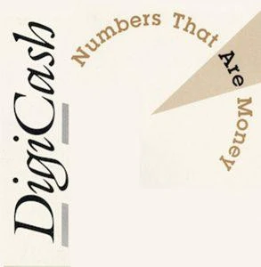

Toutefois, ce n'est pas l'entreprise de David Chaum qui a testé pour la première fois le modèle : ce sont les cypherpunks qui ont mis en œuvre la chose sans tenir compte des brevets et qui n'ont pas demandé d'autorisation pour le faire. Ainsi, un protocole nommé Magic Money a été [proposé](https://cypherpunks.venona.com/date/1994/02/msg00247.html) sur la liste de diffusion des cypherpunks le 4 février 1994 par un développeur anonyme se faisant appeler Pr0duct Cypher. Ce protocole permettait de créer sa monnaie en faisant fonctionner un serveur de courrier électronique qui servait de monnaierie eCash. Les cypherpunks se sont amusés avec en créant toutes sortes d'unités de compte comme les Tacky Tokens, les GhostMarks, les DigiFrancs ou encore les NexusBucks. L'utilité de ces jetons était cependant minimale, et les échanges très rares.

Du côté de DigiCash, après quelques années de développement, un prototype a été [présenté](https://chaum.com/wp-content/uploads/2022/01/05-27-94-World_s-first-electronic-cash-payment-over-computer-networks.pdf) en mai 1994 lors de la première conférence internationale sur le World Wide Web au CERN à Genève. La société a ensuite réalisé un essai qui a débuté le 19 octobre de cette année, avec l'émission d'unités appelées les « CyberBucks » qui n'étaient pas adossées à une autre monnaie. Divers commerçants acceptaient les CyberBucks dans le cadre de cette expérience. Les cypherpunks se sont également appropriés la chose en l'utilisant pour procéder à des échanges réels. Les CyberBucks ont ainsi acquis une valeur sur le marché. Cependant, celle-ci s'est effondrée lorsque eCash a été déployé dans le système bancaire classique.


Photo (floue) de l'équipe de DigiCash en 1995 : David Chaum se trouve tout à gauche (source : [Chaum.com](https://chaum.com/ecash/))

L'arrivée de eCash dans le système bancaire a commencé en octobre 1995 avec le début du partenariat de DigiCash avec la Mark Twain Bank, une petite banque du Missouri. Contrairement au cas des CyberBucks dont le taux de change était flottant, l'unité de compte était adossée au dollar américain. Entre 1996 et 1998, six banques ont suivi la Mark Twain Bank : la Merita Bank en Finlande, la Deutsche Bank en Allemagne, l'Advance Bank en Australie, la Bank Austria en Autriche, la Den norske Bank en Norvège et le Crédit Suisse en Suisse. La presse promettait alors à ce système un avenir radieux.

Néanmoins, tout ne s'est pas passé comme prévu. À cause de son caractère têtu et suspicieux, David Chaum a souhaité garder le contrôle sur son entreprise et a refusé des partenariats avec de grands acteurs financiers comme ING et ABN AMRO, Visa, Netscape et Microsoft. Il a quitté son poste en 1997 et la même année l'entreprise a déménagé son siège social en Californie. Durant l'année 1998, les banques partenaires ont annoncé abandonner eCash. DigiCash a fini par faire faillite en novembre 1998, mettant fin à cette mise en œuvre de l'argent liquide électronique chaumien.

### L'héritage du modèle de David Chaum

Le développement du modèle eCash n'a cependant pas été infructueux. Il a été à la base de multiples initiatives.

Au cours des années 90, d'autres solutions techniques permettant de faire des paiements sur Internet ont profité de la tendance lancée par eCash : c'était le cas de CyberCash, First Virtual ou Open Market, qui profitaient des inconvénients des paiements par carte bancaire, ceux-ci étant peu pratiques, coûteux et peu sécurisés à l'époque. Des systèmes de micropaiements ont également fait leur apparition à l'instar de CyberCoin (géré par CyberCash), NetBill et MilliCent. Ces systèmes n'ont jamais réellement pris, mais ils ont ouvert la voie au développement de PayPal à partir de 1999, cas que nous évoquerons dans le chapitre suivant.

D'autres systèmes centralisés alternatifs sont également apparus en parallèle, comme e-gold et Liberty Reserve. Ces derniers géraient des monnaies numériques privées et bénéficiaient du flou juridique qui pouvait exister dans le cyberespace. Nous en parlerons aussi dans le chapitre suivant.

Ensuite, eCash a inspiré les cypherpunks qui ont mis au point leurs propres modèles tels que b-money, bit gold et RPOW. Ils y ont ajouté de la preuve de travail et d'autres éléments, qui se sont retrouvés dans Bitcoin par la suite. Nous étudierons ces concepts dans le chapitre 3.

Enfin, le modèle de David Chaum a considérablement influencé Satoshi Nakamoto lorsqu'il a mis en point son concept de monnaie. En témoignent les multiples références dans le [livre blanc](assets/pdf/bitcoin-20090324.pdf) (le titre, la description du problème dans la section 2, le nom du PDF [envoyé](https://gwern.net/doc/bitcoin/2008-nakamoto) à Wei Dai en août 2008), ainsi que ses interventions privées et publiques. En ce sens, eCash est le prédécesseur principal de Bitcoin, même s'il n'en est pas le seul.

Avec Bitcoin, Satoshi Nakamoto a créé une monnaie numérique robuste et confidentielle, un réel argent liquide électronique. En cela, il a réalisé la [prédiction](https://www.youtube.com/watch?v=mlwxdyLnMXM&t=872s) de Milton Friedman, prix Nobel d'économie et fondateur de l'École de Chicago, qui disait au micro de la National Taxpayers Union Foundation en 1999 :

> « Je pense qu'Internet va devenir l'une des forces majeures qui va réduire le rôle de l'État. La seule chose qui manque, mais qui sera bientôt développée, c'est un argent liquide électronique fiable, une méthode qui permette de transférer des fonds de A à B sur Internet sans que A connaisse B ou que B connaisse A. »

## Les monnaies numériques privées
<chapterId>43035fa3-2805-4331-a6fb-070931d749cf</chapterId>

Dans le chapitre précédent, nous avons étudié la première forme d'argent liquide électronique qui est issue de l'apparition d'Internet et de la cryptographie moderne : le modèle eCash de David Chaum. Ce dernier a grandement influencé Satoshi Nakamoto et a constitué une étape clé dans le parcours qui a mené à Bitcoin. Mais l'histoire des origines de la cryptomonnaie ne se résume pas à eCash ; elle repose aussi sur les expériences de monnaie privées fonctionnant sur Internet, qui ont été développées à partir de la fin des années 1990.

Dans ce chapitre, nous regarderons ce qui a été fait du côté des monnaies privées aux États-Unis. Nous évoquerons tout d'abord le cas du Liberty Dollar. Puis nous nous intéresserons au cas des systèmes centralisés comme e-gold et Liberty Reserve. Nous parlerons pour finir de PayPal, dont la démarche est différente, mais qui ne constitue pas moins un exemple éclairant du modèle basé sur un tiers de confiance.

Dans tous les cas, ces systèmes ont fini par être arrêtés par les autorités ou ont dû se conformer aux réglementations financières. C'est pourquoi Satoshi Nakamoto, qui avait une bonne connaissance de ces systèmes, comprenait profondément la nécessité pour un système alternatif de ne pas reposer sur une autorité centrale.

### La liberté monétaire aux États-Unis et le Liberty Dollar

L'histoire des États-Unis a été caractérisée par une grande pluralité monétaire dès ses débuts. Du XVIIe siècle à la moitié XIXe siècle, la colonie anglaise devenue république indépendante autorisait en effet la libre circulation de devises étrangères (le dollar étasunien n'a été créé officiellement qu'en 1792), ainsi que la [frappe privée](https://fee.org/articles/private-coinage-in-america/) de pièces de monnaie en or et en argent. Une relative [liberté bancaire](https://iea.org.uk/wp-content/uploads/2023/12/Dowd-Free-Banking-Interactive.pdf) a également prévalu entre 1837 et 1863.

Toutefois, les choses ont changé avec la guerre de Sécession, gagnée par l'Union, dans un processus de centralisation du pouvoir. Ainsi, une loi du Congrès du 8 juin 1864 a interdit la frappe privée de pièces. Cette loi, qui est aujourd'hui devenue la section 486 du titre 18 du Code des États-Unis (*18 U.S. Code § 486*), [disposait](https://www.law.cornell.edu/uscode/text/18/486) :

> « Quiconque, sauf dans le cas où cela est autorisé par la loi, fabrique, met en circulation ou fait passer, ou tente de mettre en circulation ou de faire passer, des pièces d'or ou d'argent ou d'autres métaux, ou des alliages de métaux, destinées à être utilisées comme monnaie courante, qu'elles ressemblent à des pièces des États-Unis ou de pays étrangers, ou qu'elles soient de conception originale, sera condamné à une amende en vertu du présent titre ou à une peine d'emprisonnement de cinq ans au maximum, ou aux deux. »

Pour faire appliquer ces restrictions, une agence étatique a été fondée en 1965 par Abraham Lincoln : le Secret Service. La mission initiale du Secret Service était de lutter contre le faux-monnayage et la fraude financière en général. Elle servait, de façon détournée, à affermir le seigneuriage de l'État fédéral en confiant le monopole sur la production de monnaie à l'*United States Mint*.

La situation s'est encore plus restreinte par la suite. La banque centrale, appelée la Réserve Fédérale des États-Unis, a été créée en 1913, conséquemment à la panique bancaire de 1907. Puis, l'étalon-or classique a été abandonné en 1933 dans le cadre du *New Deal* de F.D. Roosevelt, avec l'[ordre exécutif 6102](https://fr.wikipedia.org/wiki/Executive_Order_6102) qui interdisait aux particuliers et aux entreprises situées aux États-Unis de détenir de l'or. La référence à l'or dans le système monétaire a finalement été abandonnée en 1971 lorsque Richard Nixon a annoncé mettre fin à la convertibilité du dollar en or à l'international.

Avec l'abrogation de l'interdiction de la détention d'or et le développement d'Internet à partir des années 1970, l'idée de déployer des monnaies privées est réapparue. Ç'a été le cas de Bernard von NotHaus, qui a lancé le Liberty Dollar en 1998, une monnaie basée sur l'or et l'argent qu'on pouvait retrouver sous forme de pièces d'argent et de billets représentatifs. Le système était géré par une organisation à but non lucratif appelée NORFED (acronyme de *National Organization for the Repeal of the Federal Reserve and Internal Revenue Code*). À partir de 2003, le Liberty Dollar était également disponible sous forme numérique, au travers d'un système de comptes à la e-gold (voir section suivante). Le système a connu un certain succès. Outre les pièces de monnaies en circulation, les coffres de NORFED contenaient environ 8 millions de dollars en métaux précieux pour assurer la convertibilité de la devise, dont 6 pour garantir l'unité numérique.


Pièce de Liberty Dollar (10 $) en argent datant de 2003 (source : [Numista](https://en.numista.com/catalogue/exonumia242820.html))

En septembre 2006, l'*U.S. Mint* a émis un [communiqué de presse](https://www.usmint.gov/news/press-releases/20060914-liberty-dollars-not-legal-tender-united-states-mint-warns-consumers), écrit conjointement avec le département de la Justice, dans lequel elle concluait que l'utilisation des pièces de NORFED violait la section 486 du titre 18 du Code des États-Unis et constituait « un crime fédéral ». Par conséquent, après une descente du FBI dans les locaux de NORFED en 2007, les violations ont été retenues contre NotHaus et ses associés, qui ont été arrêtés en 2009 et jugés en mars 2011. En 2014, Bernard von NotHaus a été condamné en appel à six mois d'assignation à résidence et à trois ans de liberté conditionnelle.

### e-gold : de l'or sur le Web

Un exemple emblématique de monnaie électronique privée est le système e-gold. Il s'agissait de ce qu'on appelle une « devise en or numérique » (ou *digital gold currency* en anglais), c'est-à-dire une monnaie transférée électroniquement et garantie intégralement par une quantité équivalente en or conservée en lieu sûr. Il a été cofondé par Douglas Jackson et Barry Downey en 1996. Douglas Jackson était un cancérologue américain vivant en Floride, qui était adepte de l'économiste autrichien Friedrich von Hayek et qui souhaitait créer une « [meilleure monnaie](https://blog.bettermoney.com/) » avec e-gold.

Le principe est que chaque unité d'e-gold pouvait être convertie en or réel. Les réserves d'or étaient administrées par une société située aux États-Unis appelée Gold & Silver Reserve Inc. (G&SR). Le système informatique était géré par une deuxième entreprise, e-gold Ltd., enregistrée à Saint-Christophe-et-Niévès dans les Caraïbes. L'or n'était pas le seul métal concerné : les utilisateurs pouvaient aussi détenir et échanger de l'e-silver, de l'e-platinum et de l'e-palladium, construits sur le même modèle.

Le système e-gold profitait du Web naissant, et en particulier du tout récent navigateur Netscape. Chaque client pouvait accéder à son compte depuis le site web, plutôt que devoir faire fonctionner un logiciel dédié. Pour l'époque, la plateforme était très performante, mettant à profit un système à règlement brut en temps réel inspiré du virement interbancaire. Voici à quoi ressemblait l'envoi d'e-gold en 2005 (image tirée d'un [tutoriel](https://www.geocities.ws/rizuan_mahrol/setpbystep.html) de l'époque) :


Le système e-gold a rencontré un grand succès : à son apogée en 2006, il [garantissait](https://web.archive.org/web/20060907024202if_/http://www.e-gold.com:80/examiner.html) 3,6 tonnes d'or, soit plus de 80 millions de dollars, [traitait](https://web.archive.org/web/20060208044937/http://www.e-gold.com/stats.html) 75 000 transactions par jour, pour un volume annualisé de 3 milliards de dollars, et gérait plus de 2,7 millions de comptes.

Ce succès a néanmoins été stoppé net suite à l'intervention de l'État. Au terme d'une enquête menée par le Secret Service, Douglas Jackson, ses deux sociétés et ses associés ont été [inculpés](https://www.justice.gov/archive/opa/pr/2007/April/07_crm_301.html) le 27 avril 2007 par le département de la Justice pour facilitation de blanchiment d'argent et activité de transfert d'argent sans licence. En novembre 2008, Douglas Jackson a été jugé coupable et a notamment été condamné à 3 ans de liberté surveillée, incluant 6 mois d'assignation à résidence sous surveillance électronique. Après une tentative infructueuse d'obtenir une licence, e-gold a dû fermer ses portes définitivement en novembre 2009.

D'autres systèmes ont été créés sur le même modèle. Nous pouvons citer GoldMoney, fondé par James Turk et son fils en février 2001, qui s'est aujourd'hui adapté aux réglementations financières. e-Bullion, le système fondé par James Fayed en juillet 2001, a lui fermé ses portes en 2008. Enfin, l'une des dernières devises en or numérique était Pecunix, qui a été fondée au Panama par Simon Davis en 2002 et qui s'est arrêtée en 2015, dans le cadre d'une escroquerie de sortie.

### Liberty Reserve, l'alternative à la Federal Reserve

Un autre exemple de monnaie privée centralisée est le système Liberty Reserve, qui permettait à ses utilisateurs de détenir et de transférer des devises électroniques indexées sur le dollar étasunien, sur l'euro ou sur l'or. Ce système a été créé par Arthur Budovsky, un Américain d'origine ukrainienne, et Vladimir Kats, immigré russe de Saint-Pétersbourg. En 2006, Arthur Budovsky s'est expatrié au Costa Rica, alors considéré comme un paradis fiscal, où il a enregistré sa société, Liberty Reserve S.A.


Logo de Liberty Reserve en 2009 (source : [Wikimedia](https://commons.wikimedia.org/wiki/File:LR_Logo-1-.webp))

Le système était assez similaire à e-gold, à l'exception faite que les fonds (en dollars principalement) étaient conservés sur des comptes en banque *offshore*, et non pas dans des coffres propres. Liberty Reserve a grandement bénéficié de l'arrêt de e-gold en avril 2007 suite à l'inculpation de Douglas Jackson et de ses associés. En mai 2013, [d'après le département de la Justice américaine](https://www.justice.gov/sites/default/files/usao-sdny/legacy/2015/03/25/Liberty%20Reserve%2C%20et%20al.%20Indictment%20-%20Redacted_0.pdf), la plateforme possédait plus d'un million d'utilisateurs dans le monde, dont plus de 200 000 aux États-Unis, et traitait 12 millions de transactions financières annuellement, pour un volume combiné de plus de 1,4 milliard de dollars. L'utilisation se faisait majoritairement dans le cadre d'activités criminelles, mais [ne se limitait pas](https://web.archive.org/web/20150422023243/https://www.theatlantic.com/magazine/archive/2015/05/bank-of-the-underworld/389555/) à ces dernières : Liberty Reserve était aussi utilisé par les traders du Forex ou bien pour les transferts à l'étranger.

Toutefois, le système a fini par subir le même sort que e-gold. En 2009, la *Superintendencia General de Entidades Financieras* costaricaine s'est intéressée au cas de Liberty Reserve, lui demandant d'obtenir une licence (ce que la société n'est pas parvenue à faire). Puis, en novembre 2011, le FinCEN étasunien qui a délivré un [avis](https://www.justice.gov/sites/default/files/usao-sdny/legacy/2015/03/25/Liberty%20Reserve%2C%20et%20al.%20Indictment%20-%20Redacted_0.pdf#page=12) selon lequel le système était « utilisé par les criminels pour effectuer des transactions anonymes ». Enfin, Liberty Reserve a été fermé au terme d'une opération internationale : le 24 mai 2013, Arthur Budovsky et ses principaux associés ont été inculpés et arrêtés dans des juridictions différentes (Espagne, États-Unis, Costa Rica) et le site principal a été saisi par le département de la Justice. En 2016, après une extradition vers les États-Unis, Arthur Budovsky a été condamné à 20 ans de prison ferme pour blanchiment d'argent.

Cet exemple montre ainsi que l'arbitrage juridictionnel ne suffit pas pour protéger la monnaie de l'intervention étatique.

### PayPal et la vision de Peter Thiel

Il faut enfin évoquer le cas de PayPal. Si ses créateurs n'avaient pas pour intention d'en faire une monnaie indépendante du système en place, il n'en reste pas moins qu'ils envisageaient que ce produit ait un effet sur la société, conformément à l'idéologie disruptrice de la Silicon Valley. Le produit PayPal a été développé par la société Confinity Inc., cofondée en décembre 1998 à San Francisco par Max Levchin et Peter Thiel, qui s'étaient rencontrés quelques mois plus tôt à l'université Stanford. La société, au départ appelée FieldLink, avait pour but initial de développer des systèmes de paiements sécurisés sur les ordinateurs de poche PalmPilot.

PayPal a été créé en octobre 1999 par un ingénieur de l'entreprise. Il permettait d'effectuer des paiements faciles et sans frais entre adresses de courrier électronique, et se destinait à l'envoi de paiements simples entre particuliers (*pay pal* signifie littéralement « payer copain »). Son modèle économique se fondait sur la perception des intérêts liés à la conservation des fonds des clients en banque, qui payaient les coûts de fonctionnement et rémunéraient les actionnaires. C'était donc un service bâti en surcouche du système bancaire, comme Liberty Reserve.

Alors que la bulle Internet battait son plein, le produit a connu une progression fulgurante dès les premiers mois, notamment grâce à son système de parrainage. Ce succès a attiré l'attention des concurrents, disposant de bien plus de capital, qui ont copié l'idée et lancé leur propre version du service, au détriment de Confinity. C'est pour cette raison que l'entreprise a dû fusionner avec l'un d'entre eux, la banque en ligne X.com d'Elon Musk, pour devenir PayPal Inc. en mars 2000.

La vision originelle de PayPal était révolutionnaire, conformément à la vision libertarienne de Peter Thiel. Voici quel était le discours de ce dernier à l'automne 1999, rapporté par Eric Jackson en 2012 dans *The PayPal Wars* :

> « Ce que nous qualifions de "pratique" pour les utilisateurs américains sera révolutionnaire pour les pays en développement. Les États de nombre de ces pays jouent avec leur monnaie. Ils ont recours à l'inflation et parfois à des dévaluations monétaires massives, comme nous l'avons vu en Russie et dans plusieurs pays d'Asie du Sud-Est l'année dernière, pour priver leurs citoyens de leurs richesses. La plupart des gens ordinaires n'ont jamais l'occasion d'ouvrir un compte à l'étranger ou de mettre la main sur plus de quelques billets d'une monnaie stable comme le dollar américain. Un jour, PayPal sera en mesure de changer cette situation. À l'avenir, lorsque notre service sera disponible en dehors des États-Unis et que la pénétration d'Internet continuera à s'étendre à tous les niveaux économiques, PayPal permettra aux citoyens du monde entier d'exercer un contrôle plus direct sur leurs monnaies qu'ils ne l'ont jamais fait auparavant. Il sera pratiquement impossible pour les États corrompus de voler les richesses de leurs citoyens par leurs anciens moyens, car, dans le cas où ils essaient, les citoyens se tourneront vers le dollar, la livre ou le yen, abandonnant ainsi leur monnaie locale sans valeur pour quelque chose de plus sûr. »


Peter Thiel le 20 octobre 1999 lors de son discours donné à Oakland en Californie pour l'*Independent Institute* (source : [Youtube](https://www.youtube.com/watch?v=e-X8D1gOU1E))

Toutefois, les choses n'ont pas évolué dans le sens souhaité et PayPal a dû se conformer aux réglementations financières en tous genres, à tel point que le service est devenu aujourd'hui célèbre pour sa censure des paiements et ses gels de compte tout autour du monde. Il était vain de croire qu'un tel système pouvait défier le pouvoir en place.

### Les alternatives centralisées et Bitcoin

Ainsi, nous constatons que les tentatives de créer des services centralisés alternatifs au système existant ont toutes finies par être arrêtées, d'une façon ou d'une autre. L'inconvénient de ces modèles est qu'ils reposent sur un tiers de confiance, qui peut faire faillite, partir avec la caisse ou bien être contrôlé par les autorités. Dans le dernier cas, le service en question fait face à un dilemme : s'adapter en se conformant aux réglementations financières, comme l'ont fait GoldMoney et PayPal, ou périr en refusant d'obéir, un destin subi par e-gold et Liberty Reserve ou encore le Liberty Dollar.

La fermeture de ces derniers systèmes a été contemporaine de la création et des débuts de Bitcoin. Par conséquent, Satoshi Nakamoto et les premiers utilisateurs de Bitcoin les connaissaient bien. Pour ce qui est de Satoshi, il [avait connaissance](https://www.metzdowd.com/pipermail/cryptography/2009-January/015041.html) du modèle utilisé par e-gold et a [évoqué](https://bitcointalk.org/index.php?topic=87.msg807#msg807) à plusieurs reprises Pecunix et Liberty Reserve dans ses interventions publiques et privées.

C'est à cause de cette fragilité des systèmes centralisés que les partisans de la liberté – dont notamment les cypherpunks – ont cherché à créer une monnaie *décentralisée*. Il fallait trouver un moyen d'éviter de faire reposer l'intégralité de l'infrastructure du système sur un point unique. C'est pourquoi plusieurs modèles « minimisant la confiance » ont émergé à la fin des années 1990 et au début des années 2000, avant la découverte de Bitcoin. Le prochain chapitre sera consacré à ces modèles.

## Les modèles décentralisés avant Nakamoto
<chapterId>a104f23c-e9c3-4457-a194-d87cc5f35f13</chapterId>

Bitcoin constitue un modèle décentralisé de monnaie numérique. En cela, il évite le recours à un tiers de confiance, qui constituerait un point de défaillance unique du système. Comme l'ont montré les exemples de eCash, des devises en or numérique et de Liberty Reserve, la centralisation d'un système voulant constituer une alternative au système en place mène inévitablement à sa fermeture, d'une façon ou d'une autre.

Bitcoin n'est cependant pas le premier concept de monnaie décentralisée à avoir été proposé. Dès la fin des années 1990, de tels modèles ont été décrits par les cypherpunks, qui étaient obsédés par la liberté et la confidentialité des individus sur Internet, et qui jugeaient (à l'instar de David Chaum) que les systèmes surveillés menaient à un avenir dystopique. Ils [appelaient](https://cypherpunks.venona.com/date/1993/03/msg00392.html) à « écrire du code » et considéraient la « monnaie électronique » comme un élément essentiel à leur idéal.

Dans ce chapitre, nous étudierons l'émergence des divers éléments techniques fondateurs qui ont plus tard été utilisés dans Bitcoin : le consensus distribué, l'horodatage et la preuve de travail. Ensuite, nous parlerons de b-money, de bit gold et de RPOW, respectivement conçus par les cypherpunks Wei Dai, Nick Szabo et Hal Finney. Enfin, nous évoquerons le cas de Ripple, dont le modèle est légèrement différent, mais qui a toute sa place dans l'histoire de la création de Bitcoin.

### Le consensus distribué

Avec l'émergence des ordinateurs dans les années 1950, est apparue la possibilité de les connecter entre eux. C'est ainsi que les premiers réseaux informatiques se sont
formés, menant au développement d'Internet, le « réseau des réseaux », dans les années 70. La question de l'infrastructure de ces réseaux s'est inévitablement posée. C'est pourquoi l'informaticien polono-américain Paul Baran, dans son article fondateur de 1964 (décrivant la commutation de paquets), recensait trois types de réseaux : le réseau centralisé, reposant sur un nœud unique ; le réseau distribué, où chaque point est un nœud ; le réseau décentralisé (non distribué), reposant sur un réseau distribué de nœuds multiples.


On peut dégager deux modèles purs de ces considérations : le modèle client-serveur, où un serveur central répond aux requêtes des clients, et le modèle pair à pair, où chaque nœud a le même rôle dans le système. Ce dernier modèle a particulièrement été utile pour le partage de fichiers dans les années 2000, avec la création de BitTorrent et d'autres protocoles similaires. Le réseau Tor est lui décentralisé, pas purement pair à pair.

Un problème qu'on rencontre dans le cas des architectures distribuées est le problème du consensus distribué, qu'on appelle généralement le problème des généraux byzantins, qui a été formalisé par Leslie Lamport, Robert Shostak et Marshall Pease dans un [article](https://lamport.azurewebsites.net/pubs/byz.pdf) publié en 1982. Ce problème traite de la remise en cause de la fiabilité des transmissions et de l'intégrité des participants dans les systèmes pair à pair, et il s'applique dans les cas où les composants d'un système informatique ont besoin d'être en accord.

Le problème est énoncé sous la forme d'une métaphore faisant intervenir des généraux de l'armée de l'Empire byzantin, qui assiègent une ville ennemie avec leurs troupes dans le but de l'attaquer et qui ne peuvent communiquer qu'à l'aide de messagers. L'objectif est de trouver une stratégie (c'est-à-dire un algorithme) permettant de gérer la présence de traîtres et de s'assurer que tous les généraux loyaux se mettent d'accord sur un plan de bataille pour que l'attaque soit un succès. En voici une illustration (source : *L'Élégance de Bitcoin*) :


La résolution de ce problème est importante pour les systèmes distribués qui gèreraient une unité de compte. De tels systèmes demandent en effet que les participants se mettent d'accord sur la propriété des unités de compte, à savoir sur qui possède quoi.

Avant Bitcoin, le problème était résolu de manière absolue par des algorithmes dits « classiques » qui nécessitaient que les nœuds soient connus à l'avance et que deux d'entre eux soient honnêtes. Le plus connu d'entre eux est probablement l'algorithme de consensus [PBFT](https://css.csail.mit.edu/6.824/2014/papers/castro-practicalbft.pdf) (sigle de *Practical Byzantine Fault Tolerance*), qui a été mis au point par Miguel Castro et Barbara Liskov en 1999 et qui permettait à un nombre donné de participants de se mettre d'accord en gérant des milliers de requêtes par seconde avec une latence de moins d'une milliseconde.

Avec l'algorithme de consensus de Bitcoin, Satoshi Nakamoto l'a résolue de manière probabiliste, permettant de supprimer certaines contraintes en sacrifiant la finalité stricte des transactions. Le 13 novembre 2008, il [écrivait](https://www.metzdowd.com/pipermail/cryptography/2008-November/014849.html) ainsi que « la chaîne de preuves de travail \[était\] une solution au problème des généraux byzantins ».

### L'horodatage de documents

L'horodatage (*timestamping* en anglais) est une technique qui consiste à associer une date et une heure à une information comme un évènement ou un document. D'un point de vue légal, cela permet par exemple de s'assurer de l'existence d'un contrat avant une date donnée. Dans le monde réel, il existe ainsi une multitude de moyens d'horodater quelque chose, comme l'envoi d'un document dans une enveloppe scellée ou l'inscription d'une ligne chronologique dans un carnet de notes.

Mais l'horodatage est particulièrement utile dans le monde numérique, où les fichiers (texte, image, audio ou vidéo) sont facilement modifiables. L'horodatage peut être réalisé par des services centralisés, qui se chargent de sauvegarder des documents reçus (ou bien leurs empreintes) et d'y associer la date et l'heure de réception. On parle dans ce cas d'horodatage certifié (ou de *trusted timestamping* en anglais).

En 1991, une technique d'horodatage confidentielle et sécurisée a été proposée par Stuart Haber et Scott Stornetta, deux chercheurs travaillant pour Bell Communications Research Inc. (communément appelé « Bellcore »), un consortium de R&D situé dans le New Jersey. Dans [leur article](http://www.staroceans.org/e-book/Haber_Stornetta.pdf), intitulé « *How to time-stamp a digital document* », ils décrivaient comment un service d'horodatage certifié pouvait utiliser une fonction à sens unique (comme la fonction de hachage MD4) et un algorithme de signature pour accroître la confidentialité des documents des clients et la fiabilité de la certification. En particulier, l'idée était de chaîner les informations en faisant intervenir l'horodatage précédent dans l'application de la fonction à sens unique.

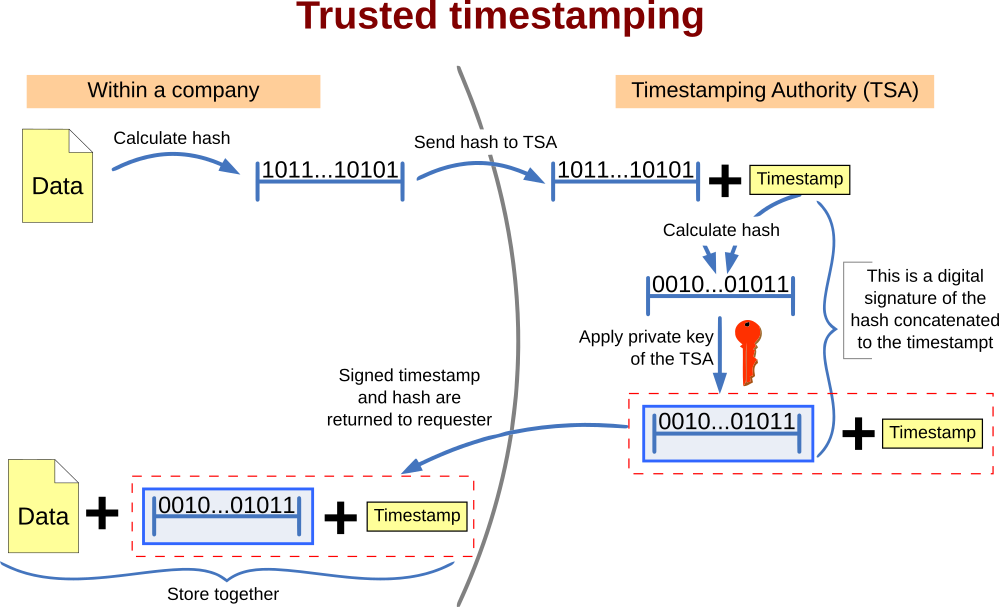

Exemple d'horodatage certifié (source : [Wikimedia](https://en.m.wikipedia.org/wiki/File:Trusted_timestamping.svg))

Haber et Stornetta ont mis leur idée en application par la publication d'empreintes cryptographiques (résultant d'un hachage des données utiles) dans les petites annonces du New York Times à partir de 1992. Ils ont ensuite créé leur propre société en 1994, Surety Technologies, dans le but de se consacrer pleinement à cette activité. Ils sont ainsi [connus](https://www.vice.com/en/article/j5nzx4/what-was-the-first-blockchain) pour avoir créé la première chaîne temporelle d'horodatages, l'empreinte précédente étant prise en compte dans le calcul de la nouvelle empreinte à publier dans le journal, ce qui préfigurait la chaîne de blocs de Bitcoin.

Trois articles de Haber et Stornetta ont été cités par Satoshi Nakamoto dans [livre blanc de Bitcoin](assets/pdf/bitcoin-20090324.pdf) : l'article de 1991 précédemment mentionné, un [article](https://www.math.columbia.edu/~bayer/papers/Timestamp_BHS93.pdf) de 1993 qui améliorait les protocoles proposés dans le précédent, notamment par l'utilisation des arbres de Merkle, et un [article](https://cdn.nakamotoinstitute.org/docs/secure-names-bit-strings.pdf) de 1997 qui présentait une façon de nommer les fichiers de manière universelle au moyen de fonctions à sens unique. Était aussi cité un [article](https://cdn.nakamotoinstitute.org/docs/secure-timestamping-service.pdf) décrivant un nouveau système d'horodatage écrit en 1999 par Henri Massias, Xavier Serret-Avila et Jean-Jacques Quisquater, trois hommes travaillant pour le groupe de recherche en cryptographie de l'Université catholique de Louvain, en Belgique.

### La preuve de travail et Hashcash

La preuve de travail (*proof of work* en anglais) est un procédé permettant à un appareil informatique de démontrer de manière objective et quantifiable qu'il a dépensé de l'énergie, afin d'être sélectionné pour accéder à un service ou à un privilège. Il s'agit essentiellement d'un mécanisme de résistance aux attaques Sybil, qui rend difficile pour un attaquant de multiplier des identités à l'excès pour perturber ou prendre le contrôle d'un système de réputation quelconque.

Le concept de preuve de travail a été décrit pour la première fois en 1992 par les informaticiens Cynthia Dwork et Moni Naor, qui travaillaient alors au centre de recherche IBM d'Almaden, situé au sud de San José en Californie. Au sein d'un [article de recherche](https://www.wisdom.weizmann.ac.il/~naor/PAPERS/pvp.pdf) intitulé « *Pricing via Processing or Combatting Junk Mail* », ils ont présenté une méthode pour combattre le courrier indésirable (*spam*) dans les boîtes e-mail. Le modèle consistait à forcer les utilisateurs à résoudre un puzzle cryptographique pour chaque courriel envoyé, afin de limiter la capacité à envoyer des courriels en masse tout en permettant aux expéditeurs ponctuels de ne pas être gênés. Toutefois, ils n'ont jamais été jusqu'à mettre en œuvre leur idée.

Avec la popularisation d'Internet dans les années 90, le problème du courrier électronique indésirable est devenu de plus en plus prégnant, y compris sur la liste de diffusion des cypherpunks. C'est pourquoi le concept de Dwork et Naor a été [implémenté](https://cypherpunks.venona.com/date/1997/03/msg00774.html) par le jeune cypherpunk britannique Adam Back en 1997 avec Hashcash, un algorithme produisant des preuves de travail simples au moyen d'une fonction de hachage. Plus précisément, il s'agit de trouver une collision partielle de la fonction de hachage considérée, c'est-à-dire à obtenir deux messages ayant une empreinte commençant par les mêmes bits de données (note : à partir de la version 1.0 sortie en 2002, il s'agit de découvrir une collision partielle pour l'empreinte zéro, à savoir trouver un antécédent dont l'empreinte commence par un nombre de zéros binaires déterminés). Puisque la fonction de hachage est à sens unique, une telle obtention ne peut être réalisée qu'en testant une à une les différentes possibilités, ce qui demande une dépense énergétique.


Adam Back en 2001 (source : [archive de la page personnelle d'Adam Back](https://web.archive.org/web/20040404011747/http://www.cypherspace.org/adam/))

Mais les cypherpunks ne se limitaient pas à considérer la preuve de travail comme un simple moyen de limiter le spam ; ils souhaitaient également l'utiliser comme une manière de garantir le coût de production d'une monnaie numérique. Ainsi, en 1997, Adam Back [envisageait](https://cypherpunks.venona.com/date/1997/04/msg00822.html) lui-même cette idée, mais il avait conscience que les preuves de travail ainsi obtenues ne pouvaient pas être transférées d'une manière pleinement distribuée (à cause du problème de la double dépense) et qu'il fallait par conséquent passer par un système centralisé à la eCash. De même, en 1996, les cryptographes Ronald Rivest et Adi Shamir ont décrit [MicroMint](https://people.csail.mit.edu/rivest/pubs/RS96a.pdf), un système de micropaiement centralisé dont les pièces devaient être impossibles à contrefaire grâce à la production de preuves de travail.

Il fallait trouver un bon agencement qui puisse permettre à un tel modèle de fonctionner de manière robuste et durable. C'est ce que les cypherpunks Wei Dai, Nick Szabo et Hal Finney ont essayé de mettre au point avec leurs protocoles respectifs – b-money, bit gold et RPOW – que nous allons étudier dans la suite. Et c'est ce que Satoshi Nakamoto a fini par faire en incluant Hashcash dans sa conception de Bitcoin.

### b-money : le stablecoin décentralisé

Le premier protocole à être issu du mouvement des cypherpunks était b-money, un modèle monnaie numérique décentralisée conceptualisé par Wei Dai en 1998. Ce dernier était un jeune cryptographe sino-américain vivant à Seattle et travaillant pour Microsoft, qui s'était impliqué sur la liste de diffusion à partir de 1994. Il s'est notamment illustré par la création de la bibliothèque libre Crypto++, qui a plus tard été utilisée dans le logiciel de Bitcoin.

Wei Dai a publié le texte descriptif de b-money le 26 novembre 1998 sur sa page personnelle et en a partagé le lien à la liste de diffusion des cypherpunks le même jour. Dans son [courriel](https://cypherpunks.venona.com/date/1998/11/msg00941.html), il décrivait b-money comme « un nouveau protocole d'échange monétaire et d'exécution des contrats pour les pseudonymes ».

Dans son idée, le système se fondait sur un réseau pair à pair intraçable. Chaque participant était identifié par un « pseudonyme numérique », c'est-à-dire une clé publique, et chaque message de transaction était signé par l'expéditeur et chiffré pour le destinataire. Chaque participant maintenait une base de données qui recensait les montants d'unités de b-money détenus par chaque pseudonyme.

La création monétaire était ouverte à tous les participants et se faisait par preuve de travail en diffusant la solution d'un problème informatique connu et précédemment non résolu. Le nombre d'unités créées dépendait du coût de cet effort exprimé par rapport à un panier standard de marchandises (incluant par exemple des métaux précieux), de sorte à maintenir le cours de l'unité autour d'un point d'équilibre « stable ». Le système offrait également la possibilité de créer et d'exécuter des contrats directement sur le réseau, grâce à un procédé rudimentaire de dépôt fiduciaire.

Même s'il était assez ingénieux, le concept de b-money présenté par Wei Dai n'était pas tout à fait fonctionnel. Il présentait ainsi des défauts majeurs comme la vulnérabilité aux attaques Sybil sur le réseau (n'importe qui pouvait théoriquement ajouter de nouveaux nœuds sur le réseau), la centralisation du réseau dans le cas où on présélectionnerait les serveurs, et celle liée à la stabilisation de l'unité de compte (qui décrète les prix observables sur le marché ?)

Après sa publication sur la liste, b-money a attiré l'attention des cypherpunks, et en particulier [celle d'Adam Back](https://cypherpunks.venona.com/date/1998/12/msg00203.html). Néanmoins, Wei Dai n'a jamais implémenté son modèle, non seulement parce que ce dernier était dysfonctionnel, mais aussi à cause de la [désillusion](https://www.lesswrong.com/posts/YdfpDyRpNyypivgdu/aalwa-ask-any-lesswronger-anything#XKwphuwm366RegQ3d) du cryptographe à l'égard de la cryptoanarchie. Toutefois, b-money a fini par être cité dans le livre blanc de Bitcoin, ce qui en fait l'un de ses précurseurs.


### bit gold : l'or numérique avant Bitcoin

Le deuxième modèle à avoir émergé des idées des cypherpunks était l'idée de bit gold imaginée par Nick Szabo en 1998. Celui-ci était un informaticien américain d'origine hongroise, qui avait notamment travaillé pour comme consultant pour DigiCash pendant six mois. Cypherpunk, il est connu pour avoir formalisé la notion de *smart contract* en 1995.

En 1994, Nick Szabo avait créé une liste de diffusion privée appelée libtech-l, qui avait pour but, comme son nom l'indique, d'héberger des discussions sur les techniques libératoires, permettant de protéger les libertés individuelles face aux assauts des autorités. Y avaient accès des cypherpunks comme Wei Dai et Hal Finney, ainsi que les économistes Larry White et George Selgin, partisans de la concurrence des monnaies hayekienne et de la banque libre.


Nick Szabo en 1997 (source : [Adrien Chen](https://twitter.com/AdrianChen/status/456922865992863744/photo/1))

C'est sur la liste libtech-l que Nick Szabo a initialement décrit son concept, avant d'héberger une [ébauche](https://web.archive.org/web/20140406003811/http://szabo.best.vwh.net/bitgold.html) de livre blanc en 1999 sur son site personnel. Il a ensuite présenté bit gold en 2005, dans un [article](https://unenumerated.blogspot.com/2005/12/bit-gold.html) publié sur son blog, Unenumerated.

Le protocole était censé gérer la création et les échanges d'une ressource virtuelle appelée le bit gold. Contrairement à l'e-gold qui était garanti par de l'or physique, ou la b-money indexée en théorie sur un panier de marchandises, le bit gold ne devait être adossé à aucun autre bien, mais posséder une rareté infalsifiable intrinsèque, et constituer ainsi un or intégralement numérique.

L'élément central du protocole était que la création monétaire se faisait par preuve de travail : les morceaux de bit gold étaient créés grâce à la puissance de calcul des ordinateurs et chaque solution était calculée à partir d'une autre, ce qui conduisait à former une chaîne de preuves de travail. La date et l'heure de production de ces preuves de travail étaient certifiées au moyen de serveurs d'horodatage multiples. Le système reposait sur un registre public de titres de propriété, référençant les possessions et les échanges des utilisateurs, ces derniers étant identifiés par leurs clés publiques et autorisant les transactions grâce à leurs clés privées. Le registre était vérifié et maintenu par un réseau de serveurs appelé « club de propriété », coordonné par un algorithme de consensus classique appelé [*Byzantine Quorum System*](https://dahliamalkhi.wordpress.com/wp-content/uploads/2015/12/byzquorums-distcomputing1998.pdf).

La ressemblance de bit gold avec Bitcoin est frappante. Les trois éléments constitutifs du système (la production des preuves de travail, leur horodatage et la gestion du registre de propriété), qui étaient séparés dans bit gold, se retrouvent dans Bitcoin en un seul et même concept : la chaîne de blocs. C'est pourquoi beaucoup y ont vu une ébauche de Bitcoin et spéculé sur le fait que Nick Szabo pourrait être Satoshi.

Toutefois, les visions des deux hommes divergeaient. Dans bit gold, la façon dont étaient produits les morceaux d'or numérique faisait qu'ils n'étaient pas fongibles, c'est-à-dire qu'ils ne pouvaient pas être mélangés entre eux : ils devaient donc être évalués sur un marché extérieur au système pour pouvoir être utilisés pour servir de base à une réelle unité de compte homogène. Le modèle bit gold était ainsi pensé comme un système de règlement permettant de gérer une monnaie de réserve rare, et au-dessus duquel serait construite une économie bancaire libre, si possible utilisant le modèle chaumien. Ainsi, en avril 2008, dans un [commentaire](https://web.archive.org/web/20171227190431/http://unenumerated.blogspot.com/2008/04/bit-gold-markets.html?showComment=1207799580000#c3741843833998921269) sur son blog, Nick Szabo demandait encore de l'aide pour mettre en œuvre son concept. Cependant, cette mise en œuvre n'a jamais eu lieu.

### RPOW : les preuves de travail réutilisables

Le troisième système a être issu de l'esprit des cypherpunks est le système RPOW, abréviation de *Reusable Proofs of Work*, mis au point par Hal Finney en 2004. Hal Finney était un informaticien et cryptographe américain qui vivait dans la région de Los Angeles. Cypherpunk de la première heure, il s'était passionné pour les idées de David Chaum et pour son fameux modèle eCash. Il travaillait depuis 1996 sur le développement du logiciel de chiffrement PGP avec Phil Zimmermann.

Pour concevoir son système RPOW, Hal Finney a repris les idées derrière eCash et bit gold. La particularité de son système est qu'il se basait sur un serveur transparent qui permettait de rendre transférables les preuves de travail produites par Hashcash. Ce serveur utilisait le cryptoprocesseur IBM 4758 Secure Cryptographic Coprocessor, un élément de haute sécurité résistant aux falsifications, qui permettait, par un procédé d'authentification conçu par IBM, de vérifier quels programmes étaient exécutés sur la machine. Un utilisateur externe pouvait de cette façon s'assurer à tout instant que le serveur RPOW faisait fonctionner le bon programme, dont le code était par ailleurs disponible publiquement.

Les jetons de preuve de travail réutilisable étaient gérés par le serveur, qui se chargeait de les signer à l'aide du chiffrement RSA. Ils étaient fabriqués par la production d'une preuve de travail via Hashcash, ou bien à partir d'un jeton de RPOW précédent. Lors d'un paiement, l'expéditeur donnait ses jetons de RPOW au destinataire qui s'empressait de communiquer avec le serveur pour recevoir un ou plusieurs nouveaux jetons, dont la valeur globale était égale à la valeur en entrée. Le fonctionnement des RPOW était ainsi
similaire à celui des billets numériques dans eCash.

En voici une illustration [conçue](https://nakamotoinstitute.org/finney/rpow/slides/slide004.html) par Hal Finney lui-même :


Hal Finney a non seulement conçu le modèle, mais l'a aussi personnellement mis en œuvre. Le 15 août 2004, il a ainsi [annoncé](https://lists.cpunks.org/pipermail/cypherpunks-legacy/2004-August/134945.html) le lancement du système RPOW sur la liste des cypherpunks, en plus de documenter son fonctionnement sur le site web consacré (rpow.net). Il l'a ensuite [présenté](https://web.archive.org/web/20050204193327/http://rpow.net/slides/slide001.html) à la conférence CodeCon 2005 organisée à San Francisco, où il a pu faire part des utilisations qu'il envisageait pour les jetons de preuve de travail, à savoir : le transfert de la valeur, la régulation du courrier indésirable, le commerce dans les jeux vidéos, le jeu d'argent en ligne comme le poker, et l'anti-parasitisme sur les protocoles de partage de fichiers comme BitTorrent.

Toutefois, RPOW présentait des défauts intrinsèques qui peuvent expliquer pourquoi il n'a pas rencontré le succès escompté :

- Son modèle de sécurité était plutôt faible, car il reposait sur un serveur centralisé ;
- Sa politique monétaire (basée sur le hachage) n'était pas spécialement attractive en raison de la hausse exponentielle des performances informatiques.

Ainsi, l'utilisation réelle de RPOW a été anecdotique, mais Hal Finney a eu le mérite d'« [ouvrir la voie](https://mmalmi.github.io/satoshi/#email-24) » à Bitcoin en mettant sur pied une preuve de concept expérimentale, quatre ans avant l'arrivée de Satoshi Nakamoto.

### Ripple : la décentralisation du crédit

Un autre modèle prédécesseur de Bitcoin, moins connu, mais qui a pour autant sa place ici, est le protocole de crédit distribué Ripple, conçu par le développeur canadien Ryan Fugger en 2004. Le jeune homme canadien avait été inspiré par le concept du [système d'échange local](https://fr.wikipedia.org/wiki/Syst%C3%A8me_d%27%C3%A9change_local) (SEL), quelque chose qu'il avait expérimenté à Vancouver avant de concevoir son protocole. Il a publié le [livre blanc](https://web.archive.org/web/20060221162102/http://ripple.sourceforge.net/decentralizedcurrency.pdf) de Ripple le 14 avril 2004 et l'a ensuite mis en œuvre par le biais d'une preuve de concept appelée RipplePay, qui fonctionnait sur un serveur central et qui permettait aux utilisateurs de se connecter avec une simple adresse de courrier électronique.


Ryan Fugger vers 2010 (source : [Crunchbase](https://www.crunchbase.com/person/ryan-fugger))

Le concept de Ripple se fondait sur l'idée que la monnaie était essentiellement constituée de reconnaissances de dette (IOUs), c'est-à-dire de crédit. Il s'agissait d'établir un réseau pair à pair dont les liens seraient des relations de crédit entre les personnes. Les paiements se faisaient alors par le routage d'une série d'emprunts, tous les participants étant des banquiers se prêtant de l'argent mutuellement. Alice pouvait payer 10 $ à David, en prêtant 10 $ à Bob, et en demandant à Bob de faire de même auprès de Carole, puis à Carole de faire de même auprès de David : le compte de David était ensuite crédité de 10 $ issus de la création monétaire d'Alice. Le système fonctionnait en quelque sorte par ondulations, ce qui explique le nom du projet.

Voici une vidéo de présentation de Ripple réalisée en 2011 :


Malgré l'enthousiasme de sa communauté et quelques milliers d'utilisateurs, Ripple possédait des défauts majeurs qui l'ont empêché de connaître le succès. En particulier, il [souffrait](https://fiatjaf.com/3cb7c325.html) du « problème de l'engagement décentralisé » : durant un paiement, les participants ne pouvaient pas s'engager d'une façon sûre pour assurer la chaîne de prêts, un problème qui serait résolu plus tard par Lightning.

Voyant que son projet n'allait nulle part, Ryan Fugger a laissé les rênes de Ripple aux dirigeants de l'entreprise OpenCoin Inc., Chris Larsen et Jed McCaleb, en novembre 2012. La société a été renommée en Ripple Labs en 2013. Ces derniers en ont fait un protocole sensiblement différent du concept initial, reposant sur un algorithme de consensus et sur une unité de compte native, le XRP. Ryan Fugger a fini par modifier le nom de sa preuve de concept en [Rumplepay](https://rumplepay.com/) en 2020 pour éviter la confusion.

Ripple était pour ainsi dire contemporain de Bitcoin, et il s'avère que beaucoup de gens intéressés par ce dernier s'étaient aussi intéressés au premier. En effet, Ripple constituait un modèle novateur, fondé sur une architecture distribuée, une caractéristique partagée avec Bitcoin. À ce sujet, Satoshi Nakamoto [écrirait](https://diyhpl.us/~bryan/irc/bitcoin-satoshi/p2presearch-again/p2pfoundation.net/backups/p2p_research-archives/2009-February.txt.gz) que « Ripple est unique en ce qu'il répartit la confiance plutôt que de la concentrer ».

### Bitcoin, l'aboutissement d'une quête

Ainsi, à la fin des années 2000, tous les éléments constitutifs de Bitcoin étaient connus et plusieurs tentatives de les combiner avaient été réalisées. Toutefois, les assemblages proposés n'avaient pas été probants. Les cypherpunks en particulier se sont progressivement désintéressés de cette question, jugeant que la conception d'une monnaie numérique réellement décentralisée était impossible. Satoshi Nakamoto leur a donné tort.

Bitcoin constitue en effet un assemblage ingénieux de tous ces concepts. Il repose sur la signature numérique, issue de la cryptographie asymétrique proposée par Diffie et Hellmann en 1976. Il est un « argent liquide électronique » comme s'y destinait le modèle eCash de David Chaum mis en application dans les années 90. Par son algorithme de consensus novateur, il résout de manière robuste le problème des généraux byzantins, énoncé par Lamport, Shostak et Pease en 1982. Avec la gestion de sa chaîne de blocs sur un réseau pair à pair, il est une forme de « serveur d'horodatage distribué », reprenant le concept de Haber et Stornetta de 1991. Pour la sélection des blocs de transactions et pour la production des unités, il fait usage de la preuve de travail, utilisant un procédé proche de Hashcash, proposé par Adam Back en 1997. Enfin, il rappelle par sa conception les projets de b-money, bit gold, RPOW et Ripple, auxquels Satoshi Nakamoto a rendu hommage, d'une façon ou d'une autre.

Bitcoin forme donc l'aboutissement d'une quête pour la cybermonnaie, une monnaie existant intégralement sur Internet et n'étant pas à la merci des États. Dans le reste de ce cours, nous raconterons comment il a pris vie et quels ont été les évènements marquants de ses premières années d'existence. Cette histoire est unique et vous intéressera forcément si vous êtes arrivés là. Tenez-vous prêts !

# La lente émergence de Bitcoin
<partId>7db760c0-dcce-4564-9c71-53873ee66d6d</partId>

## La naissance de Bitcoin
<chapterId>3d141918-e9c2-46e8-8c03-2bb4eb9b2150</chapterId>

Après avoir appris d'où venait Bitcoin, nous allons à présent nous concentrer sur son histoire proprement dite. Celle-ci a fait l'objet de nombreux articles, podcasts et vidéos au fil des années, de sorte qu'elle est presque devenue une sorte de mythe fondateur. Comme nous l'avons vu, Bitcoin est indissociable du contexte dans lequel il a été créé ; il en est de même pour les évènements ayant eu lieu durant ses premières années d'existence, qui ont forgé ce qu'il est aujourd'hui, avec ses qualités et ses défauts.

Bitcoin a été créé par Satoshi Nakamoto, un inconnu prétendant être japonais, qui a pris le temps de le concevoir de manière réfléchie avant de le dévoiler au public. Ce dernier a par la suite tout fait pour que Bitcoin soit lancé dans les meilleures conditions, qu'il soit bien mis en valeur dans le discours et qu'il soit utilisé par un nombre croissant de personnes. En fin de compte, l'effort du créateur a tout autant résidé dans l'amorçage économique du système que dans sa conception initiale, sinon plus.

Le présent chapitre traite de la naissance de Bitcoin qui a eu lieu entre l'automne 2008 et l'hiver 2009. Celle-ci a été marquée par deux évènements majeurs : la publication du livre blanc, le document fondateur qui explique le fonctionnement technique du système, le 31 octobre 2008 ; et le lancement du réseau prototype le 9 janvier 2009, un peu plus de deux mois plus tard. Nous nous intéresserons ainsi aux actions de Satoshi Nakamoto durant cette période et aux quelques interactions qu'il a eues avec les premiers adeptes et les premiers détracteurs de Bitcoin.

### La découverte

Si on en croit son [propre](https://www.metzdowd.com/pipermail/cryptography/2008-November/014863.html) [témoignage](https://bitcointalk.org/index.php?topic=13.msg46#msg46), Satoshi Nakamoto se met à travailler sur Bitcoin durant le printemps 2007. Après avoir [effectué](https://web.archive.org/web/20140511100607/https://bitcoinfoundation.org/forum/index.php?/topic/54-my-first-message-to-satoshi/#entry514) diverses recherches sur le sujet des monnaies numériques, il finit par trouver un moyen de résoudre le problème de la double dépense sans tiers de confiance. Pendant plus d'un an, il garde secret son modèle, souhaitant le peaufiner pour s'assurer de sa solidité. Tel qu'il [l'écrira](https://bitcointalk.org/index.php?topic=195.msg1617#msg1617) plus tard :

> « À un moment donné, j'ai été convaincu qu'il y avait un moyen de mettre en place ce système sans requérir aucune confiance et je n'ai pas pu m'empêcher de continuer à y penser. &nbsp;Le travail a consisté bien plus à concevoir qu'à coder. »

Pour s'assurer qu'il fonctionne correctement, Satoshi [programme](https://www.metzdowd.com/pipermail/cryptography/2008-November/014832.html) un prototype avant de rédiger le livre blanc. Cette manière de faire est à l'opposé de ce qui se fait d'ordinaire au sein de la communauté universitaire, où les concepts sont présentés formellement dans des articles scientifiques avant d'être mis en application. Le créateur de Bitcoin [affirmera](https://www.metzdowd.com/pipermail/cryptography/2008-November/014832.html) :

> « En fait, j'ai fait ça un peu à l'envers. &nbsp;J'ai dû écrire tout le code avant de pouvoir me convaincre que je pouvais résoudre tous les problèmes, et je n'ai écrit le papier qu'après. »

### La préparation

C'est en août 2008 que Satoshi se décide à préparer la sortie de Bitcoin. Le 18, il réserve le nom de domaine Bitcoin.org via le service anonyme AnonymousSpeech (ainsi que [Netcoin.org](https://twitter.com/orweinberger/status/1573234325046558720), n'ayant probablement pas finalisé le choix du nom à donner à son concept). Le nom de domaine accueillera le site principal de Bitcoin. En revanche, Satoshi n'a pas pu réserver le nom de domaine Bitcoin.com, qui est alors détenu par un [spéculateur](https://mmalmi.github.io/satoshi/#email-28) et qui sera [utilisé](https://web.archive.org/web/20090719065532/http://www.bitcoin.com/) entre 2009 et 2011 par une société appelée BitCoin Ltd., spécialisée dans les micropaiements.

Le 20 août, le créateur de Bitcoin [entre en contact](https://s3.documentcloud.org/documents/24439625/adam-back-exhibit-ab1-1.pdf) avec Adam Back en lui envoyant un courriel pour lui demander un conseil sur la façon de citer son article sur Hashcash dans le livre blanc. Difficile de ne pas y voir un prétexte servant à faire en sorte que l'inventeur de Hashcash prenne connaissance de son nouveau système.

Adam Back en 2012 (source : [page personnelle d'Adam Back](http://www.cypherspace.org/adam/))

Le courriel contient un lien vers une ébauche du livre blanc. Le nom du fichier PDF est `ecash.pdf` et son titre est « *Electronic Cash Without a Trusted Third Party* » : « Argent liquide électronique sans tiers de confiance » en français. Le résumé est le même que celui de la première version qui sera publiée en octobre, à un mot près. Malheureusement nous ne disposons pas du document intégral.

Le lendemain, ayant lu le résumé envoyé par Satoshi (mais pas le papier), Adam Back le redirige vers la proposition b-money de Wei Dai, qui semble posséder des similarités avec son concept. Satoshi répond en le remerciant pour son indication et en précisant que « \[ses propres\] idées partent exactement du même point ». Adam Back lui indique aussi l'existence de MicroMint, mais Satoshi ne répondra pas.

Le surlendemain, le 22 août, Satoshi envoie donc un courriel à Wei Dai pour lui dire qu'il « se prépare à publier un document qui étend \[ses\] idées à un système complètement fonctionnel » et pour lui demander l'année de publication de sa page sur la b-money afin d'y faire référence dans le livre blanc. Comme dans le cas de son échange avec Adam Back, il partage à Wei Dai l'ébauche du livre blanc.

Malgré ces interactions, Adam Back et Wei Dai ne s'intéressent pas immédiatement au concept de Satoshi. Ce ne sera que des années plus tard qu'ils reviendront vers Bitcoin : Wei Dai en 2010–2011 et Adam Back en 2013.

De son côté, Satoshi finit de se préparer pour rendre son invention publique. Le 3 octobre, il termine la première version du livre blanc de Bitcoin, dont le nom est désormais choisi. Le 5 octobre, il s'inscrit sur la plateforme de gestion de projets SourceForge, là où le code source ouvert du logiciel sera hébergé et maintenu jusqu'en 2011.

### La publication du livre blanc

Le 31 octobre 2008, Satoshi Nakamoto publie la [première version du livre blanc](assets/pdf/bitcoin-20081003.pdf) sur une liste de diffusion de courrier électronique dédiée à la cryptographie, appelée simplement la « *Cryptography mailing list* ». Cette liste est gérée par le développeur Perry Metzger depuis 1996, date de sa [création](https://cypherpunks.venona.com/date/1996/12/msg00102.html), et est hébergée sur son site personnel, Metdowd.com, depuis [2003](https://www.metzdowd.com/pipermail/cryptography/2003-April/004484.html). Elle est l'héritière de la liste des cypherpunks, à la différence qu'elle est soumise à une modération stricte. En 2008, plusieurs anciens cypherpunks y participent encore, comme John Gilmore, Hal Finney ou encore Len Sassaman.

Dans son premier [courriel](https://www.metzdowd.com/pipermail/cryptography/2008-October/014810.html) adressé à la liste, Satoshi écrit sobrement :

> « J'ai travaillé sur un nouveau système d'argent liquide électronique qui est entièrement pair à pair, dépourvu de tiers de confiance. »

Il liste également les propriétés principales de son modèle :

- « Les doubles dépenses sont empêchées grâce à un réseau pair à pair. »
- « Pas de monnaierie ni d'autre tiers de confiance. »
- « Les participants peuvent être anonymes. »
- « Les nouvelles unités sont fabriquées à partir d'une preuve de travail de style Hashcash. »
- « La preuve de travail utilisée pour la génération des nouvelles unités permet également au réseau d'empêcher les doubles dépenses. »

Dans son courriel, il inclut un lien vers le livre blanc, déjà hébergé sur Bitcoin.org, qui est un court document de 9 pages, présenté comme un article scientifique, décrivant le fonctionnement technique de Bitcoin. Ce document est centré sur le problème des paiements en ligne.

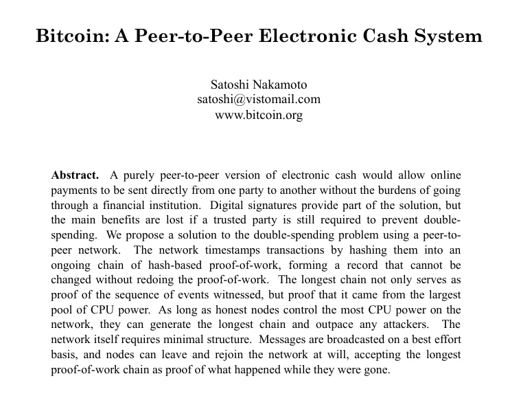

Suite à cette annonce, Satoshi reçoit quelques réponses, mais la plupart d'entre elles sont sceptiques. On lui reproche notamment trois choses :

- Tout d'abord, le cypherpunk James A. Donald [remet en cause](https://www.metzdowd.com/pipermail/cryptography/2008-November/014814.html) le passage à l'échelle du système en disant qu'« il ne semble pas pouvoir s'adapter à la taille requise ». Satoshi lui [répond](https://www.metzdowd.com/pipermail/cryptography/2008-November/014815.html) que « la bande passante n'est peut-être pas aussi prohibitive » qu'il le pense.
- Le deuxième commentaire négatif provient de John R. Levine, auteur du livre *Internet pour les Nuls* et consultant spécialisé dans l'infrastructure du courrier électronique, le filtrage des spams et les brevets logiciels. Ce dernier [critique](https://www.metzdowd.com/pipermail/cryptography/2008-November/014817.html) la sécurité de Bitcoin en évoquant la puissance de calcul détenue par les « fermes de machines zombies » composées d'ordinateurs contrôlés par des pirates. Il explique en particulier que, sur Internet, « les gentils ont une puissance de calcul nettement inférieure à celle des méchants ». Satoshi [répond](https://www.metzdowd.com/pipermail/cryptography/2008-November/014818.html) brillamment : « L'exigence est que les gentils disposent collectivement d'une puissance de calcul supérieure à celle de n'importe quel attaquant. »
- Enfin, un individu du nom de Ray Dillinger (utilisant le pseudonyme bear) [s'interroge](https://www.metzdowd.com/pipermail/cryptography/2008-November/014822.html) sur la valeur de l'unité de compte, déplorant le fait que « les preuves de travail informatiques n'ont pas de valeur intrinsèque » et reprochant leur caractère inflationniste en raison de l'évolution technique du matériel informatique. Satoshi lui [répond](https://www.metzdowd.com/pipermail/cryptography/2008-November/014831.html) que « l'augmentation de la vitesse du matériel est prise en charge » par l'ajustement périodique de la difficulté de production.

Même si le scepticisme est l'attitude majoritaire sur la liste, il n'est pas partagé par l'intégralité des personnes inscrites sur la liste de diffusion. En particulier, une personne se démarque des autres par son enthousiasme : il s'agit de Hal Finney, qui a une vision optimiste de l'avenir et qui n'a jamais abandonné l'idée de l'argent liquide électronique, malgré les échecs des années 90. Il [déclarera](https://bitcointalk.org/index.php?topic=155054.msg1643833#msg1643833) à ce sujet quelques années plus tard que « les cryptographes grisonnants \[...\] ont tendance à devenir cyniques » mais que lui « était plus idéaliste » ayant « toujours aimé la cryptographie, son mystère et son paradoxe ». Ainsi, le 7 novembre, il écrit dans un [courriel](https://www.metzdowd.com/pipermail/cryptography/2008-November/014827.html) adressé à la liste que « Bitcoin semble être une idée très prometteuse » et compare le modèle de Satoshi au bit gold de Nick Szabo.


Hal Finney en 2007

### La politique monétaire et le code du logiciel

Bitcoin utilise un algorithme de consensus distribué permettant à tous les nœuds du réseau de se mettre d'accord sur le contenu d'un registre, que Hal Finney désigne dès son premier courriel par le terme « *block chain* », en deux mots. La chaîne de blocs correcte choisie est celle qui possède le plus de blocs et les conflits sur les blocs concurrents sont réglés selon ce principe simple. Le mécanisme sera affiné [plus tard](https://sourceforge.net/p/bitcoin/code/109/) pour prendre en compte la quantité de travail accumulée plutôt que la longueur en nombre de blocs.

Ce mécanisme de consensus permet d'imposer toutes sortes de règles et incitations (pour reprendre la dernière phrase du livre blanc) au sein du système. Puisque Bitcoin constitue un service d'horodatage distribué, il est aussi possible de faire interagir ces règles avec le temps qui passe. D'où l'algorithme d'ajustement de la difficulté qui intervient pour réguler la production des nouveaux blocs et des bitcoins qui y sont associés : si le nombre de blocs produits sur une période donnée est trop élevée, alors la difficulté de production augmente ; dans le cas inverse, elle diminue. Bitcoin se différencie ainsi de RPOW, où les preuves de travail elles-mêmes formaient les unités de compte.

Grâce à cet ajustement de la difficulté, Bitcoin peut donc avoir une politique monétaire, c'est-à-dire que le montant de nouvelles unités émises par le protocole peut être déterminé à l'avance. Au départ, il est prévu que l'émission monétaire soit constante, afin d'inciter les nœuds producteurs à apporter leur puissance de calcul au réseau, et il n'y a pas de frais de transaction. Tel que l'écrit Satoshi Nakamoto dans la section « Incitation » du [livre blanc](assets/pdf/bitcoin-20081003.pdf) :

> « L'ajout régulier d'une quantité constante de nouvelles unités est analogue aux mineurs d'or qui dépensent des ressources pour ajouter de l'or dans la circulation. »

Cette propriété, confirmée par Satoshi [sur la liste de diffusion](https://www.metzdowd.com/pipermail/cryptography/2008-November/014831.html) et [dans sa correspondance privée](https://mmalmi.github.io/satoshi/#email-3), n'échappe pas à James A. Donald. Le 9 novembre, ce dernier [reproche](https://www.metzdowd.com/pipermail/cryptography/2008-November/014837.html) ainsi au « travail de suivi de qui possède quoi » (c'est-à-dire au minage) d'être « payé par le seigneuriage » et de « nécessiter de l'inflation », même s'il fait remarquer qu'« une inflation prévisible est moins choquante qu'une inflation qui est traficotée de temps à autre pour transférer des richesses d'un groupe électoral à un autre ». En outre, il [remarque](https://www.metzdowd.com/pipermail/cryptography/2008-November/014841.html) aussi qu'un nœud minier qui « ignore toutes les dépenses dont il ne se préoccupe pas » ne subit « aucune conséquence négative », évoquant par là le problème de la censure.

Ces remarques font probablement prendre conscience à Satoshi qu'il peut mettre en place un [mécanisme de frais de transaction](https://www.metzdowd.com/pipermail/cryptography/2008-November/014842.html) qui résout les deux problèmes, en remplaçant la création de nouvelles unités et en [incitant](https://www.metzdowd.com/pipermail/cryptography/2008-November/014843.html) les mineurs à « inclure toutes les transactions payantes qu'ils reçoivent ».

Dans le même temps, les questions de ses interlocuteurs le poussent à partager le code source de son modèle. Le 16 novembre, Satoshi transmet le code à Hal Finney, James A. Donald et Ray Dillinger. Le 17, dans une réponse à James A. Donald sur la liste, il [écrit](https://www.metzdowd.com/pipermail/cryptography/2008-November/014863.html) qu'il lui a envoyé « les fichiers principaux », que ceux-ci sont « disponibles sur demande pour le moment » et que leur « publication complète » aura lieu « bientôt ». Dans cette portion du code, qui sera [rendue publique](https://bitcointalk.org/index.php?action=printpage;topic=382374.0) en 2013 par Ray Dillinger, on peut constater que tous les éléments fondateurs de Bitcoin sont présents : la chaîne de blocs (alors encore appelée « *timechain* »), la preuve de travail, le modèle de représentation par des pièces (UTXO), la programmabilité des transactions, les frais de transaction et la réduction de moitié (*halving*).

Des paramètres diffèrent cependant, ce qui indique qu'ils ont été choisis de façon spontanée ou, comme l'[écrira](https://plan99.net/~mike/satoshi-emails/thread1.html) Satoshi, par « estimation éclairée ». Le temps de bloc, c'est-à-dire la période visée entre chaque bloc, est de 15 minutes au lieu de 10. La période d'ajustement de la difficulté est de 2 880 blocs (soit 30 jours pour un temps de blocs de 15 minutes) au lieu de 2 016 blocs (ce qui correspond à 14 jours pour un temps de bloc de 10 minutes). La mécanique de réduction de moitié, présente dans la fonction `GetBlockValue`, fait que le halving doit avoir lieu 100 000 blocs, soit tous les 2 ans et 311 jours environ :

```cpp
int64 GetBlockValue(int64 nFees)
{
    int64 nSubsidy = 10000 * CENT;
    for (int i = 100000; i <= nBestHeight; i += 100000)
        nSubsidy /= 2;
    return nSubsidy + nFees;
}
```

Il se crée 100 bitcoins durant la première période de 100 000 blocs, 50 durant la deuxième période, etc. de sorte que la quantité totale de bitcoins converge vers 20 millions. Chaque bitcoin (COIN) est divisible en 100 centimes (CENT), qui sont eux-mêmes divisibles en 10 000 unités de base, si bien qu'un bitcoin peut être divisé en 1 million d'unités plus petites, et non en 100 millions comme dans la version 0.1 qui sortira en janvier.

Hal Finney et Ray Dillinger [réalisent](https://www.linkedin.com/pulse/id-known-what-we-were-starting-ray-dillinger/) alors un examen minutieux du code. Chacun se concentre sur une partie spécifique du système : Ray Dillinger s'intéresse à la partie concernant le consensus, et Hal Finney étudie le système de script.

Le 10 décembre, Satoshi [crée](https://web.archive.org/web/20131016004654/http://sourceforge.net/p/bitcoin/mailman/bitcoin-list/?viewmonth=200812) la liste de diffusion bitcoin-list, qui est hébergée sur SourceForge. Cette liste aura peu de succès, même si quelques courriels de personnes intéressées y seront envoyés au fur et à mesure des années. Quoi qu'il en soit, tout cela démontre que tout est en place pour le lancement du prototype, un évènement qui adviendra un mois plus tard, au début de l'année 2009.

### La sortie du logiciel et le lancement du réseau

Le 8 janvier 2009 à 19 heures 27, Satoshi Nakamoto publie la première version du logiciel (numérotée 0.1.0) sur la liste de diffusion de Metzdowd.com. Le code source en C++ est publié de manière ouverte sous licence libre (MIT), de sorte que n'importe qui peut le copier, le modifier et l'utiliser à sa guise. Il contient notamment les données du bloc de genèse, le premier bloc de la chaîne à partir duquel cette dernière doit se prolonger. Le logiciel ne fonctionne que sous Windows. Dans son [courriel](https://www.metzdowd.com/pipermail/cryptography/2009-January/014994.html) d'annonce, Satoshi écrit :

> « Voici la première version de Bitcoin, un nouveau système de monnaie électronique qui utilise un réseau pair à pair pour empêcher la double dépense. &nbsp;C'est un système complètement décentralisé, sans serveur ni autorité centrale. »

Il précise que « le logiciel est encore en version alpha et en phase expérimentale » et qu'« il n'y a aucune garantie que l'état du système ne doive pas être redémarré à un moment donné ». Il y a deux moyens d'obtenir des bitcoins : en les réceptionnant fonds de quelqu'un d'autre, ou bien en activant la génération de pièces par CPU. Il y a également deux façons d'envoyer des unités : en utilisant l'adresse IP du destinataire, ou bien en passant par une adresse Bitcoin, ce qui permet d'envoyer un paiement hors-ligne. Enfin, le courriel décrit la politique monétaire finale de Bitcoin, dont nous parlerons dans le chapitre suivant.

Le code publié est lui un peu plus complexe que présenté et est écrit pour le développement futur d'une interface qui permettrait de faire plus de choses que transférer des bitcoins. Satoshi a en effet [intégré](https://plan99.net/~mike/satoshi-emails/thread4.html) au client les rudiments d'une « place de marché de type eBay » qui [pourrait](https://plan99.net/~mike/satoshi-emails/thread1.html) notamment « faciliter les opérations de change de monnaies ». Le code contient également [quelques fonctions](https://github.com/trottier/original-bitcoin/blob/4184ab26345d19e87045ce7d9291e60e7d36e096/src/uibase.cpp#L1573-L1731) dédiées à la mise en place d'une éventuelle application de poker directement dans le logiciel. Le poker en ligne connaît alors un essor fantastique aux États-Unis depuis 2003 (grâce à l'« effet Moneymaker ») mais est victime d'une forme de censure financière suite à l'adoption de l'[*Unlawful Internet Gambling Enforcement Act*](https://www.pgt.com/news/what-if-poker-wasnt-part-of-the-uigea-back-in-2006) en 2006, ce qui explique cet ajout.

Quelques heures après l'annonce, dans la nuit du 8 au 9 janvier, Satoshi se met à miner. Le deuxième bloc de la chaîne, le bloc 1, est validé par lui le 9 à 2 heures 54 du matin. La production de ce bloc marque le lancement effectif du réseau, et d'autres maillons sont ajoutés à la chaîne dans les heures qui suivent.

Une fois cela fait, Satoshi se charge de prévenir les différentes personnes avec qui il a communiqué de ce lancement. À 5 heures 21, il envoie un [courriel](https://www.coindesk.com/markets/2020/11/26/previously-unpublished-emails-of-satoshi-nakamoto-present-a-new-puzzle/) à Hal Finney l'informant que « la version Bitcoin v0.1 avec l'exécutable et le code source complet est disponible sur Sourceforge ». Le lendemain, il contacte Adam Back et Wei Dai en leur écrivant un courriel personnalisé. Dans ces derniers e-mails, il inclut en particulier une description publiée par Hal Finney sur la liste de diffusion, qui mentionne la preuve de travail et b-money.

Le 10 janvier, Hal Finney essaie de lancer le fichier exécutable du logiciel, mais il rencontre un problème technique qui fait planter son ordinateur. Il [contacte](https://web.archive.org/web/20140821141611/http://sourceforge.net/p/bitcoin/mailman/message/21295694/) donc Satoshi et commence à échanger avec lui à ce sujet. Hal Finney arrive tant bien que mal à faire fonctionner le logiciel. Dans la nuit du 10 au 11, à 1 heure du matin, il trouve ainsi son premier bloc (le [bloc 78](https://mempool.space/block/00000000a2886c95400fd3b263b9920af80b118b28fee5d2a162a18e4d9d8b2f) et gagne de ce fait 50 bitcoins. Une heure plus tard, il envoie un [courriel élogieux](https://www.metzdowd.com/pipermail/cryptography/2009-January/015004.html) à la *Cryptography mailing list* où il félicite Satoshi pour la sortie de la version alpha et où il met en valeur la politique monétaire de l'unité de compte. Enfin, à 3 heures 33, il [fait part](https://twitter.com/halfin/status/1110302988) son expérience sur Twitter (réseau social alors naissant) en indiquant qu'il fait fonctionner Bitcoin, en anglais : « *Running bitcoin* ». C'est le premier tweet qui parle de Bitcoin.

De ces échanges entre Satoshi et Hal Finney émergent la version 0.1.3, [publiée](https://web.archive.org/web/20171124135217/https://sourceforge.net/p/bitcoin/mailman/message/21313152/) le 12 janvier, qui est beaucoup plus stable que les précédentes. Satoshi profite également de sa conversation avec Hal Finney pour lui donner quelques bitcoins : il lui [envoie](https://mempool.space/tx/f4184fc596403b9d638783cf57adfe4c75c605f6356fbc91338530e9831e9e16) ainsi 10 bitcoins par l'intermédiaire de son adresse IP dans la nuit du 11 au 12 janvier, à 3 heures 30 du matin. Il s'agit du premier transfert d'une personne à une autre sur le réseau.

Mais Hal Finney n'est pas la seule personne à essayer Bitcoin à ce moment-là. C'est aussi le cas de Dustin D. Trammell, un chercheur en sécurité informatique américain qui s'intéresse alors aux monnaies numériques (et en particulier à la version électronique du Liberty Dollar) qui découvre Bitcoin via la liste de diffusion. Le 11 janvier, il exécute le logiciel sur une de ses machines de travail (mais il ne mine son premier [bloc](https://mempool.space/block/00000000d3ec2f50772c2d42d4afb054c283555766a0ca1d8da65b9b5058a49e) que le 13 à cause d'un problème technique). Dans la nuit du 11 au 12, il rentre en contact avec Satoshi, avec lequel il [communique](https://www.dustintrammell.com/s/Satoshi_Nakamoto.zip) longuement au cours des jours suivants. Le 15 janvier, Dustin Trammell [reçoit](https://mempool.space/tx/d71fd2f64c0b34465b7518d240c00e83f6a5b10138a7079d1252858fe7e6b577) également 25 bitcoins de sa part.


Dustin Trammell (source : [archive du blog de Dustin Trammell](https://web.archive.org/web/20100419181845/http://blog.dustintrammell.com/))

Par la suite, d'autres personnes essaient de faire fonctionner le logiciel. C'est le cas de Nicholas Bohm, un avocat britannique, qui envoie un courriel le 25 janvier sur bitcoin-list car il rencontre un problème technique et échange en privé avec Satoshi. Un certain Jeff Kane arrive de son côté à faire fonctionner la version 0.1.3 le 30 janvier. Nicholas Bohm sera mentionné aux côtés de Dustin Trammell dans les crédits de la version 0.1.5 du logiciel sorti début février.

À partir du 9 janvier 2009, le réseau ne s'arrêtera pas. Bloc après bloc, la chaîne continuera de s'allonger. Et Bitcoin finira par connaître le succès.

### Une conception progressive

Ce que nous pouvons retenir de ce récit de la conception de Bitcoin est que cette dernière a eu lieu de manière progressive. Entre la première idée au printemps 2007 et le lancement effectif du réseau lors de l'hiver 2009, il s'est en effet écoulé plus d'un an et demi. De plus, certains éléments du modèle ont évolué, comme nous l'avons vu avec la politique monétaire et le mécanisme des frais de transaction qui sont apparus après la publication de la première version du livre blanc le 31 octobre 2008.

Cependant, ce travail n'a pas été suffisant, et il a fallu de la persévérance à Satoshi pour amorcer son système. Dès le début, il savait bien que peu de gens s'étaient penchés sérieusement sur son modèle et qu'il allait être compliqué d'attirer de nouveaux utilisateurs et contributeurs. C'est pourquoi il a essayé de susciter l'enthousiasme en vendant son idée du mieux possible. Nous étudierons cet aspect dans le chapitre suivant, qui couvre une grande partie de l'année 2009.

## La présentation au monde
<chapterId>28be3515-d9da-4d91-b7ff-f8691d51c562</chapterId>

Après avoir étudié comment Bitcoin a été conçu et démarré par Satoshi Nakamoto, concentrons-nous sur la façon dont il a été présenté publiquement. Suite à son lancement au début de l'année 2009, le réseau fonctionnait mais les nœuds générateurs étaient peu nombreux (Satoshi minait la grande majorité des blocs) et l'activité était pour ainsi dire inexistante (32 transactions effectives ont eu lieu durant le mois de janvier). Le projet ne disposait que d'un site web rudimentaire et d'une page SourceForge où télécharger le logiciel. En outre, la communication à propos de Bitcoin s'était limitée à la *Metzdowd Cryptography mailing list*, suivie au mieux par quelques centaines de personnes passionnées par la cryptographie.

Le défi de cette période a par conséquent été de faire la promotion de Bitcoin afin d'attirer une masse critique d'utilisateurs, qui pourraient ensuite contribuer à la cause d'une manière ou d'une autre. C'est pourquoi Satoshi a eu pour priorité d'améliorer le site et d'interagir avec diverses personnes. Il voulait faire connaître sa découverte au monde.

Dans ce chapitre, nous nous intéresserons aux codes culturels qui sont issus de l'effort de communication de Satoshi, comme la défiance du système bancaire et la limite des 21 millions. Nous commenterons également les conversations que Satoshi a eues avec ses détracteurs pour défendre son invention. Enfin, nous parlerons de l'aide qu'il a reçue d'autres personnes, et notamment de l'assistance essentielle de Martti Malmi, son premier bras droit.

### Le bloc de genèse

Le lancement lors du mois de janvier 2009 est l'occasion pour Satoshi Nakamoto d'établir les paramètres fixes de son système. Comme il l'[écrira](https://bitcointalk.org/index.php?topic=195.msg1611#msg1611) plus tard, la nature de Bitcoin est telle que, « dès la version 0.1 lancée », son fonctionnement de base est « gravé dans le marbre pour le reste de son existence », de sorte qu'il est nécessaire de bien régler les choses avant que le système prenne de l'ampleur. En particulier, deux éléments fondateurs revêtent une importance culturelle majeure : le contenu du bloc de genèse et la limite des 21 millions d'unités.

Le bloc de genèse (ou *genesis block* en anglais) est le bloc de base de la chaîne de blocs de Bitcoin, à partir duquel elle doit être prolongée. Il est par conséquent inscrit en dur dans le logiciel. Avant le lancement du réseau, Satoshi construit ce premier maillon en produisant la preuve de travail requise et en l'horodatant au 3 janvier 2009 à 18:15:05 UTC. Dans ce bloc (et plus précisément dans la transaction de récompense), il inscrit le message suivant :

```
The Times 03/Jan/2009 Chancellor on brink of second bailout for banks
```

Il s'agit du titre de la une du quotidien britannique *The Times* de ce jour-là, qui indique que le chancelier de l'Échiquier (c'est-à-dire le ministre des finances britannique) est sur le point de renflouer les banques pour la seconde fois. La présence de cette une dans le bloc possède un rôle double :

- D'une part, elle empêche l'antidatage du lancement du réseau en prouvant que le système n'a pas été démarré avant le 3 janvier, car Satoshi ne pouvait pas connaître cette une avant la date de parution du journal ;
- D'autre part, elle indique symboliquement ce à quoi Bitcoin s'oppose en faisant référence au contexte monétaire et financier de l'époque.


À l'époque, le monde subit en effet de plein fouet les effets de la crise financière amorcée en 2007 par le dégonflement de la bulle des subprimes aux États-Unis. Les États renflouent les institutions financières pour éviter de nouvelles faillites après la chute de la banque d'investissement Lehman Brothers survenue le 15 septembre 2008, et les banques centrales procèdent à des assouplissements quantitatifs en injectant des liquidités sur les marchés financiers. Cette utilisation d'argent public créé pour l'occasion, a pour effet de troubler un certain nombre de citoyens qui réalisent que le système bancaire est en réalité un système de profits privés et de pertes socialisées.

Bitcoin, quant à lui, ne repose pas sur un tiers de confiance, et n'est par conséquent pas soumis à l'arbitraire d'une banque centrale. Il contraste ainsi avec les monnaies étatiques, telles que le dollar ou l'euro, dont la quantité peut être modifiée arbitrairement par ceux qui contrôlent la création monétaire ; la politique monétaire du bitcoin est en effet programmée à l'avance, inscrite dans le protocole, pour en théorie ne jamais être altérée.

### La limite des 21 millions

Cela nous amène au second élément présenté par Satoshi le jour du lancement du réseau : la limite des 21 millions. Le 8 janvier, dans son [courriel d'introduction](https://www.metzdowd.com/pipermail/cryptography/2009-January/014994.html), il décrit cette politique monétaire de la façon suivante :

> « La circulation totale sera de 21 000 000 d'unités. &nbsp;Elles seront distribuées aux nœuds du réseau lorsqu'ils créeront des blocs, la quantité émise étant divisée par deux tous les 4 ans.
>
> les 4 premières années : 10 500 000 unités
> les 4 années suivantes : 5 250 000 unités
> les 4 années suivantes : 2 625 000 unités
> les 4 années suivantes : 1 312 500 unités
> etc.
>
> Lorsque cela sera épuisé, le système pourra prendre en charge les frais de transaction si nécessaire. »

Quelques jours plus tard, Hal Finney [réagit](https://www.metzdowd.com/pipermail/cryptography/2009-January/015004.html) favorablement à cette politique monétaire sur la liste en s'enthousiasmant du fait que « le système peut être configuré pour n'autoriser qu'un nombre maximum certain d'unités à être générées ». Dans son courriel, il estime que si Bitcoin devient « le système de paiement dominant utilisé dans le monde entier », chaque unité aura alors « une valeur d'environ 10 millions » de dollars. Il conclut en écrivant que « la possibilité de générer des unités aujourd'hui avec quelques centimes de temps de calcul » peut constituer « un très bon pari ». Même si l'estimation est contestable (car elle se base sur une valorisation du bitcoin qui serait équivalente à la totalité de la richesse mondiale), le raisonnement se tient.

Le 16 janvier, Satoshi reprend cette idée d'« investissement à long terme » dans un courriel qu'il partage à la liste de diffusion et où il décrit les cas d'utilisation potentiels. Il [déclare](https://www.metzdowd.com/pipermail/cryptography/2009-January/015014.html) alors qu'il « pourrait être judicieux d'en avoir au cas où cela prendrait » et que « si suffisamment de gens pensent la même chose, cela deviendra une prophétie autoréalisatrice ». Il [réitérera](https://p2pfoundation.ning.com/xn/detail/2003008:Comment:9562) cette affirmation un mois plus tard en expliquant que le montant limité d'unités est susceptible de créer une « boucle de rétroaction positive » dans le sens où « plus les utilisateurs sont nombreux, plus la valeur augmente, ce qui pourrait attirer davantage d'utilisateurs désireux de profiter de la valeur croissante ». De ce fait, l'élément spéculatif est présent dès le départ, dans le but d'amorcer le système.

### La réglementation, les réseaux de zombies et l'écologie

Dans la foulée, une autre discussion se développe sur la liste de diffusion. Satoshi a mentionné la limitation du spam comme un cas d'utilisation, ce qui fait réagir les différents contributeurs. Le créateur de Bitcoin préfère répondre en privé à ces reproches, mais Hal Finney se charge d'objecter en public. Ce dernier a en effet eu le temps de réfléchir à ces questions, lorsqu'il avait essayé de mettre au point sa propre monnaie numérique avec RPOW.

D'abord, survient la question de la réglementation et de la potentielle interdiction de Bitcoin par les États. Cette question est [soulevée](https://www.metzdowd.com/pipermail/cryptography/2009-January/015016.html) par Jonathan Thornburg, chercheur pour le département d'astronomie de l'université de l'Indiana à Bloomington et habitué de la liste. Dans son courriel en réponse aux cas d'utilisation proposés par Satoshi, il dresse la situation de la surveillance financière mondiale et indique que Bitcoin pourrait permettre de transférer des montants supérieurs au seuil toléré par les autorités. La conséquence logique de son raisonnement est qu'« aucun État majeur n'est susceptible d'autoriser le fonctionnement à grande échelle de Bitcoin sous sa forme actuelle ».

Cette question intéresse Hal Finney qui écrit un [tweet](https://twitter.com/halfin/status/1136749815) le 21 janvier indiquant qu'il cherche « un moyen d'ajouter plus d'anonymat à bitcoin ». Puis le 24, il [répond](https://www.metzdowd.com/pipermail/cryptography/2009-January/015036.html) à Jonathan Thornburg en écrivant qu'« il s'agit certainement d'un argument valable » mais que « Bitcoin dispose de plusieurs atouts », dont le principal est qu'il est « distribué, sans point de défaillance unique, sans "monnaierie", sans société dont les dirigeants peuvent être assignés à comparaître ».

Ensuite, dans le même courriel, Jonathan Thornburg aborde le sujet des réseaux d'ordinateurs zombies, qui pourraient trivialement « passer à travers les filtres de courrier électronique payants », en référence au cas d'utilisation ayant été mis en avant par Satoshi. Ce dernier lui [répond](https://mmalmi.github.io/satoshi/#email-3) en privé, lui expliquant qu'il pourrait dans ce cas « réaliser un joli profit en créant des adresses électroniques payantes et en collectant tout l'argent du spam », une opinion qu'il [retranscrit](https://www.metzdowd.com/pipermail/cryptography/2009-January/015041.html) sur la liste le 25. Hal Finney de son côté rappelle que la preuve de travail « vise principalement à garantir la fiabilité de la base de données de l'historique des transactions », puis ajoute que si les jetons de preuve de travail utiles, alors les machines ne resteront plus inutilisées et le parasitage diminuera.

Enfin, le dernier commentaire émane de John Gilmore, ancien membre fondateur des cypherpunks et tenancier de la première liste de diffusion du mouvement entre 1992 et 1997. Dans un courriel envoyé le 25 janvier, il met en avant les supposées conséquences écologiques de Bitcoin et [écrit](https://www.metzdowd.com/pipermail/cryptography/2009-January/015042.html) que « la dernière chose dont nous avons besoin est de déployer un système conçu pour brûler tous les cycles disponibles, consommant de l'électricité et générant du dioxyde de carbone, partout sur Internet, afin de produire de petites quantités de bitbux pour faire passer des courriels ou des spams ». Satoshi lui [répond](https://mmalmi.github.io/satoshi/#email-3) en privé qu'« il serait ironique de devoir choisir entre la liberté économique et la préservation de l'environnement ». Il ajoute que « la preuve de travail est la seule solution \[qu'il a\] trouvée pour faire fonctionner un système d'argent électronique pair à pair » et que, même si elle devait consommer beaucoup d'énergie, « elle gaspillerait toujours moins que l'activité bancaire conventionnelle nécessitant beaucoup de main-d'œuvre et de ressources ».


John Gilmore en 2007 (source : [Flickr](https://www.flickr.com/photos/35034362831@N01/2115939762/))

Le 27, Hal Finney [évoque](https://www.metzdowd.com/pipermail/cryptography/2009-January/015056.html) des pistes qui permettait de réduire la dissipation énergétique liée au calcul des preuves de travail. Une heure plus tard, il [écrit](https://twitter.com/halfin/status/1153096538) sur Twitter « réfléchir à la manière de réduire les émissions de CO2 liées à une mise en œuvre généralisée de Bitcoin ».

Un autre soutien provient du cypherpunk Zooko Wilcox-O'Hearn, qui travaille alors sur Tahoe-LAFS, un système de partage de fichiers héritier de [Mojo Nation](https://www.salon.com/2000/10/09/mojo_nation/), projet populaire au début des années 2000. Le 26 janvier, au sein de la discussion sur la liste, il glisse le lien vers un billet qu'il a publié le jour-même sur son blog intitulé « [*Decentralized Money*](https://web.archive.org/web/20090303195936/http://testgrid.allmydata.org:3567/uri/URI:DIR2-RO:j74uhg25nwdpjpacl6rkat2yhm:kav7ijeft5h7r7rxdp5bgtlt3viv32yabqajkrdykozia5544jqa/wiki.html#%5B%5BDecentralized%20Money%5D%5D) », où il cite les différents projets de monnaies numériques (DigiCash, bit gold, b-money) et où il fait la part belle à Bitcoin. Il écrit notamment :

> « Ce que je veux, c'est une monnaie que tout le monde puisse utiliser de manière pratique et peu coûteuse, mais que **personne** n'ait le pouvoir de manipuler. &nbsp;Je veux que personne n'ait le pouvoir de gonfler ou de dégonfler la masse monétaire ; que personne n'ait le pouvoir de surveiller, de taxer ou d'empêcher les transactions. &nbsp;Un véritable équivalent numérique de l'or, dans les périodes et les lieux où l'or était la monnaie universelle. »

Un lien vers ce texte finira par être [ajouté](https://web.archive.org/web/20090303195936/http://bitcoin.org/) sur Bitcoin.org quelques semaines après. Et Satoshi [remerciera](https://bitcointalk.org/index.php?topic=890.msg10723#msg10723) personnellement Zooko un an et demi plus tard pour cette petite aide.

### Le pair-à-pair et la défiance des banques centrales

Comme nous l'avons dit, si la communication de Satoshi se restreint au départ à la *Cryptography mailing list*, elle s'élargit ensuite à d'autres horizons. En février 2009, il intervient ainsi sur le forum et la liste de diffusion de la Fondation P2P, une organisation créée en 2007 qui étudie l'impact des infrastructures pair à pair sur la société. Il y interagit avec plusieurs de ses membres, toujours dans le but de promouvoir son modèle.

Le 11 février, Satoshi publie un [message d'introduction](https://p2pfoundation.ning.com/forum/topics/bitcoin-open-source) présentant Bitcoin sur le forum (p2pfoundation.ning.com), dont il envoie une [copie](https://diyhpl.us/~bryan/irc/bitcoin-satoshi/p2presearch-again/p2pfoundation.net/backups/p2p_research-archives/2009-February/001347.html) par courriel à la liste (p2p-research). Dans ce texte, il écrit :

> « Le problème fondamental de la monnaie conventionnelle est toute la confiance nécessaire pour la faire fonctionner. &nbsp;Il faut faire confiance à la banque centrale pour qu'elle ne déprécie pas la monnaie, mais l'histoire des monnaies fiat est pleine de violations de cette confiance. &nbsp;Il faut faire confiance aux banques pour détenir notre argent et le transférer par voie électronique, mais elles le prêtent par vagues de bulles de crédit avec à peine une fraction en réserve. &nbsp;Nous devons leur faire confiance pour protéger notre vie privée, pour ne pas laisser les voleurs d'identité vider nos comptes. &nbsp;Leurs frais généraux considérables rendent les micropaiements impossibles. »

Sur son [profil](https://p2pfoundation.ning.com/profile/SatoshiNakamoto), il indique être un homme japonais, mais ce n'est pas tout. Une mise à jour de l'interface en 2011 fera apparaître son âge : 35 ans, soit 32 ou 33 ans en 2009. Puis, on [découvrira](https://www.reddit.com/r/Bitcoin/comments/229qvr/happy_birthday_satoshi_nakamoto/) en 2014 qu'il a indiqué une date de naissance particulière : le 5 avril 1975. Cette date, d'apparence bénigne, est vraisemblablement une date composite faisant référence à l'interdiction pour les citoyens américains de détenir de l'or entre 1933 et 1975 aux États-Unis. Le jour du 5 avril se rapporte au jour de l'instauration de cette interdiction par l'[Ordre exécutif 6102](https://www.presidency.ucsb.edu/documents/executive-order-6102-forbidding-the-hoarding-gold-coin-gold-bullion-and-gold-certificates) signé par le président Franklin Delano Roosevelt le 5 avril 1933, et l'année 1975 correspond à son année d'abrogation lors de l'entrée en vigueur de la [Public Law 93-373](https://www.govtrack.us/congress/bills/93/s2665/text). Ce détail est très important puisque cette prohibition a mis fin à l'étalon-or classique (où chacun pouvait obtenir de l'or en échange d'un billet représentatif), a permis de dévaluer le dollar (par le biais du *Gold Reserve Act* en 1934) et a facilité l'instauration du régime monétaire à taux de change flottants que nous connaissons suite au *Nixon Shock* de 1971.

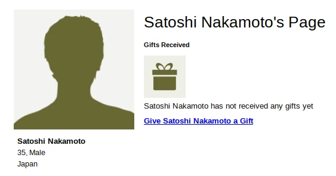
Profil de Satoshi Nakamoto sur le forum de la Fondation P2P le 17 mars 2011 (source : [capture du forum](https://web.archive.org/web/20110317060514/http://p2pfoundation.ning.com:80/profile/SatoshiNakamoto))

Ce n'est pas la seule référence aux métaux précieux qui se retrouve dans les interventions de Satoshi. Le créateur de Bitcoin [écrit](https://p2pfoundation.ning.com/forum/topics/bitcoin-open-source?commentId=2003008:Comment:9562) ainsi dans les commentaires le 18 février :

> « Il n'y a personne pour agir en tant que banque centrale ou réserve fédérale afin d'ajuster la masse monétaire au fur et à mesure que le nombre d'utilisateurs augmente. &nbsp;Il aurait fallu qu'un tiers de confiance détermine la valeur, car je ne connais aucun moyen pour un logiciel de connaître la valeur des choses dans le monde réel. &nbsp;S'il existait un moyen astucieux, ou si nous voulions faire confiance à quelqu'un pour gérer activement la masse monétaire afin de l'ancrer à quelque chose, les règles auraient pu être programmées à cet effet. &nbsp;En ce sens, c'est un système qui se comporte davantage comme un métal précieux. »

Satoshi Nakamoto est aussi actif sur la liste de diffusion où il échange notamment avec Martien van Steenbergen, un consultant en gestion de projet néerlandais. Le 13 février, il aborde le sujet de la programmabilité de Bitcoin et [écrit](https://diyhpl.us/~bryan/irc/bitcoin-satoshi/p2presearch-again/p2pfoundation.net/backups/p2p_research-archives/2009-February/001362.html) à ce dernier :

> « Je considère Bitcoin comme une pierre angulaire, comme une première étape si l'on veut mettre en œuvre des monnaies sociales de pair à pair programmables telles que décrites par les idées de Marc \[Fawzi\] et d'autres discutées ici. &nbsp;Il faut d'abord qu'une monnaie pair à pair basique et normale fonctionne. &nbsp;Une fois qu'elle est établie et éprouvée, il est facile de passer à l'étape suivante, celle de la monnaie automatique dynamique.
>
> J'aime beaucoup l'idée de communautés virtuelles, sans appartenance géographique, qui expérimentent de nouveaux paradigmes économiques. »

Tout cela montre que le créateur de Bitcoin cherche à s'adapter à son public et qu'il fait ce qu'il peut pour pousser les gens à s'intéresser à sa découverte.


### Mike Hearn et les 21 millions

La stratégie de communication de Satoshi porte peu à peu ses fruits. Au mois d'avril 2009, d'autres personnes commencent à s'intéresser à son invention. C'est le cas de Mike Hearn, un développeur britannique travaillant pour Google depuis la Suisse, et s'adonnant au logiciel libre sur son temps libre. Ce dernier s'intéresse alors aux systèmes de paiement numériques, et en particulier à Ripple, le projet de Ryan Fugger. Et c'est justement sur le Google Group de Ripple qu'il entend parler de Bitcoin par le biais d'un [fil de discussion](https://groups.google.com/g/rippleusers/c/1GsQzGv9Y14) créé en mars par Charles N. Wyble, un jeune informaticien et entrepreneur américain.

Le 12 avril, Mike Hearn envoie un [courriel](https://plan99.net/~mike/satoshi-emails/thread1.html) à Satoshi dans lequel il pose une série de questions à propos de Bitcoin. Il précise qu'« il est rare de rencontrer des idées vraiment révolutionnaires » et ne manque pas de mentionner Ripple.


Mike Hearn et Satoshi Nakamoto discutent de différents aspects de Bitcoin comme le passage à l'échelle, les micropaiements, le fonctionnement du logiciel ou l'absence de rétrofacturation. En particulier, Mike Hearn demande à Satoshi pourquoi il a choisi la quantité de « 24 millions » (*sic*) pour le montant total de bitcoins et si ces derniers peuvent être fractionnés. Satoshi donne alors l'explication suivante :

> « Mon choix pour le nombre d'unités et le programme de distribution était une estimation éclairée. &nbsp;C'était un choix difficile, car une fois le réseau en marche, ces paramètres étaient verrouillés et nous étions bloqués avec eux. &nbsp;Je voulais choisir quelque chose qui rendrait les prix similaires à ceux des monnaies existantes, mais c'était très difficile sans avoir connaissance de l'avenir. &nbsp;J'ai fini par choisir un entre-deux. &nbsp;Si Bitcoin reste une petite niche, il vaudra moins par unité que les monnaies existantes. &nbsp;Si l'on imagine qu'il est utilisé pour une partie du commerce mondial, alors il n'y aura que 21 millions d'unités pour le monde entier, donc elles vaudront beaucoup plus par unité. &nbsp;Les valeurs sont des entiers codés sur 64 bits avec 8 décimales, donc une unité est représentée en interne par 100 000 000. &nbsp;Il y a beaucoup de granularité si jamais les prix usuels deviennent petits. &nbsp;Par exemple, si 0,001 \[Bitcoin\] vaut 1 euro, il peut être plus facile de changer l'emplacement de la virgule, de sorte que si on a 1 Bitcoin, il sera désormais affiché comme 1000, et 0,001 sera affiché comme 1. »

Il [expliquera](https://plan99.net/~mike/satoshi-emails/thread3.html) plus tard à Mike Hearn qu'il a « pensé à 100 BTC \[par bloc\] et à 42 millions » mais que le nombre des 42 millions lui « paraissait élevé ».

Après avoir contacté Satoshi, Mike Hearn commence à utiliser le logiciel sur son ordinateur personnel. Il mine quelques blocs, dont le [bloc 11 157](https://mempool.space/block/00000000a630e2695d98b11707d053b12c583f58976f8b4ae6a6f289ee32797b). En parallèle à leur discussion, les deux hommes effectuent quelques échanges monétaires. Le 18 avril, Mike Hearn envoie ainsi 32,51 bitcoins à Satoshi, que ce dernier lui renvoie dans la journée. Il s'envoient également mutuellement 50 bitcoins issus de leurs productions personnelles.

### Martti Malmi et la présentation de Bitcoin

La communication de Satoshi ne laisse pas non plus indifférent un jeune étudiant en informatique finlandais du nom de Martti Malmi. Ce dernier découvre Bitcoin début avril, par l'intermédiaire du texte sur le forum de la Fondation P2P. Le 9, il se met à utiliser le logiciel et mine son premier bloc (le bloc 10 351). Dans la soirée, il rédige une courte présentation de Bitcoin où il soutient l'hypothèse anarchiste que « la monnaie pair à pair pourrait faire disparaître l'État ». Il publie son texte sous le pseudonyme Trickster(n) sur deux forums libertariens de sensibilités différentes : anti-state.com (ASC) et le forum de Freedomain Radio (le média de l'anarcho-capitaliste Stefan Molyneux). Martti écrit :

> « Le système est anonyme, et aucun État ne pourrait possiblement taxer ou empêcher les transactions. Il n'y a pas de banque centrale qui puisse déprécier la devise avec la création illimitée de nouvelle monnaie. L'adoption généralisée d'un tel système ressemblerait à quelque chose qui pourrait avoir un effet dévastateur sur la capacité de l'État à se nourrir à partir de son bétail. »


Martti Malmi en 2013 (source : [Business Insider](https://www.businessinsider.com/bitcoins-martti-malmi-not-worried-about-liberty-reserve-2013-5))

Martti envoie ensuite un [courriel](https://mmalmi.github.io/satoshi/#email-1) un Satoshi précisant qu'il est l'auteur de ce texte, où il écrit qu'il « aimerait aider avec Bitcoin » même s'il n'a « pas encore beaucoup d'expérience en matière de développement ». Satoshi Nakamoto lui répond le 2 mai, en lui disant que sa « compréhension de Bitcoin » est « en plein dans le mille ».

Le créateur de Bitcoin le met à contribution pour remplir la [page web](https://web.archive.org/web/20090511173000/http://bitcoin.sourceforge.net/) sur SourceForge, la plateforme où est hébergé le projet, notamment en écrivant une [foire aux questions](https://mmalmi.github.io/satoshi/#email-4) (FAQ). Sur la page de garde (bitcoin.sourceforge.net), il présente Bitcoin comme une « monnaie numérique anonyme basée sur un réseau pair à pair » ne reposant sur « aucune autorité centrale pour émettre du nouvel argent ou pour surveiller les transactions ». Il met en avant les avantages suivants :

- « Transférez de l'argent facilement via Internet, sans avoir à faire confiance à des tiers. »
- « Aucun tiers ne peut empêcher ou contrôler vos transactions. »
- « Soyez à l'abri de l'instabilité causée par l'activité bancaire à réserves fractionnaires bancaire et par les mauvaises politiques des banques centrales. L'inflation limitée de la masse monétaire du système Bitcoin est répartie uniformément (par puissance de calcul) sur tout le réseau, et pas monopolisée par les banques. »
- « La valeur du Bitcoin est susceptible d'augmenter à mesure que la croissance de l'économie de Bitcoin dépasse le taux d'inflation – considérez le Bitcoin comme un investissement et commencez à faire tourner un nœud aujourd'hui ! »

Satoshi [approuve](https://mmalmi.github.io/satoshi/#email-5) globalement cette présentation même s'il émet quelques réserves. Il [est](https://mmalmi.github.io/satoshi/#email-19) en particulier « mal à l'aise » avec le fait de déclarer que le bitcoin est un « investissement », redoutant probablement les répercussions légales à ce sujet. La page est [publiée](https://mmalmi.github.io/satoshi/#email-9) le 6 mai et, deux jours plus tard, Martti Malmi en fait la promotion en partageant un lien sur les plateformes [Hackernews](https://news.ycombinator.com/item?id=599852) et [Reddit](https://www.reddit.com/r/business/comments/8itlf/bitcoin_a_peertopeer_network_based_anonymous/). Une version quelque peu modifiée de la description présente [se retrouvera](https://web.archive.org/web/20100106082749/http://www.bitcoin.org/) sur le site web principal à la fin de l'année 2009.

Le printemps 2009 est également marqué par l'apparition du mot « cryptomonnaie » (« *cryptocurrency* » en anglais) qui est initialement utilisé pour se référer à Bitcoin. Le 11 mai, Satoshi [écrit](https://mmalmi.github.io/satoshi/#email-19) ainsi à Martti Malmi :

> « Quelqu'un a proposé le mot "cryptomonnaie"... c'est peut-être un mot que nous devrions utiliser pour décrire Bitcoin, ça te plaît ? »

Le jeune Finlandais approuve et avance que « *The P2P Cryptocurrency* » (« La cryptomonnaie pair à pair ») pourrait être le slogan de Bitcoin. Cette suggestion sera mise à exécution : le titre de la page de présentation deviendra « *Bitcoin P2P Cryptocurrency* » et l'annonce de la version 0.3 en juillet 2010 décrira le projet comme « *Bitcoin, the P2P cryptocurrency* ».

### Les deux forums consacrés à Bitcoin

Martti Malmi met aussi en place un forum et un wiki, toujours sur la page SourceForge. Ces éléments sont [ouverts](https://mmalmi.github.io/satoshi/#email-17) le 9 juin. Le 13, Malmi [annonce](https://web.archive.org/web/20131016004650/http://sourceforge.net/p/bitcoin/mailman/bitcoin-list/?viewmonth=200906) l'existence de la page SourceForge, du forum et du wiki sur la liste de diffusion de Bitcoin :

> « Le nouveau site/portail de Bitcoin est disponible à l'adresse bitcoin.sourceforge.net. Des forums et un wiki sont intégrés, vous êtes donc invités à participer aux discussions et à la documentation sur le wiki. »

Ce forum rencontre son public. Il semble qu'il [donne](https://mmalmi.github.io/satoshi/#email-27) même lieu à la création d'un canal IRC dédié au développement (#bitcoin-dev) en août. Nous ne disposons néanmoins pas d'archive car il n'était accessible que pour ses membres.

Au fil des mois, de plus en plus de gens s'inscrivent et interviennent sur ce premier forum, ce qui fait prendre conscience à Satoshi que l'infrastructure logicielle mise en place par Malmi n'est pas suffisante. Le 5 novembre, il écrit au jeune Finlandais pour suggérer la création d'un nouveau forum qui serait à même de recevoir un trafic plus élevé :

> « Maintenant que le forum sur bitcoin.sourceforge.net gagne en popularité, nous devrions vraiment chercher un endroit qui héberge gratuitement la gestion d'un forum complet. »

Après quelques discussions sur la solution technique à adopter, Martti Malmi [installe](https://mmalmi.github.io/satoshi/#email-93) le forum sur son serveur le 17 novembre et Satoshi se met à le [configurer](https://mmalmi.github.io/satoshi/#email-99) le 19 novembre. À partir du 22, le créateur de Bitcoin y transfère quelques questions-réponses provenant de l'ancien forum qui abordent les sujets de la confidentialité, du minage et de Linux. Il publie également un [message de bienvenue](https://bitcointalk.org/index.php?topic=5.msg28#msg28). Le 25, le forum est [mis en ligne](https://mmalmi.github.io/satoshi/#email-110) à l'adresse bitcoin.org/smf.

Les premiers utilisateurs commencent à s'inscrire au début du mois suivant. Le 9 décembre, le [premier message](https://bitcointalk.org/index.php?topic=12.msg40#msg40) publié par une autre personne que Satoshi apparaît, ce qui lance véritablement les discussions. À titre d'illustration, voici une [capture](https://web.archive.org/web/20100529193636/http://www.bitcoin.org/smf/) du forum le 29 mai 2010 :


Le lancement du nouveau forum est l'occasion de publier la [version 0.2](https://bitcointalk.org/index.php?topic=16.msg73#msg73) du logiciel, sur laquelle Satoshi Nakamoto et Martti Malmi travaillent depuis des mois, ce qui est fait le 16 décembre. Celle-ci inclut des améliorations comme la minimisation dans la barre des tâches, le lancement automatique au démarrage ou le *multithreading* pour la production minière. Le logiciel est également adapté pour Linux, grâce à la contribution de Malmi et aux tests réalisés par le nouvellement arrivé NewLibertyStandard (dont le cas sera abordé dans le prochain chapitre).

Sur ce forum, qui deviendra BitcoinTalk en août 2011, Satoshi écrira 539 messages au total. Par ce biais, il pourra apporter des éclaircissements techniques, expliciter divers mécanismes économiques et plus généralement partager son point de vue sur Bitcoin. Cet ensemble de messages formera le gros du corpus qu'il laissera derrière lui.

### Une communication par étapes

Ainsi, la première partie de l'année 2009 a été consacrée à la communication. Satoshi s'est assuré d'attirer l'attention sur sa découverte par divers moyens et à différents endroits. Il a été aidé par d'autres personnes à diffuser le message, dont Martti Malmi.

La promotion de Bitcoin est aussi passée par plusieurs étapes : tout d'abord, Satoshi s'est focalisé sur les paiements en ligne ; puis il a insisté sur la politique monétaire fixe et la limite des 21 millions d'unités ; et il a enfin évoqué la programmabilité de son modèle.

À l'automne 2009, il semblait que Bitcoin était prêt à grandir. Et c'est précisément à ce moment-là que l'amorçage économique du système s'est réellement effectué. Ce sujet est l'objet du prochain chapitre.

## L'amorçage de la cryptomonnaie
<chapterId>6b3418a7-125e-4ea1-a03a-f36090fac8a4</chapterId>

Dans les chapitres précédents, nous avons observé comment Satoshi Nakamoto a mis en œuvre son idée et comment il a communiqué à son sujet pour faire connaître Bitcoin au monde. Cependant, tout ne dépendait pas de lui : il fallait également que les gens accordent une valeur à l'unité de compte. Puisque cette dernière permettait de rémunérer les mineurs grâce aux frais de transaction et de récompenser les commerçants grâce à la déflation naturelle, il s'ensuivait qu'une telle appréciation était essentielle à la sécurité du système.

L'émergence de la valeur du bitcoin n'était en revanche pas une chose aisée. Il s'agissait en effet de donner une importance économique à un objet qui n'en avait pas auparavant, et ce pour des raisons entièrement subjectives. Hal Finney l'expliquait très bien dans son [courriel](https://www.metzdowd.com/pipermail/cryptography/2009-January/015004.html) du 11 janvier 2009 adressé à la *Cryptography mailing list*, où il écrivait :

> « Un des problèmes immédiats avec n'importe quelle nouvelle monnaie est de savoir comment lui donner une valeur. Même en ignorant le problème pratique lié au fait que quasiment personne ne l'acceptera au début, il est toujours difficile de trouver un argument raisonnable justifiant l'attribution d'une valeur non nulle pour les unités. »

Ainsi, le phénomène monétaire nécessitait une première évaluation qui se fasse pour une raison non monétaire. Comme l'[écrivait](https://mmalmi.github.io/satoshi/#email-1) Satoshi à Martti, il fallait une « étincelle » pour lancer la combustion d'un matériau inflammable.

Cet amorçage économique de Bitcoin s'est fait peu à peu à partir du lancement avec l'activité du minage. Toutefois, il ne s'est réellement manifesté qu'en octobre 2009 lorsque le premier échange contre du dollar a eu lieu. Dans ce chapitre, nous chercherons à décrire comment cet amorçage s'est passé et quelles ont été les raisons qui ont poussé les différents acteurs à accorder une valeur à l'unité de compte.

### Les premiers mineurs

À partir de janvier 2009, l'amorçage de Bitcoin se déroule en plusieurs étapes : l'arrivée des premiers mineurs, l'apparition du change avec le dollar et le développement des premiers services acceptant le bitcoin. Les personnes qui déploient des nœuds générateurs sont donc les premières à accorder, indirectement, de la valeur à l'unité de compte. Celles-ci mettent en effet à contribution leur puissance de calcul pour ajouter des preuves de travail aux blocs de transactions et ainsi les rattacher à la chaîne, ce qui constitue une tâche coûteuse en temps (à cause du maintien du logiciel) et en énergie (à cause de l'électricité consommée dans le processus). Cet effort est récompensé en bitcoins, de sorte que la génération de pièces par ce moyen constitue une forme d'échange économique.

Cependant, comme nous l'avons indiqué dans l'introduction, les bitcoins n'ont aucune valeur sur le marché. Il faut donc que les mineurs trouvent des raisons, subjectives, de réaliser un tel effort. Les raisons principales sont au nombre de trois : la curiosité technique, la motivation idéologique et l'intérêt spéculatif.

Le premier motif, qui est probablement le moins important, est la curiosité technique. Les premiers adeptes de Bitcoin sont en effet souvent des passionnés d'informatique, et exercent la plupart du temps des professions liées à la programmation ou à l'ingénierie. Ils aiment donc savoir comment fonctionnent les choses « sous le capot », ce qui les pousse à lancer le logiciel et à générer quelques bitcoins. C'est notamment le cas de Mike Hearn qui, après avoir posé ses questions à Satoshi le 12 avril 2009, s'[empresse](https://plan99.net/~mike/satoshi-emails/thread1.html) d'« essayer l'application » sur son ordinateur et de produire quelques blocs.

La deuxième raison pour miner est la motivation idéologique. Beaucoup des premiers utilisateurs du logiciel le font « pour la bonne cause », en raison de leurs croyances personnelles. Ils mettent à disposition leur puissance de calcul pour contribuer à la naissance d'une monnaie numérique robuste qui ne repose sur aucune autorité centrale. Hal Finney est le premier à mettre en avant cette conception le 13 novembre 2008 en [écrivant](https://www.metzdowd.com/pipermail/cryptography/2008-November/014848.html) :

> « Le système bitcoin s'avère socialement utile et appréciable, de sorte que les opérateurs de nœuds ont le sentiment d'apporter une contribution bénéfique au monde par leurs efforts (à l'instar des divers projets informatiques "@Home" dans le cadre desquels les gens mettent bénévolement leurs ressources informatiques au service d'une bonne cause). »

En particulier, Bitcoin s'inscrit bien dans le mouvement libertarien étasunien, qui défend le marché libre exacerbé et qui est résolument hostile à l'État, et en particulier à sa mainmise sur la monnaie (« [*End The Fed*](https://en.wikipedia.org/wiki/End_the_Fed) »). C'est pourquoi Satoshi [répond](https://www.metzdowd.com/pipermail/cryptography/2008-November/014853.html) à Hal Finney en écrivant que son argument est « très attrayant pour le point de vue libertarien » dans la mesure où il est possible de « l'expliquer correctement ».

Le troisième moteur derrière le fait de se mettre à miner est l'intérêt spéculatif. Comme nous l'avons expliqué dans le chapitre précédent, la politique monétaire de Bitcoin constitue l'un de ses arguments de vente principaux. Si la quantité de bitcoins en circulation doit tendre vers une quantité fixe (21 millions d'unités), alors leur prix unitaire pourrait devenir très élevé au fur et à mesure que des gens rejoindront l'économie. C'est notamment cet argument qui convainc Dustin Trammell de commencer très vite à générer des bitcoins, comme il le confie à Satoshi dans leur [correspondance privée](https://www.dustintrammell.com/s/Satoshi_Nakamoto.zip) :

> « C'est l'une des raisons qui m'ont poussé à démarrer un nœud si rapidement. &nbsp;Mes systèmes ne font pas grand-chose d'autre lorsqu'ils sont inactifs, alors pourquoi ne pas créer des BitCoins ? &nbsp;Et s'ils valent quelque chose un jour ... ? Ce sera un bonus ! »

Les deux dernières raisons sont bien plus importantes dans la mesure où elles poussent les gens à miner en continu. Ainsi, durant l'année 2009, plusieurs personnes poussées par ces raisons produisent un nombre conséquent de blocs en apportant leur puissance de calcul au réseau. Parmi ces personnes, on retrouve notamment :

- Hal Finney, qui fait tourner son ordinateur entre le lancement du réseau et mars 2009 et qui parvient ainsi à accumuler plus de 10 000 bitcoins ;
- Dustin Trammell, qui mine une quantité impressionnante de blocs tout au long de l'année 2009 et au début de l'année 2010, et qui obtient ainsi plus de 70 000 bitcoins comme en témoigne l'activité liée à son [adresse](https://mempool.space/address/12higDjoCCNXSA95xZMWUdPvXNmkAduhWv) ;
- Un ingénieur britannique du nom de James Howells, qui [génère](https://mempool.space/address/198aMn6ZYAczwrE5NvNTUMyJ5qkfy4g3Hi) 8 000 bitcoins avec son ordinateur entre février et avril (il enverra son ordinateur à la décharge en 2013 et se rendra compte de son erreur quelques mois plus tard ; son cas sera alors [médiatisé](https://www.theguardian.com/technology/2013/nov/27/hard-drive-bitcoin-landfill-site) par le *Guardian*) ;
- Martti Malmi, qui contribue à la production des blocs sur le réseau entre avril 2009 et 2010 et qui [obtient](https://twitter.com/marttimalmi/status/1339908783187832834) ainsi plus de 55 000 bitcoins ;
- Un certain NewLibertyStandard, qui génère un nombre important de bitcoins à partir de septembre 2009 pour alimenter son service de change naissant...

### Le premier service de change et le premier prix

À la fin du mois de septembre 2009, un individu utilisant le pseudonyme NewLibertyStandard (que nous abrègerons en NLS) découvre Bitcoin. Il essaie le logiciel et se met à miner. Le premier bloc qu'il produit est le [bloc 23 940](https://mempool.space/block/000000002f74e369b0cab9c836d7777aabb66ae11741910c61da819f17605a50). Il est utilisateur de Linux et passe donc par l'« émulateur » Wine pour faire tourner le logiciel. Il est intéressé par la liberté politique et par les métaux précieux, comme en témoigne son [avatar](https://bitcointalk.org/index.php?action=profile;u=26) sur le forum qui représente un Eagle américain (voir l'image ci-dessous) sur lequel le mot « *liberty* » est inscrit. Il voit ainsi Bitcoin comme un équivalent de l'or dans le monde numérique : sur sa [page personnelle](https://web.archive.org/web/20091229132559/http://newlibertystandard.wetpaint.com/), il présente la création de Satoshi Nakamoto comme « une révolution économique » et comme « la référence de la monnaie numérique ».


En octobre 2009, il met en place le premier service de change permettant aux gens de convertir leurs dollars en bitcoins et leurs bitcoins en dollars. Il s'inscrit sur le forum consacré à Bitcoin sur SourceForge et y annonce l'ouverture de son service. Pour estimer le taux de change, il se fonde sur le coût énergétique qui lui est nécessaire pour obtenir une unité, en prenant en compte le prix de l'électricité à son emplacement et la fréquence de sa production personnelle. Sur sa page, il [écrit](https://web.archive.org/web/20091229132610/http://newlibertystandard.wetpaint.com/page/Exchange+Rate) :

> « Notre taux de change est calculé en divisant 1,00 $ par la quantité moyenne d'électricité nécessaire pour faire fonctionner un ordinateur avec une utilisation du processeur élevée pendant un an, soit 1331,5 kWh, multipliée par le coût résidentiel moyen de l'électricité aux États-Unis pour l'année précédente, soit 0,1136 $, le tout divisé par 12 mois, divisé par le nombre de bitcoins générés par mon ordinateur au cours des 30 derniers jours. »

Voici les taux de change indicatifs du service, également publiés sur la page personnelle de NLS :


Les échanges se règlent par courriel à l'adresse newlibertystandard@gmail.com. Les transferts en dollar se font uniquement par Paypal et des frais sont prélevés dans l'opération.

Le 8 octobre, Martti Malmi [informe](https://mmalmi.github.io/satoshi/#email-34) Satoshi de l'existence du service de NLS. Le créateur de Bitcoin réagit positivement à cette nouvelle, car il songeait [depuis quelque temps](https://mmalmi.github.io/satoshi/#email-28) à mettre en place un moyen de garantir la valeur des bitcoins pour récompenser le minage et lancer la dynamique économique du système. Le 16 octobre, il [écrira](https://mmalmi.github.io/satoshi/#email-35) ainsi à son bras droit :

> « Il est encourageant de voir que davantage de personnes s'intéressent au projet, comme ce site NewLibertyStandard. &nbsp;J'aime son approche de l'estimation de la valeur basée sur l'électricité. &nbsp;Il est instructif de voir quelles explications les gens adoptent. &nbsp;Elles peuvent aider à découvrir une manière simplifiée de comprendre \[Bitcoin\] qui puisse le rendre plus accessible aux masses. &nbsp;De nombreux concepts complexes dans le monde ont une explication simpliste qui satisfait 80 % des gens, et une explication complète qui satisfait les 20 % restants, ceux qui voient les défauts de l'explication simpliste. »

À la suite de l'annonce de NLS, Martti Malmi rentre en contact avec lui. Les deux personnes s'accordent alors pour réaliser un échange. Dans la nuit du 11 au 12 octobre 2009, la première vente de bitcoins en dollars est finalisée : Martti [cède](https://twitter.com/marttimalmi/status/423455561703624704) 5 050 bitcoins provenant de sa production minière à NLS qui lui vire 5,02 $ sur son compte PayPal. Cela correspond à un prix unitaire d'environ 0,001 $.

Au cours des semaines suivantes, NLS accumule plus de bitcoins pour approvisionner son service. Le 19 novembre, quelqu'un lui [achète](https://mempool.space/tx/67fc73c770d5001be14f65c95f2f37e04e26c3f8c6a49519d2e63c594ea26756) les quelque 22 500 bitcoins qu'il possède, ce qui clôt sa première vente de bitcoins. Quelques heures plus tard, Satoshi s'enthousiasme de cette opération financière dans un [courriel](https://mmalmi.github.io/satoshi/#email-99) écrit à Martti Malmi.

Dans les mois qui suivent, le service de NLS sera un élément central du développement économique de Bitcoin, en offrant un indice de référence pour le change entre le bitcoin et le dollar. Cependant, il commencera à être concurrencé au cours de la première moitié de l'année 2010, avec l'apparition d'autres services de change plus performants.

### Les balbutiements de l'économie

Le début de l'année 2010 est marqué par les balbutiements des échanges commerciaux en cryptomonnaie. NewLibertyStandard, qui est le premier à accepter effectivement de recevoir du bitcoin en l'échange d'un autre bien économique (des dollars en l'occurrence), est aussi premier promoteur de cet essor économique. Le 19 janvier 2010, juste après son inscription sur le nouveau forum, il [écrit](https://bitcointalk.org/index.php?topic=15.msg111#msg111) le texte suivant :

> « Des gens m'ont acheté des bitcoins et m'en ont vendus. L'offre et la demande, même si elle sont faibles, existent déjà et c'est tout ce qu'il faut. Proposer d'échanger des bitcoins contre une autre monnaie n'est en fin de compte pas différent de l'échange de bitcoins contre des biens ou des services. Les monnaies sont des biens et le change est un service. J'ai essayé de penser à quoi acheter ou vendre avec des bitcoins, en dehors des dollars américains, mais je n'ai rien trouvé. N'hésitez pas à nous tenir au courant de ce que vous déciderez de vendre en bitcoins. Pour ce qui est de la question de l'épuisement des fonds, j'ai prévu un don quotidien dans mon budget. Vous pouvez acheter tous mes dollars ou bitcoins aujourd'hui, mais il y en aura toujours plus demain et après-demain. Toutes les personnes qui achètent ou vendent des biens en utilisant des bitcoins, y compris les changeurs, font progresser l'économie de Bitcoin. Que tout le monde fasse sa part. Achetez ou vendez quelque chose en échange de bitcoins ! »

L'effort de coordination se fait principalement sur le forum. Le 27 janvier, un utilisateur néerlandais se faisant appeler giik crée un [fil](https://bitcointalk.org/index.php?topic=30.0) intitulé « *We accept Bitcoins* » dans lequel il propose de lister les différents services qui acceptent le bitcoin. C'est d'ailleurs à cette époque que le nouveau forum commence à se populariser, et les messages se multiplient. Le 7 février, Satoshi [fait ainsi remarquer](https://mmalmi.github.io/satoshi/#email-153) à Martti Malmi que « le forum est vraiment en train de décoller » et qu'il ne s'attendait pas « à ce qu'il y ait autant d'activité aussi rapidement ».

Le 5 février, NLS [propose](https://bitcointalk.org/index.php?topic=41.msg238#msg238) que le bitcoin, à l'instar des monnaies négociées sur le marché des changes, adopte le sigle boursier BTC et le symbole du baht thaïlandais (฿). Jusqu'à présent, il n'y avait pas d'usage établi : par exemple, Satoshi et Martti utilisaient les lettres `bc` pour décrire les unités dans leur [correspondance](https://mmalmi.github.io/satoshi/#email-119). L'utilisation du sigle BTC se normalise rapidement. Le 24 février, le symbole de la monnaie (le B majuscule traversé par deux barres verticales) est [conçu](https://bitcointalk.org/index.php?topic=64.msg504#msg504) par Satoshi, qui crée alors le premier véritable logo de Bitcoin.


Peu à peu, les gens commencent à accepter le bitcoin. C'est le cas de l'utilisateur SmokeTooMuch en décembre 2009, fraîchement arrivé, qui [signale l'existence](https://web.archive.org/web/20191215200234/https://bitcointalk.org/index.php?topic=15.msg65#msg65) d'un service de vente de cartes-cadeaux paysafecard nommé BTC 2 PSC. Le service sera d'ailleurs [mentionné](https://mmalmi.github.io/satoshi/#email-141) positivement par Satoshi le 4 février 2010. C'est également le cas de NLS qui, le 9 février, [ouvre](https://bitcointalk.org/index.php?topic=30.msg305#msg305) son propre magasin en ligne, le *Liberty Swap Variety Shop*, où il propose à la vente des timbres et des autocollants.

Le change avec le dollar se développe aussi et, en l'espace de deux mois, ce ne sont pas moins de trois plateformes qui ouvrent leurs portes :

- BitcoinFX (bitcoinfx.cz.cc), un service de vente de bitcoins en dollars de Liberty Reserve, qui est [annoncé](https://bitcointalk.org/index.php?topic=30.msg194#msg194) le 15 février ;
- BitcoinExchange (bitcoinexchange.com), la plateforme de Martti Malmi, qui a pour particularité de [jauger](https://mmalmi.github.io/satoshi/#email-25) l'offre et la demande en prenant en compte les euros et les bitcoins déposés par les usagers, et qui est [ouverte au public](https://bitcointalk.org/index.php?topic=68.msg591#msg591) le 2 mars 2010 ;
- Bitcoin Market (bitcoinmarket.com), une place de marché de pair à pair utilisant PayPal qui est [lancée](https://bitcointalk.org/index.php?topic=20.msg726#msg726) par un dénommé dwdollar le 16 mars, et qui connaîtra un certain succès avant l'apparition de Mt. Gox en juillet.

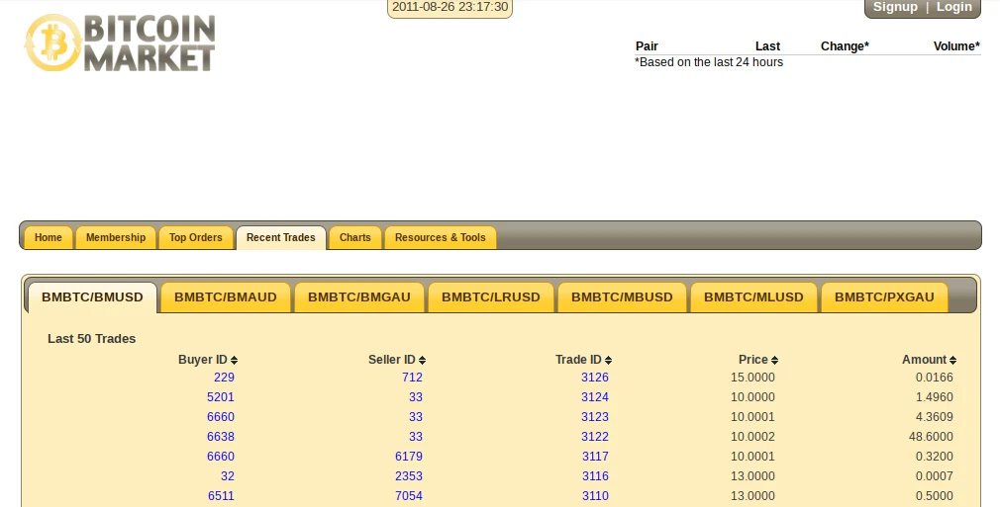
[Capture](https://web.archive.org/web/20110826231728/https://www.bitcoinmarket.com/market/trades/) ultérieure de l'interface de Bitcoin Market (août 2011)

Le 11 mars, la première partie de poker mettant en jeu des bitcoins est [organisée](https://bitcointalk.org/index.php?topic=80.msg781#msg781) par l'administrateur de BitcoinFX, ce qui inaugure la relation forte qui existera entre le jeu d'argent et la cryptomonnaie. La partie est remportée par dwdollar, qui gagne [600 BTC](https://mempool.space/tx/6477a88f0196e1fcf6c608e446be62c708556f34a79d169fbb05b1fee92f5761).

D'autres services acceptant le bitcoin apparaissent comme le service de voix sur IP [Link2VoIP](https://bitcointalk.org/index.php?topic=30.msg733#msg733) le 16 mars, l'hébergeur web [Vekja.net](https://bitcointalk.org/index.php?topic=30.msg1008#msg1008) le 23 avril ou encore le vendeur de noms de domaines [Privacy Shark](https://bitcointalk.org/index.php?topic=30.msg1035#msg1035) le 30 avril. Cette multiplication des services conduit Martti Malmi à finalement héberger une [page](https://web.archive.org/web/20100517040312/http://www.bitcoin.org:80/trade) de référencement des commerçants sur le site Bitcoin.org.

On voit également le premier service dépositaire dédié à Bitcoin apparaître : il s'agit de MyBitcoin, une application web permettant un usage facile et serein de la cryptomonnaie, notamment sur mobile. Grâce à ce service, les utilisateurs n'ont en effet pas besoin de télécharger les données complètes de la chaîne pour envoyer et recevoir des transactions, ni de conserver leurs bitcoins eux-mêmes en sauvegardant leurs clés privées.


À cette époque, les portefeuilles légers (dits « SPV ») n'existent pas, si bien que Satoshi Nakamoto lui-même juge qu'il est alors acceptable de passer par ce type de logiciel, même si cette utilisation va à l'encontre du principe de désintermédiation à la base de Bitcoin. Le 18 mai 2010, il [écrit](https://bitcointalk.org/index.php?topic=125.msg1149#msg1149) ainsi sur le forum :

> « Entretemps, des sites comme [vekja.net](http://vekja.net) et [www.mybitcoin.com](http://www.mybitcoin.com) ont expérimenté des système basés sur des comptes. &nbsp;On crée un compte sur un site web, on y conserve ses bitcoins et on les transfère depuis et vers ce dernier. &nbsp;Créer un compte sur un site web est beaucoup plus facile que d'installer un logiciel et d'apprendre à l'utiliser, et c'est une méthode plus familière pour la plupart des gens. &nbsp;Le seul inconvénient c'est qu'il faut faire confiance au site, mais cela ne pose pas de problème pour la petite monnaie destinée aux micropaiements et aux dépenses diverses. &nbsp;Il s'agit d'un moyen facile de commencer, et on peut passer au logiciel bitcoin proprement dit si les montants reçus deviennent plus importants. »

Enfin, le 19 mai, un utilisateur se faisant appeler Teppy commence à [accepter](https://bitcointalk.org/index.php?topic=30.msg1159#msg1159) le bitcoin pour le jeu massivement multijoueur dont il est l'administrateur, *A Tale in the Desert*.

### L'origine de la valeur du bitcoin

Au printemps 2010, le bitcoin semblait donc avoir bel et bien acquis un valeur dans l'esprit de beaucoup de personnes. Même si l'utilisation du système était balbutiante, la demande pour le bitcoin était présente que ce soit du point de vue du minage, du change avec le dollar ou de la vente de services. Cet amorçage économique a définitivement été scellé par un évènement symbolique survenu le 22 mai : le premier achat d'un bien physique en bitcoins, en l'occurrence une pizza, que nous relaterons dans le prochain chapitre.

La question de l'origine de la valeur du bitcoin est restée quelque chose que nombre de gens ont eu du mal à expliquer. Cette émergence de la valeur dérangeait en particulier les partisans de l'école autrichienne qui avaient une interprétation étroite du [théorème de régression](https://en.wikipedia.org/wiki/Regression_theorem) de Ludwig von Mises. C'était le cas d'un certain xc, qui sur le forum [a cherché](https://bitcointalk.org/index.php?topic=583.msg5984#msg5984) à faire reposer la transmission de la valeur dans la conversion avec le dollar.

Toutefois, cette question n'a jamais dérangé Satoshi, qui voyait l'amorçage d'une nouvelle monnaie comme un défi qui était certes difficile à relever mais pas impossible. Il a ainsi [exprimé](https://bitcointalk.org/index.php?topic=583.msg11405#msg11405) son point de vue sur le forum le 27 août 2010, en réponse à xc :

> « En guise d'expérience de pensée, imaginons qu'il existe un métal de base aussi rare que l'or mais ayant les propriétés suivantes :
> \- de couleur grise et terne
> \- pas de bonne conductivité électrique
> \- pas particulièrement solide, mais pas non plus ductile ou facilement malléable
> \- inutile dans un but pratique ou ornemental
>
> et avec une propriété magique et spéciale :
> \- peut être transporté sur un canal de communication
>
> Si, pour une raison ou pour une autre, ce métal acquérait une quelconque valeur, alors toute personne souhaitant transférer de la richesse sur une longue distance pourrait en acheter, le transmettre, et faire en sorte que le destinataire le vende.
>
> Peut-être qu'il pourrait obtenir une valeur initiale de manière circulaire, comme vous l'avez suggéré, en étant apprécié par des personnes prévoyant son utilité potentielle pour l'échange. (J'en voudrais certainement) Peut-être que des collectionneurs, ou n'importe quelle raison arbitraire, pourraient en être à l'origine. »

# Le premier essor de Bitcoin
<partId>557d792d-34d5-4a10-8977-82afdcfe402b</partId>

## Cartes graphiques, pizzas et bitcoins gratuits
<chapterId>9cd228a4-58d3-46a3-9935-06098bafc954</chapterId>

Dans la partie précédente, nous avons étudié comment Bitcoin en est venu à exister, comment il a été mis en valeur auprès du public et comment il a été amorcé économiquement. Au printemps 2010, alors que le commerce en bitcoins bourgeonnait à peine, le but de Satoshi Nakamoto et des quelques personnes qui l'épaulaient était de maintenir la flamme en vie. Heureusement, d'autres individus se sont joints à l'effort, dont notamment le mineur Laszlo Hanyecz et le développeur Gavin Andresen, qui se sont démarqués par leurs actions.

Dans ce chapitre, nous allons nous intéresser au premier déploiement du minage par processeur graphique (GPU), à la fortune accumulée par Satoshi Nakamoto, au premier achat d'un bien physique en bitcoins, à la mise en place d'un robinet à bitcoins donnant des unités gratuites et à l'évolution du logiciel et du réseau avant Slashdot.

### Le minage par processeur graphique

La demande de plus en plus importante pour le bitcoin s'accompagne d'une hausse progressive de l'activité minière sur le réseau. Durant toute l'année 2009, la difficulté sur le réseau est au plancher minimal de 1, ce qui impose à tous les nœuds de réaliser environ 4,3 milliards de calculs pour miner un bloc. Toutefois, en décembre 2009, cela change grâce à l'algorithme d'ajustement qui fait passer le facteur de difficulté de 1 à 1,18.

Satoshi Nakamoto est très soucieux de l'augmentation de cette difficulté et maintient un [historique](https://bitcointalk.org/index.php?topic=43.msg249#msg249) sur le forum à partir de février 2010. Voici à quoi cela ressemblait :


Malgré cet enthousiasme à propos de l'accroissement de la puissance de calcul sur le réseau, Satoshi cherche néanmoins à ralentir la spécialisation du minage pour favoriser la distribution des unités. Jusqu'alors, les mineurs sollicitaient leurs processeurs centraux (CPU) pour extraire les nouveaux bitcoins. Néanmoins, ces processeurs s'avèrent peu performants pour effectuer des opérations répétées, comparés aux processeurs graphiques (GPU) qui sont largement plus adaptées à ce type de calcul répétitif. Par conséquent, tout le monde sait à ce moment-là que cette évolution est inéluctable, y compris Satoshi lui-même. Le 19 décembre 2009, il [déclare](https://bitcointalk.org/index.php?topic=12.msg54#msg54) ainsi :

> « Nous devrions nous mettre d'accord pour reporter la course aux armements des processeurs graphiques aussi longtemps que possible pour le bien du réseau. &nbsp;Les nouveaux utilisateurs pourront beaucoup plus facilement se mettre à niveau s'ils n'ont pas à se préoccuper des pilotes et de la compatibilité des GPU. &nbsp;Il est intéressant de constater que toute personne disposant d'un simple processeur central peut rivaliser de manière relativement égale à l'heure actuelle. »

Cependant, quelques mois plus tard, la boîte de Pandore est ouverte. Le fauteur de trouble est Laszlo Hanyecz, développeur américain d'origine hongroise de 28 ans, qui vit en Floride. Celui-ci découvre Bitcoin en avril 2010. Le 9, il se [procure](https://mempool.space/tx/faf172f5dc06b0ae03268555dddcd65be47e9a8a8bb44a122b12bfaf735f9a81#vout=1) 3 300 bitcoins auprès de NLS pour environ 20 $, puis essaie le système en faisant quelques transferts. Le 18, il tente d'engorger le réseau en multipliant les transactions à partir de son [adresse publique](https://mempool.space/address/1XPTgDRhN8RFnzniWCddobD9iKZatrvH4), mais ce dernier tient le coup.


Laszlo Hanyecz avec son fils en mai 2018 (source : [The Telegraph](https://www.telegraph.co.uk/technology/2018/05/22/inside-story-behind-famous-2010-bitcoin-pizza-purchase-today/))

Par la suite, il [adapte](https://bitcointalk.org/index.php?topic=116.msg972#msg972) le code du logiciel pour le faire fonctionner sur le système d'exploitation Mac OS X. Puis il travaille à optimiser le minage en utilisant l'environnement OpenCL qui permet de [faire intervenir le GPU](https://bitcointalk.org/index.php?topic=124.msg1100#msg1100) dans la génération de bitcoins. Le 10 mai, il publie son [exécutable](https://bitcointalk.org/index.php?topic=124.msg1100#msg1100) et [propose](https://bitcointalk.org/index.php?topic=133.msg1103#msg1103) d'écrire des correctifs pour permettre aux autres mineurs de le faire. Cette optimisation lui permet d'occuper rapidement une place importante dans la production des blocs.

À la fin du mois d'avril, Laszlo contacte Satoshi pour lui demander son avis, mais ce dernier ne répond que le 17 mai. Le créateur de Bitcoin lui [demande](https://www.reddit.com/r/Bitcoin/comments/36vnmr/heres_what_satoshi_wrote_to_the_man_responsible/) alors de ralentir ses opérations afin que le minage reste accessible pour le plus grand nombre :

> « L'un des principaux attraits pour les nouveaux utilisateurs est que toute personne disposant d'un ordinateur peut générer des unités gratuites. Lorsqu'il y aura 5 000 utilisateurs, cette incitation s'estompera peut-être, mais pour l'instant, c'est toujours vrai. Les processeurs graphiques limiteraient prématurément cette incitation à ceux qui disposent d'un matériel GPU haut de gamme. Il est inévitable que les clusters de calcul GPU finiront par accaparer toutes les unités générées, mais je ne veux pas précipiter l'arrivée de ce jour-là. \[...\] Je ne veux pas passer pour un socialiste, je me moque de la concentration des richesses, mais pour l'instant, nous obtenons plus de croissance en donnant cet argent à 100 % des gens qu'en le donnant à 20 %. En outre, plus nous retarderons la course aux armements des GPU, plus les bibliothèques OpenCL deviendront matures, et plus nombreux seront ceux qui disposeront de cartes graphiques compatibles avec OpenCL. »

Laszlo ne tient pas vraiment compte de cet avertissement et continue de miner des blocs avec sa carte graphique. Il génère ainsi des dizaines de milliers de bitcoins au cours des mois qui suivent. Toutefois, il faudra attendre le mois d'octobre pour voir le minage par GPU se généraliser.

### Les bitcoins de Satoshi

Cet essor du minage a aussi une conséquence importante : Satoshi arrête de produire des blocs. Depuis le lancement du réseau, il s'attachait en effet à miner afin d'assurer un rythme de confirmation suffisant et un niveau de sécurité acceptable. Avec la nouvelle puissance déployée, il peut donc abandonner cette tâche et laisser les autres membres du réseau bénéficier de l'entièreté des bitcoins créés.

L'activité minière de Satoshi possède un motif particulier, de sorte qu'il est possible d'identifier les blocs qu'il a probablement trouvés, à quelques faux positifs près. Ce motif de minage sera [mis en lumière](https://bitslog.com/2013/04/17/the-well-deserved-fortune-of-satoshi-nakamoto/) par le développeur Sergio Lerner en 2013 et sera appelé le *Patoshi Pattern*.


Le *Patoshi Pattern* entre les blocs 0 et 50 000 tel qu'on peut l'observer sur le site [satoshiblocks.info](http://satoshiblocks.info/) : chaque point correspond à un bloc, les lignes bleues sont formées des blocs de Satoshi, les autres lignes représentent la production des autres mineurs

D'après une étude de Whale Alert publiée en 2020, Satoshi aurait ainsi miné environ 22 500 blocs et accumulé ainsi 1 122 693 bitcoins, soit plus de 5 % des 21 millions d'unités prévues. Pendant une grande partie de l'année 2009, le réseau a reposé sur la puissance de calcul du fondateur. Cette dépendance s'est illustrée lors du mois d'août 2009, qui a été la pire période en ce qui concerne l'activité minière et qui a coïncidé avec un temps de « [pause](https://mmalmi.github.io/satoshi/#email-24) » de Satoshi, où il devrait vraisemblablement moins surveiller ses machines. Durant ce mois d'août en effet, seuls 1 564 ont été produits sur les 4 464 blocs attendus, ce qui correspond à un temps moyen de 28 minutes et 30.

Avec l'augmentation de la puissance de calcul à l'automne 2009, la proportion de la puissance de calcul de Satoshi par rapport à la puissance totale du réseau chute progressivement. Elle passe de 75 % en mars 2009 à 60 % en septembre, pour descendre jusqu'à 15 % en décembre et atteindre les 0 % en mai. Voici ci-dessous un graphe réalisé par [Organofcorti](https://organofcorti.blogspot.com/2014/08/167-satoshis-hashrate.html) en 2014 :


De plus, cette chute de la dominance minière de Satoshi n'est pas uniquement passive : il ralentit lui-même sa production sur la même période. En effet, le but affiché de Satoshi est que tout le monde puisse participer : il ne mine pas pour le gain financier, mais pour assurer le fonctionnement le réseau jusqu'à ce que les incitations jouent leur rôle. Ainsi, il réduit son taux de hachage (le nombre de calculs réalisés chaque seconde) à trois reprises au cours de cette période de minage : la première fois de 4,5 à 2,5 MH/s en juin 2009, la deuxième fois de 2,5 à 1 MH/s en octobre, et la troisième fois de 1 à 0 MH/s en mai 2010. Voici un graphique de l'évolution de son taux de hachage durant cette période ([Organofcorti](https://organofcorti.blogspot.com/2014/08/167-satoshis-hashrate.html)) :

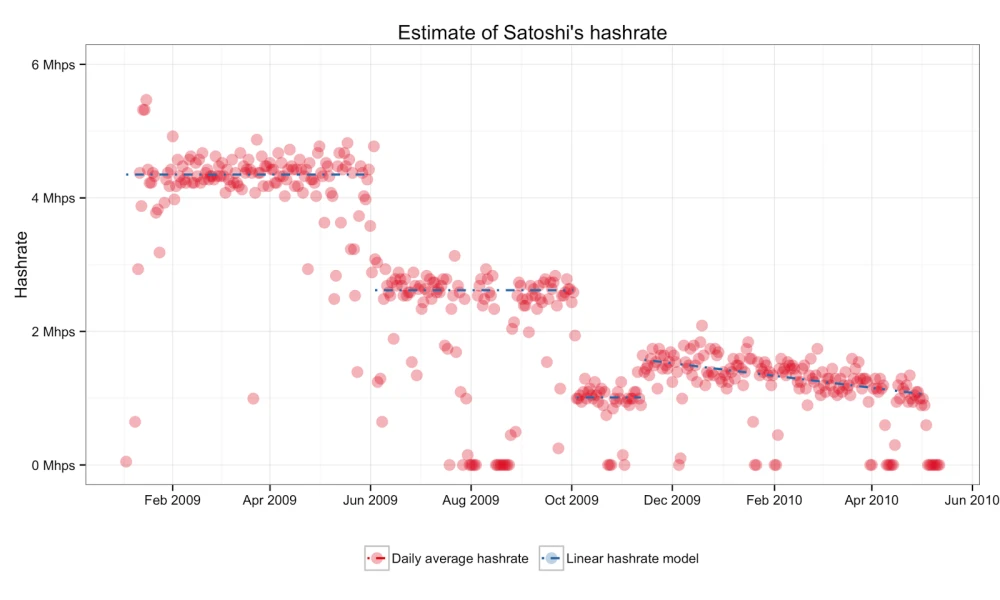

Le minage de Satoshi est donc résolument altruiste comme le [fera remarquer](https://blog.lopp.net/was-satoshi-a-greedy-miner/) Jameson Lopp. Lorsqu'il s'arrête de miner le 3 mai 2010 (son dernier bloc est le [bloc 54 316](https://mempool.space/block/000000000d1e2cf92a7e6afdbed6d34fc3ac2cc863d9a236ca4db394a94ece2e)), cela constitue un autre accomplissement dans le lent développement de Bitcoin : la prise en charge de la confirmation des transactions par des acteurs économiques.

### Le Bitcoin Pizza Day

Le mois de mai 2010 est également marqué par un évènement fondateur : le premier achat d'un bien physique en bitcoins. C'est Laszlo Hanyecz qui fait le premier pas. Alors qu'il a accumulé plus de 20 000 bitcoins grâce à son algorithme, il cherche à les réinjecter dans l'économie en obtenant des pizzas. Le 18 mai, il écrit l'[annonce](https://bitcointalk.org/index.php?topic=137.msg1141#msg1141) suivante sur le forum :

> « Je paierai 10 000 bitcoins pour deux ou trois pizzas... genre peut-être 2 grandes pour qu'il m'en reste le lendemain. &nbsp;J'aime avoir des restes de pizza à grignoter pour plus tard. &nbsp;Vous pouvez faire la pizza vous-même et l'amener jusqu'à chez moi ou la commander pour moi dans un service de livraison, mais mon objectif c'est de me faire livrer, en échange de bitcoins, de la nourriture que je n'ai pas à commander ou à préparer moi-même ; un peu comme lorsqu'on commande un "plateau de petit-déjeuner" dans un hôtel ou autre, on vous apporte juste quelque chose à manger et vous êtes content ! \[...\] Si vous êtes intéressé, faites-le moi savoir et nous pourrons nous arranger. »

Cette offre trouve preneur au bout de quatre jours. C'est un jeune Californien du nom de Jeremy Sturdivant qui accepte l'échange sur la messagerie instantanée IRC.


Jeremy Sturdivant en mai 2018 (source : [The Telegraph](https://www.telegraph.co.uk/technology/2018/05/22/inside-story-behind-famous-2010-bitcoin-pizza-purchase-today/))

Le 22 mai, ce dernier commande deux pizzas de Papa John's qui sont livrées chez Laszlo à Jacksonville en Floride. Il [reçoit](https://mempool.space/tx/a1075db55d416d3ca199f55b6084e2115b9345e16c5cf302fc80e9d5fbf5d48d) en échange 10 000 bitcoins, soit environ 44 $ au cours de Bitcoin Market. Voici une photographie de ces deux pizzas, [partagée](https://web.archive.org/web/20110703134805/http://heliacal.net/~solar/bitcoin/pizza/) par Laszlo lui-même :


Cela clôt le premier achat d'un bien physique en bitcoins, même si cet achat est indirect. Laszlo est félicité par [Martti Malmi](https://bitcointalk.org/index.php?topic=137.msg1196#msg1196) qui écrit qu'« une grande étape a été franchie ». NLS ajoute lui aussi un [commentaire positif](https://bitcointalk.org/index.php?topic=137.msg1197#msg1197) à ce sujet.

Le 12 juin, Laszlo Hanyecz [réitère](https://bitcointalk.org/index.php?topic=137.msg1526#msg1526) son offre en écrivant sur le forum :

> « Il s'agit d'une offre ouverte au fait... J'échangerai 10 000 BTC contre 2 de ces pizzas à n'importe quel moment tant que j'ai les fonds. »

Il réalisera ainsi plusieurs autres transactions du même type, jusqu'au 4 août où il [écrira](https://bitcointalk.org/index.php?topic=137.msg7544#msg7544) qu'il ne peut pas vraiment se « permettre de continuer à faire ça » puisqu'il ne peut plus « générer des milliers d'unités par jour ». En cause : la hausse du prix amenée par l'afflux de Slashdot du 11 juillet, ce qui lui vaudra par ailleurs les remarques moqueuses des membres du forum, qui sous-entendent qu'il aurait mieux fait de garder ses bitcoins. Quelques mois plus tard en novembre, alors que le prix du bitcoin gravite autour des 25 centimes, l'utilisateur ribuck [écrira](https://bitcointalk.org/index.php?topic=137.msg25352#msg25352) de manière quasi prophétique : « Cette pizza deviendra-t-elle la première pizza à un million de dollars ? »

Néanmoins la hausse du pouvoir d'achat de la cryptomonnaie n'enlèvera rien à la symbolique de cet évènement, qui sera commémoré tous les ans à cette date comme le *Bitcoin Pizza Day* par la communauté de Bitcoin.

### Gavin Andresen et le robinet à bitcoins

Cette période voit aussi l'arrivée d'un personnage clé de l'histoire de Bitcoin : Gavin Andresen, un développeur de 44 ans né en Australie qui a [acquis](https://gavinthink.blogspot.com/2007/06/seven-years-ago-today.html) la nationalité étasunienne en 2004 et qui vit alors à Amherst dans le Massachusetts. De retour de voyage en Australie et momentanément sans emploi, ce dernier découvre Bitcoin à la fin du mois de mai par l'intermédiaire d'un [article](https://www.infoworld.com/article/2627013/open-source-innovation-on-the-cutting-edge.html?page=3) de Neil McAllister publié sur InfoWorld. Cet article présente le projet de Satoshi Nakamoto comme une « innovation open source ».


Gavin Andresen à Townsville dans le Queensland en Australie (source : [archive de CIO](https://web.archive.org/web/20110326160734/http://www.cio.com.au/article/380394/open_source_identity_bitcoin_technical_lead_gavin_andresen/))

Curieux et inventif, il se met rapidement à travailler sur un projet personnel : un « *Bitcoin Faucet* » (ou « robinet à bitcoins » en français) qui donne des bitcoins à quiconque en fait la requête. Le 11 juin, il [lance](https://bitcointalk.org/index.php?topic=183.msg1488#msg1488) son service et le présente sur le forum de la façon suivante :

> « Pour mon premier projet de programmation sur Bitcoin, j'ai décidé de faire quelque chose qui semble vraiment stupide : j'ai créé un site web qui distribue des bitcoins. \[...\] &nbsp;Pourquoi ? Parce que je veux que le projet Bitcoin réussisse, et je pense qu'il a plus de chances de réussir si les gens peuvent obtenir une poignée d'unités pour l'essayer. »

Satoshi réagit favorablement au lancement de ce service, même s'il ne le remarque pas tout de suite. Une semaine plus tard, le 18 juin, il le [félicite](https://bitcointalk.org/index.php?topic=183.msg1620#msg1620) en écrivant qu'il s'agit d'un « excellent choix pour un premier projet » et qu'il avait « prévu de faire exactement la même chose si personne d'autre ne le faisait ».

La contribution de Gavin Andresen ne s'arrête pas là. Il s'intéresse profondément à la façon dont Bitcoin fonctionne et entreprend de disséquer le code. Il [découvre](https://bitcointalk.org/index.php?topic=195.msg1606#msg1606) ainsi le système de script intégré au protocole, chose qu'il s'empresse de partager sur le forum. Il fait part de son appréhension vis-à-vis de cette possibilité, car cette dernière réduit la sécurité du système (« la complexité est l'ennemi de la sécurité ») et rend plus difficile le développement d'une seconde implémentation logicielle. Satoshi [explique](https://bitcointalk.org/index.php?topic=195.msg1611#msg1611) alors la raison derrière l'intégration de ce mécanisme, qu'il appelle Script :

> « La nature de Bitcoin est telle que, dès la version 0.1 lancée, son fonctionnement de base était gravé dans le marbre pour le reste de son existence. &nbsp;C'est pour cette raison que je voulais concevoir Bitcoin pour qu'il supporte tous les types de transaction auxquels je pouvais penser. \[...\] &nbsp;La solution était script, qui généralisait le problème de façon à ce que les parties contractantes puissent décrire leurs transactions comme des prédicats que les nœuds du réseau évaluaient. &nbsp;Les nœuds ont seulement besoin de comprendre la transaction dans la mesure où ils évaluent si les conditions de l'expéditeur sont remplies ou non. »

Gavin s'impliquera également dans le développement du logiciel en [implémentant](https://sourceforge.net/p/bitcoin/code/101/) le lancement automatique au démarrage pour Linux, en s'intéressant à l'API (il sera [crédité](https://bitcointalk.org/index.php?topic=570.msg5707#msg5707) pour son amélioration dans la version 0.3.3) et en participant au déploiement du réseau de test (dont il a [l'idée](https://bitcointalk.org/index.php?topic=240.msg2104#msg2104) le 9 juin). Il échangera en privé avec Satoshi, dont il deviendra progressivement le bras droit, Martti Malmi étant [très occupé](https://mmalmi.github.io/satoshi/#email-191) avec son nouvel emploi à plein temps.

### Un printemps chargé en évènements

Le printemps 2010 a été une période riche en évènements fondateurs. D'abord, à la fin du mois d'avril, le développeur Laszlo Hanyecz a mis au point le minage par processeur graphique, une optimisation à laquelle Satoshi s'opposait à court terme (même s'il en connaissait le caractère inéluctable à long terme). Ce développement a coïncidé avec l'arrêt de la production de blocs de Satoshi, qui estimait probablement que le taux de hachage du réseau était suffisant. Ensuite, le jour du 22 mai a été marqué par l'échange des fameuses pizzas entre Laszlo Hanyecz et Jeremy Sturdivant, qui constituait le premier achat d'un bien physique en bitcoins. Enfin, au mois de juin, on a assisté à l'arrivée de Gavin Andresen, qui a créé le *Bitcoin Faucet* et qui s'est rapidement impliqué dans le développement du logiciel. Tous ces éléments montraient une progression encourageante de l'économie autour de Bitcoin.

Cependant, à la fin du mois de juin, l'activité demeurait assez modeste sur le réseau. Les nouveaux utilisateurs étaient peu nombreux et la flamme du phénomène monétaire avait tout juste de quoi ne pas s'éteindre. Le 30 juin, sur la liste de diffusion bitcoin-list, le cypherpunk James A. Donald (qui ne semblait pas avoir suivi les dernières avancées, ni n'avoir connaissance de l'existence du forum) [déclarait](https://web.archive.org/web/20131016002646/http://sourceforge.net/p/bitcoin/mailman/bitcoin-list/?viewmonth=201006) que « Bitcoin \[était\] en quelque sorte mort ». Même s'il avait tort, son commentaire révélait un manque criant de communication : un nombre trop restreint de personnes avait connaissance du projet, et il fallait faire plus d'efforts dans ce sens. Bitcoin avait « besoin d'une écologie d'utilisateurs pour être utile » et cette masse critique n'était pas encore là. Un évènement irait dans ce sens deux semaines plus tard, ce que nous aborderons dans le prochain chapitre.

## Le grand slashdotting
<chapterId>2eef715e-b018-445b-b360-1c6e1c1df462</chapterId>

Au début de l'été 2010, en dépit de premiers développements encourageants, Bitcoin reposait sur une base fébrile. Le logiciel comptait peu de développeurs hormis Satoshi Nakamoto. Les mineurs étaient des amateurs sur leur ordinateur personnel. Il existait une vingtaine de services liés à Bitcoin et les échanges effectifs étaient tout aussi rares. Toutefois, les choses allaient changer drastiquement durant la seconde moitié de l'année.

Dans ce chapitre, nous nous proposons de parler du « grand slashdotting », c'est-à-dire de l'afflux brutal d'utilisateurs qui a suivi la publication d'une présentation de Bitcoin sur le site web populaire Slashdot le 11 juillet 2010. Nous verrons comment ce texte a été amené à exister dans un dernier effort de communication de la part de Satoshi et quels ont été les effets directs qui ont suivi cette popularisation de Bitcoin.

### La version 0.3 du logiciel

Le début de l'été 2010 est marqué par la sortie de la version 0.3 du logiciel, qui a été préparée de longue date par Satoshi Nakamoto et par Martti Malmi. Par rapport à la version 0.2, sortie en décembre de l'année précédente, cette version inclut des améliorations cruciales telles qu'un [démon](https://fr.wikipedia.org/wiki/Daemon_\(informatique\)) (qui deviendra bitcoind), un contrôle en invite de commande, une API (via JSON-RPC), une optimisation de la génération d'unités et un « hashmètre » estimant le taux de hachage de l'utilisateur. Elle inclut aussi le support pour Mac OS X apporté par la contribution de Laszlo Hanyecz et la traduction de l'interface graphique en allemand, néerlandais et italien.

Le 22 juin, Satoshi [demande](https://bitcointalk.org/index.php?topic=199.msg1654#msg1654) aux membres du forum de tester cette version du logiciel. Il voit la sortie de cette version comme un moment charnière du développement de Bitcoin et [envisage]( https://bitcointalk.org/index.php?topic=217.msg1803#msg1803) même d'abandonner l'aspect « beta » en faisant directement passer la numérotation à la version 1.3. Il [reviendra](https://bitcointalk.org/index.php?topic=217.msg1928#msg1928) néanmoins assez rapidement sur sa décision.

Le 6 juillet, Satoshi Nakamoto annonce la sortie de la version 0.3 du logiciel. Sachant que cette version risque d'être importante pour l'avancée de Bitcoin, il soigne la présentation et il [écrit](https://bitcointalk.org/index.php?topic=238.msg2004#msg2004) :

> « Voici la version 0.3 de Bitcoin, la cryptomonnaie pair à pair ! &nbsp;Bitcoin est une monnaie numérique qui utilise la cryptographie et un réseau distribué pour remplacer le besoin d'un serveur central de confiance. &nbsp;Échappez au risque d'inflation arbitraire propre aux monnaies gérées de manière centralisée ! &nbsp;La circulation totale du bitcoin est limitée à 21 millions d'unités. &nbsp;Les unités sont progressivement distribuées aux nœuds du réseau en fonction de la puissance de calcul qu'ils fournissent, de sorte que vous pouvez en obtenir une partie en mettant à contribution votre temps CPU inactif. »

### Une présentation pour Slashdot

À l'occasion de la sortie de la nouvelle version du logiciel, l'utilisateur du forum appelé Teppy (l'administrateur du MMORPG qui a commencé à accepter le bitcoin en mai) [propose](https://bitcointalk.org/index.php?topic=199.msg1662#msg1662) de faire la publicité sur Slashdot, un site d'actualité très populaire traitant de sujets pour les *nerds* comme l'informatique, les jeux vidéo, la science, Internet, etc. qui tire son nom des deux caractères `/.`. Le 22 juin, il demande ainsi sur le forum s'il ne faut pas « faire un peu de publicité » en précisant que « Slashdot est un bon endroit si nous pouvons y accéder ». Martti Malmi [commente](https://bitcointalk.org/index.php?topic=199.msg1664#msg1664) en écrivant qu'« atteindre Slashdot, avec ses millions de lecteurs techniquement compétents, serait génial, peut-être la meilleure chose que l'on puisse imaginer ! »

Le 5 juillet, Teppy rédige une présentation qu'il compte soumettre lui-même à Slashdot et la [publie](https://bitcointalk.org/index.php?topic=234.msg1969#msg1969) sur le forum :

> « Que pensez-vous de cette technologie disruptrice ? Bitcoin est une cryptomonnaie anonyme pour l'acheteur et le vendeur, dépourvue de banque centrale ou de frais de transaction. En utilisant un concept similaire à Hashcash, les clients brûlent des cycles de processeur en essayant de récupérer quelques-uns des 21 000 000 de Bitcoins qui finiront par être trouvés. On s'attend à ce qu'avec le temps, la valeur marchande des Bitcoins atteigne la parité avec l'énergie nécessaire pour les générer, créant ainsi une monnaie adossée à l'énergie, hors de portée de tout État. »

Plusieurs membres du forum font des suggestions pour qu'il améliore ce texte. Satoshi [intervient](https://bitcointalk.org/index.php?topic=234.msg1976#msg1976) lui-même quelques heures après le premier message pour donner son avis. Il écrit qu'il « apprécie l'effort », mais qu'« il y a beaucoup de choses qui ne vont pas », puis il liste les éléments qui le gênent :

- À propos de l'absence d'influence étatique, il affiche une certaine prudence en écrivant qu'il ne fait « certainement pas ce genre de provocation ou d'affirmation » ;
- À propos de l'adossement à l'énergie, il considère que la monnaie « n'est pas stable par rapport à l'énergie » et ajoute : « Ce sujet a fait l'objet d'une discussion. &nbsp;Elle n'est pas liée au coût de l'énergie. &nbsp;L'estimation de NLS basée sur l'énergie était un bon point de départ, mais les forces du marché domineront de plus en plus. » ;
- À propos de l'aspect anonyme du système, il affirme qu'il ne veut pas « mettre l'aspect "anonyme" au premier plan » et qu'il avait « l'intention de modifier la page d'accueil » dans ce sens.

Dans un [courriel](https://mmalmi.github.io/satoshi/#email-197) adressé à Martti Malmi quelques heures plus tard, Satoshi donne deux raisons principales pour expliquer cette volonté de mise en retrait de l'anonymat : le danger pour l'utilisateur et la perception du public. Il écrit :

> « Je pense que nous devrions mettre moins l'accent sur l'aspect anonyme. &nbsp;Avec la popularité des adresses bitcoin au lieu de l'envoi par IP, nous ne pouvons pas donner l'impression que tout est automatiquement anonyme. &nbsp;Il est possible d'être pseudonyme, mais il faut être prudent. \[...\] &nbsp;De plus, "anonyme" sonne un peu suspect. &nbsp;Je pense que les gens qui veulent de l'anonymat le découvriront sans que nous en fassions la promotion. »

Il conclut son message sur le forum par :

> « Désolé d'être rabat-joie. &nbsp;L'écriture d'une description de ce truc pour le grand public est sacrément difficile. &nbsp;Il n'y a rien à quoi se rapporter. »

Par la suite, Teppy corrige la présentation en prenant en compte les suggestions. Ainsi, au début du mois de juillet, on constate que le discours autour de Bitcoin est bien calibré, ce qui montre qu'il est mûr pour connaître un afflux sans précédent.

### Slashdotted!

Le 11 juillet 2010, une version rectifiée de la présentation de Bitcoin rédigée par Teppy est [publiée](https://news.slashdot.org/story/10/07/11/1747245/Bitcoin-Releases-Version-03) sur Slashdot. Celle-ci est la suivante :

> « Que pensez-vous de cette technologie disruptrice ? Bitcoin est une monnaie numérique basée sur un réseau pair à pair, sans banque centrale, et sans frais de transaction. À l'aide d'un concept de preuve de travail, les nœuds brûlent des cycles de processeur pour chercher des paquets d'unités et diffusent leurs résultats sur le réseau. L'analyse de la consommation d'énergie révèle que la valeur marchande des bitcoins est déjà supérieure à la valeur de l'énergie nécessaire pour les générer, ce qui indique une demande saine. La communauté a bon espoir que la monnaie restera hors de portée de tout État. »


La publication est remarquée et près de 500 commentaires sont publiés en quelques jours. Du côté de Bitcoin, ce succès provoque un afflux massif de visiteurs sur le site et sur le forum. L'utilisation de la chaîne explose : le nombre de transactions effectuées sur le réseau passe de 42 le 10 juillet à 1 641 le 12, pour atteindre 5 554 le 14, un record absolu. Le système tient le choc malgré la montée en charge. Le 14, le développeur Gavin Andresen [écrit](https://bitcointalk.org/index.php?topic=286.msg2745#msg2745) ainsi sur le forum :

> « Je pense que Satoshi a fait un travail fantastique : au cours des deux derniers jours où Bitcoin a été "slashdotté", je n'ai entendu parler d'AUCUN problème de perte de transactions Bitcoin, ni de panne du réseau en raison de la charge, ou de quelque problème que ce soit concernant les fonctionnalités de base.

La première conséquence de cet afflux est que le prix du bitcoin connaît une hausse fulgurante, en [passant](https://bitcoin.zorinaq.com/price/) de 0,008 $ à 0,08 $ en une semaine, soit une multiplication par 10 !

Un autre effet de l'afflux de personnes provenant de Slashdot est l'accroissement de la puissance de calcul déployée sur le réseau. Beaucoup de personnes lancent le logiciel et produisent des blocs avec leurs processeurs centraux. Entre le 11 et et le 17 juillet, le taux de hachage [passe](https://bitinfocharts.com/comparison/bitcoin-hashrate.html#alltime) ainsi de 0,22 GH/s à 2,78 GH/s.

### La création de Mt. Gox

Parmi les personnes qui découvrent Bitcoin grâce à Slashdot, il y a Jed McCaleb, un entrepreneur et programmeur américain de 35 ans, connu pour avoir cofondé et développé le logiciel de partage de fichiers en pair à pair eDonkey2000 dans les années 2000. Constatant à quel point il est pénible de se procurer du bitcoin contre des dollars, il [décide](https://bitcointalk.org/index.php?topic=4187.msg60610#msg60610) « sur un coup de tête » de créer une place de marché performante. Pour ce faire, il réutilise un de ses anciens projets mis au point [en 2007](https://gwern.net/doc/bitcoin/2014-mccaleb) : *Magic The Gathering Online eXchange* (MTGOX), un site web qui permettait d'acheter et de vendre des cartes du jeu en ligne *Magic: The Gathering Online*. Il reprend le nom de domaine de ce projet (mtgox.com), qui donne son nom à la nouvelle plateforme : Mt. Gox, prononcé « *Mount Gox* ».


Jed McCaleb en 2013 (source : Ariel Zambelich pour [Wired](https://web.archive.org/web/20131001233752/http://www.wired.com/wiredenterprise/2013/09/jed_mccaleb/))

Une semaine plus tard, le 18 juillet, Jed McCaleb lance sa plateforme de change et l'[annonce](https://bitcointalk.org/index.php?topic=444.msg3866#msg3866) sur le forum. Grâce à son expertise, il fait en sorte que la plateforme fonctionne comme une place de marché automatisée, à l'instar des bourses en ligne modernes. [D'après lui](https://bitcointalk.org/index.php?topic=444.msg3891#msg3891), elle se distingue de Bitcoin Market par le fait qu'elle est « toujours en ligne, automatisée », que « le site est plus rapide et a un hébergement dédié » et que « l'interface est plus agréable ». Par conséquent, Mt. Gox s'impose rapidement comme le moyen principal de se procurer du bitcoin, devenant la référence en ce qui concerne la cotation en dollars.

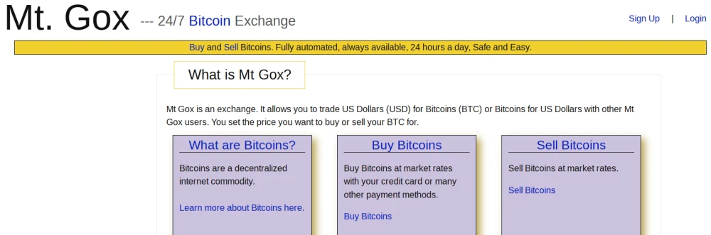
Interface de la plateforme Mt. Gox en février 2011 (source : [archive de Mt. Gox](https://web.archive.org/web/20110203031942/http://mtgox.com/))

Initialement, la plateforme accepte les paiements via PayPal. Cependant, en octobre 2010, suite à de trop nombreuses demandes de rétrofacturation, PayPal [bloquera](https://bitcointalk.org/index.php?topic=1419.msg16421#msg16421) le compte de Jed McCaleb, ce qui le contraindra à suspendre momentanément les dépôts et les retraits sur la plateforme. Quelques semaines plus tard, il [rétablira](https://bitcointalk.org/index.php?topic=1699.msg20700#msg20700) les transferts en ajoutant Liberty Reserve comme moyen de paiement. Par la suite, il acceptera également sur demande les transactions via [Paxum](https://bitcointalk.org/index.php?topic=2052.msg27809#msg27809), et les virements bancaires [en dollars](https://bitcointalk.org/index.php?topic=4187.msg60610#msg60610) (ACH) et [en euros](https://bitcointalk.org/index.php?topic=2515.msg34040#msg34040) (SEPA).

### L'effet accélérateur du slashdotting

L'effet de la publication du texte de présentation de Bitcoin sur Slashdot a été spectaculaire pour le projet de Satoshi Nakamoto. L'afflux de personnes intéressées a mené à une hausse record du prix et du taux de hachage. De plus, il a amené un certain Jed McCaleb à découvrir Bitcoin et à créer une place de marché digne de ce nom pour la négociation de l'unité de compte, sous le nom de Mt. Gox.

Durant les mois qui ont suivi, les améliorations techniques, économiques et minières ont continué à fleurir, faisant de Slashdot le réel point de départ de Bitcoin en tant que mouvement communautaire. Mais c'est au niveau du logiciel et du protocole que les changements ont été les plus importants : il y avait en effet des vulnérabilités majeures qu'il fallait corriger. Le prochain chapitre se concentre sur ces ennuis techniques qui forment une étape cruciale dans le développement de Bitcoin.

## Les premiers ennuis techniques
<chapterId>30cc4fe4-22b0-429e-9874-029c9137c0aa</chapterId>

Comme nous l'avons dit dans le dernier chapitre, l'afflux d'utilisateurs provenant de Slashdot le 11 juillet 2010 a provoqué une grande vague d'intérêt pour le projet de Satoshi Nakamoto. L'utilisation du réseau a explosé ; le taux de change a été multiplié par 10, de même que la puissance de calcul consacrée au système. Bitcoin a ainsi connu une croissance sans précédent au cours de l'été.

Cependant, ce succès s'est accompagné d'ennuis techniques, avec la découverte d'un certain nombre de vulnérabilités dans le logiciel. Une plus grande popularité impliquait en effet à la fois un nombre plus important de personnes qui inspectent le code et une probabilité plus élevée d'anomalie de fonctionnement. Et c'est précisément ce qui s'est manifesté le 15 août avec le *value overflow incident*, la première « panne » de l'histoire de Bitcoin qui a duré environ 15 heures. Cette période a donc naturellement été marquée par une amélioration du logiciel, en vue d'anticiper les diverses menaces et de corriger les failles dans la mesure du possible.

### L'amélioration du logiciel

L'afflux d'utilisateurs provenant de Slashdot impose aussi d'améliorer le logiciel. Des vulnérabilités trouvées doivent être corrigées et des nouveautés doivent être intégrées. Satoshi est ainsi mis sous pression : le 18 juillet, il [confie](https://mmalmi.github.io/satoshi/#email-210) à Martti Malmi en privé qu'il « perd la tête tellement il y a de choses à faire ». En l'espace de deux mois, ce ne sont pas moins de 8 sous-versions du logiciel qui sont ainsi publiées !

Toutefois, le créateur de Bitcoin n'est pas seul à travailler sur le code. Il peut compter sur Gavin Andresen, arrivé en juin, qui est de plus en plus impliqué dans le développement (ce dernier est [crédité](https://sourceforge.net/p/bitcoin/code/101/) sur le dépôt SourceForge dès le 9 juillet). Il y a aussi les personnes qui sont curieuses de la façon dont fonctionne le système et qui signalent lorsqu'elles rencontrent un problème, à l'instar de Christian Decker (cdecker) ou de Michael Marquardt (plus connu sous le pseudonyme de Theymos). Satoshi est également épaulé par les mineurs, qui modifient le code pour trouver des moyens d'optimiser la génération d'unités, comme ArtForz (la première personne à mettre en place une ferme de minage, comme nous le verrons dans le prochain chapitre), le développeur allemand Nils Schneider (tcatm), Michael Brown (knightmb) ou encore BlackEye.

On peut enfin citer Jeff Garzik (utilisant le pseudonyme jgarzik sur le forum), qui est un développeur américain, contributeur dans le monde du logiciel libre, notamment pour la distribution Red Hat, et libertarien adepte de l'école autrichienne d'économie. Ce dernier découvre Bitcoin avec l'article publié sur Slashdot et s'investit presque immédiatement dans Bitcoin.


Jeff Garzik en 2013 (source : [Benson Samuel](https://bensonsamuel.com/bitcoin-3/talking-bitcoin-with-jeff-garzik/))

Le premier objectif de Satoshi est de rendre le logiciel et le protocole plus sûrs, pour faire face à l'accroissement récent de l'utilisation. Avec Gavin Andresen, ils envisagent les diverses attaques qui pourraient avoir lieu (notamment les attaques par déni de service) et s'évertuent à corriger les vulnérabilités découvertes. C'est ainsi qu'un système de points de contrôle (*checkpoints*) est ajouté le 17 juillet ([v0.3.2](https://bitcointalk.org/index.php?topic=437.msg3807#msg3807)), interdisant à la chaîne d'être réécrite avant une certaine date, et que la notion de travail est intégrée le 25 juillet ([v0.3.3](https://bitcointalk.org/index.php?topic=570.msg5707#msg5707)) pour affiner le mécanisme de sélection de la chaîne correcte par les nœuds.

Gavin et Satoshi corrigent également plusieurs bugs. Le principal d'entre eux est le « *1 RETURN bug* », une vulnérabilité dans le système de script qui rend possible la dépense de bitcoins à partir de n'importe quelle adresse grâce à un script spécifique. Cette vulnérabilité est signalée par ArtForz le 28 juillet, qui au lieu d'exploiter la faille et de s'enrichir discrètement, choisit de faire part de sa découverte à Satoshi et à Gavin. Satoshi s'empresse d'inclure la correction dans le logiciel ([v0.3.6](https://bitcointalk.org/index.php?topic=626.msg6451#msg6451)) et recommande à tous les utilisateurs de se mettre à niveau. Bitcoin échappe ainsi au pire. Cette vulnérabilité sera plus tard enregistrée au MITRE sous l'identifiant [CVE-2010-5141](https://cve.mitre.org/cgi-bin/cvename.cgi?name=CVE-2010-5141).

Le second objectif est d'améliorer les performances du système, en apportant des modifications au protocole ou en optimisant le fonctionnement du logiciel. C'est dans cette catégorie que rentre l'ajout des codes opération `OP_NOP` au système de script interne, réalisé discrètement par Satoshi le 29 juillet (v0.3.6), avec pour seul [commentaire](https://sourceforge.net/p/bitcoin/code/119/) le mot « expansion ». Ces codes opération sont des instructions muettes qui n'ont aucun effet si elles sont présentes dans un script, mais n'invalident pas la transaction non plus. Par conséquent, on peut modifier le comportement de ces instructions sans rendre les scripts incompatibles avec une ancienne version du protocole, d'où le commentaire de Satoshi. Ces codes opération permettront notamment de procéder à ce qu'on appellera des « *soft forks* » (ou « embranchements convergents » en français) en 2015 et 2016, en transformant les instructions `OP_NOP2` et `OP_NOP3` en `OP_CHECKLOCKTIMEVERIFY` et `OP_CHECKSEQUENCEVERIFY` (respectivement).

Les mineurs partagent également leurs découvertes pour améliorer, directement ou indirectement, la génération de bitcoins avec le logiciel principal. Tout d'abord, l'[optimisation personnelle de Laszlo](https://bitcointalk.org/index.php?topic=199.msg1686#msg1686) est intégrée au logiciel dès le 6 juillet (v0.3.0). Ensuite, la [mise en cache du contexte](https://bitcointalk.org/index.php?topic=501.msg5815#msg5815) pour la fonction de hachage SHA-256 de Nils Schneider et l'[optimisation de son calcul](https://bitcointalk.org/index.php?topic=453.msg5774#msg5774) par BlackEye sont ajoutées au logiciel le 29 juillet (v0.3.6). Enfin, la [parallélisation du calcul sur un seul processeur](https://bitcointalk.org/index.php?topic=648.msg6722#msg6722) proposée par Nils Schneider (encore lui) est [intégrée](https://bitcointalk.org/index.php?topic=827.msg9590#msg9590) le 15 août dans le code (v0.3.10).

Toutes ces améliorations font que Bitcoin se renforce de jour en jour, tant au point de vue du fonctionnement du logiciel que des performances du minage. Néanmoins, cet élan innovateur est quelque peu terni par un évènement qui marque profondément les esprits. C'est le *value overflow incident*, qui intervient en août et qui perturbe le réseau pendant une quinzaine d'heure.

### Le value overflow incident

Le 15 août 2010 vers 17 heures (UTC), un bloc qui contient une transaction créant plus de 184 *milliards* de bitcoins est ajouté à la chaîne à la hauteur 74 638. Cette émission extraordinairement élevée exploite une vulnérabilité de dépassement de mémoire (*overflow*) à l'endroit de la représentation des quantités : l'attaquant a créé deux sorties transactionnelles de 92 233 720 368,54277039 BTC soit un montant proche du maximum d'unités pouvant être représentant par un entier signé sur 64 bits (le format utilisé dans le protocole).

Une heure plus tard, le problème est repéré par Jeff Garzik, qui [avertit](https://bitcointalk.org/index.php?topic=822.msg9474#msg9474) la communauté sur le forum en évoquant un « bloc étrange ». La réaction de Satoshi a lieu vers 21 heures : il [publie](https://bitcointalk.org/index.php?topic=823.msg9530#msg9530) une modification préliminaire du code sur le forum et [conseille](https://bitcointalk.org/index.php?topic=823.msg9531#msg9531) aux gens d'« arrêter de générer ». Après avoir fait quelques révisions et les avoir téléversées sur Sourceforge, il finit par [publier](https://bitcointalk.org/index.php?topic=827.msg9590#msg9590) un correctif pour Windows, Linux et Mac OS X à 23 heures 48.

Ce correctif permet aux mineurs de rejeter la transaction incriminée comme invalide et de créer une branche alternative qui ne la contient pas. Le [premier bloc](https://mempool.space/block/000000000069e1affe7161ab4bcbeacebb4ddf155b50e807f42de971b688a09b) de cette branche est trouvé à 23 heures 53.

Le lendemain matin, peu après 8 heures, la situation conflictuelle est résolue. La chaîne correcte devient plus longue que l'autre, ce qui fait tous les nœuds doivent alors suivre cette chaîne, qu'ils appliquent le correctif ou non. Cet incident a perturbé l'activité du réseau pendant environ 15 heures, mais la réactivité de la communauté a été exemplaire. Satoshi [écrit](https://bitcointalk.org/index.php?topic=823.msg9734#msg9734) ainsi vers 13 heures :

> « Il semble que nous ayons dépassé la mauvaise chaîne aux alentours de la hauteur 74689. &nbsp;Les nœuds 0.3.9 et inférieurs indiquent le numéro de bloc courant depuis quelques heures. \[...\] &nbsp;Merci à tous pour votre réaction rapide ! »

### Le système d'alerte

Après avoir trouvé le *1 RETURN bug* en juillet, Satoshi Nakamoto a fait tout son possible pour prémunir le réseau contre les accidents. Le 3 août, il a ainsi ajouté au logiciel un mécanisme d'avertissement s'activant en cas de scission de la chaîne ([v0.3.8](https://bitcointalk.org/index.php?topic=696.msg7364#msg7364)). Toutefois, ce mécanisme ne s'avère pas utile pour détecter le *value overflow bug* qui se manifeste le 15, ce qui pousse Satoshi à précipiter [son plan](https://bitcointalk.org/index.php?topic=823.msg9586#msg9586) de développer un mécanisme plus évolué.

Dans les jours qui suivent l'incident, Satoshi construit ainsi un système d'alerte effectif sur le réseau, qui lui permet, à l'aide d'une clé privée, d'avertir les nœuds en cas de problème technique et de suspendre quelques commandes de l'API. Le 22 août, il [présente](https://bitcointalk.org/index.php?topic=898.msg10722#msg10722) son système sur le forum. Cette annonce éveille l'inquiétude des membres, qui voient dans ce système un élément centralisateur et une vulnérabilité qu'un État pourrait exploiter. Satoshi [répond](https://bitcointalk.org/index.php?topic=898.msg11074#msg11074) deux jours plus tard en qualifiant ces considérations de « paranoïaques » et en spécifiant que le système pourra être désactivé manuellement par les utilisateurs et qu'il ne sera de toute façon que temporaire.

Le 27 août, le système d'alerte est intégré officiellement au logiciel ([v0.3.11](https://bitcointalk.org/index.php?topic=941.msg11439#msg11439)). La possibilité de suspension des fonctionnalités sera [retirée](https://bitcointalk.org/index.php?topic=2228.msg29479#msg29479) en décembre. Dans les années qui suivront, le système d'avertissement servira à plusieurs reprises, notamment pour un embranchement accidentel en 2013, avant d'être être définitivement [retiré](https://bitcoin.org/en/alert/2016-11-01-alert-retirement) du logiciel en 2017.

### La limite de taille des blocs

Un autre élément qui s'inscrit dans la volonté d'améliorer le protocole pour le rendre résistant aux attaques est l'ajout de la limite de taille des blocs de transaction. Cette limite est un paramètre qui restreint la capacité transactionnelle du système, en imposant à chaque bloc d'être plus petit que cette taille. Elle a pour objectif initial d'empêcher les attaques par déni de service contre le réseau.

Ce paramètre est [ajouté](https://sourceforge.net/p/bitcoin/code/103/) discrètement au code par Satoshi le 15 juillet sous la forme de la constante `MAX_BLOCK_SIZE` (v0.3.1), qui est alors fixée à 1 mégaoctet (1 000 000 octets). La programmation de la mise en place de la contrainte est [réalisée](https://sourceforge.net/p/bitcoin/code/103/) le 7 septembre par le créateur de Bitcoin, toujours sans annonce publique de sa part (v0.3.12). Elle prévoit que la taille limite (qui restreint aussi le nombre d'opérateurs de signature dans les blocs) entre en vigueur à partir du bloc 79 400. L'activation se [produit](https://mempool.space/block/000000000021d821ec06be7173f413690bc5c4bc648dfa70b3b6763236f055b7) le 12 septembre. Cette limitation est alors tout à fait bénigne : elle autorise un débit de 7 transactions classiques par seconde, ce qui est largement assez pour supporter l'activité économique de l'époque, même après le slashdotting.

Bien que Satoshi n'ait pas mentionné l'existence la limite de taille des blocs, plusieurs personnes s'aperçoivent de sa présence dans le code au cours du temps. Elle est ainsi remarquée dès le 12 août par un membre russophone du forum utilisant le pseudonyme throughput qui [déclare](https://bitcointalk.org/index.php?topic=788.msg8873#msg8873), sur un ton relativement favorable, qu'« un autre aspect intéressant est que la taille en octets du bloc (donc le nombre de transactions qu'il contient) est limitée ». Plus tard, le 30 septembre, c'est Theymos qui [fait remarquer](https://bitcointalk.org/index.php?topic=1314.msg14748#msg14748) à un autre membre que « Bitcoin n'autorise pas les blocs de plus de 1 Mo, de sorte qu'en supposant une taille moyenne de transaction (plutôt faible) de 216 octets, Bitcoin ne peut traiter que 4 629 transactions toutes les 10 minutes ».

Enfin, la présence de ce paramètre affecte Jeff Garzik qui [déclare](https://bitcointalk.org/index.php?topic=1314.msg14750#msg14750) être « beaucoup plus préoccupé par le passage à l'échelle que par la coupure \[de Bitcoin\] par un État » et qui [demande](https://bitcointalk.org/index.php?topic=1341.msg15107#msg15107) comment il est possible de « vendre le bitcoin à des investisseurs sérieux, avec des limitations intégrées telles que la limite de 463 transactions par minute ». Par conséquent, le 3 octobre, il propose un correctif sur le forum pour élever la limite de taille des blocs à 7,168 Mo afin d'« égaler le taux transactionnel moyen de PayPal ». Theymos lui répond en disant que « l'application de ce correctif \[le\] rendra incompatible avec les autres clients Bitcoin ». Ce message est approuvé par Satoshi Nakamoto qui [recommande](https://bitcointalk.org/index.php?topic=1347.msg15139#msg15139) de pas utiliser le correctif et qui déclare : « Nous pouvons introduire un changement plus tard si nous en avons besoin. » Ce dernier [précisera](https://bitcointalk.org/index.php?topic=1347.msg15366#msg15366) sa pensée le lendemain en donnant la marche à suivre pour réaliser un tel changement du protocole.

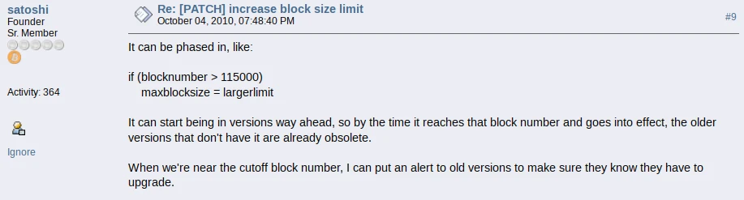

Cette discussion marque le début du débat sur la scalabilité, qui finira pas engendrer une véritable guerre civile entre 2015 et 2017, connue sous le nom de guerre des blocs ou de *blocksize war*.

### Les schémas de script standards

En septembre, Satoshi inaugure aussi une nouvelle notion dans le code : celle des transactions non standardes. Celles-ci sont des transactions que les nœuds configurés par défaut ne relaient pas, ne conservent pas dans leurs mempools et n'incluent pas dans les blocs qu'ils produisent. Toutefois, ces transactions restent tout à fait valides, et les blocs en contenant sont acceptés par l'entièreté du réseau.

Cette distinction normative permet de limiter l'exploitation d'éventuelles vulnérabilités dans le système de script de Bitcoin, qui est assez riche et qui n'a pas été assez examiné, au prix d'une restriction temporaire de la programmabilité. À ce moment-là, deux types de script de sortie sont identifiés comme standards par le réseau :

- La réception par clé publique (*pubkey*), utilisée par les mineurs et pour les transferts via une adresse IP ;
- La réception par empreinte de clé publique (*pubkey hash*), utilisée pour les transferts via une adresse Bitcoin.

Le 7 septembre, dans la version 0.3.12, Satoshi [inclut](https://bitcointalk.org/index.php?topic=999.msg12240#msg12240) ainsi une limitation imposant aux transactions de ne pas être trop grosses, ni de contenir trop d'opérateurs de signature. Il s'agit, comme il l'explique, d'une application sommaire de la distinction. Cette dernière sera [entérinée](https://bitcointalk.org/index.php?topic=2129.msg27744#msg27744) formellement trois mois plus tard par Gavin Andresen, qui ajoutera au code la fonction `IsStandard`, une fonction vérifiant le caractère standard d'une transaction. L'accès à la programmabilité sera lui réintroduit en 2012 par le biais de l'intégration de P2SH dans le protocole.

### Un été de développement

Lors de l'été 2010, riche en évènements, Satoshi s'est ainsi consacré au développement informatique du logiciel. La publication du texte de présentation de Bitcoin sur Slashdot a provoqué un afflux sans précédent d'utilisateurs, ce qui a aussi mis le système en danger. Par conséquent, le fondateur et ceux qui l'aidaient (dont notamment Gavin Andresen) ont essayé tant bien que mal de corriger les vulnérabilités. Le réseau n'a cependant pas échappé à un incident majeur, le *value overflow incident*, qui a conduit à la création d'un système d'alerte piloté par Satoshi au sein du logiciel. Enfin, cette période a aussi été marquée par l'ajout de la limite de taille des blocs, un élément fondamental de l'histoire de Bitcoin.

Durant les mois qui ont suivi, les améliorations techniques, économiques et minières ont continué à fleurir, transformant peu à peu Bitcoin en projet collectif. La « communauté de Bitcoin » a enfin pris vie en tant qu'entité autonome. C'est ce que nous étudierons dans la prochaine partie de ce cours.

# La communauté de Bitcoin
<partId>811e7c15-497a-46df-b67b-27eefbc73a63</partId>

## La ruée vers l'or numérique
<chapterId>8e9899ca-e7a7-471b-8e69-847a56714d3b</chapterId>

Dans la partie précédente, nous avons étudié l'effet qu'a eu la publication de la présentation de Bitcoin sur Slashdot (*slashdotting*) et la façon dont les premiers ennuis techniques ont été gérés par Satoshi et ses auxiliaires. À la fin de l'été, le projet avait tenu le choc et était prêt à accueillir un nombre croissant de personnes. L'automne 2010 a ainsi constitué une période de succès pour Bitcoin.

Il a constitué en particulier une période fastueuse pour le minage, qui s'est énormément amélioré avec l'émergence des premières fermes de cartes graphiques et de la première coopérative. Les moyens déployés étaient croissants et la performance des algorithmes consacrés s'améliorait. C'était en quelque sorte une « ruée vers l'or numérique », comme l'[écrivait](https://web.archive.org/web/20100828094955/http://www.bitcoinblogger.com/2010/08/bitcoins-new-digital-gold-rush.html) un blogueur de l'époque (utilisant le pseudonyme jimbobway), constatant que des « milliers d'internautes » minaient des bitcoins « dans l'espoir de faire fortune » et que beaucoup d'entre eux tentaient « de développer des outils logiciels et matériels pour miner des bitcoins plus efficacement ».

### La première ferme de cartes graphiques

Après le slashdotting de Bitcoin en juillet 2010, la récompense financière élevée apportée par la hausse du prix et par l'éventualité de croissances futures incite les individus à se consacrer à la génération de bitcoins de manière plus poussée. C'est pourquoi le [taux de hachage](https://bitinfocharts.com/comparison/bitcoin-hashrate.html#alltime) du réseau, qui était de 0,22 GH/s le 11 juillet, passe à 2,78 GH/s le 17, puis à 5,79 GH/s le 15 août, pour ensuite atteindre 9,94 GH/s le 19 septembre et enfin 12,58 GH/s le 29.

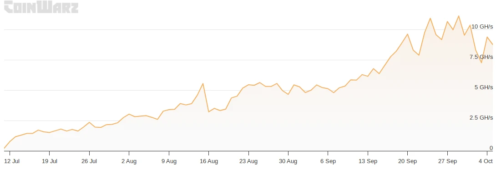
Taux de hachage total du réseau du 11 juillet au 5 octobre 2010 (source : [CoinWarz](https://www.coinwarz.com/mining/bitcoin/hashrate-chart))

Le plus gros mineur de cette période est un développeur allemand qui se fait appeler ArtForz. Après avoir l'existence de Bitcoin par le biais de Slashdot, il s'investit rapidement dans le développement du logiciel et passe beaucoup de temps sur le canal IRC #bitcoin-dev. En particulier, il développe son propre algorithme de minage par GPU avec OpenCL, qu'il fait fonctionner avec la carte graphique de son ordinateur.

Il se met à générer des bitcoins le 19 juillet. Le 25 juillet, dans un fil sondant les utilisateurs sur leur nombre de bitcoins possédés, ArtForz [affirme](https://web.archive.org/web/20151121004205/https://bitcointalk.org/index.php?topic=564.msg5617#msg5617) avoir généré 1 700 bitcoins en 6 jours, ce qui correspond à 4 % du taux de hachage, soit 80 MH/s. Peu à peu, il construit une grande ferme de minage, qui sera connue sous le nom d'« ArtFarm ». En août, sa ferme [comprend](https://www.ofnumbers.com/2014/04/20/how-artforz-changed-the-history-of-bitcoin-mining/) 6 ATI Radeon HD 5770, ce qui lui permet de passer de 76 MH/s le 9 août à environ 450 MH/s le 13.


Production minière d'ArtForz entre août et octobre 2010 (source : Blackburn et al., "[*Cooperation among an anonymous group protected Bitcoin during failures of decentralization*](https://arxiv.org/pdf/2206.02871)")

Au fil des semaines, ArtForz en vient à contrôler une portion importante de la puissance de calcul du réseau. Le 2 septembre, le mineur puddinpop [affirme](https://bitcointalk.org/index.php?topic=133.msg11957#msg11957) qu'il possède « environ 12 5770 utilisant son client OpenCL » et qu'il a « plus de 1 Ghash/s », lui donnant « 20 % de la capacité de hachage » du réseau. Le 23 septembre, ArtForz [déclare](https://web.archive.org/web/20180118035138/http://bitcoinstats.com:80/irc/bitcoin-dev/logs/2010/09/23#l1285234390.0) détenir un taux de hachage de près de 2 GH/s et représente alors encore 20 % du hachage. Le 3 octobre, theymos [affirme](https://bitcointalk.org/index.php?topic=1327.msg15118#msg15118) que ArtForz « dispose de 20 à 30 % de la puissance de calcul du réseau ».

Toutefois, cette position est vite concurrencée au cours de l'automne par d'autres individus qui se mettent à jour. Par la suite, ArtForz s'éloignera progressivement de l'activité minière pour se concentrer sur le développement logiciel. En août 2011, il [affirmera](https://bitcointalk.org/index.php?topic=37904.msg478671#msg478671) ainsi avoir moins de 1 % de la puissance de calcul du réseau.

### La spécialisation du minage

À la fin de l'été 2010, l'exemple d'ArtForz inspire d'autres mineurs qui s'empressent de développer leurs propres méthodes pour générer des bitcoins avec leurs processeurs graphiques. Pour ce faire, les mineurs utilisent des environnements de programmation comme CUDA ou OpenCL. Cela leur permet d'obtenir une puissance de calcul se comptant en MH/s et de représenter une part non négligeable de la puissance totale.

Le 2 septembre, le mineur puddinpop [partage](https://bitcointalk.org/index.php?topic=133.msg11940#msg11940) l'exécutable de son client de minage, exploitant un algorithme utilisant CUDA. Il y intègre la perception de 10 % pour quiconque l'exploite. Cette façon de faire ne plaît pas particulièrement aux membres du forum attachés au logiciel libre.

Le 6 septembre, suite à la suggestion d'un membre du forum, il [affirme](https://bitcointalk.org/index.php?topic=133.msg12107#msg12107) qu'il serait « peut-être disposé à rendre le code open source » s'il recevait « un don important ». Le 15, Jeff Garzik fait une [offre](https://bitcointalk.org/index.php?topic=133.msg12921#msg12921) dans ce sens en proposant à puddinpop de lui donner 10 000 bitcoins, ce qui représente environ 600 $ à ce moment-là. Ce dernier accepte : la transaction a [lieu](https://mempool.space/tx/f79314da84567196905f6e061e2bc9f3ee8b30d40f7b80dac90fcb1f4b4c71ea) le 18 et l'algorithme est [publié](https://bitcointalk.org/index.php?topic=133.msg13135#msg13135) sous licence libre par puddinpop dans la foulée.

D'autres algorithmes sont rendus publics dans le même temps. Le 9 septembre, un membre du forum se faisant appeler nelisky [partage](https://bitcointalk.org/index.php?topic=1009.msg12264#msg12264) son propre algorithme de minage utilisant CUDA. Le 1er octobre, un certain m0mchil, arrivé sur le forum en février, [publie](https://web.archive.org/web/20101206143359/http://www.bitcoin.org/smf/index.php?topic=1334.0) son algorithme (POCLBM) en le qualifiant de « mineur OpenCL pour la masse ».

Cette amélioration permet aux individus les plus compétents techniquement de générer beaucoup de bitcoins. Outre ArtForz, on voit notamment Nils Schneider (tcatm) s'imposer comme l'un des principaux mineurs de cette période. Le 3 octobre 2010, ce dernier [affirme](https://bitcointalk.org/index.php?topic=1327.msg15111#msg15111) avoir un taux de hachage 983 MH/s produit par 3 processeurs graphiques. Ce nombre a pour effet d'[étonner](https://bitcointalk.org/index.php?topic=1327.msg15112#msg15112) Satoshi en personne.

### Les premières coopératives de minage

L'augmentation massive du taux de hachage due à la spécialisation du minage a pour conséquence de rendre difficile la génération par processeur central, qui devient de moins en moins abordable. En effet, la possibilité de générer des bitcoins est de plus en plus dépendante de la variance, certains individus n'arrivant jamais à produire un bloc. La solution à ce problème est le minage coopératif.

Le 1er octobre, m0mchil [publie](https://bitcointalk.org/index.php?topic=1333.msg14840#msg14840) une modification de l'API qui permet aux nœuds clients de récupérer un bloc candidat par le biais d'une nouvelle fonction appelée `getwork` et de renvoyer la preuve de travail si une solution est trouvée. Il écrit que ce correctif « ouvre la voie aux mineurs de bitcoin externes » et « permet le montage de plusieurs mineurs pour un client ».

Le même jour, l'idée de « génération groupée » est [évoquée](https://bitcointalk.org/index.php?topic=1332.msg14838#msg14838) en premier par un membre du forum dans un fil intitulé « *How to overthrow the GPU Oligarchs* ». Le 13 octobre, puddinpop [propose](https://bitcointalk.org/index.php?topic=1458.msg16906#msg16906) un modèle de ce type. La puissance de calcul du hacheur est mesurée à l'aide d'un métahachage, qui est l'empreinte d'un tampon incluant le premier octet de chaque hachage du bloc. Le serveur peut alors vérifier périodiquement que le client procède bien au calcul tel qu'il a été défini. Ce modèle est complexe et [ne donne pas le droit à l'erreur](https://bitcointalk.org/index.php?topic=1458.msg17015#msg17015).

Toutefois, il existe un moyen bien plus simple pour mesurer le taux de hachage d'un client : les preuves de travail partielles. Cette méthode est [proposée](https://bitcointalk.org/index.php?topic=1458.msg16951#msg16951) par ribuck, Nils Schneider et Gavin Andresen suite à la description de puddinpop. Il s'agit de récupérer des preuves de travail de degré inférieur à la difficulté du réseau produites à partir du même bloc candidat. Les preuves partielles récupérées permettent d'estimer la puissance dépensée de manière probabiliste.

Le 23 novembre, une version modifiée de la fonction `getwork` est ajoutée au [code](https://bitcointalk.org/index.php?topic=1901.msg23876#msg23876) et, le 25, elle est incluse dans la nouvelle version du logiciel principal ([v0.3.17](https://bitcointalk.org/index.php?topic=1946.msg24460#msg24460)). Le même jour, Jeff Garzik (qui [défend](https://bitcointalk.org/index.php?topic=1688.msg20532#msg20532) alors l'idée de séparer la gestion de la chaîne et le minage au sein du logiciel) [partage](https://bitcointalk.org/index.php?topic=1925.msg24217#msg24217) son logiciel de minage par CPU qui met à profit cette fonction.

Le 27 novembre, un jeune développeur tchèque appelé Marek Palatinus et utilisant le pseudonyme slush [publie](https://web.archive.org/web/20101206144824/http://www.bitcoin.org/smf/index.php?topic=1976.0) une description de « minage coopératif » sur le forum, modèle qui exploite `getwork` et la logique de Jeff Garzik. Ce modèle se base sur les preuves de travail partielles produites par les hacheurs (*pay-per-share*). Le lendemain, Satoshi Nakamoto [approuve](https://bitcointalk.org/index.php?topic=1976.msg25119#msg25119) le concept.

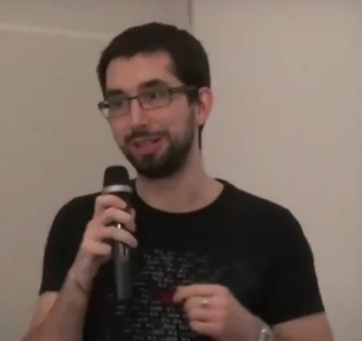
Marek Palatinus (slush) lors de la conférence Z-DAY à Prague le 11 mai 2013

Les deux modèles d'estimation sont mis en œuvre en décembre. Tout d'abord, le concept de puddinpop est appliqué le 1er décembre par l'utilisateur doublec qui [invite](https://bitcointalk.org/index.php?topic=2027.msg25859#msg25859) les gens à se connecter à son serveur de minage groupé. Le regroupement ainsi formé [produit](https://bitcointalk.org/index.php?topic=2027.msg26688#msg26688) son premier bloc (95 420) le 4 décembre. Après avoir produit un bloc supplémentaire quelques jours plus tard, le serveur de doublec est [arrêté](https://bluishcoder.co.nz/bitcoin-pool/) le 15. Le service ferme définitivement ses portes le 17, dû à l'émergence d'une coopérative bien plus efficace : Bitcoin.cz Mining.

Après avoir sondé le forum, Marek Palatinus se décide à mettre en œuvre son modèle de coopérative de minage et réalise notamment des essais sur le réseau de test. Il fait également en sorte que le serveur puisse être accessible à la fois aux mineurs par CPU (qui utilisent le logiciel de Jeff Garzik) et aux mineurs par GPU (qui se servent des clients de m0mchil et puddinpop).

Dans la nuit du 15 au 16 décembre, la coopérative est finalement [mise en ligne](https://bitcointalk.org/index.php?topic=1976.msg30520#msg30520) par Marek Palatinus sur le réseau principal. Le premier bloc est [trouvé](https://bitcointalk.org/index.php?topic=1976.msg30655#msg30655) (97 834) dans la matinée du 16. Par la suite, de nombreux autres blocs sont produits. Le groupement minier rencontre un certain succès dès le début : en quelques jours, son taux de hachage atteint 4 GH/s, soit 3,5 % de la puissance totale du réseau.

La coopérative deviendra une référence en ce qui concerne le minage de Bitcoin. Elle [portera](https://en.bitcoin.it/w/index.php?title=Slush_Pool&action=history) plusieurs noms au fil des années : Bitcoin Pooled Mining (BPM), Bitcoin.cz Mining, et enfin Slush Pool, en référence à son créateur. Elle deviendra Braiins Pool en septembre 2022.


Logo de la coopérative de Slush en septembre 2011 (source : [archive](https://web.archive.org/web/20110923151034/http://mining.bitcoin.cz:80/) du site)

### Le grand bon en avant du minage

Ainsi, la deuxième partie de l'année 2010 a représenté une période de grande croissance pour le minage. Celui-ci s'est spécialisé avec l'adoption de la génération par processeur graphique. Plusieurs individus se sont focalisés et ont construit de véritables fermes de minage, à l'instar de ArtForz et de son « ArtFarm ». Cet essor a finalement provoqué l'apparition de coopératives, permettant aux petits mineurs de mettre en commun leur puissance de calcul pour diminuer la variance de récompense.

Toutefois, l'automne n'a pas été un succès que pour le minage. Il l'a également été pour la communauté et l'écosystème économique associé. C'est dont nous parlerons dans le prochain chapitre.

## La floraison de l'écosystème
<chapterId>0404f877-8b5c-4c7f-81ab-a4e6d9b3da9c</chapterId>

Dans le chapitre précédent, nous avons étudié comment le minage s'est développé durant la moitié de l'année 2010. À l'automne, cette avancée était tout à fait établie. Toutefois, le minage n'a pas été le seul aspect de Bitcoin qui rencontre le succès : c'était aussi le cas son écosystème.

Ici, nous aborderons d'abord le début de l'exportation de Bitcoin à l'international avec le développement de la communauté russe et de la communauté française. Nous parlerons ensuite de l'amélioration de la communication et de la croissance économique, qui ont notamment conduit à une nouvelle augmentation du prix unitaire du bitcoin. Nous évoquerons enfin deux évènements très symboliques précédant le départ de Satoshi : l'acceptation du bitcoin par l'*Electronic Frontier Foundation* et le retour de Hal Finney.

### Bitcoin dans d'autres langues

Bitcoin est un projet international et, en tant que tel, doit être accessible à un maximum de personnes en dehors de la sphère anglophone. C'est pourquoi la communauté se [coordonne](https://bitcointalk.org/index.php?topic=151.msg1259#msg1259) à partir de mai 2010 pour traduire le site web et l'interface graphique du logiciel dans plusieurs langues. L'italien, l'allemand, le néerlandais sont notamment concernés.

Mais ce n'est pas tout. À la fin du mois de juillet, Martti Malmi commence à mettre en place des sous-forums dédiés aux non-anglophones. La communauté russe est la première à se former : suite à la demande d'un certain bitcoinex, le sous-forum dédié est [créé](https://bitcointalk.org/index.php?topic=151.msg6241#msg6241) le 28 juillet. Puis, des [fils de discussion](https://web.archive.org/web/20101018144227/http://www.bitcoin.org:80/smf/index.php?board=11.0) consacrés à d'autres communautés linguistiques sont créés : l'italien, le néerlandais, le japonais et le catalan en août ; l'espagnol en septembre ; et enfin l'allemand en octobre. Toutefois, aucun groupe n'égale alors la communauté russe et seuls quelques messages sont échangés.

C'est avec la communauté française que les choses changent, notamment grâce à l'action d'un individu : Lucien Grondin, aussi connu sous le pseudonyme grondilu. Le 26 septembre, ce dernier découvre Bitcoin et s'enthousiasme immédiatement pour le projet. En fin de soirée, il écrit ainsi [sur IRC](https://web.archive.org/web/20131201235643/http://www.bitcoinstats.com/irc/bitcoin-dev/logs/2010/09/26#l1285544830) :

> « Mon dieu, je n'arrive pas à dormir ! Je n'arrête pas de penser à ces trucs géniaux. Pour moi, le bitcoin est "l'or du cyperespace" \[sic\]. Je suis juste émerveillé. »

Quelques jours plus tard, le 30, il publie une [dépêche](https://linuxfr.org/news/connaissez-vous-les-bitcoins) en français sur LinuxFr.org (DLFP). Celle-ci, intitulée « Connaissez-vous les bitcoins ? », est probablement le premier texte de présentation de Bitcoin écrit dans la langue de Molière. L'article touche un grand nombre de personnes, générant près de 350 commentaires. En voici le premier paragraphe tel qu'il [apparaît](https://web.archive.org/web/20101003105210/http://linuxfr.org/2010/09/30/27430.html) à ce moment-là :


En particulier, cette dépêche a pour effet d'attirer l'attention d'un certain Ploum, de son vrai nom Lionel Dricot, blogueur et libriste belge de 29 ans. Le 25 octobre, ce dernier [publie](https://ploum.net/monnaie-de-geek-monnaie-de-singe/) un article sur son blog, intitulé « Monnaie de geek, monnaie de singe ? », dans lequel il prône la décentralisation et adhère au principe de Bitcoin. De nombreux internautes francophones entendent parler de Bitcoin par ce biais, dont [Amaury Séchet](https://www.reddit.com/r/Bitcoincash/comments/6y7ssg/ama_i_am_amaury_s%C3%A9chet_udeadalnix_bitcoin_abc/dml9h55/), le développeur qui sera à l'origine de la création de Bitcoin Cash en 2017.


Lionel Dricot (Ploum) en 2012, alors candidat sous la bannière du Parti Pirate pour les élections communales et provinciales belges (source : [Framablog](https://framablog.org/2012/10/10/lionel-dricot-ploum-parti-pirate-belgique/))

Le même jour, Ploum ouvre le [fil de discussion](https://bitcointalk.org/index.php?topic=1567.0) « French » sur le forum de Bitcoin. Les messages des membres francophones du forum se multiplient lors des mois qui suivent. On y voit notamment intervenir David François ([davout](https://bitcointalk.org/index.php?topic=1567.msg21218#msg21218)), inscrit le 17 octobre et futur fondateur de Bitcoin-Central, et Mark Karpelès ([MagicalTux](https://bitcointalk.org/index.php?topic=1567.msg29336#msg29336)), inscrit le 7 novembre et futur repreneur de la plateforme Mt. Gox. Il verra aussi le passage d'un certain Jean-Luc qui ouvrira le site [Bitcoin.fr](https://web.archive.org/web/20110107145746/http://www.bitcoin.fr:80/) le 23 décembre et commencera à en faire la [promotion](https://bitcointalk.org/index.php?topic=1567.msg37524#msg37524) en janvier. Un [sous-forum français](https://web.archive.org/web/20110217005824/http://www.bitcoin.org/smf/index.php?board=13.0) finira par être créé par Martti Malmi le 1er février 2011.

### Le développement de la communication

Outre le développement des communautés linguistiques, on assiste à une certaine innovation dans les moyens employés pour la communication au sujet de Bitcoin. Le 4 octobre, un Australien de 38 ans utilisant le pseudonyme noagendamarket [lance](https://bitcointalk.org/index.php?topic=1355.msg15217#msg15217) une initiative portant le nom de BitcoinMedia. L'idée est de promouvoir Bitcoin en créant divers contenus et d'en faire la publicité à des endroits susceptibles d'attirer un public. Bien que cette initiative ne rencontre pas le succès escompté, elle a le mérite de mener à la production des premières vidéos parlant de Bitcoin. La première vidéo de la chaîne, [publiée](https://bitcointalk.org/index.php?topic=1355.msg15461#msg15461) le 5 octobre, est une *Google Search Story*, créée grâce à l'outil Youtube (voir la capture ci-dessous). Les autres vidéos seront générées avec Xtranormal, un outil facile de réalisation de séquences vidéo à partir d'un ensemble de personnages et de décors préconçus.


Les billets de blog à propos de Bitcoin se multiplient durant cette période. C'est notamment le cas de Jon Matonis, qui tient le blog *The Monetary Future* où il traite de sujets liés aux monnaies numériques, à la banque libre et à la cryptographie. Il a découvert Bitcoin en mars et a [échangé](https://web.archive.org/web/20140511100607/https://bitcoinfoundation.org/forum/index.php?/topic/54-my-first-message-to-satoshi/#entry514) avec Satoshi, suite à quoi il s'est mis à écrire sur le sujet. En octobre, il publie un [troisième article](https://themonetaryfuture.blogspot.com/2010/10/rally-in-bitcoin.html) où il parle de la hausse du prix et détaille les nouveautés de l'écosystème.


Photo de profil de Jon Matonis en 2011 (source : [Forbes](https://www.forbes.com/sites/jonmatonis/))

C'est aussi à ce moment-là qu'un nouveau logo de Bitcoin est proposé. Le 1er novembre, un membre du forum utilisant le pseudonyme bitboy [publie](https://bitcointalk.org/index.php?topic=1631.0) des éléments graphiques permettant de mettre en avant la cryptomonnaie. L'un de ces éléments est un logo orange avec le B barré légèrement incliné :


### Une économie en croissance

Cette période est également marquée par une croissance remarquable de l'écosystème au niveau économique. Durant l'automne 2010, les plateformes Mt. Gox, Bitcoin Market et quelques autres existent mais cela ne suffit pas. C'est ainsi que les échanges de de gré à gré, *over the counter*, ont tendance à se multiplier. Outre les échanges qui se font par messages privés sur le forum, un système un peu plus rigoureux se met en place : #bitcoin-otc. Il s'agit d'un canal IRC sur Freenode [ouvert](https://bitcointalk.org/index.php?topic=1491.msg17508#msg17508) par un utilisateur se faisant appeler nanotube le 18 octobre. Le carnet d'ordres est hébergé sur le [site web associé](https://web.archive.org/web/20101027090714/http://bitcoin-otc.com/vieworderbook.php) et les échanges ont lieu directement entre les parties, sans dépôt fiduciaire, par l'intermédiaire de moyens de paiement divers (PayPal, Liberty Reserve). Le nombre de services qui acceptent le bitcoin s'accroît aussi, même s'il reste relativement faible, comme l'[atteste](https://web.archive.org/web/20101120224505/http://www.bitcoin.org/trade) la page de référencement du site officiel.

Tous ces éléments mènent le prix à augmenter de manière drastique. Alors qu'il se stabilise autour de 6 ¢ depuis août, celui-ci commence à augmenter au début du mois d'octobre. Il passe à 10 ¢, pour atteindre 20 ¢ à la fin du mois. Le 6 novembre, il dépasse même les 50 ¢, ce qui ne manque pas d'[enthousiasmer](https://bitcointalk.org/index.php?topic=1681.0) les membres du forum.

Prix du BTC entre le 18 juillet et le 18 octobre 2010 sur Mt. Gox (source : [*The Monetary Future*](https://themonetaryfuture.blogspot.com/2010/10/rally-in-bitcoin.html))

L'essor de Bitcoin fait qu'on commence à mesurer les choses, que ce soit au niveau du prix, de l'activité sur la chaîne ou bien du minage. Tout le monde sait que l'écosystème connaît une certaine croissance mais personne ne sait l'estimer correctement. C'est pourquoi des services émergent durant la deuxième moitié de l'année 2010 et au début de l'année 2011, dont les principaux sont :

- Bitcoin Watch ([bitcoinwatch.com](https://web.archive.org/web/20100816161306/http://www.bitcoinwatch.com/)), un agrégateur de statistiques diverses [développé](https://bitcointalk.org/index.php?topic=734.msg7954#msg7954) par Jeff Garzik (jgarzik) ;
- Bitcoin Charts ([bitcoincharts.com](https://web.archive.org/web/20101119023257/http://bitcoincharts.com/markets/)), une interface de suivi du prix et d'affichage de graphiques [lancée](https://bitcointalk.org/index.php?topic=1659.0) par Nils Schneider (tcatm) le 4 novembre ;
- Bitcoin Block Explorer ([blockexplorer.com](https://web.archive.org/web/20101128030227/http://blockexplorer.com/)), un explorateur de blocs [mis en place](https://bitcointalk.org/index.php?topic=1727.msg21124#msg21124) par Theymos le 10 novembre, qui permet à n'importe qui d'accéder au contenu des blocs et des transactions de Bitcoin avec un navigateur web ;
- Bitcoin Network Graphs ([bitcoin.sipa.be](https://web.archive.org/web/20110310155417/http://bitcoin.sipa.be/)), un site affichant des graphiques de l'évolution du taux de hachage de Bitcoin [lancé](https://bitcointalk.org/index.php?topic=3024.msg42173#msg42173) par un certain Pieter Wuille (sipa) le 28 janvier 2011 ;
- Bitcoin Monitor ([bitcoinmonitor.com](https://web.archive.org/web/20110605105433/http://www.bitcoinmonitor.com/)), un outil de visualisation en temps réel des transactions, des blocs et des opérations de change, [mis en ligne](https://bitcointalk.org/index.php?topic=3218.msg45150#msg45150) par Jan Vornberger (jav) le 6 février 2011.

Un dernier élément indiquant le succès de Bitcoin est le fait que certains cherchent à le mettre à l'épreuve. Entre le 15 et le 26 novembre, un individu s'amuse en effet à créer un flot de transactions, qui se comptent en milliers chaque jour. Cette activité exceptionnelle est [signalée](https://bitcointalk.org/index.php?topic=1850.msg22870#msg22870) le 19 par Jeff Garzik. Elle contraint Satoshi à mettre en place des mesures, en [restaurant](https://bitcointalk.org/index.php?topic=1946.msg24460#msg24460) l'interface des frais de transaction et en ajoutant des limites sur les transactions gratuites.

### L'Electronic Frontier Foundation accepte le bitcoin

Un évènement marquant de la fin de l'année 2010 est l'acceptation du bitcoin par l'*Electronic Frontier Foundation*, une organisation internationale de protection des libertés sur Internet, cofondée en 1900 par Mitch Kapor, John Gilmore et John Perry Barlow. Celle-ci tient à cœur aux premiers adeptes de Bitcoin, cypherpunks dans l'âme. Ils tiennent ainsi à ce qu'elle accepte le bitcoin.


C'est le membre du forum appelé Kiba qui franchit le pas le 13 août 2010, en [proposant](https://bitcointalk.org/index.php?topic=804.msg9021#msg9021) de contacter l'EFF et de lui proposer de recevoir un don, [récolté](https://bitcointalk.org/index.php?topic=778.msg8578#msg8578) auprès de la communauté. Il met pour cela en place un [compte](https://mempool.space/address/1MCwBbhNGp5hRm5rC1Aims2YFRe2SXPYKt) sur MyBitcoin où il récupère les fonds et dont il souhaite transmettre les accès à l'EFF. Il rédige un courriel (corrigé par la communauté) qu'il envoie à la fin du mois d'août.

Deux semaines plus tard, en l'absence de réponse, un deuxième membre du forum lui vient en aide. Ce dernier, utilisant le pseudonyme BrightAnarchist, connaît l'un des fondateurs et lui envoie un courriel le 13 septembre. Il reçoit une réponse dans la journée et [écrit](https://bitcointalk.org/index.php?topic=804.msg12631#msg12631) alors sur le forum que « l'EFF est tout à fait intéressée pour recevoir des Bitcoins ! » Le compte est alors transmis à l'organisation.

L'EFF met quelque temps à se mettre à accepter les donations du public. Après négociation, la communauté la convainc de publier une adresse de donation sur son site. Le 9 novembre, l'adresse apparaît sur la [page de donation](https://web.archive.org/web/20101130105838/http://www.eff.org/helpout). Les utilisateurs de Bitcoin [commencent](https://mempool.space/tx/8ca2d206bc41b9ffa36cf4ea9ce9d3b0751fd653b6ec8f2979bfdddc4a631731) à transférer des fonds.

Quelques jours plus, un [billet](https://web.archive.org/web/20101117060233/http://www.bitcoinblogger.com/2010/11/bitcoin-gains-legal-protection-through.html) est écrit à ce sujet par le blogueur jimbobway, ce qui attire l'attention sur Bitcoin. Cet article est [relayé](https://news.ycombinator.com/item?id=1905522) sur HackerNews. Il est également retranscrit en vidéo par BitcoinMedia au moyen de Xtranormal :


Il s'agit d'une très bonne nouvelle pour Bitcoin car les deux initiatives partagent des valeurs communes. De plus, l'EFF est réputée pour avoir apporté une protection légale aux projets de préservation de la vie privée et de partage de données comme Tor et BitTorrent. Satoshi Nakamoto lui-même en est conscient et est particulièrement favorable aux actions de l'organisation, comme le montre son [commentaire](https://mmalmi.github.io/satoshi/#email-254) fait dans un de ses courriels adressé à Gavin Andresen le 6 janvier 2011 :

> « L'EFF est très importante. &nbsp;Nous voulons entretenir de bonnes relations avec elle. &nbsp;Nous sommes le type de projet qu'ils apprécient ; ils ont aidé le projet TOR et ont fait beaucoup pour protéger le partage de fichiers en P2P. »

### Le retour de Hal Finney

Après s'être éloigné de Bitcoin en avril 2009, Hal Finney a rapidement appris qu'il était atteint de la maladie de Charcot, le [diagnostic](https://www.lesswrong.com/posts/bshZiaLefDejvPKuS/dying-outside) ayant été fait en août 2009. Il adapte sa manière de vivre en conséquence, mais sa motricité se réduit progressivement.

Le 30 novembre, il s'inscrit sur le forum de Bitcoin et commence à participer aux discussions, notamment celle concernant le projet BitDNS. Il n'hésite pas à faire des petits dons aux divers projets qui fleurissent dans l'écosystème.

De plus, il étudie le code, qu'il n'a pas observé depuis le lancement, et s'aperçoit de tout le travail qui a été fait. Cet élément le pousse à [écrire](https://bitcointalk.org/index.php?topic=2188.msg29223#msg29223) le commentaire suivant sur le forum le 11 décembre :

> « C'est, il me semble, un travail impressionnant, même si j'aimerais qu'il y ait plus de commentaires. J'ai surtout étudié les modules init, main, script et un peu de net. C'est de la mécanique puissante. »

Deux heures plus tard, Satoshi lui [répond](https://bitcointalk.org/index.php?topic=2188.msg29259#msg29259) :

> « Ça me touche beaucoup venant de toi, Hal. &nbsp;Merci. »

C'est alors l'antépénultième message public du créateur de Bitcoin, qui disparaîtra quelques mois plus tard.

### Un moment charnière

Au cours de l'automne 2010, l'écosystème autour de Bitcoin a évolué de manière considérable. La communication s'est améliorée et l'économie s'est développée. À ce moment-là, il semblait donc que Bitcoin était prêt à voler de ses propres ailes. Et c'est précisément cette période que Satoshi a choisi pour disparaître et laisser les rênes du projet à la communauté.

## La disparition de Satoshi
<chapterId>f7735239-4887-468f-9f06-1b07d00b30d9</chapterId>

Nous avons vu comment Bitcoin a pris son envol à partir de la publication du texte sur Slashdot en juillet 2010. À l'automne, avec les divers progrès au niveau du logiciel, du minage et de l'économie, on sentait que le projet était enfin sur la bonne voie. C'est pourquoi cette période a coïncidé avec la progressive mise en retrait de Satoshi Nakamoto.

Ce départ du créateur de Bitcoin précipité s'explique par deux raisons : d'une part, une contestation grandissante de son statut, demandant une gestion plus décentralisée et consensuelle ; d'autre part, sa peur des autorités étatiques, quasi paranoïaque. Cette dernière motivation s'est notamment exprimé en décembre 2010 dans le cadre du blocus financier de WikiLeaks, qui ne parvenait plus à recevoir des fonds par des moyens traditionnels et pour qui Bitcoin fournissait un moyen alternatif pertinent. Dans ce chapitre, nous allons décrire en détail le déroulement de cette disparition.

### La contestation du statut du fondateur

À partir de la seconde moitié de l'année 2010, la communauté de développement se regroupe sur le canal #bitcoin-dev, dont les logs sont publiés sur le site de Christian Decker, [Bitcoin Stats](https://web.archive.org/web/20131201235340/http://www.bitcoinstats.com/irc/bitcoin-dev/logs/2010/09). Ce canal est l'endroit idéal pour les personnes les plus à l'aise avec la technique pour échanger en détails sur Bitcoin et discuter de manière plus informelle. Il regroupe à la fois des mineurs spécialisés (comme ArtForz, Diablo-D3, knightmb ou Nils Schneider), des développeurs qui s'intéressent au protocole (tel que Gavin Andresen, Jeff Garzik ou Wladimir van der Laan) ou des personnes qui maintiennent des services sur Bitcoin (comme Jed McCaleb, Michael Marquardt ou nanotube).

Satoshi Nakamoto, lui, ne s'y connecte jamais, si bien que la parole y est plus libérée que sur le forum. Il arrive donc souvent que les décisions de développement de Satoshi soient remises en question, voire même qu'on critique son statut vis-à-vis de Bitcoin.

Satoshi est en effet le meneur attitré du projet, soit ce qu'on appelle dans le monde du logiciel libre un « [dictateur bienveillant à vie](https://fr.wikipedia.org/wiki/Benevolent_Dictator_for_Life) ». Son rôle est d'assurer la stabilité du développement ouvert en prenant les décisions pour tout le monde, ce qui limite le risque de rébellion et de scission. Comme l'[explique](https://buildingbitcoin.org/bitcoin-dev/log-2010-09-27.html#l-528) Gavin Andresen, il est le « gardien » : « tout le code passe par lui ».

Le code source de Bitcoin reste cependant libre, de sorte que n'importe qui peut le copier et le modifier, ce qui empêche l'évolution du protocole d'être complètement arbitraire. Tel que l'[exprime](https://buildingbitcoin.org/bitcoin-dev/log-2010-11-19.html#l-1538) Jeff Garzik le 19 novembre :

> « \[S\]atoshi a sorti des chiffres magiques de son chapeau, et nous soutenons collectivement cette direction. \[...\] À la minute où Satoshi fera quelque chose de fou qui n'est pas soutenu par la communauté, il y aura un véritable embranchement du protocole / de la base de code. »

Ainsi, le rôle de meneur de Satoshi n'empêche pas la critique d'avoir lieu. C'est pourquoi des tensions apparaissent progressivement dans la communauté à partir du mois de juillet. On voit par exemple surgir des contestations à l'occasion du [déploiement](https://bitcointalk.org/index.php?topic=898.msg10745#msg10745) du système d'alerte en août ou de la [modification](https://bitcointalk.org/index.php?topic=1901.msg24050#msg24050) de la fonction `getwork` de m0mchil en novembre. La frustration vis-à-vis de cette prise de décision dictatoriale est parfois exprimée de manière [beaucoup plus ouverte](https://buildingbitcoin.org/bitcoin-dev/log-2010-11-24.html#l-384) sur IRC.

Gavin, qui est proche de Satoshi mais qui discute également avec les autres développeurs, voit bien le problème posé par cette situation. Le 27 septembre 2010 sur IRC, Gavin [déclare](https://buildingbitcoin.org/bitcoin-dev/log-2010-09-27.html#l-522) qu'il aimerait « pouvoir convaincre \[Satoshi\] de basculer vers un modèle de développement plus collaboratif ». En octobre, Gavin [obtient]((https://sourceforge.net/p/bitcoin/code/165/)) son accès en écriture au dépôt sur SourceForge, ce qui améliore les choses. Et en décembre, le problème se règlera de lui-même par la mise en retrait précipitée de Satoshi, suite à l'explosion de l'affaire WikiLeaks.

### L'affaire WikiLeaks

L'élément déclencheur du départ de Satoshi est l'affaire WikiLeaks. WikiLeaks est une organisation non gouvernementale fondée par le cypherpunk Julian Assange en 2006, ayant pour but de donner une audience aux lanceurs d'alertes et aux fuites d'information, tout en protégeant leurs sources. Au cours de l'année 2010, les documents confidentiels révélés de l'ONG sont relayés par les grands médias et font du bruit dans l'opinion publique. Ceux-ci concernent notamment les agissements excessifs de l'armée américaine, comme les victimes civiles et les actes de torture perpétrés, en Afghanistan (Afghan War Diary) et en Irak (Iraq War Logs).


Le financement de WikiLeaks repose essentiellement sur les dons du public, de sorte que l'organisation repose sur les processeurs de paiement permettant de recevoir des paiements en ligne. Toutefois, suite à ces révélations, la pression est mise sur ces tiers qui craignent la réaction du régulateur. C'est pourquoi la société de paiement en ligne Moneybookers [gèle](https://www.theguardian.com/media/2010/oct/14/wikileaks-says-funding-is-blocked) le compte de l'ONG le 14 octobre.

Cet état de fait ouvre une voie royale pour l'utilisation de Bitcoin, qui ne repose sur aucun tiers de confiance et qui résisterait beaucoup mieux à la censure financière. L'hypothèse est ouverte sur le forum en novembre par Amir Taaki, un jeune britannique d'origine iranienne de 22 ans utilisant le pseudonyme genjix.


Amir Taaki en décembre 2012 à Bratislava (source : [Mitch Altman](https://www.flickr.com/photos/maltman23/8272321106/))

Hackeur, anarchiste et [joueur de poker](https://bitcointalk.org/index.php?topic=1487.0), celui-ci a fraîchement appris l'existence du modèle de Satoshi Nakamoto. Il voit dans la situation de WikiLeaks une opportunité de démontrer l'utilité de Bitcoin. Le 10 novembre, il [écrit](https://bitcointalk.org/index.php?topic=1735.msg21271#msg21271) le message suivant sur le forum :

> « Je voulais envoyer une lettre à Wikileaks à propos de Bitcoin car, malheureusement, ils ont subi plusieurs incidents où leurs fonds ont été saisis dans le passé. \[...\] Quelqu'un sait où leur envoyer un message ? »

Les réactions à cette proposition sont mitigées. [D'après](https://bitcointalk.org/index.php?topic=1735.msg21283#msg21283) un utilisateur (ShadowOfHarbringer) « cela peut être bénéfique pour wikileaks, mais pas nécessairement pour Bitcoin ». Un autre (creighto) [écrit](https://bitcointalk.org/index.php?topic=1735.msg21415#msg21415) que « le plus tard sera le mieux » et que « plus les États attendent pour agir, plus le réseau bitcoin se renforce et plus il devient difficile de lui nuire ».

Quelques semaines plus tard, le 3 décembre, PayPal décide de geler le compte de WikiLeaks et publie un [communiqué](https://web.archive.org/web/20101206112350/https://www.thepaypalblog.com/2010/12/paypal-statement-regarding-wikileaks/) dans la nuit. Le lendemain matin, le développeur Wladimir van der Laan [relaie](https://bitcointalk.org/index.php?topic=1735.msg26737#msg26737) cette nouvelle sur le forum :

> « Paypal vient de les bloquer et tente de convaincre d'autres banques étasuniennes de faire de même. Ce serait le moment idéal pour mettre en place les dons en bitcoins. »

Cette évolution de la situation renforce le débat. Un individu est particulièrement favorable à l'acception du Bitcoin par WikiLeaks : il s'agit de Robert S. Horning, un ingénieur en informatique vivant dans l'Utah, qui est [blogueur](https://www.blogger.com/profile/12496217305843430098) et contributeur pour Wikipédia, et qui a découvert Bitcoin suite au slashdotting de juillet. Ce jour-là, il écrit un long texte dans lequel il explique que soutenir WikiLeaks est la chose à faire d'un point de vue moral et que l'État entendra de toute façon parler de Bitcoin tôt ou tard. Il conclut :

> « En gros, allons-y. &nbsp;Encourageons Wikileaks à utiliser les Bitcoins et je suis prêt à faire face à tout risque ou retombée de cet acte. »

### Le départ précipité de Satoshi

Satoshi n'est pas du tout de l'avis de Robert Horning et s'oppose à l'idée de promouvoir Bitcoin auprès de WikiLeaks. Comme l'attestent ses propos et ses actes, il fait preuve d'une grande prudence vis-à-vis des autorités étatiques, qui va parfois jusqu'à la [paranoïa](https://mmalmi.github.io/satoshi/#email-158). Par conséquent, le 5 décembre, il réagit à cette ébullition en [répondant](https://bitcointalk.org/index.php?topic=1735.msg26999#msg26999) de manière cassante au principal promoteur :

> « Non, pas de "allons-y".
>
> Le projet a besoin de grandir progressivement pour que le logiciel puisse se renforcer en cours de route.
>
> J'appelle WikiLeaks à ne pas commencer à utiliser Bitcoin. &nbsp;Bitcoin est une petite communauté expérimentale encore naissante. &nbsp;Vous n'obtiendriez rien de plus que quelques piécettes et l'agitation que vous apporteriez nous détruirait probablement à ce stade. »

Dans les jours qui suivent, c'est un véritable blocus financier qui s'organise contre WikiLeaks, auquel participent Mastercard et Visa, mais aussi Western Union, Bank of America et d'autres acteurs, ce qui [met en péril](https://wikileaks.org/Banking-Blockade.html) la survie financière de l'ONG. Cette offensive rend l'acceptation du bitcoin encore plus pertinente et l'idée se répand naturellement.

Le 11 décembre, un article mettant en avant la possibilité d'une utilisation de Bitcoin par WikiLeaks est [publié](https://www.pcworld.com/article/499375/could_wikileaks_scandal_lead_to_new_virtual_currency.html) sur PC World, l'un des plus grands sites web américains consacrés à l'informatique. Ce texte, écrit par le journaliste [Keir Thomas](https://www.keirthomas.com/how-i-caused-the-bitcoin-guy-to-go-into-hiding/), s'intitule « *Could the Wikileaks Scandal Lead to New Virtual Currency?* ». La boîte de Pandore est ouverte : l'article de PC World sera lu par de nombreuses personnes, dont probablement les responsables de WikiLeaks, ce qui poussera l'ONG à envisager ce moyen de paiement. L'article est rapidement évoqué sur le forum et la réaction du créateur de Bitcoin est sans appel. Ce dernier [écrit](https://bitcointalk.org/index.php?topic=2216.msg29280#msg29280) :

> « Il aurait été bon d'attirer cette attention dans un tout autre contexte. &nbsp;WikiLeaks a donné un coup de pied dans le nid de frelons, et l'essaim se dirige maintenant vers nous. »

Le lendemain, Satoshi [publie](https://bitcointalk.org/index.php?topic=2228.msg29479#msg29479) son dernier message public sur le forum, qui annonce la sortie d'une nouvelle version du logiciel (v0.3.19) améliorant notamment la gestion des attaques par déni de service. Puis, il se retire du feu des projecteurs, ne communiquant plus qu'en privé avec ses plus proches collaborateurs.

Dans les jours qui suivent, l'article publié sur PC World produit son effet. Le 14 décembre, l'invention de Satoshi est évoquée par l'*Electronic Frontier Foundation* dans un [texte](https://www.eff.org/deeplinks/2010/12/constructive-direct-action-against-censorship) concernant de la censure de WikiLeaks (plus tard, l'organisation [qualifiera](https://www.eff.org/deeplinks/2011/01/bitcoin-step-toward-censorship-resistant) Bitcoin de « monnaie numérique résistante à la censure »). Le 23, la cryptomonnaie est [mentionnée](https://web.archive.org/web/20180226161051/http://www.youtube.com/watch?v=VMngK0t5WkY) le Keiser Report, une émission financière présentée par Max Keiser et Stacy Herbert sur la chaîne russe RT, toujours dans le contexte de WikiLeaks. Cette couverture médiatique augmente considérablement l'attention portée à Bitcoin, ce qui confirme les craintes de Satoshi.

### La transmission des accès et derniers courriels

Dès le début du mois de décembre, Satoshi organise sa succession. Puisqu'il compte partir, ou du moins se mettre en retrait, il doit transmettre les différentes responsabilités aux personnes en qui il a confiance, en l'occurrence Martti Malmi et Gavin Andresen. Toutefois, il ne le leur indique jamais son intention.

Tout d'abord, il tient à ajouter leurs adresses de courriel à la [page de contact](https://web.archive.org/web/20101215111454/http://www.bitcoin.org/contact) du site. Le 7 décembre, il [envoie](https://mmalmi.github.io/satoshi/#email-245) un courriel à Martti lui demandant s'il peut l'« ajouter à la liste de développeurs du projet sur la page de contact », chose que le jeune Finlandais accepte. Le créateur de Bitcoin fait la même demande à Gavin, qui accepte également. Satoshi ajoute leurs adresses à la page et retire la sienne. Gavin [déclarera](https://www.huffingtonpost.co.uk/entry/gavin-andresen-bitcoin_n_3093316) quelques années plus tard :

> « \[Satoshi\] a fini par me rouler dans la farine en me demandant s'il pouvait mettre mon adresse de courrier électronique sur la page d'accueil de bitcoin, et j'ai dit oui, sans me rendre compte que, lorsqu'il mettrait mon adresse, il enlèverait la sienne. »

Mais ce n'est pas tout. Satoshi souhaite également transmettre son contrôle sur le logiciel à Gavin Andresen. Gavin, qui a déjà obtenu un accès en écriture au dépôt sur SourceForge [en octobre](https://sourceforge.net/p/bitcoin/code/165/), devient le mainteneur principal du dépôt. Le 19 décembre, il [crée](https://api.github.com/repos/bitcoin/bitcoin) le dépôt sur GitHub, étant probablement plus à l'aise avec Git. Le même jour, il écrit un long message sur le forum expliquant qu'il va s'impliquer plus dans le développement. Il [annonce](https://bitcointalk.org/index.php?topic=2367.msg31651#msg31651) :

> « Avec la bénédiction de Satoshi, et avec beaucoup de réticence, je vais commencer à gérer le projet Bitcoin de manière plus active. »

Satoshi transmet le contrôle sur le site web, le forum et le wiki à Martti, qui co-gérait déjà ces éléments. Puis, il se volatilise définitivement durant le printemps 2011.

Parmi les dernières personnes à communiquer avec Satoshi, il y a aussi Mike Hearn, l'ingénieur de Google qui l'avait approché deux ans auparavant. Ce dernier a repris le contact avec le créateur de Bitcoin en décembre 2010 pour lui poser d'autres questions d'ordre technique. Il [travaille](https://plan99.net/~mike/satoshi-emails/thread3.html) alors sur une « implémentation en Java de la vérification de paiement simplifiée, en vue de construire un client fonctionnant sur les téléphones Android ». Les deux hommes échangent jusqu'au 23 avril. Dans son [dernier courriel](https://plan99.net/~mike/satoshi-emails/thread5.html) à Mike Hearn, Satoshi déclare qu'il est « passé à autre chose » et que Bitcoin est « entre de de bonnes mains avec Gavin et les autres ».

Le 26 avril 2011, Satoshi envoie un [dernier message](http://gavinandresen.ninja/eleven-years-ago-today) par courrier électronique à Gavin, dans lequel il écrit :

> « J'aimerais que tu évites de parler de moi comme d'un personnage sombre et mystérieux, la presse tourne simplement ça sous l'angle d'une monnaie pirate. &nbsp;Peut-être que tu devrais plutôt parler du projet open source et donner plus de crédit aux développeurs qui contribuent : cela aide à les motiver. »

Satoshi fait ici référence à un [article](https://www.forbes.com/forbes/2011/0509/technology-psilocybin-bitcoins-gavin-andresen-crypto-currency.html) d'Andy Greenberg publié sur le site de Forbes quelques jours auparavant, dans lequel il est présenté comme « un personnage mystérieux, obsédé par la vie privée » et où Bitcoin est mis en avant comme un moyen de se procurer des drogues illégales (c'est en effet la période où la plateforme Silk Road commence à avoir du succès). Dans son courriel à Gavin, Satoshi joint également la clé d'alerte, permettant d'avertir le réseau en cas de problème technique.

Enfin, début mai, il fait également ses adieux à Martti. Ses derniers mots pour son premier bras droit sont les suivants :

> « Je suis passé à autre chose et je ne serai probablement plus là à l'avenir. »

### La CIA, WikiLeaks et l'EFF

Le 26 avril 2011, Gavin Andresen envoie un [dernier courriel](http://gavinandresen.ninja/eleven-years-ago-today) à Satoshi Nakamoto, auquel ce dernier ne répondra pas. Dans ce courriel, il [indique](http://gavinandresen.ninja/eleven-years-ago-today) avoir été invité par l'In-Q-Tel, un fonds américain de capital-investissement géré par la CIA, afin qu'il présente Bitcoin. Il a très bien conscience du type de réaction que cette visite va engendrer mais décide tout de même d'y aller. Il se justifie en écrivant à Satoshi :

> « J'espère qu'en parlant directement avec "eux" et, plus important encore, en écoutant leurs questions/préoccupations, ils considéreront Bitcoin comme je le fais - comme une monnaie tout simplement meilleure, plus efficace, moins sujette aux caprices de la politique. Pas comme un outil de marché noir tout-puissant qui sera utilisé par les anarchistes pour renverser le Système. »

Le lendemain, Gavin [annonce](https://bitcointalk.org/index.php?topic=6652.msg97181#msg97181) la nouvelle sur le forum en toute transparence. Il précise avoir été payé 3000 $ pour ce voyage. Toutefois, cela n'émeut pas tellement la communauté qui comprend sa démarche, même si évidemment la méfiance est de mise. La visite de Gavin dans les locaux de la CIA [se passe](https://twitter.com/gavinandresen/status/80785477342478336) le 14 juin.

De manière symbolique, le 14 juin est également la date à partir de laquelle WikiLeaks [commence](https://twitter.com/wikileaks/status/80774521350668288) à accepter les dons en bitcoins. Cette nouvelle est reprise sur le site de Forbes.

Paradoxalement, cette nouvelle a pour effet de repousser partiellement l'adoption existante d'une organisation : l'*Electronic Frontier Foundation*. Le 20 juin, l'EFF [annonce](https://www.eff.org/deeplinks/2011/06/eff-and-bitcoin) en effet abandonner les dons en bitcoins, à cause des complexités légales que cette acceptation engendre. Elle [reverse](https://bitcointalk.org/index.php?topic=20185.msg456413#msg456413) les bitcoins reçus au *bitcoin faucet* de Gavin Andresen. Bitcoin a donc gagné une organisation aux dépens d'une autre.

### Le mystère Satoshi

Ainsi, la disparition de Satoshi a eu lieu de manière précipitée suite à la croissance de la communauté qui a suivi le slashdotting et, surtout, à l'affaire WikiLeaks. Le créateur de Bitcoin a laissé les rênes du projet à Martti Malmi et Gavin Andresen, les deux hommes qui l'ont épaulé dans son effort de développement et de communication.

On ne sait pas ce qu'il est devenu par la suite. Quelques messages ont émané de ses différents comptes ([Fondation P2P](https://p2pfoundation.ning.com/forum/topics/bitcoin-open-source?commentId=2003008:Comment:52186), [Vistomail](https://lists.linuxfoundation.org/pipermail/bitcoin-dev/2015-August/010238.html)), mais il est vraisemblable que ces comptes ont été piratés. L'identité de Satoshi Nakamoto reste donc inconnue, celui-ci ayant réussi à conserver son anonymat grâce l'usage de Tor et de services respectueux de la vie privée.

Des pistes à son propos ont été données au fil des années et des noms de personnalités connues ont été évoqués comme Nick Szabo, Hal Finney, Adam Back ou Len Sassaman. En 2014, on a même cru l'avoir trouvé en la personne Dorian Prentice Satoshi Nakamoto, un ingénieur des télécommunications, citoyen américain naturalisé d'origine japonaise, vivant avec sa mère à Temple City dans la banlieue de Los Angeles. Toutefois, Satoshi reste toujours à ce jour un [mystère](https://www.youtube.com/watch?v=0ETcLj5jBy4).

Cette dimension mystérieuse entourant le créateur de Bitcoin a par ailleurs été bien été résumée par Hal Finney en juin 2013, qui, dans [l'un de ses derniers messages](https://bitcointalk.org/index.php?topic=234330.msg2479328#msg2479328) sur le forum avant sa mort en 2014, partageait une citation du film *Man of Steel* tout juste sorti en salle :

> « Comment retrouver quelqu'un qui a toujours brouillé les pistes ?
>
> Pour certains, c'était un ange gardien. Pour d'autres, \[une énigme,\] un fantôme, toujours un peu à l'écart.
>
> Que représente le S ? »


## Évaluez ce cours
<chapterId>73825805-29e2-54bf-a8c3-62614b52fbef</chapterId>
<isCourseReview>true</isCourseReview>

## Examen final
<chapterId>39e43ec2-5b38-5174-882a-c1f7d284b9e6</chapterId>
<isCourseExam>true</isCourseExam>

## La prise de relai de la communauté
<chapterId>16c5e6d6-2412-48c6-9687-6af92cf0d89a</chapterId>

Après le départ de Satoshi Nakamoto, il a été nécessaire de faire sans lui. Heureusement, Bitcoin était un projet libre, auquel tout le monde pouvait contribuer, de sorte que la disparition de son fondateur n'a pas été fatale pour lui. Comme l'[écrivait](https://bitcointalk.org/index.php?topic=628.msg6578#msg6578) le développeur Jeff Garzik en juillet 2010 (à propos de l'éventualité d'une absence du fondateur) :

> « Les gens s'inquiètent beaucoup des règles et de leur élaboration. &nbsp;Mais il n'y a aucun besoin de plan de continuité du gouvernement ici. &nbsp;Tant que le code source reste ouvert, c'est suffisant. &nbsp;S'il existe un besoin et suffisamment d'intérêt, la communauté s'en chargera. &nbsp;Faites confiance à la communauté. »

Toutefois, cette disparition n'a pas été sans heurts. L'absence de Satoshi impliquait qu'il n'y avait plus d'autorité d'où émanait la direction à prendre. Il fallait se coordonner, tant du point de vue du développement logiciel que de la communication externe. Les membres de la communauté naissante de Bitcoin ont dû ainsi faire de nombreux efforts pour normaliser ces pratiques.

### Le développement communautaire

Comme nous l'avons raconté, Gavin Andresen [prend les rênes](https://bitcointalk.org/index.php?topic=2367.msg31651#msg31651) du projet durant le mois de décembre 2010 en créant le dépôt GitHub. Le 13 janvier 2011, il [demande](https://bitcointalk.org/index.php?topic=2772.msg37771#msg37771) de l'aide sur le forum en créant un fil intitulé « Recherche d'aide pour le développement de base de Bitcoin ». Au cours des mois qui suivent, de nombreux programmeurs jouent le jeu et commencent à résoudre des problèmes. Parmi eux se trouvent notamment Jeff Garzik, Pieter Wuille (sipa) et Wladimir van Der Laan (wumpus, laanwj). On assiste également à l'implication de nouveaux développeurs comme Luke-Jr ou Matt Corallo (BlueMatt). D'autres personnes aident sans contribuer directement au logiciel principal, comme Mike Hearn (impliqué dans la communauté depuis décembre), qui [rend public](https://bitcointalk.org/index.php?topic=4236.msg61438#msg61438) une nouvelle implémentation logicielle appelée BitCoinJ en mars 2011, afin de mettre en œuvre la vérification de paiement simplifiée (SPV) telle que décrite dans le livre blanc.

Le plan général est de pérenniser le développement du projet. Et cela passe par la création d'une certaine légitimité vis-à-vis d'un public plus large. Le 19 mai, Mike Hearn [propose](https://web.archive.org/web/20110522075653/http://forum.bitcoin.org:80/index.php?topic=8954.0) ainsi que les personnes impliquées dans le projet donnent leur « vrai nom », à savoir leur nom civil, pour que les gens ne soient pas suspicieux. Gavin, Mike et d'autres changent leur pseudonyme sur le forum pour faire apparaître leur nom complet. Une liste des développeurs principaux est également [publiée](https://web.archive.org/web/20110530221415/http://www.bitcoin.org:80/) sur la première page du site web. À la fin du mois de mai, les développeurs présentés comme tels sont Gavin Andresen, Martti Malmi, Amir Taaki, Pieter Wuille, Nils Schneider et Jeff Garzik.

La coordination s'améliore également. Outre le forum et le canal IRC #bitcoin-dev, une liste de diffusion dédiée au développement appelée « bitcoin-development » apparaît. Celle-ci est [mise en place](https://lists.linuxfoundation.org/pipermail/bitcoin-dev/2011-June/000000.html) le 12 juin par Jeff Garzik. Elle permet de discuter formellement des changements à apporter à Bitcoin. En août, des discussions concernant la [feuille de route](https://lists.linuxfoundation.org/pipermail/bitcoin-dev/2011-August/000333.html) du projet sont engagées. La liste est initialement hébergée sur SourceForge ; elle sera [déplacée](https://lists.linuxfoundation.org/pipermail/bitcoin-dev/2015-June/008975.html) sur le site de la Fondation Linux en juin 2015, avant de finalement [migrer](https://groups.google.com/g/bitcoindev/c/aewBuV6k-LI) sur Google Group début 2024.

Le 19 septembre 2011, Amir Taaki [inaugure](https://lists.linuxfoundation.org/pipermail/bitcoin-dev/2011-September/000554.html) le système des *Bitcoin Improvement Proposals*, ou « propositions d'amélioration de Bitcoin » en français, calqué sur les *Python Enhancement Proposals* (PEP) propres au langage de programmation Python. Ces BIP sont des documents décrivant des changements possibles du protocole ou fournissant des informations générales à la communauté. Il décrit le procédé par le BIP-1, qui sera plus tard remplacé par le BIP-2 de Luke-Jr. Ces propositions sont initialement hébergées sur le [wiki de Bitcoin](https://en.bitcoin.it/w/index.php?title=Bitcoin_Improvement_Proposals&oldid=20743).

Sous la supervision de Gavin Andresen, plusieurs versions du logiciel sont publiées au fil des mois : la [v0.3.20](https://bitcointalk.org/index.php?topic=4167.msg60365#msg60365) le 5 mars, la [v0.3.21](https://bitcointalk.org/index.php?topic=6642.msg97074#msg97074) le 27 avril, la [v0.3.22](https://bitcointalk.org/index.php?topic=12269.msg170790#msg170790) le 5 juin, la [v0.3.23](https://bitcointalk.org/index.php?topic=16553.msg215364#msg215364) le 13 juin et la [v0.3.24](https://bitcointalk.org/index.php?topic=27187.msg342270#msg342270) le 8 juillet. Le 23 septembre 2011, une nouvelle version majeure, la version 0.4, est officiellement [sortie](https://bitcointalk.org/index.php?topic=45410.msg541446#msg541446), ce qui indique symboliquement que la relève du développement a bien été prise.

### Le site, le forum et le wiki

Le développement logiciel n'est pas la seule chose qu'il faut gérer en l'absence de Satoshi. Il y a aussi les outils de communication générale que sont le site web, le forum et le wiki. Ces derniers sont en effet les « vitrines » du projet et la façon dont ils sont administrés est très importante.

Comme nous l'avons dit, lors de son départ, Satoshi transmet le contrôle du site à Martti Malmi, qui englobe alors le forum (bitcoin.org/smf) et le [wiki](https://web.archive.org/web/20110102000201/http://www.bitcoin.org/wiki/doku.php) (bitcoin.org/wiki). Toutefois, Martti a peu de temps à consacrer à cette tâche. À partir du printemps 2010, il est [occupé](https://mmalmi.github.io/satoshi/#email-191) par un stage puis par un emploi à plein temps, si bien qu'il se met progressivement en retrait.

Faute de temps, Martti est contraint de fermer progressivement sa plateforme d'échange, BitcoinExchange. Celle-ci est mise hors ligne à l'occasion d'un [changement de serveur](https://mmalmi.github.io/satoshi/#email-240) en décembre 2010. En janvier, il [prend](https://bitcointalk.org/index.php?topic=2179.msg37575#msg37575) la [décision](https://mmalmi.github.io/satoshi/#email-257) de ne pas la rouvrir. Début août, il [vendra](https://bitcointalk.org/index.php?topic=34357.msg427698#msg427698) le nom de domaine pour 250 bitcoins, soit 2 365 $ à ce moment-là. Le lien redirigera alors vers Mt. Gox.

Mais c'est surtout la gestion du site web que Martti a besoin de déléguer. À la fin de l'année 2010 et au début de l'année 2011, Bitcoin.org rencontre [quelques](https://bitcointalk.org/index.php?topic=2026.msg25845#msg25845) [problèmes](https://bitcointalk.org/index.php?topic=3328.msg46775#msg46775). Le 28 mars, Martti [publie](https://bitcointalk.org/index.php?topic=5052.msg73922#msg73922) une annonce sur le forum demandant de l'aide technique et reçoit plusieurs réponses. L'hébergement est alors [rendu](https://bitcointalk.org/index.php?topic=13375.msg184002#msg184002) plus robuste, ce qui évite que le site soit mis hors ligne à chaque afflux massif de visiteurs.

Son aspect change également. En décembre 2010, le site web ressemblait toujours à ce qu'il a été lors de l'ère Satoshi. Voici une [capture](https://web.archive.org/web/20101110005546/http://www.bitcoin.org/) du 5 décembre :


Ainsi, une touche de couleur est [ajoutée](https://web.archive.org/web/20110216125441/http://www.bitcoin.org/) début 2011 :


En avril, suite à une refonte [organisée](https://bitcointalk.org/index.php?topic=4223.msg80581#msg80581) par la communauté, le site web change de disposition. Voici à quoi il [ressemble](https://web.archive.org/web/20110411071904/http://www.bitcoin.org/) alors :

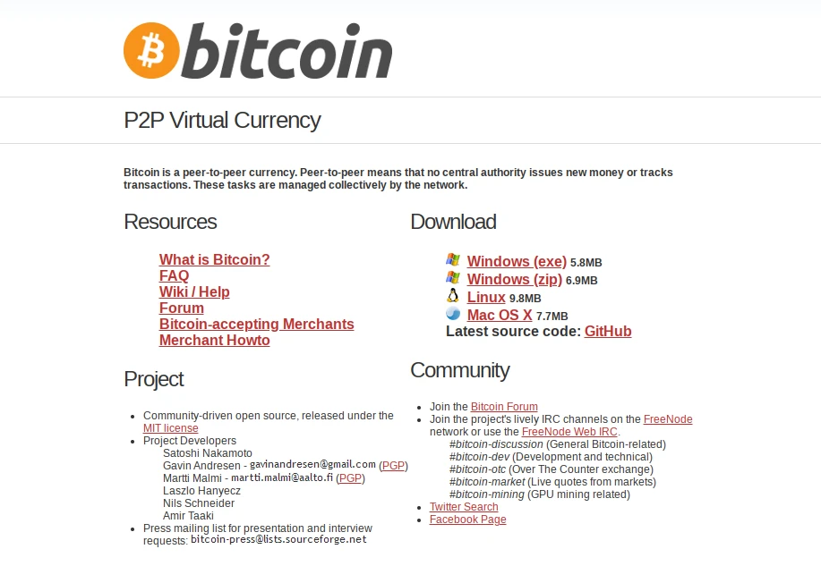

Enfin en septembre 2011, un nouveau changement est [réalisé](https://buildingbitcoin.org/bitcoin-dev/log-2011-08-31.html#l-691) par Nils Schneider. Un nouveau dépôt GitHub est [créé](https://github.com/bitcoin/bitcoin.org) pour l'occasion. Ce modèle restera plus longtemps : il ne sera pas modifié avant l'année 2013. Le [voici](https://web.archive.org/web/20110923155001/http://bitcoin.org/) (notons que Bitcoin-le-logiciel est alors décrit comme « un projet open source piloté par la communauté ») :

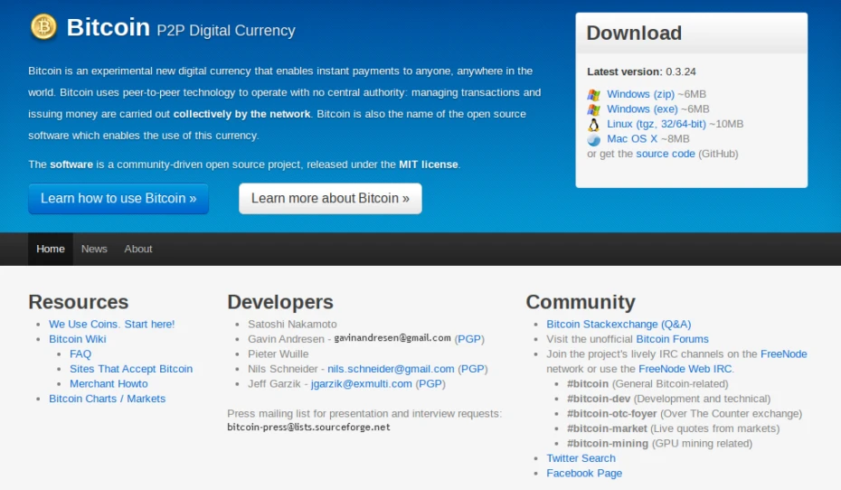

Pour ce qui est du wiki, celui-ci est initialement basé sur DokuWiki, un moteur libre et intégré au site web. Toutefois, en décembre 2010, Mark Karpelès, un développeur français habitant au Japon et utilisant le pseudonyme MagicalTux sur le forum, crée un nouveau wiki, à l'adresse bitcoin.it. Ce wiki est basé sur le moteur MediaWiki, qu'il juge plus élégant et plus facile à utiliser. L'idée au début n'est pas de remplacer la documentation existante, mais, comme Mark l'[exprime](https://buildingbitcoin.org/bitcoin-dev/log-2010-12-16.html#l-2848) sur IRC, de développer « un wiki moins formel et plus axé sur la communauté ».

Ce nouveau wiki séduit [Martti Malmi](https://bitcointalk.org/index.php?topic=2321.msg30873#msg30873) et [Gavin Andresen](https://bitcointalk.org/index.php?topic=2321.msg31535#msg31535), de sorte qu'ils envisagent rapidement d'en faire le wiki principal. En voici une [capture](https://web.archive.org/web/20110521044430/https://en.bitcoin.it/wiki/Main_Page), réalisée le 21 mai :


Quelques jours après le lancement, le lien intitulé « wiki » présent sur la page de garde de Bitcoin.org [pointe](https://bitcointalk.org/index.php?topic=2321.msg30872#msg30872) vers Bitcoin.it. Le contenu est progressivement rapatrié depuis la version DokuWiki. Le 31 janvier, Martti [indique](https://bitcointalk.org/index.php?topic=293.msg42789#msg42789) sur le forum qu'il s'agit du nouveau wiki.

Le troisième élément est le forum de Bitcoin. Celui-ci est administré par Martti mais il recrute rapidement des modérateurs. L'un d'entre eux est Theymos (de son vrai nom Michael Marquardt) qui obtient des responsabilités supplémentaires, notamment celle de co-gérer le forum. Le forum fonctionne grâce au moteur Simple Machines Forum et ne changera pas d'apparence au fil des années. Toutefois, son URL est modifiée à deux reprises. Tout d'abord, le 17 mai, le forum est [déplacé](https://bitcointalk.org/index.php?topic=8696.msg125963#msg125963) vers forum.bitcoin.org. Puis, le 1er août, il est [déplacé](https://bitcointalk.org/index.php?topic=33393.msg417531#msg417531) vers un nouveau domaine de premier niveau : bitcointalk.org. Au fil des années, il sera dénommé BitcoinTalk.

Avec la hausse du cours au cours de l'été 2011, Martti Malmi [vendra](https://twitter.com/marttimalmi/status/1339908793736556544) une bonne partie de ses bitcoins pour s'acheter un confortable appartement près de Helsinki. Puis, il [quittera](https://x.com/marttimalmi/status/1339908797968637952) son emploi pour passer quelques mois au Japon. Il abandonnera le site et le forum [les](https://bitcointalk.org/index.php?topic=5129680.msg50617107#msg50617107) [laissant](https://bitcointalk.org/index.php?topic=1603627.msg16115993#msg16115993) entre les mains de Theymos et d'un certain Cøbra, [décrit](https://forum.bitcoin.com/ama-ask-me-anything/i-m-martti-malmi-early-bitcoin-developer-and-the-original-founder-of-the-bitcointalk-org-forums-ama-t2770.html#p8222) par Martti comme « quelqu'un en qui Satoshi a confiance ». Les deux hommes s'occuperont de co-gérer les deux plateformes durant les années qui suivront.

### Les conférences et rencontres

Il n'y pas que le côté technique qui est concerné par le départ du fondateur et la nécessité de coopérer : il y a également l'aspect social, qui permet de souder la communauté en créant des liens entre les membres. C'est pourquoi des rencontres et des conférences sont organisées *in real life*. Ces dernières ont en outre l'avantage de pouvoir faire découvrir Bitcoin aux personnes qui seraient plus allergiques au contenu sur Internet.

Les premiers meet-ups entre utilisateurs de Bitcoin ont lieu à l'initiative de Bruce Wagner, l'animateur new-yorkais d'une [chaîne Youtube](https://www.youtube.com/@vlogwrap) de débats télévisés abordant des sujets liés à la technique, sur laquelle il créera une émission appelée le *Bitcoin Show* en avril 2011. La toute première rencontre [se passe](https://bitcointalk.org/index.php?topic=1891.msg29174#msg29174) à New York le 11 décembre 2010 (UTC). Par la suite, une réunion du même type [a lieu](https://web.archive.org/web/20110413231434/http://bitcoin.meetup.com/) à Washington D.C. Un meetup est également [organisé](https://bitcointalk.org/index.php?topic=2716.msg36886#msg36886) le 5 février 2011 à Zurich en Suisse par Mike Hearn, auquel se joignent Christian Decker et Stefan Thomas (justmoon).

Le mois de février marque aussi la [première présentation filmée](https://www.youtube.com/watch?v=koIq58UoNfE) de Bitcoin, qui est réalisée par Gavin Andresen le 8 à l'occasion d'un évènement organisé dans sa ville de résidence, Amherst, dans le Massachusetts. Intitulée « *Making Money* », l'exposé du nouveau mainteneur principal du projet contient de nombreux éléments de langage qui caractériseront la façon de présenter la cryptomonnaie dans les années qui suivront.


Même si les premiers évènements ont lieu aux États-Unis, la communauté française n'est pas en reste. Le 25 mai, à l'occasion de la venue de Gavin Andresen à Paris, un déjeuner est organisé dans le quartier de la Défense, où sont notamment présents Lucien Grondin, David François et Jon Matonis (qui est aussi de passage).

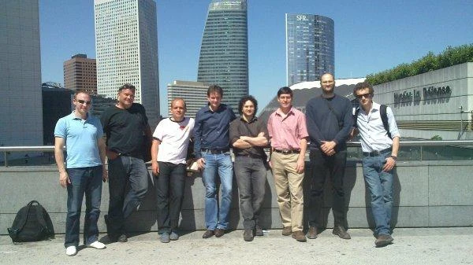
Rencontre à la Défense à Paris avec Gavin Andresen, en chemise rose (source : [archive du forum](https://web.archive.org/web/20140715000000*/https://bitcointalk.org/index.php?topic=5587.40))

Un mois plus tard, le 15 juin, la première présentation publique de Bitcoin en français [a lieu](https://bitcointalk.org/index.php?topic=11384.msg225831#msg225831), encore à Paris. Elle est le fait de Renaud Lifchitz (nono2357), jeune expert en sécurité informatique, qui a découvert Bitcoin un an auparavant. Le [contenu présenté](https://prezi.com/tikwkjt9ouey/bitcoin-une-monnaie-electronique-pour-tous/) est de très bonne qualité et l'audience répond à l'appel, si bien que la salle est bondée.


Présentation de Bitcoin par Renaud Lifchitz le 15 juin 2011 (source : [archive du forum](https://web.archive.org/web/20140406141205/https://bitcointalk.org/index.php?topic=11384.0))

Suite à cette expérience, la communauté parisienne [organise](https://bitcointalk.org/index.php?topic=21991.msg276443#msg276443) un apéritif, qui a lieu le 11 juillet. Celui-ci réunit des personnes comme Pierre Noizat ou Émilien Dutang.

Du côté international, la première conférence collective sur Bitcoin a elle lieu du 19 au 21 août à New York. Cette réunion, organisée par Bruce Wagner, rassemble des personnalités comme Roger Ver, Jesse Powell, Jed McCaleb, Mark Karpelès ou encore Charlie Lee. Bien que Wagner ait promis trois jours d'évènements, seules quatre présentations ont lieu : la sienne ainsi que les interventions de Gavin Andresen, Jeff Garzik et Stefan Thomas.


Enfin, un peu plus tard dans l'année, en novembre, une conférence européenne [se déroulera](https://bitcointalk.org/index.php?topic=40272.msg490901#msg490901) à Prague. Y [interviendront](https://web.archive.org/web/20111126164127/http://www.bitgroups.org:80/speakers.html) notamment le développeur Amir Taaki, le fondateur du Parti pirate suédois Rick Falkvinge et le présentateur Max Keiser. L'année suivante, un évènement similaire sera [organisé à Londres](https://blog.bitmex.com/london-2012-the-2nd-bitcoin-conference/).

### La couverture médiatique

L'année 2011 est également une année où la couverture médiatique s'élargit considérablement. L'affaire WikiLeaks et l'article publié sur PC World en décembre ont grandement attiré l'attention sur Bitcoin, si bien que toutes sortes de médias se saisissent du sujet. On assiste à une « avalanche d'intérêt de la presse pour \[B\]itcoin » comme l'[écrit](https://bitcointalk.org/index.php?topic=8940.msg129623#msg129623) alors Gavin Andresen.

Tout d'abord, les vidéos sur le sujet fleurissent sur Youtube. Le 22 mars, la première vidéo de qualité au sujet de Bitcoin fait son apparition. Celle-ci, intitulée sobrement « *What is Bitcoin?* », est produite par Stefan Thomas (justmoon) grâce à un [financement participatif](https://bitcointalk.org/index.php?topic=697.msg70001#msg70001) de la communauté. Elle est publiée sur le portail WeUseCoins dédié à l'éducation et la popularisation de la cryptomonnaie. D'autres vidéos de présentation réalisées indépendamment suivront comme [celle de howtovanish](https://www.youtube.com/watch?v=LSLByqTusaQ) en avril, [celle de Reason](https://www.youtube.com/watch?v=yYTqvYqXRbY) ou [celle de Rocketboom](https://www.youtube.com/watch?v=9LaSrxtWfgc) en juin.


En avril, le sujet de la monnaie numérique est abordé par des grands noms de la presse généraliste comme [The Atlantic](https://www.theatlantic.com/business/archive/2011/04/how-to-start-your-own-private-currency/73327/), [Time Magazine](https://techland.time.com/2011/04/16/online-cash-bitcoin-could-challenge-governments/) et [Forbes](https://www.forbes.com/forbes/2011/0509/technology-psilocybin-bitcoins-gavin-andresen-crypto-currency.html). En mai, le mouvement s'amplifie et Bitcoin est évoqué un peu partout, notamment dans [Wired UK](https://web.archive.org/web/20110517122859/http://www.wired.co.uk/news/archive/2011-05/16/bitcoin-p2p-currency), sur [Slate](https://slate.com/business/2011/05/bitcoin-why-the-new-electronic-currency-is-a-favorite-of-libertarian-hipsters-and-criminals.html), sur [Gizmodo](https://gizmodo.com/what-is-bitcoin-5803124) et sur [TechCrunch](https://techcrunch.com/2011/05/20/bitcoin-ven-and-the-end-of-currency/).


Gavin Andresen dans Forbes en avril 2011 (source : [archive de Forbes](https://web.archive.org/web/20110502052302/https://www.forbes.com/forbes/2011/0509/technology-psilocybin-bitcoins-gavin-andresen-crypto-currency.html))

La radio est également utilisée pour parler de la cryptomonnaie. Un épisode d'une émission de la radio canadienne CBC Radio est [consacré](https://web.archive.org/web/20110227214049/http://www.cbc.ca/spark/2011/02/spark-139-february-27-march-2-2011/) au sujet de la monnaie et de Bitcoin le 27 février. Bitcoin est également mentionné dans plusieurs épisodes de FreeTalkLive, une émission d'orientation libertarienne aux États-Unis. En particulier, le sujet est [abordé](https://web.archive.org/web/20110318163416/http://www.freetalklive.com/content/podcast_2011_03_16) plus longuement le 16 mars 2011, notamment dans le cadre de l'essor de Silk Road. Enfin, le 24 mai, Bitcoin est le sujet d'une [courte capsule](https://www.npr.org/2011/05/24/136620231/what-are-bitcoins) sur la *National Public Radio* aux États-Unis.

Les blogueurs individuels sont de même intéressés. C'est le cas de Rick Falkvinge, le fondateur du Parti pirate suédois, qui publie [plusieurs](https://falkvinge.net/2011/05/11/with-the-napster-of-banking-round-the-corner-bring-out-your-popcorn/) [articles](https://falkvinge.net/2011/05/19/the-information-policy-case-for-flat-tax-and-basic-income/) au sujet de la création de Satoshi Nakamoto durant le mois de mai. Il décrit Bitcoin (et les systèmes apparentés comme Ripple) comme « le Napster de la banque ». Ses arguments sont repris par de nombreuses personnes comme le mutuelliste [Kevin Carson](https://c4ss.org/content/7149) aux États-Unis ou le blogueur libéral [h16](https://h16free.com/2011/05/30/8585-revolution-numerique-aujourdhui-musique-et-cinema-et-demain) en France. Le 29, Rick Falkvinge [annoncera](https://falkvinge.net/2011/05/29/why-im-putting-all-my-savings-into-bitcoin/) « placer toutes son épargne dans le bitcoin » !

### La première bulle

La popularisation de Bitcoin fait que son prix augmente de manière significative. Alors qu'il est redescendu à 20 centimes en décembre 2010, il atteint la parité avec le dollar le 9 février 2011. À ce moment-là, Hal Finney [déclare](https://bitcointalk.org/index.php?topic=2734.msg37307#msg37307) que les membres de la communauté ont « vraiment de la chance d'être au début d'un nouveau phénomène potentiellement explosif ». Il a du flair, car ce qui se produit ensuite est fulgurant.

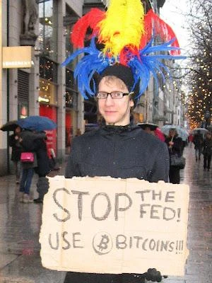
Photographie publiée par jimbobway sur le forum le jour de la parité avec le dollar (source : [Bitcointalk](https://bitcointalk.org/index.php?topic=2734.msg37144#msg37144))

L'effervescence médiatique du printemps a en effet pour conséquence de créer progressivement un phénomène spéculatif sans précédent. Après avoir stagné autour de 1 $ pendant plusieurs mois, le prix remonte et atteint 3 $ à la fin du mois d'avril. En mai, il est de 8 $. Enfin, le 8 juin, le prix du bitcoin atteint un sommet historique de 32 $ sur Mt. Gox ! Cette hausse correpond à une multiplication par 160 en 6 mois.


Prix moyen du BTC entre le 1er janvier et le 30 juin 2011 (source : [Bitbo.io](https://calendar.bitbo.io/price/))

Bien évidemment, ce mouvement spéculatif fait penser à une bulle financière, c'est-à-dire à une surévaluation d'un produit financier par rapport à sa valeur fondamentale. Dans le cas d'une monnaie comme le bitcoin, il s'agit d'un enthousiasme passager qui se traduit par une hausse vertigineuse du cours, suivie d'une baisse brutale provoquée par le manque de conviction des nouveaux participants. C'est ainsi que l'évolution du prix est [qualifiée](https://web.archive.org/web/20110530074512/http://blogs.reuters.com/columns/2011/05/27/virtual-bitcoins-are-appealing-but-probably-doomed/) de « bulle » par un chroniqueur de Reuters le 27 mai, dans une des premières « notices nécrologiques » de Bitcoin.

Ce mouvement spéculatif a cependant pour effet de pousser la presse généraliste à aborder le sujet, ce qu'elle ne fait pas toujours de manière impartiale au demeurant. Ainsi des articles sont publiés dans le [New York Times](https://www.nytimes.com/2011/05/30/business/economy/30views.html), dans [The Economist](https://www.economist.com/babbage/2011/06/13/bits-and-bob), dans le journal britannique [The Guardian](https://www.theguardian.com/technology/2011/jun/12/bitcoin-online-currency-us-government), sur le site d'actualité allemand [Der Spiegel Online](https://www.spiegel.de/netzwelt/netzpolitik/hacker-waehrung-bitcoin-geld-aus-der-steckdose-a-765382.html), dans le journal italien [La Repubblica](https://www.repubblica.it/tecnologia/2011/05/31/news/bitcoin_moneta_elettronica_hacker_cia-17030027/) ou dans le quotidien français [Le Monde](https://www.lemonde.fr/technologies/article/2011/06/17/bitcoin-les-deux-faces-de-la-monnaie-virtuelle_1537285_651865.html). Cela concrétise la couverture médiatique de Bitcoin. Il est désormais sous le feu des projecteurs, et toute personne un peu curieuse en a entendu parler. La première ère de Bitcoin, caractérisée par la présence de Satoshi et par la discrétion du projet, est désormais révolue.

### Conclusion générale à propos de la création de Bitcoin

Ainsi, durant la première moitié de l'année 2011, le projet a pu grandir sans la présence de son fondateur Satoshi Nakamoto. Ce moment a marqué le début de Bitcoin en tant que projet purement communautaire et a clos la période de la création de Bitcoin, qui s'est étalée sur 4 années, de 2007 à 2011. De cet évènement, nous pouvons retenir un certain nombre de choses.

Premièrement, Bitcoin n'est pas sorti de nulle part. En tant qu'argent liquide évoluant dans le cyberespace, il est le fruit de décennies de recherches et d'expérimentations qui ont mené à sa création. Il a notamment été précédé par le modèle eCash de David Chaum, par les monnaies numériques privées comme e-gold et par les concepts des cypherpunks. La présence de Hal Finney lors de l'apparition de Bitcoin et lors de la disparition de Satoshi était donc très symbolique : en tant qu'individu qui avait assisté aux premières expériences de monnaie électronique dans les années 90 et qui avait cherché à créer son modèle en 2004 avec RPOW, il représentait la continuité de la quête qui a précisément abouti à Bitcoin.

Deuxièmement, Bitcoin ne s'est pas fait en un jour. Même après la publication de la version 0.1 du logiciel en janvier 2009, le projet était loin d'être prêt. De nombreuses vulnérabilités ont dû être corrigées. L'une d'entre elles a créé un incident majeur en août 2010, lorsque le réseau a été paralysé pendant une quinzaine d'heures, mais le pire a été évité. Même après le départ de Satoshi, le logiciel a dû continuer à être amélioré par la communauté.

Troisièmement, Bitcoin a grandi de manière organique. Il a pu se développer dans la discrétion, attirant les gens peu à peu. Pendant près d'un an et demi, il s'agissait d'un projet très confidentiel, connu des passionnés et des curieux. Ce n'est qu'après le slashdotting de juillet 2010 qu'il a commencé à exploser. La folie spéculative à son sujet ne s'est réellement installée qu'à partir de 2011, lorsque le prix a augmenté de façon exponentielle jusqu'à 32 $.

Quatrièmement, Bitcoin a été une création altruiste. Satoshi Nakamoto a offert Bitcoin au monde. Il a publié le programme sous licence libre. Il n'a recherché ni la gloire, ni le profit, ni le pouvoir. Il a assuré la sécurité minière du réseau pendant plus d'un an, sans demander de rétribution. Même s'il a accumulé plus d'un million de bitcoins, il ne les a jamais dépensés. Il a enfin disparu, principalement par crainte liée à l'attention créée par l'affaire WikiLeaks, laissant dans le même temps le projet reposer sur une communauté, sans figure unique dominante.

En 2011, Satoshi a disparu, mais Bitcoin a survécu. La cryptomonnaie a même définitivement pris son envol, tant du point de vue médiatique qu'économique. La machine était lancée et personne ne pouvait plus l'arrêter.
